# خواننده تلگرام

<!-- TOP_NAV START -->

<!-- TOP_NAV END -->

<!-- MSG START -->

---
📅 بروزرسانی: 1405/02/21 14:21
---

## VahidOOnLine — post 239501

  <a href="telegram/content/VahidOOnLine_239501_1778496671.mp4" target="_blank">🎬 Download video</a>

ویدیوی رسیده به ایران‌اینترنشنال نشان می‌دهد نفتکش متعلق به جمهوری اسلامی، روز دوشنبه ۲۱ اردیبهشت‌ماه همچنان در حال سوختن است.
فرماندهی مرکزی آمریکا (سنتکام) روز شنبه ۱۹ اردیبهشت اعلام کرد نیروهای این کشور دو نفتکش با پرچم جمهوری اسلامی را در دریای عمان، پیش از رسیدن به بنادر ایران، متوقف کردند.
‌🏁 🇬🇧 IranintlTV

🤖 @VahidOOnLine

## VahidOOnLine — post 239500

  <a href="telegram/content/VahidOOnLine_239500_1778496673.mp4" target="_blank">🎬 Download video</a>

گردهمایی ایرانیان ونکوور
‌🏁 🇬🇧 ManotoTV

🤖 @VahidOOnLine

## VahidOOnLine — post 239499

  

♦️ خبرگزاری آمریکایی بلومبرگ روز دوشنبه ۲۱ اردیبهشت ماه با به نقل از «منابع آگاه» گزارش کرد که پاسخ تهران به طرح پیشنهادی پایان جنگ آمریکا، بر پایان تحریم‌های نفتی آمریکا، آزادی میلیاردها دلارحساب‌‌های بلوکه شدن در بانک‌های جهانی و اعمال درجه‌ای از کنترل بر تنگه هرمز استوار است.

براساس این گزارش جمهوری اسلامی همچنان خواستار پایان جنگ در همه‌ جبهه‌ها به ویژه لبنان است.

دونالد ترامپ ساعاتی پس از ارسال پاسخ جمهوری اسلامی به پاکستان اعلام کرد اصلا از این پاسخ خوشش نیامده و غیرقابل قبول است.
‌🇸🇦 Indypersian

🤖 @VahidOOnLine

## VahidOOnLine — post 239498

  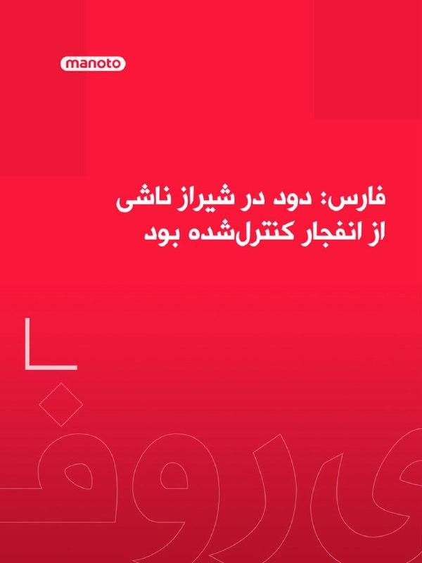

رسانه‌های جمهوری اسلامی از جمله خبرگزاری فارس نوشتند انتشار دود در بخشی از شیراز، ناشی از انفجار کنترل‌شده مهمات عمل‌نکرده بوده است.

بر اساس این گزارش‌ها، ارتش پیش‌تر اعلام کرده بود که دقایقی بعد، مهمات عمل‌نکرده در شیراز به‌صورت کنترل‌شده منفجر خواهد شد.
‌🏁 🇬🇧 ManotoTV

🤖 @VahidOOnLine

## VahidOOnLine — post 239497

  

حبیب جهان‌ساز، رییس سازمان چای، گفت که بر اساس مصوبه شورای قیمت‌گذاری، قیمت خرید تضمینی برگ سبز چای در سال جاری برای درجه یک، ۴۲ هزار تومان و برای درجه دو، ۲۳ هزار تومان تعیین شده که نسبت به سال گذشته به ترتیب ۷۲ درصد و ۶۷ درصد افزایش یافته است.

او افزود: «اولویت اصلی ما در این شرایط، تأمین بازار داخلی است هرچند بخشی از چای کشور نیز جنبه صادراتی دارد و تلاش می‌کنیم با حفظ تعادل هم بازار داخل را تأمین کنیم و هم مشتریان خارجی خود را حفظ کنیم.»
iranintl
‌🏁 🇬🇧 IranintlTV

🤖 @VahidOOnLine

## VahidOOnLine — post 239496

  

ابوالفضل ظهره‌وند، عضو کمیسیون امنیت ملی مجلس، گفت: «اینجا دو ثانیه دیگر تهران است، سه ثانیه دیگر مثلا واشینگتن است. بعضی‌ها دیدند چه ظرفیت‌هایی وجود دارد. می‌شود کارهایی کرد که اصلا بمب اتمی یعنی چه؟ این‌ها دیگر بچه‌بازی و برای گذشته است.»

او افزود: «من جاهایی را که دیدم، ظرفیت‌هایی را که دیدم، اتفاقاتی می‌آید که بمب اتم واقعا ترقه است. می‌شود کارهای عجیبی کرد. می‌شود زمان را پشت سر گذاشت. یعنی چه؟ هیچ‌کس نمی‌داند.»

ظهره‌وند گفت تاثیر تنگه هرمز، باب‌المندب و «حوزه مقاومت»، بیشتر از صد بمب است و افزود: «وقتی اراده‌ات بالا بیاید تولید یک بمب کاری ندارد. شاید اتفاقاتی را شکل بدهی که بمب اتم پیش آن ترقه باشد.»
iranintl
‌🏁 🇬🇧 IranintlTV

🤖 @VahidOOnLine

## VahidOOnLine — post 239495

  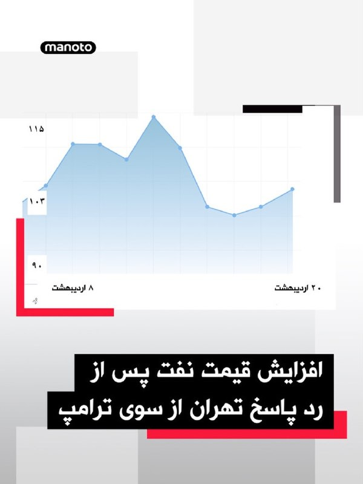

قیمت نفت روز دوشنبه پس از آن بیش از سه‌ونیم درصد افزایش یافت که دونالد ترامپ، رئیس‌جمهور آمریکا، پاسخ جمهوری اسلامی به پیشنهاد واشینگتن برای پایان جنگ را «کاملا غیرقابل قبول» خواند.

رویترز نوشت تهران در پاسخ خود خواستار پایان جنگ، رفع انسداد دریایی، تضمین نشدن حمله تازه، لغو تحریم‌ها و آزادسازی فروش نفت ایران شده است.
‌🏁 🇬🇧 ManotoTV

🤖 @VahidOOnLine

## VahidOOnLine — post 239494

  <a href="telegram/content/VahidOOnLine_239494_1778496679.mp4" target="_blank">🎬 Download video</a>

ویدیوهای ارسال‌شده به ایران‌اینترنشنال در دوشنبه ۲۱ اردیبهشت، ستون دود ناشی از انفجار را در شیراز نشان می‌دهد. هنوز علت این انفجار مشخص نیست.
‌🏁 🇬🇧 IranintlTV

🤖 @VahidOOnLine

## VahidOOnLine — post 239493

  <a href="telegram/content/VahidOOnLine_239493_1778496682.mp4" target="_blank">🎬 Download video</a>

ویدیوهای ارسال‌شده به ایران‌اینترنشنال در دوشنبه ۲۱ اردیبهشت، برخاستن دود ناشی از انفجار را در شیراز نشان می‌دهد. هنوز علت این انفجار مشخص نیست.
‌🏁 🇬🇧 IranintlTV

🤖 @VahidOOnLine

## VahidOOnLine — post 239492

  

نخست‌وزیر بریتانیا تاکید کرد که از جنگ ایران حمایت نمی‌کند و افزود که شهروندان این کشور نگران افزایش قیمت بنزین و تاثیرات اقتصادی آن هستند.

کی‌یر استارمر تاکید کرد کشورهای دیگر می خواستند بریتانیا را جنگ ایران بکشانند اما او هرگز این کار را نخواهد کرد.
‌🏁 🇬🇧 IranintlTV

🤖 @VahidOOnLine

## VahidOOnLine — post 239491

🗣روایت شما از بحران اقتصادی و زندگی در آتش‌بس- دوشنبه ۲۱ اردیبهشت:

🔹در اصفهان، هزینه سونوگرافی آندومتریوز که در زنان خیلی شایع است قبل از عید ۲ میلیون تومان بود الان سه برابر شده و به قیمت ۶ میلیون رسیده است.

🔹من یک جوان ۱۸ ساله گیمر، علاقه‌مند به حوزه الکترونیک و برنامه‌نویسی و یک کنکوری رشته ریاضی در کرمانشاه هستم. در حال حاضر از همه این‌ها محروم شده‌ام و وضعیت تحصیلی‌ام هم کاملا روی هواست.

🔹من اِی‌دی‌اچ‌دی دارم و باید داروی ویاس ۵۰ مصرف کنم. ماه گذشته دارو را به قیمت یک میلیون تومان خریدم اما این ماه وقتی بعد از حدود سه روز گشتن در داروخانه‌های تهران بالاخره پیدایش کردم، قیمت ۳۰ قرص شده بود دو میلیون و ۱۰۰ هزار تومان.

🔹من کاسب نازی‌آبادم. از ابتدای آتش‌‌بس تاکنون دست‌کم از ۶ طلافروشی دزدی مسلحانه شده اما نه رسیدگی قانونی درستی می‌شود و نه کسی در موردش حرفی می‌زند.

🔹در فروشگاهی آنلاین قیمت لپ‌تاپی که قبل از دی سال گذشته ۴۰ میلیون تومان بود را زده بودند ۱۰۰ میلیون. روز بعد که سر زدم شده بود ۱۲۰ میلیون تومان. ۲۰ درصد افزایش قیمت در یک روز!
‌🏁 🇬🇧 IranintlTV

🤖 @VahidOOnLine

## VahidOOnLine — post 239490

  <a href="telegram/content/VahidOOnLine_239490_1778496685.mp4" target="_blank">🎬 Download video</a>

♦️ارتش اسرائیل روز دوشنبه ۲۱ اردیبهشت مواضع حزب‌الله در جنوب لبنان را بمباران کرد و به ساکنان ۹ شهر کوچک و روستا هشدار داد تا فورا این مناطق را ترک کنند.

این خبر همزمان با ادامه حملات پهپادی و راکت‌پراکنی حزب‌الله در روز یکشنبه منتشر می‌شود.

ارتش اسرائیل اعلام کرد یکی از سربازان نیروی زمینی این کشور روز گذشته در یک حمله پهپادی در مرز با لبنان کشته شده است.
‌🇸🇦 Indypersian

🤖 @VahidOOnLine

## VahidOOnLine — post 239489

  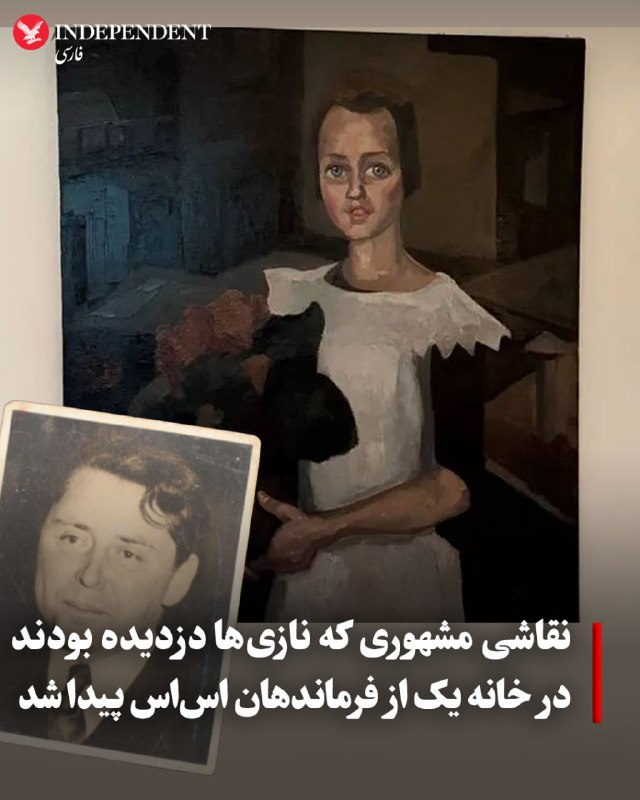

♦️ یک اثر هنری که نازی‌ها از مجموعه مشهور «گودستیکر» غارت کرده بودند، در خانه بازماندگان یکی از بدنام‌ترین همکاران هلندی نیروهای امنیتی آلمان نازی (اس‌اس) پیدا شده است.
آرتور برند، کارآگاه هنری هلندی، به خبرگزاری فرانسه گفت تابلوی «پرتره دختر جوان»، اثر تون کلدر، نقاش هلندی، احتمالا دهه‌ها در خانه بازماندگان هندریک سیفارت آویزان بوده است؛ چهره‌ای که از بلندپایه‌ترین همکاران هلندی نازی‌ها بود و فرماندهی واحدی از داوطلبان هلندی جوخه نیروهای امنیتی آلمان نازی را در جبهه شرق بر عهده داشت.
به گفته برند، یکی از اعضای این خانواده که خواسته نامش فاش نشود، پس از کشف دو راز تکان‌دهنده با او تماس گرفت: اینکه خود از نوادگان سیفارت است و اینکه خانواده‌اش سال‌ها اثری غارت‌شده از یهودیان را در خانه‌شان نگهداری کرده‌اند.
این فرد به روزنامه هلندی «دی تلگراف» گفت: «احساس شرم می‌کنم. این نقاشی باید به وارثان گودستیکر بازگردانده شود.»
ژاک گودستیکر، دلال هنری یهودی، در سال ۱۹۴۰ هنگام فرار به بریتانیا درگذشت و هرمان گورینگ، از مقام‌های ارشد نازی، مجموعه هنری عظیم او را غارت کرد.
به گفته برند، نوه سیفارت به یکی از اعضای خانواده گفته بود این تابلو «اثر هنری غارت‌شده از یهودیان و دزدیده‌شده از گودستیکر» است و «قابل فروش نیست» و نباید درباره آن با کسی صحبت شود. با این حال، این زن در گفت‌وگو با رسانه هلندی گفته است که تابلو را از مادرش به ارث برده و از سرگذشت آن آگاهی نداشته است.
وکلای وارثان گودستیکر تایید کرده‌اند که این اثر از مجموعه او غارت شده و خواستار بازگرداندن آن شده‌اند. با این حال، پلیس به دلیل گذشت مهلت قانونی رسیدگی به سرقت، امکان اقدام ندارد و کمیته بازگرداندن آثار غارت‌شده نازی‌ها در هلند نیز نمی‌تواند اشخاص را به بازگرداندن آثار مجبور کند.
‌🇸🇦 Indypersian

🤖 @VahidOOnLine

## VahidOOnLine — post 239488

  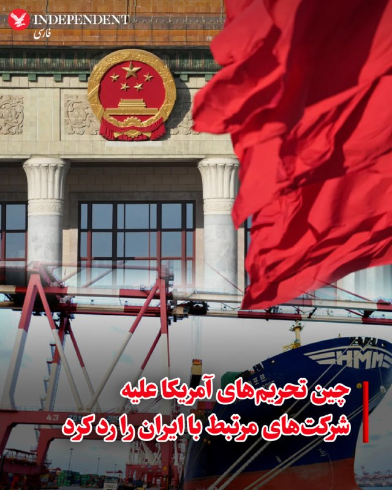

♦️ چین به تحریم‌های جدید آمریکا علیه سه شرکت مستقر در چین واکنش نشان داد و آن را اقدامی «غیرقانونی و یک‌جانبه» توصیف کرد. واشنگتن می‌گوید این شرکت‌ها به حملات ایران در جنگ با آمریکا و اسرائیل کمک کرده‌اند.
گو جیاکون، سخنگوی وزارت خارجه چین، در نشست خبری روزانه گفت: «ما همواره از شرکت‌های چینی خواسته‌ایم فعالیت‌های تجاری خود را مطابق قوانین و مقررات انجام دهند و قاطعانه از حقوق و منافع مشروع شرکت‌های چینی دفاع خواهیم کرد.»
او افزود اولویت فوری باید جلوگیری از بازگشت دوباره درگیری‌ها باشد، نه اینکه از جنگ برای «مرتبط کردن بدخواهانه و بدنام کردن دیگر کشورها» استفاده شود.
این موضع‌گیری در حالی مطرح می‌شود که قرار است دونالد ترامپ، رئیس‌جمهوری آمریکا، و شی جین‌پینگ، رهبر چین، این هفته دیدار کنند.
‌🇸🇦 Indypersian

🤖 @VahidOOnLine

## VahidOOnLine — post 239487

  <a href="telegram/content/VahidOOnLine_239487_1778496690.mp4" target="_blank">🎬 Download video</a>

دنهاخ | هلند؛ گردهمایی ایرانیان مقابل دادگاه لاهه
‌🏁 🇬🇧 ManotoTV

🤖 @VahidOOnLine

## VahidOOnLine — post 239486

  <a href="telegram/content/VahidOOnLine_239486_1778496693.mp4" target="_blank">🎬 Download video</a>

نت‌بلاکس، نهاد ناظر بر دسترسی به اینترنت، اعلام کرد اختلال و قطعی اینترنت در ایران وارد هفتادوسومین روز خود شده و مدت این وضعیت از ۱۷۲۸ ساعت گذشته است. به گفته نت‌بلاکس، این قطعی گسترده همچنان ایران را تا حد زیادی از اینترنت جهانی جدا نگه داشته است.
‌🏁 🇬🇧 ManotoTV

🤖 @VahidOOnLine

## VahidOOnLine — post 239485

  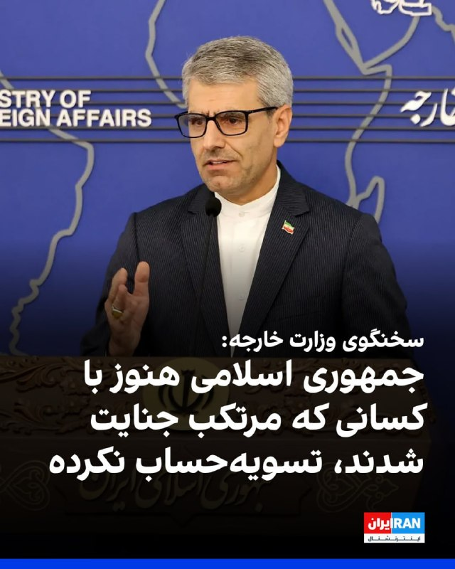

اسماعیل بقائی، سخنگوی وزارت خارجه در پاسخ به پرسشی درباره اظهارات نتانیاهو مبنی بر اینکه جنگ هنوز تمام نشده‌، گفت جمهوری اسلامی هنوز با کسانی که علیه ما «چنین جنایتی» مرتکب شدند، تسویه‌حساب نکرده و اگر فرصتی در اختیار نیروهای مسلح قرار گیرد، «به بهترین وجه» از آن استفاده خواهد شد.

بقائی درباره گزارش‌ها مبنی بر مخالفت وزارت خارجه با کنترل تنگه هرمز گفت تصمیم‌هایی که بر اساس سلسله‌مراتب نظام گرفته می‌شود برای وزارت خارجه «کاملا مطاع» است و این وزارتخانه جدا از سامانه تصمیم‌گیری و حاکمیت کشور نیست.
iranintl
‌🏁 🇬🇧 IranintlTV

🤖 @VahidOOnLine

## VahidOOnLine — post 239484

  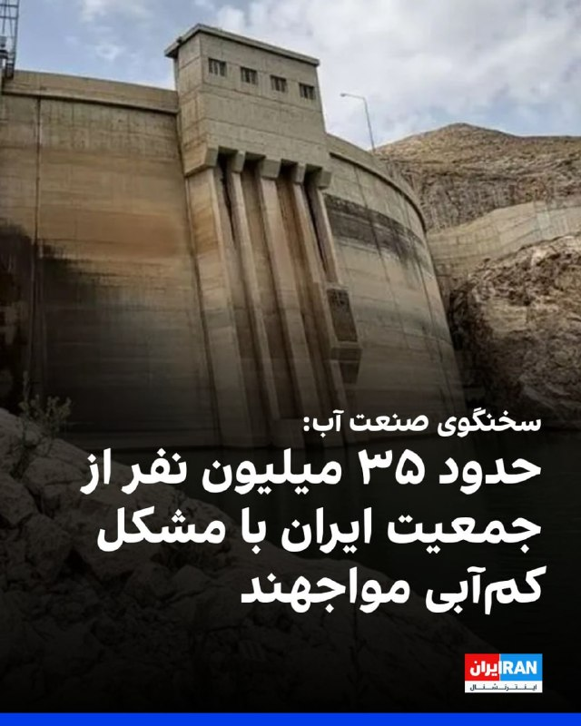

عیسی بزرگ‌زاده، سخنگوی صنعت آب کشور گفت حدود ۳۵ میلیون نفر از جمعیت ایران با مشکل کم‌آبی مواجهند.

سخنگوی صنعت آب کشور، گفت ۱۱ استان همچنان شرایط بارشی زیر نرمال دارند و افزود اینکه گفته می‌شود کشور وارد دوره ترسالی شده «مطلقا درست نیست» و نباید چنین برداشتی از وضعیت فعلی داشت.
iranintl
‌🏁 🇬🇧 IranintlTV

🤖 @VahidOOnLine

## VahidOOnLine — post 239483

♦️یک روز پس از آنکه جمهوری اسلامی پاسخ به طرح پیشنهادی آمریکا را به پاکستان تحویل داد و دونالد ترامپ آن را رد کرد، اسماعیل بقایی، سخنگویی وزرات امور خارجه جمهوری اسلامی این پاسخ‌ها را «مشروع و سخاوتمندانه» توصیف کرد.

بقایی گفت پاسخ‌های جمهوری اسلامی براساس پایان جنگ در همه جبهه‌ها ازجمله لبنان، تامین امنیت تردد در تنگه هرمز و احقاق حقوق ایران و بازگشت پول‌های مسدود (بلوکه) شده استوار بوده است.
‌🇸🇦 Indypersian

🤖 @VahidOOnLine

## VahidOOnLine — post 239482

  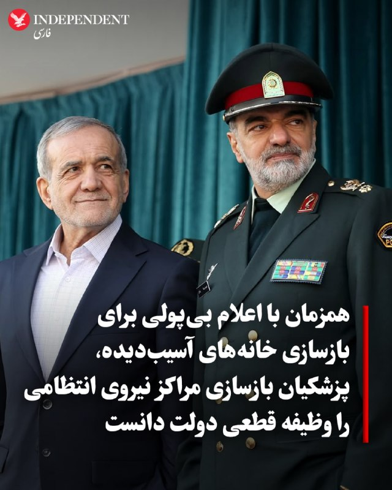

♦️ مسعود پزشکیان، رئیس‌جمهوری اسلامی روز دوشنبه ۲۱ اردیبهشت ماه از لزوم بازسازی مراکز نیروی انتظامی که در جریان حمله نظامی آمریکا و اسرائیل آسیب دیده است سخن گفت.

این سخنان در حالی عنوان می‌شود که فاطمه مهاجرانی، سخنگوی دولت هفته گذشته اعلام کرده بود بودجه لازم برای بازسازی واحدهای مسکونی آسیب دیده در جنگ به‌اندازه کافی وجود ندارد.

او در دیدار با احمدرضا رادان، فرمانده نیروی انتظامی و دیگر مسئولان پلیس گفت: «دولت، تامین تجهیزات، بازسازی مراکز خسارت‌دیده و ارتقای توان عملیاتی و پشتیبانی فراجا را از وظایف قطعی خود می‌داند و هر آنچه در این زمینه لازم باشد، با جدیت دنبال و تامین خواهد کرد.»

این سخنان در حالی بیان شد که کلانتری‌ها در شهرهای بزرگ و کوچک به ویژه تهران از جمله اهداف حملات هوایی آمریکا و اسرائیل در جریان جنگ اخیر بودند.
‌🇸🇦 Indypersian

🤖 @VahidOOnLine

## mwarmonitor — post 8879

🇺🇸هفته میراث ترامپ

📝نوشته: زکری باسو AXIOS

🔸سه نیروی تاریخ‌ساز در این هفته — ابتدا در واشینگتن و سپس در پکن — به هم می‌رسند؛ رویدادی که می‌تواند به یکی از پرپیامدترین مقاطع دوران ریاست‌جمهوری دونالد ترامپ تبدیل شود.

چرا این موضوع اهمیت دارد؟
روزهای پیش رو با مخاطراتی سنجیده می‌شوند که ابعاد آن به دهه‌ها می‌رسد: جنگ و صلح در خاورمیانه، مسیر آینده روابط ایالات متحده و چین و قوانین حاکم بر انقلاب هوش مصنوعی.
وضعیت فعلی
پیش از این، نشست سران ترامپ و چین به عنوان ضرب‌الاجل غیررسمی برای تثبیت اوضاع جنگ با ایران تلقی می‌شد. اما در حالی که هواپیمای شماره یک نیروی هوایی (Air Force One) قرار است شامگاه چهارشنبه در پکن به زمین بنشیند، این درگیری همچنان لاینحل باقی مانده است.
روز یکشنبه، ایالات متحده بالاخره پاسخ ایران به یادداشت تفاهم یک‌صفحه‌ای را دریافت کرد؛ سندی که هدف آن پایان دادن به جنگ و ایجاد چارچوبی برای مذاکرات هسته‌ای بود.
ترامپ این پیشنهاد را «غیرقابل قبول» خواند و رد کرد و ایران را به «بازی دادن» آمریکا متهم نمود. اکنون او تنها چند روز فرصت دارد تا استراتژی خود را بازتنظیم کند، تنش را افزایش دهد یا اینکه دست‌خالی وارد پکن شود.
نگاه نزدیک: تقابل دو ابرقدرت
ریاست‌جمهوری ترامپ مدت‌هاست که به سمت نشست این هفته با شی جین‌پینگ حرکت کرده است؛ سفری که آنا کلی، سخنگوی کاخ سفید، آن را دارای «اهمیت نمادین فوق‌العاده» توصیف کرد.
فراتر از تشریفات، ریشه اصلی ماجرا در تعیین‌کننده‌ترین پرسش ژئوپلیتیک قرن نهفته است: آیا دو ابرقدرت جهان می‌توانند رقابت خود را مدیریت کنند، یا محکوم به گسست اقتصادی و رویارویی نظامی هستند؟
انتظار می‌رود ترامپ فهرستی از مدیران عامل شرکت‌های بزرگ را به پکن ببرد تا تعهدات سرمایه‌گذاری و قراردادهای تجاری را با هدف کاهش تنش‌ها در روابط اقتصادی پرفراز و نشیب دو کشور دنبال کند.
نکات پشت پرده
واشینگتن و پکن در هفته‌های منتهی به این نشست، یک «جنگ خاموش تحریمی» را بر سر ایران تشدید کرده‌اند و درگیری‌های خاورمیانه را به جبهه دیگری در رقابت گسترده ژئوپلیتیک خود تبدیل کرده‌اند.
۱. دولت ترامپ روز جمعه سه شرکت ماهواره‌ای چینی را به دلیل ارائه تصاویری که حملات ایران به نیروهای آمریکایی را تسهیل کرده بود، تحریم کرد.
۲. پکن اما از مواضع خود عقب‌نشینی نکرده است. چین اوایل این ماه برای اولین بار از «قانون انسداد» (Blocking Statute) خود استفاده کرد و به شرکت‌های چینی دستور داد تحریم‌های آمریکا علیه پنج پالایشگاه متهم به خرید نفت خام ایران را نادیده بگیرند.
میان‌سطور (تحلیل پنهان)
ترامپ مدت‌هاست بر این باور است که رابطه شخصی او با شی، قوی‌تر و عمل‌گرایانه‌تر از آن چیزی است که بسیاری از «شاهین‌های ضد چین» در واشینگتن درک می‌کنند.
منتقدان در هر دو حزب نگرانند که اشتیاق ترامپ برای «توافق‌های بزرگ» و دیپلماسی شخصی، حمایت آمریکا از تایوان را تضعیف کند؛ جزیره‌ای که شی مصمم است تا سال ۲۰۲۷ تحت کنترل پکن درآورد.
تایوان در این نشست هم به عنوان یک انبار باروت نظامی و هم به عنوان قلب صنعت نیمه‌هادی (تراشه) که اقتصاد هوش مصنوعی را تغذیه می‌کند، سایه افکنده است.
نگاه کلان: مرز جدید هوش مصنوعی
انتظار می‌رود ترامپ و شی برای اولین بار در مورد هوش مصنوعی گفتگو کنند. این در حالی است که هشدارهای فزاینده‌ای درباره خطرات سایبری عظیم ناشی از مدل‌های پیشرو (مانند مدل Mythos شرکت Anthropic) وجود دارد.
ترامپ احتمالاً به زودی (دوشنبه) از یک دستور اجرایی در مورد ایمنی هوش مصنوعی رونمایی خواهد کرد.
تغییر موضع کاخ سفید نشان‌دهنده چرخش از رویکرد قبلی «بازار آزاد» به سمت کنترل بیشتر است، چرا که این ترس وجود دارد که تکنولوژی سریع‌تر از توان کنترل دولت‌ها پیشرفت کند.
چه چیزی را باید زیر نظر داشت؟
یک مقام ارشد آمریکایی گفت که ترامپ و شی بررسی خواهند کرد که آیا خطوط ارتباطی رسمی برای امنیت و ریسک‌های هوش مصنوعی ایجاد کنند یا خیر؛ موضوعی که یادآور منطق جنگ سرد است که منجر به ایجاد «خطوط تلفن قرمز» و مذاکرات کنترل تسلیحات هسته‌ای بین ابرقدرت‌های رقیب شد.
این احتمال هماهنگی در حوزه هوش مصنوعی در حالی مطرح می‌شود که دولت ترامپ اخیراً بازیگران تحت حمایت چین را به سرقت سیستماتیک دانش از شرکت‌های پیشرو هوش مصنوعی آمریکا متهم کرده است.

📌کلام آخر
جنگ، تجارت و فناوری در این هفته در یک آزمون واحد برای میراث ترامپ به هم گره می‌خورند. نتیجه این اتفاقات می‌تواند تعادل قدرت جهانی را تا مدت‌ها پس از فروکش کردن نبردهای حزبی امروز، شکل دهد.

@mwarmonitor

## mwarmonitor — post 8878

  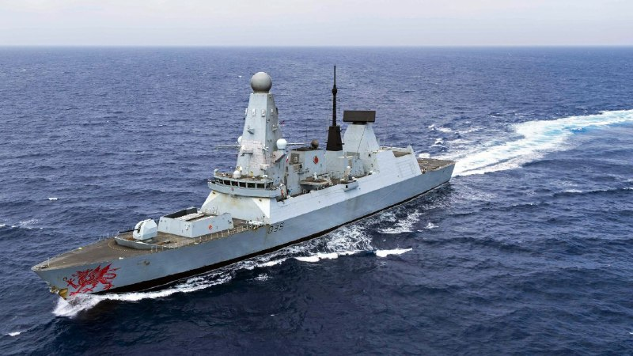

🇬🇧ناوشکن «دراگون» تمرکز خود را به مأموریت تنگه هرمز تغییر می‌دهد.

🔹ناو HMS Dragon در حال حرکت به سمت خاورمیانه است تا در یک مأموریت احتمالی در تنگه هرمز مشارکت کند؛ هدف این مأموریت تأمین امنیت این آبراه حیاتی و حفاظت از آزادی کشتیرانی در قالب تلاش‌های چندملیتی است.

نیروی دریایی سلطنتی بریتانیا

🇫🇷فرانسه نیز یک ناو هواپیمابر خود را اعزام کرده که انتظار می‌رود ظرف ۴ تا ۵ روز آینده به منطقه برسد.
🔹هنوز مشخص نیست برنامه دقیق آن‌ها چیست؛ احتمال دارد قصد داشته باشند کشتی‌های تجاری را اسکورت کنند

@mwarmonitor

## mwarmonitor — post 8877

  

✈️ساعت ۱۰:۲۰ به وقت گرینویچ DRAGON 02 هواپیمای U-2/S نیروی هوایی آمریکا (USAF) با نام Dragon Lady
از پایگاه RAF Fairford برای یک پرواز آزمایشی در ارتفاع بالا (High-altitude MX Airtest) به پرواز درآمده است.

✈️این هواپیما قصد دارد حدود ۱۰۰ مایل از نقطه مسیر ROPAL در حالت انتظار (Holding) برای چند ساعت باقی بماند و سپس به پایگاه بازگردد (RTB = بازگشت به پایگاه).

@mwarmonitor

## mwarmonitor — post 8876

🇨🇳🇺🇸چین:
سفر دونالد ترامپ از ۱۳ تا ۱۵ مه انجام خواهد شد.

@mwarmonitor

## mwarmonitor — post 8875

🇮🇱 یدیعوت آحارونوت:
بنیامین نتانیاهو امروز ظهر در پی بحران مذاکرات میان تهران و واشنگتن یک نشست امنیتی برگزار خواهد کرد.

@mwarmonitor

## mwarmonitor — post 8874

🚢یک کشتی حمل گاز مایع (LPG) که پیش‌تر محموله‌های ایرانی را جابه‌جا کرده بود، در حال عبور از تنگه هرمز است و هم‌زمان اعلام می‌کند که خدمه و مالکان آن هندی هستند. Bloomberg

@mwarmonitor

## mwarmonitor — post 8873

📊 شاخص‌های آتیِ سهام ایالات متحده پس از آنکه دونالد ترامپ اعلام کرد پاسخ ایران به پیشنهاد آمریکا برای پایان دادن به درگیری غیرقابل قبول بوده است، کاهش یافت. WSJ

@mwarmonitor

## mwarmonitor — post 8872

🔸«در حالی که محمدباقر قالیباف نقشی محوری در درگیری‌های خاورمیانه و مذاکرات صلح ایفا می‌کند، Guardian Australia فاش می‌کند که رئیس پارلمان ایران و پسرش با یک مرکز پژوهشی در دانشگاه ملبورن ارتباط داشته‌اند.

🔹پسر ۳۸ ساله او، اسحاق قالیباف، همچنین موفق شده است اقامت بلندمدت استرالیا را دریافت کند؛ این در حالی است که کانادا دو بار درخواست ویزای او را رد کرده بود.»

@mwarmonitor

## mwarmonitor — post 8871

🇺🇸مسافران آمریکایی کشتی تفریحی که به هانتاویروس دچار شده بود — از جمله یک نفر که احتمالاً آزمایش مثبت دارد — برای انجام ارزیابی‌های پزشکی وارد ایالت نبراسکا شدند. CNN

@mwarmonitor

## mwarmonitor — post 8870

  

🔴 کرانه باختری: یک تروریست مسلح پس از تلاش برای تیراندازی به نیروهای پلیس مرزی اسرائیل، از پا درآمد.

@mwarmonitor

## mwarmonitor — post 8869

🇨🇳🇺🇸چین اعلام کرد که در یک عملیات مشترک با ایالات متحده، یک شبکه فرامرزی قاچاق مواد مخدر را منهدم کرده است. Bloomberg

@mwarmonitor

## mwarmonitor — post 8866

✈️دو فروند هواپیمای سوخت‌رسان KC-135R استراتوتانکر نیروی هوایی ایالات متحده که از پایگاه هوایی الظفره به پرواز درآمده‌اند، در حال حاضر بر فراز دریای عمان فعال هستند.

✈️همچنین یک فروند هواپیمای گشت دریایی P-8A پوزیدون نیروی دریایی آمریکا در حال انجام عملیات بر فراز خلیج فارس و در سواحل امارات متحده عربی است.

@mwarmonitor

## mwarmonitor — post 8865

🔸وال‌استریت ژورنال: علی الزیدی، نخست‌وزیر مأمور تشکیل دولت عراق، تحت فشار واشنگتن قرار دارد تا نفوذ شبه‌نظامیان مورد حمایت تهران را محدود کند.

@mwarmonitor

## mwarmonitor — post 8864

🔸لیندسی گراهام: این ایده که ایران در چارچوب یک راه‌حل مذاکره‌شده، تمام تأسیسات غنی‌سازی خود را به‌طور کامل نابود نکند، منطقی به نظر نمی‌رسد. تعلیق بدون برچیدن کامل تأسیسات و توانمندی‌های غنی‌سازی، عملاً همان برجام می‌شود.

🔹من اطمینان دارم که امتناع ایران از نابود کردن توان غنی‌سازی خود، قاطعانه رد خواهد شد.

@mwarmonitor

## mwarmonitor — post 8863

  <a href="telegram/content/mwarmonitor_8863_1778496699.mp4" target="_blank">🎬 Download video</a>

✈️🇺🇸نیروی هوایی ایالات متحده ساعات گذشته نیز انتقال هوایی گسترده‌ای را بر فراز اروپا به سمت خاورمیانه ادامه داد. با به بن‌بست خوردن مذاکرات، آماده‌سازی‌ها برای احتمال ازسرگیری حملات به‌طور جدی در حال انجام است…

@mwarmonitor

## mwarmonitor — post 8862

  

✈️یک فروند جنگنده F-35A لایتنینگ II نیروی هوایی ایالات متحده هنگام پرواز بر فراز دریای عمان در مسیر حرکت به سمت امارات متحده عربی وضعیت اضطراری در حین پرواز اعلام کرده و کد اسکواک ۷۷۰۰ را ارسال کرده است.

@mwarmonitor

## pm_afshaa — post 90540

🔥رفقا هانا که همیشه تبلیغشو کردم فقط مخصوص یوزرای ما تخفیف گذاشته👇🏼 🔥قیمت کانفینگ ها به شرح زیر : 1 Gig = 280,000 T 2 Gig = 560,000 T 3 Gig = 800,000 T 5 Gig = 1,200,000 T 10 Gig = 2,200,000T 20 Gig = 4,000,000T 💎پرداخت ریال ، کارت به کارت 💵واریز با ارز…

## pm_afshaa — post 90539

🔥رفقا هانا که همیشه تبلیغشو کردم فقط مخصوص یوزرای ما تخفیف گذاشته👇🏼

🔥قیمت کانفینگ ها به شرح زیر :

1 Gig = 280,000 T
2 Gig = 560,000 T
3 Gig = 800,000 T
5 Gig = 1,200,000 T
10 Gig = 2,200,000T
20 Gig = 4,000,000T

💎پرداخت ریال ، کارت به کارت

💵واریز با ارز دیجیتال ( ترون ، تتر )

📌قابلیت مشاهده حجم مصرفی
📌نامحدود بودن تعداد کاربران
📌سرعت دانلود به شدت بالا
📌عودت وجه در صورت قطعی سرور
📌قابل استفاده در تمامی برنامه های V2Ray

ایدی جهت خرید

@RealHoneyi

## pm_afshaa — post 90538

ظهره‌وند، نماینده مجلس: ما سلاح‌هایی داریم که بمب اتم جلوشون ترقه‌س مثلا سلاحی داریم که تو چندثانیه از تهران به واشنگتن میرسه

💧 Rainbet.com the #1 Non-KYC Crypto Casino & Sportsbook @rainbetcom

😁 @Pm_Afshaa

## pm_afshaa — post 90537

🔴به گفته GB News، نخست‌وزیر بریتانیا کیر استارمر به نظر می‌رسد این هفته استعفا دهد 
💧 Rainbet.com the #1 Non-KYC Crypto Casino & Sportsbook @rainbetcom 
😁 @Pm_Afshaa

## pm_afshaa — post 90536

  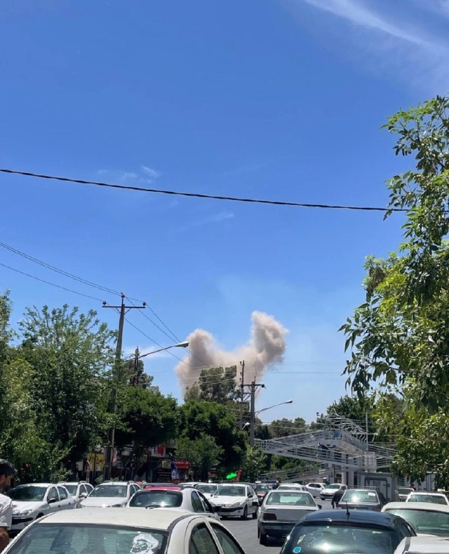

انفجار در شیراز

💧 Rainbet.com the #1 Non-KYC Crypto Casino & Sportsbook @rainbetcom

😁 @Pm_Afshaa

## pm_afshaa — post 90535

🔴یدیعوت آحارانوت: نتانیاهو عصر امروز در پی بحران مذاکرات بین تهران و واشنگتن، یک جلسه امنیتی برگزار خواهد کرد

💧 Rainbet.com the #1 Non-KYC Crypto Casino & Sportsbook @rainbetcom

😁 @Pm_Afshaa

## pm_afshaa — post 90534

🔴به گفته GB News، نخست‌وزیر بریتانیا کیر استارمر به نظر می‌رسد این هفته استعفا دهد

💧 Rainbet.com the #1 Non-KYC Crypto Casino & Sportsbook @rainbetcom

😁 @Pm_Afshaa

## pm_afshaa — post 90533

10 گیگ 2560 5 گیگ 1440 فقط تا ساعت 24 امروز با سرعت موشک بدون قطعی

## pm_afshaa — post 90532

10 گیگ 2560 5 گیگ 1440 فقط تا ساعت 24 امروز با سرعت موشک بدون قطعی

## pm_afshaa — post 90531

فقط تا ساعت 24 امشب رو این قیمتا 20% تخفیف گذاشتم هر کی خواست میتونه از طریق دایرکت خرید کنه

## pm_afshaa — post 90530

🔴بلومبرگ: ترامپ قصد دارد در سفر به چین، شی جین‌پینگ را در ارتباط با فروش تسلیحات و خرید نفت از ایران تحت فشار قرار دهد

💧 Rainbet.com the #1 Non-KYC Crypto Casino & Sportsbook @rainbetcom

😁 @Pm_Afshaa

## pm_afshaa — post 90529

  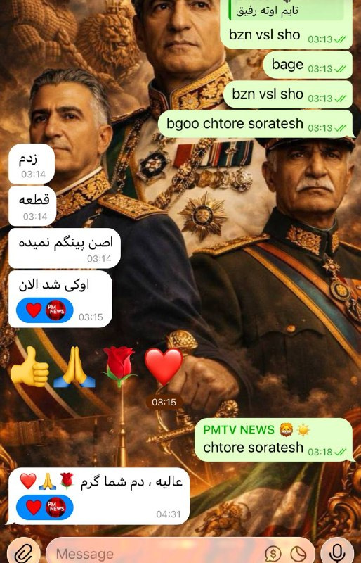

کانفینگ با سرعت موشک شارژ کردم هر کی خواست بیاد دایرکت چنل هم پرداخت ریالی داریم هم ارزی 5 گیگ 1800 10 گیگ 3200

## pm_afshaa — post 90528

  

با اذان صبح امروز عرفان شکورزاده 29 ساله و نخبه ی دانشگاه علم و صنعت توسط جمهوری اسلامی امروز اعدام شد

💧 Rainbet.com the #1 Non-KYC Crypto Casino & Sportsbook @rainbetcom

😁 @Pm_Afshaa

## pm_afshaa — post 90527

🔴زیردریایی آلاسکا از کلاس اوهایو معروف به سلاح روز قیامت برای بازدارندگی آمریکا وارد منطقه شد

💧 Rainbet.com the #1 Non-KYC Crypto Casino & Sportsbook @rainbetcom

😁 @Pm_Afshaa

## pm_afshaa — post 90526

  <a href="telegram/content/pm_afshaa_90526_1778496706.webm" target="_blank">🎬 Download video</a>

🔴نتانیاهو: رژیم ایران الان در ضعیف‌ترین وضعیت خود از زمان تسلط بر مردم ایران قرار داره. تندروها همچنان همان مواضع قبلی رو دارن، اما در داخل حکومت شکاف‌هایی ایجاد شده، چون در نتیجه عملیات مشترک نظامی ما ضربات بسیار سنگینی خوردن.

💧 Rainbet.com the #1 Non-KYC Crypto Casino & Sportsbook @rainbetcom

😁 @Pm_Afshaa

## pm_afshaa — post 90525

  <a href="telegram/content/pm_afshaa_90525_1778496707.webm" target="_blank">🎬 Download video</a>

🔴نتانیاهو: چین از ایران و اجزای خاصی از ساخت موشک حمایت میکنه؛ چین باید در روابط خود با تهران تجدید نظر کنه.

چین مقدار مشخصی از حمایت و اجزای خاصی از تولید موشک رو ارائه کرد، اما من نمیتونم بیشتر ازش بگم.
آیا واقعاً میخواد ایران راه‌های آبی رو برای تأمین انرژی مورد نیاز چین کنترل کنه؟ آیا ترجیح نمیدید آبراه‌هایی باز داشته باشید که در معرض این نوع باج‌گیری خشونت‌آمیز قرار نگیرن؟

💧Rainbet.com the #1 Non-KYC Crypto Casino & Sportsbook @rainbetcom

😁 @Pm_Afshaa

## pm_afshaa — post 90524

  <a href="telegram/content/pm_afshaa_90524_1778496707.webm" target="_blank">🎬 Download video</a>

🔴نتانیاهو: سرنگونی رژیم ایران ممکنه اما قطعی نیست و زمان تغییر هم غیرقابل پیش‌بینیه.

💧 Rainbet.com the #1 Non-KYC Crypto Casino & Sportsbook @rainbetcom

😁 @Pm_Afshaa

## pm_afshaa — post 90523

  <a href="telegram/content/pm_afshaa_90523_1778496708.webm" target="_blank">🎬 Download video</a>

🔴نتانیاهو: مجتبی خامنه‌ای احتمالا زندست ولی آسیب دیده و وضعیتش مشخص نیست.

من فکر میکنم او سعی میکنه قدرت خودش رو اعمال کنه. من فکر نمی‌کنم ایشون همون اختیاراتی رو که پدرش داشت، داشته باشه. این هم باعث ایجاد اختلال در آن رژیم میشه، و من فکر نمی‌کنم چیز بدی باشه.

💧 Rainbet.com the #1 Non-KYC Crypto Casino & Sportsbook @rainbetcom

😁 @Pm_Afshaa

## pm_afshaa — post 90522

🔴نتانیاهو:اگر رژیم ایران سقوط کند، به معنای پایان حزب‌الله، حماس و احتمالاً حوثی‌ها نیز خواهد بود

💧 Rainbet.com the #1 Non-KYC Crypto Casino & Sportsbook @rainbetcom

😁 @Pm_Afshaa

## pm_afshaa — post 90521

کانفینگ با سرعت موشک شارژ کردم هر کی خواست بیاد دایرکت چنل هم پرداخت ریالی داریم هم ارزی 5 گیگ 1800 10 گیگ 3200

## iaghapour — post 2598

✍ حدودا 500 پیام بررسی نشده از 2 روز پیش داریم که پشتیبانی تا فردا همه رو بررسی میکنه.

جدا از بحث بالا، از ته دل آرزو میکنم تو این روزهای عجیب و غریبی که داریم می‌گذرونیم، حال دلتون خوب باشه. می‌بینیم و حس میکنم که زندگی چقدر برای خیلی‌ها سخت شده و دغدغه‌ها چقدر زیادن.

امیدواریم هرچه زودتر این روزهای سخت جاشون رو به روزهای روشن‌تری بدن. هوای خودتون و دلتون رو داشته باشید.

## DEJradio — post 4562

  <a href="telegram/content/DEJradio_4562_1778496709.webm" target="_blank">🎬 Download video</a>

🚨📢 پیامدهای جنگ ۴۰ روزه؛
گرانی بیداد می‌کند، مردم به ستوه آمده‌اند

در ایران گرانی بیداد می‌کند. نرخ کالاها و موادغذایی روزانه زیاد می‌شود. حتی تأمین معمولی‌ترین وعده غذایی روزانه برای خانواده‌ها دشوار شده است. ماست، کره، پنیر، روغن، تخم مرغ، برنج، حبوبات، سبزیجات و گوشت و مرغ ۲۰ تا ۳۰ درصد نسبت به پیش از جنگ ۴۰ روزه گران‌تر شده است.
کیوان کاشفی، عضو هیات رئیسه اتاق ایران تورم و افزایش بیکاری از آسیب های ناشی از اقتصاد و تداوم شرایط نه جنگ نه صلح است.

امام جمعه‌ها در چند شهر نسبت به گرانی و وضعیت بد معیشتی مردم هشدار دادند اما گوش شنوایی نیست. یوسف پزشکیان پسر مسعود پزشکیان در کانال تلگرامی خود با بیان اینکه «پشتیبانی جنگ و حمایت از مردم آسیب‌دیده از جنگ در پشت جبهه و تاب‌آوری جامعه در گرو توان اقتصادی ماست»، هشدار داد «بعد از جنگ مسائل اقتصادی باشدت بیشتری بروز خواهند کرد و مواجهه با آن به روش‌های پیش از جنگ محکوم به شکست است.»
او گفته «زندگی مردم، سرنوشت جنگ و آینده ایران با اقتصاد ایران گره خورده‌ و مسئله دیروز، امروز و آینده مردم ایران بلاشک معیشت و اشتغال و به بیان دیگر تورم و ثبات اقتصادی بوده است.»

#جنگ۴۰روزه #تورم
@DEJradio

## DEJradio — post 4561

  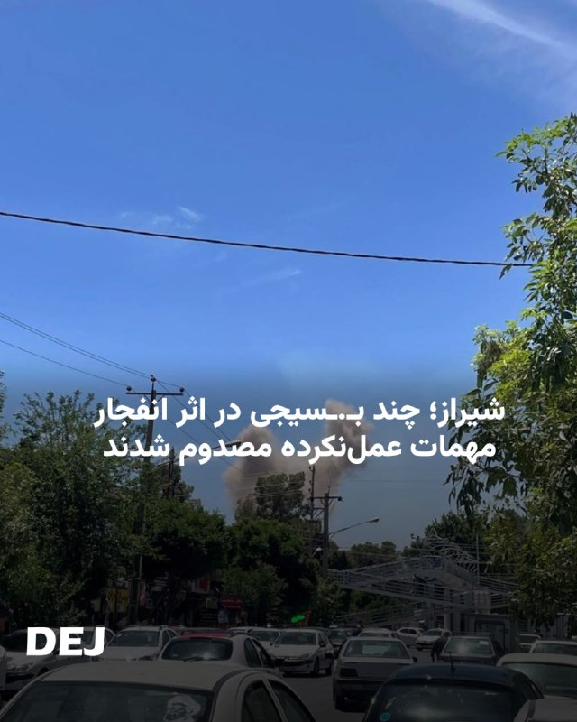

💀
🚨 شیراز؛ چند بـ.ـسیجی در اثر انفجار مهمات عمل‌نکرده مصدوم شدند

منابع غیررسمی روز دوشنبه ۲۱ اردبهشت ۱۴۰۵ گزارش دادند در اثر انفجار مهمات عملکرد نکرده در یک پایگاه بـ.ـسیج در شیراز تعدادی از نیروها صدمه دیده‌اند. بعد از جنگ ۴۰ روزه دستکم ۲۰ نفر از نیروهای نظامی در اثر انفجار بمب‌های عمل‌نکرده کشته و زخمی شدند.
عملیات خنثی‌سازی مهمات عمل‌نکرده به دلیل فقدان تجهیزات و نیروی متخصص کافی به کُندی و پر تلفات پیش می‌رود.

#بسیجی #شیراز
@DEJradio

## DEJradio — post 4560

  <a href="telegram/content/DEJradio_4560_1778496711.webm" target="_blank">🎬 Download video</a>

🚨
🔸 فریاد ایرانیان جهان علیه قطع اینترنت و موج اعدام‌ها

#قطعی_اینترنت #اعدام
@DEJradio

## DEJradio — post 4559

  <a href="telegram/content/DEJradio_4559_1778496711.webm" target="_blank">🎬 Download video</a>

🚨
🔸 خبر ۲۱
یکشنبه ۲۰ اردیبهشت ۱۴۰۵

#خبر۲۱
@DEJradio

## DEJradio — post 4558

  <a href="telegram/content/DEJradio_4558_1778496712.webm" target="_blank">🎬 Download video</a>

🔺📌 نقش پلیس‌های افتخاری در سرکوب مردم

📝 یادداشت: فریبرز کرمی‌زند، افسر پیشین پلیس

در ابتدای دهه ۹۰، اسماعیل احمدی ‌مقدم، فرمانده وقت ناجا (فراجا)، پس از رخدادهای سال ۱۳۸۸ و آسیب ‌شناسی‌های انجام‌شده توسط رده‌های نظارتی سازمان، در قالب یک کمیسیون به این جمع بندی رسید که یکی از ضعف‌های اصلی نیروی انتظامی، نبود شبکه گسترده منابع و مخبرین اجتماعی است؛ زیرا منابع و مخبرین موجود عمدتاً در حوزه جرائم و بزهکاری‌ها فعالیت داشتند.
از همین رو، اعضای این کمیسیون به فکر ایجاد ساختاری مشابه بسیج در سپاه پاسداران افتادند که پس از مدتی تحت عنوان «پلیس افتخاری» شکل گرفت. این طرح در ابتدا با وعده‌هایی همچون اولویت در استخدام، پرداخت حق مأموریت، ارائه دفترچه خدمات درمانی و مزایای مشابه آغاز به عضوگیری کرد.

برابر اخبار و اطلاعات رسیده، این نیروها در اعتراضات سراسری سال‌های ۱۳۹۶، ۱۳۹۸ و ۱۴۰۱ و همچنین در «انقلاب ملی شیروخورشید»، به‌عنوان بازوی شناسایی و بخشی مهم از شبکه منابع و مخبرین ماشین سرکوب، حضور فعالی داشته‌اند در واقع می‌توان آنان را بخشی از نیروهای لباس‌شخصی دانست که در ماموریت های دستگیری معترضان حضور داشته اند..
تمام اسامی و مشخصات این افراد تحت عنوان پرونده‌های پلیس افتخاری در معاونت نیروی انسانی ثبت و ضبط شده است. افزون بر آن، اسامی آنان در لوحه‌های تنظیمی و احکام مأموریت مرتبط با اعتراضات نیز ثبت گردیده است.

#پلیس_افتخاری #سرکوبگران
@DEJradio

## DEJradio — post 4557

  <a href="telegram/content/DEJradio_4557_1778496713.mp4" target="_blank">🎬 Download video</a>

🔺📢 از پیامدهای جنگ ۴۰ روزه افزایش فقر و بیکاری بود، با این همه حکومت همچنان بر طبل می‌کوبد. یکی از شهروندان با ارسال ویدیویی از زباله‌گردی یک پیرمرد، می‌گوید مسبب این وضعیت سـ.ـپاه پاسداران هستند.

#جنگ۴۰روزه
@DEJradio

## DEJradio — post 4556

  <a href="telegram/content/DEJradio_4556_1778496716.mp4" target="_blank">🎬 Download video</a>

🔺🎥 پس از پایان تجمع ایرانیان میهن‌دوست در روز یکشنبه ۲۰ اردیبهشت، در منطقه ریچموند هیل، یک خودرو با پرچم جمهوری اسلامی به سمت تجمع‌کنندگان حمله کرد که در پی آن چندین نفر زخمی شدند.
بر اساس گزارش‌ها، راننده مهاجم توسط پلیس بازداشت شده است.

#جمهوری_اسلامی
@DEJradio

## mamlekate — post 103501

  <a href="telegram/content/mamlekate_103501_1778496718.mp4" target="_blank">🎬 Download video</a>

تصاویر ماهواره‌ای یک نفتکش بزرگ را در تنگه هرمز نشان می‌دهند که بنظر می‌رسد پس از یک حمله احتمالی، ردی از نفت را نشت می‌دهد. فعالیت قایق‌های تندرو کوچک نیز در نزدیکی آن دیده می‌شود. [شنبه ۱۹ اردیبهشت]
SoarAtlas

📝 بریتانیا و فرانسه نشستی چندملیتی برای بازگرداندن جریان تجارت در تنگه هرمز برگزار می‌کنند

📝 سازمان حفاظت محیط‌زیست وجود آلودگی آب در اطراف خارک را تأیید کرد

در حالی که پیشتر مقامات جمهوری اسلامی آلودگی آب‌های اطراف جزیره خارک را تکذیب کرده بودند، سازمان حفاظت محیط‌زیست ایران، وجود این آلودگی را تأیید و اعلام کرد که ناشی از «نشت آب توازن یک نفتکش» بوده است.

@mamlekate

## mamlekate — post 103500

📝 گاردین از سرمایه‌گذاری پسر قالیباف در بازار املاک استرالیا خبر داد

روزنامه گاردین در گزارشی از ارتباط اسحاق قالیباف، پسر رییس مجلس جمهوری اسلامی، با یک مرکز پژوهشی در دانشگاه ملبورن و سرمایه‌گذاری او در حوزه املاک در استرالیا خبر داد. به نوشته این روزنامه، او از طریق اجاره دادن دست‌کم یک ملک در این کشور کسب درآمد می‌کرده است.

@mamlekate

## VahidOnline — post 75393

  

خبرگزاری میزان، رسانه قوه قضاییه جمهوری اسلامی، صبح دوشنبه، ۲۱ اردیبهشت از اجرای حکم اعدام عرفان شکورزاده، زندانی سیاسی، با اتهام «همکاری با سرویس‌های اطلاعاتی آمریکا و اسرائیل» خبر داد.
شکورزاده بهمن‌ماه ۱۴۰۳ از سوی اطلاعات سپاه با اتهام «جاسوسی و همکاری با کشورهای متخاصم» بازداشت و به اعدام محکوم شد و حکم صادر شده علیه او به‌تازگی در دیوان عالی کشور تایید شده بود.
@VahidOOnLine

📡 @VahidOnline

## kianmeli1 — post 87343

  <a href="telegram/content/kianmeli1_87343_1778496721.mp4" target="_blank">🎬 Download video</a>

🔴ارتش اسرائیل چهار تونل در نوار غزه را که مجموع طول آن‌ها حدود 4 کیلومتر بوده، شناسایی و تخریب کرده است.
https://t.me/kianmeli1

## kianmeli1 — post 87342

  

‏🔴خبرگزاری میزان، رسانه قوه قضاییه جمهوری اسلامی، صبح دوشنبه، ۲۱ اردیبهشت از اجرای حکم اعدام عرفان شکورزاده، زندانی سیاسی، با اتهام «همکاری با سرویس‌های اطلاعاتی آمریکا و اسرائیل» خبر داد.

‏میزان در گزارش خود نوشت بر اساس محتویات پرونده، عرفان شکورزاده «به عنوان پروژه» و با توجه به تخصصش، جذب یکی از سازمان‌های مهم علمی فعال در حوزه ماهواره شده بود
https://t.me/kianmeli1

## kianmeli1 — post 87341

  <a href="telegram/content/kianmeli1_87341_1778496724.mp4" target="_blank">🎬 Download video</a>

🔴خوش چشم: احتمال می‌دهم ظرف یک هفته آینده جنگ مجددا آغاز شود
https://t.me/kianmeli1

## kianmeli1 — post 87340

‏🔴رسانه‌های اسرائیل خبر دادند که نتانیاهو قرار است ظهر دوشنبه یک نشست امنیتی برگزار کند

‏ این جلسه در پی پاسخ منفی جمهوری اسلامی به طرح آمریکا برگزار می‌شود
https://t.me/kianmeli1

## IranIntlTV — post 336628

  <a href="telegram/content/IranIntlTV_336628_1778496727.mp4" target="_blank">🎬 Download video</a>

بریتانیا و فرانسه قرار است سه‌شنبه میزبان نشستی آنلاین با حضور وزیران دفاع بیش از ۴۰ کشور جهان باشند. محور این نشست، بررسی برنامه‌های نظامی برای بازگرداندن جریان تجارت در تنگه هرمز عنوان شده است.

گفت‌وگو با مهدی بیگی، خبرنگار ایران‌اینترنشنال

@iranintltv

## IranIntlTV — post 336627

  <a href="telegram/content/IranIntlTV_336627_1778496730.mp4" target="_blank">🎬 Download video</a>

هاکان فیدان، وزیر خارجه ترکیه، با عباس عراقچی و بدر عبدالعاطی، وزیران خارجه جمهوری اسلامی و مصر، درباره تحولات مربوط به مذاکرات صلح میان تهران و واشینگتن تلفنی گفت‌وگو کرد.

گفت‌وگو با نرگس هورخش، خبرنگار ایران‌اینترنشنال

@iranintltv

## IranIntlTV — post 336626

  <a href="telegram/content/IranIntlTV_336626_1778496732.mp4" target="_blank">🎬 Download video</a>

ویدیوی رسیده به ایران‌اینترنشنال نشان می‌دهد نفتکش متعلق به جمهوری اسلامی، روز دوشنبه ۲۱ اردیبهشت‌ماه همچنان در حال سوختن است.
فرماندهی مرکزی آمریکا (سنتکام) روز شنبه ۱۹ اردیبهشت اعلام کرد نیروهای این کشور دو نفتکش با پرچم جمهوری اسلامی را در دریای عمان، پیش از رسیدن به بنادر ایران، متوقف کردند.

## IranIntlTV — post 336625

  

حبیب جهان‌ساز، رییس سازمان چای، گفت که بر اساس مصوبه شورای قیمت‌گذاری، قیمت خرید تضمینی برگ سبز چای در سال جاری برای درجه یک، ۴۲ هزار تومان و برای درجه دو، ۲۳ هزار تومان تعیین شده که نسبت به سال گذشته به ترتیب ۷۲ درصد و ۶۷ درصد افزایش یافته است.

او افزود: «اولویت اصلی ما در این شرایط، تأمین بازار داخلی است هرچند بخشی از چای کشور نیز جنبه صادراتی دارد و تلاش می‌کنیم با حفظ تعادل هم بازار داخل را تأمین کنیم و هم مشتریان خارجی خود را حفظ کنیم.»
iranintl.com/202605110813

## IranIntlTV — post 336624

  

ابوالفضل ظهره‌وند، عضو کمیسیون امنیت ملی مجلس، گفت: «اینجا دو ثانیه دیگر تهران است، سه ثانیه دیگر مثلا واشینگتن است. بعضی‌ها دیدند چه ظرفیت‌هایی وجود دارد. می‌شود کارهایی کرد که اصلا بمب اتمی یعنی چه؟ این‌ها دیگر بچه‌بازی و برای گذشته است.»

او افزود: «من جاهایی را که دیدم، ظرفیت‌هایی را که دیدم، اتفاقاتی می‌آید که بمب اتم واقعا ترقه است. می‌شود کارهای عجیبی کرد. می‌شود زمان را پشت سر گذاشت. یعنی چه؟ هیچ‌کس نمی‌داند.»

ظهره‌وند گفت تاثیر تنگه هرمز، باب‌المندب و «حوزه مقاومت»، بیشتر از صد بمب است و افزود: «وقتی اراده‌ات بالا بیاید تولید یک بمب کاری ندارد. شاید اتفاقاتی را شکل بدهی که بمب اتم پیش آن ترقه باشد.»
iranintl.com/202605114129

## IranIntlTV — post 336623

  <a href="telegram/content/IranIntlTV_336623_1778496737.mp4" target="_blank">🎬 Download video</a>

ویدیوهای ارسال‌شده به ایران‌اینترنشنال در دوشنبه ۲۱ اردیبهشت، ستون دود ناشی از انفجار را در شیراز نشان می‌دهد.

## IranIntlTV — post 336622

  <a href="telegram/content/IranIntlTV_336622_1778496739.mp4" target="_blank">🎬 Download video</a>

یک شهروند با ارسال ویدیویی به ایران‌اینترنشنال از گرانی چندین برابری روغن خوراکی خبر می‌دهد و می‌گوید: «سپاه ما را به خواری و ذلت انداخته است.»

## IranIntlTV — post 336621

  <a href="telegram/content/IranIntlTV_336621_1778496742.mp4" target="_blank">🎬 Download video</a>

ویدیوهای ارسال‌شده به ایران‌اینترنشنال در دوشنبه ۲۱ اردیبهشت، برخاستن دود ناشی از انفجار را در شیراز نشان می‌دهد.

## IranIntlTV — post 336620

  

نخست‌وزیر بریتانیا تاکید کرد که از جنگ ایران حمایت نمی‌کند و افزود که شهروندان این کشور نگران افزایش قیمت بنزین و تاثیرات اقتصادی آن هستند.

کی‌یر استارمر تاکید کرد کشورهای دیگر می خواستند بریتانیا را جنگ ایران بکشانند اما او هرگز این کار را نخواهد کرد.
https://iranintl.com/202605116217

## IranIntlTV — post 336619

🗣روایت شما از بحران اقتصادی و زندگی در آتش‌بس- دوشنبه ۲۱ اردیبهشت:

🔹در اصفهان، هزینه سونوگرافی آندومتریوز که در زنان خیلی شایع است قبل از عید ۲ میلیون تومان بود الان سه برابر شده و به قیمت ۶ میلیون رسیده است.

🔹من یک جوان ۱۸ ساله گیمر، علاقه‌مند به حوزه الکترونیک و برنامه‌نویسی و یک کنکوری رشته ریاضی در کرمانشاه هستم. در حال حاضر از همه این‌ها محروم شده‌ام و وضعیت تحصیلی‌ام هم کاملا روی هواست.

🔹من اِی‌دی‌اچ‌دی دارم و باید داروی ویاس ۵۰ مصرف کنم. ماه گذشته دارو را به قیمت یک میلیون تومان خریدم اما این ماه وقتی بعد از حدود سه روز گشتن در داروخانه‌های تهران بالاخره پیدایش کردم، قیمت ۳۰ قرص شده بود دو میلیون و ۱۰۰ هزار تومان.

🔹من کاسب نازی‌آبادم. از ابتدای آتش‌‌بس تاکنون دست‌کم از ۶ طلافروشی دزدی مسلحانه شده اما نه رسیدگی قانونی درستی می‌شود و نه کسی در موردش حرفی می‌زند.

🔹در فروشگاهی آنلاین قیمت لپ‌تاپی که قبل از دی سال گذشته ۴۰ میلیون تومان بود را زده بودند ۱۰۰ میلیون. روز بعد که سر زدم شده بود ۱۲۰ میلیون تومان. ۲۰ درصد افزایش قیمت در یک روز!

## IranIntlTV — post 336618

  

🔻مجمع انتخاباتی فدراسیون تکواندو صبح دوشنبه ۲۱ اردیبهشت برگزار شد و هادی ساعی، گزینه نزدیک به وزارت ورزش با کسب ۳۹ رای از مجموع ۵۳ رای، برای دومین دوره پیاپی به‌عنوان رییس فدراسیون تکواندو انتخاب شد. در این انتخابات، اصغر رحیمی ۱۳ رای به دست آورد و سیروس رضایی و مجید نیری نیز موفق به کسب رای نشدند.

🔹در ابتدا ۱۰ نفر برای ریاست فدراسیون تکواندو نامزد شده بودند، اما یوسف کرمی، علی نوری، حسین حسین‌زاده، فریبرز عسگری، احمد لاریجانی و سید حسن زاهدی پیش از برگزاری مجمع انصراف دادند تا انتخابات با حضور چهار نامزد برگزار شود.

🔹در دوران ریاست هادی ساعی بر فدراسیون تکواندو، جو امنیتی در تیم‌های ملی حاکم شده است.

@iranintltvsport

## IranIntlTV — post 336617

  

اسماعیل بقائی، سخنگوی وزارت خارجه در پاسخ به پرسشی درباره اظهارات نتانیاهو مبنی بر اینکه جنگ هنوز تمام نشده‌، گفت جمهوری اسلامی هنوز با کسانی که علیه ما «چنین جنایتی» مرتکب شدند، تسویه‌حساب نکرده و اگر فرصتی در اختیار نیروهای مسلح قرار گیرد، «به بهترین وجه» از آن استفاده خواهد شد.

بقائی درباره گزارش‌ها مبنی بر مخالفت وزارت خارجه با کنترل تنگه هرمز گفت تصمیم‌هایی که بر اساس سلسله‌مراتب نظام گرفته می‌شود برای وزارت خارجه «کاملا مطاع» است و این وزارتخانه جدا از سامانه تصمیم‌گیری و حاکمیت کشور نیست.
iranintl.com/202605112063

## IranIntlTV — post 336616

  

عیسی بزرگ‌زاده، سخنگوی صنعت آب کشور گفت حدود ۳۵ میلیون نفر از جمعیت ایران با مشکل کم‌آبی مواجهند.

سخنگوی صنعت آب کشور، گفت ۱۱ استان همچنان شرایط بارشی زیر نرمال دارند و افزود اینکه گفته می‌شود کشور وارد دوره ترسالی شده «مطلقا درست نیست» و نباید چنین برداشتی از وضعیت فعلی داشت.
iranintl.com/202605119771

## IranIntlTV — post 336615

🔻بارسلونای جوان و ارزشمند؛ بازگشت غرور و افتخار به کاتالونیا

بارسلونا با هدایت هانسی فلیک دوباره روی قله فوتبال اسپانیا ایستاد و نشان داد که چگونه می‌توان از دل بحران، یک امپراتوری جدید بنا کرد.

بارسا شب گذشته در ورزشگاه خانگی، با پیروزی مقتدرانه در ال‌کلاسیکو، دومین قهرمانی پیاپی خود را در لالیگا جشن گرفت.

بارسلون که برای قطعی کردن جام تنها به یک تساوی نیاز داشت، با گل‌های زودهنگام مارکوس رشفورد و فران تورس، حریف خود را درهم کوبید تا بیش از ۶۰ هزار هوادار حاضر در ورزشگاه دوباره فریاد قهرمانی سر دهند.

آکادمی «لاماسیا» قلب تپنده و ستون فقرات این تیم جوان است. باشگاه بارسلونا با درک صحیح از محدودیت‌های مالی، به‌جای ورود به رقابت‌های فرسایشی در بازار نقل‌وانتقالات، بر گنجینه‌های درونی خود سرمایه‌گذاری کرد.

ظهور پدیده‌هایی نظیر لامین یامال، پائو کوبارسی، مارک برنال و مارک کاسادو در کنار نسل کمی قدیمی‌تر، مثل آلخاندرو بالده، گاوی و فرمین لوپز، تیمی را پدید آورده است که هویت کاتالان در رگ‌های آن جریان دارد.

این فوتبالیست‌ها که با هزینه‌ای بسیار ناچیز به تیم اصلی رسیدند، اکنون ارزششان به رقمی تبدیل شده است که خریدشان برای ثروتمندترین باشگاه‌های جهان نیز بسیار گران تمام خواهد شد.

مدیریت هوشمندانه خوان لاپورتا و دکو در انتخاب کادر فنی، نقطه عطف این تحول بود. آن‌ها با کنار گذاشتن نماد باشگاه، یعنی ژاوی هرناندز، و سپردن سکان هدایت به هانسی فلیک، مسیری را انتخاب کردند که به پنج جام مختلف در دو سال گذشته، از جمله دو قهرمانی پیاپی لالیگا، ختم شد.

فلیک نه‌تنها از نظر تاکتیکی تیم را متحول کرد، بلکه از نظر انسانی نیز به الگوی محبوب هواداران تبدیل شد.

او در حالی شب گذشته تیمش را به سوی قهرمانی هدایت کرد که تنها چند ساعت پیش از مسابقه، پدر خود را از دست داده بود؛ تعهدی مثال‌زدنی که با تشویق‌های بی‌امان هواداران در طول ۹۰ دقیقه پاسخ داده شد.

دکو در نقش مدیر ورزشی نیز با دقت و وسواس عمل کرد تا قطعات پازل فلیک تکمیل شود. او با جذب دنی اولمو، بازیکنی که به‌سرعت در ترکیب جا افتاد، و همچنین انتخاب خوان گارسیا به‌عنوان دروازه‌بانی تعیین‌کننده، کارایی تیم را به اوج رساند.

گارسیا بارها با مهارهای خود بارسا را در کورس قهرمانی حفظ کرد. جالب اینجاست که کل این سرمایه‌گذاری‌ها هزینه‌ای کمتر از ۷۵ میلیون یورو روی دست باشگاه گذاشت؛ رقمی که در دنیای امروز فوتبال برای خرید حتی یک ستاره معمولی هم کافی نیست.

اتحاد و روح تیمی در رختکن بارسلونا، رمز اصلی موفقیت در این فصل بود. رختکن بارسا تحت مدیریت عاطفی فلیک به یک «خانواده» تبدیل شد.

بازیکنان لاماسیا که از کودکی کنار هم رشد کرده‌اند، حالا در سطح اول فوتبال جهان با هماهنگی خیره‌کننده‌ای بازی می‌کنند. این پیوند عمیق میان بازیکنان و هواداران، غرور ازدست‌رفته را به کاتالونیا بازگردانده است.

همیشه برای نشستن بر تخت پادشاهی فوتبال، نیازی به کیف‌های پر از پول نیست. بارسلونا با تکیه بر فلسفه کلاسیک خود، یعنی اعتماد به جوانان و بازی تهاجمی، بار دیگر به الگویی برای فوتبال جهان تبدیل شده است.

این دومین قهرمانی متوالی در لالیگا، تنها یک جام ساده نیست؛ بلکه تثبیت قدرت نسلی است که می‌خواهد سال‌ها بر فوتبال اسپانیا و اروپا سیطره داشته باشد.

🔗وب‌سایت ا‌یران‌اینترنشنال
@iranintltv

## IranIntlTV — post 336614

  <a href="telegram/content/IranIntlTV_336614_1778496748.mp4" target="_blank">🎬 Download video</a>

یک شهروند با ارسال پیامی به ایران‌اینترنشنال می‌گوید: «رسما اعلام کردند که تابستان به شکل مستمر قطعی برق داریم. دل‌نگران‌های زیرساخت الان کجا هستند؟ نکند برق شما قطع نمی‌شود و فقط برق رعیت را قطع می‌کنند؟ اینترنت هم ۷۰ روز است که قطع شده، به شما سیم‌کارت خونی داده‌اند؟»

## IranIntlTV — post 336613

  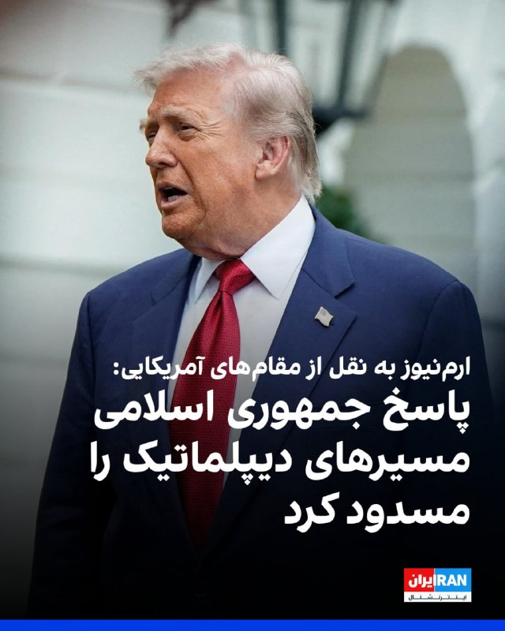

ارم‌نیوز به نقل از مقام‌های آمریکایی نوشت که پاسخ جمهوری اسلامی به پیشنهاد آمریکا، مسیر راه‌حل دیپلماتیک با تهران را مسدود کرده است.

این مقام‌ها گفتند: «هنوز اقدامات بعدی ترامپ پس از دریافت پاسخ منفی جمهوری اسلامی مشخص نیست.»
iranintl.com/202605110025

## IranIntlTV — post 336612

  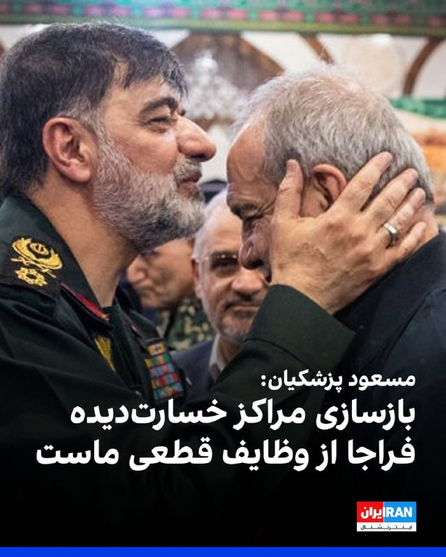

مسعود پزشکیان، رییس دولت در دیدار با احمدرضا رادان و جمعی از فرماندهان فراجا، گفت: «دولت، تامین تجهیزات، بازسازی مراکز خسارت‌دیده و ارتقای توان عملیاتی و پشتیبانی فراجا را از وظایف قطعی خود می‌داند و هر آنچه در این زمینه لازم باشد، با جدیت دنبال و تامین خواهد کرد.»

او افزود: «فراجا با وجود محدودیت‌ها و کمبود امکانات، در میدان تامین امنیت داخلی کشور حضوری موثر، مقتدرانه و فداکارانه داشت و دولت خود را موظف می‌داند در مسیر تقویت این مجموعه، همه حمایت‌های لازم را به‌عمل آورد.»
گفتنی است در طول جنگ میان جمهوری اسلامی و آمریکا و اسرائیل، بسیاری از اماکن متعلق به فرماندهی انتظامی، هدف حملات هوایی قرار گرفت.
iranintl.com/202605113680

## IranIntlTV — post 336611

یک شهروند با ارسال پیام صوتی به ایران‌اینترنشنال می‌گوید مدرس کاشت ناخن است و کسب‌وکار او به مشکل خورده: «شغل ما را غیرضروری دانسته‌اند و دستگاه کارتخوان‌مان را قطع کردند.»

## IranIntlTV — post 336610

  

علی خزایی، نماینده ورامین در مجلس گفت: «شرایط مدیریت تنگه هرمز هیچ‌گاه مانند گذشته نخواهد شد و این تنگه به وضع سابق بازنمی‌گردد و هیچ شناوری بدون اجازه جمهوری اسلامی حق عبور ندارد.»

او افزود: «شناورهای آمریکا و کشورهای همکار با این کشور، اجازه عبور از تنگه هرمز را نخواهند داشت.»
iranintl.com/202605117967

## IranIntlTV — post 336609

  <a href="telegram/content/IranIntlTV_336609_1778496753.mp4" target="_blank">🎬 Download video</a>

دونالد ترامپ پاسخ جمهوری اسلامی به آمریکا را «کاملا غیر قابل قبول» ارزیابی کرد. همزمان تسنیم، خبرگزاری وابسته به سپاه به نقل از یک منبع مطلع نوشت تهران برای خوشایند ترامپ، طرح نمی‌نویسد.

مرتضی کاظمیان، عضو تحریریه ایران‌اینترنشنال، از دو راهی تسلیم یا تغییر رژیم برای جمهوری اسلامی می‌گوید

@iranintltv

## Shin_Persian — post 5955

  

Shin ✓ @hey_itsmyturn
Mon, 11 May 2026 09:09:25 UTC

UXO went off.
(No official statement, but it was possibly due to EOD)
Shiraz, Fars Province, #Iran

(Image: not mine)

فارسی

مهمات عمل‌نکرده (UXO) منفجر شد.
(بیانیه رسمی منتشر نشده است، اما احتمالا ناشی از عملیات انهدام مهمات (EOD) بوده است)
شیراز، استان فارس، #Iran

(تصویر: متعلق به من نیست)

𝕏 · @shin_persian

## Shin_Persian — post 5954

  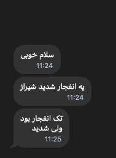

Shin ✓ @hey_itsmyturn
Mon, 11 May 2026 09:05:06 UTC

Earlier @ ~ 0820Z
Single blast in Shiraz
"It was one blast, but strong"
#Fars Province, #Iran

فارسی

پیش‌تر در حدود ۰۸۲۰Z (۱۱:۵۰ به وقت تهران)
یک انفجار در شیراز
«یک انفجار بود، اما قوی»
#Fars Province, #Iran

𝕏 · @shin_persian

## Shin_Persian — post 5953

  

Shin ✓ @hey_itsmyturn Mon, 11 May 2026 08:54:26 UTC Today, political prisoner Erfan Shakurzadeh executed by Islamic Regime. Charged with "espionage for US and Israeli intelligence services". His message from the prison: "I, Erfan Shakourzadeh, am 29 years…

## Shin_Persian — post 5952

Shin ✓ @hey_itsmyturn
Mon, 11 May 2026 08:54:26 UTC

Today, political prisoner Erfan Shakurzadeh executed by Islamic Regime. Charged with "espionage for US and Israeli intelligence services".

His message from the prison:
"I, Erfan Shakourzadeh, am 29 years old, and I am one of the so-called 'elites' who chose not to leave the country.
After months of torture and solitary confinement in a cell, I was forced to make false confessions. Do not let another innocent life disappear into silence."

#Iran

فارسی

امروز، زندانی سیاسی عرفان شکورزاده توسط رژیم اسلامی اعدام شد. او به «جاسوسی برای سرویس‌های اطلاعاتی ایالات متحده و اسرائیل (موساد)» متهم شده بود.

پیام او از زندان:
«من، عرفان شکورزاده، ۲۹ سال سن دارم و یکی از کسانی هستم که به اصطلاح "نخبه" نامیده می‌شوند و انتخاب کردم که کشور را ترک نکنم.
پس از ماه‌ها شکنجه و حبس در سلول انفرادی، مجبور به اعترافات اجباری شدم. اجازه ندهید جان بی‌گناه دیگری در سکوت از دست برود.»

#Iran

𝕏 · @shin_persian

## Shin_Persian — post 5951

📦 mhrv-rs v1.9.21 released

• Perf: skip H2 for Full-tunnel batch requests (PR #1040)

Files (Android APKs, Windows, macOS, Linux, OpenWRT) on the files channel:

👉 v1.9.21 — all files with SHA-256

Channel:
https://t.me/mhrv_rs
or: https://t.me/+R1OyoHX2boA1ZDgx

#v1921

## Shin_Persian — post 5950

Shin ✓ @hey_itsmyturn
Sun, 10 May 2026 22:45:03 UTC

NOW @ 2244Z -
AA activity over northwestern Tehran, Tehran Province, #Iran

فارسی

هم‌اکنون در ۲۲۴۴ زولو (۰۲:۱۴ به وقت تهران) -
فعالیت پدافند هوایی در شمال غرب تهران، استان تهران، #Iran

𝕏 · @shin_persian

## Shin_Persian — post 5949

  <a href="telegram/content/Shin_Persian_5949_1778496758.mp4" target="_blank">🎬 Download video</a>

Shin ✓ @hey_itsmyturn
Sun, 10 May 2026 22:36:12 UTC

Earlier @ 1800Z -
AA activity,
ring road near Ziba Shahr in Dezful.
Khuzestan Province, #Iran
(Via @mamlekate)

فارسی

پیش‌تر در ساعت ۱۸۰۰ زولو (۲۱:۳۰ به وقت تهران) -
فعالیت پدافند هوایی،
کمربندی نزدیک زیباشهر در دزفول.
استان خوزستان، #Iran
(از طریق @mamlekate)

𝕏 · @shin_persian

## ManotoTV — post 105300

  <a href="telegram/content/ManotoTV_105300_1778496760.mp4" target="_blank">🎬 Download video</a>

گردهمایی ایرانیان ونکوور

## ManotoTV — post 105299

  

رسانه‌های جمهوری اسلامی از جمله خبرگزاری فارس نوشتند انتشار دود در بخشی از شیراز، ناشی از انفجار کنترل‌شده مهمات عمل‌نکرده بوده است.

بر اساس این گزارش‌ها، ارتش پیش‌تر اعلام کرده بود که دقایقی بعد، مهمات عمل‌نکرده در شیراز به‌صورت کنترل‌شده منفجر خواهد شد.

## ManotoTV — post 105298

  

قیمت نفت روز دوشنبه پس از آن بیش از سه‌ونیم درصد افزایش یافت که دونالد ترامپ، رئیس‌جمهور آمریکا، پاسخ جمهوری اسلامی به پیشنهاد واشینگتن برای پایان جنگ را «کاملا غیرقابل قبول» خواند.

رویترز نوشت تهران در پاسخ خود خواستار پایان جنگ، رفع انسداد دریایی، تضمین نشدن حمله تازه، لغو تحریم‌ها و آزادسازی فروش نفت ایران شده است.

## ManotoTV — post 105297

  <a href="telegram/content/ManotoTV_105297_1778496765.mp4" target="_blank">🎬 Download video</a>

دنهاخ | هلند؛ گردهمایی ایرانیان مقابل دادگاه لاهه

## ManotoTV — post 105296

  <a href="telegram/content/ManotoTV_105296_1778496768.mp4" target="_blank">🎬 Download video</a>

نت‌بلاکس، نهاد ناظر بر دسترسی به اینترنت، اعلام کرد اختلال و قطعی اینترنت در ایران وارد هفتادوسومین روز خود شده و مدت این وضعیت از ۱۷۲۸ ساعت گذشته است. به گفته نت‌بلاکس، این قطعی گسترده همچنان ایران را تا حد زیادی از اینترنت جهانی جدا نگه داشته است.

## ManotoTV — post 105295

  <a href="telegram/content/ManotoTV_105295_1778496769.mp4" target="_blank">🎬 Download video</a>

اسماعیل بقایی، سخنگوی وزارت خارجه جمهوری اسلامی، گفت خواسته‌های ایران در پاسخ اخیر به پیشنهاد آمریکا «حقوق مشروع ایران» بوده و تهران در این متن، مطالباتی مانند پایان جنگ در منطقه، توقف آنچه او «راهزنی دریایی علیه کشتی‌های ایران» خواند، آزادسازی دارایی‌های مسدودشده و تضمین تردد ایمن در تنگه هرمز را مطرح کرده است.

او با رد این‌که مطالبات ایران «زیاده‌خواهانه» باشد، گفت پیشنهاد تهران نه فقط برای منافع ملی ایران، بلکه برای «ثبات و امنیت کل منطقه و جهان» تنظیم شده بود. بقایی همچنین گفت موضوع امنیت و صلح در منطقه، از جمله لبنان، بخشی از بسته پیشنهادی ایران بوده است.

سخنگوی وزارت خارجه جمهوری اسلامی در ادامه، آمریکا و اسرائیل را به اخلال در آزادی دریانوردی و تعرض به کشتی‌های ایرانی در آب‌های آزاد متهم کرد و گفت قرار بود این مسائل در چارچوب بسته پیشنهادی ایران مورد بحث و تصمیم‌گیری قرار گیرد.

بقایی در بخش دیگری از سخنانش از رویکرد آمریکا انتقاد کرد و گفت طرف آمریکایی همچنان بر اساس ذهنیت‌هایی که به گفته او «ساخت‌پرداخته اسرائیل» است، بر دیدگاه‌های یک‌سویه و خواسته‌های نامعقول خود پافشاری می‌کند.

دونالد ترامپ پیشتر از پاسخ جمهوری اسلامی ابراز نارضایتی کرد.

## ManotoTV — post 105294

  <a href="telegram/content/ManotoTV_105294_1778496772.mp4" target="_blank">🎬 Download video</a>

سن‌فرانسیسکو| گردهمایی ایرانیان، ۲۰ اردیبهشت

## ManotoTV — post 105293

  <a href="telegram/content/ManotoTV_105293_1778496773.mp4" target="_blank">🎬 Download video</a>

ونکوور| راهمپیمایی ایرانیان در حمایت از مردم ایران، ۲۰ اردیبهشت

## ManotoTV — post 105292

  <a href="telegram/content/ManotoTV_105292_1778496775.mp4" target="_blank">🎬 Download video</a>

پایگاه تحلیل تصاویر ماهواره‌ای «سور اطلس» اعلام کرد تصاویر ماهواره‌ای ظاهرا یک نفتکش بزرگ را در تنگه هرمز نشان می‌دهد که پس از یک حمله، ردی از نفت در آب برجای گذاشته است. در این تصاویر همچنین رفت‌وآمد گسترده قایق‌های تندرو کوچک در نزدیکی نفتکش دیده می‌شود.

وب‌سایت «تنکر ترکرز» این نفتکش را ابرنفتکش «باراکا» (برکت) معرفی کرده و نوشته است که این شناور متعلق به شرکت ملی نفت ابوظبی، ادنوک، است. به گفته این نهاد ردیابی نفتکش‌ها، باراکا روز ۱۴ اردیبهشت هدف پهپادهای جمهوری اسلامی قرار گرفت و در زمان حمله، پس از یک انتقال محرمانه محموله به نفتکشی دیگر در شرق امارات، خالی از نفت بوده است.

## ManotoTV — post 105291

  <a href="telegram/content/ManotoTV_105291_1778496777.mp4" target="_blank">🎬 Download video</a>

قوه قضاییه جمهوری اسلامی اعلام کرد حکم اعدام عرفان شکورزاده به اتهام همکاری با سرویس اطلاعاتی آمریکا و موساد اجرا شده است. خبرگزاری قوه قضاییه، او را به ارتباط با دو نهاد اطلاعاتی خارجی و انتقال اطلاعات طبقه‌بندی‌شده متهم کرده است.

رسانه‌های حقوق بشری و منتقد جمهوری اسلامی پیش‌تر درباره خطر اجرای حکم اعدام او هشدار داده و نوشته بودند که شکورزاده دانشجوی کارشناسی ارشد مهندسی هوافضا و فناوری ماهواره در دانشگاه علم و صنعت بوده است.

## ManotoTV — post 105290

  <a href="telegram/content/ManotoTV_105290_1778496778.mp4" target="_blank">🎬 Download video</a>

بریتانیا و فرانسه امروز دوشنبه میزبان نشستی با حضور بیش از ۴۰ کشور خواهند بود تا درباره میزان مشارکت نظامی آنها در ماموریت اروپایی اسکورت کشتی‌ها در تنگه هرمز گفت‌وگو شود.

این ماموریت قرار است پس از برقراری یک آتش‌بس پایدار آغاز شود و هدف آن همراهی کشتی‌های تجاری در عبور از تنگه هرمز است. بلومبرگ نوشت کشورهای شرکت‌کننده قرار است درباره توانایی‌هایی مانند مین‌روبی، اسکورت دریایی و گشت هوایی گفت‌وگو کنند.

بریتانیا پیش‌تر ناوشکن «اچ‌ام‌اس دراگون» را برای آمادگی در یک ماموریت احتمالی در خاورمیانه اعزام کرده و فرانسه نیز ناوگروه «شارل دوگل» را به دریای سرخ فرستاده است.

## ManotoTV — post 105289

  <a href="telegram/content/ManotoTV_105289_1778496779.mp4" target="_blank">🎬 Download video</a>

فرماندهی مرکزی ارتش آمریکا اعلام کرد تفنگداران دریایی ایالات متحده روز ۱۸ اردیبهشت، در جریان تمرینی روی عرشه ناو آبی‌خاکی «یواس‌اس تریپولی»، از یک بالگرد «سی‌هاوک» فرود آمدند.

سنتکام گفت این تمرین برای حفظ آمادگی تفنگداران دریایی انجام شده است تا در صورت لزوم، برای ورود به کشتی‌هایی که در جریان انسداد دریایی آمریکا علیه ایران از دستورها تبعیت نمی‌کنند، به کار گرفته شوند.

## ManotoTV — post 105288

  <a href="telegram/content/ManotoTV_105288_1778496780.mp4" target="_blank">🎬 Download video</a>

روزنامه گاردین استرالیا در گزارشی نوشت اسحاق قالیباف، پسر محمدباقر قالیباف برای چند سال در ملبورن زندگی و تحصیل کرده و در همین مدت با بازار ملک و دانشگاه ملبورن ارتباط داشته است. بر اساس این گزارش، اسحاق قالیباف با وجود رد شدن درخواست ویزای او در کانادا، توانسته بود اقامت موقت بلندمدت در استرالیا بگیرد.

گاردین نوشته اسحاق قالیباف از اوایل سال ۲۰۱۴ وارد ملبورن شد، ابتدا دوره زبان و دوره مقدماتی گذراند و سپس از سال ۲۰۱۵ تا ۲۰۱۸ در رشته مهندسی در دانشگاه ملبورن تحصیل کرد. بر اساس مدارکی که او در پرونده مهاجرتی خود در دادگاه فدرال کانادا ارائه کرده بود، او در سال‌های ۲۰۱۶ تا ۲۰۱۸ به‌عنوان دستیار پژوهشی در مرکز زیرساخت‌های داده‌های مکانی و مدیریت زمین دانشگاه ملبورن کار کرده است.

به نوشته گاردین، اسحاق قالیباف در سال ۲۰۲۲ در یک استشهادیه گفته بود تا پایان سپتامبر همان سال اقامت موقت استرالیا داشته، اما به‌دلیل انتظار برای دریافت اقامت دائم کانادا، برای تبدیل آن به اقامت دائم استرالیا اقدام نکرده است. کانادا در نهایت در فوریه ۲۰۲۴ درخواست اقامت دائم او را رد کرد.

## ManotoTV — post 105287

  <a href="telegram/content/ManotoTV_105287_1778496780.mp4" target="_blank">🎬 Download video</a>

بر اساس تصاویر و گزارش‌های منتشرشده، یک مرد در پایان تجمع ایرانیان در ریچموندهیل، در شمال تورنتو، با خودروی خود به چند خودرو برخورد کرد و به گفته شاهدان، پس از آن پرچم جمهوری اسلامی را از خودرو بیرون آورد و تکان داد. این تجمع روز یکشنبه ۲۰ اردیبهشت برگزار شده بود.

در گزارش‌های منتشرشده آمده است که این مرد پس از برخورد با چند خودرو و دست‌کم یک نفر، توسط ماموران پلیس بازداشت شد.

## ManotoTV — post 105286

  <a href="telegram/content/ManotoTV_105286_1778496783.mp4" target="_blank">🎬 Download video</a>

گردهمایی ایرانیان سانفرانسیسکو

## ManotoTV — post 105285

  <a href="telegram/content/ManotoTV_105285_1778496785.mp4" target="_blank">🎬 Download video</a>

گردهمایی ایرانیان هامبورگ

## ManotoTV — post 105284

  <a href="telegram/content/ManotoTV_105284_1778496788.mp4" target="_blank">🎬 Download video</a>

نیکوزیا|قبرس؛ راهپیمایی و گردهمایی ایرانیان

## FarsiVOA — post 217422

  

با نمایان شدن نشانه‌های کمبود دارو در کشور به واسطه شرایط جنگی، رئیس سازمان تدارکات پزشکی جمعیت هلال‌ احمر، از اجرای طرحی با هدف ذخیره‌سازی داروهای بیماران صعب‌العلاج خبر داد.

محمدرضا شانه‌ساز با بیان اینکه سرمایه‌گذاری لازم برای اجرای طرح فوق صورت گرفته، گفت: در حوزه داروهای بیماران صعب‌العلاج، سعی کردیم حدود شش ماه و حتی بیشتر، نیاز بیماران را تأمین کنیم.

این مقام جمهوری اسلامی یادآور شد که با اولویت ۱۰ استان کشور، پروژه ذخیره‌سازی دارویی آغاز شده تا ذخایر دارویی به شش ماه افزایش یابد.

در همین رابطه فاطمه پوررضاقلی، دبیر انجمن پیوند کلیه ایران از کاهش ذخایر دارویی و نایاب شدن برخی آنتی‌بیوتیک‌ها خبر داده و هشدار داده است که ادامه این وضعیت می‌تواند برای بیماران دیالیزی و پیوندی مشکل‌ساز شود.

پیشتر، صدای آمریکا به نقل از منابع خود در بیمارستان‌ها و داروخانه‌ها گزارش داده بود که دستورالعمل‌هایی برای کاهش مصرف سرم و آنتی‌بیوتیک ابلاغ شده و توزیع این اقلام در داروخانه‌ها با تأخیر و کمتر از میزان تقاضا انجام می‌شود.
@FarsiVOA

## FarsiVOA — post 217421

🔺تهران در صدر فهرست تنش آبی؛ ۳۵ میلیون ایرانی با مشکل کم‌آبی مواجهند

◾️سخنگوی صنعت آب ایران، با بیان اینکه ۱۱ استان کشور همچنان بیش از ۱۰ درصد کاهش بارش دارند، گفت: تهران در صدر این استان‌ها قرار دارد و اکنون وارد ششمین سال متوالی کم‌آبی شده است.

◾️عیسی بزرگ‌زاده گفت: وضعیت بارش کشور در محدوده نرمال قرار دارد، اما این نرمال بودن به معنای حل مشکل کم‌آبی در برخی استان‌ها نیست.

◾️به تازگی خبرگزاری ایلنا در گزارشی نوشته بود که علیرغم افزایش موجودی مخازن سدهایی مانند کارون و کرخه، موجودی آب سدهای استان‌های تهران، اصفهان، خراسان رضوی، قم، زنجان و مرکزی در وضعیت نامطلوبی قرار دارند، و تأمین آب شرب از جمله در تهران، کرج، مشهد، اراک، قم، اصفهان، یزد با محدودیت مواجه است.

⬇️ بیشتر بخوانید:
https://ir.voanews.com/a/8148766.html

## FarsiVOA — post 217420

  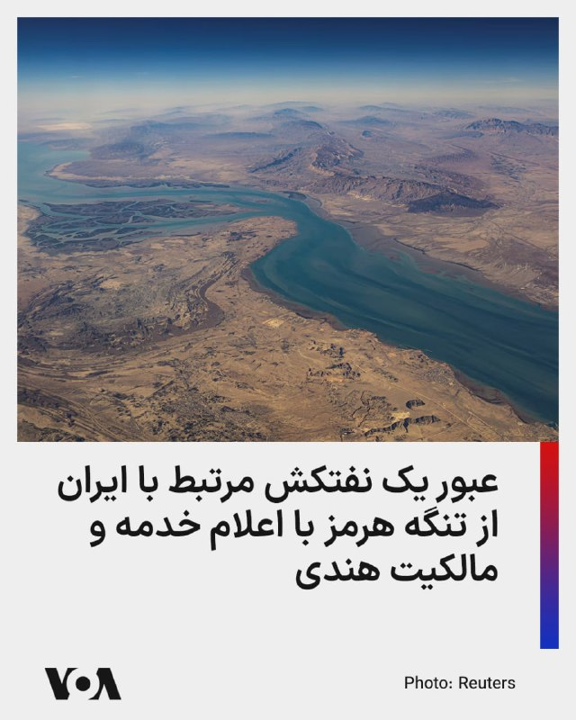

بلومبرگ به نقل از داده‌های ردیابی کشتی‌ها گزارش داد یک نفتکش حامل گاز مایع نفتی که پیش‌تر محموله‌های ایران را جابه‌جا کرده بود، هنگام عبور از تنگه هرمز اعلام کرده خدمه و مالکان آن هندی هستند.

بر اساس این گزارش، نفتکش تارا گس صبح دوشنبه از آب‌های نزدیک دبی به سمت شمال‌شرق حرکت کرده و هنگام عبور از کنار جزیره لارک ایران در تنگه هرمز دیده شده است؛ مسیری که به نوشته بلومبرگ نشان می‌دهد کشتی در مسیر مورد تأیید تهران حرکت می‌کند.

داده‌های مربوط به آبخور کشتی نیز نشان می‌دهد این نفتکش کاملاً بارگیری شده و حامل گاز مایع نفتی است؛ هرچند سامانه‌های ردیابی مشخص نکرده‌اند محموله آن از کجا بارگیری شده است.

بلومبرگ نوشته کشتی‌های گرفتار در خلیج فارس برای خروج امن از منطقه، از روش‌های مختلف استفاده می‌کنند. برخی دولت‌ها، از جمله هند، تایلند و مالزی، با تهران مذاکره کرده‌اند تا محموله‌های انرژی آزاد شود و برخی کشتی‌ها نیز هنگام عبور، وابستگی ملی یا مالکیتی خود را به‌طور آشکار اعلام می‌کنند.
@FarsiVOA

## FarsiVOA — post 217419

  <a href="telegram/content/FarsiVOA_217419_1778496792.mp4" target="_blank">🎬 Download video</a>

سخنگوی ارتش اسرائیل از شناسایی و انهدام چهار مسیر زیرزمینی استراتژیک در منطقه جنوب نوار غزه خبر داد.

نیروهای تیپ ۱۸۸ با همکاری یگان مهندسی ویژه، مجموعه‌ای از تونل‌ها به طول ۴ کیلومتر را در منطقه شرق «خط زرد» نابود کردند.

طبق بیانیه ارتش، یکی از این مسیرها بخشی از یک شبکه پیچیده بوده که پیش از این برای نگهداری گروگان‌های اسرائیلی استفاده می‌شد.

در جریان بازرسی از این تونل‌ها، اتاق‌هایی کشف شد که در اختیار مقامات ارشد نظامی خان‌یونس وابسته به گروه تروریستی حماس قرار داشت.

ارتش اسرائیل تأکید کرد که نیروهای فرماندهی جنوب مطابق با چارچوب توافق آتش‌بس در منطقه مستقر هستند، اما برای رفع هرگونه «تهدید فوری» به فعالیت‌های عملیاتی خود ادامه می‌دهند.

این عملیات بخشی از تلاش‌های مستمر برای پاکسازی زیرساخت‌های زیرزمینی در نوار غزه توصیف شده است.
@FarsiVOA

## FarsiVOA — post 217418

🔺نخست‌وزیر لبنان: از صلح با اسرائیل پس از برآورده شدن خواسته‌هایمان حمایت می‌کنیم

◾️نخست‌وزیر لبنان، درباره این که آیا مذاکرات این کشور با اسرائیل با هدف آتش‌بس است یا توافق صلح، گفت: «ما از صلح حمایت می‌کنیم، اما این صلح شرایطی دارد. این مسئله‌ای است که در مرحله‌ای بعدی به آن خواهیم رسید.»

◾️به گفته نواف سلام خواسته‌های لبنان شامل آتش‌بس، عقب‌نشینی کامل اسرائیل از خاک لبنان، و آزادی زندانیان لبنانی در زندان‌های اسرائیل است که در جریان درگیری‌ها در لبنان بازداشت شده‌اند.

◾️قرار است دور دیگری از مذاکرات میان اسرائیل و لبنان در واشنگتن برگزار شود.

◾️سلام اذعان کرد که گروه حزب‌الله با مذاکرات با اسرائیل مخالف است اما اشاره کرد که لبنان پیش‌تر در سال ۱۹۸۳ وارد مذاکراتی با اسرائیل شده بود.

⬇️ بیشتر بخوانید:
https://ir.voanews.com/a/8148765.html

## FarsiVOA — post 217417

  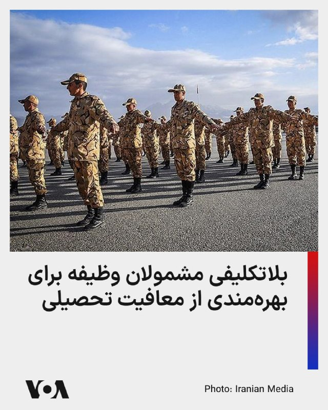

خبرآنلاین، در گزارشی از بلاتکلیفی برای برگزاری امتحانات نهایی و کنکور امسال و سردرگمی دانش‌‌آموزان پسر که باید به خدمت سربازی اجباری اعزام شوند، خبر داد.

تاکنون زمان دقیق برگزاری امتحانات نهایی پایه دوازدهم و همچنین کنکور سراسری به دلیل شرایط جنگی، اعلام نشده است.

در گزارش خبرآنلاین، به نقل از یعقوب محمدی، رئیس گروه آیین‌نامه‌ها و مقررات تحصیلی وزارت آموزش‌وپرورش، درباره اینکه پسران دانش‌آموز تا چه زمانی دانش‌آموزان پایه دوازدهم از اعزام به سربازی اجباری معاف هستند، توضیحاتی ارائه شده است.

به گفته محمدی، با توجه به شرایط خاص کشور و احتمال تعویق برگزاری کنکور سراسری، ممکن است فرصت دو بار شرکت دوازدهمی‌ها در کنکور، به یکبار تقلیل یاید.

او یادآورد شد: البته احتمال اینکه نظام وظیفه برای سال بعد یکبار دیگر هم مهلت شرکت در کنکور را تمدید کند، بسیار زیاد است. اما این احتمال است و تصمیم نهایی صرفا توسط سازمان نظام وظیفه اعلام می‌شود.
@FarsiVOA

## FarsiVOA — post 217416

  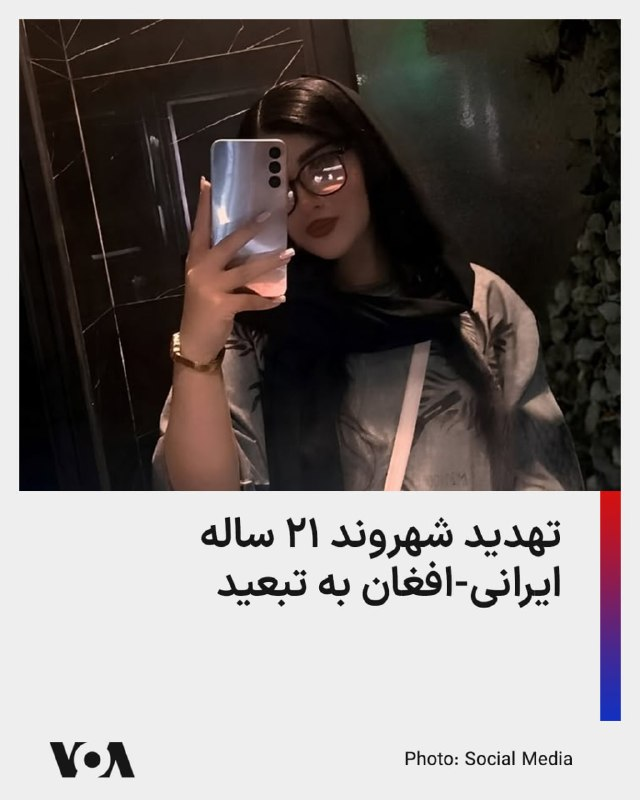

سازمان حقوق بشری هه‌نگاو، از بلاتکلیفی یک صد روزه و تهدید به سلب تابعیت زهرا موسوی، شهروند ۲۱ ساله ایرانی-افغان و از بازداشت‌شدگان اعتراضات دی ‌ماه ۱۴۰۴ خبر داد.

خانم موسوی هم اکنون در «بند آرامش» زندان وکیل‌آباد مشهد در وضعیت بلاتکلیفی به‌سر می‌برد و با تهدیدهای جدیدی از جمله سلب تابعیت و تبعید مواجه شده است.

زهرا موسوی اوایل بهمن‌ ماه ۱۴۰۴ در جریان اعتراضات سراسری دی ماه بازداشت شده بود. نهادهای حکومتی اتهاماتی از جمله «حضور در اعتراضات دی‌ ماه»، «ایجاد گروه»، «آموزش، ساخت و استفاده از کوکتل مولوتوف» و «ترغیب افراد به برهم زدن نظم و امنیت ملی» را به وی نسبت داده‌اند.

زهرا موسوی متولد ایران است؛ با این حال، نهادهای حکومتی با سلب شناسنامه ایرانی خانم موسوی، او را به سلب تابعیت و تبعید تهدید کرده‌اند.

اسماعیل بقایی، سخنگوی وزارت امور خارجه جمهوری اسلامی، در واکنش به سلب تابعیت مدافعان جمهوری اسلامی در کشور بحرین گفته است: سلب تابعیت از شهروندان بحرینی یک مجازات قرون‌وسطایی است که سال‌هاست اساساً منسوخ شده و خلاف اصول بنیادین حقوق بشر محسوب می‌شود.
@FarsiVOA

## FarsiVOA — post 217415

  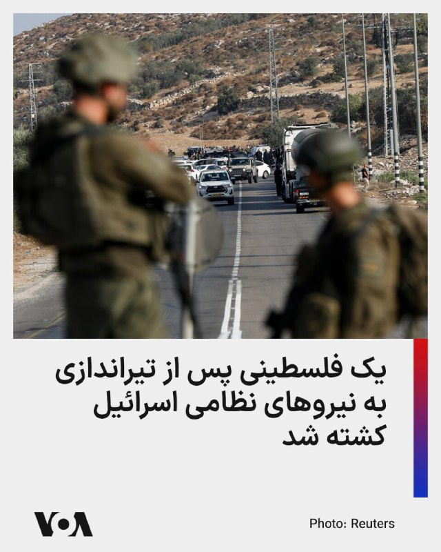

پلیس اسرائیل اعلام کرد که نیروهای مرزی این کشور حمله یک فلسطینی ساکن کرانه باختری را خنثی کردند. بر اساس اعلام پلیس، این مرد در اردوگاه قلندیا به سمت نیروهای اسرائیلی تیراندازی کرده بود.

پلیس افزود که نیروهای اسرائیلی در حال عملیات در داخل اردوگاه بودند که مردی از خودروی خود پیاده شد و با یک تفنگ تهاجمی به سمت آن‌ها شلیک کرد و نیروهای پلیس مرزی نیز در پاسخ، به سمت او آتش گشودند.

رسانه «معاریو» گزارش داد که مهاجم کشته شده است. در میان نیروهای اسرائیلی نیز هیچ زخمی گزارش نشده است.
@FarsiVOA

## FarsiVOA — post 217414

  

سایت حقوق بشری «حال‌وش» که اخبار و رویدادهای استان سیستان و بلوچستان را پوشش می‌دهد، از ممنوع‌الخروج شدن مولوی طیب اسماعیل‌زهی، و حافظ اسماعیل ملازهی، فرزند و داماد مولوی عبدالحمید اسماعیل‌زهی، امام‌جمعه اهل‌سنت زاهدان خبر داد.

این اقدام با حکم دستگاه قضایی جمهوری اسلامی انجام و ابلاغیه ممنوع‌الخروجی، روز دوشنبه ۲۱ اردیبهشت از طریق سامانه ثنا به آنان ابلاغ شده است.

پیشتر مولوی طیب اسماعیل‌زهی، در ۲۷ بهمن‌ ۱۴۰۴ برای چند ساعت توسط دادگاه ویژه روحانیت مشهد بازداشت و با تودیع قرار وثیقه پنج میلیارد تومانی آزاد شده بود. همچنین حافظ اسماعیل ملازهی نیز در ۱۱ بهمن ‌ماه به همین دادگاه احضار و برای ساعاتی مورد بازجویی قرار گرفته بود.

حال‌وش، از اتهامات احتمالی، دلایل احضار یا علت صدور حکم ممنوع‌الخروجی این دو نفر ابراز بی‌اطلاعی کرده است.
@FarsiVOA

## FarsiVOA — post 217413

  <a href="telegram/content/FarsiVOA_217413_1778496798.mp4" target="_blank">🎬 Download video</a>

ارتش اسرائیل اعلام کرد که عملیات نظامی خود را در شهر بنت جبیل، واقع در جنوب لبنان، به پایان رسانده و کنترل کامل این شهر را به دست گرفته است.

نیروهای ارتش اسرائیل پس از درگیری‌های گسترده، ماموریت خود را در این منطقه نهایی کردند.

بنت جبیل به عنوان یکی از مهم‌ترین پایگاه‌های حزب‌الله در جنوب لبنان شناخته می‌شد.

این شهر که به «پایتخت مقاومت» شهرت داشت، پس از سخنرانی مشهور حسن نصرالله در سال ۲۰۰۰ (موسوم به سخنرانی تار عنکبوت)، اهمیت نمادین بسیار بالایی برای حزب‌الله داشت.

تصرف این شهر توسط نیروهای اسرائیلی، ضربه‌ای جدی به ساختار دفاعی و پرستیژ نظامی حزب‌الله در مناطق مرزی تلقی می‌شود.

مقامات نظامی اسرائیل تصرف این منطقه را گامی کلیدی در جهت عقب راندن نیروهای حزب‌الله از مرزهای شمالی توصیف کرده‌اند.
@FarsiVOA

## FarsiVOA — post 217412

🔺تضعیف بازار اروپا با بن‌بست در مذاکرات واشنگتن و تهران

◾️بازارهای اروپا روز دوشنبه زیر فشار بن‌بست در مذاکرات آمریکا و جمهوری اسلامی کم‌رمق آغاز شدند.

◾️براساس این گزارش شاخص اروپایی استاکس ۶۰۰ در آغاز معاملات تقریباً بدون تغییر و در سطح ۶۱۱.۶۷ واحد ایستاد؛ در حالی که فوتسی لندن ۰.۲ درصد رشد کرد و شاخص کک فرانسه ۰.۵ درصد افت داشت.

◾️در بازار انرژی، نفت برنت در معاملات آسیایی بیش از ۴ درصد رشد کرد و به حدود ۱۰۵ دلار رسید. همزمان، دلار تقویت شد؛ چون سرمایه‌گذاران در فضای ریسک‌گریزی به دارایی‌های نقدشونده‌تر پناه بردند.

⬇️ بیشتر بخوانید:
https://ir.voanews.com/a/8148764.html

## FarsiVOA — post 217411

🔺یوروویژن امسال چگونه برگزار می‌شود؟

◾️هفتادمین دوره از جشن‌ها و برنامه‌های مسابقه آواز «یوروویژن» در حالی آغاز به کار کرده که جهان تحت تنش‌های اقتصادی و ژئوپولیتیک جنگ خاورمیانه قرار دارد.

◾️امسال یوروویژن بیش از ۱۷۰ میلیون نفر را از طریق تلویزیون و اینترنت در سراسر جهان جذب می‌کند و محتوای آن میلیاردها بازدید در پلتفرم‌های دیجیتال به دست می‌آورد.

◾️یوروویژن امسال روز یکشنبه با حضور هزاران هوادار از سراسر جهان در وین، پایتخت اتریش کار خود را آغاز کرد و قرار است فینال آن در شنبه برگزار شود.

◾️نام بتان، نمایندهٔ اسرائیل، نیز ممکن است با قطعه‌ای که بخشی از آن به زبان مولیر اجرا می‌شود، موفقیت چشمگیری به دست آورد.

⬇️ بیشتر بخوانید:
https://ir.voanews.com/a/8148763.html

## FarsiVOA — post 217410

🔺خاموشی اینترنت در روز هفتادوسوم؛ هشدار درباره تهدید شغل ۱۰ میلیون نفر

◾️نت‌بلاکس اعلام کرده خاموشی اینترنت در ایران وارد هفتادوسومین روز شده و مدت اختلال از هزار و ۷۲۸ ساعت گذشته است.

◾️این نهاد مستقل پایش دسترسی به اینترنت نوشته دسترسی آزاد به اینترنت، حقی بنیادین است که بسیاری از آزادی‌های دیگر بر آن تکیه دارند و محروم کردن مردم از آن، توان جامعه برای ثبت، پیگیری و مقابله با نقض حقوق اساسی را به‌شدت محدود می‌کند.

◾️اما مسئله فقط نقض حقوق اساسی نیست؛ قطع اینترنت، نه‌تنها کسب‌وکارها را مختل کرده، بلکه در شرایطی که حکومت بیش از هر زمان به همراهی مردم نیاز دارد، خودش به عامل نارضایتی تبدیل شده است.

⬇️ بیشتر بخوانید:
https://ir.voanews.com/a/8148762.html

## FarsiVOA — post 217409

  <a href="telegram/content/FarsiVOA_217409_1778496801.mp4" target="_blank">🎬 Download video</a>

برای نخستین بار در بیش از ۱۵ سال گذشته، اولین تراکنش آزمایشی موفق کارت‌های اعتباری «ویزا» و «مسترکارت» توسط شرکت «پیمرا» در سوریه انجام شد.

این شرکت تایید کرد که تمامی مراحل فنی برای پردازش، مسیریابی و تسویه تراکنش‌های ویزا و مسترکارت در داخل شبکه بانکی سوریه با موفقیت تست شده است.

به دلیل تحریم‌ها و شرایط سیاسی، استفاده از شبکه‌های پرداخت بین‌المللی در سوریه برای بیش از یک دهه متوقف شده بود.

این اقدام نتیجه یک تفاهم‌نامه است که در سپتامبر ۲۰۲۵ بین بانک مرکزی سوریه و شرکت مسترکارت امضا شده بود. همچنین بانک مرکزی سوریه در تاریخ ۴ مه ۲۰۲۶ رسماً به بانک‌های داخلی و شرکت‌های پرداخت الکترونیک اجازه داد تا با شبکه‌های جهانی وارد همکاری شوند.

دولت سوریه این اقدام را بخشی از استراتژی چهار ساله خود تا سال ۲۰۳۰ برای گذار از اقتصاد نقدی به اقتصاد دیجیتال می‌داند. هدف اصلی، کاهش وابستگی شدید به نقدینگی، که ۸۰٪ معاملات را شامل می‌شود، و جذب سرمایه‌گذاران خارجی است.

این گشایش، راه را برای استارتاپ‌ها و کسب‌ و کارهای آنلاین در سوریه باز می‌کند تا بتوانند در سطح بین‌المللی فعالیت کنند.
@FarsiVOA

## FarsiVOA — post 217408

🔺رد پای پسر قالیباف در استرالیا؛ از اقامت و ملک تا ارتباط با داماد قاسم سلیمانی

◾️گاردین در گزارشی تحقیقی نوشته اسحاق قالیباف، پسر محمدباقر قالیباف، رئیس مجلس جمهوری اسلامی، طی بیش از یک دهه گذشته ارتباط‌های گسترده‌ای با استرالیا داشته است؛ از تحصیل و کار در دانشگاه ملبورن تا دریافت درآمد اجاره از دو آپارتمان در این کشور.

◾️اهمیت این گزارش در زمان انتشار آن است. محمدباقر قالیباف اکنون یکی از چهره‌های اصلی جمهوری اسلامی در مدیریت جنگ و مذاکرات با آمریکا معرفی می‌شود.

◾️همزمان، اما اسناد دادگاه فدرال کانادا نشان می‌دهد پسر قالیباف در سال‌های گذشته در استرالیا زندگی و کار کرده، اقامت بلندمدت داشته و با وجود رد شدن دو تلاشش برای ورود یا اقامت در کانادا، توانسته در استرالیا بماند.

⬇️ بیشتر بخوانید:
https://ir.voanews.com/a/8148761.html

## FarsiVOA — post 217407

  

کره جنوبی حمله به یک کشتی باری متعلق به یک شرکت کشتیرانی این کشور در ماه جاری میلادی در تنگه هرمز را شدیدا محکوم کرد.

دفتر ریاست‌جمهوری کره جنوبی، معروف به «کاخ آبی»، روز دوشنبه اعلام کرد که قصد دارد پس از شناسایی منبع حمله، به آن پاسخ دهد. یک مقام ارشد کاخ آبی به خبرنگاران گفت که کارشناسان کره جنوبی بررسی اولیه جرم‌شناسی از آسیب واردشده به بخش عقبی کشتی انجام داده‌اند.

این حمله باعث آتش‌سوزی در اتاق موتور کشتی شده بود.

پیشتر پرزیدنت ترامپ از حمله جمهوری اسلامی به «کشورهای غیرمرتبط» در تنگه هرمز خبر داده و در تروت سوشال نوشته بود که رژیم ایران در رابطه با عبور و مرور کشتی‌ها، به کشورهای غیرمرتبط - از جمله یک کشتی باری کره جنوبی - حمله کرده است.

در ادامه این پیام آمده بود:‌ «شاید وقت آن رسیده است که کره جنوبی هم به این مأموریت بپیوندد!»
@FarsiVOA

## FarsiVOA — post 217406

🔺افزایش قیمت نان؛ فشار هزینه‌ها در سفره مردم بیشتر شد

◾️گزارش‌های رسیده به صدای آمریکا نشان می‌دهد پس از افزایش رسمی قیمت نان در همدان، نان در برخی شهرها با نرخ‌های تازه عرضه می‌شود.

◾️بر اساس این گزارش‌ها، در استان‌ها و شهرهایی از جمله اصفهان، یزد، مشهد و قم، نانوایی‌ها در روزهای اخیر نان را با قیمت‌های جدید عرضه کرده‌اند.

◾️در تهران نیز گزارش‌های میدانی حاکی است که قیمت‌های مصوب رعایت نمی‌شود و در برخی مناطق، نانوایی‌های سنگک و بربری عملاً آزادپز شده‌اند و دیگر نان را با نرخ دولتی عرضه نمی‌کنند.

◾️عصر ایران در گزارشی درباره گران‌فروشی نان نوشته یک نانوایی سنگک، نانی را که باید با آرد دولتی ۷ هزار و ۶۰۰ تومان عرضه کند، ۲۰ هزار تومان فروخته است.

⬇️ بیشتر بخوانید:
https://ir.voanews.com/a/8148760.html

## FarsiVOA — post 217405

  

ارتش اسرائیل با انتشار بیانیه‌ای از ساکنان تعدادی از مناطق جنوب لبنان خواست که خانه‌های خود را ترک کنند. در بیانیه ارتش اسرائیل که دوشنبه منتشر شد به شهرها و روستاهای الریحان (جزین)، جرجوع، کفر رمان، النمیریه، عرب‌صالیم، جمیجمه، مشغره، قلیا (البقاع الغربی) و حاروف اشاره شده است.

این نوع هشدارها معمولا پیش از حملات هوایی صادر می‌شود.

در بیانیه ارتش اسرائیل آمده است: «در پی نقض توافق آتش‌بس از سوی حزب‌اللهِ تروریستی، ارتش دفاعی ناچار است با قدرت علیه آن اقدام کند، اما قصد آسیب رساندن به شما را ندارد.»

ارتش اسرائیل از ساکنان این مناطق خواسته «فوراً خانه‌های خود را تخلیه کرده و دست‌کم تا فاصله ۱۰۰۰ متری از روستاها و شهرها، به مناطق باز دور» شوند. این ارتش هشدار داده که «هر کسی که در نزدیکی عناصر حزب‌الله، تأسیسات و تجهیزات رزمی آن حضور داشته باشد، جان خود را در معرض خطر قرار می‌دهد.»
@FarsiVOA

## FarsiVOA — post 217404

  

بر اساس ویدیوی منتشرشده از سوی تانکرترکرز، نفتکش بسیار بزرگ «برکه» متعلق به شرکت دولتی نفت ابوظبی، در حمله پهپادی چهاردهم اردیبهشت‌ماه هدف قرار گرفته است.

رویترز پیش‌تر گزارش داده بود امارات، جمهوری اسلامی را به حمله با دو پهپاد به این نفتکش خالی در زمان عبور از تنگه هرمز متهم کرده و شرکت ادنوک اعلام کرده بود در این حادثه کسی آسیب ندیده است.

تانکرترکرز می‌گوید این نفتکش پیش از حمله، محموله خود را در انتقالی پنهانی در شرق امارات به نفتکش دیگری منتقل کرده بود و هنگام بازگشت برای بارگیری دوباره هدف قرار گرفت.

رویترز نیز گزارش داده ادنوک و خریدارانش برای خروج نفت گرفتارمانده در خلیج فارس، از روش‌هایی مانند خاموش کردن ردیاب‌ها و انتقال کشتی‌به‌کشتی استفاده کرده‌اند.
@FarsiVOA

## FarsiVOA — post 217403

🔺دیدار ترامپ و شی؛ از ایران و پرونده هسته‌ای تا تجارت و هوش مصنوعی

◾️دونالد ترامپ، رئیس‌جمهور آمریکا، این هفته به چین می‌رود تا با شی جین‌پینگ، رئیس‌جمهور این کشور، دیدار کند.

◾️این دیدار قرار است طیف گسترده‌ای از پرونده‌های امنیتی، اقتصادی و فناورانه را دربر بگیرد؛ از جنگ ایران و برنامه هسته‌ای جمهوری اسلامی تا تایوان، تجارت، تسلیحات هسته‌ای، هوش مصنوعی و مواد معدنی کمیاب.

◾️در پرونده ایران، انتظار واشنگتن روشن است و ترامپ می‌خواهد چین از نفوذ خود بر تهران استفاده کند.

◾️چین بزرگ‌ترین خریدار نفت از جمهوری اسلامی است و در ماه‌های اخیر، آمریکا چند شرکت چینی را به اتهام کمک به بخش نظامی و زنجیره تأمین جمهوری اسلامی تحریم کرده است.

⬇️ بیشتر بخوانید:
https://ir.voanews.com/a/8148757.html

## DW_Farsi — post 124554

  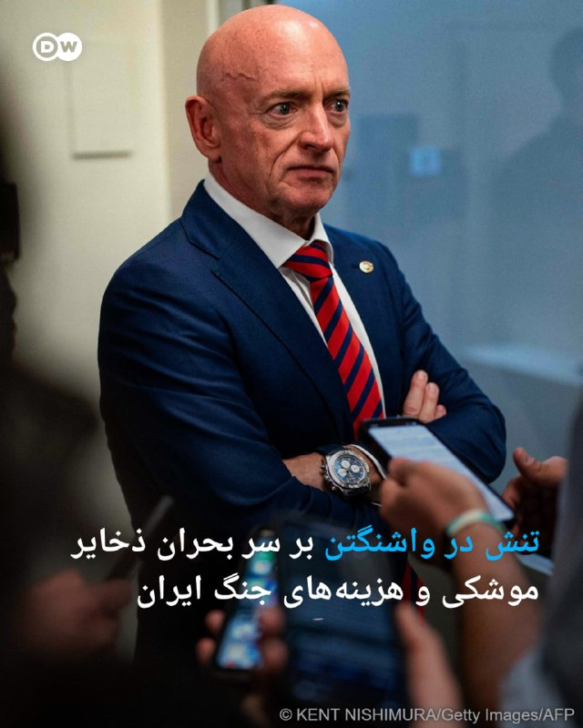

🔶 تنش در واشنگتن بر سر بحران ذخایر موشکی و هزینه‌های جنگ ایران
مارک کلی، سناتور دموکرات آمریکایی، اعلام کرد که جنگ ایران باعث تضعیف ایالات متحده شده و ذخایر مهمات و موشک‌های ارتش این کشور به‌شدت کاهش یافته است.

این سناتور دموکرات در برنامه‌ای در شبکه تلویزیونی "سی‌بی‌اس" گفت: «شوکه‌کننده است که تا چه حد این

مارک کلی، در برنامه‌ای در شبکه تلویزیونی "سی‌بی‌اس" گفت: «شوکه‌کننده است که تا چه حد این ذخایر را مصرف کرده‌ایم.»

این فضانورد پیشین و کهنه‌سرباز جنگ عراق افزود که دونالد ترامپ، رئیس جمهور آمریکا، ایالات متحده را وارد جنگی "بدون هدف راهبردی، بدون برنامه و بدون جدول زمانی" کرده است.

به گفته این سناتور از ایالت آریزونا، پنتاگون او را در مقام عضو کمیته نیروهای مسلح سنا، در جریان وضعیت برخی انواع مهمات این کشور قرار داده است.

به گفته او، این اطلاعات شامل موشک‌هایی مانند تاماهاک، اتاکمز، اس‌ام−۳ و موشک‌های سامانه پاتریوت بوده است. کلی بدون اشاره به جزئیات گفت که بازسازی این ذخایر "سال‌ها" زمان خواهد برد.

@dw_farsi

## DW_Farsi — post 124553

🎥 آمستردام تبلیغات گوشت را ممنوع کرد

آمستردام اولین شهری است که تبلیغات محصولات بسیار آلاینده، از جمله گوشت و محصولات مرتبط با سوخت‌های فسیلی را ممنوع کرد. آیا چنین اقدامی رفتار مردم را تغییر خواهد داد؟

@dw_farsi

## DW_Farsi — post 124552

  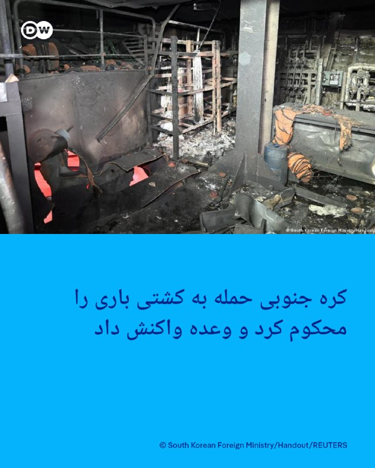

🔶 کره جنوبی حمله به کشتی باری را محکوم کرد و وعده واکنش داد

دفتر ریاست جمهوری کره جنوبی روز دوشنبه، ۱۱ مه (۲۱ اردیبهشت) حمله به یک کشتی باری متعلق به یک شرکت کشتیرانی کره‌ای در تنگه هرمز در ماه جاری را شدیداَ محکوم کرد.

یک مقام ارشد کاخ ریاست جمهوری با تأکید بر این که کره جنوبی "پس از شناسایی منبع حمله، قصد دارد به آن پاسخ دهد"، افزود که سئول حملات به کشتی‌های غیرنظامی را "غیر قابل‌تحمل" می‌داند.

او به خبرنگاران گفت که کارشناسان کره جنوبی بررسی‌های اولیه‌ای از خسارت وارده به کشتی را انجام داده‌اند.

تحقیقات صورت‌گرفته تایید می‌کند که کشتی توسط دو "پرتابه ناشناس" مورد اصابت قرار گرفته است. این حمله منجر به آتش‌سوزی در موتورخانه کشتی شده است.

سئول اعلام کرده است که اکنون در حال هماهنگی برای واکنش قاطع به این حادثه برای تضمین امنیت شهروندان و مسیرهای دریایی خود است.

دونالد ترامپ انفجار و آتش‌سوزی در این کشتی تحت مدیریت کره جنوبی را به حمله‌ای از سوی ایران نسبت داده است. جمهوری اسلامی این ادعا را رد کرده است.

@dw_farsi

## DW_Farsi — post 124551

  

🔶 قوه قضائیه جمهوری اسلامی: اموال علی کریمی شناسایی و مصادره شد

قوه قضاییه جمهوری اسلامی اعلام کرد که موفق به "شناسایی" بخشی از اموال علی کریمی، ستاره سابق تیم ملی فوتبال ایران، شده و آنها را مصادره کرده است.

در اطلاعیه قوه قضائیه ادعا شده است: «با استعلامات صورت‌ گرفته از سازمان ثبت اسناد و املاک کشور، برخی از املاک ‌علی کریمی که سعی در اختفای آنها داشته شناسایی شده است.»

این اطلاعیه همچنین مدعی است که "دو واحد تجاری و ۴ واحد مسکونی از علی کریمی شناسایی و به دستور قضایی به نفع مردم توقیف شده است".

علی کریمی که از هواداران فعال رضا پهلوی، فرزند آخرین پادشاه ایران به شمار می‌آید پس از جنبش "زن زندگی آزادی" در سال ۱۴۰۱ از ایران خارج شد.

خبرگزاری میزان، رسانه وابسته به قوه قضائیه، علی کریمی را "خائن به وطن" خوانده است.

@dw_farsi

## DW_Farsi — post 124550

  

📸 عکس روز: همراهی با کارزار "یک ملت در گروگان"

ایرانیان در خارج از کشور در پی فراخوان شاهزاده رضا پهلوی برای همراهی با کارزار "یک ملت در گروگان" روز یکشنبه ۱۰ مه در بسیاری از شهرهای جهان تظاهرات کردند. تظاهرکنندگان در استکهلم تصاویر و پلاکاردهایی را در اعتراض به قطعی اینترنت و افزایش اعدام‌ها در دست داشتند. به گزارش نت‌بلاکس قطعی اینترنت وارد ۷۳‌مین روز شده و مردم ایران همچنان در خاموشی دیجیتال بسر می‌برند و بسیاری از کسب‌وکارها از بین رفته‌اند.

@dw_farsi

## DW_Farsi — post 124549

  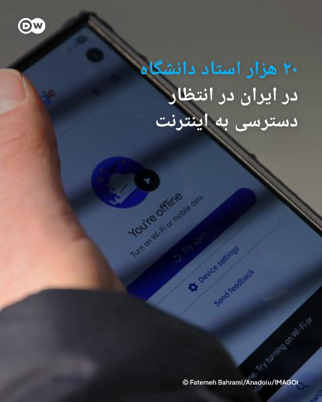

🔶 ۲۰ هزار استاد دانشگاه در ایران انتظار در دسترسی به اینترنت

بیژن رنجبر، رئیس دانشگاه آزاد، اعلام کرد که برای بهبود دسترسی به اینترنت در واحدهای دانشگاهی، مجوزهای آی‌پی برای ۲۴۵۰ واحد دانشگاهی دریافت شده است تا استادان و دانشجویان بتوانند در داخل دانشگاه به اینترنت متصل شوند.

او در مصاحبه با خبرگزاری ایسنا همچنین گفت که درخواست تأمین اینترنت برای حدود ۲۰ هزار عضو هیئت علمی ارائه شده و دانشگاه در انتظار تأیید نهایی این موضوع است.

به گفته رنجبر، این اقدامات "با هدف تقویت زیرساخت‌های ارتباطی و تسهیل دسترسی به منابع دیجیتال برای اعضای هیئت علمی و دانشجویان انجام می‌شود و امید است که رضایت کاربران در دانشگاه افزایش یابد".

در همین حال تداوم قطع اینترنت، اثرات منفی آن بر زندگی مردم و به‌خصوص تبعیضی که تحت عنوان "اینترنت پرو" در حق بخش بزرگی از جامعه اعمال می‌‌شود، بحث داغ روز در ایران است.

@dw_farsi

## DW_Farsi — post 124548

🎥 مالیات شکر به آلمان می‌آید؟

آلمان در حال برنامه‌ریزی برای وضع مالیات شکر از سال ۲۰۲۸ است تا با چاقی مقابله کند و فشار بر سیستم سلامت را کاهش دهد. منتقدان می‌گویند چنین اقداماتی بی‌اثر هستند، اما سازمان جهانی بهداشت خواهان مالیات‌های بسیار بالاتر بر محصولات ناسالم در سراسر جهان است.

@dw_farsi

## DW_Farsi — post 124547

🔶 جام ۱۹۳۴؛ ماتیاس سیندلار؛ آزادمرد فوتبال اتریش

در اواخر دهه ۲۰ تا اوایل دهه ۳۰ میلادی قرن بیستم، تیم ملی اتریش یکی از قدرت‌های بزرگ فوتبال اروپا محسوب می‌شد و ستاره‌اش که به "مرد کاغذی" شهرت داشت، یکی از چهره‌های درخشان آن دوره به شمار می‌رفت: مایتاس سیندلار.

به اعقتاد کارشناسان فوتبال ماتیاس سیندلار بزرگ‌ترین ستاره‌ای است که اتریش به این ورزش ارائه کرده است. سیندلار مهره‌ کلیدی تیمی بود که در اواخر دهه بیست و اوایل دهه سی میلادی قرن بیستم به "تیم شگفت‌انگیز" شهرت داشت.

ملی‌پوشان اتریش که در سال ۱۹۳۲ قهرمان اروپا شده بودند، در جام جهانی ۱۹۳۴ در ایتالیا به عنوان یکی از مدعیان قهرمانی قدم به میدان گذاشتند. پشتوانه‌ موفقیت‌های پیشین انتظارات زیادی را میان اتریشی‌ها برانگیخته بود که این بار به قهرمانی جهان امید بسته بودند.

اتریش اما در نیمه‌نهایی این مسابقات یک بر صفر از میزبان بازی‌ها شکست خورد. داور سوئدی این دیدار که یک روز پیش از برگزاری مسابقه مهمان ویژه بنیتو موسولینی بود، تک‌گل این دیدار را که در پی خطایی روی درواز‌ه‌بان اتریش حاصل شده بود، پذیرفت و در نیمه دوم نیز کم و بیش به نفع ایتالیایی‌ها سوت زد.

@dw_farsi

## DW_Farsi — post 124546

  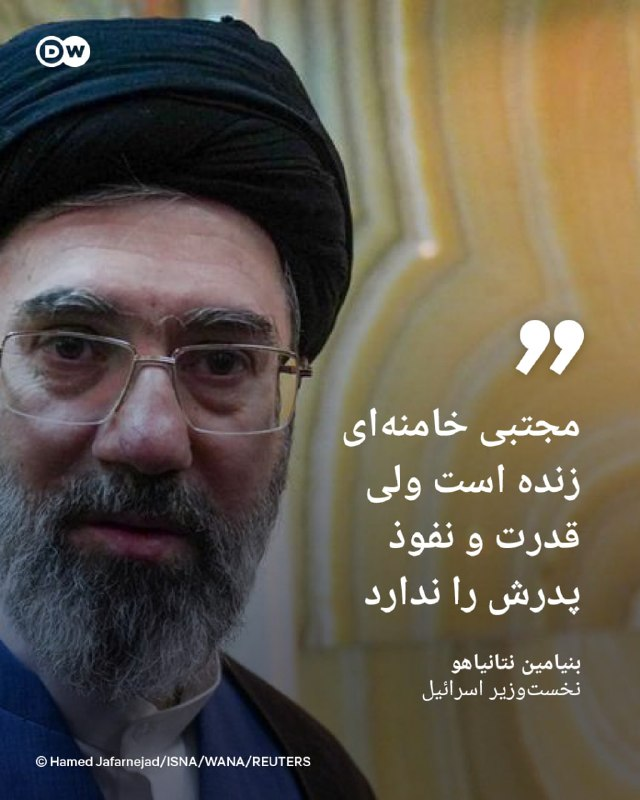

🔶 نتانیاهو: مجتبی خامنه‌ای زنده است ولی قدرت و نفوذ پدرش را ندارد

بنیامین نتانیاهو، نخست‌وزیر اسرائیل، می‌گوید که باور دارد مجتبی خامنه‌ای، رهبر جمهوری اسلامی ایران، هنوز زنده است، با وجود آن‌که از زمان معرفی او به‌ عنوان جانشین پدرش، علی خامنه‌ای در اواخر اسفند سال گذشته، در انظار عمومی دیده نشده و پیامی صوتی یا تصویری از او نیز منتشر نشده است.

نتانیاهو در گفت‌وگو با برنامه "۶۰ دقیقه" شبکه سی‌بی‌اس، در پاسخ به پرسشی درباره وضعیت جسمانی و میزان نفوذ عملیاتی مجتبی خامنه‌ای گفت: «فکر می‌کنم او زنده است. اما این‌که حالش چگونه است، سخت می‌شود گفت. او در یک پناهگاه یا مکان مخفی پنهان شده است.»

نتانیاهو همچنین گفت که مجتبی خامنه‌ای تلاش می‌کند "اقتدار خود را تثبیت کند"، اما میزان نفوذ و قدرت او را کمتر از پدرش، علی خامنه‌ای، ارزیابی کرد.

مقام‌های جمهوری اسلامی در باره وضعیت مجتبی‌ خامنه‌ای اطلاعات دقیقی ارائه نمی‌کنند.

@dw_farsi

## DW_Farsi — post 124545

  

🔶 برگزاری نشست چندملیتی وزیران دفاع درباره تنگه هرمز با میزبانی فرانسه و بریتانیا

به گفته دولت بریتانیا، این کشور در همراهی با فرانسه روز سه‌شنبه، ۱۲ مه، میزبان نشست چندملیتی وزیران دفاع درباره برنامه‌های نظامی برای بازگرداندن جریان تجارت از طریق تنگه هرمز خواهد بود.

این اعلام از سوی بریتانیا چند ساعت پس از آن صورت گرفت که ایران به لندن و پاریس درباره اعزام ناوهای جنگی به منطقه هشدار داد.

وزارت دفاع بریتانیا روز یکشنبه اعلام کرد که جان هیلی، وزیر دفاع، همراه با همتای فرانسوی خود، کاترین ووترن، ریاست نخستین نشست وزیران دفاع مأموریت چندملیتی را با حضور بیش از ۴۰ کشور برعهده خواهد داشت.

این نشست مجازی در ادامه گردهمایی دو روزه برنامه‌ریزان نظامی در لندن در ماه آوریل برگزار می‌شود؛ نشستی که در آن جزئیات عملیاتی مأموریتی چندملیتی به رهبری بریتانیا و فرانسه برای حفاظت از کشتیرانی در این آبراه راهبردی پس از برقراری یک آتش‌بس پایدار بررسی شد.

جان هیلی گفت: «ما در حال تبدیل توافق‌های دیپلماتیک به برنامه‌های عملی نظامی برای بازگرداندن اعتماد به کشتیرانی از طریق تنگه هرمز هستیم.»

@dw_farsi

## DW_Farsi — post 124544

  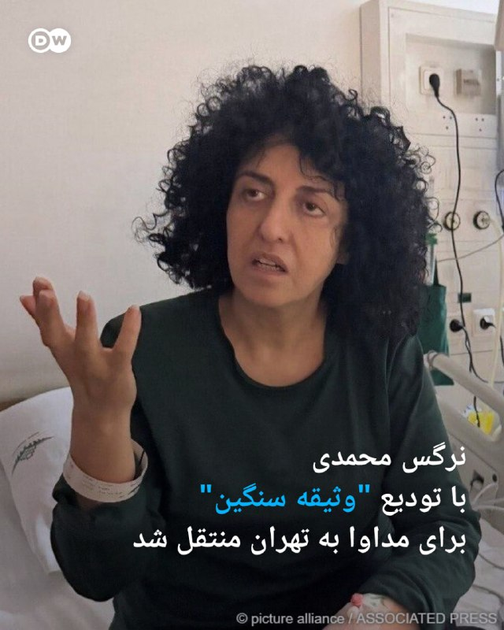

🔶 نرگس محمدی با تودیع "وثیقه سنگین" برای مداوا به تهران منتقل شد

بنیاد نرگس محمدی روز یکشنبه، ۲۰ اردیبهشت، اعلام کرد که این فعال حقوق بشر و برنده جایزه نوبل صلح، "پس از ۱۰ روز بستری در بیمارستانی در زنجان، با تودیع وثیقه سنگین و تعویق در اجرای حکم، با آمبولانس به بیمارستان پارس تهران منتقل و جهت درمان فوری توسط تیم پزشکی خود بستری شد".

انتقال محمدی پس از روزها درخواست و هشدار خانواده و نزدیکانش درباره وضعیت بحرانی سلامتی‌اش انجام شد.

بنا بر داده‌های بنیاد نرگس محمدی حکم زندان او با قرار وثیقه به حالت تعلیق درآمده، اما مدت این تعلیق مشخص نیست.

محمدی که از آذرماه در زندان زنجان محبوس بود، اواسط اردیبهشت دو بار بیهوش شده و به بیمارستان محلی منتقل شده بود.

بیانیه بنیاد محمدی می‌گوید که تعلیق حکم کافی نیست و نرگس محمدی به "مراقبت دائمی و تخصصی" نیاز دارد.

این بیانیه تأکید می‌کند: ««باید اطمینان حاصل کنیم که او هرگز برای گذراندن ۱۸ سال باقی‌مانده محکومیتش به زندان بازگردانده نشود. اکنون زمان آن است که آزادی بی‌قید و شرط او و لغو تمام اتهام‌ها مطالبه شود.»

@dw_farsi

## DW_Farsi — post 124543

  

🔶عرفان شکورزاده به اتهام "جاسوسی برای موساد و سیا" اعدام شد

میزان، خبرگزاری قوه قضائیه جمهوری اسلامی، از اعدام عرفان شکورزاده به اتهام "همکاری اطلاعاتی با موساد و سیا" خبر داد.

طبق این گزارش، شکورزاده که در یک مجموعه علمی مرتبط با پروژه‌های ماهواره‌ای فعالیت می‌کرد، متهم شده بود که "به‌صورت آگاهانه با سرویس‌های اطلاعاتی اسرائیل و آمریکا ارتباط برقرار کرده و اطلاعات طبقه‌بندی‌شده را در اختیار آن‌ها قرار داده است".

در گزارش میزان ادعا می‌شود که ارتباط شکورزاده ابتدا از طریق "ایمیل و فرم همکاری موساد" آغاز شد و بعداً از طریق "لینکدین، واتساپ و گوگل‌میت" ادامه یافت. طبق ادعای این گزارش، "فردی که خود را ایرانی مقیم کانادا معرفی کرده بود، در واقع افسر موساد" معرفی شده است.

به ادعای مقام‌های قضایی، شکورزاده "اطلاعاتی درباره محل کار، پروژه‌های ماهواره‌ای، کارکنان، شماره تماس‌ها، ساختار پروژه‌ها و جزئیات فنی را منتقل می‌کرده و در مقابل، ارز دیجیتال دریافت می‌کرده است".

@dw_farsi

## DW_Farsi — post 124542

  

🔶در پی رد پاسخ ایران از سوی آمریکا قیمت نفت افزایش یافت

پس از مردودشمرده شدن پاسخ جمهوری اسلامی ایران به پیشنهاد صلح آمریکا از سوی دونالد ترامپ، قیمت نفت روز دوشنبه ۱۱ مه (۲۱ اردیبهشت) به‌طور قابل‌توجهی افزایش پیدا کرد.

نفت برنت دریای شمال ۳٫۱۴ درصد رشد قیمت پیدا کرد و به ۱۰۴٫۴۷ دلار در هر بشکه رسید، در حالی که نفت سبک آمریکا (WTI) نیز با افزایش ۳٫۲۴ درصدی به ۹۸٫۵۱ دلار رسید.

پس از آن‌که رئیس‌جمهور آمریکا روز یکشنبه پاسخ ایران به پیشنهاد صلح واشنگتن را "کاملاً غیرقابل قبول" توصیف کرد، امیدها به پایان سریع درگیری‌هایی که ده هفته پیش شروع شد و همچنین بازگشایی تنگه هرمز، مسیر حیاتی انتقال نفت، کاهش یافت،

اکنون توجه‌ها به سفر ترامپ به پکن در روز چهارشنبه معطوف شده است؛ جایی که طبق گفته منابع دولتی آمریکا، او قرار است با شی جین‌پینگ، رهبر چین، درباره ایران نیز گفت‌وگو کند.

@dw_farsi

## DW_Farsi — post 124541

  

🔶نتانیاهو: هنوز کارهای زیادی در ایران باقی مانده است

بنیامین نتانیاهو، نخست‌وزیر اسرائیل، روز یکشنبه، ۱۰ مه (۲۰ اردیبهشت) در گفت‌وگو با برنامه "۶۰ دقیقه" شبکه آمریکایی سی‌بی‌اس گفت که "هنوز کارهای زیادی" در ایران باقی مانده و رئیس‌جمهور آمریکا، با او درباره اهمیت نابودی ذخایر اورانیوم با غنای بالا در ایران هم‌نظر است.

نخست‌وزیر اسرائیل با بیان این که جنگ اخیر با ایران "دستاوردهای بزرگی" داشته، افزود: «این جنگ اما هنوز پایان نیافته، زیرا هنوز تأسیسات غنی‌سازی اورانیومی هست که باید برچیده شوند. هنوز نیروهای نیابتی وجود دارند که ایران از آنها حمایت می‌کند و موشک‌های بالستیکی که آنها می‌خواهند تولید کنند. ما بخش زیادی از آن را تضعیف کردیم، اما کارهایی باقی مانده است که باید انجام شود.»

@dw_farsi

## DW_Farsi — post 124540

  

🔶 ترامپ: پاسخ ایران به پیشنهاد صلح آمریکا غیرقابل قبول است

دونالد ترامپ، رئیس جمهور روز یکشنبه، ۱۰ مه (۲۰ اردیبهشت) پاسخ ایران به طرح پیشنهادی واشنگتن را غیرقابل خواند. او گفت: «این پاسخ نظر من را جلب نکرد و کاملاَ مردود است.»

ترامپ اشاره‌ای به جزئیات پاسخ تهران نکرد و نگفت که با کدام بخش آن مخالف است.

شبکه المیادین که نزدیک به جمهوری اسلامی است، نوشته پاسخ ایران شامل درخواست برای پایان دادن به محاصره دریایی و آزادی صادرات نفت است.

پایان فوری جنگ و تضمین‌هایی در باره آتش‌بس در لبنان به علاوه لغو تحریم‌های آمریکا و آزادسازی دارایی‌های بلوکه‌شده ایران نیز در پاسخ جمهوری اسلامی به طرح ۱۴ ماده‌ای دولت ترامپ موضوعات محوری هستند. پذیرش "مدیریت جدیدی" بر تنگه هرمز از سوی ایران نیز از دیگر خواسته‌های تهران است.

صدا و سیمای جمهوری اسلامی نیز به نقل از یک مقام مسئول گزارش داده است که تهران در پاسخ خود "بر ضرورت پرداخت خسارت‌های جنگ توسط آمریکا و پذیرش حاکمیت ایران بر تنگه هرمز تأکید داشته است".

@dw_farsi

## Persian_Trend_Official — post 13893

  <a href="telegram/content/Persian_Trend_Official_13893_1778496817.webm" target="_blank">🎬 Download video</a>

🔴 انفجار در اراک؛ یک خانه مسکونی تخریب شد

در پی وقوع انفجار در یک منزل مسکونی واقع در خیابان جهانگیری اراک، ساختمان به‌طور گسترده تخریب شد.

بر اساس گزارش‌ها:

▪️ نیروهای امدادی و آتش‌نشانی در محل حادثه حضور دارند
▪️ عملیات آواربرداری و ایمن‌سازی آغاز شده است
▪️ علت دقیق انفجار هنوز مشخص نیست
▪️ آمار احتمالی مصدومان و میزان خسارات در دست بررسی است

💢خبرگزاری مهر اعلام کرده کارشناسان در حال بررسی منشأ حادثه هستند.

🫆:Tony

📌 @persian_trend_official
پرشین ترند | متفاوت‌ترین کانال نظامی

## Persian_Trend_Official — post 13892

🔴 ارتش اسرائیل: فرود اضطراری بالگرد در جنوب لبنان به‌دلیل نقص فنی بود

ارتش اسرائیل اعلام کرد امروز دوشنبه، در جریان عملیات نیروی هوایی برای انتقال نیروهای زخمی در جنوب لبنان، یکی از بالگردها پس از فرود در محل تخلیه به‌دلیل نقص فنی قادر به برخاستن نبوده است.

بر اساس بیانیه ارتش:

▪️ یک بالگرد دیگر برای انتقال نیروهای زخمی به منطقه اعزام شد
▪️ نیروهای فنی نیروی هوایی مشکل ایجادشده را برطرف کردند
▪️ بالگرد پس از تعمیر، منطقه را با امنیت کامل ترک کرد
▪️ ارتش اسرائیل تأکید کرده این بالگرد هدف آتش حزب‌الله قرار نگرفته است

🫆:Tony

📌 @persian_trend_official
پرشین ترند | متفاوت‌ترین کانال نظامی

## Persian_Trend_Official — post 13891

  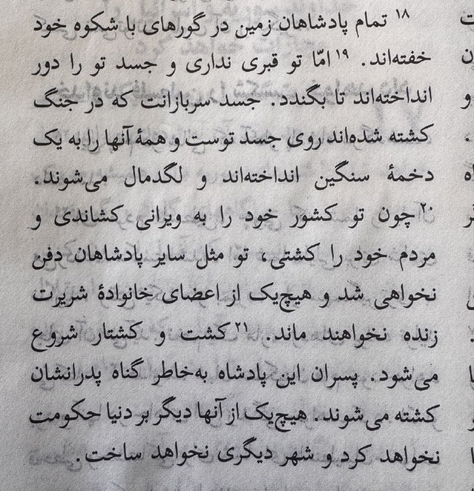

♨️ عکس زیر از متن تورات، کتاب اشعيا، باب ۱۴، آیه ۱۸ تا ۲۱ است.

پ.ن: طبیعیه که حاکمان شرور و ویرانگر عاقبت مشابه داشته باشند ولی این حد از شباهت تعجب برانگیزه. 😬

📝 Nick

📌 @persian_trend_official
پرشین ترند | متفاوت‌ترین کانال نظامی

## Persian_Trend_Official — post 13890

  <a href="telegram/content/Persian_Trend_Official_13890_1778496818.webm" target="_blank">🎬 Download video</a>

💢برای دومین بار در 24ساعت گذشته، یک جنگنده اف-35 آمریکا بر فراز امارات سیگنال درخواست کمک ارسال کرده است

🫆:Tony

📌 @persian_trend_official
پرشین ترند | متفاوت‌ترین کانال نظامی

## Persian_Trend_Official — post 13889

  <a href="telegram/content/Persian_Trend_Official_13889_1778496819.mp4" target="_blank">🎬 Download video</a>

⭕️ استاد خوش چشم، کارشناس صدا سیما: احتمال می‌دهم ظرف یک هفته آینده جنگ مجددا آغاز شود.

+خب فعلا جنگ کنسل شد. 🗿

📝 Nick

📌 @persian_trend_official
پرشین ترند | متفاوت‌ترین کانال نظامی

## Persian_Trend_Official — post 13888

  

🔴 احتمال سفر عراقچی به هند برای نشست بریکس

💢رسانه‌های هندی گزارش داده‌اند «عباس عراقچی» وزیر امور خارجه ایران احتمالاً روز ۱۴ مه برای شرکت در نشست وزیران خارجه بریکس راهی دهلی‌نو خواهد شد.

💢این نشست مقدمه‌ای برای هجدهمین اجلاس سران بریکس است که قرار است سپتامبر امسال در هند برگزار شود. هند در حال حاضر ریاست دوره‌ای این ائتلاف اقتصادی را برعهده دارد.

💢گزارش‌ها همچنین حاکی است در حاشیه این نشست، موضوع امنیت کشتیرانی و عبور کشتی‌ها از تنگه هرمز نیز میان تهران و دهلی‌نو مورد گفت‌وگو قرار خواهد گرفت.

🫆:Tony

📌 @persian_trend_official
پرشین ترند | متفاوت‌ترین کانال نظامی

## Persian_Trend_Official — post 13887

  <a href="telegram/content/Persian_Trend_Official_13887_1778496822.webm" target="_blank">🎬 Download video</a>

⭕️ توییت جدید سفارت جمهوری اسلامی در هند خطاب به ترامپ:

ما همچنان خواهیم خندید؛ اما این را بدان: به زودی با چشمانی اشکبار منطقه ما را ترک خواهی کرد.

ما فراز و نشیب‌های زیادی را پشت سر گذاشته‌ایم و درس‌های زیادی آموخته‌ایم.

📝 Nick

📌 @persian_trend_official
پرشین ترند | متفاوت‌ترین کانال نظامی

## Persian_Trend_Official — post 13886

قبل از شروع جنگ و قطعی اینترنت درخواست فیبر نوری دادم و حالا اومدن نصب و فعالش کردن.
با تشکر از شاتل بابت سرویس خوبشون؛ در واقع قبل از نصب اینترنت نداشتم، ولی الان با سرعت خیلی بیشتری اینترنت ندارم.

© itsmralii

📝 Nick

📌 @persian_trend_official
پرشین ترند | متفاوت‌ترین کانال نظامی

## Persian_Trend_Official — post 13885

## Persian_Trend_Official — post 13884

  

سهم من هم با رضایت خودم، ایشون گاز بزنه .

فقط اورانیوم میتونه نسل اینجور افراد رو منقرض کنه

## Persian_Trend_Official — post 13883

  <a href="telegram/content/Persian_Trend_Official_13883_1778496823.mp4" target="_blank">🎬 Download video</a>

میدونید منظورش از نیروی مسلح کجاست دیگه ؟!
جنگ زمینی قطعااااااااااا تخصص جمهوری اسلامی هست ...

📌 @persian_trend_official
پرشین ترند | متفاوت‌ترین کانال نظامی

## Persian_Trend_Official — post 13882

  

⭕️ تصویری از عرشه ناوشکن یو‌اس‌اس جان فین (DDG 113) که پشت سر ناوشکن یو‌اس‌اس میلیوس (DDG 69) و یو‌اس‌ان‌اس کارل براشیر (T-AKE-7) و ناو هواپیمابر جورج اچ.دبلیو. بوش (CVN 77) در دریای عرب در حال حرکت است.

طبق گفته سنتکام، بیش از 20 ناو جنگی ارتش این کشور در حال اجرای محاصره علیه ایران هستند. نیروهای سنتکام 61 کشتی تجاری را تغییر مسیر داده و 4 کشتی را از کار انداختند تا اطمینان حاصل شود که قوانین محاصره رعایت می‌شوند.

📝 Nick

📌 @persian_trend_official
پرشین ترند | متفاوت‌ترین کانال نظامی

## Persian_Trend_Official — post 13881

  

⭕️ اظهارات جنجالی ظهره‌وند درباره سلاح سری ایران: من جاها و ظرفیت هایی رو دیدم که اتفاقی میوفته که بمب اتم جلوش ترقه است/ شما میتونید زمان رو پشت سر بزارید، چیزی که در چند ثانیه از تهران تا واشنگتن برود/میشه یه کارهایی کرد که بمب اتم جلوش بچه بازیه! پ.ن:…

## Persian_Trend_Official — post 13880

  <a href="telegram/content/Persian_Trend_Official_13880_1778496826.mp4" target="_blank">🎬 Download video</a>

⭕️ تصاویر ماهواره‌ای یک نفتکش بزرگ را در تنگه هرمز نشان می‌دهند که بنظر می‌رسد پس از یک حمله احتمالی، ردی از نفت را نشت می‌دهد. فعالیت قایق‌های تندرو کوچک نیز در نزدیکی آن دیده می‌شود.

📝 Nick

📌 @persian_trend_official
پرشین ترند | متفاوت‌ترین کانال نظامی

## Persian_Trend_Official — post 13879

  <a href="telegram/content/Persian_Trend_Official_13879_1778496827.mp4" target="_blank">🎬 Download video</a>

هیچکس مثل جبهه پایداری به اهداف اسرائیل کمک نمیکنه !
فکر میکنم در حق این نماینده های خدوم جفا شده 😄

📌 @persian_trend_official
پرشین ترند | متفاوت‌ترین کانال نظامی

## Persian_Trend_Official — post 13878

  <a href="telegram/content/Persian_Trend_Official_13878_1778496830.mp4" target="_blank">🎬 Download video</a>

⭕️ اظهارات جنجالی ظهره‌وند درباره سلاح سری ایران:

من جاها و ظرفیت هایی رو دیدم که اتفاقی میوفته که بمب اتم جلوش ترقه است/ شما میتونید زمان رو پشت سر بزارید، چیزی که در چند ثانیه از تهران تا واشنگتن برود/میشه یه کارهایی کرد که بمب اتم جلوش بچه بازیه!

پ.ن: شعر گوی اعظم

📝 Nick

📌 @persian_trend_official
پرشین ترند | متفاوت‌ترین کانال نظامی

## Persian_Trend_Official — post 13877

  <a href="telegram/content/Persian_Trend_Official_13877_1778496833.mp4" target="_blank">🎬 Download video</a>

⭕️ به گفته GB News، نخست‌وزیر بریتانیا کیر استارمر «به نظر می‌رسد این هفته استعفا دهد.»

📝 Nick

📌 @persian_trend_official
پرشین ترند | متفاوت‌ترین کانال نظامی

## Persian_Trend_Official — post 13876

  <a href="telegram/content/Persian_Trend_Official_13876_1778496837.webm" target="_blank">🎬 Download video</a>

⭕️ علی مطهری، نایب‌رئیس پیشین مجلس شورای اسلامی:

«ما داریم کار بزرگی انجام می‌دهیم که در تاریخ ثبت خواهد شد و آن این است که داریم دنیا را از شر دو آدم روانی، ترامپ و نتانیاهو نجات می‌دهیم و انشاالله به نتیجه برسیم.»

📝 Nick

📌 @persian_trend_official
پرشین ترند | متفاوت‌ترین کانال نظامی

## Persian_Trend_Official — post 13875

  

اعدام عرفان شکورزاده؛ جمهوری اسلامی دانشجوی نخبه دانشگاه علم و صنعت را به «همکاری با موساد و سیا» متهم کرد

قوه قضائیه جمهوری اسلامی اعلام کرد عرفان شکورزاده، فرزند جعفر، به اتهام «همکاری با سرویس اطلاعاتی آمریکا و اسرائیل» اعدام شده است.

به ادعای قوه قضائیه، او از طریق یک سازمان علمی فعال در حوزه ماهواره جذب شده و اطلاعات طبقه‌بندی‌شده را در اختیار سرویس‌های خارجی قرار داده بود. جمهوری اسلامی همچنین مدعی شده است که عرفان شکورزاده در سه مرحله با موساد و سیا ارتباط برقرار کرده و از او تجهیزات و اطلاعات مرتبط با فعالیتش در یک مرکز علمی به دست آمده است.

آموزشکده توانا پیش‌تر گزارش داده بود که عرفان شکورزاده، دانشجوی ۲۹ ساله و نخبه دانشگاه علم و صنعت، پس از ماه‌ها نگهداری در سلول انفرادی و تحت فشار برای اخذ اعترافات اجباری، به اعدام محکوم شده بود.

چند روز پیش نیز گزارش شده بود که عرفان شکورزاده، دانشجوی کارشناسی ارشد مهندسی هوافضا ـ فناوری ماهواره دانشگاه علم و صنعت ایران، از زندان اوین به قزل‌حصار منتقل شده است؛ انتقالی که نگرانی‌ها درباره اجرای قریب‌الوقوع حکم اعدام او را افزایش داده بود.

بر اساس اطلاعات رسیده به آموزشکده توانا، او را به بهانه «ملاقات با ضابط» از بند خارج کرده و سپس به زندان قزل‌حصار منتقل کرده بودند. منابع مطلع گفته بودند که او پیش‌تر در وضعیت «توقف حکم اعدام» قرار داشته، اما انتقال ناگهانی‌اش به قزل‌حصار، نگرانی‌ها از اجرای حکم را تشدید کرده بود.

عرفان شکورزاده، متولد ۱۳۷۶، دانش‌آموخته مهندسی برق دانشگاه تبریز و دانشجوی کارشناسی ارشد دانشگاه علم و صنعت تهران بود. بر اساس سوابق علمی منتشرشده، او در حوزه نرم‌افزارهای تست ماهواره، کنترل و موقعیت‌یابی ماهواره فعالیت پژوهشی داشت و رتبه نخست مقطع کارشناسی ارشد را نیز کسب کرده بود.

طبق اطلاعات منتشرشده، او در بهمن‌ماه ۱۴۰۳ توسط اطلاعات سپاه با اتهام «جاسوسی و همکاری با کشورهای متخاصم» بازداشت شد. منابع نزدیک به پرونده گفته بودند که عرفان شکورزاده حدود ۹ ماه را در سلول انفرادی سپری کرده و تحت فشار و شکنجه برای اخذ اعترافات اجباری قرار داشته است.

در یادداشتی که به گفته منابع نزدیک به پرونده توسط او نوشته شده بود، آمده است:

«من عرفان شکورزاده ۲۹ ساله، یکی از معدود به اصطلاح نخبگانی که حاضر به مهاجرت نشدم.
چند ماه پیش از جنگ ۱۲ روزه، به اتهام واهی جاسوسی و همکاری با کشورهای متخاصم توسط اطلاعات سپاه بازداشت شدم و در مدت ۸ ماه و نیم شکنجه و زندان انفرادی مجبور به اعتراف اجباری شدم.
نگذارید یک جان بی‌گناه دیگر در سکوت و بی‌خبری از دست برود.»

#عرفان_شکورزاده #نه_به‌_اعدام #نه_به_جمهوری_اسلامی

@Tavaana_TavaanaTech

## Persian_Trend_Official — post 13874

  <a href="telegram/content/Persian_Trend_Official_13874_1778496838.mp4" target="_blank">🎬 Download video</a>

کانال تلگرامی صدا و سیما اولین تصاویر از عرفان شکورزاده که بعنوان جاسوس دو جانبه سیا و موساد متهم کرده بودنش و صبح امروز اورا اعدام کردن منتشرکرد.

☆Phantom☆

📌 @persian_trend_official
پرشین ترند | متفاوت‌ترین کانال نظامی

## RadioFarda — post 157057

  

🔸معاون محیط‌زیست طبیعی استان گیلان از شناسایی قورباغۀ «آبی» در جنگل‌های هیرکانی خبر داد.

🔸عباس عاشوری، معاون محیط‌زیست طبیعی گیلان روز دوشنبه ۲۱ اردیبهشت با اعلام این خبر گفت: «قورباغۀ درختی خاوری با نام علمی Hyla orientalis یکی از ۲۲ گونه دوزیستان ایران محسوب می‌شود که بیشتر در مناطق جنگلی و مرطوب شمال کشور زیست می‌کند.»

🔸به گفته او این ‌گونه معمولاً به رنگ سبز مایل به زرد یا کرم مایل به قهوه‌ای دیده می‌شود و در برخی شرایط خاص، ناهنجاری رنگی یا «کالر آنومالی» در برخی موارد می‌تواند موجب تغییر رنگ بدنش شود که یکی از نادرترین حالت‌های آن، ظهور رنگ آبی است.

🔸این اختلال در اثر عوامل محیطی و به‌ویژه نوسانات شدید دمایی ایجاد می‌شود و از هر ۲۰ هزار قورباغۀ درختی، احتمالاً تنها یک نمونه آبی‌رنگ مشاهده می‌شود.

@RadioFarda

## RadioFarda — post 157056

دیپلمات ارشد پیشین آمریکا: مذاکرات ایران و ایالات متحده احتمالاً ادامه خواهد یافت

🔸گوردون گری، دیپلمات ارشد پیشین آمریکا که در دولت جرج دبلیو بوش معاون دستیار وزیر خارجه در امور خاور نزدیک بود و همچنین به‌عنوان سفیر آمریکا در تونس و معاون رئیس هیئت دیپلماتیک آمریکا در مصر خدمت کرده است، می‌گوید مذاکرات غیرمستقیم میان واشینگتن و تهران، با وجود «فشار و درد قابل‌توجه» بر هر دو طرف، احتمالاً ادامه خواهد یافت.

🔸تهران از طریق پاکستان پیشنهادی ارسال کرده که در آن خواستار پایان عملیات نظامی در منطقه، کاهش تحریم‌ها و تضمین امنیت دریانوردی، از جمله بازگشایی تنگهٔ هرمز شده است. دونالد ترامپ، رئیس‌جمهور آمریکا، روز ۲۰ اردیبهشت این موضع ایران را رد کرد، اما همزمان نارضایتی خود از کندی روند دیپلماسی را نیز نشان داد.

🔸این تحولات در شرایطی رخ می‌دهد که فشار اقتصادی بر ایران افزایش یافته، نگرانی‌ها دربارهٔ عرضهٔ جهانی انرژی ادامه دارد و بحث‌ها دربارهٔ فعالیت‌های هسته‌ای تهران دوباره شدت گرفته است. گفته می‌شود پاسخ جمهوری اسلامی که در حال بررسی است، شامل محدودیت غنی‌سازی اورانیوم ایران برای دست‌کم ۱۲ سال در برابر کاهش تحریم‌ها و آزادسازی دارایی‌های مسدودشدهٔ ایران است.

🔸رادیو اروپای آزاد/رادیو آزادی با آقای گری، که اکنون استاد امور خلیج فارس و شبه‌جزیرهٔ عربستان در مدرسهٔ روابط بین‌الملل الیوت دانشگاه جرج واشینگتن است، دربارهٔ آخرین وضعیت مذاکرات صلح ایران، محاسبات راهبردی در واشینگتن و تهران، و این‌که آیا هنوز فضایی برای ادامهٔ دیپلماسی وجود دارد یا نه، گفت‌وگو کرده است.

🔸نسخه کامل این گفت‌وگو را در وب‌سایت رادیوفردا بخوانید.

@RadioFarda

## RadioFarda — post 157055

  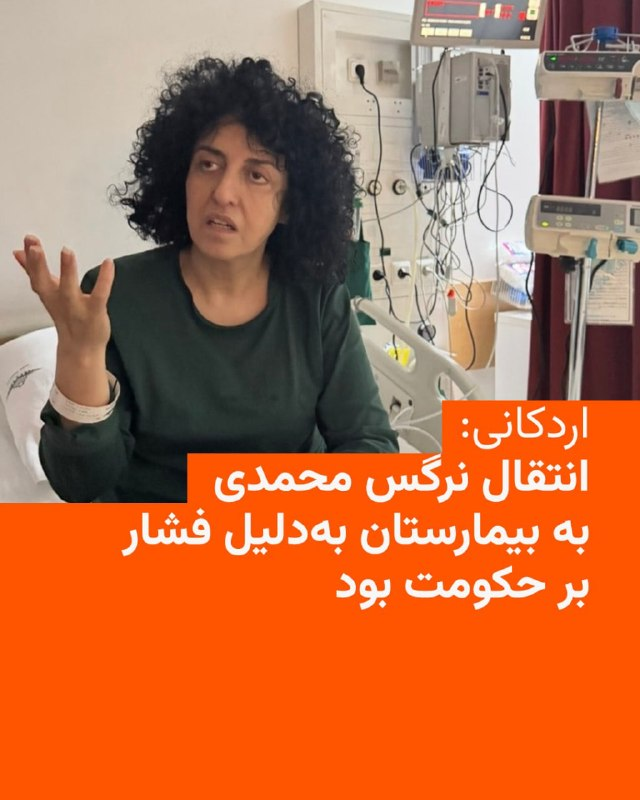

🔸شیرین اردکانی، وکیل نرگس محمدی، برنده جایزه حقوق بشر، می‌گوید انتقال موکلش از زندان به بیمارستان، «به لطف بسیج جامعه مدنی جهانی و تلاش‌های دیپلماسی حقوق بشر که بر حکومت فشار وارد کردند، به دست آمد».

🔸اظهارات خانم اردکانی را حساب کاربری بنیاد نرگس محمدی در شبکه ایکس منتشر کرده و نوشته انتقال او به بیمارستان به «دلایل جدی پزشکی» صورت گرفت.

🔸اردکانی خواستار ادامه کمپین جهانی در حمایت از نرگس محمدی تا لغو همه اتهامات علیه او و آزادی زندانیان سیاسی که به‌صورت خودسرانه بازداشت شده‌اند، شد.

🔸او گفته:‌ «ما از همه دستگاه‌های دیپلماسی جهان می‌خواهیم فشار بر مقام‌های ایرانی را حفظ کنند تا خواستار پایان دادن به اعدام‌هایی شوند که همچنان در کشور ادامه دارد.»

🔸بنیاد نرگس محمدی در کنار این خبر، تصویری از این فعال حقوق بشر روی تخت بیمارستان هم منتشر کرده است.

🔸مصطفی نیلی، وکیل دادگستری، روز یکشنبه ۲۰ اردیبهشت خبر داد که محمدی برای طی کردن مراحل درمان به بیمارستانی در تهران منتقل شده است.

@RadioFarda

## RadioFarda — post 157054

  

🔸روزنامه «گاردین» در گزارشی از ارتباط اسحاق قالیباف، پسر محمدباقر قالیباف، رئیس مجلس شورای اسلامی، با یک مرکز پژوهشی در دانشگاه ملبورن و سرمایه‌گذاری او در حوزه املاک در استرالیا خبر می‌دهد.

🔸آن‌طور که در این گزارش آمده، او از طریق «اجاره دادن دست‌کم یک ملک در این کشور کسب درآمد می‌کرده است».

🔸گاردین نوشته اسحاق قالیباف چند سال در ملبورن زندگی و تحصیل کرده و طی این مدت با بازار سرمایه‌گذاری املاک و نیز دانشگاه ملبورن ارتباط داشته است.

🔸این روزنامه نوشته که اسحاق قالیباف، ۳۸ ساله، همچنین موفق شده بود اقامت بلندمدت استرالیا را دریافت کند؛ این در حالی است که کانادا دو بار درخواست ویزای او را رد کرده بود.

🔸در این گزارش این پرسش مطرح شده که علیرغم اینکه قالیباف، از فرماندهان سابق سپاه پاسداران و رئیس سابق پلیس ایران بوده و به نقش خود در سرکوب و کتک‌زدن دانشجویان معترض افتخار کرده، فرزند او چطور توانسته از املاک در استرالیا درآمد دریافت کند و در این کشور اقامت موقت بگیرد.

@RadioFarda

## RadioFarda — post 157053

  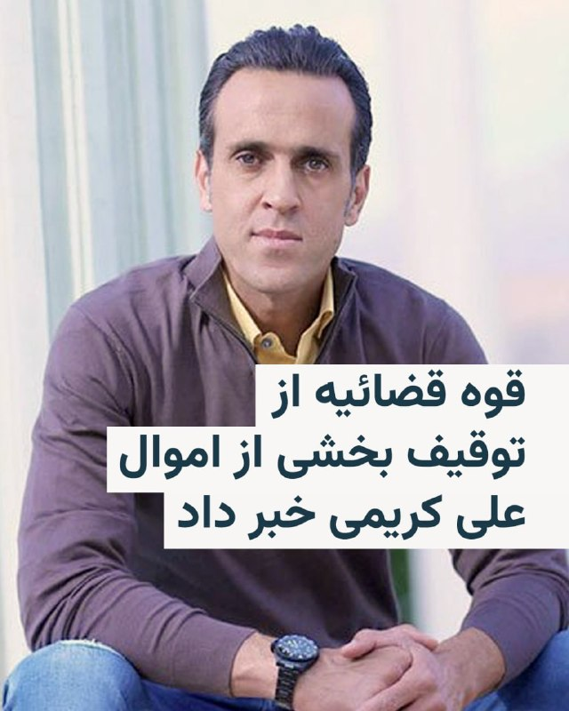

🔸ارگان رسمی قوه قضائیه ایران اعلام کرد بخشی از املاک علی کریمی، فوتبالیست سابق تیم ملی ایران و از مخالفان جمهوری اسلامی، را توقیف کرده است.

🔸آن‌طور که خبرگزاری میزان‌ روز دوشنبه ۲۱ اردیبهشت نوشته، «دو واحد تجاری و چهار واحد مسکونی از علی کریمی شناسایی و به دستور قضایی توقیف شده است».

🔸در این گزارش همچنین ادعا شده که یکی از املاک توقیف‌شده، «یک پلاک ثبتی به نام هاوش، فرزند علی کریمی» است.

🔸پیش از این نیز گزارش‌های متعددی از توقیف اموال شماری از روزنامه‌نگاران، فعالان سیاسی و مدنی و هنرمندان با اتهاماتی چون «خیانت» به وطن و «وابستگی» به اسرائیل و کشورهای متخاصم منتشر شده بود.

🔸قوه قضائیه برای اتهامات خود علیه این افراد شواهد و مدارکی ارائه نداده است.

🔸قوه قضائیه می‌گوید کلیه اموال منقول و غیرمنقول این افراد، حساب‌های بانکی و سایر دارایی‌های آن‌ها را توقیف کرده و ممنوعیت انجام هرگونه نقل و انتقال مالی و معاملاتی برای آنان اعمال کرده است.

@RadioFarda

## RadioFarda — post 157052

  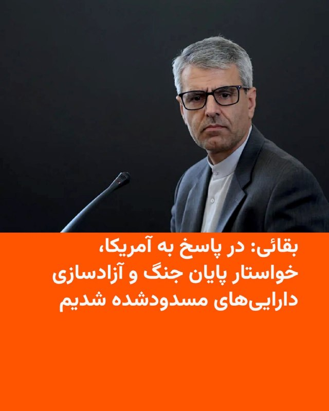

🔸سخنگوی وزارت خارجه ایران می‌گوید تهران در پاسخ به آخرین پیشنهاد آمریکا، خواستار پایان جنگ در منطقه و آزادسازی دارایی‌های مسدودشده در خارج شده است.

🔸اسماعیل بقائی روز دوشنبه ۲۱ اردیبهشت در نشست خبری هفتگی خود گفت: «ما هیچ امتیازی را از طرف آمریکایی مطالبه نکردیم تنها چیزی که مطالبه کردیم حقوق مشروع ایران است».

🔸او افزود مطالبات ایران شامل «توقف جنگ»، «رفع محاصره و دزدی دریایی» و «آزادی دارایی‌های ایران» است که به گفته بقائی، «به ناحق با فشار آمریکا در بانک‌ها مسدود شده است».

🔸سخنگوی وزارت خارجه ایران در ادامه گفت: «تردد ایمن از تنگه هرمز و برقراری امنیت در منطقه و لبنان از دیگر مطالبه‌های ایران بود که پیشنهاد سخاوتمندانه و مشروع برای امنیت منطقه محسوب می‌شود».

🔸رئیس‌جمهور آمریکا شامگاه یکشنبه، پاسخ ایران به طرح پیشنهادی واشینگتن برای پایان جنگ را «کاملاً غیر قابل‌ قبول» توصیف کرد.

🔸وزارت خارجه ایران روز دوشنبه مدعی شد که «طرف‌های آمریکایی کماکان بر اساس ذهنیت‌هایی که عمدتاً ساخته‌پرداخته رژیم صهیونیستی است، بر دیدگاه‌های یک‌سویه خود و خواسته‌های نامعقول‌شان پافشاری می‌کنند».

@RadioFarda

## RadioFarda — post 157051

  

🔸دفتر ریاست‌جمهوری کره جنوبی روز دوشنبه ۲۱ اردیبهشت حمله به یک کشتی باری متعلق به یک شرکت کشتیرانی کره‌ای در تنگهٔ هرمز در اوایل همین ماه را به‌شدت محکوم کرد و گفت که پس از شناسایی عامل این حمله، واکنش نشان خواهد داد.

🔸به گفته یکی از مقامات این دفتر، این حمله باعث آتش‌سوزی در اتاق موتور کشتی شده بود.

🔸این مقام افزود کشتی «نامو» که توسط شرکت «اچ‌ام‌ام» اداره می‌شود، در زمان حادثه هیچ‌یک از مقررات جاری در آب‌های نزدیک امارات متحده عربی را نقض نکرده بود و این رویداد حمله‌ای غیرقابل توجیه به یک کشتی تجاری محسوب می‌شود.

🔸وی سونگ-لاک، مشاور امنیت ملی رئیس‌جمهور کره جنوبی، در یک نشست خبری گفت: «ما این اقدام را به‌شدت محکوم می‌کنیم».

🔸او افزود که خسارات واردشده در جریان بررسی‌های کارشناسی توسط مقامات و متخصصان کره‌ای در دوبی شناسایی شده است.

🔸تهران پیش‌تر هرگونه دخالت در این حادثه را رد کرده بود.

🔸رئیس‌جمهور آمریکا، اندکی پس از این حادثه گفته بود ایران به این کشتی کره‌ای شلیک کرده و از سئول خواسته بود به تلاش‌های تحت رهبری ایالات متحده برای تأمین امنیت کشتیرانی در این تنگه بپیوندد.

@RadioFarda

## RadioFarda — post 157050

  

🔸نرگس رشیدی، بازیگر ایرانی-آلمانی، به‌خاطر بازی در نقش نازنین زاغری-رتکلیف در سریال «زندانی ۹۵۱»، برنده جایزه بهترین بازیگر زن نقش اول بفتا (جوایز آکادمی فیلم بریتانیا) شد.

🔸این سریال که نوامبر پارسال از نت‌فلیکس هم پخش شد، بر اساس داستان واقعی زندگی نازنین زاغری و از روی کتابی که او از خاطرات زندانی‌شدنش برای شش سال در ایران نوشته، ساخته شده است.

🔸خانم زاغری، کارمند بنیاد تامسون رویترز، فروردین ۱۳۹۵ در پایان سفرش به ایران که برای دیدار با خانواده خود رفته بود، در فرودگاه تهران به اتهام «جاسوسی» بازداشت و به پنج سال زندان محکوم شد.

🔸نرگس رشیدی برای آماده شدن برای این نقش، پیش از ساخت این سریال، خاطرات در شُرف انتشار زاغری-رتکلیف را که با همکاری ریچارد همسرش نوشته شده است، مطالعه کرد.

🔸او که در ایران متولد شده و تا هفت سالگی آن‌جا زندگی کرده است، این جایزه را به نازنین زاغری-رتکلیف و خانواده‌اش تقدیم کرد.

@RadioFarda

## RadioFarda — post 157049

  

🔸ایران می‌گوید به یک نفتکش عراقی که حامل نفت خام عراق است، اجازه داده تا از تنگه هرمز عبور کند.

🔸خبرگزاری تسنیم، وابسته به سپاه پاسداران روز دوشنبه ۲۱ اردیبهشت‌ماه اعلام کرد که یک فروند نفتکش وی‌ال‌سی‌سی (VLCC) به نام «آگوس فانوریوس ۱/AGOIS FANOURIOS I» روز یکشنبه از مسیر تعیین‌شده ایران در تنگه هرمز عبور کرد.»

🔸بنا بر این گزارش این نفتکش که حامل نفت خام عراق است و به سمت ویتنام حرکت می‌کند، هم‌اکنون در دریای عمان قرار دارد.

🔸روز شنبه نیز همزمان با دیدار وزیر خارجه آمریکا با نخست وزیر قطر در میامی یک نفتکش قطری حامل گاز مایع در راه پاکستان از تنگه هرمز گذشت.

🔸خبرگزاری رویترز به نقل از منابعی نوشت که گذر این نفتکش «با تأیید» جمهوری اسلامی صورت می‌گیرد و اقدامی برای اعتمادسازی با دو کشور قطر و پاکستان که هر دو در جنگ آمریکا و اسرائیل با ایران نقش میانجی را ایفا کرده‌اند.

@RadioFarda

## RadioFarda — post 157048

ترامپ پاسخ ایران درباره توافق پایان جنگ را «کاملاً غیر قابل قبول» خواند

🔸رئیس‌جمهور آمریکا شامگاه یکشنبه ۲۰ اردیبهشت، پاسخ ایران به طرح پیشنهادی واشینگتن برای پایان جنگ را «کاملاً غیر قابل‌ قبول» توصیف کرد.

🔸دونالد ترامپ در پیام کوتاهی در شبکه اجتماعی خود، تروث سوشال، نوشت: «من همین حالا پاسخ به‌اصطلاح "نمایندگان" ایران را خواندم. از آن خوشم نمی‌آید. کاملاً غیرقابل‌قبول است!»

🔸ایران پیش‌تر در همان روز به تازه‌ترین پیشنهاد صلح واشینگتن پاسخ داده و هم‌زمان هشدار داده بود که هرگونه حملهٔ جدید آمریکا را تلافی خواهد کرد و اجازه حضور بیشتر ناوهای جنگی خارجی در تنگهٔ هرمز را نخواهد داد.

🔸ترامپ جزئیاتی از پیشنهاد متقابل تهران به طرح آمریکا ارائه نکرده، اما پیام کوتاه او در تروث‌سوشال نشان می‌دهد که پیشنهادهای جمهوری اسلامی ایران را به‌طور کامل رد می‌کند.

🔸رئیس‌جمهور آمریکا پیش‌تر نیز پیشنهادات ارائه‌شده توسط حکومت ایران را غیر قابل قبول و ناکافی خوانده بود.

🔸آمریکا و ایران بعد از یک دور مذاکره حضوری در پاکستان که چند روز بعد از برقراری آتش‌بس در اسلام‌آباد برگزار شد، با ارسال طرح‌های پیشنهادی متقابل مشغول مذاکره بودند. آمریکا بعد از بی‌نتیجه ماندن مذاکره حضوری، محاصره دریایی بنادر ایران را آغاز کرد، در حالی که ایران از ابتدای جنگ تنگهٔ هرمز را مسدود کرده است.

🔸این مذاکرات برای پایان دادن به جنگی است که از ۹ اسفند پارسال با حملات آمریکا و اسرائیل به ایران آغاز و خیلی زود به یک درگیری منطقه‌ای تبدیل شد.

🔸بر اساس گزارش خبرگزاری رسمی دولت ایران، ایرنا، پاسخ تهران به طرح آمریکا، بر پایان جنگ «در همه جبهه‌ها، به‌ویژه لبنان»، جایی که اسرائیل همچنان با این گروه مورد حمایت ایران درگیر است، و نیز بر «تضمین امنیت کشتیرانی» تمرکز دارد.

🔸نسخه کامل این گزارش را در وب‌سایت رادیوفردا بخوانید.

@RadioFarda

## RadioFarda — post 157047

عرفان شکورزاده، دانشجوی ۲۹ ساله، به اتهام «جاسوسی» برای آمریکا و اسرائیل اعدام شد

🔸خبرگزاری رسمی قوه قضائیه، میزان، روز دوشنبه ۲۱ اردیبهشت گزارش داد که ایران یک متهم دیگر با ادعای «جاسوسی مشترک» برای آمریکا و اسرائیل را اعدام شد.

🔸این خبرگزاری هویت فرد اعدام‌شده را «عرفان شکورزاده» اعلام و ادعا کرده که او «با دشمن در فروش اطلاعات علمی کشور» همکاری داشته است.

🔸میزان بدون اشاره به شغل این متهم، افزوده که او در چارچوب یک «پروژه» و «با توجه به تخصصی که داشته، جذب یکی از سازمان‌های علمی کشور شده بود که در حوزهٔ ماهواره فعالیت داشته است».

🔸بر اساس این ادعا، فرد اعدام‌شده «آگاهانه» و «با میل خود» در «سه مرحله اقدام به ارتباط‌گیری کرده که مرحله اول و سوم مربوط به موساد و مرحله دوم مربوط به سی‌آی‌ای بوده است».

🔸میزان می‌افزاید: «اطلاعاتی که محکوم‌علیه تلاش داشته به سرویس‌های دشمن ارائه کند، دارای طبقه‌بندی بوده است».

🔸سازمان حقوق بشر ایران در این زمینه گزارش داده که عرفان شکورزاده ۲۹ ساله، دانشجوی کارشناسی ارشد مهندسی هوافضا در دانشگاه علم و صنعت ایران بود.

🔸گزارش‌ها حاکی است که او بهمن سال ۱۴۰۳ به اتهام «جاسوسی و همکاری با کشورهای متخاصم» توسط اطلاعات سپاه پاسداران بازداشت شد و حدود ۹ ماه در سلول انفرادی نگهداری می‌شد و تحت فشار مجبور به «اعتراف اجباری» شد.

🔸نسخه کامل این گزارش را در وب‌سایت رادیوفردا بخوانید.

@RadioFarda

## RadioFarda — post 157046

  

🔸خبرگزاری رسمی قوه قضائیه، میزان، روز دوشنبه ۲۱ اردیبهشت گزارش داد که یک متهم دیگر با ادعای «جاسوسی مشترک» برای آمریکا و اسرائیل اعدام شد.

🔸این خبرگزاری هویت فرد اعدام‌شده را «عرفان شکورزاده» اعلام کرده و گفته که او «با دشمن در فروش اطلاعات علمی کشور» همکاری داشته است.

🔸میزان بدون اشاره به شغل این متهم، گفته که او در چارچوب یک «پروژه» و «با توجه به تخصصی که داشته، جذب یکی از سازمان‌های علمی کشور شده بود که در حوزه ماهواره فعالیت داشته است».

🔸بر اساس این ادعا، فرد اعدام‌شده «آگاهانه» و «با میل خود» در «سه مرحله اقدام به ارتباط‌گیری کرده که مرحله اول و سوم مربوط به موساد و مرحله دوم مربوط به سی‌آی‌ای بوده است».

🔸میزان می‌افزاید: «اطلاعاتی که محکوم‌علیه تلاش داشته به سرویس‌های دشمن ارائه کند، دارای طبقه‌بندی بوده است».

🔸ایران در ماه‌های اخیر با موج تازه‌ای از اعدام‌ها، بازداشت‌ها و صدور احکام سنگین روبه‌رو بوده است؛ موجی که به گفتهٔ نهادها و سازمان‌های حقوق بشری، در فضای جنگ، بحران امنیتی و اعتراضات، به‌عنوان ابزاری برای ایجاد ترس و کنترل جامعه عمل می‌کند.

@RadioFarda

## RadioFarda — post 157045

  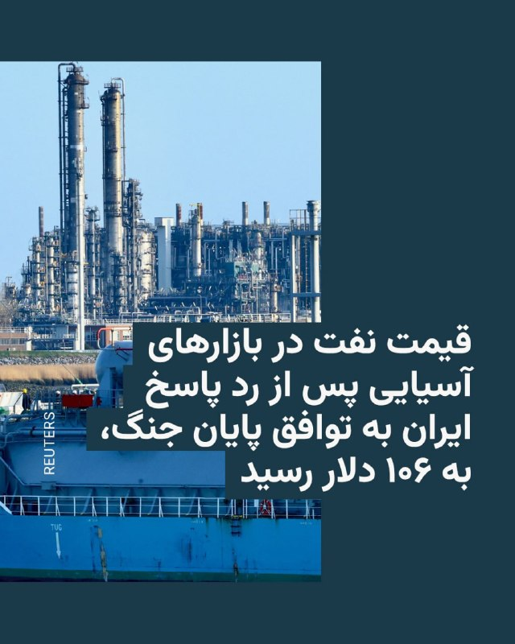

🔸گزارش رسانه‌ها حاکی است که قیمت نفت در بازارهای آسیایی در روز دوشنبه ۲۱ اردیبهشت پس از رد پیشنهادهای ایران از سوی آمریکا برای توافق بر سر پایان جنگ، افزایش یافت.

🔸قیمت نفت برنت با ۴.۵ درصد افزایش به حدود ۱۰۶ دلار به ازای هر بشکه نفت رسید. نفت وست تگزاس اینترمدیت نیز به ۱۰۵ دلار برای هر بشکه رسید.

🔸دونالد ترامپ، رئیس‌جمهور آمریکا، شامگاه یکشنبه بدون ارائه توضیحی، پاسخ ایران به پیشنهادهای واشینگتن برای پایان جنگ بین دو کشور را «کاملاً غیرقابل قبول» خواند و آن را رد کرد.

🔸دلار نیز برای دومین روز متوالی در معاملات آسیایی در برابر ارزهای اصلی تقویت شد.

🔸به گزارش خبرگزاری فرانسه، این روند تحت تأثیر داده‌های قوی اشتغال در آمریکا و تقاضا برای دارایی‌های امن در پی آتش‌بس متزلزل میان آمریکا و ایران بود.

🔸بازارهای سهام آسیایی در روز دوشنبه نیز شاهد کاهش ارزش بودند.

@RadioFarda

## RadioFarda — post 157043

  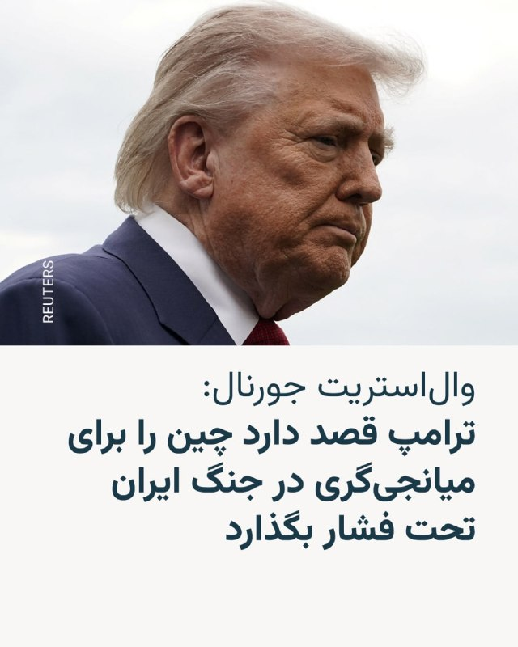

🔸روزنامه وال‌استریت جورنال روز دوشنبه ۲۱ اردیبهشت گزارش داد که رئیس‌جمهور آمریکا قصد دارد در سفر هفتهٔ جاری خود به پکن، همتای چینی‌اش را برای میانجی‌گری و پایان جنگ در خاورمیانه تحت فشار بگذارد.

🔸به نوشتهٔ این روزنامه، در حالی که رهبران دو ابرقدرت جهان این هفته با هم دیدار می‌کنند، دونالد ترامپ و شی جین‌پینگ، با حضور سایه‌وار کشوری دیگر بر نشست خود روبه‌رو خواهند بود: ایران.

🔸این دیدار که مدت‌ها انتظارش می‌رفت، پیش‌تر یک‌بار به‌دلیل جنگ آمریکا و اسرائیل با ایران که به بسته شدن تنگهٔ هرمز انجامیده، به تعویق افتاده بود.

🔸وال‌استریت جورنال می‌نویسد که ترامپ مشتاق است از جنگ خاورمیانه عبور کند، جنگی که قدرت داخلی او را تحلیل می‌برد و اقتصاد جهانی را تحت فشار قرار داده است.

🔸به گفتهٔ مقام‌های آمریکایی، او در حالی وارد پکن می‌شود که آماده است چین را تحت فشار بگذارد تا برای میانجی‌گری و دستیابی به توافقی که به این درگیری پایان دهد، کمک کند.

@RadioFarda

## RadioFarda — post 157042

  <a href="https://t.me/radiofarda/157042" target="_blank">📎 Download file</a>

📻بشنوید: سرخط خبرها با رادیوفردا، ۲۱ اردیبهشت ۱۴۰۵‌

@RadioFarda

## IranianMinds — post 19933

  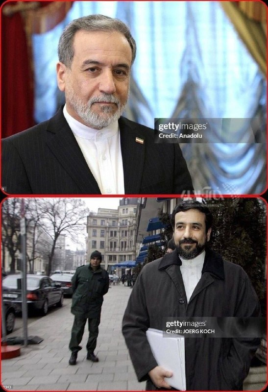

🔴عباس عراقچی ۲۰ سال در مذاکره، از مونیخ ۲۰۰۶ تا تهران ۲۰۲۶.

@IranianMinds

## IranianMinds — post 19932

🔴خوش‌چشم، کارشناس صداوسیما:

احتمال می‌دهم ظرف یک هفته آینده، جنگ دوباره آغاز شود.

@IranianMinds

## IranianMinds — post 19931

🔴یدیعوت آحارونوت:

نخست‌وزیر نتانیاهو عصر امروز در پی بحران مذاکرات بین تهران و واشنگتن، یک جلسه امنیتی برگزار می‌کند.

@IranianMinds

## IranianMinds — post 19930

  

🔴 صبح امروز همزمان با اذان صبح جمهوری اسلامی یکی دیگه از جوونای وطنمونو ازمون گرفت

عرفان شکورزاده ۲۹ ساله و نخبه ی دانشگاه علم و صنعت توسط جمهوری اسلامی امروز اعدام شد …

@IranianMinds

## IranianMinds — post 19929

🔴 صدا و سیما:

آخرین پیشنهاد آمریکا رو رد کردیم و پیشنهاد متقابل خودمونو ارائه دادیم.

ما فقط خواستار رفع تحریم‌ها، آزادسازی دارایی‌های مسدود شده ایران، جبران خسارات ناشی از جنگ٬ به رسمیت شناختن نقش ایران در تنگه هرمز و به عقد درآوردن دائمی ملانیا زن‌ ترامپ برای مسعود پزشکیان شدیم ولی آمریکا این پیشنهادات رو هم قبول نکرده و خیلی زیاده خواهه.

@IranianMinds

## IranianMinds — post 19928

  <a href="telegram/content/IranianMinds_19928_1778496851.mp4" target="_blank">🎬 Download video</a>

🔴 نتانیاهو:

در ایران، خیابان‌ها را به اسم من نامگذاری می‌کنند. می‌دانستید؟ خب، البته به اسم رئیس‌جمهور ترامپ هم هست، چون او رهبری مبارزه را برعهده دارد.

من فارسی بلد نیستم ولی میدونم ایرانیا منو «بی بی جون» صدا می‌کنند، بیبی عزیز

@IranianMinds

## IranianMinds — post 19927

  <a href="https://t.me/IranianMinds/19927" target="_blank">📎 Download file</a>

📲#اپلیکیشن اندروید سایت جهانی دربی بت

👍اسپانسر لیگ انگلیس
👍
🔥امکان شارژ امن از طریق کارت بانکی
➖➖➖➖➖➖➖➖➖

🪙همین حالا عضو شوید 👇
https://t.me/+aCbq7yy8QY80NzQ0

## IranianMinds — post 19926

  

😤دنبال یه سایت شرط بندی بین المللی بودی که به ایرانیا خدمات بده؟!
⛔

👍دربی بت همون انتخاب  100%

💎ویژگی های سایت جهانی Derby Bet:

⬅️امکان شارژ امن با کارت بانکی

⬅️واریز اول دوبل شارژ می شوید(بونوس۱۰۰٪)

⬅️پر اپشن ترین سایت فعال در ایران

⬅️تسویه حساب کمتر از 5 دقیقه

⬅️برگشت بخشی از باخت به صورت هفتگی

🚨کد هدیه ثبت نام:GG007

⚠️برای دانلود اپلکیشن کلیک کنید
👉
re21

🔔کانال دربی بت :

🪙https://t.me/+aCbq7yy8QY80NzQ0

## IranianMinds — post 19925

  <a href="telegram/content/IranianMinds_19925_1778496855.mp4" target="_blank">🎬 Download video</a>

🔴 نتانیاهو:

حتی هیتلر هم نمیگفت «مرگ بر آمریکا، مرگ بر بریتانیا.»

@IranianMinds

## IranianMinds — post 19924

  <a href="telegram/content/IranianMinds_19924_1778496858.mp4" target="_blank">🎬 Download video</a>

🔴 نتانیاهو:

فکر می‌کنم مجتبی خامنه‌ای هنوز زنده است. وضعیتش را نمی‌توان دقیق گفت. احتمالا در یک پناهگاه یا جای مخفی قایم شده.

@IranianMinds

## IranianMinds — post 19923

  

🔴 ترامپ به آکسیوس گفت که پاسخ ایران به آخرین پیش‌نویس توافق برای پایان دادن به جنگ را رد خواهد کرد؛ پاسخی که پس از ۱۰ روز انتظار آمریکا برای دریافت جواب تهران ارسال شده بود.

او گفت: «نامه‌شان را دوست ندارم. نامناسب است. از پاسخشان خوشم نیامد.»
ترامپ همچنین افزود که ایران «۴۷ سال است بسیاری از کشورها را بازی داده است.»

او تایید کرد که روز یکشنبه با نتانیاهو گفت‌وگو کرده؛ تماسی که آن را «بسیار خوب» توصیف کرد، اما تأکید داشت که مذاکرات با ایران «مسئله من است، نه مسئله دیگران.

@IranianMinds

## IranianMinds — post 19922

فقط کافیه مرغ از خیابون رد کنی و‌پولت چند برابر کنی
💵👌

## IranianMinds — post 19921

  <a href="telegram/content/IranianMinds_19921_1778496861.mp4" target="_blank">🎬 Download video</a>

بچه ها اسم این بازی عبور مرغ از خیابون  هست ویدئو نگاه کنید خیلی راحت 8 میلیون ازش سود گرفتیم😍

😤اگ توم دوس داری خیلی راحت از بازی های انلاین پول در بیاری حتما عضو کازینو شبانه شو
✅

توی کازینو شبانه بهت اموزش میدیم از بازی های انلاین پول دربیاری👌

کازینو شبانه راهی برای چند برابر کردن سرمایت 🤷‍♂

کسب درامد انلاین با یه ادم حرفه ای یاد بگیر و‌ پول دربیار 
💵
ae20
🎯همین حالا عضو شو و شروع کن👇
https://t.me/+OS-QBvyDO4M2ZGY0
https://t.me/+OS-QBvyDO4M2ZGY0

## BBCPersian — post 280750

🔻اسرائیل می‌گوید سه سربازش در حمله پهپادی مجروح شدند

ارتش اسرائیل اعلام کرد که سه سربازش بر اثر انفجار یک حامل مواد منفجره در جنوب لبنان زخمی شده‌اند.
جزییات بیشتری از محل این انفجار اعلام نشده است.
پیشتر حزب‌الله اعلام کرده بود که محل تجمع سربازان اسرائیلی را در منطقه طیبه در جنوب لبنان هدف قرار داده و نیروهای اسرائیلی برای تخلیه مجروحان از هلیکوپتر استفاده کرده‌اند.
صبح امروز هم اسرائیل اعلام کرده بود که یک سربازش در حمله پهپادی در منطقه‌ای نزدیک به مرز لبنان کشته شده است.
در همین حال خبرگزاری ملی لبنان گزارش داده است که اسرائیل صبح امروز به روستای شمالی عابا حمله هوایی کرده است که دو نفر کشته و پنج زخمی برجا گذاشته است.
براساس این گزارش منطقه كفر رمان در جنوب لبنان هم امروز، دو بار و در کمتر از یک ساعت، هدف حمله جنگنده‌های اسرائیل قرار گرفته است.

https://bbc.in/3PePlEc
@BBCPersian

## BBCPersian — post 280749

🔻نتبلاکس: قطع اینترنت در ایران وارد هفتادوسومین روز متوالی شد

نتبلاکس که وضعیت اینترنت در جهان را بررسی می‌کند می‌گوید که قطع اینترنت در ایران اکنون وارد هفتادوسومین روز شده و مدت این اختلال از ۱۷۲۸ ساعت فراتر رفته است.

نتبلاکس می‌گوید: «دسترسی آزاد به اینترنت یک حق اساسی است که زمینه‌ساز سایر آزادی‌ها محسوب می‌شود، و محرومیت از آن، توان عمومی برای ثبت، مستندسازی و پیگیری نقض‌ اساسی حقوق بشر را به‌شدت محدود می‌کند.»

مقام‌های جمهوری اسلامی ایران از ۹ اسفند (۲۸ فوریه) و همزمان با حملات اسرائیل و آمریکا، دسترسی به اینترنت بین‌الملل را قطع کردند. تماس‌ تلفنی با خارج از ایران هم با اختلال جدی رو‌به‌رو است.

حکومت ایران برای حامیان یا نزدیکان خود اتصال به اینترنت بین‌الملل را فراهم کرده است که این افراد به دارندگان «سیم‌کارت سفید» مشهور شده‌‌‌‌‌‌‌‌‌‌اند.

ایران استفاده از اینترنت ماهواره‌ای استارلینک را جرم‌انگاری کرده است و کاربران را تحت تعقیب قرار می‌دهد.

تازه‌ترین تحولات ایران و منطقه را از لینک ⬇️ در سایت بی‌بی‌سی فارسی دنبال کنید.

https://bbc.in/4u5EtI8
@BBCPersian

## BBCPersian — post 280741

‌ ‌ ‌
هر زمان که به اینترنت وصل می‌شوید، کسی در حال گردآوری اطلاعاتی است که از خود به جا می‌گذارید؛ چه ارائه‌دهنده خدمات اینترنتی شما باشد، چه سرور صفحه‌ای که از آن بازدید می‌کنید، یا مرورگری که با آن به این صفحه دسترسی دارید.

همه این داده‌ها به شرکت‌ها کمک می‌کند رفتار مشتریان خود را بهتر بشناسند و راهبردها و محصولاتی طراحی کنند که نیازهای مصرف‌کنندگان را دقیق‌تر برآورده کند.

به همین شکل، از داده‌ها می‌توان برای شناسایی افرادی نیز استفاده کرد که تهدید تلقی می‌شوند. ایالات متحده از همین روش برای یافتن پناهگاه اسامه بن‌لادن در پاکستان بهره برد.

https://bbc.in/4eFt50H
📸GettyImages / NurPhoto via Getty Images/ AFP via Getty Images
@BBCPersian

## BBCPersian — post 280740

  

‌
سخنگوی وزارت خارجه ایران خواسته‌های این کشور را «معقول، مسئولانه و سخاوتمندانه» توصیف و آمریکا را به پافشاری بر دیدگاه‌های «یکسویه و نامعقول» متهم کرده است.

اظهارات اسماعیل بقایی پس از آن است که دونالد ترامپ پاسخ تهران به پیشنهاد آمریکا را «کاملا غیرقابل قبول» خواند و ایران را به «فریبکاری» متهم کرد.

آقای بقایی مواردی از خواسته‌های ایران را برشمرد و گفت که هرآنچه که مطالبه شده «حقوق مشروع ایران» بوده است:

«آیا مطالبه ایران برای خاتمه جنگ در منطقه ... مطالبه ایران برای توقف راهزنی دریایی علیه کشتی‌های ایران در منطقه که از آن به عنوان محاصره دریایی یاد می‌کنند ... مطالبه ایران برای آزاد شدن دارایی‌های متعلق به مردم ایران... که در بانک‌های خارجی محبوس شده ... پیشنهاد ما برای اینکه در تنگه هرمز تردد ایمن صورت بگیرد، آیا زیاده خواهانه است... موضوع مهمی چون برقراری صلح در همه منطقه به شمول لبنان آیا زیاده‌خواهانه است؟»

📷Anadolu via Getty Images

تازه‌ترین تحولات ایران و منطقه را از لینک ⬇️ در سایت بی‌بی‌سی فارسی دنبال کنید.

https://bbc.in/4u5EtI8
@BBCPersian

## BBCPersian — post 280739

  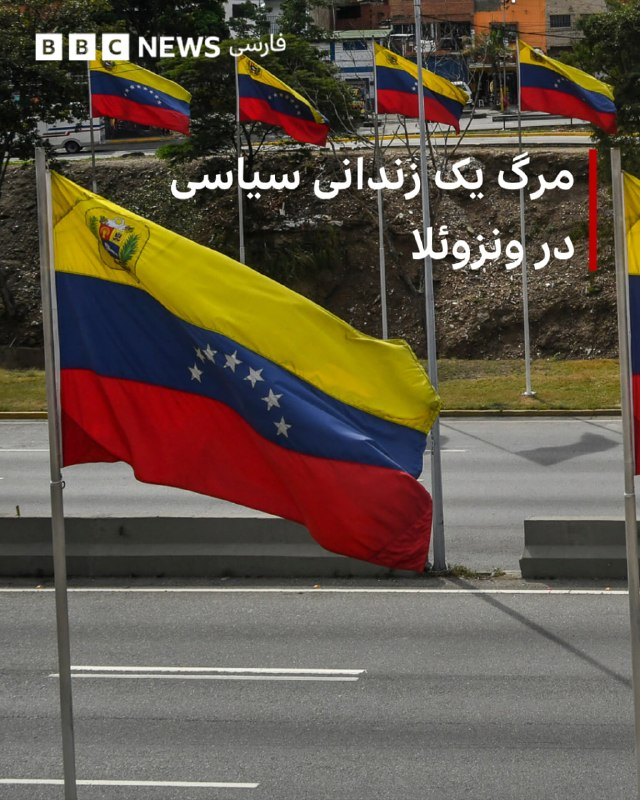

‌ ‌ ‌ ‌ ‌
جسد خوزه مانوئل گارسیا، زندانی سیاسی که از ماه فوریه در ونزوئلا در زندان به سر می‌برد، پیدا شده است.

این عضو سابق شورای شهر به کلاهبرداری و اخاذی متهم شده بود.

براساس گزارش‌ها جسد او در یک پاسگاه پلیس در اناکو در شمال شرقی ونزوئلا پیدا شده است.

حزب دموکراتیک متحد، که اپوزیسیون حکومت مرکزی است، مرگ آقای گارسیا را محکوم کرده است.

روز پنجشنبه هم مقامات ونزوئلا مرگ یک زندانی سیاسی دیگر به نام ویکتور هوگو کوئرو ناواس را که از نه ماه پیش در بازداشت بود، تایید کردند.

از سال ۲۰۱۴ تاکنون، بیست زندانی سیاسی در بازداشت در ونزوئلا جان خود را از دست داده‌اند.

📷 Carlos Becerra/Getty Images
@BBCPersian

## BBCPersian — post 280738

در پی انتشار تصاویر ماهواره‌ای که نشان‌دهنده نشت احتمالی نفت در محدوده‌ای در نزدیکی جزیره خارگ است، سازمان حفاظت محیط زیست ایران می‌گوید: «منشا آلودگی مشاهده‌ شده در اطراف جزیره خارگ ناشی از تخلیه آب توازن آلوده یک نفتکش آسیب‌دیده بوده است.» این نهاد گفت:…

## BBCPersian — post 280737

  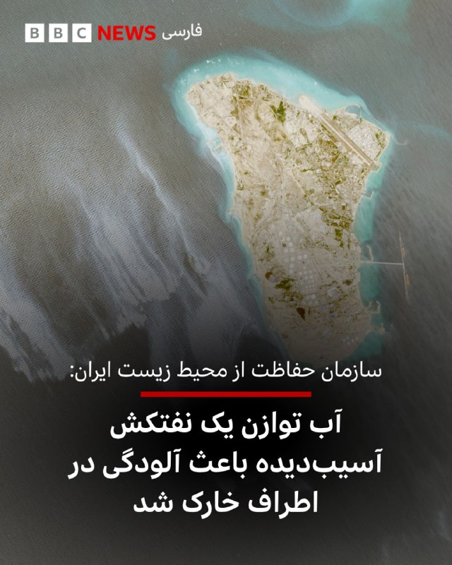

در پی انتشار تصاویر ماهواره‌ای که نشان‌دهنده نشت احتمالی نفت در محدوده‌ای در نزدیکی جزیره خارگ است، سازمان حفاظت محیط زیست ایران می‌گوید: «منشا آلودگی مشاهده‌ شده در اطراف جزیره خارگ ناشی از تخلیه آب توازن آلوده یک نفتکش آسیب‌دیده بوده است.»

این نهاد گفت: «هیچ‌گونه نشت نفت از خطوط لوله، تاسیسات پایانه‌های نفتی و یا سکوهای متعلق به شرکت نفت فلات قاره ایران در جزیره خارگ مشاهده یا گزارش نشده است.»

سه روز پیش یک عکس ماهواره‌ سنتینل پروژه کوپرنیکوس اتحادیه اروپا منتشر شد که به نظر می‌رسید یک لکه بزرگ نفتی در اطراف خارگ را نشان می‌دهد.

روز گذشته هم مدیرعامل شرکت پایانه‌های نفتی ایران ایجاد یک لکه نفتی در سواحل جزیره خارگ را «ادعای کذب و به دور از واقعیت» خواند و گفت: «به محض انتشار این اخبار، گروه‌های متخصص اچ‌اس‌ئی [سلامت و ایمنی]، اداره شیمیایی و آزمایشگاه، همه منطقه را پایش کردند اما حتی کوچک‌ترین موردی یافت نشد.»
تحولات ایران و منطقه را از لینک ⬇️‌ در سایت بی‌بی‌سی فارسی بخوانید:

https://bbc.in/4u5EtI8
📷COPERNICUS SENTINEL-2/Reuters
@BBCPersian

## BBCPersian — post 280736

سخنگوی ارتش اسرائیل، هشدار جدیدی برای جنوب لبنان صادر کرده و به ساکنان ۹ منطقه گفت که پیش از حملات اسرائیل، از این مناطق خارج شوند.

صبح دوشنبه ۲۱ اردیبهشت، اسرائیل کشته شدن یکی از سربازانش را در جنوب لبنان تایید کرد و گزارش‌ها از حملات متقابل حزب‌الله و اسرائیل به مواضع یکدیگر حکایت دارد.

شبکه تلویزیونی الجزیره گزارش کرده که اسرائیل در یک سلسله حملات هوایی چندین شهر در جنوب لبنان را بمباران کرده است.

براساس این گزارش شهرهای کفرتبنیت و شوكين هدف حملات اسرائیل قرار گرفته است.

تازه‌ترین تحولات ایران و منطقه را در صفحه زنده در سایت بی‌بی‌سی فارسی بخوانید:

https://bbc.in/4uJoBeo
@BBCPersian

## BBCPersian — post 280726

در طول دهه‌ها، چتر امنیتی آمریکا در خلیج فارس امری بدیهی و تضمین‌شده تلقی می‌شد، اما جنگ آمریکا و اسرائیل با ایران ممکن است این معادله را تغییر دهد.

در جریان این جنگ و در اوج چالش‌های دفاعی ناشی از حملات موشکی و پهپادی ایران و هدف قرار گرفتن تاسیسات حیاتی کشورهای عضو شورای همکاری خلیج فارس، این کشورها تنها مسیر موشک‌ها را زیر نظر نداشتند، بلکه واکنش‌ واشنگتن را نیز با دقت رصد می‌کردند؛ زیرا خود را در صحنه جنگی یافتند که به گفته مقام‌های منطقه، درباره آن با آن‌ها مشورت نشده بود.

آیا این بحران محدودیت توافق‌های امنیتی میان واشنگتن و کشورهای عرب خلیج فارس را آشکار کرده است؟ آیا این جنگ باعث کاهش وابستگی این کشورها به قدرت نظامی آمریکا خواهد شد یا برعکس، این وابستگی را تقویت خواهد کرد؟

از لینک ⬇️ این مطلب را در سایت بی‌بی‌سی فارسی بخوانید.

https://bbc.in/4wnt5Zu

📸GettyImages/ Universal Images Group via Getty Images/GettyImages/
Reuters/ Anadolu via Getty Images/ AFP via Getty Image
@BBCPersian

## Dirty_Kids — post 389258

  <a href="telegram/content/Dirty_Kids_389258_1778496867.mp4" target="_blank">🎬 Download video</a>

آخوند در صداوسیما:
امام علی شوهر زنی را کشت اما چون مهربان بود با زن بیوه دوست شد با او به خونه‌‌اش رفت، بعد شام هم با بچه‌های زن بیوه بازی کرد هم با خود زن بیوه

یه جورى با جزييات رابطه رو تعريف ميكنه انگار كه ۱۴۰۰ سال قبل اونجا نشسته بوده،
ولی عجب بازیکنی بوده علی‌شون😂😂


@Dirty_Kids 👻

## Dirty_Kids — post 389257

  <a href="telegram/content/Dirty_Kids_389257_1778496869.mp4" target="_blank">🎬 Download video</a>

علیرضا پناهیان سخنران بیت تخریب شده خامنه‌ای با حمله به قالیباف و پزشکیان از آنها خواست مقابل ترامپ ایستاده و شعار حذف اسرائیل را عملی کنند.

@Dirty_Kids 👻

## Dirty_Kids — post 389256

  <a href="https://t.me/Dirty_Kids/389256" target="_blank">📎 Download file</a>

✅ اپلیکیشن اندروید سایت جهانی دربی بت

💰اولین سایت جهانی با امکان شارژ و برداشت ریالی(کارت به کارت)

🔗 برای ورود فیلترشکن روی کشور مناسب قرار دهید مانند فنلاند و المان و....

😀Telegram Channel
👇
https://t.me/+bcynkEgSW2dlYTc0

## Dirty_Kids — post 389255

  

😤دنبال یه سایت شرط بندی بین المللی بودی که به ایرانیا خدمات بده؟!
⛔

👍دربی بت همون انتخاب  100%

💎ویژگی های سایت جهانی Derby Bet:

⬅️امکان شارژ امن با کارت بانکی

⬅️واریز اول دوبل شارژ می شوید(بونوس۱۰۰٪)

⬅️پر اپشن ترین سایت فعال در ایران

⬅️تسویه حساب کمتر از 5 دقیقه

⬅️برگشت بخشی از باخت به صورت هفتگی

🚨کد هدیه ثبت نام:GG007

⚠️برای دانلود اپلکیشن کلیک کنید
👉

🔔کانال دربی بت :

🪙https://t.me/+bcynkEgSW2dlYTc0

## Dirty_Kids — post 389254

  

هموطن در ایرانم،
خیالت راحت،
دکمه‌ی «ول نکن» ما خارج نشین ها خراب شده
تا روز آزادی صدات هستیم
پاینده ایران، جاوید شاه

نوشته‌ی روی لباس یکی از حاضران در تجمع امروز در شهر برلین

@Dirty_Kids 👻

## Dirty_Kids — post 389253

  

خبرگزاری «میزان» وابسته به قوه قضاییه جمهوری اسلامی از اعدام «عرفان شکورزاده» با اتهام «همکاری با سازمان اطلاعات مرکزی آمریکا (سیا) و موساد» خبر داد.

عرفان شکورزاده متولد ۱۳۷۶ و
دانش‌آموخته مهندسی برق دانشگاه تبریز بود که در مقطع کارشناسی ارشد در دانشگاه علم و صنعت تهران تحصیل می‌کرد. در سوابق علمی منتشرشده از او، کسب رتبه نخست مقطع کارشناسی ارشد، فعالیت در حوزه نرم‌افزارهای تست ماهواره و انتشار مقالات علمی در زمینه کنترل و موقعیت‌یابی ماهواره دیده می‌شود.


@Dirty_Kids 👻

## Dirty_Kids — post 389252

  <a href="telegram/content/Dirty_Kids_389252_1778496875.mp4" target="_blank">🎬 Download video</a>

نتانیاهو:

"در ایران، خیابان‌ها را به نام من نامگذاری می‌کنند. می‌دانید؟ خب، البته بعد از رئیس‌جمهور ترامپ هم، چون او رهبری مبارزه را بر عهده دارد.
اما آن‌ها این را دارند؛ من فارسی صحبت نمی‌کنم، اما مرا «بی بی جون» صدا می‌کنند: بی بی عزیز."

@Dirty_Kids 👻

## Dirty_Kids — post 389251

  <a href="https://t.me/Dirty_Kids/389251" target="_blank">📎 Download file</a>

✅ اپلیکیشن اندروید سایت جهانی دربی بت

💰اولین سایت جهانی با امکان شارژ و برداشت ریالی(کارت به کارت)

🔗 برای ورود فیلترشکن روی کشور مناسب قرار دهید مانند فنلاند و المان و....

😀Telegram Channel
👇
https://t.me/+bcynkEgSW2dlYTc0

## Dirty_Kids — post 389250

  

😤دنبال یه سایت شرط بندی بین المللی بودی که به ایرانیا خدمات بده؟!
⛔

👍دربی بت همون انتخاب  100%

💎ویژگی های سایت جهانی Derby Bet:

⬅️امکان شارژ امن با کارت بانکی

⬅️واریز اول دوبل شارژ می شوید(بونوس۱۰۰٪)

⬅️پر اپشن ترین سایت فعال در ایران

⬅️تسویه حساب کمتر از 5 دقیقه

⬅️برگشت بخشی از باخت به صورت هفتگی

🚨کد هدیه ثبت نام:GG007

⚠️برای دانلود اپلکیشن کلیک کنید
👉

🔔کانال دربی بت :

🪙https://t.me/+bcynkEgSW2dlYTc0

## Dirty_Kids — post 389249

  

#بخوابیم

@Dirty_Kids 👻

## Dirty_Kids — post 389248

  

محصول مشترک الجزایر، فرانسه، ادیداس کرج و کردستان: @Dirty_Kids 👻

## Dirty_Kids — post 389247

  

بلایی که یه پریود ساده ممکنه سرت بیاره.

این خانوم لارن وسر مدل آمریکاییه که بخاطر استفاده از تامپون تو سن ۲۴ سالگی دچار TSS یا سندروم شوک مسمومیت میشه و هر دو پاش رو از دست میده.

@Dirty_Kids 👻

## Dirty_Kids — post 389246

  

نه داداش تو نمیدونی جمهوری اسلامی خیلی خوب داره دووم میاره جلو آمریکا و اسرائیل :

@Dirty_Kids 👻

## Dirty_Kids — post 389245

  

دیگه نمیشه یبار مصرف کرد
باید بعد استفاده بشوریمش رو بند آویزون کنیم

@Dirty_Kids 👻

## Hranews — post 112878

  

مدیرکل راه و شهرسازی اردبیل در خصوص آمار حاشیه نشینی در این استان اعلام کرد که ۶۷ محله به مساحت ۱،۹۳۰ هکتار در سکونتگاه‌های غیررسمی واقع شده است. به گفته محبوب حیدری، یک سوم از جمعیت شهری اردبیل در سکونت‌گاه‌های غیررسمی، سکونت‌گاه‌هایی با بافت‌های تاریخی، بافت ناکارآمد و بافت ناسازگار شهری ساکن هستند.

از سوی دیگر، صدیف بدری، عضو هیئت رئیسه مجلس شورای اسلامی با اشاره به ضرورت نوسازی بافت‌های فرسوده در تمام استان‌ها، گفت: حدود ۲۲ تا ۲۳ میلیون نفر از مردم در بافت‌های فرسوده و مسکن‌های ناپایدار زندگی می‌کنند که این نشان دهنده اهمیت نوسازی و بهسازی بافت فرسوده است.

↘️
@hranews_bot تماس ✉️ -  @Hranews  کانال هرانا 🆑

## Hranews — post 112877

  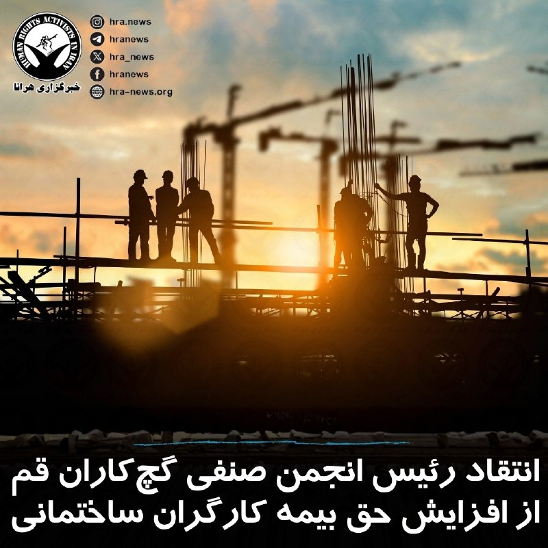

رئیس انجمن صنفی گچ‌کاران قم، با انتقاد از عدم تخصیص سهمیه بیمه #کارگران ساختمانی و طرح افزایش سهم پرداختی #بیمه، گفت: بسیاری از کارگران توان پرداخت هزینه‌های فعلی را هم ندارند و این روند می‌تواند به محرومیت شمار بیشتری از آنان از پوشش بیمه‌ای منجر شود.

داود کشوری با انتقاد از عملکرد وزارت کار و سازمان تامین اجتماعی تاکید کرد که با گذشت حدود ۵۰ سال از تصویب قانون بیمه کارگران ساختمانی، بخش زیادی از این کارگران همچنان از ابتدایی‌ترین حمایت‌های بیمه‌ای محروم مانده‌اند.

↘️
@hranews_bot تماس ✉️ -  @Hranews  کانال هرانا 🆑

## Hranews — post 112876

  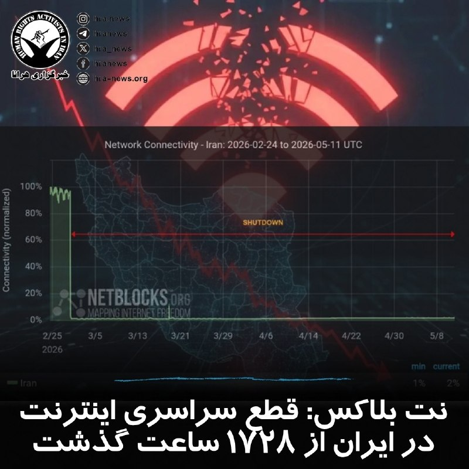

آخرین داده‌های نت‌بلاکس نشان می‌دهد که قطع سراسری #اینترنت در ایران پس از ۱۷۲۸ ساعت اختلال و محدودیت گسترده، وارد هفتادوسومین روز خود شده است. این نهاد ناظر بر وضعیت اینترنت در جهان اعلام کرد که دسترسی آزاد به اینترنت حق مردم است و محرومیت از آن توانایی عموم را برای مستندسازی و اصلاح نقض‌های اساسی حقوق بشر به شدت محدود می‌کند.

↘️
@hranews_bot تماس ✉️ -  @Hranews  کانال هرانا 🆑

## Hranews — post 112875

بخشی از اموال علی کریمی، بازیکن سابق فوتبال توقیف شد
 

❗️
❗️
❗️
❗️
❗️ – مرکز رسانه قوه قضاییه از توقیف بخشی از اموال علی کریمی بازیکن سابق فوتبال ساکن خارج از کشور و فرزند وی خبر داد. این اقدام به دلیل آنچه قوه قضاییه «حمایت از دشمن و همکاری با دولت‌های متخاصم» عنوان کرده، صورت گرفته است.
 
ادامه مطلب
 
#علی_کریمی #توقیف_اموال

↘️
@hranews_bot تماس ✉️ -  @Hranews  کانال هرانا 🆑

## Hranews — post 112874

  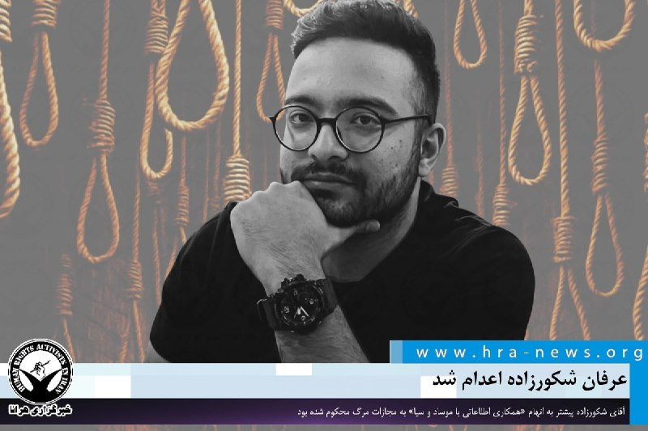

عرفان شکورزاده، دانشجوی مهندسی هوافضا به اتهام «جاسوسی» اعدام شد
 

❗️
❗️
❗️
❗️
❗️ – مرکز رسانه قوه قضاییه از اجرای حکم #اعدام عرفان شکورزاده، دانشجوی کارشناسی ارشد مهندسی هوافضا، خبر داد. آقای شکورزاده پیشتر به اتهام «همکاری اطلاعاتی با موساد و سیا» به مجازات مرگ محکوم شده بود.
 
ادامه مطلب
 
#عرفان_شکورزاده

↘️
@hranews_bot تماس ✉️ -  @Hranews  کانال هرانا 🆑

## manototv — post 105300

  <a href="telegram/content/manototv_105300_1778496885.mp4" target="_blank">🎬 Download video</a>

گردهمایی ایرانیان ونکوور

## manototv — post 105299

  

رسانه‌های جمهوری اسلامی از جمله خبرگزاری فارس نوشتند انتشار دود در بخشی از شیراز، ناشی از انفجار کنترل‌شده مهمات عمل‌نکرده بوده است.

بر اساس این گزارش‌ها، ارتش پیش‌تر اعلام کرده بود که دقایقی بعد، مهمات عمل‌نکرده در شیراز به‌صورت کنترل‌شده منفجر خواهد شد.

## manototv — post 105298

  

قیمت نفت روز دوشنبه پس از آن بیش از سه‌ونیم درصد افزایش یافت که دونالد ترامپ، رئیس‌جمهور آمریکا، پاسخ جمهوری اسلامی به پیشنهاد واشینگتن برای پایان جنگ را «کاملا غیرقابل قبول» خواند.

رویترز نوشت تهران در پاسخ خود خواستار پایان جنگ، رفع انسداد دریایی، تضمین نشدن حمله تازه، لغو تحریم‌ها و آزادسازی فروش نفت ایران شده است.

## manototv — post 105297

  <a href="telegram/content/manototv_105297_1778496889.mp4" target="_blank">🎬 Download video</a>

دنهاخ | هلند؛ گردهمایی ایرانیان مقابل دادگاه لاهه

## manototv — post 105296

  <a href="telegram/content/manototv_105296_1778496891.mp4" target="_blank">🎬 Download video</a>

نت‌بلاکس، نهاد ناظر بر دسترسی به اینترنت، اعلام کرد اختلال و قطعی اینترنت در ایران وارد هفتادوسومین روز خود شده و مدت این وضعیت از ۱۷۲۸ ساعت گذشته است. به گفته نت‌بلاکس، این قطعی گسترده همچنان ایران را تا حد زیادی از اینترنت جهانی جدا نگه داشته است.

## manototv — post 105295

  <a href="telegram/content/manototv_105295_1778496892.mp4" target="_blank">🎬 Download video</a>

اسماعیل بقایی، سخنگوی وزارت خارجه جمهوری اسلامی، گفت خواسته‌های ایران در پاسخ اخیر به پیشنهاد آمریکا «حقوق مشروع ایران» بوده و تهران در این متن، مطالباتی مانند پایان جنگ در منطقه، توقف آنچه او «راهزنی دریایی علیه کشتی‌های ایران» خواند، آزادسازی دارایی‌های مسدودشده و تضمین تردد ایمن در تنگه هرمز را مطرح کرده است.

او با رد این‌که مطالبات ایران «زیاده‌خواهانه» باشد، گفت پیشنهاد تهران نه فقط برای منافع ملی ایران، بلکه برای «ثبات و امنیت کل منطقه و جهان» تنظیم شده بود. بقایی همچنین گفت موضوع امنیت و صلح در منطقه، از جمله لبنان، بخشی از بسته پیشنهادی ایران بوده است.

سخنگوی وزارت خارجه جمهوری اسلامی در ادامه، آمریکا و اسرائیل را به اخلال در آزادی دریانوردی و تعرض به کشتی‌های ایرانی در آب‌های آزاد متهم کرد و گفت قرار بود این مسائل در چارچوب بسته پیشنهادی ایران مورد بحث و تصمیم‌گیری قرار گیرد.

بقایی در بخش دیگری از سخنانش از رویکرد آمریکا انتقاد کرد و گفت طرف آمریکایی همچنان بر اساس ذهنیت‌هایی که به گفته او «ساخت‌پرداخته اسرائیل» است، بر دیدگاه‌های یک‌سویه و خواسته‌های نامعقول خود پافشاری می‌کند.

دونالد ترامپ پیشتر از پاسخ جمهوری اسلامی ابراز نارضایتی کرد.

## manototv — post 105294

  <a href="telegram/content/manototv_105294_1778496895.mp4" target="_blank">🎬 Download video</a>

سن‌فرانسیسکو| گردهمایی ایرانیان، ۲۰ اردیبهشت

## manototv — post 105293

  <a href="telegram/content/manototv_105293_1778496897.mp4" target="_blank">🎬 Download video</a>

ونکوور| راهمپیمایی ایرانیان در حمایت از مردم ایران، ۲۰ اردیبهشت

## manototv — post 105292

  <a href="telegram/content/manototv_105292_1778496900.mp4" target="_blank">🎬 Download video</a>

پایگاه تحلیل تصاویر ماهواره‌ای «سور اطلس» اعلام کرد تصاویر ماهواره‌ای ظاهرا یک نفتکش بزرگ را در تنگه هرمز نشان می‌دهد که پس از یک حمله، ردی از نفت در آب برجای گذاشته است. در این تصاویر همچنین رفت‌وآمد گسترده قایق‌های تندرو کوچک در نزدیکی نفتکش دیده می‌شود.

وب‌سایت «تنکر ترکرز» این نفتکش را ابرنفتکش «باراکا» (برکت) معرفی کرده و نوشته است که این شناور متعلق به شرکت ملی نفت ابوظبی، ادنوک، است. به گفته این نهاد ردیابی نفتکش‌ها، باراکا روز ۱۴ اردیبهشت هدف پهپادهای جمهوری اسلامی قرار گرفت و در زمان حمله، پس از یک انتقال محرمانه محموله به نفتکشی دیگر در شرق امارات، خالی از نفت بوده است.

## manototv — post 105291

  <a href="telegram/content/manototv_105291_1778496901.mp4" target="_blank">🎬 Download video</a>

قوه قضاییه جمهوری اسلامی اعلام کرد حکم اعدام عرفان شکورزاده به اتهام همکاری با سرویس اطلاعاتی آمریکا و موساد اجرا شده است. خبرگزاری قوه قضاییه، او را به ارتباط با دو نهاد اطلاعاتی خارجی و انتقال اطلاعات طبقه‌بندی‌شده متهم کرده است.

رسانه‌های حقوق بشری و منتقد جمهوری اسلامی پیش‌تر درباره خطر اجرای حکم اعدام او هشدار داده و نوشته بودند که شکورزاده دانشجوی کارشناسی ارشد مهندسی هوافضا و فناوری ماهواره در دانشگاه علم و صنعت بوده است.

## manototv — post 105290

  <a href="telegram/content/manototv_105290_1778496902.mp4" target="_blank">🎬 Download video</a>

بریتانیا و فرانسه امروز دوشنبه میزبان نشستی با حضور بیش از ۴۰ کشور خواهند بود تا درباره میزان مشارکت نظامی آنها در ماموریت اروپایی اسکورت کشتی‌ها در تنگه هرمز گفت‌وگو شود.

این ماموریت قرار است پس از برقراری یک آتش‌بس پایدار آغاز شود و هدف آن همراهی کشتی‌های تجاری در عبور از تنگه هرمز است. بلومبرگ نوشت کشورهای شرکت‌کننده قرار است درباره توانایی‌هایی مانند مین‌روبی، اسکورت دریایی و گشت هوایی گفت‌وگو کنند.

بریتانیا پیش‌تر ناوشکن «اچ‌ام‌اس دراگون» را برای آمادگی در یک ماموریت احتمالی در خاورمیانه اعزام کرده و فرانسه نیز ناوگروه «شارل دوگل» را به دریای سرخ فرستاده است.

## manototv — post 105289

  <a href="telegram/content/manototv_105289_1778496903.mp4" target="_blank">🎬 Download video</a>

فرماندهی مرکزی ارتش آمریکا اعلام کرد تفنگداران دریایی ایالات متحده روز ۱۸ اردیبهشت، در جریان تمرینی روی عرشه ناو آبی‌خاکی «یواس‌اس تریپولی»، از یک بالگرد «سی‌هاوک» فرود آمدند.

سنتکام گفت این تمرین برای حفظ آمادگی تفنگداران دریایی انجام شده است تا در صورت لزوم، برای ورود به کشتی‌هایی که در جریان انسداد دریایی آمریکا علیه ایران از دستورها تبعیت نمی‌کنند، به کار گرفته شوند.

## manototv — post 105288

  <a href="telegram/content/manototv_105288_1778496904.mp4" target="_blank">🎬 Download video</a>

روزنامه گاردین استرالیا در گزارشی نوشت اسحاق قالیباف، پسر محمدباقر قالیباف برای چند سال در ملبورن زندگی و تحصیل کرده و در همین مدت با بازار ملک و دانشگاه ملبورن ارتباط داشته است. بر اساس این گزارش، اسحاق قالیباف با وجود رد شدن درخواست ویزای او در کانادا، توانسته بود اقامت موقت بلندمدت در استرالیا بگیرد.

گاردین نوشته اسحاق قالیباف از اوایل سال ۲۰۱۴ وارد ملبورن شد، ابتدا دوره زبان و دوره مقدماتی گذراند و سپس از سال ۲۰۱۵ تا ۲۰۱۸ در رشته مهندسی در دانشگاه ملبورن تحصیل کرد. بر اساس مدارکی که او در پرونده مهاجرتی خود در دادگاه فدرال کانادا ارائه کرده بود، او در سال‌های ۲۰۱۶ تا ۲۰۱۸ به‌عنوان دستیار پژوهشی در مرکز زیرساخت‌های داده‌های مکانی و مدیریت زمین دانشگاه ملبورن کار کرده است.

به نوشته گاردین، اسحاق قالیباف در سال ۲۰۲۲ در یک استشهادیه گفته بود تا پایان سپتامبر همان سال اقامت موقت استرالیا داشته، اما به‌دلیل انتظار برای دریافت اقامت دائم کانادا، برای تبدیل آن به اقامت دائم استرالیا اقدام نکرده است. کانادا در نهایت در فوریه ۲۰۲۴ درخواست اقامت دائم او را رد کرد.

## manototv — post 105287

  <a href="telegram/content/manototv_105287_1778496905.mp4" target="_blank">🎬 Download video</a>

بر اساس تصاویر و گزارش‌های منتشرشده، یک مرد در پایان تجمع ایرانیان در ریچموندهیل، در شمال تورنتو، با خودروی خود به چند خودرو برخورد کرد و به گفته شاهدان، پس از آن پرچم جمهوری اسلامی را از خودرو بیرون آورد و تکان داد. این تجمع روز یکشنبه ۲۰ اردیبهشت برگزار شده بود.

در گزارش‌های منتشرشده آمده است که این مرد پس از برخورد با چند خودرو و دست‌کم یک نفر، توسط ماموران پلیس بازداشت شد.

## manototv — post 105286

  <a href="telegram/content/manototv_105286_1778496907.mp4" target="_blank">🎬 Download video</a>

گردهمایی ایرانیان سانفرانسیسکو

## manototv — post 105285

  <a href="telegram/content/manototv_105285_1778496909.mp4" target="_blank">🎬 Download video</a>

گردهمایی ایرانیان هامبورگ

## manototv — post 105284

  <a href="telegram/content/manototv_105284_1778496911.mp4" target="_blank">🎬 Download video</a>

نیکوزیا|قبرس؛ راهپیمایی و گردهمایی ایرانیان

## alonews — post 119253

  <a href="telegram/content/alonews_119253_1778496914.webm" target="_blank">🎬 Download video</a>

👈سفر فیدان به قطر برای رایزنی درباره حل درگیری در خلیج فارس

✅ @AloNews خبر جنگ

## alonews — post 119252

  <a href="telegram/content/alonews_119252_1778496914.webm" target="_blank">🎬 Download video</a>

👈وقوع انفجاری در یکی از منازل مسکونی واقع در خیابان جهانگیری اراک، منجر به تخریب ساختمان مسکونی شد.

🔴تیم‌های امدادی در حال حاضر در محل حادثه حضور دارند و عملیات ایمن‌سازی و آواربرداری را آغاز کرده‌اند.

🔴علت دقیق این انفجار و همچنین تعداد احتمالی مصدومان و خسارات وارده، در دست بررسی کارشناسان است.

✅ @AloNews خبر جنگ

## alonews — post 119251

  <a href="telegram/content/alonews_119251_1778496915.webm" target="_blank">🎬 Download video</a>

👈حملات هوایی اسرائیل به نبطیه در جنوب لبنان، طبق گزارش خبرگزاری ملی لبنان، چهار نفر را کشته است

✅ @AloNews خبر جنگ

## alonews — post 119250

  <a href="telegram/content/alonews_119250_1778496915.webm" target="_blank">🎬 Download video</a>

👈شرکت اسرائیلی رافائل: از 1500 موشک ایرانی پرتاب شده به سمت اسرائیل، تنها ۱۰-۲۰ موشک رهگیری نشدند.

✅ @AloNews خبر جنگ

## alonews — post 119249

  <a href="telegram/content/alonews_119249_1778496916.webm" target="_blank">🎬 Download video</a>

👈مدیرعامل شرکت گاز استان کهگیلویه و بویراحمد از قطع ۱۰ ساعته جریان گاز در بخش کبگیان شهرستان بویراحمد طی روز سه‌شنبه ۲۲ اردیبهشت ماه به دلیل عملیات توسعه شبکه خبر داد

✅ @AloNews خبر جنگ

## alonews — post 119248

  <a href="telegram/content/alonews_119248_1778496916.webm" target="_blank">🎬 Download video</a>

👈کیر استارمر: در اجلاس بعدی اتحادیه اروپا، جهت‌گیری جدیدی برای بریتانیا تعیین خواهم کرد.

🔴دولت قبلی با قطع رابطه ما با اروپا شناخته می‌شد. این دولت کارگر با بازسازی رابطه ما با اروپا شناخته خواهد شد — با قرار دادن بریتانیا در قلب اروپا.

✅ @AloNews خبر جنگ

## alonews — post 119247

  <a href="telegram/content/alonews_119247_1778496917.webm" target="_blank">🎬 Download video</a>

👈افزایش 25 درصدی سود شرکت نفت آرامکو سعودی به دلیل جنگ خاورمیانه

🔴عربستان سعودی با استفاده از خط لوله شرق - غرب، با دور زدن تنگه هرمز، نفت خود را از خلیج فارس به ساحل دریای سرخ منتقل کند.

✅ @AloNews خبر جنگ

## alonews — post 119246

  <a href="telegram/content/alonews_119246_1778496917.webm" target="_blank">🎬 Download video</a>

👈کیر استارمر: نه نایجل فاراژ و نه زک پولانسکی رهبری جدی و پیشرو که این دوران می‌طلبد را به کشور ما ارائه نمی‌دهند.

✅ @AloNews خبر جنگ

## alonews — post 119245

  <a href="telegram/content/alonews_119245_1778496917.webm" target="_blank">🎬 Download video</a>

👈قطعی اینترنت در ایران وارد روز 73ام شد.

✅ @AloNews خبر جنگ

## alonews — post 119244

  <a href="telegram/content/alonews_119244_1778496918.webm" target="_blank">🎬 Download video</a>

👈کیر استارمر: ما فقط با زمان‌های خطرناک روبرو نیستیم، بلکه با دشمنان خطرناک — دشمنانی بسیار خطرناک مواجه‌ایم.

🔴اگر این را درست انجام ندهیم، کشور ما به مسیری بسیار تاریک خواهد رفت

✅ @AloNews خبر جنگ

## alonews — post 119243

  <a href="telegram/content/alonews_119243_1778496918.webm" target="_blank">🎬 Download video</a>

👈امروز به دستور قوه قضاییه، 2 واحد تجاری و 4 واحد مسکونی متعلق به علی کریمی توقیف و مصادره شد.

✅ @AloNews خبر جنگ

## alonews — post 119242

  <a href="telegram/content/alonews_119242_1778496918.mp4" target="_blank">🎬 Download video</a>

❤️ رضا پهلوی‌ در صحبت‌های خود در پنل آزادی دو نکته مهم را مطرح کرد که به‌نظر من، فارغ از هرگونه قضاوت احساسی یا دور از منطق، باید دوباره درباره‌شان اندیشید.

🔴نکته اول، درباره مسئولیت‌پذیری در فضای سیاسی و مجازی بود. ایشان گفتند تکلیف ما با سایبری ها مشخص است، هر صاحب تریبون و هر فردی که در پلتفرم‌های مجازی فعالیت می‌کند، باید چند اصل را رعایت کند:

🔴احترام به فرهنگ و عقاید متفاوت، مقابله با فحاشی و هتاکی، و مهم‌تر از همه، مشخص کردن مرز خود با جریان‌های مخرب و رفتارهای غیرمسئولانه.

🔴یعنی نقد، اختلاف‌نظر و حتی مخالفت، حق طبیعی هر فرد است؛ اما این مسیر نباید به نفرت، انگ زدن و سایبری خواندن و حذف و تفرقه ختم شود.

🔴نکته دوم، بازگشت به اصل بنیادین مردم‌سالاری بود. ایشان تأکید کردند که در هر کشوری، بالاترین مرجع تصمیم‌گیری مردم و نمایندگان مردم‌اند و تنها معیار سنجش نیز صندوق رأی خواهد بود، یعنی نوع حکومت آینده را مردم تصمیم خواهند گرفت و لاغیر.

🤔ما این مسیر را فقط برای امروز طی نمی‌کنیم، بلکه برای آینده ایران و نسل‌های آینده می‌سازیم.

✅@AloNews

## alonews — post 119241

  <a href="telegram/content/alonews_119241_1778496922.webm" target="_blank">🎬 Download video</a>

👈پیامدها در کفر جوز، جنوب لبنان، پس از حمله اسرائیل در اوایل امروز

✅ @AloNews خبر جنگ

## alonews — post 119240

  <a href="telegram/content/alonews_119240_1778496922.webm" target="_blank">🎬 Download video</a>

👈ارتش اسرائیل اکنون از مانکن‌های نظامی در جنوب لبنان استفاده می‌کند تا حزب‌الله را به هدر دادن پهپادهای FPV خود روی اهداف جعلی فریب دهد.

✅ @AloNews خبر جنگ

## alonews — post 119238

  <a href="telegram/content/alonews_119238_1778496922.webm" target="_blank">🎬 Download video</a>

👈یک پهپاد اسرائیلی یک وانت شهرداری را در شهر زبدین در جنوب لبنان هدف قرار داد، در حالی که در حال حمل نان به ساکنان بود.

🔴 دو نفر در این حمله زخمی شدند

✅ @AloNews خبر جنگ

## alonews — post 119237

  <a href="telegram/content/alonews_119237_1778496923.mp4" target="_blank">🎬 Download video</a>

👈رئیس‌جمهور فرانسه، امانوئل ماکرون، برای دویدن صبحگاهی به نایروبی، کنیا رفت

✅ @AloNews خبر جنگ

## alonews — post 119236

  <a href="telegram/content/alonews_119236_1778496925.mp4" target="_blank">🎬 Download video</a>

👈رئیس‌جمهور فرانسه، امانوئل ماکرون، برای دویدن صبحگاهی به نایروبی، کنیا رفت

✅ @AloNews خبر جنگ

## alonews — post 119235

  <a href="telegram/content/alonews_119235_1778496929.webm" target="_blank">🎬 Download video</a>

👈کیر استارمر می‌گوید دولت قانونی را برای ملی کردن صنعت فولاد بریتانیا معرفی خواهد کرد.

✅ @AloNews خبر جنگ

## alonews — post 119234

  <a href="telegram/content/alonews_119234_1778496929.webm" target="_blank">🎬 Download video</a>

👈داوود بیگی نژاد، نایب رئیس اتحادیه املاک تهران: با آگهی در سایت‌ها قیمت مسکن را بالا می‌برند!

✅ @AloNews خبر جنگ

<!-- MSG END -->

<!-- NAV START -->

<!-- NAV END -->
