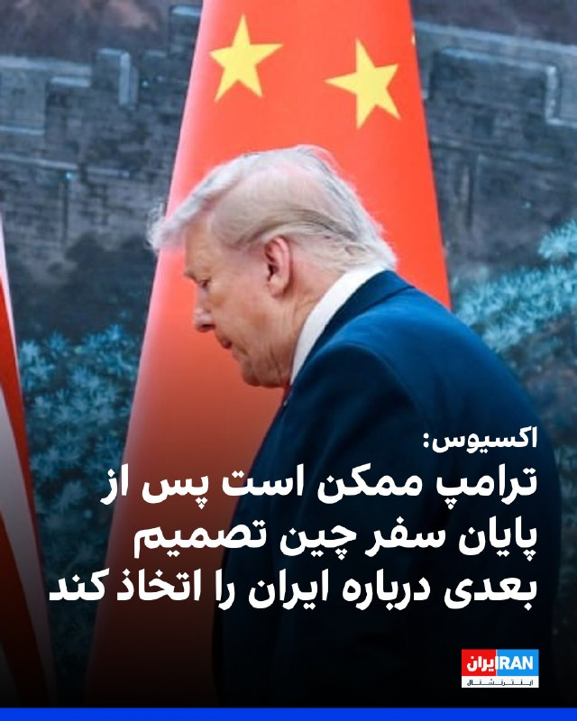
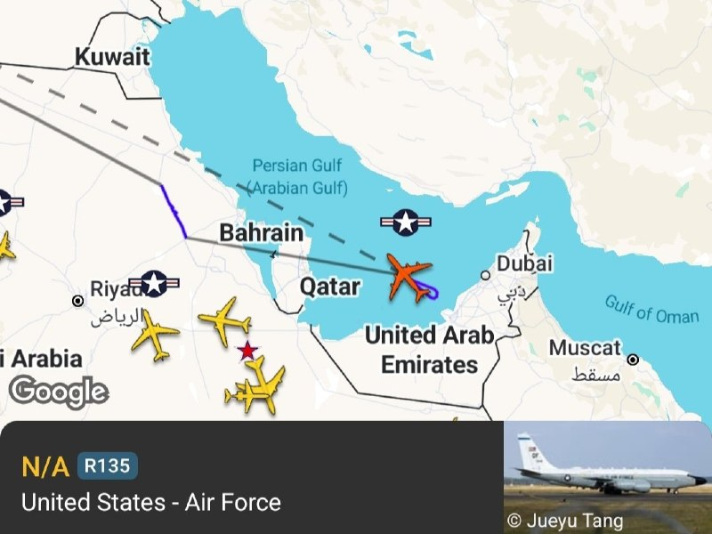
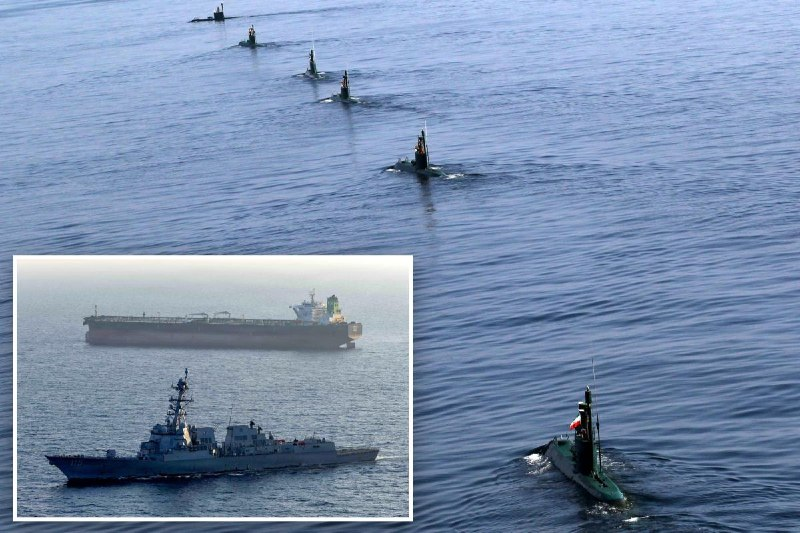
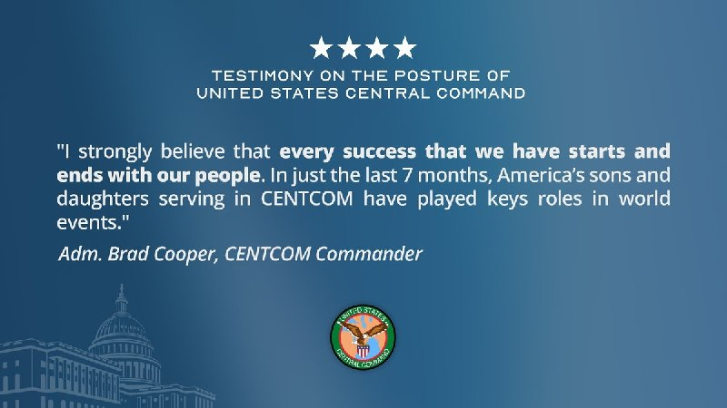
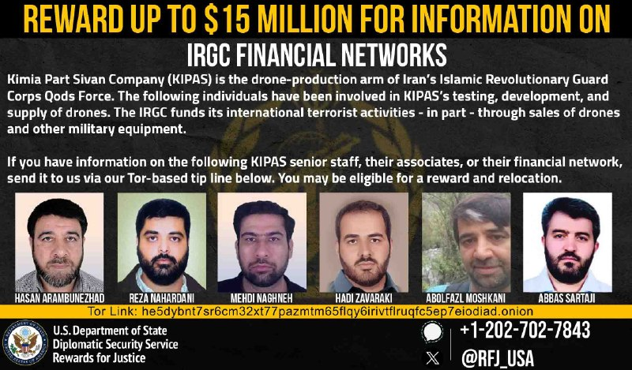
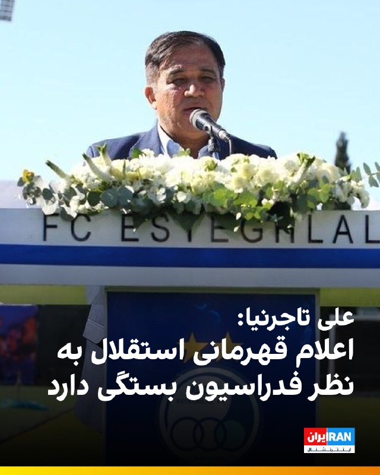
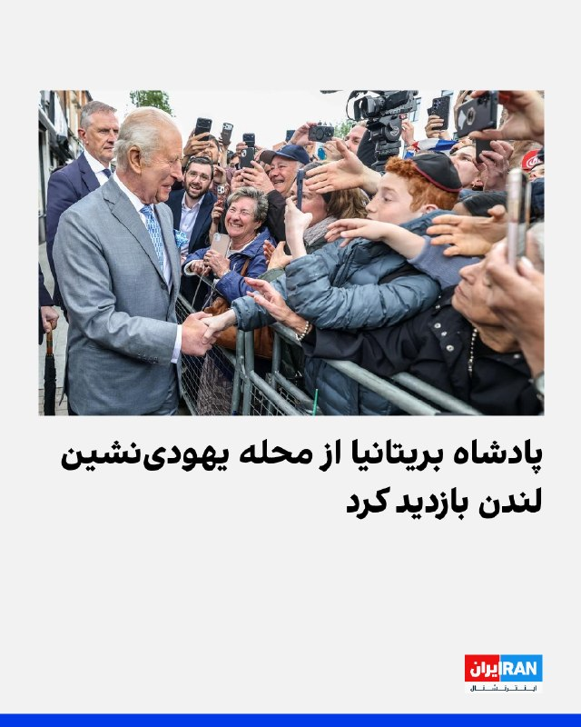
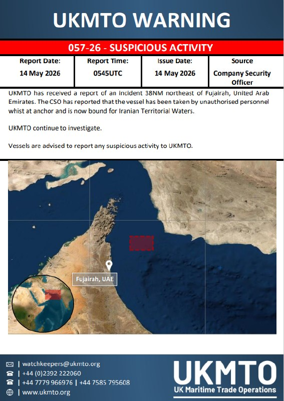
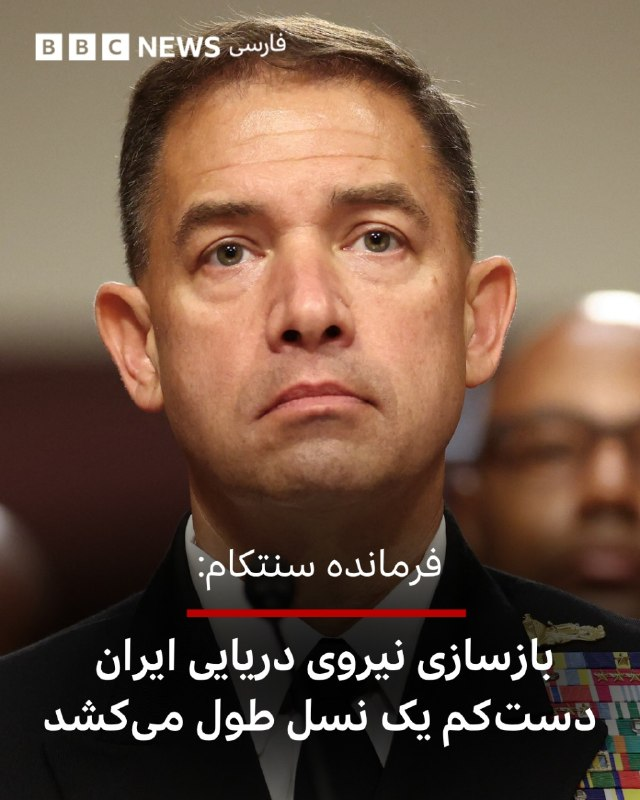
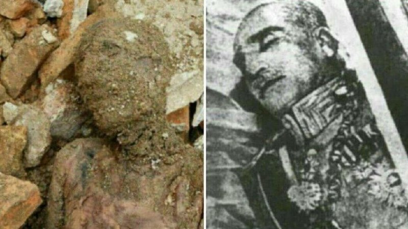

# خواننده تلگرام

<!-- TOP_NAV START -->

<a href="https://github.com/zari963963/aio-downloader/blob/main/telegram/content/archive_1.md" style="display:inline-block; padding:6px 12px; margin:0 4px; background-color:#2ea44f; color:white; text-decoration:none; border-radius:4px; font-weight:bold;">صفحه بعد</a>

<!-- TOP_NAV END -->

<!-- MSG START -->

---
📅 بروزرسانی: 1405/02/24 19:54
---

## VahidOOnLine — post 240152

  

اکسیوس در گزارشی درباره ایران نوشت که مقام‌های آمریکایی انتظار ندارند دونالد ترامپ در جریان سفرش به چین اقدام چشمگیری در مورد جمهوری اسلامی انجام دهد، اما معتقدند او ممکن است بلافاصله پس از پایان این سفر تصمیم بعدی خود را اتخاذ کند.

براساس این گزارش یکی از گزینه‌های مورد بررسی ازسرگیری «پروژه آزادی» است؛ طرحی که در آن نیروی دریایی آمریکا تلاش می‌کند بن‌بست ایجاد شده در تنگه هرمز را بشکند.

به گزارش اکسیوس، گزینه دیگر آغاز کارزار جدید بمباران با تمرکز بر زیرساخت‌های ایران است.

مقام‌های اسرائیلی نیز گفته‌اند در صورت تصمیم ترامپ برای ازسرگیری جنگ، در آخر هفته جاری در وضعیت آماده‌باش کامل خواهند بود.
‌🏁 🇬🇧 IranintlTV

🤖 @VahidOOnLine

## VahidOOnLine — post 240151

♦️دونالد ترامپ، رئیس‌جمهوری آمریکا که به چین سفر کرده، روز پنجشنبه همراه با شی جین‌پینگ،‌ رئیس‌جمهوری چین برای بازدید از معبد بهشت ​​در پکن که بیش از ۵۰۰ سال قدمت دارد، وارد این معبد تاریخی شد.
او در توری اختصاصی همراه با شی در جریان جزئیاتی از این معبد قرار گرفت.
دونالد ترامپ، رئیس جمهوری ایالات متحده آمریکا شامگاه پنجشنبه ۲۴ اردیبهشت (به وقت محلی) و در جریان ضیافت شام شی جین‌پینگ، گفتگوها با رئیس‌جمهوری چین را «فوق‌العاده مثبت و سازنده» توصیف کرد.
‌🇸🇦 Indypersian

🤖 @VahidOOnLine

## VahidOOnLine — post 240150

  

دونالد ترامپ در گفت‌وگو با فاکس‌نیوز گفت رییس‌جمهور چین خواهان باز ماندن تنگه هرمز و دستیابی به توافق است و پیشنهاد داده برای تحقق آن به هر شکل ممکن کمک کند.
ترامپ افزود شی جین‌پینگ به او گفته چین هیچ‌گونه تجهیزات نظامی در اختیار جمهوری اسلامی قرار نخواهد داد.
‌🏁 🇬🇧 IranintlTV

🤖 @VahidOOnLine

## VahidOOnLine — post 240149

  <a href="telegram/content/VahidOOnLine_240149_1778775867.mp4" target="_blank">🎬 Download video</a>

♦️دونالد ترامپ، رئیس‌جمهوری آمریکا، در مصاحبه با شان هنیتی از فاکس نیوز گفت که شی جین‌پینگ، رئیس‌جمهور چین، برای همکاری در پرونده ایران و بازگشایی تنگه هرمز اعلام آمادگی کرده است. ترامپ تاکید کرد که شی تمایل دارد شاهد دستیابی به یک توافق باشد و به‌طور مشخص پیشنهاد داده است که در این زمینه هرگونه کمک لازم را ارائه دهد.

رئیس‌جمهور آمریکا با اشاره به حجم بالای خرید نفت چین از ایران، خاطرنشان کرد که پکن به‌دلیل این رابطه اقتصادی، نفوذ قابل‌توجهی دارد. به گفته ترامپ، رهبر چین بر تمایل خود برای بازگشایی تنگه هرمز تاکید کرده و گفته است: «اگر هر کمکی از دستم بربیاید، مشتاقم که انجام دهم».
‌🇸🇦 Indypersian

🤖 @VahidOOnLine

## VahidOOnLine — post 240148

  

♦️عباس عراقچی، وزیر خارجه جمهوری اسلامی روز پنجشنبه ۲۴ اردیبهشت با اشاره به تنش‌ها میان تهران و واشنگتن تاکید کرد که «آمریکا راه حل اختلاف با ایران را در جایی غیر از میدان نظامی جست‌وجو کند.»
عباس عراقچی در حاشیه دیدارهای خود با همتایانش در بریکس در واکنش به تهدیدهای مقامات آمریکایی و اسرائیلی مبنی بر از سرگیری حملات به ایران به‌محض بازگشت رئیس‌جمهوری آمریکا از چین گفت: «آن‌ها مدت‌هاست که به اشکال و شیوه‌های مختلف تهدیدهای خود را تکرار می‌کنند، اما خودشان نیز می‌دانند که از این تهدیدها و حتی از جنگی که به راه انداختند، هیچ نتیجه‌ای نگرفته‌اند و نخواهند گرفت.»
عراقچی با تاکید بر اینکه «ایران در برابر تهدیدها محکم ایستاده و سر خم نمی‌کند.» افزود: «راه‌حل در تهدید کردن نیست.»
وزیر خارجه جمهوری اسلامی در ادامه با ابراز امیدواری از تغییر نگاه مقام‌های آمریکایی به موضوعات مربوط به ایران تاکید کرد: «اگرچه امید نیست که به منطق روی آورند ولی بدانند که راه‌حل مسائل را باید در جایی غیر از میدان نظامی جست‌وجو کنند، زیرا از این مسیر به هیچ نتیجه‌ای نخواهند رسید.»
‌🇸🇦 Indypersian

🤖 @VahidOOnLine

## VahidOOnLine — post 240147

  

حمید رسایی، نماینده تهران در مجلس، نوشت جریانی «شناخته‌شده» در دولت چهاردهم که راه‌حل را «آزاد کردن و گران کردن» می‌داند، قصد دارد سهمیه بنزین هزار و ۵۰۰ تومانی و سه هزار تومانی را کاهش دهد و قیمت بنزین پنج هزار تومانی را به ۱۵ تا ۲۰ هزار تومان افزایش دهد.

او افزود همان جریان در دولت چهاردهم پیش‌تر با حذف ارز ترجیحی ۲۸ هزار و ۵۰۰ تومانی و گران کردن ارز، به گفته او، «بالاترین تورم پس از انقلاب ۵۷» را به مردم تحمیل کرده بود.

رسایی نوشت محمدباقر قالیباف با «پلمپ کردن بدون توجیه و دلیل مجلس»، راه نظارت نمایندگان بر تصمیمات دولت را بسته است. او افزود انجام تکلیف نمایندگی سخت شده، اما تلاش می‌کند مجلس را از این «مرگ تعمدی» بیرون بیاورد و جلوی این تصمیمات «عجیب» را در موقعیت «سخت و جنگی» فعلی بگیرد.
‌🏁 🇬🇧 IranintlTV

🤖 @VahidOOnLine

## VahidOOnLine — post 240146

  <a href="telegram/content/VahidOOnLine_240146_1778775872.mp4" target="_blank">🎬 Download video</a>

‌
دونالد ترامپ، رئیس‌جمهوری آمریکا، در گفت‌و‌گو با شان هنیتی، خبرنگار و مجری فاکس‌نیوز گفت شی جین‌پینگ، رئیس‌جمهوری چین، خواهان دستیابی به توافق و باز ماندن تنگه هرمز است.

ترامپ گفت: «رئیس‌جمهوری شی دوست دارد توافقی حاصل شود. او گفت اگر بتواند کمکی بکند، مایل است کمک کند.»

رئیس‌جمهوری آمریکا همچنین با اشاره به خرید نفت ایران از سوی چین افزود: «هر کسی که این مقدار نفت می‌خرد، بدیهی است نوعی رابطه دارد.»

ترامپ در ادامه گفت شی جین‌پینگ مایل است تنگه هرمز باز بماند.
‌🏁 🇬🇧 ManotoTV

🤖 @VahidOOnLine

## VahidOOnLine — post 240145

  <a href="telegram/content/VahidOOnLine_240145_1778775873.mp4" target="_blank">🎬 Download video</a>

مارکو روبیو، وزیر خارجه آمریکا، گفت دونالد ترامپ موضوع ایران را در گفت‌وگو با مقام‌های چین مطرح کرده و این موضوع «اهمیت زیادی» داشته است.

روبیو گفت طرف چینی اعلام کرده با «نظامی‌سازی تنگه هرمز» و همچنین ایجاد سیستم دریافت عوارض از کشتی‌ها در این آبراه مخالف است.

وزیر خارجه آمریکا افزود: «این موضع ما هم هست.»
‌🏁 🇬🇧 ManotoTV

🤖 @VahidOOnLine

## VahidOOnLine — post 240144

  

برد کوپر، فرمانده ستاد فرماندهی مرکزی آمریکا (سنتکام)، در جلسه کمیته نیروهای مسلح سنای آمریکا گفت در ۳۰ ماه منتهی به عملیات «خشم حماسی»، گروه‌های مورد حمایت جمهوری اسلامی بیش از ۳۵۰ بار به نیروها و دیپلمات‌های آمریکایی حمله کرده‌اند؛ به‌طور میانگین بیش از یک حمله در هر سه روز.
او افزود این حملات به کشته شدن چهار نظامی آمریکایی و زخمی شدن نزدیک به ۲۰۰ نفر انجامیده است.

فرمانده سنتکام همچنین گفت امروز حماس، حزب‌الله و حوثی‌ها از پشتیبانی و تامین تسلیحاتی جمهوری اسلامی محروم شده‌اند.
‌🏁 🇬🇧 IranintlTV

🤖 @VahidOOnLine

## VahidOOnLine — post 240143

♦️برد کوپر، فرمانده سنتکام، روز پنجشنبه ۲۴ اردیبهشت در جلسه استماع کمیته نیروهای مسلح سنا یادآوری کرد که فرماندهی مرکزی ایالات متحده (سنتکام) در پاسخ مستقیم به تهدیدهای ناشی از جمهوری اسلامی ایران تاسیس شده است. او با اشاره به ۴۷ سال خصومت تهران با آمریکا، تاکید کرد که تنها در ۳۰ ماه پیش از آغاز عملیات «حکم حماسی»، گروه‌های نیابتی ایران بیش از ۳۵۰ بار به نیروها و دیپلمات‌های آمریکایی حمله کرده‌اند.

کوپر گفت که سنتکام به دستور رئیس‌جمهور و در قالب عملیات «خشم حماسی»، در کمتر از ۴۰ روز به اهداف نظامی خود دست یافت. به گفته او، مهم‌ترین دستاورد این عملیات تضعیف توان قدرت‌نمایی ایران در خارج از مرزها بوده است؛ به‌گونه‌ای که جمهوری اسلامی دیگر قادر نیست حملاتی در ابعاد وسیع مشابه آنچه در سال ۲۰۲۴ در جریان اولین حمله مستقیم به خاک اسرائیل رخ داد، انجام دهد. فرمانده سنتکام تاکید کرد که با نابودی ۹۰ درصد از زیرساخت‌های صنایع دفاعی ایران، این کشور تا سال‌ها توان بازسازی تسلیحات خود را نخواهد داشت.
‌🇸🇦 Indypersian

🤖 @VahidOOnLine

## VahidOOnLine — post 240142

  

برد کوپر، فرمانده ستاد فرماندهی مرکزی آمریکا (سنتکام)، در جلسه کمیته نیروهای مسلح سنای آمریکا گفت در ۳۰ ماه منتهی به عملیات «خشم حماسی»، گروه‌های مورد حمایت جمهوری اسلامی بیش از ۳۵۰ بار به نیروها و دیپلمات‌های آمریکایی حمله کرده‌اند؛ به‌طور میانگین بیش از یک حمله در هر سه روز.
او افزود این حملات به کشته شدن چهار نظامی آمریکایی و زخمی شدن نزدیک به ۲۰۰ نفر انجامیده است.

فرمانده سنتکام همچنین گفت امروز حماس، حزب‌الله و حوثی‌ها از پشتیبانی و تامین تسلیحاتی جمهوری اسلامی محروم شده‌اند.
‌🏁 🇬🇧 IranintlTV

🤖 @VahidOOnLine

## VahidOOnLine — post 240141

  <a href="telegram/content/VahidOOnLine_240141_1778775876.mp4" target="_blank">🎬 Download video</a>

♦️عباس عراقچی وزیر خارجه جمهوری اسلامی روز پنجشنبه ۲۴ اردیبهشت در ادامه دیدارهای خود در حاشیه نشست وزیران خارجه گروه بریکس با سرگئی لاوروف وزیر امور خارجه روسیه دیدار کردند.
جزئیاتی در خصوص دیدار وزرای خارجه ایران و روسیه منتشر نشده است.
عراقچی و لاوروف دو هفته پیش در مسکو با یکدیگر دیدار کردند.
وزرای خارجه روسیه، مصر، برزیل، هند، آفریقای جنوبی از جمله مقام‌های ارشد دیپلماتیکی هستند که در این نشست حضور دارند.
عراقچی در حالی در اجلاس وزیران خارجه گروه بریکس شرکت می‌کند که مساله ادامه بسته بودن تنگه هرمز، به یکی از چالش‌های جدی بین‌المللی تبدیل شده است.
‌🇸🇦 Indypersian

🤖 @VahidOOnLine

## VahidOOnLine — post 240140

  

♦️فرماندهی مرکزی ایالات متحده (سنتکام) روز پنجشنبه ۲۴ اردیبهشت اعلام کرد که نیروهای دریایی این کشور تاکنون در چارچوب محاصره تنگه هرمز توسط آمریکا، ۷۰ کشتی تجاری را «تغییر مسیر» داده و چهار کشتی دیگر را «از کار انداخته‌اند».

این بیانیه پس از آن صادر شد که سپاه پاسداران انقلاب اسلامی ایران اعلام کرد طی ۲۴ ساعت گذشته به ده‌ها فروند کشتی تجاری، از جمله کشتی‌های متعلق به چین، اجازه عبور از این آبراه راهبردی را داده است.
‌🇸🇦 Indypersian

🤖 @VahidOOnLine

## VahidOOnLine — post 240139

  

وزارت خارجه هند اعلام کرد یک کشتی باری با پرچم این کشور پس از حمله‌ مشکوک پهپادی یا موشکی در روز چهارشنبه، در آب‌های عمان دچار آتش‌سوزی و غرق شده است.
طبق گزارش‌ها هر ۱۴ خدمه این شناور نجات یافتند.
دهلی‌نو هدف قرار دادن کشتیرانی تجاری و ملوانان غیرنظامی را غیرقابل قبول دانست و آن را محکوم کرد.
شرکت امنیت دریایی وانگارد اعلام کرد این شناور هندی پس از انفجاری مشکوک که احتمالا ناشی از حمله پهپادی یا موشکی بوده، در نزدیکی سواحل عمان غرق شده است.
‌🏁 🇬🇧 IranintlTV

🤖 @VahidOOnLine

## VahidOOnLine — post 240138

  <a href="telegram/content/VahidOOnLine_240138_1778775881.mp4" target="_blank">🎬 Download video</a>

وزیر نیروی جمهوری‌اسلامی نسبت به وضعیت منابع آب در تهران هشدار داده و گفته شرایط آبی پایتخت چندان مطلوب نیست.
عباس علی‌آبادی اعلام کرده توزیع نامتوازن بارش‌ها باعث شده ۱۰ استان کشور با جمعیتی بیش از ۳۵ میلیون نفر همچنان در وضعیت کمتر از نرمال قرار داشته باشند.
او با اشاره به اینکه میزان بارش‌ها نسبت به میانگین بلندمدت حدود ۴ درصد و نسبت به سال گذشته ۶۶ درصد افزایش داشته، تأکید کرده این آمار به معنی خروج از بحران نیست.
به گفته او، شش سال خشکسالی پیاپی و کاهش ذخایر آب، به‌ویژه در منابع زیرزمینی، باعث شده کسری مخازن آب سطحی و زیرزمینی همچنان یکی از چالش‌های جدی کشور باقی بماند.
‌🏁 🇬🇧 ManotoTV

🤖 @VahidOOnLine

## VahidOOnLine — post 240137

  <a href="telegram/content/VahidOOnLine_240137_1778775881.mp4" target="_blank">🎬 Download video</a>

♦️مارکو روبیو، وزیر امور خارجه ایالات متحده، روز پنجشنبه ۲۴ اردیبهشت اعلام کرد که واشنگتن و پکن بر سر «نظامی نشدن» تنگه هرمز توافق نظر دارند.

روبیو که در جریان سفر به پکن با ان‌بی‌سی نیوز گفتگو می‌کرد، تاکید کرد که چین با هرگونه سیستم دریافت عوارض توسط جمهوری اسلامی در این تنگه مخالف است. او تصریح کرد: «ما هرگز از سیستم عوارض ایرانی حمایت نخواهیم کرد و معتقد نیستیم آن‌ها حق مین‌گذاری در آب‌های بین‌المللی را داشته باشند».

به گفته دیپلمات ارشد آمریکا، چین همچنین از جلوگیری از دستیابی ایران به سلاح هسته‌ای حمایت می‌کند. با این حال، روبیو خاطرنشان کرد تفاوت اصلی در این است که ایالات متحده به‌طور عملی برای تحقق این اهداف اقدام می‌کند.
‌🇸🇦 Indypersian

🤖 @VahidOOnLine

## VahidOOnLine — post 240136

  <a href="telegram/content/VahidOOnLine_240136_1778775884.mp4" target="_blank">🎬 Download video</a>

مقامات کره جنوبی اعلام کرده‌اند که به نظر می‌رسد بعید است گروهی غیر از جمهوری‌اسلامی در حمله به یک کشتی باری کره‌ای در نزدیکی تنگه هرمز نقش داشته باشد.
این حمله در تاریخ ۴ مه به کشتی متعلق به شرکت HMM کره جنوبی انجام شد و باعث آتش‌سوزی و آسیب به بخش عقبی آن شد. کره جنوبی در حال بررسی اطلاعاتی است که آمریکا درباره این حادثه در اختیارش قرار داده است.
سئول همچنین تیم‌های کارشناسی را به دبی فرستاده تا خسارت وارد شده به کشتی را بررسی و تحقیقات فنی انجام دهند.
در حالی که جمهوری‌اسلامی هرگونه دخالت در این حمله را رد کرده، مقامات کره جنوبی می‌گویند نتیجه‌گیری نهایی پس از پایان تحقیقات اعلام خواهد شد، اما در صورت اثبات نقش تهران، اقدامات لازم انجام می‌شود.
گزارش‌ها می‌گویند آمریکا نیز بلافاصله پس از حادثه، جمهوری‌اسلامی را به دست داشتن در این حمله متهم کرده و خواستار همکاری کره جنوبی در تأمین امنیت کشتیرانی در تنگه هرمز شده بود.
‌🏁 🇬🇧 ManotoTV

🤖 @VahidOOnLine

## VahidOOnLine — post 240135

  <a href="telegram/content/VahidOOnLine_240135_1778775885.mp4" target="_blank">🎬 Download video</a>

همزمان با سفر ترامپ به چین، آکسیوس در گزارشی به اختلاف نظرهایی در تیم ترامپ در خصوص ایران پرداخته؛ برخی معتقدند جمهوری‌اسلامی از زمان به نفع خود استفاده می‌کند و منتظر تأثیر فشارهای سیاسی در آمریکا است. هم‌زمان افزایش قیمت نفت و نگرانی از تورم، کار دولت را برای مدیریت افکار عمومی سخت‌تر کرده است.
گزارش‌ها نشان می‌دهد مذاکرات اخیر با تهران به بن‌بست رسیده و گزینه‌های نظامی دوباره روی میز قرار گرفته‌اند؛ از عملیات دریایی در تنگه هرمز گرفته تا حملات به زیرساخت‌های ایران.
در عین حال، برخی مقامات آمریکایی می‌گویند فشار اقتصادی فعلی شاید بدون اقدام نظامی هم ایران را تحت فشار قرار دهد، هرچند ساختار سیاسی این کشور کمتر تحت تأثیر نارضایتی عمومی قرار می‌گیرد.
در مجموع، ترامپ تأکید دارد که جلوگیری از دسترسی جمهوری‌اسلامی به سلاح هسته‌ای اولویت اصلی اوست، حتی اگر پیامدهای اقتصادی و سیاسی داخلی به دنبال داشته باشد؛ موضوعی که حالا به دست دموکرات‌ها یک ابزار تبلیغاتی آماده داده است.
‌🏁 🇬🇧 ManotoTV

🤖 @VahidOOnLine

## VahidOOnLine — post 240134

  <a href="telegram/content/VahidOOnLine_240134_1778775885.mp4" target="_blank">🎬 Download video</a>

«جمهوری اسلامی قصد جان فاطمه سپهری را کرده»
‌🏁 🇬🇧 ManotoTV

🤖 @VahidOOnLine

## VahidOOnLine — post 240133

  <a href="telegram/content/VahidOOnLine_240133_1778775887.mp4" target="_blank">🎬 Download video</a>

قیمت چیپس و پفک در بازار طی یک سال گذشته جهش چشمگیری داشته است.
بهای چیپس‌های ۶۰ گرمی که سال گذشته حدود ۲۵ هزار تومان بود، حالا به ۶۰ تا ۶۵ هزار تومان رسیده؛ افزایشی حدود ۱۶۰ درصدی.
قیمت چیپس‌های بزرگ‌تر نیز برای بسیاری از خریداران شوکه‌کننده شده است. هر بسته چیپس ۱۳۸ گرمی بسته به برند، بین ۱۳۰ تا ۱۴۰ هزار تومان قیمت دارد و چیپس‌های ۲۴۵ گرمی به حدود ۲۵۰ هزار تومان رسیده‌اند. برخی بسته‌های بزرگ‌تر نیز بین ۳۰۰ تا ۴۰۰ هزار تومان فروخته می‌شوند.
افزایش قیمت در بازار پفک و اسنک هم ادامه دارد. قیمت پفک ۱۱۰ گرمی از حدود ۴۵ هزار تومان به ۱۱۵ هزار تومان رسیده و اسنک‌های پنیری و طلایی حتی گران‌تر هستند. هر بسته اسنک طلایی اکنون حدود ۱۵۰ هزار تومان قیمت دارد و کرانچی ۱۰۰ گرمی نیز به حدود ۸۰ هزار تومان رسیده است.
‌🏁 🇬🇧 ManotoTV

🤖 @VahidOOnLine

## mwarmonitor — post 9094

  

✈️📡 هواپیمای RC-135V Rivet Joint (شماره 64-14848) در حال انجام مأموریت بر فراز خلیج فارس است و در حال جمع‌آوری اطلاعات اطلاعاتی درباره ایران می‌باشد.

📝این هواپیما به‌تنهایی می‌تواند هشدار ورود به مرحله پیش از درگیری باشد؛
وقتی پروازهای روزانه و مستمر آواکس را هم به آن اضافه کنیم، نشانه‌ها دیگر قابل چشم‌پوشی نیستند.

@mwarmonitor

## mwarmonitor — post 9093

  

🇮🇷ایران ادعا می‌کند برای ایجاد آشوب بیشتر در تنگه هرمز، زیردریایی‌های کوچک خود را مستقر کرده است. نیویورک پست

@mwarmonitor

## mwarmonitor — post 9092

🔴 به گفته فرماندهی مرکزی ایالات متحده (CENTCOM)، گروه‌های حماس، حزب‌الله و حوثی‌ها از پشتیبانی تسلیحاتی ایران قطع شده‌اند.

🔸بر اساس اظهارات برد کوپر، فرمانده سنتکام، توانمندی‌های ایران به‌شدت تضعیف شده و این کشور دیگر قادر به انجام حملات گسترده و پرحجم علیه همسایگان خود نیست.

🔸او همچنین می‌گوید ایران تا یک نسل دیگر به سطح نیروی دریایی پیش از جنگ بازنخواهد گشت و توان موشکی، نیروی دریایی، پهپادها و زیرساخت صنعتی نظامی ایران همگی تا حدود ۹۰ درصد تضعیف شده‌اند.

@mwarmonitor

## mwarmonitor — post 9091

🔴«یک مقام آمریکایی گفت که ایران حدود ۷۵ درصد از موجودی پیش از جنگِ پرتابگرهای متحرک خود و حدود ۷۰ درصد از ذخایر موشکی پیش از جنگ خود را همچنان حفظ کرده است.» واشنگتن پست @mwarmonitor

## mwarmonitor — post 9090

⚠️پدیده El Niño در اقیانوس آرام حتی سریع‌تر از حد انتظار در حال شکل‌گیری است و احتمال اینکه تا پاییز یا زمستان به یک رویداد تاریخی و بسیار قوی — یک «سوپر النینو» — تبدیل شود، در حال افزایش است. CNN

@mwarmonitor

## mwarmonitor — post 9089

🔴ترامپ به فاکس گفت: رهبر چین پیشنهاد داده است که در موضوع ایران کمک کند — و همچنین وعده داده که به ایران تجهیزات نظامی منتقل نکند. او می‌خواهد تنگه هرمز باز بماند.

@mwarmonitor

## mwarmonitor — post 9088

  

🔸۵ روز پس از آنکه در نزدیکی بندر شهر جاسک هدف حمله نیروهای آمریکایی قرار گرفتند، هنوز وضعیت دو نفتکش ایرانی بحرانی است.

🔹یکی از نفتکش‌های غول‌پیکر VLCC همچنان در آتش می‌سوزد و دود غلیظی از یکی از کشتی‌ها به هوا بلند شده و قابل مشاهده است.

🔸نفتکش دوم نیز در حال نشت حجم زیادی از نفت سنگین (fuel oil) به داخل آب است.

@mwarmonitor

## mwarmonitor — post 9087

  

🔴روز هشتم است که ایران هیچ نفت خامی در جزیره خارگ بارگیری نکرده است. ذخایر نفت در خشکی اکنون تقریباً به ظرفیت کامل رسیده‌اند. به‌احتمال زیاد یکی از خطوط لوله آسیب دیده است. ایران در حال تلاش برای یافتن نوعی راه‌حل جایگزین است. هیچ نفتکش VLCC اجازه ورود پیدا نکرده است به‌دلیل محاصره آمریکا، بنابراین ایران در گزینه‌های خود محدود شده است.

@mwarmonitor

## mwarmonitor — post 9085

  

✈️🇺🇸نیروی هوایی آمریکا (USAF) 🚨 وضعیت اضطراری عمومی

⏱ساعت ۱۴:۳۹ – پرواز HITMAN 02 یک فروند Lockheed Martin F-35 Lightning II با علامت «LN» در حال بازگشت به پایگاه RAF Lakenheath است و به‌دلیل مشکل در سیستم فشار کابین (pressurisation) وضعیت اضطراری اعلام کرده است.

✈️این هواپیما کد اضطراری 7700 را روی ترانسپوندر (squawk 7700) ارسال کرده که به معنی اعلام وضعیت اضطراری عمومی در پرواز است.

🔸هواپیما با شماره بدنه 13-5067 به‌عنوان یک F-35A شناسایی شده است.

@mwarmonitor

## mwarmonitor — post 9084

  <a href="telegram/content/mwarmonitor_9084_1778775891.mp4" target="_blank">🎬 Download video</a>

🇺🇸سرمایه‌گذاری ۱.۵ تریلیون دلاری، یک پیش‌پرداخت نسلی برای دفاع ملی آمریکا است.

🔸این سرمایه‌گذاری تضمین می‌کند که ایالات متحده برای نسل‌های آینده، برتری قاطع نظامی و توان بازدارندگی بی‌رقیب خود را در برابر هر دشمنی حفظ کند.

@mwarmonitor

## mwarmonitor — post 9083

  

🇺🇸شهادت در مورد وضعیت فرماندهی مرکزی ایالات متحده (سنتکام) 🔸«من قویاً باور دارم که هر موفقیتی که به دست می‌آوریم با نیروهایمان آغاز می‌شود و با آن‌ها پایان می‌یابد. تنها در ۷ ماه گذشته، فرزندان دختر و پسر آمریکا که در سنتکام خدمت می‌کنند، نقش‌های کلیدی در…

## mwarmonitor — post 9082

  

🇺🇸دریادار برد کوپر، فرمانده فرماندهی مرکزی ایالات متحده (CENTCOM)، صبح امروز درباره وضعیت و آرایش عملیاتی سنتکام در کنگره شهادت خواهد داد. @mwarmonitor

## mwarmonitor — post 9081

  

🇺🇸کمک کنید تا در جریان درآمدی سپاه پاسداران انقلاب اسلامی (IRGC) اختلال ایجاد کنیم.

🔸برای ما درباره این افراد اطلاعات/نکته ارسال کنید؛ کسانی که این شرکت تولیدکننده پهپاد را مدیریت می‌کنند.

@mwarmonitor

## mwarmonitor — post 9080

  

🇺🇸یک ناو جنگی آبی - خاکی uss makin مستقر در سن‌دیگو در حال آماده‌سازی برای اعزام به خاورمیانه است، در حالی که ملوانان کالیفرنیایی برای اعزام آماده می‌شوند. نیویورک پست

@mwarmonitor

## mwarmonitor — post 9079

  

🇺🇸یک بالگرد سی‌هاوک (Sea Hawk) متعلق به اسکادران Helicopter Maritime Strike Squadron 50 بر روی عرشه پرواز ناوشکن USS Truxtun (DDG-103) فرود می‌آید؛ در حالی‌ که این شناور در حال عبور از دریای عرب است و از محاصره دریایی ایالات متحده علیه ایران پشتیبانی می‌کند.

🔸بر اساس آخرین آمار، نیروهای سنتکام تا امروز مسیر ۷۰ کشتی تجاری را تغییر داده و ۴ فروند شناور را برای اطمینان از رعایت مقررات از کار انداخته‌اند.

@mwarmonitor

## mwarmonitor — post 9078

🇺🇸وزارت بازرگانی ایالات متحده آمریکا فروش تراشه‌های هوش مصنوعی H200 شرکت انویدیا را به ۱۰ شرکت چینی، در قالب مجوزهایی که برای هر مشتری تا سقف ۷۵ هزار تراشه را اجازه می‌دهد، تأیید کرده است. با وجود این تأییدها، تاکنون هیچ محموله‌ای ارسال نشده است.

@mwarmonitor

## mwarmonitor — post 9077

  

🇺🇸دریادار برد کوپر، فرمانده فرماندهی مرکزی ایالات متحده (CENTCOM)، صبح امروز درباره وضعیت و آرایش عملیاتی سنتکام در کنگره شهادت خواهد داد.

@mwarmonitor

## mwarmonitor — post 9075

🔴گزارش تری یینگست خبرنگار فاکس نیوز (Trey Yingst) از تل‌آویو

🔸تری یینگست: بله بچه‌ها، صبح بخیر. ببینید، چینی‌ها بزرگترین واردکننده نفت خام ایران در جهان هستند و احتمالاً رئیس‌جمهور ترامپ این موضوع را در طول گفتگوهای جاری خود در پکن مطرح کرده است. وقتی به اقدامات نظامی ایران در تنگه هرمز و برنامه هسته‌ای این کشور نگاه می‌کنیم، هر دو مستقیماً از طریق همین صادرات نفت تأمین مالی می‌شوند.
گزارش‌های امروز صبح نشان می‌دهد که ایران کشتی دیگری را در سواحل امارات متحده عربی توقیف کرده است. وزیر امور خارجه، مارکو روبیو، به شان هنیتی (Sean Hannity) در فاکس نیوز گفت که چینی‌ها باید نقش فعال‌تری در وادار کردن ایران به تغییر مسیر ایفا کنند.

📌صحبت‌های مارکو روبیو (وزیر امور خارجه)

🔸مارکو روبیو: از آنجایی که اقتصاد بسیاری از کشورهای جهان به دلیل این بحران در تنگه‌ها در حال فروپاشی است، آن‌ها محصولات چینی کمتری خواهند خرید و صادرات چین به شدت کاهش خواهد یافت. بنابراین، حل این موضوع به نفع خود آن‌هاست. ما امیدواریم آن‌ها را متقاعد کنیم که نقش فعال‌تری ایفا کرده و ایران را وادار کنند تا از اقداماتی که در حال حاضر در خلیج فارس انجام می‌دهد، دست بکشد.

📌صحبت‌های جی.دی. ونس (معاون رئیس‌جمهور)

🔸تری یینگست: در مورد احتمال توافق از طریق مذاکره، معاون رئیس‌جمهور، جی.دی. ونس، اشاره کرد که در هفته‌های اخیر پیشرفت‌هایی حاصل شده است، اما این سوال باقی می‌ماند که آیا این پیشرفت برای جلوگیری از شروع مجدد جنگ کافی است یا خیر.
🔴جی.دی. ونس: من می‌خواهم بتوانم در چشم مردم آمریکا نگاه کنم و با اطمینان بگویم که دیگر لازم نیست نگران دسترسی این رژیم بسیار خطرناک به خطرناک‌ترین سلاح‌های جهان باشید. این هدفی است که ما روی آن تمرکز کرده‌ایم. باز هم می‌گویم، راه‌های زیادی برای دستیابی به این هدف وجود دارد؛ رئیس‌جمهور فعلاً ما را در مسیر دیپلماتیک قرار داده است و این چیزی است که من روی آن تمرکز دارم.

🇮🇷صحبت‌های عباس عراقچی (وزیر امور خارجه ایران)

🔸تری یینگست: ایرانی‌ها در بحبوحه تنش‌های فزاینده در منطقه، همچنان به سخنرانی و تهدید ادامه می‌دهند. وزیر امور خارجه ایران گفت که این کشور هم برای دیپلماسی و هم برای جنگ آماده است.
🔹عباس عراقچی: ما همان‌طور که آماده‌ایم با تمام قوا از آزادی و خاک خود دفاع کنیم، به همان اندازه آماده‌ایم که دیپلماسی را دنبال کرده و از آن دفاع کنیم. همان‌طور که بارها اعلام کرده‌ام، هیچ راه حل نظامی برای هیچ موضوعی در رابطه با ایران وجود ندارد. ما ایرانی‌ها هرگز در برابر هیچ فشار یا تهدیدی سر خم نمی‌کنیم، اما به زبان احترام، با احترام پاسخ می‌دهیم.

🔴تری یینگست: در اینجا در اسرائیل، درگیری علیه بزرگترین نیروی نیابتی ایران، یعنی حزب‌الله در جنوب لبنان ادامه دارد. این گروه اوایل امروز پهپادهایی را به سمت مرز پرتاب کرد که منجر به زخمی شدن سه نفر در شمال اسرائیل شد. بچه‌ها؟

🔰مجری استودیو: واو، اتفاقات زیادی در آنجا در جریان است. تری، وقتی این نشست (در چین) تمام شود، همه نگاه‌ها به کارهایی خواهد بود که شما الان انجام می‌دهید. اما در حال حاضر تمرکز روی چین و چگونگی ارتباط آن با ایران است.

@mwarmonitor

## mwarmonitor — post 9074

  <a href="telegram/content/mwarmonitor_9074_1778775899.mp4" target="_blank">🎬 Download video</a>

🎬 Video

## mwarmonitor — post 9073

🇺🇸وزیر خزانه‌داری ایالات متحده، بَسِنت، درباره ایران گفت:
«ما معتقدیم به نقطه‌ای رسیده‌ایم که ایران نه به سربازانش حقوق می‌دهد و نه ذخایر تسلیحاتی خود را از خارج تأمین و تجدید می‌کند.»

@mwarmonitor

## pm_afshaa — post 90746

  <a href="telegram/content/pm_afshaa_90746_1778775902.webm" target="_blank">🎬 Download video</a>

🔴عراقچی: برای مسائل مربوط به ایران راه حل نظامی وجود نداره و ما در مقابل تهدیدات محکم می‌ایستیم و سر فرود نمیاریم.

💧 Rainbet.com the #1 Non-KYC Crypto Casino & Sportsbook @rainbetcom

😁 @Pm_Afshaa

## pm_afshaa — post 90745

🎙️آیا درباره حمایت چین از ایران با رئیس جمهور چین صحبت کردید؟

ترامپ: ما در مورد این موضوع صحبت کردیم. او گفت که تجهیزات نظامی ارائه نخواهد کرد، این یک بیانیه بزرگه. اما در عین حال گفت که آنها مقدار زیادی نفت خودشون رو از ایران میخرن و دوست دارن این کار رو ادامه بدن.

💧 Rainbet.com the #1 Non-KYC Crypto Casino & Sportsbook @rainbetcom

😁 @Pm_Afshaa

## pm_afshaa — post 90744

  <a href="telegram/content/pm_afshaa_90744_1778775902.webm" target="_blank">🎬 Download video</a>

🔴برد کوپر، فرمانده سنتکام:
رژیم ایران از سال 1979 در حال گسترش وحشت در سراسر خاورمیانه است.

💧 Rainbet.com the #1 Non-KYC Crypto Casino & Sportsbook @rainbetcom

😁 @Pm_Afshaa

## pm_afshaa — post 90743

  <a href="telegram/content/pm_afshaa_90743_1778775903.webm" target="_blank">🎬 Download video</a>

🔴برد کوپر، فرمانده سنتکام:
توانمندی‌های موشکی، دریایی، پهپادی و صنعتی ایران 90 درصد تضعیف شده. او افزود که نیروی دریایی ایران تا یک نسل دیگر هم به سطحی که پیش از جنگ در اختیار داشت باز نخواهد گشت.

💧 Rainbet.com the #1 Non-KYC Crypto Casino & Sportsbook @rainbetcom

😁 @Pm_Afshaa

## pm_afshaa — post 90742

  <a href="telegram/content/pm_afshaa_90742_1778775904.webm" target="_blank">🎬 Download video</a>

🔴نخعی، عضو کمیسیون انرژی مجلس:
با کمبود بنزین مواجهیم و سناریوهای مختلفی درحال بررسیه.

💧 Rainbet.com the #1 Non-KYC Crypto Casino & Sportsbook @rainbetcom

😁 @Pm_Afshaa

## pm_afshaa — post 90741

  <a href="telegram/content/pm_afshaa_90741_1778775905.webm" target="_blank">🎬 Download video</a>

🔴یسرائیل کاتز، وزیر دفاع اسرائیل:
ماموریت ما در ایران کامل نشده؛ اگر اهداف‌مان تامین نشه، دوباره اقدام می‌کنیم.

💧 Rainbet.com the #1 Non-KYC Crypto Casino & Sportsbook @rainbetcom

😁 @Pm_Afshaa

## pm_afshaa — post 90740

  <a href="telegram/content/pm_afshaa_90740_1778775905.webm" target="_blank">🎬 Download video</a>

🔴عارف، معاون اول پزشکیان: به هیچ قیمتی کنترل تنگه هرمز رو از دست نمیدیم.

💧 Rainbet.com the #1 Non-KYC Crypto Casino & Sportsbook @rainbetcom

😁 @Pm_Afshaa

## pm_afshaa — post 90739

🔴وزیر خزانه داری آمریکا:ایران رو انقدر تحت فشار اقتصادی قرار دادیم که توی پرداخت حقوق نیروهاشم به مشکل خورده. دارن نفسای آخرشونو میکشن

💧 Rainbet.com the #1 Non-KYC Crypto Casino & Sportsbook @rainbetcom

😁 @Pm_Afshaa

## pm_afshaa — post 90738

  <a href="telegram/content/pm_afshaa_90738_1778775906.webm" target="_blank">🎬 Download video</a>

🔴وزیر خزانه‌داری آمریکا: باز شدن تنگه هرمز به نفع چین خواهد بود و انتظار داریم قیمت نفت در شش ماه آینده کاهش یابد

💧 Rainbet.com the #1 Non-KYC Crypto Casino & Sportsbook @rainbetcom

😁 @Pm_Afshaa

## pm_afshaa — post 90737

  <a href="telegram/content/pm_afshaa_90737_1778775907.mp4" target="_blank">🎬 Download video</a>

ایلان ماسک هم خوب مست کرده

💧 Rainbet.com the #1 Non-KYC Crypto Casino & Sportsbook @rainbetcom

😁 @Pm_Afshaa

## pm_afshaa — post 90736

  <a href="telegram/content/pm_afshaa_90736_1778775908.webm" target="_blank">🎬 Download video</a>

🔴شی جین‌پینگ در ضیافت با ترامپ:
چین و آمریکا باید شریک باشن، نه رقیب؛ عظمت دوباره آمریکا و احیای چین میتونن همزمان پیش برن.

ترامپ هم پس از این سخنان، روابط واشینگتن و پکن رو یکی از تاثیرگذارترین روابط تاریخ بشر توصیف کرد و دیدارهای انجام‌شده با مقام‌های چینی رو مثبت و سازنده خواند.

💧 Rainbet.com the #1 Non-KYC Crypto Casino & Sportsbook @rainbetcom

😁 @Pm_Afshaa

## pm_afshaa — post 90732

ترامپ یه جور داره رفتار میکنه که انگار رئیس جمهور چین اومده آمریکا

💧 Rainbet.com the #1 Non-KYC Crypto Casino & Sportsbook @rainbetcom

😁 @Pm_Afshaa

## pm_afshaa — post 90730

  <a href="telegram/content/pm_afshaa_90730_1778775909.webm" target="_blank">🎬 Download video</a>

🔴اکسیوس: یک مشاور ترامپ اذعان کرد مشکل اینه که ایران زمان بیشتری داره و آنها روی تقویم سیاسی ما حساب باز کردن تا به سودشون تمام بشه.

💧 Rainbet.com the #1 Non-KYC Crypto Casino & Sportsbook @rainbetcom

😁 @Pm_Afshaa

## pm_afshaa — post 90729

  <a href="telegram/content/pm_afshaa_90729_1778775910.webm" target="_blank">🎬 Download video</a>

🔴صداوسیما به‌نقل از نیروی دریایی سپاه:
از شب گذشته تاکنون 30 تا کشتی از تنگۀ هرمز با مجوز جمهوری اسلامی عبور کردن.

💧 Rainbet.com the #1 Non-KYC Crypto Casino & Sportsbook @rainbetcom

😁 @Pm_Afshaa

## pm_afshaa — post 90728

🔴وزیر خزانه‌داری آمریکا: تأسیسات اصلی بارگیری نفت ایران به مدت 3 روز است از سرویس خارج شده

💧 Rainbet.com the #1 Non-KYC Crypto Casino & Sportsbook @rainbetcom

😁 @Pm_Afshaa

## pm_afshaa — post 90727

🔴در حاشیه اجلاس سران در چین: رئیس‌جمهور ترامپ رئیس‌جمهور چین را برای بازدید از کاخ سفید در پایان سپتامبر دعوت کرد

💧 Rainbet.com the #1 Non-KYC Crypto Casino & Sportsbook @rainbetcom

😁 @Pm_Afshaa

## pm_afshaa — post 90724

  <a href="telegram/content/pm_afshaa_90724_1778775910.webm" target="_blank">🎬 Download video</a>

🔴آکسیوس: یکی از گزینه‌های ترامپ پس از بازگشت از چین از سر گیری پروژه آزادی در تنگه هرمز است. گزینه دیگر ترامپ حمله به زیرساخت‌های ایرانه.

💧 Rainbet.com the #1 Non-KYC Crypto Casino & Sportsbook @rainbetcom

😁 @Pm_Afshaa

## iaghapour — post 2608

🔻سوپراپلیکیشن ایتا اعلام کرد امکان ارسال فایل تا حجم ۲۰ مگابایت مجدداً برای همه کاربران فراهم شده است!

کاش تلگرام بیاد از شما یاد بگیره :)

🆔 @iaghapour

## DEJradio — post 4631

  <a href="telegram/content/DEJradio_4631_1778775911.webm" target="_blank">🎬 Download video</a>

🚨📢 روزنامه «وال‌استریت ژورنال» گزارش داده بود که اسرائیل یک پایگاه نظامی مخفی در بیابان عراق [نزدیم کربلا] ایجاد کرده بود تا از کارزار هوایی خود علیه جمهوری اسلامی پشتیبانی کند و در روزهای ابتدایی جنگ نیز حملاتی هوایی علیه نیروهای عراقی انجام داده بود؛ نیروهایی که نزدیک بود این پایگاه و باند فرود آن را کشف کنند.

اکنون، نزدیک به دو ماه پس از ترک این پایگاه، نیروهای ارتش عراق و عناصر حشـ.ـدالشعبی وارد محل این تأسیسات اسرائیلی شده‌اند.
تصویر یک از رسانه رسمی «کتائب حـ.ـزب‌الله» منتشر شد، اعضای این گروه را در حال بررسی یک وانت تویوتا هایلوکس نشان می‌دهد که گفته می‌شود هدف حمله نیروهای اسرائیلی قرار گرفته است. این هایلوکس متعلق به یک چوپان عراقی بود که به‌طور اتفاقی این پایگاه را کشف کرده و موفق شده بود با ارتش عراق تماس بگیرد، اما پس از آن هدف قرار گرفت و کشته شد. نیروهای کمکی عراقی از لشکر۴۱ نیز توسط یک نیروی ناشناس هدف حمله قرار گرفتند که دست‌کم یک کشته و چند زخمی برجا گذاشت.

تصویر ۲ باند فرود را نشان می‌دهد؛ باندی که گفته می‌شود هم به‌عنوان ایستگاه سوخت‌گیری و هم نقطه استقرار پیشرو برای عملیات جست‌وجو و نجات رزمی استفاده می‌شد؛ عملیاتی که در صورت سرنگونی یک هواپیمای سرنشین‌دار اسرائیلی توسط پدافند هوایی ایران انجام می‌گرفت. گزارش شده که دست‌کم هفت بالگرد در این محل قابل مشاهده بوده‌اند.

منتقدان دولت عراق می‌گویند این کشور با وجود داشتن یک ساختار امنیتی نزدیک به دو میلیون نفر شامل مرزبانان، حـ.ـشدالشعبی، پلیس و ارتش، نتوانسته بود تشخیص دهد که یک نیروی نظامی خارجی عملاً در بیابان‌های عراق یک پایگاه هوایی ساخته است. همچنین جمهوری اسلامی نیز ماه‌ها از فعالیت چنین پایگاهی بی‌خبر بود.

#جنگ #عراق #حشد_الشعبی
@DEJradio

## DEJradio — post 4630

  <a href="telegram/content/DEJradio_4630_1778775912.webm" target="_blank">🎬 Download video</a>

🔺📢 یک منبع آگاه:
حکومت برای تشییع جنازه خامنه‌ای هم‌زمان با مسابقات جام جهانی برنامه‌ریزی می‌کند

یک منبع آگاه به دژ گفت حکومت در حال برنامه‌ریزی برای تشییع جنازه علی خامنه‌ای همزمان با برگزاری مسابقات جام جهانی است.

نهادهای امنیتی و مقامات تصمیم‌گیر به این نتیجه رسیده‌اند که هم‌زمان با مسابقات فوتبال تهدیدات امنیتی از سوی آمریکا و اسرائیل کمتر خواهد بود.

شنیده شده مصلای تهران برای برگزاری این مراسم آماده می‌شود، اما قصد دارند او را در مشهد در جوار امام هشتم شیعیان دفن کنند.

#موشعلی #جام_جهانی
@DEJradio

## DEJradio — post 4629

  <a href="telegram/content/DEJradio_4629_1778775912.webm" target="_blank">🎬 Download video</a>

🔺📌 در اواسط جنگ گزارش شد مسعود پزشکیان به دنبال استعفاست اما نهادهای نظامی و امنیتی مخالف‌اند، اکنون گزارش‌های رسیده به دژ از تشدید اختلافات در سطوح عالی حکومت و افزایش فشارها علیه دولت مسعود پزشکیان حکایت دارد؛ تحولاتی که هم‌زمان با عمیق‌تر شدن بحران اقتصادی و افزایش نارضایتی‌های عمومی در ایران رخ می‌دهد.

بر اساس این گزارش‌ها، شماری از مقام‌های ارشد حکومتی از جمله نظامی‌ها با ابراز بی‌اعتمادی نسبت به سیاست‌ها و اصلاحات اقتصادی مسعود پزشکیان، دولت او را مسئول افزایش فشارهای معیشتی، تورم و نارضایتی اجتماعی می‌دانند.

منابع نزدیک به ساختار قدرت همچنین از آغاز رایزنی‌هایی با برخی وزیران و جریان‌های سیاسی برای تضعیف جایگاه رئیس‌جمهور یا بررسی سناریوی تغییر دولت خبر می‌دهند.

این تحولات در شرایطی رخ می‌دهد که اقتصاد ایران با کاهش ارزش پول ملی، گرانی گسترده کالاهای اساسی و افزایش بیکاری روبه‌روست؛ وضعیتی که موج تازه‌ای از نارضایتی‌های اجتماعی را در کشور ایجاد کرده است.

#پزشکیان #اقتصاد_ایران
@DEJradio

## DEJradio — post 4628

  <a href="telegram/content/DEJradio_4628_1778775913.mp4" target="_blank">🎬 Download video</a>

🤡
🔺 لمپن‌های مدافع جمهوری؛ موتورساز هتاک در جنوب شهر تهران

#تهران #جمهوری
@DEJradio

## DEJradio — post 4627

  <a href="telegram/content/DEJradio_4627_1778775916.webm" target="_blank">🎬 Download video</a>

🚨
⭕️ مایک والتز، سفیر ایالات متحده در سازمان ملل، ضمن اشاره به حمایت ۱۱۳ کشور از پیش‌نویس قطعنامه شورای امنیت در محکومیت اقدامات جمهوری اسلامی، تصریح کرد تهران به دلیل اقدامات غیرقانونی خود، از جمله مین‌گذاری و اعمال عوارض بر کشتیرانی در تنگه هرمز، «منزوی» شده است.

آقای والتز در شبکه اجتماعی ایکس نوشت که کشورهایی از جمله هند، ژاپن و کره جنوبی از این ابتکار حمایت کرده‌اند.

#تنگه_هرمز
@DEJradio

## DEJradio — post 4626

  <a href="telegram/content/DEJradio_4626_1778775916.webm" target="_blank">🎬 Download video</a>

🚨
⭕️ کشتی دزدی سـ.ـپاه پاسداران در تنگه هرمز

نیروهای سـ.ـپاه یک کشتی تجاری را از آب‌های امارات دزدیدند و به آب‌های ایران آوردند.

این کشتی تجاری که نزدیک آب‌های الفجیره امارات لنگر انداخته بود، بامداد ۲۴ اردیبهشت، توسط شبه‌نظامیان نقاب‌پوش دزدیده و به آب‌های سرزمینی جمهوری اسلامی هدایت شد.

سازمان دریانوردی تجاری بریتانیا اعلام کرد یک کشتی در سواحل امارات و در نزدیکی تنگه هرمز دچار حادثه شده است.

بر اساس این گزارش، افرادی «غیرمجاز» کنترل این کشتی را در دست گرفته‌اند و شناور اکنون به‌سمت آب‌های سرزمینی ایران در حرکت است.

برخی منابع نیز گزارش دادند که یکی از کشتی‌ها بعد از اصابت یک پرتابه دچار انفجار شد.

#تنگه_هرمز #IRGCterrorists
@DEJradio

## DEJradio — post 4625

  <a href="telegram/content/DEJradio_4625_1778775917.mp4" target="_blank">🎬 Download video</a>

🚨
🔸 مشاهدات و گزارش‌های میدانی نشان می‌دهد نیروهای مسلح جمهوری اسلامی برای مقابله با عملیات زمینی احتمالی آمریکا و اسرائیل در خاک ایران، به‌ویژه در اطراف تهران و اصفهان، آماده می‌شوند.

#جنگ #حملات_هدفمند #عملیات_زمینی
@DEJradio

## DEJradio — post 4624

  <a href="telegram/content/DEJradio_4624_1778775920.webm" target="_blank">🎬 Download video</a>

🔺📌 دیدگاه؛
چین دیوار حايل تأمین مالی نیروهای مسلح و سازمان سرکوب جمهوری اسلامی

دونالد ترامپ و شی جین‌پینگ روسای جمهوری آمریکا و چین، در پکن دیدار کردند. مراسم استقبال با بالاترین سطح تشریفات همراه بود و ترامپ گفت که فوق‌العاده بود و کمتر چنین استقبالی دیده‌ام. در این سفر شماری از مدیران ارشد شرکت‌های بزرگ آمریکایی، از جمله NVIDIA، Tesla، Apple، Meta، Boeing و JPMorgan Chase، ترامپ را همراهی می‌کنند.

آمریکا امیدوار است چین به عنوان اصلی‌ترین خریدار نفت ایران، فشار به جمهوری اسلامی را افزایش دهد تا تنگه هرمز را باز کند اما فرای این آمریکا می‌خواهد که چین حمایت از جمهوری اسلامی را متوقف کند.
در جریان درگیری‌های خلیج فارس، یک کشتی چینی آسیب دید. طی جنگ ۴۰ روزه و پس از آن نیروهای مسلح جمهوری اسلامی به عربستان سعودی و امارات دو شریک اقتصادی چین در خاورمیانه موشک و پهپاد پرتاب کردند.
بخشی از فشارهای آمریکا به جمهوری اسلامی از کانال شورای امنیت است. اگر قطعنامه‌های آمریکا علیه جمهوری اسلامی توسط چین و روسیه وتو نشود، برنده این میدان آمریکا خواهد بود اما یک تحلیل محرمانه اطلاعاتی ایالات متحده توضیح می‌دهد که چگونه چین از جنگ ایران برای به حداکثر رساندن برتری خود نسبت به آمریکا در حوزه‌های نظامی، اقتصادی، دیپلماتیک و سایر زمینه‌ها بهره‌برداری می‌کند.

چین بزرگترین خریدار نفت ایران است، به طور متوسط روزانه حدود ۱.۳۸ میلیون بشکه نفت خریداری می‌کند که بیش از ۸۰ درصد صادرات دریایی ایران را تشکیل می‌دهد، و همچنین یک شریک تجاری و زیرساختی مهم است.
قطع حمایت چین از رژیم ایران، تأمین مالی نیروهای مسلح جمهوری اسلامی و سازمان سرکوب را مختل می‌کند، زیرا بخش عمده‌ای از پول حاصل از فروش نفت سرازیر پایدار نگه داشتن ساختار نظامی و امنیتی جمهوری اسلامی می‌شود.
ده‌ها شرکت واسطه نفت ایران را به چین منتقل می‌کنند و پول آن را از کانال‌های مختلف صرف تامین مالی سـ.ـپاه و نیابتی‌ها می‌کنند. چین همچنین تامین کننده تجهیزات و قطعات موشک و پهپاد و تجهیزات جاسوسی است.

#چین #ترامپ
@DEJradio

## DEJradio — post 4623

  <a href="telegram/content/DEJradio_4623_1778775921.mp4" target="_blank">🎬 Download video</a>

🛩️
🔥 در واکنش به حملات جمهوری اسلامی به تاسیسات نفتی امارات، نیروی هوایی این کشور تأسیسات نفتی جزیره لاوان را هدف قرار داد. در اثر این حمله مخازن و لوله‌ها آسیب دید و نفت به دریا نشت کرد. اکنون سواحل جزیره مارو (شیدور) در استان هرمزگان آلوده به نفت شده است.

این جزیره کوچک غیرمسکونی زیستگاه انواع پرندگان و خزندگان است. اما نفت سراسر سواحل این جزایر را پوشانده و فاجعه زیست‌محیطی شدیدی را دقیقا در فصل لانه‌گزینی و تخم‌گذاری لاک‌پشت‌های پوزه عقابی و پرندگان مهاجر ایجاد کرده است.

#امارات #جزیره_لاوان
@DEJradio

## mamlekate — post 103525

📝 آغاز دیدار شی و ترامپ در سایه جنگ ایران

رهبران چین و آمریکا گفت‌وگوهای رسمی خود را آغاز کردند. مسائل تجاری، تنش چین و تایوان و همچنین جنگ ایران از موضوعات محوری دیدار شی و ترامپ خواهد بود. واشنگتن به نقش فعالانه‌تر پکن در حل بحران تنگه هرمز امیدوار است.

شماری از شخصیت‌های تجاری برجسته آمریکا از جمله ایلان ماسک،‌ مدیرعامل شرکت تسلا، تیم کوک، مدیرعامل اپل و جنسن هوانگ، مدیر اجرایی انویدیا، دونالد ترامپ را در این سفر همراهی می‌کنند.

📝 ترامپ به شی: روابط آمریکا با چین «بهتر از همیشه» خواهد بود

📝 شی در دیدار با ترامپ: مسئله تایوان «مهم‌ترین» موضوع است و در صورت سوء‌مدیریت می‌تواند «وضعیتی بسیار خطرناک» ایجاد کند

@mamlekate

## VahidOnline — post 75468

  

برد کوپر، فرمانده ستاد فرماندهی مرکزی ایالات متحده (سنتکام)، اعلام کرد که صنایع موشکی، پهپادی و دریایی ایران «۹۰ درصد تضعیف شده‌اند.»

او در یک جلسه استماع در سنای آمریکا گفت: «تهدید ایران به‌طور قابل‌توجهی تضعیف شده و این کشور دیگر مانند گذشته، در هیچ حوزه‌ای، قادر به تهدید شرکای منطقه‌ای یا ایالات متحده نیست. آنها به‌شدت تضعیف شده‌اند.»

کوپر اشاره کرد که نیروهای نیابتی مسلح ایران در ۳۰ ماه پیش از جنگ اخیر، بیش از ۳۵۰ حمله علیه نیروها و دیپلمات‌های آمریکایی انجام داده بودند؛ به‌طور میانگین هر سه روز یک حمله، که در نتیجه آن چهار سرباز آمریکایی کشته شدند.

برد کوپر با دفاع از جنگ اخیر تأکید کرد: «امروز حماس، حزب‌الله و حوثی‌ها همگی از تأمین تسلیحات و حمایت ایران قطع شده‌اند. این نتیجه از پیش تضمین‌شده نبود.»

او همچنین گفت نیروهای آمریکایی دیگر برای سرنگون کردن پهپادهای ایرانی از مهمات پیشرفته و گران‌قیمت استفاده نمی‌کنند.
ذخایر سامانه‌های دفاعی پرهزینه برای مقابله با پهپادهای ایرانی در طول جنگ خبرساز شده بود، اما فرمانده سنتکام اعلام کرد ارتش آمریکا اکنون از مهمات ارزان‌تر استفاده می‌کند.
@VahidHeadline

📡 @VahidOnline

## VahidOnline — post 75467

  

حمید رسایی، نماینده تهران در مجلس، نوشت جریانی «شناخته‌شده» در دولت چهاردهم که راه‌حل را «آزاد کردن و گران کردن» می‌داند، قصد دارد سهمیه بنزین هزار و ۵۰۰ تومانی و سه هزار تومانی را کاهش دهد و قیمت بنزین پنج هزار تومانی را به ۱۵ تا ۲۰ هزار تومان افزایش دهد.

او افزود همان جریان در دولت چهاردهم پیش‌تر با حذف ارز ترجیحی ۲۸ هزار و ۵۰۰ تومانی و گران کردن ارز، به گفته او، «بالاترین تورم پس از انقلاب ۵۷» را به مردم تحمیل کرده بود.

رسایی نوشت محمدباقر قالیباف با «پلمپ کردن بدون توجیه و دلیل مجلس»، راه نظارت نمایندگان بر تصمیمات دولت را بسته است. او افزود انجام تکلیف نمایندگی سخت شده، اما تلاش می‌کند مجلس را از این «مرگ تعمدی» بیرون بیاورد و جلوی این تصمیمات «عجیب» را در موقعیت «سخت و جنگی» فعلی بگیرد.
@VahidOOnLine

📡 @VahidOnline

## VahidOnline — post 75466

  

مصطفی پوردهقان، دبیر دوم کمیسیون صنایع و معادن مجلس گفته است که مصوبه شورای عالی امنیت ملی در مورد اینترنت پرو در اجرا به «قلکی برای همراه اول، ایرانسل و رایتل» تبدیل شده است.

او در مورد انتخاب محمدرضا عارف، به عنوان رئیس ستاد ویژه ساماندهی فضای مجازی گفت که «مجلس در این مورد چیزی نمی‌داند» و این حکم مسعود پزشکیان، رئیس‌جمهور را «تزئینی» خوانده است.

به گفته این نماینده مجلس این قبیل اقدامات بیشتر جنبه «روانی » دارد و قرار نیست که «اتفاق خاصی» در این مورد بیفتد.

آقای پوردهقان همچنین گفته است که بدتر از قطعی اینترنت، تعطیلی مجلس است و اکنون مجلس با بسیاری از وزرای دولت به لحاظ نظارتی هیچ ارتباط خاصی درمورد عملکردشان ندارد که یکی از همین موارد موضوع اینترنت است و هنوز یک جلسه ویژه نداریم که فردی بیاید و شرایط را توضیح دهد.
@VahidHeadline

📡 @VahidOnline

## VahidOnline — post 75465

  

یسرائیل کاتز، وزیر دفاع اسرائیل در یک سخنرانی گفت که ماموریت ارتش این کشور درباره ایران کامل نشده و برای این احتمال آماده است که شاید دوباره ناچار به اقدام شود.
یسرائیل کاتز تاکید کرد: «اگر اهداف‌مان تامین نشود، دوباره اقدام خواهیم کرد.»

پیش از این نیز ایال زمیر، رییس ستاد کل ارتش اسرائیل، گفته بود که «نبرد به پایان نرسیده و ارتش برای ازسرگیری جنگ در صورت نیاز آماده است.»
@VahidOOnLine

📡 @VahidOnline

## VahidOnline — post 75464

  

اسکات بسنت، وزیر دارایی آمریکا، در گفت‌وگویی با شبکه سی‌ان‌بی‌سی در حاشیه سفر رئیس‌جمهور آمریکا، در یک مصاحبه از پیش ضبط‌شده گفت که معتقد است چین از نفوذش بر تهران برای بازگشایی تنگه هرمز استفاده خواهد کرد.

او گفت: «فکر می‌کنم آن‌ها (چینی‌ها) هر کاری از دستشان بربیاید انجام خواهند داد.»

آقای بسنت افزود: « بازگشایی تنگه هرمز بسیار به نفع چین است. فکر می‌کنم آن‌ها پشت پرده تلاش خواهند کرد، البته اگر اصلا کسی بتواند بر تصمیم‌های رهبری ایران تاثیر بگذارد.»

به اعتقاد وزیر دارایی آمریکا، چین به‌زودی سفارش بزرگی از هواپیماهای بوئینگ را اعلام خواهد کرد و افزود دو طرف در حال گفت‌وگو درباره بهبود روابط تجاری از جمله صادرات انرژی هستند.
@VahidHeadline

📡 @VahidOnline

## VahidOnline — post 75463

  

رسانه‌های ایران می‌گویند وزیر خارجه جمهوری اسلامی در نشست بریکس در دهلی‌نو، امارات متحده عربی را به «دخالت مستقیم» در عملیات نظامی علیه کشورش متهم کرد.
این تنش یک روز پس از آن رخ داد که امارات ادعای بنیامین نتانیاهو، نخست‌وزیر اسرائیل، مبنی بر سفر به این کشور حاشیه خلیج فارس در جریان جنگ ایران را رد کرد.

خبرگزاری مهر به نقل از عراقچی نوشت: «من به خاطر حفظ وحدت، در سخنرانی‌ام در بریکس نامی از امارات نبردم. اما حقیقت این است که امارات مستقیماً در تجاوز علیه کشور من دخیل بود. وقتی حملات آغاز شد، آن‌ها حتی آن را محکوم هم نکردند.»
رسانه‌های ایرانی مشخص نکردند که نماینده امارات چه اظهاراتی در این نشست مطرح کرده بود.

بر اساس این گزارش‌ها، عراقچی همچنین گفت که «نه پایگاه‌های آمریکا و نه اتحاد با اسرائیل برای امارات امنیت به همراه نیاورده و این کشور باید در سیاست خود نسبت به ایران تجدیدنظر کند».
عراقچی پیش‌ از این نیز گفته بود: «کسانی که با اسرائیل برای ایجاد تفرقه همکاری می‌کنند، پاسخگو خواهند شد.»

رسانه‌های ایرانی همچنین درباره اینکه آیا شرکت‌کنندگان نشست وزیران خارجه بریکس در هند خواهند توانست بیانیه نهایی مشترکی صادر کنند یا نه، ابراز تردید کرده‌اند؛ زیرا اختلافات میان ایران و امارات ادامه دارد.
در همین رابطه از کاظم غریب‌آبادی، معاون وزیر خارجه ایران، نقل شده که به دلیل حضور امارات در این نشست، «مشکلات و رایزنی‌هایی» وجود داشته است.
@VahidHeadline

📡 @VahidOnline

## VahidOnline — post 75462

  

یونهاپ، خبرگزاری دولتی کره جنوبی، روز چهارشنبه ۲۴ اردیبهشت به نقل از یکی از مقام‌های امنیتی این کشور گزارش کرد که بررسی‌های سئول نشان می‌دهد که به احتمال بسیار زیاد جمهوری اسلامی ایران مسئول حمله به کشتی باری این کشور در تنگه هرمز بوده است.

سفارت جمهوری اسلامی در سئول هفته گذشته هرگونه حمله جمهوری اسلامی به کشتی باری کره جنوبی در تنگه هرمز را رد کرده بود.
@VahidOOnLine

📡 @VahidOnline

## VahidOnline — post 75461

  

مرکز عملیات تجارت دریایی بریتانیا روز پنجشنبه ۲۴ اردیبهشت اعلام کرد پس از وقوع حادثه‌ای دریایی در شمال شرقی امارات متحده عربی، «افراد غیرمجاز» کنترل یک کشتی در لنگرگاه را به دست گرفته‌اند و این کشتی اکنون به سوی آب‌های سرزمینی ایران در حرکت است.

این نهاد گفت گزارشی دربارهٔ حادثه دریایی در ۳۸ مایل دریایی (حدود ۷۰ کیلومتری) شمال شرقی بندر فجیره امارات متحده عربی دریافت کرده و پس از آن، کشتی به تصرف درآمده و مسیر آن به سوی آب‌های سرزمینی ایران تغییر داده شده است.
@VahidHeadline

📡 @VahidOnline

## VahidOnline — post 75460

  

کاخ سفید اعلام کرد که دونالد ترامپ و شی جین‌پینگ، در پکن توافق کردند که ایران هرگز نباید به سلاح هسته‌ای دست پیدا کند و تنگه هرمز باید باز بماند.

آمریکا این گفت‌وگوی دو ساعته را «خوب» توصیف کرده و می‌گوید که دو رهبر در حال تلاش برای تقویت همکاری‌های اقتصادی هستند.

در بیانیه کاخ سفید، رئیس‌جمهور شی همچنین «علاقه‌مندی خود را» برای خرید بیشتر نفت آمریکا ابراز کرد تا وابستگی چین به تنگه هرمز را کاهش دهد.

همچنین گفته شد که مدیران برخی از بزرگ‌ترین شرکت‌های آمریکایی هم در بخشی از این دیدار حضور داشتند.

آن‌ها همچنین درباره اهمیت پایان دادن به ورود مواد اولیه برای ساخت ماده مخدر فنتانیل به آمریکا هم صحبت کردند.
@VahidHeadline

📡 @VahidOnline

## VahidOnline — post 75459

  

مارکو روبیو، وزیر خارجه آمریکا، می‌گوید به نفع چین است که حکومت ایران را برای باز کردن تنگه هرمز تحت فشار بگذارد.

براساس گزارشی که فاکس‌نیوز از اظهارات روبیو در راه سفر به چین پخش کرد، او گفت: «ما این استدلال را با چینی‌ها مطرح کرده‌ایم و امیدوارم قانع‌کننده باشد. آن‌ها اواخر این هفته در سازمان ملل فرصت خواهند داشت دربارهٔ این موضوع اقدامی انجام دهند؛ زمانی که قطعنامه‌ای برای محکوم کردن اقدامات ایران در ارتباط با تنگه‌ها مطرح می‌شود.»
روبیو گفت حکومت ایران در حال ایجاد ظرفیتی بوده که بتواند با «انبوهی از موشک‌ها و پهپادها» سامانه‌های دفاعی کشورهای منطقه را از کار بیندازد و هرگونه حملهٔ احتمالی به برنامه هسته‌ای خود را با تهدید به وارد کردن خسارت گسترده به کشورهای خلیج فارس پاسخ دهد.
مارکو روبیو همچنین با اشاره به بحران تنگه هرمز، گفت این وضعیت بیش از هر کشور دیگری به زیان چین است و پکن باید ایران را برای عقب‌نشینی از اقداماتش تحت فشار بگذارد.

@VahidHeadline

📡 @VahidOnline

## VahidOnline — post 75457

نت‌بلاکس، نهاد بین‌المللی پایش اینترنت، نوشت که پس از بیش از ۱۸۰۰ ساعت قطعی اینترنت در ایران، نظامی طبقاتی توسط جمهوری اسلامی برای دسترسی ایجاد شده است.

😋
💩 همزمان مهدی طباطبایی، معاون ارتباطات و اطلاع‌رسانی دفتر مسعود پزشکیان، ادعا کرده است که اگر همه‌پرسی برگزار شود، مردم در شرایط جنگی، امنیت را به سهولت دسترسی به اینترنت ترجیح خواهند داد.
@VahidHeadline
روزنامه اعتماد گزارش داد که نخستین نشست «ستاد ویژه ساماندهی و راهبری فضای مجازی» هفته آینده به ریاست محمدرضا عارف برگزار خواهد شد.
هدف اصلی این ستاد، فراهم کردن زمینه‌های لازم برای رفع محدودیت‌های فضای مجازی است تا حداکثر تا میانه خردادماه، امکان اتصال مجدد شهروندان به اینترنت بین‌المللی فراهم شود.
عارف در این مسیر قصد دارد از ظرفیت نخبگان و اساتید برجسته ارتباطات نظیر هادی خانیکی و علی ربیعی [
🤨] استفاده کرده و میان نهادهای حاکمیتی برای بازگشت سرویس‌دهی هم‌افزایی ایجاد کند.
@VahidOOnLine

📡 @VahidOnline

## VahidOnline — post 75456

  

مهدی شفاخواه، فعال حوزه آموزش و حمایت از کودکان کار و ساکنان مناطق محروم، توسط نیروهای وزارت اطلاعات جمهوری اسلامی بازداشت شد.

این فعال حوزه کودکان عصر سه‌شنبه ۲۲ اردیبهشت ۱۴۰۵، ماموران وزارت اطلاعات بازداشت و به مکان نامعلومی منتقل شد. همچنین تمامی وسایل الکترونیکی و ارتباطی او و همسرش نیز توقیف شده است.
@VahidHeadline
هنوز از دلایل بازداشت، اتهامات انتسابی و محل دقیق نگهداری شفاخواه هیچ اطلاع دقیقی در دسترس نیست و پیگیری‌های خانواده او برای کسب اطلاع از وضعیت سلامت او بی‌نتیجه مانده است.

مهدی شفاخواه طی سال‌های اخیر به صورت داوطلبانه در مناطق محروم و حاشیه‌نشین فعالیت داشته و از طریق آموزش ورزش و مهارت‌های اجتماعی به کودکان کار و نوجوانان آسیب‌پذیر، در راستای کاهش آسیب‌های اجتماعی از جمله اعتیاد و بزهکاری تلاش می‌کرد.

او برادر رضا شفاخواه، وکیل دادگستری و فعال حقوق کودکان و زندانیان سیاسی، است.
@VahidHeadline

📡 @VahidOnline

## kianmeli1 — post 87401

‏🔴شی جین‌پینگ، رییس‌جمهوری چین، در ضیافت رسمی به افتخار ترامپ گفت که دو کشور باید شریک باشند، نه رقیب

‏شی جین‌پینگ گفت که دو شعار «نوزایی چین» و «عظمت را دوباره به آمریکا بازگردانیم» می‌توانند در کنار یکدیگر پیش بروند
https://t.me/kianmeli1

## kianmeli1 — post 87400

🔴بلومبرگ: ۴ روز است که از خارک بارگیری نفت نمی‌شود و اسکله‌های نفتی کاملاً خالی است

صادرات نفت از جزیره خارک برای نخستین بار از آغاز جنگ، چند روز متوقف شد
https://t.me/kianmeli1

## kianmeli1 — post 87399

  <a href="telegram/content/kianmeli1_87399_1778775932.mp4" target="_blank">🎬 Download video</a>

🔴ترامپ از شی دعوت کرد تا در 24 سپتامبر به آمریکا سفر کند.
https://t.me/kianmeli1

## kianmeli1 — post 87398

  <a href="telegram/content/kianmeli1_87398_1778775935.mp4" target="_blank">🎬 Download video</a>

🔴صداوسیما

از دیشب عبور ۳۰ کشتی از تنگه هرمز انجام پذیرفته است
https://t.me/kianmeli1

## kianmeli1 — post 87397

  

🔴در پی انتشار گزارش‌هایی مبنی بر بلند شدن دود از منطقه صنایع نفتی فجیره، دفتر رسانه‌ای فجیره اعلام کرد که این دود به دلیل تعمیرات مداوم یک خط لوله است.
https://t.me/kianmeli1

## kianmeli1 — post 87396

  

🔴طبق اعلام مرکز عملیات تجارت دریایی بریتانیا (UKMTO)، حادثه‌ای در ۳۸ مایلی شمال شرقی فجیره، امارات متحده عربی رخ داده است که در آن یک کشتی توقیف و به آب‌های ایران منتقل شده است. این احتمالاً توقیف دیگری از یک کشتی توسط سپاه پاسداران انقلاب اسلامی است.
https://t.me/kianmeli1

## kianmeli1 — post 87395

  

🔴کاخ سفید پس از مذاکرات دوجانبه ایالات متحده و چین در پکن، پایتخت چین، در بیانیه‌ای اعلام کرد که دو هیئت در مورد مسائلی مانند دسترسی به بازار چین، سرمایه‌گذاری چین در صنایع ایالات متحده، مواد مخدر، به ویژه فنتانیل، «جریان آزاد» تجارت از طریق تنگه هرمز و سایر مسائل کلیدی گفتگو کردند.
https://t.me/kianmeli1

## kianmeli1 — post 87394

🔴آکسیوس : یکی از گزینه‌های ترامپ پس از بازگشت از چین از سر گیری پروژه آزادی در تنگه هرمز است.گزینه دیگر ترامپ حمله به زیرساخت‌های ایران است.
https://t.me/kianmeli1

## kianmeli1 — post 87393

  <a href="telegram/content/kianmeli1_87393_1778775939.mp4" target="_blank">🎬 Download video</a>

🔴جان بولتون: مذاکره بر سر توافق هسته‌ای با ایران اتلاف اکسیژن است.

این افراد دهه‌ها پیش تصمیمی استراتژیک برای دستیابی به سلاح‌های هسته‌ای گرفتند.
در ۴۷ سال گذشته حتی یک مدرک هم وجود ندارد که نشان دهد آنها از این هدف دست کشیده‌اند
https://t.me/kianmeli1

## IranIntlTV — post 337197

  

اکسیوس در گزارشی درباره ایران نوشت که مقام‌های آمریکایی انتظار ندارند دونالد ترامپ در جریان سفرش به چین اقدام چشمگیری در مورد جمهوری اسلامی انجام دهد، اما معتقدند او ممکن است بلافاصله پس از پایان این سفر تصمیم بعدی خود را اتخاذ کند.

براساس این گزارش یکی از گزینه‌های مورد بررسی ازسرگیری «پروژه آزادی» است؛ طرحی که در آن نیروی دریایی آمریکا تلاش می‌کند بن‌بست ایجاد شده در تنگه هرمز را بشکند.

به گزارش اکسیوس، گزینه دیگر آغاز کارزار جدید بمباران با تمرکز بر زیرساخت‌های ایران است.

مقام‌های اسرائیلی نیز گفته‌اند در صورت تصمیم ترامپ برای ازسرگیری جنگ، در آخر هفته جاری در وضعیت آماده‌باش کامل خواهند بود.
https://iranintl.com/202605149706

## IranIntlTV — post 337196

  

دونالد ترامپ در گفت‌وگو با فاکس‌نیوز گفت رییس‌جمهور چین خواهان باز ماندن تنگه هرمز و دستیابی به توافق است و پیشنهاد داده برای تحقق آن به هر شکل ممکن کمک کند.
ترامپ افزود شی جین‌پینگ به او گفته چین هیچ‌گونه تجهیزات نظامی در اختیار جمهوری اسلامی قرار نخواهد داد.
https://iranintl.com/202605142029

## IranIntlTV — post 337195

  <a href="telegram/content/IranIntlTV_337195_1778775943.mp4" target="_blank">🎬 Download video</a>

شش کشور عربی شامل بحرین، کویت، عربستان سعودی، امارات، قطر و اردن در نامه‌ای فوری به سازمان ملل، جمهوری اسلامی را مسئول خسارت‌های واردشده به کشورهای منطقه دانسته و خواستار پرداخت غرامت شدند.
جزییات بیشتر با مریم رحمتی، خبرنگار ایران‌اینترنشنال
@iranintltv

## IranIntlTV — post 337194

  <a href="telegram/content/IranIntlTV_337194_1778775945.mp4" target="_blank">🎬 Download video</a>

در ادامه سفر دونالد ترامپ به چین، روسای جمهور آمریکا و چین در ضیافت شام رسمی بر گسترش همکاری‌های اقتصادی و ادامه گفت‌وگوها تاکید کردند. شی جین‌پینگ این سفر را «تاریخی» توصیف کرد و ترامپ نیز گفت دیدارهای دو طرف مثبت و سازنده بوده است.
سمیرا قرایی، خبرنگار ایران‌اینترنشنال، گزارش می‌دهد
@iranintltv

## IranIntlTV — post 337193

  

«برنامه» امشب، «تریبون آزاد» شماست.
اگر فقط یک جمله فرصت داشتید با ایران حرف بزنید، چه می‌گفتید؟
چه چیزی هنوز دلتان را گرم نگه می‌دارد؟
نگرانی‌تان چیست؟
از چه چیزی عصبانی هستید؟
حرفی دارید که در دلتان مانده و جایی برای گفتنش نبوده؟
از خودتان بگویید؛ از امیدها و ترس‌هایتان،
از رؤیایی که هنوز زنده است یا از چیزی که از دست رفته است.
تاریخ با صدای شما نوشته می‌شود.
برای شرکت در برنامه، همین حالا در واتس‌اپ پیام بدهید:
۰۰۴۴۷۵۲۲۱۱۰۱۱۰
۰۰۴۴۷۵۴۴۱۱۰۱۱۰
۰۰۴۴۷۵۱۱۱۰۲۵۵۳
«برنامه با کامبیز حسینی»
«یک ایران، صدای شما را می‌شنود»
@iranintltv

## IranIntlTV — post 337192

یک شهروند با ارسال پیامی به ایران اینترنشنال از نایاب و گران شدن داروی اعصاب و روان روایت می‌کند. صدای او برای حفظ امنیتش با هوش مصنوعی تغییر یافته است.

## IranIntlTV — post 337191

  

حمید رسایی، نماینده تهران در مجلس، نوشت جریانی «شناخته‌شده» در دولت چهاردهم که راه‌حل را «آزاد کردن و گران کردن» می‌داند، قصد دارد سهمیه بنزین هزار و ۵۰۰ تومانی و سه هزار تومانی را کاهش دهد و قیمت بنزین پنج هزار تومانی را به ۱۵ تا ۲۰ هزار تومان افزایش دهد.

او افزود همان جریان در دولت چهاردهم پیش‌تر با حذف ارز ترجیحی ۲۸ هزار و ۵۰۰ تومانی و گران کردن ارز، به گفته او، «بالاترین تورم پس از انقلاب ۵۷» را به مردم تحمیل کرده بود.

رسایی نوشت محمدباقر قالیباف با «پلمپ کردن بدون توجیه و دلیل مجلس»، راه نظارت نمایندگان بر تصمیمات دولت را بسته است. او افزود انجام تکلیف نمایندگی سخت شده، اما تلاش می‌کند مجلس را از این «مرگ تعمدی» بیرون بیاورد و جلوی این تصمیمات «عجیب» را در موقعیت «سخت و جنگی» فعلی بگیرد.
https://iranintl.com/202605146615

## IranIntlTV — post 337190

  <a href="telegram/content/IranIntlTV_337190_1778775949.mp4" target="_blank">🎬 Download video</a>

در حالی که تنها ۲۸ روز تا آغاز جام جهانی فوتبال باقی مانده، سرنوشت صدور ویزای آمریکا برای اعضای تیم فوتبال ایران همچنان نامشخص است. رییس فدراسیون فوتبال اعلام کرده هنوز هیچ ویزایی برای اعضای این تیم صادر نشده است.
گفت‌وگو با محمد تقوی، بازیکن پیشین تیم ملی و باشگاه استقلال
@iranintltv

## IranIntlTV — post 337189

  

برد کوپر، فرمانده ستاد فرماندهی مرکزی آمریکا (سنتکام)، در جلسه کمیته نیروهای مسلح سنای آمریکا گفت در ۳۰ ماه منتهی به عملیات «خشم حماسی»، گروه‌های مورد حمایت جمهوری اسلامی بیش از ۳۵۰ بار به نیروها و دیپلمات‌های آمریکایی حمله کرده‌اند؛ به‌طور میانگین بیش از یک حمله در هر سه روز.
او افزود این حملات به کشته شدن چهار نظامی آمریکایی و زخمی شدن نزدیک به ۲۰۰ نفر انجامیده است.

فرمانده سنتکام همچنین گفت امروز حماس، حزب‌الله و حوثی‌ها از پشتیبانی و تامین تسلیحاتی جمهوری اسلامی محروم شده‌اند.
https://iranintl.com/202605144789

## IranIntlTV — post 337188

  

برد کوپر، فرمانده ستاد فرماندهی مرکزی آمریکا (سنتکام)، در جلسه کمیته نیروهای مسلح سنای آمریکا گفت در ۳۰ ماه منتهی به عملیات «خشم حماسی»، گروه‌های مورد حمایت جمهوری اسلامی بیش از ۳۵۰ بار به نیروها و دیپلمات‌های آمریکایی حمله کرده‌اند؛ به‌طور میانگین بیش از یک حمله در هر سه روز.
او افزود این حملات به کشته شدن چهار نظامی آمریکایی و زخمی شدن نزدیک به ۲۰۰ نفر انجامیده است.

فرمانده سنتکام همچنین گفت امروز حماس، حزب‌الله و حوثی‌ها از پشتیبانی و تامین تسلیحاتی جمهوری اسلامی محروم شده‌اند.
https://iranintl.com/202605144789

## IranIntlTV — post 337187

  <a href="telegram/content/IranIntlTV_337187_1778775954.mp4" target="_blank">🎬 Download video</a>

جمهوری اسلامی از نخستین روزهای قدرت، اعدام را به ابزار حکم‌رانی و کنترل سیاسی تبدیل کرد؛ زبانی خشن که از پشت‌بام مدرسه رفاه آغاز شد و تا زندان‌های امروز ادامه دارد.

آرین ریسباف گزارش می‌دهد.
@iranintltv

## IranIntlTV — post 337186

  <a href="https://t.me/IranintlTV/337186" target="_blank">📎 Download file</a>

🎧نسخه صوتی اخبار نیم‌روزی | پنجشنبه ۲۴ اردیبهشت
@iranintlTV

## IranIntlTV — post 337185

  <a href="telegram/content/IranIntlTV_337185_1778775956.mp4" target="_blank">🎬 Download video</a>

وزیر دفاع اسرائیل اعلام کرد ماموریت ارتش این کشور درباره جمهوری اسلامی هنوز کامل نشده است. پیش‌تر رییس ستاد کل ارتش اسرائیل نیز گفته بود نبرد با جمهوری اسلامی پایان نیافته و ارتش اسرائیل در صورت نیاز برای ازسرگیری جنگ آمادگی کامل دارد.
بابک اسحاقی، خبرنگار ایران‌اینترنشنال، گزارش می‌دهد
@iranintltv

## IranIntlTV — post 337184

  <a href="telegram/content/IranIntlTV_337184_1778775959.mp4" target="_blank">🎬 Download video</a>

کاخ سفید اعلام کرد در جریان سفر دونالد ترامپ به پکن، روسای جمهور آمریکا و چین بر لزوم باز ماندن تنگه هرمز به‌عنوان یک آبراه بین‌المللی تاکید کرده و گفته‌اند جریان انتقال انرژی از این مسیر باید ادامه داشته باشد.
گفت‌وگو با امید معماریان، تحلیل‌گر سیاسی
@iranintltv

## IranIntlTV — post 337183

  

🔻علی تاجرنیا، رییس هیات مدیره باشگاه استقلال، درباره اختلاف نظر باشگاه‌ها در برگزاری ادامه لیگ برتر گفت: «استقلال فعلا صدرنشین لیگ برتر است و قهرمانی تیم ما به نظر فدراسیون فوتبال بستگی دارد. بعد از اعلام تصمیم ادامه رقابت‌ها پیش از جام جهانی، تابع نظرات بودیم و نخستین تیمی بودیم که خود را برای مسابقات آماده کردیم.»

🔹او ادامه داد: «وقتی بقیه تیم‌ها درخواست کردند لیگ پس از جام جهانی برگزار شود، با آنها همراهی کردیم. اگر بازی‌ها به هر دلیلی ادامه نداشته باشد، استقلال به‌عنوان صدرنشین در صدر جدول قرار دارد.»

🔹رییس هیات مدیره باشگاه استقلال درباره معرفی نمایندگان ایران به کنفدراسیون فوتبال آسیا گفت: «ما تابع مقررات هستیم. فدراسیون درخواست کرده بود اسامی با تاخیر اعلام شود که ای‌اف‌سی نپذیرفت. خیلی‌ها تلاش می‌کنند به مراجع بالاتر مراجعه کنند، اما به نظرم باید از نهادهای بین‌المللی و آسیایی تمکین کنیم. انتظار داریم این اتفاق زودتر رخ دهد، چون در برنامه‌ریزی‌ها موثر است.»

@iranintltvsport

## IranIntlTV — post 337182

  

وزارت خارجه هند اعلام کرد یک کشتی باری با پرچم این کشور پس از حمله‌ مشکوک پهپادی یا موشکی در روز چهارشنبه، در آب‌های عمان دچار آتش‌سوزی و غرق شده است.
طبق گزارش‌ها هر ۱۴ خدمه این شناور نجات یافتند.
دهلی‌نو هدف قرار دادن کشتیرانی تجاری و ملوانان غیرنظامی را غیرقابل قبول دانست و آن را محکوم کرد.
شرکت امنیت دریایی وانگارد اعلام کرد این شناور هندی پس از انفجاری مشکوک که احتمالا ناشی از حمله پهپادی یا موشکی بوده، در نزدیکی سواحل عمان غرق شده است.
https://iranintl.com/202605145500

## IranIntlTV — post 337181

سرخط خبرهای پنجشنبه ۲۴ اردیبهشت
@iranintltv

## IranIntlTV — post 337180

  

چارلز سوم، پادشاه بریتانیا، روز پنج‌شنبه از محله‌ یهودی‌نشین گولدرز گرین در لندن بازدید کرد.
ماه گذشته در این محله یک نفر با چاقو دو مرد یهودی را زخمی کرد.
طبق بیانیه کاخ باکینگهام، هدف این بازدید «تاکید دوباره بر حمایت قاطع او» از جامعه یهودی، در شرایط افزایش نگرانی‌های امنیتی پس از این حمله بوده است.
https://iranintl.com/202605145625

## IranIntlTV — post 337179

  <a href="telegram/content/IranIntlTV_337179_1778775964.mp4" target="_blank">🎬 Download video</a>

در حالی که نهادهای نظامی آمریکا از ادامه محاصره دریایی تنگه هرمز خبر می‌دهند، صداوسیمای جمهوری اسلامی به نقل از نیروی دریایی سپاه اعلام کرد در شبانه‌روز گذشته ۳۰ فروند کشتی با مجوز عبور کرده‌اند.
گفت‌وگو با علی‌حسین قاضی‌زاده، عضو تحریریه ایران‌اینترنشنال
@iranintltv

## IranIntlTV — post 337178

  

محمدصالح جوکار، رییس کمیسیون شوراهای مجلس، گفت جمهوری اسلامی از خطوط قرمز خود، به‌ویژه در حوزه دانش هسته‌ای و مواد غنی‌سازی‌شده، عقب‌نشینی نمی‌کند.
نماینده یزد در مجلس، گفت هدف توییت‌های مکرر ترامپ ایجاد شائبه تفرقه میان مسئولان جمهوری اسلامی و نبود تصمیم‌گیر واحد در ایران است. او افزود حتی اگر مذاکرات به نتیجه برسد هم نمی‌توان به آمریکا اعتماد کرد زیرا عملیات تخریبی و ترور همواره در دستور کار آن‌هاست.
https://iranintl.com/202605140299

## Shin_Persian — post 5998

Samim ✓ @PawnToPromotion Thu, 14 May 2026 10:14:23 UTC آپدیت «خیلی مهم» برای کلاینت شیر و خورشید 2026.05.14: تنظیمات بیشتر برای CDN Domain Fronting: توجه کنید سایفون خودش دامین فرانتینگ انجام میده! ولی اون روش MitM که @patterniha پیدا کرد تنظیمات و جزییات…

## Shin_Persian — post 5997

Samim ✓ @PawnToPromotion
Thu, 14 May 2026 10:14:23 UTC

آپدیت «خیلی مهم» برای کلاینت شیر و خورشید 2026.05.14:

تنظیمات بیشتر برای CDN Domain Fronting: توجه کنید سایفون خودش دامین فرانتینگ انجام میده! ولی اون روش MitM که @patterniha پیدا کرد تنظیمات و جزییات دامین فرانتینگ متفاوتی داره. در این آپدیت٬ کلاینت شیر و خورشید کاری مشابه به چیزی که @patterniha ها معرفی کرد انجام میده با این تفاوت که این روش در هسته شیر و خورشید اضافه شده پس دیگه نیازی به xray و cert وکارای دیگه نیست.

۱. آپدیت رو نصب کنید
۲. پروتکل را روی یکی از حالت های Auto یا Direct یا CDN Fronting تنظیم کنید
۳. کلاینت شیر و خورشید باید الان خودش به تنهایی وصل بشه براتون!

قابلیت تنظیمات بیشتر برای SNI و IP هم وجود داره که فعلا بهش نیازی نیست و میتونید خالی بگذارید باشه. ولی برای آینده شاید به کار بیاد.

میتونید از اینجا دانلود و نصب کنید و ممنون میشم اگه repost کنید که تعداد بیشتری ببینند:

https://github.com/shirokhorshid/shirokhorshid-android/releases/tag/v2026.05.14-8a28d0c

در تلگرام هم آپلود کردم اگر براتون راحت تر هست میتونید از اونجا آپدیت رو بگیرید:

https://t.me/+aF04HaDSxVI4ZGEx

English

"Very Important" update for the Lion and Sun client 2026.05.14:

More settings for CDN Domain Fronting: Note that Psiphon performs its own domain fronting! However, the MitM (Man-in-the-Middle) method discovered by @patterniha involves different domain fronting settings and details. In this update, the Lion and Sun client performs an action similar to what @patterniha introduced, with the difference that this method has been integrated into the Lion and Sun core, so there is no longer a need for Xray, certificates, or other manual tasks.

1. Install the update.
2. Set the protocol to one of the following modes: Auto, Direct, or CDN Fronting.
3. The Lion and Sun client should now connect for you on its own!

There are also additional configuration options for SNI (Server Name Indication) and IP, which are not currently needed and can be left blank. However, they may be useful in the future.

You can download and install it from here, and I would appreciate it if you reposted so more people can see it:

https://github.com/shirokhorshid/shirokhorshid-android/releases/tag/v2026.05.14-8a28d0c

I have also uploaded it to Telegram; if it is easier for you, you can get the update from there:

https://t.me/+aF04HaDSxVI4ZGEx

𝕏 · @shin_persian

## Shin_Persian — post 5996

  

UKMTO Operations Centre @UK_MTO
Thu, 14 May 2026 07:00:22 UTC

UKMTO WARNING 057-26

Click here to view the full warning⤵️
http://www.ukmto.org/-/media/ukmto/products/20260514-ukmto_057_26_warning_suspicious-activity.pdf?rev=67da24ed8b4f43389506d6abbb5fb841

#MaritimeSecurity #MarSec

فارسی

هشدار UKMTO 057-26

برای مشاهده متن کامل هشدار اینجا کلیک کنید⤵️
http://www.ukmto.org/-/media/ukmto/products/20260514-ukmto_057_26_warning_suspicious-activity.pdf?rev=67da24ed8b4f43389506d6abbb5fb841

#MaritimeSecurity #MarSec_

𝕏 · @shin_persian

## ManotoTV — post 105456

  <a href="telegram/content/ManotoTV_105456_1778775968.mp4" target="_blank">🎬 Download video</a>

‌
دونالد ترامپ، رئیس‌جمهوری آمریکا، در گفت‌و‌گو با شان هنیتی، خبرنگار و مجری فاکس‌نیوز گفت شی جین‌پینگ، رئیس‌جمهوری چین، خواهان دستیابی به توافق و باز ماندن تنگه هرمز است.

ترامپ گفت: «رئیس‌جمهوری شی دوست دارد توافقی حاصل شود. او گفت اگر بتواند کمکی بکند، مایل است کمک کند.»

رئیس‌جمهوری آمریکا همچنین با اشاره به خرید نفت ایران از سوی چین افزود: «هر کسی که این مقدار نفت می‌خرد، بدیهی است نوعی رابطه دارد.»

ترامپ در ادامه گفت شی جین‌پینگ مایل است تنگه هرمز باز بماند.

## ManotoTV — post 105455

  <a href="telegram/content/ManotoTV_105455_1778775970.mp4" target="_blank">🎬 Download video</a>

مارکو روبیو، وزیر خارجه آمریکا، گفت دونالد ترامپ موضوع ایران را در گفت‌وگو با مقام‌های چین مطرح کرده و این موضوع «اهمیت زیادی» داشته است.

روبیو گفت طرف چینی اعلام کرده با «نظامی‌سازی تنگه هرمز» و همچنین ایجاد سیستم دریافت عوارض از کشتی‌ها در این آبراه مخالف است.

وزیر خارجه آمریکا افزود: «این موضع ما هم هست.»

## ManotoTV — post 105454

  <a href="telegram/content/ManotoTV_105454_1778775971.mp4" target="_blank">🎬 Download video</a>

وزیر نیروی جمهوری‌اسلامی نسبت به وضعیت منابع آب در تهران هشدار داده و گفته شرایط آبی پایتخت چندان مطلوب نیست.
عباس علی‌آبادی اعلام کرده توزیع نامتوازن بارش‌ها باعث شده ۱۰ استان کشور با جمعیتی بیش از ۳۵ میلیون نفر همچنان در وضعیت کمتر از نرمال قرار داشته باشند.
او با اشاره به اینکه میزان بارش‌ها نسبت به میانگین بلندمدت حدود ۴ درصد و نسبت به سال گذشته ۶۶ درصد افزایش داشته، تأکید کرده این آمار به معنی خروج از بحران نیست.
به گفته او، شش سال خشکسالی پیاپی و کاهش ذخایر آب، به‌ویژه در منابع زیرزمینی، باعث شده کسری مخازن آب سطحی و زیرزمینی همچنان یکی از چالش‌های جدی کشور باقی بماند.

## ManotoTV — post 105453

  <a href="telegram/content/ManotoTV_105453_1778775972.mp4" target="_blank">🎬 Download video</a>

مقامات کره جنوبی اعلام کرده‌اند که به نظر می‌رسد بعید است گروهی غیر از جمهوری‌اسلامی در حمله به یک کشتی باری کره‌ای در نزدیکی تنگه هرمز نقش داشته باشد.
این حمله در تاریخ ۴ مه به کشتی متعلق به شرکت HMM کره جنوبی انجام شد و باعث آتش‌سوزی و آسیب به بخش عقبی آن شد. کره جنوبی در حال بررسی اطلاعاتی است که آمریکا درباره این حادثه در اختیارش قرار داده است.
سئول همچنین تیم‌های کارشناسی را به دبی فرستاده تا خسارت وارد شده به کشتی را بررسی و تحقیقات فنی انجام دهند.
در حالی که جمهوری‌اسلامی هرگونه دخالت در این حمله را رد کرده، مقامات کره جنوبی می‌گویند نتیجه‌گیری نهایی پس از پایان تحقیقات اعلام خواهد شد، اما در صورت اثبات نقش تهران، اقدامات لازم انجام می‌شود.
گزارش‌ها می‌گویند آمریکا نیز بلافاصله پس از حادثه، جمهوری‌اسلامی را به دست داشتن در این حمله متهم کرده و خواستار همکاری کره جنوبی در تأمین امنیت کشتیرانی در تنگه هرمز شده بود.

## ManotoTV — post 105452

  <a href="telegram/content/ManotoTV_105452_1778775972.mp4" target="_blank">🎬 Download video</a>

همزمان با سفر ترامپ به چین، آکسیوس در گزارشی به اختلاف نظرهایی در تیم ترامپ در خصوص ایران پرداخته؛ برخی معتقدند جمهوری‌اسلامی از زمان به نفع خود استفاده می‌کند و منتظر تأثیر فشارهای سیاسی در آمریکا است. هم‌زمان افزایش قیمت نفت و نگرانی از تورم، کار دولت را برای مدیریت افکار عمومی سخت‌تر کرده است.
گزارش‌ها نشان می‌دهد مذاکرات اخیر با تهران به بن‌بست رسیده و گزینه‌های نظامی دوباره روی میز قرار گرفته‌اند؛ از عملیات دریایی در تنگه هرمز گرفته تا حملات به زیرساخت‌های ایران.
در عین حال، برخی مقامات آمریکایی می‌گویند فشار اقتصادی فعلی شاید بدون اقدام نظامی هم ایران را تحت فشار قرار دهد، هرچند ساختار سیاسی این کشور کمتر تحت تأثیر نارضایتی عمومی قرار می‌گیرد.
در مجموع، ترامپ تأکید دارد که جلوگیری از دسترسی جمهوری‌اسلامی به سلاح هسته‌ای اولویت اصلی اوست، حتی اگر پیامدهای اقتصادی و سیاسی داخلی به دنبال داشته باشد؛ موضوعی که حالا به دست دموکرات‌ها یک ابزار تبلیغاتی آماده داده است.

## ManotoTV — post 105451

  <a href="telegram/content/ManotoTV_105451_1778775973.mp4" target="_blank">🎬 Download video</a>

«جمهوری اسلامی قصد جان فاطمه سپهری را کرده»

## ManotoTV — post 105450

  <a href="telegram/content/ManotoTV_105450_1778775975.mp4" target="_blank">🎬 Download video</a>

قیمت چیپس و پفک در بازار طی یک سال گذشته جهش چشمگیری داشته است.
بهای چیپس‌های ۶۰ گرمی که سال گذشته حدود ۲۵ هزار تومان بود، حالا به ۶۰ تا ۶۵ هزار تومان رسیده؛ افزایشی حدود ۱۶۰ درصدی.
قیمت چیپس‌های بزرگ‌تر نیز برای بسیاری از خریداران شوکه‌کننده شده است. هر بسته چیپس ۱۳۸ گرمی بسته به برند، بین ۱۳۰ تا ۱۴۰ هزار تومان قیمت دارد و چیپس‌های ۲۴۵ گرمی به حدود ۲۵۰ هزار تومان رسیده‌اند. برخی بسته‌های بزرگ‌تر نیز بین ۳۰۰ تا ۴۰۰ هزار تومان فروخته می‌شوند.
افزایش قیمت در بازار پفک و اسنک هم ادامه دارد. قیمت پفک ۱۱۰ گرمی از حدود ۴۵ هزار تومان به ۱۱۵ هزار تومان رسیده و اسنک‌های پنیری و طلایی حتی گران‌تر هستند. هر بسته اسنک طلایی اکنون حدود ۱۵۰ هزار تومان قیمت دارد و کرانچی ۱۰۰ گرمی نیز به حدود ۸۰ هزار تومان رسیده است.

## ManotoTV — post 105449

  <a href="telegram/content/ManotoTV_105449_1778775976.mp4" target="_blank">🎬 Download video</a>

«من صدای فاطمه سپهری هستم»

## ManotoTV — post 105448

  <a href="telegram/content/ManotoTV_105448_1778775977.mp4" target="_blank">🎬 Download video</a>

الجزیره گزارش داد نمایندگان لبنان و اسرائیل برای دور تازه‌ای از گفت‌وگوها به ساختمان وزارت خارجه آمریکا در واشنگتن رسیده‌اند.
این مذاکرات مستقیم روزهای پنج‌شنبه و جمعه برگزار می‌شود و مقام‌های دیپلماتیک لبنان، اسرائیل و همچنین مقام‌های آمریکایی در آن حضور خواهند داشت.

## ManotoTV — post 105447

  <a href="telegram/content/ManotoTV_105447_1778775978.mp4" target="_blank">🎬 Download video</a>

فیفا در یک پست اینستاگرامی اعلام کرد که شکیرا، مدونا و سوپراستارهای کی‌پاپ گروه بی‌تی‌اس اجرای نخستین نمایش بین دو نیمه فینال جام جهانی را بر عهده خواهند داشت.
فینال جام جهانی قرار است ۱۹ ژوئیه در ورزشگاه مت‌لایف در نیوجرسی برگزار شود و انتظار می‌رود علاوه بر تماشاگران حاضر در ورزشگاه، میلیون‌ها بیننده در سراسر جهان آن را تماشا کنند.
جام جهانی ۲۰۲۶ از ۱۱ ژوئن در مکزیکوسیتی آغاز می‌شود و مسابقات آن در شهرهای مختلفی در آمریکا، کانادا و مکزیک برگزار خواهد شد.

## ManotoTV — post 105446

  <a href="telegram/content/ManotoTV_105446_1778775978.mp4" target="_blank">🎬 Download video</a>

خبرگزاری حکومتی فارس وابسته به سپاه پاسداران از قول یک منبع آگاه اعلام کرد جمهوری اسلامی با عبور تعدادی از کشتی‌های چینی از تنگه هرمز، در چارچوب «پروتکل مدیریت ایرانی تنگه»، موافقت کرده است.
به گفته این منبع، پس از رایزنی‌های وزیر خارجه چین و سفیر پکن در تهران، دو کشور درباره تسهیل عبور برخی کشتی‌های چینی به توافق رسیدند و این روند از شامگاه گذشته آغاز شده است.
بر اساس این گزارش، عبور این کشتی‌ها پس از هماهنگی با مقام‌های جمهوری‌اسلامی و پذیرش ضوابط تعیین‌شده از سوی تهران انجام می‌شود.

## ManotoTV — post 105445

  <a href="telegram/content/ManotoTV_105445_1778775979.mp4" target="_blank">🎬 Download video</a>

عباس عراقچی، وزیر خارجه جمهوری اسلامی، امارات متحده عربی را به مشارکت مستقیم در حملات نظامی علیه ایران متهم کرد و خواستار بازنگری ابوظبی در روابطش با اسرائیل شد.
عراقچی این اظهارات را در نشست وزیران خارجه بریکس در دهلی‌نو مطرح کرد. او گفت: «امارات مستقیماً در تجاوز علیه کشور من دخالت داشت و اجازه داد از خاکش برای شلیک تجهیزات و تسلیحات علیه ایران استفاده شود.»
وزیر خارجه جمهوری اسلامی همچنین با اشاره به عادی‌سازی روابط امارات و اسرائیل در سال ۲۰۲۰ گفت: «ائتلاف شما با اسرائیل هم از شما محافظت نکرد و باید در سیاست خود در قبال ایران تجدیدنظر کنید.»

## ManotoTV — post 105444

  <a href="telegram/content/ManotoTV_105444_1778775980.mp4" target="_blank">🎬 Download video</a>

یک شرکت امنیت دریایی اعلام کرد شناور هندی «ام‌اس‌وی حاج‌علی» در پی حمله‌ای ناشناس در آب‌های نزدیک عمان غرق شده است.
شرکت «ونگارد» اعلام کرد این کشتی باری با ۱۴ خدمه، در نزدیکی ساحل لیما در عمان، در جنوب تنگه هرمز، پس از وقوع انفجار غرق شد.
بر اساس این گزارش، کشتی در حال انتقال دام از بربره در منطقه سومالی‌لند به شارجه امارات متحده عربی بود که «احتمالاً بر اثر حمله پهپادی یا موشکی» دچار انفجار شد.
ونگارد اعلام کرد پس از وقوع آتش‌سوزی در کشتی، خدمه مجبور به ترک شناور شدند و کشتی سپس غرق شد.
وب‌سایت رهگیری کشتی‌ها «ماریتایم ترافیک» این شناور را یک لنج چوبی ۵۴ متری معرفی کرده است. وزارت خارجه هند پیش‌تر اعلام کرده بود همه خدمه این کشتی سالم نجات یافته‌اند.

## ManotoTV — post 105443

  <a href="telegram/content/ManotoTV_105443_1778775980.mp4" target="_blank">🎬 Download video</a>

کاخ سفید اعلام کرد دونالد ترامپ و شی جین‌پینگ در دیدار خود در پکن درباره جنگ ایران، امنیت تنگه هرمز و برنامه هسته‌ای جمهوری اسلامی گفت‌وگو کرده‌اند.
بر اساس بیانیه کاخ سفید، دو طرف توافق کردند تنگه هرمز باید برای حفظ جریان آزاد انرژی باز بماند. شی جین‌پینگ همچنین مخالفت چین با نظامی‌سازی تنگه هرمز و هرگونه دریافت عوارض برای عبور کشتی‌ها را مطرح کرده است.
در این بیانیه آمده است رئیس‌جمهوری چین از تمایل پکن برای خرید بیشتر نفت آمریکا به‌منظور کاهش وابستگی به تنگه هرمز خبر داده و دو کشور نیز توافق کرده‌اند جمهوری‌اسلامی نباید به سلاح هسته‌ای دست پیدا کند.
کاخ سفید همچنین اعلام کرد دو رهبر درباره همکاری اقتصادی و مقابله با ورود مواد اولیه فنتانیل به آمریکا گفت‌وگو کرده‌اند.
در حالی که بیانیه چین تنها اشاره کوتاهی به موضوع ایران داشت، موضوع تایوان که شی جین‌پینگ آن را «مهم‌ترین مسئله» خوانده بود، در بیانیه واشینگتن مطرح نشد.

## ManotoTV — post 105442

  <a href="telegram/content/ManotoTV_105442_1778775981.mp4" target="_blank">🎬 Download video</a>

ترامپ در ضیافت شام رسمی که شی جین‌پینگ، رئیس‌جمهوری چین، در تالار بزرگ خلق پکن برگزار کرده حضور یافت.
ترامپ از شی جین‌پینگ و همسرش، پنگ لی‌یوان، برای سفر به آمریکا و حضور در کاخ سفید در ۲۴ سپتامبر دعوت کرد و گفت: «مایه افتخار من است که این دعوت را مطرح می‌کنم.»

## ManotoTV — post 105441

  <a href="telegram/content/ManotoTV_105441_1778775983.mp4" target="_blank">🎬 Download video</a>

معین، خواننده شهیر در صفحه اینستاگرام خود با انتشار متنی، شایعات مطرح شده در خصوص اجرا برای تیم فوتبال در جام جهانی را تکذیب کرد. معین در متن خود از جمله نوشته: «عشق من به مردم و سرزمینم همیشه واقعی بوده. اما صدای من زمانی معنا دارد که دل مردم آرام باشد و حال ایران خوب»
روز گذشته اظهارات مهدی تاج، رئیس فدراسیون فوتبال جمهوری‌اسلامی به شایعاتی از این دست دامن زده بود.

## ManotoTV — post 105440

  <a href="telegram/content/ManotoTV_105440_1778775984.mp4" target="_blank">🎬 Download video</a>

مهدی تاج، رئیس فدراسیون فوتبال جمهوری‌اسلامی گفته «مسئله ویزا حل نشده و هنوز هیچ روادیدی برای اعضای تیم ملی فوتبال ایران صادر نشده است.» و افزوده «منتظریم ببینیم رفتار طرف مقابل چیست.»
او از «جلسه سرنوشت‌ساز» با فیفا صحبت به میان آورده چرا که به گفته تاج فیفا «باید به ما گارانتی بدهد»

## ManotoTV — post 105439

  <a href="telegram/content/ManotoTV_105439_1778775984.mp4" target="_blank">🎬 Download video</a>

روزنامه نیویورک‌تایمز گزارش داد نهادهای اطلاعاتی آمریکا معتقدند شرکت‌های چینی درباره ارسال مخفیانه تسلیحات به جمهوری اسلامی از طریق کشورهای ثالث گفت‌وگو کرده‌اند تا منشأ این محموله‌ها پنهان بماند.
این گزارش ساعاتی پس از ورود دونالد ترامپ به پکن منتشر شد و می‌تواند فشارها بر رئیس‌جمهوری آمریکا را برای درخواست از شی جین‌پینگ به‌منظور قطع حمایت از جمهوری اسلامی افزایش دهد.
بر اساس این گزارش، مقام‌های آمریکایی بر سر این‌که آیا این انتقال‌ها بالفعل انجام شده یا نه اختلاف نظر دارند، اما گفته‌اند چنین اقداماتی بعید است بدون اطلاع مقام‌های ارشد چینی صورت گرفته باشد.
رسانه‌های آمریکایی پیش‌تر نیز گزارش داده بودند چین موشک‌های دوش‌پرتاب ضدهوایی به جمهوری اسلامی ارسال کرده است؛ تسلیحاتی که می‌توانند هواپیماها و پهپادها را هدف قرار دهند. همچنین گفته می‌شود تهران در سال ۲۰۲۴ یک ماهواره جاسوسی چینی دریافت کرده که برای شناسایی نیروهای آمریکایی در خاورمیانه از آن استفاده می‌کند.
در همین حال، گزارش‌هایی از بازسازی توان موشکی جمهوری اسلامی پس از حملات آمریکا و اسرائیل منتشر شده است. بر اساس ارزیابی سازمان سیا، بخش قابل توجهی از موشک‌های بالستیک و پرتابگرهای متحرک ایران همچنان سالم مانده‌اند.

## ManotoTV — post 105437

  <a href="telegram/content/ManotoTV_105437_1778775986.mp4" target="_blank">🎬 Download video</a>

بانک مرکزی ترکیه هدف تورم پایان سال ۲۰۲۶ را از ۱۶ به ۲۴ درصد افزایش داد و اعلام کرد پیامدهای جنگ ایران و اسرائیل و افزایش تنش‌ها در خاورمیانه، فشارهای تورمی را تشدید کرده است. رئیس بانک مرکزی ترکیه گفت افزایش بهای انرژی و اختلال در عرضه، به‌ویژه برای اقتصادهای وابسته به واردات مانند ترکیه، یک ریسک جدی محسوب می‌شود. این بانک همچنین پیش‌بینی تورم پایان ۲۰۲۷ را از ۹ به ۱۵ درصد افزایش داد. نرخ تورم ماهانه ترکیه در آوریل به بیش از ۴ درصد و تورم سالانه به حدود ۳۲ درصد رسید.

## ManotoTV — post 105436

  <a href="telegram/content/ManotoTV_105436_1778775987.mp4" target="_blank">🎬 Download video</a>

مرکز عملیات تجارت دریایی بریتانیا (UKMTO) در یک هشدار امنیتی اعلام کرد یک کشتی در دریای عمان، در حالی که در لنگرگاه قرار داشت، توسط «افراد غیرمجاز» تصرف شده و اکنون به سمت آب‌های سرزمینی ایران در حرکت است.
بر اساس هشدار رسمی UKMTO، این حادثه حدود ۳۸ مایل دریایی شمال شرقی فجیره امارات متحده عربی رخ داده است. هویت کشتی و جزئیات بیشتر درباره مهاجمان هنوز اعلام نشده است.
این نهاد بریتانیایی اعلام کرد در حال بررسی موضوع است و از همه شناورها خواسته هرگونه فعالیت مشکوک را فورا گزارش دهند.
هشدار صبح امروز چهارشنبه منتشر شده و نشان‌دهنده یک رخداد امنیتی تازه و حساس در آبراه‌های منطقه است.
اگرچه این نهاد هنوز درباره عاملان احتمالی این حادثه اظهار نظر نکرده، اما چنین هشدارهایی معمولا در موارد مرتبط با توقیف کشتی‌ها، دزدی دریایی یا عملیات نیروهای نظامی و شبه‌نظامی در منطقه صادر می‌شود.

## FarsiVOA — post 217735

در گفت‌وگو با کامران متین و رضا تقی‌زاده، تحلیلگران سیاسی از بریتانیا، به همسویی تلویحی چین با راهبرد دریایی آمریکا پس از حمله به نفت‌کش چینی پرداختیم و پرسیدیم آیا جمهوری اسلامی در معادلات قدرت‌های بزرگ به «دارایی قابل حذف» تبدیل شده است؟

## FarsiVOA — post 217734

در گفت‌وگو با رضا تقی‌زاده، تحلیلگر سیاسی از بریتانیا، به همسویی تلویحی چین با راهبرد دریایی آمریکا پس از حمله به نفت‌کش چینی پرداختیم و پرسیدیم آیا جمهوری اسلامی در معادلات قدرت‌های بزرگ به «دارایی قابل حذف» تبدیل شده است؟

## FarsiVOA — post 217733

در میدان پرسیدیم: بالاخره کُردهای ایران از آمریکا سلاح گرفته‌اند یا نه؟ ماجرای سلاح‌هایی که رئیس‌جمهوری آمریکا می‌گوید کردها دریافت کرده و به مقصد نرسانده‌اند چیست؟

## FarsiVOA — post 217732

  <a href="telegram/content/FarsiVOA_217732_1778775987.mp4" target="_blank">🎬 Download video</a>

کاوه آهنگری، عضو حزب دموکرات کردستان در میدان: به عنوان شاهد عینی در اقلیم کردستان بودم و هیچ گونه سلاح آمریکایی در کمپ‌های حزب دموکرات و کوموله ندیدم

## FarsiVOA — post 217731

آیا احزاب کُرد آماده پاسخگویی درباره منابع سلاح و تجهیزات خود هستند؟ فریبا محمدی، معاون دبیرکل حزب کومله زحمتکشان کردستان می‌گوید انتظار شفاف‌سازی از احزابی که زیر حمله جمهوری اسلامی‌اند منصفانه نیست

## FarsiVOA — post 217730

🔺وزیر خزانه‌داری آمریکا: ما رژیم «شریر» ایران را زیر فشار اقتصادی قرار داده‌ایم

▪️وزیر خزانه‌داری آمریکا می‌گوید در سه روز گذشته هیچ بارگیری از ذخایر نفت در جزیره خارک ایران انجام نشده است و هیچ نفتی وارد یا خارج نشده است.

⬇️ بیشتر بخوانید:

https://ir.voanews.com/a/iran-us-china-bessent-treasury-oil-kharg-island-weapon/8149951.html/?nocach=1

## FarsiVOA — post 217729

🔺واکنش هند به حمله‌ منجر به غرق شدن کشتی این کشور در سواحل عمان: «غیرقابل قبول» است

▪️هند روز پنجشنبه ۲۴ اردیبهشت حمله‌ای را که به غرق شدن یک کشتی تحت پرچم آن کشور در آب‌های عمان منجر شد «غیرقابل قبول» خواند و اعلام کرد که در بحبوحه جنگ آمریکا و اسرائیل با رژیم ایران، باید از هدف گرفتن کشتی‌های تجاری جلوگیری شود.

⬇️ بیشتر بخوانید:

https://ir.voanews.com/a/reuters-indian-flagged-ship-sank-off-the-coast-of-oman/8149952.html/?nocach=1

## FarsiVOA — post 217728

  

⚡️شی جین‌پینگ، رئیس‌جمهور چین، در سخنرانی آغازین خود در ضیافت رسمی به افتخار دونالد ترامپ رئیس‌جمهور آمریکا، روابط دو کشور را مهم‌ترین رابطه دوجانبه جهان توصیف کرد و گفت که دو طرف باید «هرگز آن را خراب نکنند.»

او گفت‌وگوهای روز پنجشنبه خود با ترامپ درباره روابط چین و آمریکا و تحولات بین‌المللی و منطقه‌ای را «گفت‌وگوهای عمیق» توصیف کرد و افزود: «هر دوی ما معتقدیم که روابط چین و آمریکا مهم‌ترین رابطه دوجانبه در جهان است. ما باید آن را به‌درستی پیش ببریم و هرگز آن را خراب نکنیم.»

رییس‌جمهور چین ادامه داد: «هم چین و هم ایالات متحده از همکاری سود می‌برند و از تقابل زیان می‌بینند. دو کشور ما باید شریک یکدیگر باشند نه رقیب.»

او همچنین گفت: «رئیس‌جمهور ترامپ و من همچنین توافق کردیم که یک رابطه سازنده چین و آمریکا با ثبات راهبردی ایجاد کنیم تا توسعه باثبات، سالم و پایدار روابط چین و آمریکا را تقویت کرده و صلح، رفاه و پیشرفت بیشتری برای جهان به ارمغان آوریم.»

## FarsiVOA — post 217720

📸 گالری عکس | مراسم استقبال رسمی از پرزیدنت ترامپ در چین

مراسم استقبال از دونالد ترامپ، رئیس جمهوری آمریکا، با حضور شی جین‌پینگ، رئیس جمهوری چین، در سفر رسمی پرزیدنت ترامپ به پکن

## FarsiVOA — post 217719

زیردریایی هسته‌ای آلاسکا؛ پیام واشنگتن
آشکارسازی کم‌سابقه موقعیت زیردریایی هسته‌ای آمریکا در جبل‌الطارق؛ هشداری راهبردی به جمهوری اسلامی در اوج تنش‌های نظامی و بن‌بست کامل مذاکرات

## FarsiVOA — post 217718

🔺پیام‌های شادباش «روز اورشلیم»: شهر ادیان و پایتخت ابدی اسرائیل است

▪️اسرائیل با انتشار پیام‌هایی در شبکه‌های اجتماعی فرا رسیدن «روز اورشلیم» را شادباش گفت.

⬇️ بیشتر بخوانید:

https://ir.voanews.com/a/israel-jerusalem-congratulatory-message/8149943.html/?nocach=1

## FarsiVOA — post 217717

🔺اسرائیل طرح مشترکی برای خلع سلاح تدریجی حزب‌الله ارائه می‌کند

▪️سفیر اسرائیل در آمریکا اعلام کرد اورشلیم در دور تازه گفت‌وگوهای اسرائیل و لبنان در واشنگتن چارچوبی را برای خلع سلاح تدریجی حزب‌الله و گسترش روابط سیاسی به بیروت ارائه خواهد کرد.

▪️لایتر درباره روند تدریجی پیشنهادی از سوی اسرائیل گفت: «ما به‌طور مشترک یک منطقه مشخص را تعریف خواهیم کرد و با آن‌ها برنامه‌ریزی می‌کنیم که چگونه آن منطقه پاک‌سازی شود و سپس به مرحله بعدی ادامه دهیم.»

▪️سومین دور گفت‌وگوهای مستقیم نمایندگان اسرائیل و لبنان با میانجیگری آمریکا پنجشنبه ۲۴ اردیبهشت برگزار می‌‌شود.

⬇️ بیشتر بخوانید:
https://ir.voanews.com/a/8149934.html

## FarsiVOA — post 217716

🔺ترامپ با اشاره به گفت‌وگوهای «مثبت و سازنده» پکن، شی را به واشنگتن دعوت کرد

▪️دونالد ترامپ، رئیس‌جمهور آمریکا گفت‌وگوهای خود با شی جین‌پینگ همتای چینی‌اش در جریان سفر به پکن را «بسیار مثبت و سازنده» توصیف کرد.

▪️او درباره گفت‌وگوهایش با شی گفت هر آنچه درباره‌اش صحبت کردند، «همگی به سود ایالات متحده و چین بود.»

▪️همچنین رئیس‌جمهور آمریکا از همتای چینی خود برای سفر به ایالات متحده در ۲۴ سپتامبر دعوت کرد و گفت: «ما مشتاقانه منتظر این سفر هستیم.»

▪️رئیس‌جمهور چین در سخنرانی آغازین خود در ضیافت رسمی به افتخار ترامپ، روابط دو کشور را مهم‌ترین رابطه دوجانبه جهان توصیف کرد و گفت که دو طرف باید «هرگز آن را خراب نکنند.»

⬇️ بیشتر بخوانید:
https://ir.voanews.com/a/8149931.html

## DW_Farsi — post 124707

  

🔶 کاتس: شاید مجبور شویم دوباره در ایران اقدام کنیم
 
یسرائیل کاتس، وزیر دفاع اسرائیل، روز پنج‌شنبه ۲۴ اردیبهشت (۱۴ مه) گفت کشورش برای احتمال انجام مجدد عملیات قریب‌الوقوع در ایران آمادگی دارد.
 
او تاکید کرد ایران در یک سال گذشته "ضربات بسیار سنگینی" متحمل شده است، اما ماموریت اسرائیل هنوز به پایان نرسیده و باید اهداف این کارزار محقق شود.
 
وزیر دفاع اسرائیل همچنین افزود: «ما باید اهداف این عملیات را تکمیل کنیم. همان‌طور که پیش‌تر گفته‌ام، برای این احتمال آماده‌ایم که به‌زودی مجبور شویم دوباره در ایران اقدام کنیم تا تحقق این اهداف تضمین شود.»
 
این مقام اسرائیلی پیش‌تر نیز گفته بود که کشورش از تلاش‌های دیپلماتیک واشنگتن حمایت می‌کند اما در عین حال ممکن است برای از بین بردن آنچه "تهدید وجودی" ایران می‌نامد، اقدام نظامی نیز ضروری باشد.
@dw_farsi

## DW_Farsi — post 124706

🔶 طولانی‌ترین حملات هوایی روسیه به اوکراین
 
چند روز پس از یک آتش‌بس کوتاه‌مدت ، روسیه یکی از طولانی‌ترین حملات هوایی خود در بیش از چهار سال جنگ علیه اوکراین را انجام داد. بنا بر اعلام ارتش اوکراین، روسیه دست‌کم ۶۷۵ پهپاد و ۵۶ موشک به خاک اوکراین شلیک کرده است.
 
بنا به گفته ولودیمیر زلنسکی ، رئیس‌جمهور اوکراین، در کی‌یف دست‌کم پنج نفر کشته و بیش از ۴۰ نفر زخمی شدند. در حملات جدید روسیه به پایتخت اوکراین، ساختمان‌های مسکونی، یک مدرسه، یک درمانگاه دامپزشکی و دیگر زیرساخت‌های غیرنظامی آسیب دیدند. به گفته ویتالی کلیچکو، شهردار کی‌یف جسد یک دختر ۱۲ ساله نیز از زیر آوار بیرون کشیده شد.
 
بر اساس اعلام مقامات نظامی اوکراین، در جریان این حملات شش منطقه در شهر کی‌یف و شش منطقه دیگر در اطراف آن هدف قرار گرفتند.
 
ولودیمیر زلنسکی در شبکه اجتماعی ایکس با اشاره به اظهارات اخیر ولادیمیرپوتین ، رئیس جمهور روسیه نوشت: «این‌ها قطعاً اقدامات کسانی نیست که باور دارند جنگ در حال پایان یافتن است.»
 
زلنسکی پیش‌تر نیز حملات گسترده اخیر با چندین کشته را "ترور" توصیف کرده بود.
 
او همچنین از متحدان غربی کشورش خواست واکنشی قاطع به این حمله شدید نشان دهند.
@dw_farsi

## DW_Farsi — post 124705

  

🔶 هند حمله به کشتی خود در نزدیکی عمان را "غیرقابل" قبول دانست
 
هند اعلام کرد یک کشتی با پرچم این کشور روز چهارشنبه ۲۳ اردیبهشت (۱۳ مه) در نزدیکی سواحل عمان هدف حمله قرار گرفته است، اما تمامی خدمه آن در سلامت هستند.
 
وزارت امور خارجه هند روز پنجشنبه این حمله را "غیرقابل قبول" خواند و اعلام کرد از اینکه کشتی‌های تجاری و دریانوردان غیرنظامی همچنان هدف قرار می‌گیرند، ابراز تأسف می‌کند.
 
در بیانیه وزارت خارجه هند اشاره‌ای به عامل یا عاملان این حمله نشده است.
 
این بیانیه در شرایطی صادر شده است که وزیران خارجه کشورهای عضو "بریکس" روز پنجشنبه نشست دو روزه‌ای را در دهلی نو آغاز کردند.
 
جمهوری اسلامی و امارات متحده عربی هم عضو بریکس هستند.
 
کاظم غریب‌آبادی، معاون وزیر خارجه ایران روز چهارشنبه گفت اختلاف‌نظرها در داخل بریکس بر سر جنگ ایران، مانع از دستیابی این گروه به یک موضع مشترک شده است.
 
غریب‌آبادی به خبرگزاری "پرس تراست آف ایندیا" گفته است که "یکی از کشورهای عضو" خواهان گنجاندن عباراتی برای محکوم‌کردن ایران بوده و این مسئله تلاش‌ها برای رسیدن به اجماع در داخل این ائتلاف را پیچیده ساخته است.
@dw_farsi

## DW_Farsi — post 124704

  

🔶 اسرائیل در آستانه مذاکرات با لبنان مواضع حزب‌الله را بمباران کرد
 
ارتش اسرائیل اعلام کرد روز پنج‌شنبه ۲۴ اردیبهشت (۱۴ مه) حملاتی را علیه مواضع حزب‌الله در مناطق مختلف جنوب لبنان آغاز کرده است. طبق داده‌های ارتش اسرائیل، این حملات چند ساعت پیش از آغاز مذاکرات دوجانبه میان لبنان و اسرائیل در واشنگتن با میانجی‌گری آمریکا انجام شد.
 
در مذاکرات واشنگتن، حزب‌الله لبنان حضور ندارد و در این گفت‌وگوها شرکت نمی‌کند.
 
ارتش اسرائیل حملات علیه "سایت‌های زیرساختی تروریستی حزب‌الله" در چندین منطقه در جنوب لبنان را پس از صدور هشدار تخلیه برای شماری از روستاهای منطقه انجام داده است. 
 
هم زمان رسانه‌های اسرائیلی گزارش دادند، حزب‌الله با پرتاب یک پهپاد انفجاری از لبنان به سمت خاک اسرائیل، به غیرنظامیان حمله کرده و در نتیجه آن دو نفر به‌شدت زخمی شده‌اند.
 
مقام‌های اسرائیلی این اقدام حزب‌الله را "نقض آشکار آتش‌بس" دانستند و گفتند که هدف آن، غیرنظامیان اسرائیلی بوده است.
@dw_farsi

## DW_Farsi — post 124703

  

🔶 اموال ۴۸ شهروند ایرانی در استان همدان مصادره و توقیف شد
 
۴۸ شهروند در استان همدان بر اساس حکم قضایی با توقیف و مصادره اموال مواجه شدند. مقام‌های قضایی این افراد را به "همکاری با دشمن و ارتباط با اسرائیل" متهم کرده‌اند.
 
۴۲ نفر از این افراد در خارج از کشور و ۶ نفر در ایران سکونت دارند.
 
در این گزارش، به هویت این شهروندان و جزئیات روند دادرسی به پرونده آنان اشاره‌ای نشده است.
 
طبق گزارش خبرگزاری فارس اموال توقیف‌شده قرار است برای بازسازی مناطق آسیب‌دیده از جنگ هزینه شود. مقامات قضایی و رسانه‌های داخلی درباره هویت "متهمان" و جزئیات روند رسیدگی قضایی هیچ اطلاعاتی ارائه نکرده‌اند.
 
توقیف و مصادره اموال شهروندان و بویژه ایرانیان مقیم خارج بعد از حملات نظامی آمریکا و اسرائیل به جمهوری اسلامی افزایش پیدا کرد.
 
مقامات هم‌زمان با این اقدام سامانه‌ای به نام "سهام" را برای شناسایی و توقیف سریع دارایی‌های شهروندان راه‌اندازی کردند.
@dw_farsi

## DW_Farsi — post 124702

  

🔶 عراقچی: امارات مستقیما در اقدام تجاوزکارانه علیه جمهوری اسلامی دخیل بود
 
عباس عراقچی، وزیر امورخارجه جمهوری اسلامی که برای اجلاس بریکس به هند سفر کرده است، در نشست وزیران خارجه در روز پنج‌شنبه ۱۴ مه به شدت به امارات متحده عربی حمله کرد.
 
عراقچی خطاب به وزیر امارات گفت: «ائتلاف شما با اسرائیلی‌ها نیز از شما محافظت نکرد. در سیاست خود در قبال ایران بازنگری کنید.»
 
عراقچی گفت: «من در سخنرانی‌ خود نام امارات متحده عربی را ذکر نکردم، به خاطر حفظ وحدت و ترجیح دادم به آن اشاره نکنم. اما در واقع باید بگویم که امارات مستقیماً در اقدام تجاوزکارانه علیه کشور من دخیل بود. زمانی که این تجاوز آغاز شد، آنها حتی از محکوم کردن آن خودداری کردند.»
 
جمهوری اسلامی در زمان جنگ  صدها موشک و پهپاد به سوی امارات متحده شلیک کرد.
 
در روز گذشته دفتر نخست‌وزیر اسرائیل اعلام کرد بنیامین نتانیاهو در جریان جنگ ایران به‌طور محرمانه به امارات سفر کرده است.
 
دفتر نتانیاهو گفت این سفر به "یک دستاورد تاریخی" در روابط دو طرف منجر شده است.
 
وزارت امور خارجه امارات با این حال در بیانیه‌ای این موضوع را تکذیب کرد.
 
@dw_farsi

## DW_Farsi — post 124701

  

🔶 آنگلا مرکل خواستار مدارای بیشتر آلمانی‌ها و سیاستمداران با دولت مرتس شد
 
آنگلا مرکل، صدراعظم پیشین آلمان، از شهروندان این کشور خواست عملکرد دولت ائتلافی را منصفانه‌تر ارزیابی کنند. این در حالی است که نارضایتی عمومی از عملکرد دولت به‌طور گسترده افزایش یافته است.
 
میزان محبوبیت دولت ائتلافی آلمان از زمان آغاز به کار آن، کمی بیش از یک سال پیش، به‌طور مداوم کاهش یافته است. در برخی نظرسنجی‌های تازه بیش از ۸۰ درصد پاسخ‌دهندگان از عملکرد دولت ابراز نارضایتی کرده‌اند.
 
مرکل که از سال ۲۰۰۵ تا ۲۰۲۱ صدراعظم آلمان بود، نخواست درباره سیاست‌های دولت ائتلافی اتحاد دموکرات مسیحی و حزب سوسیال‌دموکرات به‌طور جزئی اظهار نظر کند. اما تأکید کرد: «برای این دولت آرزوی موفقیت دارم.»
 
او در گفت‌وگو با مجله خبری "فوکوس" افزود: «هر شهروندی باید با خویشتنداری و تعادل، که همیشه از واژه‌های مورد علاقه من هستند، تلاش کند آنچه را که دولت تاکنون انجام داده، ارج نهد. این‌طور نیست که هیچ اتفاقی نیفتاده باشد.»
 
مرکل همچنین خواستار تحمل بیشتر در برابر بحث‌ها و اختلاف‌نظرهای درون دولت شد.
 
@dw_farsi

## DW_Farsi — post 124700

  

🔶 برگزاری دور سوم مذاکرات میان اسرائیل و لبنان در واشنگتن
 
نمایندگان اسرائیل و لبنان روز پنج‌شنبه ۲۴ اردیبهشت (۱۴ مه) بار دیگر "در تلاش برای رسیدن به یک راه‌حل صلح‌آمیز" در واشنگتن دیدار می‌کنند. این سومین دور گفت‌وگوها از زمان اعلام آتش‌بس است که حدود یک ماه پیش میان  اسرائیل و لبنان برقرار شده است.
 
دونالد ترامپ، رئیس‌جمهور ایالات متحده در آخرین دور مذاکرات در ۲۳ آوریل شخصا از مذاکره‌کنندگان در کاخ سفید استقبال کرده بود.
 
اسرائیل و لبنان به‌طور رسمی هیچ‌گونه روابط دیپلماتیکی با یکدیگر ندارند و از سال ۱۹۴۸ در "وضعیت جنگی" قرار دارند.
 
با وجود آتش‌بسی که از ۱۷ آوریل برقرار شده، اسرائیل و شبه‌نظامیان حزب‌اللهِ مورد حمایت ایران در لبنان همچنان به حملات متقابل خود ادامه داده‌اند.
 
حزب‌الله با مذاکرات لبنان و اسرائیل که بدون حضور و مشارکت این گروه برگزار می‌شود، مخالفت کرده است.
 
جنگ ایران تنش‌ها را بیش از پیش تشدید کرده است.
 
لبنان در اوایل ماه مارس به جنگ ایران کشیده شد. در آن زمان، حزب‌الله لبنان در واکنش به کشته‌شدن علی خامنه‌ای، رهبر جمهوری اسلامی موشک‌هایی به سمت اسرائیل شلیک کرد.
   
@dw_farsi

## DW_Farsi — post 124699

🎥 حمله مرگبار ایران به یک کشتی باری در تنگه هرمز؛ روایت ملوانی که جان به‌در برد
 
یک ملوان تایلندی که سه تن از همکارانش را در حمله مرگبار ایران به کشتی باری "Mayuree Naree" در تنگه هرمز (اسفند ۱۴۰۴) از دست داد، در گفت‌وگو با دویچه وله از این واقعه و پیامدهای آن می‌گوید.
@dw_farsi

## DW_Farsi — post 124698

  

🔶 تشدید سرکوب بهائیان؛ الگوی همیشگی حکومت در ناآرامی‌های سیاسی
 
🔻 گزارشی از الینا فرهادی
 
در حالی که جمهوری اسلامی ایران در ماه‌های اخیر با خیلی از بحران‌های داخلی، تنش‌های منطقه‌ای و فشارهای امنیتی روبه‌رو بوده، جامعه بهائیان ایران بار دیگر با موج تازه‌ای از سرکوب مواجه شده است؛ موجی که این‌بار تنها به بازداشت و احکام قضایی محدود نمانده و با یورش به منازل، مصادره اموال، تبلیغات سازمان‌یافته و طرح اتهام‌های امنیتی علیه شهروندان بهائی همراه شده است.
 
در روزهای گذشته، گزارش‌های منتشرشده از سوی نهادهای حقوق بشری، از افزایش فشارها بر بهائیان در شهرهایی چون شیراز، ساری، کرمان و مشهد خبر داده‌اند.
 
وب‌سایت حقوق بشری "هه‌نگاو" گزارش داده نیروهای امنیتی در روزهای اخیر به خانه فرامرز و پریوش ندافیان، زوج بهائی ساکن شیراز، یورش برده و پس از چند ساعت تفتیش، تلفن‌های همراه، کتاب‌ها، وسایل شخصی و حتی طلا و جواهرات خانواده را ضبط کرده‌اند. یک روز پیش از آن نیز مأموران امنیتی به خانه افسانه جذابی، شهروند بهائی در شیراز حمله کرده و با طرح اتهام "همکاری با اسرائیل"، بخشی ازاموال شخصی  او را مصادره کرده‌اند.
 @dw_farsi

## DW_Farsi — post 124688

📸 آشنایی با ریما حسین؛ رکورددار داوری فوتبال زنان آلمان

وقتی درباره فوتبال حرف می‌زنیم، معمولا همه نگاه‌ها به بازیکنان دوخته می‌شود. اما بعضی شخصیت‌ها بدون آنکه گل بزنند، تاریخ‌ساز می‌شوند.

ریما حسین این آخر هفته پس از بیش از ۲۰ سال فعالیت حرفه‌ای، برای آخرین بار در بوندس‌لیگای زنان سوت خواهد زد؛ در حالی‌که با ۱۵۶ قضاوت، رکورددار داوری در فوتبال زنان آلمان است.

اما نکته‌ای که داستان او را خاص‌تر می‌کند، فقط رکوردهایش نیست. ریما حسین پیش از ورود به داوری بین‌المللی، دکتر داروساز بود و هم‌زمان مسیر دشوار داوری حرفه‌ای را نیز طی کرد.

@dw_farsi

## Persian_Trend_Official — post 14152

  

💎 تراست vpn رو چندین بار معرفی کردم
و بازخوردتون خیلی خوب بود

✅ همین الان بهشون پیام بدین و سرورتون رو دریافت کنین تا با سرعت بالا و بدون لگ ویدئوهای اینستاگرام و یوتیوب رو ببینین.

🔻 بهشون گفتم قیمتاشونم یه کاهش قیمت بدن

به ایدی زیر پیام بدین 👇

@trusstvpnn_admin
@trusstvpnn_admin
@trusstvpnn_admin

## Persian_Trend_Official — post 14151

  

💢شبکه CNN: ادعاهای ترامپ درباره توان نظامی ایران با گزارش‌های اطلاعاتی مغایر است

🔹دولت ترامپ در حالی بر طبل نابودی کامل توان نظامی ایران می‌کوبد که گزارش‌های نهادهای اطلاعاتی تصویری متفاوت از واقعیت‌های میدان نبرد ارائه می‌دهند.

🔹ارزیابی‌های اطلاعاتی سی‌ان‌ان و نیویورک تایمز نشان می‌دهد که ایران بخش قابل‌توجهی از توان پهپادی و موشک‌های ساحلی خود را حفظ کرده است.
🔹در جلسات استماع سنا، مقامات ارشد نظامی از جمله کین (رئیس ستاد مشترک) و هگست (وزیر جنگ) از تأیید یا تکذیب آمارهای ترامپ (مانند نابودی ۸۰ درصد توان موشکی ایران) خودداری کرده و این جزئیات را «محرمانه» خواندند.
🔹تحلیل‌گران معتقدند اظهارات ترامپ درباره جنگ ایران بخشی از یک الگوی بزرگتر از بزرگ‌نمایی و تحریف حقایق برای پیشبرد اهداف سیاسی ست.

🫆:Tony

📌 @persian_trend_official
پرشین ترند | متفاوت‌ترین کانال نظامی

## Persian_Trend_Official — post 14150

  <a href="telegram/content/Persian_Trend_Official_14150_1778775996.webm" target="_blank">🎬 Download video</a>

💢حمید رسایی، نماینده تهران در مجلس،

▪️جریانی «شناخته‌شده» در دولت چهاردهم که راه‌حل را «آزاد کردن و گران کردن» می‌داند، قصد دارد سهمیه بنزین هزار و ۵۰۰ تومانی و سه هزار تومانی را کاهش دهد و قیمت بنزین پنج هزار تومانی را به ۱۵ تا ۲۰ هزار تومان افزایش دهد.

💢او افزود همان جریان در دولت چهاردهم پیش‌تر با حذف ارز ترجیحی ۲۸ هزار و ۵۰۰ تومانی و گران کردن ارز، به گفته او، «بالاترین تورم پس از انقلاب ۵۷» را به مردم تحمیل کرده بود.

💢رسایی نوشت محمدباقر قالیباف با «پلمپ کردن بدون توجیه و دلیل مجلس»، راه نظارت نمایندگان بر تصمیمات دولت را بسته است. او افزود انجام تکلیف نمایندگی سخت شده، اما تلاش می‌کند مجلس را از این «مرگ تعمدی» بیرون بیاورد و جلوی این تصمیمات «عجیب» را در موقعیت «سخت و جنگی» فعلی بگیرد.

🫆:Tony

📌 @persian_trend_official
پرشین ترند | متفاوت‌ترین کانال نظامی

## Persian_Trend_Official — post 14149

  <a href="telegram/content/Persian_Trend_Official_14149_1778775997.mp4" target="_blank">🎬 Download video</a>

🔴مارکو روبیو:

💢نیروهای مسلح اوکراین در حال حاضر قوی‌ترین و قدرتمندترین نیروهای مسلح در سراسر اروپا هستند.

🫆:Tony

📌 @persian_trend_official
پرشین ترند | متفاوت‌ترین کانال نظامی

## Persian_Trend_Official — post 14148

  <a href="telegram/content/Persian_Trend_Official_14148_1778775998.mp4" target="_blank">🎬 Download video</a>

🔴 چین درخواست ترامپ برای عدم خرید نفت از ایران را رد کرد

🔹مجری فاکس‌ نیوز:
آیا در مورد حمایت چین از ایران با شی جین‌پینگ صحبت کردید؟

🔹ترامپ:
«ما در مورد آن صحبت کردیم. منظورم این است که وقتی می‌گویید «حمایت از ایران»، آنها با ما جنگ یا چیزی شبیه به این نمی‌کنند. او گفت که قرار نیست تجهیزات نظامی به ایران بدهد. این حرف بزرگی است. اما او در عین حال گفت که آنها مقدار زیادی از نفت خود را از ایران می‌خرند و دوست دارند به این کار ادامه دهند!»

🫆:Tony

📌 @persian_trend_official
پرشین ترند | متفاوت‌ترین کانال نظامی

## Persian_Trend_Official — post 14147

  

ٖغریب‌آبادی در بریکس: امارات متجاوز است نه ایران؛۱۳۰ هزار هدف غیرنظامی مورد حمله با مشارکت امارات /مستندات را به شورای امنیت ارسال کرده‌ایم

غریب‌آبادی در پاسخ به ادعای وزیر مشاور امارات مبنی بر متجاوز بودن ایران، گفت:

🔹امارات خود متجاوز است، نه ایران. زیرا امارات نقش قابل توجهی در حمایت و تسهیل تجاوز نظامی علیه ایران ایفا کرده است.

🔹استناد به قطعنامه ۱۹۷۴ مجمع عمومی سازمان ملل؛ هر کشوری که به متجاوزین تسهیلات و خدمات دهد، اقدامش برابر با تجاوز است، نه صرفا کمک به متجاوز.

🔹ایران به تمامی پایگاه‌های آمریکا و تأسیسات مرتبط با آمریکا در امارات حمله کرد. این اقدام مطابق با منشور ملل متحد و در چارچوب حق دفاع مشروع بود. ایران پیش از حمله، به امارات هشدار داده بود که در صورت کمک به متجاوز، تأسیساتشان هدف قرار می‌گیرد.

🔹در جریان تجاوز با مشارکت امارات، ۱۳۰ هزار هدف غیرنظامی مورد حمله قرار گرفت و بیش از ۴ هزار غیرنظامی به شهادت رسیدند.

🫆:Tony

📌 @persian_trend_official
پرشین ترند | متفاوت‌ترین کانال نظامی

## Persian_Trend_Official — post 14146

  

🔴 روسیه یکی از سنگین‌ترین حملات خود را علیه اوکراین انجام داد 💢گزارش‌ها حاکی است روسیه طی ۲۴ ساعت گذشته یکی از بزرگ‌ترین حملات هوایی خود از آغاز جنگ را علیه اوکراین انجام داده است. 💢بر اساس اطلاعات منتشرشده: ▪️ بیش از ۱۴۰۰ پهپاد در این حمله استفاده شده…

## Persian_Trend_Official — post 14143

🔴 مشاهده سامانه پدافندی چینی در دست سرباز اوکراینی

💢تصاویری منتشر شده که یک سرباز اوکراینی را در حال استفاده از سامانه پدافند هوایی دوش‌پرتاب «اف‌ان-۱۶» ساخت چین نشان می‌دهد.

▪️ «اف‌ان-۱۶» یک موشک دوش‌پرتاب کوتاه‌برد ضداهداف هوایی است

▪️ این سامانه برای مقابله با:

بالگردها
پهپادها
و هواگردهای کم‌ارتفاع طراحی شده است.

نحوه رسیدن این سامانه چینی به نیروهای اوکراینی مشخص نیست و تاکنون توضیح رسمی درباره آن منتشر نشده است.

🫆:Tony

📌 @persian_trend_official
پرشین ترند | متفاوت‌ترین کانال نظامی

## Persian_Trend_Official — post 14142

  <a href="telegram/content/Persian_Trend_Official_14142_1778776002.mp4" target="_blank">🎬 Download video</a>

💢فرمانده سنتکام، برد کوپر:

💢کار ما آماده بودن است و ما آماده‌ایم
مذاکرات حساس ادامه دارد

🫆:Tony

📌 @persian_trend_official
پرشین ترند | متفاوت‌ترین کانال نظامی

## Persian_Trend_Official — post 14141

  

🔴 روسیه زیردریایی‌های هسته‌ای «بوری» را با تور ضدپهپاد پوشاند

💢تصاویر ماهواره‌ای جدید نشان می‌دهد روسیه دو زیردریایی هسته‌ای کلاس «بوری» را در پایگاه کامچاتکا در اقیانوس آرام به‌طور کامل با تورهای ضدپهپادی پوشانده است.

🔹بر اساس گزارش‌ها:

▪️ این پایگاه حدود ۷۴۰۰ کیلومتر با اوکراین فاصله دارد

▪️ برای نخستین‌بار کل بدنه زیردریایی‌ها، نه فقط اسکله یا برجک آن‌ها، زیر پوشش تور قرار گرفته است

▪️ این اقدام احتمالاً با هدف مقابله با تهدید پهپادها انجام شده است

🔹زیردریایی‌های کلاس «بوری» بخشی از مهم‌ترین توان هسته‌ای دریایی روسیه محسوب می‌شوند و هرکدام توان حمل:

▪️ ۱۶ موشک بالستیک قاره‌پیما با چندین کلاهک هسته‌ای مستقل را دارند.

💢این اقدام نشان می‌دهد نگرانی روسیه از تهدید پهپادها اکنون حتی به پایگاه‌های راهبردی هسته‌ای در دوردست‌ترین مناطق این کشور نیز رسیده است.

🫆:Tony

📌 @persian_trend_official
پرشین ترند | متفاوت‌ترین کانال نظامی

## Persian_Trend_Official — post 14140

🔴 شی جین‌پینگ: روابط چین و آمریکا مهم‌ترین رابطه دوجانبه جهان است

💢رئیس‌جمهور چین اعلام کرد روابط پکن و واشینگتن مهم‌ترین رابطه دوجانبه در جهان محسوب می‌شود و دو کشور باید از تقابل پرهیز کنند.

🔹شی جین‌پینگ پس از دیدار با دونالد ترامپ گفت:

▪️ چین و آمریکا بیشترین منفعت را از همکاری مشترک می‌برند

▪️ دو کشور در صورت تقابل، متحمل خسارت خواهند شد

▪️ پکن و واشینگتن باید شریک باشند، نه رقیب

🔹او همچنین افزود:

▪️ در دیدار با ترامپ درباره روابط دوجانبه و تحولات منطقه‌ای و جهانی گفت‌وگوهای عمیقی انجام شده است

▪️ دو طرف بر ایجاد روابطی «سازنده و با ثبات راهبردی» توافق کرده‌اند

▪️ هدف از این رویکرد، کمک به صلح، ثبات و توسعه پایدار در جهان عنوان شده است

🫆:Tony

📌 @persian_trend_official
پرشین ترند | متفاوت‌ترین کانال نظامی

## Persian_Trend_Official — post 14139

  

🔴 طوفان مرگبار در هند؛ دست‌کم ۸۹ کشته 💢تصاویر منتشرشده از ایالت اوتار پرادش هند، شدت طوفان و بادهای سهمگین در این منطقه را نشان می‌دهد 💢 خبرگزاری رویترز گزارش داده طوفان شدید در ایالت اوتار پرادش هند دست‌کم ۸۹ تا ۱۰۴ کشته برجا گذاشته است. ▪️ در ویدئوهای…

## Persian_Trend_Official — post 14137

  <a href="telegram/content/Persian_Trend_Official_14137_1778776006.mp4" target="_blank">🎬 Download video</a>

🔴 طوفان مرگبار در هند؛ دست‌کم ۸۹ کشته

💢تصاویر منتشرشده از ایالت اوتار پرادش هند، شدت طوفان و بادهای سهمگین در این منطقه را نشان می‌دهد

💢 خبرگزاری رویترز گزارش داده طوفان شدید در ایالت اوتار پرادش هند دست‌کم ۸۹ تا ۱۰۴ کشته برجا گذاشته است.

▪️ در ویدئوهای منتشرشده از شهر بریلی، لحظه بلند شدن یک مرد توسط شدت باد دیده می‌شود

️▪️طبق گزارش‌ها، آن مرد همراه با سقف فلزی توسط باد به هوا پرتاب شد اما زنده مانده و دچار شکستگی دست و پا شده است.

🫆:Tony

📌 @persian_trend_official
پرشین ترند | متفاوت‌ترین کانال نظامی

## Persian_Trend_Official — post 14136

  <a href="telegram/content/Persian_Trend_Official_14136_1778776008.webm" target="_blank">🎬 Download video</a>

🔴 چین تولید جنگنده پنهانکار «جی-۲۰» را با کارخانه تمام‌خودکار افزایش داد

💢گزارش‌ها حاکی است چین به‌صورت بی‌سروصدا بهره‌وری تولید پیشرفته‌ترین جنگنده پنهانکار خود را بیش از دو برابر کرده است.

🔹بر اساس گزارش «ساوت چاینا مورنینگ پست»:

▪️ یکی از کارخانه‌های چنگدو به یک «کارخانه تاریک» تمام‌خودکار تبدیل شده است

▪️ در این مجموعه، ماشین‌ها و خودروهای خودران مبتنی بر هوش مصنوعی تقریباً به‌صورت ۲۴ ساعته فعالیت می‌کنند

▪️ به‌دلیل خودکار بودن فرایندها، نیاز چندانی به روشنایی و نیروی انسانی وجود ندارد

💢این کارخانه اکنون قطعات ساختاری جنگنده پنهانکار «جی-۲۰» ملقب به «اژدهای قدرتمند» را تولید می‌کند؛ جنگنده‌ای که از آن به‌عنوان رقیب چینی «اف-۲۲» آمریکا یاد می‌شود.

🔹بر اساس این گزارش:

▪️ استفاده گسترده از اتوماسیون باعث کاهش هزینه تولید شده است

▪️ وابستگی به نیروی انسانی شبانه‌روزی کاهش یافته

▪️ تولید انبوه جنگنده «جی-۲۰» از سال ۲۰۲۰ آغاز شده است

🫆:Tony

📌 @persian_trend_official
پرشین ترند | متفاوت‌ترین کانال نظامی

## Persian_Trend_Official — post 14135

  

اکانت کاخ سفید در شبکه ایکس:
تاریخ در حرکت است.

☆Phantom☆

📌 @persian_trend_official
پرشین ترند | متفاوت‌ترین کانال نظامی

## Persian_Trend_Official — post 14134

خدارو شکر دیگه کم کم هر ننه قمری فاز کوسه برداشته و میخواد به حساب دیگران رسیدگی کنه! جناب کریم شیره ای، شما اگر خیلی حساب و کتاب سرت میشه برو پول بساطت رو با ساقی محل حساب کن .

## Persian_Trend_Official — post 14131

  <a href="telegram/content/Persian_Trend_Official_14131_1778776010.webm" target="_blank">🎬 Download video</a>

کانال هذیان گو اخبار سوریه، با محتوایی سمی و تخیلی ۶۰۰ میلیون از وزارت نفت به اسم تبلیغات !!! هزینه میگیره !

ادعای خط انرژی در مورد دریافتی ۶۰۰ میلیون تومانی مالک کانال ارزشی، قلم به مزد و دروغ پرداز اخبار سوریه از پتروشیمی آریا

در این کشور برای هر نوع چریدن و هدر دادن بیت المال پول کافی وجود دارد اما برای خرج های اصلی مملکت یا ساخت ارتشی توانمند دچار کسری بودجه ایم!

https://farsnews.ir/Khate_energy/1778660394098111565/%D8%A7%D8%B2-%D8%A7%D8%AE%D8%A8%D8%A7%D8%B1-%D8%B3%D9%88%D8%B1%DB%8C%D9%87-%D8%AA%D8%A7-%D9%88%D8%B2%D8%A7%D8%B1%D8%AA-%D9%86%D9%81%D8%AA-%D9%88-%D9%BE%D8%AA%D8%B1%D9%88%D8%B4%DB%8C%D9%85%DB%8C-%D8%A2%D8%B1%DB%8C%D8%A7%D8%B3%D8%A7%D8%B3%D9%88%D9%84-%DA%86%D8%B1%D8%A7-%D8%A8%D9%87-%D8%AE%D8%B7-%D8%A7%D9%86%D8%B1%DA%98%DB%8C-%D8%AD%D9%85%D9%84%D9%87-%D9%85%DB%8C-%DA%A9%D9%86%D9%86%D8%AF

📌 @persian_trend_official
پرشین ترند | متفاوت‌ترین کانال نظامی

## RadioFarda — post 157186

  <a href="https://t.me/radiofarda/157186" target="_blank">📎 Download file</a>

🔸در این کافه فردا به بحران صنعت گردشگری در دوران آتش‌بس، ازدواج جان‌فداها در میدان امام حسین تهران، حواشی مسابقات یوروویژن در اروپا، صحبت‌های عجیب یک نماینده مجلس در مورد بمب‌های «لازمان» و فرافکنی سخنگوی دولت در رابطه با اینترنت پرو می‌پردازیم.

🔸 برای تماس با ما می‌توانید به شناسه کافه فردا در تلگرام صوت و متن بفرستید.

📻 کافه فردا

## RadioFarda — post 157185

🔸دونالد ترامپ، رئیس‌جمهور آمریکا، روز پنجشنبه و بعد از دیدار با همتای چینی خود در پکن گفت که شی جین‌پینگ پیشنهاد داده است برای توافق با ایران و تضمین عبور و مرور کشتی‌ها از تنگه هرمز کمک کند و وعده داد تجهیزات نظامی به ایران ارسال نکند. 🔸او در گفت‌وگویی اختصاصی…

## RadioFarda — post 157184

  

🔸دونالد ترامپ، رئیس‌جمهور آمریکا، روز پنجشنبه و بعد از دیدار با همتای چینی خود در پکن گفت که شی جین‌پینگ پیشنهاد داده است برای توافق با ایران و تضمین عبور و مرور کشتی‌ها از تنگه هرمز کمک کند و وعده داد تجهیزات نظامی به ایران ارسال نکند.

🔸او در گفت‌وگویی اختصاصی با شان هنیتی، مجری شبکه فاکس‌نیوز، گفت: «رئیس‌جمهور شی مایل است توافقی حاصل شود. او واقعاً دوست دارد توافقی انجام شود. و گفت: “اگر بتوانم به هر شکلی کمک کنم، خوشحال می‌شوم کمک کنم.”»

@RadioFarda

## RadioFarda — post 157183

🔸برد کوپر، فرمانده ستاد فرماندهی مرکزی ایالات متحده (سنتکام)، اعلام کرد که صنایع موشکی، پهپادی و دریایی ایران «۹۰ درصد تضعیف شده‌اند.» 🔸او در یک جلسه استماع در سنای آمریکا گفت: «تهدید ایران به‌طور قابل‌توجهی تضعیف شده و این کشور دیگر مانند گذشته، در هیچ حوزه‌ای،…

## RadioFarda — post 157182

  

🔸برد کوپر، فرمانده ستاد فرماندهی مرکزی ایالات متحده (سنتکام)، اعلام کرد که صنایع موشکی، پهپادی و دریایی ایران «۹۰ درصد تضعیف شده‌اند.»

🔸او در یک جلسه استماع در سنای آمریکا گفت: «تهدید ایران به‌طور قابل‌توجهی تضعیف شده و این کشور دیگر مانند گذشته، در هیچ حوزه‌ای، قادر به تهدید شرکای منطقه‌ای یا ایالات متحده نیست. آنها به‌شدت تضعیف شده‌اند.»

🔸کوپر اشاره کرد که نیروهای نیابتی مسلح ایران در ۳۰ ماه پیش از جنگ اخیر، بیش از ۳۵۰ حمله علیه نیروها و دیپلمات‌های آمریکایی انجام داده بودند؛ به‌طور میانگین هر سه روز یک حمله، که در نتیجه آن چهار سرباز آمریکایی کشته شدند.

🔸این جنگ روز نهم اسفند سال گذشته با حملات آمریکا و اسرائیل به ایران آغاز شد و طی آن علی خامنه‌ای و شماری از فرماندهان و مقام‌های ارشد جمهوری اسلامی کشته شدند. ایران نیز در مقابل حملات موشکی به اسرائیل و شماری از کشورهای خاورمیانه انجام داد و تنگه هرمز را مسدود کرد.

@RadioFarda

## RadioFarda — post 157181

  

🔸رئیس فدراسیون فوتبال ایران می‌گوید هنوز برای هیچیک از اعضای تیم ملی برای شرکت در جام جهانی ۲۰۲۶ ویزا صادر نشده است.

🔸خبرگزاری جمهوری اسلامی، ایرنا، به نقل از مهدی تاج نوشته است: «فردا یا پس‌فردا جلسه‌ای سرنوشت‌ساز با فیفا خواهیم داشت. آن‌ها باید به ما تضمین بدهند، زیرا هنوز مسئله ویزا حل نشده.»

🔸او افزود: «روایتی از سوی طرف مقابل مبنی بر اینکه به چه کسانی ویزا داده‌اند، دریافت نکرده‌ایم. هنوز هیچ ویزایی نیامده است.»

🔸رئیس فدراسیون فوتبال ایران که در روزهای اخیر شرط‌هایی برای حضور در جام جهانی از جمله لزوم صدور ویزا برای کل اعضای تیم و کادر فنی اعلام کرده بود، همچنین گفت: «ما در حال آماده‌سازی برای جام جهانی هستیم، اما منتظر رفتار طرف مقابل هستیم.»

🔸کاروان تیم ملی فوتبال روز چهارشنبه به ترکیه رفت تا بعد از یک اردوی چند روزه عازم آمریکا به عنوان میزبان مسابقات تیم ایران شود.

🔸رئیس فیفا پیش‌تر چند بار گفته است که ایران قطعا در جام جهانی شرکت خواهد کرد. دونالد ترامپ، رئیس‌جمهور ایالات متحده، نیز اعلام کرده که مشکلی با حضور ایران ندارد.

@RadioFarda

## RadioFarda — post 157180

  

🔸ستاد فرماندهی مرکزی ایالات متحده، سنتکام، روز پنجشنبه ۲۴ اردیبهشت با انتشار تصویری از عملیات ناو آمریکایی «یو‌اس‌اس تراکستون» در دریای عرب اعلام کرد که نیروهای این فرماندهی تاکنون ۷۰ کشتی تجاری را در چارچوب محاصره دریایی ایران وادار به تغییر مسیر کرده‌اند.

🔸سنتکام همچنین اعلام کرد چهار شناور نیز برای اجرای محاصره «از کار انداخته» شده‌اند.

🔸سنتکام پیش‌تر گفته بود در چارچوب این عملیات، به ۱۵ کشتی حامل کمک‌های بشردوستانه اجازه عبور داده شده و نیروهای آمریکایی برای وادار کردن برخی کشتی‌ها به تغییر مسیر، از تماس رادیویی و شلیک تیر هشدار نیز استفاده کرده‌اند.

🔸آمریکا پس از بی‌نتیجه ماندن مذاکرات مستقیم با ایران، محاصره دریایی بنادر جمهوری اسلامی را آغاز کرد؛ در حالی که ایران از ابتدای جنگ تنگه هرمز را مسدود کرده است.

@RadioFarda

## RadioFarda — post 157179

  

🔸رسانه‌های حکومتی ایران روز چهارشنبه گفتند نیروهای نظامی جمهوری اسلامی از شامگاه گذشته به گروهی از کشتی‌های چینی اجازه عبور از تنگه هرمز را داده‌اند.

🔸ساعتی بعد صداوسیمای جمهوری اسلامی اعلام کرد «بیش از ۳۰ کشتی» اجازه عبور از این آبراه را یافته‌اند، اما مشخص نکرد که آیا همه آنها چینی بوده‌اند یا نه.

🔸خبرگزاری‌های فارس و تسنیم، هردو نزدیک به سپاه پاسداران، به نقل از منابع آگاه خبر دادند که «با تصمیم جمهوری اسلامی» امکان عبور تعدادی از کشتی‌های چینی از تنگه هرمز «با رعایت پروتکل مدیریت ایرانی تنگه» فراهم شده است.

🔸این اتفاق همزمان با حضور دونالد ترامپ، رئیس‌جمهور آمریکا، در چین رخ داده است. کاخ سفید گفته واشینگتن و پکن توافق کردند که تنگه هرمز باید برای حفظ جریان آزاد انرژی باز بماند و رئیس‌جمهور چین مخالفت چین با «نظامی‌سازی» این آبراه و هرگونه تلاش برای دریافت عوارض برای استفاده از آن را اعلام کرده است.

🔸ایران از زمان آغاز حملات آمریکا و اسرائیل در نهم اسفند سال گذشته، تنگه هرمز را مسدود کرده و آمریکا نیز بعد از آتش‌بس دست به محاصره دریایی ایران زده است.

@RadioFarda

## RadioFarda — post 157178

🔸امید برزگری، مربی سازمان امداد و نجات هلال احمر، در یک گفت‌وگوی تصویری با خبر آن‌لاین دربارۀ سگ‌های امداد و نجات گفت «این سگ‌ها پست نیستند؛ فرشته‌اند، فرشتۀ نجات».

🔸آقای برزگری که به همراه همکارش و دو سگ نجات خود در این گفت‌وگو شرکت کرده بود این جمله را در پاسخ به گزارشی از صداوسیمای جمهوری اسلامی گفت که از مردم پرسیده بود «چه کسی از سگ‌های هلال احمر پست‌تر است».

🔸جمعیت هلال احمر ایران روز سه‌شنبه ۲۵ فروردین اعلام کرد که سگ‌های زنده‌یاب این سازمان، از ابتدای جنگ اخیر، در ۷۹۲ عملیات جستجو و نجات شرکت کردند که از این تعداد، در ۷۱۱ عملیات موفق به زنده‌یابی و جستجوی پیکر کشته‌شدگان شدند.

🔸سگ‌های تجسس هلال احمر در جنگ ۱۲ روزه اسرائیل و ایران هم نقش مهمی ایفا کردند و شماری از سگ‌های زنده‌یاب هلال احمر زخمی و دست کم دو قلاده از آن‌ها در جریان عملیات کشته شدند.

🔸استفاده از سگ‌ها در مواقع جنگ و حوادث غیرمترقبه در ایران در حالی است که داشتن این حیوان خانگی از سوی مقامات جمهوری اسلامی نماد «فرهنگ غربی» توصیف و همواره منع می‌شود.
@RadioFarda

## RadioFarda — post 157177

🔸رسانه‌های ایران می‌گویند وزیر خارجه جمهوری اسلامی در نشست بریکس در دهلی‌نو، امارات متحده عربی را به «دخالت مستقیم» در عملیات نظامی علیه کشورش متهم کرد. 🔸این تنش یک روز پس از آن رخ داد که امارات ادعای بنیامین نتانیاهو، نخست‌وزیر اسرائیل، مبنی بر سفر به این…

## RadioFarda — post 157176

  

🔸رسانه‌های ایران می‌گویند وزیر خارجه جمهوری اسلامی در نشست بریکس در دهلی‌نو، امارات متحده عربی را به «دخالت مستقیم» در عملیات نظامی علیه کشورش متهم کرد.

🔸این تنش یک روز پس از آن رخ داد که امارات ادعای بنیامین نتانیاهو، نخست‌وزیر اسرائیل، مبنی بر سفر به این کشور حاشیه خلیج فارس در جریان جنگ ایران را رد کرد.

🔸خبرگزاری مهر به نقل از عراقچی نوشت: «من به خاطر حفظ وحدت، در سخنرانی‌ام در بریکس نامی از امارات نبردم. اما حقیقت این است که امارات مستقیماً در تجاوز علیه کشور من دخیل بود. وقتی حملات آغاز شد، آن‌ها حتی آن را محکوم هم نکردند.»

🔸رسانه‌های ایرانی مشخص نکردند که نماینده امارات چه اظهاراتی در این نشست مطرح کرده بود.

🔸بر اساس این گزارش‌ها، عراقچی همچنین گفت که «نه پایگاه‌های آمریکا و نه اتحاد با اسرائیل برای امارات امنیت به همراه نیاورده و این کشور باید در سیاست خود نسبت به ایران تجدیدنظر کند».

@RadioFarda

## RadioFarda — post 157175

  

🔸مرکز عملیات تجارت دریایی بریتانیا روز پنجشنبه ۲۴ اردیبهشت اعلام کرد پس از وقوع حادثه‌ای دریایی در شمال شرقی امارات متحده عربی، «افراد غیرمجاز» کنترل یک کشتی در لنگرگاه را به دست گرفته‌اند و این کشتی اکنون به سوی آب‌های سرزمینی ایران در حرکت است.

🔸این نهاد گفت گزارشی دربارهٔ حادثه دریایی در ۳۸ مایل دریایی (حدود ۷۰ کیلومتری) شمال شرقی بندر فجیره امارات متحده عربی دریافت کرده و پس از آن، کشتی به تصرف درآمده و مسیر آن به سوی آب‌های سرزمینی ایران تغییر داده شده است.

🔸از مشخصات این کشتی و هویت افرادی که کنترل آن را در دست گرفته‌اند، هنوز اطلاعاتی منتشر نشده است.
@RadioFarda

## RadioFarda — post 157173

  

🔸وزارت خارجه هند حمله به یک کشتی با پرچم این کشور را که می‌گوید روز چهارشنبه ۲۳ اردیبهشت در نزدیکی سواحل عمان رخ داده است، «غیرقابل قبول» خواند.

🔸وزارت خارجه هند در بیانیه‌ای افزود که هدف قرار دادن کشتی‌های تجاری و دریانوردان غیرنظامی باید متوقف شود و از مقام‌های عمان برای نجات خدمه تشکر کرد.

🔸شرکت امنیت دریایی «ونگارد» نام این کشتی را «ام‌اس‌وی حاج علی» اعلام کرده و گفته است که این لنج چوبی ۵۴ متری در نزدیکی سواحل لیما در عمان، در جنوب تنگه هرمز، پس از وقوع انفجار غرق شده است.

🔸بر اساس این گزارش، کشتی در حال انتقال دام از بندر بربره در سومالی‌لند به شارجه در امارات متحده عربی بوده که احتمالاً هدف حمله پهپادی یا موشکی قرار گرفته است.

🔸حکومت ایران از نهم اسفند پارسال و شروع جنگ آمریکا و اسرائیل با ایران عملاً تنگه هرمز را مسدود کرده و آمریکا نیز با وجود آتش‌بس شکننده‌ای که از ۱۹ فروردین برقرار شده، محاصره دریایی بنادر ایران را ادامه داده است.

@RadioFarda

## RadioFarda — post 157172

  <a href="https://t.me/radiofarda/157172" target="_blank">📎 Download file</a>

📻بشنوید: ساعت ۱۴ با رادیوفردا، ۲۴ اردیبهشت ۱۴۰۵‌

@Radiofarda

## RadioFarda — post 157171

لِگو، هیپ‌هاپ و هوش مصنوعی؛ ایران چگونه بر افکار عمومی غرب اثر می‌گذارد

🔸جنگ ایران درس‌های تازه‌ای دربارهٔ نحوهٔ استفاده از هوش مصنوعی به‌عنوان ابزاری در جنگ‌های مدرن و حکمرانی دولتی آشکار کرده است. حکومت ایران به‌طور فزاینده‌ای تبلیغات تولیدشده با هوش مصنوعی، عملیات سایبری، جنگ روانی و کارزارهای نفوذ را در قالب یک اکوسیستم دیجیتال پیچیده برای مخاطبان داخلی و خارجی در هم آمیخته است.

🔸از ویدئوهای وایرال‌شده به سبک لگو و قطعات هیپ‌هاپ ساخته‌شده با هوش مصنوعی گرفته تا عملیات پنهانی در شبکه‌های اجتماعی و تصاویر جعلی میدان جنگ، تاکتیک‌های حکومت ایران برای نفوذ بیشتر به‌سرعت در حال تحول است و بیش از پیش مخاطبان غربی را هدف قرار می‌دهد.

🔸رادیو اروپای آزاد/رادیو آزادی برای بررسی چگونگی استفادهٔ جمهوری اسلامی از هوش مصنوعی در تبلیغات و جنگ اطلاعاتی، با مکس لِسِر، تحلیلگر ارشد تهدیدهای نوظهور در مرکز نوآوری سایبری و فناوری بنیاد دفاع از دموکراسی‌ها، گفت‌وگو کرده است.

🔸 گزارش کامل را در وب‌سایت رادیو فردا می‌توانید بخوانید.

@RadioFarda

## RadioFarda — post 157170

  

🔸گزارش‌ها از ایران حاکی از بازداشت مهدی شفاخواه، فعال اجتماعی و مربی داوطلب کودکان کار، توسط وزارت اطلاعات است.

🔸شماری از رسانه‌های حقوق بشری از جمله وب‌سایت هه‌نگاو نوشته‌اند که آقای شفاخواه «در پی یورش نیروهای وزارت اطلاعات جمهوری اسلامی ایران به منزل شخصی‌اش بازداشت و به مکان نامعلومی منتقل شد».

🔸بازداشت او عصر روز سه‌شنبه ۲۲ اردیبهشت صورت گرفته و مأموران وزارت اطلاعات، ضمن بازداشت این فعال اجتماعی اقدام به تفتیش منزل و ضبط لوازم شخصی او نیز کرده‌اند.

🔸هنوز از دلایل بازداشت، اتهامات انتسابی و محل دقیق نگهداری شفاخواه هیچ اطلاع دقیقی در دسترس نیست و پیگیری‌های خانواده او برای کسب اطلاع از وضعیت سلامت او بی‌نتیجه مانده است.

🔸مهدی شفاخواه طی سال‌های اخیر به صورت داوطلبانه در مناطق محروم و حاشیه‌نشین فعالیت داشته و از طریق آموزش ورزش و مهارت‌های اجتماعی به کودکان کار و نوجوانان آسیب‌پذیر، در راستای کاهش آسیب‌های اجتماعی از جمله اعتیاد و بزهکاری تلاش می‌کرد.

🔸او برادر رضا شفاخواه، وکیل دادگستری و فعال حقوق کودکان و زندانیان سیاسی، است.

@RadioFarda

## RadioFarda — post 157169

  <a href="https://t.me/radiofarda/157169" target="_blank">📎 Download file</a>

🔸اپیزود ۵۲ پادکست لایه هفتم | گزارش تهدیدهای امنیت سایبری در نیمه دوم ۱۴۰۴

🔸در این اپیزود از بدافزارهای اندرویدی که برای رصد فعالیت‌های آنلاین در گوشی کاربران پنهان می‌شوند صحبت می‌کنیم، همین‌طور از شکل‌های تازه جعل هویت، داکسینگ (یا همان افشای اطلاعات شخصی) و حتی مواردی که حمله سایبری می‌توانسته مقدمه‌ای برای ربایش فیزیکی افراد باشد.

🔸همچنین با حضور داوود سجادی و امیر رشیدی، گزارش جدید تهدیدهای امنیت سایبری ایران در نیمه دوم سال پرالتهاب ۱۴۰۴ را بررسی می‌کنیم. همچنین در ادامه، اصول و راهکارهای عملی برای مقابله با این تهدیدات و محافظت از خود را مرور می‌کنیم.

🔸فردا پادکست 🎧

## RadioFarda — post 157168

  

📷 Photo

## RadioFarda — post 157167

  

🔸 کاخ سفید اعلام کرد دونالد ترامپ، رئیس‌جمهور آمریکا، و شی جین‌پینگ، رئیس‌جمهور چین، در دیدار خود درباره گسترش همکاری‌های اقتصادی، باز ماندن تنگه هرمز و جلوگیری از دستیابی ایران به سلاح هسته‌ای گفت‌وگو و توافق کردند.

🔸 کاخ سفید روز پنجشنبه ۲۴ اردیبهشت در بیانیه‌ای اعلام کرد که دو طرف دربارهٔ افزایش دسترسی شرکت‌های آمریکایی به بازار چین و افزایش سرمایه‌گذاری چین در صنایع آمریکا گفت‌وگو کردند و شماری از مدیران بزرگ‌ترین شرکت‌های آمریکایی نیز در بخشی از این دیدار حضور داشتند.

🔸 کاخ سفید افزود دو کشور همچنین توافق کردند که تنگه هرمز باید برای حفظ جریان آزاد انرژی باز بماند.

🔸 بر اساس این بیانیه، شی جین‌پینگ مخالفت چین با «نظامی‌سازی» تنگه هرمز و هرگونه تلاش برای دریافت عوارض برای استفاده از آن را اعلام کرد و نسبت به خرید بیشتر نفت آمریکا برای کاهش وابستگی چین به این مسیر در آینده ابراز علاقه‌مندی کرد.

🔸 کاخ سفید همچنین اعلام کرد که آمریکا و چین توافق دارند ایران «هرگز» نباید به سلاح هسته‌ای دست یابد.

@RadioFarda

## RadioFarda — post 157166

سایه جنگ غزه همچنان بر سر یوروویژن سنگینی می‌کند؛ وضع قوانین تازه

🔸جنگ ایران درس‌های تازه‌ای دربارهٔ نحوهٔ استفاده از هوش مصنوعی به‌عنوان ابزاری در جنگ‌های مدرن و حکمرانی دولتی آشکار کرده است.

🔸 حکومت ایران به‌طور فزاینده‌ای تبلیغات تولیدشده با هوش مصنوعی، عملیات سایبری، جنگ روانی و کارزارهای نفوذ را در قالب یک اکوسیستم دیجیتال پیچیده برای مخاطبان داخلی و خارجی در هم آمیخته است.

🔸 از ویدئوهای وایرال‌شده به سبک لگو و قطعات هیپ‌هاپ ساخته‌شده با هوش مصنوعی گرفته تا عملیات پنهانی در شبکه‌های اجتماعی و تصاویر جعلی میدان جنگ، تاکتیک‌های حکومت ایران برای نفوذ بیشتر به‌سرعت در حال تحول است و بیش از پیش مخاطبان غربی را هدف قرار می‌دهد.

🔸 رادیو اروپای آزاد/رادیو آزادی برای بررسی چگونگی استفادهٔ جمهوری اسلامی از هوش مصنوعی در تبلیغات و جنگ اطلاعاتی، با مکس لِسِر، تحلیلگر ارشد تهدیدهای نوظهور در مرکز نوآوری سایبری و فناوری بنیاد دفاع از دموکراسی‌ها، گفت‌وگو کرده است.

🔸گزارش کامل را در وب‌سایت رادیو فردا می‌توانید بخوانید.

@RadioFarda

## IranianMinds — post 20138

  

🔴اکانت اسرائیل به فارسی:

۳۰۰۰ سال پیش، حضرت داوود اورشلیم را به پایتختی خود برگزید.
۵۹ سال پیش با آزادی بخش شرقی شهر، پایتخت یهودیان زیر پرچم اسرائیل دوباره یکپارچه گشت.
این شهر قلب تپنده یهودیان و بخشی جدانشدنی از اسرائیل است.

روز اورشلیم خجسته باد.

@IranianMinds

## IranianMinds — post 20137

  <a href="telegram/content/IranianMinds_20137_1778776021.mp4" target="_blank">🎬 Download video</a>

ترامپ:

شی مایل است شاهد انجام یک معامله باشد. او گفت: «اگر بتوانم کمکی داشته باشم، دوست دارم کمک کنم.»

هر کسی که این مقدار نفت می‌خرد، دوست دارد تنگه هرمز را باز ببیند.

@IranianMinds

## IranianMinds — post 20136

🔴سنتکام:

امارات، بحرین، عربستان، کویت، اردن و اسرائیل در عملیات آمریکا شرکت کردند.

@IranianMinds

## IranianMinds — post 20135

🔴حمید رسایی:

دولت می‌خواهد قیمت بنزین را تا ۲۰ هزار تومان افزایش بدهد.

@IranianMinds

## IranianMinds — post 20134

🔴ترامپ به فاکس‌نیوز:

رهبر چین پیشنهاد داده است که در موضوع ایران کمک کند و همچنین وعده داده که به ایران تجهیزات نظامی منتقل نکند. او می‌خواهد که تنگه هرمز باز بماند.

@IranianMinds

## IranianMinds — post 20133

  <a href="telegram/content/IranianMinds_20133_1778776022.mp4" target="_blank">🎬 Download video</a>

🔴 فرمانده سنتکام، دریاسالار برد کوپر:

مذاکرات با ریسک بالا ادامه دارد.
وظیفه ما این است که آماده باشیم و هستیم.

@IranianMinds

## IranianMinds — post 20132

🔴 شرکت هواپیمایی ایتالیایی ITA Airways بازگشت پروازهای خود به اسرائیل را تا اول جولای به تعویق انداخت

@IranianMinds

## IranianMinds — post 20131

🔴 فرمانده سنتکام :

ما هر لحظه آماده حرکت علیه ایران هستیم

@IranianMinds

## IranianMinds — post 20130

🔴 وزیر خزانه‌داری آمریکا:
طی سه روز گذشته هیچ بارگیری در تاسیسات نفتی ایران انجام نشده است.

@IranianMinds

## IranianMinds — post 20129

  

😤دنبال یه سایت شرط بندی بین المللی بودی که به ایرانیا خدمات بده؟!
⛔

👍دربی بت همون انتخاب  100%

💎ویژگی های سایت جهانی Derby Bet:

⬅️امکان شارژ امن با کارت بانکی

⬅️واریز اول دوبل شارژ می شوید(بونوس۱۰۰٪)

⬅️پر اپشن ترین سایت فعال در ایران

⬅️تسویه حساب کمتر از 5 دقیقه

⬅️برگشت بخشی از باخت به صورت هفتگی

🚨کد هدیه ثبت نام:GG007

⚠️برای دانلود اپلکیشن کلیک کنید
👉
ge24

🔔کانال دربی بت :

🪙https://t.me/+aCbq7yy8QY80NzQ0

## IranianMinds — post 20128

  

🔴کاخ سفید:

هر دو کشور ( چین و آمریکا ) توافق کردند که ایران هرگز نمی‌تواند سلاح هسته‌ای داشته باشد.

@IranianMinds

## IranianMinds — post 20127

  

لامین یامال بازیکن چپول بارسلونا که تو‌ جشن قهرمانی بارسا پرچم فلسطینو گرفته دستش @IranianMinds

## IranianMinds — post 20126

ShirOKhorshid-2026.05.14.apk

## IranianMinds — post 20125

ShirOKhorshid-2026.05.14.apk

## IranianMinds — post 20124

  <a href="https://t.me/IranianMinds/20124" target="_blank">📎 Download file</a>

آموزش اتصال به اینترنت بین الملل:

🔺 مهم: اگر این نسخه رو نصب کنید دیگه دردسر ستاپ کردن MITM و... ندارید!
این نسخه حدودا یک ساعت پیش توسط برنامه‌نویس شیر و خورشید آپدیت شد و به راحتی می‌تونید طبق این آموزش بهش وصل بشید:
1- وارد اپلیکیشن شیر و خورشید(آخرین نسخه که امروز منتشر شده) می‌شید
2- وارد بخش Options میشید از نوار بالا
3- روی More Options کلیک میکنید
4- گزینه‌ی Connection Protocol رو قرار میدید روی CDN Fronting
5- میرید و عادی کانکت میشید و به راحتی وصل میشه.

@IranianMinds

## IranianMinds — post 20123

  

🔴پست کاخ سفید در ایکس:
تاریخ در حرکت است.

@IranianMinds

## IranianMinds — post 20122

  

🔴 ببین کی داره اینو میگه…

دو روز ۱۸ و ۱۹ دی ۱۴۰۴، ۲۳۶ کودک رو کشتید.
۵۵۵ بچه رو هم بازداشت کردید.

آها یادم نبود کودکان غزه و فلسطین مال شماس.

@IranianMinds

## IranianMinds — post 20121

  

⚠️اوتباند موجود⚠️

🔋حداقل خرید 30GB

♾حداکثر محدودیتی نداره

50GB ➡️ 180

100GB ➡️140

200GB ➡️120

+500GB ➡️100

🧬 500 گیگ به بالا امکان تسویه روزانه نیز فراهم می باشد

⬅️دارای لود بالانس و اپتایم 99/9% بدون قعطی
⬅️تست موجود می باشد

جهت خرید و استعلام قیمت🟡

@xan_vpnn

کانال:

https://t.me/+qNjExGEJztE2OGI0

## IranianMinds — post 20120

  

🔴بنر حامیان حکومت در تجمع دیشب تهران:
سید مجید نقطه‌زن، امتحانا نزدیکه، یه جایی‌رو زود بزن.

@IranianMinds

## IranianMinds — post 20119

  

ایلان ماسک به همراه پسرش در نشست پکن شرکت کرد.

@IranianMinds

## BBCPersian — post 281038

  

‌🔻دریاسالار برد کوپر، فرمانده سنتکام، طی یک جلسه استماع در مورد جنگ با ایران در سنای آمریکا گفت که توانایی ایران برای تهدید همسایگان خود و منافع ایالات متحده در منطقه به طور چشمگیری کاهش یافته است.

او گفت عملیات نظامی ما زیرساخت صنعتی توانمندی‌های موشکی، دریایی و ساخت پهپاد ایران را تا ۹۰ درصد تضعیف کرده و بازسازی نیروی دریایی این کشور دستکم یک نسل به طول می‌انجامد.

آقای کوپر در جلسه کمیته سنا گفت: «تهدید ایران به طور قابل توجهی کاهش یافته است و آنها دیگر به روش‌هایی که پیش از این قادر بودند، در همه حوزه‌ها، شرکای منطقه‌ای یا ایالات متحده را تهدید نمی‌کنند. آنها به طور قابل ملاحظه‌ای تضعیف شده‌اند.»

او در عین حال گفت ایران به خاطر وسعت و قابلیت‌هایش همچنان یک تهدید باقی مانده است.

📷Reuters
https://bbc.in/4dGZanU

@BBCPersian

## BBCPersian — post 281037

  <a href="telegram/content/BBCPersian_281037_1778776032.mp4" target="_blank">🎬 Download video</a>

🔻کارشناسان می‌گویند در پی جنگ با ایران و درگیری و مشغول شدن نیروهای دریایی با آن، دزدی دریایی در آبهای سومالی دوباره در حال افزایش است.

دزدان دریایی سومالی دست‌کم سه کشتی بزرگ تجاری را برای اخاذی و باج‌گیری ربوده‌اند. از جمله نفتکش آنر۲۵ که کاپیتانش اشاری سامادیکون اهل اندونزی است.

همسر کاپیتان می‌گوید که او به دزدان دریایی گفته که مسلمان است و از آنها خواسته به خاطر هم‌کیشی به او و خدمه‌اش رحم کنند.

@BBCPersian

## BBCPersian — post 281036

  

‌🔻مصطفی پوردهقان، دبیر دوم کمیسیون صنایع و معادن مجلس گفته است که مصوبه شورای عالی امنیت ملی در مورد اینترنت پرو در اجرا به «قلکی برای همراه اول، ایرانسل و رایتل» تبدیل شده است.

او در مورد انتخاب محمدرضا عارف، به عنوان رئیس ستاد ویژه ساماندهی فضای مجازی گفت که «مجلس در این مورد چیزی نمی‌داند» و این حکم مسعود پزشکیان، رئیس‌جمهور را «تزئينی» خوانده است.

به گفته این نماینده مجلس این قبیل اقدامات بیشتر جنبه «روانی » دارد و قرار نیست که «اتفاق خاصی» در این مورد بیفتد.

آقای پوردهقان همچنین گفته است که بدتر از قطعی اینترنت، تعطیلی مجلس است و اکنون مجلس با بسیاری از وزرای دولت به لحاظ نظارتی هیچ ارتباط خاصی درمورد عملکردشان ندارد که یکی از همین موارد موضوع اینترنت است و هنوز یک جلسه ویژه نداریم که فردی بیاید و شرایط را توضیح دهد.

بیش از ۷۰ روز است که دسترسی به اینترنت جهانی در ایران قطع شده است.

پس از اعتراضات دی ۱۴۰۴ و سپس جنگ آمریکا و اسرائیل با ایران، دسترسی به اینترنت جهانی به طور کامل قطع شد.

لینک خبر کامل:

📷NurPhoto via Getty Images
https://bbc.in/492rMp0

@BBCPersian

## BBCPersian — post 281035

  <a href="telegram/content/BBCPersian_281035_1778776035.mp4" target="_blank">🎬 Download video</a>

🔻‌‌‌دونالد ترامپ با هیئتی از مقامات سیاسی و تجاری از جمله چندین نفر از مدیران ارشد شرکت‌های بزرگ، مانند ایلان ماسک، موسس تسلا و اسپیس‌اکس، تیم کوک، مدیرعامل اپل و جنسن هوانگ، مدیر اجرایی انویدیا به چین سفر کرده است.

دونالد ترامپ و شی جین‌پینگ، رئیس‌جمهور چین حدود دو ساعت با هم مذاکره کردند که دو برابر مدت زمانی بود که در ابتدا برای آن برنامه‌ریزی شده بود. آقای ترامپ در پاسخ به خبرنگاران این گفتگوها را «عالی» توصیف کرد.

اما حضور مارکو روبیو، وزیر امور خارجه آمریکا حتی پیش از ورودش به چین هم خبرساز شده بود. آقای روبیو از سال ۲۰۲۰ تحت دو تحریم دولت چین است، چون در دورانی که سناتور ایالت فلوریدا بود مواضعی سرسختانه درباره هنگ‌کنگ، اقلیت مسلمان اویغور و حقوق بشر در چین داشت.

اما پکن از زمان انتصاب او به وزارت خارجه آمریکا راهکاری برای دور زدن تحریم‌های خود به کار می‌بندد. آنها بخش نخست نام خانوادگی روبیو را در زبان چینی با حرف «لو» می‌نویسند تا تحریم‌ها را اجرا نکنند و لغو هم نکرده باشند.

https://bbc.in/4wyYEzS
@BBCPersian

## BBCPersian — post 281034

🔻دولت اسرائیل از نیویورک‌تایمز به خاطر مقاله‌اش شکایت می‌کند

🔻دفتر نخست‌وزیری اسرائیل روز پنج‌شنبه با صدور بیانیه‌ای اعلام کرد که این کشور علیه روزنامه نیویورک تایمز به دلیل انتشار یادداشتی از نیکلاس کریستوف که شامل اتهاماتی مبنی بر سوءاستفاده جنسی جدی از فلسطینیان در زندان‌های اسرائیل بود، اقدام قانونی خواهد کرد.

مقاله کریستف با عنوان «سکوتی که تجاوز به فلسطینیان با آن روبرو می‌شود» روز دوشنبه ۱۱ مه در نیویورک‌تایمز منتشر شده است.

دفتر نخست‌وزیری اسرائیل که این اتهام را «یکی از زشت‌ترین و تحریف‌شده‌ترین دروغ‌هایی که تاکنون علیه دولت اسرائیل منتشر شده» خوانده و گفته که بنیامین نتانیاهو، نخست‌وزیر، و گیدعون سعر، وزیر خارجه، به مقامات دستور داده‌اند تا مقدمات طرح شکایت افترا علیه این نشریه را آغاز کنند.

روزنامه نیویورک‌تایمز روز چهارشنبه با انتشار بیانیه‌ای ضمن دفاع از انتشار این مطلب، اعلام کرده بود که روایت ۱۴ زن و مردی که در این مطلب مورد اشاره قرار گرفته‌اند راستی‌آزمایی و با روایت شاهدان دیگر مقایسه شده است.

https://bbc.in/49yqhit
@BBCPersian

## BBCPersian — post 281033

  <a href="telegram/content/BBCPersian_281033_1778776038.mp4" target="_blank">🎬 Download video</a>

🔻سرخط خبرهای روز پنجشنبه ۲۴ اردیبهشت ماه ۱۴۰۵

@BBCPersian

## BBCPersian — post 281032

🔻وزیر بهداشت بریتانیا در اعتراض به رهبری استارمر استعفا داد

🔻وس استریتینگ، وزیر بهداشت بریتانیا با انتشار استعفانامه خود در شبکه ایکس، نوشت که «اعتماد به رهبری» کی‌یر استارمر، نخست‌وزیر بریتانیا را «از دست داده‌» و ادامه حضورش در دولت را «غیراخلاقی و برخلاف اصول» می‌داند.

او در بخشی از نامه، از کی‌یر استارمر بابت «شجاعت و دولتمردی» در عرصه بین‌المللی تمجید کرد و نوشت که نخست‌وزیر بریتانیا توانسته کشورش را «از جنگ با ایران دور نگه دارد.»

او همچنین می‌گوید که جنگ‌ها در اروپا و خاورمیانه، مشکلات داخلی بریتانیا را دشوارتر کرده‌اند.

آقای استریتینگ پس از نتایج فاجعه‌بار حزب کارگر در انتخابات شوراهای محلی هفته گذشته، تصمیم به استعفا گرفت.

از متن نامه استعفای او مشخص نیست که آیا از حمایت کافی برای به چالش کشیدن مستقیم کی‌یر استارمر برخوردار است و قصد دارد او را از رهبری کنار بزند یا نه.

https://bbc.in/42uHsOd
@BBCPersian

## BBCPersian — post 281031

🔻گزارش‌ها از تسهیل عبور کشتی‌های چینی از تنگه هرمز

🔻بر اساس گزارش‌ها، ایران از شب گذشته به کشتی‌های چینی بیشتری اجازه عبور از تنگه هرمز را داده است.

خبرگزاری فارس به نقل از یک منبع آگاه گزارش داده است که این اقدام به دنبال درخواست‌های وزیر امور خارجه چین و سفیر پکن در ایران انجام شده است.

خبرگزاری فارس نوشته طی روزهای گذشته دست‌کم شش نفتکش و کشتی فله‌بر با مالکیت یا بهره‌برداری عملیاتی چین از تنگه هرمز عبور کرده‌اند.

بی‌بی‌سی وریفای هم تایید کرده که دستکم یک ابرنفتکش چین روز گذشته از تنگه هرمز عبور کرده است.

ابرنفتکش با پرچم چین به نام «یوان هوا هو» بر اساس سیگنال موقعیت‌یابش، اوایل ماه مارس در بصره عراق پهلو گرفته و محموله نفت بارگیری کرده است.

این کشتی در ساعات اولیه بامداد چهارشنبه (۲۳ اردیبهشت) از تنگه هرمز عبور کرده و موقعیت خود را تنها به مدت حدود ۹۰ دقیقه در آب‌های ایران و در نزدیکی جزیره لارک نشان داده است.

به گزارش بی‌بی‌سی وریفای، این کشتی بیش از ۱۲ ساعت بعد، زمانی که در حال حرکت در وسط دریای عمان و شرق شهر صحار عمان بود، دوباره شروع به پخش موقعیت خود کرد.

مقصد اعلام‌شده این کشتی، بندر ژوشان چین است و طبق اطلاعات موجود در دسترس عموم، قرار است اوایل ژوئن (اواسط خرداد) به آنجا برسد.

مقام‌های چین هنوز این خبر را تایید نکرده‌اند.

ایران در طول جنگ آمریکا و اسرائیل، اعلام کرد که تنها «کشتی‌های بی‌طرف»، می‌توانند از این تنگه عبور کنند و گفته می‌شود که بسیاری از این کشتی‌ها از جمله متعلق به چین است.

https://bbc.in/4uNikya
@BBCPersian

## BBCPersian — post 281030

  

🔻اسکات بسنت، وزیر دارایی آمریکا، در گفت‌وگویی با شبکه سی‌ان‌بی‌سی در حاشیه سفر رئیس‌جمهور آمریکا، در یک مصاحبه از پیش ضبط‌شده گفت که معتقد است چین از نفوذش بر تهران برای بازگشایی تنگه هرمز استفاده خواهد کرد.

او گفت: «فکر می‌کنم آن‌ها (چینی‌ها) هر کاری از دستشان بربیاید انجام خواهند داد.»

آقای بسنت افزود: « بازگشایی تنگه هرمز بسیار به نفع چین است. فکر می‌کنم آن‌ها پشت پرده تلاش خواهند کرد، البته اگر اصلا کسی بتواند بر تصمیم‌های رهبری ایران تاثیر بگذارد.»

به اعتقاد وزیر دارایی آمریکا، چین به‌زودی سفارش بزرگی از هواپیماهای بوئینگ را اعلام خواهد کرد و افزود دو طرف در حال گفت‌وگو درباره بهبود روابط تجاری از جمله صادرات انرژی هستند.

📷Reuters
@BBCPersian

## BBCPersian — post 281029

  <a href="telegram/content/BBCPersian_281029_1778776040.mp4" target="_blank">🎬 Download video</a>

🔻حضور هیئت ایرانی در اجلاس بریکس به‌طور کامل در سایه جنگ آمریکا و اسرائیل با ایران و تنش‌های منطقه‌ای است.
عباس عراقچی، وزیر خارجه ایران در سخنرانی در صحن اجلاس از ناکارآمدی اقدامات نظامی علیه این کشور گفت و پس از سخنرانی در کانال تلگرامش به‌‌صراحت امارات متحده عربی را به دخالت مستقیم در حمله به ایران متهم کرد.

عباس عراقچی، همچنین از کشورهای عضو اجلاس وزرای خارجه بریکس خواست تا «نقض حقوق بین‌الملل از سوی آمریکا و اسرائیل» را محکوم کنند و وزیر خارجه هند هم تردد آزاد در تنگه هرمز را برای اقتصاد جهان «حیاتی» خواند.
رسانه‌های ایران گمانه‌زنی کرده‌اند که امارات «مانع از صدور بیانیه پایانی شود.»

آقای عراقچی همچنین گفت: «تنگه هرمز اکنون بیش از هر چیز از تجاوز آمریکا و محاصره‌ای که بر آن تحمیل کرده، آسیب می‌بیند. از نظر ما، تنگه هرمز برای تمامی کشتی‌های تجاری باز است، اما آن‌ها باید با نیروهای دریایی ما همکاری کنند.»

📷Shutterstock
@BBCPersian

## BBCPersian — post 281028

چین؛ بازیگردان پشت‌پرده ایران؟
🖋️آنتونی زوکر و لورا بیکر، بی‌بی‌سی

🔻دیدار عباس عراقچی، وزیر خارجه ایران، از پکن در هفته گذشته ظاهرا با هدف نشان دادن میزان نفوذ و اثرگذاری چین در خاورمیانه انجام شد.

ایالات متحده با دقت این موضوع را زیر نظر داشت.

مارکو روبیو، وزیر خارجه آمریکا گفت: «امیدوارم چینی‌ها به او آن چه را که باید گفته شود، بگویند و آن این است که کاری که شما در تنگه انجام می‌دهید باعث شده در سطح جهانی منزوی شوید. شما در این ماجرا طرف بد هستید.»

علی واین، مشاور ارشد تحقیات و حمایت در امور روابط آمریکا و چین در گروه بین‌المللی بحران، می‌گوید: « فکر می‌کنم اگر بخواهیم ایران را به شکلی پایدار و بلندمدت به میز مذاکره برگردانیم، ایالات متحده این را می‌پذیرد که چین قرار است نقشی در این میان داشته باشد.»

به نظر می‌رسد که دونالد ترامپ هم به نوبه خود نسبت به روابط نزدیک چین با تهران، بی‌تفاوت است. در حالی که آمریکا اخیرا یک پالایشگاه مستقر در چین را به دلیل انتقال نفت ایران تحریم کرد، آقای ترامپ هفته گذشته هرگونه حمایت چین از ایران در جریان این درگیری را کم‌اهمیت جلوه داد.

https://bbc.in/4d7TQd4
@BBCPersian

## BBCPersian — post 281027

  <a href="telegram/content/BBCPersian_281027_1778776043.mp4" target="_blank">🎬 Download video</a>

🎶 بُرشی از اجرای «خالی»، تک‌آهنگی از پیمان سلیمی که با تنظیمی تازه، همراه با گروه آلوفونز در استودیوی بی‌بی‌سی اجرا شده است.

او در گفت‌وگویی در حاشیه این اجرا از درس‌هایی که از کار گروهی گرفته، مخاطرات خودمحوری، اهمیت شنیدن حرف‌های دیگران و پیچیدگی‌های روابط عاطفی می‌گوید.

پیمان سلیمی، خواننده، آهنگساز و نوازنده ایرانی-ایتالیایی، فعالیت موسیقایی خود را با نواختن کیبورد آغاز کرد و در نوجوانی به سراغ گیتار رفت. او تحصیلات خود را در رشته موسیقی کلاسیک در دانشکده هنرهای زیبا ادامه داد و سپس برای ادامه تحصیل به فلورانس ایتالیا مهاجرت کرد.

پیمان سال‌ها به‌عنوان نوازنده و آهنگساز فعالیت داشت و نخستین آثارش را در نوجوانی با مضامین عاشقانه خلق کرد. ورود حرفه‌ای‌اش به خوانندگی پس از مهاجرت به فلورانس و همکاری با جمعی از نوازندگان ایتالیایی شکل گرفت.

گفت‌وگو و اجرای او را در «رنگآهنگ» این هفته پنجشنبه از تلویزیون و یوتیوب بی‌بی‌سی فارسی ببینید.

@BBCPersian

## BBCPersian — post 281026

🔻وزارت خارجه هند انفجار و غرق شدن یک کشتی باری این کشور در سواحل عمان را «غیرقابل قبول» خواند

🔻وزارت خارجه هند حمله به یک کشتی با پرچم این کشور را در نزدیکی سواحل عمان «غیرقابل قبول» توصیف کرد. سازمان‌های نظارت دریایی گزارش دادند که این کشتی باری دیروز هدف قرار گرفته و غرق شده است.

دهلی جزئیات بیشتری درباره این حمله ارائه نکرد، اما اعلام کرد که همه خدمه کشتی سالم هستند و از مقامات عمان برای نجات جان خدمه کشتی قدردانی کرد.

در بیانیه وزارت خارجه هند که روز پنجشنبه ۲۴ اردیبهشت ماه منتشر شده، آمده است: «حمله به یک کشتی با پرچم هند در سواحل عمان در روز گذشته غیرقابل قبول است و ما از این که کشتی‌های تجاری و ملوانان غیرنظامی همچنان هدف قرار می‌گیرند بسیار متاسفیم.»

شرکت امنیت دریایی «وانگارد» نام این کشتی را شناور باری حاج علی اعلام کرد که با ۱۴ خدمه در نزدیکی سواحل عمان در جنوب تنگه هرمز روزچهارشنبه پس از وقوع انفجار در نزدیکی آن غرق شد.

شرکت وانگارد می‌گوید که این کشتی در حال حمل دام زنده از بربره در منطقه سومالی لند به بندر شارجه در امارات متحده عربی بوده که در اثر «انفجاری مشکوک که احتمالا ناشی از حمله پهپادی یا موشکی» بوده،‌ آتش گرفته است.

وبسایت رهگیری ترافیک کشتی‌ها،‌ این کشتی را یک لنچ چوبی به طول ۵۴ متر معرفی کرده است.

عباس عراقچی در سخنرانی خود در دهلی به این حمله اشاره‌ای نکرد، اما تاکید کرد که تنگه هرمز «برای همه کشتی‌های تجاری که با نیروی دریایی ایران همکاری کنند،‌ باز است.»

https://bbc.in/4tDRd7V
@BBCPersian

## BBCPersian — post 281025

  

🔻درگیری بین ایران و امارات به نشست عمومی نخستین روز اجلاس وزرای خارجه بریکس هم کشیده شد، جایی که عباس عراقچی، وزیر خارجه ایران بدون ذکر نام امارات گفت: «ائتلاف شما با اسرائیلی‌ها نیز از شما محافظت نکرد. در سیاست خود در قبال ایران بازنگری کنید.»

او ساعاتی پس از سخنرانی در نشست بریکس در کانال تلگرام خود نوشت: «من در سخنرانی‌ خود نام امارات متحده عربی را ذکر نکردم، به خاطر حفظ وحدت و ترجیح دادم به آن اشاره نکنم. اما در واقع باید بگویم که امارات مستقیماً در اقدام تجاوزکارانه علیه کشور من دخیل بود. زمانی که این تجاوز آغاز شد، آنها حتی از محکوم کردن آن خودداری کردند. آنها اجازه دادند از سرزمین‌شان برای شلیک توپخانه و تجهیزات علیه ما استفاده شود.»

جنگ ایران، اجماع نظر بر سر بیانیه مشترک را برای این گروه دشوارتر کرده است، به ویژه به خاطر عضویت ایران و امارات متحده عربی که در جنگ اخیر در دو سوی مقابل قرار دارند.

متن کامل خبر در لینک زیر:
https://bbc.in/3RnsqY1
📷EPA

@BBCPersian

## BBCPersian — post 281024

🔻لبنان در مذاکرات واشنگتن در پی اجرای آتش‌بس از سوی اسرائیل است

🔻یک مقام ارشد لبنانی اعلام کرد که کشورش در مذاکرات رو در رو با اسرائیل که قرار است امروز در واشنگتن برگزار شود، خواستار اجرای آتش‌بس از سوی اسرائیل خواهد شد.

این مقام لبنانی گفت که هیئت لبنانی به دنبال «آتش‌بسی است که اسرائیل آن را اجرا کند.»

این مذاکرات، سومین دیدار میان نمایندگان لبنان و اسرائیل از زمان ازسرگیری درگیری‌ها میان حزب‌الله و اسرائیل در بیش از دو ماه گذشته است. بیروت با وجود مخالفت شدید حزب‌الله در این مذاکرات شرکت می‌کند.

درگیری‌ها میان حزب‌الله و اسرائیل، با وجود آتش‌بس اعلام‌شده با میانجی‌گری آمریکا در ماه گذشته، همچنان ادامه دارد.

وزارت بهداشت لبنان اعلام کرد که حملات اسرائیل در روز گذشته ۲۲ کشته، از جمله هشت کودک، برجای گذاشته است.

ارتش اسرائیل هم گفته است که امروز موج تازه‌ای از حملات را علیه مواضع حزب‌الله در جنوب لبنان انجام داده است. حزب‌الله هم می‌گوید که دیروز ۱۷ حمله علیه نیروهای اسرائیلی در جنوب انجام داده است.

آمریکا در حالی میانجی‌گری میان لبنان و اسرائیل را دنبال می‌کند که هم‌زمان تلاش‌های دیپلماتیک برای پایان دادن به تنش‌های گسترده‌تر میان آمریکا و ایران نیز ادامه دارد.

https://bbc.in/4uOASy5
@BBCPersian

## BBCPersian — post 281023

  

‌🔻به گزارش شبکه خبری آرتی، کرملین اعلام کرد که ولادیمیر پوتین، رئیس‌جمهور روسیه، به‌زودی به چین سفر خواهد کرد.

این خبر در حالی اعلام شده است که دونالد ترامپ،‌ رئیس جمهور آمریکا در حال دیدار از چین است.

هنوز تاریخی برای سفر آقای پوتین اعلام نشده، اما دیمیتری پسکوف، سخنگوی کرملین، گفته است که تمام مقدمات این سفر تکمیل شده است.

آخرین سفر آقای پوتین به چین در سپتامبر ۲۰۲۵ بود، زمانی که او در رژه بزرگ نظامی پکن و یک نشست سران شرکت کرد.

رسانه‌های روسی پیش‌تر گزارش داده بودند که این سفر ممکن است حتی در هفته آینده انجام شود.

📷 Reuters
https://bbc.in/43byntG

@BBCPersian

## BBCPersian — post 281022

🔻عراقچی: امارات در حملات به ایران «شریک فعال» بوده است

🔻عباس عراقچی، وزیر خارجه ایران که برای شرکت در نشست وزرای خارجه بریکس در دهلی به سر می‌برد، می‌گوید که در سخنرانی خود در بریکس نام امارات متحده عربی را ذکر نکرده است، اما امارات متحده عربی را «شریک فعال» آمریکا و اسرائیل در حمله به ایران توصیف کرد و گفت که این کشور مستقیما در جنگ آمریکا و اسرائیل با ایران «دخیل» بوده است.

او ساعاتی پس از ایراد سخنرانی خود در نشست بریکس در کانال تلگرام خود نوشت: «من در سخنرانی‌ خود نام امارات متحده عربی را ذکر نکردم، به خاطر حفظ وحدت و ترجیح دادم به آن اشاره نکنم. اما در واقع باید بگویم که امارات مستقیماً در اقدام تجاوزکارانه علیه کشور من دخیل بود. زمانی که این تجاوز آغاز شد، آنها حتی از محکوم کردن آن خودداری کردند. آنها اجازه دادند از سرزمین‌شان برای شلیک توپخانه و تجهیزات علیه ما استفاده شود.»

او به خبر روز گذشته درباره سفر بنیامین نتانیاهو در زمان جنگ به امارات و ابوظبی اشاره کرد. رسانه‌های بین‌المللی این خبر را به نقل از دفتر نخست وزیر اسرائیل منتشر کردند اما وزارت خارجه امارات در بیانیه‌ای رسمی آن را تکذیب کرد.

آقای عراقچی در تلگرامش نوشت: «همین دیروز فاش شد که نتانیاهو در زمان جنگ به امارات و ابوظبی سفر کرده بود. همچنین آشکار شد که آنها در این حملات مشارکت داشته‌اند و شاید حتی مستقیماً علیه ما اقدام کرده باشند. بنابراین امارات شریک فعال این تجاوز است و هیچ تردیدی در این باره وجود ندارد.»

خبرگزاری فرانسه گزارش داد که آقای عراقچی، امارات را متهم کرد که مانع موضعگیری واحد از سوی کشورهای بریکس در محکوم کردن جنگ آمریکا و اسرائیل با ایران شده است.

به نظر می‌رسد اختلاف‌نظرها درباره جنگ ایران، تلاش‌ها برای صدور بیانیه مشترک در نشست دهلی را سخت کرده است.

در بیانیه وزارت خارجه امارات که روز چهارشنبه منتشر شد،‌ آماده بود: «امارات متحده عربی گزارش‌های منتشرشده درباره سفر نخست‌وزير اسرائيل يا استقبال از يک هيات نظامی اسرائيلی را تکذيب می‌کند.»

https://bbc.in/4daHQrk
@BBCPersian

## BBCPersian — post 281021

📽بالاخره کار حکومت‌های ایران و آمریکا به جنگ رو در رو و موشک و بمب و کشتار کشید. بعدش هم به مذاکره رو در رو . دستکم تا این لحظه. ولی دیپلماسی مردمی که نه در جنگ دخالتی دارند و نه در صلح چی هست؟ آنها می‌توانند کاری بکنند؟

🔹روزگاری آقای نادری که از آن نادره‌های دوران هست ، برای حل این بست بوجود آمده بین این طرف‌های جنگ، یک دیپلماسی خیلی خلاق را پیشنهاد کرد.

🔹با دیپلماسی شکست ناپذیر آقای نادری آشنا بشید.

📺برنامه این هفته آپارات
«دیپلماسی شکست ناپذیر آقای نادری»

🎬کار مشترک بهتاش صناعی ها و مریم مقدم

🔹ساعات پخش
جمعه ۹:۰۰ شب
شنبه ۶:۳۰ صبح
شنبه ۱۱:۰۰ صبح
دو‌شنبه۲:۰۰ بامداد
سه‌شنبه ۱۱:۰۰ صبح
تکرار جمعه ۱۱:۰۰ صبح

🔻از برنامه آپارات همیشه فیلم متفاوت ببینید.
@BBCPersian

## BBCPersian — post 281020

  

‌🔻کاخ سفید اعلام کرد که دونالد ترامپ و شی جین‌پینگ، در پکن توافق کردند که ایران هرگز نباید به سلاح هسته‌ای دست پیدا کند و تنگه هرمز باید باز بماند.

آمریکا این گفت‌وگوی دو ساعته را «خوب» توصیف کرده و می‌گوید که دو رهبر در حال تلاش برای تقویت همکاری‌های اقتصادی هستند.

در بیانیه کاخ سفید، رئیس‌جمهور شی همچنین «علاقه‌مندی خود را» برای خرید بیشتر نفت آمریکا ابراز کرد تا وابستگی چین به تنگه هرمز را کاهش دهد.

همچنین گفته شد که مدیران برخی از بزرگ‌ترین شرکت‌های آمریکایی هم در بخشی از این دیدار حضور داشتند.

آن‌ها همچنین درباره اهمیت پایان دادن به ورود مواد اولیه برای ساخت ماده مخدر فنتانیل به آمریکا هم صحبت کردند.

https://bbc.in/4uHk6Rf
📷Reuters

@BBCPersian

## BBCPersian — post 281019

🔻مرکز تجارت دریایی بریتانیا: یک کشتی در نزدیکی امارات تصرف شده و به سمت ایران در حرکت است

یک کشتی در نزدیکی سواحل امارات متحده عربی و حوالی تنگه هرمز «به تصرف افراد ناشناس درآمده و اکنون در حال حرکت به سمت آب‌های سرزمینی ایران است.»

مرکز تجارت دریایی بریتانیا روز پنج‌شنبه با اعلام این خبر گفت که این کشتی در فاصله حدود ۷۰ کیلومتری شمال‌شرقی فجیره به «تصرف افراد ناشناس درآمده است.»

تنگه هرمز، به عنوان حیاتی‌ترین گذرگاه انرژی جهان، یک محور مهم اختلافات ایران و آمریکاست.

پس از جنگ آمریکا و اسرائیل علیه ایران، تهرن این تنگه را مسدود کرد و آمریکا هم از ۱۳ آوریل (۲۴ فروردین) یک محاصره دریایی را بر تمام بنادر و سواحل جنوبی ایران اجرا کرده است، به‌طوری که هیچ کشتی اجازه حرکت از مبدا و به مقصد بنادر ایرانی را ندارد.

حدود ۲۰ درصد از نفت و گاز طبیعی مایع جهان از این آبراه حیاتی منتقل می‌شود که مسدود شدن آن باعث افزایش شدید قیمت‌ها در سطح جهان شده است.
https://bbc.in/4fkRCIA
@BBCPersian

## Dirty_Kids — post 389450

  <a href="telegram/content/Dirty_Kids_389450_1778776048.mp4" target="_blank">🎬 Download video</a>

وضعیت دیشبِ خیابون فرشته تهران:

طهران الان قسمت بندی شده
یه گوشه حی‌در حی‌در میکنن عرزشیا هپی بشن، یه گوشه پروپاگاندا، یجا برای بچه پولدارا و...

@Dirty_Kids 👻

## Dirty_Kids — post 389449

  

‏از روزی که ‎#رضاشاه_کبیر سر از خاک بیرون آورد جمهوری اسهالی روی خوش ندید.

@Dirty_Kids 👻

## Dirty_Kids — post 389448

ShirOKhorshid-2026.05.14.apk

## Dirty_Kids — post 389447

  <a href="telegram/content/Dirty_Kids_389447_1778776050.mp4" target="_blank">🎬 Download video</a>

مراد؛ ویروس هانتا 😂🤌⁩⁩

@Dirty_Kids 👻

## Dirty_Kids — post 389446

  <a href="https://t.me/Dirty_Kids/389446" target="_blank">📎 Download file</a>

دقایقی قبل این اپلیکیشن بنام "شیر و خورشید" که نسخه تغییر یافته سایفون هستش تو تلگرام درحال وایرال شدنه و میگن خیلی خوب کار میکنه.

مهم: اگر این نسخه رو نصب کنید دیگه دردسر ستاپ کردن MITM و... ندارید!
این نسخه حدودا یک ساعت پیش توسط برنامه‌نویس شیر و خورشید آپدیت شد و به راحتی می‌تونید طبق این آموزش بهش وصل بشید:
1- وارد اپلیکیشن شیر و خورشید(آخرین نسخه که امروز منتشر شده) می‌شید
2- وارد بخش Options میشید از نوار بالا
3- روی More Options کلیک میکنید
4- گزینه‌ی Connection Protocol رو قرار میدید روی CDN Fronting
5- میرید و عادی کانکت میشید و به راحتی وصل میشه.

+ من تست نکردم ولی دیدم میگن جوابه

@Dirty_Kids 👻

## Dirty_Kids — post 389445

  <a href="telegram/content/Dirty_Kids_389445_1778776052.webm" target="_blank">🎬 Download video</a>

🎶 موزیک - کتلت تنگسیری

@Dirty_Kids 👻

## Dirty_Kids — post 389444

  <a href="telegram/content/Dirty_Kids_389444_1778776053.mp4" target="_blank">🎬 Download video</a>

موزیک ویدیو کتلت تنگسیری

ارزش دانلود بالا، انرژی‌بخش و شاد

حجمش رو تا جایی‌که میشد آوردم پایین
موزیک خالیشم براتون پایین گذاشتم که حجمش خیلی کمتره

@Dirty_Kids 👻

## Dirty_Kids — post 389443

  <a href="telegram/content/Dirty_Kids_389443_1778776054.mp4" target="_blank">🎬 Download video</a>

جو خونه مکرون
بعد از قضیه گلشیفته

@Dirty_Kids 👻

## Dirty_Kids — post 389442

  <a href="telegram/content/Dirty_Kids_389442_1778776056.mp4" target="_blank">🎬 Download video</a>

مصاحبه‌ی بسیار مهمی از عموی خوبم اسکات بسنت وزیر خزانه‌داری آمریکا با شبکه‌ی CNBC که گزارش مختصری از وضعیت روافض هزارپدر می‌ده:

«چیزی که ما شاهدش هستیم اینه که تأسیسات بارگیری نفت روافض که اصلی‌ترین تأسیسات بارگیری نفت‌شونه، مجموعه‌ایه به نام جزیره خارک.

ما رصد کردیم و دیدیم که در سه روز گذشته هیچ بارگیری نفتی صورت نگرفته. ما معتقدیم که مخازن ذخیره‌ی نفت رژیم قحبه‌زاده پر شده.

هیچ کشتی‌ای‌ از اونجا خارج نمی‌شه و هیچ کشتی‌‌ای وارد نمی‌شه، بنابراین رژیم پدرخراب رافضی نمی‌تونه نفتش رو روی آب [در تانکرها] ذخیره کنه.
بنابراین رژیم هزارپدر شروع به متوقف کردن تولید نفت خواهد کرد.
ما از طریق تصاویر ماهواره‌ای می‌بینیم که این اتفاق در حال رخ دادنه.

اما مهم‌تر از همه‌ی این حرف‌ها اینه که این یک رژیم شیطانی مادرهزارتختخوابیه.
روافض جنایتکار تا اینجای سال جاری ۳۰ یا ۴۰ هزار نفر رو کشتن و اعدام کردن ‌ که خیلی از این معترضان مسالمت‌جو بودن‌. پس، با چنین رژیم مادرخر...



@Dirty_Kids 👻

## Dirty_Kids — post 389441

  <a href="telegram/content/Dirty_Kids_389441_1778776058.mp4" target="_blank">🎬 Download video</a>

شی جین‌پینگ، رئیس‌جمهور چین در دیدار با ترامپ رئیس‌جمهور آمريکا:

دو کشور ما باید شریک باشند، نه رقیب. مردم چین و ایالات متحده هر دو ملت‌های بزرگی هستند. تحقق احیای بزرگی ملت چین و عظمت دوباره آمریکا می‌تواند همزمان پیش برود. ما می‌توانیم به موفقیت یکدیگر کمک کنیم و رفاه کل جهان را ارتقا دهیم.

@Dirty_Kids 👻

## Dirty_Kids — post 389437

ترامپ تو چین یه جور داره رفتار میکنه که انگار اون میزبانه:

@Dirty_Kids 👻

## Dirty_Kids — post 389436

  <a href="telegram/content/Dirty_Kids_389436_1778776059.mp4" target="_blank">🎬 Download video</a>

این چه سمی بود دیدم 😂🔞

@Dirty_Kids 👻

## Dirty_Kids — post 389435

  

دقیقا وقتی فکر می‌کنی جمهوری اسلامی تپه نریده باقی نذاشته، همون لحظه یه تپه جدید می‌سازه و میره سرش میرینه.
فقط مونده بود برن از امارات کشتی بدزدن فرار کنن، که اونم گویا حاصل شد.

@Dirty_Kids 👻

## Dirty_Kids — post 389434

  <a href="https://t.me/Dirty_Kids/389434" target="_blank">📎 Download file</a>

✅ اپلیکیشن اندروید سایت جهانی دربی بت

💰اولین سایت جهانی با امکان شارژ و برداشت ریالی(کارت به کارت)

🔗 برای ورود فیلترشکن روی کشور مناسب قرار دهید مانند فنلاند و المان و....

😀Telegram Channel
👇
https://t.me/+bcynkEgSW2dlYTc0

## Dirty_Kids — post 389433

  

😤دنبال یه سایت شرط بندی بین المللی بودی که به ایرانیا خدمات بده؟!
⛔

👍دربی بت همون انتخاب  100%

💎ویژگی های سایت جهانی Derby Bet:

⬅️امکان شارژ امن با کارت بانکی

⬅️واریز اول دوبل شارژ می شوید(بونوس۱۰۰٪)

⬅️پر اپشن ترین سایت فعال در ایران

⬅️تسویه حساب کمتر از 5 دقیقه

⬅️برگشت بخشی از باخت به صورت هفتگی

🚨کد هدیه ثبت نام:GG007

⚠️برای دانلود اپلکیشن کلیک کنید
👉

🔔کانال دربی بت :

🪙https://t.me/+bcynkEgSW2dlYTc0

## Dirty_Kids — post 389432

سختی زبان چینی همینقدر بگم که اگه یکم تن صداتو بالا پایین کنی معنی کلمه از توت‌فرنگی به خوارتو گاییدم تغییر می‌کنه.

@Dirty_Kids 👻

## Dirty_Kids — post 389431

  <a href="telegram/content/Dirty_Kids_389431_1778776063.mp4" target="_blank">🎬 Download video</a>

شراب چینی ایلان ماسکو کصخل کرده، هر کی میاد باهاش عکس بگیره شکلک در میاره 😂

@Dirty_Kids 👻

## Hranews — post 112944

مهدی شفاخواه، فعال حوزه آموزش و حمایت از کودکان کار بازداشت شد

❗️
❗️
❗️
❗️
❗️– مهدی شفاخواه، ، فعال حوزه آموزش و حمایت از کودکان کار و ساکنان مناطق محروم، روز سه‌شنبه ۲۲ اردیبهشت‌ماه، توسط نیروهای نیروهای امنیتی بازداشت و به مکان نامعلومی منتقل شد.

#مهدی_شفاخواه
ادامه مطلب

↘️
@hranews_bot تماس ✉️ - @Hranews کانال هرانا 🆑

## Hranews — post 112943

  

فاطمه وحدت، نایب‌رئیس اتحادیه زنان کارگر سراسر کشور، با اشاره به تشدید فشارهای اقتصادی بر اقشار آسیب‌پذیر گفت نشانه‌های گسترش #فقر در جامعه کاملاً مشهود است و در برخی مناطق، مردم حتی برای خرید #نان با مشکل مواجه‌اند. او تأکید کرد این نشانه‌ها در ظاهر کوچک به نظر می‌رسند، اما در صورت بی‌توجهی می‌توانند به بحران‌های جدی اجتماعی تبدیل شوند.

وحدت در ادامه با بیان اینکه زنان کارگر به‌ویژه سرپرستان خانوار در شرایط بحرانی بیش از دیگران در معرض اخراج قرار دارند، افزود این روند در بسیاری از استان‌ها مشاهده می‌شود و پیامدهای آن تنها به از دست رفتن شغل محدود نمی‌ماند، بلکه امنیت روانی و معیشت خانواده‌ها را نیز تحت تأثیر قرار می‌دهد. به گفته او، نبود سازوکار حمایتی مشخص برای زنان کارگر و ضعف نظارت بر وضعیت اشتغال، می‌تواند شکاف‌های اجتماعی را عمیق‌تر کند.

↘️
@hranews_bot تماس ✉️ - @Hranews کانال هرانا 🆑

## Hranews — post 112942

  

همزمان با افزایش چشمگیر قیمت #دارو در ماه‌های اخیر، شماری از داروخانه‌ها و مراکز درمانی همکاری خود با بیمه‌های درمانی را متوقف کرده‌اند یا برخی داروهای دارای پوشش بیمه بالا را عرضه نمی‌کنند. خبرگزاری فارس با انتشار گزارشی در این رابطه نوشته است که قیمت برخی داروها طی سه تا چهار ماه گذشته تا سه برابر افزایش یافته است. در مقابل، شرکت‌های بیمه‌ای نیز مطالبات داروخانه‌ها را با تاخیر چندماهه پرداخت می‌کنند؛ موضوعی که به گفته داروخانه‌داران، فروش دارو با نرخ بیمه‌ای را از نظر اقتصادی دشوار کرده است.

برخی بیماران برای تهیه داروهای حیاتی از جمله انسولین، داروهای قلب و فشار خون، ناچار به پرداخت هزینه‌های چندمیلیونی شده‌اند. بهمن صبور، عضو هیئت‌مدیره انجمن داروسازان ایران، با اشاره به پرداخت نقدی هزینه دارو توسط داروخانه‌ها و تاخیر طولانی بیمه‌ها در بازپرداخت مطالبات، این روند را برای مراکز درمانی زیان‌بار توصیف کرده است.

↘️
@hranews_bot تماس ✉️ - @Hranews کانال هرانا 🆑

## Hranews — post 112941

دادستان مشهد دستور توقیف اموال یک شهروند خارج از کشور را صادر کرد

❗️
❗️
❗️
❗️
❗️– دادستان مشهد از صدور دستور شناسایی و #توقیف_اموال یک شهروند ساکن خارج از کشور خبر داد. به گفته وی، این اقدام به‌دلیل فعالیت علیه نظام از سوی این فرد صورت گرفته است.

ادامه مطلب
↘️
@hranews_bot تماس ✉️ - @Hranews کانال هرانا 🆑

## Hranews — post 112940

  

بر اساس آخرین داده‌های نت‌ بلاکس، قطع اینترنت در ایران پس از گذشت ۱۸۰۰ ساعت، وارد هفتادوششمین روز خود شده است. این نهاد ناظر بر وضعیت دسترسی به اینترنت در جهان اعلام کرد که محدودیت‌های اعمال‌ شده بر پایه نوعی ساختار طبقاتی دنبال می‌شود؛ به‌گونه‌ای که تنها گروهی محدود به #اینترنت دسترسی دارند و عموم شهروندان همچنان در خاموشی دیجیتال به‌سر می‌برند. نت‌ بلاکس این وضعیت را مشابه همان ساختار تبعیض‌آمیزی توصیف کرده که مقام‌های جمهوری اسلامی مدعی مخالفت با آن هستند.

↘️
@hranews_bot تماس ✉️ - @Hranews کانال هرانا 🆑

## manototv — post 105456

  <a href="telegram/content/manototv_105456_1778776067.mp4" target="_blank">🎬 Download video</a>

‌
دونالد ترامپ، رئیس‌جمهوری آمریکا، در گفت‌و‌گو با شان هنیتی، خبرنگار و مجری فاکس‌نیوز گفت شی جین‌پینگ، رئیس‌جمهوری چین، خواهان دستیابی به توافق و باز ماندن تنگه هرمز است.

ترامپ گفت: «رئیس‌جمهوری شی دوست دارد توافقی حاصل شود. او گفت اگر بتواند کمکی بکند، مایل است کمک کند.»

رئیس‌جمهوری آمریکا همچنین با اشاره به خرید نفت ایران از سوی چین افزود: «هر کسی که این مقدار نفت می‌خرد، بدیهی است نوعی رابطه دارد.»

ترامپ در ادامه گفت شی جین‌پینگ مایل است تنگه هرمز باز بماند.

## manototv — post 105455

  <a href="telegram/content/manototv_105455_1778776069.mp4" target="_blank">🎬 Download video</a>

مارکو روبیو، وزیر خارجه آمریکا، گفت دونالد ترامپ موضوع ایران را در گفت‌وگو با مقام‌های چین مطرح کرده و این موضوع «اهمیت زیادی» داشته است.

روبیو گفت طرف چینی اعلام کرده با «نظامی‌سازی تنگه هرمز» و همچنین ایجاد سیستم دریافت عوارض از کشتی‌ها در این آبراه مخالف است.

وزیر خارجه آمریکا افزود: «این موضع ما هم هست.»

## manototv — post 105454

  <a href="telegram/content/manototv_105454_1778776070.mp4" target="_blank">🎬 Download video</a>

وزیر نیروی جمهوری‌اسلامی نسبت به وضعیت منابع آب در تهران هشدار داده و گفته شرایط آبی پایتخت چندان مطلوب نیست.
عباس علی‌آبادی اعلام کرده توزیع نامتوازن بارش‌ها باعث شده ۱۰ استان کشور با جمعیتی بیش از ۳۵ میلیون نفر همچنان در وضعیت کمتر از نرمال قرار داشته باشند.
او با اشاره به اینکه میزان بارش‌ها نسبت به میانگین بلندمدت حدود ۴ درصد و نسبت به سال گذشته ۶۶ درصد افزایش داشته، تأکید کرده این آمار به معنی خروج از بحران نیست.
به گفته او، شش سال خشکسالی پیاپی و کاهش ذخایر آب، به‌ویژه در منابع زیرزمینی، باعث شده کسری مخازن آب سطحی و زیرزمینی همچنان یکی از چالش‌های جدی کشور باقی بماند.

## manototv — post 105453

  <a href="telegram/content/manototv_105453_1778776070.mp4" target="_blank">🎬 Download video</a>

مقامات کره جنوبی اعلام کرده‌اند که به نظر می‌رسد بعید است گروهی غیر از جمهوری‌اسلامی در حمله به یک کشتی باری کره‌ای در نزدیکی تنگه هرمز نقش داشته باشد.
این حمله در تاریخ ۴ مه به کشتی متعلق به شرکت HMM کره جنوبی انجام شد و باعث آتش‌سوزی و آسیب به بخش عقبی آن شد. کره جنوبی در حال بررسی اطلاعاتی است که آمریکا درباره این حادثه در اختیارش قرار داده است.
سئول همچنین تیم‌های کارشناسی را به دبی فرستاده تا خسارت وارد شده به کشتی را بررسی و تحقیقات فنی انجام دهند.
در حالی که جمهوری‌اسلامی هرگونه دخالت در این حمله را رد کرده، مقامات کره جنوبی می‌گویند نتیجه‌گیری نهایی پس از پایان تحقیقات اعلام خواهد شد، اما در صورت اثبات نقش تهران، اقدامات لازم انجام می‌شود.
گزارش‌ها می‌گویند آمریکا نیز بلافاصله پس از حادثه، جمهوری‌اسلامی را به دست داشتن در این حمله متهم کرده و خواستار همکاری کره جنوبی در تأمین امنیت کشتیرانی در تنگه هرمز شده بود.

## manototv — post 105452

  <a href="telegram/content/manototv_105452_1778776071.mp4" target="_blank">🎬 Download video</a>

همزمان با سفر ترامپ به چین، آکسیوس در گزارشی به اختلاف نظرهایی در تیم ترامپ در خصوص ایران پرداخته؛ برخی معتقدند جمهوری‌اسلامی از زمان به نفع خود استفاده می‌کند و منتظر تأثیر فشارهای سیاسی در آمریکا است. هم‌زمان افزایش قیمت نفت و نگرانی از تورم، کار دولت را برای مدیریت افکار عمومی سخت‌تر کرده است.
گزارش‌ها نشان می‌دهد مذاکرات اخیر با تهران به بن‌بست رسیده و گزینه‌های نظامی دوباره روی میز قرار گرفته‌اند؛ از عملیات دریایی در تنگه هرمز گرفته تا حملات به زیرساخت‌های ایران.
در عین حال، برخی مقامات آمریکایی می‌گویند فشار اقتصادی فعلی شاید بدون اقدام نظامی هم ایران را تحت فشار قرار دهد، هرچند ساختار سیاسی این کشور کمتر تحت تأثیر نارضایتی عمومی قرار می‌گیرد.
در مجموع، ترامپ تأکید دارد که جلوگیری از دسترسی جمهوری‌اسلامی به سلاح هسته‌ای اولویت اصلی اوست، حتی اگر پیامدهای اقتصادی و سیاسی داخلی به دنبال داشته باشد؛ موضوعی که حالا به دست دموکرات‌ها یک ابزار تبلیغاتی آماده داده است.

## manototv — post 105451

  <a href="telegram/content/manototv_105451_1778776072.mp4" target="_blank">🎬 Download video</a>

«جمهوری اسلامی قصد جان فاطمه سپهری را کرده»

## manototv — post 105450

  <a href="telegram/content/manototv_105450_1778776074.mp4" target="_blank">🎬 Download video</a>

قیمت چیپس و پفک در بازار طی یک سال گذشته جهش چشمگیری داشته است.
بهای چیپس‌های ۶۰ گرمی که سال گذشته حدود ۲۵ هزار تومان بود، حالا به ۶۰ تا ۶۵ هزار تومان رسیده؛ افزایشی حدود ۱۶۰ درصدی.
قیمت چیپس‌های بزرگ‌تر نیز برای بسیاری از خریداران شوکه‌کننده شده است. هر بسته چیپس ۱۳۸ گرمی بسته به برند، بین ۱۳۰ تا ۱۴۰ هزار تومان قیمت دارد و چیپس‌های ۲۴۵ گرمی به حدود ۲۵۰ هزار تومان رسیده‌اند. برخی بسته‌های بزرگ‌تر نیز بین ۳۰۰ تا ۴۰۰ هزار تومان فروخته می‌شوند.
افزایش قیمت در بازار پفک و اسنک هم ادامه دارد. قیمت پفک ۱۱۰ گرمی از حدود ۴۵ هزار تومان به ۱۱۵ هزار تومان رسیده و اسنک‌های پنیری و طلایی حتی گران‌تر هستند. هر بسته اسنک طلایی اکنون حدود ۱۵۰ هزار تومان قیمت دارد و کرانچی ۱۰۰ گرمی نیز به حدود ۸۰ هزار تومان رسیده است.

## manototv — post 105449

  <a href="telegram/content/manototv_105449_1778776075.mp4" target="_blank">🎬 Download video</a>

«من صدای فاطمه سپهری هستم»

## manototv — post 105448

  <a href="telegram/content/manototv_105448_1778776076.mp4" target="_blank">🎬 Download video</a>

الجزیره گزارش داد نمایندگان لبنان و اسرائیل برای دور تازه‌ای از گفت‌وگوها به ساختمان وزارت خارجه آمریکا در واشنگتن رسیده‌اند.
این مذاکرات مستقیم روزهای پنج‌شنبه و جمعه برگزار می‌شود و مقام‌های دیپلماتیک لبنان، اسرائیل و همچنین مقام‌های آمریکایی در آن حضور خواهند داشت.

## manototv — post 105447

  <a href="telegram/content/manototv_105447_1778776077.mp4" target="_blank">🎬 Download video</a>

فیفا در یک پست اینستاگرامی اعلام کرد که شکیرا، مدونا و سوپراستارهای کی‌پاپ گروه بی‌تی‌اس اجرای نخستین نمایش بین دو نیمه فینال جام جهانی را بر عهده خواهند داشت.
فینال جام جهانی قرار است ۱۹ ژوئیه در ورزشگاه مت‌لایف در نیوجرسی برگزار شود و انتظار می‌رود علاوه بر تماشاگران حاضر در ورزشگاه، میلیون‌ها بیننده در سراسر جهان آن را تماشا کنند.
جام جهانی ۲۰۲۶ از ۱۱ ژوئن در مکزیکوسیتی آغاز می‌شود و مسابقات آن در شهرهای مختلفی در آمریکا، کانادا و مکزیک برگزار خواهد شد.

## manototv — post 105446

  <a href="telegram/content/manototv_105446_1778776077.mp4" target="_blank">🎬 Download video</a>

خبرگزاری حکومتی فارس وابسته به سپاه پاسداران از قول یک منبع آگاه اعلام کرد جمهوری اسلامی با عبور تعدادی از کشتی‌های چینی از تنگه هرمز، در چارچوب «پروتکل مدیریت ایرانی تنگه»، موافقت کرده است.
به گفته این منبع، پس از رایزنی‌های وزیر خارجه چین و سفیر پکن در تهران، دو کشور درباره تسهیل عبور برخی کشتی‌های چینی به توافق رسیدند و این روند از شامگاه گذشته آغاز شده است.
بر اساس این گزارش، عبور این کشتی‌ها پس از هماهنگی با مقام‌های جمهوری‌اسلامی و پذیرش ضوابط تعیین‌شده از سوی تهران انجام می‌شود.

## manototv — post 105445

  <a href="telegram/content/manototv_105445_1778776078.mp4" target="_blank">🎬 Download video</a>

عباس عراقچی، وزیر خارجه جمهوری اسلامی، امارات متحده عربی را به مشارکت مستقیم در حملات نظامی علیه ایران متهم کرد و خواستار بازنگری ابوظبی در روابطش با اسرائیل شد.
عراقچی این اظهارات را در نشست وزیران خارجه بریکس در دهلی‌نو مطرح کرد. او گفت: «امارات مستقیماً در تجاوز علیه کشور من دخالت داشت و اجازه داد از خاکش برای شلیک تجهیزات و تسلیحات علیه ایران استفاده شود.»
وزیر خارجه جمهوری اسلامی همچنین با اشاره به عادی‌سازی روابط امارات و اسرائیل در سال ۲۰۲۰ گفت: «ائتلاف شما با اسرائیل هم از شما محافظت نکرد و باید در سیاست خود در قبال ایران تجدیدنظر کنید.»

## manototv — post 105444

  <a href="telegram/content/manototv_105444_1778776079.mp4" target="_blank">🎬 Download video</a>

یک شرکت امنیت دریایی اعلام کرد شناور هندی «ام‌اس‌وی حاج‌علی» در پی حمله‌ای ناشناس در آب‌های نزدیک عمان غرق شده است.
شرکت «ونگارد» اعلام کرد این کشتی باری با ۱۴ خدمه، در نزدیکی ساحل لیما در عمان، در جنوب تنگه هرمز، پس از وقوع انفجار غرق شد.
بر اساس این گزارش، کشتی در حال انتقال دام از بربره در منطقه سومالی‌لند به شارجه امارات متحده عربی بود که «احتمالاً بر اثر حمله پهپادی یا موشکی» دچار انفجار شد.
ونگارد اعلام کرد پس از وقوع آتش‌سوزی در کشتی، خدمه مجبور به ترک شناور شدند و کشتی سپس غرق شد.
وب‌سایت رهگیری کشتی‌ها «ماریتایم ترافیک» این شناور را یک لنج چوبی ۵۴ متری معرفی کرده است. وزارت خارجه هند پیش‌تر اعلام کرده بود همه خدمه این کشتی سالم نجات یافته‌اند.

## manototv — post 105443

  <a href="telegram/content/manototv_105443_1778776080.mp4" target="_blank">🎬 Download video</a>

کاخ سفید اعلام کرد دونالد ترامپ و شی جین‌پینگ در دیدار خود در پکن درباره جنگ ایران، امنیت تنگه هرمز و برنامه هسته‌ای جمهوری اسلامی گفت‌وگو کرده‌اند.
بر اساس بیانیه کاخ سفید، دو طرف توافق کردند تنگه هرمز باید برای حفظ جریان آزاد انرژی باز بماند. شی جین‌پینگ همچنین مخالفت چین با نظامی‌سازی تنگه هرمز و هرگونه دریافت عوارض برای عبور کشتی‌ها را مطرح کرده است.
در این بیانیه آمده است رئیس‌جمهوری چین از تمایل پکن برای خرید بیشتر نفت آمریکا به‌منظور کاهش وابستگی به تنگه هرمز خبر داده و دو کشور نیز توافق کرده‌اند جمهوری‌اسلامی نباید به سلاح هسته‌ای دست پیدا کند.
کاخ سفید همچنین اعلام کرد دو رهبر درباره همکاری اقتصادی و مقابله با ورود مواد اولیه فنتانیل به آمریکا گفت‌وگو کرده‌اند.
در حالی که بیانیه چین تنها اشاره کوتاهی به موضوع ایران داشت، موضوع تایوان که شی جین‌پینگ آن را «مهم‌ترین مسئله» خوانده بود، در بیانیه واشینگتن مطرح نشد.

## manototv — post 105442

  <a href="telegram/content/manototv_105442_1778776080.mp4" target="_blank">🎬 Download video</a>

ترامپ در ضیافت شام رسمی که شی جین‌پینگ، رئیس‌جمهوری چین، در تالار بزرگ خلق پکن برگزار کرده حضور یافت.
ترامپ از شی جین‌پینگ و همسرش، پنگ لی‌یوان، برای سفر به آمریکا و حضور در کاخ سفید در ۲۴ سپتامبر دعوت کرد و گفت: «مایه افتخار من است که این دعوت را مطرح می‌کنم.»

## manototv — post 105441

  <a href="telegram/content/manototv_105441_1778776082.mp4" target="_blank">🎬 Download video</a>

معین، خواننده شهیر در صفحه اینستاگرام خود با انتشار متنی، شایعات مطرح شده در خصوص اجرا برای تیم فوتبال در جام جهانی را تکذیب کرد. معین در متن خود از جمله نوشته: «عشق من به مردم و سرزمینم همیشه واقعی بوده. اما صدای من زمانی معنا دارد که دل مردم آرام باشد و حال ایران خوب»
روز گذشته اظهارات مهدی تاج، رئیس فدراسیون فوتبال جمهوری‌اسلامی به شایعاتی از این دست دامن زده بود.

## manototv — post 105440

  <a href="telegram/content/manototv_105440_1778776083.mp4" target="_blank">🎬 Download video</a>

مهدی تاج، رئیس فدراسیون فوتبال جمهوری‌اسلامی گفته «مسئله ویزا حل نشده و هنوز هیچ روادیدی برای اعضای تیم ملی فوتبال ایران صادر نشده است.» و افزوده «منتظریم ببینیم رفتار طرف مقابل چیست.»
او از «جلسه سرنوشت‌ساز» با فیفا صحبت به میان آورده چرا که به گفته تاج فیفا «باید به ما گارانتی بدهد»

## manototv — post 105439

  <a href="telegram/content/manototv_105439_1778776084.mp4" target="_blank">🎬 Download video</a>

روزنامه نیویورک‌تایمز گزارش داد نهادهای اطلاعاتی آمریکا معتقدند شرکت‌های چینی درباره ارسال مخفیانه تسلیحات به جمهوری اسلامی از طریق کشورهای ثالث گفت‌وگو کرده‌اند تا منشأ این محموله‌ها پنهان بماند.
این گزارش ساعاتی پس از ورود دونالد ترامپ به پکن منتشر شد و می‌تواند فشارها بر رئیس‌جمهوری آمریکا را برای درخواست از شی جین‌پینگ به‌منظور قطع حمایت از جمهوری اسلامی افزایش دهد.
بر اساس این گزارش، مقام‌های آمریکایی بر سر این‌که آیا این انتقال‌ها بالفعل انجام شده یا نه اختلاف نظر دارند، اما گفته‌اند چنین اقداماتی بعید است بدون اطلاع مقام‌های ارشد چینی صورت گرفته باشد.
رسانه‌های آمریکایی پیش‌تر نیز گزارش داده بودند چین موشک‌های دوش‌پرتاب ضدهوایی به جمهوری اسلامی ارسال کرده است؛ تسلیحاتی که می‌توانند هواپیماها و پهپادها را هدف قرار دهند. همچنین گفته می‌شود تهران در سال ۲۰۲۴ یک ماهواره جاسوسی چینی دریافت کرده که برای شناسایی نیروهای آمریکایی در خاورمیانه از آن استفاده می‌کند.
در همین حال، گزارش‌هایی از بازسازی توان موشکی جمهوری اسلامی پس از حملات آمریکا و اسرائیل منتشر شده است. بر اساس ارزیابی سازمان سیا، بخش قابل توجهی از موشک‌های بالستیک و پرتابگرهای متحرک ایران همچنان سالم مانده‌اند.

## manototv — post 105437

  <a href="telegram/content/manototv_105437_1778776085.mp4" target="_blank">🎬 Download video</a>

بانک مرکزی ترکیه هدف تورم پایان سال ۲۰۲۶ را از ۱۶ به ۲۴ درصد افزایش داد و اعلام کرد پیامدهای جنگ ایران و اسرائیل و افزایش تنش‌ها در خاورمیانه، فشارهای تورمی را تشدید کرده است. رئیس بانک مرکزی ترکیه گفت افزایش بهای انرژی و اختلال در عرضه، به‌ویژه برای اقتصادهای وابسته به واردات مانند ترکیه، یک ریسک جدی محسوب می‌شود. این بانک همچنین پیش‌بینی تورم پایان ۲۰۲۷ را از ۹ به ۱۵ درصد افزایش داد. نرخ تورم ماهانه ترکیه در آوریل به بیش از ۴ درصد و تورم سالانه به حدود ۳۲ درصد رسید.

## manototv — post 105436

  <a href="telegram/content/manototv_105436_1778776086.mp4" target="_blank">🎬 Download video</a>

مرکز عملیات تجارت دریایی بریتانیا (UKMTO) در یک هشدار امنیتی اعلام کرد یک کشتی در دریای عمان، در حالی که در لنگرگاه قرار داشت، توسط «افراد غیرمجاز» تصرف شده و اکنون به سمت آب‌های سرزمینی ایران در حرکت است.
بر اساس هشدار رسمی UKMTO، این حادثه حدود ۳۸ مایل دریایی شمال شرقی فجیره امارات متحده عربی رخ داده است. هویت کشتی و جزئیات بیشتر درباره مهاجمان هنوز اعلام نشده است.
این نهاد بریتانیایی اعلام کرد در حال بررسی موضوع است و از همه شناورها خواسته هرگونه فعالیت مشکوک را فورا گزارش دهند.
هشدار صبح امروز چهارشنبه منتشر شده و نشان‌دهنده یک رخداد امنیتی تازه و حساس در آبراه‌های منطقه است.
اگرچه این نهاد هنوز درباره عاملان احتمالی این حادثه اظهار نظر نکرده، اما چنین هشدارهایی معمولا در موارد مرتبط با توقیف کشتی‌ها، دزدی دریایی یا عملیات نیروهای نظامی و شبه‌نظامی در منطقه صادر می‌شود.

## alonews — post 119975

  <a href="telegram/content/alonews_119975_1778776086.webm" target="_blank">🎬 Download video</a>

👈رونگ هوان»، فعال رسانه‌ای و تحلیلگر سیاسی چینی، تأکید کرد که پکن مناسب‌ترین و توانمندترین طرف برای ایفای نقش میانجیگری فعال بین واشنگتن و تهران است

🔴 او اشاره کرد که بهبود روابط چین و آمریکا در ماه‌های اخیر، افق‌های جدیدی را برای ترغیب دو طرف به بازگشت به میز مذاکرات مستقیم گشوده است.

🔴 این تحلیلگر سیاسی توضیح داد که منطقه در وضعیت تنش‌آفرینی متقابلی به سر می‌برد که نیازمند ابتکاری از سوی چین است تا نردبان کاهش تنش را فراهم آورد که آبروی هر دو طرف حفظ شود و به وضعیت بی‌ثباتی که به ضرر منافع همگان است، پایان دهد.

✅ @AloNews خبر جنگ

## alonews — post 119974

  <a href="telegram/content/alonews_119974_1778776087.webm" target="_blank">🎬 Download video</a>

👈برد کوپر: ما درگیر اقدامات خصمانه علیه ایران نیستیم، بلکه آتش بس داریم

✅ @AloNews خبر جنگ

## alonews — post 119973

  <a href="telegram/content/alonews_119973_1778776087.webm" target="_blank">🎬 Download video</a>

👈وزیر جنگ پیت هگستث: با وجود آنچه ممکن است در رسانه‌ها بشنوید، آمریکا در حال افول نیست. ما همچنان قوی‌ترین قدرت نظامی روی زمین هستیم، اما این قدرت نیاز به تجدید دارد.

🔴با تهدیدات جهانی که به طور مداوم در حال تحول هستند، زمان آن رسیده است که سرمایه‌گذاری ۱.۵ تریلیون دلاری، یک پیش‌پرداخت نسلی، انجام شود.

🔴این سرمایه‌گذاری تضمین می‌کند که ایالات متحده برای نسل‌های آینده قدرت غالب و بازدارندگی بی‌نظیر در برابر هر دشمنی را حفظ کند

✅ @AloNews خبر جنگ

## alonews — post 119972

  <a href="telegram/content/alonews_119972_1778776087.webm" target="_blank">🎬 Download video</a>

👈ایلان ماسک درباره مذاکرات آمریکا و چین : من حس خوبی نسبت به این مذاکرات دارم. فکر می‌کنم نتیجه خوبی حاصل شود

✅ @AloNews خبر جنگ

## alonews — post 119971

  <a href="telegram/content/alonews_119971_1778776087.webm" target="_blank">🎬 Download video</a>

👈ترامپ : چین موافقت کرده ۲۰۰ هواپیمای بوئینگ خریداری کنه

✅ @AloNews خبر جنگ

## alonews — post 119970

  <a href="telegram/content/alonews_119970_1778776088.webm" target="_blank">🎬 Download video</a>

👈برونو رودریگز وزیر امور خارجه کوبا در شبکه ایکس اعلام کرد که آماده است پیشنهاد کمک ۱۰۰ میلیون دلاری ایالات متحده را بررسی کند

✅ @AloNews خبر جنگ

## alonews — post 119969

  <a href="telegram/content/alonews_119969_1778776088.webm" target="_blank">🎬 Download video</a>

👈دولت کوبا اعلام کرده است که جزیره رسماً بدون سوخت است و انتظار دارد سیستم انرژی در روزهای آینده فروپاشی کند

✅ @AloNews خبر جنگ

## alonews — post 119968

  <a href="telegram/content/alonews_119968_1778776088.webm" target="_blank">🎬 Download video</a>

👈مجلس نمایندگان عراق با اکثریت مطلق آرا، فؤاد حسین را به عنوان وزیر خارجه در دولت جدید تأیید کرد.

✅ @AloNews خبر جنگ

## alonews — post 119967

  <a href="telegram/content/alonews_119967_1778776088.mp4" target="_blank">🎬 Download video</a>

👈ان‌بی‌سی: آیا رئیس‌جمهور شی از رئیس‌جمهور ترامپ خواسته است که به تایوان سلاح نفروشد؟

🔴مارکو روبیو: خب، این موضوع قبلاً مورد بحث قرار گرفته است. این موضوع در بحث امروز به طور عمده مطرح نشد. ما قبلاً موضع آن‌ها را در این باره می‌دانیم

✅ @AloNews خبر جنگ

## alonews — post 119966

  <a href="telegram/content/alonews_119966_1778776091.webm" target="_blank">🎬 Download video</a>

👈عراقچی: امارات در حملات به ایران شریک فعال بوده است

🔴 ایران در برابر تهدیدها محکم ایستاده و سر خم نمی‌کند. آن‌ها این مسئله را دیده و تجربه کرده‌اند

🔴 در عین حال، کسانی که با زبان احترام با ایران سخن بگویند، با همان زبان پاسخ خواهند گرفت

✅ @AloNews خبر جنگ

## alonews — post 119965

  <a href="telegram/content/alonews_119965_1778776091.webm" target="_blank">🎬 Download video</a>

👈سنتکام: امارات، بحرین، عربستان، کویت، اردن و اسرائیل در عملیات آمریکا شرکت کردند

✅ @AloNews خبر جنگ

## alonews — post 119964

  <a href="telegram/content/alonews_119964_1778776091.webm" target="_blank">🎬 Download video</a>

👈ترامپ : هر کشوری که این مقدار نفت بخرد، بدیهی است که نوعی رابطه دارد، اما او دوست دارد تنگه هرمز باز بماند. 
✅ @AloNews خبر جنگ

## alonews — post 119963

  <a href="telegram/content/alonews_119963_1778776092.webm" target="_blank">🎬 Download video</a>

👈سناتور کنگره خطاب به برد کوپر:
شما میدونستید ایران تنگه هرمز رو میبنده؟

🔴برد کوپر: همه احتمالات در نظر گرفته شده بود

✅ @AloNews خبر جنگ

## alonews — post 119962

  <a href="telegram/content/alonews_119962_1778776092.webm" target="_blank">🎬 Download video</a>

👈میدل ایست نیوز : پارلمان عراق به برنامه دولت علی الزیدی رای داد

✅ @AloNews خبر جنگ

## alonews — post 119961

  <a href="telegram/content/alonews_119961_1778776092.webm" target="_blank">🎬 Download video</a>

👈ترامپ : رئیس‌جمهور شی علاقه‌منده که درباره ایران به توافق برسه، اون گفت : اگه بتونم کمکی بکنم، حاضرم کمک کنم 
✅ @AloNews خبر جنگ

## alonews — post 119960

  <a href="telegram/content/alonews_119960_1778776092.webm" target="_blank">🎬 Download video</a>

👈هانیتی از فاکس: آیا درباره حمایت چین از ایران با شی صحبت کردید؟ 
🔴 ترامپ: او گفت که تجهیزات نظامی نخواهد داد. این یک بیانیه بزرگ است. 
🔴 اما در عین حال، گفت که آنها مقدار زیادی نفت از آنجا می‌خرند و دوست دارند این کار را ادامه دهند. 
✅ @AloNews خبر جنگ

## alonews — post 119959

  <a href="telegram/content/alonews_119959_1778776093.webm" target="_blank">🎬 Download video</a>

👈مارکو روبیو: نیروهای مسلح اوکراین در حال حاضر قوی ترین و قدرتمندترین نیروهای مسلح در تمام اروپا هستند.

✅ @AloNews خبر جنگ

## alonews — post 119958

  <a href="telegram/content/alonews_119958_1778776093.mp4" target="_blank">🎬 Download video</a>

👈هانیتی از فاکس: آیا درباره حمایت چین از ایران با شی صحبت کردید؟

🔴 ترامپ: او گفت که تجهیزات نظامی نخواهد داد. این یک بیانیه بزرگ است.

🔴 اما در عین حال، گفت که آنها مقدار زیادی نفت از آنجا می‌خرند و دوست دارند این کار را ادامه دهند.

✅ @AloNews خبر جنگ

## alonews — post 119957

  <a href="telegram/content/alonews_119957_1778776095.webm" target="_blank">🎬 Download video</a>

👈برد کوپر: فرماندهی مرکزی ایالات متحده در پاسخ مستقیم به تهدیدات جمهوری اسلامی ایران ایجاد شد.

🔴طی ۴۷ سال، رژیم ایران منطقه را به وحشت انداخته و خصومت با آمریکا را به یکی از اصول اصلی حکومت خود تبدیل کرده است.

🔴سوابق خصمانه و مرگبار آنها علیه آمریکا به خوبی مستند شده است.

🔴در کمتر از ۴۰ روز، نیروهای سنتکام به اهداف نظامی خود دست یافتند. با نابودی ۹۰٪ از پایه صنعتی دفاعی ایران، این کشور برای سال‌ها قادر به بازسازی آن سلاح‌ها نخواهد بود.

✅ @AloNews خبر جنگ

## alonews — post 119956

  <a href="telegram/content/alonews_119956_1778776095.webm" target="_blank">🎬 Download video</a>

👈برد کوپر: توانایی ایران به‌طور قابل توجهی ضعیف‌تر شده؛ اگه بخوام از تجربه خودم بگم، تو حدود صدبار عبور از تنگه هرمز معمولاً باید ۲۰ تا ۴۰ قایق تندرو می‌دیدی ولی این روزها فقط ۲ یا ۳ تا می‌بینیم

✅ @AloNews خبر جنگ

<!-- MSG END -->

<!-- NAV START -->

<a href="https://github.com/zari963963/aio-downloader/blob/main/telegram/content/archive_1.md" style="display:inline-block; padding:6px 12px; margin:0 4px; background-color:#2ea44f; color:white; text-decoration:none; border-radius:4px; font-weight:bold;">صفحه بعد</a>

<!-- NAV END -->
