# خواننده تلگرام

<!-- TOP_NAV START -->

<!-- TOP_NAV END -->

<!-- MSG START -->

---
📅 بروزرسانی: 1405/02/21 02:04
---

## VahidOOnLine — post 239404

  

سناتور لیندزی گراهام در واکنش به گمانه‌زنی‌ها درباره توافق احتمالی با ایران، در حساب کاربری خود در شبکه ایکس نوشت

او تأکید کرد تعلیق موقت غنی‌سازی بدون نابودی کامل زیرساخت‌ها و توانمندی‌ها، عملاً بازگشت به توافق برجام خواهد بود.

گراهام افزود هرگونه مخالفت تهران با برچیدن کامل ظرفیت غنی‌سازی از سوی آمریکا «قاطعانه رد خواهد شد». او در بخش دیگری از پیام خود از حمایت دونالد ترامپ قدردانی کرد و آن را برای خود «بسیار ارزشمند» خواند.

گراهام گفت به اعتماد ترامپ، چه به‌عنوان سناتور و چه به‌عنوان دوست، افتخار می‌کند و از همراهی با او در آنچه «بزرگ‌ترین بازگشت سیاسی در تاریخ آمریکا» توصیف کرد، ابراز خرسندی کرد.

وی همچنین تأکید کرد در سنای آمریکا برای پیشبرد دستورکار ترامپ جهت «امن‌تر و ثروتمندتر کردن آمریکا» تلاش خواهد کرد.
‌🏁 🇬🇧 IranintlTV

🤖 @VahidOOnLine

## VahidOOnLine — post 239403

  

♦️بنیامین نتانیاهو، نخست‌وزیر اسرائیل در مصاحبه با برنامه ۶۰‌ دقیقه سی‌بی‌اس در پاسخ به مجری که از او پرسید چه طرحی را برای خارج کردن ذخایر اورانیوم غنی‌شده از ایران متصور است گفت: باید نیروها وارد شوند و ذخایر را بردارند و از ایران بیرون ببرند. او گفت که در دیدار اخیر با دونالد ترامپ، رئیس‌جمهوری آمریکا به او گفته است که می‌خواهد نیروها را وارد کند و این کار را به طور فیزیکی انجام دهد. نتانیاهو گفت اگر توافقی باشد و نیروها بتوانند براساس آن وارد شوند و ذخایر را خارج کنند، مشکلی نیست. نخست‌وزیر اسرائیل در پاسخ به مجری که از او پرسید اگر توافقی در کار نباشد، آیا از نیروی زمینی استفاده می‌شود؟ گفت: در مورد برنامه‌ها و طرح‌های نظامی صحبت نمی‌کند. او همچنین گفت که بازه زمانی را نیز در این مورد ارایه نمی‌دهد. نتانیاهو این ماموریت را «به‌شدت مهم» توصیف کرد. او در همین بخش مصاحبه تاکید کرد که برنامه هسته‌ای ایران به دلیل حمله‌ها آسیب دیده اما هنوز همه ظرفیت غنی‌سازی از بین نرفته و تاسیسات غنی‌سازی باید برچیده شوند. او همچنین به نیروهای نیابتی جمهوری اسلامی اشاره کرد و آن را یکی دیگر از مشکلات باقی‌مانده درباره رژیم ایران توصیف کرد.
‌🇸🇦 Indypersian

🤖 @VahidOOnLine

## VahidOOnLine — post 239402

  

♦️به گزارش «نیویورک تایمز»، تیم فوتبال بارسلونا با پیروزی ۲ بر صفر در مقابل رقیب دیرینه خود، رئال مادرید، برای دومین سال پیاپی به مقام قهرمانی لالیگا دست یافت. در این دیدار سرنوشت‌ساز که در فضای پرالتهاب ال‌کلاسیکو برگزار شد، مارکوس رشفورد با یک ضربه آزاد تماشایی در دقایق ابتدایی قفل دروازه کهکشانی‌ها را شکست و در ادامه فران تورس با به ثمر رساندن گل دوم، پیروزی و قهرمانی آبی‌اناری‌ها را قطعی کرد. شاگردان هانسی فلیک در حالی که تنها به یک امتیاز برای تثبیت جایگاه خود نیاز داشتند، موفق شدند برای نخستین بار در تاریخ این رقابت‌ها، جشن قهرمانی خود را با پیروزی در دربی بزرگ اسپانیا مقابل چشمان هوادارانشان برپا کنند؛ این در حالی بود که بازیکنان دو تیم علی‌رغم درگیری‌های معمول مسابقه، در پایان بازی با روحیه ورزشی به خوش‌وبش و دست دادن با یکدیگر پرداختند.
‌🇸🇦 Indypersian

🤖 @VahidOOnLine

## VahidOOnLine — post 239401

  

کریس رایت، وزیر انرژی آمریکا، در گفت‌وگو با شبکه ان‌بی‌سی اعلام کرد دولت دونالد ترامپ از «همه ایده‌ها» برای کاهش قیمت بنزین استقبال می‌کند؛ از جمله تعلیق مالیات فدرال بر سوخت.

این اظهارات در شرایطی مطرح شده که قیمت بنزین در آمریکا افزایش یافته و میانگین ملی آن روز یکشنبه به ۴.۵۲ دلار در هر گالن رسیده است.

به گزارش ان‌بی‌سی، این رقم نشان می‌دهد بهای بنزین از زمان آغاز جنگ ایران در نهم اسفند بیش از ۵۰ درصد رشد کرده است.

رایت در پاسخ به پرسشی درباره تعلیق مالیات فدرال بنزین، که حدود ۱۸ سنت در هر گالن است، گفت دولت از هر اقدامی که بتواند قیمت‌ها را در جایگاه‌های سوخت کاهش دهد و فشار بر مصرف‌کنندگان را کم کند، حمایت می‌کند.

او همچنین درباره احتمال رسیدن قیمت‌ها به ۵ دلار در هر گالن از پیش‌بینی خودداری کرد و گفت تعیین قیمت انرژی در کوتاه‌مدت یا میان‌مدت دشوار است.

رایت افزود تمرکز دولت بر پایان دادن به درگیری چند دهه‌ای با جمهوری اسلامی است.
‌🏁 🇬🇧 IranintlTV

🤖 @VahidOOnLine

## VahidOOnLine — post 239400

  <a href="telegram/content/VahidOOnLine_239400_1778452494.mp4" target="_blank">🎬 Download video</a>

راهپیمایی ایرانیان وین
‌🏁 🇬🇧 ManotoTV

🤖 @VahidOOnLine

## VahidOOnLine — post 239399

  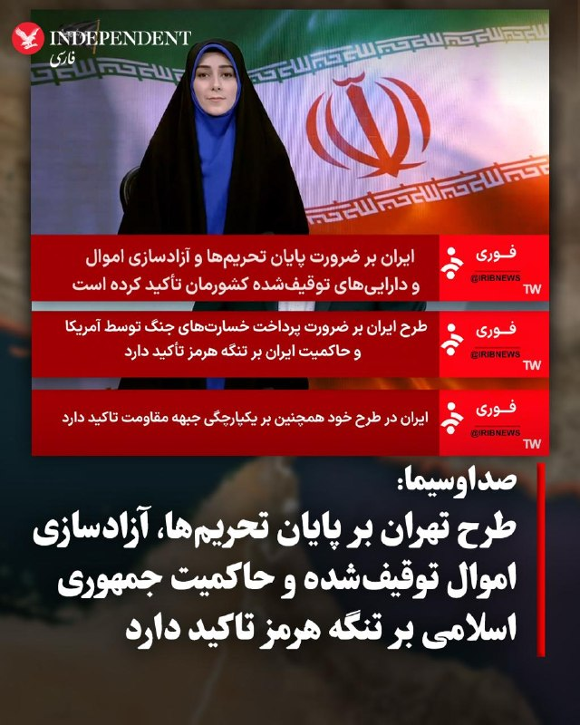

♦️خبرگزاری صداوسیما روز یکشنبه، ۲۰ اردیبهشت‌ماه، گزارش داد، طرح تهران که ترامپ آن را «غیرقابل قبول» خواند، بر «ضرورت پایان تحریم‌ها، آزادسازی اموال توقیف شده، پرداخت خسارت‌های جنگ و حاکمیت جمهوری اسلامی بر تنگه هرمز» تاکید دارد. براساس این گزارش، جمهوری اسلامی همچنین بر «یکپارچگی جبهه مقاومت تاکید دارد». پیش از این، ترامپ با انتشار پیامی در «تروث سوشال» پاسخ تهران به پیشنهاد واشنگتن را «کاملا غیرقابل قبول» خواند و اعلام کرد که «از پاسخ به‌اصطلاح نمایندگان ایران خوشم نیامد».
‌🇸🇦 Indypersian

🤖 @VahidOOnLine

## VahidOOnLine — post 239398

  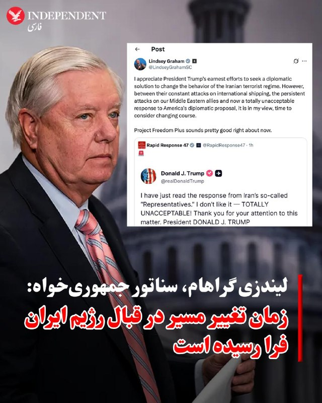

♦️لیندزی گراهام، سناتور جمهوری‌خواه، در واکنش به بن‌بست دیپلماتیک اخیر میان واشنگتن و تهران، ضمن حمایت از موضع قاطع دونالد ترامپ، خواستار تغییر رویکرد ایالات متحده در قبال جمهوری اسلامی شد. گراهام در حساب کاربری خود در اکس نوشت: «من از تلاش‌های صادقانه رئیس‌جمهور ترامپ برای یافتن راهکاری دیپلماتیک جهت تغییر رفتار رژیم تروریستی ایران قدردانی می‌کنم؛ اما با توجه به حملات مداوم آن‌ها به کشتیرانی بین‌المللی، حملات پیاپی به متحدان ما در خاورمیانه و اکنون پاسخ کاملا غیرقابل‌قبول به پیشنهاد دیپلماتیک آمریکا، به عقیده من زمان تغییر مسیر فرا رسیده است.» این سناتور پرنفوذ با اشاره به ضرورت اتخاذ اقدامات سخت‌گیرانه‌تر تاکید کرد که در شرایط کنونی، اجرای طرح «پروژه آزادی پلاس» گزینه‌ای بسیار مناسب به نظر می‌رسد. پیش از این، رئیس جمهوری آمریکا گفته بود اگر مذاکرات با تهران اتفاق نیفتد، ممکن است به پروژه آزادی برگردیم، اما این «پروژه آزادی پلاس» خواهد بود، به معنای پروژه آزادی به علاوه چیزهای دیگر.
‌🇸🇦 Indypersian

🤖 @VahidOOnLine

## VahidOOnLine — post 239397

  

فاطمه سپهری، زندانی سیاسی محبوس در زندان وکیل‌آباد مشهد، در حالی دوران حبس خود را سپری می‌کند که به گفته فعالان حقوق بشر با مشکلات جدی جسمی روبه‌رو است.
این فعال سیاسی ۶۱ ساله که سابقه جراحی قلب باز دارد، بیش از هزار روز است در زندان به‌سر می‌برد و گزارش‌ها حاکی از آن است که در این مدت دسترسی کافی و مستمر به خدمات درمانی تخصصی نداشته است.
منابع حقوق بشری از افت شدید فشار خون، تپش‌های نامنظم قلب و دردهای مزمن در ناحیه قفسه سینه و دست‌های او خبر داده‌اند.
گفته می‌شود خانم سپهری پس از چند مورد بستری کوتاه‌مدت، پیش از تکمیل روند درمان به بند بازگردانده شده است.
فاطمه سپهری نخستین‌بار در سال ۱۳۹۸ پس از امضای بیانیه‌ای موسوم به «بیانیه ۱۴ نفر» بازداشت شد. او در جریان اعتراضات سراسری سال ۱۴۰۱ دوباره بازداشت و از سوی دادگاه انقلاب مشهد به ۱۸ سال حبس محکوم شد.
در روزهای اخیر کاربران شبکه‌های اجتماعی با یک طرح گرافیکی «صدای فاطمه سپهری باش» خواستار رسیدگی فوری پزشکی و آزادی او شده‌اند.
‌🏁 🇬🇧 IranintlTV

🤖 @VahidOOnLine

## VahidOOnLine — post 239396

  <a href="telegram/content/VahidOOnLine_239396_1778452498.mp4" target="_blank">🎬 Download video</a>

♦️پس از بیش از ۱۵ سال توقف فعالیت به دلیل تحریم‌های بین‌المللی، غول‌های پرداخت جهانی، «ویزا» و «مسترکارت»، به طور رسمی فعالیت خود را در سوریه آغاز کردند. در تصاویر منتشر شده در شبکه‌های اجتماعی، احمد الشرع، رئیس جمهوری سوریه، با کارت بانکی بین‌المللی، قهوه سفارش می‌دهد. این بازگشت که از آن به عنوان بزرگ‌ترین گام برای ادغام مجدد مالی سوریه در نظام جهانی یاد می‌شود، از اوایل ماه مه کلید خورد. بر اساس گزارش‌ها، مسترکارت در روز جمعه، هشتم مه (۱۸ اردیبهشت‌ماه) مراحل فنی خود را تکمیل کرد و تنها دو روز بعد، بانک ملی قطر (QNB) به عنوان نخستین پیشگام، خدمات پذیرش کارت و پرداخت‌های دیجیتال را در خاک سوریه فعال کرد. این تحول بزرگ، انزوای بانکی سوریه را که از اوایل دهه ۲۰۱۰ آغاز شده بود، پایان داد و اکنون کارت‌های صادر شده در این کشور در سطح جهانی و کارت‌های بین‌المللی در داخل سوریه قابل استفاده هستند.
‌🇸🇦 Indypersian

🤖 @VahidOOnLine

## VahidOOnLine — post 239395

  <a href="telegram/content/VahidOOnLine_239395_1778452500.mp4" target="_blank">🎬 Download video</a>

ویدیوهای دریافت‌شده نشان می‌دهد جمعی از ایرانیان مقیم اورلاندو در ایالت فلوریدا، روز یک‌شنبه ۲۰ اردیبهشت‌ماه، در پی فراخوان شاهزاده رضا پهلوی، در اعتراض به اعدام‌های جمهوری اسلامی و قطع اینترنت در ایران تجمع کردند و خطاب به دونالد ترامپ شعار «اعتماد نکنید، معامله نکنید» سر دادند.
‌🏁 🇬🇧 IranintlTV

🤖 @VahidOOnLine

## VahidOOnLine — post 239394

  <a href="telegram/content/VahidOOnLine_239394_1778452502.mp4" target="_blank">🎬 Download video</a>

‌
خبرگزاری‌های حکومتی گزارش دادند ارتش جمهوری اسلامی ساعتی پیش «یک فروند پهپادشناسایی دشمن متجاوز» را در منطقه جنوب غرب منهدم کرده است.
‌🏁 🇬🇧 ManotoTV

🤖 @VahidOOnLine

## VahidOOnLine — post 239393

  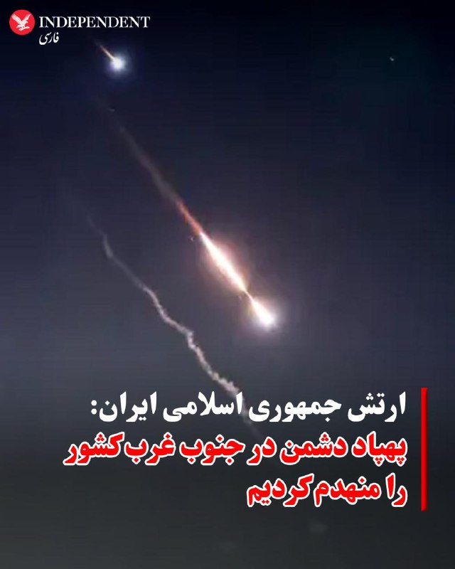

♦️تسنیم، خبرگزاری وابسته به سپاه، یکشنبه‌شب، گزارش داد: «ارتش جمهوری اسلامی ایران ساعتی پیش یک پهپادشناسایی دشمن، توسط سامانه‌های شبکه یکپارچه پدافند، تحت فرماندهی قرارگاه مشترک پدافند هوایی کشور در منطقه جنوب غرب منهدم شد».
‌🇸🇦 Indypersian

🤖 @VahidOOnLine

## VahidOOnLine — post 239392

  <a href="telegram/content/VahidOOnLine_239392_1778452504.mp4" target="_blank">🎬 Download video</a>

♦️در جریان اختتامیه یازدهمین ایستگاه از تور جهانی «شاهکارهای ارکستر عربستان سعودی» در در محوطه تاریخی و باستانی کولوسیوم رم ایتالیا، ۵۵ هنرمند اجراکننده، با اجرای رقص سنتی عربستان روی صحنه رفتند.
در این برنامه که با مشارکت و همخوانی خواننده سرشناس و جهانی، آندریا بوچلی برگزار شد، هنرمندان سعودی تلفیقی تماشایی از موسیقی ارکسترال و اصیل‌ترین رقص‌های بومی خود از جمله «عرضه وادی‌الدواسر»،«فن الخطوه» (رقص گام جنوبی) و هنر پرانرژی و ساحلی «ینبعاوی» را به نمایش گذاشتند تا پیوندی تاریخی میان میراث خاورمیانه و قلب تمدن روم باستان برقرار کنند.
‌🇸🇦 Indypersian

🤖 @VahidOOnLine

## VahidOOnLine — post 239391

  <a href="telegram/content/VahidOOnLine_239391_1778452505.mp4" target="_blank">🎬 Download video</a>

لیسبون | پرتغال؛ گردهمایی ایرانیان ـ گزارشگر ۲۰ اردیبهشت ۱۴۰۵
‌🏁 🇬🇧 ManotoTV

🤖 @VahidOOnLine

## VahidOOnLine — post 239390

  <a href="telegram/content/VahidOOnLine_239390_1778452507.mp4" target="_blank">🎬 Download video</a>

دونالد ترامپ، رئیس‌جمهوری آمریکا، در پیامی در شبکه اجتماعی «تروث سوشال» اعلام کرد پاسخ جمهوری اسلامی به پیشنهادهای اخیر واشینگتن را «کاملاً غیرقابل قبول» می‌داند.

او نوشت: «من همین الان پاسخ به‌اصطلاح “نمایندگان” ایران را خواندم. از آن خوشم نمی‌آید — کاملاً غیرقابل قبول است!»
‌🏁 🇬🇧 ManotoTV

🤖 @VahidOOnLine

## VahidOOnLine — post 239389

  <a href="telegram/content/VahidOOnLine_239389_1778452508.mp4" target="_blank">🎬 Download video</a>

‌
باراک راوید، خبرنگار آکسیوس در شبکه اکس نوشت:
«رئیس‌جمهوری ترامپ در تماس تلفنی به من گفت پاسخ اخیر ایران به پیش‌نویس توافق پایان جنگ را نمی‌پسندد. او گفت: این پاسخ قابل قبول نبود.»

راوید در ادامه افزود ترامپ به او گفته در تماس تلفنی‌ با بنیامین نتانیاهو درباره پاسخ اخیر جمهوری اسلامی به پیش‌نویس توافق پایان جنگ گفت‌وگو کرده است.

به گفته راوید ترامپ تأکید کرده موضوع ایران تنها بخش کوتاهی از این تماس بوده است.

خبرنگار آکسیوس نوشت رئیس جمهوری آمریکا به او گفته که رابطه خوبی با نتانیاهو دارد اما «این موضوع (ایران) کار من است نه هیچ‌کس دیگر.»
‌🏁 🇬🇧 ManotoTV

🤖 @VahidOOnLine

## VahidOOnLine — post 239388

  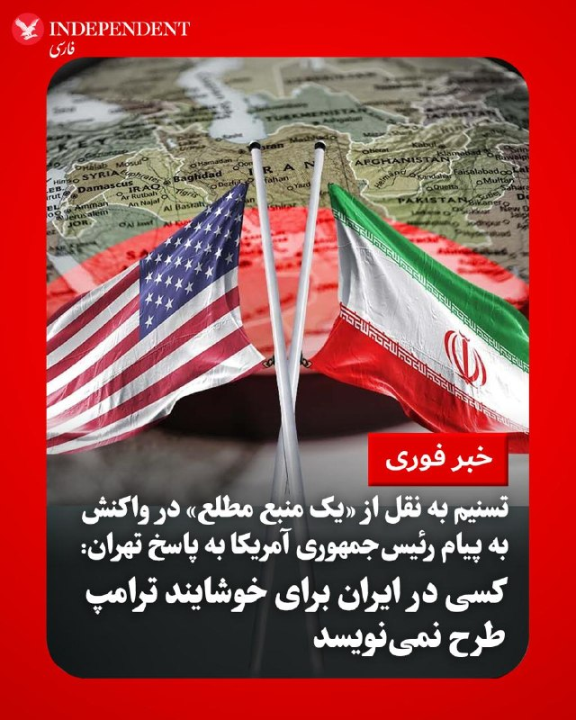

♦️خبرگزاری تسنیم، رسانه وابسته به سپاه پاسداران، روز یکشنبه، ۲۰ اردیبهشت‌ماه، به نقل از «یک منبع مطلع» در واکنش به پیام ترامپ مبنی بر «کاملا غیرقابل قبول» بودن پاسخ تهران به پیشنهاد واشنگتن، نوشت: «همین الان واکنش به اصطلاح رئیس‌جمهور آمریکا را به پاسخ ایران دیدیم. هیچ اهمیتی ندارد؛ کسی در ایران برای خوشایند ترامپ طرح نمی‌نویسد. تیم مذاکره‌کننده فقط برای حق ملت ایران باید طرح بنویسد و وقتی ترامپ از آن راضی نباشد، قاعدتا بهتر است». تسنیم نوشت: «ترامپ کلا واقعیت را دوست ندارد؛ به همین دلیل مدام از ایران شکست می‌خورد».
پیش از این، ترامپ با انتشار پیامی در «تروث سوشال» پاسخ تهران به پیشنهاد واشنگتن را «کاملا غیرقابل قبول» خواند و اعلام کرد که «از پاسخ به‌اصطلاح نمایندگان ایران خوشم نیامد».
‌🇸🇦 Indypersian

🤖 @VahidOOnLine

## VahidOOnLine — post 239387

  

دونالد ترامپ روز یک‌شنبه به اکسیوس گفت پاسخ تهران به آخرین پیش‌نویس توافق برای پایان دادن به جنگ را رد خواهد کرد.

او افزود با بنیامین نتانیاهو درباره پاسخ جمهوری اسلامی و موضوعات دیگر گفت‌وگو کرده است.ترامپ گفت: «تماس بسیار خوبی بود. ما رابطه خوبی داریم، اما این وضعیت من است، نه دیگران.» 

رییس‌جمهور آمریکا همچنین در شبکه تروث سوشال نوشت: پاسخ نمایندگان جمهوری اسلامی را خواندم. از آن خوشم نیامد و کاملا غیرقابل قبول است.
‌🏁 🇬🇧 IranintlTV

🤖 @VahidOOnLine

## VahidOOnLine — post 239386

  

♦️دونالد ترامپ، رئیس‌جمهوری آمریکا در گفتگو با خبرنگار آکسیوس اعلام کرد که روز یکشنبه با بنیامین نتانیاهو، نخست‌وزیر اسرائیل، درباره پاسخ ایران گفتگو کرده است. ترامپ با «بسیار خوب» توصیف کردن این مکالمه و تاکید بر رابطه نزدیک خود با نتانیاهو، تصریح کرد: «مذاکره با ایران موضوع مربوط به من است و به هیچ‌کس دیگری ربط ندارد.» ترامپ همزمان با انتشار پیامی در «تروث سوشال» پاسخ تهران به پیشنهاد واشنگتن را «کاملا غیرقابل قبول» خواند و اعلام کرد که «از پاسخ به‌اصطلاح نمایندگان ایران خوشم نیامد». با وجود این اظهارات قاطع، ترامپ هنوز مشخص نکرده است که آیا قصد دارد به مذاکرات ادامه دهد یا مسیر جدیدی از جمله اقدام نظامی علیه جمهوری اسلامی را در پیش خواهد گرفت.
‌🇸🇦 Indypersian

🤖 @VahidOOnLine

## VahidOOnLine — post 239385

  <a href="telegram/content/VahidOOnLine_239385_1778452511.mp4" target="_blank">🎬 Download video</a>

‌
وزارت خارجه عربستان سعودی حملات گزارش‌شده به امارات، قطر و کویت را محکوم کرد و خواستار توقف فوری آن شد.

ریاض در بیانیه‌ای تأکید کرد باید «فوراً به حملات آشکار علیه خاک و آب‌های سرزمینی» کشورهای حاشیه خلیج فارس و هرگونه تلاش برای بستن تنگه هرمز پایان داده شود.

این موضع‌گیری پس از آن مطرح شد که امارات اعلام کرد پدافند هوایی این کشور دو پهپاد پرتاب‌شده از ایران را رهگیری کرده است.

کویت نیز از مشاهده «پهپادهای متخاصم» در حریم هوایی خود خبر داد و قطر اعلام کرد یک کشتی باری در آب‌های سرزمینی این کشور هدف قرار گرفته است.
‌🏁 🇬🇧 ManotoTV

🤖 @VahidOOnLine

## mwarmonitor — post 8861

  

«دمکرات‌های نادانِ چپِ رادیکال باید شکست بخورند — کشورمان در خطر است!

رئیس‌جمهور دونالد جی. ترامپ»

@mwarmonitor

## mwarmonitor — post 8860

من همین الآن پاسخِ به‌اصطلاح «نمایندگان» ایران را خواندم. از آن خوشم نمی‌آید — کاملاً غیرقابل قبول است! از توجه شما به این موضوع سپاسگزارم. رئیس‌جمهور دونالد جی. ترامپ @mwarmonitor

## mwarmonitor — post 8859

🔴ترامپ به اکسیوس: از پاسخ ایران به طرح صلح «خوشم نمی‌آید»

📝نوشته: باراک راوید

🔸پرزیدنت ترامپ روز یکشنبه در تماس تلفنی کوتاهی با اکسیوس اعلام کرد که پاسخ ایران به آخرین پیش‌نویس توافق برای پایان دادن به جنگ را رد خواهد کرد.

🔹چرا این موضوع مهم است؟
ایالات متحده ۱۰ روز منتظر پاسخ ایران بود که سرانجام روز یکشنبه دریافت شد. کاخ سفید امیدوار بود که مواضع ایران نشان‌دهنده پیشرفت بیشتری به سمت یک توافق باشد، اما واکنش اولیه ترامپ سیگنال معکوسی را ارسال می‌کند.
🔹گفته‌های او:
ترامپ بدون وارد شدن به جزئیات محتوای پاسخ ایران گفت: «من از نامه‌شان خوشم نمی‌آید. نامناسب است. من از پاسخ آن‌ها خوشم نمی‌آید.»
🔹او افزود: «آن‌ها ۴۷ سال است که ملت‌های زیادی را معطل کرده و بازی داده‌اند.»
🔹وضعیت موجود:
ترامپ گفت که روز یکشنبه با بنیامین نتانیاهو، نخست‌وزیر اسرائیل، صحبت کرده و در میان موضوعات دیگر، درباره پاسخ ایران نیز با او گفتگو کرده است.
🔹او گفت: «تماس بسیار خوبی بود. ما رابطه خوبی داریم، اما این وضعیتِ من است، نه لزوماً بقیه.»
🔹آنچه باید زیر نظر داشت:
ترامپ در این مصاحبه کوتاه روشن نکرد که آیا قصد دارد به مذاکرات ادامه دهد یا احتمالاً گزینه اقدام نظامی را انتخاب خواهد کرد.

@mwarmonitor

## mwarmonitor — post 8858

🚨خبر فوری 🚨رئیس‌جمهور ترامپ در یک تماس تلفنی به من گفت که از پاسخ اخیر ایران به پیش‌نویس توافق برای پایان دادن به جنگ «خوشش نیامده است». او گفت: «این پاسخ نامناسب بود.» باراک راوید خبرنگار آکسیوس @mwarmonitor

## mwarmonitor — post 8857

  

🚨خبر فوری 🚨رئیس‌جمهور ترامپ در یک تماس تلفنی به من گفت که از پاسخ اخیر ایران به پیش‌نویس توافق برای پایان دادن به جنگ «خوشش نیامده است». او گفت: «این پاسخ نامناسب بود.» باراک راوید خبرنگار آکسیوس @mwarmonitor

## mwarmonitor — post 8856

شک نکنید بعد از خوندن جواب جمهوری اسلامی این متن نوشته

## mwarmonitor — post 8855

«رو کانا»، آن عضو فاسد مجلس و چپ‌گرای رادیکال از ایالت شکست‌خورده کالیفرنیا، نباید اجازه حضور در فاکس‌نیوز را داشته باشد؛ مگر اینکه مجری‌ای روبروی او باشد که بتواند دروغ‌هایش را یکی پس از دیگری به چالش بکشد و روایت‌های جعلی (اراجیف!) او را متوقف کند. او شبیه به حکیم جفریس، اما بدتر از اوست، فقط با ضریب هوشی کمی بالاتر.
امروز صبح او به نمایندگی از «احمق‌کرات‌ها» (Dumacrats) سعی کرد اعتبار بازگشت صنعت فولاد به ایالات متحده را به نام خودشان بزند؛ در حالی که به خوبی می‌داند آن احمق‌ها عملاً این صنعت را نابود کرده بودند و من بودم که با تعرفه‌های سنگین (و فراتر از آن!) نجاتش دادم.
کشور ما در طول «دولت» قبلی مُرده بود، و حالا داغ‌تر و پررونق‌تر از همیشه است. ما نمی‌توانیم اجازه دهیم «احمق‌کرات‌ها» اعتبار این دستاورد را بدزدند. اگر آن‌ها انتخاب شوند، ملت شکوفا و اکنون بسیار محترم ما را کاملاً نابود خواهند کرد. من اجازه نخواهم داد این اتفاق بیفتد!!!

رئیس‌جمهور دونالد جی. ترامپ

@mwarmonitor

## mwarmonitor — post 8854

ما همین حالا موفق شدیم آزادی سه زندانی لهستانی و دو زندانی مولداویایی را از بازداشتگاه‌های بلاروس و روسیه تضمین کنیم. با تشکر از فرستاده ویژه ریاست‌جمهوری من، «جان کول»، ما توانستیم با فشار زیاد این آزادی را محقق کنیم.
دوست من، کارول ناوروکی، رئیس‌جمهور لهستان، سپتامبر گذشته با من دیدار کرد و از من خواست تا برای آزادی «آندژی پوچوبوت» از زندان بلاروس کمک کنم. امروز، پوچوبوت به دلیل تلاش‌های ما آزاد است.
ایالات متحده به وعده‌های خود در قبال متحدان و دوستانش عمل می‌کند. با تشکر از رئیس‌جمهور الکساندر لوکاشنکو برای همکاری و دوستی‌اش. بسیار عالی!

رئیس‌جمهور دونالد جی. ترامپ

@mwarmonitor

## pm_afshaa — post 90509

  <a href="telegram/content/pm_afshaa_90509_1778452513.webm" target="_blank">🎬 Download video</a>

🔴صداوسیما: جمهوری اسلامی آخرین پیشنهاد آمریکا رو رد کرد و پیشنهاد متقابل خود را ارائه داد.

تهران خواستار رفع تحریم‌ها، آزادسازی دارایی‌های مسدود شده ایران، جبران خسارات ناشی از جنگ و به رسمیت شناختن نقش ایران در تنگه هرمز شد، در حالی که آمریکا پاسخ رو «غیرقابل قبول» دانست.

💧 Rainbet.com the #1 Non-KYC Crypto Casino & Sportsbook @rainbetcom

😁 @Pm_Afshaa

## pm_afshaa — post 90508

  <a href="telegram/content/pm_afshaa_90508_1778452514.webm" target="_blank">🎬 Download video</a>

🔴علی قلهکی، خبرنگار:
ایران بر «پایانِ جنگ»، «رفع تحریم» و «رفعِ محاصره دریایی» متمرکز است ولی طرفِ مقابل حتما «400 کیلو اورانیوم» رو میخواد!

از این پس باید منتظر نقطه ورود به تنش نظامی بود.

💧 Rainbet.com the #1 Non-KYC Crypto Casino & Sportsbook @rainbetcom

😁 @Pm_Afshaa

## pm_afshaa — post 90507

  <a href="telegram/content/pm_afshaa_90507_1778452515.webm" target="_blank">🎬 Download video</a>

🔴دونالد ترامپ به اکسیوس: با نتانیاهو درباره پاسخ ایران گفتوگو کردم. 
💧 Rainbet.com the #1 Non-KYC Crypto Casino & Sportsbook @rainbetcom 
😁 @Pm_Afshaa

## pm_afshaa — post 90506

  <a href="telegram/content/pm_afshaa_90506_1778452516.webm" target="_blank">🎬 Download video</a>

🔴نتانیاهو: وقتشه خودمون رو از کمک‌های مالی و نظامی بقیه بی‌نیاز کنیم.

+ این حرفش بوی جنگ بدون حضور آمریکا میده.

💧 Rainbet.com the #1 Non-KYC Crypto Casino & Sportsbook @rainbetcom

😁 @Pm_Afshaa

## pm_afshaa — post 90505

  <a href="telegram/content/pm_afshaa_90505_1778452516.webm" target="_blank">🎬 Download video</a>

🔴دونالد ترامپ به اکسیوس: با نتانیاهو درباره پاسخ ایران گفتوگو کردم.

💧 Rainbet.com the #1 Non-KYC Crypto Casino & Sportsbook @rainbetcom

😁 @Pm_Afshaa

## pm_afshaa — post 90504

  <a href="telegram/content/pm_afshaa_90504_1778452517.webm" target="_blank">🎬 Download video</a>

🔴سناتور لیندزی گراهام:
برای من آشکار است که ایران معتقده که رئیس جمهور ترامپ در مورد گزینه‌های نظامی آینده بلوف میزنه.

به درک من از اوضاع، این میتونه یک اشتباه فاجعه‌بار از سوی رهبری ایران باشه. منتظر باشید.

💧 Rainbet.com the #1 Non-KYC Crypto Casino & Sportsbook @rainbetcom

😁 @Pm_Afshaa

## pm_afshaa — post 90503

🔴ترامپ: دموکرات‌های چپ‌گرای افراطی باید شکست بخورند - کشور ما در خطر است

💧 Rainbet.com the #1 Non-KYC Crypto Casino & Sportsbook @rainbetcom

😁 @Pm_Afshaa

## pm_afshaa — post 90502

🔴ترامپ: از پاسخ ایران اصلا راضی نیستم. به هیچ وجه قابل قبول نیست

💧 Rainbet.com the #1 Non-KYC Crypto Casino & Sportsbook @rainbetcom

😁 @Pm_Afshaa

## pm_afshaa — post 90501

🔴وال استریت ژورنال: به گفته منابع، ایران برچیدن تأسیسات هسته‌ای خود را رد کرده

💧 Rainbet.com the #1 Non-KYC Crypto Casino & Sportsbook @rainbetcom

😁 @Pm_Afshaa

## pm_afshaa — post 90500

🔴رسانه های اسرائیلی : نتانیاهو بعدِ تماس تلفنی، جلسه‌ای با کابینه امنیتی گذاشته‌

💧 Rainbet.com the #1 Non-KYC Crypto Casino & Sportsbook @rainbetcom

😁 @Pm_Afshaa

## DEJradio — post 4555

  

🛩️
⭕️ براساس گزارش منابع محلی یکشنبه شب ۲۰ اردیبهشت ۱۴۰۵ توپ‌های پدافند در اندیمشک و دزفول برای مقابله با پهپادهای ناشناس فعال شدند.

#پهپاد #دزفول #اندیمشک
@DEJradio

## DEJradio — post 4554

  <a href="telegram/content/DEJradio_4554_1778452519.webm" target="_blank">🎬 Download video</a>

🚨
⭕️ دونالد ترامپ، رئیس‌جمهوری ایالات متحده، شامگاه یکشنبه در پیامی در شبکۀ اجتماعی تروث سوشال نوشت جمهوری اسلامی ۴۷سال است که با آمریکا و جهان بازی کرده و با سیاست "تعویق، تعویق، تعویق" زمان خریده است. ترامپ نوشت این روند زمانی برای جمهوری اسلامی به نقطۀ طلایی…

## mamlekate — post 103499

  <a href="telegram/content/mamlekate_103499_1778452519.mp4" target="_blank">🎬 Download video</a>

📞 دزفول توی جاده کمربندی سمت زیبا شهر ساعت ۹:۳۰ شب

📞 دزفول از ساعت ۹و نیم صدای ضدهوایی و چند انفجار شنیده شد

@mamlekate

## mamlekate — post 103498

📞 سلام، از ساعت ۵ تا ۶ به سه تا از پمپ بنزینای اصفهان رفتم هیچ کدومشون کارت آزاد ندادن بنزین بزنم

📞 ساعت ۴ بعد از ظهر رفتم بنزین بزنم میگفت بنزین جایگاه تموم شده که عجیب بود. یکی از پمپ بنزین های شهرستان هم کلا تعطیل کرده بود. یکی از شهرستان های کرمانشاه.

 @mamlekate

## mamlekate — post 103497

📝 تهران به طرح یک‌صفحه‌ای ترامپ پاسخ داد

📝 ترامپ: پاسخ جمهوری اسلامی «کاملا غیرقابل‌قبول» است

دونالد ترامپ، رئیس جمهوری آمریکا روز یکشنبه ۲۰ اردیبهشت گفت که پاسخ جمهوری اسلامی به پیشنهادات آمریکا برای چارچوب مذاکرات صلح را دریافت کرده است و این پاسخ را «کاملاً غیرقابل‌قبول» خواند.

📝 ترامپ: رژیم ایران ۴۷ سال است دنیا را به بازی گرفته‌‌است؛ دیگر به ما نخواهند خندید

📝 نتانیاهو: جنگ با جمهوری اسلامی تمام نشده است

📝 نتانیاهو: ترامپ گفت برای اورانیوم غنی‌شده وارد ایران خواهند شد

📝 ترامپ چهارشنبه وارد پکن می‌شود

@mamlekate

## VahidOnline — post 75391

آکسیوس: پرزیدنت ترامپ روز یکشنبه در یک تماس تلفنی کوتاه به آکسیوس گفت که پاسخ ایران به تازه‌ترین پیش‌نویس توافق برای پایان دادن به جنگ را رد خواهد کرد.
ترامپ اندکی پس از این تماس، در پستی در تروث سوشال، پاسخ ایران را «کاملاً غیرقابل قبول!» خواند.

ترامپ به آکسیوس گفت روز یکشنبه با بنیامین نتانیاهو، نخست‌وزیر اسرائیل، صحبت کرده و در میان مسائل دیگر، درباره پاسخ ایران نیز گفت‌وگو داشته است.
او درباره نتانیاهو گفت: «تماس بسیار خوبی بود. رابطه خوبی داریم.» اما افزود که مذاکرات ایران «مسئله من است، نه مسئله دیگران.»

ترامپ در این مصاحبه کوتاه روشن نکرد که آیا قصد دارد مذاکرات را ادامه دهد یا احتمالاً گزینه اقدام نظامی را در پیش بگیرد.
سناتور لیندسی گراهام، جمهوری‌خواه از کارولینای جنوبی، در ایکس نوشت که ترامپ اکنون باید اقدام نظامی را در نظر بگیرد؛ موضعی که گراهام در سراسر آتش‌بس یک‌ماهه بارها تکرار کرده است.
او نوشت: «با توجه به حملات مداوم آن‌ها به کشتیرانی بین‌المللی، حملات پیوسته به متحدان ما در خاورمیانه، و اکنون پاسخ کاملاً غیرقابل قبول به پیشنهاد دیپلماتیک آمریکا، به نظر من زمان آن رسیده که تغییر مسیر را در نظر بگیریم.»
گراهام نوشت: «پروژه آزادی پلاس همین حالا خیلی خوب به نظر می‌رسد»؛ اشاره‌ای به عملیات دریایی برای هدایت کشتی‌ها از تنگه هرمز که ترامپ پس از کمتر از ۴۸ ساعت به‌طور ناگهانی آن را متوقف کرد.
@VahidOOnLine
خبرگزاری تسنیم، رسانه وابسته به سپاه پاسداران، روز یکشنبه، ۲۰ اردیبهشت‌ماه، به نقل از «یک منبع مطلع» در واکنش به پیام ترامپ مبنی بر «کاملا غیرقابل قبول» بودن پاسخ تهران به پیشنهاد واشنگتن، نوشت: «همین الان واکنش به اصطلاح رئیس‌جمهور آمریکا را به پاسخ ایران دیدیم. هیچ اهمیتی ندارد؛ کسی در ایران برای خوشایند ترامپ طرح نمی‌نویسد. تیم مذاکره‌کننده فقط برای حق ملت ایران باید طرح بنویسد و وقتی ترامپ از آن راضی نباشد، قاعدتا بهتر است». تسنیم نوشت: «ترامپ کلا واقعیت را دوست ندارد؛ به همین دلیل مدام از ایران شکست می‌خورد».
@VahidOOnLine
خبرگزاری صداوسیما گزارش داد طرح تهران که ترامپ آن را «غیرقابل قبول» خواند، بر ضرورت پرداخت خسارت‌های جنگ توسط آمریکا و حاکمیت جمهوری اسلامی بر تنگه هرمز تاکید دارد
IranIntlbrk

📡 @VahidOnline

## VahidOnline — post 75390

  

☄️ ترامپ پاسخ جمهوری اسلامی را رد کرد

پست ترامپ، ترجمه ماشین:
همین حالا پاسخ به‌اصطلاح «نمایندگان» ایران را خواندم. از آن خوشم نیامد — کاملاً غیرقابل‌قبول است! از توجه شما به این موضوع سپاسگزارم.

رئیس‌جمهور دونالد جی. ترامپ
realDonaldTrump

📡 @VahidOnline

## VahidOnline — post 75389

  

روزنامه وال‌استریت ژورنال، شامگاه یکشنبه ۲۰ اردیبهشت ماه، به نقل از منابعی آگاه، جزئیاتی از پاسخ ایران به پیشنهاد صلح آمریکا را منتشر کرد.

به گزارش این روزنامه، پاسخ ایران که از طریق پاکستان به‌عنوان میانجی به واشنگتن منتقل شده، همچنان اختلاف‌های مهمی میان دو طرف باقی گذاشته است.

به گفته منابع وال‌استریت ژورنال، تهران حاضر نشده از پیش درباره سرنوشت برنامه هسته‌ای خود و ذخایر اورانیوم با غنای بالا تعهد بدهد.

ایران پیشنهاد کرده مسائل هسته‌ای طی ۳۰ روز آینده مورد مذاکره قرار گیرد.

مقامام‌های ایران همچنین برای رقیق‌سازی بخشی از اورانیوم غنی‌شده و انتقال بخش دیگری از آن به یک کشور ثالث اعلام آمادگی کرده‌اند.

وال‌استریت ژورنال گزارش داد تهران با برچیدن تاسیسات هسته‌ای خود مخالفت کرده، اما در عین حال آمادگی‌اش را برای تعلیق غنی‌سازی اورانیوم اعلام کرده است؛ تعلیقی که به گفته این روزنامه، مدت آن کوتاه‌تر از توقف ۲۰ ساله پیشنهادی آمریکا خواهد بود.

بر اساس این گزارش، ایران در پاسخی چندصفحه‌ای به تازه‌ترین پیشنهاد آمریکا برای پایان دادن به جنگ، خواستار پایان درگیری‌ها و لغو محاصره کشتی‌ها و بنادر ایرانی شده و پیشنهاد داده است تنگه هرمز به‌تدریج به روی رفت‌وآمد تجاری باز شود.

وال‌استریت ژورنال نوشت ایران در مقابل، خواستار تضمین‌هایی شده است که اگر مذاکرات شکست بخورد یا آمریکا در آینده از توافق خارج شود، اورانیوم منتقل‌شده دوباره به ایران بازگردانده شود.
@VahidOOnLine

📡 @VahidOnline

## VahidOnline — post 75388

  

رسانه‌های ایران شامگاه یک‌شنبه با اشاره به شنیده شدن فعالیت پدافند هوایی در اندیمشک و شمال دزفول از سرنگونی «پرنده متخاصم دشمن» در اندیمشک خبر دادند.

شهروندان نیز یک‌شنبه ساعت حدود ۱۰ شب از شنیده‌شدن صدای پدافند در این شهر خبر دادند.
@VahidOOnLine

📡 @VahidOnline

## kianmeli1 — post 87339

‏🔴العربیه: قیمت جهانی نفت با سه درصد افزایش، جهش کرد و نفت برنت پس از اظهارات دونالد ترامپ درباره «غیرقابل قبول بودن پاسخ ایران» بالای ۱۰۴ دلار در هر بشکه معامله شد
https://t.me/kianmeli1

## kianmeli1 — post 87338

🔴صدا و سیما

ایران آخرین پیشنهاد آمریکا را رد کرد
https://t.me/kianmeli1

## kianmeli1 — post 87337

  

🔴ترامپ: من همین الان پاسخ به اصطلاح «نمایندگان» ایران را خواندم. این را دوست ندارم — کاملاً غیرقابل قبول است! از توجه شما به این موضوع سپاسگزارم.
https://t.me/kianmeli1

## IranIntlTV — post 336544

  <a href="https://t.me/IranintlTV/336544" target="_blank">📎 Download file</a>

🎧نسخه صوتی سیاست با مراد ویسی: دست رد ترامپ بر پیشنهاد جمهوری‌اسلامی
@iranintlTV

## IranIntlTV — post 336543

  <a href="telegram/content/IranIntlTV_336543_1778452524.mp4" target="_blank">🎬 Download video</a>

دونالد ترامپ از دریافت پاسخ تهران به طرح پیشنهادی ایالات متحده خبر داد و آن را غیرقابل قبول خواند.

این اظهارات ترامپ با واکنش‌های گسترده‌ای در شبکه‌های اجتماعی و رسانه‌ها همراه شده است.

جزییات بیشتر در گزارش امیر گیتی، عضو تحریریه ایران‌اینترنشنال
@iranintltv

## IranIntlTV — post 336542

  

سناتور لیندزی گراهام در واکنش به گمانه‌زنی‌ها درباره توافق احتمالی با ایران، در حساب کاربری خود در شبکه ایکس نوشت این ایده که جمهوری اسلامی در چارچوب یک توافق مذاکره‌شده، تأسیسات غنی‌سازی خود را به‌طور کامل برچیند، منطقی نیست.

او تأکید کرد تعلیق موقت غنی‌سازی بدون نابودی کامل زیرساخت‌ها و توانمندی‌ها، عملاً بازگشت به توافق برجام خواهد بود.

گراهام افزود هرگونه مخالفت تهران با برچیدن کامل ظرفیت غنی‌سازی از سوی آمریکا «قاطعانه رد خواهد شد». او در بخش دیگری از پیام خود از حمایت دونالد ترامپ قدردانی کرد و آن را برای خود «بسیار ارزشمند» خواند.

گراهام گفت به اعتماد ترامپ، چه به‌عنوان سناتور و چه به‌عنوان دوست، افتخار می‌کند و از همراهی با او در آنچه «بزرگ‌ترین بازگشت سیاسی در تاریخ آمریکا» توصیف کرد، ابراز خرسندی کرد.

وی همچنین تأکید کرد در سنای آمریکا برای پیشبرد دستورکار ترامپ جهت «امن‌تر و ثروتمندتر کردن آمریکا» تلاش خواهد کرد.
https://iranintl.com/202605106523

## IranIntlTV — post 336541

  

کریس رایت، وزیر انرژی آمریکا، در گفت‌وگو با شبکه ان‌بی‌سی اعلام کرد دولت دونالد ترامپ از «همه ایده‌ها» برای کاهش قیمت بنزین استقبال می‌کند؛ از جمله تعلیق مالیات فدرال بر سوخت.

این اظهارات در شرایطی مطرح شده که قیمت بنزین در آمریکا افزایش یافته و میانگین ملی آن روز یکشنبه به ۴.۵۲ دلار در هر گالن رسیده است.

به گزارش ان‌بی‌سی، این رقم نشان می‌دهد بهای بنزین از زمان آغاز جنگ ایران در نهم اسفند بیش از ۵۰ درصد رشد کرده است.

رایت در پاسخ به پرسشی درباره تعلیق مالیات فدرال بنزین، که حدود ۱۸ سنت در هر گالن است، گفت دولت از هر اقدامی که بتواند قیمت‌ها را در جایگاه‌های سوخت کاهش دهد و فشار بر مصرف‌کنندگان را کم کند، حمایت می‌کند.

او همچنین درباره احتمال رسیدن قیمت‌ها به ۵ دلار در هر گالن از پیش‌بینی خودداری کرد و گفت تعیین قیمت انرژی در کوتاه‌مدت یا میان‌مدت دشوار است.

رایت افزود تمرکز دولت بر پایان دادن به درگیری چند دهه‌ای با جمهوری اسلامی است.
https://iranintl.com/202605106125

## IranIntlTV — post 336540

  <a href="telegram/content/IranIntlTV_336540_1778452528.mp4" target="_blank">🎬 Download video</a>

مراد ویسی، تحلیل‌گر ارشد ایران‌اینترنشنال، گفت: «سخنان تند ترامپ، درست در روزی که جمهوری اسلامی پاسخ خود را به پیشنهاد آمریکا تحویل داده، می‌تواند نشانه نارضایتی واشینگتن از محتوای این پاسخ باشد. استفاده ترامپ از عباراتی مثل سال‌ها ما را بازی دادند و دیگر اجازه نمی‌دهیم به ما بخندند نشان می‌دهد صبر آمریکا نسبت به روند فعلی به شدت کاهش پیدا کرده است.»
@iranintltv

## IranIntlTV — post 336539

  

فاطمه سپهری، زندانی سیاسی محبوس در زندان وکیل‌آباد مشهد، در حالی دوران حبس خود را سپری می‌کند که به گفته فعالان حقوق بشر با مشکلات جدی جسمی روبه‌رو است.
این فعال سیاسی ۶۱ ساله که سابقه جراحی قلب باز دارد، بیش از هزار روز است در زندان به‌سر می‌برد و گزارش‌ها حاکی از آن است که در این مدت دسترسی کافی و مستمر به خدمات درمانی تخصصی نداشته است.
منابع حقوق بشری از افت شدید فشار خون، تپش‌های نامنظم قلب و دردهای مزمن در ناحیه قفسه سینه و دست‌های او خبر داده‌اند.
گفته می‌شود خانم سپهری پس از چند مورد بستری کوتاه‌مدت، پیش از تکمیل روند درمان به بند بازگردانده شده است.
فاطمه سپهری نخستین‌بار در سال ۱۳۹۸ پس از امضای بیانیه‌ای موسوم به «بیانیه ۱۴ نفر» بازداشت شد. او در جریان اعتراضات سراسری سال ۱۴۰۱ دوباره بازداشت و از سوی دادگاه انقلاب مشهد به ۱۸ سال حبس محکوم شد.
در روزهای اخیر کاربران شبکه‌های اجتماعی با یک طرح گرافیکی «صدای فاطمه سپهری باش» خواستار رسیدگی فوری پزشکی و آزادی او شده‌اند.
https://iranintl.com/202605103770

## IranIntlTV — post 336538

  <a href="telegram/content/IranIntlTV_336538_1778452531.mp4" target="_blank">🎬 Download video</a>

دونالد ترامپ در تروث سوشال نوشت پاسخ نمایندگان جمهوری اسلامی را خوانده و آن را «کاملا غیرقابل قبول» می‌داند.

ترامپ پیش‌تر تاکید کرده بود واشینگتن نباید اجازه دهد ایران به سلاح هسته‌ای دست پیدا کند و آمریکا در صورت نیاز، به اهداف دیگری در ایران حمله خواهد کرد.

گفت‌وگو با کامیار بهرنگ، عضو تحریریه ایران‌اینترنشنال
@iranintltv

## IranIntlTV — post 336537

  <a href="telegram/content/IranIntlTV_336537_1778452534.mp4" target="_blank">🎬 Download video</a>

مراد ویسی، تحلیل‌گر ارشد ایران‌اینترنشنال، گفت: «خشم ترامپ از طولانی شدن مذاکرات با جمهوری اسلامی در سخنان یکشنبه‌اش آشکار بود؛ او گفت جمهوری اسلامی ۴۷ سال آمریکا و جهان را بازی داده است. حالا که ترامپ پاسخ جمهوری اسلامی را غیرقابل قبول خوانده، همه منتظرند ببینند مسیر بعدی واشینگتن تلاش دوباره برای توافق است یا آغاز حملات نظامی.»
@iranintltv

## IranIntlTV — post 336536

  <a href="telegram/content/IranIntlTV_336536_1778452536.mp4" target="_blank">🎬 Download video</a>

ویدیوهای دریافت‌شده نشان می‌دهد جمعی از ایرانیان مقیم اورلاندو در ایالت فلوریدا، روز یک‌شنبه ۲۰ اردیبهشت‌ماه، در پی فراخوان شاهزاده رضا پهلوی، در اعتراض به اعدام‌های جمهوری اسلامی و قطع اینترنت در ایران تجمع کردند و خطاب به دونالد ترامپ شعار «اعتماد نکنید، معامله نکنید» سر دادند.

## IranIntlTV — post 336535

  <a href="telegram/content/IranIntlTV_336535_1778452538.mp4" target="_blank">🎬 Download video</a>

همزمان با تشدید فضای امنیتی در ایران، مقام‌های حکومتی بار دیگر بر برخورد با پوشش اختیاری زنان تاکید کرده‌اند.
یکی از طراحان قانون عفاف و حجاب مدعی شد موساد ساعتی سه دلار به زنان ایران می‌دهد تا با «تاپ و شلوار» در میدان ولیعصر قدم بزنند.

گفت‌وگو با پگاه بنی‌هاشمی، پژوهشگر حقوق
@iranintltv

## IranIntlTV — post 336534

  <a href="telegram/content/IranIntlTV_336534_1778452542.mp4" target="_blank">🎬 Download video</a>

دونالد ترامپ پاسخ جمهوری اسلامی به پیشنهاد آمریکا را رد و آن را غیرقابل قبول توصیف کرد.

او ساعاتی پیش نیز گفته بود اورانیوم غنی‌شده و برنامه هسته‌ای جمهوری اسلامی تحت نظر است و ایالات متحده در نهایت به آن دست پیدا خواهد کرد.

گزارش مرضیه حسینی، خبرنگار ایران‌اینترنشنال
@iranintltv

## IranIntlTV — post 336533

  

دونالد ترامپ روز یک‌شنبه به اکسیوس گفت پاسخ تهران به آخرین پیش‌نویس توافق برای پایان دادن به جنگ را رد خواهد کرد.

او افزود با بنیامین نتانیاهو درباره پاسخ جمهوری اسلامی و موضوعات دیگر گفت‌وگو کرده است.ترامپ گفت: «تماس بسیار خوبی بود. ما رابطه خوبی داریم، اما این وضعیت من است، نه دیگران.» 

رییس‌جمهور آمریکا همچنین در شبکه تروث سوشال نوشت: پاسخ نمایندگان جمهوری اسلامی را خواندم. از آن خوشم نیامد و کاملا غیرقابل قبول است.
https://iranintl.com/202605101324

## IranIntlTV — post 336532

  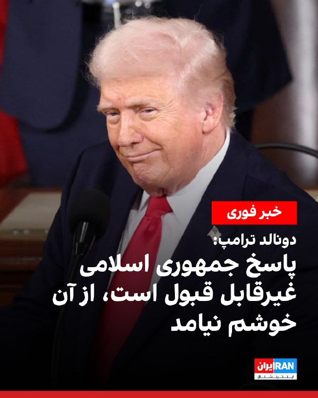

دونالد ترامپ شامگاه یک‌شنبه در شبکه اجتماعی تروث سوشال در واکنش به پاسخ تهران نوشت: همین حالا پاسخ نمایندگان جمهوری اسلامی را خواندم. از آن خوشم نیامد و کاملا غیرقابل قبول است.
https://iranintl.com/202605103941

## IranIntlTV — post 336531

  

العربیه به نقل از منابع آگاه گزارش داد که پاسخ جمهوری اسلامی به آمریکا، سرنوشت اورانیوم غنی‌شده در ایران را به موفقیت مذاکرات گره زده و در صورت موفقیت مذاکرات میان تهران و واشینگتن، اورانیوم غنی‌شده از ایران منتقل خواهد شد.

بر اساس این گزارش، «معضل اورانیوم غنی‌شده ایران شاهد گام‌هایی برای حل‌وفصل آن بوده است.»

منابع آگاه العربیه گفتند که «هیچ صحبتی درباره برچیدن تاسیسات هسته‌ای در ایران مطرح نیست، اما این تاسیسات تحت نظارت آژانس بین‌المللی انرژی اتمی قرار خواهند گرفت.»

منابع العربیه ادامه دادند که احتمال انتقال اورانیوم ایران به کشوری غیر از آمریکا با درصد بالایی مطرح است اما انتقال اورانیوم غنی‌شده ایران به خارج از کشور، به زمان و اقدامات لازم برای اعتمادسازی نیاز دارد.

منابع العربیه افزودند که هنوز هیچ پاسخی از سوی آمریکا به میانجی پاکستانی تحویل داده نشده است.

پس از انتشار گزارش العربیه، تسنیم خبرگزاری وابسته به سپاه به نقل از یک منبع مطلع نوشت: «گزارش‌ها درباره متن پیشنهادی جمهوری اسلامی در مذاکرات با آمریکا در بخش‌های مهمی با واقعیت منطبق نیست و ادعاهای مطرح‌شده درباره مواد هسته‌ای واقعیت ندارد.»

## IranIntlTV — post 336530

  <a href="https://t.me/IranintlTV/336530" target="_blank">📎 Download file</a>

🎧نسخه صوتی چشم‌انداز: جنون نظامی تازه سپاه و مجتبی در خلیج فارس
@iranintlTV

## Shin_Persian — post 5948

📦 mhrv-rs v1.9.20 released

• Fix Full mode regression since v1.9.15 (#924, PR #1029)

Files (Android APKs, Windows, macOS, Linux, OpenWRT) on the files channel:

👉 v1.9.20 — all files with SHA-256

Channel:
https://t.me/mhrv_rs
or: https://t.me/+R1OyoHX2boA1ZDgx

#v1920

## Shin_Persian — post 5947

Shin ✓ @hey_itsmyturn
Sun, 10 May 2026 21:53:45 UTC

Explosions heard in Soran district, Erbil province
#Iraq 🇮🇶

فارسی

صدای انفجارهایی در شهرستان سوران، استان اربیل شنیده شد
#Iraq 🇮🇶

𝕏 · @shin_persian

## Shin_Persian — post 5946

↩️ Quoted tweet: Shin ✓ @hey_itsmyturn Sun, 10 May 2026 18:54:28 UTC 1854Z AA activity in Andimeshk, Khuzestan Province, #Iran ↩️ توییت نقل‌قول شده — برای پاسخ، پست زیر را ببینید. فارسی ۱۸۵۴ زولو (۲۲:۲۴ به وقت تهران) فعالیت پدافند هوایی در اندیمشک، استان…

## Shin_Persian — post 5945

  

↩️ Quoted tweet:
Shin ✓ @hey_itsmyturn
Sun, 10 May 2026 18:54:28 UTC

1854Z
AA activity in Andimeshk,
Khuzestan Province, #Iran

↩️ توییت نقل‌قول شده — برای پاسخ، پست زیر را ببینید.

فارسی

۱۸۵۴ زولو (۲۲:۲۴ به وقت تهران)
فعالیت پدافند هوایی در اندیمشک،
استان خوزستان، #Iran

𝕏 · @shin_persian

## Shin_Persian — post 5944

Shin ✓ @hey_itsmyturn
Sun, 10 May 2026 21:01:49 UTC

Another night with jet activity over Baghdad #Iraq 🇮🇶

فارسی

شبی دیگر با فعالیت جنگنده‌ها بر فراز بغداد #Iraq 🇮🇶

𝕏 · @shin_persian

## Shin_Persian — post 5943

  

Shin ✓ @hey_itsmyturn
Sun, 10 May 2026 20:15:16 UTC

President Trump @POTUS:
"I have just read the response from Iran’s so-called “Representatives.” I don’t like it — TOTALLY UNACCEPTABLE! Thank you for your attention to this matter. President DONALD J. TRUMP"

فارسی

رئیس‌جمهور ترامپ @POTUS:

«من همین حالا پاسخ به اصطلاح «نمایندگان» ایران را خواندم. از آن خوشم نمی‌آید — کاملاً غیرقابل قبول است! از توجه شما به این موضوع سپاسگزارم. رئیس‌جمهور دونالد جی. ترامپ»

𝕏 · @shin_persian

## Shin_Persian — post 5942

  

Shin ✓ @hey_itsmyturn Sun, 10 May 2026 20:10:37 UTC President Trump @POTUS: "Exclusive — Kurdish Leader: Trump Is ‘Master of the Deal,’ Can Land Major Deal to End Iran War and Create Worldwide Economic Boom: https://www.breitbart.com/politics/2026/05/10/exclusive…

## Shin_Persian — post 5941

Shin ✓ @hey_itsmyturn
Sun, 10 May 2026 20:10:37 UTC

President Trump @POTUS:
"Exclusive — Kurdish Leader: Trump Is ‘Master of the Deal,’ Can Land Major Deal to End Iran War and Create Worldwide Economic Boom: https://www.breitbart.com/politics/2026/05/10/exclusive-kurdish-leader-trump-is-master-of-the-deal-can-land-major-deal-to-end-iran-war-and-create-worldwide-economic-boom/"

فارسی

رئیس‌جمهور ترامپ @POTUS:

«اختصاصی — رهبر کرد: ترامپ "استادِ معامله" است، او می‌تواند برای پایان دادن به جنگ ایران و ایجاد شکوفایی اقتصادی در سراسر جهان، به توافقی بزرگ دست یابد: https://www.breitbart.com/politics/2026/05/10/exclusive-kurdish-leader-trump-is-master-of-the-deal-can-land-major-deal-to-end-iran-war-and-create-worldwide-economic-boom/»

𝕏 · @shin_persian

## ManotoTV — post 105283

  <a href="telegram/content/ManotoTV_105283_1778452549.mp4" target="_blank">🎬 Download video</a>

راهپیمایی ایرانیان وین

## ManotoTV — post 105282

  <a href="telegram/content/ManotoTV_105282_1778452552.mp4" target="_blank">🎬 Download video</a>

‌
خبرگزاری‌های حکومتی گزارش دادند ارتش جمهوری اسلامی ساعتی پیش «یک فروند پهپادشناسایی دشمن متجاوز» را در منطقه جنوب غرب منهدم کرده است.

## ManotoTV — post 105281

  <a href="telegram/content/ManotoTV_105281_1778452552.mp4" target="_blank">🎬 Download video</a>

لیسبون | پرتغال؛ گردهمایی ایرانیان ـ گزارشگر ۲۰ اردیبهشت ۱۴۰۵

## ManotoTV — post 105280

  <a href="telegram/content/ManotoTV_105280_1778452555.mp4" target="_blank">🎬 Download video</a>

دونالد ترامپ، رئیس‌جمهوری آمریکا، در پیامی در شبکه اجتماعی «تروث سوشال» اعلام کرد پاسخ جمهوری اسلامی به پیشنهادهای اخیر واشینگتن را «کاملاً غیرقابل قبول» می‌داند.

او نوشت: «من همین الان پاسخ به‌اصطلاح “نمایندگان” ایران را خواندم. از آن خوشم نمی‌آید — کاملاً غیرقابل قبول است!»

## ManotoTV — post 105279

  <a href="telegram/content/ManotoTV_105279_1778452556.mp4" target="_blank">🎬 Download video</a>

‌
باراک راوید، خبرنگار آکسیوس در شبکه اکس نوشت:
«رئیس‌جمهوری ترامپ در تماس تلفنی به من گفت پاسخ اخیر ایران به پیش‌نویس توافق پایان جنگ را نمی‌پسندد. او گفت: این پاسخ قابل قبول نبود.»

راوید در ادامه افزود ترامپ به او گفته در تماس تلفنی‌ با بنیامین نتانیاهو درباره پاسخ اخیر جمهوری اسلامی به پیش‌نویس توافق پایان جنگ گفت‌وگو کرده است.

به گفته راوید ترامپ تأکید کرده موضوع ایران تنها بخش کوتاهی از این تماس بوده است.

خبرنگار آکسیوس نوشت رئیس جمهوری آمریکا به او گفته که رابطه خوبی با نتانیاهو دارد اما «این موضوع (ایران) کار من است نه هیچ‌کس دیگر.»

## ManotoTV — post 105278

  <a href="telegram/content/ManotoTV_105278_1778452556.mp4" target="_blank">🎬 Download video</a>

‌
وزارت خارجه عربستان سعودی حملات گزارش‌شده به امارات، قطر و کویت را محکوم کرد و خواستار توقف فوری آن شد.

ریاض در بیانیه‌ای تأکید کرد باید «فوراً به حملات آشکار علیه خاک و آب‌های سرزمینی» کشورهای حاشیه خلیج فارس و هرگونه تلاش برای بستن تنگه هرمز پایان داده شود.

این موضع‌گیری پس از آن مطرح شد که امارات اعلام کرد پدافند هوایی این کشور دو پهپاد پرتاب‌شده از ایران را رهگیری کرده است.

کویت نیز از مشاهده «پهپادهای متخاصم» در حریم هوایی خود خبر داد و قطر اعلام کرد یک کشتی باری در آب‌های سرزمینی این کشور هدف قرار گرفته است.

## ManotoTV — post 105277

  <a href="telegram/content/ManotoTV_105277_1778452557.mp4" target="_blank">🎬 Download video</a>

‌
رسانه حکومتی تسنیم به نقل از یک «منبع مطلع» گزارش روزنامه وال‌استریت ژورنال درباره جزئیات پیشنهاد جمهوری اسلامی به آمریکا را رد کرد و نوشت بخش‌های مهمی از این گزارش «منطبق با واقعیت نیست».

این منبع به‌ویژه ادعاهای مطرح‌شده درباره مواد هسته‌ای و اورانیوم غنی‌شده را رد کرد و گفت این بخش‌ها «واقعیت ندارد».

به گفته این منبع، متن پیشنهادی تهران بر «پایان فوری جنگ»، تضمین عدم حمله مجدد به ایران و دستیابی به یک تفاهم سیاسی تأکید دارد.

او افزود جمهوری اسلامی همچنین خواستار لغو تحریم‌های آمریکا، پایان درگیری‌ها در همه جبهه‌ها و مدیریت ایرانی تنگه هرمز در صورت اجرای برخی تعهدات از سوی واشینگتن شده است.

این منبع همچنین گفت پایان فوری محاصره دریایی ایران، لغو تحریم‌های مرتبط با فروش نفت و آزادسازی دارایی‌های بلوکه‌شده ایران از دیگر محورهای مطرح‌شده در متن پیشنهادی تهران است.

## FarsiVOA — post 217384

  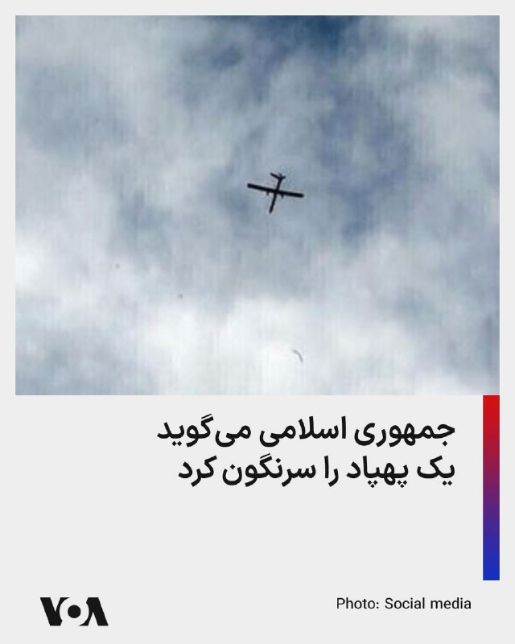

⚡️رسانه‌های جمهوری اسلامی می‌گویند یک فروند «پهپادشناسایی دشمن» در منطقه جنوب غرب منهدم شد. پیشتر، کانال تلگرامی وحیدآنلاین به نقل از کاربران از شنیده شدن صدای چندین انفجار در دزفول و اندیمشک خبر داده بود.
@FarsiVOA

## FarsiVOA — post 217383

  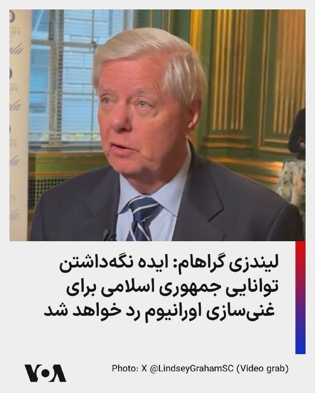

⚡️سناتور جمهوری‌خواه لیندزی گراهام، یکشنبه عصر در شبکه اجتماعی ایکس نوشت «هیچ معنایی ندارد» که جمهوری اسلامی «در چارچوب یک توافق مذاکره‌شده» تأسیسات غنی‌سازی خود را به‌طور کامل نابود نکند. او افزود «یک تعلیق موقت، بدون برچیدن کامل تأسیسات و قابلیت‌های غنی‌سازی، در واقع همان برجام است.» آقای گراهام گفت: «من مطمئن هستم که مخالفت [جمهوری اسلامی] ایران با نابود کردن توان غنی‌سازی‌اش، به‌طور قاطع رد خواهد شد.»
@FarsiVOA

## FarsiVOA — post 217382

⚡️پرزیدنت ترامپ: دیر یا زود اورانیوم غنی شدە را از ایران خارج می‌کنیم
@FarsiVOA

## FarsiVOA — post 217381

🔺اقدام جمهوری اسلامی در «قطع اینترنت» باعث اخراج صدها نفر از کارکنان شرکت‌های فناوری در ایران شده است

◾️روزنامه «نیویورک تایمز» روز یکشنبه ۲۰ اردیبهشت در گزارشی نوشت که تشدید بحران اقتصادی در ایران، در پی عملیات نظامی آمریکا و اسرائیل و همچنین محاصره دریایی تنگه هرمز، و قطعی اینترنت باعث اخراج گسترده کارکنان در بخش‌های مختلف اقتصادی شده است.

⬇️ بیشتر بخوانید:
https://ir.voanews.com/a/nytimes-report-iranian-loss-of-job-and-income-economic-fury/8148531.html
@FarsiVOA

## FarsiVOA — post 217380

🔺دونالد ترامپ به آکسیوس: با نتانیاهو درباره پاسخ جمهوری اسلامی صحبت کردم

◾️آکسیوس در گزارشی گفت که دونالد ترامپ، رئيس‌جمهوری آمریکا، روز یکشنبه ۲۰ اردیبهشت در مصاحبه‌ای کوتاه به باراک راوید، خبرنگار این سایت گفت که او با بنیامین نتانیاهو، نخست‌وزیر اسرائیل، درباره پاسخ جمهوری اسلامی به آمریکا و موضوعات دیگر صحبت کرد.

⬇️ بیشتر بخوانید:
https://ir.voanews.com/a/8148544.html
@FarsiVOA

## FarsiVOA — post 217379

⚡️تازه‌ترین واکنش‌های کنگره به تحولات تنگه هرمز
@FarsiVOA

## FarsiVOA — post 217378

⚡️موضع سخت آمریکا در برابر پاسخ مبهم جمهوری اسلامی؛ مسیر بحران به چه سمتی می‌رود؟
@FarsiVOA

## FarsiVOA — post 217377

⚡️پاسخ جمهموری اسلامی به پیشنهاد آمریکا؛ جنگ یا توافق در گفتگو با ابراهیم روشندل دیپلمات پیشین
@FarsiVOA

## FarsiVOA — post 217376

⚡️هشدار درباره نایاب شدن آنتی‌بیوتیک در ایران و شکل‌گیری بازار سیاه تلگرامی
@FarsiVOA

## FarsiVOA — post 217375

  <a href="telegram/content/FarsiVOA_217375_1778452559.mp4" target="_blank">🎬 Download video</a>

⚡️گزارش‌های شبکه‌های اجتماعی می‌گویند فردی که یک پرچم جمهوری اسلامی با خود داشت، روز یکشنبه ۲۰ اردیبهشت با خودرو به یک تجمع اعتراضی ایرانیان مخالف جمهوری اسلامی در ریچموند هیل کانادا کوبید.
@FarsiVOA

## FarsiVOA — post 217374

🔺دونالد ترامپ: پاسخ جمهوری اسلامی «کاملا غیرقابل‌قبول» است

◾️دونالد ترامپ، رئیس جمهوری آمریکا روز یکشنبه ۲۰ اردیبهشت گفت که پاسخ جمهوری اسلامی به پیشنهادات آمریکا برای چارچوب مذاکرات صلح را دریافت کرده است و این پاسخ را «کاملاً غیرقابل‌قبول» خواند.

⬇️ بیشتر بخوانید:
https://ir.voanews.com/a/8148534.html
@FarsiVOA

## FarsiVOA — post 217373

  

⚡️روزنامه جروزالم پست نوشت که ارتش اسرائیل روز یکشنبه ۲۰ اردیبهشت، به بیش از ۲۰ هدف متعلق به گروه تروریستی حزب‌الله در سراسر جنوب لبنان، حمله کرد. جروزالم پست به نقل از ارتش اسرائیل نوشت این اهداف شامل انبارهای تسلیحات، ستادهای فرماندهی و سازه‌های نظامی بودند که حزب‌الله از‌ آن‌ها استفاده می‌کرد.
@FarsiVOA

## FarsiVOA — post 217372

  

⚡️دونالد ترامپ: «من همین الان پاسخ به‌اصطلاح نمایندگان [جمهوری اسلامی] ایران را خواندم. از آن خوشم نیامد. کاملاً غیرقابل‌قبول است! از توجه شما به این موضوع سپاسگزارم.»
@FarsiVOA

## Persian_Trend_Official — post 13866

  <a href="telegram/content/Persian_Trend_Official_13866_1778452561.mp4" target="_blank">🎬 Download video</a>

مستند رضاشاه، پدر ایران نوین 🔥

## Persian_Trend_Official — post 13865

  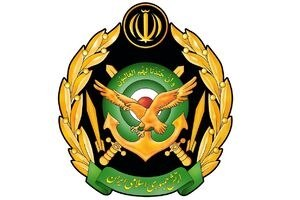

🔴فوری/ روابط عمومی ارتش: یک فروند پهپاد دشمن متجاوز، توسط سامانه های شبکه یکپارچه پدافند هوایی منهدم شد

به گزارش روابط عمومی ارتش، ساعتی پیش یک فروند پهپادشناسایی دشمن متجاوز، توسط سامانه های شبکه یکپارچه پدافند، تحت فرماندهی قرارگاه مشترک پدافند هوایی کشور در منطقه جنوب غرب منهدم شد.

☆Phantom☆

📌 @persian_trend_official
پرشین ترند | متفاوت‌ترین کانال نظامی

## Persian_Trend_Official — post 13864

#ورزشی

بارسلونا آماده برای جشن قهرمانی 🏆

بارسلونا 2 - 0 رئال مادرید

📝 Nick

📌 @persian_trend_official
پرشین ترند | متفاوت‌ترین کانال نظامی

## Persian_Trend_Official — post 13863

دقایق گذشته اختلال بسیار شدیدی در اینترنت ملی ایران رخ داده به طوری که cdn آروان ؛ سیستم شاپرک ؛ سیستم همراه بانک برخی از بانک ها همچون بلو(سامان) و... قطع شدند یا دچار اختلال شدند.
بسیاری از سایت های ملی و داخلی نیز باز نمیشوند.
به دلیل قطعی بلند مدت اینترنت جهانی در ایران زیرساخت اینترنت ملی دچار ضعف بسیار شده.

📝 Nick

📌 @persian_trend_official
پرشین ترند | متفاوت‌ترین کانال نظامی

## Persian_Trend_Official — post 13862

  <a href="telegram/content/Persian_Trend_Official_13862_1778452563.webm" target="_blank">🎬 Download video</a>

آیندگان شاید بنویسند یکی از مهم‌ترین دلایل سقوط جمهوری اسلامی، ناتوانی حاکمان در درک «زمان مناسب معامله، عقب‌نشینی یا پایان دادن به بحران‌ها» بود. بسیاری از بحران‌هایی که می‌توانستند در مقاطع مختلف مدیریت یا مهار شوند، به دلیل نگاه ایدئولوژیک، تعلل سیاسی…

## Persian_Trend_Official — post 13861

  <a href="telegram/content/Persian_Trend_Official_13861_1778452563.webm" target="_blank">🎬 Download video</a>

آیندگان شاید بنویسند یکی از مهم‌ترین دلایل سقوط جمهوری اسلامی، ناتوانی حاکمان در درک «زمان مناسب معامله، عقب‌نشینی یا پایان دادن به بحران‌ها» بود.

بسیاری از بحران‌هایی که می‌توانستند در مقاطع مختلف مدیریت یا مهار شوند، به دلیل نگاه ایدئولوژیک، تعلل سیاسی یا محاسبات اشتباه، آن‌قدر ادامه پیدا کردند تا به بحران‌های فرسایشی و پرهزینه تبدیل شوند.

از ادامه طولانی جنگ ایران و عراق
تا بحران گروگان‌گیری سفارت آمریکا،
از پرونده هسته‌ای و تحریم‌ها
تا بحران حجاب، یارانه‌های نقدی، تنگه هرمز و پروژه محور مقاومت…

در بسیاری از این پرونده‌ها، شاید اصل ماجرا کمتر از «زمان خروج» اهمیت داشت؛
و تاریخ بارها نشان داده حکومت‌ها گاهی نه در آغاز بحران، بلکه در ناتوانی برای پایان دادن به بحران ، سقوط می کنند .

بماند به یادگار
الیاس فرخ

## Persian_Trend_Official — post 13860

  

💢 محسن رضایی

💢هدف رژیم صهیونیستی شعله‌ور کردن آتش درگیری در منطقه است

🫆:Tony

📌 @persian_trend_official
پرشین ترند | متفاوت‌ترین کانال نظامی

## Persian_Trend_Official — post 13859

  <a href="telegram/content/Persian_Trend_Official_13859_1778452565.webm" target="_blank">🎬 Download video</a>

روایت تسنیم از جزئیات پیشنهاد ایران:

۱- پایان فوری جنگ در تمام جبهه‌ها از جمله لبنان
۲- تضمین‌هایی در برابر عدم حمله به ایران در آینده
۳- لغو محدودیت‌های صادرات نفت از سوی OFAC در یک بازه زمانی ۳۰ روزه مذاکرات
۴- پایان محاصره دریایی بلافاصله پس از امضای توافق اولیه
۵- آزادسازی دارایی‌های مسدود شده ایران
۶- بازگشایی تدریجی تنگه هرمز تحت مدیریت ایران در ازای تعهدات ایالات متحده

دوستان
اگر این پیشنهاد درست باشه که احتمالا هست !
به نظرم دوباره کوله های اضطراری رو شارژ کنید …

از توجه شما سپاسگزارم
الیاس فرخ

## Persian_Trend_Official — post 13858

  <a href="telegram/content/Persian_Trend_Official_13858_1778452565.webm" target="_blank">🎬 Download video</a>

💢من همین الان پاسخ ایران از طرف «نمایندگان» به اصطلاح‌شان را خواندم. خوشم نیامد — کاملاً غیرقابل قبول است!

از توجه شما به این موضوع متشکرم.

دونالد جی. ترامپ

🫆:Tony

📌 @persian_trend_official
پرشین ترند | متفاوت‌ترین کانال نظامی

## Persian_Trend_Official — post 13857

نظر یک مخاطب تجزیه طلب : طیفهای مختلف نگاه سیاسی وجود داره مثل ارزشی - طرفدار جمهوری اسلامی طرفداران مجاهدین جمهوری خواهان کمونیستها توده ایها چپیها سوسیالیستها سلطنت طلبان فدرالیستها تجزیه طلبها اتحادطلبها آنارشیستها و موارد دیکه به عنوان یک تورکولوژیست…

## Persian_Trend_Official — post 13856

نظر یک مخاطب تجزیه طلب :

طیفهای مختلف نگاه سیاسی وجود داره
مثل
ارزشی - طرفدار جمهوری اسلامی
طرفداران مجاهدین
جمهوری خواهان
کمونیستها
توده ایها
چپیها
سوسیالیستها
سلطنت طلبان
فدرالیستها
تجزیه طلبها
اتحادطلبها
آنارشیستها
و موارد دیکه

به عنوان یک تورکولوژیست دانشجوی ارشد علوم سیاسی و روابط بین الملل و رتبه یک رشته زبان و ادبیات ترکی ایران با کمال افتخار یک تجزیه طلب هستم یعنی به عبارت دیگر یک استقلال طلب که اتفاقا تزم هم کمک به استقلال ملتمون در ایران یعنی ملت تورک و البته سایر ملتها از زیر یوغ استعمار صدساله فارس هست که با کودتای انگلیسی ۱۲۹۹ و گماشته شدن رضا پالانی و ممنوعیت رسمیت تورکی و در عوض رسمیت تکزبانی قاشیستی زبان بیگانه فارسی با شعار دروغین و خیالی یک ملت یک دولت شروع شد و در حکومت ملاها هم ادامه پیدا کرد به شکل خفیفتر که در واقع البته نقشه حساب شده انگلیس برای تجزیه ایران بود با تبدیل ایران تاریخی فدرال کثیرالمله با چند زبان رسمی به ایران جعلی مرکزگرای آریایی با رسمیت تکزبانی فارسی

اگر کانال شما معتقد به دموکراسی هست هرکس باید بتونه از حق خودش و ملتش دفاع کنه با مباحثه علمی اگر نه سیاست کانال مثل جمهوری اسلامی (پان شعوبیسم) و پهلوی (پان فارسیسم) طرفدار فاشیسم مرکزگرا و رسمیت تکزبانی هستید این رو هم در بیو کانال مشخص کنید تا خودمون از کانال دربیاییم.
همونقدر که اتحاد طلبی که در ایران معادل طرفداری از ادامه استعمار فارس هست رو یک عده برا خودشون حق میدونن تجزیه طلبی هم که معادل استقلال ملتها از استعمار صدساله فارس هست یک حق مسلم هست. بنابراین ادمین با تفکر فاشیستی که هرگز نه توان و نه سواد مناظره علمی با منطق ما رو نداره نباید دستش برای سرکوب دموکراسی باز باشه وگرنه اعتبار کل کانال زیر سوال میره.

## RadioFarda — post 157041

  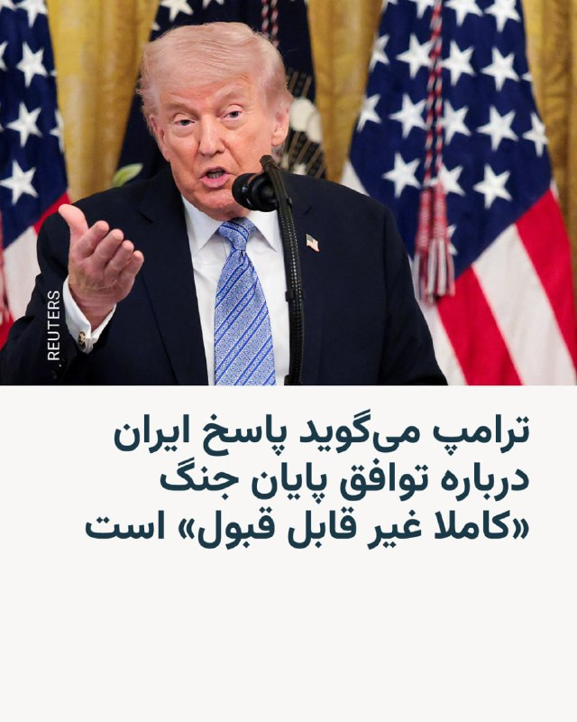

ترامپ می‌گوید پاسخ ایران درباره توافق پایان جنگ «کاملا غیر قابل قبول» است

🔸دونالد ترامپ، رئیس‌جمهور آمریکا، شامگاه یکشنبه ۲۰ اردیبهشت پاسخ ایران به طرخ پیشنهادی آمریکا برای پایان جنگ را «کاملا غیر قابل‌ قبول» خواند.

🔸او در پیام کوتاهی در شبکه اچتماعی تروث سوشال نوشت: «من همین حالا پاسخِ به‌اصطلاح “نمایندگان” ایران را خواندم. از آن خوشم نمی‌آید. کاملاً غیرقابل‌قبول است!»

🔸رسانه‌های نزدیک به حکومت ایران ساعاتی پیش گفتند که پاسخ ایران برای پاکستان به عنوان میانجی مذاکرات تهران و واشینگتن ارسال شد. مقام‌های پاکستانی نیز از تحویل این پاسخ به دولت آمریکا خبر دادند.

🔸به شکل رسمی جزئیاتی درباره محتوای این پاسخ منتشر نشده و رئیس‌جمهور آمریکا نیز در این زمینه توضیح بیشتری نداده است.

🔸آقای ترامپ پیش‌تر نیز پیشنهادات ارائه‌شده توسط حکومت ایران را غیر قابل قبول و ناکافی خوانده بود.

@RadioFarda

## RadioFarda — post 157040

  <a href="https://t.me/radiofarda/157040" target="_blank">📎 Download file</a>

📻بشنوید: خبرهای ساعت ۲۱ با رادیوفردا، ۲۰ اردیبهشت ۱۴۰۵‌

@RadioFarda

## IranianMinds — post 19920

  <a href="telegram/content/IranianMinds_19920_1778452567.mp4" target="_blank">🎬 Download video</a>

🔴ویدئوی فرستاده شده از دزفول.

@IranianMinds

## IranianMinds — post 19919

ترامپ به Axios:

من پاسخ ایران را با نتانیاهو بررسی کردم.

@IranianMinds

## IranianMinds — post 19918

فوری

🔴 ترامپ: همین الان پاسخ «نمایندگان» ایران را خواندم. من آن را دوست ندارم - کاملاً غیرقابل قبول است.

@IranianMinds

## BBCPersian — post 280698

  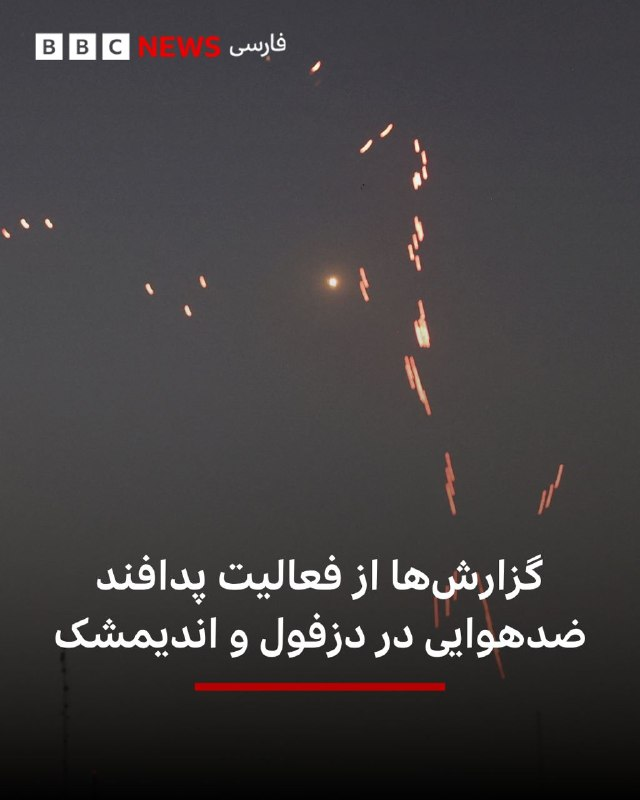

🔻کانال تلگرامی وحید آنلاین عصر یکشنبه مجموعه‌ای پیام‌های دریافتی خود از مخاطبانش در دزفول و اندیمشک را منتشر کرده که حکایت از فعالیت پدافند ضدهوایی در این دو شهر جنوبی ایران دارد.

بیشتر پیغام‌ها حوالی ساعت ۱۰ شب به وقت محلی گزارش شده و از فعالیت پدافندی برای «حدود ۲۰ دقیقه» حکایت دارد.

در همین حال، خبرگزاری فارس - نزدیک به سپاه پاسداران - به نقل از منابع ارتش ایران نوشته است: «یک فروند پهپاد دشمن متجاوز، ساعتی پیش توسط شبکۀ یکپارچۀ پدافند هوایی در منطقۀ جنوب غرب منهدم شد.»

عکس آرشیوی از رویترز

https://bbc.in/4tY60Lv
@BBCPersian

## BBCPersian — post 280697

  

🔻دونالد ترامپ پس از آن که ساعتی پیش در انتقادی تند ایران را متهم به «بازی دادن آمریکا و جهان» کرد، در پست جدیدی گفته که پاسخ ایران را خوانده اما از نظرش «کاملا غیرقابل قبول است».

رئیس جمهور آمریکا در این پست جدید که عصر یکشنبه در شبکه اجتماعی خودش - تروث سوشال - منتشر کرد نوشته: ««همين حالا پاسخ به‌اصطلاح "نمايندگان" ايران را خواندم. از آن خوشم نيامد — کاملا غيرقابل قبول است!»

این در حالی است که یک مقام ایرانی به شبکه الجزیره گفته پاسخ تهران به پیشنهادهای واشنگتن «مثبت و واقع گرایانه» است و چنانچه آمریکا آماده باشد می‌تواند به «روند سریع مذاکرات» بیانجامد.

📸 Getty

https://bbc.in/4tY60Lv
@BBCPersian

## BBCPersian — post 280696

🔻یک مقام ایرانی به الجزیره؛ پیشنهاد ما واقع‌بینانه و مثبت است

يک منبع ايرانی به الجزيره گفته است پاسخ تهران به پيشنهادهای امريکا «واقع‌بينانه و مثبت» است.

ایرنا - خبرگزاری دولت ایران -همزمان با انتشار خبر الجزیره گفتگوکننده با این شبکه را یک «منبع رسمی» خوانده است.

اين منبع در گفتگو با الجزیره افزوده است: «پاسخ ما بر پايان جنگ در سراسر منطقه، به‌ويژه در لبنان، و حل اختلافات با ايالات متحده امريکا متمرکز است و بر ضرورت وجود سازوکاری روشن و تضمين‌شده برای لغو همه انواع تحريم‌ها تأکيد دارد.

آن طور که الجزیره گزارش کرده اين منبع ایرانی همچنين گفته است پاسخ این کشور «شامل مذاکرات درباره تنگه هرمز، برنامه هسته‌ای و لغو کامل تحريم‌ها است.»

https://bbc.in/4tY60Lv
@BBCPersian

## Dirty_Kids — post 389243

‏تا پارسال هر کس مهاجرت کرده به معنای واقعی کلمه «فلنگ»‌رو بسته.

@Dirty_Kids 👻

## Dirty_Kids — post 389242

  

و هم مادر☕️ ریاکار

+ اون ورژن عرق خوری و صورتی پوشی‌تون جذاب‌تر بود

@Dirty_Kids 👻

## Dirty_Kids — post 389241

  

شادمانی هاپو از نبودن در خاورمیانه

@Dirty_Kids 👻

## Dirty_Kids — post 389240

  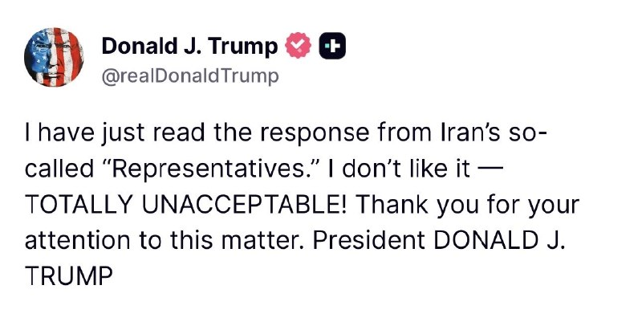

پست جدید ترامپ:

«همین الان پاسخ به‌اصطلاح نمایندگان ج.ارو خوندم.

اصلا و ابدا از جواب کیری‌شون خوشم نیومد.
به هیچ‌وجه قابل قبول نیست!

از توجه شما به این موضوع سپاسگزارم.
رئیس‌جمهور دونالد جی. ترامپ، یلِ غضبناک خاک‌سفید»

@Dirty_Kids 👻

## manototv — post 105283

  <a href="telegram/content/manototv_105283_1778452572.mp4" target="_blank">🎬 Download video</a>

راهپیمایی ایرانیان وین

## manototv — post 105282

  <a href="telegram/content/manototv_105282_1778452574.mp4" target="_blank">🎬 Download video</a>

‌
خبرگزاری‌های حکومتی گزارش دادند ارتش جمهوری اسلامی ساعتی پیش «یک فروند پهپادشناسایی دشمن متجاوز» را در منطقه جنوب غرب منهدم کرده است.

## manototv — post 105281

  <a href="telegram/content/manototv_105281_1778452575.mp4" target="_blank">🎬 Download video</a>

لیسبون | پرتغال؛ گردهمایی ایرانیان ـ گزارشگر ۲۰ اردیبهشت ۱۴۰۵

## manototv — post 105280

  <a href="telegram/content/manototv_105280_1778452577.mp4" target="_blank">🎬 Download video</a>

دونالد ترامپ، رئیس‌جمهوری آمریکا، در پیامی در شبکه اجتماعی «تروث سوشال» اعلام کرد پاسخ جمهوری اسلامی به پیشنهادهای اخیر واشینگتن را «کاملاً غیرقابل قبول» می‌داند.

او نوشت: «من همین الان پاسخ به‌اصطلاح “نمایندگان” ایران را خواندم. از آن خوشم نمی‌آید — کاملاً غیرقابل قبول است!»

## manototv — post 105279

  <a href="telegram/content/manototv_105279_1778452578.mp4" target="_blank">🎬 Download video</a>

‌
باراک راوید، خبرنگار آکسیوس در شبکه اکس نوشت:
«رئیس‌جمهوری ترامپ در تماس تلفنی به من گفت پاسخ اخیر ایران به پیش‌نویس توافق پایان جنگ را نمی‌پسندد. او گفت: این پاسخ قابل قبول نبود.»

راوید در ادامه افزود ترامپ به او گفته در تماس تلفنی‌ با بنیامین نتانیاهو درباره پاسخ اخیر جمهوری اسلامی به پیش‌نویس توافق پایان جنگ گفت‌وگو کرده است.

به گفته راوید ترامپ تأکید کرده موضوع ایران تنها بخش کوتاهی از این تماس بوده است.

خبرنگار آکسیوس نوشت رئیس جمهوری آمریکا به او گفته که رابطه خوبی با نتانیاهو دارد اما «این موضوع (ایران) کار من است نه هیچ‌کس دیگر.»

## manototv — post 105278

  <a href="telegram/content/manototv_105278_1778452579.mp4" target="_blank">🎬 Download video</a>

‌
وزارت خارجه عربستان سعودی حملات گزارش‌شده به امارات، قطر و کویت را محکوم کرد و خواستار توقف فوری آن شد.

ریاض در بیانیه‌ای تأکید کرد باید «فوراً به حملات آشکار علیه خاک و آب‌های سرزمینی» کشورهای حاشیه خلیج فارس و هرگونه تلاش برای بستن تنگه هرمز پایان داده شود.

این موضع‌گیری پس از آن مطرح شد که امارات اعلام کرد پدافند هوایی این کشور دو پهپاد پرتاب‌شده از ایران را رهگیری کرده است.

کویت نیز از مشاهده «پهپادهای متخاصم» در حریم هوایی خود خبر داد و قطر اعلام کرد یک کشتی باری در آب‌های سرزمینی این کشور هدف قرار گرفته است.

## manototv — post 105277

  <a href="telegram/content/manototv_105277_1778452580.mp4" target="_blank">🎬 Download video</a>

‌
رسانه حکومتی تسنیم به نقل از یک «منبع مطلع» گزارش روزنامه وال‌استریت ژورنال درباره جزئیات پیشنهاد جمهوری اسلامی به آمریکا را رد کرد و نوشت بخش‌های مهمی از این گزارش «منطبق با واقعیت نیست».

این منبع به‌ویژه ادعاهای مطرح‌شده درباره مواد هسته‌ای و اورانیوم غنی‌شده را رد کرد و گفت این بخش‌ها «واقعیت ندارد».

به گفته این منبع، متن پیشنهادی تهران بر «پایان فوری جنگ»، تضمین عدم حمله مجدد به ایران و دستیابی به یک تفاهم سیاسی تأکید دارد.

او افزود جمهوری اسلامی همچنین خواستار لغو تحریم‌های آمریکا، پایان درگیری‌ها در همه جبهه‌ها و مدیریت ایرانی تنگه هرمز در صورت اجرای برخی تعهدات از سوی واشینگتن شده است.

این منبع همچنین گفت پایان فوری محاصره دریایی ایران، لغو تحریم‌های مرتبط با فروش نفت و آزادسازی دارایی‌های بلوکه‌شده ایران از دیگر محورهای مطرح‌شده در متن پیشنهادی تهران است.

## alonews — post 119174

  <a href="telegram/content/alonews_119174_1778452581.webm" target="_blank">🎬 Download video</a>

👈صدا و سیما:
ایران آخرین پیشنهاد آمریکا را رد کرد

✅ @AloNews خبر جنگ

## alonews — post 119173

  <a href="telegram/content/alonews_119173_1778452581.webm" target="_blank">🎬 Download video</a>

👈مارک فاکس، معاون سابق فرماندهی مرکزی آمریکا :
آتش‌بس با ایران به اسرائیل اجازه داد تا ذخایر مهمات خودشو دوباره پر کنه و اطلاعات بیشتری جمع‌آوری کنه

✅ @AloNews خبر جنگ

## alonews — post 119172

  <a href="telegram/content/alonews_119172_1778452581.webm" target="_blank">🎬 Download video</a>

👈کمتر از نیم ساعت به باز شدن بازارهای آسیا باقی مونده و قدم بعدی ترامپ در مورد ایران هنوز اعلام نشده

✅ @AloNews خبر جنگ

## alonews — post 119171

  <a href="telegram/content/alonews_119171_1778452582.webm" target="_blank">🎬 Download video</a>

👈ابوالفظل اقبالی از نزدیکان جلیلی: اگر خانم‌ها حجاب را رعایت میکردند، جنگ نمیشد

✅ @AloNews خبر جنگ

## alonews — post 119170

  <a href="telegram/content/alonews_119170_1778452582.webm" target="_blank">🎬 Download video</a>

👈ایشون آقای جبلی، رئیس صدا و سیما و رفیق جلیلی است، دردانه تندروها است و میگوید یک مسلمان معتقد است اما در صدا و سیمای او و همفکرانش سایت شرطبندی تبلیغ میشود! اسلام؟ نردبان؟ 
✅ @AloNews خبر جنگ

## alonews — post 119169

  <a href="telegram/content/alonews_119169_1778452582.webm" target="_blank">🎬 Download video</a>

👈ایشون آقای جبلی، رئیس صدا و سیما و رفیق جلیلی است، دردانه تندروها است و میگوید یک مسلمان معتقد است اما در صدا و سیمای او و همفکرانش سایت شرطبندی تبلیغ میشود!

اسلام؟ نردبان؟

✅ @AloNews خبر جنگ

## alonews — post 119167

  <a href="telegram/content/alonews_119167_1778452583.webm" target="_blank">🎬 Download video</a>

👈در تصاویر اصلی فوتبال الکلاسیکو میان بارسلونا و رئال مادرید هیچگونه تبلیغاتی در کنار زمین وجود ندارد ولی صداوسیما با اضافه کردن تبلیغات اضافی مانند بیمه دات کام و غیره پول اضافی به جیب میزند

🔴ولی نکته اصلی اینجاست!! چرا صداوسیما ممکلت به صورت خیلی ریز درحال تبلیغ سایت شرط بندی و قمار است؟ مگر در قانون اساسی کشور شرط‌بندی و قمار غیرمجاز نیست؟ چرا صداوسیما مصونیت دارد؟

✅ @AloNews خبر جنگ

## alonews — post 119166

  <a href="telegram/content/alonews_119166_1778452583.webm" target="_blank">🎬 Download video</a>

👈 پرزیدنت ترامپ در تروث‌سوشال: دموکرات‌های رادیکال چپ شکست می‌خورند — کشور ما در خطر است!

✅ @AloNews خبر جنگ

## alonews — post 119165

  <a href="telegram/content/alonews_119165_1778452583.webm" target="_blank">🎬 Download video</a>

👈پاسخ ایران، طبق خبرگزاری تسنیم:

- پایان فوری جنگ در تمام جبهه‌ها، با تضمین‌های قوی در برابر حملات آینده به ایران،
- رفع همه تحریم‌ها علیه ایران، از جمله بازار صادرات نفت ایران،
- پایان محاصره دریایی آمریکا،
- آزادسازی تمام دارایی‌های مسدود شده متعلق به ایران،
- حق ایران برای «مدیریت» تنگه هرمز.

✅ @AloNews خبر جنگ

## alonews — post 119164

  <a href="telegram/content/alonews_119164_1778452584.webm" target="_blank">🎬 Download video</a>

👈ترامپ در گفتگو با اکسیوس:
«نامه ایران را دوست ندارم. نامناسب است. پاسخشان را دوست ندارم.»

🔴او از ارائه جزئیات بیشتر درباره محتوای پاسخ خودداری کرد.

🔴ترامپ افزود: «آنها به مدت ۴۷ سال است که کشورهای زیادی را دست می‌اندازند.»

🔴ترامپ گفت که روز یکشنبه با بنیامین نتانیاهو، نخستوزیر اسرائیل، صحبت کرده و درباره پاسخ ایران و موارد دیگر گفتگو کرده است.

🔴او در مورد نتانیاهو گفت: «تماس بسیار خوبی بود. رابطه خوبی داریم.» اما افزود که مذاکرات ایران «مسئله‌ای [مربوط به] من است، نه مسئله دیگران.»

✅ @AloNews خبر جنگ

## alonews — post 119163

  <a href="telegram/content/alonews_119163_1778452584.webm" target="_blank">🎬 Download video</a>

👈ترامپ به Axios گفت که پاسخ ایران به آخرین پیش‌نویس توافق‌نامه‌ای که هدف آن پایان دادن به جنگ است را رد خواهد کرد، پس از اینکه آمریکا ۱۰ روز منتظر پاسخ تهران ماند.

✅ @AloNews خبر جنگ

## alonews — post 119162

  <a href="telegram/content/alonews_119162_1778452584.webm" target="_blank">🎬 Download video</a>

👈مصطفی نجفی مشاور فیلد مارشال محسن رضایی: بعید است مذاکرات به نتیجه‌ای برسد، چراکه شکاف‌ها بسیار بزرگ است. ایران علی‌رغم آمادگی جنگی، راهبرد «نه جنگ» «نه تسلیم» را دنبال خواهد کرد

✅ @AloNews خبر جنگ

## alonews — post 119161

  <a href="telegram/content/alonews_119161_1778452585.webm" target="_blank">🎬 Download video</a>

👈علی قلهکی:ایران بر «پایانِ جنگ»، «رفع تحریم» و «رفعِ محاصره دریایی» متمرکز است ولی طرفِ مقابل حتما «۴۰۰ کیلو اورانیوم» را می‌خواهد!

🔴از این پس باید منتظر نقطه ورود به تنش نظامی بود

✅ @AloNews خبر جنگ

## alonews — post 119160

  <a href="telegram/content/alonews_119160_1778452585.webm" target="_blank">🎬 Download video</a>

💢فوووووووری/گزارش‌ها از پرواز تعدادی از جنگنده‌های اسرائیل در آسمان سوریه 
🚨 @AkhbareFouri

## alonews — post 119159

  <a href="telegram/content/alonews_119159_1778452586.webm" target="_blank">🎬 Download video</a>

👈آسوشیتدپرس: جنگ ایران می‌تواند سفر ترامپ به چین را کمی سردتر از سفر دوره اول ریاست جمهوری‌اش کند

✅ @AloNews خبر جنگ

## alonews — post 119158

  <a href="telegram/content/alonews_119158_1778452586.webm" target="_blank">🎬 Download video</a>

🔴فوووووری / ترامپ: از پاسخ ایران اصلا راضی نیستم. به هیچ وجه قابل قبول نیست!!!!!

✅ @AloNews خبر جنگ

---
📅 بروزرسانی: 1405/02/20 23:40
---

## VahidOOnLine — post 239378

  

رسانه‌های ایران شامگاه یک‌شنبه با اشاره به شنیده شدن فعالیت پدافند هوایی در اندیمشک و شمال دزفول از سرنگونی «پرنده متخاصم دشمن» در اندیمشک خبر دادند.

شهروندان نیز یک‌شنبه ساعت حدود ۱۰ شب از شنیده‌شدن صدای پدافند در این شهر خبر دادند.
‌🏁 🇬🇧 IranintlTV

🤖 @VahidOOnLine

## VahidOOnLine — post 239377

  <a href="telegram/content/VahidOOnLine_239377_1778443836.mp4" target="_blank">🎬 Download video</a>

روزنامه وال‌استریت ژورنال گزارش داد جمهوری اسلامی پیشنهاد داده بخشی از ذخایر اورانیوم غنی‌شده خود را رقیق و بخش دیگر را به یک کشور ثالث منتقل کند.

بر اساس این گزارش، تهران همچنین خواستار تضمین شده است که در صورت شکست مذاکرات یا خروج دوباره آمریکا از توافق، اورانیوم منتقل‌شده به خاک ایران بازگردانده شود.

به نوشته وال‌استریت ژورنال، این پیشنهاد بخشی از پاسخ چندصفحه‌ای جمهوری اسلامی به طرح اخیر آمریکا برای پایان دادن به جنگ و آغاز مذاکرات جدید بوده است.
‌🏁 🇬🇧 ManotoTV

🤖 @VahidOOnLine

## VahidOOnLine — post 239376

  

♦️آنا کلی، معاون سخنگوی کاخ سفید، روز یکشنبه ۲۰ اردیبهشت، با اعلام آنکه دونالد ترامپ شامگاه چهارشنبه وارد پکن می‌شود، گفت رئیس‌جمهوری ایالات متحده، در سفر پیش‌روی خود به پکن، شی جین‌پینگ، رئیس‌جمهوری چین را درباره ایران تحت فشار قرار خواهد داد.
به گزارش خبرگزاری فرانسه، این مقام آمریکایی در گفتگو با خبرنگاران گفت: «انتظار دارم رئیس‌جمهوری درباره ایران فشار وارد کند.» او افزود ترامپ در تماس‌های پیشین خود با شی نیز بارها موضوع درآمدهای نفتی ایران و روسیه از فروش نفت به چین، و همچنین صادرات کالاهای دارای کاربرد دوگانه نظامی و غیرنظامی را مطرح کرده بود.
بر اساس اعلام کاخ سفید، تجارت، تعرفه‌ها و هوش مصنوعی نیز از محورهای اصلی سفر ترامپ به چین خواهد بود. ترامپ از روز چهارشنبه تا جمعه در پکن حضور خواهد داشت و قرار است از معبد تاریخی «تیان تان» یا «معبد بهشت» نیز بازدید کند.
سفر ترامپ به چین قرار بود در ماه مارس انجام شود اما به دلیل جنگ ایران به تعویق افتاده بود.
به گفته آنا کلی، مراسم استقبال رسمی و دیدار دوجانبه ترامپ و شی صبح پنجشنبه برگزار خواهد شد و پس از آن، ترامپ از معبد بهشت بازدید می‌کند. شام رسمی دولتی نیز عصر همان روز برگزار خواهد شد.
قرار است ترامپ و شی روز جمعه نیز در یک نشست کاری و ضیافت ناهار شرکت کنند و سپس رئیس‌جمهوری آمریکا به واشنگتن بازگردد.
کاخ سفید اعلام کرد محور اصلی این سفر «بازتنظیم روابط با چین و اولویت دادن به رفتار متقابل و انصاف برای بازگرداندن استقلال اقتصادی آمریکا» خواهد بود.
‌🇸🇦 Indypersian

🤖 @VahidOOnLine

## VahidOOnLine — post 239375

  

نارندرا مودی، نخست‌وزیر هند، یکشنبه از شهروندان این کشور خواست مجموعه‌ای از اقدامات از جمله صرفه‌جویی در مصرف سوخت، دورکاری و محدودیت در سفر و واردات را رعایت کنند، زیرا افزایش شدید قیمت جهانی انرژی فشار زیادی بر ذخایر ارزی این کشور وارد کرده است.

مودی گفت مردم باید اولویت را به بازگشت به دورکاری و جلسات آنلاین بدهند؛ رویکردی که در دوران همه‌گیری کووید-۱۹ به‌طور گسترده اتخاذ شده بود، و افزود این کار به هند کمک می‌کند سوخت کمتری مصرف کند.

او گفت: «در وضعیت کنونی، ما باید تاکید زیادی بر صرفه‌جویی در ارز خارجی داشته باشیم.»

مودی همچنین از مردم خواست از وسایل حمل‌ونقل عمومی مانند مترو استفاده کنند و در صورت امکان برای صرفه‌جویی در سوخت، به طور مشترک از خودروها استفاده کنند.

هند، سومین واردکننده و مصرف‌کننده بزرگ نفت در جهان، اواخر ماه گذشته اعلام کرد که هیچ برنامه‌ای برای افزایش قیمت گازوئیل و بنزین در جایگاه‌ها ندارد و با وجود افزایش جهانی قیمت‌ها، در میان کشورهایی باقی مانده که هنوز قیمت‌ها را افزایش نداده‌اند.

‌🏁 🇬🇧 IranintlTV

🤖 @VahidOOnLine

## VahidOOnLine — post 239374

  <a href="telegram/content/VahidOOnLine_239374_1778443838.mp4" target="_blank">🎬 Download video</a>

اسلو | نروژ؛ گردهمایی ایرانیان ـ گزارشگر یکشنبه ۲۰ اردیبهشت ۱۴۰۵
‌🏁 🇬🇧 ManotoTV

🤖 @VahidOOnLine

## VahidOOnLine — post 239373

  <a href="telegram/content/VahidOOnLine_239373_1778443839.mp4" target="_blank">🎬 Download video</a>

‌
مونیخ | آلمان؛ گردهمایی ایرانیان ـ گزارشگر یکشنبه ۲۰ اردیبهشت ۱۴۰۵
‌🏁 🇬🇧 ManotoTV

🤖 @VahidOOnLine

## VahidOOnLine — post 239372

  

به گزارش جروزالم پست، ارتش اسرائیل یکشنبه بیش از ۲۰ هدف زیرساختی «مرتبط با تروریسم» را در سراسر جنوب لبنان هدف قرار داد.

بر اساس اعلام ارتش اسرائیل، این اهداف شامل انبارهای تسلیحات، مقرها و سازه‌های نظامی‌ای بود که «تروریست‌های حزب‌الله از آنها عملیات انجام می‌دادند».
‌🏁 🇬🇧 IranintlTV

🤖 @VahidOOnLine

## VahidOOnLine — post 239371

  

♦️وزارت امور خارجه عربستان سعودی، روز یکشنبه ۲۰ اردیبهشت ماه با انتشار بیانیه‌ای رسمی، حملات به خاک و آب‌های سرزمینی کشورهای امارات متحده عربی، دولت قطر و دولت کویت را محکوم کرد. پادشاهی سعودی در این بیانیه ضمن ابراز همبستگی کامل، بر ایستادگی مجدد خود در کنار این کشورها تاکید کرد و حمایت قاطع را از تمامی اقدامات و تدابیری که «کشورهای برادر در حوزه خلیج فارس برای حفاظت از امنیت، ثبات و تمامیت ارضی خود اتخاذ می‌کنند»، ابراز داشت.
ریاض در بخش دیگری از این بیانیه، خواستار توقف فوری و بدون قید و شرط این حملات شد. وزارت امور خارجه عربستان همچنین با هشدار در مورد وضعیت تنگه هرمز، بر مخالفت شدید خود با هرگونه تلاش برای بستن این آبراهه یا ایجاد اختلال در تردد کشتی‌ها در گذرگاه‌های آبی بین‌المللی تاکید کرد.
وزارت امور خارجه عربستان سعودی در پایان اهمیت تعهد جهانی برای حفاظت از امنیت آبراه‌های دریایی بین‌المللی بر اساس قوانین و معاهدات مربوطه را یادآور شد.
‌🇸🇦 Indypersian

🤖 @VahidOOnLine

## VahidOOnLine — post 239370

  

♦️فاطمه سپهری، زندانی سیاسی محبوس در زندان وکیل‌آباد مشهد، با وجود سابقه جراحی قلب باز، در شرایط جسمی قرار دارد. این فعال سیاسی مشروطه‌خواه، پس از بیش از هزار روز حبس بدون دسترسی کافی به خدمات درمانی، با وضعیت جسمی نگران‌کننده‌ای روبه‌رو است.
فعالان حقوق بشر با هشدار در مورد وضعیت جسمی خانم سپهری از افت شدید فشار خون، تپش قلب و دردهای مزمن در ناحیه قفسه سینه و دست‌ها گزارش داده‌اند.
این فعال مدنی ۶۱ ساله، با وجود بیماری قلبی از دسترسی به معاینات دوره‌ای محروم مانده و پس از بستری‌های کوتاه‌مدت، پیش از بهبودی به بند بازگردانده شده است.
 فاطمه سپهری در سال ۱۳۹۸ خورشیدی و در پی امضا و انتشار بیانیه «۱۴ نفر» که در آن از آیت‌الله علی خامنه‌ای خواسته شده بود از قدرت کناره‌گیری کند، بازداشت شد. او در سال ۱۳۹۹ مشمول عفو رهبری و آزاد شد اما به محض خروج از زندان این نوع آزادی را نپذیرفت و گفت «خامنه‌ای رهبر من نیست و من این عفو را نمی‌پذیرم».
خانم سپهری دوباره و در جریان خیزش سراسری مردم در ۱۴۰۱ بازداشت شد. دادگاه انقلاب مشهد به ریاست قاضی منصوری حکم ۱۸ سال حبس را برای این زندانی سیاسی ملی‌گرا صادر کرد.
‌🇸🇦 Indypersian

🤖 @VahidOOnLine

## VahidOOnLine — post 239369

  <a href="telegram/content/VahidOOnLine_239369_1778443842.mp4" target="_blank">🎬 Download video</a>

♦️سازمان ملل متحد، روز یکشنبه ۲۰ اردیبهشت، با انتشار پیامی رسمی به مناسبت روز مادر در اینستاگرام، از «قدرت و شجاعت مادران در سراسر جهان» تقدیر کرد.
در این پیام آمده است: «مادران هر روز، حتی در میان چالش‌های جدی ناشی از جنگ، فقر و دیگر بحران‌ها، کارهای غیرممکن انجام می‌دهند و میان مراقبت از کودکان، کار و دیگر مسئولیت‌ها تعادل برقرار می‌کنند.»
این نهاد بین‌المللی در ادامه نوشت: «همزمان با گرامی‌داشت روز مادر در بسیاری از خانواده‌ها در روز یکشنبه، به ما بپیوندید تا قدرت و شجاعت مادران در سراسر جهان را جشن بگیریم.»
دومین یکشنبه ماه مه (۲۰ اردیبهشت ۱۴۰۵) در بیشتر کشورهای جهان «روز مادر» نامیده می‌شود.
*تصویر زن روستایی و کودک اثر ساعد ریاضی عکاس ایرانی است.
‌🇸🇦 Indypersian

🤖 @VahidOOnLine

## VahidOOnLine — post 239368

  

سخنگوی کاخ سفید اعلام کرد که دونالد ترامپ شامگاه چهارشنبه وارد پکن می‌شود.

همزمان رویترز به نقل از یک مقام ارشد آمریکایی نوشت دونالد ترامپ و شی جین‌پینگ رهبران آمریکا و چین، در دیدار پیش‌روی خود، احتمالا درباره «حمایت چین از ایران و روسیه» گفت‌وگو خواهند کرد.
‌🏁 🇬🇧 IranintlTV

🤖 @VahidOOnLine

## VahidOOnLine — post 239367

  

مصطفی نیلی، وکیل نرگس محمدی، برنده جایزه صلح نوبل و زندانی سیاسی، در ایکس نوشت: «امروز خانم نرگس محمدی با صدور دستور توقف حکم برای انجام درمان از بیمارستان زنجان خارج و با آمبولانس به بیمارستان پارس تهران منتقل و بستری شدند.»

او افزود: «صدور این دستور در پی نظر پزشکی قانونی مبنی بر لزوم پیگیری درمان خارج از زندان و زیر نظر تیم پزشکان ایشان به دلیل بیماری‌های متعدد است.»

پیشتر بنیاد نرگس محمدی اعلام کرد با وجود اعلام پزشکی قانونی استان زنجان درباره ضرورت تعلیق یک‌ماهه اجرای حکم محمدی برای درمان، مقام‌های قضایی از انتقال این فعال حقوق بشر و برنده جایزه صلح نوبل به بیمارستان جلوگیری می‌کنند و خانواده او وضعیتش را مرگ و زندگی توصیف کردند.
‌🏁 🇬🇧 IranintlTV

🤖 @VahidOOnLine

## VahidOOnLine — post 239366

  <a href="telegram/content/VahidOOnLine_239366_1778443844.mp4" target="_blank">🎬 Download video</a>

پیتر ماگیار، رهبر حزب «تیسا»، پس از پیروزی در انتخابات آوریل با کسب بیش از ۵۳ درصد آرا، روز شنبه به‌عنوان نخست‌وزیر مجارستان سوگند یاد کرد و به ۱۶ سال حاکمیت ویکتور اوربان پایان داد.

در جریان مراسم تحلیف در میدان کوشوت، ژولت هگدوش، وزیر بهداشت آینده، با اجرای یک رقص پرانرژی در برابر هزاران نفر توجه‌ها را به خود جلب کرد و این حرکت را روی پله‌های ساختمان پارلمان نیز تکرار کرد.

او پیش‌تر نیز با همین حرکات در یک تجمع انتخاباتی در ماه آوریل خبرساز شده و در شبکه‌های اجتماعی لقب «سیاستمدار رقصنده» را گرفته بود.
‌🏁 🇬🇧 ManotoTV

🤖 @VahidOOnLine

## VahidOOnLine — post 239365

  <a href="telegram/content/VahidOOnLine_239365_1778443845.mp4" target="_blank">🎬 Download video</a>

‌
دونالد ترامپ، رئیس‌جمهوری آمریکا، در شبکه اجتماعی خود نوشت جمهوری اسلامی طی ۴۷ سال گذشته واشینگتن را «معطل نگه داشته» و به منافع آمریکا آسیب زده است.

او گفت: «در طول ۴۷ سال، ایرانی‌ها ما را معطل نگه داشته‌اند، ما را منتظر گذاشته‌اند، با بمب‌های کنار جاده‌ای افراد ما را کشته‌اند و اعتراضات را سرکوب کرده‌اند.»

ترامپ همچنین گفت جمهوری اسلامی «۴۲ هزار معترض بی‌گناه و بی‌سلاح را از بین برده» و به آمریکا «خندیده» است.

او در پایان افزود: «آن‌ها دیگر نخواهند خندید.»
‌🏁 🇬🇧 ManotoTV

🤖 @VahidOOnLine

## VahidOOnLine — post 239364

  <a href="telegram/content/VahidOOnLine_239364_1778443845.mp4" target="_blank">🎬 Download video</a>

امانوئل مکرون، رئیس‌جمهوری فرانسه، اعلام کرد هرگز موضوع استقرار نیروهای فرانسوی یا مشترک با بریتانیا در تنگه هرمز مطرح نبوده است.

مکرون در نشست خبری در نایروبی گفت چند روز پیش تصمیم گرفته ناو «شارل دوگل» و ناوچه‌های همراه آن را از مدیترانه شرقی به آن‌سوی تنگه باب‌المندب منتقل کند و افزود: «بحث استقرار مطرح نبوده، اما ما آماده‌ایم.»

او با تأکید بر اصل «آزادی کشتیرانی» گفت باید به هرگونه محاصره پایان داده شود و هر نوع عوارض یا محدودیت بر عبور کشتی‌ها رد شود.
‌🏁 🇬🇧 ManotoTV

🤖 @VahidOOnLine

## VahidOOnLine — post 239363

  

دونالد ترامپ در شبکه تروث سوشال نوشت جمهوری اسلامی ۴۷ سال با آمریکا و جهان بازی کرده و با تاخیر زمان خریده است و این روند با ریاست‌جمهوری باراک حسین اوباما به نتیجه رسید. او نوشت اوباما عملا در کنار جمهوری اسلامی ایستاد، اسرائیل و دیگر متحدان را کنار گذاشت و جان تازه‌ای به تهران داد.
ترامپ نوشت صدها میلیارد دلار و ۱.۷ میلیارد دلار پول نقد با هواپیما به تهران منتقل شد و بانک‌های واشینگتن دی سی، ویرجینیا و مریلند خالی شد. پول‌ها در چمدان‌ها منتقل شد و مقام‌های جمهوری اسلامی از حجم آن شگفت‌زده شدند.
او اوباما را رییس‌جمهوری ضعیف خواند و افزود جمهوری اسلامی طی ۴۷ سال با بمب‌های کنار جاده‌ای آمریکایی‌ها را کشته، اعتراضات را سرکوب کرده و اخیرا ۴۲ هزار معترض بی‌سلاح را از بین برده است. او نوشت جمهوری اسلامی به کشور ما که حالا دوباره عظمت یافته می‌خندد اما آن‌ها دیگر نخواهند خندید.
‌🏁 🇬🇧 IranintlTV

🤖 @VahidOOnLine

## VahidOOnLine — post 239362

  

♦️همزمان با ارسال پاسخ تهران به پیشنهاد صلح آمریکا، دونالد ترامپ، رئیس‌جمهوری این کشور، در پیامی در شبکه اجتماعی «تروث سوشال» نوشت جمهوری اسلامی طی ۴۷ سال گذشته ایالات متحده و جهان را «بازی داده» و با تاکتیک «تأخیر، تأخیر، تأخیر» از فشارها گریخته است.
ترامپ در این پیام با حمله به باراک اوباما، رئیس‌جمهوری پیشین آمریکا، نوشت تهران در دوران ریاست‌جمهوری او به «کامیابی و ثروت بادآورده» دست یافت و صدها میلیارد دلار به همراه ۱.۷ میلیارد دلار پول نقد از آمریکا دریافت کرد. ترامپ افزود، این پول نقد با هواپیما به تهران منتقل شد و مقام‌های جمهوری اسلامی «نمی‌دانستند با آن چه کنند.»
رئیس‌جمهوری آمریکا همچنین اوباما را «ضعیف و احمق» توصیف کرد و جو بایدن را نیز مورد انتقاد قرار داد.
ترامپ در پایان با یادآوری سرکوب اعتراضات دی ماه و کشتار «۴۲ هزار معترض بی‌گناه و غیرمسلح» جمهوری اسلامی را به کشتن نیروهای آمریکایی با بمب‌های کنار جاده‌ای متهم کرد.
او در پایان نوشت: «آن‌ها دیگر نخواهند خندید.»
‌🇸🇦 Indypersian

🤖 @VahidOOnLine

## VahidOOnLine — post 239361

♦️شهباز شریف، نخست‌وزیر پاکستان، روز یکشنبه حین سخنرانی در یک مراسم دولتی اعلام کرد جمهوری اسلامی پاسخ به پیشنهاد آمریکا برای پایان جنگ در منطقه را برای فیلد مارشال عاصم منیر ارسال کرده است.

نخست‌وزیر پاکستان گفت: «امروز همین حالا، فیلد مارشال به من می‌گفت که پاسخ ایران دریافت شده است. من نمی‌توانم اینجا وارد جزئیات بیشتر شوم.»

او همچنین از نقش مقام‌های پاکستانی در روند میانجیگری قدردانی کرد و افزود: «مایلم از تلاش‌های معاون نخست‌وزیر، اسحاق دار، تشکر و قدردانی کنم و به‌ویژه به فیلد مارشال سید عاصم منیر صمیمانه تبریک بگویم که شبانه‌روز خود را وقف این کار کرده است.»

پیش از این سخنان رسانه‌ها به نقل از مقام‌های پاکستانی و رسانه رسمی دولت از ارسال پاسخ تهران به واشنگتن خبر داده بودند.
‌🇸🇦 Indypersian

🤖 @VahidOOnLine

## VahidOOnLine — post 239360

  

دونالد ترامپ در شبکه تروث سوشال نوشت جمهوری اسلامی ۴۷ سال است با آمریکا و جهان بازی می‌کند. برای ۴۷ سال آن‌ها ما را معطل نگه داشته‌اند و مردم ما را با بمب‌های کنار جاده‌ای کشته‌اند.
او افزود: در اعتراضات اخیر ایران ۴۲ هزار معترض بی‌گناه و غیرمسلح کشته شده‌اند و جمهوری اسلامی به آمریکا که دوباره قدرتمند شده می‌خندد، اما دیگر نخواهند خندید.
‌🏁 🇬🇧 IranintlTV

🤖 @VahidOOnLine

## VahidOOnLine — post 239359

  

امانوئل مکرون، رییس‌جمهوری فرانسه، در واکنش به هشدار تهران علیه ناوهای جنگی فرانسه و بریتانیا گفت: «هیچ مساله‌ای درباره استقرار [این ناوها] مطرح نیست.»

او درباره تنگه هرمز افزود: «آماده‌ایم به ماموریت بین‌المللی کمک کنیم.»

پیش‌تر کاظم غریب‌آبادی، معاون وزیر امور خارجه جمهوری اسلامی، در پیامی در شبکه اجتماعی ایکس با انتقاد از اعزام ناوهای نظامی فرانسه و بریتانیا به منطقه گفت تامین امنیت تنگه هرمز صرفا در اختیار جمهوری اسلامی است.

او افزود که تنگه هرمز «ملک مشاع قدرت‌های فرامنطقه‌ای» نیست و هرگونه حضور نظامی برای همراهی با «اقدامات آمریکا» در این آبراه با «پاسخ قاطع و فوری» روبه‌رو خواهد شد.
‌🏁 🇬🇧 IranintlTV

🤖 @VahidOOnLine

## mwarmonitor — post 8853

  

✈️تصویر امروز از یک فروند بمب‌افکن B-52H Stratofortress در پایگاه هوایی RAF Fairford مسلح در انتظار مأموریت بعدی خود است و به موشک‌های کروز AGM-158 مجهز شده است.

@mwarmonitir

## mwarmonitor — post 8852

  

📌موقعیت احتمالی یک پایگاه نظامی محرمانه اسرائیل در صحرای عراق در مختصات 31.66697°N, 42.44864°E که دارای یک باند خاکی حدود ۱.۷ کیلومتری است. 🔸این محل که تنها ۷۰ کیلومتر با مرز عربستان فاصله دارد، به نظر می‌رسد چند روز پیش از آغاز جنگ با ایران ساخته شده باشد.…

## mwarmonitor — post 8851

ایران ۴۷ سال است که با ایالات متحده و بقیه جهان بازی می‌کند (تاخیر، تاخیر، تاخیر!) و در نهایت زمانی که باراک حسین اوباما رئیس‌جمهور شد، به «گنج» رسیدند. او نه‌تنها با آن‌ها خوب بود، بلکه عالی بود؛ در واقع به سمت آن‌ها رفت، اسرائیل و سایر متحدان را رها کرد…

## mwarmonitor — post 8850

  <a href="telegram/content/mwarmonitor_8850_1778443849.mp4" target="_blank">🎬 Download video</a>

«بی‌بی سفت بشین که دستپخت من حرف نداره، داریم میریم یه کتلتی بپزیم که کل دنیا بوشو بفهمن!» @mwarmonitor

## mwarmonitor — post 8849

🔴به گزارش i24NEWS، رئیس‌جمهور ترامپ و نخست‌وزیر نتانیاهو تا یک ساعت آینده با یکدیگر گفت‌وگو خواهند کرد. @mwarmonitor

## mwarmonitor — post 8848

بوی حلوا میاد

## mwarmonitor — post 8847

🔴«منابع به وال‌استریت ژورنال گفته‌اند که ایران در هرگونه گفت‌وگوی احتمالی آینده با آمریکا، برچیدن تأسیسات هسته‌ای خود را رد کرده است.» @mwarmonitor

## mwarmonitor — post 8846

🔴پاسخ طولانی ایران به ایالات متحده همچنان شکاف‌هایی را باقی گذاشته است 📝نوشته: سامر سعید و بنوا فاکون، وال‌استریت ژورنال 🔸به گفته افراد آشنا با این موضوع، ایران رسماً پاسخی چند صفحه‌ای به آخرین پیشنهاد ایالات متحده برای پایان دادن به جنگ ارسال کرده است…

## mwarmonitor — post 8845

🔴پاسخ طولانی ایران به ایالات متحده همچنان شکاف‌هایی را باقی گذاشته است

📝نوشته: سامر سعید و بنوا فاکون، وال‌استریت ژورنال

🔸به گفته افراد آشنا با این موضوع، ایران رسماً پاسخی چند صفحه‌ای به آخرین پیشنهاد ایالات متحده برای پایان دادن به جنگ ارسال کرده است که در آن خواسته‌های خود را با جزئیات شرح داده، اما همچنان شکاف‌هایی میان مواضع دو طرف باقی مانده است.

🔹آخرین پاسخ ایران، خواسته ایالات متحده مبنی بر تعهدات پیشاپیش درباره سرنوشت برنامه هسته‌ای ایران و ذخایر اورانیوم با غنای بالای این کشور را حل و فصل نمی‌کند. در عوض، به گفته این منابع، ایران پیشنهاد پایان دادن به درگیری‌ها و بازگشایی تدریجی تنگه هرمز به روی ترافیک تجاری را مطرح کرده است، مشروط بر اینکه ایالات متحده محاصره کشتی‌ها و بنادر ایران را لغو کند.

🔸آن‌ها گفتند که مسائل هسته‌ای ظرف ۳۰ روز آینده مورد مذاکره قرار خواهد گرفت. به گفته این افراد، ایران پیشنهاد کرده است که بخشی از اورانیوم با غنای بالای خود را رقیق کرده و مابقی را به یک کشور ثالث منتقل کند.
به گفته این منابع، پاسخ ایران که تحویل میانجی (پاکستان) شده و به واشینگتن ارسال گردیده است، خواستار تضمین‌هایی است که در صورت شکست مذاکرات یا خروج ایالات متحده از توافق در مراحل بعدی، اورانیوم منتقل شده بازگردانده شود.

@mwarmonitor

## mwarmonitor — post 8844

🔴پیشنهاد ایران به آمریکا برای پایان دادن به جنگ، به نقل از المیادین: پایان دادن به محاصره آزادی صادرات نفت آتش‌بس در لبنان لغو تحریم‌های آمریکا کنترل ایران بر تنگه هرمز آزادسازی (رفع مسدودی) دارایی‌های ایران 📝 چای قلیون تعارف نکن @mwarmonitor

## mwarmonitor — post 8843

🔴پیشنهاد ایران به آمریکا برای پایان دادن به جنگ، به نقل از المیادین:

پایان دادن به محاصره

آزادی صادرات نفت

آتش‌بس در لبنان

لغو تحریم‌های آمریکا

کنترل ایران بر تنگه هرمز

آزادسازی (رفع مسدودی) دارایی‌های ایران

📝 چای قلیون تعارف نکن

@mwarmonitor

## mwarmonitor — post 8842

  

🔴«تصاویر از حمله ایران در تنگه هرمز: این‌گونه اصابت به کشتی باری کره‌ای HMM NAMU دیده می‌شود؛ کشتی‌ای که هفته گذشته توسط سپاه پاسداران انقلاب اسلامی ایران و با استفاده از دو «شیء پرنده» مورد حمله قرار گرفت. در کره جنوبی ارزیابی می‌شود که این‌ها پهپاد بوده‌اند، نه موشک‌های کروز، که به‌صورت پیاپی اصابت کرده‌اند.

🔸محل‌های اصابت: برخورد به مخزن تعادل عقب (مخزن آب برای حفظ پایداری کشتی)، اصابت به بخش عقبیِ سمت چپ کشتی به عرض ۵ متر و نفوذ ۷ متری به داخل بدنه، و همچنین اصابت به اتاق ماشین که منجر به آتش‌سوزی داخلی شد.

🔸این کشتی در آب‌های امارات متحده عربی مورد حمله قرار گرفت و پس از آن‌که دیگر قابلیت دریانوردی نداشت، به یدک کشیده شده و به یک کشتی‌سازی تعمیراتی در دبی منتقل شد. در زمان حادثه ۲۴ نفر خدمه در کشتی حضور داشتند که شش نفر از آنان کره‌ای بودند.»

@mwarmonitor

## mwarmonitor — post 8841

«چاک شومرِ فلسطینی در حال استخدام اریک هولدر است؛ همان کسی که به دلیل تحویل دادن اسلحه به کارتل‌های مکزیکی در دولت باراک حسین اوباما مشهور است. او اکنون به عنوان بخشی از یک "گروه سلامت انتخابات" به رهبری دموکرات‌ها فعالیت خواهد کرد که بدون شک سعی در سرکوب رأی‌دهندگان جمهوری‌خواه و مداخله در انتخابات ما خواهند داشت. علاوه‌ بر این، مارک الیاس، وکیل افتضاحی با سوابق وحشتناک، نیز در این کار درگیر است. این همان فرد منزجرکننده‌ای است که مسئول پرونده جعلی روسیه از سوی یک کشور خارجی برای مداخله در انتخابات ۲۰۱۶ بود؛ انتخاباتی که من در آن به شکلی تاریخی پیروز شدم. دموکرات‌ها کاملاً از کنترل خارج شده‌اند و ما اجازه نخواهیم داد که سلامت انتخابات ما را تهدید کنند.
در طول انتخابات تاریخی من در سال ۲۰۲۴، زمانی که در تک‌تک ایالت‌های کلیدی پیروز شدم و با قاطعیت هم در آرای الکترال و هم در آرای مردمی با اختلاف زیاد برنده شدم، جمهوری‌خواهان یک "ارتش سلامت انتخابات" در هر ایالت داشتند تا از حرمت هر رأی قانونی پاسداری کنند. ما در سال ۲۰۲۶ نیز همین کار را تکرار خواهیم کرد، اما این بار بسیار بزرگ‌تر و قوی‌تر خواهد بود. همه آمریکایی‌ها باید با دادن رأی، صدای خود را به گوش برسانند. مطمئن باشید این انتخابات منصفانه خواهد بود!

رئیس‌جمهور دونالد جی. ترامپ»

@mwarmonitor

## mwarmonitor — post 8840

🔴 یک مقام مسئول ایرانی به الجزیره:
پاسخ ما شامل مذاکره درباره تنگه هرمز و برنامه هسته‌ای و همچنین لغو کامل تحریم‌ها است.

@mwarmonitor

## mwarmonitor — post 8839

  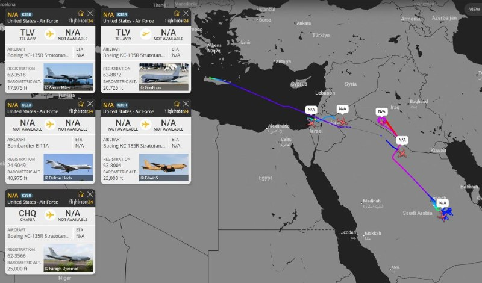

✈️دو فروند هواپیمای سوخت‌رسان هوایی نیروی هوایی آمریکا هم‌اکنون بر فراز عربستان سعودی در حال عملیات هستند و دو فروند دیگر نیز از تل‌آویو در مسیر حرکت به سوی خلیج فارس قرار دارند.

✈️همچنین یک فروند KC-135R از پایگاه خانیا به پرواز درآمده که احتمالاً در حال اسکورت یک فروند هواپیمای اطلاعات سیگنالی RC-135W (SIGINT) است.

🔴در همین حال، یک فروند هواپیمای E-11A BACN نیروی هوایی آمریکا نیز بر فراز عراق فعال است.

@mwarmonitor

## mwarmonitor — post 8838

شک نکنید بعد از خوندن جواب جمهوری اسلامی این متن نوشته

## mwarmonitor — post 8837

ایران ۴۷ سال است که با ایالات متحده و بقیه جهان بازی می‌کند (تاخیر، تاخیر، تاخیر!) و در نهایت زمانی که باراک حسین اوباما رئیس‌جمهور شد، به «گنج» رسیدند. او نه‌تنها با آن‌ها خوب بود، بلکه عالی بود؛ در واقع به سمت آن‌ها رفت، اسرائیل و سایر متحدان را رها کرد…

## mwarmonitor — post 8836

نظامی - سیاسی pinned «ایران ۴۷ سال است که با ایالات متحده و بقیه جهان بازی می‌کند (تاخیر، تاخیر، تاخیر!) و در نهایت زمانی که باراک حسین اوباما رئیس‌جمهور شد، به «گنج» رسیدند. او نه‌تنها با آن‌ها خوب بود، بلکه عالی بود؛ در واقع به سمت آن‌ها رفت، اسرائیل و سایر متحدان را رها کرد…»

## mwarmonitor — post 8835

ایران ۴۷ سال است که با ایالات متحده و بقیه جهان بازی می‌کند (تاخیر، تاخیر، تاخیر!) و در نهایت زمانی که باراک حسین اوباما رئیس‌جمهور شد، به «گنج» رسیدند. او نه‌تنها با آن‌ها خوب بود، بلکه عالی بود؛ در واقع به سمت آن‌ها رفت، اسرائیل و سایر متحدان را رها کرد و به ایران فرصت تازه، بزرگ و بسیار قدرتمندی برای زندگی داد. صدها میلیارد دلار، و ۱.۷ میلیارد دلار پول نقد سبز که به تهران پرواز کرد، در یک سینی نقره به آن‌ها تقدیم شد. تمام بانک‌ها در دی.سی، ویرجینیا و مریلند خالی شدند — آنقدر پول زیاد بود که وقتی رسید، اراذل ایرانی نمی‌دانستند با آن چه کنند. آن‌ها هرگز چنین پولی را ندیده بودند و دیگر هرگز نخواهند دید. پول‌ها با چمدان و کیف از هواپیما خارج شد و ایرانی‌ها نمی‌توانستند شانس خود را باور کنند. آن‌ها بالاخره بزرگترین «ساده‌لوح» تمام دوران را در قالب یک رئیس‌جمهور ضعیف و احمق آمریکایی پیدا کردند. او به عنوان «رهبر» ما یک فاجعه بود، اما نه به بدی جو بایدن خواب‌آلود! ۴۷ سال است که ایرانی‌ها ما را «سرِ کار» گذاشته‌اند، ما را منتظر نگه داشته‌اند، مردم ما را با بمب‌های کنار جاده‌ای‌شان کشته‌اند، اعتراضات را سرکوب کرده‌اند و اخیراً ۴۲,۰۰۰ معترض بی‌گناه و غیرمسلح را از بین برده‌اند و به کشور ما که اکنون «دوباره عالی شده» می‌خندند. آن‌ها دیگر نخواهند خندید!

رئیس‌جمهور دونالد جی. ترامپ

@mwarmonitor

## pm_afshaa — post 90499

🔴ترامپ : ایران 47 ساله داره با آمریکا و بقیه دنیا بازی درمیاره و هی وقت‌کشی می‌کنه 
💧 Rainbet.com the #1 Non-KYC Crypto Casino & Sportsbook @rainbetcom 
😁 @Pm_Afshaa

## pm_afshaa — post 90498

🔴ترامپ : ایران 47 ساله داره با آمریکا و بقیه دنیا بازی درمیاره و هی وقت‌کشی می‌کنه

💧 Rainbet.com the #1 Non-KYC Crypto Casino & Sportsbook @rainbetcom

😁 @Pm_Afshaa

## pm_afshaa — post 90497

🔴گفتگوی تلفنی میان نتانیاهو و ترامپ درباره پاسخ جمهوری اسلامی به به پیشنهاد تسلیم‌نامه هسته‌ای آمریکا به پایان رسید

💧 Rainbet.com the #1 Non-KYC Crypto Casino & Sportsbook @rainbetcom

😁 @Pm_Afshaa

## iaghapour — post 2597

  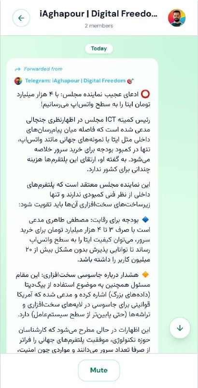

⭕️ آپدیت ورژن 0.10.0 سانگبرد منتشر شد

🔹با این اسکریپت میتونید در سرور ایران خودتون یک مسنجر شخصی بالا بیارید و با دوستان خودتون چت کنید.

- 📡 قابلیت Remote channel
- 🔗 ساده سازی سیستم Invite link
- 🎨 بازطراحی بخش ساخت/تغییر کانال و گروه در UI
- ✨انیمیشن build-up پیام ها در چت ها
- 🔔 بهبود عملکرد push notifications
- تغییرات گرافیکی اسکریپت نصب آسان
- 🐳 پشتیانی از TLS با سرتیفیکیت self-signed در Docker
- 🔧 رفع باگ های گزارش شده
- 📄 اضافه شدن نسخه فارسی فایل readme

🔘اگه به هر مشکلی خوردین، حتما تو گیت هاب یک issue باز کنید و گزارش بدید.
⭐️ اگه از پروژه راضی بودین، با ستاره دادن تو گیت هاب از پروژه حمایت کنید.
🔹چنل پروژه

🔗 لینک گیت‌هاب پروژه

🆔 @iaghapour

## iaghapour — post 2596

⭕️ ساده‌ترین راه برای دور زدن فیلترینگ با تانل DNS

اگه خانواده‌ شما هم داخل ایران برای اتصال به اینترنت مشکل دارند، این پیام ممکن است به شما کمک کند.

این برنامه یک برنامه‌ی گرافیکیست که کار با آن بسیار ساده است و برای اتصال به اینترنت هر دو روش MasterDNS و VayDNS را پشتیبانی می‌کند.

👈 لینک گیت‌هاب
👈 دانلود اپ

📖 آموزش کامل MasterDNS و VayDNS

▶️ آموزش روی یوتیوب

📱 آموزش KevinNet DNS

▶️ آموزش روی یوتیوب

🔄 آپدیت‌های جدید برنامه

در صورت وجود هرگونه مشکل یا سوالات مرتبط با KevinNetDNS میتوانید با آدرس ایمیل زیر در تماس باشید:

©️ متن تهیه شده توسط نویسنده اسکریپت KevinDNS

🆔 @iaghapour

## DEJradio — post 4553

📢
👑 صدها نفر از ایرانیان برلین روز یکشنبه ۲۰ اردیبهشت ۱۴۰۵ در پاسخ به فراخوان شاهزاده رضا پهلوی در حمایت از انقلاب شیر و خورشید راهپیمایی برگزار کردند.

#همبستگی #انقلاب_شیروخورشید #برلین
@DEJradio

## DEJradio — post 4552

  <a href="telegram/content/DEJradio_4552_1778443851.webm" target="_blank">🎬 Download video</a>

🚨
⭕️ دونالد ترامپ، رئیس‌جمهوری ایالات متحده، شامگاه یکشنبه در پیامی در شبکۀ اجتماعی تروث سوشال نوشت جمهوری اسلامی ۴۷سال است که با آمریکا و جهان بازی کرده و با سیاست "تعویق، تعویق، تعویق" زمان خریده است. ترامپ نوشت این روند زمانی برای جمهوری اسلامی به نقطۀ طلایی رسید که باراک حسین اوباما رئیس‌جمهور شد. به نوشتۀ ترامپ، اوباما نه‌تنها با جمهوری اسلامی خوب رفتار کرد، بلکه در عمل به سوی آن‌ها رفت، اسرائیل و دیگر متحدان آمریکا را کنار گذاشت و به جمهوری اسلامی جان تازه‌ای بخشید.
ترامپ در ادامه نوشت صدها میلیارد دلار و همچنین ۱.۷میلیارد دلار پول نقد با هواپیما به تهران منتقل شد و روی سینی نقره‌ای در اختیار جمهوری اسلامی قرار گرفت. او افزود حجم پول آن‌قدر زیاد بود که به گفتۀ او، بانک‌های واشینگتن، ویرجینیا و مریلند خالی شدند و وقتی این پول‌ها به تهران رسید، اوباش جمهوری اسلامی نمی‌دانستند با آن چه کنند.
رئیس‌جمهوری آمریکا نوشت مقام‌های جمهوری اسلامی هرگز چنین پولی ندیده بودند و دیگر هم نخواهند دید. به نوشتۀ ترامپ، این پول‌ها با چمدان و کیف از هواپیما پایین آورده شد و جمهوری اسلامی از خوش‌شانسی خود باورش نمی‌شد. ترامپ نوشت جمهوری اسلامی سرانجام بزرگ‌ترین ساده‌لوح را در قالب یک رئیس‌جمهوری ضعیف و احمق آمریکایی پیدا کرده بود.
ترامپ در بخش دیگری از پیام خود، اوباما را برای رهبری آمریکا یک فاجعه خواند، اما افزود او به بدی جو بایدن نبود. رئیس‌جمهوری آمریکا نوشت جمهوری اسلامی طی ۴۷سال گذشته آمریکا را معطل کرده، این کشور را در انتظار نگه داشته، مردم آمریکا را با بمب‌های کنار جاده‌ای کشته، اعتراضات را نابود کرده و به‌تازگی ۴۲هزار معترض بی‌گناه و غیرمسلح را از میان برده است.
ترامپ در پایان نوشت جمهوری اسلامی به آمریکایی که اکنون دوباره عظمت خود را بازیافته می‌خندید، اما دیگر نخواهد خندید.

#دونالد_ترامپ #جمهوری_اسلامی
@DEJradio

## DEJradio — post 4551

  <a href="telegram/content/DEJradio_4551_1778443852.mp4" target="_blank">🎬 Download video</a>

🎥
🔺 ابوالفضل اقبالی کارشناس صداوسیمای جمهوری اسلامی ادعا کرده است موساد برای راه رفتن با تاپ و شلوار در میدان ولیعصر ساعتی ۳ دلار می‌دهد.

#موساد
@DEJradio

## VahidOnline — post 75387

#دزفول #اندیمشک
پیام‌های دریافتی از شنیده شدن صدای پدافند:

پیام ساعت ۲۲: دزفول حدود 20 دقیقه صدای پدافند میومد

دزفول وحشتناک صدای پدافند اومد.جدود ساعت نه ونیم

سلام پایگاه چهارم شکاری دزفول از ساعت ۲۱:۳۰ تقریبا یه ریز پدافند فعاله

پدافند پایگاه وحدتی دزفول فعال شده از ساعت ۲۱.۵۰ تا الان ۲۲.۱۷

فعالیت شدید پدافند در اندیمشک ساعت 22.15

اندیمشک
ساعت 22:19 امشب پدافند فعال شد در حد 30 ثانیه.
یه صدایی میاد انگار پهپاده

سلام، اندیمشک ۲۲:۲۲ دقیقه چند دقیقه ست پدافند ها فعال شدن

📡 @VahidOnline

## VahidOnline — post 75386

  

ترامپ: آن‌ها دیگر نخواهند خندید

پست تازه ترامپ پس از آن که جمهوری اسلامی گفت پاسخش را از طریق پاکستان ارسال کرده. ترجمه ماشین:

ایران به مدت ۴۷ سال با ایالات متحده و بقیه جهان بازی کرده است؛ «تعویق، تعویق، تعویق!» و سرانجام وقتی باراک حسین اوباما رئیس‌جمهور شد، به گنج رسید. او نه‌تنها با آن‌ها خوب بود، بلکه عالی بود؛ عملاً به طرف آن‌ها رفت، اسرائیل و همه متحدان دیگر را کنار گذاشت و به ایران یک فرصت تازه، بزرگ و بسیار قدرتمند برای ادامه حیات داد.

صدها میلیارد دلار، و ۱.۷ میلیارد دلار پول نقد سبز، که با هواپیما به تهران منتقل شد، مثل هدیه‌ای روی سینی نقره به آن‌ها داده شد. همه بانک‌ها در واشنگتن دی‌سی، ویرجینیا و مریلند خالی شدند. آن‌قدر پول بود که وقتی رسید، اراذل ایرانی نمی‌دانستند با آن چه کار کنند. آن‌ها هرگز چنین پولی ندیده بودند و دیگر هم هرگز نخواهند دید. پول‌ها در چمدان‌ها و کیف‌ها از هواپیما پایین آورده شد و ایرانی‌ها نمی‌توانستند خوش‌شانسی خود را باور کنند.

آن‌ها بالاخره بزرگ‌ترین ساده‌لوحِ همه تاریخ را در قالب یک رئیس‌جمهور ضعیف و احمق آمریکایی پیدا کردند. او به‌عنوان «رهبر» ما یک فاجعه بود، اما نه به بدی جو بایدن خواب‌آلود!

ایرانی‌ها ۴۷ سال ما را سر دوانده‌اند، ما را منتظر نگه داشته‌اند، مردم ما را با بمب‌های کنار جاده‌ای خود کشته‌اند، اعتراضات را نابود کرده‌اند، و اخیراً ۴۲ هزار معترض بی‌گناه و غیرمسلح را از بین برده‌اند و به کشور ما که اکنون دوباره بزرگ شده است، خندیده‌اند. دیگر نخواهند خندید!

رئیس‌جمهور دونالد ج. ترامپ
realDonaldTrump

📡 @VahidOnline

## kianmeli1 — post 87336

🔴ایران به پیشنهاد ایالات متحده که بر محور تفاهم‌نامه احتمالی ۱۴ ماده‌ای بین دو کشور بود، پاسخ داده است. طبق گزارشی از وال استریت ژورنال، به نقل از افراد آشنا با این موضوع، نقاط اختلاف بین این دو همچنان بر سر زمان و چگونگی بحث در مورد غنی‌سازی هسته‌ای است. ایران همچنان خواستار عدم بحث در مورد غنی‌سازی هسته‌ای قبل از توقف دائمی خصومت‌ها است، در حالی که ایالات متحده چنین بحث‌هایی را قبل از تحقق آن ضروری می‌داند. علاوه بر این، طبق این گزارش، ایران همچنین موضع خود را مبنی بر اینکه ممکن است مایل به رقیق کردن بخشی از مواد غنی‌شده خود و انتقال مواد بسیار غنی‌شده دیگر به یک کشور ثالث - احتمالاً روسیه - باشد، تکرار کرده است. در پاسخ ایران همچنین تأکید شد که مسائل هسته‌ای در طول یک دوره مذاکرات ۳۰ روزه پس از توقف خصومت‌ها مورد بحث قرار گیرد.
https://t.me/kianmeli1

## kianmeli1 — post 87335

🔴کانال ۱۲ اسرائیل:

تماس تلفنی ترامپ و نتانیاهو پایان یافت
https://t.me/kianmeli1

## kianmeli1 — post 87334

‏🔴سخنگوی کاخ سفید اعلام کرد که دونالد ترامپ شامگاه چهارشنبه وارد پکن می‌شود
https://t.me/kianmeli1

## kianmeli1 — post 87333

🔴ساعت۲۲:۲۲
ورود چندین پهپاد به اندیمشک و فعال شدن پدافند
https://t.me/kianmeli1

## kianmeli1 — post 87332

  <a href="telegram/content/kianmeli1_87332_1778443853.mp4" target="_blank">🎬 Download video</a>

🔴ترامپ :

رهبران آن‌ها رفته‌اند، تیم A رفته، تیم B رفته و احتمالاً تیم C رفته است

ما با افرادی طرف هستیم که قدرتی خاص دارند. بسیار جالب است — آن‌ها توافق می‌کنند و سپس آن را نقض می‌کنند.
 https://t.me/kianmeli1

## kianmeli1 — post 87331

🔴به گزارش i24NEWS،
رئیس‌جمهور ترامپ و نخست‌وزیر نتانیاهو تا یک ساعت آینده با یکدیگر گفت‌وگو خواهند کرد.
https://t.me/kianmeli1

## kianmeli1 — post 87330

  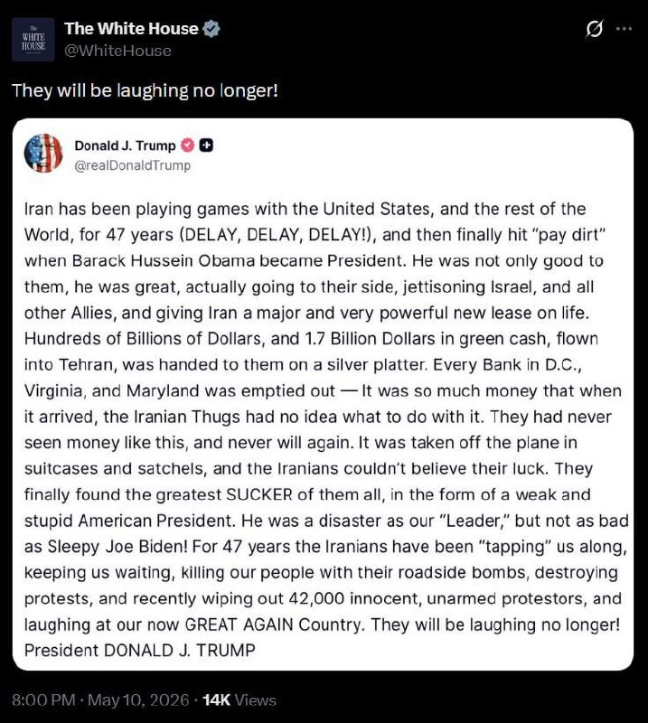

🔴کاخ سفید تأکید می‌کند:
آنها دیگر نخواهند خندید!
https://t.me/kianmeli1

## kianmeli1 — post 87329

  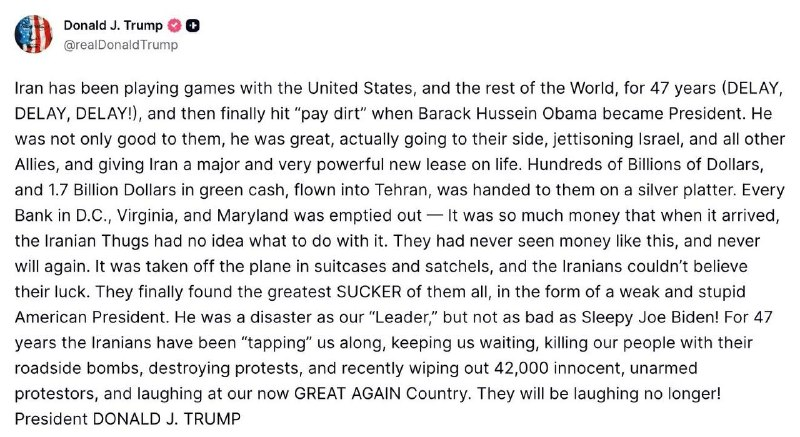

🔴ترامپ : ایران ۴۷ ساله داره با آمریکا و بقیه دنیا بازی درمیاره و هی وقت‌کشی می‌کنه!

تا اینکه اوباما اومد. او فقط با ایران خوب نبود، خیلی هم بهشون حال داد، متحدای ما مثل اسرائیل رو ول کرد و به ایران یه فرصت بزرگ داد.

اون ۱.۷ میلیارد دلار پول نقد هم با هواپیما فرستادن براشون، کلی پول هم در کل بهشون رسید

انقدر پول بود که خودشون هم موندن باهاش چیکار کنن! ایرانی‌ها قبلاً همچین چیزی ندیده بودن.

اون موقع عملاً احمق‌ترین معامله تاریخ رو انجام دادن، چون یه رئیس‌جمهور ضعیف و بی‌عرضه داشتیم. بعدش هم اوضاع از اونم بدتر شد با بایدن خواب‌آلود!
۴۷ ساله ایران داره ما رو اذیت می‌کنه، آدم‌هامونو می‌کشه، اعتراضات رو خراب می‌کنه و تو منطقه مشکل درست می‌کنه، ولی دیگه اون دوران تموم شده. دیگه نمی‌خندن!
https://t.me/kianmeli1

## IranIntlTV — post 336529

  

رسانه‌های ایران شامگاه یک‌شنبه با اشاره به شنیده شدن فعالیت پدافند هوایی در اندیمشک و شمال دزفول از سرنگونی «پرنده متخاصم دشمن» در اندیمشک خبر دادند.

شهروندان نیز یک‌شنبه ساعت حدود ۱۰ شب از شنیده‌شدن صدای پدافند در این شهر خبر دادند.
https://iranintl.com/202605100082

## IranIntlTV — post 336528

  <a href="telegram/content/IranIntlTV_336528_1778443856.mp4" target="_blank">🎬 Download video</a>

در پاسخ به فراخوان شاهزاده رضا پهلوی برای پیوستن به کارزار «یک ملت در گروگان»، گروهی از ایرانیان مقیم کانادا در تورنتو تجمع کردند.

گزارش مهسا مرتضوی، خبرنگار ایران‌اینترنشنال
@iranintltv

## IranIntlTV — post 336527

  <a href="telegram/content/IranIntlTV_336527_1778443858.mp4" target="_blank">🎬 Download video</a>

در پی فراخوان شاهزاده رضا پهلوی برای اعتراض به خاموشی سراسری اینترنت در ایران، بازداشت‌های گسترده و اعدام بی‌وقفه، گروهی از ایرانیان در برابر کاخ سفید در واشینگتن تجمع کردند.

گزارش اردوان روزبه، خبرنگار ایران‌اینترنشنال
@iranintltv

## IranIntlTV — post 336526

  <a href="telegram/content/IranIntlTV_336526_1778443859.mp4" target="_blank">🎬 Download video</a>

ایرنا گزارش داد پاسخ جمهوری اسلامی به آخرین متن پیشنهادی آمریکا برای پایان جنگ به میانجی پاکستانی تحویل داده شده است.

همزمان دونالد ترامپ گفت اهداف دیگری نیز در ایران وجود دارد که ممکن است مورد حمله قرار بگیرند.

گفت‌وگو با شایان سمیعی، کارشناس امنیت ملی
@iranintltv

## IranIntlTV — post 336525

  

نارندرا مودی، نخست‌وزیر هند، یکشنبه از شهروندان این کشور خواست مجموعه‌ای از اقدامات از جمله صرفه‌جویی در مصرف سوخت، دورکاری و محدودیت در سفر و واردات را رعایت کنند، زیرا افزایش شدید قیمت جهانی انرژی فشار زیادی بر ذخایر ارزی این کشور وارد کرده است.

مودی گفت مردم باید اولویت را به بازگشت به دورکاری و جلسات آنلاین بدهند؛ رویکردی که در دوران همه‌گیری کووید-۱۹ به‌طور گسترده اتخاذ شده بود، و افزود این کار به هند کمک می‌کند سوخت کمتری مصرف کند.

او گفت: «در وضعیت کنونی، ما باید تاکید زیادی بر صرفه‌جویی در ارز خارجی داشته باشیم.»

مودی همچنین از مردم خواست از وسایل حمل‌ونقل عمومی مانند مترو استفاده کنند و در صورت امکان برای صرفه‌جویی در سوخت، به طور مشترک از خودروها استفاده کنند.

هند، سومین واردکننده و مصرف‌کننده بزرگ نفت در جهان، اواخر ماه گذشته اعلام کرد که هیچ برنامه‌ای برای افزایش قیمت گازوئیل و بنزین در جایگاه‌ها ندارد و با وجود افزایش جهانی قیمت‌ها، در میان کشورهایی باقی مانده که هنوز قیمت‌ها را افزایش نداده‌اند.

https://iranintl.com/202605107871

## IranIntlTV — post 336524

  

به گزارش جروزالم پست، ارتش اسرائیل یکشنبه بیش از ۲۰ هدف زیرساختی «مرتبط با تروریسم» را در سراسر جنوب لبنان هدف قرار داد.

بر اساس اعلام ارتش اسرائیل، این اهداف شامل انبارهای تسلیحات، مقرها و سازه‌های نظامی‌ای بود که «تروریست‌های حزب‌الله از آنها عملیات انجام می‌دادند».
https://iranintl.com/202605105180

## IranIntlTV — post 336523

  <a href="telegram/content/IranIntlTV_336523_1778443862.mp4" target="_blank">🎬 Download video</a>

چشم‌انداز با مهدی مهدوی‌آزاد: جنون نظامی تازه سپاه و مجتبی در خلیج فارس

نسخه کامل این قسمت را در یوتیوب ایران‌اینترنشنال تماشا کنید:

https://youtu.be/kYSw-f3E0vk
@iranintltv

## IranIntlTV — post 336522

  <a href="https://t.me/IranintlTV/336522" target="_blank">📎 Download file</a>

🎧نسخه صوتی تیتراول با نیوشا صارمی: تاکید همزمان نتانیاهو و ترامپ به تمام نشدن جنگ ایران و احتمال ادامه حملات
@iranintlTV

## IranIntlTV — post 336521

  

سخنگوی کاخ سفید اعلام کرد که دونالد ترامپ شامگاه چهارشنبه وارد پکن می‌شود.

همزمان رویترز به نقل از یک مقام ارشد آمریکایی نوشت دونالد ترامپ و شی جین‌پینگ رهبران آمریکا و چین، در دیدار پیش‌روی خود، احتمالا درباره «حمایت چین از ایران و روسیه» گفت‌وگو خواهند کرد.
https://iranintl.com/202605100945

## IranIntlTV — post 336520

  <a href="telegram/content/IranIntlTV_336520_1778443864.mp4" target="_blank">🎬 Download video</a>

مهدی مهدوی‌آزاد در برنامه «چشم‌انداز» گفت: «یک جریان جنگ‌طلب دیوانه در حال پیش بردن مسیری است که هیچ نسبتی با واقعیت ندارد. در عمل، بخش بزرگی از توان و ساختارشان نابود شده، اما همچنان ادعای پیروزی و قدرت می‌کنند.»

او افزود: «به نظر می‌رسد در دل همان جریانی که پس از جنگ، مجتبی خامنه‌ای را در موقعیت قدرت قرار داد، گروهی تندروتر در حال قدرت گرفتن است؛ جریانی که جنگ را می‌خواهد طولانی‌تر کند و به‌دنبال نوعی "کودتا در کودتا" است.»
@iranintltv

## IranIntlTV — post 336519

  

مصطفی نیلی، وکیل نرگس محمدی، برنده جایزه صلح نوبل و زندانی سیاسی، در ایکس نوشت: «امروز خانم نرگس محمدی با صدور دستور توقف حکم برای انجام درمان از بیمارستان زنجان خارج و با آمبولانس به بیمارستان پارس تهران منتقل و بستری شدند.»

او افزود: «صدور این دستور در پی نظر پزشکی قانونی مبنی بر لزوم پیگیری درمان خارج از زندان و زیر نظر تیم پزشکان ایشان به دلیل بیماری‌های متعدد است.»

پیشتر بنیاد نرگس محمدی اعلام کرد با وجود اعلام پزشکی قانونی استان زنجان درباره ضرورت تعلیق یک‌ماهه اجرای حکم محمدی برای درمان، مقام‌های قضایی از انتقال این فعال حقوق بشر و برنده جایزه صلح نوبل به بیمارستان جلوگیری می‌کنند و خانواده او وضعیتش را مرگ و زندگی توصیف کردند.
https://iranintl.com/202605100410

## IranIntlTV — post 336518

  

دونالد ترامپ در شبکه تروث سوشال نوشت جمهوری اسلامی ۴۷ سال با آمریکا و جهان بازی کرده و با تاخیر زمان خریده است و این روند با ریاست‌جمهوری باراک حسین اوباما به نتیجه رسید. او نوشت اوباما عملا در کنار جمهوری اسلامی ایستاد، اسرائیل و دیگر متحدان را کنار گذاشت و جان تازه‌ای به تهران داد.
ترامپ نوشت صدها میلیارد دلار و ۱.۷ میلیارد دلار پول نقد با هواپیما به تهران منتقل شد و بانک‌های واشینگتن دی سی، ویرجینیا و مریلند خالی شد. پول‌ها در چمدان‌ها منتقل شد و مقام‌های جمهوری اسلامی از حجم آن شگفت‌زده شدند.
او اوباما را رییس‌جمهوری ضعیف خواند و افزود جمهوری اسلامی طی ۴۷ سال با بمب‌های کنار جاده‌ای آمریکایی‌ها را کشته، اعتراضات را سرکوب کرده و اخیرا ۴۲ هزار معترض بی‌سلاح را از بین برده است. او نوشت جمهوری اسلامی به کشور ما که حالا دوباره عظمت یافته می‌خندد اما آن‌ها دیگر نخواهند خندید.
https://iranintl.com/202605105882

## IranIntlTV — post 336517

  <a href="telegram/content/IranIntlTV_336517_1778443867.mp4" target="_blank">🎬 Download video</a>

رسانه‌های ایران خبر دادند پس از مسعود پزشکیان، فرمانده قرارگاه مرکزی خاتم‌الانبیا نیز با مجتبی خامنه‌ای دیدار کرده است.

همزمان وال‌استریت ژورنال گزارش داد جناح‌های تندرو که از روند مذاکرات با آمریکا ناراضی‌اند، خواستار اعلام موضع مستقیم رهبر جمهوری اسلامی هستند.

گفت‌وگو با جابر رجبی، تحلیل‌گر سیاسی
@iranintltv

## IranIntlTV — post 336516

  

دونالد ترامپ در شبکه تروث سوشال نوشت جمهوری اسلامی ۴۷ سال است با آمریکا و جهان بازی می‌کند. برای ۴۷ سال آن‌ها ما را معطل نگه داشته‌اند و مردم ما را با بمب‌های کنار جاده‌ای کشته‌اند.
او افزود: در اعتراضات اخیر ایران ۴۲ هزار معترض بی‌گناه و غیرمسلح کشته شده‌اند و جمهوری اسلامی به آمریکا که دوباره قدرتمند شده می‌خندد، اما دیگر نخواهند خندید.
https://iranintl.com/202605100236

## IranIntlTV — post 336515

  <a href="telegram/content/IranIntlTV_336515_1778443869.mp4" target="_blank">🎬 Download video</a>

بنیامین نتانیاهو گفت جنگ با ایران تا زمان خارج شدن اورانیوم با غنای بالا و برچیده شدن تاسیسات غنی‌سازی پایان نخواهد یافت.

همزمان جمهوری اسلامی اعلام کرد پاسخ آخرین طرح پیشنهادی آمریکا برای پایان جنگ را به میانجی پاکستانی تحویل داده است.

گفت‌وگو با مسعود کاظمی، روزنامه‌نگار و مرضیه حسینی و اشکان صفایی، خبرنگاران ایران‌اینترنشنال
@iranintltv

## IranIntlTV — post 336514

  

امانوئل مکرون، رییس‌جمهوری فرانسه، در واکنش به هشدار تهران علیه ناوهای جنگی فرانسه و بریتانیا گفت: «هیچ مساله‌ای درباره استقرار [این ناوها] مطرح نیست.»

او درباره تنگه هرمز افزود: «آماده‌ایم به ماموریت بین‌المللی کمک کنیم.»

پیش‌تر کاظم غریب‌آبادی، معاون وزیر امور خارجه جمهوری اسلامی، در پیامی در شبکه اجتماعی ایکس با انتقاد از اعزام ناوهای نظامی فرانسه و بریتانیا به منطقه گفت تامین امنیت تنگه هرمز صرفا در اختیار جمهوری اسلامی است.

او افزود که تنگه هرمز «ملک مشاع قدرت‌های فرامنطقه‌ای» نیست و هرگونه حضور نظامی برای همراهی با «اقدامات آمریکا» در این آبراه با «پاسخ قاطع و فوری» روبه‌رو خواهد شد.
https://iranintl.com/202605105633

## IranIntlTV — post 336513

  

پادشاهی بحرین اعلام کرد که ادامه حملات «آشکار و گستاخانه» جمهوری اسلامی علیه امارات متحده عربی را به‌شدت محکوم می‌کند.

پیش‌تر نیز دبیرکل شورای همکاری خلیج‌فارس حملات جمهوری اسلامی به امارات متحده عربی و کویت را محکوم کرد و گفت که این اقدامات را «تجاوزکارانه و غیرقابل قبول» می‌داند.
https://iranintl.com/202605102416

## Shin_Persian — post 5940

  

Shin ✓ @hey_itsmyturn
Sun, 10 May 2026 18:54:28 UTC

1854Z
AA activity in Andimeshk,
Khuzestan Province, #Iran

فارسی

۱۸۵۴ زولو (۲۲:۲۴ به وقت تهران)
فعالیت پدافند هوایی در اندیمشک،
استان خوزستان، #Iran

𝕏 · @shin_persian

## Shin_Persian — post 5939

  

Shin ✓ @hey_itsmyturn Sun, 10 May 2026 18:08:27 UTC President Trump @POTUS: "Iran has been playing games with the United States, and the rest of the World, for 47 years (DELAY, DELAY, DELAY!), and then finally hit “pay dirt” when Barack Hussein Obama became…

## Shin_Persian — post 5938

Shin ✓ @hey_itsmyturn
Sun, 10 May 2026 18:08:27 UTC

President Trump @POTUS:
"Iran has been playing games with the United States, and the rest of the World, for 47 years (DELAY, DELAY, DELAY!), and then finally hit “pay dirt” when Barack Hussein Obama became President. He was not only good to them, he was great, actually going to their side, jettisoning Israel, and all other Allies, and giving Iran a major and very powerful new lease on life. Hundreds of Billions of Dollars, and 1.7 Billion Dollars in green cash, flown into Tehran, was handed to them on a silver platter. Every Bank in D.C., Virginia, and Maryland was emptied out — It was so much money that when it arrived, the Iranian Thugs had no idea what to do with it. They had never seen money like this, and never will again. It was taken off the plane in suitcases and satchels, and the Iranians couldn’t believe their luck. They finally found the greatest SUCKER of them all, in the form of a weak and stupid American President. He was a disaster as our “Leader,” but not as bad as Sleepy Joe Biden! For 47 years the Iranians have been “tapping” us along, keeping us waiting, killing our people with their roadside bombs, destroying protests, and recently wiping out 42,000 innocent, unarmed protestors, and laughing at our now GREAT AGAIN Country. They will be laughing no longer! President DONALD J. TRUMP"

فارسی

رئیس‌جمهور ترامپ @POTUS:
«ایران به مدت ۴۷ سال در حال بازی دادن ایالات متحده و بقیه جهان بوده است (تأخیر، تأخیر، تأخیر!) و در نهایت زمانی که باراک حسین اوباما رئیس‌جمهور شد، به «گنج» دست یافتند. او نه تنها با آن‌ها خوب بود، بلکه عالی بود؛ در واقع به سمت آن‌ها رفت، اسرائیل و تمام متحدان دیگر را رها کرد و به ایران فرصت حیات مجدد، بزرگ و بسیار قدرتمندی بخشید. صدها میلیارد دلار، و ۱.۷ میلیارد دلار پول نقد سبز که به تهران پرواز داده شد، در سینی نقره به آن‌ها تقدیم گشت. تمام بانک‌ها در واشینگتن دی.سی، ویرجینیا و مریلند خالی شدند — آنقدر پول زیاد بود که وقتی رسید، اراذل و اوباش ایرانی هیچ ایده‌ای نداشتند با آن چه کنند. آن‌ها هرگز چنین پولی را ندیده بودند و دیگر هرگز نخواهند دید. پول‌ها با چمدان و کیف‌های دستی از هواپیما خارج شد و ایرانی‌ها نمی‌توانستند شانس خود را باور کنند. آن‌ها در نهایت بزرگ‌ترین «ساده‌لوح» تمام دوران را در قالب یک رئیس‌جمهور ضعیف و احمق آمریکایی پیدا کردند. او به عنوان «رهبر» ما یک فاجعه بود، اما نه به بدی جو بایدن خواب‌آلود! ۴۷ سال است که ایرانی‌ها ما را «معطل» کرده‌اند، ما را منتظر نگه داشته‌اند، مردم ما را با بمب‌های کنار جاده‌ای‌شان کشته‌اند، اعتراضات را سرکوب کرده‌اند و اخیراً ۴۲,۰۰۰ معترض بی‌گناه و غیرمسلح را نابود کرده‌اند و به کشور ما که اکنون «دوباره بزرگ شده»، خندیده‌اند. آن‌ها دیگر نخواهند خندید! رئیس‌جمهور دونالد جی. ترامپ»

𝕏 · @shin_persian

## Shin_Persian — post 5937

Shin ✓ @hey_itsmyturn
Sun, 10 May 2026 18:04:25 UTC

RUMINT:
PM @netanyahu on an "urgent call" with @POTUS.

فارسی

شایعات:
نخست‌وزیر نتانیاهو در یک «تماس اضطراری» با رئیس‌جمهور ایالات متحده (@POTUS).

𝕏 · @shin_persian

## ManotoTV — post 105276

  <a href="telegram/content/ManotoTV_105276_1778443873.mp4" target="_blank">🎬 Download video</a>

روزنامه وال‌استریت ژورنال گزارش داد جمهوری اسلامی پیشنهاد داده بخشی از ذخایر اورانیوم غنی‌شده خود را رقیق و بخش دیگر را به یک کشور ثالث منتقل کند.

بر اساس این گزارش، تهران همچنین خواستار تضمین شده است که در صورت شکست مذاکرات یا خروج دوباره آمریکا از توافق، اورانیوم منتقل‌شده به خاک ایران بازگردانده شود.

به نوشته وال‌استریت ژورنال، این پیشنهاد بخشی از پاسخ چندصفحه‌ای جمهوری اسلامی به طرح اخیر آمریکا برای پایان دادن به جنگ و آغاز مذاکرات جدید بوده است.

## ManotoTV — post 105275

  <a href="telegram/content/ManotoTV_105275_1778443874.mp4" target="_blank">🎬 Download video</a>

اسلو | نروژ؛ گردهمایی ایرانیان ـ گزارشگر یکشنبه ۲۰ اردیبهشت ۱۴۰۵

## ManotoTV — post 105274

  <a href="telegram/content/ManotoTV_105274_1778443875.mp4" target="_blank">🎬 Download video</a>

‌
مونیخ | آلمان؛ گردهمایی ایرانیان ـ گزارشگر یکشنبه ۲۰ اردیبهشت ۱۴۰۵

## ManotoTV — post 105273

  <a href="telegram/content/ManotoTV_105273_1778443877.mp4" target="_blank">🎬 Download video</a>

پیتر ماگیار، رهبر حزب «تیسا»، پس از پیروزی در انتخابات آوریل با کسب بیش از ۵۳ درصد آرا، روز شنبه به‌عنوان نخست‌وزیر مجارستان سوگند یاد کرد و به ۱۶ سال حاکمیت ویکتور اوربان پایان داد.

در جریان مراسم تحلیف در میدان کوشوت، ژولت هگدوش، وزیر بهداشت آینده، با اجرای یک رقص پرانرژی در برابر هزاران نفر توجه‌ها را به خود جلب کرد و این حرکت را روی پله‌های ساختمان پارلمان نیز تکرار کرد.

او پیش‌تر نیز با همین حرکات در یک تجمع انتخاباتی در ماه آوریل خبرساز شده و در شبکه‌های اجتماعی لقب «سیاستمدار رقصنده» را گرفته بود.

## ManotoTV — post 105272

  <a href="telegram/content/ManotoTV_105272_1778443878.mp4" target="_blank">🎬 Download video</a>

‌
دونالد ترامپ، رئیس‌جمهوری آمریکا، در شبکه اجتماعی خود نوشت جمهوری اسلامی طی ۴۷ سال گذشته واشینگتن را «معطل نگه داشته» و به منافع آمریکا آسیب زده است.

او گفت: «در طول ۴۷ سال، ایرانی‌ها ما را معطل نگه داشته‌اند، ما را منتظر گذاشته‌اند، با بمب‌های کنار جاده‌ای افراد ما را کشته‌اند و اعتراضات را سرکوب کرده‌اند.»

ترامپ همچنین گفت جمهوری اسلامی «۴۲ هزار معترض بی‌گناه و بی‌سلاح را از بین برده» و به آمریکا «خندیده» است.

او در پایان افزود: «آن‌ها دیگر نخواهند خندید.»

## ManotoTV — post 105271

  <a href="telegram/content/ManotoTV_105271_1778443878.mp4" target="_blank">🎬 Download video</a>

امانوئل مکرون، رئیس‌جمهوری فرانسه، اعلام کرد هرگز موضوع استقرار نیروهای فرانسوی یا مشترک با بریتانیا در تنگه هرمز مطرح نبوده است.

مکرون در نشست خبری در نایروبی گفت چند روز پیش تصمیم گرفته ناو «شارل دوگل» و ناوچه‌های همراه آن را از مدیترانه شرقی به آن‌سوی تنگه باب‌المندب منتقل کند و افزود: «بحث استقرار مطرح نبوده، اما ما آماده‌ایم.»

او با تأکید بر اصل «آزادی کشتیرانی» گفت باید به هرگونه محاصره پایان داده شود و هر نوع عوارض یا محدودیت بر عبور کشتی‌ها رد شود.

## FarsiVOA — post 217371

  

⚡️باراک راوید، خبرنگار آکسیوس به نقل از مقامات اسرائيلی نوشت که دونالد ترامپ، رئیس جمهوری آمریکا، با بنیامین نتانیاهو، نخست وزیر اسرائيل روز یکشنبه تلفنی صحبت کرد. طبق گزارش‌های مختلف، جمهوری اسلامی پاسخ خود را به چارچوب مذاکرات صلح با آمریکا ارائه داده است.
@FarsiVOA

## FarsiVOA — post 217370

🔺نرگس محمدی به بیمارستان پارس در تهران منتقل شد

◾️مصطفی نیلی، وکیل نرگس محمدی اعلام کرد که این زندانی سیاسی روز یکشنبه ۲۰ اردیبهشت، برای ادامه درمان‌های تخصصی از بیمارستان زنجان به بیمارستان پارس در تهران منتقل و در آنجا بستری شده است.

⬇️ بیشتر بخوانید:
https://ir.voanews.com/a/8148529.html
@FarsiVOA

## FarsiVOA — post 217369

  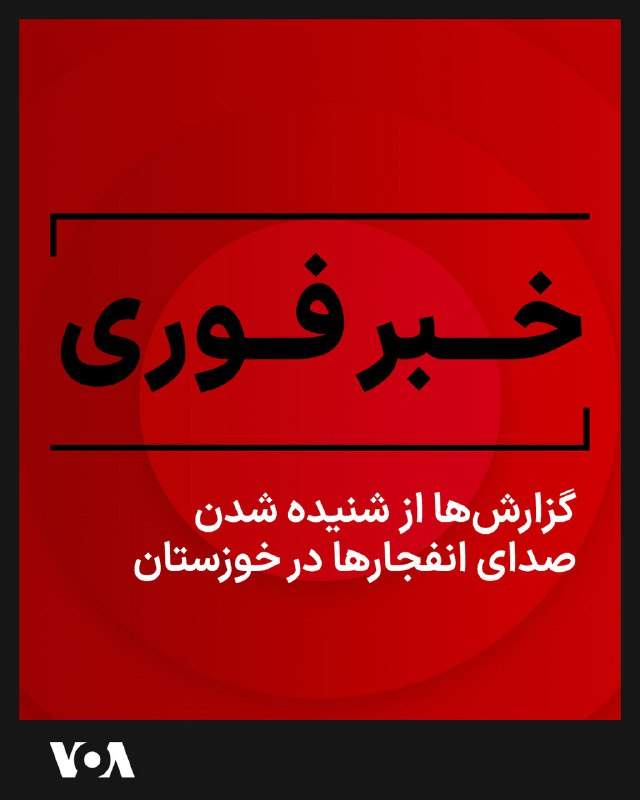

⚡️حساب کاربری وحید آنلاین در تلگرام از شنیده شدن صدای انفجارها در دزفول و اندیمشک در یکشنبه شب خبر داد. بر اساس برخی پیام‌های منتشر شده صدای «وحشتناک» در دزفول حدود ساعت ۹:۳۰ شب بود. همچنین گزارش‌ها و پیام‌ها از ادامه انفجارها در حوالی ساعت ۱۰ شب و فعال شدن پدافند هوایی حکایت دارند.
@FarsiVOA

## FarsiVOA — post 217368

🔺مایک والتز: ذخایر ارزی خارجی جمهوری اسلامی «نزدیک به صفر» است

◾️مایک والتز، سفیر ایالات متحده در سازمان ملل متحد روز یکشنبه ۲۰ اردیبهشت در مصاحبه با فاکس‌نیوز گفت نمی‌تواند گزارش‌های روز یکشنبه حمله پهپادی جمهوری اسلامی به یک کشتی تحت مالکیت نهاد آمریکایی را تائید یا رد کند.

⬇️ بیشتر بخوانید:

https://ir.voanews.com/a/economic-hostage-taking-iranian-regime-strait-of-hormuz-mike-waltz/8148519.html

## FarsiVOA — post 217367

🔺دونالد ترامپ: رژیم ایران ۴۷ سال است دنیا را به بازی گرفته‌‌است؛ دیگر به ما نخواهند خندید

دونالد ترامپ، رئیس جمهوری آمریکا روز یکشنبه ۲۰ اردیبهشت، در شبکه اجتماعی تروت‌سوشال نوشت: «۴۷ سال است که رژیم ایران، آمریکا و جهان را «به بازی گرفته‌ است» و آن‌ها را منتظر نگه داشته‌ و ۴۲هزار نفر از مردم بیگناه خود را نیز اخیرا کشته است.

⬇️ بیشتر بخوانید:

https://ir.voanews.com/a/trump-delay-iranian-regime/8148522.html

## FarsiVOA — post 217366

دونالد ترامپ، رئیس جمهوری ایالات متحده، در گفت‌وگویی اختصاصی با برنامه «فول مژر» به میزبانی شریل اتکیسون، گفت حکومت ایران از نظر نظامی «شکست خورده» است و توان بازسازی سریع ظرفیت‌های نظامی و هسته‌ای خود را ندارد.

آقای ترامپ در این مصاحبه که در کاخ سفید انجام شد، از تصمیم خود برای حمله به تأسیسات هسته‌ای رژیم ایران دفاع و تأکید کرد که ایالات متحده هرگز اجازه نخواهد داد این رژیم به سلاح هسته‌ای دست یابد.

رئیس جمهوری آمریکا در پاسخ به پرسشی درباره وضعیت جنگ با جمهوری اسلامی گفت: «آنها از نظر نظامی شکست خورده‌اند.» او افزود که رژیم ایران دیگر نیروی دریایی، نیروی هوایی، سامانه پدافندی یا راداری مؤثری ندارد، و بخش بزرگی از فرماندهان ارشد آن نیز از میان رفته‌اند.

گزارش کامل را در وب‌سایت صدای آمریکا بخوانید.

@FarsiVOA

## FarsiVOA — post 217365

از فشار آمریکا تا نگرانی جمهوری اسلامی؛ کابینه جدید عراق وارد مرحله‌ای حساس شد

## FarsiVOA — post 217364

از حجاب و ماهواره تا کولر آبی؛ چرا جمهوری اسلامی از شکست‌های گذشته عبرت نمی‌گیرد؟

## FarsiVOA — post 217363

  

دونالد ترامپ، رئيس جمهوری آمریکا روز یکشنبه در پیامی نوشت: «۴۷ سال است که ایرانی‌ها (مقامات جمهوری اسلامی) ما را سر می‌دوانند، معطل نگه می‌دارند، با بمب‌های کنار جاده‌ای مردم ما را می‌کشند، اعتراضات را سرکوب می‌کنند و اخیراً ۴۲ هزار معترض بی‌گناه و غیرمسلح را از بین برده‌اند، و به کشوری که اکنون دوباره عظمت یافته است می‌خندند. دیگر نخواهند خندید!»

## FarsiVOA — post 217362

اعتراض نماینده پارلمان بریتانیا به استارمر به دلیل «سکوت» در برابر «جنایات» جمهوری اسلامی

## DW_Farsi — post 124539

🔶آیا واقعا می‌توان ۴۵۰ کیلوگرم اورانیوم را از ایران خارج کرد؟
🔻گزارشی از عرفان کسرایی

شهروندان ایران سال‌هاست که واژگانی مانند کیک زرد، سانتریفیوژ، UF6، غنی‌سازی و نظایر آن را در اخبار می‌شنوند؛ کلماتی که اغلب یادآور بحران و بی‌ثباتی و تحریم و جنگ‌اند و وضعیتی که تا کنون دست‌کم زندگی دو نسل از مردم ایران را تیره و دستخوش آشوب کرده است.

اصرار جمهوری اسلامی بر غنی‌سازی اورانیوم، کشور را در معرض تحریم‌های سنگین قرار داده است و برخی برآوردها میزان خسارات مستقیم اقتصادی آن را در حدود سه‌ونیم تریلیون دلار ارزیابی کرده‌اند.

در زمان تنظیم این گزارش، آتش‌بس شکننده‌ای میان ایران و آمریکا در جریان است و مذاکرات ایالات متحده با جمهوری اسلامی، تا حد زیادی به تعیین سرنوشت حدود ۴۵۰ کیلوگرم اورانیوم با غنای ۶۰ درصد گره خورده است.

@dw_farsi

## DW_Farsi — post 124538

  

🔶هشدار ترامپ به جمهوری اسلامی: طرف ایرانی دیگر نخواهد خندید

دونالد ترامپ، رئیس جمهور آمریکا، ایران را به "۴۷ سال بازی دادن و خندیدن به آمریکا برای دهه‌ها" متهم کرد. اما گفت که "به زودی این کار متوقف خواهد شد".

ترامپ در شبکه اجتماعی متعلق به خودش "تروث سوشال "نوشت: «ایران ۴۷ سال است که با ایالات متحده و بقیه جهان بازی می‌کند (تاخیر، تاخیر، تاخیر!).»

او همچنین تهران را به خندیدن به آمریکا که "اکنون دوباره با عظمت شده است" متهم کرد و افزود: «آنها دیگر نخواهند خندید!»

رئیس جمهور آمریکا ضمن انتقاد تند از موضع باراک اوباما، رئیس جمهور پیشین ایالات متحده، نسبت به جمهوری اسلامی، او را متهم کرد که "اسرائیل و سایر متحدان را کنار گذاشت و به ایران یک زندگی جدید بزرگ و بسیار قدرتمند بخشید".

@dw_farsi

## DW_Farsi — post 124537

  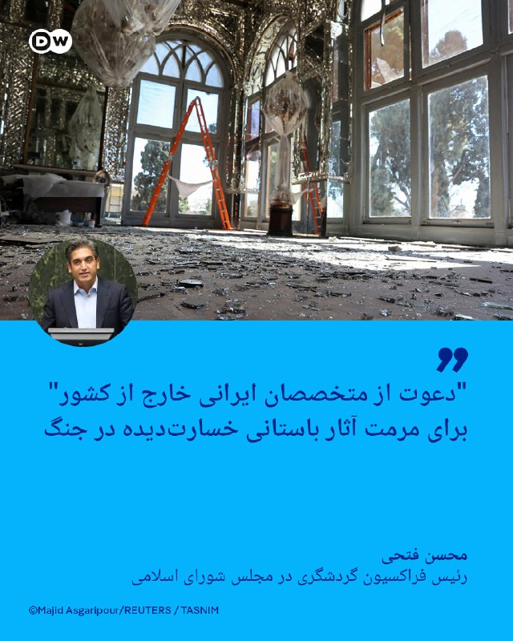

🔶"دعوت از متخصصان ایرانی خارج از کشور" برای مرمت آثار باستانی خسارت‌دیده در جنگ

محسن فتحی، نماینده سنندج در مجلس شورای اسلامی و رئیس فراکسیون گردشگری، روز یکشنبه ۲۰ اردیبهشت (۱۰ مه) به خبرگزاری ایسنا گفت که بیش از ۱۴۰ بنای تاریخی از دوره هخامنشی تا دوران اسلامی در جریان جنگ آسیب دیده‌اند.

به گفته او، بسیاری از هتل‌ها، آژانس‌های مسافرتی و راهنمایان تور با کاهش شدید درآمد مواجه شده‌اند و در آستانه تعطیلی قرار دارند.

فتحی همچنین خبر داده که دولت ایران قصد دارد از ظرفیت متخصصان ایرانی مقیم خارج برای بازسازی این بناها استفاده کند. رئیس فراکسیون گردشگری چنین ایده‌ای را "یک فرصت برای همگرایی همه ایرانیان صرف‌نظر از محل سکونت‌شان، حول حفاظت از هویت ملی" نامیده است.

او در همین رابطه افزود: «رئیس‌ جمهور دستور فوری برای مرمت و بازسازی تمامی محوطه‌ها و ابنیه تاریخی آسیب‌دیده صادر کرده‌اند. علاوه بر این یک کمپین ملی و بین‌المللی بازسازی طراحی شده که بزودی اجرا خواهد شد.»

رئیس فراکسیون گردشگری همچنین از پیگیری صدمات واردشده به بناهای تاریخی "در دادگاه‌های بین‌المللی" خبر داده است.

@dw_farsi

## DW_Farsi — post 124536

  <a href="telegram/content/DW_Farsi_124536_1778443881.mp4" target="_blank">🎬 Download video</a>

🎥نتانیاهو در گفت‌وگو با سی‌بی‌اس: "جنگ ایران هنوز تمام نشده است"

بنیامین نتانیاهو، نخست‌وزیر اسرائیل، در گفت‌وگو با شبکه سی‌بی‌اس گفت جنگ با جمهوری اسلامی ایران "تمام نشده" و تأکید کرد اورانیوم غنی‌شده باید از ایران خارج شود.

نتانیاهو گفت هنوز سایت‌های غنی‌سازی، موشک‌های بالستیک و گروه‌های نیابتی مورد حمایت جمهوری اسلامی پابرجا هستند و "کارهای زیادی" باقی مانده است. او درباره احتمال اقدام نظامی یا زمان پایان این روند توضیحی نداد، اما خروج اورانیوم از ایران را "مأموریتی بسیار مهم" توصیف کرد.

@dw_farsi

## DW_Farsi — post 124535

  

🔶مکرون: فرانسه قصد استقرار نیروی دریایی در تنگه هرمز را ندارد

امانوئل مکرون، رئیس جمهور فرانسه، روز یکشنبه ۱۰ مه (۲۰ اردیبهشت) گفت که فرانسه قصد استقرار نیروی دریایی در تنگه هرمز را ندارد بلکه یک مأموریت امنیتی "در هماهنگی با ایران" را در نظر داشته است.

مکرون در یک کنفرانس خبری در جریان سفر به نایروبی گفت به موضع خود مبنی بر مخالفت با محاصره از سوی هر دو طرف و "رد هرگونه عوارض" برای اطمینان از عبور کشتی‌ها از این آبراه استراتژیک پایبند است.

ایران روز یکشنبه هشدار داده بود که در برابر هرگونه استقرار نیروهای فرانسوی یا بریتانیایی در تنگه هرمز، "پاسخی فوری و قاطع" خواهد داد. این هشدار پس از آن مطرح شد که فرانسه و بریتانیا اعلام کردند شناورهای نظامی به منطقه اعزام می‌کنند.

مکرون گفت: «هیچ‌گاه صحبت از استقرار نیرو نبود، اما ما آماده‌ایم.»

@dw_farsi

## DW_Farsi — post 124534

  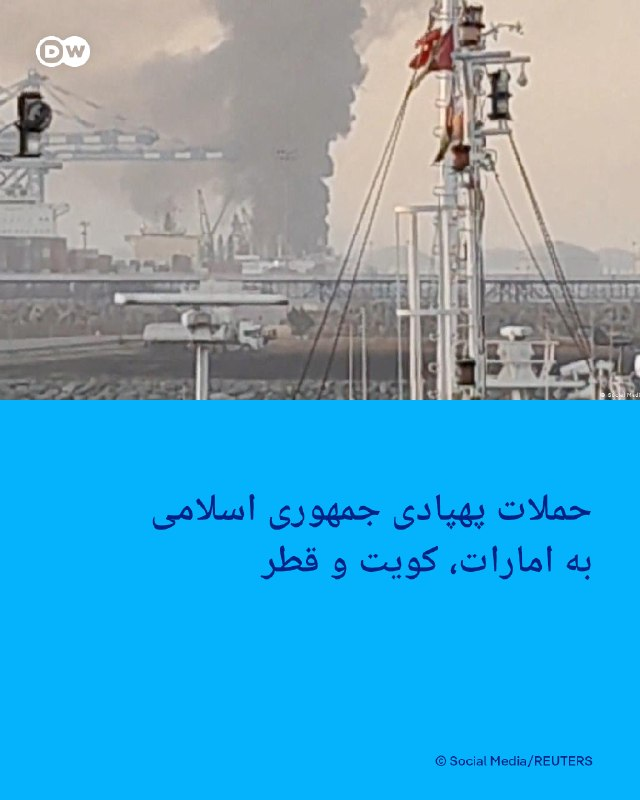

🔶حملات پهپادی جمهوری اسلامی به امارات، کویت و قطر

امارات متحده عربی، کویت و قطر از حملات پهپادی در روز یکشنبه ۱۰ مه (۲۰ اردیبهشت) به خاک خود خبر دادند که به ایران نسبت داده می‌شود. اینطور به نظر می‌رسد که تهران با وجود آتش‌بس شکننده، حملات خود را به برخی کشورهای منطقه از سر گرفته است.

وزارت دفاع امارات اعلام کرد ایران روز یکشنبه دو پهپاد به سمت این کشور شلیک کرده و "هر دو با موفقیت هدف قرار گرفته‌اند".

ایران هرگونه حمله به امارات متحده عربی در روزهای اخیر را تکذیب کرده اما هشدار داده است که امارات در صورت هرگونه اقدامی، "پاسخ کوبنده‌ای" دریافت خواهد کرد.

این حملات باعث شد امارات متحده عربی هفته گذشته به آموزش از راه دور برای مدارس روی آورد، اما مقامات روز یکشنبه اعلام کردند که آموزش حضوری از دوشنبه ۱۱ مه (۲۱ اردیبهشت) از سر گرفته خواهد شد.

ارتش کویت همچنین روز یکشنبه اعلام کرد که چندین پهپاد متخاصم را شناسایی و با آنها مقابله کرده است.

@dw_farsi

## Persian_Trend_Official — post 13855

  <a href="telegram/content/Persian_Trend_Official_13855_1778443883.webm" target="_blank">🎬 Download video</a>

🔴سقوط یک «هدف متخاصم» توسط پدافند هوایی ایران در آسمان استان خوزستان در جنوب کشور گزارش شده است|نایا

🫆:Tony

📌 @persian_trend_official
پرشین ترند | متفاوت‌ترین کانال نظامی

## Persian_Trend_Official — post 13854

  <a href="telegram/content/Persian_Trend_Official_13854_1778443884.webm" target="_blank">🎬 Download video</a>

🔴 رسانه عبری: نتانیاهو پس از دریافت پاسخ ایران با ترامپ تماس گرفت 💢شبکه ۱۴ اسرائیل گزارش داد بنیامین نتانیاهو جلسه‌ای با رهبران دروزی را متوقف کرده تا پس از دریافت پاسخ ایران، تماس تلفنی با دونالد ترامپ برقرار کند. ▪️جزئیاتی درباره محتوای پاسخ ایران یا محور…

## Persian_Trend_Official — post 13853

🔴 گزارش فوری درباره موضع هسته‌ای ایران و پیشنهادهای جدید 💢به گزارش وال‌استریت ژورنال، ایران با درخواست آمریکا برای برچیدن کامل تأسیسات هسته‌ای و توقف ۲۰ ساله غنی‌سازی اورانیوم مخالفت کرده است. ▪️در عوض، تهران چند پیشنهاد جایگزین مطرح کرده است: توقف کوتاه‌مدت…

## Persian_Trend_Official — post 13852

  <a href="telegram/content/Persian_Trend_Official_13852_1778443884.webm" target="_blank">🎬 Download video</a>

🔴 گزارش فوری درباره موضع هسته‌ای ایران و پیشنهادهای جدید

💢به گزارش وال‌استریت ژورنال، ایران با درخواست آمریکا برای برچیدن کامل تأسیسات هسته‌ای و توقف ۲۰ ساله غنی‌سازی اورانیوم مخالفت کرده است.

▪️در عوض، تهران چند پیشنهاد جایگزین مطرح کرده است:

توقف کوتاه‌مدت غنی‌سازی به جای تعلیق بلندمدت
رقیق‌سازی بخشی از اورانیوم با غنای بالا
انتقال بخشی از ذخایر به یک کشور ثالث، با این شرط که در صورت شکست مذاکرات امکان بازگشت آن وجود داشته باشد
ادامه گفت‌وگوهای هسته‌ای در بازه ۳۰ روزه آینده

▪️همچنین ایران خواستار:

💢توقف فوری درگیری‌ها
و بازگشایی مرحله‌ای تنگه هرمز، هم‌زمان با لغو محاصره آمریکا

💢 این پیشنهادها در حالی مطرح می‌شود که اختلاف اصلی همچنان بر سر میزان محدودیت برنامه هسته‌ای و سطح فشارهای اقتصادی و نظامی باقی مانده است.

🫆:Tony

📌 @persian_trend_official
پرشین ترند | متفاوت‌ترین کانال نظامی

## Persian_Trend_Official — post 13851

🔴 خلاصه آخرین تحولات منطقه

💢دونالد ترامپ در نخستین واکنش به پاسخ ایران به پیشنهاد آتش‌بس، تهران را به «بازی دادن روند مذاکرات» متهم کرده است.

💢معاون وزیر خارجه ایران هشدار داده است که استقرار هرگونه ناو جنگی اروپایی (فرانسه، بریتانیا یا دیگر کشورها) در تنگه هرمز «غیرقانونی» بوده و با پاسخ فوری و قاطع مواجه خواهد شد.

▪️در مقابل، رئیس‌جمهور فرانسه اعلام کرده پاریس هیچ برنامه‌ای برای اعزام نیروی دریایی به تنگه هرمز ندارد و بر یک سازوکار امنیتی مشترک با مشارکت همه طرف‌ها از جمله ایران تأکید کرده است.

💢نخست‌وزیر اسرائیل گفته جنگ با ایران هنوز تمام نشده و تأکید کرده برنامه هسته‌ای، مراکز غنی‌سازی و نیروهای نیابتی ایران باید برچیده شوند.

💢فرماندهی مرکزی آمریکا اعلام کرده در جریان عملیات جاری در تنگه هرمز، ۶۱ کشتی تجاری را تغییر مسیر داده و ۴ شناور دیگر را از کار انداخته است.

💢در آمریکا نیز دولت ترامپ بررسی تعلیق مالیات فدرال
بنزین را برای کاهش قیمت سوخت در دستور کار قرار داده است.

🫆:Tony

📌 @persian_trend_official
پرشین ترند | متفاوت‌ترین کانال نظامی

## Persian_Trend_Official — post 13850

لینک داخلی لایو اول 20 اردیبهشت برای دانلود: https://dl.persiantrend.com/PersianTrendLives/PersianTrend.1405.02.20.Live1.mp4 نسخه 1080 🔥: https://dl.persiantrend.com/PersianTrendLives/PersianTrend.1405.02.20.Live1.1080p.mp4 ⚠️ نسخه 1080 بعد از 24 ساعت…

## Persian_Trend_Official — post 13849

  <a href="telegram/content/Persian_Trend_Official_13849_1778443884.webm" target="_blank">🎬 Download video</a>

💢گرفتار شدن پهپاد FPV حزب الله داخل توری محافظ اسرائیل ❗️

🫆:Tony

📌 @persian_trend_official
پرشین ترند | متفاوت‌ترین کانال نظامی

## Persian_Trend_Official — post 13848

https://youtube.com/live/KXs-so7OROY?feature=share راس ساعت 20 به وقت تهران لایو آغاز میشه حتما تشریف بیارید چندتا اتفاق جالب رو میخوایم در موردش صحبت کنیم

## Persian_Trend_Official — post 13847

  <a href="telegram/content/Persian_Trend_Official_13847_1778443885.webm" target="_blank">🎬 Download video</a>

🔴 کاخ سفید جمله پایانی ترامپ درباره ایران را بازنشر کرد

💢« آن ها دیگر نخواهند خندید ‼️»

🫆:Tony

📌 @persian_trend_official
پرشین ترند | متفاوت‌ترین کانال نظامی

## Persian_Trend_Official — post 13846

🔴 رسانه عبری: نتانیاهو پس از دریافت پاسخ ایران با ترامپ تماس گرفت

💢شبکه ۱۴ اسرائیل گزارش داد بنیامین نتانیاهو جلسه‌ای با رهبران دروزی را متوقف کرده تا پس از دریافت پاسخ ایران، تماس تلفنی با دونالد ترامپ برقرار کند.

▪️جزئیاتی درباره محتوای پاسخ ایران یا محور گفت‌وگوی نتانیاهو و ترامپ منتشر نشده است/نایا

🫆:Tony

📌 @persian_trend_official
پرشین ترند | متفاوت‌ترین کانال نظامی

## Persian_Trend_Official — post 13845

«ایران ۴۷ سال است که با آمریکا و بقیه جهان بازی می‌کند؛ وقت‌کشی، وقت‌کشی، وقت‌کشی! و در نهایت وقتی باراک حسین اوباما رئیس‌جمهور شد، به گنج رسیدند. او نه‌تنها با آن‌ها خوب بود، بلکه عالی بود؛ عملاً در کنارشان قرار گرفت، اسرائیل و همه متحدان دیگر را کنار گذاشت و به ایران یک فرصت تازه و بسیار قدرتمند برای ادامه حیات داد.

صدها میلیارد دلار پول و همچنین ۱.۷ میلیارد دلار پول نقد، با هواپیما به تهران فرستاده شد و مثل هدیه‌ای آماده تقدیم آن‌ها شد. تمام بانک‌های واشنگتن، ویرجینیا و مریلند خالی شدند! آن‌قدر پول زیاد بود که وقتی رسید، اوباش ایرانی نمی‌دانستند با آن چه کنند. آن‌ها هرگز چنین پولی ندیده بودند و دیگر هم نخواهند دید.

پول‌ها داخل چمدان و کیف منتقل شد و ایرانی‌ها از خوش‌شانسی خودشان شوکه شده بودند. آن‌ها بالاخره بزرگ‌ترین ساده‌لوح ممکن را پیدا کردند؛ یک رئیس‌جمهور ضعیف و احمق آمریکایی.

او به‌عنوان رهبر ما یک فاجعه بود، البته نه به بدی جو خواب‌آلود بایدن!

ایرانی‌ها ۴۷ سال ما را سر دواندند، ما را منتظر نگه داشتند، مردم ما را با بمب‌های کنار جاده‌ای کشتند، اعتراضات را سرکوب کردند و اخیراً ۴۲ هزار معترض بی‌سلاح و بی‌گناه را از بین بردند؛ و به کشوری که حالا دوباره عظیم شده، می‌خندیدند.

اما دیگر نخواهند خندید!»

— دونالد ترامپ

🫆:Tony

📌 @persian_trend_official
پرشین ترند | متفاوت‌ترین کانال نظامی

## Persian_Trend_Official — post 13844

  <a href="telegram/content/Persian_Trend_Official_13844_1778443885.webm" target="_blank">🎬 Download video</a>

🎬 Video

## Persian_Trend_Official — post 13843

🔴 رسانه عبری: حماس در حال بازسازی توان نظامی خود در غزه است

💢شبکه ۱۳ اسرائیل گزارش داد سندی با طبقه‌بندی «فوق‌محرمانه» به مقامات سیاسی این کشور منتقل شده که شامل ارزیابی‌ها و هشدارهای جدی درباره بازسازی توان نظامی حماس در نوار غزه است.

💢بر اساس این گزارش، در این سند آمده است:

▪️ حماس در حال جمع‌آوری اطلاعات درباره نیروهای ارتش اسرائیل در غزه است
▪️ این گروه برای هر گردان، ده‌ها نیروی مسلح جدید جذب می‌کند
▪️ ماهانه صدها بمب کنار جاده‌ای، خمپاره و موشک ضدزره تولید می‌شود
▪️ آموزش‌های تئوری و عملی همچنان ادامه دارد؛ با وجود حضور ارتش اسرائیل در منطقه
▪️ از زمان آتش‌بس تاکنون ده‌ها یا حتی صدها رزمایش و تمرین وابسته به حماس انجام شده است
▪️ حماس در حال تعمیر و بهبود زیرساخت‌های موجود خود است، اما فعلاً تونل جدیدی حفر نمی‌کند

▪️این گزارش در شرایطی منتشر شده که ارتش اسرائیل همچنان عملیات‌های خود را در غزه ادامه می‌دهد و درباره بازگشت توان رزمی گروه‌های فلسطینی هشدار داده می‌شود.

🫆:Tony

📌 @persian_trend_official
پرشین ترند | متفاوت‌ترین کانال نظامی

## Persian_Trend_Official — post 13842

  <a href="telegram/content/Persian_Trend_Official_13842_1778443885.webm" target="_blank">🎬 Download video</a>

🔴 مکرون: فرانسه هرگز قصد اعزام نیرو به تنگه هرمز را نداشت

امانوئل مکرون، رئیس‌جمهور فرانسه، اعلام کرد پاریس «هرگز» قصد اعزام نیروهای دریایی به تنگه هرمز را نداشته و از یک رویکرد هماهنگ امنیتی با مشارکت ایران حمایت می‌کند.

مکرون در نشست خبری خود در نایروبی گفت:

▪️ فرانسه با هرگونه محاصره تنگه هرمز مخالف است؛ چه از سوی آمریکا و چه ایران
▪️ پاریس با دریافت عوارض برای عبور کشتی‌ها نیز مخالفت می‌کند
▪️ آزادی ناوبری باید حفظ شود

او این اظهارات را در واکنش به هشدار ایران درباره «پاسخ فوری و قاطع» به هرگونه استقرار نظامی فرانسه یا بریتانیا در تنگه هرمز مطرح کرد.

مکرون همچنین گفت:

▪️ فرانسه به همراه بریتانیا یک مأموریت مشترک دریایی تشکیل داده‌اند
▪️ حدود ۵۰ کشور و سازمان بین‌المللی در این طرح مشارکت دارند
▪️ هدف این مأموریت، بازگرداندن امنیت کشتیرانی با هماهنگی ایران، کشورهای منطقه و آمریکا است

رئیس‌جمهور فرانسه تأکید کرد:
«موضوع هرگز اعزام نیرو نبود، اما ما آماده هستیم.»

🫆:Tony

📌 @persian_trend_official
پرشین ترند | متفاوت‌ترین کانال نظامی

## Persian_Trend_Official — post 13841

  <a href="https://t.me/persian_trend_official/13841" target="_blank">📎 Download file</a>

فایل صوتی لایو اول
نسخه کم حجم - 6.71 مگابایت

اتاق جنگ یکشنبه 20 اردیبهشت | افشای پایگاه مخفی اسرائیل در غرب عراق

📝 Nick

📌 @persian_trend_official
پرشین ترند | متفاوت‌ترین کانال نظامی

## RadioFarda — post 157039

  

🔸مصطفی نیلی، وکیل دادگستری، روز یکشنبه خبر داد که نرگس محمدی، برنده جایزه صلح نوبل، برای طی کردن مراحل درمان به بیمارستانی در تهران منتقل شده است.

🔸او در شبکه ایکس نوشت: «امروز خانم نرگس محمدی با صدور دستور توقف حکم برای انجام درمان از بیمارستان زنجان خارج و با آمبولانس به بیمارستان پارس تهران منتقل و بستری شدند.»

🔸وکیل نرگس محمدی افزود که این اتفاق «در پی نظر پزشکی قانونی مبنی بر لزوم پیگیری درمان خارج از زندان و زیر نظر تیم پزشکان ایشان به دلیل بیماری‌های متعدد» رخ داد.

🔸تقی رحمانی، فعال سیاسی و همسر خانم محمدی، نیز انتقال او به بیمارستان پارس تهران را با انتشار پیامی در شبکه ایکس تأیید کرد.

🔸برنده ایرانی جایزه صلح نوبل که در زندان زنجان محبوس بود، روز ۱۱ اردیبهشت در پی وخامت حالش به بیمارستانی در این شهر منتقل شده بود.

🔸خانواده و بنیاد نرگس محمدی از آن زمان با اشاره به وخیم‌تر شدن وضعیت جسمانی او، خواستار انتقالش به بیمارستانی در تهران و اجرای روند درمان توسط پزشکان معتمد شده بودند.

@RadioFarda

## RadioFarda — post 157038

  

🔸دونالد ترامپ روز یکشنبه ایران را متهم کرد که سال‌ها است با ایالات متحده «بازی کرده» و به آن «خندیده» اما تأکید کرد که دیگر اجازه نخواهد داد ایران به آمریکا «بخندد».

🔸رئیس‌جمهور آمریکا با انتشار پیامی در شبکه اجتماعی خود، تروث سوشال، بدون آن که به محتوای پاسخ ایران که ساعاتی پیش به پیشنهاد آمریکا برای توافق پایان جنگ داده شد اشاره کند، نوشت: «ایرانی‌ها ۴۷ سال است که ما را سر می‌دوانند، منتظر نگه می‌دارند، مردم ما را با بمب‌های کنار جاده‌ای می‌کشند، اعتراضات را سرکوب می‌کنند، و اخیراً ۴۲ هزار معترض بی‌گناه و غیرمسلح را از بین برده‌اند، و به کشوری که حالا دوباره عظمت یافته می‌خندند. اما دیگر نخواهند خندید!»

🔸او در ابتدای این بیانیه ایران را متهم کرد که «۴۷ سال است که با ایالات متحده و بقیه جهان بازی کرده است (تعویق، تعویق، تعویق!)».

🔸او در این پیام دولت‌های دموکرات باراک اوباما و جو بایدن را متهم کرد که میلیاردها دلار در اختیار حکومت ایران قرار دادند و به‌ویژه اوباما را «گنج واقعی» برای جمهوری اسلامی خواند.

@RadioFarda

## RadioFarda — post 157037

  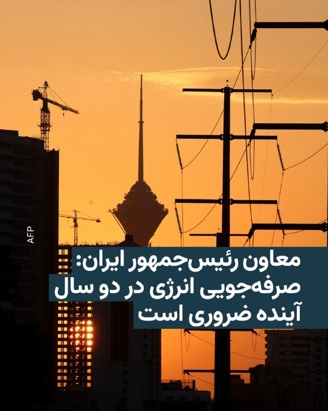

🔸معاون رئیس‌جمهور ایران و رئیس سازمان بهینه‌سازی انرژی، با اشاره به وضعیت زیرساخت‌های کشور، اعلام کرد که برای عبور از شرایط کنونی، صرفه‌جویی در مصرف انرژی طی یک تا دو سال آینده اجتناب‌ناپذیر است.

🔸سقاب اصفهانی در گفت‌وگو با صداوسیمای جمهوری اسلامی افزود که هر فرد با کاهش روزانه یک تا یک‌ونیم لیتر مصرف بنزین می‌تواند به بهبود وضعیت کمک کند.

🔸این مقام دولتی همچنین با اشاره به آسیب‌های واردشده به زیرساخت‌ها در جریان جنگ میان اسرائیل، آمریکا و ایران، تأکید کرد که در کنار اقدامات مسئولان، مدیریت و کاهش مصرف انرژی نیز ضرورتی ناگزیر است.

@RadioFarda

## IranianMinds — post 19917

ترامپ:

تمام سازمان‌های فدرال باید کالای آمریکایی بخرند — هیچ بهانه‌ای پذیرفته نیست!

@IranianMinds

## IranianMinds — post 19916

قرارداد تبلیغاتی ۱ ماهه میبندم
غیر اخلاقی چیزی نمیزارم
دزدی و سیگنال ارز دیجیتال و این چیزا نمیزارم
خواستید پیام بزارید
اگر فیلترشکن میفروشید باید مدارک رضایت فروش بدید خیال راحتی باشه

«بازدهی تضمینی»
@AmirrPower

## IranianMinds — post 19915

🔴 گزارش‌ها از فعال شدن پدافند در دزفول، شمال استان خوزستان.

@IranianMinds

## IranianMinds — post 19914

🔴 بنیامین نتانیاهو :

ترامپ به ما گفت که برای گرفتن اورانیوم وارد ایران خواهند شد

@IranianMinds

## IranianMinds — post 19913

نمیدونم بخندم یا گریه کنم
کولر ‌12هزار دو هفته پیش قیمت کردم 80 میلیون
امروز رفتم بگیرم گفت شده 140 میلیون 😳😔
ترامپ بزنه زودتر کار اینارو تموم کنه
واقعا مردم عادی زیر این فشار ها داغون میشن
اینا تو حالت عادی نمیتونستن قیمت هارو کنترل کنند
الان که تو محاصره و جنگ هستند

## IranianMinds — post 19912

  

🔴 کاخ سفید اعلام کرد دونالد ترامپ چهارشنبه شب برای دیدار و نشست با شی جین‌پینگ وارد پکن خواهد

@IranianMinds

## IranianMinds — post 19911

🔴 خبرگزاری i24news :

بنیامین نتانیاهو در ساعات آینده با ترامپ به صورت تلفنی گفتگو خواهد کرد!

@IranianMinds

## IranianMinds — post 19910

  

🔴 توییت کاخ سفید در مورد جمهوری اسلامی :

آنها دیگر نخواهند خندید !

@IranianMinds

## IranianMinds — post 19909

🔴کانال ۱۲ اسرائیل:

نخست‌وزیر بنیامین نتانیاهو و رئیس جمهور امریکا دونالد ترامپ، قرار است امشب با هم صحبت کنند.

@IranianMinds

## IranianMinds — post 19908

🔴 پست جدید ترامپ : • «ایران ۴۷ ساله داره آمریکا و دنیا رو بازی میده؛ فقط وقت‌کشی، وقت‌کشی، وقت‌کشی!» • «وقتی اوباما رئیس‌جمهور شد، ایران بالاخره به گنج رسید.» • «اوباما نه‌تنها با ایران خوب بود، بلکه عملاً طرف ایران ایستاد و اسرائیل و متحدای آمریکا رو…

## IranianMinds — post 19907

  

🔴 پست جدید ترامپ :

• «ایران ۴۷ ساله داره آمریکا و دنیا رو بازی میده؛ فقط وقت‌کشی، وقت‌کشی، وقت‌کشی!»

• «وقتی اوباما رئیس‌جمهور شد، ایران بالاخره به گنج رسید.»

• «اوباما نه‌تنها با ایران خوب بود، بلکه عملاً طرف ایران ایستاد و اسرائیل و متحدای آمریکا رو کنار گذاشت.»

• «صدها میلیارد دلار به ایران داده شد؛ حتی ۱.۷ میلیارد دلار پول نقد با هواپیما به تهران فرستاده شد.»

• «ایرانی‌ها اون‌قدر پول دیده نبودن که نمی‌دونستن باهاش چیکار کنن.»

• «۴۷ ساله ما رو معطل کردن، نیروهای ما رو کشتن و به آمریکا خندیدن

ولی اونا دیگه نخواهند خندید !

@IranianMinds

## BBCPersian — post 280694

  <a href="telegram/content/BBCPersian_280694_1778443889.mp4" target="_blank">🎬 Download video</a>

🔻آخرین خبرهای مهم روز یکشنبه ۲۰ اردیبهشت ۱۴۰۵

@BBCPersian

## BBCPersian — post 280693

🔺آمریکا قصد دارد موضوع ایران را با چین در میان بگذارد

یک مقام ارشد دولت آمریکا به رویترز گفت انتظار می‌رود دونالد ترامپ، در سفر هفته آینده خود به پکن، موضوع ایران را با شی جین‌پینگ، رئیس‌جمهور چین، در میان بگذارد.

او گفت که گمان می‌رود آقای ترامپ که به‌دنبال دستیابی به توافقی برای پایان دادن به جنگ است، بر همتای چینی خود فشار وارد بیاورد.

این مقام که نخواست نامش فاش شود، به خبرنگاران گفت: «انتظار دارم رئیس‌جمهور فشار وارد کند»، و گفت که ترامپ در تماس‌های قبلی خود با رهبر چین نیز چنین رویکردی داشته است.

https://bbc.in/4u4dRY4
@BBCPersian

## BBCPersian — post 280691

  

🔺نرگس محمدی، برنده جایزه صلح نوبل، پس از ۱۰ روز که در بیمارستانی در زنجان بستری بود، «با تودیع وثیقه سنگین و تعویق در اجرای حکم»، با آمبولانس به بیمارستان پارس تهران منتقل شد.

گفته شده او تحت درمان تیم پزشکی خود قرار خواهد گرفت.

بنیاد نرگس محمدی در بیانیه‌ای نوشته است «تعویق اجرای حکم کافی نیست، نرگس محمدی به مراقبت‌های تخصصی و دائمی زیر نظر تیم پزشکان نیاز دارد و باید مطمئن شویم که او هرگز برای گذراندن باقی‌مانده احکام ناعادلانه‌ای که با آن مواجه است، به زندان بازگردانده نمی‌شود.»

مصطفی نیلی، وکیل نرگس محمدی هم در پیامی در شبکه اجتماعی ایکس نوشت «امروز خانم نرگس محمدی با صدور دستور توقف حکم برای انجام درمان از بیمارستان زنجان خارج و با آمبولانس به بیمارستان پارس تهران منتقل و بستری شدند. صدور این دستور در پی نظر پزشکی قانونی مبنی بر لزوم پیگیری درمان خارج از زندان و زیر نظر تیم پزشکان ایشان به دلیل بیماری‌های متعدد است.»

📸Reuters

https://bbc.in/4nkhMNH
@BBCPersian

## BBCPersian — post 280690

  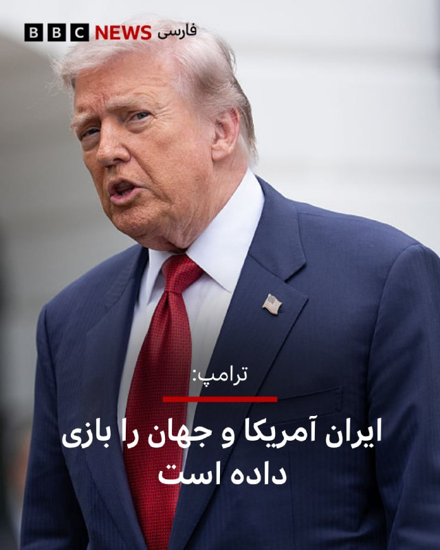

⭕️دونالد ترامپ، رئیس‌جمهور آمریکا، در پیامی تند ایران را متهم کرده است که ۴۷ سال با ایالات متحده و جهان «بازی کرده است.»

او ایران را به وقت‌کشی متهم کرد و نوشت «تاخیر، تاخیر، تاخیر.»

این اظهارات آقای ترامپ پس از آن مطرح می‌شود که پس از چند روز انتظار، ساعتی پیش منابع ایرانی از پاسخ ایران به پیشنهاد آمریکا خبر دادند و پاکستان میانجی مذاکرات گفت که این پیام را به آمریکا منتقل کرده است.

اکنون دونالد ترامپ نوشته است «به‌مدت ۴۷ سال، ایرانی‌ها ما را سر دوانده‌اند، ما را منتظر نگه داشته‌اند، مردم ما را با بمب‌های کنار جاده‌ای کشته‌اند، اعتراضات را سرکوب کرده‌اند و اخیرا هم ۴۲ هزار معترض بی‌گناه را از بین برده‌اند و به کشور ما که حالا دوباره عظیم شده است می‌خندند. آن‌ها دیگر نخواهند خندید.»

ترامپ همچنین با انتقاد شدید از اوباما، او را «ضعیف» توصیف کرده و گفته است که سیاست‌های او به ایران «فرصت تازه‌ای برای تقویت» داده است.

📸Bloomberg via Getty Images

https://bbc.in/4dfD9LE
@BBCPersian

## BBCPersian — post 280689

🔻نخست‌وزیر پاکستان می‌گوید رئیس ارتش این کشور او را در جریان پاسخ ایران به آمریکا قرار داده است

شهباز شریف، نخست‌وزیر پاکستان، گفته است که رئیس ارتش این کشور او را در جریان قرار داده که پاسخ ایران به پیشنهاد آمریکا دریافت شده است.

فیلد مارشال عاصم منیر، فرمانده ارتش پاکستان نقش اصلی را به عنوان میانجی مذاکرات ایران و آمریکا بر عهده داشته است.

شهباز شریف گفت که نمی‌تواند جزئیات بیشتری در این‌باره ارائه کند.

پیشتر گزارش شده بود که پاکستان این پیام را به آمریکا منتقل کرده است.

آقای شریف این اظهارات را در جریان سخنرانی خود در مراسمی به مناسبت نخستین سالگرد عملیات این کشور در درگیری سال ۲۰۲۵ بیان کرد.

https://bbc.in/4cZZtdg
@BBCPersian

## BBCPersian — post 280688

  

🔺نارندرا مودی، نخست‌وزیر هند، روز یکشنبه از مردم این کشور خواست در پی اختلال در عرضه بنزین و گازوئیل، مصرف این سوخت‌ها را کاهش دهند. با آغاز جنگ آمریکا و اسرائیل با ایران و اعمال کنترل ایران بر تنگه هرمز، عملا عرضه این سوخت‌ها با اختلال گسترده‌ای در آسیا مواجه شده و قیمت آن در جهان جهش یافته است.

هند از جمله معدود کشورهایی در منطقه است که قیمت سوخت را برای مصرف‌کنندگان داخلی افزایش نداده یا سهمیه‌بندی اعمال نکرده است. با این حال، پس از اختلال‌های ناشی از حملات آمریکا و اسرائیل به ایران و انسداد تقریبا کامل تنگه هرمز، قیمت گاز مایع (ال‌پی‌جی) به‌عنوان یکی از سوخت‌های اصلی پخت‌وپز در این کشور پرجمعیت افزایش یافته است.

آقای مودی در جمعی در ایالت تلانگانا گفت: «باید مصرف بنزین و گازوئیل را کاهش دهیم. در شهرهایی که مترو دارند، بهتر است از مترو استفاده کنیم. اگر مجبور به استفاده از خودرو هستیم، بهتر است با دیگران همسفر شویم.»

آقای مودی همچنین از مردم خواست طرح‌های صرفه‌جویی در مصرف انرژی که در دوران همه‌گیری کرونا اجرا می‌شد، دوباره از سر گرفته شود.

📸Getty Images

https://bbc.in/42pXNDS
@BBCPersian

## BBCPersian — post 280687

🔻تحلیلگر هوش مصنوعی درباره دیپلماسی دیجیتال ایران در دوران جنگ: سواری گرفتن از الگوریتم، وقتی گارد مخاطب پایین است

✍️پویا قربانی
بی‌بی‌سی

فعالیت سفارتخانه‌‌های ایران در شبکه اجتماعی ایکس در پی جنگ آمریکا و اسرائیل با ایران مورد توجه میلیون‌ها مخاطب غیر ایرانی و همچنین کارشناسان تبلیغات جنگ قرار گرفته است.

این حساب‌ها که تا پیش از جنگ، اعلان‌های اداری برای شهروندان ایران و بیانیه‌‌های رسمی دیپلماتیک را بازنشر می‌‌کردند، در نبود دیگر صداهایی که در پی قطع اینترنت در ایران به بیرون راه نمی‌یابند، ناگهان جبهه‌ای گشودند که تا پیش از آن چندان از آن در جنگ نرم استفاده نشده بود.

📲ادامه مطلب را در لینک زیر بخوانید🔽

https://bbc.in/4f7SS1K
@BBCPersian

## BBCPersian — post 280686

  <a href="telegram/content/BBCPersian_280686_1778443893.mp4" target="_blank">🎬 Download video</a>

ویدیوهایی که به دست بی‌بی‌سی رسیده تجمعات گروهی از مخالفان حکومت ایران در شهرهای واشنگتن دی‌سی در آمریکا، زوریخ در سوئیس، اوکلند در نیوزیلند، لاهه در هلند و کلن و هانوفر در آلمان را نشان می‌دهد.
 
حاضران در این تجمعات که اغلب تصاویری از رضا پهلوی و پرچم شیر و خورشید به همراه داشتند، خواستار توقف اعدام مخالفان و پایان قطعی اینترنت در ایران بودند و شعارهایی علیه حکومت ایران و در حمایت از ولیعهد سابق ایران سر می‌دادند.
 
حاضران در تجمع نیوزیلند هم که در مقابل ساختمان رادیو تلویزیون دولتی این کشور در اوکلند تجمع کردند، نسبت به عدم پوشش اعتراضات و نقض حقوق بشر در ایران در این رسانه معترض بودند.
 
با گذشت بیش از هفتاد روز از فرو رفتن ایران در تاریکی دیجیتال، حکومت ایران همچنان یکی از طولانی‌ترین قطعی‌های سراسری اینترنت را که تاکنون در جهان ثبت شده، ادامه می‌دهد.

@bbcpersian

## BBCPersian — post 280685

🔻هشدار تند ایران به بریتانیا و فرانسه درباره استقرار نیرو در تنگه هرمز

ایران به فرانسه و بریتانیا هشدار داد که استقرار نیروهای این دو کشور در تنگه هرمز با واکنش فوری ایران مواجه خواهد شد.

در روزهای گذشته، فرانسه و بریتانیا از اعزام ناوشکن‌هایشان به مقصد تنگه هرمز خبر داده‌اند.

این کشورهای اروپایی می‌گویند که اعزام این نیروها با هدف مشارکت در یک ماموریت چندملیتی برای تامین امنیت کشتیرانی در تنگه هرمز است. این دو کشور می‌گویند آغاز این ماموریت پس از خاتمه جنگ خواهد بود.

در هفته‌های گذشته پس از آنکه ایران تنگه هرمز را بست، تنش‌ها بر سر امنیت این آبراه افزایش یافته است.

تهران پیش‌تر هم هشدار داده بود که هرگونه حضور نظامی خارجی در نزدیکی این آبراه را یک «اقدام خصمانه» تلقی خواهد کرد.

https://bbc.in/4ezglZx
@BBCPersian

## Dirty_Kids — post 389239

وال‌استریت‌ژورنال در گزارش جدید خود به نقل از منابع آمریکایی نوشت: «پاسخ ایران، خواسته‌های آمریکا در مورد ذخایر اورانیوم غنی‌شده را نیز برآورده نمی‌کند. ایران پیشنهاد داده است که همزمان با رفع کامل تحریم‌های ایران از سوی آمریکا، گام به گام به درگیری‌ها پایان داده و تنگه هرمز را بازگشایی کند. حکومت ایران همچنین پیشنهاد داده است بخشی از اورانیوم غنی‌شده خود را رقیق کرده و مابقی را به کشوری غیر از آمریکا منتقل کند. حکومت ایران با توقف غنی‌سازی اورانیوم تا ۲۰ سال آینده نیز مخالفت کرده است. از سوی دیگر در پاسخ ایران، صراحتا با برچیدن تاسیسات هسته‌ای مخالفت شده است.»

@Dirty_Kids 👻

## Dirty_Kids — post 389238

نمیشه شهباز شریف رو بفرستیم رختکن بارسا درخواست کنه ازشون بازی همینجا تموم شه؟

@Dirty_Kids 👻

## Dirty_Kids — post 389237

اونجایی که ترامپ به عصر حجر برش گردونده رئال مادریده.

@Dirty_Kids 👻

## Dirty_Kids — post 389236

  <a href="telegram/content/Dirty_Kids_389236_1778443894.mp4" target="_blank">🎬 Download video</a>

در راستای همون عکسی که ازش زدن تو شهر 😂😂

@Dirty_Kids 👻

## Dirty_Kids — post 389235

  

علی تو کانفیگ داری؟

@Dirty_Kids 👻

## Dirty_Kids — post 389234

ونزوئلا اعلام کرده میزان تورمش نصف شده و صادرات نفتش دو برابر .
ایرانم منتظر اینکه اعراب بهش غرامت بدن !!!!!

پس معتقدین تو کوله سرباز خارجی آزادی نیست؟؟!!!

@Dirty_Kids 👻

## Dirty_Kids — post 389233

  

ترامپ شیر بی‌همتای خدا، در پستی درخشان و بسیار مهم در تروث سوشال که مشخصه از جواب روافض به آخرین پیشنهادش کاملاً ناامید شده، نوشته:

«روافض قحبه‌زاده ۴۷ ساله که آمریکا و کل دنیا رو بازی داده (فقط وقت‌کشی، وقت‌کشی و وقت‌کشی!).
اما در نهایت با روی کار آمدن باراک حسین اوبامای جاکش‌پدر، قرعه به نام‌شون افتاد و به نون و نوایی رسیدند. اوبامای قرمدنگ نه تنها با اون حرومیا‌ خوب بود، بلکه عالی رفتار کرد؛ رسماً به سمت این جاکش‌پدرا غش کرد، اسرائیل و بقیه متحدامون رو دور انداخت و فرصتی دوباره و بسیار قدرتمند برای زندگی به شیعه‌سانان هزارپدر رافضی بخشید.

صدها میلیارد دلار پول، به اضافه ۱.۷ میلیارد دلار نقد چمدونی، با هواپیما به تهران فرستادند و همه رو طبق طبق تقدیمشون کردند. تمام بانک‌های واشینگتن، ویرجینیا و مریلند رو خالی کردند، حجم پول اونقدر زیاد بود که وقتی رسید، قلچماق‌های روافض نمی‌دونستن با اون پول چی کار کنند.

روافض پدرقحبه هرگز چنین پولی به چشم ندیده بودند و د...

@Dirty_Kids 👻

## Dirty_Kids — post 389232

  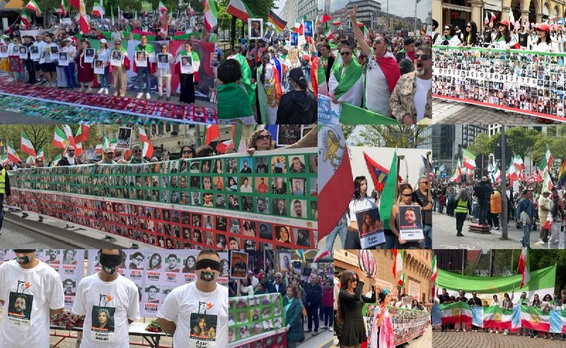

امروز با فراخوان شاهزاده، ایرانیای تمام کشورا اومدن بیرون و برای کشته‌ها، اینترنت و حکم اعدامیا فریاد زدن.

@Dirty_Kids 👻

## Dirty_Kids — post 389231

  <a href="telegram/content/Dirty_Kids_389231_1778443897.mp4" target="_blank">🎬 Download video</a>

خلاصه ایی از تجمعات شبانه عرزشیا

@Dirty_Kids 👻

## Hranews — post 112873

  

در پی توقف اجرای حکم حبس؛ نرگس محمدی به بیمارستان پارس تهران منتقل شد

❗️
❗️
❗️
❗️
❗️ – نرگس محمدی، برنده جایزه صلح نوبل و زندانی سیاسی که در پی ابتلا به بیماری‌های متعدد به بیمارستان زنجان منتقل شده بود، روز جاری، با توقف اجرای حکم حبس، به مرخصی اعزام شد. وی اکنون به بیمارستان پارس در تهران منتقل و بستری شده است.

به گزارش خبرگزاری هرانا، ارگان خبری مجموعه فعالان حقوق بشر در ایران، نرگس محمدی با توقف اجرای حکم حبس به مرخصی اعزام شد.

مصطفی نیلی، وکیل مدافع خانم محمدی، با انتشار مطلبی اعلام کرد که موکلش امروز یکشنبه ۲۰ اردیبهشت‌ماه، در پی صدور دستور توقف اجرای حکم به‌منظور ادامه روند درمان، از بیمارستان زنجان خارج و با آمبولانس به بیمارستان پارس تهران منتقل شده و در این مرکز درمانی بستری شده است. به گفته وی، صدور این دستور در پی نظر پزشکی قانونی مبنی بر ضرورت پیگیری درمان خارج از زندان و تحت نظر تیم پزشکی معالج، به دلیل ابتلای وی به بیماری‌های متعدد، صورت گرفته است.
#نرگس_محمدی

ادامه مطلب

↘️
@hranews_bot تماس ✉️ -  @Hranews  کانال هرانا 🆑

## Hranews — post 112872

دستکم ۴ تجمع اعتراضی برگزار شد

❗️
❗️
❗️
❗️
❗️ – روز جاری، شماری از بازنشستگان تامین اجتماعی در شهرهای اهواز و شوش، تعدادی از مالباختگان بازارچه جنت تهران و جمعی از شهروندان در زنجان #تجمع اعتراضی برگزار کردند.

ادامه مطلب

↘️
@hranews_bot تماس ✉️ -  @Hranews  کانال هرانا 🆑

## Hranews — post 112871

صدور حکم اعدام برای یک متهم در مشهد

❗️
❗️
❗️
❗️
❗️ – یک متهم به قتل در مشهد توسط شعبه پنجم دادگاه کیفری یک استان خراسان رضوی به #اعدام محکوم شد.

ادامه مطلب

↘️
@hranews_bot تماس ✉️ -  @Hranews  کانال هرانا 🆑

## Hranews — post 112870

معوقات مزدی و اخراج کارگران شاغل در شرکت شایان صنعت

❗️
❗️
❗️
❗️
❗️ – حدود ۶۰ #کارگر شاغل در شرکت کلاچ‌سازی شایان صنعت واقع در جاده مخصوص کرج، در حالی توسط کارفرما از کار اخراج شده‌اند که حقوق فروردین‌ماه آنان نیز تاکنون به‌طور کامل تسویه نشده است.

ادامه مطلب

↘️
@hranews_bot تماس ✉️ -  @Hranews  کانال هرانا 🆑

## manototv — post 105276

  <a href="telegram/content/manototv_105276_1778443899.mp4" target="_blank">🎬 Download video</a>

روزنامه وال‌استریت ژورنال گزارش داد جمهوری اسلامی پیشنهاد داده بخشی از ذخایر اورانیوم غنی‌شده خود را رقیق و بخش دیگر را به یک کشور ثالث منتقل کند.

بر اساس این گزارش، تهران همچنین خواستار تضمین شده است که در صورت شکست مذاکرات یا خروج دوباره آمریکا از توافق، اورانیوم منتقل‌شده به خاک ایران بازگردانده شود.

به نوشته وال‌استریت ژورنال، این پیشنهاد بخشی از پاسخ چندصفحه‌ای جمهوری اسلامی به طرح اخیر آمریکا برای پایان دادن به جنگ و آغاز مذاکرات جدید بوده است.

## manototv — post 105275

  <a href="telegram/content/manototv_105275_1778443900.mp4" target="_blank">🎬 Download video</a>

اسلو | نروژ؛ گردهمایی ایرانیان ـ گزارشگر یکشنبه ۲۰ اردیبهشت ۱۴۰۵

## manototv — post 105274

  <a href="telegram/content/manototv_105274_1778443901.mp4" target="_blank">🎬 Download video</a>

‌
مونیخ | آلمان؛ گردهمایی ایرانیان ـ گزارشگر یکشنبه ۲۰ اردیبهشت ۱۴۰۵

## manototv — post 105273

  <a href="telegram/content/manototv_105273_1778443903.mp4" target="_blank">🎬 Download video</a>

پیتر ماگیار، رهبر حزب «تیسا»، پس از پیروزی در انتخابات آوریل با کسب بیش از ۵۳ درصد آرا، روز شنبه به‌عنوان نخست‌وزیر مجارستان سوگند یاد کرد و به ۱۶ سال حاکمیت ویکتور اوربان پایان داد.

در جریان مراسم تحلیف در میدان کوشوت، ژولت هگدوش، وزیر بهداشت آینده، با اجرای یک رقص پرانرژی در برابر هزاران نفر توجه‌ها را به خود جلب کرد و این حرکت را روی پله‌های ساختمان پارلمان نیز تکرار کرد.

او پیش‌تر نیز با همین حرکات در یک تجمع انتخاباتی در ماه آوریل خبرساز شده و در شبکه‌های اجتماعی لقب «سیاستمدار رقصنده» را گرفته بود.

## manototv — post 105272

  <a href="telegram/content/manototv_105272_1778443904.mp4" target="_blank">🎬 Download video</a>

‌
دونالد ترامپ، رئیس‌جمهوری آمریکا، در شبکه اجتماعی خود نوشت جمهوری اسلامی طی ۴۷ سال گذشته واشینگتن را «معطل نگه داشته» و به منافع آمریکا آسیب زده است.

او گفت: «در طول ۴۷ سال، ایرانی‌ها ما را معطل نگه داشته‌اند، ما را منتظر گذاشته‌اند، با بمب‌های کنار جاده‌ای افراد ما را کشته‌اند و اعتراضات را سرکوب کرده‌اند.»

ترامپ همچنین گفت جمهوری اسلامی «۴۲ هزار معترض بی‌گناه و بی‌سلاح را از بین برده» و به آمریکا «خندیده» است.

او در پایان افزود: «آن‌ها دیگر نخواهند خندید.»

## manototv — post 105271

  <a href="telegram/content/manototv_105271_1778443905.mp4" target="_blank">🎬 Download video</a>

امانوئل مکرون، رئیس‌جمهوری فرانسه، اعلام کرد هرگز موضوع استقرار نیروهای فرانسوی یا مشترک با بریتانیا در تنگه هرمز مطرح نبوده است.

مکرون در نشست خبری در نایروبی گفت چند روز پیش تصمیم گرفته ناو «شارل دوگل» و ناوچه‌های همراه آن را از مدیترانه شرقی به آن‌سوی تنگه باب‌المندب منتقل کند و افزود: «بحث استقرار مطرح نبوده، اما ما آماده‌ایم.»

او با تأکید بر اصل «آزادی کشتیرانی» گفت باید به هرگونه محاصره پایان داده شود و هر نوع عوارض یا محدودیت بر عبور کشتی‌ها رد شود.

## alonews — post 119157

  <a href="telegram/content/alonews_119157_1778443905.webm" target="_blank">🎬 Download video</a>

👈طبق گزارش آکسیوس، بنیامین نتانیاهو، نخست‌وزیر اسرائیل، از کنفراسی سران مقامات محلی دروزی و چرکسی در دریای مرده خارج شد و به شرکت‌کنندگان گفت که باید برای یک تماس فوری با دونالد ترامپ، رئیس‌جمهور آمریکا، به اورشلیم بازگردد.

✅ @AloNews خبر جنگ

## alonews — post 119156

  <a href="telegram/content/alonews_119156_1778443905.webm" target="_blank">🎬 Download video</a>

👈ادعای العربیه: انتظار می‌رود که گشایشی بین آمریکا و ایران حاصل شود

✅ @AloNews خبر جنگ

## alonews — post 119155

  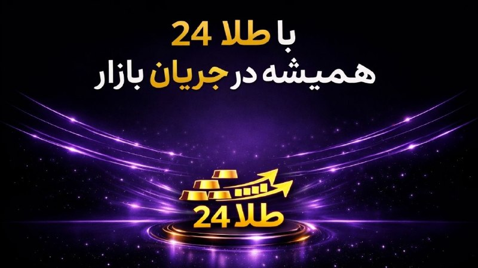

💱
💵نرخ لحظه ای طلا، دلار و سکه

🔴دقیق، سریع، همیشه آنلاین

🔴بدون حاشیه و فقط اطلاعات معتبر

🔴برای کسانی که بازار را حرفه ای دنبال می کنند.

⬇️
⬇️
⬇️
⬇️
⬇️
⬇️
⬇️

💢https://t.me/+rDFdMU4_p3ZkNWJl

💢https://t.me/+rDFdMU4_p3ZkNWJl

## alonews — post 119154

  <a href="telegram/content/alonews_119154_1778443906.webm" target="_blank">🎬 Download video</a>

👈 وزیر خارجه ایتالیا: وارد جنگ علیه ایران نمی‌شویم

✅ @AloNews خبر جنگ

## alonews — post 119153

  <a href="telegram/content/alonews_119153_1778443906.webm" target="_blank">🎬 Download video</a>

👈رسانه اسرائیلی : نتانیاهو بعدِ تماس تلفنی، جلسه‌ای با کابینه امنیتی گذاشته

✅ @AloNews خبر جنگ

## alonews — post 119152

  <a href="telegram/content/alonews_119152_1778443906.webm" target="_blank">🎬 Download video</a>

👈وزارت خارجه سعودی اعلام کرد این کشور ضمن ابراز همبستگی با پاکستان، اقدامات تروریستی علیه امنیت آن را محکوم می‌کند و در عین حال بر حمایت خود از کشورهای عربی خلیج برای حفظ امنیت و ثبات آن‌ها تاکید دارد.

🔴این وزارتخانه همچنین خواستار توقف فوری حملات به خاک و آب‌های کشورهای خلیجی شد.

✅ @AloNews خبر جنگ

## alonews — post 119151

  <a href="telegram/content/alonews_119151_1778443906.webm" target="_blank">🎬 Download video</a>

👈وال استریت ژورنال: به گفته منابع، ایران برچیدن تأسیسات هسته‌ای خود را رد کرده است. 
✅ @AloNews خبر جنگ

## alonews — post 119150

  <a href="telegram/content/alonews_119150_1778443906.webm" target="_blank">🎬 Download video</a>

👈صدای فعالیت پدافند در آسمان دزفول و اندیمشک به دلیل تردد یک پهباد ناشناس گزارش شده است

✅ @AloNews خبر جنگ

## alonews — post 119149

  <a href="telegram/content/alonews_119149_1778443907.webm" target="_blank">🎬 Download video</a>

👈ادعای العربیه: ایران خواستار توقف جنگ و فراهم کردن تضمین‌هایی برای آن در ازای بازگشایی تنگه هرمز شده است.

🔴تماس ها ادامه دارد و انتظار می‌رود که گشایشی بین آمریکا و ایران حاصل شود.

🔴ایران در پاسخ خود تأکید کرده است که به دنبال تسلیحات هسته‌ای نیست.

🔴ایران در پاسخ خود بر حق خود برای برنامه هسته‌ای صلح‌آمیز تأکید کرده است.

🔴پاسخ ایران آینده ذخایر اورانیوم غنی‌شده را به موفقیت مذاکره مرتبط کرده است.

🔴در مورد معضل اورانیوم غنی‌شده ایران، گام‌هایی برای حل آن برداشته شده است.

✅ @AloNews خبر جنگ

## alonews — post 119148

  <a href="telegram/content/alonews_119148_1778443907.webm" target="_blank">🎬 Download video</a>

👈وال استریت ژورنال به نقل از منابع آگاه نوشت: ایران تمایل خود را برای تعلیق غنی‌سازی اورانیوم ابراز کرده است، مشروط بر اینکه این تعلیق برای مدت زمانی کمتر از ۲۰ سال باشد. 
🔴پاسخ ایران همچنین خواسته‌های ایالات متحده در مورد ذخایر اورانیوم غنی‌شده با خلوص بالا…

## alonews — post 119147

  <a href="telegram/content/alonews_119147_1778443907.webm" target="_blank">🎬 Download video</a>

👈 نتانیاهو: با ترامپ تماس تلفنی خواهم داشت، زیرا وظایف مشترک بسیار مهمی داریم 
✅ @AloNews خبر جنگ

## alonews — post 119146

  <a href="telegram/content/alonews_119146_1778443907.webm" target="_blank">🎬 Download video</a>

👈 نتانیاهو: با ترامپ تماس تلفنی خواهم داشت، زیرا وظایف مشترک بسیار مهمی داریم

✅ @AloNews خبر جنگ

## alonews — post 119145

  <a href="telegram/content/alonews_119145_1778443907.webm" target="_blank">🎬 Download video</a>

👈مودی ، نخست وزیر هند: باید در مصرف بنزین و گازوئیل صرفه جویی کنیم... در شهرهایی که مترو دارند باید مردم از آن استفاده کنند و خودروهای شخصی استفاده نکنند.

✅ @AloNews خبر جنگ

## alonews — post 119144

  <a href="telegram/content/alonews_119144_1778443907.webm" target="_blank">🎬 Download video</a>

👈وال استریت ژورنال به نقل از منابع: پاسخ ایران خلأهایی ایجاد کرده و سرنوشت برنامه هسته ای را حل نکرده است 
✅ @AloNews خبر جنگ

## alonews — post 119143

  <a href="telegram/content/alonews_119143_1778443907.webm" target="_blank">🎬 Download video</a>

👈فعالیت پدافند هوایی همچنان در داخل اندیمشک و شمال دزفول گزارش میشه

✅ @AloNews خبر جنگ

## alonews — post 119142

  <a href="telegram/content/alonews_119142_1778443908.webm" target="_blank">🎬 Download video</a>

👈وال استریت ژورنال به نقل از منابع:
پاسخ ایران خلأهایی ایجاد کرده و سرنوشت برنامه هسته ای را حل نکرده است

✅ @AloNews خبر جنگ

## alonews — post 119141

  <a href="telegram/content/alonews_119141_1778443908.webm" target="_blank">🎬 Download video</a>

👈منابع دیپلماتیک به المیادین: پاسخ ایران شامل درخواست برای پایان دادن به محاصره و آزادی صادرات نفت است.

🔴پاسخ ایران که از طریق میانجی پاکستانی ارسال شده، حاوی بندی مربوط به آتش‌بس در لبنان است.

🔴گنجاندن پرونده آتش‌بس در لبنان در پاسخ ایران، جزو خطوط قرمز تهران در مذاکرات محسوب می‌شود.

🔴تهران برخی از تفاهم‌های مطرح‌شده را به تضمین‌هایی مرتبط با پایان دادن به تشدید تنش در لبنان گره می‌زند.

🔴هر توافقی با واشنگتن باید شامل پایان فوری جنگ بلافاصله پس از اعلام آن باشد.

🔴ایران بر لغو تحریم‌های آمریکا و آزادسازی دارایی‌های بلوکه‌شده ایران تأکید می‌کند.

🔴تهران خواستار لغو محدودیت‌های «اوفک» (OFAC) مربوط به فروش نفت ایران است.

🔴پاسخ ایران بر مدیریت ایرانی تنگه هرمز در چارچوب تفاهم‌های مطرح‌شده تصریح دارد.

🔴توافق پیشنهادی شامل مذاکرات ۳۰ روزه پس از توقف جنگ برای بحث درباره جزئیات است.

🔴ایران گام‌های متقابلی را برای آزمایش جدیت واشنگتن در اجرای تعهدات پیشنهاد کرده است.

🔴مذاکرات بین تهران و واشنگتن در حال حاضر به صورت کتبی و از طریق میانجی پاکستانی ادامه خواهد یافت.

✅ @AloNews خبر جنگ

## alonews — post 119140

  <a href="telegram/content/alonews_119140_1778443908.webm" target="_blank">🎬 Download video</a>

👈برنامه ترامپ در پکن شامل مراسم استقبال و دیدار دوجانبه با شی جین‌پینگ در صبح پنج‌شنبه است، که با یک ضیافت رسمی در عصر پنج‌شنبه دنبال می‌شود.

🔴 انتظار می‌رود ترامپ همچنین در بعدازظهر پنج‌شنبه از معبد بهشت بازدید کند.

🔴 در روز جمعه، این دو رهبر قرار است یک جلسه چای دوجانبه و ناهار کاری برگزار کنند قبل از اینکه ترامپ به واشنگتن بازگردد.

✅ @AloNews خبر جنگ

## alonews — post 119139

  <a href="telegram/content/alonews_119139_1778443908.webm" target="_blank">🎬 Download video</a>

👈امروز تو سوریه بعد 15 سال، اولین تراکنش‌ها رو با ویزا و مسترکارت انجام دادن.

🔴 افغانستان: اینترنت 5G تست و راه‌اندازی شد.

🔴 عراق: تلگرام رفع فیلتر شد.

🔴 ایران: قطعی اینترنت به یازدهمین هفته رسید و رکورد زد!

✅ @AloNews خبر جنگ

## alonews — post 119138

  <a href="telegram/content/alonews_119138_1778443908.webm" target="_blank">🎬 Download video</a>

👈ترامپ : ایران ۴۷ ساله داره با آمریکا و بقیه دنیا بازی درمیاره و هی وقت‌کشی می‌کنه! 
🔴تا اینکه اوباما اومد. او فقط با ایران خوب نبود، خیلی هم بهشون حال داد، متحدای ما مثل اسرائیل رو ول کرد و به ایران یه فرصت بزرگ داد. 
🔴 اون ۱.۷ میلیارد دلار پول نقد هم با…

<!-- MSG END -->

<!-- NAV START -->

<!-- NAV END -->
