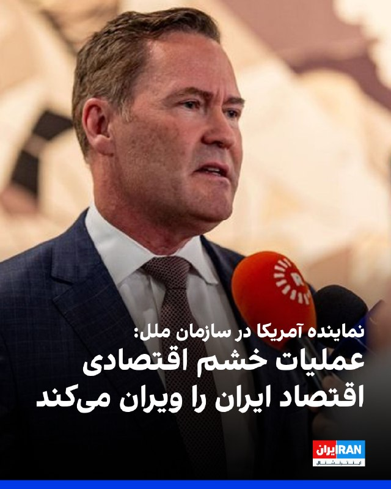
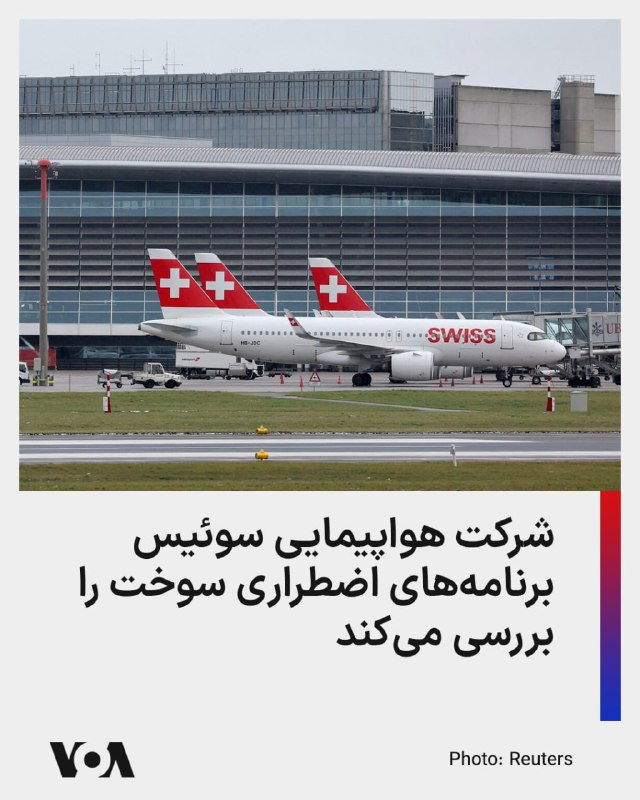
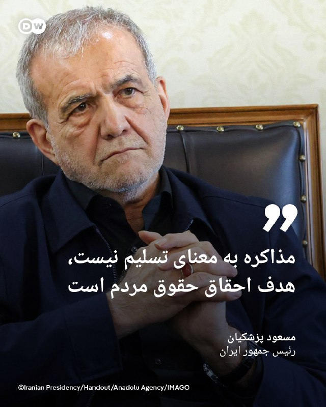
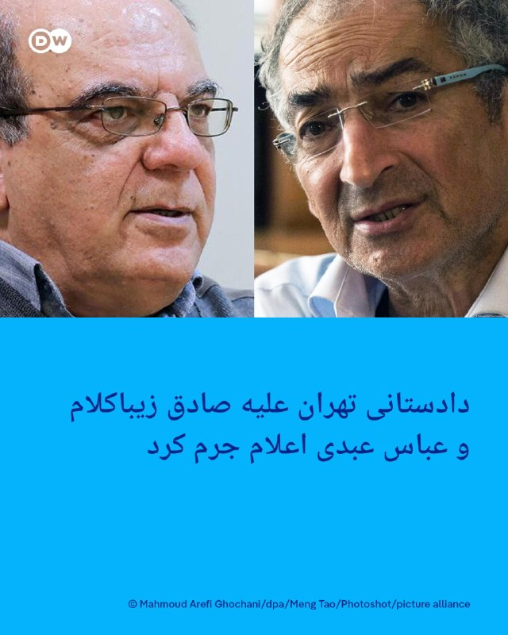
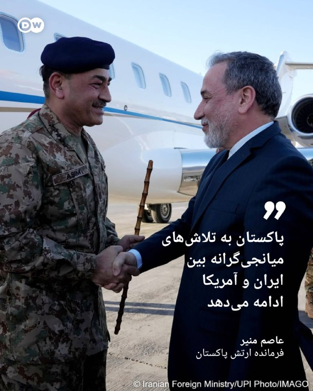
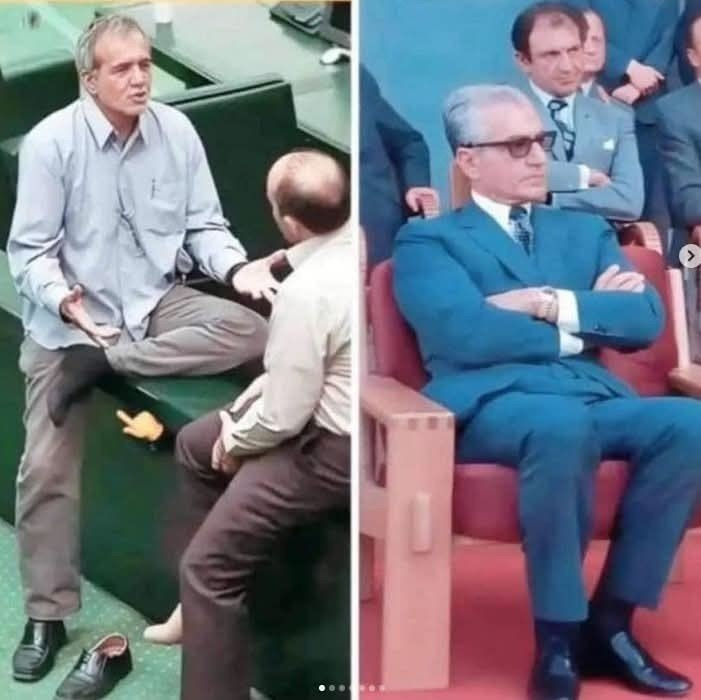
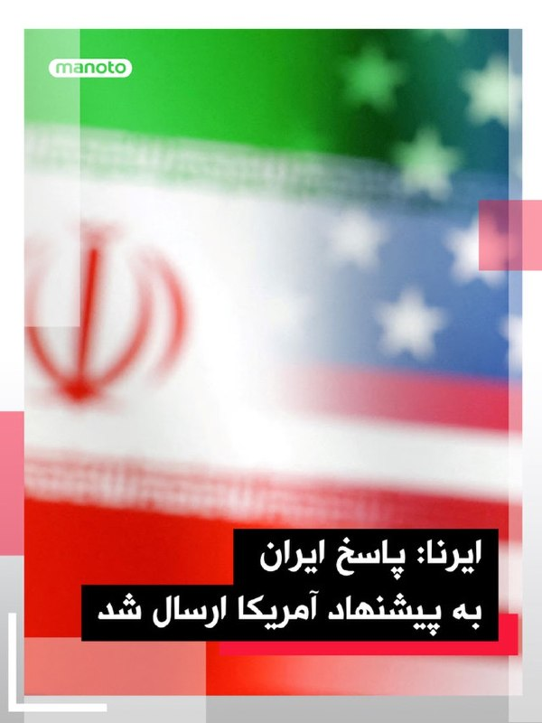

# خواننده تلگرام

<!-- TOP_NAV START -->

<a href="https://github.com/zari963963/aio-downloader/blob/main/telegram/content/archive_1.md" style="display:inline-block; padding:6px 12px; margin:0 4px; background-color:#2ea44f; color:white; text-decoration:none; border-radius:4px; font-weight:bold;">صفحه بعد</a>

<!-- TOP_NAV END -->

<!-- MSG START -->

---
📅 بروزرسانی: 1405/02/20 18:07
---

## VahidOOnLine — post 239300

  

مایک والتز، نماینده آمریکا در سازمان ملل متحد، به فاکس نیوز گفت: عملیات خشم اقتصادی در حال حاضر اقتصاد ایران را ویران می‌کند. پول آنها در حال سقوط آزاد است، ذخایر ارزی آنها نزدیک به صفر است.
‌🏁 🇬🇧 IranintlTV

🤖 @VahidOOnLine

## VahidOOnLine — post 239299

  <a href="telegram/content/VahidOOnLine_239299_1778423871.mp4" target="_blank">🎬 Download video</a>

اینسبروک | اتریش؛ گردهمایی ایرانیان ـ گزارشگر ۲۰ اردیبهشت ۱۴۰۵
‌🏁 🇬🇧 ManotoTV

🤖 @VahidOOnLine

## VahidOOnLine — post 239298

  <a href="telegram/content/VahidOOnLine_239298_1778423873.mp4" target="_blank">🎬 Download video</a>

ژنو | سوئیس؛ گردهمایی ایرانیان ـ گزارشگر ۲۰ اردیبهشت ۱۴۰۵
‌🏁 🇬🇧 ManotoTV

🤖 @VahidOOnLine

## VahidOOnLine — post 239297

  

دونالد ترامپ در گفت‌وگو با «فول مژر» درباره اورانیوم غنی‌شده در ایران گفت: ما بالاخره به آن دست پیدا می‌کنیم، ما آنجا را تحت نظارت داریم. همه‌چیز تحت نظر است. اگر کسی به آن محل نزدیک شود، خبردار می‌شویم و نابودش می‌کنیم.
‌🏁 🇬🇧 IranintlTV

🤖 @VahidOOnLine

## VahidOOnLine — post 239296

  

دونالد ترامپ در گفت‌وگو با «فول مژر» درباره اورانیوم غنی‌شده در ایران گفت: ما بالاخره به آن دست پیدا می‌کنیم، ما آنجا را تحت نظارت داریم. همه‌چیز تحت نظر است. اگر کسی به آن محل نزدیک شود، خبردار می‌شویم و نابودش می‌کنیم.
‌🏁 🇬🇧 IranintlTV

🤖 @VahidOOnLine

## VahidOOnLine — post 239295

  

دونالد ترامپ در گفت‌وگو با «فول مژر» درباره اورانیوم غنی‌شده در ایران گفت: ما بالاخره به آن دست پیدا می‌کنیم، ما آنجا را تحت نظارت داریم. همه‌چیز تحت نظر است. اگر کسی به آن محل نزدیک شود، خبردار می‌شویم و نابودش می‌کنیم.
‌🏁 🇬🇧 IranintlTV

🤖 @VahidOOnLine

## VahidOOnLine — post 239294

  <a href="telegram/content/VahidOOnLine_239294_1778423878.mp4" target="_blank">🎬 Download video</a>

راهپیمایی ایرانیان ساکن استکهلم سوئد، یکشنبه ۲۰ اردیبهشت ۱۴۰۵
‌🏁 🇬🇧 ManotoTV

🤖 @VahidOOnLine

## VahidOOnLine — post 239293

  

عباس اسدروز، مدیرعامل شرکت پایانه‌های نفتی ایران، گزارش‌ها درباره وجود لکه نفتی در جزیره خارک را رد کرد و گفت پس از انتشار این اخبار، گروه‌های تخصصی کل منطقه را پایش کردند اما هیچ نشتی شناسایی نشد.

او افزود: هیچ‌گونه نشتی در زیرساخت‌ها، مخازن ذخیره‌سازی، سیستم‌های اندازه‌گیری، اسکله‌ها، خطوط لوله این منطقه و کشتی‌های در حال بارگیری وجود ندارد.

آسوشیتدپرس جمعه ۱۸ اردیبهشت گزارش داد لکه‌ای نفتی از بخش غربی جزیره خارک، در حال نشت است.
آمی دنیل، مدیرعامل شرکت اطلاعات دریایی «ویندوارد ای‌آی»، به ای‌پی گفت از روز سه‌شنبه، معادل حدود ۸۰ هزار بشکه نفت از جزیره خارک نشت کرده است.
‌🏁 🇬🇧 IranintlTV

🤖 @VahidOOnLine

## VahidOOnLine — post 239292

  <a href="telegram/content/VahidOOnLine_239292_1778423882.mp4" target="_blank">🎬 Download video</a>

بر اساس ویدیوهای رسیده به ایران‌اینترنشنال، ایرانیان مقیم نروژ یکشنبه ۲۰ اردیبهشت در پی فراخوان شاهزاده رضا پهلوی، علیه اعدام‌های جمهوری اسلامی و قطع اینترنت در ایران، در شهر اسلو تجمع کردند.
‌🏁 🇬🇧 IranintlTV

🤖 @VahidOOnLine

## VahidOOnLine — post 239291

♦️مصطفی طاهری، عضو کمیسیون صنایع مجلس، روز یکشنبه ۲۰ اردیبهشت در گفتگویی تلویزیونی مدعی شد بر اساس پیش‌نویس مطرح‌شده، امکان ایجاد حدود ۱۵ میلیارد دلار درآمد برای کشور وجود دارد.
او با اشاره به اینکه در شرایط عادی درآمد نفتی ایران می‌تواند به حدود ۴۰ میلیارد دلار برسد، گفت این رقم معادل بیش از یک‌سوم درآمد نفتی کشور است و می‌تواند «گشایش قابل‌توجهی» در اقتصاد ایجاد کند.
طاهری همچنین تاکید کرد که اهمیت این درآمد به‌دلیل ارزی بودن آن است و می‌تواند در بهبود وضعیت بازار ارز، کاهش نوسانات و مدیریت عرضه و تقاضا نقش مؤثری داشته باشد.
طاهری افزود، تزریق این منابع ارزی می‌تواند بخشی از مشکلات مربوط به چندنرخی بودن ارز و بی‌ثباتی بازار را کاهش دهد.
‌🇸🇦 Indypersian

🤖 @VahidOOnLine

## VahidOOnLine — post 239290

  <a href="telegram/content/VahidOOnLine_239290_1778423885.mp4" target="_blank">🎬 Download video</a>

گردهمایی ایرانیان ساکن توکیو مقابل وزارت خارجه ژاپن، یکشنبه ۲۰ اردیبهشت
‌🏁 🇬🇧 ManotoTV

🤖 @VahidOOnLine

## VahidOOnLine — post 239289

  <a href="telegram/content/VahidOOnLine_239289_1778423887.mp4" target="_blank">🎬 Download video</a>

شماری از ایرانیان ساکن لندن روز شنبه ۱۰ مه با حضور در تجمعی مقابل دفتر نخست‌وزیر بریتانیا، مخالفت خود را با یهودستیزی اعلام کردند.

شرکت‌کنندگان در این گردهمایی با در دست داشتن پرچم‌های ایران و اسرائیل و پلاکاردهایی در حمایت از همزیستی و مقابله با نفرت‌پراکنی، خواستار ایستادگی در برابر یهودستیزی و افراط‌گرایی شدند.

این تجمع در حالی برگزار شد که در ماه‌های اخیر نگرانی‌ها درباره افزایش موارد یهودستیزی در بریتانیا و برخی کشورهای اروپایی افزایش یافته است.
‌🏁 🇬🇧 ManotoTV

🤖 @VahidOOnLine

## VahidOOnLine — post 239288

  <a href="telegram/content/VahidOOnLine_239288_1778423890.mp4" target="_blank">🎬 Download video</a>

راهپیمایی ایرانیان گوتنبرگ
‌🏁 🇬🇧 ManotoTV

🤖 @VahidOOnLine

## VahidOOnLine — post 239287

  <a href="telegram/content/VahidOOnLine_239287_1778423893.mp4" target="_blank">🎬 Download video</a>

حضور گسترده ایرانیان در تجمع ضد یهودستیزی در برابر دفتر نخست وزیر در لندن، یکشنبه ۲۰ اردیبهشت
‌🏁 🇬🇧 ManotoTV

🤖 @VahidOOnLine

## VahidOOnLine — post 239286

  <a href="telegram/content/VahidOOnLine_239286_1778423896.mp4" target="_blank">🎬 Download video</a>

دفتر رسانه‌ای دولت دبی اعلام کرد دود غلیظ مشاهده‌شده در منطقه الجداف، ناشی از آتش‌سوزی در یک قایق متوقف در خور دبی بوده است.

بر اساس این بیانیه، تیم‌های دفاع مدنی دبی حریق را در مدت ۵۴ دقیقه به طور کامل مهار کردند و عملیات خنک‌سازی محل ادامه دارد.

دفتر رسانه‌ای دولت دبی اعلام کرد در این حادثه هیچ مصدومی گزارش نشده و رنگ سیاه و غلظت دود به دلیل سوختن مواد فایبرگلاس به کار رفته در ساخت قایق بوده است.
‌🏁 🇬🇧 ManotoTV

🤖 @VahidOOnLine

## VahidOOnLine — post 239285

  <a href="telegram/content/VahidOOnLine_239285_1778423897.mp4" target="_blank">🎬 Download video</a>

ویدیوهای رسیده به ایران‌اینترنشنال نشان می‌دهند گروهی از ایرانیان مقیم آلمان، یکشنبه ۲۰ اردیبهشت در اعتراض به اعدام‌های جمهوری اسلامی، در شهر هانوفر تجمع کردند و فریاد «ایستاده‌ایم تا پایان» سردادند.
‌🏁 🇬🇧 IranintlTV

🤖 @VahidOOnLine

## VahidOOnLine — post 239284

  

وزارت خارجه امارات متحده عربی «حملات با پهپاد» به کویت را به‌شدت محکوم کرد و افزود این حملات «تروریستی» علیه کویت نقض حاکمیت این کشور محسوب می‌شود و امنیت و ثبات آن را تهدید می‌کند.

صبح یک‌شنبه کویت از مقابله با پهپادهای پرتاب شده به این کشور خبر داد.
‌🏁 🇬🇧 IranintlTV

🤖 @VahidOOnLine

## VahidOOnLine — post 239283

  <a href="telegram/content/VahidOOnLine_239283_1778423901.mp4" target="_blank">🎬 Download video</a>

ویدیوی ارسال‌شده به ایران‌اینترنشنال نشان می‌دهد یکشنبه ۲۰ اردیبهشت محبوبه رمضانی و رحیمه یوسف‌زاده، مادران پژمان قلی‌پور و نوید بهبودی، معترضان کشته‌شده در آبان ۹۸، با حضور در تجمع ایرانیان در هانوفر آلمان، اعتراض «فرزندان ایران را برای سرنگونی حکومت فاسد آخوندی» خواندند.
‌🏁 🇬🇧 IranintlTV

🤖 @VahidOOnLine

## VahidOOnLine — post 239282

  

♦️وزارت خارجه قطر، روز یکشنبه اعلام کرد شیخ محمد بن عبدالرحمن آل ثانی، نخست‌وزیر و وزیر خارجه این کشور، در تماس تلفنی با فیصل بن فرحان، وزیر خارجه عربستان سعودی، درباره تحولات مربوط به آتش‌بس میان آمریکا و ایران گفتگو کرده است.
بر اساس بیانیه وزارت خارجه قطر، دو طرف همچنین درباره تلاش‌ها برای کاهش تنش‌ها «به گونه‌ای که به تقویت امنیت و ثبات منطقه کمک کند» رایزنی کردند.
شیخ محمد بن عبدالرحمن آل ثانی، پیش از این تماس، با عباس عراقچی درباره بحران منطقه‌ای و انسداد تنگه هرمز گفتگو کرده بود. وزیر امور خارجه قطر در این گفتگو از تهران خواسته بود آبراهه هرمز را به عنوان «اهرم فشار» به کار نگیرد.
‌🇸🇦 Indypersian

🤖 @VahidOOnLine

## VahidOOnLine — post 239281

♦️عبدالناصر همتی، رئیس بانک مرکزی در مصاحبه با صداوسیما گفت که افزایش نرخ دلار با توجه به جنگ منطقی بوده و هم اکنون بازار ارز در آرامش است.
همتی همچنین گفت: «در جلسه امروز به نتایج خوبی برای تامین و تخصیص ارز ۱۴۰۵ رسیدیم.»
‌🇸🇦 Indypersian

🤖 @VahidOOnLine

## mwarmonitor — post 8827

«مصاحبه ترامپ درباره موضوعات مختلف داخلی و خارجی انجام شد که بخش‌های مهم مربوط به ایران را در ادامه برای شما ارائه خواهم کرد.»

## mwarmonitor — post 8826

🔴ترامپ در مصاحبه‌ای با The National Desk اعلام کرد: «می‌توانیم دو هفته دیگر ادامه دهیم و همه اهداف را بزنیم؛ ما اهداف مشخصی داشتیم که ۷۰ درصد آن‌ها را انجام داده‌ایم. اهداف بیشتری هم وجود دارد که می‌توانیم به‌طور احتمالی آن‌ها را هدف قرار دهیم.» او همچنین…

## mwarmonitor — post 8825

🔴شریل اتکیسون: در کجای جنگ هستیم، اگر هنوز مواد هسته‌ای، یعنی اورانیوم غنی‌شده را از آن‌ها نگرفته‌ایم؟ 🔵دونالد ترامپ: خب، ما در مقطعی آن را به دست خواهیم آورد، هر زمان که بخواهیم. ما آنجا را تحت نظر داریم. می‌دانی، من چیزی به نام «نیروی فضایی» ایجاد کردم و…

## mwarmonitor — post 8824

  

ترامپ در سوشال تروث

@mwarmonitor

## mwarmonitor — post 8823

  

✈️هواپیمای سوخت‌رسان هوایی KC-46A Pegasus متعلق به نیروی هوایی آمریکا امروز با دفعات بیشتری بر فراز عراق در حال عملیات بوده است.

✈️در همین حال، یک فروند دیگر KC-135R Stratotanker که از پایگاه هوایی الظفره در ابوظبی پرواز کرده، اکنون در حال فعالیت بر فراز دریای عمان است.

@mwarmonitor

## mwarmonitor — post 8822

🔴شریل اتکیسون: در کجای جنگ هستیم، اگر هنوز مواد هسته‌ای، یعنی اورانیوم غنی‌شده را از آن‌ها نگرفته‌ایم؟
🔵دونالد ترامپ: خب، ما در مقطعی آن را به دست خواهیم آورد، هر زمان که بخواهیم. ما آنجا را تحت نظر داریم. می‌دانی، من چیزی به نام «نیروی فضایی» ایجاد کردم و آن‌ها هر لحظه آنجا را تماشا می‌کنند. اگر کسی وارد شود، آن‌ها می‌توانند نامش، آدرسش و شماره نشانش را به شما بگویند.
نه، ما آنجا را خیلی خوب تحت نظر داریم. اگر کسی به آن مکان نزدیک شود، ما باخبر خواهیم شد و آن‌ها را منفجر خواهیم کرد.

@mwarmonitor

## mwarmonitor — post 8821

  <a href="telegram/content/mwarmonitor_8821_1778423906.mp4" target="_blank">🎬 Download video</a>

🎬 Video

## mwarmonitor — post 8820

Trump is typing ...

## mwarmonitor — post 8819

🔴یک منبع دیپلماتیک پاکستانی به الجزیره: پاسخ ایران بلافاصله پس از دریافت، به طرف آمریکایی منتقل شد.

@mwarmonitor

## mwarmonitor — post 8818

📝در دنیایی که کانال‌های چندصد هزار نفری، اطلاع‌رسانی را به «کاسه گدایی» تبدیل کرده‌اند، مسیر ما متفاوت است.

🔸 اینجا نه خبری از تبلیغاتِ سایت‌های بت و فروشندگان VPN است و نه بساطِ گلریزان به حساب‌های پی‌پال پهن شده؛ اینجا خبری از «کاسبی از جهل» نیست.

🔸تمام آنچه در این فضا منتشر می‌شود، به صورت تک‌نفره، دلی و با هدف رساندن اخبار صحیح به ایرانیان داخل و خارج از کشور است. ما بدون هیچ چشم‌داشتی، بر لبه‌ی حقیقت ایستاده‌ایم تا تفاوت میان «رسانه مستقل» و «دکان‌های مجازی» بیش از پیش آشکار شود.

تعهد ما فقط به حقیقت است، نه به جیب مخاطب.

@mwarmonitor

## mwarmonitor — post 8817

رئیس‌جمهور ترامپ از خطوط قرمز خود عقب‌نشینی نکرده است. او خطوط قرمز خود را حفظ کرده که این نکته مثبتی برای اوست. اما من فکر می‌کنم ما باید فشارهای اقتصادی را حفظ کنیم، محاصره را ادامه دهیم؛ اقتصاد آن‌ها در حال فروپاشی است و آن‌ها نمی‌توانند این حجم از فشار…

## mwarmonitor — post 8816

🔴مارک لوین : «نکته بسیار خوبی است. آن‌ها نمی‌توانند دوباره این کار را انجام دهند. ما ممکن است مجبور شویم ۱۰، ۱۵ یا ۲۰ سال دیگر برگردیم. شما مخالفتی را که در برابر کارهای رئیس‌جمهور (ترامپ) وجود دارد، می‌بینید. من می‌بینم که مخالفت‌ها اینجا در ایالات متحده…

## mwarmonitor — post 8815

🔴مارک لوین: به «زندگی، آزادی و لوین» خوش آمدید. ما اینجا با دوست خوبمان، «ربکا هاینریش»، پژوهشگر ارشد موسسه هادسون و مدیر طرح دفاعی کیستون هستیم. ربکا، ممنون که دوباره به برنامه ما آمدی. خب، ما الان در نقطه‌ای هستیم که فکر می‌کنم همه چیز به دو گزینه ختم می‌شود:…

## mwarmonitor — post 8814

🔴مارک لوین: به «زندگی، آزادی و لوین» خوش آمدید. ما اینجا با دوست خوبمان، «ربکا هاینریش»، پژوهشگر ارشد موسسه هادسون و مدیر طرح دفاعی کیستون هستیم. ربکا، ممنون که دوباره به برنامه ما آمدی. خب، ما الان در نقطه‌ای هستیم که فکر می‌کنم همه چیز به دو گزینه ختم می‌شود: مهار (ایران) از طریق یک توافق، یا نوعی پیروزی؛ جایی که فشار را حفظ کنیم، فشار نظامی، فشار اقتصادی و غیره. تو در حال حاضر این وضعیت را چطور می‌بینی؟

🔵ربکا هاینریش: خب، من در واقع فکر می‌کنم راه سومی هم وجود دارد و آن این است که اساساً فشار را دوباره برقرار کنید، یک عملیات نظامی دیگر انجام دهید و این کار زمینه را برای رسیدن به توافقی که واقعاً کارایی داشته باشد، بیشتر فراهم می‌کند.
پرزیدنت ترامپ در برابر این رژیمِ باقی‌مانده (رژیم ایران) به طرز باورنکردنی صبور بوده است، اما این صبر نتیجه‌ای نداده است. وقتی رئیس‌جمهور می‌گوید «ببینید، ما قرار است آتش‌بس داشته باشیم»، شما همچنان می‌بینید که شبه‌نظامیان سپاه پاسداران (IRGC) به کشتی‌های نیروی دریایی شلیک می‌کنند.
مارک، همانطور که می‌دانی ارتش ما هنوز در منطقه حضور دارد، بنابراین ما به انهدام این قایق‌های کوچک که سعی دارند به نفت‌کش‌ها یا کشتی‌های ما آسیب برسانند، ادامه می‌دهیم. اما می‌دانی، دیگر کافی است. ما آن‌ها را از نظر اقتصادی تحت فشار گذاشته‌ایم؛ آن‌ها به دلیل کارزار فشار اقتصادی پرنسسیپ ترامپ، روزانه صدها میلیون دلار از دست می‌دهند.
فشار نظامی هنوز پابرجاست و اگر پرنسسیپ ترامپ چراغ سبز نشان دهد، عملی خواهد شد. اما من همچنان فکر می‌کنم که ما باید دور دیگری (از حملات) را انجام دهیم. ما می‌دانیم چه اهدافی را هنوز باید در داخل ایران بزنیم. این کار باید در مرحله بعد انجام شود و آن زمان در موقعیت بهتری خواهیم بود تا ایرانی‌ها را وادار کنیم که واقعاً وارد بازی شوند (همکاری کنند).
🔴مارک لوین: خب، فرض کنیم این کار را کردیم و به آن مرحله رسیدیم و آن‌ها گفتند: «بسیار خوب، تسلیم، ما واقعاً می‌خواهیم دوباره با شما صحبت کنیم.» ما چه می‌خواهیم؟ می‌دانیم که «سلاح هسته‌ای نباید باشد»، می‌دانیم که «غنی‌سازی نباید باشد»، می‌دانیم که می‌خواهیم «تمام ذخایر غنی‌شده حذف شود»... دیگر چه می‌خواهیم؟
🔵ربکا هاینریش: ما کنترل «تنگه هرمز» را می‌خواهیم. می‌دانید، پرنسسیپ ترامپ کاملاً حق داشت که عملیات «خشم حماسی» (Epic Fury) را آغاز کند. وقتی می‌بینید منتقدانش می‌آیند و می‌گویند: «اوه خدای من، ایالات متحده برای تهدید ایرانی‌ها علیه تنگه آماده نبود»، این حرف‌ها مزخرف است.
ما همیشه می‌دانستیم که این تنها کاری است که ایرانی‌ها می‌توانند انجام دهند؛ اینکه در تنگه هرمز که بیش از ۲۰ درصد حمل و نقل جهانی از آن می‌گذرد، رعب و وحشت ایجاد کنند. بنابراین ما نمی‌توانیم دیگر هرگز این کارت بازی را به آن‌ها بدهیم.
و البته می‌دانیم تا زمانی که ایرانی‌ها بتوانند در تنگه رعب و وحشت ایجاد کنند... و در ضمن، هنوز ۱۵۰۰ کشتی توسط ایرانی‌ها در تنگه به گروگان گرفته شده‌اند که پرنسسیپ ترامپ می‌خواست با پروژه «آزادی» آن‌ها را آزاد کند. ما آن را متوقف کردیم چون ایرانی‌ها از ما خواستند متوقفش کنیم، که به نظر من این یک اشتباه بود.
اما فکر می‌کنم باید این (قدرت) را از آن‌ها بگیریم. آن‌ها نباید بتوانند نیروهای نیابتی را در سراسر منطقه تامین مالی کنند. ما در واقع با محروم کردن آن‌ها از هرگونه منابع، داریم با این موضوع مقابله می‌کنیم. آن‌ها در حال حاضر به دلیل فشار اقتصادی که در آن هستند، حتی قادر به پرداخت حقوق شبه‌نظامیان خود نیستند.
اما ما نمی‌خواهیم آن‌ها کنترل تنگه را داشته باشند، آن‌ها نمی‌توانند سلاح هسته‌ای داشته باشند و نمی‌توانند برنامه موشک‌های بالستیکی داشته باشند که به عنوان یک سپر عمل کند.شرکای عالی ما و متحدان اسرائیلی‌مان، تا نتوانند دوباره این کار را انجام دهند، اگر لازم باشد ۱۰، ۱۵ یا ۲۰ سال دیگر دوباره برگردیم.»

@mwarmonitor

## mwarmonitor — post 8813

ترامپ در سوشال تروث ویدیو به همراه متن ترجمه‌شده در ادامه، خدمت شما عزیزان در کانال قرار خواهد گرفت. @mwarmonitor

## mwarmonitor — post 8812

  

ترامپ در سوشال تروث
ویدیو به همراه متن ترجمه‌شده در ادامه، خدمت شما عزیزان در کانال قرار خواهد گرفت.

@mwarmonitor

## mwarmonitor — post 8811

  <a href="telegram/content/mwarmonitor_8811_1778423909.mp4" target="_blank">🎬 Download video</a>

🇮🇱سخنگوی ارتش اسرائیل:

🔸همکاری میان اپراتور یک پهپاد و یک افسر در تیپ کفیر در نوار غزه

🔹در یک واکنش سریع، یک پهپاد نیروی هوایی با همکاری تیپ کفیر، فردی را که مظنون به کارگذاری مواد انفجاری در جنوب نوار غزه بود، هدف قرار داد.

🔸نیروی هوایی به‌طور مداوم به پشتیبانی از نیروهای رزمی در جبهه‌های مختلف، در عملیات‌های هجومی و دفاعی ادامه می‌دهد.

@mwarmonitor

## mwarmonitor — post 8810

امروز باید منتظر توئیت ترامپ در مورد جواب ایران به طرح پیشنهادی آمریکا باشیم

## mwarmonitor — post 8809

🔴(عاموس هارل Amos Harel. او یکی از شناخته‌شده‌ترین تحلیل‌گران نظامی و امنیتی اسرائیل است و سال‌هاست در روزنامه Haaretz می‌نویسد. هارل معمولاً به‌خاطر نگاه انتقادی، حرفه‌ای و غیرجناحی‌اش به ارتش اسرائیل، جنگ‌ها، سیاست‌های امنیتی و عملکرد دولت‌ها—از جمله نتانیاهو—شناخته می‌شود. تحلیل‌های او اغلب در رسانه‌های بین‌المللی هم بازتاب پیدا می‌کند و منبع مهمی برای فهم فضای امنیتی و نظامی اسرائیل محسوب می‌شود.)

📝عاموس هارل می‌نویسد

«نتانیاهو هرچه بیشتر در ترمیم تناقض‌های مواضع خود ناتوان می‌شود. پیروزی مطلقی که وعده داده بود مدت‌هاست رنگ باخته است. به نظر می‌رسد تنها حامیان دوآتشه‌اش با طفره رفتن او از انجام یک تحقیق مستقل درباره بدترین شکست تاریخ کشور کنار آمده‌اند. در حالی که کمتر از شش ماه تا انتخابات باقی مانده، وضعیت نخست‌وزیر آن‌گونه که در نظرسنجی‌ها بازتاب یافته، به‌هیچ‌وجه امیدوارکننده نیست. دقیقاً به همین دلایل است که هرچه به موعد انتخابات نزدیک می‌شویم، باید تصمیمات او در حوزه‌های امنیتی و سیاسی را با نگاهی شکاکانه‌تر از همیشه بررسی کرد.»

@mwarmonitor

## mwarmonitor — post 8808

  <a href="telegram/content/mwarmonitor_8808_1778423911.mp4" target="_blank">🎬 Download video</a>

✈️در حالی که یک جنگنده F/A-18 نیروی دریایی آمریکا در حال گشت‌زنی بر فراز آسمان خاورمیانه بود، توسط یک هواپیمای سوخت‌رسان KC-135 استراتوتنکر نیروی هوایی آمریکا سوخت‌گیری شد. بزرگ‌ترین نیروی نظامی جهان به‌طور معمول مأموریت‌های لجستیکی حیاتی را چنان هماهنگ انجام می‌دهد که کاملاً بی‌نقص به نظر می‌رسند.

@mwarmonitor

## pm_afshaa — post 90483

🔴ترامپ:ما نمی‌توانیم اجازه دهیم ایران سلاح هسته‌ای داشته باشد چون آن‌ها دیوانه هستند.

اگر من توافق هسته‌ای اوباما با ایران را لغو نکرده بودم، آن‌ها اکنون آن را داشتند و ممکن بود از آن علیه اسرائیل و خاورمیانه و شاید فراتر استفاده کنن

💧 Rainbet.com the #1 Non-KYC Crypto Casino & Sportsbook @rainbetcom

😁 @Pm_Afshaa

## pm_afshaa — post 90482

🔴ترامپ: هنوز اهداف دیگری در ایران داریم که همچنان احتمال هدف قرار دادنشان بسیار بالاست

💧 Rainbet.com the #1 Non-KYC Crypto Casino & Sportsbook @rainbetcom

😁 @Pm_Afshaa

## pm_afshaa — post 90481

🔴ترامپ: می‌توانیم تا دو هفته دیگر علیه ایران حرکت کنیم و به هر یک از اهداف مشخص‌شده ضربه بزنیم

💧 Rainbet.com the #1 Non-KYC Crypto Casino & Sportsbook @rainbetcom

😁 @Pm_Afshaa

## pm_afshaa — post 90480

🔴ترامپ درباره ایران:ما در نهایت اورانیوم غنی‌شده ایران را به دست خواهیم آورد. هر چه بخواهیم ما آن را تحت نظر داریم. من چیزی به نام نیروی فضایی ایجاد کردم و آن‌ها در حال نظارت بر آن هستند. اگر کسی وارد شود، می‌توانند نام، آدرس و شماره نشان او را به شما بگویند اگر کسی به آن مکان نزدیک شود، ما از آن مطلع خواهیم شد و او را منفجر خواهیم کرد

💧 Rainbet.com the #1 Non-KYC Crypto Casino & Sportsbook @rainbetcom

😁 @Pm_Afshaa

## pm_afshaa — post 90479

  <a href="telegram/content/pm_afshaa_90479_1778423914.webm" target="_blank">🎬 Download video</a>

🔴رئیس انرژی: پارسال 9 هزار مگاوات کمبود برق داشتیم و امسال 24 هزارمگاوات؛ مردم برای قطعی های برق در هر 7 روز هفته خودشونو آماده کنن.

💧 Rainbet.com the #1 Non-KYC Crypto Casino & Sportsbook @rainbetcom

😁 @Pm_Afshaa

## pm_afshaa — post 90478

  <a href="telegram/content/pm_afshaa_90478_1778423915.webm" target="_blank">🎬 Download video</a>

🔴ایسنا: تمرکز اصلی پاسخ جمهوری اسلامی به طرح پیشنهادی آمریکا بر «خاتمه جنگ و امنیت دریانوردی در خلیج فارس و تنگه هرمزه.»

💧 Rainbet.com the #1 Non-KYC Crypto Casino & Sportsbook @rainbetcom

😁 @Pm_Afshaa

## pm_afshaa — post 90477

  <a href="telegram/content/pm_afshaa_90477_1778423915.webm" target="_blank">🎬 Download video</a>

🔴صداوسیما: پاسخی که به آمریکا داده شده همچنان مطابق با مواضع قبلی ماست، از جمله آمادگی برای ادامه آتش‌بس در ازای بازگشایی متقابل تنگه هرمز و پیشبرد مذاکرات متمرکز بر پایان دادن به جنگ در منطقه.

💧 Rainbet.com the #1 Non-KYC Crypto Casino & Sportsbook @rainbetcom

😁 @Pm_Afshaa

## pm_afshaa — post 90476

  <a href="telegram/content/pm_afshaa_90476_1778423916.webm" target="_blank">🎬 Download video</a>

🔴حمید رسایی، نماینده مجلس: تمام تلاشم رو میکنم تا اینترنت بین الملل وصل نشه.

💧 Rainbet.com the #1 Non-KYC Crypto Casino & Sportsbook @rainbetcom

😁 @Pm_Afshaa

## pm_afshaa — post 90475

  <a href="telegram/content/pm_afshaa_90475_1778423917.webm" target="_blank">🎬 Download video</a>

ایرنا:پاسخ جمهوری اسلامی به آخرین متن پیشنهادی آمریکا برای خاتمه جنگ، امروز به میانجی پاکستانی ارسال شد 
💧 Rainbet.com the #1 Non-KYC Crypto Casino & Sportsbook @rainbetcom 
😁 @Pm_Afshaa

## pm_afshaa — post 90474

  <a href="telegram/content/pm_afshaa_90474_1778423918.webm" target="_blank">🎬 Download video</a>

ایرنا:پاسخ جمهوری اسلامی به آخرین متن پیشنهادی آمریکا برای خاتمه جنگ، امروز به میانجی پاکستانی ارسال شد 
💧 Rainbet.com the #1 Non-KYC Crypto Casino & Sportsbook @rainbetcom 
😁 @Pm_Afshaa

## pm_afshaa — post 90473

ایرنا:پاسخ جمهوری اسلامی به آخرین متن پیشنهادی آمریکا برای خاتمه جنگ، امروز به میانجی پاکستانی ارسال شد

💧 Rainbet.com the #1 Non-KYC Crypto Casino & Sportsbook @rainbetcom

😁 @Pm_Afshaa

## pm_afshaa — post 90472

🔴ویتکاف و کوشنر قراره به مسکو برن

💧 Rainbet.com the #1 Non-KYC Crypto Casino & Sportsbook @rainbetcom

😁 @Pm_Afshaa

## pm_afshaa — post 90471

  <a href="telegram/content/pm_afshaa_90471_1778423919.webm" target="_blank">🎬 Download video</a>

🔴وزارت دفاع امارات: امروز دوتا موشک که از سمت ایران پرتاب شده بود رو رهگیری کردیم. 
💧 Rainbet.com the #1 Non-KYC Crypto Casino & Sportsbook @rainbetcom 
😁 @Pm_Afshaa

## pm_afshaa — post 90470

سخنگوی کمیسیون امنیت ملی: از امروز خویشتن‌داری ما تمام شد

💧 Rainbet.com the #1 Non-KYC Crypto Casino & Sportsbook @rainbetcom

😁 @Pm_Afshaa

## pm_afshaa — post 90469

  <a href="telegram/content/pm_afshaa_90469_1778423919.webm" target="_blank">🎬 Download video</a>

🔴تسنیم: از اونجایی که کابل‌های فیبر نوری حیاتی از کف تنگه هرمز عبور میکنه، ما باید هزینه سالانه از کمپانی‌های بزرگ بگیریم و آمازون، مایکروسافت و متا رو موظف کنیم تحت قوانین ایران کار کنن!

💧 Rainbet.com the #1 Non-KYC Crypto Casino & Sportsbook @rainbetcom

😁 @Pm_Afshaa

## pm_afshaa — post 90468

  <a href="telegram/content/pm_afshaa_90468_1778423920.webm" target="_blank">🎬 Download video</a>

🔴وزارت دفاع امارات:
امروز دوتا موشک که از سمت ایران پرتاب شده بود رو رهگیری کردیم.

💧 Rainbet.com the #1 Non-KYC Crypto Casino & Sportsbook @rainbetcom

😁 @Pm_Afshaa

## pm_afshaa — post 90467

  <a href="telegram/content/pm_afshaa_90467_1778423921.webm" target="_blank">🎬 Download video</a>

🔴کویت: بامداد امروز چند تا پهپاد متخاصم (دشمن) رو تو حریم هوایی خودمون رصد کردیم و باهاشون برخورد شد و منهدم شدن.

💧 Rainbet.com the #1 Non-KYC Crypto Casino & Sportsbook @rainbetcom

😁 @Pm_Afshaa

## pm_afshaa — post 90465

  <a href="telegram/content/pm_afshaa_90465_1778423922.webm" target="_blank">🎬 Download video</a>

‏
🔴فارس: علی عبداللهی، رئیس ستاد کل نیروهای مسلح، با مجتبی خامنه‌ای دیدار کرد.

💧 Rainbet.com the #1 Non-KYC Crypto Casino & Sportsbook @rainbetcom

😁 @Pm_Afshaa

## pm_afshaa — post 90464

  <a href="telegram/content/pm_afshaa_90464_1778423923.webm" target="_blank">🎬 Download video</a>

🔴پزشکیان: خاموش کردن یک چراغ مثل شلیک تیر به سمت دشمنه.

💧 Rainbet.com the #1 Non-KYC Crypto Casino & Sportsbook @rainbetcom

😁 @Pm_Afshaa

## pm_afshaa — post 90463

  <a href="telegram/content/pm_afshaa_90463_1778423923.webm" target="_blank">🎬 Download video</a>

🔴آرش نجفی، رییس کمیسیون انرژی اتاق بازرگانی: امسال به طور مستمر روزانه دو ساعت قطعی برق خانگی، تجاری و اداری خواهیم داشت!

💧 Rainbet.com the #1 Non-KYC Crypto Casino & Sportsbook @rainbetcom

😁 @Pm_Afshaa

## DEJradio — post 4547

  

🔸
⭕️ خبرگزاری فارس:
مجتبی خامنه‌ای به نیروهای مسلح دستور ادامه عملیات را صادر کرده است

خبرگزاری فارس وابسته به سـ.ـپاه یکشنبه ۲۰ اردیبهشت گزارش داد، مجتبی خامنه‌ای، در دیدار با پاسدار علی عبداللهی، فرمانده قرارگاه مرکزی خاتم‌الانبیا، «دستور جدیدی برای ادامه عملیات و مقابله قاطعانه با دشمنان» داده است.
این خبرگزاری افزود، علی عبداللهی، دستورهای جدید را در دیدار با مجتبی خامنه‌ای دریافت کرده است.
طبق این گزارش عبداللهی در این دیدار، مجتبی خامنه‌ای را در جریان «میزان آمادگی نیروهای مسلح» قرار داده است.
زمان برگزاری این دیدار را مشخص نیست، اما عبداللهی گفته: «نیروهای مسلح برای مقابله با هرگونه اقدام آمریکا و اسرائیل در آمادگی کامل قرار دارند.»

#موشتبا #تنگه_هرمز #جنگ

@DEJradio

## DEJradio — post 4546

  <a href="telegram/content/DEJradio_4546_1778423925.mp4" target="_blank">🎬 Download video</a>

🎥📢“نتانیاهو و ترامپ مادرانی را که خامنه‌ای داغدارشان کرده بود خوشحال کردن

#نتانیاهو #ترامپ #مادران_داغدار
@DEJradio

## DEJradio — post 4545

  

📝
⭕️ یادداشت؛
ترامپ سیاست را با عینک تجارت می‌بیند

پرسشی که شاید ذهن بسیاری را درگیر کرده باشد این است که آیا ارتش آمریکا نمی‌تواند مانع اقدامات ایذایی سـ.ـپاه در تنگه هرمز شود؟
از نظر نظامی و تجهیزاتی، فاصله میان ارتش آمریکا و سـ.ـپاه پاسداران بسیار زیاد است و عملاً آمریکا توان مقابله با اقدامات ایذایی سـ.ـپاه را دارد؛ هرچند این مسئله ممکن است نسبت به برخی عملیات‌های دیگر پیچیدگی‌های متفاوتی داشته باشد، اما در نهایت چالش بزرگی برای آمریکا محسوب نمی‌شود.
اما پرسش اصلی اینجاست که چرا ترامپ عجله‌ای برای پایان دادن سریع به این وضعیت ندارد؟ او به‌عنوان یک تاجر، ممکن است از تهدید مسدود شدن تنگه هرمز به‌عنوان ابزاری برای فشار اقتصادی و سیاسی بر اروپا و چین استفاده کند.
اروپایی که از نگاه ترامپ حاضر نیست هزینه کافی برای تأمین امنیت خود بپردازد و در ناتو نیز گاه ساز مخالف می‌زند، باری اضافی بر دوش آمریکا محسوب می‌شود. اکنون نیز با اختلال در جریان انتقال نفت از تنگه هرمز، اروپا تحت فشار اقتصادی سنگینی قرار گرفته است و ترامپ امیدوار است این فشار باعث شود کشورهای اروپایی سهم بیشتری در هزینه‌های امنیتی پرداخت کنند و حتی ناوگان دریایی خود را به منطقه اعزام نمایند؛ یعنی کشورهایی که تا دیروز منتقد مقابله نظامی با جمهوری اسلامی بودند، ناچار شوند در این تقابل نقش فعال‌تری ایفا کنند.
از سوی دیگر، چین به‌عنوان بزرگ‌ترین خریدار نفت ارزان ایران و کشوری که نزدیک به نیمی از نفت مصرفی خود را از خلیج فارس تأمین می‌کند نیز تحت فشار قرار می‌گیرد؛ چراکه هرگونه محدودیت در تنگه هرمز می‌تواند صادرات نفت به چین را مختل کند. همزمان، ترامپ نیز با محاصره دریایی جمهوری اسلامی ، تلاش می‌کند مانع انتقال نفت جمهوری اسلامی به چین شود.
ترامپ می‌خواهد همه هزینه‌های امنیت و منافع خود را بپردازند. حتی کره جنوبی و ژاپن نیز از نگاه او دور نمانده‌اند؛ شاید اولویت نخستش نباشند، اما قطعاً فراموششان نکرده است. او در نهایت با ذهنیت یک تاجر به سیاست نگاه می‌کند.

#ترامپ #خاورمیانه
@DEJradio

## DEJradio — post 4544

  <a href="telegram/content/DEJradio_4544_1778423929.webm" target="_blank">🎬 Download video</a>

🚨
⭕️ خبرگزاری جمهوری اسلامی، ایرنا، مدعی شد پاسخ تهران به آخرین متن پیشنهادی آمریکا برای پایان جنگ، از طریق میانجی پاکستانی ارسال شده است. بنا بر این گزارش، پاسخ جمهوری اسلامی روز یکشنبه به طرف آمریکایی منتقل شده است.

#مذاکرات #پاکستان #جنگ
@DEJradio

## DEJradio — post 4543

  <a href="telegram/content/DEJradio_4543_1778423930.mp4" target="_blank">🎬 Download video</a>

⭕️
🗣 یکی از شهروندان از تهران با ارسال ویدیویی نوشت، «از شهرستان‌ها آدم به تهران می‌آورند برای تجمعات، اینجا پر است از ماشین‌هایی با پلاک شهرهای اطراف و یا شهرستان‌های دیگر. غریبه‌هایی که سعی می‌کنند، چشم از تو بدزدند، وقتی که آن‌ها را کنار ماشین‌های مزین شده به پرچم و عکس آقای شهیدشان و آقای جدیدشان می‌بینی.
این ماشین یکی از آن‌هاست. خراب و دود کرده کنار یکی از خیابان‌های شمال شهر ایستاده بود. زن و یکی از دخترها داخل سوپر مارکتی شدند که مردم محل هم دیگر به سختی توان خرید از آن را دارند. آن‌ها پول خوراکی که تهیه کرد بودند با کارت سبز رنگی که مشخص بود؛ کارت بانکی نیست و شبیه کارت هدیه بود، دادند و کنار پیاده رو، روی زمین نشستند و صبحانه خوردند. در میان نگاه های مردمی که از کنارشان می گذشتند؛ بعضی با نفرت و برخی با ترحم.»

#تجمعات_خیابانی
@DEJradio

## DEJradio — post 4542

  

🔸
⭕️ وبسایت «وای نت» در تحلیلی به قلم سور پلاکر، سردبیر ارشد اقتصادی این روزنامه، با مقایسه وضعیت کنونی جمهوری اسلامی با روزهای آخر آلمان نازی، هشدار داد اگر ترامپ بخواهد با صبر و حوصله منتظر بماند تا حاکمان ایران از تعصب ایدئولوژیک خود دست بردارند، ممکن است روزی برسد که بفهمد کار بیهوده‌ای کرده است؛ تاریخ اروپا در ۸۱ سال پیش نشان داد دیکتاتوری آدولف هیتلر تا وقتی شکست به آن تحمیل نشد، جنگ را ادامه داد.
در این یادداشت آمده «در هفته‌های اخیر، ترامپ توافق‌هایی معقول به حکومت ایران پیشنهاد کرده است تا به جنگ پایان دهد. تندروها در میان رهبران حکومت، با وجود ضربه‌هایی که ایرانیان متحمل شده‌اند و در جنگ با ایالات متحده و اسرائیل همچنان متحمل خواهند شد، این پیشنهادها را با تمسخر رد کرده‌اند.»
این تحلیل با اشاره به اینکه اکثریت آلمانی‌ها با وجودی که ایمانشان را به هیتلر و حکومت نازی‌ها از دست داده بودند، شورش نکردند و خودشان نازیسم را سرنگون نکردند، گفت حکومت آلمان نازی تا آخرین لحظه و تا زمانی که سربازان متفقین با زور بر درهای مقرهایشان کوبیدند، به سرکوب ادامه داد.

#جمهوری_اسلامی #هیتلر
@DEJradio

## mamlekate — post 103496

  <a href="telegram/content/mamlekate_103496_1778423934.mp4" target="_blank">🎬 Download video</a>

دوستانی که دنبال کون آخوند نگران بودند ایران سوریه بشه، سوریه با سوییفت، ویزا و مستر به جهان وصل شد

@mamlekate

## mamlekate — post 103495

📝 ساخت «پایگاهی مخفی» توسط اسرائیل در صحرای عراق

وال‌استریت ژورنال می‌گوید، اسرائیل پیش از حمله به ایران پایگاهی مخفی در عراق ساخته بود که نقشی کلیدی در پشتیبانی از عملیات هوایی علیه ایران داشته است. اسرائیل حتی برای حفاظت از این پایگاه، به نیروهای عراقی حمله کرده است.

@mamlekate

## mamlekate — post 103494

📝 امارات متحده عربی: دو پهپاد پرتاب شده از ایران را در روز یکشنبه رهگیری کردیم

وزارت دفاع امارات متحده عربی اعلام کرد که روز یکشنبه، دو پهپاد پرتاب شده از ایران را رهگیری کرده است. در روزهای گذشته امارات متحده عربی چندین بار هدف موشک ها و پهپادهای پرتاب شده از سوی جمهوری اسلامی قرار گرفت.

@mamlekate

## mamlekate — post 103492

  <a href="telegram/content/mamlekate_103492_1778423936.mp4" target="_blank">🎬 Download video</a>

در جریان سومین ماه قطعی اینترنت در داخل ایران، یک ایرانی در خارج، تست آزمایش سرعت اینترنت خود را منتشر کرد. گفته شده این ایرانی باید سریع‌ترین اینترنت خانگی دنیا رو داشته باشه.

@mamlekate

## mamlekate — post 103491

  

توضیحی تکراری: تبلیغاتی که توی تلگرام نمایش داده میشن، بصورت اتوماتیک توسط تلگرام نمایش داده میشن. ادمین کانال‌ها، نقشی توی نمایش تبلیغات تلگرام ندارند. توی توضیحات پین کانال و چندین کوییز و هشدار سعی کردم این مساله رو آموزش بدم. اما هنوز متاسفانه قربانی داریم.

تماس با افرادی که نمی‌شناسین دو ریسک داره: یکی ریسک از دست دادن پولتون. دومین ریسک هم مربوط به اطلاعات شماست. مراقب افشای اطلاعات خودتون به این مافیاهای شیاد باشید.

مملکته ارتباطی با فروش وی‌پی‌ان، کانفیگ، استارلینک و اخیرا سیم‌کارت سفید یا هر تبلیغ عمومی یا مارکتینگ‌های دایرکتی دیگه نداشته، نداره و نخواهد داشت. درآمد مملکته از حمایت‌های مالی چند نفر از گل‌های گل کانال (حدود ۲۰۰ دلار در ماه) + گنج قناعته.

@mamlekate

## VahidOnline — post 75377

  

خبرگزاری ایرنا، روز یکشنبه ۲۰ اردیبهشت ۱۴۰۵گزارش داد پاسخ تهران به آخرین طرح پیشنهادی ایالات متحده برای رسیدن به توافق بر سر پایان جنگ، برای پاکستان به عنوان میانجی مذاکرات ارسال شده است.

ایرنا بدون اشاره به جزئیات بیشتر نوشت: «بر اساس طرح پیشنهادی، در این مرحله مذاکرات متمرکز بر موضوع خاتمه جنگ در منطقه خواهد بود.»

وب‌سایت اکسیوس و خبرگزاری رویترز، چهارشنبه هفته گذشته گزارش دادند که واشنگتن و تهران به یک «یادداشت تفاهم یک‌صفحه‌ای» برای پایان دادن به جنگ نزدیک شده‌اند.

رویترز نوشته بود در این تفاهم‌نامه حتی به تعلیق فعالیت هسته‌ای ایران یا بازگشایی تنگه هرمز که از سوی سپاه پاسداران بسته شده، اشاره‌ای نشده است.

در مقابل، روزنامه وال‌استریت ژورنال گزارش داده بود که در طرح پیشنهادی آمریکا، تهران باید ثابت کند که به‌دنبال سلاح اتمی نیست، تاسیسات فردو، نطنز و اصفهان را برچیند، فعالیت زیرزمینی هسته‌ای را متوقف کند و همچنین بپذیرد غنی‌سازی را تا ۲۰ سال متوقف کند.

رییس‌جمهور و وزیر خارجه آمریکا روز جمعه گفته بودند جمهوری اسلامی تا پایان همان روز قرار است به پیشنهاد ایالات متحده پاسخ دهد.
@VahidHeadline
ولی جمهوری اسلامی به جای جمعه، روز بسته شدن بازارها، صبر کرد یکشنبه پاسخ داد که ساعت ۸ شبش به وقت شرق آمریکا بازارهای مالی هفته کاری رو آغاز می‌کنند.
📡 @VahidOnline

## VahidOnline — post 75376

  

وزارت دفاع امارات متحده عربی روز یکشنبه ۲۰ اردیبهشت اعلام کرد که سامانه‌های پدافند هوایی این کشور با موفقیت دو پهپاد پرتاب شده از «ایران» را منهدم کردند.

این وزارتخانه تاکید کرده است که از زمان ««شروع حملات آشکار ایران، پدافند هوایی امارات متحده عربی در مجموع ۵۵۱ موشک بالستیک، ۲۹ موشک کروز و ۲۲۶۵ پهپاد را منهدم کرده است.»
وزارت دفاع امارات همچنین گزارش داده است که از زمان شروع حملات آشکار ایران، تعداد کل جانباختگان نظامی به ۳ نفر رسیده و تلفات غیرنظامی هم ۱۰ نفر از ملیت‌های پاکستانی، نپالی، بنگلادشی، فلسطینی، هندی و مصری است.
@VahidOOnLine

📡 @VahidOnline

## VahidOnline — post 75375

  

رسانه‌های جمهوری اسلامی گفته‌اند علی عبداللهی، فرمانده قرارگاه مرکزی خاتم‌الانبیا، با مجتبی خامنه‌ای دیدار کرده و گزارشی از آمادگی نیروهای مسلح، از جمله ارتش، سپاه، نیروی انتظامی، نهادهای امنیتی، مرزبانی، وزارت دفاع و بسیج ارائه داده است.

بر اساس این گزارش‌ها، عبداللهی گفته نیروهای مسلح از نظر روحیه رزمی، آمادگی دفاعی و هجومی، طرح‌های راهبردی و تجهیزات لازم برای مقابله با «دشمنان» در سطح بالایی از آمادگی قرار دارند.

این رسانه‌ها همچنین نوشتند مجتبی خامنه‌ای در این دیدار تدابیر تازه‌ای برای ادامه اقدامات و مقابله با دشمنان ابلاغ کرده است. با وجود انتشار متن این خبر، رسانه‌های جمهوری اسلامی تصویری از این دیدار منتشر نکردند.
@VahidOOnLine

📡 @VahidOnline

## VahidOnline — post 75374

  

خبرگزاری فارس، وابسته به سپاه پاسداران درباره کشتی باری هدف ‌قرارگرفته شده در نزدیکی سواحل قطر، به نقل از منبعی که نامش را فاش نکرد، گزارش داد این کشتی با پرچم آمریکا تردد می‌کرده و متعلق به ایالات متحده بوده است.

سازمان «عملیات تجارت دریایی بریتانیا» (UKMTO) صبح یکشنبه گزارش داد که یک پرتابه به سمت یک کشتی باری  در ۲۳ مایل دریایی (۳۷ کیلومتری) شمال شرقی دوحه شلیک شده است.
بنا بر این گزارش یک آتش‌سوزی کوچک در این کشتی رخ داده که خاموش شده است و تلفات جانی نیز نداشته است.

این خبر در حالی اعلام شده است که مارکو روبیو، وزیر امور خارجه آمریکا روز شنبه با محمد بن عبدالرحمن آل ثانی، نخست‌وزیر و وزیر امور خارجه قطر، در میامی دیدار و گفتگو کرد و شراکت دو کشور را برای بازدارندگی در برابر تهدیدات و تقویت ثبات در خاورمیانه حائز اهمیت خواند.
@VahidOOnLine

📡 @VahidOnline

## VahidOnline — post 75373

  

‌ ‌ ‌ ‌
خبرگزاری فارس می‌گوید «یک نفتکش حمل‌کننده گاز طبیعی مایع متعلق به قطر به نام الخریطیات» با «اجازه ایران» از تنگه هرمز عبور کرده است.

بنابر این گزارش، این نفتکش «روز گذشته در دهانهٔ تنگهٔ هرمز دیده شده بود و پس از آن سامانه موقعیت‌یاب خودکار خود را خاموش کرد.»

به گفته فارس، «این نفتکش که مقصدش پاکستان است، نخستین نفتکش غیرمرتبط با ایران است که از نیروی دریایی سپاه اجازه عبور از تنگه هرمز دریافت کرده است.»
@VahidHeadline

📡 @VahidOnline

## VahidOnline — post 75372

  

رسانه‌های داخل ایران روز یک‌شنبه به نقل از مدیرعامل شرکت پایانه‌های نفتی ایران هر گونه آلودگی نفتی ناشی از تأسیسات جزیره خارک را تکذیب کردند.

او گفت: «به محض انتشار این اخبار، گروه‌های متخصص اچ‌اس‌ئی و اداره شیمیایی و آزمایشگاه، همه منطقه را پایش کردند اما حتی کوچک‌ترین موردی یافت نشد.»

خبرگزاری رویترز گزارش داده بود که تصاویر ماهواره‌ای ثبت‌شده در روزهای ۱۶ تا ۱۸ اردیبهشت، لکه‌ای بزرگ را در آب‌های اطراف جزیره خارک، مهم‌ترین پایانه صادرات نفت ایران، نشان می‌دهد که به گفته کارشناسان با «نشت نفت» سازگار است.

بر اساس این گزارش، لکه‌ای خاکستری و سفیدرنگ در غرب جزیره خارک دیده شده که به گفته یک پژوهشگر «رصدخانه منازعه و محیط زیست»، مساحتی حدود ۴۵ کیلومتر مربع را پوشش می‌دهد.

به گفته عباس اسدروز، «طبق اعلام مرکز بین‌المللی «میمک» به نمایندگی از سازمان بین‌المللی دریانوردی هیچ‌گونه نشتی در زیرساخت‌ها، مخازن ذخیره‌سازی، سیستم‌های اندازه‌گیری، اسکله‌ها، خطوط لوله این منطقه و کشتی‌های در حال بارگیری وجود ندارد.»

اسدروز توضیح نداده است که لکه موجود در تصاویر نشان‌دهنده چه چیزی است.
@VahidHeadline

📡 @VahidOnline

## kianmeli1 — post 87324

‏🔴ایرنا، خبرگزاری رسمی جمهوری اسلامی: پاسخ جمهوری اسلامی به آخرین متن پیشنهادی آمریکا برای خاتمه جنگ، امروز به میانجی پاکستانی ارسال شد
https://t.me/kianmeli1

## kianmeli1 — post 87323

  

🔴آتش سوزی شدید یک کشتی در سواحل دبی/امارات_ علت: نامشخص
https://t.me/kianmeli1

## kianmeli1 — post 87322

🔴دقایقی پیش چندین پهپاد به امارات حمله کرده است
https://t.me/kianmeli1

## kianmeli1 — post 87321

‏🔴کویت از مقابله با پهپادهای پرتاب شده به این کشور در صبح یکشنبه خبر داد
https://t.me/kianmeli1

## kianmeli1 — post 87320

‏🔴وزارت دفاع قطر تایید کرد که صبح یکشنبه یک کشتی تجاری باری در آب‌های این کشور هدف یک پهپاد قرار گرفته است
https://t.me/kianmeli1

## kianmeli1 — post 87319

‏🔴مهر به نقل از فرمانداری چابهار: شنیده شدن صدای انفجار مربوط به خنثی‌سازی مهمات عمل نکرده است
https://t.me/kianmeli1

## kianmeli1 — post 87318

🔴مدیرعامل آرامکو عربستان: حتی با صلح نفت گران می‌ماند
https://t.me/kianmeli1

## kianmeli1 — post 87317

🔴یک طلافروشی در بلوار اندرزگوی تهران هدف سرقت مسلحانه قرار گرفت و سارقان پس از آن، از محل متواری شدند
https://t.me/kianmeli1

## IranIntlTV — post 336480

  <a href="telegram/content/IranIntlTV_336480_1778423946.mp4" target="_blank">🎬 Download video</a>

سرخط خبرهای یکشنبه ۲۰ اردیبهشت
@iranintltv

## IranIntlTV — post 336479

  

مایک والتز، نماینده آمریکا در سازمان ملل متحد، به فاکس نیوز گفت: عملیات خشم اقتصادی در حال حاضر اقتصاد ایران را ویران می‌کند. پول آنها در حال سقوط آزاد است، ذخایر ارزی آنها نزدیک به صفر است.
https://iranintl.com/202605109384

## IranIntlTV — post 336476

  

دونالد ترامپ در گفت‌وگو با «فول مژر» درباره اورانیوم غنی‌شده در ایران گفت: ما بالاخره به آن دست پیدا می‌کنیم، ما آنجا را تحت نظارت داریم. همه‌چیز تحت نظر است. اگر کسی به آن محل نزدیک شود، خبردار می‌شویم و نابودش می‌کنیم.
https://iranintl.com/202605102225

## IranIntlTV — post 336475

  <a href="telegram/content/IranIntlTV_336475_1778423950.mp4" target="_blank">🎬 Download video</a>

معصومه طاهرخانی، تحلیل‌گر اقتصادی، گفت ایرانیان در حال حاضر درگیر «اقتصاد بقا» هستند. او افزود: «وقتی سفره مردم کوچک‌تر، ارزان‌تر و بی‌کیفیت‌تر می‌شود، نسلی شکل می‌گیرد که با مشکلات سلامت روبه‌رو خواهد بود و این موضوع تهدیدی جدی برای آینده ایران به شمار می‌رود.»
@iranintltv

## IranIntlTV — post 336474

  <a href="telegram/content/IranIntlTV_336474_1778423953.mp4" target="_blank">🎬 Download video</a>

یکی از شرکت‌کنندگان در تجمع لندن در گفت‌وگو با آیدین مقیمی، خبرنگار ایران‌اینترنشنال، گفت: «همه جهان باید در جریان اعدام‌ها در ایران قرار بگیرد و ما با حضور در تجمع‌ها صدای زندانیان سیاسی هستیم.»
@iranintltv

## IranIntlTV — post 336473

  

عباس اسدروز، مدیرعامل شرکت پایانه‌های نفتی ایران، گزارش‌ها درباره وجود لکه نفتی در جزیره خارک را رد کرد و گفت پس از انتشار این اخبار، گروه‌های تخصصی کل منطقه را پایش کردند اما هیچ نشتی شناسایی نشد.

او افزود: هیچ‌گونه نشتی در زیرساخت‌ها، مخازن ذخیره‌سازی، سیستم‌های اندازه‌گیری، اسکله‌ها، خطوط لوله این منطقه و کشتی‌های در حال بارگیری وجود ندارد.

آسوشیتدپرس جمعه ۱۸ اردیبهشت گزارش داد لکه‌ای نفتی از بخش غربی جزیره خارک، در حال نشت است.
آمی دنیل، مدیرعامل شرکت اطلاعات دریایی «ویندوارد ای‌آی»، به ای‌پی گفت از روز سه‌شنبه، معادل حدود ۸۰ هزار بشکه نفت از جزیره خارک نشت کرده است.
https://iranintl.com/202605108217

## IranIntlTV — post 336472

  <a href="telegram/content/IranIntlTV_336472_1778423957.mp4" target="_blank">🎬 Download video</a>

بر اساس ویدیوهای رسیده به ایران‌اینترنشنال، ایرانیان مقیم نروژ یکشنبه ۲۰ اردیبهشت در پی فراخوان شاهزاده رضا پهلوی، علیه اعدام‌های جمهوری اسلامی و قطع اینترنت در ایران، در شهر اسلو تجمع کردند.

## IranIntlTV — post 336471

  <a href="telegram/content/IranIntlTV_336471_1778423961.mp4" target="_blank">🎬 Download video</a>

یکی از آسیب‌دیدگان چشمی خیزش سراسری ۱۴۰۱ در تجمع برلین به ایران‌اینترنشنال گفت: «مذاکره با جمهوری اسلامی به‌معنای پایمال کردن خون جاویدنامان ایران است.» او افزود حکومت ایران اینترنت را به روی مردم قطع کرده و «ما اینجا هستیم تا صدای آن‌ها را به گوش جهانیان برسانیم.»

گزارش علی حسن‌پور، خبرنگار ایران‌اینترنشنال
@iranintltv

## IranIntlTV — post 336470

  <a href="telegram/content/IranIntlTV_336470_1778423963.mp4" target="_blank">🎬 Download video</a>

ویدیوهای رسیده به ایران‌اینترنشنال نشان می‌دهند گروهی از ایرانیان مقیم آلمان، یکشنبه ۲۰ اردیبهشت در اعتراض به اعدام‌های جمهوری اسلامی، در شهر هانوفر تجمع کردند و فریاد «ایستاده‌ایم تا پایان» سردادند.

## IranIntlTV — post 336469

  

وزارت خارجه امارات متحده عربی «حملات با پهپاد» به کویت را به‌شدت محکوم کرد و افزود این حملات «تروریستی» علیه کویت نقض حاکمیت این کشور محسوب می‌شود و امنیت و ثبات آن را تهدید می‌کند.

صبح یک‌شنبه کویت از مقابله با پهپادهای پرتاب شده به این کشور خبر داد.
https://iranintl.com/202605105298

## IranIntlTV — post 336468

  <a href="telegram/content/IranIntlTV_336468_1778423968.mp4" target="_blank">🎬 Download video</a>

ویدیوی ارسال‌شده به ایران‌اینترنشنال نشان می‌دهد یکشنبه ۲۰ اردیبهشت محبوبه رمضانی و رحیمه یوسف‌زاده، مادران پژمان قلی‌پور و نوید بهبودی، معترضان کشته‌شده در آبان ۹۸، با حضور در تجمع ایرانیان در هانوفر آلمان، اعتراض «فرزندان ایران را برای سرنگونی حکومت فاسد آخوندی» خواندند.

## IranIntlTV — post 336467

  <a href="telegram/content/IranIntlTV_336467_1778423971.mp4" target="_blank">🎬 Download video</a>

یکی از شرکت‌کنندگان در تجمع برلین در گفت‌وگو با علی حسن‌پور، خبرنگار ایران‌اینترنشنال، برای فاطمه سپهری پیام فرستاد و گفت: «مادر عزیزم طاقت بیار، ایران آزاد می‌شود و ما آزادی را در کنارت جشن می‌گیریم.»
@iranintltv

## IranIntlTV — post 336466

  <a href="telegram/content/IranIntlTV_336466_1778423973.mp4" target="_blank">🎬 Download video</a>

انتشار تصاویر ماهواره‌ای تازه از احتمال نشت نفت در آب‌های اطراف جزیره خارک، توجه جهانی را جلب کرده است. هم‌زمان، تهدید رسانه‌های نزدیک به سپاه پاسداران درباره کنترل کابل‌های اینترنتی زیر دریا، نگرانی‌ها درباره امنیت انرژی و آسیب‌پذیری زیرساخت‌های حیاتی در تنگه هرمز را افزایش داده است.

عادله بورنگ، عضو تحریریه ایران‌اینترنشنال، از واکنش کاربران رسانه‌های اجتماعی به این موضوع‌ها گزارش می‌دهد
@iranintltv

## IranIntlTV — post 336465

  <a href="telegram/content/IranIntlTV_336465_1778423976.mp4" target="_blank">🎬 Download video</a>

کارزار همبستگی ایرانیان خارج از کشور با «ملت در گروگان» در ایران ادامه دارد. این تجمع‌ها با فراخوان شاهزاده رضا پهلوی و در اعتراض به تشدید اعدام‌‌ها، سرکوب و قطع اینترنت در ایران، برگزار می‌شود.

علی حسن‌پور، خبرنگار ایران‌اینترنشنال، از تجمع شهر برلین گزارش می‌دهد
@iranintltv

## IranIntlTV — post 336464

  <a href="telegram/content/IranIntlTV_336464_1778423979.mp4" target="_blank">🎬 Download video</a>

یکی از شرکت‌کنندگان در تجمع استکهلم گفت تنها خواسته دوست جاویدنامش، محمود موسوی، ۲۹ ساله که دی‌ماه در قشم کشته شد، این بود که «خسته نشویم و ادامه دهیم».

گزارش مهران عباسیان، خبرنگار ایران‌اینترنشنال
@iranintltv

## IranIntlTV — post 336463

  <a href="telegram/content/IranIntlTV_336463_1778423983.mp4" target="_blank">🎬 Download video</a>

ایرانیان مقیم استکهلم در ادامه کارزار همبستگی با انقلاب ملی و در اعتراض به تشدید اعدام‌‌ها، سرکوب و قطع اینترنت در ایران، تجمع کردند.

گفت‌وگوی مهران عباسیان، خبرنگار ایران‌اینترنشنال، با شرکت‌کنندگان در این تجمع
@iranintltv

## IranIntlTV — post 336462

🔻افزایش بازداشت‌ها و تشدید فشار امنیتی جمهوری اسلامی بر جامعه بهائی در سایه قطع اینترنت

بررسی‌های ایران‌اینترنشنال نشان می‌دهد در هفته‌های اخیر و هم‌زمان با تداوم قطعی اینترنت، فشارهای امنیتی و قضایی جمهوری اسلامی علیه جامعه بهائی در شهرهای مختلف ایران افزایش یافته و احضار، بازداشت، تفتیش خانه‌ها، ضبط گسترده اموال و اجرای احکام حبس شدت گرفته است.

بر اساس اطلاعات رسیده به ایران‌اینترنشنال، از اعتراضات دی‌ماه تا صبح یک‌شنبه ۲۰ اردیبهشت، شماری از شهروندان بهائی در شهرهای مختلف بازداشت شده‌اند.

پیوند نعیمی، برنا نعیمی و شکیلا قاسمی در کرمان، بهزاد یزدانی و همسرش رومینا خزعلی، مهسا ستوده، ماندانا ستوده، پژمان زارع، سارا سپهری و عنقا سیاوشی در شیراز و فلورا صمدانی در یزد، از جمله شهروندان بهائی بازداشت‌شده در این دوره‌اند.

همچنین وفا کاشفی، نوید ذره‌بین ایرانی، پیام فریدیان، ربیع مالکی و سپهر کوشکباغی در مشهد، ریاض بهراد در کرج و آرتین غضنفری در تهران نیز در این مدت بازداشت شده‌اند.

بسیاری از این شهروندان همچنان در بازداشت و بلاتکلیفی به‌ سر می‌برند و خبر تازه‌ای از آزادی یا ادامه بازداشت شماری از آنان، از جمله فریدیان، مالکی و کوشکباغی، در دست نیست.
جامعه جهانی بهائی ۱۰ اردیبهشت در بیانیه‌ای هشدار داد پیوند و برنا نعیمی تحت شکنجه، ضرب‌وشتم، شوک الکتریکی، محرومیت از آب و غذا و اعدام‌های نمایشی قرار گرفته‌اند تا به اتهام‌هایی که مرتکب نشده‌اند، اعتراف کنند.

جامعه جهانی بهائی تاکید کرد این دو نفر در خطر اعدام قرار دارند.

هم‌زمان، برخی دیگر از شهروندان بهائی در هفته‌های اخیر بازداشت شده و پس از تودیع وثیقه‌های سنگین، به‌طور موقت آزاد شده‌اند.

با گذشت ۷۲ روز از قطعی اینترنت در ایران، منابع مطلع به ایران‌اینترنشنال گفته‌اند ابعاد واقعی بازداشت‌ها و فشارها علیه جامعه بهائی بسیار گسترده‌تر از موارد رسانه‌ای‌شده است، اما اختلال در اطلاع‌رسانی، تهدید خانواده‌ها و فضای امنیتی، دسترسی به اطلاعات دقیق را دشوار کرده است.

وزارت اطلاعات جمهوری اسلامی دی‌ماه ۱۴۰۴ در اطلاعیه‌ای از شناسایی یک «شبکه ۳۲ نفره جاسوسی» مرتبط با شهروندان بهائی خبر داد.

وزارت اطلاعات این افراد را به «اغتشاش و تخریب‌گری» متهم کرد و افزود ۱۲ نفر از آنان بازداشت و ۱۳ تن دیگر احضار شده‌اند.

مقام‌های جمهوری اسلامی پیش‌تر نیز از جمله در جریان جنگ ۱۲ روزه، شهروندان بهائی را به «جاسوسی برای اسرائیل» متهم و برای شماری از آنان پرونده‌سازی کرده بودند.

بلاتکلیفی بازداشت‌شدگان و فشار بر خانواده‌ها

بر اساس اطلاعات رسیده به ایران‌اینترنشنال، شماری از شهروندان بهائی بازداشت‌شده در هفته‌ها و ماه‌های اخیر، بدون دسترسی روشن به روند قضایی، در وضعیت بلاتکلیف نگهداری می‌شوند.

در برخی پرونده‌ها، خانواده‌ها از محل نگهداری، وضعیت جسمی، اتهامات مطرح‌شده یا زمان احتمالی آزادی عزیزانشان بی‌اطلاع مانده‌اند و پیگیری‌های آنان نیز با تهدید و فشار امنیتی روبه‌رو شده است.

در مواردی، تماس بازداشت‌شدگان با خانواده‌ها بسیار کوتاه و محدود بوده و همین تماس‌های چندثانیه‌ای نیز امکان اطلاع از وضعیت جسمی و روحی آنان را فراهم نکرده است.

منابع مطلع به ایران‌اینترنشنال گفته‌اند برخی خانواده‌ها، حتی پس از تامین وثیقه‌های سنگین، همچنان با ادامه بازداشت عزیزانشان روبه‌رو شده‌اند و در برخی پرونده‌ها نیز اتهامات تازه‌ای به بازداشت‌شدگان افزوده شده است.

اطلاعات رسیده همچنین از نگرانی جدی درباره وضعیت جسمی شماری از بازداشت‌شدگان حکایت دارد.

برخی از آنان پیش از بازداشت با مشکلات پزشکی، نیاز به مصرف دارو یا مسئولیت نگهداری از اعضای بیمار و سالخورده خانواده روبه‌رو بوده‌اند، اما در بازداشت با محدودیت تماس، کمبود دارو، نبود رسیدگی پزشکی کافی و محرومیت از دسترسی منظم به خانواده مواجه شده‌اند.

بازداشت هم‌زمان اعضای برخی خانواده‌های بهائی، نگهداری طولانی‌مدت در بلاتکلیفی و تهدید نزدیکان برای خودداری از پیگیری، فشار مضاعفی بر خانواده‌های بهائی وارد کرده است.

🔗ادامه گزارش را اینجا بخوانید
@iranintltv

## IranIntlTV — post 336461

  <a href="telegram/content/IranIntlTV_336461_1778423985.mp4" target="_blank">🎬 Download video</a>

بر اساس ویدیوهای رسیده به ایران‌اینترنشنال، ایرانیان مقیم بریتانیا یکشنبه ۲۰ اردیبهشت در پی فراخوان شاهزاده رضا پهلوی، علیه اعدام‌های جمهوری اسلامی و قطع اینترنت در ایران، در شهر شفیلد تجمع کردند.

## IranIntlTV — post 336460

  <a href="telegram/content/IranIntlTV_336460_1778423989.mp4" target="_blank">🎬 Download video</a>

یکی از شرکت‌کنندگان در تجمع برلین به علی حسن‌پور، خبرنگار ایران‌اینترنشنال، گفت: «اینجا هستیم تا از سیاستمداران اروپایی بخواهیم چشم خود را بر اعدام‌ها در ایران نبندند و برای دسترسی مردم ایران به اینترنت تلاش کنند.»
@iranintltv

## IranIntlTV — post 336459

  <a href="telegram/content/IranIntlTV_336459_1778423991.mp4" target="_blank">🎬 Download video</a>

رسانه‌های حکومتی در ایران از دیدار علی عبداللهی، فرمانده قرارگاه مرکزی خاتم‌الانبیا، با مجتبی خامنه‌ای خبر دادند.

مرتضی کاظمیان، عضو تحریریه ایران‌اینترنشنال، جزییات این گزارش رسمی را ارزیابی می‌کند
@iranintltv

## Shin_Persian — post 5930

  

Dubai Media Office ✓ @DXBMediaOffice Sun, 10 May 2026 11:25:48 UTC توضيح: الدخان الملاحظ في منطقة الجداف ناتج عن حريق في قارب متوقف في خور دبي. ولم ينتج عن الحريق اي إصابات، وتعود كثافة الدخان إلى مادة الفيبرجلاس المستخدمة في تصنيع القارب. وتدعو الجهات المعنية…

## Shin_Persian — post 5929

Dubai Media Office ✓ @DXBMediaOffice
Sun, 10 May 2026 11:25:48 UTC

توضيح: الدخان الملاحظ في منطقة الجداف ناتج عن حريق في قارب متوقف في خور دبي. ولم ينتج عن الحريق اي إصابات، وتعود كثافة الدخان إلى مادة الفيبرجلاس المستخدمة في تصنيع القارب. وتدعو الجهات المعنية الجمهور إلى الحصول على المعلومات من المصادر الرسمية وعدم تداول الشائعات أو المعلومات

English

Clarification: The smoke observed in the Al Jaddaf area is resulting from a fire in a boat docked in Dubai Creek. The fire has not resulted in any injuries, and the density of the smoke is due to the fiberglass material used in the boat's manufacturing. Concerned authorities urge the public to obtain information from official sources and to avoid circulating rumors or misinformation.

𝕏 · @shin_persian

## Shin_Persian — post 5928

  <a href="telegram/content/Shin_Persian_5928_1778423995.mp4" target="_blank">🎬 Download video</a>

Open Source Intel ✓ @Osint613
Sun, 10 May 2026 12:02:08 UTC

Visa and Mastercard now functional in Syria after 15 years.

فارسی

ویزا و مسترکارت پس از ۱۵ سال اکنون در سوریه فعال هستند.

𝕏 · @shin_persian

## Shin_Persian — post 5927

  

DefenceGeek 🇬🇧 ✓ @DefenceGeek Sun, 10 May 2026 13:06:00 UTC UPDATE: US Air Force Tanker Fleet 10/05/2026 (Ceasefire Day 33) #FreeIran‌ --- Operation EPIC FURY / Project FREEDOM --- Bit of a major update today instead of my weekly update on Tuesday as I'm…

## Shin_Persian — post 5926

DefenceGeek 🇬🇧 ✓ @DefenceGeek
Sun, 10 May 2026 13:06:00 UTC

UPDATE: US Air Force Tanker Fleet 10/05/2026 (Ceasefire Day 33) #FreeIran‌
--- Operation EPIC FURY / Project FREEDOM ---

Bit of a major update today instead of my weekly update on Tuesday as I'm going to be a little busy then. Overall tanker numbers have reduced slightly (230 down to 225) from my last update, but this coincides with a shift of some tankers into CENTCOM and others back to the US via UK/German bases. The implication of the change in positioning being that the US is now using the tankers in CENTCOM for operations and rotating them out with less used airframes elsewhere, while still running training flights for the RAF Fairford (EGVA)-based bombers in the UK and Mediterranean.

Of the 114 tankers identified in CENTCOM (Red Zone):
- 93 have been tracked flying so far in May 2026
- 37 of those have been tracked flying at least once in the last 36hrs
- The tanker with the oldest "last tracked" date was last seen on 21st March 2026

Usual rule, exact distribution I won't give out for now on the off chance that hostilities begin again in the coming days/weeks.

@MATA_osint @vcdgf555 @steffanwatkins @ArmchairAdml @TheIntelFrogbu @jamjake01 @Andyyyyrrrr @Saint1Mil @rocketron101 @Faytuks

فارسی

به‌روزرسانی: ناوگان تانکرهای نیروی هوایی ایالات متحده (USAF) ۱۰ مه ۲۰۲۶ (روز سی‌وسوم آتش‌بس) #FreeIran‌
--- عملیات خشم حماسی (EPIC FURY) / پروژه آزادی (FREEDOM) ---

امروز به‌جای به‌روزرسانی هفتگی در سه‌شنبه، یک به‌روزرسانی مهم دارم، چرا که آن روز کمی سرم شلوغ خواهد بود. در مجموع، تعداد تانکرها نسبت به آخرین به‌روزرسانی من اندکی کاهش یافته است (از ۲۳۰ به ۲۲۵ فروند)، اما این موضوع با جابه‌جایی برخی تانکرها به منطقه مسئولیت فرماندهی مرکزی ایالات متحده (CENTCOM) و بازگشت برخی دیگر به ایالات متحده از طریق پایگاه‌های بریتانیا و آلمان همزمان شده است. پیامد این تغییر موقعیت این است که ایالات متحده در حال حاضر از تانکرها در سنتکام (CENTCOM) برای عملیات استفاده می‌کند و آن‌ها را با بدنه هواپیماهایی که کمتر در جاهای دیگر استفاده شده‌اند، جایگزین می‌کند، در حالی که همچنان پروازهای آموزشی برای بمب‌افکن‌های مستقر در پایگاه نیروی هوایی سلطنتی فیرفورد (RAF Fairford - EGVA) در بریتانیا و مدیترانه را ادامه می‌دهد.

از ۱۱۴ تانکر شناسایی‌شده در سنتکام (منطقه قرمز):
- ۹۳ فروند تا این لحظه در ماه مه ۲۰۲۶ ردیابی شده‌اند.
- ۳۷ فروند از آن‌ها حداقل یک بار در ۳۶ ساعت گذشته ردیابی شده‌اند.
- قدیمی‌ترین تاریخ مربوط به «آخرین ردیابی»، مربوط به ۲۱ مارس ۲۰۲۶ است.

طبق قاعده همیشگی، توزیع دقیق را فعلاً اعلام نمی‌کنم تا در صورت آغاز احتمالی دوباره خصومت‌ها در روزها/هفته‌های آینده، اطلاعاتی درز نکند.

@MATA_osint @vcdgf555 @steffanwatkins @ArmchairAdml @TheIntelFrogbu @jamjake01 @Andyyyyrrrr @Saint1Mil @rocketron101 @Faytuks

𝕏 · @shin_persian

## Shin_Persian — post 5924

وزارة التربية والتعليم ✓ @MOEUAEofficial Sun, 10 May 2026 11:21:46 UTC تعلن #وزارة_التربية_والتعليم استئناف التعليم الحضوري لجميع الطلبة والكوادر التعليمية والإدارية في المدارس الحكومية والخاصة والحضانات على مستوى الدولة، اعتبارًا من يوم الاثنين الموافق…

## Shin_Persian — post 5923

وزارة التربية والتعليم ✓ @MOEUAEofficial
Sun, 10 May 2026 11:21:46 UTC

تعلن #وزارة_التربية_والتعليم استئناف التعليم الحضوري لجميع الطلبة والكوادر التعليمية والإدارية في المدارس الحكومية والخاصة والحضانات على مستوى الدولة، اعتبارًا من يوم الاثنين الموافق 11 مايو 2026، وذلك في ضوء المتابعة المستمرة للمستجدات والتنسيق القائم مع الجهات المعنية، بما يضمن انتظام العملية التعليمية واستمرارية التقييمات الأكاديمية.

The Ministry of Education announces the resumption of in-person learning for all students, teaching and administrative staff in public and private schools and nurseries across the UAE, effective Monday, 11 May 2026. This decision follows the continuous monitoring of developments and coordination with the relevant authorities, ensuring the continuity of the educational process and academic assessments.

فارسی

#وزارت_آموزش_و_پرورش امارات از سرگیری آموزش حضوری برای تمامی دانش‌آموزان و کادر آموزشی و اداری در مدارس دولتی و خصوصی و مهدکودک‌ها در سراسر کشور را از روز دوشنبه ۱۱ می ۲۰۲۶ (۲۱ اردیبهشت ۱۴۰۵) اعلام می‌کند. این تصمیم در راستای پایش مستمر تحولات و هماهنگی‌های موجود با مراجع ذی‌صلاح اتخاذ شده است تا از نظم فرآیند آموزشی و تداوم ارزیابی‌های تحصیلی اطمینان حاصل شود.

𝕏 · @shin_persian

## Shin_Persian — post 5922

  

وزارة الدفاع |MOD UAE ✓ @modgovae Sun, 10 May 2026 10:44:56 UTC UAE Air Defenses engaged 2 UAV’s. The Ministry of Defense announced that on May 10, 2026, UAE air defense systems successfully engaged 2 UAV’s launched from Iran. Since the onset of these…

## Shin_Persian — post 5921

وزارة الدفاع |MOD UAE ✓ @modgovae
Sun, 10 May 2026 10:44:56 UTC

UAE Air Defenses engaged 2 UAV’s.

The Ministry of Defense announced that on May 10, 2026, UAE air defense systems successfully engaged 2 UAV’s launched from Iran.

Since the onset of these blatant Iranian attacks, UAE air defenses have engaged a total of 551 ballistic missiles, 29 cruise missiles, and 2,265 UAV’s.

No martyrs, fatalities, or injuries have been reported in the past hours. Since the onset of the blatant Iranian attacks, the total number of martyrs has reached 2, in addition to the martyrdom of a Moroccan civilian contracted with the Armed Forces. The total number of civilian fatalities stands at 10, from Pakistani, Nepalese, Bangladeshi, Palestinian, Indian, and Egyptian nationalities.

The total number of injuries has reached 230 since the onset of the blatant Iranian attacks, involving individuals of various nationalities, including Emirati, Egyptian, Sudanese, Ethiopian, Filipino, Pakistani, Iranian, Indian, Bangladeshi, Sri Lankan, Azerbaijani, Yemeni, Ugandan, Eritrean, Lebanese, Afghan, Bahraini, Comorian, Turkish, Iraqi, Nepalese, Nigerian, Omani, Jordanian, Palestinian, Ghanaian, Indonesian, Swedish, Tunisian, Moroccan, and Russian.

The Ministry of Defence affirmed that it remains fully prepared and ready to deal with any threats and will firmly confront anything that aims to undermine the security of the country, in a manner that ensures the protection of its sovereignty, security and stability and safeguards its interests and national capabilities.

#وزارة_الدفاع
#وزارة_الدفاع_الإماراتية
#MOD
#UAEMinistryOfDefence

ترجمه فارسی در بخش نظرات

𝕏 · @shin_persian

## Shin_Persian — post 5920

Shin ✓ @hey_itsmyturn
Sun, 10 May 2026 10:19:32 UTC

Explosions in Erbil, unknown nature.
KRI, #Iraq 🇮🇶

فارسی

انفجارهایی در اربیل، ماهیت نامشخص.
اقلیم کردستان عراق (KRI)، #Iraq 🇮🇶

𝕏 · @shin_persian

## ManotoTV — post 105246

  <a href="telegram/content/ManotoTV_105246_1778424000.mp4" target="_blank">🎬 Download video</a>

اینسبروک | اتریش؛ گردهمایی ایرانیان ـ گزارشگر ۲۰ اردیبهشت ۱۴۰۵

## ManotoTV — post 105245

  <a href="telegram/content/ManotoTV_105245_1778424002.mp4" target="_blank">🎬 Download video</a>

ژنو | سوئیس؛ گردهمایی ایرانیان ـ گزارشگر ۲۰ اردیبهشت ۱۴۰۵

## ManotoTV — post 105243

  <a href="telegram/content/ManotoTV_105243_1778424004.mp4" target="_blank">🎬 Download video</a>

راهپیمایی ایرانیان ساکن استکهلم سوئد، یکشنبه ۲۰ اردیبهشت ۱۴۰۵

## ManotoTV — post 105242

  <a href="telegram/content/ManotoTV_105242_1778424007.mp4" target="_blank">🎬 Download video</a>

گردهمایی ایرانیان ساکن توکیو مقابل وزارت خارجه ژاپن، یکشنبه ۲۰ اردیبهشت

## ManotoTV — post 105241

  <a href="telegram/content/ManotoTV_105241_1778424009.mp4" target="_blank">🎬 Download video</a>

شماری از ایرانیان ساکن لندن روز شنبه ۱۰ مه با حضور در تجمعی مقابل دفتر نخست‌وزیر بریتانیا، مخالفت خود را با یهودستیزی اعلام کردند.

شرکت‌کنندگان در این گردهمایی با در دست داشتن پرچم‌های ایران و اسرائیل و پلاکاردهایی در حمایت از همزیستی و مقابله با نفرت‌پراکنی، خواستار ایستادگی در برابر یهودستیزی و افراط‌گرایی شدند.

این تجمع در حالی برگزار شد که در ماه‌های اخیر نگرانی‌ها درباره افزایش موارد یهودستیزی در بریتانیا و برخی کشورهای اروپایی افزایش یافته است.

## ManotoTV — post 105240

  <a href="telegram/content/ManotoTV_105240_1778424011.mp4" target="_blank">🎬 Download video</a>

راهپیمایی ایرانیان گوتنبرگ

## ManotoTV — post 105239

  <a href="telegram/content/ManotoTV_105239_1778424013.mp4" target="_blank">🎬 Download video</a>

حضور گسترده ایرانیان در تجمع ضد یهودستیزی در برابر دفتر نخست وزیر در لندن، یکشنبه ۲۰ اردیبهشت

## ManotoTV — post 105238

  <a href="telegram/content/ManotoTV_105238_1778424017.mp4" target="_blank">🎬 Download video</a>

دفتر رسانه‌ای دولت دبی اعلام کرد دود غلیظ مشاهده‌شده در منطقه الجداف، ناشی از آتش‌سوزی در یک قایق متوقف در خور دبی بوده است.

بر اساس این بیانیه، تیم‌های دفاع مدنی دبی حریق را در مدت ۵۴ دقیقه به طور کامل مهار کردند و عملیات خنک‌سازی محل ادامه دارد.

دفتر رسانه‌ای دولت دبی اعلام کرد در این حادثه هیچ مصدومی گزارش نشده و رنگ سیاه و غلظت دود به دلیل سوختن مواد فایبرگلاس به کار رفته در ساخت قایق بوده است.

## ManotoTV — post 105237

  

خبرگزاری ایرنا نوشت پاسخ جمهوری اسلامی به آخرین متن پیشنهادی آمریکا برای خاتمه جنگ، امروز از طریق میانجی پاکستانی ارسال شده است.

بر اساس این گزارش، سخنگوی وزارت خارجه جمهوری اسلامی پیش‌تر گفته بود دیدگاه‌ها و ملاحظات تهران درباره پیشنهادهای آمریکا پس از تکمیل بررسی‌ها و جمع‌بندی نهایی ارسال می‌شود.

ایرنا افزود در طرح پیشنهادی، مذاکرات در این مرحله بر موضوع خاتمه جنگ در منطقه متمرکز خواهد بود.

## ManotoTV — post 105236

  <a href="telegram/content/ManotoTV_105236_1778424019.mp4" target="_blank">🎬 Download video</a>

یوری اوشاکوف، دستیار رئیس‌جمهور روسیه در امور سیاست خارجی، اعلام کرد استیو ویتکاف، فرستاده ویژه رئیس‌جمهور آمریکا، و جرد کوشنر، داماد دونالد ترامپ، احتمالا به‌زودی برای ادامه گفت‌وگوها به مسکو سفر می‌کنند.

به گزارش اینترفکس، اوشاکوف گفت: «دیر یا زود، فکر می‌کنم به‌زودی، همکاران دائمی ما استیو ویتکاف و کوشنر به مسکو می‌آیند و ما گفت‌وگو را با آن‌ها ادامه می‌دهیم.»

او همچنین گفت واشنگتن موضوع حل‌وفصل جنگ اوکراین را کنار نگذاشته و تماس‌های تلفنی فعال میان آمریکا و روسیه ادامه دارد. ودوموستی نیز نوشت این سفر احتمالی در چارچوب ادامه گفت‌وگوها درباره حل‌وفصل جنگ اوکراین مطرح شده است.

## ManotoTV — post 105235

  <a href="telegram/content/ManotoTV_105235_1778424020.mp4" target="_blank">🎬 Download video</a>

گزارشگرمنوتو: «به فراخوان شاهزاده رضا پهلوی، ما ایرانیان در شهر ماربیا روز ۱۰ مه گرد هم آمدیم تا صدای مردم ایران باشیم و حمایت خود را از انقلاب شیروخورشید اعلام کنیم.»

## ManotoTV — post 105234

  

وزارت دفاع امارات اعلام کرد سامانه‌های پدافند هوایی این کشور روز ۲۰ اردیبهشت با دو پهپاد که به گفته این وزارتخانه از ایران شلیک شده بودند، مقابله کرده‌اند.

بر اساس اطلاعیه وزارت دفاع امارات، از آغاز درگیری‌ها، سامانه‌های پدافندی این کشور با چند حمله موشکی و پهپادی مقابله کرده‌اند.

## ManotoTV — post 105233

  

همزمان با «روز مادر» که در بسیاری از کشورهای جهان در دومین یکشنبه ماه مه گرامی داشته می‌شود، تصویری از مادر مهراد صادقی، نوجوان جان‌باخته اعتراضات ۱۴۰۴، بر مزار فرزندش منتشر شده است. جهان مناسبت می‌سازد، سیاستمدارها پیام تبریک می‌دهند، و بعضی مادرها کنار سنگ قبر فرزندشان دراز می‌کشند. تمدن بشر، شاهکار تناقض.

متن خبر:

مهراد صادقی، نوجوان اصفهانی و نقاش، در جریان اعتراضات سال ۱۴۰۴ با اصابت گلوله نیروهای امنیتی از ناحیه پهلو جان باخت.

بنا بر روایت خانواده، مادر مهراد پس از بی‌پاسخ ماندن تماس‌هایش، سرانجام با فردی ناشناس روبه‌رو شد که با تلفن همراه فرزندش پاسخ داده و گفته بود: «فرزندتان تیر خورده، بیایید او را ببرید.»

خانواده می‌گویند مهراد را در حالی به خانه منتقل کردند که دیگر جان باخته بود و پیکر او به مدت دو روز در بالکن خانه نگهداری شد.

به گفته نزدیکان خانواده، پس از انتقال پیکر به باغ رضوان اصفهان، جسد برای مدتی به خانواده تحویل داده نشد و در نهایت حدود یک هفته بعد، پیکر مهراد تحویل و در همان‌جا به خاک سپرده شد.

## ManotoTV — post 105232

  <a href="telegram/content/ManotoTV_105232_1778424023.mp4" target="_blank">🎬 Download video</a>

گزارشگرمنوتو: «گردهمایی و راهپیمایی امروز ملبورن در پاسخ به فراخوان شاهزاده رضا پهلوی

تا زمان آزادی پا پس نمی‌کشیم و صدای ایران خواهیم بود.»

شماری از ایرانیان ساکن ملبورن امروز با حضور در این گردهمایی، حمایت خود را از انقلاب شیروخورشید و مردم داخل ایران اعلام کردند.

فراخوان این تجمع با محوریت اعتراض به «خاموشی سراسری اینترنت»، «اعدام‌های بی‌وقفه» و حمایت از زندانیان سیاسی منتشر شده بود.

## ManotoTV — post 105231

  

رسانه‌های جمهوری اسلامی گفته‌اند علی عبداللهی، فرمانده قرارگاه مرکزی خاتم‌الانبیا، با مجتبی خامنه‌ای دیدار کرده و گزارشی از آمادگی نیروهای مسلح، از جمله ارتش، سپاه، نیروی انتظامی، نهادهای امنیتی، مرزبانی، وزارت دفاع و بسیج ارائه داده است.

بر اساس این گزارش‌ها، عبداللهی گفته نیروهای مسلح از نظر روحیه رزمی، آمادگی دفاعی و هجومی، طرح‌های راهبردی و تجهیزات لازم برای مقابله با «دشمنان» در سطح بالایی از آمادگی قرار دارند.

این رسانه‌ها همچنین نوشتند مجتبی خامنه‌ای در این دیدار تدابیر تازه‌ای برای ادامه اقدامات و مقابله با دشمنان ابلاغ کرده است. با وجود انتشار متن این خبر، رسانه‌های جمهوری اسلامی تصویری از این دیدار منتشر نکردند.

## FarsiVOA — post 217346

🔺آغاز دومین جلسه دادگاه سران رژیم سابق سوریه؛ همه دارایی‌های بشار اسد مصادره شد

◾️خبرگزاری رسمی سوریه (سانا) روز یکشنبه ۲۰ اردیبهشت، گزارش داد که دادگاه جنایی سوریه، دومین جلسه محاکمه سران رژیم سابق این کشور را آغاز کرده است.

⬇️ بیشتر بخوانید:

https://ir.voanews.com/a/syria-bashar-alassad-court-criminal-political/8148477.html?withmediaplayer=1

## FarsiVOA — post 217345

در ادامه نشانه‌های بحران در بازار دارو، دبیر انجمن پیوند کلیه ایران از کاهش ذخایر دارویی و نایاب شدن برخی آنتی‌بیوتیک‌ها خبر داده و هشدار داده است که ادامه این وضعیت می‌تواند برای بیماران دیالیزی و پیوندی مشکل‌ساز شود.

فاطمه پوررضاقلی به‌طور مشخص درباره آنتی‌بیوتیک‌ها هشدار داده و گفته برخی از این داروها «بسیار نایاب» شده‌اند.

صدای آمریکا روز گذشته به نقل از منابع خود در بیمارستان‌ها و داروخانه‌ها گزارش داده بود دستورالعمل‌هایی برای کاهش مصرف سرم و آنتی‌بیوتیک ابلاغ شده و توزیع این اقلام در داروخانه‌ها با تأخیر و کمتر از میزان تقاضا انجام می‌شود.

گزارش کامل را در وب‌سایت صدای آمریکا بخوانید.

@FarsiVOA

## FarsiVOA — post 217344

رضا تقی‌زاده، چهره شناخته‌شده مشروطه‌خواهان پادشاهی‌خواه در عمق میدان به‌شدت از عملکرد رضا پهلوی انتقاد کرد و گفت او به سوگند ولیعهدی پشت کرده است

## FarsiVOA — post 217343

🔺سفر وزیر خزانه‌داری آمریکا به ژاپن و کره جنوبی در آستانه دیدار تاریخی پرزیدنت ترامپ و شی‌ جین‌پینگ

◾️وزیر خزانه‌داری آمریکا از سفر خود به ژاپن و کره جنوبی در آستانه نشست پرزیدنت ترامپ و رئیس جمهوری چین خبر داد.

⬇️ بیشتر بخوانید:

https://ir.voanews.com/a/scott-bessent-travel-china-south-korea-beijing-america-japan/8148484.html

## FarsiVOA — post 217342

🔺رسانه حکومتی «ایرنا» می‌گوید رژیم ایران پاسخ خود به پیشنهاد آمریکا را از طریق پاکستان ارسال کرده است

◾️خبرگزاری حکومتی «ایرنا» روز یکشنبه ۲۰ اردیبهشت گزارش داد که رژیم ایران پاسخ خود را به پیشنهاد ایالات متحده با هدف پایان دادن به جنگ دوماهه، از طریق پاکستان به‌عنوان میانجی به آمریکا ارسال کرده است.

⬇️ بیشتر بخوانید:

https://ir.voanews.com/a/irna-iran-response-to-us-pakistan/8148482.html

## FarsiVOA — post 217341

برملا شدن ابعاد تازه‌ای از ارتباط جمهوری اسلامی با حمله تروریستی ۷ اکتبر - گفت‌و‌گو با حسن هاشمیان

## FarsiVOA — post 217340

  <a href="telegram/content/FarsiVOA_217340_1778424027.mp4" target="_blank">🎬 Download video</a>

ارتش اسرائیل تصاویری از هدف قرار دادن فرد مظنون به کارگذاری مواد منفجره با همکاری میان اپراتور پهپاد و افسر تیپ کفیر در نوار غزه منتشر و تاکید کرد نیروی هوایی این ارتش «به‌طور مداوم به پشتیبانی از نیروهای رزمی در جبهه‌های مختلف، در عملیات‌های هجومی و دفاعی ادامه می‌دهد.»

## FarsiVOA — post 217339

  <a href="telegram/content/FarsiVOA_217339_1778424030.mp4" target="_blank">🎬 Download video</a>

فرماندهی مرکزی ایالات متحده، سنتکام، ویدیویی از سوخت‌رسانی هوایی به یک جنگنده اف‌۱۸ نیروی دریایی آمریکا در آسمان خاورمیانه منتشر کرد.

به گفته سنتکام، این جنگنده در حال گشت‌ بر فراز منطقه بود و سوخت مورد نیاز خود را از یک هواپیمای سوخت‌رسان کی-۱۳۵ نیروی هوایی آمریکا دریافت کرد.

@FarsiVOA

## FarsiVOA — post 217338

🔺هشدار قطر به جمهوری اسلامی: استفاده از تنگه هرمز به‌عنوان «ابزار فشار» بحران را عمیق‌تر می‌کند

◾️وزارت امور خارجه قطر روز یکشنبه ۲۰ اردیبهشت اعلام کرد نخست‌وزیر این کشور در گفت‌وگو با وزیر امور خارجه جمهوری اسلامی به او گفته است که استفاده از تنگه هرمز به‌عنوان «ابزار فشار» تنها به عمیق‌تر شدن بحران در خلیج فارس منجر خواهد شد.

⬇️ بیشتر بخوانید:

https://ir.voanews.com/a/qatar-iran-hormuz-strait-closing-crisis-increase/8148473.html

## FarsiVOA — post 217337

نت‌بلاکس، نهاد مستقل پایش اینترنت، اعلام کرد خاموشی اینترنت در ایران وارد هفتادودومین روز شده و اتصال کشور پس از بیش از ۱۷۰۴ ساعت همچنان در پایین‌ترین سطح قرار دارد.

به نوشته نت‌بلاکس، هیچ نشانه‌ای از بازگشت گسترده دسترسی دیده نمی‌شود و مقام‌ها همچنان از دسترسی عمومی مردم به اینترنت جهانی جلوگیری می‌کنند.

بحران اینترنت در ایران فقط یک اختلال فنی نیست. نت‌بلاکس از خاموشی ۷۲ روزه و نبود نشانه بازگشت دسترسی می‌گوید؛ دنیای اقتصاد از گران‌تر شدن مسیر اتصال پرسرعت می‌نویسد؛ مهر آن را مسئله حقوق شهروندی و تبعیض در دسترسی می‌داند؛ و گاردین از اثر آن بر اطلاع‌رسانی و ارتباط با منابع داخل ایران می‌گوید.

گزارش کامل را در وب‌سایت صدای آمریکا بخوانید.

@FarsiVOA

## FarsiVOA — post 217336

🔺انفجار بمب انتحاری جان دست کم ۱۵ پلیس پاکستان را گرفت

▪️انفجار بمب انتحاری در پاسگاه پلیس «فاتح خیل» ایالت خیبر پختونخوا پاکستان منجر به کشته شدن دست کم ۱۵ پلیس شد.

▪️فرمانده منطقه‌ای پلیس شهر «بنو» در مرز با افغانستان روز یکشنبه اعلام کرد که «تروریست‌ها با هدایت یک خودروی مملو از مواد منفجره به این پاسگاه، حمله را ترتیب دادند.»

▪️شدت انفجار خودرو مملو از مواد منفجره به حدی بوده که نه تنها پاسگاه پلیس کلاً ویران شده، بلکه ساختمان‌های اطراف نیز آسیب جدی دیده است.

⬇️ بیشتر بخوانید:
https://ir.voanews.com/a/8148466.html

## FarsiVOA — post 217335

  

وزارت دفاع امارات متحده عربی اعلام کرد پدافند هوایی این کشور روز یکشنبه با دو پهپاد منتسب به جمهوری اسلامی مقابله کرده است.

بر اساس آمار منتشرشده از سوی وزارت دفاع امارات، حملات منتسب به جمهوری اسلامی از آغاز درگیری‌ها تاکنون به دوهزار و ۲۶۵ پهپاد، ۲۹ موشک کروز و ۵۵۱ موشک بالستیک رسیده است.

این اعلامیه در حالی منتشر شده که آتش‌بس میان آمریکا و جمهوری اسلامی همچنان شکننده توصیف می‌شود و کویت نیز از شناسایی پهپادهای «متخاصم» در حریم هوایی خود خبر داده بود.

امارات در روزهای گذشته نیز از مقابله با حملات موشکی و پهپادی منتسب به جمهوری اسلامی خبر داده بود؛ حملاتی که تهران دست‌کم بخشی از آن‌ها را رد کرده است.
@FarsiVOA

## FarsiVOA — post 217334

  <a href="telegram/content/FarsiVOA_217334_1778424032.mp4" target="_blank">🎬 Download video</a>

ارتش اسرائیل اعلام کرد نیروهای تیپ کفیر، تحت فرماندهی لشکر غزه، در ادامه عملیات پاکسازی در محدوده اردوگاه‌های مرکزی نوار غزه، در شرق خط زرد، دو مسیر زیرزمینی را منهدم کردند.

بر اساس اعلام ارتش اسرائیل، این دو مسیر تونلی در مجموع حدود دو کیلومتر طول داشتند و در جریان عملیات، چند اتاق اقامت و مقادیر مختلفی سلاح در داخل آنها شناسایی شد.

ارتش اسرائیل همچنین اعلام کرد نیروهایش در جریان جست‌وجوهای میدانی در این منطقه، ده‌ها راکت و مواد انفجاری را نیز کشف کرده‌اند.

طبق بیانیه ارتش اسرائیل، نیروهای فرماندهی جنوب همچنان بر اساس چارچوب توافق آتش‌بس در منطقه مستقر هستند و به عملیات برای رفع هرگونه تهدید فوری ادامه خواهند داد.
@FarsiVOA

## FarsiVOA — post 217333

  

ارتش کویت اعلام کرد بامداد یکشنبه چند پهپاد «متخاصم» را در حریم هوایی این کشور شناسایی و با آن‌ها مقابله کرده است. رویترز نوشته این نخستین حادثه از این نوع در کویت از زمان اجرای آتش‌بس جنگ با جمهوری اسلامی است. به گزارش رویترز، ارتش کویت جزئیات بیشتری درباره منشأ این پهپادها یا خسارت احتمالی منتشر نکرده است.

این حادثه در حالی رخ می‌دهد که آتش‌بس میان آمریکا و جمهوری اسلامی از ابتدا شکننده بوده است. رویترز در هشتم آوریل نوشته بود با وجود توافق دو هفته‌ای آتش‌بس، در همان روز نخست همچنان درگیری‌هایی جریان داشت و کشورهای حاشیه خلیج فارس، از جمله کویت، بحرین و امارات، از حملات موشکی و پهپادی گزارش داده بودند.

کویت پیش‌تر نیز گفته بود پدافند هوایی این کشور در جریان جنگ با موشک‌ها و پهپادهای جمهوری اسلامی مقابله کرده؛ از جمله موجی از پهپادها در هشتم آوریل که به گفته رویترز زیرساخت‌های حیاتی را هدف گرفته بود.

در روزهای اخیر نیز امارات متحده عربی از مقابله پدافند هوایی خود با دو موشک بالستیک و سه پهپاد جمهوری اسلامی خبر داده بود؛ حملاتی که به نوشته رویترز سه زخمی بر جا گذاشت.
@FarsiVOA

## FarsiVOA — post 217332

  

وزارت خارجه قطر اعلام کرد محمد بن عبدالرحمن آل‌ثانی، نخست‌وزیر و وزیر خارجه قطر، در دیداری در میامی با مارکو روبیو، وزیر خارجه آمریکا، و استیو ویتکاف، فرستاده ویژه دولت ترامپ، درباره تلاش‌های میانجی‌گرانه برای رسیدن به توافق میان واشنگتن و تهران گفت‌وگو کرده است.

به گفته وزارت خارجه قطر، در این دیدار آخرین تحولات منطقه و میانجی‌گری پاکستان برای کاهش تنش و تقویت امنیت و ثبات منطقه بررسی شد.

نخست‌وزیر قطر تأکید کرده همه طرف‌ها باید به تلاش‌های جاری میانجی‌گری پاسخ دهند تا مسیر برای رسیدگی به ریشه‌های بحران از راه گفت‌وگو و ابزارهای مسالمت‌آمیز باز شود.

تایمز اسرائیل نیز نوشته قطر در پشت صحنه به‌عنوان کانال ارتباطی میان واشنگتن و تهران عمل می‌کند، در حالی که پاکستان نقش اصلی میانجی‌گری را بر عهده دارد. این تلاش‌ها همزمان با مذاکرات درباره چارچوبی برای پایان جنگ و توافق گسترده‌تر میان آمریکا و ایران ادامه دارد.
@FarsiVOA

## FarsiVOA — post 217331

  

وزارت اطلاعات، از اصلی‌ترین بازوهای سرکوب جمهوری اسلامی، اعلام کرد دو هسته عملیاتی وابسته به موساد را در چند استان ایران شناسایی و منهدم کرده است.

بر اساس ادعای این وزارتخانه، یک هسته چهار نفره در استان آذربایجان غربی پیش از اجرای آنچه «عملیات تروریستی علیه مراکز حساس» و «ترور فردی در تهران» خوانده شده، شناسایی و بازداشت شده است. در این اطلاعیه آمده یک نفر نیز در جریان درگیری با نیروهای وزارت اطلاعات کشته شده است.

وزارت اطلاعات همچنین مدعی است هسته‌ای دیگر در استان‌های کرمان و البرز، پیش از انجام هرگونه اقدام، شناسایی و بازداشت شده است.

به گفته این وزارتخانه، از افراد بازداشت‌شده شماری ریزپرنده، خودروی مخصوص حمل‌ونقل، سه قبضه کلت کمری با صداخفه‌کن، جلیقه ضدگلوله، تفنگ وینچستر، تفنگ دوربین‌دار، مهمات و تجهیزات استارلینک کشف شده است.

در بخش دیگری از اطلاعیه، وزارت اطلاعات از بازداشت فردی با نام اختصاری «مسعود-ت» خبر داده که به گفته این نهاد قصد خروج اطلاعات طبقه‌بندی‌شده یک مرکز نظامی در قزوین از کشور را داشته است.
@FarsiVOA

## FarsiVOA — post 217330

  

مدیر عامل شرکت هواپیمایی سوئیس اینترنشنال می‌گوید فعلاً با کمبود فوری سوخت جت مواجه نیست، اما برنامه‌های اضطراری سوخت را بررسی می‌کند.

ینس فهلینگر در ادامه گفته است این شرکت برای شش هفته آینده ذخایر کافی سوخت جت در اختیار دارد و پیش‌بینی‌های تأمین‌کنندگان سوخت این شرکت در حال حاضر مثبت است.

بیش از ۷۰ درصد سوخت هواپیمای مصرفی اروپا از کشورهای عرب حاشیه خلیج فارس تامین می‌شود که به خاطر انسداد تنگه هرمز توسط جمهوری اسلامی مختل و قیمت آن در بازارهای اروپایی دو برابر شده است.
@FarsiVOA

## FarsiVOA — post 217329

  

محققان دانشگاه «تکنیون» اسرائیل موفق به توسعه نانو-ربات‌هایی از جنس دی‌اِن‌اِی شده‌اند که می‌توانند مستقیماً در داخل بدن انسان به جنگ بیماری‌ها بروند.

این ماشین‌های برنامه‌ریزی‌پذیر تنها ۱۰۰ نانومتر عرض دارند و کاملاً از رشته‌های دی‌اِن‌اِی ساخته شده‌اند.

این نانو-ربات‌ها در جریان خون حرکت کرده، نشانگرهای سلول‌های سرطانی را شناسایی می‌کنند و سموم درمانی را فقط داخل تومور تخلیه می‌کنند؛ بدون اینکه کوچک‌ترین آسیبی به سلول‌های سالم برسد.

در آزمایش‌های اخیر بر روی سرطان‌های تهاجمی، این روش دقت و اثربخشی خیره‌کننده‌ای از خود نشان داده است.

تیم‌های تحقیقاتی همچنین در حال توسعه نانو-تکنولوژی مشابه‌ای برای ترمیم نورون‌های حرکتی هستند که می‌تواند تحولی بزرگ در درمان بیماری‌های عصبی سخت‌علاج مانند اِی‌اِل‌اِس ایجاد کند.

این نوآوری، بدن انسان را به میدان نبردی هوشمند علیه بیماری‌ها تبدیل کرده و مرزهای بین علم و تخیل را جابه‌جا کرده است.
@FarsiVOA

## DW_Farsi — post 124526

  

🔶ایران پاسخ خود به طرح پیشنهادی آمریکا را ارسال کرد

خبرگزاری ایرنا روز یکشنبه ۲۰ اردیبهشت (۱۰ مه) در خبری اختصاصی نوشت جمهوری اسلامی پاسخ خود به آخرین متن پیشنهادی آمریکا برای خاتمه جنگ را به میانجی پاکستانی ارسال کرده است.

ایرنا نوشته بر اساس طرح پیشنهادی، در این مرحله، مذاکرات متمرکز بر موضوع خاتمه جنگ خواهد بود.

پیش از این مارکو روبیو، وزیر خارجه آمریکا، روز جمعه ۸ مه (۱۸ اردیبهشت) در جریان سفر خود به ایتالیا گفته بود ایالات متحده انتظار دارد پاسخ ایران به پیشنهاد اخیر واشنگتن برای پایان دادن به جنگ را دریافت کند. روبیو گفته بود امیدوار است محتوای این پاسخ، زمینه را برای ورود به یک روند "جدی" مذاکراتی فراهم سازد.

به گفته برخی منابع خبری، بر اساس طرح پیشنهادی که توسط ایالات متحده ارائه شده است و در صورت پذیرش آن توسط ایران، جنگ رسما پیش از شروع مذاکرات در مورد مسائل مهم‌تری، از جمله برنامه هسته‌ای ایران، پایان می‌یابد.

@dw_farsi

## DW_Farsi — post 124525

  

🔶فشار بر زندانیان قزلحصار؛ از اعمال خشونت تا محرومیت از دارو و غذا

"سازمان حقوق بشر ایران" مستقر در نروژ از افزایش خشونت شدید علیه زندانیان محبوس در زندان قزلحصار و کمبود اقلام خوراکی و دارویی در این زندان خبر داد.

در گزارش این سازمان حقوق بشری از جمله آمده است: «تعدادی از زندانیان واحد ۴ این زندان با لوله‌های پلی‌اتیلن مورد ضرب‌وجرح شدید قرار گرفته‌اند و زندانبا‌ن‌هایی با سابقه اعمال خشونت علیه زندانیان به این واحد منتقل شده‌اند.»

در این گزارش از احمد ترکمان، افسر نگهبان واحد ۲ زندان قزل‌حصار نام برده شده که به اعمال خشونت مشهور است و شخصا در مقابل چشمان شماری از زندانیان، یک زندانی تبعه افغانستان به نام عبدالعهد تورن ان‌شاءالله را "با لوله پلی‌اتیلن سه اینچی مورد ضرب‌وجرح شدید" قرار داده است.

همچنین زندانیان واحد ۳ زندان قزل‌حصار با فشارهای شدید معیشتی مواجه هستند و دسترسی محدودی به امکانات درمانی دارند؛ قیمت اقلام خوراکی چند برابر شده و حتی آب معدنی هم نایاب است.

@dw_farsi

## DW_Farsi — post 124524

  

🔶پزشکیان: مذاکره به معنای تسلیم نیست، هدف احقاق حقوق مردم است

مسعود پزشکیان، رئیس جمهور ایران، روز یکشنبه ۲۰ اردیبهشت (۱۰ مه) در جلسه کارگروه بازسازی خسارات ناشی از جنگ گفت مردم باید با واقع‌بینی شرایط کشور و محدودیت‌های موجود را درک کنند.

پزشکیان افزود: «ملت ایران در برابر دشمن هرگز سر خم نخواهد کرد و اگر سخنی از گفت‌و‌گو یا مذاکره مطرح می‌شود، معنای آن تسلیم یا عقب‌نشینی نیست، بلکه هدف، احقاق حقوق ملت ایران و دفاع مقتدرانه از منافع ملی است.»

رئیس دولت چهاردهم جمهوری اسلامی، ماندن و ایستادگی در چنین شرایطی را "از شهادت نیز دشوارتر" دانست و گفت: «مردمی که با صبر، مقاومت و تحمل در میدان باقی مانده‌اند، در حقیقت در حال انجام جهاد اکبر هستند.»

بسیاری این سخنان را زمینه‌چینی برای پذیرش تصمیمات اتخاذشده از سوی حکومت در مذاکره و گفت‌وگو با آمریکا می‌دانند؛ به ویژه پذیرش از سوی پایگاه هواداران افراطی حکومت که مخالف هرگونه مذاکره و طرفدار ادامه تنش و جنگ با آمریکا و اسرائیل هستند.

@dw_farsi

## DW_Farsi — post 124523

  

🔶گزارش رسانه‌های ایران از دیدار فرمانده قرارگاه خاتم با مجتبی خامنه‌ای

خبرگزاری ایسنا روز یکشنبه ۱۰ مه (۲۰ اردیبهشت) گزارش داد که علی عبداللهی، فرمانده قرارگاه خاتم‌الانبیای سپاه پاسداران با مجتبی خامنه‌ای دیدار کرده و گزارشی از آمادگی‌های نیروهای مسلح جمهوری اسلامی به رهبر جدید جمهوری اسلامی ارائه کرده است.

آنطور که در این گزارش آمده، فرمانده قرارگاه خاتم‌الانبیا به مجتبی خامنه‌ای اطمینان داده که "نیروهای مسلح تا آخرین نفس از آرمان‌های انقلاب اسلامی، ایران، حاکمیت و منافع ملی و ملت غیرتمند و شجاع ایران دفاع خواهند کرد".

ایسنا ادعا کرده که در اين ديدار مجتبی خامنه‌ای "تدابیر جدید و راهگشایی برای مقابله با دشمن" به عبداللهی ابلاغ کرده است.

این در حالی است که از زمان کشته شدن علی خامنه‌ای در حملات اسرائیل و آمریکا به محل بیت رهبری در تهران، هیچگونه پیام صوتی یا تصویری و عکس جدیدی از مجتبی خامنه‌ای منتشر نشده و گمانه‌زنی‌های بسیاری درباره وضعیت سلامتی و یا حتی زنده‌بودن یا نبودن او در جریان است.

@dw_farsi

## DW_Farsi — post 124522

  <a href="telegram/content/DW_Farsi_124522_1778424044.mp4" target="_blank">🎬 Download video</a>

🎥سه شهر و یک دنیا تاریخ؛ آلمان در آینه جنگ

نام برخی شهرهای آلمان هم با تحولات تاریخی مثبت در دوران رشد و شکوفایی علم و اندیشه و سیاست گره خورده، هم با روزهای سیاه رژیم ترور رایش سوم به رهبری آدولف هیتلر.

@dw_farsi

## DW_Farsi — post 124521

  

🔶۷۲ روز قطعی اینترنت و سکوت دیجیتال در ایران

قطعی و محدودیت گسترده اینترنت در ایران وارد هفتادودومین روز خود شد؛ وضعیتی که بنا بر داده‌های نت بلاکس، نهاد ناظر بر وضعیت دسترسی به اینترنت در جهان، همچنان بدون نشانه‌ای از بازگشت پایدار ارتباطات ادامه دارد.

بر اساس این داده‌ها، اتصال اینترنت در ایران پس از ۱۷۰۴ ساعت همچنان قطع است. این اختلال گسترده اکنون وارد سومین ماه پیاپی شده و از آن به‌عنوان یکی از طولانی‌ترین دوره‌های محدودیت اینترنت نه تنها در ایران بلکه در جهان یاد می‌شود.

این در حالی است که اینترنت در ایران پیش از شروع جنگ نیز در زمان اعتراضات دی‌ماه ۱۴۰۴ با یک قطعی گسترده روبرو بود و به فاصله کوتاهی پس از آغاز حملات آمریکا و اسرائیل، جمهوری اسلامی مجددا ایران را در یک خاموشی دیجیتال فرو برد.

@dw_farsi

## DW_Farsi — post 124520

🔶آلمان از سقف سهم مصرف از منابع طبیعی در سال ۲۰۲۶ عبور کرد

از منظر آمار، آلمان منابع طبیعی مورد نیاز برای کل سال ۲۰۲۶ را از روز یکشنبه ۱۰ مه (۲۰ اردیبهشت) به پایان رسانده است.

سازمان محیط زیستی "شبکه ردپای جهانی" (Global Footprint Network)، اصطلاحا " روز اضافه‌برداشت زمین " را سالانه برای کشورهای مختلف و همچنین برای کل سیاره محاسبه می‌کند.

اگر همه مردم جهان به اندازه ساکنان آلمان منابع طبیعی مصرف و دی‌اکسید کربن تولید می‌کردند، ظرفیت زیستی سالانه زمین همین حالا، در یک‌سوم نخست سال ۲۰۲۶، به پایان می‌رسید.

@dw_farsi

## DW_Farsi — post 124519

🔸تلاش آلمان برای خرید موشک‌های تاماهاک از آمریکا

به گزارش فایننشال تایمز، پس از لغو قرار استقرار موشک‌های تاماهاک در آلمان از سوی آمریکا، دولت آلمان قصد دارد برای خریداری این موشک‌های کروز از ایالات متحده تلاش کند.

این روزنامه بریتانیایی به نقل از منابع آگاه گزارش داده که دولت آلمان امیدوار است بتواند واشنگتن را به فروش این تسلیحات، همراه با سامانه پرتابگر زمینی موشکی "تایفون" مرتبط با آن، متقاعد کند.

بر اساس این گزارش، بوریس پیستوریوس، وزیر دفاع آلمان، قصد دارد برای پیگیری خرید این سامانه‌های دوربرد به واشنگتن سفر کند.

آلمان در ماه ژوئیه سال گذشته درخواست خرید سامانه تایفون را ارائه کرده بود، اما آمریکا تاکنون به این درخواست پاسخی نداده است.

با این حال، به نوشته فایننشال تایمز، سفر پیستوریوس به آمریکا بستگی به این دارد که آیا او بتواند دیداری با پیت هگست، همتای آمریکایی خود، ترتیب دهد یا نه.

این روزنامه می‌نویسد با توجه به تیرگی روابط میان دونالد ترامپ، رئیس جمهور آمریکا، و فریدریش مرتس، صدراعظم آلمان، در پی جنگ ایران، چنین دیداری قطعی به نظر نمی‌رسد.

تاکنون نیز هیچ واکنشی از سوی کاخ سفید، وزارت دفاع آمریکا یا وزارت دفاع آلمان در این خصوص منتشر نشده است.

@dw_farsi

## DW_Farsi — post 124518

  

🔸دادستانی تهران علیه صادق زیباکلام و عباس عبدی اعلام جرم کرد

خبرگزاری قوه قضائیه روز یکشنبه ۲۰ اردیبهشت اعلام کرد که دادستانی تهران علیه صادق زیباکلام، استاد پیشین دانشگاه و عباس عبدی، روزنامه‌نگار و فعال سیاسی اعلام جرم کرده است. در اطلاعیه قوه قضائیه آمده است، یادداشت اخیر عبدی در روزنامه "اعتماد" و مصاحبه زیباکلام با خبرگزاری "آنا" دلیل اعلام جرم علیه آنان بوده است.

عباس عبدی ۱۶ اردیبهشت در یادداشت خود برای اعتماد در مورد "جعل خبر" به ویژه از سوی برخی چهره‌‌های تندرو در مجلس شورای اسلامی هشدار داده و نوشته بود: «این افراد تحت نام نمایندگی هر چه بخواهند می‌گویند و کسی هم در مقام اصلاح آنها برنمی‌آید.»

صادق زیباکلام نیز در مصاحبه‌اش با خبرگزاری آنا که ۱۷ اردیبهشت منتشر شد، با انتقاد از "آمریکاستیزی" و بیان اینکه "چه شد که آمریکاستیزی و مرگ بر آمریکا تبدیل به ایدئولوژی جمهوری اسلامی شد" گفته بود: «شماها همیشه کیفرخواستتان علیه آمریکا یک‌سویه هست؛ هیچ وقت نگاه نکردید که ما چه کار کردیم؛ شما می‌گویید که آمریکایی‌ها ایرباس را زدند ولی هیچ‌وقت نیامدید بگویید که چه شد که ایرباس زده شد؟»

@dw_farsi

## DW_Farsi — post 124517

  

🔸عاصم منیر: پاکستان به تلاش‌های میانجی‌گرانه بین ایران و آمریکا ادامه می‌دهد

عاصم منیر، فرمانده ارتش پاکستان، روز یکشنبه اظهار داشت، اسلام‌آباد به تلاش‌های میانجی‌گرانه خود میان تهران و واشنگتن ادامه خواهد داد.

او در جریان یک سخنرانی به مناسبت اولین سالگرد جنگ سه‌‌روزه میان پاکستان و هند گفت: «ما تمام تلاش خود را برای موفقیت این میانجی‌گری به کار خواهیم گرفت و به این کار ادامه خواهیم داد.»

عاصم منیر که گفته می‌شود روابط دوستانه‌ای با دونالد ترامپ، رئیس جمهور آمریکا دارد، تأکید کرد پاکستان در تلاش است به صلحی پایدار در جنگ آمریکا و اسرائیل علیه ایران که بخش بزرگی از منطقه را درگیر کرده، دست یابد.

در همین حال پاکستان و قطر با انتشار بیانیه‌هایی از گفت‌وگوی تلفنی میان نخست‌وزیر قطر و نخست‌وزیر پاکستان خبر دادند. در این بیانیه گفته شده است که دو طرف درباره آخرین تحولات منطقه و همچنین تلاش‌های میانجی‌گرانه پاکستان رایزنی کرده‌اند.

@dw_farsi

## DW_Farsi — post 124516

🔸جنگ ایران؛ ساخت "پایگاهی مخفی" توسط اسرائیل در صحرای عراق

به نوشته روزنامه وال‌استریت ژورنال، اسرائیل پیش از آغاز جنگ با ایران در نهم اسفند ۱۴۰۴، یک پایگاه نظامی مخفی در بیابان غربی عراق ساخته بود؛ پایگاهی که به عنوان مرکز لجستیکی برای نیروی هوایی اسرائیل و محل استقرار نیروهای ویژه و تیم‌های تجسس و نجات عمل می‌کرد.

این روزنامه آمریکایی در گزارشی که شنبه ۹ مه (۱۹ اردیبهشت) منتشر شد، به نقل از منابع آگاه، از جمله مقام‌های آمریکایی، نوشت که این پایگاه اندکی پیش از آغاز عملیات "غرش شیران" ساخته شده؛ عملیاتی که با مشارکت آمریکا و اسرائیل علیه ایران آغاز شد.

بر اساس این گزارش، هدف از ایجاد این پایگاه، نزدیکتر کردن اسرائیل به میدان نبرد و فراهم کردن امکان واکنش سریع در صورت سرنگونی احتمالی خلبانان اسرائیلی بر فراز خاک ایران یا دیگر مناطق بوده است. به گفته این منابع، نیروهای ویژه نیروی هوایی اسرائیل که برای عملیات کماندویی در خاک دشمن آموزش دیده‌اند، در این پایگاه حضور داشته‌اند.

وال‌استریت ژورنال همچنین گزارش داده است که گرچه هیچ جنگنده اسرائیلی در جریان این جنگ سرنگون نشد، اما هنگام سقوط یک جنگنده اف-۱۵ آمریکایی در نزدیکی اصفهان، اسرائیل پیشنهاد کمک برای عملیات نجات را مطرح کرده بود؛ هرچند در نهایت نیروهای آمریکایی خود خدمه این هواپیما را نجات دادند.

به نوشته این روزنامه، محل این پایگاه مخفی نزدیک بود در اوایل ماه مارس گذشته فاش شود. رسانه‌های عراقی در آن زمان گزارش داده بودند که یک چوپان محلی فعالیت‌های غیرعادی، از جمله پرواز بالگردها و تیراندازی، را در منطقه‌ای دورافتاده مشاهده کرده و موضوع را به نیروهای امنیتی اطلاع داده است.

در پی این گزارش، نیروهای عراقی برای بررسی به منطقه اعزام شده‌اند. اما به گفته منابعی که وال‌استریت ژورنال با آنها گفت‌وگو کرده، اسرائیل برای جلوگیری از نزدیک شدن نیروهای عراقی، حملاتی هوایی علیه آنان انجام داده است.

@dw_farsi

## DW_Farsi — post 124515

  

🔸اسرائیل دو فعال حقوق بشری ناوگان کمک‌رسانی به غزه را اخراج کرد

اسرائیل روز یکشنبه ۱۰ مه از اخراج دو فعال حقوق بشری خبر داد. به گفته وزارت خارجه اسرائیل، سیف ابو کِشِک، شهروند اسپانیا و تیاگو آویلا، شهروند برزیل که سوار بر یک ناوگان بین‌المللی سعی در شکستن محاصره نوار غزه از طریق دریا را داشتند، پس از بازداشت و انتقال به اسرائیل از این کشور اخراج شدند.

طبق این گزارش، این دو نفر که بخشی از دومین "ناوگان همبستگی جهانی صمود" بودند ۱۲ آوریل از اسپانیا به سمت غزه راه افتاده بودند. این دو ۲۹ آوریل در آب‌های بین‌المللی بازداشت و به اسرائیل منتقل شده بودند.

وزارت خارجه اسرائیل گفته است که سیف ابو کشک که اصالتا یک فلسطینی و مظنون به ارتباط با یک سازمان تروریستی است و تیاگو آویلا نیز مظنون به فعالیت غیرقانونی است.

این افراد با رد اتهامات مطرح شده از سوی اسرائیل گفته‌اند که در چارچوب یک مأموریت بشردوستانه برای غیرنظامیان غزه فعالیت می‌کردند و بازداشتشان در آب‌های بین‌المللی غیرقانونی بوده است.

اسپانیا پیش‌تر خواستار آزادی فوری ابو کشک شده بود.

@dw_farsi

## Persian_Trend_Official — post 13829

⭕️ رئیس انرژی: پارسال 9 هزار مگاوات کمبود برق داشتیم و امسال 24 هزارمگاوات؛ مردم برای قطعی های برق در هر 7 روز هفته خودشونو آماده کنن.

📝 Nick

📌 @persian_trend_official
پرشین ترند | متفاوت‌ترین کانال نظامی

## Persian_Trend_Official — post 13828

  <a href="telegram/content/Persian_Trend_Official_13828_1778424050.webm" target="_blank">🎬 Download video</a>

دونالد ترامپ : نگفتم عملیات نظامی علیه ایران پایان یافته، بلکه گفتم آن‌ها شکست خورده‌اند !!!

📌 @persian_trend_official
پرشین ترند | متفاوت‌ترین کانال نظامی

## Persian_Trend_Official — post 13827

  <a href="telegram/content/Persian_Trend_Official_13827_1778424051.mp4" target="_blank">🎬 Download video</a>

🔴ویدیویی از آماده سازی پهپاد های فیبر نوری 💢در چند وقت اخیر FPV های فیبر نوری حزب الله سر صدا زیادی به راه انداخته لذا این ویدیو جهت افزایش اطلاعات علاقه مندان بارگذاری میشود ▪️پهپاد انتحاری از نوع fpv فیبر نوری، با هدف مقابله با جنگ الکترونیک و اخلال‌گرها…

## Persian_Trend_Official — post 13826

تصمیم گرفتم لایو های شبانه رو از این به بعد، حدود ساعت 20 به وقت ایران اجرا کنم .

## Persian_Trend_Official — post 13825

  

در ساعات گذشته چندین پهپاد انتحاری به سوی کشور امارات کویت قطر پهپاد شلیک شد .
همچنین یککشتی باربریِ متعلق به کره‌جنوبیخ تو تنگه هرمز با دو تا پهپادِ ناشناس هدف گرفته شده است.

☆Phantom☆

📌 @persian_trend_official
پرشین ترند | متفاوت‌ترین کانال نظامی

## Persian_Trend_Official — post 13824

  

⭕️ ایرنا؛
🔸پاسخ ایران به متن پیشنهادی آمریکا ارسال شد

🔹پاسخ جمهوری اسلامی ایران به آخرین متن پیشنهادی آمریکا برای خاتمه جنگ، امروز به میانجی پاکستانی ارسال شد.

🔹سخنگوی وزارت خارجه قبلا چند بار اعلام کرده بود دیدگاه‌ها و ملاحظات ایران راجع به پیشنهادهای آمریکا، بعد از تکمیل بررسی‌ها و جمع‌بندی نهایی، ارسال خواهد شد.

🔹بر اساس طرح پیشنهادی، در این مرحله مذاکرات متمرکز بر موضوع خاتمه جنگ در منطقه خواهد بود.

🫆:Tony

📌 @persian_trend_official
پرشین ترند | متفاوت‌ترین کانال نظامی

## Persian_Trend_Official — post 13823

  

🔴 گزارش‌ها از اعزام گسترده هواپیماهای ترابری سنگین آمریکا به خاورمیانه

💢برخی منابع از پرواز و اعزام ۱۳ فروند هواپیمای ترابری نظامی سنگین ارتش آمریکا از پایگاه‌های اروپایی به سمت خاورمیانه طی ساعات اخیر خبر می‌دهند.

🫆:Tony

📌 @persian_trend_official
پرشین ترند | متفاوت‌ترین کانال نظامی

## Persian_Trend_Official — post 13822

  <a href="telegram/content/Persian_Trend_Official_13822_1778424057.mp4" target="_blank">🎬 Download video</a>

🔴ویدیویی از آماده سازی پهپاد های فیبر نوری

💢در چند وقت اخیر FPV های فیبر نوری حزب الله سر صدا زیادی به راه انداخته لذا این ویدیو جهت افزایش اطلاعات علاقه مندان بارگذاری میشود

▪️پهپاد انتحاری از نوع fpv فیبر نوری، با هدف مقابله با جنگ الکترونیک و اخلال‌گرها طراحی شده؛ جایی که پهپادهای عادی معمولاً کور و قطع می‌شوند.

▪️این پهپاد به‌جای ارتباط رادیویی، از کابل فیبر نوری استفاده می‌کند و همین موضوع باعث می‌شود عملاً در برابر جمینگ و اختلال الکترونیکی مقاوم باشد.

▪️این پهپاد هاتوان نفوذ دقیق به مواضع، سنگرها و خودروهای زرهی را دارد و به دلیل تأخیر بسیار کم در انتقال تصویر، کنترل‌پذیری بالایی در لحظات آخر حمله فراهم می‌کند.

💢استفاده گسترده از پهپادهای فیبر نوری در جنگ اوکراین، توجه بسیاری از ارتش‌ها و گروه‌های نظامی از جمله حزب الله را به این فناوری جلب کرده است.

🫆:Tony

📌 @persian_trend_official
پرشین ترند | متفاوت‌ترین کانال نظامی

## Persian_Trend_Official — post 13821

  <a href="telegram/content/Persian_Trend_Official_13821_1778424059.webm" target="_blank">🎬 Download video</a>

منابع عراقی به روزنامه العربی الجدید گفتند که اسماعیل قاآنی فرمانده نیروی قدس سپاه ایران طی سفری رسمی وارد بغداد شد. این دومین سفر او به بغداد در کمتر از یک ماه است.
🇮🇷🇮🇶
☆Phantom☆

📌 @persian_trend_official
پرشین ترند | متفاوت‌ترین کانال نظامی

## Persian_Trend_Official — post 13820

🔴ادعای دفاع هوایی امارات در مقابل دو پهپاد

💢دفاع هوایی امارات متحده عربی اعلام کرد دو موشک ورودی که گفته می‌شود از سمت ایران شلیک شده بودند را رهگیری و منهدم کرده است.

🫆:Tony

📌 @persian_trend_official
پرشین ترند | متفاوت‌ترین کانال نظامی

## Persian_Trend_Official — post 13819

  <a href="telegram/content/Persian_Trend_Official_13819_1778424060.webm" target="_blank">🎬 Download video</a>

🔴 ترامپ و شکاف در روابط آمریکا با متحدان؛ پیامدهای جنگ ایران

💢یک گزارش تازه رویترز نشان می‌دهد تنش‌های دونالد ترامپ با متحدان سنتی آمریکا، حالا فراتر از یک اختلاف سیاسی معمول رفته و در حال تبدیل شدن به یک تغییر ساختاری در روابط بین‌الملل است.

💢براساس این گزارش، تصمیم‌هایی مثل کاهش بخشی از نیروهای آمریکا در آلمان، احتمال کاهش حضور نظامی در دیگر کشورهای اروپایی و همچنین مواضع مبهم در قبال حملات منطقه‌ای، باعث شده اعتماد متحدان واشنگتن به شدت آسیب ببیند.

▪️اروپا، خاورمیانه و شرق آسیا حالا با یک نگرانی مشترک روبه‌رو هستند:
آیا آمریکا در یک بحران واقعی همچنان قابل اتکا خواهد بود؟

💢در اروپا، برخی کشورها به سمت افزایش همکاری‌های نظامی مستقل و کاهش وابستگی به آمریکا حرکت کرده‌اند. در آسیا هم کشورهایی مثل ژاپن و کره جنوبی نسبت به میزان تعهد واشنگتن در صورت درگیری احتمالی با چین، دچار تردید شده‌اند.

💢در مقابل، چین و روسیه این وضعیت را یک فرصت می‌بینند تا نفوذ خود را در مناطق مختلف افزایش دهند.

🫆:Tony
📌 @persian_trend_official
پرشین ترند | متفاوت‌ترین کانال نظامی

## Persian_Trend_Official — post 13818

  <a href="telegram/content/Persian_Trend_Official_13818_1778424061.webm" target="_blank">🎬 Download video</a>

💢 سخنگوی کمیسیون امنیت ملی: از امروز خویشتن‌داری ما تمام شد

▪️هرتعرضی به شناورهای ما،با پاسخ سنگین و قاطع به شناور ها و پایگاه های آمریکایی مواجه خواهد شد

🫆:Tony

📌 @persian_trend_official
پرشین ترند | متفاوت‌ترین کانال نظامی

## Persian_Trend_Official — post 13817

  <a href="telegram/content/Persian_Trend_Official_13817_1778424061.mp4" target="_blank">🎬 Download video</a>

🔴 دود غلیظ بر فراز اربیل پس از حمله پهپادی به مقر گروه‌های مخالف جمهوری اسلامی

💢منابع محلی از برخاستن ستون‌های دود از اطراف شهر اربیل در شمال عراق خبر می‌دهند؛ پس از آنکه یک پهپاد مواضع گروه‌های کرد مخالف جمهوری اسلامی را هدف قرار داد/نایا

▪️تاکنون جزئیاتی درباره تلفات یا خسارات احتمالی منتشر نشده است.

🫆:Tony

📌 @persian_trend_official
پرشین ترند | متفاوت‌ترین کانال نظامی

## Persian_Trend_Official — post 13816

💢خبرگزاری صداوسیمای جمهوری اسلامی گزارش داد «علی عبداللهی» از فرماندهان ارشد نظامی ایران با «مجتبی خامنه‌ای» دیدار کرده است.

▪️بر اساس این گزارش:

💢 مجتبی خامنه‌ای در این دیدار از نیروهای مسلح تقدیر کرده

💢 او همچنین از «اقدامات جدید و مسیر ادامه اقدامات برای مقابله قدرتمندانه با دشمنان» سخن گفته است

💢 جزئیات بیشتری درباره ماهیت این اقدامات منتشر نشده است

از زمان انتصاب مجتبی خامنه‌ای در ماه مارس، تاکنون هیچ حضور عمومی یا تصویر رسمی جدیدی از او منتشر نشده و پیام‌هایش معمولاً از طریق رسانه‌های حکومتی قرائت می‌شود

🫆:Tony

📌 @persian_trend_official
پرشین ترند | متفاوت‌ترین کانال نظامی

## RadioFarda — post 157033

ایران می‌گوید به طرح پیشنهادی آمریکا برای توافق «پاسخ داده است»

🔸خبرگزاری جمهوری اسلامی، ایرنا، روز یکشنبه ۲۰ اردیبهشت خبر داد که پاسخ تهران به آخرین طرح پیشنهادی ایالات متحده برای رسیدن به توافق بر سر پایان جنگ، برای پاکستان به عنوان میانجی مذاکرات ارسال شده است.

🔸ایرنا بدون اشاره به جزئیات بیشتر نوشته است: «بر اساس طرح پیشنهادی، در این مرحله مذاکرات متمرکز بر موضوع خاتمه جنگ در منطقه خواهد بود».

🔸این در حالی است که دونالد ترامپ، رئیس‌جمهور آمریکا، چهارشنبه هفته گذشته بار دیگر تأکید کرد که ایالات متحده اورانیوم غنی‌شدۀ ایران را خواهد گرفت.

🔸وب‌سایت اکسیوس و خبرگزاری رویترز در همان روز گفته بودند که واشینگتن و تهران به یک «یادداشت تفاهم یک‌صفحه‌ای» برای پایان دادن به جنگ نزدیک شده‌اند.

🔸رویترز گفته بود در این تفاهم‌نامه حتی به تعلیق فعالیت هسته‌ای ایران یا بازگشایی تنگهٔ هرمز هم که توسط سپاه پاسداران بسته شده اشاره نشده است.

🔸در مقابل روزنامهٔ وال‌استریت جورنال گزارش داده بود که در طرح پیشنهادی آمریکا، تهران باید ثابت کند که به‌دنبال سلاح اتمی نیست، تأسیسات فردو و نطنز و اصفهان را برچیند، فعالیت زیرزمینی هسته‌ای را متوقف کند، و همین‌طور بپذیرد که غنی‌سازی را تا ۲۰ سال متوقف کند.

🔸رئیس‌جمهور و وزیر خارجه آمریکا روز جمعه گفته بودند که جمهوری اسلامی تا پایان همان روز قرار است به پیشنهاد ایالات متحده پاسخ دهد.

@RadioFarda

## RadioFarda — post 157032

امارات می‌گوید دو پهپاد شلیک‌شده از سوی ایران را رهگیری کرده است

🔸وزارت دفاع امارات متحده عربی اعلام کرد سامانه‌های پدافند هوایی این کشور روز یکشنبه ۲۰ اردیبهشت دو پهپاد شلیک‌شده از سوی ایران را رهگیری کرده‌ است.

🔸به گزارش خبرگزاری رویترز، این تازه‌ترین مورد از حملات ازسرگرفته‌شده علیه این کشور نفت‌خیز حوزه خلیج فارس است.

🔸امارات در روزهای اخیر گزارش داده که از سوی ایران هدف حمله قرار گرفته، آن هم پس از چهار هفته آرامش نسبی از زمان اعلام آتش‌بس در جنگ ایالات متحده و اسرائیل با ایران.

🔸ایران انجام هرگونه عملیات علیه امارات در روزهای اخیر را رد کرده، اما هشدار داده است که در صورت انجام هر اقدامی از سوی امارات علیه آن، «پاسخی کوبنده» خواهد داد.

🔸این حملات باعث شد که امارات هفته گذشته آموزش مدارس را به‌صورت غیرحضوری برگزار کند، اما مقامات روز یکشنبه اعلام کردند آموزش حضوری از روز دوشنبه از سر گرفته خواهد شد.

@RadioFarda

## RadioFarda — post 157031

  <a href="https://t.me/radiofarda/157031" target="_blank">📎 Download file</a>

📻بشنوید: ساعت ۱۴ با رادیوفردا،۲۰ اردیبهشت ۱۴۰۵‌

@Radiofarda

## RadioFarda — post 157030

🔸رسانه‌های داخل ایران روز یک‌شنبه به نقل از مدیرعامل شرکت پایانه‌های نفتی ایران هر گونه آلودگی نفتی ناشی از تأسیسات جزیره خارک را تکذیب کردند. 🔸او گفت: «به محض انتشار این اخبار، گروه‌های متخصص اچ‌اس‌ئی و اداره شیمیایی و آزمایشگاه، همه منطقه را پایش کردند…

## RadioFarda — post 157029

  

🔸رسانه‌های داخل ایران روز یک‌شنبه به نقل از مدیرعامل شرکت پایانه‌های نفتی ایران هر گونه آلودگی نفتی ناشی از تأسیسات جزیره خارک را تکذیب کردند.

🔸او گفت: «به محض انتشار این اخبار، گروه‌های متخصص اچ‌اس‌ئی و اداره شیمیایی و آزمایشگاه، همه منطقه را پایش کردند اما حتی کوچک‌ترین موردی یافت نشد.»

🔸خبرگزاری رویترز گزارش داده بود که تصاویر ماهواره‌ای ثبت‌شده در روزهای ۱۶ تا ۱۸ اردیبهشت، لکه‌ای بزرگ را در آب‌های اطراف جزیره خارک، مهم‌ترین پایانه صادرات نفت ایران، نشان می‌دهد که به گفته کارشناسان با «نشت نفت» سازگار است.

🔸بر اساس این گزارش، لکه‌ای خاکستری و سفیدرنگ در غرب جزیره خارک دیده شده که به گفته یک پژوهشگر «رصدخانه منازعه و محیط زیست»، مساحتی حدود ۴۵ کیلومتر مربع را پوشش می‌دهد.

@RadioFarda

## RadioFarda — post 157028

  

🔸در روزی که گزارش‌های تأییدنشده حاکی از آن است که ایران قرار است به پیشنهاد آمریکا برای پایان جنگ پاسخ بدهد، سخنگوی کمیسیون امنیت ملی مجلس شورای اسلامی خطاب به آمریکا می‌گوید که «از امروز خویشتن‌داری ما تمام شد».

🔸ابراهیم رضایی در پیام خود در شبکه ایکس همچنین نوشته است:‌ «بهترین راه، تسلیم‌ شدن و دادن امتیاز است. باید به نظم منطقه‌ای جدید عادت کنید.»

🔸این نماینده اصولگرای مجلس همچنین هشدار داد: «هر تعرضی به شناورهای ما، با پاسخ سنگین و قاطع ایران به شناورها و پایگاه‌های آمریکایی مواجه خواهد شد.»

🔸رضایی همچنین نوشته است: «ساعت در گذر زمان و به ضرر آمریکایی‌هاست، به نفعشان هست که حماقت نکنند و خود را در باتلاقی که افتاده‌اند بیشتر فرو نبرند.»

🔸حکومت ایران قرار بود در روز جمعه به پیشنهاد تازه دولت دونالد ترامپ پاسخ بدهد،‌ اما تا این ساعت از روز یک‌شنبه هنوز خبری در این باره منتشر نشده است.

🔸همزمان برخی منابع نزدیک به حکومت در شبکه‌های اجتماعی نوشته‌اند که این پاسخ روز یک‌شنبه ارسال خواهد شد.

🔸رادیوفردا قادر به تأیید این اخبار نیست.

@RadioFarda

## RadioFarda — post 157027

🔸 در مراسم آغاز به کار «پیتر مجیار» به‌عنوان نخست‌وزیر جدید مجارستان، «ژولت هگدوش» سیاستمدار شناخته‌شده مجارستانی بار دیگر با اجرای رقص معروف خود روی پله‌های پارلمان، توجه رسانه‌ها و حاضران را به خود جلب کرد. 🔸 هگدوش که پس از پیروزی انتخاباتی حزب مخالف «تیسا»…

## RadioFarda — post 157026

🔸 در مراسم آغاز به کار «پیتر مجیار» به‌عنوان نخست‌وزیر جدید مجارستان، «ژولت هگدوش» سیاستمدار شناخته‌شده مجارستانی بار دیگر با اجرای رقص معروف خود روی پله‌های پارلمان، توجه رسانه‌ها و حاضران را به خود جلب کرد.

🔸 هگدوش که پس از پیروزی انتخاباتی حزب مخالف «تیسا» در ۱۲ آوریل و انتشار ویدئوی رقص پرشور او در فضای مجازی به شهرت رسیده بود، این بار نیز مقابل جمعیتی که در میدان پارلمان بوداپست گرد آمده بودند، حرکات نمایشی و «گیتار خیالی» اجرا کرد.

🔸 همزمان اعضای جدید پارلمان و حاضران او را تشویق می‌کردند و بسیاری با تلفن‌های همراه خود از این صحنه فیلم می‌گرفتند.

@RadioFarda

## IranianMinds — post 19895

  <a href="telegram/content/IranianMinds_19895_1778424065.mp4" target="_blank">🎬 Download video</a>

🔴 ترامپ:

دو گروه از رهبرانشان از بین رفته‌اند، گروه A رفته، گروه B هم رفته، و احتمالاً گروه C هم از بین رفته است.

ما با افرادی طرف هستیم که نوعی قدرت دارند. خیلی جالب است آن‌ها یک توافق می‌کنند و بعد آن را می‌شکنند.

@IranianMinds

## IranianMinds — post 19894

  <a href="telegram/content/IranianMinds_19894_1778424067.mp4" target="_blank">🎬 Download video</a>

🔴 ترامپ:

ایران از نظر نظامی شکست خورده است. شاید در ذهن خودشان هنوز این را ندانند، اما من فکر می‌کنم می‌دانند، چون من مستقیما با آن‌ها در ارتباط هستم

@IranianMinds

## IranianMinds — post 19893

🔴 ترامپ:

من مجبور بودم از نظر نظامی وارد عمل شوم، چون با اطمینان می‌دانستم ایران در مسیر دست‌یابی به سلاح هسته‌ای قرار دارد

@IranianMinds

## IranianMinds — post 19892

🔴 ترامپ :

تحت هیچ شرایطی ما نباید اجازه بدیم اونا سلاح هسته ای داشته باشن ، چون اونا دیوانه اند!

@IranianMinds

## IranianMinds — post 19891

🔴 ترامپ:

اگر ایران به سلاح هسته‌ای دست پیدا کند، آن را علیه اسرائیل و خاورمیانه به کار می‌برد!

@IranianMinds

## IranianMinds — post 19890

🔴 ترامپ : ما در ایران اهداف مشخصی داشتیم که دنبال می‌کردیم و احتمالا حدود ۷۰ درصدشون رو محقق کردیم @IranianMinds

## IranianMinds — post 19889

🔴 ترامپ:

هنوز اهداف دیگری در ایران داریم که همچنان احتمال هدف قرار دادنشان بسیار بالاست!

@IranianMinds

## IranianMinds — post 19888

🔴 ترامپ :

ما در ایران اهداف مشخصی داشتیم که دنبال می‌کردیم و احتمالا حدود ۷۰ درصدشون رو محقق کردیم

@IranianMinds

## IranianMinds — post 19887

🔴 ترامپ:

می‌توانیم تا دو هفته دیگر علیه ایران حرکت کنیم و به هر یک از اهداف مشخص‌شده ضربه بزنیم.

@IranianMinds

## IranianMinds — post 19886

🔴 ترامپ:

اگه امروز جنگ رو ترک کنیم، 20 سال طول می‌کشد تا ایران توانایی‌هایش را بازسازی کند

@IranianMinds

## IranianMinds — post 19885

  

🔴 ترامپ داره ویدیوهایی از مارک لوین منتشر می‌کنه که توش میگه فشار روی ایران باید ادامه پیدا کنه و حتی احتمال داره برای قوی‌تر کردن موضع آمریکا قبل از مذاکرات، یه دور دیگه درگیری و جنگ هم اجتناب‌ناپذیر باشه!

@IranianMinds

## IranianMinds — post 19884

🔴 ترامپ:

من هیچوقت نگفتم که عملیات نظامی علیه ایران تمام شده است، اما گفتم که آنها شکست خوردند

@IranianMinds

## IranianMinds — post 19883

🔴 ترامپ:

نیروی فضایی ما تمام منطقه رو زیر نظر داره اگه کسی به اورانیوم غنی شده ایران که زیر آوار مدفون شده نزدیک شود، از آن مطلع خواهیم شد و آن را بمباران و نابود خواهیم کرد.

@IranianMinds

## IranianMinds — post 19882

🔴 ترامپ :

در مقطعی به اورانیوم غنی شده ایران که در اعماق زمین و آوار مدفون شده است خواهیم رسید

@IranianMinds

## IranianMinds — post 19881

  

🔴 پست جدید ترامپ :

وزیر خارجه اسرائیل ازم‌ تمجید کرد.

@IranianMinds

## IranianMinds — post 19880

🔴 الجزیره به نقل از یک مقام پاکستانی:

پیام ایران‌ رو منتقل کردیم به آمریکاییا و‌ دارن بررسیش میکنن

@IranianMinds

## IranianMinds — post 19879

  <a href="telegram/content/IranianMinds_19879_1778424072.mp4" target="_blank">🎬 Download video</a>

🔴یک فروند KC-135 امریکا در حال پرواز در آسمان خاورمیانه و درحال سوخت‌رسانی به یک F/A-18 سوپر‌هورنت.

@IranianMinds

## IranianMinds — post 19878

🔴 جمهوری اسلامی : پاسخ خودمون به آمریکا برای پایان دادن به جنگ رو دادیم. @IranianMinds

## IranianMinds — post 19877

🔴 جمهوری اسلامی :

پاسخ خودمون به آمریکا برای پایان دادن به جنگ رو دادیم.

@IranianMinds

## IranianMinds — post 19876

۱۰ می روز جهانی مادر است، اما در سرزمین ما، بعضی مادرها فقط مادر نماندند، به درد یک ملت تبدیل شدند.
مادرانی که فرزندانشان را در راه آزادی از دست دادند و مادرانی که خود، جاویدنام راه ایران شدند.
نامتان در حافظهٔ این خاک خواهد ماند، مثل نوری خاموش‌نشدنی.
روز مادر بر تمام مادران غیور و سربلند ایران‌زمین خجسته باد.
بر آنان که ایستادند، سوختند ، اما نشکستند.

@IranianMinds

## BBCPersian — post 280663

🔻نخست‌وزیر قطر: همه طرف‌ها باید برای پایان دادن به جنگ تلاش کنند

نخست‌وزیر قطر با وزیر خارجه ایالات متحده درباره اوضاع منطقه و میانجیگری پاکستان برای پایان جنگ گفت‌‌وگو کرده است.

در بیانیه‌ دولت قطر آمده است که محمد بن عبدالرحمن آل ثانی، نخست‌وزیر و وزیر خارجه قطر، در دیدار با مارکو روبیو در میامی خواستار توجه همه طرف‌ها به تلاش‌های میانجیگرانه و «رسیدگی به ریشه‌های بحران از طریق روش‌های مسالمت‌آمیز» شده است.

بنابر این بیانیه، قطر خواهان «توافقی جامع» برای صلح پایدار در منطقه است.

ساعاتی پس از دیدار محمدبن عبدالرحمن آل ثانی با وزیر خارجه آمریکا، او با عباس عراقچی، وزیر خارجه ایران، تلفنی گفت‌وگو کرد.

خبرگزاری دولتی ایرنا نوشت در این تماس تلفنی «پیرامون آخرین تحولات منطقه‌ای و روندهای جاری دیپلماتیک» گفت‌وگو شده است اما جزئیات بیشتری منتشر نکرد.

https://bbc.in/4wiFopY
@BBCPersian

## BBCPersian — post 280662

🔻قطر حمله به یک کشتی تجاری در آبهایش را تایید کرد

وزارت دفاع قطر تایید کرد یک پهپاد کشتی تجاری که از امارات به سمت بندر مسیعید در حرکت بود، در آب‌های قطر هدف قرار گرفته است.

بنابر اعلام وزارت دفاع قطر، در اثر اصابت این پهپاد آتش‌سوزی محدودی در کشتی رخ داد اما تلفات جانی نداشت.

در این بیانیه به مبدا حرکت این پهپاد اشاره نشده است.

بنابر این گزارش، پس از اطفای حریق این کشتی که از امارات حرکت کرده بود به سمت بندر مسیعید ادامه داد.

برخی رسانه‌های ایران می‌گویند این کشتی فله‌بر متعلق به آمریکا بوده و با پرچم آمریکا حرکت می‌کرد.

ایران تهدید کرده است شناورهای آمریکا را هدف قرار خواهد داد.

https://bbc.in/4nljC0U
@BBCPersian

## BBCPersian — post 280661

🔻اولین جلسه علنی مجلس ایران بعد از شروع جنگ اینترنتی برگزار شد

مجلس ایران برای اولین بعد از شروع جنگ اخیر، به‌صورت وبینار (ویدئو کنفرانس) جلسه علنی داشت.

آخرین جلسه علنی مجلس ۲۸ بهمن ۱۴۰۴ بود.

بنابر گزارش‌ها موضوع این جلسه «التهابات بازار، نگرانی‌های مردم و گرانی‌های اخیر» بود.

مجلس شورای اسلامی در آخرین جلسه‌اش در سال گذشته به موضوع اصلاح لایحه بودجه سال ۱۴۰۵ پرداخته بود.

علت تاخیر در برگزاری جلسات مجلس «مسائل امنیتی» عنوان شده است.

با اینکه مجلس پس از شروع جنگ جلسه علنی نداشت، به گفته علی نیکزاد، نایب رئیس مجلس، «مجلس و نمایندگان از روز نخست جنگ فعالانه نقش‌آفرینی» کردند و «قانون بودجه سال ۱۴۰۵ در میانه جنگ، نهایی و ابلاغ شد.»

آقای نیکزاد همچنین گفت که «۱۲ جلسه با مشارکت هیئت رئیسه، رؤسای کمیسیون‌های تخصصی مجلس، معاونت‌های مجلس، مرکز پژوهش‌ها و اعضای هیئت دولت با موضوعات ارزیابی و نحوه جبران خسارت» و «بیش از ۹۰ جلسه و نشست نظارتی» در کمیسیون‌های مجلس برگزار شده است.

https://bbc.in/4toE7Lq
@BBCPersian

## BBCPersian — post 280660

  <a href="telegram/content/BBCPersian_280660_1778424074.mp4" target="_blank">🎬 Download video</a>

⭕️سرخط خبرها، یکشنبه ۲۰ اردیبهشت ۱۴۰۵
@BBCPersian

## BBCPersian — post 280659

⚽️رئیس فیفا برای تیم ملی فوتبال ایران در جام جهانی آرزوی موفقیت کرد

جانی اینفانتینو برای تیم فوتبال ایران در جام جهانی پیش رو در آمریکای شمالی «بهترین‌ها» را آرزو کرد.

رئیس فدراسیون بین‌المللی فوتبال در شبکه‌های اجتماعی نوشت: «برای جمهوری اسلامی ایران در چهارمین حضور متوالی خود در جام جهانی فیفا بهترین‌ها را آرزو می‌کنم.»

تیم ملی مردان ایران قرار است اولین بازی خود را در ۲۵ خرداد (۱۵ ژوئن) در کالیفرنیا مقابل نیوزیلند انجام دهد.

فدراسیون فوتبال ایران پیش از این از فیفا خواسته بود که به‌دلیل نگرانی‌های امنیتی بازی‌هایش به مکزیک منتقل شود اما فیفا این درخواست را رد کرد و گفت نمی‌تواند محل مسابقات را در این فاصله نزدیک به برگزاری تغییر دهد.

تیم ایران با نیوزیلند و بلژیک و مصر هم‌گروه است.

https://bbc.in/49CiMXK
@BBCPersian

## BBCPersian — post 280658

  

🔻ایران می‌گوید پاسخش به «آخرین متن پیشنهادی آمریکا برای خاتمه جنگ» را امروز به پاکستان ارسال کرده است.

وزارت خارجه ایران گفته بود که «بعد از تکمیل بررسی‌ها و جمع‌بندی نهایی» به پیشنهاد آمریکا پاسخ خواهد داد.

ایرنا نوشت: «بر اساس طرح پیشنهادی، در این مرحله مذاکرات متمرکز بر موضوع خاتمه جنگ در منطقه خواهد بود.»

آمریکا هفته پیش پیشنهاد دیگری به ایران داد و دونالد ترامپ بعد از آن چند بار گفته بود منتظر پاسخ تهران است.

به گفته رسانه‌های آمریکا طرح آخر دولت دونالد ترامپ یک پیشنهاد یک صفحه‌ای در ۱۴ بند است.

📸AFP via Getty Images

https://bbc.in/42qUBrr
@BBCPersian

## BBCPersian — post 280657

🔻سخنگوی کمیسیون امنیت ملی مجلس: از امروز خویشتنداری ما تمام شد

سخنگوی کمیسیون امنیت ملی و سیاست خارجی مجلس ایران گفت که از امروز «خویشتنداری» به پایان می‌رسد.

ابراهیم رضایی در شبکه اجتماعی ایکس نوشت: «هر تعرضی به شناورهای ما، با پاسخ سنگین و قاطع ایران به شناورها و پایگاه‌های آمریکایی مواجه خواهد شد.»

آقای رضایی در پایان نوشت: «باید به نظم منطقه‌ای جدید عادت کنید.»

https://bbc.in/4u0LNEF
@BBCPersian

## BBCPersian — post 280656

⚽️«بی‌رحم و عذاب‌آور»؛ پنالتی از کی وارد فوتبال شد؟

✍️فیل جونز و سونیا آکسلی
بی‌بی‌سی

مارتین کلی روزی را به یاد می‌آورد که آرزو داشت مثل بقیه بچه‌های حاضر در استادیوم، چهارپایه‌ای داشت تا روی آن بایستد و دید بهتری به زمین داشته باشد.

او نمی‌خواست پشت سر دیگر تماشاچیان، دیدن نخستین ضربات پنالتی رسمی تاریخ فوتبال را از دست بدهد.

📲ادامه مطلب در لینک زیر⬇️

https://bbc.in/4wAKzlw
@BBCPersian

## BBCPersian — post 280655

🔻امارات: با دو پهپاد با موفقیت مقابله کردیم

وزارت دفاع امارات متحده عربی می‌گوید که پدافند هوایی‌اش با موفقیت دو پهپاد را که از ایران شلیک شده بودند، هدف قرار داده است.

گزارشی از خسارت‌ منتشر نشده است.

ساعاتی پیش کویت هم از شناسایی و مقابله با پهپاد در آسمانش خبر داده بود.

ایران اظهارنظری نکرده است.

https://bbc.in/4wqbvo0
@BBCPersian

## BBCPersian — post 280649

✍️آرچی میچل
گزارشگر اقتصادی، بی‌بی‌سی

⭕️در حالی که خانواده‌ها در سراسر جهان هزینه‌های جنگ آمریکا و اسرائیل علیه ایران را می‌پردازند، برخی شرکت‌ها در همین مدت سودهای کلانی به دست آورده‌اند.

بلاتکلیفی ناشی از این درگیری و بسته شدن عملی تنگه هرمز از سوی ایران، هزینه‌های زندگی را افزایش داده و بودجه شرکت‌ها، خانواده‌ها و دولت‌ها را تحت فشار قرار داده است.

📲در اینجا برخی از شرکت‌ها و حوزه‌هایی را مرور می‌کنیم که با ادامه جنگ در خاورمیانه، میلیاردها دلار سود به دست آورده‌اند.🔽

📸Getty/ BBC

https://bbc.in/42rgmY7
@BBCPersian

## BBCPersian — post 280648

  

🔻رسانه‌های ایران می‌گویند سرلشگر علی عبداللهی، فرمانده قرارگاه مرکزی خاتم‌الانبیا، با مجتبی خامنه‌ای، رهبر جمهوری اسلامی، دیدار کرده است.

این رسانه‌ها بدون انتشار هیچ عکس یا تصویری نوشته‌اند که فرمانده قرارگاه خاتم «گزارشی از آمادگی‌های نیروهای مسلح جمهوری اسلامی ایران اعم از ارتش جمهوری اسلامی، سپاه پاسداران انقلاب اسلامی، نیروهای انتظامی امنیتی و مرزبانی کشور، وزارت دفاع و بسیجیان» را به آقای خامنه‌ای داده است.

بنابر گزارش‌ها رهبر جمهوری اسلامی از نیروهای مسلح در جنگ آمریکا و اسرائیل با ایران «قدردانی» کرده است.
مسعود پزشکیان، رئیس‌جمهور ایران، ۱۷ اردیبهشت «دو ساعت و نیم» دیدار با رهبر جمهوری اسلامی خبر داد اما به زمان این دیدار اشاره نکرد.

از زمان حمله آمریکا و اسرائیل به بیت رهبری،‌ صدا یا تصویری از مجتبی خامنه‌ای منتشر نشده است و رسانه‌های ایران فقط پیام‌های مکتوب از طرف او منتشر کرده‌اند.

📸GettyImages/ ISNA

https://bbc.in/4df4GfU
@BBCPersian

## BBCPersian — post 280647

  <a href="telegram/content/BBCPersian_280647_1778424079.mp4" target="_blank">🎬 Download video</a>

این صحنه‌ای است که بی‌بی‌سی به اشتباه به جای گای کوینی، روزنامه‌نگار حوزه فناوری، با گای گوما، که برای یک مصاحبه شغلی آمده بود، به صورت زنده مصاحبه کرد.

۲۰ سال پیش، در تاریخ ۸ مه ۲۰۰۶، گوما برای مصاحبه‌ای به بی‌بی‌سی دعوت شد. اما در پذیرش، او را با کوینی اشتباه گرفتند و از یک برنامه زنده از کانال خبری بی‌بی‌سی سردرآورد. گوما در این موقعیت عجیب جا نزد و با وجود اینکه از موضوع خبر نداشت، به سوالات مجری پاسخ داد. او شغلی را که تقاضا کرده بود، نگرفت.

@BBCPersian
https://bbc.in/48RTMeY

## BBCPersian — post 280646

🔻 کویت: به حمله پهپادی پاسخ دادیم

کویت می‌گوید که بامداد امروز هدف حمله پهپادی قرار گرفته است.

سرهنگ عبدالعزیز العطوان، سخنگوی وزارت دفاع کویت، گفت که در ساعت‌های اول بامداد یکشنبه «چندیدن پهپاد متخاصم در آسمان کویت شناسایی شدند و مطابق دستورالعمل‌ها به آنها پاسخ داده شد.»

جزئیات بیشتری منتشر نشده است.

پیش از آتش‌بس، کویت چندین بار از حملات پهپادی ایران و رهگیری آنها خبر داده بود.

https://bbc.in/3PtcOBM
@BBCPersian

## idfinfarsi — post 11561

  <a href="telegram/content/idfinfarsi_11561_1778424081.mp4" target="_blank">🎬 Download video</a>

سخنگوی ارتش اسرائیل:

تماشا کنید: همکاری میان اپراتور یک پهپاد و یک افسر در تیپ کفیر در نوار غزه

در یک واکنش سریع، یک پهپاد نیروی هوایی با همکاری تیپ کفیر، فردی را که مظنون به کارگذاری مواد انفجاری در جنوب نوار غزه بود، هدف قرار داد.

نیروی هوایی به‌طور مداوم به پشتیبانی از نیروهای رزمی در جبهه‌های مختلف، در عملیات‌های هجومی و دفاعی ادامه می‌دهد.

## Dirty_Kids — post 389224

  

‌‎
نه بابا خب بچه خودش رفته پانزده خرداد خرید کرده اومده جلو آیینه استایلشو زده
(عرزشی همینقدر خر) 🤣

@Dirty_Kids 👻

## Dirty_Kids — post 389223

  

کره شمالی توی قانون اساسیش داره قانونی رو اضافه میکنه که درصورتی که رهبر این کشور "کیم جونگ اون" توسط کشوری ترور و کشته بشه، کره شمالی با بمب اتم از اون کشور انتقام بگیره.

@Dirty_Kids 👻

## Dirty_Kids — post 389222

  

فرق بین تمدن و توحش

@Dirty_Kids 👻

## Dirty_Kids — post 389221

وضعیت تکنولوژی در منطقه:

‏- افغانستان و ترکیه : اینترنت 5G تست و راه‌اندازی شد.
‏- عراق: تلگرام رفع فیلتر شد.
‏- سوریه: سوییفت، ویزا و مستر به سوریه آمدند.
‏- ایران: رکورد شکنی جدید، قطعی اینترنت به یازدهمین هفته رسید.

@Dirty_Kids 👻

## Dirty_Kids — post 389220

  <a href="telegram/content/Dirty_Kids_389220_1778424085.mp4" target="_blank">🎬 Download video</a>

متین ستوده:
همه دنیا می‌داند ترامپ دیوانه است.

حالا ببین شما کی هستید که دنیا دست به دامن اون دیوونه شده که شما رو نابود کنه!

اینها واقعا مارو کسخل فرض کردن؟ خب کسکش خونشور کیان پیرفلک و ۴۰هزار جوون ۱۸ و ۱۹دی رو جمهوری اسلامی کشت. برای کی گریه کردی پلشت؟

از قاتل حمایت میکنن، بعد برای قربانی گریه میکنن

@Dirty_Kids 👻

## Dirty_Kids — post 389219

  

شاید این وسط براتون سوال باشه نظر مراجع در مورد خوردن شیر همسر چیه؟

خامنه ای، مکارم، وحید خراسانی، نوری همدانی: جایز است و مشکل نداره✅
سیستانی: خورده نشه بهتره❌

+ یکی از علما هم گفته من خوردم خوشمزه نبوده، نخورین بهتره :))

@Dirty_Kids 👻

## Dirty_Kids — post 389214

عکسای جدید بانو بیلی آیلیش که خیلی تو ایکس وایرال شده

@Dirty_Kids 👻

## Dirty_Kids — post 389213

‏فکر کن یه عالمه درس بخونی که بری خارج یه عالمه درس بخونی.

@Dirty_Kids 👻

## Dirty_Kids — post 389212

  <a href="telegram/content/Dirty_Kids_389212_1778424089.mp4" target="_blank">🎬 Download video</a>

Mother's Day 2026

روزت مبارک مامان ♥️
#محمدرضاقربانی

@Dirty_Kids 👻

## Dirty_Kids — post 389211

  <a href="telegram/content/Dirty_Kids_389211_1778424092.mp4" target="_blank">🎬 Download video</a>

«بچه شیعه باخت نمیده»
چون نزدیک جام‌جهانی هستیم این مدلیشم ببینید

@Dirty_Kids 👻

## Dirty_Kids — post 389210

  <a href="https://t.me/Dirty_Kids/389210" target="_blank">📎 Download file</a>

✅ اپلیکیشن اندروید سایت جهانی دربی بت

💰اولین سایت جهانی با امکان شارژ و برداشت ریالی(کارت به کارت)

🔗 برای ورود فیلترشکن روی کشور مناسب قرار دهید مانند فنلاند و المان و....

😀Telegram Channel
👇
https://t.me/+bcynkEgSW2dlYTc0

## Dirty_Kids — post 389209

  

😤دنبال یه سایت شرط بندی بین المللی بودی که به ایرانیا خدمات بده؟!
⛔

👍دربی بت همون انتخاب  100%

💎ویژگی های سایت جهانی Derby Bet:

⬅️امکان شارژ امن با کارت بانکی

⬅️واریز اول دوبل شارژ می شوید(بونوس۱۰۰٪)

⬅️پر اپشن ترین سایت فعال در ایران

⬅️تسویه حساب کمتر از 5 دقیقه

⬅️برگشت بخشی از باخت به صورت هفتگی

🚨کد هدیه ثبت نام:GG007

⚠️برای دانلود اپلکیشن کلیک کنید
👉

🔔کانال دربی بت :

🪙https://t.me/+bcynkEgSW2dlYTc0

## Hranews — post 112866

  

💥 دعوت به همکاری با خبرگزاری هرانا

خبرگزاری هرانا، با بیش از دو دهه سابقه در حوزه گزارشگری و مستندسازی حقوق بشر، در راستای توسعه فعالیت‌های خود از علاقه‌مندان واجد شرایط برای همکاری دعوت می‌کند.

هرانا در این مرحله بیش از آن‌که به دنبال افراد با سابقه حرفه‌ای باشد، به دنبال افرادی متعهد، دقیق و آموزش‌پذیر است؛ کسانی که دغدغه واقعی حقوق بشر دارند و مایل‌اند در یک چارچوب حرفه‌ای، مهارت‌های خود را توسعه دهند.

زمینه‌های همکاری شامل:
گزارشگری، ویراستاری، ترجمه، مدیریت شبکه‌های اجتماعی و سایر حوزه‌های مرتبط

ویژگی‌های مورد انتظار:

* تسلط کافی به زبان فارسی (خواندن و نوشتن)
* دقت، مسئولیت‌پذیری و توانایی یادگیری مستمر
* علاقه و حساسیت نسبت به موضوعات حقوق بشر
* آمادگی برای فعالیت در چارچوب‌های سازمان‌یافته و حرفه‌ای

❗️ توجه: درخواست‌ها صرفاً در صورتی بررسی خواهند شد که اطلاعات ثبت‌شده در فرم (از جمله کشور محل سکونت و سایر شرایط اعلام‌شده) با الزامات همکاری همخوانی داشته باشد.

همکاری با هرانا فرصتی است برای کسب تجربه عملی در حوزه مستندسازی و فعالیت‌های حقوق بشری در یک نهاد با سابقه و ساختار حرفه‌ای.

📎 برای ثبت درخواست همکاری، لطفا فرم زیر را تکمیل کنید:
https://hra.news/4cBjHqs

📩 در صورت بروز مشکل در تکمیل فرم، می‌توانید رزومه و اطلاعات تماس خود را به آدرس زیر ارسال نمایید:
info@hra-news.org

↘️
@hranews_bot تماس ✉️ -  @Hranews  کانال هرانا 🆑

## Hranews — post 112865

قتل و به آتش کشیدن پیکر یک کودک ۹ ساله در سراوان؛ متهم بازداشت شد

❗️
❗️
❗️
❗️
❗️ – اواخر فروردین‌ماه امسال پیکر بی‌جان فاطمه‌ زهرا حسین‌بر، #کودک ۹ ساله اهل شهر گُشت از توابع شهرستان سراوان، پس از چند روز ناپدید شدن، در شرایطی خشونت‌بار در حاشیه شهر کشف شد. فرمانده انتظامی سراوان اکنون از بازداشت متهم این پرونده خبر داده است.

ادامه مطلب

#فاطمه_زهرا_حسین‌بر

↘️
@hranews_bot تماس ✉️ -  @Hranews  کانال هرانا 🆑

## Hranews — post 112864

  

رومینا گلی، شهروند بهائی در ساری بازداشت و تفهیم اتهام شد

❗️
❗️
❗️
❗️
❗️ – رومینا گلی، شهروند بهائی ساکن ساری، روز گذشته #بازداشت شد و امروز یکشنبه، جلسه بازپرسی وی در دادسرای این شهرستان برگزار شد. در پایان این جلسه، قرار بازداشت موقت یک‌ماهه برای وی صادر شده است.

به گزارش خبرگزاری هرانا، ارگان خبری مجموعه فعالان حقوق بشر در ایران، رومینا گلی بازداشت شد و مورد تفهیم اتهام قرار گرفت.

بر اساس اطلاعات دریافتی هرانا، امروز یکشنبه ۲۰ اردیبهشت‌ماه، جلسه بازپرسی خانم گلی در دادسرای ساری برگزار شد. در جریان این جلسه، وی بر اساس ماده ۵۰۰ و ماده ۵۰۰ مکرر قانون مجازات اسلامی، از بابت اتهامات “تبلیغ علیه نظام” و “فعالیت تبلیغی مغایر با شرع اسلام” مورد تفهیم اتهام قرار گرفت. همچنین، برای این شهروند بهائی قرار بازداشت موقت یک‌ ماهه صادر شده است.

ادامه مطلب

#رومینا_گلی

↘️
@hranews_bot تماس ✉️ -  @Hranews  کانال هرانا 🆑

## Hranews — post 112863

  

اکرم و اعظم دانشورکار از زندان قرچک ورامین به مکان نامعلومی منتقل شدند

❗️
❗️
❗️
❗️
❗️ – اکرم و اعظم دانشورکار، خواهران اکبر دانشورکار، زندانی سیاسی اعدام‌شده، که در زندان قرچک ورامین محبوس بودند، از این زندان به مکان نامعلومی منتقل شدند. بی‌خبری از وضعیت این دو زندانی، نگرانی خانواده آنان را افزایش داده است.

به گزارش خبرگزاری هرانا، ارگان خبری مجموعه فعالان حقوق بشر در ایران، اکرم و اعظم دانشورکار از زندان قرچک ورامین به مکانی نامعلوم منتقل شدند.

یک منبع مطلع نزدیک به خانواده این شهروندان، ضمن تایید این خبر به هرانا گفت: “روز پنجشنبه ۱۷ اردیبهشت‌ماه، اکرم و اعظم دانشورکار توسط نیروهای امنیتی از زندان قرچک ورامین به مکانی نامعلوم منتقل شدند. از زمان انتقال تاکنون، هیچ‌گونه تماسی از جانب این افراد با خانواده‌هایشان برقرار نشده است. بی‌خبری از وضعیت خواهران دانشورکار، نگرانی نزدیکان آنان را افزایش داده است.”

ادامه مطلب

#اکرم_دانشورکار
#اعظم_دانشورکار

↘️
@hranews_bot تماس ✉️ -  @Hranews  کانال هرانا 🆑

## Hranews — post 112862

سیستان‌وبلوچستان؛ ۳ شهروند بر اثر انفجار مین کشته و مجروح شدند

❗️
❗️
❗️
❗️
❗️ – #انفجار_مین در مناطق مرزی شهرستان‌های میرجاوه و زاهدان، منجر به مرگ و مجروح شدن سه شهروند شد.

ادامه مطلب

↘️
@hranews_bot تماس ✉️ -  @Hranews  کانال هرانا 🆑

## Hranews — post 112861

  

بلاتکلیفی زهرا موسوی در زندان وکیل‌آباد مشهد ادامه دارد

❗️
❗️
❗️
❗️
❗️ – زهرا موسوی، شهروند ۲۱ ساله و سرپرست خانواده، بیش از سه ماه است که در زندان وکیل‌آباد مشهد در بازداشت به‌سر می‌برد. خانم موسوی همچنان در بند آرامش این زندان بلاتکلیف است و رسیدگی قضایی موثری به پرونده وی صورت نگرفته است.

به گزارش خبرگزاری هرانا، ارگان خبری مجموعه فعالان حقوق بشر در ایران، بلاتکلیفی زهرا موسوی در زندان وکیل‌آباد مشهد ادامه دارد.

بر اساس اطلاعات دریافتی هرانا، زهرا موسوی اوایل بهمن‌ماه ۱۴۰۴ در جریان اعتراضات سراسری بازداشت شده است. اتهامات مطرح‌ شده علیه وی شامل «حضور در اعتراضات، ایجاد گروه، آموزش و ساخت و استفاده از کوکتل مولوتوف و ترغیب افراد به برهم زدن نظم و امنیت ملی» عنوان شده است.
یک منبع مطلع از وضعیت این زندانی، در تماس با هرانا گفت: «خانم موسوی که پیش از بازداشت به عنوان صندوق‌دار در یک رستوران در شهرستان فریمان مشغول به کار بود، تابعیت ایرانی و افغانستانی دارد. او متولد ایران است، اما در پی تشکیل این پرونده، شناسنامه ایرانی‌اش سلب شده و با تهدید به تبعید نیز مواجه شده است.»

ادامه مطلب

#زهرا_موسوی

↘️
@hranews_bot تماس ✉️ -  @Hranews  کانال هرانا 🆑

## Hranews — post 112860

بازداشت و ضبط تجهیزات استارلینک دستکم چهار شهروند در زاهدان

❗️
❗️
❗️
❗️
❗️ – روز چهارشنبه ۱۶ اردیبهشت‌ماه، نیروهای امنیتی با مراجعه به منازل شماری از شهروندان در زاهدان، دستکم چهار شهروند را #بازداشت کردند. در جریان این اقدام، تجهیزات اینترنت ماهواره‌ای استارلینک و برخی وسایل الکترونیکی این افراد نیز ضبط شد.

ادامه مطلب

↘️
@hranews_bot تماس ✉️ -  @Hranews  کانال هرانا 🆑

## Hranews — post 112859

وزارت اطلاعات از بازداشت شماری از افراد و کشته شدن یک تن خبر داد

❗️
❗️
❗️
❗️
❗️ – وزارت اطلاعات در اطلاعیه ای از شناسایی و #بازداشت شماری از افراد در استان‌هایی از جمله آذربایجان‌‌غربی، کرمان و البرز خبر داد. این نهاد امنیتی، اتهامات مطروحه این افراد را #جاسوسی عنوان کرد و اظهار داشت که در جریان این عملیات یک تن کشته شده است.

ادامه مطلب

↘️
@hranews_bot تماس ✉️ -  @Hranews  کانال هرانا 🆑

## manototv — post 105246

  <a href="telegram/content/manototv_105246_1778424096.mp4" target="_blank">🎬 Download video</a>

اینسبروک | اتریش؛ گردهمایی ایرانیان ـ گزارشگر ۲۰ اردیبهشت ۱۴۰۵

## manototv — post 105245

  <a href="telegram/content/manototv_105245_1778424098.mp4" target="_blank">🎬 Download video</a>

ژنو | سوئیس؛ گردهمایی ایرانیان ـ گزارشگر ۲۰ اردیبهشت ۱۴۰۵

## manototv — post 105243

  <a href="telegram/content/manototv_105243_1778424100.mp4" target="_blank">🎬 Download video</a>

راهپیمایی ایرانیان ساکن استکهلم سوئد، یکشنبه ۲۰ اردیبهشت ۱۴۰۵

## manototv — post 105242

  <a href="telegram/content/manototv_105242_1778424102.mp4" target="_blank">🎬 Download video</a>

گردهمایی ایرانیان ساکن توکیو مقابل وزارت خارجه ژاپن، یکشنبه ۲۰ اردیبهشت

## manototv — post 105241

  <a href="telegram/content/manototv_105241_1778424104.mp4" target="_blank">🎬 Download video</a>

شماری از ایرانیان ساکن لندن روز شنبه ۱۰ مه با حضور در تجمعی مقابل دفتر نخست‌وزیر بریتانیا، مخالفت خود را با یهودستیزی اعلام کردند.

شرکت‌کنندگان در این گردهمایی با در دست داشتن پرچم‌های ایران و اسرائیل و پلاکاردهایی در حمایت از همزیستی و مقابله با نفرت‌پراکنی، خواستار ایستادگی در برابر یهودستیزی و افراط‌گرایی شدند.

این تجمع در حالی برگزار شد که در ماه‌های اخیر نگرانی‌ها درباره افزایش موارد یهودستیزی در بریتانیا و برخی کشورهای اروپایی افزایش یافته است.

## manototv — post 105240

  <a href="telegram/content/manototv_105240_1778424106.mp4" target="_blank">🎬 Download video</a>

راهپیمایی ایرانیان گوتنبرگ

## manototv — post 105239

  <a href="telegram/content/manototv_105239_1778424109.mp4" target="_blank">🎬 Download video</a>

حضور گسترده ایرانیان در تجمع ضد یهودستیزی در برابر دفتر نخست وزیر در لندن، یکشنبه ۲۰ اردیبهشت

## manototv — post 105238

  <a href="telegram/content/manototv_105238_1778424111.mp4" target="_blank">🎬 Download video</a>

دفتر رسانه‌ای دولت دبی اعلام کرد دود غلیظ مشاهده‌شده در منطقه الجداف، ناشی از آتش‌سوزی در یک قایق متوقف در خور دبی بوده است.

بر اساس این بیانیه، تیم‌های دفاع مدنی دبی حریق را در مدت ۵۴ دقیقه به طور کامل مهار کردند و عملیات خنک‌سازی محل ادامه دارد.

دفتر رسانه‌ای دولت دبی اعلام کرد در این حادثه هیچ مصدومی گزارش نشده و رنگ سیاه و غلظت دود به دلیل سوختن مواد فایبرگلاس به کار رفته در ساخت قایق بوده است.

## manototv — post 105237

  

خبرگزاری ایرنا نوشت پاسخ جمهوری اسلامی به آخرین متن پیشنهادی آمریکا برای خاتمه جنگ، امروز از طریق میانجی پاکستانی ارسال شده است.

بر اساس این گزارش، سخنگوی وزارت خارجه جمهوری اسلامی پیش‌تر گفته بود دیدگاه‌ها و ملاحظات تهران درباره پیشنهادهای آمریکا پس از تکمیل بررسی‌ها و جمع‌بندی نهایی ارسال می‌شود.

ایرنا افزود در طرح پیشنهادی، مذاکرات در این مرحله بر موضوع خاتمه جنگ در منطقه متمرکز خواهد بود.

## manototv — post 105236

  <a href="telegram/content/manototv_105236_1778424114.mp4" target="_blank">🎬 Download video</a>

یوری اوشاکوف، دستیار رئیس‌جمهور روسیه در امور سیاست خارجی، اعلام کرد استیو ویتکاف، فرستاده ویژه رئیس‌جمهور آمریکا، و جرد کوشنر، داماد دونالد ترامپ، احتمالا به‌زودی برای ادامه گفت‌وگوها به مسکو سفر می‌کنند.

به گزارش اینترفکس، اوشاکوف گفت: «دیر یا زود، فکر می‌کنم به‌زودی، همکاران دائمی ما استیو ویتکاف و کوشنر به مسکو می‌آیند و ما گفت‌وگو را با آن‌ها ادامه می‌دهیم.»

او همچنین گفت واشنگتن موضوع حل‌وفصل جنگ اوکراین را کنار نگذاشته و تماس‌های تلفنی فعال میان آمریکا و روسیه ادامه دارد. ودوموستی نیز نوشت این سفر احتمالی در چارچوب ادامه گفت‌وگوها درباره حل‌وفصل جنگ اوکراین مطرح شده است.

## manototv — post 105235

  <a href="telegram/content/manototv_105235_1778424115.mp4" target="_blank">🎬 Download video</a>

گزارشگرمنوتو: «به فراخوان شاهزاده رضا پهلوی، ما ایرانیان در شهر ماربیا روز ۱۰ مه گرد هم آمدیم تا صدای مردم ایران باشیم و حمایت خود را از انقلاب شیروخورشید اعلام کنیم.»

## manototv — post 105234

  

وزارت دفاع امارات اعلام کرد سامانه‌های پدافند هوایی این کشور روز ۲۰ اردیبهشت با دو پهپاد که به گفته این وزارتخانه از ایران شلیک شده بودند، مقابله کرده‌اند.

بر اساس اطلاعیه وزارت دفاع امارات، از آغاز درگیری‌ها، سامانه‌های پدافندی این کشور با چند حمله موشکی و پهپادی مقابله کرده‌اند.

## manototv — post 105233

  

همزمان با «روز مادر» که در بسیاری از کشورهای جهان در دومین یکشنبه ماه مه گرامی داشته می‌شود، تصویری از مادر مهراد صادقی، نوجوان جان‌باخته اعتراضات ۱۴۰۴، بر مزار فرزندش منتشر شده است. جهان مناسبت می‌سازد، سیاستمدارها پیام تبریک می‌دهند، و بعضی مادرها کنار سنگ قبر فرزندشان دراز می‌کشند. تمدن بشر، شاهکار تناقض.

متن خبر:

مهراد صادقی، نوجوان اصفهانی و نقاش، در جریان اعتراضات سال ۱۴۰۴ با اصابت گلوله نیروهای امنیتی از ناحیه پهلو جان باخت.

بنا بر روایت خانواده، مادر مهراد پس از بی‌پاسخ ماندن تماس‌هایش، سرانجام با فردی ناشناس روبه‌رو شد که با تلفن همراه فرزندش پاسخ داده و گفته بود: «فرزندتان تیر خورده، بیایید او را ببرید.»

خانواده می‌گویند مهراد را در حالی به خانه منتقل کردند که دیگر جان باخته بود و پیکر او به مدت دو روز در بالکن خانه نگهداری شد.

به گفته نزدیکان خانواده، پس از انتقال پیکر به باغ رضوان اصفهان، جسد برای مدتی به خانواده تحویل داده نشد و در نهایت حدود یک هفته بعد، پیکر مهراد تحویل و در همان‌جا به خاک سپرده شد.

## manototv — post 105232

  <a href="telegram/content/manototv_105232_1778424119.mp4" target="_blank">🎬 Download video</a>

گزارشگرمنوتو: «گردهمایی و راهپیمایی امروز ملبورن در پاسخ به فراخوان شاهزاده رضا پهلوی

تا زمان آزادی پا پس نمی‌کشیم و صدای ایران خواهیم بود.»

شماری از ایرانیان ساکن ملبورن امروز با حضور در این گردهمایی، حمایت خود را از انقلاب شیروخورشید و مردم داخل ایران اعلام کردند.

فراخوان این تجمع با محوریت اعتراض به «خاموشی سراسری اینترنت»، «اعدام‌های بی‌وقفه» و حمایت از زندانیان سیاسی منتشر شده بود.

## manototv — post 105231

  

رسانه‌های جمهوری اسلامی گفته‌اند علی عبداللهی، فرمانده قرارگاه مرکزی خاتم‌الانبیا، با مجتبی خامنه‌ای دیدار کرده و گزارشی از آمادگی نیروهای مسلح، از جمله ارتش، سپاه، نیروی انتظامی، نهادهای امنیتی، مرزبانی، وزارت دفاع و بسیج ارائه داده است.

بر اساس این گزارش‌ها، عبداللهی گفته نیروهای مسلح از نظر روحیه رزمی، آمادگی دفاعی و هجومی، طرح‌های راهبردی و تجهیزات لازم برای مقابله با «دشمنان» در سطح بالایی از آمادگی قرار دارند.

این رسانه‌ها همچنین نوشتند مجتبی خامنه‌ای در این دیدار تدابیر تازه‌ای برای ادامه اقدامات و مقابله با دشمنان ابلاغ کرده است. با وجود انتشار متن این خبر، رسانه‌های جمهوری اسلامی تصویری از این دیدار منتشر نکردند.

## alonews — post 119092

  <a href="telegram/content/alonews_119092_1778424123.webm" target="_blank">🎬 Download video</a>

👈ترامپ: ما اکنون نفت و گازی بیشتر از مجموع روسیه و عربستان سعودی تولید می‌کنیم.

🔴 تا پایان امسال، این عدد احتمالاً دو برابر خواهد شد.

✅ @AloNews خبر جنگ

## alonews — post 119091

  <a href="telegram/content/alonews_119091_1778424123.mp4" target="_blank">🎬 Download video</a>

👈 ترامپ: ناتو ثابت کرده که یک ببر کاغذی است. آن‌ها برای کمک آنجا نبودند.

🔴جالب این است که بسیاری از کشورهای ناتو از تنگه هرمز استفاده می‌کنند — ما از تنگه استفاده نمی‌کنیم.

🔴ما به تنگه نیاز نداریم. ما این کار را برای کمک به اسرائیل و عربستان سعودی و قطر و امارات متحده عربی و دیگران انجام دادیم.

✅ @AloNews خبر جنگ

## alonews — post 119090

  <a href="telegram/content/alonews_119090_1778424125.mp4" target="_blank">🎬 Download video</a>

👈 ترامپ درباره جمهوري اسلامي: رهبران آن‌ها رفته‌اند، تیم A رفته، تیم B رفته و احتمالاً تیم C رفته است.

🔴ما با افرادی طرف هستیم که قدرتی خاص دارند. بسیار جالب است — آن‌ها توافق می‌کنند و سپس آن را نقض می‌کنند.

✅ @AloNews خبر جنگ

## alonews — post 119089

  <a href="telegram/content/alonews_119089_1778424129.mp4" target="_blank">🎬 Download video</a>

👈ترامپ درباره ایران: اگر من سلیمانی را از بین نمی‌بردم، فکر می‌کنم ایران کشور متفاوتی بود. کشور شایسته‌تری می‌شد.

🔴اما او نابغه‌ای شرور بود.

✅ @AloNews خبر جنگ

## alonews — post 119088

  <a href="telegram/content/alonews_119088_1778424132.webm" target="_blank">🎬 Download video</a>

👈ترامپ درباره ایران: ما نمی‌توانیم اجازه دهیم ایران سلاح هسته‌ای داشته باشد چون آن‌ها دیوانه هستند.

🔴اگر من توافق هسته‌ای اوباما با ایران را لغو نکرده بودم، آن‌ها اکنون آن را داشتند و ممکن بود از آن علیه اسرائیل و خاورمیانه و شاید فراتر استفاده کنند.

✅ @AloNews خبر جنگ

## alonews — post 119087

  <a href="telegram/content/alonews_119087_1778424132.webm" target="_blank">🎬 Download video</a>

👈ترامپ: من فکر می کنم ما با افرادی روبرو هستیم که قدرت خاصی دارند. خیلی جالب است که آنها معامله می کنند و سپس آن را می شکنند. آنها گروه سر سختی هستند

✅ @AloNews خبر جنگ

## alonews — post 119086

  <a href="telegram/content/alonews_119086_1778424133.webm" target="_blank">🎬 Download video</a>

👈ترامپ: ما اهداف مشخصی داریم که در ایران به دنبال دستیابی به آنها بوده‌ایم و شاید حدود ۷۰ درصد از آنها را محقق کرده باشیم

✅ @AloNews خبر جنگ

## alonews — post 119085

  <a href="telegram/content/alonews_119085_1778424133.webm" target="_blank">🎬 Download video</a>

👈ترامپ: ایران از نظر نظامی شکست خورده است و ممکن است خودشان متوجه این موضوع نباشند، اما من فکر می‌کنم که متوجه هستند.

🔴ایران شکست خورده است، اما این به معنای نابودی کامل آن نیست.

🔴ما می‌توانیم تا دو هفته دیگر علیه ایران اقدام نظامی انجام دهیم و به تک تک اهداف شناسایی شده حمله کنیم

✅ @AloNews خبر جنگ

## alonews — post 119084

  <a href="telegram/content/alonews_119084_1778424133.webm" target="_blank">🎬 Download video</a>

👈ترامپ: هنوز اهدافی داریم که محقق نشده

✅ @AloNews خبر جنگ

## alonews — post 119083

  <a href="telegram/content/alonews_119083_1778424134.webm" target="_blank">🎬 Download video</a>

👈ترامپ: ما می‌توانیم تا دو هفته دیگر علیه ایران اقدام نظامی انجام دهیم و به تک تک اهداف شناسایی شده حمله کنیم.

✅ @AloNews خبر جنگ

## alonews — post 119082

  <a href="telegram/content/alonews_119082_1778424134.webm" target="_blank">🎬 Download video</a>

👈ترامپ کلیپ‌هایی از مارک لوین منتشر می‌کند که استدلال می‌کند فشار بر ایران باید ادامه یابد و پیشنهاد می‌دهد ممکن است یک دور دیگر مبارزه اجتناب‌ناپذیر باشد تا موقعیت آمریکا را پیش از مذاکرات تقویت کند.

✅ @AloNews خبر جنگ

## alonews — post 119081

  <a href="telegram/content/alonews_119081_1778424134.webm" target="_blank">🎬 Download video</a>

👈ترامپ: نگفتم که عملیات نظامی علیه ایران تمام شده است، اما گفتم که آنها شکست خوردند

✅ @AloNews خبر جنگ

## alonews — post 119080

  <a href="telegram/content/alonews_119080_1778424134.webm" target="_blank">🎬 Download video</a>

👈ترامپ: اگر کسی به اورانیوم غنی‌شده ایران که زیر آوار دفن شده نزدیک شود، ما از آن مطلع خواهیم شد و آن را منفجر خواهیم کرد

✅ @AloNews خبر جنگ

## alonews — post 119079

  <a href="telegram/content/alonews_119079_1778424135.webm" target="_blank">🎬 Download video</a>

👈ترامپ: بالاخره به اورانیوم غنی‌شده ایران که زیر آوار مدفون شده، خواهیم رسید

🔴ما اورانیوم غنی‌شده ایران را که زیر آوار دفن شده است، زیر نظر داریم و نیروی فضایی ایالات متحده آن را مدیریت می‌کند.

✅ @AloNews خبر جنگ

## alonews — post 119078

  <a href="telegram/content/alonews_119078_1778424135.webm" target="_blank">🎬 Download video</a>

👈رئیس ستاد ارتش اسرائیل: ما در بالاترین سطح آماده باش برای بازگشت به جنگ ایران هستیم

✅ @AloNews خبر جنگ

## alonews — post 119077

  <a href="telegram/content/alonews_119077_1778424135.mp4" target="_blank">🎬 Download video</a>

👈نیروهای پزشکی ارتش بریتانیا با چتر پریدن تو جزیره تریستان دا کونیا وسط اقیانوس اطلس

🔴 رفتن کمک یه شهروند انگلیسی که "هانتاویروس" گرفته

✅ @AloNews خبر جنگ

## alonews — post 119076

  <a href="telegram/content/alonews_119076_1778424138.webm" target="_blank">🎬 Download video</a>

👈سفیر اسلام آباد در مسکو: مذاکرات ایران-آمریکا به بن‌بست نرسیده است

🔴 مذاکرات ادامه دارد و ما معتقدیم که دیر یا زود به نتیجه خواهیم رسید

✅ @AloNews خبر جنگ

## alonews — post 119075

  <a href="telegram/content/alonews_119075_1778424138.webm" target="_blank">🎬 Download video</a>

👈مایک والتز» سفیر آمریکا در سازمان ملل متحد به شبکه ABC گفت: مذاکرات با ایران و روند دیپلماتیک ادامه دارد، بنابراین خواهیم دید چه اتفاقی می‌افتد

✅ @AloNews خبر جنگ

## alonews — post 119074

  <a href="telegram/content/alonews_119074_1778424139.webm" target="_blank">🎬 Download video</a>

👈یک منبع دیپلماتیک پاکستانی به الجزیره: پاسخ ایران بلافاصله پس از دریافت، به طرف آمریکایی منتقل شد

✅ @AloNews خبر جنگ

## alonews — post 119073

  <a href="telegram/content/alonews_119073_1778424139.webm" target="_blank">🎬 Download video</a>

👈معاون زنان دولت سیزدهم : تعداد زیادی از مهندسین زن کشورمون مشغول ساخت موشک و پهپاد هستن و بصورت کامل تو ساختشون مشارکت دارن.

✅ @AloNews خبر جنگ

<!-- MSG END -->

<!-- NAV START -->

<a href="https://github.com/zari963963/aio-downloader/blob/main/telegram/content/archive_1.md" style="display:inline-block; padding:6px 12px; margin:0 4px; background-color:#2ea44f; color:white; text-decoration:none; border-radius:4px; font-weight:bold;">صفحه بعد</a>

<!-- NAV END -->
