# خواننده تلگرام

<!-- TOP_NAV START -->

<a href="https://github.com/zari963963/aio-downloader/blob/main/telegram/content/archive_1.md" style="display:inline-block; padding:6px 12px; margin:0 4px; background-color:#2ea44f; color:white; text-decoration:none; border-radius:4px; font-weight:bold;">صفحه بعد</a>

<!-- TOP_NAV END -->

<!-- MSG START -->

---
📅 بروزرسانی: 1405/02/23 01:18
---

## VahidOOnLine — post 239803

  

♦️اسماعیل بقایی، سخنگوی وزارت امور خارجه جمهوری اسلامی، با انتشار پیامی در اکس، درگیری‌های جاری را «نبردی سرنوشت‌ساز برای آینده بشریت» توصیف کرد و گفت: «ایالات متحده و اسرائیل این جنگ تجاوزکارانه را در ۲۸ فوریه ۲۰۲۶، برای دومین بار در کمتر از یک سال و در حالی که ایران و آمریکا در حال مذاکرات دیپلماتیک بودند، آغاز کردند.» بقایی با تاکید بر اینکه این تنها جنگی بر سر زمین یا ژئوپلیتیک نیست، گفت: «این نبردی است میان دروغگویان حرفه‌ای که برای جنایات خود توجیه می‌تراشند و ملتی سربلند که با تکیه بر قدرت و اراده خود از میهن و کرامت انسانی دفاع می‌کنند.» او سکوت در برابر این وضعیت را همدستی با شر دانست و گفت: «شجاعت اخلاقی برای سخن گفتن، عمل کردن و ایستادن در سمت درست تاریخ را پیدا کنید، پیش از آنکه جهان به ورطه بی‌قانونی و انقیاد سقوط کند. انتخاب با شماست و تاریخ آن را به یاد خواهد داشت».
‌🇸🇦 Indypersian

🤖 @VahidOOnLine

## VahidOOnLine — post 239802

  

سازمان مدیریت بحران اعلام کرد باتوجه به بررسی‌های اولیه و ارزیابی تیم‌های کارشناسی، زمین‌لرزه‌ها در مرز استان‌های تهران و مازندران خساراتی درپی نداشته است.
مرکز لرزه‌نگاری در اطلاعیه‌ای اعلام کرد ساعت ۲۳:۴۶ سه‌شنبه شب زمین‌لرزه‌ای به بزرگی ۴.۶ مرز تهران و مازندران را لرزاند. زمین‌لرزه در تهران حدود ۱۰ ثانیه طول کشید.
این لرزش در شرق تهران، ورامین، پاکدشت، پردیس و بخش‌هایی از شمیرانات بیشتر احساس شد.
همچنین چهار پس‌لرزه‌ در استان تهران رخ داد که آخرین پس‌لرزه‌ها به بزرگی ۴ و ۳.۴ بودند.

‌🏁 🇬🇧 IranintlTV

🤖 @VahidOOnLine

## VahidOOnLine — post 239801

  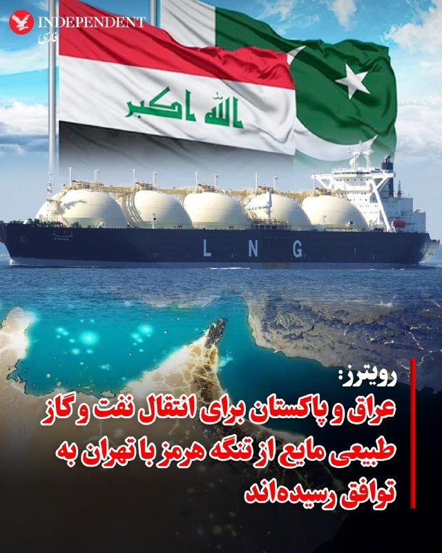

♦️به گزارش رویترز، عراق و پاکستان برای انتقال نفت و گاز طبیعی مایع (LNG) از خلیج فارس با تهران به توافق رسیده‌اند؛ اقدامی که به گفته «پنج منبع آگاه»، نشان‌دهنده توانایی رژیم ایران در هدایت جریان انرژی از طریق تنگه هرمز است. این توافق‌های جدید در حالی صورت می‌گیرد که اشراف تهران بر این آبراه حیاتی، قدرت چانه‌زنی این کشور در معادلات انرژی منطقه را افزایش داده و مسیرهای تازه‌ای را برای صادرات سوخت در بازارهای منطقه‌ای ایجاد کرده است.
‌🇸🇦 Indypersian

🤖 @VahidOOnLine

## VahidOOnLine — post 239800

  <a href="telegram/content/VahidOOnLine_239800_1778622536.mp4" target="_blank">🎬 Download video</a>

رئیس سازمان هلال احمر اعلام کرد زلزله در تهران و کرج «هیچ» خسارت مالی و جانی در پی نداشته است.
پیش‌تر زلزله‌ای به بزرگی ۴.۶ در مقیاس ریشتر، مرز استان‌های تهران و مازندران را لرزاند.
‌🏁 🇬🇧 ManotoTV

🤖 @VahidOOnLine

## VahidOOnLine — post 239799

  

♦️به گزارش مرکز لرزه‌نگاری ایران، در نخستین ساعت بامداد چهارشنبه، ۲۳ اردیبهشت‌ماه، وقوع دو پس‌لرزه به‌ترتیب به بزرگی ۴ و ۳.۴ در پردیس، تهران را لرزاند. براساس گزارش فارس، این پس‌لرزه‌ها در ورامین، پاکدشت، پردیس و بخش‌هایی از شمیرانات حس شده است. پیش از این، زلزله به بزرگی ۴.۶ در مرز تهران و مازندران رخ داد که پردیس مرکز آن اعلام شد.
‌🇸🇦 Indypersian

🤖 @VahidOOnLine

## VahidOOnLine — post 239798

  

♦️دونالد ترامپ، رئیس‌جمهوری ایالات متحده، با انتشار پیامی در شبکه اجتماعی «تروث سوشال»، گزارش‌های رسانه‌ها درباره موفقیت‌های نظامی جمهوری اسلامی در برابر آمریکا را «دروغین» و مصداق عینی «خیانت» خواند و گفت: «این اظهارات مضحک تنها به ایران امیدی واهی می‌دهد؛ این‌ها ترسوهای آمریکایی هستند که علیه کشور خودشان ریشه می‌دوانند و با حمایت از دشمن، به آن‌‌ها کمک می‌کنند.» ترامپ با اشاره به نابودی توان نظامی جمهوری اسلامی گفت: «ایران درگیر یک فاجعه اقتصادی است.» او در پایان تاکید کرد که تنها «بازندگان، افراد ناسپاس و احمق‌ها» می‌توانند علیه آمریکا استدلال کنند.
‌🇸🇦 Indypersian

🤖 @VahidOOnLine

## VahidOOnLine — post 239797

  

♦️به گزارش ایرنا، مرکز زمین‌لرزه سه‌شنبه‌شب تهران، در مرز این استان با مازندران در حوالی پردیس بوده است. براساس این گزارش، این زلزله به بزرگی ۴.۶، ساعت ۲۳:۴۶:۰۷ سه‌شنبه‌شب، ۲۲ اردیبهشت‌ماه، در عمق ۱۰ کیلومتر رخداد و حدود ۱۰ ثانیه به طول انجامید. همزمان، سخنگوی اورژانس تهران اعلام کرد در پی زمین لرزه در تهران تا این لحظه مصدومی گزارش نشده است
‌🇸🇦 Indypersian

🤖 @VahidOOnLine

## VahidOOnLine — post 239796

  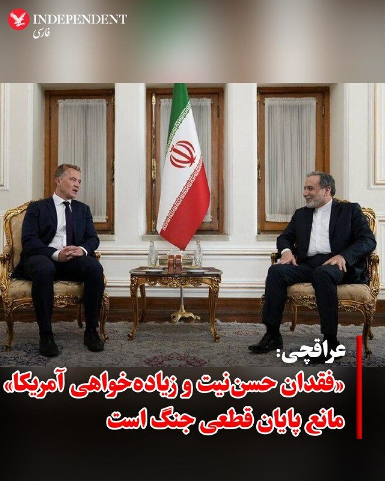

♦️خبرگزاری تسنیم، وابسته به سپاه پاسداران، گزارش داد عباس عراقچی، وزیر خارجه جمهوری اسلامی، در دیدار با معاون وزیر خارجه نروژ، مدعی شد «فقدان حسن‌نیت، زیاده‌خواهی و عدم صداقت آمریکا» مهم‌ترین مانع پایان قطعی جنگ و دستیابی به توافق احتمالی است. او همچنین آمریکا و اسرائیل را عامل وضعیت جاری در تنگه هرمز معرفی کرد و گفت جمهوری اسلامی در حال بررسی تدوین مقررات مرتبط با این آبراه بر اساس حقوق بین‌الملل است.
‌🇸🇦 Indypersian

🤖 @VahidOOnLine

## VahidOOnLine — post 239795

  

دونالد ترامپ در شبکه تروث سوشال نوشت وقتی رسانه‌های «جعلی» می‌گویند دشمن ایرانی از نظر نظامی در برابر آمریکا عملکرد خوبی دارد، این نوعی خیانت است، زیرا چنین ادعایی کاملا نادرست و حتی مضحک است.
او افزود: آن‌ها در حال کمک به دشمن هستند و به جمهوری اسلامی امید می‌دهند در حالی که نباید هیچ امیدی برای او وجود داشته باشد.
‌🏁 🇬🇧 IranintlTV

🤖 @VahidOOnLine

## VahidOOnLine — post 239794

  

علی احتشام، امام جمعه کاشان گفت: «جمهوری اسلامی نه یکی از چهار قدرت، بلکه تنها ابرقدرت جهان است و ملت ایران هشت کشور منطقه و آمریکا را از کمال ارتفاع ساقط کرد و امروز با حضور در خیابان‌ها اجازه نداد جام زهر دیگری نوشیده شود.»

او افزود: «اگر مردم کف خیابان نبودند، چه بسا جام زهر دیگری نوشیده می‌شد.»
‌🏁 🇬🇧 IranintlTV

🤖 @VahidOOnLine

## VahidOOnLine — post 239793

  

♦️به گزارش فارس، زلزله‌ای به بزرگی ۴.۶، سه‌شنبه‌شب، ۲۲ اردیبهشت‌ماه، مرز تهران و مازندران را لرزاند.
‌🇸🇦 Indypersian

🤖 @VahidOOnLine

## VahidOOnLine — post 239792

  

رسانه‌های ایران از وقوع زمین‌لرزه به بزرگی ۴.۶ در مرز استان‌های تهران و مازندران خبر دادند.

خبرگزاری فارس همچنین از زمین‌لرزه در کرج خبر داد.

همزمان خبرگزاری دولتی ایرنا گزارش داد زمین‌لرزه در تهران حدود ۱۰ ثانیه طول کشیده است.
‌🏁 🇬🇧 IranintlTV

🤖 @VahidOOnLine

## VahidOOnLine — post 239790

  <a href="telegram/content/VahidOOnLine_239790_1778622542.mp4" target="_blank">🎬 Download video</a>

‌
خبرگزاری‌های داخل ایران گزارش دادند دقایقی پیش زلزله تهران و کرج را لرزاند. به گزارش این خبرگزاری‌ها سمت شرق تهران زمین‌لرزه بسیار شدیدتر بوده است.
‌🏁 🇬🇧 ManotoTV

🤖 @VahidOOnLine

## VahidOOnLine — post 239789

  

سعید سیاه‌سرانی، دبیر ستاد راهیان نور دریایی، گفت: «بدون اراده جمهوری اسلامی اجازه عبور حتی یک لیتر نفت از تنگه هرمز داده نمی‌شود.»

او افزود: «تنگه هرمز جزو خاک ما است، شناورهایی که رد می‌شوند باید اجازه بگیرند و به زبان فارسی صحبت کنند و از نقاطی که ما تعیین می‌کنیم عبور کنند.»
‌🏁 🇬🇧 IranintlTV

🤖 @VahidOOnLine

## VahidOOnLine — post 239788

  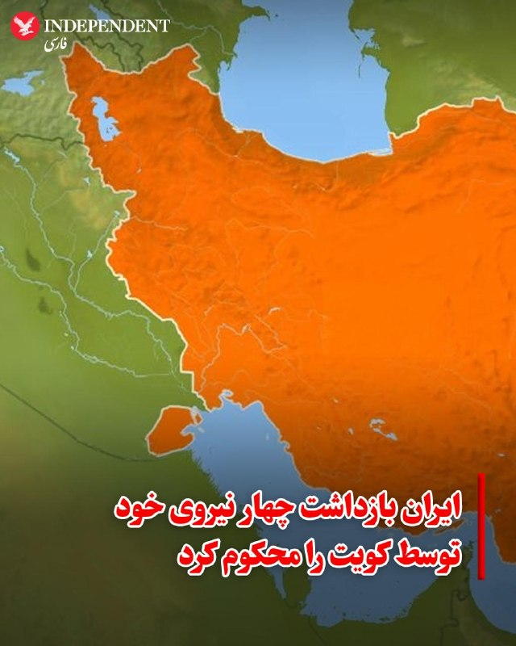

♦️وزارت امور خارجه جمهوری اسلامی روز سه‌شنبه ۲۲ اردیبهشت، بازداشت چهار نفر توسط کویت را که گفته می‌شود با سپاه پاسداران در ارتباط هستند، محکوم کرد. این وزارتخانه اعلام کرد که این افراد در حال گشت‌زنی دریایی بوده‌اند و تنها به دلیل «اختلال در سیستم ناوبری» وارد آب‌های سرزمینی این کشور حوزه خلیج فارس شده‌اند.

همچنین وزارت خارجه جمهوری اسلامی اظهارات مقامات کویتی مبنی بر برنامه‌ریزی ایران برای انجام «اقدامات خصمانه» علیه این کشور را به شدت رد کرد. این تنش دیپلماتیک در حالی رخ می‌دهد که امنیت دریانوردی در منطقه به موضوعی حساس تبدیل شده است.
‌🇸🇦 Indypersian

🤖 @VahidOOnLine

## VahidOOnLine — post 239787

  

امارات متحده عربی اعلام کرد ۱۶ شهروند لبنانی و پنج نهاد مستقر در لبنان را به دلیل ارتباط با حزب‌الله در فهرست تروریستی این کشور قرار داده است.

در همین چارچوب، «موسسه قرض‌الحسن» و چهار نهاد دیگر نیز به دلیل ارتباط با حزب‌الله در این فهرست قرار گرفته‌اند.

امارات متحده عربی تاکید کرد این اقدامات در راستای مهار آفات تروریسم، محدود کردن گسترش آن و قطع تامین مالی فرامرزی انجام شده است.
‌🏁 🇬🇧 IranintlTV

🤖 @VahidOOnLine

## VahidOOnLine — post 239786

  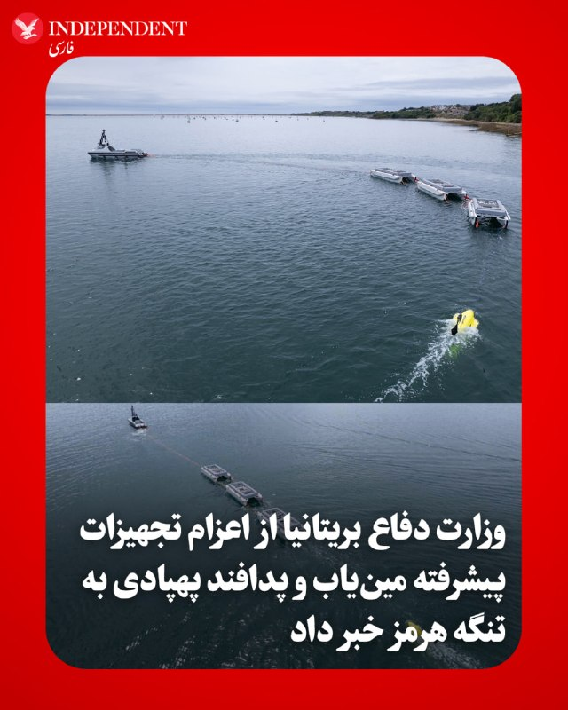

♦️ وزارت دفاع بریتانیا روز سه‌شنبه، ۲۲ اردیبهشت، اعلام کرد که این کشور تجهیزات خودکار مین‌یاب و سیستم‌های ضدپهپادی با فناوری بسیار نوین را به تنگه هرمز ارسال می‌کند. طبق بیانیه صادر شده، جان هیلی، وزیر دفاع بریتانیا، تاکید کرد که بریتانیا نقشی کلیدی در تامین امنیت تنگه هرمز ایفا می‌کند و امروز با ارسال تجهیزات پیشرفته، تعهد خود را برای حفاظت از منافع کشور و امنیت این آبراه نشان می‌دهد.

بریتانیا همچنین در پایان هفته گذشته اعلام کرده بود که ناو «اچ‌ام‌اس دراگون» نیروی دریایی سلطنتی را برای پشتیبانی از عملیات مین‌روبی در این مسیر آبی پرتردد به خاورمیانه اعزام می‌کند. علاوه بر این، بریتانیا و فرانسه به طور مشترک تلاش‌هایی را برای تشکیل یک ماموریت بین‌المللی با هدف بهبود امنیت خطوط کشتیرانی در این تنگه هدایت کرده‌اند.
‌🇸🇦 Indypersian

🤖 @VahidOOnLine

## VahidOOnLine — post 239785

  <a href="telegram/content/VahidOOnLine_239785_1778622545.mp4" target="_blank">🎬 Download video</a>

♦️دونالد ترامپ، رئیس‌جمهوری آمریکا، روز سه‌شنبه ۲۲ اردیبهشت‌ماه پیش از سفر رسمی به چین و دیدار با شی جین‌پینگ، در پاسخ به سوالی درباره خط قرمز پایان آتش‌بس با ایران گفت: «در طول پرواز به آن فکر خواهیم کرد و در روزهای آینده هم درباره آن فکر می‌کنیم.»

ترامپ همچنین گفت آمریکا ارتش جمهوری اسلامی را «به‌طور کامل شکست داده» و افزود: «کار آن تمام شده است.»
‌🇸🇦 Indypersian

🤖 @VahidOOnLine

## VahidOOnLine — post 239784

  

در پی بازداشت چهار فرد «وابسته به سپاه پاسداران» در کویت، وزارت خارجه جمهوری اسلامی برنامه‌ریزی برای انجام اقدامات خصمانه علیه کویت را بی‌اساس و مردود دانست.

وزارت خارجه جمهوری اسلامی در بیانیه‌ای اعلام کرد این چهار مامور در چارچوب ماموریت مرسوم گشت‌زنی دریایی مشغول انجام وظیفه بوده‌اند و به دلیل «اختلال در سامانه ناوبری» وارد آب‌های سرزمینی کویت شده‌اند.

این وزارتخانه از مراجع کویت خواست از اظهارنظرهای شتاب‌زده و طرح ادعاهای بی‌اساس خودداری کرده و موضوع را از طریق مجاری رسمی پیگیری کنند. وزارت خارجه جمهوری اسلامی همچنین خواهان آزادی این چهار مامور بازداشت‌شده شد.
‌🏁 🇬🇧 IranintlTV

🤖 @VahidOOnLine

## VahidOOnLine — post 239782

  <a href="telegram/content/VahidOOnLine_239782_1778622547.mp4" target="_blank">🎬 Download video</a>

رویترز به نقل از دو مقام غربی و دو مقام ایرانی گزارش داد عربستان سعودی در واکنش به حملات انجام‌شده علیه این کشور، چند حمله نظامی اعلام‌نشده علیه جمهوری اسلامی انجام داده است.

بر اساس این گزارش، حملات هوایی عربستان در اواخر ماه مارس توسط نیروی هوایی این کشور انجام شده و نخستین مورد شناخته‌شده از حمله مستقیم نظامی عربستان به خاک ایران به شمار می‌رود.

رویترز نوشت این حملات پس از آن انجام شد که جمهوری اسلامی در جریان جنگ اخیر، همه کشورهای عضو شورای همکاری خلیج فارس را با موشک و پهپاد هدف قرار داد و به زیرساخت‌های نفتی، فرودگاه‌ها و مراکز غیرنظامی حمله کرد.

به گفته منابع رویترز، پس از حملات عربستان، تهران و ریاض وارد تماس‌های فشرده دیپلماتیک شدند و عربستان نیز هشدار داده بود در صورت ادامه حملات، پاسخ‌های بیشتری خواهد داد.

یک مقام ایرانی به رویترز گفت تهران و ریاض در نهایت برای کاهش تنش به تفاهم رسیدند؛ تفاهمی که هدف آن «توقف درگیری‌ها، حفظ منافع متقابل و جلوگیری از تشدید تنش» بوده است.

رویترز همچنین گزارش داد شمار حملات موشکی و پهپادی علیه عربستان پس از این تفاهم به‌طور قابل توجهی کاهش یافت.
‌🏁 🇬🇧 ManotoTV

🤖 @VahidOOnLine

## mwarmonitor — post 9011

📝 سوالی انتقادی پیشنهادی دارید بفرمایید

## mwarmonitor — post 9010

  

🔴بر اساس گزارش CBS درباره ادعای نگهداری هواپیماهای ایرانی توسط پاکستان در پایگاه هوایی نورخان، تصاویر منتشرشده توسط شرکت چینی تحت تحریم «Mizarvision» در آوریل ۲۰۲۶ نشان می‌دهد یک هواپیمای C-130 با استتار شنی در این محل حضور دارد. اگر پاکستان از این نوع رنگ‌آمیزی…

## mwarmonitor — post 9009

  

📰(رویترز) - کلودیا شینباوم، رئیس‌جمهور مکزیک، روز دوشنبه اعلام کرد که از همکاری مقامات سفارت آمریکا با ایالت شمالی «چی‌واوا» برای مبارزه با کارتل‌های مواد مخدر اطلاعی نداشته است. وی در پی کشته شدن این مقامات در یک تصادف رانندگی، گفت که دولتش بررسی خواهد کرد…

## mwarmonitor — post 9008

  

🇺🇸✈️🇨🇳 ترامپ واشنگتن را به مقصد پکن، چین ترک کرد.

هواپیمای ریاست‌جمهوری آمریکا (Air Force One) بوئینگ VC-25A با شماره ثبت 92-9000

@mwarmonitor

## mwarmonitor — post 9007

📝 به نظر می‌رسد سیستمِ مدیریتِ بلایایِ الهی هم به این نتیجه رسیده که در ایران، مرگِ تدریجی دیگر از مد افتاده و باید کمی هیجان و سرعت به فرآیندِ انقراضِ ما تزریق کند. انگار فرشته‌ی عذاب نشسته بالای سرِ تقویمِ تهران و با خودش می‌گوید: «خب، این‌ها که تحریم هستند،…

## mwarmonitor — post 9005

✈️پرواز بمب‌افکن‌های راهبردی از نوع B-1B Lancer از پایگاه RAF Fairford ✈️به‌طور جالب توجهی، بمب‌افکن تک‌فروندی B-1B با نام “Lancer” که از RAF Fairford (کد EGVA) پرواز می‌کند (و چهلمین مأموریت آموزشی از این پایگاه از زمان آغاز آتش‌بس را انجام می‌دهد)، موقعیت…

## mwarmonitor — post 9004

🇮🇱اسرائیل نگران است که ترامپ با ایران یک «توافق بد» امضا کند؛ توافقی که برنامه هسته‌ای ایران را تا حدی دست‌نخورده باقی بگذارد و برنامه موشکی بالستیک ایران و همچنین حمایت این کشور از نیروهای نیابتی منطقه‌ای را نادیده بگیرد - CNN

🇮🇱یک مقام اسرائیلی به CNN گفته است: «اگر هیچ توافقی حاصل نشود خوشحال خواهیم شد» و «اگر محاصره/بسته بودن تنگه هرمز ادامه پیدا کند هم خوشحال خواهیم شد».

@mwarmonitor

## mwarmonitor — post 9003

🔸خبرنگار: آقای رئیس‌جمهور، پیامتان به مردم چین در آستانه این نشست (اجلاس سران) چیست؟ 🔹ترامپ: این است که ما برای دهه‌های متمادی، رابطه‌ی فوق‌العاده‌ای خواهیم داشت. رابطه‌ی من با رئیس‌جمهور «شی»، رابطه‌ای بی‌نظیر است؛ ما همیشه با هم کنار آمده‌ایم. ما با چین…

## mwarmonitor — post 9002

  

«وقتی «اخبار جعلی» (Fake News) می‌گویند که دشمن ایرانی از نظر نظامی در برابر ما خوب عمل می‌کند، این عملاً به مثابه خیانت است، زیرا چنین اظهارنظری کذب و حتی مضحک است. آن‌ها در حال کمک و یاری رساندن به دشمن هستند!
تمام کاری که این کار انجام می‌دهد، دادن امید واهی به ایران است، در حالی که هیچ امیدی نباید وجود داشته باشد. این‌ها ترسوهای آمریکایی هستند که علیه کشورمان فعالیت می‌کنند. ایران ۱۵۹ کشتی در نیروی دریایی خود داشت — اکنون تک‌تک آن کشتی‌ها در کف دریا آرام گرفته‌اند. آن‌ها دیگر نیروی دریایی ندارند، نیروی هوایی‌شان از بین رفته، تمام تکنولوژی‌شان نابود شده، «رهبرانشان» دیگر در میان ما نیستند و این کشور یک فاجعه اقتصادی است.
فقط بازنده‌ها، ناسپاس‌ها و احمق‌ها می‌توانند علیه آمریکا استدلال کنند!

رئیس‌جمهور دونالد جی. ترامپ»

@mwarmonitor

## mwarmonitor — post 9001

تهران یه بچه زلزله امده

## mwarmonitor — post 9000

🔸خبرنگار: تالار پذیرایی شما چه تفاوتی با بقیه دارد؟ 🔹دونالد ترامپ: اتفاقی که افتاده این است که ما یک تالار پذیرایی داریم که هزینه‌اش کمتر از بودجه پیش‌بینی شده بوده، دقیقاً همین‌جا در حال ساخت است. من اندازه‌اش را دو برابر کردم چون مسلماً به آن نیاز داریم.…

## mwarmonitor — post 8999

🔸خبرنگار: آقای رئیس‌جمهور، شما قول داده بودید که تورم را پایین بیاورید. اما الان در بالاترین سطح خود در سه سال اخیر است. آیا سیاست‌های شما کار نمی‌کنند؟ چه اتفاقی دارد می‌افتد؟ 🔹ترامپ: سیاست‌های من فوق‌العاده خوب کار می‌کنند. اگر به زمان دقیقاً قبل از شروع…

## mwarmonitor — post 8998

🔸خبرنگار: آقای رئیس‌جمهور، تا چه زمانی به مذاکره با ایران ادامه می‌دهید؟ (چه زمانی مذاکره با ایران تمام می‌شود؟) 🔹ترامپ: خب، خواهیم دید چه پیش می‌آید. ما فقط یک توافق خوب خواهیم کرد. ارتش آن‌ها از بین رفته، نابود شده است. ما فقط یک توافق خوب خواهیم کرد و خواهیم…

## mwarmonitor — post 8997

🔸خبرنگار: آقای رئیس‌جمهور، تا چه زمانی به مذاکره با ایران ادامه می‌دهید؟ (چه زمانی مذاکره با ایران تمام می‌شود؟)
🔹ترامپ: خب، خواهیم دید چه پیش می‌آید. ما فقط یک توافق خوب خواهیم کرد. ارتش آن‌ها از بین رفته، نابود شده است. ما فقط یک توافق خوب خواهیم کرد و خواهیم دید چه می‌شود. اما من معتقدم که به هر شکلی، این [توافق] برای مردم آمریکا و در واقع برای مردم ایران بسیار خوب خواهد بود.
🔸خبرنگار: آیا شما پاکستانی‌ها را به عنوان میانجی در نظر می‌گیرید؟
🔹ترامپ: نه، آن‌ها عالی هستند. من فکر می‌کنم پاکستانی‌ها عالی بوده‌اند. فیلد مارشال و نخست‌وزیر پاکستان مطلقاً عالی بوده‌اند.
🔸خبرنگار: آقای رئیس‌جمهور، پیام شما به رئیس‌جمهور "شی" [رئیس‌جمهور چین] در رابطه با جنگ ایران چیست؟
🔹ترامپ: خب، فکر می‌کنم اولاً ما در مورد آن صحبت مفصلی خواهیم داشت. فکر می‌کنم او نسبتاً خوب بوده است، اگر صادقانه بگویم. به محاصره نگاه کنید، مشکلی نیست. آن‌ها مقدار زیادی از نفت خود را از آن منطقه می‌گیرند. ما مشکلی نداشتیم و او دوست من بوده است، کسی است که با هم کنار می‌آییم. و فکر می‌کنم خواهید دید که اتفاقات خوبی رخ خواهد داد. این سفر بسیار هیجان‌انگیزی خواهد بود و اتفاقات خوب زیادی خواهد افتاد.
🔸خبرنگار: آقای رئیس‌جمهور، آیا فکر می‌کنید او (رئیس‌جمهور چین) اصلاً نیاز دارد در مورد ایرانی‌ها مداخله کند؟ فکر می‌کنید او می‌تواند به هر شکلی کمک کند؟
🔹ترامپ: نه، فکر نمی‌کنم در مورد ایران به کمکی نیاز داشته باشیم. ما به هر شکلی پیروز می‌شویم. ما به صورت مسالمت‌آمیز یا غیر از آن پیروز می‌شویم. نیروی دریایی آن‌ها رفته، نیروی هوایی‌شان رفته، تک‌تک عناصر ماشین جنگی آن‌ها از بین رفته است. آن‌ها افراد زیادی را کشته‌اند، حداقل ۴۲ هزار نفر را در یک ماه و نیم گذشته کشته‌اند. ما پیروز می‌شویم، مهم نیست چطور حساب کنید.
🔸خبرنگار: آقای رئیس‌جمهور، آیا معتقدید سفر شما به چین بر اقتصاد بین‌الملل و قیمت نفت تأثیر خواهد گذاشت؟
🔹ترامپ: تأثیر مثبتی خواهد داشت. ما دیدار بسیار خوبی خواهیم داشت. من با رئیس‌جمهور شی صحبت کردم. هر دوی ما مشتاقانه منتظر این دیدار هستیم. عالی خواهد بود.
🔸خبرنگار: آقای رئیس‌جمهور، خط قرمز شما برای پایان دادن به این آتش‌بس چه خواهد بود؟ چه چیزی باعث می‌شود که شما همکاری را قطع کنید؟
🔹ترامپ: خب، خواهیم دید. در طول پرواز به آن فکر خواهیم کرد و برای مدتی در موردش تأمل می‌کنیم. اما ما ارتش آن‌ها را به سختی شکست داده‌ایم، آن تمام شده است. محاصره بسیار مؤثر است، ۱۰۰ درصد مؤثر بوده است. و به هر شکلی، همه چیز خیلی خوب پیش خواهد رفت. فکر می‌کنم آن‌قدر نفت خواهید داشت که مثل گذشته فوران نفت (فراوانی نفت) داشته باشید. بنابراین وقتی قیمت نفت کمی بالا می‌رود... من فکر می‌کردم اگر به سه چهار ماه پیش، زمانی که در حال برنامه‌ریزی بودیم برگردید، قیمت خیلی بیشتر بالا برود. دیروز قیمت ۹۹ دلار بود. و اگر به آن فکر کنید، من کل روز آن [قیمت] را می‌پذیرفتم (با آن قیمت مشکلی نداشتم).

@mwarmonitor

## mwarmonitor — post 8996

## mwarmonitor — post 8995

🔴تا جایی که اطلاع داریم، ایران در ۲۸ روز گذشته هیچ نفت خامی را از طریق دریا به‌طور موفقیت‌آمیز صادر نکرده است. بخشی از فرآورده‌های پالایش‌شده توانسته‌اند خارج شوند، زیرا دفتر کنترل دارایی‌های خارجی آمریکا (OFAC) روی آن نفتکش‌ها تحریم اعمال نکرده است.

🔴علاوه بر این، جزیره خارگ از تاریخ 2026-05-06 تاکنون هیچ نفتکشی را بارگیری نکرده است؛ این موضوع در نتیجه نشت نفتی است که تهران وقوع آن را انکار کرده است.

🔴با این حال، هنوز تعداد زیادی نفتکشِ خالی در داخل و خارج از محدوده محاصره وجود دارد؛ همچنین تعداد زیادی نفتکشِ پر از محموله که در نزدیکی پاکستان به‌صورت گروهی تجمع کرده‌اند.

🔸(تعریف به‌روزشده ما از «صادرات» از ایران این است که یک نفتکش از خط محاصره نیروی دریایی آمریکا عبور کند و بدون نفت به ایران بازنگردد.)
TANKER TRACKER

@mwarmonitor

## mwarmonitor — post 8994

  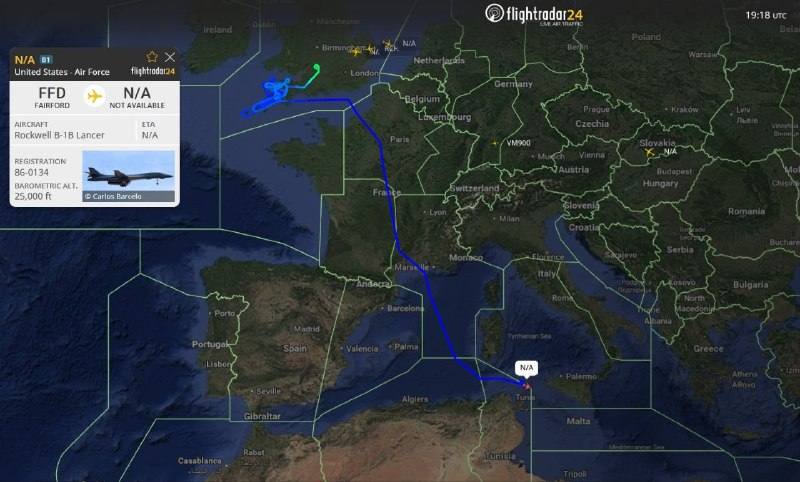

🚨 تغییر معنادار در ماموریت بمب‌افکن‌های استراتژیک آمریکا 📌 رصد تحرکات هوایی نشان‌دهنده تغییر الگو و خروج بمب‌افکن‌های USAF از روال عادی پروازهای تمرینی است. 📍 جزئیات کلیدی: بمب‌افکن: یک فروند B-1B Lancer (شناسه ZENER 01) از پایگاه فایرفورد به پرواز درآمد.…

## mwarmonitor — post 8993

🔴«رویترز به نقل از منابع آگاه: عراق و پاکستان با ایران توافق‌هایی امضا کرده‌اند که بر اساس آن اجازه حمل نفت و گاز مایع از خلیج فارس داده می‌شود.»

@mwarmonitor

## mwarmonitor — post 8992

🛰دفتر بودجه کنگره آمریکا (CBO) برآورد کرده است که پروژه «گنبد طلایی برای آمریکا» حدود ۱.۲ تریلیون دلار هزینه خواهد داشت تا طی ۲۰ سال توسعه، استقرار و بهره‌برداری شود؛ که تنها هزینه‌های خرید و تأمین تجهیزات آن کمی بیش از ۱ تریلیون دلار برآورد شده است.

@mwarmonitor

## pm_afshaa — post 90665

  <a href="telegram/content/pm_afshaa_90665_1778622551.webm" target="_blank">🎬 Download video</a>

🔴سی‌ان‌ان: اسرائیل نگرانه ترامپ ممکنه قبل از حل کامل مسائل اصلی جنگ، با ایران به یه توافق سریع برسه. ترس اصلی اینه که ترامپ از روند مذاکرات خسته بشه و هر توافقی حتی با امتیازهای لحظه آخری رو قبول کنه.

اسرائیل میگه آمریکا درباره اورانیوم غنی‌شده اطمینان داده، ولی نگرانی اصلیشون اینه که موضوع موشک‌های بالستیک و شبکه نیروهای نیابتی ایران اصلاً تو توافق نیاد.
همچنین می‌ترسن یه توافق نصفه‌نیمه باعث بشه تحریم‌ها سبک بشه و ایران دوباره از نظر اقتصادی و سیاسی قوی‌تر بشه.

💧Rainbet.com the #1 Non-KYC Crypto Casino & Sportsbook @rainbetcom

😁 @Pm_Afshaa

## pm_afshaa — post 90664

  <a href="telegram/content/pm_afshaa_90664_1778622552.webm" target="_blank">🎬 Download video</a>

🔴دو زمین لرزه 4 و 3.4 ریشتری در فاصله 6 دقیقه در پردیس تهران

💧 Rainbet.com the #1 Non-KYC Crypto Casino & Sportsbook @rainbetcom

😁 @Pm_Afshaa

## pm_afshaa — post 90663

این یکی کمتر بود پس لرزه بود

## pm_afshaa — post 90662

  <a href="telegram/content/pm_afshaa_90662_1778622552.webm" target="_blank">🎬 Download video</a>

🔴زلزله مجدد در تهران

💧 Rainbet.com the #1 Non-KYC Crypto Casino & Sportsbook @rainbetcom

😁 @Pm_Afshaa

## pm_afshaa — post 90661

  <a href="telegram/content/pm_afshaa_90661_1778622553.webm" target="_blank">🎬 Download video</a>

ساعت ۸ یه زلزله پردیس تهران اومد الانم یه زلزله مرز تهران و مازندران امشب رو مراقب و هوشیار باشید

## pm_afshaa — post 90660

  <a href="telegram/content/pm_afshaa_90660_1778622553.webm" target="_blank">🎬 Download video</a>

🔴پست جدید ترامپ:

وقتی رسانه‌های فیک‌نیوز می‌گویند دشمن ایرانی از نظر نظامی مقابل ما عملکرد خوبی دارد، این عملاً نوعی خیانت است، چون چنین ادعایی کاملاً دروغ و حتی مضحک است. آن‌ها دارند به دشمن کمک می‌کنند و به او امید واهی می‌دهند، در حالی که هیچ امیدی نباید وجود داشته باشد. این‌ها آمریکایی‌های ترسویی هستند که علیه کشور ما موضع گرفته‌اند. ایران ۱۵۹ کشتی در نیروی دریایی خود داشت — حالا تک‌تک آن‌ها در کف دریا قرار دارند. آن‌ها دیگر نیروی دریایی ندارند، نیروی هوایی‌شان از بین رفته، تمام فناوری‌شان نابود شده، «رهبرانشان» دیگر در میان ما نیستند و کشورشان به یک فاجعه اقتصادی تبدیل شده است. فقط بازنده‌ها، ناسپاس‌ها و احمق‌ها می‌توانند علیه آمریکا استدلال کنند!

💧 Rainbet.com the #1 Non-KYC Crypto Casino & Sportsbook @rainbetcom

😁 @Pm_Afshaa

## pm_afshaa — post 90659

  

کانون زلزله لحظات قبل تهران

💧 Rainbet.com the #1 Non-KYC Crypto Casino & Sportsbook @rainbetcom

😁 @Pm_Afshaa

## pm_afshaa — post 90658

ساعت ۸ یه زلزله پردیس تهران اومد
الانم یه زلزله مرز تهران و مازندران
امشب رو مراقب و هوشیار باشید

## pm_afshaa — post 90657

فک کنم خدا گفته ترامپ خایه نداره بزار خودم بزنم

## pm_afshaa — post 90656

امشب هم طوفان داشتیم هم زلزله

## pm_afshaa — post 90655

  <a href="telegram/content/pm_afshaa_90655_1778622555.webm" target="_blank">🎬 Download video</a>

🔴مرکز لرزه‌نگاری: لحظاتی پیش زلزلهٔ 4.6 ریشتری مرز استان‌های تهران و مازندران رو لرزوند. 
💧 Rainbet.com the #1 Non-KYC Crypto Casino & Sportsbook @rainbetcom 
😁 @Pm_Afshaa

## pm_afshaa — post 90654

  <a href="telegram/content/pm_afshaa_90654_1778622555.webm" target="_blank">🎬 Download video</a>

🔴مرکز لرزه‌نگاری:
لحظاتی پیش زلزلهٔ 4.6 ریشتری مرز استان‌های تهران و مازندران رو لرزوند.

💧 Rainbet.com the #1 Non-KYC Crypto Casino & Sportsbook @rainbetcom

😁 @Pm_Afshaa

## pm_afshaa — post 90653

میگید زلزله کجا بود یا تست اتم رو دوباره بیاریم وسط

## pm_afshaa — post 90651

زلزله ۳.۴ ریشتر پردیس که چنلا دارن میزنن واسه ساعت ۸/۹ شب بود واسه الان نیست

## pm_afshaa — post 90650

  <a href="telegram/content/pm_afshaa_90650_1778622556.webm" target="_blank">🎬 Download video</a>

🔴زلزله نسبتا شدید در تهران

💧 Rainbet.com the #1 Non-KYC Crypto Casino & Sportsbook @rainbetcom

😁 @Pm_Afshaa

## pm_afshaa — post 90649

  <a href="telegram/content/pm_afshaa_90649_1778622556.webm" target="_blank">🎬 Download video</a>

🔴ان‌بی‌سی نیوز: ارتش ایالات متحده در نظر داره در صورت فروپاشی آتش‌بس و تصمیم ترامپ برای از سرگیری عملیات‌های عمده رزمی، نام درگیری خود با ایران رو به عملیات «چکش سنگین» تغییر بده و این جایگزین نام قبلی عملیات خشم حماسی خواهد شد.

این تغییر نام میتونه به دولت آمریکا اجازه بده درگیری‌های جدید رو یک عملیات نظامی تازه معرفی کنه؛ اقدامی که عملاً مهلت 60 روزه اختیارات جنگی رئیس‌جمهور آمریکا تحت قانون «اختیارات جنگی ۱۹۷۳» رو از نو آغاز میکنه.

💧 Rainbet.com the #1 Non-KYC Crypto Casino & Sportsbook @rainbetcom

😁 @Pm_Afshaa

## pm_afshaa — post 90648

  <a href="telegram/content/pm_afshaa_90648_1778622557.webm" target="_blank">🎬 Download video</a>

🔴رویترز: عربستان در اواخر ماه مارس یک سری حملات تلافی جویانه غیرعلنی علیه ایران در طول جنگ انجام داد. 
💧 Rainbet.com the #1 Non-KYC Crypto Casino & Sportsbook @rainbetcom 
😁 @Pm_Afshaa

## pm_afshaa — post 90647

  <a href="telegram/content/pm_afshaa_90647_1778622557.mp4" target="_blank">🎬 Download video</a>

ترامپ راهی چین شد

💧 Rainbet.com the #1 Non-KYC Crypto Casino & Sportsbook @rainbetcom

😁 @Pm_Afshaa

## pm_afshaa — post 90646

  <a href="telegram/content/pm_afshaa_90646_1778622559.webm" target="_blank">🎬 Download video</a>

🔴تغییر معنادار در ماموریت بمب‌افکن‌های استراتژیک آمریکا

رصد تحرکات هوایی آمریکا نشون میده یک بمب‌افکن استراتژیک B-1B برخلاف پروازهای روتین اخیر، این بار مسیر خودش رو به سمت جنوب تغییر داده و دو هواپیمای سوخت‌رسان هم به‌صورت مخفیانه اونو همراهی کردن.

این تغییر غیرعادی در الگوی پرواز، گمانه‌زنی‌ها درباره احتمال یک عملیات یا تحرک نظامی جدید رو افزایش داده.

💧 Rainbet.com the #1 Non-KYC Crypto Casino & Sportsbook @rainbetcom

😁 @Pm_Afshaa

## pm_afshaa — post 90645

🔴ترامپ:شما دوران طلایی آمریکا را زمانی خواهید دید که این جنگ به پایان برسد، و شما اکنون آن را می‌بینید

💧 Rainbet.com the #1 Non-KYC Crypto Casino & Sportsbook @rainbetcom

😁 @Pm_Afshaa

## iaghapour — post 2604

اکانت های هوش مصنوعی رو با یک دهم قیمت بخر 
🛍

🔆 ChatGPT Plus :
- اکانت از پیش ساخته شده ی Plus
- پلاس شخصی ( نسخه 20$ )
- مناسب برنامه نویسی
- ساخت عکس فارسی و تجزیه تحلیل
- مناسب تحقیق عمیق
- جامع ترین هوش مصنوعی در حال حاضر

🏳️‍🌈 Gemini Pro :
( گزینه ی اقتصادی )
- پلن مشابه GPT Plus از شرکت گوگل
- پشتیبانی از Antigravity
- ساخت عکس و ویدیو فارسی
- تجزیه و تحلیل و تحقیق عمیق
- فعال سازی روی ایمیل شما
- قیمت :
یک ماهه : 275 هزار تومان
یک ساله : 1200 هزار تومان

🌐 Kiro.dev Pro
( جایگزین اقتصادی Claude )
- ایجنت برنامه نویسی شرکت آمازون
- پشتیبانی از تمامی مدل های Claude
- ارزان و اقتصادی و با کیفیت
- مناسب فقط برنامه نویسان

خرید و توضیحات بیشتر از ربات :

🤖 @ChatGPT_StoreBOT

## iaghapour — post 2603

✍ آدم راننده شوتی باشه به مراتب اضطرابش كمتر از کسیه كه شغلش تو ايران به اينترنت وابسته هستش...

🆔 @iaghapour

## DEJradio — post 4601

  <a href="telegram/content/DEJradio_4601_1778622559.webm" target="_blank">🎬 Download video</a>

🚨
🔸 خبر ۲۱
سه‌شنبه ۲۲ اردیبهشت ۱۴۰۵

#خبر۲۱
@DEJradio

## DEJradio — post 4600

  <a href="telegram/content/DEJradio_4600_1778622560.webm" target="_blank">🎬 Download video</a>

🚨
🔸 حامد فرد هنرمند ملی‌گرا موزیک ویدیو «موشتباه» را منتشر کرد. او در صفحه اینستاگرام خود نوشته دو و ماه و نیم از کشته شدن علی خامنه‌ای گذشته اما جسدش را دفن نکرده‌اند و مضحک ماجرا اینجاست که مراسم چهلمش را در یک کلیسا در تهران برگزار کردند؛ آن هم چهلم کسی را که در تمام دوران حکومت ظالمانه‌اش نه‌تنها آزادی مذهب وجود نداشت، بلکه پیروان آیین مسیح و نوکیشان مسیحی تحت آزار و سـ.ـرکوب قرار داد.

او تأکید کرد کشته شدن خامنه‌ای هرچند برای بسیاری از مردم ایران مرهمی بر دل‌های خونین و زخمی بود، اما چیزی جز یک مُسکن کوتاه‌مدت و موقتی نبود و نیست. عطش انتـ.ـقام ما ملت ایران با حذف یک نفر پایان پیدا نمی‌کند.»

حامد فرد تأکید کرد «تا زمانی که حقیقت تمام جـ.ـنایت‌ها ا آشکار نشود، تا زمانی که خانواده‌های قربانیان دادخواهی نکنند، و تا زمانی که جمهوری اسلامی و تمام نمادها، ساختارها و نشانه‌های آن به‌طور کامل از ایران برچیده نشوند، آرام نخواهیم گرفت. ما تا اانـ.ـقام تمام قربانیان این رژیم اهریمنی، از بهمن شوم ۵۷ تا امروز را نگیریم، از پا نخواهیم نشست.»

#موشتبا #جمهوری_اسلامی
@DEJradio

## DEJradio — post 4599

  <a href="telegram/content/DEJradio_4599_1778622560.mp4" target="_blank">🎬 Download video</a>

🔺📢 پیام شهروندان در #تهران در واکنش به تهدید جنسی دانش‌آموزان مدرسه دخترانه شرافت در منطقه ۱۳ تهران: سکوت نکنیم، امروز مدرسه شرافت بود فردا مدرسه‌ای دیگر.

#مدرسه_شرافت #جمهوری_اسلامی
@DEJradio

## DEJradio — post 4598

  <a href="telegram/content/DEJradio_4598_1778622562.mp4" target="_blank">🎬 Download video</a>

🚨
🔸 شهرام سبزواری کارشناس نظامی با اشاره به استقرار تکاوران تیپ ۴۵ شوشتر در اطراف تاسیسات اتمی اصفهان بیان می‌کند احتمال عملیات زمینی برای خارج کردن اورانیوم‌ها از ایران زیاد است و همزمان ممکن است پشت صحنه بین دولت‌ها و برخی فرماندهان داخلی توافق‌هایی صورت گرفته باشد و پیامد آن قربانی شدن نیروهای تامینی باشد.

#تاسیسات_اتمی #جمهوری_اسلامی
@DEJradio

## DEJradio — post 4597

  <a href="telegram/content/DEJradio_4597_1778622564.mp4" target="_blank">🎬 Download video</a>

🔺📢 یک شهروند از تهران با ارسال ویدیویی به دژ نوشت، عامل تعرض به دانش‌آموزان مدرسه شرافت مزدور بودند.
براساس آخرین خبرها پیگیری خانواده این دختران و شکایت آنها از نیروهای امنیتی که دختران را تهدید به تجاوز کرده‌اند بی‌نتیجه مانده است.

#مدرسه_شرافت #جمهوری_اسلامی
@DEJradio

## DEJradio — post 4596

  <a href="telegram/content/DEJradio_4596_1778622565.webm" target="_blank">🎬 Download video</a>

🚨
⭕️ دقایقی پیش زلزله، تهران وکرج را لرزاند.
بر اساس گزارش‌های منتشر شده زلزله‌ای باقدرت ۳/۴ دهم ریشتر دقایقی پیش شهر پردیس را لرزاند و منجر به قطعی برق در برخی مناطق شد.

#فوری #زلزله
@DEJradio

## mamlekate — post 103518

📝 رویترز از حملات اعلام‌نشده عربستان سعودی به ایران در جریان جنگ خبر داد

پس از افشای حملات تلافی‌جویانه امارات متحده عربی به اهدافی در لاوان و عسلویه، خبرگزاری رویترز گزارش داد که عربستان سعودی نیز در واکنش به حملات جمهوری اسلامی به خاک این کشور در جریان جنگ اخیر، چندین حمله اعلام‌نشده علیه ایران انجام داده است.

@mamlekate

## mamlekate — post 103517

📝 سلام ساعت ۲۳:۴۵ چیتگر لرزید

📝 ۲۲ اردیبهشت - ۲۳:۴۸ - غرب تهران یه چیزی مثل زلزله حس کردیم.

📝 سلام لرزش عجیب و بی صدای تهران شرق و جنوب شرق ساعت ۱۱:۴۶

📝 ستارخان تهران رو تخت خوابیده بودم قشنگ زیرم تکون خورد و لرزید بعد هم سبد وسیله ها تکون خورد و لوسترها ،کامل لرزیدم فکر کردم سرگیجه گرفتم ولی زلزله بود طول کشید چند ثانیه

📝 منم توی رودهن هستم و لرزش اولش ضعیف و بعد خیلی شدید شد. صدا نداشت اما خیلی لرزش کوتاه اما ترسناکی بود

❓ سلام. مهرشهر. ۱۲:۲۲ دوبار لرزید. مثل زلزله بود.

@mamlekate

## mamlekate — post 103516

📝 پرزیدنت ترامپ: رژیم ایران بسیار ضعیف شده و «محاصره» دریایی منابع مالی آنها را محدود کرده است

پرریدنت ترامپ با اشاره به موثر بودن محاصره دریایی بر محدود کردن دسترسی رژیم ایران به منابع مالی، بار دیگر تاکید کرد که آمریکا اجازه نخواهد داد رژیم ایران به سلاح هسته‌ای دست یابد.

📝 دونالد ترامپ: مطمئنم تهران غنی‌سازی اورانیوم را به‌طور کامل متوقف خواهد کرد

📝 وزیر جنگ: ما در حال پیروزی در جنگ با رژیم ایران هستیم؛ آنها در استفاده از استراتژی کره‌شمالی شکست خوردند

پیت هگست، وزیر جنگ آمریکا، و ژنرال دن کین، رئیس ستاد مشترک نیروهای مسلح ایالات متحده، روز سه‌شنبه ۲۲ اردیبهشت با حضور در جلسه کمیته فرعی تخصیص بودجه مجلس نمایندگان آمریکا از عملکرد دولت ترامپ در عملیات نظامی علیه رژیم ایران دفاع کردند.

یک عضو پنتاگون نیز در پاسخ به پرسشی درباره هزینه جنگ اخیر آمریکا با جمهوری اسلامی گفت که این جنگ از ابتدا تا کنون حدود ۲۹ میلیارد دلار برای ایالات متحده هزینه داشته است.

📝 هگست اعلام کرد برای تشدید یا عقب‌نشینی در خاورمیانه برنامه دارد اما قدم بعدی را فاش نکرد

@mamlekate

## mamlekate — post 103515

  

💥 دعوت به همکاری با خبرگزاری هرانا

خبرگزاری هرانا، با بیش از دو دهه سابقه در حوزه گزارشگری و مستندسازی حقوق بشر، در راستای توسعه فعالیت‌های خود از علاقه‌مندان واجد شرایط برای همکاری دعوت می‌کند.

هرانا در این مرحله بیش از آن‌که به دنبال افراد با سابقه حرفه‌ای باشد، به دنبال افرادی متعهد، دقیق و آموزش‌پذیر است؛ کسانی که دغدغه واقعی حقوق بشر دارند و مایل‌اند در یک چارچوب حرفه‌ای، مهارت‌های خود را توسعه دهند.

زمینه‌های همکاری شامل:
گزارشگری، ویراستاری، ترجمه، مدیریت شبکه‌های اجتماعی و سایر حوزه‌های مرتبط

ویژگی‌های مورد انتظار:

* تسلط کافی به زبان فارسی (خواندن و نوشتن)
* دقت، مسئولیت‌پذیری و توانایی یادگیری مستمر
* علاقه و حساسیت نسبت به موضوعات حقوق بشر
* آمادگی برای فعالیت در چارچوب‌های سازمان‌یافته و حرفه‌ای

❗️ توجه: این فرصت همکاری فقط شامل کسانی است که به زبان فارسی مسلط و ساکن یکی از کشورهای "ترکیه، قبرس شمالی، هندوستان، مصر، قرقیزستان، ازبکستان، کلمبیا، پاراگوئه، قزاقستان، سریلانکا، بلغارستان و رومانی" هستند.

همکاری با هرانا فرصتی است برای کسب تجربه عملی در حوزه مستندسازی و فعالیت‌های حقوق بشری در یک نهاد با سابقه و ساختار حرفه‌ای.

📎 برای ثبت درخواست همکاری، لطفا فرم زیر را تکمیل کنید:
https://hra.news/4cBjHqs

📩 در صورت بروز مشکل در تکمیل فرم، می‌توانید رزومه و اطلاعات تماس خود را به آدرس زیر ارسال نمایید:
info@hra-news.org

↘️
@hranews_bot تماس ✉️ -  @Hranews  کانال هرانا 🆑

## VahidOnline — post 75438

  

زمین‌لرزه چهارم

پیام‌های دریافتی:

دوباره لرزید شرق همین الان 12:33

بازم اومد ولی ریزتر از قبلی

همین الان دوباره لرزید (نارمک ) ۰۰:۳۳

من الان دوباره لرزیدم

وحیددد نزدیک چهاربار تو پردیس #زلزله اومد نمیدونی تختم چجوری میلرزید

🔄آپدیت: تصویر دریافتی بالا و متن رسانه‌های داخلی به نقل از مرکز لرزه‌نگاری:

بزرگی: ۳.۴
🔹محل وقوع: حوالی پرديس
🔹زمان وقوع: ۳۲ دقیقه بامداد
🔹عمق زمین‌لرزه: ۱۰ کیلومتر

🔹نزدیک‌ترین شهرها:
۱۰ کیلومتری پرديس (تهران)
۱۱ کیلومتری بومهن (تهران)
۱۲ کیلومتری رودهن (تهران)

🔹نزدیکترین مراکز استان:
۴۱ کیلومتری تهران
۷۶ کیلومتری كرج

#زلزله
📡 @VahidOnline

## VahidOnline — post 75437

زمین‌لرزه دیگری به بزرگی ۴
این میشه سومین بار ظرف چند ساعت گذشته! اولین باردر شرق استان احساس شد و پیام‌ها از پردیس و بومهن و دماوند بود و یکی هم از لواسان]
پیام‌های دریافتی لرزش سوم:

تهران مجددا لرزید

دوباره لرزید کمی خفیف‌تر

وحید جان دوباره لرزیدیم شرق تهران .. ۲۷

دوباره! پس لرزه بود.

دوباره هم اومد ولی ضعیف بود خوشبختانه

وحید جان شاید باورت نشه اما سومیش هم همین الان اومد، منتها خیلی کوتاه و کم بود...

ان، زلزله، ۰۰:۲۷
باز اومد، کوتاه، شاید پس لرزه باشه

دوباره اومد
یعنی اون رفت این برگشت

دوباره زلزله اومد

باز هم لرزش ۱۲:۲۷

سلام بازم لرزید حدود دو سه دقیقه پیش طوفانم هست خدا رحم کنه تو این شرایط فقط بلایای طبیعی کم داریم

اینجا ازگل، ۱۲:۲۷دقیقه، دوباره لرزید

🔄 رسانه‌های داخلی به نقل از مرکز لرزه‌نگاری:
🔹بزرگی: ۴
🔹محل وقوع: حوالی پرديس
🔹زمان: ۲۶ دقیقه بامداد
🔹عمق زمین‌لرزه: ۸ کیلومتر

🔹نزدیک‌ترین شهرها:
۹ کیلومتری پرديس (تهران)
۱۱ کیلومتری بومهن (تهران)
۱۲ کیلومتری رودهن (تهران)

🔹نزدیکترین مراکز استان:
۴۰ کیلومتری تهران
۷۶ کیلومتری كرج
#زلزله
📡 @VahidOnline

## VahidOnline — post 75436

  

پست ترامپ، ترجمه ماشین:
وقتی «رسانه‌های جعلی» می‌گویند دشمن ایرانی از نظر نظامی در برابر ما عملکرد خوبی دارد، این عملاً خیانت است؛ چون چنین ادعایی کاملاً دروغ و حتی مضحک است. آن‌ها به دشمن کمک و از او حمایت می‌کنند! تنها نتیجه‌اش این است که به ایران امیدی واهی می‌دهد؛ در حالی که اصلاً نباید چنین امیدی وجود داشته باشد. این‌ها بزدل‌های آمریکایی هستند که علیه کشور خودمان طرف می‌گیرند.

ایران ۱۵۹ کشتی در نیروی دریایی خود داشت؛ تک‌تک آن کشتی‌ها اکنون در کف دریا آرمیده‌اند. آن‌ها دیگر نیروی دریایی ندارند، نیروی هوایی‌شان از بین رفته، تمام فناوری‌شان نابود شده، «رهبران»شان دیگر در میان ما نیستند، و کشورشان یک فاجعه اقتصادی است.

فقط بازنده‌ها، ناسپاس‌ها و احمق‌ها می‌توانند علیه آمریکا استدلالی مطرح کنند!

رئیس‌جمهور دونالد جی. ترامپ
realDonaldTrump

📡 @VahidOnline

## VahidOnline — post 75435

"وحید تهران لرزید"

+ ده‌ها پیام دریافتی مشابه درباره احساس لرزش زمین در مناطق مختلف تهران

به نظر می‌رسه بیشتر پیام‌ها از سمت شرق و شمال شرق تهران هستند گرچه در غرب شهر هم کاملا حس شده.
حدود سه ساعت پیش هم در شرق استان تهران حوالی پردیس و بومهن و دماوند زمین‌‌لرزه خفیف‌تری حس شده بود و غیر از اون مناطق فقط یک پیام از لواسان داشتم و پیامی از خود تهران نداشتم.

🔄 رسانه‌های داخلی:
زمین‌لرزه‌ای به بزرگی ۴.۶ ساعت ۲۳:۴۶ امشب مرز استان‌های تهران و مازندران را لرزاند.
این زلزله در حوالی شهر پردیس و در عمق ۱۰ کیلومتری زمین به وقوع پیوسته و در بخش‌هایی از پایتخت نیز احساس شده است.
بزرگی: 4.6
محل وقوع: مرز استانهای تهران و مازندران - حوالی پرديس
تاریخ و زمان وقوع به وقت محلی: 1405/02/22 23:46:07
طول جغرافیایی: 51.83
عرض جغرافیایی: 35.82
عمق زمین‌لرزه: 10 کیلومتر

نزدیک‌ترین شهرها:
8 کیلومتری پرديس (تهران)
10 کیلومتری بومهن (تهران)
11 کیلومتری رودهن (تهران)

نزدیکترین مراکز استان:
41 کیلومتری تهران
77 کیلومتری كرج
#زلزله
📡 @VahidOnline

## VahidOnline — post 75433

  <a href="telegram/content/VahidOnline_75433_1778622567.mp4" target="_blank">🎬 Download video</a>

ترامپ: خواهیم دید چه خواهد شد

دونالد ترامپ، رئیس‌جمهور آمریکا، پیش از سفر به پکن گفت که رئیس‌جمهور چین درباره جنگ ایران «نسبتاً خوب» عمل کرده است، اما واشینگتن به کمک او نیازی ندارد.

او روز سه شنبه در جمع خبرنگاران افزود که قرار است با شی جین‌پینگ «گفت‌وگویی طولانی» درباره ایران داشته باشد.
ترامپ تصریح کرد: «فکر نمی‌کنم ما به هیچ کمکی درباره ایران نیاز داشته باشیم. ما به هر شکلی که باشد پیروز خواهیم شد. یا به‌صورت مسالمت‌آمیز پیروز می‌شویم یا به شکل دیگری.»

رئیس‌جمهور آمریکا با اشاره به این که توان نظامی ایران در جنگ اخیر از بین رفته است، هشدار داد: ««ایران یا کار درست را انجام خواهد داد یا ما کار را تمام خواهیم کرد.»

او به جزئیات بیشتری درباره این هشدار اشاره نکرد، اما این اظهارات در حالی است که ترامپ پیشنهاد آخر ایران برای توافق پایان جنگ را در روزهای اخیر رد کرده و آن را «کاملا غیر قابل قبول» و «فوق‌العاده ضعیف» خوانده است.
رئیس‌جمهور آمریکا قرار است چهارشنبه برای دیداری رسمی وارد پایتخت چین شود. این سفر که قرار بود در ماه مارس انجام شود، به دلیل درگیری نظامی آمریکا و اسرائیل با ایران چند هفته به تأخیر افتاد.
@VahidHeadline

📡 @VahidOnline

## kianmeli1 — post 87372

  

🔴رؤیافروشی تلویزیون ها پایانی ندارد

قبل از علی خامنه ای میگفتند با کشته شدن خامنه ای کار تمام است
امروز میگویند با پایان لایه بعدی کار تمام است

هموطن٫ کار تمام است اما وقتی که «سازماندهی هوشمندانه و شبکه سازی شهری» دیده شود

از ۱۸ دی تا امروز کدام شبکه سازی در کشور توانسته یک قاضی قاتل را از بین ببرد که احساس کنیم نیروهای سازماندهی در حال تلاش است!

با رویافروشی شبکه ها که مدام تحلیل غلط به خوردتان میدهند ٫ براندازی محقق نمی شود

«براندازی بدون سازماندهی ٫ شکست سنگین ادامه دارد»

این صحبت تلخ است اما حقیقت است
https://t.me/kianmeli1

## kianmeli1 — post 87371

🔴طبق گزارش NBCNews : ارتش ایالات متحده در نظر دارد در صورت فروپاشی آتش‌بس و تصمیم ترامپ برای از سرگیری عملیات‌های عمده رزمی، نام درگیری خود با ایران را به عملیات چکش سنگین تغییر دهد و این جایگزین نام قبلی عملیات خشم حماسی خواهد شد.
https://t.me/kianmeli1

## kianmeli1 — post 87370

‏🔴یک مقام ارشد پنتاگون سه‌شنبه اعلام کرد که جنگ آمریکا در ایران تاکنون ۲۹ میلیارد دلار هزینه داشته است؛ رقمی که نسبت به برآورد ارائه‌شده در اواخر ماه گذشته، چهار میلیارد دلار افزایش یافته است
https://t.me/kianmeli1

## kianmeli1 — post 87369

‏🔴وزارت دفاع بریتانیا با انتشار بیانیه‌ای اعلام کرد این کشور تجهیزات خودکار مین‌یابی و سامانه‌های پیشرفته مقابله با پهپادها را به همراه جنگنده‌های تایفون و ناو «اچ‌ام‌اس دراگون» در قالب یک ماموریت دفاعی آینده برای تامین آزادی کشتیرانی در تنگه هرمز مستقر خواهد کرد
https://t.me/kianmeli1

## kianmeli1 — post 87368

‏🔴بلومبرگ گزارش داد امارات متحده عربی از زمان آغاز کارزار آمریکا و اسرائیل علیه تهران در ماه فوریه، بیش از یک‌بار به ایران حمله کرده است. به گفته این رسانه آمریکایی و به نقل از «افراد مطلع»، امارات متحده عربی این حملات را هم پیش از آتش‌بس و هم پس از آن انجام داده است
https://t.me/kianmeli1

## kianmeli1 — post 87367

  <a href="telegram/content/kianmeli1_87367_1778622568.mp4" target="_blank">🎬 Download video</a>

🔴زلنسکی: به تأسیسات گازی روسیه در فاصله ۱۵۰۰ کیلومتری حمله کردیم

ولودیمیر زلنسکی، رئیس‌جمهور اوکراین، حمله به یک تأسیسات صنعت گاز در منطقه اورنبورگ روسیه را تأیید کرد.

این هدف در فاصله بیش از ۱۵۰۰ کیلومتری مرز اوکراین قرار دارد.

به گفته زلنسکی، این عملیات پاسخی به حملات اخیر روسیه با پهپادهای شاهد و بمب‌های سرشی بوده است.

او تأکید کرد که کی‌اف به فشار بر روسیه ادامه می‌دهد تا آن را «به سمت دیپلماسی و صلح» سوق دهد. برخی رسانه‌ها از این اقدام با عنوان «تحریم‌های دوربرد» یاد کرده‌اند.
https://t.me/kianmeli1

## kianmeli1 — post 87366

  <a href="telegram/content/kianmeli1_87366_1778622569.mp4" target="_blank">🎬 Download video</a>

🔴سربازان روسی در حال استفاده از پهپاد رهگیر «یولکا» (Yolka) علیه پهپادهای اوکراینی هستند که براحتی با لانچر بسیار کوچک دستی به سرعت پرتاب میشود
https://t.me/kianmeli1

## kianmeli1 — post 87365

  

🔴ایران قبل از برآورده شدن این شرایط، در مورد مسئله هسته‌ای با آمریکا مذاکره نخواهد کرد.

• پایان جنگ در همه جبهه‌ها
• لغو همه تحریم‌ها
• آزادسازی دارایی‌های مسدود شده ایران
• پرداخت غرامت جنگ
• به رسمیت شناختن حق حاکمیت ایران بر تنگه هرمز
https://t.me/kianmeli1

## kianmeli1 — post 87364

  <a href="telegram/content/kianmeli1_87364_1778622572.mp4" target="_blank">🎬 Download video</a>

‏🔴سپاه پاسداران رزمایشی برای ورود قریب‌الوقوع به جنگ زمینی برگزار کرد
https://t.me/kianmeli1

## kianmeli1 — post 87363

  <a href="telegram/content/kianmeli1_87363_1778622575.mp4" target="_blank">🎬 Download video</a>

🔴تصاویر ماهواره‌ای جدید منتشر شده از پایگاه هوایی پرنس سلطان در عربستان سعودی نشان می‌دهد که تعداد زیادی هواپیما (به احتمال زیاد از نوع F-16) در این پایگاه مستقر شده‌اند. به نظر می‌رسد عربستان سعودی محدودیت‌های خود را علیه «پروژه آزادی» مرتبط با دونالد ترامپ برداشته است و حداقل ۵۳ فروند جنگنده F-16 در این پایگاه حضور دارند.
https://t.me/kianmeli1

## IranIntlTV — post 336890

  <a href="telegram/content/IranIntlTV_336890_1778622576.mp4" target="_blank">🎬 Download video</a>

مراد ویسی، تحلیل‌گر ارشد ایران‌اینترنشنال، در واکنش به صحبت‌های محسنی اژه‌ای، رییس قوه قضاییه که گفت مردم نباید بدبین شوند، گفت:‌ «حکومتی که با کشتار، سرکوب، قطع اینترنت، نابودی کسب‌وکارها و تحمیل بحران‌های اقتصادی و امنیتی زندگی مردم را مختل کرده، خود عامل این بی‌اعتمادی و بدبینی است. جامعه ایران فراتر از بدبینی، خواهان پایان این وضعیت و سرنگونی جمهوری اسلامی است.»

@iranintltv

## IranIntlTV — post 336889

  <a href="telegram/content/IranIntlTV_336889_1778622577.mp4" target="_blank">🎬 Download video</a>

مراد ویسی، تحلیل‌گر ارشد ایران‌اینترنشنال، گفت:‌ «ترامپ زمان زیادی ندارد؛ چون با نزدیک شدن به انتخابات کنگره، اگر نتواند جمهوری اسلامی را به‌روشنی شکست دهد یا به اهدافش برسد، ممکن است اکثریت کنگره را به دموکرات‌ها واگذار کند.»

@iranintltv

## IranIntlTV — post 336888

  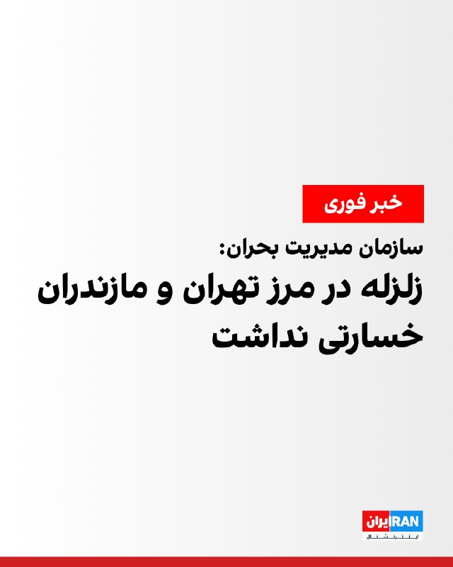

سازمان مدیریت بحران اعلام کرد باتوجه به بررسی‌های اولیه و ارزیابی تیم‌های کارشناسی، زمین‌لرزه‌ها در مرز استان‌های تهران و مازندران خساراتی درپی نداشته است.
مرکز لرزه‌نگاری در اطلاعیه‌ای اعلام کرد ساعت ۲۳:۴۶ سه‌شنبه شب زمین‌لرزه‌ای به بزرگی ۴.۶ مرز تهران و مازندران را لرزاند. زمین‌لرزه در تهران حدود ۱۰ ثانیه طول کشید.
این لرزش در شرق تهران، ورامین، پاکدشت، پردیس و بخش‌هایی از شمیرانات بیشتر احساس شد.
همچنین چهار پس‌لرزه‌ در استان تهران رخ داد که آخرین پس‌لرزه‌ها به بزرگی ۴ و ۳.۴ بودند.

https://iranintl.com/202605124199

## IranIntlTV — post 336887

  <a href="telegram/content/IranIntlTV_336887_1778622579.mp4" target="_blank">🎬 Download video</a>

🔻علیرضا دبیر، رییس فدراسیون کشتی در گفتگویی با خبرنگاران مدعی شد فدراسیون و خانه کشتی در غرب تهران در تمام روزهای جنگ ۴۰ روزه، مورد هدف قرار گرفته است.

🔹او گفت بیش از ۱۵۰تا ۱۶۰ موشک به این محل اصابت کرده است.

🔹در هفته اول جنگ، ایران‌اینترنشنال گزارش داد که پس از آغاز حملات اسرائیل و آمریکا در نهم اسفندماه، به کارکنان و پرسنل فدراسیون‌ها و مراکز مستقر در مجموعه ورزشی آزادی در تهران دستور داده شد ساختمان‌ها و سالن‌های ورزشی این مجموعه را تخلیه کنند.

🔹طبق این اطلاعات، پس از تخلیه کارکنان، نیروهای حکومتی از جمله یگان ویژه و بسیج در بخش‌های مختلف این مجموعه مستقر شدند.

🔹پس از این ماموران در سالن‌های مختلف از جمله ورزشگاه ۱۲ هزار نفری آزادی و همچنین سالن‌ها و ساختمان‌های متعلق به فدراسیون‌های ورزشی از جمله کشتی، والیبال، بسکتبال و وزنه‌برداری مستقر شدند.

🔹در پی این اقدامات، سالن ۱۲ هزار نفری ورزشگاه آزادی در حملات هوایی روز پنجشنبه ۱۴ اسفند ۱۴۰۴، تخریب شد.

🔹به گفته علیرضا دبیر، برای بازسازی خانه کشتی، تاکنون بیش از ۴۰۰ میلیارد تومان هزینه شده است.

@iranintltvsport

## IranIntlTV — post 336885

  

دونالد ترامپ در شبکه تروث سوشال نوشت وقتی رسانه‌های «جعلی» می‌گویند دشمن ایرانی از نظر نظامی در برابر آمریکا عملکرد خوبی دارد، این نوعی خیانت است، زیرا چنین ادعایی کاملا نادرست و حتی مضحک است.
او افزود: آن‌ها در حال کمک به دشمن هستند و به جمهوری اسلامی امید می‌دهند در حالی که نباید هیچ امیدی برای او وجود داشته باشد.
https://iranintl.com/202605125060

## IranIntlTV — post 336884

  

علی احتشام، امام جمعه کاشان گفت: «جمهوری اسلامی نه یکی از چهار قدرت، بلکه تنها ابرقدرت جهان است و ملت ایران هشت کشور منطقه و آمریکا را از کمال ارتفاع ساقط کرد و امروز با حضور در خیابان‌ها اجازه نداد جام زهر دیگری نوشیده شود.»

او افزود: «اگر مردم کف خیابان نبودند، چه بسا جام زهر دیگری نوشیده می‌شد.»
https://iranintl.com/202605128116

## IranIntlTV — post 336883

  

رسانه‌های ایران از وقوع زمین‌لرزه به بزرگی ۴.۶ در مرز استان‌های تهران و مازندران خبر دادند.

خبرگزاری فارس همچنین از زمین‌لرزه در کرج خبر داد.

همزمان خبرگزاری دولتی ایرنا گزارش داد زمین‌لرزه در تهران حدود ۱۰ ثانیه طول کشیده است.
https://iranintl.com/202605123583

## IranIntlTV — post 336882

  

سعید سیاه‌سرانی، دبیر ستاد راهیان نور دریایی، گفت: «بدون اراده جمهوری اسلامی اجازه عبور حتی یک لیتر نفت از تنگه هرمز داده نمی‌شود.»

او افزود: «تنگه هرمز جزو خاک ما است، شناورهایی که رد می‌شوند باید اجازه بگیرند و به زبان فارسی صحبت کنند و از نقاطی که ما تعیین می‌کنیم عبور کنند.»
https://iranintl.com/202605123958

## IranIntlTV — post 336881

  <a href="telegram/content/IranIntlTV_336881_1778622583.mp4" target="_blank">🎬 Download video</a>

خبرگزاری رویترز به نقل از دو مقام غربی گزارش داد که عربستان سعودی در جریان جنگ اخیر در خاورمیانه، در واکنش به حملاتی که در خاک این کشور انجام شده بود، چند حمله هوایی اعلام‌نشده علیه مواضعی در ایران انجام داده است.

گفت‌وگو با شهرام خلدی، پژوهشگر تاریخ خاورمیانه و روابط بین‌الملل

@iranintltv

## IranIntlTV — post 336880

  <a href="telegram/content/IranIntlTV_336880_1778622585.mp4" target="_blank">🎬 Download video</a>

هم‌زمان با سفر ترامپ به چین، گزارش‌ها حاکی است جمهوری اسلامی از پکن خواسته پیام‌های خود را به واشینگتن منتقل کند و چین را به‌عنوان ضامن احتمالی هر توافق آینده مطرح کرده است. سفیر ایران در چین نیز گفته پکن با ارائه طرح‌های صلح و رایزنی‌های منطقه‌ای تلاش دارد مسیر گفت‌وگوها را باز نگه دارد.

گفت‌وگو با آرام حسامی، استاد علوم سیاسی کالج مونتگومری

@iranintltv

## IranIntlTV — post 336879

  <a href="telegram/content/IranIntlTV_336879_1778622587.mp4" target="_blank">🎬 Download video</a>

انجمن قلم آمریکا در گزارش سالانه خود اعلام کرد؛ شمار نویسندگان زندانی در جهان برای نخستین‌بار از ۴۰۰ نفر عبور کرده است. این نهاد گفت؛ چین با ۱۱۹ مورد در صدر قرار دارد و ایران با زندانی‌کردن ۵۳ نویسنده در رتبه دوم ایستاده است.

در این گزارش آمده است؛ عربستان سعودی با ۲۷ نویسنده زندانی در رتبۀ سوم قرار دارد. پن آمریکا تاکید کرد؛ سرکوب نویسندگان و اهل قلم در ایران، به‌ویژه پس از «جنگ ۱۲روزه»، شدت گرفته است.
گفت‌وگو با اردوان روزبه، خبرنگار ایران‌اینترنشنال
@iranintltv

## IranIntlTV — post 336878

  <a href="https://t.me/IranintlTV/336878" target="_blank">📎 Download file</a>

🎧نسخه صوتی ‌‌‏۲۴ با فرداد فرحزاد: ترامپ: برای توافق با جمهوری اسلامی عجله ندارم
@iranintlTV

## IranIntlTV — post 336877

  

امارات متحده عربی اعلام کرد ۱۶ شهروند لبنانی و پنج نهاد مستقر در لبنان را به دلیل ارتباط با حزب‌الله در فهرست تروریستی این کشور قرار داده است.

در همین چارچوب، «موسسه قرض‌الحسن» و چهار نهاد دیگر نیز به دلیل ارتباط با حزب‌الله در این فهرست قرار گرفته‌اند.

امارات متحده عربی تاکید کرد این اقدامات در راستای مهار آفات تروریسم، محدود کردن گسترش آن و قطع تامین مالی فرامرزی انجام شده است.
https://iranintl.com/202605127283

## IranIntlTV — post 336876

  <a href="https://t.me/IranintlTV/336876" target="_blank">📎 Download file</a>

🎧نسخه صوتی چشم‌انداز: جهنم قطع اینترنت چگونه به پایان می‌رسد؟
@iranintlTV

## IranIntlTV — post 336875

  <a href="telegram/content/IranIntlTV_336875_1778622590.mp4" target="_blank">🎬 Download video</a>

بنا بر گزارش‌ها هم‌زمان با سفر دونالد ترامپ به چین، جمهوری اسلامی تلاش کرده است از پکن برای رساندن پیامش به واشینگتن استفاده کند و گفته است چین می‌تواند نقش ضامن هر توافق احتمالی را داشته باشد.

گفت‌وگو با جمشید برزگر، روزنامه‌نگار و تحلیل‌گر سیاسی
@iranintltv

## IranIntlTV — post 336874

  <a href="telegram/content/IranIntlTV_336874_1778622592.mp4" target="_blank">🎬 Download video</a>

جهنم قطع اینترنت چگونه به پایان می‌رسد؟

«چشم‌انداز با مهدی مهدوی‌آزاد»

تماشای نسخه کامل این برنامه در یوتیوب:

https://youtu.be/92BJ6BfAYHQ

@iranintltv

## IranIntlTV — post 336873

  

در پی بازداشت چهار فرد «وابسته به سپاه پاسداران» در کویت، وزارت خارجه جمهوری اسلامی برنامه‌ریزی برای انجام اقدامات خصمانه علیه کویت را بی‌اساس و مردود دانست.

وزارت خارجه جمهوری اسلامی در بیانیه‌ای اعلام کرد این چهار مامور در چارچوب ماموریت مرسوم گشت‌زنی دریایی مشغول انجام وظیفه بوده‌اند و به دلیل «اختلال در سامانه ناوبری» وارد آب‌های سرزمینی کویت شده‌اند.

این وزارتخانه از مراجع کویت خواست از اظهارنظرهای شتاب‌زده و طرح ادعاهای بی‌اساس خودداری کرده و موضوع را از طریق مجاری رسمی پیگیری کنند. وزارت خارجه جمهوری اسلامی همچنین خواهان آزادی این چهار مامور بازداشت‌شده شد.
https://iranintl.com/202605121807

## IranIntlTV — post 336872

  

کاظم غریب‌آبادی، معاون وزیر خارجه جمهوری اسلامی، در شبکه ایکس نوشت: «صلح واقعی با ادبیات تحقیر، تهدید و امتیازگیری اجباری ساخته نمی‌شود.»

غریب‌آبادی اضافه کرد: «اصول ما مشخص است، توقف دائمی جنگ و عدم تکرار آن، جبران خسارات، رفع محاصره، رفع تحریم‌های غیرقانونی و احترام به حقوق جمهوری اسلامی.»

او افزود: «وقتی طرفی که خود در جنگ، محاصره، تحریم و تهدید به زور نقش مستقیم دارد، پاسخ جمهوری اسلامی را صرفا به دلیل آنکه تسلیم‌نامه نیست، رد می‌کند، روشن می‌شود که مسئله اصلی نه صلح، بلکه تحمیل اراده سیاسی از مسیر تهدید و فشار است.»
https://iranintl.com/202605129672

## IranIntlTV — post 336871

  

اطلاعات رسیده به ایران اینترنشنال حاکی از آن است که احمد خزایی، شهروند ۴۶ ساله، از جمله شهروندان معترضی بوده که در جریان انقلاب ملی دی‌ماه در شهریار استان تهران با شلیک ماموران حکومت کشته شده است. او در جریان اعتراضات ۱۸ دی‌ماه کشته شد.
https://iranintl.com/202605128985

## IranIntlTV — post 336870

  

رویترز به نقل از دو مقام غربی و دو مقام ایرانی گزارش داد عربستان سعودی در جریان جنگ خاورمیانه، در پاسخ به حملاتی که در خاک این کشور انجام شده بود، چندین حمله اعلام‌نشده در ایران انجام داده است.
به گفته دو مقام غربی، این حملات توسط نیروی هوایی عربستان سعودی و در اوایل فروردین انجام شده‌اند. یکی از این مقامات گفت این حملات «اقداماتی تلافی‌جویانه در پاسخ به حملاتی بود که عربستان سعودی هدف آن قرار گرفته بود»
رویترز با اشاره به گزارش‌های پیشین درباره حملات امارات متحده عربی به ایران نوشت اقدامات عربستان سعودی و امارات متحده نشان می‌دهد کشورهای عربی خلیج فارس که هدف حملات جمهوری اسلامی قرار گرفته‌اند، به‌تدریج وارد فاز پاسخ‌گویی مستقیم شده‌اند.
https://iranintl.com/202605123748

## Shin_Persian — post 5983

Shin ✓ @hey_itsmyturn
Tue, 12 May 2026 21:17:38 UTC

Someone wrote “Tehran is having a wild orgasm” in Telegram 😭😭😭

فارسی

یک نفر در تلگرام نوشته «تهران دارد به ارگاسم وحشیانه می‌رسد» 😭😭😭

𝕏 · @shin_persian

## Shin_Persian — post 5982

Shin ✓ @hey_itsmyturn
Tue, 12 May 2026 21:16:15 UTC

And another aftershock rn

فارسی

و یک پس‌لرزه دیگر همین الان

𝕏 · @shin_persian

## Shin_Persian — post 5981

Shin ✓ @hey_itsmyturn
Tue, 12 May 2026 21:06:37 UTC

And we are back at “It’s HAARP” dumbfucks.

فارسی

و دوباره برگشتیم سر احمق‌هایی که می‌گویند «کار هارپ (HAARP) است».

𝕏 · @shin_persian

## Shin_Persian — post 5980

Shin ✓ @hey_itsmyturn
Tue, 12 May 2026 21:00:34 UTC

Another earthquake shook Tehran just now

فارسی

همین الان زلزله دیگری تهران را لرزاند

𝕏 · @shin_persian

## Shin_Persian — post 5979

  

Shin ✓ @hey_itsmyturn Tue, 12 May 2026 20:25:23 UTC President Trump @POTUS: "When the Fake News says that the Iranian enemy is doing well, Militarily, against us, it’s virtual TREASON in that it is such a false, and even preposterous, statement. They are…

## Shin_Persian — post 5978

Shin ✓ @hey_itsmyturn
Tue, 12 May 2026 20:25:23 UTC

President Trump @POTUS:
"When the Fake News says that the Iranian enemy is doing well, Militarily, against us, it’s virtual TREASON in that it is such a false, and even preposterous, statement. They are aiding and abetting the enemy! All it does is give Iran false hope when none should exist. These are American cowards that are rooting against our Country. Iran had 159 ships in their Navy — Every single ship is now resting at the bottom of the sea. They have no Navy, their Air Force is gone, all Technology is gone, their “leaders” are no longer with us, and the Country is an Economic Disaster. Only Losers, Ingrates, and Fools are able to make a case against America! President DONALD J. TRUMP"

فارسی

رئیس‌جمهور ترامپ @POTUS:
«وقتی اخبار جعلی می‌گویند که دشمن ایرانی از نظر نظامی در برابر ما خوب عمل می‌کند، این در واقع خیانتی مجازی است، چرا که چنین ادعایی کذب و حتی مضحک است. آن‌ها در حال کمک و یاری رساندن به دشمن هستند! تمام کاری که این حرف‌ها انجام می‌دهد، دادن امید واهی به ایران است، در حالی که هیچ امیدی نباید وجود داشته باشد. این‌ها بزدلانی آمریکایی هستند که علیه کشورمان ریشه دوانده‌اند. ایران ۱۵۹ کشتی در نیروی دریایی خود داشت — اکنون تک‌تک آن کشتی‌ها در کف دریا آرام گرفته‌اند. آن‌ها دیگر نیروی دریایی ندارند، نیروی هوایی‌شان از بین رفته، تمام تکنولوژی‌شان نابود شده، "رهبرانشان" دیگر در میان ما نیستند و آن کشور یک فاجعه اقتصادی است. فقط بازنده‌ها، ناسپاس‌ها و احمق‌ها می‌توانند علیه آمریکا استدلال کنند! رئیس‌جمهور دونالد جی. ترامپ»

𝕏 · @shin_persian

## Shin_Persian — post 5977

Shin ✓ @hey_itsmyturn
Tue, 12 May 2026 20:17:27 UTC

Quake in Tehran right now.

فارسی

هم‌اکنون زلزله در تهران.

𝕏 · @shin_persian

## Shin_Persian — post 5976

  

DefenceGeek 🇬🇧 ✓ @DefenceGeek Tue, 12 May 2026 19:21:43 UTC 40th Bomber Training Flight from Fairford #FreeIran‌ --- Operation EPIC FURY / Project FREEDOM --- Rather helpfully, the solo B-1B "Lancer" bomber from RAF Fairford (EGVA) (which is flying the…

## Shin_Persian — post 5975

DefenceGeek 🇬🇧 ✓ @DefenceGeek
Tue, 12 May 2026 19:21:43 UTC

40th Bomber Training Flight from Fairford #FreeIran‌
--- Operation EPIC FURY / Project FREEDOM ---

Rather helpfully, the solo B-1B "Lancer" bomber from RAF Fairford (EGVA) (which is flying the 40th training mission from the base since the ceasefire began), has been broadcasting it's location for all to see!

This route has been a fairly routine pattern for the training flights, and for many of the 62 bomber missions flown by B-1B and B-52H types during the war in Iran.

B-1B "ZENER01" 86-0134 #AE6C05 "Thunderbird"

@MATA_osint @ArmchairAdml @Andyyyyrrrr @jamjake01 @LHA2709 @vcdgf555

فارسی

چهلمین پرواز آموزشی بمب‌افکن از فیرفورد #FreeIran
--- عملیات خشم حماسی (EPIC FURY) / پروژه آزادی ---

بمب‌افکن تک‌فروندی B-1B "لنسر" از پایگاه نیروی هوایی سلطنتی فیرفورد (EGVA) (که در حال انجام چهلمین ماموریت آموزشی از این پایگاه پس از آغاز آتش‌بس است)، به شکلی کاملاً مفید در حال مخابره موقعیت مکانی خود برای مشاهده همگان بوده است!

این مسیر یک الگوی نسبتاً معمول برای پروازهای آموزشی و همچنین برای بسیاری از ۶۲ ماموریت بمب‌افکنی انجام شده توسط انواع B-1B و B-52H در طول جنگ در ایران بوده است.

B-1B "ZENER01" 86-0134 #AE6C05 "Thunderbird"

@MATA_osint @ArmchairAdml @Andyyyyrrrr @jamjake01 @LHA2709 @vcdgf555

𝕏 · @shin_persian

## Shin_Persian — post 5974

  <a href="telegram/content/Shin_Persian_5974_1778622598.mp4" target="_blank">🎬 Download video</a>

Rapid Response 47 ✓ @RapidResponse47
Tue, 12 May 2026 18:01:20 UTC

.@POTUS: "It's very simple: Iran cannot have a nuclear weapon... We don't play games. They're not going to have a nuclear weapon."

فارسی

.@POTUS: "بسیار ساده است: ایران نمی‌تواند سلاح هسته‌ای داشته باشد... ما بازی نمی‌کنیم. آن‌ها قرار نیست سلاح هسته‌ای داشته باشند."

𝕏 · @shin_persian

## Shin_Persian — post 5973

↩️ Quoted tweet: DefenceGeek 🇬🇧 ✓ @DefenceGeek Tue, 12 May 2026 18:11:27 UTC @hey_itsmyturn Training flight lol ↩️ توییت نقل‌قول شده — برای پاسخ، پست زیر را ببینید. فارسی @hey_itsmyturn پرواز تمرینی خخخ 𝕏 · @shin_persian

## Shin_Persian — post 5972

↩️ Quoted tweet:
DefenceGeek 🇬🇧 ✓ @DefenceGeek
Tue, 12 May 2026 18:11:27 UTC

@hey_itsmyturn Training flight lol

↩️ توییت نقل‌قول شده — برای پاسخ، پست زیر را ببینید.

فارسی

@hey_itsmyturn پرواز تمرینی خخخ

𝕏 · @shin_persian

## Shin_Persian — post 5971

Shin ✓ @hey_itsmyturn
Tue, 12 May 2026 17:54:52 UTC

Initial:
Blast in Sana'a, Yemen

فارسی

انفجار در صنعا، یمن

𝕏 · @shin_persian

## Shin_Persian — post 5970

  

Shin ✓ @hey_itsmyturn
Tue, 12 May 2026 17:49:19 UTC

𝕏 · @shin_persian

## Shin_Persian — post 5969

Shin ✓ @hey_itsmyturn
Tue, 12 May 2026 17:45:43 UTC

Lancer on the move

فارسی

لنسر در حال حرکت

𝕏 · @shin_persian

## ManotoTV — post 105379

  <a href="telegram/content/ManotoTV_105379_1778622600.mp4" target="_blank">🎬 Download video</a>

رئیس سازمان هلال احمر اعلام کرد زلزله در تهران و کرج «هیچ» خسارت مالی و جانی در پی نداشته است.
پیش‌تر زلزله‌ای به بزرگی ۴.۶ در مقیاس ریشتر، مرز استان‌های تهران و مازندران را لرزاند.

## ManotoTV — post 105378

  <a href="telegram/content/ManotoTV_105378_1778622601.mp4" target="_blank">🎬 Download video</a>

شاهزاده رضا پهلوی در نشست امنیتی سالانه پولیتیکو گفت مردم ایران، نه نیروهای خارجی، باید نقش اصلی را در تغییر حکومت جمهوری اسلامی ایفا کنند؛ اما برای این کار به «حمایت و پوشش» نیاز دارند.

او گفت: «نیروهای روی زمین در ایران، خود مردم ایران هستند. ما نیازی نداریم نیروهای خارجی این کار را برای ما انجام دهند.»

شاهزاده رضا پهلوی با اشاره به سرکوب اعتراضات دی‌ماه گفت در کمتر از ۴۸ ساعت بیش از ۴۰ هزار نفر کشته شدند و افزود بدون حمایت، نمی‌توان از مردم انتظار داشت دوباره به خیابان‌ها بیایند.

او گفت: «به همین دلیل بود که به کارزار هوایی و پوشش هوایی نیاز داشتیم.»

شاهزاده رضا پهلوی همچنین تأکید کرد باید یک استراتژی روشن برای پایان دادن به جمهوری اسلامی وجود داشته باشد؛ استراتژی‌ای که هم مردم را برای قیام تشویق کند و هم زمینه پیوستن نیروهایی از ارتش و دستگاه امنیتی به مردم را فراهم سازد.

او افزود: «نمی‌شود از یک طرف گفت مردم قیام کنند و همزمان گفت در حال مذاکره هستیم؛ این همه را گیج می‌کند.»

شاهزاده رضا پهلوی همچنین گفت حملات انجام‌شده علیه جمهوری اسلامی، ملت ایران را هدف نگرفته بود، بلکه زیرساخت‌های سرکوب حکومت، از جمله دستگاه اطلاعاتی و سپاه پاسداران، را هدف قرار داده بود.

او افزود: «مردم آن‌قدر باهوش هستند که تفاوت میان حمله به ملت ایران و حمله به حکومت را تشخیص دهند.»

## ManotoTV — post 105377

  <a href="telegram/content/ManotoTV_105377_1778622603.mp4" target="_blank">🎬 Download video</a>

‌
خبرگزاری‌های داخل ایران گزارش دادند دقایقی پیش زلزله تهران و کرج را لرزاند. به گزارش این خبرگزاری‌ها سمت شرق تهران زمین‌لرزه بسیار شدیدتر بوده است.

## ManotoTV — post 105376

  <a href="telegram/content/ManotoTV_105376_1778622604.mp4" target="_blank">🎬 Download video</a>

تماسی از ایران؛
«می‌گفت تغییر از بیرون نیست…
کار خود مردمه، حتی با این وضعیت سخت.»

## ManotoTV — post 105375

  <a href="telegram/content/ManotoTV_105375_1778622606.mp4" target="_blank">🎬 Download video</a>

رویترز به نقل از دو مقام غربی و دو مقام ایرانی گزارش داد عربستان سعودی در واکنش به حملات انجام‌شده علیه این کشور، چند حمله نظامی اعلام‌نشده علیه جمهوری اسلامی انجام داده است.

بر اساس این گزارش، حملات هوایی عربستان در اواخر ماه مارس توسط نیروی هوایی این کشور انجام شده و نخستین مورد شناخته‌شده از حمله مستقیم نظامی عربستان به خاک ایران به شمار می‌رود.

رویترز نوشت این حملات پس از آن انجام شد که جمهوری اسلامی در جریان جنگ اخیر، همه کشورهای عضو شورای همکاری خلیج فارس را با موشک و پهپاد هدف قرار داد و به زیرساخت‌های نفتی، فرودگاه‌ها و مراکز غیرنظامی حمله کرد.

به گفته منابع رویترز، پس از حملات عربستان، تهران و ریاض وارد تماس‌های فشرده دیپلماتیک شدند و عربستان نیز هشدار داده بود در صورت ادامه حملات، پاسخ‌های بیشتری خواهد داد.

یک مقام ایرانی به رویترز گفت تهران و ریاض در نهایت برای کاهش تنش به تفاهم رسیدند؛ تفاهمی که هدف آن «توقف درگیری‌ها، حفظ منافع متقابل و جلوگیری از تشدید تنش» بوده است.

رویترز همچنین گزارش داد شمار حملات موشکی و پهپادی علیه عربستان پس از این تفاهم به‌طور قابل توجهی کاهش یافت.

## ManotoTV — post 105374

  <a href="telegram/content/ManotoTV_105374_1778622607.mp4" target="_blank">🎬 Download video</a>

‌
شاهزاده رضا پهلوی، در نشست امنیتی سالانه پولیتیکو، در واکنش به تهدید دونالد ترامپ درباره نابودی زیرساخت‌های غیرنظامی ایران، گفت چنین اظهاراتی «پیام اشتباه» به مردم ایران می‌فرستد.

او گفت: «سؤال این است که آیا شما اینجا هستید که ما را آزاد کنید یا بیشتر به ما آسیب بزنید؟»

شاهزاده رضا پهلوی افزود آنچه به مردم ایران آسیب می‌زند «زیرساخت‌های غیرنظامی» است و تأکید کرد باید میان مردم ایران و حکومت جمهوری اسلامی تفاوت قائل شد.

او گفت: «چیزی که به ما کمک می‌کند، هدف قرار دادن حکومت و زیرساخت‌های آن است.»

شاهزاده رضا پهلوی همچنین گفت جمهوری اسلامی مانند حماس در غزه، از مردم به‌عنوان «سپر انسانی» استفاده می‌کند و نیروهای امنیتی خود را در مدارس و بیمارستان‌ها مستقر می‌کند.

او افزود: «هرچه زودتر به این حکومت پایان دهیم، زودتر می‌توانیم جان انسان‌های بی‌گناه بیشتری را در کشورم حفظ کنیم.»

## ManotoTV — post 105373

  <a href="telegram/content/ManotoTV_105373_1778622608.mp4" target="_blank">🎬 Download video</a>

دونالد ترامپ در واکنش به افزایش تورم ناشی از جنگ با ایران، گفت پایان جنگ «خیلی دور نیست» و با پایان درگیری‌ها، قیمت نفت و تورم به‌سرعت کاهش خواهد یافت.
رئیس‌جمهور آمریکا به خبرنگاران گفت: «به‌محض پایان جنگ، شاهد سقوط قیمت نفت و جهش بازار سهام خواهید بود.»
او افزود صدها کشتی حامل نفت آماده خروج هستند و با باز شدن مسیرها، حجم زیادی نفت وارد بازار خواهد شد که به کاهش شدید تورم کمک می‌کند.

## ManotoTV — post 105372

  <a href="telegram/content/ManotoTV_105372_1778622609.mp4" target="_blank">🎬 Download video</a>

دونالد ترامپ پیش از سفر رسمی خود به چین اعلام کرد در دیدار با شی جین‌پینگ گفت‌وگویی طولانی خواهد داشت، اما نیازی به صحبت درباره جمهوری‌اسلامی نمی‌بیند؛ چون به گفته او، «ایران کاملاً تحت کنترل است».
رئیس‌جمهور آمریکا بار دیگر تأکید کرد جمهوری‌اسلامی «به سلاح هسته‌ای دست نخواهد یافت» و گفت اقدامات آمریکا علیه تهران «کاملا مؤثر» بوده است.

## ManotoTV — post 105371

  <a href="telegram/content/ManotoTV_105371_1778622610.mp4" target="_blank">🎬 Download video</a>

تماسی از مشهد:
«می‌گفت بلاتکلیفی کنکور، گرونی منابع و قطعی اینترنت، دانش‌آموزها رو زیر فشار شدید گذاشته.»

## ManotoTV — post 105366

اکونومیست می‌نویسد بحران طولانی ایران می‌تواند برای کشورهای خلیج فارس فقط یک چالش امنیتی کوتاه‌مدت نباشد، بلکه به آزمونی جدی برای آینده اقتصادی، سرمایه‌گذاری خارجی، تجارت دریایی و تصویر این منطقه به‌عنوان مقصدی امن و باثبات تبدیل شود. ورق بزنید.

## ManotoTV — post 105365

  <a href="telegram/content/ManotoTV_105365_1778622611.mp4" target="_blank">🎬 Download video</a>

وزیر خارجه پاکستان اعلام کرد در گفت‌وگو با همتای چینی خود، درباره تلاش‌های اسلام‌آباد برای تسهیل مذاکرات میان جمهوری‌اسلامی و آمریکا رایزنی کرده است.
وزارت خارجه پاکستان در بیانیه‌ای اعلام کرد وانگ یی، وزیر خارجه چین، از نقش «سازنده» پاکستان در میانجیگری حمایت و قدردانی کرده است.
دو طرف همچنین بر ضرورت ادامه آتش‌بس پایدار و تضمین عبور عادی کشتی‌ها از تنگه هرمز تأکید کردند.
این گفت‌وگو در حالی انجام شده که دونالد ترامپ قرار است این هفته به‌طور رسمی به چین سفر کند.

## ManotoTV — post 105364

  <a href="telegram/content/ManotoTV_105364_1778622612.mp4" target="_blank">🎬 Download video</a>

ژنرال دن کین، رئیس ستاد مشترک ارتش آمریکا، اعلام کرد جمهوری‌اسلامی تحت فشار شدید ناشی از تحریم‌ها و محاصره قرار دارد و واشنگتن همچنان «طیفی از گزینه‌های نظامی» را در اختیار دارد.
در جلسه استماع سنای آمریکا، کریس مورفی، سناتور دموکرات، با اشاره به افزایش شدید قیمت سوخت پرسید آیا راهی جز دیپلماسی برای بازگشایی تنگه هرمز وجود دارد یا نه.
پیت هگست، وزیر دفاع آمریکا، در پاسخ گفت واشنگتن «قطعاً» ابزارهای نظامی لازم برای باز کردن تنگه هرمز را در اختیار دارد؛ از جمله حمله به اهداف زمینی و استفاده از توان دریایی و محاصره نظامی.

## ManotoTV — post 105363

  <a href="telegram/content/ManotoTV_105363_1778622613.mp4" target="_blank">🎬 Download video</a>

جان هیلی، وزیر دفاع بریتانیا، اعلام کرد لندن جنگنده، پهپاد و یک ناو جنگی را به مأموریت چندملیتی حفاظت از تردد کشتی‌ها در تنگه هرمز اعزام خواهد کرد.

هیلی این خبر را پس از نشست مشترک با وزرای دفاع ۴۰ کشور اعلام کرد؛ نشستی که با هدف جلب حمایت برای مأموریت تحت رهبری بریتانیا جهت تأمین امنیت کشتیرانی در تنگه هرمز برگزار شد.

بریتانیا می‌گوید این مأموریت در واکنش به محاصره تنگه هرمز از سوی جمهوری اسلامی انجام می‌شود.

## ManotoTV — post 105362

  <a href="telegram/content/ManotoTV_105362_1778622614.mp4" target="_blank">🎬 Download video</a>

سازمان جهانی بهداشت هشدار داد شمار موارد ابتلا به هانتاویروس، پس از شیوع این ویروس در یک کشتی گردشگری در اقیانوس اطلس، احتمالاً افزایش پیدا خواهد کرد.
تدروس آدهانوم، مدیرکل سازمان جهانی بهداشت، اعلام کرد تاکنون ۹ مورد ابتلای قطعی و دو مورد مشکوک ثبت شده و انتظار می‌رود افراد بیشتری نیز به ویروس مبتلا شده باشند. با این حال او تأکید کرد خطر شیوع گسترده جهانی همچنان «پایین» ارزیابی می‌شود.
شیوع بیماری در کشتی «ام‌وی هوندیوس» آغاز شد؛ جایی که سه مسافر، شامل یک زوج هلندی و یک زن آلمانی، جان خود را از دست دادند. این کشتی در حال سفر ۳۵ روزه در اقیانوس اطلس بود.
هانتاویروس معمولاً از طریق ادرار، بزاق یا فضولات جوندگان منتقل می‌شود. گونه «آندِس» تنها نوع شناخته‌شده‌ای است که می‌تواند از انسان به انسان منتقل شود.
در پی این بحران، صدها مسافر و خدمه در کشورهای مختلف تحت قرنطینه یا مراقبت پزشکی قرار گرفته‌اند. مقام‌های بهداشتی در اروپا و آمریکا نیز در حال ردیابی تماس‌های مرتبط با مبتلایان هستند.

## ManotoTV — post 105361

  <a href="telegram/content/ManotoTV_105361_1778622615.mp4" target="_blank">🎬 Download video</a>

مقام‌های آمریکایی اعلام کردند نیروهای این کشور مانع عبور یک نفتکش با پرچم جمهوری مالت از تنگه هرمز شده‌اند.
سخنگوی ستاد فرماندهی مرکزی آمریکا سنتکام؛ به الجزیره گفت نفتکش «آگیوس فانوریوس» به‌دلیل نقض محاصره دریایی، اجازه عبور پیدا نکرده است. به گفته او، این کشتی حامل نفت ایران نبوده است.
مقام‌های آمریکایی همچنین اعلام کردند چند نفتکش دیگر نیز به‌دلیل نقض تحریم‌ها و محاصره اعمال‌شده علیه بنادر ایران، متوقف شده‌اند.

## ManotoTV — post 105360

  <a href="telegram/content/ManotoTV_105360_1778622615.mp4" target="_blank">🎬 Download video</a>

«اینترنت را قطع کردند تا صدای مردم خاموش شود.»

## FarsiVOA — post 217579

🔺جروزالم پست: عربستان سعودی در جریان عملیات «خشم حماسی» به مواضع رژیم ایران حمله‌ کرد

▪️روزنامه اسرائیلی جروزالم پست به نقل از مقام‌های غربی و ایرانی گزارش داده است که عربستان سعودی در جریان عملیات «خشم حماسی» حملات هوایی مخفیانه‌ای را علیه برخی مواضع رژیم جمهوری اسلامی در ایران انجام داده است. اقدامی که در صورت تأیید، نخستین عملیات مستقیم نظامی شناخته‌شده عربستان سعودی در خاک ایران محسوب می‌شود.

⬇️ بیشتر بخوانید:
https://ir.voanews.com/a/jpost-saudi-arabia-attacked-iran-epic-fury/8149291.html
@FarsiVOA

## FarsiVOA — post 217578

🔺پرزیدنت ترامپ: بیان ادعاهای دروغین درباره مناسب بودن شرایط نظامی رژیم ایران «خیانت» است

▪️رئیس جمهوری ایالات متحده با انتقاد شدید از انتشار اخبار دروغین در برخی از رسانه‌ها و مطرح کردن ادعاهای «وضعیت خوب» رژیم ایران از لحاظ نظامی در مقابل ارتش آمریکا، آن‌ را «عملا خیانت» به کشور دانست.

⬇️ بیشتر بخوانید:
https://ir.voanews.com/a/trump-iran-nuclear-inflation-travel-china/8149296.html
@FarsiVOA

## FarsiVOA — post 217577

⚡️توافق امنیتی یا نقض حاکمیت؟ پشت‌ پرده فشار جمهوری اسلامی برای پاکسازی کامل مرزی با عراق
@FarsiVOA

## FarsiVOA — post 217576

  

⚡️رسانه‌های داخلی و منابع مردمی شامگاه سه‌شنبه ۲۲ اردیبهشت از وقوع زمین‌لرزه در تهران و کرج خبر دادند.

رسانه‌های داخلی دقایقی پیش از نیمه‌شب سه‌شنبه از وقوع یک زمین‌لرزه نسبتا شدید در شهر تهران و بخش‌هایی از استان البرز خبر دادند.

وحیدآنلاین براساس گزارش‌های مردمی اعلام کرد این زلزله در شرق و شمال شرق تهران بیشتر حس شده است اما اهالی غرب پایتخت نیز وقوع آنرا گزارش کرده‌اند.

مرکز لرزه‌نگاری دانشگاه تهران بزرگای این زلزله را ۴.۶ ریشتر و محل وقوع آن را در عمق ۱۰ کیلومتری زمین در حوالی پردیس، در مرز استان‌های تهران و مازندارن، اعلام کرده است.

شامگاه سه‌شنبه نیز لرزه خفیفی حدودا ۳.۵ ریشتری حوالی پردیس و بومهن در شرق استان تهران گزارش شده بود.
@FarsiVOA

## FarsiVOA — post 217575

⚡️دونالد ترامپ، رئیس جمهوری آمریکا، روز سه‌شنبه ۲۲ اردیبهشت پیش از ترک آمریکا به مقصد چین، به پرسش‌های خبرنگاران پاسخ داد.
@FarsiVOA

## FarsiVOA — post 217574

🔺بیش از ۱۱۰ برنده جایزه نوبل خواستار آزادی فوری نرگس محمدی شدند

▪️بیش از ۱۱۰ برنده جایزه نوبل در بیانیه‌ای مشترک خواستار آزادی فوری و بدون قید و شرط نرگس محمدی، فعال حقوق بشر و برنده ایرانی جایزه صلح نوبل، شدند، و نسبت به وضعیت جسمانی او در زندان ابراز نگرانی شدید کردند.

⬇️ بیشتر بخوانید:
https://ir.voanews.com/a/nobel-laureates-narges-mohammadi-release/8149256.html
@FarsiVOA

## FarsiVOA — post 217573

⚡️دونالد ترامپ، رئیس جمهوری آمریکا، روز سه‌شنبه ۲۲ اردیبهشت پیش از ترک آمریکا به مقصد چین، به پرسش‌های خبرنگاران پاسخ داد. بخش‌هایی از این پرسش و پاسخ با ترجمه همزمان پژواک کیومرثی از صدای آمریکا پخش شد.
@FarsiVOA

## FarsiVOA — post 217572

⚡️دونالد ترامپ، رئیس جمهوری آمریکا، روز سه‌شنبه ۲۲ اردیبهشت پیش از ترک آمریکا به مقصد چین، به پرسش‌های خبرنگاران پاسخ داد.
@FarsiVOA

## FarsiVOA — post 217571

  <a href="telegram/content/FarsiVOA_217571_1778622617.mp4" target="_blank">🎬 Download video</a>

⚡️کامبیز غفوری در برنامه تفسیر خبر: بزرگترین امتیاز جمهوری اسلامی در توافق ادامه حیات است
@FarsiVOA

## FarsiVOA — post 217570

🔺بازداشت «ژنرال بمب‌های بشکه‌ای»؛ فرمانده نیروی هوایی رژیم اسد محاکمه می‌شود

▪️وزارت کشور سوریه روز سه‌شنبه ۲۲ اردبیهشت اعلام کرد، جایز حمود موسی، فرمانده سابق نیروی هوایی سوریه، را بازداشت کرده است. او طراح ریختن بمب‌های بشکه‌ای بر مناطق تحت سلطه مخالفان است؛ اقدامی که به قربانی شدن هزاران تن از مردم سوریه، از جمله تعداد زیادی از زنان و کودکان، منجر شد.

⬇️ بیشتر بخوانید:
https://ir.voanews.com/a/syria-bashar-alassad-crime-revolution-irgc/8149228.html
@FarsiVOA

## FarsiVOA — post 217569

⚡️برگزاری دو نشست دفاعی در اروپا؛ حمایت از اوکراین تا امنیت تنگه هرمز و پیامدهای جنگ خاورمیانه
@FarsiVOA

## FarsiVOA — post 217568

  <a href="telegram/content/FarsiVOA_217568_1778622618.mp4" target="_blank">🎬 Download video</a>

⚡️هیمن سیدی در برنامه تفسیر خبر: جمهوری اسلامی استاد محاسبات غلط از سر ناچاری است
@FarsiVOA

## FarsiVOA — post 217567

⚡️ادامه بحران دارو و کمبود موادغذایی زیر سایه خاموشی دیجیتال؛ واکنش کاربران شبکه‌های اجتماعی

@FarsiVOA

## FarsiVOA — post 217566

⚡️در گفت‌وگو با موسی برزین، حقوقدان، از اعدام عبدالجلیل شه‌بخش، شهروند بلوچ، و سرکوب ساختاری اقلیت‌ها گفتیم و پرسیدیم چرا حکومت با استفاده از الگوی تکراری دادرسی ناعادلانه و اخذ اعترافات اجباری در زیرشکنجه، به اجرای احکام اعدام زندانیان سیاسی از جمله اقلیت‌های قومی کرد و بلوچ سرعت داده است.
@FarsiVOA

## FarsiVOA — post 217565

  <a href="telegram/content/FarsiVOA_217565_1778622619.mp4" target="_blank">🎬 Download video</a>

⚡️علی جوانمردی: روابط آمریکا و کردها و سلاح‌هایی کە پرزیدنت ترامپ گفتە بە کردها دادە
@FarsiVOA

## FarsiVOA — post 217564

🔺پرزیدنت ترامپ: یا رژیم ایران توافق می‌کند و یا ما کار را تمام خواهیم کرد

▪️رئیس جمهوری ایالات متحده، در آستانه سفر به چین در پاسخ به پرسشی درباره افزایش تورم کالاها و افزایش قیمت نفت همزمان با آغاز جنگ جمهوری اسلامی با اسرائیل و ایالات متحده گفت: «ما، بین دستیابی جمهوری اسلامی به سلاح هسته‌ای و تورم کوتاه مدت، دومی را انتخاب کردیم.»

⬇️ بیشتر بخوانید:
https://ir.voanews.com/a/trump-iran-nuclear-inflation-travel-china/8149279.html
@FarsiVOA

## FarsiVOA — post 217563

⚡️در برنامه تفسیر خبر امروز، مهدی آقازمانی با کارشناسان مهمان، درباره جلسه رییس جمهور آمریکا با تیم امنیت ملی کاخ سفید درباره حکومت ایران یک روز پیش از سفر به چین، تحریم‌های تازه آمریکا علیه شبکه مالی سپاه و طرح ۱۴ ماده‌ای جمهوری اسلامی برای مذاکرات، گفتگو می‌کند
@FarsiVOA

## FarsiVOA — post 217562

⚡️بعد از حدود دو ماه و نیم که از تعطیلی بازار سرمایه ایران می‌گذرد، حمید یاری، معاون نظارت بر بورس‌ها و ناشران سازمان بورس و اوراق بهادار، از نهایی شدن تحقق الزامات بازگشایی بازار سهام بر خبر داد.
@FarsiVOA

## FarsiVOA — post 217561

  <a href="telegram/content/FarsiVOA_217561_1778622620.mp4" target="_blank">🎬 Download video</a>

ناسا تصاویری تازه از مریخ‌نورد «پشتکار» منتشر کرد.

ناسا اعلام کرد این دورترین نقطه‌ای است که مریخ‌نورد «پشتکار» تاکنون در سیاره سرخ به آن رسیده است.

دانشمندان امیدوارند بررسی این منطقه به شناخت بهتر سیاره مریخ کمک کند.

@FarsiVOA

## FarsiVOA — post 217560

  <a href="telegram/content/FarsiVOA_217560_1778622620.mp4" target="_blank">🎬 Download video</a>

امیر چاهکی در برنامه تفسیر خبر: چاره‌ای جز توافق وجود ندارد

## DW_Farsi — post 124629

  

🔶 ترامپ: یا ایران کار درست را انجام می‌دهد یا ما کار را تمام می‌کنیم

دونالد ترامپ، رئیس ‌جمهور ایالات متحده آمریکا، روز سه‌شنبه ۱۲ مه (۲۲ اردیبهشت) در آغاز سفر خود به چین برای ملاقات با شی جین‌پینگ، رئیس ‌جمهور چین، اختلافات خود با شی بر سر جنگ آمریکا با ایران را کم‌اهمیت جلوه داد.

ترامپ پیش از این تلاش کرده بود شی را تحت فشار قرار دهد تا از نفوذ قابل‌توجه چین استفاده کرده و ایران را به پذیرش شروط آمریکا برای پایان دادن به جنگ یا باز کردن تنگه هرمز ترغیب کند.

ترامپ درباره برنامه خود برای گفت‌وگو با شی درباره جنگ با ایران گفت: «فکر می‌کنم او نسبتا خوب عمل کرده است.»

ترامپ افزود: «ما موضوعات زیادی برای گفت‌وگو داریم. راستش را بخواهید، نمی‌گویم ایران یکی از آن‌هاست، چون ما ایران را تا حد زیادی تحت کنترل داریم.»

رئیس جمهور آمریکا در عین حال اذعان کرد که دولت شی، ماه گذشته، زمانی که گفت‌وگوها دچار تزلزل شده بود، با ترغیب تهران به بازگشت به مذاکرات آتش‌بس به کاهش تنش‌ها کمک کرد.

@dw_farsi

## DW_Farsi — post 124628

  

🔶 نخستین حمله پهپادی از سمت شرق به جنوب اسرائیل پس از آتش‌بس ایران

ارتش اسرائیل اعلام کرد یک پهپاد را که از سمت شرق پرتاب شده بود، در نزدیکی ایلات، جنوبی‌ترین شهر اسرائیل، رهگیری کرده است.

ارتش اسرائیل گفته این پهپاد احتمالا از یمن پرتاب شده، هرچند همچنان در حال بررسی خاستگاه دقیق آن است.

طبق اعلام ارتش اسرائیل، مطابق دستورالعمل‌ها آژیر هشدار به صدا درنیامد. این نخستین حمله پهپادی به ایلات از زمان اجرایی شدن آتش‌بس‌ها در ایران و لبنان در ماه گذشته محسوب می‌شود.

شبه‌نظامیان حوثی مورد حمایت جمهوری اسلامی، در جریان جنگ اخیر بارها موشک و پهپاد به سمت اسرائیل شلیک کرده بودند.

@dw_farsi

## DW_Farsi — post 124627

  

🟠 زیردریایی هسته‌ای نیروی دریایی آمریکا وارد جبل‌الطارق شد

یک زیردریایی هسته‌ای نیروی دریایی آمریکا وارد تنگه جبل‌الطارق شده است. ناوگان ششم نیروی دریایی آمریکا ضمن اعلام این خبر اعلام کرد: «این توقف بندری، توانمندی، انعطاف‌پذیری و تعهد مداوم ایالات متحده آمریکا به متحدان ناتو را نشان می‌دهد.»

اینکه آیا این شناور در ارتباط با جنگایران به جبل‌الطارق اعزام شده یا نه، مشخص نیست. این زیردریایی هسته‌ای از کلاس موسوم به اوهایو، از روز یکشنبه وارد منطقه شده است. زیردریایی‌های کلاس اوهایو به موشک‌های موسوم به Trident 2 D5 مجهز هستند که می‌توانند به چند کلاهک هسته‌ای مجهز شوند.

مشخص نیست زیردریایی‌ای که اکنون در جبل‌الطارق دیده شده، تسلیحات هسته‌ای حمل می‌کند یا نه. نیروی دریایی آمریکا در بیانیه خود تنها به "موشک‌های بالستیک" اشاره کرده است.

@dw_farsi

## DW_Farsi — post 124626

  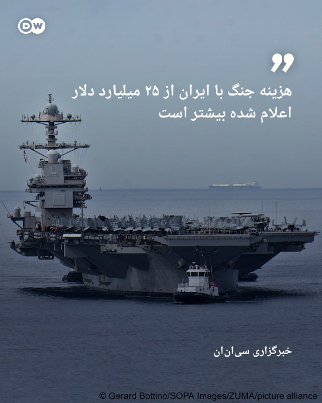

🔶 سی‌اِن‌اِن: هزینه جنگ با ایران از ۲۵ میلیارد دلار اعلام شده بیشتر است

خبرگزاری سی‌ان‌ا‌ن به نقل از سه منبع آگاه گزارش داده که برآورد ۲۵ میلیارد دلاری که یک مقام ارشد پنتاگون روز چهارشنبه درباره مجموع هزینه جنگ با ایران تا این لحظه به قانون‌گذاران این کشور ارائه کرد، "رقمی کمتر از واقعیت است و هزینه تعمیر خسارت‌های گسترده واردشده به پایگاه‌های آمریکا در منطقه را شامل نمی‌شود."

یکی از این منابع به سی‌ان‌ا‌ن گفت برآورد واقعی، با در نظر گرفتن هزینه بازسازی تاسیسات نظامی آمریکا و جایگزینی تجهیزات نابودشده، به حدود ۴۰ تا ۵۰ میلیارد دلار نزدیک‌تر است.

سی‌اِن‌اِن همچنین گزارش داده است که حملات جمهوری اسلامی در سراسر خلیج فارس در روزهای ابتدایی جنگ، تنها ظرف ۴۸ ساعت دست‌کم به ۹ پایگاه نظامی آمریکا آسیب قابل‌توجه وارد کرد و تاسیساتی در بحرین، کویت، عراق، امارات متحده عربی و قطر را هدف قرار داد.

در گزارش سی‌ان‌ان همچنین آمده که چند سامانه مهم راداری آمریکا و تجهیزات دیگر در سراسر خاورمیانه ظاهرا در حملات جمهوری اسلامی منهدم شدند؛ از جمله سامانه راداری یک سامانه موشکی تاد آمریکا در اردن و ساختمان‌هایی که سامانه‌های راداری مشابه را در دو نقطه در امارات متحده عربی در خود جای داده بودند. یک هواپیمای ای-۳ سنتری (Boeing E-3 Sentry) نیروی هوایی آمریکا نیز در حمله ایران به یک پایگاه هوایی در عربستان سعودی نابود شد.

سی‌ان‌ان پیش از این گزارش داده بود مقام‌های پنتاگون به کنگره گفته بودند این جنگ تنها در شش روز نخست حدود ۱۱ میلیارد دلار هزینه داشته است. همچنین وزارت دفاع آمریکا ماه گذشته از کاخ سفید خواست با درخواست ارائه بیش از ۲۰۰ میلیارد دلار بودجه نظامی اضافی به کنگره برای ادامه جنگ موافقت کند.

@dw_farsi

## DW_Farsi — post 124625

  

🔶 شکایت جمهوری اسلامی از آمریکا در دیوان داوری لاهه

دولت جمهوری اسلامی با طرح دعوی در دیوان داوری لاهه، از ایالات متحده آمریکا به‌ خاطر آن چه که "تجاوز نظامی به تأسیسات هسته‌ای ایران"، "اعمال تحریم‌های اقتصادی" و "تهدید به توسل به زور" خوانده شکایت کرد.

به گزارش خبرگزاری مهر، این دادخواست بر مبنای مفاد بیانیه‌های ۱۹۸۱ الجزایر و هم چنین بر اساس آن چه که "نقض تعهدات بین‌المللی آمریکا در جنگ ۱۲ روزه" توصیف شده در اسفندماه سال ۱۴۰۴، در دیوان داوری دعاوی ایران و آمریکا ثبت شده است.

جمهوری اسلامی در دادخواست خود که با عنوان پرونده الف- ۳۴ در دیوان داوری به ثبت رسیده، بر مبنای بند اول بیانیه الجزایر، با اشاره به "اعمال تحریم‌های اقتصادی و تهدید توسل به زور"، از دیوان خواسته است آمریکا را به نقض بند اول بیانیه محکوم کرده و این کشور را ملزم کند "فورا به مداخلات مستقیم و غیرمستقیم خود در امور داخلی ایران" پایان دهد.

در این دادخواست همچنین خواسته شده که آمریکا "ضمن ارائه تضمین عدم تکرار اعمال متخلفانه مزبور، خسارات وارده به ایران را نیز به طور کامل جبران کند".

بیانیه‌های الجزایر قراردادی است که با میانجیگری کشور الجزایر، میان نمایندگان ایران و ایالات متحده امریکا در ۱۹ ژانویه ۱۹۸۱ به امضا رسید و به گروگان‌گیری در سفارت آمریکا در تهران پایان داد.

@dw_farsi

## DW_Farsi — post 124624

🔶 بیش از ۱۱۰ برنده جایزه نوبل خواستار آزادی نرگس محمدی شدند

بیش از ۱۱۰ برنده جایزه نوبل خواستار آزادی فوری و بی قید و شرط نرگس محمدی، فعال زندانی حقوق بشر و برنده جایزه نوبل صلح، و رفع اتهام از او شدند.

این درخواست در پی افزایش نگرانی از وخامت سریع وضعیت جسمانی نرگس محمدی و انتقال او از زندان زنجان به بیمارستانی در تهران مطرح شده است.

در بیانیه‌ای که امروز سه‌شنبه ۱۲ مه (۲۲ اردیبهشت) منتشر شد، ۱۱۲ برنده جایزه نوبل از مقام‌های جمهوری اسلامی و جامعه جهانی خواستند تا "بی‌درنگ" برای آزادی نرگس محمدی و تضمین دسترسی مداوم او به درمان پزشکی اقدام کنند.

نرگس محمدی که در سال ۲۰۲۳ به دلیل دهه‌ها فعالیت در دفاع از حقوق زنان در ایران برنده جایزه نوبل صلح شده بود، یکشنبه گذشته ۲۰ اردیبهشت، به دلیل وضعیت بحرانی جسمانی‌اش جهت درمان تخصصی با آمبولانس به بیمارستان پارس تهران منتقل شد.

@dw_farsi

## DW_Farsi — post 124623

  

🔶 معاون نیروی دریایی سپاه: محدوده تنگه هرمز برای ما بزرگ‌تر شده است

محمد اکبرزاده، معاون سیاسی نیروی دریایی سپاه پاسداران انقلاب اسلامی، در گفت‌وگویی در تلویزیون جمهوری اسلامی مدعی شد که در جریان تحولات جنگ و محاصره دریایی، تنگه هرمز برای حکومت ایران "بزرگ‌تر شده و به یک منطقه وسیع عملیاتی تبدیل شده است."

اکبرزاده با بیان این ادعا که در گذشته، "تنگه هرمز یک گستره محدود در اطراف جزایری مانند هرمز و هنگام تعریف می‌شد"، گفت: «اکنون در چارچوب طرح جدید، محدوده تنگه هرمز به‌طور قابل توجهی گسترش یافته و از سواحل جاسک و سیری تا فراتر از جزایر بزرگ، به‌عنوان یک پهنه راهبردی تعریف شده است.»

معاون سیاسی نیروی دریایی سپاه پاسداران با اشاره به تحولات دهه‌های اخیر این منطقه و نیز در جریان جنگ هشت ساله ایران و عراق، با اشاره به ابعاد ژئوپلیتیکی تنگه هرمز، مدعی شد: «اگر بخواهیم جغرافیای این منطقه را توضیح دهیم، باید به این نکته توجه کنیم که نگاه جمهوری اسلامی ایران به تنگه هرمز، صرفاً یک نگاه محدود جغرافیایی نبوده، بلکه نگاهی راهبردی و متفاوت است.»

اکبرزاده با بیان این ادعا که "این رویکرد ناشی از سیاست تنش‌زدایی و تامین امنیت بوده است"، گفت: «ما به‌دنبال آرامش و امنیت در منطقه بودیم، اما امروز شرایط متفاوت شده و سیاست‌های جدیدی در قبال تنگه هرمز در حال اعمال است که دنیا نتایج آن را خواهد دید.»

با تشدید حملات امریکا و اسرائیل به ایران، سپاه پاسداران اقدام به بستن تنگه هرمز کرد. این اقدام با اعتراضات شدید بین‌المللی روبرو شد چرا که این باریکه یک آبراه بین‌المللی است و بر اساس قوانین بین‌الملل ایران اجازه بستن آن را ندارد.

در حال حاضر این موضوع به یکی از موضوعات اصلی مورد مناقشه میان ایران و آمریکا تبدیل شده است.

@dw_farsi

## Persian_Trend_Official — post 14018

  <a href="telegram/content/Persian_Trend_Official_14018_1778622625.webm" target="_blank">🎬 Download video</a>

#طنز_تلخ

⭕️ بیانیه عرش الهی:

مجدد زلزله ای زیبا نازل کردیم.
خواهیم دید چه خواهد شد.
از توجه شما به این موضوع سپاس گذاریم.

📝 Nick

📌 @persian_trend_official
پرشین ترند | متفاوت‌ترین کانال نظامی

## Persian_Trend_Official — post 14017

  <a href="telegram/content/Persian_Trend_Official_14017_1778622625.mp4" target="_blank">🎬 Download video</a>

💢این ویدئو بهت نشون میده که پناه‌گیری درست چطور جانت رو حفظ می‌کنه در زمان زلزله

🫆:Tony

📌 @persian_trend_official
پرشین ترند | متفاوت‌ترین کانال نظامی

## Persian_Trend_Official — post 14016

🔴کولیوند: زلزله پردیس تهران، خسارت مالی و جانی نداشت

💢 رئیس جمعیت هلال احمر: مردم نگران نباشند؛ زلزله پردیس تهران، خسارت مالی و جانی در پی نداشته است.

💢 ۲ پس لرزه ۴ و ۳.۴ ریشتری دیگر تهران را لرزاند.

🫆:Tony

📌 @persian_trend_official
پرشین ترند | متفاوت‌ترین کانال نظامی

## Persian_Trend_Official — post 14015

🔴آماده باش مدیریت بحران پردیس؛ در پی زلزله مردم پردیس از خانه‌ها خارج شدند

💢در حالی که فرماندار شهرستان پردیس گفت: در پی وقوع زمین لرزه استان ستاد مدیریت بحران شهرستان در آماده باش کامل است، خبرنگار ایرنا از پردیس گزارش می‌دهد شهروندان پردیسی از خانه‌ها خارج شده و در پارک‌ها و خودروها مستقر شده‌اند.

🫆:Tony

📌 @persian_trend_official
پرشین ترند | متفاوت‌ترین کانال نظامی

## Persian_Trend_Official — post 14014

🔴گزارش جدیدترین پس‌لرزه در استان تهران

بزرگی: 3.4
محل وقوع: حوالی پرديس
تاریخ و زمان وقوع به وقت محلی: 1405/02/23 00:32:44
طول جغرافیایی: 51.83
عرض جغرافیایی: 35.83
عمق زمین‌لرزه: 10 کیلومتر

نزدیک‌ترین شهرها:
10 کیلومتری پرديس (تهران)
11 کیلومتری بومهن (تهران)
12 کیلومتری رودهن (تهران)

نزدیکترین مراکز استان:
41 کیلومتری تهران
76 کیلومتری كرج

🫆:Tony

📌 @persian_trend_official
پرشین ترند | متفاوت‌ترین کانال نظامی

## Persian_Trend_Official — post 14013

🔴 سخنگوی اورژانس تهران:

در پی زمین لرزه در تهران تا این لحظه مصدومی گزارش نشده است

🫆:Tony

📌 @persian_trend_official
پرشین ترند | متفاوت‌ترین کانال نظامی

## Persian_Trend_Official — post 14012

  <a href="telegram/content/Persian_Trend_Official_14012_1778622627.webm" target="_blank">🎬 Download video</a>

🔴حین و بعد از زلزله چه باید کرد؟

🫆:Tony

📌 @persian_trend_official
پرشین ترند | متفاوت‌ترین کانال نظامی

## Persian_Trend_Official — post 14010

  <a href="telegram/content/Persian_Trend_Official_14010_1778622628.webm" target="_blank">🎬 Download video</a>

🔴زلزله در تهران احساس شد 🫆:Tony 📌 @persian_trend_official پرشین ترند | متفاوت‌ترین کانال نظامی

## Persian_Trend_Official — post 14009

خب دیگه بلا های آسمانی هم سر شوخی رو با مردم ایران باز کردن 🤦🏻‍♂️

📝 Nick

## Persian_Trend_Official — post 14008

🔴زلزله در تهران احساس شد 🫆:Tony 📌 @persian_trend_official پرشین ترند | متفاوت‌ترین کانال نظامی

## Persian_Trend_Official — post 14007

🔴زلزله در تهران احساس شد

🫆:Tony

📌 @persian_trend_official
پرشین ترند | متفاوت‌ترین کانال نظامی

## Persian_Trend_Official — post 14006

https://youtube.com/live/rrGzLhyQoaY?feature=share

## Persian_Trend_Official — post 14005

  

🇸🇦🇮🇷 — خبرگزاری رویترز درگزارشی مدعیست که عربستان سعودی در اواخر ماه مارس، حملات هوایی محرمانه‌ تلافی جویانه ای را در پاسخ به ایران انجام داده است.

☆Phantom☆

📌 @persian_trend_official
پرشین ترند | متفاوت‌ترین کانال نظامی

## Persian_Trend_Official — post 14004

  <a href="telegram/content/Persian_Trend_Official_14004_1778622629.mp4" target="_blank">🎬 Download video</a>

🔴ویدیو منتشر شده از کشتی کره ای آسیب دیده در حملات جمهوری اسلامی در روز های گذشته

🫆:Tony

📌 @persian_trend_official
پرشین ترند | متفاوت‌ترین کانال نظامی

## Persian_Trend_Official — post 14003

  

🔴 تهران ادعاهای کویت علیه ۴ شهروند ایرانی را رد کرد

جمهوری اسلامی ادعاهای مطرح‌شده از سوی وزارت خارجه و وزارت کشور کویت درباره برنامه‌ریزی ایران برای انجام اقدامات خصمانه علیه این کشور را «کاملاً بی‌اساس» و مردود دانست.

بر اساس موضع تهران:

▪️ اتهامات مطرح‌شده علیه ۴ شهروند ایرانی رد شده است
▪️ ایران تأکید کرده هیچ برنامه‌ای برای اقدام علیه کویت نداشته است
▪️ جمهوری اسلامی این ادعاها را فاقد اعتبار توصیف کرده است

▪️این واکنش پس از آن مطرح می‌شود که کویت از شناسایی و برخورد با آنچه «تهدیدات امنیتی» خوانده بود خبر داده بود.

🫆:Tony

📌 @persian_trend_official
پرشین ترند | متفاوت‌ترین کانال نظامی

## Persian_Trend_Official — post 14002

  

جنگنده کره‌ای KF-21 بیش از 16000 پرواز آزمایشی تاکنون انجام داده و به مراحل پایانی تست‌های خود رسیده است.

📝 Nick

📌 @persian_trend_official
پرشین ترند | متفاوت‌ترین کانال نظامی

## Persian_Trend_Official — post 14001

  <a href="telegram/content/Persian_Trend_Official_14001_1778622631.mp4" target="_blank">🎬 Download video</a>

ترامپ راهی چین شد.

📝 Nick

📌 @persian_trend_official
پرشین ترند | متفاوت‌ترین کانال نظامی

## Persian_Trend_Official — post 14000

  <a href="https://t.me/persian_trend_official/14000" target="_blank">📎 Download file</a>

فایل صوتی لایو اول
نسخه کم حجم - 7.06 مگابایت

اتاق جنگ سه شنبه 22 اردیبهشت | بالا رفتن احتمال جنگ جمهوری اسلامی و آمریکا

📝 Nick

📌 @persian_trend_official
پرشین ترند | متفاوت‌ترین کانال نظامی

## Persian_Trend_Official — post 13999

  <a href="telegram/content/Persian_Trend_Official_13999_1778622633.webm" target="_blank">🎬 Download video</a>

تهران طوفانی شد

🔹هواشناسی: از ساعتی پیش، وزش باد ۵۵ کیلومتر بر ساعت همراه با گردوخاک در تهران آغاز شده است.

شهروندان از تردد غیرضروری در فضاهای باز و ماندن در مجاورت درختان کهنسال، سازه‌های موقت و تأسیسات ناپایدار خودداری کنند.
☆Phantom☆

📌 @persian_trend_official
پرشین ترند | متفاوت‌ترین کانال نظامی

## RadioFarda — post 157111

🔸خبرگزاری رویترز روز سه‌شنبه در گزارشی اختصاصی به نقل از دو مقام غربی و دو مقام ایرانی اعلام کرد که در جریان جنگ اخیر، عربستان سعودی در واکنش به حملات تهران به این کشور، چندین حمله به اهدافی در ایران انجام داده بود. 🔸این حملات عربستان سعودی که پیش‌تر گزارش…

## RadioFarda — post 157110

  

🔸خبرگزاری رویترز روز سه‌شنبه در گزارشی اختصاصی به نقل از دو مقام غربی و دو مقام ایرانی اعلام کرد که در جریان جنگ اخیر، عربستان سعودی در واکنش به حملات تهران به این کشور، چندین حمله به اهدافی در ایران انجام داده بود.

🔸این حملات عربستان سعودی که پیش‌تر گزارش نشده بودند، نخستین مورد شناخته‌شده از اقدام مستقیم نظامی این کشور در خاک ایران به شمار می‌روند.

🔸به گفته دو مقام غربی، این حملات که توسط نیروی هوایی عربستان انجام شده‌اند، در اواخر ماه مارس صورت گرفته‌اند. یکی از آن‌ها گفت این حملات «اقدامات تلافی‌جویانه متقابل در پاسخ به حمله به عربستان» بوده است.

🔸رویترز می‌گوید نتوانسته است اهداف دقیق این حملات را تأیید کند.

🔸در پاسخ به درخواست اظهار نظر، یک مقام ارشد وزارت خارجه عربستان به‌طور مستقیم به این سوال که آیا چنین حملاتی انجام شده یا نه پاسخ نداد. وزارت خارجه ایران نیز به درخواست اظهار نظر پاسخ نداد.

@RadioFarda

## RadioFarda — post 157109

  

🔸وزارت خارجه جمهوری اسلامی بازداشت چهار نفر در کویت را که مقام‌های کویتی آن‌ها را وابسته به سپاه پاسداران معرفی کرده‌اند، تأیید کرد اما اتهام برنامه‌ریزی برای «اقدامات خصمانه» علیه کویت را رد کرد.

🔸وزارت خارجه ایران روز سه‌شنبه اعلام کرد این افراد در حال گشت دریایی بوده‌اند و به دلیل «اختلال در سیستم ناوبری» وارد آب‌های سرزمینی کویت شده‌اند.

🔸این وزارتخانه همچنین اظهارات مقام‌های کویتی درباره قصد ایران برای انجام عملیات خصمانه را رد و آن را بی‌اساس توصیف کرد.

🔸پیشتر وزارت کشور کویت اعلام کرده بود چهار «نفوذی» وابسته به سپاه پاسداران انقلاب اسلامی را پس از تلاش برای ورود دریایی به این کشور بازداشت کرده است.

🔸رسانه‌های دولتی کویت همچنین گزارش داده بودند که بازداشت‌شدگان در بازجویی‌ها گفته‌اند مأموریت داشته‌اند با یک قایق ماهیگیری به جزیره بوبیان نفوذ کنند.

@RadioFarda

## RadioFarda — post 157108

🔸وزارت خارجه ایالات متحده روز سه‌شنبه در بیانیه‌ای که در اختیار خبرگزاری رویترز قرار داد، اعلام کرد که مقام‌های ارشد آمریکا و چین توافق دارند که هیچ کشوری نباید اجازه داشته باشد برای عبور از تنگه هرمز عوارض کشتیرانی دریافت کند. 🔸این بیانیه وزارت خارجه آمریکا…

## RadioFarda — post 157107

  

🔸وزارت خارجه ایالات متحده روز سه‌شنبه در بیانیه‌ای که در اختیار خبرگزاری رویترز قرار داد، اعلام کرد که مقام‌های ارشد آمریکا و چین توافق دارند که هیچ کشوری نباید اجازه داشته باشد برای عبور از تنگه هرمز عوارض کشتیرانی دریافت کند.

🔸این بیانیه وزارت خارجه آمریکا پیش از نشست پیش‌روی دونالد ترامپ و شی جین‌پینگ، همتای چینی او، منتشر شده است؛ نشستی که در آن کنترل ایران بر تنگه هرمز در دستور کار خواهد بود.

🔸وزارت خارجه آمریکا گفت وانگ یی، وزیر خارجه چین، و مارکو روبیو، وزیر خارجه آمریکا، در یک تماس تلفنی در ماه گذشته میلادی دربارهٔ این موضوع گفت‌وگو کرده‌اند.

🔸تامِی پیگوت، سخنگوی وزارت خارجه، در پاسخ به پرسش‌های رویترز دربارهٔ این تماس گفت: «آن‌ها توافق کردند که هیچ کشور یا سازمانی نباید اجازه داشته باشد برای عبور از آبراه‌های بین‌المللی مانند تنگه هرمز عوارض دریافت کند.»

🔸رویترز می‌گوید وزارت خارجه آمریکا برخلاف رویه معمول خود، پیش‌تر گزارشی از این تماس منتشر نکرده بود.

@RadioFarda

## RadioFarda — post 157106

🔸دونالد ترامپ، رئیس‌جمهور آمریکا، پیش از سفر به پکن گفت که رئیس‌جمهور چین درباره جنگ ایران «نسبتاً خوب» عمل کرده است، اما واشینگتن به کمک او نیازی ندارد.

🔸او روز سه‌شنبه در محوطه کاخ سفید در جمع خبرنگاران افزود که قرار است با شی جین‌پینگ «گفت‌وگویی طولانی» درباره ایران داشته باشد.

🔸ترامپ تصریح کرد: «فکر نمی‌کنم ما به هیچ کمکی درباره ایران نیاز داشته باشیم. ما به هر شکلی که باشد پیروز خواهیم شد. یا به‌صورت مسالمت‌آمیز پیروز می‌شویم یا به شکل دیگری.»

🔸رئیس‌جمهور آمریکا با اشاره به این که توان نظامی ایران در جنگ اخیر از بین رفته است، هشدار داد: ««ایران یا کار درست را انجام خواهد داد یا ما کار را تمام خواهیم کرد.»

@RadioFarda

## RadioFarda — post 157105

  

🔸دولت بریتانیا می‌گوید ناوشکن اچ‌ام‌اس دراگون، چندین جنگندۀ تایفون و شهپادهای مین‌روب را در قالب یک عملیات چندملیتی برای تضمین امنیت کشتیرانی در تنگۀ هرمز، به این منطقه اعزام خواهد کرد.

🔸جان هیلی، وزیر دفاع بریتانیا این موضوع را روز سه‌شنبه در جریان یک نشست آنلاین با همتایانش از بیش از چهل کشور دیگر عضو این عملیات اعلام کرد؛ عملیاتی که به گفتۀ او، پس از آماده‌شدن شرایط اجرایی خواهد شد.

🔸وزیر دفاع بریتانیا در بیانیه‌ای گفت: «این عملیات با شراکت متحدانمان، عملیاتی دفاعی، مستقل و معتبر خواهد بود».

🔸مشارکت بریتانیا در این عملیات،‌ شامل ۱۱۵ میلیون پوند (بیش از ۱۵۵ میلیون دلار) سرمایه‌گذاری جدید در زمینۀ شهپادهای مین‌روب و سامانه‌های ضد پهپاد هم خواهد بود.

🔸بریتانیا در حال حاضر بیش از یک‌هزار نیروی نظامی در منطقه دارد که در قالب عملیات و همکاری‌های دفاعی با کشورهای منطقه، از جمله در زمینۀ مقابله با پهپادها در کشورهای متحد این کشور مستقر شده‌اند. ناوشکن اچ‌ام‌اس دراگون هم در مسیر خاورمیانه قرار دارد.

@RadioFarda

## RadioFarda — post 157104

  

🔸دونالد ترامپ، رئیس‌جمهور آمریکا، پیش از سفر به پکن گفت که رئیس‌جمهور چین درباره جنگ ایران «نسبتاً خوب» عمل کرده است، اما واشینگتن به کمک او نیازی ندارد.

🔸او روز سه‌شنبه در جمع خبرنگاران افزود که قرار است با شی جین‌پینگ «گفت‌وگویی طولانی» درباره ایران داشته باشد.

🔸ترامپ تصریح کرد: «فکر نمی‌کنم ما به هیچ کمکی درباره ایران نیاز داشته باشیم. ما به هر شکلی که باشد پیروز خواهیم شد. یا به‌صورت مسالمت‌آمیز پیروز می‌شویم یا به شکل دیگری.»

🔸رئیس‌جمهور آمریکا با اشاره به این که توان نظامی ایران در جنگ اخیر از بین رفته است، هشدار داد: ««ایران یا کار درست را انجام خواهد داد یا ما کار را تمام خواهیم کرد.»

🔸او به جزئیات بیشتری درباره این هشدار اشاره نکرد، اما این اظهارات در حالی است که ترامپ پیشنهاد آخر ایران برای توافق پایان جنگ را در روزهای اخیر رد کرده و آن را «کاملا غیر قابل قبول» و «فوق‌العاده ضعیف» خوانده است.

🔸رئیس‌جمهور آمریکا قرار است چهارشنبه برای دیداری رسمی وارد پایتخت چین شود. این سفر که قرار بود در ماه مارس انجام شود، به دلیل درگیری نظامی آمریکا و اسرائیل با ایران به تأخیر افتاد.

@RadioFarda

## RadioFarda — post 157103

🔸داده‌های کشتیرانی بورس لندن، ال‌اس‌ای‌جی، نشان می‌دهد که دومین نفتکش گاز طبیعی مایع (ال‌ان‌جی) متعلق به قطر روز سه‌شنبه با موفقیت از تنگه هرمز عبور کرده است. 🔸این اتفاق چند روز پس از آن رخ داده که نخستین محموله از این نوع، با مشارکت ایران و پاکستان، از این…

## RadioFarda — post 157102

  

🔸داده‌های کشتیرانی بورس لندن، ال‌اس‌ای‌جی، نشان می‌دهد که دومین نفتکش گاز طبیعی مایع (ال‌ان‌جی) متعلق به قطر روز سه‌شنبه با موفقیت از تنگه هرمز عبور کرده است.

🔸این اتفاق چند روز پس از آن رخ داده که نخستین محموله از این نوع، با مشارکت ایران و پاکستان، از این آبراه عبور کرده بود.

🔸بر اساس داده‌های ال‌اس‌ای‌جی، کشتی «میهزم» با ظرفیت ۱۷۴ هزار متر مکعب، روز دوشنبه بندر رأس لفان را ترک و روز سه‌شنبه از تنگه هرمز عبور کرد و به‌سوی بندر قاسم پاکستان رفت؛ جایی که انتظار می‌رود اواخر همان روز به آن برسد. این دومین عبور موفق یک نفتکش گاز طبیعی مایع قطری از هرمز از زمان آغاز جنگ ایران است.

🔸روز شنبه، نفتکش«الخریطیات» عبور از تنگه هرمز را از طریق مسیر شمالی مورد تأیید ایران آغاز کرد و روز یکشنبه موفق شد از این آبراه عبور کند. طبق داده‌های بورس لندن، این کشتی اکنون در نزدیکی بندر قاسم لنگر انداخته است.

@RadioFarda

## RadioFarda — post 157101

تشدید فشار بر نخست‌وزیر بریتانیا برای کناره‌گیری؛ استارمر می‌گوید قصد استعفا ندارد

🔸شکست سنگین حزب کارگر بریتانیا در انتخابات شوراهای محلی انگلستان و پارلمان‌های اسکاتلند و ولز، کابوسی را برای نخست‌وزیر بریتانیا رقم زده که گویی پایانی ندارد.

🔸صبح روز سه‌شنبه ۲۲ اردیبهشت‌ماه، کی‌یر استارمر در حالی در خانۀ شماره ۱۰ داونینگ‌‌استریت میزبان اعضای کابینه‌اش بود که می‌دانست دست‌کم ۸۰ تن از نمایندگان حزب کارگر، یعنی تقریباً یکی از هر پنچ نماینده این حزب در پارلمان، خواستار کناره‌گیری او از مقام صدارت شده‌اند؛ یا بلافاصله و یا بر اساس یک برنامۀ زمانبندی مشخص.

🔸در حالی‌که قرار است چارلز سوم پادشاه بریتانیا، روز چهارشنبه در مراسم سنتی افتتاح پارلمان، سخنرانی و برنامه‌های دولت کی‌یر استارمر برای یک‌سال آینده را اعلام کند، مشخص نیست چقدر از عمر این دولت باقی مانده باشد.

🔸پیش از ظهر سه‌شنبه کی‌یر استارمر در جلسۀ کابینه، تأکید کرد که کناره‌گیری نخواهد کرد و قصد دارد به رغم «۴۸ ساعت ناخوشایند گذشته»، رهبری کشور و تلاش برای اجرای برنامه‌های دولت کارگری را ادامه دهد.

🔸این وکیل حقوق بشر که کمتر از دو سال از نخست‌وزیری‌اش می‌گذرد، در جلسۀ کابینه تکرار کرد که گرچه مسئولیت شکست سنگین حزبش در انتخابات آخر هفتۀ قبل را می‌پذیرد، هنوز دلیل قاطعی برای کناره‌گیری نمی‌بیند.

🔸در این جلسه چندین تن از معاونان وزرا و اعضای ارشد کابینه بر ادامۀ حمایت از کی‌یر استارمر تأکید کردند.

🔸با وجود این دقایقی پس از پایان جلسه کابینه، جِس فیلیپس و الکس دیویس-جونز، دو معاون وزیر با انتشار مطالبی در شبکۀ ایکس از کناره‌گیری خود از مقام دولتی خبر دادند. پیش از این دو، میاتا فَنبوله، معاون وزیر در امور جوامع و اقلیت‌ها هم از تصمیمش برای کناره‌گیری از دولت خبر داده بود. اقدامی که با کناره‌گیری ربیر احمد معاون وزیر بهداشت دنبال شد.

🔸در همین حال همراهی شعبانه محمود وزیر کشور کابینۀ کی‌یر استارمر با نمایندگانی که خواهان کناره‌گیری نخست‌وزیر شده‌اند، می‌تواند برای رهبر حزب گران تمام شود.

🔸به گفتۀ منابع نزدیک به داونینگ استریت، انتظار می‌رود در ساعات آینده تعداد بیشتری از اعضای دولت از کناره‌گیری خود خبر داده و خواهان تغییر در رأس حزب کارگر شوند.

🔸گزارش کامل را در وب‌سایت رادیوفردا بخوانید.

@RadioFarda

## RadioFarda — post 157100

  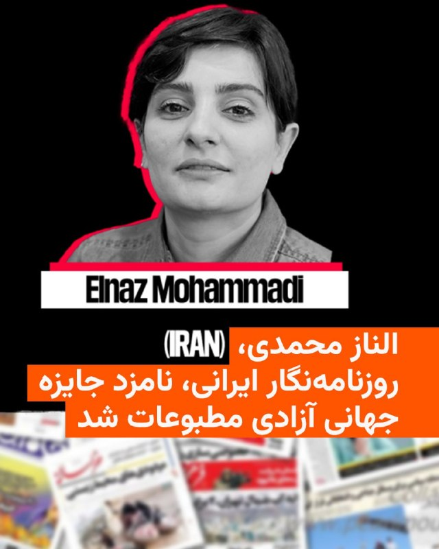

🔸الناز محمدی، روزنامه‌نگار ایرانی و دبیر گروه اجتماعی روزنامه «هم‌میهن»، در فهرست نامزدهای جایزه آزادی مطبوعات سازمان گزارشگران بدون مرز قرار گرفت.

🔸گزارشگران بدون مرز اعلام کرده است که الناز محمدی در بخش «شجاعت» نامزد این جایزه شده؛ بخشی که به روزنامه‌نگاران و رسانه‌هایی تعلق می‌گیرد که در شرایطی دشوار و با وجود خطر برای امنیت و آزادی‌شان به فعالیت ادامه داده‌اند.

🔸در توضیح این نامزدی آمده است که او پس از اعتراضات «زن، زندگی، آزادی» و پوشش پیامدهای اجتماعی آن، در سال ۲۰۲۳ بازداشت و به سه سال زندان محکوم شد. گزارشگران بدون مرز همچنین به فشارهای قضایی، زندان و محرومیت شغلی علیه او اشاره کرده است.

🔸مراسم اعلام برندگان جوایز آزادی مطبوعات سال ۲۰۲۶ روز ۱۱ خرداد در شهر مارسی فرانسه و همزمان با کنگره جهانی رسانه برگزار خواهد شد.

@RadioFarda

## RadioFarda — post 157099

  <a href="https://t.me/radiofarda/157099" target="_blank">📎 Download file</a>

📻بشنوید: ایستگاه ۱۹ با رادیوفردا، ۲۲ اردیبهشت ۱۴۰۵

@RadioFarda

## IranianMinds — post 20047

  

🔴 ترامپ:

وقتی اخبار جعلی می‌گویند دشمن ایرانی در مقابله با ما از نظر نظامی خوب عمل کرده است، این عملاً خیانت است، چون خبری کاملاً دروغین و حتی مضحک است. آن‌ها به دشمن کمک می‌کنند! این کار تنها به ایران امید دروغین می‌دهد، در حالی که نباید هیچ امیدی وجود داشته باشد.

این‌ها آمریکایی‌های بزدل هستند که علیه کشور ما ریشه دوانده‌اند. ایران ۱۵۹ کشتی در نیروی دریایی داشت حالا هر کشتی‌ای در کف دریا است. نیروی دریایی ندارند، نیروی هوایی‌شان از بین رفته، تمام فناوری‌هایشان از بین رفته، «رهبران»شان دیگر با ما نیستند و کشور در بحران اقتصادی است!

@IranianMinds

## IranianMinds — post 20046

  <a href="telegram/content/IranianMinds_20046_1778622639.mp4" target="_blank">🎬 Download video</a>

بچه ها اسم این بازی عبور مرغ از خیابون  هست ویدئو نگاه کنید خیلی راحت 8 میلیون ازش سود گرفتیم😍

😤اگ توم دوس داری خیلی راحت از بازی های انلاین پول در بیاری حتما عضو کازینو شبانه شو
✅

توی کازینو شبانه بهت اموزش میدیم از بازی های انلاین پول دربیاری👌

کازینو شبانه راهی برای چند برابر کردن سرمایت 🤷‍♂

کسب درامد انلاین با یه ادم حرفه ای یاد بگیر و‌ پول دربیار 
💵
ae22
🎯همین حالا عضو شو و شروع کن👇
https://t.me/+OS-QBvyDO4M2ZGY0
https://t.me/+OS-QBvyDO4M2ZGY0

## IranianMinds — post 20045

  

جمهوری اسلامی از اورک ها هم‌ داره استفاده میکنه

@IranianMinds

## IranianMinds — post 20044

🔴 امام جمعه کاشان پا منقل :

جمهوری اسلامی تنها ابرقدرت جهان است هیچ کشوری توان مقابله با ما رو‌ نداره !

@IranianMinds

## IranianMinds — post 20043

ترامپ هم‌ تو‌ راه چین نشسته یه متن بالا بلند نوشته و دوباره گفته فیک‌ نیوزا شعر میگن ما ارتش ایران و رهبریشو‌ از بین بردیم

@IranianMinds

## IranianMinds — post 20042

🔴 مرکز لرزه نگاری :

زلزله ۴.۶ ریشتری مرز استان های تهران و مازندران را لرزاند.

@IranianMinds

## IranianMinds — post 20041

یادش بخیر جنگ ۱۲ روزه هر زلزله ای میومد میگفتن تموم شد تست بمب اتم‌ بود

## IranianMinds — post 20040

🔴 زلزله نسبتا شدیدی در تهران رخ داد @IranianMinds

## IranianMinds — post 20039

  <a href="telegram/content/IranianMinds_20039_1778622641.mp4" target="_blank">🎬 Download video</a>

🔴 شاهزاده رضا پهلوی از استراتژی ترامپ درباره ایران انتقاد کرد:

از یک سو می‌گوید مردم باید قیام کنند و از سوی دیگر می‌گوید صبر کنید، ما در حال مذاکره هستیم. این موضوع همه را کاملاً گیج کرده است.

نمی‌توان پیام‌های متناقض فرستاد.

@IranianMinds

## IranianMinds — post 20038

🔴 زلزله نسبتا شدیدی در تهران رخ داد

@IranianMinds

## IranianMinds — post 20037

  

🔴 ۷۴ روزه که اینترنت توسط جمهوری اسلامی قطع شده

میلیون ها کسب و کار نابود شدن و میلیون ها نفر از نون خوردن افتادن ، در‌ حالی که جمهوری اسلامی با فروش اینترنت پرو داره درآمد برا خودش قطع میکنه و از این سود میبره …

@IranianMinds

## IranianMinds — post 20036

  

🔴 شاهزاده رضا پهلوی تو نشست امنیتی سالانه پولیتیکو:

الان ما با یه جونورِ زخمی طرفیم و نباید بذاریم فرصت از دست بره، کار رو باید یه بار واسه همیشه تموم کنیم.

سیاست مماشات با جمهوری اسلامی که راهبرد خیلی از دولت‌ها بود، شکست خورده.
مردم به‌اندازه کافی هوشمند هستنن که تفاوت بین حمله به یه ملت و حمله به یه رژیم رو تشخیص بدن.
ما فقط زمانی می‌تونیم مردم رو به بازگشت به خیابون‌ها فرا بخوانیم که اونا هم سطحی از توان مقابله رو داشته باشن.

@IranianMinds

## IranianMinds — post 20035

  

🔴 ان بی سی نیوز :

پنتاگون در حال بررسی نام‌گذاری مجدد جنگ با ایران به «عملیات چکش سنگین» در صورت فروپاشی آتش‌بس و از سرگیری عملیات‌های رزمی گسترده توسط ترامپ است

@IranianMinds

## IranianMinds — post 20034

🔴 ترامپ حرکت کرد به سمت چین

@IranianMinds

## IranianMinds — post 20033

🔴 خبرگزاری فارس :

پیشنهادات آمریکاییا برای مذاکرات کاملا یک طرفه است و فقط منافع خودشون براشون مهمه هیچ اهمیتی به ما نمیدن

@IranianMinds

## IranianMinds — post 20032

🔴 رئیس کمیسیون انرژی :

به دلیل آسیب به پتروشیمی ها امسال قطعی برق خیلی بیشتری داریم

@IranianMinds

## IranianMinds — post 20031

  <a href="telegram/content/IranianMinds_20031_1778622645.mp4" target="_blank">🎬 Download video</a>

🔴 ترامپ:

ما ایران را کاملا تحت کنترل داریم.

خلاصه یا یک توافق می‌کنیم، یا هم نابودشون میکنیم .

@IranianMinds

## IranianMinds — post 20030

🔴 خبرنگار: در مذاکرات با ایران چه زمانی عقب می‌نشینید؟

ترامپ:

می‌خواهیم ببینیم اوضاع چطور پیش می‌رود. هدف‌مان فقط یک توافق خوب است.
باور دارم این برای مردم آمریکا مفید خواهد بود و برای مردم ایران هم مفید است !

@IranianMinds

## IranianMinds — post 20029

بقیه صحبتاش تکراریه پوشش نمیدیم حرف جدیدی زد پوشش میدیم

## IranianMinds — post 20028

  <a href="telegram/content/IranianMinds_20028_1778622646.mp4" target="_blank">🎬 Download video</a>

🔴 ترامپ:

رهبران ایران یا کار درست را انجام خواهند داد، یا ما کار را تمام خواهیم کرد.

@IranianMinds

## BBCPersian — post 280881

🔻اورژانس تهران اعلام کرده در پی طوفان و باد شدید در تهران تاکنون ۱۱ حادثه به این سازمان امدادی گزارش شده است.

خبرگزاری مهر به نقل از شروین تبریزی، سخنگوی اورژانس تهران نوشته تاکنون ۷ مصدوم که ۵ نفر آنها سرپایی درمان شده‌اند، در ماموریت‌های امدادگران ثبت شده اند اما ممکن است آمار تعداد مصدومان بیشتر شود.

در همین حال، خبرگزاری‌های ایران از وقوع زمین لرزه در حوالی تهران خبر داده‌اند.
زلزله در حوالی شهر پردیس - شرق تهران - و به بزرگی ۴/۶ گزارش شده است و به گزارش ایرنا درشهرهای بومهن و رودهن احساس شده و در شهر دماوند موجب قطعی برق شده است.

قطعی برق در برخی از مناطق تهران هم گزارش شده اما علت آن وزش تندباد با سرعتی بالای ۵۵ کیلومتر در ساعت گزارش شده است که موجب شکستن درختان در نقاطی هم شده است.

@BBCPersian

## BBCPersian — post 280880

🔻کایا کالاس، مسئول سیاست خارجی اتحادیه اروپا، گفت این اتحادیه ممکن است مأموریت دریایی خود در دریای سرخ را پس از پایان جنگ ایران، به تنگه هرمز نیز گسترش دهد.

مأموریت اتحادیه اروپا در سال ۲۰۲۴ برای حفاظت از کشتیرانی در دریای سرخ، یکی دیگر از آبراه‌های مهم خاورمیانه، در برابر حملات حوثی‌های یمن آغاز شد.

خانم کالاس پس از نشست وزیران دفاع اتحادیه اروپا گفت عملیات اتحادیه اروپا هم‌اکنون نقش مهمی در حفاظت از کشتیرانی در دریای سرخ دارد و فعالیت‌های آن می‌تواند به تنگه هرمز هم گسترش یابد.

او افزود که برخی کشورها از هم‌اکنون وعده داده‌اند کشتی‌های بیشتری در اختیار این مأموریت قرار دهند و این موضوع می‌تواند در صورت تصمیم برای گسترش دامنه عملیات، کمک‌کننده باشد.

وزیران دفاع اتحادیه اروپا در ماه گذشته میلادی در ابتدا پیشنهاد گسترش مأموریت دریای سرخ را رد کرده بودند.

به نظر می‌رسد مذاکرات میان آمریکا و ایران برای پایان دادن به جنگ خاورمیانه و بازگشایی این آبراه حیاتی، متوقف شده است.

انسداد تنگه هرمز از سوی ایران باعث افزایش قیمت جهانی انرژی شده است.
@BBCPersian

## BBCPersian — post 280879

🔻دونالد ترامپ، رئیس‌جمهوری آمریکا پیش از عزیمت به چین گفت که برای پایان دادن به جنگ با ایران به کمک این کشور نیازی ندارد.

آقای ترامپ در عین حال اعلام کرد که در جریان نشست این هفته خود با شی جین‌پینگ، رئیس‌جمهور چین گفت‌وگویی مفصل خواهد داشت.

چین یکی از مهم‌ترین شرکای اقتصادی ایران است و بخش بزرگی از صادرات نفت این کشور را خریداری می‌کند. پکن همچنین از حامیان مهم ایران است.

آقای ترامپ تأکید کرد که برای یافتن راه خروج از درگیری‌ای که دو ماه و نیم پیش با حمله گسترده آمریکا و اسرائیل آغاز شد و سپس بر سر کنترل مسیر کشتیرانی تنگه هرمز به بن‌بست رسید، به شی جین‌پینگ نیازی ندارد.

آقای ترامپ گفت: «موضوعات زیادی برای گفت‌وگو داریم. راستش را بخواهید، نمی‌گویم ایران یکی از آنهاست، چون ما ایران را کاملا تحت کنترل داریم.»

او افزود: «یا به توافق می‌رسیم یا آنها نابود خواهند شد.»

در حالی که گزارش‌هایی منتشر شده مبنی بر این‌که چین همچنان به تسلیح ایران کمک می‌کند و نفت تحریم‌شده ایران را می‌خرد، آقای ترامپ گفت شی جین‌پینگ «نسبتا خوب» عمل کرده است.
@BBCPersian

## BBCPersian — post 280878

  <a href="https://t.me/bbcpersian/280878" target="_blank">📎 Download file</a>

این نسخه رادیویی برنامه شصت دقیقه تلویزیون فارسی بی‌بی‌سی است که هرشب بعد از پخش، با حجم کم از اپلیکیشن‌های پادگیر و صفحه تلگرام بی‌بی‌سی فارسی در دسترس است. 
با هشتگ BBCPersianRadio با ما در ارتباط باشید.

## BBCPersian — post 280876

  <a href="https://t.me/bbcpersian/280876" target="_blank">📎 Download file</a>

پادکست برنامه شصت دقیقه سه‌شنبه ۲۲ اردیبهشت ۱۴۰۵
این نسخه رادیویی برنامه شصت دقیقه تلویزیون فارسی بی‌بی‌سی است که هرشب بعد از پخش، با حجم کم از اپلیکیشن‌های پادگیر و صفحه تلگرام بی‌بی‌سی فارسی در دسترس است.
با هشتگ BBCPersianRadio# با ما در ارتباط باشید.

## BBCPersian — post 280875

  <a href="https://t.me/bbcpersian/280875" target="_blank">📎 Download file</a>

پادکست جام جهان‌نما، سه‌شنبه ۲۲ اردیبهشت ۱۴۰۵
در این برنامه می‌شنوید:

رئیس جمهور آمریکا سرخورده از بن‌بست در مواجهه با ایران؛ گفته می‌شود ترامپ جدی‌تر از گذشته به از سرگیری جنگ فکر می‌کند. در گپ روز این جام جهان نما می‌پرسیم آیا چین می تواند گره کور اختلافات بین ایران و آمریکا را باز کند؟

ترکیه و قطر بر بازگشایی بی‌قید‌و‌شرط تنگه هرمز تأکید کردند. هر دو از مذاکره برای برقراری صلح بین ایران و آمریکا حمایت می‌کنند.

هفتاد و چهار روز از قطع اینترنت در ایران می‌گذرد. دولت می‌گوید تا تهدید جنگ رفع نشود، از دسترسی عمومی خبری نیست.

این برنامه رادیویی را می‌توانید هر شب ساعت ۲۰ به وقت ایران، روی موج متوسط ۷۰۲ کیلوهرتز و موج کوتاه ۹۴۶۵ کیلوهرتز بشنوید.
تکرار برنامه را هم می‌توانید ساعت ۲۱:۳۰ روی موج متوسط ۷۰۲ کیلوهرتز و موج کوتاه ۵۳۹۵ کیلوهرتز گوش کنید.
@BBCPersian

## BBCPersian — post 280874

🔻وزارت خارجه کویت سفیر ایران را احضار کرد

در پی بازداشت چهار فرد «وابسته به سپاه پاسداران» که تلاش می‌کردند از طریق دریا به این کشور وارد شوند، وزارت خارجه کویت اعلام کرده که محمد توتونچی، سفیر ایران در این کشور را احضار کرده است تا «نامه اعتراضی» این کشور را به او تحویل دهد.

این وزارت‌خانه اقدام اخیر جمهوری اسلامی را به عنوان «اقدامی خصمانه» و «حمله‌ای آشکار» به حاکمیت کویت خوانده و آن را محکوم کرده است.

کویت گفته است که «حق دفاع از خود» را محفوظ می‌دارد.

این چهارمین باری است که از زمان آغاز جنگ آمریکا و اسرائیل با ایران و آغاز حملات ایران علیه کشورهای خلیج فارس، سفیر جمهوری اسلامی احضار می‌شود.

وزارت کشور کویت امروز اعلام کرد که «چهار نفوذی وابسته به سپاه پاسداران» که تلاش می‌کردند از طریق دریا به این کشور وارد شوند را بازداشت کرده است.

خبرگزاری دولتی کونا به نقل از این وزارتخانه گزارش داده است که یک نفر از نیروهای مسلح کویت در درگیری با این چهار نفر مجروح شده است.

بر اساس بیانیه وزارت کشور کویت، دستگیرشدگان دو سرهنگ، یک سروان و یک ستوان نیروی دریایی سپاه بوده‌اند که «اذعان» کرده‌اند ماموریت داشتند به جزیره بوبیان «نفوذ» کنند.

در این بیانیه آمده است که این چهار نفر در اول ماه مه (۱۱ اردیبهشت) سعی کردند «سوار بر یک قایق ماهیگیری که مخصوص انجام اقدامات خصمانه علیه کویت تدارک داده شده بود» وارد کویت شوند.

بوبیان بزرگترین جزیره کویت است و با سواحل ایران و عراق فاصله کمی دارد.

@BBCPersian

## BBCPersian — post 280864

  <a href="telegram/content/BBCPersian_280864_1778622650.mp4" target="_blank">🎬 Download video</a>

بیش از ۷۰ روز است که اینترنت جهانی در ایران قطع شده و هزینه‌های بسیاری بر اقتصاد اشخاص و کشور بر جا گذاشته است. در روزهای اخیر صداهای بیشتر از کاربران اینترنت در ایران شنیده می‌شود و به نظر می‌رسد تعداد بیشتری توانسته‌اند به اینترنت جهانی وصل شوند.

تعدادی از کاربران با پرداخت مبلغ «۴۰ هزار تومان به ازای هر گیگ» از اپراتور‌ها خدمات اینترنتی ایران موسوم به «اینترنت پرو» خریده‌اند و تعدادی با فیلترشکن‌های گران‌تر به اینترنت جهانی وصل شده‌اند.

حدود چهار ماه است که دسترسی کاربرانی که در ایران هستند به اینترنت جهانی بسیار دشوار شده است. پس از اعتراضات دی ۱۴۰۴ و سپس جنگ آمریکا و اسرائیل با ایران، دسترسی به اینترنت جهانی به طور کامل قطع شد. اما تعداد اندکی افراد دارای سیم‌کارت بااصطلاح «سفید» به اینترنت دسترسی داشته‌اند.

📷Getty Images
EPA/Shutterstock
https://bbc.in/49rKNBi
https://bbc.in/4uIjf2M
@BBCPersian

## BBCPersian — post 280863

🔻‌محمدرضا شهبازی، مجری برنامه پاورقی شبکه ۲ تلویزیون دولتی ایران که به عنوان یک چهره حامی حکومت شناخته می‌شود، در واکنش به مقایسه وضعیت اینترنت در ایران و آزمایش اینترنت ۵جی در افغانستان و شروع استفاده از کردیت کارت‌های بین‌المللی در سوریه گفت: «اگر این چیزها…

## BBCPersian — post 280862

🔻‌محمدرضا شهبازی، مجری برنامه پاورقی شبکه ۲ تلویزیون دولتی ایران که به عنوان یک چهره حامی حکومت شناخته می‌شود، در واکنش به مقایسه وضعیت اینترنت در ایران و آزمایش اینترنت ۵جی در افغانستان و شروع استفاده از کردیت کارت‌های بین‌المللی در سوریه گفت: «اگر این چیزها اینقدر مهم است بروید همانجا (سوریه و افغانستان) زندگی کنید.»

 مجری برنامه پاورقی با خواندن یک توییت از پوریا زراعتی، مجری تلویزیون اینترنشنال که شرایط اینترنت در ایران را با افغانستان و سوریه مقایسه کرده بود و همچنین اشاره به یک پست از یک کانال تلگرامی که اشاره مشابهی به اینترنت در ایران داشت، گفت: «بروید سوریه با کردیت کارت از آمازون چسب پهن بخرید و زمان بمباران شیشه‌هایتان را چسب بزنید.»

@BBCPersian

## BBCPersian — post 280861

🔻مخالفت دوباره حزب‌الله با هرگونه مذاکره مستقیم لبنان با اسرائیل

در آستانه دور جدید مذاکرات اسرائیل و دولت لبنان، حزب‌الله یک بار دیگر خواستار خودداری از هرگونه مذاکره مستقیم با اسرائیل شد.

نعیم قاسم، دبیرکل حزب‌الله، هشدار داد که هرگونه مذاکره مستقیم فقط به نفع اسرائیل خواهد بود.

او همچنین تاکید کرد که موضوع سلاح‌های حزب‌الله «یک امر داخلی است و در مذاکرات با دشمن جایی ندارد.»

نعیم قاسم در پیام صوتی خود خطاب به نیروهای حزب‌الله گفت که «مقاومت» هرگز تسلیم فشار آمریکا و اسرائیل نخواهد شد و قول داد که میدان نبرد برای اسرائیل به «جهنم» تبدیل شود.

دبیرکل حزب‌الله در بخشی دیگر از سخنانش از توجه ایران به لبنان و مردمش قدردانی کرد و گفت: «توافق ایران و آمریکا که شامل پایان تجاوز به لبنان می‌شود، تقریبا محکم‌ترین سند برای توقف این تجاوز است.»

با این حال او افزود که مسئولیت مذاکره برای تامین اهداف ملی لبنان همچنان بر عهده مقام‌های لبنان است و قول داد که همکاری کند.

دور سوم مذاکرات لبنان و اسرائیل قرار است روزهای پنجشنبه و جمعه این هفته برگزار شود.

باوجود ادامه آتش‌بس با ایران، تبادل آتش میان حزب‌الله لبنان و اسرائیل همچنان ادامه داشته است.

آمریکا و اسرائیل از دولت لبنان می‌خواهند که حزب‌الله را خلع سلاح کند اما حزب‌الله می‌گوید تسلیم نخواهد شد.

@BBCPersian

## Dirty_Kids — post 389348

نون و پنیک و سبزی
تو بیش از این می‌لرزی

@Dirty_Kids 👻

## Dirty_Kids — post 389347

ترسناک‌تر از زلزله‌ای که اومده، پس‌زلزله‌ای که هنوز نیومده

@Dirty_Kids 👻

## Dirty_Kids — post 389346

تهران مجددا بصورت خفیف لرزید

@Dirty_Kids 👻

## Dirty_Kids — post 389345

قدیم اگه همچین زلزله‌ای میومد ملت تا صبح تو ماشینا و پارکا می‌خوابیدن، ببین چقدر پوستمون کلفت شده که کیرمونم نیست.

@Dirty_Kids 👻

## Dirty_Kids — post 389343

امشب هم طوفان اومد، هم زلزله شد، بعدی حمله‌ی زامبیاس.

@Dirty_Kids 👻

## Dirty_Kids — post 389342

الان باید تن‌ماهی بخریم یا بنزین بزنیم؟

@Dirty_Kids 👻

## Dirty_Kids — post 389341

  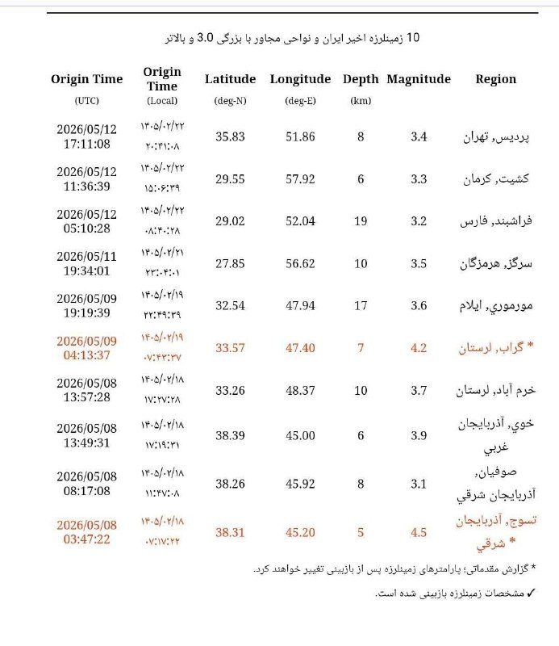

🔴 زلزله تهران به مرکز پردیس، 3.4 ریشتر بود.

@Dirty_Kids 👻

## Dirty_Kids — post 389340

🔴 فوری: وسط این همه بگایی تهران زلزله اومد!

@Dirty_Kids 👻

## Dirty_Kids — post 389339

  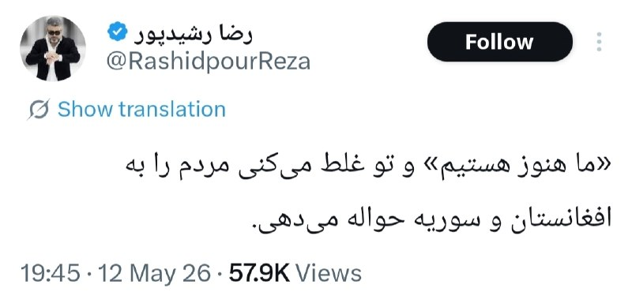

واکنش شهبازی (اسکل نظام) به وضعیت اینترنت مردم ایران و کشورهای منطقه: اگه خیلی این چیزها مهمه، برید همون افغانستان و سوریه زندگی کنید! هاهاهاها + هاهاها و ک...خر @Dirty_Kids 👻

## Dirty_Kids — post 389338

  

این پردیس احمدیه افغانی رفته خادم رضا شده

رقابت سنگینی هست بین این بی‌هنرا تو مالیدن تا بارشونو ببندن

@Dirty_Kids 👻

## Dirty_Kids — post 389337

  <a href="telegram/content/Dirty_Kids_389337_1778622652.mp4" target="_blank">🎬 Download video</a>

عشق این شکلیه 👆

@Dirty_Kids 👻

## Dirty_Kids — post 389336

ترامپ گفته مسئولین حکومت خیلی بی‌شرفن.
فکر کن یارو تازه غیرمستقیم باهاشون هم‌کلام شده اینجوری میگه. اونم چندهفته نه ۴۷ سال...

@Dirty_Kids 👻

## Dirty_Kids — post 389335

  

👑 رضا پهلوی تو نشست امنیتی سالانه پولیتیکو:

الان ما با یه جونورِ زخمی طرفیم و نباید بذاریم فرصت از دست بره، کار رو باید یه بار واسه همیشه تموم کنیم.

سیاست مماشات با جمهوری اسلامی که راهبرد خیلی از دولت‌ها بود، شکست خورده.
مردم به‌اندازه کافی هوشمند هستنن که تفاوت بین حمله به یه ملت و حمله به یه رژیم رو تشخیص بدن.
ما فقط زمانی می‌تونیم مردم رو به بازگشت به خیابون‌ها فرا بخوانیم که اونا هم سطحی از توان مقابله رو داشته باشن.

@Dirty_Kids 👻

## Dirty_Kids — post 389334

  

طرف قبل جنگ رفته جنس آورده بعد گرون شده همه‌چی همینجوری بدون دوخت گذاشته برای فروش

@Dirty_Kids 👻

## Dirty_Kids — post 389333

  

پس کجا خوبه؟ قعله حسن‌خان؟

@Dirty_Kids 👻

## Dirty_Kids — post 389332

  <a href="telegram/content/Dirty_Kids_389332_1778622656.mp4" target="_blank">🎬 Download video</a>

طرف با AI, بازی تاج و تخت رو اونجوری که دلش خنک میشده درست کرده

@Dirty_Kids 👻

## Dirty_Kids — post 389331

  

داداش تو اسلحه دست نگیر همینجوریش کلی استرس داریم.

@Dirty_Kids 👻

## Hranews — post 112916

گزارشی از تجمع اعتراضی اساتید اخراجی دانشگاه فرهنگیان در تهران

❗️
❗️
❗️
❗️
❗️ – روز یکشنبه ۲۰ اردیبهشت‌ماه، شماری از اساتید اخراجی دانشگاه فرهنگیان در مقابل ساختمان‌های سازمان بازرسی کل کشور و وزارت آموزش و پرورش در اعتراض به عدم رسیدگی به مطالباتشان دست به #تجمع زدند.

ادامه مطلب

↘️
@hranews_bot تماس ✉️ -  @Hranews  کانال هرانا 🆑

## Hranews — post 112915

گزارشی از مرگ یک کودک ۳ ساله بر اثر مصرف متادون؛ قرار مجرمیت نامادری صادر شد

❗️
❗️
❗️
❗️
❗️ – پرونده مرگ یک #کودک سه ساله در تهران که در سال ۱۴۰۳ بر اثر مصرف متادون جان خود را از دست داده بود، اکنون با صدور قرار مجرمیت برای نامادری او، به دادگاه کیفری استان تهران ارجاع شده است. مقام‌های قضایی، اتهام مطروحه علیه این زن را «قتل شبه‌عمد» عنوان کرده‌اند.

ادامه مطلب

↘️
@hranews_bot تماس ✉️ -  @Hranews  کانال هرانا 🆑

## Hranews — post 112914

تایید حکم اعدام یک زندانی در دیوان عالی کشور/ رهایی ۲ تن از چوبه‌دار

❗️
❗️
❗️
❗️
❗️ – حکم یک زندانی که پیشتر توسط دادگاه کیفری تهران از بابت اتهام قتل به #اعدام محکوم شده بود، برای بار دوم در دیوان عالی کشور تایید شد. از سوی دیگر، دو زندانی محکوم به اعدام در بروجرد و تهران، با اعلام رضایت اولیای دم از مجازات مرگ رهایی یافتند.

ادامه مطلب

↘️
@hranews_bot تماس ✉️ -  @Hranews  کانال هرانا 🆑

## Hranews — post 112913

سیدیاسین حسن‌زاده، دانشجوی دانشگاه تهران بازداشت شد

❗️
❗️
❗️
❗️
❗️ – سیدیاسین حسن‌زاده، دبیر انجمن اسلامی دانشجویان دانشگاه تهران امروز #بازداشت و به مکان نامعلومی منتقل شد.

ادامه مطلب

#سیدیاسین_حسن‌زاده

↘️
@hranews_bot تماس ✉️ -  @Hranews  کانال هرانا 🆑

## Hranews — post 112912

دو شهروند از جمله یک نوجوان در مهاباد بازداشت شدند

❗️
❗️
❗️
❗️
❗️– بامداد امروز سه‌شنبه ۲۲ اردیبهشت‌ماه، میکائیل دودکانلو میلان و احسان خرم‌آباد، نوجوان ۱۷ ساله، توسط نیروهای امنیتی در مهاباد #بازداشت و به مکان نامعلومی منتقل شدند.

ادامه مطلب

#میکائیل_دودکانلو_میلان
#احسان_خرم‌آباد

↘️
@hranews_bot تماس ✉️ -  @Hranews  کانال هرانا 🆑

## Hranews — post 112911

معوقات مزدی کارگران داروگر تهران و ثبت نام گسترده برای بیمه بیکاری

❗️
❗️
❗️
❗️
❗️ – #کارگران شرکت داروگر تهران از تاخیر بیش از پنج ماهه در پرداخت دستمزد و تعویق در واریز حق بیمه خود خبر دادند. همچنین، نماینده مشهد در مجلس اعلام کرد که از ابتدای جنگ اخیر، ۲۰۵ هزار نفر برای دریافت بیمه بیکاری ثبت نام کرده‌اند.

ادامه مطلب

↘️
@hranews_bot تماس ✉️ -  @Hranews  کانال هرانا 🆑

## manototv — post 105379

  <a href="telegram/content/manototv_105379_1778622658.mp4" target="_blank">🎬 Download video</a>

رئیس سازمان هلال احمر اعلام کرد زلزله در تهران و کرج «هیچ» خسارت مالی و جانی در پی نداشته است.
پیش‌تر زلزله‌ای به بزرگی ۴.۶ در مقیاس ریشتر، مرز استان‌های تهران و مازندران را لرزاند.

## manototv — post 105378

  <a href="telegram/content/manototv_105378_1778622658.mp4" target="_blank">🎬 Download video</a>

شاهزاده رضا پهلوی در نشست امنیتی سالانه پولیتیکو گفت مردم ایران، نه نیروهای خارجی، باید نقش اصلی را در تغییر حکومت جمهوری اسلامی ایفا کنند؛ اما برای این کار به «حمایت و پوشش» نیاز دارند.

او گفت: «نیروهای روی زمین در ایران، خود مردم ایران هستند. ما نیازی نداریم نیروهای خارجی این کار را برای ما انجام دهند.»

شاهزاده رضا پهلوی با اشاره به سرکوب اعتراضات دی‌ماه گفت در کمتر از ۴۸ ساعت بیش از ۴۰ هزار نفر کشته شدند و افزود بدون حمایت، نمی‌توان از مردم انتظار داشت دوباره به خیابان‌ها بیایند.

او گفت: «به همین دلیل بود که به کارزار هوایی و پوشش هوایی نیاز داشتیم.»

شاهزاده رضا پهلوی همچنین تأکید کرد باید یک استراتژی روشن برای پایان دادن به جمهوری اسلامی وجود داشته باشد؛ استراتژی‌ای که هم مردم را برای قیام تشویق کند و هم زمینه پیوستن نیروهایی از ارتش و دستگاه امنیتی به مردم را فراهم سازد.

او افزود: «نمی‌شود از یک طرف گفت مردم قیام کنند و همزمان گفت در حال مذاکره هستیم؛ این همه را گیج می‌کند.»

شاهزاده رضا پهلوی همچنین گفت حملات انجام‌شده علیه جمهوری اسلامی، ملت ایران را هدف نگرفته بود، بلکه زیرساخت‌های سرکوب حکومت، از جمله دستگاه اطلاعاتی و سپاه پاسداران، را هدف قرار داده بود.

او افزود: «مردم آن‌قدر باهوش هستند که تفاوت میان حمله به ملت ایران و حمله به حکومت را تشخیص دهند.»

## manototv — post 105377

  <a href="telegram/content/manototv_105377_1778622661.mp4" target="_blank">🎬 Download video</a>

‌
خبرگزاری‌های داخل ایران گزارش دادند دقایقی پیش زلزله تهران و کرج را لرزاند. به گزارش این خبرگزاری‌ها سمت شرق تهران زمین‌لرزه بسیار شدیدتر بوده است.

## manototv — post 105376

  <a href="telegram/content/manototv_105376_1778622661.mp4" target="_blank">🎬 Download video</a>

تماسی از ایران؛
«می‌گفت تغییر از بیرون نیست…
کار خود مردمه، حتی با این وضعیت سخت.»

## manototv — post 105375

  <a href="telegram/content/manototv_105375_1778622664.mp4" target="_blank">🎬 Download video</a>

رویترز به نقل از دو مقام غربی و دو مقام ایرانی گزارش داد عربستان سعودی در واکنش به حملات انجام‌شده علیه این کشور، چند حمله نظامی اعلام‌نشده علیه جمهوری اسلامی انجام داده است.

بر اساس این گزارش، حملات هوایی عربستان در اواخر ماه مارس توسط نیروی هوایی این کشور انجام شده و نخستین مورد شناخته‌شده از حمله مستقیم نظامی عربستان به خاک ایران به شمار می‌رود.

رویترز نوشت این حملات پس از آن انجام شد که جمهوری اسلامی در جریان جنگ اخیر، همه کشورهای عضو شورای همکاری خلیج فارس را با موشک و پهپاد هدف قرار داد و به زیرساخت‌های نفتی، فرودگاه‌ها و مراکز غیرنظامی حمله کرد.

به گفته منابع رویترز، پس از حملات عربستان، تهران و ریاض وارد تماس‌های فشرده دیپلماتیک شدند و عربستان نیز هشدار داده بود در صورت ادامه حملات، پاسخ‌های بیشتری خواهد داد.

یک مقام ایرانی به رویترز گفت تهران و ریاض در نهایت برای کاهش تنش به تفاهم رسیدند؛ تفاهمی که هدف آن «توقف درگیری‌ها، حفظ منافع متقابل و جلوگیری از تشدید تنش» بوده است.

رویترز همچنین گزارش داد شمار حملات موشکی و پهپادی علیه عربستان پس از این تفاهم به‌طور قابل توجهی کاهش یافت.

## manototv — post 105374

  <a href="telegram/content/manototv_105374_1778622665.mp4" target="_blank">🎬 Download video</a>

‌
شاهزاده رضا پهلوی، در نشست امنیتی سالانه پولیتیکو، در واکنش به تهدید دونالد ترامپ درباره نابودی زیرساخت‌های غیرنظامی ایران، گفت چنین اظهاراتی «پیام اشتباه» به مردم ایران می‌فرستد.

او گفت: «سؤال این است که آیا شما اینجا هستید که ما را آزاد کنید یا بیشتر به ما آسیب بزنید؟»

شاهزاده رضا پهلوی افزود آنچه به مردم ایران آسیب می‌زند «زیرساخت‌های غیرنظامی» است و تأکید کرد باید میان مردم ایران و حکومت جمهوری اسلامی تفاوت قائل شد.

او گفت: «چیزی که به ما کمک می‌کند، هدف قرار دادن حکومت و زیرساخت‌های آن است.»

شاهزاده رضا پهلوی همچنین گفت جمهوری اسلامی مانند حماس در غزه، از مردم به‌عنوان «سپر انسانی» استفاده می‌کند و نیروهای امنیتی خود را در مدارس و بیمارستان‌ها مستقر می‌کند.

او افزود: «هرچه زودتر به این حکومت پایان دهیم، زودتر می‌توانیم جان انسان‌های بی‌گناه بیشتری را در کشورم حفظ کنیم.»

## manototv — post 105373

  <a href="telegram/content/manototv_105373_1778622666.mp4" target="_blank">🎬 Download video</a>

دونالد ترامپ در واکنش به افزایش تورم ناشی از جنگ با ایران، گفت پایان جنگ «خیلی دور نیست» و با پایان درگیری‌ها، قیمت نفت و تورم به‌سرعت کاهش خواهد یافت.
رئیس‌جمهور آمریکا به خبرنگاران گفت: «به‌محض پایان جنگ، شاهد سقوط قیمت نفت و جهش بازار سهام خواهید بود.»
او افزود صدها کشتی حامل نفت آماده خروج هستند و با باز شدن مسیرها، حجم زیادی نفت وارد بازار خواهد شد که به کاهش شدید تورم کمک می‌کند.

## manototv — post 105372

  <a href="telegram/content/manototv_105372_1778622667.mp4" target="_blank">🎬 Download video</a>

دونالد ترامپ پیش از سفر رسمی خود به چین اعلام کرد در دیدار با شی جین‌پینگ گفت‌وگویی طولانی خواهد داشت، اما نیازی به صحبت درباره جمهوری‌اسلامی نمی‌بیند؛ چون به گفته او، «ایران کاملاً تحت کنترل است».
رئیس‌جمهور آمریکا بار دیگر تأکید کرد جمهوری‌اسلامی «به سلاح هسته‌ای دست نخواهد یافت» و گفت اقدامات آمریکا علیه تهران «کاملا مؤثر» بوده است.

## manototv — post 105371

  <a href="telegram/content/manototv_105371_1778622667.mp4" target="_blank">🎬 Download video</a>

تماسی از مشهد:
«می‌گفت بلاتکلیفی کنکور، گرونی منابع و قطعی اینترنت، دانش‌آموزها رو زیر فشار شدید گذاشته.»

## manototv — post 105366

اکونومیست می‌نویسد بحران طولانی ایران می‌تواند برای کشورهای خلیج فارس فقط یک چالش امنیتی کوتاه‌مدت نباشد، بلکه به آزمونی جدی برای آینده اقتصادی، سرمایه‌گذاری خارجی، تجارت دریایی و تصویر این منطقه به‌عنوان مقصدی امن و باثبات تبدیل شود. ورق بزنید.

## manototv — post 105365

  <a href="telegram/content/manototv_105365_1778622669.mp4" target="_blank">🎬 Download video</a>

وزیر خارجه پاکستان اعلام کرد در گفت‌وگو با همتای چینی خود، درباره تلاش‌های اسلام‌آباد برای تسهیل مذاکرات میان جمهوری‌اسلامی و آمریکا رایزنی کرده است.
وزارت خارجه پاکستان در بیانیه‌ای اعلام کرد وانگ یی، وزیر خارجه چین، از نقش «سازنده» پاکستان در میانجیگری حمایت و قدردانی کرده است.
دو طرف همچنین بر ضرورت ادامه آتش‌بس پایدار و تضمین عبور عادی کشتی‌ها از تنگه هرمز تأکید کردند.
این گفت‌وگو در حالی انجام شده که دونالد ترامپ قرار است این هفته به‌طور رسمی به چین سفر کند.

## manototv — post 105364

  <a href="telegram/content/manototv_105364_1778622670.mp4" target="_blank">🎬 Download video</a>

ژنرال دن کین، رئیس ستاد مشترک ارتش آمریکا، اعلام کرد جمهوری‌اسلامی تحت فشار شدید ناشی از تحریم‌ها و محاصره قرار دارد و واشنگتن همچنان «طیفی از گزینه‌های نظامی» را در اختیار دارد.
در جلسه استماع سنای آمریکا، کریس مورفی، سناتور دموکرات، با اشاره به افزایش شدید قیمت سوخت پرسید آیا راهی جز دیپلماسی برای بازگشایی تنگه هرمز وجود دارد یا نه.
پیت هگست، وزیر دفاع آمریکا، در پاسخ گفت واشنگتن «قطعاً» ابزارهای نظامی لازم برای باز کردن تنگه هرمز را در اختیار دارد؛ از جمله حمله به اهداف زمینی و استفاده از توان دریایی و محاصره نظامی.

## manototv — post 105363

  <a href="telegram/content/manototv_105363_1778622671.mp4" target="_blank">🎬 Download video</a>

جان هیلی، وزیر دفاع بریتانیا، اعلام کرد لندن جنگنده، پهپاد و یک ناو جنگی را به مأموریت چندملیتی حفاظت از تردد کشتی‌ها در تنگه هرمز اعزام خواهد کرد.

هیلی این خبر را پس از نشست مشترک با وزرای دفاع ۴۰ کشور اعلام کرد؛ نشستی که با هدف جلب حمایت برای مأموریت تحت رهبری بریتانیا جهت تأمین امنیت کشتیرانی در تنگه هرمز برگزار شد.

بریتانیا می‌گوید این مأموریت در واکنش به محاصره تنگه هرمز از سوی جمهوری اسلامی انجام می‌شود.

## manototv — post 105362

  <a href="telegram/content/manototv_105362_1778622672.mp4" target="_blank">🎬 Download video</a>

سازمان جهانی بهداشت هشدار داد شمار موارد ابتلا به هانتاویروس، پس از شیوع این ویروس در یک کشتی گردشگری در اقیانوس اطلس، احتمالاً افزایش پیدا خواهد کرد.
تدروس آدهانوم، مدیرکل سازمان جهانی بهداشت، اعلام کرد تاکنون ۹ مورد ابتلای قطعی و دو مورد مشکوک ثبت شده و انتظار می‌رود افراد بیشتری نیز به ویروس مبتلا شده باشند. با این حال او تأکید کرد خطر شیوع گسترده جهانی همچنان «پایین» ارزیابی می‌شود.
شیوع بیماری در کشتی «ام‌وی هوندیوس» آغاز شد؛ جایی که سه مسافر، شامل یک زوج هلندی و یک زن آلمانی، جان خود را از دست دادند. این کشتی در حال سفر ۳۵ روزه در اقیانوس اطلس بود.
هانتاویروس معمولاً از طریق ادرار، بزاق یا فضولات جوندگان منتقل می‌شود. گونه «آندِس» تنها نوع شناخته‌شده‌ای است که می‌تواند از انسان به انسان منتقل شود.
در پی این بحران، صدها مسافر و خدمه در کشورهای مختلف تحت قرنطینه یا مراقبت پزشکی قرار گرفته‌اند. مقام‌های بهداشتی در اروپا و آمریکا نیز در حال ردیابی تماس‌های مرتبط با مبتلایان هستند.

## alonews — post 119629

  <a href="telegram/content/alonews_119629_1778622673.webm" target="_blank">🎬 Download video</a>

👈رویترز: منابع میگن عربستان مخفیانه حملاتی علیه ایران شروع کرده و تنش‌های منطقه‌ای هم شدیدتر شده

✅ @AloNews خبر جنگ

## alonews — post 119628

  <a href="telegram/content/alonews_119628_1778622673.webm" target="_blank">🎬 Download video</a>

👈یک مقام ارشد اسرائیلی به سی‌ان‌ان گفت: اگر توافقی حاصل نشود خوشحال خواهیم شد اگر محاصره ادامه یابد خوشحال خواهیم شد و اگر چند حمله دیگر هم به ایران شود، خوشحال خواهیم شد

✅ @AloNews خبر جنگ

## alonews — post 119627

  <a href="telegram/content/alonews_119627_1778622673.webm" target="_blank">🎬 Download video</a>

👈طبق معمول پمپ بنزینای تهران شلوغ شد

✅ @AloNews خبر جنگ

## alonews — post 119626

  <a href="telegram/content/alonews_119626_1778622673.webm" target="_blank">🎬 Download video</a>

👈گزارش مقدماتی زمین‌لرزه مجدد در تهران

🔴 بزرگی: ۴ ریشتر
محل وقوع: حوالی پرديس
زمان: ۲۶ دقیقه بامداد
عمق زمین‌لرزه: ۸ کیلومتر

🔴نزدیک‌ترین شهرها:
۹ کیلومتری پرديس (تهران)
۱۱ کیلومتری بومهن (تهران)
۱۲ کیلومتری رودهن (تهران)

🔴نزدیکترین مراکز استان:
۴۰ کیلومتری تهران
۷۶ کیلومتری كرج

✅ @AloNews خبر جنگ

## alonews — post 119625

  <a href="telegram/content/alonews_119625_1778622673.webm" target="_blank">🎬 Download video</a>

👈چندین پس لرزه خفیف در تهران ثبت شد

✅ @AloNews خبر جنگ

## alonews — post 119624

  <a href="telegram/content/alonews_119624_1778622674.webm" target="_blank">🎬 Download video</a>

👈عوضش اورانیوم ۶۰درصد داریم میتونیم بزاریم تو شیشه نگاش کنیم و روز به روز بدبختر بشیم😍

✅ @AloNews خبر جنگ

## alonews — post 119623

  <a href="telegram/content/alonews_119623_1778622674.webm" target="_blank">🎬 Download video</a>

🔴فوری/زلزله مجدد در پردیس تهران

✅ @AloNews خبر جنگ

## alonews — post 119622

  <a href="telegram/content/alonews_119622_1778622674.webm" target="_blank">🎬 Download video</a>

👈مردم تهران باید امشب رو هوشیار باشن و زیر وسایل خطرساز مثل لوسترها و پنجره‌ها نخوابن، احتمال لرزش‌های شدیدتر است

✅ @AloNews خبر جنگ

## alonews — post 119621

  <a href="telegram/content/alonews_119621_1778622674.webm" target="_blank">🎬 Download video</a>

👈پس لرزه‌ها تو تهران شروع شده

✅ @AloNews خبر جنگ

## alonews — post 119620

  <a href="telegram/content/alonews_119620_1778622674.webm" target="_blank">🎬 Download video</a>

🔴فوری/زلزله مجدد در تهران

✅ @AloNews خبر جنگ

## alonews — post 119619

  <a href="telegram/content/alonews_119619_1778622675.webm" target="_blank">🎬 Download video</a>

👈رسایی: مردم بعدا میفهمن با قطع اینترنت چه خدمتی به ایران کردیم

🔴دشمن برنامه‌ها داشت

✅ @AloNews خبر جنگ

## alonews — post 119618

اخبار جنگ الونیوز AloNews pinned «
⭕️
⭕️ حجم 1 تا 100 گیگ بدون ضریب با لینک ساب بدون قطعی سرعت بالا و ضمانت بازگشت وجه قیمت هر گیگ 235 
💸 برای خرید به ادمین چنل پیام بدید خرید آسان و راحت با کارت ب کارت ثبت سفارش از طریق ربات: و اگر تمایل به همکاری دارید کافیه به ساپورت چنل مراجعه کنید…»

## alonews — post 119617

  <a href="telegram/content/alonews_119617_1778622675.webm" target="_blank">🎬 Download video</a>

👈سخنگوی اورژانس تهران: در پی زمین لرزه در تهران تا این لحظه مصدومی گزارش نشده است

✅ @AloNews خبر جنگ

## alonews — post 119616

  <a href="telegram/content/alonews_119616_1778622675.webm" target="_blank">🎬 Download video</a>

👈در زمان زلزله چه باید کرد؟

✅ @AloNews خبر جنگ

## alonews — post 119614

  <a href="telegram/content/alonews_119614_1778622675.webm" target="_blank">🎬 Download video</a>

👈کانون زلزله لحظات قبل تهران

✅ @AloNews خبر جنگ

## alonews — post 119613

  <a href="telegram/content/alonews_119613_1778622675.webm" target="_blank">🎬 Download video</a>

👈مردم تهران امشب هوشیار بخوابن

✅ @AloNews خبر جنگ

## alonews — post 119612

  <a href="telegram/content/alonews_119612_1778622675.webm" target="_blank">🎬 Download video</a>

👈ترامپ از طریق Truth Social: وقتی اخبار جعلی می‌گویند که دشمن ایرانی در مقابل ما از نظر نظامی خوب عمل می‌کند، این عملاً خیانت است چون چنین بیانی کاملاً نادرست و حتی مضحک است. آنها به دشمن کمک و یاری می‌رسانند! این فقط به ایران امید کاذب می‌دهد در حالی که نباید هیچ امیدی وجود داشته باشد.

🔴این‌ها ترسوهای آمریکایی هستند که علیه کشور ما ریشه دوانده‌اند. ایران ۱۵۹ کشتی در نیروی دریایی خود داشت — هر کشتی اکنون در کف دریا استراحت می‌کند. آنها نیروی دریایی ندارند، نیروی هوایی‌شان از بین رفته، تمام فناوری‌ها از دست رفته، «رهبران» آنها دیگر با ما نیستند و کشور یک فاجعه اقتصادی است.

🔴فقط بازندگان، ناسپاسان و احمق‌ها قادر به ارائه استدلال علیه آمریکا هستند!

✅ @AloNews خبر جنگ

## alonews — post 119611

  <a href="telegram/content/alonews_119611_1778622676.webm" target="_blank">🎬 Download video</a>

👈گزارش مقدماتی زمین‌لرزه

🔴بزرگی: ۴.۶ ریشتر

🔴محل وقوع: مرز استانهای تهران و مازندران  - حوالی پرديس

🔴تاریخ و زمان وقوع به وقت محلی: 1405/02/22 23:46:07

🔴عمق زمین‌لرزه: 10 کیلومتر

🔴نزدیک‌ترین شهرها:

🔴8 کیلومتری پرديس (تهران)

🔴10 کیلومتری بومهن (تهران)

🔴11 کیلومتری رودهن (تهران)
    

🔴نزدیکترین مراکز استان:

🔴41 کیلومتری تهران

🔴77 کیلومتری كرج

✅ @AloNews خبر جنگ

## alonews — post 119610

  <a href="telegram/content/alonews_119610_1778622676.webm" target="_blank">🎬 Download video</a>

👈تمام پایگاه ها و هلال اهمر در تهران به حالت آماده باش در اومدن، تهرانیا امشب حتما مراقب باشین و از زیر لوستر و دم پنجره فاصله بگیرین.

✅ @AloNews خبر جنگ

## alonews — post 119609

  <a href="telegram/content/alonews_119609_1778622676.webm" target="_blank">🎬 Download video</a>

👈شرق تهران باز لرزید

🔴اهالی مناطقی در شمال و جنوب شرق تهران از لرزش مجدد این منطقه خبر داده اند.

✅ @AloNews خبر جنگ

---
📅 بروزرسانی: 1405/02/22 20:09
---

## VahidOOnLine — post 239741

  

شاهزاده رضا پهلوی در نشست امنیتی سالانه پولیتیکو گفت سیاست مماشات با رژیم جمهوری اسلامی که راهبرد بسیاری از دولت‌ها بود، شکست خورده است.
او افزود اکنون که با یک «جانور زخمی» روبه‌رو هستیم، این فرصتی است که نباید از دست برود، بلکه باید کار را یک‌بار برای همیشه تمام کرد؛ موضوعی که نه‌تنها میلیون‌ها ایرانی، بلکه بسیاری از کشورهای منطقه نیز انتظار آن را دارند.

شاهزاده رضا پهلوی درباره جنگ علیه جمهوری اسلامی نیز گفت مردم به‌اندازه کافی هوشمند هستند که تفاوت میان حمله به یک ملت و حمله به یک رژیم را تشخیص دهند و آن کارزار، حمله‌ای علیه ملت ایران نبود، بلکه علیه رژیم بود.
‌🏁 🇬🇧 IranintlTV

🤖 @VahidOOnLine

## VahidOOnLine — post 239740

♦️مایک هاکبی، سفیر آمریکا در اسرائیل، روز سه‌شنبه ۲۲ اردیبهشت در یک کنفرانس در دانشگاه تل‌آویو گفت اسرائیل سامانه گنبد آهنین و نیروهایی برای راه‌اندازی آن به امارات متحده عربی فرستاده است. او افزود این اقدام در چارچوب روابط «فوق‌العاده» میان اسرائیل و امارات متحده عربی و بر پایه توافق‌های ابراهیم انجام شده است.

هاکبی با اشاره به پیامدهای توافق‌های ابراهیم برای امارات گفت: «فقط نگاهی به مزایای آن بیندازید. اسرائیل همین حالا سامانه‌های گنبد آهنین و نیروهایی را برای کمک به بهره‌برداری از آن‌ها برایشان فرستاده است.»

امارات متحده عربی در چارچوب توافق‌های ابراهیم که در سال ۲۰۲۰ با میانجی‌گری آمریکا انجام شد، اسرائیل را به رسمیت شناخت. پیش‌تر فایننشال تایمز گزارش داده بود اسرائیل برای کمک به دفاع از امارات، سامانه شناسایی سبک «اسپکترو» و سامانه پدافند موشکی را همراه با ده‌ها نیروی نظامی به این کشور فرستاده است؛ اقدامی که یکی از نخستین نمونه‌های بزرگ همکاری دفاعی میان دو طرف به‌شمار می‌رود.
‌🇸🇦 Indypersian

🤖 @VahidOOnLine

## VahidOOnLine — post 239739

  

♦️اصغر فرهادی با فیلم تازه‌اش «داستان‌های موازی» امسال به جشنواره فیلم کن ۲۰۲۶ بازمی‌گردد؛ جشنواره‌ای که برخلاف سال‌های گذشته، این بار بیش از آنکه در اختیار ستاره‌ها و فیلم های پرخرج هالیوودی باشد، به سینمای مؤلف و فیلمسازان بین‌المللی تعلق دارد.
کن که از دهه‌ها پیش به‌عنوان مهم‌ترین جشنواره سینمایی جهان و ویترین اروپایی هالیوود شناخته می‌شد، امسال بدون فیلم‌های بزرگ استودیویی آمریکا برگزار می‌شود. در سال‌های اخیر، فیلم‌هایی مانند «تاپ گان: ماوریک»، «ماموریت غیرممکن»، «الویس» و «ایندیانا جونز» در کن رونمایی شده بودند، اما در دوره ۲۰۲۶ هیچ نام بزرگ هالیوودی در بخش مسابقه یا افتتاحیه حضور ندارد.
تنها دو فیلم آمریکایی برای نخل طلا رقابت می‌کنند: «مردی که دوستش دارم» ساخته ایرا ساکس با بازی رامی مالک و ربکا هال و «ببر کاغذی» ساخته جیمز گری با حضور آدام درایور و اسکارلت جوهانسون.
در مقابل، بخش مسابقه امسال مملو از نام‌های مهم سینمای مؤلف جهان است. پدرو آلمودوار با فیلم «کریسمس تلخ» بازگشته، لازلو نمش فیلم «مولن» را ارائه کرده و آندری زویاگینتسف، فیلمساز تبعیدی روس، «مینوتور» را به کن آورده است.
ریاست هیئت داوران دوره هفتادونهم جشنواره بر عهده پارک چان ووک، کارگردان سرشناس کره‌ای، است. اعضای هیئت داوران نیز دمی مور، روث نگا، لورا واندل، کلوئی ژائو، دیگو سسپدس، ایزاک دو بانکوله، پل لاورتی و استلان اسکارشگورد هستند. برندگان نهایی جشنواره و نخل طلای کن در مراسم اختتامیه ۲۳ مه اعلام خواهند شد.
‌🇸🇦 Indypersian

🤖 @VahidOOnLine

## VahidOOnLine — post 239738

  

♦️ اسحاق دار، وزیر امور خارجه پاکستان و وانگ یی، همتای چینی او، روز سه‌شنبه ۲۲ اردیبهشت، در تماسی تلفنی درباره تحولات منطقه و تلاش‌های میانجی‌گرانه اسلام‌آباد برای پایان دادن به درگیری‌های ایران گفتگو کردند.

وزارت امور خارجه پاکستان در بیانیه‌ای اعلام کرد که هر دو طرف بر اهمیت تداوم آتش‌بس پایدار و تضمین تردد عادی از تنگه هرمز تاکید کردند. این گفتگو در آستانه دیدار سرنوشت‌ساز دونالد ترامپ و شی جین‌پینگ، رئیس‌جمهوری چین، انجام شد که قرار است اواخر هفته جاری در پکن برگزار شود. چین و پاکستان در این رایزنی، هماهنگی برای کاهش تنش‌های منطقه‌ای را مورد توجه قرار دادند.
‌🇸🇦 Indypersian

🤖 @VahidOOnLine

## VahidOOnLine — post 239737

  

دبیرکل شورای همکاری خلیج فارس اعلام کرد که نفوذ عناصر وابسته به سپاه پاسداران و برنامه‌ریزی آن‌ها برای اقدامات «خصمانه» را به‌شدت محکوم می‌کند.

دبیرکل شورای همکاری خلیج‌ فارس افزود از هر اقدامی که کویت برای حفظ امنیت و ثبات خود اتخاذ کند، حمایت می‌کند.

‌پیش‌تر نیز وزارت خارجه کویت اعلام کرد که سفیر جمهوری اسلامی را در پی نفوذ یک گروه وابسته به سپاه پاسداران به جزیره بوییان احضار کرده است.
‌🏁 🇬🇧 IranintlTV

🤖 @VahidOOnLine

## VahidOOnLine — post 239736

  

شهروندان در پیام‌هایی به ایران اینترنشنال می‌گویند که بدون رضایت و اطلاع و حتی هیچگونه اقدامی از سوی آن‌ها، نهادهای جمهوری اسلامی نام و مشخصات و تلفن همراه آن‌ها را برای ثبت‌نام در کارزار حکومتی «جان‌فدا» استفاده کرده‌اند.

طبق این پیام‌ها، حکومت پیامک‌هایی به شهروندان فرستاده و بدون اینکه بدانند، به آن‌ها گفته شده که در کارزار «جان‌فدا» ثبت‌نام شده‌اند.

طی روزهای گذشته، رسانه‌های حکومتی نوشتند که بیش از ۳۱ میلیون نفر در این کارزار ثبت‌نام کرده‌اند. این عدد و آمار از سوی شهروندان و ناظران با سوال مواجه شد. شهروندان در حالی که همچنان ده‌ها روز است که از دسترسی به اینترنت محروم‌اند، در پیام‌های خود به ایران اینترنشنال نوشته‌اند اگر حکومت ۳۱ میلیون جان‌فدا و حامی دارد، چرا اینترنت و دسترسی به آن را در کشور باز نمی‌کند.
‌🏁 🇬🇧 IranintlTV

🤖 @VahidOOnLine

## VahidOOnLine — post 239735

  <a href="telegram/content/VahidOOnLine_239735_1778603987.mp4" target="_blank">🎬 Download video</a>

شورای همکاری خلیج فارس ورود نیروهایی از سپاه پاسداران به جزیره بوبیان کویت را محکوم کرد.

جاسم البدیوی، دبیرکل شورای همکاری خلیج فارس، گفت: «نفوذ عناصر سپاه پاسداران به جزیره بوبیان کویت و برنامه‌ریزی آن‌ها برای اقدامات خصمانه را محکوم می‌کنیم.»

او همچنین تأکید کرد شورای همکاری خلیج فارس از کویت در همه اقداماتی که برای حفظ امنیت و ثبات خود انجام دهد، حمایت می‌کند.
‌🏁 🇬🇧 ManotoTV

🤖 @VahidOOnLine

## VahidOOnLine — post 239734

  <a href="telegram/content/VahidOOnLine_239734_1778603987.mp4" target="_blank">🎬 Download video</a>

وزارت خارجه کویت اعلام کرد در پی آنچه «نفوذ» اعضای مسلح وابسته به سپاه پاسداران خوانده شده، سفیر جمهوری‌اسلامی در این کشور را احضار و یادداشت اعتراضی رسمی به او تحویل داده است.
به گفته مقام‌های کویتی، چهار عضو منتسب به سپاه قصد داشتند از راه دریا وارد کویت شوند و «اقدامات خصمانه» انجام دهند. وزارت کشور کویت اعلام کرد در درگیری با نیروهای امنیتی، یک نیروی کویتی زخمی شده و دو نفر از متهمان نیز فرار کرده‌اند.
معاون وزیر خارجه کویت این اقدام را «نقض آشکار حاکمیت کویت» و مغایر با قوانین بین‌المللی و منشور سازمان ملل توصیف کرد و از تهران خواست فوراً چنین اقداماتی را متوقف کند.
‌🏁 🇬🇧 ManotoTV

🤖 @VahidOOnLine

## VahidOOnLine — post 239733

  <a href="telegram/content/VahidOOnLine_239733_1778603988.mp4" target="_blank">🎬 Download video</a>

تورم در آمریکا افزایش یافته و طبق آمار رسمی اداره آمار کار آمریکا، این افزایش عمدتا به عوامل مرتبط با جنگ ایران مربوط می‌شود.
شاخص قیمت مصرف‌کننده در ماه آوریل به ۳.۸ درصد رسید؛ در حالی‌ که این رقم در ماه مارس ۳.۳ درصد بود. افزایش قیمت بنزین از مهم‌ترین دلایل این رشد اعلام شده است.
این آمار نشان می‌دهد بالا رفتن قیمت نفت، که ناشی از اختلال مؤثر در تردد از تنگه هرمز بوده، باعث افزایش بیشتر قیمت‌ها شده است.
بر اساس این گزارش، افزایش هزینه انرژی و سوخت اصلی‌ترین عامل رشد ۰.۵ واحد درصدی تورم بوده است.
تحلیلگران می‌گویند این وضعیت علاوه بر فشار بر مصرف‌کنندگان آمریکایی و اقتصاد آمریکا، ممکن است یک پیامد سیاسی هم داشته باشد؛ چرا که فشار اقتصادی بر رأی‌دهندگان می‌تواند دونالد ترامپ را به بازگشت به میز مذاکره سوق دهد.
‌🏁 🇬🇧 ManotoTV

🤖 @VahidOOnLine

## VahidOOnLine — post 239732

  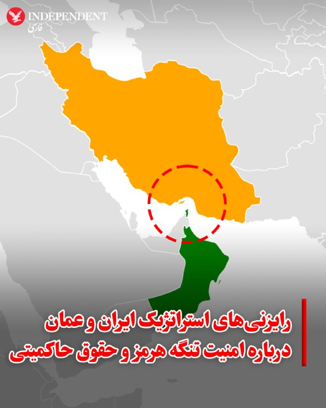

♦️ در ادامه تلاش‌های دیپلماتیک برای مدیریت بحران در منطقه، هیئتی از جمهوری اسلامی به ریاست عباس باقرپور، مدیرکل حقوقی بین‌المللی وزارت امور خارجه، روز سه‌شنبه ۲۲ اردیبهشت، در مسقط با مقامات ارشد عمان دیدار و گفتگو کرد. محور اصلی این نشست، بررسی آخرین تحولات تنگه هرمز و هماهنگی برای عبور ایمن شناورها از این آبراه حیاتی بود.

در این مذاکرات، هر دو کشور بر حقوق و صلاحیت‌های حاکمیتی خود بر تنگه هرمز به عنوان بخشی از آب‌های سرزمینی ایران و عمان تاکید کردند. این موضع‌گیری در حالی صورت می‌گیرد که منطقه با تنش‌های فزاینده و حضور نیروهای بین‌المللی روبرو است.

علاوه بر گفتگو با بدر البوسعیدی، وزیر خارجه عمان، هیئت اعزامی جمهوری اسلامی با آرسنیو دومینگز، دبیرکل سازمان بین‌المللی دریانوردی (IMO) نیز که در مسقط حضور داشت، دیدار کرد. در این نشست تخصصی، مسائل فنی مرتبط با دریانوردی و همکاری‌های دوجانبه برای تضمین ثبات در مسیرهای تجاری مورد بحث و تبادل نظر قرار گرفت. سازمان بین‌المللی دریانوردی تاکید دارد که تنگه هرمز به‌عنوان تنگه‌ای که میان دو آب آزاد قرار گرفته، باید برای دسترسی تجاری کاملا آزاد باشد.
‌🇸🇦 Indypersian

🤖 @VahidOOnLine

## VahidOOnLine — post 239731

♦️جولز هرست سوم، سرپرست معاونت مالی وزارت جنگ آمریکا، روز سه‌شنبه ۲۲ اردیبهشت‌ماه در جلسه سنا اعلام کرد جنگ آمریکا با ایران تاکنون ۲۹ میلیارد دلار هزینه داشته است؛ رقمی که نسبت به برآورد ارائه‌شده در اواخر ماه گذشته، چهار میلیارد دلار افزایش یافته است.

او گفت این افزایش شامل هزینه‌های به‌روزشده تعمیر و جایگزینی تجهیزات و همچنین هزینه‌های عملیاتی نیروهای آمریکایی در منطقه است.

هرست افزود: «تیم ستاد مشترک و تیم مالی به‌طور مداوم در حال بررسی این برآورد هستند.» او این اظهارات را در حضور پیت هگست، وزیر جنگ آمریکا، و ژنرال دن کین، رئیس ستاد مشترک ارتش آمریکا، مطرح کرد.

پنتاگون پیش‌تر در ۲۹ آوریل هزینه جنگ را ۲۵ میلیارد دلار اعلام کرده بود، اما اکنون مقام‌های آمریکایی می‌گویند برآورد تازه به ۲۹ میلیارد دلار نزدیک‌تر است.
‌🇸🇦 Indypersian

🤖 @VahidOOnLine

## VahidOOnLine — post 239730

  

♦️ در ادامه تلاش‌های دیپلماتیک برای مدیریت بحران در منطقه، هیئتی از جمهوری اسلامی به ریاست عباس باقرپور، مدیرکل حقوقی بین‌المللی وزارت امور خارجه، روز سه‌شنبه ۲۲ اردیبهشت، در مسقط با مقامات ارشد عمان دیدار و گفتگو کرد. محور اصلی این نشست، بررسی آخرین تحولات تنگه هرمز و هماهنگی برای عبور ایمن شناورها از این آبراه حیاتی بود.

در این مذاکرات، هر دو کشور بر حقوق و صلاحیت‌های حاکمیتی خود بر تنگه هرمز به عنوان بخشی از آب‌های سرزمینی ایران و عمان تاکید کردند. این موضع‌گیری در حالی صورت می‌گیرد که منطقه با تنش‌های فزاینده و حضور نیروهای بین‌المللی روبرو است.

علاوه بر گفتگو با بدر البوسعیدی، وزیر خارجه عمان، هیئت اعزامی جمهوری اسلامی با آرسنیو دومینگز، دبیرکل سازمان بین‌المللی دریانوردی (IMO) نیز که در مسقط حضور داشت، دیدار کرد. در این نشست تخصصی، مسائل فنی مرتبط با دریانوردی و همکاری‌های دوجانبه برای تضمین ثبات در مسیرهای تجاری مورد بحث و تبادل نظر قرار گرفت. سازمان بین‌المللی دریانوردی تاکید دارد که تنگه هرمز به‌عنوان تنگه‌ای که میان دو آب آزاد قرار گرفته، باید برای دسترسی تجاری کاملا آزاد باشد.
‌🇸🇦 Indypersian

🤖 @VahidOOnLine

## VahidOOnLine — post 239729

  <a href="telegram/content/VahidOOnLine_239729_1778603990.mp4" target="_blank">🎬 Download video</a>

یک شهروند در پیامی به ایران اینترنشنال با اشاره به هشدار ترامپ درباره حمله و بردن ایران به «عصر حجر» گفت که جمهوری اسلامی با قطع اینترنت این کار را کرد و نه ترامپ. پیام این مخاطب و تصویر این پست با هوش مصنوعی خوانده و ساخته شده است.
‌🏁 🇬🇧 IranintlTV

🤖 @VahidOOnLine

## VahidOOnLine — post 239728

  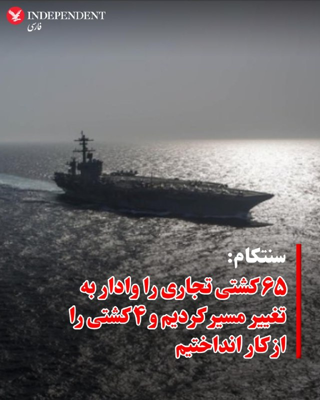

♦️ستاد فرماندهی ارتش ایالات متحده آمریکا، سنتکام، روز سه‌شنبه ۲۲ اردیبهشت در شبکه اجتماعی اکس با انتشار عکسی از ناو هواپیمابر آبراهام لینکلن نوشت نیروهای این فرماندهی ۶۵ کشتی تجاری را تغییر مسیر داده و چهار کشتی را از کار انداخته‌اند.

سنتکام همچنین اعلام کرد ناو هواپیمابر آبراهام لینکلن به عملیات خود در دریای عرب، از جمله اجرای محاصره دریایی آمریکا علیه ایران، ادامه می‌دهد.
‌🇸🇦 Indypersian

🤖 @VahidOOnLine

## VahidOOnLine — post 239727

  

وزارت خارجه کویت اعلام کرد که سفیر جمهوری اسلامی را در پی نفوذ یک گروه وابسته به سپاه پاسداران به جزیره بوییان احضار کرده است.

وزارت کشور کویت اعلام کرد چهار نفری که به‌صورت غیرقانونی از راه دریا وارد این کشور شده بودند، در جریان بازجویی به عضویت در سپاه پاسداران انقلاب اسلامی اعتراف کردند.
در بیانیه این وزارتخانه آمده است این افراد اعتراف کردند مامور شده بودند با استفاده از یک قایق ماهیگیری که به‌طور ویژه برای اجرای اقدامات خصمانه علیه کویت اجاره شده بود، به جزیره بوبیان نفوذ کنند.
بر اساس این بیانیه، این افراد با نیروهای مسلح کویت درگیر شدند که در نتیجه آن یکی از نیروهای کویتی زخمی شد و دو نفر از عناصر نفوذی گریختند.
‌🏁 🇬🇧 IranintlTV

🤖 @VahidOOnLine

## VahidOOnLine — post 239726

  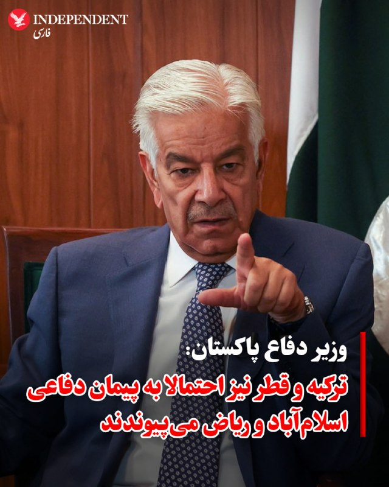

♦️ خواجه محمد آصف، وزیر دفاع پاکستان، از احتمال گسترش پیمان دفاعی مشترک این کشور با عربستان سعودی و پیوستن ترکیه و قطر به عنوان شرکای جدید خبر داد. به گفته او، سازوکار حضور این اعضای جدید تا حد زیادی نهایی شده و هدف آن شکل‌گیری یک ائتلاف قدرتمند دفاعی و اقتصادی در منطقه است.

وزیر دفاع پاکستان تاکید کرد که چنین ائتلافی می‌تواند وابستگی به قدرت‌های فرامنطقه‌ای را به حداقل رسانده و صلح و ثبات را در منطقه تقویت کند. آصف تصریح کرد: «این پیمان علیه هیچ کشوری نیست، اما تاثیری حیاتی در محافظت از صلح ایفا خواهد کرد.»

پاکستان و عربستان سعودی در سپتامبر ۲۰۲۵ پیمانی را امضا کردند که طبق آن، حمله به هر یک از دو کشور، حمله به طرف دیگر تلقی می‌شود. پیوستن ترکیه و قطر به این پیمان، می‌تواند منجر به تشکیل یک «برادری بین‌المللی» با توان نظامی و اقتصادی بالا شود که معادلات امنیتی منطقه را تغییر خواهد داد.
‌🇸🇦 Indypersian

🤖 @VahidOOnLine

## VahidOOnLine — post 239725

  

پیت هگست، وزیر جنگ آمریکا، سه‌شنبه در کنگره این کشور درباره جنگ علیه جمهوری اسلامی اعلام کرد که ارتش ایالات متحده برنامه‌ای برای خروج نیروها از منطقه خاورمیانه دارد، اما در عین حال برای تشدید درگیری یا جابه‌جایی تجهیزات در صورت لزوم نیز برنامه‌ریزی کرده است.
او افزود: «ما دقیقا می‌دانیم چه چیزی در اختیار داریم. هر آنچه نیاز داریم به اندازه کافی داریم.»
او گفت به صنایع دفاعی گفته شده است که «بیشتر و سریع‌تر تولید کنند»، و در عین حال ظرفیت ناکافی مجتمع‌های صنعتی-نظامی را ناشی از دولت‌های پیشین و کمک‌های آمریکا به اوکراین در جنگش با روسیه دانست.
‌🏁 🇬🇧 IranintlTV

🤖 @VahidOOnLine

## VahidOOnLine — post 239724

  

♦️ مسعود پزشکیان، رئیس جمهوری اسلامی، روز سه‌شنبه ۲۲ اردیبهشت، در حالی که ۷۴ روز از قطع کامل اینترنت و ارتباطات مردم ایران با خارج از کشور گذشته، با انتشار پیامی در شبکه اجتماعی ایکس اعلام کرد که محمدرضا عارف، معاون رئیس‌جمهوری اسلامی را مامور کرده که با در نظر گرفتن «حساسیت‌های حکمرانی و نظر رهبری»، در قالب «ساختاری چابک»، موجبات خدمت‌رسانی بهتر دولت و تحقق انتظارات عمومی را فراهم کند.

پزشکیان توضیح نداد که ساختار چابک مورد نظر او، شامل وصل کامل اینترنت و ارتباطات می‌شود یا قصد دارد خدمات الکترونیکی دولت را روی شبکه ملی اینترنت (نسخه محدود داخلی) گسترده‌تر کند.
‌🇸🇦 Indypersian

🤖 @VahidOOnLine

## VahidOOnLine — post 239722

  <a href="telegram/content/VahidOOnLine_239722_1778603997.mp4" target="_blank">🎬 Download video</a>

دونالد ترامپ، رئیس‌جمهور آمریکا، با وجود توقف مذاکرات با جمهوری‌اسلامی، در یک گفتگو، اعلام کرده تهران صددرصد غنی‌سازی اورانیوم و هرگونه تلاش برای ساخت سلاح هسته‌ای را متوقف خواهد کرد.
ترامپ در گفت‌وگو با رادیوی WABC گفت شخصاً با مقام‌های جمهوری‌اسلامی در تماس بوده و افزود: «آن‌ها گفتند ما غبار هسته‌ای را تحویل خواهیم گرفت.»
او همچنین تأکید کرد آمریکا برای رسیدن به توافق عجله‌ای ندارد و گفت: «ما محاصره را در اختیار داریم.»
‌🏁 🇬🇧 ManotoTV

🤖 @VahidOOnLine

## VahidOOnLine — post 239720

  <a href="telegram/content/VahidOOnLine_239720_1778603998.mp4" target="_blank">🎬 Download video</a>

در جلسه استماع کنگره آمریکا، مقام‌های ارشد پنتاگون اعلام کردند هزینه تسلیحات و تجهیزات مصرف‌شده آمریکا در جنگ با ایران تاکنون به حدود ۲۴ میلیارد دلار رسیده است.
پیت هگست، وزیر دفاع آمریکا، به همراه رئیس ستاد مشترک ارتش و مقام مالی وزارت جنگ در این جلسه حضور داشتند. به گفته جولز هرست، این رقم شامل مهمات، موشک‌ها و سایر تجهیزات نظامی استفاده‌شده در جنگ است.
پنتاگون ماه گذشته نیز اعلام کرده بود مجموع هزینه‌های جنگ با ایران تاکنون به ۲۹ میلیارد دلار رسیده است.
‌🏁 🇬🇧 ManotoTV

🤖 @VahidOOnLine

## mwarmonitor — post 8981

🔴«گروهی از مردان که به اتهام تلاش برای ورود به کشور از طریق دریا بازداشت شده بودند، در جریان بازجویی اعتراف کردند که عضو سپاه پاسداران انقلاب اسلامی ایران هستند، به گفته وزارت کشور کویت.» @mwarmonitor

## mwarmonitor — post 8979

  <a href="telegram/content/mwarmonitor_8979_1778603998.mp4" target="_blank">🎬 Download video</a>

✈️۱۵ فروند هواپیمای کوچک آمریکایی 🇺🇸 (احتمالاً F-16) که دیروز وارد شده‌اند در عربستان سعودی 🇸🇦، در اپرون (محوطه پارکینگ) آمریکایی پایگاه Prince Sultan Air Base (PSAB) در مختصات زیر مشاهده شدند:
24.0637, 47.5684

📌این موضوع تأیید می‌کند که محدودیت‌های عملیاتی عربستان علیه پروژه آمریکایی Project Freedom برداشته شده است.

✈️گفته می‌شود ۵۳ فروند جنگنده F-16 در پایگاه PSAB مستقر هستند.

@mwarmonitor

## mwarmonitor — post 8978

🔸سناتور گراهام: ژنرال کِین، آیا شما از گزارش‌هایی مبنی بر اینکه پاکستان اجازه می‌دهد از پایگاه‌هایش برای استقرار هواپیماهای ایرانی استفاده شود، اطلاعی دارید؟
🔹ژنرال کِین: قربان، من یک گزارش در این باره دیده‌ام.
🔸سناتور گراهام: خب، آیا این گزارش دقیق است؟
🔹ژنرال کِین: قربان، فکر می‌کنم با توجه به مسائل طبقه‌بندی شده مختلفی که دیده‌ام...
🔸سناتور گراهام (میان کلام او): اجازه دهید فقط این را بگویم؛ اگر این گزارش دقیق باشد، با نقش پاکستان به عنوان یک میانجی صلح در تضاد است، قبول دارید؟
🔹ژنرال کِین: قربان، من تمایلی ندارم بر اساس مذاکرات جاری و نقش پاکستان در این زمینه اظهار نظر کنم.
🔸سناتور گراهام: ممنون. آقای وزیر هِگسِت، اگر یک میانجی اجازه دهد هواپیماهای شناسایی ایران در پایگاه‌های هوایی پاکستان مستقر شوند، به نظر شما این با میانجی‌گری منصفانه همخوانی دارد؟
🔹وزیر هِگسِت: مجدداً عرض می‌کنم، من نمی‌خواهم در میانه این مذاکرات وارد شوم. من خواهان حداکثر اثربخشی برای...
🔸سناتور گراهام (با تندی): اما من می‌خواهم! من می‌خواهم وسط این مذاکرات باشم. من به اندازه یک پرتاب دست هم به پاکستان اعتماد ندارم. اگر آن‌ها واقعاً هواپیماهای ایرانی را برای محافظت از دارایی‌های نظامی ایران در پایگاه‌های خود مستقر کرده‌اند، به من می‌گوید که شاید باید به دنبال شخص دیگری برای میانجی‌گری باشیم. تعجبی ندارد که این مذاکرات لعنتی به هیچ‌جا نمی‌رسد.

@mwarmonitor

## mwarmonitor — post 8977

  <a href="telegram/content/mwarmonitor_8977_1778604000.mp4" target="_blank">🎬 Download video</a>

🔴سناتور لیندسی گراهام ؛ اگر این گزارش‌ها درست باشد، مستلزم بازنگری کامل در نقشی است که پاکستان به‌عنوان میانجی میان ایران، ایالات متحده و سایر طرف‌ها ایفا می‌کند. ‼️با توجه به برخی اظهارات پیشین مقام‌های دفاعی پاکستان علیه اسرائیل، اگر این موضوع صحت داشته…

## mwarmonitor — post 8976

  

🔴پنتاگون اعلام کرد یک زیردریایی هسته‌ایِ نیروی دریایی آمریکا در جبل‌الطارق مستقر شده است؛ اقدامی که به‌ندرت درباره محل حضور یکی از محرمانه‌ترین تسلیحات آمریکا به‌صورت علنی اعلام می‌شود. این خبر یک روز پس از آن منتشر شد که رئیس‌جمهور ترامپ به‌طور قاطع آخرین…

## mwarmonitor — post 8975

  

✈️🇺🇸«نیروی هوایی ایالات متحده آمریکا (USAF)

✈️۱ فروند هواپیمای بمب‌افکن استراتژیک Rockwell B-1B Lancer
AE6C05 86-0134 - ZENER 01

🔹 بعدازظهر امروز بر فراز جنوب غرب انگلستان از پایگاه RAF Fairford در حال عملیات بوده است. دو هواپیمای سوخت‌رسان KC-135 با شناسه‌های GOLD 65/66 از پایگاه هوایی رامشتاین بدون سیگنال Mode-S برای دیدار با ZENER 01 پرواز کرده‌اند.

@mwarmonitor

## mwarmonitor — post 8973

🔴«ترامپ که از بن‌بست در مذاکرات ناراضی است، اکنون با جدیت بیشتری به ازسرگیری عملیات نظامی در ایران فکر می‌کند، هرچند به گفته منابع، تصمیم مهمی پیش از سفر او به چین بعید است گرفته شود.» CNN

@mwarmonitor

## mwarmonitor — post 8972

🇮🇷«ایران به‌طور قابل توجهی تعریف خود از تنگه هرمز را گسترش داده و اکنون منطقه‌ای بسیار بزرگ‌تر از قبل از جنگ را ادعا می‌کند. یک مقام نیروی دریایی سپاه پاسداران هشدار داده است که ایران «اجازه هیچ‌گونه تعرض به آب‌ها و منافع خود را نخواهد داد» - وال‌استریت ژورنال»

@mwarmonitor

## mwarmonitor — post 8971

🚢غول حمل‌ونقل دریایی مِرسک (Maersk)، دومین شرکت بزرگ کانتینری جهان، اعلام کرده است که همچنان از عبور از تنگه هرمز خودداری می‌کند.

@mwarmonitor

## mwarmonitor — post 8970

  

🇺🇸ناو هواپیمابر USS Abraham Lincoln (CVN 72) به عملیات خود در دریای عرب ادامه می‌دهد، از جمله اجرای محاصره آمریکا علیه ایران. به گفته سنتکام، نیروهای آمریکایی ۶۵ کشتی تجاری را تغییر مسیر داده و ۴ کشتی را از کار انداخته‌اند.

@mwarmonitor

## mwarmonitor — post 8969

✈️🇺🇸«یونایتد ایرلاینز اعلام کرد که پروازهای خود به ونزوئلا را از ۱۱ آگوست از سر خواهد گرفت.»

@mwarmonitor

## mwarmonitor — post 8968

🇺🇸نیروی دریایی آمریکا روز دوشنبه اعلام کرد که ناو جنگی جدیدی که به نام رئیس‌جمهور ترامپ نام‌گذاری شده، هسته‌ای خواهد بود؛ اقدامی که انتظار می‌رود هزینه و پیچیدگی این پروژه چند میلیارد دلاری را افزایش دهد، پروژه‌ای که پیش‌تر نیز درباره عملی شدن ساخت آن تردیدهایی وجود داشت. WSJ

@mwarmonitor

## mwarmonitor — post 8967

  

✈️۳ فروند هواپیمای سوخت‌رسان هوایی KC-135R/T نیروی هوایی آمریکا در حال حاضر در نزدیکی تنگه هرمز در حال عملیات هستند.

@mwarmonitor

## mwarmonitor — post 8966

  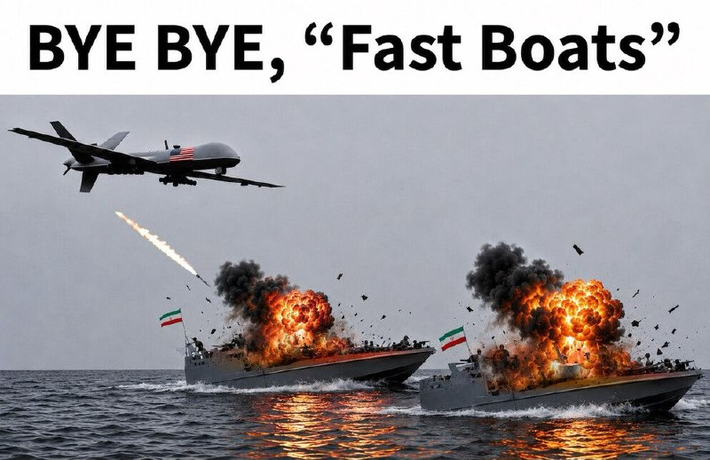

‼️یکی دیگه

## mwarmonitor — post 8964

🔸ترامپ دوباره این دو عکس در سوشال تروث منتشر کرده

@mwarmonitor

## mwarmonitor — post 8963

🇨🇺🇺🇸ترامپ: «کوبا درخواست کمک کرده و ما قرار است گفت‌وگو کنیم.»

@mwarmonitor

## mwarmonitor — post 8962

  

🔴دو هفته پیش، پس از آن‌که نفتکش M/T EUREKA هنگام عبور از Gulf of Aden توسط دزدان دریایی ناشناس ربوده شد، هشت ملوان مصری ربوده شدند.

📌این نفتکش متعلق به شرکت مستقر در امارات Royal Shipping Lines است و تحت پرچم Togo تردد می‌کند. همچنین مالک و مدیر آن در امارات متحده عربی مستقر است.

@mwarmonitor

## mwarmonitor — post 8960

🚨 (رویترز) — قیمت نفت روز سه‌شنبه بیش از ۳ درصد افزایش یافت، زیرا اختلافات شدید میان آمریکا و ایران بر سر پیشنهادی برای پایان دادن به جنگ در خاورمیانه، نگرانی‌ها درباره عرضه را بار دیگر به کانون توجه بازگرداند.

@mwarmonitor

## mwarmonitor — post 8959

🔴بر اساس گزارش Financial Times، خسارات واردشده به بزرگ‌ترین تأسیسات فرآوری گاز امارات متحده عربی در پی حملات ایران در ماه گذشته، ممکن است به‌طور کامل تا سال ۲۰۲۷ ترمیم نشود.

@mwarmonitor

## pm_afshaa — post 90635

  <a href="telegram/content/pm_afshaa_90635_1778604006.webm" target="_blank">🎬 Download video</a>

🔴تصاویر ماهواره‌ای از حضور بی‌سابقه بیش از 53 جنگنده آمریکایی در پایگاه هوایی سلطان عربستان خبر میده.

💧 Rainbet.com the #1 Non-KYC Crypto Casino & Sportsbook @rainbetcom

😁 @Pm_Afshaa

## pm_afshaa — post 90634

  <a href="telegram/content/pm_afshaa_90634_1778604007.webm" target="_blank">🎬 Download video</a>

🔴تسنیم: به دیوان داوری لاهه علیه آمریکا شکایت کردیم؛ تجاوز نظامی به تاسیسات هسته‌ای، اعمال تحریم‌های اقتصادی و تهدید به توسل به زور از موضوعات این شکایته.

💧 Rainbet.com the #1 Non-KYC Crypto Casino & Sportsbook @rainbetcom

😁 @Pm_Afshaa

## pm_afshaa — post 90633

  <a href="telegram/content/pm_afshaa_90633_1778604008.webm" target="_blank">🎬 Download video</a>

🔴یک مقام ارشد پنتاگون: جنگ ایران تاکنون 29 میلیارد دلار برای آمریکا هزینه داشته.

💧 Rainbet.com the #1 Non-KYC Crypto Casino & Sportsbook @rainbetcom

😁 @Pm_Afshaa

## pm_afshaa — post 90632

شهبازی مجری کونیه صداوسیما:
اگه خیلی به اینترنت علاقه دارید برید سوریه و افغانستان و عراق زندگی کنید

💧 Rainbet.com the #1 Non-KYC Crypto Casino & Sportsbook @rainbetcom

😁 @Pm_Afshaa

## pm_afshaa — post 90631

  <a href="telegram/content/pm_afshaa_90631_1778604008.webm" target="_blank">🎬 Download video</a>

🔴نفتکش حامل نفت عراق به دلیل اینکه چند روز پیش با اجازه ایران از تنگه هرمز عبور کرده بود، امروز توسط نیروی دریایی آمریکا بازگردانده شد.

💧 Rainbet.com the #1 Non-KYC Crypto Casino & Sportsbook @rainbetcom

😁 @Pm_Afshaa

## pm_afshaa — post 90630

سخنگوی دولت: تا سایه‌ جنگ دور نشه اینترنت وصل نمیشه، وقتی دور شد به تدریج وصل میشه

💧 Rainbet.com the #1 Non-KYC Crypto Casino & Sportsbook @rainbetcom

😁 @Pm_Afshaa

## pm_afshaa — post 90629

  <a href="telegram/content/pm_afshaa_90629_1778604009.webm" target="_blank">🎬 Download video</a>

🔴دونالد ترامپ: چین قوی است، اما ما قوی‌تر از چین هستیم. ما از نظر نظامی قوی تر از هر کشور دیگری هستیم.

این رو در مورد ونزوئلا دیدید. این برای اکثر کشورهای دیگر کار سختی بود. ما این کار رو در یک روز انجام دادیم.
نگاهی به ایران بندازید، آنها چیز های بزرگی داشتن و همه چیز از بین رفته.

💧Rainbet.com the #1 Non-KYC Crypto Casino & Sportsbook @rainbetcom

😁 @Pm_Afshaa

## pm_afshaa — post 90628

  <a href="telegram/content/pm_afshaa_90628_1778604010.webm" target="_blank">🎬 Download video</a>

🔴ترامپ: من رابطه خیلی خوبی با بی‌بی نتانیاهو دارم. ما واقعاً مثل دو شریک واقعی کنار هم بودیم؛ اگه ما دوتا نبودیم، اسرائیلی هم وجود نداشت؛ مخصوصاً بدون من قطعاً چنین چیزی ممکن نبود.

💧 Rainbet.com the #1 Non-KYC Crypto Casino & Sportsbook @rainbetcom

😁 @Pm_Afshaa

## pm_afshaa — post 90627

  <a href="telegram/content/pm_afshaa_90627_1778604010.webm" target="_blank">🎬 Download video</a>

🔴ترامپ: آمریکا در تماس مستقیم با مقامات ایرانی است و عجله‌ای برای رسیدن به توافق نداریم!

💧 Rainbet.com the #1 Non-KYC Crypto Casino & Sportsbook @rainbetcom

😁 @Pm_Afshaa

## pm_afshaa — post 90626

  <a href="telegram/content/pm_afshaa_90626_1778604011.mp4" target="_blank">🎬 Download video</a>

🔴دونالد ترامپ: ما لازم نیست عجله کنیم، ما یک محاصره داریم که بهشون اجازه نمیده پولی داشته باشن.

این یه چیز بسیار سادست؛ ما نمیتونیم بهشون اجازه بدیم سلاح هسته‌ای داشته باشن چون صدرصد ازش استفاده میکنن.

ایرانی‌ها به من گفتن غبار هسته‌ای مال تو میشه، اما بعد نظرشون عوض شد.

ما 100 درصد گرد و غبار هسته‌ای و همه چیز رو به دست خواهیم آورد.

💧 Rainbet.com the #1 Non-KYC Crypto Casino & Sportsbook @rainbetcom

😁 @Pm_Afshaa

## pm_afshaa — post 90625

  <a href="telegram/content/pm_afshaa_90625_1778604013.webm" target="_blank">🎬 Download video</a>

🔴هگست، وزیر جنگ آمریکا:
ما مهمات و قابلیت‌های کافی برای تضمین دستیابی به آنچه میخوایم در ایران به دست بیاریم، داریم. وزارت جنگ در آمادگی کامله و در صورت لزوم آماده اقدام علیه ایرانه.

💧 Rainbet.com the #1 Non-KYC Crypto Casino & Sportsbook @rainbetcom

😁 @Pm_Afshaa

## pm_afshaa — post 90624

  <a href="telegram/content/pm_afshaa_90624_1778604013.webm" target="_blank">🎬 Download video</a>

🔴هگست، وزیر جنگ آمریکا:
به دلیل حساسیت عملیاتی که رئیس‌جمهور ترامپ بر عهده داره و همچنین برای اطمینان از عدم دستیابی ایران به بمب هسته‌ای، گام بعدی خود علیه این کشور رو فاش نخواهیم کرد.

💧 Rainbet.com the #1 Non-KYC Crypto Casino & Sportsbook @rainbetcom

😁 @Pm_Afshaa

## pm_afshaa — post 90623

  <a href="telegram/content/pm_afshaa_90623_1778604014.webm" target="_blank">🎬 Download video</a>

🔴ترامپ با انتشار این پست از اوباما، بایدن و پلوسی نوشت: دموکرات‌ها عاشق فاضلاب هستن.

💧 Rainbet.com the #1 Non-KYC Crypto Casino & Sportsbook @rainbetcom

😁 @Pm_Afshaa

## pm_afshaa — post 90622

🔴پیت هگست : اگه لازم باشه، برای تشدید درگیری با ایران یه برنامه داریم

💧 Rainbet.com the #1 Non-KYC Crypto Casino & Sportsbook @rainbetcom

😁 @Pm_Afshaa

## pm_afshaa — post 90621

وزارت خارجه کویت: ما از ایران می‌خواهیم که فوراً و بدون قید و شرط اقدامات غیرقانونی و خصمانه خود را که امنیت منطقه را تهدید می‌کند، متوقف کند

💧 Rainbet.com the #1 Non-KYC Crypto Casino & Sportsbook @rainbetcom

😁 @Pm_Afshaa

## pm_afshaa — post 90620

🔴فیدان : به خاطر جهان، تنگه هرمز باید باز شود

💧 Rainbet.com the #1 Non-KYC Crypto Casino & Sportsbook @rainbetcom

😁 @Pm_Afshaa

## pm_afshaa — post 90617

🔴ترامپ در Truth Social:هیچ جمهوری‌خواهی تاکنون درباره کوبا با من صحبت نکرده است، کشوری شکست‌خورده که فقط در یک جهت حرکت می‌کند - به سمت پایین

💧 Rainbet.com the #1 Non-KYC Crypto Casino & Sportsbook @rainbetcom

😁 @Pm_Afshaa

## pm_afshaa — post 90616

سفیر آمریکا تو اسرائیل : ترامپ قبل از انتخابات پیشرو به اسرائیل سفر میکنه

💧 Rainbet.com the #1 Non-KYC Crypto Casino & Sportsbook @rainbetcom

😁 @Pm_Afshaa

## pm_afshaa — post 90614

  <a href="telegram/content/pm_afshaa_90614_1778604015.webm" target="_blank">🎬 Download video</a>

🔴فاکس‌نیوز: در صورت شکست مذاکرات و تشدید بحران، برخی مقام‌های ارشد جمهوری اسلامی ممکنه به روسیه فرار کنن و مقام‌های رده‌پایین‌تر به کشورهایی مثل عراق یا افغانستان پناه ببرن.

💧 Rainbet.com the #1 Non-KYC Crypto Casino & Sportsbook @rainbetcom

😁 @Pm_Afshaa

## pm_afshaa — post 90613

🔴اسرائیل هیوم: هزاران اسرائیلی پیام‌های تهدیدآمیزی از هکرهای وابسته به جمهوری اسلامی ایران دریافت کردن که از شهروندان خواسته شده با جمهوری اسلامی ایران همکاری اطلاعاتی کنن

💧 Rainbet.com the #1 Non-KYC Crypto Casino & Sportsbook @rainbetcom

😁 @Pm_Afshaa

## iaghapour — post 2602

🚀 آپدیت بزرگ و انقلابی پنل 3x-ui (نسخه‌های 3.0.0 و 3.0.1)

بالاخره یکی از مهم‌ترین آپدیت‌های پنل محبوب 3x-ui منتشر شد! در این نسخه‌ها شاهد بازنویسی کامل رابط کاربری، اضافه شدن قابلیت‌های مدیریتی کلان و بهبودهای چشمگیر امنیتی هستیم.

🌐 ۱. بازنویسی کامل و سریع‌تر شدن پنل (مهاجرت به Vue 3) رابط کاربری از پایه بازنویسی شده است! این یعنی سرعت لود بسیار بالاتر، طراحی مدرن‌تر، صفحه لاگین جدید و بهبود چشمگیر تم دارک.

⚡️ ۲. آمار زنده و در لحظه: با جایگزینی سیستم قدیمی با WebSocket، از این پس تمام آمارهای داشبورد، مصرف حجم کلاینت‌ها و وضعیت سرور به صورت «زنده» آپدیت می‌شوند و دیگر نیازی به رفرش کردن صفحه نیست!

🌍 ۳. مدیریت چند سروره (Multi-Node Deployment) - 🌟 ویژگی طلایی یکی از مورد انتظارترین قابلیت‌ها اضافه شد! حالا می‌توانید از طریق یک پنل مرکزی (Manager)، کانفیگ‌ها و اینباندها را روی چندین سرور دیگر (Remote Nodes) مستقر و مدیریت کنید.

📱 ۴. رابط کاربری کاملاً سازگار با موبایل: داشبورد، لیست کلاینت‌ها و بخش لاگ‌ها حالا به صورت "کارتی" و کاملاً بهینه برای نمایشگرهای موبایل طراحی شده‌اند تا مدیریت پنل با گوشی بسیار راحت‌تر شود.

⚙️ ۵. خداحافظی با کدهای JSON و تنظیمات آسان‌تر فرم‌های ساخت کانفیگ (Inbounds) کاملاً ساختاریافته و گرافیکی شده‌اند. دیگر برای تنظیمات پایه نیازی به دستکاری JSON خام نیست (البته تب Advanced برای حرفه‌ای‌ها همچنان وجود دارد). همچنین مدیریت DNSها بسیار پیشرفته‌تر شده است.

👥 ۶. مدیریت گروهی کلاینت‌ها (Bulk Actions) امکان انتخاب گروهی کلاینت‌ها برای حذف یا اعمال تغییرات اضافه شده که کار ادمین‌ها را بسیار راحت می‌کند.

🛠 ۷. امکانات جدید Xray و Outboundها اضافه شدن پروتکل Loopback، دکمه Test All برای تست همزمان همه Outboundها و ارائه گزارش دقیق از تایم‌اوت‌ها، و همچنین خاموش شدن امن هسته Xray.

🔒 ۸. ارتقاء امنیت و نصب راحت‌تر ➖ اضافه شدن سیستم امنیتی CSRF Protection برای جلوگیری از حملات. ➖ اضافه شدن گزینه skip-SSL در اسکریپت نصب (بسیار کاربردی برای کسانی که از ریورس‌پروکسی یا تانل استفاده می‌کنند و نیازی به سرتیفیکیت روی خود سرور ندارند). ➖ اضافه شدن صفحه مستندات API (API Docs) در داخل خود پنل برای برنامه‌نویسان.

و بسیاری از تغییرات دیگه که میتونید در این لینک مطالعه کنید.

💡 نکته: برای تجربه این تغییرات فوق‌العاده، پیشنهاد می‌شود هرچه سریع‌تر پنل خود را آپدیت کنید. (توصیه همیشگی: قبل از آپدیت بکاپ فراموش نشود!)

✍🏻 با تشکر از ثنایی عزیز.

🆔 @iaghapour

## iaghapour — post 2601

⭕️ عصبانیت سخنگوی دولت از انتقاد خبرنگاران از قطع اینترنت

فاطمه مهاجرانی در نشست خبری امروز خود به اعتراض خبرنگاران بابت ادامه قطعی اینترنت واکنش نشان داد.
سخنگوی دولت گفت: «در شرایطی که رئیس جمهور آمریکا اعلام می‌کند آتش بس به دستگاه تنفس مصنوعی وصل است، پاسخ شما چیست؟ کشور در جنگ است. بپذیریم که ویژگی جنگ، امنیت مردم است.»

✍🏻 پ.ن: خانم مهاجرانی اگه دوباره عصبی نمیشید خواستم بگم کاش به فکر امنیت اقتصادی مردم هم بودید! کاش به فکر امنیت ذهنی و روانی مردم هم بودید! کاش یه فکری برای چند میلیون آدمی که با قطعی اینترنت بیکار و ناامید کردین هم بودید!

🆔 @iaghapour

## DEJradio — post 4594

  <a href="telegram/content/DEJradio_4594_1778604015.webm" target="_blank">🎬 Download video</a>

ب
🔺📷 ررسی‌ها نشان می‌دهد نرگس افشردی شاغل در دانشگاه هاروارد، برادرزاده محمد باقری (محمدحسین افشردی)، رئیس پیشین ستاد کل نیروهای مسلح جمهوری اسلامی، است که در خرداد ۱۴۰۴ در پی حمله هوایی اسرائیل کشته شد.

کاربران در شبکه‌های اجتماعی که سوابق نرگس افشردی را بررسی کرده‌اند می‌گویند او در حالی خارج از ایران در رفاه زندگی می‌کند که اگر یکی از بستگان دور یک گروهبان در خارج از کشور مقیم باشد هیچگونه انتصابی به او نمی‌دهند اما بسیاری از اقوام و خویشاوندان درجه یک فرماندهان ارشد نظام و مقامات سیاسی و امنیتی خارج از ایران سکونت دارند.

نرگس افشردی فرزند حسن باقری (غلامحسین افشردی)، از فرماندهان سپاه پاسداران در دوران جنگ ایران و عراق، می‌باشد.
همسر او، محسن گودرزی استاد مطالعات اسلامی در دانشگاه «هاروارد» است و خود نرگس نیز به‌عنوان پژوهشگر حوزه روان‌شناسی در همین دانشگاه فعالیت می‌کند.

این موضوع بار دیگر بحث قدیمی درباره تفاوت سبک زندگی و محل اقامت فرزندان و نزدیکان برخی مسئولان جمهوری اسلامی با شرایط عمومی مردم ایران را در فضای مجازی پررنگ کرده است.

#IRGCterrorists #جمهوری_اسلامی
@DEJradio

## DEJradio — post 4593

  <a href="telegram/content/DEJradio_4593_1778604016.webm" target="_blank">🎬 Download video</a>

🤡
🔺 یک سرگرد نیروی انتظامی با ابعاد چاق و بدفرم در تجمعات شبانه طرفداران حکومت خطاب به سلطنت‌طلب‌ها می‌گوید، مجتبی را تنها نمی‌گذاریم!

این در حالی‌ست که مجتبی خامنه‌ای وضعیت نامشخص دارد و اصلا معلوم نیست توان حرکت یا تصمیم‌گیری دارد یاصرفا یک جسم بی‌تحرک در خدمت سرداران است.

#موشتبا #جمهوری_اسلامی
@DEJradio

## DEJradio — post 4592

  <a href="telegram/content/DEJradio_4592_1778604017.mp4" target="_blank">🎬 Download video</a>

🚨
🔸 شکستن تابوی سکوت

*غنچه استوارنیا

#تابوشکنی #جمهوری_اسلامی
@DEJradio

## DEJradio — post 4591

  <a href="telegram/content/DEJradio_4591_1778604019.mp4" target="_blank">🎬 Download video</a>

🚨
🔸 افزایش شمار اعدام‌ها در جمهوری اسلامی؛ انتقام نظام از شهروندان؟

گفت‌وگو با سامان گنجی، زندانی سابق کهریزک

شمار اعدام‌ها در جمهوری اسلامی همچنان رو به افزایش است. اغلب این زندانیان به «ارتباط و همکاری با اسرائیل» و «محاربه» متهم شده‌اند. سامان گنجی، زندانی سیاسی جان‌به‌دربرده از کهریزک در سال ۱۳۸۸، در گفت‌وگو با «دژ» درباره هدف جمهوری اسلامی از اجرای فزاینده احکام اعدام در ایران توضیح می‌دهد.

#اعدام #جمهوری_اسلامی
@DEJradio

## DEJradio — post 4590

  <a href="telegram/content/DEJradio_4590_1778604021.mp4" target="_blank">🎬 Download video</a>

🤡
🔺 ظهره‌وند نماینده مجلس:
میشه کارهایی کرد که بمب اتم جلوش بچه‌بازیه!

ابوالفضل ظهره‌وند عضو دیگر کمیسیون امنیت ملی مجلس شورای اسلامی، مدعی شده است، «تولید بمب کاری نداره، وقتی شما اراده داشته باشی می‌توانی پلاسما و سلاح‌هایی داشته باشی که بمب اتم جلوش ترقه باشه؛ تاثیر تنگه هرمز، باب المندب و جبهه مقاومت از صد تا بمب اتم بیشتره، البته این تضادی هم با دیگر مسائل ندارد.»

او همچنین گفته «من جاها و ظرفیت‌هایی رو دیدم که اتفاقی میوفته که بمب اتم جلوش ترقه است، شما میتونید زمان رو پشت سر بزارید، چیزی که در چند ثانیه از تهران تا واشنگتن برود، میشه یه کارهایی کرد که بمب اتم جلوش بچه بازیه!»

#بمب_اتم #تنگه_هرمز
@DEJradio

## DEJradio — post 4589

  <a href="telegram/content/DEJradio_4589_1778604024.mp4" target="_blank">🎬 Download video</a>

🔺🎥 “این قیافه پیروزیه که سـ.ـپاه میگه، هیچی نداریم!

#IRGCterrorists #تورم
@DEJradio

## DEJradio — post 4588

  <a href="telegram/content/DEJradio_4588_1778604026.webm" target="_blank">🎬 Download video</a>

🚨📢 ادعای وزارت خارجه پاکستان:
هواپیماهای ایرانی «موقت» در پاکستان مستقر هستند

سی‌بی‌اس گزارش داده بود که جمهوری اسلامی بخشی از ناوگان نیروی هوایی [تجاری و نظامی] خود را در طی جنگ ۴۰ روزه به پایگاه هوایی «نورخان» پاکستان منتقل کرده بود. در واکنش به این گزارش وزارت خارجه پاکستان به طور رسمی این گزارش را «گمراه‌کننده» خواند و تأکید کرد که این هواپیماها صرفاً برای تسهیل رفت‌وآمد دیپلمات‌ها و به صورت موقت مستقر شده‌اند.
در بیانیه وزارت خارجه پاکستان آمده «هواپیماهای نظامی ایران نه برای مصون ماندن از حملات آمریکا که در انتظار دورهای بعدی مذاکرات، در پایگاه نورخان مانده‌اند.»

همچنین تأکید شده، «هواپیماهای ایرانی که هم‌اکنون در خاک ما هستند، به هیچ گونه ترتیبات نظامی مرتبط نمی‌باشند». پاکستان همچنین تصریح کرد که ارتباط منظم خود را با همه طرف‌های ذی‌نفع حفظ کرده و متعهد است از تمامی تلاش‌هایی که به تقویت گفت‌وگو، کاهش تنش و پیشبرد صلح کمک می‌کند، حمایت کند.
در جریان جنگ ۱۲ روزه نیز نیروی هوایی جمهوری اسلامی بخشی از ناوگان خود را به پاکستان منتقل کرده بود تا کمتر آسیب ببینند.

#جنگ۴۰روزه #جمهوری_اسلامی #جنگ۱۲روزه
@DEJradio

## DEJradio — post 4586

  <a href="telegram/content/DEJradio_4586_1778604027.webm" target="_blank">🎬 Download video</a>

🔺📢 "نظامی‌های وطن‌دوست به مردم آموزش میدانی بدهند

شهاب عنایتی از پرسنل پیشین ارتش

#ارتش #گارد_جاویدان
@DEJradio

## DEJradio — post 4585

  <a href="telegram/content/DEJradio_4585_1778604027.webm" target="_blank">🎬 Download video</a>

🚨📢 اختصاصی دژ؛
استقرار نیروهای تیپ ۴۵ تکاور شوشتر اطراف سایت هسته‌ای اصفهان

منابع اختصاصی دژ از ایران گزارش دادند، بخش عمده‌ای از نیروهای تیپ ویژه ۴۵ تکاور شوشتر با ادوات و تجهیزات به اطراف سایت هسته‌ای اصفهان مستقر شدند.
منبع نظامی دژ می‌گوید، استقرار تکاوران تیپ ۴۵ با هدف دفاع زمینی از تاسیسات هسته‌ای اصفهان صورت می‌گیرد.
با افزایش احتمال عملیات مجدد علیه جمهوری اسلامی با هدف خارج کردن اورانیوم‌ها از ایران، ارتش و سـ.ـپاه لایه‌های دفاعی تاسیسات اصفهان را تقویت کنند.
در جریان جنگ ۴۰ روزه هواپیماهای ترابری آمریکا در دشت مهیار اصفهان حوالی تاسیسات اتمی فرود آمدند و نیرو پیاده کردند.
بخشی از ماموریت ارتش مقابله با هلی‌برن نیروهای آمریکا یا اسرائیل است.

#تاسیسات_اتمی #تاسیسات_اصفهان
@DEJradio

## DEJradio — post 4584

  <a href="telegram/content/DEJradio_4584_1778604028.mp4" target="_blank">🎬 Download video</a>

🔺📢 شعارنویسی؛ سـ.ـپاهی‌ها شکمشون سیره، اما بچه‌های ما گرسنه‌اند

#تورم #جمهوری_اسلامی
@DEJradio

## DEJradio — post 4583

  <a href="telegram/content/DEJradio_4583_1778604031.webm" target="_blank">🎬 Download video</a>

🚨
⭕️ تا شعاع ۵۰ کیلومتری پایگاه مشترک اسرائیل و آمریکا در عراق کسی حق نزدیک شدن ندارد

شاکر ابوتراب التمیمی، نماینده فراکسیون بدر [وابسته به نیروی قدس سـ.ـپاه] در پارلمان عراق، افشا کرد پایگاه مشترک اسرائیل- آمریکا در صحرای غرب عراق همچنان فعال است و نیروهای امنیتی عراق و آنها «اجازه نزدیک شدن به آن را ندارند».

به گفته التمیمی، «حدود دو ماه پیش اطلاعاتی درباره وجود این کمپ در خاک عراق منتشر شده بود، اما این اردوگاه همچنان پابرجاست و بغداد عملا هیچ کنترلی بر آن ندارد و آمریکا صراحتا به دولت عراق گفته است تا شعاع ۵۰ کیلومتری آن مکان کسی حق تردد و نزدیک شدن به آنجا را ندارد.»

او همچنین گفت، «دولت در ابتدا از این موضوع بی‌اطلاع بود، اما بعدها از مسیر دستگاه‌های امنیتی از وجود این پایگاه مشترک در صحرای غربی مطلع شد».
پیش‌تر وال‌استریت ژورنال به نقل از منابع امنیتی از وجود یک پایگاه مخفی اسرائیلی در صحرای نجف عراق خبر داده بود. طی جنگ ۴۰ روزه این پایگاه پشتیبان حملات به رژیم ایران بود.

#جنگ۴۰روزه #جمهوری_اسلامی
@DEJradio

## DEJradio — post 4581

  <a href="telegram/content/DEJradio_4581_1778604031.mp4" target="_blank">🎬 Download video</a>

🚨📢 تعرض به دختران مدرسه شرافت؛ "سکوت نکنید ملت"

تعرض ماموران امنیتی به دختران دانش‌آموز مدرسه شرافت با واکنش‌های مختلف در ایران روبرو شده است.
دانش‌آموزان و خانواده‌های آنها زیر فشار قرار دارند و سایر هموطنان مسئول‌ند از آنها پشتیبانی کنند.

#مدرسه_شرافت #مسئولیت_مدنی
@DEJradio

## DEJradio — post 4580

  <a href="telegram/content/DEJradio_4580_1778604034.mp4" target="_blank">🎬 Download video</a>

🔺🎥 پس از جنگ ۴۰ روزه اعتراض پرسنل نظامی به وضعیت خوراک و دستمزد پایین افزایش پیدا کرده و نارضایتی آنها از وضعیت معیشت بیشتر شده است.

بر اساس اطلاعات دریافتی، جیره‌های خوراکی ناکافی و ناسالم است و با تخریب پادگان‌ها بهداشت اولیه هم رعایت نمی‌شود. در برخی مناطق سرویس‌های معمول توالت تبدیل به مستراح‌های صحرایی شده است.

#جنگ۴۰روزه #جیره_بندی
@DEJradio

## DEJradio — post 4579

  <a href="telegram/content/DEJradio_4579_1778604035.mp4" target="_blank">🎬 Download video</a>

🤡
🔺 حکومت برای رونق‌بخشیدن به تجمعات شبانه، شیعیان را از کشورهای همسایه تا دورترین نقاط آفریقا به خیابان‌ها سرازیر کرده است!

در یکی از آخرین نمونه‌ها طلاب اوگاندایی و خانواده‌های آنها که در حوزه‌های علمیه بساط پهن کرده‌اند به عنوان سیاهی‌لشکر به تجمعات آمده‌اند.

#تجمعات_حکومتی #اوگاندا
@DEJradio

## DEJradio — post 4578

  <a href="telegram/content/DEJradio_4578_1778604038.mp4" target="_blank">🎬 Download video</a>

🔺🎥 ویدیوی ارسالی هموطنان با اشاره به گرانی و تورم شدید:
"مردم در بازار می‌چرخند اما هیچی نمی‌خرند."

#تورم #جمهوری_اسلامی
@DEJradio

## DEJradio — post 4577

  <a href="telegram/content/DEJradio_4577_1778604040.webm" target="_blank">🎬 Download video</a>

🚨
⭕️ «سی‌بی‌اس» دوشنبه، ۲۱ اردیبهشت‌ماه، گزارش داد که پاکستان برخلاف نقش خود به‌عنوان میانجی دیپلماتیک میان تهران و واشنگتن، به طور مخفیانه اجازه داده است هواپیماهای نظامی جمهوری اسلامی ایران در پایگاه‌های هوایی این کشور مستقر شوند تا از حملات هوایی آمریکا در امان بمانند.

بر اساس گزارش منابع آگاه در دولت ایالات متحده، تنها چند روز پس از اعلام آتش‌بس موقت توسط دونالد ترامپ، رئیس جمهوری آمریکا، در اوایل آوریل، چندین فروند هواپیما از جمله یک هواپیمای شناسایی و جاسوسی مدل «آر-۱۳۰» (RC-130) نیروی هوایی ایران در پایگاه هوایی «نورخان» پاکستان، واقع در نزدیکی شهر راولپندی، دیده شده‌اند. هم‌زمان گزارش‌هایی از اعزام هواپیماهای غیرنظامی جمهوری اسلامی ایران به افغانستان نیز منتشر شده است که به نظر می‌رسد بخشی از تلاش گسترده تهران برای حفاظت از دارایی‌های هوانوردی و نظامی باقی‌مانده خود در میانه درگیری‌های اخیر باشد.

همزمان، مقامات ارشد پاکستان این ادعاها را به شدت رد کرده‌اند. یک مقام عالی‌رتبه پاکستانی در گفت‌وگو با «سی‌بی‌اس نیوز» تاکید کرد که پایگاه هوایی نورخان در قلب شهر واقع شده و استقرار ناوگان بزرگی از هواپیماهای خارجی در چنین مکانی غیرممکن است که از دید عموم پنهان بماند. با این حال، تحلیلگران آمریکایی بر این باورند که این جابه‌جایی‌های استراتژیک نشان‌دهنده تلاش رژیم ایران برای بهره‌گیری از روابط منطقه‌ای جهت کاهش آسیب‌پذیری ناوگان هوایی خود در برابر فشارهای نظامی و محاصره اعمال شده توسط واشنگتن است.

#پاکستان #جمهوری_اسلامی
@DEJradio

## DEJradio — post 4576

  <a href="telegram/content/DEJradio_4576_1778604041.webm" target="_blank">🎬 Download video</a>

🔺📢 شاهزاده رضا پهلوی بامداد سه‌شنبه ۲۲ اردیبهشت به‌وقت ایران در«ایکس» نوشت که جمهوری اسلامی ۴۷ سال است علیه آمریکا و متحدانش جنگ به راه انداخته، و تاکید کرد: «امروز این رژیم از همیشه ضعیف‌تر است و مردم ایران آماده‌اند تا آن را سرنگون کنند.» او نوشت که اتخاذ سیاستی درست در این لحظه، می‌تواند قرن آینده را تغییر دهد.

#شاهزاده_رضا_پهلوی #جمهوری_اسلامی
@DEJradio

## mamlekate — post 103514

  

📞 الو یه سری قایق های تیز رو مال مردم جنوب هست که سالهاست دارن از خصب عمان کالا میارن (قایق های شوتی) توی این هفته گذشته تا الان دارم که پیام مینویسم پهپادهای آمریکایی چندتا از این قایق‌ها رو زدند ۱۰ تا ۱۲ نفر تلفات دادند. هر قایق دونفر سرنشین دارند یک ناخدا یک ملوان. این آگهی مربوط به یکی از این قایق‌هاست.

آمریکایی ها فکر می‌کنند اینا مال نیروی دریایی هستش. جمهوری اسلامی هم مهم نیست براش خوشحالم میشه تلفات غیرنظامی بره بالا.

@mamlekate

## mamlekate — post 103513

  

📞 تهران بالاتر از چهارراه ولیعصر ۲۲ اردیبهشت ساعت ۱۲ نفربر نوپو گذاشتن. قبلا هم بوده البته چون بخاطر جنگ هنوز جایی برای پارکشون ندارن. دکوراسیون شهر تهران شدن.

@mamlekate

## mamlekate — post 103512

  <a href="telegram/content/mamlekate_103512_1778604043.mp4" target="_blank">🎬 Download video</a>

📝 حسین افشین، معاون علمی و فناوری مسعود پزشکیان، با اشاره به اینکه «در شرایط جنگی هم بستن اینترنت نمی‌تواند راهکار باشد» گفت: «دیدیم وقتی اینترنت کاملا بسته بود، ترورها همچنان وجود داشت.»

💎 پیشتر: ترور لاریجانی:
t.me/mamlekate/103477

## mamlekate — post 103511

  <a href="telegram/content/mamlekate_103511_1778604044.mp4" target="_blank">🎬 Download video</a>

🤏 سخنگوی دولت: اینترنت پرو، مصوبه شورای عالی امنیت ملی است. اینترنت پرو برای کسب‌و‌کارها است. کشور در جنگ است و ویژگی جنگ امنیت مردم است

📝 خانم فاطمه مهاجرانی دروغ می‌گوید. در هفته‌های اخیر، پیامک فعال‌سازی اینترنت پرو برای بسیاری از شهروندانی ارسال شده که هیچ کسب‌وکار خاصی ندارند. همزمان، گزارش‌های متعددی از شکل‌گیری بازار دلالی این نوع دسترسی منتشر شده؛ افرادی که در ازای دریافت مبالغی تا حدود ۶ میلیون تومان، اینترنت پرو را برای شهروندان فعال می‌کنند.

اظهارات امروز سخنگوی دولت مسعود پزشکیان، بار دیگر نشان می‌دهد که این دولت نه‌تنها مخالف فیلترینگ و محدودسازی اینترنت نیست، بلکه از سیاست ارائه اینترنت طبقاتی و دسترسی تبعیض‌آمیز به اینترنت آزاد نیز حمایت می‌کند.
alirezaer

❗️ کار از پرو گذشته، علنا سیم‌کارت سفید می‌فروشن.

📝 سلام، در مورد اینترنت پرو، من بدون اینکه درخواستی بدم یا کاری بکنم تایید شدم.

@mamlekate

## VahidOnline — post 75432

  

دونالد ترامپ در گفت‌وگو با برنامه رادیویی «سید رازبرگ» گفت: انتظار داریم اقتصاد ایران زیر فشارهای ناشی از محاصره بنادرش فرو بپاشد.
او افزود این درگیری بدون نیاز به شتاب‌زدگی حل‌وفصل خواهد شد و جمهوری اسلامی با انزوایی روبه‌رو است که آن را از منابع درآمدی محروم می‌کند.
ترامپ گفت ایالات متحده در حال انجام ارتباطات مستقیم با مقام‌های تهران است و برای رسیدن به توافق عجله‌ای ندارد و او اطمینان دارد که تهران غنی‌سازی اورانیوم را به‌طور کامل متوقف خواهد کرد.
@VahidOOnLine
دونالد ترامپ گفت حکومت ایران با انزاویی روبه‌روست که آن را از منابع درآمدش محروم می‌کند و انتظار می‌رود اقتصاد ایران زیر فشارهای ناشی از محاصره بندرها دچار فروپاشی شود.
او افزود: «این درگیری بدون نیاز به شتاب‌زدگی حل‌وفصل خواهد شد و جمهوری اسلامی با انزوایی روبه‌رو است که آن را از منابع درآمدی محروم می‌کند.»
دونالد ترامپ درباره اورانیوم غنی‌شده در ایران گفت مقام‌های جمهوری اسلامی به او گفته‌اند قرار است آنچه او «گردوغبار هسته‌ای» می‌نامد در اختیار آمریکا قرار گیرد، اما بعدا نظرشان را تغییر داده‌اند. او تاکید کرد در نهایت این مواد را به دست خواهند آورد و موضوع را جمع‌وجور می‌کنند.
@VahidOOnLine

📡 @VahidOnline

## VahidOnline — post 75431

  

یک مقام ارشد پنتاگون روز سه‌شنبه ۲۲ اردیبهشت اعلام کرد که جنگ ایالات متحده با ایران تاکنون ۲۹ میلیارد دلار هزینه داشته است، رقمی که نسبت به برآورد ارائه‌شده در اواخر ماه گذشته، چهار میلیارد دلار افزایش نشان می‌دهد.

به گزارش خبرگزاری رویترز، در حالی که تنها شش ماه تا انتخابات میان‌دوره‌ای کنگره آمریکا باقی مانده است، دموکرات‌ها در نظرسنجی‌های عمومی موقعیت بهتری پیدا کرده‌اند و تلاش می‌کنند این جنگ را به مسائل مربوط به هزینه‌های زندگی پیوند بزنند.
@VahidHeadline

📡 @VahidOnline

## VahidOnline — post 75430

  

دونالد ترامپ، رییس‌جمهوری آمریکا، روز سه‌شنبه در تروث سوشال دو تصویر گرافیکی منتشر کرد که صحنه‌هایی از حمله به پهپادها و قایق‌های جمهوری اسلامی را نشان می‌دهد.

در یکی از این تصاویر، یک ناو آمریکایی با استفاده از سلاح لیزری یک پهپاد جمهوری اسلامی را هدف قرار داده و نابود می‌کند. در تصویر دیگر، یک پهپاد آمریکایی دو قایق جمهوری اسلامی را هدف قرار داده و منهدم می‌کند.
@VahidOOnLine

📡 @VahidOnline

## VahidOnline — post 75429

  <a href="telegram/content/VahidOnline_75429_1778604047.mp4" target="_blank">🎬 Download video</a>

نشست خبری سخنگوی دولت مسعود پزشکیان روز سه‌شنبه ۲۲ اردیبهشت به دلیل وضعیت اینترنت به بگومگوی خبرنگاران با فاطمه مهاجرانی منجر شد.
سخنگوی دولت تاکید کرد که «اینترنت پرو» با مصوبه شورای عالی امنیت ملی که ریاست آن را مسعود پزشکیان بر عهده دارد،‌ مورد استفاده قرار می‌گیرد.
او در عین حال تاکید کرد که این اینترنت ویژه کسب و کارها است. [در حالیکه خیلی از مردم بدون کسب و کار هم پیامک گرفتند بیاید پرو بخرید]
@VahidHeadline
فاطمه مهاجرانی گفت با توجه به وضعیت جنگی، فعلا اینترنت عمومی وصل نخواهد شد.
مهاجرانی در پاسخ به پرسش‌های متعدد خبرنگاران درباره وضعیت اینترنت و به‌ویژه «اینترنت پرو» گفت ما در وضعیت جنگی هستیم. رئیس جمهوری به‌عنوان رئیس شورای عالی امنیت ملی پیگیر حقوق مردم است اما وضعیت جنگی است و بعد از پایان شرایط ویژه، اینترنت به‌حالت قبل بازخواهد گشت.»
پس از این سخنان، چند خبرنگار تلاش کردند تا با یادآوری تعهدات دولت پیگیر وضعیت وصل اینترنت شوند. مهاجرانی خطاب به آن‌ها گفت: «وقتی رئیس جمهوری آمریکا می‌گوید آتش‌بس به تنفس مصنوعی وصل است، انتظار شما چیست؟»
@VahidOOnLine
فاطمه مهاجرانی، سخنگوی دولت جمهوری اسلامی، با اشاره به قطعی طولانی‌مدت اینترنت در ایران گفت اینترنت حق مردم است و عصبانیت مردم کاملا درست است. اما در ادامه تاکید کرد: «عامل این عصبانیت دشمنانی هستند که باعث می‌شوند فضای امنیتی ما مخدوش شود.»
او افزود: «رسانه‌ها کمک کنند که این ادبیات را جا بیندازند. دولت طرفدار دسترسی آزاد است.»
@VahidOOnLine

📡 @VahidOnline

## VahidOnline — post 75428

  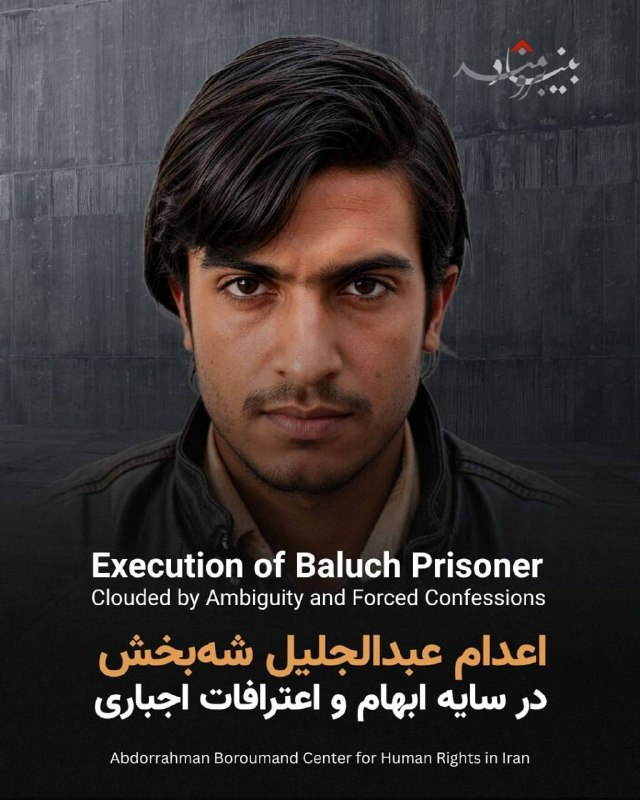

قوه قضائیه از اجرای حکم اعدام یک زندانی دیگر به نام عبدالجلیل شه‌بخش در بامداد سه‌شنبه ۲۲ اردیبهشت خبر داد.

ارگان رسمی نهاد قضایی ایران، شه‌بخش را «تروریست آموزش‌دیده» گروه «انصارالفرقان» معرفی کرده است.

از زمان حملات آمریکا و اسرائیل به ایران، جمهوری اسلامی اجرای احکام اعدام را افزایش داده است و در برخی روزها چند نفر را اعدام کرده است.
@VahidHeadline

📡 @VahidOnline

## kianmeli1 — post 87362

‏🔴رسانه‌های کویتی گزارش دادند افراد نفوذی وابسته به سپاه پاسداران قصد انجام اقدام‌های خصمانه علیه کویت را داشتند و تلاش کردند از طریق دریا وارد کشور شوند

‏رسانه‌های کویتی به نقل از وزارت کشور اعلام کردند چهار فرد نفوذی وابسته به سپاه پاسداران بازداشت شدند
https://t.me/kianmeli1

## kianmeli1 — post 87361

‏🔴اسرائیل هیوم: هزاران اسرائیلی ازشامگاه ۲۲ اردیبهشت پیامک‌های تهدیدآمیز به زبان عبری دریافت کردند که در آنها از سوی هکرهای منتسب به تهران خواسته شده با جمهوری اسلامی همکاری کنند
https://t.me/kianmeli1

## kianmeli1 — post 87360

‏🔴وزارت خارجه قطر اعلام کرد این کشور ربایش یک نفتکش حامل دریانوردان مصری از آب‌های یمن و انتقال آن به نزدیکی پانتلند سومالی را محکوم می‌کند و آن را نقض آشکار قوانین بین‌المللی دانست
https://t.me/kianmeli1

## kianmeli1 — post 87359

  <a href="telegram/content/kianmeli1_87359_1778604048.mp4" target="_blank">🎬 Download video</a>

🔴مهاجرانی: در حوادث دی ماه شاهد اعتراضات به حق مردم بودیم که توسط تروریست‌ها مصادره شد
https://t.me/kianmeli1

## kianmeli1 — post 87358

  <a href="telegram/content/kianmeli1_87358_1778604051.mp4" target="_blank">🎬 Download video</a>

🔴سخنگوی دولت: اینترنت پرو مصوبۀ شورای‌عالی امنیت ملی است که آقای رئیس‌جمهور ریاست آن را برعهده دارد
https://t.me/kianmeli1

## kianmeli1 — post 87357

  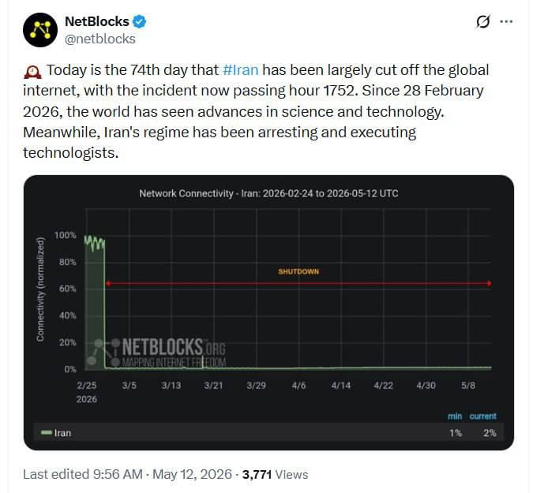

🔴نت بلاکس:
امروز روز ۷۴ از قطع اینترنت در ایران است و این حادثه اکنون از ساعت ۱۷۵۲ گذشته است.از ۲۸ فوریه ۲۰۲۶ تاکنون، جهان شاهد پیشرفت‌های بزرگ در علم و فناوری بوده، در حالی که رژیم ایران در حال بازداشت و اعدام متخصصان و تکنولوژیست‌هاست.

 سه شنبه ۲۲ اردیبهشت ۱۴۰۵ 
https://t.me/kianmeli1

## kianmeli1 — post 87356

🔴 سخنان مارک لوین در مورد مردم ایران و سکوت دموکرات ها و چپ ها
‏ می‌خوام با شما درباره‌ی مردمی صحبت کنم، که اکثرانها خواهان زندگی در آزادی هستند.

‏ می‌خوام درباره‌ی ده‌ها میلیون صحبت کنم که ۴۷ ساله با ان‌ها مثل حیوان رفتار شده. کسانی که زندانی، شکنجه، مورد تجاوز واقع شده و ده‌ها هزار نفرشان به قتل رسیدن

‏می‌خوام درباره‌ زنان جوان بگم که مجبور به پوشندن سرخود هستند و هیچ حقی ندارند، چه برسه به حقوق برابر و در معرض بدترین سوءرفتارها قرار می‌گیرن.

‏می‌خوام از جوونا بگم. جوونای ایران که می‌خوان از جوونی‌شون لذت ببرند، چیزهای جدید و شاد رو تجربه کنند، اما توسط پلیس مخفی رژیم بازداشت و بدون محاکمه عمدتاً در خفا اعدام می‌شن.

‏می‌خوام درباره‌ کسانی در کشور خودمون آمریکا صحبت کنم که خودشون رو فعال حقوق بشر یا مدافع آزادی‌های مدنی می‌نامند، اما کوچکترین اهمیتی به هیچ‌کدوم از اینها نمی‌دهند، چون حزب دموکرات، مارکسیست‌ها و اسلام‌گرایان، آنقدر از آمریکا و اسرائیل متنفرند که ترجیح می‌دهند ده‌ها هزار ایرانی دیگه به شکلی وحشتناک بمیرند، اما شاهد اون نباشند که کشور ما این رژیم آدم‌کش رو شکست می‌دهد
‏

## IranIntlTV — post 336847

  <a href="telegram/content/IranIntlTV_336847_1778604053.mp4" target="_blank">🎬 Download video</a>

تیتراول با نیوشا صارمی، سه‌شنبه ۲۲ اردیبهشت
@iranintltv

## IranIntlTV — post 336846

  <a href="telegram/content/IranIntlTV_336846_1778604055.mp4" target="_blank">🎬 Download video</a>

تیتراول با نیوشا صارمی، سه‌شنبه ۲۲ اردیبهشت
@iranintltv

## IranIntlTV — post 336845

  

شاهزاده رضا پهلوی در نشست امنیتی سالانه پولیتیکو گفت سیاست مماشات با رژیم جمهوری اسلامی که راهبرد بسیاری از دولت‌ها بود، شکست خورده است.
او افزود اکنون که با یک «جانور زخمی» روبه‌رو هستیم، این فرصتی است که نباید از دست برود، بلکه باید کار را یک‌بار برای همیشه تمام کرد؛ موضوعی که نه‌تنها میلیون‌ها ایرانی، بلکه بسیاری از کشورهای منطقه نیز انتظار آن را دارند.

شاهزاده رضا پهلوی درباره جنگ علیه جمهوری اسلامی نیز گفت مردم به‌اندازه کافی هوشمند هستند که تفاوت میان حمله به یک ملت و حمله به یک رژیم را تشخیص دهند و آن کارزار، حمله‌ای علیه ملت ایران نبود، بلکه علیه رژیم بود.
https://iranintl.com/202605128673

## IranIntlTV — post 336844

  

دبیرکل شورای همکاری خلیج فارس اعلام کرد که نفوذ عناصر وابسته به سپاه پاسداران و برنامه‌ریزی آن‌ها برای اقدامات «خصمانه» را به‌شدت محکوم می‌کند.

دبیرکل شورای همکاری خلیج‌ فارس افزود از هر اقدامی که کویت برای حفظ امنیت و ثبات خود اتخاذ کند، حمایت می‌کند.

‌پیش‌تر نیز وزارت خارجه کویت اعلام کرد که سفیر جمهوری اسلامی را در پی نفوذ یک گروه وابسته به سپاه پاسداران به جزیره بوییان احضار کرده است.
https://iranintl.com/202605128445

## IranIntlTV — post 336843

  <a href="telegram/content/IranIntlTV_336843_1778604058.mp4" target="_blank">🎬 Download video</a>

با ادامه نارضایتی ترامپ از پاسخ تهران، ارم‌نیوز به نقل از منابع آمریکایی خبر داد واشینگتن به دنبال حمله به باقیمانده مراکز هسته‌ای ایران است تا قواعد جدیدی را به تهران تحمیل کند. سی‌ان‌ان هم خبر داد ترامپ در حال بررسی حمله به ایران پس از سفر به چین است.

گزارشی از مجتبا پورمحسن
@iranintltv

## IranIntlTV — post 336842

  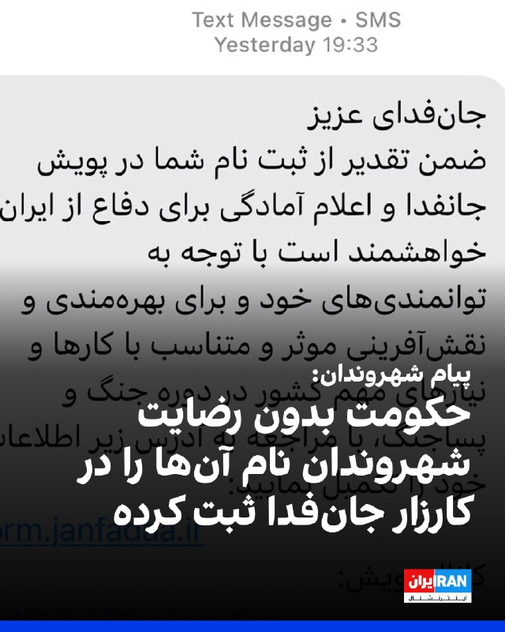

شهروندان در پیام‌هایی به ایران اینترنشنال می‌گویند که بدون رضایت و اطلاع و حتی هیچگونه اقدامی از سوی آن‌ها، نهادهای جمهوری اسلامی نام و مشخصات و تلفن همراه آن‌ها را برای ثبت‌نام در کارزار حکومتی «جان‌فدا» استفاده کرده‌اند.

طبق این پیام‌ها، حکومت پیامک‌هایی به شهروندان فرستاده و بدون اینکه بدانند، به آن‌ها گفته شده که در کارزار «جان‌فدا» ثبت‌نام شده‌اند.

طی روزهای گذشته، رسانه‌های حکومتی نوشتند که بیش از ۳۱ میلیون نفر در این کارزار ثبت‌نام کرده‌اند. این عدد و آمار از سوی شهروندان و ناظران با سوال مواجه شد. شهروندان در حالی که همچنان ده‌ها روز است که از دسترسی به اینترنت محروم‌اند، در پیام‌های خود به ایران اینترنشنال نوشته‌اند اگر حکومت ۳۱ میلیون جان‌فدا و حامی دارد، چرا اینترنت و دسترسی به آن را در کشور باز نمی‌کند.
https://iranintl.com/202605129601

## IranIntlTV — post 336841

  <a href="telegram/content/IranIntlTV_336841_1778604061.mp4" target="_blank">🎬 Download video</a>

ستاد فرماندهی مرکزی آمریکا، سنتکام، اعلام کرد ناو هواپیمابر آبراهام لینکلن به عملیات خود در دریای عرب، از جمله اجرای محاصره دریایی علیه جمهوری اسلامی، ادامه می‌دهد و تاکنون یک کشتی تجاری را وادار به تغییر مسیر کرده است.
جزییات بیشتر با مرضیه حسینی، خبرنگار ایران‌اینترنشنال
@iranintltv

## IranIntlTV — post 336840

  <a href="telegram/content/IranIntlTV_336840_1778604063.mp4" target="_blank">🎬 Download video</a>

روزنامه وال‌استریت ژورنال گزارش داد جمهوری اسلامی در آستانه سفر دونالد ترامپ به چین، از طریق سفیر خود در پکن در تلاش است پیامی را به واشینگتن منتقل کند.
سمیرا قرایی، خبرنگار ایران‌اینترنشنال، گزارش می‌دهد
@iranintltv

## IranIntlTV — post 336839

  <a href="telegram/content/IranIntlTV_336839_1778604065.mp4" target="_blank">🎬 Download video</a>

یک شهروند در پیامی به ایران اینترنشنال با اشاره به هشدار ترامپ درباره حمله و بردن ایران به «عصر حجر» گفت که جمهوری اسلامی با قطع اینترنت این کار را کرد و نه ترامپ. پیام این مخاطب و تصویر این پست با هوش مصنوعی خوانده و ساخته شده است.

## IranIntlTV — post 336838

  

وزارت خارجه کویت اعلام کرد که سفیر جمهوری اسلامی را در پی نفوذ یک گروه وابسته به سپاه پاسداران به جزیره بوییان احضار کرده است.

وزارت کشور کویت اعلام کرد چهار نفری که به‌صورت غیرقانونی از راه دریا وارد این کشور شده بودند، در جریان بازجویی به عضویت در سپاه پاسداران انقلاب اسلامی اعتراف کردند.
در بیانیه این وزارتخانه آمده است این افراد اعتراف کردند مامور شده بودند با استفاده از یک قایق ماهیگیری که به‌طور ویژه برای اجرای اقدامات خصمانه علیه کویت اجاره شده بود، به جزیره بوبیان نفوذ کنند.
بر اساس این بیانیه، این افراد با نیروهای مسلح کویت درگیر شدند که در نتیجه آن یکی از نیروهای کویتی زخمی شد و دو نفر از عناصر نفوذی گریختند.
https://iranintl.com/202605121020

## IranIntlTV — post 336837

  <a href="telegram/content/IranIntlTV_336837_1778604068.mp4" target="_blank">🎬 Download video</a>

بررسی‌های ایران‌اینترنشنال نشان می‌دهد سپاه پاسداران انقلاب اسلامی برای دور زدن تحریم‌های آمریکا، از صرافی‌های ترکیه و هواپیماهای خصوصی استفاده می‌کند. این اقدامات پس از آن صورت گرفت که مسیرهای پیشین تامین ارز جمهوری اسلامی در امارات متحده عربی قطع شده است.
جزییات بیشتر با آرش آزرمی، دبیر بخش اقتصادی ایران‌اینترنشنال
@iranintltv

## IranIntlTV — post 336836

  

پیت هگست، وزیر جنگ آمریکا، سه‌شنبه در کنگره این کشور درباره جنگ علیه جمهوری اسلامی اعلام کرد که ارتش ایالات متحده برنامه‌ای برای خروج نیروها از منطقه خاورمیانه دارد، اما در عین حال برای تشدید درگیری یا جابه‌جایی تجهیزات در صورت لزوم نیز برنامه‌ریزی کرده است.
او افزود: «ما دقیقا می‌دانیم چه چیزی در اختیار داریم. هر آنچه نیاز داریم به اندازه کافی داریم.»
او گفت به صنایع دفاعی گفته شده است که «بیشتر و سریع‌تر تولید کنند»، و در عین حال ظرفیت ناکافی مجتمع‌های صنعتی-نظامی را ناشی از دولت‌های پیشین و کمک‌های آمریکا به اوکراین در جنگش با روسیه دانست.
https://iranintl.com/202605122781

## IranIntlTV — post 336835

  <a href="telegram/content/IranIntlTV_336835_1778604071.mp4" target="_blank">🎬 Download video</a>

دونالد ترامپ، رییس‌جمهوری آمریکا، اعلام کرد اطمینان دارد جمهوری اسلامی غنی‌سازی اورانیوم را به‌طور کامل متوقف خواهد کرد. او همچنین گفت آمریکا برای رسیدن به توافق عجله‌ای ندارد، زیرا جمهوری اسلامی از بخش مهمی از درآمدهایش محروم شده است.
گفت‌وگو با شایان سمیعی، کارشناس امنیت ملی
@iranintltv

## IranIntlTV — post 336834

🔻پالایشگاه‌های «مستقل» چینی چگونه به بقای اقتصادی جمهوری اسلامی کمک می‌کنند؟

سی‌ان‌ان گزارش داد یک شبکه پنهان نفتی در چین سال‌هاست میلیاردها دلار به اقتصاد ایران تزریق کرده و اکنون نیز هم‌زمان با تشدید فشارهای آمریکا، به بقای مالی جمهوری اسلامی کمک می‌کند.

در استان شاندونگ چین و مناطق پیرامونی آن، بنادر، خطوط انتقال و پالایشگاه‌های موسوم به «تی‌پات» نقش کلیدی در این چرخه ایفا می‌کنند.

این پالایشگاه‌های کوچک و مستقل که با مجوز دولت چین فعالیت دارند، به‌صورت غیرعلنی نفت خام تحریم‌شده ایران را به فرآورده‌هایی مانند بنزین، گازوئیل و محصولات پتروشیمی تبدیل می‌کنند تا نیاز دومین اقتصاد بزرگ جهان تامین شود.

سی‌ان‌ان با اشاره به سفر قریب‌الوقوع دونالد ترامپ به چین نوشت هم‌زمان با تشدید تنش‌ها بر سر تجارت نفت ایران، پکن در موقعیتی پیچیده قرار گرفته است؛ از یک سو به دنبال برقراری رابطه‌ای باثبات با واشینگتن است و از سوی دیگر، همکاری‌های اقتصادی و دیپلماتیک نزدیک خود با تهران را ادامه می‌دهد.

در آستانه این سفر، وزارت خزانه‌داری آمریکا ۱۲ فرد و نهاد را به اتهام نقش‌آفرینی در تسهیل فروش و انتقال نفت ایران به چین تحریم کرد.

اسکات بسنت، وزیر خزانه‌داری آمریکا، به‌تازگی چین را متهم کرده است که با خرید انرژی از ایران، به تامین مالی «شبکه‌های تروریستی» جمهوری اسلامی کمک می‌کند.

۲۱ اردیبهشت، روزنامه فایننشال‌تایمز گزارش داد ترامپ در سفر به پکن خواستار کاهش حمایت چین از حکومت ایران خواهد شد.
تشدید فشارهای آمریکا بر شرکت‌های چینی

ایالات متحده حدود یک سال پیش، شرکت «هِبِی شینهای» چین را به خرید محموله‌های نفتی مرتبط با نیروهای مسلح جمهوری اسلامی متهم کرد. واشینگتن همچنین اعلام کرد این شرکت صدها میلیون دلار نفت خام را از طریق نفتکش‌های موسوم به «ناوگان سایه» وارد کرده است.

«هِبِی شینهای» اکنون به فهرست رو‌ به‌ گسترش تحریم‌های آمریکا علیه شرکت‌های فعال در تجارت نفت ایران اضافه شده است.

از سال گذشته تاکنون، چهار پالایشگاه دیگر در چین نیز در فهرست تحریم‌های واشینگتن قرار گرفته‌اند؛ تاسیساتی که اغلب در یک منطقه ساحلی و قطب مهم انرژی چین، در فاصله‌ای نزدیک به یکدیگر قرار دارند.

صنعت پالایش نفت در استان شاندونگ که دهه‌ها پیش با تکیه بر میدان‌های نفتی شِنگلی در دلتای رود زرد شکل گرفت، اکنون به واردات گسترده نفت خام وابسته شده و حدود ۲۰ درصد از نفت مصرفی چین را فرآوری می‌کند.

به گفته تحلیلگران، بخش قابل‌توجهی از نفت خام وارداتی این صنعت را محموله‌های تحت تحریم تشکیل می‌دهد.
اریکا داونز، پژوهشگر ارشد مرکز سیاست جهانی انرژی در دانشگاه کلمبیا، گفت: «اینها پالایشگاه‌های کوچکی هستند که با حاشیه سود اندک فعالیت می‌کنند. تخفیف‌هایی که طی سال‌های گذشته برای خرید نفت خام ونزوئلا، روسیه و ایران دریافت کرده‌اند، به بقای آنها کمک کرده است.»

با این حال، تحریم‌های آمریکا تنها به شرکت‌های کوچک چینی محدود نمی‌شوند. واشینگتن پیش‌تر شرکت پتروشیمی «هنگلی» را تحریم کرد، پالایشگاهی بسیار بزرگ‌تر در شهر بندری دالیان. این اقدام نشان می‌دهد ایالات متحده آماده است بازیگران بزرگ‌تر این صنعت را نیز هدف قرار دهد.

چین در آمار رسمی گمرکی خود واردات نفت خام ایران را ثبت نمی‌کند و منشا این محموله‌ها نیز در مسیر تجارت پنهان می‌شود.

با این حال، پکن تحریم‌های آمریکا را به رسمیت نمی‌شناسد و به شرکت‌های داخلی دستور داده است از تبعیت از تحریم‌های واشینگتن علیه پالایشگاه‌ها خودداری کنند.
نقش پالایشگاه‌های تی‌پات در تامین انرژی چین

سی‌ان‌ان‌ در ادامه نوشت ساختار صنعت نفت چین به شرکت‌های مستقل و پالایشگاه‌های موسوم به «تی‌پات» اجازه می‌دهد ریسک خرید نفت تحریمی را بپذیرند و با وجود تحریم‌های آمریکا، به فعالیت‌های عمدتا داخلی خود ادامه دهند.

این در حالی است که به گفته داونز، شرکت‌های بزرگ دولتی انرژی چین به‌دلیل پیوند گسترده با نظام مالی بین‌المللی، عموما از تحریم‌ها تبعیت می‌کنند.

با تداوم بحران جهانی نفت ناشی از جنگ ایران، نقش پالایشگاه‌های مستقل چین در تامین امنیت انرژی این کشور پررنگ‌تر شده است. این روند در شرایطی شدت گرفته که آمریکا با اعمال محاصره دریایی، در تلاش است از خروج نفتکش‌های حامل نفت ایران جلوگیری کند.
🔗ادامه این گزارش را اینجا بخوانید
@iranintltv

## IranIntlTV — post 336833

  <a href="telegram/content/IranIntlTV_336833_1778604073.mp4" target="_blank">🎬 Download video</a>

بازیکنان تیم ملی فوتبال ایران در مسیر آماده‌سازی برای جام جهانی ۲۰۲۶، برای سومین بار در دیداری درون‌تیمی به مصاف هم رفتند. این مسابقه در شرایطی برگزار شد که چند حریف تدارکاتی از بازی با شاگردان امیر قلعه‌نویی انصراف داده‌اند.
گفت‌وگو با محمد تقوی، عضو تحریریه ایران‌اینترنشنال
@iranintltv

## IranIntlTV — post 336832

  

حرمت‌الله رفیعی، رییس انجمن صنفی دفاتر خدمات مسافرتی، گفت: «دفاتر مسافرتی پس از ماه‌ها رکود، جنگ، بی‌ثباتی اقتصادی و اختلال اینترنت، دیگر توان تاب‌آوری ندارند و در صورت ادامه شرایط فعلی، بخش مهمی از نیروی انسانی متخصص این صنعت از بین خواهد رفت.»

او افزود: «در شرایطی که عملا کسب‌وکاری وجود ندارد، فشارهای مالیاتی و بیمه‌ای همچنان ادامه دارد و صنعت گردشگری ایران قفل شده است.»

رفیعی اضافه کرد: «بسیاری از کارکنان آموزش‌دیده دفاتر مسافرتی که سال‌ها برای آموزش آن‌ها هزینه شده است، به دلیل نبود درآمد، جذب مشاغلی مثل آرایشگری و فعالیت‌های غیرمرتبط شده‌اند.»
https://iranintl.com/202605126945

## IranIntlTV — post 336831

  <a href="telegram/content/IranIntlTV_336831_1778604076.mp4" target="_blank">🎬 Download video</a>

ویدیویی از یک ربات غول‌پیکر سرنشین‌دار که قابلیت تغییر شکل دارد، در شبکه‌های اجتماعی مورد توجه قرار گرفته است. این ربات با الهام از آثار علمی‌تخیلی طراحی شده و می‌تواند در حالت‌های مختلف تغییر وضعیت دهد. هدایت این سازه پیشرفته از داخل کابین توسط یک اپراتور انجام می‌شود.
این ربات که با نام GD01 معرفی شده، ساخت چین است و توسط شرکت Unitree Robotics توسعه یافته است.
@iranintltv

## IranIntlTV — post 336830

  <a href="telegram/content/IranIntlTV_336830_1778604077.mp4" target="_blank">🎬 Download video</a>

سرخط خبرهای سه‌شنبه ۲۲ اردیبهشت
@iranintltv

## IranIntlTV — post 336829

  <a href="telegram/content/IranIntlTV_336829_1778604079.mp4" target="_blank">🎬 Download video</a>

ادامه جنگ ایران و بن‌بست در مذاکرات تهران و واشینگتن، نگرانی‌ها درباره پیامدهای اقتصادی این بحران در آلمان را افزایش داده است. گزارش‌ها نشان می‌دهد حدود دو سوم شهروندان آلمانی به دلیل افزایش قیمت انرژی، مصرف برق، گرمایش و استفاده از خودرو را کاهش داده‌اند.
علی حسن‌پور، خبرنگار ایران‌اینترنشنال، گزارش می‌دهد
@iranintltv

## IranIntlTV — post 336828

  

دونالد ترامپ گفت حکومت ایران با انزاویی روبه‌روست که آن را از منابع درآمدش محروم می‌کند و انتظار می‌رود اقتصاد ایران زیر فشارهای ناشی از محاصره بندرها دچار فروپاشی شود.

او افزود: «این درگیری بدون نیاز به شتاب‌زدگی حل‌وفصل خواهد شد و جمهوری اسلامی با انزوایی روبه‌رو است که آن را از منابع درآمدی محروم می‌کند.»

دونالد ترامپ درباره اورانیوم غنی‌شده در ایران گفت مقام‌های جمهوری اسلامی به او گفته‌اند قرار است آنچه او «گردوغبار هسته‌ای» می‌نامد در اختیار آمریکا قرار گیرد، اما بعدا نظرشان را تغییر داده‌اند. او تاکید کرد در نهایت این مواد را به دست خواهند آورد و موضوع را جمع‌وجور می‌کنند.
https://iranintl.com/202605128362

## Shin_Persian — post 5968

  

Shin ✓ @hey_itsmyturn Tue, 12 May 2026 14:29:01 UTC #Kuwait 🇰🇼 #Iran Kuwait Thwarts IRGC Infiltration & Hostile Plot Kuwait’s Ministry of Interior has released chilling details regarding the 4 infiltrators captured earlier this month. Interrogations confirm…

## Shin_Persian — post 5967

Shin ✓ @hey_itsmyturn
Tue, 12 May 2026 14:29:01 UTC

#Kuwait 🇰🇼 #Iran
Kuwait Thwarts IRGC Infiltration & Hostile Plot

Kuwait’s Ministry of Interior has released chilling details regarding the 4 infiltrators captured earlier this month. Interrogations confirm they are members of IRGC sent to carry out "hostile acts" within the country.

The Arrested IRGC Members:
Naval Colonel: Amir Hussein Abd Muhammad Zarai
Naval Colonel: Abdul Samad Yadollah Qanawati
Naval Captain: Ahmed Jamshid Ghulam Reza Zulfiqari
First Lieutenant: Muhammad Hussein Sohrab Foroughi Rad

Two others, Captain Mansour Qambari and boat pilot Abdulali Siamari, fled the scene during the initial skirmish

The incident has happened Bubiyan Island. The group used a rented fishing boat to enter Kuwaiti territorial waters illegally.

Upon discovery, the group opened fire on Kuwaiti Armed Forces. One Kuwaiti soldier was injured in the line of duty before the 4 suspects were neutralized and detained.

Source: https://24.ae/article/957997/

فارسی

#کوییت 🇰🇼 #ایران
کوییت نفوذ سپاه پاسداران (سپاه پاسداران انقلاب اسلامی) و توطئه‌ای خصمانه را خنثی کرد

وزارت کشور کوییت جزئیات تکان‌دهنده‌ای را در مورد ۴ نفوذی که اوایل این ماه دستگیر شده بودند، منتشر کرده است. بازجویی‌ها تأیید می‌کند که آن‌ها اعضای سپاه پاسداران هستند که برای انجام «اعمال خصمانه» در داخل کشور اعزام شده بودند.

اعضای دستگیر شده سپاه پاسداران:
سرهنگ دریایی: امیرحسین عبدالمحمد زارعی
سرهنگ دریایی: عبدالصمد یدالله قنواتی
ناخدا: احمد جمشید غلامرضا ذوالفقاری
ستوان یکم: محمدحسین سهراب فروغی راد

دو نفر دیگر، ناخدا منصور قنبری و هدایت‌کننده قایق، عبدالعلی سیامری، در جریان درگیری اولیه از صحنه گریختند.

این حادثه در جزیره بوبیان رخ داده است. این گروه از یک قایق ماهیگیری اجاره‌ای برای ورود غیرقانونی به آب‌های سرزمینی کوییت استفاده کرده بودند.

پس از شناسایی، این گروه به سوی نیروهای مسلح کوییت آتش گشودند. یک سرباز کویتی در حین انجام وظیفه مجروح شد و پس از آن، ۴ مظنون مهار و بازداشت شدند.

منبع: https://24.ae/article/957997/

𝕏 · @shin_persian

## Shin_Persian — post 5966

📦 mhrv-rs v1.9.23 released

• Fix: stream range-parallel downloads larger than Apps Script's 50 MiB cap (#1042 + PR #1085).

Files (Android APKs, Windows, macOS, Linux, OpenWRT) on the files channel:

👉 v1.9.23 — all files with SHA-256

Channel:
https://t.me/mhrv_rs
or: https://t.me/+R1OyoHX2boA1ZDgx

#v1923

## Shin_Persian — post 5965

Shin ✓ @hey_itsmyturn
Tue, 12 May 2026 12:54:39 UTC

State-owned Mehr News:
Islamic Regime files complaint against US at The Hague over "military aggression on nuclear facilities", economic sanctions, and "threat of force" during 12-day conflict. Case A-34 registered under 1981 Algiers Accords.

[😂]

فارسی

خبرگزاری دولتی مهر:
رژیم اسلامی شکایتی را علیه ایالات متحده در لاهه به دلیل «تجاوز نظامی به تاسیسات هسته‌ای»، تحریم‌های اقتصادی و «تهدید به استفاده از زور» در طول درگیری ۱۲ روزه تنظیم کرد. پرونده A-34 تحت بیانیه‌های الجزایر ۱۹۸۱ ثبت شده است.

[😂]

𝕏 · @shin_persian

## Shin_Persian — post 5964

  

U.S. Central Command ✓ @CENTCOM
Tue, 12 May 2026 12:23:13 UTC

USS Abraham Lincoln (CVN 72) continues operations in the Arabian Sea, including enforcement of the U.S. blockade against Iran. CENTCOM forces have redirected 65 commercial vessels and disabled 4.

فارسی

ناو هواپیمابر یواس‌اس آبراهام لینکلن (سی‌وی‌ان ۷۲) به عملیات‌های خود در دریای عرب، از جمله اجرای محاصره ایالات متحده علیه ایران، ادامه می‌دهد. نیروهای سنتکام (فرماندهی مرکزی ایالات متحده) ۶۵ کشتی تجاری را تغییر مسیر داده و ۴ کشتی را از کار انداخته‌اند.

𝕏 · @shin_persian

## Shin_Persian — post 5963

  

NetBlocks ✓ @netblocks
Tue, 12 May 2026 07:56:53 UTC

🕰️ Today is the 74th day that #Iran has been largely cut off the global internet, with the incident now passing hour 1752. Since 28 February 2026, the world has seen advances in science and technology. Meanwhile, Iran's regime has been arresting and executing technologists.

فارسی

🕰️ امروز هفتاد و چهارمین روزی است که اینترنت جهانی در #Iran (ایران) تا حد زیادی قطع شده است و این حادثه اکنون از ساعت ۱۷۵۲ زولو (۲۱:۲۲ به وقت تهران) می‌گذرد. از ۲۸ فوریه ۲۰۲۶، جهان شاهد پیشرفت‌هایی در علم و فناوری بوده است. در همین حال، رژیم ایران در حال دستگیری و اعدام متخصصان تکنولوژی بوده است.

𝕏 · @shin_persian

## ManotoTV — post 105359

  <a href="telegram/content/ManotoTV_105359_1778604084.mp4" target="_blank">🎬 Download video</a>

شورای همکاری خلیج فارس ورود نیروهایی از سپاه پاسداران به جزیره بوبیان کویت را محکوم کرد.

جاسم البدیوی، دبیرکل شورای همکاری خلیج فارس، گفت: «نفوذ عناصر سپاه پاسداران به جزیره بوبیان کویت و برنامه‌ریزی آن‌ها برای اقدامات خصمانه را محکوم می‌کنیم.»

او همچنین تأکید کرد شورای همکاری خلیج فارس از کویت در همه اقداماتی که برای حفظ امنیت و ثبات خود انجام دهد، حمایت می‌کند.

## ManotoTV — post 105358

  <a href="telegram/content/ManotoTV_105358_1778604084.mp4" target="_blank">🎬 Download video</a>

وزارت خارجه کویت اعلام کرد در پی آنچه «نفوذ» اعضای مسلح وابسته به سپاه پاسداران خوانده شده، سفیر جمهوری‌اسلامی در این کشور را احضار و یادداشت اعتراضی رسمی به او تحویل داده است.
به گفته مقام‌های کویتی، چهار عضو منتسب به سپاه قصد داشتند از راه دریا وارد کویت شوند و «اقدامات خصمانه» انجام دهند. وزارت کشور کویت اعلام کرد در درگیری با نیروهای امنیتی، یک نیروی کویتی زخمی شده و دو نفر از متهمان نیز فرار کرده‌اند.
معاون وزیر خارجه کویت این اقدام را «نقض آشکار حاکمیت کویت» و مغایر با قوانین بین‌المللی و منشور سازمان ملل توصیف کرد و از تهران خواست فوراً چنین اقداماتی را متوقف کند.

## ManotoTV — post 105357

  <a href="telegram/content/ManotoTV_105357_1778604085.mp4" target="_blank">🎬 Download video</a>

تورم در آمریکا افزایش یافته و طبق آمار رسمی اداره آمار کار آمریکا، این افزایش عمدتا به عوامل مرتبط با جنگ ایران مربوط می‌شود.
شاخص قیمت مصرف‌کننده در ماه آوریل به ۳.۸ درصد رسید؛ در حالی‌ که این رقم در ماه مارس ۳.۳ درصد بود. افزایش قیمت بنزین از مهم‌ترین دلایل این رشد اعلام شده است.
این آمار نشان می‌دهد بالا رفتن قیمت نفت، که ناشی از اختلال مؤثر در تردد از تنگه هرمز بوده، باعث افزایش بیشتر قیمت‌ها شده است.
بر اساس این گزارش، افزایش هزینه انرژی و سوخت اصلی‌ترین عامل رشد ۰.۵ واحد درصدی تورم بوده است.
تحلیلگران می‌گویند این وضعیت علاوه بر فشار بر مصرف‌کنندگان آمریکایی و اقتصاد آمریکا، ممکن است یک پیامد سیاسی هم داشته باشد؛ چرا که فشار اقتصادی بر رأی‌دهندگان می‌تواند دونالد ترامپ را به بازگشت به میز مذاکره سوق دهد.

## ManotoTV — post 105356

  <a href="telegram/content/ManotoTV_105356_1778604086.mp4" target="_blank">🎬 Download video</a>

تماسی از ایران؛ «می‌گفت تو این شرایط، به دور و برمون نگاه کنیم و دستِ همدیگه رو بگیریم…
تو هر خانواده و آشنایی یکی هست که بی‌صدا به کمک نیاز داره.»

## ManotoTV — post 105355

  <a href="telegram/content/ManotoTV_105355_1778604088.mp4" target="_blank">🎬 Download video</a>

دونالد ترامپ، رئیس‌جمهور آمریکا، با وجود توقف مذاکرات با جمهوری‌اسلامی، در یک گفتگو، اعلام کرده تهران صددرصد غنی‌سازی اورانیوم و هرگونه تلاش برای ساخت سلاح هسته‌ای را متوقف خواهد کرد.
ترامپ در گفت‌وگو با رادیوی WABC گفت شخصاً با مقام‌های جمهوری‌اسلامی در تماس بوده و افزود: «آن‌ها گفتند ما غبار هسته‌ای را تحویل خواهیم گرفت.»
او همچنین تأکید کرد آمریکا برای رسیدن به توافق عجله‌ای ندارد و گفت: «ما محاصره را در اختیار داریم.»

## ManotoTV — post 105354

  <a href="telegram/content/ManotoTV_105354_1778604089.mp4" target="_blank">🎬 Download video</a>

تماسی از تجربه‌اش با بهزیستی
می‌گفت برای بیمه و تأیید مشکلش هزار تا ایراد گرفتن
اما وقتی پای کمک رسید، گفتن هیچ مشکلی نداری

## ManotoTV — post 105353

  <a href="telegram/content/ManotoTV_105353_1778604090.mp4" target="_blank">🎬 Download video</a>

در جلسه استماع کنگره آمریکا، مقام‌های ارشد پنتاگون اعلام کردند هزینه تسلیحات و تجهیزات مصرف‌شده آمریکا در جنگ با ایران تاکنون به حدود ۲۴ میلیارد دلار رسیده است.
پیت هگست، وزیر دفاع آمریکا، به همراه رئیس ستاد مشترک ارتش و مقام مالی وزارت جنگ در این جلسه حضور داشتند. به گفته جولز هرست، این رقم شامل مهمات، موشک‌ها و سایر تجهیزات نظامی استفاده‌شده در جنگ است.
پنتاگون ماه گذشته نیز اعلام کرده بود مجموع هزینه‌های جنگ با ایران تاکنون به ۲۹ میلیارد دلار رسیده است.

## ManotoTV — post 105352

  <a href="telegram/content/ManotoTV_105352_1778604091.mp4" target="_blank">🎬 Download video</a>

ابراهیم رضایی، سخنگوی کمیسیون امنیت ملی و سیاست خارجی مجلس شورای اسلامی در شبکه اکس تهدید کرده، غنی سازی ۹۰ درصد به عنوان یکی از گزینه‌های جمهوری‌اسلامی در صورت حمله مجدد، بررسی می‌شود.

## ManotoTV — post 105351

  <a href="telegram/content/ManotoTV_105351_1778604092.mp4" target="_blank">🎬 Download video</a>

متاثر از پیچیده‌تر شدن سرنوشت مذاکرات جمهوری‌اسلامی و آمریکا، قیمت جهانی نفت، بیش از ۳ درصد افزایش یافت.
بهای نفت برنت به حدود ۱۰۸ دلار و نفت وست‌تگزاس آمریکا به بیش از ۱۰۱ دلار در هر بشکه رسید. تحلیلگران می‌گویند رد پیشنهادهای دو طرف، نگرانی‌ها درباره اختلال در عرضه نفت را دوباره افزایش داده است.
مدیرعامل آرامکوی عربستان هشدار داد هرگونه اختلال در صادرات نفت از تنگه هرمز می‌تواند بازگشت ثبات به بازار را تا سال ۲۰۲۷ به تعویق بیندازد.
کارشناسان همچنین گفته‌اند در صورت توافق واقعی میان تهران و واشنگتن، قیمت نفت ممکن است ۸ تا ۱۲ دلار کاهش پیدا کند، اما تشدید تنش‌ها می‌تواند قیمت نفت برنت را دوباره به بالای ۱۱۵ دلار برساند.

## ManotoTV — post 105350

  <a href="telegram/content/ManotoTV_105350_1778604092.mp4" target="_blank">🎬 Download video</a>

دونالد ترامپ در پیامی در شبکه اجتماعی تروث سوشال گفت کوبا از آمریکا درخواست کمک کرده و واشینگتن با هاوانا گفت‌وگو خواهد کرد.

ترامپ در این پیام نوشت هیچ جمهوری‌خواهی تاکنون درباره کوبا با او صحبت نکرده و این کشور را «شکست‌خورده» توصیف کرد که به گفته او تنها در مسیر «سقوط» حرکت می‌کند.

او افزود: «کوبا درخواست کمک کرده و ما گفت‌وگو خواهیم کرد.» ترامپ در پایان این پیام نوشت همزمان عازم چین است.

## ManotoTV — post 105349

  <a href="telegram/content/ManotoTV_105349_1778604093.mp4" target="_blank">🎬 Download video</a>

«حکومت بقای خود را در طناب دار می‌بیند»

## ManotoTV — post 105348

  <a href="telegram/content/ManotoTV_105348_1778604095.mp4" target="_blank">🎬 Download video</a>

مارک روته، دبیرکل ناتو، اعلام کرد موضوع جمهوری‌اسلامی و نحوه کمک کشورهای اروپایی برای مدیریت وضعیت تنگه هرمز، محور اصلی گفت‌وگوهای کنونی این ائتلاف است.
روته در نشست خبری در مونته‌نگرو گفت کشورهای عضو در حال بررسی راه‌هایی هستند تا متحدان اروپایی بتوانند در شرایط مرتبط با تنگه هرمز کمک کنند.
او با اشاره به افزایش بودجه دفاعی کشورهای اروپایی و کانادا، تأکید کرد نسبت به آینده ناتو «بسیار خوش‌بین» است.

## ManotoTV — post 105347

  <a href="telegram/content/ManotoTV_105347_1778604096.mp4" target="_blank">🎬 Download video</a>

دکتر حمید گیلوری فعال سیاسی و عضو حزب ایران نوین در گردهمایی ایرانیان روبروی دادگاه لاهه در هلند گفت: «اروپا نباید با جمهوری اسلامی مماشات کند».

## ManotoTV — post 105346

  <a href="telegram/content/ManotoTV_105346_1778604098.mp4" target="_blank">🎬 Download video</a>

وزارت خارجه امارات متحده عربی در بیانیه‌ای نفوذ اعضایی از سپاه از سوی نیروی دریایی جمهوری اسلامی به جزیره بوبیان کویت را محکوم کرد و آن را اقدامی در چارچوب «طرحی تروریستی» برای انجام عملیات خصمانه خواند.

در این بیانیه آمده است شیخ عبدالله بن زاید آل نهیان، وزیر خارجه امارات، در پیامی به عبدالله علی الیحیا، وزیر خارجه کویت، همبستگی کامل ابوظبی را با کویت اعلام کرده است.

بوبیان دومین جزیره بزرگ خلیج فارس بعد از جزیره قشم است.

## ManotoTV — post 105345

  <a href="telegram/content/ManotoTV_105345_1778604098.mp4" target="_blank">🎬 Download video</a>

دولت بریتانیا اعلام کرد از آوریل ۲۰۲۶، میزان کمک‌هزینه هفتگی برای «همسران اضافی» در ازدواج‌های چندهمسریِ ثبت‌شده در خارج از کشور، به ۱۲۵ پوند و ۲۵ پنس افزایش یافته است.
این مبلغ نسبت به سال گذشته ۴.۸ درصد افزایش داشته و شامل افرادی می‌شود که به سن بازنشستگی رسیده و از مزایایی مانند «پنشـن کردیت» یا کمک‌هزینه مسکن استفاده می‌کنند.
چندهمسری در بریتانیا غیرقانونی است، اما برخی ازدواج‌های چندهمسری که به‌طور قانونی در خارج از کشور ثبت شده‌اند، برای دریافت بعضی مزایای رفاهی به رسمیت شناخته می‌شوند.
دولت بریتانیا تأکید کرده «یونیورسال کردیت» شامل این نوع خانوارها نمی‌شود و قوانین مهاجرتی نیز اجازه حمایت برای ورود همسر دوم را نمی‌دهد، اگر ازدواج اول همچنان پابرجا باشد.

## ManotoTV — post 105344

  <a href="telegram/content/ManotoTV_105344_1778604099.mp4" target="_blank">🎬 Download video</a>

مونترال‌ | کانادا؛ گردهمایی ایرانیان

## ManotoTV — post 105343

  <a href="telegram/content/ManotoTV_105343_1778604101.mp4" target="_blank">🎬 Download video</a>

جانان الماسی، شاعر حماسی و رقصنده، در گردهمایی سراسری ایرانیان در شهر کلن آلمان، قطعه‌ «سوگ سیاوش» را اجرا کرد.
این برنامه روز یکشنبه ۱۰ می برگزار شد.

## ManotoTV — post 105342

  <a href="telegram/content/ManotoTV_105342_1778604103.mp4" target="_blank">🎬 Download video</a>

آیلین وانگ، شهردار شهر آرکادیا در جنوب کالیفرنیا، پس از متهم شدن از سوی وزارت دادگستری آمریکا به فعالیت مخفیانه برای دولت چین، از سمت خود استعفا داد.
دادستانی آمریکا اعلام کرد وانگ متهم است به دستور مقام‌های چینی، مطالبی در حمایت از پکن را بدون ثبت رسمی به‌عنوان «عامل خارجی» منتشر کرده است. او پذیرفته که به اتهام جنایی مطرح‌شده اعتراف کند و ممکن است تا ۱۰ سال زندان محکوم شود.
به گفته مقام‌های آمریکایی، وانگ همراه با فردی دیگر سایتی خبری برای جامعه چینی‌تبارهای آمریکا اداره می‌کرده و برخی مطالب ارسالی مقام‌های چینی، از جمله درباره رد اتهام نقض حقوق بشر در سین‌کیانگ، را منتشر کرده است.
مدیر شهر آرکادیا گفت این پرونده مربوط به «رفتار فردی» وانگ بوده و هیچ‌یک از منابع یا تصمیم‌گیری‌های رسمی شهرداری درگیر این ماجرا نبوده‌اند.

## ManotoTV — post 105341

  <a href="telegram/content/ManotoTV_105341_1778604104.mp4" target="_blank">🎬 Download video</a>

محمد بن عبدالرحمن آل‌ثانی، نخست‌وزیر و وزیرخارجه قطر، در نشست خبری مشترک با هاکان فیدان، وزیر خارجه ترکیه، گفت دو کشور درباره شرایط بحرانی خاورمیانه در پی جنگ ایران گفت‌وگو کرده‌اند.
او گفت بحران تنگه هرمز باعث محدود شدن آزادی تردد دریایی شده و این آبراه عملاً به «سلاحی در این جنگ» تبدیل شده است.
نخست‌وزیر قطر افزود این وضعیت پیامدهای سنگینی، به‌ویژه اقتصادی، برای کشورهای حوزه خلیج فارس به همراه داشته است.

## ManotoTV — post 105340

  <a href="telegram/content/ManotoTV_105340_1778604105.mp4" target="_blank">🎬 Download video</a>

وزارت کشور کویت اعلام کرد چهار نفوذی وابسته به سپاه پاسداران جمهوری‌اسلامی را که قصد ورود دریایی به این کشور را داشتند، بازداشت کرده است.
خبرگزاری رسمی کویت گزارش داد در درگیری با این افراد، یکی از نیروهای مسلح کویت زخمی شده است.

## FarsiVOA — post 217547

گفت‌و‌گو با یاسین اهوازی، کارشناس مسائل خاورمیانه، درباره چرایی و عواقب انتقال هواپیماهای نظامی جمهوری اسلامی به فرودگاه‌های پاکستان

## FarsiVOA — post 217546

  <a href="telegram/content/FarsiVOA_217546_1778604105.mp4" target="_blank">🎬 Download video</a>

فرماندهی مرکزی ایالات متحده، سنتکام، اعلام کرد هزاران نیروی نظامی آمریکا مستقر در خاورمیانه در سال ۲۰۲۶ به دلیل عملکرد برجسته خود مورد تقدیر قرار گرفته‌اند.

به گفته سنتکام، این تقدیرها شامل اعطای مدال، ارتقای درجه، و واگذاری مسئولیت‌های جدید فرماندهی بوده است.

سنتکام تاکید کرد موفقیت عملیات این فرماندهی به تلاش سربازان، ملوانان، تفنگداران دریایی، نیروهای هوایی، گارد ملی و گارد ساحلی آمریکا وابسته است.

@FarsiVOA

## FarsiVOA — post 217545

فشارها برای کنار رفتن کی‌یر استارمر هر ساعت بیشتر می‌شود؛ ۸۴ نماینده حزب کارگر خواهان استعفا یا اعلام زمان خروج او شده‌اند، اما هنوز روند رسمی رقابت رهبری آغاز نشده است.

## FarsiVOA — post 217544

🔺وزیر جنگ: ما در حال پیروزی در جنگ با رژیم ایران هستیم؛ آنها در استفاده از استراتژی کره‌شمالی شکست خوردند

▪️پیت هگست، وزیر جنگ آمریکا، و ژنرال دن کین، رئیس ستاد مشترک نیروهای مسلح ایالات متحده، روز سه‌شنبه ۲۲ اردیبهشت با حضور در جلسه کمیته فرعی تخصیص بودجه مجلس نمایندگان آمریکا از عملکرد دولت ترامپ در عملیات نظامی علیه رژیم ایران دفاع کردند.

⬇️ بیشتر بخوانید:

https://ir.voanews.com/a/iran-us-war-hegseth-caine-testimony-pete-epic-fury/8149212.html/?nocach=1

## FarsiVOA — post 217543

سفرهای محرمانه قاآنی و هشدار آمریکا؛ عراق وارد مرحله‌ای سرنوشت‌ساز شد

## FarsiVOA — post 217542

دونالد ترامپ، رئیس جمهوری آمریکا، قرار است این هفته در پکن با شی جین‌پینگ، رئیس جمهوری چین، دیدار کند. پیش‌بینی می‌شود پرونده‌های امنیتی، اقتصادی، و فناوری، جنگ و برنامه هسته‌ای جمهوری اسلامی، و هوش مصنوعی موضوعاتی باشند که در این دیدار مورد بحث و تبادل نظر قرار بگیرد.

## FarsiVOA — post 217541

  <a href="telegram/content/FarsiVOA_217541_1778604106.mp4" target="_blank">🎬 Download video</a>

ارتش اسرائیل اعلام کرد در ۲۴ ساعت گذشته حدود ۴۵ زیرساخت گروه حزب‌الله را در جنوب لبنان هدف قرار داده است. از جمله این زیرساخت‌ها، «مراکز فرماندهی، ایستگاه‌های دیده‌بانی، نقاط تجمع و ساختمان‌های نظامی است که به گفته ارتش اسرائیل نیروهای حزب‌الله «از طریق آنها، اقدامات تروریستی علیه نیروهای ارتش و کشور اسرائیل را پیش می‌بردند.»

## FarsiVOA — post 217540

🔺بازداشت چهار عضو سپاه در کویت؛ بحرین یک زن را به جرم همکاری با رژیم ایران به حبس ابد محکوم کرد

▪️همزمان با ادامه فعالیت‌های مخرب جمهوری اسلامی علیه کشورهای منطقه، کویت از بازداشت چهار عضو سپاه پاسداران که قصد داشتند وارد این کشور شوند، خبر داد. در بحرین نیز یک زن به اتهام همکاری با سپاه پاسداران به حبس ابد محکوم کرد.

⬇️ بیشتر بخوانید:

https://ir.voanews.com/a/irgc-iran-kuwait-emirates-bahrain-proxy/8149179.html/?nocach=1

## FarsiVOA — post 217539

قطع گسترده اینترنت در ایران وارد هفتاد و چهارمین روز شده و مدت این اختلال از هزار و ۷۵۲ ساعت گذشته است؛ محدودیتی که همزمان با بالا گرفتن جنجال «اینترنت پرو» و «خط‌های سفید»، موضوع دسترسی تبعیض‌آمیز به اینترنت را به یکی از محورهای اختلاف درون ساختار رسمی جمهوری اسلامی تبدیل کرده است.

نت‌بلاکس، نهاد ناظر بر دسترسی به اینترنت، اعلام کرده است این خاموشی اینترنتی از ۲۸ فوریه ۲۰۲۶ آغاز شده و همچنان بخش بزرگی از کاربران داخل ایران را از دسترسی آزاد به اینترنت جهانی محروم کرده است. این نهاد می‌گوید دسترسی آزاد به اینترنت، حقی بنیادین است که بسیاری از آزادی‌های دیگر بر آن تکیه دارند و محروم کردن شهروندان از آن، توان جامعه برای ثبت، پیگیری و مقابله با نقض حقوق اساسی را محدود می‌کند.

گزارش کامل را در وب‌سایت صدای آمریکا بخوانید.

@FarsiVOA

## FarsiVOA — post 217538

  

ستاد فرماندهی ارتش ایالات متحده آمریکا، روز سه‌شنبه ۲۲ اردیبهشت در شبکه اجتماعی ایکس با انتشار عکسی از ناو هواپیمابر آبراهام لینکلن (سی‌وی‌ان ۷۲) نوشت: « نیروهای سنتکام ۶۵ کشتی تجاری را تغییر مسیر داده و ۴ کشتی را از کار انداخته‌اند.»

در ادامه سنتکام افزوده است که ناو هواپیمابر آبراهام لینکلن به عملیات خود در دریای عرب، از جمله اعمال محاصره دریایی ایالات متحده علیه ایران، ادامه می‌دهد.

## FarsiVOA — post 217537

انتقال پنهانی هواپیماهای جمهوری اسلامی به پاکستان و افغانستان؛ کویت چند عضو سپاه را بازداشت کرد

## FarsiVOA — post 217536

🔺پرزیدنت ترامپ: رژیم ایران بسیار ضعیف شده و «محاصره» دریایی منابع مالی آنها را محدود کرده است

▪️پرریدنت ترامپ با اشاره به موثر بودن محاصره دریایی بر محدود کردن دسترسی رژیم ایران به منابع مالی، بار دیگر تاکید کرد که آمریکا اجازه نخواهد داد رژیم ایران به سلاح هسته‌ای دست یابد.

⬇️ بیشتر بخوانید:

https://ir.voanews.com/a/president-trump-iran/8149184.html/?nocach=1

## FarsiVOA — post 217535

  

دونالد ترامپ، رئیس ‌جمهوری آمریکا، در پیامی در شبکه اجتماعی تروت سوشال اعلام کرد که مشتاق سفر به چین است.

ترامپ در این پیام، چین را «کشوری شگفت‌انگیز» توصیف کرد و از شی جین‌پینگ به عنوان رهبری یاد کرد که به گفته او مورد احترام همگان است.

او افزود که این سفر می‌تواند به دستاوردهای مهمی برای هر دو کشور منجر شود.

@FarsiVOA

## FarsiVOA — post 217534

  <a href="telegram/content/FarsiVOA_217534_1778604109.mp4" target="_blank">🎬 Download video</a>

ارتش اسرائیل اعلام کرد امروز ۲۲ اردیبهشت، بعد از اینکه در تلاشی ناموفق، یک موشک کوچک زمین به هوا به سمت یک هواپیمای ارتش شلیک شد، نیروی هوایی فرد مظنون را که بلافاصله پس از شلیک با موتورسیکلت فرار کرده بود، هدف قرار داد.

علاوه بر این، نیروی هوایی اهداف مشکوکی را که در منطقه عملیات نیروهای ارتش اسرائیل در جنوب لبنان شناسایی شده بودند، رهگیری کرد.

## FarsiVOA — post 217533

در میدان پرسیدیم: امروز قدرت سیاسی در ایران دست کیست؟ چه کسی ایران را اداره می‌کند؟ خامنه‌ای دوم که تا به حال نه دیده و نه شنیده شده؟ سپاه پاسداران؟ مجموعه‌ای از حلقه‌ها و چهره‌های واسط یا هر کس که زورش بر دیگران می‌چربد؟

## FarsiVOA — post 217532

  <a href="telegram/content/FarsiVOA_217532_1778604111.mp4" target="_blank">🎬 Download video</a>

ارتش اسرائیل اعلام کرد از ابتدای آتش‌بس نیروی هوایی به بیش از ۱۱۰۰ هدف متعلق به حزب‌الله حمله کرده و بیش از ۳۵۰ تروریست را در جنوب لبنان از پای درآورده است.

اهداف مورد حمله شامل ساختمان‌هایی که برای اهداف نظامی حزب‌الله استفاده می‌شدند، انبارهای سلاح، پرتابگرهای آماده و مسلح به موشک و زیرساخت‌های دیگر اعلام شده است.

## FarsiVOA — post 217531

در داده‌نمای این برنامه از میدان برای بازگشایی بحث مهمانان درارتباط با اینکه «قدرت سیاسی در ایران دست کیست؟» به نقش کلیدی تعدادی از مطرح‌ترین چهره‌های باقیمانده در ساختار قدرت، در نظام جمهوری اسلامی اشاره کرده‌ایم

## FarsiVOA — post 217530

  

فرماندهی مرکزی ایالات متحده، سنتکام، اعلام کرد ناو هواپیمابر «یو‌اس‌اس آبراهام لینکلن» به عملیات خود در دریای عرب ادامه می‌دهد.

به گفته سنتکام، این عملیات شامل اجرای محاصره دریایی علیه جمهوری اسلامی ایران است.

سنتکام همچنین اعلام کرد نیروهای آمریکایی تاکنون مسیر ۶۵ کشتی تجاری را تغییر داده و چهار شناور را برای اطمینان از اجرای این اقدامات از کار انداخته‌اند.

@FarsiVOA

## FarsiVOA — post 217529

مهدیه گلرو معتقد است گروه‌های اپوزیسیون که سیاست فشار حداکثری بر مردم در داخل ایران را دنبال می‌کنند فرقی با حجتیه که می‌گوید ظلم باید به نهایت برسد تا امام زمان ظهور کند ندارند! فرج سرکوهی نیز اپوزیسیونی را که دنبال رهبر برای معترضان داخل کشور باشد معتبر نمی‌داند

## FarsiVOA — post 217528

🔺انتشار گزارشی از «وحشیگری جنسی» حماس علیه شهروندان اسرائیل در حمله تروریستی ۷ اکتبر

▪️اسرائیل با انتشار گزارشی هزاران سند و مدرک از اقدامات جنایت‌کارانه حماس در حمله تروریستی ۷ اکتبر علیه شهروندان اسرائیلی را منتشر کرد.

⬇️ بیشتر بخوانید:

https://ir.voanews.com/a/hamas-israel-crime-hostage-iran/8149158.html/?nocach=1

## DW_Farsi — post 124622

  

🔶 کویت ۴ عضو سپاه را بازداشت کرد

خبرگزاری دولتی کویت (KUNA) گزارش داد که این کشور، چهار عضو سپاه پاسداران انقلاب اسلامی را که گفته می‌شود تلاش داشتند برای "انجام اقدامات خصمانه" وارد این کشور عربی حاشیه خلیج فارس شوند، بازداشت کرده است.

بر اساس این گزارش، این چهار نفر روز اول مه (۱۱ اردیبهشت) با یک قایق ماهیگیری تلاش کردند وارد کویت شوند و در جریان آن، با نیروهای نظامی کویت درگیر شدند که در نتیجه، یک سرباز کویتی زخمی شد.

این نخستین تلاش شناخته‌شده حکومت ایران برای نفوذ نظامی به یکی از کشورهای همسایه خود در ارتباط با جنگ اخیر به شمار می‌رود. خبرگزاری دولتی کویت، نام چهار فرد بازداشت‌شده، از جمله درجه‌های نظامی آن‌ها را نیز منتشر کرده است.

در همین راستا وزارت کشور کویت اعلام کرد این چهار نفر اعتراف کرده‌اند که از سوی سپاه پاسداران ماموریت داشتندبه جزیره بوبیان، یکی از مراکز مهم تجاری و لجستیکی، نفوذ کنند تا "ماموریتی شامل انجام اقدامات خصمانه علیه کویت" را اجرا کنند. بوبیان بزرگ‌ترین جزیره کشور کویت و دومین جزیره بزرگ در خلیج فارس پس از قشم است.

@dw_farsi

## DW_Farsi — post 124617

🔶 از کلاس درس تا چوبه دار؛ سرکوب نسل جوان در ایران

🔺 گزارشی از آتفه چهارمحالیان

در ماه‌های اخیر، پس از وقایع دی‌ماه ۱۴۰۴ و هم‌زمان با جنگ ایران با آمریکا و اسرائیل و تشدید فضای امنیتی در خیابان‌ها و دانشگاه‌ها، بار دیگر نوجوانان و جوانان ایران به یکی از هدف‌های اصلی سرکوب جمهوری اسلامی بدل شده‌اند.

موج تازه بازداشت‌ها، پرونده‌سازی‌های امنیتی و اعدام‌ها نشان می‌دهد حاکمیت در مواجهه با بحران‌های سیاسی و نظامی، بار دیگر به سراغ نسلی رفته که در سال‌های اخیر به یکی از فعال‌ترین نیروهای اعتراض تبدیل شده است؛ نسلی که حکومت، صدا، شیوه زیست و خواست‌های او را در تعارض با نظم سیاسی می‌بیند.

سازمان ملل اعلام کرده است که از آغاز جنگ اخیر تاکنون بیش از چهار هزار نفر در ایران با اتهام‌های امنیتی بازداشت شده‌اند و نهادهای حقوق بشری گزارش داده‌اند نوجوانان و جوانان نیز در میان بازداشت‌شدگان قرار داشته‌اند. گزارش‌های منتشرشده از شکنجه، ناپدیدسازی‌های قهری، اعترافات اجباری، مرگ در بازداشت و محاکمه‌های شتاب‌زده، تصویری از سرکوب نسلی ارائه می‌دهد که جمهوری اسلامی آن را بیش از هر زمان دیگری خارج از کنترل خود می‌بیند.

در ماه‌های گذشته چندین نوجوان و جوان معترض در معرض اجرای حکم اعدام قرار گرفتند؛ پرونده‌هایی که به گفته نهادهای حقوق بشری بر پایه اعترافات ناشی از شکنجه شکل گرفته‌اند.

📌 برای دسترسی کامل به گزارش به وبسایت دویچه‌وله فارسی مراجعه کنید.

@dw_farsi

## DW_Farsi — post 124616

  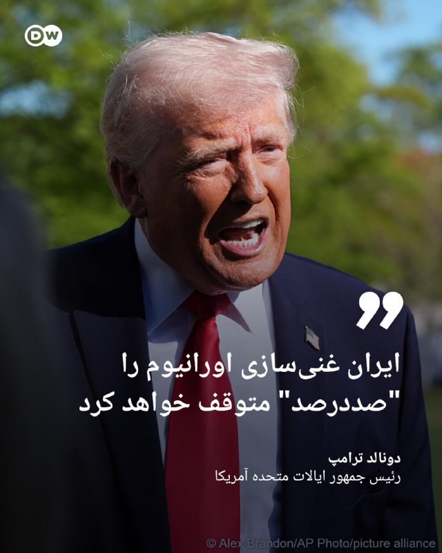

🔶 ترامپ: ایران غنی‌سازی اورانیوم را "صددرصد" متوقف خواهد کرد

دونالد ترامپ، رئیس ‌جمهور ایالات متحده آمریکا در یک مصاحبه با شبکه WABC گفت اطمینان دارد که ایران غنی‌سازی اورانیوم را متوقف خواهد کرد و هرگونه تلاش برای ساخت سلاح هسته‌ای را کنار می‌گذارد.

اظهارات ترامپ در شرایطی بیان می‌شود که مذاکرات میان آمریکا و جمهوری اسلامی همچنان در بن‌بست قرار دارد.

ترامپ در این مصاحبه در پاسخ به این پرسش که آیا به باور او می‌توان مانع غنی‌سازی اورانیوم و ساخت بمب از سوی جمهوری اسلامی شد، گفت: «صد درصد آن‌ها متوقف خواهند شد.»

ترامپ همچنین گفت که مستقیما با مقام‌های حکومت ایران در جریان مذاکرات در ارتباط بوده است. رئیس جمهور آمریکا افزود: «من با آن‌ها سروکار دارم. و آن‌ها گفتند که ما غبار را [از آن‌ها] خواهیم گرفت. من به آن غبار هسته‌ای می‌گویم، چون اسم مناسبی است و ما آن را خواهیم گرفت.»

منظور ترامپ از "غبار هسته‌ای" ۴۰۰ کیلوگرم اورانیوم با غنای بیش از ۶۰ درصد است که یکی از موارد مناقشه اصلی میان ایران و آمریکاست.

ترامپ در عین حال با اشاره به این که "ایالات متحده نیازی ندارد برای دستیابی به توافق عجله کند" گفت: «ما قرار نیست برای هیچ‌چیز عجله کنیم، ما [اهرم] محاصره را در اختیار داریم.»رئیس‌ جمهور آمریکا همزمان روز سه‌شنبه با انتشار پستی در شبکه "تروث سوشال"، دو تصویر گرافیکی را به اشتراک گذاشت که در آن‌ها، حمله به پهپادها و قایق‌های موسوم به قایق تندروی سپاه نشان داده شده‌اند.

@dw_farsi

## DW_Farsi — post 124615

  

🔶 سفیر آمریکا در اسرائیل استفاده امارات از سامانه "گنبد آهنین" را تایید کرد

مایک هاکبی، سفیر ایالات متحده آمریکا در اسرائیل با بیان این که "امارات متحده عربی، از توافق‌نامه‌های ابراهیم و عادی‌سازی روابط با اسرائیل، سود برده است" از به‌کار‌گیری سامانه دفاع موشکی "گنبد آهنین" اسرائیل در امارات برای مقابله با موشک‌های پرتاب شده از ایران در جریان جنگ خبر داد.

هاکبی با اشاره به پیامدهای حاصل از پیمان ابراهیم برای امارات گفت: «فقط نگاهی به مزایای آن بیندازید. اسرائیل همین حالا سامانه‌های گنبد آهنین و نیروهایی را برای کمک به بهره‌برداری از آن‌ها برایشان فرستاده است.»

امارات متحده عربی در چارچوب توافق‌نامه‌های ابراهیم که در سال ۲۰۲۰ با میانجی‌گری ایالات متحده آمریکا انجام شد، اسرائیل را به رسمیت شناخت.

پیش از این فایننشال تایمز گزارش داده بود که اسرائیل برای کمک به دفاع از امارات، سامانه شناسایی سبک "اسپکترو" و سامانه پدافند موشکی را همراه با ده‌ها نیروی نظامی به این کشور فرستاده است. این گزارش، استقرار این تجهیزات را یکی از نخستین نمونه‌های بزرگ همکاری دفاعی میان اسرائیل و امارات می‌داند؛ همکاری‌ای که در جنگ اخیر برای نخستین بار در مقیاسی گسترده آزموده شد.

@dw_farsi

## DW_Farsi — post 124614

  

🔶 قوه قضاییه از توقیف اموال بیش از ۴۰۰ چهره خارج از کشور خبر داد

خبرگزاری مهر وابسته به سازمان تبلیغات اسلامی، به نقل از قوه قضاییه از توقیف اموال و دارایی‌های بیش از ۴۰۰ نفر از جمله خبرنگاران شبکه‌های "اینترنشنال" و "من‌وتو" خبر داد و مدعی شد که این افراد، "در همکاری با رژیم‌های متخاصم خسارت به زیرساخت‌ها و امنیت ملی وارد کردند".

بر اساس این گزارش، این اقدام در ادامه "دستور مقام قضایی و در راستای قانون تشدید مجازات جاسوسی" صورت گرفته و خبرنگاران یادشده، به همکاری با اسرائیل و "کشورهای متخاصم علیه امنیت و منافع ملی" متهم شده‌اند.

این گزارش، با اشاره به توقیف اموال ثبتی و دارایی‌های این افراد، آن‌ها را بیش از ۴۰۰ نفر از ایرانیان خارج از جمله "عده‌ای از بازیگران، ورزشکاران، مدیران و خبرنگاران" شبکه اینترنشنال و شبکه من‌وتو عنوان کرده است.

قوه قضاییه مدعی شده است که این افراد "در همکاری با دولت‌های متخاصم موجبات ایجاد خسارات گسترده‌ای به زیرساخت‌ها و مکان‌های عمومی نظیر مدارس، دانشگاه‌ها، مراکز تحقیقاتی، مراکز صنعتی و ... را فراهم کرده‌اند."

از زمان آغاز حملات نظامی آمریکا و اسرائیل به ایران در روز ۹ اسفندماه ۱۴۰۴، گزارش‌ها از افزایش بازداشت‌ها، اعدام‌ها و فشار بر فعالان رسانه‌ای و مدنی حکایت دارد. سازمان‌های حقوق بشری نیز نسبت به استفاده از مجازات‌هایی چون اعدام و مصادره اموال به عنوان ابزار سرکوب هشدار داده‌اند.

در این چارچوب، مصادره گسترده اموال را می‌توان بخشی از راهبردی دانست که در آن، جنگ خارجی بهانه‌ای برای بازتعریف و تشدید فشار داخلی شده است. در حالی که حکومت از "مذاکره" و "آتش‌بس" سخن می‌گوید، اقدامات عملی نشان می‌دهد که سطح تقابل با منتقدان و مخالفان نه تنها کاهش نیافته، بلکه در حال گسترش است.

@dw_farsi

## DW_Farsi — post 124613

🔶 هک با قدرت هوش مصنوعی؛ تهدیدی جدی در ابعاد جهانی

بر اساس یک گزارش گوگل، اقدامات هکرها با استفاده از قدرت هوش مصنوعی ، تنها در عرض سه ماه، از یک مشکل نوظهور به یک تهدید جدی در مقیاس وسیع تبدیل شده است.

گزارش‌های پیشین نشان داده بودند که جدیدترین مدل‌های هوش مصنوعی فراتر از حد تصور در کدنویسی توانمند هستند. این مدل‌ها در حال حاضر، به ابزارهایی بسیار قدرتمند برای سوءاستفاده از آسیب‌پذیری‌ سیستم‌ها تبدیل شده‌اند و طیف گسترده‌ای از سامانه‌های نرم‌افزاری را به خطر انداخته‌اند.

این گزارش همچنین دریافته است که گروه‌های تبهکار، همراه با عوامل بین‌المللی وابسته به دولت‌های چین، کره شمالی و روسیه، به طور گسترده از مدل‌های تجاری از جمله جمینای، کلود و ابزارهای شرکت اوپن‌ای‌آی برای بهبود و گسترش حملات استفاده می‌کنند.

به گزارش گاردین، یک کارشناس که در تدوین این گزارش نقش داشته می‌گوید این که چنین چیزی در آینده نزدیک رخ خواهد داد، تصوری اشتباه است. به گفته او "واقعیت این است که این روند همین حالا آغاز شده است".

@dw_farsi

## DW_Farsi — post 124612

🔶 تشکیل دادگاه نظامی در اسرائیل برای عاملان حمله هفت اکتبر

پارلمان اسرائیل شامگاه دوشنبه ۱۱ مه (۲۱ اردیبهشت) قانونی را تصویب کرد که بر اساس آن، یک دادگاه نظامی ویژه تشکیل خواهد شد تا صدها جنگجوی فلسطینی، به دلیل مشارکت در حمله تروریستی هفتم اکتبر ۲۰۲۳، در آن محاکمه شوند.

این قانون جدید با اکثریت ۹۳ رأی موافق، از مجموع ۱۲۰ نماینده کنست، تصویب شد. این طرح از سوی نمایندگانی از هر دو جناح ائتلاف حاکم و اپوزیسیون ارائه شده بود. نمایندگان پارلمان گفتند که این اقدام به التیام "ضربه روحی ملی" ناشی از آن حمله کمک خواهد کرد.

هدف این قانون آن است که تمامی مهاجمان ۷ اکتبر، بر اساس قوانین کیفری موجود اسرائیل، به اتهام‌هایی چون "جنایت علیه ملت یهود"، "جنایت علیه بشریت" و "جنایت جنگی" تحت پیگرد قرار گیرند.

به گفته اسرائیل، در حمله غافلگیرانه نیروهای موسوم به "نخبه" حماس در هفتم اکتبر ۲۰۲۳، دست‌کم ۱۲۰۰ نفر کشته شدند که بیشتر آنها غیرنظامی بودند. مهاجمان همچنین ۲۵۱ گروگان را به نوار غزه منتقل کردند. این روز، مرگبارترین روز تاریخ اسرائیل و شدیدترین حمله علیه یهودیان از زمان هولوکاست تاکنون توصیف شده است.

@dw_farsi

## DW_Farsi — post 124611

🔶 تبعیض دیجیتال در ایران زیر سایه جنگ؛ جدال بر سر اینترنت پرو

بیش از هفتاد روز پس از آغاز قطع گسترده اینترنت در ایران هم‌زمان با شروع جنگ آمریکا و اسرائیل علیه جمهوری اسلامی در نهم اسفند ۱۴۰۴، بحران دسترسی به شبکه جهانی از سطح محدودیتی امنیتی فراتر رفته و به مسئله‌ای سیاسی، اقتصادی و طبقاتی تبدیل شده است.

نت‌بلاکس پیش‌تر اعلام کرده بود که این قطعی در ششم اردیبهشت وارد پنجاه و هشتمین روز پیاپی شده و تا هشتم ماه مه از مرز هفتاد روز گذشته است؛ وضعیتی که به گفته این نهاد، گزارش‌دهی مستقل، ارتباطات عمومی و دسترسی مردم به اطلاعات جهانی را مختل کرده است.

هم‌زمان با این قطعی گسترده، موضوع "اینترنت پرو"، "خط سفید" و "سیم‌کارت سفید" نیز به نشانه‌ای آشکار از تبعیض دیجیتال بدل شده است. اکثریت شهروندان با اینترنت محدود، فیلترشکن‌های پرهزینه و اختلال دائمی روبرو هستند، اما گروه‌هایی خاص، از کسب‌وکارهای منتخب تا برخی چهره‌های رسانه‌ای و سیاسی، به مسیرهایی جداگانه برای دسترسی به اینترنت جهانی دست یافته‌اند.

@dw_farsi

## DW_Farsi — post 124601

📸 مروری بر مهم‌ترین حضورهای ایران در جشنواره سینمایی کن

هم‌زمان با آغاز جشنواره فیلم کن ۲۰۲۶ و نمایش دو فیلم ایرانی "داستان‌های موازی" ساخته اصغر فرهادی و "تمرین‌هایی برای یک انقلاب" به کارگردانی پگاه آهنگرانی، نگاهی داریم به مهم‌ترین فیلم‌های ایرانی که در سال‌های گذشته در این جشنواره حضور داشته‌اند.

از نخل طلای "طعم گیلاس" عباس کیارستمی تا موفقیت‌های اصغر فرهادی، جعفر پناهی و محمد رسول‌اف، سینمای ایران بارها در کن دیده شده و جوایز مهمی به دست آورده است.

این گالری مروری است بر فیلم‌ها، بازیگران و لحظه‌هایی که نام ایران را در یکی از مهم‌ترین جشنواره‌های سینمایی جهان ماندگار کردند.

@dw_farsi

## Persian_Trend_Official — post 13991

لایو امشب ساعت 21 به وقت تهران شروع میشه

## Persian_Trend_Official — post 13990

  <a href="telegram/content/Persian_Trend_Official_13990_1778604116.webm" target="_blank">🎬 Download video</a>

🔴 اختصاصی |تورم آمریکا بالاتر از انتظار ثبت شد

تورم آمریکا در ماه آوریل بار دیگر شتاب گرفت؛ موضوعی که تحت تأثیر افزایش قیمت بنزین، مواد غذایی و تبعات جنگ ایران رخ داده است.

بر اساس داده‌های منتشرشده:

▪️ نرخ تورم سالانه آمریکا به ۳.۸ درصد رسید
▪️ بازار انتظار عدد ۳.۷ درصدی را داشت
▪️ این سریع‌ترین رشد تورم از سال ۲۰۲۳ محسوب می‌شود

همچنین:

▪️ تورم ماهانه ۰.۶ درصد ثبت شد
▪️ تورم هسته ماهانه به ۰.۴ درصد رسید
▪️ تورم هسته سالانه نیز ۲.۸ درصد اعلام شد
▪️ هر دو شاخص هسته بالاتر از پیش‌بینی‌ها بودند

افزایش قیمت:

انرژی
بلیت هواپیما
و مواد غذایی

نشان می‌دهد فشارهای تورمی ممکن است در ماه‌های آینده نیز ادامه پیدا کند؛ حتی در صورت حفظ آتش‌بس یا کاهش تنش‌ها در تنگه هرمز

🫆:Tony

📌 @persian_trend_official
پرشین ترند | متفاوت‌ترین کانال نظامی

## Persian_Trend_Official — post 13989

🔴احضار سفیر جمهوری اسلامی به وزارت خارجه کویت

💢وزارت امور خارجه کویت عصر امروز در بیانیه‌ای اعلام کرد سفیر جمهوری اسلامی را احضار و یادداشت اعتراضی به او تحویل داده شد.

💢وزاتخانه یادشده در توجیه احضار سفیر جمهور اسلامی تأکید کرد این اقدام در پی آنچه «نفوذ گروهی از سپاه پاسداران به بوبیان و درگیری آنها با نیروهای کویتی» خوانده است، انجام گرفت.

🫆:Tony

📌 @persian_trend_official
پرشین ترند | متفاوت‌ترین کانال نظامی

## Persian_Trend_Official — post 13988

  

پیت هگست: آتش‌بس با ایران در حال اجراست
 

💢آتش‌بس با ایران در «وضعیت بسیار پویا» قرار دارد و در حال اجرا ست.
 
💢آتش‌بس به معنای توقف آتش‌پرانی است و می‌دانیم این اتفاق در حین مذاکرات رخ داده است و گفتگوهای مختلف بسیاری با تیم مذاکره ‌کننده ما در حال انجام است.

🫆:Tony

📌 @persian_trend_official
پرشین ترند | متفاوت‌ترین کانال نظامی

## Persian_Trend_Official — post 13987

🔴 دو وزیر دولت بریتانیا در اعتراض به استارمر استعفا دادند

💢گزارش‌ها حاکی است دو وزیر دولت بریتانیا در مخالفت با سیاست‌ها و عملکرد «کی یر استارمر» از سمت خود استعفا داده‌اند.

💢این استعفاها در حالی رخ می‌دهد که فشارهای سیاسی بر نخست‌وزیر بریتانیا افزایش یافته و پیش‌تر نیز گزارش‌هایی درباره نارضایتی گسترده در حزب کارگر منتشر شده بود.

🫆:Tony

📌 @persian_trend_official
پرشین ترند | متفاوت‌ترین کانال نظامی

## Persian_Trend_Official — post 13986

  <a href="telegram/content/Persian_Trend_Official_13986_1778604117.mp4" target="_blank">🎬 Download video</a>

🔴 وزارت دفاع روسیه تصاویر آزمایش موشک «سارمات» را منتشر کرد

وزارت دفاع روسیه ویدئویی از آزمایش موشک بالستیک قاره‌پیمای «سارمات» منتشر کرده است؛ موشکی که از آن به‌عنوان یکی از قدرتمندترین تسلیحات راهبردی هسته‌ای روسیه یاد می‌شود.

بر اساس گزارش‌ها:

▪️ «سارمات» یک موشک بالستیک قاره‌پیما با قابلیت حمل چندین کلاهک هسته‌ای است

▪️ ناتو این موشک را با نام «شیطان ۲» می‌شناسد

▪️ روسیه اعلام کرده این سامانه برای عبور از سپرهای موشکی طراحی شده است

️▪️ برد این موشک بین ۱۰ تا ۱۸ هزار
کیلومتر اعلام شده است

🫆:Tony

📌 @persian_trend_official
پرشین ترند | متفاوت‌ترین کانال نظامی

## Persian_Trend_Official — post 13984

🔴 عبور نفتکش‌های قطری از تنگه هرمز تأیید شد

در حالی که روز گذشته برخی گزارش‌ها مدعی شده بودند نفتکش قطری «مهزم» توسط ایران از تنگه هرمز بازگردانده شده، داده‌های جدید نشان می‌دهد این نفتکش دقایقی پیش موقعیت خود را در دریای عمان ثبت کرده و از مسیر تعیین‌شده عبور کرده است.

بر اساس گزارش‌ها:

▪️ نفتکش «مهزم» موفق به عبور از تنگه هرمز شده است
▪️ بلومبرگ نیز عبور دومین نفتکش حامل گاز طبیعی قطر از مسیر تعیین‌شده ایران را تأیید کرده است
▪️ عبور این کشتی‌ها در شرایط تنش شدید امنیتی در منطقه انجام شده است

🫆:Tony

📌 @persian_trend_official
پرشین ترند | متفاوت‌ترین کانال نظامی

## Persian_Trend_Official — post 13983

  <a href="telegram/content/Persian_Trend_Official_13983_1778604119.mp4" target="_blank">🎬 Download video</a>

🔴 رزمایش ضد هلی‌برن سپاه؛ بدون وجود پدافند هوایی

💢تصاویر منتشرشده از رزمایش «قائد شهید» سپاه تهران، استفاده از:
▪️ پهپادهای انتحاری
▪️ تک‌تیراندازها
▪️ مسلسل‌های سنگین سوار بر وانت تجاری

▪️ آرپی‌جی ۷

▪️ و توپ بدون لگد را نشان می‌دهد.

💢اما یک سؤال مهم مطرح است:
اگر هدف رزمایش مقابله با عملیات هلی‌برن دشمن بوده، چرا تمرینی برای هدف‌گیری بالگردها و اهداف پروازی با موشک‌های دوش‌پرتاب دیدهنمی‌شود؟

💢قاعدتاً جلوگیری از رسیدن و فرود دشمن، بسیار مؤثرتر از ورود به نبرد زمینی پس از پیاده‌سازی نیروهاست.

💢نکته مهم دیگر این است که ارتش آمریکا در صورت اجرای چنین عملیاتی، تنها از بالگرد ترابری استفاده نمی‌کند و عملیات معمولاً با:
▪️ پوشش هوایی
▪️ پهپادهای شناسایی
▪️ جنگ الکترونیک
▪️ و پشتیبانی آتش همراه خواهد بود.

💢به همین دلیل برخی تحلیلگران معتقدند این رزمایش بیشتر بر درگیری زمینی پس از فرود دشمن تمرکز داشته تا مقابله کامل با یک عملیات هوابرد مدرن.

🫆:Tony

📌 @persian_trend_official
پرشین ترند | متفاوت‌ترین کانال نظامی

## Persian_Trend_Official — post 13982

  

سخنگوی كميسيون امنيت ملی مجلس: غنی‌سازی ۹۰ درصدی اورانیوم در مجلس بررسی خواهد شد.

☆Phantom☆

📌 @persian_trend_official
پرشین ترند | متفاوت‌ترین کانال نظامی

## Persian_Trend_Official — post 13981

  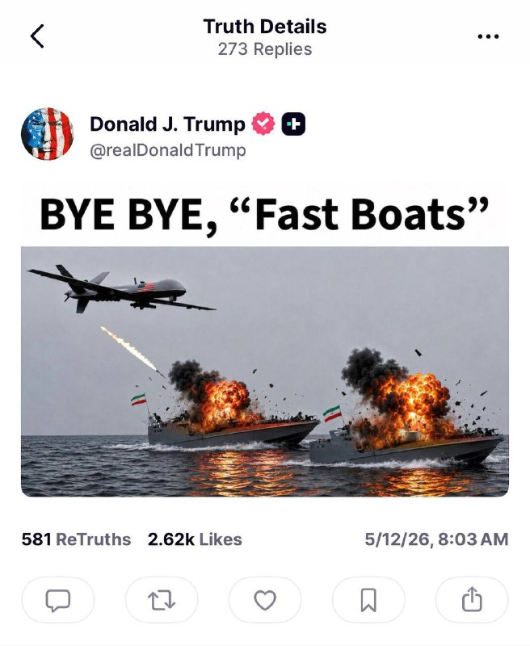

🚨🇺🇸🇮🇷 آخرین مقاومت سپاه پاسداران: این قایق‌ها تنها چیزی بود که برایشان باقی مانده بود.

☆Phantom☆

📌 @persian_trend_official
پرشین ترند | متفاوت‌ترین کانال نظامی

## Persian_Trend_Official — post 13979

  <a href="telegram/content/Persian_Trend_Official_13979_1778604123.webm" target="_blank">🎬 Download video</a>

اگر اینترنت غزه، اوکراین یا هرجایی که حمایت از آن برای حامی‌نماهای حقوق بشر "ویترین اخلاقی" داشته باشد فقط ۷ روز قطع میشد، دنیا را روی سرشان خراب می‌کردند؛ اما اینترنت ایران ۷۴ روز است عملاً قطع شده و آب از آب تکان نخورده است.

فکر می‌کنید اتفاق خاصی افتاده؟ خیر.
ضریب دسترسی واقعی به اینترنت آزاد در ایران به گواه نت‌بلاکس به حدود ۲ درصد رسیده؛ میلیون‌ها انسان نه ۷ روز، بلکه ۷۴ روز عملاً در یک زندان دیجیتال گروگان گرفته شده‌اند و همزمان که جمهوری اسلامی در پشت پرده به سرکوب، بازداشت و اعدام مشغول است، آشغالی به نام "اینترنت پرو" را به‌عنوان راه‌حل به مردم می‌فروشد، که عقیم‌سازی عمدی دسترسی آزاد به اطلاعات و نقض آشکار حقوق انسانی و حریم خصوصی شهروندان است.

ظاهراً برای جهان مدعی آزادی، فقط آن دسته از رنج‌هایی دیده می‌شوند که موضع‌گیری برایش هزینه‌ای نداشته باشد، یا چشم‌های مردمانش رنگی باشد.

📝 Nick

📌 @persian_trend_official
پرشین ترند | متفاوت‌ترین کانال نظامی

## Persian_Trend_Official — post 13978

💢خلاصه اخرین تحولات مهم

▪️دونالد ترامپ، رئیس‌جمهور آمریکا، اعلام کرد آتش‌بس با ایران «روی دستگاه حفظ حیات» قرار دارد و پیشنهاد اخیر تهران برای پایان جنگ را «کاملاً غیرقابل قبول» و «مزخرف» توصیف کرد.

▪️ قطر ایران را متهم کرد که از تنگه هرمز به‌عنوان ابزار فشار و «باج‌گیری» علیه کشورهای خلیج فارس استفاده می‌کند؛ در حالی که صادرات انرژی و کالاها همچنان با اختلال مواجه است

▪️ محمدباقر قالیباف، رئیس مجلس ایران، گفت تهران برای پاسخ به «هرگونه تجاوز» آماده است و واکنش ایران آمریکا را «غافلگیر» خواهد کرد

▪️ اتحادیه اروپا با اعمال تحریم‌های جدید علیه شهرک‌نشینان اسرائیلی به‌دلیل خشونت علیه فلسطینیان در کرانه باختری موافقت کرد؛ اقدامی که نتانیاهو گفته «موفق نخواهد شد»

▪️ شمار قربانیان جنگ غزه به ۷۲ هزار و ۷۴۰ نفر رسیده است

▪️ لبنان نیز اعلام کرد حملات اسرائیل از دوم مارس تاکنون ۲۸۶۹ کشته در این کشور برجای گذاشته است

🫆:Tony

📌 @persian_trend_official
پرشین ترند | متفاوت‌ترین کانال نظامی

## Persian_Trend_Official — post 13977

  

🔴 وزیر جنگ آمریکا درباره جنگ با ایران در کنگره بازخواست می‌شود

«پیت هگست» وزیر جنگ آمریکا قرار است در دور تازه‌ای از جلسات کنگره، درباره جنگ آمریکا و اسرائیل با ایران مورد پرسش نمایندگان قرار گیرد.

بر اساس گزارش‌ها:

▪️ برخی نمایندگان جمهوری‌خواه نیز نسبت به طولانی‌شدن جنگ و نبود مجوز رسمی کنگره ابراز نگرانی کرده‌اند
▪️ کمیته‌های بودجه دفاعی مجلس نمایندگان و سنا نشست‌هایی برای بررسی بودجه نظامی سال ۲۰۲۷ برگزار می‌کنند
▪️ دولت ترامپ بودجه‌ای تاریخی به ارزش ۱.۵ تریلیون دلار برای بخش دفاعی پیشنهاد داده است

گزارش‌ها حاکی است محور اصلی بحث‌ها علاوه بر بودجه، نحوه مدیریت جنگ با ایران خواهد بود؛ جنگی که به‌گفته رسانه‌های آمریکایی وارد وضعیت فرسایشی شده است.

همچنین انتظار می‌رود:

▪️ وزیر جنگ آمریکا و رئیس ستاد مشترک ارتش بر نیاز به افزایش پهپادها
ناوهای جنگی
سامانه‌های رهگیر موشکی
تأکید کنند؛ زیرا ذخایر این تجهیزات در جریان درگیری با ایران کاهش یافته است.

🫆:Tony

📌 @persian_trend_official
پرشین ترند | متفاوت‌ترین کانال نظامی

## Persian_Trend_Official — post 13976

  <a href="telegram/content/Persian_Trend_Official_13976_1778604124.webm" target="_blank">🎬 Download video</a>

کویت مدعی بازداشت ۴ افسر نیروی دریایی سپاه شد
وزارت کشور کویت اعلام کرد چهار نفر وابسته به سپاه پاسداران را هنگام تلاش برای ورود دریایی به جزیره بوبیان بازداشت کرده است.
طبق بیانیه رسمی، بازداشت‌شدگان شامل دو سرهنگ، یک کاپیتان و یک ستوان نیروی دریایی سپاه هستند که به گفته کویت، مأموریت «نفوذ» به جزیره بوبیان و انجام «اقدامات خصمانه» را داشته‌اند. در جریان درگیری، یک نیروی مسلح کویتی نیز زخمی شده است.

اسامی اعلام‌شده از سوی کویت:
1 امیرحسین عبدالمحمد زیرایی — سرهنگ نیروی دریایی
2▪️ عبدالصمد یدالله قنواتی — سرهنگ نیروی دریایی
3▪️ احمد جمشید غلامرضا ذوالفقاری — کاپیتان نیروی دریایی
4▪️ محمدحسین سهراب فاروقی‌راد — ستوان یکم
کویت می‌گوید این افراد اول ماه مه با یک قایق ماهیگیری وارد آب‌های این کشور شده بودند و دو نفر دیگر نیز موفق به فرار شده‌اند.
جزیره بوبیان بزرگ‌ترین جزیره کویت و در نزدیکی مرزهای دریایی ایران و عراق قرار دارد. ایران تاکنون واکنش رسمی به این ادعاها نشان نداده است.

## Persian_Trend_Official — post 13975

غرق شدن کشتی روسی حامل تجهیزات هسته‌ای به مقصد احتمالی کره شمالی

🔹 تحقیقات شبکه سی‌ان‌ان نشان می‌دهد یک کشتی باری روسی که احتمالاً دو راکتور هسته‌ای ویژه زیردریایی‌ها را حمل می‌کرد و ممکن بود مقصد آن کره شمالی باشد، پس از وقوع چند انفجار مشکوک در دریای مدیترانه غرق شده است.

☆Phantom☆

📌 @persian_trend_official
پرشین ترند | متفاوت‌ترین کانال نظامی

🔹این کشتی با نام Ursa Major در تاریخ 23 دسامبر 2024، حدود 60 مایلی سواحل اسپانیا، در شرایطی نامشخص غرق شد. به گفته منابع آگاه، سرنوشت این کشتی از زمان حادثه در هاله‌ای از ابهام قرار داشته و جزئیات مربوط به محموله و مأموریت آن محرمانه نگه داشته شده است.

## Persian_Trend_Official — post 13974

دقایقی قبل ارتش اسرائیل از رهگیری یک پهپاد که از سمت ایران یا حوثی ها به سمت جنوب اسرائیل شلیک شده بود خبر داد. ☆Phantom☆ 📌 @persian_trend_official پرشین ترند | متفاوت‌ترین کانال نظامی

## Persian_Trend_Official — post 13973

  <a href="telegram/content/Persian_Trend_Official_13973_1778604125.mp4" target="_blank">🎬 Download video</a>

دقایقی قبل ارتش اسرائیل از رهگیری یک پهپاد که از سمت ایران یا حوثی ها به سمت جنوب اسرائیل شلیک شده بود خبر داد.

☆Phantom☆

📌 @persian_trend_official
پرشین ترند | متفاوت‌ترین کانال نظامی

## Persian_Trend_Official — post 13972

لینک داخلی برای افراد داخل ایران: https://dl.persiantrend.com/Mostanad/RezaShah.mp4

## Persian_Trend_Official — post 13970

  <a href="telegram/content/Persian_Trend_Official_13970_1778604126.webm" target="_blank">🎬 Download video</a>

دیگه هر بچه مزلفی پیج میزنه و دیگران رو تهدید میکنه !
من اگه قرار بود با این چیزا بترسم هیچوقت کار سیاسی نمیکردم

## RadioFarda — post 157098

🔸دونالد ترامپ، رئیس‌جمهور آمریکا، روز سه‌شنبه گفت که «۱۰۰ درصد» اطمینان دارد که ایران غنی‌سازی اورانیوم را متوقف خواهد کرد و ذخیره اورانیوم خود را به آمریکا تحویل خواهد داد. 🔸او در گفت‌وگو با برنامه رادیویی سید رازنبرگ اعلام کرد که ایرانی‌ها متعهد شده‌اند…

## RadioFarda — post 157097

  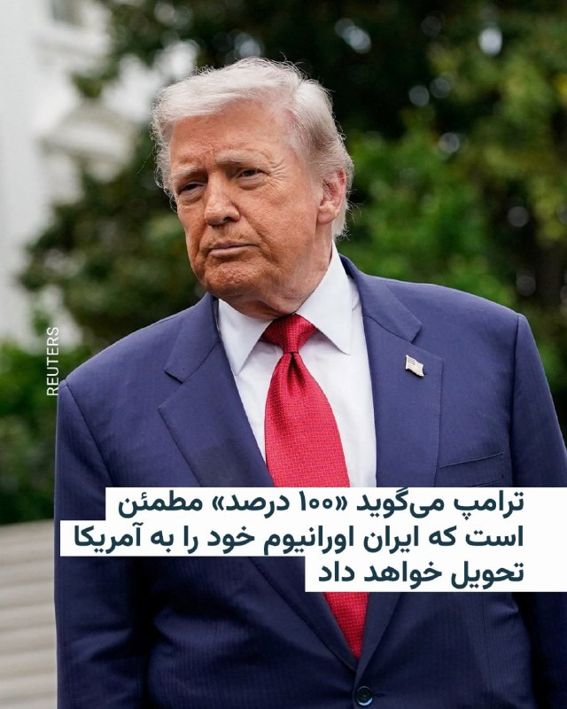

🔸دونالد ترامپ، رئیس‌جمهور آمریکا، روز سه‌شنبه گفت که «۱۰۰ درصد» اطمینان دارد که ایران غنی‌سازی اورانیوم را متوقف خواهد کرد و ذخیره اورانیوم خود را به آمریکا تحویل خواهد داد.

🔸او در گفت‌وگو با برنامه رادیویی سید رازنبرگ اعلام کرد که ایرانی‌ها متعهد شده‌اند غنی‌سازی اورانیوم را متوقف کنند: «آن‌ها قرار است متوقف شوند، و به من گفتند که «غبار» را به ما خواهند داد.»

🔸«غبار» اصطلاحی است که ترامپ به دفعات برای اشاره به اورانیوم غنی‌شده بعد از حملات آمریکا در اول تیر ماه سال گذشته به تأسیسات هسته‌ای ایران در جریان جنگ ۱۲ روزه به کار می‌برد.

🔸رئیس‌جمهور آمریکا در بخش دیگری از این گفت‌وگوی رادیویی گفت: «ما لازم نیست برای هیچ‌چیز عجله کنیم. ما یک محاصره داریم که هیچ پولی برای آن‌ها باقی نمی‌گذارد. مسئله خیلی ساده است: ما نمی‌توانیم اجازه دهیم آن‌ها سلاح هسته‌ای داشته باشند، چون از آن استفاده خواهند کرد.»

@RadioFarda

## RadioFarda — post 157096

🔸بحرین روز سه‌شنبه ۲۲ اردیبهشت سه نفر را به اتهام «همکاری با سپاه پاسداران» به حبس ابد محکوم کرد. 🔸دادگاهی در بحرین همچنین بیش از ۲۰ نفر دیگر را به حداکثر ۱۰ سال زندان محکوم کرد. 🔸این پادشاهی کوچک که تحت حاکمیت یک خاندان سنی است، جمعیت قابل‌توجهی از شیعیان…

## RadioFarda — post 157095

  

🔸بحرین روز سه‌شنبه ۲۲ اردیبهشت سه نفر را به اتهام «همکاری با سپاه پاسداران» به حبس ابد محکوم کرد.

🔸دادگاهی در بحرین همچنین بیش از ۲۰ نفر دیگر را به حداکثر ۱۰ سال زندان محکوم کرد.

🔸این پادشاهی کوچک که تحت حاکمیت یک خاندان سنی است، جمعیت قابل‌توجهی از شیعیان دارد که مدت‌هاست از حاشیه‌نشینی شکایت دارند.

🔸دادستانی بحرین در بیانیه‌ای اعلام کرد یک زن که «به همکاری با سازمان تروریستی سپاه پاسداران با هدف انجام اقدامات خصمانه و تروریستی» متهم شده بود، به حبس ابد محکوم شده است.

🔸دو نفر دیگر، که یکی از آن‌ها به ایران گریخته، نیز با اتهامات مشابه به حبس ابد و پرداخت جریمه ۱۰ هزار دیناری (۲۶ هزار و ۴۸۷ دلاری) محکوم شدند.

🔸در پرونده‌ای جداگانه، دادگاه ۱۰ متهم را به حبس‌هایی تا ۱۰ سال محکوم کرد که سه نفر از آن‌ها پس از گذراندن دوران محکومیت اخراج خواهند شد.

🔸آن‌ها به حمایت از ایران، فیلم‌برداری از مکان‌های ممنوعه و انتشار بیانیه‌های ممنوعه متهم شده‌اند.

@RadioFarda

## RadioFarda — post 157094

  

🔸یک مقام ارشد پنتاگون روز سه‌شنبه ۲۲ اردیبهشت اعلام کرد که جنگ ایالات متحده با ایران تاکنون ۲۹ میلیارد دلار هزینه داشته است، رقمی که نسبت به برآورد ارائه‌شده در اواخر ماه گذشته، چهار میلیارد دلار افزایش نشان می‌دهد.

🔸به گزارش خبرگزاری رویترز، در حالی که تنها شش ماه تا انتخابات میان‌دوره‌ای کنگره آمریکا باقی مانده است، دموکرات‌ها در نظرسنجی‌های عمومی موقعیت بهتری پیدا کرده‌اند و تلاش می‌کنند این جنگ را به مسائل مربوط به هزینه‌های زندگی پیوند بزنند.

🔸پنتاگون در ۲۹ آوریل اعلام کرده بود که هزینه جنگ تا آن زمان ۲۵ میلیارد دلار بوده است.

🔸جولز هرست، که به‌طور موقت وظایف حسابرس ارشد را بر عهده دارد، روز سه‌شنبه به قانون‌گذاران گفت که برآورد جدید شامل هزینه‌های به‌روزشده تعمیر و جایگزینی تجهیزات و همچنین هزینه‌های عملیاتی است.

🔸او گفت: «تیم ستاد مشترک و تیم حسابرسی به‌طور مداوم این برآورد را بررسی می‌کنند».

🔸هرست در کنار پیت هگست، وزیر دفاع، و ژنرال دن کین، رئیس ستاد مشترک نیروهای مسلح، سخن می‌گفت.

@RadioFarda

## RadioFarda — post 157093

رکوردشکنی شمار نویسندگان زندانی در جهان؛ ایران با ۵۳ نویسندهٔ زندانی در رده دوم

🔸انجمن قلم آمریکا در تازه‌ترین گزارش سالانهٔ خود دربارهٔ وضعیت آزادی بیان در جهان اعلام کرد شمار نویسندگان زندانی در سال ۲۰۲۵ برای نخستین بار از سال ۲۰۱۹ که این شاخص منتشر می‌شود، از مرز ۴۰۰ نفر عبور کرده است.

🔸این گزارش از افزایش چشمگیر بازداشت نویسندگان و فعالان فرهنگی در ایران نیز خبر می‌دهد.

🔸این گزارش که روز سه‌شنبه ۲۲ اردیبهشت منتشر شد، می‌گوید در سال ۲۰۲۵ میلادی در مجموع ۴۰۱ نویسنده در ۴۴ کشور زندانی بوده‌اند، در حالی‌که این رقم در سال پیش ۳۷۵ نفر در ۴۰ کشور بود.

🔸انجمن قلم آمریکا در شاخص «آزادی نوشتن» خود تأکید کرده است که طی هفت سال گذشته شمار نویسندگان زندانی در جهان ۶۸ درصد افزایش یافته و این روند نشان‌دهندهٔ تشدید مداوم سرکوب آزادی بیان و خاموش‌کردن صداهای منتقد در کشورهای مختلف است.

🔸بر اساس این گزارش، چین همچنان بزرگ‌ترین زندان نویسندگان در جهان است و با ۱۱۹ مورد در صدر فهرست قرار دارد. ایران با ۵۳ نویسندهٔ زندانی در رتبهٔ دوم ایستاده و به‌گفتۀ پن آمریکا، شدیدترین افزایش بازداشت‌ها در ایران طی سال گذشته رخ داده است.

🔸این سازمان می‌گوید مقام‌های جمهوری اسلامی در سال ۲۰۲۵ دست‌کم ۱۷ بازداشت تازه انجام دادند و شمار نویسندگان زندانی را بار دیگر به سطح دوران اعتراض‌های «زن، زندگی، آزادی» در سال ۱۴۰۱ نزدیک کرده‌اند.

🔸کارین دویچ کارلکار، مدیر برنامهٔ نویسندگان در معرض خطر در پن آمریکا، در این‌باره گفت مقام‌های جمهوری اسلامی در میان کشورهای جهان «کارزاری به‌ویژه خشن علیه صداهای مستقل» به راه انداخته‌اند.

🔸او افزود شاعران، مترجمان، پژوهشگران، ترانه‌سرایان، تحلیلگران آنلاین، مدافعان حقوق بشر و ستون‌نویسان همگی هدف بازداشت و سرکوب قرار گرفته‌اند، زیرا حکومت ایران در تلاش است «بحث و مخالفت» را خاموش کند.

🔸گزارش کامل را در وب‌سایت رادیوفردا بخوانید.

@RadioFarda

## RadioFarda — post 157092

🔸رسانه‌های ایران روز سه‌شنبه ۲۲ اردیبهشت مدعی شدند که هیئت‌های نمایندگی جمهوری اسلامی و عمان در مسقط دیدار کردند و «آخرین تحولات مربوط به تنگه هرمز و ترتیبات مربوط به عبور ایمن کشتی‌ها» را مورد بررسی قرار دادند. 🔸بر اساس این گزارش، عباس باقرپور مدیرکل حقوقی…

## RadioFarda — post 157091

  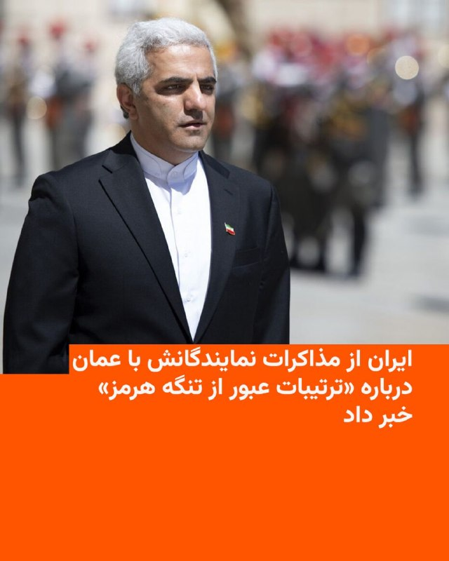

🔸رسانه‌های ایران روز سه‌شنبه ۲۲ اردیبهشت مدعی شدند که هیئت‌های نمایندگی جمهوری اسلامی و عمان در مسقط دیدار کردند و «آخرین تحولات مربوط به تنگه هرمز و ترتیبات مربوط به عبور ایمن کشتی‌ها» را مورد بررسی قرار دادند.

🔸بر اساس این گزارش، عباس باقرپور مدیرکل حقوقی بین‌المللی وزارت خارجه، ریاست هیئت نمایندگی ایران را برعهده داشت و «نمایندگان دستگاه‌های ذیربط» جمهوری اسلامی نیز در آن حضور داشتند.

🔸به ادعای این رسانه‌ها، «دو طرف بر حقوق و صلاحیت‌های حاکمیتی خود بر این تنگه به عنوان بخشی از آب‌های سرزمینی ایران و عمان تأکید کردند».

🔸تنگه هرمز از ۹ اسفند پارسال که آمریکا و اسرائیل به ایران حمله کردند، از سوی سپاه پاسداران عملاً مسدود شده است؛ آبراهی حیاتی که حدود ۲۰ درصد از نفت و گاز جهان از این مسیر عبور می‌کند.

@RadioFarda

## RadioFarda — post 157090

  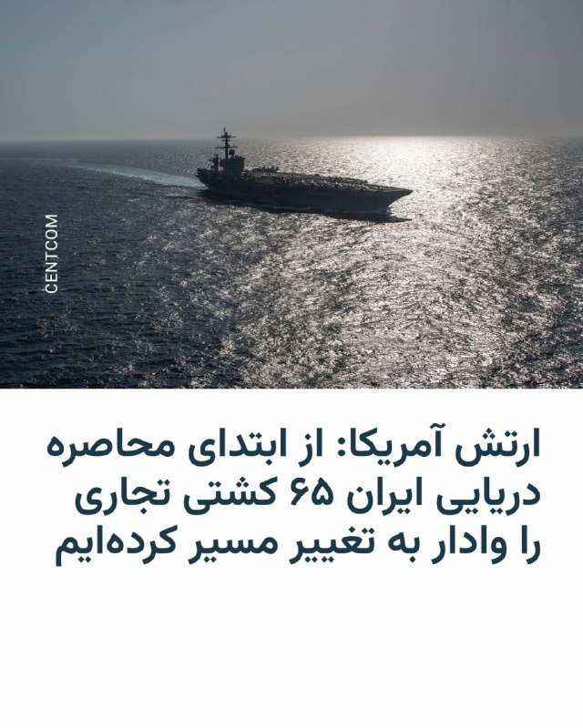

🔸فرماندهی مرکزی ایالات متحده، سنتکام، روز سه‌شنبه خبر داد از ابتدای محاصره دریایی علیه بنادر ایران تاکنون، ۶۵ کشتی تجاری را وادار به «تغییر مسیر» کرده است.

🔸در اطلاعیه سنتکام که در حساب شبکه ایکس آن منتشر شده است، آمده که نیروهای نظامی آمریکا در خاورمیانه در این مدت چهار کشتی ایرانی را هم «از کار انداخته‌اند».

🔸ارتش آمریکا جمعه از شلیک به دو نفتکش ایرانی «ام‌تی سی استار» و «ام‌تی سودا» و از کار انداختن آنها خبر داد و روز چهارشنبه نیز نفتکش «ام‌تی حسنا» با پرچم ایران هدف قرار گرفته بود.

🔸ماه گذشته نیز نیروهای آمریکایی یک کشتی باری ایرانی را توقیف کرده بودند.

🔸آمریکا و ایران بعد از یک دور مذاکره حضوری در پاکستان که چند روز بعد از برقراری آتش‌بس در اسلام‌آباد برگزار شد، با ارسال طرح‌های پیشنهادی متقابل مشغول مذاکره بودند. آمریکا بعد از بی‌نتیجه ماندن مذاکره حضوری، محاصره دریایی بنادر ایران را آغاز کرد، در حالی که ایران از ابتدای جنگ تنگهٔ هرمز را مسدود کرده است.

@RadioFarda

## RadioFarda — post 157089

  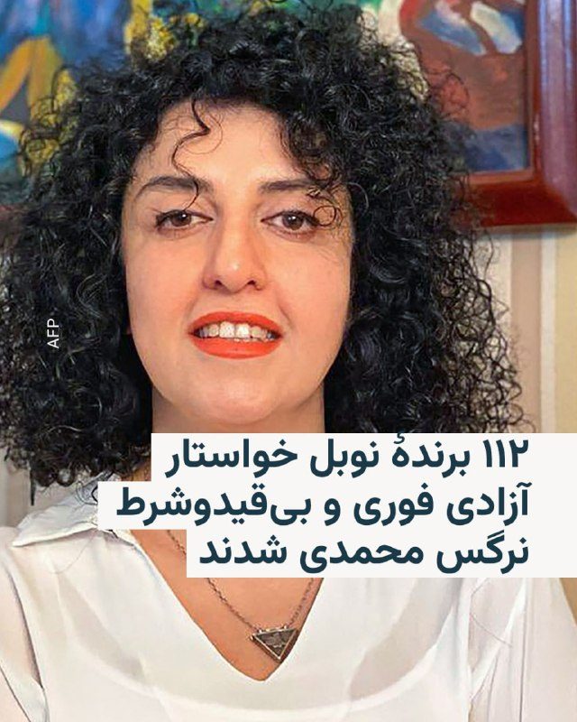

🔸در پی انتقال نرگس محمدی، برندهٔ جایزهٔ صلح نوبل و زندانی سیاسی، به بیمارستان، ۱۱۲ برندهٔ جایزهٔ نوبل از رشته‌های مختلف با انتشار بیانیه‌ای مشترک خواستار آزادی فوری و بی‌قیدوشرط او و لغو همهٔ اتهام‌ها علیه این فعال حقوق بشر شدند.

🔸این بیانیه روز سه‌شنبه ۲۲ اردیبهشت، با هماهنگی «ابتکار زنان نوبل» و همکاری «بنیاد نرگس» منتشر شد. امضاکنندگان شامل برندگان نوبل در رشته‌های شیمی، اقتصاد، ادبیات، پزشکی، صلح و فیزیک هستند.

🔸در این بیانیه آمده است که گزارش‌های منتشرشده از سوی بنیاد نرگس و دیگر منابع معتبر نشان می‌دهد وضعیت جسمانی خانم محمدی «بحرانی» شده و او با کاهش شدید وزن، ناپایداری فشار خون و علائم جدی قلبی روبه‌رو است.

🔸برندگان نوبل هشدار داده‌اند که جان نرگس محمدی ممکن است در معرض «خطر فوری» باشد و تأکید کرده‌اند که او ماه‌ها از دسترسی به خدمات تخصصی پزشکی محروم بوده است.

🔸نرگس محمدی روز ۲۰ اردیبهشت با آمبولانس به بیمارستان تهرانپارس منتقل شد و اکنون تحت درمان یک تیم تخصصی پزشکی قرار دارد.

@Radiofarda

## RadioFarda — post 157088

🔸تنها ساعاتی تا افتتاح هفتاد‌و‌نهمین جشنواره فیلم کن باقی است و رسانه‌های جهان تصاویری از آماده‌سازی‌ نهایی کاخ جشنواره‌ کن را منتشر کرده‌اند.

🔸فرش قرمز روز افتتاحیه هفتاد‌و‌نهمین دوره این جشنواره روز سه‌شنبه ۲۲ اردیبهشت پهن شد و بزرگترین رویداد سینمایی جهان در انتظار حضور چهره‌های سرشناس سینماست که قرار است تا دوم خرداد در این جشنواره حضور داشته باشند.

🔸از جمله چهره‌های سرشناسی که امسال فیلم‌هایشان برای اولین بار اکران می‌شود می‌توان به اسکارلت جوهانسون، رامی مالک، خاویر باردم، جان تراولتا و لیا سیدو اشاره کرد.

🔸۲۲ فیلم هم برای دریافت جایزه نخل طلا در مراسم اختتامیه رقابت می‌کنند که در میان آنها چهره‌هایی از جمله پدرو آلمودوار،‌ اصغر فرهادی و لاسلو نمش حضور دارند.

@Radiofarda

## RadioFarda — post 157087

  <a href="https://t.me/radiofarda/157087" target="_blank">📎 Download file</a>

📻بشنوید: ساعت ۱۴ با رادیوفردا، ۲۲ اردیبهشت ۱۴۰۵‌

@Radiofarda

## RadioFarda — post 157086

  

🔸وزارت کشور کویت اعلام کرد که «چهار نفوذی» وابسته به سپاه پاسداران انقلاب اسلامی ایران را پس از تلاش برای ورود دریایی به این کشور حوزه خلیج فارس بازداشت کرده است.

🔸خبرگزاری رسمی دولت کویت، کونا، این خبر را منتشر کرده است.

🔸این وزارتخانه افزود که در جریان درگیری با این این افراد، یکی از نیروهای مسلح کویت زخمی شد و «دو نفوذی‌» موفق به فرار شدند.

🔸کونا همچنین به نقل از وزارت کشور کویت نوشته که بازداشت‌شدگان در جریان بازجویی «اعتراف» کردند که وابسته به سپاه پاسداران هستند.

🔸بر اساس این گزارش، آنها «اعتراف کردند که مأموریت داشتند با یک قایق ماهیگیری که به‌طور ویژه برای انجام اقدامات خصمانه علیه کویت اجاره شده بود، به جزیره بوبیان نفوذ کنند».

🔸پیش از این وزارت دفاع کویت خبر اولیه‌ای از تلاش این چهار نفر برای ورود به این کشور از راه دریا منتشر کرده بود.

@RadioFarda

## RadioFarda — post 157085

  <a href="https://t.me/radiofarda/157085" target="_blank">📎 Download file</a>

🔸روز اقدام جهانی با هدف اعتراض به ادامه حبس زندانیان سیاسی، اعدام‌های گسترده و همچنین قطع اینترنت روز بیستم اردیبهشت در چندین شهر برگزار شد.

🔸 هواداران شاهزاده رضا پهلوی در شهرهای مختلف دنیا، از جمله در اروپا و آمریکا شمالی به خیابان آمدند و به این حرکت پیوستند؛ برخی شهرها مثل برلین و هامبورگ و استکهلم جمعیت قابل توجهی به این فراخوان پاسخ دادند و در برخی شهرهای دیگر تجمعات به نسبت موارد پیشین کوچکتر برگزار شد.

🔸پس از انتشار تصاویر برخی از تجمعات، بحثی پیرامون آن شکل گرفته است؛ مشخصا تجمع در شهر رگنسبورگ در آلمان، معترضان با لباس‌های متحدالشکل با نشان ساواک (سازمان اطلاعات و امنیت کشور) و پرچم‌هایی با همین نشان به خیابان آمدند.

🔸در نمونه‌ای دیگر شرکت‌کنندگان در تجمع با یونیفرم نظامی به خیابان آمده بودند. تصاویری که بسیار متفاوت از تصاویر تجمعاتِ معمول ایرانیان خارج از کشور بود.

🔸 درباره این روز اقدام جهانی و بحث‌های پیرامون آن ارزیابی عبدالرضا احمدی عضو حزب ایران نوین در آلمان را بشنوید.

@RadioFarda

## RadioFarda — post 157084

صنعت گردشگری ایران طی دو ماه اخیر «حدود پنج هزار میلیارد تومان» زیان دیده است

🔸گزارش‌ها از ایران حاکی از «تعطیل عملی» صنعت گردشگری کشور به‌دلیل ماه‌ها رکود، بی‌ثباتی اقتصادی، جنگ و اختلال و قطع اینترنت است.

🔸رئیس انجمن صنفی دفاتر خدمات مسافرت هوایی و جهانگردی ایران می‌گوید «دفاتر مسافرتی از نوروز سال گذشته تاکنون تقریباً هیچ فعالیت اقتصادی نداشته‌اند» و دست‌اندرکاران صنعت گردشگری هشدار می‌دهند در شرایط «نه جنگ نه صلح» و تبعات آن، عملاً کسب‌و‌کارهای مرتبط با این صنعت خوابیده است.

🔸حرمت‌الله رفیعی، روز سه‌شنبه ۲۲ اردیبهشت، گفت براساس برآوردهای ارائه‌شده به وزارت میراث‌ فرهنگی، گردشگری و صنایع‌دستی، صنعت گردشگری «تنها طی دو ماه اخیر حدود پنج هزار میلیارد تومان زیان دیده است».

🔸ایران از خرداد سال گذشته و در پی جنگ ۱۲ روزه با اسرائیل درگیر جنگ و یا سرکوب اعتراضات و پیامدهای آن‌ها بوده است. جنگ ۳۹ روزه‌ای هم که از نهم اسفند پارسال با حملات مشترک آمریکا و اسرائیل آغاز شد، همچنان در وضعیت آتش‌بس شکننده قرار دارد.

🔸خروج نیروی انسانی متخصص از حوزهٔ گردشگری در حال حاضر یکی دیگر از بحران‌های اصلی است که این صنعت با آن مواجه شده است.

🔸آن‌طور که آقای رفیعی خبر داده، «بسیاری از کارکنان آموزش‌دیدهٔ دفاتر مسافرتی به‌دلیل نبود درآمد، جذب مشاغل دیگری مانند آرایشگری و فعالیت‌های غیرمرتبط شده‌اند».

🔸روزنامه دنیای اقتصاد نیز نوشته است که برآوردها نشان می‌دهد حدود «یک ‌میلیون شغل» در این صنعت تحت‌تأثیر شرایط جنگی و قطع اینترنت قرار گرفته است.

🔸نسخه کامل این گزارش را در وب‌سایت رادیوفردا بشنوید.

@RadioFarda

## RadioFarda — post 157083

  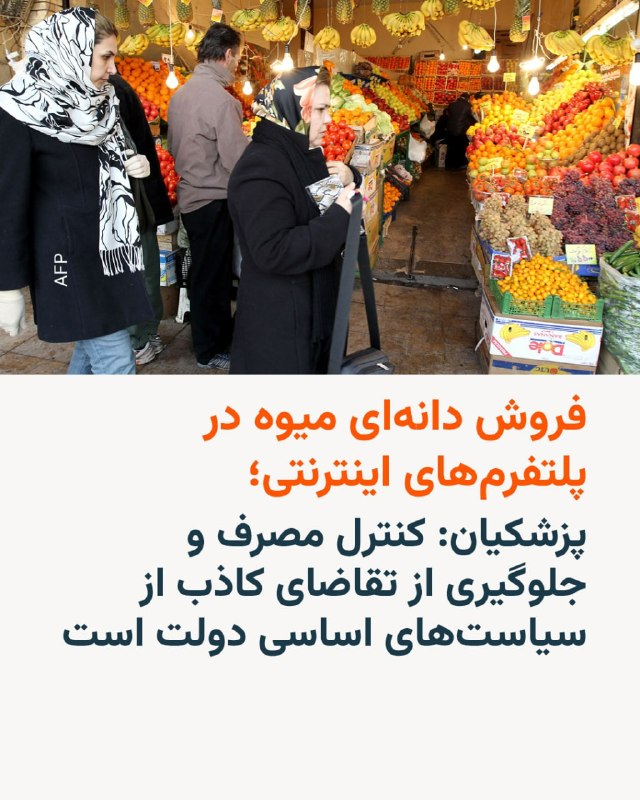

🔸در حالی که مسعود پزشکیان، رئیس جمهوری ایران می‌گوید اجازه «فشار بر معیشت مردم» را نمی‌دهد،‌ گزارش رسانه‌ها در ایران از فروش دانه‌ای میوه در فروشگاه‌های اینترنتی حکایت دارد.

🔸رسانه‌های اقتصادی در ایران با اشاره به گرانی قیمت میوه از عرضه و فروش دانه‌ای میوه در برخی پلتفرم‌های اینترنتی گزارش می‌دهند و آن را نشانه‌ای از فشار اقتصادی و تغییر الگوی مصرف خانوارها توصیف کرده‌اند.

🔸بنا بر گزارش‌ها تصاویر منتشر شده در برخی پلتفرم‌های اینترنتی نشان می‌دهد که آنها در حال فروش دانه‌ای سیب، موز، خیار و برخی دیگر از میوه‌ها و صیفی‌جات هستند؛ پدیده‌ای که برای فرهنگی مانند ایران که میوه همیشه بخشی جدانشدنی از سفره خانواده‌ها، مهمانی‌ها، عیادت‌ها و حتی خریدهای روزمره بوده، دور از ذهن به نظر می‌رسید.

🔸این تصاویر و گزارش‌ها در حالی منتشر شده است که مسعود پزشکیان، روز سه‌شنبه تاکید کرد که اجازه «سوءاستفاده از شرایط جنگی و فشار بر معیشت مردم» را نخواهد داد و یکی از سیاست‌های اساسی دولت در شرایط فعلی «کنترل مصرف و جلوگیری از شکل‌گیری تقاضای القایی و کاذب» است.

@RadioFarda

## RadioFarda — post 157082

ترامپ می‌گوید خسته نمی‌شود و فشار بر جمهوری اسلامی را تا پیروزی کامل ادامه خواهد داد

🔸دونالد ترامپ، رئیس‌جمهور ایالات متحده، شامگاه دوشنبه ۲۱ اردیبهشت در گفت‌وگو با خبرنگاران بار دیگر پاسخ مقامات جمهوری اسلامی به پیشنهاد صلح آمریکا را «ضعیف» و «کاملاً غیرقابل قبول» خواند و تأکید کرد فشار بر جمهوری اسلامی را تا زمان دستیابی به توافق ادامه خواهد داد و از ادامهٔ جنگ فرسایشی خسته نخواهد شد.

🔸ترامپ در گفت‌وگو با خبرنگاران در کاخ سفید، با اشاره به رد پیشنهاد آمریکا از سوی تهران، گفت: «احمق‌ها نمی‌خواستند قبول کنند. فکر می‌کردند من خسته می‌شوم یا حوصله‌ام سر می‌رود یا تحت فشار قرار می‌گیرم، اما هیچ فشاری وجود ندارد. ما به یک پیروزی کامل خواهیم رسید.»

🔸او همچنین دربارهٔ پیشنهاد ارائه‌شده از سوی جمهوری اسلامی گفت: «به‌نظرم فوق‌العاده ضعیف است. بعد از خواندن مزخرفاتی که برای ما فرستادند، آن را ضعیف‌ترین پاسخ یافتم. من حتی خواندنش را تمام نکردم، گفتم وقتم را برای خواندن آن تلف نمی‌کنم.»

🔸ترامپ در گفت‌وگو با شبکه سی‌بی‌اس هم گفت تهران در برنامه هسته‌ای خود امتیازاتی داده، اما این امتیازها «کافی نبوده» است.

🔸ترامپ یک روز پیش‌تر نیز گفته بود از پاسخ تهران به پیشنهاد آمریکا رضایت ندارد و آن را «کاملاً غیرقابل قبول» می‌داند. همزمان، صداوسیمای جمهوری اسلامی گزارش داد که این پیشنهاد رد شده، زیرا به گفته این رسانه، به معنای «تسلیم کامل» بوده است.

🔸رئیس‌جمهور آمریکا در پاسخ به پرسشی دربارهٔ احتمال تغییر حکومت در ایران هم گفت در جمهوری اسلامی «میانه‌روها» و «دیوانه‌ها» وجود دارند و افزود: «دیوانه‌ها می‌خواهند تا آخر بجنگند.» ترامپ گفت جنگ «خیلی کوتاه» خواهد بود و مدعی شد میانه‌روها در حکومت ایران از تندروها می‌ترسند.

🔸نسخه کامل این گزارش را در وب‌سایت رادیوفردا بخوانید.

@RadioFarda

## RadioFarda — post 157081

آیا ایران می‌تواند از مالکان کابل‌های فیبر نوری در تنگۀ هرمز عوارض بگیرد؟

🔸ایران هفته‌هاست که ادعا می‌کند حق دارد از شناورهای بین‌المللی عبوری از تنگۀ هرمز، عوارض بگیرد.

🔸حالا دو نهاد خبری مرتبط با سپاه پاسداران، از طرح‌هایی برای دریافت عوارض از شرکت‌های فناوری اطلاعات خبر داده‌اند؛ اقدامی که به بهانۀ عبور کابل‌های فیبر نوری این‌ شرکت‌ها از تنگۀ هرمز پیشنهاد شده است.

🔸بازگشایی این آبراه حیاتی که تا پیش از جنگ، نزدیک به ۲۰ درصد از حامل‌های انرژی مورد نیاز جهان از آن عبور می‌کرد و حالا، مدت‌هاست که از سوی سپاه پاسداران بسته شده، به یکی از مهمترین موضوعات مرتبط با جنگ جاری خاورمیانه و پایان دادن به آن تبدیل شده است.

🔸تهران می‌گوید این تنگه، تحت حاکمیت ایران است و به همین دلیل دریافت چنین تعرفه‌ها و عوارضی را حق طبیعی خود می‌داند؛ موضوعی که از سوی جامعۀ بین‌المللی رد شده است.

🔸کارشناسان معتقدند که ایدۀ دریافت عوارض از شرکت‌های مالک کابل‌های زیر آبی عبوری از تنگۀ هرمز، بیشتر جنبۀ تهدید دارد تا امکان اجرایی و عملی.

🔸آیسیک مَتِر، مدیر تحقیقات در شرکت ناظر «نت بلاکس» مستقر در لندن به رادیو اروپای آزاد/رادیو آزادی می‌گوید: «خطر قطع تعمدی و خصمانۀ کابل‌های زیر دریایی، همیشه وجود داشته است؛ اما تهدیدی آشکار از سوی کشوری مثل ایران، این خطر را دوچندان می‌کند».

🔸کابل‌های زیردریایی، عمدتاً به غول‌های فناوری همچون گوگل، متا، مایکروسافت، و آمازون تعلق دارند. این کابل‌ها برای اتصال اینترنتی بین آسیا، اروپا و حوزۀ خلیج فارس به کار می‌روند؛ همین‌طور برای انتقال ترافیک داده‌ها، و البته برای تراکنش‌های مالی بین‌المللی.

🔸در صورت آسیب‌دیدن این کابل‌ها، مردم عادی ساکن آسیا، خاورمیانه و اروپا به سرعت و به‌شکلی گسترده با تبعات آن روبرو خواهند شد.

🔸نسخه کامل این گزارش را در وب‌سایت رادیوفردا بخوانید.

@RadioFarda

## RadioFarda — post 157080

🔸نشست خبری سخنگوی دولت مسعود پزشکیان روز سه‌شنبه ۲۲ اردیبهشت به دلیل وضعیت اینترنت به بگومگوی خبرنگاران با فاطمه مهاجرانی منجر شد.

🔸سخنگوی دولت تاکید کرد که «اینترنت پرو» با مصوبه شورای عالی امنیت ملی که ریاست آن را مسعود پزشکیان بر عهده دارد،‌ مورد استفاده قرار می‌گیرد.

🔸او در عین حال تاکید کرد که این اینترنت ویژه کسب و کارها است.

🔸فاطمه مهاجرانی همچنین با اشاره به سخنان شب گذشته دونالد ترامپ درباره آتش‌بس شکننده میان ایران و آمریکا که آن را در وضعیت «حفظ حیات» توصیف کرده بود، گفت: شرایط جنگی است و پس از دور شدن سایه جنگ وضعیت اینترنت به تدریج به حالت عادی تغییر می کند.

🔸این اظهارات در حالی مطرح شد که حسین افشین، معاون علمی و فناوری مسعود پزشکیان، روز دوشنبه به طور تلویحی وجود دلایل امنیتی برای قطعی کامل اینترنت در ایران را رد کرد و گفت: «حتی در شرایط جنگی هم بستن اینترنت راهکار درستی نیست، چرا که دیدیم وقتی اینترنت کامل بسته بود هم ترورها ادامه داشت».

🔸مقام‌های جمهوری اسلامی در پی آغاز حملات مشترک آمریکا و اسرائیل به ایران دسترسی مردم به اینترنت در کشور را به طور کامل قطع کردند.

@RadioFarda

## RadioFarda — post 157079

  <a href="https://t.me/radiofarda/157079" target="_blank">📎 Download file</a>

«خیرمقدم به بی‌حجاب‌ها»؛ عقب‌نشینی تاکتیکی یا استراتژی جدید جمهوری اسلامی؟

🔸احمد مَروی، تولیت آستان قدس رضوی و از روحانیون محافظه کار در جمهوری اسلامی، خواستار «خیرمقدم» به زنان با پوشش اختیاری در اجتماعات حکومتی شد.

🔸در روزهای گذشته نیز، در برخی تجمعات شبانه حامیان حکومت، از زنان و دخترانِ با ‌حجاب اختیاری به عنوان «ناموس ایران» یاد شد، و شعارهایی در استقبال از حضور آن‌ها در مراسم حکومتی سر داده شد.

🔸آیا استقبال از زنان با پوشش اختیاری در راهپیمایی‌های حکومتی یک چرخش ایدئولوژیک در ساختار جمهوری اسلامی است یا تنها یک تاکتیک موقت سیاسی در شرایط فعلی محسوب می‌شود؟

🔸این پرسشی است که با مهدیه گلرو، فعال حقوق زنان در سوئد، در میان گذاشته‌ایم.

@RadioFarda

## IranianMinds — post 20015

💙 خان وی‌پی‌ان 
⚡️ سرعت بالا 
🛡 پینگ و پایداری عالی 
🔐 مناسب تلگرام، اینستا، یوتیوب، گیم و استریم 
💸 قیمت اقتصادی با پلن‌های متنوع 
🎁 تست ۵۰ مگ فقط ۷۵ تومن 
🛎 کانال: https://t.me/+qNjExGEJztE2OGI0 
🤖 ربات خرید: @Xan_vpn_bot

## IranianMinds — post 20014

🔴 ترامپ:

چین قدرتمنده، اما ما از نظر نظامی قوی تریم.

@IranianMinds

## IranianMinds — post 20013

  <a href="telegram/content/IranianMinds_20013_1778604134.mp4" target="_blank">🎬 Download video</a>

🔴 پیت هگزت درباره ایران:

ما برنامه‌ای برای تشدید اوضاع داریم، در صورت لزوم.

و همچنین ما برنامه‌ای برای عقب‌نشینی داریم، در صورت لزوم.

@IranianMinds

## IranianMinds — post 20012

  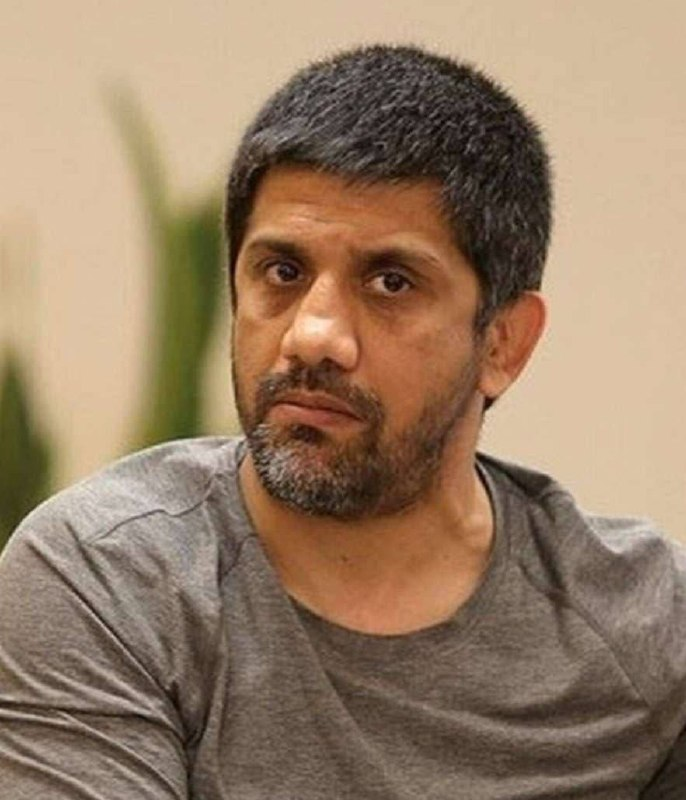

🔴 علیرضا دبیر :

بمولا تو جنگ بالای ۱۰۰ تا موشک‌ زدن سمت من ولی من هیچیم‌ نشد ، آرزوم‌ بود شهید شم ولی خب سالم‌ موندم

@IranianMinds

## IranianMinds — post 20011

  <a href="telegram/content/IranianMinds_20011_1778604137.mp4" target="_blank">🎬 Download video</a>

🔴 شهبازی مجری صداوسیما در مورد نت 5G افغانستان و سیستم بانک جهانی‌ سوریه:

اگه اینارو میخوایید داشته باشید، برید همون سوریه و افغانستان زندگی کنید!

@IranianMinds

## IranianMinds — post 20010

  

💙 خان وی‌پی‌ان

⚡️ سرعت بالا

🛡 پینگ و پایداری عالی

🔐 مناسب تلگرام، اینستا، یوتیوب، گیم و استریم

💸 قیمت اقتصادی با پلن‌های متنوع

🎁 تست ۵۰ مگ فقط ۷۵ تومن

🛎 کانال:

https://t.me/+qNjExGEJztE2OGI0

🤖 ربات خرید:
@Xan_vpn_bot

## IranianMinds — post 20009

🔴وزیر آموزش و پرورش:

کلاس‌ها تا پایان سال تحصیلی مجازی شده است و امتحانات قرار است از ۹ خرداد برگزار بشود.

@IranianMinds

## IranianMinds — post 20008

🔴وزیر دوم بریتانیا از دولت کی‌ر استارمر استعفاء داد.

@IranianMinds

## IranianMinds — post 20007

🔴سنتکام:

ناو هواپیمابر امریکایی آبراهام لینکلن به عملیات دریایی خود در دریای عرب ادامه می‌دهد که این عملیات شامل محاصره دریایی ایران نیز می‌شود.

@IranianMinds

## IranianMinds — post 20006

  <a href="telegram/content/IranianMinds_20006_1778604140.mp4" target="_blank">🎬 Download video</a>

🔴چندتا از بستگان موشعلی خامنه‌ای در بیمارستان هند دیده شده‌اند.

@IranianMinds

## IranianMinds — post 20005

  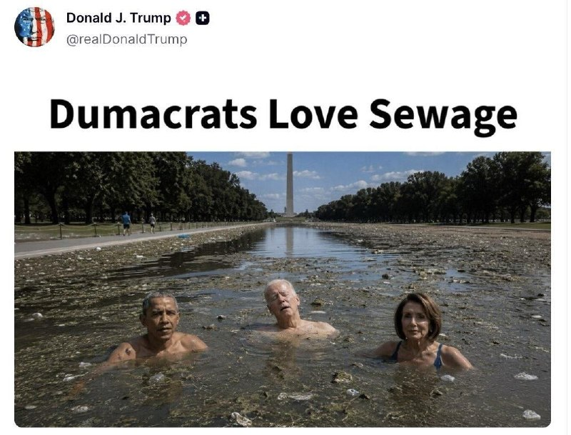

🔴پست ترامپ:
دموکرات‌ها عاشق فاضلاب هستند.

@IranianMinds

## IranianMinds — post 20004

  <a href="telegram/content/IranianMinds_20004_1778604142.mp4" target="_blank">🎬 Download video</a>

🔴دختر طهرانی مقدم: همسرم باور نمی‌کرد یک فرمانده ارشد نظامی اینقدر در خانه لطیف و عاطفی باشد.

ناباوری همسرش بی‌جا نبوده، دلیلش هم اینه که بیرون از خانه وحشی، خونخوار و قاتل هستن.

@IranianMinds

## IranianMinds — post 20003

🔴 اژه‌ای:
داستان اینترنت پرو و سیمکارت سفید باعث خشم مردم شده و باید با موارد خلاف قانون در این موضوع برخورد بشه.

@IranianMinds

## IranianMinds — post 20002

🔴 اسرائیل هیوم:

هزاران اسرائیلی پیام‌های تهدیدآمیز از هکرهای وابسته به ج‌آ دریافت کردن که از شهروندان خواسته شده با جمهوری اسلامی همکاری اطلاعاتی کنند.

@IranianMinds

## IranianMinds — post 20001

🔴سپاه اصفهان:

امروز از ساعت ۱۵ تا ۱۸ در محدوده زردنجان، احتمال شنیده شدن صدای انفجار هست که کنترل شده هست.

@IranianMinds

## IranianMinds — post 20000

  

🔴علی خضریان نمایند مجلس، خیلی شیک و مجلسی یه پتروشیمی بسیار مهم کشور را رو کرد.

@IranianMinds

## IranianMinds — post 19999

🔴اسماعیل بقایی، سخنگوی وزارت امور خارجه:

اول باید داستان تنگه هرمز و پایان جنگ مشخص بشود تا راهی برای مذاکره در مورد انرژی هسته‌ای هم به وجود بیاید.

@IranianMinds

## IranianMinds — post 19998

🔴حریم هوای عراق کلیر شد.

@IranianMinds

## IranianMinds — post 19997

🔴۷۴مین روز چال نشدن علی خامنه‌ای ملقب به موش‌علی.
حسن خرس‌الله هم ۱۴۹ روز چال نشده بود

@IranianMinds

## IranianMinds — post 19996

🔴بحرین:

سه نفر به اتهام جاسوسی برای سپاه پاسدارن ایران، به حبس ابد محکوم شدند.

@IranianMinds

## BBCPersian — post 280858

  

🔻بحران در دولت بریتانیا با استعفای سه عضو پایین‌رتبه کابینه امروز ادامه یافت.

بیش از ۸۴ نماینده حزب کارگر در پارلمان از کی‌یر استارمر خواسته‌اند که برای کناره‌گیری از نخست‌وزیری یک جدول زمانی اعلام کند.

پس از آنکه دیروز آقای استارمر گفت که اشتباهات را می‌پذیرد اما به کارش ادامه می‌دهد، بعضی از اعضای دولت از او حمایت کردند و گفتند اکنون زمان مناسبی برای به چالش کشیدن او به‌عنوان رهبر حزب نیست اما شمار فزاینده‌ای هم می‌گویند که کار دولت با ادامه نخست‌وزیری آقای استارمر ممکن نیست.

گمانه‌زنی‌ها درباره آینده سیاسی نخست‌وزیر بریتانیا از زمان انتخابات محلی پنجشنبه (۷ مه) شدت گرفته است؛ انتخاباتی که حزب کارگر، به رهبری کی‌یر استارمر، نزدیک به ۱۵۰۰ کرسی شوراهای محلی در انگلستان را از دست داد، در اسکاتلند هم عقب‌تر نشست، در ولز نیز پس از ۲۷ سال در صدر، به رتبه سوم سقوط کرد.

این شکست سنگین انتخاباتی باعث شد تعدادی از نمایندگان حزب کارگر خواستار کناره‌گیری یا تعیین زمانی برای آن شوند. برای به چالش کشیدن رهبر حزب، رای ۸۱ نماینده حزب کارگر لازم است.

مطلب کامل:
https://bbc.in/3Po91FI
📷Getty Images
@BBCPersian

## BBCPersian — post 280857

  <a href="https://t.me/bbcpersian/280857" target="_blank">📎 Download file</a>

کِلسی داونپورت: ایران تا سلاح اتمی، فقط یک تصمیم سیاسی فاصله دارد_ گفت‌وگوی ویژه
کِلسی داونپورت، از چهره‌های شناخته‌شده در حوزهٔ منع گسترش سلاح‌های هسته‌ای و مدیر سیاست‌گذاری عدم‌اشاعه در انجمن کنترل تسلیحات در آمریکا، یکی از دقیق‌ترین و صریح‌ترین تحلیلگران دربارهٔ برنامه هسته‌ای ایران است. او سال‌هاست تحولات مربوط به ایران، آمریکا و آژانس بین‌المللی انرژی اتمی را دنبال می‌کند و از منتقدان جدی سیاست‌های دولت ترامپ در این پرونده است.
در گفت‌وگویی با فرناز قاضی‌زاده، خانم داونپورت با جزئیات توضیح می‌دهد که چرا حملات اخیر به تأسیسات هسته‌ای ایران نه‌تنها این برنامه را نابود نکرده، بلکه ممکن است انگیزهٔ سیاسی ایران برای حرکت به سمت سلاح را افزایش داده باشد. او می‌گوید تا زمانی که ذخایر اورانیوم غنی‌شدهٔ ایران باقی است و آژانس دسترسی لازم برای بررسی این برنامه را ندارد، در صورت تصمیم سیاسی برای ساخت سلاح، ایران از دانش و امکانات لازم برخوردار است.
@BBCPersian

## BBCPersian — post 280853

  

🔻پنتاگون روز سه‌شنبه اعلام کرد که جدیدترین ارزیابی از هزینه جنگ با ایران حدود ۲۹ میلیارد دلار است.

این آمار جدید که در جلسه استماع بودجه در کنگره اعلام شد، حدود ۴ میلیارد دلار بیشتر از تخمینی است که پیت هگست، وزیر دفاع آمریکا، حدود دو هفته پیش ارائه کرده بود.

پیت هگست، وزیر دفاع و ژنرال دن کین، رئیس ستاد مشترک ارتش آمریکا، در حال شهادت دادن در مورد درخواست بودجه یک و نیم تریلیون دلاری برای سال ۲۰۲۷ میلادی بودند که از آنها خواسته شد تا در مورد هزینه جنگ با ایران هم توضیحاتی ارائه دهند.

جولز هرست، رئیس امور مالی پنتاگون هم که در این جلسه حضور داشت با اشاره به تخمین وزیر دفاع این کشور در ۲۹ آوریل در کنگره گفت: «در زمان شهادت... این مبلغ ۲۵ میلیارد دلار بود.»

او همچنین گفت: «اما تیم مشترک کارکنان و حسابرسی دائما تخمین‌ها را زیر نظر دارند و اکنون فکر می‌کنیم که این مبلغ به ۲۹ میلیارد دلار نزدیک‌تر است.»

📷Getty Images
@BBCPersian

## BBCPersian — post 280852

🔻رزمایش اعلام نشده سپاه در تهران

سپاه پاسداران یک همایش اعلام نشده به نام «قائد شهید» در تهران بزرگ برگزار کرد.

به گزارش رسانه‌های ایران، این رزمایش برای «تمرین سناریوهای مقابله با دشمن و ارزیابی تاکتیک‌های رزمی» در سطح سپاه محمد رسول الله تهران بزرگ برگزار شد.

سرتیپ حسن حسن‌زاده، فرمانده این سپاه گفت در این رزمایش برای «ارتقای توان رزمی برای مقابله با هرگونه تحرک دشمن» همه «تاکتیک‌ها و تکنیک‌های تیمی و فردی با موفقیت» تمرین شد.

سپاه محمد رسول‌الله تهران بزرگ که گفته می‌شود بزرگترین یگان نظامی امنیتی سپاه است مسئولیت امنیت شهر تهران را به عهده دارد. مسئولیت امنیت استان تهران جز تهران بزرگ با سپاه سیدالشهداست.

https://bbc.in/4drNww2
@BBCPersian

## BBCPersian — post 280851

  <a href="https://t.me/bbcpersian/280851" target="_blank">📎 Download file</a>

پادکست برنامه شصت دقیقه سه‌شنبه ۲۲ اردیبهشت ۱۴۰۵
این نسخه رادیویی برنامه شصت دقیقه تلویزیون فارسی بی‌بی‌سی است که هرشب بعد از پخش، با حجم کم از اپلیکیشن‌های پادگیر و صفحه تلگرام بی‌بی‌سی فارسی در دسترس است.
در تلگرام بی‌بی‌سی فارسی می‌توانید با هشتگ #BBCPersianRadio با ما در ارتباط باشید.

پیامگیر تلگرام بی‌بی‌سی فارسی:
@BBCShoma

## BBCPersian — post 280850

  

🔻دولت جمهوری اسلامی می‌گوید از ایالات متحده به دیوان داوری ایران و آمریکا، مستقر در لاهه هلند، شکایت کرده است.

به گزارش خبرگزاری‌های ایران، این شکایت دولت آمریکا را به نقض مفاد بیانیه‌های الجزایر متهم کرده است؛ توافقی که در دی ۱۳۵۹ با میانجی‌گری الجزایر حاصل شد و به بحران گروگان‌گیری دیپلمات‌های آمریکایی در ایران پایان داد.

«جنگ ۱۲ روزه، حملاتی که از ۹ اسفند (۲۸ فوریه) آغاز شد و همچنین تحریم‌های اقتصادی ایالات متحده» از جمله شکایت‌های ایران هستند.

بر اساس عهدنامه الجزایر آمریکا متعهد شده در امور داخلی، سیاسی و نظامی مستقیم یا غیرمستقیم ایران دخالت نکند.

در حال حاضر، دو شکایت دیگر ایران از آمریکا در دیوان دادگستری بین‌المللی در جریان است که یکی مربوط به خروج آمریکا از توافق هسته‌ای موسوم به برجام و دیگری درباره مصادره نزدیک به دو میلیارد دلار از اموال بانک مرکزی ایران است.

📷Getty Images
@BBCPersian

## BBCPersian — post 280849

  <a href="telegram/content/BBCPersian_280849_1778604148.mp4" target="_blank">🎬 Download video</a>

🔻سرخط خبرهای سه‌شنبه ۲۲ اردیبهشت ۱۴۰۵
@BBCPersian

## BBCPersian — post 280848

🔻نیروی دریایی سپاه: محدوده تنگه هرمز را از ۲۰ مایل، به بیش از ۲۰۰ مایل گسترش دادیم

معاون سیاسی نیروی دریایی سپاه پاسداران می‌گوید که ایران پس از جنگ اخیر با آمریکا و اسرائیل، محدوده تنگه هرمز را «به‌طور قابل‌توجهی» گسترش داده است.

محمد اکبرزاده به تلویزیون ایران گفت که این محدوده اکنون «از سواحل جاسک و سیری تا فراتر از جزایر تنب بزرگ، به‌عنوان یک پهنه راهبردی تعریف شده است؛ به‌عبارت دیگر، تنگه هرمز بزرگ‌تر شده و به یک منطقه وسیع عملیاتی تبدیل شده است.»

به گفته معاون سیاسی نیروی دریایی سپاه، محدوده تنگه هرمز از نظر وسعت «از ۲۰ الی ۳۰ مایل در گذشته به بیش از ۲۰۰ الی ۳۰۰ مایل، یعنی ۵۰۰ کیلومتر» گسترش پیدا کرده است.

محمد اکبرزاده گفت: «در یکی از موارد اخیر، یک ناوچه آمریکایی قصد عبور از این محدوده را داشت که با رصد دقیق نیروهای مسلح مواجه شد و پس از مشاهده برخی رفتارهای تحریک‌آمیز، نیروی دریایی ارتش با شلیک‌های هشداردهنده و هدفمند، پیام لازم را منتقل کرد و این شناور نیز بلافاصله مسیر خود را تغییر داد.»

https://bbc.in/4drNww2
@BBCPersian

## BBCPersian — post 280847

  <a href="telegram/content/BBCPersian_280847_1778604151.mp4" target="_blank">🎬 Download video</a>

🔻‌در جریان اجلاس «آفریقا فوروارد» که روز دوشنبه ۱۱ مه ۲۰۲۶ در نایروبی کنیا برگزار شد، امانوئل مکرون، رئیس‌جمهور فرانسه، با قطع کردن صحبت‌های سخنران از حاضران خواست سکوت کرده و سر و صدا نکنند .

او با اشاره به «غیرممکن» شدن شنیدن صحبتهای سخنرانان به حاضران گفت: «این کاملا بی‌احترامی است.»

اجلاس «آفریقا فوروارد» نشستی است که بیش از ۳۰ رهبر آفریقایی، مدیران تجاری و کارآفرینان جوان را گرد هم آورده است.

فرانسه در تلاش است روابط خود را با کشورهای این قاره تقویت کند.

@‌‌BBCPersian

## BBCPersian — post 280846

در نشست خبری روز ۲۲ اردیبهشت فاطمه مهاجرانی، سخنگوی دولت، بر سر اینترنت پرو و شرایط واگذاری آن بگو مگویی بین او و خبرنگاران پیش آمد.

خانم مهاجرانی گفت اینترنت پرو مصوبه شورای عالی امنیت ملی را دارد که رئیس‌جمهور رئیس آن است. او با تاکید بر اینکه اینترنت پرو ویژه کسب و کارهاست، در ادامه گفت وقتی سایه جنگ از کشور رفع شد به حالت عادی برمی‌گردد.

در ادامه خبرنگاران سوال‌های متعددی پرسیدند که در ویدیو به درستی شنیده نمی‌شود و سخنگوی دولت گفت کشور در جنگ است و ویژگی جنگ امنیت مردم است.

او در ادامه گفت اینترنت حق مردم و یکی از حقوق شهروندی است و خشم مردم به حق است اما بدانند «عامل این خشم دشمنانی هستند که باعث می‌شوند امنیت ما مخدوش شود.»

همزمان وزیر ارتباطات در گفتگویی که با خبرنگاران داشت اعلام کرد در واگذاری اینترنت پرو تخلف‌هایی صورت گرفته که در حال بررسی است و قوه قضائیه هم ورود کرده است.

غلامحسین محسنی اژه‌ای، رئیس قوه قضائیه هم درباره اینترنت پرو و واگذاری آن گفت: اگر موضوع درستی است باید آن را تبیین کرد و اگر تخلف هست باید برخورد شود. نباید مسائل را مبهم رها کرد.
@BBCPersian

## BBCPersian — post 280845

🔻کویت: چهار نفوذی وابسته به سپاه پاسداران را دستگیر کردیم

وزارت کشور کویت می‌گوید که «چهار نفوذی وابسته به سپاه پاسداران» را حین تلاش برای ورود به کشور از طریق دریا بازداشت کرده است.

خبرگزاری دولتی کونا به نقل از این وزارتخانه گزارش داده است که یک نفر از نیروهای مسلح کویت در درگیری با این چهار نفر مجروح شده است.

بر اساس بیانیه وزارت کشور کویت، دستگیرشدگان دو سرهنگ، یک سروان و یک ستوان نیروی دریایی سپاه بوده‌اند که «اذعان» کرده‌اند ماموریت داشتند به جزیره بوبیان «نفوذ» کنند.

در این بیانیه آمده است که این چهار نفر در اول ماه مه (۱۱ روز پیش) سعی کردند «سوار بر یک قایق ماهیگیری که مخصوص انجام اقدامات خصمانه علیه کویت تدارک داده شده بود» وارد کویت شوند.

بوبیان بزرگترین جزیره کویت است و با سواحل ایران و عراق فاصله کمی دارد.

رسانه‌های ایران در زمان جنگ گفتند که پس از حمله ایران به پایگاه آمریکا در کویت، نظامیان آمریکا در جزیره بوبیان مستقر شدند.

https://bbc.in/4drNww2
@BBCPersian

## BBCPersian — post 280837

🖊میشل رابرتس
دبیر سلامت دیجیتال

مسافران کشتی تفریحی که دچار شیوع ویروس هانتا شده، در حال تخلیه و اعزام به کشورهای خود هستند تا در صورت لزوم خود را قرنطینه کنند و تحت درمان پزشکی قرار بگیرند.

برخی دیگر از مسافران کشتی ام‌وی هوندیوس با پروازها یا مسیرهای ارتباطی قبلی، کشتی را ترک کرده‌اند و اکنون برای احتیاط، افرادی که با آن‌ها در تماس بوده‌اند در حال شناسایی هستند.

مقام‌ها می‌گویند خطر گسترش این عفونت به عموم مردم همچنان پایین است.

خدمه و مسافران اکنون باید برای جلوگیری از هرگونه گسترش احتمالی این بیماری، بیش از یک ماه خود را قرنطینه کنند.

سه نفر یا در خود کشتی یا پس از سفر با آن، جان باختند. این کشتی‌ یک ماه پیش از آرژانتین حرکت کرده بود. چهار نفر دیگر نیز برای درمان، به شکل اورژانسی از کشتی خارج شدند.

با این وصف ما باید چقدر نگران باشیم؟
ادامه مطلب در لینک زیر:

https://bbc.in/4dgH0Ie
📸GettyImages/ Reuters/ Anadolu
via Getty Images/ EPA/ LightRocket via Getty Images/ AFP via Getty
Images
@BBCPersian

## BBCPersian — post 280836

🔻فیدان در قطر: از تنگه هرمز نباید به‌عنوان سلاح استفاده شود

وزیر خارجه ترکیه که به قطر سفر کرده است، می‌گوید آنکارا از تلاش‌ها برای باز کردن تنگه هرمز حمایت می‌کند.

هاکان فیدان در کنفرانس خبری مشترک با همتای قطری خود در دوحه در عین حال گفت که از تنگه هرمز نباید به‌عنوان «سلاح» استفاده شود.

محمد بن عبدالرحمن آل ثانی، نخست‌وزیر و وزیر خارجه قطر، هم گفت که ایران نباید از تنگه هرمز به‌عنوان ابزاری برای اعمال فشار یا «باج‌گیری» از کشورهای منطقه خلیج فارس استفاده کند.

وزیر خارجه قطر همچنین گفت که سفر اخیرش به آمریکا برای کمک به پایان دادن جنگ با ایران بوده است.

@BBCPersian

## Dirty_Kids — post 389330

  <a href="telegram/content/Dirty_Kids_389330_1778604153.mp4" target="_blank">🎬 Download video</a>

تراپی

اگر از تماشای آن لذت بردید، آن را برای دوستانتان ارسال کنید تا آنها نیز از آن لذت ببرند. 😃♥️

@Dirty_Kids 👻

## Dirty_Kids — post 389329

  <a href="telegram/content/Dirty_Kids_389329_1778604154.mp4" target="_blank">🎬 Download video</a>

هر جا هستی خواستم بگم دمت گرم ، اینجا‌ عرزشی میسوزونیم‌‌😂✌️

@Dirty_Kids 👻

## Dirty_Kids — post 389328

✖️ سایت بین المللی bet120x 
✖️  
👍دارای مجوز رسمی Gambling Judge سوئد
👍       
💳شارژ حساب از طریق ارز و یووچر و پرمیوم ووچر 
💳تسویه حساب دلاری سریع 💊بیمه شرط میکس 
⚠️فروش شرط 
🔔ویرایش شرط                    
3️⃣
2️⃣ 
🎁20%هدیه واریز از طریق ارز و ووچر ┅━━━━━━━━━━━…

## Dirty_Kids — post 389327

  

✖️ سایت بین المللی bet120x 
✖️

 
👍دارای مجوز رسمی Gambling Judge سوئد
👍
     

💳شارژ حساب از طریق ارز و یووچر و پرمیوم ووچر

💳تسویه حساب دلاری سریع
💊بیمه شرط میکس

⚠️فروش شرط

🔔ویرایش شرط                    
3️⃣
2️⃣

🎁20%هدیه واریز از طریق ارز و ووچر
┅━━━━━━━━━━━

🎁 10%برگشت باخت به صورت روزانه

🎁 10%برگشت باخت به صورت هفتگی

🎁10%برگشت باخت به صورت ماهانه

💻ادرس ورود به سایت:
https://bet120x.com/fa/?btag=971470
➖➖➖➖➖
   
👈 آموزش واریز و برداشت دلاری
👉

🔪کانال اطلاع رسانی:
👇

✈️https://t.me/+1Wv5nGY_a54xNzlk

## Dirty_Kids — post 389326

  

پلن نتانیاهو برای احمد وحیدی:

@Dirty_Kids 👻

## Dirty_Kids — post 389324

یه سر تیز رفتم اینستاگرام و واقعا ارزششو داشت جیغ میزنم از میزان جذابیت دو عزیز

@Dirty_Kids 👻

## Dirty_Kids — post 389323

‏این bdsm و این کسشرا چیه یاد گرفتین دختر مردمو می‌بندین به داربست کتک متک میزنین، کسخلید؟
بیفت پاهاشو بوس کن بگو خدیاشکرت، موجود به اون نازی و لطیفی.

@Dirty_Kids 👻

## Dirty_Kids — post 389322

  

بی‌بی‌سی اینارو از کجا پیدا میکنه؟

@Dirty_Kids 👻

## Dirty_Kids — post 389321

  

🌪وقتی اینترنت طوفانیه... کافیه بادبان ها رو بکشی تا

⚫️با بالاترین کیفیت ممکن
⚡️ 

⚫️100 هزار تومان شارژ هدیه 
🎁

⚫️پایین ترین قیمت گیگی 250
🌐 

⚫️و ارائه پورسانت %10 در ازای هر معرفی
💼

بتونی یه اتصال پایدار با پشتیبانی 24 ساعته داشته باشی
🚀

بادبان راهتو باز می‌کنه
⛵️

🛡@BadBan_VPN | کانال 

🤖@BadBan_VPNBot | ربات 

📞@BadBan_VPNSupport | پشتیبانی

## Dirty_Kids — post 389320

  <a href="telegram/content/Dirty_Kids_389320_1778604158.mp4" target="_blank">🎬 Download video</a>

لامین یامال بازیکن بی اخلاق و خانم‌باز بارسا توی جشن قهرمانی بارسلونا پرچم فلسطین را برافراشته. + این در جریان ۱ ماه دیگه باید بره امریکا لای کلی ایرانی؟ @Dirty_Kids 👻

## Dirty_Kids — post 389319

  

قل أعوذ برب الناس
آدم خارکسه از دور پیداس!

@Dirty_Kids 👻

## Dirty_Kids — post 389318

  <a href="telegram/content/Dirty_Kids_389318_1778604159.mp4" target="_blank">🎬 Download video</a>

یه قشری هم هستن توی اینستا این شکلی دارن با وصل بودنشون پز میدن.

@Dirty_Kids 👻

## Dirty_Kids — post 389317

  <a href="telegram/content/Dirty_Kids_389317_1778604161.mp4" target="_blank">🎬 Download video</a>

ابداع عبارت جدید برای توصیف شرایط فعلی لازم بود ! 😆✋

@Dirty_Kids 👻

## Dirty_Kids — post 389316

  <a href="telegram/content/Dirty_Kids_389316_1778604162.mp4" target="_blank">🎬 Download video</a>

کلیپ چقدر عرزشیا رو سوزونده

@Dirty_Kids 👻

## Dirty_Kids — post 389315

اسراییل تو خاک عراق پایگاه مخفی زده
باند فرودگاه ساخته
ارتش آورده
ماشین آلات و‌ تجهیزات آورده
چند سال اونجا فعالیت کرده

پارسال به خاطر بارندگی‌ محبور شده پایگاه مخفی رو رها کنه

تازه امسال فهمیدن 😂😂😂

همینجوری روز عاشورا شکست خودناااا

@Dirty_Kids 👻

## Dirty_Kids — post 389313

شیر بازیگوش و AIبه‌باسن با انتشار هفت هشتا از این تصاویر در تروث سوشال دوباره شروع کرد.

صبور باشید و پنیک نکنید.

@Dirty_Kids 👻

## Dirty_Kids — post 389312

  <a href="telegram/content/Dirty_Kids_389312_1778604164.mp4" target="_blank">🎬 Download video</a>

واکنش شهبازی (اسکل نظام) به وضعیت اینترنت مردم ایران و کشورهای منطقه:

اگه خیلی این چیزها مهمه، برید همون افغانستان و سوریه زندگی کنید! هاهاهاها

+ هاهاها و ک...خر

@Dirty_Kids 👻

## Dirty_Kids — post 389311

  <a href="telegram/content/Dirty_Kids_389311_1778604166.mp4" target="_blank">🎬 Download video</a>

ایده خوب 👌
برسه به دست تیشرت‌فروشی جاجرود

@Dirty_Kids 👻

## Hranews — post 112910

  

معاون توسعه کارآفرینی و اشتغال وزیر کار، اعلام کرد که #قطع_اینترنت و توقف فروش اینترنتی، مهم‌ترین مشکل مشاغل خانگی در ماه‌های اخیر بوده است. مالک حسینی، در نشست روز ملی مشاغل خانگی گفت که همزمان با محدودیت‌های اینترنتی و توقف نمایشگاه‌های فصلی، بسیاری از فعالان این حوزه امکان فروش محصولات خود را از دست داده‌اند. وی با اشاره به اینکه حدود ۸۰٪ مشاغل خانگی را زنان تشکیل می‌دهند، اظهار داشت که بخش عمده این افراد از خانوارهای کم‌درآمد هستند.

صبح امروز، نت‌بلاکس، نهاد ناظر بر اختلالات #اینترنت در جهان، اعلام کرد که قطع گسترده اینترنت در ایران وارد هفتاد و چهارمین روز خود شده و از مرز ۱۷۵۲ ساعت گذشته است.

↘️
@hranews_bot تماس ✉️ - @Hranews کانال هرانا 🆑

## Hranews — post 112909

  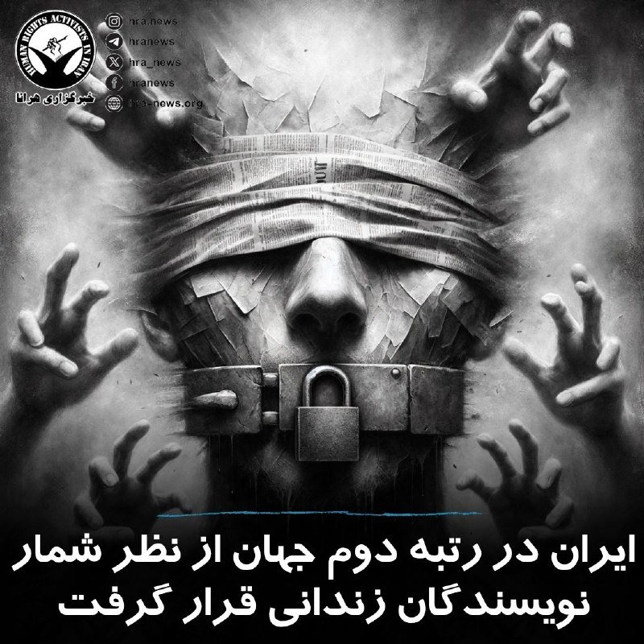

انجمن قلم (پن) آمریکا در گزارش سالانه «شاخص آزادی نوشتن» اعلام کرده است که ایران با ۵۳ نویسنده زندانی، پس از چین در رتبه دوم جهان از نظر شمار #نویسندگان در بند قرار گرفته است. بر اساس این گزارش، طی سال گذشته شدیدترین موج بازداشت نویسندگان در ایران ثبت شده و با ۱۷ مورد بازداشت جدید، شمار نویسندگان زندانی بار دیگر به سطح دوران اعتراض‌های «زن، زندگی، آزادی» در سال ۱۴۰۱ نزدیک شده است. این گزارش همچنین به تشدید سرکوب‌ها در ایران پس از جنگ ۱۲ روزه میان ایران و اسرائیل اشاره دارد و آن را عامل گسترش فضای امنیتی در کشور دانسته است.

کارین دویچ کارلکار، مدیر برنامه «نویسندگان در معرض خطر» در انجمن قلم، در این رابطه گفته است: «مقام‌های جمهوری اسلامی ایران به‌دلیل کارزار بی‌رحمانه‌شان علیه صداهای مستقل بیش از همه جلب توجه می‌کنند. شاعران، مترجمان، پژوهشگران، ترانه‌سرایان، دیدگاه‌نویسان، مدافعان حقوق بشر و ستون‌نویسان همگی در زندان‌های ایران گرفتار می‌شوند، در حالی که حکومت تلاش دارد بحث، انتقاد و مخالفت را خاموش کند.»

↘️
@hranews_bot تماس ✉️ - @Hranews کانال هرانا 🆑

## Hranews — post 112908

  

عدم رسیدگی پزشکی؛ گزارش جدید از وضعیت محشر پرندین، نوکیش مسیحی در زندان اوین

❗️
❗️
❗️
❗️
❗️– محشر (محترم) پرندین، نوکیش مسیحی محبوس در زندان اوین، با وجود ابتلا به بیماری قلبی و همچنین دو تومور در ناحیه زیر گلو و مجاورت مخچه، از رسیدگی تخصصی پزشکی و اعزام به مراکز درمانی خارج از زندان محروم مانده است.

به گزارش خبرگزاری هرانا، ارگان خبری مجموعه فعالان حقوق بشر در ایران، محشر (محترم) پرندین، نوکیش مسیحی محبوس در #زندان_اوین از رسیدگی درمانی محروم مانده است.

یک منبع مطلع از وضعیت جسمانی این نوکیش مسیحی، ضمن تایید این خبر به هرانا گفت: “محشر پرندین از بیماری حاد قلبی و همچنین دو تومور در ناحیه زیر گلو و مجاورت مخچه رنج می‌برد. بنا بر تشخیص پزشک زندان، وضعیت جسمی وی نگران‌کننده بوده و این تومورها نیازمند جراحی فوری هستند. با این حال، وی تاکنون از اعزام به مراکز درمانی تخصصی محروم مانده است.”
به گفته یک منبع مطلع، تومور قرارگرفته در مجاورت مخچه بر وضعیت جسمانی خانم پرندین اثر گذاشته و موجب اختلال در تعادل، حرکت و تکلم او شده است؛ به‌طوری که گفتار وی با مکث‌های محسوس همراه است.

ادامه مطلب

#محشر_پرندین
#محترم_پرندین

↘️
@hranews_bot تماس ✉️ -  @Hranews  کانال هرانا 🆑

## Hranews — post 112907

  

💥 دعوت به همکاری با خبرگزاری هرانا

خبرگزاری هرانا، با بیش از دو دهه سابقه در حوزه گزارشگری و مستندسازی حقوق بشر، در راستای توسعه فعالیت‌های خود از علاقه‌مندان واجد شرایط برای همکاری دعوت می‌کند.

هرانا در این مرحله بیش از آن‌که به دنبال افراد با سابقه حرفه‌ای باشد، به دنبال افرادی متعهد، دقیق و آموزش‌پذیر است؛ کسانی که دغدغه واقعی حقوق بشر دارند و مایل‌اند در یک چارچوب حرفه‌ای، مهارت‌های خود را توسعه دهند.

زمینه‌های همکاری شامل:
گزارشگری، ویراستاری، ترجمه، مدیریت شبکه‌های اجتماعی و سایر حوزه‌های مرتبط

ویژگی‌های مورد انتظار:

* تسلط کافی به زبان فارسی (خواندن و نوشتن)
* دقت، مسئولیت‌پذیری و توانایی یادگیری مستمر
* علاقه و حساسیت نسبت به موضوعات حقوق بشر
* آمادگی برای فعالیت در چارچوب‌های سازمان‌یافته و حرفه‌ای

❗️ توجه: این فرصت همکاری فقط شامل کسانی است که به زبان فارسی مسلط و ساکن یکی از کشورهای "ترکیه، قبرس شمالی، هندوستان، مصر، قرقیزستان، ازبکستان، کلمبیا، پاراگوئه، قزاقستان، سریلانکا، بلغارستان و رومانی" هستند.

همکاری با هرانا فرصتی است برای کسب تجربه عملی در حوزه مستندسازی و فعالیت‌های حقوق بشری در یک نهاد با سابقه و ساختار حرفه‌ای.

📎 برای ثبت درخواست همکاری، لطفا فرم زیر را تکمیل کنید:
https://hra.news/4cBjHqs

📩 در صورت بروز مشکل در تکمیل فرم، می‌توانید رزومه و اطلاعات تماس خود را به آدرس زیر ارسال نمایید:
info@hra-news.org

↘️
@hranews_bot تماس ✉️ -  @Hranews  کانال هرانا 🆑

## Hranews — post 112906

یک شهروند توسط نیروهای اداره اطلاعات در ازنا بازداشت شد

❗️
❗️
❗️
❗️
❗️– یک شهروند در شهرستان ازنا به دلیل آنچه ارتباط و همکاری با یکی از گروه‌های مخالف نظام عنوان شده است، توسط نیروهای اداره اطلاعات #بازداشت شد.

ادامه مطلب

↘️
@hranews_bot تماس ✉️ -  @Hranews  کانال هرانا 🆑

## Hranews — post 112905

  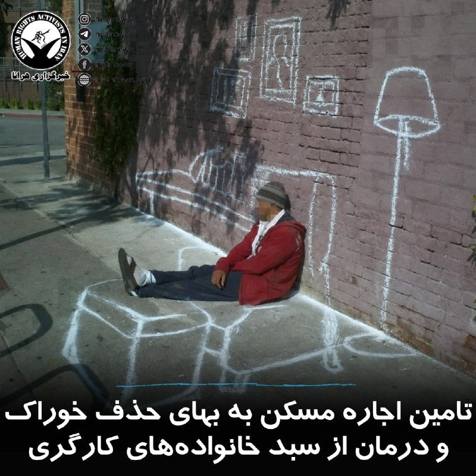

افزایش هزینه مسکن و اجاره‌بها، فشار معیشتی بر خانوارهای کارگری را تشدید کرده و سهم مسکن را به بخش عمده سبد هزینه خانواده‌ها در برخی کلان‌شهرها رسانده است. خبرگزاری ایلنا با انتشار گزارشی در این رابطه، به پیامدهای رشد #تورم، افزایش هزینه ساخت‌وساز و کاهش قدرت خرید پرداخته است. بر اساس این گزارش، بسیاری از خانواده‌ها ناچار شده‌اند برای تامین هزینه سرپناه، از مخارج ضروری مانند خوراک، درمان و آموزش بکاهند.

کارشناسان اقتصادی همچنین از گسترش فقر مسکن، افزایش جابه‌جایی اجباری مستاجران به مناطق پایین‌تر و تشدید فشار بر خانوارهای کم‌درآمد خبر می‌دهند. به گفته آنان، ادامه رکود اقتصادی و #بیکاری، در کنار ناکارآمدی سیاست‌های حمایتی دولت، موجب شده بخش قابل توجهی از مستاجران با دشواری بیشتری در تامین هزینه‌های زندگی روبه‌رو شوند.

↘️
@hranews_bot تماس ✉️ - @Hranews کانال هرانا 🆑

## Hranews — post 112904

پخش اعترافات اجباری؛ گزارشی از بازداشت سه شهروند توسط ماموران اطلاعات سپاه

❗️
❗️
❗️
❗️
❗️– سه شهروند در استان کهگیلویه و بویراحمد به دلایلی همچون استفاده از استارلینک برای ارتباط با گروه‌های مخالف نظام و تصویربرداری از اماکن خاص و ارسال تصاویر آن به رسانه‌های خارج از کشور توسط ماموران سازمان اطلاعات سپاه #بازداشت شدند. ویدیویی از اعترافات اجباری این افراد نیز منتشر شده که شرایط ضبط آن مشخص نیست.

ادامه مطلب

↘️
@hranews_bot تماس ✉️ -  @Hranews  کانال هرانا 🆑

## Hranews — post 112903

  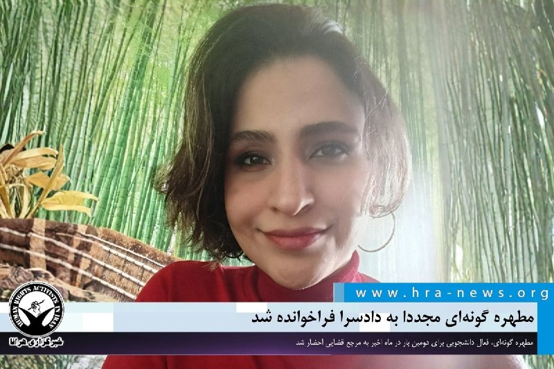

مطهره گونه‌ای مجددا به دادسرا فراخوانده شد

❗️
❗️
❗️
❗️
❗️– مطهره گونه‌ای، فعال دانشجویی، برای دومین بار طی یک ماه اخیر به دادسرای عمومی و انقلاب ناحیه ۳۱ تهران احضار شد.

به گزارش خبرگزاری هرانا، ارگان خبری مجموعه فعالان حقوق بشر در ایران، مطهره گونه‌ای، فعال دانشجویی احضار شد.

وی با انتشار مطلبی در این خصوص نوشت: «امروز احضاریه جدید آمد. این بار، جهت دفاع از اتهام انتسابی نشر اکاذیب باید به دادسرای عمومی و انقلاب ناحیه ۳۱ تهران مراجعه کنم.»

ادامه مطلب

#مطهره_گونه‌ای

↘️
@hranews_bot تماس ✉️ -  @Hranews  کانال هرانا 🆑

## Hranews — post 112902

  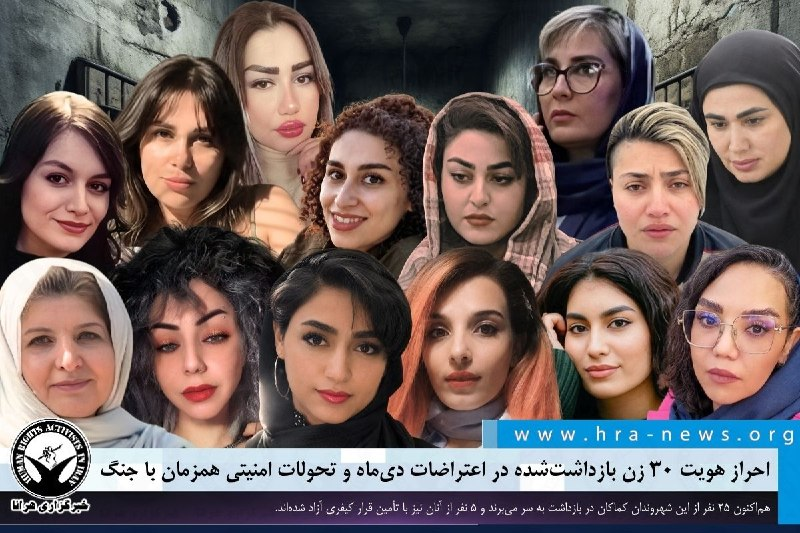

زندان وکیل‌آباد؛ احراز هویت ۳۰ زن بازداشت‌شده در اعتراضات و تحولات امنیتی همزمان با جنگ

❗️
❗️
❗️
❗️
❗️– دست‌کم ۳۰ زن در جریان اعتراضات دی‌ماه ۱۴۰۴ و همچنین تحولات امنیتی همزمان با جنگ، در استان خراسان رضوی بازداشت و به بند «آرامش» و قرنطینه زندان وکیل‌آباد مشهد منتقل شدند. هم‌اکنون ۲۵ نفر از این شهروندان کماکان در این زندان نگهداری می‌شوند و ۵ نفر از آنها نیز با تأمین قرار کیفری آزاد شده‌اند. گزارش پیش رو، به هویت و جزئیات پرونده آنان میپردازد.

به گزارش خبرگزاری هرانا، ارگان خبری مجموعه فعالان حقوق بشر در ایران، هویت ۳۰ زن بازداشت‌شده در استان خراسان رضوی احراز شده است.

بر اساس اطلاعات دریافتی هرانا، این شهروندان در جریان اعتراضات دی‌ماه ۱۴۰۴ و همچنین تحولات امنیتی همزمان با جنگ بازداشت شده‌اند و ۲۵ تن از آنها همچنان در زندان به سر می‌برند. مریم نوری، آرزو دهقان، نادیا صدق‌علی، سهیلا حسینی، نجمه امینی، مهدیه افقهی، حدیثه مرواریدی، فائره صالح‌آبادی، شهرزاد ضمیری، طاهره دهقان، آذر یاهو، آسیه نعیمی، عادله نعیمی، مهسا بهداری، محبوبه شعبانی، مرضیه مشهدی، سیما انبایی، زهرا موسوی، معصومه یعقوبی، فاطمه رضوانی‌فر، سیده زینب موسوی، حدیثه بابازاده، ملیکا خاوری خراسانی، مینا زارعی و ریحانه کفشکنان ۲۵ زندانی هستند که هویتشان توسط هرانا احراز شده و کماکان در زندان وکیل‌آباد مشهد محبوس هستند.
همچنین هویت پنج بازداشتی که اخیراً از این زندان آزاد شده‌اند، سمیرا بیات، نگار فرهمند، فاطمه ارم، نجمه روحند و الناز اقبالی نیز توسط هرانا احراز شده است.

ادامه مطلب

↘️
@hranews_bot تماس ✉️ -  @Hranews  کانال هرانا 🆑

## Hranews — post 112901

  

کیفرخواست پرونده روح الله کرکی صادر شد

❗️
❗️
❗️
❗️
❗️– پرونده روح الله کرکی، شهروند اهل اندیمشک، با صدور کیفرخواست توسط شعبه ۹ دادسرای عمومی و انقلاب اهواز به دادگاه کیفری ۲ این شهرستان ارجاع شد.

به گزارش خبرگزاری هرانا، ارگان خبری مجموعه فعالان حقوق بشر در ایران، کیفرخواست پرونده روح الله کرکی صادر شد.

براساس اطلاعات دریافتی هرانا، پرونده آقای کرکی با صدور کیفرخواست از بابت اتهامات «انتشار و افشای اسناد محرمانه»، «همکاری با سازمان مجاهدین خلق»، «جاسوسی برای اسرائیل و تبادل اطلاعات نظامی و امنیتی»، «توهین به مقدسات و مقامات» و «اقدام علیه امنیت ملی» توسط شعبه ۹ اظهارنظر دادسرای عمومی و انقلاب اهواز صادر و به دادگاه کیفری ۲ این شهرستان ارجاع شده است.

ادامه مطلب

#روح_الله_کرکی

↘️
@hranews_bot تماس ✉️ -  @Hranews  کانال هرانا 🆑

## Hranews — post 112900

  

روز یکشنبه ۲۰ اردیبهشت‌ماه، شماری از اساتید اخراجی دانشگاه فرهنگیان در مقابل ساختمان های سازمان بازرسی کل کشور و وزارت آموزش و پرورش دست به #تجمع اعتراضی زدند.

این اساتید نسبت به اخراج بیش از ۳۰۰ عضو هیئت علمی دانشگاه و قطع حدود ۱۰ ماه از حقوق و مزایای‌شان اعتراض کرده و خواستار رسیدگی به مطالبات خود و عزل رئیس دانشگاه فرهنگیان شدند.

↘️
@hranews_bot تماس ✉️ - @Hranews کانال هرانا 🆑

## Hranews — post 112899

  

عرفان عربی به ۸ سال حبس محکوم شد

❗️
❗️
❗️
❗️
❗️– عرفان عربی، دانشجوی مهندسی کامپیوتر دانشگاه آزاد بیرجند، توسط دادگاه انقلاب به هشت سال حبس محکوم شد. آقای عربی، در بهمن ماه سال گذشته در رابطه با اعتراضات سراسری بازداشت شده بود.

به گزارش خبرگزاری هرانا، ارگان خبری مجموعه فعالان حقوق بشر در ایران، عرفان عربی به حبس محکوم شد.

یک منبع مطلع نزدیک به خانواده این دانشجوی دانشگاه آزاد بیرجند، میزان حبس صادر شده علیه آقای عربی را ۸ سال عنوان کرد. به گفته وی، دادگاه انقلاب حکم مذکور را امروز سه‌شنبه، به صورت شفاهی به عرفان عربی ابلاغ کرده است. با اعمال ماده ۱۳۴ قانون مجازات اسلامی، مجازات اشد یعنی ۵ سال حبس در خصوص وی قابل اجرا خواهد بود.

ادامه مطلب

#عرفان_عربی

↘️
@hranews_bot تماس ✉️ -  @Hranews  کانال هرانا 🆑

## Hranews — post 112898

  

جلسه دادگاه رسیدگی به اتهامات حشمت‌الله طبرزدی برگزار شد

❗️
❗️
❗️
❗️
❗️– جلسه دادگاه رسیدگی به اتهامات حشمت‌الله طبرزدی، زندانی سیاسی محبوس در زندان دستگرد اصفهان، روز شنبه ۱۹ اردیبهشت ماه، در شعبه ۵ دادگاه انقلاب اصفهان برگزار شد.

به گزارش خبرگزاری هرانا، ارگان خبری مجموعه فعالان حقوق بشر در ایران، جلسه دادگاه رسیدگی به اتهامات حشمت‌الله طبرزدی برگزار شد.

روز شنبه ۱۹ اردیبهشت ماه جلسه دادگاه آقای طبرزدی در شعبه ۵ دادگاه انقلاب اصفهان به ریاست قاضی شاهینی برگزار شد. در جریان این جلسه این زندانی سیاسی از بابت اتهامات تبلیغ علیه نظام، توهین به رهبری و تشویش و تحریک به خشونت و کشتار از خود دفاع کرده است.

ادامه مطلب

#حشمت‌الله_طبرزدی

↘️
@hranews_bot تماس ✉️ -  @Hranews  کانال هرانا 🆑

## Hranews — post 112897

  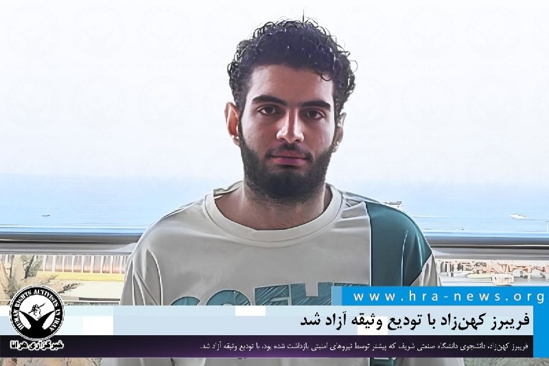

فریبرز کهن‌زاد با تودیع وثیقه آزاد شد

❗️
❗️
❗️
❗️
❗️– فریبرز کهن‌زاد، دانشجوی دانشگاه صنعتی شریف که پیشتر توسط نیروهای امنیتی بازداشت شده بود، روز یکشنبه ۲۰ اردیبهشت‌ماه با تودیع وثیقه آزاد شد.

به گزارش خبرگزاری هرانا، ارگان خبری مجموعه فعالان حقوق بشر در ایران، فریبرز کهن‌زاد آزاد شد.

آزادی آقای کهن‌زاد روز یکشنبه ۲۰ اردیبهشت ۱۴۰۴، با تودیع وثیقه صورت گرفته است.

ادامه مطلب

#فریبرز_کهن‌زاد

↘️
@hranews_bot تماس ✉️ -  @Hranews  کانال هرانا 🆑

## Hranews — post 112896

  

نت‌بلاکس، نهاد ناظر بر اختلالات اینترنت در جهان، اعلام کرد که قطع گسترده اینترنت در ایران وارد هفتاد و چهارمین روز خود شده و اکنون از مرز ۱۷۵۲ ساعت گذشته است. این نهاد تاکید کرده که از زمان آغاز این محدودیت‌ها، دسترسی عمومی شهروندان ایران به #اینترنت جهانی همچنان به‌طور گسترده مسدود مانده است.

نت‌بلاکس همچنین با اشاره به همزمانی این محدودیت‌ها با بازداشت و اعدام شماری از فعالان و متخصصان حوزه فناوری در ایران، نوشته است که در حالی‌ که جهان شاهد پیشرفت‌های علمی و فناوری بوده، حکومت ایران به برخوردهای امنیتی با تکنولوژیست‌ها ادامه داده است.

↘️
@hranews_bot تماس ✉️ - @Hranews کانال هرانا 🆑

## Hranews — post 112895

شهرستان آوج؛ یک جنگلبان توسط متخلف محیط زیستی مصدوم شد

❗️
❗️
❗️
❗️
❗️– یک #جنگلبان در منابع طبیعی شهرستان آوج توسط یک متخلف محیط زیستی مورد ضرب و شتم قرار گرفت و مجروح شد.

ادامه مطلب

↘️
@hranews_bot تماس ✉️ -  @Hranews  کانال هرانا 🆑

## Hranews — post 112894

  

میثم ظهوریان، عضو کمیسیون اقتصادی مجلس اعلام کرد که از ابتدای #جنگ تاکنون، ۲۰۵ هزار نفر برای استفاده از بیمه بیکاری ثبت‌نام کرده‌اند.

↘️
@hranews_bot تماس ✉️ - @Hranews کانال هرانا 🆑

## Hranews — post 112893

  

وزارت امور خارجه استرالیا اعلام کرد که هفت فرد و چهار نهاد مرتبط با جمهوری اسلامی را به دلیل مشارکت در «نقض حقوق بشر در ایران»، از جمله سرکوب زنان و دختران و نقض حقوق شهروندی، #تحریم کرده است.

«اسکندر مومنی، سید مجید فیض جعفری، روح‌الله مومن‌نسب، قربان محمد ولی‌زاده، محسن ابراهیمی، ناصر زرین‌قلم و منصور زرین‌قلم، همچنین فرماندهی انتظامی جمهوری اسلامی ایران (فراجا)، سازمان فضای مجازی سراج، صرافی برلیان و صرافی GCM» از جمله افراد و نهادهایی هستند که به دلیل نقش در #نقض_حقوق_بشر تحریم شده‌اند.

دولت استرالیا برای این افراد و نهادها تحریم‌های مالی و ممنوعیت سفر در نظر گرفته است.

↘️
@hranews_bot تماس ✉️ - @Hranews کانال هرانا 🆑

## manototv — post 105361

  <a href="telegram/content/manototv_105361_1778604179.mp4" target="_blank">🎬 Download video</a>

مقام‌های آمریکایی اعلام کردند نیروهای این کشور مانع عبور یک نفتکش با پرچم جمهوری مالت از تنگه هرمز شده‌اند.
سخنگوی ستاد فرماندهی مرکزی آمریکا سنتکام؛ به الجزیره گفت نفتکش «آگیوس فانوریوس» به‌دلیل نقض محاصره دریایی، اجازه عبور پیدا نکرده است. به گفته او، این کشتی حامل نفت ایران نبوده است.
مقام‌های آمریکایی همچنین اعلام کردند چند نفتکش دیگر نیز به‌دلیل نقض تحریم‌ها و محاصره اعمال‌شده علیه بنادر ایران، متوقف شده‌اند.

## manototv — post 105360

  <a href="telegram/content/manototv_105360_1778604180.mp4" target="_blank">🎬 Download video</a>

«اینترنت را قطع کردند تا صدای مردم خاموش شود.»

## manototv — post 105359

  <a href="telegram/content/manototv_105359_1778604182.mp4" target="_blank">🎬 Download video</a>

شورای همکاری خلیج فارس ورود نیروهایی از سپاه پاسداران به جزیره بوبیان کویت را محکوم کرد.

جاسم البدیوی، دبیرکل شورای همکاری خلیج فارس، گفت: «نفوذ عناصر سپاه پاسداران به جزیره بوبیان کویت و برنامه‌ریزی آن‌ها برای اقدامات خصمانه را محکوم می‌کنیم.»

او همچنین تأکید کرد شورای همکاری خلیج فارس از کویت در همه اقداماتی که برای حفظ امنیت و ثبات خود انجام دهد، حمایت می‌کند.

## manototv — post 105358

  <a href="telegram/content/manototv_105358_1778604182.mp4" target="_blank">🎬 Download video</a>

وزارت خارجه کویت اعلام کرد در پی آنچه «نفوذ» اعضای مسلح وابسته به سپاه پاسداران خوانده شده، سفیر جمهوری‌اسلامی در این کشور را احضار و یادداشت اعتراضی رسمی به او تحویل داده است.
به گفته مقام‌های کویتی، چهار عضو منتسب به سپاه قصد داشتند از راه دریا وارد کویت شوند و «اقدامات خصمانه» انجام دهند. وزارت کشور کویت اعلام کرد در درگیری با نیروهای امنیتی، یک نیروی کویتی زخمی شده و دو نفر از متهمان نیز فرار کرده‌اند.
معاون وزیر خارجه کویت این اقدام را «نقض آشکار حاکمیت کویت» و مغایر با قوانین بین‌المللی و منشور سازمان ملل توصیف کرد و از تهران خواست فوراً چنین اقداماتی را متوقف کند.

## manototv — post 105357

  <a href="telegram/content/manototv_105357_1778604183.mp4" target="_blank">🎬 Download video</a>

تورم در آمریکا افزایش یافته و طبق آمار رسمی اداره آمار کار آمریکا، این افزایش عمدتا به عوامل مرتبط با جنگ ایران مربوط می‌شود.
شاخص قیمت مصرف‌کننده در ماه آوریل به ۳.۸ درصد رسید؛ در حالی‌ که این رقم در ماه مارس ۳.۳ درصد بود. افزایش قیمت بنزین از مهم‌ترین دلایل این رشد اعلام شده است.
این آمار نشان می‌دهد بالا رفتن قیمت نفت، که ناشی از اختلال مؤثر در تردد از تنگه هرمز بوده، باعث افزایش بیشتر قیمت‌ها شده است.
بر اساس این گزارش، افزایش هزینه انرژی و سوخت اصلی‌ترین عامل رشد ۰.۵ واحد درصدی تورم بوده است.
تحلیلگران می‌گویند این وضعیت علاوه بر فشار بر مصرف‌کنندگان آمریکایی و اقتصاد آمریکا، ممکن است یک پیامد سیاسی هم داشته باشد؛ چرا که فشار اقتصادی بر رأی‌دهندگان می‌تواند دونالد ترامپ را به بازگشت به میز مذاکره سوق دهد.

## manototv — post 105356

  <a href="telegram/content/manototv_105356_1778604184.mp4" target="_blank">🎬 Download video</a>

تماسی از ایران؛ «می‌گفت تو این شرایط، به دور و برمون نگاه کنیم و دستِ همدیگه رو بگیریم…
تو هر خانواده و آشنایی یکی هست که بی‌صدا به کمک نیاز داره.»

## manototv — post 105355

  <a href="telegram/content/manototv_105355_1778604186.mp4" target="_blank">🎬 Download video</a>

دونالد ترامپ، رئیس‌جمهور آمریکا، با وجود توقف مذاکرات با جمهوری‌اسلامی، در یک گفتگو، اعلام کرده تهران صددرصد غنی‌سازی اورانیوم و هرگونه تلاش برای ساخت سلاح هسته‌ای را متوقف خواهد کرد.
ترامپ در گفت‌وگو با رادیوی WABC گفت شخصاً با مقام‌های جمهوری‌اسلامی در تماس بوده و افزود: «آن‌ها گفتند ما غبار هسته‌ای را تحویل خواهیم گرفت.»
او همچنین تأکید کرد آمریکا برای رسیدن به توافق عجله‌ای ندارد و گفت: «ما محاصره را در اختیار داریم.»

## manototv — post 105354

  <a href="telegram/content/manototv_105354_1778604186.mp4" target="_blank">🎬 Download video</a>

تماسی از تجربه‌اش با بهزیستی
می‌گفت برای بیمه و تأیید مشکلش هزار تا ایراد گرفتن
اما وقتی پای کمک رسید، گفتن هیچ مشکلی نداری

## manototv — post 105353

  <a href="telegram/content/manototv_105353_1778604188.mp4" target="_blank">🎬 Download video</a>

در جلسه استماع کنگره آمریکا، مقام‌های ارشد پنتاگون اعلام کردند هزینه تسلیحات و تجهیزات مصرف‌شده آمریکا در جنگ با ایران تاکنون به حدود ۲۴ میلیارد دلار رسیده است.
پیت هگست، وزیر دفاع آمریکا، به همراه رئیس ستاد مشترک ارتش و مقام مالی وزارت جنگ در این جلسه حضور داشتند. به گفته جولز هرست، این رقم شامل مهمات، موشک‌ها و سایر تجهیزات نظامی استفاده‌شده در جنگ است.
پنتاگون ماه گذشته نیز اعلام کرده بود مجموع هزینه‌های جنگ با ایران تاکنون به ۲۹ میلیارد دلار رسیده است.

## manototv — post 105352

  <a href="telegram/content/manototv_105352_1778604189.mp4" target="_blank">🎬 Download video</a>

ابراهیم رضایی، سخنگوی کمیسیون امنیت ملی و سیاست خارجی مجلس شورای اسلامی در شبکه اکس تهدید کرده، غنی سازی ۹۰ درصد به عنوان یکی از گزینه‌های جمهوری‌اسلامی در صورت حمله مجدد، بررسی می‌شود.

## manototv — post 105351

  <a href="telegram/content/manototv_105351_1778604190.mp4" target="_blank">🎬 Download video</a>

متاثر از پیچیده‌تر شدن سرنوشت مذاکرات جمهوری‌اسلامی و آمریکا، قیمت جهانی نفت، بیش از ۳ درصد افزایش یافت.
بهای نفت برنت به حدود ۱۰۸ دلار و نفت وست‌تگزاس آمریکا به بیش از ۱۰۱ دلار در هر بشکه رسید. تحلیلگران می‌گویند رد پیشنهادهای دو طرف، نگرانی‌ها درباره اختلال در عرضه نفت را دوباره افزایش داده است.
مدیرعامل آرامکوی عربستان هشدار داد هرگونه اختلال در صادرات نفت از تنگه هرمز می‌تواند بازگشت ثبات به بازار را تا سال ۲۰۲۷ به تعویق بیندازد.
کارشناسان همچنین گفته‌اند در صورت توافق واقعی میان تهران و واشنگتن، قیمت نفت ممکن است ۸ تا ۱۲ دلار کاهش پیدا کند، اما تشدید تنش‌ها می‌تواند قیمت نفت برنت را دوباره به بالای ۱۱۵ دلار برساند.

## manototv — post 105350

  <a href="telegram/content/manototv_105350_1778604191.mp4" target="_blank">🎬 Download video</a>

دونالد ترامپ در پیامی در شبکه اجتماعی تروث سوشال گفت کوبا از آمریکا درخواست کمک کرده و واشینگتن با هاوانا گفت‌وگو خواهد کرد.

ترامپ در این پیام نوشت هیچ جمهوری‌خواهی تاکنون درباره کوبا با او صحبت نکرده و این کشور را «شکست‌خورده» توصیف کرد که به گفته او تنها در مسیر «سقوط» حرکت می‌کند.

او افزود: «کوبا درخواست کمک کرده و ما گفت‌وگو خواهیم کرد.» ترامپ در پایان این پیام نوشت همزمان عازم چین است.

## manototv — post 105349

  <a href="telegram/content/manototv_105349_1778604191.mp4" target="_blank">🎬 Download video</a>

«حکومت بقای خود را در طناب دار می‌بیند»

## manototv — post 105348

  <a href="telegram/content/manototv_105348_1778604193.mp4" target="_blank">🎬 Download video</a>

مارک روته، دبیرکل ناتو، اعلام کرد موضوع جمهوری‌اسلامی و نحوه کمک کشورهای اروپایی برای مدیریت وضعیت تنگه هرمز، محور اصلی گفت‌وگوهای کنونی این ائتلاف است.
روته در نشست خبری در مونته‌نگرو گفت کشورهای عضو در حال بررسی راه‌هایی هستند تا متحدان اروپایی بتوانند در شرایط مرتبط با تنگه هرمز کمک کنند.
او با اشاره به افزایش بودجه دفاعی کشورهای اروپایی و کانادا، تأکید کرد نسبت به آینده ناتو «بسیار خوش‌بین» است.

## manototv — post 105347

  <a href="telegram/content/manototv_105347_1778604194.mp4" target="_blank">🎬 Download video</a>

دکتر حمید گیلوری فعال سیاسی و عضو حزب ایران نوین در گردهمایی ایرانیان روبروی دادگاه لاهه در هلند گفت: «اروپا نباید با جمهوری اسلامی مماشات کند».

## manototv — post 105346

  <a href="telegram/content/manototv_105346_1778604196.mp4" target="_blank">🎬 Download video</a>

وزارت خارجه امارات متحده عربی در بیانیه‌ای نفوذ اعضایی از سپاه از سوی نیروی دریایی جمهوری اسلامی به جزیره بوبیان کویت را محکوم کرد و آن را اقدامی در چارچوب «طرحی تروریستی» برای انجام عملیات خصمانه خواند.

در این بیانیه آمده است شیخ عبدالله بن زاید آل نهیان، وزیر خارجه امارات، در پیامی به عبدالله علی الیحیا، وزیر خارجه کویت، همبستگی کامل ابوظبی را با کویت اعلام کرده است.

بوبیان دومین جزیره بزرگ خلیج فارس بعد از جزیره قشم است.

## manototv — post 105345

  <a href="telegram/content/manototv_105345_1778604197.mp4" target="_blank">🎬 Download video</a>

دولت بریتانیا اعلام کرد از آوریل ۲۰۲۶، میزان کمک‌هزینه هفتگی برای «همسران اضافی» در ازدواج‌های چندهمسریِ ثبت‌شده در خارج از کشور، به ۱۲۵ پوند و ۲۵ پنس افزایش یافته است.
این مبلغ نسبت به سال گذشته ۴.۸ درصد افزایش داشته و شامل افرادی می‌شود که به سن بازنشستگی رسیده و از مزایایی مانند «پنشـن کردیت» یا کمک‌هزینه مسکن استفاده می‌کنند.
چندهمسری در بریتانیا غیرقانونی است، اما برخی ازدواج‌های چندهمسری که به‌طور قانونی در خارج از کشور ثبت شده‌اند، برای دریافت بعضی مزایای رفاهی به رسمیت شناخته می‌شوند.
دولت بریتانیا تأکید کرده «یونیورسال کردیت» شامل این نوع خانوارها نمی‌شود و قوانین مهاجرتی نیز اجازه حمایت برای ورود همسر دوم را نمی‌دهد، اگر ازدواج اول همچنان پابرجا باشد.

## manototv — post 105344

  <a href="telegram/content/manototv_105344_1778604197.mp4" target="_blank">🎬 Download video</a>

مونترال‌ | کانادا؛ گردهمایی ایرانیان

## manototv — post 105343

  <a href="telegram/content/manototv_105343_1778604199.mp4" target="_blank">🎬 Download video</a>

جانان الماسی، شاعر حماسی و رقصنده، در گردهمایی سراسری ایرانیان در شهر کلن آلمان، قطعه‌ «سوگ سیاوش» را اجرا کرد.
این برنامه روز یکشنبه ۱۰ می برگزار شد.

## manototv — post 105342

  <a href="telegram/content/manototv_105342_1778604201.mp4" target="_blank">🎬 Download video</a>

آیلین وانگ، شهردار شهر آرکادیا در جنوب کالیفرنیا، پس از متهم شدن از سوی وزارت دادگستری آمریکا به فعالیت مخفیانه برای دولت چین، از سمت خود استعفا داد.
دادستانی آمریکا اعلام کرد وانگ متهم است به دستور مقام‌های چینی، مطالبی در حمایت از پکن را بدون ثبت رسمی به‌عنوان «عامل خارجی» منتشر کرده است. او پذیرفته که به اتهام جنایی مطرح‌شده اعتراف کند و ممکن است تا ۱۰ سال زندان محکوم شود.
به گفته مقام‌های آمریکایی، وانگ همراه با فردی دیگر سایتی خبری برای جامعه چینی‌تبارهای آمریکا اداره می‌کرده و برخی مطالب ارسالی مقام‌های چینی، از جمله درباره رد اتهام نقض حقوق بشر در سین‌کیانگ، را منتشر کرده است.
مدیر شهر آرکادیا گفت این پرونده مربوط به «رفتار فردی» وانگ بوده و هیچ‌یک از منابع یا تصمیم‌گیری‌های رسمی شهرداری درگیر این ماجرا نبوده‌اند.

## alonews — post 119528

  <a href="telegram/content/alonews_119528_1778604202.webm" target="_blank">🎬 Download video</a>

👈وزارت انرژی آمریکا ادعا کرد تصور می‌کند که تنگه هرمز تا اواخر ماه مه میلادی (۱۹ روز دیگر) بسته خواهد ماند.

✅ @AloNews خبر جنگ

## alonews — post 119527

  <a href="telegram/content/alonews_119527_1778604202.webm" target="_blank">🎬 Download video</a>

🔴فوری / سی‌ان‌ان: ترامپ جدی‌تر از گذشته به از سرگیری جنگ فکر می‌کند

✅ @AloNews خبر جنگ

## alonews — post 119526

  <a href="telegram/content/alonews_119526_1778604203.webm" target="_blank">🎬 Download video</a>

👈فهرست کامل مدیران شرکت‌های بزرگ آمریکایی که دونالد ترامپ را در سفر به چین همراهی خواهند کرد.

✅ @AloNews خبر جنگ

## alonews — post 119525

  <a href="telegram/content/alonews_119525_1778604203.mp4" target="_blank">🎬 Download video</a>

👈نماینده کنگره : دولت بررسی کرده که از کنگره مجوز استفاده از نیروی نظامی بگیره؟

🔴 پیت هگست : نظر ما اینه که اگه رئیس‌جمهور تصمیم بگیره دوباره شروع کنه، ما طبق اصل ۲ قانون اساسی همه اختیارات لازم رو داریم برای انجامش

✅ @AloNews خبر جنگ

## alonews — post 119524

  <a href="telegram/content/alonews_119524_1778604205.webm" target="_blank">🎬 Download video</a>

👈 دونالد ترامپ تصویر خودش روی اسکناس ۱۰۰ دلاری را قرار داد! پشت این اسکناس خیالی هم بجای «خدا به آمریکا برکت دهد»، نوشته شده «خدا به ترامپ برکت دهد»!

✅ @AloNews خبر جنگ

## alonews — post 119523

  <a href="telegram/content/alonews_119523_1778604205.webm" target="_blank">🎬 Download video</a>

👈در آستانه سفر ترامپ به پکن، وزیران خارجه پاکستان و چین در گفت‌وگوی تلفنی، تلاش‌ها برای تسهیل گفت‌وگو میان آمریکا و ایران را بررسی کردند.

✅ @AloNews خبر جنگ

## alonews — post 119522

  <a href="telegram/content/alonews_119522_1778604205.mp4" target="_blank">🎬 Download video</a>

👈هگست: همچنان برتری پدافند هوایی خودمون رو حفظ کردیم و توان نظامی ایران "خیلی شدید ضعیف شده"

🔴هر توافقی با ایران فقط و فقط طبق «شرایط و خواسته‌های ترامپ» انجام می‌شه

✅ @AloNews خبر جنگ

## alonews — post 119521

  <a href="telegram/content/alonews_119521_1778604208.webm" target="_blank">🎬 Download video</a>

👈عکسهای گرفته شده، ورود زیردریایی مسلح به موشکهای بالستیک اتمی (SSBN) آلاسکا را به دریای مدیترانه نشان میدهد

✅ @AloNews خبر جنگ

## alonews — post 119520

  <a href="telegram/content/alonews_119520_1778604208.webm" target="_blank">🎬 Download video</a>

👈فروش اینترنت پرو توسط فروشگاه ها و دستفروشان خیابونی

✅ @AloNews خبر جنگ

## alonews — post 119519

  <a href="telegram/content/alonews_119519_1778604208.mp4" target="_blank">🎬 Download video</a>

👈واکنش‌ شهبازی مجری کریح المنظر تلویزیون به نت 5G افغانستان و سیستم بانک جهانی‌ سوریه:

🔴 اگه اینارو میخوایید داشته باشید، برید همون سوریه و افغانستان زندگی کنید!

✅ @AloNews خبر جنگ

## alonews — post 119518

  <a href="telegram/content/alonews_119518_1778604210.webm" target="_blank">🎬 Download video</a>

👈90 نماینده پارلمان کارگر اکنون از نخست‌وزیر کیر استارمر می‌خواهند استعفا دهد

✅ @AloNews خبر جنگ

## alonews — post 119517

  <a href="telegram/content/alonews_119517_1778604210.webm" target="_blank">🎬 Download video</a>

👈آکسیوس:
احتمال حمله قریب‌الوقوع آمریکا به کوبا

🔴تشدید تهدیدهای ترامپ و روبیو نشان می‌دهد که حمله به کوبا می‌تواند قریب‌الوقوع باشد.

✅ @AloNews خبر جنگ

## alonews — post 119516

  <a href="telegram/content/alonews_119516_1778604211.webm" target="_blank">🎬 Download video</a>

👈حاج علی دبیر: تو جنگ بالای ۱۰۰تا موشک اطراف من خورد اما شهید نشیدم، اما من عاشق شهادتم

✅ @AloNews خبر جنگ

## alonews — post 119515

  <a href="telegram/content/alonews_119515_1778604211.webm" target="_blank">🎬 Download video</a>

👈تانکر ترکز: امکان ایجاد مسیر جایگزین برای تنگه هرمز در خاک عمان وجود دارد

✅ @AloNews خبر جنگ

## alonews — post 119514

  <a href="telegram/content/alonews_119514_1778604211.webm" target="_blank">🎬 Download video</a>

👈تورم در آمریکا 3.8% اعلام شد

✅ @AloNews خبر جنگ

## alonews — post 119513

  <a href="telegram/content/alonews_119513_1778604211.webm" target="_blank">🎬 Download video</a>

👈جایزهٔ ۱۵ میلیون دلاری آمریکا برای مختل کردن سیستم مالی ایران

🔴وزارت خارجهٔ آمریکا از برنامهٔ «پاداش برای عدالت» خود برای پرداخت تا سقف ۱۵ میلیون دلار به افراد همکار با این کشور، با هدف اختلال در سازوکارهای مالی سپاه پاسداران خبر داد.

✅ @AloNews خبر جنگ

## alonews — post 119512

  <a href="telegram/content/alonews_119512_1778604211.webm" target="_blank">🎬 Download video</a>

👈ترامپ: من با نتانیاهو خیلی خوب کنار می‌آیم. ما شریک‌هایی واقعی بوده‌ایم.

🔴بدون ما دو نفر، اسرائیل وجود نداشت و بدون من هم وجود نداشت.

🔴چین قوی است، اما ما از چین قوی‌تر هستیم. ما از هر کشور دیگری از نظر نظامی قوی‌تر هستیم.

🔴شما این را در ونزوئلا دیدید. این کار برای اکثر کشورهای دیگر سخت بود. ما آن را در یک روز انجام دادیم، و حالا به آن نگاه کنید.

🔴به ایران نگاه کنید... آنها همه چیز بزرگی داشتند، و حالا همه چیزشان رفته است.

🔴ایران از نظر نظامی شکست خورده است و احتمالاً هنوز خودشان این را نمی‌دانند.

🔴اگر روزنامه نیویورک تایمز را بخوانید، فکر می‌کنید که ایران وضعیت خوبی دارد.

✅ @AloNews خبر جنگ

## alonews — post 119511

  <a href="telegram/content/alonews_119511_1778604212.webm" target="_blank">🎬 Download video</a>

👈عبور نفتکش قطری از تنگه هرمز

🔴در حالی که روز گذشته اعلام شده بود نفتکش قطری MIHZEM  توسط ایران از تنگه هرمز برگردانده شده است. این نفتکش دقایقی پیش موقعیت خود را در دریای عمان ثبت کرده و از مسیر تعیین شده ایران از تنگه هرمز عبور کرده است.

🔴دقایقی پیش بلومبرگ هم خبر عبور دومین نفتکش قطری که حامل گاز طبیعی قطر است از مسیر  تعیین شده ایران را تأیید کرد.

✅ @AloNews خبر جنگ

## alonews — post 119510

  <a href="telegram/content/alonews_119510_1778604212.webm" target="_blank">🎬 Download video</a>

👈ترامپ درباره «گرد و غبار هسته‌ای» ایران: ایرانی‌ها به من گفتند، «این مال تو خواهد بود.» اما بعد نظرشان را عوض کردند

✅ @AloNews خبر جنگ

## alonews — post 119509

  <a href="telegram/content/alonews_119509_1778604212.mp4" target="_blank">🎬 Download video</a>

👈هگست، وزیر جنگ آمریکا : ایران عملاً تلاش کرده از الگوی کره شمالی استفاده کنه؛

🔴یعنی با داشتن توانایی‌های نظامی متعارف بسیار زیاد، طوری قدرت‌نمایی کنه که کسی جرأت نکنه جلوش رو برای رفتن به سمت سلاح هسته‌ای بگیره

🔴ولی رئیس‌جمهور آمریکا ترامپ جاعت این تصمیم تاریخی رو داشته و حالا امیدواریم بتوانیم از طریق مذاکره‌های جاری، این موضوع رو به نتیجه نهایی برسانیم

✅ @AloNews خبر جنگ

<!-- MSG END -->

<!-- NAV START -->

<a href="https://github.com/zari963963/aio-downloader/blob/main/telegram/content/archive_1.md" style="display:inline-block; padding:6px 12px; margin:0 4px; background-color:#2ea44f; color:white; text-decoration:none; border-radius:4px; font-weight:bold;">صفحه بعد</a>

<!-- NAV END -->
