# خواننده تلگرام

<!-- TOP_NAV START -->

<a href="https://github.com/zari963963/aio-downloader/blob/main/telegram/content/archive_1.md" style="display:inline-block; padding:6px 12px; margin:0 4px; background-color:#2ea44f; color:white; text-decoration:none; border-radius:4px; font-weight:bold;">صفحه بعد</a>

<!-- TOP_NAV END -->

<!-- MSG START -->

---
📅 بروزرسانی: 1405/02/29 01:45
---

## VahidOOnLine — post 240874

  <a href="telegram/content/VahidOOnLine_240874_1779142530.mp4" target="_blank">🎬 Download video</a>

جیمی دایمن، مدیرعامل بانک جی‌پی مورگان چیس، در گفت‌وگو با ان‌پی‌آر هشدار داد تشدید جنگ میان آمریکا، اسرائیل و جمهوری اسلامی می‌تواند پیامدهای اقتصادی گسترده‌ای در جهان به همراه داشته باشد.

دایمن گفت جمهوری اسلامی «۴۷ سال است مردم بی‌گناه، از جمله آمریکایی‌های بی‌گناه، را می‌کشد» و تاکید کرد نباید اجازه پیدا کند به توانایی هسته‌ای دست یابد.

او افزود جمهوری اسلامی دارای موشک‌های بالستیک با برد سه هزار مایل است و «به‌وضوح» در تلاش برای توسعه توانایی هسته‌ای است.

مدیرعامل جی‌پی مورگان در عین حال هشدار داد گسترش درگیری‌ها می‌تواند خطر رکود اقتصادی یا حتی «رکود تورمی» را افزایش دهد؛ وضعیتی که همزمان با رکود اقتصادی و افزایش تورم همراه است.

او گفت هرچند هنوز مشخص نیست چنین سناریویی رخ خواهد داد یا نه، اما این بحران احتمال «پیامدهای بد اقتصادی» را افزایش می‌دهد و باید با نگاهی واقع‌بینانه به آن نگاه کرد.

جی‌پی مورگان چیس بزرگ‌ترین بانک جهان از نظر ارزش بازار به شمار می‌رود و مجموع دارایی‌های آن از چهار تریلیون دلار فراتر رفته است.

جیمی دایمن، مدیرعامل این بانک، از تاثیرگذارترین چهره‌های اقتصادی آمریکا محسوب می‌شود و سال‌ها از نظر مالی و سیاسی به حزب دموکرات گرایش داشته است.
‌🏁 🇬🇧 ManotoTV

🤖 @VahidOOnLine

## VahidOOnLine — post 240873

  <a href="telegram/content/VahidOOnLine_240873_1779142531.mp4" target="_blank">🎬 Download video</a>

مقام‌های روسیه اعلام کردند در حملات پهپادی روز گذشته اوکراین به اطراف مسکو و منطقه بلگورود، دست‌کم چهار نفر کشته شدند؛ حملاتی که به گفته رسانه‌های روسی، بزرگ‌ترین حمله پهپادی به مسکو در بیش از یک سال گذشته بوده است.

بر اساس این گزارش، سه نفر در منطقه مسکو و یک نفر در منطقه بلگورود جان باختند.

سفارت هند در روسیه اعلام کرد یکی از کشته‌شدگان یک شهروند هندی بوده و سه شهروند هندی دیگر نیز زخمی شده‌اند.

خبرگزاری دولتی تاس به نقل از سرگئی سوبیانین، شهردار مسکو، گزارش داد پدافند هوایی روسیه از نیمه‌شب شنبه تا یکشنبه ۸۱ پهپاد را که به سمت مسکو در حرکت بودند، سرنگون کرده است.

سوبیانین گفت ۱۲ نفر، عمدتا در نزدیکی ورودی پالایشگاه نفت مسکو، زخمی شده‌اند اما به گفته او «فناوری» پالایشگاه آسیب ندیده است.

سرویس امنیتی اوکراین، اس‌بی‌یو، اعلام کرد ارتش این کشور یک پالایشگاه نفت و دو ایستگاه پمپاژ نفت در منطقه مسکو را هدف قرار داده است.

ولودیمیر زلنسکی، رئیس‌جمهوری اوکراین، نیز این حملات را «کاملا موجه» توصیف کرد.

وزارت دفاع روسیه اعلام کرد در مجموع ۵۵۶ پهپاد اوکراینی در جریان حملات شبانه و صبح یکشنبه سرنگون شده‌اند.

در مقابل، نیروی هوایی اوکراین گفت روسیه شب گذشته با ۲۸۷ پهپاد به خاک اوکراین حمله کرده که ۲۷۹ فروند آن رهگیری یا مختل شده‌اند.
‌🏁 🇬🇧 ManotoTV

🤖 @VahidOOnLine

## VahidOOnLine — post 240872

♦️هاکان فیدان، وزیر امور خارجه ترکیه، در جریان نشست خبری مشترک با یوهان وادفول، وزیر امور خارجه آلمان گفت در پذیرش شرایط لازم مذاکرات هسته‌ای از طرف ایران، مشکل اصولی نمی‌بیند.
فیدان تاکید کرد اختلاف‌ها بیشتر بر سر این است که تهران در مقابل توافق احتمالی چه امتیازهایی دریافت خواهد کرد، این امتیازها با چه ترتیبی ارائه می‌شوند و چه شرایطی همراه آن خواهد بود.
‌🇸🇦 Indypersian

🤖 @VahidOOnLine

## VahidOOnLine — post 240871

  

ترامپ در یک سخنرانی گفت اگر بتواند به توافقی با جمهوری اسلامی دست یابد که مانع از دستیابی تهران به سلاح هسته‌ای شود، بسیار راضی خواهد بود. او تاکید کرد که واشینگتن به تهران اجازه نخواهد داد که به سلاح هسته‌ای دست یابد.
ترامپ گفت: «ما اجازه نخواهیم داد ایران به سلاح هسته‌ای دست پیدا کند. بنابراین این سه کشور به همراه دیگران با من تماس گرفتند و آنها به طور مستقیم با نمایندگان ما و در حال حاضر با حکومت ایران در حال گفت‌وگو هستند و به نظر می‌رسد شانس بسیار خوبی وجود دارد که بتوانند به یک توافق برسند.»
او افزود: «اگر بتوانیم بدون اینکه آنها را به شدت بمباران کنیم به این نتیجه برسیم، بسیار خوشحال خواهم شد.»

‌🏁 🇬🇧 IranintlTV

🤖 @VahidOOnLine

## VahidOOnLine — post 240870

  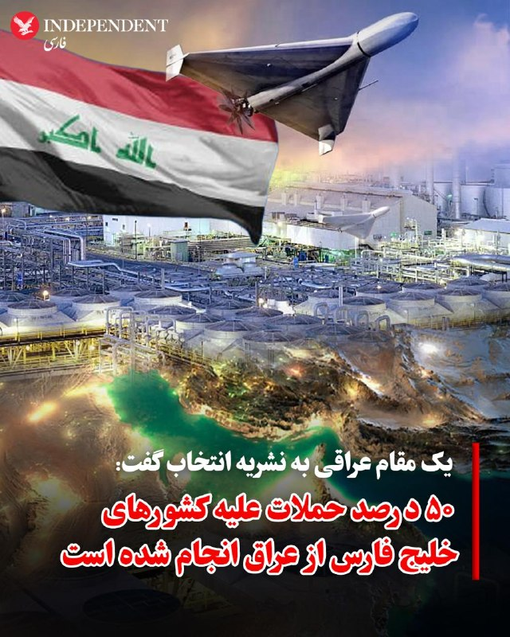

♦️یک مقام عراقی در گفتگو با نشریه انتخاب اعلام کرد که حدود ۵۰ درصد از کل حملات پهپادی انجام‌شده علیه کشورهای حوزه خلیج فارس، از داخل خاک عراق صورت گرفته است.
همزمان، المانیتور به نقل از یک منبع آگاه گزارش داد که مقامهای عربستان سعودی بر این باورند که تقریبا تمامی حملات پهپادی و موشکی اخیر به این کشور، به جای ایران، از خاک عراق نشات گرفته است؛ ارزیابی و تحلیلی که اکنون مورد تایید دولت دونالد ترامپ در واشنگتن نیز قرار دارد.
‌🇸🇦 Indypersian

🤖 @VahidOOnLine

## VahidOOnLine — post 240869

  

رییس پلیس سن‌دیگو اعلام کرد درپی تیراندازی در مرکز اسلامی سن‌دیگو سه مرد بزرگسال کشته شدند و مهاجمان مظنون نیز جان باخته‌اند. پلیس گفت این حمله به عنوان یک جرم ناشی از نفرت در نظر گرفته شده است.
‌🏁 🇬🇧 IranintlTV

🤖 @VahidOOnLine

## VahidOOnLine — post 240868

  <a href="telegram/content/VahidOOnLine_240868_1779142534.mp4" target="_blank">🎬 Download video</a>

تماسی از ایران:
«می‌گفت دست همدیگه رو ول نکنیم، حتی وقتی خودمون هم سختی داریم. همدلی اگر نباشه، هیچ‌چیز درست نمی‌شه»
‌🏁 🇬🇧 ManotoTV

🤖 @VahidOOnLine

## VahidOOnLine — post 240867

  <a href="telegram/content/VahidOOnLine_240867_1779142536.mp4" target="_blank">🎬 Download video</a>

رسانه‌های داخل ایران گزارش دادند پدافند هوایی اصفهان فعال شده است.

تاکنون مقام‌های جمهوری اسلامی توضیحی درباره علت فعال شدن پدافند هوایی در اصفهان ارائه نکرده‌اند.
‌🏁 🇬🇧 ManotoTV

🤖 @VahidOOnLine

## VahidOOnLine — post 240866

  

کانال تلگرامی دانشجویان متحد اعلام کرد که امیرحسین شیخ محمدی، دانشجوی دامپزشکی دانشگاه آزاد واحد کرج، صبح دوشنبه ۲۸ اردیبهشت بازداشت شده است.

هیچ اطلاعاتی درباره اتهام‌های احتمالی مطرح شده علیه این دانشجو و محل نگهداری او منتشر نشده است.
‌🏁 🇬🇧 IranintlTV

🤖 @VahidOOnLine

## VahidOOnLine — post 240865

  

عبدالقهار بلخی، سخنگوی وزارت خارجه طالبان، حملات پهپادی اخیر به «تاسیسات غیرنظامی» در امارات متحده عربی، به ویژه به نیروگاه هسته‌ای براکه را محکوم کرد.

او در شبکه اجتماعی ایکس نوشت که طالبان «نگرانی عمیق خود را از تشدید خشونت در منطقه ابراز می‌کند.»
‌🏁 🇬🇧 IranintlTV

🤖 @VahidOOnLine

## VahidOOnLine — post 240864

  

♦️خبرگزاری مهر دوشنبه شب ۲۸ اردیبهشت از فعال شدن پدافند هوایی در اصفهان خبر داد و اعلام کرد تا زمان انتشار این خبر، توضیحی درباره علت آن ارائه نشده است.
هم‌زمان، معاون سیاسی و امنیتی استاندار هرمزگان نیز فعال شدن پدافند هوایی در جزیره قشم را تایید کرد و گفت این اقدام پس از مشاهده «ریزپرنده‌ها» در آسمان قشم و برای مقابله با «اهداف متخاصم» انجام شده است.
‌🇸🇦 Indypersian

🤖 @VahidOOnLine

## VahidOOnLine — post 240863

  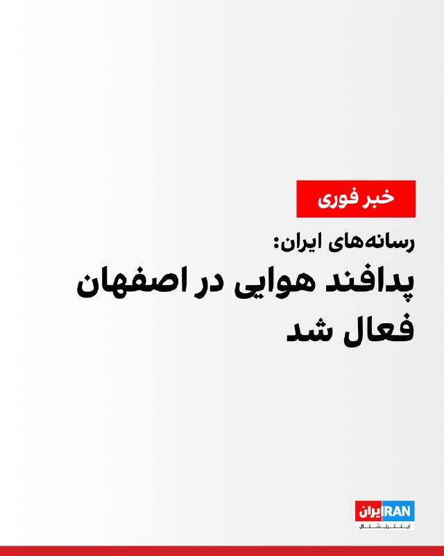

رسانه‌های ایران شامگاه دوشنبه از فعال شدن پدافند هوایی در اصفهان خبر دادند.

تا زمان انتشار این خبر توضیحی درباره علت فعال شدن پدافند ارائه نشده است.
پیش‌تر خبرگزاری تسنیم نوشت: «پس از مشاهده ریزپرنده‌ها در آسمان جزیره قشم، پدافند برای نابودی اهداف متخاصم فعال شد.»
‌🏁 🇬🇧 IranintlTV

🤖 @VahidOOnLine

## VahidOOnLine — post 240862

  

آنا کلی، معاون سخنگوی کاخ سفید، در گفت‌وگو با فاکس نیوز اعلام کرد که جمهوری اسلامی اجازه نخواهد داشت اورانیوم غنی‌شده در اختیار داشته باشد و این موضوع خط قرمز دونالد ترامپ در مذاکرات است.

او گفت: «تهران نه‌تنها نباید به سلاح هسته‌ای دست پیدا کند، بلکه باید مواد غنی‌شده را نیز تحویل دهد.»

کلی افزود که ترامپ معتقد است جمهوری اسلامی به‌خوبی می‌داند که او در تهدیدهایش بلوف نمی‌زند و عملیات‌های اخیر نشان داده واشینگتن در اجرای تهدیدات خود جدی است.
‌🏁 🇬🇧 IranintlTV

🤖 @VahidOOnLine

## VahidOOnLine — post 240861

  

♦️شبکه خبری آی۲۴نیوز گزارش داد بنیامین نتانیاهو، نخست‌وزیر اسرائیل، روز دوشنبه ۲۸ اردیبهشت، دومین جلسه محدود کابینه امنیتی خود را ظرف ۲۴ ساعت گذشته برگزار کرده است. مقامات اسرائیلی با اشاره به وضعیت «آماده‌باش کامل» اعلام کرده‌اند که کشور خود را برای تصمیم احتمالی رئیس‌جمهوری دونالد ترامپ درباره گام‌های بعدی در قبال تهران و احتمال ازسرگیری جنگ با ایران تا پایان هفته جاری آماده می‌کنند.
این نشست‌های فشرده پی‌درپی پس از گفتگوهای تلفنی ۳۰ دقیقه‌ای روز یکشنبه نتانیاهو و ترامپ صورت می‌گیرد. بر اساس گزارش منابع آگاه، ترامپ در این تماس نخست‌وزیر اسرائیل را در جریان جزئیات سفر اخیر خود به چین قرار داده، اما این گفتگو به راه‌حل مشخصی برای مسیر پیش‌رو منجر نشده است؛ با این حال، هماهنگی‌های فشرده میان اورشلیم و واشنگتن برای تمامی سناریوهای ممکن در آستانه آنچه مقامات آن را «لحظه حقیقت» می‌نامند، ادامه دارد.
‌🇸🇦 Indypersian

🤖 @VahidOOnLine

## VahidOOnLine — post 240859

  <a href="telegram/content/VahidOOnLine_240859_1779142539.mp4" target="_blank">🎬 Download video</a>

دونالد ترامپ، رئیس‌جمهوری آمریکا، در پیامی در شبکه اجتماعی تروث سوشال نوشت:

««امیر قطر، تمیم بن حمد آل ثانی، ولیعهد عربستان سعودی، محمد بن سلمان آل سعود، و رئیس امارات متحده عربی، محمد بن زاید آل نهیان، از من خواسته‌اند حمله نظامی برنامه‌ریزی‌شده‌مان علیه جمهوری اسلامی ایران را که قرار بود فردا انجام شود، متوقف کنم؛ زیرا اکنون مذاکرات جدی در جریان است و به اعتقاد آن‌ها، به‌عنوان رهبران بزرگ و متحدان ما، توافقی حاصل خواهد شد که برای ایالات متحده آمریکا، همه کشورهای خاورمیانه و فراتر از آن بسیار قابل قبول خواهد بود.

این توافق، مهم‌تر از همه، شامل این خواهد بود که ایران هیچ سلاح هسته‌ای نداشته باشد!

بر اساس احترامم به رهبران یادشده، به وزیر جنگ، پیت هگست، رئیس ستاد مشترک نیروهای مسلح، ژنرال دنیل کین، و ارتش ایالات متحده دستور داده‌ام که حمله برنامه‌ریزی‌شده به ایران را فردا انجام ندهند؛ اما همزمان به آن‌ها دستور داده‌ام در صورتی که توافق قابل قبولی حاصل نشود، برای اجرای یک حمله کامل و گسترده علیه ایران، در هر لحظه آماده باشند.»
‌🏁 🇬🇧 ManotoTV

🤖 @VahidOOnLine

## VahidOOnLine — post 240858

  <a href="telegram/content/VahidOOnLine_240858_1779142540.mp4" target="_blank">🎬 Download video</a>

‌
خبرگزاری‌های داخل ایران گزارش دادند پدافند هوایی قشم شامگاه دوشنبه فعال شده است. مقام‌های جمهوری اسلامی توضیحی درباره علت فعالیت پدافند هوایی در این جزیره ارائه نکرده‌اند.
‌🏁 🇬🇧 ManotoTV

🤖 @VahidOOnLine

## VahidOOnLine — post 240855

  <a href="telegram/content/VahidOOnLine_240855_1779142540.mp4" target="_blank">🎬 Download video</a>

تجمع ایرانیان در لیسبون مقابل سفارت نروژ؛ اعتراض به دیدار سیاستمداران نروژی با جمهوری اسلامی
‌🏁 🇬🇧 ManotoTV

🤖 @VahidOOnLine

## VahidOOnLine — post 240854

  

♦️اطرافیان حامد تیزرویان، عکاس و کارشناس محیط‌زیست اهل مازندران، به ایندیپندنت فارسی خبر دادند که او از ۱۴ اردیبهشت‌ماه به دست ماموران اداره اطلاعات ساری بازداشت شده و از آن زمان در زندان این شهر نگهداری می‌شود.

بر اساس اطلاعات رسیده به ایندیپندنت فارسی، انتقادهای حامد تیزرویان در صفحه اینستاگرامش از مقام‌های جمهوری اسلامی، به‌ویژه در ارتباط با سرکوب و کشتار تاریخی معترضان در جریان انقلاب ملی ایرانیان، دلیل اصلی بازداشت او بوده است. به گفته منابع مطلع، در جلسه بازپرسی نیز اتهام «اجتماع و تبانی علیه امنیت ملی» به او تفهیم شده است.

حامد تیزرویان دانشجوی مقطع دکتری مهندسی محیط‌زیست با گرایش تنوع زیستی در دانشگاه بهشتی تهران است و در سال‌های اخیر نقش مهمی در راه‌اندازی و پیشبرد کمپین‌های اجتماعی برای حفاظت از جنگل‌های هیرکانی مازندران و حیات‌وحش این منطقه ایفا کرده است.
‌🇸🇦 Indypersian

🤖 @VahidOOnLine

## VahidOOnLine — post 240853

  

♦️خبرگزاری تسنیم وابسته به سپاه پاسداران، روز دوشنبه ۲۸ اردیبهشت‌ماه به نقل از «یک منبع نزدیک به تیم مذاکره‌کننده» جمهوری اسلامی گزارش داد با وجود برخی تغییرات در متن جدید پیشنهادی آمریکا، اختلافات اساسی میان دو طرف همچنان پابرجاست و «زیاده‌خواهی و عدم واقع‌بینی آمریکایی‌ها» ادامه دارد.

این منبع به خبرگزاری تسنیم گفت آمریکا تلاش می‌کند مذاکرات مربوط به پایان جنگ را به موضوع هسته‌ای گره بزند، اما ایران با این موضوع موافق نیست و «پایان جنگ در برابر تعهدات هسته‌ای» را نخواهد پذیرفت.
به ادعای این منبع، واشنگتن پیشنهادهایی چون «ایجاد صندوق توسعه و بازسازی» را مطرح کرده است، اما جمهوری اسلامی همچنین بر پرداخت غرامت از سوی آمریکا تاکید دارد.
تسنیم به نقل از منبع خود تاکید کرد جمهوری اسلامی از مواضع خود درباره پایان جنگ و بازگرداندن اموال بلوکه‌شده ایران عقب‌نشینی نخواهد کرد و افزود وعده‌های کاغذی برای تهران کافی نیست. او گفت با وجود برخی وعده‌ها، اختلاف درباره نحوه بازگشت پول‌های بلوکه‌شده همچنان وجود دارد.
‌🇸🇦 Indypersian

🤖 @VahidOOnLine

## VahidOOnLine — post 240852

  

♦️معاون سیاسی، امنیتی و اجتماعی استاندار هرمزگان، دوشنبه‌شب ۲۸ اردیبهشت‌ماه فعال شدن پدافند هوایی در جزیره قشم را تایید کرد و گفت این اقدام در راستای مقابله با «ریزپرنده‌های دشمن» انجام شده است.

به گزارش خبرگزاری مهر، احمد نفیسی گفت صدایی که ساعاتی پیش در جزیره قشم شنیده شد، ناشی از فعال شدن سامانه‌های پدافندی و درگیری با ریزپرنده‌ها بوده است.

او با تاکید بر آمادگی کامل نیروهای مسلح، افزود وضعیت تحت کنترل است و شرایط جزیره قشم «کاملا پایدار» است.

پیشتر خبرگزاری تسنیم وابسته به سپاه پاسداران گزارش داده بود پدافند هوایی در جزیره قشم پس از مشاهده ریزپرنده‌ها در آسمان این منطقه فعال شده و برای مقابله با «اهداف متخاصم» وارد عمل شده است.
‌🇸🇦 Indypersian

🤖 @VahidOOnLine

## mwarmonitor — post 9287

  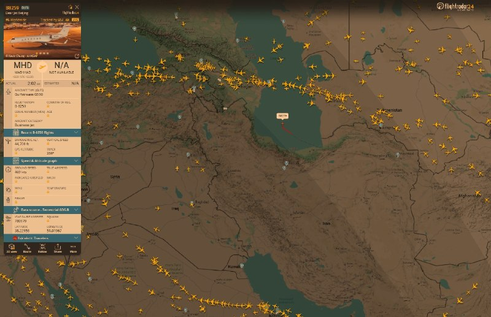

✈️🇵🇰 هواپیمای A319 نیروی هوایی پاکستان (A-1102) که وزیر کشور پاکستان را حمل می‌کرد – وی در یک سفر رسمی دو روزه برای بررسی روابط دوجانبه و گفت‌وگوها با آمریکا به سر می‌برد – از مشهد خارج شد. @mwarmonitor

## mwarmonitor — post 9286

نصف امکانات ایران اینترنشنال داشتم الان به جای باراک راوید من شماره ترامپ داشتم

## mwarmonitor — post 9285

🔹خبرنگار: آقای رئیس‌جمهور، یک سوال در ادامه بحث ایران. کشورهای دیگه هم قبلاً این کار رو کردن؛ اون‌ها از شما خواستن که مسیرتون رو تغییر بدید تا یک توافق صلح رو جلوی پاتون بذارن و می‌گفتن که توافقی در راهه. اما هیچ‌چیز به نتیجه نرسیده. شما اشاره کردید که این بار فرق می‌کنه...
🔸دونالد ترامپ: خب، خیلی چیزها به نتیجه رسیده. ما کشوری رو که قرار بود سلاح هسته‌ای داشته باشه گرفتیم و... عملاً ارتشش رو نابود کردیم؛ اون‌ها نیروی دریایی ندارن، نیروی هوایی ندارن، اون‌ها از نظر نظامی عملاً نابود شدن. این خیلیه، این دستاورد بزرگیه. ما همین الان هم می‌تونیم اونجا رو ترک کنیم و ۲۵ سال طول می‌کشه تا خودشون رو بازسازی کنن. آخرین چیزی که بهش فکر می‌کنن، به نظر من، موضوع هسته‌ایه. حالا باید این رو به صورت مکتوب دربیارن. اما وقتی می‌گید «هیچ‌چیز»، ما... ما کاملاً ارتششون رو نابود کردیم. ببخشید، از سی‌ان‌ان (CNN)... ما کاملاً ارتششون رو نابود کردیم، رهبری‌شون رو نابود کردیم. همون‌طور که می‌دونید، رهبرانشون از بین رفتن؛ رهبرانشون در سطح اول و سطح دوم از بین رفتن، الان داریم با نصفِ سطح سوم سر و کله می‌زنیم. و فکر می‌کنم ما به پیشرفت‌های زیادی دست پیدا کردیم.

@mwarmonitor

## mwarmonitor — post 9284

  <a href="telegram/content/mwarmonitor_9284_1779142543.mp4" target="_blank">🎬 Download video</a>

🎬 Video

## mwarmonitor — post 9283

🔴سناتور لیندسی گراهام:

🔰همان‌طور که پیش‌تر گفته‌ام، هر توافقی که میان ایالات متحده آمریکا و ایران حاصل شود، باید برای تصویب به کنگره آمریکا ارائه گردد؛ همان‌گونه که در مورد برجام در دوران ریاست‌جمهوری باراک اوباما انجام شد.

🔹اگر بتوانیم از طریق راه‌های دیپلماتیک و در عین تحقق اهداف امنیت ملی‌مان به این درگیری پایان دهیم، این یک دستاورد بزرگ خواهد بود.

🔸همان‌طور که پیش‌تر نیز گفته‌ام، موضع دونالد ترامپ روشن است:

➡️ عدم غنی‌سازی
➡️ کنترل آمریکا بر حدود ۹۰۰ پوند اورانیوم با غنای بالا
➡️ بازگشایی تنگه هرمز بدون هرگونه مداخله از سوی ایران
➡️ ایران باید برنامه موشک‌های بالستیک دوربرد خود و هرگونه تلاش برای دستیابی به سلاح هسته‌ای را کنار بگذارد
➡️ ایران باید حمایت از تمامی نیروهای نیابتی تروریستی در منطقه را متوقف کند

🔸اما اینکه بگویم نسبت به این‌که ایران واقعاً با موارد لازم برای ایجاد توافقی که به‌طور اساسی با برجام متفاوت باشد موافقت خواهد کرد، یا وارد توافقی شود که در گذر زمان پایدار بماند، تردید دارم—کم‌گویی کرده‌ام.

زمان نشان خواهد داد.

@mwarmonitor

## mwarmonitor — post 9282

🔹خبرنگار: کمی در مورد پستی که در «تروث سوشال» (Truth Social) درباره ایران گذاشتید توضیح بدید و بگید چه تصمیمی باعث شد که چرا به اون‌ها حمله نکردید؟
🔸دونالد ترامپ: خب، کشورهای دیگه پیش من اومدن و گفتن که «ما داشتیم برای یک حمله بسیار بزرگ برای فردا آماده می‌شدیم.» من اون رو برای مدت کوتاهی به تعویق انداختم، امیدوارم که شاید برای همیشه باشه، اما احتمالاً برای یک مدت کوتاه.
چون ما گفتگوهای بسیار بزرگی با ایران داشتیم و خواهیم دید که نتیجه این گفتگوها چی میشه. از ما توسط عربستان سعودی، قطر، امارات متحده عربی و برخی کشورهای دیگه درخواست شد که اگر بتونیم این کار رو برای دو یا سه روز—یک مدت زمان کوتاه—به تعویق بندازیم، چون اون‌ها فکر می‌کنن که دارن به توافق خیلی نزدیک میشن.
و اگر بتونیم کاری کنیم که هیچ سلاح هسته‌ای به دست ایران نیفته، فکر می‌کنم اگر اون‌ها راضی باشن، ما هم احتمالاً راضی خواهیم بود.
ما به اسرائیل اطلاع دادیم، به افراد دیگه‌ای در خاورمیانه که با ما در ارتباط بودن هم اطلاع دادیم و می‌دونید، این یک تحول بسیار مثبت هست؛ اما باید ببینیم که آیا نتیجه‌ای خواهد داشت یا نه. ما دوره‌های زمانی دیگه‌ای هم داشتیم که فکر می‌کردیم به توافق خیلی نزدیک شدیم و... کارساز نشد، اما این یکی کمی متفاوته.
ما واقعاً فردا آماده یک اقدام بسیار بزرگ بودیم و این چیزی نبود که من مایل به انجامش باشم، اما چاره دیگه‌ای نداریم؛ چون ما نمی‌تونیم اجازه بدیم ایران به سلاح هسته‌ای دست پیدا کنه.

@mwarmonitor

## mwarmonitor — post 9281

  <a href="telegram/content/mwarmonitor_9281_1779142545.mp4" target="_blank">🎬 Download video</a>

🎬 Video

## mwarmonitor — post 9280

📝 ترامپ رسماً دنیا را گذاشته روی ویبره و در این میان، مردم ایران هم به جای زندگی، دارند روی تردمیلِ اضطرابِ ملی دو می‌زنند! تصور کن ارتش آمریکا با مدرن‌ترین تجهیزات میلیارد دلاری و خلبان‌های دست‌به‌ماشه، منتظر شمارش معکوسند که ناگهان ترامپ بعد از یک لیوان نوشابه رژیمی گوشی را برمی‌دارد و می‌نویسد: «بچه‌ها کنسل شد! محمد و تمیم زنگ زدند، خیلی باادب بودند، فعلاً نزنید؛ ولی پوتین‌ها را درنیاورید که شاید نیم‌ساعت دیگر نظرم عوض شد!» این وسط، ۸۵ میلیون ایرانی که سال‌هاست با فرمول «دلار، سکه، سایه جنگ» زندگی می‌کنند، گوشت قربانی این مودی املاکی هستند؛ مردمی که باید هر ثانیه صفحه ترامپ را رفرش کنند تا ببینند فردا قرار است بروند سر کار یا بروند پناهگاه! دیپلماسی او دقیقاً شبیه تعارف‌های شاه‌عباسی شده؛ ملت را تا دقیقه ۹۹ به لبه نابودی می‌برد، سکته چشمی و قلبی را به بالاترین حد می‌رساند، بازار بورس و نفت را ویبره می‌دهد، و بعد در نقش منجی صلح‌طلب ظاهر می‌شود تا همه نفس راحت بکشند و بگویند «دمت گرم که امروز ما را نکشتی!» قضیه وقتی سیاه‌تر می‌شود که می‌بینی سرنوشت، آینده و حتی قیمت پیاز در ایران، به میزان کیفیت خوابِ دیشبِ یک پیرمرد مو نارنجی در فلوریدا گره خورده است؛ پیرمردی که مرز بین جنگ تمام‌عیار و صلح جهانی در ذهنش، به اندازه یک ویبره گوشی و یک توییت نصفه‌شبی فاصله دارد!

@mwarmonitor

## mwarmonitor — post 9279

فعل شدن پدافند هوایی در اصفهان

## mwarmonitor — post 9278

  

✈️🇵🇰 هواپیمای A319 نیروی هوایی پاکستان (A-1102) که وزیر کشور پاکستان را حمل می‌کرد – وی در یک سفر رسمی دو روزه برای بررسی روابط دوجانبه و گفت‌وگوها با آمریکا به سر می‌برد – از مشهد خارج شد.

@mwarmonitor

## mwarmonitor — post 9277

📝 «نظر من را می‌پرسید؟ حمله انجام خواهد شد.»

## mwarmonitor — post 9276

🔴ترامپ می‌گوید طرح حمله به ایران را به تعویق انداخته است

📝نویسنده: باراک راوید AXIOS

🔰پرزیدنت ترامپ روز دوشنبه اعلام کرد که قصد داشته «فردا» به ایران حمله کند، اما این اقدام را به تعویق انداخته تا فرصت دیگری به مذاکرات بدهد. او ادعا کرد که این تصمیم را به درخواست چند تن از رهبران کشورهای عربی گرفته است.

🔸چرا این موضوع اهمیت دارد؟
کاخ سفید پیشنهاد صلح به‌روزرسانی‌شده‌ای را که ایران روز یکشنبه ارسال کرده بود، «ناکافی» دانست؛ موضوعی که منجر به شکل‌گیری این انتظار فزاینده — حتی در داخل کاخ سفید — شد که ترامپ در آستانه حمله قرار دارد.
ترامپ از زمان آغاز جنگ، تاکنون حداقل شش بار ضرب‌الاجل‌ها را تمدید کرده و حملات برنامه‌ریزی‌شده علیه ایران را به تعویق انداخته است.

🔸دو مقام آمریکایی به اکسیوس گفتند که انتظار می‌رفت ترامپ روز سه‌شنبه تیم امنیت ملی خود را در «اتاق وضعیت» (Situation Room) برای بررسی گزینه‌های نظامی گرد هم آورد.

🔸یک مقام ارشد آمریکایی صبح دوشنبه به اکسیوس گفت اگر ایران موضع خود را تغییر ندهد، ایالات متحده ناچار خواهد بود مذاکرات را «از طریق بمب‌ها» ادامه دهد.

📌اظهارات ترامپ
ترامپ در شبکه اجتماعی «تروث سوشال» (Truth Social) نوشت: «امیر قطر، ولیعهد عربستان سعودی و رئیس امارات متحده عربی از من خواسته‌اند که حمله نظامی برنامه‌ریزی‌شده‌مان علیه جمهوری اسلامی ایران را که برای فردا برنامه‌ریزی شده بود، به تعویق بیندازم.»
او اضافه کرد که رهبران عرب به او گفته‌اند «مذاکرات جدی در حال انجام است و به نظر آن‌ها، به عنوان رهبران و متحدانی بزرگ، توافقی حاصل خواهد شد که برای ایالات متحده آمریکا و همچنین همه کشورهای خاورمیانه و فراتر از آن بسیار قابل قبول خواهد بود.»
ترامپ ادعا کرد که این توافق تضمین خواهد کرد ایران به تسلیحات هسته‌ای دست پیدا نکند.

🔸او از زمان آغاز جنگ بارها ادعاهایی درباره پیشرفت به سوی توافق مطرح کرده، اما اخیراً هیچ گشایش (تحول) خاصی رخ نداده است.

🔹مواردی که باید زیر نظر داشت
رئیس‌جمهور آمریکا گفت که به پیت هگست (وزیر دفاع) و ژنرال دن کین (رئیس ستاد مشترک ارتش) دستور داده است که طرح‌های حمله را به حالت تعلیق درآورند، اما برای اجرای یک «حمله همه‌جانبه و گسترده به ایران، در کوتاه‌ترین زمان ممکن، در صورت عدم دست‌یابی به یک توافق قابل قبول» آماده باشند.

@mwarmonitor

## mwarmonitor — post 9275

حمله پهپادی به سلیمانیه عراق

## mwarmonitor — post 9274

🚨🚨🚨 ترامپ در شبکه اجتماعی Truth Social: از من توسط امیر قطر، تمیم بن حمد آل ثانی، ولیعهد عربستان سعودی، محمد بن سلمان آل سعود، و رئیس‌جمهور امارات متحده عربی، محمد بن زاید آل نهیان، درخواست شده است که حمله نظامی برنامه‌ریزی‌شده ما به جمهوری اسلامی ایران را…

## mwarmonitor — post 9273

  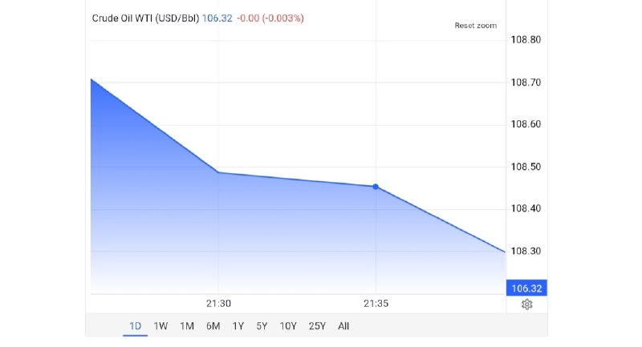

نفت از ۱۱۲ رد شد دوباره داستان تکراری

## mwarmonitor — post 9272

نفت از ۱۱۲ رد شد دوباره داستان تکراری

## mwarmonitor — post 9271

🚨🚨🚨 ترامپ در شبکه اجتماعی Truth Social:

از من توسط امیر قطر، تمیم بن حمد آل ثانی، ولیعهد عربستان سعودی، محمد بن سلمان آل سعود، و رئیس‌جمهور امارات متحده عربی، محمد بن زاید آل نهیان، درخواست شده است که حمله نظامی برنامه‌ریزی‌شده ما به جمهوری اسلامی ایران را که قرار بود فردا انجام شود متوقف کنم، زیرا در حال حاضر مذاکرات جدی در جریان است و به نظر آن‌ها، به عنوان رهبران بزرگ و متحدان، یک توافق حاصل خواهد شد که برای ایالات متحده آمریکا و همچنین تمام کشورهای خاورمیانه و فراتر از آن بسیار قابل قبول خواهد بود.

این توافق به‌طور مهم شامل «عدم وجود سلاح هسته‌ای برای ایران» خواهد بود.

با توجه به احترام من به رهبران فوق‌الذکر، به وزیر جنگ، پیت هگست، رئیس ستاد مشترک نیروهای مسلح، ژنرال دانیل کین، و ارتش ایالات متحده دستور داده‌ام که حمله برنامه‌ریزی‌شده فردا به ایران انجام نشود.

اما همچنین به آن‌ها دستور داده‌ام که در صورت عدم دستیابی به یک توافق قابل قبول، آماده باشند در هر لحظه عملیات نظامی گسترده و تمام‌عیار علیه ایران را آغاز کنند.

از توجه شما به این موضوع سپاسگزارم!

رئیس‌جمهور دونالد جی. ترامپ

@mwarmonitor

## mwarmonitor — post 9268

پدافند قشم فعال شد

## mwarmonitor — post 9267

🔴بر اساس ادعای منابع عراقی و منطقه‌ای، بیشتر حملاتی که علیه عربستان سعودی انجام شده، توسط گروه‌های شبه‌نظامی در عراق که به ایران نزدیک هستند یا از ایران حمایت می‌شوند انجام شده است. AL_MONITOR

@mwarmonitor

## pm_afshaa — post 91005

  <a href="telegram/content/pm_afshaa_91005_1779142547.webm" target="_blank">🎬 Download video</a>

🔴ترامپ: ما به جمهوری اسلامی هیچ امتیازی نخواهیم داد، فقط تسلیم کامل!

💧 Rainbet.com the #1 Non-KYC Crypto Casino & Sportsbook @rainbetcom

😁 @Pm_Afshaa

## pm_afshaa — post 91004

  <a href="telegram/content/pm_afshaa_91004_1779142548.webm" target="_blank">🎬 Download video</a>

🔴ترامپ: ایران نهایتا 3 روز زمان داره. 
💧 Rainbet.com the #1 Non-KYC Crypto Casino & Sportsbook @rainbetcom 
😁 @Pm_Afshaa

## pm_afshaa — post 91003

  <a href="telegram/content/pm_afshaa_91003_1779142548.webm" target="_blank">🎬 Download video</a>

🔴ترامپ: ایران نهایتا 3 روز زمان داره. 
💧 Rainbet.com the #1 Non-KYC Crypto Casino & Sportsbook @rainbetcom 
😁 @Pm_Afshaa

## pm_afshaa — post 91002

  <a href="telegram/content/pm_afshaa_91002_1779142549.webm" target="_blank">🎬 Download video</a>

🔴ترامپ: ما حملات رو فقط برای 2-3 روز تعویق انداختیم تا ببینیم چه میشه! 
💧 Rainbet.com the #1 Non-KYC Crypto Casino & Sportsbook @rainbetcom 
😁 @Pm_Afshaa

## pm_afshaa — post 91001

  <a href="telegram/content/pm_afshaa_91001_1779142549.webm" target="_blank">🎬 Download video</a>

🔴ترامپ: ما در حال آماده شدن برای حمله گسترده به ایران در روز سه شنبه بودیم، اما من آن را برای یک دوره کوتاه و شاید برای همیشه، اما به احتمال زیاد برای یک دوره کوتاه به تعویق انداختم.

💧 Rainbet.com the #1 Non-KYC Crypto Casino & Sportsbook @rainbetcom

😁 @Pm_Afshaa

## pm_afshaa — post 91000

  <a href="telegram/content/pm_afshaa_91000_1779142550.webm" target="_blank">🎬 Download video</a>

🔴دونالد ترامپ:
به نظر میرسه شانس بسیار خوبی برای رسیدن به توافق وجود داره؛ اگر بتونیم بدون بمباران این کار رو انجام بدیم، خوشحال میشم.

💧 Rainbet.com the #1 Non-KYC Crypto Casino & Sportsbook @rainbetcom

😁 @Pm_Afshaa

## pm_afshaa — post 90999

  <a href="telegram/content/pm_afshaa_90999_1779142550.webm" target="_blank">🎬 Download video</a>

🔴ترامپ: ما حملات رو فقط برای 2-3 روز تعویق انداختیم تا ببینیم چه میشه!

💧 Rainbet.com the #1 Non-KYC Crypto Casino & Sportsbook @rainbetcom

😁 @Pm_Afshaa

## pm_afshaa — post 90998

  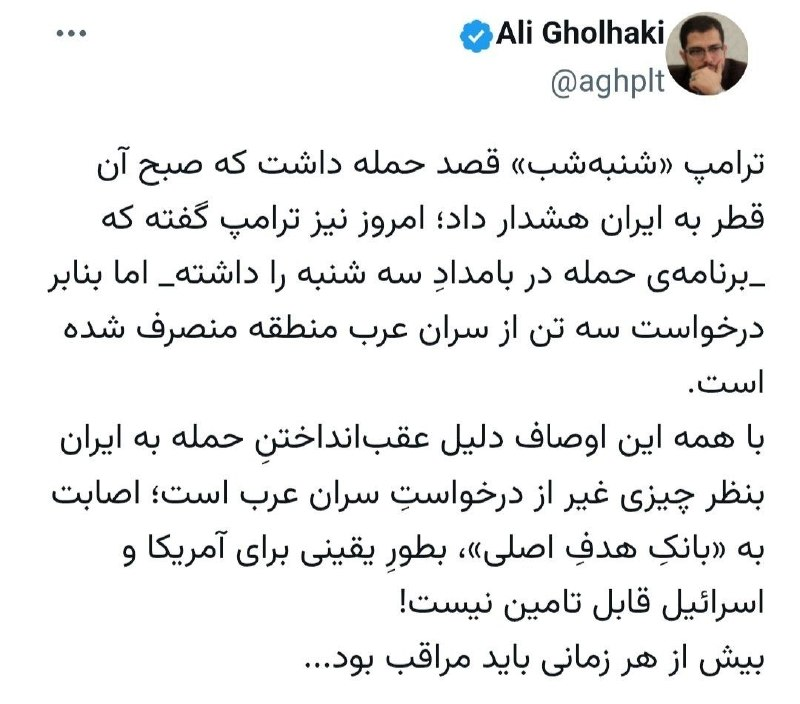

💢علی قلهکی، ‏فعال رسانه‌ای:
ترامپ شنبه‌ شب قصد حمله داشت که صبحش قطر به ایران هشدار داد و سران نظام رفتن مخفی شدن و علت عدم حمله پیدا نکردن لوکیشن سران نظام بوده.

💧 Rainbet.com the #1 Non-KYC Crypto Casino & Sportsbook @rainbetcom

😁 @Pm_Afshaa

## pm_afshaa — post 90997

  <a href="telegram/content/pm_afshaa_90997_1779142551.webm" target="_blank">🎬 Download video</a>

🔴مقام امنیتی اسرائیلی به کانال 12:
در کابینه همه از دست ترامپ کلافه شدیم

💧 Rainbet.com the #1 Non-KYC Crypto Casino & Sportsbook @rainbetcom

😁 @Pm_Afshaa

## pm_afshaa — post 90995

  <a href="telegram/content/pm_afshaa_90995_1779142552.webm" target="_blank">🎬 Download video</a>

🔴ترامپ: مذاکرات جدی در حال حاضر برای دستیابی به توافق با ایران در جریانه.

💧 Rainbet.com the #1 Non-KYC Crypto Casino & Sportsbook @rainbetcom

😁 @Pm_Afshaa

## pm_afshaa — post 90994

فعالیت پدافند در اصفهان

💧 Rainbet.com the #1 Non-KYC Crypto Casino & Sportsbook @rainbetcom

😁 @Pm_Afshaa

## pm_afshaa — post 90993

🔴خبرنگار آکسیوس:ترامپ از زمان شروع جنگ حداقل 12 بار ضرب الاجل ها را تمدید کرده و حملات برنامه ریزی شده به ایران را به تعویق انداخته

💧 Rainbet.com the #1 Non-KYC Crypto Casino & Sportsbook @rainbetcom

😁 @Pm_Afshaa

## pm_afshaa — post 90991

🔴ترامپ: قرار بود فردا به ایران حمله کنیم، ولی رهبران قطر، عربستان و امارات ازم خواستن فعلاً متوقفش کنیم چون مذاکرات جدی در جریانه. به ارتش دستور دادم حمله فعلاً انجام نشه، ولی اگه توافق نرسیم، هر لحظه آماده حمله کامل به ایران باشن. از سمت رهبران قطر، عربستان…

## pm_afshaa — post 90990

🔴ترامپ: قرار بود فردا به ایران حمله کنیم، ولی رهبران قطر، عربستان و امارات ازم خواستن فعلاً متوقفش کنیم چون مذاکرات جدی در جریانه. به ارتش دستور دادم حمله فعلاً انجام نشه، ولی اگه توافق نرسیم، هر لحظه آماده حمله کامل به ایران باشن. از سمت رهبران قطر، عربستان…

## pm_afshaa — post 90989

  

نظامی‌نویس‌های انگلیس میگن خبری تو راهه :

💧 Rainbet.com the #1 Non-KYC Crypto Casino & Sportsbook @rainbetcom

😁 @Pm_Afshaa

## pm_afshaa — post 90987

  <a href="telegram/content/pm_afshaa_90987_1779142553.webm" target="_blank">🎬 Download video</a>

🔴خبرگزاری تسنیم: فعالیت پدافند دقایقی پیش در قشم به دلیل مقابله با ریز پرنده های آمریکایی بوده!

💧 Rainbet.com the #1 Non-KYC Crypto Casino & Sportsbook @rainbetcom

😁 @Pm_Afshaa

## pm_afshaa — post 90986

🔴ترکیه هم به جمهوری اسلامی پشت کرد

هاکان فیدان وزیر امور خارجه ترکیه:
اورانیوم غنی شده ایران باید خارج شود یا به صورت سه و نیم درصدی تغییر داده شود

💧 Rainbet.com the #1 Non-KYC Crypto Casino & Sportsbook @rainbetcom

😁 @Pm_Afshaa

## pm_afshaa — post 90985

🔴خبرآنلاین: برخی شواهد نشان می‌دهد کشورهای عربی در کنار ترامپ در حال لابی گسترده علیه جمهوری اسلامی در چین هستن

💧 Rainbet.com the #1 Non-KYC Crypto Casino & Sportsbook @rainbetcom

😁 @Pm_Afshaa

## pm_afshaa — post 90984

  

🔴ترامپ: قرار بود فردا به ایران حمله کنیم، ولی رهبران قطر، عربستان و امارات ازم خواستن فعلاً متوقفش کنیم چون مذاکرات جدی در جریانه.

به ارتش دستور دادم حمله فعلاً انجام نشه، ولی اگه توافق نرسیم، هر لحظه آماده حمله کامل به ایران باشن.

از سمت رهبران قطر، عربستان و امارات از من خواسته شد که حمله نظامی برنامه‌ریزی‌ شده‌مون علیه جمهوری اسلامی ایران رو که قرار بود فردا انجام بشه، متوقف کنم؛ چون مذاکرات جدی اکنون در حال انجامه! متحدان ما معتقدن توافقی حاصل خواهد شد که واسه ایالات متحده آمریکا، همه کشورهای خاورمیانه و فراتر از اون، بسیار قابل‌قبول خواهد بود. این توافق، مهم‌تر از همه، شامل این خواهد بود که ایران هیچ سلاح هسته‌ای نداشته باشه.
بخاطر احترامی که واسه رهبران یادشده قائلم، به وزیر جنگ، پیت هگست، رئیس ستاد مشترک ارتش، دنیل کین، و ارتش ایالات متحده دستور دادم که حمله برنامه‌ریزی‌شده به ایران رو فردا انجام ندن. ولی بهشون دستور دادم که در صورت نرسیدن به یه توافق قابل‌قبول، آماده اجرای یه حمله کامل و گسترده علیه ایران، در هر لحظه و بدون هیچ تأخیری باشن...

💧Rainbet.com the #1 Non-KYC Crypto Casino & Sportsbook @rainbetcom

😁 @Pm_Afshaa

## DEJradio — post 4710

  <a href="telegram/content/DEJradio_4710_1779142554.webm" target="_blank">🎬 Download video</a>

⭕️
🚨 دونالد ترامپ رئیس جمهوری ایالات متحده در پیامی در شبکه اجتماعی تروث سوشیال نوشت:

امیر قطر، تمیم بن حمد آل ثانی، ولیعهد عربستان سعودی، محمد بن سلمان آل سعود، و رئیس‌ جمهوری امارات متحده عربی، محمد بن زاید آل نهیان، از من درخواست کرده‌اند حمله نظامی برنامه‌ریزی‌شده ما علیه جمهوری اسلامی ایران را که قرار بود فردا انجام شود، متوقف کنم؛ زیرا اکنون مذاکراتی جدی در جریان است و آنان، به‌عنوان رهبران بزرگ و متحدان ما، معتقدند توافقی حاصل خواهد شد که برای ایالات متحده آمریکا، تمامی کشورهای خاورمیانه و فراتر از آن، بسیار قابل قبول خواهد بود. این توافق، مهم‌تر از همه، شامل این خواهد بود که ایران هیچ سلاح هسته‌ای نداشته باشد.
بر پایه احترامی که برای رهبران یادشده قائلم، به وزیر جنگ، پیت هگست، رئیس ستاد مشترک نیروهای مسلح، ژنرال دنیل کین، و ارتش ایالات متحده دستور داده‌ام که حمله برنامه‌ریزی‌شده علیه ایران در فردا انجام نشود. اما در عین حال، به آنان دستور داده‌ام که در صورت نرسیدن به توافقی قابل قبول، برای اجرای یک حمله کامل و گسترده علیه ایران، در هر لحظه آماده باشند.

از توجه شما به این موضوع سپاسگزارم.
رئیس‌جمهوری، دونالد جی. ترامپ

#ترامپ #جمهوری_اسلامی
@DEJradio

## VahidOnline — post 75546

  

زیرنویس شبکه خبر صدا و سیمای جمهوری اسلامی

📡 @VahidOnline

## VahidOnline — post 75545

  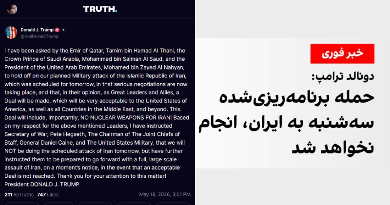

☄️ ترامپ: حمله فردا را به تعویق انداختم

پست ترامپ ترجمه ماشین:
از سوی امیر قطر تمیم بن حمد آل ثانی، ولیعهد عربستان سعودی محمد بن سلمان آل سعود و رئیس امارات متحده عربی محمد بن زاید آل نهیان، از من خواسته شده است حمله نظامی برنامه‌ریزی‌شده ما علیه جمهوری اسلامی ایران را که قرار بود فردا انجام شود، به تعویق بیندازم؛
زیرا مذاکرات جدی اکنون در جریان است
و
به باور آن‌ها، به‌عنوان رهبران بزرگ و متحدان ما، توافقی حاصل خواهد شد که برای ایالات متحده آمریکا و همچنین همه کشورهای خاورمیانه و فراتر از آن بسیار قابل قبول خواهد بود.

این توافق، نکته مهمی را در بر خواهد داشت: هیچ سلاح هسته‌ای برای ایران!

بر اساس احترامی که برای رهبران نام‌برده قائلم، به وزیر جنگ، پیت هگست، رئیس ستاد مشترک ارتش، ژنرال دانیل کین، و ارتش ایالات متحده دستور داده‌ام که حمله برنامه‌ریزی‌شده فردا به ایران را انجام ندهیم؛ اما همچنین به آن‌ها دستور داده‌ام که آماده باشند، در صورت حاصل نشدن یک توافق قابل قبول، در یک لحظه و بدون درنگ، حمله‌ای کامل و گسترده علیه ایران را آغاز کنند.

از توجه شما به این موضوع سپاسگزارم!

رئیس‌جمهور دونالد جی. ترامپ
realDonaldTrump

📡 @VahidOnline

## kianmeli1 — post 87474

🔴پدافند هوایی اصفهان شامگاه دوشنبه فعال شد و علت آن هنوز اعلام نشده است.
https://t.me/kianmeli1

## kianmeli1 — post 87473

  <a href="telegram/content/kianmeli1_87473_1779142555.mp4" target="_blank">🎬 Download video</a>

🔴به نظر می رسد امشب امارات حملاتی به قشم داشته است

طرفداران حکومت به خیابان آمده اند شعار مرگ بر امارات سر میدهند
https://t.me/kianmeli1

## kianmeli1 — post 87472

  

🔴زیرنویس تلویزیون جمهوری اسلامی

ترامپ برای پنجمین بار عقب نشینی کرد
https://t.me/kianmeli1

## kianmeli1 — post 87471

‏🔴خضریان: بسیاری از مسئولان ارشد نظام معتقدند که باید در برابر محاصره دریایی آمریکا، پاسخ نظامی داده شود

‏علی خضریان: آمریکا در وضعیت ضعف نظامی قرار دارد
https://t.me/kianmeli1

## kianmeli1 — post 87470

‏🔴روداو به نقل از عضو رهبری کومله زحمتکشان کردستان ایران اعلام کرد که اردوگاه «سورداش» در سلیمانیه با چهار موشک هدف حمله قرار گرفت و در پی آن دو نفر زخمی شدند
https://t.me/kianmeli1

## kianmeli1 — post 87469

‏🔴آنا کلی، معاون سخنگوی کاخ سفید، در گفت‌وگو با فاکس نیوز اعلام کرد جمهوری اسلامی اجازه نخواهد داشت اورانیوم غنی‌شده در اختیار داشته باشد و این موضوع خط قرمز دونالد ترامپ در مذاکرات است. تهران نه‌تنها نباید به سلاح هسته‌ای دست پیدا کند، بلکه باید مواد غنی‌شده را نیز تحویل دهد
https://t.me/kianmeli1

## kianmeli1 — post 87468

  <a href="telegram/content/kianmeli1_87468_1779142556.mp4" target="_blank">🎬 Download video</a>

🔴رزمایش مسلحانه زنان بسیجی در ارومیه

این کلیپ را اپوزسیون ببیند که بدون «سازماندهی سراسری مسلحانه» نمیشود یک کوچه در ایران را آزاد کرد٫ با مبارزه مدنی گاندی و ماندلا فقط کشتار بیشمار بر دستمان می ماند

جمهوری اسلامی سالهاست می گوید اگر میخواهید ایران را پس بگیرید٫ باید ابتدا از روی جنازه ما عبور کنید
https://t.me/kianmeli1

## kianmeli1 — post 87467

  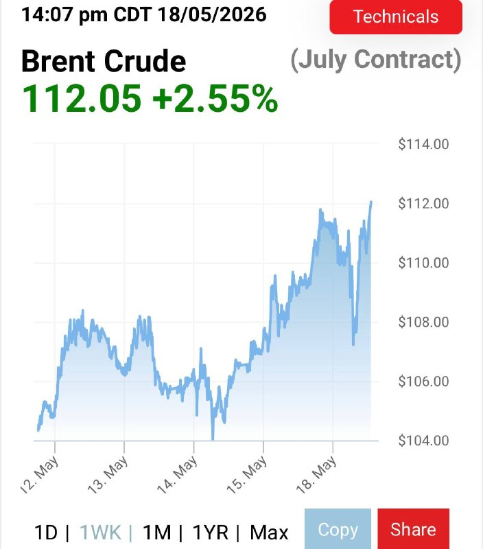

🔴بازی تکراری و پر از فریب ترامپ

هر زمان قیمت نفت از ۱۰۰ دلار عبور میکند٫ میگوید توافق نزدیک است
امشب نیز قیمت نفت ۱۱۲ دلار بود

دوباره با حربه ی مذاکره قیمت را پایین می آورد
https://t.me/kianmeli1

## kianmeli1 — post 87466

🔴ترامپ:

امیر قطر، تمیم بن حمد آل ثانی، ولیعهد عربستان سعودی، محمد بن سلمان آل سعود، و رئیس جمهور امارات متحده عربی، محمد بن زاید آل نهیان، از من خواسته‌اند که حمله نظامی برنامه‌ریزی شده‌مان به جمهوری اسلامی ایران را که قرار بود فردا انجام شود، به تعویق بیندازم، چرا که مذاکرات جدی اکنون در حال انجام است و به نظر آنها، به عنوان رهبران و متحدان بزرگ، توافقی حاصل خواهد شد که برای ایالات متحده آمریکا و همچنین همه کشورهای خاورمیانه و فراتر از آن بسیار قابل قبول خواهد بود. این توافق، مهم‌تر از همه، شامل عدم دستیابی ایران به سلاح هسته‌ای خواهد بود! با توجه به احترامی که برای رهبران ذکر شده در بالا قائلم، به وزیر جنگ، پیت هگزت، رئیس ستاد مشترک ارتش، ژنرال دنیل کین، و ارتش ایالات متحده دستور داده‌ام که فردا حمله برنامه‌ریزی شده به ایران را انجام نخواهیم داد، اما به آنها دستور داده‌ام که آماده باشند تا در صورت عدم دستیابی به توافق قابل قبول، فوراً حمله‌ای کامل و گسترده به ایران انجام دهند. از توجه شما به این موضوع متشکرم! رئیس جمهور دونالد جی. ترامپ
https://t.me/kianmeli1

## IranIntlTV — post 337847

  

ترامپ در یک سخنرانی گفت اگر بتواند به توافقی با جمهوری اسلامی دست یابد که مانع از دستیابی تهران به سلاح هسته‌ای شود، بسیار راضی خواهد بود. او تاکید کرد که واشینگتن به تهران اجازه نخواهد داد که به سلاح هسته‌ای دست یابد.
ترامپ گفت: «ما اجازه نخواهیم داد ایران به سلاح هسته‌ای دست پیدا کند. بنابراین این سه کشور به همراه دیگران با من تماس گرفتند و آنها به طور مستقیم با نمایندگان ما و در حال حاضر با حکومت ایران در حال گفت‌وگو هستند و به نظر می‌رسد شانس بسیار خوبی وجود دارد که بتوانند به یک توافق برسند.»
او افزود: «اگر بتوانیم بدون اینکه آنها را به شدت بمباران کنیم به این نتیجه برسیم، بسیار خوشحال خواهم شد.»

https://iranintl.com/202605189314

## IranIntlTV — post 337846

  <a href="telegram/content/IranIntlTV_337846_1779142559.mp4" target="_blank">🎬 Download video</a>

مراد ویسی، تحلیل‌گر ارشد ایران‌اینترنشنال، گفت: «مردم ایران از ترامپ انتظار دارند به مذاکرات طولانی با جمهوری اسلامی پایان دهد. مذاکراتی که به باور آنها نه رفتار حکومت را تغییر داده و نه مانع سرکوب داخلی و تنش‌آفرینی منطقه‌ای شده است. ادامه این مذاکرات به معنای دادن فرصت و تنفس سیاسی به جمهوری اسلامی تلقی می‌شود.»
@iranintltv

## IranIntlTV — post 337845

  <a href="telegram/content/IranIntlTV_337845_1779142560.mp4" target="_blank">🎬 Download video</a>

بنیامین نتانیاهو در پی پاسخ تازه جمهوری اسلامی به پیشنهاد آمریکا برای پایان جنگ، نشست امنیتی با حضور وزیران و مشاوران ارشدش برگزار می‌کند. هم‌زمان ترامپ در تماس با نتانیاهو گفته زمان برای جمهوری اسلامی رو به پایان است.
@iranintltv

## IranIntlTV — post 337844

  <a href="telegram/content/IranIntlTV_337844_1779142561.mp4" target="_blank">🎬 Download video</a>

مراد ویسی، تحلیل‌گر ارشد ایران‌اینترنشنال، گفت: «برداشت فرماندهان سپاه این است که آمریکا و اسرائیل توان شکست نظامی جمهوری اسلامی را ندارند و تلاش می‌کنند از مسیر مذاکره امتیاز بگیرند. بنابراین تصور می‌کنند عدم عقب‌نشینی در مذاکرات، پیامد نظامی جدی نخواهد داشت. این باور فرماندهان سپاه می‌تواند ناشی از توهم پیروزی باشد، در حالی که حملات احتمالی آینده ممکن است کاملا متفاوت و گسترده‌تر باشد.»
@iranintltv

## IranIntlTV — post 337843

  <a href="telegram/content/IranIntlTV_337843_1779142562.mp4" target="_blank">🎬 Download video</a>

رویترز به نقل از سه مقام امنیتی و دو منبع دولتی از گسترش همکاری‌های پاکستان و عربستان سعودی در چارچوب یک پیمان دفاعی متقابل خبر داد. این پیمان، اعزام ۸ هزار نیروی نظامی، حدود ۱۶ فروند جنگنده جی‌اف-۱۷، دو اسکادران پهپادی و یک سامانه پدافند هوایی را شامل می‌شود.
@iranintltv

## IranIntlTV — post 337842

  <a href="telegram/content/IranIntlTV_337842_1779142564.mp4" target="_blank">🎬 Download video</a>

مراد ویسی، تحلیل‌گر ارشد ایران‌اینترنشنال، گفت: «ترامپ می‌گوید حمله برنامه‌ریزی شده روز سه‌شنبه به جمهوری اسلامی را به درخواست رهبران امارات، عربستان و قطر به تعویق انداخته تا یک شانس دیگر به توافق داده شود. ترامپ گفته ارتش آمریکا آماده است در صورت عدم توافق حمله را بی‌درنگ شروع کند.»
@iranintltv

## IranIntlTV — post 337841

  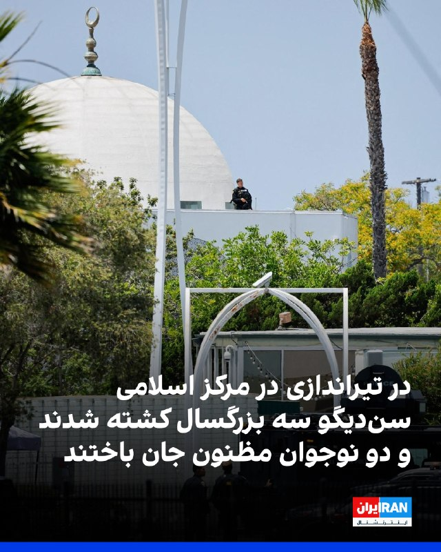

رییس پلیس سن‌دیگو اعلام کرد درپی تیراندازی در مرکز اسلامی سن‌دیگو سه مرد بزرگسال کشته شدند و مهاجمان مظنون نیز جان باخته‌اند. پلیس گفت این حمله به عنوان یک جرم ناشی از نفرت در نظر گرفته شده است.
https://iranintl.com/202605188629

## IranIntlTV — post 337840

  <a href="telegram/content/IranIntlTV_337840_1779142566.mp4" target="_blank">🎬 Download video</a>

دونالد ترامپ اعلام کرد به درخواست رهبران منطقه، برنامه حمله به مواضع جمهوری اسلامی را که برای سه‌شنبه طراحی شده بود، متوقف کرده است.
او گفت رهبران منطقه معتقدند امکان دستیابی به توافق در آینده نزدیک وجود دارد.

گزارش نیلوفر منصوری، خبرنگار ایران‌اینترنشنال
@iranintltv

## IranIntlTV — post 337839

  

کانال تلگرامی دانشجویان متحد اعلام کرد که امیرحسین شیخ محمدی، دانشجوی دامپزشکی دانشگاه آزاد واحد کرج، صبح دوشنبه ۲۸ اردیبهشت بازداشت شده است.

هیچ اطلاعاتی درباره اتهام‌های احتمالی مطرح شده علیه این دانشجو و محل نگهداری او منتشر نشده است.
https://iranintl.com/202605189606

## IranIntlTV — post 337838

  

عبدالقهار بلخی، سخنگوی وزارت خارجه طالبان، حملات پهپادی اخیر به «تاسیسات غیرنظامی» در امارات متحده عربی، به ویژه به نیروگاه هسته‌ای براکه را محکوم کرد.

او در شبکه اجتماعی ایکس نوشت که طالبان «نگرانی عمیق خود را از تشدید خشونت در منطقه ابراز می‌کند.»
https://iranintl.com/202605183828

## IranIntlTV — post 337837

  

رسانه‌های ایران شامگاه دوشنبه از فعال شدن پدافند هوایی در اصفهان خبر دادند.

تا زمان انتشار این خبر توضیحی درباره علت فعال شدن پدافند ارائه نشده است.
پیش‌تر خبرگزاری تسنیم نوشت: «پس از مشاهده ریزپرنده‌ها در آسمان جزیره قشم، پدافند برای نابودی اهداف متخاصم فعال شد.»
https://iranintl.com/202605188482

## IranIntlTV — post 337836

  <a href="telegram/content/IranIntlTV_337836_1779142569.mp4" target="_blank">🎬 Download video</a>

مستند «تمرین‌هایی برای یک انقلاب» ساخته پگاه آهنگرانی در حاشیه جشنواره فیلم کن، جایزه ویژه هیات داوران رویداد مستند گلدن گلوبز را دریافت کرد.

این رویداد با همکاری بخش کن داکس، مجله ورایتی و بازار فیلم کن برگزار می‌شود.

گفت‌وگو با محمد عبدی، نویسنده و منتقد فیلم
@iranintltv

## IranIntlTV — post 337835

  

آنا کلی، معاون سخنگوی کاخ سفید، در گفت‌وگو با فاکس نیوز اعلام کرد که جمهوری اسلامی اجازه نخواهد داشت اورانیوم غنی‌شده در اختیار داشته باشد و این موضوع خط قرمز دونالد ترامپ در مذاکرات است.

او گفت: «تهران نه‌تنها نباید به سلاح هسته‌ای دست پیدا کند، بلکه باید مواد غنی‌شده را نیز تحویل دهد.»

کلی افزود که ترامپ معتقد است جمهوری اسلامی به‌خوبی می‌داند که او در تهدیدهایش بلوف نمی‌زند و عملیات‌های اخیر نشان داده واشینگتن در اجرای تهدیدات خود جدی است.
https://iranintl.com/202605188107

## IranIntlTV — post 337834

  <a href="telegram/content/IranIntlTV_337834_1779142571.mp4" target="_blank">🎬 Download video</a>

دونالد ترامپ، رییس‌جمهوری آمریکا، در تروث سوشال نوشت حمله علیه جمهوری اسلامی که برای سه‌شنبه (۲۹ اردیبهشت) برنامه‌ریزی شده بود، فعلا انجام نخواهد شد.
او همچنین نوشت که رهبران قطر، عربستان سعودی و امارات از آمریکا خواسته‌اند فعلا از اجرای عملیات نظامی علیه جمهوری اسلامی خودداری کند.

گفت‌وگو با شهرام خلدی، پژوهشگر تاریخ خاورمیانه و روابط بین‌الملل و روح‌الله رحیم‌پور، روزنامه‌نگار و تحلیل‌گر سیاسی
@iranintltv

## IranIntlTV — post 337833

  <a href="telegram/content/IranIntlTV_337833_1779142573.mp4" target="_blank">🎬 Download video</a>

دونالد ترامپ، رییس‌جمهوری آمریکا، در تروث سوشال نوشت حمله علیه جمهوری اسلامی که برای سه‌شنبه (۲۹ اردیبهشت) برنامه‌ریزی شده بود، فعلا انجام نخواهد شد.
او همچنین نوشت که رهبران قطر، عربستان سعودی و امارات از آمریکا خواسته‌اند فعلا از اجرای عملیات نظامی علیه جمهوری اسلامی خودداری کند.

گفت‌وگو با شهرام خلدی، پژوهشگر تاریخ خاورمیانه و روابط بین‌الملل و روح‌الله رحیم‌پور، روزنامه‌نگار و تحلیل‌گر سیاسی
@iranintltv

## IranIntlTV — post 337832

  <a href="https://t.me/IranintlTV/337832" target="_blank">📎 Download file</a>

🎧نسخه صوتی ‌‌‏۲۴ با فرداد فرحزاد: احتمال از سرگیری جنگ؛ ترامپ: تهران می‌داند چه اتفاقی می‌افتد
@iranintlTV

## IranIntlTV — post 337831

  <a href="https://t.me/IranintlTV/337831" target="_blank">📎 Download file</a>

🎧نسخه صوتی دومینو: اتحاد ارتش‌های مجهز در برابر اقتصادی ورشکسته
@iranintlTV

## IranIntlTV — post 337830

  <a href="telegram/content/IranIntlTV_337830_1779142575.mp4" target="_blank">🎬 Download video</a>

وای‌نت گزارش داد بنیامین نتانیاهو پس از پاسخ جمهوری اسلامی به پیشنهاد آمریکا، نشست امنیتی با حضور وزیران و مشاوران ارشد برگزار می‌کند.

دونالد ترامپ نیز در تماس با نتانیاهو گفته زمان برای جمهوری اسلامی رو به پایان است.

گفت‌وگو با گابریل گرویسمن، استراتژیست حزب جمهوری‌خواه
@iranintltv

## IranIntlTV — post 337829

  <a href="telegram/content/IranIntlTV_337829_1779142577.mp4" target="_blank">🎬 Download video</a>

مصطفی دانشگر، تحلیل‌گر سیاسی، گفت طرح مطلوب آمریکا برای جمهوری اسلامی، مدل ونزوئلا است. او افزود تصور دونالد ترامپ و ایالات متحده این است که پس از حذف و کنار زدن برخی مقام‌های جمهوری اسلامی در جریان جنگ اخیر، اکنون می‌توانند فردی را در درون ساختار حکومت پیدا کنند.
@iranintltv

## IranIntlTV — post 337828

  

رسانه‌های ایران شامگاه دوشنبه از فعال شدن پدافند هوایی در جزیره قشم خبر دادند.

خبرگزاری تسنیم، وابسته به سپاه پاسداران، نوشت: «پس از مشاهده ریزپرنده‌ها در آسمان جزیره قشم، پدافند برای نابودی اهداف متخاصم فعال شد.»
https://iranintl.com/202605184408

## Shin_Persian — post 6078

  

Shin ✓ @hey_itsmyturn
Mon, 18 May 2026 20:34:12 UTC

MehrNews confirms

فارسی

خبرگزاری مهر تأیید کرد

𝕏 · @shin_persian

## Shin_Persian — post 6077

Shin ✓ @hey_itsmyturn
Mon, 18 May 2026 20:31:15 UTC

AA activity in Isfahan right now
Isfahan Province, #Iran

فارسی

فعالیت پدافند هوایی همین الان در اصفهان
استان اصفهان، #Iran_

𝕏 · @shin_persian

## Shin_Persian — post 6074

  

Shin ✓ @hey_itsmyturn
Mon, 18 May 2026 19:49:16 UTC

IRGC-owned Fars News claims UAV strikes on Pezhak (PJAK) "base" in Sulaymaniyah governorate of #Iraq 🇮🇶
#KRI

فارسی

خبرگزاری فارس وابسته به سپاه پاسداران (IRGC) مدعی حملات پهپادی به «پایگاه» پژاک (PJAK) در استان سلیمانیه #Iraq 🇮🇶 شد.
#KRI

𝕏 · @shin_persian

## Shin_Persian — post 6073

Shin ✓ @hey_itsmyturn
Mon, 18 May 2026 19:37:36 UTC

Explosion(s) in Erbil, KRI, #Iraq 🇮🇶

فارسی

انفجار(ها) در اربیل، اقلیم کردستان عراق، #Iraq 🇮🇶

𝕏 · @shin_persian

## Shin_Persian — post 6072

  

Shin ✓ @hey_itsmyturn Mon, 18 May 2026 19:06:13 UTC President Trump @POTUS: "I have been asked by the Emir of Qatar, Tamim bin Hamad Al Thani, the Crown Prince of Saudi Arabia, Mohammed bin Salman Al Saud, and the President of the United Arab Emirates, Mohamed…

## Shin_Persian — post 6071

Shin ✓ @hey_itsmyturn
Mon, 18 May 2026 19:06:13 UTC

President Trump @POTUS:
"I have been asked by the Emir of Qatar, Tamim bin Hamad Al Thani, the Crown Prince of Saudi Arabia, Mohammed bin Salman Al Saud, and the President of the United Arab Emirates, Mohamed bin Zayed Al Nahyan, to hold off on our planned Military attack of the Islamic Republic of Iran, which was scheduled for tomorrow, in that serious negotiations are now taking place, and that, in their opinion, as Great Leaders and Allies, a Deal will be made, which will be very acceptable to the United States of America, as well as all Countries in the Middle East, and beyond. This Deal will include, importantly, NO NUCLEAR WEAPONS FOR IRAN! Based on my respect for the above mentioned Leaders, I have instructed Secretary of War, Pete Hegseth, The Chairman of The Joint Chiefs of Staff, General Daniel Caine, and The United States Military, that we will NOT be doing the scheduled attack of Iran tomorrow, but have further instructed them to be prepared to go forward with a full, large scale assault of Iran, on a moment’s notice, in the event that an acceptable Deal is not reached. Thank you for your attention to this matter! President DONALD J. TRUMP"

فارسی

رئیس‌جمهور ترامپ @POTUS:
«از سوی شیخ تمیم بن حمد آل ثانی امیر قطر، محمد بن سلمان آل سعود ولیعهد عربستان سعودی و محمد بن زاید آل نهیان رئیس امارات متحده عربی از من خواسته شده است که از حمله نظامی برنامه‌ریزی شده‌مان به جمهوری اسلامی ایران که برای فردا برنامه‌ریزی شده بود، صرف‌نظر کنم؛ چرا که مذاکرات جدی در حال انجام است و به عقیده آن‌ها، به عنوان رهبرانی بزرگ و متحد، توافقی حاصل خواهد شد که برای ایالات متحده آمریکا و همچنین تمامی کشورهای خاورمیانه و فراتر از آن بسیار قابل قبول خواهد بود. این توافق، به طور مهمی، شامل عدم دستیابی ایران به سلاح هسته‌ای خواهد بود! بر اساس احترامی که برای رهبران مذکور قائل هستم، به وزیر جنگ، پیت هگست، رئیس ستاد مشترک ارتش، ژنرال دنیل کین و ارتش ایالات متحده دستور داده‌ام که حمله برنامه‌ریزی شده فردا به ایران را انجام ندهند، اما علاوه بر آن به آن‌ها دستور داده‌ام تا آماده باشند که در صورت عدم دستیابی به توافقی قابل قبول، در لحظه، یک حمله تمام‌عیار و گسترده علیه ایران را به پیش ببرند. از توجه شما به این موضوع سپاسگزارم! رئیس‌جمهور دونالد جی. ترامپ»

𝕏 · @shin_persian

## Shin_Persian — post 6070

  

Shin ✓ @hey_itsmyturn Mon, 18 May 2026 19:06:09 UTC President Trump @POTUS: "I have been asked by the Emir of Qatar, Tamim bin Hamad Al Thani, the Crown Prince of Saudi Arabia, Mohammed bin Salman Al Saud, and the President of the United Arab Emirates, Mohamed…

## Shin_Persian — post 6069

Shin ✓ @hey_itsmyturn
Mon, 18 May 2026 19:06:09 UTC

President Trump @POTUS:
"I have been asked by the Emir of Qatar, Tamim bin Hamad Al Thani, the Crown Prince of Saudi Arabia, Mohammed bin Salman Al Saud, and the President of the United Arab Emirates, Mohamed bin Zayed Al Nahyan, to hold off on our planned Military attack of the Islamic Republic of Iran, which was scheduled for tomorrow, in that serious negotiations are now taking place, and that, in their opinion, as Great Leaders and Allies, a Deal will be made, which will be very acceptable to the United States of America, as well as all Countries in the Middle East, and beyond. This Deal will include, importantly, NO NUCLEAR WEAPONS FOR IRAN! Based on my respect for the above mentioned Leaders, I have instructed Secretary of War, Pete Hegseth, The Chairman of The Joint Chiefs of Staff, General Daniel Caine, and The United States Military, that we will NOT be doing the scheduled attack of Iran tomorrow, but have further instructed them to be prepared to go forward with a full, large scale assault of Iran, on a moment’s notice, in the event that an acceptable Deal is not reached. Thank you for your attention to this matter! President DONALD J. TRUMP"

فارسی

رئیس‌جمهور ترامپ @POTUS:

«از من توسط تمیم بن حمد آل ثانی، امیر قطر، محمد بن سلمان آل سعود، ولیعهد عربستان سعودی، و محمد بن زاید آل نهیان، رئیس امارات متحده عربی، درخواست شده است تا حمله نظامی برنامه‌ریزی‌شده‌مان علیه جمهوری اسلامی ایران را که برای فردا برنامه‌ریزی شده بود، متوقف کنم؛ چرا که اکنون مذاکرات جدی در حال انجام است و به عقیده آن‌ها، به عنوان رهبرانی بزرگ و متحد، توافقی حاصل خواهد شد که برای ایالات متحده آمریکا و همچنین تمامی کشورهای خاورمیانه و فراتر از آن، بسیار قابل قبول خواهد بود. این توافق، به طور مهمی، شامل عدم دستیابی ایران به سلاح هسته‌ای خواهد بود! بر اساس احترامی که برای رهبران مذکور قائل هستم، به پیت هگست، وزیر جنگ، ژنرال دنیل کین، رئیس ستاد مشترک ارتش، و ارتش ایالات متحده دستور داده‌ام که حمله برنامه‌ریزی‌شده فردا به ایران را انجام نخواهیم داد، اما همچنین به آن‌ها دستور داده‌ام که آماده باشند تا در صورت عدم دستیابی به یک توافق قابل قبول، در لحظه، یک حمله تمام‌عیار و گسترده علیه ایران را به پیش ببرند. از توجه شما به این موضوع سپاسگزارم! رئیس‌جمهور دونالد جی. ترامپ»

𝕏 · @shin_persian

## Shin_Persian — post 6067

  

Shin ✓ @hey_itsmyturn
Mon, 18 May 2026 18:57:46 UTC

Staten-owned MehrNews:
Air Defense activity in Qeshm island, Hormozgan Province, #Iran

فارسی

خبرگزاری دولتی مهر:
فعالیت پدافند هوایی در جزیره قشم، استان هرمزگان، #Iran_

𝕏 · @shin_persian

## ManotoTV — post 105618

  <a href="telegram/content/ManotoTV_105618_1779142581.mp4" target="_blank">🎬 Download video</a>

جیمی دایمن، مدیرعامل بانک جی‌پی مورگان چیس، در گفت‌وگو با ان‌پی‌آر هشدار داد تشدید جنگ میان آمریکا، اسرائیل و جمهوری اسلامی می‌تواند پیامدهای اقتصادی گسترده‌ای در جهان به همراه داشته باشد.

دایمن گفت جمهوری اسلامی «۴۷ سال است مردم بی‌گناه، از جمله آمریکایی‌های بی‌گناه، را می‌کشد» و تاکید کرد نباید اجازه پیدا کند به توانایی هسته‌ای دست یابد.

او افزود جمهوری اسلامی دارای موشک‌های بالستیک با برد سه هزار مایل است و «به‌وضوح» در تلاش برای توسعه توانایی هسته‌ای است.

مدیرعامل جی‌پی مورگان در عین حال هشدار داد گسترش درگیری‌ها می‌تواند خطر رکود اقتصادی یا حتی «رکود تورمی» را افزایش دهد؛ وضعیتی که همزمان با رکود اقتصادی و افزایش تورم همراه است.

او گفت هرچند هنوز مشخص نیست چنین سناریویی رخ خواهد داد یا نه، اما این بحران احتمال «پیامدهای بد اقتصادی» را افزایش می‌دهد و باید با نگاهی واقع‌بینانه به آن نگاه کرد.

جی‌پی مورگان چیس بزرگ‌ترین بانک جهان از نظر ارزش بازار به شمار می‌رود و مجموع دارایی‌های آن از چهار تریلیون دلار فراتر رفته است.

جیمی دایمن، مدیرعامل این بانک، از تاثیرگذارترین چهره‌های اقتصادی آمریکا محسوب می‌شود و سال‌ها از نظر مالی و سیاسی به حزب دموکرات گرایش داشته است.

## ManotoTV — post 105617

  <a href="telegram/content/ManotoTV_105617_1779142582.mp4" target="_blank">🎬 Download video</a>

مقام‌های روسیه اعلام کردند در حملات پهپادی روز گذشته اوکراین به اطراف مسکو و منطقه بلگورود، دست‌کم چهار نفر کشته شدند؛ حملاتی که به گفته رسانه‌های روسی، بزرگ‌ترین حمله پهپادی به مسکو در بیش از یک سال گذشته بوده است.

بر اساس این گزارش، سه نفر در منطقه مسکو و یک نفر در منطقه بلگورود جان باختند.

سفارت هند در روسیه اعلام کرد یکی از کشته‌شدگان یک شهروند هندی بوده و سه شهروند هندی دیگر نیز زخمی شده‌اند.

خبرگزاری دولتی تاس به نقل از سرگئی سوبیانین، شهردار مسکو، گزارش داد پدافند هوایی روسیه از نیمه‌شب شنبه تا یکشنبه ۸۱ پهپاد را که به سمت مسکو در حرکت بودند، سرنگون کرده است.

سوبیانین گفت ۱۲ نفر، عمدتا در نزدیکی ورودی پالایشگاه نفت مسکو، زخمی شده‌اند اما به گفته او «فناوری» پالایشگاه آسیب ندیده است.

سرویس امنیتی اوکراین، اس‌بی‌یو، اعلام کرد ارتش این کشور یک پالایشگاه نفت و دو ایستگاه پمپاژ نفت در منطقه مسکو را هدف قرار داده است.

ولودیمیر زلنسکی، رئیس‌جمهوری اوکراین، نیز این حملات را «کاملا موجه» توصیف کرد.

وزارت دفاع روسیه اعلام کرد در مجموع ۵۵۶ پهپاد اوکراینی در جریان حملات شبانه و صبح یکشنبه سرنگون شده‌اند.

در مقابل، نیروی هوایی اوکراین گفت روسیه شب گذشته با ۲۸۷ پهپاد به خاک اوکراین حمله کرده که ۲۷۹ فروند آن رهگیری یا مختل شده‌اند.

## ManotoTV — post 105616

  <a href="telegram/content/ManotoTV_105616_1779142583.mp4" target="_blank">🎬 Download video</a>

تماسی از ایران:
«می‌گفت دست همدیگه رو ول نکنیم، حتی وقتی خودمون هم سختی داریم. همدلی اگر نباشه، هیچ‌چیز درست نمی‌شه»

## ManotoTV — post 105615

  <a href="telegram/content/ManotoTV_105615_1779142585.mp4" target="_blank">🎬 Download video</a>

رسانه‌های داخل ایران گزارش دادند پدافند هوایی اصفهان فعال شده است.

تاکنون مقام‌های جمهوری اسلامی توضیحی درباره علت فعال شدن پدافند هوایی در اصفهان ارائه نکرده‌اند.

## ManotoTV — post 105614

  <a href="telegram/content/ManotoTV_105614_1779142585.mp4" target="_blank">🎬 Download video</a>

«سکوت نکنیم، صدای فاطمه سپهری باشیم»

## ManotoTV — post 105613

  <a href="telegram/content/ManotoTV_105613_1779142587.mp4" target="_blank">🎬 Download video</a>

دونالد ترامپ، رئیس‌جمهوری آمریکا، در پیامی در شبکه اجتماعی تروث سوشال نوشت:

««امیر قطر، تمیم بن حمد آل ثانی، ولیعهد عربستان سعودی، محمد بن سلمان آل سعود، و رئیس امارات متحده عربی، محمد بن زاید آل نهیان، از من خواسته‌اند حمله نظامی برنامه‌ریزی‌شده‌مان علیه جمهوری اسلامی ایران را که قرار بود فردا انجام شود، متوقف کنم؛ زیرا اکنون مذاکرات جدی در جریان است و به اعتقاد آن‌ها، به‌عنوان رهبران بزرگ و متحدان ما، توافقی حاصل خواهد شد که برای ایالات متحده آمریکا، همه کشورهای خاورمیانه و فراتر از آن بسیار قابل قبول خواهد بود.

این توافق، مهم‌تر از همه، شامل این خواهد بود که ایران هیچ سلاح هسته‌ای نداشته باشد!

بر اساس احترامم به رهبران یادشده، به وزیر جنگ، پیت هگست، رئیس ستاد مشترک نیروهای مسلح، ژنرال دنیل کین، و ارتش ایالات متحده دستور داده‌ام که حمله برنامه‌ریزی‌شده به ایران را فردا انجام ندهند؛ اما همزمان به آن‌ها دستور داده‌ام در صورتی که توافق قابل قبولی حاصل نشود، برای اجرای یک حمله کامل و گسترده علیه ایران، در هر لحظه آماده باشند.»

## ManotoTV — post 105612

  <a href="telegram/content/ManotoTV_105612_1779142587.mp4" target="_blank">🎬 Download video</a>

‌
خبرگزاری‌های داخل ایران گزارش دادند پدافند هوایی قشم شامگاه دوشنبه فعال شده است. مقام‌های جمهوری اسلامی توضیحی درباره علت فعالیت پدافند هوایی در این جزیره ارائه نکرده‌اند.

## ManotoTV — post 105611

  <a href="telegram/content/ManotoTV_105611_1779142588.mp4" target="_blank">🎬 Download video</a>

«رشید مظاهری به خاطر بیان عقیده_اش در بازداشت است»

## ManotoTV — post 105610

  <a href="telegram/content/ManotoTV_105610_1779142589.mp4" target="_blank">🎬 Download video</a>

«صدای فاطمه سپهری باشیم»

## ManotoTV — post 105609

  <a href="telegram/content/ManotoTV_105609_1779142590.mp4" target="_blank">🎬 Download video</a>

تجمع ایرانیان در لیسبون مقابل سفارت نروژ؛ اعتراض به دیدار سیاستمداران نروژی با جمهوری اسلامی

## FarsiVOA — post 218097

🔺ترامپ اعلام کرد رهبران کشورهای عربی از او خواستند برای فرصت دادن به توافق «دو یا سه روز» حمله به جمهوری اسلامی را عقب بیاندازد

▪️دونالد ترامپ، رئیس‌جمهوری آمریکا، روز دوشنبه ۲۸ اردیبهشت، ساعاتی پس از آنکه اعلام کرد حمله روز سه‌شنبه به جمهوری اسلامی را متوقف کرده‌است، در این باره به خبرنگاران توضیحاتی داد.

⬇️ بیشتر بخوانید:
https://ir.voanews.com/a/8151362.html
@FarsiVOA

## FarsiVOA — post 218092

  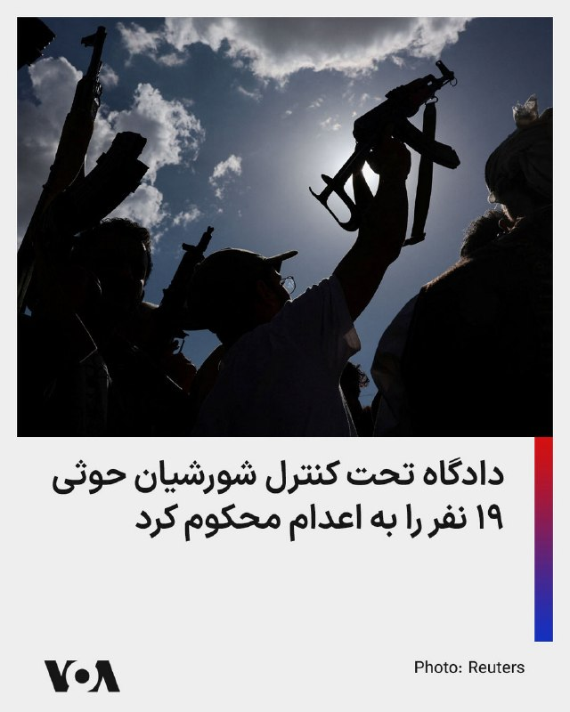

⚡️یک دادگاه تحت کنترل شورشیان حوثی در یمن ۱۹ نفر را به اتهام همکاری با ائتلاف تحت رهبری عربستان به اعدام محکوم کرد. حوثی‌ها مورد حمایت جمهوری اسلامی هستند و ائتلاف تحت رهبری عربستان در حمایت از دولت قانونی یمن با حوثی‌ها در جنگ بود. به گزارش آسوشیتدپرس این حکم روز یکشنبه صادر شد.
@FarsiVOA

## FarsiVOA — post 218091

  <a href="telegram/content/FarsiVOA_218091_1779142591.mp4" target="_blank">🎬 Download video</a>

⚡️امید معماریان در برنامه تفسیر خبر: خطای محاسباتی بزرگ مقامات جمهوری اسلامی درباره ترامپ ممکن است باعث شروع دوباره جنگ شود
@FarsiVOA

## FarsiVOA — post 218090

  <a href="telegram/content/FarsiVOA_218090_1779142592.mp4" target="_blank">🎬 Download video</a>

⚡️فاطمه حقیقت‌جو در برنامه تفسیر خبر: مشروعیت جمهوری اسلامی از بین رفته‌است
@FarsiVOA

## FarsiVOA — post 218089

  <a href="telegram/content/FarsiVOA_218089_1779142592.mp4" target="_blank">🎬 Download video</a>

⚡️بهزاد احمدی نیا در برنامه تفسیر خبر: جمهوری اسلامی معیشت مردم را به گروگان خود گرفته است
@FarsiVOA

## FarsiVOA — post 218088

⚡️آموزش حکومتی کار با سلاح در تلویزیون و خیابان؛ بومرنگی علیه حاکمیت جمهوری اسلامی؟
@FarsiVOA

## FarsiVOA — post 218087

  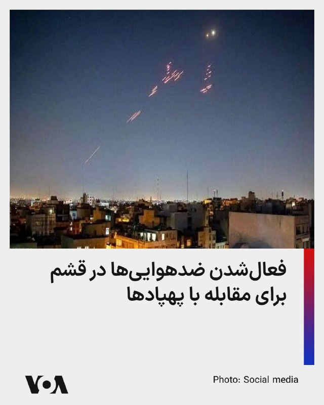

⚡️مقامات جمهوری اسلامی از فعال شدن ضدهوایی‌ها در جزیره قشم در روز دوشنبه خبر دادند. معاون سیاسی، امنیتی و اجتماعی استاندار هرمزگان، احمد نفیسی گفت فعالیت ضدهوایی‌ها برای مقابله با «ریزپرنده‌های دشمن» بود. او در اظهاراتی که خبرگزاری فارس، وابسته به سپاه منتشر کرد، از بیان اینکه آیا حملات ادعایی پهپادها خساراتی برجای گذاشته است یا خیر خودداری کرد.
@FarsiVOA

## FarsiVOA — post 218086

⚡️عفو بین‌الملل اعلام کرد جمهوری اسلامی دست‌کم دو هزار و ۱۵۹ نفر را در سال ۲۰۲۵ میلادی اعدام کرد ‌‌و عامل اصلی جهش آمار بود
@FarsiVOA

## FarsiVOA — post 218085

⚡️روز ارتباطات در سایه خاموشی دیجیتال؛ واکنش کاربران شبکه‌های اجتماعی
@FarsiVOA

## FarsiVOA — post 218084

⚡️علی جوانمردی: جمهوری اسلامی مسئول هرگونه اقدام نظامی در ایران است
@FarsiVOA

## FarsiVOA — post 218083

⚡️در برنامه تفسیر خبر امروز، مهدی آقازمانی با کارشناسان مهمان، درباره تاکید پرزیدنت ترامپ بر نیاز شدید حکومت ایران به دستیابی به توافق با آمریکا، گفته‌های سخنگوی وزارتخارجه جمهوری اسلامی درباره ادامه مذاکرات و هشتاد روزه شدن حصر دیجیتال مردم ایران توسط جمهوری اسلامی گفتگو می‌کند
@FarsiVOA

## FarsiVOA — post 218082

  

دونالد ترامپ، رئیس‌جمهوری آمریکا، روز دوشنبه اعلام کرد که حمله نظامی برنامه‌ریزی‌شده آمریکا علیه جمهوری اسلامی که قرار بود فردا انجام شود، به درخواست رهبران قطر، عربستان سعودی و امارات متحده عربی به تعویق افتاده است.

دونالد ترامپ در پیامی در شبکه تروت سوشال نوشت که امیر قطر، تمیم بن حمد آل ثانی، ولیعهد عربستان سعودی، محمد بن سلمان، و رئیس امارات متحده عربی، محمد بن زاید آل نهیان، از او خواسته‌اند که این حمله متوقف شود، زیرا به گفته او «مذاکرات جدی» در جریان است.

رئیس‌جمهوری آمریکا گفت این رهبران بر این باورند که «توافقی حاصل خواهد شد» که نه‌تنها برای ایالات متحده بلکه برای کشورهای منطقه نیز «بسیار قابل قبول» خواهد بود.

ترامپ همچنین تأکید کرد که این توافق شامل یک اصل کلیدی خواهد بود: «هیچ سلاح هسته‌ای برای حکومت ایران.»

او افزود که «بر اساس احترام» به رهبران یادشده، به پیت هگست، وزیر جنگ آمریکا، ژنرال دنیل کین رئیس ستاد مشترک نیروهای مسلح، و ارتش آمریکا دستور داده است که حمله برنامه‌ریزی‌شده انجام نشود.

https://ir.voanews.com/a/8151342.html

## FarsiVOA — post 218081

  <a href="telegram/content/FarsiVOA_218081_1779142593.mp4" target="_blank">🎬 Download video</a>

فرماندهی مرکزی ایالات متحده، سنتکام، اعلام کرد اجرای محاصره دریایی آمریکا علیه بنادر ایران همچنان ادامه دارد.

به گفته سنتکام، نیروهای آمریکایی تاکنون مسیر ۸۵ کشتی تجاری را برای اطمینان از اجرای کامل این اقدام تغییر داده‌اند.

@FarsiVOA

## DW_Farsi — post 124856

  

🔶 ترامپ: حمله فردا به ایران را به تعویق انداختیم

دونالد ترامپ، رئیس‌جمهور آمریکا، عصر دوشنبه، ۱۸ مه (۲۸ اردیبهشت) اعلام کرد ایالات متحده حمله نظامی "برنامه‌ریزی‌شده" علیه ایران را که قرار بود روز سه‌شنبه انجام شود، "اجرا نخواهد کرد". او این خبر را در شبکه اجتماعی تروث سوشال منتشر کرد.

ترامپ نوشت: «امیر قطر، تمیم بن حمد آل ثانی، ولیعهد عربستان محمد بن سلمان آل سعود و رئیس امارات محمد بن زاید آل نهیان از من خواستند حمله نظامی برنامه‌ریزی‌شده علیه جمهوری اسلامی ایران را که برای فردا تعیین شده بود، متوقف کنم، زیرا مذاکرات جدی اکنون در جریان است و به نظر آن‌ها، به‌عنوان رهبران و متحدان بزرگ، توافقی حاصل خواهد شد که برای ایالات متحده آمریکا، همه کشورهای خاورمیانه و فراتر از آن بسیار قابل قبول خواهد بود.»

او افزود: «این توافق، مهم‌تر از همه، شامل این خواهد بود که ایران هیچ سلاح هسته‌ای نداشته باشد.»

ترامپ همچنین گفت: «بر اساس احترامم به رهبران یادشده، به وزیر جنگ، پیت هگست، رئیس ستاد مشترک ارتش ژنرال دنیل کین و نیروهای مسلح آمریکا دستور داده‌ام که حمله برنامه‌ریزی‌شده فردا علیه ایران انجام نخواهد شد.»

@dw_farsi

## DW_Farsi — post 124855

  

🔶 آمریکا: مذاکرات به سختی پیش می‌رود و شاید بمب‌ها سخن بگویند تنش‌ها میان ایران و آمریکا روز دوشنبه همچنان بالا باقی ماند. یک مقام آمریکایی پیشنهاد متقابل اخیر ایران برای پایان دائمی جنگ را "ناکافی" توصیف کرد و گفت مذاکرات «به‌سختی پیش می‌رود». او هشدار داد…

## DW_Farsi — post 124854

  

🔶 آمریکا: مذاکرات به سختی پیش می‌رود و شاید بمب‌ها سخن بگویند

تنش‌ها میان ایران و آمریکا روز دوشنبه همچنان بالا باقی ماند. یک مقام آمریکایی پیشنهاد متقابل اخیر ایران برای پایان دائمی جنگ را "ناکافی" توصیف کرد و گفت مذاکرات «به‌سختی پیش می‌رود». او هشدار داد اگر ایران همکاری بیشتری نشان ندهد، در صورت لزوم آمریکا "با بمب‌ها سخن خواهد گفت".

همزمان دونالد ترامپ، رئیس جمهور آمریکا به نیویورک پست گفت که پس از دریافت آخرین پاسخ ایران با هدف پایان دادن به جنگ، "هیچ امتیازی برای تهران" قائل نیست و افزود که ایران می‌داند "به زودی چه اتفاقی خواهد افتاد".

او در پاسخ به سوالی در مورد اظهارات قبلی خود مبنی بر اینکه ممکن است تعلیق ۲۰ ساله غنی‌سازی اورانیوم ایران را بپذیرد، گفت: «من در حال حاضر هیچ چیزی را نمی‌پذیرم»، و از ارائه جزئیات بیشتر خودداری کرد.

ترامپ در ادامه به نیویورک پست گفت: «واقعاً نمی‌توانم در مورد آن با شما صحبت کنم. اتفاقات زیادی در حال رخ دادن است.»

او افزود که از ایران "ناامید" نشده است، اما هشدار داد که تهران درک می‌کند که ایالات متحده قادر به افزایش فشار بیشتر است.

@dw_farsi

## DW_Farsi — post 124853

  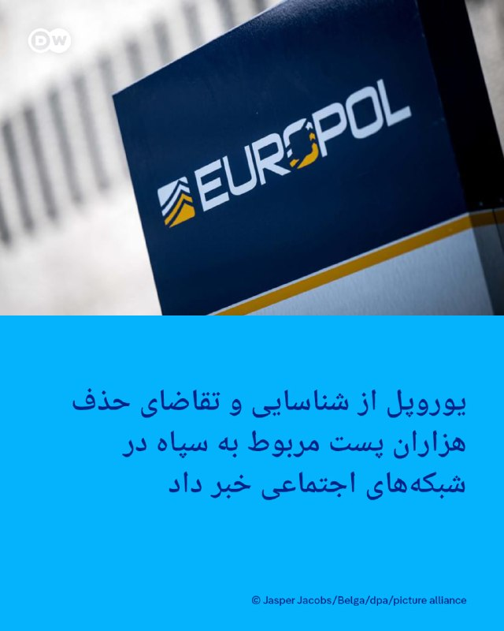

🔶 یوروپل اعلام کرد: شناسایی و تقاضای حذف هزااران پست مربوط به سپاه

یوروپل، آژانس اتحادیه اروپا برای همکاری در اجرای قانون که مدیریت اطلاعات جنایی و مبارزه با سازماندهی جنایت و جرائم سازمان‌یافته بین‌المللی مانند تروریسم را به عهده دارد، اعلام کرد که در یک اقدام هماهنگ علیه محتوای تروریستی در فضای آنلاین، مجموعاً ۱۴ هزار و ۲۰۰ پست مرتبط با سپاه پاسداران انقلاب اسلامی هدف قرار گرفت.

سپاه که اکنون از سوی اتحادیه اروپا به‌عنوان یک سازمان تروریستی شناخته می‌شود، متهم به استفاده از فضای مجازی برای تبلیغات، جذب نیرو و جمع‌آوری منابع مالی است.

این عملیات تحت هدایت "واحد ارجاع اینترنتی اتحادیه اروپا" وابسته به یوروپل انجام شد و بر شناسایی و مختل کردن حضور آنلاین سپاه تمرکز داشت.

اتحادیه اروپا در ۱۹ فوریه ۲۰۲۶ با صدور تصمیمی رسمی سپاه را در فهرست سازمان‌های تروریستی قرار داد؛ اقدامی که به نهادهای امنیتی اروپا اجازه می‌دهد علیه فعالیت‌های مرتبط با آن در کشورهای عضو اقدام کنند.

در این عملیات، ۱۹ کشور مشارکت داشتند: اتریش، بلژیک، بوسنی و هرزگوین، بلغارستان، جمهوری چک، دانمارک، استونی، فنلاند، فرانسه، آلمان، یونان، مجارستان، ایتالیا، هلند، پرتغال، اسپانیا، سوئد، اوکراین و آمریکا.

@dw_farsi

## Persian_Trend_Official — post 14461

  <a href="telegram/content/Persian_Trend_Official_14461_1779142595.webm" target="_blank">🎬 Download video</a>

تیراندازی در یک مرکز اسلامی در آمریکا 🔸رسانه‌ها روز دوشنبه از حضور یک فرد مسلح و تیراندازی در مرکز اسلامی سن دیگو خبر می‌دهند. 🔹پلیس سن دیگو از مردم خواست که از حضور در این منطقه خودداری کنند. ☆Phantom☆ 📌 @persian_trend_official پرشین ترند | متفاوت‌ترین…

## Persian_Trend_Official — post 14460

  

🔺فرمانده قرارگاه مرکزی خاتم‌الانبیا: به آمریکا و همپیمانان آن اعلام می‌داريم، دوباره مرتکب اشتباه راهبردی و خطای محاسباتی نشوند.

🔹سرلشکر پاسدار خلبان علی عبدالهی: آنها باید بدانند ایران اسلامی و نیروهای مسلح آن نسبت به گذشته آماده تر و قوی تر، دست بر ماشه هستند و هرگونه تعرض و تجاوز مجددی از سوی دشمنان سرزمین و ملت سربلند را سریع، قاطع، پرقدرت و گسترده پاسخ خواهند داد.

🔹دشمنان آمریکایی اسرائیلی بارها ملت شجاع ایران و نیروهای مسلح مقتدر آن را آزموده اند.

🔹ما با عظم و اراده الهی ثابت کرده ایم که اقتدار و توانایی خود را در میدان عمل به دشمنان نشان می دهیم و چنانچه خطای دیگری از سوی دشمنانمان سربزند با قدرت و توانایی به مراتب بالاتر از جنگ تحمیلی رمضان با آن برخورد خواهیم نمود و با تمام توان از حقوق ملت ایران دفاع می کنیم و دست هر متجاوزی را قطع می نمائیم.

☆Phantom☆

📌 @persian_trend_official
پرشین ترند | متفاوت‌ترین کانال نظامی

## Persian_Trend_Official — post 14459

  

📰
📰 تو صداوسیما تانک آوردن!!!

☆Phantom☆

📌 @persian_trend_official
پرشین ترند | متفاوت‌ترین کانال نظامی

## Persian_Trend_Official — post 14458

  

فعال شدن پدافند هوایی اصفهان/مهر نیوز

☆Phantom☆

📌 @persian_trend_official
پرشین ترند | متفاوت‌ترین کانال نظامی

## Persian_Trend_Official — post 14457

  

حزب‌الله : ما یک هواپیمای جنگی اسرائیلی را با یک موشک زمین به هوا در حریم هوایی بخش غربی جنوب لبنان رهگیری کردیم.

☆Phantom☆

📌 @persian_trend_official
پرشین ترند | متفاوت‌ترین کانال نظامی

## Persian_Trend_Official — post 14456

https://youtube.com/live/7aZKWyXxQog?feature=share

## Persian_Trend_Official — post 14455

  <a href="telegram/content/Persian_Trend_Official_14455_1779142598.webm" target="_blank">🎬 Download video</a>

ایران سامانه «هرمز سیف» را برای ثبت‌نام کشتی‌های عبوری از تنگه هرمز راه‌اندازی کرد جمهوری اسلامی ایران سامانه‌ای تحت عنوان «هرمز سیف» را با هدف ارائه خدمات به کشتی‌های عبوری از تنگه هرمز راه‌اندازی کرده است. بر اساس این طرح، ناخدایان و شرکت‌های کشتیرانی می‌توانند…

## Persian_Trend_Official — post 14454

🔴 صدای انفجار در سلیمانیه عراق گویا سپاه دوباره به مقر پژاک حمله کرده

## Persian_Trend_Official — post 14453

  <a href="telegram/content/Persian_Trend_Official_14453_1779142598.webm" target="_blank">🎬 Download video</a>

💢اینم نتیجه رفتار و عملکرد دونالد ترامپ

🫆:Tony

📌 @persian_trend_official
پرشین ترند | متفاوت‌ترین کانال نظامی

## Persian_Trend_Official — post 14452

نسخه صوتی لایو امشب :

https://castbox.fm/vd/946653632

## Persian_Trend_Official — post 14451

  

🔴 صدای انفجار در سلیمانیه عراق
گویا سپاه دوباره به مقر پژاک حمله کرده

## Persian_Trend_Official — post 14450

  <a href="telegram/content/Persian_Trend_Official_14450_1779142599.mp4" target="_blank">🎬 Download video</a>

🇺🇸
🇦🇫 حداقل دو نفر کشته شده‌اند و چندین نفر دیگر در یک وضعیت تیراندازی فعال در مرکز اسلامی سن دیگو، کالیفرنیا زخمی شده‌اند. ویدیوی بالا شخصی را در یک استخر خون پس از ظاهراً تیر خوردن نشان می‌دهد.

☆Phantom☆

📌 @persian_trend_official
پرشین ترند | متفاوت‌ترین کانال نظامی

## Persian_Trend_Official — post 14449

  

تیراندازی در یک مرکز اسلامی در آمریکا

🔸رسانه‌ها روز دوشنبه از حضور یک فرد مسلح و تیراندازی در مرکز اسلامی سن دیگو خبر می‌دهند.

🔹پلیس سن دیگو از مردم خواست که از حضور در این منطقه خودداری کنند.

☆Phantom☆

📌 @persian_trend_official
پرشین ترند | متفاوت‌ترین کانال نظامی

## Persian_Trend_Official — post 14448

  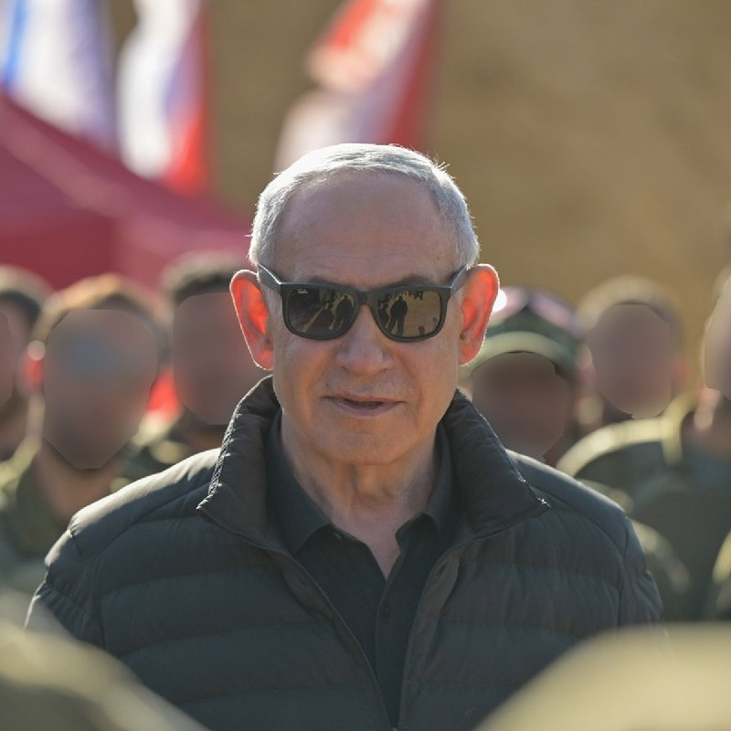

💢از سوی امیر قطر، تمیم بن حمد آل ثانی، ولیعهد عربستان سعودی، محمد بن سلمان آل سعود، و رئیس امارات متحده عربی، محمد بن زاید آل نهیان، از من خواسته شد حمله نظامی برنامه‌ریزی‌شده ما علیه جمهوری اسلامی ایران که قرار بود فردا انجام شود را متوقف کنم، زیرا مذاکرات…

## Persian_Trend_Official — post 14446

فعال شدن پدافند قشم علیه ریزپرنده‌ها 💢 در پی فعالیت پدافند در جزیره قشم، خبرنگار تسنیم از منابع مطلع کسب اطلاع کرد که پس از مشاهده ریز پرنده‌ها در آسمان جزیره، پدافند در جهت نابودی اهداف متخاصم فعال شد. 🫆:Tony 📌 @persian_trend_official پرشین ترند | متفاوت‌ترین…

## Persian_Trend_Official — post 14445

  <a href="telegram/content/Persian_Trend_Official_14445_1779142600.webm" target="_blank">🎬 Download video</a>

فعال شدن پدافند قشم علیه ریزپرنده‌ها

💢 در پی فعالیت پدافند در جزیره قشم، خبرنگار تسنیم از منابع مطلع کسب اطلاع کرد که پس از مشاهده ریز پرنده‌ها در آسمان جزیره، پدافند در جهت نابودی اهداف متخاصم فعال شد.

🫆:Tony

📌 @persian_trend_official
پرشین ترند | متفاوت‌ترین کانال نظامی

## Persian_Trend_Official — post 14443

⭕️ وضعیت کم سابقه‌ی آسمان منطقه، از نظر خلوت بودن. (در عکس اول فقط پرواز های نظامی آمریکا و در عکس دوم تمام پرواز های نظامی) 📝 Nick 📌 @persian_trend_official پرشین ترند | متفاوت‌ترین کانال نظامی

## Persian_Trend_Official — post 14442

  <a href="telegram/content/Persian_Trend_Official_14442_1779142600.webm" target="_blank">🎬 Download video</a>

💢از سوی امیر قطر، تمیم بن حمد آل ثانی، ولیعهد عربستان سعودی، محمد بن سلمان آل سعود، و رئیس امارات متحده عربی، محمد بن زاید آل نهیان، از من خواسته شد حمله نظامی برنامه‌ریزی‌شده ما علیه جمهوری اسلامی ایران که قرار بود فردا انجام شود را متوقف کنم، زیرا مذاکرات…

## Persian_Trend_Official — post 14441

  <a href="telegram/content/Persian_Trend_Official_14441_1779142601.webm" target="_blank">🎬 Download video</a>

💢از سوی امیر قطر، تمیم بن حمد آل ثانی، ولیعهد عربستان سعودی، محمد بن سلمان آل سعود، و رئیس امارات متحده عربی، محمد بن زاید آل نهیان، از من خواسته شد حمله نظامی برنامه‌ریزی‌شده ما علیه جمهوری اسلامی ایران که قرار بود فردا انجام شود را متوقف کنم، زیرا مذاکرات…

## Persian_Trend_Official — post 14440

  

💢از سوی امیر قطر، تمیم بن حمد آل ثانی، ولیعهد عربستان سعودی، محمد بن سلمان آل سعود، و رئیس امارات متحده عربی، محمد بن زاید آل نهیان، از من خواسته شد حمله نظامی برنامه‌ریزی‌شده ما علیه جمهوری اسلامی ایران که قرار بود فردا انجام شود را متوقف کنم، زیرا مذاکرات جدی اکنون در حال انجام است و آن‌ها معتقدند به‌عنوان رهبران و متحدان بزرگ، توافقی حاصل خواهد شد که برای ایالات متحده آمریکا، همه کشورهای خاورمیانه و فراتر از آن بسیار قابل قبول خواهد بود. این توافق، مهم‌تر از همه، شامل «عدم دستیابی ایران به سلاح هسته‌ای» خواهد بود.

💢بر اساس احترامی که برای رهبران یادشده قائلم، به وزیر جنگ، پیت هگست، رئیس ستاد مشترک ارتش، ژنرال دنیل کین، و ارتش ایالات متحده دستور داده‌ام که حمله برنامه‌ریزی‌شده علیه ایران را فردا انجام ندهند، اما در عین حال به آن‌ها دستور داده‌ام در صورتی که توافق قابل قبولی حاصل نشود، آماده اجرای یک حمله کامل و گسترده علیه ایران در کوتاه‌ترین زمان ممکن باشند.

▪️از توجه شما به این موضوع سپاسگزارم!

رئیس‌جمهور دونالد جی. ترامپ

🫆:Tony

📌 @persian_trend_official
پرشین ترند | متفاوت‌ترین کانال نظامی

## RadioFarda — post 157323

  <a href="https://t.me/radiofarda/157323" target="_blank">📎 Download file</a>

📻بشنوید: سرخط خبرهای بامدادی رادیوفردا، ۲۹ اردیبهشت ۱۴۰۵‌

@RadioFarda

## RadioFarda — post 157322

🔸مراسم ازدواج دسته‌جمعی روز دوشنبه برای ۱۱۰ زوج در میدان «امام حسین» تهران برگزار شد.

🔸تصاویر منتشرشده از این مراسم، خودروهای نظامی و تیربار را در فضای جشن نشان می‌دهد.

🔸کارزار حکومتی «جان‌فدا» با هدف نمایش آمادگی عمومی در مواجهه با حمله‌ زمینی احتمالی راه‌اندازی شده است.

🔸همزمان در روزهای اخیر دوره‌های آموزش استفاده از سلاح در مکان‌های عمومی نیز آغاز شده است.

🔸این مراسم در حالی برگزار شد که آتش‌بسی شکننده میان ایران، و آمریکا و اسرائیل برقرار است.

@RadioFarda

## RadioFarda — post 157321

  

ترامپ می‌گوید حمله نظامی گسترده به ایران را به طور موقت به تعویق انداخته است

🔸دونالد ترامپ، رئیس جمهور آمریکا، روز دوشنبه در شبکه اجتماعی خود خبر داد که حمله‌ای تازه به ایران برای روز سه‌شنبه برنامه‌ریزی شده بود، اما او فعلا آن را به عقب می‌اندازد.

🔸او توضیح داده است که این حمله را به درخواست «امیر قطر، ولیعهد عربستان سعودی و رئیس جمهور امارات متحده عربی» فعلا انجام نمی‌دهد.

🔸ساعتی پیشتر، دونالد ترامپ در واکنش به پاسخ تازه تهران به پیشنهادات آمریکا گفته بود که قرار نیست امتیازی به ایران بدهد.

🔸او در ادامه تهدید کرده بود که ایران می‌داند که «خیلی زود چه اتفاقی خواهد افتاد».

🔸ایران روز دوشنبه ۲۸ اردیبهشت اعلام کرد که به پیشنهاد جدید آمریکا با هدف پایان دادن به جنگ پاسخ داده است و افزود که تبادل نظر میان طرفین همچنان ادامه دارد.

🔸حال او در پیام تازه خود نوشته است «از آنجا که مذاکراتی جدی در جریان است و از نظر رهبران و متحدان بزرگ ما توافقی حاصل خواهد شد که برای آمریکا هم بسیار قابل قبول خواهد بود»، او حمله نظامی را که برای روز سه‌شنبه برنامه‌ریزی شده بود به تعویق می‌اندازد.

@RadioFarda

## IranianMinds — post 20369

🔴 ترامپ:

عربستان، قطر، امارات و برخی طرف‌های دیگر درخواست کردند حمله به مدت دو یا سه روز به تعویق بیفتد، چون معتقدند که رسیدن به توافق نزدیک است!

@IranianMinds

## IranianMinds — post 20368

🔴 ترامپ: ما به جمهوری اسلامی هیچ امتیازی نخواهیم داد، فقط تسلیم کامل!

@IranianMinds

## IranianMinds — post 20367

  

چیشده شل شدین ؟

🔴 پزشکیان :

گفتگو به معنای تسلیم نیست؛
جمهوری‌اسلامی ایران با عزت و اقتدار وارد گفتگو میشه و از حقوق خودش عقب‌نشینی نمیکنه.

@IranianMinds

## IranianMinds — post 20366

🔴 خبرگزاری مهر:

پدافند هوایی در اصفهان فعال شد.

@IranianMinds

## IranianMinds — post 20365

🔴 ترامپ:

هم‌اکنون مذاکرات جدی برای رسیدن به توافق با ایران در جریان است.

@IranianMinds

## IranianMinds — post 20364

  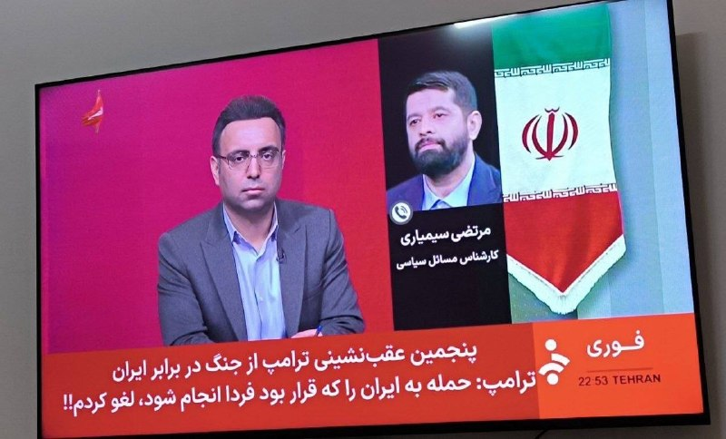

🔴صداوسیما هم این وسط، ۵ بار اعلام پیروزی کرد😂😂

@IranianMinds

## IranianMinds — post 20363

🔴خبرگزاری مهر: پدافند هوایی قشم فعال شد. @IranianMinds

## IranianMinds — post 20362

  

🔴ترامپ:

از سوی امیر قطر، تمیم بن حمد آل ثانی، ولیعهد عربستان سعودی، محمد بن سلمان آل سعود، و رئیس‌جمهور امارات متحده عربی، محمد بن زاید آل نهیان، از من خواسته شده است که حمله نظامی برنامه‌ریزی شده به جمهوری اسلامی ایران که برای فردا برنامه‌ریزی شده بود را به تعویق بیندازم، زیرا مذاکرات جدی در حال انجام است و به نظر آن‌ها، به عنوان رهبران بزرگ و متحدان، توافقی حاصل خواهد شد که برای ایالات متحده آمریکا و همچنین تمام کشورهای خاورمیانه و فراتر از آن بسیار قابل قبول خواهد بود.

این توافق شامل نکته مهمی است: هیچ سلاح هسته‌ای برای ایران نخواهد بود! بر اساس احترام من به رهبران مذکور، به وزیر جنگ، پیت هگستث، رئیس ستاد مشترک نیروهای مسلح، ژنرال دنیل کین، و نیروهای نظامی ایالات متحده دستور داده‌ام که حمله برنامه‌ریزی شده به ایران فردا انجام نشود، اما به آن‌ها دستور داده‌ام که آماده باشند در صورت عدم دستیابی به توافق قابل قبول، فوراً حمله‌ای کامل و گسترده به ایران را آغاز کنند.

@IranianMinds

## IranianMinds — post 20361

🔴خبرگزاری مهر:

پدافند هوایی قشم فعال شد.

@IranianMinds

## BBCPersian — post 281404

  

‌ ‌ ‌
خبرگزاری هرانا، ارگان خبری مجموعه فعالان حقوق بشر، می‌گوید از زمان شروع جنگ اخیر تا هفته گذشته، دست‌کم ۴۰۲۳ بازداشت را در ایران ثبت کرده است.

به گفته این نهاد که مقرش در آمریکاست، اتهام‌های مطرح‌شده شامل جاسوسی، تهدید علیه امنیت ملی و ارتباط یا ارسال مطالب مربوط به جنگ به رسانه‌های خارجی است.

بنابر این گزارش، مقام‌های ایران از جنگ «برای تشدید روایت‌های امنیتی و توجیه بازداشت‌ها، محدودیت آزادی بیان و اعمال خشونت علیه غیرنظامیان استفاده کرده‌اند.»

احمدرضا رادان، فرمانده کل نیروی انتظامی، دیروز گفت از آغاز جنگ اخیر «بیش از ۶۵۰۰ نفر از وطن‌فروشان و جاسوسان دستگیر شده‌اند که ۵۶۷ نفر از آنان مرتبط با گروهک‌های ضدانقلاب و عناصر نفاق بودند.»

او درباره اعتراضات دی‌ماه گفت: «هیچ‌گونه رهاسازی انجام نشده و همچنان در حال شناسایی و دستگیری این افراد هستیم.»

هزاران نفر در اعتراضات سراسری دی بازداشت شده‌اند و رئیس قوه قضائیه خواستار رسیدگی سریع و بدون اغماض به پرونده آنها شده است.

https://bbc.in/4fzVJR8
📷 EPA/Shutterstock
@BBCPersian

## BBCPersian — post 281403

🔻 شهردار سن دیگو: به همشهریان مسلمان اطمینان می‌دهم که هیچ کمکی دریغ نخواهد شد

تاد گلوریا، شهردار سن‌دیگو، گفت از این که کودکانی که هنگام حمله در مدرسه مشغول تحصیل بودند، در امان مانده‌اند، سپاسگزار است.

او ادامه داد: «برای جامعه مسلمانان محلی، دعاهای من با شماست.»

آقای گلوریا گفت می‌خواهد به جامعه مسلمانان اطمینان دهد که «هیچ منبعی دریغ نخواهد شد» تا امنیت آن‌ها در برابر خشونت تامین شود.

او همچنین از نیروهای پلیس «عمیقا قدردانی» کرد و این حادثه را «وضعیتی غم‌انگیز» توصیف کرد.

شهردار سن‌دیگو همچنین به خانواده قربانیان تسلیت گفت و افزود بازرسان «هر اقدام لازم» را برای روشن شدن ابعاد حادثه انجام خواهند داد.

او تاکید کرد: «نفرت جایی در شهر سن‌دیگو ندارد.»

https://bbc.in/3PuRJqw
@BBCPersian

## BBCPersian — post 281402

🔻 فعال شدن پدافند هوایی در اصفهان

گزارش‌ها از ایران حاکی از شنیده شدن صدای پدافند در شهر اصفهان است.

خبرگزاری مهر هم با تایید این گزارش‌ها نوشته:‌ «هنوز مسئولان توضیحی در رابطه با چرایی فعالیت پدافند اصفهان ارائه نکرده‌اند.»

پیش از این گزارش‌هایی از فعال شدن پدافند جزیره قشم هم منتشر شده بود که خبرگزاری تسنیم گفته بود برای مقابله با «ریز پرنده‌ها» بوده است.

https://bbc.in/4wyq493
@BBCPersian

## BBCPersian — post 281401

🔻 حمله به مسجد جامع سن دیگو؛‌ پلیس تیراندازی را تحت عنوان «جنایت ناشی از نفرت» بررسی می‌کند

اسکات وال، رئیس پلیس سن‌دیگو، گفت حادثه رخ‌داده در مرکز اسلامی در حال حاضر به عنوان «جنایت ناشی از نفرت (تروریسم داخلی)» بررسی می‌شود و پلیس همکاری نزدیکی با اف‌بی‌آی دارد.

مارک رمیلی، مامور ویژه اف‌بی‌آی، نیز در ادامه گفت سه مرد بزرگسال که در تیراندازی هدف قرار گرفته بودند، جان باخته‌اند.

او افزود مرگ دو مظنون، که هر دو نوجوان بودند، تایید شده است.

آقای رمیلی گفت اف‌بی‌آی با «دقت کامل» در حال بررسی ابعاد حادثه است و همه منابع خود را برای روشن شدن جزئیات این حمله به کار گرفته است.

او همچنین از مردم خواست هرگونه اطلاعاتی را که می‌تواند به روند تحقیقات کمک کند، در اختیار مقام‌ها قرار دهند.

https://bbc.in/49apwMr
@BBCPersian

## BBCPersian — post 281400

🔻 تیراندازی در مسجد جامع سن‌دیگو؛ پلیس: جسد دو نوجوان در خودرو پیدا شد که احتمالا تیراندازها هستند

رئیس پلیس سن‌دیگو اعلام کرد دو مردی که در نزدیکی محل حادثه جان باخته پیدا شدند، به احتمال زیاد مظنونان تیراندازی هستند.

مقام‌ها گفتند اجساد این دو نوجوان پسر داخل یک خودرو در نزدیکی مسجد پیدا شده است.

رئیس پلیس همچنین گفت دو مظنون، که گفته می‌شود هر دو نوجوان بودند، داخل یک خودرو با جراحاتی ناشی از شلیک به خود پیدا شدند.

اسکات وال، رئیس پلیس سن‌دیگو، گفت: «جزئیات اتفاقات منتهی به این حادثه، آنچه دقیقا رخ داده و زمان دقیق وقوع آن، در روزهای آینده روشن خواهد شد.»

رئیس پلیس گفت ماموران در ساعت ۱۱:۴۳ به وقت محلی به محل حادثه اعزام شدند و «در مقابل محل، با آنچه به نظر می‌رسید سه قربانی جان‌باخته باشند» روبه‌رو شدند.

او افزود نیروهای بیشتر پلیس ظرف چهار دقیقه به محل رسیدند.

به گفته او، «تقریبا همزمان، تماس‌هایی از چند خیابان آن‌طرف‌تر دریافت کردیم که از ادامه تیراندازی فعال خبر می‌داد.»

https://bbc.in/4nAIJwT
@BBCPersian

## BBCPersian — post 281399

🔻 تیراندازی در مسجد جامع سن دیگو؛ پلیس: سه نفر کشته شدند و دو مظنون هم «کشته شده‌اند»

ساعتی بعد از تیراندازی در مسجد جامع سن‌دیگو، اسکات وال، رئیس پلیس این شهر، در حال گفت‌وگو با رسانه‌هاست.

او گفت در حال حاضر هیچ تهدید دیگری در منطقه وجود ندارد و دو مظنون «کشته شده‌اند».

رئیس پلیس همچنین افزود سه بزرگسال در مرکز اسلامی جان باخته‌اند.

او گفت: «قلب ما با خانواده‌هایی است که در این لحظه در حال مطلع شدن از اتفاقی هستند که برای عزیزانشان رخ داده است.»

مقام‌های پلیس هم اکنون در حال دادن آخرین اطلاعات به خبرنگاران هستند. با ما باشید تا جزییات بیشتر را همزمان برایتان گزارش کنیم.

https://bbc.in/4wsKH6m
@BBCPersian

## BBCPersian — post 281398

🔻 تیراندازی در مسجد جامع سن دیگو؛ با انتقال مجروحان، مراکز درمانی سن دیگو در وضعیت فوق‌العاده قرار گرفتند

سخنگوی شبکه درمانی «شارپ هلث‌کر» به بی‌بی‌سی گفت بیمارستان «شارپ مموریال» این شبکه در حال پذیرش مجروحان مرتبط با تیراندازی است.

آلیشیا کوک، سخنگوی این مرکز درمانی، گفته است: «گزارش‌ها حاکی از آن است که چندین نفر زخمی شده‌اند.»

او افزود: «پروتکل‌های وضعیت بحرانی ما فعال شده و در حال هماهنگی با شهرستان سن‌دیگو و دیگر نهادها برای واکنش به این حادثه هستیم.»

تاد گلوریا، شهردار سن‌دیگو، اعلام کرد پلیس این شهر به او اطلاع داده که در حال حاضر هیچ تهدید ادامه‌داری متوجه جامعه نیست.

او در پیامی در شبکه‌های اجتماعی از نیروهای امدادی و ماموران پلیس «که به سرعت برای حفاظت از جان مردم و تامین امنیت منطقه واکنش نشان دادند» قدردانی کرد.

سن دیگو در جنوب کالیفرنیا و مرز این ایالت با مکزیک واقع شده است.

همچون لس‌آنجلس و حومه آن مانند منطقه اورنج کانتی، سن‌دیگو هم میزبان جامعه بزرگی از مهاجران ایرانی است.

https://bbc.in/4nHwkHC
@BBCPersian

## BBCPersian — post 281397

  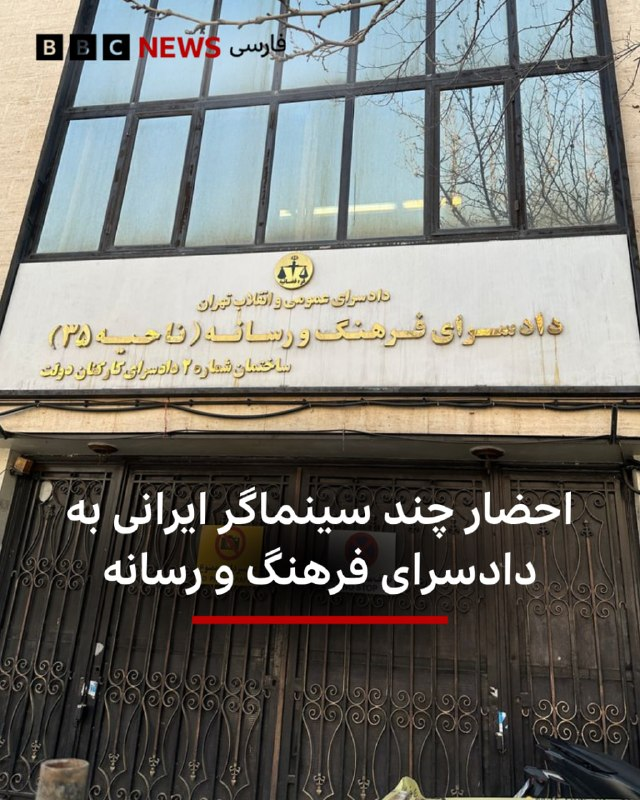

🔻چند سینماگر ایرانی اخیرا به دادسرای فرهنگ و رسانه در تهران احضار شده‌اند و اتهام «همکاری با دول متخاصم خارجی علیه جمهوری اسلامی» به آنها ابلاغ شده است.

هومن سیدی، بازیگر و فیلمساز، و سعید روستایی، کارگردان و تهیه‌کننده سینما، از جمله احضارشدگان هستند.

بی‌بی‌سی از مصداق اتهامات آنها اطلاع ندارد و معلوم نیست که آیا این احضارها به فعالیت‌های هنری آنها مربوط است یا به فعالیت‌های دیگر.

📷 AsrIran
https://bbc.in/3PomJIX
@BBCPersian

## BBCPersian — post 281396

🔻 تیراندازی در بزرگترین مسجد و مرکز اسلامی سن دیگو آمریکا

پلیس شهر سن دیگو - در جنوب کالیفرنیا - در واکنش به تیراندازی در بزرگترین مسجد این شهر وارد عمل شده است و مدرسه مجاور این مسجد را هم قرق کرده و همه دانش‌آموزان در وضعیت پناه گرفتن قرار گرفته‌اند.

یک شاهد عینی در گفت‌وگو با شبکه سی‌بی‌اس نیوز، شریک خبری بی‌بی‌سی در آمریکا، گفت صدای شلیک حدود ۳۰ گلوله را شنیده که به گفته او، به نظر می‌رسید از یک «سلاح نیمه‌خودکار» شلیک شده باشد.

او گفت ابتدا حدود ۱۲ گلوله شنیده، سپس وقفه‌ای کوتاه ایجاد شده و بعد دوباره احتمالا حدود ۱۲ گلوله دیگر شلیک شده است.

این مرد که بازنشسته است و هنگام حادثه در خانه مشغول خوردن ناهار بود، گفت با شماره اضطراری ۹۱۱ تماس گرفته و پلیس ظرف «پنج تا ۱۰ دقیقه» در محل حاضر شده است.

او افزود این مسجد در ایام تعطیلات بسیار شلوغ می‌شود.

این شاهد گفت: «خوشبختانه این اتفاق روز جمعه رخ نداد، چون خیابان‌ها پر از جمعیت می‌بود.»

این مرکز اسلامی، بزرگ‌ترین مسجد در شه سن‌دیگو به شمار می‌رود و بنا بر وب‌سایت آن، بیش از ۵ هزار عضو در جامعه مذهبی خود دارد.

این مجموعه همچنین شامل مدرسه «الرشید» است که دوره‌های آموزش دینی و زبان ارائه می‌کند.

بر اساس اطلاعات وب‌سایت این مرکز، ماموریت آن خدمت‌رسانی به جامعه مسلمانان و همچنین «همکاری با جامعه گسترده‌تر برای کمک به افراد کم‌برخوردار، آموزش و بهبود کشور» عنوان شده است.

https://bbc.in/49ampEf
@BBCPersian

## BBCPersian — post 281395

  <a href="https://t.me/bbcpersian/281395" target="_blank">📎 Download file</a>

🔻پادکست برنامه جام جهان‌نما دوشنبه ۲۸ اردیبهشت ۱۴۰۵
این برنامه رادیویی را می‌توانید هر شب ساعت ۲۰ به وقت ایران، روی موج متوسط ۷۰۲ کیلوهرتز و موج کوتاه ۹۴۶۵ کیلوهرتز بشنوید.
تکرار برنامه را هم می‌توانید ساعت ۲۱:۳۰ روی موج متوسط ۷۰۲ کیلوهرتز و موج کوتاه ۵۳۹۵ کیلوهرتز گوش کنید.
@BBCPersian

## BBCPersian — post 281394

  <a href="telegram/content/BBCPersian_281394_1779142606.mp4" target="_blank">🎬 Download video</a>

🔻آخرین خبرهای مهم دوشنبه ۲۸ اردیبهشت ۱۴۰۵
@BBCPersian

## BBCPersian — post 281393

🔻دونالد ترامپ می‌گوید که قرار بود فردا به ایران حمله نظامی کند اما به درخواست امیر قطر، ولیعهد عربستان و امارات متحده عربی این حمله را به تعویق انداخته است. او در پستی در شبکه اجتماعی تروث سوشال نوشت: «از من خواسته شده است حمله نظامی برنامه‌ریزی‌شده ما علیه…

## BBCPersian — post 281392

  

🔻دونالد ترامپ می‌گوید که قرار بود فردا به ایران حمله نظامی کند اما به درخواست امیر قطر، ولیعهد عربستان و امارات متحده عربی این حمله را به تعویق انداخته است.

او در پستی در شبکه اجتماعی تروث سوشال نوشت: «از من خواسته شده است حمله نظامی برنامه‌ریزی‌شده ما علیه جمهوری اسلامی ایران را که قرار بود فردا انجام شود، به تعویق بیندازم؛ زیرا مذاکرات جدی اکنون در جریان است و به باور آن‌ها، به‌عنوان رهبران بزرگ و متحدان ما، توافقی حاصل خواهد شد که برای ایالات متحده آمریکا و همچنین همه کشورهای خاورمیانه و فراتر از آن بسیار قابل قبول خواهد بود.»

او افزود: «این توافق نکته مهمی را در برخواهد داشت: ایران سلاح هسته‌ای نخواهد داشت.»

📷 Getty Images
https://bbc.in/3PpMOY6
@BBCPersian

## BBCPersian — post 281391

  

🔻دادگاهی در کالیفرنیا شکایت ایلان ماسک، مالک ایکس و تسلا، از شرکت اوپن اِی‌آی، سازنده هوش مصنوعی چت جی‌پی‌تی، را رد کرد.

آقای ماسک ‌هم‌بنیان‌گذار شرکت اوپن اِی‌آی بود و بعدتر این شرکت را متهم کرد که از هدف اولیه‌اش یعنی «خدمت‌رسانی به انسان» عدول کرده است.

هیئت منصفه این دادگاه رای داد که آقای ماسک «خیلی دیر» برای شکایت از سم آلتمن، رئیس اوپن اِی‌آی، اقدام کرده است.

آقای آلتمن و آقای ماسک یکدیگر را به تلاش برای «کسب منفعت مالی» از رشد هوش مصنوعی در سال‌های گذشته متهم کرده‌اند.

آقای ماسک که ثروتمندترین مرد جهان است، در سال ۲۰۱۸ از هیئت‌مدیره اوپن اِی‌آی کناره‌گیری کرد و هوش مصنوعی گروک را برای رقابت با چت جی‌پی‌تی ساخت.

دعوای حقوقی این دو میلیاردر را بسیاری از نزدیک دنبال می‌کنند چرا که معتقدند بر آینده هوش مصنوعی اثرگذار است.

📷 Getty Images
@BBCPersian

## Dirty_Kids — post 389710

کونی که امشب تو صداوسیما به نمایش گذاشته شد

@Dirty_Kids 👻

## Dirty_Kids — post 389709

  <a href="telegram/content/Dirty_Kids_389709_1779142608.mp4" target="_blank">🎬 Download video</a>

صداوسیما امشب یکی رو کون لخت نشون داد...

@Dirty_Kids 👻

## Dirty_Kids — post 389708

  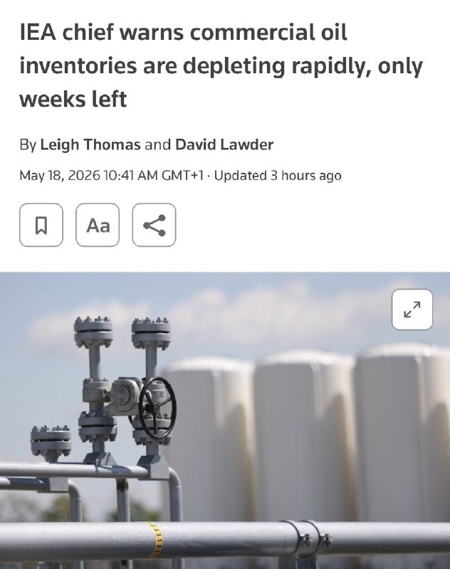

هر تصمیمی که در خصوص روافض بخواد گرفته شه، چه جنگ احتمالی چه توافق احتمالی، دو سه هفته بیشتر فرصت برای انجامش نیست،

چرا که طبق گفته‌ی مدیر اجرایی آژانس بین‌المللی انرژی [IEA]، فقط چند هفته تا تموم شدن «ذخایر تجاری نفت» باقی مونده که در صورت تموم شدن ذخایر تجاری، قیمت نفت به مراتب افزایش پیدا می‌کنه که هیچ،

کشورها مجبور می‌شن برای کنترل بازار از «ذخایر نفت استراتژیک»‌شون استفاده کنن که خب خیلی مطلوب‌شون نیست،

این تنها کارت بازی که روافض در دست دارن و با فرسایشی کردن روند مذاکرات سعی دارن وضعیت رو تا جای ممکن کش بدن تا به نقطه‌ی بحرانی برسه،

از طرفی حمله‌ی محدود آمریکا هم جوابگوی جلوگیری از اون وضعیت بحرانی قیمت نفت نیست و آمریکا دو راه بیشتر پیش رو نداره:

یا باید با یک حمله‌ی همه‌جانبه و به مراتب پرقدرت‌تر از قبل چنان ضربه‌ای بزنه که تمام اهداف نظامی و بخش عمده‌ی زیرساخت‌های انرژی به منظور تسلیم کردن روافض از بین بره [که خب متأسفانه نامطلوب‌ترین حالت ممکن برای ساقط کردن این رژیم حرومیه و احتمالاً انجامش آخرین پلن شیر خدا از سر ناچاری باشه]،

و یا باید با رژیم روافض به توافق برسه که با توجه به روند فعلی هنوز نشونه‌ای از رسیدن به خواسته‌هایی که آمریکا اعلام کرده بود از جمله تحویل ۴۸۰ کیلوگرم اورانیوم و بازکردن تنگه‌ی هرمز و غیره نیست.

در حال حاضر و با توجه به فشار و هشداری که پاکستان قرمساق به رژیم روافض داده، درصدی امکان عقب‌نشینی از سمت برخی از سران روافض خدعه‌گر هست، حداقل از توئیت پوزیده این برداشت رو می‌شه کرد،

اما نکته اینجاست که رژیم شیعه‌سانان رافضی تیکه‌پاره‌تر این حرفاست که تصمیم‌گیری در این مورد در اختیار موجود چپ‌و‌چوله‌ای مثه پوزیده باشه،

بنابراین تا اعلام نظر هفت‌هشت گروه مختلف رژیم شیعه‌سانان که از دقایقی دیگه شروع به جفتک اندازی می‌کنن باید منتظر موند که آیا آخرین اتمام حجت شیر خدا برای تسلیم رژیم جواب می‌ده یا خیر.

@Dirty_Kids 👻

## Dirty_Kids — post 389707

  

ژنرال محسن رضایی:
باز امریکارو شکست دادیم

همین که تو زنده‌ای، ارتقاع درجه پیدا کردی یعنی بزرگترین عملیات فریب امریکا با موفقیت انجام شده

@Dirty_Kids 👻

## Dirty_Kids — post 389705

  

خیلی از کارشناسا میگن ترامپ، خبر مذاکرات رو فقط برای پایین اوردن قیمت نفت اعلام کرده؛

قیمت نفت قبل از توییت ترامپ: 112.3 دلار
قیمت نفت بعد از توییت ترامپ: 109.7 دلار

@Dirty_Kids 👻

## Dirty_Kids — post 389704

  

صداوسیما:
ترامپ واسه پنجمین بار از جنگ مقابل ایران فرار کرد.

@Dirty_Kids 👻

## Dirty_Kids — post 389703

  

املاکی لحظاتی پیش پست زیر رو در تروث سوشا منتشر کرد:

«از طرف امیر قرمساق قطر، ولیعهد قرمدنگ عربستان سعودی و رئیس قرمپف امارات متحده عربی از من خواسته شده که حمله نظامی برنامه‌ریزی‌شده‌مون به رژیم هزارپدر روافض رو که قرار بود فردا انجام بشه، دست نگه داریم و انجام ندیم؛
چون الان مذاکرات جدی داره انجام میشه و به نظر این قرمساق‌‌ها به عنوان رهبران جاکش و متحدان ما، توافقی با روافض داره شکل می‌گیره که هم برای ایالات متحده آمریکا و هم برای همه کشورهای خاورمیانه و فراتر از اون، کاملاً قابل‌قبول خواهد بود.

این توافق و این نکته خیلی مهمیه، شامل هیچ سلاح هسته‌ای برای رژیم روافض نمیشه.

منم به خاطر احترامی که برای رهبرانی که نام بردم قائلم، به وزیر جنگ پیت هگست، رئیس ستاد مشترک ارتش ژنرال دانیال کین و ارتش ایالات متحده دستور دادم که حمله برنامه‌ریزی‌شده فردا به رژیم روافض رو انجام ندن.

اما در عین حال بهشون دستور دادم برای موقعی که یه توافق قابل‌قبول به دست نیومد، در اسرع وقت آماده باشن تا یک حمله تمام‌عیار و بزرگ رو علیه رژیم شیعه‌سانان رافضی شروع کنن.

ممنون از توجهتون به این موضوع!
رئیس‌جمهور دونالد جی. ترامپ»

@Dirty_Kids 👻

## Dirty_Kids — post 389702

  

پزشکیان نخ داد که میخوان مذاکره بکنن:

گفتگو به معنای تسلیم نیست؛
جمهوری‌اسلامی ایران با عزت و اقتدار وارد گفتگو میشه و از حقوق خودش عقب‌نشینی نمیکنه.

@Dirty_Kids 👻

## Dirty_Kids — post 389701

  <a href="telegram/content/Dirty_Kids_389701_1779142612.mp4" target="_blank">🎬 Download video</a>

صحنه‌ای از چاه فاضلاب:
ترویج کودک همسری در صدا و سیما

+ مجری بیشعور تبعیض جنسیتی میکنه
برای پسر ولیمه باید داد
دخترو اینا آخه زنده به گور میکنن

@Dirty_Kids 👻

## Dirty_Kids — post 389700

  <a href="telegram/content/Dirty_Kids_389700_1779142613.mp4" target="_blank">🎬 Download video</a>

صداوسیما یه تازه عروس و داماد رو آورده تو برنامه تلویزیون؛

بی‌بی میزنه کتلت بعد میگن تقصیر مردم بود

داماد : مهریه خانمم یه پهپاد شاهده که ایشالا بخوره تو قلب تل‌آویو

مجری: حالا اگه عروس خانم مهریه‌شو بخواد میخوای چیکار کنی؟ میدونی قیمتش چقدره؟

داماد : خخخخخ



@Dirty_Kids 👻

## Dirty_Kids — post 389699

  

ثبت‌نام جان‌فدا برای جنگ بود یا واسه عروسی؟
زوج جان‌فدا چیه دیگه پدرسگا؟

معلوم نیست رهبر بوده یا سبزه ۱۳بدر

@Dirty_Kids 👻

## Dirty_Kids — post 389698

  <a href="telegram/content/Dirty_Kids_389698_1779142614.mp4" target="_blank">🎬 Download video</a>

حال و هوای اینترنت طبقاتی
هرچی طبقاتی‌تر عرزشی لختر

@Dirty_Kids 👻

## Dirty_Kids — post 389697

  

تراپی 😂😂😂😂😂😂😂😂

@Dirty_Kids 👻

## Hranews — post 113024

  

میان موشک و سرکوب؛ گزارش مجموعه فعالان حقوق بشر درباره مخاصمه نظامی ایالات متحده-اسرائیل و ایران منتشر شد

💥
💥
💥
💥
💥 – امروز، مجموعه فعالان حقوق بشر در ایران گزارش جدیدی را در ۲۴۰ صفحه و دو زبان منتشر کرد که به بررسی کارزار نظامی ایالات متحده و اسرائیل در ایران در فاصله ۹ اسفند ۱۴۰۴ تا ۱۹ فروردین ۱۴۰۵ (۲۸ فوریه تا ۸ آوریل ۲۰۲۶) می‌پردازد.

این گزارش بر پایه ۱۷۷ منبع تأییدشده ــ شامل گزارش‌های منابع آزاد و شبکه میدانی مجموعه فعالان حقوق بشر در داخل کشور ــ ۶٬۳۲۴ رویداد منحصربه‌فرد شامل ۱۲٬۷۹۸ حمله مجزا را مستندسازی کرده است.
مجموعه فعالان تاکید کرد این گزارش با هدف ارائه روایت جامع از کل درگیری تهیه نشده است. یافته‌های آن صرفاً به رویدادهایی محدود می‌شود که در داده‌های این نهاد مستندسازی و راستی‌آزمایی شده‌اند.

📊 یافته‌های کلیدی گزارش
◾️ ثبت ۶٬۳۲۴ رویداد منحصربه‌فرد و ۱۲٬۷۹۸ حمله مجزا
◾️ ۷۷ درصد رویدادها شامل آسیب به غیرنظامیان یا اماکن غیرنظامی
◾️ ثبت دست‌کم ۳٬۶۳۶ مورد مرگ، از جمله ۱٬۷۰۱ غیرنظامی
◾️ کشته شدن ۳۰۷ کودک و زخمی شدن ۲٬۲۱۳ کودک
◾️ تمرکز ۴۴٫۸۵ درصدی رویدادها در استان تهران
◾️ هدف قرار گرفتن یا آسیب دیدن مدارس، مراکز درمانی، مراکز فرهنگی و زیرساخت‌های حیاتی

⚠️ الگوهای نگران‌کننده
این گزارش چندین الگوی نگران‌کننده را برجسته می‌کند، از جمله:
◾️ ضعف در راستی‌آزمایی اهداف
◾️ استفاده محدود از نظارت انسانی در برخی فناوری‌های هدف‌گیری
◾️ هشدارهای ناکافی پیش از حملات
◾️ استفاده از تسلیحات انفجاری سنگین در مناطق پرجمعیت
◾️ حملات تکراری به برخی مناطق غیرنظامی
◾️ آسیب گسترده به زیرساخت‌های غیرنظامی

🚨 این گزارش همچنین به بازداشت گسترده شهروندان در ایران اشاره دارد؛ دست‌کم ۴٬۰۲۳ نفر با اتهامات مرتبط با امنیت ملی یا جنگ بازداشت شده‌اند.

از سوی دیگر تشدید محدودیت‌های امنیتی، گسترش ایست‌های بازرسی و محدودیت‌های گسترده اینترنت از دیگر پیامدهای مستندسازی‌شده عنوان شده است.

در همین بازه زمانی، ۵۰ مورد اعدام ثبت شده که ۳۲ مورد آن با اتهامات سیاسی و امنیتی مرتبط بوده است.

📎 ادامه گزارش به زبان فارسی

📎 دانلود مستقیم فایل پی دی اف گزارش از تلگرام

📎 Complete report in English

📎Direct download of the English PDF

↘️
@hranews_bot تماس ✉️ - @Hranews کانال هرانا 🆑

## Hranews — post 113023

امیرحسین شیخ‌محمدی در کرج بازداشت شد

❗️
❗️
❗️
❗️
❗️– امیرحسین شیخ‌محمدی، دانشجوی دانشگاه آزاد کرج صبح امروز توسط نیروهای امنیتی در این شهر بازداشت شد.

#امیرحسین_شیخ‌محمدی

ادامه مطلب

↘️
@hranews_bot تماس ✉️ - @Hranews کانال هرانا 🆑

## Hranews — post 113022

اجرای حکم اعدام یک زندانی در شیراز/ صدور یک حکم اعدام و رهایی ۳ زندانی از چوبه دار

❗️
❗️
❗️
❗️
❗️– سحرگاه روز گذشته، حکم یک زندانی که پیشتر بابت اتهام قتل به اعدام محکوم شده بود، در زندان عادل آباد شیراز به اجرا درآمد. از سوی دیگر، یک متهم به قتل در تهران توسط دادگاه کیفری این استان به اعدام محکوم شد. رئیس کل دادگستری مازندران نیز اعلام کرد که سه زندانی محکوم به #اعدام در شهرهای آمل و بهشهر، با اعلام رضایت اولیای دم از چوبه دار رهایی یافتند.

#سعید_رحمانی‌راد

ادامه مطلب

↘️
@hranews_bot تماس ✉️ - @Hranews کانال هرانا 🆑

## Hranews — post 113021

گزارشی از تجمع اعتراضی کارگران پتروشیمی پتروناد در بندرامام

❗️
❗️
❗️
❗️
❗️– روز جاری، گروهی از کارگران شرکت پتروشیمی پتروناد، در اعتراض به اخراج ۲۰۰ کارگر بومی این شرکت برای چهارمین روز متوالی در مقابل ساختمان فرمانداری بندرامام دست به #تجمع زدند.

ادامه مطلب

↘️
@hranews_bot تماس ✉️ - @Hranews کانال هرانا 🆑

## Hranews — post 113020

شیراز؛ ۲ شهروند به دلیل استفاده از استارلینک بازداشت شدند

❗️
❗️
❗️
❗️
❗️– فرمانده انتظامی شیراز از بازداشت دو تن به دلیل آنچه «استفاده از اینترنت ماهواره‌ای استارلینک و فروش اینترنت بدون فیلتر» عنوان کرد، خبر داد.

ادامه مطلب

↘️
@hranews_bot تماس ✉️ - @Hranews کانال هرانا 🆑

## manototv — post 105618

  <a href="telegram/content/manototv_105618_1779142616.mp4" target="_blank">🎬 Download video</a>

جیمی دایمن، مدیرعامل بانک جی‌پی مورگان چیس، در گفت‌وگو با ان‌پی‌آر هشدار داد تشدید جنگ میان آمریکا، اسرائیل و جمهوری اسلامی می‌تواند پیامدهای اقتصادی گسترده‌ای در جهان به همراه داشته باشد.

دایمن گفت جمهوری اسلامی «۴۷ سال است مردم بی‌گناه، از جمله آمریکایی‌های بی‌گناه، را می‌کشد» و تاکید کرد نباید اجازه پیدا کند به توانایی هسته‌ای دست یابد.

او افزود جمهوری اسلامی دارای موشک‌های بالستیک با برد سه هزار مایل است و «به‌وضوح» در تلاش برای توسعه توانایی هسته‌ای است.

مدیرعامل جی‌پی مورگان در عین حال هشدار داد گسترش درگیری‌ها می‌تواند خطر رکود اقتصادی یا حتی «رکود تورمی» را افزایش دهد؛ وضعیتی که همزمان با رکود اقتصادی و افزایش تورم همراه است.

او گفت هرچند هنوز مشخص نیست چنین سناریویی رخ خواهد داد یا نه، اما این بحران احتمال «پیامدهای بد اقتصادی» را افزایش می‌دهد و باید با نگاهی واقع‌بینانه به آن نگاه کرد.

جی‌پی مورگان چیس بزرگ‌ترین بانک جهان از نظر ارزش بازار به شمار می‌رود و مجموع دارایی‌های آن از چهار تریلیون دلار فراتر رفته است.

جیمی دایمن، مدیرعامل این بانک، از تاثیرگذارترین چهره‌های اقتصادی آمریکا محسوب می‌شود و سال‌ها از نظر مالی و سیاسی به حزب دموکرات گرایش داشته است.

## manototv — post 105617

  <a href="telegram/content/manototv_105617_1779142617.mp4" target="_blank">🎬 Download video</a>

مقام‌های روسیه اعلام کردند در حملات پهپادی روز گذشته اوکراین به اطراف مسکو و منطقه بلگورود، دست‌کم چهار نفر کشته شدند؛ حملاتی که به گفته رسانه‌های روسی، بزرگ‌ترین حمله پهپادی به مسکو در بیش از یک سال گذشته بوده است.

بر اساس این گزارش، سه نفر در منطقه مسکو و یک نفر در منطقه بلگورود جان باختند.

سفارت هند در روسیه اعلام کرد یکی از کشته‌شدگان یک شهروند هندی بوده و سه شهروند هندی دیگر نیز زخمی شده‌اند.

خبرگزاری دولتی تاس به نقل از سرگئی سوبیانین، شهردار مسکو، گزارش داد پدافند هوایی روسیه از نیمه‌شب شنبه تا یکشنبه ۸۱ پهپاد را که به سمت مسکو در حرکت بودند، سرنگون کرده است.

سوبیانین گفت ۱۲ نفر، عمدتا در نزدیکی ورودی پالایشگاه نفت مسکو، زخمی شده‌اند اما به گفته او «فناوری» پالایشگاه آسیب ندیده است.

سرویس امنیتی اوکراین، اس‌بی‌یو، اعلام کرد ارتش این کشور یک پالایشگاه نفت و دو ایستگاه پمپاژ نفت در منطقه مسکو را هدف قرار داده است.

ولودیمیر زلنسکی، رئیس‌جمهوری اوکراین، نیز این حملات را «کاملا موجه» توصیف کرد.

وزارت دفاع روسیه اعلام کرد در مجموع ۵۵۶ پهپاد اوکراینی در جریان حملات شبانه و صبح یکشنبه سرنگون شده‌اند.

در مقابل، نیروی هوایی اوکراین گفت روسیه شب گذشته با ۲۸۷ پهپاد به خاک اوکراین حمله کرده که ۲۷۹ فروند آن رهگیری یا مختل شده‌اند.

## manototv — post 105616

  <a href="telegram/content/manototv_105616_1779142618.mp4" target="_blank">🎬 Download video</a>

تماسی از ایران:
«می‌گفت دست همدیگه رو ول نکنیم، حتی وقتی خودمون هم سختی داریم. همدلی اگر نباشه، هیچ‌چیز درست نمی‌شه»

## manototv — post 105615

  <a href="telegram/content/manototv_105615_1779142620.mp4" target="_blank">🎬 Download video</a>

رسانه‌های داخل ایران گزارش دادند پدافند هوایی اصفهان فعال شده است.

تاکنون مقام‌های جمهوری اسلامی توضیحی درباره علت فعال شدن پدافند هوایی در اصفهان ارائه نکرده‌اند.

## manototv — post 105614

  <a href="telegram/content/manototv_105614_1779142620.mp4" target="_blank">🎬 Download video</a>

«سکوت نکنیم، صدای فاطمه سپهری باشیم»

## manototv — post 105613

  <a href="telegram/content/manototv_105613_1779142622.mp4" target="_blank">🎬 Download video</a>

دونالد ترامپ، رئیس‌جمهوری آمریکا، در پیامی در شبکه اجتماعی تروث سوشال نوشت:

««امیر قطر، تمیم بن حمد آل ثانی، ولیعهد عربستان سعودی، محمد بن سلمان آل سعود، و رئیس امارات متحده عربی، محمد بن زاید آل نهیان، از من خواسته‌اند حمله نظامی برنامه‌ریزی‌شده‌مان علیه جمهوری اسلامی ایران را که قرار بود فردا انجام شود، متوقف کنم؛ زیرا اکنون مذاکرات جدی در جریان است و به اعتقاد آن‌ها، به‌عنوان رهبران بزرگ و متحدان ما، توافقی حاصل خواهد شد که برای ایالات متحده آمریکا، همه کشورهای خاورمیانه و فراتر از آن بسیار قابل قبول خواهد بود.

این توافق، مهم‌تر از همه، شامل این خواهد بود که ایران هیچ سلاح هسته‌ای نداشته باشد!

بر اساس احترامم به رهبران یادشده، به وزیر جنگ، پیت هگست، رئیس ستاد مشترک نیروهای مسلح، ژنرال دنیل کین، و ارتش ایالات متحده دستور داده‌ام که حمله برنامه‌ریزی‌شده به ایران را فردا انجام ندهند؛ اما همزمان به آن‌ها دستور داده‌ام در صورتی که توافق قابل قبولی حاصل نشود، برای اجرای یک حمله کامل و گسترده علیه ایران، در هر لحظه آماده باشند.»

## manototv — post 105612

  <a href="telegram/content/manototv_105612_1779142622.mp4" target="_blank">🎬 Download video</a>

‌
خبرگزاری‌های داخل ایران گزارش دادند پدافند هوایی قشم شامگاه دوشنبه فعال شده است. مقام‌های جمهوری اسلامی توضیحی درباره علت فعالیت پدافند هوایی در این جزیره ارائه نکرده‌اند.

## manototv — post 105611

  <a href="telegram/content/manototv_105611_1779142623.mp4" target="_blank">🎬 Download video</a>

«رشید مظاهری به خاطر بیان عقیده_اش در بازداشت است»

## manototv — post 105610

  <a href="telegram/content/manototv_105610_1779142624.mp4" target="_blank">🎬 Download video</a>

«صدای فاطمه سپهری باشیم»

## manototv — post 105609

  <a href="telegram/content/manototv_105609_1779142625.mp4" target="_blank">🎬 Download video</a>

تجمع ایرانیان در لیسبون مقابل سفارت نروژ؛ اعتراض به دیدار سیاستمداران نروژی با جمهوری اسلامی

## alonews — post 120990

  

قیمت استثنایی گیگی
9️⃣
8️⃣
1️⃣

تحویل زیر یک دقیقه
✅
دارای لینک سابسکریشن جهت دیدن حجم و کنترل مصرف
✅
بدون قطعی 
✅
بدون محدودیت کاربر و زمان
✅
جمینایو چت جی بی تی و... کامل اوکیه با سرورامون
✅

🏪پشتیبانی کامل
✅
شروع فعالیت از سال 2022 
✅
پرداخت ریالی
✅

ضریب و این چیزا ندارن و تا آخرین مگابایت برای پشتیبانیش درختمتیم
🥂

💤این تخفیف فقط تا ۱۲ ظهر فعاله
💤

⭐️ @Napsternetiran_bot
〰️〰️〰️〰️〰️〰️〰️

🔶 @Napsternetvirani

## alonews — post 120989

  <a href="telegram/content/alonews_120989_1779142627.webm" target="_blank">🎬 Download video</a>

👈ترامپ: اسرائیل را از تصمیم برای به تأخیر انداختن حمله به ایران مطلع کردم

✅ @AloNews خبر جنگ

## alonews — post 120988

ترامپ سه روز بعد : بخاطر روی گل افغانستان یه ماه مهلت میدم [@AloTweet]

## alonews — post 120987

  <a href="telegram/content/alonews_120987_1779142627.webm" target="_blank">🎬 Download video</a>

👈ترامپ: ایران نهایتا ۳روز زمان داره

✅ @AloNews خبر جنگ

## alonews — post 120986

  <a href="telegram/content/alonews_120986_1779142627.mp4" target="_blank">🎬 Download video</a>

👈رئیس جمهور ترامپ در مورد ایران:
ما به کشوری که قرار بود سلاح هسته ای داشته باشد رفتیم و عملا ارتش آن را نابود کردیم.

🔴ما میتونیم همین الان بریم و 25 سال طول میکشه تا دوباره بسازن فکر کنم آخرین چیزی که اونا بهش فکر میکنن هسته ایه حالا بايد اينو به صورت کتبي بنويسن

🔴ما ارتش اونا رو کاملا نابود کرديم ما رهبری اونا رو نابود کردیم‌‌

✅ @AloNews خبر جنگ

## alonews — post 120985

  <a href="telegram/content/alonews_120985_1779142628.webm" target="_blank">🎬 Download video</a>

👈ترامپ:
ما با محاصره دریایی، دیوار فولادی دور ایران ساخته‌ایم

✅ @AloNews خبر جنگ

## alonews — post 120984

  <a href="telegram/content/alonews_120984_1779142629.mp4" target="_blank">🎬 Download video</a>

👈ترامپ به زن‌های داخل جمعیت :
- شما خیلی خوشگل و خوب به نظر میاید، شما دوتا، بیاید اینجا

✅ @AloNews خبر جنگ

## alonews — post 120983

  <a href="telegram/content/alonews_120983_1779142630.mp4" target="_blank">🎬 Download video</a>

👈رئیس جمهور ترامپ:
ارتش ما بزرگترین ارتش در هر نقطه از جهان است.

🔴من تازه چین رو ترک کردم و باید بگم که رئیس جمهور شی خیلی خیلی از ارتش ما تعریف کرد‌‌

✅ @AloNews خبر جنگ

## alonews — post 120982

  <a href="telegram/content/alonews_120982_1779142631.webm" target="_blank">🎬 Download video</a>

🔴فوری/پرزیدنت ترامپ :
ما به جمهوری اسلامی هیچ امتیازی نخواهیم داد. فقط تسلیم کامل!

✅ @AloNews خبر جنگ

## alonews — post 120981

  <a href="telegram/content/alonews_120981_1779142631.mp4" target="_blank">🎬 Download video</a>

👈خبرنگار: آیا آمریکایی‌ها باید نگران ابولا باشند؟

🔴پرزيدنت ترامپ: من نگران همه چیز هستم. فکر می‌کنم که در حال حاضر به آفریقا محدود شده است.

✅ @AloNews خبر جنگ

## alonews — post 120980

  <a href="telegram/content/alonews_120980_1779142632.webm" target="_blank">🎬 Download video</a>

👈ترامپ: به نظر میرسد شانس خوبی برای رسیدن به توافق با ایران وجود دارد‌‌

✅ @AloNews خبر جنگ

## alonews — post 120979

  <a href="telegram/content/alonews_120979_1779142632.webm" target="_blank">🎬 Download video</a>

👈ترامپ درباره «گفت‌وگوهای مهم» با ایران:
«این یک تحول بسیار مثبت است، اما خواهیم دید که آیا واقعاً به نتیجه‌ای می‌رسد یا نه.

🔴دوره‌هایی را داشته‌ایم که فکر می‌کردیم تقریباً به توافق نزدیک شده‌ایم، اما در نهایت موفق نشدیم؛ با این حال، این بار شرایط کمی متفاوت است.»

✅ @AloNews خبر جنگ

## alonews — post 120978

  <a href="telegram/content/alonews_120978_1779142633.webm" target="_blank">🎬 Download video</a>

👈ترامپ: اگر بتوانیم توافقی را منعقد کنیم که مانع دستیابی ایران به سلاح هست‌های شود ، از آن راضی خواهیم بود‌‌

✅ @AloNews خبر جنگ

## alonews — post 120977

  <a href="telegram/content/alonews_120977_1779142633.mp4" target="_blank">🎬 Download video</a>

👈ترامپ درباره ایران : من فعلاً عقب انداختمش، امیدوارم شاید برای همیشه، ولی شاید هم فقط برای یه مدت کوتاه
- چون با ایران مذاکرات خیلی مهمی داشتیم و باید ببینیم چی ازش درمیاد
- از من خواستن عربستان، قطر، امارات و چند کشور دیگه که اگه میشه این رو دو سه روز عقب بندازیم

✅ @AloNews خبر جنگ

## alonews — post 120976

  <a href="telegram/content/alonews_120976_1779142634.mp4" target="_blank">🎬 Download video</a>

👈ترامپ : ما داشتیم آماده می‌شدیم که فردا یه حمله خیلی بزرگ و جدی انجام بدیم

✅ @AloNews خبر جنگ

## alonews — post 120975

  <a href="telegram/content/alonews_120975_1779142636.mp4" target="_blank">🎬 Download video</a>

👈رئیس جمهور ترامپ می گوید که قیمت داروها را 400 ٪ ، 500 ٪ ، 600 ٪ و حتی 700 ٪ کاهش داده است

✅ @AloNews خبر جنگ

## alonews — post 120974

  <a href="telegram/content/alonews_120974_1779142637.webm" target="_blank">🎬 Download video</a>

👈تیراندازی فعال در مرکز اسلامی سن دیگو به نظر می‌رسد حمله‌ای وحشتناک باشد. 
🔴 تصاویر هلی‌کوپتر نشان می‌دهد جسدی در برکه‌ای از خون بیرون ساختمان افتاده است 
✅ @AloNews خبر جنگ

## alonews — post 120973

  <a href="telegram/content/alonews_120973_1779142637.webm" target="_blank">🎬 Download video</a>

👈قلهکی، ‏فعال رسانه ای حکومتی:
ترامپ «شنبه‌شب» قصد حمله داشت که صبح آن قطر به ایران هشدار داد. علت عدم حمله پیدا نکردن لوکیشن سران نظام بوده است.

✅ @AloNews خبر جنگ

## alonews — post 120972

  <a href="telegram/content/alonews_120972_1779142637.mp4" target="_blank">🎬 Download video</a>

👈شعار جدید رونمایی شد
‼️

🔴تندروهای خیابون امشب شعار مرگ بر "امارات" میدادن

✅ @AloNews خبر جنگ

## alonews — post 120971

  <a href="telegram/content/alonews_120971_1779142638.webm" target="_blank">🎬 Download video</a>

👈هاآرتص: مقامات اسرائیلی از دست ترامپ کلافه شده‌اند

✅ @AloNews خبر جنگ

<!-- MSG END -->

<!-- NAV START -->

<a href="https://github.com/zari963963/aio-downloader/blob/main/telegram/content/archive_1.md" style="display:inline-block; padding:6px 12px; margin:0 4px; background-color:#2ea44f; color:white; text-decoration:none; border-radius:4px; font-weight:bold;">صفحه بعد</a>

<!-- NAV END -->
