# خواننده تلگرام

<!-- TOP_NAV START -->

<a href="https://github.com/zari963963/aio-downloader/blob/main/telegram/content/archive_1.md" style="display:inline-block; padding:6px 12px; margin:0 4px; background-color:#2ea44f; color:white; text-decoration:none; border-radius:4px; font-weight:bold;">صفحه بعد</a>

<!-- TOP_NAV END -->

<!-- MSG START -->

---
📅 بروزرسانی: 1405/02/26 11:02
---

## VahidOOnLine — post 240425

  

کرملین در بیانیه‌ای اعلام کرد ولادیمیر پوتین، رییس‌جمهوری روسیه، به‌زودی راهی چین خواهد شد و در روزهای سه‌شنبه و چهارشنبه، ۲۹ و ۳۰ اردیبهشت، با مقام‎‌های این کشور دیدار خواهد کرد.

بر اساس این بیانیه، پوتین و شی جین‌پینگ، رییس‌جمهوری چین، قرار است درباره «روابط دوجانبه» و «مسائل کلیدی بین‌المللی و منطقه‌ای» گفت‌وگو کنند.

پوتین در حالی به چین سفر خواهد کرد که دونالد ترامپ، رییس‌جمهوری آمریکا، سفر دوروزه خود به پکن را ۲۵ اردیبهشت به پایان رساند.
‌🏁 🇬🇧 IranintlTV

🤖 @VahidOOnLine

## VahidOOnLine — post 240424

  <a href="telegram/content/VahidOOnLine_240424_1778916763.mp4" target="_blank">🎬 Download video</a>

⭕️ پارک ملی توران سمنان؛
ثبت زادآوری گونه نادر گورخر آسیایی در ۱۴۰۵

♦️اداره‌کل حفاظت محیط زیست استان سمنان از ثبت نخستین زادآوری گورخر آسیایی در پارک ملی توران طی سال ۱۴۰۵ خبر داد.
گورخر آسیایی یا گور ایرانی، از گونه‌های در معرض خطر انقراض است که بخش مهمی از جمعیت باقی‌مانده آن در پارک ملی توران زندگی می‌کنند.
پارک ملی توران در استان سمنان که به «آفریقای ایران» شهرت دارد، یکی از مهم‌ترین زیستگاه‌های حیات‌وحش کشور محسوب می‌شود و گونه‌های نادری مانند یوزپلنگ آسیایی، جبیر و گورخر ایرانی را در خود جای داده است. فعالان محیط زیست امیدوارند ادامه روند زادآوری این گونه، به افزایش جمعیت و کاهش خطر انقراض گورخر آسیایی در ایران کمک کند.
‌🇸🇦 Indypersian

🤖 @VahidOOnLine

## VahidOOnLine — post 240423

  

مسعود پزشکیان، رییس دولت جمهوری اسلامی، در پیامی به پاپ لئو، رهبر کاتولیک‌های جهان، از آنچه «موضع اخلاقی و منطقی» او در قبال جنگ ایران خواند، قدردانی کرد.

در این پیام آمده است: «حملات آمریکا و اسرائیل صرفا علیه ایران نیست، بلکه علیه حاکمیت قانون و ارزش‌های انسانی است.»

پزشکیان افزود جمهوری اسلامی «در چارچوب دفاع مشروع، اهداف و منافع متجاوزین را مورد هدف قرار داد».

او همچنین خواستار واکنش «مسئولانه» جامعه جهانی به «اقدامات غیرقانونی» ایالات متحده شد.
‌🏁 🇬🇧 IranintlTV

🤖 @VahidOOnLine

## VahidOOnLine — post 240422

  <a href="telegram/content/VahidOOnLine_240422_1778916766.mp4" target="_blank">🎬 Download video</a>

ارتش اسرائیل اعلام کرد در پی فعال شدن هشدار نفوذ پهپاد در منطقه میرون، یک هدف هوایی مشکوک شناسایی شده است.
ارتش اسرائیل همچنین اعلام کرد جزئیات این رویداد در حال بررسی است و این حادثه بدون تلفات پایان یافته اس
‌🏁 🇬🇧 ManotoTV

🤖 @VahidOOnLine

## VahidOOnLine — post 240421

🗣روایت شما از زندگی در آتش‌بس- شنبه ۲۶ اردیبهشت ۱۴۰۵

🔹از قزوین ۲۶ اردیبهشت؛ از ساعت ۶ صبح یه‌سری صدا از آسمون می‌شنوم که مثل صدای جنگنده‌ست و رد می‌شه.

🔹بامداد ۲۶ اردیبهشت صدای جنگنده می‌اومد در ارومیه.

🔹اینجا اوضاع واقعاً خرابه، من ۴ ماه پیش تخم‌مرغ خریدم ۲۵۰ یه شونه، الان ۶۷۰ تومن یه شونه تخم‌مرغ.

🔹سیستم آموزشی بسیار ضعیفه و معلم‌ها فقط با روزی ۲ تا کلیپ از اینترنت کتاب رو تموم کردن، حالا بچه‌ی اول دبستانی رو می‌گن باید بیاد حضوری مدرسه در اهواز.

🔹بنزین در استان بوشهر تقریباً نایاب شده. دکه‌های کنار جاده لیتری ۱۰ هزار تومان، در بشکه‌های پنج لیتری می‌فروشن.

🔹هر شب آب ولنجک و محمودیه رو تا صبح قطع می‌کنن. روزها هم فشار آب اون‌قدر کم شده که ورودی منبع مدام قطع‌و‌وصل می‌شه. به نظر می‌رسه قطعی آب رو هم دارن عادی‌سازی می‌کنن.

🔹از اصفهان دانش‌آموز پایه نهمی‌ام. درس خوندنم با اینترنت و کلیپ‌های معلم‌ها بود. از هوش مصنوعی استفاده زیادی برای درس‌ها داشتم. الان دسترسی ندارم. قیمت VPN اومده پایین تا ۲۸۰ هزار تومن. ولی ما دانش‌آموزان... هی آقایون فروشنده VPN، خدا رو همه رو وصل کنید. #وی‌پی‌ان‌‌برای‌همه

🔹از ملارد استان تهران؛ از ساعت ۱۲ شب تا ۵ صبح آب اینجا قطع بود. با این وجود، به‌تازگی از ساعت ۲ بعدازظهر تا ۶ عصر هم قطع می‌کنن.
‌🏁 🇬🇧 IranintlTV

🤖 @VahidOOnLine

## VahidOOnLine — post 240420

  

♦️خبرگزاری رویترز به نقل از یک منبع آگاه گزارش داد که ماتیاس گرافستروم، دبیرکل فیفا، روز شنبه در استانبول با مقام‌های فدراسیون فوتبال ایران دیدار خواهد کرد تا درباره حضور تیم ملی ایران در جام جهانی با آنها گفتگو کند.
ایران قرار است هر سه بازی مرحله گروهی خود در جام جهانی را در ایالات متحده برگزار کند، اما از زمان حملات آمریکا و اسرائیل به ایران در اسفندماه گذشته، حضور تیم ملی ایران در این رقابت‌‌ها با ابهام‌هایی روبه‌رو شده است.
به گزارش رویترز، انتظار می‌رود مقام‌های فیفا در این دیدار درباره وضعیت حضور ایران در این مسابقات توضیح داده و پیام‌هایی «با هدف کاهش نگرانی‌ها» ارائه کنند.
پیشتر مهدی تاج، رئیس فدراسیون فوتبال ایران در اظهاراتی متناقض، با اعلام حضور «قطعی» تیم‌ ملی در جام‌جهانی، برای شرکت دراین رقابت‌ها شروط تعیین کرده بود.
‌🇸🇦 Indypersian

🤖 @VahidOOnLine

## VahidOOnLine — post 240419

  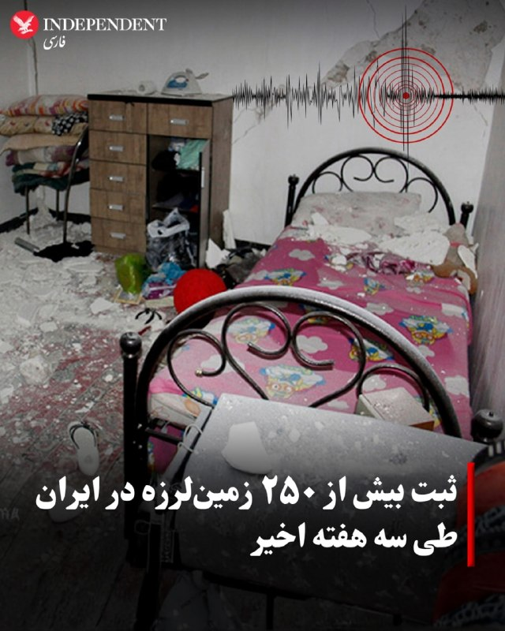

⭕️ ثبت بیش از ۲۵۰ زمین‌لرزه در ایران طی سه هفته اخیر

♦️بر اساس گزارش موسسه ژئوفیزیک دانشگاه تهران، از ۲۹ فروردین تا ۱۸ اردیبهشت‌ماه امسال بیش از ۲۵۰ زمین‌لرزه در نقاط مختلف کشور به ثبت رسیده است.
شدیدترین زمین‌لرزه این بازه، زلزله ۵.۱ ریشتری سفیدآبه در استان سیستان و بلوچستان اعلام شده، رخدادی که بار دیگر توجه‌ها را به وضعیت لرزه‌خیزی ایران و ضرورت آمادگی در برابر حوادث طبیعی جلب کرده است.
ایران به‌دلیل قرار گرفتن روی کمربند زلزله آلپ-هیمالیا، از جمله کشورهای زلزله‌خیز جهان به شمار می‌رود و کارشناسان همواره بر مقاوم‌سازی ساختمان‌ها، آموزش عمومی و آمادگی مدیریت بحران تاکید دارند.
‌🇸🇦 Indypersian

🤖 @VahidOOnLine

## VahidOOnLine — post 240418

  

کانال ۱۲ اسرائیل گزارش داد انتظار می‌رود دونالد ترامپ، رییس‌جمهوری آمریکا، طی ۲۴ ساعت آینده تیم مشاوران نزدیک خود را تشکیل دهد تا درباره ایران تصمیم نهایی بگیرد. برآوردها در اسرائیل حاکی است تصمیم درباره اقدام نظامی ممکن است بسیار به‌زودی اتخاذ شود.

برنامه تلویزیونی «اولپن شیشی» به نقل از یک مقام ارشد اسرائیلی گزارش داد که «ازسرگیری درگیری نزدیک است» و اسرائیل خود را برای احتمال «چند روز تا چند هفته جنگ» آماده می‌کند.

این مقام گفت آمریکایی‌ها دریافته‌اند که مذاکرات به سمت پیشرفت تعیین‌کننده پیش نمی‌رود و در اورشلیم در انتظار تصمیم ترامپ هستند. بر اساس این ارزیابی، تصویر کلی تحولات طی حدود ۲۴ ساعت آینده روشن‌تر خواهد شد.
‌🏁 🇬🇧 IranintlTV

🤖 @VahidOOnLine

## VahidOOnLine — post 240417

  <a href="telegram/content/VahidOOnLine_240417_1778916769.mp4" target="_blank">🎬 Download video</a>

رسانه‌های اسرائیلی گزارش داده‌اند با بازگشت دونالد ترامپ، رئیس‌جمهوری آمریکا، از سفر چین، کاخ سفید به مرحله‌ای تعیین‌کننده در پرونده ایران نزدیک شده و احتمال تصمیم‌گیری درباره اقدام نظامی در روزهای آینده افزایش یافته است.
کانال ۱۲ اسرائیل گزارش داد در اسرائیل برآورد می‌شود دونالد ترامپ طی ۲۴ ساعت آینده درباره اقدام نظامی علیه جمهوری اسلامی تصمیم‌گیری کند. این شبکه به نقل از یک مقام ارشد اسرائیلی گزارش داد «ازسرگیری درگیری‌ها نزدیک است» و اسرائیل خود را برای «روزها تا هفته‌ها درگیری» آماده می‌کند.
بر اساس این گزارش، مقام‌های اسرائیلی معتقدند آمریکا به این جمع‌بندی رسیده که مذاکرات با ایران به سمت پیشرفت جدی حرکت نمی‌کند و انتظار می‌رود تصویر روشن‌تری از تصمیم واشنگتن طی ساعات آینده مشخص شود.
‌🏁 🇬🇧 ManotoTV

🤖 @VahidOOnLine

## VahidOOnLine — post 240416

  <a href="telegram/content/VahidOOnLine_240416_1778916770.mp4" target="_blank">🎬 Download video</a>

دونالد ترامپ، رئیس‌جمهوری آمریکا، در تروث سوشیال اعلام کرد نیروهای آمریکایی و ارتش نیجریه در عملیاتی مشترک، «ابوبلال المنوکی» از فرماندهان ارشد داعش را کشته‌اند.
ترامپ گفت این عملیات به دستور او و با برنامه‌ریزی دقیق انجام شده و «ابوبلال المنوکی» که به گفته او نفر دوم داعش در سطح جهانی بوده، در آفریقا مخفی شده بود.
او افزود با کشته شدن این فرمانده داعش، توان عملیاتی جهانی این گروه به‌شدت تضعیف شده است.
‌🏁 🇬🇧 ManotoTV

🤖 @VahidOOnLine

## VahidOOnLine — post 240415

  

♦️مسعود پزشکیان، در پیامی به پاپ لئو چهاردهم از «مواضع اخلاقی و منطقی» او در قبال حملات اخیر به ایران قدردانی کرد.
پزشکیان در این نامه نوشت: «از موضع اخلاقی و منطقی شما در قبال تجاوزات نظامی اخیر به ایران قدردانی می‌کنم.»
او همچنین حملات آمریکا و اسرائیل را فراتر از رویارویی با ایران توصیف کرد و گفت این اقدامات «صرفا علیه ایران نیست، بلکه علیه حاکمیت قانون و ارزش‌های انسانی» انجام شده است.
رئیس‌جمهوری ایران تاکید کرد جمهوری اسلامی در چارچوب «دفاع مشروع» اهداف و منافع «متجاوزان» را هدف قرار داده است.
پزشکیان در ادامه با تاکید بر آنکه جمهوری اسلامی ایران همچنان به دیپلماسی و راه‌حل‌های مسالمت‌آمیز پایبند است نوشت: «از جامعه بین‌المللی انتظار می‌رود با اتخاذ رویکردی واقع‌بینانه و منصفانه، با مطالبات غیرقانونی و سیاست‌های ماجراجویانه و خطرناک آمریکا مقابله نماید.»
‌🇸🇦 Indypersian

🤖 @VahidOOnLine

## VahidOOnLine — post 240414

  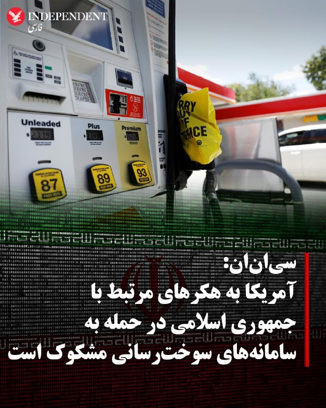

♦️شبکه سی‌ان‌ان به نقل از چند مقام امنیتی گزارش داد مقام‌های آمریکایی گمان می‌کنند هکرهای مرتبط با جمهوری اسلامی ایران پشت مجموعه‌ای از نفوذهای سایبری به سامانه‌هایی هستند که میزان سوخت مخازن جایگاه‌های بنزین را در چند ایالت آمریکا رصد می‌کنند.
بر اساس این گزارش، مهاجمان سامانه‌های پایش میزان سوخت مخازن موسوم به ATG را هدف قرار داده‌اند. هکرها در بعضی موارد توانسته‌اند داده‌های نمایش‌داده‌شده را دستکاری کنند، اما سطح واقعی سوخت در مخازن تغییری نکرده است.
به گفته مقام‌های آمریکایی، این نفوذها تاکنون خسارت فیزیکی ایجاد نکرده‌اند، اما کارشناسان هشدار داده‌اند که دسترسی به چنین سامانه‌هایی می‌تواند از نظر تئوری به پنهان ماندن نشت سوخت یا ایجاد اختلال در زیرساخت‌های حساس منجر شود.
به گزارش سی‌ان‌ان، یکی از دلایلی که ایران به‌عنوان مظنون اصلی مطرح شده، سابقه گروه‌های وابسته به تهران در هدف قرار دادن سامانه‌های مشابه است؛ هرچند منابع تاکید کرده‌اند کمبود ردپای دیجیتال می‌تواند شناسایی قطعی عاملان را دشوار کند. همچنین از زمان آغاز جنگ با ایران در اواخر زمستان، هکرهای مرتبط با تهران به ایجاد اختلال در تاسیسات نفت، گاز و آب آمریکا نیز متهم شده‌اند.
‌🇸🇦 Indypersian

🤖 @VahidOOnLine

## VahidOOnLine — post 240413

  <a href="telegram/content/VahidOOnLine_240413_1778916772.mp4" target="_blank">🎬 Download video</a>

♦️دلسی رودریگز، رئیس‌جمهور موقت ونزوئلا، در کاراکاس با سوزانا کوردیرو گوئرا، معاون بانک جهانی در امور آمریکای لاتین و کارائیب و هیئت همراه دیدار و گفتگو کرد، نشستی که در ادامه ازسرگیری رسمی روابط ونزوئلا با نهادهای مالی بین‌المللی برگزار شده است.
بر اساس بیانیه دولت ونزوئلا، این دیدار با محوریت همکاری‌های اقتصادی، توسعه سرمایه‌گذاری، بازسازی زیرساخت‌ها و بازگشت تدریجی کاراکاس به بازارهای مالی جهانی انجام شد. دولت ونزوئلا اعلام کرده است که با احیای کانال‌های همکاری چندجانبه، به‌دنبال حرکت به سمت اقتصادی متنوع، جذب سرمایه خارجی و بهبود وضعیت معیشتی شهروندان است.
روابط ونزوئلا با بانک جهانی و صندوق بین‌المللی پول از سال ۲۰۱۹ به‌دلیل اختلافات سیاسی و بحران مشروعیت دولت این کشور متوقف شده بود، اما در ماه فروردین امسال، دو طرف رسما از آغاز دوباره همکاری‌ها خبر دادند.
این نشست در حالی برگزار می‌شود که دولت ونزوئلا همزمان روند بازسازی ساختار بدهی‌های خارجی خود را آغاز کرده و مقام‌های اقتصادی این کشور از برنامه سفر هیئتی رسمی به واشنگتن برای مذاکره با صندوق بین‌المللی پول در هفته‌های آینده خبر داده‌اند.
‌🇸🇦 Indypersian

🤖 @VahidOOnLine

## VahidOOnLine — post 240412

♦️رویدادی در لندن با نام «بالد فس» (Bald Fest) با اهدای آبجوی رایگان به افراد طاس یا کسانی که حاضرند موهای خود را بتراشند، به تجلیل از افراد بی‌مو پرداخت.
در این جشن، افرادی که سر کاملا تراشیده دارند یا در محل حاضر می‌شوند موهای خود را بتراشند، می‌توانند یک نوشیدنی رایگان دریافت کنند. برگزارکنندگان می‌گویند هدف از این رویداد، ایجاد فضایی سرگرم‌کننده و مثبت برای تغییر نگاه به طاسی و بزرگداشت افراد کم‌مو یا بی‌مو است.
این رویداد با فضایی طنزآمیز و جشن‌گونه برگزار شد و توجه بسیاری را در شبکه‌های اجتماعی به خود جلب کرد.
‌🇸🇦 Indypersian

🤖 @VahidOOnLine

## VahidOOnLine — post 240411

  <a href="telegram/content/VahidOOnLine_240411_1778916775.mp4" target="_blank">🎬 Download video</a>

شبکه سی‌ان‌ان به نقل از چند منبع گزارش داده هکرهای مظنون به ارتباط با ایران موفق شده‌اند به سامانه‌های پایش مخازن سوخت در آمریکا نفوذ کنند و نمایشگر میزان سوخت را تغییر دهند.
بر اساس این گزارش، سامانه‌های «اندازه‌گیری خودکار مخازن» بدون رمز عبور و متصل به اینترنت بوده‌اند. منابع آگاه می‌گویند هکرها توانسته‌اند ارقام نمایش‌داده‌شده را دستکاری کنند، اما امکان تغییر واقعی میزان سوخت در مخازن را نداشته‌اند و هیچ خسارت فیزیکی گزارش نشده است.
سی‌ان‌ان همچنین گزارش داده این حملات تنها به سامانه‌های سوخت محدود نبوده و زیرساخت‌های نظامی و شبکه‌های آب آمریکا را نیز هدف قرار گرفته‌اند.
‌🏁 🇬🇧 ManotoTV

🤖 @VahidOOnLine

## VahidOOnLine — post 240410

  

ترامپ در تروث‌سوشال اعلام کرد ابو بلال المینوکی، نفر دوم داعش در جهان، در عملیاتی که از سوی نیروهای آمریکا و نیجریه انجام شد، کشته شده است.
او در پیامی نوشت: «امشب به دستور من، نیروهای شجاع آمریکایی و نیروهای مسلح نیجریه یک ماموریت بسیار دقیق و پیچیده را به‌طور بی‌نقص اجرا کردند تا فعال‌ترین تروریست جهان را از میدان نبرد حذف کنند. ابو بلال المینوکی، نفر دوم داعش در سطح جهانی، فکر می‌کرد می‌تواند در آفریقا پنهان شود، اما نمی‌دانست ما منابعی داریم که ما را از آنچه انجام می‌داد آگاه می‌کردند.»
ترامپ همچنین از دولت نیجریه برای همکاری در این عملیات قدردانی کرد.

‌🏁 🇬🇧 IranintlTV

🤖 @VahidOOnLine

## VahidOOnLine — post 240409

  

♦️دونالد ترامپ، رئیس‌جمهوری ایالات متحده، در مصاحبه اخیر با شبکه فاکس‌نیوز گفت «آستانه درد» و تاب‌آوری ایران را دست‌کم نگرفته است. ترامپ با اشاره به سیاست خویشتن‌داری واشنگتن تاکید کرد ایالات متحده عامدانه از هدف قرار دادن زیرساخت‌های حیاتی و غیرنظامی نظیر پل‌ها و تأسیسات تولید برق خودداری کرده است.
رئیس جمهوری آمریکا با یادآوری میزان خسارات وارد شده به ایران گفت: «ما به شکل باورنکردنی و بسیار سخت به آن‌ها ضربه زدیم. ببینید، ما پل‌ها و ظرفیت برق آن‌ها را رها کردیم؛ در حالی که می‌توانیم همه این‌ها را ظرف دو روز از بین ببریم. ظرف دو روز، همه چیز را.»
او در پاسخ به این سوال که آیا تاب‌آوری رژیم ایران در برابر آسیب‌ها را دست‌کم گرفته است، گفت: «من هیچ چیز را دست‌کم نگرفتم. ما به جز شیرهای خروجی نفت، به بقیه بخش‌ها ضربه زدیم.»
‌🇸🇦 Indypersian

🤖 @VahidOOnLine

## VahidOOnLine — post 240408

  

نیویورک‌تایمز به نقل از دو مقام خاورمیانه‌ای گزارش داد آمریکا و اسرائیل در حال تدارکات فشرده برای از سرگیری احتمالی حملات علیه جمهوری اسلامی در اوایل هفته آینده هستند و این گزینه‌ها شامل بمباران‌های تهاجمی‌تر علیه اهداف نظامی و زیرساختی و عملیات ویژه زمینی برای یافتن مواد هسته‌ای خواهد بود.
طبق این گزارش، نیروهای عملیات ویژه اعزام شده به منطقه می‌توانند در این ماموریت مورد استفاده قرار گیرند، اما چنین عملیاتی به هزاران نیروی پشتیبانی نیاز دارد.
این روزنامه افزود به گفته دستیاران ترامپ، او هنوز در مورد گام‌های بعدی خود تصمیمی نگرفته است.
بر اساس این گزارش، مقام‌های آمریکایی گفتند که حدود پنج هزار تفنگدار دریایی و حدود دو هزار چترباز از لشکر ۸۲ هوابرد ویژه ارتش ایالات متحده در منطقه منتظر دستورالعمل‌ هستند.
مقام‌های نظامی نیز گفتند که این نیروها می‌توانند برای دستیابی به مواد هسته‌ای ایران در سایت اتمی اصفهان، از جمله ایمن‌سازی محیط برای محافظت از اپراتورهای ویژه‌ای که وظیفه ورود به آنجا را دارند، مورد استفاده قرار گیرند.
‌🏁 🇬🇧 IranintlTV

🤖 @VahidOOnLine

## VahidOOnLine — post 240407

  

♦️دونالد ترامپ، رئیس‌جمهوری آمریکا، شنبه ۲۶ اردیبهشت با انتشار پیامی در «تروث سوشال» اعلام کرد که نیروهای آمریکایی با همکاری ارتش نیجریه، در جریان یک عملیات پیچیده و دقیق، «ابوبلال المینوکی» مرد شماره دو و فعال‌ترین عضو ارشد داعش در جهان را از پای درآورده‌اند.
ترامپ در این پیام تاکید کرد که او تصور می‌کرد می‌تواند در آفریقا پنهان شود، اما منابع اطلاعاتی تمامی تحرکات او را زیر نظر داشتند. به گفته رئیس‌جمهوری آمریکا، با حذف این فرمانده ارشد، توانایی عملیاتی جهانی داعش به‌شدت کاهش یافته است و او دیگر نمی‌تواند مردم آفریقا یا منافع آمریکا را هدف قرار دهد. ترامپ همچنین از همکاری و مشارکت دولت نیجریه در اجرای موفقیت‌آمیز این عملیات قدردانی کرد.
‌🇸🇦 Indypersian

🤖 @VahidOOnLine

## VahidOOnLine — post 240406

  

♦️به گزارش فاکس‌نیوز، دولت لبنان در اقدامی بی‌سابقه، با ارسال شکایت‌نامه‌ای تند به سازمان ملل متحد، جمهوری اسلامی را به سوءاستفاده از مصونیت دیپلماتیک متهم کرده است.
بر اساس این نامه که اواخر فروردین تنظیم و به‌تازگی منتشر شده است، احمد عرفه، سفیر لبنان در سازمان ملل، با انتقاد شدید از اقدامات محمدرضا شیبانی، سفیر جمهوری اسلامی در بیروت، تهران را به اعزام نیروهای سپاه پاسداران به خاک لبنان تحت پوشش فعالیت‌های دیپلماتیک متهم کرد.
در این شکایت‌نامه تاکید شده است این اقدامات جمهوری اسلامی، دخالت آشکار در امور داخلی لبنان است و این کشور را به جنگی ناخواسته می‌کشاند.
افشای این نامه همزمان با دومین روز گفتگوهای دوجانبه اسرائیل و لبنان در واشینگتن با میانجی‌گری آمریکا صورت می‌گیرد؛ گفتگوهایی که هدف آن عادی‌سازی روابط و برچیدن حزب‌الله عنوان شده است.
سخنگوی وزارت خارجه آمریکا فضای این مذاکرات را «بسیار مثبت» و «فراتر از حد انتظار» توصیف کرد. همچنین وزارت خارجه آمریکا اعلام کرد آتش‌بس موقت میان اسرائیل و لبنان ۴۵ روز دیگر تمدید شده است.
‌🇸🇦 Indypersian

🤖 @VahidOOnLine

## mwarmonitor — post 9149

🔴«گزارش نیویورک تایمز: اسرائیل و ایالات متحده در حال آماده‌سازی برای از سرگیری حملات علیه ایران در هفته آینده هستند.»

@mwarmonitor

## mwarmonitor — post 9148

  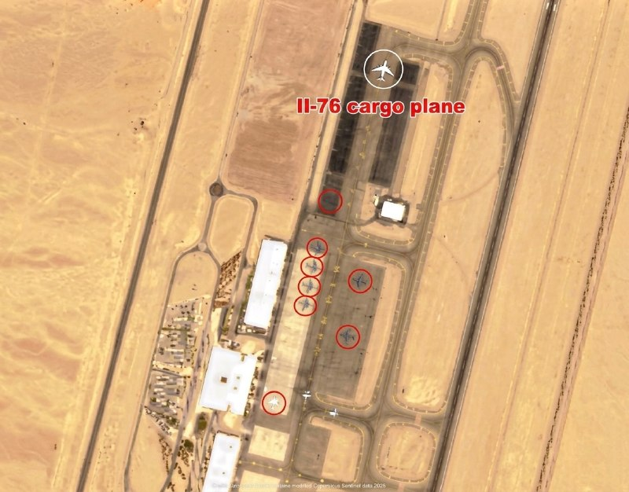

✈️🇦🇿«یک فروند هواپیمای باری Il-76TD-90VD متعلق به شرکت Azerbaijan Silk Way Airlines دیروز در فرودگاه ایلات در جنوب اسرائیل مشاهده شد.

🔸این یک اتفاق نادر است، زیرا این هواپیماهای آذربایجانی معمولاً در فرودگاه بن‌گوریون فرود می‌آیند.

✈️همچنین در ایلات مشاهده شدند: ۷ فروند هواپیمای سوخت‌رسان نیروی هوایی آمریکا و هواپیمایی که به نظر می‌رسید یک هواپیمای گشت دریایی P-8A Poseidon باشد.»

@mwarmonitor

## mwarmonitor — post 9147

🇺🇸امشب با دستور من، نیروهای شجاع آمریکایی و نیروهای مسلح نیجریه، ماموریتی به‌دقت برنامه‌ریزی‌شده و بسیار پیچیده را برای حذف فعال‌ترین تروریست جهان از صحنه نبرد، به‌طور بی‌نقصی اجرا کردند.
«ابوبلال المینوکی»، شخص دوم در فرماندهی جهانی داعش، فکر می‌کرد که می‌تواند در آفریقا پنهان شود، اما روحش هم خبر نداشت که ما منابعی داشتیم که ما را از کارهایی که انجام می‌داد مطلع نگه می‌داشتند. او دیگر مردم آفریقا را وحشت‌زده نخواهد کرد و در برنامه‌ریزی عملیات‌ها برای هدف قرار دادن آمریکایی‌ها نقشی نخواهد داشت. با حذف او، عملیات جهانی داعش به شدت کاهش یافته و ضعیف شده است.
از دولت نیجریه بابت همکاری‌شان در این عملیات سپاسگزارم. خدا آمریکا را حفظ کند!

رئیس‌جمهور دونالد جی. ترامپ

@mwarmonitor

## pm_afshaa — post 90832

وزارت دادگستری آمریکا با صدور بیانیه‌ای، مدعی شد «محمد باقر سعد داوود السعدی»، شهروند عراقی و از اعضای شاخص کتائب حزب‌الله دستگیر شده و به ایالات متحده منتقل شده

💧 Rainbet.com the #1 Non-KYC Crypto Casino & Sportsbook @rainbetcom

😁 @Pm_Afshaa

## pm_afshaa — post 90831

🔴رویترز: آمریکا ممکن است از اسرائیل بخواهد میلیاردها دلار از وجوه مالیاتی فلسطینیان که مسدود شده است را به حمایت از طرح بازسازی غزه توسط ترامپ اختصاص دهد

💧 Rainbet.com the #1 Non-KYC Crypto Casino & Sportsbook @rainbetcom

😁 @Pm_Afshaa

## pm_afshaa — post 90830

امروز از دنده چپ پا شدم میخام همه رو فحش بدم کیرم تو ناموس سپاهی و بسیجی خار مادر همتونو با هم گاییدم با اون رهبر چلاق مقواییتون

## pm_afshaa — post 90829

امروز از دنده چپ پا شدم میخام همه رو فحش بدم

کیرم تو ناموس سپاهی و بسیجی خار مادر همتونو با هم گاییدم با اون رهبر چلاق مقواییتون

## pm_afshaa — post 90828

سازمان ملل: نگرانیم، چون ممکنه منطقه بازم دچار تنش و درگیری بشه 
💧 Rainbet.com the #1 Non-KYC Crypto Casino & Sportsbook @rainbetcom 
😁 @Pm_Afshaa

## pm_afshaa — post 90827

سازمان ملل: نگرانیم، چون ممکنه منطقه بازم دچار تنش و درگیری بشه

💧 Rainbet.com the #1 Non-KYC Crypto Casino & Sportsbook @rainbetcom

😁 @Pm_Afshaa

## pm_afshaa — post 90826

اینایی که تو اپای ایرانی به اسم ما فعالیت میکنن به زودی یه کپی رایت میزنم دهن همتونو میگام خسارت بد نام کردنم رو هم ازتون میگیرم کونتونو پاره میکنم

## iaghapour — post 2614

⭕️ بحران در زیرساخت فناوری؛ سقوط درآمدها و خطر عقب‌ماندگی ۱۰ ساله!

اختلالات اینترنتی دیگر فقط یک مشکل ساده برای کاربران عادی نیست؛ بلکه به گفته رئیس کمیسیون شبکه سازمان نصر، تیشه به ریشه‌ی زیرساخت‌های فناوری کشور زده است. این وضعیت نه تنها درآمد شرکت‌ها را تا ۷۰ درصد کاهش داده، بلکه باعث فرار متخصصان کلیدی و فرسودگی شدید تجهیزات شده است.

🔹 سقوط درآمد و انفجار هزینه‌ها: شرکت‌های حوزه شبکه با کاهش درآمد ۳۰ تا ۷۰ درصدی روبرو هستند. از سوی دیگر، به دلیل اختلال در مسیریابی و افت کیفیت، این شرکت‌ها مجبور به پرداخت جریمه‌های سنگین ناشی از نقض توافق‌نامه سطح خدمات (SLA) شده‌اند.

🔸 تهدید امنیت سایبری: محدودیت دسترسی به مخازن اصلی و سرورهای به‌روزرسانی جهانی، ریسک نفوذ و حملات سایبری را تا ۴۰ درصد افزایش داده است. در واقع، امنیت سایبری قربانی ناپایداری شبکه شده است.

🔹 تخلیه ژنتیکی تخصص: صنعت شبکه با بحران خروج نیروهای کلیدی مواجه است. تربیت یک متخصص ارشد سال‌ها زمان و هزینه‌ی ارزی سنگین می‌طلبد که با مهاجرت این افراد، سرمایه‌های انسانی چند میلیاردی کشور به راحتی از دست می‌رود.

🔸 عقب‌ماندگی ۱۰ ساله: ادامه این وضعیت، ایران را با شکاف تکنولوژیک ۱۰ ساله نسبت به کشورهای منطقه مواجه می‌کند؛ شکافی که در فضای پرشتاب فناوری، جبران آن تقریباً غیرممکن خواهد بود.

زیرساخت شبکه کشور به جای اتصال طبیعی به اینترنت جهانی، در حال حرکت به سمت یک ساختار جزیره‌ای و فرسوده است. اگر ثبات پیش‌بینی‌پذیر به این فضا بازنگردد، شرکت‌های بزرگ فناوری به اپراتورهای ساده تجهیزات قدیمی تنزل پیدا خواهند کرد. / دیجیاتو

🆔 @iaghapour

## mamlekate — post 103532

📝 نیویورک‌تایمز: آمریکا و اسرائیل برای جنگ جدید آماده می‌شوند

به گزارش نیویورک‌تایمز، دونالد ترامپ پس از بازگشت از چین با تصمیمی تعیین‌کننده درباره ایران روبه‌رو شده است؛ در حالی که مذاکرات برای کاهش تنش متوقف مانده، آمریکا و اسرائیل آماده‌سازی‌های گسترده‌ای را برای احتمال ازسرگیری حملات نظامی علیه جمهوری اسلامی آغاز کرده‌اند.

📝 ترامپ به آمریکایی‌ها: فشار اقتصادی را تحمل کنید؛ باید جلوی «گروهی دیوانه» را بگیریم

ترامپ در گفت‌وگو با فاکس‌نیوز با اشاره به افزایش هزینه‌های اقتصادی ناشی از تقابل با جمهوری اسلامی، از آمریکایی‌ها خواست این فشار کوتاه‌مدت را تحمل کنند و گفت جلوگیری از تهدید حکومت ایران اولویتی بالاتر از پیامدهای کوتاه‌مدت اقتصادی دارد.

@mamlekate

## mamlekate — post 103531

  <a href="telegram/content/mamlekate_103531_1778916780.mp4" target="_blank">🎬 Download video</a>

علی موسوی، پسر عبدالرحیم موسوی، رئیس پیشن ستاد کل نیروهای مسلح جمهوری اسلامی، گفت که جنازه پدرش که در نخستین روز حملات اسرائیل و آمریکا به بیت رهبر کشته شد نزدیک به ۳۰ روز در زیر آوار ماند و یک ماه در جستجوی جنازه اش بودند.

موسوی پس از کشته شدن محمد باقری در جنگ ۱۲ روزه، به‌عنوان رییس ستاد کل نیروهای مسلح منصوب شده بود.

indypersian
@mamlekate

## mamlekate — post 103530

📝 الو یکی از علت‌هایی که در تهران مدارس را حضوری نمی‌کنند، بخاطر حضور نیروها و بعضی از سازمان‌های نظامی و حیاتی مثل فرمانداری در داخل بعضی مدارس است. مدارسی که تخلیه نشده‌اند هنوز اجازه برگزاری کلاس حضوری ندارند.

@mamlekate

## mamlekate — post 103529

  <a href="telegram/content/mamlekate_103529_1778916781.mp4" target="_blank">🎬 Download video</a>

📺 جمهوری اسلامی به جایی رسیده که نفر آورده با ماسک آموزش کلاشینکف تو برنامه زنده صداوسیما میده

📝 توان جنگیدن با آمریکا که ندارن (در صورت جنگ زمینی)، این برای کشتار مردم بی‌سلاح ایران در اعتراضات آینده ست.

📝 اسلحه بیاد بین مردم، فرصت انتقام تعدادی از ده‌ها هزار نفری که توی دی‌ماه کشتند هم بوجود میاد اما ابعاد این احتمال بزرگ نیست. ابعاد احتمالی مسلح شدن، اختلافات بین باندهای مختلف مافیای اشغالگره که با تنگ‌تر شدن محاصره اقتصادی، از خشونت سیاسی به خشونت فیزیکی دست خواهند زد. برای پول راحت‌تره آدمکشی تا برای عقیده.

@mamlekate

## VahidOnline — post 75494

دونالد ترامپ با اشاره به افزایش هزینه‌های اقتصادی ناشی از تقابل با جمهوری اسلامی، از آمریکایی‌ها خواست این فشار کوتاه‌مدت را تحمل کنند و گفت جلوگیری از تهدید حکومت ایران اولویتی بالاتر از پیامدهای کوتاه‌مدت اقتصادی دارد.

او تاکید کرد: «متاسفم که این فشار را تحمل می‌کنید، اما باید جلوی این گروه بسیار دیوانه را بگیریم.»

رییس‌جمهوری آمریکا در بخش دیگری از این مصاحبه گفت حکومت ایران از نظر نظامی به‌شدت آسیب دیده و بار دیگر تاکید کرد: «آن‌ها دیگر نیروی دریایی ندارند. نیروی هوایی ندارند. همه‌چیز نابود شده است. نیروی هوایی‌شان از بین رفته است.»

او تاکید کرد: «تنگه باز خواهد شد. آن‌ها سلاح هسته‌ای نخواهند داشت و دنیا ادامه خواهد یافت.»

رییس‌جمهوری آمریکا گفت به درخواست مقام‌هایی از پاکستان، مرحله نهایی عملیات علیه ایران را متوقف کرده است. او گفت: «آن‌ها گفتند: می‌توانید متوقف شوید؟ ما قرار است به توافق برسیم. و واقعاً چارچوب یک توافق را داشتیم؛ بدون برنامه هسته‌ای.»

ترامپ در ادامه تاکید کرد تهران پذیرفته بود مواد باقی‌مانده از برنامه هسته‌ای خود را تحویل دهد، اما بعد از هر توافق عقب‌نشینی کرده است. او گفت: «هر بار توافق می‌کنند، روز بعد انگار می‌گویند چنین گفت‌وگویی نداشته‌ایم. این حدود پنج بار اتفاق افتاده است. مشکلی در آن‌ها وجود دارد. واقعاً دیوانه‌اند. و به همین دلیل نمی‌توانند سلاح هسته‌ای داشته باشند.»

رییس‌جمهوری آمریکا در بخش دیگری از مصاحبه، در پاسخ به این پرسش که آیا توان و مقاومت حکومت ایران را دست‌کم گرفته، گفت: «هیچ‌چیز را دست‌کم نگرفتم. ما به‌شدت به آن‌ها ضربه زدیم.»

ترامپ تاکید کرد آمریکا عمداً بخشی از زیرساخت‌های ایران را هدف قرار نداده است و افزود: «پل‌هایشان را باقی گذاشتیم. زیرساخت برق‌شان را باقی گذاشتیم. می‌توانیم همه آن را در دو روز نابود کنیم؛ همه‌چیز.» او گفت به تاسیسات نفتی و برخی زیرساخت‌ها در خارک حمله نشده، زیرا آسیب به آن‌ها می‌توانست موجب از بین رفتن نفت شود.

رییس‌جمهوری آمریکا درباره وضعیت مذاکرات با جمهوری اسلامی گفت افرادی که آمریکا با آن‌ها در حال گفت‌وگو است، به گفته او «منطقی» به نظر می‌رسند، اما توان یا آمادگی لازم برای تصمیم‌گیری ندارند.

ترامپ در پاسخ به این پرسش که آمریکا در حال حاضر با چه کسانی در ایران طرف است، گفت: «با افرادی طرف هستیم که فکر می‌کنم منطقی هستند، اما از توافق می‌ترسند. نمی‌دانند چطور توافق کنند. قبلاً در چنین موقعیتی نبوده‌اند.»
او در پاسخ به این سوال که آیا تا زمان دستیابی به توافق صبر خواهد کرد، تاکید کرد: «من کاری را انجام می‌دهم که درست باشد. باید کار درست را انجام دهم.»

او همچنین گفت مقام‌های ایرانی به او گفته‌اند محل نگهداری مواد هسته‌ای به‌شدت هدف قرار گرفته و «کوه گرانیتی» روی آن فرو ریخته است. ترامپ افزود: «آن‌ها گفتند فقط دو کشور می‌توانند به آن دسترسی پیدا کنند؛ ما و چین. گفتند خودشان توانایی دسترسی ندارند چون کاملاً نابود شده است.»
ترامپ گفت: «نمی‌توان اجازه داد ایران سلاح هسته‌ای داشته باشد. آن‌ها از آن علیه ما استفاده خواهند کرد. اول اسرائیل را نابود می‌کنند، بعد خاورمیانه را، بعد اروپا را.»

او درباره افزایش قیمت سوخت در آمریکا گفت فشار اقتصادی ناشی از بحران کوتاه‌مدت خواهد بود و افزود: «وقتی مردم توضیح کامل را می‌شنوند، همه موافق می‌شوند. این یک درد کوتاه‌مدت خواهد بود.» ترامپ گفت پس از پایان بحران، قیمت انرژی «مثل سنگ سقوط خواهد کرد.»

رییس‌جمهوری آمریکا در پاسخ به نگرانی‌ها درباره افزایش فشار اقتصادی بر خانواده‌های آمریکایی در پی جنگ با ایران و رشد هزینه‌ها، گفت شهروندان باید این فشارها را تحمل کنند زیرا به گفته او هدف، مقابله با تهدیدی بزرگ‌تر است.

ترامپ در واکنش به این موضوع که برخی آمریکایی‌ها افزایش هزینه‌ها و بدبینی اقتصادی را احساس می‌کنند، گفت: «باید تحمل کنند و باور داشته باشند که ما آن‌ها را به نقطه بهتری می‌رسانیم. اما من باید کار درست را انجام دهم.»

ترامپ در ادامه، فشارهای اقتصادی ناشی از بحران را با ضرورت مقابله با جمهوری اسلامی مرتبط دانست و گفت: «به مردم گفتم متاسفم که این فشار را تحمل می‌کنید، اما باید جلوی این گروه بسیار دیوانه را بگیریم.»

رییس‌جمهوری آمریکا همچنین گفت کشتی‌های حامل نفت ایران که چین در روزهای اخیر خارج کرده، با اجازه واشینگتن حرکت کرده‌اند. او گفت: «ما اجازه دادیم این اتفاق بیفتد.»

ترامپ در پایان در پاسخ به این پرسش که آیا حکومت ایران در نهایت عقب‌نشینی خواهد کرد گفت: «بله، قطعاً. هیچ شکی ندارم.»
@VahidOOnLine

📡 @VahidOnline

## VahidOnline — post 75493

  

عباس عراقچی، وزیر خارجه جمهوری اسلامی، در واکنش به بالا رفتن قیمت انرژی در آمریکا، در ایکس نوشت: «در حال حاضر، افزایش قیمت بنزین و حباب بازار سهام را کنار بگذارید. درد واقعی زمانی آغاز می‌شود که بدهی آمریکا و نرخ وام‌های مسکن شروع به جهش کنند.»
او نوشت همین حالا هم میزان ناتوانی در بازپرداخت وام خودرو به بالاترین سطح خود در بیش از ۳۰ سال گذشته رسیده است، اما تمام این‌ها قابل اجتناب بود.
@VahidOOnLine

📡 @VahidOnline

## VahidOnline — post 75492

  

‌ نماینده چین در سازمان ملل و و رئیس دوره‌ای شورای امنیت، از پیش‌نویس قطعنامه پیشنهادی آمریکا و بحرین درباره تنگه هرمز انتقاد کرد و گفت که «محتوا و زمان‌بندی آن مناسب نیست و تصویبش کمکی نخواهد کرد.»

به گزارش رویترز، این پیش‌نویس قطعنامه از ایران می‌خواهد که حملات و مین‌گذاری در تنگه هرمز را متوقف کند. اما دیپلمات‌ها گفتند که اگر این قطعنامه به رای گذاشته شود، احتمالا با وتوی روسیه و چین روبه‌رو خواهد شد.

دو کشور ماه گذشته نیز قطعنامه مشابه مورد حمایت آمریکا را وتو کرده بودند و متن آن را علیه ایران «جانبدارانه» خواندند.
@VahidHeadline

📡 @VahidOnline

## kianmeli1 — post 87425

  <a href="telegram/content/kianmeli1_87425_1778916785.mp4" target="_blank">🎬 Download video</a>

🔴برت بایر از فاکس: آیا تاب آوری ایران را دست کم گرفتید ؟

ترامپ: چیزی را دست کم نگرفتم ما می توانیم پل ها و ظرفیت برق آنها را در دو روز از بین ببریم.
https://t.me/kianmeli1

## kianmeli1 — post 87424

  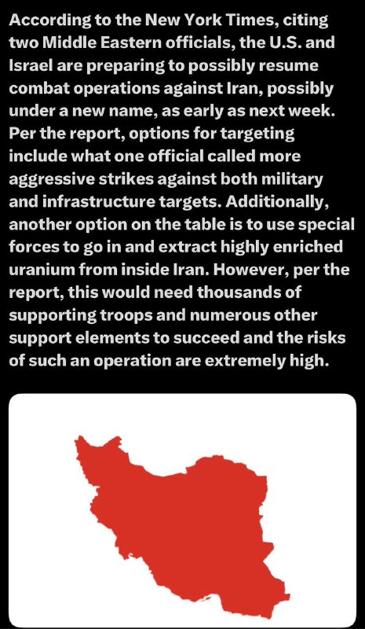

🔴به گزارش نیویورک تایمز، به نقل از دو مقام خاورمیانه، ایالات متحده و اسرائیل در حال آماده شدن برای از سرگیری احتمالی عملیات جنگی علیه ایران، احتمالاً با نامی جدید، از اوایل هفته آینده هستند. طبق این گزارش، گزینه‌های هدف‌گیری شامل حملات تهاجمی‌تر علیه اهداف نظامی و زیرساختی است که یکی از مقامات آن را حملات تهاجمی‌تر نامیده است. علاوه بر این، گزینه دیگری که روی میز است، استفاده از نیروهای ویژه برای ورود و استخراج اورانیوم غنی‌شده با غلظت بالا از داخل ایران است. با این حال، طبق این گزارش، این امر برای موفقیت به هزاران نیروی پشتیبانی و عناصر پشتیبانی متعدد دیگری نیاز دارد و خطرات چنین عملیاتی بسیار زیاد است
https://t.me/kianmeli1

## IranIntlTV — post 337423

  

کرملین در بیانیه‌ای اعلام کرد ولادیمیر پوتین، رییس‌جمهوری روسیه، به‌زودی راهی چین خواهد شد و در روزهای سه‌شنبه و چهارشنبه، ۲۹ و ۳۰ اردیبهشت، با مقام‎‌های این کشور دیدار خواهد کرد.

بر اساس این بیانیه، پوتین و شی جین‌پینگ، رییس‌جمهوری چین، قرار است درباره «روابط دوجانبه» و «مسائل کلیدی بین‌المللی و منطقه‌ای» گفت‌وگو کنند.

پوتین در حالی به چین سفر خواهد کرد که دونالد ترامپ، رییس‌جمهوری آمریکا، سفر دوروزه خود به پکن را ۲۵ اردیبهشت به پایان رساند.
https://iranintl.com/202605160617

## IranIntlTV — post 337422

  <a href="telegram/content/IranIntlTV_337422_1778916789.mp4" target="_blank">🎬 Download video</a>

🔻در فاصله یک ماه تا شروع جام جهانی، تیم ملی فوتبال در پی انزوای سیاسی جمهوری اسلامی نتوانست با حریفان تدارکاتی مناسب دیدار کند و درباره بازی‌های تدارکاتی تناقض‌گویی در صحبت‌های مدیران فدراسیون فوتبال جمهوری اسلامی دیده می‌شود.

🔹توضیحات رها پوربخش، ایران‌اینترنشنال در برنامه هت‌تریک

🔹تماشای نشخه کامل هت‌تریک؛👇
https://youtu.be/v5Exyf8Nyes

@iranintltvsport

## IranIntlTV — post 337421

  

مسعود پزشکیان، رییس دولت جمهوری اسلامی، در پیامی به پاپ لئو، رهبر کاتولیک‌های جهان، از آنچه «موضع اخلاقی و منطقی» او در قبال جنگ ایران خواند، قدردانی کرد.

در این پیام آمده است: «حملات آمریکا و اسرائیل صرفا علیه ایران نیست، بلکه علیه حاکمیت قانون و ارزش‌های انسانی است.»

پزشکیان افزود جمهوری اسلامی «در چارچوب دفاع مشروع، اهداف و منافع متجاوزین را مورد هدف قرار داد».

او همچنین خواستار واکنش «مسئولانه» جامعه جهانی به «اقدامات غیرقانونی» ایالات متحده شد.
https://iranintl.com/202605167385

## IranIntlTV — post 337420

  <a href="telegram/content/IranIntlTV_337420_1778916791.mp4" target="_blank">🎬 Download video</a>

یک شهروند با ارسال پیامی از تهران به ایران‌اینترنشنال می‌گوید: «انسولین نوراپید دانه‌ای ۹۰۰ هزار تومان شده و قرص مُداسین هم کلا پیدا نمی‌شود. داروخانه می‌گوید از داروهای گیاهی استفاده کنید. لعنت بر جمهوری اسلامی که ما را به این روز انداخته و نیم قرن ما به عقب برگردانده.»

## IranIntlTV — post 337419

  <a href="telegram/content/IranIntlTV_337419_1778916793.mp4" target="_blank">🎬 Download video</a>

روح‌الله رحیم‌پور، روزنامه‌نگار و تحلیل‌گر سیاسی، گفت احتمال حمله به زیرساخت‌های انرژی و بنادر ایران برای افزایش فشار بر جمهوری اسلامی بسیار بالاست. او تاکید کرد احتمال گسترش جنگ در شرایط کنونی بسیار جدی است.
@iranintltv

## IranIntlTV — post 337418

  <a href="telegram/content/IranIntlTV_337418_1778916795.mp4" target="_blank">🎬 Download video</a>

جاویدنامان انقلاب ملی ایرانیان
«سورنا گلگون» در شهر شهسوار (تنکابن) از پشت هدف گلوله نیروهای سرکوب جمهوری اسلامی قرار گرفت و با اصابت گلوگه به قلبش کشته شد. نامش در حافظه‌ این سرزمین می‌ماند و یادش چراغ راه آزادی‌خواهان است.
@iranintltv

## IranIntlTV — post 337417

  <a href="telegram/content/IranIntlTV_337417_1778916797.mp4" target="_blank">🎬 Download video</a>

🔻محمد تقوی، ایران اینترنشنال در برنامه هت‌تریک درباره خواندن ترانه تیم ملی از سوی پرواز همای گفت: «همان‌طور که در ورزش می‌‎بینیم آدم‌ها سقوط اخلاقی می‌کنند، این شخص هم سقوط کرد. این افراد هسته‌های پنهانی هستند که حکومت آنها را برای چنین روزهایی آماده کرده و از آنها استفاده می‌کند.»

@iranintltvsport

## IranIntlTV — post 337416

🗣روایت شما از زندگی در آتش‌بس- شنبه ۲۶ اردیبهشت ۱۴۰۵

🔹از قزوین ۲۶ اردیبهشت؛ از ساعت ۶ صبح یه‌سری صدا از آسمون می‌شنوم که مثل صدای جنگنده‌ست و رد می‌شه.

🔹بامداد ۲۶ اردیبهشت صدای جنگنده می‌اومد در ارومیه.

🔹اینجا اوضاع واقعاً خرابه، من ۴ ماه پیش تخم‌مرغ خریدم ۲۵۰ یه شونه، الان ۶۷۰ تومن یه شونه تخم‌مرغ.

🔹سیستم آموزشی بسیار ضعیفه و معلم‌ها فقط با روزی ۲ تا کلیپ از اینترنت کتاب رو تموم کردن، حالا بچه‌ی اول دبستانی رو می‌گن باید بیاد حضوری مدرسه در اهواز.

🔹بنزین در استان بوشهر تقریباً نایاب شده. دکه‌های کنار جاده لیتری ۱۰ هزار تومان، در بشکه‌های پنج لیتری می‌فروشن.

🔹هر شب آب ولنجک و محمودیه رو تا صبح قطع می‌کنن. روزها هم فشار آب اون‌قدر کم شده که ورودی منبع مدام قطع‌و‌وصل می‌شه. به نظر می‌رسه قطعی آب رو هم دارن عادی‌سازی می‌کنن.

🔹از اصفهان دانش‌آموز پایه نهمی‌ام. درس خوندنم با اینترنت و کلیپ‌های معلم‌ها بود. از هوش مصنوعی استفاده زیادی برای درس‌ها داشتم. الان دسترسی ندارم. قیمت VPN اومده پایین تا ۲۸۰ هزار تومن. ولی ما دانش‌آموزان... هی آقایون فروشنده VPN، خدا رو همه رو وصل کنید. #وی‌پی‌ان‌‌برای‌همه

🔹از ملارد استان تهران؛ از ساعت ۱۲ شب تا ۵ صبح آب اینجا قطع بود. با این وجود، به‌تازگی از ساعت ۲ بعدازظهر تا ۶ عصر هم قطع می‌کنن.

## IranIntlTV — post 337415

  

کانال ۱۲ اسرائیل گزارش داد انتظار می‌رود دونالد ترامپ، رییس‌جمهوری آمریکا، طی ۲۴ ساعت آینده تیم مشاوران نزدیک خود را تشکیل دهد تا درباره ایران تصمیم نهایی بگیرد. برآوردها در اسرائیل حاکی است تصمیم درباره اقدام نظامی ممکن است بسیار به‌زودی اتخاذ شود.

برنامه تلویزیونی «اولپن شیشی» به نقل از یک مقام ارشد اسرائیلی گزارش داد که «ازسرگیری درگیری نزدیک است» و اسرائیل خود را برای احتمال «چند روز تا چند هفته جنگ» آماده می‌کند.

این مقام گفت آمریکایی‌ها دریافته‌اند که مذاکرات به سمت پیشرفت تعیین‌کننده پیش نمی‌رود و در اورشلیم در انتظار تصمیم ترامپ هستند. بر اساس این ارزیابی، تصویر کلی تحولات طی حدود ۲۴ ساعت آینده روشن‌تر خواهد شد.
https://iranintl.com/202605166935

## IranIntlTV — post 337414

  <a href="telegram/content/IranIntlTV_337414_1778916800.mp4" target="_blank">🎬 Download video</a>

سی‌ان‌ان به نقل از مقام‌های آمریکایی گزارش داد «هکرهایی که گمان می‌رود با جمهوری اسلامی مرتبط باشند»، سامانه‌های پایش سوخت در جایگاه‌های بنزین در چند ایالت آمریکا را هدف حملات سایبری قرار دادند.

گفت‌وگو با مهدی صارمی‌فر، روزنامه‌نگار علم و تکنولوژی
@iranintltv

## IranIntlTV — post 337413

  <a href="telegram/content/IranIntlTV_337413_1778916802.mp4" target="_blank">🎬 Download video</a>

دولت لبنان در اقدامی کم‌سابقه، با ارسال نامه‌ای به سازمان ملل متحد، جمهوری اسلامی را به «سوءاستفاده از مصونیت دیپلماتیک، دخالت در امور داخلی لبنان و انتقال نیروهای سپاه پاسداران به این کشور تحت پوشش فعالیت دیپلماتیک» متهم کرده است.

جزییات بیشتر در گفت‌وگو با امیر گیتی، عضو تحریریه ایران‌اینترنشنال

@iranintltv

## IranIntlTV — post 337412

  <a href="telegram/content/IranIntlTV_337412_1778916804.mp4" target="_blank">🎬 Download video</a>

امید معماریان، تحلیل‌گر سیاسی در موسسه دان، گفت همه نشانه‌ها حاکی از آن است که اگر تهران و واشینگتن انعطاف نشان ندهند، درگیری و رویارویی دوباره غیرقابل اجتناب خواهد بود.
@iranintltv

## IranIntlTV — post 337411

  <a href="telegram/content/IranIntlTV_337411_1778916805.mp4" target="_blank">🎬 Download video</a>

شاهزاده رضا پهلوی با انتشار پیامی ویدیویی به نیروهای حکومتی هشدار داد همکاری آگاهانه با ساختارهای سرکوبگر در جمهوری اسلامی، از جمله مشارکت در ایست‌های بازرسی و همکاری در سرکوب و خرید و فروش اموال مصادره‌شده معترضان، می‌تواند مصداق یاری‌رسانی به «جنایت علیه بشریت» باشد و مسئولیت کیفری ایجاد کند.

گفت‌وگو با نازلی صدقی، حقوقدان و عضو شبکه وکلای «یک‌ کلمه»
@iranintltv

## IranIntlTV — post 337410

  <a href="telegram/content/IranIntlTV_337410_1778916807.mp4" target="_blank">🎬 Download video</a>

سرخط خبرهای شنبه ۲۶ اردیبهشت
@iranintltv

## IranIntlTV — post 337409

  

ترامپ در تروث‌سوشال اعلام کرد ابو بلال المینوکی، نفر دوم داعش در جهان، در عملیاتی که از سوی نیروهای آمریکا و نیجریه انجام شد، کشته شده است.
او در پیامی نوشت: «امشب به دستور من، نیروهای شجاع آمریکایی و نیروهای مسلح نیجریه یک ماموریت بسیار دقیق و پیچیده را به‌طور بی‌نقص اجرا کردند تا فعال‌ترین تروریست جهان را از میدان نبرد حذف کنند. ابو بلال المینوکی، نفر دوم داعش در سطح جهانی، فکر می‌کرد می‌تواند در آفریقا پنهان شود، اما نمی‌دانست ما منابعی داریم که ما را از آنچه انجام می‌داد آگاه می‌کردند.»
ترامپ همچنین از دولت نیجریه برای همکاری در این عملیات قدردانی کرد.

https://iranintl.com/202605165314

## IranIntlTV — post 337408

  

نیویورک‌تایمز به نقل از دو مقام خاورمیانه‌ای گزارش داد آمریکا و اسرائیل در حال تدارکات فشرده برای از سرگیری احتمالی حملات علیه جمهوری اسلامی در اوایل هفته آینده هستند و این گزینه‌ها شامل بمباران‌های تهاجمی‌تر علیه اهداف نظامی و زیرساختی و عملیات ویژه زمینی برای یافتن مواد هسته‌ای خواهد بود.
طبق این گزارش، نیروهای عملیات ویژه اعزام شده به منطقه می‌توانند در این ماموریت مورد استفاده قرار گیرند، اما چنین عملیاتی به هزاران نیروی پشتیبانی نیاز دارد.
این روزنامه افزود به گفته دستیاران ترامپ، او هنوز در مورد گام‌های بعدی خود تصمیمی نگرفته است.
بر اساس این گزارش، مقام‌های آمریکایی گفتند که حدود پنج هزار تفنگدار دریایی و حدود دو هزار چترباز از لشکر ۸۲ هوابرد ویژه ارتش ایالات متحده در منطقه منتظر دستورالعمل‌ هستند.
مقام‌های نظامی نیز گفتند که این نیروها می‌توانند برای دستیابی به مواد هسته‌ای ایران در سایت اتمی اصفهان، از جمله ایمن‌سازی محیط برای محافظت از اپراتورهای ویژه‌ای که وظیفه ورود به آنجا را دارند، مورد استفاده قرار گیرند.
https://iranintl.com/202605169621

## IranIntlTV — post 337407

  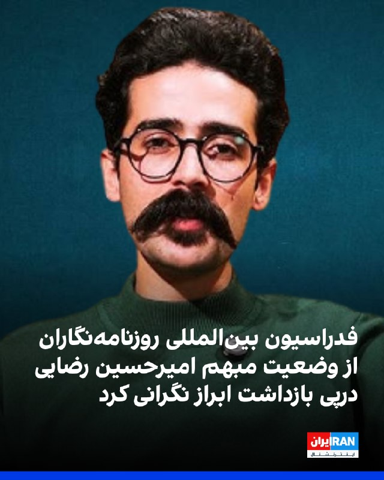

فدراسیون بین‌المللی روزنامه‌نگاران اعلام کرد با گذشت حدود ۱۰ روز از بازداشت امیرحسین رضایی، روزنامه‌نگار حوزه اقتصاد در اراک، همچنان خبری از وضعیت او در دست نیست و بازداشت او ادامه دارد.
پیش‌تر گزارش شده بود نیروهای امنیتی صبح ۱۶ اردیبهشت با یورش به منزل پدری رضایی در اراک، او را بازداشت و به مکان نامعلومی منتقل کرده‌اند. رضایی دانشجوی علوم سیاسی دانشگاه تهران و روزنامه‌نگار پیشین «دنیای اقتصاد» است.
فدراسیون بین‌المللی روزنامه‌نگاران نوشت ادامه بازداشت و بی‌خبری از این روزنامه‌نگار در حالی است که محدودیت‌های اینترنتی در ایران ادامه دارد و فشار نهادهای امنیتی بر فعالان رسانه و اطلاع‌رسانی مستقل افزایش یافته است.

https://iranintl.com/202605161865

## IranIntlTV — post 337406

  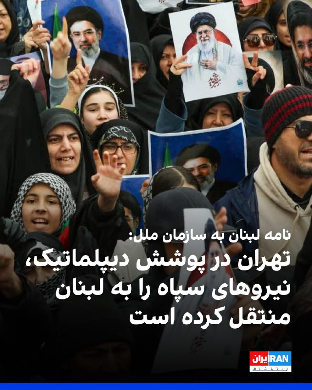

فاکس‌نیوز گزارش داد دولت لبنان با ارسال نامه‌ای کم‌سابقه به سازمان ملل، جمهوری اسلامی را به سوءاستفاده از مصونیت دیپلماتیک، دخالت در امور داخلی لبنان و انتقال نیروهای سپاه پاسداران «در پوشش فعالیت دیپلماتیک» متهم کرده است.
به گزارش فاکس، این نامه که اواخر آوریل ارسال و به‌تازگی منتشر شده، هم‌زمان با مذاکرات اسرائیل و لبنان در واشینگتن درباره عادی‌سازی روابط و آینده حزب‌الله اهمیت بیشتری یافته است.
در این نامه، سفیر لبنان در سازمان ملل، ایران را به «اقدامات غیرقانونی در نقض آشکار تصمیمات دولت لبنان» متهم کرده و تأکید کرده این رفتار دخالت مستقیم در امور داخلی لبنان و نقض کنوانسیون ۱۹۶۱ وین درباره روابط دیپلماتیک است.

https://iranintl.com/202605166136

## IranIntlTV — post 337405

  

مایک والتز، سفیر آمریکا در سازمان ملل، در گفت‌وگو با فاکس‌نیوز گفت چین پس از سفر دونالد ترامپ به پکن از جمهوری اسلامی فاصله گرفته است. او افزود پکن با اصل عدم دستیابی ایران به سلاح هسته‌ای و عدم نظامی‌سازی تنگه هرمز موافقت کرده است.
والتز تاکید کرد هیچ کشوری نمی‌تواند از خطوط کشتیرانی بین‌المللی مانند تنگه جبل‌الطارق، تنگه مالاکا یا تنگه هرمز به‌عنوان منبع درآمد خصوصی از طریق دریافت عوارض استفاده کند و این مسیرها باید برای تجارت جهانی باز بمانند.

https://iranintl.com/202605168445

## IranIntlTV — post 337404

  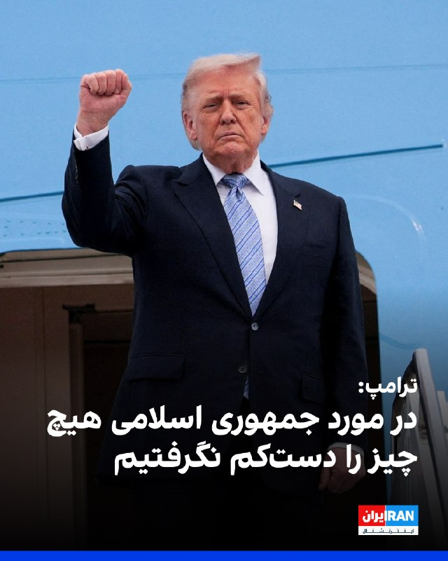

ترامپ در گفت‌وگو با فاکس‌نیوز در پاسخ به این پرسش که آیا توان و مقاومت حکومت ایران را دست‌کم گرفته، گفت: «هیچ‌چیز را دست‌کم نگرفتم. ما به‌شدت به آن‌ها ضربه زدیم.»
ترامپ تاکید کرد آمریکا عمدا بخشی از زیرساخت‌های ایران را هدف قرار نداده است و افزود: «پل‌هایشان را باقی گذاشتیم. زیرساخت برق‌شان را باقی گذاشتیم. می‌توانیم همه آن را در دو روز نابود کنیم؛ همه‌چیز.» او گفت به تاسیسات نفتی و برخی زیرساخت‌ها در خارک حمله نشده، زیرا آسیب به آن‌ها می‌توانست موجب از بین رفتن نفت شود.
او همچنین گفت مقام‌های ایرانی به او گفته‌اند محل نگهداری مواد هسته‌ای به‌شدت هدف قرار گرفته و «کوه گرانیتی» روی آن فرو ریخته است. ترامپ افزود: «آن‌ها گفتند فقط دو کشور می‌توانند به آن دسترسی پیدا کنند؛ ما و چین. گفتند خودشان توانایی دسترسی ندارند چون کاملاً نابود شده است.»

https://iranintl.com/202605166343

## Shin_Persian — post 6026

↩️ Quoted tweet: سكاي نيوز عربية-عاجل ✓ @SkyNewsArabia_B Sat, 16 May 2026 06:21:13 UTC أ ف ب: دوي انفجارات في بغداد ↩️ Quoted tweet — see the post below for the reply. English AFP: Sounds of explosions in Baghdad 𝕏 · @shin_persian

## Shin_Persian — post 6025

↩️ Quoted tweet:
سكاي نيوز عربية-عاجل ✓ @SkyNewsArabia_B
Sat, 16 May 2026 06:21:13 UTC

أ ف ب: دوي انفجارات في بغداد

↩️ Quoted tweet — see the post below for the reply.

English

AFP: Sounds of explosions in Baghdad

𝕏 · @shin_persian

## ManotoTV — post 105506

  <a href="telegram/content/ManotoTV_105506_1778916813.mp4" target="_blank">🎬 Download video</a>

ارتش اسرائیل اعلام کرد در پی فعال شدن هشدار نفوذ پهپاد در منطقه میرون، یک هدف هوایی مشکوک شناسایی شده است.
ارتش اسرائیل همچنین اعلام کرد جزئیات این رویداد در حال بررسی است و این حادثه بدون تلفات پایان یافته اس

## ManotoTV — post 105505

  <a href="telegram/content/ManotoTV_105505_1778916814.mp4" target="_blank">🎬 Download video</a>

رسانه‌های اسرائیلی گزارش داده‌اند با بازگشت دونالد ترامپ، رئیس‌جمهوری آمریکا، از سفر چین، کاخ سفید به مرحله‌ای تعیین‌کننده در پرونده ایران نزدیک شده و احتمال تصمیم‌گیری درباره اقدام نظامی در روزهای آینده افزایش یافته است.
کانال ۱۲ اسرائیل گزارش داد در اسرائیل برآورد می‌شود دونالد ترامپ طی ۲۴ ساعت آینده درباره اقدام نظامی علیه جمهوری اسلامی تصمیم‌گیری کند. این شبکه به نقل از یک مقام ارشد اسرائیلی گزارش داد «ازسرگیری درگیری‌ها نزدیک است» و اسرائیل خود را برای «روزها تا هفته‌ها درگیری» آماده می‌کند.
بر اساس این گزارش، مقام‌های اسرائیلی معتقدند آمریکا به این جمع‌بندی رسیده که مذاکرات با ایران به سمت پیشرفت جدی حرکت نمی‌کند و انتظار می‌رود تصویر روشن‌تری از تصمیم واشنگتن طی ساعات آینده مشخص شود.

## ManotoTV — post 105504

  <a href="telegram/content/ManotoTV_105504_1778916814.mp4" target="_blank">🎬 Download video</a>

دونالد ترامپ، رئیس‌جمهوری آمریکا، در تروث سوشیال اعلام کرد نیروهای آمریکایی و ارتش نیجریه در عملیاتی مشترک، «ابوبلال المنوکی» از فرماندهان ارشد داعش را کشته‌اند.
ترامپ گفت این عملیات به دستور او و با برنامه‌ریزی دقیق انجام شده و «ابوبلال المنوکی» که به گفته او نفر دوم داعش در سطح جهانی بوده، در آفریقا مخفی شده بود.
او افزود با کشته شدن این فرمانده داعش، توان عملیاتی جهانی این گروه به‌شدت تضعیف شده است.

## ManotoTV — post 105503

  <a href="telegram/content/ManotoTV_105503_1778916815.mp4" target="_blank">🎬 Download video</a>

شبکه سی‌ان‌ان به نقل از چند منبع گزارش داده هکرهای مظنون به ارتباط با ایران موفق شده‌اند به سامانه‌های پایش مخازن سوخت در آمریکا نفوذ کنند و نمایشگر میزان سوخت را تغییر دهند.
بر اساس این گزارش، سامانه‌های «اندازه‌گیری خودکار مخازن» بدون رمز عبور و متصل به اینترنت بوده‌اند. منابع آگاه می‌گویند هکرها توانسته‌اند ارقام نمایش‌داده‌شده را دستکاری کنند، اما امکان تغییر واقعی میزان سوخت در مخازن را نداشته‌اند و هیچ خسارت فیزیکی گزارش نشده است.
سی‌ان‌ان همچنین گزارش داده این حملات تنها به سامانه‌های سوخت محدود نبوده و زیرساخت‌های نظامی و شبکه‌های آب آمریکا را نیز هدف قرار گرفته‌اند.

## FarsiVOA — post 217873

🔺نیویورک‌تایمز: آمریکا و اسرائیل آماده شروع حملات به جمهوری اسلامی می‌شوند

◾️نیویورک‌تایمز به نقل از دو مقام خاورمیانه‌ای گزارش داد که آمریکا و اسرائیل در حال انجام فشرده‌ترین آماده‌سازی‌ها از زمان آتش‌بس ماه گذشته برای ازسرگیری احتمالی حملات علیه ایران هستند؛ حملاتی که ممکن است از اوایل هفته آینده در دستور کار قرار گیرد.

◾️بر اساس این گزارش، یکی از گزینه‌های مورد بررسی آمریکا، اعزام نیروهای ویژه به خاک ایران برای خارج‌کردن مواد هسته‌ای مدفون زیر آوار تأسیسات بمباران‌شده است.

◾️این گزارش در شرایطی منتشر شده که دونالد ترامپ، رئیس جمهوری آمریکا، به تازگی در گفت‌وگویی با فاکس‌نیوز گفت: «خیلی بیشتر از این صبر نخواهم کرد» و افزود که تهران باید با آمریکا به توافق برسد.

⬇️ بیشتر بخوانید:
https://ir.voanews.com/a/8150653.html

## FarsiVOA — post 217872

  

دونالد ترامپ، رئیس جمهوری آمریکا، اعلام کرد نیروهای آمریکایی و ارتش نیجریه در عملیاتی مشترک، ابوبلال المینوکی، از فرماندهان ارشد داعش را کشته‌اند؛ فردی که ترامپ او را «نفر دوم داعش در سطح جهانی» و «فعال‌ترین تروریست جهان» توصیف کرد.

ترامپ در پیامی در شبکه اجتماعی تروث‌سوشال گفت این عملیات «به دستور» او و با اجرای نیروهای آمریکایی و نیجریه‌ای انجام شده و هدف آن حذف المینوکی از میدان نبرد بوده است. او نوشت المینوکی تصور می‌کرد می‌تواند در آفریقا پنهان شود، اما منابع اطلاعاتی آمریکا تحرکات او را زیر نظر داشتند.

ترامپ محل دقیق این عملیات را اعلام نکرد، اما از دولت نیجریه برای همکاری در این مأموریت قدردانی کرد. آسوشیتدپرس نیز به نقل از یک مقام آمریکایی گزارش داد که واشنگتن، المینوکی را چهره‌ای کلیدی در سازمان‌دهی و تأمین مالی داعش می‌دانست و معتقد بود او در طراحی حملات علیه آمریکا و منافع این کشور نقش داشته است.

بر اساس گزارش رویترز، المینوکی تبعه نیجریه بود و در سال ۲۰۲۳، در فهرست «تروریست‌های جهانی به‌طور ویژه تحریم‌شده» قرار گرفته بود.
@FarsiVOA

## FarsiVOA — post 217871

🔺فاکس‌نیوز: لبنان جمهوری اسلامی را به انتقال «تروریست‌های سپاه» در پوشش دیپلماتیک متهم کرد

◾️فاکس‌نیوز با افشای نامه‌ای کم‌سابقه از دولت لبنان به سازمان ملل گزارش داد که بیروت، در بحبوحه درگیری‌های نظامی در منطقه، جمهوری اسلامی را به کشاندن لبنان به جنگ، دخالت آشکار در امور داخلی، سوءاستفاده از مصونیت دیپلماتیک، و انتقال «تروریست‌های سپاه» در پوشش فعالیت دیپلماتیک متهم کرده است.

◾️نامه لبنان به سازمان ملل که تاریخ آن ۲۱ آوریل است، رفتار جمهوری اسلامی «دخالت مستقیم و آشکار» در امور داخلی لبنان توصیف کرده است.

◾️لبنان در نامه خود تأکید کرده که استقرار نیروهای سپاه پاسداران در خاک این کشور «در پوشش فعالیت دیپلماتیک»، نقض اصل حسن نیت میان دولت‌ها و نقض کنوانسیون وین درباره روابط دیپلماتیک است.

⬇️ بیشتر بخوانید:
https://ir.voanews.com/a/8150650.html

## FarsiVOA — post 217870

  

وزارت خارجه امارات می‌گوید همه اقدامات این کشور علیه جمهوری اسلامی در چارچوب تدابیر دفاعی با هدف حفاظت از حاکمیت، شهروندان و زیرساخت‌های حیاتی کشور صورت گرفته است.

پیشتر روزنامه وال‌استریت ژورنال به نقل از افراد آگاه گزارش داده بود که امارات به‌طور مخفیانه حملاتی نظامی علیه جمهوری اسلامی، از جمله پالایشگاه نفت جزیره لاوان، انجام داده است.

در بیانیه وزارت خارجه امارات که روز شنبه در سایت رسمی آن منتشر شده، اشاره‌ای به این گزارش نشده است.

جمهوری اسلامی بارها به امارات حملات موشکی و پهپادی کرد و در عین حال به امارات علیه اقدام نظامی هشدار داده بود.
@FarsiVOA

## FarsiVOA — post 217869

  

⚡️مایک والتز، نماینده آمریکا در سازمان ملل متحد گفت در ارتباط با جمهوری اسلامی، مسئله اورانیوم غنی‌شده، غنی‌سازی اورانیوم، و تنگه هرمز وجود دارد. او به فاکس‌نیوز گفت «باید به یاد داشته باشیم، هیچ دلیلی وجود ندارد» جمهوری اسلامی اورانیوم با غنای ۶۰ درصد داشته باشد آن هم به میزانی که به گفته او می‌تواند به ۱۰ تا ۱۱ بمب هسته‌ای تبدیل شود. آقای والتز با زیر سوال بردن ادعای صلح‌آمیز بودن برنامه هسته‌ای جمهوری اسلامی گفت «هیچ کشوری در دنیا وجود ندارد که تا این سطح غنی‌سازی کند و بعد سلاح هسته‌ای نداشته باشد، چون اصلاً دلیلی برای انجامش (این سطح از غنی‌سازی) وجود ندارد.»
@FarsiVOA

## FarsiVOA — post 217868

⚡️مراسم «انجمن قلم آمریکا» و اهدای «جایزه آزادی نوشتن باربی» به گلرخ ایرایی و علی اسداللهی
@FarsiVOA

## FarsiVOA — post 217867

⚡️توافق آمریکا و چین درباره تنگه هرمز چه پیامدی برای حکومت ایران دارد؟ گفت‌وگو با ابراهیم روشندل
@FarsiVOA

## FarsiVOA — post 217866

  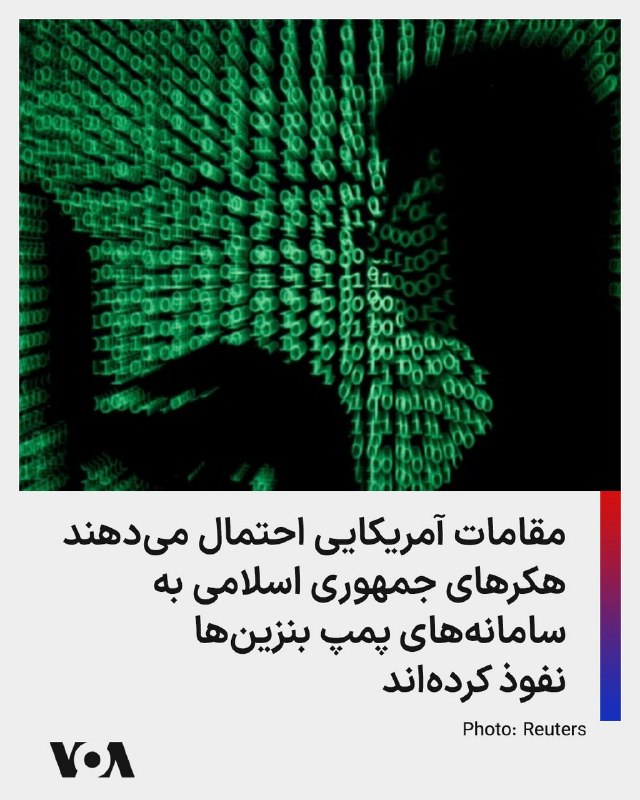

⚡️سی‌ان‌ان به نقل از «منابع مطلع» نوشت که مقامات آمریکایی احتمال می‌دهند هکرهای جمهوری اسلامی با مجموعه‌ای از نفوذها به سامانه‌های پایش میزان سوخت مخازن پمپ‌بنزین در چند ایالت ارتباط دارند. این گزارش می‌گوید این نفوذها خسارت فیزیکی یا حادثه‌ای ایجاد نکرده‌اند، اما به‌طور بالقوه این امکان را ایجاد می‌کند که نشت سوخت را در صورت نفوذ بیشتر، پنهان کند و این مسئله باعث نگرانی است.
@FarsiVOA

## FarsiVOA — post 217865

  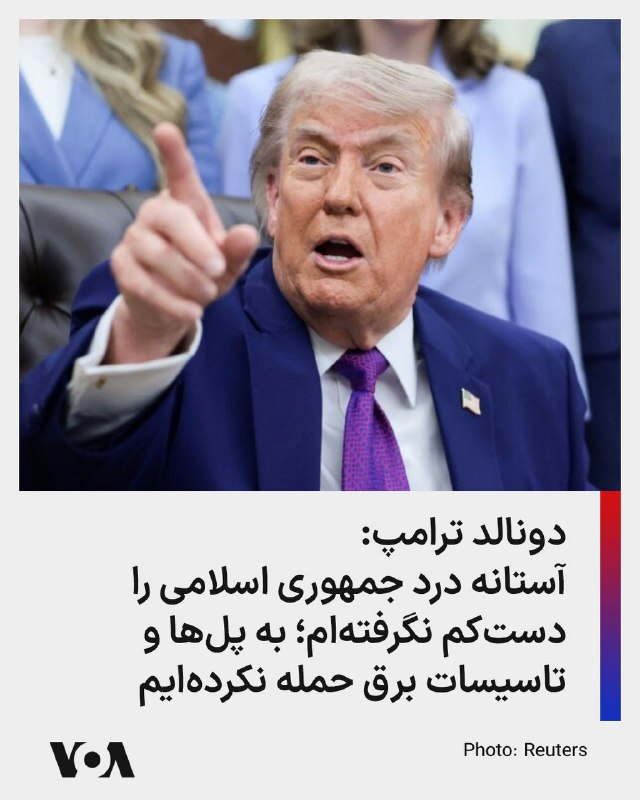

⚡️دونالد ترامپ، رئیس‌جمهوری آمریکا، در مصاحبه‌ای با فاکس‌نیوز گفت ایالات متحده می‌تواند پل‌ها و نیروگاه‌ها در ایران را «در دو روز» منهدم کند.
آقای ترامپ در پاسخ به برت بایر،‌ مجری فاکس‌نیوز که با توجه به شرایط حاضر از رئیس‌جمهوری آمریکا پرسید که آیا آستانه تحمل درد جمهوری اسلامی را دست‌‌کم گرفته است؟ گفت: «من هیچ چیزی را دست کم نگرفتم. ما به طرز باورنکردنی به آنها ضربه زدیم.»
آقای ترامپ گفت: «ببینید، ما پل‌هایشان را باقی گذاشتیم. ظرفیت تولید برقشان را باقی گذاشتیم. می‌توانیم همه آن‌ها را ظرف دو روز، فقط دو روز، کاملاً از بین ببریم.»
آقای ترامپ افزود به تاسیسات حساس انرژی جزیره خارک نیز آمریکا حمله نکرد: «ما جزیره خارک را هم باقی گذاشتیم،..من گفتم بزنیدش، اما نه شیرهایی را که نفت از آن‌ها خارج می‌شود، چون اگر آن‌ها را بزنید، یعنی مقداری نفت از دست خواهد رفت.»
@FarsiVOA

## DW_Farsi — post 124748

🔶 آیا فاصله ایران با بمب اتمی واقعا کوتاه است؟

🔻 گزارشی از مراد رحمتی

اینکه گفته می‌شود جمهوری اسلامی به ساخت بمب اتمی نزدیک‌تر شده، موضوع تازه‌ای نیست. پیش از جنگ ائتلاف آمریکا و اسرائیل علیه ایران رافائل گروسی، مدیرکل آژانس بین‌المللی انرژی اتمی، اعلام کرده بود که ایران "فاصله زیادی تا دستیابی به سلاح هسته‌ای ندارد".

گروسی توسعه سلاح هسته‌ای را به حل یک پازل تشبیه کرده و گفته بود که ایران "قطعات این پازل را دارد و ممکن است روزی بتواند آن‌ها را کنار هم بگذارد".

استیو ویتکاف، نماینده ترامپ در مذاکرات با جمهوری اسلامی هم گفته بود که مذاکره‌کنندگان ارشد ایران در دور نخست گفت‌وگوهای خود با آمریکا گفته‌ بودند ۴۶۰ کیلوگرم اورانیوم با غنای ۶۰ درصد در اختیار دارند و می‌دانند که از این مقدار می‌توان ۱۱ بمب هسته‌ای ساخت.

اما این اظهارنظر پیش از جنگ ائتلاف آمریکا و اسرائیل علیه ایران بیان شده است.

حال کریس رایت، وزیر انرژی آمریکا روز پنجشنبه ۲۴ اردیبهشت (۱۴ مه) سه ماه بعد از جنگ در جلسه کمیته نیروهای مسلح سنا گفت که "ایران به غنای ۶۰ درصد رسیده و ۹۰ درصد راه را طی کرده است". به گفته این مقام دولت ترامپ جمهوری اسلامی تنها "چند هفته" با دستیابی به مواد لازم برای ساخت سلاح هسته‌ای فاصله دارد.

آیا این ارزیابی‌ها یک واقعیت فنی را نشان می‌دهند یا بیشتر بازتاب نگاه سیاسی به پرونده هسته‌ای ایران هستند و آیا فاصله میان "تولید مواد لازم" و "ساخت سلاح هسته‌ای" واقعا در حد چند هفته است؟

@dw_farsi

## DW_Farsi — post 124746

  

🔶 عبدالحمید خواستار توقف اعدام‌های سیاسی در کشور شد

مولانا عبدالحمید، امام‌جمعه اهل‌سنت زاهدان در خطبه‌های نماز جمعه در روز ۲۵ اردیبهشت (۱۵ مه) با انتقاد از افزایش اعدام‌ها در کشور تاکید کرد که "اعدام‌های سیاسی" به زیان کشور، حاکمیت و مردم است و باید متوقف شود.

این روحانی اهل سنت تاکید کرد "اعدام‌های سیاسی در زمان پیامبر اسلام و خلفای راشدین وجود نداشته و با سیره آنان همخوانی ندارد".

امام جمعه اهل سنت زاهدان همچنین هشدار داد که ادامه این روند می‌تواند وجهه ایران را در سطح بین‌المللی مخدوش کند.

مولانا عبدالحمید در ادامه "اعترافات اجباری" را نیز مغایر با شریعت اسلام، قانون اساسی و قوانین بین‌المللی دانست و تاکید کرد که این اعترافات نمی‌تواند مبنای صدور حکم قضایی قرار گیرد.

@dw_farsi

## DW_Farsi — post 124745

  

🔶 وزارت خارجه امارات: حق داریم از حاکمیت خود دفاع کنیم

وزارت امور خارجه امارات متحده عربی روز شنبه ۲۶ اردیبهشت (۱۶ مه) در بیانیه‌ای اقدامات نظامی علیه ایران را به‌عنوان "تدابیری کاملا دفاعی برای حفظ حاکمیت خود" توصیف کرد.

وزارت خارجه این کشور اعلام کرد همه اقدامات انجام‌شده با هدف "حفاظت از غیرنظامیان و زیرساخت‌های حیاتی" صورت گرفته است.

امارات متحده حملات ایران به خاک خود را محکوم کرده و گفت که حق دارد در برابر هرگونه تهدید یا اقدام خصمانه از خود دفاع کند.

جمهوری اسلامی ایران در میان کشورهای حوزه خلیج فارس، بیشترین حملات را علیه امارات انجام داده است.

روزنامه "وال‌استریت ژورنال" روز دوشنبه ۱۸ مه گزارش داده بود که امارات در اوایل آوریل عملیات نظامی علیه ایران انجام داده است. با این وجود، در بیانیه وزارت خارجه امارات هیچ اشاره مستقیمی به این "حملات احتمالی" نشده است.

@dw_farsi

## DW_Farsi — post 124744

  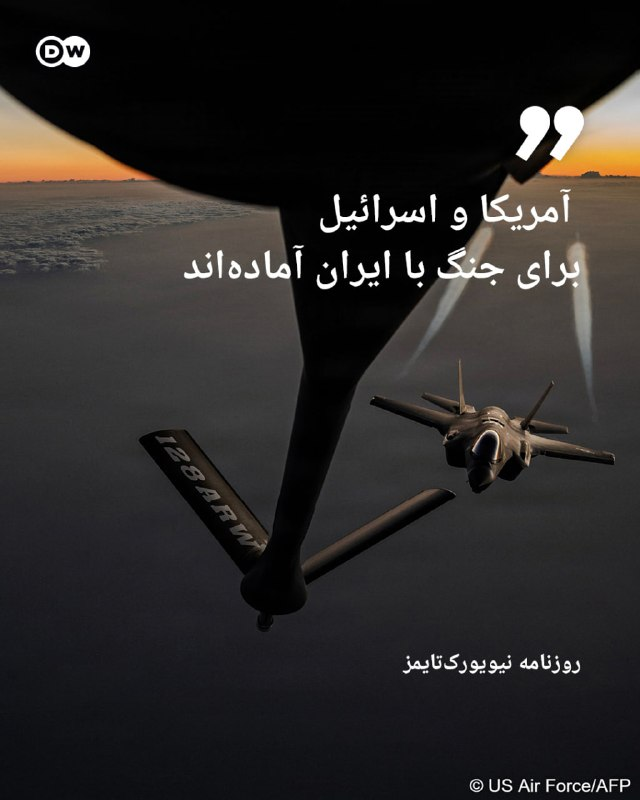

🔶 نیویورک‌تایمز: آمریکا و اسرائیل برای جنگ با ایران آماده‌اند

روزنامه نیویورک‌تایمز روز جمعه ۲۵ اردیبهشت (۱۵ مه) گزارش داد دونالد ترامپ، رئیس جمهور آمریکا پس از بازگشت از سفر چین با تصمیم‌های مهمی درباره ایران روبه‌رو است و مشاوران ارشد او طرح‌هایی برای ازسرگیریعملیات نظامی در صورت شکست روند مذاکرات و ادامه بن‌بست آماده کرده‌اند.

بر اساس این گزارش ترامپ هنوز درباره گام‌های بعدی خود تصمیم نگرفته است.

به گفته مقام‌های آگاه، برخی کشورها در تلاش‌ هستند میانجی‌گری کنند تا به نوعی توافق دست یابند که بر اساس آن ایران تنگه هرمز را دوباره برای تردد کشتی‌ها باز کند و ترامپ بتواند پایان درگیری را "پیروزی" اعلام کرده و افکار عمومی آمریکا را نسبت به موفقیت این عملیات نظامی پرهزینه و مرگبار قانع کند.

ترامپ در حین بازگشت از سفر چین در گفت‌وگو با خبرنگاران در هواپیمای ریاست‌جمهوری آمریکا تاکید کرد که تازه‌ترین پیشنهاد صلح ایران "قابل قبول نیست". او افزود: «من آن را نگاه کردم و اگر از همان جمله اول خوشم نیاید، آن را کنار می‌گذارم.»

نیویورک‌تایمز در بخشی از گزارش خود به نقل از مقام‌های آگاه و دو مقام خاورمیانه‌ای نوشته است که ایالات متحده و اسرائیل در حال انجام گسترده‌ترین سطح آماده‌سازی نظامی از زمان آتش‌بس اخیر هستند و احتمال ازسرگیری حملات علیه ایران در هفته‌های آینده مطرح شده است.

در همین حال، مقام‌های آمریکایی از تدوین گزینه‌های نظامی جدید از جمله حملات هوایی گسترده‌تر و حتی عملیات نیروهای ویژه خبر داده‌اند؛ گزینه‌هایی که به گفته پنتاگون با خطر بالای تلفات همراه خواهد بود.

پیت هگست، وزیر دفاع آمریکا (وزیر جنگ) نیز در کنگره اعلام کرده است که پنتاگون "طرح‌هایی برای تشدید درگیری در صورت لزوم" در اختیار دارد.

@dw_farsi

## Persian_Trend_Official — post 14227

📍بولتن خبری ۲۵ اردیبهشت ۱۴۰۵

گردآوری تحریریه‌پرشین ترند

🇮🇷 ایران

◾️ ایران پنج شرط خود را برای مذاکره با آمریکا از طریق میانجی پاکستانی اعلام کرد؛ واشنگتن در انتظار بررسی شروط است

◾️ تهران تایمز: آمریکا پیشنهاد ۱۴ ماده‌ای ایران را رد کرد؛ واشنگتن مواضع خود به‌ویژه در بحث هسته‌ای را تکرار کرده است

◾️ عراقچی: پیام‌های متناقض از سوی واشنگتن روند مذاکرات را پیچیده کرده؛ پس از رد پیشنهاد ایران، پیام‌های جدیدی از آمریکا مبنی بر تمایل به ادامه گفت‌وگو دریافت شده است

◾️ عراقچی: تنگه هرمز برای تمامی کشتی‌های تجاری باز است به شرط همکاری با نیروی دریایی ایران؛ این آمریکاست که محاصره ایجاد کرده

◾️ صداوسیما: از شب گذشته تاکنون ۳۰ کشتی با هماهنگی ایران از تنگه هرمز عبور کردند؛ از جمله کشتی‌های چینی و یک کشتی ژاپنی

◾️ بریتانیا: یک کشتی در حال پهلوگیری در الفجیره توقیف و به سمت آب‌های ایران حرکت کرده است

◾️ وال استریت ژورنال: یک کشتی با پرچم هند پس از حمله در نزدیکی سواحل عمان غرق شد؛ تمام خدمه نجات یافتند

◾️ کمیسیون امنیت ملی مجلس: پیشنهاد پرداخت ۵۰ میلیون یورو جایزه دولتی به هرکس که ترامپ را بکشد

◾️ سی‌ان‌ان: هکرهای وابسته به جمهوری اسلامی سامانه‌های پمپ‌بنزین در چند ایالت آمریکا را هدف قرار دادند

◾️ سازمان بورس: آمادگی برای بازگشایی بازار سهام از اواسط هفته آینده؛ زمان دقیق به‌زودی اعلام می‌شود

◾️ خاموشی اینترنت در ایران وارد روز ۷۷ام شد و از ۱۸۰۰ ساعت گذشت

---

🇮🇱 اسرائیل و خاورمیانه

◾️ اسرائیل مدعی ترور عزالدین الحداد، فرمانده نظامی حماس در غزه شد؛ ارتش اسرائیل در تمامی جبهه‌ها اعلام آماده‌باش کرده است

◾️ گزارش‌ها از بمباران شدید و غیرعادی در جنوب لبنان

◾️ رئیس ستاد کل ارتش اسرائیل در جریان جنگ مخفیانه به امارات سفر و با شیخ محمد بن زاید دیدار کرد؛ امارات این دیدارها را انکار می‌کند

◾️ امارات تا ۲۰۲۷ ظرفیت صادرات نفت بدون عبور از تنگه هرمز را از طریق خط لوله جدید به بندر فجیره دو برابر می‌کند

◾️ بحرین، امارات، عربستان، قطر، کویت و اردن در بیانیه مشترک ادعاهای ایران درباره مدیریت تنگه هرمز را محکوم کردند

◾️ عراقچی در واکنش: امارات در این جنگ در کنار آمریکا بوده و نمی‌تواند مظلوم‌نمایی کند

◾️ فایننشال تایمز: عربستان سعودی پیشنهاد پیمان عدم تعرض میان کشورهای خاورمیانه و ایران را مطرح کرده است

◾️ در خبری[FBI] مدعی شدهدرهبر حزب‌الله عراق، محمدباقر السعدی را بازداشت کرد؛ او متهم حداقل ۲۰ حمله تروریستی در اروپا و کانادا می‌باشد

---

🌍 آمریکا و جهان

◾️ ترامپ: صبر زیادی نخواهم داشت؛ ایران باید توافق را امضا کند؛ آمریکا آماده پذیرش توقف ۲۰ ساله فعالیت هسته‌ای ایران است

◾️ ترامپ: تأسیسات هسته‌ای ایران زیر نظر ۹ دوربین ۲۴ ساعته است؛ هرگونه تحرک داخلی با واکنش نظامی مستقیم مواجه خواهد شد

◾️ اکسیوس: تیم ترامپ گزینه‌های تشدید نظامی برای شکستن بن‌بست با ایران را بررسی می‌کند

◾️ فرمانده سنتکام در کنگره: مذاکرات حساسی با ایران در جریان است؛ ما آماده‌ایم

◾️ ترامپ پس از دیدار با شی جین‌پینگ پکن را ترک کرد؛ چین آمادگی کمک برای توافق با ایران را اعلام و قول داد تجهیزات نظامی به تهران منتقل نکند

◾️ کاخ سفید: آمریکا و چین بر لزوم باز ماندن تنگه هرمز و مخالفت با هسته‌ای شدن ایران توافق کردند

◾️ الجزیره: مذاکرات شی و ترامپ نقش میانجیگری پاکستان در بحران را تقویت کرده نه تضعیف

◾️ پاکستان: آتش‌بس میان ایران و آمریکا همچنان برقرار است

◾️ مدیر سرویس اطلاعات خارجی روسیه: هیچ نشانه‌ای از پایان درگیری نظامی وجود ندارد؛ آمریکا و اسرائیل برای پیروزی آسان بر ایران شرط‌بندی کردند اما نتیجه نگرفتند

📌 @persian_trend_official
پرشین ترند | متفاوت‌ترین کانال نظامی
💻

## Persian_Trend_Official — post 14226

  <a href="telegram/content/Persian_Trend_Official_14226_1778916820.mp4" target="_blank">🎬 Download video</a>

صبحتون بخیر ☕️🤍

📝 Nick
📌 @persian_trend_official
پرشین ترند | متفاوت‌ترین کانال نظامی

## RadioFarda — post 157249

  

🔸دونالد ترامپ، رئیس جمهور آمریکا، در مصاحبه‌ای تازه با شبکه فاکس‌نیوز گفت که در پی آتش‌بس حکومت ایران «پنج بار» تا آستانه توافق کامل با آمریکا آمده، اما در لحظه آخر عقب کشیده است.

🔸او در این مصاحبه تأکید می‌کند: «هر بار که توافق می‌کنند، روز بعد انگار نه انگار که با هم حرف زده‌ایم. و این پنج بار اتفاق افتاده است. یک جای کارشان ایراد دارد. راستش دیوانه‌اند.»

🔸او چنین ادامه می‌دهد: «و چون دیوانه‌اند، نباید به سلاح هسته‌ای دست پیدا کنند.»

🔸آن طور که رئیس جمهور آمریکا در این مصاحبه نقل می‌کند، حکومت ایران در مذاکرات اخیر حتی پذیرفته است که کل اورانیوم غنی‌شده‌اش را تحویل دهد.

🔸ترامپ گفت: «هسته‌ای خلاص. قرار بود غبار هسته‌ای را به ما بدهند. هر چه که ما خواسته بودیم.»

🔸این‌ها نکاتی است که دونالد ترامپ پیش از سفرش به چین هم با خبرنگاران در میان گذاشته بود.

🔸این در حالی است که مقام‌های جمهوری اسلامی از جمله عباس عراقچی، وزیر خارجه، تکذیب می‌کنند که شرایط آمریکا را پذیرفته‌اند.

@RadioFarda

## RadioFarda — post 157248

  

🔸دونالد ترامپ، رئیس جمهور آمریکا، بامداد شنبه در شبکه اجتماعی خود اعلام کرد که فرد شماره دو گروه تروریستی داعش، حکومت اسلامی، در عملیات مشترک ارتش آمریکا و ارتش نیجریه کشته شده است.

🔸ترامپ این فرد را «ابو بلال المینوکی» معرفی کرده است.

🔸به گفته رئیس جمهور آمریکا، با حذف این عضو ارشد داعش به عملیات این گروه در سطح جهان لطمه بزرگی وارد شده است.

🔸گروه امارت یا حکومت اسلامی، معروف به داعش، بیش از یک دهه پیش از دل هرج و مرجی ظهور کرد که در پی بروز جنگ داخلی در سوریه پیش آمد. این گروه در سال‌های اول به‌سرعت پیشروی کرد و در سوریه و عراق مناطق وسیعی را به تصرف درآورد.

🔸با این حال پس از آن گروه داعش در هر دو کشور متحمل شکست‌های سنگین شد و اکنون گفته می‌شود که جز هسته‌هایی کوچک از آن باقی نمانده است. اما ارتش آمریکا هرازگاهی اعلام می‌کند که یک فرمانده محلی یا سردسته یک گروه داعش را از پا درآورده است.

@RadioFarda

## RadioFarda — post 157244

🔸 به گزارش رسانه‌های ایران یحیی دهقان‌پور، از عکاسان برجسته و مدرسان عکاسی ایران، روز جمعه ۲۵ اردیبهشت در سن ۸۶ سالگی درگذشت.

🔸آقای دهقان‌پور متولد ۱۳۱۹ در تهران بود. تدریس در مدرسه‌ عالی تلویزیون در سال‌ ۱۳۵۷ سرآغاز دوران تدریس او در رشته‌ عکاسی بود؛ دورانی که در دانشگاه‌های متعدد و تا اوایل دهه‌ ۱۳۹۰ و بیش از ۳۰ سال طول کشید.

🔸این استاد برجسته از سال ۱۳۵۷ به بعد، علاوه‌ بر تدریس، برگزاری چندین نمایشگاه انفرادی برگزار و در نمایشگاه‌های گروهی متعدد شرکت کرد.

🔸از معروف‌ترین آثار آقای دهقان‌پور تصاویر تشییع فروغ فرخزاد، شاعر برجسته و جوان، در قبرستان ظهیرالدوله تهران است. او این عکس‌ها را در تاریخ ۲۵ بهمن ۱۳۴۵ با دوربین مدیوم فرمت برداشته شده بود.

🔸یحیی دهقان‌پور در زمان ثبت این عکس‌ها ۲۶ ساله و دانشجوی رشته ادبیات بود و سال‌ها بعد در نمایشی با عنوان «آن روز فروغ را در باغچه کاشتند» مجموعه خود را ارائه کرد.

🔸 از این عکاس برجسته و استاد پیشکسوت چند کتاب عکس نیز به یادگار مانده است.

@RadioFarda

## RadioFarda — post 157243

  

🔸خبرگزاری بلومبرگ روز جمعه ۲۵ اردیبهشت خبر داد که دولت دونالد ترامپ در حال بررسی تعلیق تحریم‌های چین در ارتباط با خرید نفت ایران است.

🔸این خبر ساعاتی پس از آن منتشر شد که هواپیمای ترامپ از پکن عازم سفر بازگشت به آمریکا شد.

🔸به نوشته بلومبرگ، دونالد ترامپ در حال بررسی آن است که تحریم‌های شرکت‌های نفتی چین که مواد اولیه خود را از ایران خریداری می‌کنند بردارد یا به حال تعلیق درآورد.

🔸به گفته رئیس جمهور آمریکا، این مسئله در دیدار رسمی‌اش با شی جین‌پینگ، همتای چینی‌اش،‌ در پکن مطرح شده است.

🔸هفته گذشته وزارت امور خارجه و وزارت خزانه‌داری آمریکا اعلام کردند که چند شرکت از جمله یک کارگزار تخلیه صادرات نفتی ایران مستقر در چین با نام شرکت «چینگدائو هایه» و مدیر چینی آن را تحریم کرده‌اند.

🔸در صورت تعلیق این گونه تحریم‌ها علیه چین، علاوه بر شرکت‌های چینی که به نفت می‌رسند، جمهوری اسلامی هم به میلیاردها دلار درآمدی می‌رسد که به دلیل تحریم‌ها از آن محروم شده است.

@RadioFarda

## RadioFarda — post 157242

  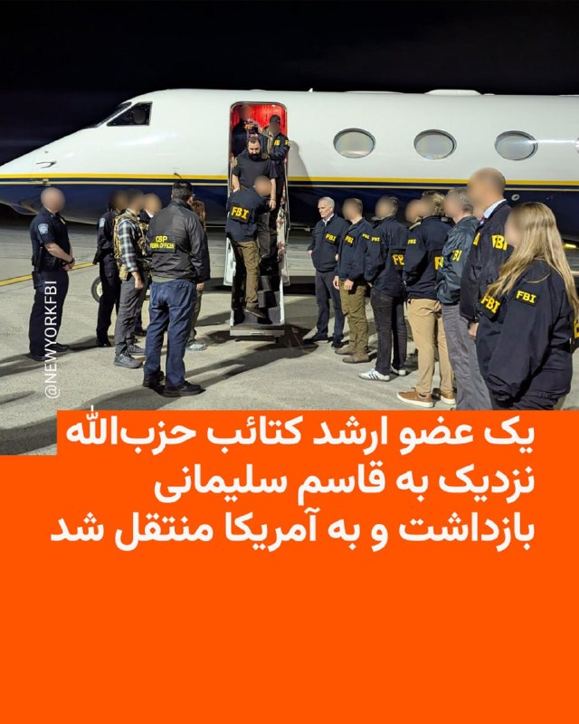

🔸اف‌بی‌آی، اداره پلیس فدرال آمریکا، روز جمعه ۲۵ اردیبهشت خبر داد که یک عضو ارشد گروه عراقی کتائب حزب‌الله، از گروه‌های نیابتی اصلی جمهوری اسلامی، به نام محمدباقر سعد داوود السعدی، بازداشت و برای محاکمه به ایالات متحده منتقل شده است.

🔸دادستانی ایالت نیویورک در حساب شبکه ایکس خود عکسی از این عضو کتائب در کنار قاسم سلیمانی، فرمانده سابق سپاه قدس، منتشر کرده است که در حمله آمریکا در دوره اول ریاست جمهوری دونالد ترامپ کشته شد.

🔸آمریکا گروه کتائب حزب‌الله را گروهی تروریستی قلمداد می‌کند. این گروه پیش از جنگ ایران اعلام کرده بود که در صورت آغاز هر جنگی به نفع جمهوری اسلامی وارد نبرد خواهد شد.

🔸محمدباقر سعد داوود السعدی به دلیل فعالیتش به عنوان یک عضو کتائب و همکاری با سپاه قدس، شاخه برون‌مرزی سپاه پاسداران، با شش اتهام مرتبط با تروریسم روبه‌روست.

@RadioFarda

## RadioFarda — post 157240

  

🔸پسر عبدالرحیم موسوی، فرمانده پیشین نیروهای مسلح، که در جریان حمله به «بیت رهبری» کشته شده بود، در یک گفت‌وگوی تلویزیونی اعلام کرد که جنازه پدرش ۳۰ روز زیر آوار بوده است.

🔸فرزند آقای موسوی گفت که حوالی ساعت ۹ صبح روز نهم اسفند ۱۴۰۴ قطعی شد که پدرش باید به جلسه برود و پس از حمله هوایی به بیت رهبری حدود ۳۰ روز گروه تفحص و او به دنبال پیکر پدرش می‌گشتند.

🔸در جریان حمله نهم اسفند به مقر علی‌خامنه‌ای، رهبر پیشین جمهوری اسلامی، علاوه بر او ده‌ها مقام بلندپایه حکومت کشته شدند.

@RadioFarda

## RadioFarda — post 157239

  <a href="https://t.me/radiofarda/157239" target="_blank">📎 Download file</a>

📻بشنوید: سرخط خبرها با رادیوفردا، ۲۶ اردیبهشت ۱۴۰۵‌

@RadioFarda

## IranianMinds — post 20224

  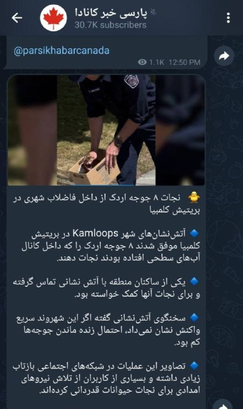

کاش یه روزی بیاد که تنها دغدغه و اخبارای مهم مام این چیزا باشه:)

@IranianMinds

## IranianMinds — post 20223

  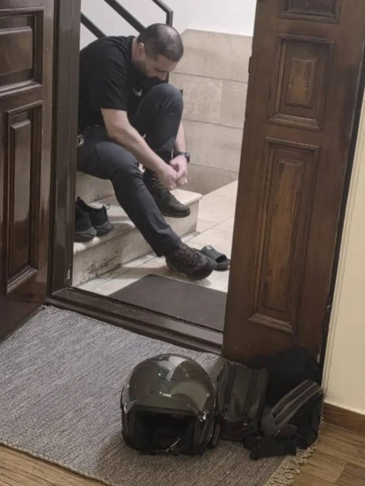

۱۸ و ۱۹ دی ، میلیونها ایرانی بند کفششون رو بستند که ایرانو از بند جمهوری اسلامی آزاد کنند. بیش از پنجاه هزار نفرشون دیگه برنگشتند. ما تا روز دادخواهی، به زندگی عادی برنخواهیم گشت.
آخرین عکس از جاویدنام محسن جبارزاده

@IranianMinds

## IranianMinds — post 20222

🔴 ترامپ در گفت‌وگو با فاکس‌نیوز:

می‌دونم مردم آمریکا فشار اقتصادی رو تحمل می‌کنن، اما باید جلوی این گروهِ واقعا دیوانه(جمهوری اسلامی) رو بگیریم.

جمهوری اسلامی از نظر نظامی «شدیدا ضربه خورده» و «دیگه نه نیروی دریایی دارن، نه نیروی هوایی؛ همه‌چیزشون نابود شده.»

هر بار توافق می‌کنن، فرداش انگار نه انگار همچین حرفی زده شده. واقعا دیوانه‌ان و به همین خاطر نمی‌تونن سلاح هسته‌ای داشته باشن.

آمریکا عمدا بعضی زیرساخت‌های ایران رو هدف نگرفته، اما «اگر بخواهیم، می‌توانیم ظرف دو روز همه‌چیز رو نابود کنیم.»

@IranianMinds

## IranianMinds — post 20221

🔴 طبق برخی گزارشات

مهدی طارمی، شجاع خلیل زاده، دانیال اسماعیلی فر و احسان حاج صفی

به علت گذراندن خدمت سربازی در سپاه ویزا براشون صادر نشد

@IranianMinds

## IranianMinds — post 20220

  

ترامپ:

امشب به دستور من، نیروهای شجاع آمریکایی و نیروهای مسلح نیجریه یک ماموریت با برنامه ریزی دقیق و بسیار پیچیده را برای از بین بردن فعال ترین تروریست جهان از میدان نبرد، بدون نقص اجرا کردند.

ابوبلال المنوکی، دومین فرمانده داعش در سطح جهان، فکر می‌کرد که می‌تواند در آفریقا مخفی شود، اما او نمی‌دانست که ما منابعی داریم که ما را در جریان کارهای او قرار می‌دهند. او دیگر مردم آفریقا را به وحشت نخواهد انداخت، یا به برنامه ریزی عملیات برای هدف قرار دادن آمریکایی ها کمک نخواهد کرد.

با برکناری او، عملیات جهانی داعش تا حد زیادی کاهش یافته است. با تشکر از دولت نیجریه برای مشارکت شما در این عملیات. خدا برکت آمریکا را بدهد!

@IranianMinds

## BBCPersian — post 281200

🔻دونالد ترامپ، رئیس جمهور آمریکا گفته است که نیروهای آمریکا و نیجریه در یک عملیات مشترک، نفر دوم گروه دولت اسلامی (داعش) را کشته‌اند. آقای ترامپ در پستی در تروث سوشال گفت که ابوبلال المینوکی دیگر به مردم آفریقا آسیب نخواهد زد و نمی‌تواند برای هدف قرار دادن…

## BBCPersian — post 281193

🖊سوفیا بتیزا, بی‌بی‌سی در کی‌یف

کارینا شش‌ ماهه باردار است، اما جنینی که در رحم اوست متعلق به خودش نیست.

این زن ۲۲ ساله اهل شرق اوکراین، یک مادر جایگزین است که رویانی حاصل از تخمک و اسپرم یک زوج چینی را در شکم دارد.

زمانی که کارینا تنها ۱۷ سال داشت، خانه‌اش ویران شد؛ در آن هنگام شهر او، باخموت، در اولین مراحل تهاجم تمام‌عیار روسیه، به یکی از پرکشمکش‌ترین میدان‌های نبرد تبدیل شده بود.

در حالی که بخش اعظم شهر به تلی از آوار و خاکستر بدل شده بود، او و شریک زندگی‌اش راهی کی‌یف شدند، اما در آنجا برای یافتن شغلی پایدار با دشواری روبه‌رو گشتند.

یک روز، وقتی کارینا در فروشگاهی بود و پولش به‌زحمت به خرید نان و پوشک برای دختر یک‌ و نیم‌ ساله‌شان می‌رسید، تصمیم گرفت برای تامین معاش، رحمش را اجاره دهد.

او می‌گوید اگر به خاطر جنگ نبود، هرگز یک مادر جایگزین نمی‌شد؛ جنگی که باعث بیکاری میلیون‌ها نفر و نابودی کسب‌وکارها شده و تورم فزاینده و سقوط شدید تولید ناخالص داخلی اوکراین را به همراه داشته است.

برای خواندن مطلب کامل:
https://bbc.in/4wDd7Le
📷BBC/ Getty/ BioTexCom
@BBCPersian

## BBCPersian — post 281192

🔻انفجار کنترل شده بمب‌های عمل نکرده در شیراز و حومه به مدت سه روز

محمد فرهادی، رئیس ستاد ارشد نظامی ارتش در استان‌های فارس و کهگیلویه و بویراحمد از انفجار کنترل شده بمب‌های عمل نکرده در شیراز طی سه روز خبر داد.

او گفته است که عملیات خنثی سازی و انفجار کنترل شده بمب‌های عمل نکرده جنگ در شیراز و حومه این شهر از امروز به مدت سه روز انجام می شود.

روابط عمومی ستاد ارتش در این استان‌ها هم گفته است که شنیده شدن صدا هر گونه انفجاری مربوط به این عملیات است.
https://bbc.in/3RJvbmB
@BBCPersian

## BBCPersian — post 281191

🔻واکنش اولیانوف به پیشنهاد تعلیق ۲۰ ساله برنامه هسته‌ای ایران: موضع آمریکا فاقد استدلال است

میخائیل اولیانوف، نماینده روسیه در آژانس بین‌المللی انرژی اتمی در وین به پیشنهاد دونالد ترامپ در مورد تعلیق ۲۰ ساله برنامه هسته‌ای ایران واکنش نشان داده و گفته است: «چرا ۲۰ سال و نه ۱۵ یا ۲۵ سال؟»

آقای اولیانوف در پستی در شبکه اجتماعی ایکس موضع آمریکا را «فاقد هر گونه استدلال» و صرفا براساس «ملاحظات ایدئولوژیک» دانسته و افزوده است: «اگر چنین رویکردی برای آمریکا قابل قبول است، لطفا در صورت بی نتیجه بودن آن شکایت نکنید.»

دونالد ترامپ ساعاتی پیش، پس از بازگشت از پکن گفته بود که تعلیق ۲۰ ساله برنامه هسته‌ای ایران را می‌پذیرد.

پیشتر، او از ایران خواسته بود که غنی‌سازی اورانیوم را به طور دائم متوقف کند و از دستیابی به سلاح‌های هسته‌ای برای همیشه جلوگیری شود.

اخیرا ایران پیشنهاد‌های آمریکا برای رسیدن به توافق را رد کرده بود و پس آن هم واشنگتن پیشنهاد‌های تهران را قابل قبول ندانست.

@BBCPersian

## BBCPersian — post 281183

🖊عمر دراز ننگیانه, بی‌بی‌سی اردو،‌ اسلام‌آباد

در حالی که در روزهای اخیر برخی محافل در آمریکا نسبت به نقش پاکستان به عنوان میانجی مذاکرات ایران و آمریکا ابراز تردید کرده‌اند، واشنگتن و تهران بار دیگر بر اعتماد خود به نقش اسلام‌آباد تاکید کرده‌اند.

با این حال، به نظر می‌آید روند میانجی‌گری در بن‌بست قرار گرفته است. ایران چند روز پیش پیشنهادهای خود درباره آتش‌بس را از طریق پاکستان برای آمریکا فرستاد، اما دونالد ترامپ، رئیس‌جمهور آمریکا، این پیشنهادها را «غیرقابل قبول» خواند و رد کرد.

از آن زمان تاکنون، تحول مهمی در این فرایند رخ نداده است.

اما تنها یک روز پیش از آغاز سفر دونالد ترامپ، رئیس‌جمهور آمریکا، به پکن، چین از طریق خبرگزاری رسمی خود پیامی منتشر کرد و از پاکستان خواست «روند میانجی‌گری میان آمریکا و ایران را تسریع کند».

اکنون پرسش اصلی این است که اسلام‌آباد چگونه می‌تواند روند میانجی‌گری را که ظاهرا در بن‌بست قرار گرفته و فعلا بیشتر به انتقال پیام محدود شده، تسریع کند؟

برای خواندن مطلب کامل:
https://bbc.in/4dtS7xK
📸GettyImages/ AFP/ White House/VCG
@BBCPersian

## BBCPersian — post 281182

  

🔻دونالد ترامپ، رئیس جمهور آمریکا گفته است که نیروهای آمریکا و نیجریه در یک عملیات مشترک، نفر دوم گروه دولت اسلامی (داعش) را کشته‌اند.

آقای ترامپ در پستی در تروث سوشال گفت که ابوبلال المینوکی دیگر به مردم آفریقا آسیب نخواهد زد و نمی‌تواند برای هدف قرار دادن آمریکایی‌ها عملیات برنامه‌ریزی کند.

او المینوکی را «فعال‌ترین تروریست جهان» توصیف کرد و گفت که با کشته شدن او، عملیات جهانی این گروه به‌شدت تضعیف شده است.

المینوکی در سال ۲۰۲۳ به دلیل ارتباط با گروه داعش تحت تحریم‌های ایالات متحده قرار گرفته بود.

📷Getty Images
@BBCPersian

## BBCPersian — post 281181

  

‌ ‌ ‌
آژانس بهداشتی آفریقا شیوع ابولا را در استان شرقی ایتوری جمهوری دموکراتیک کنگو اعلام کرد.

مرکز کنترل و پیشگیری از بیماری‌های آفریقا اعلام کرد که حدود ۲۴۶ مورد ابتلا و ۶۵ مورد مرگ گزارش شده است که عمدتا در شهرهای معدن طلا در مونگوالو و روآمپارا اتفاق افتاده است.

مقامات اوگاندا روز جمعه یک مورد ابتلا به ابولا از جمهوری دموکراتیک کنگو را تایید کردند و وزارت بهداشت آن کشور اعلام کرد که آزمایش یک مرد ۵۹ ساله که روز پنجشنبه درگذشت، مثبت بوده است.

ابولا اولین بار در سال ۱۹۷۶ در جایی که اکنون جمهوری دموکراتیک کنگو است، کشف شد و تصور می‌شود که از خفاش‌ها شیوع یافته باشد. این هفدهمین شیوع این بیماری ویروسی کشنده در آن کشور است.

این بیماری از طریق تماس مستقیم با مایعات بدن و از طریق پوست آسیب دیده منتقل می‌شود و باعث خونریزی شدید و نارسایی اندام می‌شود.

https://bbc.in/4nwKU4t
📷Reuters
@BBCPersian

## Hranews — post 112960

مجید درویش‌نژاد با تودیع وثیقه آزاد شد

❗️
❗️
❗️
❗️
❗️– مجید درویش‌نژاد، شهروند اهل ارومیه، با تودیع وثیقه از یکی از بازداشتگاه‌های امنیتی این شهر آزاد شد.

#مجید_درویش_‌نژاد

ادامه مطلب

## manototv — post 105506

  <a href="telegram/content/manototv_105506_1778916828.mp4" target="_blank">🎬 Download video</a>

ارتش اسرائیل اعلام کرد در پی فعال شدن هشدار نفوذ پهپاد در منطقه میرون، یک هدف هوایی مشکوک شناسایی شده است.
ارتش اسرائیل همچنین اعلام کرد جزئیات این رویداد در حال بررسی است و این حادثه بدون تلفات پایان یافته اس

## manototv — post 105505

  <a href="telegram/content/manototv_105505_1778916829.mp4" target="_blank">🎬 Download video</a>

رسانه‌های اسرائیلی گزارش داده‌اند با بازگشت دونالد ترامپ، رئیس‌جمهوری آمریکا، از سفر چین، کاخ سفید به مرحله‌ای تعیین‌کننده در پرونده ایران نزدیک شده و احتمال تصمیم‌گیری درباره اقدام نظامی در روزهای آینده افزایش یافته است.
کانال ۱۲ اسرائیل گزارش داد در اسرائیل برآورد می‌شود دونالد ترامپ طی ۲۴ ساعت آینده درباره اقدام نظامی علیه جمهوری اسلامی تصمیم‌گیری کند. این شبکه به نقل از یک مقام ارشد اسرائیلی گزارش داد «ازسرگیری درگیری‌ها نزدیک است» و اسرائیل خود را برای «روزها تا هفته‌ها درگیری» آماده می‌کند.
بر اساس این گزارش، مقام‌های اسرائیلی معتقدند آمریکا به این جمع‌بندی رسیده که مذاکرات با ایران به سمت پیشرفت جدی حرکت نمی‌کند و انتظار می‌رود تصویر روشن‌تری از تصمیم واشنگتن طی ساعات آینده مشخص شود.

## manototv — post 105504

  <a href="telegram/content/manototv_105504_1778916829.mp4" target="_blank">🎬 Download video</a>

دونالد ترامپ، رئیس‌جمهوری آمریکا، در تروث سوشیال اعلام کرد نیروهای آمریکایی و ارتش نیجریه در عملیاتی مشترک، «ابوبلال المنوکی» از فرماندهان ارشد داعش را کشته‌اند.
ترامپ گفت این عملیات به دستور او و با برنامه‌ریزی دقیق انجام شده و «ابوبلال المنوکی» که به گفته او نفر دوم داعش در سطح جهانی بوده، در آفریقا مخفی شده بود.
او افزود با کشته شدن این فرمانده داعش، توان عملیاتی جهانی این گروه به‌شدت تضعیف شده است.

## manototv — post 105503

  <a href="telegram/content/manototv_105503_1778916830.mp4" target="_blank">🎬 Download video</a>

شبکه سی‌ان‌ان به نقل از چند منبع گزارش داده هکرهای مظنون به ارتباط با ایران موفق شده‌اند به سامانه‌های پایش مخازن سوخت در آمریکا نفوذ کنند و نمایشگر میزان سوخت را تغییر دهند.
بر اساس این گزارش، سامانه‌های «اندازه‌گیری خودکار مخازن» بدون رمز عبور و متصل به اینترنت بوده‌اند. منابع آگاه می‌گویند هکرها توانسته‌اند ارقام نمایش‌داده‌شده را دستکاری کنند، اما امکان تغییر واقعی میزان سوخت در مخازن را نداشته‌اند و هیچ خسارت فیزیکی گزارش نشده است.
سی‌ان‌ان همچنین گزارش داده این حملات تنها به سامانه‌های سوخت محدود نبوده و زیرساخت‌های نظامی و شبکه‌های آب آمریکا را نیز هدف قرار گرفته‌اند.

## alonews — post 120328

  <a href="telegram/content/alonews_120328_1778916831.webm" target="_blank">🎬 Download video</a>

👈نیویورک تایمز گزارش می‌دهد که نیروهای نظامی آمریکا "در حال آماده‌سازی برای دور دیگری از حملات هستند... این بار با شدت بیشتر. این حملات ممکن است از روز دوشنبه آغاز شود. اهداف نظامی بیشتری از ایران در نظر گرفته شده است که شامل زیرساخت‌ها نیز می‌شود."

✅ @AloNews خبر جنگ

## alonews — post 120325

  <a href="telegram/content/alonews_120325_1778916831.webm" target="_blank">🎬 Download video</a>

👈شب گذشته در بسیاری از برنامه های صداوسیما، مجریان با تفنگ حاضر شدند!

✅ @AloNews خبر جنگ

## alonews — post 120324

  <a href="telegram/content/alonews_120324_1778916831.mp4" target="_blank">🎬 Download video</a>

👈مارکو روبیو: چین کاری را انجام می‌دهد که من اگر رهبر چینی بودم انجام می‌دادم. آن‌ها تلاش می‌کنند در تمام این صنایع کلیدی آینده بر جهان مسلط شوند.

🔴 شاید ما از آن خوشمان نیاید، اما این همان کاری است که آن‌ها انجام خواهند داد زیرا به نفع بهترین منافع خود عمل می‌کنند. ما نیز باید به نفع بهترین منافع خود عمل کنیم.

✅ @AloNews خبر جنگ

## alonews — post 120323

  <a href="telegram/content/alonews_120323_1778916833.mp4" target="_blank">🎬 Download video</a>

👈روبیو: اگر جی دی ونس کاندیدای ریاست جمهوری شود، اولین نفری هستم که از او حمایت می کنم

✅ @AloNews خبر جنگ

## alonews — post 120322

  <a href="telegram/content/alonews_120322_1778916834.webm" target="_blank">🎬 Download video</a>

👈روزنامه عبری هاآرتص: چهار ماه از ایجاد «شورای صلح» برای نوار غزه می‌گذرد؛ تاکنون طرح ترامپ اجرا نشده است

✅ @AloNews خبر جنگ

## alonews — post 120321

  <a href="telegram/content/alonews_120321_1778916834.webm" target="_blank">🎬 Download video</a>

👈ترامپ: نفت ونزوئلا ما را ثروتمند کرد!

✅ @AloNews خبر جنگ

## alonews — post 120320

  <a href="telegram/content/alonews_120320_1778916835.webm" target="_blank">🎬 Download video</a>

👈استوری مشاور قالیباف در اینستاگرام

✅ @AloNews خبر جنگ

## alonews — post 120319

  <a href="telegram/content/alonews_120319_1778916835.webm" target="_blank">🎬 Download video</a>

👈وزارت دادگستری آمریکا با صدور بیانیه‌ای، مدعی شد «محمد باقر سعد داوود السعدی»، شهروند عراقی و از اعضای شاخص کتائب حزب‌الله دستگیر شده و به ایالات متحده منتقل شده است.

🔴وزارت دادگستری آمریکا افزود كه این شهروند عراقی در برابر «سارا نتبورن»، قاضی دادگاه فدرال در منطقه منهتن شهر نیویورک حاضر شده و او دستور بازداشت را تا زمان محاکمه صادر کرده است.

✅ @AloNews خبر جنگ

## alonews — post 120318

  <a href="telegram/content/alonews_120318_1778916835.webm" target="_blank">🎬 Download video</a>

👈سی‌ان‌بی‌سی: ترامپ چند هفته قبل از آنکه به طور علنی سهام شرکت هوش مصنوعی Palantir Technologies را در شبکه Truth Social تحسین کند، سهام این شرکت را خریداری کرد.

🔴سوابق نشان می‌دهد که ترامپ در اوایل سال ۲۰۲۶ بین حدود ۲۴۷,۰۰۰ تا ۶۳۰,۰۰۰ دلار سهام Palantir خریداری کرده است، از جمله چند خرید در ماه مارس. او بعداً این شرکت را در یک پست در Truth Social در آوریل، در زمانی که سهام فناوری به شدت کاهش یافته بود، تبلیغ کرد.

🔴اسناد همچنین نشان می‌دهد که ترامپ در فوریه تا ۵ میلیون دلار سهام Palantir فروخته و سرمایه‌گذاری‌های بزرگ دیگری در حوزه فناوری انجام داده است، از جمله در Nvidia، Apple، Amazon، Microsoft و Oracle.

✅ @AloNews خبر جنگ

## alonews — post 120317

  <a href="telegram/content/alonews_120317_1778916835.webm" target="_blank">🎬 Download video</a>

👈کرملین: پوتین در تاریخ ۱۹ و ۲۰ مه به چین سفر خواهد کرد.

✅ @AloNews خبر جنگ

## alonews — post 120316

  <a href="telegram/content/alonews_120316_1778916836.webm" target="_blank">🎬 Download video</a>

👈رسانه‌های عراقی از شنیده‌شدن صدای انفجار در منطقه الکراده بغداد خبر دادند

✅ @AloNews خبر جنگ

## alonews — post 120315

  <a href="telegram/content/alonews_120315_1778916836.webm" target="_blank">🎬 Download video</a>

👈پیام پزشکیان به رهبر کاتولیک‌های جهان: از موضع اخلاقی و منطقی شما در قبال تجاوزات نظامی اخیر به ایران قدردانی می‌کنم

🔴حملات آمریکا و اسرائیل صرفاً علیه ایران نیست، بلکه علیه حاکمیت قانون و ارزش‌های انسانی است

✅ @AloNews خبر جنگ

## alonews — post 120314

  <a href="telegram/content/alonews_120314_1778916836.webm" target="_blank">🎬 Download video</a>

🔴فوووری / منابع روسی: یک جنگنده سوخو-35 نیروی هوایی روسیه، یک جنگنده F-16 فایتینگ فالکون ناتو را سرنگون کرده است

✅ @AloNews خبر جنگ

## alonews — post 120313

  <a href="telegram/content/alonews_120313_1778916836.webm" target="_blank">🎬 Download video</a>

👈هشدار نارنجی هواشناسی: بارش‌های شدید و وزش باد در شمال کشور

✅ @AloNews خبر جنگ

## alonews — post 120312

  <a href="telegram/content/alonews_120312_1778916837.webm" target="_blank">🎬 Download video</a>

👈کوبا: آماده دفاع از خود در مقابل تهاجم احتمالی آمریکا هستیم

✅ @AloNews خبر جنگ

## alonews — post 120311

  <a href="telegram/content/alonews_120311_1778916837.webm" target="_blank">🎬 Download video</a>

👈مدیرکل مدیریت بحران استانداری اصفهان گفت: در ساعات بعدازظهر امروز تا روز دوشنبه وزش باد شدید و تندبادهای لحظه‌ای همراه با گردوغبار در استان پیش‌بینی می‌شود و سرعت باد به ۹۰ کیلومتر می‌رسد.

✅ @AloNews خبر جنگ

## alonews — post 120310

  <a href="telegram/content/alonews_120310_1778916837.webm" target="_blank">🎬 Download video</a>

👈انفجار کنترل‌شده بمب‌های عمل‌نکرده در شیراز 

✅ @AloNews خبر جنگ

## alonews — post 120309

  <a href="telegram/content/alonews_120309_1778916837.webm" target="_blank">🎬 Download video</a>

👈رویترز: ایالات متحده ممکن است از اسرائیل بخواهد میلیاردها دلار از وجوه مالیاتی فلسطینیان که مسدود شده است را به حمایت از طرح بازسازی غزه توسط ترامپ اختصاص دهد.

✅ @AloNews خبر جنگ

---
📅 بروزرسانی: 1405/02/26 03:13
---

## VahidOOnLine — post 240393

  

♦️ایلان ماسک، میلیاردر مشهور آمریکایی، مالک پلتفرم اکس و بنیان‌گذار تسلا و اسپیس‌ایکس، با انتشار عبارتی کوتاه در حساب کاربری خود در اکس نوشت: «اینستاگرام برنامه‌ای برای دختران است.»
در روزهای گذشته، برخی از مشهورترین مدیران ارشد آمریکایی، از جمله ایلان ماسک، دونالد ترامپ را در سفر رسمی و تاریخی‌اش به چین همراهی کرده‌اند.
‌🇸🇦 Indypersian

🤖 @VahidOOnLine

## VahidOOnLine — post 240392

  

سفیر چین در سازمان ملل از پیش‌نویس قطعنامه پیشنهادی آمریکا و بحرین درباره تنگه هرمز انتقاد کرد و گفت «هم محتوا و هم زمان آن نامناسب است» و کمکی به کاهش تنش‌ها با جمهوری اسلامی نخواهد کرد.
این پیش‌نویس از تهران می‌خواهد حملات و فعالیت‌های مین‌گذاری در تنگه هرمز را متوقف کند. چین و روسیه ماه گذشته نیز قطعنامه مشابهی را با این استدلال که جمهوری اسلامی را ناعادلانه هدف قرار می‌دهد، مسدود کرده بودند.

‌🏁 🇬🇧 IranintlTV

🤖 @VahidOOnLine

## VahidOOnLine — post 240391

  

سفیر چین در سازمان ملل از پیش‌نویس قطعنامه پیشنهادی آمریکا و بحرین درباره تنگه هرمز انتقاد کرد و گفت «هم محتوا و هم زمان آن نامناسب است» و کمکی به کاهش تنش‌ها با جمهوری اسلامی نخواهد کرد.
این پیش‌نویس از تهران می‌خواهد حملات و فعالیت‌های مین‌گذاری در تنگه هرمز را متوقف کند. چین و روسیه ماه گذشته نیز قطعنامه مشابهی را با این استدلال که جمهوری اسلامی را ناعادلانه هدف قرار می‌دهد، مسدود کرده بودند.

‌🏁 🇬🇧 IranintlTV

🤖 @VahidOOnLine

## VahidOOnLine — post 240390

  

سفیر چین در سازمان ملل از پیش‌نویس قطعنامه پیشنهادی آمریکا و بحرین درباره تنگه هرمز انتقاد کرد و گفت «هم محتوا و هم زمان آن نامناسب است» و کمکی به کاهش تنش‌ها با جمهوری اسلامی نخواهد کرد.
این پیش‌نویس از تهران می‌خواهد حملات و فعالیت‌های مین‌گذاری در تنگه هرمز را متوقف کند. چین و روسیه ماه گذشته نیز قطعنامه مشابهی را با این استدلال که جمهوری اسلامی را ناعادلانه هدف قرار می‌دهد، مسدود کرده بودند.

‌🏁 🇬🇧 IranintlTV

🤖 @VahidOOnLine

## VahidOOnLine — post 240389

♦️دونالد ترامپ، رئیس‌جمهوری آمریکا، بامداد شنبه ۲۶ اردیبهشت پس از پایان سفر رسمی خود به چین وارد پایگاه مشترک اندروز در نزدیکی واشنگتن شد.
پکن در دو روز گذشته میزبان دیدار تاریخی دونالد ترامپ و شی جین‌پینگ، رئیس‌جمهوری چین، بود؛ سفری که با استقبال رسمی گسترده و گفتگو درباره روابط اقتصادی، تجاری و تنش‌های منطقه‌ای همراه بود.
‌🇸🇦 Indypersian

🤖 @VahidOOnLine

## VahidOOnLine — post 240388

♦️حساب رسمی کاخ سفید، روز جمعه ۲۵ اردیبهشت، با انتشار تصاویری از سفر دونالد ترامپ به چین اعلام کرد رئیس‌جمهوری آمریکا از «معبد آسمان» در پکن بازدید کرده است.
پکن در دو روز گذشته میزبان دیدار تاریخی دونالد ترامپ، رئیس‌جمهوری آمریکا، و شی جین‌پینگ، رئیس‌جمهوری چین، بود؛ دیداری که با استقبال رسمی گسترده و گفتگو درباره مسائل اقتصادی، تجاری و تنش‌های منطقه‌ای همراه بود.
‌🇸🇦 Indypersian

🤖 @VahidOOnLine

## VahidOOnLine — post 240387

  <a href="telegram/content/VahidOOnLine_240387_1778888631.mp4" target="_blank">🎬 Download video</a>

دادستان‌های آمریکا اعلام کردند یک شهروند عراقی به اتهام طراحی حمله تروریستی به یک کنیسه مشهور در نیویورک و حمایت از گروه‌های مورد حمایت جمهوری اسلامی بازداشت و متهم شده است.

محمد باقر سعد داوود الساعدی، ۳۲ ساله، روز جمعه در دادگاهی در منهتن حاضر شد و مقام‌های آمریکایی او را به «توطئه برای ارائه حمایت مادی به سازمان‌های تروریستی خارجی» از جمله سپاه پاسداران و گروه کتائب حزب‌الله عراق متهم کردند.

بر اساس اسناد دادگاه، الساعدی از فرماندهان کتائب حزب‌الله معرفی شده و متهم است از ماه مارس در طراحی، اجرا و تبلیغ حدود ۱۸ حمله علیه منافع آمریکا و اسرائیل در اروپا نقش داشته است.

دادستان‌ها می‌گویند او برای انجام حمله به یک کنیسه در نیویورک، با فردی که در واقع مامور مخفی اف‌بی‌آی بوده تماس گرفته و تصاویر، نقشه‌ها و اطلاعات مربوط به محل حمله را در اختیار او قرار داده است. به گفته مقام‌های آمریکایی، او همچنین تصاویری از مراکز یهودیان در لس‌آنجلس و اسکاتسدیل آریزونا ارسال کرده بود.

در یکی از مکالمات ضبط‌شده، الساعدی درباره هزینه «انجام عملیات بمب‌گذاری» در آمریکا پرس‌وجو کرده و گفته بود: «ما برایش یک معبد یهودیان یا یک مرکز یهودیان فراهم می‌کنیم.»

دادستان‌ها می‌گویند او با مامور مخفی بر سر پرداخت ۱۰ هزار دلار رمزارز برای اجرای حمله توافق کرده و سه هزار دلار به‌عنوان پیش‌پرداخت ارسال کرده بود. بر اساس این گزارش، الساعدی بعدتر در ترکیه بازداشت و به اف‌بی‌آی تحویل داده شد.

پلیس نیویورک اعلام کرد این پرونده «تهدیدهای جهانی ناشی از جمهوری اسلامی و گروه‌های نیابتی‌اش» را آشکار می‌کند. مقام‌های آمریکایی همچنین گفتند با همکاری نهادهای امنیتی، طرح حمله به کنیسه‌ای در منهتن خنثی شده است.

در اسناد دادگاه همچنین تصاویری از دیدار الساعدی با قاسم سلیمانی، فرمانده پیشین نیروی قدس سپاه پاسداران، منتشر شده است.
‌🏁 🇬🇧 ManotoTV

🤖 @VahidOOnLine

## VahidOOnLine — post 240386

  

♦️عباس عراقچی، وزیر امور خارجه جمهوری اسلامی، در واکنش به افزایش قیمت انرژی در آمریکا، با انتشار پیامی در اکس نوشت آمریکایی‌ها مجبور شده‌اند «هزینه‌های سرسام‌آور جنگ انتخابی علیه ایران» را تحمل کنند.
او در این پیام نوشت: «فعلا افزایش قیمت بنزین و حباب بازار سهام را کنار بگذارید. درد واقعی زمانی آغاز می‌شود که بدهی آمریکا و نرخ وام‌های مسکن شروع به افزایش کنند.»
عراقچی همچنین مدعی شد میزان ناتوانی در بازپرداخت وام خودرو در آمریکا به بالاترین سطح خود در بیش از ۳۰ سال گذشته رسیده و افزود: «تمام این‌ها قابل اجتناب بود.»
‌🇸🇦 Indypersian

🤖 @VahidOOnLine

## VahidOOnLine — post 240385

  

عباس عراقچی، وزیر خارجه جمهوری اسلامی، در واکنش به بالا رفتن قیمت انرژی در آمریکا، در ایکس نوشت: «در حال حاضر، افزایش قیمت بنزین و حباب بازار سهام را کنار بگذارید. درد واقعی زمانی آغاز می‌شود که بدهی آمریکا و نرخ وام‌های مسکن شروع به جهش کنند.»
او نوشت همین حالا هم میزان ناتوانی در بازپرداخت وام خودرو به بالاترین سطح خود در بیش از ۳۰ سال گذشته رسیده است، اما تمام این‌ها قابل اجتناب بود.

‌🏁 🇬🇧 IranintlTV

🤖 @VahidOOnLine

## VahidOOnLine — post 240384

  

♦️نمایندگی دائم جمهوری اسلامی در سازمان ملل متحد روز جمعه ۲۵ اردیبهشت، در پیامی در شبکه اجتماعی اکس نوشت آمریکا تلاش دارد با استفاده از شمار کشورهای حامی پیش‌نویس قطعنامه پیشنهادی خود، تصویری از حمایت گسترده بین‌المللی برای اقداماتش ایجاد کند و زمینه را برای تشدید تنش‌ها در منطقه فراهم سازد.
این نمایندگی افزود: در صورت هرگونه تشدید تنش تازه از سوی آمریکا، کشورهای حامی این قطعنامه نیز در پیامدهای آن شریک خواهند بود و هیچ «توجیه سیاسی» یا «پوشش دیپلماتیک» نمی‌تواند مسئولیت کشورهایی را که در تسهیل و مشروعیت‌بخشی به اقدامات آمریکا نقش دارند، از میان ببرد.
‌🇸🇦 Indypersian

🤖 @VahidOOnLine

## VahidOOnLine — post 240383

  

مایک والتز، سفیر آمریکا در سازمان ملل ، به فاکس‌نیوز گفت: «باید به خاطر داشته باشیم که هیچ دلیلی وجود ندارد که جمهوری اسلامی این گرد و غبار را که شامل ۶۰ درصد اورانیوم با غنای بالا است، در اختیار داشته باشد.»
او گفت:« هیچ کشوری در جهان وجود ندارد که تا آن سطح غنی‌سازی کند و سپس سلاح هسته‌ای نداشته باشد زیرا هیچ دلیلی برای انجام این کار وجود ندارد.»

‌🏁 🇬🇧 IranintlTV

🤖 @VahidOOnLine

## VahidOOnLine — post 240382

  

♦️علی موسوی، پسر عبدالرحیم موسوی، رئیس پیشن ستاد کل نیروهای مسلح جمهوری اسلامی، گفت که جنازه پدرش که در نخستین روز حملات اسرائیل و آمریکا به بیت رهبر کشته شد نزدیک به ۳۰ روز در زیر آوار ماند و  یک ماه در جستجوی جنازه اش بودند. موسوی پس از کشته شدن محمد باقری در جنگ ۱۲ روزه، به‌عنوان رییس ستاد کل نیروهای مسلح منصوب شده بود.
‌🇸🇦 Indypersian

🤖 @VahidOOnLine

## VahidOOnLine — post 240381

  <a href="telegram/content/VahidOOnLine_240381_1778888634.mp4" target="_blank">🎬 Download video</a>

یک شهروند در پیامی به ایران اینترنشنال از شرایط سخت معیشتی خود می‌گوید. او اشاره می‌کند که همسر و بچه‌اش را به خانه مادرخانمش فرستاده و خودش تنها در خانه «نان خشک» می‌خورد. او از کار اخراج شده است. صدای او با هوش مصنوعی بازخوانی شده است.
‌🏁 🇬🇧 IranintlTV

🤖 @VahidOOnLine

## VahidOOnLine — post 240380

  

♦️به گزارش نیویورک تایمز، روز جمعه ۲۵ اردیبهشت به نقل از دو مقام خاورمیانه‌ای نوشت ایالات متحده و اسرائیل در حال انجام تدارکات فشرده برای احتمال ازسرگیری حملات علیه جمهوری اسلامی، حتی از اوایل هفته آینده، هستند. این تحرکات، بزرگ‌ترین تدارکات جنگی دو کشور از زمان اجرایی شدن آتش‌بس در ۱۸ فروردین به شمار می‌رود. هم‌زمان، پیت هگست، وزیر دفاع آمریکا، در کنگره اعلام کرد که پنتاگون علاوه بر طرح افزایش تنش، برنامه‌ای نیز برای بازگرداندن بیش از ۵۰ هزار نیروی اعزامی به خاورمیانه به شرایط استقرار استاندارد دارد. این آمادگی‌ها در حالی صورت می‌گیرد که دونالد ترامپ با «غیرقابل قبول» خواندن آخرین پیشنهاد صلح تهران، هشدار داده است که ایران یا باید توافق کند یا با نابودی نظامی روبرو خواهد شد.
نیویورک تایمز به نقل از مقام‌های اطلاعاتی آمریکا نوشت جمهوری اسلامی دوباره به بخش عمده‌ای از پایگاه‌های موشکی، پرتابگرها و تاسیسات زیرزمینی خود دسترسی پیدا کرده و همچنین دسترسی عملیاتی به ۳۰ پایگاه از ۳۳ پایگاه موشکی خود در امتداد تنگه هرمز را بازیابی کرده است.
‌🇸🇦 Indypersian

🤖 @VahidOOnLine

## pm_afshaa — post 90825

  <a href="telegram/content/pm_afshaa_90825_1778888637.webm" target="_blank">🎬 Download video</a>

🔴ترامپ: افزایش قیمت‌ بنزین مرتبط با جنگ ایران «درد کوتاه‌مدت» است که بسیار کمتر از چیزی است که مردم انتظار داشتن.

وقتی به کسی میگید که باید کمی بیشتر برای بنزین در یک دوره بسیار کوتاه بپردازید، چون میخوایم جلوی تهدید تکه‌تکه شدن توسط یک دیوانه، یک فرد دیوانه رو بگیریم، و آنها دیوانه هستن با استفاده از سلاح‌های هسته‌ای، همه میگن که این خوب است.

💧 Rainbet.com the #1 Non-KYC Crypto Casino & Sportsbook @rainbetcom

😁 @Pm_Afshaa

## pm_afshaa — post 90824

  <a href="telegram/content/pm_afshaa_90824_1778888637.mp4" target="_blank">🎬 Download video</a>

🔴دونالد ترامپ: ما بر روی سایت‌های هسته‌ای ایران 9 تا دوربین در فضا داریم. ما نام یک شخص رو میخونیم، اگه اسمش محمد باشه که اکثر آنها محمد هستن، شما میتونید حدود 50 درصد درست حدس بزنید.

خلاصه اینکه، هر کسی که به آنجا نزدیک میشه، ما یک تگ داریم.

💧 Rainbet.com the #1 Non-KYC Crypto Casino & Sportsbook @rainbetcom

😁 @Pm_Afshaa

## pm_afshaa — post 90823

  <a href="telegram/content/pm_afshaa_90823_1778888639.webm" target="_blank">🎬 Download video</a>

🔴ترامپ: ایران سال‌ها و سال‌ها جهان رو با تنگه هرمز به گروگان گرفته، آنها در گذشته تنگه رو بسته‌اند، از آن به عنوان سلاح استفاده می‌کنن ولی از آن به عنوان سلاح علیه من استفاده نمی‌کنن.

شی جین‌پینگ، رئیس جمهور چین دیشب با خنده بهم گفت: خب، اونا تنگه رو میبندن، بعد تو هم اونا رو می‌بندی.

💧 Rainbet.com the #1 Non-KYC Crypto Casino & Sportsbook @rainbetcom

😁 @Pm_Afshaa

## pm_afshaa — post 90822

  <a href="telegram/content/pm_afshaa_90822_1778888639.webm" target="_blank">🎬 Download video</a>

🔴ترامپ در مورد سفر خود به چین:
این یک موفقیت بزرگ بود. فوق‌العاده بود و ما قراردادهای بزرگی بستیم.

ما قراردادهای تجاری بزرگی انجام دادیم و رابطه‌ای عالی داریم. اتفاقات زیادی افتاده ث و شما در مورد آن‌ها خواهید شنید. فکر میکنم این واقعاً یک لحظه تاریخی بود.

💧 Rainbet.com the #1 Non-KYC Crypto Casino & Sportsbook @rainbetcom

😁 @Pm_Afshaa

## pm_afshaa — post 90821

  <a href="telegram/content/pm_afshaa_90821_1778888640.mp4" target="_blank">🎬 Download video</a>

🔴مجری: چطور چین این هفته 3 نفتکش پر از نفت ایران رو بیرون برد؟

ترامپ: چون ما اجازه دادیم این اتفاق بیفته.

💧 Rainbet.com the #1 Non-KYC Crypto Casino & Sportsbook @rainbetcom

😁 @Pm_Afshaa

## pm_afshaa — post 90820

🎙️مجری: آمریکایی‌ها میخوان بدونن چه زمانی تمام میشه؟

ترامپ: جنگ ویتنام 19 سال طول کشید، عراق حدود 10 سال، کره 7 سال، یکی دیگه 14 سال، یکی دیگه 12 سال، یکی دیگر 9 سال و ما فقط دو و نیم ماهه که اونجا (جنگ ایران) هستیم.

💧 Rainbet.com the #1 Non-KYC Crypto Casino & Sportsbook @rainbetcom

😁 @Pm_Afshaa

## pm_afshaa — post 90819

  <a href="telegram/content/pm_afshaa_90819_1778888641.webm" target="_blank">🎬 Download video</a>

🔴دونالد ترامپ: ایران دیگه برگی برای بازی نداره و تنها چیزی که دارن یه رسانه فیکه؛ خودشونم میدونن ما از نظر نظامی چقدر دست بالا رو داریم.

بعد یه گروه محترم از پاکستان که به ایران نزدیکن، ازم خواستن اون ضربه نهایی رو نزنم؛ گفتن میتونیم توافق کنیم، ما هم تقریباً به چارچوب توافق رسیده بودیم، اما بدون سلاح هسته‌ای. قرار بود حتی مواد هسته‌ای رو هم تحویل بدن، هر چیزی که میخواستیم، ولی هر بار توافق میکنن، فرداش انگار نه انگار همچین حرفی شده؛ این داستان حدود پنج بار تکرار شده… یه مشکلی دارن واقعاً... دیوونه‌ان. و دقیقاً به خاطر همین نمی‌تونن سلاح هسته‌ای داشته باشن!

💧 Rainbet.com the #1 Non-KYC Crypto Casino & Sportsbook @rainbetcom

😁 @Pm_Afshaa

## pm_afshaa — post 90818

  <a href="telegram/content/pm_afshaa_90818_1778888642.mp4" target="_blank">🎬 Download video</a>

🎙️مجری‌‌‌‌: فکر می کنید ایران به زودی تسلیم خواهد شد؟

ترامپ: من شک ندارم.

🎙️مجری: تحمل درد (مقاومت) ایران رو دست کم گرفتید؟

ترامپ: من چیزی رو دست کم نگرفتم، میتونستم ظرف دو روز پل‌ها و ظرفیت برق آنها رو نابود کنم.

💧 Rainbet.com the #1 Non-KYC Crypto Casino & Sportsbook @rainbetcom

😁 @Pm_Afshaa

## pm_afshaa — post 90817

  <a href="telegram/content/pm_afshaa_90817_1778888643.webm" target="_blank">🎬 Download video</a>

🔴ترامپ: به چین گفتم که آمریکا در پرونده ایران یا تامین امنیت کشتیرانی در تنگه هرمز به هیچ کمکی نیاز نداره.

رئیس جمهور چین با من موافقه که ایران نباید سلاح هسته‌ای داشته باشه. چین برای تامین 40 درصد نفت خود به تنگه هرمز وابسته‌س.

تنگه هرمز باز خواهد شد و ما تضمین خواهیم کرد که آنها سلاح هسته‌ای نداشته باشن و جهان پایدار بمونه.

💧 Rainbet.com the #1 Non-KYC Crypto Casino & Sportsbook @rainbetcom

😁 @Pm_Afshaa

## pm_afshaa — post 90816

  <a href="telegram/content/pm_afshaa_90816_1778888643.webm" target="_blank">🎬 Download video</a>

🔴نیویورک‌تایمز به نقل از دو مقام امنیتی:
آمریکا و اسرائیل در حال آماده‌سازی گسترده برای احتمال ازسرگیری حملات علیه ایران هستن و ممکنه از هفته آینده آغاز بشه.

💧 Rainbet.com the #1 Non-KYC Crypto Casino & Sportsbook @rainbetcom

😁 @Pm_Afshaa

## pm_afshaa — post 90815

  <a href="telegram/content/pm_afshaa_90815_1778888644.webm" target="_blank">🎬 Download video</a>

🔴نیویورک تایمز:
چند صد نیروی عملیات ویژه آمریکا از ماه مارس وارد منطقه شدن برای سناریوی احتمالی حمله به تأسیسات هسته‌ای زیرزمینی ایران.

الانم بیشتر از 50 هزار نیروی آمریکایی، دو ناو هواپیمابر، ناوشکن‌ها و کلی جنگنده تو منطقه مستقرن.

گفته میشه اگه عملیات زمینی علیه ایران کلید بخوره، نیروهای بیشتری مثل تفنگدارای دریایی و لشکر 82 هوابرد هم وارد عمل میشن.

💧 Rainbet.com the #1 Non-KYC Crypto Casino & Sportsbook @rainbetcom

😁 @Pm_Afshaa

## pm_afshaa — post 90814

  <a href="telegram/content/pm_afshaa_90814_1778888644.webm" target="_blank">🎬 Download video</a>

🔴نیویورک تایمز به نقل از مقامات آمریکا:
دستیاران ترامپ برنامه‌هایی رو برای بازگشت به حملات نظامی به ایران آماده کردن، اگر او تصمیم بگیره با بمباران بیشتر از بن بست خارج بشه.

از جمله گزینه‌ها، اعزام نیروهای ویژه به ایران برای هدف قرار دادن مواد هسته‌ای مدفون شده است و ممکنه از نیروهای ویژه برای کنترل جزیره خارک استفاده بشه.

💧 Rainbet.com the #1 Non-KYC Crypto Casino & Sportsbook @rainbetcom

😁 @Pm_Afshaa

## IranIntlTV — post 337400

  

سفیر چین در سازمان ملل از پیش‌نویس قطعنامه پیشنهادی آمریکا و بحرین درباره تنگه هرمز انتقاد کرد و گفت «هم محتوا و هم زمان آن نامناسب است» و کمکی به کاهش تنش‌ها با جمهوری اسلامی نخواهد کرد.
این پیش‌نویس از تهران می‌خواهد حملات و فعالیت‌های مین‌گذاری در تنگه هرمز را متوقف کند. چین و روسیه ماه گذشته نیز قطعنامه مشابهی را با این استدلال که جمهوری اسلامی را ناعادلانه هدف قرار می‌دهد، مسدود کرده بودند.

https://iranintl.com/202605154459

## IranIntlTV — post 337399

  

سفیر چین در سازمان ملل از پیش‌نویس قطعنامه پیشنهادی آمریکا و بحرین درباره تنگه هرمز انتقاد کرد و گفت «هم محتوا و هم زمان آن نامناسب است» و کمکی به کاهش تنش‌ها با جمهوری اسلامی نخواهد کرد.
این پیش‌نویس از تهران می‌خواهد حملات و فعالیت‌های مین‌گذاری در تنگه هرمز را متوقف کند. چین و روسیه ماه گذشته نیز قطعنامه مشابهی را با این استدلال که جمهوری اسلامی را ناعادلانه هدف قرار می‌دهد، مسدود کرده بودند.

https://iranintl.com/202605154459

## IranIntlTV — post 337398

  

سفیر چین در سازمان ملل از پیش‌نویس قطعنامه پیشنهادی آمریکا و بحرین درباره تنگه هرمز انتقاد کرد و گفت «هم محتوا و هم زمان آن نامناسب است» و کمکی به کاهش تنش‌ها با جمهوری اسلامی نخواهد کرد.
این پیش‌نویس از تهران می‌خواهد حملات و فعالیت‌های مین‌گذاری در تنگه هرمز را متوقف کند. چین و روسیه ماه گذشته نیز قطعنامه مشابهی را با این استدلال که جمهوری اسلامی را ناعادلانه هدف قرار می‌دهد، مسدود کرده بودند.

https://iranintl.com/202605154459

## IranIntlTV — post 337397

  <a href="telegram/content/IranIntlTV_337397_1778888647.mp4" target="_blank">🎬 Download video</a>

عکس یادگاری سرمایه‌داری و کمونیسم در پکن، برای تهران تصویری آرامش‌بخش نبود؛ سفر ترامپ به چین نشان داد جمهوری اسلامی در اوج ضعف، بیش از آن‌که بازیگر میز قدرت‌ها باشد، به کارتی در دست واشینگتن و پکن تبدیل شده است.

آرین ریسباف گزارش می‌دهد.
@iranintltv

## IranIntlTV — post 337396

  

عباس عراقچی، وزیر خارجه جمهوری اسلامی، در واکنش به بالا رفتن قیمت انرژی در آمریکا، در ایکس نوشت: «در حال حاضر، افزایش قیمت بنزین و حباب بازار سهام را کنار بگذارید. درد واقعی زمانی آغاز می‌شود که بدهی آمریکا و نرخ وام‌های مسکن شروع به جهش کنند.»
او نوشت همین حالا هم میزان ناتوانی در بازپرداخت وام خودرو به بالاترین سطح خود در بیش از ۳۰ سال گذشته رسیده است، اما تمام این‌ها قابل اجتناب بود.

https://iranintl.com/202605157120

## IranIntlTV — post 337395

  <a href="telegram/content/IranIntlTV_337395_1778888648.mp4" target="_blank">🎬 Download video</a>

امارات متحده عربی اعلام کرد پروژه خط لوله جدید نفت برای دور زدن تنگه هرمز را با سرعت بیشتری پیش خواهد برد.

به گفته مقام‌های ابوظبی، این خط لوله تا سال ۲۰۲۷ ظرفیت صادرات نفت از بندر فجیره را دو برابر می‌کند.

گفت‌وگو با علی دادپی، اقتصاددان
@iranintltv

## IranIntlTV — post 337394

  <a href="telegram/content/IranIntlTV_337394_1778888650.mp4" target="_blank">🎬 Download video</a>

دونالد ترامپ در مسیر بازگشت از چین گفت با تعلیق ۲۰ ساله غنی‌سازی اورانیوم در ایران موافق است، به شرط آنکه در این مدت تمام برنامه هسته‌ای تهران پاکسازی شود.

گفت‌وگو با امیر گیتی، عضو تحریریه ایران‌اینترنشنال
@iranintltv

## IranIntlTV — post 337393

  <a href="telegram/content/IranIntlTV_337393_1778888651.mp4" target="_blank">🎬 Download video</a>

🔻مراسم بدرقه تیم ملی با حضور هواداران حکومت در میدان انقلاب تهران برگزار شد و هنگام پخش سرود جمهوری اسلامی، بازیکنان تیم ملی سلام نظامی دادند و تعلق خاطر خود به حکومت را نشان دادند.

🔹توضیحات مزدک میرزایی، ایران اینترنشنال در برنامه هت‌تریک

🔹تماشای نشخه کامل هت‌تریک؛👇
https://youtu.be/v5Exyf8Nyes

@iranintltvsport

## IranIntlTV — post 337392

  

مایک والتز، سفیر آمریکا در سازمان ملل ، به فاکس‌نیوز گفت: «باید به خاطر داشته باشیم که هیچ دلیلی وجود ندارد که جمهوری اسلامی این گرد و غبار را که شامل ۶۰ درصد اورانیوم با غنای بالا است، در اختیار داشته باشد.»
او گفت:« هیچ کشوری در جهان وجود ندارد که تا آن سطح غنی‌سازی کند و سپس سلاح هسته‌ای نداشته باشد زیرا هیچ دلیلی برای انجام این کار وجود ندارد.»

https://iranintl.com/202605157842

## IranIntlTV — post 337391

  <a href="telegram/content/IranIntlTV_337391_1778888653.mp4" target="_blank">🎬 Download video</a>

یک شهروند در پیامی به ایران اینترنشنال از شرایط سخت معیشتی خود می‌گوید. او اشاره می‌کند که همسر و بچه‌اش را به خانه مادرخانمش فرستاده و خودش تنها در خانه «نان خشک» می‌خورد. او از کار اخراج شده است. صدای او با هوش مصنوعی بازخوانی شده است.

## IranIntlTV — post 337390

  <a href="telegram/content/IranIntlTV_337390_1778888655.mp4" target="_blank">🎬 Download video</a>

ماه‌ها پس از اعتراضات دی‌ماه و در شرایطی که بخشی از جامعه نسبت به تغییرات ناامید شده، برخی هنرمندان همچنان تلاش می‌کنند صدای امید و همراهی با معترضان را زنده نگه دارند. در تازه‌ترین نمونه، ابی و شاهین نجفی با انتشار قطعه مشترک «شاهراه» از مقاومت، امید و ادامه مسیر گفته‌اند.
@iranintltv

## Shin_Persian — post 6023

Shin ✓ @hey_itsmyturn
Fri, 15 May 2026 21:46:56 UTC

Heavy #USAF 🇺🇸 jet activity over Erbil
#KRI, #Iraq 🇮🇶

فارسی

فعالیت سنگین جت‌های نیروی هوایی ایالات متحده (USAF) 🇺🇸 بر فراز اربیل
#KRI، #Iraq 🇮🇶

𝕏 · @shin_persian

## Shin_Persian — post 6022

DefenceGeek 🇬🇧 ✓ @DefenceGeek
Fri, 15 May 2026 19:27:11 UTC

ROYAL AIR FORCE - MIDDLE EAST - ORBAT - 15th May 2026
As of this evening, I believe the RAF has the following aircraft still deployed in the Middle East:

RAF Akrotiri, Cyprus:
F-35B ZM142 #43C818 (since 06/02)
F-35B ZM156 #43C826 (10/03)
F-35B ZM159 #43C829 (06/02)
F-35B ZM169 #43C833 (06/02)
Typhoon ZK322 #43C6D5 (26/01)
Typhoon ZK334 #43CAE8 (26/01)
Typhoon ZK335 #43C746 (24/04)
Typhoon ZK343 #43CAE3 (24/04)
Typhoon ZK352 #43C77B (24/04)
Typhoon ZK353 #43C77C (24/04)
Typhoon ZK354 #43C77D (20/01)
Typhoon ZK366 #43C794 (06/02)
Typhoon ZK370 #43C798 (28/10/25)
Voyager KC.3 ZZ334 #43C6F7
Voyager KC.2 ZZ343 #43C700
Protector RG.1 PR010 #43C972

Al-Udeid Airbase (or another site), Qatar:
Typhoon ZK347 #43C709 (as of 06/03)
Typhoon ZK348 #43C70A (06/03)
Typhoon ZK350 #43C70C (23/01)
Typhoon ZK371 #43C799 (06/03)
Typhoon ZK373 #43C79B (23/01)
Typhoon ZK374 #43C79C (06/03)
Typhoon ZK432 #43C7A9 (23/01)
Typhoon ???? (x1 of the ones listed as Akrotiri should actually be here)

Returned to the UK today (15/05):
Voyager KC.2 ZZ338 #43C6FB
Voyager KC.2 ZZ331 #43C6F4
F-35B ZM141 #43C817
F-35B ZM144 #43C81A
F-35B ZM145 #43C81B
F-35B ZM150 #43C820
F-35B ZM157 #43C827
F-35B ZM164 #43C82E
F-35B ZM166 #43C821
F-35B ZM168 #43C832

Other recent returns to the UK:
Typhoon ZK305 #43C60D (29/04)
Typhoon ZK326 #43C6D9 (29/04)
Typhoon ZK359 #43C782 (30/04)
Typhoon ZK361 #43C784 (07/05)
Shadow R.1 ZZ419 #43C2B5 (14/04)
Shadow R.1 ZZ504 #43C61D (30/04)

Usual caveats apply, my data is based on public flight tracking information and collaboration with @ArmchairAdml & others from @MATA_osint and so is subject to change/corrections!
https://www.raf.mod.uk/news/articles/sustained-at-range-raf-fighters-deliver-defensive-cover-over-the-red-sea/

ترجمه فارسی در بخش نظرات

𝕏 · @shin_persian

## Shin_Persian — post 6021

  <a href="telegram/content/Shin_Persian_6021_1778888656.mp4" target="_blank">🎬 Download video</a>

Open Source Intel ✓ @Osint613
Fri, 15 May 2026 19:06:22 UTC

Four assistants to Haddad were killed inside a vehicle as they attempted to escape from the apartment used as his hiding location.

فارسی

چهار دستیار حداد در حالی که قصد داشتند با خودرویی از آپارتمانی که به عنوان مخفیگاه او استفاده می‌شد فرار کنند، کشته شدند.

𝕏 · @shin_persian

## Shin_Persian — post 6020

  

Waleed Gadban ✓ @GadbanWaleed
Fri, 15 May 2026 17:28:51 UTC

در تصویر: ترور تروریست ارشد حماس.

احمد وحیدی، داری نگاه می‌کنی؟

English

In the image: The assassination of a senior Hamas terrorist.

Ahmad Vahidi, are you watching?

𝕏 · @shin_persian

## ManotoTV — post 105502

  <a href="telegram/content/ManotoTV_105502_1778888658.mp4" target="_blank">🎬 Download video</a>

دادستان‌های آمریکا اعلام کردند یک شهروند عراقی به اتهام طراحی حمله تروریستی به یک کنیسه مشهور در نیویورک و حمایت از گروه‌های مورد حمایت جمهوری اسلامی بازداشت و متهم شده است.

محمد باقر سعد داوود الساعدی، ۳۲ ساله، روز جمعه در دادگاهی در منهتن حاضر شد و مقام‌های آمریکایی او را به «توطئه برای ارائه حمایت مادی به سازمان‌های تروریستی خارجی» از جمله سپاه پاسداران و گروه کتائب حزب‌الله عراق متهم کردند.

بر اساس اسناد دادگاه، الساعدی از فرماندهان کتائب حزب‌الله معرفی شده و متهم است از ماه مارس در طراحی، اجرا و تبلیغ حدود ۱۸ حمله علیه منافع آمریکا و اسرائیل در اروپا نقش داشته است.

دادستان‌ها می‌گویند او برای انجام حمله به یک کنیسه در نیویورک، با فردی که در واقع مامور مخفی اف‌بی‌آی بوده تماس گرفته و تصاویر، نقشه‌ها و اطلاعات مربوط به محل حمله را در اختیار او قرار داده است. به گفته مقام‌های آمریکایی، او همچنین تصاویری از مراکز یهودیان در لس‌آنجلس و اسکاتسدیل آریزونا ارسال کرده بود.

در یکی از مکالمات ضبط‌شده، الساعدی درباره هزینه «انجام عملیات بمب‌گذاری» در آمریکا پرس‌وجو کرده و گفته بود: «ما برایش یک معبد یهودیان یا یک مرکز یهودیان فراهم می‌کنیم.»

دادستان‌ها می‌گویند او با مامور مخفی بر سر پرداخت ۱۰ هزار دلار رمزارز برای اجرای حمله توافق کرده و سه هزار دلار به‌عنوان پیش‌پرداخت ارسال کرده بود. بر اساس این گزارش، الساعدی بعدتر در ترکیه بازداشت و به اف‌بی‌آی تحویل داده شد.

پلیس نیویورک اعلام کرد این پرونده «تهدیدهای جهانی ناشی از جمهوری اسلامی و گروه‌های نیابتی‌اش» را آشکار می‌کند. مقام‌های آمریکایی همچنین گفتند با همکاری نهادهای امنیتی، طرح حمله به کنیسه‌ای در منهتن خنثی شده است.

در اسناد دادگاه همچنین تصاویری از دیدار الساعدی با قاسم سلیمانی، فرمانده پیشین نیروی قدس سپاه پاسداران، منتشر شده است.

## FarsiVOA — post 217864

⚡️طرح ممنوعیت اقامت بستگان مقام‌های جمهوری اسلامی در خاک آمریکا؛ گفت‌وگو با کیانوش رزاقی
@FarsiVOA

## FarsiVOA — post 217863

⚡️موضع‌گیری شش کشور عربی علیه جمهوری اسلامی در نامه‌ای به شورای امنیت؛ گفت‌وگو با مجید گلپور
@FarsiVOA

## FarsiVOA — post 217862

🔺ترامپ: مقامات جمهوری اسلامی دیوانه‌‌اند و به‌همین دلیل نباید سلاح هسته‌ای داشته باشند؛ پس از هر توافقی وانمود می‌کنند هیچ مذاکره‌ای نشده است

◾️دونالد ترامپ، رئیس‌جمهوری آمریکا، در مصاحبه‌ای با فاکس‌نیوز گفت ایالات متحده می‌تواند پل‌ها و نیروگاه‌ها در ایران را «در دو روز» منهدم کند.

⬇️ بیشتر بخوانید:
https://ir.voanews.com/a/8150501.html
@FarsiVOA

## FarsiVOA — post 217861

⚡️گزارش صدای آمریکا از نشست امنیتی نشریه پولیتیکو
@FarsiVOA

## FarsiVOA — post 217860

🔺وزارت دادگستری آمریکا برای فرد متهم به قتل دو کارمند سفارت اسرائيل در واشنگتن درخواست مجازات اعدام می‌کند

◾️دادستان‌ها در آمریکا روز جمعه اعلام کردند که وزارت دادگستری ایالات متحده برای مردی که متهم است دو کارمند سفارت اسرائیل در واشنگتن را در بیرون یک موزه یهودیان با شلیک گلوله کشت، درخواست مجازات اعدام خواهد کرد.

⬇️ بیشتر بخوانید:
https://ir.voanews.com/a/8150497.html
@FarsiVOA

## FarsiVOA — post 217859

🔺یک رهبر کتائب الحزب‌الله به اتهامات تروریستی در آمریکا محاکمه می‌شود؛ یار عراقی «قاسم سلیمانی» خارج از ایالات متحده دستگیر شد

◾️وزارت دادگستری ایالات متحده روز جمعه ۲۵ اردیبهشت از آغاز محاکمه محمد‌باقر سعد داوود السعدی، تبعه عراقی و عضو ارشد کتائب حزب‌الله خبر داد و او را به همکاری با سازمان‌های تروریستی تحت حمایت رژیم ایران و هدایت حملات علیه شهروندان و منافع ایالات متحده متهم کرد.

⬇️ بیشتر بخوانید:
https://ir.voanews.com/a/8150492.html
@FarsiVOA

## Persian_Trend_Official — post 14225

  <a href="telegram/content/Persian_Trend_Official_14225_1778888659.mp4" target="_blank">🎬 Download video</a>

شبتون بخیر ❤️🔥

📝 Nick
📌 @persian_trend_official
پرشین ترند | متفاوت‌ترین کانال نظامی

## Persian_Trend_Official — post 14224

  

🔴محمدباقر السعدی، رهبر حزب‌الله عراق توسط FBI دستگیر شد

🔹السعدی به دلیل فعالیت‌هایش با گردان‌های حزب‌الله عراق و سپاه پاسداران ایران با شش اتهام روبرو است

💢اداره تحقیقات فدرال آمریکا اعلام کرد «محمد السعدی» که از او به‌عنوان یک هدف باارزش مرتبط با تروریسم بین‌المللی یاد شده، بازداشت و به آمریکا منتقل شده است.

🔻بر اساس بیانیه اف‌بی‌آی:

▪️ السعدی و همدستانش متهم به برنامه‌ریزی، هماهنگی و پذیرش مسئولیت دست‌کم ۲۰ حمله تروریستی در اروپا و کانادا هستند
▪️ مقام‌های آمریکایی مدعی‌اند این شبکه در حال برنامه‌ریزی حملات آینده علیه آمریکا نیز بوده است
▪️ از جمله اهداف احتمالی، مراکز و نهادهای یهودی در نیویورک، کالیفرنیا و آریزونا عنوان شده‌اند

💢اف‌بی‌آی این بازداشت را بخشی از اقدامات دولت ترامپ برای مقابله با تروریسم توصیف کرده است.

🫆:Tony

📌 @persian_trend_official
پرشین ترند | متفاوت‌ترین کانال نظامی

## Persian_Trend_Official — post 14223

  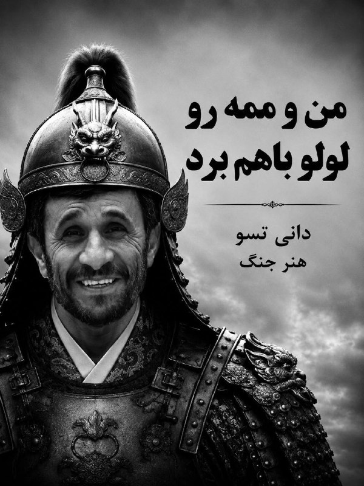

واقعا احمدی نژاد چه شد ؟!

## IranianMinds — post 20219

  <a href="telegram/content/IranianMinds_20219_1778888661.mp4" target="_blank">🎬 Download video</a>

عباس یه بار فقط بگو بله مامان 😭

🔴 جاوید نام عباس کشاورز ۳۹ ساله اهل روستای لفمجان لاهیجان پدر ارشا ۱۲ ساله …

او در شب ۱۹ دی ۱۴۰۴ در جریان اعتراضات در شهر رشت، در محدوده میدان صیقلان، با شلیک مستقیم گلوله کشته شد.

جاویدنامان فراموش نمیشوند.

@IranianMinds

## IranianMinds — post 20218

فقط کافیه مرغ از خیابون رد کنی و‌پولت چند برابر کنی
💵👌

## IranianMinds — post 20217

  <a href="telegram/content/IranianMinds_20217_1778888662.mp4" target="_blank">🎬 Download video</a>

بچه ها اسم این بازی عبور مرغ از خیابون  هست ویدئو نگاه کنید خیلی راحت 8 میلیون ازش سود گرفتیم😍

😤اگ توم دوس داری خیلی راحت از بازی های انلاین پول در بیاری حتما عضو کازینو شبانه شو
✅

توی کازینو شبانه بهت اموزش میدیم از بازی های انلاین پول دربیاری👌

کازینو شبانه راهی برای چند برابر کردن سرمایت 🤷‍♂

کسب درامد انلاین با یه ادم حرفه ای یاد بگیر و‌ پول دربیار 
💵
ae25
🎯همین حالا عضو شو و شروع کن👇
https://t.me/+OS-QBvyDO4M2ZGY0
https://t.me/+OS-QBvyDO4M2ZGY0

## IranianMinds — post 20216

🔴 کانال ۱۳ اسرائیل:

برآوردها حاکی از آن است که ترامپ چراغ سبز برای حمله محدود به مواضع رژیم ملاها را خواهد داد

@IranianMinds

## IranianMinds — post 20215

🔴 سازمان ملل: نگرانیم، چون ممکنه منطقه بازم دچار تنش و درگیری بشه

@IranianMinds

## IranianMinds — post 20214

  

🔴جلد جدید مجله تایم:

چگونه دیدار ترامپ و شی، یک نظم نوین جهانی را به نمایش گذاشت.

@IranianMinds

## IranianMinds — post 20213

  

🔴 نیویورک تایمز :

ترامپ پس از بازگشت از چین، در حالی که مشاوران ارشد و مقامات پنتاگون برنامه‌های احتمالی برای حملات مجدد به ایران در صورت شکست مذاکرات صلح را نهایی می‌کردند، وارد آمریکا شد.

اگرچه ترامپ هنوز تصمیم نهایی نگرفته است، گزارش‌ها حاکی از آن است که مقامات آمریکایی و اسرائیلی برای حملاتی که ممکن است طی روزهای آینده آغاز شوند، آماده می‌شوند.

برنامه‌ریزان نظامی درباره گسترش کمپین‌های بمباران و حتی مأموریت‌های عملیات ویژه برای هدف قرار دادن تأسیسات هسته‌ای زیرزمینی ایران بحث کرده‌اند!

@IranianMinds

## BBCPersian — post 281157

  

‌ ‌ ‌ ‌
دولت ایالات متحده به دنبال مجازات اعدام برای مظنونی است که سال گذشته به قتل دو نفر از کارکنان سفارت اسرائیل در واشنگتن متهم شده است.

جینین پیرو، دادستان ناحیه کلمبیا، روز جمعه درخواست مجازات اعدام برای سه مورد از مجموع ۱۳ اتهام علیه الیاس رودریگز ۳۱ ساله را ارائه کرد. پس از محدودیت‌های اعمال‌شده در دوره جو بایدن، رئیس جمهور سابق آمریکا، دونالد ترامپ، از مجازات اعدام فدرال حمایت کرد.

مقام‌های قضایی آمریکا ادعا می‌کنند که رودریگز پیش از شلیک در خارج از موزه یهودیان پایتخت به سمت زوج یارون لیشینسکی، ۳۰ ساله، و سارا لین میلگریم، ۲۶ ساله، فریاد زده بود «فلسطین را آزاد کنید.»

آقای رودریگز پس از این حمله دستگیر شد و در دادگاه خود را بی‌گناه دانسته است.

اگر رودریگز به اتهام قتل یک مقام خارجی، شلیک با اسلحه گرم در حین جرم خشونت‌آمیز و قتل از طریق استفاده از اسلحه گرم مجرم شناخته شود، دادستان ناحیه کلمبیا برای او درخواست اعدام خواهد کرد.

https://bbc.in/496s8el
📷 X/Reuters
@BBCPersian

## BBCPersian — post 281156

  

‌ ‌ ‌ ‌
نخست‌وزیر و وزیر دفاع اسرائیل با صدور بیانیه‌ای اعلام کردند که عزالدین حداد، فرمانده گردان‌‌های عزالدین قسام، شاخه نظامی حماس در غزه را کشته‌اند.

در بیانیه بنیامین نتانیاهو، و اسرائیل کاتس که در رسانه‌های اسرائیلی منتشر شده، آمده است که حداد یکی از «معماران حملات ۷ اکتبر ۲۰۲۳» به اسرائیل بوده است.

طبق این بیانیه، عزالدین حداد از اجرای توافق دونالد ترامپ، رئیس‌جمهور آمریکا، برای خلع سلاح حماس خودداری کرده بود.

یک مقام ارشد امنیتی گفت که نشانه‌های اولیه حاکیست که او کشته شده است.

شاهدان عینی در غزه به بی‌بی‌سی گفتند که یک آپارتمان هدف حمله موشکی قرار گرفت و سپس خودرویی که گفته می‌شود محل را ترک کرده بود، در حمله‌ای دیگر هدف قرار گرفت؛ حمله‌ای که به کشته شدن سه نفر انجامید.

حماس تاکنون کشته شدن عزالدین حداد را نه تایید کرده و نه رد کرده است.

https://bbc.in/4uPJdl1
📷Reuters
@BBCPersian

## BBCPersian — post 281155

🔻 افزایش قیمت نفت و تنش در تنگه هرمز، سود اوراق آمریکا را به بالاترین سطح یک‌سال اخیر رساند

بازده اوراق خزانه‌داری ایالات متحده آمریکا یا سودی که سرمایه‌گذاران برای خرید اوراق بدهی دولت آمریکا مطالبه می‌کنند، روز جمعه به بالاترین سطح یک سال گذشته رسید.

به گزارش رویترز، افزایش قیمت نفت، نگرانی‌ها درباره تورم و انتظار برای قوی‌تر شدن اقتصاد آمریکا باعث شد بازارها پیش‌بینی کنند که نرخ‌های بهره ممکن است برای مدت طولانی‌تری بالا بماند.

قیمت نفت نیز روز جمعه بیش از سه درصد افزایش یافت؛ پس از آن‌که اظهارات دونالد ترامپ و عباس عراقچی، امیدها به توافقی برای پایان دادن به حملات و توقیف کشتی‌ها در اطراف تنگه هرمز را کاهش داد.

دونالد ترامپ گفت که صبرش در قبال ایران رو به پایان است و شی جین‌پینگ، رئیس جمهور چین نیز در دیدار با آقای ترامپ در پکن موافقت کرد که تهران باید تنگه هرمز را بازگشایی کند.

وزیر خارجه ایران هم گفت که تهران به آمریکا «اعتماد ندارد» و تنها در صورتی به مذاکره علاقه‌مند است که واشنگتن جدیت خود را نشان دهد.

https://bbc.in/3PJL9ww
@BBCPersian

## Dirty_Kids — post 389538

  <a href="telegram/content/Dirty_Kids_389538_1778888666.webm" target="_blank">🎬 Download video</a>

☢️خفن ترین و‌ قدیمی ترین  انالیزور  ایران ینی دکتر بت 
👍 
🔴هیچ سایت بتی دوست نداره شما کانال دکتر بت رو پیدا کنین چون خیلی سود میکنید🤷‍♂ رایگان بهترین شرط هارو براتون میذاره حتی هزار تومن هم دریافت نمیکنه روزانه میتونی از پیش بینی فوتبال باهاش پول در بیاری…

## Dirty_Kids — post 389537

  <a href="telegram/content/Dirty_Kids_389537_1778888666.webm" target="_blank">🎬 Download video</a>

☢️خفن ترین و‌ قدیمی ترین  انالیزور  ایران ینی دکتر بت 
👍

🔴هیچ سایت بتی دوست نداره شما کانال دکتر بت رو پیدا کنین چون خیلی سود میکنید🤷‍♂

رایگان بهترین شرط هارو براتون میذاره
حتی هزار تومن هم دریافت نمیکنه
روزانه میتونی از پیش بینی فوتبال باهاش پول در بیاری 👌
A25
اگ اهل پیش بینی فوتبالی این کانال اصلا از دست ندین👇

✅https://t.me/+4_ADqwB9e-QwYjlk

✅https://t.me/+4_ADqwB9e-QwYjlk

## Dirty_Kids — post 389536

  

#بخوابیم

@Dirty_Kids 👻

## Dirty_Kids — post 389535

  

بانو ناتالیا بیش از ۲۰ نفر از اعضای حماس رو به هلاکت رسونده تو غزه

@Dirty_Kids 👻

## Dirty_Kids — post 389534

  <a href="telegram/content/Dirty_Kids_389534_1778888667.mp4" target="_blank">🎬 Download video</a>

عمو مانوک؛ اخلاق رضاشاه

@Dirty_Kids 👻

## Dirty_Kids — post 389533

  

پاتو لیس بزن گه اضافه نخور 😂😂

@Dirty_Kids 👻

## Dirty_Kids — post 389532

  <a href="telegram/content/Dirty_Kids_389532_1778888669.mp4" target="_blank">🎬 Download video</a>

املاکی در مصاحبه با Bret Baier مجری برنامه Special Report شبکه فاکس نیوز در خصوص خواری که رژیم کسمغز روافض در مذاکرات ازش گاییدن فرموده که:

«ما واقعاً به نوعی از پایه‌های یک توافق رسیده بودیم. بدون سلاح هسته‌ای.

اون‌هزارپدرای قحبه‌ قرار بود غبار هسته‌ای رو به ما تحویل بدن، همه چیو، هر چیزی که ما می‌خواستیم.

و هر بار که توافقی می‌کنن، این پدرخرابا روز بعدش به جوری رفتار می‌کنن که انگار ما از اساس همچی گفتگویی نداشتیم، و این اتفاق حدود پنج بار رخ داده.

یک مشکلی در این مادرقحبه‌های رافضی وجود داره، در واقع این حرومیا دیونه میوونه‌اند. [علاوه بر کسمغزی،خدعه‌زاده‌ان شیر خدا. اما خب دو بار گاییدی‌شون و فهمیدن اون ممه رو لولو خورد]

و می‌دونید چیه؟ به همین دلیل، این جاکش‌پدرا‌ نباید سلاح هسته‌ای داشته باشن»



@Dirty_Kids 👻

## Dirty_Kids — post 389529

این بانو که یکم حشری‌طور میزنه امروز حاشیه ساز بوده

یه عده دفاع میکنن ازش
یه عده هیت میدن

@Dirty_Kids 👻

## Dirty_Kids — post 389528

  

🔴 طبق گفته دو مقام خاورمیانه‌ای، آمریکا و اسرائیل دارن آماده‌سازی خیلی گسترده‌ای انجام می‌دن. (بزرگ‌ترین سطح از وقتی که آتش‌بس برقرار شده)

این آماده‌سازی‌ها انقدر جدیه که ممکنه از هفته آینده دوباره حملات شروع بشه.

@Dirty_Kids 👻

## Dirty_Kids — post 389526

  <a href="telegram/content/Dirty_Kids_389526_1778888670.mp4" target="_blank">🎬 Download video</a>

امروز یکی تو فضای مجازی با هوش مصنوعی یه عکس از ترامپ و ایلان ماسک زیر پرچم داس و چکشِ کمونیست ساخت؛

بعد تو صداوسیما، خانعلی زاده (کارشناس روابط خارجی و همراه تیم مذاکره کننده تو سفر به پاکستان) خیلی جدی تحلیل کرد که این عکس خروجی سفر ترامپه و این یعنی آمریکا همیشه زیرخوابِ چینه...

@Dirty_Kids 👻

## manototv — post 105502

  <a href="telegram/content/manototv_105502_1778888671.mp4" target="_blank">🎬 Download video</a>

دادستان‌های آمریکا اعلام کردند یک شهروند عراقی به اتهام طراحی حمله تروریستی به یک کنیسه مشهور در نیویورک و حمایت از گروه‌های مورد حمایت جمهوری اسلامی بازداشت و متهم شده است.

محمد باقر سعد داوود الساعدی، ۳۲ ساله، روز جمعه در دادگاهی در منهتن حاضر شد و مقام‌های آمریکایی او را به «توطئه برای ارائه حمایت مادی به سازمان‌های تروریستی خارجی» از جمله سپاه پاسداران و گروه کتائب حزب‌الله عراق متهم کردند.

بر اساس اسناد دادگاه، الساعدی از فرماندهان کتائب حزب‌الله معرفی شده و متهم است از ماه مارس در طراحی، اجرا و تبلیغ حدود ۱۸ حمله علیه منافع آمریکا و اسرائیل در اروپا نقش داشته است.

دادستان‌ها می‌گویند او برای انجام حمله به یک کنیسه در نیویورک، با فردی که در واقع مامور مخفی اف‌بی‌آی بوده تماس گرفته و تصاویر، نقشه‌ها و اطلاعات مربوط به محل حمله را در اختیار او قرار داده است. به گفته مقام‌های آمریکایی، او همچنین تصاویری از مراکز یهودیان در لس‌آنجلس و اسکاتسدیل آریزونا ارسال کرده بود.

در یکی از مکالمات ضبط‌شده، الساعدی درباره هزینه «انجام عملیات بمب‌گذاری» در آمریکا پرس‌وجو کرده و گفته بود: «ما برایش یک معبد یهودیان یا یک مرکز یهودیان فراهم می‌کنیم.»

دادستان‌ها می‌گویند او با مامور مخفی بر سر پرداخت ۱۰ هزار دلار رمزارز برای اجرای حمله توافق کرده و سه هزار دلار به‌عنوان پیش‌پرداخت ارسال کرده بود. بر اساس این گزارش، الساعدی بعدتر در ترکیه بازداشت و به اف‌بی‌آی تحویل داده شد.

پلیس نیویورک اعلام کرد این پرونده «تهدیدهای جهانی ناشی از جمهوری اسلامی و گروه‌های نیابتی‌اش» را آشکار می‌کند. مقام‌های آمریکایی همچنین گفتند با همکاری نهادهای امنیتی، طرح حمله به کنیسه‌ای در منهتن خنثی شده است.

در اسناد دادگاه همچنین تصاویری از دیدار الساعدی با قاسم سلیمانی، فرمانده پیشین نیروی قدس سپاه پاسداران، منتشر شده است.

## alonews — post 120300

  <a href="telegram/content/alonews_120300_1778888672.mp4" target="_blank">🎬 Download video</a>

👈رئیس جمهور ترامپ در مورد ایران:
ما نه تا دوربین مختلف توی اون سایت داریم و دقت به قدری بالاست که ما می توانیم نام یک شخص را هم بخوانیم.

🔴اگر اسمش محمد است ، بیشترشان محمد هستند ؛ شما می توانید حدود 50 درصد درست حدس بزنید.

🔴هر کسي که به اون فضا نزديک بشه ، ما میفهمیم

✅ @AloNews خبر جنگ

## alonews — post 120299

  <a href="telegram/content/alonews_120299_1778888673.mp4" target="_blank">🎬 Download video</a>

👈ترامپ: گفتم گرد و غبار هسته ای را می گیریم ایران گفت: "شما می توانید آن را داشته باشید. اونا گفتن ، " ما نمیتونیم تحملش کنیم. ما توانایی مصرف آن را نداریم. گفتم: "چرا؟ اونا گفتن چون خيلي ضربه خورده"

🔴برت بایر فاکس: چرا این کافی نیست اگر هدف شما این بود که آنها را عقب بیندازید ؟

🔴ترامپ: از نظر روابط عمومی به اندازه کافی خوب نیست‌‌

✅ @AloNews خبر جنگ

## alonews — post 120298

  <a href="telegram/content/alonews_120298_1778888675.mp4" target="_blank">🎬 Download video</a>

👈برت بایر از فاکس: فکر می کنید ایران به زودی تسلیم خواهد شد ؟

🔴ترامپ: بله ، من هیچ شکی ندارم.‌‌

✅ @AloNews خبر جنگ

## alonews — post 120297

  <a href="telegram/content/alonews_120297_1778888676.mp4" target="_blank">🎬 Download video</a>

👈رئیس جمهور ترامپ در مورد ایران:
ایران سالهاست که جهان را با تنگه هرمز نگه داشته است. اونا در گذشته تنگه رو بسته بودن اونا ازش به عنوان سلاح استفاده ميکنن اونا ازش به عنوان سلاح با من استفاده نميکنن

🔴رئیس جمهور شی دیشب با لبخند گفت: "خب ، آنها تنگه را می بندند ، و بعد شما آنها را می بندید."‌‌

✅ @AloNews خبر جنگ

## alonews — post 120296

  <a href="telegram/content/alonews_120296_1778888677.mp4" target="_blank">🎬 Download video</a>

👈برت بایر از فاکس: آیا تاب آوری ایران را دست کم گرفتید ؟

🔴ترامپ: چیزی را دست کم نگرفتم ما می توانیم پل ها و ظرفیت برق آنها را در دو روز از بین ببریم.‌‌

✅ @AloNews خبر جنگ

## alonews — post 120295

  <a href="telegram/content/alonews_120295_1778888679.mp4" target="_blank">🎬 Download video</a>

👈ترامپ : ویتنام ۱۹ سال طول کشید، عراق حدود ۱۰ سال، کره ۷ سال، یکی دیگه ۱۴ سال، یکی ۱۲ سال، یکی هم ۹ سال
- ما فقط دو ماه و نیم اونجا بودیم
- چین هم این هفته سه تا نفتکش پر از نفت ایران رو برد، چون ما اجازه دادیم این اتفاق بیفته،شما اجازه دادید

✅ @AloNews خبر جنگ

## alonews — post 120294

  <a href="telegram/content/alonews_120294_1778888680.webm" target="_blank">🎬 Download video</a>

👈ترامپ به فاکس نیوز: چین جرات اقدام علیه تایوان را در دوران قدرت من نخواهد داشت‌‌

🔴پکن از عدم نیاز واشنگتن به هیچ کمکی در پرونده ایران یا ایمن سازی ناوبری در تنگه هرمز خبر داد‌‌

🔴چین برای تامین 40 درصد منابع نفتی خود به تنگه هرمز تکیه می کند‌‌

🔴خب، به هر حال ما به یک راه‌حل خواهیم رسید. بنابراین یا این مسئله به‌صورت خشونت‌آمیز حل می‌شود یا بدون خشونت. و من خیلی ترجیح می‌دهم که بدون خشونت باشد

✅ @AloNews خبر جنگ

## alonews — post 120293

  <a href="telegram/content/alonews_120293_1778888680.webm" target="_blank">🎬 Download video</a>

👈پک ۱۰عددی کاندوم با افزایش قیمت به ۴۸۰هزار تومان رسیده!

🔴دولت باید به اینجور چیزا سوبسید بده تا همه بتونن استفاده کنن اما.....

✅ @AloNews خبر جنگ

## alonews — post 120290

  <a href="telegram/content/alonews_120290_1778888680.mp4" target="_blank">🎬 Download video</a>

👈مجریان بیسواد صدا و سیما برداشتن یه تصویر هوش مصنوعی رو گذاشتن و دارن تحلیلش میکنن!

✅ @AloNews خبر جنگ

## alonews — post 120289

  <a href="telegram/content/alonews_120289_1778888681.mp4" target="_blank">🎬 Download video</a>

👈مصاحبه‌گر : قبول دارید عامل گرانی‌ها محاصره آمریکا علیه ماست؟

🔴حامی حکومت : نه، قبول ندارم!

✅ @AloNews خبر جنگ

## alonews — post 120288

  <a href="telegram/content/alonews_120288_1778888682.webm" target="_blank">🎬 Download video</a>

👈نیویورک تایمز: گزینه‌های ترامپ در ایران شامل نیروهای ویژه زمینی برای کنترل اورانیوم است

✅ @AloNews خبر جنگ

## alonews — post 120287

  <a href="telegram/content/alonews_120287_1778888683.mp4" target="_blank">🎬 Download video</a>

👈گلایه مخاطب ایران اینترنشنال از قیمت نجومی عرق سگی

🔴قبل جنگ لیتری ۲۵۰بود و با دوستام میخوردم اما الان لیتری ۱۵۰۰ و تنها میخورم

✅ @AloNews خبر جنگ

---
📅 بروزرسانی: 1405/02/26 00:15
---

## VahidOOnLine — post 240379

  <a href="telegram/content/VahidOOnLine_240379_1778877924.mp4" target="_blank">🎬 Download video</a>

‌
شیخ خالد بن محمد بن زاید، ولیعهد ابوظبی، اعلام کرد پروژه «خط لوله غرب به شرق» با هدف افزایش صادرات نفت از بندر فجیره و «پاسخ به تقاضای جهانی» با سرعت بیشتری اجرا خواهد شد.

بر اساس اعلام مقام‌های امارات، این پروژه ظرفیت صادرات نفت از مسیر فجیره را دو برابر می‌کند و قرار است تا سال ۲۰۲۷ به بهره‌برداری برسد.

پس از جنگ آمریکا و اسرائیل با جمهوری اسلامی و افزایش تنش‌ها در تنگه هرمز، کشورهای خلیج فارس به دنبال مسیرهای جایگزین برای صادرات نفت و گاز هستند. حدود یک‌پنجم نفت جهان پیش‌تر از تنگه هرمز عبور می‌کرد.
‌🏁 🇬🇧 ManotoTV

🤖 @VahidOOnLine

## VahidOOnLine — post 240378

  <a href="telegram/content/VahidOOnLine_240378_1778877925.mp4" target="_blank">🎬 Download video</a>

یکی از مخاطبان ایران‌اینترنشنال در پیامی می‌گوید وضعیت برگزاری امتحانات دانش‌آموزان پایه‌های هفتم تا دهم در کرمانشاه هنوز مشخص نیست و این بلاتکلیفی باعث نگرانی و فشار روانی شده است. او خواستار تعیین هرچه سریع‌تر وضعیت امتحان‌هاست.

این پیام با هوش مصنوعی خوانده شده است
‌🏁 🇬🇧 IranintlTV

🤖 @VahidOOnLine

## VahidOOnLine — post 240377

  

رسانه‌های ایران از افزایش نجومی قیمت کولر آبی خبر دادند و افزودند در حال حاضر، قیمت کولرهای آبی از حدود ۲۰ میلیون تومان شروع می‌شود و برخی مدل‌های سلولزی و کم‌مصرف به بالای ۵۰ میلیون تومان رسیده‌اند.
بنا بر این گزارش، بسیاری از خریداران به سمت تعمیر کولرهای قدیمی و خرید مدل‌های دست‌دوم رفته‌اند.

این در حالی است که در سال ۱۴۰۱، ارزانترین کولر آبی در بازار یک میلیون و ۵۰۰ تومان و ارزانترین کولر گازی دیواری نیز ۹ میلیون تومان بوده است.
‌🏁 🇬🇧 IranintlTV

🤖 @VahidOOnLine

## VahidOOnLine — post 240376

🗣روایت شما از بحران اقتصادی و زندگی در آتش‌بس- جمعه ۲۵ اردیبهشت:

🔹روز ۲۰ اردیبهشت رفتم در ملایر دیسک صفحه ماشین بگیرم، قیمت گفت ۶ میلیون تومان، فردایش برای خرید قطعی مراجعه کردم؛ همان را گفت ۱۲ میلیون شده است. قیمت یک قلم جنس در یک روز دو برابر شد.

🔹یک کیلو قهوه گلد را که تا هفته قبل در تهران می‌خریدیم یک میلیون و ۷۰۰ هزار تومان، می‌خریدم امروز خریدم ۵ میلیون و ۳۰۰ هزار تومان!

🔹من یک نقاشم و تنها دلخوشی‌ام نقاشی بود. الان توان خرید بوم ندارم که هیچ، حتی مقوایی که هفته پیش خریدم ۲۵۰ هزار تومان هم این هفته شده ۳۲۰ هزار تومن! مدام باید با ترس خراب‌نکردن و هدر ندادن ابزار و مواد اولیه، نقاشی کنم.

🔹کشاورز هستم. سهمیه کود نسبت به پارسال تقریبا نصف شده و وقتی سهمیه جدید می‌آید کلا دو سه روز مهلت خرید دارد. اگر کسی توانایی خرید نداشته باشد، سهمش می‌سوزد. دولت هم سهم کود دولتی آن فرد را به صورت آزاد می‌فروشد.

🔹بنزین کارت آزاد ۵ هزار تومنی، از ساعت ۹ صبح به بعد دیگر موجود نیست.

🔹یک شانه تخم‌مرغ خریدم ۶۰۰ هزار تومان. دیگر حتی نمی‌شود یک وعده غذای ساده خورد.

🔹قبض برق که هر دوره برای ما ۱۲۰ هزار تومان صادر می‌شد این بار شده یک میلیون و ۲۰۰ هزار تومان، تازه همراه با تهدید قطع فوری!
‌🏁 🇬🇧 IranintlTV

🤖 @VahidOOnLine

## VahidOOnLine — post 240375

  

♦️ نواف سلام، نخست‌وزیر لبنان، روز جمعه ۲۵ اردیبهشت، با انتقاد از «ماجراجویی‌های بی‌پروا» در جهت منافع قدرت‌های خارجی، تصریح کرد که کشورش دیگر توان تحمل جنگ‌هایی را که در خدمت پروژه‌های بیگانگان است، ندارد. او همچنین خواستار حمایت کشورهای عربی و جامعه بین‌المللی از بیروت در مذاکرات با اسرائیل شد.

نواف سلام که در یک ضیافت شام سخن می‌گفت، ابراز امیدواری کرد که «تمام حمایت‌های عربی و بین‌المللی برای تقویت موضع لبنان در مذاکرات» بسیج شود. این سخنان مدت کوتاهی پس از پایان دور اخیر گفتگوها و تمدید ۴۵ روزه آتش‌بس فعلی ایراد شد.

نخست‌وزیر لبنان در سرزنشی تلویحی علیه حزب‌الله که در حمایت از جمهوری اسلامی وارد جنگ شد، تاکید کرد که کشورش از این‌گونه «ماجراجویی‌های نسنجیده» به ستوه آمده است. او خاطرنشان کرد که ارتش لبنان باید تنها نهاد مسلح در این کشور باشد و حاکمیت کامل نظامی را در اختیار بگیرد.
‌🇸🇦 Indypersian

🤖 @VahidOOnLine

## VahidOOnLine — post 240374

  

فرزند عبدالرحیم موسوی، رییس ستاد کل نیروهای مسلح جمهوری اسلامی، گفت که جنازه پدرش که در نخستین روز حملات اسرائیل و آمریکا به دفتر خامنه‌ای کشته شد، نزدیک به ۳۰ روز زیر آوار مانده بود.

موسوی پس از کشته شدن محمد باقری در جنگ ۱۲ روزه، به‌عنوان رییس ستاد کل نیروهای مسلح منصوب شد.

‌🏁 🇬🇧 IranintlTV

🤖 @VahidOOnLine

## VahidOOnLine — post 240373

  

به گزارش فرانس۲۴، مقام‌های آمریکایی محمد باقر سعد داوود الساعدی، شهروند عراقی را به اتهام طراحی دست‌کم ۱۸ حمله «تروریستی» در اروپا در واکنش به جنگ آمریکا علیه جمهوری اسلامی بازداشت و متهم کردند.

براساس این گزارش، او متهم است در حملاتی از جمله آتش‌زدن یک بانک در آمستردام و حمله با چاقو به چند مرد یهودی در لندن نقش داشته و ماه گذشته قصد حمله به یک کنیسه در نیویورک را داشته است. همچنین او تصاویر و نقشه‌هایی از مراکز یهودی در لس‌آنجلس و اسکاتسدیل آریزونا را در اختیار یک مامور مخفی قرار داده است.

بر اساس این گزارش، او همچنین به مشارکت در دو حمله اخیر در کانادا، شامل حمله به یک کنیسه و تیراندازی به کنسولگری آمریکا در تورنتو در ماه مارس، متهم شده است.
‌🏁 🇬🇧 IranintlTV

🤖 @VahidOOnLine

## VahidOOnLine — post 240372

  

♦️ وزارت دادگستری ایالات متحده روز جمعه ۲۵ اردیبهشت، اعلام کرد که یک شهروند عراقی به نام «محمد باقر سعد داود الساعدی» را به اتهام طراحی حملات تروریستی در خاک آمریکا، از جمله هدف قرار دادن یک نهاد یهودی در نیویورک، بازداشت و متهم کرده است.

بر اساس کیفرخواست صادر شده، الساعدی که از فرماندهان گروه «کتائب حزب‌الله» (گردان‌های حزب‌الله عراق) معرفی شده، متهم است که برای ارائه حمایت‌های لجستیکی و مادی به سازمان‌های تروریستی تحت حمایت جمهوری اسلامی، از جمله سپاه پاسداران و کتائب حزب‌الله، توطئه کرده است. دادستان‌ها می‌گویند که او در برنامه‌ریزی و اجرای حدود ۱۸ حمله تروریستی علیه منافع آمریکا و اسرائیل در اروپا از ماه مارس گذشته نقش داشته است.

الساعدی متهم است که تلاش کرده یک مامور مخفی را برای مشارکت در حمله به یک کنیسه برجسته در نیویورک جذب کند و نقشه‌ها و تصاویر هدف را نیز در اختیار او قرار داده است. گزارش‌ها حاکی از آن است که سرویس اطلاعاتی بریتانیا نیز پیش از این در حال تحقیق روی این گروه بوده و از برنامه‌های آن‌ها برای گسترش حملات به خاک ایالات متحده آگاهی داشته است.
‌🇸🇦 Indypersian

🤖 @VahidOOnLine

## VahidOOnLine — post 240371

  

جعفر قادری، نماینده شیراز در مجلس گفت: «امارات متحده عربی در جنگ نشان داده که به لانه‌ای برای اسرائیل تبدیل شده و در این راستا نیز هیچ کوتاهی نکرده است.»

او افزود: «این کشور در آینده جایی در مناسبات ما نخواهد داشت و نباید اجازه دهیم سرمایه‌گذاری‌های جدیدی در این کشور رقم بخورد.»

او ادامه داد: «امارات متحده عربی دارد مسیر اسرائیل را می‌رود و در دامن آن‌ها افتاده که این خطرناک است، البته در زمان خودش پاسخ خوش خدمتی‌هایش را به گونه‌ای خواهد گرفت که در اذهان باقی بماند.»
‌🏁 🇬🇧 IranintlTV

🤖 @VahidOOnLine

## VahidOOnLine — post 240370

  <a href="telegram/content/VahidOOnLine_240370_1778877933.mp4" target="_blank">🎬 Download video</a>

یکی از مخاطبان ایران‌اینترنشنال که از مشهد پیام داده می‌گوید برای کار روی پایان‌نامه خود ناچار به تهیه اینترنت پرسرعت شده که با احتساب مالیات حدود ۲ میلیون و ۱۷۰ هزار تومان هزینه داشته است. او می‌گوید برای چیزی که «حقمان است» هزینه سنگین پرداخت می‌کنند، اما دسترسی و کیفیت خدمات پاسخگوی نیاز او نیست. این پیام با هوش مصنوعی خوانده شده است.

بازخوانی این پیام و ساخت تصویر برای آن با هوش مصنوعی انجام گرفته است.
‌🏁 🇬🇧 IranintlTV

🤖 @VahidOOnLine

## VahidOOnLine — post 240369

  

گلرخ ایرایی، زندانی سیاسی، در پیامی از بند زنان زندان اوین به مناسبت اعطای جایزه «آزادی نوشتن» از سوی انجمن قلم آمریکا، نوشت: «می‌نویسیم حتی اگر آزادی‌مان به بند کشیده شود؛ حتا اگر مورد تهدید و تحدید قرار بگیریم و وادار به تبعید یا فدای جان شویم.»

ایرایی در این پیام نوشت، «اینجا بی‌پروا نوشتن از رنج مردمانی که ستم را به پیکار برمی‌خیزند، مجرمانه است و آنان که با قلم تباهی درد را به چشم جهانیان پدیدار می‌کنند، در سکوت فرسوده می‌شوند و مجرم‌اند و سزاوار محاکمه!»
او به فقر، نابرابری، سرکوب و «کشتار سیستماتیک» در ایران اشاره کرد و نوشت نوشتن از رنج مردم «تحت ستم»، با همه هزینه‌ها و محدودیت‌ها، «روزنه امیدی» برای ادامه مبارزه است.

این زندانی سیاسی همچنین نوشت «ارتجاع حاکم، آزادی اندیشه و جسارت بیان را برنمی‌تابد، آنگاه که قلم بر چوبه‌های دار افراشته حمله می‌برد و از فقر و نابرابری روایت می‌کند و بازتابی می‌شود از سفره‌های خالی و قیام گرسنگان را نوید می‌دهد.»

او در پایان تاکید کرد: «ما از خفگی رها خواهیم شد و می‌دانیم این جز در حرکتی مشترک میسر نخواهد بود.»
‌🏁 🇬🇧 IranintlTV

🤖 @VahidOOnLine

## VahidOOnLine — post 240368

  

♦️ تامی پیگات، سخنگوی وزارت امور خارجه آمریکا، روز جمعه ۲۵ اردیبهشت، اعلام کرد که در پی دو روز مذاکرات «بسیار سازنده» میان اسرائیل و لبنان با میانجی‌گری ایالات متحده، دو طرف بر سر تمدید ۴۵ روزه آتش‌بس به توافق رسیدند.

پیگات گفت که این وزارتخانه مذاکرات در «مسیر سیاسی» را در روزهای دوم و سوم ژوئن (۱۲ و ۱۳ خرداد) از سر خواهد گرفت و هم‌زمان، یک «مسیر امنیتی» نیز با حضور هیئت‌های نظامی اسرائیل و لبنان در تاریخ ۲۹ مه (هشتم خرداد) در پنتاگون آغاز خواهد شد.

او افزود: «امیدواریم این گفتگوها گامی به سوی صلح پایدار میان دو کشور، شناسایی کامل حاکمیت و تمامیت ارضی یکدیگر و برقراری امنیت واقعی در امتداد مرزهای مشترک باشد.»
‌🇸🇦 Indypersian

🤖 @VahidOOnLine

## VahidOOnLine — post 240367

  

آموزشکده توانا در گزارشی نوشت برخی وکلا با هماهنگی نهادهای امنیتی و قضات دادگاه‌های انقلاب، در پرونده‌های امنیتی به‌جای دفاع از متهمان، با درخواست عفو و «اقرار ضمنی» به اتهام‌ها، مسیر صدور و اجرای احکام سنگین از جمله اعدام را هموار می‌کنند.

بر اساس این گزارش، این وکلا با تجدیدنظرخواهی فوری، فرصت قانونی اعتراض را نیز از متهمان سلب می‌کنند.
این گزارش از «مهدی محرابی» به‌عنوان یکی از این وکلا نام برده و نوشته او در پرونده آتش‌سوزی پایگاه بسیج خیابان نامجو، مربوط به محمدامین بیگلری، امیرحسین حاتمی، علی فهیم و شاهین واحدپرست کلور، چهار معترض اعدام‌شده، نقش داشته است.

در این گزارش همچنین آمده خانواده برخی متهمان امنیتی تحت فشار قرار می‌گیرند تا به‌جای وکلای مستقل، از «وکلای مورد تایید» استفاده کنند؛ اقدامی که به نوشته توانا، در مواردی به صدور احکام اعدام یا حبس‌های طولانی‌مدت منجر شده است.
‌🏁 🇬🇧 IranintlTV

🤖 @VahidOOnLine

## VahidOOnLine — post 240366

  

♦️جان تراولتا شامگاه جمعه در جشنواره فیلم کن ۲۰۲۶ با دریافت نخل طلای افتخاری غافلگیر شد؛ مراسمی که هم‌زمان با نمایش نخستین فیلم بلند او در مقام کارگردان برگزار شد.
تیری فرمو، مدیر هنری جشنواره کن، درست پیش از آغاز نمایش فیلم «پراپلر؛ قطار شبانه یک‌طرفه» روی صحنه آمد و نخل طلای افتخاری را به تراولتا اهدا کرد. بازیگر آمریکایی که آشکارا تحت تاثیر قرار گرفته بود، هنگام دریافت جایزه دستش را روی سینه گذاشت و از حاضران تشکر کرد.
تراولتا روی فرش قرمز کن با دختر ۲۶ ساله‌اش الا بلو تراولتا ظاهر شد. این فیلم نخستین تجربه کارگردانی بلند جان تراولتا به شمار می‌رود. او علاوه بر کارگردانی، نویسندگی و تهیه‌کنندگی مشترک این پروژه را نیز بر عهده داشته است. داستان فیلم بر اساس کتاب کودکانه‌ای ساخته شده که خود تراولتا در سال ۱۹۹۷ منتشر کرده بود و درباره نوجوانی علاقه‌مند به هوانوردی است.
جشنواره کن پیش‌تر نیز چند بار مهمانانش را با اهدای ناگهانی نخل طلای افتخاری غافلگیر کرده بود. تام کروز در سال ۲۰۲۲ چنین جایزه‌ای دریافت کرد.
‌🇸🇦 Indypersian

🤖 @VahidOOnLine

## VahidOOnLine — post 240365

  <a href="telegram/content/VahidOOnLine_240365_1778877938.mp4" target="_blank">🎬 Download video</a>

‌
وزارت خارجه آمریکا اعلام کرد آتش‌بس میان اسرائیل و لبنان برای ۴۵ روز دیگر تمدید شده تا فرصت بیشتری برای ادامه مذاکرات فراهم شود.
‌🏁 🇬🇧 ManotoTV

🤖 @VahidOOnLine

## VahidOOnLine — post 240364

  <a href="telegram/content/VahidOOnLine_240364_1778877939.mp4" target="_blank">🎬 Download video</a>

‌
اسرائیل اعلام کرد در حمله‌ای هوایی، عزالدین الحداد، ارشدترین فرمانده گروه تروریستی حماس در نوار غزه را هدف قرار داده است.

هنوز گزارشی از وضعیت او منتشر نشده و حماس هم واکنشی نشان نداده است.

الحداد در فهرست افراد تحت تعقیب اسرائیل قرار دارد و از سوی اسرائیل به عنوان یکی از «طراحان» حمله تروریستی هفت اکتبر معرفی شده است.
‌🏁 🇬🇧 ManotoTV

🤖 @VahidOOnLine

## VahidOOnLine — post 240363

  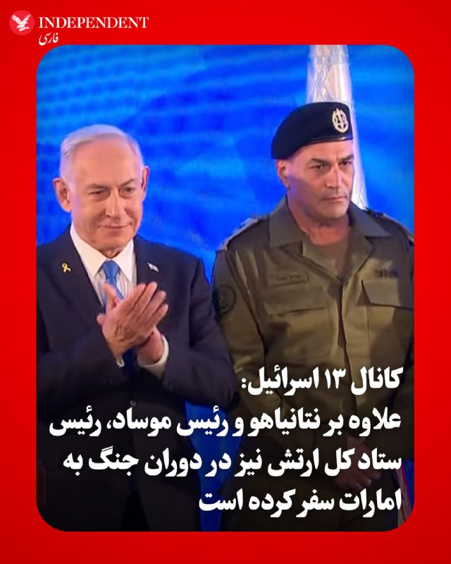

♦️ شبکه ۱۳ تلویزیون اسرائیل در گزارشی اختصاصی فاش کرد که علاوه بر بنیامین نتانیاهو، ارتشبد ایال زمیر، رئیس ستاد کل ارتش و شماری از افسران ارشد این کشور نیز در جریان درگیری‌های اخیر با ایران به امارات متحده عربی سفر کرده‌اند. این افشاگری در حالی صورت می‌گیرد که پیش‌تر گزارش‌هایی درباره دو سفر مخفیانه دیوید بارنئا، رئیس موساد، به ابوظبی با هدف هماهنگی عملیاتی موسوم به «غرش شیران» علیه تهران منتشر شده بود.

دفتر نخست‌وزیری اسرائیل با تایید سفر نتانیاهو که گفته می‌شود در هفته اول فروردین انجام شده، آن را یک «گشایش تاریخی» در روابط دو کشور توصیف کرد، در حالی که وزارت امور خارجه امارات با صدور بیانیه‌ای تند، وقوع هرگونه دیدار یا میزبانی از هیئت‌های نظامی اسرائیلی را به کلی تکذیب کرد و آن را بی‌اساس خواند. وبسایت خبری یدیعوت آحرانوت اسرائیل نیز به نقل از یک مقام اماراتی، نوشت که طرفین توافق کرده بودند این سفر «محرمانه» باقی بماند و تایید خبر از سوی دفتر نخست‌وزیر اسرائیل، نقش تعهد محسوب می‌شود.
‌🇸🇦 Indypersian

🤖 @VahidOOnLine

## VahidOOnLine — post 240362

  

وزارت خارجه آمریکا اعلام کرد آتش‌بس میان اسرائیل و لبنان برای ۴۵ روز دیگر تمدید خواهد شد تا زمینه برای پیشرفت بیشتر در مذاکرات فراهم شود.
این وزارتخانه همچنین اعلام کرد روند سیاسی مذاکرات در روزهای ۱۲ و ۱۳ خرداد از سر گرفته خواهد شد.
‌🏁 🇬🇧 IranintlTV

🤖 @VahidOOnLine

## VahidOOnLine — post 240361

  

شاهزاده رضا پهلوی در پیامی ویدیویی، گفت که بر اساس نظر مشورتی «کمیته تدوین مقررات عدالت انتقالی ایران»، همکاری آگاهانه و داوطلبانه با ساختارهای سرکوبگر جمهوری اسلامی، از جمله خبرچینی، مشارکت در ایست‌های بازرسی، همکاری در سرکوب معترضان، به‌کارگیری کودکان و نوجوانان در سرکوب و همچنین خرید و فروش اموال مصادره‌شده معترضان، می‌تواند مصداق «یاری‌رسانی به جنایت علیه بشریت» باشد و مسئولیت کیفری به همراه داشته باشد.

او گفت هیچ مقام، دستور یا بهانه‌ای مانع مسئولیت فردی نخواهد بود و افرادی که با دستگاه‌های سرکوب همکاری کنند، چه در داخل و چه خارج از ایران، در معرض پیگرد قرار خواهند گرفت. به گفته او، افرادی که در مصادره یا معامله اموال توقیف‌شده معترضان نقش داشته باشند نیز ممکن است ملزم به جبران خسارت شوند.

شاهزاده رضا پهلوی همچنین هشدار داد کسانی که امروز با نهادهای امنیتی و سرکوبگر جمهوری اسلامی همکاری می‌کنند، باید به آینده خود و خانواده‌شان فکر کنند، زیرا به گفته او، در آینده عاملان سرکوب در برابر قانون پاسخگو خواهند شد.
‌🏁 🇬🇧 IranintlTV

🤖 @VahidOOnLine

## VahidOOnLine — post 240360

  

♦️گردنبند کریس مارتین در ویدئوی معرفی برنامه بین دونیمه بازی نهایی جام جهانی، بار دیگر توجه کاربران شبکه‌های اجتماعی را به زیورآلات این خواننده مشهور جلب کرد. خواننده گروه «کولدپلی» این بار گردنبندی با کلمه عشق درون یک دایره نقره ای به گردن داشت.
کریس مارتین پیش‌تر نیز در جریان اعتراضات پس از کشته‌شدن مهسا امینی از نشانه‌های نمادین برای ابراز همدلی با معترضان ایرانی استفاده کرده و گردنبندی با اشاره به ترانه «برای» اثر شروین حاجی‌پور به گردن انداخته بود.
بر اساس اعلام فیفا، کریس مارتین مدیریت هنری برنامه‌ای را به عهده خواهد داشت که در آن مدونا، شکیرا و گروه کره‌ای بی‌تی‌اس در ۱۹ ژوئیه در ورزشگاه نیویورک–نیوجرسی برای تماشاگران فوتبال خواهند خواند.
‌🇸🇦 Indypersian

🤖 @VahidOOnLine

## mwarmonitor — post 9146

  <a href="telegram/content/mwarmonitor_9146_1778877943.mp4" target="_blank">🎬 Download video</a>

📝 تحلیل این گزارش یعنی تماشای نمایش حماسه با اعمال شاقه؛ جایی که صداوسیما با ذوق‌زدگی زایدالوصفی از دکترین پشه علیه غول رونمایی می‌کند. استراتژی محوری این است که «ما آنقدر ارزانیم که کشتنمان هم صرفه اقتصادی ندارد!» گزارش با افتخار قایق‌های تندرو را به پشه‌هایی تشبیه می‌کند که قرار است خواب را از چشمان ناوهای ۲ میلیارد دلاری بربایند، اما این قیاس دقیقاً نیمه‌ی تاریک ماجرا را لو می‌دهد: پذیرش رسمی این واقعیت که در یک نبرد کلاسیک، این قایق‌ها چیزی فراتر از سیبل‌های متحرک نیستند.
🔸اوج این کمدی، استناد به رسانه‌های غربی برای اثبات قدرت است؛ یعنی همان رسانه‌هایی که همیشه «دروغ‌پرداز» نامیده می‌شوند، حالا چون از واژه «خطرناک» استفاده کرده‌اند، به سند حقانیت تبدیل می‌شوند. در واقع، پیام استراتژیک نهفته در لایه‌های این گزارش برای مخاطب هوشمند این است: ما با تکنولوژی پراید دریایی و به قیمت جان سرنشینان، قصد داریم چنان اختلالی در جهان ایجاد کنیم که دنیا مجبور شود برای آرام کردن این پشه‌ها، به ما باج بدهد. این نه یک پیروزی ، بلکه روایتِ فقرِ استراتژیکی است که سعی دارد از انتحار به عنوان افتخار رونمایی کند.

@mwarmonitor

## mwarmonitor — post 9145

  <a href="telegram/content/mwarmonitor_9145_1778877946.mp4" target="_blank">🎬 Download video</a>

📝این غولِ بیابانِ تزویر که تمام هیکلاش از سرنگ و سوزن به ارث رسیده، تهوع‌آورترین تصویر از سقوط یک انسان است. موجودی که با آن ریختِ کریه و مغزِ گنجشکی، خیال کرده با باد کردنِ عضلاتِ عاریه‌ای می‌تواند رویِ خونِ جوانانِ این مرز و بوم موج‌سواری کند. این انترِ قلاده‌به‌گردن، که بوی گندِ استروئید و تملق از سر و رویش می‌بارد، چیزی نیست جز یک ماله بدستِ حقیر که برای خوش‌خدمتی به اربابانش، حتی شرافتِ نداشته‌اش را هم به حراج گذاشته است.

🔸تماشای این پهلوان‌پنبه‌یِ دوزاری که با ناله‌های تصنعی از «دردسر» حرف می‌زند، تهوع‌آور است؛ دردسر را آن‌هایی کشیدند که زیر چرخ‌دنده‌هایِ همان سیستمی که تو برایش دم تکان می‌دهی له شدند، نه تو که تمامِ همّ و غمت جابه‌جا کردنِ چند کیلو گوشتِ تلخ و تزریقی است. تو نه قهرمانی و نه مایه افتخار؛ تو صرفاً یک بازیچهٔ کرایه‌ای هستی که تاریخ به عنوانِ لکهٔ ننگی از آن یاد خواهد کرد؛ موجودی که حجمِ حماقتش از حجمِ بازوهایِ متعفنش فراتر رفته است. ننگ بر آن مدالی که رویِ سینهٔ لرزان و بی‌غیرتِ تو سنگینی کند.

@mwarmonitor

## mwarmonitor — post 9144

  

✈️جنگنده‌های F-35B تفنگداران دریایی ایالات متحده از عرشه ناو USS Tripoli (LHA-7) در حالی که این کشتی در دریای عرب در حال حرکت است، به پرواز درمی‌آیند.
🔸نسخه F-35B دارای قابلیت برخاست کوتاه و فرود عمودی است که به این جنگنده پنهانکار امکان می‌دهد از بزرگ‌ترین ناوهای آبی–خاکی نیروی دریایی آمریکا عملیات انجام دهد.

@mwarmonitor

## mwarmonitor — post 9143

🛰تصاویر ماهواره‌ای Landsat-8 وضعیت ترمینال‌های جزیره خارگ امروز: خالی. هیچ نفتکشی برای بارگیری نفت خام وجود ندارد . @mwarmonitor

## mwarmonitor — post 9142

🔴فایننشال تایمز (گزارش اختصاصی):
یک گروه مالی که با خانواده دونالد ترامپ ارتباط دارد، یک شرکت با هدف خاص (SPV) ایجاد کرده است که قصد دارد ۲۰۰ میلیون دلار سرمایه جذب کند تا یک کسب‌وکار در ونزوئلا را خریداری کند.

@mwarmonitor

## mwarmonitor — post 9141

  

🛰تصاویر ماهواره‌ای Landsat-8 وضعیت ترمینال‌های جزیره خارگ امروز: خالی. هیچ نفتکشی برای بارگیری نفت خام وجود ندارد .

@mwarmonitor

## mwarmonitor — post 9140

🔴این یک پرونده مهم است—یک «گنجینه اطلاعاتی» و یک دستاورد بزرگ برای نیروهای مجری قانون. یکی از فرماندهان گروه کتائب حزب‌الله وابسته به ایران به نام محمد باقر سعد داوود الساعدی بازداشت شده و قرار است امروز در دادگاه فدرال حاضر شود. او به طراحی حمله به اهداف یهودی در آمریکا، از جمله یک کنیسه در نیویورک، متهم است.

🔸در «شکایت کیفری» که روز جمعه از حالت محرمانه خارج شد، این فرمانده متهم شده که از اواخر فوریه حداقل ۱۸ حمله در اروپا و کانادا را برنامه‌ریزی کرده است؛ حملاتی که گفته می‌شود در واکنش به اقدامات آمریکا و اسرائیل علیه ایران بوده‌اند.

🔸نکته قابل توجه این است که گفته می‌شود تهران اکنون از گروه کتائب حزب‌الله عراق برای طراحی حملات تروریستی در خارج از کشور، از جمله در آمریکا و سراسر اروپا، استفاده می‌کند. به طور سنتی، این گروه بیشتر در عراق و منطقه فعال بوده و در آنجا حملاتی انجام می‌داده است. نیویورک تایمز

@mwarmonitor

## mwarmonitor — post 9139

🛰تصاویر ماهواره‌ای نشان می‌دهد که مرکز تحقیقاتی شهید میثمی ، واقع در غرب تهران، نزدیک کرج، در مارس ۲۰۲۶ دو بار هدف حمله قرار گرفته است.

📍این سایت پیش‌تر نیز در ژوئن ۲۰۲۵ به‌شدت مورد حمله قرار گرفته بود؛ حمله‌ای که اسرائیل آن را به برنامه توسعه سلاح‌های شیمیایی و بیولوژیکی ایران مرتبط دانسته بود، اما همچنین گفته شده بود که این مرکز تجهیزات مرتبط با سلاح‌های هسته‌ای را نیز در خود داشته است.

📌تصاویر مربوط به ۱۴ مارس ۲۰۲۶ نشان می‌دهد که در حمله اول مارس، چندین ساختمان پشتیبانی عملیاتی و همچنین محل‌های اقامت کارکنان رده‌بالا هدف قرار گرفته‌اند.

🔸سپس در یا پیش از ۲۴ مارس ۲۰۲۶، تصاویر نشان می‌دهد که حمله دوم انجام شده و یک تأسیسات احتمالی تولید مواد شیمیایی در بخش جنوبی مجموعه و همچنین چندین ساختمان دیگر مربوط به اقامت پرسنل نابود شده‌اند.

🔹تاکنون اطلاعات جدیدی از سوی ارتش اسرائیل (IDF) درباره دلیل این حملات منتشر نشده است، اما فعالیت‌های اخیر در این سایت می‌تواند یکی از دلایل باشد. پس از حملات ژوئن، فعالیت‌های گسترده پاک‌سازی و جمع‌آوری آوار در برخی ساختمان‌های تخریب‌شده مشاهده شد که احتمالاً مقدمه‌ای برای بازسازی بوده است. در واقع، یک ساختمان کوچک که در مارس ۲۰۲۶ تخریب شد، تنها چند ماه قبل از آن (پس از نوامبر ۲۰۲۵) در محل یک ساختمان تخریب‌شده در ژوئن ساخته شده بود.

🗂در گزارشی که در سپتامبر ۲۰۲۵ به شورای امنیت سازمان ملل ارائه شد، اسرائیل اعلام کرده بود:
«این سایت شامل مقدار زیادی تجهیزات متالورژی بوده که به مرکز مواد پیشرفته تحت گروه شهید میثمی، شاخه شیمی SPND، تعلق داشته است. این تجهیزات می‌توانند با تغییراتی در فرآیند متالورژی برای ساخت هسته شکافت‌پذیر به کار روند.»

📂همچنین در این گزارش آمده است که سایت شهید میثمی «یکی از مراکز اصلی برنامه سلاح‌های شیمیایی و بیولوژیکی ایران بوده که برای تحقیق و توسعه مواد شیمیایی مبتنی بر داروها مورد استفاده قرار می‌گرفته است.»

@mwarmonitor

## mwarmonitor — post 9138

  

🇮🇱اسرائیل اعلام کرد که در نوار غزه یک حمله انجام داده که هدف آن عزالدین الحداد، رئیس شاخه نظامی حماس بوده است. اسرائیل او را یکی از طراحان حمله ۷ اکتبر معرفی کرده است. 🇮🇱بنیامین نتانیاهو، نخست‌وزیر، و اسرائیل کاتس، وزیر دفاع، اعلام کردند که اسرائیل «به اقدامات…

## mwarmonitor — post 9137

  

🇮🇱اسرائیل اعلام کرد که در نوار غزه یک حمله انجام داده که هدف آن عزالدین الحداد، رئیس شاخه نظامی حماس بوده است. اسرائیل او را یکی از طراحان حمله ۷ اکتبر معرفی کرده است.

🇮🇱بنیامین نتانیاهو، نخست‌وزیر، و اسرائیل کاتس، وزیر دفاع، اعلام کردند که اسرائیل «به اقدامات خود علیه همه افراد دخیل ادامه خواهد داد».

@mwarmonitor

## mwarmonitor — post 9136

  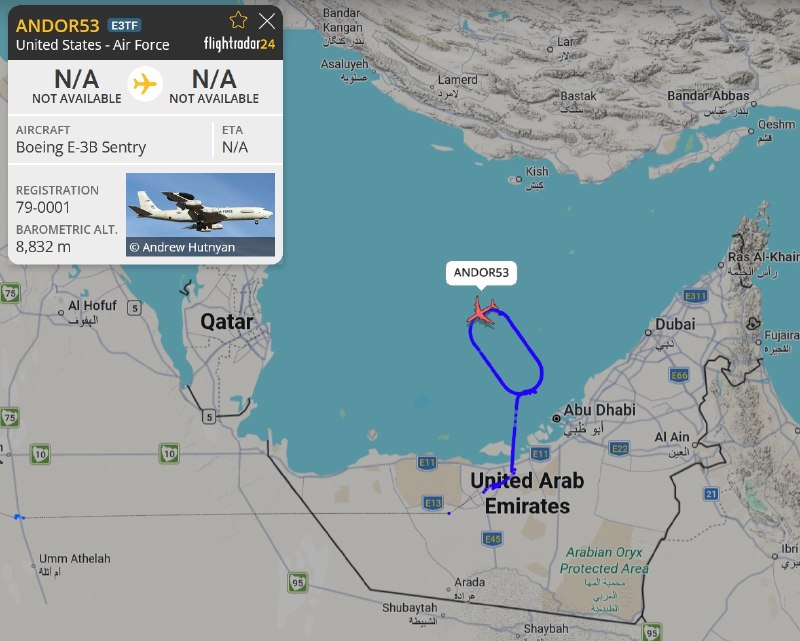

✈️ هم‌اکنون یک فروند هواپیمای Boeing E-3B Sentry در حال گشت زنی برفراز خلیج فارس

@mwarmonitor

## pm_afshaa — post 90813

  <a href="telegram/content/pm_afshaa_90813_1778877952.webm" target="_blank">🎬 Download video</a>

‏
🔴مایک والتز، سفیر آمریکا در سازمان ملل: یکی از نتایج بزرگ سفر ترامپ به چین این بود که چین موافقت کرده از ایران فاصله بگیره.

💧 Rainbet.com the #1 Non-KYC Crypto Casino & Sportsbook @rainbetcom

😁 @Pm_Afshaa

## pm_afshaa — post 90812

  <a href="telegram/content/pm_afshaa_90812_1778877953.webm" target="_blank">🎬 Download video</a>

🔴نیویورک تایمز: آمریکا محمد بکر سعید داود السعدی، فرمانده ارشد شبه‌نظامی گردان‌های حزب‌الله درعراق، رو دستگیر کرد و علیه‌اش کیفرخواست صادر کرد.

او متهم به طراحی حداقل 18 حمله در اروپا، آمریکا و کانادا از پایان فوریه شده؛ این حملات به عنوان انتقام از حملات آمریکا و اسرائیل علیه جمهوری اسلامی برنامه‌ریزی شده بودن.

💧 Rainbet.com the #1 Non-KYC Crypto Casino & Sportsbook @rainbetcom

😁 @Pm_Afshaa

## pm_afshaa — post 90811

  <a href="telegram/content/pm_afshaa_90811_1778877954.webm" target="_blank">🎬 Download video</a>

🔴سپهوند، عضو کمیسیون انرژی مجلس:
روزانه 30 میلیون لیتر کمبود بنزین داریم و چون در کوتاه‌مدت امکان افزایش تولید وجود نداره، باید مدیریت مصرف سوخت رو جدی گرفت.

💧 Rainbet.com the #1 Non-KYC Crypto Casino & Sportsbook @rainbetcom

😁 @Pm_Afshaa

## pm_afshaa — post 90810

  <a href="telegram/content/pm_afshaa_90810_1778877955.webm" target="_blank">🎬 Download video</a>

🔴کانال 12 به نقل از مقام ارشد اسرائیلی
اسرائیل خودش رو برای احتمال ازسرگیری قریب‌الوقوع جنگ با جمهوری اسلامی آماده میکنه. آمریکا به این نتیجه رسیده که مذاکرات با تهران به بن‌بست رسیده.

💧 Rainbet.com the #1 Non-KYC Crypto Casino & Sportsbook @rainbetcom

😁 @Pm_Afshaa

## pm_afshaa — post 90809

🔴آخرین رهبران تروریست باقی مانده از ستاد کل شاخه نظامی رضوان و حماس محمد عوده، رئیس اداره اطلاعات، و عماد آکل، رئیس ستاد جبهه داخلی توسط جنگنده های اسراییل به هلاکت رسیدن

💧 Rainbet.com the #1 Non-KYC Crypto Casino & Sportsbook @rainbetcom

😁 @Pm_Afshaa

## pm_afshaa — post 90806

🔴وزارت خارجه آمریکا : ونزوئلا 7340 کیلوگرم اورانیوم غنی‌شده‌‌‌ش رو به آمریکا منتقل کرد

💧 Rainbet.com the #1 Non-KYC Crypto Casino & Sportsbook @rainbetcom

😁 @Pm_Afshaa

## pm_afshaa — post 90805

  <a href="telegram/content/pm_afshaa_90805_1778877955.mp4" target="_blank">🎬 Download video</a>

هم‌میهنان عزیزم،

در روزهایی که شما با شجاعت در برابر رژیم اشغالگر ایران ایستاده‌اید، این نظام منفور و منزوی، همچنان به تجاوز به جان و مال مردم ادامه می‌دهد تا سرنگونی حتمی خود را اندکی به تعویق اندازد. در چنین شرایطی، وظیفه خود می‌دانم که تصویر عدالت در فردای ایران را برای کسانی که با جنایتکاران همکاری کنند، روشن‌تر ترسیم کنم.

در این راستا، از «کمیته‌ تدوین مقررات عدالت انتقالی ایران» خواستم درباره‌ دو موضوع مهم، نظر مشورتی خود را ارائه کند: نخست، موضوع مسئولیت کیفری افرادی که با ساختارهای سرکوبگر جمهوری اسلامی همکاری می‌کنند؛ و دوم، موضوع مصادره‌ اموال معترضان و خانواده‌های آنان.

این کمیته اکنون نخستین نظر مشورتی خود را صادر کرده و پیام آن روشن است: این اقدامات، همکاری‌های ساده یا بی‌اهمیت نیستند؛ بلکه «یاری‌رسانی به جنایت علیه بشریت» محسوب می‌شوند. هیچ مقام، هیچ دستور و هیچ بهانه‌ای نمی‌تواند مسئولیت کیفری فردی را از میان ببرد. بنابراین، هر فردی که آگاهانه و داوطلبانه با ساختارهای سرکوبگر رژیم همکاری کند، چه در داخل و چه در خارج از ایران، باید بداند که در معرض مسئولیت کیفری قرار خواهد گرفت:

خواه این همکاری از نوع گزارش‌دهی یا خبرچینی باشد؛
خواه از نوع مشارکت در ایست‌های بازرسی‌ باشد؛
خواه از نوع به‌کارگیری کودکان و نوجوانان در سرکوب معترضان باشد؛
و خواه از نوع تحصیل، انتقال یا خرید و فروش اموالی باشد که در جریان سرکوب از معترضان و خانواده‌های آنان مصادره شده‌ است.

از این رو، نه‌تنها افرادی که در صدور دستور، اجرای آن، یا تسهیل این مصادره‌ها نقش دارند در معرض مسئولیت قرار خواهند گرفت، بلکه کسانی که آگاهانه و داوطلبانه به خرید و فروش این اموال می‌پردازند نیز باید پاسخگو باشند. این مسئولیت، استفاده از اموال یا دارایی‌های آنان برای جبران خسارت واردشده به مالکان اصلی را نیز شامل می‌‌شود.

بنابراین، به همه‌ کسانی که امروز در صدد همکاری با دستگاه سرکوب رژیم هستند هشدار می‌دهم: پیش از آن‌که دست به اقدامی بزنید که به مردم ایران آسیب جانی، مالی و یا اجتماعی برساند، به آینده‌ خود و خانواده‌تان بیندیشید. به آن روز بیندیشید که ایران آزاد خواهد شد؛ روزی که حقیقت پنهان نخواهد ماند؛ روزی که اسامی آشکار خواهد شد؛ روزی که هیچ متجاوز و جنایتکاری از پاسخ‌گویی در برابر قانون در امان نخواهد ماند.

آن روز، ملت ایران حکومتی خواهد داشت که حقوق ایرانیان را محترم می‌دارد و ایران را به سرزمینی آزاد و آباد بدل می‌کند.

پاینده ایران،
رضا پهلوی
-----------------------------
متن کامل نظر مشورتی «کمیته‌ تدوین مقررات عدالت انتقالی ایران»:

https://iranopasmigirim.com/fa/transitional-justice

@OfficialRezaPahlavi

## pm_afshaa — post 90804

🔴نخست‌وزیر و وزیر دفاع اسرائیل در بیانیه‌ای اعلام کردند ارتش اسراییل عزالدین حداد، فرمانده شاخه نظامی حماس، را در یک حمله هوایی هدف قرار داده 
💧 Rainbet.com the #1 Non-KYC Crypto Casino & Sportsbook @rainbetcom 
😁 @Pm_Afshaa

## pm_afshaa — post 90803

🔴کانال 13 اسرائیل: سیستم امنیتی معتقد است که ترامپ با حمله‌ای محدود به ایران موافقت خواهد کرد

💧 Rainbet.com the #1 Non-KYC Crypto Casino & Sportsbook @rainbetcom

😁 @Pm_Afshaa

## pm_afshaa — post 90802

🔴نخست‌وزیر و وزیر دفاع اسرائیل در بیانیه‌ای اعلام کردند ارتش اسراییل عزالدین حداد، فرمانده شاخه نظامی حماس، را در یک حمله هوایی هدف قرار داده

💧 Rainbet.com the #1 Non-KYC Crypto Casino & Sportsbook @rainbetcom

😁 @Pm_Afshaa

## pm_afshaa — post 90801

🔴سفارت آمریکا در اسرائیل در حال بررسی صدور دستورالعمل برای خروج فوری شهروندان آمریکایی از تل‌آویو است

💧 Rainbet.com the #1 Non-KYC Crypto Casino & Sportsbook @rainbetcom

😁 @Pm_Afshaa

## pm_afshaa — post 90800

🔴مارکو روبیو: اگر جمهوری اسلامی تصور می‌کند که ما برای رسیدن به یک توافق امتیازاتی خواهيم داد، سخت در اشتباه است؛ تحت هیچ شرایطی یک توافق بد با ایران را نخواهیم پذیرفت

💧 Rainbet.com the #1 Non-KYC Crypto Casino & Sportsbook @rainbetcom

😁 @Pm_Afshaa

## iaghapour — post 2613

  

⚠️ حرف‌زدن درباره‌ی قطعی #اینترنت شاید فوری اینترنت را برنگرداند؛ اما #سکوت دقیقاً همان چیزی است که ادامه‌ی این وضعیت به آن نیاز دارد.

🆔 @iaghapour

## DEJradio — post 4656

  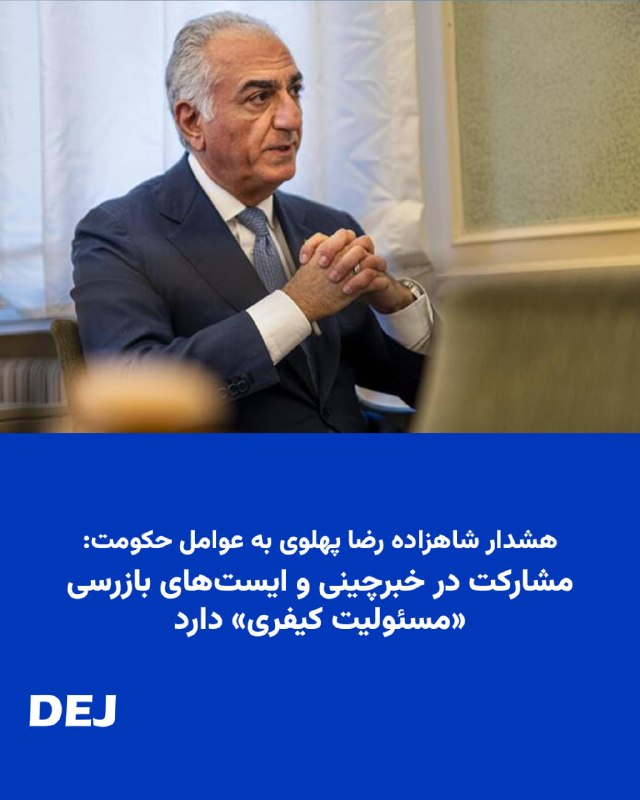

هم‌میهنان عزیزم، در روزهایی که شما با شجاعت در برابر رژیم اشغالگر ایران ایستاده‌اید، این نظام منفور و منزوی، همچنان به تجاوز به جان و مال مردم ادامه می‌دهد تا سرنگونی حتمی خود را اندکی به تعویق اندازد. در چنین شرایطی، وظیفه خود می‌دانم که تصویر عدالت در فردای…

## DEJradio — post 4655

  <a href="telegram/content/DEJradio_4655_1778877958.mp4" target="_blank">🎬 Download video</a>

📡📢 دژ هم‌صدای شما

ملیکا رضاپور
مجری

#دژ
@DEJradio

## DEJradio — post 4654

  <a href="telegram/content/DEJradio_4654_1778877961.mp4" target="_blank">🎬 Download video</a>

💀
🚨 عزالدین حداد از فرماندهان ارشد حـ.ـماس جمعه ۲۵ اردیبهشت ۱۴۰۵ در غزه کشته شد.

یسرائیل کاتز، وزیر دفاع اسرائیل اعلام کرد ارتش این کشور به دستور بنیامین نتانیاهو و با همکاری شاباک، حداد را که از طراحان حمله مرگبار ۷ اکتبر بود هدف قرار داده است. کاتز گفت حداد مسئول قتل، ربایش و حملات علیه شهروندان و نیروهای اسرائیلی بوده و در نگهداری گروگان‌ها نیز نقش داشته است. وزیر دفاع اسرائیل همچنین تأکید کرد تل‌آویو هر فردی را که در حمله ۷ اکتبر نقش داشته باشد، دیر یا زود پیدا خواهد کرد.

#حماس #حذف_هدفمند
@DEJradio

## DEJradio — post 4653

  <a href="telegram/content/DEJradio_4653_1778877964.mp4" target="_blank">🎬 Download video</a>

هم‌میهنان عزیزم،

در روزهایی که شما با شجاعت در برابر رژیم اشغالگر ایران ایستاده‌اید، این نظام منفور و منزوی، همچنان به تجاوز به جان و مال مردم ادامه می‌دهد تا سرنگونی حتمی خود را اندکی به تعویق اندازد. در چنین شرایطی، وظیفه خود می‌دانم که تصویر عدالت در فردای ایران را برای کسانی که با جنایتکاران همکاری کنند، روشن‌تر ترسیم کنم.

در این راستا، از «کمیته‌ تدوین مقررات عدالت انتقالی ایران» خواستم درباره‌ دو موضوع مهم، نظر مشورتی خود را ارائه کند: نخست، موضوع مسئولیت کیفری افرادی که با ساختارهای سرکوبگر جمهوری اسلامی همکاری می‌کنند؛ و دوم، موضوع مصادره‌ اموال معترضان و خانواده‌های آنان.

این کمیته اکنون نخستین نظر مشورتی خود را صادر کرده و پیام آن روشن است: این اقدامات، همکاری‌های ساده یا بی‌اهمیت نیستند؛ بلکه «یاری‌رسانی به جنایت علیه بشریت» محسوب می‌شوند. هیچ مقام، هیچ دستور و هیچ بهانه‌ای نمی‌تواند مسئولیت کیفری فردی را از میان ببرد. بنابراین، هر فردی که آگاهانه و داوطلبانه با ساختارهای سرکوبگر رژیم همکاری کند، چه در داخل و چه در خارج از ایران، باید بداند که در معرض مسئولیت کیفری قرار خواهد گرفت:

خواه این همکاری از نوع گزارش‌دهی یا خبرچینی باشد؛
خواه از نوع مشارکت در ایست‌های بازرسی‌ باشد؛
خواه از نوع به‌کارگیری کودکان و نوجوانان در سرکوب معترضان باشد؛
و خواه از نوع تحصیل، انتقال یا خرید و فروش اموالی باشد که در جریان سرکوب از معترضان و خانواده‌های آنان مصادره شده‌ است.

از این رو، نه‌تنها افرادی که در صدور دستور، اجرای آن، یا تسهیل این مصادره‌ها نقش دارند در معرض مسئولیت قرار خواهند گرفت، بلکه کسانی که آگاهانه و داوطلبانه به خرید و فروش این اموال می‌پردازند نیز باید پاسخگو باشند. این مسئولیت، استفاده از اموال یا دارایی‌های آنان برای جبران خسارت واردشده به مالکان اصلی را نیز شامل می‌‌شود.

بنابراین، به همه‌ کسانی که امروز در صدد همکاری با دستگاه سرکوب رژیم هستند هشدار می‌دهم: پیش از آن‌که دست به اقدامی بزنید که به مردم ایران آسیب جانی، مالی و یا اجتماعی برساند، به آینده‌ خود و خانواده‌تان بیندیشید. به آن روز بیندیشید که ایران آزاد خواهد شد؛ روزی که حقیقت پنهان نخواهد ماند؛ روزی که اسامی آشکار خواهد شد؛ روزی که هیچ متجاوز و جنایتکاری از پاسخ‌گویی در برابر قانون در امان نخواهد ماند.

آن روز، ملت ایران حکومتی خواهد داشت که حقوق ایرانیان را محترم می‌دارد و ایران را به سرزمینی آزاد و آباد بدل می‌کند.

پاینده ایران،
رضا پهلوی
-----------------------------
متن کامل نظر مشورتی «کمیته‌ تدوین مقررات عدالت انتقالی ایران»:

https://iranopasmigirim.com/fa/transitional-justice

@OfficialRezaPahlavi

## VahidOnline — post 75491

  

فرزند عبدالرحیم موسوی، رییس ستاد کل نیروهای مسلح جمهوری اسلامی، گفت که جنازه پدرش که در نخستین روز حملات اسرائیل و آمریکا به دفتر خامنه‌ای کشته شد، نزدیک به ۳۰ روز زیر آوار مانده بود.
موسوی پس از کشته شدن محمد باقری در جنگ ۱۲ روزه، به‌عنوان رییس ستاد کل نیروهای مسلح منصوب شد.
@VahidOOnLine

📡 @VahidOnline

## VahidOnline — post 75488

  <a href="telegram/content/VahidOnline_75488_1778877966.mp4" target="_blank">🎬 Download video</a>

بنیامین نتانیاهو، نخست‌وزیر و یسرائیل کاتز، وزیر دفاع اسرائیل در بیانیه‌ای اعلام کردند ارتش این کشور، عزالدین حداد، فرمانده شاخه نظامی حماس، را در یک حمله هوایی هدف قرار داده است.
عزالدین حداد، از فرماندهان ارشد گردان‌های عزالدین قسام، شاخه نظامی حماس است.
@VahidOOnLine

📡 @VahidOnline

## VahidOnline — post 75487

  

رضا سپهوند، عضو کمیسیون انرژی مجلس شورای اسلامی از کمبود روزانه دست‌کم «۲۰ میلیون لیتر بنزین» در ایران خبر داد.

به نوشته خبرگزاری تسنیم، این نماینده گفته که تولید روزانه بنزین در ایران بین « ۱۱۰ تا ۱۱۵ میلیون لیتر» و مصرف روزانه بین «۱۳۰ تا ۱۳۵ میلیون لیتر» است.
سپهوند با بیان اینکه «در کوتاه‌مدت امکان افزایش تولید وجود ندارد»، خواستار جدی‌گرفتن «مدیریت مصرف سوخت» شد.
پیش از این وزیر خزانه‌داری ایالات متحده گفته بود ایران به‌زودی با «کمبود بنزین» مواجه خواهد شد.

اسکات بسنت با انتشار مطلبی کوتاه در شبکۀ ایکس، نوشته بود: «در حالی‌که باقی‌ماندۀ سران سپاه پاسداران، مثل موش‌هایی که در لوله‌های فاضلاب غرق می‌شوند، گیر افتاده‌اند، به لطف محاصرۀ دریایی ایالات متحده، صنایع نفتی آسیب‌دیدۀ ایران، در حال از کار افتادن و توقف تولید است. پمپاژ نفت به زودی متوقف خواهد شد».
او سپس پیامش را به سبک دونالد ترامپ، با جمله‌ای که به‌طور کامل با حروف بزرگ نوشته شده، به پایان برده بود؛ جمله‌ای با این مضمون هشدار آمیز: «مرحلۀ بعد،‌ کمبود بنزین در ایران!»
@VahidHeadline

📡 @VahidOnline

## VahidOnline — post 75486

  <a href="telegram/content/VahidOnline_75486_1778877967.mp4" target="_blank">🎬 Download video</a>

کاوه مدنی: وضعیت دردآور جزیره مارو (شیدور) ملقب به «مالدیو ایران»
نشت نفت به #خلیج_فارس پس از حمله به تأسیسات نفتی جزیره لاوان در فروردین ماه عامل این فاجعه بود.
#جزیره_مارو
[با کیفیت بیشتر: ۶۰ مگابایت]
KavehMadani
برشی از سی‌ثانیه سوم ویدیوی بالا درباره وضعیت ساحل بیشتر مورد توجه قرار گرفته: AzamBahrami

📡 @VahidOnline

## kianmeli1 — post 87423

‏🔴به گزارش فرانس ۲۴ مقام‌های آمریکایی محمد باقر سعد داوود الساعدی، شهروند عراقی را به اتهام طراحی دست‌کم ۱۸ حمله «تروریستی» در اروپا در واکنش به جنگ آمریکا علیه جمهوری اسلامی بازداشت و متهم کردند

‏براساس این گزارش او متهم است در حملاتی از جمله آتش‌زدن یک بانک در آمستردام و حمله با چاقو به چند مرد یهودی در لندن نقش داشته، او ماه گذشته قصد حمله به یک کنیسه در نیویورک را داشته و تصاویر و نقشه‌هایی از مراکز یهودی در لس‌آنجلس و اسکاتسدیل آریزونا را در اختیار یک مامور مخفی قرار داده است.او همچنین به مشارکت در دو حمله اخیر در کانادا، شامل حمله به یک کنیسه و تیراندازی به کنسولگری آمریکا در تورنتو در ماه مارس، متهم شده است
https://t.me/kianmeli1

## kianmeli1 — post 87422

‏🔴آلیس روفو، معاون وزیر نیروهای مسلح فرانسه اعلام کرد که «شارل دوگل» ناو هواپیمابر فرانسه برای مداخله در صورت تشکیل یک ماموریت «بی‌طرف» جهت بازگرداندن آزادی کشتیرانی در تنگه هرمز ‌مستقر شده است
https://t.me/kianmeli1

## kianmeli1 — post 87421

🔴دقایقی پیش فرمانده حماس کشته شد ‏ نخست‌وزیر و وزیر دفاع اسرائیل در بیانیه‌ای اعلام کردند ارتش این کشور عزالدین حداد، فرمانده شاخه نظامی حماس، را در یک حمله هوایی هدف قرار داده است https://t.me/kianmeli1

## kianmeli1 — post 87420

‏🔴روابط عمومی هیات کوهنوردی استان همدان اعلام کرد که پس از گذشت چهار ماه از مفقود شدن چهار کوهنورد در ارتفاعات الوند، پیکر چهارمین کوهنورد در روز جمعه ۲۵ اردیبهشت پیدا شد
https://t.me/kianmeli1

## kianmeli1 — post 87419

‏🔴مدیر جهاد کشاورزی کازرون اعلام کرد که در پی آتش‌سوزی در مزارع گندم روستای علی‌آباد دوتو در بخش مرکزی این شهرستان، ۲۰ هکتار از مزارع خسارت دید
https://t.me/kianmeli1

## kianmeli1 — post 87418

  

🔴سی ان‌ ان
هکرهای ایرانی با سوءاستفاده از یک نقص جزئی: بدون رمز عبور، به مانیتورهای سوخت پمپ بنزین‌های ایالات متحده نفوذ کردند.

آنها خوانش‌ها را جعل کردند اما نتوانستند به سطح واقعی سوخت دست بزنند.
https://t.me/kianmeli1

## kianmeli1 — post 87417

  

🔴توئیت عجیب ترامپ
https://t.me/kianmeli1

## kianmeli1 — post 87416

  <a href="telegram/content/kianmeli1_87416_1778877971.mp4" target="_blank">🎬 Download video</a>

🔴 ترامپ اعلام کرد که یک دور دیگر از عملیات نظامی آمریکا در ایران در راه است:
‏​
‏ما از نظر نظامی در ایران تقریباً کار را تمام کردیم. حدود ۷۵٪ کار را. (البته) ما همه چیز را تمام نکردیم. برمی‌گردیم و آن را تکمیل می‌کنیم. حتی شاید بیشتر.
‏​
‏ممکن است مجبور شویم کمی کارِ پاکسازی انجام دهیم، چون یک آتش‌بسِ حدوداً یک‌ماهه داشتیم.
‏​
‏ما در حقیقت آتش‌بس را به درخواست کشورهای دیگر انجام دادیم.
‏​
‏من خودم چندان موافق آن نبودم، اما این کار را به عنوان لطفی به پاکستان انجام دادیم، آدم‌های فوق‌العاده‌ای هستند، فیلد مارشال و نخست‌وزیر.»
https://t.me/kianmeli1

## kianmeli1 — post 87415

  <a href="telegram/content/kianmeli1_87415_1778877972.mp4" target="_blank">🎬 Download video</a>

🔴۳۰ روز طول کشید تا جنازه عبدالرحیم موسوی، رئیس سابق ستاد کل نیروهای مسلح، پیدا شود
https://t.me/kianmeli1

## kianmeli1 — post 87414

  <a href="telegram/content/kianmeli1_87414_1778877975.mp4" target="_blank">🎬 Download video</a>

🔴تصاویری از پایان سفر پرزیدنت ترامپ به چین
https://t.me/kianmeli1

## kianmeli1 — post 87413

🔴شبکه 13 اسرائیل: ساختار امنیتی [در اسرائیل] بر این ارزیابی است که ترامپ با انجام حمله‌ای محدود به ایران موافقت خواهد کرد.
https://t.me/kianmeli1

## kianmeli1 — post 87412

  <a href="telegram/content/kianmeli1_87412_1778877977.mp4" target="_blank">🎬 Download video</a>

🔴دقایقی پیش فرمانده حماس کشته شد
‏
نخست‌وزیر و وزیر دفاع اسرائیل در بیانیه‌ای اعلام کردند ارتش این کشور عزالدین حداد، فرمانده شاخه نظامی حماس، را در یک حمله هوایی هدف قرار داده است
https://t.me/kianmeli1

## IranIntlTV — post 337389

اسرائیل از هدف قرار دادن رهبر شاخه نظامی حماس در غزه خبر داد

اسرائیل اعلام کرد جمعه ۲۵ اردیبهشت در حمله‌ای در غزه، عزالدین حداد، رهبر شاخه نظامی حماس را هدف قرار داده است.

بنیامین نتانیاهو، نخست‌وزیر اسرائیل، و اسرائیل کاتس، وزیر دفاع، در بیانیه‌ای مشترک اعلام کردند حداد «مسئول قتل، ربایش و آسیب رساندن به هزاران غیرنظامی و نظامی اسرائیلی» بوده است.

آنها اعلام نکردند که آیا معتقدند حداد کشته شده است یا نه. حماس هنوز درباره سرنوشت حداد اظهار نظر نکرده است.

اسرائیل حداد را از طراحان حملات ۷ اکتبر ۲۰۲۳ توصیف کرده است. عزالدین حداد پس از کشته شدن محمد سنوار، برادر یحیی سینوار و فرمانده این گروه در مه ۲۰۲۵، به فرماندهی نظامی حماس در نوار غزه رسید.

حداد بالاترین مقام حماس است که از زمان توافق مورد حمایت آمریکا در ماه اکتبر که قرار بود درگیری‌ها در غزه را متوقف کند، هدف حمله اسرائیل قرار گرفته است.

مذاکرات اسرائیل و حماس برای پیشبرد طرح پساجنگ دونالد ترامپ برای غزه همچنان در بن‌بست باقی مانده است.

گفته شده است که این حمله به‌دستور مستقیم بنیامین نتانیاهو، نخست‌وزیر اسرائیل، انجام گرفته است.

به‌گزارش رویترز، امدادگران در غزه اعلام کردند که در حملات هوایی به یک آپارتمان و یک خودرو دست‌کم سه نفر کشته و ۲۰ نفر زخمی شده‌اند. هنوز مشخص نیست که حداد در میان کشته‌شدگان بوده یا نه.

اسرائیل می‌گوید: «حداد مسئول کشتار اسرائیلی‌ها بوده است»

امدادگران و شاهدان در غزه گفتند یک حمله هوایی، آپارتمانی را در منطقه ریمال در شهر غزه هدف قرار داده که دست‌کم یک نفر را کشته و چندین نفر دیگر را زخمی کرده است. هویت فرد کشته‌شده هنوز مشخص نیست.

به گفته امدادگران و شاهدان، اندکی بعد حمله هوایی دیگری یک خودرو را در خیابانی نزدیک هدف قرار داد. گزارشی فوری از تلفات این حمله دوم منتشر نشده است.

اسرائیل در پنج هفته‌ای که از توقف جنگ مشترک با آمریکا علیه جمهوری اسلامی می‌گذرد، حملات خود به غزه را تشدید کرده و تمرکز آتش خود را دوباره بر این منطقه معطوف کرده است؛ جایی که ارتش معتقد است نیروهای حماس در حال تقویت کنترل خود هستند.

توافقی که در ماه اکتبر به دست آمد، پس از دو سال جنگ میان اسرائیل و حماس، درگیری‌های گسترده را متوقف کرد اما تلاش‌ها برای دستیابی به یک راه‌حل دائمی، شامل خروج نیروهای اسرائیلی، خلع سلاح شبه‌نظامیان و بازسازی این منطقه، با مشکل مواجه شده است.

نیروهای اسرائیلی همچنان بیش از نیمی از خاک غزه را در اشغال دارند؛ جایی که بیشتر ساختمان‌های باقی‌مانده را تخریب کرده و به ساکنان دستور تخلیه داده‌اند.

اکنون بیش از دو میلیون نفر در نوار باریکی در امتداد ساحل عمدتا در ساختمان‌های آسیب‌دیده یا چادرهای موقت زندگی می‌کنند، در حالی که نیروهای حماس عملا کنترل این منطقه را در دست دارند.

بر اساس آمارهایی که میان نیروهای نظامی و غیرنظامیان تفکیک قائل نمی‌شود، از زمان آتش‌بس اکتبر تاکنون حدود ۸۵۰ فلسطینی در حملات اسرائیل کشته شده‌اند. در همین مدت، چهار سرباز اسرائیلی نیز به‌دست شبه‌نظامیان کشته شده‌اند. حماس آمار تلفات نیروهای خود را اعلام نمی‌کند.

🔗وب‌سایت ایران‌اینترنشنال
@iranintltv

## IranIntlTV — post 337388

  <a href="https://t.me/IranintlTV/337388" target="_blank">📎 Download file</a>

🎧نسخه صوتی ۲۴ با فرداد فرحزاد: ترامپ: توقف ۲۰ ساله غنی‌سازی ایران قابل بررسی است
@iranintlTV

## IranIntlTV — post 337387

  <a href="telegram/content/IranIntlTV_337387_1778877979.mp4" target="_blank">🎬 Download video</a>

ابراهیم حامدی، ابی، و شاهین نجفی ترانه جدیدی با نام «شاهراه» منتشر کرده‌اند؛ اثری که به گفته آن‌ها از امید و ایستادگی می‌گوید.

گفت‌وگو با ابراهیم حامدی و شاهین نجفی، خواننده
@iranintltv

## IranIntlTV — post 337386

  <a href="telegram/content/IranIntlTV_337386_1778877982.mp4" target="_blank">🎬 Download video</a>

عباس عراقچی گفت در روزهای اخیر پیام‌هایی از سوی آمریکا دریافت شده که نشان‌دهنده تمایل واشینگتن به ادامه مذاکرات است.

همزمان محمدعلی جعفری، فرمانده قرارگاه بقیه‌الله سپاه، گفت آغاز دوباره جنگ به ضرر آمریکا خواهد بود.

گفت‌وگو با جابر رجبی، تحلیل‌گر سیاسی
@iranintltv

## IranIntlTV — post 337385

یکی از فرماندهان کتائب حزب‌الله عراق در آمریکا محاکمه می‌شود

مقام‌های فدرال در آمریکا اعلام کردند که محمد باقر سعد داوود الساعدی، از فرماندهان کتائب حزب‌الله عراق، از گروه‌های نیابتی تحت حمایت جمهوری اسلامی متهم شده است که دیگران را به حمله به منافع آمریکایی و اسرائیلی هدایت و تشویق کرده است.

به‌گفته این مقام‌ها، او به اتهام برنامه‌ریزی برای حمله به اماکن یهودی در ایالات متحده، از جمله یک کنیسه در شهر نیویورک، تحت پیگرد قرار گرفته است.

قرار است الساعدی جمعه در دادگاه فدرال منهتن حاضر شود. هنوز مشخص نیست او چگونه بازداشت و به ایالات متحده منتقل شده است.
الیزابت تسورکوف، پژوهشگر روسی-اسرائیلی که در مارس ۲۰۲۳ هنگام انجام تحقیقات دکترا در عراق تسورکوف به مدت ۹۰۳ روز گروگان گروه کتائب حزب‌الله گروگان بود و در سپتامبر ۲۰۲۵ آزاد شد.

بر اساس شکایتی کیفری که جمعه ۲۵ اردیبهشت علنی شد، محمد باقر سعد داوود الساعدی متهم است که از اواخر فوریه تاکنون دست‌کم ۱۸ حمله در اروپا و کانادا را در واکنش به حملات آمریکا و اسرائیل علیه جمهوری اسلامی برنامه‌ریزی کرده است.

طبق این شکایت، الساعدی یکی از فرماندهان کتائب حزب‌الله است؛ گروهی شبه‌نظامی در عراق که به‌عنوان نیروی نیابتی سپاه پاسداران عمل می‌کند و به تهران در گسترش نفوذ خود در منطقه، از جمله از طریق حمله به نیروهای آمریکایی و اهداف دیپلماتیک، کمک کرده است.

در این شکایت آمده است که الساعدی قصد داشته آمریکایی‌ها و یهودیان را در لس‌آنجلس و نیویورک به قتل برساند و برنامه‌ریزی برای حمله به یک کنیسه در نیویورک را آغاز کرده بود.

در شکایت آمده است که الساعدی و همدستانش دست‌کم ۱۸ حمله تروریستی در اروپا و دو حمله دیگر در کانادا را برنامه‌ریزی و هماهنگ کرده‌اند و مسئولیت آنها را بر عهده گرفته‌اند. همچنین او متهم شده که دیگران را برای انجام حملات در داخل آمریکا، از جمله در نیویورک، هدایت و هماهنگ کرده است.

در کیفرخواست همچنین گفته شده که او به‌عنوان یکی از رهبران کتائب حزب‌الله، قاسم سلیمانی، فرمانده پیشین نیروی قدس سپاه پاسداران را می‌شناخت. سلیمانی در سال ۲۰۲۰ در حمله نظامی آمریکا کشته شد.

دولت آمریکا همچنین اعلام کرده که الساعدی با ابومهدی المهندس، رهبر وقت کتائب حزب‌الله که او نیز در همان حمله سال ۲۰۲۰ کشته شد، همکاری نزدیک داشته است.

کتائب حزب‌الله به حمله به پایگاه‌های ارتش آمریکا در عراق و سوریه متهم شده و از سوی ایالات متحده به‌عنوان یک سازمان تروریستی خارجی شناخته می‌شود. این گروه مدت‌ها یکی از مهم‌ترین اجزای شبکه نیروهای نیابتی جمهوری اسلامی در منطقه بوده است.

کتائب حزب‌الله که پس از حمله آمریکا به عراق در سال ۲۰۰۳ شکل گرفت، به یکی از مهم‌ترین گروه‌های تشکیل‌دهنده نیروهای موسوم به بسیج مردمی تبدیل شد؛ ائتلافی از گروه‌های شبه‌نظامی که بعدها در ساختار امنیتی عراق ادغام شد.

با وجود این، مقام‌های آمریکایی می‌گویند این گروه همچنان به‌طور نزدیک از سپاه پاسداران دستور می‌گیرد و در پیشبرد نفوذ منطقه‌ای تهران،‌از جمله از طریق حمله به نیروهای آمریکایی و اهداف دیپلماتیک، نقش دارد.

دامنه فعالیت این گروه فراتر از خاورمیانه چندان روشن نیست و سابقه مستندی از عملیات‌های گسترده جهانی ندارد. در مقایسه با برخی دیگر از متحدان جمهوری اسلامی، از جمله حزب‌الله لبنان و حماس در غزه، کتائب حزب‌الله در جنگ‌های دو سال گذشته در خاورمیانه تا حد زیادی دست‌نخورده باقی مانده است.

مارکو روبیو، وزیر امور خارجه آمریکا، در ماه مارس اعلام کرد که این گروه یک خبرنگار آمریکایی به نام شلی کیتلسون را در بغداد ربوده و بعدا آزاد کرده است.
 
🔗وب‌سایت ایران‌اینترنشنال
@iranintltv

## IranIntlTV — post 337384

  <a href="telegram/content/IranIntlTV_337384_1778877985.mp4" target="_blank">🎬 Download video</a>

با گذشت چند ماه از اعتراضات دی و ناامیدی بخشی از مردم از بهبود اوضاع در ایران، شماری از هنرمندان، تلاش کرده‌اند در حمایت از معترضان و همینطور زنده نگهداشتن امید مردم، نقش داشته باشند. در یکی از تازه‌ترین این تلاش‌‎ها، ابراهیم حامدی، ابی، این بار با شاهین نجفی، ترانه جدیدی به نام شاهراه، منتشر کرده‎‌اند تا از امید و ایستادگی بگویند.
@iranintltv

## IranIntlTV — post 337383

  

🔻پیمان حدادی، مدیرعامل باشگاه پرسپولیس، در یک برنامه تلویزیونی مدعی شد افشین پیروانی برای سفر به کشوری غیر از آمریکا با او هماهنگ کرده بود. او گفت: «تصمیم پیروانی برای سفر به آمریکا شخصی بود. او قبلاً هم به این کشور سفر کرده بود، اما به نظر من در این شرایط سفر به آمریکا درست نبود.»

🔹حدادی گفت: «پیروانی با من هماهنگ کرده بود که برای دیدن خانواده‌اش به کشور دیگری برود. خانواده او به دلیل شرایط جنگی نگران بودند، اما درباره سفر به آمریکا به من چیزی نگفته بود.»

🔹باشگاه پرسپولیس هفته گذشته از اخراج افشین پیروانی، مدیر تیم فوتبال بزرگسالان این باشگاه، به دلیل «سفر به آمریکا» هم‌زمان با عملیات نظامی آمریکا و اسرائیل علیه جمهوری اسلامی خبر داد و اعلام کرد این سفر «مورد تأیید ارکان مدیریتی باشگاه نبوده است.»

🔹با این حال، حدادی امروز گفت دلیل اخراج پیروانی حاضر نشدن او در تمرینات بوده، نه سفر به آمریکا: «تمرینات ما آغاز شد و او در تمرینات حضور پیدا نکرد. در باشگاه کمیته انضباطی داریم که درباره او تصمیم گرفت؛ همان‌طور که درباره سروش رفیعی و میلاد محمدی تصمیم گرفته شد و جریمه شدند.»

@iranintltvsport

## IranIntlTV — post 337382

  <a href="telegram/content/IranIntlTV_337382_1778877989.mp4" target="_blank">🎬 Download video</a>

دونالد ترامپ گفت اگر لازم باشد آمریکا برای گرفتن ذخایر اورانیوم غنی‌شده مستقیما وارد ایران می‌شود. ترامپ گفته در صورت تعهد واقعی تهران، واشینگتن شاید با تعلیق ۲۰ ساله برنامه هسته‌ای موافقت کند، اما ادامه هر برنامه مرتبط با سلاح هسته‌ای توافق را منتفی می‌کند.
@iranintltv

## IranIntlTV — post 337381

  <a href="telegram/content/IranIntlTV_337381_1778877991.mp4" target="_blank">🎬 Download video</a>

یکی از مخاطبان ایران‌اینترنشنال در پیامی می‌گوید وضعیت برگزاری امتحانات دانش‌آموزان پایه‌های هفتم تا دهم در کرمانشاه هنوز مشخص نیست و این بلاتکلیفی باعث نگرانی و فشار روانی شده است. او خواستار تعیین هرچه سریع‌تر وضعیت امتحان‌هاست.

این پیام با هوش مصنوعی خوانده شده است

## IranIntlTV — post 337380

  

رسانه‌های ایران از افزایش نجومی قیمت کولر آبی خبر دادند و افزودند در حال حاضر، قیمت کولرهای آبی از حدود ۲۰ میلیون تومان شروع می‌شود و برخی مدل‌های سلولزی و کم‌مصرف به بالای ۵۰ میلیون تومان رسیده‌اند.
بنا بر این گزارش، بسیاری از خریداران به سمت تعمیر کولرهای قدیمی و خرید مدل‌های دست‌دوم رفته‌اند.

این در حالی است که در سال ۱۴۰۱، ارزانترین کولر آبی در بازار یک میلیون و ۵۰۰ تومان و ارزانترین کولر گازی دیواری نیز ۹ میلیون تومان بوده است.
https://iranintl.com/202605156933

## IranIntlTV — post 337379

🗣روایت شما از بحران اقتصادی و زندگی در آتش‌بس- جمعه ۲۵ اردیبهشت:

🔹روز ۲۰ اردیبهشت رفتم در ملایر دیسک صفحه ماشین بگیرم، قیمت گفت ۶ میلیون تومان، فردایش برای خرید قطعی مراجعه کردم؛ همان را گفت ۱۲ میلیون شده است. قیمت یک قلم جنس در یک روز دو برابر شد.

🔹یک کیلو قهوه گلد را که تا هفته قبل در تهران می‌خریدیم یک میلیون و ۷۰۰ هزار تومان، می‌خریدم امروز خریدم ۵ میلیون و ۳۰۰ هزار تومان!

🔹من یک نقاشم و تنها دلخوشی‌ام نقاشی بود. الان توان خرید بوم ندارم که هیچ، حتی مقوایی که هفته پیش خریدم ۲۵۰ هزار تومان هم این هفته شده ۳۲۰ هزار تومن! مدام باید با ترس خراب‌نکردن و هدر ندادن ابزار و مواد اولیه، نقاشی کنم.

🔹کشاورز هستم. سهمیه کود نسبت به پارسال تقریبا نصف شده و وقتی سهمیه جدید می‌آید کلا دو سه روز مهلت خرید دارد. اگر کسی توانایی خرید نداشته باشد، سهمش می‌سوزد. دولت هم سهم کود دولتی آن فرد را به صورت آزاد می‌فروشد.

🔹بنزین کارت آزاد ۵ هزار تومنی، از ساعت ۹ صبح به بعد دیگر موجود نیست.

🔹یک شانه تخم‌مرغ خریدم ۶۰۰ هزار تومان. دیگر حتی نمی‌شود یک وعده غذای ساده خورد.

🔹قبض برق که هر دوره برای ما ۱۲۰ هزار تومان صادر می‌شد این بار شده یک میلیون و ۲۰۰ هزار تومان، تازه همراه با تهدید قطع فوری!

## IranIntlTV — post 337378

  

فرزند عبدالرحیم موسوی، رییس ستاد کل نیروهای مسلح جمهوری اسلامی، گفت که جنازه پدرش که در نخستین روز حملات اسرائیل و آمریکا به دفتر خامنه‌ای کشته شد، نزدیک به ۳۰ روز زیر آوار مانده بود.

موسوی پس از کشته شدن محمد باقری در جنگ ۱۲ روزه، به‌عنوان رییس ستاد کل نیروهای مسلح منصوب شد.

https://iranintl.com/202605151477

## IranIntlTV — post 337377

  

به گزارش فرانس۲۴، مقام‌های آمریکایی محمد باقر سعد داوود الساعدی، شهروند عراقی را به اتهام طراحی دست‌کم ۱۸ حمله «تروریستی» در اروپا در واکنش به جنگ آمریکا علیه جمهوری اسلامی بازداشت و متهم کردند.

براساس این گزارش، او متهم است در حملاتی از جمله آتش‌زدن یک بانک در آمستردام و حمله با چاقو به چند مرد یهودی در لندن نقش داشته و ماه گذشته قصد حمله به یک کنیسه در نیویورک را داشته است. همچنین او تصاویر و نقشه‌هایی از مراکز یهودی در لس‌آنجلس و اسکاتسدیل آریزونا را در اختیار یک مامور مخفی قرار داده است.

بر اساس این گزارش، او همچنین به مشارکت در دو حمله اخیر در کانادا، شامل حمله به یک کنیسه و تیراندازی به کنسولگری آمریکا در تورنتو در ماه مارس، متهم شده است.
https://iranintl.com/202605155558

## IranIntlTV — post 337376

  <a href="https://t.me/IranintlTV/337376" target="_blank">📎 Download file</a>

🎧نسخه صوتی حرف آخر با پوریا زراعتی - بزودی: عملیات 'پاکسازی' در ایران
@iranintlTV

## IranIntlTV — post 337375

  

جعفر قادری، نماینده شیراز در مجلس گفت: «امارات متحده عربی در جنگ نشان داده که به لانه‌ای برای اسرائیل تبدیل شده و در این راستا نیز هیچ کوتاهی نکرده است.»

او افزود: «این کشور در آینده جایی در مناسبات ما نخواهد داشت و نباید اجازه دهیم سرمایه‌گذاری‌های جدیدی در این کشور رقم بخورد.»

او ادامه داد: «امارات متحده عربی دارد مسیر اسرائیل را می‌رود و در دامن آن‌ها افتاده که این خطرناک است، البته در زمان خودش پاسخ خوش خدمتی‌هایش را به گونه‌ای خواهد گرفت که در اذهان باقی بماند.»
https://iranintl.com/202605153473

## IranIntlTV — post 337374

  <a href="telegram/content/IranIntlTV_337374_1778877999.mp4" target="_blank">🎬 Download video</a>

یکی از مخاطبان ایران‌اینترنشنال که از مشهد پیام داده می‌گوید برای کار روی پایان‌نامه خود ناچار به تهیه اینترنت پرسرعت شده که با احتساب مالیات حدود ۲ میلیون و ۱۷۰ هزار تومان هزینه داشته است. او می‌گوید برای چیزی که «حقمان است» هزینه سنگین پرداخت می‌کنند، اما دسترسی و کیفیت خدمات پاسخگوی نیاز او نیست. این پیام با هوش مصنوعی خوانده شده است.

بازخوانی این پیام و ساخت تصویر برای آن با هوش مصنوعی انجام گرفته است.

## IranIntlTV — post 337373

در میانه تنش‌ها با تهران، ابوظبی روابط دفاعی و انرژی خود با هند را گسترش می‌دهد

وزارت امور خارجه هند اعلام کرد که این کشور و امارات متحده عربی بر سر چارچوب یک مشارکت راهبردی دفاعی به توافق رسیده‌اند. این توافق در جریان سفر نارندرا مودی به ابوظبی و در میانه تشدید تنش‌ها میان امارات و جمهوری اسلامی به دست آمده است.

وزارت امور خارجه هند، جمعه ۲۵اردیبهشت، افزود که دو کشور در جریان این سفر، همچنین توافق‌نامه‌هایی درباره ذخایر راهبردی نفت و تأمین گاز نفتی مایع (ال‌پی‌جی) امضا کرده‌اند.

در بیانیه وزارت امور خارجه هند آمده است: «دو طرف بر تعمیق همکاری‌های صنعتی دفاعی و همکاری در زمینه نوآوری و فناوری پیشرفته، آموزش، رزمایش‌ها، امنیت دریایی، دفاع سایبری، ارتباطات امن و تبادل اطلاعات توافق کرده‌اند.»

پیش از این سفر، منابع هندی به رویترز گفته بودند که مودی احتمالا درباره قراردادهای بلندمدت تامین انرژی گفت‌وگو خواهد کرد و همچنین به‌دنبال جلب حمایت برای گسترش ذخایر راهبردی نفت هند خواهد بود.

تقویت روابط دفاعی و انرژی امارات و هند در شرایطی صورت می‌گیرد که در جریان جنگ اخیر، روابط تهران و ابوظبی به شدت تیره شد و جمهوری اسلامی حملات پهپادی و موشکی را علیه تاسیسات نفت و انرژی امارات انجام داد.

همچنین روزنامه وال‌استریت ژٰورنال ۲۱ اردیبهشت به‌نقل از منابع آگاه خبر داد که امارات متحده عربی به‌طور مخفیانه حملاتی علیه جمهوری اسلامی انجام و در یکی از این حملات در ماه آوریل پالایشگاه نفتی جزیره لاوان ایران را هدف قرار داده است.

در حالی که هند، امارات و جمهوری اسلامی عضو بریکس هستند، وزارت امور خارجه هند جمعه در پایان نشست سالانه وزیران امور خارجه این گروه در دهلی نو به جای انتشار بیانیه مشترک، بیانیه‌ای به عنوان رییس نشست صادر کرد و اعلام کرد میان برخی اعضا درباره وضعیت خاورمیانه اختلاف نظر وجود دارد.

بسته شدن تنگه هرمز از سوی جمهوری اسلامی بازارهای جهانی انرژی را متلاطم و حمل‌ونقل و تجارت در سراسر منطقه را مختل کرده است.

تاثیر خروج امارات از اوپک بر کمک به هند
با تصمیم امارات برای خروج از اوپک در ماه گذشته، انتظار می‌رود ظرفیت تولید این کشور افزایش یابد و به واردکنندگانی مانند هند کمک کند.

طبق توافق نفتی اعلام‌شده در روز جمعه، احتمال افزایش ذخیره‌سازی نفت خام شرکت دولتی نفت ابوظبی «ادنوک» در هند تا سقف ۳۰ میلیون بشکه وجود دارد. این شرکت در بیانیه‌ای جداگانه اعلام کرد که این توافق همچنین امکان ذخیره‌سازی نفت خام در فجیره امارات را به‌عنوان بخشی از ذخایر راهبردی هند بررسی می‌کند.

شرکت «ادنوک» همچنین اعلام کرد که گسترش تامین و فرصت‌های تجاری گاز نفتی مایع (ال‌پی‌جی) با شرکت «ایندین اویل کورپوریشن» را بررسی خواهد کرد.

سلطان احمد الجابر، مدیرعامل و مدیر اجرایی «ادنوک»، گفت: «مقیاس و مسیر رشد هند، آن را به یکی از تعیین‌کننده‌ترین بازارهای انرژی عصر ما تبدیل کرده است. با شتاب گرفتن تقاضا هم‌زمان با رشد سریع جمعیت، اهمیت مشارکت انرژی میان امارات و هند بیش از پیش حیاتی می‌شود.»

نگاه امارات و هند به روابط نزدیک‌ عربستان و پاکستان
امارات متحده عربی سومین شریک تجاری بزرگ هند است. دهلی نو و ابوظبی در ماه ژانویه قراردادی سه میلیارد دلاری برای خرید گاز طبیعی مایع (ال‌ان‌جی) امارات از سوی هند امضا کرده بودند. همچنین نامه‌ای برای همکاری در جهت شکل‌گیری یک مشارکت راهبردی دفاعی میان دو کشور امضا شد.

این توافق‌ها پس از آن صورت گرفت که پاکستان، رقیب دیرینه هند، سال گذشته توافق دفاعی متقابلی با عربستان سعودی امضا کرد.

پاکستان به میانجی اصلی میان واشینگتن و تهران برای پایان دادن به جنگی تبدیل شده که با حملات ایالات متحده و اسرائیل به جمهوری اسلامی در نهم اسفند آغاز شد. همچنین پاکستان برای تقویت دفاع عربستان سعودی پس از آنکه این کشور هدف صدها حمله موشکی و پهپادی جمهوری اسلامی قرار گرفت، اقدام کرده است.

ریاض ماه گذشته اعلام کرد که سه میلیارد دلار دیگر برای کمک به پاکستان در پوشش بازپرداخت بدهی اسلام‌آباد به امارات ارائه خواهد کرد.

وزارت امور خارجه هند همچنین جمعه از سرمایه‌گذاری‌های پنج میلیارد دلاری امارات متحده عربی خبر داد و به توافق‌های پیشین از جمله خرید ۶۰ درصد سهام بانک «آر‌بی‌ال» از سوی «امیراتس ان‌بی‌دی» به ارزش سه میلیارد دلار در سال گذشته، و سرمایه‌گذاری یک میلیارد دلاری شرکت «آی‌اچ‌سی» ابوظبی در پروژه «سمّان» اشاره کرد.
 
🔗وب‌سایت ایران‌اینترنشنال
@iranintltv

## IranIntlTV — post 337372

  

گلرخ ایرایی، زندانی سیاسی، در پیامی از بند زنان زندان اوین به مناسبت اعطای جایزه «آزادی نوشتن» از سوی انجمن قلم آمریکا، نوشت: «می‌نویسیم حتی اگر آزادی‌مان به بند کشیده شود؛ حتی اگر مورد تهدید و تحدید قرار بگیریم و وادار به تبعید یا فدای جان شویم.»

ایرایی در این پیام نوشت، «اینجا بی‌پروا نوشتن از رنج مردمانی که ستم را به پیکار برمی‌خیزند، مجرمانه است و آنان که با قلم تباهی درد را به چشم جهانیان پدیدار می‌کنند، در سکوت فرسوده می‌شوند و مجرم‌اند و سزاوار محاکمه!»
او به فقر، نابرابری، سرکوب و «کشتار سیستماتیک» در ایران اشاره کرد و نوشت نوشتن از رنج مردم «تحت ستم»، با همه هزینه‌ها و محدودیت‌ها، «روزنه امیدی» برای ادامه مبارزه است.

این زندانی سیاسی همچنین نوشت «ارتجاع حاکم، آزادی اندیشه و جسارت بیان را برنمی‌تابد، آنگاه که قلم بر چوبه‌های دار افراشته حمله می‌برد و از فقر و نابرابری روایت می‌کند و بازتابی می‌شود از سفره‌های خالی و قیام گرسنگان را نوید می‌دهد.»

او در پایان تاکید کرد: «ما از خفگی رها خواهیم شد و می‌دانیم این جز در حرکتی مشترک میسر نخواهد بود.»
https://iranintl.com/202605159393

## IranIntlTV — post 337371

  

آموزشکده توانا در گزارشی نوشت برخی وکلا با هماهنگی نهادهای امنیتی و قضات دادگاه‌های انقلاب، در پرونده‌های امنیتی به‌جای دفاع از متهمان، با درخواست عفو و «اقرار ضمنی» به اتهام‌ها، مسیر صدور و اجرای احکام سنگین از جمله اعدام را هموار می‌کنند.

بر اساس این گزارش، این وکلا با تجدیدنظرخواهی فوری، فرصت قانونی اعتراض را نیز از متهمان سلب می‌کنند.
این گزارش از «مهدی محرابی» به‌عنوان یکی از این وکلا نام برده و نوشته او در پرونده آتش‌سوزی پایگاه بسیج خیابان نامجو، مربوط به محمدامین بیگلری، امیرحسین حاتمی، علی فهیم و شاهین واحدپرست کلور، چهار معترض اعدام‌شده، نقش داشته است.

در این گزارش همچنین آمده خانواده برخی متهمان امنیتی تحت فشار قرار می‌گیرند تا به‌جای وکلای مستقل، از «وکلای مورد تایید» استفاده کنند؛ اقدامی که به نوشته توانا، در مواردی به صدور احکام اعدام یا حبس‌های طولانی‌مدت منجر شده است.
https://iranintl.com/202605156524

## IranIntlTV — post 337370

  <a href="telegram/content/IranIntlTV_337370_1778878004.mp4" target="_blank">🎬 Download video</a>

🔻هادی چوپان، قهرمان پیشین مسترالمپیا در یک مسابقه استعدادیابی که از صدا و سیمای جمهوری اسلامی پخش می‌شود، گفت: «ما با زحمت و هزار دردسر به قله رسیدیم، نباید بازیچه دلقکان مجازی شویم.»

@iranintltvsport

## Shin_Persian — post 6019

↩️ Quoted tweet: Emanuel (Mannie) Fabian ✓ @manniefabian Fri, 15 May 2026 17:18:34 UTC A senior Israeli security official tells reporters that there are "initial indications" that Izz al-Din al-Haddad was killed in the airstrike in Gaza City a short while…

## Shin_Persian — post 6018

↩️ Quoted tweet:
Emanuel (Mannie) Fabian ✓ @manniefabian
Fri, 15 May 2026 17:18:34 UTC

A senior Israeli security official tells reporters that there are "initial indications" that Izz al-Din al-Haddad was killed in the airstrike in Gaza City a short while ago.

↩️ توییت نقل‌قول شده — برای پاسخ، پست زیر را ببینید.

فارسی

یک مقام ارشد امنیتی اسرائیل به خبرنگاران می‌گوید که «نشانه های اولیه» وجود دارد که نشان می‌دهد عزالدین الحداد در حمله هوایی اندکی پیش در شهر غزه کشته شده است.

𝕏 · @shin_persian

## Shin_Persian — post 6017

↩️ Quoted tweet: Shin ✓ @hey_itsmyturn Fri, 15 May 2026 17:04:22 UTC Gazans report a blitz airstrike on western Gaza, highly likely a targeted assassination. ↩️ توییت نقل‌قول شده — برای پاسخ، پست زیر را ببینید. فارسی ساکنان غزه از یک حمله هوایی برق‌آسا…

## Shin_Persian — post 6016

↩️ Quoted tweet:
Shin ✓ @hey_itsmyturn
Fri, 15 May 2026 17:04:22 UTC

Gazans report a blitz airstrike on western Gaza, highly likely a targeted assassination.

↩️ توییت نقل‌قول شده — برای پاسخ، پست زیر را ببینید.

فارسی

ساکنان غزه از یک حمله هوایی برق‌آسا به غرب غزه خبر می‌دهند که به احتمال بسیار زیاد یک ترور هدفمند است.

𝕏 · @shin_persian

## Shin_Persian — post 6015

Shin ✓ @hey_itsmyturn
Fri, 15 May 2026 17:04:22 UTC

Gazans report a blitz airstrike on western Gaza, highly likely a targeted assassination.

فارسی

ساکنان غزه از یک حمله هوایی برق‌آسا به غرب غزه خبر می‌دهند که به احتمال بسیار زیاد یک ترور هدفمند بوده است.

𝕏 · @shin_persian

## ManotoTV — post 105501

  <a href="telegram/content/ManotoTV_105501_1778878006.mp4" target="_blank">🎬 Download video</a>

‌
شیخ خالد بن محمد بن زاید، ولیعهد ابوظبی، اعلام کرد پروژه «خط لوله غرب به شرق» با هدف افزایش صادرات نفت از بندر فجیره و «پاسخ به تقاضای جهانی» با سرعت بیشتری اجرا خواهد شد.

بر اساس اعلام مقام‌های امارات، این پروژه ظرفیت صادرات نفت از مسیر فجیره را دو برابر می‌کند و قرار است تا سال ۲۰۲۷ به بهره‌برداری برسد.

پس از جنگ آمریکا و اسرائیل با جمهوری اسلامی و افزایش تنش‌ها در تنگه هرمز، کشورهای خلیج فارس به دنبال مسیرهای جایگزین برای صادرات نفت و گاز هستند. حدود یک‌پنجم نفت جهان پیش‌تر از تنگه هرمز عبور می‌کرد.

## ManotoTV — post 105500

  <a href="telegram/content/ManotoTV_105500_1778878006.mp4" target="_blank">🎬 Download video</a>

‌
وزارت خارجه آمریکا اعلام کرد آتش‌بس میان اسرائیل و لبنان برای ۴۵ روز دیگر تمدید شده تا فرصت بیشتری برای ادامه مذاکرات فراهم شود.

## ManotoTV — post 105499

  <a href="telegram/content/ManotoTV_105499_1778878007.mp4" target="_blank">🎬 Download video</a>

‌
شاهزاده رضا پهلوی در پیامی ویدیویی خطاب به ملت ایران، درباره همکاری با ساختارهای سرکوبگر جمهوری اسلامی هشدار داد و گفت افرادی که در داخل و خارج کشور آگاهانه در سرکوب معترضان، مصادره اموال شهروندان و همکاری با نهادهای حکومتی نقش داشته باشند، در آینده با «مسئولیت کیفری» روبه‌رو خواهند شد.

او اعلام کرد «کمیته تدوین مقررات عدالت انتقالی ایران» در نخستین نظر مشورتی خود، همکاری با نهادهای سرکوب جمهوری اسلامی را «یاری‌رسانی به جنایت علیه بشریت» دانسته است.

شاهزاده رضا پهلوی تاکید کرد مشارکت در خبرچینی، ایست‌های بازرسی، استفاده از کودکان در سرکوب و خرید و فروش اموال مصادره‌شده معترضان، می‌تواند موجب پیگرد و پاسخگویی قضایی شود.

او همچنین هشدار داد در ایران آزاد، «هیچ جنایتکاری از پاسخ‌گویی در برابر قانون در امان نخواهد بود.»

## ManotoTV — post 105498

  <a href="telegram/content/ManotoTV_105498_1778878010.mp4" target="_blank">🎬 Download video</a>

‌
اسرائیل اعلام کرد در حمله‌ای هوایی، عزالدین الحداد، ارشدترین فرمانده گروه تروریستی حماس در نوار غزه را هدف قرار داده است.

هنوز گزارشی از وضعیت او منتشر نشده و حماس هم واکنشی نشان نداده است.

الحداد در فهرست افراد تحت تعقیب اسرائیل قرار دارد و از سوی اسرائیل به عنوان یکی از «طراحان» حمله تروریستی هفت اکتبر معرفی شده است.

## ManotoTV — post 105497

  <a href="telegram/content/ManotoTV_105497_1778878011.mp4" target="_blank">🎬 Download video</a>

اداره تحقیقات فدرال آمریکا، اف‌بی‌آی، اعلام کرد برای اطلاعاتی که به بازداشت و محکومیت مونیکا ویت، افسر و مأمور سابق ضدجاسوسی ارتش آمریکا متهم به جاسوسی برای جمهوری اسلامی، منجر شود ۲۰۰ هزار دلار جایزه تعیین کرده است.

دفتر اف‌بی‌آی در واشنگتن اعلام کرد مونیکا ویت با وجود صدور کیفرخواست در سال ۲۰۱۹ همچنان متواری است.

او به اتهام جاسوسی و انتقال اطلاعات مرتبط با دفاع ملی آمریکا به ایران تحت پیگرد قرار دارد.

ویت بین سال‌های ۱۹۹۷ تا ۲۰۰۸ در نیروی هوایی آمریکا و دفتر تحقیقات ویژه این نیرو فعالیت می‌کرد و سپس تا سال ۲۰۱۰ به‌عنوان پیمانکار با دولت آمریکا همکاری داشت.

اف‌بی‌آی اعلام کرد او در دوران فعالیت خود به اطلاعات فوق‌محرمانه، از جمله هویت واقعی مأموران مخفی جامعه اطلاعاتی آمریکا، دسترسی داشته است.

بر اساس این بیانیه، ویت در سال ۲۰۱۳ به ایران پناهنده شد و سپس اطلاعات حساسی را در اختیار جمهوری اسلامی قرار داد که برنامه‌های محرمانه آمریکا و امنیت کارکنان آمریکایی را به خطر انداخت.

سی‌ان‌ان پیش‌تر گزارش داده بود مقام‌های آمریکایی معتقدند جمهوری اسلامی او را جذب کرده و ویت پس از فرار به ایران، هویت یک مأمور اطلاعاتی آمریکا و جزئیات یک برنامه فوق‌محرمانه اطلاعاتی را افشا کرده است.

کیفرخواست این پرونده همچنین نام چهار شهروند ایرانی را در ارتباط با اتهام‌هایی از جمله توطئه، تلاش برای هک رایانه‌ای و سرقت هویت ذکر کرده است.

## ManotoTV — post 105496

  <a href="telegram/content/ManotoTV_105496_1778878012.mp4" target="_blank">🎬 Download video</a>

ما صدای فاطمه سپهری هستیم

## ManotoTV — post 105495

  <a href="telegram/content/ManotoTV_105495_1778878015.mp4" target="_blank">🎬 Download video</a>

«صدای فاطمه سپهری و همه زندانیان سیاسی باشیم»

## ManotoTV — post 105494

  <a href="telegram/content/ManotoTV_105494_1778878016.mp4" target="_blank">🎬 Download video</a>

دونالد ترامپ در گفت‌وگو با برت بایر، خبرنگار و مجری فاکس‌نیوز از عملکرد آمریکا در جنگ با جمهوری اسلامی دفاع کرد و گفت واشینگتن با وجود توانایی نابودی کامل زیرساخت‌های ایران، خویشتنداری نشان داده است.

ترامپ در پاسخ به منتقدانی که می‌گویند او وضعیت جنگ را دست‌کم گرفته، گفت: «من هیچ چیزی را دست‌کم نگرفتم. ما ضربه‌ای فوق‌العاده سنگین به آن‌ها زدیم.»

رئیس‌جمهوری آمریکا افزود: «ما پل‌هایشان را باقی گذاشتیم. ظرفیت برقشان را باقی گذاشتیم. می‌توانیم همه آن را ظرف دو روز نابود کنیم. همه‌چیز.»

ترامپ همچنین گفت آمریکا جز بخش مربوط به شیرهای خروج نفت، جزیره خارگ را هدف قرار داده است.

## ManotoTV — post 105493

  <a href="telegram/content/ManotoTV_105493_1778878018.mp4" target="_blank">🎬 Download video</a>

«شما هم به کمپین حمایت از خانم سپهری بپیوندید»

## FarsiVOA — post 217857

🔺اسرائيل به رهبر شاخه نظامی حماس حمله کرد؛ عزالدین حداد یکی از طراحان «قتل‌عام ۷ اکتبر» بود

◾️وزیر دفاع اسرائیل، یسرائیل کاتز، روز جمعه ۲۵ اردیبهشت گفت ارتش اسرائیل به دستور او و نخست‌وزیر اسرائیل، عزالدین حداد، رهبر شاخه نظامی سازمان تروریستی حماس و یکی از طراحان قتل‌عام ۷ اکتبر ۲۰۲۳ را هدف قرار داده است.

⬇️ بیشتر بخوانید:
https://ir.voanews.com/a/iran-hamas-hezbollah-lebanon-october-7-/8150485.html
@FarsiVOA

## FarsiVOA — post 217856

⚡️از «اینترنت پرو» و «قلک» توصیف شده برای همراه اول، ایرانسل، و رایتل تا هشدارها درباره بنزین ۲۰ هزار تومانی؛ فشار اقتصادی و معیشتی بر مردم ایران ادامه دارد.
@FarsiVOA

## FarsiVOA — post 217855

⚡️پیام واشنگتن به زیدی: شراکت، مشروط به مهار گروه‌های وابسته به جمهوری اسلامی و نابودی تروریسم است
@FarsiVOA

## FarsiVOA — post 217854

🔺واکنش نماینده آمریکا در سازمان ملل به ویدیوی آلودگی نفتی در سواحل ایران؛ جمهوری اسلامی «به محیط زیست نیز حمله می‌کند»

◾️مایک والتز، نماینده آمریکا در سازمان ملل متحد، روز جمعه ویدیویی را که گفته می‌شود مربوط به آلودگی نفتی در سواحل ایران در خلیج فارس است، بازنشر کرد.

⬇️ بیشتر بخوانید:
https://ir.voanews.com/a/8150486.html
@FarsiVOA

## FarsiVOA — post 217853

⚡️الهه و الناز محمدی، برنده جایزه «شجاعت در روزنامه‌نگاری» شدند؛ گفت‌و‌گو با سجاد شهرابی، گوینده رادیو و فعال حوزه رسانه، درباره اهمیت این جایزه برای تداوم فعالیت خبرنگاران مستقل در داخل ایران
@FarsiVOA

## FarsiVOA — post 217852

⚡️بی‌اعتنایی جمهوری اسلامی به مصائب ایرانیان؛ وقتی مردم تاوان ماجراجویی‌های رژیم را می‌پردازند
@FarsiVOA

## FarsiVOA — post 217851

🔺تمدید آتش‌بس اسرائیل و لبنان؛ شکست کارزار رژیم ایران برای تخریب مذاکرات

◾️با برگزاری دور دوم گفت‌وگوهای اسرائیل و لبنان در واشنگتن در روز جمعه ۲۵ اردیبهشت، تلاش‌های رژیم ایران و گروه نیابتی لبنانی آن، حزب‌الله، ناکام ماند و آتش‌بس میان اسرائیل و لبنان به مدت ۴۵ روز تمدید شد.

⬇️ بیشتر بخوانید:
https://ir.voanews.com/a/extension-of-israel-lebanon-ceasefire-iran-regime-failure-campaign-undermine-talks/8150445.html
@FarsiVOA

## FarsiVOA — post 217850

⚡️توقف تجارت دریایی جمهوری اسلامی؛ روابط اسرائیل با امارات زیر سایه تهدیدهای رژیم ایران
@FarsiVOA

## FarsiVOA — post 217849

گزارشی از مایکل لیپین، ‌خبرنگار صدای آمریکا، از پکن درباره سفر تاریخی دونالد ترامپ، رئیس جمهوری آمریکا، به چین.

@FarsiVOA

## FarsiVOA — post 217848

🔺طرح سناتور کاتن: محرومیت بستگان تروریست‌ها از سفر و اقامت در آمریکا قانونی و قطعی می‌شود

◾️تام کاتن، سناتور جمهوری‌خواه، روز جمعه ۲۵ اردیبهشت گفت طرحی را ارائه کرده است که در صورت تصویب در کنگره، همه ویزاهای صادرشده برای اعضای «خانواده تروریست‌ها» لغو و صدور ویزاهای جدید برای آنها ممنوع می‌شود.

⬇️ بیشتر بخوانید:
https://ir.voanews.com/a/senator-cotton-tom-visa-immigration-terrorist-congress-iran/8150453.html
@FarsiVOA

## FarsiVOA — post 217847

🔺تسریع پروژه احداث خط لوله نفتی «غرب به شرق» امارات برای دور زدن تنگه هرمز

◾️دفتر رسانه‌ای دولت امارات متحده عربی در ابوظبی، روز جمعه ۲۵ اردیبهشت، اعلام کرد این کشور به منظور دو برابر کردن ظرفیت صادرات نفت خود از طریق فجیره، تا سال ۱۴۰۶، ساخت یک خط لوله جدید نفتی را شتاب می‌بخشد. این اقدام توانایی امارات را برای دور زدن تنگه هرمز به گونه‌ای چشمگیر افزایش می‌دهد.

⬇️ بیشتر بخوانید:
https://ir.voanews.com/a/iran-emirate-uae-oil-hormuz-opec/8150437.html
@FarsiVOA

## FarsiVOA — post 217846

⚡️گفت‌وگو با عسل عباسیان، عضو پیشین کمیته حمایت از روزنامه‌نگاران، در باره جایزه شجاعت برای خواهران محمدی و جایزه انجمن قلم برای دو نویسنده ایرانی گلرخ ایرایی و علی اسداللهی
@FarsiVOA

## FarsiVOA — post 217845

🔺ارتش اسرائیل: در یک هفته ۶۰ تروریست حزب‌الله کشته شدند

◾️ارتش اسرائیل می‌گوید در طول یک هفته حدود ۶۰ تروریست حزب‌الله کشته شدند و عملیات اسرائیل در جنوب لبنان ادامه دارد.

⬇️ بیشتر بخوانید:

https://ir.voanews.com/a/iran-israel-hezbollah-lebanon-washington/8150375.html

## FarsiVOA — post 217844

در گفت‌و‌گو با دامون محمدی، تحلیل‌گر سیاسی، لفاظی‌های بی‌پایان جمهوری اسلامی - از ادعای پس گرفتن بحرین تا وضع عوارض بر فیبر نوری عبوری از تنگه هرمز - را مورد گفت‌و‌گو قرار دادیم.

## FarsiVOA — post 217843

ایران در حالی وارد هفتاد و هفتمین روز از محدودیت‌ها و اختلال گسترده اینترنت بین‌المللی شده است که به گفته نت‌بلاکس، نهاد پایش دسترسی به اینترنت، مجموع ساعات قطعی یا اختلال شدید به بیش از هزار و ۸۲۴ ساعت رسیده است.

این وضعیت در ماه‌های اخیر باعث شکل‌‌گیری نوعی «انزوای دیجیتال» برای شهروندان ایرانی شده است؛ شرایطی که دسترسی به پلتفرم‌های آنلاین، ارتباطات بین‌المللی و تعاملات روزمره با دنیای بیرون را به ‌شدت محدود کرده است.

بر اساس داده‌های منتشرشده، در طول جنگ ۱۲ روزه، اینترنت در ایران ۹ روز قطع بوده است. همچنین در جریان اعتراضات دی‌ماه، این اختلال به ۲۱ روز رسیده و از ۹ اسفند تا امروز نیز ۷۷ روز محدودیت ثبت شده است.

گزارش کامل را در وب‌سایت صدای آمریکا بخوانید.

@FarsiVOA

## FarsiVOA — post 217842

  <a href="telegram/content/FarsiVOA_217842_1778878020.mp4" target="_blank">🎬 Download video</a>

مهدی قدسی در برنامه تفسیر خبر: چین ذخایر استراتژیک خود را پر کرده بود و در مقابل بحران تا چند ماه تاب‌آوری دارد

## FarsiVOA — post 217841

پوشش ویژه | بخشی از سخنرانی معاون رئیس جمهوری آمریکا در مراسم یادبود افسران صلح

## FarsiVOA — post 217840

در حالی که سفر پرزیدنت ترامپ به چین توجه جهان را جلب کرده است، مردم درباره تأثیر این دیدار بر روابط آمریکا و چین، اقتصاد جهانی، و نقش جمهوری اسلامی و خاورمیانه صحبت می‌کنند.

## FarsiVOA — post 217839

کامبیز غفوری در برنامه تفسیر خبر: جمهوری اسلامی اکنون دشمن اصلی اعراب است

## FarsiVOA — post 217838

گفت‌و‌گوی پرزیدنت ترامپ و مرتس همزمان با تشدید جنگ اوکراین و واکنش تند اروپا به روسیه

## DW_Farsi — post 124743

  

🔶 ارتش اسرائیل: عزالدین الحداد، فرمانده کل گردان‌های قسام را هدف قرار دادیم

اسرائیل از هدف قرار دادن عزالدین الحداد، فرمانده کل گردان‌های قسام خبر داد. یک مقام ارشد اسرائیلی گفته، الحداد یکی از طراحان حمله هفت اکتبر بوده و در ربودن شهروندان اسرائیلی و آمریکایی نقش داشته است.

ارتش اسرائیل روز جمعه ۱۵ مه (۲۵ اردیبهشت) اعلام کرد، عزالدین الحداد، فرمانده کل گردان‌های قسام (شاخه نظامی حماس) در طی حمله‌ای به غزه کشته شده است.

تایمز اسرائیل به نقل از یک مقام ارشد اسرائیلی نوشته است، " الحداد یکی از موانع اصلی اجرای طرح ۲۰ ماده‌ای دونالد ترامپ، رئیس‌جمهور آمریکا برای پایان دادن به جنگ غزه نیز بوده است".

این مقام ارشد اسرائیلی گفته است: «این تروریست ارشد به‌طور آشکار تلاش‌های ترامپ و هیئت صلح برای خلع سلاح حماس و غیرنظامی‌سازی نوار غزه به‌منظور ایجاد امنیت و رفاه برای اسرائیلی‌ها و مردم غزه را تضعیف کرده بود.»
@dw_farsi

## DW_Farsi — post 124741

  

🔶 ۲۰ ایرانی و ۱۱ پاکستانی گرفتار در کشتی‌های توقیف‌شده به کشورشان بازگشتند

در حالی که مذاکرات میان جمهوری اسلامی و ایالات متحده در بن‌بست است، پاکستان از بازگرداندن ملوانان ایرانی و پاکستانی که در کشتی‌های توقیف‌شده از سوی آمریکا حضور داشتند، خبر داده است.

دریانوردان ایرانی از طریق پاکستان به ایران منتقل خواهند شد.

محمد اسحاق دار، وزیر خارجه پاکستان با اعلام این خبر و با انتشار پیامی در شبکه اجتماعی ایکس نوشت: «۱۱ شهروند پاکستانی و ۲۰ شهروند ایرانی از سنگاپور به بانکوک رسیده‌اند و هم‌اکنون سوار پروازی هستند که امشب به اسلام‌آباد خواهد رسید. سپس بازگشت شهروندان ایران تسهیل خواهد شد.»

وزیر خارجه پاکستان با بیان اینکه این ۲۰ ایرانی و ۱۱ پاکستانی سوار بر کشتی‌هایی بوده‌اند که در آب‌های آزاد توسط ایالات متحده توقیف شده بود، افزود: «تمام افراد در سلامت کامل و با روحیه خوب هستند.»

پاکستان پیش‌تر در اوایل ماه مه نیز از بازگرداندن ملوانان ایرانی خبر داده بود.
@dw_farsi

## DW_Farsi — post 124740

  

🔶 ارتش اسرائیل: در حملات یک هفته گذشته بیش از ۲۲۰ عضو حزب‌الله کشته شده‌اند

ارتش اسرائیل هم‌زمان با دومین روز گفت‌وگوهای صلح میان کشورش با لبنان اعلام کرد، در حملات یک هفته گذشته بیش از ۲۲۰ عضو حزب‌الله کشته شده‌اند.

بنا بر اعلام ارتش اسرائیل در همین مدت، نیروهای اسرائیلی همچنین بیش از ۴۴۰ هدف متعلق به حزب‌الله را در چندین منطقه در جنوب لبنان مورد حمله قرار داده‌اند.

اسرائیل و لبنان در ۱۷ آوریل (۲۸ فروردین) سال جاری بر سر آتش‌بس توافق کردند اما درگیری‌ها میان نیروهای اسرائیلی و حزب‌الله همچنان ادامه دارد، به‌طوری که گزارش‌ها از کشته شدن صدها تن در حملات حکایت دارد و دو طرف یکدیگر را به نقض آتش‌بس متهم می‌کنند.

در حال حاضر فرستادگان دو کشور در حال برگزاری سومین دور مذاکرات با هدف پایان دادن به درگیری‌ها هستند، هرچند با ادامه حملات، هیچ‌یک از طرفین به‌طور علنی اظهارنظری نکرده‌اند.

لبنان پس از آنکه حزب‌الله در پاسخ به کشته شدن علی خامنه‌ای، رهبر پیشین جمهوری اسلامی، اقدام به شلیک موشک به سوی اسرائیل کرد، به جنگ خاورمیانه کشیده شد.
@dw_farsi

## DW_Farsi — post 124739

  

🔶 اصغر فرهادی: کشته شدن هر انسان چه با جنگ و چه کشتن معترضان جنایت است اصغر فرهادی، کارگردان برجسته ایرانی در جشنواره فیلم کن کشته شدن هزاران نفر در سرکوب اعتراضات دی ماه و همچنین جنگ آمریکا و اسرائیل علیه جمهوری اسلامی ایران را "عمیقا دردناک" توصیف کرد.…

## DW_Farsi — post 124738

  

🔶 اصغر فرهادی: کشته شدن هر انسان چه با جنگ و چه کشتن معترضان جنایت است

اصغر فرهادی، کارگردان برجسته ایرانی در جشنواره فیلم کن کشته شدن هزاران نفر در سرکوب اعتراضات دی ماه و همچنین جنگ آمریکا و اسرائیل علیه جمهوری اسلامی ایران را "عمیقا دردناک" توصیف کرد.

او روز جمعه ۱۵ مه (۲۵ اردیبهشت) به خبرنگاران در جشنواره فیلم کن گفت: «هفته گذشته در تهران بودم و هنوز تاثیر این اتفاقات را با خودم حمل می‌کنم. هر دوی اتفاقا اخیر در ایران عمیقا دردناک هستند و هیچ‌کدام هرگز فراموش نخواهند شد.»

او اضافه کرد: «مخالفت با کشته شدن بی‌گناهان و غیرنظامیان و انسان‎‌های عادی در جنگ به معنی موافقت با کشته شدن معترضان در خیابان‌ها نیست.»

فرهادی که از سال ۲۰۲۳ عمدتا خارج از ایران زندگی می‌کند، همچنین افزود، "کشته شدن هر انسانی، یک جنایت است و با هر دیدگاهی، کشتن انسان‌ها قابل پذیرش نیست، چه با جنگ، چه اعدام، چه کشتن معترضان."

این کارگردان برجسته ایرانی برنده جایزه اسکار برای اکران فیلم "داستان‌های موازی" در جشنواره کن حضور دارد و در یک کنفرانس مطبوعاتی در جشنواره کن این سخنان را گفت.
@dw_farsi

## DW_Farsi — post 124737

  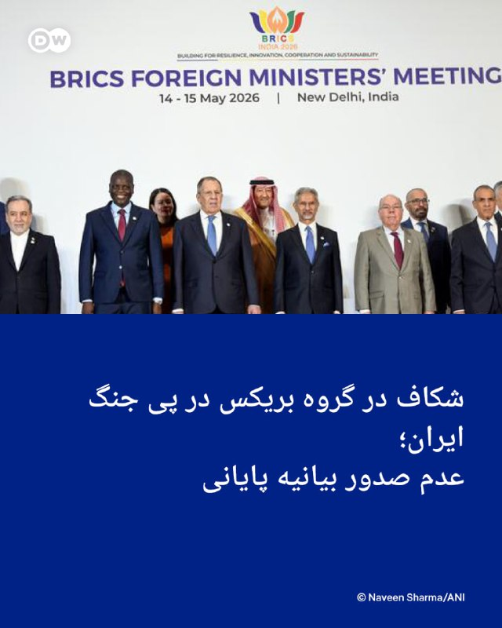

🔶 شکاف در گروه بریکس در پی جنگ ایران؛ عدم صدور بیانیه پایانی

جنگ آمریکا و اسرائیل علیه جمهوری اسلامی ایران، کشورهای غیرغربی را نیز دچار اختلاف کرده است.

نشست وزرای خارجه کشورهای عضو گروه بریکس در دهلی نو به خاطر اختلافات جدی میان ایران و امارات متحده عربی بدون صدور بیانیه مشترک، به پایان رسید.

در این راستا تنها هند، به عنوان کشور میزبان بیانیه‌ای منتشر و در آن به وجود "دیدگاه‌های متفاوت" درباره وضعیت خاورمیانه اشاره کرد.
ایران در این نشست خواستار محکومیت جنگ آمریکا و اسرائیل علیه کشور خود شد و همچنین امارات متحده عربی را به مشارکت مستقیم در عملیات نظامی متهم کرد.

عباس عراقچی، وزیر امور خارجه جمهوری اسلامی در یک نشست خبری مدعی شد، "یکی از اعضای بریکس که نامش فاش نشده، بخش‌هایی از بیانیه را مسدود کرده است".

عراقچی همچنین گفت: «ایران با این کشور خاص مشکلی ندارد بلکه صرفا پایگاه‌های نظامی ایالات متحده را هدف قرار می‌دهد که متاسفانه در خاک آن کشور واقع شده‌اند.»
@dw_farsi

## Persian_Trend_Official — post 14222

  

〰️در تازه‌ترین تحولات امنیتی در منطقه، فرماندهی مرکزی ایالات متحده (سنتکام) با انتشار تصاویری از برخاستن یک فروند بالگرد MH-60R Sea Hawk از عرشه ناوشکن آمریکایی USS Rafael Peralta (DDG-115) در دریای عرب، از ادامه عملیات گسترده دریایی آمریکا خبر داد. این عملیات که با هدف اعمال محدودیت‌ها و نظارت شدید بر خطوط کشتیرانی مرتبط با ایران انجام می‌شود،
بر اساس ادعای سنتکام، تاکنون ۷۵ کشتی تجاری مسیر حرکت خود را تغییر داده‌اند و ۴ شناور نیز برای اطمینان از اجرای قوانین و مقررات اعلام‌شده، متوقف یا غیرفعال شده‌اند. واشنگتن این اقدامات را بخشی از راهبرد «کنترل امنیت دریایی» عنوان می‌کند؛ اما ناظران معتقدند که چنین تحرکاتی می‌تواند فشار اقتصادی و روانی بر تجارت دریایی منطقه را افزایش دهد.

👑:☆Phantom☆

📮 persian_trend_official
پرشین ترند | متفاوت‌ترین کانال نظامی

## Persian_Trend_Official — post 14221

  <a href="telegram/content/Persian_Trend_Official_14221_1778878028.webm" target="_blank">🎬 Download video</a>

👑:☆Phantom☆

📮 persian_trend_official
پرشین ترند | متفاوت‌ترین کانال نظامی

## Persian_Trend_Official — post 14220

  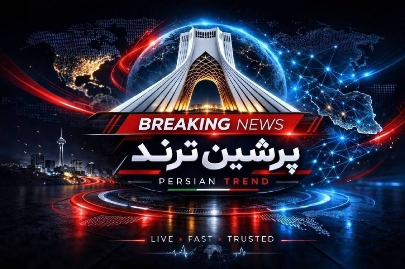

🔴نتانیاهو 💢نیروهای دفاعی اسرائیل (IDF) عزالدین الحدّاد، فرمانده نظامی حماس در غزه را هدف قرار داده‌اند. 🫆:Tony 📌 @persian_trend_official پرشین ترند | متفاوت‌ترین کانال نظامی

## Persian_Trend_Official — post 14219

  

🔹دستور مستقیم نخست وزیر عراق به کلیه گمرکات عراق به‌منظور عبور ترانزیت کالاهای مورد نیاز ایران از کشور عراق به ایران

🫆:Tony

📌 @persian_trend_official
پرشین ترند | متفاوت‌ترین کانال نظامی

## Persian_Trend_Official — post 14218

  <a href="telegram/content/Persian_Trend_Official_14218_1778878030.webm" target="_blank">🎬 Download video</a>

هم‌اکنون گزارش ها از بمباران شدید و غیر عادی در جنوب لبنان

👑:☆Phantom☆

📮 persian_trend_official
پرشین ترند | متفاوت‌ترین کانال نظامی

## Persian_Trend_Official — post 14216

  <a href="telegram/content/Persian_Trend_Official_14216_1778878031.webm" target="_blank">🎬 Download video</a>

🔴 سی‌ان‌ان: هکرهای جمهوری اسلامی سامانه پمپ‌بنزین‌های آمریکا را هدف قرار دادند

🔹شبکه سی‌ان‌ان مدعی شد هکرهای وابسته به جمهوری اسلامی موفق شده‌اند سامانه‌های خوانش مخازن سوخت در چند ایالت آمریکا را هک کنند.

💢بر اساس این گزارش:

▪️ حملات چندین جایگاه سوخت در ایالت‌های مختلف آمریکا را هدف قرار داده است

▪️ سامانه‌های مرتبط با مدیریت و پایش مخازن سوخت دچار اختلال شده‌اند

▪️ جزئیاتی درباره میزان خسارت یا اختلال گسترده منتشر نشده است

🫆:Tony

📌 @persian_trend_official
پرشین ترند | متفاوت‌ترین کانال نظامی

## Persian_Trend_Official — post 14215

  <a href="telegram/content/Persian_Trend_Official_14215_1778878032.mp4" target="_blank">🎬 Download video</a>

🇮🇷
🇺🇸
🇨🇳سفیر ایالات متحده مایک والتز ادعا می‌کند که «نتیجه بزرگ» سفر ترامپ به چین، موافقت چین با عقب‌نشینی از ایران بوده است

👑:☆Phantom☆

📮 persian_trend_official
پرشین ترند | متفاوت‌ترین کانال نظامی

## Persian_Trend_Official — post 14213

  <a href="telegram/content/Persian_Trend_Official_14213_1778878034.webm" target="_blank">🎬 Download video</a>

سرلشکر رضایی: قواعد نظم جدید جهان آمریکامحور نیست

🔺رئیس‌جمهور آمریکا نه از موضع قدرت، بلکه در سایه سنگین ناکامی در جنگ با ایران وارد پکن شد و آنجا را ترک کرد؛ وقتی او برای مهار بحران خودساخته به نفوذ چین چشم می‌دوزد، یعنی نظم جدید به سرعت در حال تنظیم قواعدی است که دیگر آمریکامحور نیست!

🫆:Tony

📌 @persian_trend_official
پرشین ترند | متفاوت‌ترین کانال نظامی

## Persian_Trend_Official — post 14212

https://youtube.com/live/MneL4ZkKs1A?feature=share

## Persian_Trend_Official — post 14211

  <a href="telegram/content/Persian_Trend_Official_14211_1778878035.webm" target="_blank">🎬 Download video</a>

🔹فرزند عبدالرحیم موسوی

💢جنازه پدرم که روز ا‌ول جنگ در دفتر خامنه ای کشته شد ،نزدیک به 30 روز زیر آوار حملات مانده بود

🫆:Tony

📌 @persian_trend_official
پرشین ترند | متفاوت‌ترین کانال نظامی

## Persian_Trend_Official — post 14210

  <a href="https://t.me/persian_trend_official/14210" target="_blank">📎 Download file</a>

فایل صوتی لایو اول
نسخه کم حجم - 7.07 مگابایت

اتاق جنگ جمعه 25 اردیبهشت | تلاش امارات برای دور بعدی جنگ با ایران

📝 Nick

📌 @persian_trend_official
پرشین ترند | متفاوت‌ترین کانال نظامی

## Persian_Trend_Official — post 14209

https://youtube.com/live/MneL4ZkKs1A?feature=share

## Persian_Trend_Official — post 14208

تا دقایقی دیگه لایو شروع میشه

## Persian_Trend_Official — post 14207

  

📌 @persian_trend_official
پرشین ترند | متفاوت‌ترین کانال نظامی

## Persian_Trend_Official — post 14204

🔴تصاویری از ساختمانی که عزالدین حداد، در آن حذف شده است.

پ ن : چقدر شبیه انفجار گاز های ایران تخریب شده ...

🫆:Tony

📌 @persian_trend_official
پرشین ترند | متفاوت‌ترین کانال نظامی

## Persian_Trend_Official — post 14203

  

🔴نتانیاهو

💢نیروهای دفاعی اسرائیل (IDF) عزالدین الحدّاد، فرمانده نظامی حماس در غزه را هدف قرار داده‌اند.

🫆:Tony

📌 @persian_trend_official
پرشین ترند | متفاوت‌ترین کانال نظامی

## Persian_Trend_Official — post 14202

## Persian_Trend_Official — post 14201

  <a href="telegram/content/Persian_Trend_Official_14201_1778878038.webm" target="_blank">🎬 Download video</a>

منابع آگاه روز جمعه به بلومبرگ گفتند، امارات متحده عربی تلاش کرد کشورهای همسایه خلیج فارس، از جمله عربستان سعودی و قطر، را متقاعد کند تا در جریان جنگ اخیر، واکنش نظامی هماهنگ به حملات موشکی، راکتی و پهپادی ایران داشته باشند، اما پاسخ آنها امارات را ناامید کرد !
چرا؟
امشب در لایو توضیح میدم ...

📌 @persian_trend_official
پرشین ترند | متفاوت‌ترین کانال نظامی

## RadioFarda — post 157238

🔸روزنامه آمریکایی «نیویورک تایمز» روز جمعه ۲۵ اردیبهشت به نقل از دو مقام خاورمیانه‌ای نوشت که ایالات متحده و اسرائیل در حال انجام تدارکات فشرده برای احتمال ازسرگیری حملات علیه ایران، حتی از اوایل هفته آینده، هستند. 🔸به گفتهٔ این دو که نخواستند نامشان فاش…

## RadioFarda — post 157237

  

🔸روزنامه آمریکایی «نیویورک تایمز» روز جمعه ۲۵ اردیبهشت به نقل از دو مقام خاورمیانه‌ای نوشت که ایالات متحده و اسرائیل در حال انجام تدارکات فشرده برای احتمال ازسرگیری حملات علیه ایران، حتی از اوایل هفته آینده، هستند.

🔸به گفتهٔ این دو که نخواستند نامشان فاش شود، این تدارکات گسترده‌ترین مورد از زمان اجرایی شدن آتش‌بس در ۱۹ فروردین است.

🔸دونالد ترامپ، رئیس‌جمهور آمریکا، روز ۲۲ اردیبهشت پیش از عزیمت به چین گفت: «یا توافق می‌کنند یا کاملاً نابود می‌شوند. لذا در هر صورت، ما برنده‌ایم».

🔸به گفته مقام‌های آمریکایی، اگر ترامپ تصمیم به ازسرگیری حملات نظامی بگیرد، گزینه‌ها شامل حملات به اهداف نظامی و زیرساخت‌های ایران خواهد بود.

🔸آن‌ها افزودند گزینهٔ دیگر شامل استقرار نیروهای عملیات ویژه در داخل خاک برای هدف قرار دادن مواد هسته‌ای مدفون در اعماق زمین است.

🔸به گفته این مقام‌ها، چند صد نیروی عملیات ویژه در ماه مارس به خاورمیانه اعزام شده‌اند تا چنین گزینه‌ای را در اختیار ترامپ قرار دهند.

@RadioFarda

## RadioFarda — post 157236

  

🔸اسرائیل اعلام کرد در حملات هوایی روز جمعه به نوار غزه، عزالدین الحداد، فرمانده شاخه نظامی حماس در غزه، را هدف قرار داده است.

🔸به گزارش رویترز، مقام‌های درمانی غزه گفتند در این حملات دست‌کم هفت فلسطینی، از جمله یک کودک و سه زن، کشته و حدود ۵۰ نفر زخمی شدند.

🔸اسرائیل و حماس هنوز درباره سرنوشت الحداد اظهارنظر قطعی نکرده‌اند. او پس از کشته شدن محمد سنوار در سال ۲۰۲۵، فرماندهی شاخه نظامی حماس در غزه را بر عهده گرفته بود.

🔸بنیامین نتانیاهو و اسرائیل کاتز، نخست‌وزیر و وزیر دفاع اسرائیل، در بیانیه‌ای مشترک، الحداد را از طراحان حمله ۱۵ مهر ۱۴۰۲ به اسرائیل معرفی کردند.

🔸به گفته منابع پزشکی در غزه، یکی از حملات ساختمانی مسکونی در منطقه الرمال شهر غزه را هدف قرار داد و حمله‌ای دیگر یک خودرو را در خیابانی نزدیک منهدم کرد.

🔸حملات جدید در حالی انجام شده که مذاکرات اسرائیل و حماس بر سر طرح پساجنگ آمریکا برای غزه همچنان بدون نتیجه مانده است.

@RadioFarda

## RadioFarda — post 157235

  

🔸وزارت خارجه آمریکا اعلام کرد اسرائیل و لبنان با تمدید ۴۵ روزه آتش‌بس میان دو کشور موافقت کرده‌اند.

🔸تامی پیگوت، سخنگوی وزارت خارجه آمریکا، روز جمعه ۲۵ اردیبهشت گفت آتش‌بسی که دونالد ترامپ در ۲۷ فروردین اعلام کرده بود، برای فراهم شدن زمینه «پیشرفت بیشتر» تمدید می‌شود.

🔸وزارت خارجه آمریکا مذاکرات دو طرف در واشینگتن را «بسیار سازنده» توصیف کرده و گفته است گفت‌وگوها روزهای ۱۲ و ۱۳ خرداد از سر گرفته خواهد شد.

🔸این سومین دور مذاکرات اسرائیل و لبنان از زمان تشدید حملات اسرائیل به لبنان است؛ حملاتی که پس از شلیک موشک‌های حزب‌الله به اسرائیل در اسفند سال گذشته شدت گرفت.

🔸با وجود اعلام آتش‌بس، درگیری‌ها و حملات پراکنده در جنوب لبنان ادامه داشته است.

📷شرح عکس: یک خودروی نظامی اسرائیل در نزدیکی مرز اسرائیل و لبنان، در شمال اسرائیل، ۲۴ اردیبهشت ۱۴۰۵

@RadioFarda

## RadioFarda — post 157234

  

🔸رضا سپهوند، عضو کمیسیون انرژی مجلس شورای اسلامی از کمبود روزانه دست‌کم «۲۰ میلیون لیتر بنزین» در ایران خبر داد.

🔸به نوشته خبرگزاری تسنیم، این نماینده گفته که تولید روزانه بنزین در ایران بین « ۱۱۰ تا ۱۱۵ میلیون لیتر» و مصرف روزانه بین «۱۳۰ تا ۱۳۵ میلیون لیتر» است.

🔸سپهوند با بیان اینکه «در کوتاه‌مدت امکان افزایش تولید وجود ندارد»، خواستار جدی‌گرفتن «مدیریت مصرف سوخت» شد.

🔸پیش از این وزیر خزانه‌داری ایالات متحده گفته بود ایران به‌زودی با «کمبود بنزین» مواجه خواهد شد.

🔸اسکات بسنت با انتشار مطلبی کوتاه در شبکۀ ایکس، نوشته بود: «در حالی‌که باقی‌ماندۀ سران سپاه پاسداران، مثل موش‌هایی که در لوله‌های فاضلاب غرق می‌شوند، گیر افتاده‌اند، به لطف محاصرۀ دریایی ایالات متحده، صنایع نفتی آسیب‌دیدۀ ایران، در حال از کار افتادن و توقف تولید است. پمپاژ نفت به زودی متوقف خواهد شد».

🔸او سپس پیامش را به سبک دونالد ترامپ، با جمله‌ای که به‌طور کامل با حروف بزرگ نوشته شده، به پایان برده بود؛ جمله‌ای با این مضمون هشدار آمیز: «مرحلۀ بعد،‌ کمبود بنزین در ایران!»

@RadioFarda

## RadioFarda — post 157233

  <a href="https://t.me/radiofarda/157233" target="_blank">📎 Download file</a>

📻بشنوید: ایستگاه ۱۹ با رادیوفردا، ۲۵ اردیبهشت ۱۴۰۵

@RadioFarda

## RadioFarda — post 157232

  <a href="https://t.me/radiofarda/157232" target="_blank">📎 Download file</a>

چگونه برای مقابله با شدت گرفتن «تنش آبی» آماده شویم؟ گفت‌وگو با نیک‌آهنگ کوثر

🔸در هفته‌های اخیر خصوصا با آغاز بهار، بسیار از شهروندان ایرانی از میزان بارش باران در شهرهای خود، خصوصا در نقاطی مانند پایتخت که ماه‌هایی بسیار خشک را پشت سر گذاشته بود ابراز خشنودی می‌کردند و آن را دلیلی بر امیدواری نسبت به وضعیت ذخایر آب در ماه‌های پیش رو قلمداد می‌کردند. اما آن‌طور که عباس علی‌آبادی وزیر نیرو در ایران می‌گوید وضعیت آبی تهران چندان مناسب نیست و «توزیع نابرابر بارش باعث شده که ۱۰ استان با جمعیت بیش از ۳۵ میلیون نفر همچنان در شرایط زیرنرمال قرار داشته باشند». سال ۱۴۰۴ سالی بسیار نگران‌کننده برای وضعیت دخایر آب ایران بود و تهران به وضعیت «روز صفر آبی» بسیار نزدیک شده بود. حالا این هشدار وزیر نیرو یادآور شرایطی مشابه است که شهروندان باید برای آن آماده باشند. چه باید کرد؟ نیک‌آهنگ کوثر، زمین‌شناس و روزنامه‌نگار حوزه آب که ساکن آمریکاست، پاسخ می‌دهد.

@RadioFarda

## RadioFarda — post 157231

🔸تصاویری از نشت نفت و آلودگی شدید زیست محیطی در اطراف جزیره مارو به دلیل حمله هوایی در جنگ اخیر به تاسیسات نفتی مستقر در جزیره لاوان در شبکه‌های اجتماعی منتشر شده است.

🔸 کاوه مدنی، دانشمند ایرانی و مدیر مؤسسه آب، محیط‌زیست و سلامت دانشگاه سازمان ملل، با انتشار این ویدئو در صفحه ایکس خود نوشته است: «‏وضعیت دردآور جزیره مارو (شیدور) ملقب به «مالدیو ایران»، نشت نفت به خلیج فارس پس از حمله به تأسیسات نفتی جزیره لاوان در فروردین ماه عامل این فاجعه بود.»

🔸جزیره لاوان دارای محیط زیستی ارزشمند و تنوع زیستی قابل‌توجهی در خلیج فارس است. سواحل بکر، آب‌های شفاف و زیستگاه گونه‌های دریایی و پرندگان مهاجر از ویژگی‌های طبیعی این جزیره به شمار می‌رود.

@RadioFarda

## IranianMinds — post 20212

🔴ترامپ به آمریکا رسید.

@IranianMinds

## IranianMinds — post 20211

فرزند عبدالرحیم موسوی، رییس ستاد کل نیروهای مسلح جمهوری اسلامی:

جنازه پدرم ۳۰ روز زیر آوار حملات مونده بود.

@IranianMinds

## IranianMinds — post 20210

اگه دنبال کانفیگی و میخای اینستا و تلگرام و گیم و حتی ترید رو برات مثل آب خوردن بیاره ربات زیر میتونه بهت کمک کنه👇

@Dayaconfigbot
@Dayaconfigbot
@Dayaconfigbot

هر گیگ فقط 225 هزارتومان با تضمین عودت وجه!

## IranianMinds — post 20208

شباهتو

@IranianMinds

## IranianMinds — post 20207

🔴وزارت خارجه آمریکا:

آتش‌بس بین اسرائیل و لبنان به مدت ۴۵ روز تمدید می‌شود تا پیشرفت‌های بیشتری حاصل شود.

@IranianMinds

## IranianMinds — post 20206

  <a href="telegram/content/IranianMinds_20206_1778878043.mp4" target="_blank">🎬 Download video</a>

هم‌میهنان عزیزم،

در روزهایی که شما با شجاعت در برابر رژیم اشغالگر ایران ایستاده‌اید، این نظام منفور و منزوی، همچنان به تجاوز به جان و مال مردم ادامه می‌دهد تا سرنگونی حتمی خود را اندکی به تعویق اندازد. در چنین شرایطی، وظیفه خود می‌دانم که تصویر عدالت در فردای ایران را برای کسانی که با جنایتکاران همکاری کنند، روشن‌تر ترسیم کنم.

در این راستا، از «کمیته‌ تدوین مقررات عدالت انتقالی ایران» خواستم درباره‌ دو موضوع مهم، نظر مشورتی خود را ارائه کند: نخست، موضوع مسئولیت کیفری افرادی که با ساختارهای سرکوبگر جمهوری اسلامی همکاری می‌کنند؛ و دوم، موضوع مصادره‌ اموال معترضان و خانواده‌های آنان.

این کمیته اکنون نخستین نظر مشورتی خود را صادر کرده و پیام آن روشن است: این اقدامات، همکاری‌های ساده یا بی‌اهمیت نیستند؛ بلکه «یاری‌رسانی به جنایت علیه بشریت» محسوب می‌شوند. هیچ مقام، هیچ دستور و هیچ بهانه‌ای نمی‌تواند مسئولیت کیفری فردی را از میان ببرد. بنابراین، هر فردی که آگاهانه و داوطلبانه با ساختارهای سرکوبگر رژیم همکاری کند، چه در داخل و چه در خارج از ایران، باید بداند که در معرض مسئولیت کیفری قرار خواهد گرفت:

خواه این همکاری از نوع گزارش‌دهی یا خبرچینی باشد؛
خواه از نوع مشارکت در ایست‌های بازرسی‌ باشد؛
خواه از نوع به‌کارگیری کودکان و نوجوانان در سرکوب معترضان باشد؛
و خواه از نوع تحصیل، انتقال یا خرید و فروش اموالی باشد که در جریان سرکوب از معترضان و خانواده‌های آنان مصادره شده‌ است.

از این رو، نه‌تنها افرادی که در صدور دستور، اجرای آن، یا تسهیل این مصادره‌ها نقش دارند در معرض مسئولیت قرار خواهند گرفت، بلکه کسانی که آگاهانه و داوطلبانه به خرید و فروش این اموال می‌پردازند نیز باید پاسخگو باشند. این مسئولیت، استفاده از اموال یا دارایی‌های آنان برای جبران خسارت واردشده به مالکان اصلی را نیز شامل می‌‌شود.

بنابراین، به همه‌ کسانی که امروز در صدد همکاری با دستگاه سرکوب رژیم هستند هشدار می‌دهم: پیش از آن‌که دست به اقدامی بزنید که به مردم ایران آسیب جانی، مالی و یا اجتماعی برساند، به آینده‌ خود و خانواده‌تان بیندیشید. به آن روز بیندیشید که ایران آزاد خواهد شد؛ روزی که حقیقت پنهان نخواهد ماند؛ روزی که اسامی آشکار خواهد شد؛ روزی که هیچ متجاوز و جنایتکاری از پاسخ‌گویی در برابر قانون در امان نخواهد ماند.

آن روز، ملت ایران حکومتی خواهد داشت که حقوق ایرانیان را محترم می‌دارد و ایران را به سرزمینی آزاد و آباد بدل می‌کند.

پاینده ایران،
رضا پهلوی
-----------------------------
متن کامل نظر مشورتی «کمیته‌ تدوین مقررات عدالت انتقالی ایران»:

https://iranopasmigirim.com/fa/transitional-justice

@OfficialRezaPahlavi

## IranianMinds — post 20205

  <a href="telegram/content/IranianMinds_20205_1778878045.mp4" target="_blank">🎬 Download video</a>

🔴دقایقی پیش فرمانده حماس کشته شد
‏
نخست‌وزیر و وزیر دفاع اسرائیل در بیانیه‌ای اعلام کردند ارتش این کشور عزالدین حداد، فرمانده شاخه نظامی حماس، را در یک حمله هوایی هدف قرار داده است

@IranianMinds

## IranianMinds — post 20204

🔴 امام جمعه کرج:

بر اساس توصیه قرآن باید تا پایان «فتنه»، جنگ رو ادامه بدیم؛ مجازات اسرائیل، محو کردن کامل اونه.

@IranianMinds

## BBCPersian — post 281154

  

🔻دونالد ترامپ، رئیس‌جمهوری آمریکا، روز جمعه سفر سه روزه خود به چین را در حالی به پایان رساند که هر دو ابر قدرت پیشرفت در رابطه‌شان را ستودند اما تحول بزرگی در زمینه مسائل عمده و مورد اختلاف، از جمله ایران و تایوان، اعلام نشد. همزمان پکن اعلام کرده است که شی جین‌پینگ، رئیس‌جمهور چین، دعوت دونالد ترامپ برای سفر به آمریکا در سال جاری را پذیرفته است.

دونالد ترامپ بعد از پایان سفرش و در راه بازگشت به آمریکا به خبرنگاران همراهش گفت که در مورد مساله باز کردن تنگه هرمز از چین تقاضای کمک نکرده است هرچند اضافه کرد که انتظار دارد پکن خودش در این مورد تهران را تحت فشار بگذارد. آقای ترامپ همچنین گفت که در دیدار با شی جین‌پینگ،‌ رئیس‌جمهور چین، «توافق‌های تجاری فوق‌العاده‌ای» حاصل شده است. اما هیچ یک از دو ابر قدرت جزئیات بیشتر یا بیانیه‌ای رسمی در این مورد منتشر نکرده‌اند.

ادامه خبر را از لینک زیر در وبسایت بی‌بی‌سی فارسی بخوانید.

📷 Anadolu via Getty Images
https://bbc.in/4dnZ3fx
@BBCPersian

## BBCPersian — post 281153

  <a href="telegram/content/BBCPersian_281153_1778878047.mp4" target="_blank">🎬 Download video</a>

🔻آخرین خبرهای مهم جمعه ۲۵ اردیبهشت ۱۴۰۵
@BBCPersian

## BBCPersian — post 281152

🔻وزارت خارجه آمریکا می‌گوید آتش‌بس میان لبنان و اسرائیل به مدت ۴۵ روز تمدید شده است

تامی پیگوت، سخنگوی وزارت خارجه آمریکا، می‌گوید تمدید آتش‌بس میان اسرائیل و لبنان پس از دو روز مذاکرات «بسیار سازنده» با میانجیگری ایالات متحده مورد توافق قرار گرفته است.

آقای پیگوت گفت که مذاکرات «راهبرد سیاسی» در تاریخ ۲ و ۳ ژوئن از سر گرفته خواهد شد، در حالی که «راهبرد امنیتی» در ۲۹ مه با حضور هیئت‌های نظامی اسرائیل و لبنان در پنتاگون آغاز خواهد شد.

او در پستی در شبکه اجتماعی ایکس نوشت: «ما امیدواریم که این مذاکرات به پیشبرد صلح پایدار بین دو کشور، به رسمیت شناختن کامل حاکمیت و تمامیت ارضی یکدیگر و ایجاد امنیت واقعی در امتداد مرز مشترک آنها منجر شود.»

https://bbc.in/3RHhJzE
@BBCPersian

## BBCPersian — post 281151

🔻ارتش اسرائیل برای بخش‌هایی از شهر صور لبنان دستور تخلیه صادر کرد

آویخای ادرعی، سخنگوی ارتش اسرائیل، از ساکنان بخش‌هایی از شهر صور در جنوب لبنان خواست تا خانه‌های خود را تخلیه کنند و تهدید به حمله به این شهر کرد.

او در پستی در شبکه اجتماعی ایکس با انتشار نقشه‌ای به ساکنان دستور داد منطقه نزدیک چندین ساختمان را تخلیه کنند و مدعی شد که این ساختمان‌ها توسط حزب‌الله مورد استفاده قرار می‌گیرند.
https://bbc.in/4uenEdV
@BBCPersian

## BBCPersian — post 281150

🔻پاکستان از آزاد شدن ۳۱ خدمه ایرانی و پاکستانی یک کشتی که به وسیله آمریکا توقیف شده بود، خبر داد

اسحاق دار، وزیر خارجه پاکستان روز جمعه از آزادی ۲۰ تبعه ایرانی و ۱۱ نفر از اتباع خود خبر داد. این افراد در کشتی‌هایی بودند که توسط آمریکا در آب‌های آزاد توقیف شده بودند.

مشخص نشده است که این افراد سرنشینان کدام کشتی‌ بودند.

وزیر خارجه پاکستان در شبکه ایکس نوشت که آنها جمعه شب از طریق سنگاپور به بانکوک رفتند و قرار است با هواپیما به اسلام‌آباد، پایتخت پاکستان منتقل شوند. او گفت که قرار است اتباع ایرانی از پاکستان به ایران منتقل شوند.

وزیر خارجه پاکستان گفت که همه افراد در «سلامت هستند و روحیه خوبی دارند.»

پاکستان نقش میانجی مذاکرات میان آمریکا و ایران را داشته است.

وزیر خارجه پاکستان از وزیر خارجه و نخست‌وزیر سنگاپور برای مشارکت در روند انتقال این افراد که به درخواست پاکستان انجام شده است و همچنین از عباس عراقچی،‌ وزیر خارجه ایران به خاطر «اعتماد به پاکستان» تشکر کرده است.

او همچنین از مارکو روبیو، وزیر خارجه آمریکا «برای هماهنگی نزدیک در تسهیل» روند بازگرداندن این ۳۱ تبعه ایرانی و پاکستانی تقدیر کرد.

https://bbc.in/4uenEdV
@BBCPersian

## BBCPersian — post 281149

  

🔻مقام‌های قضائی جمهوری اسلامی ایران می‌گویند حدود ۲۵۰ هزار شکایت حقوقی و کیفری در ارتباط با آنچه «جنایات جنگی آمریکا و اسرائیل» توصیف کرده‌اند، در دستگاه قضایی این کشور ثبت شده و در مرحله رسیدگی قرار دارد.

عبدالصمد میرحسینی، معاون قضایی دادستان کل کشور، در گفت‌وگو با میزان، خبرگزاری قوه قضاییه ایران، گفته است این پرونده‌ها در «شعب ویژه دادسراها و دادگاه‌ها» در حال بررسی است و نهادهای مختلف حکومتی در جمع‌آوری اسناد و تکمیل ادله با دستگاه قضایی همکاری می‌کنند.

به گفته آقای میرحسینی، مقام‌های قضایی امیدوارند این روند در آینده نزدیک به صدور حکم منجر شود و جمهوری اسلامی تلاش می‌کند مستندات این پرونده‌ها «منطبق با ضوابط بین‌المللی» تنظیم کند تا احکام صادرشده قابلیت اجرا در خارج از ایران را نیز داشته باشد.

ادامه خبر را از لینک زیر در وبسایت بی‌بی‌سی فارسی بخوانید.

📷 AFP via Getty Images
https://bbc.in/49wGvIY
@BBCPersian

## BBCPersian — post 281148

  <a href="https://t.me/bbcpersian/281148" target="_blank">📎 Download file</a>

پادکست جام جهان‌نما جمعه جمعه ۲۵ اردیبهشت ۱۴۰۵

در این برنامه می‌شنوید:
پایان سفر ترامپ به چین،
پکن برای توافق صلح ایران و آمریکا قول کمک داد
سایه جنگ خاورمیانه بر نشست بریکس ...
بدنبال اختلاف ایران و امارات، نشست امسال بدون بیانیه مشترک پایان یافت
توافق‌های دفاعی و اقتصادی در سفر نخست‌وزیر هند به ابوظبی
مودی حملات ایران به امارات را به‌شدت محکوم کرد
و در روز فردوسی و زبان فارسی، نگاهی میکنیم به رابطه جمهوری اسلامی با نمادهای ملی، احترام واقعی یا نیاز سیاسی؟
این برنامه رادیویی را می‌توانید هر شب ساعت ۲۰ به وقت ایران، روی موج متوسط ۷۰۲ کیلوهرتز و موج کوتاه ۹۴۶۵ کیلوهرتز بشنوید.
تکرار برنامه را هم می‌توانید ساعت ۲۱:۳۰ روی موج متوسط ۷۰۲ کیلوهرتز و موج کوتاه ۵۳۹۵ کیلوهرتز گوش کنید.
@BBCPersian

## BBCPersian — post 281147

  <a href="telegram/content/BBCPersian_281147_1778878051.mp4" target="_blank">🎬 Download video</a>

🔻دونالد ترامپ، رئیس‌جمهور آمریکا، در گفتگو با خبرنگاران در هواپیمای ویژه ریاست‌جمهوری آمریکا، با اشاره به وضعیت تنگه هرمز گفت، برای بازگشایی این گذرگاه آبی، از چین نخواسته است که بر ایران فشار وارد کند، زیرا «به لطف کسی نیاز ندارد.» او گفت ایران بر اثر محاصره دریایی در دو هفته و نیم گذشته «روزی ۵۰۰ میلیون دلار» ضرر می‌‌‌کند.

آقای ترامپ گفت که به باورش شی جین‌پینگ، رئیس‌جمهور چین «طبیعتا مایل است تنگه باز شود» چرا که چین بخش قابل توجهی از انرژی خود را از این مسیر تامین می‌کند.

رئیس‌جمهور آمریکا درباره برنامه هسته‌ای ایران تاکید کرد که تهران «به‌هیچ‌ وجه نباید به سلاح هسته‌ای دست یابد» موضعی که به گفته او رئیس‌جمهور چین هم با آن موافق است.

دونالد ترامپ گفت با ازسرگیری احتمالی فعالیت‌های هسته‌ای ایران «پس از ۲۰ سال موافق است»، مشروط بر آنکه این دوره با تضمین‌های «معتبر» همراه باشد و «به هیچ شکلی هسته‌ای نداشته باشند.».»

https://bbc.in/43aBphT
@BBCPersian

## BBCPersian — post 281146

🔻پس از آنکه اندی بِرنهام، شهردار منچستر، اعلام کرد میخواهد در انتخابات میان‌دوره‌ای شرکت کند و به پارلمان بازگردد، گمانه‌زنی درباره سرنوشت کی‌یر استارمر، رهبر حزب کارگر و نخست وزیر بریتانیا، افزایش یافته. آقای برنهام برای ورود به رقابت بر سر رهبری حزب، ابتدا باید دوباره به‌عنوان نماینده وارد پارلمان شود. او برای نامزدی از حوزه انتخابیه اش در منچستر نیاز به تأیید کمیته اجرایی حزب کارگر دارد. بحث کناره گیری و جایگزینی آقای استارمر بعد از انتخابات محلی اخیر قوت گرفت، انتخاباتی که حزب کارگر در آن بسیاری از کرسی هایش را از دست داد. گزارش هری هارلی را ببینیم.
@BBCPersian

## BBCPersian — post 281145

با وصل شدن اندک اندک بعضی شهروندان ایران به اینترنت که بیش از دو ماه و نیم از قطع آن می‌گذرد، تصاویر جدیدی از  جنگ و آسیب‌های آن منتشر می‌شود.
 
یکی از شهروندان به تازگی تصاویری از جزیره شیدور (مارو) در نزدیکی جزیره لاوان در اینستاگرامش منتشر کرده که نشان می‌دهد در پی حمله هوایی ۱۹ فروردین ۱۴۰۵ به پالایشگاه لاوان در خلیج فارس، آلودگی نفتی این منطقه و جانوران بومی آن را آلوده کرده است.

مدیرکل حفاظت محیط زیست استان هرمزگان با تائید آلودگی نفتی در لاوان و مارو، ۱۰ اردیبهشت اعلام کرد این آلودگی نفتی «تبعات ماندگاری بر ساحل صخره‌ای و مرجان‌های این جزیره خواهد گذاشت.»
@BBCPersian

## BBCPersian — post 281144

🔻امارات ایران را به «تلاش برای توجیه» حملاتش به آن کشور متهم کرد

امارات متحده عربی یک روز پس از اینکه عباس عراقچی این کشور را به داشتن «نقش فعال» در حملات به ایران متهم کرد، این اظهارات را «تلاش‌ برای توجیه حملات تروریستی ایران» خواند و آن را رد کرد.

خلیفه بن شاهین المرار، از مقامات وزارت خارجه امارات متحده عربی که به نمایندگی این کشور در نشست وزرای خارجه بریکس در دهلی‌نو شرکت داشت، گفت «امارات متحده عربی به دنبال حمایت سایر کشورها نیست و کاملا قادر به جلوگیری از این تجاوز بی‌دلیل است.»

بر اساس بیانیه وزارت خارجه امارات،‌ آقای المرار به حملات ایران به امارات متحده در طول جنگ اخیر اشاره کرد و گفت: «از ۲۸ فوریه (۹ اسفند) امارات متحده عربی در معرض حملات تروریستی مکرر و غیرقابل توجیه ایران قرار گرفته است. پدافند هوایی امارات حدود سه هزار حمله شامل موشک‌های بالستیک، موشک‌های کروز و پهپادها را که عمدا و مستقیما تاسیسات غیرنظامی و زیرساخت‌های حیاتی از جمله فرودگاه‌ها، بنادر، تاسیسات نفتی، کارخانه‌های آب شیرین‌کن،‌ شبکه‌های انرژی، تاسیسات خدماتی و مناطق مسکونی را هدف قرار دادند،‌ رهگیری کرده است.»

این مقام اماراتی تاکید کرد که کشورش حق کامل و مشروع خود را برای دفاع از حاکمیت و تمامیت ارضی خود و تضمین امنیت شهروندان و ساکنان و بازدیدکنندگان از این کشور مطابق با ماده ۵۱ منشور سازمان ملل محفوظ می‌داند.

عباس عراقچی دیروز در حاشیه نشست بریکس، در تلگرامش امارات متحده عربی را «شریک فعال» آمریکا و اسرائیل در حمله به ایران توصیف کرده و گفته بود که این کشور مستقیما در جنگ آمریکا و اسرائیل با ایران «دخیل» بوده است.

https://bbc.in/3RIul9G
@BBCPersian

## Dirty_Kids — post 389525

  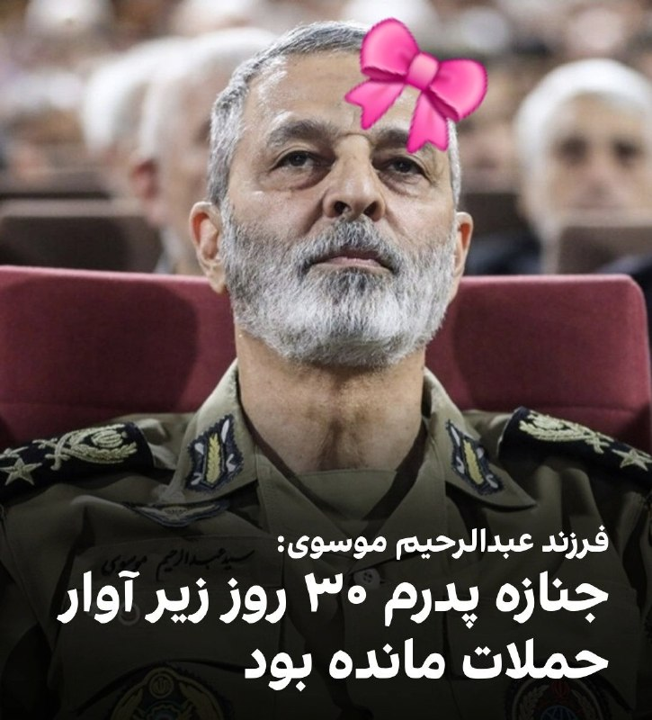

تراپی

@Dirty_Kids 👻

## Dirty_Kids — post 389524

  <a href="telegram/content/Dirty_Kids_389524_1778878055.mp4" target="_blank">🎬 Download video</a>

خوب شد به حرف این 👆 گوش ندادن، اگه گوش میدادن الان موشعلی و فرمانده‌هاشو زنده بودن

ولی بجاش رفتن به حرف رافئی‌پور و خوش‌چشم گوش دادن همشون کتلت شدن:)))

@Dirty_Kids 👻

## Dirty_Kids — post 389523

ظلمی که با چشم‌های خودمون تو این ۴۷ سال دیدیم رو می‌خواین انکار کنین، اون‌وقت انتظار دارین جنایتی که ادعا می‌کنین پهلوی ۶۰ سال پیش بهتون کرده رو بی‌چون‌وچرا باور کنیم؟!
این چه «جنایتی» بوده که همه شما زندانیان قبل از انقلاب زنده و هی و حاضرید و الان به جون بچه های مردم افتادید؟

@Dirty_Kids 👻

## Dirty_Kids — post 389522

نوشته خرید حلقه ی نقره برای ازدواج رو نرمالایز کنید

کشوری که نمیتونی یه حلقه طلا توش بخری، چرا باید توش ازدواج کنی؟!

@Dirty_Kids 👻

## Dirty_Kids — post 389521

‏بنظرم اصن معلوم نمیکنه ترامپ از چین برگرده چی میشه الکی حدس نزنیم.
بعید نیست یهو تایوان رو بده به ایران تنگه رو بده به لبنان روبیو رو بده به سمنان.
هیچ بعید نیست

@Dirty_Kids 👻

## Dirty_Kids — post 389520

  

🔴 ایلان ماسک : اینستاگرام واسه دختراست؛

بعضی وقت‌ها یسری مرد بالغ آیدی اینستاگرام‌شون رو واسه من می‌فرستن و من می‌پرسم: آیا داری تغییر جنسیت میدی؟

@Dirty_Kids 👻

## Dirty_Kids — post 389519

  

در تصویر: ترور تروریست ارشد حماس.

احمد وحیدی، داری نگاه می‌کنی؟

@Dirty_Kids 👻

## Dirty_Kids — post 389518

  <a href="telegram/content/Dirty_Kids_389518_1778878060.mp4" target="_blank">🎬 Download video</a>

👑 شاهزاده رضا پهلوی:
جمهوری اسلامی الان برای اینکه سقوطش عقب بیفته، داره فشار و سرکوب مردم رو بیشتر میکنه؛

واسه همین یه تیم حقوقی گذاشتم بررسی کنن اونایی که با سیستم سرکوب همکاری میکنن، بعدا چه بلایی سرشون میاد. نتیجه‌ش این شده که این کارا فقط یه همکاری ساده نیست و میتونه به‌عنوان کمک به جنایت علیه بشریت حساب بشه.
یعنی هر کسی که آگاهانه بره سمت خبرچینی، کمک تو ایست بازرسی، سرکوب مردم یا حتی خرید و فروش اموال مصادره‌شده، باید بدونه بعدا ممکنه محاکمه بشه و جواب پس بده. حتی ممکنه از اموالشون برای جبران خسارت مردم استفاده بشه. به همه اونایی هم که الان دارن با سیستم همکاری میکنن هشدار میدم قبل از هر کاری یه فکر به آینده خودشون و خانوادشون بکنن؛ چون این وضعیت همیشگی نیست و یه روزی میرسه که همه‌چیز روشن میشه و هیچ‌کس نمیتونه از جواب پس دادن فرار کنه.

هدف اینه که ایران تبدیل به یه کشور آزاد بشه که توش حق مردم رعایت بشه و اوضاع کشور درست بشه.

@Dirty_Kids 👻

## Dirty_Kids — post 389517

  

کچل عینکی ریشو دیدین فرار کنید

@Dirty_Kids 👻

## Dirty_Kids — post 389516

  

🔴 کتاب اللمعة البيضاء نوشته آیت الله تبریزی، صفحه ۲۳۵: سینه های حضرت فاطمه انقدر بزرگ و دراز بوده که میتونسته اونو از شونه هاش بندازه پشت سرش و به بچه هاش شیر بده!

همچنین سینه های حضرت فاطمه همیشه بوی خوب میداده و پیامبر سرشو بین سینه های حضرت فاطمه میذاشته تا اونو بو کنه.

@Dirty_Kids 👻

## Dirty_Kids — post 389515

  

یعنی این فیلم The Odyssey که قراره بسازن مزخرف ترین فیلمی خواهد بود که تاحالا ساخته شده! نقش آشیل رو قراره یه زن تغییر جنسیت داده بازی کنه و نقش هلن رو قراره یه سیاه پوست لاغر.🥴 حتی به دول آشیل و رنگ پوست هلن هم رحم نگردن این چپهای کسخل @Dirty_Kids 👻

## Dirty_Kids — post 389514

بنیاد بین‌المللی رسانه‌های زنان (IWMF)، جایزه «شجاعت در خبرنگاری» رو داده به یک خبرنگار که اینترنت سفید داره.
قشنگ داریم یه جوک رو زندگی می‌کنیم

خواهران محمدی، خبرنگاران حوزه محور مقاومت، غزه و حومه.

@Dirty_Kids 👻

## Dirty_Kids — post 389513

  <a href="telegram/content/Dirty_Kids_389513_1778878064.mp4" target="_blank">🎬 Download video</a>

سهمیه بندی حوری برای شهدا ! 🤣🤣🤣

ارزش دانلود ۱۰/۱۰

@Dirty_Kids 👻

## Dirty_Kids — post 389512

  <a href="telegram/content/Dirty_Kids_389512_1778878065.webm" target="_blank">🎬 Download video</a>

سنتکام رسماً تأیید کرد که حمله به مدرسه میناب توسط آمریکا صورت گرفته.

❌ این خبر که تو فضای مجازی داره دست به دست میشه، فیکه؛ سنتکام تأیید نکرده و ترامپ هم امروز گفت که هنوز داریم بررسی می‌کنیم.

@Dirty_Kids 👻

## Dirty_Kids — post 389511

✖️ سایت بین المللی bet120x 
✖️  
👍دارای مجوز رسمی Gambling Judge سوئد
👍       
💳شارژ حساب از طریق ارز و یووچر و پرمیوم ووچر 
💳تسویه حساب دلاری سریع 💊بیمه شرط میکس 
⚠️فروش شرط 
🔔ویرایش شرط                    
3️⃣
2️⃣ 
🎁20%هدیه واریز از طریق ارز و ووچر ┅━━━━━━━━━━━…

## Dirty_Kids — post 389510

  

✖️ سایت بین المللی bet120x 
✖️

 
👍دارای مجوز رسمی Gambling Judge سوئد
👍
     

💳شارژ حساب از طریق ارز و یووچر و پرمیوم ووچر

💳تسویه حساب دلاری سریع
💊بیمه شرط میکس

⚠️فروش شرط

🔔ویرایش شرط                    
3️⃣
2️⃣

🎁20%هدیه واریز از طریق ارز و ووچر
┅━━━━━━━━━━━

🎁 10%برگشت باخت به صورت روزانه

🎁 10%برگشت باخت به صورت هفتگی

🎁10%برگشت باخت به صورت ماهانه

💻ادرس ورود به سایت:
https://bet120x.com/fa/?btag=971470
➖➖➖➖➖
   
👈 آموزش واریز و برداشت دلاری
👉

🔪کانال اطلاع رسانی:
👇

✈️https://t.me/+1Wv5nGY_a54xNzlk

## Dirty_Kids — post 389505

این شما و این منتخب ژانر از کِی فهمیدین کسخلید توی توییتر :))

@Dirty_Kids 👻

## Hranews — post 112959

یک شهروند توسط نیروهای امنیتی در بوکان بازداشت شد

❗️
❗️
❗️
❗️
❗️ – سید علی قریشی، شهروند اهل بوکان روز دوشنبه ۲۱ اردیبهشت ماه، توسط نیروهای امنیتی در این شهرستان #بازداشت و به مکان نامعلومی منتقل شده است.

ادامه مطلب

#سید_علی_قریشی

↘️
@hranews_bot تماس ✉️ -  @Hranews  کانال هرانا 🆑

## Hranews — post 112958

کازرون؛ مرگ یک کارگر در سایه فقدان ایمنی کار

❗️
❗️
❗️
❗️
❗️ – در سایه فقدان ایمنی محیط و شرایط نامناسب کار، روز پنجشنبه ۲۴ اردیبهشت، یک #کارگر در کازرون، حین انجام کار بر اثر سقوط به داخل یک چاه کشاورزی جان خود را از دست داد.

ادامه مطلب

↘️
@hranews_bot تماس ✉️ -  @Hranews  کانال هرانا 🆑

## Hranews — post 112957

اجرای حکم اعدام ۲ زندانی/ رهایی ۲ زندانی از چوبه دار

❗️
❗️
❗️
❗️
❗️ – سحرگاه روز چهارشنبه ۲۳ اردیبهشت ماه، حکم دو زندانی که پیشتر از بابت اتهامات مرتبط با جرائم مواد مخدر و قتل به #اعدام محکوم شده بودند، در ندامتگاه مرکزی کرج و زندان قم اجرا شد. همچنین، دو زندانی محکوم به اعدام در سنندج و استان اصفهان، با گذشت اولیای دم از مجازات مرگ رهایی یافتند.

ادامه مطلب

↘️
@hranews_bot تماس ✉️ -  @Hranews  کانال هرانا 🆑

## Hranews — post 112956

گزارشی از مطالبات مزدی رانندگان سرویس مدارس مشهد

❗️
❗️
❗️
❗️
❗️ – شماری از #رانندگان سرویس مدارس مشهد، نسبت به بلاتکلیفی وضعیت شغلی و عدم دریافت حقوق در سه ماه پایانی سال تحصیلی انتقاد کردند.

ادامه مطلب

↘️
@hranews_bot تماس ✉️ -  @Hranews  کانال هرانا 🆑

## Hranews — post 112955

اردبیل؛ یک شهروند توسط ماموران سازمان اطلاعات سپاه بازداشت شد

❗️
❗️
❗️
❗️
❗️ – سازمان اطلاعات سپاه اردبیل از #بازداشت یک شهروند در این استان به اتهام «#جاسوسی از طریق ارسال تصاویر و اطلاعات به موساد» خبر داد. همزمان ویدیویی از اعترافات این شهروند نیز منتشر شده که شرایط ضبط آن مشخص نیست.

#اعترافات_اجباری

ادامه مطلب

↘️
@hranews_bot تماس ✉️ -  @Hranews  کانال هرانا 🆑

## Hranews — post 112954

  

مولوی عبدالحمید اسماعیل‌زهی، امام جمعه اهل سنت زاهدان، با انتقاد از افزایش اعدام‌ها در ایران خواستار توقف «اعدام‌های سیاسی» در کشور شد. او امروز در خطبه‌های نماز جمعه با تأکید بر اینکه اعدام‌ها به مصلحت کشور و مردم نیست، گفت: اعدام نمی‌تواند راه‌حل مشکلات جامعه باشد.

وی همچنین با انتقاد از «اعترافات اجباری» در بازداشتگاه‌ها تأکید کرد که این اعترافات با موازین شرعی، قانون اساسی و قوانین بین‌المللی مغایرت دارد و نباید مبنای صدور حکم قرار گیرد.

همزمان با آغاز درگیری‌های نظامی، روند صدور و اجرای احکام #اعدام در پرونده‌های سیاسی و امنیتی افزایش یافته و تاکنون ۳۲ زندانی با این اتهامات در این بازه زمانی اعدام شده‌اند.

↘️
@hranews_bot تماس ✉️ - @Hranews کانال هرانا 🆑

## officialrezapahlavi — post 1833

  <a href="telegram/content/officialrezapahlavi_1833_1778878068.mp4" target="_blank">🎬 Download video</a>

هم‌میهنان عزیزم،

در روزهایی که شما با شجاعت در برابر رژیم اشغالگر ایران ایستاده‌اید، این نظام منفور و منزوی، همچنان به تجاوز به جان و مال مردم ادامه می‌دهد تا سرنگونی حتمی خود را اندکی به تعویق اندازد. در چنین شرایطی، وظیفه خود می‌دانم که تصویر عدالت در فردای ایران را برای کسانی که با جنایتکاران همکاری کنند، روشن‌تر ترسیم کنم.

در این راستا، از «کمیته‌ تدوین مقررات عدالت انتقالی ایران» خواستم درباره‌ دو موضوع مهم، نظر مشورتی خود را ارائه کند: نخست، موضوع مسئولیت کیفری افرادی که با ساختارهای سرکوبگر جمهوری اسلامی همکاری می‌کنند؛ و دوم، موضوع مصادره‌ اموال معترضان و خانواده‌های آنان.

این کمیته اکنون نخستین نظر مشورتی خود را صادر کرده و پیام آن روشن است: این اقدامات، همکاری‌های ساده یا بی‌اهمیت نیستند؛ بلکه «یاری‌رسانی به جنایت علیه بشریت» محسوب می‌شوند. هیچ مقام، هیچ دستور و هیچ بهانه‌ای نمی‌تواند مسئولیت کیفری فردی را از میان ببرد. بنابراین، هر فردی که آگاهانه و داوطلبانه با ساختارهای سرکوبگر رژیم همکاری کند، چه در داخل و چه در خارج از ایران، باید بداند که در معرض مسئولیت کیفری قرار خواهد گرفت:

خواه این همکاری از نوع گزارش‌دهی یا خبرچینی باشد؛
خواه از نوع مشارکت در ایست‌های بازرسی‌ باشد؛
خواه از نوع به‌کارگیری کودکان و نوجوانان در سرکوب معترضان باشد؛
و خواه از نوع تحصیل، انتقال یا خرید و فروش اموالی باشد که در جریان سرکوب از معترضان و خانواده‌های آنان مصادره شده‌ است.

از این رو، نه‌تنها افرادی که در صدور دستور، اجرای آن، یا تسهیل این مصادره‌ها نقش دارند در معرض مسئولیت قرار خواهند گرفت، بلکه کسانی که آگاهانه و داوطلبانه به خرید و فروش این اموال می‌پردازند نیز باید پاسخگو باشند. این مسئولیت، استفاده از اموال یا دارایی‌های آنان برای جبران خسارت واردشده به مالکان اصلی را نیز شامل می‌‌شود.

بنابراین، به همه‌ کسانی که امروز در صدد همکاری با دستگاه سرکوب رژیم هستند هشدار می‌دهم: پیش از آن‌که دست به اقدامی بزنید که به مردم ایران آسیب جانی، مالی و یا اجتماعی برساند، به آینده‌ خود و خانواده‌تان بیندیشید. به آن روز بیندیشید که ایران آزاد خواهد شد؛ روزی که حقیقت پنهان نخواهد ماند؛ روزی که اسامی آشکار خواهد شد؛ روزی که هیچ متجاوز و جنایتکاری از پاسخ‌گویی در برابر قانون در امان نخواهد ماند.

آن روز، ملت ایران حکومتی خواهد داشت که حقوق ایرانیان را محترم می‌دارد و ایران را به سرزمینی آزاد و آباد بدل می‌کند.

پاینده ایران،
رضا پهلوی
-----------------------------
متن کامل نظر مشورتی «کمیته‌ تدوین مقررات عدالت انتقالی ایران»:

https://iranopasmigirim.com/fa/transitional-justice

@OfficialRezaPahlavi

## manototv — post 105501

  <a href="telegram/content/manototv_105501_1778878069.mp4" target="_blank">🎬 Download video</a>

‌
شیخ خالد بن محمد بن زاید، ولیعهد ابوظبی، اعلام کرد پروژه «خط لوله غرب به شرق» با هدف افزایش صادرات نفت از بندر فجیره و «پاسخ به تقاضای جهانی» با سرعت بیشتری اجرا خواهد شد.

بر اساس اعلام مقام‌های امارات، این پروژه ظرفیت صادرات نفت از مسیر فجیره را دو برابر می‌کند و قرار است تا سال ۲۰۲۷ به بهره‌برداری برسد.

پس از جنگ آمریکا و اسرائیل با جمهوری اسلامی و افزایش تنش‌ها در تنگه هرمز، کشورهای خلیج فارس به دنبال مسیرهای جایگزین برای صادرات نفت و گاز هستند. حدود یک‌پنجم نفت جهان پیش‌تر از تنگه هرمز عبور می‌کرد.

## manototv — post 105500

  <a href="telegram/content/manototv_105500_1778878070.mp4" target="_blank">🎬 Download video</a>

‌
وزارت خارجه آمریکا اعلام کرد آتش‌بس میان اسرائیل و لبنان برای ۴۵ روز دیگر تمدید شده تا فرصت بیشتری برای ادامه مذاکرات فراهم شود.

## manototv — post 105499

  <a href="telegram/content/manototv_105499_1778878071.mp4" target="_blank">🎬 Download video</a>

‌
شاهزاده رضا پهلوی در پیامی ویدیویی خطاب به ملت ایران، درباره همکاری با ساختارهای سرکوبگر جمهوری اسلامی هشدار داد و گفت افرادی که در داخل و خارج کشور آگاهانه در سرکوب معترضان، مصادره اموال شهروندان و همکاری با نهادهای حکومتی نقش داشته باشند، در آینده با «مسئولیت کیفری» روبه‌رو خواهند شد.

او اعلام کرد «کمیته تدوین مقررات عدالت انتقالی ایران» در نخستین نظر مشورتی خود، همکاری با نهادهای سرکوب جمهوری اسلامی را «یاری‌رسانی به جنایت علیه بشریت» دانسته است.

شاهزاده رضا پهلوی تاکید کرد مشارکت در خبرچینی، ایست‌های بازرسی، استفاده از کودکان در سرکوب و خرید و فروش اموال مصادره‌شده معترضان، می‌تواند موجب پیگرد و پاسخگویی قضایی شود.

او همچنین هشدار داد در ایران آزاد، «هیچ جنایتکاری از پاسخ‌گویی در برابر قانون در امان نخواهد بود.»

## manototv — post 105498

  <a href="telegram/content/manototv_105498_1778878074.mp4" target="_blank">🎬 Download video</a>

‌
اسرائیل اعلام کرد در حمله‌ای هوایی، عزالدین الحداد، ارشدترین فرمانده گروه تروریستی حماس در نوار غزه را هدف قرار داده است.

هنوز گزارشی از وضعیت او منتشر نشده و حماس هم واکنشی نشان نداده است.

الحداد در فهرست افراد تحت تعقیب اسرائیل قرار دارد و از سوی اسرائیل به عنوان یکی از «طراحان» حمله تروریستی هفت اکتبر معرفی شده است.

## manototv — post 105497

  <a href="telegram/content/manototv_105497_1778878074.mp4" target="_blank">🎬 Download video</a>

اداره تحقیقات فدرال آمریکا، اف‌بی‌آی، اعلام کرد برای اطلاعاتی که به بازداشت و محکومیت مونیکا ویت، افسر و مأمور سابق ضدجاسوسی ارتش آمریکا متهم به جاسوسی برای جمهوری اسلامی، منجر شود ۲۰۰ هزار دلار جایزه تعیین کرده است.

دفتر اف‌بی‌آی در واشنگتن اعلام کرد مونیکا ویت با وجود صدور کیفرخواست در سال ۲۰۱۹ همچنان متواری است.

او به اتهام جاسوسی و انتقال اطلاعات مرتبط با دفاع ملی آمریکا به ایران تحت پیگرد قرار دارد.

ویت بین سال‌های ۱۹۹۷ تا ۲۰۰۸ در نیروی هوایی آمریکا و دفتر تحقیقات ویژه این نیرو فعالیت می‌کرد و سپس تا سال ۲۰۱۰ به‌عنوان پیمانکار با دولت آمریکا همکاری داشت.

اف‌بی‌آی اعلام کرد او در دوران فعالیت خود به اطلاعات فوق‌محرمانه، از جمله هویت واقعی مأموران مخفی جامعه اطلاعاتی آمریکا، دسترسی داشته است.

بر اساس این بیانیه، ویت در سال ۲۰۱۳ به ایران پناهنده شد و سپس اطلاعات حساسی را در اختیار جمهوری اسلامی قرار داد که برنامه‌های محرمانه آمریکا و امنیت کارکنان آمریکایی را به خطر انداخت.

سی‌ان‌ان پیش‌تر گزارش داده بود مقام‌های آمریکایی معتقدند جمهوری اسلامی او را جذب کرده و ویت پس از فرار به ایران، هویت یک مأمور اطلاعاتی آمریکا و جزئیات یک برنامه فوق‌محرمانه اطلاعاتی را افشا کرده است.

کیفرخواست این پرونده همچنین نام چهار شهروند ایرانی را در ارتباط با اتهام‌هایی از جمله توطئه، تلاش برای هک رایانه‌ای و سرقت هویت ذکر کرده است.

## manototv — post 105496

  <a href="telegram/content/manototv_105496_1778878076.mp4" target="_blank">🎬 Download video</a>

ما صدای فاطمه سپهری هستیم

## manototv — post 105495

  <a href="telegram/content/manototv_105495_1778878078.mp4" target="_blank">🎬 Download video</a>

«صدای فاطمه سپهری و همه زندانیان سیاسی باشیم»

## manototv — post 105494

  <a href="telegram/content/manototv_105494_1778878080.mp4" target="_blank">🎬 Download video</a>

دونالد ترامپ در گفت‌وگو با برت بایر، خبرنگار و مجری فاکس‌نیوز از عملکرد آمریکا در جنگ با جمهوری اسلامی دفاع کرد و گفت واشینگتن با وجود توانایی نابودی کامل زیرساخت‌های ایران، خویشتنداری نشان داده است.

ترامپ در پاسخ به منتقدانی که می‌گویند او وضعیت جنگ را دست‌کم گرفته، گفت: «من هیچ چیزی را دست‌کم نگرفتم. ما ضربه‌ای فوق‌العاده سنگین به آن‌ها زدیم.»

رئیس‌جمهوری آمریکا افزود: «ما پل‌هایشان را باقی گذاشتیم. ظرفیت برقشان را باقی گذاشتیم. می‌توانیم همه آن را ظرف دو روز نابود کنیم. همه‌چیز.»

ترامپ همچنین گفت آمریکا جز بخش مربوط به شیرهای خروج نفت، جزیره خارگ را هدف قرار داده است.

## manototv — post 105493

  <a href="telegram/content/manototv_105493_1778878083.mp4" target="_blank">🎬 Download video</a>

«شما هم به کمپین حمایت از خانم سپهری بپیوندید»

## alonews — post 120286

  <a href="telegram/content/alonews_120286_1778878084.webm" target="_blank">🎬 Download video</a>

👈ادعای نیویورک‌تایمز: دو مقام خاورمیانه‌ای ادعا کردند که آمریکا و اسرائیل در حال آماده‌سازی گسترده برای احتمال ازسرگیری حملات علیه ایران هستند؛ آماده‌سازی‌ای که بزرگ‌ترین سطح از زمان آتش‌بس محسوب می‌شود؛ این حمله ممکن است از هفته آینده آغاز شود

🔴مقام‌های نظامی آمریکا به‌طور غیررسمی می‌گویند پیروزی در حملات جدید بسیار دشوار است، زیرا ایران بخش زیادی از توان موشکی و زیرزمینی خود را بازیابی کرده است

✅ @AloNews خبر جنگ

## alonews — post 120285

  <a href="telegram/content/alonews_120285_1778878085.webm" target="_blank">🎬 Download video</a>

👈نیویورک‌تایمز: ترامپ روز جمعه پس از بازگشت از چین، با تصمیم‌های مهمی درباره ایران مواجه شد؛ در حالی که نزدیک‌ترین مشاورانش طرح‌هایی برای ازسرگیری حملات نظامی در صورت تصمیم او برای شکستن بن‌بست از طریق فشار نظامی تهیه کرده‌اند

🔴مشاوران رئیس جمهور آمریکا می‌گویند ترامپ هنوز درباره گام بعدی درباره ایران تصمیم نگرفته است

✅ @AloNews خبر جنگ

## alonews — post 120284

  <a href="telegram/content/alonews_120284_1778878085.webm" target="_blank">🎬 Download video</a>

👈فارس: نمایندگان مجلس پیشنهاد افزایش ۵۰۰ هزار تا ۱ میلیون‌تومانی رقم کالابرگ را داده‌اند اما دولت گفته که تنها منابع افزایش ۲۵۰ هزارتومانی رقم کالابرگ را در اختیار دارد و سازمان برنامه هم اعلام کرده که پول نداریم!

✅ @AloNews خبر جنگ

## alonews — post 120283

  <a href="telegram/content/alonews_120283_1778878085.webm" target="_blank">🎬 Download video</a>

👈ترامپ رسید آمریکا

✅ @AloNews خبر جنگ

## alonews — post 120282

  <a href="telegram/content/alonews_120282_1778878086.webm" target="_blank">🎬 Download video</a>

👈مقامات آمریکایی مشکوک هستند که هکرهای مرتبط با ایران ممکن است پشت یک سری نفوذهای سایبری باشند که سیستم‌های نظارت بر سوخت در پمپ‌بنزین‌ها در چندین ایالت را هدف قرار داده‌اند، طبق گزارش CNN

🔴هکرها از سیستم‌های اندازه‌گیری خودکار مخازن که به اینترنت متصل بودند بدون حفاظت رمز عبور سوء استفاده کردند و این امکان را برایشان فراهم کرد تا خوانش‌های نمایش داده شده سوخت را دستکاری کنند — هرچند نه سطح واقعی سوخت.

✅ @AloNews خبر جنگ

## alonews — post 120281

  <a href="telegram/content/alonews_120281_1778878086.webm" target="_blank">🎬 Download video</a>

👈ژان-لوک ملانشون، نامزد ریاست‌جمهوری فرانسه، درباره ایران و تنگه هرمز: «وقتی کشوری از خود دفاع می‌کند، از تمام ابزارهای دفاعی خود استفاده می‌کند.

🔴ما هم همین کار را میکردیم.

🔴ما تمام کانال مانش را مین‌گذاری می‌کردیم.»

✅ @AloNews خبر جنگ

## alonews — post 120280

  <a href="telegram/content/alonews_120280_1778878086.webm" target="_blank">🎬 Download video</a>

👈منابع عراقی از حملۀ پهپادی به مقر گروهک‌های تجزیه‌طلب در کردستان عراق خبر می‌دهند.

✅ @AloNews خبر جنگ

## alonews — post 120279

  <a href="telegram/content/alonews_120279_1778878086.webm" target="_blank">🎬 Download video</a>

👈فیلد مارشال ، محسن رضایی: قواعد نظم جدید جهان دیگه آمریکا محور نیست

✅ @AloNews خبر جنگ

## alonews — post 120277

  <a href="telegram/content/alonews_120277_1778878087.mp4" target="_blank">🎬 Download video</a>

👈شهر صور تو "جنوب لبنان" بعد از حمله‌ی سنگین ارتش اسرائیل

✅ @AloNews خبر جنگ

## alonews — post 120276

  <a href="telegram/content/alonews_120276_1778878089.webm" target="_blank">🎬 Download video</a>

👈واشنگتن پست : ایران واضح‌ترین بازنده دیدار ترامپ از پکن است، با مخالفت علنی پکن با اختلال در هرمز، تعهد به عدم ارسال تجهیزات نظامی به تهران و توافق بر اینکه تنگه «باید باز بماند.»

✅ @AloNews خبر جنگ

## alonews — post 120275

  <a href="telegram/content/alonews_120275_1778878089.mp4" target="_blank">🎬 Download video</a>

👈ترامپ درباره تایوان: من به دنبال این نیستم که کسی مستقل شود. و می‌دانید، ما قرار است ۹۵۰۰ مایل سفر کنیم تا جنگی را انجام دهیم. من به دنبال آن نیستم.

🔴می‌خواهم تایوان آرام شود؛ می‌خواهم چین آرام شود.

✅ @AloNews خبر جنگ

## alonews — post 120274

  <a href="telegram/content/alonews_120274_1778878091.mp4" target="_blank">🎬 Download video</a>

👈برت بایر از فاکس: شما در حال انتظار برای تصویب میلیاردها دلار سلاح برای تایوان هستید. آیا این روند پیش می‌رود؟

🔴ترامپ: خوب، هنوز آن را تصویب نکرده‌ام. خواهیم دید چه اتفاقی می‌افتد.

✅ @AloNews خبر جنگ

## alonews — post 120273

  <a href="telegram/content/alonews_120273_1778878093.mp4" target="_blank">🎬 Download video</a>

👈سفیر ایالات متحده مایک والتز ادعا می‌کند که «نتیجه بزرگ» سفر ترامپ به چین، موافقت چین با عقب‌نشینی از ایران بوده است

✅ @AloNews خبر جنگ

## alonews — post 120272

  <a href="telegram/content/alonews_120272_1778878095.webm" target="_blank">🎬 Download video</a>

👈امیر قطر و محمد بن سلمان، ولیعهد عربستان سعودی در یک گفت وگوی تلفنی درباره آخرین تحولات منطقه با یکدیگر گفتگو کردند

✅ @AloNews خبر جنگ

## alonews — post 120271

  <a href="telegram/content/alonews_120271_1778878096.mp4" target="_blank">🎬 Download video</a>

👈۳۰ روز طول کشید تا جنازه عبدالرحیم موسوی، رئیس سابق ستاد کل نیروهای مسلح ایران، رو پیدا کنن

🔴پسرش اینو به صداوسیما گفته

✅ @AloNews خبر جنگ

## alonews — post 120270

  <a href="telegram/content/alonews_120270_1778878098.webm" target="_blank">🎬 Download video</a>

👈توییت جدید و عجیب ترامپ

✅ @AloNews خبر جنگ

## alonews — post 120269

  <a href="telegram/content/alonews_120269_1778878099.webm" target="_blank">🎬 Download video</a>

👈دنا پلاس؛ ۳ میلیارد تومن ناقابل

✅ @AloNews خبر جنگ

## alonews — post 120268

  <a href="telegram/content/alonews_120268_1778878099.webm" target="_blank">🎬 Download video</a>

👈آخرین قیمت نفت ۱۰۹.۴۳ دلار

✅ @AloNews خبر جنگ

## alonews — post 120267

  <a href="telegram/content/alonews_120267_1778878100.webm" target="_blank">🎬 Download video</a>

👈هشدار مرندی: حمله ایالات متحده به زیرساخت‌های ایران به قیمت نابودی نیروهای نیابتی آمریکا در منطقه تمام خواهد شد!

🔴اگر ترامپ به نیروگاه‌ها و پل‌های ایران حمله کند، جمهوری اسلامی برای همیشه نیروهای نیابتی او را در خلیج فارس نابود کرده و زیرساخت‌های حیاتی رژیم صهیونیستی را فوراً در هم خواهد شکست. رکود اقتصادی فاجعه‌بار جهانی تضمین خواهد شد.

✅ @AloNews خبر جنگ

---
📅 بروزرسانی: 1405/02/25 20:04
---

## VahidOOnLine — post 240345

  

یک مقام وزارت خارجه آمریکا به الجزیره گفت فضای دومین روز مذاکرات میان لبنان و اسرائیل بسیار مثبت بوده و روند گفت‌وگوها فراتر از انتظارها پیش رفته است.

این دومین روز از سومین دور مذاکرات میان اسرائیل و لبنان با میانجی‌گری ایالات متحده بود.
‌🏁 🇬🇧 IranintlTV

🤖 @VahidOOnLine

## VahidOOnLine — post 240344

بیمارستان الغدیر تهران شامگاه ۱۸ و ۱۹ دی‌ماه ۱۴۰۴، شاهد گوشه‌ای از جنایتی بود که جمهوری اسلامی علیه معترضان مرتکب شد. ده‌ها پیکر بی‌جان و شمار زیادی از مجروحان به این بیمارستان منتقل شدند و به دلیل کمبود فضای سردخانه، تعدادی از کشته‌شدگان، پتوپیچ در حیاط پشت بیمارستان رها شدند. ایران‌اینترنشنال تاکنون هویت ۹ نفر از آن‌ها را شناسایی کرده که در این ویدیو چهار تن از آنها معرفی شده‌اند.
فرنوش فرجی، خبرنگار ایران‌اینترنشنال گزارش می‌دهد.
‌🏁 🇬🇧 IranintlTV

🤖 @VahidOOnLine

## VahidOOnLine — post 240343

  

♦️ کریس رایت، وزیر انرژی ایالات متحده، اعلام کرد که با افزایش ظرفیت خطوط لوله انتقال انرژی از طریق عربستان سعودی، امارات متحده عربی و دیگر کشورهای خاورمیانه، پیش‌بینی می‌کند اهمیت استراتژیک تنگه هرمز برای حمل‌ونقل جهانی نفت و گاز کاهش یابد.

رایت در گفتگو با شبکه سی‌ان‌بی‌سی اظهار داشت: «مسیرهای جایگزین دیگری برای خروج انرژی از منطقه خلیج فارس ایجاد خواهد شد. من فکر می‌کنم شاهد کاهش اهمیت تنگه هرمز خواهیم بود، اما این به معنای کاهش اهمیت تولید و عرضه انرژی این کشورها نیست.»

او همچنین افزود: «این کشورها متحدان بزرگ ایالات متحده و تامین‌کنندگان کلیدی انرژی در جهان هستند؛ ما خواهان بازگشت شکوفایی، صلح و رشد اقتصادی به این منطقه هستیم.»
‌🇸🇦 Indypersian

🤖 @VahidOOnLine

## VahidOOnLine — post 240342

♦️سرگئی لاوروف، وزیر امور خارجه روسیه، در جریان نشستی در دهلی‌نو از یک خبرنگار هندی خواست به‌دلیل برهم زدن نظم جلسه، سالن را ترک کند.
بر اساس گزارش‌ها، این خبرنگار به‌دلیل تماس‌های مکرر تلفنی، دو بار سخنان لاوروف را قطع کرده بود. در پی این اتفاق، وزیر خارجه روسیه به زبان انگلیسی از او خواست هرچه سریع‌تر محل کنفرانس را ترک کند.
‌🇸🇦 Indypersian

🤖 @VahidOOnLine

## VahidOOnLine — post 240341

  

♦️امیلی گودین، خبرنگار نیویورک‌پست که در سفر به چین دونالد ترامپ را همراهی کرده بود، دقایقی پیش از ترک پکن در شبکه اجتماعی ایکس اعلام کرد که از همه سرنشینان هواپیمای ریاست‌جمهوری خواسته شد قبل از سوار شدن تمام هدایایی که در پکن دریافت کرده‌اند، لوازم الکترونیکی که استفاده کرده‌اند و حتی سنجاق‌های تزئینی مربوط به این سفر را تحویل دهند.

تصویری که در شبکه‌های اجتماعی منتشر شده، نشان می‌دهد که این لوازم همه در کیسه سیاه‌رنگ بزرگی جمع‌آوری شده و احتمالا با هواپیمای دیگری از چین خارج خواهند شد.
‌🇸🇦 Indypersian

🤖 @VahidOOnLine

## VahidOOnLine — post 240340

  

محمد اسحاق دار، وزیر خارجه پاکستان، اعلام کرد که ۱۱ شهروند پاکستانی و ۲۰ شهروند ایرانی که در کشتی‌های توقیف‌شده از سوی آمریکا حضور داشتند، به کشورهایشان بازگردانده شده‌اند.
به گفته او قرار است همه این افراد امشب به اسلام آباد برسند و سپس بازگشت شهروندان ایران تسهیل خواهد شد.
‌🏁 🇬🇧 IranintlTV

🤖 @VahidOOnLine

## VahidOOnLine — post 240339

  <a href="telegram/content/VahidOOnLine_240339_1778862861.mp4" target="_blank">🎬 Download video</a>

یکی از مخاطبان ایران‌اینترنشنال با اشاره به وضعیت اقتصادی می‌گوید مردم ایران برای چه «منفعت ملی» این حجم از فشار اقتصادی و نگرانی را تحمل می‌کنند. این پیام با هوش مصنوعی خوانده شده است.
‌🏁 🇬🇧 IranintlTV

🤖 @VahidOOnLine

## VahidOOnLine — post 240338

  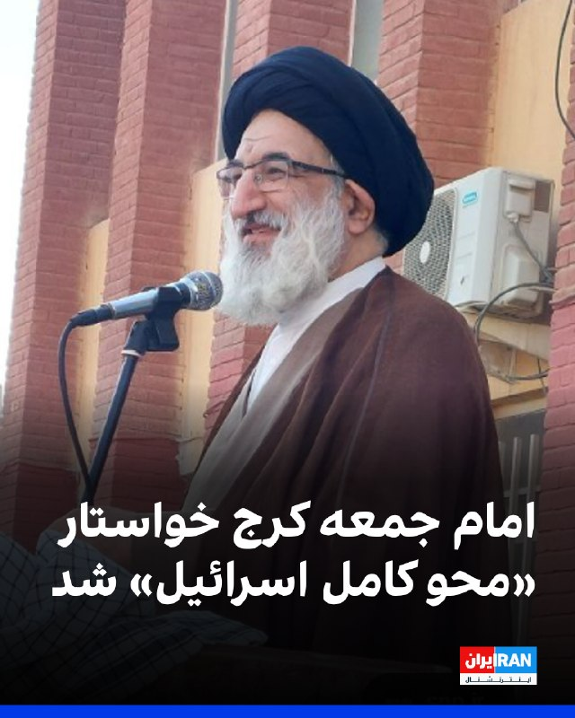

محمدمهدی حسینی‌همدانی، امام جمعه کرج، ۲۵ اردیبهشت در نماز جمعه این شهر گفت: بر اساس توصیه قرآن باید تا پایان «فتنه»، جنگ را ادامه داد و تاکید کرد مجازات اسرائیل، محو کامل آن است.

او همچنین اطاعت از مجتبی خامنه‌ای را عامل پیروزی خواند و گفت باید عوامل نافرمانی را از میان برداشت.
‌🏁 🇬🇧 IranintlTV

🤖 @VahidOOnLine

## VahidOOnLine — post 240337

  <a href="telegram/content/VahidOOnLine_240337_1778862865.mp4" target="_blank">🎬 Download video</a>

‌
اسحاق دار، وزیر خارجه پاکستان، اعلام کرد ۲۰ شهروند ایرانی که در کشتی‌های توقیف‌شده آمریکا در آب‌های بین‌المللی حضور داشتند، از طریق پاکستان به تهران بازگردانده خواهند شد.

دار گفت این افراد همراه با ۱۱ شهروند پاکستانی، از سنگاپور به بانکوک منتقل شدند و سپس با پرواز راهی اسلام‌آباد شدند. به گفته او، شهروندان ایرانی پس از ورود به پاکستان، برای انتقال به تهران همراهی خواهند شد.

وزیر خارجه پاکستان از وزیر خارجه آمریکا برای «هماهنگی نزدیک» در این عملیات، و از وزیر خارجه جمهوری اسلامی بابت «اعتماد به پاکستان» در روند بازگرداندن شهروندان ایرانی قدردانی کرد.
‌🏁 🇬🇧 ManotoTV

🤖 @VahidOOnLine

## VahidOOnLine — post 240336

  

♦️عباس عراقچی، وزیر امور خارجه جمهوری اسلامی، در پایان نشست وزرای خارجه «بریکس» در دهلی‌نو اعلام کرد که صدور بیانیه پایانی این نشست به دلیل مخالفت یکی از اعضا که «روابط خاصی با اسرائیل دارد»، متوقف شده است. اگرچه عراقچی مستقیما نامی از امارات متحده عربی نبرد، اما تاکید کرد که این کشور به دلیل حمایت از اسرائیل و ایالات متحده در درگیری‌های اخیر، مانع تصویب بخش‌هایی از بیانیه شده است.

وزیر خارجه جمهوری اسلامی با «تاسف‌بار» خواندن این اقدام، ادعا کرد که ایران در طول جنگ جاری هیچ اختلافی با امارات نداشته و تنها پایگاه‌های نظامی آمریکا را هدف قرار داده است.

عراقچی در ادامه ابراز امیدواری کرد که مقامات ابوظبی تا نشست سران بریکس به این درک برسند که ایران همسایه‌ای دائمی است و دو کشور باید قرن‌ها در کنار هم زندگی کنند.

همزمان با این اظهارات، بلومبرگ در گزارشی جدید به نقل از منابع آگاه اعلام کرد که امارات در دوران جنگ تلاش کرده است که با جلب حمایت عربستان سعودی و قطر، حملات مشترکی علیه ایران انجام دهد؛ پیشنهادی که با مخالفت صریح ریاض و دوحه مواجه شده است.
‌🇸🇦 Indypersian

🤖 @VahidOOnLine

## VahidOOnLine — post 240335

  

رسانه‌های ایران اعلام کردند نمایشگاه کتاب تهران امسال به صورت «مجازی» برگزار خواهد شد.
بر اساس این خبر، نمایشگاه کتاب تهران از روز شنبه، ۲۶ اردیبهشت و به صورت آنلاین آغاز خواهد شد.
باوجود آتش‌بس میان جمهوری اسلامی و آمریکا، بسیاری از برنامه‌های عادی در ایران همچنان تعطیل بوده یا به‌صورت مجازی برگزار می‌شود.
‌🏁 🇬🇧 IranintlTV

🤖 @VahidOOnLine

## VahidOOnLine — post 240334

  

♦️اسحاق دار، وزیر امور خارجه پاکستان، در پیامی در شبکه اجتماعی ایکس از موفقیت این کشور در بازگرداندن ۱۱ دریانورد پاکستانی و ۲۰ دریانورد ایرانی خبر داد که پیش‌تر در جریان توقیف کشتی‌ها در آب‌های آزاد توسط ایالات متحده بازداشت شده بودند.

وزیر خارجه پاکستان با اعلام اینکه تمامی این افراد در سلامت کامل به سر می‌برند، تشریح کرد که این گروه از سنگاپور به بانکوک منتقل شده و از آنجا راهی اسلام‌آباد شده‌اند. به گفته او، اتباع ایرانی پس از توقفی کوتاه در پاکستان، برای بازگشت به کشورشان همراهی و تسهیلات لازم را دریافت خواهند کرد.

اسحاق دار در این پیام از دولت‌های سنگاپور و تایلند بابت همکاری در فرآیند انتقال و همچنین از مارکو روبیو، وزیر امور خارجه ایالات متحده، بابت هماهنگی‌های نزدیک جهت تسهیل بازگشت این افراد قدردانی کرد. او همچنین از عباس عراقچی، وزیر امور خارجه جمهوری اسلامی، بابت اعتماد به پاکستان در فرآیند بازگرداندن «برادران ایرانی» تشکر و تاکید کرد که رسیدگی به وضعیت اتباع در بند، اولویت نخست دولت پاکستان است.
‌🇸🇦 Indypersian

🤖 @VahidOOnLine

## VahidOOnLine — post 240333

  <a href="telegram/content/VahidOOnLine_240333_1778862869.mp4" target="_blank">🎬 Download video</a>

‌
وانگ یی، وزیر خارجه چین، گفت پکن معتقد است حل بحران تنگه هرمز در گرو دستیابی به «آتش‌بسی دائمی و جامع» میان آمریکا و جمهوری اسلامی است.

به گزارش خبرگزاری شینهوا، وانگ یی گفت رئیس‌جمهور چین در گفت‌وگو با دونالد ترامپ تأکید کرده که «زور نمی‌تواند مشکلات را حل کند و گفت‌وگو تنها مسیر درست است.»

وزیر خارجه چین افزود: «مذاکرات یک‌شبه به نتیجه نمی‌رسد، اما وقتی درِ گفت‌وگو باز شد، نباید دوباره بسته شود.»

او همچنین گفت چین برای پیشبرد مذاکرات صلح تلاش کرده و به ایفای نقش خود برای پایان سریع درگیری‌ها و بازگشت ثبات به خاورمیانه ادامه خواهد داد.
‌🏁 🇬🇧 ManotoTV

🤖 @VahidOOnLine

## VahidOOnLine — post 240332

  <a href="telegram/content/VahidOOnLine_240332_1778862869.mp4" target="_blank">🎬 Download video</a>

‌
کریس رایت، وزیر انرژی آمریکا، گفت به‌دلیل جنگ و تنش‌ها در خلیج فارس، چین احتمالاً خرید نفت از آمریکا را افزایش خواهد داد.

او در گفت‌وگو با سی‌ان‌بی‌سی گفت: «فکر می‌کنم چین به خرید مقادیر بیشتری از نفت آمریکا ادامه خواهد داد.»

رایت همچنین گفت جهان نیاز دارد تنگه هرمز دوباره به‌طور کامل باز شود و افزود: «تلاش ایران برای گروگان گرفتن جهان، موقتی است.»

وزیر انرژی آمریکا در پاسخ به این پرسش که بازگشت شرایط به وضعیت عادی چقدر زمان می‌برد، گفت: «بخش زیادی از آن به ایران بستگی دارد.»

او افزود: «به هر شکلی، برنامه هسته‌ای ایران پایان خواهد یافت و عبور آزادانه کشتی‌ها از تنگه هرمز برقرار خواهد شد. این می‌تواند در صورت توافق با ایران، نسبتاً سریع رخ دهد.»
‌🏁 🇬🇧 ManotoTV

🤖 @VahidOOnLine

## VahidOOnLine — post 240331

  <a href="telegram/content/VahidOOnLine_240331_1778862870.mp4" target="_blank">🎬 Download video</a>

عباس عراقچی، وزیر خارجه جمهوری اسلامی، با انتشار تصویری از دیدار با سابرامانیام جایشانکار، وزیر خارجه هند، در شبکه اِکس نوشت: «ایران همواره وظیفه تاریخی خود به‌عنوان حافظ امنیت در تنگه هرمز» را انجام خواهد داد.

عراقچی افزود در گفت‌وگویی «سازنده» با همتای هندی خود، درباره تحولات منطقه گفت‌وگو کرده و مدعی شد جمهوری اسلامی «شریکی قابل اعتماد برای همه کشورهای دوست» است و این کشورها می‌توانند به امنیت تجارت و کشتیرانی اعتماد کنند.
‌🏁 🇬🇧 ManotoTV

🤖 @VahidOOnLine

## VahidOOnLine — post 240330

  

الهه محمدی و الناز محمدی، دو روزنامه‌نگار ایرانی، از سوی بنیاد بین‌المللی زنان رسانه مستقر در آمریکا به عنوان دریافت‌کنندگان جایزه «شجاعت در روزنامه‌نگاری» در سال ۲۰۲۶ معرفی شدند.
این نهاد با اعلام اسامی برگزیدگان امسال تاکید کرد که این روزنامه‌نگاران با وجود فشارها، تهدیدها و محدودیت‌های گسترده، به فعالیت حرفه‌ای خود ادامه داده‌اند.

بنیاد بین‌المللی زنان رسانه هر سال این جایزه را به روزنامه‌نگارانی اهدا می‌کند که در شرایط پرخطر و محدودکننده، فعالیت رسانه‌ای خود را ادامه می‌دهند. امسال علاوه بر دو روزنامه‌نگار ایرانی، خبرنگارانی از آمریکا، میانمار و فیلیپین نیز در میان برگزیدگان قرار دارند.
‌🏁 🇬🇧 IranintlTV

🤖 @VahidOOnLine

## VahidOOnLine — post 240329

♦️اصغر فرهادی، کارگردان سرشناس ایرانی، روز جمعه ۲۵ اردیبهشت در نشست خبری جشنواره کن با اشاره به تحولات اخیر در ایران، از کشته شدن غیرنظامیان در جریان جنگ و همچنین جان‌باختن معترضان در اعتراضات دی‌ماه ابراز تاسف کرد.
او این دو رویداد را «به یک اندازه دردناک» توصیف کرد و گفت مخالفت با کشته شدن گروهی از انسان‌ها به معنای پذیرش کشته شدن گروهی دیگر نیست. فرهادی تأکید کرد از دست رفتن جان انسان‌ها در هر شرایطی، چه در جنگ، چه در اعدام و چه در سرکوب اعتراضات، غیرقابل قبول است.
این کارگردان ایرانی با انتقاد از تداوم خشونت در جهان افزود که با وجود پیشرفت‌های بشری، همچنان هر روز خبرهایی از کشته شدن انسان‌های بی‌گناه منتشر می‌شود؛ موضوعی که به گفته او «دردناک و تاسف‌بار» است.
‌🇸🇦 Indypersian

🤖 @VahidOOnLine

## VahidOOnLine — post 240328

  

♦️عباس عراقچی، وزیر امور خارجه جمهوری اسلامی، روز جمعه ۲۵ اردیبهشت اعلام کرد که جمهوری اسلامی از هرگونه حمایتی، از جمله از سوی چین، برای کمک به حل درگیری‌ها در خاورمیانه استقبال می‌کند.

عراقچی در گفتگو با خبرنگاران در دهلی‌نو، پایتخت هند، جایی که برای شرکت در نشست کشورهای عضو گروه «بریکس» حضور داشت، گفت: «ما از هر کشوری که توانایی کمک داشته باشد، به‌ویژه چین، قدردانی می‌کنیم.»

او افزود: «ما روابط بسیار خوبی با چین داریم و شرکای استراتژیک یکدیگر هستیم. می‌دانیم که چینی‌ها حسن نیت دارند؛ بنابراین از هر اقدامی که آن‌ها بتوانند برای کمک به دیپلماسی انجام دهند، استقبال خواهیم کرد.»
‌🇸🇦 Indypersian

🤖 @VahidOOnLine

## VahidOOnLine — post 240327

  

امارات متحده عربی اعلام کرد که اظهارات جمهوری اسلامی و تلاش‌هایش برای توجیه حملات علیه امارات متحده عربی را نمی‌پذیرد و تاکید کرد فشارهای تهران تاثیری بر مواضع ابوظبی نخواهد داشت.

پیش‌تر عباس عراقچی، وزیر خارجه جمهوری اسلامی گفته بود: «اماراتی‌ها اجازه دادند از سرزمین‌شان برای شلیک توپخانه و تجهیزات علیه ما استفاده شود.»
‌🏁 🇬🇧 IranintlTV

🤖 @VahidOOnLine

## VahidOOnLine — post 240326

  <a href="telegram/content/VahidOOnLine_240326_1778862874.mp4" target="_blank">🎬 Download video</a>

سازمان اطلاعات مرکزی آمریکا با انتشار تصاویری از هاوانا، حضور جان رتکلیف، رئیس این سازمان، در پایتخت کوبا را تایید کرد.

بر اساس گزارش فوربس مکزیک، رتکلیف در جریان این سفر با مقام‌های ارشد دولت کوبا دیدار کرد. این رسانه نوشت گفت‌وگوها درباره همکاری‌های اطلاعاتی، امنیت منطقه‌ای و وضعیت اقتصادی کوبا انجام شده است.

به نوشته فوربس مکزیک، رئیس سیا برای گفت‌وگوهای مستقیم با مقام‌های وزارت کشور کوبا و مسئولان نهادهای اطلاعاتی این کشور به هاوانا رفت. این گزارش، دیدار رتکلیف با مقام‌های کوبایی را نشستی کم‌سابقه در سطح بالا میان دو کشور توصیف کرده است.

در این گزارش آمده است که در جریان این سفر، رتکلیف با رائول رودریگز کاسترو، نوه رائول کاسترو و مشاور امنیتی، و همچنین لازارو آلوارز کاساس، وزیر کشور کوبا، دیدار کرد.
‌🏁 🇬🇧 ManotoTV

🤖 @VahidOOnLine

## mwarmonitor — post 9135

  

🇦🇪به همین دلیل است که امارات متحده عربی با شدت به‌دنبال توسعه خط لوله حبشان است.
🔹صادرات این کشور از ابوظبی و الرویس تقریباً به صفر نزدیک شده است.
❗️در بیش از ۳۰ روز گذشته تعداد بسیار کمی نفتکش در این بنادر پهلو گرفته‌اند.
🔸در نتیجه، برای جلوگیری از آسیب‌های ناشی از توقف تولید (shut-in)، امارات ناچار شده در چندین ایستگاه پمپاژ نفت و گاز به‌طور گسترده اقدام به سوزاندن گاز (فلرینگ) کند.

@mwarmonitor

## mwarmonitor — post 9134

🇦🇪معالی خلیفه بن شاهین المرر، وزیر مشاور، در نشست وزیران امور خارجه گروه بریکس که در دهلی نو در جمهوری هند برگزار شد، شرکت کرد.
🇦🇪وی در جریان این نشست، مخالفت قاطع دولت امارات متحده عربی را با ادعاهای طرف ایرانی و تلاش‌ها برای توجیه حملات تروریستی ایران که امارات و کشورهای برادر و دوست در منطقه را هدف قرار داده است، اعلام کرد؛ اقداماتی که نقض آشکار منشور سازمان ملل متحد، حقوق بین‌الملل و اصول حسن همجواری به‌شمار می‌آید.

معالیه همچنین تأکید کرد که دولت امارات به‌طور قاطع هرگونه ادعا یا تهدیدی را که حاکمیت، امنیت ملی یا استقلال تصمیم‌گیری این کشور را مخدوش کند، رد می‌کند و تصریح نمود که امارات تمامی حقوق حاکمیتی، قانونی، دیپلماتیک و نظامی خود را برای مقابله با هر تهدید، ادعا یا اقدام خصمانه محفوظ می‌دارد.

وی خاطرنشان ساخت که هیچ‌گونه تلاش برای اعمال فشار، طرح اتهام یا ترویج ادعاهای مغرضانه، خللی در مواضع ثابت دولت ایجاد نخواهد کرد و امارات را از حفاظت از منافع عالی ملی و صیانت از حاکمیت و استقلال تصمیم‌گیری بازنخواهد داشت.

معالیه افزود که از ۲۸ فوریه ۲۰۲۶، دولت امارات در معرض حملات تروریستی مکرر و غیرقابل توجیه ایران قرار گرفته است؛ به‌گونه‌ای که سامانه‌های پدافند هوایی امارات با حدود ۳۰۰۰ حمله شامل موشک‌های بالستیک و کروز و پهپادها مقابله کرده‌اند. این حملات به‌طور مستقیم و عامدانه تأسیسات غیرنظامی و زیرساخت‌های حیاتی، از جمله فرودگاه‌ها، بنادر، تأسیسات نفتی، ایستگاه‌های آب‌شیرین‌کن، شبکه‌های انرژی، مراکز خدماتی و مناطق مسکونی را هدف قرار داده است.

وی گفت: «با وجود صدور قطعنامه‌ها و محکومیت‌های متعدد بین‌المللی و منطقه‌ای، ایران به حملات تروریستی خود علیه امارات و کشورهای منطقه ادامه داده است و اجماع جهانی را نادیده گرفته؛ از جمله قطعنامه شماره ۲۸۱۷ (۲۰۲۶) شورای امنیت سازمان ملل متحد که با مشارکت ۱۳۶ کشور به تصویب رسید، و نیز قطعنامه صادره از شورای حقوق بشر که در ۲۵ مارس ۲۰۲۶ در مقر سازمان ملل در ژنو برگزار شد و به‌طور اجماعی حملات ایران را محکوم کرد.» وی تأکید کرد این حملات نقض حقوق بین‌الملل و تهدیدی برای صلح و امنیت بین‌المللی است و این قطعنامه با حمایت بیش از ۱۰۰ کشور تصویب شد.

وی افزود: «جامعه بین‌المللی همچنان به محکومیت حملات تروریستی ایران ادامه داده است؛ به‌طوری که کمیته حفاظت از محیط‌زیست دریایی سازمان بین‌المللی دریانوردی قطعنامه‌ای را تصویب کرد که خواستار توقف فوری حملات و تهدیدات علیه کشتی‌های تجاری و نفتکش‌ها و زیرساخت‌های حیاتی بنادر است. همچنین شورای اتحادیه بین‌المللی مخابرات در ژنو به‌طور اجماعی قطعنامه‌ای را در محکومیت حملات علیه زیرساخت‌های غیرنظامی ارتباطات و فناوری اطلاعات تصویب کرد. از سوی دیگر، شورای سازمان خواربار و کشاورزی ملل متحد نیز قطعنامه‌ای را به تصویب رساند که اقدامات ایران را به‌دلیل به خطر انداختن امنیت غذایی محکوم می‌کند.»

معالیه تأکید کرد که این قطعنامه‌ها بیانگر اجماع روشن بین‌المللی در رد این حملات تروریستی است و از حق امارات و کشورهای برادر و دوست برای دفاع از حاکمیت خود مطابق با حقوق بین‌الملل حمایت می‌کند؛ و پیامی واحد و صریح می‌فرستد مبنی بر اینکه جامعه جهانی حملات تروریستی ایران به حاکمیت کشورها یا هدف قرار دادن عمدی غیرنظامیان و زیرساخت‌های حیاتی را تحمل نخواهد کرد.

وی توضیح داد که ایران با ایجاد اخلال و تعطیلی مسیرهای کشتیرانی بین‌المللی، از جمله بسته شدن عملی تنگه هرمز ـ یکی از مهم‌ترین گذرگاه‌های آبی جهان ـ مرتکب نقض آشکار حقوق بین‌الملل شده است. وی تأکید کرد که هدف قرار دادن کشتیرانی تجاری و استفاده از تنگه هرمز به‌عنوان ابزار فشار یا باج‌گیری اقتصادی، مصداق دزدی دریایی بوده و تهدیدی مستقیم برای ثبات منطقه، ملت‌های آن و امنیت جهانی انرژی به‌شمار می‌آید.

معالیه تصریح کرد که دولت امارات منتظر حمایت هیچ طرفی نیست و توان بازدارندگی و پاسخ به تجاوز آشکار را دارد و حق کامل و مشروع خود را برای دفاع از حاکمیت و تمامیت ارضی خویش، مطابق با ماده ۵۱ منشور سازمان ملل متحد، محفوظ می‌داند؛ به‌گونه‌ای که امنیت شهروندان، مقیمان و بازدیدکنندگان تضمین شود.


🇦🇪در پایان، وی ایران را مسئول کامل این حملات تروریستی و پیامدهای آن دانست و تأکید کرد که احترام به حاکمیت کشورها، گفت‌وگو، توقف حملات تروریستی و پایبندی سخت‌گیرانه به حقوق بین‌الملل، پایه‌های ضروری هرگونه ثبات واقعی و پایدار به‌شمار می‌رود.

@mwarmonitor

## mwarmonitor — post 9131

  

✈️🇬🇧نیروی هوایی سلطنتی بریتانیا (RAF) استقرار جنگنده‌های لایتنینگ

دو فروند تانکر Airbus KC.2 Voyager
43C6F4 ZZ331 – ASCOT 9211
43C6FB ZZ338 – ASCOT 9212

✈️دو تانکر KC.2 Voyager بعدازظهر امروز از RAF Akrotiri به سمت RAF Brize Norton در حال پرواز هستند. هم‌زمان، دو دسته پروازی از جنگنده‌های F-35B نیز در مسیر بازگشت به پایگاه RAF Marham قرار دارند.

✈️در مجموع شش فروند F-35B به آکروتیری اعزام شده بودند و با توجه به استفاده از دو تانکر در این مأموریت، به احتمال زیاد هر شش فروند در حال بازگشت به کشور هستند.

@mwarmonitor

## mwarmonitor — post 9129

  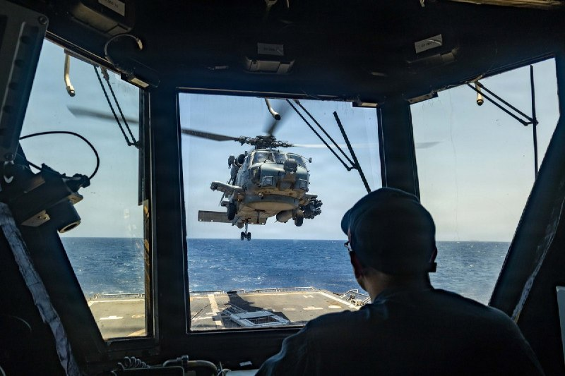

🇺🇸یک بالگرد MH-60R Sea Hawk از عرشه ناو جنگی USS Rafael Peralta (DDG 115) در حالی که نیروهای آمریکایی در دریای عرب در حال اجرای محاصره دریایی علیه ایران هستند، برخاست. تا امروز، ۷۵ کشتی تجاری منحرف شده و ۴ کشتی برای تضمین رعایت مقررات از کار افتاده‌اند.

@mwarmonitor

## mwarmonitor — post 9128

🇺🇸فرمانده سنتکام: عملیات «خشم حماسی» ایران را فلج و مشارکت‌های نظامی در منطقه را تقویت کرد

وزارت جنگ ایالات متحده 🇺🇸

🔸به گفته رهبران وزارت جنگ، ایالات متحده در اواخر فوریه عملیات «خشم حماسی» (Epic Fury) را آغاز کرد و از آن زمان، نیروهای نظامی آمریکا در منطقه عملیاتی فرماندهی مرکزی (سنتکام)، توان نظامی ایران و قدرت نفوذ آن را فلج کرده‌اند. این عملیات همچنین نقش شرکای نظامی در منطقه را برجسته کرد.

دریاسالار برد کوپر، فرمانده سنتکام، امروز در واشینگتن در برابر کمیته نیروهای مسلح سنا شهادت داد. این جلسه بخشی از بررسی‌های مربوط به وضعیت نیروها در منطقه و بخش مربوط به این فرماندهی در درخواست بودجه ریاست‌جمهوری برای سال مالی ۲۰۲۷ بود. محور اصلی گفتگوها در کپیتال هیل بر موفقیت‌های عملیات «خشم حماسی» متمرکز بود.
کوپر خطاب به قانون‌گذاران گفت: «در کمتر از ۴۰ روز، نیروهای سنتکام به اهداف نظامی خود دست یافتند. قابل‌توجه‌ترین دستاورد این بود که ما توانایی ایران برای صدور قدرت به خارج از مرزهایش و تهدید منطقه و منافعمان را تضعیف کردیم.»
کوپر به یاد قانون‌گذاران آورد که در آوریل و اکتبر سال گذشته، ایران صدها موشک را بر سر اسرائیل فرود آورد؛ اما اکنون پس از آنکه نیروهای آمریکایی به‌طور مؤثری ظرفیت موشک‌های متعارف ایران را از بین بردند، این کشور دیگر چنین توانایی ندارد.
او گفت: «امروز ایران دیگر نمی‌تواند با آن حجم و مقیاس حمله کند. علاوه بر این، با نابودی ۹۰ درصد از پایگاه‌های صنایع دفاعی ایران، این کشور تا سال‌ها قادر به بازسازی آن سلاح‌ها نخواهد بود.»
اهداف راهبردی و نابودی توان نظامی
رئیس‌جمهور دونالد جی. ترامپ و دیگر مقامات دولت تصریح کرده‌اند که ایرانی‌ها هرگز به سلاح هسته‌ای دست نخواهند یافت. کوپر بیان کرد که اهداف نظامی در قالب عملیات «خشم حماسی» برای حمایت از این سیاست طراحی شده بود؛ از جمله تضعیف توانمندی موشک‌های بالستیک و نیروی دریایی ایران و همچنین نابودی توانایی صنایع این کشور برای بازسازی این تجهیزات.
صنایع دفاعی: ۹۰ درصد از زیرساخت‌های پهپادی، موشکی و دریایی تخریب شده و تنها ۱۰ درصد باقی مانده است.
نیروی دریایی: طبق ارزیابی نظامی، بازسازی نیروی دریایی ایران ۵ تا ۱۰ سال زمان خواهد برد.
گروه‌های نیابتی: حماس، حزب‌الله و حوثی‌ها به دلیل این عملیات، از تدارکات تسلیحاتی و پشتیبانی ایران قطع شده‌اند.
تقویت ائتلاف‌های منطقه‌ای
کوپر به قانون‌گذاران گفت که در حال حاضر هیچ منبع یا تجهیزاتی از ایران به سمت گروه‌های تروریستی نیابتی سرازیر نمی‌شود. او تأکید کرد که آغاز عملیات «خشم حماسی» نشان داد شرکای منطقه‌ای تا چه حد توانمند هستند و این عملیات باعث تقویت روابط نظامی شده است.
او افزود: «در حال حاضر، ما پنج کشور متحد خاص داریم که نه تنها در تئوری، بلکه در عمل شانه به شانه ایالات متحده در امور دفاعی ایستاده‌اند.»
شرکای کلیدی مورد تقدیر:
امارات متحده عربی، بحرین، کویت، قطر و عربستان سعودی (به عنوان شرکای استثنایی).
پادشاهی اردن (نقش حیاتی در موفقیت عملیات).

🔴دولت اسرائیل (همکاری بسیار نزدیک).
کوپر در پایان خاطرنشان کرد: «این نتیجه از پیش تعیین شده نبود و بر حسب تصادف به دست نیامد؛ بلکه حاصل ماه‌ها برنامه‌ریزی دقیق بر پایه دهه‌ها تجربه است.»

@mwarmonitor

## mwarmonitor — post 9127

تموم شد 😮‍💨

## mwarmonitor — post 9126

🔹خبرنگار: آقا، باز هم در مورد رئیس‌جمهور شی (رئیس‌جمهور چین)؛ چند سال پیش وقتی رئیس‌جمهور بایدن در سانفرانسیسکو با او ملاقات کرد، از او پرسیده شد که آیا فکر می‌کند رئیس‌جمهور شی یک دیکتاتور است یا خیر. آیا شما فکر می‌کنید رئیس‌جمهور شی یک دیکتاتور است؟ 🔸ترامپ:…

## mwarmonitor — post 9125

🔹خبرنگار: «فکر می‌کنید "شی" (رئیس‌جمهور چین) در معاملاتش با شما، نسبت به آخرین باری که با هم در ارتباط بودید، احساس قدرت بیشتری می‌کرد؟ قبل از اینکه کووید سر و کله‌اش پیدا شود...» 🔸ترامپ: «خب، من آن‌ها را بابت آن (کووید) مقصر دانستم. گفتم که کارِ "ووهان" بود…

## mwarmonitor — post 9124

🔹خبرنگار: «در مورد معاملات با چین چطور؟ آیا در مورد سویا به توافقی رسیدید؟ می‌دانید که کشاورزان...» 🔸ترامپ: «بله، کشاورزان خیلی خوشحال خواهند شد. آن‌ها قرار است میلیاردها دلار سویا بخرند. بله.» 🔹خبرنگار: «آقای رئیس‌جمهور، داشتیم در مورد بریتانیا صحبت می‌کردیم،…

## mwarmonitor — post 9123

🔸ترامپ: نمی‌خوام این رو بگم. یعنی دوست دارم بهتون بگم. دوست دارم بگم در یک ساعت خاص، در یک روز خاص، بمباران قراره... [اما] نمی‌خوام این رو بگم. فقط می‌تونم بگم که ایران... این رو با اطمینان بسیار بسیار قوی می‌تونم بگم... ایران هرگز سلاح هسته‌ای نخواهد داشت.…

## mwarmonitor — post 9122

🔹خبرنگار: می‌خوام متوجه بشم که او (شی جین‌پینگ) دقیقاً به چه چیزی متعهد شده، اصلاً تعهدی داده؟ 🔸ترامپ: خب، نمی‌خوام بگم کسی تعهدی داده، اما ما تفاهم خیلی خوبی با هم داریم. می‌دونید، مفهوم «خلع سلاح هسته‌ای»... 🔹خبرنگار: خلع سلاح هسته‌ای یا فقط تمدید (قراردادها)؟…

## mwarmonitor — post 9121

🔹خبرنگار: آقای رئیس‌جمهور، در شبکه "تروث سوشال" (Truth Social) گفتید که رئیس‌جمهور شی (رئیس‌جمهور چین) به افول ایالات متحده اشاره کرده است. ما نشنیدیم که او چنین چیزی بگوید، شاید چیزی بوده که در خلوت گفته است. اول از همه، او دقیقاً چه گفت که باعث شد شما آن…

## mwarmonitor — post 9120

...باز کردن تنگه [هرمز]. اما همان‌طور که او (رهبر چین) گفت، آن‌ها آن را بستند و بعد شما با یک لبخند آن‌ها را [مجبور به] بستن کردید. و این حقیقت دارد؛ ما کنترل تنگه را در دست داریم. و آن‌ها هیچ معامله‌ای انجام نداده‌اند، در واقع در دو هفته و نیم گذشته هیچ معامله‌ای…

## mwarmonitor — post 9119

🔸ترامپ: سلام به همگی. خب، ما اقامت بسیار خوبی داشتیم، دوران فوق‌العاده‌ای بود. رئیس‌جمهور شی (جین‌پینگ) آدم بی‌نظیریه. ما روی معاملات تجاری خیلی خوبی توافق کردیم، از جمله بیش از ۲۰۰ هواپیما از بوئینگ با وعده خرید تا ۷۵۰ هواپیما، که اگر ۲۰۰ تای اول رو به خوبی…

## mwarmonitor — post 9118

🇺🇸رئیس جمهور ترامپ در حال صحبت با مطبوعات در هواپیمای ایر فورس وان در مسیر انکوریج، آلاسکا، ۱۵ مه ۲۰۲۶ @mwarmonitor

## mwarmonitor — post 9117

🇺🇸رئیس جمهور ترامپ در حال صحبت با مطبوعات در هواپیمای ایر فورس وان در مسیر انکوریج، آلاسکا، ۱۵ مه ۲۰۲۶

@mwarmonitor

## mwarmonitor — post 9116

🦠«یک شیوع جدید از ویروس بسیار مسری ابولا در استان اییتوری در شرق کنگو تأیید شده است، به گفته نهاد اصلی بهداشت عمومی آفریقا. تاکنون ۲۴۶ مورد مشکوک و ۶۵ مرگ ثبت شده است.»

@mwarmonitor

## mwarmonitor — post 9115

🔴«بلومبرگ گزارش داد که امارات متحده عربی تلاش کرد عربستان سعودی و قطر را برای هماهنگی یک پاسخ مشترک علیه ایران در جریان جنگ هماهنگ کند، اما موفق نشد؛ به گفته افرادی مطلع از موضوع.»

@mwarmonitor

## mwarmonitor — post 9114

🇮🇷«وزیر امور خارجه عراقچی: همه کشتی‌ها می‌توانند از تنگه هرمز عبور کنند، به‌جز آن‌هایی که با ما در حال جنگ هستند.»

📝دفعه قبل که گفته بود «تنگه هرمز باز است»، سپاه هم ظاهراً در واکنشی کاملاً رسمی گفته بود:
«گُه زیاد نخور، برای دستگاه گوارشت خوب نیست!»

@mwarmonitor

## mwarmonitor — post 9113

  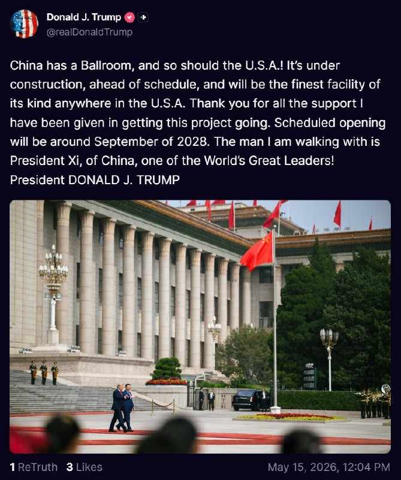

چین یک سالن رقص (تالار تشریفات) دارد، پس ایالات متحده هم باید داشته باشد! این سالن در دست احداث است، از برنامه زمان‌بندی جلوتر است و بهترین مرکز در نوع خود در سراسر ایالات متحده خواهد بود. از تمام حمایت‌هایی که برای پیشبرد این پروژه از من صورت گرفته متشکرم. افتتاح برنامه‌ریزی شده حدود سپتامبر ۲۰۲۸ خواهد بود. مردی که با او قدم می‌زنم رئیس‌جمهور شی، از چین است؛ یکی از رهبران بزرگ جهان!

رئیس‌جمهور دونالد جی. ترامپ

@mwarmonitor

## pm_afshaa — post 90799

🔴طبق گزارش خبرنگاران آمریکایی، پیش از سوار شدن به «ایرفورس وان»، سرویس مخفی آمریکا تمام وسایل و هدایایی را که طرف چینی داده بود از جمله کارت‌ها، نشان‌ها، تلفن‌های موقت و اقلام هدیه جمع کردند و داخل سطل زباله انداختند و اجازه ندادند چیزی از چین وارد هواپیما شود

💧 Rainbet.com the #1 Non-KYC Crypto Casino & Sportsbook @rainbetcom

😁 @Pm_Afshaa

## pm_afshaa — post 90798

  

🚀 آبان‌نت؛ سرعت بی‌مرز، بدون تاریخ انقضا!

⚡دنبال کیفیتی می‌گردی که حجمت رو بی‌دلیل تموم نکنه؟

💎 ویژگی‌های طلایی:
• 
✅ بدون محدودیت زمان و کاربر: تا آخرین کیلوبایت حجمت معتبره!
• 
✅ مصرف واقعی (۱ به ۱): بدون ضریب مصرف و دزدی حجم.
• 
✅ پینگ عالی: مخصوص گیمرهای حرفه‌ای و یوتیوب.
• 
☄️ تنوع سرویس: V2ray، OpenVPN،L2tp و Wireguard.

💳 پرداخت راحت بصورت ریالی و ارزی

💰 قیمت‌های ما را مقایسه کنید!
برای استعلام قیمت استثنایی و مشاوره به آیدی زیر پیام دهید:

🆔 @itsmammad10
🔗 کانال اصلی ما:

🆔 @AbanVpn10

## pm_afshaa — post 90797

  <a href="telegram/content/pm_afshaa_90797_1778862879.webm" target="_blank">🎬 Download video</a>

🔴وزیر خارجه چین:
رئیس‌جمهور شی جین‌پینگ طبق دعوت ترامپ در پاییز به آمریکا سفر خواهد کرد

💧 Rainbet.com the #1 Non-KYC Crypto Casino & Sportsbook @rainbetcom

😁 @Pm_Afshaa

## pm_afshaa — post 90796

  <a href="telegram/content/pm_afshaa_90796_1778862880.webm" target="_blank">🎬 Download video</a>

🔴صدر اعظم آلمان: با ترامپ صحبت کردم؛ ایران نباید سلاح هسته‌ای داشته باشه.

💧 Rainbet.com the #1 Non-KYC Crypto Casino & Sportsbook @rainbetcom

😁 @Pm_Afshaa

## pm_afshaa — post 90795

  <a href="telegram/content/pm_afshaa_90795_1778862881.webm" target="_blank">🎬 Download video</a>

🔴ترامپ: آمریکا ممکنه در مقطعی برای خارج کردن «گرد و غبار هسته‌ای» ایران، وارد عمل بشه؛ یا اونو به دست میاریم، یا اگر نشد، وارد میشیم؛ آمریکا تجهیزات لازم برای این کار رو در اختیار داره.

💧 Rainbet.com the #1 Non-KYC Crypto Casino & Sportsbook @rainbetcom

😁 @Pm_Afshaa

## pm_afshaa — post 90794

  <a href="telegram/content/pm_afshaa_90794_1778862881.webm" target="_blank">🎬 Download video</a>

🔴وزیر امور خارجه چین: ما خواستار بازگشایی هرچه سریع‌تر تنگه هرمز هستیم.

همچنین ما از آمریکا و ایران حمایت می‌کنیم تا به حل اختلافات و منازعات خود از طریق گفتگوها ادامه بدن.

💧 Rainbet.com the #1 Non-KYC Crypto Casino & Sportsbook @rainbetcom

😁 @Pm_Afshaa

## pm_afshaa — post 90793

  

جهت تبلیغات با بازدهی بالا میتونین دایرکت کانال پیام بدین

## pm_afshaa — post 90792

🔴ترامپ خطاب به خبرنگار نیویورک تایمز:من در ایران یک پیروزی کامل نظامی داشتم. اما فیک نیوزها، افرادی مثل تو، اخبار نادرست می‌نویسند. تو یک آدم جعلی هستی. ما یک پیروزی کامل نظامی داشتیم. من در واقع فکر می‌کنم آنچه می‌نویسی نوعی خیانت است. باید از خودت خجالت بکشی. من واقعاً فکر می‌کنم این خیانت است

💧 Rainbet.com the #1 Non-KYC Crypto Casino & Sportsbook @rainbetcom

😁 @Pm_Afshaa

## pm_afshaa — post 90791

  <a href="telegram/content/pm_afshaa_90791_1778862883.webm" target="_blank">🎬 Download video</a>

🔴سنتکام: تا امروز، 75 کشتی تجاری تغییر مسیر دادن و 4 کشتی غیرفعال شده تا اطمینان حاصل بشه که قوانین رعایت میشه.

💧 Rainbet.com the #1 Non-KYC Crypto Casino & Sportsbook @rainbetcom

😁 @Pm_Afshaa

## pm_afshaa — post 90790

  <a href="telegram/content/pm_afshaa_90790_1778862884.webm" target="_blank">🎬 Download video</a>

🔴تهران‌تایمز: آمریکا پیشنهاد 14 ماده‌ای جمهوری اسلامی برای پایان جنگ رو رد کرده و بار دیگر بر مواضع خود، به‌ویژه درباره پرونده هسته‌ای، تأکید کرده.

💧 Rainbet.com the #1 Non-KYC Crypto Casino & Sportsbook @rainbetcom

😁 @Pm_Afshaa

## pm_afshaa — post 90789

🔴دقایقی پیش ترامپ رسماً اعلام کرد که یه دور دیگر از عملیات نظامی آمریکا در ایران در راه است

+ترامپ:ما همه چیز را تمام نکردیم،
برمی‌گردیم و آن را تکمیل می‌کنیم،
حتی شاید بیشتر

💧 Rainbet.com the #1 Non-KYC Crypto Casino & Sportsbook @rainbetcom

😁 @Pm_Afshaa

## pm_afshaa — post 90788

♨️
♨️
♨️
♨️

## pm_afshaa — post 90787

  <a href="telegram/content/pm_afshaa_90787_1778862885.webm" target="_blank">🎬 Download video</a>

🔴ترامپ به فاکس‌نیوز: ما میتونستیم پل‌ها و شبکه‌های برق ایران رو نابود کنیم و میتونیم ظرف دو روز همه چیز رو در آنجا از بین ببریم.

💧 Rainbet.com the #1 Non-KYC Crypto Casino & Sportsbook @rainbetcom

😁 @Pm_Afshaa

## pm_afshaa — post 90786

  <a href="telegram/content/pm_afshaa_90786_1778862886.webm" target="_blank">🎬 Download video</a>

🔴بلومبرگ: امارات تلاش کرد عربستان و قطر رو برای مشارکت در یک پاسخ نظامی مشترک علیه جمهوری اسلامی همراه کنه، اما هر دو کشور این درخواست رو رد کردن.

💧 Rainbet.com the #1 Non-KYC Crypto Casino & Sportsbook @rainbetcom

😁 @Pm_Afshaa

## pm_afshaa — post 90785

امروز 25 اردیبهشت روز پاسداشت زبان فارسی و بزرگداشت فردوسیه 
💧 Rainbet.com the #1 Non-KYC Crypto Casino & Sportsbook @rainbetcom 
😁 @Pm_Afshaa

## pm_afshaa — post 90784

  

امروز 25 اردیبهشت روز پاسداشت زبان فارسی و بزرگداشت فردوسیه

💧 Rainbet.com the #1 Non-KYC Crypto Casino & Sportsbook @rainbetcom

😁 @Pm_Afshaa

## pm_afshaa — post 90783

  <a href="telegram/content/pm_afshaa_90783_1778862887.mp4" target="_blank">🎬 Download video</a>

روانه شدن نفت در سواحل جزایر خلیج فارس جمهموری اسلامی داره نفتو تو دریا میریزه و جان موجودات دریایی و زیست بوم ها رو به خطر انداخته

💧 Rainbet.com the #1 Non-KYC Crypto Casino & Sportsbook @rainbetcom

😁 @Pm_Afshaa

## pm_afshaa — post 90782

  <a href="telegram/content/pm_afshaa_90782_1778862890.webm" target="_blank">🎬 Download video</a>

🔴ترامپ: به رئیس جمهور چین گفتم در مورد پرونده تایوان صحبت نمی‌کنم.

💧 Rainbet.com the #1 Non-KYC Crypto Casino & Sportsbook @rainbetcom

😁 @Pm_Afshaa

## pm_afshaa — post 90781

  <a href="telegram/content/pm_afshaa_90781_1778862891.webm" target="_blank">🎬 Download video</a>

🔴ترامپ: من مشکلی ندارم که ایران برنامه هسته‌ای خودش رو به مدت 20 سال تعلیق کنه، اما این باید یک تعهد واقعی باشه.

💧 Rainbet.com the #1 Non-KYC Crypto Casino & Sportsbook @rainbetcom

😁 @Pm_Afshaa

## pm_afshaa — post 90780

  <a href="telegram/content/pm_afshaa_90780_1778862891.webm" target="_blank">🎬 Download video</a>

🔴ترامپ: وقتی به پیشنهاد ایران نگاه کردم، جمله اول رو دوست نداشتم و قابل قبول نبود، بنابراین پیشنهاد رو رد کردم.

💧 Rainbet.com the #1 Non-KYC Crypto Casino & Sportsbook @rainbetcom

😁 @Pm_Afshaa

## iaghapour — post 2612

کل ریپازیتوری گیت هاب علیرضا که شامل X-UI و S-UI میشد بسته شده و هنوز دلیلش مشخص نیست.

## DEJradio — post 4652

  <a href="telegram/content/DEJradio_4652_1778862892.webm" target="_blank">🎬 Download video</a>

🔺📢 آمریکا بر سر دو راهی؛
عملیات برای خارج کردن اورانیوم‌ها یا اقدام عملی برای سرنگونی جمهوری اسلامی

یکی از کارشناسان نظامی ایرانی‌الاصل که سابقه عضویت در ارتش ایالات متحده را دارد، به دژ گفت: در بین سیاستمداران و نظامیان آمریکا دیدگاهی وجود دارد که می‌گوید اگر قرار بر این باشد که برای خروج اورانیوم‌ها، اعزام نیرو و تجهیزات به داخل خاک ایران انجام شود، با توجه به حساسیت، زمان‌بر بودن این عملیات و پیش‌نیازهای آن از جمله:
•انهدام کامل سامانه‌های پدافند هوایی جمهوری اسلامی
•ایجاد فرودگاه موقت
•ایجاد کمربند امنیتی به شعاع چند کیلومتر
•استقرار سامانه‌های پدافند هوایی برد کوتاه برای مقابله با موشک‌های کوتاه‌برد و پهپادهای نظام
•انتقال تجهیزات و ماشین‌آلات لازم برای خاک‌برداری
•لزوم حضور کارشناسان اتمی غیرنظامی و لباس‌های مخصوص ضد تشعشعات
•چالش انتقال سیلندرهای سنگین حاوی اورانیوم غنی‌شده
•احتمال هدف قرار گرفتن پرنده حامل سیلندر اورانیوم و ایجاد یک فاجعه انسانی و محیط‌ زیستی
•زمان‌بر بودن این عملیات که ممکن است چند هفته طول بکشد
با توجه به موارد فوق که صرفاً بخشی از چالش‌های این عملیات است، دیدگاه دیگری نیز وجود دارد که به‌نظر می‌رسد حمایت بیشتری از سوی اسرائیل داشته باشد؛ اعزام نیروی زمینی و انتقال نیرو از طریق هوابرد و هلی‌برن جهت سرنگون کردن حکومت که البته این عملیات هم چالش های خود را خواهد داشت.

#جنگ #حمله_زمینی
@DEJradio

## DEJradio — post 4651

  <a href="telegram/content/DEJradio_4651_1778862893.webm" target="_blank">🎬 Download video</a>

🚨📢 دونالد ترامپ:
برای حذف گرد و غبار هسته‌ای ممکن است وارد ایران شویم

دونالد ترامپ گفت آمریکا ممکن است در مقطعی برای حذف آنچه «گرد و غبار هسته‌ای» نامید وارد ایران شود. ترامپ در مسیر بازگشت به آمریکا و در هواپیمای ریاست‌جمهوری، ایر فورس وان، به خبرنگاران گفت: «در زمان مناسب، یا وارد می‌شویم یا آن را به دست می‌آوریم. فکر می‌کنم احتمالا آن را به دست می‌آوریم، اما اگر به دست نیاوریم، وارد خواهیم شد.»

او افزود: «فکر می‌کنم آنها کاملا شکست خواهند خورد و ما هیچ خطری نخواهیم داشت. ما تجهیزات لازم برای خارج کردن آن را داریم، هیچ‌کس دیگر ندارد؛ شاید چین چنین تجهیزاتی داشته باشد.»

ترامپ پیش‌تر نیز در ماه مارس در کاخ سفید درباره ذخایر اورانیوم غنی‌شده جمهوری اسلامی هشدار مشابهی داده و گفته بود: «یا آن را از آنها پس می‌گیریم یا آن را برمی‌داریم.»

#ترامپ #حملات_هدفمند
@DEJradio

## DEJradio — post 4650

  <a href="telegram/content/DEJradio_4650_1778862894.webm" target="_blank">🎬 Download video</a>

🚨
⭕️ شش کشور عربی با شکایت از جمهوری اسلامی به شورای امنیت خواستار دریافت غرامت از تهران شدند

شش کشور عربی حوزه خلیج فارس در نامه‌ای به شورای امنیت سازمان ملل ادعای حکومت ایران درباره اداره یا وضع قواعد جدید برای تنگه هرمز را محکوم کردند. امارات متحده عربی نیز در نامه‌ای جداگانه به همین نهاد، جمهوری اسلامی را به حملات «عامدانه» به زیرساخت‌های حیاتی و غیرنظامی متهم کرد.
نسخه‌هایی از هر دو نامه در اختیار خبرنگار ایران‌اینترنشنال در سازمان ملل متحد قرار گرفته است.

خبرگزاری بنا، رسانه رسمی دولت بحرین، نیز پنج‌شنبه ۲۴ اردیبهشت اعلام کرد که این کشور همراه با امارات متحده عربی، عربستان سعودی، کویت، قطر و اردن در نامه‌ای فوری به دبیرکل سازمان ملل و شورای امنیت نسبت اظهارات مقام‌های جمهوری اسلامی درباره «مدیریت» تنگه هرمز و ایجاد «قوانین حقوقی» تازه برای این آبراه بین‌المللی را رد و محکوم کردند.

در این نامه، بر حق تمام این کشورها به «اتخاذ تصمیم‌های مشروع حاکمیتی در زمینه امنیت و مشارکت‌های بین‌المللی خود» تاکید شده است.
این کشورها نوشته‌اند که تنگه هرمز «یک آبراه بین‌المللی حیاتی برای کشتیرانی، تجارت و انرژی» است و هیچ کشوری، صرف‌نظر از موقعیت جغرافیایی‌اش، حق ندارد به‌تنهایی برای آن «اداره یک‌جانبه» یا «قواعد حقوقی منفرد» وضع کند.

#شورای_امنیت_سازمان_ملل #تنگه_هرمز
@DEJradio

## DEJradio — post 4649

  <a href="telegram/content/DEJradio_4649_1778862894.mp4" target="_blank">🎬 Download video</a>

🚨
🔸 مستند؛
آمنه‌سادات ذبیح‌پور- خانم خبرنگار دست در دست نیروهای امنیتی

#نیروهای_امنیتی #بازجو_خبرنگار
@DEJradio

## DEJradio — post 4648

  <a href="telegram/content/DEJradio_4648_1778862897.webm" target="_blank">🎬 Download video</a>

🚨
⭕️ گزارش منابع حقوق بشری درباره تزریق مواد کشنده به زندانیان

منابع اپوزیسیون و نهادهای ناظر حقوق بشر در ایران گزارش می‌دهند که مقام‌های زندان در حال تزریق مواد کشنده ناشناخته به زندانیان هستند. این داروها اغلب به کف پا یا بین انگشتان پای زندانیان تزریق‌ می‌شود. این مواد سمی چند روز بعد از تزریق باعث سکته قلبی مرگبار می‌شود و مرگ را طبیعی جلوه می‌دهد.

بر اساس پژوهش‌های گسترده‌ای که به وسیله کمیته مبارزه برای آزادی زندانیان سیاسی در ایران انجام شده بود، استفاده از «شکنجه دارویی» در سال‌های ۲۰۲۲-۲۰۲۳ هم‌زمان با خیزش انقلابی علیه جمهوری اسلامی به طرز نگران‌کننده‌ای افزایش یافته است.
این روش اکنون به الگوی گسترده‌تری از مرگ‌های مشکوک در بازداشت، تبدیل شده است؛ موضوعی که نگرانی‌ها درباره وجود یک راهبرد حذف مخفیانه برای کاهش آمار آشکار اعدام با طناب دار و در عین حال حفظ فشار سرکوبگرانه را افزایش داده است.

به‌دلیل محدودیت دسترسی و ادامه قطعی‌های اینترنت، هیچ تأیید مستقلی برای این گزارش‌ها وجود ندارد؛ با این حال، این ادعاها یادآور تحقیقات پیشین درباره تزریق‌های اجباری هستند.

#زندانی_سیاسی #شکنجه_دارویی
@DEJradio

## mamlekate — post 103528

  <a href="telegram/content/mamlekate_103528_1778862898.mp4" target="_blank">🎬 Download video</a>

دونالد ترامپ در پاسخ به پرسشی درباره پیشنهاد اخیر جمهوری اسلامی گفت این پیشنهاد را بررسی کرده، اما به گفته او، اگر از جمله نخست یک متن خوشش نیاید، بقیه آن را کنار می‌گذارد.

ترامپ در پاسخ به این پرسش که جمله نخست چه بوده است، آن را «غیرقابل قبول» توصیف کرد و گفت مسئله اصلی از نگاه او این است که ایران نباید «هیچ شکل» از برنامه هسته‌ای داشته باشد.

در ادامه، خبرنگار از ترامپ پرسید آیا دوره ۲۰ ساله برای او کافی نیست. ترامپ پاسخ داد که «۲۰ سال کافی است»، اما به گفته او، سطح تضمین‌هایی که جمهوری اسلامی ارائه می‌دهد اهمیت دارد.

ترامپ گفت که اگر قرار است توافقی ۲۰ ساله مطرح باشد، باید «۲۰ سال واقعی» باشد و نباید به گفته او، توافقی مبهم یا ظاهری باشد.

ManotoTV
@mamlekate

## mamlekate — post 103527

  

📞 سلام مملکته. درباره چندتا از دانشجویان دانشگاه پزشکی بلاروس پیام میدم. سفیر بیشرف جمهوری اسلامی در مینسک علیرضا صانعی مزدور دست نشانده جمهوری اسلامی به وزارت کشور بلاروس یادداشت فرستاده و دانشجویان مقیم و افراد مقیمی که در بلاروس زندگی میکنند و مخالف جمهوری اسلامی هستند را افراد خطرناک برای شهروندان بلاروس و حامی تروریسم معرفی کرده و با پیگیری پی در پی خود و دیپلماتهای سفارت و یادداشت های فراوان خواستار دیپورت این افراد از بلاروس به ایران و دستگیری آنها در ایران میباشد. لطفا صدای مارو به جهانیان برسونید. دولت بلاروس بخاطر یادداشتهای سفارت و ترس از ایجاد مشکلات دیپلماتی مجبور به این اقدام شده است حتی پس از پایان بازداشت بعضی افرادی که آزاد شدند سفیر مجدد پیگیری کرده و خواستار دیپورت آنها شده است. یکی از این افراد خاطره خدادادی و یکی دیگر دکتر سپهر فرشادی که نزدیک به دوهفته در بازداشت انفرادی بسر میبره و در آستانه ی دیپورت میباشد. دوستان دیگه ای هم در همین وضعیت هستند.

@mamlekate

## VahidOnline — post 75485

  

وزیر خارجه پاکستان اعلام کرد که یازده شهروند پاکستانی و ۲۰ شهروند ایرانی که در کشتی‌های توقیف‌شده توسط آمریکا در آب‌های آزاد گرفتار شده بودند، به اسلام‌آباد منتقل می‌شوند.

اسحاق دار افزوده که «تمامی این افراد از سنگاپور به بانکوک رسیده‌اند و اکنون سوار پروازی شده‌اند که قرار است اواخر امشب به اسلام‌آباد برسد. سپس بازگشت برادران ایرانی به وطن خود تسهیل خواهد شد».
@VahidHeadline

📡 @VahidOnline

## VahidOnline — post 75484

  

صدراعظم آلمان می‌گوید در جریان گفت‌و‌گوی تلفنی با دونالد ترامپ، رئیس‌جمهور آمریکا، هر دو بر سر ضرورت باز کردن تنگهٔ هرمز توسط ایران و ممانعت از دسترسی تهران به سلاح هسته‌ای، توافق داشته‌اند.

فریدریش مرتس روز جمعه ۲۵ اردیبهشت در شبکهٔ ایکس نوشت که در مسیر بازگشت رئیس‌جمهور آمریکا از چین، «تماس تلفنی خوبی» با او داشته است.

او افزود که آن‌ها توافق دارند که «ایران باید همین حالا پای میز مذاکره بیاید. باید تنگهٔ هرمز را باز کند. نباید اجازه داده شود تهران به سلاح هسته‌ای دست پیدا کند».
@VahidHeadline

📡 @VahidOnline

## VahidOnline — post 75479

  <a href="telegram/content/VahidOnline_75479_1778862903.mp4" target="_blank">🎬 Download video</a>

دونالد ترامپ، رئیس‌جمهوری ایالات متحده، روز جمعه ۲۵ اردیبهشت در مسیر بازگشت از چین در پاسخ به خبرنگاران، درباره آخرین پیشنهاد ایران در مذاکرات هسته‌ای گفت که آن را «از همان جمله اول» رد کرده است.
او با بیان اینکه محتوای ابتدایی این پیشنهاد «غیرقابل قبول» بوده، افزود: «حتی ادامه آن را هم نخواندم.» ترامپ تأکید کرد که صرف تعیین بازه زمانی مانند ۲۰ سال کافی نیست و آنچه اهمیت دارد، ارائه تضمین‌های واقعی و قابل اجرا از سوی ایران است.
رئیس‌جمهوری آمریکا همچنین تصریح کرد که، هرگونه توافق باید شامل انتقال کامل مواد و سوخت هسته‌ای از ایران باشد و افزود که توافقی مبتنی بر «حرف‌های توخالی» قابل پذیرش نخواهد بود.
@VahidOOnLine
دونالد ترامپ در پاسخ به پرسشی درباره پیشنهاد اخیر جمهوری اسلامی گفت این پیشنهاد را بررسی کرده، اما به گفته او، اگر از جمله نخست یک متن خوشش نیاید، بقیه آن را کنار می‌گذارد.
ترامپ در پاسخ به این پرسش که جمله نخست چه بوده است، آن را «غیرقابل قبول» توصیف کرد و گفت مسئله اصلی از نگاه او این است که ایران نباید «هیچ شکل» از برنامه هسته‌ای داشته باشد.
در ادامه، خبرنگار از ترامپ پرسید آیا دوره ۲۰ ساله برای او کافی نیست. ترامپ پاسخ داد که «۲۰ سال کافی است»، اما به گفته او، سطح تضمین‌هایی که جمهوری اسلامی ارائه می‌دهد اهمیت دارد.
ترامپ گفت که اگر قرار است توافقی ۲۰ ساله مطرح باشد، باید «۲۰ سال واقعی» باشد و نباید به گفته او، توافقی مبهم یا ظاهری باشد.
@VahidOOnLine
دونالد ترامپ، رئیس جمهوری آمریکا روز جمعه ۲۵ اردیبهشت و در زمان بازگشت از چین به آمریکا در هواپیمای ایرفورس وان به خبرنگاران گفت با وجود آنکه نیروهای مسلح ایران در جنگ نابود شده‌اند، ممکن است نیاز به «یک پاکسازی کوچک» وجود داشته باشد.
ترامپ ساعاتی پیش در گفتگویی با فاکس‌نیوز هم گفته بود که نیروهای مسلح جمهوری اسلامی در چهار هفته گذشته، تلاش کرده‌اند تا تعدادی از پرتابگرهای موشکی را از زیر خاک بیرون بکشند و جای بعضی تجهیزات را عوض کنند، با این حال «آمریکا قادر است در دو روز همه این‌ها را نابود کند.»
@VahidOOnLine
دونالد ترامپ در پاسخ به پرسشی درباره اینکه آیا شی جین‌پینگ، رئیس‌جمهوری چین، تعهدی قاطع برای فشار بر جمهوری اسلامی به منظور بازگشایی تنگه هرمز داده است، گفت از کسی «درخواست لطف» نمی‌کند.
ترامپ گفت: «من درخواست هیچ لطفی نمی‌کنم، چون وقتی درخواست لطف می‌کنید، باید در مقابل لطفی انجام دهید.» او افزود که آمریکا به چنین کمکی نیاز ندارد.
رئیس‌جمهوری آمریکا در ادامه گفت نیروهای مسلح طرف مقابل «اساسا از بین رفته‌اند» و ممکن است به گفته او «کمی کار پاکسازی» لازم باشد. او همچنین به آتش‌بس اشاره کرد و گفت این آتش‌بس به درخواست کشورهای دیگر انجام شد.
ترامپ گفت شخصا چندان موافق آتش‌بس نبوده، اما آن را به عنوان لطفی به پاکستان پذیرفته است. او از مقام‌های پاکستانی، از جمله نخست‌وزیر و فیلدمارشال این کشور، با تعبیر «افرادی فوق‌العاده» یاد کرد.
@VahidOOnLine
دونالد ترامپ گفت آمریکا ممکن است در مقطعی برای حذف آنچه «گرد و غبار هسته‌ای» نامید وارد ایران شود. ترامپ در مسیر بازگشت به آمریکا و در هواپیمای ریاست‌جمهوری، ایر فورس وان، به خبرنگاران گفت: «در زمان مناسب، یا وارد می‌شویم یا آن را به دست می‌آوریم. فکر می‌کنم احتمالا آن را به دست می‌آوریم، اما اگر به دست نیاوریم، وارد خواهیم شد.»
او افزود: «فکر می‌کنم آنها کاملا شکست خواهند خورد و ما هیچ خطری نخواهیم داشت. ما تجهیزات لازم برای خارج کردن آن را داریم، هیچ‌کس دیگر ندارد؛ شاید چین چنین تجهیزاتی داشته باشد.»
ترامپ پیش‌تر نیز در ماه مارس در کاخ سفید درباره ذخایر اورانیوم غنی‌شده جمهوری اسلامی هشدار مشابهی داده و گفته بود: «یا آن را از آنها پس می‌گیریم یا آن را برمی‌داریم.»
@VahidOOnLine

📡 @VahidOnline

## VahidOnline — post 75478

  

نشست وزیران خارجهٔ کشورهای عضو بریکس در دهلی‌نو، پایتخت هند، به‌دلیل اختلاف‌نظر میان اعضا به‌خصوص بین ایران و امارات متحدهٔ عربی بر سر جنگ ایران، بدون صدور بیانیهٔ مشترک پایان یافت.

به‌گزارش رویترز، هند روز جمعه ۲۵ اردیبهشت اعلام کرد به‌جای بیانیهٔ مشترک، «بیانیهٔ رئیس» منتشر شده است، زیرا برخی اعضا دربارهٔ تحولات خاورمیانه دیدگاه‌های متفاوتی داشتند.

گروه بریکس شامل برزیل، روسیه، هند، چین، آفریقای جنوبی، اتیوپی، مصر، ایران، امارات متحدهٔ عربی و اندونزی است.

روز پنجشنبه رسانه‌های ایران از تنش لفظی در این نشست خبر دادند و نوشتند عباس عراقچی، وزیر خارجه ایران، امارات را به مشارکت مستقیم در جنگ آمریکا و اسرائیل علیه ایران متهم کرد و گفت میزبانی پایگاه‌های نظامی آمریکا از سوی ابوظبی و همکاری امنیتی این کشور با اسرائیل، آن را به بخشی از جنگ تبدیل کرده است.

روزنامهٔ لبنانی الاخبار نوشت که در مقابل، هیئت اماراتی خواهان آن بود که هر بیانیهٔ نهایی، حملات موشکی جمهوری اسلامی ایران به این کشور و توقیف کشتی‌ها را محکوم کند، در حالی که تهران بر درج محکومیت صریح حملات آمریکا و اسرائیل اصرار داشت.
@VahidHeadline

📡 @VahidOnline

## VahidOnline — post 75477

  

امارات متحده عربی اعلام کرد این کشور ساخت یک خط لوله جدید نفتی را برای دو برابر کردن ظرفیت صادرات نفت از طریق بندر فجیره تا سال ۲۰۲۷ تسریع خواهد کرد. این اقدام توانایی ابوظبی برای دور زدن تنگه هرمز را به‌طور چشمگیری افزایش خواهد داد.

دفتر رسانه‌ای دولت ابوظبی روز جمعه ۲۵ اردیبهشت اعلام کرد شیخ خالد بن محمد بن زاید، ولیعهد ابوظبی، به شرکت ملی نفت ابوظبی، ادنوک، دستور داده است اجرای پروژه خط لوله «غرب به شرق» را سرعت ببخشد. به‌گفتهٔ این نهاد، این خط لوله اکنون در حال ساخت است و انتظار می‌رود در سال ۲۰۲۷ به بهره‌برداری برسد.

در بیانیهٔ دولت امارات اشاره‌ای به زمان‌بندی اولیه این پروژه نشده است.

خط لولهٔ کنونی نفت خام ابوظبی، موسوم به «حبشان ـ فجیره»، ظرفیت انتقال روزانه تا یک میلیون و ۸۰۰ هزار بشکه نفت را دارد و نقش مهمی در افزایش صادرات مستقیم نفت امارات از سواحل دریای عمان ایفا کرده است.
@VahidHeadline

📡 @VahidOnline

## IranIntlTV — post 337351

  <a href="telegram/content/IranIntlTV_337351_1778862905.mp4" target="_blank">🎬 Download video</a>

ستاد فرماندهی مرکزی ایالات متحده، سنتکام، اعلام کرد از زمان آغاز محاصره دریایی ایران، ۷۵ کشتی تجاری تغییر مسیر داده و چهار کشتی دیگر از کار افتاده‌اند.

سنتکام این موضوع را نشانه اجرای کامل محاصره تنگه هرمز دانست.

گزارش اردوان روزبه، خبرنگار ایران‌اینترنشنال
@iranintltv

## IranIntlTV — post 337350

  <a href="telegram/content/IranIntlTV_337350_1778862908.mp4" target="_blank">🎬 Download video</a>

دونالد ترامپ در مسیر بازگشت از چین گفت اگر اورانیوم غنی‌شده ایران تحویل داده نشود، آمریکا در «مقطعی مناسب» وارد ایران خواهد شد.

او همچنین گفت شاید نیاز به «پاکسازی مجدد» در ایران باشد.

گزارش سمیرا قرایی، خبرنگار ایران‌اینترنشنال
@iranintltv

## IranIntlTV — post 337349

  <a href="https://t.me/IranintlTV/337349" target="_blank">📎 Download file</a>

🎧نسخه صوتی دومینو: تاکید ترامپ بر برچیدن کامل برنامه هسته‌ای
@iranintlTV

## IranIntlTV — post 337348

  

یک مقام وزارت خارجه آمریکا به الجزیره گفت فضای دومین روز مذاکرات میان لبنان و اسرائیل بسیار مثبت بوده و روند گفت‌وگوها فراتر از انتظارها پیش رفته است.

این دومین روز از سومین دور مذاکرات میان اسرائیل و لبنان با میانجی‌گری ایالات متحده بود.
https://iranintl.com/202605151409

## IranIntlTV — post 337347

بیمارستان الغدیر تهران شامگاه ۱۸ و ۱۹ دی‌ماه ۱۴۰۴، شاهد گوشه‌ای از جنایتی بود که جمهوری اسلامی علیه معترضان مرتکب شد. ده‌ها پیکر بی‌جان و شمار زیادی از مجروحان به این بیمارستان منتقل شدند و به دلیل کمبود فضای سردخانه، تعدادی از کشته‌شدگان، پتوپیچ در حیاط پشت بیمارستان رها شدند. ایران‌اینترنشنال تاکنون هویت ۹ نفر از آن‌ها را شناسایی کرده که در این ویدیو چهار تن از آنها معرفی شده‌اند.
فرنوش فرجی، خبرنگار ایران‌اینترنشنال گزارش می‌دهد.

## IranIntlTV — post 337346

  <a href="telegram/content/IranIntlTV_337346_1778862912.mp4" target="_blank">🎬 Download video</a>

وزیر خارجه ایتالیا اعلام کرد به دنبال راه‌حلی سریع برای مشکلات تمدید اقامت و گذرنامه ایرانیان مقیم این کشور است و این موضوع را در سطح اروپا نیز پیگیری می‌کند. آنتونیو تایانی تاکید کرد ایتالیا در کنار مردم ایران و خواست آزادی و دموکراسی ایستاده است.
جزییات بیشتر با صدف باغبانی، روزنامه‌نگار
@iranintltv

## IranIntlTV — post 337345

  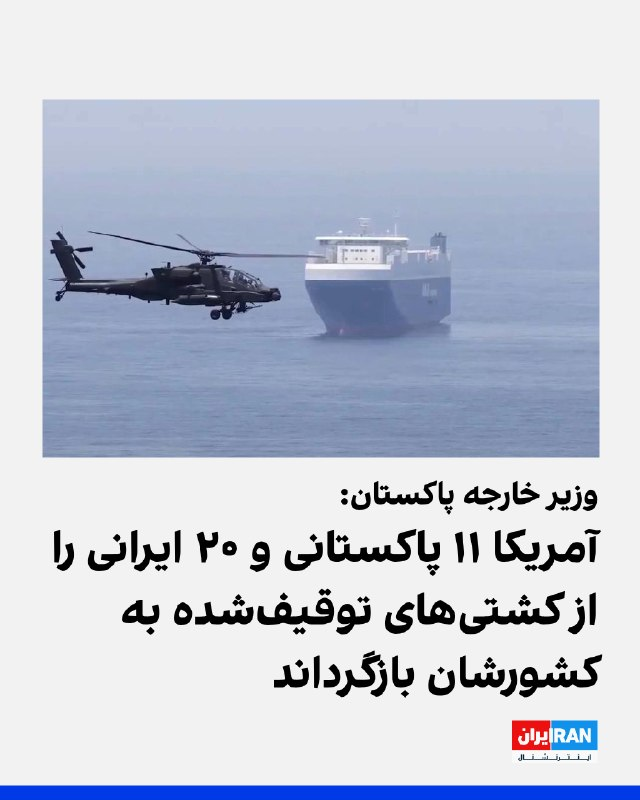

محمد اسحاق دار، وزیر خارجه پاکستان، اعلام کرد که ۱۱ شهروند پاکستانی و ۲۰ شهروند ایرانی که در کشتی‌های توقیف‌شده از سوی آمریکا حضور داشتند، به کشورهایشان بازگردانده شده‌اند.
به گفته او قرار است همه این افراد امشب به اسلام آباد برسند و سپس بازگشت شهروندان ایران تسهیل خواهد شد.
https://iranintl.com/202605151087

## IranIntlTV — post 337344

  <a href="telegram/content/IranIntlTV_337344_1778862915.mp4" target="_blank">🎬 Download video</a>

یکی از مخاطبان ایران‌اینترنشنال با اشاره به وضعیت اقتصادی می‌گوید مردم ایران برای چه «منفعت ملی» این حجم از فشار اقتصادی و نگرانی را تحمل می‌کنند. این پیام با هوش مصنوعی خوانده شده است.

## IranIntlTV — post 337343

در این قسمت چرتکه، محمد ماشین‌چیان، قدرت خرید یک درآمد ماهانه ۴۰ میلیون تومانی را با در نظر گرفتن سناریوهای رشد نرخ دلار، تا پایان ۱۴۰۵ بررسی و پیش‌بینی می‌کند.

مساله فرسایش زندگی، محدود به کارگران ما نیست. حتی هموطنانی که در گذشته‌ای نه‌چندان دور، زندگی متوسط و قابل قبولی داشتند نیز از آسیب نوسانات دلار مصون نخواهند ماند.

تماشای نسخه کامل «چرتکه» در یوتیوب:
https://youtu.be/1W2RoMvSqPQ

@iranintltv

## IranIntlTV — post 337342

  

محمدمهدی حسینی‌همدانی، امام جمعه کرج، ۲۵ اردیبهشت در نماز جمعه این شهر گفت: بر اساس توصیه قرآن باید تا پایان «فتنه»، جنگ را ادامه داد و تاکید کرد مجازات اسرائیل، محو کامل آن است.

او همچنین اطاعت از مجتبی خامنه‌ای را عامل پیروزی خواند و گفت باید عوامل نافرمانی را از میان برداشت.
https://iranintl.com/202605155975

## IranIntlTV — post 337341

  <a href="telegram/content/IranIntlTV_337341_1778862918.mp4" target="_blank">🎬 Download video</a>

پیام‌های ارسالی مخاطبان به ایران‌اینترنشنال از کمبود و گرانی داروهای حوزه سلامت حکایت دارد. یک شهروند شاغل در صنعت دارو می‌گوید شربت «لیسکانتین» برای بیماران صرع و تشنج نایاب شده و قیمت آن از ۹۰۰ هزار تومان به ۴ میلیون و ۲۰۰ هزار تومان افزایش یافته است.
جزییات بیشتر با سبا حیدرخانی، عضو تحریریه ایران‌اینترنشنال
@iranintltv

## IranIntlTV — post 337340

  <a href="telegram/content/IranIntlTV_337340_1778862921.mp4" target="_blank">🎬 Download video</a>

در تازه‌ترین نظرسنجی جهانی، کانادا برای نخستین‌بار به‌عنوان جذاب‌ترین مقصد سرمایه‌گذاری زیرساختی معرفی شد. انجمن سرمایه‌گذاران زیرساخت جهانی، سیاست‌های جذب سرمایه خصوصی و ایجاد صندوق ثروت ۲۵ میلیارد دلاری را از عوامل اصلی این جایگاه دانست.
مهسا مرتضوی، خبرنگار ایران‌اینترنشنال، گزارش می‌دهد
@iranintltv

## IranIntlTV — post 337339

پیام‌های ارسالی مخاطبان به مدیا بات ایران‌اینترنشنال از گرانی، کمبود و نایاب شدن دارو و اقلام حوزه سلامت حکایت دارد. یک شهروند می‌گوید حتی داروهای ساده و مسکن‌هایی مانند قرص کدئین نیز نایاب شده‌اند.
@iranintltv

## IranIntlTV — post 337338

  

رسانه‌های ایران اعلام کردند نمایشگاه کتاب تهران امسال به صورت «مجازی» برگزار خواهد شد.
بر اساس این خبر، نمایشگاه کتاب تهران از روز شنبه، ۲۶ اردیبهشت و به صورت آنلاین آغاز خواهد شد.
باوجود آتش‌بس میان جمهوری اسلامی و آمریکا، بسیاری از برنامه‌های عادی در ایران همچنان تعطیل بوده یا به‌صورت مجازی برگزار می‌شود.
https://iranintl.com/202605157688

## IranIntlTV — post 337337

  <a href="telegram/content/IranIntlTV_337337_1778862924.mp4" target="_blank">🎬 Download video</a>

یک شهروند با ارسال پیامی به ایران اینترنشنال درباره گرانی‌ها از افزایش شدید نوشیدنی‌های الکلی در ایران خبر داده و می‌گوید هر لیتر «عرق سگی» یک میلیون و ۵۰۰ هزار تومان شده است. پیام این مخاطب با هوش مصنوعی خوانده شده است.

## IranIntlTV — post 337336

  <a href="telegram/content/IranIntlTV_337336_1778862926.mp4" target="_blank">🎬 Download video</a>

عباس عراقچی، وزیر خارجه جمهوری اسلامی، گفت موضوع اورانیوم غنی‌شده به دلیل پیچیدگی‌ها به بن‌بست رسیده و تصمیم گرفته شده در مراحل بعدی مذاکرات بررسی شود. او افزود تهران زمانی به مذاکرات بازمی‌گردد که مطمئن شود آمریکا برای یک توافق «عادلانه» آمادگی دارد.
گفت‌وگو با شایان سمیعی، کارشناس امنیت ملی
@iranintltv

## IranIntlTV — post 337335

  

الهه محمدی و الناز محمدی، دو روزنامه‌نگار ایرانی، از سوی بنیاد بین‌المللی زنان رسانه مستقر در آمریکا به عنوان دریافت‌کنندگان جایزه «شجاعت در روزنامه‌نگاری» در سال ۲۰۲۶ معرفی شدند.
این نهاد با اعلام اسامی برگزیدگان امسال تاکید کرد که این روزنامه‌نگاران با وجود فشارها، تهدیدها و محدودیت‌های گسترده، به فعالیت حرفه‌ای خود ادامه داده‌اند.

بنیاد بین‌المللی زنان رسانه هر سال این جایزه را به روزنامه‌نگارانی اهدا می‌کند که در شرایط پرخطر و محدودکننده، فعالیت رسانه‌ای خود را ادامه می‌دهند. امسال علاوه بر دو روزنامه‌نگار ایرانی، خبرنگارانی از آمریکا، میانمار و فیلیپین نیز در میان برگزیدگان قرار دارند.
https://iranintl.com/202605155076

## IranIntlTV — post 337334

  <a href="telegram/content/IranIntlTV_337334_1778862930.mp4" target="_blank">🎬 Download video</a>

سرخط خبرهای جمعه ۲۵ اردیبهشت
@iranintltv

## IranIntlTV — post 337333

  

امارات متحده عربی اعلام کرد که اظهارات جمهوری اسلامی و تلاش‌هایش برای توجیه حملات علیه امارات متحده عربی را نمی‌پذیرد و تاکید کرد فشارهای تهران تاثیری بر مواضع ابوظبی نخواهد داشت.

پیش‌تر عباس عراقچی، وزیر خارجه جمهوری اسلامی گفته بود: «اماراتی‌ها اجازه دادند از سرزمین‌شان برای شلیک توپخانه و تجهیزات علیه ما استفاده شود.»
https://iranintl.com/202605151790

## IranIntlTV — post 337332

  

محمدنبی موسوی‌فرد، امام جمعه اهواز گفت: «در حال حاضر جمهوری اسلامی شرایطی برای آمریکا ایجاد کرده که نه راه پس دارد و نه راه پیش؛ دشمن باید بداند جمهوری اسلامی کاری کرده است که هیچ راه‌حل نظامی نمی‌تواند از عزت و اقتدار دفاعی و نظامی ما بکاهد.»

او ادامه داد: «نیروهای مسلح و بسیج نیز مانند گذشته، آمادگی کامل و کوبنده‌ای برای برخورد قاطع با هرگونه تجاوز دشمن را دارند.»
https://iranintl.com/202605158432

## Shin_Persian — post 6014

  <a href="telegram/content/Shin_Persian_6014_1778862934.mp4" target="_blank">🎬 Download video</a>

Rapid Response 47 ✓ @RapidResponse47 Fri, 15 May 2026 14:28:16 UTC .@POTUS says he discussed Taiwan and Iran with President Xi: "He does not want to see a fight for independence... I didn’t make a comment on it... on Iran, it’s very interesting. He feels…

## Shin_Persian — post 6013

Rapid Response 47 ✓ @RapidResponse47
Fri, 15 May 2026 14:28:16 UTC

.@POTUS says he discussed Taiwan and Iran with President Xi: "He does not want to see a fight for independence... I didn’t make a comment on it... on Iran, it’s very interesting. He feels strongly they can’t have a nuclear weapon... and he wants them to open up the strait."

فارسی

.@POTUS می‌گوید که با رئیس‌جمهور شی در مورد تایوان و ایران گفتگو کرده است: «او نمی‌خواهد شاهد جنگی برای استقلال باشد... من در این مورد نظری ندادم... درباره ایران، موضوع بسیار جالب است. او با قدرت احساس می‌کند که آنها نباید سلاح هسته‌ای داشته باشند... و او می‌خواهد که آنها تنگه را باز کنند.»

𝕏 · @shin_persian

## Shin_Persian — post 6012

  <a href="telegram/content/Shin_Persian_6012_1778862937.mp4" target="_blank">🎬 Download video</a>

Rapid Response 47 ✓ @RapidResponse47
Fri, 15 May 2026 14:22:14 UTC

.@POTUS on Iran's latest proposal: "I looked at it, and if I don't like the first sentence, I just throw it away... if they have any nuclear of any form, I don't read the rest of their letter."

فارسی

.@POTUS درباره آخرین پیشنهاد ایران: «نگاهی به آن انداختم، و اگر از جمله اول خوشم نیاید، فقط آن را دور می‌اندازم... اگر آن‌ها هر شکلی از [توانمندی] هسته‌ای داشته باشند، بقیه نامه‌شان را نمی‌خوانم.»

𝕏 · @shin_persian

## Shin_Persian — post 6011

📦 mhrv-rs v1.9.26 released

• Optimize Full mode Apps Script by batching Edge-DNS cache lookups (PR #958)
• The safe fallback behavior is preserved

Files (Android APKs, Windows, macOS, Linux, OpenWRT) on the files channel:

👉 v1.9.26 — all files with SHA-256

Channel:
https://t.me/mhrv_rs
or: https://t.me/+R1OyoHX2boA1ZDgx

#v1926

## ManotoTV — post 105492

  <a href="telegram/content/ManotoTV_105492_1778862940.mp4" target="_blank">🎬 Download video</a>

‌
اسحاق دار، وزیر خارجه پاکستان، اعلام کرد ۲۰ شهروند ایرانی که در کشتی‌های توقیف‌شده آمریکا در آب‌های بین‌المللی حضور داشتند، از طریق پاکستان به تهران بازگردانده خواهند شد.

دار گفت این افراد همراه با ۱۱ شهروند پاکستانی، از سنگاپور به بانکوک منتقل شدند و سپس با پرواز راهی اسلام‌آباد شدند. به گفته او، شهروندان ایرانی پس از ورود به پاکستان، برای انتقال به تهران همراهی خواهند شد.

وزیر خارجه پاکستان از وزیر خارجه آمریکا برای «هماهنگی نزدیک» در این عملیات، و از وزیر خارجه جمهوری اسلامی بابت «اعتماد به پاکستان» در روند بازگرداندن شهروندان ایرانی قدردانی کرد.

## ManotoTV — post 105491

  <a href="telegram/content/ManotoTV_105491_1778862940.mp4" target="_blank">🎬 Download video</a>

‌
وانگ یی، وزیر خارجه چین، گفت پکن معتقد است حل بحران تنگه هرمز در گرو دستیابی به «آتش‌بسی دائمی و جامع» میان آمریکا و جمهوری اسلامی است.

به گزارش خبرگزاری شینهوا، وانگ یی گفت رئیس‌جمهور چین در گفت‌وگو با دونالد ترامپ تأکید کرده که «زور نمی‌تواند مشکلات را حل کند و گفت‌وگو تنها مسیر درست است.»

وزیر خارجه چین افزود: «مذاکرات یک‌شبه به نتیجه نمی‌رسد، اما وقتی درِ گفت‌وگو باز شد، نباید دوباره بسته شود.»

او همچنین گفت چین برای پیشبرد مذاکرات صلح تلاش کرده و به ایفای نقش خود برای پایان سریع درگیری‌ها و بازگشت ثبات به خاورمیانه ادامه خواهد داد.

## ManotoTV — post 105490

  <a href="telegram/content/ManotoTV_105490_1778862941.mp4" target="_blank">🎬 Download video</a>

‌
کریس رایت، وزیر انرژی آمریکا، گفت به‌دلیل جنگ و تنش‌ها در خلیج فارس، چین احتمالاً خرید نفت از آمریکا را افزایش خواهد داد.

او در گفت‌وگو با سی‌ان‌بی‌سی گفت: «فکر می‌کنم چین به خرید مقادیر بیشتری از نفت آمریکا ادامه خواهد داد.»

رایت همچنین گفت جهان نیاز دارد تنگه هرمز دوباره به‌طور کامل باز شود و افزود: «تلاش ایران برای گروگان گرفتن جهان، موقتی است.»

وزیر انرژی آمریکا در پاسخ به این پرسش که بازگشت شرایط به وضعیت عادی چقدر زمان می‌برد، گفت: «بخش زیادی از آن به ایران بستگی دارد.»

او افزود: «به هر شکلی، برنامه هسته‌ای ایران پایان خواهد یافت و عبور آزادانه کشتی‌ها از تنگه هرمز برقرار خواهد شد. این می‌تواند در صورت توافق با ایران، نسبتاً سریع رخ دهد.»

## ManotoTV — post 105489

  <a href="telegram/content/ManotoTV_105489_1778862942.mp4" target="_blank">🎬 Download video</a>

عباس عراقچی، وزیر خارجه جمهوری اسلامی، با انتشار تصویری از دیدار با سابرامانیام جایشانکار، وزیر خارجه هند، در شبکه اِکس نوشت: «ایران همواره وظیفه تاریخی خود به‌عنوان حافظ امنیت در تنگه هرمز» را انجام خواهد داد.

عراقچی افزود در گفت‌وگویی «سازنده» با همتای هندی خود، درباره تحولات منطقه گفت‌وگو کرده و مدعی شد جمهوری اسلامی «شریکی قابل اعتماد برای همه کشورهای دوست» است و این کشورها می‌توانند به امنیت تجارت و کشتیرانی اعتماد کنند.

## ManotoTV — post 105488

  <a href="telegram/content/ManotoTV_105488_1778862943.mp4" target="_blank">🎬 Download video</a>

سازمان اطلاعات مرکزی آمریکا با انتشار تصاویری از هاوانا، حضور جان رتکلیف، رئیس این سازمان، در پایتخت کوبا را تایید کرد.

بر اساس گزارش فوربس مکزیک، رتکلیف در جریان این سفر با مقام‌های ارشد دولت کوبا دیدار کرد. این رسانه نوشت گفت‌وگوها درباره همکاری‌های اطلاعاتی، امنیت منطقه‌ای و وضعیت اقتصادی کوبا انجام شده است.

به نوشته فوربس مکزیک، رئیس سیا برای گفت‌وگوهای مستقیم با مقام‌های وزارت کشور کوبا و مسئولان نهادهای اطلاعاتی این کشور به هاوانا رفت. این گزارش، دیدار رتکلیف با مقام‌های کوبایی را نشستی کم‌سابقه در سطح بالا میان دو کشور توصیف کرده است.

در این گزارش آمده است که در جریان این سفر، رتکلیف با رائول رودریگز کاسترو، نوه رائول کاسترو و مشاور امنیتی، و همچنین لازارو آلوارز کاساس، وزیر کشور کوبا، دیدار کرد.

## ManotoTV — post 105487

  <a href="telegram/content/ManotoTV_105487_1778862944.mp4" target="_blank">🎬 Download video</a>

«جمهوری اسلامی قصد کشتن فاطمه سپهری را دارد»

## ManotoTV — post 105486

  <a href="telegram/content/ManotoTV_105486_1778862946.mp4" target="_blank">🎬 Download video</a>

«صدای بانو سپهری باشیم»

## ManotoTV — post 105485

  <a href="telegram/content/ManotoTV_105485_1778862948.mp4" target="_blank">🎬 Download video</a>

دونالد ترامپ در پاسخ به پرسشی درباره حمله به یک مدرسه دخترانه در روز نخست جنگ گفت این موضوع «در دست بررسی» است.

خبرنگاری از ترامپ پرسید که سنتکام روز گذشته درباره حمله به مدرسه دخترانه در روز اول جنگ مورد پرسش قرار گرفته بود. ترامپ در پاسخ گفت: «این در دست بررسی است.» او افزود چند موضوع دیگر نیز در دست بررسی قرار دارد، اما تاکید کرد که این مورد هم جزو پرونده‌های در حال بررسی است.

در ادامه، خبرنگار پرسید آیا امکان دریافت اطلاعات بیشتر درباره این موضوع وجود دارد و اشاره کرد که این حمله با یک واحد موشکی آمریکایی مرتبط بوده است.

ترامپ در پاسخ وارد موضوع بی‌بی‌سی شد و این رسانه را به جعل گفته‌هایش متهم کرد. او گفت بی‌بی‌سی «حرف‌های بدی» در دهان او گذاشته و بعد ناچار شده بپذیرد که آن گفته‌ها درست نبوده است.

## ManotoTV — post 105484

  <a href="telegram/content/ManotoTV_105484_1778862950.mp4" target="_blank">🎬 Download video</a>

وزارت خارجه آمریکا اعلام کرد این کشور در عملیاتی محرمانه، حدود ۱۳ و نیم کیلوگرم اورانیوم غنی‌شده را از یک رآکتور تحقیقاتی تعطیل‌شده در ونزوئلا خارج کرده است.

بر اساس اعلام وزارت خارجه آمریکا، این عملیات به رهبری واشینگتن و با همکاری شرکای بین‌المللی انجام شد و هدف آن کاهش خطر سوءاستفاده از مواد هسته‌ای و تقویت امنیت هسته‌ای عنوان شده است.

اداره ملی امنیت هسته‌ای آمریکا، وابسته به وزارت انرژی، نیز اعلام کرده است همه اورانیوم غنی‌شده باقی‌مانده از یک رآکتور تحقیقاتی قدیمی در ونزوئلا خارج شده است. این نهاد گفت این عملیات در چند ماه انجام شد، در حالی که در شرایط عادی ممکن بود سال‌ها طول بکشد.

## ManotoTV — post 105483

  <a href="telegram/content/ManotoTV_105483_1778862951.mp4" target="_blank">🎬 Download video</a>

دونالد ترامپ در پاسخ به پرسشی درباره پیشنهاد اخیر جمهوری اسلامی گفت این پیشنهاد را بررسی کرده، اما به گفته او، اگر از جمله نخست یک متن خوشش نیاید، بقیه آن را کنار می‌گذارد.

ترامپ در پاسخ به این پرسش که جمله نخست چه بوده است، آن را «غیرقابل قبول» توصیف کرد و گفت مسئله اصلی از نگاه او این است که ایران نباید «هیچ شکل» از برنامه هسته‌ای داشته باشد.

در ادامه، خبرنگار از ترامپ پرسید آیا دوره ۲۰ ساله برای او کافی نیست. ترامپ پاسخ داد که «۲۰ سال کافی است»، اما به گفته او، سطح تضمین‌هایی که جمهوری اسلامی ارائه می‌دهد اهمیت دارد.

ترامپ گفت که اگر قرار است توافقی ۲۰ ساله مطرح باشد، باید «۲۰ سال واقعی» باشد و نباید به گفته او، توافقی مبهم یا ظاهری باشد.

## ManotoTV — post 105482

  <a href="telegram/content/ManotoTV_105482_1778862952.mp4" target="_blank">🎬 Download video</a>

دونالد ترامپ در پاسخ به پرسشی درباره اینکه آیا شی جین‌پینگ، رئیس‌جمهوری چین، تعهدی قاطع برای فشار بر جمهوری اسلامی به منظور بازگشایی تنگه هرمز داده است، گفت از کسی «درخواست لطف» نمی‌کند.

ترامپ گفت: «من درخواست هیچ لطفی نمی‌کنم، چون وقتی درخواست لطف می‌کنید، باید در مقابل لطفی انجام دهید.» او افزود که آمریکا به چنین کمکی نیاز ندارد.

رئیس‌جمهوری آمریکا در ادامه گفت نیروهای مسلح طرف مقابل «اساسا از بین رفته‌اند» و ممکن است به گفته او «کمی کار پاکسازی» لازم باشد. او همچنین به آتش‌بس اشاره کرد و گفت این آتش‌بس به درخواست کشورهای دیگر انجام شد.

ترامپ گفت شخصا چندان موافق آتش‌بس نبوده، اما آن را به عنوان لطفی به پاکستان پذیرفته است. او از مقام‌های پاکستانی، از جمله نخست‌وزیر و فیلدمارشال این کشور، با تعبیر «افرادی فوق‌العاده» یاد کرد.

## ManotoTV — post 105481

  <a href="telegram/content/ManotoTV_105481_1778862954.mp4" target="_blank">🎬 Download video</a>

«انتقام خون بچه‌ها رو می‌گیریم»

## ManotoTV — post 105480

  <a href="telegram/content/ManotoTV_105480_1778862957.mp4" target="_blank">🎬 Download video</a>

«صدای فاطمه سپهری باشیم»

## ManotoTV — post 105479

  <a href="telegram/content/ManotoTV_105479_1778862959.mp4" target="_blank">🎬 Download video</a>

عباس عراقچی، وزیر خارجه جمهوری اسلامی، در حاشیه نشست بریکس در هند گفت روند میانجیگری پاکستان هنوز شکست نخورده، اما «در مسیری بسیار دشوار» قرار دارد.

عراقچی در نشست خبری خود گفت دشواری این روند عمدتا به دلیل «رفتار آمریکایی‌ها» است. وزیر خارجه جمهوری اسلامی پیش‌تر نیز گفته بود «پیام‌های متناقض» آمریکا یکی از موانع اصلی در مسیر گفتگوهاست.

## FarsiVOA — post 217821

  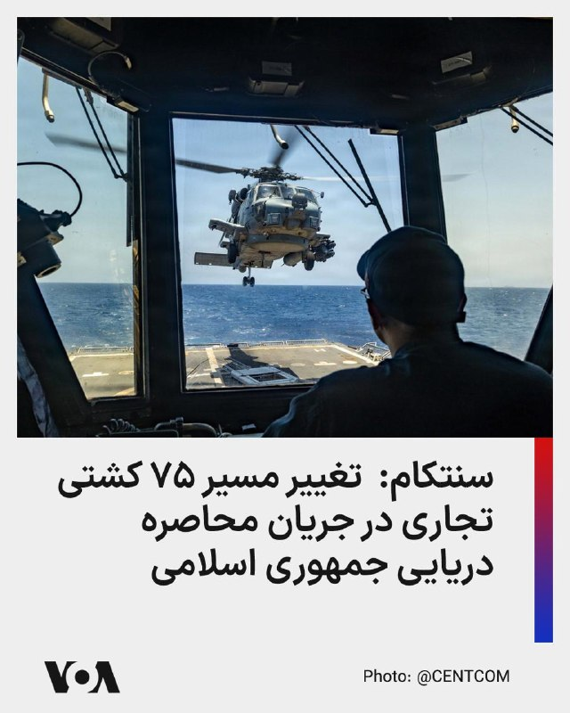

به گفته فرماندهی مرکزی ایالات متحده، سنتکام، نیروهای آمریکایی در چارچوب اجرای محاصره دریایی علیه جمهوری اسلامی ایران تاکنون مسیر ۷۵ کشتی تجاری را تغییر داده و چهار شناور را از کار انداخته‌اند.

سنتکام تصویر یک بالگرد سی‌هاوک که از عرشه ناوشکن «یو‌اس‌اس رافائل پرالتا» در دریای عرب به پرواز درآمده را منتشر کرده است.

@FarsiVOA

## FarsiVOA — post 217820

دونالد ترامپ، رئیس‌جمهوری آمریکا، که پس از یک سفر سه‌روزه پکن را به مقصد واشنگتن ترک کرد، از پیشرفت‌های تجاری میان دو کشور خبر داده است

## FarsiVOA — post 217819

🔺ترامپ: با تعلیق ۲۰ ساله برنامه هسته‌ای ایران موافقم، «اگر یک تعهد واقعی باشد»

▪️پرزیدنت ترامپ با غیرقابل قبول خواندن تازه‌ترین پیشنهاد رژیم ایران، اشاره کرد که تعلیق ۲۰ساله، به شرط این که واقعا ۲۰ سال تضمین شده باشد، کافی است.

⬇️ بیشتر بخوانید:

https://ir.voanews.com/a/8150374.html/?nocach=1

## FarsiVOA — post 217818

  <a href="telegram/content/FarsiVOA_217818_1778862961.mp4" target="_blank">🎬 Download video</a>

جنگنده‌های اف-۱۶ امارات متحده عربی، هواپیمای حامل نارندرا مودی، نخست‌وزیر هند، را هنگام عبور از حریم هوایی امارات اسکورت کردند.

@FarsiVOA

## FarsiVOA — post 217817

  <a href="telegram/content/FarsiVOA_217817_1778862963.mp4" target="_blank">🎬 Download video</a>

تصاویر منتشرشده در شبکه‌های اجتماعی، لحظه وقوع حمله هوایی اسرائیل به منطقه العباسیه در شهرستان صور در جنوب لبنان را نشان می‌دهد.

@FarsiVOA

## FarsiVOA — post 217816

  

وزیر خارجه جمهوری اسلامی اعلام کرد که حکومت ایران از هرگونه تلاش دیپلماتیک چین برای کاهش تنش در درگیری با ایالات متحده استقبال خواهد کرد.

عباس عراقچی در یک کنفرانس خبری در دهلی نو و در جریان سفرش برای شرکت در نشست وزرای خارجه بریکس گفت: «ما از هر کشوری که بتواند به روند حل‌وفصل کمک کند استقبال می‌کنیم، به‌ویژه چین. چین در گذشته نیز در ازسرگیری روابط ایران و عربستان نقش مثبتی ایفا کرده است.»

او افزود: «ما روابط بسیار خوبی با چین داریم و دو کشور شرکای راهبردی یکدیگر هستند. می‌دانیم که چینی‌ها نیت خوبی دارند، بنابراین هر اقدامی که از سوی آن‌ها برای کمک به دیپلماسی انجام شود، از سوی جمهوری اسلامی ایران مورد استقبال قرار خواهد گرفت.»

چین شریک دیپلماتیک نزدیک جمهوری اسلامی و بزرگ‌ترین خریدار نفت ایران است.

خبرگزاری رویترز، ساعاتی پس از ترک پکن از سوی دونالد ترامپ، رئیس‌جمهور آمریکا گزارش داد که او اعلام کرده که با تعلیق برنامه هسته‌ای ایران به مدت ۲۰ سال موافق است، اما باید یک «تعهد واقعی» از سوی تهران وجود داشته باشد.
@FarsiVOA

## FarsiVOA — post 217815

  

یک رسانه اسرائیلی خبر داد که گفته می‌شود سپهبد ایال زمیر رئیس ستاد ارتش اسرائیل، در جریان جنگ علیه حکومت ایران از امارات متحده عربی بازدید کرده است.

طبق گزارش رسانه دولتی کان اسرائیل، دیگر مقام‌های نظامی این کشور زمیر را در این سفر همراهی کردند. بر اساس این گزارش، در طول این سفر، زمیر با مقام‌های اماراتی، از جمله محمد بن زاید، رئیس‌ امارات دیدار کرده است.

ارتش اسرائیل هنوز درباره این گزارش اظهار نظر نکرده است.

این موضوع پس از آن مطرح شد که بنیامین نتانیاهو نخست‌وزیر اسرائیل روز چهارشنبه گفت او نیز در جریان جنگ علیه رژیم ایران از امارات بازدید کرده است؛ امارات بعدا این سفر را تکذیب کرد.

همچنین گزارش شده است که رؤسای شین‌بت و موساد نیز در جریان جنگ از امارات بازدید کرده‌اند.

پیشتر، مقام‌های ارشد آمریکایی گزارش‌ها مبنی بر این که اسرائیل یک سامانه «گنبد آهنین» را به امارات ارسال کرده، تأیید کردند.
@FarsiVOA

## FarsiVOA — post 217814

  

خبرگزاری رویترز گزارش داد که دونالد ترامپ، رئیس‌جمهور آمریکا اعلام کرده که با تعلیق برنامه هسته‌ای ایران به مدت ۲۰ سال موافق است، اما باید یک تعهد «واقعی» از سوی تهران وجود داشته باشد.

بر اساس گزارش رویترز، ترامپ همچنین گفت: «طی چند روز آینده درباره لغو تحریم‌ها علیه شرکت‌های نفتی چینی که نفت ایران را می‌خرند تصمیم خواهم گرفت.»

رئیس‌جمهور آمریکا گزارش‌هایی را که ادعا می‌کنند جمهوری اسلامی ظرفیت موشکی خود را حفظ کرده، رد کرد و گفت ۸۰ درصد این توان از بین رفته است.

آقای ترامپ که ساعاتی است پکن را به مقصد واشنگتن ترک کرده، در جریان دیدارش با همتای چینی خود گفت که دو کشور در زمینه عدم دستیابی جمهوری اسلامی به سلاح اتمی هم‌نظرند.
@FarsiVOA

## FarsiVOA — post 217813

🔺وزرای بریکس در صدور یک بیانیه مشترک ناکام شدند

▪️نشست دو روزه وزیران خارجه کشورهای عضو گروه اقتصادهای نوظهور بزرگ موسوم به «بریکس» در دهلی نو بدون صدور بیانیه مشترک پایان یافت.

▪️عدم صدور یک بیانیه مشترک در شرایطی بود که به گفته هند، میزبان این نشست، «دیدگاه‌های متفاوتی میان برخی اعضا» درباره وضعیت خاورمیانه وجود داشت.

▪️بریکس شامل کشورهای برزیل، روسیه، هند، چین، آفریقای جنوبی، اتیوپی، مصر، ایران، امارات متحده عربی و اندونزی است.

▪️اختلافات میان اعضا در جریان جنگ اخیر خاورمیانه، به‌ویژه میان تهران و امارات متحده عربی، بیشتر آشکار شده است.

⬇️ بیشتر بخوانید:
https://ir.voanews.com/a/8150371.html

## FarsiVOA — post 217812

🔺۱۸۲۰ ساعت انزوای دیجیتال؛ میلیاردها تومان خسارت و افزایش نگرانی‌های روانی

▪️ایران در حالی وارد هفتاد و هفتمین روز از محدودیت‌ها و اختلال گسترده اینترنت بین‌المللی شده است که به گفته نت‌بلاکس، نهاد پایش دسترسی به اینترنت، مجموع ساعات قطعی یا اختلال شدید به بیش از هزار و ۸۲۴ ساعت رسیده است.

▪️بر اساس گزارش‌ها، در طول جنگ ۱۲ روزه، اینترنت در ایران ۹ روز قطع بوده است. همچنین در جریان اعتراضات دی‌ماه، این اختلال به ۲۱ روز رسیده و از ۹ اسفند تا امروز نیز ۷۷ روز محدودیت ثبت شده است.

▪️در مجموع، این دوره‌ها حدود ۱۰۷ روز خاموشی یا اختلال اینترنتی را شامل می‌شود؛ به این معنا که شهروندان ایرانی تقریباً یک‌سوم روزهای ۱۱ ماهه گذشته را در شرایط دسترسی محدود به اینترنت سپری کرده‌اند.

⬇️ بیشتر بخوانید:
https://ir.voanews.com/a/8150370.html

## FarsiVOA — post 217811

  

عضو کمیسیون انرژی مجلس شورای اسلامی، مصرف روزانه بنزین کشور را حدود ۱۳۰ تا ۱۳۵ میلیون لیتر بنزین عنوان و اعلام کرد که توان «تولید و تأمین» بنزین، تنها روزانه حدود ۱۱۰ تا ۱۱۵ میلیون‌ لیتر است.

رمضانعلی سنگدوینی، به خبرگزاری تسنیم وابسته به سپاه گفته است که این «ناترازی ۲۰ میلیون لیتری» در شرایط فعلی، مدیریت مصرف سوخت را به یک ضرورت جدی تبدیل کرده است.

به گفته او، فقط تهران روزانه حدود ۲۰ میلیون لیتر بنزین نیاز دارد.

پیشتر محمدصادق معتمدیان، استاندار تهران، اعلام کرده بود که در حمله اسرائیل به مخازن انرژی در تهران طی جنگ ۴۰ روزه، ۷۰ تا ۸۰ میلیون لیتر سوخت از بین رفت.
@FarsiVOA

## FarsiVOA — post 217810

🔺روسیه و اوکراین ۲۰۵ زندانی و اسیر را مبادله کردند

▪️روسیه و اوکراین هر کدام ۲۰۵ زندانی و اسیر را روز جمعه در چهارچوب ابتکار دونالد ترامپ رئیس‌جمهور آمریکا مبادله کردند.

▪️در چهارچوب ابتکار دونالد ترامپ، قرار است طرفین مناقشه هر کدام هزار زندانی و اسیر آزاد کنند.

▪️ماه گذشته در دو مرحله مجموعاً ۳۶۸ زندانی مبادله شد.

⬇️ بیشتر بخوانید:
https://ir.voanews.com/a/8150369.html

## DW_Farsi — post 124736

🔶 آمادگی آمریکا برای گفت‌وگو با کوبا به شرط تغییرات اساسی

به گزارش رسانه‌های آمریکایی و اعلام دولت کوبا، جان رتکلیف، رئیس سازمان سیا در هاوانا با مقام‌های ارشد وزارت کشور کوبا دیدار کرده است. به‌گفته یک مقام سازمان سیا، او در این سفر پیام دونالد ترامپ را منتقل کرده مبنی بر اینکه آمریکا آماده گفت‌وگوی جدی درباره مسائل اقتصادی و امنیتی است، اما فقط در صورتی که کوبا تغییرات اساسی انجام دهد.

دولت کوبا اعلام کرد این دیدار به درخواست دولت آمریکا انجام شده و هدف آن، پیشبرد گفت‌وگوی سیاسی میان دو کشور در شرایطی بوده که روابط دو طرف همچنان "پیچیده" توصیف می‌شود.

بر اساس گزارش‌ها، رتکلیف در این سفر با لازارو آلوارز کاساس، وزیر کشور کوبا، و همچنین رائول گی‌یرمو رودریگز کاسترو، نوه رائول کاسترو، دیدار کرده است.

مقام‌های آمریکایی گفته‌اند رتکلیف برای انتقال این پیام به کوبا سفر کرده که واشنگتن آماده ورود به گفت‌وگو درباره مسائل اقتصادی و امنیتی است، اما این آمادگی "بدون شرط نیست و به انجام تغییرات بنیادی از سوی هاوانا بستگی دارد".

در مقابل، دولت کوبا گفت نمایندگان این کشور در این دیدار به‌روشنی تأکید کرده‌اند که کوبا هیچ تهدیدی برای امنیت ملی آمریکا نیست و دلیلی ندارد نام این کشور همچنان در فهرست دولت‌های حامی تروریسم باقی بماند.

هاوانا تصریح کرد که نه از سازمان‌های تروریستی حمایت می‌کند و نه هیچ‌گاه از فعالیت خصمانه‌ای علیه آمریکا پشتیبانی کرده است.

هم‌زمان با سفر هیأت آمریکایی، وزارت خارجه آمریکا اعلام کرد سیسی آباسکال سامورا، منتقد ۲۷ ساله دولت کوبا ، پس از آزادی از زندان همراه خانواده‌اش راهی تبعید در آمریکا شده است. او پس از اعتراضات گسترده ۱۱ ژوئیه ۲۰۲۱ به شش سال زندان محکوم شده بود.

روابط آمریکا و کوبا از زمان انقلاب ۱۹۵۹ همواره پرتنش بوده، اما با بازگشت ترامپ به کاخ سفید بار دیگر سخت‌تر شد.

او در ژانویه ۲۰۲۵ یکی از نخستین تصمیم‌های خود را به بازگرداندن نام کوبا به فهرست دولت‌های حامی تروریسم اختصاص داد. اکنون سفر رئیس سیا به هاوانا نشان می‌دهد دو طرف، با وجود فشار و بی‌اعتمادی، کانال گفت‌وگو را کاملا نبسته‌اند.
@dw_farsi

## DW_Farsi — post 124735

  

🔶 رهبران ۲۶ کشور جهان خواستار آزادی کشتیرانی در تنگه هرمز شدند

رهبران ۲۶ کشور جهان از جمله آلمان با صدور بیانیه‌ای مشترک، خواستار بازگشت وضعیت عادی دریانوردی در تنگه هرمز شده و حمایت خود را از یک ماموریت نظامی چندملیتی در این منطقه اعلام کردند.

به گزارش شبکه خبری سی‌ان‌ان، رهبران ۲۶ کشور جهان از جمله آلمان، فرانسه، بریتانیا، کانادا، بحرین، کره جنوبی و قطر در این بیانیه بر تعهد جمعی‌ برای به‌کارگیری منابع دیپلماتیک، اقتصادی و نظامی برای حمایت از آزادی کشتیرانی در تنگه هرمز تاکید کردند.

این کشورها خاطرنشان کردند، "کشتیرانی باید مطابق با کنوانسیون سازمان ملل متحد در مورد حقوق دریاها (UNCLOS) و قوانین بین‌المللی، آزاد باقی بماند".

همچنین در این بیانیه از یک ماموریت نظامی چندملیتی مستقل و دفاعی، شامل عملیات‌های مین‌روبی اعلام حمایت شده است.

در بخشی از این بیانیه تصریح شده است: «ماموریت نظامی چندملیتی به عنوان مکمل تلاش‌های دیپلماتیک و تنش‌زدایی جاری عمل خواهد کرد و اجرای چنین طرح‌هایی تنها در صورت ایجاد یک فضای مساعد میسر خواهد بود.»
@dw_farsi

## DW_Farsi — post 124734

  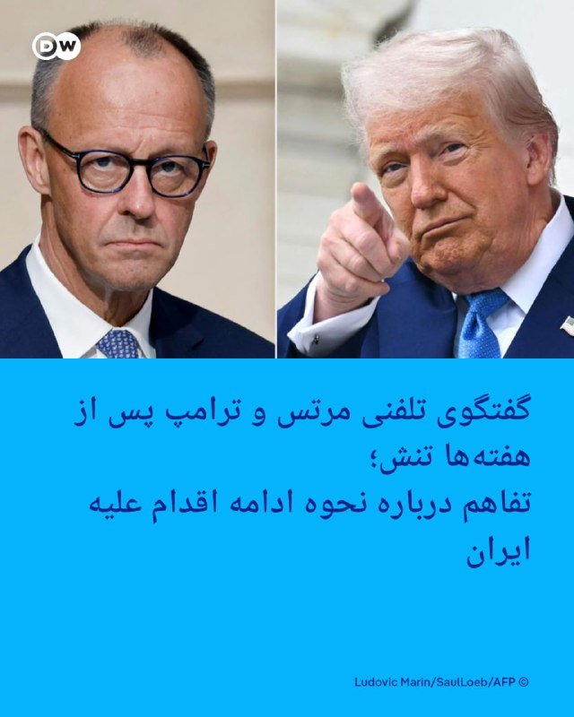

🔶 گفت‌وگوی تلفنی مرتس و ترامپ پس از هفته‌ها تنش؛ تفاهم درباره نحوه ادامه اقدام علیه ایران

سکوت خبری میان دونالد ترامپ و فریدریش مرتس پس از هفته‌ها تنش‌ بر سر اظهارات صدراعظم آلمان درباره جنگ ایران پایان یافت.
مرتس اعلام کرد که در طی سفر بازگشت ترامپ از چین به‌صورت تلفنی با او گفت‌وگو کرده است. صدراعظم آلمان با انتشار پیامی در شبکه اجتماعی ایکس این گفت‌وگو را "خوب" توصیف و بر وجود تفاهم و اشتراک نظر درباره نحوه ادامه اقدام در مسئله ایران تاکید کرد.

مرتس درباره این گفت‌وگو نوشت: «ما با هم هم‌نظر هستیم. ایران اکنون باید به میز مذاکره بازگردد. تنگه هرمز باید بازگشایی شود و تهران نباید به سلاح هسته‌ای دست یابد.»

ترامپ روز جمعه ۱۵ مه (۲۵ اردیبهشت) سفر خود به چین را به پایان رساند. به گفته او، "شی جین‌پینگ تمایل خود را برای کمک به بازگشایی تنگه هرمز ابراز کرده و همچنین تعهد داده از ایران به‌صورت نظامی حمایت نکند".
@dw_farsi

## DW_Farsi — post 124733

  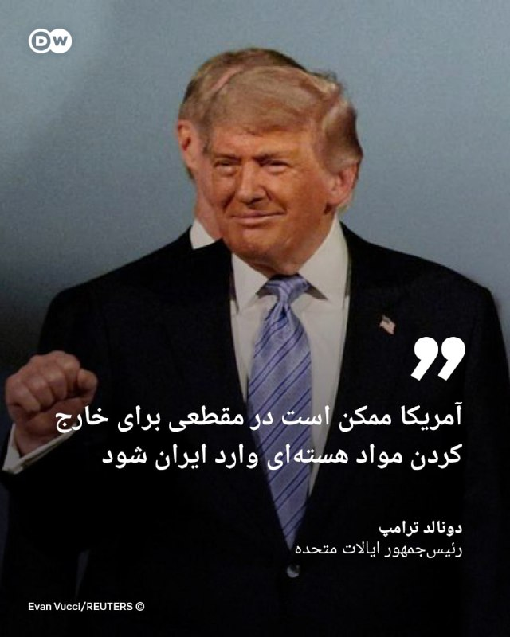

🔶 ترامپ: آمریکا ممکن است در مقطعی برای خارج کردن مواد هسته‌ای وارد ایران شود

دونالد ترامپ، رئیس‌جمهور ایالات متحده در پایان سفر خود به چین در جمع خبرنگاران در هواپیمای ریاست جمهوری (ایر فورس وان) اعلام کرد، "ایالات متحده ممکن است در مقطعی برای خارج کردن مواد هسته‌ای وارد ایران شود".

او گفت: «یا وارد می‌شویم یا آن را می‌گیریم. فکر می‌کنم احتمالا آن را خواهیم گرفت اما اگر نه، وارد می‌شویم.»

ترامپ همچنین بار دیگر با تاکید بر اینکه "ایران به‌طور کامل شکست خورده است" افزود: «ما اصلا با خطری روبرو نیستیم و تمام تجهیزات لازم برای خارج کردن مواد هسته‌ای را داریم، هیچ‌کس دیگری چنین تجهیزاتی ندارد؛ شاید چین داشته باشد.»

ترامپ پیش‌تر در ماه مارس سال جاری میلادی نیز در کاخ سفید درباره ذخایر اورانیوم غنی‌شده جمهوری اسلامی هشدار مشابهی داده و گفته بود: «یا آن را پس می‌گیریم یا آن را برمی‌داریم.»
@dw_farsi

## DW_Farsi — post 124732

  

🔶 ترامپ: با شی درباره لغو تحریم شرکت‌های چینی خریدار نفت ایران گفت‌وگو کردم

دونالد ترامپ، رئیس‌جمهور آمریکا اعلام کرد، در جریان سفر خود به پکن درباره لغو تحریم‌ها علیه شرکت‌های چینی خریدار نفت ایران گفت‌وگو کرده و به‌زودی درباره این موضوع تصمیم‌گیری خواهد کرد.

ایالات متحده اخیرا تحریم‌هایی را علیه چند پالایشگاه نفت چین از جمله شرکت "هنگ‌لی" (Hengli) را که یکی از بزرگ‌ترین پالایشگاه‌های خصوصی این کشور و نمادی از تلاش پکن برای نوسازی و ارتقای این صنعت به شمار می‌رود، به دلیل خرید نفت ایران اعمال کرد.

ترامپ اندکی پس از ترک پکن در پایان نشست دوروزه خود با شی جین‌پینگ، همتای چینی خود در جمع خبرنگاران در هواپیما گفت: «ما در این باره صحبت کردیم و من طی چند روز آینده تصمیم خواهم گرفت.»

مقام‌های آمریکایی از جمله ترامپ، در حالی موضوع احتمال خرید بیشتر انرژی آمریکا توسط چین را مطرح کردند که هنوز در گزارش‌های رسمی چین از این دیدار هیچ اشاره‌ای به توافقی در این زمینه نشده است.
@dw_farsi

## DW_Farsi — post 124731

🔶 کاهش مهاجرت غیرقانونی به اروپا و انتقاد از عملکرد آلمان

بر اساس آمار آژانس حفاظت از مرزهای اتحادیه اروپا (فرانتکس) که به صورت اختصاصی در اختیار سرویس خبری شبکه اول تلویزیون آلمان (تاگس‌شاو) قرار گرفته است، "عبور غیرقانونی از مرزهای اتحادیه اروپا، به‌ویژه از طریق مسیر مدیترانه به‌طور قابل‌توجهی کاهش یافته است".

فرانتکس در ارتباط با بازه زمانی ژانویه تا پایان آوریل سال جاری میلادی (۲۰۲۶) از کاهش ۴۰ درصدی ورود غیرقانونی به اتحادیه اروپا در مقایسه با مدت مشابه سال گذشته خبر داده است.

گفته شده است، تاکنون در سال جاری میلادی نزدیک به ۲۹ هزار نفر به‌صورت غیرقانونی (یعنی بدون مدارک معتبر یا بدون مجوز ورود و اقامت) وارد اتحادیه اروپا شده‌اند و این پایین‌ترین میزان مهاجرت غیرقانونی در سال‌های اخیر محسوب می‌شود.

اصلی‌ترین مسیر ورود مهاجران غیرقانونی همچنان مدیترانه مرکزی است که اغلب با نقطه شروع لیبی و ورود به سواحلی نظیر ایتالیا انجام می‌شود. پس از آن، مسیر مدیترانه شرقی قرار دارد که مهاجران از طریق ترکیه به مقصد یونان و قبرس وارد می‌شوند.

بر اساس آماری که آژانس حفاظت از مرزهای اتحادیه اروپا ثبت کرده است، هر یک از این دو مسیر، حدود یک‌سوم از کل ورودهای غیرقانونی به اتحادیه اروپا را به خود اختصاص می‌دهند.

به گفته فرانتکس همکاری با کشورهای شریک، از جمله در سواحل شمال آفریقا از جمله دلایل کاهش ورودهای غیرقانونی به اتحادیه اروپا بوده است.

این کشورها در ازای دریافت بودجه از اتحادیه اروپا، مانع از عبور افراد شده و به‌طور فزاینده‌ای فعالیت قاچاقچیان را متوقف می‌کنند. علاوه‌بر این، احتمالا شرایط نامساعد جوی در آغاز سال میلادی جاری نیز برخی افراد را از مهاجرت خطرناک بازداشته است.

اما با وجود کاهش میزان ورود مهاجران غیرقانونی به اتحادیه اروپا، شمار قربانیان همچنان بالاست. بر اساس اعلام سازمان بین‌المللی مهاجرت، از ابتدای سال ۲۰۲۶ تاکنون بیش از هزار و ۲۰۰ نفر در دریای مدیترانه جان خود را در پی تلاش برای رسیدن به اتحادیه اروپا از دست داده‌اند.

در یکی از آخرین موارد، به دلیل از کار افتادن قایق قاچاقچیان، ۴۸ مهاجر چندین روز در دریای مدیترانه سرگردان بودند و دست‌کم ۲۲ تن از آنان به دلیل کمبود آب و غذا، جان باختند و اجسادشان "به دستور یکی از قاچاقچیان" به دریا انداخته شده بود.

از سوی دیگر در حالی که کمتر از یک ماه دیگر به اجرای کامل پیمان اتحادیه اروپا درباره مهاجرت و پناهندگی باقی مانده است، تازه‌ترین تحلیل کمیسیون اتحادیه اروپا، نشان می‌دهد که آلمان در آماده‌سازی برای اصلاحات پناهندگی به کندی عمل کرده است.

پیمان مهاجرت و پناهندگی جدید اتحادیه اروپا از ۱۲ ژوئن (۲۲ خرداد) امسال به طور کامل اجرایی خواهد شد. این پیمان اصلاحات گسترده‌ای نظیر تقویت حفاظت مرزی با هماهنگی فرونتکس، تسریع روند رسیدگی به درخواست‌های پناهندگی در مرزهای خارجی اتحادیه اروپا، اخراج سریع و ثبت دیجیتالی تمام ورود و خروج‌ها در سراسر اتحادیه اروپا را در بر می‌گیرد.

اما بر اساس گزارش‌ها، آلمان تاکنون ظرفیت‌های کافی برای اجرای روند سریع رسیدگی به درخواست پناهندگی در مرزها، به‌ویژه در فرودگاه‌ها ایجاد نکرده است.
این در حالی است که به گفته کمیسیون اتحادیه اروپا، ۱۵ کشور دیگر عضو اتحادیه اروپا بهتر از آلمان به تعهدات خود عمل کرده‌اند.

بررسی‌های مربوط به روند اجرایی شدن "پیمان مهاجرت و پناهندگی جدید اتحادیه اروپا" در آلمان نشان می‌دهد، هنوز منابع لازم در فرآیند موسوم به "غربالگری" متقاضیان پناهندگی وجود ندارد و سامانه‌ای که در آن افراد موظف‌ شوند، اثر انگشت و سایر داده‌های بیومتریک خود را ثبت کنند با مشکل روبرو است.

گفتنی است، تعداد درخواست‌های پناهندگی در آلمان در سه‌ماهه نخست سال جاری (از اول ژانویه تا ۳۱ مارس ۲۰۲۶) در مقایسه با دوره مشابه سال گذشته نزدیک به یک‌چهارم (۲۳ درصد) کاهش یافته و به سطحی بی‌سابقه تنزل کرده است.

بدین ترتیب، این کشور برای نخستین بار از سال ۲۰۱۵ تاکنون، در رتبه چهارم آمار پناهندگی اروپا قرار گرفته است.
@dw_farsi

## DW_Farsi — post 124730

  <a href="telegram/content/DW_Farsi_124730_1778862970.mp4" target="_blank">🎬 Download video</a>

🎥 مدیر انویدیا در خیابان‌های پکن نودل خورد

پس از حواشی حضور ایلان ماسک در پکن، حالا ویدیوهایی از "جن سن هوانگ"، مدیر انویدیا منتشر شده که او را در خیابان‌های پکن در حال نودل‌ خوردن نشان می‌دهد.
@dw_farsi

## DW_Farsi — post 124729

  <a href="telegram/content/DW_Farsi_124729_1778862972.mp4" target="_blank">🎬 Download video</a>

🎥 هانتاویروس تکرار تجربه کووید-۱۹ است؟

با افزایش نگرانی‌ها درباره هانتاویروس، این پرسش مطرح شده که آیا ممکن است این ویروس نیز مانند کووید-۱۹ به یک پاندمی جهانی تبدیل شود.
 متخصصان تاکید می‌کنند که نحوه انتقال این بیماری بسیار محدودتر از کروناست و برای ابتلا نیاز به تماس نزدیک و طولانی‌مدت وجود دارد.
به همین دلیل، احتمال گسترش جهانی آن در حد کووید-۱۹ بسیار پایین ارزیابی می‌شود.
@dw_farsi

## DW_Farsi — post 124728

🔶 روسیه از "رهگیری ۳۵۵ پهپاد اوکراینی" خبر داد

رسانه‌های روسی و مقام‌های رسمی این کشور اعلام کردند ارتش روسیه در طول شامگاه پنجشنبه ۱۴ مه (۲۴ اردیبهشت) ۳۵۵ پهپاد اوکراینی را "رهگیری و منهدم" کرده است.

به گفته مسکو، این حملات به مناطق بلگورود، بریانسک و کورسک در نزدیکی مرز اوکراین صورت گرفته بود.

بنا بر اظهارات پاول مالکوف، فرماندار منطقه،در شهر ریازان در مرکز روسیه، سه نفر کشته و ۱۲ نفر دیگر زخمی شدند. او همچنین گفت دو ساختمان مسکونی و یک واحد صنعتی آسیب دیده‌اند.

بر اساس گزارش‌های منتشرشده در کانال‌های تلگرامی، این واحد صنعتی پالایشگاه ریازان بوده است؛ پالایشگاهی که از آن به‌عنوان سومین پالایشگاه بزرگ روسیه یاد می‌شود. در این گزارش‌ها از مشاهده آتش‌سوزی گسترده در محل هم سخن گفته شده است.

این حمله پس از یکی از طولانی‌ترین و شدیدترین حملات هوایی روسیه به اوکراین انجام شد. در کی‌یف، نیروهای امدادی تا صبح جمعه ۱۵ مه (۲۵ اردیبهشت) پیکر ۲۴ کشته را از زیر آوار یک ساختمان مسکونی بیرون آوردند که سه کودک نیز در میان آنها بودند.

در پایتخت اوکراین یک روز عزای عمومی اعلام شد و ولودیمیر زلنسکی به ارتش کشورش دستور داد برای این تلافی این حمله، برنامه‌ریزی‌های لازم را انجام دهد.

اوکراین در هفته‌های اخیر حملات خود به پالایشگاه‌ها، انبارهای نفت و بنادر روسیه را افزایش داده و می‌گوید هدف از این حملات، "تضعیف مهم‌ترین منبع درآمد مسکو برای ادامه جنگ" است.

با این حال، شمار دقیق کشته‌ها، زخمی‌ها و همچنین تعداد واقعی پهپادهای به‌کاررفته و سرنگون‌شده به‌طور مستقل قابل راستی‌آزمایی نیست.

از مناطق اطراف کی‌یف و دیگر شهرهای اوکراین نیز گزارش‌هایی از خسارات و تلفات انسانی منتشر شده است. مناطق خارکیف، اودسا و سومی نیز هدف گلوله‌باران شدید قرار گرفتند.

به گفته اولکسی کولبا، معاون نخست‌وزیر اوکراین در اودسا بنادر و تأسیسات راه‌آهن از جمله اهداف حملات روسیه بودند.

به گفته زلنسکی، در شهر خرسون یک خودروی متعلق به دفتر هماهنگی امور بشردوستانه سازمان ملل با پهپاد هدف قرار گرفت. او تصویری از یک خودروی آسیب‌دیده با نشان سازمان ملل را منتشر کرد. با این حال، گزارشی از مجروح شدن کسی منتشر نشده است. روسیه تاکنون واکنشی به این مسئله نشان نداده است.

در طول روز پنج‌شنبه ۱۴ مه نیز ارتش روسیه حملات پهپادی علیه اوکراین انجام داد؛ حملاتی که در طول روز نسبتاً غیرمعمول محسوب می‌شوند. بنا بر اعلام اوکراین، دست‌کم شش نفر در این حملات کشته و ده‌ها نفر زخمی شدند.

حملات شدید روسیه پس از سه روز آتش‌بس شکننده از شنبه تا دوشنبه انجام شد. به نظر می‌رسد روسیه می‌خواهد پیش از مذاکرات احتمالی بعدی، فشار بر اوکراین را افزایش دهد.

گفت‌وگوهای طرفین با میانجی‌گری آمریکا برای پایان دادن به جنگ تاکنون به نتیجه‌ای نرسیده‌اند. همچنین جنگ آمریکا علیه ایران از اواخر فوریه، روند این مذاکرات را بیش از پیش دچار وقفه کرده است.
@dw_farsi

## DW_Farsi — post 124727

🔶 حکایت "گوسالە طلایی"؛ ترامپ از کردها چه می‌خواهد؟

🔻گزارشی از امید برین

دونالد ترامپ در هفته‌های گذشته بارها کردها را متهم کرد که سلاح‌های ارسالی آمریکا برای معترضان داخل ایران را نگه داشته و تحویل نداده‌اند.
دویچه وله فارسی در این‌باره با رهبران احزاب کرد و تحلیل‌گران کرد مصاحبه کرده است.
دونالد ترامپ، رئیس‌جمهور ایالات متحده در هفته‌های گذشته بار دیگر در اظهاراتی جنجالی "کردها" را متهم کرده که سلاح‌های ارسالی آمریکا برای معترضان داخل ایران را نگه داشته و تحویل نداده‌اند.

او در گفته‌هایش مشخص نمی‌کند که سلاح‌های مورد ادعای او تحویل چه حزب و نهادی داده شده است. همین مسئله به بحث‌های زیادی دامن زده است.

در همین حال گفته‌های او اعتراضات بسیاری را از سوی جامعه سیاسی کردها در کشورهای مختلف از جمله در ایران و حتی در منطقه به دنبال داشته است.

دویچه وله فارسی برای بررسی این ادعا و ارزیابی نقش کردها در تحولات ایران، مصاحبه‌هایی با چند تن از رهبران و تحلیل‌گران کرد انجام داده است.

بسیاری از احزاب و نهادهای کرد، ضمن رد گفته‌های ترامپ آماده به صحبت در این‌باره نیستند.

منابعی از حزب کارگران کردستان (پ.ک.ک)، شاخص‌ترین تشکل سیاسی - نظامی کردهای ترکیه، حزب اتحاد دموکراتیک، بزرگترین تشکل سیاسی کردهای سوریه و همچنین حزب دمکرات کردستان عراق و اتحادیه میهنی کردستان که حکومت اقلیم کردستان را در کنترل دارند، در گفت‌وگوهای جداگانه با دویچه ولە فارسی گفته‌های ترامپ را رد و نامسئولانه خواندند.

همه این احزاب و سازمان‌ها دریافت هرگونه اسلحه از آمریکا به منظور ارسال آن‌ها "به معترضان ایرانی" را رد می‌کنند.

احزاب و سازمان‌های کردستان ایران نیز از پیش در بیانیه‌های جداگانه این موضوع را رد کرده‌اند.

دویچه وله فارسی به منظور کنکاش بیشتر درباره این موضوع با فریبا محمدی، معاون دبیرکل حزب کومله زحمتکشان کردستان، ادیب وطندوست، عضو کمیته مرکزی کومله، سازمان کردستان حزب کمونیست ایران، مصطفی مولودی، معاون دبیرکل حزب دمکرات کردستان ایران، کمال چومانی، سردبیر نشریه آمارگی و دکتر کامران متین دانشیار روابط بین‌الملل دانشگاه ساسکس گفت‌وگو کرده است.

فریبا محمدی در گفت‌وگو با دویچه ولە فارسی با تأکید بر موضع رسمی احزاب کرد، ادعای ترامپ را رد کرد و گفت: «ما پیش‌تر نیز این ادعاها را به‌طور رسمی رد کرده‌ایم. در واقع تقریباً تمامی احزاب و جریان‌های سیاسی کردستان این موضوع را تکذیب کرده‌اند. هرگز چنین سلاح‌هایی به دست احزاب و نیروهای سیاسی کرد نرسیده است.»

متن کامل گزارش را در وب سایت دویچه وله فارسی بخوانید.
@dw_farsi

## DW_Farsi — post 124726

  <a href="telegram/content/DW_Farsi_124726_1778862974.mp4" target="_blank">🎬 Download video</a>

🎥 چرا جنگ ایران اتوبان‌های آلمان را تهدید می‌کند؟

با بالا گرفتن تنش‌ها و جهش قیمت جهانی نفت، پروژه‌های جاده‌سازی در آلمان با بحران تازه‌ای روبه‌رو شده‌اند؛ زیرا قیر، ماده اصلی آسفالت اتوبان‌ها، به‌دلیل افزایش بهای نفت به‌شدت گران شده است.
@dw_farsi

## DW_Farsi — post 124725

🔶 توقف موقت فعالیت‌های فرودگاه هلسینکی به دلیل مشاهده یک پهپاد

فرودگاه هلسینکی بامداد جمعه (۱۵ مه ۲۰۲۶) به‌دلیل هشدار امنیتی درباره احتمال حضور یک پهپاد، برای چند ساعت فعالیت‌های خود را متوقف کرد. مقام‌های فنلاندی بعدتر اعلام کردند خطر در منطقه اوسیما برطرف شده و رفت‌وآمد هوایی در فرودگاه از سر گرفته شده است.

خبرگزاری آلمان گزارش داد، نهادهای امنیتی برای منطقه اوسیما در جنوب فنلاند، که هلسینکی را نیز در بر می‌گیرد، هشدار خطر صادر کردند و از حدود ۱/۸ میلیون نفر از ساکنان این منطقه خواستند در خانه‌های خود بمانند.

در پی این هشدار، فرودگاه هلسینکی از حدود ساعت ۴ تا ۷ صبح به وقت محلی فعالیت خود را متوقف کرد.

در گزارش‌ها آمده است نیروهای مسلح فنلاند به‌طور موقت جنگنده‌هایی را به پرواز درآوردند و دیگر نهادهای امدادی و امنیتی نیز وارد عمل شدند.

@dw_farsi

## DW_Farsi — post 124724

  

🔶 عراقچی: تنگه هرمز تنها برای دشمنان ما بسته است

عباس عراقچی، وزیر خارجه جمهوری اسلامی در گفت‌وگو با یک رسانه هندی به موضوعاتی از جمله پیامدهای جنگ آمریکا و اسرائیل علیه جمهوری اسلامی پرداخت.

او با قدردانی از موضع بریکس در محکومیت حملات آمریکا و اسرائیل، این حملات را "تجاوزی برخلاف اصول اساسی حقوق بین‌الملل و منشور سازمان ملل متحد" توصیف کرد و گفت: «مسیر پیش‌روی بریکس ادامه حرکت بر پایه اصول این گروه و مسیری است که به‌طور مشترک آغاز کرده‌ایم.»

او افزود: «درباره غرب آسیا نیز معتقدم بهترین راه، دیپلماسی است.» عراقچی در ادامه بدون اشاره به حملات مداوم جمهوری اسلامی به کشورهای همسایه خلیج فارس در جریان جنگ اخیر مدعی شد: «هیچ راه‌حل نظامی‌ای وجود ندارد و فکر می‌کنم ایالات متحده باید این واقعیت را درک کند. آن‌ها دست‌کم دو بار ما را آزموده‌اند و اکنون به این نتیجه رسیده‌اند که راه‌حل نظامی وجود ندارد.»

وزیر خارجه جمهوری اسلامی افزود: «آن‌ها نمی‌توانند از طریق اقدامات نظامی به اهداف خود برسند، اما اگر مسیر دیپلماسی را دنبال کنند، موضوع متفاوت خواهد بود. ما پیش‌تر تعاملات را آغاز کرده‌ایم، اما همان‌طور که می‌دانید مشکلات زیادی در این مسیر وجود دارد. مهم‌ترین مشکل، پیام‌های متناقضی است که از سوی آمریکایی‌ها از طریق اظهارنظرها، مصاحبه‌ها و مواضع مختلف دریافت می‌کنیم.»

عراقچی همچنین با اشاره به اختلالات ایجادشده در تنگه هرمز که فشار زیادی بر زنجیره تامین جهانی و به‌ویژه در زمینه انرژی ایجاد کرده، جمهوری اسلامی را در این خصوص مقصر ندانست و گفت که حکومت ایران "آغازگر این جنگ" نبوده است.

عراقچی افزود: «ما فقط از خود دفاع می‌کنیم و معتقدم حق کامل دفاع مشروع را داریم. تا آنجا که به ما مربوط می‌شود، تنگه هرمز بسته نیست، به‌ویژه برای کشورهای دوست. این محدودیت تنها برای دشمنان ما اعمال می‌شود.»

وزیر خارجه جمهوری اسلامی در ادامه افزود: «کشتی‌های متعلق به کشورهای دوست و سایر کشورها فقط ملزم هستند عبور خود را با نیروهای نظامی ما هماهنگ کنند تا از هرگونه مانع احتمالی جلوگیری شود و عبوری امن داشته باشند. در روزهای گذشته نیز کشتی‌های زیادی با کمک نیروهای دریایی ما از این تنگهعبور کرده‌اند و این روند ادامه خواهد داشت.»

@dw_farsi

## DW_Farsi — post 124723

  

🔶 الهه و الناز محمدی برنده جایزه "شجاعت در روزنامه‌نگاری" شدند

بنیاد بین‌المللی رسانه زنان (IWMF) برنگان سی‌وهفتمین دوره سالانه جوایز "شجاعت در روزنامه‌نگاری" را معرفی کرد.

این جایزه از زنانی تقدیر می‌کند که تحت شرایط خطرناک و فشار شدید برای آشکار کردن حقیقت گزارش تهیه می‌کنند.

برندگان سال ۲۰۲۶ شامل الهه و الناز محمدی، خواهران ایرانی و خبرنگاران رسانه‌های چاپی؛ جورجیا فورت، خبرنگار تلویزیونی از ایالات متحده آمریکا؛ و نای مین نی (با استفاده از نام مستعار)، خبرنگار دیجیتال از میانمار هستند.

فرنچی می کامپیو، خبرنگار فیلیپینی که درباره خشونت حکومتی در فیلیپین گزارش تهیه می‌کند و اکنون در همان کشور زندانی است، جایزه "والیس آننبرگ برای عدالت برای زنان روزنامه‌نگار" بنیاد بین‌المللی رسانه زنان در سال ۲۰۲۶ را دریافت کرد؛ این جایزه‌ که هر سال به روزنامه‌نگاری اعطا می‌شود که به ناحق بازداشت، زندانی یا محبوس شده باشد.

برندگان جایزه شجاعت امسال از میان نامزدهایی از ۵۳ ملیت انتخاب شدند. به گفته ناظران، این امر نشان‌دهنده کاهش آزادی مطبوعات در جهان است و با ترکیبی از فشارهای حقوقی، ارعاب جنسیتی و هدف‌گیری دیجیتال تشدید شده است.

الیزا لیس مونوز، رئیس بنیاد بین‌المللی رسانه زنان با اشاره به برندگان جوایز امسال شجاعت در روزنامه‌نگاری گفت: «جرم‌انگاری حقیقت‌گویی همان چیزی است که شجاعت را به آینده روزنامه‌نگاری تبدیل می‌کند. برای زنانی که جرات گزارشگری دارند، خود روزنامه‌نگاری در حال بازتعریف شدن به‌عنوان عملی قابل مجازات است.»

او افزود: «ما دیگر در جهانی از سرکوب واکنشی زندگی نمی‌کنیم، بلکه در جهانی از بازدارندگی پیش‌دستانه هستیم؛ جایی که خودِ گزارشگری به یک مسئولیت خطرناک تبدیل شده است. بنیاد بین‌المللی رسانه زنان با افتخار از الهه، الناز، فرنچی، جورجیا و نای، زنانی که با همان خطری زندگی می‌کنند که درباره آن گزارش تهیه می‌کنند، امسال با جوایز شجاعت تقدیر می‌کند.»

@dw_farsi

## DW_Farsi — post 124722

  

🔶 ترامپ: روند نابودی نظامی ایران ادامه خواهد داشت

دونالد ترامپ، رئیس ‌جمهور ایالات متحده آمریکا، در یک پست طولانی در شبکه اجتماعی خود تروث سوشال، هنگام فهرست کردن آنچه موفقیت‌های دولتش خواند، از "درهم‌کوبیدن نظامی ایران" نام برد.

او در ادامه جمله مربوط به ایران، داخل پرانتز نوشت: «ادامه دارد»؛ عبارتی که به گفته ناظران سیاسی ممکن است نشان‌دهنده این باشد که او پس از بازگشت از سفرش به چین در روز جمعه، جنگ علیه جمهوری اسلامی را از سر بگیرد.

همزمان برخی منابع خبری اسرائیلی گزارش داده‌اند که در اسرائیل این باور وجود دارد که ترامپ، پس از بازگشت از سفرش به چین در پایان هفته، درباره ازسرگیری جنگ علیه ایران تصمیم خواهد گرفت.

بر اساس اعلام منابع اسرائیلی، رئیس ‌جمهور آمریکا با دو گزینه اصلی روبه‌رو است: ازسرگیری درگیری‌ها، همان‌طور که گفته می‌شود بنیامین نتانیاهو، نخست‌وزیر اسرائیل، این گزینه را ترجیح می‌دهد، یا گزینه دوم یعنی ازسرگیری محاصره تنگه هرمز در چارچوب آنچه عملیات آمریکایی "پروژه آزادی" توصیف شده است.

در عین حال، بر اساس گزارش شبکه ۱۲ اسرائیل (کان)، ترامپ همچنین ممکن است در پایان سفر تاریخی خود به چین تصمیم بگیرد که "هیچ تصمیمی" نگیرد.

در همین راستا منابع اسرائیلی به روزنامه هاآرتص گفته‌اند اگرچه در حال حاضر، وضعیت هشدار غیرعادی وجود ندارد، اما احتمال ازسرگیری درگیری‌ها در روزهای آینده همچنان وجود دارد.

@dw_farsi

## DW_Farsi — post 124721

  

🔶 رویترز از حمله پهپادی به مقر یک حزب کرد ایرانی در اربیل خبر داد

خبرگزاری رویترز به نقل از منابع امنیتی، از حمله دو پهپاد به یک مقر احزاب کرد ایرانی مخالف جمهوری اسلامی در شمال اربیل در اقلیم کردستان عراق خبر داد.
این خبرگزاری نوشت که این حمله توسط دو پهپاد روز جمعه صورت گرفته است. با این حال رویترز نام این حزب را ذکر نکرده و جزئیات بیشتری در خصوص خسارات و تلفات احتمالی این حمله منتشر نکرده است.

پیش از این این، حزب دموکرات کردستان ایران از حمله پهپادی مجدد جمهوری اسلامی به کمپ‌های این حزب در شامگاه چهارشنبه، ۲۳ اردیبهشت‌ماه ۱۴۰۵، ساعت ۲۱:۳۰ به وقت محلی خبر داده بود.

بر اساس اطلاعیه این حزب، جمهوری اسلامی در این حمله با دو پهپاد، کمپ "جژنیکان" متعلق به حزب دموکرات کردستان ایران در نزدیکی اربیل را هدف قرار داد که گفته شده "محل استقرار خانواده‌ها و پناهجویان این حزب است".

این کمپ به گفته حزب دموکرات کردستان از ابتدای جنگ۴۰ روزه، "تاکنون بارها هدف حملات مستقیم قرار گرفته است".

حزب دموکرات کردستان پیش از این اعلام کرده بود که حکومت ایران از زمان آغاز درگیری‌ها با آمریکا و اسرائیل، "با بیش از ۱۲۶ فروند موشک و پهپاد، کمپ‌های مدنی، مراکز درمانی و نهادهای آموزشی حزب دموکرات کوردستان ایران را هدف قرار داده است".

@dw_farsi

## DW_Farsi — post 124720

  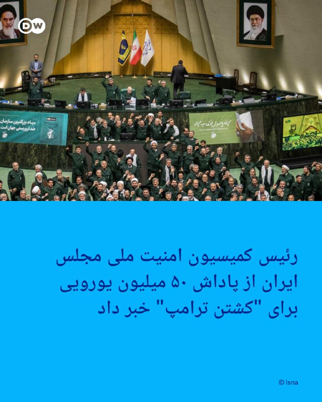

🔶 رئیس کمیسیون امنیت ملی مجلس: ۵۰ میلیون یورو پاداش برای کشتن ترامپ

ابراهیم عزیزی، رئیس کمیسیون امنیت ملی و سیاست خارجی مجلس در شورای اسلامی، در اظهار نظری درباره طرح جمهوری اسلامی برای اقدامات بعدی جنگ در برابر آمریکا مدعی شد: «چند طرح را از زمان شروع جنگ سوم، آماده کردیم که طرح اقدام متقابل توسط نیروهای نظامی و امنیتی از جمله آنها است.»

عزیزی با اشاره به طرحی با عنوان "اقدام متقابل توسط نیروهای نظامی و امنیت" گفت: «پیش بینی کرده‌ایم که دولت به هر فرد حقیقی و حقوقی که این رسالت دینی (کشتن ترامپ) را انجام دهد به عنوان پاداش ۵۰ میلیون یورو بپردازد.»

او همچنین خواستار هدف قرار گرفتن دونالد ترامپ، رئیس جمهور آمریکا، بنیامین نتانیاهو، نخست‌وزیر اسرائیل و همچنین فرمانده سنتکام شد و گفت این افراد "باید مورد برخورد و اقدام متقابل قرار بگیرند".

رئیس کمیسیون امنیت ملی و سیاست خارجی مجلس در شورای اسلامی همچنین مدعی شد: «ما این حق را با پایان جنگ و پیروزی‌هایی که در جنگ به دست آوردیم، جدا می‌دانیم.»

عزیزی گفت همان‌طور که ترامپ دستور کشتن علی خامنه‌ای، رهبر پیشین جمهوری اسلامی را صادر کرده، خود او "باید به دست هر مسلمان و آزاده‌ای مورد برخورد قرار بگیرد."

@dw_farsi

## Persian_Trend_Official — post 14200

  <a href="telegram/content/Persian_Trend_Official_14200_1778862981.webm" target="_blank">🎬 Download video</a>

بجا مانده از رزمایش خامنه ای !!! به نظر شما چه چیزی در این تصویر جلب توجه میکند ؟ اضافه وزن نیروی سپاه پاسداران که اصلا شبیه یک نظامی ورزیده نیست . به مدل نشستن رو زاپاس هم اصلا نمیپردازیم ! وقتی میگم سپاه پاسداران از یک ارتش حرفه ای به یک گروه مسلح تبدیل…

## Persian_Trend_Official — post 14199

  <a href="telegram/content/Persian_Trend_Official_14199_1778862982.webm" target="_blank">🎬 Download video</a>

بجا مانده از رزمایش خامنه ای !!!

به نظر شما چه چیزی در این تصویر جلب توجه میکند ؟

اضافه وزن نیروی سپاه پاسداران که اصلا شبیه یک نظامی ورزیده نیست .
به مدل نشستن رو زاپاس هم اصلا نمیپردازیم !

وقتی میگم سپاه پاسداران از یک ارتش حرفه ای به یک گروه مسلح تبدیل شده دلیلش این هست.
تازه عرزشی ها اعتقاد دارن جنگ زمینی تخصص اون هاست !

📌 @persian_trend_official
پرشین ترند | متفاوت‌ترین کانال نظامی

## Persian_Trend_Official — post 14198

  

واقعا چرا ؟

📌 @persian_trend_official
پرشین ترند | متفاوت‌ترین کانال نظامی

## Persian_Trend_Official — post 14197

  <a href="telegram/content/Persian_Trend_Official_14197_1778862983.mp4" target="_blank">🎬 Download video</a>

محمد منان رئیسی، نماینده مجلس: خسارت مستقیم جنگ به ایران فقط ۳۰ میلیارد دلار برآورد می‌شود در حالی که درآمد هر سال عوارض تنگه هرمز ۵۰ میلیارد دلار خواهد بود !!!

📌 @persian_trend_official
پرشین ترند | متفاوت‌ترین کانال نظامی

## Persian_Trend_Official — post 14195

  

بیا تا جهان را به بد نسپریم
به کوشش همه دست نیکی بریم
نباشد همی نیک و بد پایدار
همان به که نیکی بود یادگار

🔹امروز روز گرامیداشت حکیم ابولقاسم فردوسی و پاسداشت زبان فارسی است

🫆:Tony

📌 @persian_trend_official
پرشین ترند | متفاوت‌ترین کانال نظامی

## Persian_Trend_Official — post 14194

  

💢ترامپ:

💢چین یک سالن رقص دارد، و آمریکا هم باید داشته باشد!

💢این سالن در حال ساخت است، جلوتر از برنامه زمان‌بندی، و بهترین مرکز از نوع خود در سراسر آمریکا خواهد بود. از تمام حمایت‌هایی که برای پیشبرد این پروژه دریافت کرده‌ام، سپاسگزارم. افتتاح برنامه‌ریزی شده حدود سپتامبر ۲۰۲۸ خواهد بود.

💢مردی که با او قدم می‌زنم، رئیس‌جمهور شی، از چین، یکی از رهبران بزرگ جهان است!

🫆:Tony

📌 @persian_trend_official
پرشین ترند | متفاوت‌ترین کانال نظامی

## Persian_Trend_Official — post 14193

  <a href="telegram/content/Persian_Trend_Official_14193_1778862987.mp4" target="_blank">🎬 Download video</a>

#طنز_تلخ

روش تضمینی پولدار شدن. ✅️

پ.ن: صداش رو در نیارید که الان دلار 1,800,000 ریال هست. 🤫🗿

📝 Nick

📌 @persian_trend_official
پرشین ترند | متفاوت‌ترین کانال نظامی

## Persian_Trend_Official — post 14192

  <a href="telegram/content/Persian_Trend_Official_14192_1778862989.mp4" target="_blank">🎬 Download video</a>

🔴ترامپ در پاسخ به گفتگو در مورد حملات سایبری با شی جین پینگ پاسخ داد :

💢آره، بهش گفتم . اونم شروع کرد درباره کارایی که ما تو چین کردیم حرف زد

💢خب میدونی ، هرکاری اونا بکنن ماهم میکنیم . ماهم ازشون جاسوسی میکنیم .

💢بهش گفتم ما یه عالمه کارها علیه شما میکنیم که اصلا خبر ندارین

پ ن : نخود در دهن ترامپ خیس نمیخورد ...

🫆:Tony

📌 @persian_trend_official
پرشین ترند | متفاوت‌ترین کانال نظامی

## Persian_Trend_Official — post 14191

🔴 صدراعظم آلمان: ایران باید فوراً به میز مذاکره بازگردد

💢فریدریش مرتس، صدراعظم آلمان، اعلام کرد در مسیر بازگشت از چین با دونالد ترامپ گفت‌وگوی تلفنی داشته است.

💢مرتس گفت:

▪️ او و ترامپ توافق دارند ایران باید فوراً به مذاکرات بازگردد
▪️ ایران نباید به سلاح هسته‌ای دست پیدا کند
▪️ تهران باید تنگه هرمز را باز کند

💢این اظهارات در حالی مطرح می‌شود که عباس عراقچی، وزیر خارجه ایران، پیش‌تر گفته بود تنگه هرمز برای کشورهای «دوست» باز است؛ مشروط به هماهنگی با مقام‌های ایرانی، اما این موضوع شامل کشورهای «دشمن» نمی‌شود.

🫆:Tony

📌 @persian_trend_official
پرشین ترند | متفاوت‌ترین کانال نظامی

## Persian_Trend_Official — post 14190

🔴 حزب‌الله مدعی حمله به تجهیزات و نیروهای اسرائیلی در جنوب لبنان شد

💢حزب‌الله لبنان در چند بیانیه جداگانه اعلام کرد مواضع و تجهیزات ارتش اسرائیل را در جنوب لبنان هدف قرار داده است.

بر اساس ادعای حزب‌الله:

▪️ یک تانک اسرائیلی در نزدیکی منطقه «البیاضه» هدف قرار گرفته است
▪️ سه بولدوزر نظامی ارتش اسرائیل در شهر «الخيام» مورد حمله قرار گرفته‌اند
▪️ همچنین تجمعی از نیروهای اسرائیلی در منطقه «رشاف» با راکت و توپخانه هدف قرار گرفته است

🫆:Tony

📌 @persian_trend_official
پرشین ترند | متفاوت‌ترین کانال نظامی

## Persian_Trend_Official — post 14189

ترامپ مدعی شد: رئیس جمهور چین به من اطمینان داد که با داشتن سلاح هسته‌ای توسط ایران مخالف است. 🔹من از رئیس جمهور چین چیزی در رابطه با ایران نخواستم. 🔹من از رئیس جمهور چین نخواستم که به ایران برای باز کردن تنگه هرمز فشار بیاورد. 🔹ظرف چند روز آینده در مورد…

## Persian_Trend_Official — post 14188

  <a href="telegram/content/Persian_Trend_Official_14188_1778862992.webm" target="_blank">🎬 Download video</a>

🔴ترامپ: «من دیگر خیلی بیشتر از این صبر نخواهم کرد. آنها باید توافق را امضا کنند.» 💢آخرین چیزی که الان به آن نیاز داریم جنگ است، ایران میتواند اورانیوم غنی شده خود را به چین یا آمریکا تحویل دهد 🫆:Tony 📌 @persian_trend_official پرشین ترند | متفاوت‌ترین کانال…

## Persian_Trend_Official — post 14187

🔴ترامپ اشاره کرد که می‌تواند توقف ۲۰ ساله فعالیت‌های هسته‌ای ایران را بپذیرد: ۲۰ سال کافی است. اما سطح تضمین از طرف آنها... باید واقعاً ۲۰ سال باشد. 🫆:Tony 📌 @persian_trend_official پرشین ترند | متفاوت‌ترین کانال نظامی

## Persian_Trend_Official — post 14186

  <a href="telegram/content/Persian_Trend_Official_14186_1778862992.mp4" target="_blank">🎬 Download video</a>

🔴ترامپ اشاره کرد که می‌تواند توقف ۲۰ ساله فعالیت‌های هسته‌ای ایران را بپذیرد:

۲۰ سال کافی است. اما سطح تضمین از طرف آنها... باید واقعاً ۲۰ سال باشد.

🫆:Tony

📌 @persian_trend_official
پرشین ترند | متفاوت‌ترین کانال نظامی

## Persian_Trend_Official — post 14184

  <a href="telegram/content/Persian_Trend_Official_14184_1778862995.mp4" target="_blank">🎬 Download video</a>

💢عراقچی: خبر رد پیشنهاد جمهوری اسلامی توسط آمریکا برای چند روز پیش هست/ پیام‌های از آمریکا گرفتیم که مایل به ادامه گفتگو و تعامل هستند

🔹وزیر امورخارجه در نشست خبری:

💢اینکه مطرح شده آمریکا پیشنهاد یا پاسخ ایران را رد کرده مربوط به چند روز پیش هست که آقای ترامپ توییت زد و گفت که غیر قابل قبول هست و ولی بعد از ما مجدد پیام‌هایی را از طرف آمریکایی‌ها گرفتیم که مایل به ادامه گفتگوها و ادامه تعامل هستند.

💢اینکه امروز چطوری دوباره این موضوع در رسانه‌ها برجسته شده، من اطلاع ندارم ولی قضیه مربوط به چند روز پیش هست.

🫆:Tony

📌 @persian_trend_official
پرشین ترند | متفاوت‌ترین کانال نظامی

## RadioFarda — post 157230

🔸امارات متحده عربی روز جمعه ۲۵ اردیبهشت «تلاش‌ها برای توجیه حملات تروریستی ایران» را رد کرد و گفت که حق پاسخگویی به هرگونه تهدید، ادعا یا اقدام خصمانه ایران را برای خود محفوظ می‌دارد. 🔸در بیانیه وزارت خارجه امارات آمده است که خلیفه بن شاهین المرر، وزیر مشاور…

## RadioFarda — post 157229

  

🔸امارات متحده عربی روز جمعه ۲۵ اردیبهشت «تلاش‌ها برای توجیه حملات تروریستی ایران» را رد کرد و گفت که حق پاسخگویی به هرگونه تهدید، ادعا یا اقدام خصمانه ایران را برای خود محفوظ می‌دارد.

🔸در بیانیه وزارت خارجه امارات آمده است که خلیفه بن شاهین المرر، وزیر مشاور در امور خارجه، «به‌طور قاطع ادعاهای ایران و تلاش‌ها برای توجیه حملات تروریستی ایران که امارات و دیگر کشورها را هدف قرار داده است، رد کرد».

🔸این بیانیه در پی نشست روز ۲۴ اردیبهشت بریکس در دهلی نو منتشر شد که در آن‌جا عباس عراقچی، وزیر خارجه ایران، با اشاره به حملات آمریکا و اسرائیل، گفت: «امارات شریک فعال این تجاوز است و هیچ تردیدی در این باره وجود ندارد».

@RadioFarda

## RadioFarda — post 157228

  <a href="https://t.me/radiofarda/157228" target="_blank">📎 Download file</a>

🔸 در این کافه‌ فردا به صحبت‌های معاون وزیر بهداشت در مورد هانتاویروس، سر دادن نوحه‌های کودکانه برای مجتبی‌ خامنه‌ای در تجمعات، گزارش‌های کذب رسانه‌های حکومتی در مورد اعطای نشان به سفیر جمهوری اسلامی در واتیکان، شروع پخش سریال فصل جدید سریال برلین می‌پردازیم و زندگی و آثار منوچهر سخایی و ادل را مرور می‌کنیم.

🔸 برای تماس با ما می‌توانید به شناسه کافه فردا در تلگرام صوت و متن بفرستید.

📻 کافه فردا

## RadioFarda — post 157227

  

🔸مولوی عبدالحمید اسماعیل‌زهی، امام جمعه اهل سنت زاهدان، روز جمعه ۲۵ اردیبهشت از افزایش اعدام‌ها در ایران انتقاد کرد و خواستار توقف «اعدام‌های سیاسی» شد.

🔸او در سخنرانی نماز جمعه زاهدان گفت این اعدام‌ها «به خیر کشور و به مصلحت حاکم و مردم نیستند» و افزود اعدام راه‌حل مشکلات کشور نیست.

🔸مولوی عبدالحمید همچنین با انتقاد از «اعتراف اجباری» در بازداشتگاه‌ها گفت چنین اعترافاتی با شریعت اسلام، قانون اساسی ایران و قوانین بین‌المللی «مطابقت ندارد» و نباید مبنای صدور حکم قرار گیرد.

🔸از زمان حملات آمریکا و اسرائیل به ایران، جمهوری اسلامی اجرای احکام اعدام را افزایش داده است و در برخی روزها چند نفر را اعدام کرده است.

🔸بر اساس گزارش مشترک سازمان «حقوق بشر ایران» مستقر در نروژ و سازمان «با هم علیه مجازات اعدام» مستقر در پاریس، که ۲۴ فروردین امسال منتشر شد، ایران در سال ۲۰۲۵ دست‌کم «یک هزار و ۶۳۹ نفر» را اعدام کرده‌ است. این «بالاترین» تعداد اعدام طی یک‌سال در ایران از سال ۱۳۶۸ تاکنون است.

@RadioFarda

## RadioFarda — post 157226

  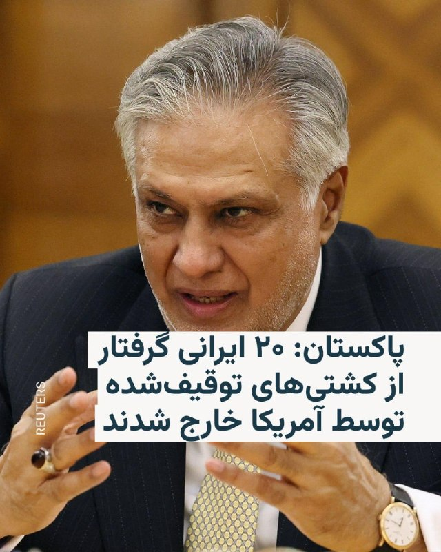

🔸وزیر خارجه پاکستان اعلام کرد که یازده شهروند پاکستانی و ۲۰ شهروند ایرانی که در کشتی‌های توقیف‌شده توسط آمریکا در آب‌های آزاد گرفتار شده بودند، به اسلام‌آباد منتقل می‌شوند.

🔸اسحاق دار روز جمعه ۲۵ اردیبهشت در شبکه ایکس نوشت: «خوشحالم که اعلام کنم ما در بازگرداندن یازده شهروند پاکستانی، همراه با ۲۰ شهروند کشور برادر ایران، از طریق سنگاپور موفق بوده‌ایم؛ افرادی که در کشتی‌های توقیف‌شده توسط ایالات متحده در آب‌های آزاد حضور داشتند».

🔸وزیر خارجه پاکستان افزوده که همه این افراد در «سلامت کامل» هستند و «روحیه خوبی» دارند.

🔸اسحاق دار افزوده که «تمامی این افراد از سنگاپور به بانکوک رسیده‌اند و اکنون سوار پروازی شده‌اند که قرار است اواخر امشب به اسلام‌آباد برسد. سپس بازگشت برادران ایرانی به وطن خود تسهیل خواهد شد».

🔸او از دولت آمریکا و مارکو روبیو، وزیر خارجه این کشور، و نیز وزیر خارجه سنگاپور و مقام‌های دولت این کشور و عباس عراقچی، وزیر خارجه ایران، بابت «اعتمادی که به پاکستان برای بازگرداندن برادران ایرانی‌مان داشت»، قدردانی کرده است.

@RadioFarda

## RadioFarda — post 157225

ایران روزانه دست‌کم «شش میلیون لیتر» سوخت به پاکستان قاچاق می‌کند

🔸بازرگانان و فعالان حمل‌ونقل در پاکستان به رادیو اروپای آزاد/رادیو آزادی خبر دادند که ایران روزانه دست‌کم «شش میلیون لیتر» سوخت را به‌صورت قاچاق به پاکستان منتقل می‌کند، اقدامی که نقض تحریم‌های آمریکا علیه جمهوری اسلامی محسوب می‌شود.

🔸قاچاق سوخت برای ایران که دچار کمبود نقدینگی است یک راه حیاتی برای تأمین درآمد به شمار می‌رود؛ کشوری که تحت محاصره دریایی آمریکا قرار دارد و صادرات سودآور نفت آن مختل شده است. هفته‌ها بمباران آمریکا و اسرائیل نیز به شدت به زیرساخت‌ها و صنایع کلیدی کشور آسیب زده است.

🔸ایران از حدود سال ۲۰۱۳، زمانی که آمریکا تحریم‌های اقتصادی علیه تهران را به‌طور قابل‌توجهی تشدید کرد، بنزین و گازوئیل را به پاکستان قاچاق می‌کند. اما نشانه‌هایی وجود دارد که حجم این قاچاق از زمان آغاز جنگ در ۹ اسفند ۱۴۰۴ افزایش یافته است.

🔸در واکنش به حملات آمریکا و اسرائیل، ایران تنگه هرمز را که یکی از شریان‌های اصلی تأمین نفت جهان است، بست؛ اقدامی که باعث جهش قیمت جهانی سوخت و بی‌ثباتی اقتصاد جهانی شد.

🔸کارشناسان می‌گویند پاکستان، که متحد آمریکا محسوب می‌شود، ممکن است تحت فشار قرار گیرد تا با قاچاق نفت سوخت از سوی ایران مقابله کند. اسلام‌آباد همچنین در مذاکرات میان واشینگتن و تهران برای پایان دادن به جنگ نقش میانجی داشته است.

🔸گزارش کامل را در وب‌سایت رادیوفردا بخوانید.

@RadioFarda

## RadioFarda — post 157224

  <a href="https://t.me/radiofarda/157224" target="_blank">📎 Download file</a>

کدام راه: دیپلماسی یا جنگ؟ گفت‌وگو با دامون گلریز

🔸حالا سفر دونالد ترامپ، رئیس‌جمهوری ایالات متحده، به چین هم انجام شده و صحبت از مسیر پیش‌رو برای تهران و واشینگتن بار دیگر داغ شده است و سوال این است که آیا دو طرف به سمت یک مسیر دیپلماتیک قدم برخواهند داشت یا تنها راه‌حل باقی‌مانده، بازگشت به میدان جنگ است؟ درباره این وضعیت، ارزیابی دامون گلریز، تحلیلگر امور بین‌الملل در هلند، را بشنوید.

@RadioFarda

## RadioFarda — post 157223

  <a href="https://t.me/radiofarda/157223" target="_blank">📎 Download file</a>

رضا معینی: روزنامه‌نگاران برای بهبود شرایط خود به سازمان ملی صنفی نیاز دارند

🔸در شرایطی که سرکوب فضای رسانه‌ای در ایران ادامه دارد، قطع دسترسی به اینترنت جهانی ۷۷ روزه شده و مشقت‌های اقتصادی به بیکاری بسیاری از روزنامه‌نگاران منجر شده، دو روزنامه‌نگار ایرانی، دو خواهر، الهه و الناز محمدی، برنده جایزه ««شجاعت در روزنامه‌نگاری ۲۰۲۶» بنیاد بین‌المللی رسانه‌های زنان معرفی شدند. الناز محمدی هفته گذشته نیز به عنوان یکی از نامزدهای دریافت جایزه آزادی مطبوعات سازمان گزارشگران بدون مرز معرفی شده بود. این دو از جمله روزنامه‌نگاران پرکارِ حوزه اجتماعی هستند که سابقه بازداشت دارند و روزنامه‌ای که در آن فعالیت می‌کردند، هم‌میهن، هم از دی‌ماه ۱۴۰۴ در توقیف است. رضا معینی فعال حوزه رسانه از فرانسه درباره گرامی داشتن تلاش این زنان روزنامه نگار و همچنین اهمیت روزنامه‌نگاری در این مقطع از تاریخ ایران به پرسش‌های رادیوفردا پاسخ‌ داده است.

@RadioFarda

## RadioFarda — post 157222

  

🔸سازمان پن آمریکا در مراسم سالانه ادبی خود در نیویورک، جایزه «آزادی نوشتن» را به گلرخ ابراهیمی ایرایی و علی اسداللهی، دو نویسنده ایرانی، اهدا کرد.

🔸این جایزه هر سال به نویسندگانی تعلق می‌گیرد که به دلیل فعالیت‌های ادبی و دفاع از آزادی بیان زندانی شده‌اند. پن آمریکا اعلام کرد گلرخ ایرایی از شهریور ۱۴۰۱ در زندان تهران به‌سر می‌برد و علی اسداللهی نیز پس از بازداشت در دی‌ماه، در پی فشارهای بین‌المللی با وثیقه آزاد شده است.

🔸در این مراسم، امیر احمدی آریان، نویسنده و روزنامه‌نگار ایرانی، و فریبا راد، فعال حقوق بشر، جایزه را به نمایندگی از این دو نویسنده دریافت کردند.

🔸پن آمریکا همچنین در گزارش تازه خود اعلام کرده شمار نویسندگان زندانی در جهان افزایش یافته و ایران یکی از کشورهایی است که در آن بازداشت نویسندگان رشد چشمگیری داشته است.

@RadioFarda

## RadioFarda — post 157221

  <a href="https://t.me/radiofarda/157221" target="_blank">📎 Download file</a>

🔸مقاومت در خیابان، موضوع مشترکی است که هم حکومت و هم بخشی از مخالفان جمهوری اسلامی که پس از خشونت‌های سیاسی مرگبار دی‌ماه ۱۴۰۴ حضور میدانی گسترده‌تری یافته‌اند، بر آن تأکید دارند. با این حال به نظر می‌رسد خیابان‌هایی که این‌بار شاهد حضور معترضان ایرانی خارج از کشور بوده‌اند، با شکل و محتوایی تازه روبه‌رو شده‌اند.

🔸این معترضان در اشکال نمادین متفاوتی ظاهر شده‌اند؛ در مواردی با پوشش «سیاه‌جامگان»، در مواردی با لباس نظامی و اجرای رژه، و در آخرین نمونه با پوشیدن لباس‌هایی منقش به نشان سازمان اطلاعات و امنیت حکومت پهلوی (ساواک).

🔸این حضورها این پرسش را برانگیخته است که پیام این کنش‌ها چیست؟ بازتولید نوعی نوستالژی سیاسی، یا نوعی فانتزی مبتنی بر ترس؟

🔸در برنامهٔ رادیویی «پاراگراف اول»، ایرج مصداقی عضو «کمیته تدوین مقررات عدالت انتقالی» که پس از خشونت‌های سیاسی دی‌ماه ۱۴۰۴ و با دستور شاهزاده رضا پهلوی تشکیل شده از سوئد و احمد پورمندی عضو مجمع تازه‌تأسیس «کنگره آزادی ایران» از آلمان به این موضوع پرداخته‌اند.

🔸متن این برنامه را در وب‌سایت رادیوفردا بخوانید یا به فایل صوتی آن گوش دهید.

@RadioFarda

## RadioFarda — post 157219

  

🔸رئیس‌جمهور ایالات متحده می‌گوید با تعلیق برنامه هسته‌ای ایران به مدت ۲۰ سال به شرطی که تهران «تعهد واقعی» در این زمینه بدهد، «موافق» است.

🔸دونالد ترامپ روز جمعه ۲۵ اردیبهشت این اظهارات را اندکی پس از ترک پکن، در هواپیمای ویژه ریاست‌جمهوری آمریکا در گفت‌و‌گو با خبرنگاران مطرح کرد.

🔸او گفت: «بیست سال کافی است، اما سطح تضمینی که از طرف آن‌ها ارائه می‌شود باید واقعاً یک تعهد واقعی برای این ۲۰ سال باشد».

🔸آقای ترامپ بارها بر جلوگیری از دستیابی ایران به سلاح هسته‌ای تأکید کرده و پیشنهادات ایران در جریان مذاکرات میان تهران و واشینگتن را «ناکافی» و حتی «غیرقابل قبول» دانسته است.

🔸پیش از این گزارش‌هایی مبنی بر شروط ایران برای پایان جنگ و رفع محاصره بنادر کشور و در مرحله بعد مذاکره بر سر برنامه هسته‌ای منتشر شده بود که واشینگتن همه این پیشنهادات را رد کرده است.

🔸جمهوری اسلامی ایران درخواست‌ها و شروط آمریکا در جریان مذاکرات را «زیاده‌خواهانه» معرفی می‌کند.

@RadioFarda

## RadioFarda — post 157218

🔸صدراعظم آلمان می‌گوید در جریان گفت‌و‌گوی تلفنی با دونالد ترامپ، رئیس‌جمهور آمریکا، هر دو بر سر ضرورت باز کردن تنگهٔ هرمز توسط ایران و ممانعت از دسترسی تهران به سلاح هسته‌ای، توافق داشته‌اند. 🔸فریدریش مرتس روز جمعه ۲۵ اردیبهشت در شبکهٔ ایکس نوشت که در مسیر…

## RadioFarda — post 157217

  

🔸صدراعظم آلمان می‌گوید در جریان گفت‌و‌گوی تلفنی با دونالد ترامپ، رئیس‌جمهور آمریکا، هر دو بر سر ضرورت باز کردن تنگهٔ هرمز توسط ایران و ممانعت از دسترسی تهران به سلاح هسته‌ای، توافق داشته‌اند.

🔸فریدریش مرتس روز جمعه ۲۵ اردیبهشت در شبکهٔ ایکس نوشت که در مسیر بازگشت رئیس‌جمهور آمریکا از چین، «تماس تلفنی خوبی» با او داشته است.

🔸او افزود که آن‌ها توافق دارند که «ایران باید همین حالا پای میز مذاکره بیاید. باید تنگهٔ هرمز را باز کند. نباید اجازه داده شود تهران به سلاح هسته‌ای دست پیدا کند».

@RadioFarda

## RadioFarda — post 157216

🔸عباس عراقچی، وزیر خارجه ایران، می‌گوید تهران پیام‌هایی از ایالات متحده دریافت کرده که نشان می‌دهد دولت دونالد ترامپ آمادهٔ ادامه مذاکرات با هدف پایان دادن به جنگ خاورمیانه است.

🔸عراقچی روز جمعه ۲۵ اردیبهشت در دهلی نو گفت: «این‌که گفته شد ایالات متحده پیشنهاد ایران یا پاسخ ایران به پیشنهاد آمریکا را رد کرده، مربوط به چند روز پیش بود؛ زمانی که آقای ترامپ در شبکه‌های اجتماعی نوشت که این پیشنهاد قابل قبول نیست.»

🔸او افزود: «اما پس از آن، دوباره از طرف آمریکایی‌ها پیام‌هایی دریافت کردیم مبنی بر این‌که آن‌ها مایل به ادامهٔ مذاکرات و ادامهٔ تعامل هستند.»

🔸آقای عراقچی همچنین گفت ایران هم برای بازگشت به درگیری نظامی و هم برای راه‌حل‌های دیپلماتیک آمادگی دارد. او در ادامه افزود روند میانجی‌گری پاکستان شکست نخورده، اما با دشواری‌هایی روبه‌رو است.

🔸وزیر خارجه ایران جزئیات بیشتری دربارهٔ این دشواری‌ها ارائه نکرد. او در عین حال گفت «موضوع غنی‌سازی ما پیچیده است و برای رسیدن به نتیجه با طرف آمریکایی پیشنهاد دادیم این بحث به تعویق بیفتد».

@RadioFarda

## RadioFarda — post 157215

  

📷 Photo

## RadioFarda — post 157214

🔸وزارت خارجه چین روز جمعه گفت ادامه جنگ ایران «هیچ فایده‌ای ندارد» و خواستار بازگشایی مسیرهای کشتیرانی «در اسراع وقت» و بازگشت به گفت‌وگو و دستیابی به آتش‌بسی پایدار در خاورمیانه شد. 🔸سخنگوی وزارت خارجه چین در پاسخ به پرسشی درباره گفت‌وگوهای احتمالی میان…

## RadioFarda — post 157213

  

🔸وزارت خارجه چین روز جمعه گفت ادامه جنگ ایران «هیچ فایده‌ای ندارد» و خواستار بازگشایی مسیرهای کشتیرانی «در اسراع وقت» و بازگشت به گفت‌وگو و دستیابی به آتش‌بسی پایدار در خاورمیانه شد.

🔸سخنگوی وزارت خارجه چین در پاسخ به پرسشی درباره گفت‌وگوهای احتمالی میان پکن و واشینگتن درباره ایران و موضع چین نسبت به جنگ گفت: «ادامهٔ این درگیری هیچ فایده‌ای ندارد؛ درگیری‌ای که اساساً نباید رخ می‌داد.»

🔸او افزود: «یافتن راهی سریع برای حل‌وفصل وضعیت نه تنها به نفع آمریکا و ایران، بلکه به سود کشورهای منطقه و دیگر نقاط جهان است.»

🔸این مقام چینی همچنین تأکید کرد اکنون که «درِ گفت‌وگو باز شده است، نباید دوباره بسته شود» و خواستار حفظ روند کاهش تنش و پیگیری راه‌حل سیاسی برای حل‌وفصل مسئله هسته‌ای ایران و دیگر اختلافات شد.

@RadioFarda

## RadioFarda — post 157212

ارزیابی امنیتی از احتمال افزایش حملات تروریستی در اتحادیه اروپا در پی جنگ ایران

🔸یک ارزیابی امنیتی رسمی در اتحادیه اروپا حاکی از «افزایش نگرانی» از احتمال وقوع حملات تروریستیِ تلافی‌جویانه در اروپا در پی جنگ آمریکا و اسرائیل با ایران است.

🔸این ارزیابی امنیتی که رادیو اروپای آزاد/رادیو آزادی آن را رؤیت کرده، با اشاره به افزایش خطر از جانب افغانستان و ایران هشدار می‌دهد که تروریسم و افراط‌گری خشونت‌آمیز «تهدیدی چشمگیر برای اتحادیه اروپا» است.

🔸این سند ۲۳ صفحه‌ای که شورای اتحادیه اروپا تهیه کرده، بیشتر به اخبار و گرایش‌ها در سال ۲۰۲۵ پرداخته است تا تهدیدهای مرتبط با جنگ در ایران.

🔸با این همه در آن هشدار داده شده است که افزایش تنش در ایران به بالا رفتن سطح نگرانی از «فعال شدن شبکه‌های نیابتی و هسته‌های خفته برای انجام حملات تلافی‌جویانه در اروپا» دامن زده است.

🔸بر اساس این سند، این هشدار بیشتر دربارهٔ کشورهایی صدق می‌کند که جمعیت مسلمان یا یهودی «بزرگ یا چشمگیری» دارند.

🔸ارزیابی امنیتی اتحادیه اروپا در نگاه به افغانستان نیز درباره تهدید «گروه داعش خراسان» هشدار داده است،؛ شاخه‌ای از گروه تروریستی داعش که هم‌چنان فعال است و «یکی از تهدیدهای خارجی عمده» برای قاره اروپا شمرده می‌شود.
در سال جاری میلادی، حملات تروریستی قابل توجهی گزارش نشده است، اما چند حمله منفرد و جداگانه، به‌ویژه به یهودیان در چند کشور اروپایی، رخ داده است.

🔸در هفته‌های اخیر افرادی با بمب‌های آتش‌زا به چند کنیسه، یک فروشگاه حلال یهودیان، و چهار آمبولانس یک خیریۀ یهودی در لندن و شهرهای دیگر در بریتانیا حمله کرده‌اند.

🔸 گزارش کامل را در وب‌سایت رادیوفردا بخوانید.

@RadioFarda

## RadioFarda — post 157211

ایالات متحده ۱.۸ میلیارد دلار دیگر برای عملیات امدادرسانی سازمان ملل اختصاص داد

🔸ایالات متحده از اختصاص ۱.۸ میلیارد دلار کمک بشردوستانهٔ جدید برای عملیات امدادرسانی تحت هدایت سازمان ملل در سراسر جهان، از جمله ادامهٔ حمایت از اوکراین، خبر داد.

🔸مقام‌های ارشد آمریکا و سازمان ملل در نشستی که ۲۴ اردیبهشت به میزبانی مرکز مطبوعاتی خارجی وزارت خارجهٔ آمریکا برگزار شد، گفتند این بستهٔ جدید بر پایهٔ توافق «بازتنظیم بشردوستانه» میان واشینگتن و دفتر هماهنگی امور بشردوستانهٔ سازمان ملل، اوچا، در دسامبر ۲۰۲۵ تهیه شده است.

🔸با این کمک تازه، مجموع حمایت آمریکا در چارچوب این توافق به ۳.۸ میلیارد دلار برای ۲۱ کشور بحران‌زده می‌رسد.

🔸مایک والتز، سفیر آمریکا در سازمان ملل، گفت این کمک هم «جان انسان‌های بیشتری را در سراسر جهان نجات خواهد داد» و هم به اصلاحاتی کمک می‌کند که هدف آن‌ها افزایش «کارآمدی، پاسخگویی و اثرگذاری پایدار» است.

🔸این بودجه به صندوق‌های مشترک اوچا و برنامه‌های اضطراری در کشورهایی از جمله اوکراین، سودان، سوریه، هائیتی، لبنان و ونزوئلا اختصاص می‌یابد.

🔸آنتونیو گوترش، دبیرکل سازمان ملل، از این تصمیم استقبال کرد و گفت این کمک به نهادهای امدادرسان امکان می‌دهد «به میلیون‌ها نفر در بحرانی‌ترین مناطق جهان، کمک‌های نجات‌بخش برسانند.»

🔸نسخه کامل این گزارش را در وب‌سایت رادیوفردا بخوانید.

## RadioFarda — post 157210

  <a href="https://t.me/radiofarda/157210" target="_blank">📎 Download file</a>

📻بشنوید: ساعت ۱۴ با رادیوفردا، ۲۵ اردیبهشت ۱۴۰۵‌

@Radiofarda

## IranianMinds — post 20203

قرارداد تبلیغاتی ۱ ماهه میبندم
غیر اخلاقی چیزی نمیزارم
دزدی و سیگنال ارز دیجیتال و این چیزا نمیزارم
خواستید پیام بزارید
اگر فیلترشکن میفروشید باید مدارک رضایت فروش بدید خیال راحتی باشه

«بازدهی تضمینی»
@AmirrPower

## IranianMinds — post 20202

  

🔴ترامپ چند دقیقه پیش از آلاسکا به سمت واشنگتن پرواز کرد. پس از توقف برای سوخت‌گیری در انکوریج

@IranianMinds

## IranianMinds — post 20201

🔴 طبق گزارش خبرنگاران آمریکایی، پیش از سوار شدن به «ایرفورس وان»، سرویس مخفی آمریکا تمام وسایل و هدایایی را که طرف چینی داده بود از جمله کارت‌ها، نشان‌ها، تلفن‌های موقت و اقلام هدیه جمع کردند و داخل سطل زباله انداختند و اجازه ندادند چیزی از چین وارد هواپیما شود.

@IranianMinds

## IranianMinds — post 20200

🔴 یک مقام وزارت خارجه آمریکا به الجزیره گفت فضای دومین روز مذاکرات میان لبنان و اسرائیل بسیار مثبت بوده و روند گفت‌وگوها فراتر از انتظارها پیش رفته است.

این دومین روز از سومین دور مذاکرات میان اسرائیل و لبنان با میانجی‌گری ایالات متحده بود.

@IranianMinds

## IranianMinds — post 20199

  <a href="https://t.me/IranianMinds/20199" target="_blank">📎 Download file</a>

📲#اپلیکیشن اندروید سایت جهانی دربی بت
👍اسپانسر لیگ انگلیس👍
🔥امکان شارژ امن از طریق کارت بانکی
➖➖➖➖➖➖➖➖➖
🪙همین حالا عضو شوید 👇
https://t.me/+aCbq7yy8QY80NzQ0

## IranianMinds — post 20198

  

😤دنبال یه سایت شرط بندی بین المللی بودی که به ایرانیا خدمات بده؟!⛔

👍دربی بت همون انتخاب  100%

💎ویژگی های سایت جهانی Derby Bet:
⬅️امکان شارژ امن با کارت بانکی
⬅️واریز اول دوبل شارژ می شوید(بونوس۱۰۰٪)
⬅️پر اپشن ترین سایت فعال در ایران
⬅️تسویه حساب کمتر از 5 دقیقه
⬅️برگشت بخشی از باخت به صورت هفتگی

🚨کد هدیه ثبت نام:GG007

⚠️برای دانلود اپلکیشن کلیک کنید👉
ge25
🔔کانال دربی بت :
🪙https://t.me/+aCbq7yy8QY80NzQ0

## IranianMinds — post 20197

🔴کان‌نیوز:

علاوه بر نخست‌وزیر نتانیاهو، ایال زامیر رئیس کل ارتش اسرائیل هم سفری مخفیانه به امارات داشته است.

@IranianMinds

## IranianMinds — post 20196

🔴موسوی‌فرد، امام جمعه اهواز:

جمهوری اسلامی، آمریکا را در شرایطی قرار داده است که نه راه پس دارد و نه راه پیش.

@IranianMinds

## IranianMinds — post 20195

  

🔴خبرنگار نیویورک‌‌پست:

اعضای هیئت امریکایی همراه ترامپ، قبل از سوار شدن به ایر‌فورس‌وان و ترک چین، همه هدیه‌هایی که چینی‌ها بهشون داده بودند رو درون سطل زباله ریختند.

@IranianMinds

## IranianMinds — post 20194

  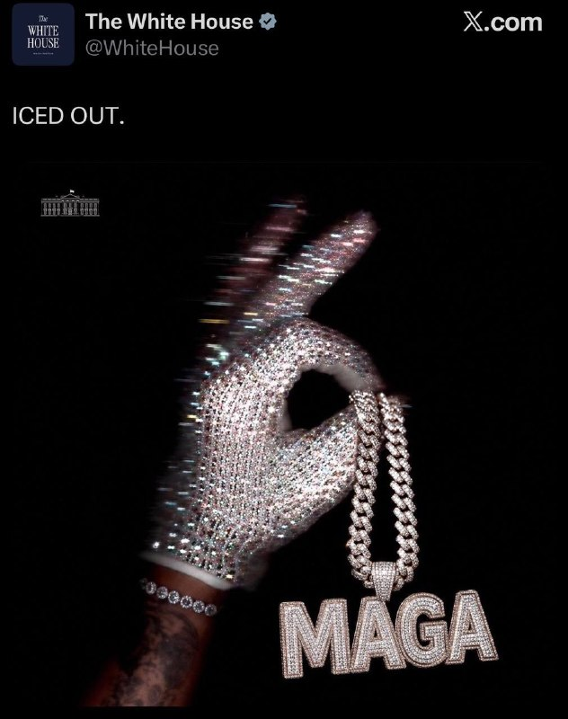

🔴پست کاخ سفید در ایکس:
حمایت از آلبوم دریک.

@IranianMinds

## IranianMinds — post 20193

🔴وزیر امور‌خارجه چین:

ما خواستار بازگشایی هرچه سریعتر تنگه هرمز هستیم.

@IranianMinds

## IranianMinds — post 20192

🔴تهران‌تایمز:

آمریکا پیشنهاد ۱۴ ماده‌ای جمهوری اسلامی برای پایان جنگ را رد کرده و بار دیگر بر مواضع خود، به ویژه درباره پرونده هسته‌ای تأکید کرده است.

@IranianMinds

## IranianMinds — post 20191

🔴عراقچی:

اگر آنها بخواهند به جنگ بازگردند، این به خودشان بستگی دارد.

@IranianMinds

## IranianMinds — post 20190

🔴 ترامپ:

تنها کشورهایی که قادر به خارج کردن غبار هسته‌ای از ایران هستند، آمریکا و چین هستند.

@IranianMinds

## IranianMinds — post 20189

🔴 ترامپ:

می‌توانستیم پل‌ها و شبکه‌های برق ایران را نابود کنیم و همه چیز را آن‌جا طی دو روز از بین ببریم.

@IranianMinds

## IranianMinds — post 20188

🔴 ترامپ:

اگر ۹ ماه پیش از بمب‌های B-2 استفاده نکرده بودم، ایران اکنون قادر به دستیابی به سلاح هسته‌ای بود.

@IranianMinds

## IranianMinds — post 20187

🔴 ترامپ:

رئیس ‌جمهور چین با عدم دستیابی ایران به سلاح هسته‌ای موافق است و می‌خواهد ایران تنگه هرمز را باز کند.

@IranianMinds

## IranianMinds — post 20186

🔴 ترامپ:

تحقیقات درباره هدف قرار گرفتن مدرسه‌ای در ایران ( مدرسه میناب ) در جریان است.

@IranianMinds

## IranianMinds — post 20185

🔴 ترامپ:

پیشنهاد ایرانیا که برام رسید همون‌ جمله ی اول متنشونو که خوندم برام قابل قبول نبود و سریع ردش کردم

@IranianMinds

## IranianMinds — post 20184

🔴 ترامپ:

ارتش ایران را نابود کردیم و شاید لازم باشد یک عملیات پاکسازی سبک دیگر‌ هم انجام دهیم.

@IranianMinds

## BBCPersian — post 281143

  

⚽️شکیرا،‌ مدونا و گروه پاپ کره‌ای بی‌تی‌اس قرار است بین دو نیمه فینال جام جهانی ۲۰۲۶ در ۱۹ جولای در نیوجرسی کنسرتی برگزار کنند.

این اجرا برای نخستین بار در تاریخ جام جهانی برگزار می‌شود و مشابه شوهای بین دو نیمه «سوپربال» فوتبال آمریکایی طراحی شده است. زمانش حدود ۱۱ دقیقه پیش‌بینی شده، هرچند برخی گزارش‌ها از طولانی‌تر بودن آن خبر داده‌اند.

شکیرا که پیش‌تر آهنگ «واکا واکا» را برای جام جهانی ۲۰۱۰ خوانده، قرار است دوباره ترانه رسمی جدیدی منتشر کند. مدونا در آستانه انتشار آلبوم جدید خود است و بی‌تی‌اس هم پس از وقفه‌ خدمت سربازی، در حال بازگشت و برگزاری تور جهانی هستند.

این برنامه را کریس مارتین، خواننده گروه راک کلدپلی سازماندهی می‌کند و هدف آن جمع‌آوری کمک مالی برای آموزش کودکان در جهان است. رئیس فیفا این رویداد را «لحظه‌ای تاریخی برای بزرگ‌ترین رویداد ورزشی جهان» توصیف کرده است.

طبق قوانین فوتبال، استراحت بین دو نیمه نباید بیش از ۱۵ دقیقه باشد
اما تجربه‌های مشابه، مانند فینال جام باشگاه‌های جهان ۲۰۲۵ در آمریکا، نشان داد که این اجراها زمان استراحت را به بیش از ۲۴ دقیقه هم می‌رسانند.
@bbcpersian

## BBCPersian — post 281142

  

🔻اصغر فرهادی، کارگردان ایرانی برنده اسکار، در یک کنفرانس مطبوعاتی در جشنواره کن در پاسخ به سوال خبرنگار شبکه اینترنشنال هم حملات آمریکا و اسرائیل به ایران و هم سرکوب معترضان دی ۱۴۰۴ از سوی جمهوری اسلامی را محکوم کرد و گفت «کشته شدن هر انسانی، یک جنایت است چه در جنگ چه با اعدام و چه در اعتراضات.»

آقای فرهادی که برای اکران فیلم «داستان‌های موازی» در جشنواره کن حضور دارد، روز جمعه گفت: «من هفته گذشته تهران بودم و هنوز اثر این اتفاقات همراه من هست. یکی از این اتفاقات کشته شدن شمار زیادی از انسان‌های بی‌گناه، کودکان و غیرنظامیانی در جریان جنگ بود و مدتی قبل از آن، کشته شدن تعداد زیادی از معترضان در خیابان‌ها در دی ماه،انسان‌های بی‌گناه که معترض بودند. هردو بسیار دردناک است و هرگز فراموش نخواهد شد.»

او اضافه کرد که «مخالفت با کشته شدن بی‌گناهان و غیرنظامیان و انسان‎‌های عادی در جنگ به معنی موافقت با کشته شدن معترضان در خیابان‌ها نیست.»

اصغر فرهادی در ادامه گفت: «کشته شدن هر انسانی، یک جنایت است و با هر دیدگاهی، کشتن و قتل انسان‌ها برای من قابل پذیرش نیست، چه با جنگ، چه اعدام، چه کشتن معترضان.»
📷Getty
@BBCPersian

## BBCPersian — post 281141

🔻مرتس: در گفتگو با ترامپ بر بازگشت ایران به مذاکره و جلوگیری از دستیابی به سلاح هسته‌ای تأکید کردیم

فریدریش مرتس، صدراعظم آلمان روز جمعه گفت «پس از سفر دونالد ترامپ به چین، گفت‌وگوی تلفنی خوبی با او داشته است و دو طرف بر این موضوع توافق کرده‌اند که ایران باید به میز مذاکره بازگردد، تنگه هرمز را باز کند و اجازه نداشته باشد به سلاح هسته‌ای دست یابد.»

آقای مرتس در پستی در شبکه اجتماعی ایکس گفت که او و دونالد ترامپ همچنین درباره راه‌حل صلح‌آمیز برای اوکراین گفت‌وگو کرده و مواضع خود را پیش از نشست ناتو در آنکارا هماهنگ کرده‌اند.

او افزود که «ایالات متحده و آلمان شرکای قوی در یک ناتوی قدرتمند هستند.»

https://bbc.in/3RIul9G
@BBCPersian

## BBCPersian — post 281140

🔻ثبت ۲۵۰ هزار شکایت در ایران علیه «جنایات جنگی آمریکا و اسرائیل»

مقام‌های قضایی ایران گفته‌اند حدود ۲۵۰ هزار شکایت حقوقی و کیفری درباره «جنایات جنگی آمریکا و اسرائیل» در دادگاه‌های ایران ثبت شده و در دست بررسی است.

عبدالصمد میرحسینی، معاون قضایی دادستان کل به میزان، خبرگزاری قوه قضائیه ایران گفته است که این پرونده‌ها در«شعب ویزه دادسرا و دادگاه» بررسی می‌شوند و روند «مستندسازی» آنها با همکاری نهادهای مختلف ادامه دارد.

او همچنین از شکایت ایران علیه ایالات متحده آمریکا در «دیوان داوری لاهه» در هلند بر اساس مفاد بیانیه‌های الجزایر خبر داد و گفت که تهران امیدوار است احکام احتمالی بتواند به «توقیف اموال» و دریافت غرامت منجر شود.

در سال‌های گذشته مقامات جمهوری اسلامی ایران بارها ایالات متحده آمریکا و اسرائیل را به دست داشتن در حملات، تحریم‌ها و اقداماتی متهم کرده‌اند که به گفته آنها سبب خسارت جانی و مالی به شهروندان ایرانی شده است.

آقای میرحسینی در این گفت‌وگو به جزئیات دقیق این پرونده‌ها اشاره نکرده است.

ایران پیش از این هم در برخی پرونده‌ها از جمله اختلافات ناشی از تحریم‌های آمریکا، دعاوی حقوقی را در مراجع بین‌المللی دنبال کرده است.

https://bbc.in/3RIul9G
@BBCPersian

## BBCPersian — post 281139

  <a href="telegram/content/BBCPersian_281139_1778863013.mp4" target="_blank">🎬 Download video</a>

🔻سرخط خبرهای جمعه ۲۵ اردیبهشت
@BBCPersian

## BBCPersian — post 281138

  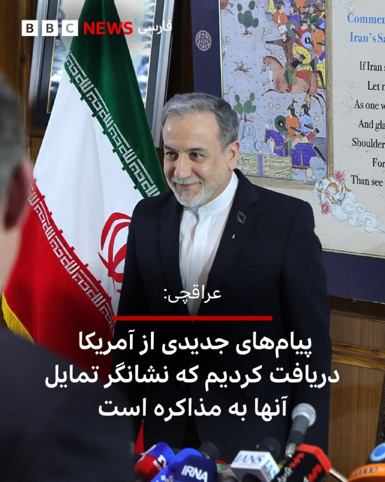

🔻وزیر خارجه جمهوری اسلامی می‌گوید که ایران پیام‌هایی از واشنگتن دریافت کرده است که نشان‌ می‌دهد آمریکا مایل به ادامه مذاکرات با ایران است.

عباس عراقچی که در کنفرانس خبری در حاشیه اجلاس بریکس در دهلی نو صحبت می‌کرد، گفت گزارش‌ها مبنی بر اینکه آمریکا پاسخ ایران را رد کرده است «مربوط به چند روز پیش بوده که ترامپ توییت زد و نوشت که 'غیرقابل قبول' است، اما بعد از آن مجددا پیام‌هایی را از طرف آمریکایی‌ها گرفتیم که مایل به گفت‌وگو و تعامل هستند.»

با این حال آقای عراقچی در مورد جدی بودن آمریکا ابراز تردید کرد: «در مورد جدیت آمریکایی‌ها در مذاکرات تردید داریم؛ اما به محض اینکه احساس کنیم و اطمینان حاصل کنیم آنها جدی هستند و آماده یک توافق عادلانه هستند ما به مذاکرات برمی‌گردیم.»

📷 EPA
https://bbc.in/3PKqg4i
@BBCPersian

## BBCPersian — post 281136

🔻کره جنوبی بقایای یک کشتی آسیب‌دیده در تنگه هرمز را برای بررسی به کشور بازگرداند

وزارت خارجه کره جنوبی روز جمعه اعلام کرد بقایای یک کشتی باری آسیب‌دیده در اثر آتش‌سوزی را به این کشور منتقل کرده است. این کشتی در تنگه هرمز هدف حمله هواپیماهای ناشناس قرار گرفته بود.

از زمان آغاز جنگ آمریکا و اسرائیل با ایران، این کشور تا حد زیادی عبور کشتی‌ها از تنگه هرمز را محدود کرده است.

به گفته مقام‌های سئول، کشتی باری «اچ‌ام‌ام نامو» در چهارم مه (۱۴ اردیبهشت) هدف «دو هواپیمای ناشناس» قرار گرفت. این حمله باعث آسیب رسیدن به کشتی و آتش‌سوزی در موتورخانه شد.

این کشتی با پرچم پاناما و تحت مدیریت شرکت کشتیرانی کره‌ای «اچ‌ام‌ام» هفته گذشته برای بررسی به دوبی منتقل شده بود.

وزارت خارجه کره جنوبی اعلام کرد بقایای این کشتی پس از هماهنگی با دولت امارات متحده عربی، روز جمعه از طریق هوایی به کره جنوبی منتقل شده است.

به گفته این وزارتخانه، قرار است یک نهاد تخصصی، بقایای کشتی را تحلیل دقیق و بررسی کند.

سئول همچنین اعلام کرد هواپیماهای دخیل در این حمله در تصاویر دوربین‌های مداربسته ثبت شده‌اند، اما شناسایی دقیق نوع، محل پرتاب و ابعاد آن‌ها امکان‌پذیر نیست.

یک مقام ارشد دولت کره جنوبی این هفته به رسانه‌های محلی گفته بود که «احتمال این که عامل این حمله کشوری غیر از ایران باشد، پایین است.»

تهران مسئولیت این حمله را رد کرده و سفارت ایران در سئول هم در بیانیه‌ای اعلام کرده است که «هرگونه ادعا درباره دخالت نیروهای ایرانی را قاطعانه رد می‌کند.»

کره جنوبی این حمله را به‌شدت محکوم کرده و گفته است امیدوار است از طریق تحقیقات کامل، عاملان آن شناسایی شوند.

کره جنوبی، چهارمین اقتصاد بزرگ آسیا، وابستگی زیادی به واردات سوخت از خاورمیانه دارد؛ وارداتی که در شرایط عادی عمدتاً از طریق تنگه هرمز انجام می‌شود.

بسته شدن این آبراه، کره جنوبی را که یکی از تولیدکنندگان بزرگ پتروشیمی و پالایش‌کنندگان نفت است، وادار کرده که نخستین بار در نزدیک به ۳۰ سال گذشته برای قیمت سوخت، سقف تعیین کند.

@BBCPersian

## BBCPersian — post 281134

🔻نارندرا مودی، نخست‌وزیر هند در دیدار با محمد بن زاید آل نهیان،‌ رئیس امارات، ضمن قدرانی از او برای حمایت از جامعه هندی‌های مقیم امارات،‌ حملات به این کشور را «به‌شدت» محکوم کرد. آقای مودی روز جمعه ۲۵ اردیبهشت پیش از آغاز مجموعه سفرش به کشورهای اروپایی هلند،…

## BBCPersian — post 281133

  

🔻نارندرا مودی، نخست‌وزیر هند در دیدار با محمد بن زاید آل نهیان،‌ رئیس امارات، ضمن قدرانی از او برای حمایت از جامعه هندی‌های مقیم امارات،‌ حملات به این کشور را «به‌شدت» محکوم کرد.

آقای مودی روز جمعه ۲۵ اردیبهشت پیش از آغاز مجموعه سفرش به کشورهای اروپایی هلند، سوئد،‌ نروژ و ایتالیا وارد ابوظبی شد. سفر او در سایه نگرانی‌ها درباره تنش‌ در خلیج فارس و مساله تامین انرژی انجام می‌شود.

دفتر آقای مودی در شبکه ایکس اعلام کرد که در این سفر «توافق‌نامه‌های مهم در زمینه انرژی، دفاع، زیرساخت‌ها، کشتیرانی و فناوری پیشرفته امضا شده است.»

هند همچنین می‌گوید که ابوظبی متعهد شده است که ۵ میلیارد دلار در هند سرمایه‌گذاری کند، هرچند جزئیات بیشتری ارائه نشده است.

آقای مودی در ویدئویی که وزارت خارجه هند منتشر کرد، گفت: «حفظ آزادی، باز بودن و امنیت تنگه هرمز بالاترین اولویت ماست و در این زمینه، پایبندی به قوانین بین‌المللی ضروری است.»

رئیس امارات شخصا از نخست وزیر هند استقبال کرد. اقدامی که حاکی از روابط دوستانه و عمیق میان دو کشور ارزیابی شده است.

📷 UAE Presidential Court / Reuters
https://bbc.in/4uVxpxP
@BBCPersian

## BBCPersian — post 281132

  

شرکت صاحب آپارات، سکوی نمایش محتوای آنلاین در ایران می‌گوید که در پی شکایت صداوسیما به دادگاه، بابت «نشر، پخش و عرضه اثر فرهنگی بدون اجازه» به پرداخت سه هزار و ۶۰۰ میلیارد تومان جریمه محکوم شده است.

در بیانیه‌ای که همراه با تصویر رای دادگاه در وبسایت آپارات منتشر شده آمده است که «مدیرعامل و شرکت فناوران ایده‌پرداز صبا به پرداخت حدود ۳/۶ همت خسارت بابت انتشار محتوایی که توسط کاربران بر بستر این پلتفرم بارگذاری شده محکوم شده و دادگاه، مسئولیت این محتوا را متوجه پلتفرم دانسته است.»

آپارات که پلتفرمی بومی و شبیه یوتوب در ایران است، چند سال پس از فیلتر شدن یوتیوب و سکوهای مشابه بارگذاری و تماشای ویدیو، در سال ۱۳۸۹ در ایران راه‌اندازی و با رشد چشمگیر کاربران ایرانی مواجه شد.

آپارات می‌گوید که پیشتر در شکایتی مشابه از سوی این سازمان، از دیوان عالی کشور رای برائت گرفته بود.

در رای دادگاه کیفری کارکنان دولت آمده است که این پلتفرم در خصوص نمایش ۷۵۵ اثر تلویزیونی بدون اجازه و منتفع شدن از درآمدهای تبلیغات ترافیک وبسایت میزبان، حق انحصاری پخش این آثار را نقض کرده است.

این حکم قابل تجدیدنظرخواهی است.
@bbcpersian

## BBCPersian — post 281131

  

🔻امارات متحده عربی از تسریع ساخت خط‌ لوله‌ای خبر داده است که این کشور امیدوار است با اتکا به آن ظرفیت صادرات نفت خود از مسیر فجیره را تا سال ۲۰۲۷ دو برابر کند و وابستگی به تنگه هرمز را کاهش دهد.

دفتر رسانه‌ای دولت ابوظبی روز جمعه گزارش داد که شیخ خالد بن محمد بن زاید، ولیعهد این شیخ‌نشین، به شرکت ملی نفت امارات دستور داده است که پروژه خط لوله غرب به شرق با سرعت بیشتری اجرا شود. به گفته مقام‌های اماراتی، این پروژه هم‌اکنون در حال ساخت است.

امارات در حال حاضر از طریق خط لوله حبشان–فجیره، که ظرفیت انتقال روزانه تا ۱/۸ میلیون بشکه نفت خام را دارد، بخشی از صادرات نفت خود را بدون عبور از تنگه هرمز انجام می‌دهد. این خط لوله نقش مهمی در انتقال مستقیم نفت به سواحل دریای عمان ایفا کرده است.

در میان کشورهای حوزه خلیج فارس، تنها امارات متحده عربی و عربستان سعودی دارای خطوط لوله‌ای هستند که امکان صادرات نفت خام را خارج از مسیر تنگه هرمز فراهم می‌کند.

عمان هم به‌دلیل داشتن خط ساحلی طولانی در دریای عمان، دسترسی مستقیم‌تری به آب‌های آزاد دارد.

📸 Getty

https://bbc.in/3R12525
@BBCPersian

## BBCPersian — post 281129

  

🔻وزیر خارجه ایران آمریکا را به ارسال پیام‌های‌ متناقض متهم کرده و جدیت واشنگتن را در مورد مذاکره زیر سوال برده است.

عباس عراقچی که در حاشیه نشست بریکس در دهلی نو صحبت می‌کرد، گفت: «آمریکایی‌ها پیام‌های متناقضی می‌فرستند، ما نمی‌دانیم که دقیقا نیت آمریکایی ها چیست.»

وزیر خارجه ایران افزود: «در مورد جدییت آمریکایی‌ها در مذاکرات تردید داریم؛ اما به محض اینکه احساس کنیم و اطمینان حاصل کنیم آنها جدی هستند و آماده یک توافق عادلانه هستند ما به مذاکرات برمی‌گردیم.»

آقای عراقچی همچنین آتش‌بس را «ناپایدار» توصیف کرد اما گفت که ایران سعی دارد آن را حفظ کند.

او در عین حال تاکید کرد که برای این مناقشه «هیچ راه‌ حل نظامی وجود ندارد.»

«ما در برابر هرگونه فشار و تحریم مقاومت می‌کنیم. کشور من بیش از چهل سال هدف تحریم‌های شدید آمریکا بوده اما این سیاست‌های ما را تغییر نداد.»

📷 EPA
https://bbc.in/4wwmkVm
@BBCPersian

## BBCPersian — post 281128

🔻پایان نشست وزرای خارجه بریکس بدون صدور بیانیه مشترک

نشست وزیران خارجه گروه بریکس بدون صدور بیانیه مشترک پایان یافت؛ موضوعی که نشان‌دهنده اختلافات عمیق میان اعضا بر سر جنگ ایران و بحران خاورمیانه است.

این نشست دو روزه در دهلی‌ نو برگزار شد و کشورهای عضو درباره موضوعاتی مانند امنیت دریایی،‌ حاکمیت کشورها، وضعیت تنگه هرمز و جنگ غزه گفت‌وگو کردند.

با این حال اختلاف دیدگاه‌ها به ویژه میان ایران و امارات متحده عربی،‌ مانع دستیابی به موضعی واحد شد.

ایران خواستار آن بود که بریکس اقدامات آمریکا و اسرائیل را محکوم کند.

عباس عراقچی، وزیر خارجه ایران، از کشورهای عضو خواست در برابر «سیاسی کردن نهادهای بین‌المللی» مقاومت کنند و موضعی قاطع‌تر بگیرند. اما برخی اعضا از جمله امارات متحده عربی با این رویکرد موافق نبودند.

در پایان، هند که ریاست دوره‌ای بریکس را برعهده دارد،‌ به جای بیانیه مشترک فقط «بیانیه رئیس نشست» را منتشر کرد،‌ اقدامی که معمولا زمانی انجام می‌شود که اعضا نتوانند بر سر متن نهایی به توافق برسند.

در بیانیه ریاست نشست که توسط وزارت خارجه هند منتشر شد، آمده است که «دیدگاه‌های متفاوتی در بین برخی از اعضا درباره وضعیت در منطقه غرب آسیا/ خاورمیانه» وجود دارد.

این اختلافات نشان می‌دهد که بریکس گسترش یافته، که اکنون شامل کشورهایی مانند ایران،‌ امارات،‌ مصر، اتیوپی و اندونزی هم هست،‌ در حفظ انسجام سیاسی با چالش روبرو شده است،‌ به ویژه زمانی که اعضای آن در بحران‌های منطقه‌ای در جبهه‌های متفاوت قرار دارند.

https://bbc.in/3R12525
@BBCPersian

## BBCPersian — post 281125

🔻روابط عمومی سپاه پاسداران استان لرستان از خنتی‌‌سازی یک بمب از زمان جنگ اسرائیل و آمریکا با ایران در شهرستان دلفان خبر داد. آلبوم را ورق بزنید و در این باره بیشتر بخوانید.

📷 Mehr New Agency / IRIB
https://bbc.in/4wOawOH
@BBCPersian

## BBCPersian — post 281124

🔻عراقچی: پیام‌های آمریکایی‌ها متناقض و نیت‌شان نامشخص است

وزیر خارجه ایران آمریکا را به ارسال پیام‌های‌ متناقض متهم کرده و جدیت واشنگتن را در مورد مذاکره زیر سوال برده است.

عباس عراقچی که در حاشیه نشست بریکس در دهلی نو صحبت می‌کرد، گفت: «آمریکایی‌ها پیام‌های متناقضی می‌فرستند، ما نمی‌دانیم که دقیقا نیت آمریکایی ها چیست.»

وزیر خارجه ایران افزود: «در مورد جدییت آمریکایی‌ها در مذاکرات تردید داریم؛ اما به محض اینکه احساس کنیم و اطمینان حاصل کنیم آنها جدی هستند و آماده یک توافق عادلانه هستند ما به مذاکرات برمی‌گردیم.»

آقای عراقچی همچنین آتش‌بس را «ناپایدار» توصیف کرد اما گفت که ایران سعی دارد آن را حفظ کند.

او در عین حال تاکید کرد که برای این مناقشه «هیچ راه‌ حل نظامی وجود ندارد.»

«ما در برابر هرگونه فشار و تحریم مقاومت می‌کنیم. کشور من بیش از چهل سال هدف تحریم‌های شدید آمریکا بوده اما این سیاست‌های ما را تغییر نداد.»

https://bbc.in/3R12525
@BBCPersian

## BBCPersian — post 281123

  <a href="telegram/content/BBCPersian_281123_1778863020.mp4" target="_blank">🎬 Download video</a>

🔻کل‌بی، شرکت بزرگ تولید تنقلات در ژاپن اعلام کرده که به‌دلیل اختلال در تامین مواد اولیه جوهر چاپ در پی جنگ ایران و توقف نفتکش‌ها در تنگه هرمز، بسته‌بندی‌ بعضی میان‌وعده‌‌هایش را به‌طور موقت سیاه‌وسفید کرده است.

بنابر اعلام این شرکت، ۱۴ محصول از جمله چیپس و میگوی ترد آن از ۲۵ مه در این بسته‌بندی‌های جدید در فروشگاه‌های ژاپن عرضه می‌شود.

چاپ سیاه‌وسفید در مقایسه با چاپ با جوهرهای رنگی ارزان‌تر تمام می‌شود، اما بعضی تحلیلگران معتقدند این اقدام ممکن است نوعی ترفند بازاریابی برای این شرکت ژاپنی، همزمان با بسته بودن تنگه هرمز باشد.

بسته بودن تنگه هرمز بر قیمت بسیاری مواد اولیه تاثیر گذاشته است. ایران در واکنش به حملات آمریکا و اسرائیل، عملا تنگه راهبردی هرمز را بسته و در نتیجه، حجم عظیمی از نفت پشت این تنگه متوقف شده است.

@BBCPersian

## idfinfarsi — post 11582

  <a href="telegram/content/idfinfarsi_11582_1778863023.mp4" target="_blank">🎬 Download video</a>

🎬 Video

## idfinfarsi — post 11581

«*توجه فرمائید - دارای محدودیت انتشار قبل از ساعت 14:30 به وقت اسرائیل*»

در طول هفته گذشته حدود ۶۰ تروریست به هلاکت رسیدند: لشکر ۱۴۶ به عملیات خود در جنوب لبنان ادامه می‌دهد

نیروهای تیم‌های رزمی تیپ‌های ۵۵۱، ۴۰۱ و ۳۰۰ تحت فرماندهی لشکر ۱۴۶ همچنان در جنوب خط دفاعی مقدم برای رفع تهدیدها علیه شهروندان اسرائیل به عملیات خود ادامه می‌دهند.

در هفته گذشته، نیروهای تیم رزمی تیپ ۵۵۱ بیش از ۱۰۰ زیرساخت تروریستی، از جمله انبارهای تسلیحاتی و مواضع دیده‌بانی متعلق به حزب‌الله، را هدف قرار دادند. در یکی از عملیات‌ها، یک انبار تسلیحاتی در منطقه رأس‌البیاضه شناسایی شد و در زمان کوتاهی مورد حمله قرار گرفته و منهدم شد.

نیروهای تیم رزمی تیپ ۴۰۱ نیز طی هفته گذشته بیش از ۵۰ مورد تجهیزات نظامی را در منطقه شناسایی کرده و ده‌ها زیرساخت تروریستی را منهدم کردند.

نیروهای تیپ ۳۰۰ همچنان در نقاط کلیدی منطقه برای دفاع از ساکنان جلیل غربی فعالیت می‌کنند. این تیپ تاکنون صدها زیرساخت تروریستی را منهدم کرده است.

ارتش اسرائیل به مقابله با تهدیدها علیه شهروندان این کشور و نیروهای خود ادامه داده و بر اساس دستورالعمل‌های مقامات سیاسی عمل می‌کند.

## Dirty_Kids — post 389504

  <a href="telegram/content/Dirty_Kids_389504_1778863026.mp4" target="_blank">🎬 Download video</a>

مبارزه بانو هایده در برابر معین به کمک مدل Seedance 2.0 در سرویس PolloAI!

@Dirty_Kids 👻

## Dirty_Kids — post 389503

  <a href="telegram/content/Dirty_Kids_389503_1778863028.mp4" target="_blank">🎬 Download video</a>

بحران زیست‌محیطی در خلیج فارس در پی نشت نفت از جزیره مارو

@Dirty_Kids 👻

## Dirty_Kids — post 389502

  

🌪وقتی اینترنت طوفانیه... کافیه بادبان ها رو بکشی تا

⚫️با بالاترین کیفیت ممکن
⚡️ 

⚫️100 هزار تومان شارژ هدیه 
🎁

⚫️پایین ترین قیمت گیگی 250
🌐 

⚫️و ارائه پورسانت %10 در ازای هر معرفی
💼

بتونی یه اتصال پایدار با پشتیبانی 24 ساعته داشته باشی
🚀

بادبان راهتو باز می‌کنه
⛵️

G25

🛡@BadBan_VPN | کانال 

🤖@BadBan_VPNBot | ربات 

📞@BadBan_VPNSupport | پشتیبانی

## Dirty_Kids — post 389501

نمیدونم کیه این پسره و چه برنامه‌ای هست ولی داره درست میگه، این اقلیت ۵درصدی رافضی ولایت‌به‌باسن برای اینکه بمونن راضین همرو بکشن

@Dirty_Kids 👻

## Dirty_Kids — post 389500

  

یعنی این فیلم The Odyssey که قراره بسازن مزخرف ترین فیلمی خواهد بود که تاحالا ساخته شده!
نقش آشیل رو قراره یه زن تغییر جنسیت داده بازی کنه و نقش هلن رو قراره یه سیاه پوست لاغر.🥴
حتی به دول آشیل و رنگ پوست هلن هم رحم نگردن این چپهای کسخل

@Dirty_Kids 👻

## Dirty_Kids — post 389498

یکی از پدرهای پویان مختاری هم پیدا شد

@Dirty_Kids 👻

## Dirty_Kids — post 389497

  <a href="telegram/content/Dirty_Kids_389497_1778863033.mp4" target="_blank">🎬 Download video</a>

کلا تو یه لیگ دیگه‌ست :)))

ترامپ در پاسخ به این سؤال که آیا درباره حملات سایبری علیه آمریکا با شی جین‌پینگ حرف زده یا نه:

'آره، بهش گفتم. اونم شروع کرد درباره کارایی که ما تو چین کردیم حرف زدن.
خب می‌دونی، هر کاری اونا بکنن ما هم می‌کنیم. ما هم حسابی ازشون جاسوسی می‌کنیم.
بهش گفتم ما یه عالمه کارها علیه شما می‌کنیم که اصلاً خبر ندارین.'

@Dirty_Kids 👻

## Dirty_Kids — post 389496

  

صفحه یوتیوب تتلو :
امیرخان درحالی که فقط یک ماه به شروع جام جهانی مونده، از تو زندان استارت تمرین‌هاش رو زده و میخواد عضو یه تیم ملی بشه تا تو این مسابقات شرکت کنه.

خودشم داخل قوطی رنگ و بطریِ وایتکس، گچ و سیمان ریخته و داره ازشون به عنوان دمبل استفاده می‌کنه.
ایشون تو یه فضای 1*1 داره تمرین میکنه و واسه صبحونه، ناهار و شام فقط عدسی و آب‌میوه میخوره!

@Dirty_Kids 👻

## Dirty_Kids — post 389495

  <a href="telegram/content/Dirty_Kids_389495_1778863035.mp4" target="_blank">🎬 Download video</a>

در ادامه‌ی مصاحبه‌ی جلو در توالتی ترامپ در راه بازگشت از چین:

خبرنگار: آیا تونستید تایید کنید که اون موشک [که به مدرسه‌ی میناب اصابت کرد] آمریکایی بوده؟

ترامپ: شما با کجا کار می‌کنید عزیزجان؟

خبرنگار: بی‌بی‌سی.

ترامپ: بی‌بی‌سی جعلی؟ تو گه بخور. منظورت همون جاکشاییه که با هوش مصنوعی دهن من حرف گذاشتند؟ همونا که از قول من بیانیه‌ای رو منتشر کردند که حالا خودشون اعتراف می‌کنن حقیقت نداشته؟ همون پوفیوزایی که کلمات وحشتناکی رو گذاشتن دهن من و بعد مجبور شدند اعتراف کنن که جعلی بوده؟
همون دیوثایی که الان به خاطر ۵ میلیار...


@Dirty_Kids 👻

## Dirty_Kids — post 389494

هر از چندگاهی مچ خودمو درحال ریلز دیدن میگیرم. بی پروای فقیر

@Dirty_Kids 👻

## Dirty_Kids — post 389493

ایران حتی تبریک تولدهامون‌ هم نفرینه
ایشالله خودت ۱۲۰ ساله بشی بی‌شرف

@Dirty_Kids 👻

## Dirty_Kids — post 389492

  <a href="telegram/content/Dirty_Kids_389492_1778863037.mp4" target="_blank">🎬 Download video</a>

آنلاین شاپا باز شروع کردن...

@Dirty_Kids 👻

## Dirty_Kids — post 389491

  <a href="https://t.me/Dirty_Kids/389491" target="_blank">📎 Download file</a>

✅ اپلیکیشن اندروید سایت جهانی دربی بت

💰اولین سایت جهانی با امکان شارژ و برداشت ریالی(کارت به کارت)

🔗 برای ورود فیلترشکن روی کشور مناسب قرار دهید مانند فنلاند و المان و....

😀Telegram Channel
👇
https://t.me/+bcynkEgSW2dlYTc0

## Dirty_Kids — post 389490

  

😤دنبال یه سایت شرط بندی بین المللی بودی که به ایرانیا خدمات بده؟!
⛔

👍دربی بت همون انتخاب  100%

💎ویژگی های سایت جهانی Derby Bet:

⬅️امکان شارژ امن با کارت بانکی

⬅️واریز اول دوبل شارژ می شوید(بونوس۱۰۰٪)

⬅️پر اپشن ترین سایت فعال در ایران

⬅️تسویه حساب کمتر از 5 دقیقه

⬅️برگشت بخشی از باخت به صورت هفتگی

🚨کد هدیه ثبت نام:GG007

⚠️برای دانلود اپلکیشن کلیک کنید
👉

🔔کانال دربی بت :

🪙https://t.me/+bcynkEgSW2dlYTc0

## Dirty_Kids — post 389489

  <a href="telegram/content/Dirty_Kids_389489_1778863040.mp4" target="_blank">🎬 Download video</a>

در مورد پروپوزال ایران:
ترامپ: جمله اولش رو که خوندم انداختمش دور!
خبرنگار: جمله اول چی بود؟
ترامپ: یه‌ چیز غیرقال قبول! ما نمیخوایم ایران غنی سازی کنه!!
خبرنگار: یعنی ۲۰ سال توقف غنی سازی کافی نیس؟
ترامپ: ۲۰ سال کافیه ولی باید واقعی باشه و تضمین بدن!

@Dirty_Kids 👻

## Dirty_Kids — post 389488

  

مجتبی خامنه‌ای به مناسبت روز بزرگداشت فردوسی، این پیام رو منتشر کرد:

همین که یک تازی راهزن بیابانگرد رافضی به ارزش‌های زبان و ادبیات فارسی اعتراف می‌کند می‌تواند جالب باشد.

@Dirty_Kids 👻

## Dirty_Kids — post 389487

  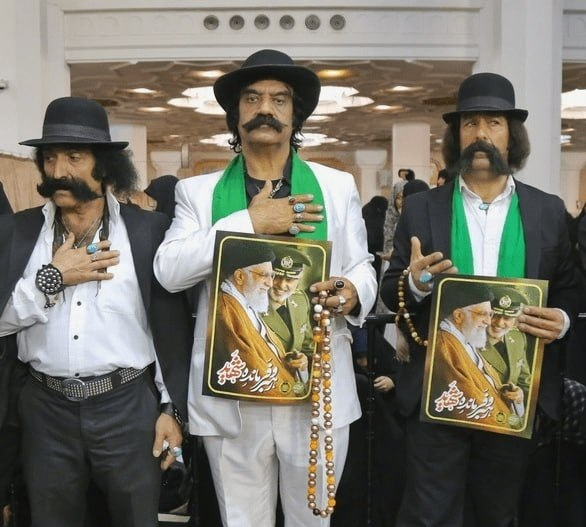

شاشیدم تو تار به تار سیبیلاتون.

@Dirty_Kids 👻

## Dirty_Kids — post 389486

  

قیمت جهانی استارلینک مینی با تخفیف به زیر ۲۰۰دلار (۳۶میلیون تومن) رسیده و پایین‌تر هم میاد. سایز دیشش هم اندازه‌ی یه کاغذ A4 هس و براحتی همه جا مخفی میشه و با وضعیت ایران هیچ رقمه نمیشه جلوی موج قاچاقش رو گرفت.

رویای آخوند برای کنترل بلند مدت اینترنت فقط یه توهمه.

@Dirty_Kids 👻

## Dirty_Kids — post 389485

  

🌪وقتی اینترنت طوفانیه... کافیه بادبان ها رو بکشی تا

⚫️با بالاترین کیفیت ممکن
⚡️ 

⚫️100 هزار تومان شارژ هدیه 
🎁

⚫️پایین ترین قیمت گیگی 250
🌐 

⚫️و ارائه پورسانت %10 در ازای هر معرفی
💼

بتونی یه اتصال پایدار با پشتیبانی 24 ساعته داشته باشی
🚀

بادبان راهتو باز می‌کنه
⛵️

R25

🛡@BadBan_VPN | کانال 

🤖@BadBan_VPNBot | ربات 

📞@BadBan_VPNSupport | پشتیبانی

## Hranews — post 112952

  

سخنگوی اتاق اصناف ایران با اشاره به گسترش نقش اقتصاد دیجیتال در بازار کشور اعلام کرد که تنها ۱۰ هزار کسب‌وکار مجازی دارای پروانه، طی سال گذشته حدود ۲۱۰۰ همت گردش مالی داشته‌اند. مهدی امیدوار در ادامه افزود: این آمار نشان می‌دهد اقتصاد دیجیتال به یکی از بخش‌های مهم و تأثیرگذار بازار تبدیل شده و عملکرد این گروه‌ها به «دسترسی پایدار و مؤثر» به #اینترنت وابسته است. به گفته وی، ناپایداری اخیر موجب کند شدن فرآیند خدمات‌رسانی و آسیب به بخشی از اقتصاد دیجیتال شده است. این در حالی است که فعالان این حوزه نیز تأکید دارند تداوم اختلال و ناپایداری اینترنت می‌تواند چرخه اقتصادی و روند فعالیت کسب‌وکارهای آنلاین را با مشکل مواجه کند.

↘️
@hranews_bot تماس ✉️ - @Hranews کانال هرانا 🆑

## Hranews — post 112951

گزارشی از بازداشت شهرام پس‌وپیش در پیرانشهر

❗️
❗️
❗️
❗️
❗️– شهرام پس‌وپیش، شهروند اهل پیرانشهر روز چهارشنبه ۲۳ اردیبهشت ماه توسط نیروهای امنیتی در این شهرستان بازداشت شده و کماکان از محل نگهداری وی اطلاعی حاصل نشده است.
#شهرام_پس‌وپیش

ادامه مطلب

↘️
@hranews_bot تماس ✉️ - @Hranews کانال هرانا 🆑

## manototv — post 105492

  <a href="telegram/content/manototv_105492_1778863046.mp4" target="_blank">🎬 Download video</a>

‌
اسحاق دار، وزیر خارجه پاکستان، اعلام کرد ۲۰ شهروند ایرانی که در کشتی‌های توقیف‌شده آمریکا در آب‌های بین‌المللی حضور داشتند، از طریق پاکستان به تهران بازگردانده خواهند شد.

دار گفت این افراد همراه با ۱۱ شهروند پاکستانی، از سنگاپور به بانکوک منتقل شدند و سپس با پرواز راهی اسلام‌آباد شدند. به گفته او، شهروندان ایرانی پس از ورود به پاکستان، برای انتقال به تهران همراهی خواهند شد.

وزیر خارجه پاکستان از وزیر خارجه آمریکا برای «هماهنگی نزدیک» در این عملیات، و از وزیر خارجه جمهوری اسلامی بابت «اعتماد به پاکستان» در روند بازگرداندن شهروندان ایرانی قدردانی کرد.

## manototv — post 105491

  <a href="telegram/content/manototv_105491_1778863046.mp4" target="_blank">🎬 Download video</a>

‌
وانگ یی، وزیر خارجه چین، گفت پکن معتقد است حل بحران تنگه هرمز در گرو دستیابی به «آتش‌بسی دائمی و جامع» میان آمریکا و جمهوری اسلامی است.

به گزارش خبرگزاری شینهوا، وانگ یی گفت رئیس‌جمهور چین در گفت‌وگو با دونالد ترامپ تأکید کرده که «زور نمی‌تواند مشکلات را حل کند و گفت‌وگو تنها مسیر درست است.»

وزیر خارجه چین افزود: «مذاکرات یک‌شبه به نتیجه نمی‌رسد، اما وقتی درِ گفت‌وگو باز شد، نباید دوباره بسته شود.»

او همچنین گفت چین برای پیشبرد مذاکرات صلح تلاش کرده و به ایفای نقش خود برای پایان سریع درگیری‌ها و بازگشت ثبات به خاورمیانه ادامه خواهد داد.

## manototv — post 105490

  <a href="telegram/content/manototv_105490_1778863047.mp4" target="_blank">🎬 Download video</a>

‌
کریس رایت، وزیر انرژی آمریکا، گفت به‌دلیل جنگ و تنش‌ها در خلیج فارس، چین احتمالاً خرید نفت از آمریکا را افزایش خواهد داد.

او در گفت‌وگو با سی‌ان‌بی‌سی گفت: «فکر می‌کنم چین به خرید مقادیر بیشتری از نفت آمریکا ادامه خواهد داد.»

رایت همچنین گفت جهان نیاز دارد تنگه هرمز دوباره به‌طور کامل باز شود و افزود: «تلاش ایران برای گروگان گرفتن جهان، موقتی است.»

وزیر انرژی آمریکا در پاسخ به این پرسش که بازگشت شرایط به وضعیت عادی چقدر زمان می‌برد، گفت: «بخش زیادی از آن به ایران بستگی دارد.»

او افزود: «به هر شکلی، برنامه هسته‌ای ایران پایان خواهد یافت و عبور آزادانه کشتی‌ها از تنگه هرمز برقرار خواهد شد. این می‌تواند در صورت توافق با ایران، نسبتاً سریع رخ دهد.»

## manototv — post 105489

  <a href="telegram/content/manototv_105489_1778863048.mp4" target="_blank">🎬 Download video</a>

عباس عراقچی، وزیر خارجه جمهوری اسلامی، با انتشار تصویری از دیدار با سابرامانیام جایشانکار، وزیر خارجه هند، در شبکه اِکس نوشت: «ایران همواره وظیفه تاریخی خود به‌عنوان حافظ امنیت در تنگه هرمز» را انجام خواهد داد.

عراقچی افزود در گفت‌وگویی «سازنده» با همتای هندی خود، درباره تحولات منطقه گفت‌وگو کرده و مدعی شد جمهوری اسلامی «شریکی قابل اعتماد برای همه کشورهای دوست» است و این کشورها می‌توانند به امنیت تجارت و کشتیرانی اعتماد کنند.

## manototv — post 105488

  <a href="telegram/content/manototv_105488_1778863049.mp4" target="_blank">🎬 Download video</a>

سازمان اطلاعات مرکزی آمریکا با انتشار تصاویری از هاوانا، حضور جان رتکلیف، رئیس این سازمان، در پایتخت کوبا را تایید کرد.

بر اساس گزارش فوربس مکزیک، رتکلیف در جریان این سفر با مقام‌های ارشد دولت کوبا دیدار کرد. این رسانه نوشت گفت‌وگوها درباره همکاری‌های اطلاعاتی، امنیت منطقه‌ای و وضعیت اقتصادی کوبا انجام شده است.

به نوشته فوربس مکزیک، رئیس سیا برای گفت‌وگوهای مستقیم با مقام‌های وزارت کشور کوبا و مسئولان نهادهای اطلاعاتی این کشور به هاوانا رفت. این گزارش، دیدار رتکلیف با مقام‌های کوبایی را نشستی کم‌سابقه در سطح بالا میان دو کشور توصیف کرده است.

در این گزارش آمده است که در جریان این سفر، رتکلیف با رائول رودریگز کاسترو، نوه رائول کاسترو و مشاور امنیتی، و همچنین لازارو آلوارز کاساس، وزیر کشور کوبا، دیدار کرد.

## manototv — post 105487

  <a href="telegram/content/manototv_105487_1778863050.mp4" target="_blank">🎬 Download video</a>

«جمهوری اسلامی قصد کشتن فاطمه سپهری را دارد»

## manototv — post 105486

  <a href="telegram/content/manototv_105486_1778863052.mp4" target="_blank">🎬 Download video</a>

«صدای بانو سپهری باشیم»

## manototv — post 105485

  <a href="telegram/content/manototv_105485_1778863054.mp4" target="_blank">🎬 Download video</a>

دونالد ترامپ در پاسخ به پرسشی درباره حمله به یک مدرسه دخترانه در روز نخست جنگ گفت این موضوع «در دست بررسی» است.

خبرنگاری از ترامپ پرسید که سنتکام روز گذشته درباره حمله به مدرسه دخترانه در روز اول جنگ مورد پرسش قرار گرفته بود. ترامپ در پاسخ گفت: «این در دست بررسی است.» او افزود چند موضوع دیگر نیز در دست بررسی قرار دارد، اما تاکید کرد که این مورد هم جزو پرونده‌های در حال بررسی است.

در ادامه، خبرنگار پرسید آیا امکان دریافت اطلاعات بیشتر درباره این موضوع وجود دارد و اشاره کرد که این حمله با یک واحد موشکی آمریکایی مرتبط بوده است.

ترامپ در پاسخ وارد موضوع بی‌بی‌سی شد و این رسانه را به جعل گفته‌هایش متهم کرد. او گفت بی‌بی‌سی «حرف‌های بدی» در دهان او گذاشته و بعد ناچار شده بپذیرد که آن گفته‌ها درست نبوده است.

## manototv — post 105484

  <a href="telegram/content/manototv_105484_1778863055.mp4" target="_blank">🎬 Download video</a>

وزارت خارجه آمریکا اعلام کرد این کشور در عملیاتی محرمانه، حدود ۱۳ و نیم کیلوگرم اورانیوم غنی‌شده را از یک رآکتور تحقیقاتی تعطیل‌شده در ونزوئلا خارج کرده است.

بر اساس اعلام وزارت خارجه آمریکا، این عملیات به رهبری واشینگتن و با همکاری شرکای بین‌المللی انجام شد و هدف آن کاهش خطر سوءاستفاده از مواد هسته‌ای و تقویت امنیت هسته‌ای عنوان شده است.

اداره ملی امنیت هسته‌ای آمریکا، وابسته به وزارت انرژی، نیز اعلام کرده است همه اورانیوم غنی‌شده باقی‌مانده از یک رآکتور تحقیقاتی قدیمی در ونزوئلا خارج شده است. این نهاد گفت این عملیات در چند ماه انجام شد، در حالی که در شرایط عادی ممکن بود سال‌ها طول بکشد.

## manototv — post 105483

  <a href="telegram/content/manototv_105483_1778863056.mp4" target="_blank">🎬 Download video</a>

دونالد ترامپ در پاسخ به پرسشی درباره پیشنهاد اخیر جمهوری اسلامی گفت این پیشنهاد را بررسی کرده، اما به گفته او، اگر از جمله نخست یک متن خوشش نیاید، بقیه آن را کنار می‌گذارد.

ترامپ در پاسخ به این پرسش که جمله نخست چه بوده است، آن را «غیرقابل قبول» توصیف کرد و گفت مسئله اصلی از نگاه او این است که ایران نباید «هیچ شکل» از برنامه هسته‌ای داشته باشد.

در ادامه، خبرنگار از ترامپ پرسید آیا دوره ۲۰ ساله برای او کافی نیست. ترامپ پاسخ داد که «۲۰ سال کافی است»، اما به گفته او، سطح تضمین‌هایی که جمهوری اسلامی ارائه می‌دهد اهمیت دارد.

ترامپ گفت که اگر قرار است توافقی ۲۰ ساله مطرح باشد، باید «۲۰ سال واقعی» باشد و نباید به گفته او، توافقی مبهم یا ظاهری باشد.

## manototv — post 105482

  <a href="telegram/content/manototv_105482_1778863058.mp4" target="_blank">🎬 Download video</a>

دونالد ترامپ در پاسخ به پرسشی درباره اینکه آیا شی جین‌پینگ، رئیس‌جمهوری چین، تعهدی قاطع برای فشار بر جمهوری اسلامی به منظور بازگشایی تنگه هرمز داده است، گفت از کسی «درخواست لطف» نمی‌کند.

ترامپ گفت: «من درخواست هیچ لطفی نمی‌کنم، چون وقتی درخواست لطف می‌کنید، باید در مقابل لطفی انجام دهید.» او افزود که آمریکا به چنین کمکی نیاز ندارد.

رئیس‌جمهوری آمریکا در ادامه گفت نیروهای مسلح طرف مقابل «اساسا از بین رفته‌اند» و ممکن است به گفته او «کمی کار پاکسازی» لازم باشد. او همچنین به آتش‌بس اشاره کرد و گفت این آتش‌بس به درخواست کشورهای دیگر انجام شد.

ترامپ گفت شخصا چندان موافق آتش‌بس نبوده، اما آن را به عنوان لطفی به پاکستان پذیرفته است. او از مقام‌های پاکستانی، از جمله نخست‌وزیر و فیلدمارشال این کشور، با تعبیر «افرادی فوق‌العاده» یاد کرد.

## manototv — post 105481

  <a href="telegram/content/manototv_105481_1778863060.mp4" target="_blank">🎬 Download video</a>

«انتقام خون بچه‌ها رو می‌گیریم»

## manototv — post 105480

  <a href="telegram/content/manototv_105480_1778863063.mp4" target="_blank">🎬 Download video</a>

«صدای فاطمه سپهری باشیم»

## manototv — post 105479

  <a href="telegram/content/manototv_105479_1778863064.mp4" target="_blank">🎬 Download video</a>

عباس عراقچی، وزیر خارجه جمهوری اسلامی، در حاشیه نشست بریکس در هند گفت روند میانجیگری پاکستان هنوز شکست نخورده، اما «در مسیری بسیار دشوار» قرار دارد.

عراقچی در نشست خبری خود گفت دشواری این روند عمدتا به دلیل «رفتار آمریکایی‌ها» است. وزیر خارجه جمهوری اسلامی پیش‌تر نیز گفته بود «پیام‌های متناقض» آمریکا یکی از موانع اصلی در مسیر گفتگوهاست.

## alonews — post 120226

  <a href="telegram/content/alonews_120226_1778863066.webm" target="_blank">🎬 Download video</a>

👈ترامپ به فاکس نیوز: من تاب‌آوری ایران را دست کم نگرفتم

✅ @AloNews خبر جنگ

## alonews — post 120225

  <a href="telegram/content/alonews_120225_1778863067.webm" target="_blank">🎬 Download video</a>

👈فرانسه حضور ناو هواپیمابر شارل دوگل در تنگه هرمز را تکذیب کرد

وزارت نیروهای مسلح فرانسه:

🔴تحرکات این نا‌و بخشی از یک مأموریت دریایی گسترده‌تر در دریای سرخ و منطقه خلیج عدن است.

🔴گروه ضربت این ناو به انجام مأموریت‌های مربوط به تضمین آزادی ناوبری در آبراه‌های بین‌المللی، در چارچوب همکاری‌های چندملیتی در منطقه، بدون ورود مستقیم به تنگه هرمز ادامه می‌دهد.

✅ @AloNews خبر جنگ

## alonews — post 120224

  <a href="telegram/content/alonews_120224_1778863067.webm" target="_blank">🎬 Download video</a>

👈سواحل شمال‌غربی زیبای دریاچه ارومیه، امروز ۲۵ اردیبهشت

✅ @AloNews خبر جنگ

## alonews — post 120223

  <a href="telegram/content/alonews_120223_1778863067.webm" target="_blank">🎬 Download video</a>

👈فرمانده سنتکام گزارش‌ها درباره باقی ماندن توان موشکی جمهوری اسلامی را رد کرد

وال استریت ژورنال گزارش داد فرمانده سنتکام ادعاهای منتشرشده درباره باقی ماندن بخش بزرگی از موشک‌ها و پرتابگرهای جمهوری اسلامی را رد کرده است.

پیشتر واشنگتن پست نوشته بود ایران هنوز حدود ۷۵ درصد پرتابگرهای متحرک و حدود ۷۰ درصد ذخایر موشکی پیش از جنگ را در اختیار دارد، اما فرمانده سنتکام این روایت را زیر سوال برده است.

این تناقض مهم است، چون جنگ فقط با موشک و پهپاد ادامه ندارد، با عددسازی و تصویرسازی هم ادامه پیدا میکند. جمهوری اسلامی میخواهد نشان دهد هنوز دست بالا را دارد، اما واشنگتن تلاش میکند بگوید ستون تهدید موشکی تهران ضربه جدی خورده و دیگر مثل قبل قابل اتکا نیست.

✅ @AloNews خبر جنگ

## alonews — post 120221

  <a href="telegram/content/alonews_120221_1778863068.webm" target="_blank">🎬 Download video</a>

👈حمله‌های امروزِ ارتش اسرائیل به جنوب لبنان

✅ @AloNews خبر جنگ

## alonews — post 120220

  <a href="telegram/content/alonews_120220_1778863068.webm" target="_blank">🎬 Download video</a>

👈رئیس ستاد کل ارتش اسرائیل هم به امارات سفر مخفیانه داشته

🔴به گزارش خبرگزاری کان اسرائیل، ایال زمیر، رئیس ستاد کل ارتش اسرائیل، در طول جنگ ایران سفری مخفیانه به امارات متحده عربی داشت و در آنجا با محمد بن زاید آل نهیان، رئیس امارات متحده عربی، گفتگو کرد.

✅ @AloNews خبر جنگ

## alonews — post 120219

  <a href="telegram/content/alonews_120219_1778863068.webm" target="_blank">🎬 Download video</a>

👈چین از پذیرش دعوت سفر شی به آمریکا خبر داد

🔴وانگ یی، وزیر خارجه چین اعلام کرد که شی جین‌پینگ رئیس جمهوری چین، دعوت ترامپ برای دیدار از آمریکا را پذیرفته است.

🔴این دیدار پاییز سال جاری انجام خواهد شد.

✅ @AloNews خبر جنگ

## alonews — post 120218

  <a href="telegram/content/alonews_120218_1778863069.webm" target="_blank">🎬 Download video</a>

👈رسایی:
هر صحبت یا مذاکره‌ای باید با اجازه مجلس باشه

✅ @AloNews خبر جنگ

## alonews — post 120217

👈فروش کانفیگ متصل پایدار با ساب و مورد تایید مجموعه الونیوز
⬇️

🔔@FastProxyMakerBot

🔔@FastProxyMakerBot

✔️با خیال راحت و بدون دغدغه خرید کنید

## alonews — post 120216

  <a href="telegram/content/alonews_120216_1778863070.webm" target="_blank">🎬 Download video</a>

👈بلومبرگ: امارات به دنبال پاسخ هماهنگ به ایران بود، اما عربستان و قطر با آن همراهی نکردند

✅ @AloNews خبر جنگ

## alonews — post 120215

  <a href="telegram/content/alonews_120215_1778863070.webm" target="_blank">🎬 Download video</a>

👈وزیر امور خارجه پاکستان: یازده پاکستانی و ۲۰ ایرانی که در کشتی‌های توقیف شده توسط نیروهای آمریکایی بودند، آزاد شده‌اند

✅ @AloNews خبر جنگ

## alonews — post 120214

  <a href="telegram/content/alonews_120214_1778863071.webm" target="_blank">🎬 Download video</a>

👈وزیر امور خارجه چین: ما خواستار بازگشایی هرچه سریع‌تر تنگه هرمز هستیم

✅ @AloNews خبر جنگ

## alonews — post 120213

  <a href="telegram/content/alonews_120213_1778863071.webm" target="_blank">🎬 Download video</a>

👈وزیر خارجه چین : شی جین پینگ پاییز آینده به آمریکا سفر میکنه

✅ @AloNews خبر جنگ

## alonews — post 120212

  <a href="telegram/content/alonews_120212_1778863072.webm" target="_blank">🎬 Download video</a>

👈وزارت نیروهای مسلح فرانسه: ناو هواپیمابر شارل دوگل در دریای عرب در ماموریتی احتمالی برای بازگرداندن ناوبری در تنگه هرمز است

✅ @AloNews خبر جنگ

## alonews — post 120211

  <a href="telegram/content/alonews_120211_1778863072.webm" target="_blank">🎬 Download video</a>

👈وزیر امور خارجه چین: ما ایالات متحده و ایران را تشویق می‌کنیم که به حل اختلافات و مناقشات خود از طریق گفتگو ادامه دهند

✅ @AloNews خبر جنگ

## alonews — post 120210

  <a href="telegram/content/alonews_120210_1778863072.webm" target="_blank">🎬 Download video</a>

👈شرکت‌های نفت دولتی هند قیمت بنزین و گازوئیل را بیش از ۳ درصد افزایش دادند

✅ @AloNews خبر جنگ

## alonews — post 120209

  <a href="telegram/content/alonews_120209_1778863073.mp4" target="_blank">🎬 Download video</a>

👈وزیر انرژی آمریکا : قبل از اینکه تصمیم بگیریم برنامه هسته‌ای ایران رو خلع سلاح کنیم، قیمت نفت و گازوئیل تو کالیفرنیا رسماً ترکونده بود!

✅ @AloNews خبر جنگ

## alonews — post 120208

  <a href="telegram/content/alonews_120208_1778863075.mp4" target="_blank">🎬 Download video</a>

👈روسیه حمله هدفمند با پهپاد FPV به خودروی سازمان ملل تو اوکراین رو منتشر کرد

✅ @AloNews خبر جنگ

## alonews — post 120207

  <a href="telegram/content/alonews_120207_1778863078.webm" target="_blank">🎬 Download video</a>

👈میدل‌ایست‌ای: ایران دنبال دور زدن مسیر محاصره شده تنگه هرمز با کریدور زمینی پاکستان است

🔴 در پی محاصره دریایی ایران توسط آمریکا که وارد پنجمین هفته خود شده است، ایران و پاکستان اعلام کردند که به دنبال احیای پروژه‌ اتصال چندین کریدور هستند که بنادر کراچی، بندر قاسم و گوادر پاکستان را از طریق بلوچستان به گذرگاه‌های مرزی گبد و تفتان ایران متصل می‌کنند

✅ @AloNews خبر جنگ

<!-- MSG END -->

<!-- NAV START -->

<a href="https://github.com/zari963963/aio-downloader/blob/main/telegram/content/archive_1.md" style="display:inline-block; padding:6px 12px; margin:0 4px; background-color:#2ea44f; color:white; text-decoration:none; border-radius:4px; font-weight:bold;">صفحه بعد</a>

<!-- NAV END -->
