# خواننده تلگرام

<!-- TOP_NAV START -->

<a href="https://github.com/zari963963/aio-downloader/blob/main/telegram/content/archive_1.md" style="display:inline-block; padding:6px 12px; margin:0 4px; background-color:#2ea44f; color:white; text-decoration:none; border-radius:4px; font-weight:bold;">صفحه بعد</a>

<!-- TOP_NAV END -->

<!-- MSG START -->

---
📅 بروزرسانی: 1405/02/24 11:41
---

## VahidOOnLine — post 240068

  <a href="telegram/content/VahidOOnLine_240068_1778746276.mp4" target="_blank">🎬 Download video</a>

سازمان دریانوردی تجاری بریتانیا اعلام کرد یک کشتی در سواحل امارات و در نزدیکی تنگه هرمز دچار حادثه شده است.
بر اساس این گزارش، افرادی «غیرمجاز» کنترل این کشتی را در دست گرفته‌اند و شناور اکنون به‌سمت آب‌های سرزمینی ایران در حرکت است. این نهاد دریایی بریتانیا اعلام کرد کشتی در فاصله ۳۸ مایلی سواحل فجیره قرار داشته است.
‌🏁 🇬🇧 ManotoTV

🤖 @VahidOOnLine

## VahidOOnLine — post 240067

  <a href="telegram/content/VahidOOnLine_240067_1778746277.mp4" target="_blank">🎬 Download video</a>

⭕️عراقچی: تنگه هرمز برای همه کشتی‌های تجاری باز است اما باید با نیروی دریایی ما همکاری کنند

♦️عباس عراقچی، وزیر امور خارجه جمهوری اسلامی روز پنجشنبه ۲۴ اردیبهشت در حاشیه نشست وزرای خارجه کشورهای عضو بریکس گفت: «جمهوری اسلامی ایران هیچ مانعی در تنگه هرمز ایجاد نکرده و این گذرگاه دریایی همچنان برای کشتی‌های تجاری باز است.»

عراقچی حمله و محاصره دریایی آمریکا را عامل بروز مشکل در تنگه هرمز توصیف کرد و گفت: «تنگه هرمز برای همه کشتی‌های تجاری باز است و کشتی‌های تجاری باید برای عبور از تنگه با نیروهای دریایی جمهوری اسلامی ایران همکاری کنند.»

تنگه هرمز یکی از مهم‌ترین مسیرهای انتقال انرژی جهان به شمار می‌رود و تنش‌های اخیر میان آمریکا و اسرائیل با جمهوری اسلامی ایران، نگرانی‌ها درباره امنیت کشتیرانی و صادرات انرژی را افزایش داده است.
‌🇸🇦 Indypersian

🤖 @VahidOOnLine

## VahidOOnLine — post 240066

  

♦️سانائه تاکایچی، نخست‌ وزیر ژاپن پنجشنبه ۲۴ اردیبهشت با انتشار بیانیه‌ای اعلام کرد یک کشتی ژاپنی که در خلیج فارس متوقف شده بود، با موفقیت از تنگه هرمز عبور کرده و اکنون در مسیر بازگشت به ژاپن است.

به گفته تاکایچی، چهار خدمه ژاپنی در این کشتی حضور دارند.
تاکایچی با اشاره به عبور یک کشتی دیگر مرتبط با ژاپن در نهم اردیبهشت ماه، عبور اخیر را «تحولی مثبت» به‌ویژه از منظر حفاظت از شهروندان ژاپنی توصیف کرد.

نخست‌وزیر ژاپن یادآور شد، برای عبور این کشتی با مسعود پزشکیان «رایزنی مستقیم» داشته و وزیر خارجه و سفارت این کشور در تهران نیز هماهنگی‌های دیپلماتیک انجام داده‌اند.

به گفته او، با خروج این کشتی، تعداد کشتی‌های مرتبط با ژاپن که همچنان در خلیج فارس باقی مانده‌اند به ۳۹ عدد رسیده است و در یکی از آن‌ها سه خدمه ژاپنی حضور دارند.

تاکایچی در این پیام با یادآوری «فشار شدید» بر خدمه کشتی‌ها و نگرانی خانواده‌های آنان، از کارکنان دریایی و شرکت‌های کشتیرانی قدردانی کرد.

او تاکید کرد دولت ژاپن به تلاش‌های دیپلماتیک برای عبور هرچه سریع‌تر همه کشتی‌ها، از جمله کشتی‌های مرتبط با ژاپن، از تنگه هرمز ادامه خواهد داد.
‌🇸🇦 Indypersian

🤖 @VahidOOnLine

## VahidOOnLine — post 240065

  

عباس عراقچی، وزیر خارجه جمهوری اسلامی، گفت زمان آن رسیده است که «رفتار سلطه‌گرانه آمریکا به زباله‌دان تاریخ سپرده شود». او تاکید کرد هیچ‌گونه راه‌حل نظامی برای موضوعات مربوط به ایران وجود ندارد.

عراقچی گفت: «زمان آن رسیده که رفتار سلطه‌گرانه آمریکا را به زباله‌دان تاریخ بسپاریم.» او افزود: «هیچ‌گونه راه‌حل نظامی برای هر موضوعی که به ایران مربوط باشد، وجود ندارد. ما هرگز در برابر هیچ فشار یا تهدیدی سر خم نمی‌کنیم.»

وزیر خارجه جمهوری اسلامی همچنین اظهار داشت: «هرچند نیروهای مسلح ما آماده‌اند پاسخی کوبنده و ویرانگر به متجاوزان خارجی بدهند، اما مردم ما صلح‌طلب بوده و خواهان جنگ نیستند.»

او در ادامه از کشورهای عضو بریکس و دیگر اعضای جامعه بین‌المللی خواست آنچه را نقض حقوق بین‌الملل از سوی ایالات متحده و اسرائیل خواند، به‌صراحت محکوم کنند.
‌🏁 🇬🇧 IranintlTV

🤖 @VahidOOnLine

## VahidOOnLine — post 240064

  <a href="telegram/content/VahidOOnLine_240064_1778746282.mp4" target="_blank">🎬 Download video</a>

پلیس بریتانیا اعلام کرد دومین فرد در چارچوب تحقیقات ضدتروریسم درباره آتش‌سوزی در یک کنیسه در شرق لندن متهم شده است.
براساس اعلام پلیس، یک مرد ۳۱ ساله در ارتباط با این حمله بازداشت و تفهیم اتهام شده و تحقیقات درباره انگیزه و جزئیات حادثه ادامه دارد.
‌🏁 🇬🇧 ManotoTV

🤖 @VahidOOnLine

## VahidOOnLine — post 240063

  

طبق اطلاعات رسیده به ایران‌اینترنشنال، پرهام محرابی، نوجوان ۱۸ ساله اهل مشهد، شامگاه ۱۸ دی‌ماه ۱۴۰۴ در جریان اعتراضات بلوار هفت‌تیر، کنار پل هفت‌تیر ، در حالی‌که در کنار پدرش حضور داشت، با شلیک مستقیم ماموران سرکوبگر کشته شد. پدر او که لحظه اصابت گلوله را از نزدیک دیده بود، پیکر بی‌جان فرزندش را در آغوش گرفت و صدها متر حمل کرد تا به خودرویشان برسد و سپس او را به خانه منتقل کرد.

بر اساس اطلاعات رسیده به ایران‌اینترنشنال، پدر پرهام آن شب همراه فرزندش در محل اعتراضات حضور داشت و از فاصله‌ای نزدیک شاهد تیر خوردن او بود. او پس از اصابت گلوله، پیکر فرزندش را در آغوش گرفت و مسافتی طولانی حمل کرد تا به خودرو برسد و سپس مستقیما او را به خانه منتقل کرد. خانواده روز بعد برای دفن پیکر اقدام کردند اما به گفته منابع آگاه، ماموران امنیتی از پدر او تعهد کتبی گرفتند که اعلام کند فرزندش توسط «اغتشاشگران» کشته شده است و تهدید کردند در غیر این صورت اجازه دفن صادر نخواهد شد.

به گفته خانواده و اطرافیان، پرهام نوجوانی آرام، مهربان و محبوب بود و رابطه نزدیکی با پدر و مادرش داشت. خانواده‌اش می‌گویند.
‌🏁 🇬🇧 IranintlTV

🤖 @VahidOOnLine

## VahidOOnLine — post 240062

  

عباس عراقچی گفت جمهوری اسلامی هیچ مانعی در تنگه هرمز ایجاد نکرده و این آمریکا است که محاصره ایجاد کرده است.

او گفت: «ما هیچ مانعی در تنگه هرمز ایجاد نکرده‌ایم، این آمریکاست که محاصره ایجاد کرده است.»

عراقچی همچنین تاکید کرد: «تنگه هرمز برای تمامی کشتی‌های تجاری باز است، اما آنها باید با نیروهای دریایی ما همکاری کنند.»
‌🏁 🇬🇧 IranintlTV

🤖 @VahidOOnLine

## VahidOOnLine — post 240061

  

♦️عباس عراقچی، وزیر امور خارجه جمهوری اسلامی روز پنجشنبه ۲۴ اردیبهشت از «کشورهای عضو بریکس و همه اعضای مسئول جامعه بین‌المللی» خواست تا حمله آمریکا و اسرائیل به ایران را محکوم کنند.

عراقچی که برای شرکت در اجلاس وزاری امور خارجه بریکس به هند سفر کرده است، گفت جامعه جهانی باید «اقدامات عملی برای متوقف کردن جنگ» علیه جمهوری اسلامی را ایران را در دستور کار قرار دهد.

این سخنان در حالی بیان می‌شود که دونالد ترامپ، رئیس جمهوری ایالات متحده سه روز پیش گفته بود «آتش‌بس به دستگاه تنفس مصنوعی» وصل است و پیش از سفر به چین هشدار داده بود که جمهوری اسلامی ایران یا توافق با آمریکا را می‌پذیرد یا کاملا نابود خواهد شد.
‌🇸🇦 Indypersian

🤖 @VahidOOnLine

## VahidOOnLine — post 240060

  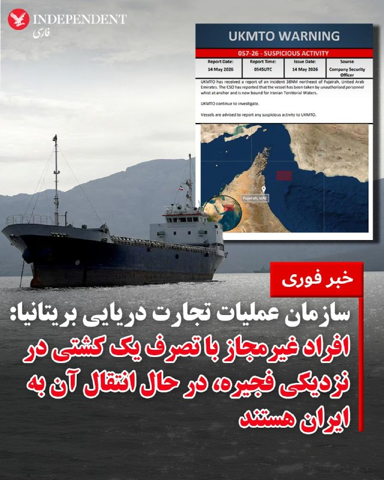

♦️سازمان عملیات تجارت دریایی بریتانیا صبح پنجشنبه ۲۴ اردیبهشت گزارش کرد افراد «غیرمجاز» یک کشتی را در ۳۸ مایلی بندر فجیره تصرف کردند و در حال حاضر در حال انتقال آن به سوی آب‌های سرزمینی ایران هستند.
براساس این گزارش کشتی ربوده شده لنگر انداخته و متوقف بوده است.

هنوز مقام‌های جمهوری اسلامی و امارات متحده عربی واکنشی به این خبر نشان نداده‌اند.
‌🇸🇦 Indypersian

🤖 @VahidOOnLine

## VahidOOnLine — post 240059

  

مرکز عملیات تجارت دریایی بریتانیا اعلام کرد گزارشی از یک حادثه دریایی در فاصله ۳۸ مایل دریایی در شمال‌شرق فجیره، امارات متحده عربی، دریافت کرده است. این نهاد اعلام کرد این کشتی در حالی که در لنگرگاه قرار داشته، به دست افراد غیرمجاز تصرف شده و اکنون به سوی آب‌های سرزمینی ایران در حرکت است.
‌🏁 🇬🇧 IranintlTV

🤖 @VahidOOnLine

## VahidOOnLine — post 240058

  

وزارت دفاع اسرائیل اعلام کرد با یکی از شرکت‌های زیرمجموعه شرکت دفاعی البیت قراردادی برای توسعه «قابلیت برد افزوده» جنگنده اف-۳۵آی امضا کرده است. ارزش این قرارداد ۳۴ میلیون دلار اعلام شده است.

بر اساس اعلام این وزارتخانه، این قرارداد با شرکت سایکلون منعقد شده و شامل «توسعه و یکپارچه‌سازی مخازن سوخت خارجی» بر پایه طرحی است که پیش‌تر برای جنگنده اف-۱۶ طراحی شده بود.

وزارت دفاع اسرائیل اعلام کرد این قابلیت جدید قرار است برد عملیاتی هواپیما را افزایش دهد، وابستگی به سوخت‌گیری هوایی را کاهش دهد و انعطاف‌پذیری عملیاتی در ماموریت‌های برد بلند را تقویت کند.
‌🏁 🇬🇧 IranintlTV

🤖 @VahidOOnLine

## VahidOOnLine — post 240057

  <a href="telegram/content/VahidOOnLine_240057_1778746288.mp4" target="_blank">🎬 Download video</a>

همزمان با آغاز نشست وزیران خارجه کشورهای عضو بریکس در دهلی‌نو، عباس عراقچی، وزیر خارجه ایران، از اعضای این گروه و «همه کشورهای مسئول جامعه جهانی» خواست حملات آمریکا و اسرائیل علیه ایران را به‌صراحت محکوم کنند.
خبرگزاری رویترز گزارش داد جنگ ایران و اسرائیل بر نشست دو روزه بریکس در هند سایه انداخته و اختلاف‌ها میان اعضا، رسیدن به موضعی مشترک و صدور بیانیه نهایی را دشوار کرده است. ایران از هند، رئیس دوره‌ای بریکس، خواسته از این نشست برای ایجاد اجماع علیه واشینگتن و تل‌آویو استفاده کند
‌🏁 🇬🇧 ManotoTV

🤖 @VahidOOnLine

## VahidOOnLine — post 240056

  <a href="telegram/content/VahidOOnLine_240056_1778746289.mp4" target="_blank">🎬 Download video</a>

رسانه‌های وابسته به قوه قضاییه جمهوری اسلامی گزارش دادند با دستور مقام قضایی در استان همدان، اموال ۴۷ نفر که به «جاسوسی» و «همکاری با رژیم اسرائیل» متهم شده‌اند، توقیف شده است.
براساس این گزارش‌ها، این افراد در کشورهای مختلف از جمله بریتانیا، آلمان، آمریکا، ترکیه، عراق و سوئیس اقامت دارند و مقام‌های قضایی جمهوری اسلامی اعلام کرده‌اند پرونده آن‌ها در حال بررسی است. به گفته رسانه میزان، اموال توقیف‌شده قرار است برای «بازسازی اماکن آسیب‌دیده از جنگ» هزینه شود.
‌🏁 🇬🇧 ManotoTV

🤖 @VahidOOnLine

## VahidOOnLine — post 240055

  <a href="telegram/content/VahidOOnLine_240055_1778746290.mp4" target="_blank">🎬 Download video</a>

دونالد ترامپ، رئیس‌جمهوری آمریکا، در دیدار با شی جین‌پینگ در پکن، این نشست را «بسیار مهم» توصیف کرد و گفت توجه گسترده‌ای در آمریکا و جهان به این دیدار وجود دارد.
ترامپ با اشاره به اهمیت این مذاکرات گفت برخی این نشست را «بزرگ‌ترین دیدار تاریخ» می‌دانند و تاکید کرد مردم آمریکا تقریبا درباره موضوع دیگری صحبت نمی‌کنند. او همچنین حضور در کنار شی جین‌پینگ را «باعث افتخار» دانست و ابراز امیدواری کرد روابط میان آمریکا و چین «بهتر از هر زمان دیگری» شود.
‌🏁 🇬🇧 ManotoTV

🤖 @VahidOOnLine

## VahidOOnLine — post 240054

  <a href="telegram/content/VahidOOnLine_240054_1778746291.mp4" target="_blank">🎬 Download video</a>

دونالد ترامپ و شی جین‌پینگ، روسای جمهوری آمریکا و چین، در پکن دیدار کردند؛ دیداری که با مراسمی گسترده و تشریفات پرزرق‌وبرق همراه بود و صبح پنج‌شنبه با حضور هیات‌های بلندپایه دو کشور برگزار شد.
ترامپ در سخنان آغازین خود این دیدار را «باعث افتخار» توصیف کرد و گفت:
«رئیس‌جمهوری شی، بسیار سپاسگزارم. چنین استقبالی کمتر دیده‌ام. بیش از همه تحت تأثیر کودکان قرار گرفتم؛ شاد و فوق‌العاده بودند. ارتش چین قدرتمند بود، اما آن کودکان چیزهای زیادی را نمایندگی می‌کنند.»
‌🏁 🇬🇧 ManotoTV

🤖 @VahidOOnLine

## VahidOOnLine — post 240053

  <a href="telegram/content/VahidOOnLine_240053_1778746293.mp4" target="_blank">🎬 Download video</a>

دونالد ترامپ، رئیس‌جمهوری آمریکا، صبح پنج‌شنبه در جریان سفر خود به پکن همراه با شی جین‌پینگ، رئیس‌جمهوری چین، در مراسم رسمی استقبال و رژه نیروهای نظامی این کشور شرکت کرد.
این مراسم در مقابل ساختمان «تالار بزرگ خلق» برگزار شد و دو رهبر ضمن بازدید از یگان‌های نظامی، شاهد اجرای مراسم سان و رژه نیروهای ارتش چین بودند.
‌🏁 🇬🇧 ManotoTV

🤖 @VahidOOnLine

## VahidOOnLine — post 240052

  

♦️یونهاپ، خبرگزاری دولتی کره جنوبی، روز چهارشنبه ۲۴ اردیبهشت به نقل از یکی از مقام‌های امنیتی این کشور گزارش کرد که بررسی‌های سئول نشان می‌دهد که به احتمال بسیار زیاد جمهوری اسلامی ایران مسئول حمله به کشتی باری این کشور در تنگه هرمز بوده است.

سفارت جمهوری اسلامی در سئول هفته گذشته هرگونه حمله جمهوری اسلامی به کشتی باری کره جنوبی در تنگه هرمز را رد کرده بود.

 وزارت خارجه کره‌جنوبی روز یکشنبه اعلام کرده بود که کشتی باری متعلق به این کشور که  روز ۱۴ اردیبهشت در تنگه هرمز دچار حادثه شده بود،  هدف حمله «هواگردهای ناشناس» قرار گرفته است.
پارک ایل، سخنگوی وزارت خارجه کره‌جنوبی، در یک نشست خبری گفت دو هواگرد ناشناس بخش بیرونی مخزن تعادل سمت چپ در قسمت عقب کشتی «اچ‌ام‌ام نامو» را با فاصله حدود یک دقیقه هدف قرار دادند که در پی آن آتش و دود ایجاد شد.
‌🇸🇦 Indypersian

🤖 @VahidOOnLine

## VahidOOnLine — post 240051

  

حسین نوری همدانی، مرجع تقلید حامی حکومت، با صدور فتوایی پرداخت وجوهات شرعی مقلدان علی خامنه‌ای به مجتبی خامنه‌ای را مجاز اعلام کرد و او را «فقیهی جامع‌الشرایط» خواند.

او در این فتوا نوشت: «با توجه به اینکه وجوهات شرعی در نهایت در مسیر اعتلای حوزه‌های علمیه و اداره امور طلاب مصرف می‌گردد، و با عنایت به شناخت موجود نسبت به او به عنوان فقیهی جامع‌الشرایط، ان‌شاء‌الله پرداخت وجوهات شرعی مقلدین رهبر شهید به معظم‌له موجب برائت ذمه خواهد بود.»
‌🏁 🇬🇧 IranintlTV

🤖 @VahidOOnLine

## VahidOOnLine — post 240050

  

حسین نوری همدانی، مرجع تقلید حامی حکومت، با صدور فتوایی پرداخت وجوهات شرعی مقلدان علی خامنه‌ای به مجتبی خامنه‌ای را مجاز اعلام کرد و او را «فقیهی جامع‌الشرایط» خواند.

او در این فتوا نوشت: «با توجه به اینکه وجوهات شرعی در نهایت در مسیر اعتلای حوزه‌های علمیه و اداره امور طلاب مصرف می‌گردد، و با عنایت به شناخت موجود نسبت به او به عنوان فقیهی جامع‌الشرایط، ان‌شاء‌الله پرداخت وجوهات شرعی مقلدین رهبر شهید به معظم‌له موجب برائت ذمه خواهد بود.»
‌🏁 🇬🇧 IranintlTV

🤖 @VahidOOnLine

## VahidOOnLine — post 240049

  

رسانه‌های دولتی چین گزارش دادند دونالد ترامپ و شی جین‌پینگ در جریان گفت‌وگوهای خود در پکن درباره «وضعیت خاورمیانه» و جنگ اوکراین تبادل نظر کردند.

خبرگزاری دولتی شین‌هوا اعلام کرد دو رهبر درباره مسائل مهم بین‌المللی و منطقه‌ای، از جمله وضعیت خاورمیانه، دیدگاه‌های خود را مطرح کردند. موضوع جنگ اوکراین نیز در این گفت‌وگوها بررسی شد.

این دیدار در حالی برگزار شد که گمانه‌زنی‌هایی درباره تلاش احتمالی ترامپ برای جلب همکاری چین در موضوع جنگ آمریکا و اسرائیل علیه جمهوری اسلامی مطرح است.
‌🏁 🇬🇧 IranintlTV

🤖 @VahidOOnLine

## mwarmonitor — post 9062

  <a href="telegram/content/mwarmonitor_9062_1778746299.mp4" target="_blank">🎬 Download video</a>

🇨🇳🇺🇸دونالد ترامپ و شی جین‌پینگ در حال بازدید از «معبد آسمان» در پکن هستند.
🔸خبرنگار: آقای رئیس‌جمهور، گفتگوها چطور بود؟
🔹دونالد ترامپ: عالی بود. جای فوق‌العاده‌ایه. چین زیباست.
مترجم (به چینی): پرزیدنت ترامپ می‌گن که گفتگوها خیلی خوب بوده.
🔸خبرنگار: آقای رئیس‌جمهور، آیا درباره تایوان صحبتی کردید؟
(ترامپ و شی جین‌پینگ بدون پاسخ به سوال، در حال ژست گرفتن برای عکس هستند)
مقام چینی: متشکرم. ممنون. خیلی ممنون.
خبرنگار (دوباره): آقای رئیس‌جمهور، آیا در مورد تایوان صحبت کردید؟
مقام چینی: ممنون از مطبوعات. متشکرم. ممنون.

@mwarmonitor

## mwarmonitor — post 9061

⚽️خبر فوتبالی از نیویورک تایمز:

🎙شکیرا، مدونا و گروه BTS اجرای نخستین نمایش بین دو نیمه را در فینال جام جهانی فوتبال بر عهده خواهند داشت.

@mwarmonitor

## mwarmonitor — post 9060

🇺🇸🇨🇳مراسم رسمی استقبال از دونالد ترامپ با حضور شی جین‌پینگ در چین برگزار شد

💠در این مراسم، رئیس‌جمهور چین با برگزاری تشریفات کامل دیپلماتیک از رئیس‌جمهور آمریکا استقبال کرد؛ رویدادی که در چارچوب سفر رسمی ترامپ به پکن و با هدف بررسی روابط دوجانبه، همکاری‌های اقتصادی و تحولات راهبردی بین دو کشور انجام خواهد گرفت.

@mwarmonitor

## pm_afshaa — post 90712

🔴رویترز: آمریکا و چین توافق کردن هیچ کشوری نباید عوارض از تنگه هرمز بگیره

💧 Rainbet.com the #1 Non-KYC Crypto Casino & Sportsbook @rainbetcom

😁 @Pm_Afshaa

## pm_afshaa — post 90711

🔴روبیو: واشنگتن به پکن روشن کرد که هرگونه حمایت از ایران به روابط دوجانبه آسیب می رساند

💧 Rainbet.com the #1 Non-KYC Crypto Casino & Sportsbook @rainbetcom

😁 @Pm_Afshaa

## pm_afshaa — post 90710

  <a href="telegram/content/pm_afshaa_90710_1778746301.webm" target="_blank">🎬 Download video</a>

🔴روبیو، وزیر خارجه آمریکا:

چین کلی کشتی تو خلیج فارس داره که گیر افتادن و آخر هفته هم یه کشتی باری چینی آسیب دید، فکر نمیکنم ایران عمدی زده باشه، ولی خب به هر حال اتفاق افتاده و الان همین باعث شده کشتی‌های چینی نتونن راحت رفت‌وآمد کنن؛ این وضعیت داره حسابی منطقه رو بی‌ثبات میکنه، مخصوصاً آسیا که بخش زیادی از انرژی‌شون از همین مسیر رد میشه. به نفع خود چینه که این قضیه جمع بشه.

ما هم امیدواریم پکن بیشتر وارد ماجرا بشه و ایران رو قانع کنه از کارهایی که الان داره تو خلیج فارس انجام میده عقب‌نشینی کنه.

💧 Rainbet.com the #1 Non-KYC Crypto Casino & Sportsbook @rainbetcom

😁 @Pm_Afshaa

## DEJradio — post 4622

  <a href="telegram/content/DEJradio_4622_1778746301.mp4" target="_blank">🎬 Download video</a>

🚨
🔸 خبر ۲۱
چهارشنبه ۲۳ اردیبهشت ۱۴۰۵

#خبر۲۱
@DEJradio

## mamlekate — post 103524

📝 جی‌دی‌ ونس در مورد در مذاکرات با جمهوری اسلامی: فکر می‌کنم پیشرفت‌هایی حاصل شده است

جی‌دی ونس، معاون رئیس‌جمهوری آمریکا، روز چهارشنبه در گفت‌وگو با خبرنگاران گفت که در مذاکرات با جمهوری اسلامی پیشرفت‌هایی حاصل شده است.

@mamlekate

## mamlekate — post 103523

📝 دولت اسرائیل: نتانیاهو در جریان عملیات «غرش شیران» در سفری محرمانه با رئیس امارات دیدار کرد

دفتر نخست‌وزیر اسرائیل روز چهارشنبه ۲۳ اردیبهشت با انتشار پیامی در ایکس اعلام کرد: «بنیامین نتانیاهو، نخست‌وزیر اسرائیل، در بحبوحه عملیات شیر غران، مخفیانه از امارات متحده عربی بازدید کرد و در آن‌جا با شیخ محمد بن زاید، رئیس امارات، دیدار کرد.»

📝 امارات «گزارش‌ها درباره سفر نخست‌وزیر اسرائیل» را تکذیب کرد

وزارت امور خارجه امارات در بیانیه‌ای «گزارش‌های منتشرشده درباره سفر ادعایی بنیامین نتانیاهو، نخست‌وزیر اسرائیل، به امارات یا پذیرش هرگونه هیئت نظامی اسرائیلی در این کشور را» تکذیب کرد.

📝 نماینده آمریکا استقرار «گنبد آهنین» در امارات را تأیید کرد

@mamlekate

## VahidOnline — post 75455

  <a href="telegram/content/VahidOnline_75455_1778746304.mp4" target="_blank">🎬 Download video</a>

خبرگزاری مهر پرچم حزب‌الله را در ویدیوی مربوط به بدرقه فوتبالیست‌ها سانسور کرد.
FattahiFarzad
اعضای تیم فوتبال چهارشنبه‌شب ۲۳ اردیبهشت‌ماه در میدان انقلاب تهران برای حضور در جام جهانی ۲۰۲۶ بدرقه شدند؛ رقابت‌هایی که خرداد و تیر ۱۴۰۵ به میزبانی مشترک آمریکا، مکزیک و کانادا برگزار خواهد شد.
@VahidOOnLine

📡 @VahidOnline

## IranIntlTV — post 337129

  

🔻امیرمهدی علوی، سخنگوی فدراسیون فوتبال، درباره آخرین وضعیت صدور ویزا برای کاروان اعزامی ایران به جام‌جهانی گفت: «کارهای اداری ویزا را در امارات انجام دادیم و حالا منتظر پاسخ هستیم. با این حال، در صورت صادر نشدن ویزا برای برخی بازیکنان، اعضای کادر فنی گزینه‌های مختلفی دارند و بازیکنان جایگزین پیش‌بینی شده‌اند.»

🔹او همچنین به جلسه رییس فدراسیون فوتبال با مقامات فیفا اشاره کرد و گفت: «در ۴۸ ساعت آینده جلسه رییس فدراسیون با مقامات فیفا در ترکیه برگزار می‌شود و درباره ۱۰ مورد از خواسته‌های ما صحبت خواهیم کرد که نخستین مورد آن، بحث صدور ویزا است.»

🔹در فاصله کمتر از یک ماه تا آغاز جام‌جهانی، تیم ایران همچنان درگیر دریافت ویزای آمریکا است و این موضوع به بحرانی برای کادر فنی تبدیل شده است. احتمال دارد برای برخی اعضای کاروان ایران به دلیل سوابق فعالیت یا ارتباط با سپاه پاسداران، ویزا صادر نشود.
@iranintltvsport

## IranIntlTV — post 337128

  <a href="telegram/content/IranIntlTV_337128_1778746306.mp4" target="_blank">🎬 Download video</a>

وضعیت بحرانی دارو، به‌ویژه گرانی و کمبود داروهای خاص در ایران، تشدید شده است. ایلنا، خبرگزاری کار ایران، گزارش داد کمبود برخی داروهای سرطان و افزایش شدید قیمت آن‌ها، روند درمان بیماران مبتلا به سرطان را با مشکلات جدی روبه‌رو کرده است.

گفت‌وگو با بابک خطی، پزشک و متخصص کودکان
@iranintltv

## IranIntlTV — post 337127

  <a href="telegram/content/IranIntlTV_337127_1778746308.mp4" target="_blank">🎬 Download video</a>

شی جین‌پینگ، رهبر چین، پنج‌شنبه پس از نشست کلیدی خود با دونالد ترامپ، رییس‌جمهوری آمریکا، از «بازتعریف» روابط دوجانبه سخن گفت. او افزود دو طرف توافق کرده‌اند ایجاد یک رابطه سازنده و از نظر راهبردی باثبات، جهت‌گیری روابط دوجانبه را در سه سال آینده و فراتر از آن مشخص خواهد کرد. منابع رسمی دولت چین همچنین اعلام کردند شی و ترامپ «در مورد خا‌ورمیانه هم تبادل نظر کرده‌اند».

توماج طاهباز، خبرنگار ایران‌اینترنشنال، گزارش می‌دهد
@iranintltv

## IranIntlTV — post 337126

  

عباس عراقچی، وزیر خارجه جمهوری اسلامی، گفت زمان آن رسیده است که «رفتار سلطه‌گرانه آمریکا به زباله‌دان تاریخ سپرده شود». او تاکید کرد هیچ‌گونه راه‌حل نظامی برای موضوعات مربوط به ایران وجود ندارد.

عراقچی گفت: «زمان آن رسیده که رفتار سلطه‌گرانه آمریکا را به زباله‌دان تاریخ بسپاریم.» او افزود: «هیچ‌گونه راه‌حل نظامی برای هر موضوعی که به ایران مربوط باشد، وجود ندارد. ما هرگز در برابر هیچ فشار یا تهدیدی سر خم نمی‌کنیم.»

وزیر خارجه جمهوری اسلامی همچنین اظهار داشت: «هرچند نیروهای مسلح ما آماده‌اند پاسخی کوبنده و ویرانگر به متجاوزان خارجی بدهند، اما مردم ما صلح‌طلب بوده و خواهان جنگ نیستند.»

او در ادامه از کشورهای عضو بریکس و دیگر اعضای جامعه بین‌المللی خواست آنچه را نقض حقوق بین‌الملل از سوی ایالات متحده و اسرائیل خواند، به‌صراحت محکوم کنند.
https://iranintl.com/202605149950

## IranIntlTV — post 337125

  

طبق اطلاعات رسیده به ایران‌اینترنشنال، پرهام محرابی، نوجوان ۱۸ ساله اهل مشهد، شامگاه ۱۸ دی‌ماه ۱۴۰۴ در جریان اعتراضات بلوار هفت‌تیر، کنار پل هفت‌تیر ، در حالی‌که در کنار پدرش حضور داشت، با شلیک مستقیم ماموران سرکوبگر کشته شد. پدر او که لحظه اصابت گلوله را از نزدیک دیده بود، پیکر بی‌جان فرزندش را در آغوش گرفت و صدها متر حمل کرد تا به خودرویشان برسد و سپس او را به خانه منتقل کرد.

بر اساس اطلاعات رسیده به ایران‌اینترنشنال، پدر پرهام آن شب همراه فرزندش در محل اعتراضات حضور داشت و از فاصله‌ای نزدیک شاهد تیر خوردن او بود. او پس از اصابت گلوله، پیکر فرزندش را در آغوش گرفت و مسافتی طولانی حمل کرد تا به خودرو برسد و سپس مستقیما او را به خانه منتقل کرد. خانواده روز بعد برای دفن پیکر اقدام کردند اما به گفته منابع آگاه، ماموران امنیتی از پدر او تعهد کتبی گرفتند که اعلام کند فرزندش توسط «اغتشاشگران» کشته شده است و تهدید کردند در غیر این صورت اجازه دفن صادر نخواهد شد.

به گفته خانواده و اطرافیان، پرهام نوجوانی آرام، مهربان و محبوب بود و رابطه نزدیکی با پدر و مادرش داشت. خانواده‌اش می‌گویند.
https://iranintl.com/202605140

## IranIntlTV — post 337124

  

عباس عراقچی گفت جمهوری اسلامی هیچ مانعی در تنگه هرمز ایجاد نکرده و این آمریکا است که محاصره ایجاد کرده است.

او گفت: «ما هیچ مانعی در تنگه هرمز ایجاد نکرده‌ایم، این آمریکاست که محاصره ایجاد کرده است.»

عراقچی همچنین تاکید کرد: «تنگه هرمز برای تمامی کشتی‌های تجاری باز است، اما آنها باید با نیروهای دریایی ما همکاری کنند.»
https://iranintl.com/202605149350

## IranIntlTV — post 337123

  

مرکز عملیات تجارت دریایی بریتانیا اعلام کرد گزارشی از یک حادثه دریایی در فاصله ۳۸ مایل دریایی در شمال‌شرق فجیره، امارات متحده عربی، دریافت کرده است. این نهاد اعلام کرد این کشتی در حالی که در لنگرگاه قرار داشته، به دست افراد غیرمجاز تصرف شده و اکنون به سوی آب‌های سرزمینی ایران در حرکت است.
https://iranintl.com/202605141129

## IranIntlTV — post 337122

  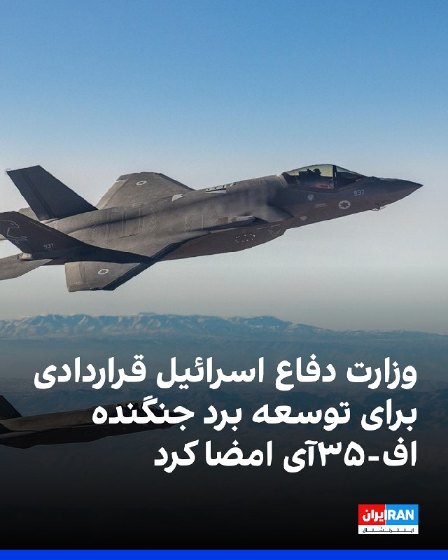

وزارت دفاع اسرائیل اعلام کرد با یکی از شرکت‌های زیرمجموعه شرکت دفاعی البیت قراردادی برای توسعه «قابلیت برد افزوده» جنگنده اف-۳۵آی امضا کرده است. ارزش این قرارداد ۳۴ میلیون دلار اعلام شده است.

بر اساس اعلام این وزارتخانه، این قرارداد با شرکت سایکلون منعقد شده و شامل «توسعه و یکپارچه‌سازی مخازن سوخت خارجی» بر پایه طرحی است که پیش‌تر برای جنگنده اف-۱۶ طراحی شده بود.

وزارت دفاع اسرائیل اعلام کرد این قابلیت جدید قرار است برد عملیاتی هواپیما را افزایش دهد، وابستگی به سوخت‌گیری هوایی را کاهش دهد و انعطاف‌پذیری عملیاتی در ماموریت‌های برد بلند را تقویت کند.
https://iranintl.com/202605141756

## IranIntlTV — post 337121

  

🔻معین، خواننده سرشناس موسیقی پاپ، با انتشار پستی در صفحه رسمی خود در اینستاگرام، اظهارات مهدی تاج، رییس فدراسیون فوتبال، درباره خواندن ترانه برای تیم ملی را تکذیب کرد.

🔹معین در این رابطه نوشت: «اخیرا خبرهایی درباره اجرای من برای تیم فوتبال در جام جهانی منتشر شده که صحت ندارد.»

🔹او همچنین با تاکید بر همبستگی با مردم اضافه کرد: «عشق من به مردم و سرزمینم همیشه واقعی بوده، اما صدای من زمانی معنا دارد که دل مردم آرام باشد و حال ایران خوب باشد.»

🔹این واکنش در حالی مطرح شد که در مراسم بدرقه تیم ملی در شامگاه چهارشنبه ۲۳ اردیبهشت، مهدی تاج تایید کرد که معین در حال آماده‌سازی قطعه‌ای برای تیم ملی است. او در این مراسم گفت: «ما دخالتی در ترانه معین نکرده‌ایم، اما در جریان آن هستیم.»
@iranintltvsport

## IranIntlTV — post 337120

  

حسین نوری همدانی، مرجع تقلید حامی حکومت، با صدور فتوایی پرداخت وجوهات شرعی مقلدان علی خامنه‌ای به مجتبی خامنه‌ای را مجاز اعلام کرد و او را «فقیهی جامع‌الشرایط» خواند.

او در این فتوا نوشت: «با توجه به اینکه وجوهات شرعی در نهایت در مسیر اعتلای حوزه‌های علمیه و اداره امور طلاب مصرف می‌گردد، و با عنایت به شناخت موجود نسبت به او به عنوان فقیهی جامع‌الشرایط، ان‌شاء‌الله پرداخت وجوهات شرعی مقلدین رهبر شهید به معظم‌له موجب برائت ذمه خواهد بود.»
https://iranintl.com/202605149707

## IranIntlTV — post 337118

  <a href="telegram/content/IranIntlTV_337118_1778746316.mp4" target="_blank">🎬 Download video</a>

وزارت خارجه امارات گزارش‌ها درباره سفر بنیامین نتانیاهو به این کشور را تکذیب کرد. چهارشنبه دفتر نخست‌وزیری اسرائیل اعلام کرده بود نتانیاهو در جریان عملیات «غرش شیران» به‌صورت محرمانه به امارات سفر کرده و با محمد بن زاید آل نهیان، رییس امارات، دیدار داشته است.

گفت‌وگو با منشه امیر، کارشناس امور خاورمیانه
@iranintltv

## IranIntlTV — post 337117

  <a href="telegram/content/IranIntlTV_337117_1778746318.mp4" target="_blank">🎬 Download video</a>

امید معماریان، تحلیل‌گر سیاسی، درباره دیدار دونالد ترامپ و شی جین‌پینگ گفت: «ممکن است چین برای کمک به حل مساله جنگ ایران، بخواهد در حوزه‌های دیگر از آمریکا امتیاز بگیرد.»
@iranintltv

## IranIntlTV — post 337116

  <a href="telegram/content/IranIntlTV_337116_1778746321.mp4" target="_blank">🎬 Download video</a>

جاویدنامان انقلاب ملی ایرانیان
«سینا کاظمی» جوان ۲۲ ساله، ۱۸ دی‌ماه در منطقه تهرانپارس تهران با شلیک مستقیم نیروهای سرکوب خامنه‌ای کشته شد. نامش در حافظه‌ این سرزمین می‌ماند و یادش چراغ راه آزادی‌خواهان است.
@iranintltv

## IranIntlTV — post 337115

  

رسانه‌های دولتی چین گزارش دادند دونالد ترامپ و شی جین‌پینگ در جریان گفت‌وگوهای خود در پکن درباره «وضعیت خاورمیانه» و جنگ اوکراین تبادل نظر کردند.

خبرگزاری دولتی شین‌هوا اعلام کرد دو رهبر درباره مسائل مهم بین‌المللی و منطقه‌ای، از جمله وضعیت خاورمیانه، دیدگاه‌های خود را مطرح کردند. موضوع جنگ اوکراین نیز در این گفت‌وگوها بررسی شد.

این دیدار در حالی برگزار شد که گمانه‌زنی‌هایی درباره تلاش احتمالی ترامپ برای جلب همکاری چین در موضوع جنگ آمریکا و اسرائیل علیه جمهوری اسلامی مطرح است.
https://iranintl.com/202605147700

## IranIntlTV — post 337114

  <a href="telegram/content/IranIntlTV_337114_1778746324.mp4" target="_blank">🎬 Download video</a>

یک شرکت بریتانیایی اعلام کرد با کمک هوش مصنوعی، برای ربات‌ها یک «مغز» طراحی کرده که به آن‌ها امکان می‌دهد مانند انسان حرکت کنند و وظایف صنعتی انجام دهند.

گزارش فرزیا ثابتی، خبرنگار ایران‌اینترنشنال
@iranintltv

## IranIntlTV — post 337113

  <a href="telegram/content/IranIntlTV_337113_1778746326.mp4" target="_blank">🎬 Download video</a>

وزارت ارتباطات جمهوری اسلامی اعلام کرد برنامه‌ریزی برای اجرای طرحی موسوم به «ساماندهی دستفروشان آنلاین» را آغاز کرده است. به گفته این وزارتخانه، در صورت فراهم شدن زیرساخت‌ها این طرح می‌تواند «موانع حضور کسب‌وکارهای خانگی در اقتصاد دیجیتال را کاهش دهد».

گفت‌وگو با مهدی صارمی‌فر، روزنامه‌نگار علم و تکنولوژی
@iranintltv

## IranIntlTV — post 337112

  

حسین شریعتمداری، نماینده رهبر جمهوری اسلامی در روزنامه کیهان، در یادداشتی با اشاره به جدایی بحرین از ایران، خواستار اقدام جمهوری اسلامی برای بازپس‌گیری فوری این کشور شد.

او نوشت: «آیا در این واقعیت که بحرین کماکان بخشی از سرزمین ایران است، کمترین تردیدی هست؟ اگر تردیدی نیست که نیست، چرا برای بازپس‌گیری آن اقدامی نمی‌شود؟»

شریعتمداری در ادامه افزود: «انتظار آن است و انتظاری شایسته و بایسته نیز هست که جمهوری اسلامی، سازوکار قانونی بازپس‌گیری بحرین را در دستور کار فوری خود قرار دهد.»

او همچنین نوشت: «چرا باید بخشی از سرزمین ایران اسلامی نه فقط در اختیار بیگانگان باشد، بلکه به پایگاه آمریکا و اسرائیل تبدیل شود؟»
https://iranintl.com/202605149606

## IranIntlTV — post 337111

  <a href="telegram/content/IranIntlTV_337111_1778746329.mp4" target="_blank">🎬 Download video</a>

شهرام خلدی، پژوهش‌گر تاریخ خاورمیانه و روابط بین‌الملل، گفت سفر ترامپ به پکن فرصت مناسبی است تا رییس‌جمهوری چین از بحران ایران به‌عنوان یک کارت برنده برای دستیابی به اهداف اقتصادی بزرگ‌تر و اعمال فشار بر ایالات متحده استفاده کند.
@iranintltv

## IranIntlTV — post 337110

  <a href="telegram/content/IranIntlTV_337110_1778746332.mp4" target="_blank">🎬 Download video</a>

میزان، رسانه قوه قضاییه جمهوری اسلامی، گزارش داد حکم اعدام محمد عباسی، شهروند ۵۵ ساله و از بازداشت‌شدگان اعتراضات دی‌ماه ۱۴۰۴، چهارشنبه به اتهام «محاربه» اجرا شد. بر اساس گزارش نهادهای حقوق بشری، اعترافات مربوط به اتهام «قتل یکی از سرهنگ‌های نیروی انتظامی» در اعتراضات ملارد، تحت شکنجه و با تهدید به تعرض به دختر او گرفته شده بود.

گفت‌وگو با پگاه بنی‌هاشمی، پژوهش‌گر ارشد حقوق
@iranintltv

## IranIntlTV — post 337109

  <a href="telegram/content/IranIntlTV_337109_1778746334.mp4" target="_blank">🎬 Download video</a>

دونالد ترامپ، رییس‌جمهوری ایالات متحده، با ابراز خرسندی از سفر به چین و ادای احترام به اقدامات شی جین‌پینگ گفت واشینگتن و پکن همواره چالش‌ها و اختلافات خود را در سریع‌ترین زمان و با حسن نیت حل کرده‌اند.
@iranintltv

## ManotoTV — post 105432

  <a href="telegram/content/ManotoTV_105432_1778746336.mp4" target="_blank">🎬 Download video</a>

سازمان دریانوردی تجاری بریتانیا اعلام کرد یک کشتی در سواحل امارات و در نزدیکی تنگه هرمز دچار حادثه شده است.
بر اساس این گزارش، افرادی «غیرمجاز» کنترل این کشتی را در دست گرفته‌اند و شناور اکنون به‌سمت آب‌های سرزمینی ایران در حرکت است. این نهاد دریایی بریتانیا اعلام کرد کشتی در فاصله ۳۸ مایلی سواحل فجیره قرار داشته است.

## ManotoTV — post 105431

  <a href="telegram/content/ManotoTV_105431_1778746337.mp4" target="_blank">🎬 Download video</a>

پلیس بریتانیا اعلام کرد دومین فرد در چارچوب تحقیقات ضدتروریسم درباره آتش‌سوزی در یک کنیسه در شرق لندن متهم شده است.
براساس اعلام پلیس، یک مرد ۳۱ ساله در ارتباط با این حمله بازداشت و تفهیم اتهام شده و تحقیقات درباره انگیزه و جزئیات حادثه ادامه دارد.

## ManotoTV — post 105430

  <a href="telegram/content/ManotoTV_105430_1778746338.mp4" target="_blank">🎬 Download video</a>

همزمان با آغاز نشست وزیران خارجه کشورهای عضو بریکس در دهلی‌نو، عباس عراقچی، وزیر خارجه ایران، از اعضای این گروه و «همه کشورهای مسئول جامعه جهانی» خواست حملات آمریکا و اسرائیل علیه ایران را به‌صراحت محکوم کنند.
خبرگزاری رویترز گزارش داد جنگ ایران و اسرائیل بر نشست دو روزه بریکس در هند سایه انداخته و اختلاف‌ها میان اعضا، رسیدن به موضعی مشترک و صدور بیانیه نهایی را دشوار کرده است. ایران از هند، رئیس دوره‌ای بریکس، خواسته از این نشست برای ایجاد اجماع علیه واشینگتن و تل‌آویو استفاده کند

## ManotoTV — post 105428

  <a href="telegram/content/ManotoTV_105428_1778746339.mp4" target="_blank">🎬 Download video</a>

رسانه‌های وابسته به قوه قضاییه جمهوری اسلامی گزارش دادند با دستور مقام قضایی در استان همدان، اموال ۴۷ نفر که به «جاسوسی» و «همکاری با رژیم اسرائیل» متهم شده‌اند، توقیف شده است.
براساس این گزارش‌ها، این افراد در کشورهای مختلف از جمله بریتانیا، آلمان، آمریکا، ترکیه، عراق و سوئیس اقامت دارند و مقام‌های قضایی جمهوری اسلامی اعلام کرده‌اند پرونده آن‌ها در حال بررسی است. به گفته رسانه میزان، اموال توقیف‌شده قرار است برای «بازسازی اماکن آسیب‌دیده از جنگ» هزینه شود.

## ManotoTV — post 105427

  <a href="telegram/content/ManotoTV_105427_1778746339.mp4" target="_blank">🎬 Download video</a>

دونالد ترامپ، رئیس‌جمهوری آمریکا، در دیدار با شی جین‌پینگ در پکن، این نشست را «بسیار مهم» توصیف کرد و گفت توجه گسترده‌ای در آمریکا و جهان به این دیدار وجود دارد.
ترامپ با اشاره به اهمیت این مذاکرات گفت برخی این نشست را «بزرگ‌ترین دیدار تاریخ» می‌دانند و تاکید کرد مردم آمریکا تقریبا درباره موضوع دیگری صحبت نمی‌کنند. او همچنین حضور در کنار شی جین‌پینگ را «باعث افتخار» دانست و ابراز امیدواری کرد روابط میان آمریکا و چین «بهتر از هر زمان دیگری» شود.

## ManotoTV — post 105426

  <a href="telegram/content/ManotoTV_105426_1778746341.mp4" target="_blank">🎬 Download video</a>

دونالد ترامپ و شی جین‌پینگ، روسای جمهوری آمریکا و چین، در پکن دیدار کردند؛ دیداری که با مراسمی گسترده و تشریفات پرزرق‌وبرق همراه بود و صبح پنج‌شنبه با حضور هیات‌های بلندپایه دو کشور برگزار شد.
ترامپ در سخنان آغازین خود این دیدار را «باعث افتخار» توصیف کرد و گفت:
«رئیس‌جمهوری شی، بسیار سپاسگزارم. چنین استقبالی کمتر دیده‌ام. بیش از همه تحت تأثیر کودکان قرار گرفتم؛ شاد و فوق‌العاده بودند. ارتش چین قدرتمند بود، اما آن کودکان چیزهای زیادی را نمایندگی می‌کنند.»

## ManotoTV — post 105425

  <a href="telegram/content/ManotoTV_105425_1778746343.mp4" target="_blank">🎬 Download video</a>

دونالد ترامپ، رئیس‌جمهوری آمریکا، صبح پنج‌شنبه در جریان سفر خود به پکن همراه با شی جین‌پینگ، رئیس‌جمهوری چین، در مراسم رسمی استقبال و رژه نیروهای نظامی این کشور شرکت کرد.
این مراسم در مقابل ساختمان «تالار بزرگ خلق» برگزار شد و دو رهبر ضمن بازدید از یگان‌های نظامی، شاهد اجرای مراسم سان و رژه نیروهای ارتش چین بودند.

## ManotoTV — post 105424

  <a href="telegram/content/ManotoTV_105424_1778746345.mp4" target="_blank">🎬 Download video</a>

‌
مهدی تاج، رئیس فدراسیون فوتبال ایران، درباره انتشار آهنگی از سوی معین، برای تیم فوتبال در جام‌جهانی گفت فدراسیون فوتبال در تولید این کار دخیل نبوده، اما «در جریان» این موضوع است.
تاج افزود: «هر کسی از ایران حمایت کند، مورد تایید ماست.»

## ManotoTV — post 105423

  <a href="telegram/content/ManotoTV_105423_1778746347.mp4" target="_blank">🎬 Download video</a>

تماسی از ایران:
«می‌گفت تفاوت سیستم آموزش مدارس ایران با خارج از کشور زمین تا آسمونه…
می‌گفت به‌جای رشد و یادگیری،
بچه‌ها درگیر ظواهر و حاشیه‌ها شدن
و انگیزه برای پیشرفت کم‌رنگ شده.»

## ManotoTV — post 105422

  <a href="telegram/content/ManotoTV_105422_1778746350.mp4" target="_blank">🎬 Download video</a>

مارکو روبیو، وزیر خارجه آمریکا، در گفت‌وگویی اختصاصی با شان هنیتی، خبرنگار و مجری فاکس‌نیوز در هواپیمای ریاست جمهوری آمریکا، از تلاش‌های فشرده واشینگتن برای وادار کردن چین به مقابله با اقدامات جمهوری اسلامی در خلیج فارس سخن گفت.

روبیو گفت: «کشتی‌های چینی در خلیج فارس گیر افتاده‌اند... آخر هفته یک محموله باری چین هدف قرار گرفت. مطمئنم ایران عمداً این کار را نکرده، اما این اتفاق افتاده و به همین دلیل کشتی‌های چینی آنجا گرفتار شده‌اند.»

او افزود: «این وضعیت منبع بزرگی از بی‌ثباتی است. بیش از هر نقطه دیگری در جهان، آسیا را تهدید به بی‌ثباتی می‌کند، چون به‌شدت به این تنگه برای تامین انرژی وابسته است.»

وزیر خارجه آمریکا همچنین گفت: «حل این مسئله به نفع چین است. امیدواریم بتوانیم آن‌ها را قانع کنیم نقش فعال‌تری برای وادار کردن ایران به عقب‌نشینی از اقداماتی که اکنون در خلیج فارس انجام می‌دهد و در پی انجام آن است، ایفا کنند.»

## ManotoTV — post 105421

  <a href="telegram/content/ManotoTV_105421_1778746352.mp4" target="_blank">🎬 Download video</a>

‌
خبرگزاری رویترز به نقل از منابع آگاه گزارش داد جنگنده‌های عربستان سعودی در جریان جنگ میان آمریکا، اسرائیل و جمهوری اسلامی، مواضع شبه‌نظامیان شیعه مورد حمایت تهران در عراق را هدف قرار داده‌اند.

بر اساس این گزارش، حملات تلافی‌جویانه‌ای نیز از خاک کویت به داخل عراق انجام شده است. منابع مطلع گفته‌اند این عملیات‌ها بخشی از پاسخ‌های نظامی گسترده‌تر کشورهای خلیج فارس به درگیری‌های منطقه‌ای بوده که تاکنون به‌طور علنی فاش نشده بود.

رویترز به نقل از مقام‌های امنیتی و نظامی عراق، یک مقام غربی و منابع آگاه گزارش داده حملات عربستان توسط جنگنده‌های نیروی هوایی این کشور علیه مواضع گروه‌های نزدیک به جمهوری اسلامی در نزدیکی مرز شمالی عربستان با عراق انجام شده است.

به گفته منابع، این حملات مواضعی را هدف قرار داده که از آن‌ها پهپادها و موشک‌هایی به سمت عربستان و دیگر کشورهای خلیج فارس شلیک می‌شد.

منابع عراقی همچنین گفتند حملاتی نیز از خاک کویت علیه مواضع شبه‌نظامیان در جنوب عراق انجام شده که در جریان آن چندین عضو گروه کتائب حزب‌الله کشته و یک مرکز ارتباطات و عملیات پهپادی این گروه نابود شده است.

## FarsiVOA — post 217703

🔺سئول: بعید است کسی جز حکومت ایران پشت حمله به کشتی کره جنوبی باشد

▪️یک مقام ارشد کره جنوبی اعلام کرد احتمال این‌که نهادی غیر از حکومت ایران مسئول حمله به یک کشتی باری کره‌جنوبی در نزدیکی تنگه هرمز بوده باشد، پایین است.

▪️این مقام ارشد روز پنج‌شنبه ۲۴ اردیبهشت به خبرنگاران گفت که کره‌جنوبی در حال بررسی اطلاعاتی است که آمریکا درباره حمله ۴ مه علیه کشتی «نامو» متعلق به شرکت کشتیرانی کره‌جنوبی اچ‌ام‌ام به اشتراک گذاشته است.

▪️در جریان این حمله کشتی دچار آتش‌سوزی شد و خسارتی به بخش پایینی بدنه کشتی وارد آمد.

▪️جمهوری اسلامی پیش‌تر مسئولیت این حمله را که شامل برخوردی شدید به بدنه کشتی بود، رد کرده است.

⬇️ بیشتر بخوانید:
https://ir.voanews.com/a/8149917.html

## FarsiVOA — post 217702

  

در اقدامی در سرکوب شهروندان منتقد و نقض حقوق مدنی ایرانیان، دستگاه قضایی جمهوری اسلامی از توقیف اموال ۴۷ شهروند در استان همدان با ادعای «خیانت به وطن» و «همکاری با دشمن» خبر داد.

دادگستری استان همدان، روز ۱۶ اردیبهشت، تعداد این شهروندان را ۴۰ نفر عنوان کرده بود و به نظر می‌رسد در همین مدت کوتاه، اموال هفت شهروند دیگر نیز توقیف شده است.

دستگاه قضایی جمهوری اسلامی اعلام کرد که ۴۱ نفر از این شهروندان هم‌اکنون ساکن خارج کشور هستند.

روز چهارشنبه ۲۳ اردیبهشت، نیز رئیس کل دادگستری هرمزگان از توقیف اموال ۲۴ نفر از ایرانیان خارج از کشور خبر داده بود. اقدامی که رئیس قوه قضائیه از آن دفاع کرده و مدعی است دستگاه قضایی مأمور شده تا اموال «همکاران و همراهان دشمن» را شناسایی، توقیف و مصادره کند.
@FarsiVOA

## FarsiVOA — post 217701

🔺جمهوری اسلامی محمد عباسی یکی دیگر از معترضان دی ماه را اعدام کرده است

▪️جمهوری اسلامی محمد عباسی، از بازدشت‌شدگان اعتراضات دی ماه ۱۴۰۴ را که به قتل یکی از عوامل حکومت در ملارد متهم شده بود، اعدام کرد.

▪️دستگاه قضایی مدعی است که شاهین دهقانی، از نیروهای انتظامی ۱۷ دی ماه ۱۴۰۴ و در شهرستان ملارد کشته شده، و این قتل را به محمد عباسی و دخترش منتسب می‌کند، اما تصاویر پخش شده در دادگاه دخالت محمد و فاطمه عباسی، را اثبات نمی‌کند.

▪️فاطمه عباسی، در همین پرونده به ۲۵ سال زندان محکوم شده است.

▪️جمهوری اسلامی از آغاز جنگ با آمریکا و اسرائیل، دستکم ۳۳ تن را به بهانه حضور در اعتراضات، عضویت در گروه‌های مخالف یا «همکاری با دشمن»، اعدام کرده است.

⬇️ بیشتر بخوانید:
https://ir.voanews.com/a/8149915.html

## FarsiVOA — post 217699

  

شی جین‌پینگ، رئیس‌جمهور چین، در جریان گفت‌وگو با دونالد ترامپ، رئیس‌جمهور آمریکا گفت که روابط اقتصادی بین دو کشور «ماهیتی دوجانبه، سودمند و برد-برد» دارد.

به گزارش خبرگزاری دولتی چین، شینهوا، شی پنجشنبه گفت: «دیروز، تیم‌های اقتصادی و تجاری ما نتایجی به‌طور کلی متوازن و مثبت تولید کردند. این خبر خوبی برای مردم دو کشور و جهان است.»

رئیس‌جمهور چین افزود که واقعیت‌ها بارها نشان داده‌اند در جنگ‌های تجاری هیچ برنده‌ای وجود ندارد و از هر دو طرف خواست تا به‌طور مشترک شتاب مثبتی را که با تلاش فراوان ایجاد کرده‌اند حفظ کنند.

او گفت: «در مواردی که اختلافات و اصطکاک‌ها وجود دارد، مشورت برابر تنها انتخاب درست است.»

همچنین بر اساس ویدیویی که از ابتدای مذاکرات منتشر شد، شی گفت: «همواره بر این باور بوده‌ام که منافع مشترک میان چین و ایالات متحده بر اختلافات ما می‌چربد؛ موفقیت هر کشور فرصتی برای کشور دیگر است و یک رابطه پایدار چین و آمریکا برای جهان یک موهبت است. همکاری به سود هر دو طرف است، در حالی که تقابل به هر دو طرف آسیب می‌زند.»
@FarsiVOA

## FarsiVOA — post 217698

  

🔺اوپک از افت تولید نفت ایران برای دومین ماه متوالی خبر داد

▪️سازمان کشورهای صادرکننده نفت، اوپک، از افت تولید نفت ایران برای دومین ماه متوالی خبر داد.

▪️تولید روزانه نفت ایران در ماه آوریل نسبت به ماه مارس حدود ۲۱۲ هزار بشکه و نسبت به ماه فوریه، قبل از جنگ، حدود ۳۸۷ هزار بشکه کاهش داشته است. ایران در ماه گذشته روزانه ۲ میلیون و ۸۵۴ هزار بشکه تولید نفت داشته است.

▪️با توجه به پر شدن مخازن ذخیره نفت ایران به خاطر محاصره دریایی آمریکا، انتظار می‌رود شتاب افت تولید نفت ایران در ماه جاری افزایش یابد.

▪️مصرف داخلی نفت خام ایران حدود ۱.۷ میلیون بشکه است و در صورت ناتوانی جمهوری اسلامی در صادرات نفت، تولید نفت خام به همین سطح کاهش خواهد یافت.

⬇️ بیشتر بخوانید:
https://ir.voanews.com/a/8149916.html

## FarsiVOA — post 217697

🔺ترامپ به شی: روابط آمریکا با چین «بهتر از همیشه» خواهد بود

▪️دونالد ترامپ، رئیس‌جمهور ایالات متحده، روز پنج‌شنبه ۲۴ اردیبهشت در پکن و پشت میز گفت‌وگو با همتای چینی خود، شی جین‌پینگ، اعلام کرد که روابط کشورش با چین «بهتر از همیشه» خواهد بود.

▪️ترامپ روز چهارشنبه برای سفری سه‌روزه وارد پایتخت چین شد. این نخستین سفر او به چین از سال ۲۰۱۷ تاکنون است.

▪️این سفر در ابتدا برای اواخر ماه مارس برنامه‌ریزی شده بود، اما به دلیل جنگ آمریکا و اسرائیل علیه جمهوری اسلامی به تعویق افتاد.

▪️هدف نشست شی و ترامپ دستیابی به توافق‌هایی درباره محصولات کشاورزی و هواپیماها، و همچنین حفظ آتش‌بس شکننده در جنگ تجاری میان دو اقتصاد بزرگ جهان است.

⬇️ بیشتر بخوانید:
https://ir.voanews.com/a/8149914.html

## FarsiVOA — post 217696

  <a href="telegram/content/FarsiVOA_217696_1778746355.mp4" target="_blank">🎬 Download video</a>

⚡️گزارش فرهاد فلاحی از چین؛ واشنگتن از پکن در ارتباط با جمهوری اسلامی چه می‌خواهد؟
@FarsiVOA

## FarsiVOA — post 217695

⚡️مردم درباره سفر پرزيدنت ترامپ به چین چه می‌گویند؟
@FarsiVOA

## FarsiVOA — post 217694

⚡️گفت‌وگو با مسعود کاظم‌زاده و ابراهیم روشندل درباره انتظارات از سفر رئيس جمهوری آمریکا به چین
@FarsiVOA

## FarsiVOA — post 217693

⚡️راهبرد چین در خلیج فارس؛ انرژی حرف اول را می‌زند
@FarsiVOA

## FarsiVOA — post 217692

  <a href="telegram/content/FarsiVOA_217692_1778746356.mp4" target="_blank">🎬 Download video</a>

⚡️چه توقعات اقتصادی می‌توان از سفر دونالد ترامپ به چین داشت؟ گفت‌وگو با نادر حبیبی
@FarsiVOA

## FarsiVOA — post 217691

  <a href="telegram/content/FarsiVOA_217691_1778746357.mp4" target="_blank">🎬 Download video</a>

⚡️گزارش خبرنگار اعزامی صدای آمریکا از سفر رئیس جمهوری آمریکا به چین
@FarsiVOA

## FarsiVOA — post 217690

  <a href="telegram/content/FarsiVOA_217690_1778746358.mp4" target="_blank">🎬 Download video</a>

⚡️سخنان آغازین دونالد ترامپ، رئیس جمهوری آمریکا در دیدار با رئیس جمهوری چین پس از مراسم استقبال رسمی
@FarsiVOA

## FarsiVOA — post 217689

⚡️آیا چین اراده و قدرت این را دارد که جمهوری اسلامی را وادار کند از ناامن‌سازی تنگه هرمز دست بر دارد؟
@FarsiVOA

## FarsiVOA — post 217688

⚡️چه انتظاری از سفر پرزیدنت ترامپ به چین می‌‌توان داشت؟ گفت‌وگو با شهیر شهیدثالث و شکریا برادوست
@FarsiVOA

## FarsiVOA — post 217687

  <a href="telegram/content/FarsiVOA_217687_1778746360.mp4" target="_blank">🎬 Download video</a>

⚡️ادامه خاموشی اینترنت و اعدام‌ها درایران؛ واکنش کاربران
@FarsiVOA

## FarsiVOA — post 217686

⚡️مراسم استقبال رسمی از دونالد ترامپ رئیس جمهوری آمریکا، در چین
@FarsiVOA

## FarsiVOA — post 217685

  

⚡️دونالد ترامپ، رئیس جمهوری آمریکا روز پنج‌شنبه به وقت پکن مورد استقبال رسمی شی جین‌پینگ، رئیس جمهوری چین قرار گرفت. آقای ترامپ در راس یک هئیت عالی‌رتبه سیاسی و اقتصادی وارد چین شده است. انتظار می‌رود که مسئله تنگه هرمز یکی از مسائل مورد گفت‌وگو در این سفر باشد.
@FarsiVOA

## FarsiVOA — post 217684

⚡️تحریم‌های مرتبط با جمهوری اسلامی علیه نهادهای چینی چه اثری دارد؟
@FarsiVOA

## FarsiVOA — post 217683

⚡️نویسندگان زندانی، تصویر ترسناک جهان امروز
@FarsiVOA

## DW_Farsi — post 124675

  

🔶 محمد عباسی، از بازداشت‌شدگان اعتراضات دی‌ماه، اعدام شد

به گزارش خبرگزاری میزان، وابسته قوه قضائیه جمهوری اسلامی، حکم اعدام محمد عباسی که از بازداشت‌شدگان اعتراضات دی ماه ۱۴۰۴ بود، به اجرا در آمد.
قوه قضائیه او را به "قتل" یک نظامی در جریان اعتراضات متهم کرده و از اعمال "قصاص" سخن گفته است. طبق اعلام این نهاد، اجرای حکم اعدام محمد عباسی با تایید نهایی دیوان عالی جمهوری اسلامی و به تقاضای اولیاء دم انجام شده است.

دیوان عالی همچنین حکم ۲۵ سال حبس فاطمه عباسی، دختر محمد عباسی را که در بند زنان زندان اوین در حبس به سر می‌برد، تایید کرد.

محمد عباسی اواخر دی ماه سال گذشته به اتهام "مشارکت در کشتن" یک مأمور حکومتی در ملارد بازداشت و از سوی دادگاه انقلاب به ریاست ابوالقاسم صلواتی به اعدام محکوم شده بود. این حکم هفتم اردیبهشت ماه سال جاری در شعبه ۳۹ دیوان عالی کشور تأیید شد.

هرانا، ارگان خبری مجموعه فعالان حقوق بشر ایران به نقل از یک منبع آگاه نزدیک به خانواده این زندانی سیاسی گزارش داد: «مسئولان زندان قزلحصار کرج از خانواده محمد عباسی خواستند که برای ملاقات با وی به زندان مراجعه کنند. اما پس از حضور خانواده در زندان، این امکان از نزدیکان او سلب شد. پس از خروج خانواده عباسی از زندان، آنها در تماسی تلفنی از اجرای حکم اعدام محمد عباسی مطلع شدند.»

به نوشته هرانا ابهامات و شبهات متعددی درباره روند رسیدگی و محتوای پرونده محمد عباسی و دخترش فاطمه وجود داشته، اما وکلای مستقل به دلیل محرومیت از دسترسی به پرونده امکان بررسی و پیگیری موثر آن را نداشته‌اند.

@dw_farsi

## DW_Farsi — post 124674

🔶 آغاز دیدار شی و ترامپ در سایه جنگ ایران

دیدار رسمی دونالد ترامپ، رئیس جمهور آمریکا و شی جین‌پینگ، همتای چینی او پنجشنبه ۱۴ مه (۲۴ اردیبهشت) آغاز شد. به گزارش رسانه‌های خبری شروع ملاقات و گفت‌وگوی رهبران ایالات متحده و چین دیدار با سخنان متقابل دوستانه همراه بود.

ترامپ پس از استقبال و تشریفات رسمی، رئیس جمهور چین را مورد ستایش قرار داد. شی نیز ابراز اطمینان کرد که نقاط مشترک پکن و واشنگتن بیشتر از موارد اختلاف بین دو کشور است. او تأکید کرد که موفقیت هر یک از دو کشور در عین حال فرصتی برای دیگری است.

چین و آمریکا که بزرگ‌ترین قدرت‌های اقتصادی جهان محسوب می‌شوند، در نزاعی تجاری به سر می‌برند.

ترامپ که در سال گذشته میلادی چین را به وضع تعرفه‌های تجاری سنگین تهدید کرده بود، در آغاز گفت‌وگوهای خود با شی در پکن از "آینده مشترک درخشان" دو کشور سخن گفت.

او همتای چینی را خود را "شخصیتی فوق‌العاده" خواند و خطاب به شی افزود: «گاهی خوششان نمی‌آید که من چنین چیزی بگویم، اما با وجود این، این نکته را بیان می‌کنم چون عین حقیقت است: دوستی با شما افتخار است.»

@dw_farsi

## DW_Farsi — post 124673

  

🔶 امارات متحده خبر سفر نتانیاهو به این کشور را تکذیب کرد

وزارت امور خارجه امارات متحده عربی اخبار و گزارش‌های مربوط به سفر بنیامین نتانیاهو به این کشور در حین جنگ آمریکا و اسرائیل با جمهوری اسلامی را تکذیب کرد.

در بیانیه این وزارتخانه در این رابطه منتشر شد، آماده است: «امارات متحده عربی گزارش‌های منتشرشده درباره سفر نخست‌وزير اسرائيل يا استقبال از يک هيات نظامی اسرائيلی را تکذيب می‌کند.»

این وزارتخانه تأکید کرده که روابط امارات و اسرائیل "علنی و بر پایه پیمان ابراهیم" است و از این رو تمامی سفرها و دیدارهای رسمی به شکل شفاف اعلام شده و انجام می‌گیرند".

دفتر بنیامین نتانیاهو چهارشنبه ۱۳ مه (۲۳ اردیبهشت) اعلام کرده بود، نخست وزیر اسرائیل در جریان جنگ ایران به‌طور محرمانه به امارات سفر کرده و با محمد بن زاید، رئیس امارات، دیدار داشته است. به گفته دفتر نتانیاهو این سفر به "یک دستاورد تاریخی" در روابط دو طرف منجر شده است.

پیش از آن وال استریت ژورنال در گزارشی نوشته بود دیوید بارنیا، رئیس موساد، نیز دست‌کم دو بار در ماه‌های مارس و آوریل به امارات سفر کرد تا درباره روند جنگ با ایران و هماهنگی‌های امنیتی با مقام‌های این کشور گفت‌وگو کند.

@dw_farsi

## DW_Farsi — post 124672

  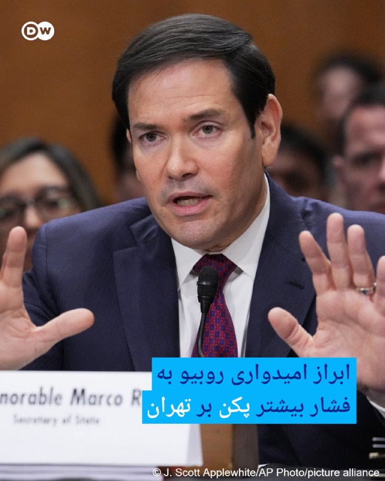

🔶 ابراز امیدواری روبیو به فشار بیشتر پکن بر تهران

مارکو روبیو اعلام کرد ایالات متحده به پشتیبانی بیشتر چین در راه یافتن راه‌حلی برای تنگه هرمز امیدوار است. وزیر خارجه آمریکا تصریح کرد: «ما امیدواریم چین را متقاعد کنیم که نقشی فعالانه‌تر برای متقاعد کردن ایران بازی کند تا تهران از آنچه در حال حاضر در خلیج فارس انجام می‌دهد و در تلاش برای انجام آن است، فاصله بگیرد.»

روبیو که دونالد ترامپ را در سفر به چین همراهی می‌کند، این اظهارات را در گفت‌وگو با شبکه فاکس نیوز که در هواپیمای "ایرفورس وان" انجام شد، ابراز کرد.

وزیر خارجه ایالات متحده در این گفت‌وگو تأکید کرد که رفع وضعیت کنونی حاکم در تنگه هرمز به دلایل مختلف به نفع چین است. با این حال از آنجایی که کشتی‌های چینی نیز در آب‌های خلیج فارس گرفتار شده‌اند. او افزود، اقتصاد چین بر محور صادرات فعالیت می‌کند و از فشارهای اقتصادی ناشی از بحران تنگه هرمز رنج می‌برد، زیرا کشورهای دیگر بر اثر این بحران کالاهای کمتری از چین خریداری می‌کنند.

اظهارات روبیو در تضاد با سخنان ترامپ قرار دارد. رئیس جمهور آمریکا در آغاز سفرش به پکن در پاسخ به این پرسش که آیا همتای چینی او، شی می‌تواند در جنگ ایران یاری‌دهنده باشد، گفت بود: «گمان می‌کنم، ما در مورد ایران به هیچ کمکی نیاز نداریم.»

@dw_farsi

## Persian_Trend_Official — post 14106

  

🔴 روسیه یکی از سنگین‌ترین حملات خود را علیه اوکراین انجام داد

💢گزارش‌ها حاکی است روسیه طی ۲۴ ساعت گذشته یکی از بزرگ‌ترین حملات هوایی خود از آغاز جنگ را علیه اوکراین انجام داده است.

💢بر اساس اطلاعات منتشرشده:

▪️ بیش از ۱۴۰۰ پهپاد در این حمله استفاده شده است
▪️ همچنین بیش از ۵۰ موشک به‌سمت اهداف مختلف شلیک شده‌اند
▪️ موج نخست حملات مناطق غربی اوکراین را هدف قرار داد
▪️ سپس حملات به سمت کی‌یف گسترش یافت

🫆:Tony

📌 @persian_trend_official
پرشین ترند | متفاوت‌ترین کانال نظامی

## Persian_Trend_Official — post 14105

  <a href="telegram/content/Persian_Trend_Official_14105_1778746365.mp4" target="_blank">🎬 Download video</a>

⭕️ اتوبوس تیم ملی فوتبال رو با شعار مرگ بر آمریکا بدرقه کردن تا بره آمریکا...

پ.ن: چی بگم والا...

📝 Nick

📌 @persian_trend_official
پرشین ترند | متفاوت‌ترین کانال نظامی

## Persian_Trend_Official — post 14104

  

🔴 گزارش‌ها از توقیف یک شناور در نزدیکی فجیره توسط ایران

💢برخی گزارش‌ها حاکی است یک فروند شناور در فاصله حدود ۳۸ مایل دریایی از بندر فجیره امارات توسط نیروهای ایرانی توقیف شده و در حال حرکت به‌سمت آب‌های سرزمینی ایران است.

🫆:Tony

📌 @persian_trend_official
پرشین ترند | متفاوت‌ترین کانال نظامی

## Persian_Trend_Official — post 14103

⭕️ وزیر آموزش‌ و پرورش:

امتحانات نهایی ۲ هفته بعد از عادی شدن شرایط و پایان جنگ برگزار خواهند شد. ضمن اینکه در استان‌ها تصمیم‌گیری دربارۀ نحوۀ برگزاری امتحانات برعهدۀ استانداران خواهد بود.

پ.ن: دانش آموزان عزیز دعا کنید ماجرا مثل صدام عراق نشه که امتحانات‌تون یه 11 سالی‌ طول خواهد کشید. 🗿😂

📝 Nick

📌 @persian_trend_official
پرشین ترند | متفاوت‌ترین کانال نظامی

## Persian_Trend_Official — post 14102

گزارش صداوسیما از احسان افرشته و روایت عجیب از جاسوسی ! 📌 @persian_trend_official پرشین ترند | متفاوت‌ترین کانال نظامی

## Persian_Trend_Official — post 14101

  <a href="telegram/content/Persian_Trend_Official_14101_1778746368.mp4" target="_blank">🎬 Download video</a>

گزارش صداوسیما از احسان افرشته و روایت عجیب از جاسوسی !

📌 @persian_trend_official
پرشین ترند | متفاوت‌ترین کانال نظامی

## Persian_Trend_Official — post 14099

⭕️ وضعیت از 57 تا امروز... 🗿

(نسخه کم حجم توی کامنت ها)
📝 Nick

📌 @persian_trend_official
پرشین ترند | متفاوت‌ترین کانال نظامی

## Persian_Trend_Official — post 14098

  <a href="telegram/content/Persian_Trend_Official_14098_1778746371.webm" target="_blank">🎬 Download video</a>

⭕️ وزیر انرژی و معادن کوبا اعلام کرد که کشور به طور کامل از دیزل و نفت کوره خالی شده و تولید برق به صورت کامل متوقف شده است، در حالی که ایالات متحده جزیره را محاصره کرده است.

بسیاری از محله‌ها در پایتخت کوبا در حال حاضر با خاموشی‌هایی مواجه هستند که ۲۰ تا ۲۲ ساعت در روز طول می‌کشد.

📝 Nick

📌 @persian_trend_official
پرشین ترند | متفاوت‌ترین کانال نظامی

## Persian_Trend_Official — post 14093

  <a href="telegram/content/Persian_Trend_Official_14093_1778746372.webm" target="_blank">🎬 Download video</a>

باز مانده از رزمایش ضد هلی برن «قائد شهید» سپاه حضرت محمد رسول اللّه (ص) تهران بزرگ !!!

درسته جنگ زمینی تخصص شماست، فقط متخصصین عزیز پوتین نداشتید ؟

📌 @persian_trend_official
پرشین ترند | متفاوت‌ترین کانال نظامی

## Persian_Trend_Official — post 14092

کانال رسمی پرشین ترند pinned a voice message

## Persian_Trend_Official — post 14091

هر شب خواب رفیقای شهیدمو می‌بینم ! 📌 @persian_trend_official پرشین ترند | متفاوت‌ترین کانال نظامی

## Persian_Trend_Official — post 14090

  <a href="telegram/content/Persian_Trend_Official_14090_1778746372.mp4" target="_blank">🎬 Download video</a>

هر شب خواب رفیقای شهیدمو می‌بینم !

📌 @persian_trend_official
پرشین ترند | متفاوت‌ترین کانال نظامی

## Persian_Trend_Official — post 14087

📍بولتن خبری ۲۴ ساعت اخیر پرشین ترند
🗓 ۲۴ اردیبهشت ۱۴۰۵

گرد آوری = آرشیو تحریریه پرشین ترند

◾️ نیویورک تایمز: ایران ۷۰ درصد از ذخایر موشکی خود را حفظ کرده و به ۳۰ سایت از ۳۳ سایت موشکی در تنگه هرمز دسترسی مجدد یافته است

◾️ رویترز: ایران رویکرد خود را از مسدودسازی هرمز به «کنترل دسترسی» تغییر داده؛ عراق و پاکستان به توافق جداگانه برای عبور نفتکش‌هایشان دست یافته‌اند

◾️خبرگزاری Wsj: عبور و مرور «خاموش» کشتی‌ها در تنگه هرمز ۶۰۰ درصد افزایش یافته

◾️ مجلس سنای آمریکا برای هفتمین بار قطعنامه پایان جنگ با ایران را رد کرد

◾️ پنتاگون: هزینه جنگ با ایران به ۲۹ میلیارد دلار رسید؛ تحلیلگران هشدار می‌دهند رقم نهایی به یک تریلیون دلار خواهد رسید

◾️ وزارت بهداشت ایران: تعداد مجروحان بستری جنگ به زیر ۴۰ نفر رسیده است

◾️سخنگوی وزارت خارجه ایران: آمریکا اهمیت فرصت مذاکره را درک نمی‌کند؛ ارزیابی دقیق‌تری از موضع آمریکا از طریق میانجیان پاکستانی دریافت خواهد شد

◾️سخنگوی کمیسیون امنیت ملی: غنی‌سازی ۹۰ درصدی یکی از گزینه‌های مطرح ایران است

◾️وزیر انرژی آمریکا: ایران به طرز نگران‌کننده‌ به غنی‌سازی درجه تسلیحاتی نزدیک شده و ممکن است چند هفته با آستانه ۹۰ درصد فاصله داشته باشد

◾️نروژ با سفر معاون وزیر خارجه به تهران، عمان و پاکستان در حال آزمودن نقش میانجیگری اروپایی است

◾️روسیه آمادگی خود را برای حمایت از تلاش‌های دیپلماتیک پاکستان در حل تنش خاورمیانه اعلام کرد

◾️ایتالیا اعلام کرد در صورت برقراری آتش‌بس پایدار، دو فروند مین‌روب به تنگه هرمز اعزام خواهد کرد

◾️ترامپ وارد پکن شد؛ ایران محور اصلی مذاکرات با شی جین‌پینگ عنوان شده است

◾️ترامپ: آمریکا برای پایان جنگ با ایران به کمک چین نیاز ندارد؛ «به هر شکل پیروز خواهیم شد»

◾️روبیو: واشنگتن امیدوار است پکن ایران را به عقب‌نشینی از رفتارهایش در منطقه متقاعد کند

◾️روبیو و وانگ یی توافق کردند هیچ کشوری حق دریافت عوارض حمل‌ونقل در تنگه هرمز را ندارد

◾️واشنگتن‌پست: گزارش محرمانه اطلاعاتی آمریکا نشان می‌دهد چین از جنگ ایران بهره راهبردی می‌برد؛ پکن در حین حملات ایران به کشورهای خلیج فارس تسلیحات فروخته است

◾️نیویورک تایمز: شرکت‌های چینی درباره فروش مخفیانه سلاح به ایران از طریق کشورهای ثالث مذاکره کرده‌اند

◾️گزارش‌ها حاکی است ایلان ماسک، تیم کوک، جنسن هوانگ و لری فینک در هیئت همراه ترامپ در سفر به پکن حضور دارند

◾️شهباز شریف از ۳ تا ۶ خرداد به پکن سفر می‌کند؛ میانجیگری میان ایران و آمریکا با مشارکت چین از دستور کار اصلی است

◾️وال استریت ژورنال: رئیس موساد دیوید بارنیا در جریان جنگ حداقل دو بار به‌صورت مخفیانه به امارات سفر کرده است

◾️دفتر نخست‌وزیری اسرائیل: نتانیاهو در میانه جنگ سفری محرمانه به امارات داشته؛ امارات این ادعا را تکذیب کرد

◾️داده‌های پروازی منتشرشده نشان می‌دهد دو هواپیمای شخصی در ۲۶ مارس از تل‌آویو به شهر العین امارات پرواز کرده‌اند

◾️وال استریت ژورنال: امارات فراتر از میانجیگری دیپلماتیک عمل کرده؛ حمله به جزیره لاوان و میزبانی سامانه‌های دفاع هوایی اسرائیل به این کشور نسبت داده شده است

◾️رویترز: جنگنده‌های عربستان سعودی اهداف شبه‌نظامیان وابسته به ایران را در نزدیکی مرز عراق بمباران کردند

◾️رویترز: کویت در دو نوبت حملات موشکی تلافی‌جویانه به مواضع شبه‌نظامیان در جنوب عراق انجام داده است

◾️عراقچی: کویت به‌صورت غیرقانونی به شناور ایرانی حمله و ۴ تبعه ایران را در خلیج فارس بازداشت کرده ؛ایران خواستار آزادی فوری آن‌هاست

◾️ احسان افرشته ۳۳ ساله بامداد چهارشنبه به اتهام همکاری با موساد اعدام شد؛ او پیش از بازگشت به ایران داوطلبانه خود را معرفی کرده بود

◾️ عضو کمیسیون بودجه مجلس: ۳۰ درصد از گرانی‌ها ناشی از جنگ و ۳۵ درصد ناشی از ناکارآمدی دستگاه‌هاست

◾️ شبکهNDTV تصاویر ماهواره‌ای منتشر کرد که حضور هواپیمای ترابری C-130H ایران در پایگاه هوایی نورخان پاکستان را تأیید می‌کند

◾️ وزیر دفاع پاکستان: ترکیه و قطر ممکن است به توافق دفاعی متقابل پاکستان و عربستان سعودی بپیوندند

◾️ رایمتال آلمان تولید انبوه پهپاد FV-014 با برد ۱۰۰ کیلومتر و استقامت ۷۰ دقیقه‌ای را آغاز کرد

◾️پنتاگون به‌طور غیرمنتظره اعزام تیپ رزمی زرهی «بلک‌جک» به لهستان را لغو کرد؛ برخی نیروها در مسیر بودند که دستور توقف صادر شد

◾️بلومبرگ: نزدیک به ۴۰ درصد از تأمین‌کنندگان سازندگان موشک دولتی چین در ۲۰۲۵ به درآمد رکوردی رسیدند

◾️ پوتین به تسلط کامل بر دونباس تا پاییز متمرکز شده و قصد دارد از آن برای درخواست قلمرو بیشتر در مذاکرات آتی بهره ببرد

◾️ ترکیه و ارمنستان آماده‌سازی‌های لازم برای راه‌اندازی تجارت مستقیم را تا ۱۱ مه ۲۰۲۶ تکمیل کردند

📌 @persian_trend_official
پرشین ترند | متفاوت‌ترین کانال نظامی

## Persian_Trend_Official — post 14086

  <a href="telegram/content/Persian_Trend_Official_14086_1778746376.mp4" target="_blank">🎬 Download video</a>

صبحتون بخیر ☕️

📝 Nick
📌 @persian_trend_official
پرشین ترند | متفاوت‌ترین کانال نظامی

## Persian_Trend_Official — post 14085

🔴 روبیو: امیدواریم چین ایران را به عقب‌نشینی از رفتارهایش متقاعد کند

💢مارکو روبیو، وزیر خارجه آمریکا، اعلام کرد واشینگتن امیدوار است چین نقش فعال‌تری برای متقاعد کردن ایران به عقب‌نشینی از رفتارهایش در منطقه ایفا کند.

▪️روبیو همچنین گفت:

▪️ آمریکا به‌دنبال مدیریت راهبردی روابط پیچیده خود با چین است
▪️ چین بزرگ‌ترین چالش ژئوپلیتیکی و سیاسی پیش‌روی آمریکا محسوب می‌شود
▪️ واشینگتن خواهان جلوگیری از تشدید تنش‌ها در منطقه است

🫆:Tony

📌 @persian_trend_official
پرشین ترند | متفاوت‌ترین کانال نظامی

## Persian_Trend_Official — post 14084

🔴 واشینگتن‌پست: چین از جنگ ایران سود راهبردی می‌برد

💢روزنامه «واشینگتن‌پست» به‌نقل از یک گزارش محرمانه اطلاعاتی آمریکا مدعی شد چین در حال کسب مزایای راهبردی از جنگ ایران است؛ در حالی که آمریکا منابع نظامی و اقتصادی خود را در این درگیری مصرف می‌کند.

▪️بر اساس این ارزیابی:

▪️ چین در جریان حملات ایران، به کشورهای خلیج فارس تسلیحات فروخته است
▪️ پکن به برخی کشورها برای مدیریت بحران انرژی پس از بسته‌شدن تنگه هرمز کمک کرده است
▪️ جنگ باعث کاهش ذخایر موشکی و سامانه‌های دفاعی آمریکا شده و نگرانی‌هایی درباره آمادگی واشینگتن برای درگیری احتمالی بر سر تایوان ایجاد کرده است
▪️ چین عملیات‌های نظامی آمریکا را زیر نظر دارد و از پیام‌های ضدجنگ برای نمایش آمریکا به‌عنوان عامل بی‌ثباتی استفاده می‌کند

💢تحلیلگران معتقدند ادامه این درگیری می‌تواند نفوذ جهانی چین را افزایش داده و جایگاه آمریکا نزد متحدانش را تضعیف کند.

🫆:Tony

📌 @persian_trend_official
پرشین ترند | متفاوت‌ترین کانال نظامی

## RadioFarda — post 157161

🔸انتشار تصاویری از رژه پادشاهی‌خواهان که لباس‌هایی با آرم ساواک به تن داشتند، در شهر رگنسبورگ آلمان با واکنش‌های زیادی همراه شده است.

🔸این افراد خود را «گروه مردمی ساواک» معرفی می‌کنند و خواهان «شناسایی عوامل جمهوری اسلامی و اپوزیسیون‌های جعلی و نفوذی» هستند.

🔸این اقدام با واکنش‌های زیادی در شبکه‌های اجتماعی همراه شده است. برخی کاربران آن را « سفید‌سازی» و «بازگشت به نمادهای سرکوب» و برخی خواستار «برخورد قانونی دولت آلمان» با این گونه اقدامات شده‌اند.

🔸برخی کاربران نیز این گونه اقدامات را مشابه عملکرد جمهوری اسلامی دانسته‌اند.

🔸ساواک، سازمان اطلاعات و امنیت کشور در ایران بود که طی چند دهه مسئولیت شناسایی، بازداشت، شکنجه و سرکوب مخالفان سیاسی حکومت پهلوی را بر عهد داشت.

@RadioFarda

## RadioFarda — post 157160

  

🔸 نخست‌وزیر ژاپن از عبور موفقیت‌آمیز یک نفتکش این کشور حامل نفت خام روز پنجشنبه ۲۴ اردیبهشت از تنگه هرمز عبور کرده و در راه ژاپن است.

🔸 سانائه تاکایچی با اعلام این خبر در شبکه ایکس نوشت پس از عبور یک کشتی متعلق به ژاپن در نهم اردیبهشت از تنگه هرمز، عبور کشتی دوم به‌عنوان یک تحول مثبت ارزیابی می‌شود.

🔸 میاتا توموهیده، مدیرعامل شرکت انیوس، بزرگ‌ترین گروه پالایشی ژاپن که این نفتکش هم زیرمجموعهٔ آن است، گفت این نفتکش با موفقیت از تنگه هرمز عبور کرده و انتظار می‌رود اواخر ماه مه یا اوایل ژوئن به ژاپن برسد.

🔸 بر اساس داده‌های شرکت «کلپر»، این کشتی حامل ۱.۲ میلیون بشکه نفت خام کویت و ۷۰۰ هزار بشکه نفت امارات است.

🔸 ژاپن پیش از آغاز جنگ حدود ۹۵ درصد نفت خود را از کشورهای حوزه خلیج فارس وارد می‌کرد.

🔸 وزارت خارجهٔ ژاپن اعلام کرده دولت این کشور برای عبور ایمن کشتی‌ها مستقیماً با حکومت ایران در تماس بوده است. به‌گفتهٔ این وزارتخانه، هنوز ۳۹ کشتی مرتبط با ژاپن در خلیج فارس باقی مانده‌اند.

@RadioFarda

## RadioFarda — post 157159

🔸 رئیس‌جمهور آمریکا با همتای چینی خود شی ژین‌پینگ صبح روز پنج‌شنبه ۲۳ اردیبهشت در پایتخت چین دیدار رسمی کرد.

🔸 دونالد ترامپ به‌عنوان نخستین رئیس‌جمهور ایالات متحده که در نزدیک به یک دهۀ اخیر به پکن سفر کرده، امیدوار است در این سفر به موفقیت‌های تجاری رسیده و «آتش‌بس شکنندۀ تجاری» میان دو ابرقدرت را، حفظ کند.

🔸 مدیران ارشد تجاری و فناوری که رئیس‌جمهور آمریکا را در این سفر همراهی می‌کنند، امیدوارند بتوانند برخی موانع تجاری میان دو کشور را برطرف کنند؛ از جمله مدیر عامل شرکت انویدیا که برای دریافت مجوز فروش تراشه‌های قدرتمند هوش مصنوعی خود موسوم به اچ ۲۰۰، دردسر زیادی کشیده است.

@RadioFarda

## RadioFarda — post 157158

  

🔸مارکو روبیو، وزیر خارجه آمریکا، می‌گوید به نفع چین است که حکومت ایران را برای باز کردن تنگه هرمز تحت فشار بگذارد.

🔸براساس گزارشی که فاکس‌نیوز از اظهارات روبیو در راه سفر به چین پخش کرد، او گفت: «ما این استدلال را با چینی‌ها مطرح کرده‌ایم و امیدوارم قانع‌کننده باشد. آن‌ها اواخر این هفته در سازمان ملل فرصت خواهند داشت دربارهٔ این موضوع اقدامی انجام دهند؛ زمانی که قطعنامه‌ای برای محکوم کردن اقدامات ایران در ارتباط با تنگه‌ها مطرح می‌شود.»

🔸روبیو گفت حکومت ایران در حال ایجاد ظرفیتی بوده که بتواند با «انبوهی از موشک‌ها و پهپادها» سامانه‌های دفاعی کشورهای منطقه را از کار بیندازد و هرگونه حملهٔ احتمالی به برنامه هسته‌ای خود را با تهدید به وارد کردن خسارت گسترده به کشورهای خلیج فارس پاسخ دهد.

🔸مارکو روبیو همچنین با اشاره به بحران تنگه هرمز، گفت این وضعیت بیش از هر کشور دیگری به زیان چین است و پکن باید ایران را برای عقب‌نشینی از اقداماتش تحت فشار بگذارد.

@RadioFarda

## RadioFarda — post 157156

  

🔸وزارت خارجه امارات متحده عربی در بیانیه‌ای ادعای دفتر بنیامین نتانیاهو، نخست‌وزیر اسرائیل، مبنی بر سفر او به امارات در جریان جنگ ایران را تکذیب کرد.

🔸دفتر نخست‌وزیر اسرائیل پیش‌تر اعلام کرده بود که نتانیاهو در جریان جنگ با ایران به امارات سفر کرده و با شیخ محمد بن زاید، رئیس این کشور و حاکم ابوظبی دیدار داشته است.

🔸در بیانیه وزارت خارجه امارات که چهارشنبه ۲۴ اردیبهشت منتشر شده، آمده که روابط این کشور با اسرائیل «علنی» است و «بر پایه توافقات غیرشفاف یا غیررسمی بنا نشده است.»

🔸در این بیانیه تأکید شده: «هرگونه ادعا درباره سفرهای اعلام‌نشده یا توافقات پنهانی، مگر آنکه به‌طور رسمی توسط مقام‌های ذی‌ربط امارات اعلام شود، کاملاً بی‌اساس است.»

🔸دفتر نتانیاهو گفته بود که این دیدار به یک «پیشرفت تاریخی» در روابط میان دو کشور منجر شده است.

🔸با این حال یک منبع آگاه از این دیدار به رویترز گفت که نتانیاهو و شیخ محمد، ششم فروردین در شهر العین، واحه‌ای در نزدیکی مرز عمان، «دیدار کرده‌اند و ملاقات آنها چندین ساعت به طول انجامیده است».

@RadioFarda

## RadioFarda — post 157155

  <a href="https://t.me/radiofarda/157155" target="_blank">📎 Download file</a>

📻بشنوید: سرخط خبرها با رادیوفردا، ۲۴ اردیبهشت ۱۴۰۵‌

@RadioFarda

## IranianMinds — post 20110

  

🔴 سازمان تجارت دریایی بریتانیا گزارش داد که یک حادثه در فاصله ۳۸ مایل دریایی شمال‌شرق فجیره در امارات رخ داده است.

گزارش‌ها حاکی است که یک کشتی لنگر گرفته توسط افراد غیرمجاز مورد بازدید قرار گرفته و اکنون به سمت آب‌های سرزمینی ایران در حرکت است.

@IranianMinds

## IranianMinds — post 20109

  

😤دنبال یه سایت شرط بندی بین المللی بودی که به ایرانیا خدمات بده؟!
⛔

👍دربی بت همون انتخاب  100%

💎ویژگی های سایت جهانی Derby Bet:

⬅️امکان شارژ امن با کارت بانکی

⬅️واریز اول دوبل شارژ می شوید(بونوس۱۰۰٪)

⬅️پر اپشن ترین سایت فعال در ایران

⬅️تسویه حساب کمتر از 5 دقیقه

⬅️برگشت بخشی از باخت به صورت هفتگی

🚨کد هدیه ثبت نام:GG007

⚠️برای دانلود اپلکیشن کلیک کنید
👉
re24

🔔کانال دربی بت :

🪙https://t.me/+aCbq7yy8QY80NzQ0

## IranianMinds — post 20107

  

ترامپ و رئیس جمهور‌ چین در معبد بهشت پکن

@IranianMinds

## IranianMinds — post 20105

  

🔴 مراد ویسی :

قصد دارم لیستی از قاتلان مردم ایران در دی ماه تهیه کنم و هر شب اسم هاشون رو‌ در لایو بخونم.

@IranianMinds

## IranianMinds — post 20104

🔴 الجزیره :

مذاکرات و صحبتای ترامپ و رئیس جمهور چین در تالار پکن پایان یافت

@IranianMinds

## IranianMinds — post 20103

  <a href="telegram/content/IranianMinds_20103_1778746383.mp4" target="_blank">🎬 Download video</a>

🔴 ترامپ به رئیس‌ جمهور چین:

افتخار دارم که در کنار شما هستم. افتخار دارم که دوست شما هستم و روابط بین چین و ایالات متحده بهتر از همیشه خواهد شد.

@IranianMinds

## IranianMinds — post 20102

  <a href="telegram/content/IranianMinds_20102_1778746385.mp4" target="_blank">🎬 Download video</a>

🔴 ترامپ به رئیس‌ جمهور چین:

شما یک رهبر بزرگ هستید. به همه می‌گویم که شما یک رهبر بزرگ هستید. گاهی مردم از گفتن این حرف توسط من خوششان نمی‌آید، اما با این حال می‌گویم چون حقیقت است.

من فقط حقیقت را می‌گویم.

@IranianMinds

## IranianMinds — post 20101

  <a href="telegram/content/IranianMinds_20101_1778746386.mp4" target="_blank">🎬 Download video</a>

🔴 رئیس ‌جمهور چین به ترامپ:

همیشه معتقد بودم که دو کشور ما منافع مشترک بیشتری نسبت به اختلافات داریم.

موفقیت یکی، فرصتی برای دیگری است و یک رابطه دوجانبه باثبات برای جهان مفید است.

چین و ایالات متحده هر دو از همکاری بهره می‌برند و از مواجهه ضرر می‌کنند. ما باید شریک باشیم، نه رقیب.

باید به یکدیگر کمک کنیم تا موفق شویم، با هم رونق پیدا کنیم و راه درست برای تعامل کشورهای بزرگ در عصر جدید را بیابیم.

@IranianMinds

## IranianMinds — post 20100

  <a href="telegram/content/IranianMinds_20100_1778746389.mp4" target="_blank">🎬 Download video</a>

🔴 رئیس ‌جمهور چین به ترامپ:

در حال حاضر، تحولی که در یک قرن گذشته دیده نشده در سراسر جهان شتاب گرفته و وضعیت بین‌المللی سیال و پرآشوب است.

جهان به یک چهارراه جدید رسیده است.

@IranianMinds

## IranianMinds — post 20099

  <a href="telegram/content/IranianMinds_20099_1778746391.mp4" target="_blank">🎬 Download video</a>

🔴 رئیس ‌جمهور چین به ترامپ:

آیا می‌توانیم، به نفع رفاه مردم هر دو کشور و آینده بشریت، آینده‌ای روشن‌تر برای روابط دوجانبه‌مان بسازیم؟

@IranianMinds

## IranianMinds — post 20098

  <a href="telegram/content/IranianMinds_20098_1778746393.mp4" target="_blank">🎬 Download video</a>

🔴 رئیس ‌جمهور چین به ترامپ:

تمام جهان در حال تماشای دیدار ماست

@IranianMindsi

## IranianMinds — post 20097

🔴 مارکو روبیو:

واشنگتن به پکن روشن کرد که هرگونه حمایت از ایران به روابط دوجانبه آسیب می رساند

@IranianMinds

## IranianMinds — post 20096

  <a href="telegram/content/IranianMinds_20096_1778746395.mp4" target="_blank">🎬 Download video</a>

🔴 لحظه ی دیدار ترامپ و رئیس جمهور‌ چین

@IranianMinds

## IranianMinds — post 20095

  

🔴 رویترز :

طبق گزارش وزارت خارجه، آمریکا و چین توافق کردند که هیچ کشوری نباید در تنگه هرمز عوارض حمل و نقل دریایی دریافت کند.

این موضوع پیش از نشست ترامپ و شی در پکن، توسط مارکو روبیو، وزیر خارجه آمریکا، و وانگ یی، وزیر خارجه چین، مورد بحث قرار گرفت!

@IranianMinds

## IranianMinds — post 20094

  <a href="telegram/content/IranianMinds_20094_1778746399.mp4" target="_blank">🎬 Download video</a>

بچه ها اسم این بازی عبور مرغ از خیابون  هست ویدئو نگاه کنید خیلی راحت 8 میلیون ازش سود گرفتیم😍

😤اگ توم دوس داری خیلی راحت از بازی های انلاین پول در بیاری حتما عضو کازینو شبانه شو
✅

توی کازینو شبانه بهت اموزش میدیم از بازی های انلاین پول دربیاری👌

کازینو شبانه راهی برای چند برابر کردن سرمایت 🤷‍♂

کسب درامد انلاین با یه ادم حرفه ای یاد بگیر و‌ پول دربیار 
💵
ae23
🎯همین حالا عضو شو و شروع کن👇
https://t.me/+OS-QBvyDO4M2ZGY0
https://t.me/+OS-QBvyDO4M2ZGY0

## BBCPersian — post 281018

  

عباس عراقچی، وزیر خارجه ایران برای شرکت در نشست وزیران امور خارجه بریکس به هند سفر کرده است. جنگ ایران و بحران سوخت مرتبط با آن، بر گفت‌وگوهای این نشست دو روزه سایه انداخته است.

هند میزبان این نشست نسبت به «نوسان قابل توجه» در وضعیت بین‌المللی هشدار داد و گفت درگیری‌ها باعث بی‌ثباتی اقتصادی و ناامنی انرژی شده‌اند.

سوبرامانیام جایشانکار، وزیر امور خارجه هند، در سخنرانی افتتاحیه خود گفت: «ما در زمانی با نوسان قابل توجه در روابط بین‌الملل گرد هم آمده‌ایم.»

آقای جایشانکار افزود: «درگیری‌های جاری، نااطمینانی‌های اقتصادی و چالش‌ها در تجارت، فناوری و اقلیم، در حال شکل دادن به چشم‌انداز جهانی هستند.»

او گفت: «انتظار فزاینده‌ای، به‌ویژه از سوی اقتصادهای نوظهور و کشورهای در حال توسعه، وجود دارد که بریکس نقش سازنده و تثبیت‌کننده‌ای ایفا کند.»

بریکس نام گروهی به رهبری برخی از کشورهایی است که اقتصادی نوظهور در جهان دارند. برزیل، روسیه، هند، چین و آفریقای جنوبی اعضای اصلی بریکس هستند. نام بریکس از حروف اول نام کشورهای عضو به زبان انگلیسی گرفته شده است.

📷EPA/Shutterstock
https://bbc.in/4fkRCIA
@BBCPersian

## BBCPersian — post 281009

‌
دختر کیم جونگ‌اون بیشتر از همیشه با لباس‌هایی از برندهای لوکس طراحان غربی در عکس‌ها ظاهر می‌شود، برندهایی که در کره شمالی به دلیل «ضدسوسیالیستی» بودن ممنوع‌اند.

اما لباس‌های کیم جو ئه، از لباس‌های چرمی و مدل موی «خروسی» گرفته تا حتی پیراهن با آستین توری، بیش از آنکه نشانه سرکشی نوجوانانه باشد، نشان می‌دهد او برای جانشینی مقام رهبر عالی کره شمالی آماده می‌شود.

او برای نخستین بار در ۹ سالگی، در نوامبر ۲۰۲۲، در حالی که کنار پدرش در برابر یک موشک بالستیک قاره‌پیمای عظیم قدم می‌زد، به شکل رسمی دیده شد. اما همان زمان هم با موهای بسته از پشت، شلوار مشکی و کاپشن سفید پفی، ظاهری حساب‌شده داشت.

از آن زمان، مدل موی او هرچه بیشتر آراسته و شیک شده و پوشش او نیز به‌تدریج ظریف‌تر، مجلل‌تر و پخته‌تر جلوه می‌کند.

اکنون گزارش‌ها حاکی است که برخی می‌خواهند از سبک شیک و آراسته جو آئه الگوبرداری کنند.

مطلب را از لینک ⬇️ در سایت بی‌بی‌سی فارسی بخوانید.
https://bbc.in/3Pfgjf9

📸GettyImages/ News1/ Reuters/ EPA/Shutterstock/ LightRocket via Getty Images/ AFP via Getty Images

@BBCPersian

## BBCPersian — post 281007

‌ یونهاپ،‌ خبرگزاری رسمی کره‌جنوبی، روز پنج‌شنبه به نقل از یک مقام ارشد در سئول گزارش داد احتمال این که طرفی غیر از ایران مسئول حمله به یک کشتی باری کره‌جنوبی در نزدیکی تنگه هرمز باشد، کم است. در این گزارش به نقل از یک مقام ارشد کره‌جنوبی آمده است که این…

## BBCPersian — post 281006

  

‌
یونهاپ،‌ خبرگزاری رسمی کره‌جنوبی، روز پنج‌شنبه به نقل از یک مقام ارشد در سئول گزارش داد احتمال این که طرفی غیر از ایران مسئول حمله به یک کشتی باری کره‌جنوبی در نزدیکی تنگه هرمز باشد، کم است.

در این گزارش به نقل از یک مقام ارشد کره‌جنوبی آمده است که این کشور در حال بررسی اطلاعاتی است که آمریکا درباره حمله چهارم مه (۱۴ اردیبهشت) به کشتی «نامو» متعلق به شرکت کشتیرانی «اچ‌ام‌ام» کره‌جنوبی در اختیارش گذاشته است. این حمله باعث آتش‌سوزی و آسیب به بخشی از بدنه کشتی شد.

این مقام ارشد وزارت خارجه کره‌جنوبی به خبرنگاران گفت:«وقتی تحقیقات را کامل کنیم و شواهد را ارائه دهیم، اطمینان دارم طرف ایرانی واکنشی مناسب نشان خواهد داد.»

وزارت خارجه کره‌جنوبی تاکنون اظهارات این مقام را تأیید نکرده است.

📷South Korean Foreign Ministry/Reuters
@BBCPersian
⬇️

## BBCPersian — post 281005

🔻یک کمیسیون تحقیق اسرائیلی: حماس در حملات هفت اکتبر از خشونت جنسی به عنوان «سلاح» استفاده کرد

یک کمیسیون مستقل اسرائیلی جزئیات تکان‌دهنده‌ای از خشونت جنسی «سیستماتیک و گسترده» توسط حماس و سایر گروه‌های مسلح فلسطینی در جریان حملات ۷ اکتبر ۲۰۲۳ و علیه گروگان‌ها منتشر کرده است.

گزارش ۳۰۰ صفحه‌ای این کمیسیون نتیجه‌گیری می‌کند که تجاوز و شکنجه جنسی «با هدف به حداکثر رساندن درد و رنج» انجام شده است.

در حالی که سازمان ملل متحد و دیگران گزارش‌هایی در مورد خشونت جنسی در جریان این حملات منتشر کرده‌اند گفته می‌شود که گزارش این کمیسیون مستقل جامع‌ترین گزارش است.

حماس در حمله هفتم اکتبر ۲۰۲۳، حدود ۱۲۰۰ نفر را کشت و ۲۵۱ نفر را گروگان گرفت.

این گزارش بر اساس ۴۳۰ مصاحبه فیلمبرداری شده با بازماندگان و شاهدان آن حمله، بیش از ۱۰ هزار عکس و فیلم گرفته شده توسط مهاجمان و سوابق و مدارک رسمی از محل‌های حمله تهیه شده است.

بیشتر بخوانید:

https://bbc.in/4divTP2
@BBCPersian

## BBCPersian — post 280997

‌‌
رسانه‌ها و محافل سیاسی تندرو در ایران، به شکل روزافزونی تنگه هرمز را نه‌تنها به عنوان یک گلوگاه انرژی، بلکه به عنوان مسیری استراتژیک برای ترافیک جهانی اینترنت معرفی می‌کنند.

آنها معتقدند اهرم فشار جدید ایران در زیر آب‌های تنگه و در قالب کابل‌های بین‌المللی انتقال داده پنهان شده است. این بحث در شرایطی مطرح می‌شود که پس از درگیری‌های نظامی اخیر در اطراف تنگه هرمز، تنش‌ها میان ایران، آمریکا و کشورهای خلیج فارس افزایش یافته است. بر اساس این دیدگاه، ایران می‌تواند بر کابل‌های زیردریایی عبوری از تنگه، نظارت امنیتی و مقرراتی اعمال کند یا حتی برای عبور آنها عوارض تعیین کند.

هرچند چنین اقدامی با موانع حقوقی و فنی بسیار زیادی روبه‌رو است، اما این بحث نشان‌دهنده تلاش جدی ایران برای گسترش ابزارهای بازدارندگی نامتقارن به حوزه حساس زیرساخت‌های دیجیتال و فراتر از نفتکش‌ها است.

آیا کابل‌های زیردریایی اینترنت به سلاح تازه ایران در خلیج فارس تبدیل می‌شود؟

از لینک ⬇️ این مطلب را در سایت بی‌بی‌سی فارسی بخوانید.
https://bbc.in/4dGOl58

📸GettyImages/ AFP via Getty Images/ FARS
@BBCPersian

## idfinfarsi — post 11578

  

🔵اورشلیم، شهر ادیان و پایتخت ابدی اسرائیل. در روز اورشلیم، ما اتحاد شهری را جشن می‌گیریم که گذشته‌ای کهن و آینده‌ای امیدوار را به هم پیوند می‌دهد. سال نو مبارک، برای اورشلیم و ساکنانش.

## Dirty_Kids — post 389422

جدی پیک می تر از این جنده های حجابی تو دانشگاه وجود نداره، یارو سال اول کارشناسی کامپیوتره بعد استیکر زده رو لپ تاپش LEAVE ME ALONE IM CODING، بیا برو کیرم تو کدت شد

@Dirty_Kids 👻

## Dirty_Kids — post 389421

  <a href="telegram/content/Dirty_Kids_389421_1778746404.mp4" target="_blank">🎬 Download video</a>

پلیس شریف دانمارک vs طرفداران تروریسم جهانی

@Dirty_Kids 👻

## Dirty_Kids — post 389420

  

مانوک خدابخشیان: "فعالیتی که برای براندازی پهلوی سوم وجود داره، برای براندازی رژیم وجود نداره. همه تلاش می‌کنند که این شاهزاده پهلوی به ایران برنگرده‌."
روحت شاد عمومانوک

@Dirty_Kids 👻

## Dirty_Kids — post 389416

  <a href="telegram/content/Dirty_Kids_389416_1778746407.mp4" target="_blank">🎬 Download video</a>

#تکمیلی
یه پسره حدود 2 میلیون دلار هزینه کرده تا آلیس رزنبلوم | Alice Rosenblum دختر 19 ساله آمریکایی که مدل اونلی‌فنزه رو از نزدیک ببینه؛

پسره تا رسید بهش گفت چاق‌تر از عکساتی و من روزی 3 بار باهات خودارضایی می‌کنم...

تهشم فقط به دختره دست داد که آلیس چندشش شد و گفت اگه میشه بندازینش بیرون چون داره من رو می‌ترسونه!

@Dirty_Kids 👻

## Dirty_Kids — post 389415

  <a href="telegram/content/Dirty_Kids_389415_1778746409.webm" target="_blank">🎬 Download video</a>

☢️خفن ترین و‌ قدیمی ترین  انالیزور  ایران ینی دکتر بت 
👍 
🔴هیچ سایت بتی دوست نداره شما کانال دکتر بت رو پیدا کنین چون خیلی سود میکنید🤷‍♂ رایگان بهترین شرط هارو براتون میذاره حتی هزار تومن هم دریافت نمیکنه روزانه میتونی از پیش بینی فوتبال باهاش پول در بیاری…

## Dirty_Kids — post 389414

  <a href="telegram/content/Dirty_Kids_389414_1778746410.webm" target="_blank">🎬 Download video</a>

☢️خفن ترین و‌ قدیمی ترین  انالیزور  ایران ینی دکتر بت 
👍

🔴هیچ سایت بتی دوست نداره شما کانال دکتر بت رو پیدا کنین چون خیلی سود میکنید🤷‍♂

رایگان بهترین شرط هارو براتون میذاره
حتی هزار تومن هم دریافت نمیکنه
روزانه میتونی از پیش بینی فوتبال باهاش پول در بیاری 👌
A23
اگ اهل پیش بینی فوتبالی این کانال اصلا از دست ندین👇

✅https://t.me/+4_ADqwB9e-QwYjlk

✅https://t.me/+4_ADqwB9e-QwYjlk

## Dirty_Kids — post 389413

  

#بخوابیم

@Dirty_Kids 👻

## Dirty_Kids — post 389412

  <a href="telegram/content/Dirty_Kids_389412_1778746411.mp4" target="_blank">🎬 Download video</a>

زینب موشک دوست🤣🤣🤣

@Dirty_Kids 👻

## Dirty_Kids — post 389411

  <a href="telegram/content/Dirty_Kids_389411_1778746413.mp4" target="_blank">🎬 Download video</a>

جنگ انیمیشن‌های لگویی وارد فاز جدیدی شد!

لگوی شاه عالیه فقط! 👏🤩

@Dirty_Kids 👻

## Dirty_Kids — post 389410

  

درسته مکرون جلوی چشم دنیا چک خورد،
ولی مدال طلای واکنش به لو رفتن چت عاشقانه،
میرسه به زن ایرانی‌ای که وسط پرواز از خوابِ شوهرش استفاده کرد، با انگشتش گوشی رو باز کرد،
با دیدن پیامای عاشقانه،
چنان قشقرقی بپاکرد که هواپیما فرود اضطراری کرد تو هند 😭✈️
بدون چمدون پیاده‌شون کردن🤣

@Dirty_Kids 👻

## Dirty_Kids — post 389409

  

ایرانی بودن یعنی traumatized شدن با هر چیز ساده.

@Dirty_Kids 👻

## Hranews — post 112939

کیفرخواست پرونده صادق زیباکلام و مدیرمسئول خبرگزاری آنا صادر شد

❗️
❗️
❗️
❗️
❗️– مرکز رسانه قوه قضاییه از صدور کیفرخواست علیه صادق زیباکلام و مدیرمسئول خبرگزاری آنا خبر داد. همچنین بر اساس تصمیم قضایی، آقای زیباکلام به مدت سه ماه از هرگونه فعالیت رسانه‌ای و تولید محتوا در شبکه‌های اجتماعی منع شده است.

#صادق_زیباکلام

ادامه مطلب

↘️
@hranews_bot تماس ✉️ - @Hranews کانال هرانا 🆑

## Hranews — post 112938

اموال ۴۸ شهروند در استان همدان مصادره شد

❗️
❗️
❗️
❗️
❗️– دارایی‌ها و اموال ۴۸ شهروند در استان همدان توقیف شد. دستگاه قضایی این افراد را متهم به «همکاری با دشمن» دانسته است. ۴۲ تن از این شهروندان ساکن کشور‌های خارجی و مابقی در ایران سکونت دارند.

ادامه مطلب

↘️
@hranews_bot تماس ✉️ - @Hranews کانال هرانا 🆑

## manototv — post 105432

  <a href="telegram/content/manototv_105432_1778746416.mp4" target="_blank">🎬 Download video</a>

سازمان دریانوردی تجاری بریتانیا اعلام کرد یک کشتی در سواحل امارات و در نزدیکی تنگه هرمز دچار حادثه شده است.
بر اساس این گزارش، افرادی «غیرمجاز» کنترل این کشتی را در دست گرفته‌اند و شناور اکنون به‌سمت آب‌های سرزمینی ایران در حرکت است. این نهاد دریایی بریتانیا اعلام کرد کشتی در فاصله ۳۸ مایلی سواحل فجیره قرار داشته است.

## manototv — post 105431

  <a href="telegram/content/manototv_105431_1778746416.mp4" target="_blank">🎬 Download video</a>

پلیس بریتانیا اعلام کرد دومین فرد در چارچوب تحقیقات ضدتروریسم درباره آتش‌سوزی در یک کنیسه در شرق لندن متهم شده است.
براساس اعلام پلیس، یک مرد ۳۱ ساله در ارتباط با این حمله بازداشت و تفهیم اتهام شده و تحقیقات درباره انگیزه و جزئیات حادثه ادامه دارد.

## manototv — post 105430

  <a href="telegram/content/manototv_105430_1778746417.mp4" target="_blank">🎬 Download video</a>

همزمان با آغاز نشست وزیران خارجه کشورهای عضو بریکس در دهلی‌نو، عباس عراقچی، وزیر خارجه ایران، از اعضای این گروه و «همه کشورهای مسئول جامعه جهانی» خواست حملات آمریکا و اسرائیل علیه ایران را به‌صراحت محکوم کنند.
خبرگزاری رویترز گزارش داد جنگ ایران و اسرائیل بر نشست دو روزه بریکس در هند سایه انداخته و اختلاف‌ها میان اعضا، رسیدن به موضعی مشترک و صدور بیانیه نهایی را دشوار کرده است. ایران از هند، رئیس دوره‌ای بریکس، خواسته از این نشست برای ایجاد اجماع علیه واشینگتن و تل‌آویو استفاده کند

## manototv — post 105428

  <a href="telegram/content/manototv_105428_1778746418.mp4" target="_blank">🎬 Download video</a>

رسانه‌های وابسته به قوه قضاییه جمهوری اسلامی گزارش دادند با دستور مقام قضایی در استان همدان، اموال ۴۷ نفر که به «جاسوسی» و «همکاری با رژیم اسرائیل» متهم شده‌اند، توقیف شده است.
براساس این گزارش‌ها، این افراد در کشورهای مختلف از جمله بریتانیا، آلمان، آمریکا، ترکیه، عراق و سوئیس اقامت دارند و مقام‌های قضایی جمهوری اسلامی اعلام کرده‌اند پرونده آن‌ها در حال بررسی است. به گفته رسانه میزان، اموال توقیف‌شده قرار است برای «بازسازی اماکن آسیب‌دیده از جنگ» هزینه شود.

## manototv — post 105427

  <a href="telegram/content/manototv_105427_1778746419.mp4" target="_blank">🎬 Download video</a>

دونالد ترامپ، رئیس‌جمهوری آمریکا، در دیدار با شی جین‌پینگ در پکن، این نشست را «بسیار مهم» توصیف کرد و گفت توجه گسترده‌ای در آمریکا و جهان به این دیدار وجود دارد.
ترامپ با اشاره به اهمیت این مذاکرات گفت برخی این نشست را «بزرگ‌ترین دیدار تاریخ» می‌دانند و تاکید کرد مردم آمریکا تقریبا درباره موضوع دیگری صحبت نمی‌کنند. او همچنین حضور در کنار شی جین‌پینگ را «باعث افتخار» دانست و ابراز امیدواری کرد روابط میان آمریکا و چین «بهتر از هر زمان دیگری» شود.

## manototv — post 105426

  <a href="telegram/content/manototv_105426_1778746420.mp4" target="_blank">🎬 Download video</a>

دونالد ترامپ و شی جین‌پینگ، روسای جمهوری آمریکا و چین، در پکن دیدار کردند؛ دیداری که با مراسمی گسترده و تشریفات پرزرق‌وبرق همراه بود و صبح پنج‌شنبه با حضور هیات‌های بلندپایه دو کشور برگزار شد.
ترامپ در سخنان آغازین خود این دیدار را «باعث افتخار» توصیف کرد و گفت:
«رئیس‌جمهوری شی، بسیار سپاسگزارم. چنین استقبالی کمتر دیده‌ام. بیش از همه تحت تأثیر کودکان قرار گرفتم؛ شاد و فوق‌العاده بودند. ارتش چین قدرتمند بود، اما آن کودکان چیزهای زیادی را نمایندگی می‌کنند.»

## manototv — post 105425

  <a href="telegram/content/manototv_105425_1778746421.mp4" target="_blank">🎬 Download video</a>

دونالد ترامپ، رئیس‌جمهوری آمریکا، صبح پنج‌شنبه در جریان سفر خود به پکن همراه با شی جین‌پینگ، رئیس‌جمهوری چین، در مراسم رسمی استقبال و رژه نیروهای نظامی این کشور شرکت کرد.
این مراسم در مقابل ساختمان «تالار بزرگ خلق» برگزار شد و دو رهبر ضمن بازدید از یگان‌های نظامی، شاهد اجرای مراسم سان و رژه نیروهای ارتش چین بودند.

## manototv — post 105424

  <a href="telegram/content/manototv_105424_1778746423.mp4" target="_blank">🎬 Download video</a>

‌
مهدی تاج، رئیس فدراسیون فوتبال ایران، درباره انتشار آهنگی از سوی معین، برای تیم فوتبال در جام‌جهانی گفت فدراسیون فوتبال در تولید این کار دخیل نبوده، اما «در جریان» این موضوع است.
تاج افزود: «هر کسی از ایران حمایت کند، مورد تایید ماست.»

## manototv — post 105423

  <a href="telegram/content/manototv_105423_1778746425.mp4" target="_blank">🎬 Download video</a>

تماسی از ایران:
«می‌گفت تفاوت سیستم آموزش مدارس ایران با خارج از کشور زمین تا آسمونه…
می‌گفت به‌جای رشد و یادگیری،
بچه‌ها درگیر ظواهر و حاشیه‌ها شدن
و انگیزه برای پیشرفت کم‌رنگ شده.»

## manototv — post 105422

  <a href="telegram/content/manototv_105422_1778746427.mp4" target="_blank">🎬 Download video</a>

مارکو روبیو، وزیر خارجه آمریکا، در گفت‌وگویی اختصاصی با شان هنیتی، خبرنگار و مجری فاکس‌نیوز در هواپیمای ریاست جمهوری آمریکا، از تلاش‌های فشرده واشینگتن برای وادار کردن چین به مقابله با اقدامات جمهوری اسلامی در خلیج فارس سخن گفت.

روبیو گفت: «کشتی‌های چینی در خلیج فارس گیر افتاده‌اند... آخر هفته یک محموله باری چین هدف قرار گرفت. مطمئنم ایران عمداً این کار را نکرده، اما این اتفاق افتاده و به همین دلیل کشتی‌های چینی آنجا گرفتار شده‌اند.»

او افزود: «این وضعیت منبع بزرگی از بی‌ثباتی است. بیش از هر نقطه دیگری در جهان، آسیا را تهدید به بی‌ثباتی می‌کند، چون به‌شدت به این تنگه برای تامین انرژی وابسته است.»

وزیر خارجه آمریکا همچنین گفت: «حل این مسئله به نفع چین است. امیدواریم بتوانیم آن‌ها را قانع کنیم نقش فعال‌تری برای وادار کردن ایران به عقب‌نشینی از اقداماتی که اکنون در خلیج فارس انجام می‌دهد و در پی انجام آن است، ایفا کنند.»

## manototv — post 105421

  <a href="telegram/content/manototv_105421_1778746429.mp4" target="_blank">🎬 Download video</a>

‌
خبرگزاری رویترز به نقل از منابع آگاه گزارش داد جنگنده‌های عربستان سعودی در جریان جنگ میان آمریکا، اسرائیل و جمهوری اسلامی، مواضع شبه‌نظامیان شیعه مورد حمایت تهران در عراق را هدف قرار داده‌اند.

بر اساس این گزارش، حملات تلافی‌جویانه‌ای نیز از خاک کویت به داخل عراق انجام شده است. منابع مطلع گفته‌اند این عملیات‌ها بخشی از پاسخ‌های نظامی گسترده‌تر کشورهای خلیج فارس به درگیری‌های منطقه‌ای بوده که تاکنون به‌طور علنی فاش نشده بود.

رویترز به نقل از مقام‌های امنیتی و نظامی عراق، یک مقام غربی و منابع آگاه گزارش داده حملات عربستان توسط جنگنده‌های نیروی هوایی این کشور علیه مواضع گروه‌های نزدیک به جمهوری اسلامی در نزدیکی مرز شمالی عربستان با عراق انجام شده است.

به گفته منابع، این حملات مواضعی را هدف قرار داده که از آن‌ها پهپادها و موشک‌هایی به سمت عربستان و دیگر کشورهای خلیج فارس شلیک می‌شد.

منابع عراقی همچنین گفتند حملاتی نیز از خاک کویت علیه مواضع شبه‌نظامیان در جنوب عراق انجام شده که در جریان آن چندین عضو گروه کتائب حزب‌الله کشته و یک مرکز ارتباطات و عملیات پهپادی این گروه نابود شده است.

## alonews — post 119872

  <a href="telegram/content/alonews_119872_1778746429.webm" target="_blank">🎬 Download video</a>

👈وزارت امور خارجه هند اعلام کرد که یک کشتی با پرچم هند در سواحل عمان دیروز مورد حمله قرار گرفت، این حادثه را «غیرقابل قبول» دانست و نگرانی خود را از هدف قرار گرفتن مداوم کشتی‌های تجاری و دریانوردان غیرنظامی ابراز کرد.

🔴 دهلی نو تأیید کرد که همه اعضای خدمه هندی حاضر در کشتی در امنیت هستند و از مقامات عمانی برای انجام عملیات نجات تشکر کرد.

✅ @AloNews خبر جنگ

## alonews — post 119871

  <a href="telegram/content/alonews_119871_1778746430.webm" target="_blank">🎬 Download video</a>

👈تسنیم: کیفرخواست زیباکلام و مدیرمسئول خبرگزاری آنا صادر شد ممنوعیت زیباکلام از انجام هرگونه فعالیت رسانه‌ای به مدت سه ماه صادر شده

✅ @AloNews خبر جنگ

## alonews — post 119870

👈جهت رزرو تبلیغات vpn در کانال #الونیوز به کانال زیر مراجعه کنید👇

📃https://t.me/ads_alonews

📃https://t.me/ads_alonews

## alonews — post 119868

  <a href="telegram/content/alonews_119868_1778746430.webm" target="_blank">🎬 Download video</a>

👈تورم تخم مرغی!

🔴با ۵۰۰ هزارتومان(هزینه هر شانه تخم مرغ در این ماه) در ماه های مختلف چند شانه تخم مرغ می‌توان خرید؟

✅ @AloNews خبر جنگ

## alonews — post 119867

  <a href="telegram/content/alonews_119867_1778746430.webm" target="_blank">🎬 Download video</a>

🔴فوری/سازمان تجارت دریایی بریتانیا اعلام کرد: قایق های تندرو سپاه یک کشتی را که خارج از تنگه هرمز لنگر انداخته بود را تهدید به هدف قرار دادن و سپس توقیف کردند و اکنون در حال بردن آن به سوی بنادر ایران هستند.

✅ @AloNews خبر جنگ

## alonews — post 119866

  <a href="telegram/content/alonews_119866_1778746430.webm" target="_blank">🎬 Download video</a>

👈خبرگزاری دولتی شینهوا: رهبران چین و آمریکا «درباره مسائل مهم بین‌المللی و منطقه‌ای از جمله وضعیت خاورمیانه تبادل نظر کردند.»

✅ @AloNews خبر جنگ

## alonews — post 119865

  <a href="telegram/content/alonews_119865_1778746431.webm" target="_blank">🎬 Download video</a>

👈سی‌ان‌ان: تایوان اظهارات شی جین پینگ درباره استقلال این جزیره را رد کرد

🔴تایوان پس از آنکه شی جین پینگ، رهبر چین، گفته است استقلال تایوان با صلح «آشتی ناپذیر» است، چین را «تنها منبع» ناامنی در منطقه دانست.

🔴میشل لی، سخنگوی کابینه، در پاسخ به خبرنگاری که درباره اظهارات شی جین پینگ درباره تایوان سوال پرسیده بود، گفت: «تهدید نظامی چین تنها منبع ناامنی در تنگه تایوان و منطقه وسیع‌تر هند-اقیانوس آرام است.» او همچنین گفت: «تقویت مداوم دفاع و بازدارندگی مشترک مؤثر، مهم‌ترین عوامل برای تضمین امنیت منطقه‌ای هستند.»

🔴رسانه‌های دولتی چین گزارش دادند که واکنش تند تایپه پس از آن صورت گرفت که شی جین‌پینگ به دونالد ترامپ، رئیس‌جمهور آمریکا، گفت تایوان «مهم‌ترین مسئله در روابط چین و آمریکا» است و در صورت عدم مدیریت صحیح می‌تواند «وضعیت بسیار خطرناکی» ایجاد کند.

✅ @AloNews خبر جنگ

## alonews — post 119864

  <a href="telegram/content/alonews_119864_1778746431.webm" target="_blank">🎬 Download video</a>

👈تایوان: واشنگتن حمایت آشکار و قاطع خود را از این جزیره تجدید کرد.

🔴تایوان اعلام کرد که ایالات متحده «حمایت آشکار و قاطع» خود را از این جزیره تجدید می‌کند.

✅ @AloNews خبر جنگ

## alonews — post 119863

  <a href="telegram/content/alonews_119863_1778746431.webm" target="_blank">🎬 Download video</a>

👈عدد جدید از خسارت قطعی ۷۴ روزه اینترنت ایران؛ ۳۰۰ تا ۷۰۰ هزار میلیارد تومان

✅ @AloNews خبر جنگ

## alonews — post 119862

  <a href="telegram/content/alonews_119862_1778746431.webm" target="_blank">🎬 Download video</a>

👈ارتش اسرائیل دستور تخلیه 8 شهرک و روستا در دره بقاع و جنوب لبنان را صادر کرد

✅ @AloNews خبر جنگ

## alonews — post 119861

  <a href="telegram/content/alonews_119861_1778746432.webm" target="_blank">🎬 Download video</a>

👈عملیات تجارت دریایی بریتانیا از وقوع حادثه‌ای در ۳۸ مایل دریایی شمال شرقی فجیره خبر داد

🔴برخی رسانه‌ها گزارش دادند، انفجارهایی در سواحل فجیره امارات در پی حمله پهپادی به یک کشتی رخ داده است

✅ @AloNews خبر جنگ

## alonews — post 119860

  <a href="telegram/content/alonews_119860_1778746432.webm" target="_blank">🎬 Download video</a>

👈ارتش آمریکا با استفاده از تاسیسات گارد ساحلی و تاسیسات نظارتی و لجستیکی کویت در جزیره بوبیان اقدام به استقرار سامانه‌های متحرک پرتاب موشک‌های هیمارس در جزیره بوبیان و تعرض به خاک جمهوری اسلامی ایران کرده بود.

🔴این عملیات تجاوزکارانه از خاک کویت در روز ۴ فروردین سال جاری انجام شده بود

✅ @AloNews خبر جنگ

## alonews — post 119859

  <a href="telegram/content/alonews_119859_1778746432.webm" target="_blank">🎬 Download video</a>

👈وزیر انرژی و معادن کوبا اعلام کرد که کشور به طور کامل از دیزل و نفت کوره خالی شده است و تولید برق به صورت کامل متوقف شده، در حالی که ایالات متحده جزیره را محاصره کرده است،

🔴بسیاری از محله‌ها در پایتخت کوبا در حال حاضر با خاموشی‌هایی مواجه هستند که 20 تا 22 ساعت در روز طول می‌کشد.

✅ @AloNews خبر جنگ

## alonews — post 119858

  <a href="telegram/content/alonews_119858_1778746432.webm" target="_blank">🎬 Download video</a>

👈وزارت دفاع اسرائیل و شرکت البیت قابلیتی را برای افزایش برد پرواز جنگنده ادیر (F35) ایجاد خواهند کرد. این قرارداد که ارزش آن ۱۰۰ میلیون تخمین زده می‌شود، شامل توسعه و تطبیق مخازن سوخت خارجی، بر اساس طرح موجود برای هواپیماهای F16، می‌شود.

🔴تصویر اف۱۶ اسرائیلی با مخازن سوخت تطبیقی کنار بدنه

✅ @AloNews خبر جنگ

## alonews — post 119857

  <a href="telegram/content/alonews_119857_1778746433.webm" target="_blank">🎬 Download video</a>

👈عراقچی در نشست وزرای امور خارجه کشورهای عضو بریکس گفت که همان‌گونه که همگی شاهد بوده‌اید، کشور من طی کمتر از یک سال، دو بار هدف تجاوزی وحشیانه و غیرقانونی از سوی ایالات متحده و اسرائیل قرار گرفته است. 
🔴حقیقت آن است که ایران، همانند بسیاری از کشورهای مستقل،…

## alonews — post 119856

  <a href="telegram/content/alonews_119856_1778746433.webm" target="_blank">🎬 Download video</a>

👈طبق گزارش رویترز، ایالات متحده و چین توافق کردند که هیچ کشوری نباید اجازه داشته باشد عوارض حمل و نقل در تنگه هرمز را دریافت کند.

🔴وزیر امور خارجه چین، وانگ یی، و وزیر امور خارجه ایالات متحده، مارکو روبیو، این موضوع را در تماس تلفنی آوریل مورد بحث قرار دادند.

✅ @AloNews خبر جنگ

## alonews — post 119855

  <a href="telegram/content/alonews_119855_1778746433.webm" target="_blank">🎬 Download video</a>

👈روبیو: چین باید برای مهار بحران ایران نقش فعال‌تری بگیرد

✅ @AloNews خبر جنگ

## alonews — post 119854

  <a href="telegram/content/alonews_119854_1778746433.mp4" target="_blank">🎬 Download video</a>

👈تحت تأثیر قرار گرفتن مارکو روبیو از سقف و چراغ‌های داخل تالار بزرگ محل دیدار ترامپ و شی

🔴حرکات او مورد توجه رسانه‌ها قرار گرفته است.

✅ @AloNews خبر جنگ

## alonews — post 119853

  <a href="telegram/content/alonews_119853_1778746435.mp4" target="_blank">🎬 Download video</a>

👈گزارش خبرنگار فاکس‌نیوز از ربات فروشنده در چین و درخواست خرید سوسیس از این ربات

✅ @AloNews خبر جنگ

## alonews — post 119852

  <a href="telegram/content/alonews_119852_1778746437.webm" target="_blank">🎬 Download video</a>

👈عراقچی در نشست وزرای امور خارجه کشورهای عضو بریکس گفت که همان‌گونه که همگی شاهد بوده‌اید، کشور من طی کمتر از یک سال، دو بار هدف تجاوزی وحشیانه و غیرقانونی از سوی ایالات متحده و اسرائیل قرار گرفته است.

🔴حقیقت آن است که ایران، همانند بسیاری از کشورهای مستقل، قربانی توسعه‌طلبی غیرقانونی و جنگ‌افروزی شده است. این‌ها پدیده‌هایی زشت هستند که هیچ جایگاهی در جهان امروز ندارند.

🔴همان‌طور که بارها تأکید کرده‌ام، هیچ‌گونه راه‌حل نظامی برای هر موضوعی که به ایران مربوط باشد وجود ندارد. ما ایرانیان هرگز در برابر هیچ فشار یا تهدیدی سر خم نمی‌کنیم، اما به زبان احترام پاسخ متقابل می‌دهیم.

🔴هرچند نیروهای مسلح قدرتمند ما آماده‌اند پاسخی کوبنده و ویرانگر به متجاوزان خارجی بدهند، اما مردم ما صلح‌طلب هستند و خواهان جنگ نیستند. در این وضعیت شرم‌آور، ما متجاوز نیستیم؛ بلکه طرفی هستیم که مورد ظلم و تجاوز قرار گرفته است.

✅ @AloNews خبر جنگ

---
📅 بروزرسانی: 1405/02/24 01:28
---

## VahidOOnLine — post 239987

  

♦️عباس عراقچی، وزیر امور خارجه جمهوری اسلامی، چهارشنبه ۲۳ اردیبهشت با انتشار پیامی در اکس نوشت بنیامین نتانیاهو «آنچه را که نهادهای امنیتی ایران پیش‌تر به رهبری ما منتقل کرده بودند» به‌صورت علنی بیان کرده است.
عراقچی در ادامه نوشت «دشمنی با مردم ایران یک قمار احمقانه است» و همکاری با اسرائیل برای ایجاد تفرقه را «بخشودنی نیست» توصیف کرد. او همچنین هشدار داد افرادی که با اسرائیل برای ایجاد اختلاف همکاری کنند، «پاسخگو خواهند شد».
پیش‌تر حساب رسمی وزارت خارجه اسرائیل روز چهارشنبه ۲۳ اردیبهشت‌ماه به نقل از دفتر نخست‌وزیری این کشور، سفر محرمانه بنیامین نتانیاهو به امارات متحده عربی هم‌زمان با حملات به جمهوری اسلامی را تایید کرده بود. دفتر نتانیاهو اعلام کرد او در این سفر با شیخ محمد بن زاید، رئیس امارات متحده عربی، دیدار کرده و این دیدار به «پیشرفتی تاریخی» در روابط دو کشور منجر شده است.
در مقابل، وزارت خارجه امارات اعلام کرد هرگونه گزارش درباره سفرها یا توافق‌های اعلام‌نشده، تا زمانی که از سوی نهادهای رسمی منتشر نشود، فاقد اعتبار است.
‌🇸🇦 Indypersian

🤖 @VahidOOnLine

## VahidOOnLine — post 239986

  <a href="telegram/content/VahidOOnLine_239986_1778709510.mp4" target="_blank">🎬 Download video</a>

وزارت خارجه امارات متحده عربی گزارش‌ها درباره سفر بنیامین نتانیاهو، نخست‌وزیر اسرائیل، یا استقبال از یک هیات نظامی اسرائیلی را رد کرد.

سخنگوی وزارت خارجه امارات گفت روابط این کشور با اسرائیل، روابطی علنی است که در چارچوب توافق ابراهیم و به‌صورت رسمی و عمومی شکل گرفته و مبتنی بر روابط پنهانی یا توافق‌های مخفی نیست.

او تاکید کرد هرگونه ادعا درباره سفرها یا توافق‌های اعلام‌نشده، تا زمانی که از سوی نهادهای رسمی امارات تایید نشود، بی‌اساس است.

سخنگوی وزارت خارجه امارات همچنین از رسانه‌ها خواست در انتشار اخبار دقت کنند و از بازنشر اطلاعات تاییدنشده خودداری کنند.
‌🏁 🇬🇧 ManotoTV

🤖 @VahidOOnLine

## VahidOOnLine — post 239984

  

وزارت خارجه امارات متحده عربی اعلام کرد گزارش‌های منتشرشده درباره سفر بنیامین نتانیاهو، نخست‌وزیر اسرائیل، به این کشور صحت ندارد.
پیش‌تر دفتر نخست‌وزیری اسرائیل اعلام کرد بنیامین نتانیاهو در جریان جنگ آمریکا و اسرائیل با جمهوری اسلامی، به‌طور مخفیانه به امارات متحده عربی سفر کرده و در این سفر با محمد بن زاید آل نهیان، رییس امارات متحده عربی، دیدار کرد.
وزارت خارجه امارات متحده عربی اعلام کرد روابط این کشور با اسرائیل علنی است و در چارچوب توافق‌نامه‌های ابراهیم که به‌طور عمومی اعلام شده‌اند، برقرار شده است.
وزارت خارجه امارات متحده عربی افزود این روابط مبتنی بر محرمانگی نیست و هرگونه ادعا درباره سفرها یا ترتیبات اعلام‌نشده «بی‌اساس» است، مگر آن‌که به‌صورت رسمی از سوی امارات متحده عربی اعلام شود.
عباس عراقچی در واکنش به سفر نتانیاهو به امارات متحده عربی در زمان جنگ، نوشت: همکاری با اسرائیل در این مسیر غیرقابل بخشش است. افرادی که برای ایجاد اختلاف با اسرائیل همکاری می‌کنند، پاسخگو خواهند شد.
‌🏁 🇬🇧 IranintlTV

🤖 @VahidOOnLine

## VahidOOnLine — post 239983

  

♦️وزارت خارجه امارات متحده عربی با انتشار بیانیه‌ای، گزارش‌ها درباره سفر بنیامین نتانیاهو، نخست‌وزیر اسرائیل، به این کشور و همچنین پذیرش هرگونه هیات نظامی اسرائیلی در خاک امارات را تکذیب کرد.

در این بیانیه آمده است روابط امارات و اسرائیل در چارچوب توافق ابراهیم، علنی و رسمی است و بر پایه دیدارها یا ترتیبات محرمانه شکل نگرفته است.

وزارت خارجه امارات همچنین اعلام کرد هرگونه گزارش درباره سفرها یا توافق‌های اعلام‌نشده، تا زمانی که از سوی نهادهای رسمی منتشر نشود، فاقد اعتبار است.

امارات در پایان از رسانه‌ها خواست از انتشار اطلاعات تاییدنشده و ایجاد برداشت‌های سیاسی خودداری کنند.

حساب رسمی وزارت خارجه اسرائیل چهارشنبه ۲۳ اردیبهشت‌ماه در شبکه اجتماعی اکس، به نقل از دفتر نخست‌وزیری اسرائیل، سفر محرمانه بنیامین نتانیاهو به امارات متحده عربی هم‌زمان با حملات به جمهوری اسلامی را تایید کرده بود. دفتر نتانیاهو اعلام کرده بود او در این سفر با شیخ محمد بن زاید، رئیس امارات متحده عربی، دیدار کرده و این دیدار به «پیشرفتی تاریخی» در روابط دو کشور منجر شده است.

پیش‌تر نیز گزارش‌هایی درباره انتقال سامانه دفاعی «گنبد آهنین» اسرائیل به امارات منتشر شده بود که مایک هاکبی، سفیر آمریکا در اسرائیل، آن را تایید کرده بود. همچنین گزارش‌هایی درباره مشارکت امارات در حملات علیه جمهوری اسلامی منتشر شده است.
‌🇸🇦 Indypersian

🤖 @VahidOOnLine

## VahidOOnLine — post 239982

  

♦️محمد عباسی، از بازداشت‌شدگان اعتراضات سراسری دی‌ماه ۱۴۰۴، چهارشنبه ۲۳ اردیبهشت در زندان قزل‌حصار اعدام شد. خبرگزاری میزان، وابسته به قوه قضاییه جمهوری اسلامی، خبر اجرای حکم اعدام او را منتشر کرد.
بر اساس گزارش‌ها، مسئولان زندان قزل‌حصار خانواده محمد عباسی را برای ملاقات دعوت کرده بودند، اما پس از حضور در زندان، اجازه ملاقات آخر به آن‌ها داده نشد و خانواده پس از ترک زندان، تلفنی از اجرای حکم مطلع شدند.
محمد عباسی در جریان انقلاب ملی ایران در ملارد بازداشت و سپس از سوی شعبه ۱۵ دادگاه انقلاب تهران به ریاست ابوالقاسم صلواتی، با اتهام «محاربه» به اعدام محکوم شده بود. در همین پرونده، حکم ۲۵ سال زندان فاطمه عباسی، دختر او، نیز تایید شده و او اکنون در زندان اوین نگهداری می‌شود.
‌🇸🇦 Indypersian

🤖 @VahidOOnLine

## VahidOOnLine — post 239981

  

♦️شبکه العربیه چهارشنبه ۲۳ اردیبهشت‌ماه گزارش داد دولت لبنان با طرح شکایتی در شورای امنیت سازمان ملل، جمهوری اسلامی و سپاه پاسداران را به مداخله در امور داخلی این کشور و کشاندن لبنان به درگیری با اسرائیل متهم کرده است.

احمد عرفه، نماینده دائم لبنان در سازمان ملل، اعلام کرد بیروت در این شکایت از شورای امنیت خواسته است جمهوری اسلامی را به‌دلیل اقداماتی که «خلاف منافع لبنان» بوده و این کشور را وارد «جنگی ویرانگر با پیامدهای فاجعه‌بار» با اسرائیل کرده، پاسخگو کند.

او گفت در جریان این درگیری‌ها هزاران نفر کشته و زخمی شده‌اند و بیش از یک میلیون شهروند لبنانی آواره شده‌اند. به گفته عرفه، در این شکوائیه نهادهای وابسته به جمهوری اسلامی، به‌ویژه سپاه پاسداران، به اقدامات غیرقانونی و نادیده گرفتن تصمیمات دولت لبنان متهم شده‌اند.

یوسف رجی، وزیر خارجه لبنان، چهارم فروردین‌ماه اعلام کرده بود سفیر تازه منصوب جمهوری اسلامی را به‌عنوان «عنصر نامطلوب» شناخته و از او خواسته است تا نهم فروردین خاک لبنان را ترک کند. سخنگوی وزارت خارجه جمهوری اسلامی در واکنش گفته بود سفیر جمهوری اسلامی لبنان را ترک نخواهد کرد و به ماموریت خود ادامه می‌دهد.
‌🇸🇦 Indypersian

🤖 @VahidOOnLine

## VahidOOnLine — post 239980

  <a href="telegram/content/VahidOOnLine_239980_1778709512.mp4" target="_blank">🎬 Download video</a>

‌
سنای آمریکا طرح پیشنهادی برای پایان دادن به مشارکت نظامی این کشور در جنگ با جمهوری اسلامی را رد کرد.

این طرح که با هدف الزام دولت آمریکا به خروج نیروهای درگیر در جنگ ارائه شده بود، با ۵۰ رای مخالف در برابر ۴۹ رای موافق تصویب نشد؛ جمهوری‌خواهان سنای آمریکا عمدتاً با محدود شدن اختیارات نظامی دونالد ترامپ مخالفت کردند.

سه سناتور جمهوری‌خواه به این طرح رای مثبت دادند و لیزا مورکوفسکی، سناتور جمهوری‌خواه، برای نخستین بار از زمان آغاز جنگ، به درخواست خروج نیروهای آمریکایی از درگیری با جمهوری اسلامی رای داد.

دموکرات‌ها در هفته‌های اخیر چندین طرح مشابه ارائه کرده‌اند و می‌گویند طبق قانون اساسی آمریکا، اختیار اعلام جنگ در دست کنگره است و باید اختیارات قوه مقننه در برابر دولت حفظ شود.

بر اساس قوانین آمریکا، رئیس‌جمهوری می‌تواند در صورت وجود تهدید فوری، اقدام نظامی را آغاز کند، اما برای ادامه درگیری بیش از ۶۰ روز، نیاز به مجوز کنگره دارد.
‌🏁 🇬🇧 ManotoTV

🤖 @VahidOOnLine

## VahidOOnLine — post 239979

  

به گزارش الحدث، دو پهپاد انتحاری مقر حزب دموکرات کردستان ایران در شمال اربیل عراق را هدف قرار دادند.

همزمان رویترز به نقل از منابع امنیتی گزارش داد در این حمله پهپادی یک انبار سلاح و مهمات در داخل این اردوگاه هدف قرار گرفته است.
‌🏁 🇬🇧 IranintlTV

🤖 @VahidOOnLine

## VahidOOnLine — post 239978

  

♦️جی‌دی ونس، معاون رئیس‌جمهوری آمریکا، روز چهارشنبه ۲۳ اردیبهشت، اعلام کرد که مذاکره‌کنندگان ارشد ایالات متحده همچنان در حال «پیشرفت» در گفتگوهای صلح با جمهوری اسلامی هستند. این اظهارات در حالی مطرح می‌شود که تهران در هفته‌های اخیر مجموعه‌ای از پاسخ‌ها را ارائه کرده که مورد قبول ترامپ نبوده‌اند.

ونس در گفتگو با خبرنگاران با اشاره به رایزنی‌های صبح امروز خود با جرد کوشنر و استیو ویتکاف و همچنین تعدادی از متحدان عرب، گفت: «فکر می‌کنم در حال پیشرفت هستیم؛ اما پرسش اساسی این است که آیا این پیشرفت برای عبور از خط قرمز رئیس‌جمهور کافی خواهد بود یا خیر».

معاون رئیس‌جمهوری آمریکا تاکید کرد که دولت همچنان بر جلوگیری همیشگی از دستیابی جمهوری اسلامی به سلاح هسته‌ای متمرکز است و این موضوع را معیار اصلی هرگونه توافقی دانست. او افزود: «خط قرمز بسیار ساده است؛ رئیس‌جمهور باید اطمینان حاصل کند که مجموعه‌ای از حفاظ‌های امنیتی ایجاد شده است تا ایران هرگز نتواند به سلاح هسته‌ای دست یابد».
‌🇸🇦 Indypersian

🤖 @VahidOOnLine

## VahidOOnLine — post 239977

♦️ جی‌دی ونس، معاون رئیس‌جمهوری آمریکا با تاکید بر موضع مشترک خود با دونالد ترامپ مبنی بر ضرورت جلوگیری از هسته‌ای شدن ایران، هشدار داد که دستیابی تهران به سلاح اتمی می‌تواند به یک رقابت تسلیحاتی گسترده در منطقه منجر شود. او تصریح کرد که در صورت وقوع این اتفاق، چندین کشور عرب حوزه خلیج فارس و به دنبال آن‌ها کشورهای متعدد دیگری برای دستیابی به سلاح هسته‌ای اقدام خواهند کرد.

ونس اشاعه هسته‌ای را بزرگترین تهدید برای امنیت ملی آمریکا دانست و اعلام کرد که واشنگتن در حال پیشبرد یک فرآیند دیپلماتیک تهاجمی برای مقابله با این موضوع است. او با اشاره به اینکه تمامی گزینه‌های دیپلماتیک و نظامی روی میز است، تاکید کرد که هدف نهایی، حفظ امنیت جهان و به‌ویژه مردم آمریکا در برابر تهدید اتمی جمهوری اسلامی است. به گفته او، جلوگیری از اشاعه هسته‌ای مهم‌ترین اقدام برای تضمین امنیت بلندمدت است.
‌🇸🇦 Indypersian

🤖 @VahidOOnLine

## VahidOOnLine — post 239976

  <a href="telegram/content/VahidOOnLine_239976_1778709514.mp4" target="_blank">🎬 Download video</a>

⭕️ واکنش رئیس فدراسیون به ترانه معین برای تیم ملی فوتبال:
هر کسی برای ایران بخواند، روی چشم ما جا دارد

♦️مهدی تاج، رئیس فدراسیون فوتبال، در حاشیه مراسم رونمایی از پیراهن تیم ملی برای جام جهانی ۲۰۲۶، گفت که این فدراسیون در جریان ترانه‌ای قرار دارد که قرار است نصرالله معین نجف‌آبادی با نام هنری معین برای تیم ملی ایران بخواند. او گفت:
«هر کسی برای ایران بخواند، روی چشم ما جا دارد.»
شامگاه چهارشنبه ٢٣ اردیبهشت، رونمایی از پیراهن جدید تیم ملی با حضور امیر قلعه‌نویی و احسان حاج‌صفی برگزار شد.
جام جهانی ۲۰۲۶ از ۲۱ خرداد تا ۲۸ تیر ۱۴۰۵ به میزبانی مشترک آمریکا، کانادا و مکزیک برگزار خواهد شد.
‌🇸🇦 Indypersian

🤖 @VahidOOnLine

## VahidOOnLine — post 239975

  

جی‌دی ونس، معاون رییس‌جمهور آمریکا، در کاخ سفید درباره مذاکرات واشینگتن و تهران گفت این گفت‌وگوها بسیار حساس است. او افزود صبح چهارشنبه مدت قابل‌توجهی با جرد کوشنر و استیو ویتکاف و همچنین با شماری از متحدان آمریکا در جهان عرب صحبت کرده و «فکر می‌کنم روند مذاکرات در حال پیشرفت است.»
ونس تاکید کرد پرسش اصلی این است که آیا این پیشرفت خط قرمز رییس‌جمهور را تامین می‌کند یا نه، این خط قرمز بسیار ساده است؛ ایجاد تضمین‌ها و سازوکارهایی که مانع دستیابی تهران به سلاح هسته‌ای شود.
او افزود از زمان ترک پاکستان پیشرفت قابل‌توجهی حاصل شده و هدف نهایی این است که دولت بتواند با اطمینان به مردم آمریکا بگوید دیگر نیازی نیست نگران دسترسی این رژیم بسیار خطرناک به خطرناک‌ترین سلاح‌های جهان باشند.
ونس اضافه کرد: رییس‌جمهور فعلا ما را در مسیر دیپلماسی قرار داده و تمرکز من نیز بر همین مسیر است.
‌🏁 🇬🇧 IranintlTV

🤖 @VahidOOnLine

## VahidOOnLine — post 239974

  <a href="telegram/content/VahidOOnLine_239974_1778709516.mp4" target="_blank">🎬 Download video</a>

‌
میزان، خبرگزاری وابسته به قوه قضاییه جمهوری اسلامی از اعدام محمد عباسی، از بازداشت‌شدگان اعتراضات سراسری دی‌ماه ۱۴۰۴ خبر داد.

میزان نوشت محمد عباسی سحرگاه روز چهارشنبه ۲۳ اردیبهشت در زندان قزلحصار اعدام شده است.

بر اساس گزارش‌های منتشر شده مسئولان زندان قزلحصار از خانواده او برای ملاقات دعوت کرده بودند، اما پس از حضور آن‌ها، اجازه ملاقات داده نشد و خانواده پس از ترک زندان، تلفنی از اجرای حکم اعدام مطلع شدند.

محمد عباسی در جریان اعتراضات دی‌ماه ۱۴۰۴ در ملارد بازداشت و سپس از سوی شعبه ۱۵ دادگاه انقلاب تهران به ریاست ابوالقاسم صلواتی، به اتهام «محاربه» به اعدام محکوم شده بود.

شعبه ۳۹ دیوان عالی کشور با رد فرجام‌خواهی، حکم اعدام محمد عباسی را تایید کرد. در همین پرونده، حکم ۲۵ سال زندان فاطمه عباسی، دختر او، نیز عینا تایید شده و او اکنون در بند زنان زندان اوین نگهداری می‌شود.

بر اساس گزارش امتداد، ابهامات و پرسش‌های متعددی درباره روند رسیدگی و محتوای پرونده این دو متهم وجود داشته، اما وکلای مستقل به دلیل محرومیت از دسترسی به پرونده، امکان بررسی و پیگیری موثر آن را نداشته‌اند.
‌🏁 🇬🇧 ManotoTV

🤖 @VahidOOnLine

## VahidOOnLine — post 239972

  <a href="telegram/content/VahidOOnLine_239972_1778709517.mp4" target="_blank">🎬 Download video</a>

‌
جی‌دی ونس، معاون رئیس‌جمهوری آمریکا، در اظهاراتی درباره برنامه هسته‌ای جمهوری اسلامی گفت با موضع دونالد ترامپ موافق است که جمهوری اسلامی نباید به سلاح هسته‌ای دست پیدا کند.

ونس گفت دولت آمریکا در حال حاضر درگیر یک روند «فعال دیپلماتیک» برای اطمینان از عدم دستیابی جمهوری اسلامی به سلاح هسته‌ای است، اما در عین حال تاکید کرد ترامپ گزینه‌های مختلفی، از جمله گزینه‌های دیپلماتیک و نظامی، در اختیار دارد.

معاون رئیس‌جمهوری آمریکا افزود اولویت اصلی ترامپ، حفاظت از مردم آمریکا و همچنین امنیت جهان در برابر تهدید ناشی از دستیابی جمهوری اسلامی به سلاح هسته‌ای است.
‌🏁 🇬🇧 ManotoTV

🤖 @VahidOOnLine

## VahidOOnLine — post 239971

  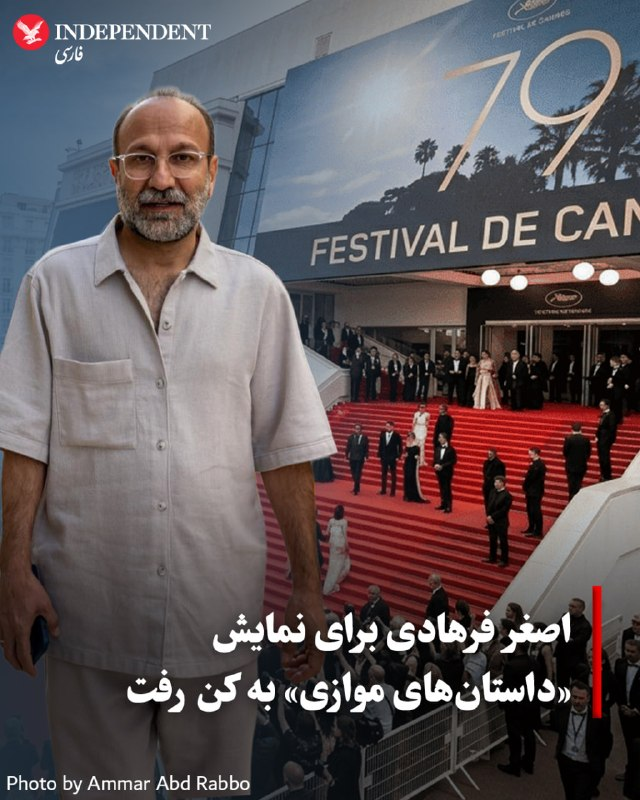

♦️ اصغر فرهادی، برای نمایش فیلم جدیدش با عنوان «داستان‌های موازی» در هفتاد و نهمین دوره جشنواره فیلم کن، به فرانسه سفر کرد. این ششمین حضور او در بخش مسابقه اصلی جشنواره فیلم کن است. این اثر که دهمین فیلم بلند فرهادی و دومین تجربه فیلم‌سازی او به زبان فرانسوی است، قرار است روز پنج‌شنبه ۲۴ اردیبهشت، ساعت ۲۰:۳۰ به وقت محلی در سالن لومیر کاخ جشنواره به نمایش درآید.

در این درام پیچیده که مرز میان خیال و واقعیت را روایت می‌کند، ستارگان مطرح سینمای فرانسه از جمله ایزابل هوپر، کاترین دونو و ونسان کَسِل به ایفای نقش پرداخته‌اند. «داستان‌های موازی» همزمان با اکران در کن، در سینماهای سراسر فرانسه نیز روی پرده می‌رود. فرهادی که پیش از این جوایزی همچون بهترین فیلمنامه و جایزه بزرگ کن را در کارنامه دارد، امسال برای کسب نخل طلا با کارگردانان بزرگی چون پدرو آلمودوار و هیروکازو کورئیدا رقابت می‌کند.
‌🇸🇦 Indypersian

🤖 @VahidOOnLine

## VahidOOnLine — post 239970

  

انور قرقاش، مشاور رییس امارات متحده عربی، در شبکه ایکس نوشت جهان با دقت سفر مهم رییس‌جمهور ایالات متحده به چین و پیامدهای احتمالی آن بر تحولات منطقه را دنبال می‌کند. او تأکید کرد امارات متحده عربی بار دیگر بر اهمیت راه‌حل سیاسی و مسیر مذاکره پافشاری می‌کند؛ مسیری که همواره در مواضع و ارتباطات خود به آن پایبند بوده است.

قرقاش افزود امارات متحده عربی خواهان این جنگ نبوده و صادقانه برای جلوگیری از وقوع آن تلاش کرده است. او گفت روابط عربی ـ ایرانی در خلیج فارس نمی‌تواند بر پایه رویارویی و درگیری بنا شود.

مشاور رییس امارات متحده عربی همچنین تأکید کرد این کشور از حاکمیت خود دفاع خواهد کرد، اما همچنان اولویت و باور راسخ آن ترجیح راه‌حل‌های سیاسی است؛ زیرا این مسیر را راه دستیابی به صلح، ثبات و شکوفایی می‌داند.
‌🏁 🇬🇧 IranintlTV

🤖 @VahidOOnLine

## VahidOOnLine — post 239969

  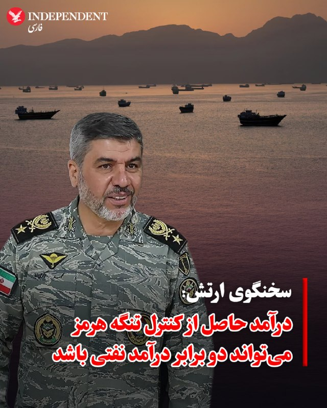

♦️ سخنگوی ارتش جمهوری اسلامی روز چهارشنبه ۲۳ اردیبهشت اعلام کرد که تسلط تهران بر تنگه هرمز می‌تواند درآمد اقتصادی «چشمگیری» ایجاد کرده و جایگاه بین‌المللی کشور را تقویت کند. محمد اکرمی‌نیا به خبرگزاری ایسنا گفت: «نظارت ما بر تنگه هرمز درآمدهای اقتصادی قابل‌توجهی برای کشور به همراه خواهد داشت که پتانسیل آن را دارد که حتی دو برابر درآمد نفتی ما باشد؛ این اقدام همچنین نفوذ ما را در عرصه بین‌المللی افزایش می‌دهد».

هم‌زمان، ابراهیم عزیزی، رئیس کمیسیون امنیت ملی مجلس شورای اسلامی، از نهایی شدن طرحی برای مدیریت این آبراه خبر داد. او در گفتگو با صدا و سیما تایید کرد: «جمهوری اسلامی در نظر دارد با مدیریت راهبردی تنگه هرمز، از این موقعیت استراتژیک به عنوان یک اهرم قدرت استفاده کند».
‌🇸🇦 Indypersian

🤖 @VahidOOnLine

## VahidOOnLine — post 239968

  <a href="telegram/content/VahidOOnLine_239968_1778709519.mp4" target="_blank">🎬 Download video</a>

♦️رونمایی از پیراهن جدید تیم ملی فوتبال ایران برای جام جهانی ۲۰۲۶ با حضور مهدی تاج، امیر قلعه‌نویی و احسان حاج‌صفی در میدان انقلاب تهران برگزار شد؛ پیراهنی که با طرح «یوز ایرانی» و شماره ۱۲ معرفی شد و قرار است تیم ملی با آن در جام جهانی به میدان برود.
این رونمایی در شرایطی انجام می‌شود که طی هفته‌های اخیر، بحث حضور تیم ملی ایران در جام جهانی ۲۰۲۶ و مسائل مرتبط با ویزا، امنیت و تنش‌های سیاسی منطقه‌ای بار دیگر خبرساز شده است.
پیش‌تر مهدی تاج اعلام کرده بود فدراسیون فوتبال جمهوری اسلامی «قطعا» در جام جهانی ۲۰۲۶ شرکت خواهد کرد و در عین حال گفته بود ایران برای حضور در این رقابت‌ها ۱۰ شرط را مطرح کرده است. به گفته او، جلوگیری از مصاحبه‌های تنش‌زا، تضمین امنیت کاروان تیم ملی، رعایت پروتکل‌های امنیتی فیفا در فرودگاه و ورزشگاه‌ها، تعیین تکلیف ویزای خبرنگاران و هواداران و همچنین جلوگیری از ورود پرچم‌هایی غیر از پرچم رسمی جمهوری اسلامی به ورزشگاه‌ها، از جمله این شروط هستند.
مسابقات جام جهانی فوتبال ۲۰۲۶ از ۲۱ خرداد تا ۲۸ تیر ۱۴۰۵ برگزار خواهد شد.
‌🇸🇦 Indypersian

🤖 @VahidOOnLine

## VahidOOnLine — post 239967

  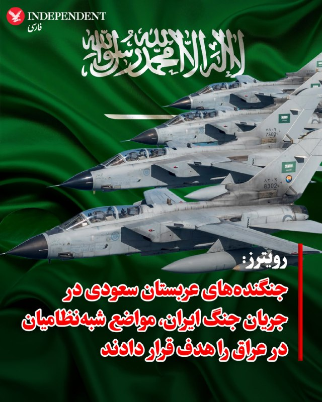

♦️ خبرگزاری رویترز روز چهارشنبه ۲۳ اردیبهشت به نقل از منابع آگاه گزارش داد که در جریان جنگ ایران، جنگنده‌های نیروی هوایی عربستان سعودی، اهداف متعلق به شبه‌نظامیان تحت حمایت تهران را در نزدیکی مرزهای شمالی خود با عراق بمباران کرده‌اند. این حملات که بخشی از آن در نزدیکی زمان شروع آتش‌بس رخ داده، مراکزی را هدف قرار داده است که از آن‌ها برای حملات پهپادی و موشکی به خاک عربستان سعودی و دیگر کشورهای خلیج فارس استفاده می‌شد.

هم‌زمان، منابع نظامی و امنیتی عراق از شلیک راکت از خاک کویت به سمت مواضع شبه‌نظامیان در جنوب عراق در حداقل دو نوبت خبر داده‌اند. در یکی از این حملات که در ماه آوریل انجام شد، چندین شبه‌نظامی کشته شده و یک مرکز ارتباطاتی و عملیات پهپادی متعلق به «کتائب حزب‌الله» منهدم شده است. رویترز اشاره کرد که هنوز مشخص نیست این پرتاب‌ها توسط ارتش کویت انجام شده یا نیروهای آمریکایی مستقر در این کشور؛ چرا که ارتش آمریکا از اظهارنظر در این باره خودداری کرده و دولت‌های کویت و عراق نیز به درخواست‌ها برای شفاف‌سازی پاسخ نداده‌اند.
‌🇸🇦 Indypersian

🤖 @VahidOOnLine

## VahidOOnLine — post 239966

  

خبرگزاری رویترز اعلام کرد که عربستان سعودی در جریان جنگ ایران، به مواضع شبه‌نظامیان مورد حمایت جمهوری اسلامی در عراق حمله کرده است.
بر اساس این گزارش، حملات عربستان سعودی توسط جنگنده‌های نیروی هوایی این کشور و علیه مواضع شبه‌نظامی وابسته به جمهوری اسلامی در نزدیکی مرز شمالی عربستان سعودی با عراق انجام شده است. بخشی از این حملات نیز هم‌زمان با آتش‌بس ۱۸ فروردین میان تهران و واشینگتن صورت گرفته است.
همچنین بر اساس ارزیابی‌های نظامی، منابع عراقی گفته‌اند در دست‌کم دو مورد، از خاک کویت حملات راکتی به عراق انجام شده است. رویترز نتوانسته مشخص کند این راکت‌ها توسط نیروهای مسلح کویت یا نیروهای آمریکایی مستقر در این کشور شلیک شده‌اند.
‌🏁 🇬🇧 IranintlTV

🤖 @VahidOOnLine

## mwarmonitor — post 9059

  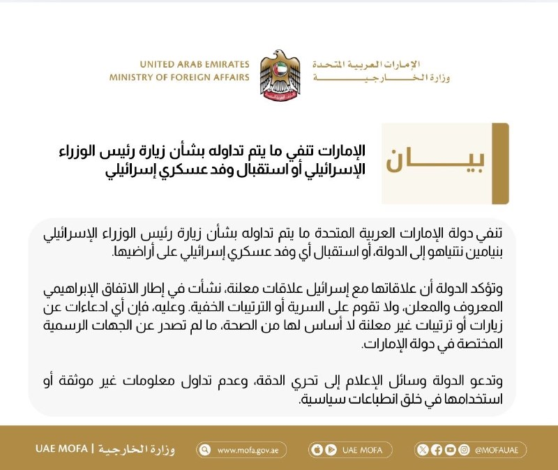

🔴 فوری: بنیامین نتانیاهو به‌طور محرمانه به امارات متحده عربی سفر کرده و در جریان عملیات «شیر غران» علیه ایران با محمد بن زاید دیدار کرده است. i24 news @mwarmonitor

## mwarmonitor — post 9058

✈️بمب‌افکن B-2 با شناسه «WENCH11» در یک پرواز رفت‌وبرگشت از پایگاه هوایی وایتمن (Whiteman AFB) به‌عنوان بخشی از یک تمرین فرماندهی راهبردی آمریکا (STRATCOM) در حال انجام عملیات است و از فرکانس HF سانتا ماریا 11309 استفاده می‌کند. @mwarmonitor

## mwarmonitor — post 9057

  <a href="telegram/content/mwarmonitor_9057_1778709523.mp4" target="_blank">🎬 Download video</a>

🔸خبرنگار: سناتور، آیا بازه ۹۰ روزه در ۳۱ می (۱۰ خرداد) در مورد ایران، در این مقطع اهمیتی دارد؟
🔹لیندسی گراهام: نه.
🔸خبرنگار: چرا نه؟
🔹لیندسی گراهام: چرا باید اهمیت داشته باشه؟ طبق «قانون اختیارات جنگی»؟ به نظرم این قانون کاملاً غیرقانونی و برخلاف قانون اساسی است. هر رئیس‌جمهوری این رو گفته و من هم باهاشون موافقم.
فکر نمی‌کنم قانون اساسی اجازه بده که فرمانده کل قوا، فقط برای ۹۰ روز فرمانده کل باشه. اگه شما به عنوان عضو کنگره از عملکرد فرمانده کل قوا راضی نیستید، بودجه عملیات نظامی رو قطع کنید.
هر راه دیگه‌ای غیر از این، باعث می‌شه ۵۳۵ نفر فرمانده کل قوا داشته باشیم! کل مفهوم «قانون اختیارات جنگی» خطرناک، پوچ و مضحکه و فقط منجر به هرج‌ومرج می‌شه.
کنگره نمی‌تونه جنگ‌ها رو مدیریت کنه. اگه می‌خواید جنگ رو متوقف کنید، بودجه‌اش رو قطع کنید. این تنها قدرتیه که ما در کنگره داریم؛ نه بیشتر و نه کمتر.

@mwarmonitor

## mwarmonitor — post 9056

  

📝 واقعاً باید به حال این مملکت خون گریه کرد که فرماندهانش یک مشت جلبک‌مغزِ فاقد شعورند که بدیهی‌ترین مسائل عالم را به عنوان وحی مُنزل و استراتژی جنگی به خورد ملت می‌دهند. آخه مرتیکه‌ی مغزفندقی، فوتبال اگر تیمی نبود که یازده نفر آدم را با شورت ورزشی نمی‌فرستادند توی زمین!
🔸آن سردار گوربه‌گور شده‌تان هم که وقتی زنده بود، هنرِ اول و آخرش گه خوردن اضافی و ورّاجی بود، حالا وصیت‌نامه‌ی فوتبالی‌اش شده مشقِ راهِ شما؟ «تیمی بازی کنید تا جام ببرید»؟ این سطح از بلاهت و نفهمی حتی برای گوسفند هم قفل است! ولی به حال آن جماعتی که استراتژیست‌هایش شمایید؛ الدنگ‌هایی که هنوز فرق ورزش تیمی و انفرادی را نمی‌فهمند اما برای سرنوشت یک کشور نسخه می‌پیچند. شما که کل افتخار تیمی‌تان، تیمی غارت کردن و تیمی ریدن به هیکل نظام است، بهتر است دهان چاک‌خورده‌تان را ببندید و با آن جملاتِ صدمن‌یه غازِ آن مِیِتِ ملعون، بیش از این نبوغِ جلبکی‌تان را به رخ نکشید. حماقت شما مرزهای بیولوژی را جابه‌جا کرده است!

@mwarmonitor

## mwarmonitor — post 9055

  <a href="telegram/content/mwarmonitor_9055_1778709525.mp4" target="_blank">🎬 Download video</a>

✈️مأموریت WENCH11 (بمب‌افکن رادارگریز B-2A Spirit) 🔸پس از سوخت‌گیری هوایی با پرواز DEED41 (تانکر KC-135 Stratotanker) بر فراز نوا اسکوشیا شرق کانادا، روی مسیر سوخت‌رسانی AR20NE، در باند VHF با Gander Radio در ارتباط بوده است. @mwarmonitor

## mwarmonitor — post 9054

🇺🇸کوین وارش با رأی ۵۴ موافق در برابر ۴۵ مخالف توسط سنای آمریکا به عنوان رئیس فدرال رزرو تأیید شد. سناتور جان فترمن تنها دموکراتی بود که به این تأیید رأی مثبت داد.

🔸کوین وارش یک اقتصاددان آمریکایی است که قبلاً عضو هیئت‌مدیره فدرال رزرو هم بوده و بیشتر به دیدگاه‌های نسبتاً محافظه‌کارانه در سیاست پولی مثل سخت‌گیری در کنترل تورم و تمایل به نرخ بهره بالاتر در بعضی شرایط شناخته می‌شود.

🔹 او از چهره‌هایی است که معمولاً به جریان‌های اقتصادی نزدیک به جمهوری‌خواهان یا اقتصاد بازار آزاد نسبت داده می‌شود، هرچند نقش رسمی حزبی ندارد.

@mwarmonitor

## mwarmonitor — post 9053

  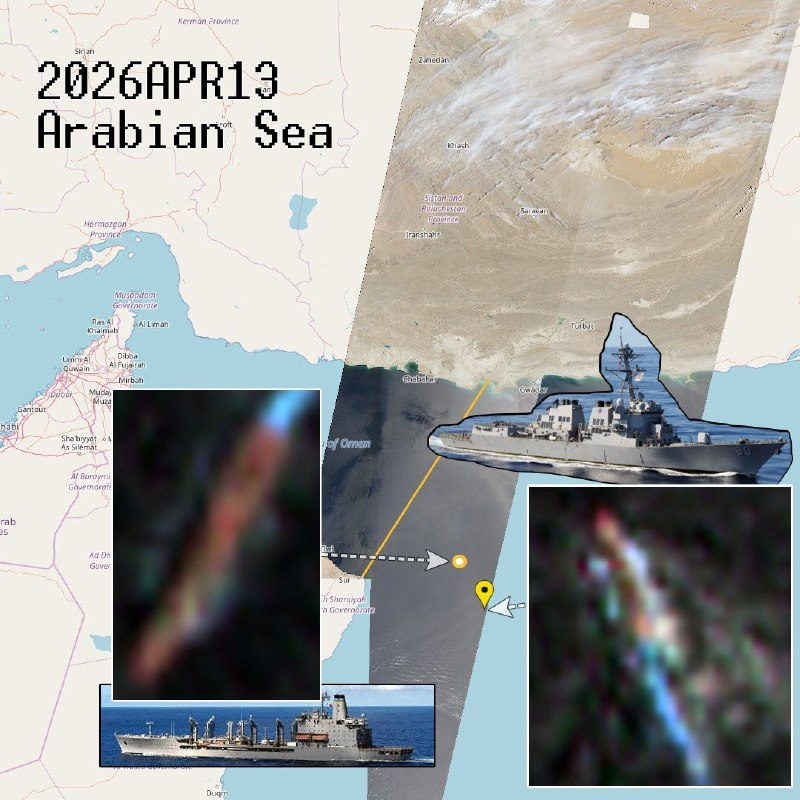

🇺🇸کشتی USNS Henry J. Kaiser (T-AO-187) متعلق به نیروی دریایی آمریکا و یک ناوشکن آمریکایی امروز در دریای عرب در مختصات زیر مشاهده شده‌اند:

📍22.7488, 61.2222 و 22.0751, 61.5995

🚢نفتکش گروه ضربتی ناو هواپیمابر ۳ (CSG-3) در حال انجام عملیات سوخت‌رسانی در دریا (Replenishment-at-sea) بوده و ناوشکن نیز در حال انجام عملیات دفاع چندبُعدی و مأموریت‌های امنیت دریایی است.

@mwarmonitor

## mwarmonitor — post 9052

🔴رویترز: چندین منبع آگاه گفتند در جریان جنگ ایران، جنگنده‌های سعودی اهدافی مرتبط با شبه‌نظامیان قدرتمند شیعه مورد حمایت تهران در عراق را بمباران کردند. همچنین حملات تلافی‌جویانه‌ای نیز از کویت به سمت عراق انجام شده است.

@mwarmonitor

## mwarmonitor — post 9051

📊زیاد داوود، اقتصاددان ارشد بلومبرگ، می‌گوید آینده عراق «تیره و تار» است و این کشور حدود پنج ماه ذخایر و حاشیه‌های مالی دارد، پیش از آنکه وارد «بحرانی عظیم/مادرِ همه بحران‌ها» شود — شفق

@mwarmonitor

## mwarmonitor — post 9050

🔵شبکه NBC به نقل از داده‌های ناوبری: چندین کشتی باری و نفتکش مرتبط با چین طی ۲۴ ساعت گذشته از تنگه هرمز عبور کرده‌اند.

@mwarmonitor

## mwarmonitor — post 9049

🔴 فایننشال‌تایمز: اریک پسر دونالد ترامپ قرار است رئیس‌جمهور آمریکا را در یک سفر رسمی به پکن همراهی کند؛ هم‌زمان، یک گروه مرتبط با خانواده ترامپ در حال بررسی یک توافق با یک شرکت چینی سازنده تراشه است که کنگره آمریکا هشدار داده با حزب کمونیست چین ارتباط دارد.

@mwarmonitor

## mwarmonitor — post 9048

🔴وال‌استریت ژورنال: مقامات کاخ سفید در حال بررسی طرحی هستند که بر اساس آن رئیس‌جمهور ترامپ به مناسبت جشن دویست‌وپنجاهمین سالگرد تولد این کشور، ۲۵۰ عفو صادر کند.

@mwarmonitor

## mwarmonitor — post 9047

🔴 فوری: بنیامین نتانیاهو به‌طور محرمانه به امارات متحده عربی سفر کرده و در جریان عملیات «شیر غران» علیه ایران با محمد بن زاید دیدار کرده است. i24 news

@mwarmonitor

## mwarmonitor — post 9046

  

✈️مأموریت WENCH11 (بمب‌افکن رادارگریز B-2A Spirit)
🔸پس از سوخت‌گیری هوایی با پرواز DEED41 (تانکر KC-135 Stratotanker) بر فراز نوا اسکوشیا شرق کانادا، روی مسیر سوخت‌رسانی AR20NE، در باند VHF با Gander Radio در ارتباط بوده است.

@mwarmonitor

## mwarmonitor — post 9045

  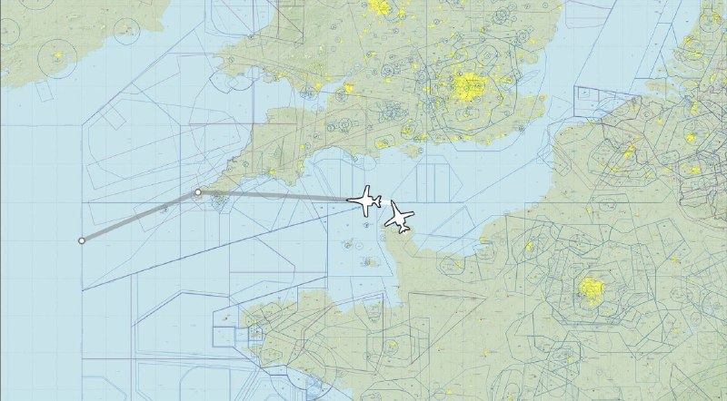

✈️ساعت 09:31 ـ 09:35 به وقت گرینویچ MISS 40 | 41 دو فروند بمب‌افکن استراتژیک B-1B از پایگاه Fairford به پرواز درآمده و با Brize در فرکانس 231.950 در حال ارتباط است. @mwarmonitor

## pm_afshaa — post 90709

  <a href="telegram/content/pm_afshaa_90709_1778709528.webm" target="_blank">🎬 Download video</a>

🔴عباس عراقچی:
نتانیاهو اکنون به‌صورت علنی آنچه را که نهادهای امنیتی ایران مدت‌ها قبل به رهبری ما منتقل کرده بودند، افشا کرده. دشمنی با ملت بزرگ ایران، قماری احمقانه‌ است؛ و همکاری و همدستی با اسرائیل در این مسیر، غیرقابل بخشش است. کسانی که در همدستی با اسرائیل برای ایجاد تفرقه نقش دارند، باید پاسخگو باشند.

💧 Rainbet.com the #1 Non-KYC Crypto Casino & Sportsbook @rainbetcom

😁 @Pm_Afshaa

## pm_afshaa — post 90708

  <a href="telegram/content/pm_afshaa_90708_1778709529.webm" target="_blank">🎬 Download video</a>

🔴علی‌آبادی، وزیر نیرو: با همکاری مردم و افزایش ظرفیت تولید، وضعیت امسال از سال گذشته به مراتب بهتر خواهد بود و امیدواریم تابستان بدون خاموشی سپری بشه.

💧 Rainbet.com the #1 Non-KYC Crypto Casino & Sportsbook @rainbetcom

😁 @Pm_Afshaa

## pm_afshaa — post 90707

  <a href="telegram/content/pm_afshaa_90707_1778709529.webm" target="_blank">🎬 Download video</a>

🔴بلومبرگ: صادرات نفت ایران از جزیره خارک برای اولین بار از زمان شروع جنگ متوقف شده و تصاویر ماهواره‌ای نشان میده که مخازن ذخیره‌سازی نفت تقریباً به ظرفیت کامل خود رسیدن.

💧 Rainbet.com the #1 Non-KYC Crypto Casino & Sportsbook @rainbetcom

😁 @Pm_Afshaa

## pm_afshaa — post 90706

🔴رویترز: عربستان و کویت درجریان جنگ 40 روزه به هدف‌های شبه‌نظامی‌های طرفدار ایران تو عراق (حشدالشعبی) حمله کردن

💧 Rainbet.com the #1 Non-KYC Crypto Casino & Sportsbook @rainbetcom

😁 @Pm_Afshaa

## pm_afshaa — post 90705

یکی بیاد به من بگه چرا تو افغانستان خوراکیای تولید داخل خودمونو ارزونتر از ما میتونن خرید کنن

د اخه حرومزاده ای که نشستی خفه خون گرفتی از این بیناموسا دفاع میکنی بیناموس برگرد ببین چند نفر نون شب تو کشور خودمون ندارن بخورن

د اخه من شاشیدم به اون مملکت داریتون

## pm_afshaa — post 90704

  <a href="telegram/content/pm_afshaa_90704_1778709530.webm" target="_blank">🎬 Download video</a>

🔴نیویورک تایمز: کشورهای خلیج فارس در جریان جنگ ایران بیش از 100 شیعه رو به اتهام خیانت بازداشت شدن.

💧 Rainbet.com the #1 Non-KYC Crypto Casino & Sportsbook @rainbetcom

😁 @Pm_Afshaa

## pm_afshaa — post 90703

  <a href="telegram/content/pm_afshaa_90703_1778709530.webm" target="_blank">🎬 Download video</a>

🔴دنیامالی، وزیر ورزش:
تیم ملی به جام جهانی میره و بازیکنان سرود جمهوری اسلامی رو فریاد میزنن.

💧 Rainbet.com the #1 Non-KYC Crypto Casino & Sportsbook @rainbetcom

😁 @Pm_Afshaa

## pm_afshaa — post 90702

🔴دفتر نخست وزیر اسرائیل:
در بحبوحه جنگ و عملیات غرش شیر، نتانیاهو به امارات سفر کرد و با شیخ محمدبن زاید، رئیس امارات متحده عربی دیدار کرد.

این سفر منجر به پیشرفتی تاریخی در روابط اسرائیل و امارات شد.

💧 Rainbet.com the #1 Non-KYC Crypto Casino & Sportsbook @rainbetcom

😁 @Pm_Afshaa

## pm_afshaa — post 90701

  <a href="telegram/content/pm_afshaa_90701_1778709531.mp4" target="_blank">🎬 Download video</a>

اکانت اسرائیل به فارسی:وقتی به زودی به اسرائیل سفر کنید، این منظره زیبا از پنجره هواپیما در انتظار شماست. به امید دیدار شما در تل‌آویو یا تهران

💧 Rainbet.com the #1 Non-KYC Crypto Casino & Sportsbook @rainbetcom

😁 @Pm_Afshaa

## pm_afshaa — post 90700

  <a href="telegram/content/pm_afshaa_90700_1778709532.webm" target="_blank">🎬 Download video</a>

🔴عباس عراقچی:

کویت در اقدامی آشکار برای ایجاد اختلاف، به طور غیرقانونی به یک قایق ایرانی حمله کرد و چهار شهروند رو در خلیج فارس بازداشت کرد. این اقدام غیرقانونی در نزدیکی جزیره‌ای رخ داد که آمریکا از آن برای حمله به ایران استفاده میکنه. ما خواستار آزادی فوری شهروندان خود هستیم و حق پاسخگویی رو برای خود محفوظ می‌داریم.

💧 Rainbet.com the #1 Non-KYC Crypto Casino & Sportsbook @rainbetcom

😁 @Pm_Afshaa

## pm_afshaa — post 90699

  <a href="telegram/content/pm_afshaa_90699_1778709532.webm" target="_blank">🎬 Download video</a>

🔴هفتمین رأی‌گیری سنای آمریکا توسط دموکرات‌ها برای محدود کردن اختیارات جنگی ترامپ و پایان جنگ با جمهوری اسلامی بازهم شکست خورد.

تعداد آرا فاصله نزدیک 50 به 49 داشت!

💧 Rainbet.com the #1 Non-KYC Crypto Casino & Sportsbook @rainbetcom

😁 @Pm_Afshaa

## iaghapour — post 2607

✍🏻 دوستان عزیز، همون‌طور که احتمالاً متوجه شدید، در یک هفته گذشته به دلایل مختلفی فعالیت ما کمتر شده.

🔹در این مدت پیام‌های زیادی داشتیم که درخواست آموزش «روش جدید سنایی» رو داشتن. وقتی بررسی کردیم، متوجه شدیم خود ایشون زحمت تهیه ویدیوی آموزشی رو کشیدن؛ بنابراین نیازی به آموزش مجدد نبود.

🔸برای اطمینان بیشتر، این آموزش رو به چند نفر از دوستان دادیم تا تست کنن. بیشتر افراد موفق به اجرا نشدن، اما یکی از کاربران تونست متصل بشه. طبق بررسی‌های ایشون، این روش به‌شدت به رنج آی‌پی‌ها (هم سرور ایران و هم خارج) وابسته است. مشکل اصلی اینجاست که بعد از اتصال و مصرف حجم کمی از اینترنت، ارتباط قطع می‌شه و باید آی‌پی رو عوض کرد؛ هرچند آی‌پی قبلی بعد از ۱ تا ۲ ساعت دوباره قابل استفاده می‌شه.

🔻متأسفانه در این بین، عده‌ای بدون این‌که تست درستی از پایداری تانل بگیرن، شروع به آموزش کردن که نتیجه‌اش فقط ضرر مالی برای کاربران بوده. چون کاربرا رفتن سرورهای گرون قیمت رو خریداری کردن که البته تعداد این افراد اصلا کم نبوده. (نمونه‌اش رو در عکس ضمیمه می‌بینید).

🟢 در مجموع، به نظر می‌رسه این روش هنوز پایدار نیست، اما از بچه‌های تیم خواستیم تست‌های بیشتری روش انجام بدن. اگر خودتون هم مایلید آموزش رو ببینید، می‌تونید مستقیماً به کانال یا گروه سنایی مراجعه کنید.

🆔 @iaghapour

## VahidOnline — post 75454

  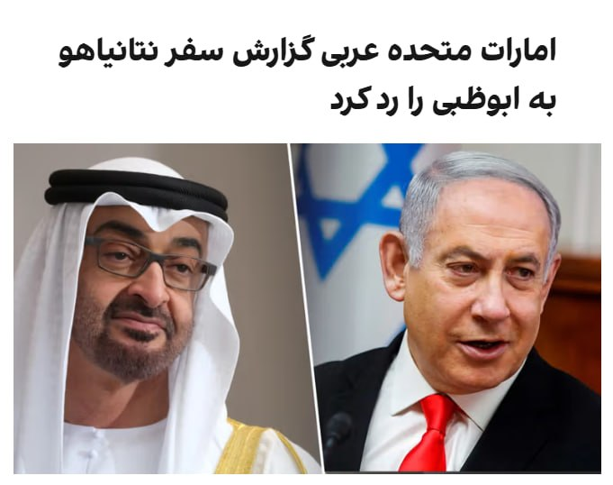

وزارت خارجه امارات متحده عربی اعلام کرد گزارش‌های منتشرشده درباره سفر بنیامین نتانیاهو، نخست‌وزیر اسرائیل، به این کشور صحت ندارد.
پیش‌تر دفتر نخست‌وزیری اسرائیل اعلام کرد بنیامین نتانیاهو در جریان جنگ آمریکا و اسرائیل با جمهوری اسلامی، به‌طور مخفیانه به امارات متحده عربی سفر کرده و در این سفر با محمد بن زاید آل نهیان، رییس امارات متحده عربی، دیدار کرد.
وزارت خارجه امارات متحده عربی اعلام کرد روابط این کشور با اسرائیل علنی است و در چارچوب توافق‌نامه‌های ابراهیم که به‌طور عمومی اعلام شده‌اند، برقرار شده است.
وزارت خارجه امارات متحده عربی افزود این روابط مبتنی بر محرمانگی نیست و هرگونه ادعا درباره سفرها یا ترتیبات اعلام‌نشده «بی‌اساس» است، مگر آن‌که به‌صورت رسمی از سوی امارات متحده عربی اعلام شود.
عباس عراقچی در واکنش به سفر نتانیاهو به امارات متحده عربی در زمان جنگ، نوشت: همکاری با اسرائیل در این مسیر غیرقابل بخشش است. افرادی که برای ایجاد اختلاف با اسرائیل همکاری می‌کنند، پاسخگو خواهند شد.
@VahidOOnLine

📡 @VahidOnline

## VahidOnline — post 75453

  

جی‌دی ونس، معاون رئیس‌جمهور آمریکا، اعلام کرد که واشینگتن معتقد است در مذاکرات با ایران «پیشرفت» حاصل شده، اما هنوز مشخص نیست این پیشرفت برای عبور از خط قرمز دونالد ترامپ کافی باشد یا نه.

آقای ونس روز چهارشنبه در کاخ سفید به خبرنگاران گفت صبح همان روز با جرد کوشنر و استیو ویتکاف درباره ایران گفت‌وگو کرده و همچنین با مقام‌های عرب در تماس بوده است. او افزود: «سوال اصلی این است که آیا این پیشرفت به اندازه‌ای هست که خط قرمز رئیس‌جمهور را تأمین کند یا نه.»

به گفته معاون رئیس‌جمهور آمریکا، خط قرمز ترامپ این است که ایالات متحده مطمئن شود «سازوکارهای کافی» ایجاد شده تا ایران هرگز به سلاح هسته‌ای دست پیدا نکند.
اظهارات ونس در حالی مطرح می‌شود که ترامپ پیش‌تر پیشنهاد تازه ایران در مذاکرات را «غیرقابل قبول» توصیف کرده بود.
@VahidHeadline

📡 @VahidOnline

## VahidOnline — post 75452

  

قوه قضائیه جمهوری اسلامی شامگاه چهارشنبه ۲۳ اردیبهشت اعلام کرد که محمد عباسی، یکی از بازداشت‌شدگان اعتراضات دی‌ماه سال گذشته به اتهام قتل یک مأمور امنیتی اعدام شده است.

خبرگزاری میزان، وابسته به این قوه، گفته است که او بعد از تأیید حکم توسط دیوان‌عالی کشور و با توجه به «تقاضای اولیا‌ء دم»، «قصاص» شد.

ساعتی پیش‌تر، پایگاه خبری هرانا به نقل از یک منبع نزدیک به خانواده این زندانی نوشت که مسئولان زندان قزلحصار از خانواده محمد عباسی خواستند که برای ملاقات با او به زندان مراجعه کنند، «اما پس از حضور خانواده در زندان، این امکان از نزدیکان او سلب شد. پس از خروج خانواده عباسی از زندان، آنها در تماسی تلفنی از اجرای حکم اعدام محمد عباسی مطلع شدند.»
@VahidHeadline

📡 @VahidOnline

## VahidOnline — post 75451

  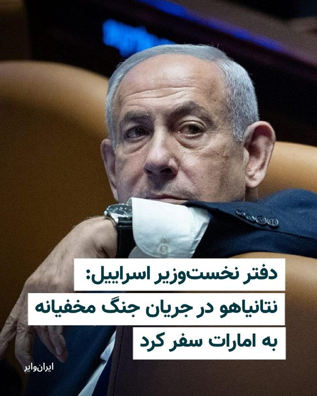

دفتر نخست‌وزیر اسرائیل روز چهارشنبه اعلام کرد که بنیامین نتانیاهو در جریان جنگ آمریکا و اسرائیل با ایران، به‌طور «محرمانه» به امارات متحده عربی سفر کرده بود.

در این بیانیه آمده که نتانیاهو با شیخ محمد بن زاید، رئیس امارات متحده عربی، دیدار کرد.

دفتر نخست‌وزیر اسرائیل گفت: «این سفر به یک پیشرفت تاریخی در روابط میان اسرائیل و امارات متحده عربی منجر شد.»

پیش‌تر مقام‌های ارشد آمریکایی تأیید کردند که اسرائیل در جریان جنگ با ایران، یک سامانه پدافندی «گنبد آهنین» به همراه نیروهایی برای بهره‌برداری از آن به امارات اعزام کرده است.

همچنین به گفته مقام‌های عرب و یک منبع آگاه که با روزنامه وال‌استریت جورنال گفت‌وگو کردند، دیوید بارنئا، رئیس موساد، دست‌کم دو بار در طول جنگ با ایران به امارات سفر کرد تا دربارهٔ هماهنگی‌های مربوط به این درگیری رایزنی کند.
@VahidHeadline
آپدیت:
امارات تکذیب کرد

📡 @VahidOnline

## kianmeli1 — post 87392

  <a href="telegram/content/kianmeli1_87392_1778709534.mp4" target="_blank">🎬 Download video</a>

🔴ویدئویی پربازخورد در فضای مجازی از تشبیه فروشندگان vpn به خوک

سپاه و ستاد اجرايي فروشندگان اصلي اينترنت پرو و وي پي ان هستند
https://t.me/kianmeli1

## kianmeli1 — post 87391

🔴اینترنشنال: احسان افرشته «امان نامه» داشت اما اعدام شد قوه قضاییه جمهوری اسلامی خبر داد احسان افرشته، جوان ۳۳ ساله‌، را به اتهام همکاری با اسرائیل، اعدام کرده اما دو منبع گفتند او، پیش از بازگشت به ایران از ترکیه، به‌طور داوطلبانه خود را به وزارت اطلاعات…

## kianmeli1 — post 87390

🔴اینترنشنال: احسان افرشته «امان نامه» داشت اما اعدام شد

قوه قضاییه جمهوری اسلامی خبر داد احسان افرشته، جوان ۳۳ ساله‌، را به اتهام همکاری با اسرائیل، اعدام کرده اما دو منبع گفتند او، پیش از بازگشت به ایران از ترکیه، به‌طور داوطلبانه خود را به وزارت اطلاعات معرفی کرده بود اما بلافاصله در فرودگاه بازداشت شد.
https://t.me/kianmeli1

## kianmeli1 — post 87389

  

🔴عراقچی

کویت در تلاشی آشکار برای ایجاد اختلاف، به طور غیرقانونی به یک قایق ایرانی حمله کرده و ۴ نفر از شهروندان ما را در خلیج فارس بازداشت کرده است. این اقدام غیرقانونی در نزدیکی جزیره‌ای که ایالات متحده از آن برای حمله به ایران استفاده کرده است، رخ داده است.

ما خواستار آزادی فوری اتباع خود هستیم و حق پاسخگویی را برای خود محفوظ می‌داریم.
https://t.me/kianmeli1

## kianmeli1 — post 87388

  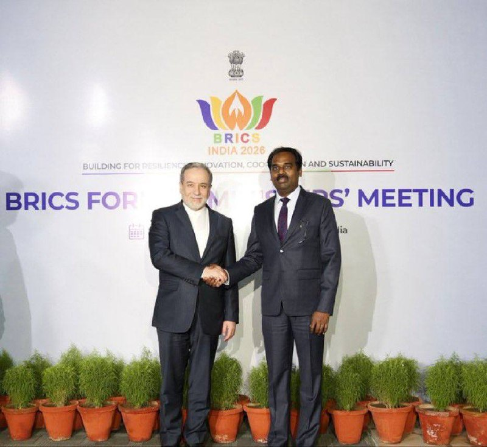

🔴عباس عراقچی، امروز برای شرکت در نشست وزیران امور خارجه کشورهای عضو بریکس (برزیل، روسیه، هند، چین و آفریقای جنوبی+) وارد دهلی، هند شد. این در حالی است که مذاکرات آمریکا و ایران همچنان ادامه دارد اما متوقف شده است. طبق گزارش‌ها و ارزیابی‌های تعدادی از کارشناسان، انتظار می‌رود ایران برای صدور بیانیه مشترک از سوی بلوک اقتصادی به رهبری چین در حمایت از منافع ایران تلاش کند.
https://t.me/kianmeli1

## kianmeli1 — post 87387

  

🔴هفتمین رأی‌گیری سنای آمریکا برای پایان جنگ با ایران شکست خورد

مجلس سنا برای هفتمین‌بار قطعنامهٔ پیشنهادی برای توقف جنگ با ایران را رد کرد.

جمهوری‌خواهان تقریباً متحد عمل کردند تا اولین تلاش از زمان عبور ترامپ از ضرب‌الاجل ۶۰ روزه برای دریافت مجوز جنگ از کنگره را ناکام بگذارند
https://t.me/kianmeli1

## kianmeli1 — post 87386

  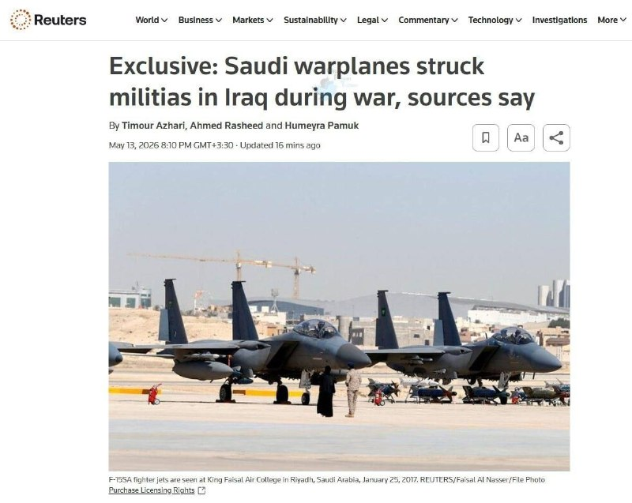

🔴رویترز؛

منابع متعددی که از جزئیات ماجرا آگاه هستند، اعلام کردند که در جریان جنگ با ایران، جنگنده‌های عربستان سعودی اهدافی مرتبط با شبه‌نظامیان تحت حمایت تهران را در عراق بمباران کردند. بعلاوه، حملات تلافی‌جویانه‌ای نیز از کویت به داخل خاک عراق انجام شد.
https://t.me/kianmeli1

## kianmeli1 — post 87385

  

‏🔴خبرگزاری میزان، رسانه قوه قضاییه جمهوری اسلامی، از اعدام محمد عباسی از بازداشت‌شدگان اعتراضات سراسری دی‌ماه ۱۴۰۴ خبر داد
https://t.me/kianmeli1

## IranIntlTV — post 337067

  <a href="telegram/content/IranIntlTV_337067_1778709538.mp4" target="_blank">🎬 Download video</a>

مراد ویسی، تحلیل‌گر ارشد ایران‌اینترنشنال، گفت: «مجموع تحولات اخیر نشان می‌دهد جمهوری اسلامی به رغم برخی تحرکات تاکتیکی در خلیج فارس با یک شکست راهبردی و امنیتی روبه‌رو شده؛ چون حملاتش باعث شده بسیاری از همسایگان جنوبی به دشمنان فعالش تبدیل شوند. نتیجه این سیاست‌ها، نزدیک‌تر شدن کشورهایی مثل امارات به اسرائیل و باز شدن پای اسرائیل و ناتو به معادلات امنیتی منطقه بوده است.»
@iranintltv

## IranIntlTV — post 337066

  <a href="https://t.me/IranintlTV/337066" target="_blank">📎 Download file</a>

🎧نسخه صوتی برنامه با کامبیز حسینی؛ خشم انباشتهٔ مردم کی فوران خواهد کرد؟
@iranintlTV

## IranIntlTV — post 337065

  <a href="telegram/content/IranIntlTV_337065_1778709540.mp4" target="_blank">🎬 Download video</a>

گمان می‌رود پرونده جنگ با ایران، یکی از محوری‌ترین موضوعات گفتگو میان دونالد ترامپ و شی جین‌پینگ باشد. بنا بر بعضی گزارش‌ها، احتمال می‌رود واشینگتن و پکن، تلاش تازه و مشترکی برای وادار کردن تهران به عقب‌نشینی و پذیرش شروط جدید کنند.
@iranintltv

## IranIntlTV — post 337064

  <a href="telegram/content/IranIntlTV_337064_1778709541.mp4" target="_blank">🎬 Download video</a>

مراد ویسی، تحلیل‌گر ارشد ایران‌اینترنشنال، گفت: « جمهوری اسلامی، ایران را به کارت بازی دیگران تبدیل کرده است. خیلی از تحلیل‌گران در انتظار تعیین سرنوشت ایران در دیدار ترامپ و رهبر چین هستند. سرنوشت ایران به غزه و لبنان و به جنگ اوکراین و به روابط روسیه و آمریکا و حالا روابط آمریکا و چین گره خورده است. این بلایی است که جمهوری اسلامی بر سر ایران آورده است.»
@iranintltv

## IranIntlTV — post 337063

  <a href="telegram/content/IranIntlTV_337063_1778709542.mp4" target="_blank">🎬 Download video</a>

کی‌یر استارمر، نخست‌وزیر بریتانیا، در مراسم بازگشایی رسمی پارلمان گفت سخنرانی پادشاه رویکردی امیدوارکننده‌تر به تحولات ایران و جنگ در دو جبهه ارائه می‌دهد و آن را فرصتی برای تغییر وضع موجود و ساختن بریتانیایی قوی‌تر و عادلانه‌تر دانست؛ مسیری که به گفته او باید مبنای آینده کشور قرار گیرد.

چارلز سوم، پادشاه بریتانیا، روز چهارشنبه ۲۳ اردیبهشت در این مراسم سخنرانی کرد. این مراسم به‌منزله آغاز رسمی فعالیت‌های دوره جدید پارلمان بریتانیا است.
@iranintltv

## IranIntlTV — post 337062

  <a href="telegram/content/IranIntlTV_337062_1778709543.mp4" target="_blank">🎬 Download video</a>

بلومبرگ گزارش داد بارگیری نفت از پایانه اصلی صادرات نفت ایران در جزیره خارک متوقف شده است.

بر اساس این گزارش، ظرفیت مخازن ذخیره نفت نیز در حال پر شدن است و در صورت تکمیل ظرفیت، ایران ممکن است ناچار به کاهش تولید نفت شود.

گفت‌وگو با ایمان ناصری، مشاور بازار نفت
@iranintltv

## IranIntlTV — post 337061

  <a href="telegram/content/IranIntlTV_337061_1778709545.mp4" target="_blank">🎬 Download video</a>

تجمعات حکومتی شبانه، بلای جان نظام و مجتبی

چشم‌انداز با مهدی مهدوی‌آزاد

نسخه کامل این برنامه در یوتیوب:
https://youtu.be/SepDBES4ITI
@iranintltv

## IranIntlTV — post 337060

  <a href="telegram/content/IranIntlTV_337060_1778709546.mp4" target="_blank">🎬 Download video</a>

تجمعات حکومتی شبانه، بلای جان نظام و مجتبی

چشم‌انداز با مهدی مهدوی‌آزاد

نسخه کامل این برنامه در یوتیوب:
https://youtu.be/SepDBES4ITI
@iranintltv

## IranIntlTV — post 337059

  <a href="https://t.me/IranintlTV/337059" target="_blank">📎 Download file</a>

🎧نسخه صوتی چشم‌انداز: تجمعات حکومتی شبانه، بلای جان نظام و مجتبی
@iranintlTV

## IranIntlTV — post 337058

  

وزارت خارجه امارات متحده عربی اعلام کرد گزارش‌های منتشرشده درباره سفر بنیامین نتانیاهو، نخست‌وزیر اسرائیل، به این کشور صحت ندارد.
پیش‌تر دفتر نخست‌وزیری اسرائیل اعلام کرد بنیامین نتانیاهو در جریان جنگ آمریکا و اسرائیل با جمهوری اسلامی، به‌طور مخفیانه به امارات متحده عربی سفر کرده و در این سفر با محمد بن زاید آل نهیان، رییس امارات متحده عربی، دیدار کرد.
وزارت خارجه امارات متحده عربی اعلام کرد روابط این کشور با اسرائیل علنی است و در چارچوب توافق‌نامه‌های ابراهیم که به‌طور عمومی اعلام شده‌اند، برقرار شده است.
وزارت خارجه امارات متحده عربی افزود این روابط مبتنی بر محرمانگی نیست و هرگونه ادعا درباره سفرها یا ترتیبات اعلام‌نشده «بی‌اساس» است، مگر آن‌که به‌صورت رسمی از سوی امارات متحده عربی اعلام شود.
عباس عراقچی در واکنش به سفر نتانیاهو به امارات متحده عربی در زمان جنگ، نوشت: همکاری با اسرائیل در این مسیر غیرقابل بخشش است. افرادی که برای ایجاد اختلاف با اسرائیل همکاری می‌کنند، پاسخگو خواهند شد.
https://iranintl.com/202605138383

## IranIntlTV — post 337057

🔻فدراسیون فوتبال ایران در بحران مالی؛ گوگل جمینای حامی تیم‌های ملی فوتبال عراق و مراکش شد

همزمان با تحریم‌های بانکی و مشکلات مالی فدراسیون فوتبال ایران، جمینای (هوش مصنوعی شرکت گوگل) اعلام کرد حامی مالی و فناوری تیم‌های ملی عراق و مراکش در جام جهانی ٢٠٢۶ شده است. گوگل گفته قصد دارد با این قرارداد اسپانسری، «فاصله میان تیم‌ها و هواداران جهانی آنها را کاهش دهد.»

در این بیانیه آمده است: «ما با هیجان اعلام می‌کنیم که گوگل جمینای به عنوان حامی رسمی فناوری تیم‌های ملی فوتبال عراق و مراکش انتخاب شده است. این حمایت با بهره‌گیری از فناوری پیشرفته هوش مصنوعی ما، فرهنگ غنی ورزشی منطقه را گرامی می‌دارد و تجربه هواداران را متحول خواهد کرد.»
این همکاری بر استفاده از هوش مصنوعی برای تولید محتوای فراگیر و فراهم کردن شیوه‌های نوآورانه تعامل هواداران با بازیکنان و تیم‌های محبوبشان متمرکز است.

گوگل جمینای گفته در همکاری با فدراسیون‌های فوتبال، طی سه ماه آینده مجموعه‌ای از برنامه‌های هوادارمحور اجرا خواهد شد: «هواداران می‌توانند با استفاده از مدل تبدیل متن به تصویر جمینی موسوم به «نانو بنانا» تصاویر تشویقی اختصاصی خلق کنند یا با مدل تبدیل متن به موسیقی «لایریا» سرودهای تیمی بسازند و حمایت خود را به شکلی زنده تجربه کنند؛ گویی در زمین حضور دارند.»

همچنین هواداران می‌توانند از گوگل جمینی برای توضیح قوانین پیچیده فوتبال، تحلیل عملکرد مسابقات و پیش‌بینی تیم‌های پیروز استفاده کنند.
همکاری مالی و فناوری جمینای با فدراسیون‌های فوتبال عراق و مراکش درحالی است که روز گذشته فارس، رسانه وابسته به سپاه پاسداران، گزارش داد تیم ملی فوتبال برای اجرای برنامه آماده‌سازی خود در ترکیه، به تزریق فوری منابع مالی نیاز دارد؛ منابعی که پیش‌تر وعده پرداخت آن داده شده بود.
🔗وب‌سایت ایران‌اینترنشنال
@iranintltv

## IranIntlTV — post 337056

  

به گزارش الحدث، دو پهپاد انتحاری مقر حزب دموکرات کردستان ایران در شمال اربیل عراق را هدف قرار دادند.

همزمان رویترز به نقل از منابع امنیتی گزارش داد در این حمله پهپادی یک انبار سلاح و مهمات در داخل این اردوگاه هدف قرار گرفته است.
https://iranintl.com/202605131072

## IranIntlTV — post 337055

  <a href="https://t.me/IranintlTV/337055" target="_blank">📎 Download file</a>

🎧نسخه صوتی ۲۴ با فرداد فرحزاد: سرنوشت جمهوری‌اسلامی، موضوع گفتگوهای ترامپ در چین
@iranintlTV

## IranIntlTV — post 337054

  <a href="telegram/content/IranIntlTV_337054_1778709550.mp4" target="_blank">🎬 Download video</a>

مسعود پزشکیان در واکنش به تورم و گرانی‌های بی‌سابقه، از وزارت جهاد کشاورزی خواست برای کنترل قیمت‌ها همه توانش را به کار گیرد. او پیشتر گفته بود، کشور به شدت به صرفه‌جویی نیاز دارد.

گفت‌وگو با سیامک جوادی ، مدرس و پژوهشگر اقتصاد مالی در دانشگاه تگزاس

@iranintltv

## IranIntlTV — post 337053

  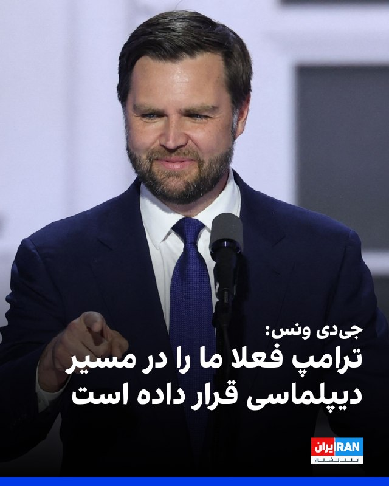

جی‌دی ونس، معاون رییس‌جمهور آمریکا، در کاخ سفید درباره مذاکرات واشینگتن و تهران گفت این گفت‌وگوها بسیار حساس است. او افزود صبح چهارشنبه مدت قابل‌توجهی با جرد کوشنر و استیو ویتکاف و همچنین با شماری از متحدان آمریکا در جهان عرب صحبت کرده و «فکر می‌کنم روند مذاکرات در حال پیشرفت است.»
ونس تاکید کرد پرسش اصلی این است که آیا این پیشرفت خط قرمز رییس‌جمهور را تامین می‌کند یا نه، این خط قرمز بسیار ساده است؛ ایجاد تضمین‌ها و سازوکارهایی که مانع دستیابی تهران به سلاح هسته‌ای شود.
او افزود از زمان ترک پاکستان پیشرفت قابل‌توجهی حاصل شده و هدف نهایی این است که دولت بتواند با اطمینان به مردم آمریکا بگوید دیگر نیازی نیست نگران دسترسی این رژیم بسیار خطرناک به خطرناک‌ترین سلاح‌های جهان باشند.
ونس اضافه کرد: رییس‌جمهور فعلا ما را در مسیر دیپلماسی قرار داده و تمرکز من نیز بر همین مسیر است.
https://iranintl.com/202605130999

## IranIntlTV — post 337052

  <a href="telegram/content/IranIntlTV_337052_1778709552.mp4" target="_blank">🎬 Download video</a>

بلومبرگ گزارش داد بحرین، کویت، قطر و امارات متحده عربی برای حضور در جلسه بعدی ناتو در ترکیه دعوت شده‌اند. بلومبرگ نوشته دعوت‌ها در ادامه تلاش‌های ناتو برای مقابله با تهدیدهای جمهوری اسلامی انجام شده است.

گفت‌وگو با فرزین ندیمی، پژوهشگر ارشد امور دفاعی و امنیتی در موسسه واشینگتن
@iranintltv

## IranIntlTV — post 337051

  

🔻همزمان با تحریم‌های بانکی و مشکلات مالی فدراسیون فوتبال ایران، جمینای (هوش مصنوعی شرکت گوگل) اعلام کرد حامی مالی و فناوری تیم‌های ملی عراق و مراکش در جام جهانی ٢٠٢۶ شده است. گوگل گفته قصد دارد با این قرارداد اسپانسری، «فاصله میان تیم‌ها و هواداران جهانی آنها را کاهش دهد.»

🔹در این بیانیه آمده است: «ما با هیجان اعلام می‌کنیم که گوگل جمینای به عنوان حامی رسمی فناوری تیم‌های ملی فوتبال عراق و مراکش انتخاب شده است. این حمایت با بهره‌گیری از فناوری پیشرفته هوش مصنوعی ما، فرهنگ غنی ورزشی منطقه را گرامی می‌دارد و تجربه هواداران را متحول خواهد کرد.»

🔹گوگل جمینای گفته در همکاری با فدراسیون‌های فوتبال، طی سه ماه آینده مجموعه‌ای از برنامه‌های هوادارمحور اجرا خواهد شد: «هواداران می‌توانند با استفاده از مدل تبدیل متن به تصویر جمینی موسوم به «نانو بنانا» تصاویر تشویقی اختصاصی خلق کنند یا با مدل تبدیل متن به موسیقی «لایریا» سرودهای تیمی بسازند و حمایت خود را به شکلی زنده تجربه کنند؛ گویی در زمین حضور دارند.»

جزییات بیشتر را اینجا بخوانید.

@iranintltvsport

## IranIntlTV — post 337050

  

انور قرقاش، مشاور رییس امارات متحده عربی، در شبکه ایکس نوشت جهان با دقت سفر مهم رییس‌جمهور ایالات متحده به چین و پیامدهای احتمالی آن بر تحولات منطقه را دنبال می‌کند. او تأکید کرد امارات متحده عربی بار دیگر بر اهمیت راه‌حل سیاسی و مسیر مذاکره پافشاری می‌کند؛ مسیری که همواره در مواضع و ارتباطات خود به آن پایبند بوده است.

قرقاش افزود امارات متحده عربی خواهان این جنگ نبوده و صادقانه برای جلوگیری از وقوع آن تلاش کرده است. او گفت روابط عربی ـ ایرانی در خلیج فارس نمی‌تواند بر پایه رویارویی و درگیری بنا شود.

مشاور رییس امارات متحده عربی همچنین تأکید کرد این کشور از حاکمیت خود دفاع خواهد کرد، اما همچنان اولویت و باور راسخ آن ترجیح راه‌حل‌های سیاسی است؛ زیرا این مسیر را راه دستیابی به صلح، ثبات و شکوفایی می‌داند.
https://iranintl.com/202605131401

## IranIntlTV — post 337049

🔻بحران رهبری استارمر بر سخنرانی سالانه پادشاه بریتانیا سایه انداخت

هم‌زمان با ارائه برنامه دولت بریتانیا از سوی پادشاه بریتانیا در مجلس اعیان این کشور، کی‌یر استارمر با جدی‌ترین تهدید علیه رهبری خود روبه‌روست. رسانه‌ها گزارش دادند وزیر بهداشت او آماده استعفاست تا وارد رقابت حزبی برای جایگزینی نخست‌وزیر شود.

روزنامه تایمز چهارشنبه ۲۳ اردیبهشت گزارش داد که احتمال‌ استعفای وِسلی اِستریتینگ، وزیر بهداشت کابینه استارمر، قوت گرفته است. دور از انتظار نیست که او پنج‌شنبه کنار برود و با ورود به رقابت‌های حزب کارگر برای تغییر رهبر حزب، رویدادها به سمتی برود که برنامه دولت استارمر که چارلز آن را با شکوه و تشریفات فراوان تشریح کرد، هرگز به مرحله اجرا نرسد.

تایمز نوشت که دفتر استریتینگ به درخواست برای اظهارنظر درباره این گزارش پاسخ نداد. سخنگوی استارمر هم گفت نخست‌وزیر به وزیر بهداشت خود اعتماد کامل دارد، اما از اظهارنظر درباره دیدار پیشین میان این دو نفر خودداری کرد.

تیم وزیر بهداشت گفت او نیز درباره آن دیدار، که در دفتر استارمر در داونینگ‌استریت برگزار شد، اظهارنظر نخواهد کرد تا توجه‌ها را از سخنرانی پادشاه منحرف نکند.

استریتینگ بعدتر در شبکه ایکس به تمجید از دستاوردهای خود در کاهش زمان انتظار در نظام درمانی دولتی بریتانیا پرداخت. او نوشت: «کارهای زیادی انجام شده، کارهای زیادی هم مانده است»؛ اما به این گزارش اشاره‌ای نکرد.
چالش در دولت بر سر چیست؟

مساله با شکست سنگین حزب کارگر در انتخابات شوراهای محلی انگلستان شروع شد. این حزب در انتخابات ۱۸ اردیبهشت بخش قابل توجهی از رای‌ها را به‌ویژه در مناطقی از مرکز و شمال انگلستان و همچنین در بخش‌هایی از لندن که پایگاه سنتی این حزب به شمار می‌آید، از دست داد.

در مقابل، حزب راستگرای «اصلاح بریتانیا» به رهبری نایجل فاراژ، بیش از ۳۵۰ کرسی در شوراهای محلی انگلستان به دست آورد و حالا اگر همین مسیر را در انتخابات ملی ادامه دهد، به اپوزیسیون اصلی در اسکاتلند و ولز تبدیل می‌شود.

خبرگزاری رویترز پس از اعلام رسمی این شکست حزب کارگر، نتایج انتخابات محلی را نشان‌دهنده عمق نارضایتی از نخست‌وزیر بریتانیا خواند و نوشت که تنها دو سال پس از پیروزی قاطع او در انتخابات سراسری، تردیدها را درباره آینده سیاسی‌اش افزایش داد.

برخی نمایندگان حزب کارگر پس از نتایج انتخابات هشدار دادند که اگر این حزب در اسکاتلند عملکرد ضعیفی داشته باشد، قدرت را در ولز از دست بدهد و نتواند بخش زیادی از حدود ۲۵۰۰ کرسی تحت دفاع خود در انگلستان را حفظ کند، فشارها بر استارمر برای کناره‌گیری یا دست‌کم تعیین جدول زمانی خروجش از قدرت افزایش خواهد یافت.
با این حال، هم‌زمان گزارش‌هایی از تلاش برخی از اعضای حزب برای ایجاد تغییرات بنیادین در دفتر نخست‌وزیری و جایگزینی استارمر با فردی دیگر منتشر شد.

در این میان استارمر کوشیده است چالش‌ها علیه اقتدار خود را کم‌اهمیت جلوه دهد و سخنرانی پادشاه بریتانیا که از سوی دولت نوشته و از سوی پادشاه قرائت می‌شود، برنامه‌هایی را برای تقویت رشد اقتصادی، امنیت انرژی و دفاع اعلام کرد.

سخنرانی پادشاه در بریتانیا در واقع ابزار رسمی دولت برای اعلام برنامه‌های سال آینده است، اما سخنرانی ۲۳ اردیبهشت چارلز، به جای نمایش دادنِ اقتدار و برنامه‌ریزی دولت استارمر، زیر سایه بحران رهبری او و گزارش‌ها درباره احتمال استعفای وزیر بهداشت و آغاز رقابت برای جانشینی نخست‌وزیر قرار گرفت.

این موضوع، در کنار اخبار مرتبط با تلاش‌های استریتینگ احتمال ورود رقبای دیگر به رقابت‌های درون‌حزبی علیه نخست‌وزیر کنونی را افزایش داده است. علاوه بر وزیر بهداشت، نام اندی برنهم، شهردار منچستر، و آنجلا رینر، معاون پیشین نخست‌وزیر، نیز مطرح شده است، هرچند هر دو آنها پیش از آنکه بتوانند نامزد شوند، باید موانعی را از پیش رو بردارند.
🔗وب‌سایت ایران‌اینترنشنال
@iranintltv

## IranIntlTV — post 337048

  

خبرگزاری رویترز اعلام کرد که عربستان سعودی در جریان جنگ ایران، به مواضع شبه‌نظامیان مورد حمایت جمهوری اسلامی در عراق حمله کرده است.
بر اساس این گزارش، حملات عربستان سعودی توسط جنگنده‌های نیروی هوایی این کشور و علیه مواضع شبه‌نظامی وابسته به جمهوری اسلامی در نزدیکی مرز شمالی عربستان سعودی با عراق انجام شده است. بخشی از این حملات نیز هم‌زمان با آتش‌بس ۱۸ فروردین میان تهران و واشینگتن صورت گرفته است.
همچنین بر اساس ارزیابی‌های نظامی، منابع عراقی گفته‌اند در دست‌کم دو مورد، از خاک کویت حملات راکتی به عراق انجام شده است. رویترز نتوانسته مشخص کند این راکت‌ها توسط نیروهای مسلح کویت یا نیروهای آمریکایی مستقر در این کشور شلیک شده‌اند.
https://iranintl.com/202605137468

## Shin_Persian — post 5995

  

↩️ Quoted tweet: DefenceGeek 🇬🇧 ✓ @DefenceGeek Wed, 13 May 2026 19:49:28 UTC B-2 Spirit on a training flight from CONUS as part of a suspected STRATCOM exercise involving the E-6B flying out of Stuttgart ↩️ توییت نقل‌قول شده — برای پاسخ، پست زیر را ببینید.…

## Shin_Persian — post 5994

↩️ Quoted tweet:
DefenceGeek 🇬🇧 ✓ @DefenceGeek
Wed, 13 May 2026 19:49:28 UTC

B-2 Spirit on a training flight from CONUS as part of a suspected STRATCOM exercise involving the E-6B flying out of Stuttgart

↩️ توییت نقل‌قول شده — برای پاسخ، پست زیر را ببینید.

فارسی

بمب‌افکن بی‌-۲ اسپیریت (B-2 Spirit) در یک پرواز آموزشی از خاک اصلی ایالات متحده (CONUS) به عنوان بخشی از یک رزمایش احتمالی فرماندهی راهبردی ایالات متحده (STRATCOM) که شامل هواپیمای ای-۶بی (E-6B) در حال پرواز از اشتوتگارت است.

𝕏 · @shin_persian

## Shin_Persian — post 5993

📦 mhrv-rs v1.9.25 released

• Install MITM CA into LibreWolf NSS stores (#1145, PR #1159)
• **Fix Full mode "Google + most websites broken while Telegram works"

Files (Android APKs, Windows, macOS, Linux, OpenWRT) on the files channel:

👉 v1.9.25 — all files with SHA-256

Channel:
https://t.me/mhrv_rs
or: https://t.me/+R1OyoHX2boA1ZDgx

#v1925

## Shin_Persian — post 5992

Shin ✓ @hey_itsmyturn
Wed, 13 May 2026 19:31:31 UTC

"Saudi warplanes struck militias in Iraq during war"
- Reuters

https://www.reuters.com/world/middle-east/saudi-warplanes-struck-militias-iraq-during-war-sources-say-2026-05-13/

فارسی

"جنگنده‌های سعودی طی جنگ شبه‌نظامیان را در عراق هدف قرار دادند"
- رویترز

https://www.reuters.com/world/middle-east/saudi-warplanes-struck-militias-iraq-during-war-sources-say-2026-05-13/

𝕏 · @shin_persian

## Shin_Persian — post 5991

Emanuel (Mannie) Fabian ✓ @manniefabian
Wed, 13 May 2026 17:01:27 UTC

Prime Minister Benjamin Netanyahu visited the UAE during the Iran war, his office says.

فارسی

دفتر بنیامین نتانیاهو، نخست‌وزیر، اعلام کرد که وی در طول جنگ ایران از امارات متحده عربی بازدید کرده است.

𝕏 · @shin_persian

## ManotoTV — post 105420

  <a href="telegram/content/ManotoTV_105420_1778709555.mp4" target="_blank">🎬 Download video</a>

وزارت خارجه امارات متحده عربی گزارش‌ها درباره سفر بنیامین نتانیاهو، نخست‌وزیر اسرائیل، یا استقبال از یک هیات نظامی اسرائیلی را رد کرد.

سخنگوی وزارت خارجه امارات گفت روابط این کشور با اسرائیل، روابطی علنی است که در چارچوب توافق ابراهیم و به‌صورت رسمی و عمومی شکل گرفته و مبتنی بر روابط پنهانی یا توافق‌های مخفی نیست.

او تاکید کرد هرگونه ادعا درباره سفرها یا توافق‌های اعلام‌نشده، تا زمانی که از سوی نهادهای رسمی امارات تایید نشود، بی‌اساس است.

سخنگوی وزارت خارجه امارات همچنین از رسانه‌ها خواست در انتشار اخبار دقت کنند و از بازنشر اطلاعات تاییدنشده خودداری کنند.

## ManotoTV — post 105419

  <a href="telegram/content/ManotoTV_105419_1778709555.mp4" target="_blank">🎬 Download video</a>

تماسی از ایران:
«می‌گفت وضعیت آموزش فاجعه شده…
بچه‌هایی که حتی پایه‌ترین چیزها رو بلد نیستن.»

## ManotoTV — post 105418

  <a href="telegram/content/ManotoTV_105418_1778709557.mp4" target="_blank">🎬 Download video</a>

‌
سنای آمریکا طرح پیشنهادی برای پایان دادن به مشارکت نظامی این کشور در جنگ با جمهوری اسلامی را رد کرد.

این طرح که با هدف الزام دولت آمریکا به خروج نیروهای درگیر در جنگ ارائه شده بود، با ۵۰ رای مخالف در برابر ۴۹ رای موافق تصویب نشد؛ جمهوری‌خواهان سنای آمریکا عمدتاً با محدود شدن اختیارات نظامی دونالد ترامپ مخالفت کردند.

سه سناتور جمهوری‌خواه به این طرح رای مثبت دادند و لیزا مورکوفسکی، سناتور جمهوری‌خواه، برای نخستین بار از زمان آغاز جنگ، به درخواست خروج نیروهای آمریکایی از درگیری با جمهوری اسلامی رای داد.

دموکرات‌ها در هفته‌های اخیر چندین طرح مشابه ارائه کرده‌اند و می‌گویند طبق قانون اساسی آمریکا، اختیار اعلام جنگ در دست کنگره است و باید اختیارات قوه مقننه در برابر دولت حفظ شود.

بر اساس قوانین آمریکا، رئیس‌جمهوری می‌تواند در صورت وجود تهدید فوری، اقدام نظامی را آغاز کند، اما برای ادامه درگیری بیش از ۶۰ روز، نیاز به مجوز کنگره دارد.

## ManotoTV — post 105417

  <a href="telegram/content/ManotoTV_105417_1778709557.mp4" target="_blank">🎬 Download video</a>

‌
میزان، خبرگزاری وابسته به قوه قضاییه جمهوری اسلامی از اعدام محمد عباسی، از بازداشت‌شدگان اعتراضات سراسری دی‌ماه ۱۴۰۴ خبر داد.

میزان نوشت محمد عباسی سحرگاه روز چهارشنبه ۲۳ اردیبهشت در زندان قزلحصار اعدام شده است.

بر اساس گزارش‌های منتشر شده مسئولان زندان قزلحصار از خانواده او برای ملاقات دعوت کرده بودند، اما پس از حضور آن‌ها، اجازه ملاقات داده نشد و خانواده پس از ترک زندان، تلفنی از اجرای حکم اعدام مطلع شدند.

محمد عباسی در جریان اعتراضات دی‌ماه ۱۴۰۴ در ملارد بازداشت و سپس از سوی شعبه ۱۵ دادگاه انقلاب تهران به ریاست ابوالقاسم صلواتی، به اتهام «محاربه» به اعدام محکوم شده بود.

شعبه ۳۹ دیوان عالی کشور با رد فرجام‌خواهی، حکم اعدام محمد عباسی را تایید کرد. در همین پرونده، حکم ۲۵ سال زندان فاطمه عباسی، دختر او، نیز عینا تایید شده و او اکنون در بند زنان زندان اوین نگهداری می‌شود.

بر اساس گزارش امتداد، ابهامات و پرسش‌های متعددی درباره روند رسیدگی و محتوای پرونده این دو متهم وجود داشته، اما وکلای مستقل به دلیل محرومیت از دسترسی به پرونده، امکان بررسی و پیگیری موثر آن را نداشته‌اند.

## ManotoTV — post 105416

  <a href="telegram/content/ManotoTV_105416_1778709558.mp4" target="_blank">🎬 Download video</a>

تماسی از ایران:
درد دلی با چاشنی کمی شوخی
از واقعیتی تلخ از زندگی روزمره مردم

## ManotoTV — post 105415

  <a href="telegram/content/ManotoTV_105415_1778709560.mp4" target="_blank">🎬 Download video</a>

‌
جی‌دی ونس، معاون رئیس‌جمهوری آمریکا، در اظهاراتی درباره برنامه هسته‌ای جمهوری اسلامی گفت با موضع دونالد ترامپ موافق است که جمهوری اسلامی نباید به سلاح هسته‌ای دست پیدا کند.

ونس گفت دولت آمریکا در حال حاضر درگیر یک روند «فعال دیپلماتیک» برای اطمینان از عدم دستیابی جمهوری اسلامی به سلاح هسته‌ای است، اما در عین حال تاکید کرد ترامپ گزینه‌های مختلفی، از جمله گزینه‌های دیپلماتیک و نظامی، در اختیار دارد.

معاون رئیس‌جمهوری آمریکا افزود اولویت اصلی ترامپ، حفاظت از مردم آمریکا و همچنین امنیت جهان در برابر تهدید ناشی از دستیابی جمهوری اسلامی به سلاح هسته‌ای است.

## ManotoTV — post 105414

  <a href="telegram/content/ManotoTV_105414_1778709561.mp4" target="_blank">🎬 Download video</a>

واتس‌اپ قابلیت جدیدی به نام «حالت ناشناس» برای چت با هوش مصنوعی متا معرفی کرده که در آن، گفتگوها ذخیره یا قابل مشاهده نخواهند بود؛ حتی برای خود شرکت متا.
واتس‌اپ می‌گوید این قابلیت برای گفتگو درباره موضوعات حساسی مثل سلامت، روابط و مسائل مالی طراحی شده است.
با این حال، کارشناسان هشدار داده‌اند حذف کامل تاریخچه چت‌ها می‌تواند در صورت بروز آسیب یا سوءاستفاده، پیگیری مسئولیت را دشوار کند.

## ManotoTV — post 105413

  <a href="telegram/content/ManotoTV_105413_1778709561.mp4" target="_blank">🎬 Download video</a>

حساب رسمی سفارت آمریکا در واتیکان اعلام کرد برخلاف برخی گزارش‌های رسانه‌ای، پاپ لئون چهاردهم هیچ افتخار یا نشان ویژه و انحصاری به سفیر جمهوری‌اسلامی در واتیکان اعطا نکرده است.
در این بیانیه آمده است این مدال به همه سفیران مورد تایید واتیکان پس از بیش از دو سال خدمت داده می‌شود و سال‌هاست که یک رویه معمول و استاندارد به شمار می‌رود.
سفارت آمریکا تأکید کرده این تقدیر صرفاً جنبه شخصی دارد و به‌معنای حمایت یا مخالفت با هیچ کشور یا سیاستی نیست.
بر اساس این توضیحات، اخیراً ۱۳ سفیر این نشان را دریافت کرده‌اند و سفیران پیشین آمریکا نیز همین مدال را گرفته بودند.
در ادامه این بیانیه آمده است که این نشان نیز مستقیماً توسط پاپ اهدا نشده است.

## ManotoTV — post 105412

  <a href="telegram/content/ManotoTV_105412_1778709561.mp4" target="_blank">🎬 Download video</a>

تینا قاضی‌مراد، سردبیر خبر منوتو، با انتقاد از وضعیت آموزش و محدودیت‌های اینترنت در ایران گفت مسئله فقط عقب‌ماندگی درسی نیست، بلکه «خروج انسان ایرانی از چرخه تمدن» است.

او گفت جمهوری اسلامی با قطع اینترنت، تعطیلی مکرر مدارس و بی‌ثباتی آموزشی، جامعه ایران را از روند پیشرفت جهانی دور می‌کند و هشدار داد ادامه این وضعیت، انسان ایرانی را به مصرف‌کننده فناوری و در نهایت به حاشیه‌رانده‌شده جهان تبدیل خواهد کرد.

## ManotoTV — post 105411

  <a href="telegram/content/ManotoTV_105411_1778709563.mp4" target="_blank">🎬 Download video</a>

روزنامه‌نگار ارشد سیاسی کانال ۱۲ اسرائیل گزارش داده دفتر نخست‌وزیری اسرائیل تأیید کرد که بنیامین نتانیاهو در جریان جنگ اسرائیل و آمریکا با ایران، سفری محرمانه به امارات متحده عربی داشته و در آنجا با محمد بن زاید آل نهیان، رئیس امارات، دیدار کرده است. در ادامه آمده گزارش‌ها حاکی است این سفر محرمانه به یک تحول تاریخی در روابط اسرائیل و امارات منجر شده است.

## ManotoTV — post 105410

  <a href="telegram/content/ManotoTV_105410_1778709564.mp4" target="_blank">🎬 Download video</a>

عباس عراقچی، وزیر خارجه جمهوری‌اسلامی در شبکه اکس بازداشت چهار شهروند ایرانی در خلیج فارس توسط کویت را تایید کرد. عراقچی در اکس نوشته: «در تلاشی آشکار برای ایجاد اختلاف، کویت به‌طور غیرقانونی به یک قایق ایرانی حمله کرده و چهار تن از شهروندان ما را در خلیج فارس بازداشت کرده است. این اقدام غیرقانونی در نزدیکی جزیره‌ای رخ داد که آمریکا از آن برای حمله به ایران استفاده کرده بود. ما خواستار آزادی فوری شهروندان خود هستیم و حق پاسخ‌گویی را برای خود محفوظ می‌دانیم.» کویت دیروز اعلام کرده بود چهار عضو منتسب به سپاه قصد داشتند از راه دریا وارد کویت شوند و «اقدامات خصمانه» انجام دهند. وزارت کشور کویت اعلام کرد در درگیری با نیروهای امنیتی، یک نیروی کویتی زخمی شده و دو نفر از متهمان نیز فرار کرده‌اند. سفیر جمهوری‌اسلامی نیز در این کشور احضار و یادداشت اعتراضی رسمی به او تحویل داده شده بود.

## ManotoTV — post 105409

  <a href="telegram/content/ManotoTV_105409_1778709564.mp4" target="_blank">🎬 Download video</a>

شعبه اول دادگاه تجدیدنظر استان کهگیلویه و بویراحمد، فیض‌الله آذرنوش، پدر پدرام آذرنوش از جان‌باختگان اعتراضات ۱۴۰۱، به همراه سه شهروند دیگر این پرونده را در مجموع به ۳۰ سال حبس تعزیری محکوم کرد.

بر اساس حکم صادرشده، فیض‌الله آذرنوش با اتهام‌هایی از جمله «تشکیل گروه با هدف برهم زدن امنیت کشور»، «فعالیت تبلیغی علیه جمهوری اسلامی»، «توهین به رهبری» و «اجتماع و تبانی علیه امنیت کشور» در مجموع به ۱۵ سال زندان محکوم شده که پنج سال آن قابل اجراست.

همچنین میلاد کریمی‌نسب به شش سال زندان با پنج سال حبس قابل اجرا، امیرحسین محسنی‌پور به شش سال زندان با سه سال حبس قابل اجرا و مهدی کرمی به سه سال زندان محکوم شدند.

## FarsiVOA — post 217671

🔺نگاهی به دیدار‌های گذشته دونالد ترامپ با شی جین‌پینگ

▪️سفر دونالد ترامپ، رئیس‌جمهوری آمریکا، به پکن و دیدارهای پیش‌روی او با شی جین‌پینگ، رئیس‌جمهوری چین، یکی از تیترهای مهم خبری روزهای اخیر در رسانه‌ها و جراید معتبر جهان در چند روز اخیر بوده است.

⬇️ بیشتر بخوانید:
https://ir.voanews.com/a/8149652.html
@FarsiVOA

## FarsiVOA — post 217670

⚡️بررسی پوشش اخبار درگیری نظامی با جمهوری اسلامی در رسانه‌های غربی
@FarsiVOA

## FarsiVOA — post 217669

⚡️حملە امارات و عربستان بە جمهوری اسلامی و سفر مخفیانە نخست وزیر اسرائیل بە امارات
@FarsiVOA

## FarsiVOA — post 217668

🔺رویترز: عربستان و کویت در جریان عملیات «خشم حماسی» نیابتی‌های جمهوری اسلامی در عراق را هدف قرار دادند

▪️خبرگزاری رویترز به نقل از منابع امنیتی و نظامی گزارش داده است که عربستان سعودی در جریان عملیات «خشم حماسی» مواضع شبه‌نظامیان شیعه مورد حمایت رژیم ایران در عراق را هدف حملات هوایی قرار داد. علاوه بر این، حملات تلافی‌جویانه‌ای نیز از خاک کویت علیه اهدافی در عراق انجام شده است.

⬇️ بیشتر بخوانید:
https://ir.voanews.com/a/reuters-saudi-arabia-kuwait-attacked-iraq-iranian-militias/8149641.html
@FarsiVOA

## FarsiVOA — post 217667

⚡️وام «ارزان» و کلان شرکت خودروسازی سایپا از مردم
@FarsiVOA

## FarsiVOA — post 217666

🔺جی‌دی‌ ونس در مورد در مذاکرات با جمهوری اسلامی: فکر می‌کنم پیشرفت‌هایی حاصل شده است

▪️جی‌دی ونس، معاون رئیس‌جمهوری آمریکا، روز چهارشنبه در گفت‌وگو با خبرنگاران گفت که در مذاکرات با جمهوری اسلامی پیشرفت‌هایی حاصل شده است.

⬇️ بیشتر بخوانید:
https://ir.voanews.com/a/8149643.html
@FarsiVOA

## FarsiVOA — post 217665

⚡️در برنامه تفسیر خبر امروز، مهدی آقازمانی با کارشناسان مهمان، درباره سفر تاریخی پرزیدنت ترامپ به چین و موضوع ایران به عنوان یکی از محورهای گفتگوی رهبران دو کشور ، گفتگو می‌کند
@FarsiVOA

## FarsiVOA — post 217664

⚡️ویدئوی گفت‌وگو با دو ملی‌پوش فوتبال ایران در تلویزیون حکومتی جمهوری اسلامی درباره وضعیت تحصیل و دانشگاه محل تحصیل‌شان، در شبکه‌های اجتماعی خبرساز شده و بار دیگر حاشیه‌های مربوط به ادعاهای تحصیلی برخی بازیکنان تیم ملی را به یاد کاربران آورده است.
@FarsiVOA

## FarsiVOA — post 217663

⚡️علی جوانمردی: جایگاە چین در بحران ایران و احتمال توافق
@FarsiVOA

## FarsiVOA — post 217662

  <a href="telegram/content/FarsiVOA_217662_1778709565.mp4" target="_blank">🎬 Download video</a>

⚡️دونالد ترامپ، رئیس جمهوری آمریکا، روز چهارشنبه ۲۳ اردیبهشت وارد پکن شد. او در بدو ورود، از سوی معاون رئیس‌جمهوری چین، همراه با گارد احترام نظامی و شعار «خوش آمدید» حدود ۳۰۰ نوجوان و جوان چینی که پرچم‌های آمریکا و چین را در دست داشتند مورد استقبال قرار گرفت.
@FarsiVOA

## FarsiVOA — post 217661

  <a href="telegram/content/FarsiVOA_217661_1778709565.mp4" target="_blank">🎬 Download video</a>

⚡️گزارش فرهاد فلاحی، خبرنگار صدای آمریکا، از پکن؛ پوشش ویژه سفر پرزیدنت ترامپ به چین
@FarsiVOA

## FarsiVOA — post 217660

⚡️وقوع زلزله‌های متعدد در استان تهران نشانه چیست و شهروندان باید چه کنند؟ گفت‌وگو با عطارد عزیزی نمینی
@FarsiVOA

## FarsiVOA — post 217659

🔺وزیر انرژی آمریکا: رژیم ایران «به‌طرزی نگران‌کننده‌» به سلاح هسته‌ای نزدیک شده است

▪️کریس رایت، وزیر انرژی ایالات متحده، روز چهارشنبه ۲۳ اردیبهشت هشدار داد که رژیم ایران به مرحله‌ای «بسیار نگران‌کننده» در برنامه هسته‌ای خود رسیده است و تنها چند هفته با تولید اورانیوم در سطح تسلیحاتی فاصله دارد.

⬇️ بیشتر بخوانید:
https://ir.voanews.com/a/nypost-chris-wright-iran-close-to-nuclear-weapon/8149630.html
@FarsiVOA

## FarsiVOA — post 217658

🔺نتیجه منفی آزمایش‌ها در ایتالیا و اسپانیا برای یافتن رد پای جهانی ویروس هانتا

▪️وزارت‌ بهداشت دو کشور ایتالیا و اسپانیا، روز چهارشنبه ۲۳ اردیبهشت، اعلام کردند نتیجه آزمایش‌های هفده نفری که مشکوک به ابتلا به ویروس هانتا بودند، منفی بوده‌ است. این در حالی است که دولت‌های جهان همچنان به هدف جلوگیری از گسترش این ویروس در تلاش ردیابی موارد احتمالی ابتلا به بیماری هستند.

⬇️ بیشتر بخوانید:
https://ir.voanews.com/a/hantavirus-cruise-spain-france-health-test/8149628.html
@FarsiVOA

## FarsiVOA — post 217657

🔺هشدار بنیاد نرگس: جسم نرگس محمدی توان تحمل هیچ «فشار مضاعفی» را ندارد

◾️بنیاد نرگس، روز چهارشنبه ۲۳ اردیبهشت، در بیانیه‌ای ضمن تشریح روند درمانی نرگس محمدی در زنجان و تهران، اعلام کرد: «این زندانی سیاسی، نیازمند درمان دست‌کم ۸ ماهه است و بدنش در وضعیت فعلی توان تحمل هیچ‌گونه فشار مضاعف و بازگشت به شرایط حبس را ندارد.»

⬇️ بیشتر بخوانید:

https://ir.voanews.com/a/narges-mohammadi-prison-pressure-endurance-/8149626.html?withmediaplayer=1

## FarsiVOA — post 217656

اروپا در دو مسیر؛ از اعزام ناوهای ایتالیا و بریتانیا به تنگه هرمز تا ابتکار دیپلماتیک فرانسه

## FarsiVOA — post 217655

  <a href="telegram/content/FarsiVOA_217655_1778709566.mp4" target="_blank">🎬 Download video</a>

علم صالح در برنامه تفسیر خبر: جنگ باعث شد جمهوری اسلامی نفت خود را با قیمت ۱۰۳ دلار بفروشد

## FarsiVOA — post 217654

  <a href="telegram/content/FarsiVOA_217654_1778709567.mp4" target="_blank">🎬 Download video</a>

مهدی عربشاهی در برنامه تفسیر خبر: علی خامنه‌ای با کلمه توسعه مشکل داشت

## FarsiVOA — post 217653

اعدام احسان افراشته، زندانی سیاسی، توسط جمهوری اسلامی؛ گفت‌وگو با حسین احمدی‌نیاز

## FarsiVOA — post 217652

🔺تشدید فضای امنیتی در بند زنان زندان اوین؛ محرومیت شماری از زندانیان سیاسی از حق تماس و ملاقات

◾️ در‌پی تشدید فضای امنیتی در بند زنان زندان اوین، هشت زندانی سیاسی زن، به بهانه حضور در «برنامه‌های اعتراضی»، از حق تماس و ملاقات با خانواده و وکلای خود محروم شدند.

⬇️ بیشتر بخوانید:

https://ir.voanews.com/a/evin-prison-women-prisoners-political-prisoners-iran-deprivation/8149620.html

## DW_Farsi — post 124671

  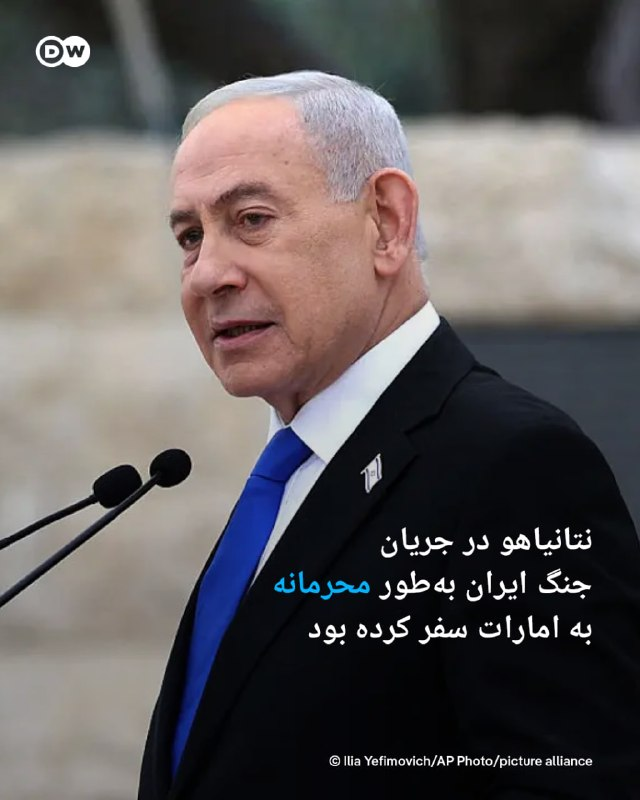

🔸 نتانیاهو در جریان جنگ ایران به‌طور محرمانه به امارات سفر کرده بود

دفتر نخست‌وزیر اسرائیل اعلام کرد بنیامین نتانیاهو در جریان جنگ ایران به‌طور محرمانه به امارات سفر کرده و با محمد بن زاید، رئیس امارات، دیدار داشته است.

دفتر نتانیاهو گفت این سفر به "یک دستاورد تاریخی" در روابط دو طرف منجر شده است. این نخستین تأیید رسمی از سفر محرمانه نتانیاهو به امارات در طول جنگ اخیر است.

این اعلام پس از گزارش‌هایی منتشر شد که می‌گفتند دیوید بارنیا، رئیس موساد، نیز دست‌کم دو بار در ماه‌های مارس و آوریل به امارات سفر کرده تا درباره جنگ با ایران هماهنگی کند. این رفت‌وآمدها به‌عنوان نشانه‌ای از تعمیق همکاری اطلاعاتی و امنیتی میان ابوظبی و تل‌آویو ارزیابی شده است.

هم‌زمان، مایک هاکبی، سفیر آمریکا در اسرائیل، تأیید کرد اسرائیل در جریان جنگ، سامانه "گنبد آهنین" و نیروهایی برای راه‌اندازی آن به امارات فرستاده است. او این اقدام را یکی از نمونه‌های ملموس سود امارات از توافق ابراهیم توصیف کرد. گزارش‌های جداگانه نیز می‌گویند این همکاری بخشی از پاسخ مشترک به حملات موشکی و پهپادی ایران بوده است.
@dw_farsi

## DW_Farsi — post 124670

  

🔸 ایران مدعی "حمله غیرقانونی" کویت به قایق ایرانی شد

وزیر خارجه جمهوری اسلامی اعلام کرد کویت به‌طور "غیرقانونی" یک قایق ایرانی را در خلیج فارس هدف قرار داده و چهار ایرانی را بازداشت کرده است. عباس عراقچی گفت که جمهوری اسلامی خواهان آزادی فوری این افراد است و "حق پاسخ" را برای خود محفوظ می‌داند.

در مقابل، مقام‌های کویتی گفته‌اند چهار فرد بازداشت‌شده به سپاه پاسداران وابسته بوده‌اند و تلاش داشته‌اند از راه دریا وارد کویت شوند.

روایت حکومت ایران این است که این افراد "در یک گشت دریایی عادی حضور داشتند و به‌دلیل اختلال در سامانه ناوبری، ناخواسته وارد آب‌های کویت شده‌اند". مقام‌های جمهوری اسلامی اتهام طراحی اقدام خصمانه را رد کرده‌اند و می‌گویند کویت در حال سیاسی کردن ماجراست.

در مقابل، خبرگزاری رسمی کویت و وزارت کشور این کشور گفته‌اند این چهار نفر در بازجویی، وابستگی خود به سپاه پاسداران را پذیرفته‌اند و مأموریت داشته‌اند به جزیره بوبیان نفوذ کنند. مقام‌های کویتی می‌گویند در درگیری با این افراد، یک نیروی امنیتی کویت زخمی شده است.
@dw_farsi

## DW_Farsi — post 124669

  <a href="telegram/content/DW_Farsi_124669_1778709568.mp4" target="_blank">🎬 Download video</a>

🎥 اینستاگرام رمزگذاری پیام‌های خصوصی را متوقف کرد

پیام‌های خصوصی اینستاگرام دیگر به‌صورت سرتاسری رمزگذاری نمی‌شوند. این یعنی شرکت "متا" از نظر فنی می‌تواند به محتوای پیام‌های کاربران دسترسی داشته باشد. اما این تغییر چه پیامدهایی برای میلیون‌ها کاربر خواهد داشت؟
#dwdigital
@dw_farsi

## DW_Farsi — post 124668

  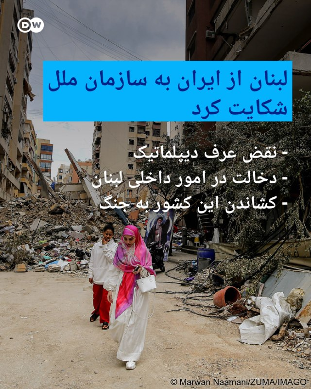

🔸 لبنان از ایران به سازمان ملل شکایت کرد

العربیه گزارش داد لبنان در نامه‌ای رسمی که میان اعضای شورای امنیت و مجمع عمومی سازمان ملل توزیع شده، حکومت ایران را به "نقض عرف دیپلماتیک، دخالت در امور داخلی لبنان و کشاندن این کشور به جنگ" متهم کرده است.

در این نامه، تهران همچنین به فعالیت‌های بدون مجوز در خاک لبنان از طریق سپاه پاسداران متهم شده است. هم‌زمان، رسانه‌های نزدیک به جمهوری اسلامی پیام نعیم قاسم را منتشر کرده‌اند که در آن، دبیرکل حزب‌الله از حمایت مستمر جمهوری اسلامی، به‌ویژه از مسیر سپاه پاسداران و نیروی قدس، قدردانی کرده است.

بر اساس این گزارش، شکایت لبنان در شرایطی مطرح شده که تنش میان دولت لبنان و حزب‌الله پس از ماه‌ها درگیری با اسرائیل افزایش یافته است.

در نقطه مقابل، به گزارش تسنیم وابسته به سپاه پاسداران، نعیم قاسم در پیامی از "حمایت خالصانه و مستمر" جمهوری اسلامی از حزب‌الله قدردانی کرده است. انتشار این پیام در همین مقطع، شکاف میان موضع رسمی دولت لبنان و موضع حزب‌الله را برجسته‌تر کرده است.
@dw_farsi

## DW_Farsi — post 124667

  <a href="telegram/content/DW_Farsi_124667_1778709571.mp4" target="_blank">🎬 Download video</a>

🎥 صد روز در انزوا؛ آزمایش انسان برای سفر به مریخ

شش داوطلب در پروژه "سولیس ۱۰۰" صد روز را در انزوای کامل سپری می‌کنند تا دانشمندان تاثیرات روانی و جسمی سفرهای طولانی فضایی را بررسی کنند؛ آزمایشی که می‌تواند به آمادگی بشر برای ماموریت‌های آینده به مریخ کمک کند.
#dwscience #dwhealth
@dw_farsi

## DW_Farsi — post 124666

  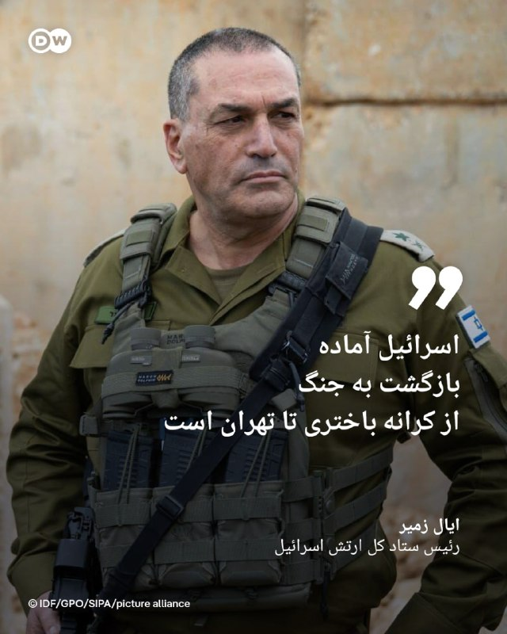

🔸 ایال زمیر: اسرائیل آماده بازگشت به جنگ از کرانه باختری تا تهران است

به گزارش تایمز اسرائیل، ایال زمیر، رئیس ستاد کل ارتش اسرائیل در جریان بازدید از کرانه باختری گفت ارتش اسرائیل همچنان در حالت آماده‌باش کامل قرار دارد و در صورت نیاز، از کرانه باختری تا تهران آماده بازگشت به نبرد است. هم‌زمان، ارتش اسرائیل اعلام کرد حملاتی هوایی را علیه انبارهای سلاح، پرتابگرهای آماده شلیک و دیگر زیرساخت‌های حزب‌الله در جنوب لبنان انجام داده است.

زمیر گفت "این کارزار تمام نشده است" و ارتش اسرائیل، هم در دفاع و هم در حمله، در همه جبهه‌ها در وضعیت آمادگی دائمی قرار دارد. این موضع‌گیری در حالی مطرح شده که آتش‌بس‌های شکننده در جبهه‌های مختلف برقرار است، اما تل‌آویو همچنان از احتمال بازگشت سریع درگیری سخن می‌گوید.

ارتش اسرائیل اعلام کرد پیش از حملات در لبنان، برای هفت روستا در جنوب این کشور هشدار تخلیه صادر کرده بود. سپس موجی از حملات هوایی را علیه مواضع حزب‌الله انجام داد.
@dw_farsi

## DW_Farsi — post 124656

📸 پا به پای آخرین کوچ‌نشینان ایران

تصمیم‌های سیاسی و فشارهای اقتصادی، زندگی روزمره را بسیار فراتر از شهرهای ایران شکل می‌دهند.

در کوهستان‌های زاگرس، شمار اندکی از خانواده‌های بختیاری هنوز کوچ‌نشین‌اند؛ مهاجرتی فصلی که به شکل پیاده میان مراتع زمستانی پست و چراگاه‌های تابستانی در ارتفاع بیش از ۲۵۰۰ متری انجام می‌گیرد.

این سفر می‌تواند تا دو هفته طول بکشد و همچنان یکی از معدود مسیرهای کوچ‌نشینان در ایران است که هنوز هم کاملاً با پای پیاده طی می‌شود.

این شیوه زندگی روزبه‌روز شکننده‌تر و آسیب‌پذیرتر می‌شود. در حالی که کمبود آب، سدسازی و بارش‌های نامنظم، مسیرهای سنتی کوچ را پیش‌بینی‌ناپذیرتر کرده‌اند، افزایش هزینه‌ها و دسترسی محدود به خدمات، بسیاری از خانواده‌ها را به سوی اسکان و شهرنشینی سوق می‌دهد.

امروز تنها حدود یک تا دو درصد جمعیت ایران همچنان به سبک زندگی کوچ‌نشینی خود ادامه می‌دهند؛ در حالی که در گذشته این سهم بسیار بیشتر بود.
@dw_farsi

## DW_Farsi — post 124655

  

🔸 نسرین ستوده با قرار کفالت موقتا آزاد شد

مهرآوه خندان، فرزند نسرین ستوده، با انتشار پیامی خبر داد مادرش ساعاتی پیش به قید کفالت موقتا آزاد شده است. هنوز جزئیات بیشتری درباره مبلغ کفالت، شرایط آزادی و روند قضایی پرونده او منتشر نشده است.

این خبر در حالی منتشر شده که بازداشت نسرین ستوده با واکنش گسترده نهادهای حقوق بشری و چهره‌های مدافع آزادی‌های مدنی روبه‌رو شده بود.

آزادی او فعلا موقت است و به معنای بسته شدن پرونده قضایی‌اش نیست.
@dw_farsi

## Persian_Trend_Official — post 14081

  <a href="telegram/content/Persian_Trend_Official_14081_1778709574.mp4" target="_blank">🎬 Download video</a>

شبتون بخیر ❤️🔥

📝 Nick
📌 @persian_trend_official
پرشین ترند | متفاوت‌ترین کانال نظامی

## Persian_Trend_Official — post 14080

  

به این وضعیت اقتصادی می‌گویید امنیت؟ امنیت کجاست وقتی یک پدر شرمنده زن و بچه‌اش است چون سفره‌اش خالی مانده و حقوقش حتی کفاف اجاره خانه را نمی‌دهد؟

امنیت کجاست وقتی جوانی نمی‌تواند یک متر زمین بخرد و رؤیاهایش زیر بار تورم و فساد دفن شده است؟ امنیت کجاست وقتی جوانی عمر و آرزوهایش را در صف مهاجرت یا بیکاری از دست می‌دهد؟

امنیت اجتماعی بدون رفاه پایدار وجود ندارد. جامعه‌ای که نرخ بیکاری جوانانش بالاست تورم افسارگسیخته دارد و سرمایه انسانی‌اش مهاجرت می‌کند در واقع در وضعیت ناامنی ساختاری است. شما نام این فروپاشی را امنیت گذاشته‌اید. این تحریف واژه‌هاست واژه‌ها را از معنا تهی کرده‌اید تا واقعیت تلخ را بپوشانید.

امنیت واقعی همان چیزی است که مردم در همه‌پرسی انتخاب خواهند کرد آزادی، اینترنت، اقتصاد سالم، و زندگی انسانی. امنیت یعنی امید به آینده نه ترس از فردا.

امنیتی که شما از آن دم می‌زنید، در واقع پوششی است برای فقر، سرکوب، و بی‌عدالتی. امنیت یعنی آرامش روانی، یعنی آینده‌ای قابل پیش‌بینی یعنی فرصت رشد و شکوفایی. اما آنچه امروز مردم ایران تجربه می‌کنند چیزی جز اضطراب فروپاشی اقتصادی و نابودی امید نیست.

📝 Nick

📌 @persian_trend_official
پرشین ترند | متفاوت‌ترین کانال نظامی

## Persian_Trend_Official — post 14079

⭕️ بنیامین نتانیاهو: من می‌خواهم دانش‌آموزان اسرائیلی در استفاده از ChatGPT، Claude و پیشرفته‌ترین ابزارهای هوش مصنوعی جهان - و حتی قبل از فارغ‌التحصیلی از دبیرستان - بهترین باشند. 📝 Nick 📌 @persian_trend_official پرشین ترند | متفاوت‌ترین کانال نظامی

## Persian_Trend_Official — post 14078

  <a href="telegram/content/Persian_Trend_Official_14078_1778709576.mp4" target="_blank">🎬 Download video</a>

⭕️ بنیامین نتانیاهو:

من می‌خواهم دانش‌آموزان اسرائیلی در استفاده از ChatGPT، Claude و پیشرفته‌ترین ابزارهای هوش مصنوعی جهان - و حتی قبل از فارغ‌التحصیلی از دبیرستان - بهترین باشند.

📝 Nick

📌 @persian_trend_official
پرشین ترند | متفاوت‌ترین کانال نظامی

## Persian_Trend_Official — post 14077

  <a href="telegram/content/Persian_Trend_Official_14077_1778709577.webm" target="_blank">🎬 Download video</a>

💢امارات متحده عربی دیدار مخفیانه نتانیاهو از ابوظبی در طول جنگ با ایران را تکذیب کرد

🫆:Tony

📌 @persian_trend_official
پرشین ترند | متفاوت‌ترین کانال نظامی

## Persian_Trend_Official — post 14076

  <a href="telegram/content/Persian_Trend_Official_14076_1778709578.mp4" target="_blank">🎬 Download video</a>

🔴 انهدام پهپاد انتحاری روسی توسط سرباز اوکراینی در لحظات آخر

ویدئویی منتشر شده که نشان می‌دهد یک سرباز اوکراینی با استفاده از سلاح «آکا-۷۴» موفق می‌شود یک پهپاد انتحاری کواد را تنها لحظاتی پیش از برخورد منهدم کند.

🫆:Tony

📌 @persian_trend_official
پرشین ترند | متفاوت‌ترین کانال نظامی

## Persian_Trend_Official — post 14075

  <a href="https://t.me/persian_trend_official/14075" target="_blank">📎 Download file</a>

فایل صوتی لایو اول
نسخه کم حجم - 6.71 مگابایت

اتاق جنگ چهارشنبه 23 اردیبهشت | جمهوری اسلامی ناو امریکایی را تهدید به حمله کرد.

فورمت mp3 همیشگی

📝 Nick

📌 @persian_trend_official
پرشین ترند | متفاوت‌ترین کانال نظامی

## Persian_Trend_Official — post 14074

https://youtube.com/live/xKXwDy6wYig?feature=share

## Persian_Trend_Official — post 14073

  <a href="https://t.me/persian_trend_official/14073" target="_blank">📎 Download file</a>

فایل صوتی لایو اول
نسخه کم حجم - 5.1 مگابایت

اتاق جنگ چهارشنبه ۲۳ اردیبهشت | جمهوری اسلامی ناو آمریکایی را تهدید به حمله کرد

🫆:Tony

📌 @persian_trend_official
پرشین ترند | متفاوت‌ترین کانال نظامی

## Persian_Trend_Official — post 14072

  <a href="telegram/content/Persian_Trend_Official_14072_1778709580.webm" target="_blank">🎬 Download video</a>

🔴چت جی پی تی وارد پرونده قتل شد!

💢رسانه‌های کره جنوبی گزارش دادن زنی متهم شده قبل از مسموم کردن چند نفر، از ChatGPT درباره ترکیب الکل و قرص خواب‌آور سؤال کرده

💢طبق گزارش‌ها، این زن پرسیده بوده:
اگه الکل و داروی خواب‌آور باهم مصرف بشن چی میشه؟
چه دوزی خطرناکه؟
و آیا ممکنه باعث مرگ بشه؟
پلیس میگه بعد از همین جستجوها، به سه مرد نوشیدنی آلوده داده شده که دو نفرشون جونشونو از دست دادن 💀

💢حالا نکته عجیب‌تر:
دادگاه از گفتگوهای ChatGPT به‌عنوان مدرک برای اثبات «نیت قتل» استفاده کرده!

💢وکیل پرونده گفته این شاید یکی از اولین پرونده‌هاییه که چت‌های AI به‌عنوان شاهد مستقیم تو پرونده قتل پذیرفته میشن..

🫆:Tony

📌 @persian_trend_official
پرشین ترند | متفاوت‌ترین کانال نظامی

## Persian_Trend_Official — post 14071

  

🔴دفتر نخست وزیر اسرائیل :

💢در حين عملیات «غرش شیران»، نخست وزیر نتانیاهو مخفیانه از امارات متحده عربی بازدید و با شیخ محمد بن زاید، رئیس امارات متحده عربی دیدار کرد.

💢این دیدار منجر به یک پیشرفت تاریخی در روابط بین اسرائیل و امارات متحده عربی شد.

## Persian_Trend_Official — post 14070

  <a href="telegram/content/Persian_Trend_Official_14070_1778709580.webm" target="_blank">🎬 Download video</a>

https://youtube.com/live/xKXwDy6wYig?feature=share

## Persian_Trend_Official — post 14069

تا ده دقیقه دیکه لایو آغاز میشه

## RadioFarda — post 157154

  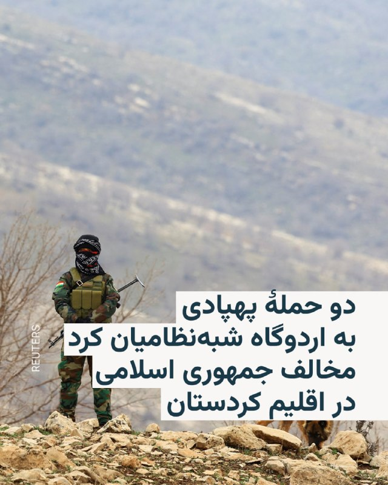

🔸منابع امنیتی از دو حملۀ پهپادی به کمپ شبه‌نظامیان کرد مخالف جمهوری اسلامی، در شمال شهر اربیل واقع در اقلیم کردستان عراق خبر می‌دهند.

🔸به گفتۀ این منابع، یک زاغه تجهیزات و مهمات در داخل این اردوگاه هدف قرار گرفته است. گزارشی از تلفات احتمالی این حملات منتشر نشده است.

🔸سه روز پیش هم حمله مشابهی به اردوگاهی دیگر در شرق اربیل رخ داده بود.

🔸طی ماه‌های اخیر سپاه پاسداران بارها مواضع شبه‌نظامیان کرد مخالف جمهوری اسلامی در اقلیم کردستان را با پهپاد و موشک هدف قرار داده است.

@RadioFarda

## RadioFarda — post 157153

  

🔸جی‌دی ونس، معاون رئیس‌جمهور آمریکا، اعلام کرد که واشینگتن معتقد است در مذاکرات با ایران «پیشرفت» حاصل شده، اما هنوز مشخص نیست این پیشرفت برای عبور از خط قرمز دونالد ترامپ کافی باشد یا نه.

🔸آقای ونس روز چهارشنبه در کاخ سفید به خبرنگاران گفت صبح همان روز با جرد کوشنر و استیو ویتکاف درباره ایران گفت‌وگو کرده و همچنین با مقام‌های عرب در تماس بوده است. او افزود: «سوال اصلی این است که آیا این پیشرفت به اندازه‌ای هست که خط قرمز رئیس‌جمهور را تأمین کند یا نه.»

🔸به گفته معاون رئیس‌جمهور آمریکا، خط قرمز ترامپ این است که ایالات متحده مطمئن شود «سازوکارهای کافی» ایجاد شده تا ایران هرگز به سلاح هسته‌ای دست پیدا نکند.

🔸اظهارات ونس در حالی مطرح می‌شود که ترامپ پیش‌تر پیشنهاد تازه ایران در مذاکرات را «غیرقابل قبول» توصیف کرده بود.

@RadioFarda

## RadioFarda — post 157152

🔸قوه قضائیه جمهوری اسلامی شامگاه چهارشنبه ۲۳ اردیبهشت اعلام کرد که محمد عباسی، یکی از بازداشت‌شدگان اعتراضات دی‌ماه سال گذشته به اتهام قتل یک مأمور امنیتی اعدام شده است. 🔸خبرگزاری میزان، وابسته به این قوه، گفته است که او بعد از تأیید حکم توسط دیوان‌عالی کشور…

## RadioFarda — post 157151

  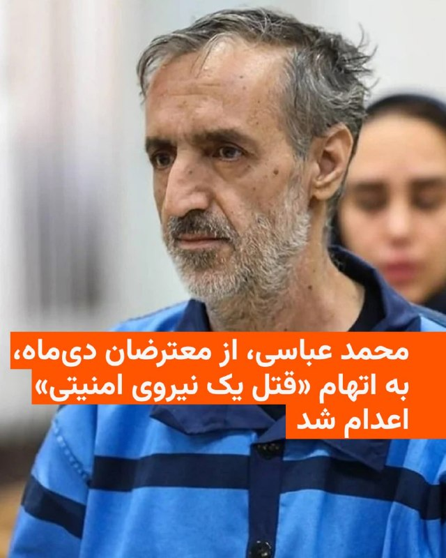

🔸قوه قضائیه جمهوری اسلامی شامگاه چهارشنبه ۲۳ اردیبهشت اعلام کرد که محمد عباسی، یکی از بازداشت‌شدگان اعتراضات دی‌ماه سال گذشته به اتهام قتل یک مأمور امنیتی اعدام شده است.

🔸خبرگزاری میزان، وابسته به این قوه، گفته است که او بعد از تأیید حکم توسط دیوان‌عالی کشور و با توجه به «تقاضای اولیا‌ء دم»، «قصاص» شد.

🔸ساعتی پیش‌تر، پایگاه خبری هرانا که اخبار حقوق بشر در ایران را از آمریکا پوشش می‌دهد، خبر داد که آقای عباسی بامداد چهارشنبه در زندان قزلحصار اعدام شده است.

🔸هرانا به نقل از یک منبع نزدیک به خانواده این زندانی نوشت که مسئولان زندان قزلحصار از خانواده محمد عباسی خواستند که برای ملاقات با او به زندان مراجعه کنند، «اما پس از حضور خانواده در زندان، این امکان از نزدیکان او سلب شد. پس از خروج خانواده عباسی از زندان، آنها در تماسی تلفنی از اجرای حکم اعدام محمد عباسی مطلع شدند.»

@RadioFarda

## RadioFarda — post 157150

🔸«جنگنده‌های عربستان سعودی در طول جنگ ایران، اهداف مرتبط با شبه‌نظامیان شیعه تحت حمایت تهران در عراق را بمباران کردند». این موضوع را چند منبع آگاه به رویترز گفته‌اند. 🔸به گفتۀ‌ این منابع، این حملات بخشی از «یک الگوی گسترده‌تر واکنش‌های نظامی در گوشه‌وکنار…

## RadioFarda — post 157149

  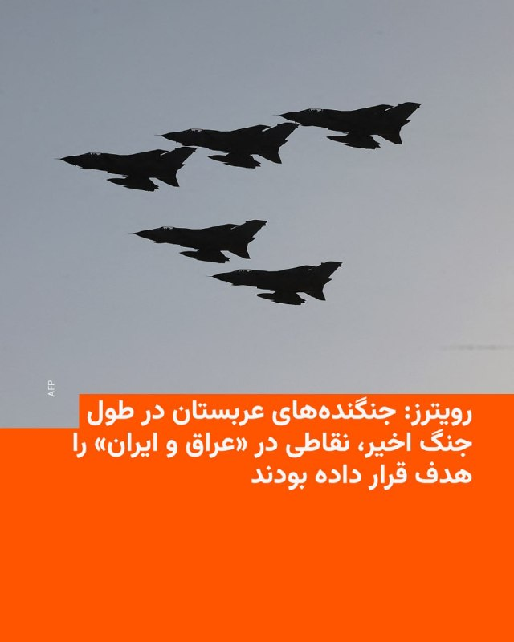

🔸«جنگنده‌های عربستان سعودی در طول جنگ ایران، اهداف مرتبط با شبه‌نظامیان شیعه تحت حمایت تهران در عراق را بمباران کردند». این موضوع را چند منبع آگاه به رویترز گفته‌اند.

🔸به گفتۀ‌ این منابع، این حملات بخشی از «یک الگوی گسترده‌تر واکنش‌های نظامی در گوشه‌وکنار حوزۀ خلیج فارس است که در طول جنگ آمریکا و اسرائیل با ایران آغاز شد، اما تا حد زیادی پنهان ماند».

🔸یک مقام غربی که خواسته هویتش محفوظ بماند، به رویترز گفته که حملات عربستان توسط جت‌های جنگنده به اهداف شبه‌نظامی مرتبط با ایران در نزدیکی مرز شمالی این کشور با عراق انجام شد. به گفتۀ این مقام غربی برخی از حملات، تقریباً همزمان با شروع آتش‌بس بین ایالات متحده و ایران انجام شده است.

🔸این مقام غربی و یک منبع عراقی گفته‌اند که جنگنده‌های عربستان مکان‌هایی را هدف قرار داده اند که مبداء حملات پهپادی و موشکی به عربستان سعودی و سایر کشورهای خلیج فارس بوده‌اند.

@RadioFarda

## RadioFarda — post 157148

  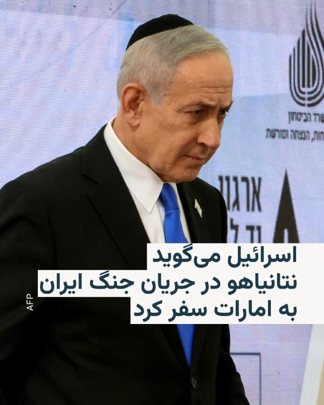

🔸دفتر نخست‌وزیر اسرائیل روز چهارشنبه اعلام کرد که بنیامین نتانیاهو در جریان جنگ آمریکا و اسرائیل با ایران، به‌طور «محرمانه» به امارات متحده عربی سفر کرده بود.

🔸در این بیانیه آمده که نتانیاهو با شیخ محمد بن زاید، رئیس امارات متحده عربی، دیدار کرد.

🔸دفتر نخست‌وزیر اسرائیل گفت: «این سفر به یک پیشرفت تاریخی در روابط میان اسرائیل و امارات متحده عربی منجر شد.»

🔸پیش‌تر مقام‌های ارشد آمریکایی تأیید کردند که اسرائیل در جریان جنگ با ایران، یک سامانه پدافندی «گنبد آهنین» به همراه نیروهایی برای بهره‌برداری از آن به امارات اعزام کرده است.

🔸همچنین به گفته مقام‌های عرب و یک منبع آگاه که با روزنامه وال‌استریت جورنال گفت‌وگو کردند، دیوید بارنئا، رئیس موساد، دست‌کم دو بار در طول جنگ با ایران به امارات سفر کرد تا دربارهٔ هماهنگی‌های مربوط به این درگیری رایزنی کند.

@RadioFarda

## RadioFarda — post 157147

  <a href="https://t.me/radiofarda/157147" target="_blank">📎 Download file</a>

🔸 در این کافه فردا به رواج پدیده دوست اجاره‌ای در ایران، گزارش گاردین در مورد اموال اسحاق قالیباف در استرالیا، توهین صدا و سیما به علی دایی، حواشی تمام نشدنی اینترنت پرو و سریال‌های مطرح و پر سر و صدای سوریه‌ای می‌پردازیم.

🔸 برای تماس با ما می‌توانید به شناسه کافه فردا در تلگرام صوت و متن بفرستید.

📻 کافه فردا

## IranianMinds — post 20093

🔴 وزیر خارجه سوریه :

میخوایم روابطمون با داداشیمون اسرائیل رو قوی تر کنیم و به حاکمیت هم احترام بزاریم

@IranianMinds

## IranianMinds — post 20092

🔴 گوگل رسما اعلام کرد در جام جهانی اسپانسری تیم های ملی عراق و مراکش رو گرفته و تمامی هزینه های این تیم هارو‌ میده.

@IranianMinds

## IranianMinds — post 20091

🔴 عراقچی :

هرکسی بخواد با ما دشمنی کنه و با اسرائیل تبانی کنه بد پشیمون میشه

@IranianMinds

## IranianMinds — post 20090

  

املت هم‌ تو‌ این مملکت قسطی شد

@IranianMinds

## IranianMinds — post 20089

  <a href="telegram/content/IranianMinds_20089_1778709584.mp4" target="_blank">🎬 Download video</a>

🔴 مهدی تاج رئیس فدراسیون فوتبال :

معین قراره برای تیم ملی یه آهنگ بخونه !

@IranianMinds

## IranianMinds — post 20088

  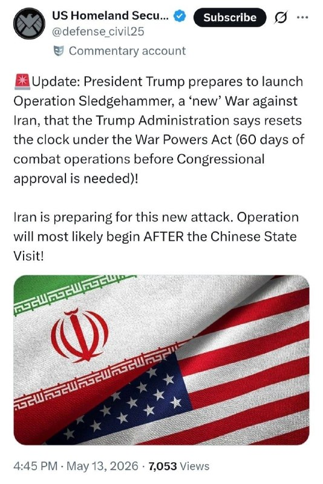

🔴رئیس جمهور ترامپ آماده است عملیات پتک را علیه رژیم تروریستی ایران آغاز نماید.
دولت او می‌گوید این اقدام، ساعت قانونی اختیارات جنگی را دوباره تنظیم می‌کند و ۶۰ روز فرصت عملیات رزمی پیش از دخالت کنگره می‌دهد.
رژیم ایران دستپاچه در حال آماده‌سازی است، اما عملیات به احتمال زیاد بلا‌فاصله پس از سفر رسمی چین آغاز خواهد شد.

@IranianMinds

## IranianMinds — post 20087

  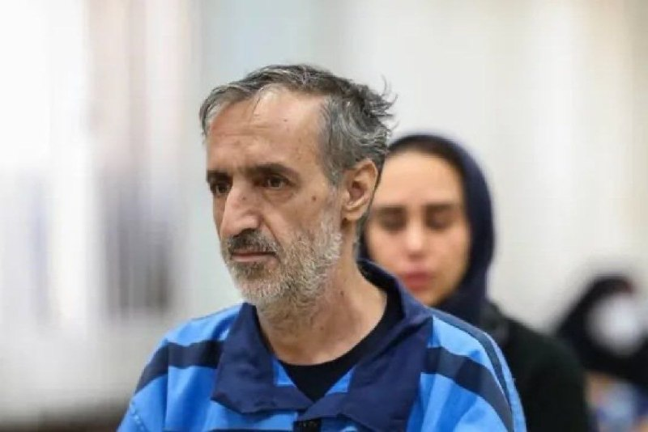

🔴 اکانت اسرائیل به فارسی:

محمد عباسی و دخترش فاطمه در دی‌ماه دستگیر شدند.
محمد را بدون ملاقات آخر، امروز صبح اعدام کردند.
جمهوری اسلامی روی خون مردمش حکومت می‌کند.

@IranianMinds

## IranianMinds — post 20086

🔴شهبازی، مجری صدا‌و‌سیما:

بهترین کار نظام تو ۴۷ سال گذشته، ملی کردن اینترنت بود.

ای حرومزاده ۱۰۰۰ پدر .

@IranianMinds

## IranianMinds — post 20084

🔴 دیگه شد یه کسب درآمد داعم براشون و همه جا شروع کردن به فروش سیمکارت و اینترنت پرو !

@IranianMinds

## IranianMinds — post 20083

  

🔴 عراقچی :

در تلاشی آشکار برای ایجاد اختلاف، کویت به ‌صورت غیرقانونی به یک قایق ایرانی در خلیج فارس حمله کرده و ۴ نفر از شهروندان ما را بازداشت کرده است. این اقدام غیرقانونی در نزدیکی جزیره ‌ای رخ داده که آمریکا از آن برای حمله به ایران استفاده میکند.

ما خواستار آزادی فوری شهروندان ‌مان هستیم و حق پاسخگویی را برای خود محفوظ می‌دانیم.

@IranianMinds

## IranianMinds — post 20082

  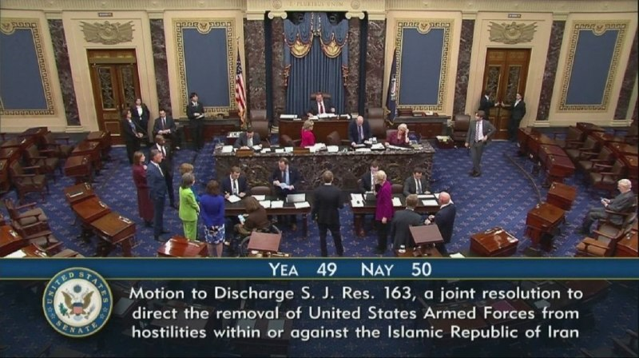

🔴 برای هفتمین بار هم تلاش برای محدود کردن اختیارات جنگی ترامپ در مجلس سنای آمریکا شکست خورد !

@IranianMinds

## IranianMinds — post 20081

  

💙 خان وی‌پی‌ان
⚡️ سرعت بالا
🛡 پینگ و پایداری عالی
🔐 مناسب تلگرام، اینستا، یوتیوب، گیم و استریم
💸 قیمت اقتصادی با پلن‌های متنوع

🎁 تست ۵۰ مگ فقط ۷۵ تومن

🛎 کانال:

https://t.me/+qNjExGEJztE2OGI0

🤖 ربات خرید:
@Xan_vpn_bot

## IranianMinds — post 20080

  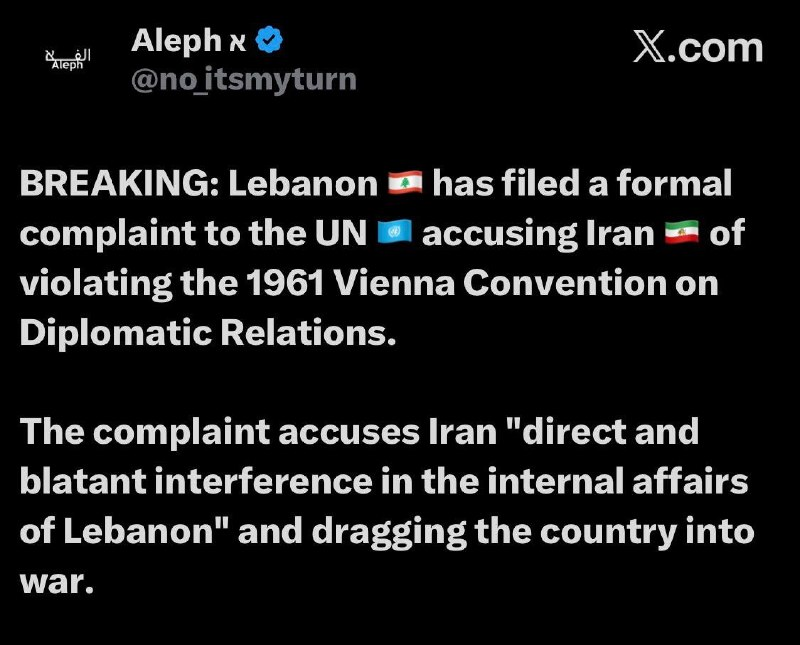

🔴لبنان شکایتی رسمی به سازمان ملل ارائه داده است و ایران(جمهوری اسلامی) را به نقض کنوانسیون وین ۱۹۶۱ در مورد روابط دیپلماتیک متهم کرده است.
در این شکایت، ایران به دخالت مستقیم و آشکار در امور داخلی لبنان و کشاندن این کشور به جنگ متهم شده است.

@IranianMinds

## BBCPersian — post 280969

  <a href="https://t.me/bbcpersian/280969" target="_blank">📎 Download file</a>

🔻پادکست برنامه شصت دقیقه 
چهارشنبه ۲۳ اردیبهشت ۱۴۰۵ 

این نسخه رادیویی برنامه شصت دقیقه تلویزیون فارسی بی‌بی‌سی است که هرشب بعد از پخش، با حجم کم از اپلیکیشن‌های پادگیر و صفحه تلگرام بی‌بی‌سی فارسی در دسترس است. 
با هشتگ BBCPersianRadio# با ما در ارتباط باشید.
@BBCPersian

## BBCPersian — post 280968

  

🔻وزارت خارجه امارات متحده عربی با انتشار بیانیه‌ای سفر بنیامین نتانیاهو به این کشور در خلال جنگ آمریکا و اسرائیل با ایران را تکذیب کرده است.

در بیانیه وزارت خارجه امارات آماده است: «امارات متحده عربی گزارش‌های منتشرشده درباره سفر نخست‌وزير اسرائيل يا استقبال از يک هيات نظامی اسرائيلی را تکذيب می‌کند.»

اين تکذيب در حالی مطرح می‌شود که رسانه‌های بين‌المللی از جمله رويترز و سی‌بی‌اس نيوز روز چهارشنبه به نقل از دفتر نخست‌وزير اسرائيل گزارش داده بودند که بنیامین نتانياهو در جريان جنگ ايران، سفری محرمانه به امارات داشته و با محمد بن زايد آل نهيان ديدار کرده است.

📸GettyImages
https://bbc.in/4tEOL0N
@BBCPersian

## BBCPersian — post 280967

  

🔻عباس عراقچی، وزیر امورخارجه ایران، به علنی شدن خبر سفر بنیامین نتانیاهو به امارات متحده عربی واکنش نشان داده و گفته است: «نتانیاهو اکنون به‌صورت علنی آنچه را که نهادهای امنیتی ایران مدت‌ها قبل به رهبری ما منتقل کرده بودند، افشا کرده است.»

آقای عراقچی همچنین در اظهاراتی تند که می‌تواند مخاطب آن امارات و کشورهای حاشیه خلیج فارس باشد گفته است: «دشمنی با ملت بزرگ ایران، قماری احمقانه‌ است؛ و همکاری و همدستی با اسرائیل در این مسیر، غیرقابل بخشش است. کسانی که در همدستی با اسرائیل برای ایجاد تفرقه نقش دارند، باید پاسخگو باشند.»

علاوه بر علنی شدن خبر سفر نخست وزیر اسرائیل به امارات در خلال جنگ، در چند روز گذشته اخبار رسانه‌های امریکایی درباره حملات نظامی مخفیانه امارات و عربستان به ایران هم بسیار بازتاب داشته است.

📸AFP via Getty Images
https://bbc.in/3R9GXqf
@BBCPersian

## BBCPersian — post 280965

🔻بعد از خبر حملات امارات به ایران، رویترز می‌گوید عربستان هم در خلال جنگ حملات متعددی علیه ایران انجام داده است

گزیده‌هایی از مصاحبه موسی شریفی، تحلیلگر جهان عرب از ریاض عربستان را با پریزاد نوبخت ببیند که می‌گوید که عربستان برخلاف امارات به‌دنبال شکست ایران نیست و نمی‌‌خواهد توازن قدرت در منطقه دچار خلاء شود.

@BBCPersian

## BBCPersian — post 280958

🖊روناک فرجی، روزنامه‌نگار

جشنواره فیلم کن امسال در حالی کار خود را در ساحل «کروآزت» آغاز کرده که برخلاف برخی دوره‌های اخیر، تمرکز اصلی آن دوباره به سینمای مؤلف و فیلم‌سازان شناخته‌شده اروپایی و آسیایی بازگشته است.

هفتاد و نهمین دوره جشنواره بین‌المللی فیلم کن با حضور ستارگان سینما، فیلمسازان و اعضای هیئت داوران در جنوب فرانسه آغاز شد و فرش قرمز این رویداد میزبان چهره‌های سرشناس صنعت سینما بود.

جشنواره این دوره شمار بی‌سابقه‌ای از شرکت‌کنندگان را جذب کرده است؛ افرادی که برای خرید آثار اغلب مستقل و کم‌هزینه رقابت می‌کنند، در حالی که استودیوهای بزرگ محتاط‌‌تر شده‌اند و کمتر ریسک می‌کنند.

حدود ۱۶ هزار نفر از فعالان صنعت سینما برای حضور در بزرگ‌ترین بازار فیلم جهان ثبت‌نام کرده‌اند که از ۱۲ تا ۲۰ مه همزمان با جشنواره فیلم کن برگزار می‌شود.

در مراسم افتتاحیه جشنواره، نخل طلای افتخاری برای یک عمر فعالیت هنری به پیتر جکسون، کارگردان فیلم‌های «ارباب حلقه‌ها» و «کینگ کونگ»، اهدا شد.

برای خواندن ادامه مطلب به لینک زیر مراجعه کنید:

https://bbc.in/4dhST0w
📷Getty Images
@BBCPersian

## BBCPersian — post 280957

  <a href="telegram/content/BBCPersian_280957_1778709589.mp4" target="_blank">🎬 Download video</a>

🔻آخرین خبرهای مهم روز چهارشنبه۲۳ اردیبهشت ۱۴۰۵

@BBCPersian

## BBCPersian — post 280956

  

🔻خبرگزاری میزان، وابسته قوه قضائیه می‌گوید محمد عباسی از بازداشت شدگان اعتراضات دی ماه امروز(چهارشنبه ۲۳ اردیبهشت) اعدام شده است.

قوه قضائیه جمهوری اسلامی او را به «کشتن» یک نظامی در جریان اعتراضات زمستان پارسال متهم کرد و می‌گوید خانواده فرد نظامی او را «قصاص کرده‌اند.»

قوه قضائیه همچنین گفته است اجرای حکم اعدام با تایید و ابرام دیوان عالی ایران و به تقاضای اولیا انجام شده است.

دیوان عالی ایران همچنین حکم ۲۵ سال حبس فاطمه عباسی، دختر آقای عباسی که در بند زنان زندان اوین زندانیست را تایید کرده است.

این دومین مورد اعدامی است که قوه قضائیه امروز گزارش کرده است؛ احسان افرشته هم صبح امروز به اتهام «جاسوسی و همکاری اطلاعاتی به نفع اسرائیل» اعدام شد.

با احتساب محمد عباسی، تاکنون ۳۲ زندانی پس از آغاز جنگ آمریکا و اسرائیل با ایران در این کشور اعدام شده‌اند.

غلامحسین محسنی اژه‌ای، رئیس قوه قضائیه، بارها از دادستان‌ها خواسته است بدون اغماض و به‌ سرعت به پرونده کسانی که بعد از شروع جنگ و یا در اعتراضات دی ماه بازداشت شده‌اند رسیدگی کنند و احکامشان صادر و اجرا شود.

📷Mizan
@bbcpersian

## BBCPersian — post 280955

🔻سنتکام: از آغاز محاصره بنادر ایران به ۱۵ کشتی حامل کمک‌های بشردوستانه اجازه عبور دادیم

فرماندهی مرکزی ارتش آمریکا، سنتکام، در منطقه در اطلاعیه‌ای گفته است از زمان آغاز محاصره بنادر ایران به ۱۵ کشتی حامل کمک‌های بشردوستانه اجازه عبور داده است.

این نهاد در اطلاعیه‌ای اعلام کرده است: «چهار هفته پیش، سنتکام اجرای محاصره کشتی‌هایی را که به بنادر ایران وارد و از آنها خارج می‌شدند، آغاز کرد. تا امروز، نیروهای آمریکایی ۶۷ کشتی تجاری را مجبور به تغییر مسیر کردند، به ۱۵ کشتی حامل کمک‌های بشردوستانه اجازه عبور دادند و ۴ کشتی را برای اطمینان از رعایت محاصره، غیرفعال کردند.»

در ادامه این اطلاعیه آمده است: «اوایل این هفته، نیروهای سنتکام پس از برقراری ارتباط رادیویی و شلیک گلوله‌های هشدار دهنده با سلاح‌های سبک، از بازگشت دو کشتی تجاری برای رعایت محاصره مطمئن شدند و به وضوح نشان دادند که اجرای قوانین ایالات متحده همچنان به طور کامل ادامه دارد.»

@bbcpersian

## BBCPersian — post 280954

🔻اسرائیل: انبارهای تسلیحاتی و پرتابگرهای آماده شلیک حزب‌الله را هدف قرار دادیم

ارتش اسرائیل در بیانیه‌ای گفته است «انبارهای تسلیحاتی، پرتابگرهای بارگذاری‌شده و آماده شلیک» و سایر زیرساخت‌های حزب‌الله لبنان را در چندین منطقه در جنوب لبنان هدف قرار داده است.

این بیانیه می‌گوید: «در محل‌های شلیک که هدف قرار گرفتند، پرتابگرهای راکتی که به سمت منطقه فعالیت نیروهای ارتش اسرائیل و به سمت خاک اسرائیل هدف‌گیری شده بودند، منهدم شدند.»

پیشتر وزارت بهداشت لبنان اعلام کرده بود که در حملات امروز اسرائیل ۱۲ نفر کشته شده‌اند، که اغلب آنها در جنوب بیروت بوده‌اند.

این حملات با وجود آتش‌بس میان اسراییل و حزب‌الله انجام شده است.

حملات جدید که مناطق مختلف جنوب لبنان را هدف قرار داد، در آستانه دور تازه‌ای از مذاکرات مستقیم میان لبنان و اسرائیل در واشنگتن با میانجیگری ایالات متحده انجام شد.

حزب‌الله به‌شدت با این مذاکرات مخالف است.

@bbcpersian

## BBCPersian — post 280953

  <a href="telegram/content/BBCPersian_280953_1778709592.mp4" target="_blank">🎬 Download video</a>

⭕️در روزهای اخیر انتشار تصاویری از تظاهرات گروهی از هواداران شاهزاده رضا پهلوی در آلمان که در آن با لباس‌های یک‌شکل با نشان ساواک راهپیمایی کرده‌اند، واکنش‌برانگیز شده است.
 
در بیانیه‌ای که در تجمع رگنزبورگ آلمان خوانده شد، افرادی که خود را «گروه مردمی ساواک» معرفی می‌کنند، با ستایش از عملکرد ساواک در دوران محمدرضاشاه پهلوی، خواهان «احیا و گسترش ساواک برای شناسایی عوامل جمهوری اسلامی و اپوزیسیون‌های جعلی و نفوذی» شدند.
 
یک روز پیش از آن، گروه دیگری از ایرانیان در دانمارک با لباس‌هایی یکدست شبیه یونیفرم نظامی و پیشتر در شهرهایی از جمله لندن، منچستر و گلاسگو گروهی یک‌دست سیاهپوش با عنوان «گارد جاویدان» تجمع کرده بودند.
 
ساواک، سازمان اطلاعات و امنیت کشور در ایران بود که از ۱۳۳۵ تا ۱۳۵۷ فعالیت می‌کرد. گروهی از پادشاهی‌خواهان با ارجاع به برخورد ساواک با چهره‌هایی از جمله آنهایی که بعدها از سران جمهوری اسلامی شدند، عملکرد آن را موجه می‌دانند.
 
مخالفان اما ساواک را به «خشونت و شکنجه سیستماتیک» متهم می‌کنند. آنها می‌گویند با رژه‌های اخیر نگران «ترویج خشونت و رویکردهای اقتدارگرا و فاشیستی» شده‌اند.
@bbcpersian

## BBCPersian — post 280952

  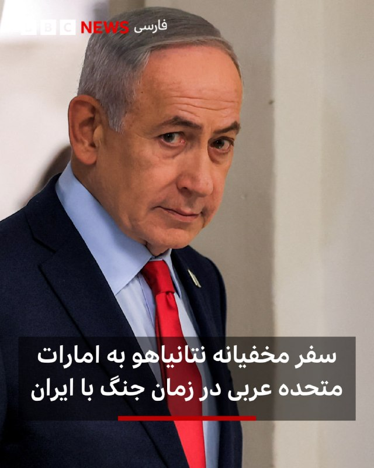

🔻دفتر بنیامین نتنانیاهو، نخست‌وزیر اسرائیل، اعلام کرده است که آقای نتانیاهو پیش از آتش‌بس و زمانی که جنگ با ایران در جریان بود به طور مخفیانه به امارات متحده عربی سفر کرد و با شیخ محمد بن زاید، رئیس‌جمهور امارات، هم دیدار کرده است.

دفتر نخست وزیر اسرائیل در اطلاعیه‌ای اعلام کرده است: «این سفر منجر به یک پیشرفت تاریخی در روابط بین اسرائیل و امارات متحده عربی شده است.»

اخیرا روزنامه «اسرائیل هیوم» به نقل از سفیر آمریکا در سازمان ملل نوشت که اسرائیل در جریان جنگ اخیر، سامانه پدافند گنبد آهنین در اختیار امارات متحده عربی قرار داده است.

این روزنامه از مایک والتس، سفیر آمریکا در سازمان ملل، نقل کرد که «ما شاهد استفاده امارات از (سامانه) گنبد آهنین بودیم که اسرائیل در اختیار آنها قرار داده است.»

هفته پیش شدیدترین درگیری‌ها در تنگه هرمز و اطراف آن از زمان آغاز آتش‌بس یک ماه پیش به‌وقوع پیوست و امارات متحده عربی نیز روز جمعه بار دیگر هدف حمله قرار گرفت.

📷Getty Images

## BBCPersian — post 280951

🔻ترکیه می‌خواهد «چهار کشور خلیج فارس را به نشست ناتو دعوت کند»

یک رسانه ترکیه‌ای به همراه شبکه خبری بلومبرگ آمریکا گزارش داده ‌ند در حالی که موضوع جنگ ایران در در دستور کار نشست بعدی ناتو قرار دارد، ترکیه می‌خواهد چهار کشور حوزه خلیج فارس را به این نشست دعوت کند.

وب‌سایت انگلیسی‌زبان ترکیه تودی که روزنامه حامی دولت است اعلام کرده است که ترکیه امیدوار است قطر، کویت، امارات متحده عربی و بحرین را به نشست ناتو دعوت کند که قرار است از هفتم ژوئیه (۱۵ تیر) به مدت دو روز در آنکارا برگزار شود.

این چهار کشور در جریان حملات اسرائیل و آمریکا به ایران، هدف حملات متقابل نظامی جمهوری اسلامی ایران بودند.

در این گزارش، به نقل از منابع امنیتی آمده است که آنکارا در حال رایزنی با متحدان ناتو درباره دعوت از این کشورها به‌عنوان اعضای «ابتکار همکاری استانبول» است.

این گزارش می‌گوید که مشارکت اعضای این ائتلاف در نشست ناتو می‌تواند «فرصتی واقعی برای احیای سازوکاری باشد که مدت‌ها عملکرد ضعیفی داشته است».

همچنین گزارش شده است که منابع ترکیه‌ای هرگونه قصد آنکارا برای دعوت از احمد شرع، رئیس‌جمهور سوریه، به این نشست را رد کرده‌اند.
https://bbc.in/4uDhzre
@bbcpersian

## BBCPersian — post 280950

  <a href="https://t.me/bbcpersian/280950" target="_blank">📎 Download file</a>

پادکست رادیویی جام جهان‌نما چهارشنبه ۲۳ اردیبهشت ۱۴۰۵
در پی تحولات اخیر ایران و قطع و اختلال در اینترنت که امکان دسترسی مخاطبان در ایران به رسانه‌ها را با مشکل مواجه کرده است، بی‌بی‌سی فارسی از ۱۵ بهمن پخش رادیویی برنامه‌های خود را دوباره آغاز کرده است.

برنامه‌ جام جهان‌نما از این پس همه روزه از ساعت ۱۶:۳۰ گرینویچ (۲۰:۰۰ ایران) روی موج متوسط ۷۰۲ کیلوهرتز و موج کوتاه ۹۴۶۵ کیلوهرتز پخش می‌شود.

تکرار این برنامه از ساعت ۱۸:۰۰ گرینویچ (۲۱:۳۰ ایران) روی موج متوسط ۷۰۲ کیلوهرتز و موج کوتاه ۵۹۳۵ کیلوهرتز پخش می‌شود.
@bbcpersian

## BBCPersian — post 280949

.🔻«قیمت‌های عمده فروشی در آمریکا به بالاترین سطح از دسامبر ۲۰۲۲ تاکنون افزایش یافت»

به گفته اداره آمار کار آمریکا، قیمت‌های عمده‌فروشی در این کشور در ماه آوریل به‌شدت افزایش یافت.

این افزایش تحت تأثیر جهش هزینه‌های انرژی مرتبط با جنگ ایران رخ داد و بالاترین رشد ۱۲ ماهه در بیش از سه سال گذشته را ثبت کرد.

اداره آمار کار آمریکا امروز اعلام کرد شاخص قیمت تولیدکننده در ۱۲ ماه منتهی به آوریل به بالاترین سطح از دسامبر ۲۰۲۲ تاکنون افزایش یافت.

قیمت‌ها نسبت به ماه قبل نیز ۱/۴ درصد افزایش یافت که بسیار بالاتر از پیش‌بینی‌ها و بالاترین رشد از مارس ۲۰۲۲ است.

اقتصاد جهان از زمان همه‌گیری بیماری کرونا با تورم سرسختانه و صعودی مواجه بوده است و تعرفه‌های تجاری امضاشده توسط دونالد ترامپ، و همچنین جنگ آمریکا و اسرائیل با ایران فشار بیشتری بر قیمت‌ها وارد کرده‌اند.

https://bbc.in/4uGc0ID
@BBCPersian

## Dirty_Kids — post 389407

🔴دوست دختر جدید پوبون (رپر) از روی یه پُل تو مکزیک افتاده پایین و گویا کمر و گردنش شکسته؛

پوبون هم استوریش کرده و از مردم خواسته که پول دونیت کنن تا هزینه عملش دربیاد...

@Dirty_Kids 👻

## Dirty_Kids — post 389406

من دیگه اگه بگن قراره یه ابر بزرگ بیاد رو آسمون ایران ازش کیر بباره تعجب نمیکنم.

@Dirty_Kids 👻

## Dirty_Kids — post 389405

  <a href="telegram/content/Dirty_Kids_389405_1778709594.mp4" target="_blank">🎬 Download video</a>

مهدی تاج:
معین قراره برای تیم ملی آهنگ بخونه

@Dirty_Kids 👻

## Dirty_Kids — post 389404

دموکرات‌های سنای آمریکا برای هفتمین‌بار کیر خوردن،

طرح محدود کردن اختیارات جنگی شیر خدا برای پایان دادن به جنگ با روافض هزار پدر رو برای بار هفتم به رأی گذاشتن و به تعداد هفت روز هفته کیر خوردن،

اما خب جای نگرانی داشت اندکی چون در عین حال خیلی ناپلئونی رأی نیاورد،

رأی ۴۹ موافق در مقابل ۵۰ مخالف.

موافقان محدود کردن اختیارات شیر جنگجوی خدا تقریباً همه‌ی دموکرات‌ها به علاوه‌ی سه سناتور قرمدنگ جمهوری‌خواه به نام‌های: Rand Paul ، Susan Collins ، Lisa Murkowski ،
که این اولین باری بود که سناتور قرمساق جمهوری‌خواه Murkowski به نفع طرح رأی داد.

تنها سناتور شریف دموکرات John Fetterman از پنسیلوانیا بود که دوباره با جمهوری‌خواهان همراه شد.

@Dirty_Kids 👻

## Dirty_Kids — post 389403

کاش به کارکنان شعب لمیز ونک به پایین یاد بدین که وقتی یه آقای مسن میاد تو ازتون میپرسه «هویج بستنی» دارین نگین نه چیچیاتو میچیاتو و فولان داریم، عین آدم به بنده‌ خدای گرما زده توضیح بدید که چه محصول عادی و خنکی میتونه سفارش بده، چون این کار وظیفه منِ مشتری نیست.

@Dirty_Kids 👻

## Dirty_Kids — post 389401

عمه جنده ام، گلشیفته

@Dirty_Kids 👻

## Dirty_Kids — post 389400

وقتی به “بله” می گید سوپر اپلیکیشن، حس بقالی رو دارم که رو تابلوش زده هایپر مارکت!

@Dirty_Kids 👻

## Dirty_Kids — post 389399

  

امانوئل تو زن داری؟

@Dirty_Kids 👻

## Dirty_Kids — post 389398

رفته بودیم ماسال. به صاحب‌ ویلا گفتم اینجا محلیا چه‌جوری‌ند؟ به حجاب گیرن یا زنا راحت بتابن؟
گفت: زنا هر جور دوست دارن بپوشن، اما مردا شلوارک نپوشن، اهالی حساسن به شلوارک:))))))

@Dirty_Kids 👻

## Dirty_Kids — post 389396

  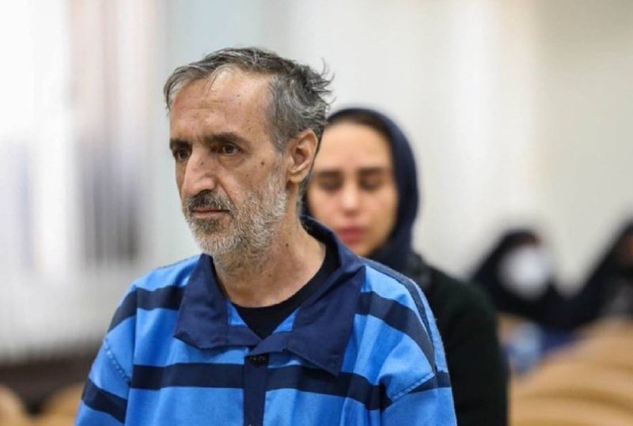

صلواتی خونخوار حکم اعدام ‎#محمد_عباسی رو داد و جمهوری اسلامی امروز مخفیانه طناب دار رو دور گردنش انداخت.

@Dirty_Kids 👻

## Dirty_Kids — post 389395

  

علی قمصری در کاخ الیزه در واکنش به رابطه «گلشیفته و مکرون»

@Dirty_Kids 👻

## Dirty_Kids — post 389394

  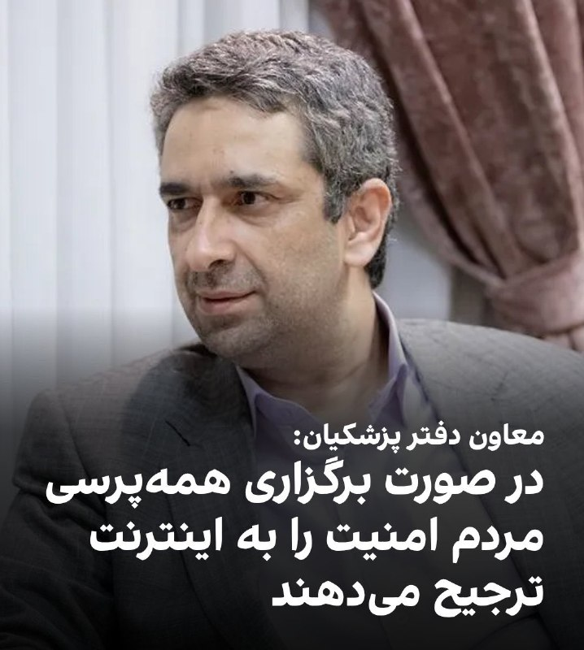

شما غلط کردی با صاحابت.
از طرف مردم گه نخور.

@Dirty_Kids 👻

## Dirty_Kids — post 389393

خمینی وقتی با فشار دولت صدام، مجبور به تَرک عراق شد، به سمت کویت رفت.
کویت او را راه نداد و آفتابه بدست در مرز عراق و کویت گرفتار شد.
چرا فرانسه رو انتخاب کرد؟
چون شهروندان ایرانی می‌توانستند بدون نیاز به ویزا تا "سه ماه" در فرانسه اقامت کنند.

@Dirty_Kids 👻

## Dirty_Kids — post 389392

  <a href="telegram/content/Dirty_Kids_389392_1778709596.mp4" target="_blank">🎬 Download video</a>

کپی برداری نوحه خوانی محمود کریمی از مدل اشعار برنامه های کودک تو سیرک شبانه حکومتی‌های حرامزاده؛

@Dirty_Kids 👻

## Dirty_Kids — post 389391

  <a href="telegram/content/Dirty_Kids_389391_1778709598.mp4" target="_blank">🎬 Download video</a>

بهمن محصص ۱۳ سال پیش گلشیفته رو اینجوری توصیف کرد...

چقد فحش خورد اون روزا

@Dirty_Kids 👻

## Dirty_Kids — post 389390

✖️ سایت بین المللی bet120x 
✖️  
👍دارای مجوز رسمی Gambling Judge سوئد
👍       
💳شارژ حساب از طریق ارز و یووچر و پرمیوم ووچر 
💳تسویه حساب دلاری سریع 💊بیمه شرط میکس 
⚠️فروش شرط 
🔔ویرایش شرط                    
3️⃣
2️⃣ 
🎁20%هدیه واریز از طریق ارز و ووچر ┅━━━━━━━━━━━…

## Dirty_Kids — post 389389

  

✖️ سایت بین المللی bet120x 
✖️

 
👍دارای مجوز رسمی Gambling Judge سوئد
👍
     

💳شارژ حساب از طریق ارز و یووچر و پرمیوم ووچر

💳تسویه حساب دلاری سریع
💊بیمه شرط میکس

⚠️فروش شرط

🔔ویرایش شرط                    
3️⃣
2️⃣

🎁20%هدیه واریز از طریق ارز و ووچر
┅━━━━━━━━━━━

🎁 10%برگشت باخت به صورت روزانه

🎁 10%برگشت باخت به صورت هفتگی

🎁10%برگشت باخت به صورت ماهانه

💻ادرس ورود به سایت:
https://bet120x.com/fa/?btag=971470
➖➖➖➖➖
   
👈 آموزش واریز و برداشت دلاری
👉

🔪کانال اطلاع رسانی:
👇

✈️https://t.me/+1Wv5nGY_a54xNzlk

## Dirty_Kids — post 389388

  <a href="telegram/content/Dirty_Kids_389388_1778709600.mp4" target="_blank">🎬 Download video</a>

و همچنان گلی در حال درخشیدنه

@Dirty_Kids 👻

## Hranews — post 112937

دو شهروند توسط نیروهای امنیتی در بوکان بازداشت شدند

❗️
❗️
❗️
❗️
❗️– استی محمدی، ۶۷ ساله و امیر یوسفی، شهروندان ساکن بوکان، توسط نیروهای امنیتی #بازداشت شدند.

ادامه مطلب

#استی_محمدی
#امیر_یوسفی

↘️
@hranews_bot تماس ✉️ -  @Hranews  کانال هرانا 🆑

## Hranews — post 112936

اجرای حکم اعدام ۵ زندانی در زندان‌های مختلف کشور

❗️
❗️
❗️
❗️
❗️– طی روزهای اخیر، حکم پنج زندانی که پیشتر در پرونده‌های جداگانه از بابت اتهامات مرتبط با جرائم مواد مخدر و قتل به #اعدام محکوم شده بودند، در زندان‌های کرمان، تبریز، بیرجند و گرگان به اجرا درآمد.

ادامه مطلب

#یونس_براهویی
#ناصر_لنگرانی
#امید_صادقی_سوری
#حیدر_بامری
#مهدی_بامری

↘️
@hranews_bot تماس ✉️ -  @Hranews  کانال هرانا 🆑

## Hranews — post 112935

  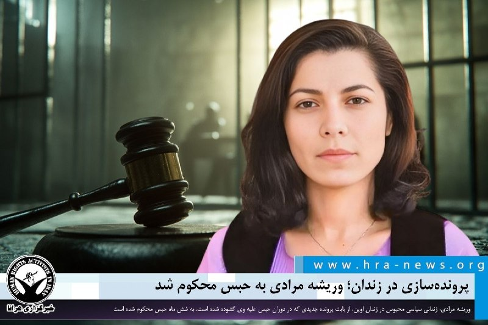

پرونده‌سازی در زندان؛ وریشه مرادی به حبس محکوم شد

❗️
❗️
❗️
❗️
❗️– وریشه مرادی، زندانی سیاسی محبوس در زندان اوین، از بابت پرونده جدیدی که در دوران حبس علیه وی گشوده شده است، به شش ماه حبس محکوم شده است.

به گزارش خبرگزاری هرانا، ارگان خبری مجموعه فعالان حقوق بشر در ایران، وریشه مردای به حبس محکوم شد.

براساس حکمی که اخیراً صادر و به این #زندانی_سیاسی ابلاغ شده است، خانم مرادی از بابت اتهام تبلیغ علیه نظام به شش ماه حبس محکوم شده است.

ادامه مطلب

#وریشه_مرادی

↘️
@hranews_bot تماس ✉️ -  @Hranews  کانال هرانا 🆑

## Hranews — post 112934

گزارشی از بیکاری و تاخیر در پرداخت حقوق کارگران کارخانه صاپنا و شهرداری میناب

❗️
❗️
❗️
❗️
❗️– حدود ۵۰ کارگر کارخانه صاپنا واقع در شهرستان دلفان به علت توقف تولید در این واحد صنعتی، بیکار شده‌اند. همچنین، #کارگران شهرداری میناب اعلام کردند که تاکنون ۷۵٪ از حقوق فروردین ماه خود را دریافت نکرده‌اند.

ادامه مطلب

↘️
@hranews_bot تماس ✉️ -  @Hranews  کانال هرانا 🆑

## Hranews — post 112933

فقدان ایمنی کار؛ مرگ و مصدومیت ۸ کارگر ساختمانی در تبریز

❗️
❗️
❗️
❗️
❗️– در سایه فقدان ایمنی محیط و شرایط نامناسب کار، امروز چهارشنبه ۲۳ اردیبهشت ماه، هشت #کارگر_ساختمانی در تبریز به دنبال ریزش یک ساختمان در حال ساخت، دچار حادثه شدند. در این حادثه دو #کارگر جان باختند و شش تن دیگر مصدوم شدند.

ادامه مطلب

↘️
@hranews_bot تماس ✉️ -  @Hranews  کانال هرانا 🆑

## manototv — post 105420

  <a href="telegram/content/manototv_105420_1778709602.mp4" target="_blank">🎬 Download video</a>

وزارت خارجه امارات متحده عربی گزارش‌ها درباره سفر بنیامین نتانیاهو، نخست‌وزیر اسرائیل، یا استقبال از یک هیات نظامی اسرائیلی را رد کرد.

سخنگوی وزارت خارجه امارات گفت روابط این کشور با اسرائیل، روابطی علنی است که در چارچوب توافق ابراهیم و به‌صورت رسمی و عمومی شکل گرفته و مبتنی بر روابط پنهانی یا توافق‌های مخفی نیست.

او تاکید کرد هرگونه ادعا درباره سفرها یا توافق‌های اعلام‌نشده، تا زمانی که از سوی نهادهای رسمی امارات تایید نشود، بی‌اساس است.

سخنگوی وزارت خارجه امارات همچنین از رسانه‌ها خواست در انتشار اخبار دقت کنند و از بازنشر اطلاعات تاییدنشده خودداری کنند.

## manototv — post 105419

  <a href="telegram/content/manototv_105419_1778709602.mp4" target="_blank">🎬 Download video</a>

تماسی از ایران:
«می‌گفت وضعیت آموزش فاجعه شده…
بچه‌هایی که حتی پایه‌ترین چیزها رو بلد نیستن.»

## manototv — post 105418

  <a href="telegram/content/manototv_105418_1778709603.mp4" target="_blank">🎬 Download video</a>

‌
سنای آمریکا طرح پیشنهادی برای پایان دادن به مشارکت نظامی این کشور در جنگ با جمهوری اسلامی را رد کرد.

این طرح که با هدف الزام دولت آمریکا به خروج نیروهای درگیر در جنگ ارائه شده بود، با ۵۰ رای مخالف در برابر ۴۹ رای موافق تصویب نشد؛ جمهوری‌خواهان سنای آمریکا عمدتاً با محدود شدن اختیارات نظامی دونالد ترامپ مخالفت کردند.

سه سناتور جمهوری‌خواه به این طرح رای مثبت دادند و لیزا مورکوفسکی، سناتور جمهوری‌خواه، برای نخستین بار از زمان آغاز جنگ، به درخواست خروج نیروهای آمریکایی از درگیری با جمهوری اسلامی رای داد.

دموکرات‌ها در هفته‌های اخیر چندین طرح مشابه ارائه کرده‌اند و می‌گویند طبق قانون اساسی آمریکا، اختیار اعلام جنگ در دست کنگره است و باید اختیارات قوه مقننه در برابر دولت حفظ شود.

بر اساس قوانین آمریکا، رئیس‌جمهوری می‌تواند در صورت وجود تهدید فوری، اقدام نظامی را آغاز کند، اما برای ادامه درگیری بیش از ۶۰ روز، نیاز به مجوز کنگره دارد.

## manototv — post 105417

  <a href="telegram/content/manototv_105417_1778709604.mp4" target="_blank">🎬 Download video</a>

‌
میزان، خبرگزاری وابسته به قوه قضاییه جمهوری اسلامی از اعدام محمد عباسی، از بازداشت‌شدگان اعتراضات سراسری دی‌ماه ۱۴۰۴ خبر داد.

میزان نوشت محمد عباسی سحرگاه روز چهارشنبه ۲۳ اردیبهشت در زندان قزلحصار اعدام شده است.

بر اساس گزارش‌های منتشر شده مسئولان زندان قزلحصار از خانواده او برای ملاقات دعوت کرده بودند، اما پس از حضور آن‌ها، اجازه ملاقات داده نشد و خانواده پس از ترک زندان، تلفنی از اجرای حکم اعدام مطلع شدند.

محمد عباسی در جریان اعتراضات دی‌ماه ۱۴۰۴ در ملارد بازداشت و سپس از سوی شعبه ۱۵ دادگاه انقلاب تهران به ریاست ابوالقاسم صلواتی، به اتهام «محاربه» به اعدام محکوم شده بود.

شعبه ۳۹ دیوان عالی کشور با رد فرجام‌خواهی، حکم اعدام محمد عباسی را تایید کرد. در همین پرونده، حکم ۲۵ سال زندان فاطمه عباسی، دختر او، نیز عینا تایید شده و او اکنون در بند زنان زندان اوین نگهداری می‌شود.

بر اساس گزارش امتداد، ابهامات و پرسش‌های متعددی درباره روند رسیدگی و محتوای پرونده این دو متهم وجود داشته، اما وکلای مستقل به دلیل محرومیت از دسترسی به پرونده، امکان بررسی و پیگیری موثر آن را نداشته‌اند.

## manototv — post 105416

  <a href="telegram/content/manototv_105416_1778709604.mp4" target="_blank">🎬 Download video</a>

تماسی از ایران:
درد دلی با چاشنی کمی شوخی
از واقعیتی تلخ از زندگی روزمره مردم

## manototv — post 105415

  <a href="telegram/content/manototv_105415_1778709606.mp4" target="_blank">🎬 Download video</a>

‌
جی‌دی ونس، معاون رئیس‌جمهوری آمریکا، در اظهاراتی درباره برنامه هسته‌ای جمهوری اسلامی گفت با موضع دونالد ترامپ موافق است که جمهوری اسلامی نباید به سلاح هسته‌ای دست پیدا کند.

ونس گفت دولت آمریکا در حال حاضر درگیر یک روند «فعال دیپلماتیک» برای اطمینان از عدم دستیابی جمهوری اسلامی به سلاح هسته‌ای است، اما در عین حال تاکید کرد ترامپ گزینه‌های مختلفی، از جمله گزینه‌های دیپلماتیک و نظامی، در اختیار دارد.

معاون رئیس‌جمهوری آمریکا افزود اولویت اصلی ترامپ، حفاظت از مردم آمریکا و همچنین امنیت جهان در برابر تهدید ناشی از دستیابی جمهوری اسلامی به سلاح هسته‌ای است.

## manototv — post 105414

  <a href="telegram/content/manototv_105414_1778709607.mp4" target="_blank">🎬 Download video</a>

واتس‌اپ قابلیت جدیدی به نام «حالت ناشناس» برای چت با هوش مصنوعی متا معرفی کرده که در آن، گفتگوها ذخیره یا قابل مشاهده نخواهند بود؛ حتی برای خود شرکت متا.
واتس‌اپ می‌گوید این قابلیت برای گفتگو درباره موضوعات حساسی مثل سلامت، روابط و مسائل مالی طراحی شده است.
با این حال، کارشناسان هشدار داده‌اند حذف کامل تاریخچه چت‌ها می‌تواند در صورت بروز آسیب یا سوءاستفاده، پیگیری مسئولیت را دشوار کند.

## manototv — post 105413

  <a href="telegram/content/manototv_105413_1778709607.mp4" target="_blank">🎬 Download video</a>

حساب رسمی سفارت آمریکا در واتیکان اعلام کرد برخلاف برخی گزارش‌های رسانه‌ای، پاپ لئون چهاردهم هیچ افتخار یا نشان ویژه و انحصاری به سفیر جمهوری‌اسلامی در واتیکان اعطا نکرده است.
در این بیانیه آمده است این مدال به همه سفیران مورد تایید واتیکان پس از بیش از دو سال خدمت داده می‌شود و سال‌هاست که یک رویه معمول و استاندارد به شمار می‌رود.
سفارت آمریکا تأکید کرده این تقدیر صرفاً جنبه شخصی دارد و به‌معنای حمایت یا مخالفت با هیچ کشور یا سیاستی نیست.
بر اساس این توضیحات، اخیراً ۱۳ سفیر این نشان را دریافت کرده‌اند و سفیران پیشین آمریکا نیز همین مدال را گرفته بودند.
در ادامه این بیانیه آمده است که این نشان نیز مستقیماً توسط پاپ اهدا نشده است.

## manototv — post 105412

  <a href="telegram/content/manototv_105412_1778709608.mp4" target="_blank">🎬 Download video</a>

تینا قاضی‌مراد، سردبیر خبر منوتو، با انتقاد از وضعیت آموزش و محدودیت‌های اینترنت در ایران گفت مسئله فقط عقب‌ماندگی درسی نیست، بلکه «خروج انسان ایرانی از چرخه تمدن» است.

او گفت جمهوری اسلامی با قطع اینترنت، تعطیلی مکرر مدارس و بی‌ثباتی آموزشی، جامعه ایران را از روند پیشرفت جهانی دور می‌کند و هشدار داد ادامه این وضعیت، انسان ایرانی را به مصرف‌کننده فناوری و در نهایت به حاشیه‌رانده‌شده جهان تبدیل خواهد کرد.

## manototv — post 105411

  <a href="telegram/content/manototv_105411_1778709610.mp4" target="_blank">🎬 Download video</a>

روزنامه‌نگار ارشد سیاسی کانال ۱۲ اسرائیل گزارش داده دفتر نخست‌وزیری اسرائیل تأیید کرد که بنیامین نتانیاهو در جریان جنگ اسرائیل و آمریکا با ایران، سفری محرمانه به امارات متحده عربی داشته و در آنجا با محمد بن زاید آل نهیان، رئیس امارات، دیدار کرده است. در ادامه آمده گزارش‌ها حاکی است این سفر محرمانه به یک تحول تاریخی در روابط اسرائیل و امارات منجر شده است.

## manototv — post 105410

  <a href="telegram/content/manototv_105410_1778709610.mp4" target="_blank">🎬 Download video</a>

عباس عراقچی، وزیر خارجه جمهوری‌اسلامی در شبکه اکس بازداشت چهار شهروند ایرانی در خلیج فارس توسط کویت را تایید کرد. عراقچی در اکس نوشته: «در تلاشی آشکار برای ایجاد اختلاف، کویت به‌طور غیرقانونی به یک قایق ایرانی حمله کرده و چهار تن از شهروندان ما را در خلیج فارس بازداشت کرده است. این اقدام غیرقانونی در نزدیکی جزیره‌ای رخ داد که آمریکا از آن برای حمله به ایران استفاده کرده بود. ما خواستار آزادی فوری شهروندان خود هستیم و حق پاسخ‌گویی را برای خود محفوظ می‌دانیم.» کویت دیروز اعلام کرده بود چهار عضو منتسب به سپاه قصد داشتند از راه دریا وارد کویت شوند و «اقدامات خصمانه» انجام دهند. وزارت کشور کویت اعلام کرد در درگیری با نیروهای امنیتی، یک نیروی کویتی زخمی شده و دو نفر از متهمان نیز فرار کرده‌اند. سفیر جمهوری‌اسلامی نیز در این کشور احضار و یادداشت اعتراضی رسمی به او تحویل داده شده بود.

## manototv — post 105409

  <a href="telegram/content/manototv_105409_1778709611.mp4" target="_blank">🎬 Download video</a>

شعبه اول دادگاه تجدیدنظر استان کهگیلویه و بویراحمد، فیض‌الله آذرنوش، پدر پدرام آذرنوش از جان‌باختگان اعتراضات ۱۴۰۱، به همراه سه شهروند دیگر این پرونده را در مجموع به ۳۰ سال حبس تعزیری محکوم کرد.

بر اساس حکم صادرشده، فیض‌الله آذرنوش با اتهام‌هایی از جمله «تشکیل گروه با هدف برهم زدن امنیت کشور»، «فعالیت تبلیغی علیه جمهوری اسلامی»، «توهین به رهبری» و «اجتماع و تبانی علیه امنیت کشور» در مجموع به ۱۵ سال زندان محکوم شده که پنج سال آن قابل اجراست.

همچنین میلاد کریمی‌نسب به شش سال زندان با پنج سال حبس قابل اجرا، امیرحسین محسنی‌پور به شش سال زندان با سه سال حبس قابل اجرا و مهدی کرمی به سه سال زندان محکوم شدند.

## alonews — post 119833

  <a href="telegram/content/alonews_119833_1778709611.mp4" target="_blank">🎬 Download video</a>

تاج: احتمالا معین موزیک رسمی تیم‌ملی رو بخونه!

@AloSport

## alonews — post 119832

  <a href="telegram/content/alonews_119832_1778709613.webm" target="_blank">🎬 Download video</a>

👈گویا "نصرالله معین" قراره واسه تیم ملی فوتبال به مناسبت حضور تو جام جهانی 2026، آهنگ بخونه!

✅ @AloNews خبر جنگ

## alonews — post 119831

  <a href="telegram/content/alonews_119831_1778709613.mp4" target="_blank">🎬 Download video</a>

👈مارکو روبیو : کشتی‌های چین توی خلیج فارس گیر افتادن یه کشتی باری چینی هم آخر هفته آسیب دیده
- مطمئنم ایران عمداً این کار رو نکرده، ولی به هر حال اتفاق افتاده،واسه همین این کشتی‌های چینی اونجا گیر کردن
- این وضعیت خیلی بی‌ثبات‌کننده‌ست،حتی بیشتر از هر جای دیگه دنیا می‌تونه آسیا رو به هم بریزه، چون انرژی‌شون خیلی به این تنگه‌ها وابسته‌ست
- این به نفع خود چینه که این مسئله رو حل کنه
- ما امیدواریم بتونیم قانع‌شون کنیم نقش فعال‌تری بازی کنن تا ایران رو وادار کنن از کاری که الان تو خلیج فارس داره انجام می‌ده عقب‌نشینی کنه

✅ @AloNews خبر جنگ

## alonews — post 119830

  <a href="telegram/content/alonews_119830_1778709615.webm" target="_blank">🎬 Download video</a>

👈کانال N12: ترامپ داره به صدور دستور برای از سرگیری درگیری با ایران فکر می‌کنه

✅ @AloNews خبر جنگ

## alonews — post 119829

  <a href="telegram/content/alonews_119829_1778709615.webm" target="_blank">🎬 Download video</a>

👈خیلی شیک و‌ مجلسی روی شیشه دفاتر پیشخوان آگهی فروش اینترنت پرو میزنن که تلگرام هم روش بدون فیلتره.

✅ @AloNews خبر جنگ

## alonews — post 119828

  <a href="telegram/content/alonews_119828_1778709615.webm" target="_blank">🎬 Download video</a>

👈مدیرعامل شهر فرودگاهی امام : روزانه بین ۳۵ تا ۴۰ پرواز از فرودگاه انجام می‌شود.

✅ @AloNews خبر جنگ

## alonews — post 119827

  <a href="telegram/content/alonews_119827_1778709615.webm" target="_blank">🎬 Download video</a>

👈خوش‌چشم: ترامپ رفته چین التماس کنه تا میانجی بشه که ایران جنگ رو تموم کنه

✅ @AloNews خبر جنگ

## alonews — post 119826

  <a href="telegram/content/alonews_119826_1778709615.mp4" target="_blank">🎬 Download video</a>

👈تمرینه بمب‌افکنِ " B-52 " و فرود به پایگاه فِرفورد بریتانیا

✅ @AloNews خبر جنگ

## alonews — post 119825

  <a href="telegram/content/alonews_119825_1778709617.webm" target="_blank">🎬 Download video</a>

👈بابک زنجانی: در تاریخ ۲۸ خرداد، شبکه اجتماعی مای دات به‌صورت فراگیر برای عموم بازگشایی و طی مراسمی در برج میلاد رونمایی خواهد شد.

✅ @AloNews خبر جنگ

## alonews — post 119824

  <a href="telegram/content/alonews_119824_1778709617.webm" target="_blank">🎬 Download video</a>

👈روزنامه South China Morning Post: شرکت تصاویر ماهواره‌ای چینی MizarVision که با تحلیل‌های خود از استقرارهای نظامی آمریکا در جنگ آمریکا و اسرائیل علیه ایران به شهرت رسید، افزوده شدن خود به فهرست تحریم‌های آمریکا را به عنوان نشان افتخاری در کمپین استخدامی خود به کار می‌برد.

🔴این استارت‌آپ اطلاعاتی با منابع باز (OSINT) که با نام رسمی Meentropy Technology Hangzhou Co Ltd شناخته می‌شود، در تحلیل داده‌های ماهواره‌های تجاری تخصص دارد و در ماه‌های اخیر چندین بار تحرکات نظامی آمریکا را رصد کرده است.

🔴این شرکت روز جمعه به فهرست تحریم وزارت خزانه‌داری آمریکا اضافه شد که در  پی انتشار «تصاویر با منبع باز که جزئیات فعالیت نظامی آمریکا را در جریان عملیات خشم حماسی (Epic Fury) نشان می‌داد»، صورت گرفته است



✅ @AloNews خبر جنگ

## alonews — post 119822

  <a href="telegram/content/alonews_119822_1778709617.webm" target="_blank">🎬 Download video</a>

👈هزینه نجومی رجیستری گوشی آیفون ۱۷ و گلکسی سامسونگ!

🔴رجیستری پایین ترین گیگ آیفون ۱۷ پرومکس: ۶۰۰ دلار!

✅ @AloNews خبر جنگ

## alonews — post 119821

  <a href="telegram/content/alonews_119821_1778709617.webm" target="_blank">🎬 Download video</a>

👈امارات : خبرهایی که درباره سفر نتانیاهو به امارات پخش شده، صحت نداره

✅ @AloNews خبر جنگ

## alonews — post 119820

  <a href="telegram/content/alonews_119820_1778709617.webm" target="_blank">🎬 Download video</a>

👈عراقچی: نتانیاهو اکنون به‌صورت علنی آنچه را که نهادهای امنیتی ایران مدت‌ها قبل به رهبری ما منتقل کرده بودند، افشا کرده است.

🔴دشمنی با ملت بزرگ ایران، قماری احمقانه‌ است؛ و همکاری و همدستی با اسرائیل در این مسیر، غیرقابل بخشش است.

🔴کسانی که در همدستی با اسرائیل برای ایجاد تفرقه نقش دارند، باید پاسخگو باشند

✅ @AloNews خبر جنگ

## alonews — post 119819

  <a href="telegram/content/alonews_119819_1778709617.webm" target="_blank">🎬 Download video</a>

👈وال‌استریت ژورنال: در حالی‌که نگرانی‌هایی درباره کاهش ذخیره مهمات ایالات متحده وجود دارد، پنتاگون در حال تلاش برای خرید ۱۰٬۰۰۰ موشک کروز کم‌هزینه در طول سه سال است.

✅ @AloNews خبر جنگ

## alonews — post 119818

  <a href="telegram/content/alonews_119818_1778709617.webm" target="_blank">🎬 Download video</a>

👈وزارت خارجه ایالات متحده: امروز، وزارت خارجه به‌طور عمومی پیشنهاد سخاوتمندانه ایالات متحده برای ارائه ۱۰۰ میلیون دلار کمک بشردوستانه مستقیم اضافی به مردم کوبا را که با هماهنگی کلیسای کاتولیک و سایر سازمان‌های بشردوستانه مستقل و قابل اعتماد توزیع خواهد شد، مجدداً اعلام می‌کند.

🔴تصمیم با رژیم کوبا است که پیشنهاد کمک ما را بپذیرد یا از کمک‌های حیاتی نجات‌بخش زندگی خودداری کند و در نهایت در برابر مردم کوبا به دلیل ایستادگی در برابر کمک‌های حیاتی پاسخگو باشد.

✅ @AloNews خبر جنگ

## alonews — post 119817

  <a href="telegram/content/alonews_119817_1778709618.mp4" target="_blank">🎬 Download video</a>

👈کوین وارش با رأی ۵۴ به ۴۵ سنا ایالات متحده به عنوان رئیس فدرال رزرو تأیید شد.

🔴 جان فترمن تنها دموکراتی بود که از این تأیید حمایت کرد

✅ @AloNews خبر جنگ

## alonews — post 119816

  <a href="telegram/content/alonews_119816_1778709619.webm" target="_blank">🎬 Download video</a>

👈وزیر امور خارجه سوریه: دمشق خواهان دستیابی به توافقی امنیتی با اسرائیل است که بر پایه احترام متقابل به حاکمیت دو طرف و حفظ ثبات منطقه شکل بگیرد

✅ @AloNews خبر جنگ

## alonews — post 119815

  <a href="telegram/content/alonews_119815_1778709619.webm" target="_blank">🎬 Download video</a>

👈خبرنگار سی‌بی‌اس مدعی شد: پیشرفت‌هایی در مذاکرات با ایران دیده می‌شود

✅ @AloNews خبر جنگ

## alonews — post 119814

  <a href="telegram/content/alonews_119814_1778709619.webm" target="_blank">🎬 Download video</a>

👈کانال ۱۲ اسرائیل: امارات و اسرائیل به دنبال علنی‌تر کردن روابط خود هستند

✅ @AloNews خبر جنگ

---
📅 بروزرسانی: 1405/02/23 20:17
---

## VahidOOnLine — post 239945

یک شهروند در پیامی به ایران اینترنشنال درباره سرکوب و بحران‌های اقتصادی و معیشتی می‌گوید مردم در ایران گروگان حکومت هستند. او از رهبران آمریکا و اسرائیل می‌خواهد با جمهوری اسلامی مذاکره و آتش‌بس نکنند. صدای این مخاطب با هوش مصنوعی بازخوانی شده است.
‌🏁 🇬🇧 IranintlTV

🤖 @VahidOOnLine

## VahidOOnLine — post 239944

  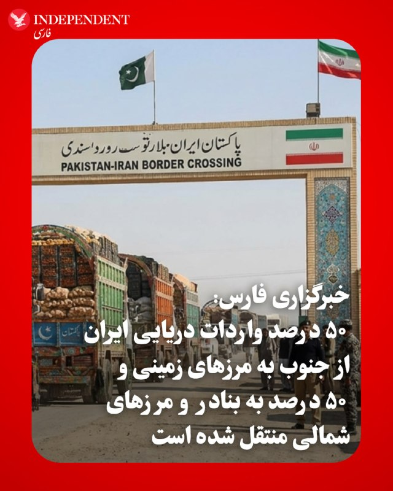

♦️ به گزارش خبرگزاری فارس، در پی اختلال در واردات از بنادر جنوبی به دلیل شرایط جنگی و محاصره دریایی، نیمی از واردات دریایی ایران به مرزهای زمینی و نیمی دیگر به بنادر و مرزهای شمالی منتقل شده است. علی مدنی‌زاده، وزیر اقتصاد، با تایید این تغییر راهبردی اعلام کرد که انتقال گذرگاه‌ها پس از کندی روند واردات از جنوب در دستور کار دولت قرار گرفته است. در حالی که ظرفیت واردات سالانه بنادر جنوبی ۳۸ میلیون تن است، بنادر شمالی کشور با ظرفیت اسمی ۳۰ میلیون تن، پتانسیل بالایی برای جایگزینی دارند.

هم‌زمان، پاکستان با صدور مجوزی رسمی از سوی وزارت بازرگانی، گام مهمی در فعال‌سازی گذرگاه ترانزیتی با ایران برداشته است. این دستور اجازه می‌دهد کالاهای کشورهای ثالث از بنادر گوادر، کراچی و قاسم از طریق مسیرهای جاده‌ای به مرزهای گبد و تفتان منتقل شوند. با توجه به ناپایداری مسیرهای سنتی مانند بنادر امارات در پی محاصره دریایی، گشایش این مسیر جدید امنیت زنجیره تامین ایران را تقویت می‌کند. پیش از این نیز محموله‌های ترانزیتی با موفقیت از مبدا پاکستان و مسیر ایران به مقصد ازبکستان ارسال شده بود.
‌🇸🇦 Indypersian

🤖 @VahidOOnLine

## VahidOOnLine — post 239943

  <a href="telegram/content/VahidOOnLine_239943_1778690852.mp4" target="_blank">🎬 Download video</a>

.
مقام‌های سوریه در ماه مارس «هلا منیر محمد» را به اتهام شکنجه و سوءاستفاده از زندانیان در دوران حکومت بشار اسد بازداشت کردند؛ زنی که به گفته زندانیان سابق، با نام «منیره» در زندان اطلاعات نیروی هوایی دمشق شناخته می‌شد و یکی از مخوف‌ترین نگهبانان این زندان بود.
بر اساس گزارش‌ها، هلا در ظاهر یک آرایشگر شناخته‌شده و مدرس زیبایی در دمشق بود، اما چندین زندانی سابق می‌گویند او در زندان المزّه با ضرب‌وشتم، تحقیر، توهین فرقه‌ای و شکنجه زنان زندانی شناخته می‌شد.
زندانیان سابق می‌گویند تنها صدای او برای ایجاد وحشت در سلول‌ها کافی بود. برخی روایت کرده‌اند او با لوله‌های پلاستیکی زندانیان را کتک می‌زد، موهای زنان را با خشونت می‌برید و هنگام آزار آن‌ها می‌خندید.
گزارش‌ها حاکی است هلا پس از سقوط حکومت اسد همچنان در دمشق زندگی می‌کرد و به‌عنوان آرایشگر فعالیت داشت تا اینکه گروهی از بازماندگان زندان با تحقیقات مستقل او را شناسایی و به مقام‌های جدید سوریه معرفی کردند.
خانواده و برخی آشنایان هلا اتهام‌ها را رد کرده‌اند و می‌گویند او «فقط یک زن جوان» بوده که دستورات مافوق‌ها را اجرا می‌کرده است. سازمان‌های حقوق بشری می‌گویند ده‌ها هزار نفر در دوران جنگ داخلی سوریه در زندان‌های حکومت اسد ناپدید یا کشته شده‌اند و زندان اطلاعات نیروی هوایی المزّه یکی از مراکز اصلی شکنجه و بازداشت بوده است.
‌🏁 🇬🇧 ManotoTV

🤖 @VahidOOnLine

## VahidOOnLine — post 239942

  <a href="telegram/content/VahidOOnLine_239942_1778690854.mp4" target="_blank">🎬 Download video</a>

تصاویری از استقبال از عباس عراقچی، وزیر خارجه جمهوری‌اسلامی در پایتخت هند، توسط رسانه‌های حکومتی منتشر شده است. بر پایه گزارش‌ها او برای شرکت در نشست وزرای خارجه بریکس وارد دهلی نو شده است.
‌🏁 🇬🇧 ManotoTV

🤖 @VahidOOnLine

## VahidOOnLine — post 239941

یک شهروند در پیامی به ایران اینترنشنال درباره سرکوب و بحران‌های اقتصادی و معیشتی می‌گوید مردم در ایران گروگان حکومت هستند. او از رهبران آمریکا و اسرائیل می‌خواهد با جمهوری اسلامی مذاکره و آتش‌بس نکنند. صدای این مخاطب با هوش مصنوعی بازخوانی شده است.
‌🏁 🇬🇧 IranintlTV

🤖 @VahidOOnLine

## VahidOOnLine — post 239933

♦️دونالد ترامپ، رئیس‌جمهوری ایالات متحده همراه با تعدادی از اعضای کابینه‌اش، چهارشنبه شب ۲۳ اردیبهشت، وارد چین شد. مراسم استقبال شبانه با حضور گروهی از جوانان چینی که پرچم‌های چین و آمریکا را در دست داشتند و رژه سربازان انجام شد.

در هواپیمای ریاست جمهوری، اریک ترامپ و همسرش لارا، ایلان ماسک، میلیاردر مشهور و صاحب شرکت‌های تسلا و اسپیس‌ایکس، جن‌سن هوانگ، بنیانگذار و مدیر اجرایی انویدیا و تیم کوک، مدیرعامل اپل، رئیس‌جمهوری آمریکا را همراهی کردند. پیت هگست، وزیر جنگ و مارکو روبیو، وزیر امور خارجه ایالات متحده نیز از دیگر همراهان ترامپ بودند.

مراسم رسمی استقبال و دیدار ترامپ با شی جین‌پینگ، رئیس‌جمهوری چین قرار است روز پنجشنبه در پکن انجام شود.
‌🇸🇦 Indypersian

🤖 @VahidOOnLine

## VahidOOnLine — post 239932

♦️فضای سنای فیلیپین روز چهارشنبه پس از شنیده شدن صدای تیراندازی، به صحنه‌ای پرتنش و آشفته تبدیل شد، اتفاقی که هم‌زمان با افزایش نگرانی‌ها درباره احتمال بازداشت «رونالد دلا روزا» سناتور جنجالی و از چهره‌های اصلی جنگ خونین علیه مواد مخدر در دوران ریاست‌جمهوری رودریگو دوترته رخ داد.
ویدیوهای منتشرشده از شبکه تلویزیونی «تی‌وی۵» فیلیپین، لحظاتی پرهرج‌ومرج را نشان می‌دهد؛ جایی که خبرنگاران و کارکنان سنا پس از شنیده شدن صدای چند گلوله، با اضطراب محل را ترک می‌کنند و صدای فریاد و آشفتگی در ساختمان شنیده می‌شود.
رونالد دلا روزا، رئیس پیشین پلیس فیلیپین از حامیانش خواسته بود برای جلوگیری از تحویلش به دیوان کیفری بین‌المللی وارد عمل شوند.
در همین حال، وزیر کشور فیلیپین اعلام کرد هنوز مشخص نیست چه کسی در ساختمان سنا تیراندازی کرده است.
رونالد دلا روزا یکی از چهره‌های کلیدی «جنگ با مواد مخدر» در دوران ریاست‌جمهوری رودریگو دوترته محسوب می‌شود؛ کارزاری که به کشته شدن هزاران نفر انجامید و سال‌هاست تحت بررسی دیوان کیفری بین‌المللی قرار دارد.
‌🇸🇦 Indypersian

🤖 @VahidOOnLine

## VahidOOnLine — post 239931

  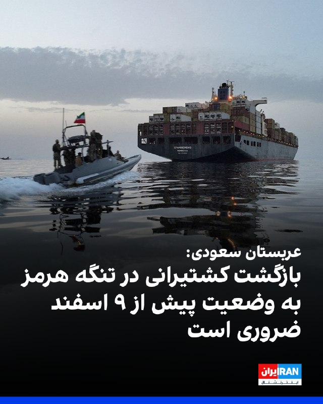

فیصل بن فرحان، وزیر خارجه عربستان سعودی در نشست خبری مشترک با وزیر خارجه اسپانیا در مادرید اعلام کرد که بازگشت کشتیرانی در تنگه هرمز به وضعیت پیش از ۹ اسفند ضروری است.

او اضافه کرد: «امنیت تنگه هرمز و آزادی کشتیرانی، پایه ثبات اقتصاد جهانی به شمار می‌رود. به حمایت از کاهش تنش‌ها و جلوگیری از تشدید بحران ادامه می‌دهیم.»
‌🏁 🇬🇧 IranintlTV

🤖 @VahidOOnLine

## VahidOOnLine — post 239930

  <a href="telegram/content/VahidOOnLine_239930_1778690856.mp4" target="_blank">🎬 Download video</a>

در حالی که مجریان صداوسیما در پاسخ به اعتراض شهروندان به شرایط کشور از جمله سرکوب، وضع معیشتی و قطع اینترنت، خواستار ترک کشور از سوی منتقدان و معترضان می‌شوند، مردم و مخاطبان ایران اینترنشنال در شعار انقلاب دی و همچنین پیام‌های ارسالی خود می‌گویند می‌جنگند و کشور را از حکومت پس می‌گیرند.
‌🏁 🇬🇧 IranintlTV

🤖 @VahidOOnLine

## VahidOOnLine — post 239929

  

سنتکام اعلام کرد از زمان آغاز محاصره دریایی بنادر و سواحل جنوب ایران، ۶۷ کشتی تجاری مجبور به تغییر مسیر شده‌اند. به گفته این نهاد، نیروهای آمریکایی اجازه عبور ۱۵ کشتی حامل کمک‌های بشردوستانه را داده‌اند و چهار کشتی نیز در پی اقدامات این نیروها از کار افتاده‌اند.
‌🏁 🇬🇧 IranintlTV

🤖 @VahidOOnLine

## VahidOOnLine — post 239927

  <a href="telegram/content/VahidOOnLine_239927_1778690860.mp4" target="_blank">🎬 Download video</a>

‌
تصاویر مارکو روبیو، وزیر خارجه آمریکا، با یک ست ورزشی خاکستری در هواپیمای ریاست جمهوری آمریکا، در شبکه‌های اجتماعی خبرساز شد.

در تصویری که توسط استیون چونگ، مدیر ارتباطات کاخ سفید، منتشر شده روبیو دقیقاً همان لباس ورزشی‌ای را پوشیده که نیکلاس مادورو، رئیس‌جمهوری پیشین ونزوئلا، هنگام بازداشت توسط نیروهای آمریکایی در اوایل سال جاری به تن داشت.

مدیر ارتباطات کاخ سفید در توضیح عکس‌ها به شوخی به «Nike Tech ونزوئلا» اشاره کرد.

روبیو در جریان سفر دونالد ترامپ به چین او را همراهی می‌کند؛ سفری که محور آن مسائل تجاری و امنیتی عنوان شده است.
‌🏁 🇬🇧 ManotoTV

🤖 @VahidOOnLine

## VahidOOnLine — post 239926

  <a href="telegram/content/VahidOOnLine_239926_1778690861.mp4" target="_blank">🎬 Download video</a>

سنتکام اعلام کرده یک جنگنده رادارگریز اف-۳۵آ نیروی هوایی آمریکا بر فراز آب‌های منطقه‌ای نزدیک تنگه هرمز عملیات گشت‌زنی انجام داده است و این جنگنده اف-۳۵آ توانایی حمل تا ۱۸ هزار پوند مهمات را دارد و در عین حال می‌تواند با سرعت مافوق صوت پرواز کند.
‌🏁 🇬🇧 ManotoTV

🤖 @VahidOOnLine

## mwarmonitor — post 9044

🚨 «شورای صلح» به رهبری آمریکا قصد دارد اجرای طرح خود برای تشکیل یک حکومت جدید و بازسازی غزه را در بخش‌هایی از غزه که تحت کنترل حماس نیست آغاز کند.

🚨 چرا این مهم است: تصمیم برای رفتن به «طرح B» در غزه پس از آن گرفته شد که تلاش‌ها برای متقاعد کردن حماس به کنار گذاشتن سلاح‌های سنگین خود به بن‌بست رسید. اکنون آمریکا و «شورای صلح» می‌خواهند بدون حضور حماس پیش بروند. باراک راوید خبرنگار آکسیوس

@mwarmonitor

## mwarmonitor — post 9043

  <a href="telegram/content/mwarmonitor_9043_1778690862.mp4" target="_blank">🎬 Download video</a>

🇺🇸چهار هفته پیش، فرماندهی مرکزی آمریکا (CENTCOM) اجرای محاصره علیه کشتی‌هایی را آغاز کرد که وارد یا از بنادر ایران خارج می‌شوند. تا امروز، نیروهای آمریکایی ۶۷ کشتی تجاری را تغییر مسیر داده‌اند، اجازه عبور به ۱۵ کشتی حامل کمک‌های بشردوستانه داده‌اند و ۴ کشتی را برای تضمین رعایت مقررات از کار انداخته‌اند.

🇺🇸اوایل این هفته نیز نیروهای CENTCOM پس از ارتباط رادیویی و شلیک هشداردهنده با سلاح‌های سبک، دو کشتی تجاری را وادار به بازگشت کردند؛ اقدامی که نشان می‌دهد اجرای این محدودیت‌ها همچنان به‌طور کامل برقرار است.

@mwarmonitor

## mwarmonitor — post 9042

  <a href="telegram/content/mwarmonitor_9042_1778690864.mp4" target="_blank">🎬 Download video</a>

📝 این قاب تهوع‌آور، ویترینی از تکثیر ویروس‌هایی است که در لجن‌زار رانت و وقاحت رشد کرده‌اند؛ انگل‌هایی که با پاهای میلیاردی و مغزهای پوچ، روی صندلی‌های دانشگاهی تکیه زده‌اند که حتی آدرسش را هم «حضور ذهن ندارند». وقتی آن ملی‌پوش با پوزخندی ابلهانه از پاسخ به نام دانشگاهش عاجز می‌ماند، در واقع به ریشِ تمام استخوان‌خردکرده‌های علم و سواد شلیک می‌کند. این فاجعه فقط به زمین فوتبال ختم نمی‌شود؛ تزویرِ لزجی که در رگ‌های موجوداتی مثل آن مجریِ نجس‌زاده جریان دارد، وظیفه‌اش عادی‌سازی همین حماقتِ عریان و دکتری‌های پوشالیِ غیرحضوری است. این ویروس‌های بی‌سواد که خونِ بیت‌المال را می‌مکند و با وقاحت تمام از «تحصیلات عالیه» دم می‌زنند، نمادِ فروپاشیِ اخلاقی و فرهنگی هستند که در آن، هرچه متعفن‌تر باشی، عزیزتر و نورچشمی‌تر خواهی بود. شما نه قهرمان هستید و نه الگو، بلکه تنها زالوهایی هستید که در پیکره‌ی نیمه‌جان این ملت جا خوش کرده‌اید.

@mwarmonitor

## mwarmonitor — post 9041

🟥محموله‌های نفتی عراق با انسداد مواجه شدند

🔘سه نفتکش حامل نفت خام و سوخت عراق پس از استفاده از کریدور ترانزیتی تنگه هرمز که تحت کنترل ایران است، در تاریخ ۱۰ مه، بر اساس داده‌های Kpler، در نزدیکی عمان متوقف شده‌اند. این کشتی‌ها با پرچم ایران ثبت نشده‌اند و محموله ایرانی نیز حمل نمی‌کنند، اما خود مسیر عبور اهمیت دارد.

🔘بر اساس گزارش، دفتر کنترل دارایی‌های خارجی آمریکا (OFAC) اعلام کرده است که پرداخت «هزینه ترانزیت ۱ دلاری به ازای هر بشکه» به ایران می‌تواند به‌عنوان حمایت مادی تحت قوانین تحریم‌های آمریکا تلقی شود. با توجه به اینکه محموله‌ها به نقاط بارگیری در عراق مرتبط هستند که پیش‌تر نیز تحت بررسی آمریکا بوده‌اند، این پرونده نشان می‌دهد اجرای محدودیت‌ها اکنون فراتر از منشأ محموله و شامل مسیر حمل، پرداخت‌ها و اسناد نیز می‌شود.

@mwarmonitor

## mwarmonitor — post 9040

🔴وال‌استریت ژورنال : گفته می‌شود معاون رئیس‌جمهور، جی‌دی ونس، در حال برنامه‌ریزی برای ارائه یک اولتیماتوم به هر ۵۰ ایالت آمریکاست: یا به‌طور کامل از قوانین ضدتقلب تبعیت کنند، یا خطر از دست دادن بودجه فدرال مدیکید (Medicaid) را بپذیرند.

@mwarmonitor

## mwarmonitor — post 9039

🔴(رویترز) - پنتاگون قرار است روز چهارشنبه چارچوب توافق‌هایی را اعلام کند که این نهاد را برای احتمال خرید بیش از ۱۰ هزار موشک کم‌هزینه و کانتینری طی سه سال از سال ۲۰۲۷ آماده می‌کند.

🔸در بیانیه‌ای که رویترز پیش از انتشار آن مشاهده کرده، آمده است این توافق‌ها میان پنتاگون و شرکت‌های Anduril، CoAspire، Leidos و Zone 5 منعقد شده و برنامه‌ای با عنوان «مهمات کانتینری کم‌هزینه (LCCM)» را آغاز می‌کند.

🔹مرحله ارزیابی این برنامه شامل خرید موشک‌های آزمایشی از هر چهار شرکت از ژوئن ۲۰۲۶ خواهد بود. در این بیانیه هزینه‌ای ذکر نشده و مشخصات دقیق سامانه‌های تسلیحاتی نیز اعلام نشده، اما گفته شده این توافق‌ها شرایط قراردادهای تولیدی آینده با قیمت ثابت را تعیین می‌کنند.

🔸ارتش آمریکا مدت‌هاست سامانه‌های تسلیحاتی کانتینری را به‌عنوان روشی کم‌هزینه و متحرک برای استقرار موشک‌ها در قالب کانتینرهای استاندارد حمل‌ونقل تبلیغ می‌کند.

🔹در توافقی جداگانه با استارتاپ دفاعی Castelion نیز طرحی برای قرارداد دو‌ساله با حداقل خرید سالانه ۵۰۰ موشک «Blackbeard» ارائه شده است؛ این موشک‌ها نخستین سلاح ضربتی هایپرسونیک این شرکت هستند و پس از تکمیل آزمایش‌ها و تأیید نهایی وارد مرحله قرارداد خواهند شد.

🔸طبق این بیانیه، پنتاگون به دنبال مجوز و بودجه برای خرید بیش از ۱۲ هزار موشک Blackbeard طی پنج سال است.

🔹مایکل دافی، معاون وزیر دفاع در امور خرید و پشتیبانی، گفته این توافق‌ها نشان می‌دهد پنتاگون در حال فاصله گرفتن از پیمانکاران سنتی و گسترش پایگاه صنعتی دفاعی است.

🔸امیل مایکل، معاون وزیر دفاع در امور تحقیق و مهندسی، نیز گفته این توافق‌ها شرکت‌ها را متعهد به تحویل به‌موقع و با هزینه کنترل‌شده می‌کند.

🔹او افزود: «ما با سرعتی بی‌سابقه مهمات مقرون‌به‌صرفه را برای نیروهای خود فراهم خواهیم کرد.»

🔸پنتاگون در حال افزایش درخواست‌های بودجه‌ای خود از کنگره برای تأمین مهمات است؛ موضوعی که با توجه به جنگ جاری در ایران، تقاضا برای آن بالا رفته است.

🔹ژنرال دن کین، رئیس ستاد مشترک ارتش آمریکا، در شهادت کتبی این هفته گفته بود بودجه سال مالی ۲۰۲۷ پنتاگون بیش از ۲۶ میلیارد دلار برای قراردادهای چندساله خرید مهمات حیاتی تأمین خواهد کرد.

@mwarmonitor

## mwarmonitor — post 9038

🇮🇱رئیس ستاد کل ارتش اسرائیل در شمال سامره: «ما واقعیت امنیتی جدیدی در تمام جبهه‌ها ایجاد کرده‌ایم؛ با این حال، نبرد به پایان نرسیده است. ارتش اسرائیل برای ازسرگیری جنگ در صورت نیاز آماده است و در حالت آمادگی و هوشیاری دائمی در دفاع و حمله قرار دارد، از یهودیه و سامره تا تهران»

‏🔸رئیس ستاد کل ارتش اسرائیل، سپهبد ایال زامیر: ‏«ارتش اسرائیل در همه جبهه‌ها با ابتکار و رویکرد تهاجمی عمل می‌کند. ما واقعیت امنیتی جدیدی ایجاد کرده‌ایم — در لبنان به عملیات ادامه می‌دهیم، در لیتانی و مناطق دیگر فعالیت می‌کنیم و هر روز ده‌ها تروریست و زیرساخت را خنثی می‌کنیم.
‏🔸همچنین در غزه به‌صورت تهاجمی عمل کرده و تروریست‌ها را به هلاکت می‌رسانیم و در اینجا در یهودیه و سامره نیز بدون وقفه فعالیت می‌کنیم و به دستاوردها دست می‌یابیم. هیچ‌گونه خویشتنداری وجود ندارد — فقط ابتکار عمل.

‏🔸نبرد هنوز به پایان نرسیده است. ارتش اسرائیل برای ازسرگیری درگیری در صورت نیاز آماده است و در آمادگی و هوشیاری دائمی، در دفاع و حمله، از یهودیه و سامره تا تهران قرار دارد.»

@mwarmonitor

## mwarmonitor — post 9037

  <a href="telegram/content/mwarmonitor_9037_1778690867.mp4" target="_blank">🎬 Download video</a>

🇫🇷مسافران پس از شیوع گاستروانتریت (التهاب معده و روده) روی یک کشتی کروز در فرانسه در قرنطینه نگه داشته شده‌اند. @mwarmonitor

## mwarmonitor — post 9036

🔴 طبق گزارش i24NEWS، بنیامین نتانیاهو نخست‌وزیر اسرائیل قرار است با مقامات ارشد دفاعی درباره تهدید پهپادهای انفجاری حزب‌الله نشست‌های مشورتی امنیتی برگزار کند.

@mwarmonitor

## mwarmonitor — post 9035

  

✈️یک جنگنده رادارگریز F-35A نیروی هوایی ایالات متحده بر فراز آب‌های منطقه‌ای نزدیک تنگه هرمز گشت‌زنی می‌کند.

✈️هواپیما F-35A می‌تواند تا ۱۸٬۰۰۰ پوند مهمات حمل کند و در عین حال با سرعت مافوق صوت پرواز کند.

@mwarmonitor

## mwarmonitor — post 9034

🇫🇷مسافران پس از شیوع گاستروانتریت (التهاب معده و روده) روی یک کشتی کروز در فرانسه در قرنطینه نگه داشته شده‌اند.

@mwarmonitor

## mwarmonitor — post 9033

  <a href="telegram/content/mwarmonitor_9033_1778690871.mp4" target="_blank">🎬 Download video</a>

🇺🇸کاروان خودرویی رئیس‌جمهور ترامپ فرودگاه بین‌المللی پکن را به مقصد هتل ترک می‌کند.

فردا، ترامپ در مراسم رسمی استقبال دولتی شرکت خواهد کرد، با رئیس‌جمهور شی جین‌پینگ دیدار می‌کند، چندین مصاحبه انجام خواهد داد و در چند رویداد رسمی دیگر نیز حضور خواهد داشت.

@mwarmonitor

## mwarmonitor — post 9032

  <a href="telegram/content/mwarmonitor_9032_1778690873.mp4" target="_blank">🎬 Download video</a>

🇺🇸ترامپ در حال حرکت روی فرش قرمز در پکن است — و برای لحظه‌ای حرکت معروف مشت گره‌کرده‌اش را به گارد افتخار نظامی و جوانان پرچم‌به‌دست چینی که صف کشیده‌اند نشان می‌دهد.

@mwarmonitor

## mwarmonitor — post 9031

  <a href="telegram/content/mwarmonitor_9031_1778690876.mp4" target="_blank">🎬 Download video</a>

🇦🇪🇨🇦وزیر دولت در امور دفاعی امارات، وزیر دفاع ملی کانادا را به حضور پذیرفت.

🔸معاون عالی‌رتبه محمد بن مبارک بن فاضل المزروعی، وزیر دولت در امور دفاعی امارات، از دیوید جِی مک‌گینتی، وزیر دفاع ملی کانادا استقبال کرد. این دیدار در راستای تقویت روابط و همکاری‌های دفاعی و نظامی میان امارات متحده عربی و کانادا انجام شد.

🔹در این نشست، دو طرف درباره شماری از موضوعات مورد علاقه مشترک و همچنین راه‌های توسعه همکاری‌های دوجانبه در حوزه‌های دفاعی و نظامی گفت‌وگو کردند؛ همکاری‌هایی که هدف آن حمایت از منافع مشترک دو کشور دوست است. همچنین طرفین دیدگاه‌های خود را درباره تحولات منطقه‌ای و بین‌المللی مرتبط تبادل کردند.

@mwarmonitor

## mwarmonitor — post 9030

🇫🇷 بنا بر این گزارش روزنامه لو فیگارو فرانسه، Emmanuel Macron طی چند ماه گذشته یک «رابطه افلاطونی» با بازیگر ایرانی گلشیفته فراهانی داشته است؛ 🔸 رابطه‌ای که گفته می‌شود «پیام‌هایی داشته که تا حد زیادی پیش رفته‌اند». این موضوع ظاهرا باعث تنش در زندگی زوج ریاست‌جمهوری…

## mwarmonitor — post 9029

🇫🇷 بنا بر این گزارش روزنامه لو فیگارو فرانسه، Emmanuel Macron طی چند ماه گذشته یک «رابطه افلاطونی» با بازیگر ایرانی گلشیفته فراهانی داشته است؛

🔸 رابطه‌ای که گفته می‌شود «پیام‌هایی داشته که تا حد زیادی پیش رفته‌اند». این موضوع ظاهرا باعث تنش در زندگی زوج ریاست‌جمهوری شده و گفته می‌شود به سیلی‌زدن معروف در هواپیما منجر شده است.

@mwarmonitor

## mwarmonitor — post 9028

🔴 سوریه به‌طور رسمی خواستار استرداد بشار اسد از روسیه شده است تا او برای پاسخ‌گویی به اتهامات جنایات جنگی محاکمه شود.

@mwarmonitor

## mwarmonitor — post 9027

  

🔴شرکت سازنده مهمات Czechoslovak Group پیشنهاد داده است بخشی از سهام شرکت تانک‌سازی فرانسوی–آلمانی KNDS را خریداری کند؛ اقدامی که نشانه تلاشی تازه برای یکپارچه‌سازی صنعت دفاعی اروپا به شمار می‌رود. فیننشال تایمز

@mwarmonitor

## mwarmonitor — post 9026

🇨🇳🇺🇸معاون نخست‌وزیر چین، He Lifeng و وزیر خزانه‌داری ایالات متحده، Scott Bessent گفت‌وگوهایی «عمیق، صریح و سازنده» درباره مسائل تجاری و اقتصادی و همچنین درباره «گسترش همکاری‌های عملی» در کره جنوبی انجام دادند.

@mwarmonitor

## mwarmonitor — post 9025

  

✈️🇬🇧نیروی هوایی سلطنتی بریتانیا (RAF) ایرباس KC.2 Voyager ×۳ 43C6FB ZZ338 – ASCOT 9900 43C700 ZZ343 – ASCOT 9901 43C6F7 ZZ334 – ASCOT 9902 ✈️صبح امروز یک عملیات سوخت‌رسانی غیرمعمول از سوی نیروی هوایی سلطنتی بریتانیا در جریان است. سه فروند هواپیمای «ویجر»…

## pm_afshaa — post 90698

  <a href="telegram/content/pm_afshaa_90698_1778690880.webm" target="_blank">🎬 Download video</a>

🔴سنتکام: از آغاز محاصره دریایی 67 کشتی مجبور به تغییر مسیر شدن.

💧 Rainbet.com the #1 Non-KYC Crypto Casino & Sportsbook @rainbetcom

😁 @Pm_Afshaa

## pm_afshaa — post 90697

  <a href="telegram/content/pm_afshaa_90697_1778690881.webm" target="_blank">🎬 Download video</a>

🔴خواسته‌های احتمالی ترامپ از چین سر ایران چیه؟

1- کمک چین به ایران متوقف بشه حالا میخواد نظامی باشه یا اطلاعاتی و...

2- چین رو متقاعد کنه که نفت خودش رو از کشور های دیگه‌ای بجز ایران تامین کنه و نذاره تنگه هرمز بشه محلی برای کسب درآمد ایران.

3- به چین بگه ایندفعه دیگه قطعنامه برعلیه ایران رو تو جلسه شورای حکام وتو نکنن و بذارن رای بیاره تا اجماع جهانی برعلیه ایران شکل بگیره سر تنگه هرمز.

💧 Rainbet.com the #1 Non-KYC Crypto Casino & Sportsbook @rainbetcom

😁 @Pm_Afshaa

## pm_afshaa — post 90696

  <a href="telegram/content/pm_afshaa_90696_1778690882.webm" target="_blank">🎬 Download video</a>

🔴سنتکام با انتشار تصویری، از گشت‌زنی جنگنده پنهان‌کار F-35A آمریکا بر فراز آب‌های نزدیک تنگه هرمز خبر داد.

به گفته سنتکام، این جنگنده توان حمل تا 18 هزار پوند مهمات رو در سرعت مافوق صوت داره.

💧Rainbet.com the #1 Non-KYC Crypto Casino & Sportsbook @rainbetcom

😁 @Pm_Afshaa

## pm_afshaa — post 90695

احسان افرشته امروز صبح توسط جمهوری تروریستی اسلامی اعدام شد 
💧 Rainbet.com the #1 Non-KYC Crypto Casino & Sportsbook @rainbetcom 
😁 @Pm_Afshaa

## pm_afshaa — post 90694

🔴پولیتیکو به نقل از یک مقام ارشد کاخ سفید: چین پیش از دیدار ترامپ به ایران فشار آورده تا با امریکا به توافق برسه

💧 Rainbet.com the #1 Non-KYC Crypto Casino & Sportsbook @rainbetcom

😁 @Pm_Afshaa

## pm_afshaa — post 90693

🔴رئیس ستاد ارتش اسرائیل:
جنگ با ایران پایان نیافته و برای از سرگیری جنگ در هوشیاری کامل قرار داریم. از یهودا و سامره تا تهران برای دفاع و حمله آماده‌ایم.

💧 Rainbet.com the #1 Non-KYC Crypto Casino & Sportsbook @rainbetcom

😁 @Pm_Afshaa

## pm_afshaa — post 90692

  <a href="telegram/content/pm_afshaa_90692_1778690883.webm" target="_blank">🎬 Download video</a>

🔴مجله مادام فیگارو به نقل از فلوریان تاردیف، روزنامه‌نگار فرانسوی: سیلی بریژیت مکرون به همسرش در هواپیما پس از آن رخ داده که اون پیام‌های صمیمانه امانوئل مکرون با گلشیفته فراهانی رو دیده بود.

به گفته تاردیف، مکرون برای چند ماه رابطه‌ای افلاطونی با این گلشیفته فراهانی داشته و در پیام‌هاش جملاتی مثل «به نظرم بسیار زیبا هستید» نوشته بود.

💧 Rainbet.com the #1 Non-KYC Crypto Casino & Sportsbook @rainbetcom

😁 @Pm_Afshaa

## pm_afshaa — post 90691

  <a href="telegram/content/pm_afshaa_90691_1778690883.webm" target="_blank">🎬 Download video</a>

🔴امارات در حال ساخت قفس‌های ضدپهپادی اطراف مراکز مهم و نفتی خودشه و داره برای جنگ آماده میشه.

💧 Rainbet.com the #1 Non-KYC Crypto Casino & Sportsbook @rainbetcom

😁 @Pm_Afshaa

## pm_afshaa — post 90689

  <a href="telegram/content/pm_afshaa_90689_1778690884.webm" target="_blank">🎬 Download video</a>

🔴برنامه‌های ترامپ در چین :

چهارشنبه 13 مه:
مراسم استقبال تو تالار بزرگ خلق
پنجشنبه 14 مه:
ملاقات با شی - ضیافت دولتی با شی
جمعه 15 مه:
جلسه عکس با شی - چای با شی
ناهار با شی و حرکت از پکن به آمریکا

💧Rainbet.com the #1 Non-KYC Crypto Casino & Sportsbook @rainbetcom

😁 @Pm_Afshaa

## pm_afshaa — post 90688

  <a href="telegram/content/pm_afshaa_90688_1778690885.mp4" target="_blank">🎬 Download video</a>

ویدویی دیگر از مراسم استقبال از ترامپ در فرودگاه پکن :

💧 Rainbet.com the #1 Non-KYC Crypto Casino & Sportsbook @rainbetcom

😁 @Pm_Afshaa

## pm_afshaa — post 90687

🔴مراد ویسی میخواد یه لیست از کسایی که تو دی ماه ملت رو کشتن تهیه کنه و هرشب اسم هاشونو تو شبکه اینترنشنال بخونه

💧 Rainbet.com the #1 Non-KYC Crypto Casino & Sportsbook @rainbetcom

😁 @Pm_Afshaa

## pm_afshaa — post 90686

🔴رسانه های عبری: ترامپ قصد دارد تایوان را در ازای ایران، با چین معامله کند

💧 Rainbet.com the #1 Non-KYC Crypto Casino & Sportsbook @rainbetcom

😁 @Pm_Afshaa

## pm_afshaa — post 90684

  <a href="telegram/content/pm_afshaa_90684_1778690888.mp4" target="_blank">🎬 Download video</a>

🔴لحظه ورود دونالد ترامپ به چین-پکن همراه ایلان ماسک و دیگر همراهان :

💧 Rainbet.com the #1 Non-KYC Crypto Casino & Sportsbook @rainbetcom

😁 @Pm_Afshaa

## pm_afshaa — post 90683

  <a href="telegram/content/pm_afshaa_90683_1778690890.mp4" target="_blank">🎬 Download video</a>

ورود هواپیمای ترامپ در پکن و گروه استقبال کننده چین

💧 Rainbet.com the #1 Non-KYC Crypto Casino & Sportsbook @rainbetcom

😁 @Pm_Afshaa

## pm_afshaa — post 90680

🔴سنتکام:همچنان به اعمال محاصره علیه کشتی‌هایی که به داخل ایران وارد می‌شوند یا از آنها خارج می‌شوند، ادامه می‌دهیم

💧 Rainbet.com the #1 Non-KYC Crypto Casino & Sportsbook @rainbetcom

😁 @Pm_Afshaa

## pm_afshaa — post 90679

  <a href="telegram/content/pm_afshaa_90679_1778690893.webm" target="_blank">🎬 Download video</a>

🔴سی‌ان‌ان: پیش‌بینی میشه ترامپ از رئیس‌جمهور چین بخواد که بر ایران فشار بیاره تا تنگه هرمز رو بازگشایی کنه و با یک توافق صلح مناسب موافقت کنه.

💧 Rainbet.com the #1 Non-KYC Crypto Casino & Sportsbook @rainbetcom

😁 @Pm_Afshaa

## pm_afshaa — post 90678

  <a href="telegram/content/pm_afshaa_90678_1778690894.webm" target="_blank">🎬 Download video</a>

🔴اپل به صورت رسمی اولین نمایندگی خودش رو در افغانستان افتتاح کرد..

💧 Rainbet.com the #1 Non-KYC Crypto Casino & Sportsbook @rainbetcom

😁 @Pm_Afshaa

## pm_afshaa — post 90677

  <a href="telegram/content/pm_afshaa_90677_1778690895.webm" target="_blank">🎬 Download video</a>

🔴سخنگوی وزارت خارجه:
آمریکا فعلا با پیشنهاد جمهوری اسلامی موافقت نکرده، اما تهران از طریق میانجی‌های پاکستانی منتظر ارزیابی دقیق‌تره.

💧 Rainbet.com the #1 Non-KYC Crypto Casino & Sportsbook @rainbetcom

😁 @Pm_Afshaa

## pm_afshaa — post 90676

  <a href="telegram/content/pm_afshaa_90676_1778690895.webm" target="_blank">🎬 Download video</a>

🔴رسانه‌های اسرائیلی:
رئیس موساد، حداقل دو بار در طول جنگ به منظور هماهنگی کمپین علیه جمهوری اسلامی به امارات متحده عربی سفر کرده.

💧 Rainbet.com the #1 Non-KYC Crypto Casino & Sportsbook @rainbetcom

😁 @Pm_Afshaa

## iaghapour — post 2606

⭕️ خلاصه اخبار چند روز گذشته

🔸اینترنت بین‌الملل به گیمرها ارائه می‌شود؛ ثبت درخواست در سامانه همگرا (اینترنت طبقاتی)

🔹دولت و مجلس به دنبال حمایت تازه از پیام‌رسان‌های داخلی (رانت و فساد جدید)

🔸نماینده مردم تهران در مجلس: درباره خسارت‌های قطعی اینترنت جوسازی می‌شود. (حرف بیخود)

🔹معاون رئیس‌جمهور: اینترنت بین‌الملل حتما وصل می‌شود؛ دولت قصد دائمی‌کردن محدودیت‌ها را ندارد. (حرف الکی)

🔸برآورد انجمن بلاکچین: خسارت ۳۰۰ تا ۷۰۰ هزار میلیاردی از قطعی اینترنت.

🔹معاون رئیس جمهور: محدودیت حجم و گرانی اینترنت پرو برای جلوگیری از استفاده غیرضروری است. (عجب بابا عجب)

🔸قطع اینترنت به هفتاد و پنجمین روز خود رسید.

🆔 @iaghapour

## iaghapour — post 2605

  

⭕️ با اپ TunnelX در ویندوز از قابلیت Split Tunneling استفاده کنید.

🔹اپ TunnelX برای زمانی ساخته شده که کاربر نمی‌خواهد تمام ترافیک سیستم از وی‌پی‌ان عبور کند. با این برنامه می‌توان فقط برنامه‌هایی مثل مرورگر، تلگرام، ابزارهای توسعه یا برنامه‌های مشخص دیگر را وارد تونل کرد و بقیه ترافیک سیستم را روی اینترنت عادی نگه داشت. همچنین در صورت نیاز، حالت Full-route برای عبور کل سیستم از تونل در دسترس است.

🔗 دانلود اپ از گیت‌هاب پروژه

🆔 @iaghapour

## DEJradio — post 4621

  <a href="telegram/content/DEJradio_4621_1778690897.mp4" target="_blank">🎬 Download video</a>

👑🎥 همدلی و حمایت ایرانیان ونکوور از انقلاب شیر و خورشید

#ونکوور #انقلاب_شیروخورشید
@DEJradio

## DEJradio — post 4620

  <a href="telegram/content/DEJradio_4620_1778690900.webm" target="_blank">🎬 Download video</a>

🚨
🔸 گزارش اختصاصی دژ؛ بازتاب تهدید جنسی دختران مدرسه شرافت، واکنش مردم چه بود؟ روانشناس چه می‌گوید؟

#تهران #آزار_جنسی⁩ #مدرسه_شرافت
@DEJradio

## DEJradio — post 4619

  <a href="telegram/content/DEJradio_4619_1778690901.webm" target="_blank">🎬 Download video</a>

🔺🎤 آتش‌بس یا فقط وقفه‌ای کوتاه در جنگ؟

گفت‌وگو با شهرام خلدی، پژوهشگر تاریخ خاورمیانه

#جمهوری_اسلامی #آتشبس
@DEJradio

## DEJradio — post 4618

  <a href="telegram/content/DEJradio_4618_1778690901.webm" target="_blank">🎬 Download video</a>

🔺📷 تصویر ماهواره‌ای از هواپیمای هرکولس نهاجا در پایگاه هوایی «نورخان» پاکستان

جمهوری اسلامی ایران، طی جنگ ۴۰ روزه بخشی از هواپیماهای نیروی هوایی ارتش را به پاکستان منتقل کرد تا آسیب نبیند.
تصاویر ماهواره‌ای مورخ ۲۵ آوریل ۲۰۲۶ نشان می‌دهد، یک هواپیمای ترابری نظامی ایران از نوع C-130 «هرکولس» داخل پایگاه هوایی «نور خان» پاکستان پارک شده است.

پیش‌تر سی‌بی‌اس به نقل از مقامات آمریکایی گزارش داده بود، مخفیانه به هواپیماهای نظامی ایران اجازه داده است که در پایگاه‌های هوایی‌اش مستقر شوند.

به گفته دو مقام آمریکایی، ایران همچنین برخی از هواپیماهای غیرنظامی خود را به افغانستان منتقل کرده است. مشخص نیست که آیا ایران هواپیمای نظامی هم به افغانستان فرستاده است یا نه.
یک روز بعد وزارت خارجه پاکستان این ادعا را رد کرد و گفت، این هواپیماها «موقت» به پاکستان منتقل شده و مربوط به اسکورت تیم مذاکره کننده جمهوری اسلامی بودند!

#جمهوری_اسلامی #پاکستان
@DEJradio

## DEJradio — post 4616

  <a href="telegram/content/DEJradio_4616_1778690902.webm" target="_blank">🎬 Download video</a>

🚨📷 یک کارشناس نظامی:
سـ.ـپاه پاسداران نگران پیاده‌شدن نیروهای آمریکا و اسرائیل اطراف تهران‌ است

هم‌زمان با برگزاری رزمایش ســ.ـپاه پاسداران در بیابان‌های اطراف تهران، یک کارشناس نظامی به دژ می‌گوید سـ.ـپاه پاسداران نگران پیاده‌شدن نیروهای آمریکا و اسرائیل اطراف تهران است و در رزمایش‌ اخیر خود در اطراف پایتخت، مقابله با هلی‌برن احتمالی نیرو را تمرین می‌کند.

بر اساس گزارش‌های به‌دست آمده، چند یگان سـ.ـپاه متشکل از کادر و بسـ.ـیج در نقاطی که احتمال فرود هواپیما یا هلی‌کوپتر [شبیه هلی‌برن نیرو در دشت مهیار اصفهان در فروردین‌ماه] وجود دارد مستقر شده‌اند.
هم‌زمان نیروهای سـ.ـپاه خود را آماده مانع‌گذاری روی تمام باندهای فرودگاه‌های تهران و اطراف از جمله [فرودگاه خمینی و مهرآباد، پیام کرج، کوشک نصرت، باند متروکه قلعه‌مرغی می‌کنند.]

#جمهوری_اسلامی #IRGCterrorists
@DEJradio

## DEJradio — post 4615

  

👑📌 ایران فقط یک نام نیست…
صدای مادری‌ست که هر شب با ترسِ تلفن زنگ‌خورده می‌خوابد.
چشم‌های خواهری‌ست که عکس برادرش را در آغوش گرفته.
و قلبِ مردمی‌ست که سال‌هاست میان درد و امید ایستاده‌اند.

امروز، جوانانِ این سرزمین را به جرمِ آرزو داشتن اعدام می‌کنند…
به جرمِ آزادی‌خواهی،
به جرمِ زندگی.

ما دور از وطن ایستاده‌ایم،
اما قلب‌مان هنوز در کوچه‌های ایران می‌تپد.
سکوت ما یعنی فراموش شدنِ جان‌هایی که هنوز می‌شود نجات‌شان داد.

بیایید کنار هم باشیم؛
برای انسانیت،
برای آزادی،
برای ایرانی که سزاوارِ زندگی‌ست، نه مرگ.

📍 راهپیمایی اعتراضی
🗓 ۱۷.۰۵.۲۰۲۶
⏰ ساعت ۱۵:۰۰
📌 Trier – Konstantin Basilika

«صدای مردم ایران باشیم… قبل از آنکه دیر شود.»

#نه_به_اعدام
@DEJradio

## DEJradio — post 4614

  <a href="telegram/content/DEJradio_4614_1778690904.mp4" target="_blank">🎬 Download video</a>

🚨
🔸 اذیت و آزار دختران دبیرستان شرافت؛

توضیحات فریبرز کرمی‌زند افسر پیشین پلیس درباره اذیت و آزار دختران دبیرستان «شرافت» تهران توسط ماموران امنیتی

#جمهوری_اسلامی #مدرسه_شرافت
@DEJradio

## DEJradio — post 4613

  <a href="telegram/content/DEJradio_4613_1778690908.mp4" target="_blank">🎬 Download video</a>

🔺🎥 ”ساختمون فرماندهان ارشد سـ.ـپاه در جنگ کاملا داغون شد

یک شهروند خبرنگار از تهران با ارسال ویدیویی از انهدام کامل یکی از اقامتگاه‌های سـ.ـپاه پاسداران نوشت، «این ساختمونی است که فرماندهان ارشد زندگی میکردن همونایی که تو جنگ بمبارون شدن. می‌گن جنگ رو بردیم ولی حتی پول ندارن خونه‌های داغون ‌شده ‌شون رو درست کنن. این دیگه چه جور پیروزیه؟ این فیلمی رو که دیشب تو تهران گرفتم، براتون می‌فرستم.»

#جمهوری_اسلامی #IRGCterrorists
@DEJradio

## DEJradio — post 4612

  <a href="telegram/content/DEJradio_4612_1778690910.mp4" target="_blank">🎬 Download video</a>

🤡
🔺 شخم زدن زمین توسط ارتش برای مقابله با فرود هواپیماهای آمریکا

محمد اکرمی‌نیا سخنگوی ارتش جمهوری اسلامی در مصاحبه با ایرنا ادعا کرده است، عملیات آمریکا برای نجات خلبان‌هایی که در ایران سقوط کرده بودند بیشتر «یک عملیات فریب» بود. به گفته اکرمی‌نیا «احتمالا آن عملیات هم برای سرقت اورانیوم غنی‌شده بود.»
به گفته این مقام ارتش، یکی از اقدامات برای مقابله با ورود نیروهای آمریکایی به خاک ایران، شخم زدن زمین‌ها و باند فرودگاه‌های متروکه بود با این همه آمریکایی‌ها وارد شدند.

#جمهوری_اسلامی #ارتش
@DEJradio

## DEJradio — post 4611

  <a href="telegram/content/DEJradio_4611_1778690913.mp4" target="_blank">🎬 Download video</a>

🔺📢 من دانشجو هستم و تا چند وقت دیگر باید از ایران بروم. چون سیستم های بین المللی قطع است و پدر و مادرم نمی توانند برایم پول واریز کنند، مجبورم مقدار بیشتری دلار ببرم تا هزینه یکسال را داشته باشم. اکثر دستگاه‌های عابربانک قطع هستند و یا پول نمی دهند و اگر هم پول می‌دهند بسیار محدود.

دلار هم تا یک سقفی صرافی‌ها می فروشند. گرفتار شده‌ام. اگر وضع مملکت درست بود مجبور نبودم پدرو مادر و دوست و آشنا را ول کنم و با فوق لیسانس دانشگاه امیرکبیر، تازه بروم از نو درس بخوانم.
مردم همه گرفتارند، بانک‌ها خودشان دنبال پول نقد هستند.

#جمهوری_اسلامی
@DEJradio

## DEJradio — post 4610

  <a href="telegram/content/DEJradio_4610_1778690917.webm" target="_blank">🎬 Download video</a>

🔺📢 یک نماینده مجلس:
دولت میزان خسارت در جنگ را ۲۸.۵ میلیارد دلار اعلام کرده است

میثم ظهوریان، عضو کمیسیون اقتصادی مجلس شواری اسلامی، اعلام کرد گزارش رسمی که دولت مبنا قرار داده و به رهبر جمهوری اسلامی ارائه کرده، میزان خسارت ناشی از جنگ را ۲۸.۵ میلیارد دلار برآورد کرده است.
او با اشاره به جزئیات این گزارش گفت: «حدود ۱۴ میلیارد دلار از این خسارت مربوط به بخش انرژی است.»
به گفته عضو کمیسیون اقتصادی مجلس، از این میزان، حدود هشت میلیارد دلار به بخش گاز مربوط می‌شود که در پی آن ظرفیت تولید کاهش یافته است. همچنین بین پنج تا شش میلیارد دلار به بخش پتروشیمی‌ها آسیب وارد شده است.
میثم ظهوریان افزود: «حدود یک میلیارد دلار از خسارت‌ها نیز به مخازن و خود فرآورده‌ها مربوط است.»

#جنگ۴۰روزه #جمهوری_اسلامی
@DEJradio

## DEJradio — post 4606

  <a href="telegram/content/DEJradio_4606_1778690918.webm" target="_blank">🎬 Download video</a>

🔺📷 پیامدهای جنگ ۴۰ روزه؛ انهدام بوئینگ‌های نیروی هوایی ارتش و ایلیوشین‌های سـ.ـپاه در فرودگاه مهرآباد

طی جنگ ۴۰ روزه بارها به آشیانه و هواپیماهای ارتش و سـ.ـپاه حمله شد. به گفته حمیدرضا صناعی، معاون سازمان هواپیمایی کشوری بیشتر فرودگاه‌های ایران در جنگ آسیب دیدند. او همچنین گفت که ۱۵ هواپیمای مسافربری به طور مستقیم هدف حملات قرار گرفتند و نابود شدند و حدود ۲۰ درصد از ناوگان هوایی فعال کشور کاملا از چرخه خدمت‌رسانی خارج شدند.

همچنین بنابر گزارش‌های منتشرشده، دست‌کم حدود ۳۹ فروند هواپیمای نظامی و ترابری نظامی ایران نیز در این حملات منهدم شدند یا به شدت آسیب دیدند.

#جنگ۴۰روزه #فرودگاه_مهرآباد
@DEJradio

## mamlekate — post 103522

📝 سفر ترامپ به چین؛ از مذاکره درباره ایران و تنگه هرمز تا جنگ تجاری و هوش مصنوعی

دونالد ترامپ، رئیس‌جمهوری آمریکا، در سفری مهم و حساس، روز چهارشنبه وارد پکن شد تا با شی جین‌پینگ، رئیس‌جمهوری چین، دیدار کند؛ دیداری که انتظار می‌رود موضوع‌هایی از جمله جنگ ایران و اختلافات تجاری در آن، محور گفتگوها باشند.

@mamlekate

## mamlekate — post 103521

📝 صادرات نفت از جزیره خارک برای نخستین بار از آغاز جنگ، چند روز متوقف شد

تصاویر ماهواره‌ای نشان می‌دهند صادرات نفت از پایانه اصلی نفتی ایران در جزیره خارک طی روزهای اخیر متوقف شده و همزمان ظرفیت مخازن ذخیره‌سازی این جزیره نیز رو به تکمیل است؛ وضعیتی که می‌تواند جمهوری اسلامی را ناچار به کاهش بیشتر تولید نفت کند.

@mamlekate

## mamlekate — post 103520

  

📿 آگهی دفتر پیشخوان دولت برای فروش اینترنت طبقاتی پرو

📿 «سیم‌کارت سفید» ۱۲۰ میلیون تومان

📿 اینترنت تهدید شدید امنیتیه، ولی پول بدی دیگه تهدید نیست

@mamlekate 
🕊️ مملکته

## mamlekate — post 103519

❓ ساعت ۹:۰۲ دقیقه امروز یه صدای خیلی بلند با ارتعاش زیاد اومد سمت چیذر شنیدیم ما. انگار ۷،۸ کیلومتر فاصله داشت باهامون. ۹:۶ دقیقه و ۹:۱۱ دقیقه هم‌ اومد. آسمون ابری نیست که بگم‌صدای رعد و برقه

❗️ الو این صدا رو ما هم تو جردن شنیدیم فکر کردیم رعد و برقه. سمت کوه های تهران اره ابریه و هوا ابری بود احتمالا همون رعد و برق بود

❗️ این سه تا صدا رو همه شنیدیم. از شرق تا غرب.. لرزه نداشت من که یوسف ابادم ولی صدای مهیبی بود. هوا هم از این بهاری/گرم/ابری طوریاست که همه جوره تو اسمون بود. ولی صدای مهیبی بود همه مون به هم زنگ زدیم.

@mamlekate

## VahidOnline — post 75449

  

ستاد فرماندهی مرکزی ایالات متحده روز چهارشنبه ۲۳ اردیبهشت با تاکید بر ادامه محاصره دریایی بنادر ایران اعلام کرد که از زمان آغاز این عملیات، به ۱۵ کشتی حامل کمک‌های بشردوستانه اجازه عبور داده شده است.

سنتکام در پیامی در شبکه ایکس نوشت که نیروهای آمریکایی طی چهار هفته گذشته ۶۷ کشتی تجاری را وادار به تغییر مسیر کرده و چهار شناور را نیز برای اجرای محاصره «از کار انداخته‌اند».

این فرماندهی همچنین اعلام کرد اوایل هفته جاری، دو کشتی تجاری دیگر پس از تماس رادیویی و شلیک تیر هشدار از سوی نیروهای آمریکایی مسیر خود را تغییر داده و از ادامه حرکت به سمت بنادر ایران منصرف شدند.
@VahidHeadline

📡 @VahidOnline

## VahidOnline — post 75448

  <a href="telegram/content/VahidOnline_75448_1778690921.mp4" target="_blank">🎬 Download video</a>

پاسخ‌های ملی‌پوشان فوتبال در صداوسیما درباره میزان تحصیلات دانشگاهی‌شان جنجالی شد.
در این گفتگو، یکی از ملی‌پوشان در پاسخ به سوال مجری که پرسیده بود «در کدام دانشگاه درس می‌خوانی؟» گفت: «نمی‌دانم، الان حضور ذهن ندارم».

در دوره قبلی جام جهانی نیز انتشار ویدیویی از دروازه‌بان تیم ملی فوتبال ایران که گفته بود «من دکترا دارم»، بحث‌برانگیز شده بود؛ دکترایی که بعدها مشخص شد به‌صورت غیرحضوری در رشته تربیت بدنی دانشگاه پیام نور اخذ شده است.
@VahidOOnLine

📡 @VahidOnline

## VahidOnline — post 75447

  

رویترز به نقل از دو مقام غربی و دو مقام ایرانی گزارش داد عربستان سعودی در جریان جنگ خاورمیانه، در پاسخ به حملاتی که در خاک این کشور انجام شده بود، چندین حمله اعلام‌نشده در ایران انجام داده است.
به گفته دو مقام غربی، این حملات توسط نیروی هوایی عربستان سعودی و در اواخر ماه مارس انجام شده‌اند. یکی از این مقامات گفت این حملات «اقداماتی تلافی‌جویانه در پاسخ به حملاتی بود که عربستان سعودی هدف آن قرار گرفته بود»
رویترز با اشاره به گزارش‌های پیشین درباره حملات امارات متحده عربی به ایران نوشت اقدامات عربستان سعودی و امارات متحده نشان می‌دهد کشورهای عربی خلیج فارس که هدف حملات جمهوری اسلامی قرار گرفته‌اند، به‌تدریج وارد فاز پاسخ‌گویی مستقیم شده‌اند.
@VahidOOnLine

📡 @VahidOnline

## VahidOnline — post 75446

  

یک کمیسیون مستقل اسرائیلی جزئیات تکان‌دهنده‌ای از خشونت جنسی «سیستماتیک و گسترده» توسط حماس و سایر گروه‌های مسلح فلسطینی در جریان حملات ۷ اکتبر ۲۰۲۳ و علیه گروگان‌ها منتشر کرده است.

گزارش ۳۰۰ صفحه‌ای این کمیسیون نتیجه‌گیری می‌کند که تجاوز و شکنجه جنسی «با هدف به حداکثر رساندن درد و رنج» انجام شده است.
@VahidHeadline

📡 @VahidOnline

## VahidOnline — post 75445

  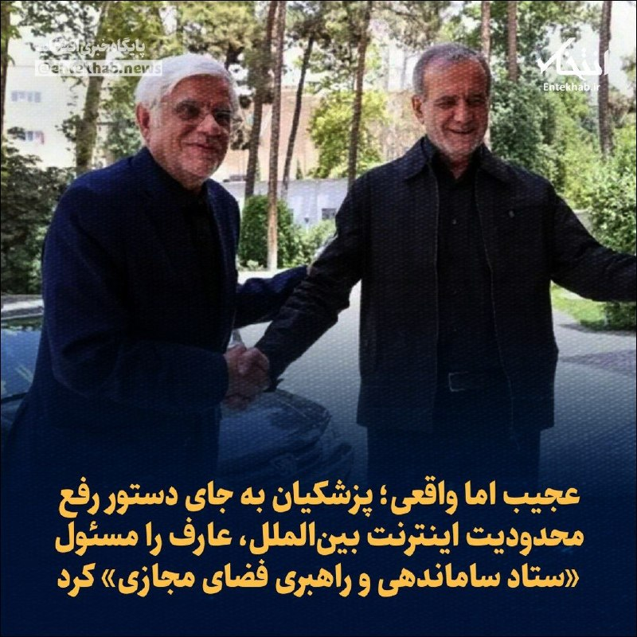

مسعود پزشکیان، رئیس‌جمهور ایران، محمدرضا عارف، معاون اول خود، را به ریاست «ستاد ویژه ساماندهی و راهبری فضای مجازی کشور» منصوب کرد.

در حکم آقای پزشکیان بر «حکمرانی یکپارچه» در فضای مجازی، پایان دادن به «چندصدایی» و جلوگیری از «موازی‌کاری» میان نهادهای مسئول تأکید شده است.

این انتصاب در حالی انجام می‌شود که امروز هفتاد و پنجمین روز اختلال و محدودیت گسترده اینترنت در ایران است.

حکومت ایران از ۹ اسفند (۲۸ فوریه) و همزمان با حملات اسرائیل و آمریکا، دسترسی به اینترنت بین‌الملل را قطع کرد و تماس‌ تلفنی با خارج از ایران هم با اختلال جدی رو‌به‌رو است.
@VahidHeadline

📡 @VahidOnline

## VahidOnline — post 75444

  

به گزارش خبرگزاری مهر، وابسته به سازمان تبلیغات اسلامی، مهدی زارع، زلزله‌شناس و استاد پژوهشگاه بین‌المللی زلزله‌شناسی و مهندسی زلزله با اشاره به زمین‌لرزه به بزرگی ۷.۱ در قرن نوزدهم در گسل شرق تهران گفت: «وقوع زلزله‌های ۴ ریشتری اخیر در ۲۸ فروردین و ۲۲ اردیبهشت در پردیس نشان از تخلیه انرژی دارد. وقوع زمین‌لرزه‌های کوچک به صورت مستمر، بخشی از انرژی گسل را تخلیه می‌کند، ولی این لرزه‌ها می‌توانند نشانه‌ای از ناپایداری در پهنه‌ای وسیع‌تر باشند که مقدمه رویداد بزرگتری است.

به عبارت دیگر، لرزه‌های خرد و متوسط، هرچند تا حدی تنش را کاهش می‌دهند، اما نمی‌توانند به طور قطع احتمال وقوع یک زلزله بزرگ را منتفی کنند. در برخی موارد، چنین توالی‌هایی می‌توانند پیش‌لرزه (foreshock) باشند.»
@VahidOOnLine
امروز پیام‌هایی از پس‌لرزه یا پیش‌لرزه ساعت ۱۲:۳۳ دریافت کرده بودم.
📡 @VahidOnline

## VahidOnline — post 75443

  

احسان شیرخانی، شهروند ۳۵ ساله اهل شهرستان ملکان در استان آذربایجان شرقی، بامداد روز سه‌شنبه ۲۲ اردیبهشت ۱۴۰۵، با شلیک مستقیم نیروهای بسیج در ایست بازرسی شهرستان بناب جان خود را از دست داد.

بر اساس گزارش رسیده به ایران‌وایر، نیروهای مستقر در ایست بازرسی بسیج شهرستان بناب، خودروی این شهروند را به بهانه «عدم توجه به دستور ایست» هدف تیراندازی مستقیم قرار داده‌اند.
یک منبع مطلع در این‌باره به ایران‌وایر گفت که نیروهای بسیج بدون رعایت قانون به‌کارگیری سلاح و بدون شلیک تیر هوایی، مستقیما به سمت اتاق خودرو تیراندازی کرده‌اند. به گفته این منبع، چهار گلوله به احسان شیرخانی اصابت کرده و او در دم جان باخته است.
@VahidHeadline

📡 @VahidOnline

## kianmeli1 — post 87384

  <a href="telegram/content/kianmeli1_87384_1778690926.mp4" target="_blank">🎬 Download video</a>

🔴آشنا: ایران هنوز شگفتی‌هایی برای دشمن دارد

ایران ظرفیت عبور از چالش فعلی را دارد. برای توان نظامی ایران، ۴۷ سال زحمت کشیده شده است. به‌نظر من هیچ‌کس نمی‌داند ایران چقدر قدرت دارد.

اگر قرار است مستقل باشیم آخرش اسلحه‌ها حرف می‌زنند.
https://t.me/kianmeli1

## kianmeli1 — post 87383

  <a href="telegram/content/kianmeli1_87383_1778690929.mp4" target="_blank">🎬 Download video</a>

🔴زنگنه: ۳۰ درصد از گرانی‌ها طبیعی جنگ است / ۳۵ درصد از گرانی‌ها به خاطر ناکارآمدی دستگاه‌هاست

محسن زنگنه، عضو کمیسیون برنامه و بودجه مجلس:
برخی از وزارتخانه‌ها آرایش جنگی ندارند

گزارشات وزارتخانه‌ها مداوم نیست و قطع می‌شود؛ به طور خاص وزارت جهاد کشاورزی اینگونه است

باید در وزارت کشاورزی برنامه ریزی بهتری داشته باشیم که در آینده چه خواهد شد
وزارت جهادکشاورزی یک مرتبه کود را هفت برابر کرده است!
https://t.me/kianmeli1

## kianmeli1 — post 87382

  <a href="telegram/content/kianmeli1_87382_1778690932.mp4" target="_blank">🎬 Download video</a>

🔴تیراندازی در مجلس سنای فیلیپین

به گزارش رویترز حداقل 12 گلوله در مجلس سنای فیلیپین شلیک شد اما یکی از نمایندگان تاکید کرد در این حادثه هیچ فردی زخمی یا کشته نشده است.
https://t.me/kianmeli1

## kianmeli1 — post 87381

  

🔴لبنان شکایتی رسمی به سازمان ملل ارائه کرده و ایران را به نقض کنوانسیون وین ۱۹۶۱ در مورد روابط دیپلماتیک متهم کرده است.

در این شکایت، ایران به «دخالت مستقیم و آشکار در امور داخلی لبنان» و کشاندن این کشور به جنگ متهم شده است.
https://t.me/kianmeli1

## kianmeli1 — post 87380

🔴وزیر کار دولت ابراهیم رئیسی:
در جنگ اخیر ۱۴۷ هزار نفر بیکار شدند نه دو میلیون نفر و این فاجعه نیست

حجت‌الله عبدالملکی، وزیر کار در دولت سیزدهم، در مصاحبه با خبرگزاری دانشجو گفت که در جنگ اخیر ۱۴۷ هزار نفر بیکار شدند نه دو میلیون نفر و این فاجعه نیست.

عبدالملکی افزود: «منابع دولتی برای بیمه بیکاری وجود دارد.»
https://t.me/kianmeli1

## kianmeli1 — post 87379

  <a href="telegram/content/kianmeli1_87379_1778690935.mp4" target="_blank">🎬 Download video</a>

🔴استقبال مقام‌های دولتی چین از ترامپ در فرودگاه پکن

گروهی از مقام‌های عالی‌رتبه دولت چین شامگاه چهارشنبه ۲۳ اردیبهشت از دونالد ترامپ و هیئت همراهش در فرودگاه پکن استقبال کردند.
ترامپ در سال ۲۰۱۷ و در دور نخست ریاست جمهوری به چین سفر کرده بود. روابط دو کشور در دوران جو بایدن به‌‌شدت سرد شد.
https://t.me/kianmeli1

## kianmeli1 — post 87378

  

🔴ایتن لوینز، تحلیلگر و روزنامه‌نگار آمریکایی: امارات متحده عربی شروع به نصب تورهای فلزی مخصوص پهپاد در اطراف انبارهای نفت کرده است تا از حملات ایران محافظت کند.
https://t.me/kianmeli1

## kianmeli1 — post 87377

  

🔴اسکات بسنت، وزیر خزانه‌داری ایالات متحده، پیش از نشست امروز بین دونالد ترامپ، رئیس جمهور ایالات متحده و شی جین پینگ، رئیس جمهور چین در پکن، چین، با هی لیفنگ، معاون نخست وزیر چین، در کره جنوبی دیدار کرد. این مذاکرات که بر همکاری تجاری و اقتصادی بین دو کشور متمرکز بود، پیش از مذاکرات امروز بین تصمیم‌گیرندگان اصلی کشورهای مربوطه که تحت سلطه تجارت، همکاری اقتصادی و تایوان خواهند بود، انجام شد.
https://t.me/kianmeli1

## kianmeli1 — post 87376

  

🔴گفته می‌شود امانوئل مکرون چندین ماه «رابطه افلاطونی» با گلشیفته فراهانی، بازیگر ایرانی، داشته است که شامل «پیام‌هایی بوده که ظاهراً بسیار فراتر رفته‌اند» و باعث ایجاد تنش‌هایی در درون این زوج ریاست جمهوری شده است که گفته می‌شود منجر به سیلی زدن شده است.
https://t.me/kianmeli1

## IranIntlTV — post 337028

یک شهروند در پیامی به ایران اینترنشنال درباره سرکوب و بحران‌های اقتصادی و معیشتی می‌گوید مردم در ایران گروگان حکومت هستند. او از رهبران آمریکا و اسرائیل می‌خواهد با جمهوری اسلامی مذاکره و آتش‌بس نکنند. صدای این مخاطب با هوش مصنوعی بازخوانی شده است.

## IranIntlTV — post 337027

  <a href="telegram/content/IranIntlTV_337027_1778690941.mp4" target="_blank">🎬 Download video</a>

سازمان حقوق بشر برای ورزش نسبت به اجرای حکم اعدام احسان حسینی‌پور، فوتبالیست ۱۹ ساله، هشدار داد.

براساس این گزارش، حکم اعدام او در دیوان عالی تایید شده است. حسینی‌پور در اعتراضات ۱۸ دی‌ماه بازداشت شد.

گفت‌وگو با مهدی رستم‌پور، خبرنگار ورزشی
@iranintltv

## IranIntlTV — post 337026

یک شهروند در پیامی به ایران اینترنشنال درباره سرکوب و بحران‌های اقتصادی و معیشتی می‌گوید مردم در ایران گروگان حکومت هستند. او از رهبران آمریکا و اسرائیل می‌خواهد با جمهوری اسلامی مذاکره و آتش‌بس نکنند. صدای این مخاطب با هوش مصنوعی بازخوانی شده است.

## IranIntlTV — post 337025

  <a href="https://t.me/IranintlTV/337025" target="_blank">📎 Download file</a>

🎧نسخه صوتی اخبار شبانگاهی | چهارشنبه ۲۳ اردیبهشت
@iranintlTV

## IranIntlTV — post 337024

  <a href="telegram/content/IranIntlTV_337024_1778690944.mp4" target="_blank">🎬 Download video</a>

قوه قضاییه جمهوری اسلامی خبر داد احسان افرشته، جوان ۳۳ ساله‌، را به اتهام همکاری با اسرائیل، اعدام کرده اما دو منبع گفتند او، پیش از بازگشت به ایران از ترکیه، به‌طور داوطلبانه خود را به وزارت اطلاعات معرفی کرده بود اما بلافاصله در فرودگاه بازداشت شد.

گزارشی از مجتبا پورمحسن
@iranintltv

## IranIntlTV — post 337023

  <a href="telegram/content/IranIntlTV_337023_1778690947.mp4" target="_blank">🎬 Download video</a>

در پی موج جدید بیکاری در ایران در سایه جنگ و سرکوب، آمار رسمی از بیش از ۲۰۰هزار نفر متقاضی دریافت بیمه بیکاری خبر می‌دهد.

گفت‌وگو با نیکی محجوب، روزنامه‌نگار
@iranintltv

## IranIntlTV — post 337022

  

فیصل بن فرحان، وزیر خارجه عربستان سعودی در نشست خبری مشترک با وزیر خارجه اسپانیا در مادرید اعلام کرد که بازگشت کشتیرانی در تنگه هرمز به وضعیت پیش از ۹ اسفند ضروری است.

او اضافه کرد: «امنیت تنگه هرمز و آزادی کشتیرانی، پایه ثبات اقتصاد جهانی به شمار می‌رود. به حمایت از کاهش تنش‌ها و جلوگیری از تشدید بحران ادامه می‌دهیم.»
https://iranintl.com/202605135219

## IranIntlTV — post 337020

  

🔻احمد دنیامالی، وزیر ورزش جمهوری اسلامی در حاشیه حضور مسعود پزشکیان در اردوی تیم ملی، ضمن اعلام حضور تیم ملی در جام جهانی گفت: «بازیکنان تیم ملی تصمیم گرفته‌اند سرود جمهوری اسلامی را نخوانند، بلکه آن را فریاد بزنند.»

🔹او پیش‌تر حامیان حضور در جام جهانی را «بی‌غیرت» خوانده بود.

🔹دنیامالی در این دیدار مدعی شد: «بازیکنان و اعضای کادر تیم ملی برای دفاع از ایران هم‌قسم شده‌اند و خوش‌بین هستیم که با برنامه‌ریزی انجام گرفته و تلاش‌ کادر فنی، تیم ملی برای کشور افتخارآفرینی کند.»

@iranintltvsport

## IranIntlTV — post 337019

  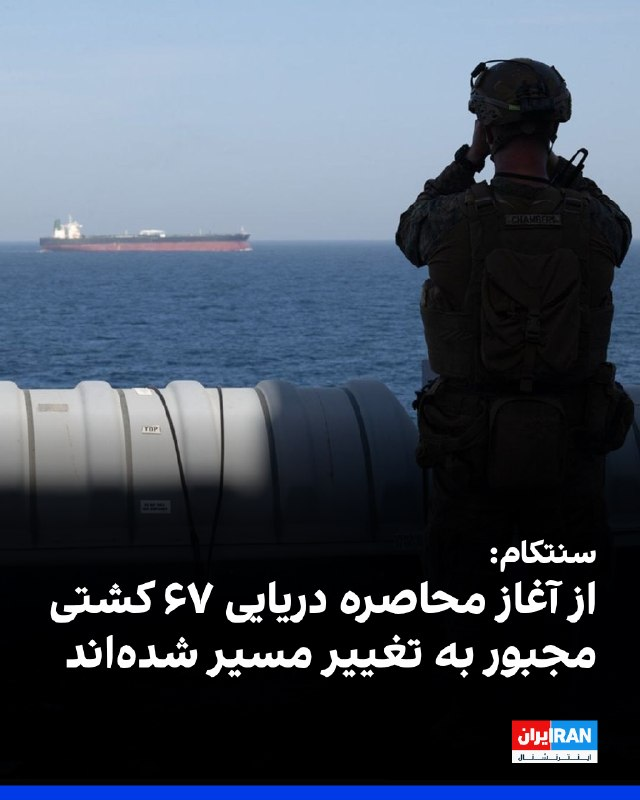

سنتکام اعلام کرد از زمان آغاز محاصره دریایی بنادر و سواحل جنوب ایران، ۶۷ کشتی تجاری مجبور به تغییر مسیر شده‌اند. به گفته این نهاد، نیروهای آمریکایی اجازه عبور ۱۵ کشتی حامل کمک‌های بشردوستانه را داده‌اند و چهار کشتی نیز در پی اقدامات این نیروها از کار افتاده‌اند.
https://iranintl.com/202605135107

## IranIntlTV — post 337018

🔻انتشارات دانشگاه کمبریج اتهامات جعل علمی یک استاد طرفدار خامنه‌ای را بررسی می‌کند

🖋بنجامین واینتال

یک استاد ایرانی-آمریکایی دانشگاه آرکانزاس که اواخر ماه مارس به‌دلیل «فعالیت‌هایی در طرفداری از علی خامنه‌ای رهبر کشته‌شده جمهور اسلامی» از موقعیت رسمی خود برکنار شد، اکنون با تحقیقاتی درباره احتمال تخلفات علمی مواجه است.

انتشارات دانشگاه کمبریج که کتاب شیرین سعیدی، استاد ایرانی-آمریکایی دانشگاه آرکانزاس را منتشر کرده، در حال بررسی اتهاماتی است مبنی بر اینکه این اثر شامل مصاحبه‌های جعلی یا بدون مجوز با زنان قربانی حکومت ایران است. این کتاب بر پایه رساله دکترای شیرین سعیدی نوشته شده است.

ایران‌اینترنشنال دریافته است که دانشگاه کمبریج نیز در حال بررسی رساله دکترای سعیدی به‌دلیل احتمال تقلب است.

دکتر جی سیلوریا، رییس دانشگاه آرکانزاس، سعیدی را به دلایلی غیرمرتبط با تحقیقات کمبریج اخراج کرده است. او این تصمیم را به هیات امنای دانشگاه ابلاغ کرده و قرار است این هیات در ۲۱ مه پرونده اخراج او را بررسی کند.

کتاب سعیدی با عنوان «زنان و جمهوری اسلامی: چگونه شهروندی جنسیتی دولت ایران را شکل می‌دهد» اکنون در بریتانیا زیر ذره‌بین قرار دارد.
سخنگوی انتشارات دانشگاه کمبریج به ایران‌اینترنشنال گفت: «انتشارات دانشگاه کمبریج تمام شکایات مربوط به آثار منتشرشده را جدی می‌گیرد و بررسی مسائل مطرح‌شده را مطابق با دستورالعمل‌های استاندارد COPE ادامه می‌دهد.»

COPE مخفف کمیته اخلاق در انتشار است که به مسائل اخلاقی در آثار علمی می‌پردازد.

ایران‌اینترنشنال نسخه‌ای از نامه‌ای را به دست آورده که مریم نوری، نویسنده خاطرات «در جست‌وجوی رهایی»، به انتشارات دانشگاه کمبریج ارسال کرده و در آن سعیدی را به ساختگی بودن روایت‌هایش متهم کرده است.

نوری، که در سال ۱۹۸۵ در حالی که باردار بود به‌دست جمهوری اسلامی زندانی شد و به‌گفته خودش مجبور شد فرزندش را در زندان به دنیا بیاورد، در نامه‌اش نوشته است: «این نامه را برای ثبت شکایت رسمی درباره استفاده غیراخلاقی و بدون مجوز از خاطرات شخصی‌ام و جعل محتوای مصاحبه از سوی دکتر شیرین سعیدی می‌نویسم.»

او تاکید کرد: «من هرگز با خانم سعیدی ملاقات نکرده‌ام و هیچ‌گونه مصاحبه‌ای با او در شهر کلن یا هیچ شهر دیگری در آلمان نداشته‌ام. او از محتوای کتاب من در رساله دکتری و کتاب منتشرشده خود بدون اجازه کتبی یا شفاهی من استفاده کرده و از آن برای منافع شخصی، از جمله ارتقای جایگاه دانشگاهی و حرفه‌ای خود بهره برده است.»

نوری افزود: «این اقدام را نقض آشکار حقوق و کرامت شخصی خود می‌دانم و آن را به‌شدت محکوم می‌کنم.»
سخنگوی دانشگاه کمبریج نیز اعلام کرد: «دانشگاه اتهامات مربوط به تخلفات علمی را جدی می‌گیرد و هرگونه نگرانی مطرح‌شده را مطابق با سیاست‌ها و رویه‌های مربوطه بررسی می‌کند. این فرایندها ذاتا محرمانه هستند.»

نسرین پروَز، که هشت سال در ایران زندانی و شکنجه شده بود، نیز در مجموعه‌ای از هفت پست در شبکه ایکس در ماه دسامبر، ادعای مصاحبه سعیدی با خود را رد کرد.

او نوشت: «من هرگز سعیدی را نمی‌شناختم و هیچ مصاحبه‌ای با او نداشته‌ام. او فقط از نسخه فارسی کتاب من که بیش از ۲۰ سال پیش منتشر شده استفاده کرده است.»

سعیدی و وکیلش، جی‌جی تامپسون، به پرسش‌های رسانه‌ای ایران‌اینترنشنال پاسخی نداده‌اند.

دانشگاه آرکانزاس پیش از اخراج سعیدی نیز او را به‌دلیل استفاده ادعایی نادرست از سربرگ دانشگاه برای درخواست آزادی حمید نوری مورد تنبیه قرار داده بود. حمید نوری در سال ۲۰۲۲ در دادگاهی در سوئد به‌دلیل مشارکت در اعدام هزاران زندانی سیاسی در زندان گوهردشت در سال ۱۹۸۸ محکوم شد.

سعیدی مدعی است برای استفاده از سربرگ دانشگاه مجوز داشته است.

پروَز در شبکه ایکس نوشت: «دفاع او از حمید نوری، یکی از عاملان اعدام‌های سال ۱۹۸۸، نشان می‌دهد او در کدام سوی تاریخ ایستاده است.»
لادن بازرگان، مدیر سازمان «ائتلاف علیه حامیان رژیم جمهوری اسلامی ایران»، نخستین کسی بود که نقش سعیدی در کمک به حمید نوری در سوئد را افشا کرد.

او که در دادگاه نوری حضور داشت، گفت مترجم دادگاه تایید کرده که سعیدی به نفع نوری مداخله کرده است.

بیژن بازرگان، برادر لادن بازرگان، از زندانیان سیاسی چپ‌گرا بود که در کشتار سال ۱۹۸۸ به‌دست حکومت ایران کشته شد.

بازرگان همچنین موارد ادعایی جعل در آثار علمی سعیدی را شناسایی کرده است.

او به ایران‌اینترنشنال گفت: «زندانیان سیاسی سابقی که نامشان در رساله و کتاب سعیدی آمده، به‌طور علنی انجام مصاحبه با او را رد کرده‌اند و اکنون پرسش‌هایی جدی درباره اسناد، ضبط‌ها، فرم‌های رضایت، دقت استنادها و حتی وجود برخی افراد ذکرشده در این آثار مطرح است.»

🔗ادامه این گزارش را اینجا بخوانید
@iranintltv

## IranIntlTV — post 337017

🔻مدیران انویدیا، تسلا، اپل و بوئینگ، ترامپ را در سفر به چین همراهی می‌کنند

دونالد ترامپ، رییس‌جمهوری آمریکا، در سفر به چین برای دیدار با شی جین‌پینگ، رییس‌جمهوری این کشور، گروهی از مدیران بزرگ‌ترین شرکت‌های آمریکایی از جمله انویدیا، تسلا، اپل، بوئینگ و گلدمن ساکس را با خود همراه کرده است.

ترامپ چهارشنبه ۲۳ اردیبهشت پیش از ورود به پکن، در شبکه اجتماعی تروث‌سوشال نوشت جنسن هوانگ، مدیرعامل انویدیا، همراه او در هواپیمای ریاست‌جمهوری آمریکا حضور دارد و گزارش شبکه سی‌ان‌بی‌سی درباره دعوت نشدن او به این سفر «خبر جعلی» است.

بر اساس آنچه ترامپ نوشت «جنسن، ایلان، تیم اپل، لری فینک، استیون شوارتزمن، کلی اورتبرگ از بوئینگ، برایان سایکس از کارگیل، جین فریزر از سیتی، لری کالپ از جی‌ای ایرواسپیس، دیوید سولومون از گلدمن ساکس، سانجی مهروترا از مایکرون، کریستیانو آمون از کوالکام و بسیاری دیگر» در این سفر حضور دارند.

رییس‌جمهوری آمریکا اعلام کرد قصد دارد در دیدار با شی جین‌پینگ از او بخواهد اقتصاد چین را بیش از پیش به روی شرکت‌ها و سرمایه‌گذاری آمریکایی باز کند.
او نوشت: «از رییس‌جمهوری شی خواهم خواست چین را باز کند تا این افراد بتوانند توانایی‌های خود را به کار بگیرند و به ارتقای جمهوری خلق چین کمک کنند.»

حل مسائل تجاری

رویترز نوشت بیشتر شرکت‌های حاضر در این سفر به دنبال حل مسائل تجاری و محدودیت‌های موجود در بازار چین هستند.

انویدیا از جمله شرکت‌هایی است که برای فروش تراشه‌های پیشرفته هوش مصنوعی خود در چین با محدودیت‌های نظارتی روبه‌رو شده است.

به گزارش رویترز، مذاکرات دو طرف علاوه بر تجارت، موضوعاتی چون جنگ ایران، فروش تسلیحات آمریکا به تایوان، صادرات فناوری‌های پیشرفته، هوش مصنوعی و کاهش تنش‌های تجاری میان واشینگتن و پکن را در بر می‌گیرد.
همزمان اسکات بسنت، وزیر خزانه‌داری آمریکا مذاکره‌کننده تجاری آمریکا، در کره جنوبی با مقام‌های چینی دیدار کرد. خبرگزاری دولتی شین‌هوا این گفت‌وگوها را «صریح، عمیق و سازنده» توصیف کرد.

رویترز نوشت ترامپ در حالی وارد مذاکرات با چین شده که ادامه جنگ ایران و افزایش تورم در آمریکا، فشار سیاسی بر او را افزایش داده است. در مقابل، شی جین‌پینگ با فشار داخلی کمتری روبه‌رو است.

انتظار می‌رود ترامپ در دیدار با شی، از چین بخواهد تهران را برای رسیدن به توافق با واشینگتن و پایان دادن به جنگ ایران ترغیب کند؛ هرچند ترامپ گفته تصور نمی‌کند به کمک پکن نیاز داشته باشد.

چین چهارشنبه بار دیگر مخالفت شدید خود را با فروش تسلیحات آمریکا به تایوان اعلام کرد. هنوز مشخص نیست آیا ترامپ بسته تسلیحاتی ۱۴ میلیارد دلاری برای تایوان را تایید خواهد کرد یا نه.

آمریکا با وجود نداشتن روابط دیپلماتیک رسمی با تایوان، بر اساس قانون موظف است ابزارهای دفاعی لازم را در اختیار این جزیره قرار دهد.
🔗وب‌سایت ایران‌اینترنشنال
@iranintltv

## IranIntlTV — post 337016

  

ارتش اسرائیل و شاباک اعلام کردند حمزه شرباصی، از فرماندهان گردان «شجاعیه» حماس، هفته گذشته در حمله‌ای هوایی در شمال نوار غزه کشته شد؛ فردی که به گفته آن‌ها در حمله هفت اکتبر ۲۰۲۳ به پایگاه «نحل عوز» مشارکت داشت.

بر اساس این بیانیه، شرباصی در جریان حمله هفت اکتبر ۲۰۲۳ وارد خاک اسرائیل شد و در حمله به پایگاه نحل عوز که در آن شماری از سربازان اسرائیلی کشته و ربوده شدند، نقش داشت.

ارتش اسرائیل و شاباک اعلام کردند شرباصی اخیرا در نزدیکی «خط زرد» فعالیت می‌کرد و در چارچوب مسئولیت خود، در پیشبرد طرح‌هایی علیه نیروهای اسرائیلی در منطقه نقش داشت.

در همین حمله، عزام الحیه، پسر ۲۳ ساله خلیل الحیه، مذاکره‌کننده ارشد حماس نیز کشته شد.

به گفته ارتش اسرائیل، الحیه عضو یگان نخبه حماس بود و اخیرا «نقشی مرکزی» در این گروه داشت.

ارتش اسرائیل اعلام کرد نیروهایش در فرماندهی جنوب، مطابق توافق آتش‌بس، همچنان در منطقه مستقر هستند و برای رفع هرگونه تهدید فوری به فعالیت خود ادامه خواهند داد.
https://iranintl.com/202605136406

## IranIntlTV — post 337015

  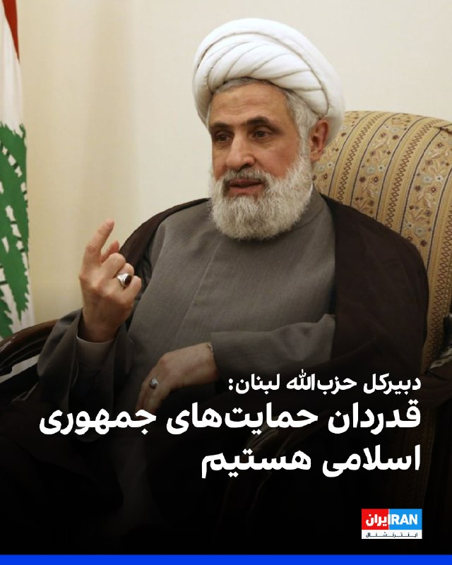

خبرگزاری تسنیم، وابسته به سپاه پاسداران، گزارش داد نعیم قاسم، دبیرکل حزب‌الله لبنان، در پیامی به علیرضا اعرافی، مدیر حوزه‌های علمیه جمهوری اسلامی، اعلام کرد که «مقاومت هرگز تسلیم نخواهد شد.»

نعیم قاسم در پیام خود نوشت: «ما قدردان حمایت خالصانه و مستمر جمهوری اسلامی از ابتدا تا امروز هستیم. حمایتی که با دستور روح‌الله خمینی آغاز شد و تحت هدایت علی خامنه‌ای و از طریق سپاه پاسداران و خصوصا نیروی قدس ادامه یافت.»

دبیرکل حزب‌الله حملات اخیر آمریکا و اسرائیل به جمهوری اسلامی را «حمله به پرچم مقاومت، استقلال و حمایت از فلسطین و قدس» دانست و نوشت با این حال مجتبی خامنه‌ای، این مرحله را نیز با پیروزی پشت سر خواهد گذاشت.
https://iranintl.com/202605137004

## IranIntlTV — post 337014

🔻از مکزیکوسیتی تا نیویورک؛ کالاهای جام جهانی با برچسب «ساخت چین»

کمتر از یک ماه مانده به آغاز جام جهانی فوتبال ۲۰۲۶ در مکزیکوسیتی، موج صادرات کالاهای ساخت چین به کشورهای میزبان این مسابقات آغاز شده است؛ از توپ فوتبال و پرچم گرفته تا لباس هواداری و ماگ‌های ورزشی.

جام جهانی ۲۰۲۶ از ۲۱ خرداد تا ۲۸ تیر ۱۴۰۵ در آمریکا، کانادا و مکزیک برگزار می‌شود و برای نخستین‌بار با حضور ۴۸ تیم در ۱۶ شهر برگزار خواهد شد.

شرکت «کینگدائو واندرفول فلگ» در استان شاندونگ چین اعلام کرد بلافاصله پس از مشخص شدن فهرست تیم‌های حاضر در جام جهانی، سفارش تولید پرچم کشورهای شرکت‌کننده به‌سرعت افزایش یافت. شیائو چانگ‌آی، رییس این شرکت، گفت تولید پرچم تیم‌هایی مانند برزیل، آرژانتین و آلمان از ماه مارس آغاز شده بود، اما با شروع مسابقات، سفارش‌ها به‌صورت لحظه‌ای و با تحویل فوری ثبت خواهند شد.

بر اساس اعلام گمرک چین، این شرکت اکنون به‌صورت شبانه‌روزی فعالیت می‌کند و تولید روزانه آن به بیش از ۱۰۰ هزار پرچم رسیده است.

همزمان شرکت «نینگبو اکو-ویل تکنولوژی» که تولیدکننده ماگ، لیوان و لوازم هواداری است، اعلام کرد صادراتش به آمریکا، کانادا و مکزیک در چهار ماه نخست سال ۲۰۲۶ نسبت به مدت مشابه سال قبل ۴۷ درصد افزایش یافته و به ۴۰ میلیون یوان رسیده است. این شرکت افزایش تقاضا برای کالاهای دارای لوگوی رسمی تیم‌های فوتبال را عامل اصلی رشد صادرات دانست.

داده‌های گمرک نینگبو نشان می‌دهد صادرات تجهیزات و کالاهای ورزشی از این بندر بین ژانویه تا آوریل به ۵.۷۴ میلیارد یوان رسیده که نسبت به سال گذشته بیش از ۱۱ درصد رشد داشته است.
🔗وب‌سایت ایران‌اینترنشنال
@iranintltv

## IranIntlTV — post 337013

  <a href="telegram/content/IranIntlTV_337013_1778690954.mp4" target="_blank">🎬 Download video</a>

وزارت خارجه لبنان با ارسال نامه‌ای رسمی به دبیرکل و رییس شورای امنیت سازمان ملل، از جمهوری اسلامی شکایت کرد. لبنان در این نامه نهادهای جمهوری اسلامی، از جمله سپاه پاسداران را مسئول درگیر شدن این کشور در جنگ، برخلاف خواست دولت معرفی کرد.

گزارش می فرحات، خبرنگار ایران‌اینترنشنال
@iranintltv

## IranIntlTV — post 337012

  <a href="telegram/content/IranIntlTV_337012_1778690957.mp4" target="_blank">🎬 Download video</a>

محسن کدیور، مدرس مطالعات اسلامی در دانشگاه دوک آمریکا، در گفت‌وگو با خبرگزاری جمهوری اسلامی، از تجمعات شبانه حمایت کرد. او که اولین بار پس از ۱۷ سال، حرفهایش اجازه انتشار می‌گیرد، حضور هواداران حکومت در خیابان‌ها را دفاع مردم ایران از میهن توصیف کرد.

گفت‌وگو با محدجواد اکبرین، عضو تحریریه ایران‌اینترنشنال
@iranintltv

## IranIntlTV — post 337011

🔻وال‌استریت ژورنال: رییس موساد در جریان «جنگ ایران» به امارات متحده عربی سفر کرد

دیوید بارنئا، رییس سازمان اطلاعات و وظایف ویژه اسرائیل (موساد)، در جریان جنگ اخیر آمریکا و اسرائیل با جمهوری اسلامی، دست‌کم دو بار به‌صورت محرمانه به امارات متحده عربی سفر کرده تا درباره هماهنگی‌های مرتبط با جنگ گفت‌وگو کند.

روزنامه وال‌استریت ژورنال چهارشنبه ۲۳ اردیبهشت به نقل از مقام‌های عرب و یک منبع آگاه گزارش داد بارنئا در دو ماه‌ گذشته، دست‌کم دو بار با هدف هماهنگی درباره جنگ با جمهوری اسلامی به امارات متحده عربی سفر کرده است.

آنچه در این گزارش آمده است، نشانه‌ای از گسترش همکاری‌های امنیتی میان اسرائیل و امارات متحده عربی است.

وال‌استریت ژورنال نوشت دو کشور در طول جنگ، هماهنگی امنیتی نزدیکی داشته‌اند.
این روزنامه پیش‌تر گزارش داده بود اسرائیل سامانه‌های پدافندی گنبد آهنین و ده‌ها نیروی نظامی را برای مقابله با حملات موشکی و پهپادی جمهوری اسلامی به امارات متحده عربی فرستاده است.

وال‌استریت ژورنال ۲۱ اردیبهشت نیز به نقل از منابع آگاه خبر داد که امارات متحده عربی به‌طور مخفیانه حملاتی به جمهوری اسلامی کرده و در یکی از این حملات در ماه آوریل، پالایشگاه نفتی جزیره لاوان در ایران را هدف قرار داده است.

به‌نوشته وال‌استریت ژورنال، این اقدام می‌تواند امارات را به یکی از طرف‌های فعال جنگی تبدیل کند که در آن، خود بیش از هر کشور دیگری هدف حملات حکومت ایران بوده است.

برخی مقامات جمهوری اسلامی پیش از این از دست داشتن امارات در بعضی حملات به جنوب ایران سخن گفته بودند.

رهبران جمهوری اسلامی در جریان آتش‌بس نیز به تندی به این کشور هشدار داده‌اند.

امارات متحده عربی حتی در جریان آتش‌بس چند بار هدف حملات موشکی و پهپادی قرار گرفته است.

وزارت خارجه امارات متحده عربی و دفتر بنیامین نتانیاهو، نخست‌وزیر اسرائیل، تاکنون به درخواست وال‌استریت ژورنال برای اظهار نظر پاسخ نداده‌اند.
موساد: همین حالا وقت عمل است

کانال ۱۳ اسرائیل ۱۹ اردیبهشت به نقل از یک مقام اسرائیلی که نامش فاش نشده گزارش داد دولت این کشور همچنان در وضعیت «انتظار دائمی» درباره تصمیم مورد انتظار دونالد ترامپ، رییس‌جمهوری آمریکا، در قبال ایران قرار دارد.

بر اساس این گزارش، مقام‌های نظامی و اطلاعاتی اسرائیل در جریان نشست‌های اخیر، مواضعی تهاجمی‌تر علیه تهران را به نتانیاهو ارائه کرده‌اند.

این گزارش افزود ارتش اسرائیل وضعیت کنونی توان نظامی [حکومت] ایران را یک «فرصت عملیاتی» برای از سرگیری حملات و «تکمیل ماموریت» می‌داند.

کانال ۱۳ تلویزیون اسرائیل گزارش داد موساد به نتانیاهو گفته است: «باید همین حالا به ایران حمله کرد.»

بنا بر این گزارش، موساد معتقد است از سرگیری جنگ می‌تواند روند فروپاشی حکومت ایران را تسریع کند.
🔗وب‌سایت ایران‌اینترنشنال
@iranintltv

## IranIntlTV — post 337010

  <a href="https://t.me/IranintlTV/337010" target="_blank">📎 Download file</a>

🎧نسخه صوتی اخبار نیم‌روزی | چهارشنبه ۲۳ اردیبهشت
@iranintlTV

## IranIntlTV — post 337009

  

شاخوان عبدالله، رییس فراکسیون حزب دموکرات کردستان عراق، در گفت‌وگویی اختصاصی با ایران‌اینترنشنال تایید کرد که الزیدی توصیه‌های واشنگتن درباره دور نگه داشتن گروه‌های مسلح از وزارتخانه‌ها را جدی گرفته است.

به گفته عبدالله، تفاوت زیادی میان کابینه السودانی و کابینه الزیدی در زمینه حضور گروه‌های مسلح وجود دارد؛ چرا که در دولت السودانی شمار زیادی از افراد وابسته به گروه‌های مسلح در دولت حضور داشتند، اما تا این لحظه روند در دولت الزیدی به این شکل نیست، مگر این‌که در لحظات آخر تغییراتی ایجاد شود.

فادی الشمری، مشاور نخست‌وزیر، سه‌شنبه در گفت‌وگویی خبری تایید کرده بود آمریکایی‌ها اطلاع داده‌اند که اگر حتی یک وزیر وابسته به گروه‌های مسلح در دولت حضور داشته باشد، به‌طور کامل با دولت همکاری نخواهند کرد.

بر اساس برخی گزارش‌ها، قرار است پنج‌شنبه پارلمان عراق بخشی از کابینه دولت الزیدی را به رای بگذارد.

در عراق، «نخست‌وزیر مکلف» به فردی گفته می‌شود که مامور تشکیل کابینه شده اما هنوز از پارلمان رای اعتماد نگرفته، قدرت اجرایی ندارد و رسما در سمت نخست‌وزیر فعالیت نمی‌کند.
https://iranintl.com/202605138519

## IranIntlTV — post 337008

🔻اینترنت، نابرابری و کنترل روانی در وضعیت بحران

🖋تحلیل - صبا آلاله

اوایل ورود اینترنت، بسیاری آن را فقط یک فناوری تازه یا ابزار سرگرمی می‌دانستند؛ اما به‌تدریج اینترنت از یک امکان جانبی خارج شد و به بخشی از جریان اصلی زندگی تبدیل شد؛ تا جایی که امروز بخش بزرگی از کار، ارتباطات، آموزش و حتی تجربه ما از جهان بدون آن قابل تصور نیست.

امروزه برای میلیون‌ها نفر، اینترنت بخشی از زیرساخت زندگی روزمره و شرط حضور در جهان اجتماعی است. معیشت بخش بزرگی از جامعه نیز به اینترنت وابسته شده است؛ از فروشگاه‌های آنلاین و کسب‌وکارهای کوچک گرفته تا رانندگان تاکسی‌های اینترنتی، افراد شاغل به‌صورت دورکاری و پروژه‌ای، تولیدکنندگان محتوا و مشاغلی که شبکه‌های اجتماعی بستر اصلی فعالیت آن‌هاست.

به همین دلیل، قطع یا محدودسازی اینترنت فقط به معنای کند شدن ارتباطات نیست، بلکه می‌تواند مستقیما جریان زندگی، درآمد و احساس امنیت افراد را مختل کند.

شبکه‌های اجتماعی و پیام‌رسان‌ها در سال‌های اخیر به بخشی از تجربه جمعی جامعه تبدیل شده‌اند؛ فضایی برای حرف زدن، دیده شدن، روایت کردن و شریک شدن در تجربه‌های مشترک. افراد بخش مهمی از احساس باهم‌بودن را در فضای دیجیتال تجربه می‌کنند.

در بحران‌ها، همین فضا می‌تواند به بستری برای همدلی، انتقال تجربه، شکل‌گیری حافظه جمعی و حتی سازماندهی اجتماعی تبدیل شود.

این فضا بخشی از تجربه روانی و اجتماعی انسان امروز شده است؛ جایی که افراد در آن خود را بیان می‌کنند، دیده می‌شوند و احساس می‌کنند به جهان پیرامون متصل‌اند. در چنین شرایطی، محرومیت از اینترنت فقط محرومیت از یک ابزار نیست، بلکه می‌تواند تجربه‌ای از حذف شدن، نادیده گرفته شدن و قطع ارتباط با جهان بیرون باشد؛ وضعیتی که افراد در آن نوعی محرومیت روانی و اجتماعی را تجربه می‌کنند.
اینترنت و کنترل ادارک

با توجه به اینکه اینترنت در جامعه ما همواره با نوسان، کندی و قطعی‌های دوره‌ای همراه بوده، در زمان‌های بحران این اختلال‌ها شدت بیشتری پیدا می‌کند.

این وضعیت نشان می‌دهد که دسترسی به اطلاعات و امکان اشتراک‌گذاری روایت‌ها در شرایط بحرانی به مسئله‌ای حساس تبدیل می‌شود؛ جایی که کنترل یا محدودسازی اینترنت می‌تواند بر آگاهی جمعی و شکل‌گیری روایت‌های عمومی اثر بگذارد. هرچه اینترنت بیشتر در زندگی روزمره ریشه دوانده، حساسیت نسبت به کنترل آن نیز بیشتر شده است.

در لحظه‌های بحران، قطع یا محدودسازی اینترنت فقط به کمبود اطلاعات منجر نمی‌شود، بلکه پیوستگی تجربه مشترک از واقعیت را دچار اختلال می‌کند. افراد به تصویر هم‌زمان و مشترکی از آنچه در حال رخ دادن است دسترسی ندارند؛ خبرها با تاخیر می‌رسند، روایت‌ها ناقص‌اند و منابع مختلف اطلاعاتی هم‌پوشانی ندارند. نتیجه این وضعیت، شکل‌گیری نوعی تعلیق ذهنی و ناامنی جمعی است؛ وضعیتی که در آن تشخیص واقعیت دشوارتر شده و احساس اطمینان نسبت به جهان پیرامون کاهش می‌یابد.

در چنین شرایطی، اختلال در اینترنت می‌تواند درک مشترک جامعه از واقعیت را دچار گسست و آشفتگی کند.
🔗ادامه این مطلب را اینجا بخوانید
@iranintltv

## Shin_Persian — post 5990

  <a href="telegram/content/Shin_Persian_5990_1778690961.mp4" target="_blank">🎬 Download video</a>

U.S. Central Command ✓ @CENTCOM Wed, 13 May 2026 15:19:24 UTC Four weeks ago, CENTCOM began implementing the blockade against ships entering and exiting Iran’s ports. As of today, American forces have redirected 67 commercial vessels, allowed 15 supporting…

## Shin_Persian — post 5989

U.S. Central Command ✓ @CENTCOM
Wed, 13 May 2026 15:19:24 UTC

Four weeks ago, CENTCOM began implementing the blockade against ships entering and exiting Iran’s ports. As of today, American forces have redirected 67 commercial vessels, allowed 15 supporting humanitarian aid to pass, and disabled 4 to ensure compliance.

Earlier this week, CENTCOM forces ensured that 2 commercial vessels turned around to comply with the blockade after communicating via radio and firing warning shots from small arms, clearly demonstrating that U.S. enforcement remains in full effect.

فارسی

چهار هفته پیش، ستاد فرماندهی مرکزی ایالات متحده (سنتکام) اجرای محاصره علیه کشتی‌هایی که به بنادر ایران وارد و یا از آن خارج می‌شدند را آغاز کرد. تا به امروز، نیروهای آمریکایی مسیر ۶۷ شناور تجاری را تغییر داده، به ۱۵ کشتی حامل کمک‌های بشردوستانه اجازه عبور داده و ۴ فروند را برای اطمینان از انطباق با مقررات از کار انداخته‌اند.

در اوایل این هفته، نیروهای سنتکام اطمینان حاصل کردند که ۲ شناور تجاری پس از برقراری ارتباط رادیویی و شلیک تیرهای هشدار توسط سلاح‌های سبک، برای پایبندی به محاصره دور زده و بازگشتند؛ موضوعی که به وضوح نشان می‌دهد اجرای مقررات توسط ایالات متحده همچنان با قوت کامل در جریان است.

𝕏 · @shin_persian

## Shin_Persian — post 5988

Shin ✓ @hey_itsmyturn
Wed, 13 May 2026 13:40:21 UTC

Blast sound in Shiraz
Fars Province, #Iran

فارسی

صدای انفجار در شیراز
استان فارس، #Iran

𝕏 · @shin_persian

## Shin_Persian — post 5987

  

NetBlocks ✓ @netblocks
Wed, 13 May 2026 07:50:00 UTC

💸 #Iran's internet blackout is now past hour 1776, entering its 75th day. The digital censorship measure has led to profiteering and a decline in digital security as government-backed "pro" internet schemes and selective whitelisting result in surveillance, corruption and scams.

فارسی

💸 قطعی اینترنت #ایران اکنون از ساعت ۱۷۷۶ فراتر رفته و وارد هفتاد و پنجمین روز خود شده است. این اقدام در راستای سانسور دیجیتال منجر به سودجویی و کاهش امنیت دیجیتال شده است، چرا که طرح‌های اینترنت «طبقاتی» تحت حمایت دولت و لیست‌های سفید گزینشی، منجر به نظارت، فساد و کلاهبرداری شده است.

𝕏 · @shin_persian

## Shin_Persian — post 5986

  

DefenceGeek 🇬🇧 ✓ @DefenceGeek Wed, 13 May 2026 08:39:27 UTC Running Visible again - B-1 training flight! #FreeIran‌ --- Operation EPIC FURY / Project FREEDOM --- Another B-1 training sortie launching this morning from RAF Fairford (EGVA) is pinging on…

## Shin_Persian — post 5985

DefenceGeek 🇬🇧 ✓ @DefenceGeek
Wed, 13 May 2026 08:39:27 UTC

Running Visible again - B-1 training flight! #FreeIran‌
--- Operation EPIC FURY / Project FREEDOM ---

Another B-1 training sortie launching this morning from RAF Fairford (EGVA) is pinging on FR24/ADSB.

B-1B "MISS40" 85-0060 #AE6BD1 "Doolittle Raiders"
B-1B "MISS41" 86-0102 #AE6BEB "Bad Moon Rising" (visible)

@MATA_osint @LHA2709 @Andyyyyrrrr @ArmchairAdml @jamjake01 @vcdgf555

فارسی

دوباره در حالت مرئی در حال اجرا - پرواز آموزشی B-1! #FreeIran‌
--- عملیات خشم حماسی (EPIC FURY) / پروژه آزادی (Project FREEDOM) ---

یک سورتی پرواز آموزشی دیگر از بمب‌افکن‌های B-1 که امروز صبح از پایگاه هوایی Fairford نیروی هوایی سلطنتی بریتانیا (EGVA) برخاسته است، در FR24/ADSB در حال سیگنال‌دهی است.

B-1B "MISS40" 85-0060 #AE6BD1 "Doolittle Raiders"
B-1B "MISS41" 86-0102 #AE6BEB "Bad Moon Rising" (مرئی)

@MATA_osint @LHA2709 @Andyyyyrrrr @ArmchairAdml @jamjake01 @vcdgf555

𝕏 · @shin_persian

## ManotoTV — post 105408

  <a href="telegram/content/ManotoTV_105408_1778690966.mp4" target="_blank">🎬 Download video</a>

.
مقام‌های سوریه در ماه مارس «هلا منیر محمد» را به اتهام شکنجه و سوءاستفاده از زندانیان در دوران حکومت بشار اسد بازداشت کردند؛ زنی که به گفته زندانیان سابق، با نام «منیره» در زندان اطلاعات نیروی هوایی دمشق شناخته می‌شد و یکی از مخوف‌ترین نگهبانان این زندان بود.
بر اساس گزارش‌ها، هلا در ظاهر یک آرایشگر شناخته‌شده و مدرس زیبایی در دمشق بود، اما چندین زندانی سابق می‌گویند او در زندان المزّه با ضرب‌وشتم، تحقیر، توهین فرقه‌ای و شکنجه زنان زندانی شناخته می‌شد.
زندانیان سابق می‌گویند تنها صدای او برای ایجاد وحشت در سلول‌ها کافی بود. برخی روایت کرده‌اند او با لوله‌های پلاستیکی زندانیان را کتک می‌زد، موهای زنان را با خشونت می‌برید و هنگام آزار آن‌ها می‌خندید.
گزارش‌ها حاکی است هلا پس از سقوط حکومت اسد همچنان در دمشق زندگی می‌کرد و به‌عنوان آرایشگر فعالیت داشت تا اینکه گروهی از بازماندگان زندان با تحقیقات مستقل او را شناسایی و به مقام‌های جدید سوریه معرفی کردند.
خانواده و برخی آشنایان هلا اتهام‌ها را رد کرده‌اند و می‌گویند او «فقط یک زن جوان» بوده که دستورات مافوق‌ها را اجرا می‌کرده است. سازمان‌های حقوق بشری می‌گویند ده‌ها هزار نفر در دوران جنگ داخلی سوریه در زندان‌های حکومت اسد ناپدید یا کشته شده‌اند و زندان اطلاعات نیروی هوایی المزّه یکی از مراکز اصلی شکنجه و بازداشت بوده است.

## ManotoTV — post 105407

  <a href="telegram/content/ManotoTV_105407_1778690968.mp4" target="_blank">🎬 Download video</a>

تصاویری از استقبال از عباس عراقچی، وزیر خارجه جمهوری‌اسلامی در پایتخت هند، توسط رسانه‌های حکومتی منتشر شده است. بر پایه گزارش‌ها او برای شرکت در نشست وزرای خارجه بریکس وارد دهلی نو شده است.

## ManotoTV — post 105405

  <a href="telegram/content/ManotoTV_105405_1778690969.mp4" target="_blank">🎬 Download video</a>

‌
تصاویر مارکو روبیو، وزیر خارجه آمریکا، با یک ست ورزشی خاکستری در هواپیمای ریاست جمهوری آمریکا، در شبکه‌های اجتماعی خبرساز شد.

در تصویری که توسط استیون چونگ، مدیر ارتباطات کاخ سفید، منتشر شده روبیو دقیقاً همان لباس ورزشی‌ای را پوشیده که نیکلاس مادورو، رئیس‌جمهوری پیشین ونزوئلا، هنگام بازداشت توسط نیروهای آمریکایی در اوایل سال جاری به تن داشت.

مدیر ارتباطات کاخ سفید در توضیح عکس‌ها به شوخی به «Nike Tech ونزوئلا» اشاره کرد.

روبیو در جریان سفر دونالد ترامپ به چین او را همراهی می‌کند؛ سفری که محور آن مسائل تجاری و امنیتی عنوان شده است.

## ManotoTV — post 105404

  <a href="telegram/content/ManotoTV_105404_1778690970.mp4" target="_blank">🎬 Download video</a>

سنتکام اعلام کرده یک جنگنده رادارگریز اف-۳۵آ نیروی هوایی آمریکا بر فراز آب‌های منطقه‌ای نزدیک تنگه هرمز عملیات گشت‌زنی انجام داده است و این جنگنده اف-۳۵آ توانایی حمل تا ۱۸ هزار پوند مهمات را دارد و در عین حال می‌تواند با سرعت مافوق صوت پرواز کند.

## ManotoTV — post 105403

  <a href="telegram/content/ManotoTV_105403_1778690971.mp4" target="_blank">🎬 Download video</a>

ایال زمیر، رییس ستاد کل ارتش اسرائیل، در جریان سفر به کرانه باختری گفت: «ما در همه جبهه‌ها واقعیت امنیتی جدیدی ایجاد کرده‌ایم، با این حال نبرد به پایان نرسیده است.»
او افزود: «ارتش اسرائیل برای ازسرگیری جنگ در صورت نیاز آماده است و در دفاع و حمله، از یهودا و سامره تا تهران، در آمادگی و هوشیاری دائم قرار دارد.

## ManotoTV — post 105402

  <a href="telegram/content/ManotoTV_105402_1778690971.mp4" target="_blank">🎬 Download video</a>

در پی تلاش مقام‌های فیلیپین برای بازداشت رونالد دلا روزا، سناتور نزدیک به رودریگو دوترته، در ساختمان سنای این کشور تیراندازی رخ داد.
دلا روزا که از سوی دادگاه کیفری بین‌المللی به «جنایت علیه بشریت» در ارتباط با جنگ خونین ضد مواد مخدر دوترته متهم شده، دو شب گذشته را در ساختمان سنا سپری کرده تا از بازداشت فرار کند.
او روز دوشنبه با فرار از مقابل ماموران دولتی در راهروها و پله‌های سنا، خود را به صحن اصلی ساختمان رساند و تحت حمایت رئیس سنا، از متحدان دوترته، قرار گرفت.
رسانه‌های محلی گزارش دادند شامگاه چهارشنبه نیروهای نظامی مسلح وارد ساختمان سنا شدند و ساعاتی بعد صدای تیراندازی در محل شنیده شد.
رودریگو دوترته سال گذشته در مانیل بازداشت و به دادگاه کیفری بین‌المللی منتقل شد؛ جایی که به‌دلیل هزاران کشته در جریان عملیات ضد مواد مخدر با اتهام جنایت علیه بشریت روبه‌رو است.

## ManotoTV — post 105401

  <a href="telegram/content/ManotoTV_105401_1778690972.mp4" target="_blank">🎬 Download video</a>

مقام‌های فرانسه اعلام کردند بیش از هزار مسافر یک کشتی تفریحی تحت مدیریت بریتانیا پس از شیوع بیماری گوارشی در این کشتی، اجازه پیاده شدن در بندر بوردو را ندارند.
بر اساس گزارش‌ها، ۴۹ نفر در کشتی «Ambition» علائمی شبیه گاستروآنتریت نشان داده‌اند و سه مسافر در کابین‌های خود قرنطینه شده‌اند.
گاستروآنتریت یا التهاب معده و روده یک بیماری عفونی دستگاه گوارش است. این بیماری اغلب توسط ویروس‌ها مثل نوروویروس یا روتاویروس ایجاد می‌شود، اما گاهی باکتری یا غذای آلوده هم عامل آن است. در کشتی‌های تفریحی، شیوع این بیماری رایج‌تر است چون افراد زیادی در فضای بسته و مشترک حضور دارند و ویروس به‌سرعت منتقل می‌شود. اعلام شده یک مرد ۹۲ ساله نیز روز یکشنبه در کشتی جان باخته، اما هنوز ارتباطی میان مرگ او و بیماری گوارشی تأیید نشده است.
این شرکت می‌گوید اقدامات بهداشتی و ضدعفونی گسترده در کشتی اجرا شده و به مسافران درباره رعایت بهداشت و گزارش علائم هشدار داده شده است.
کشتی «Ambition» با ۱۱۸۷ مسافر و ۵۱۴ خدمه، هشتم مه سفر خود را از بلفاست آغاز کرده بود.

## ManotoTV — post 105400

  <a href="telegram/content/ManotoTV_105400_1778690973.mp4" target="_blank">🎬 Download video</a>

دونالد ترامپ پس از ورود به پکن، در مراسمی رسمی با فرش قرمز، گارد احترام نظامی و صدها نفر از جوانان چینی مورد استقبال مقام‌های چین قرار گرفت. در تصاویر ثبت شده ایلان ماسک نیز در جمع همراهان ترامپ حضور دارد.
ترامپ امروز برنامه عمومی دیگری ندارد، اما قرار است پنجشنبه و جمعه چندین بار با شی جین‌پینگ دیدار کند. او پیش از سفر گفته بود محور اصلی گفت‌وگوها با رئیس‌جمهور چین، تجارت و توافق‌های اقتصادی خواهد بود.
این سفر در حالی انجام می‌شود که جنگ آمریکا و اسرائیل با ایران و افزایش تورم، فشارهایی بر محبوبیت ترامپ در داخل آمریکا وارد کرده است.
ترامپ پیش از ترک آمریکا گفت: «ما دو ابرقدرت جهان هستیم. آمریکا از نظر نظامی قدرتمندترین کشور دنیاست و چین را نفر دوم می‌دانند.»

## ManotoTV — post 105399

  <a href="telegram/content/ManotoTV_105399_1778690975.mp4" target="_blank">🎬 Download video</a>

یک نفتکش وابسته به شرکت دولتی نفت ابوظبی پس از حمله پهپادی جمهوری‌اسلامی در هفته گذشته، دچار نشت محدود سوخت در سواحل عمان شده است.
رویترز گزارش داده مقدار کمی از سوخت کشتی که به نظر می‌رسد سوخت بانکر بوده، در پی این حادثه نشت کرده است.
انور قرقاش، مشاور رئیس امارات، پیش‌تر حمله چهارم مه به این نفتکش را «دزدی دریایی» توصیف کرده بود. گزارش شده در زمان حمله کسی آسیب ندیده و کشتی حامل بار نبوده است.
این نفتکش با نام «MV Barakah» همچنان در سواحل عمان لنگر انداخته و شرکت می‌گوید در حال همکاری نزدیک با مقام‌های مربوطه و تیم‌های تخصصی واکنش به بحران است.

## ManotoTV — post 105398

  <a href="telegram/content/ManotoTV_105398_1778690976.mp4" target="_blank">🎬 Download video</a>

هواپیمای ریاست‌جمهوری آمریکا دقایقی پیش در پایتخت چین به زمین نشست و دونالد ترامپ سفر خود برای دیدار با شی جین‌پینگ، رئیس‌جمهور چین، را آغاز کرد. این نخستین سفر رسمی یک رئیس‌جمهور مستقر آمریکا به چین از زمان سفر ترامپ در سال ۲۰۱۷ است.

## ManotoTV — post 105397

  <a href="telegram/content/ManotoTV_105397_1778690978.mp4" target="_blank">🎬 Download video</a>

تماسی از ایران؛
تجربه‌ی یک آموزگار از آموزش مجازی

## ManotoTV — post 105396

  <a href="telegram/content/ManotoTV_105396_1778690981.mp4" target="_blank">🎬 Download video</a>

هواپیمای ریاست‌جمهوری آمریکا دقایقی پیش در پایتخت چین به زمین نشست و دونالد ترامپ سفر خود برای دیدار با شی جین‌پینگ، رئیس‌جمهور چین، را آغاز کرد.

## ManotoTV — post 105395

  <a href="telegram/content/ManotoTV_105395_1778690981.mp4" target="_blank">🎬 Download video</a>

وال‌استریت ژورنال به نقل از مقام‌های عرب و یک منبع آگاه گزارش داد رئیس سازمان اطلاعات اسرائیل، موساد، در جریان جنگ با ایران دست‌کم دو بار به‌صورت محرمانه به امارات متحده عربی سفر کرده است.
بر اساس این گزارش، دیوید بارنیا، رئیس موساد، در ماه‌های مارس و آوریل برای هماهنگی درباره جنگ با ایران به امارات رفته بود؛ اقدامی که نشانه‌ای از گسترش همکاری‌های امنیتی میان اسرائیل و کشورهای عربی خلیج فارس توصیف شده است.
این گزارش می‌افزاید اسرائیل در طول جنگ، سامانه‌های دفاع موشکی «گنبد آهنین» و ده‌ها نیروی نظامی را برای مقابله با حملات موشکی و پهپادی جمهوری‌اسلامی به امارات اعزام کرده بود.
وال‌استریت ژورنال همچنین نوشت امارات در حملات نظامی علیه اهدافی در ایران مشارکت داشته؛ از جمله حمله به یک پالایشگاه در جزیره لاوان در خلیج فارس. وزارت خارجه امارات و دفتر نخست‌وزیر اسرائیل تاکنون به درخواست‌های وال‌استریت ژورنال برای اظهار نظر پاسخ نداده‌اند.

## ManotoTV — post 105394

  <a href="telegram/content/ManotoTV_105394_1778690982.mp4" target="_blank">🎬 Download video</a>

رویترز گزارش داد عراق و پاکستان برای انتقال نفت و گاز از تنگه هرمز با جمهوری‌اسلامی به توافق رسیده‌اند؛ اقدامی که به گفته منابع آگاه، نشان‌دهنده افزایش کنترل تهران بر این آبراه راهبردی است.
بر اساس این گزارش، عراق عبور دو نفتکش بزرگ را با هماهنگی ایران انجام داده و پاکستان نیز انتقال محموله‌های گاز مایع طبیعی قطر را از مسیر هرمز با توافق تهران پیش می‌برد.
منابع رویترز می‌گویند جمهوری‌اسلامی اکنون به‌جای بستن تنگه هرمز، در حال کنترل عبور کشتی‌هاست و برخی کشورهای دیگر نیز در حال بررسی توافق‌های مشابه هستند.

## ManotoTV — post 105393

  <a href="telegram/content/ManotoTV_105393_1778690983.mp4" target="_blank">🎬 Download video</a>

خبرگزاری رسمی امارات گزارش داد دولت امارات متحده عربی ۲۱ فرد و نهاد لبنانی را به‌دلیل ارتباط با حزب‌الله در فهرست تحریم قرار داده است.
بر اساس این گزارش، ۱۶ شهروند لبنانی و پنج سازمان مستقر در امارات به حمایت از گروه‌هایی متهم شده‌اند که از سوی ابوظبی «تروریستی» شناخته می‌شوند.
مقام‌های نظارتی امارات موظف شده‌اند افراد و نهادهای تحریم‌شده را شناسایی کرده و ظرف ۲۴ ساعت اقدامات لازم، از جمله مسدود کردن دارایی‌های آن‌ها، را انجام دهند.
امارات که میزبان جمعیت بزرگی از لبنانی‌هاست، در جریان جنگ منطقه‌ای ناشی از حملات آمریکا و اسرائیل به ایران، یکی از اصلی‌ترین اهداف حملات موشکی و پهپادی جمهوری اسلامی بود.

## ManotoTV — post 105392

  <a href="telegram/content/ManotoTV_105392_1778690984.mp4" target="_blank">🎬 Download video</a>

آژانس بین‌المللی انرژی پیش‌بینی کرده است که در پی اختلال‌های ناشی از درگیری‌های خاورمیانه، عرضه جهانی نفت در سال ۲۰۲۶ روزانه ۳.۹ میلیون بشکه کاهش یابد.
این نهاد همچنین انتظار دارد تقاضای جهانی نفت در سال جاری روزانه ۴۲۰ هزار بشکه کاهش پیدا کند، اما میزان افت عرضه بسیار بیشتر از کاهش تقاضا خواهد بود.
آژانس بین‌المللی انرژی در تازه‌ترین گزارش بازار نفت خود اعلام کرد:
«بیش از ۱۰ هفته پس از آغاز جنگ در خاورمیانه، افزایش اختلال‌ها در تنگه هرمز ذخایر جهانی نفت را با سرعتی بی‌سابقه کاهش داده است.»
در ادامه این گزارش آمده است: «کاهش سریع ذخایر مازاد در کنار ادامه اختلال‌ها ممکن است زمینه‌ساز جهش‌های قیمتی در آینده شود.»

## ManotoTV — post 105391

  <a href="telegram/content/ManotoTV_105391_1778690985.mp4" target="_blank">🎬 Download video</a>

معاون وزیر بهداشت در اظهاراتی «بحران جمعیت» را مهم‌تر از جنگ اخیر ارزیابی کرده است و افزوده «اقتداری که مردم و نیروهای مسلح در دوران جنگ نشان دادند، ناشی از همین جمعیت جوان بوده است.»
این مقام با هشدار درباره ادامه روند کاهش زاد‌وولد در ایران گفت آمار تولدها در سال ۱۴۰۴ به ۸۹۲ هزار و ۲۶۸ نفر رسیده؛ در حالی‌ که این رقم در سال ۱۴۰۳ حدود ۹۷۳ هزار نفر بوده است.
او با اشاره به اینکه آمار موالید پیش‌تر به زیر ۹۰۰ هزار نفر رسیده بود، گفت این ارقام نشان‌دهنده ادامه روند نزولی جمعیت در کشور است، هرچند به گفته او «شیب کاهش جمعیت کندتر شده است.»

## ManotoTV — post 105390

  

بررسی‌ها نشان می‌دهد یک ابرنفتکش چینی پیش از گفت‌وگوهای ترامپ و شی جین‌پینگ از تنگه هرمز عبور کرده است. این نفتکش تحت ثبت و مدیریت شرکت دولتی چینی «کاسکو شیپینگ» قرار دارد. نفتکش بسیار بزرگ حمل نفت خام (VLCC) با نام «یوان هوا هو» آخرین بار در ردیاب‌های دریایی در شرق تنگه مشاهده شده بود.این نفتکش هنگام عبور، مقصد خود را «مالک و خدمه چینی» ثبت کرده بود.به نظر می‌رسد اندکی پس از خاموش کردن سیستم ردیابی‌اش، در یک تصویر ماهواره‌ای ثبت شده باشد. در ۲۴ ساعت گذشته، چند کشتی دیگر تحت مدیریت چین نیز از تنگه هرمز عبور کرده‌اند. همه آن‌ها از مسیری تحت کنترل جمهوری‌اسلامی و نزدیک به آب‌های ایران استفاده کرده‌اند. به‌دست آوردن تصویر کامل از رفت‌وآمدها ممکن نیست، زیرا بیشتر کشتی‌هایی که از تنگه عبور می‌کنند سیستم ردیابی خود را خاموش کرده‌اند.

## ManotoTV — post 105389

  

براساس داده‌های سازمان هواشناسی، ۱۸ استان ایران در سال آبی جاری با کاهش بارندگی مواجه شده‌اند و استان تهران با بیش از ۳۸ درصد افت میانگین بارش، رکورددار کم‌بارشی در کشور شده است.

گزارش‌ها نشان می‌دهد کاهش بارندگی در تهران و برخی استان‌های مرکزی، نگرانی‌ها درباره تشدید بحران آب و فشار بر منابع آبی را افزایش داده است.

پس از تهران، استان‌های قم و سمنان نیز در میان استان‌هایی قرار دارند که بیشترین کاهش بارش را تجربه کرده‌اند.

کارشناسان هشدار می‌دهند ادامه روند خشکسالی و افت بارش‌ها می‌تواند وضعیت ذخایر سدها و تامین آب شرب را در ماه‌های آینده دشوارتر کند. چون ظاهراً در این سرزمین، همه‌چیز یا «بی‌سابقه» است یا «در آستانه بحران». برنامه‌ریزی پایدار هم مثل بارندگی، سال‌هاست کمیاب شده.

## FarsiVOA — post 217638

  <a href="telegram/content/FarsiVOA_217638_1778690987.mp4" target="_blank">🎬 Download video</a>

فرماندهی مرکزی ایالات متحده، سنتکام، با انتشار این ویدیو از جمع‌بندی یک ماهه از محاصره دریایی علیه جمهوری اسلامی اعلام کرد تاکنون ۶۷ کشتی تجاری را مجبور به تغییر مسیر کرده، ‌به ۱۵ کشتی حاوی کمک‌های بشردوستانه اجازه عبور داده و ۴ کشتی را از کار انداخته است.
نسخه اصلی این ویدیو با موسیقی متن منتشر شده است.

## FarsiVOA — post 217637

🔺دیدار اسکات بسنت با معاون نخست‌وزیر چین در سئول در آستانه اجلاس سران دو کشور در پکن

▪️اسکات بسنت، وزیر خزانه‌داری ایالات متحده، روز چهارشنبه ۲۳ اردیبهشت در کره جنوبی با هه لی‌فنگ، معاون نخست‌وزیر چین، دیدار کرد تا زمینه را برای دیدارهای تاریخی پنج‌شنبه و جمعه بین دونالد ترامپ، رئیس‌ جمهوری آمریکا، و همتای چینی او شی جین‌پینگ، رئیس جمهوری چین، در پکن فراهم کند.

⬇️ بیشتر بخوانید:

https://ir.voanews.com/a/south-korea-bessent-china-visit-treasury-/8149568.html/?nocach=1

## FarsiVOA — post 217636

🔺ارتش اسرائیل: برای ازسرگیری جنگ در صورت نیاز آماده‌ایم

▪️رئیس ستاد کل ارتش اسرائیل در شمال سامره اعلام کرد: «ما واقعیت امنیتی جدیدی در تمام جبهه‌ها ایجاد کرده‌ایم؛ با این حال، نبرد به پایان نرسیده است. ارتش اسرائیل برای ازسرگیری جنگ در صورت نیاز آماده است و در حالت آمادگی و هوشیاری دائمی در دفاع و حمله قرار دارد، از یهودیه و سامره تا تهران.»

⬇️ بیشتر بخوانید:

https://ir.voanews.com/a/chief-of-staff-of-the-israeli-army-war-iran/8149577.html/?nocach=1

## FarsiVOA — post 217635

  <a href="telegram/content/FarsiVOA_217635_1778690991.mp4" target="_blank">🎬 Download video</a>

ارتش اسرائیل یکی دیگر از عاملان کشتار ۷ اکتبر را در نوار غزه از بین برد؛
ارتش اسرائیل و شین‌بت در بیانیه‌ای مشترک تایید کردند که یکی از اعضای سازمان تروریستی حماس را که در حمله به پایگاه نحل عوز و ربایش و کشتار سربازان اسرائیلی در ۷ اکتبر ۲۰۲۳ دخیل بود کشته شده است.

«حمزه شَرباصی»، فرمانده گردان شجاعیه و عضو گروه تروریستی حماس بود که هفته گذشته در شمال نوار غزه کشته شد.

در همین عملیات «عزام الحیه»، یک عضو کلیدی دیگر از سازمان تروریستی حماس نیز از پا درآمد.

## FarsiVOA — post 217634

  <a href="telegram/content/FarsiVOA_217634_1778690993.mp4" target="_blank">🎬 Download video</a>

در ویدیوی منتشرشده در شبکه‌های اجتماعی، صدای تیراندازی در جمع خبرنگاران حاضر در ساختمان سنای فیلیپین شنیده می‌شود. این تیراندازی پس از آن رخ داد که حکم بازداشت رونالد دلا روزا، سناتور فیلیپینی، اعلام شد. دلا روزا برای جلوگیری از بازداشتش در ساختمان سنا مستقر شده بود. هنوز جزئیات دقیقی درباره هویت فرد تیرانداز اعلام نشده است.

## FarsiVOA — post 217633

🔺نسرین ستوده به طور موقت و با قرار وثیقه آزاد شد

▪️نسرین ستوده، وکیل دادگستری و فعال حقوق بشر، روز چهارشنبه ۲۳ اردیبهشت با تودیع وثیقه، به‌طور موقت آزاد شد.

⬇️ بیشتر بخوانید:

https://ir.voanews.com/a/nasrin-sotoudeh-bail-temporary-release-iran/8149566.html?withmediaplayer=1%2F%3Fnocach%3D1

## FarsiVOA — post 217632

🔺پرزیدنت ترامپ برای دیدار با شی جین‌پینگ وارد چین شد

▪️دونالد ترامپ، رئیس جمهوری آمریکا، روز چهارشنبه ۲۳ اردیبهشت برای شرکت در نشستی که انتظارات زیادی درباره‌اش وجود دارد وارد پکن شد. او گفت از شی جین‌پینگ، رئیس جمهوری چین، خواهد خواست کشورش را به روی کسب‌وکارهای آمریکایی «باز کند.»

⬇️ بیشتر بخوانید:

https://ir.voanews.com/a/president-trump-arrives-in-beijing-xi-jinping-meeting/8149564.html?withmediaplayer=1%2F%3Fnocach%3D1

## FarsiVOA — post 217631

  <a href="telegram/content/FarsiVOA_217631_1778690996.mp4" target="_blank">🎬 Download video</a>

تصاویری دیگر از لحظه فرود «ایرفورس وان»، هواپیمای ویژه ریاست جمهوری آمریکا، در فرودگاه پکن؛ دونالد ترامپ که هنگام ورود با استقبال گسترده رو‌به رو شد به سمت هتل حرکت کرد.

قرار است شی جین‌پینگ، رئیس جمهوری چین، صبح پنجشنبه به وقت محلی در مراسمی رسما از دونالد ترامپ استقبال کند.

دونالد ترامپ قرار است در این سفر گفت‌وگوهایی را با شی جین‌پینگ، رئیس جمهوری چین، درباره روابط دوجانبه، تجارت، و تحولات امنیتی بین‌المللی آغاز کند.

## FarsiVOA — post 217630

در سال‌های اخیر، همواره از نقش آموزش‌های روسیه و تجهیزات چین در سرکوب‌های داخلی جمهوری اسلامی شنیده‌ایم. در میدان پرسیدیم: آیا جمهوری اسلامی و چین علاوه بر منافع اقتصادی و جدال با غرب در اقتدارگرایی و سرکوب‌گری هم شریک و همدست‌اند؟

## FarsiVOA — post 217629

  <a href="telegram/content/FarsiVOA_217629_1778690999.mp4" target="_blank">🎬 Download video</a>

ارتش اسرائیل اعلام کرد امروز چهارشنبه، ۲۳ اردیبهشت، انبارهای تسلیحاتی، پرتابگرهای بارگذاری‌شده و آماده شلیک و سایر زیرساخت‌های حزب‌الله را در چند منطقه در جنوب لبنان هدف قرار داد.

به گفته این ارتش، نیروهای «سازمان تروریستی حزب‌الله از این زیرساخت‌ها برای پیشبرد طرح‌های تروریستی علیه اسرائیل و نیروهای ارتش این کشور که در جنوب لبنان فعالیت می‌کنند» استفاده می‌کردند.

این ویدیو بی‌صدا است.

## FarsiVOA — post 217628

🔺گزارش‌ها: اسرائیل و امارات در جریان جنگ با رژیم ایران هماهنگی امنیتی داشتند

▪️رسانه‌های آمریکایی و اسرائیلی گزارش داده‌اند که مقام‌های ارشد امنیتی اسرائیل در جریان عملیات «غرش شیران» سفرهای محرمانه‌ای را به امارات متحده عربی انجام داده‌اند تا درباره جنگ با رژیم ایران و هماهنگی‌های امنیتی گفت‌وگو کنند.

⬇️ بیشتر بخوانید:

https://ir.voanews.com/a/israel-uae-cooperating-against-iran-rising-lion/8149553.html/?nocach=1

## FarsiVOA — post 217627

روابط پکن و تهران، مخصوصا در یک دهه گذشته موضوع کنج‌کاوی‌ها و پرسش‌های بسیار بوده. برای درک بهتر و ساده‌ترِ این روابط داده‌نمای تیم میدان را ببینید

## FarsiVOA — post 217626

  <a href="telegram/content/FarsiVOA_217626_1778691002.mp4" target="_blank">🎬 Download video</a>

کاروان اسکورت رئیس‌جمهور ترامپ پس از مراسم استقبال از فرودگاه پکن به سمت هتل حرکت کرد. قرار است شی جین‌پینگ، رئیس جمهوری چین، صبح پنجشنبه به وقت محلی در مراسمی رسما از دونالد ترامپ استقبال کند.

دونالد ترامپ قرار است در این سفر گفت‌وگوهایی را با شی جین‌پینگ، رئیس جمهوری چین، درباره روابط دوجانبه، تجارت، و تحولات امنیتی بین‌المللی آغاز کند.

## FarsiVOA — post 217618

📸 گالری عکس | ورود پرزیدنت ترامپ به چین

دونالد ترامپ، رئیس جمهوری ایالات متحده، شامگاه چهارشنبه ۲۳ اردیبهشت به وقت محلی وارد پکن، پایتخت چین، شد. پرزیدنت ترامپ در بدو ورود در فرودگاه پکن مورد استقبال مقام‌های ارشد چینی قرار گرفت. همزمان گروهی از استقبال‌کنندگان با در دست داشتن پرچم‌های آمریکا و چین و اجرای برنامه‌های تشریفاتی از رئیس جمهوری آمریکا استقبال کردند.

## DW_Farsi — post 124654

  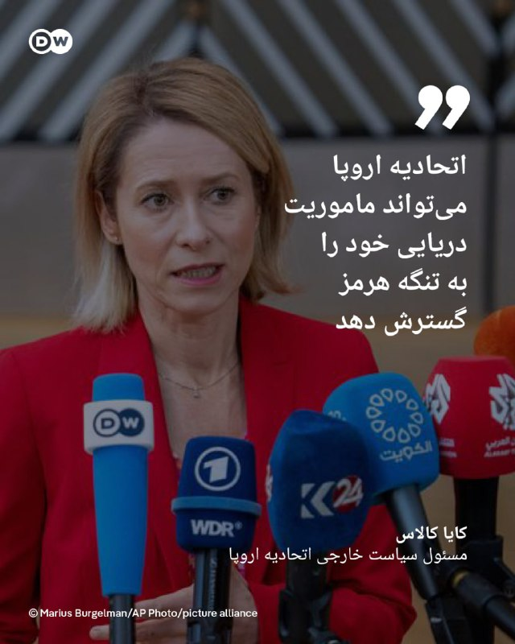

🔸 کایا کالاس: اتحادیه اروپا می‌تواند ماموریت دریایی خود را به تنگه هرمز گسترش دهد

کایا کالاس، مسئول سیاست خارجی اتحادیه اروپا، روز سه‌شنبه پس از نشست وزیران دفاع اتحادیه اروپا گفت ماموریت دریایی "آسپیدس" که اکنون از کشتیرانی در دریای سرخ حفاظت می‌کند، در صورت پایان جنگ ایران می‌تواند به تنگه هرمز هم گسترش یابد.

او گفت برخی کشورها وعده داده‌اند کشتی‌های بیشتری در اختیار این ماموریت بگذارند و همین موضوع می‌تواند در صورت تصمیم نهایی، اجرای آن را آسان‌تر کند.

کالاس گفت عملیات "آسپیدس" همین حالا هم نقش مهمی در حفاظت از کشتیرانی در دریای سرخ دارد، اما دامنه فعالیت آن می‌تواند به تنگه هرمز نیز برسد.

این موضع در حالی مطرح شده که وزیران دفاع اتحادیه اروپا در ماه مارس با مقاومت در برابر چنین پیشنهادی، از گسترش ماموریت استقبال نکرده بودند.
@dw_farsi

## DW_Farsi — post 124653

  

🔶 وال‌استریت ژورنال: رئیس موساد در جریان جنگ ایران دست‌کم دو بار به امارات سفر کرد

وال‌استریت ژورنال گزارش داد دیوید بارنیا، رئیس موساد، در جریان جنگ ایران دست‌کم دو بار، در ماه‌های مارس و آوریل، به امارات سفر کرده است تا درباره روند جنگ و هماهنگی‌های امنیتی گفت‌وگو کند.

هم‌زمان، مایک هاکبی، سفیر آمریکا در اسرائیل، تأیید کرد اسرائیل سامانه "گنبد آهنین" و نیروهایی برای راه‌اندازی آن به امارات فرستاده است.

این سفرها از تازه‌ترین نشانه‌های افزایش همکاری میان اسرائیل و امارات در خلال جنگ به شمار می‌رود. این همکاری فقط به رایزنی سیاسی محدود نبوده و شامل تبادل اطلاعات و هماهنگی در قبال درگیری با ایران نیز شده است. این روند، از نگاه منابع آگاه، یکی از آشکارترین نشانه‌های تعمیق رابطه‌ای است که پس از توافق ابراهیم شکل گرفت.

هاکبی با اشاره به مزایای توافق ابراهیم برای امارات گفت اسرائیل برای کمک به این کشور در برابر حملات ایران، سامانه "گنبد آهنین" و نیروهای لازم برای بهره‌برداری از آن را به امارات منتقل کرده است. رویترز هم این اظهارات را نخستین تأیید رسمی استقرار این سامانه در امارات توصیف کرد.
@dw_farsi

## DW_Farsi — post 124652

🎥 باج‌گیری جدید جمهوری اسلامی: طرح درآمدزایی از کابل‌های اینترنت زیر دریا

تنگه هرمز یکی از شاهراه‌های حیاتی برای انتقال نفت در جهان است. حالا به نظر می‌رسد با دخالت جمهوری اسلامی می‌تواند به عرصه چالش‌برانگیزی در حوزه اینترنت نیز تبدیل شود. برخی رسانه‌های جمهوری اسلامی موضوع درآمدزایی از کابل‌های اینترنت زیر دریا در خلیج فارس را مطرح کرده‌اند.
#dwdigital
@dw_farsi

## DW_Farsi — post 124651

🎥 دیپو مالش؛ پدیده سنگ‌نوردی سرعتی هند

دیپو مالش، یکی از بهترین سنگ‌نوردان سرعتی آسیا، رؤیای حضور در المپیک را دنبال می‌کند؛ رؤیایی دشوار برای ورزشکاری هندی که از خانواده‌ای ثروتمند نمی‌آید و برای ادامه مسیرش به کمک‌های مردمی متکی است.
#dwsportshindi
@dw_farsi

## DW_Farsi — post 124650

  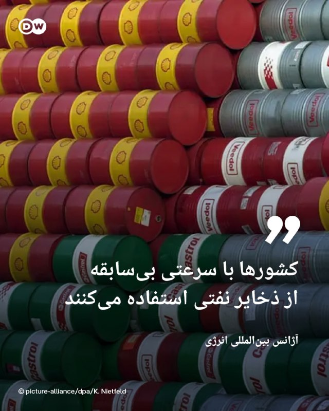

🔶 آژانس بین‌المللی انرژی: کشورها با سرعتی بی‌سابقه از ذخایر نفتی استفاده می‌کنند

آژانس بین‌المللی انرژی در گزارش ماهانه خود اعلام کرد جهان در ماه آوریل ۱۱۷ میلیون بشکه دیگر از ذخایر نفتی خود را از دست داده است؛ آن هم پس از کاهش ۱۲۹ میلیون بشکه‌ای در ماه مارس، زمانی که حملات آمریکا و اسرائیل به ایران آغاز شد. این نهاد هشدار داد کاهش سریع حاشیه‌های ذخیره، در حالی که اختلال در عرضه ادامه دارد، می‌تواند به جهش‌های تازه قیمت در آینده منجر شود.

آژانس بین‌المللی انرژی اعلام کرد از ۴۰۰ میلیون بشکه‌ای که در ماه مارس قرار بود از ذخایر اضطراری اعضا وارد بازار شود، تاکنون حدود ۱۶۴ میلیون بشکه آزاد شده است.

این نهاد گفت سرعت آزادسازی ذخایر اضطراری در آوریل بیشتر شده و قرار است در ماه‌های آینده نیز حجم بیشتری وارد بازار شود.

آژانس هشدار داد با نزدیک شدن فصل اوج سفرهای تابستانی در نیمکره شمالی، نگرانی درباره کمبود عرضه بیشتر شده است. شرکت‌های هواپیمایی هم هشدار داده‌اند اگر اختلال‌های فعلی ادامه پیدا کند، ظرف چند هفته آینده ممکن است با کمبود سوخت جت روبه‌رو شوند.
@dw_farsi

## DW_Farsi — post 124649

🔶 نمایش ساواک در خیابان‌های آلمان؛ عادی‌سازی زبان تهدید؟

🔻 گزارشی از نیلوفر غلامی

یکشنبه ۲۰ اردیبهشت ۱۴۰۵ (۱۰ مه ۲۰۲۶) مرکز شهر رگنزبورگ در نزدیکی مونیخ یکی از چند شهری بود که قرار بود تجمعی در آن برای "توقف اعدام‌ها، آزادی زندانیان سیاسی و دسترسی آزاد به اینترنت در ایران" برگزار شود. فراخوان این تجمع را شاهزاده رضا پهلوی در شبکه‌های اجتماعی رسمی خود اعلام کرده بود. تصویری از این تجمع که در آن چندین نفر از شرکت‌کنندگان به شکلی متحدالشکل در صفوفی هماهنگ تی‌شرت‌هایی سفید با نماد ساواک به تن داشتند، به موجی از واکنش‌ها دامن زد.

برای اطلاع بیشتر از انگیزه‌های این اقدام بحث‌برانگیز در تجمع شهر رگنزبورگ، با یکی از شرکت‌کنندگان در آن، که با نگاهی به حساب کاربری ایکس او و انتشار تصاویر و ویدیوهای این تجمع، می‌توان دریافت که از طرفداران ساواک و فعالیت‌هایش است، تماس گرفتیم، اما تا لحظه انتشار این گزارش پاسخی دریافت نکرده‌ایم.

همچنین برای مطلع شدن از موضع‌گیری رسمی و نظر شاهزاده رضا پهلوی در این خصوص، با دفتر او تماس گرفتیم، اما تا لحظه انتشار این گزارش، پاسخی به این درخواست داده نشده است.

نجات بهرامی، تحلیلگر سیاسی و از نویسندگان "دفترچه دوران اضطرار" که تاکید می‌کند صحبت‌هایش نظر شخصی او است، به بخش فارسی دویچه وله می‌گوید، اینکه تعدادی از جوانان با دیدن این اتفاقات تاریخی و تجربه تلخ نیم قرن جمهوری اسلامی که کل دوران جوانی آنها را بر باد داده است، تیشرتی با نشان ساواک بپوشند اصلا کار عجیبی نیست.

ساسان امجدی، تحلیلگر سیاسی، در گفت‌وگو با دویچه وله فارسی می‌گوید استفاده از پوشش‌ها و نمادهای منقش به آرم ساواک، به عنوان یکی از مهم‌ترین "نهادهای امنیتی و سرکوبگر دوران پهلوی"، واجد معنایی فراتر از یک کنش نمایشی یا صرفاً یک حضور خیابانی است. به باور او، ساواک در حافظه جمعی بخش بزرگی از جامعه ایران، نماد دستگاهی است که "کنترل سیاسی، شکنجه، بازجویی، سانسور و حذف مخالفان" را سازماندهی می‌کردە است.

کاظم کردوانی، پژوهشگر و جامعه‌شناس، نیز به دویچه وله فارسی می‌گوید این افراد با نماد ساواک به خیابان آمده و برای خود هویت اجتماعی قائل شده‌اند. از نظر او، اثبات هویت این افراد "به عنوان بخشی از امروز و آینده جامعه ایران، یکی از خطرناکترین اتفاقات" رخ‌داده در تجمع شهر رگنزبورگ است.
@dw_farsi

## DW_Farsi — post 124648

  

🔶 مشارکت ایتالیا و استرالیا در ماموریت حفاظت از کشتیرانی در هرمز

به گزارش خبرگزاری فرانسه گویدو کروزتو، وزیر دفاع ایتالیا، روز چهارشنبه (۱۳ مه ۲۰۲۶) به پارلمان گفت رم دو مین‌روب را به شرق مدیترانه و سپس دریای سرخ می‌فرستد، او در عین حال تاکید کرد که اعزام آن‌ها به منطقه هرمز فقط در چارچوب یک ماموریت بین‌المللی و در صورت برقراری یک آتش‌بس "واقعی، معتبر و باثبات" انجام خواهد شد.

کروزتو گفت هر ماموریتی در هرمز به تصویب پارلمان ایتالیا نیاز خواهد داشت. رویترز پیش‌تر گزارش داده بود که فرمانده نیروی دریایی ایتالیا از آمادگی برای اعزام دو مین‌روب، یک کشتی اسکورت و یک شناور پشتیبانی در قالب ماموریت چندملیتی سخن گفته بود.
هم‌زمان، ریچارد مارلز، وزیر دفاع استرالیا، اعلام کرد کانبرا نیز آماده است با یک فروند هواپیمای شناسایی به ماموریت "کاملا دفاعی" تحت رهبری بریتانیا و فرانسه بپیوندد.

استرالیا اعلام کرده در صورت شکل‌گیری این ماموریت، یک فروند هواپیمای شناسایی (وج‌تیل E-7A) را که هم‌اکنون نیز در منطقه مستقر است، در اختیار آن قرار می‌دهد.
@dw_farsi

## DW_Farsi — post 124647

🔶 رکورد تازه نویسندگان زندانی در جهان؛ ایران دوم شد

انجمن قلم آمریکا (پن) در تازه‌ترین گزارش سالانه خود درباره وضعیت آزادی بیان و سرکوب نویسندگان در جهان اعلام کرد که شمار نویسندگان زندانی در سال ۲۰۲۵ میلادی برای نخستین بار از زمان آغاز انتشار "شاخص آزادی نوشتن" در سال ۲۰۱۹، از مرز ۴۰۰ نفر عبور کرده است.

گزارش پن آمریکا که روز سه‌شنبه ۱۲ مه (۲۲ اردیبهشت) منتشر شد، از افزایش چشمگیر بازداشت نویسندگان، مترجمان، پژوهشگران و فعالان فرهنگی در ایران نیز خبر می‌دهد.

بر اساس این گزارش، در سال ۲۰۲۵ در مجموع ۴۰۱ نویسنده در ۴۴ کشور زندانی بوده‌اند؛ رقمی که در سال پیش از آن ۳۷۵ نفر در ۴۰ کشور بود. پن آمریکا می‌گوید، شمار نویسندگان زندانی طی هفت سال گذشته ۶۸ درصد افزایش یافته و این روند، نشانگر تشدید مداوم سرکوب آزادی بیان در جهان است.

چین همچنان با ۱۱۹ نویسنده زندانی، بزرگترین زندان نویسندگان جهان باقی مانده است، اما انجمن قلم آمریکا تأکید می‌کند که شدیدترین افزایش بازداشت‌ها در ایران ثبت شده است؛ جایی که مقام‌های جمهوری اسلامی در سال گذشته دست‌کم ۱۷ بازداشت تازه انجام داده‌اند و شمار نویسندگان زندانی را بار دیگر به سطح دوران اوج سرکوب اعتراض‌های "زن، زندگی، آزادی" نزدیک کرده‌اند.

کارین دویچ کارلکار، مدیر برنامه "نویسندگان در معرض خطر" در پن آمریکا، گفته است که مقام‌های جمهوری اسلامی "کارزاری به‌ویژه خشن علیه صداهای مستقل" به راه انداخته‌اند. به گفته او، شاعران، مترجمان، پژوهشگران، ترانه‌سرایان، تحلیلگران آنلاین، مدافعان حقوق بشر و ستون‌نویسان، همگی هدف بازداشت و سرکوب قرار گرفته‌اند، زیرا حکومت ایران می‌کوشد، "بحث، انتقاد و مخالفت" را خاموش کند.

به گزارش پن آمریکا، موج تازه سرکوب در ایران پس از جنگ ۱۲‌روزه میان ایران و اسرائیل در خرداد و تیر ۱۴۰۴ شدت گرفت و علاوه بر چهره‌های شناخته‌شده منتقد، پژوهشگران و مترجمان را نیز دربرگرفت.
@dw_farsi

## DW_Farsi — post 124646

  

🔶 توماس راخل کفالت سیاسی پیوند و برنا نعیمی را بر عهده گرفت

توماس راخل، نماینده دولت آلمان در امور آزادی دین و عقیده، در پیامی اعلام کرد کفالت سیاسی پیوند نعیمی و برنا نعیمی را بر عهده گرفته است. به گفته او این دو جوان بهایی در ایران به‌دلیل باور مذهبی‌شان تحت فشار قرار دارند و با خطر اعدام روبه‌رو هستند. حساب رسمی این نهاد آلمانی نیز همین موضع را منتشر کرده است.

در پیام منتشرشده آمده است پیوند و برنا نعیمی در ایران با زندان و شکنجه روبه‌رو شده‌اند و پرونده آن‌ها به یکی از نمونه‌های تازه فشار بر شهروندان بهایی تبدیل شده است. این موضع در حالی مطرح شده که نهادهای بهایی و حقوق بشری نیز در روزهای اخیر درباره خطر فوری برای این دو زندانی هشدار داده‌اند.

توماس راخل از ۲۸ مه ۲۰۲۵ نماینده دولت آلمان در امور آزادی دین و عقیده است. پذیرش کفالت سیاسی از سوی او، نشانه‌ای از بالا رفتن توجه نهادهای آلمانی به پرونده پیوند و برنا نعیمی و وضعیت بهاییان در ایران است.
@dw_farsi

## DW_Farsi — post 124645

  

🔶 نت‌بلاکس: فساد و کلاهبرداری، حاصل طرح‌های اینترنتی حکومت ایران

نت‌بلاکس، نهاد نظارت و پایش فعالیت‌های اینترنتی در جهان در تازه‌ترین پست خود در شبکه ایکس (توئیتر سابق) اعلام کرد که قطع اینترنت در ایران از ۱۷۷۶ ساعت گذشته و به این ترتیب وارد هفتاد و پنجمین روز خود شده است.

این نهاد در پست خود با اشاره به تأثیرات منفی سانسور دیجیتال هشدار داده که طرح‌های اینترنت "پرو" (Internet Pro) مورد حمایت جمهوری اسلامی و فهرست‌های سفید گزینشی افزایش نظارت، فساد و کلاهبرداری را به دنبال داشته است. این طرح بحث‌برانگیز تا کنون انتقادهای فراوانی را به دنبال داشته و بسیاری‌ها به ابعاد تبعیض‌آمیز آن اشاره کرده‌اند.

در حالیکه اکنون ۷۵ روز از قطع اینترنت در ایران می‌گذرد، مسعود پزشکیان، رئیس جمهور ایران محمدرضا عارف، معان اول خود را با حفظ سمت به عنوان "رئیس ستاد ویژه ساماندهی و راهبری فضای مجازی کشور" منصوب کرد.

او در این رابطه تصریح کرد که این انتصاب "نظر به ضرورت فوری استقرار حکمرانی یکپارچه، منسجم و کارآمد در فضای مجازی" انجام می‌گیرد. پزشکیان پیشتر نیز در شبکه ایکس در ارتباط با این موضوع پستی منتشر کرده بود.
@dw_farsi

## DW_Farsi — post 124643

  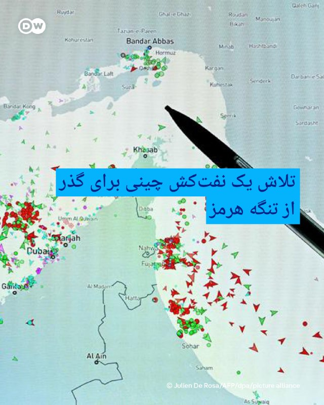

🔶 تلاش یک نفت‌کش چینی برای گذر از تنگه هرمز
 
داده‌های رهگیری کشتی‌ها حاکی از آن است که که یک نفت‌کش غول‌پیکر چین روز چهارشنبه ۱۳ مه (۲۳ اردیبهشت) در تلاش عبور از تنگه هرمز  بوده است. به گزارش رسانه‌ها، این نفت‌کش حامل دو میلیون بشکه نفت خام عراق است.
 
بر اساس داده‌های شرکت‌های "ال‌اس‌ای‌جی" و "کپلر" که در زمینه رهگیری کشتی‌ها فعالیت دارند،  نفتکش غول‌پیکر چینی "یوآن هوا هو" از نزدیکی جزیره لارک ایران عبور کرده و در بخش شرقی تنگه هرمز به سمت جنوب در حال حرکت است. 
 
این داده‌ها نشان می‌دهد که نفت‌کش مزبور، اوایل ماه مارس نزدیک به دو میلیون بشکه نفت خام "بصره مدیوم" را در ترمینال بصره عراق بارگیری کرده و از آن زمان در خلیج فارس مانده بود. اعلام شده که مقصد این نفتکش آسیا است.
 
خبرگزاری رویترز گزارش داده که اگر این تردد با موفقیت انجام گیرد، این سومین مورد ثبت‌شده عبور یک نفت‌کش چینی از تنگه هرمز از زمان آغاز جنگ آمریکا و اسرائیل علیه جمهوری اسلامی از اسفند ماه گذشته به این سو بوده است.
 
@dw_farsi

## DW_Farsi — post 124642

🔶 نیویورک تایمز: ایران به اکثر تأسیسات موشکی خود دسترسی دارد

به گزارش رسانه‌های آمریکایی، جمهوری اسلامی ایران به رغم  حملاتی که در جنگ با اسرائيل و آمریکا متحمل شده، هنوز به بخش بزرگی از سایت‌های موشکی  و پرتابگرهای سیار خود دسترسی دارد.
 
روزنامه نیویورک تایمز سه‌شنبه ۲۲ اردیبهشت (۱۲ مه) با استناد به داده‌های سازمان‌های امنیتی و اطلاعاتی ایالات متحده گزارش داد که ایران هنوز حدود ۷۰ درصد از پرتابگرهای متحرک خود و تقریباً ۷۰ درصد از ذخایر موشکی پیش از جنگ خود را حفظ کرده است.
 
نیویورک تایمز این گزارش را با تکیه بر اظهارات منابع آگاه تنظیم کرده که به داده‌ها و اطلاعات امنیتی مربوط به آغاز ماه مه در رابطه با این موضوع دسترسی داشته‌اند. طبق این گزارش، ایران دوباره به اکثر سایت‌های موشکی و تأسیسات زیرزمینی خود دسترسی یافته است.
 
نشریه واشنگتن پست نیز هفته گذشته در گزارشی به اطلاعات تحلیل‌گران سازمان‌های امنیتی اشاره کرده بود که در جریان بررسی‌های خود آمار و ارقامی مشابه ارائه کرده‌اند.
 
این نشریه در گزارش خود به نقل از منابع آگاه نوشته بود، ایران در مقایسه با پیش از جنگ، به حدود ۷۵ درصد از پرتابگرهای سیار خود دسترسی داشته و ۷۰ درصد از ذخایر موشکی خود را حفظ کرده است.
 
در گزارش واشنگتن پست به نقل از یک مقام آگاه آمریکایی آمده بود، جمهوری اسلامی قادر است، تقریبا تمامی سایت‌های نظامی زیرزمینی خود را به کار گیرد، شماری از موشک‌های آسیب‌دیده خود را تعمیر کند و همچنین موشک‌هایی تازه‌ای تولید کند.
@dw_farsi

## DW_Farsi — post 124641

🔶 گزارش رویترز از "حملات پنهانی" عربستان به ایران در جریان جنگ
 
خبرگزاری رویترز در گزارشی اختصاصی از ریاض و دبی نوشت، عربستان سعودی در جریان جنگ اخیر آمریکا و اسرائیل علیه جمهوری اسلامی، چندین حمله اعلام‌نشده علیه ایران انجام داده است؛ حملاتی که به گفته دو مقام غربی مطلع و دو مقام ایرانی، در واکنش به حملات انجام‌شده علیه خاک عربستان صورت گرفت.
 
این گزارش که روز سه‌شنبه ۲۲ اردیبهشت (۱۲ مه) منتشر شد، نخستین روایت شناخته‌شده از اقدام مستقیم نظامی عربستان سعودی در خاک ایران است.
 
به نوشته رویترز، این حملات که تاکنون علنی نشده بودند، در اواخر ماه مارس (اوایل فروردین) و توسط نیروی هوایی عربستان انجام شده‌اند. یکی از مقام‌های غربی، آنها را "حملات متقابل در پاسخ به زمانی که عربستان سعودی هدف قرار گرفت" توصیف کرده است.
 
رویترز تأکید کرده است که نتوانسته اهداف مشخص این حملات را تأیید کند. یک مقام ارشد وزارت خارجه عربستان نیز در پاسخ به پرسش این خبرگزاری، مستقیماً نگفته است که آیا چنین حملاتی انجام شده‌اند یا نه. وزارت خارجه جمهوری اسلامی نیز به درخواست رویترز برای اظهارنظر پاسخ نداده است.
 
عربستان سعودی، برخلاف دهه‌های گذشته که در برابر تهدیدهای ایران عمدتاً به چتر نظامی آمریکا تکیه می‌کرد، این بار ظاهراً خود وارد اقدام مستقیم علیه خاک ایران شده است.
 
رویترز می‌نویسد جنگی که از نهم اسفند ۱۴۰۴ (۲۸ فوریه ۲۰۲۶) با حملات هوایی آمریکا و اسرائیل به ایران آغاز شد، عربستان را در برابر حملاتی قرار داد که از سپر نظامی ایالات متحده عبور کردند.

@dw_farsi

## DW_Farsi — post 124640

🎥 زندگی میان مردگان؛ زنی که انسان‌ها را در آخرین سفر بدرقه می‌کند
 
مرگ برای آنا-لنا پایان راه نیست، بلکه آغاز همراهی با کسانی است که جا مانده‌اند. زنی جوان که شغلش با وداع، سوگ و خاطره گره خورده، اما خود می‌گوید این کار بیش از هر چیز درباره زندگی و آدم‌های زنده است.
 
@dw_farsi

## DW_Farsi — post 124639

  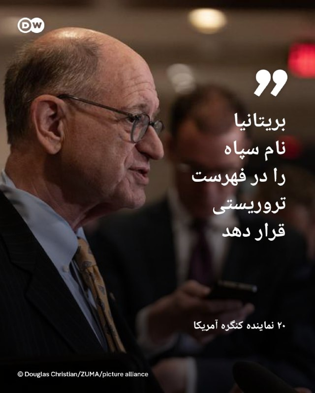

🔶 ۲۰ نماینده کنگره آمریکا: بریتانیا نام سپاه را در فهرست تروریستی قرار دهد
 
گروهی متشکل از ۲۰ عضو جمهوری‌خواه و دموکرات در مجلس نمایندگان ایالات متحده در نامه‌ای به دولت بریتانیا خواستار سرعت بخشیدن به روند تصویب قانونی قرار گرفتن سپاه پاسداران انقلاب اسلامی در فهرست تروریستی این کشور شدند.
 
برد شرمن، عضو حزب دموکرات و عالی‌ترین مقام کمیسیون امور خاورمیانه و شمال آفریقا در مجلس نمایندگان که از مبتکران تهیه این نامه بوده، تصریح کرد: «هر روزی که پارلمان بریتانیا [در تروریستی نامیدن سپاه] تأخیر می‌کند، سپاه پاسداران یک روز دیگر از شعاع و تأثیر کامل تحریم‌های مشترک ما می‌گریزد.»
 
کلودیا تنی، عضو جمهوری‌خواه مجلس نمایندگان و یکی دیگر از مبتکران این نامه، سپاه پاسداران را "یکی از خطرناک‌ترین سازمان‌های تروریستی جهان" خواند که "دستش به خون غیرنظامیان بی‌گناه، آمریکایی‌ها و مخالفان آلوده است".
 
ایالات متحده سپاه پاسداران را در سال ۲۰۱۹ میلادی در فهرست سازمان‌های تروریستی قرار داد. همچنین کانادا در سال ۲۰۲۴، استرالیا در سال ۲۰۲۵ و اتحادیه اروپا در فوریه سال جاری میلادی (۲۰۲۶) دست به این اقدام زدند.
 
@dw_farsi

## Persian_Trend_Official — post 14068

🔴 رویترز مدعی حملات جنگنده‌های سعودی به مواضع گروه‌های عراقی شد

💢خبرگزاری رویترز به‌نقل از منابعی مدعی شد جنگنده‌های عربستان سعودی در جریان جنگ اخیر، مواضع گروه‌های مسلح عراقی را هدف قرار داده‌اند.

تاکنون نیز عربستان سعودی به‌صورت رسمی واکنشی به این ادعا نشان نداده است.

🫆:Tony

📌 @persian_trend_official
پرشین ترند | متفاوت‌ترین کانال نظامی

## Persian_Trend_Official — post 14067

  

🔴 عراقچی: کویت به یک قایق ایرانی حمله کرده و ۴ شهروند ایرانی را بازداشت کرده است

💢عباس عراقچی، وزیر خارجه ایران، اعلام کرد کویت در اقدامی «غیرقانونی» به یک قایق ایرانی در خلیج فارس حمله کرده و ۴ شهروند ایرانی را بازداشت کرده است.

او مدعی شد:

▪️ این اقدام با هدف ایجاد اختلاف و تنش در منطقه انجام شده است
▪️ حادثه در نزدیکی جزیره‌ای رخ داده که آمریکا از آن برای حمله به ایران استفاده کرده است
▪️ تهران خواستار آزادی فوری شهروندان بازداشت‌شده شده
▪️ ایران حق پاسخ‌گویی به این اقدام را برای خود محفوظ می‌داند

💢این اظهارات پس از آن مطرح می‌شود که کویت اعلام کرده ۴ فرد وابسته به سپاه پاسداران را هنگام ورود دریایی به جزیره بوبیان بازداشت کرده است؛ ادعایی که تهران آن را رد کرده و گفته ورود قایق به آب‌های کویت ناشی از اختلال در سامانه ناوبری بوده است.

🫆:Tony

📌 @persian_trend_official
پرشین ترند | متفاوت‌ترین کانال نظامی

## Persian_Trend_Official — post 14066

⭕️ خلاصه اخبار چند روز گذشته

🔸اینترنت بین‌الملل به گیمرها ارائه می‌شود؛ ثبت درخواست در سامانه همگرا (اینترنت طبقاتی)

🔹دولت و مجلس به دنبال حمایت تازه از پیام‌رسان‌های داخلی (رانت و فساد جدید)

🔸نماینده مردم تهران در مجلس: درباره خسارت‌های قطعی اینترنت جوسازی می‌شود. (حرف مفت)

🔹معاون رئیس‌جمهور: اینترنت بین‌الملل حتما وصل می‌شود؛ دولت قصد دائمی‌کردن محدودیت‌ها را ندارد. (حرف الکی)

🔸برآورد انجمن بلاکچین: خسارت ۳۰۰ تا ۷۰۰ هزار میلیاردی از قطعی اینترنت.

🔹معاون رئیس جمهور: محدودیت حجم و گرانی اینترنت پرو برای جلوگیری از استفاده غیرضروری است. (عجب بابا عجب)

🔸قطع اینترنت به هفتاد و پنجمین روز خود رسید.

📝 Nick

📌 @persian_trend_official
پرشین ترند | متفاوت‌ترین کانال نظامی

## Persian_Trend_Official — post 14065

## Persian_Trend_Official — post 14064

  

🔴دبیرکل حزب‌الله: حمایت‌های ایران باعث شد ما مقابل اشغالگری ایستادگی کنیم

💢شیخ نعیم قاسم دبیرکل حزب‌الله لبنان:

حمایت‌های جمهوری اسلامی ایران از همان آغاز تأسیس حزب‌الله در سال 1982 به فرمان امام خمینی و تداوم این پشتیبانی‌ها تحت نظارت امام خامنه‌ای و از طریق «سپاه پاسداران» به‌ویژه «نیروی قدس»، ما را قادر ساخت تا جنوب لبنان را در سال 2000 آزاد کنیم و تا به امروز در برابر تجاوزات مکرر بایستیم.

🫆:Tony

📌 @persian_trend_official
پرشین ترند | متفاوت‌ترین کانال نظامی

## Persian_Trend_Official — post 14063

🔴 لاوروف: آمریکا به‌دنبال کنترل بازار جهانی انرژی است

💢سرگئی لاوروف، وزیر خارجه روسیه، در اظهاراتی دولت ترامپ را متهم کرده که تلاش می‌کند نفوذ خود را بر بازار جهانی انرژی «تحمیل» کند.

💢او گفته است هدف آمریکا این است که شرکت‌های انرژی روسیه مانند لوک‌اویل و روس‌نفت را از بازارهای بین‌المللی خارج کند و مسیرهای اصلی تأمین انرژی جهان را تحت کنترل خود بگیرد.

💢لاوروف همچنین تأکید کرده:
آمریکا در اسناد راهبردی خود به دنبال تسلط بر بازار انرژی جهانی است و قصد دارد همه مسیرهای مهم انرژی را تحت نفوذ خود قرار دهد.

🫆:Tony

📌 @persian_trend_official
پرشین ترند | متفاوت‌ترین کانال نظامی

## Persian_Trend_Official — post 14061

🚨🇮🇱🇱🇧 حملات هوایی جدید اسرائیل دقایقی پیش مناطقی در لبنان را هدف قرار داد؛ همزمان منابع محلی از شنیده شدن صدای چندین انفجار خبر می‌دهند.

☆Phantom☆

📌 @persian_trend_official
پرشین ترند | متفاوت‌ترین کانال نظامی

## Persian_Trend_Official — post 14059

ترامپ تمام افراد ثروتمند آمریکا را با Air Force One خود به پکن برده است.

📝 Nick

📌 @persian_trend_official
پرشین ترند | متفاوت‌ترین کانال نظامی

## Persian_Trend_Official — post 14058

  <a href="telegram/content/Persian_Trend_Official_14058_1778691015.mp4" target="_blank">🎬 Download video</a>

⭕️ فارس:

تصاویر دیده‌نشده از رزمایش ضد هلی‌برن سپاه تهران بزرگ

📝 Nick

📌 @persian_trend_official
پرشین ترند | متفاوت‌ترین کانال نظامی

## Persian_Trend_Official — post 14057

  

⭕️ برخی از رسانه‌های فرانسوی دست به انتشار گزارشی به نقل از «فلورین تاردیف» خبرنگار «پاری‌مچ» زده‌اند که حکایت از روابط پنهانی امانوئل ماکرون و گلشیفته فراهانی دارد.

این خبرنگار فرانسوی در گزارش خود نوشته که سیلی که زن ماکرون به او در کنار در خروجی هواپیما زد، به خاطر همین رابطه بوده.

منبع خبر

📝 Nick

📌 @persian_trend_official
پرشین ترند | متفاوت‌ترین کانال نظامی

## Persian_Trend_Official — post 14056

⭕️ در حالی که اینترنت در ایران به مدت ۷۵ روز قطع است، شرکت اپل دیروز به صورت رسمی اولین نمایندگی خود را در افغانستان افتتاح نمود. تکذیب شد. 📝 Nick 📌 @persian_trend_official پرشین ترند | متفاوت‌ترین کانال نظامی

## Persian_Trend_Official — post 14055

  

🔴 ادعای وال‌استریت ژورنال درباره نقش امارات و سفر مقامات امنیتی اسرائیل

💢بر اساس گزارشی که به وال‌استریت ژورنال نسبت داده شده، گفته می‌شود رئیس موساد اسرائیل حداقل دو بار به‌صورت محرمانه به امارات متحده عربی سفر کرده تا درباره هماهنگی‌های مرتبط با درگیری‌های جاری با ایران گفت‌وگو کند.

▪️در این گزارش همچنین ادعا شده:

💢امارات فراتر از نقش دیپلماتیک عمل کرده و در برخی اقدامات نظامی علیه ایران نقش داشته است.

▪️از جمله، حمله به یک هدف نفتی در جزیره لاوان به امارات نسبت داده شده است.
▪️همچنین گفته شده امارات میزبان برخی سامانه‌ها و نیروهای مرتبط با دفاع هوایی اسرائیل بوده است.
▪️در ادامه، به سفرهای مشابه رئیس شین‌بت اسرائیل در همان بازه زمانی نیز اشاره شده است.

🫆:Tony

📌 @persian_trend_official
پرشین ترند | متفاوت‌ترین کانال نظامی

## Persian_Trend_Official — post 14054

  <a href="telegram/content/Persian_Trend_Official_14054_1778691020.mp4" target="_blank">🎬 Download video</a>

🔴 ترامپ وارد پکن شد

هواپیمای ریاست‌جمهوری آمریکا (ایرفورس وان) لحظاتی پیش در پایتخت چین به زمین نشست و دونالد ترامپ سفر خود را برای دیدار و نشست با شی جین‌پینگ آغاز کرد.

🫆:Tony

📌 @persian_trend_official
پرشین ترند | متفاوت‌ترین کانال نظامی

## Persian_Trend_Official — post 14053

🔴 نشت سوخت نفتکش اماراتی پس از حمله پهپادی در سواحل عمان

💢خبرگزاری رویترز گزارش داد یک نفتکش وابسته به شرکت ملی نفت ابوظبی پس از حمله پهپادی منتسب به ایران در نزدیکی سواحل عمان دچار نشت محدود سوخت شده است.

💢بر اساس این گزارش:

▪️ نفتکش «برکه» همچنان در سواحل عمان لنگر انداخته است
▪️ شرکت اماراتی اعلام کرده مقدار کمی سوخت کشتی وارد آب شده است
▪️ این کشتی هنگام حمله بارگیری نشده بود
▪️ هیچ آسیبی به خدمه وارد نشده است

💢شرکت اماراتی اعلام کرده در حال همکاری با مقام‌های عمان و تیم‌های تخصصی برای مدیریت وضعیت است.

🫆:Tony

📌 @persian_trend_official
پرشین ترند | متفاوت‌ترین کانال نظامی

## Persian_Trend_Official — post 14051

⭕️ در حالی که اینترنت در ایران به مدت ۷۵ روز قطع است، شرکت اپل دیروز به صورت رسمی اولین نمایندگی خود را در افغانستان افتتاح نمود.

تکذیب شد.

📝 Nick

📌 @persian_trend_official
پرشین ترند | متفاوت‌ترین کانال نظامی

## Persian_Trend_Official — post 14050

  

🔴 امارات اطراف مخازن نفتی دبی موانع ضدپهپادی نصب می‌کند

گزارش‌ها حاکی است امارات روند نصب موانع و سازه‌های ضدپهپادی را در اطراف مخازن نفتی نزدیک فرودگاه بین‌المللی دبی آغاز کرده است.

بر اساس اطلاعات منتشرشده:

▪️ این موانع شامل سازه‌ها و شبکه‌های فلزی هستند
▪️ هدف از این اقدام، مقابله با تهدید پهپادهای انتحاری و حملات هوایی کم‌ارتفاع عنوان شده است
▪️ مخازن نفتی و زیرساخت‌های انرژی اطراف دبی در هفته‌های اخیر تحت تدابیر امنیتی شدیدتری قرار گرفته‌اند

🫆:Tony

📌 @persian_trend_official
پرشین ترند | متفاوت‌ترین کانال نظامی

## Persian_Trend_Official — post 14049

  <a href="telegram/content/Persian_Trend_Official_14049_1778691024.webm" target="_blank">🎬 Download video</a>

فارس | فیلم سینمایی حمله‌ٔ اف-۵های ایران به پایگاه آمریکا تولید می‌شود

💢فیلم سینمایی «ببرها» روایت حمله‌ٔ تاریخی و حماسی ۲ جنگندهٔ اف-۵ نیروی هوایی ارتش به پایگاه آمریکایی بوهرینگ کویت در روز دوم جنگ رمضان به نویسندگی مهدی یزدانی‌خرم و تهیه‌کنندگی حبیب والی‌نژاد تولید خواهد شد.

🫆:Tony

📌 @persian_trend_official
پرشین ترند | متفاوت‌ترین کانال نظامی

## Persian_Trend_Official — post 14048

  

🔴تویت خواهر جاوید نام ‎#مجتبی_روستایی ؛

از افتخارات ما خوانواده جاوید نامان اين است که با افتخار پیکر عزیزانمون رو تشیع کرديم 💔
و یکی از ذلت بارترین افتخارات عرزشیها، ۴ماه جنازه روی دستشون مونده ،دريغ از یه تشیع پنهانی!

📣@persian_trend_official

## RadioFarda — post 157146

  <a href="https://t.me/radiofarda/157146" target="_blank">📎 Download file</a>

📻بشنوید: ایستگاه ۱۹ با رادیوفردا، ۲۳ اردیبهشت ۱۴۰۵

@RadioFarda

## RadioFarda — post 157145

  <a href="https://t.me/radiofarda/157145" target="_blank">📎 Download file</a>

حسین احمدی‌نیاز: هیچ ضمانت قانونی برای بازگشت ایرانیان به کشور وجود ندارد

🔸قوه قضاییه جمهوری اسلامی روز ۲۳ اردیبهشت از اجرای یک حکم اعدام دیگر در ایران خبر داد. نام احسان افراشته ۳۳ ساله، متخصص شبکه و امنیت سایبری در حالی به فهرست بلند اعدام‌شدگان هفته‌های اخیر اضافه شد که دو منبع به رادیو فردا گفتند او پیش از بازگشت به ایران از ترکیه در اوايل سال ۱۴۰۳، به‌طور «داوطلبانه» خود را به نهادهای اطلاعاتی ایران معرفی کرده و تلاش یک سرویس امنیتی خارجی برای سوءاستفاده از خود را با آن‌ها در میان گذاشته بود. منابع رادیوفردا می‌گویند احسان افراشته در پی هماهنگی با وزارت اطلاعات تصمیم به بازگشت داوطلبانه به ایران می‌گیرد، اما پس از بازگشت بلافاصله در فرودگاه بازداشت، به انفرادی منتقل و در نهایت اعدام می‌شود. ارزیابی حسین احمدی‌نیاز حقوقدان ساکن هلند را بشنوید که به رادیوفردا می‌گوید عناصر مختلفی در پرونده وجود دارد که نشان می‌دهد حکم اعدام در پی یک دادرسی ناعادلانه صادر و اجرا شده است.

@RadioFarda

## RadioFarda — post 157144

  <a href="https://t.me/radiofarda/157144" target="_blank">📎 Download file</a>

ادامه قطع اینترنت در ایران و «انباشت خشم» در گفت‌وگو با اشکان خسروپور

🔸مسعود پزشکیان، رئیس‌جمهور ایران، محمدرضا عارف معاون اول خود را با حفظ سمت به عنوان رئیس «ستاد ویژه ساماندهی و راهبری فضای مجازی کشور» منصوب کرد. انتصابی که به نوشته مسعود پزشکیان در حکم انتصاب «نظر به ضرورت فوری استقرار حکمرانی یکپارچه، منسجم و کارآمد در فضای مجازی» صورت می‌گیرد. این انتصاب در شرایطی انجام شده که پزشکیان در ۷۴ روز اخیر به صورت مستقیم درباره دلایل قطع دسترسی به اینترنت با مردم ایران صحبت نکرده اما سخنگوی دولت او «امنیت» را دلیل قطع اینترنت عنوان کرده اگرچه که بسیاری از ناظران این حوزه می‌گویند این تنها یک توجیه است و حکومت از جنگ برای پیشبرد اهداف بلند‌مدت‌تر استفاده می‌کند. اشکان خسروپور پژوهشگر سیاست‌گذاری اینترنت به رادیوفردا می‌گوید سال‌هاست که محدودیت در اینترنت هدف و سیاست جمهوری اسلامی بوده است.

@RadioFarda

## RadioFarda — post 157143

  <a href="https://t.me/radiofarda/157143" target="_blank">📎 Download file</a>

آیا توان موشکی ایران پس از آتش‌بس احیا شده است؟ گفت‌وگو با فرزین ندیمی

🔸دونالد ترامپ، رئیس‌جمهور آمریکا، گزارش شماری از رسانه‌های غربی درباره عملکرد نظامی «خوب» ایران مقابل آمریکا را «خیانت» عنوان کرد و در شبکه اجتماعی خود، تروث‌سوشال، نوشت: «وقتی رسانه‌های جعلی می‌گویند که دشمن ایرانی از نظر نظامی در برابر ما عملکرد خوبی دارد، این عملاً خیانت محسوب می‌شود، چون چنین ادعایی کاملاً دروغ و حتی مضحک است». این موضع‌گیری پس از انتشار گزارش روزنامه نیویورک تایمز در روز ۲۲ اردیبهشت، مطرح شد. گزارشی که بر مبنای «ارزیابی‌های اطلاعاتی» می‌گفت «ایران همچنان به ۳۰ سکو از ۳۳ سکوی موشکی خود در حاشیه خلیج فارس دسترسی دارد» و حدود ۷۰ درصد از پرتابگرهای متحرک خود را در سراسر کشور مستقر کرده و تقریباً ۷۰ درصد از ذخایر موشکی پیش از جنگ خود را حفظ کرده است. توصیف کدامیک از طرفین به واقعیت نزدیک‌تر است؟ توان موشکی ایران در چه سطحی است و چه میزان از آن بعد از برقراری آتش‌بس احیا شده است؟ ارزیابی فرزین ندیمی، پژوهشگر ارشد در انستیتوی واشینگتن برای خاورنزدیک در آمریکا، را در این زمینه بشنوید.

@RadioFarda

## RadioFarda — post 157142

  <a href="https://t.me/radiofarda/157142" target="_blank">📎 Download file</a>

علی صدرزاده: رقابت‌های بین کشورهای خلیج فارس به سادگی از بین نمی‌رود

🔸خبرگزاری رویترز روز ۲۲ اردیبهشت در گزارشی اختصاصی به نقل از دو مقام غربی و دو مقام ایرانی اعلام کرد که در جریان جنگ اخیر، عربستان سعودی در واکنش به حملات تهران به این کشور، چندین حمله به اهدافی در ایران انجام داده بود. موضوعی که برای اولین بار رسانه‌ای می‌شود، اما مقام‌های عربستان سعودی به طور رسمی آن را تایید نکرده‌اند. این گزارش چند روز پس از آن منتشر می‌شود که روزنامه وال‌استریت جورنال به نقل از منابع آگاه، از «حملات نظامی» امارات متحده عربی به ایران در جریان جنگ خبر داده بود. بر اساس این گزارش، این حملات که امارات به‌صورت علنی آن‌ها را تأیید نکرده، شامل «حمله به یک پالایشگاه در جزیره لاوان» در خلیج فارس بوده است. آیا چنین اقدامات و واکنش‌هایی می‌تواند به شکل‌گیری رویکرد متحد میان این کشورهای عربی حوزه خلیج فارس در قبال ایران منجر شود؟ ارزیابی علی صدرزاده تحلیلگر خاورمیانه در آلمان را بشنوید

@RadioFarda

## RadioFarda — post 157141

ترامپ در پکن؛ تجارت، جنگ ایران و فروش سلاح آمریکایی به تایوان، از موضوعات اصلی

🔸رئیس‌جمهور ایالات متحده و هیئت همراهش روز چهارشنبه ۲۳ اریبهشت‌ماه برای یک دیدار رسمی دو روزه وارد پکن پایتخت چین شده و با استقبال گرم مقام‌های چینی روبرو شدند.

🔸ایلان ماسک سهامدار اصلی شرکت‌های تسلا و ایکس، و جنسِن هوانگ مدیر غول تراشه‌سازی انویدیا، از جمله حاضران در هیئت همراه دونالد ترامپ هستند. رئیس‌جمهور آمریکا قصد دارد از شی ژین‌پینگ همتای چینی‌اش بخواهد بازارهای چین را به‌روی شرکت‌های آمریکایی باز کند.

🔸دونالد ترامپ به‌عنوان نخستین رئیس‌جمهور ایالات متحده که در نزدیک به یک دهۀ اخیر به پکن سفر کرده، امیدوار است در این نشست دو روزه به موفقیت‌های تجاری رسیده و «آتش‌بس شکنندۀ تجاری» میان دو ابرقدرت را، حفظ کند.

🔸مدیران ارشد تجاری و فناوری که رئیس‌جمهور آمریکا را در این سفر همراهی می‌کنند، امیدوارند بتوانند برخی موانع تجاری میان دو کشور را برطرف کنند؛ از جمله مدیر عامل شرکت انویدیا که برای دریافت مجوز فروش تراشه‌های قدرتمند هوش مصنوعی خود موسوم به اچ ۲۰۰، دردسر زیادی کشیده است.

🔸دونالد ترامپ در پستی که در شبکه اجتماعی خود، «تروث سوشال» منتشر کرد، نوشت: «از رئیس‌جمهور شی، به‌عنوان رهبری با توانایی خارق‌العاده خواهم خواست که دروازه‌های چین را باز کند تا این انسان‌های فوق‌العاده بتوانند کارشان را بکنند. این اولین خواستۀ من خواهد بود».

🔸گوئو ژیاکون سخنگوی وزارت خارجۀ چین در واکنش به این موضوع، از آمادگی پکن برای «گسترش همکاری دوجانبه، مدیریت اختلافات و تزریق ثبات و آرامش به جهان پرتلاطم کنونی» خبر داد.

🔸در آستانۀ ورود دونالد ترامپ به پکن،‌ اسکات بسنت وزیر خزانه‌داری ایالات متحده در سئول پایتخت کرۀ جنوبی، نشستی سه‌ساعته با مقام‌های چینی برگزار کرد و مذاکراتی مقدماتی داشت؛ گفت‌وگوهایی که شین‌هوا، خبرگزاری رسمی چین، «صریح، عمیق و سازنده» توصیف کرد.

🔸اما صرف نظر از تجارت، گفت‌وگوهای دو روزۀ سران دو ابرقدرت، شامل مجموعه‌‌ای از دیگر موضوعات حساس هم خواهد بود؛ از جمله جنگ ایران و فروش تسلیحات آمریکایی به تایوان.

🔸انتظار می‌رود که دونالد ترامپ از چین بخواهد که تهران را برای توافق با واشینگتن با هدف پایان دادن به جنگ، متقاعد کند؛ هرچند که رئیس‌جمهور آمریکا پیش از ترک آمریکا گفته بود که فکر نمی‌کند نیازی به کمک پکن داشته باشد.

🔸گزارش کامل را در وب‌سایت رادیوفردا بخوانید.

@RadioFarda

## RadioFarda — post 157140

  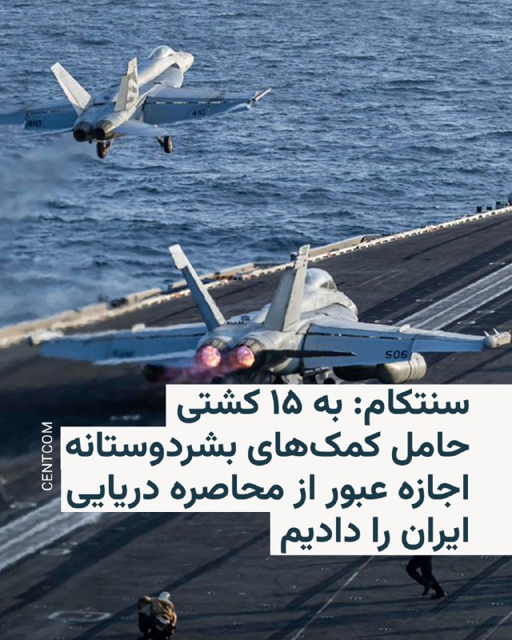

🔸ستاد فرماندهی مرکزی ایالات متحده روز چهارشنبه ۲۳ اردیبهشت با تاکید بر ادامه محاصره دریایی بنادر ایران اعلام کرد که از زمان آغاز این عملیات، به ۱۵ کشتی حامل کمک‌های بشردوستانه اجازه عبور داده شده است.

🔸سنتکام در پیامی در شبکه ایکس نوشت که نیروهای آمریکایی طی چهار هفته گذشته ۶۷ کشتی تجاری را وادار به تغییر مسیر کرده و چهار شناور را نیز برای اجرای محاصره «از کار انداخته‌اند».

🔸این فرماندهی همچنین اعلام کرد اوایل هفته جاری، دو کشتی تجاری دیگر پس از تماس رادیویی و شلیک تیر هشدار از سوی نیروهای آمریکایی مسیر خود را تغییر داده و از ادامه حرکت به سمت بنادر ایران منصرف شدند.

🔸آمریکا و ایران بعد از یک دور مذاکره حضوری در پاکستان که چند روز بعد از برقراری آتش‌بس در اسلام‌آباد برگزار شد، با ارسال طرح‌های پیشنهادی متقابل مشغول مذاکره بودند. آمریکا بعد از بی‌نتیجه ماندن مذاکره حضوری، محاصره دریایی بنادر ایران را آغاز کرد، در حالی که ایران از ابتدای جنگ تنگهٔ هرمز را مسدود کرده است.

@RadioFarda

## RadioFarda — post 157139

  

🔸بنیاد نرگس محمدی اعلام کرد این فعال حقوق بشر و برنده جایزه صلح نوبل پس از انتقال به تهران تحت عمل آنژیوگرافی قرار گرفته و نتایج آزمایش‌ها نشان‌دهنده «وخامت قابل توجه» وضعیت قلبی و عروقی اوست.

🔸بر اساس بیانیه بنیاد نرگس، پزشکان اعلام کرده‌اند رگی که پیش‌تر در آن استنت‌گذاری انجام شده بود دچار تنگی مجدد شده و یک رگ فرعی دیگر نیز دچار انسداد است. به گفته تیم درمان، وضعیت جسمانی او نسبت به آخرین بررسی در سال ۱۴۰۳ به شکل محسوسی بدتر شده است.

🔸این بنیاد همچنین اعلام کرد آزمایش‌های تخصصی، از جمله مانیتورینگ فشار خون و تست «تیلت»، نشان داده که نرگس محمدی دچار نوسانات شدید فشار خون، افت سطح هوشیاری و حتی بیهوشی کامل شده است.

🔸به گفته پزشکان، بخشی از اختلالات ایجادشده ناشی از فشارهای شدید روحی، اضطراب مزمن و تنش‌های طولانی‌مدت بوده و او نیازمند حداقل هشت ماه درمان تخصصی در محیطی به دور از استرس است.

🔸در بیانیه بنیاد نرگس تأکید شده که نرگس محمدی در حال حاضر در بخش مراقبت‌های ویژه قلبی بستری است و تیم پزشکی اعلام کرده او توان بازگشت به محیط زندان را ندارد.

@RadioFarda

## RadioFarda — post 157138

  

🔸دبیرکل انجمن صنفی صنعت سیمان ایران روز چهارشنبه خبر داد که «سهمیه برق» کارخانه‌های تولید سیمان تا ۹۰ درصد کاهش می‌یابد و از این تصمیم انتقاد کرد.

🔸علی اکبر الوندیان به خبرگزاری ایسنا گفت که توانبیر و شرکت‌های برق منطقه‌ای به صنایع سیمان ابلاغ کرده‌اند که سهمیه آنها تا پایان مرداد و ابتدای شهریور به شدت کاهش می‌یابد.

🔸او افزود: «اعمال محدودیت در برخی از کارخانجات سیمان کشور به ۹۰ درصد هم رسیده است» و هشدار داد این به معنای آن است که تولید سیمان به «۱۰ درصد» ظرفیت فعلی خواهد رسید.

🔸این در حالی است که ویرانی‌های ناشی از جنگ اخیر تقاضا برای سیمان در کشور را افزایش داده است.

🔸بسیاری از نیروگاه‌های برق ایران با سوزاندن گاز فعالیت می‌کنند و به نظر می‌رسد که حملات وارد شده به تأسیسات گازی پارس جنوبی باعث اعمال محدودیت مضاعف برای صنایع شده است.

🔸این در حالی است که پیش از این جنگ نیز ایران در سال‌های اخیر با بحران کمبود برق در فصل گرم مواجه بود.

@RadioFarda

## RadioFarda — post 157137

🔸خبرگزاری بلومبرگ روز چهارشنبه در گزارشی نوشت که ناتو در حال برنامه‌ریزی است تا از نمایندگان چهار کشور حاشیه خلیج فارس برای شرکت در نشست آنکارا دعوت کند؛ نشستی که به گفته منابع آگاه از موضوع، انتظار می‌رود جنگ ایران و شکاف فزاینده میان اروپا و آمریکا بر گفت‌وگوهای…

## RadioFarda — post 157136

  

🔸خبرگزاری بلومبرگ روز چهارشنبه در گزارشی نوشت که ناتو در حال برنامه‌ریزی است تا از نمایندگان چهار کشور حاشیه خلیج فارس برای شرکت در نشست آنکارا دعوت کند؛ نشستی که به گفته منابع آگاه از موضوع، انتظار می‌رود جنگ ایران و شکاف فزاینده میان اروپا و آمریکا بر گفت‌وگوهای آن سایه بیندازد.

🔸این چهار کشور شامل بحرین، کویت، قطر و امارات متحده عربی همگی عضو «ابتکار همکاری استانبول» هستند؛ چارچوبی برای همکاری میان ناتو و کشورهای غیرعضو در منطقه خاورمیانه.

🔸منابع بلومبرگ که به دلیل محرمانه بودن مذاکرات نخواستند نامشان فاش شود، گفته‌اند انتظار می‌رود وزیران خارجه این کشورها برای شرکت در نشست روزهای هفتم و هشتم ژوئیه در پایتخت ترکیه دعوت شوند.

🔸دفتر مطبوعاتی ناتو از اظهار نظر در این‌باره خودداری کرده است.

🔸این نشست در حالی برگزار می‌شود که تنش‌های فراآتلانتیکی بر سر جنگ ایران افزایش یافته است. دونالد ترامپ، رئیس‌جمهور آمریکا، از متحدان واشینگتن در ناتو به دلیل کمک نکردن به بازگشایی تنگه هرمز انتقاد کرد و سپس از خروج حدود پنج‌هزار نیروی نظامی از آلمان خبر داد.

@RadioFarda

## RadioFarda — post 157135

🔸ویدئوهایی از ساختمان سنای فیلیپین نشان می‌دهد خبرنگاران و کارکنان رسانه‌ای روز چهارشنبه ۲۳ اردیبهشت پس از شنیده شدن صدای تیراندازی، محل را ترک می‌کنند.

🔸در تصاویر منتشرشده از شبکه «تی‌وی۵» فیلیپین، صدای شلیک گلوله و فریاد افراد حاضر در ساختمان شنیده می‌شود و خبرنگاران در حال فرار دیده می‌شوند.

🔸این حادثه در حالی رخ داد که رونالد دلا روزا، رئیس پیشین پلیس فیلیپین و از چهره‌های اصلی «جنگ با مواد مخدر» در دوران ریاست‌جمهوری رودریگو دوترته، اعلام کرد احتمال بازداشتش قریب‌الوقوع است.

🔸او که از دوشنبه در دفترش در ساختمان سنا پناه گرفته، در پیامی در فیسبوک از حامیانش خواست برای جلوگیری از بازداشت و تحویل او به دیوان کیفری بین‌المللی تجمع کنند.

🔸بر اساس گزارش‌ها، حکم بازداشت دلا روزا از سوی دیوان کیفری بین‌المللی به‌تازگی علنی شده است.

@RadioFarda

## RadioFarda — post 157134

  

🔸مهراوه خندان، فرزند نسرین ستوده، فعال حقوق بشر، از آزادی موقت مادرش به قید کفالت خبر داد. خانم خندان این خبر را بعد از ظهر روز چهارشنبه ۲۳ اردیبهشت در اینستاگرام منتشر کرده است.

🔸خانم ستوده ۱۲ فروردین در منزل خود در تهران بازداشت شد و دختر او که ساکن هلند است، چند روز بعد از بازداشت از بی‌خبری از محل نگهداری و وضعیت مادرش ابراز نگرانی کرده بود.

🔸نسرین ستوده، برنده جایزه ساخاروف و وکیل حقوق بشری بارها به زندان افتاده و تحت فشار قرار گرفته است. او پیش از شروع جنگ اخیر آمریکا و اسرائیل علیه ایران، در مصاحبه با نشریه فرانسوی‌زبان «لوپوئَن» خواستار «مداخلۀ بشردوستانه» در حفاظت از مردم ایران شده بود.

🔸رضا خندان فعال حقوق بشر و همسر خانم ستوده نیز در حال حاضر در زندان اوین زندانی است و بارها به دلیل مخالفت با حجاب اجباری و مجازات اعدام تحت فشار قرار گرفته است.

@RadioFarda

## RadioFarda — post 157133

  <a href="telegram/content/RadioFarda_157133_1778691033.mp4" target="_blank">🎬 Download video</a>

🔸شاهزاده رضا پهلوی که به‌عنوان مهمان در نشست امنیتی پولیتیکو حضور یافته بود، حین گفت‌وگو با مجری برنامه با اعتراض یکی از حاضران روبه‌رو شد.

🔸فرد معترض با سردادن شعارهایی از جمله «شرم بر شما» خطاب به رضا پهلوی گفت: «وقتی مردم ما فرزندانشان را از زیر آوار بمب‌هایی که شما به کشورمان دعوت کردید بیرون می‌کشیدند، شما کجا بودید؟»

🔸مأموران امنیتی این زن را دقایقی بعد از محل نشست خارج کردند.

🎥bita_4liberation

@RadioFarda

## RadioFarda — post 157132

  

📷 Photo

## RadioFarda — post 157131

  <a href="https://t.me/radiofarda/157131" target="_blank">📎 Download file</a>

📻بشنوید: ساعت ۱۴ با رادیوفردا،۲۳ اردیبهشت ۱۴۰۵‌

@Radiofarda

## RadioFarda — post 157130

بلومبرگ: بارگیری نفت از جزیره خارک متوقف شده است

🔸خبرگزاری بلومبرگ بر اساس تصاویر ماهواری که خود گردآوری کرده، از «توقف بارگیری» محموله‌های نفتی ایران از پایانه اصلی صادرات نفت کشور در جزیره خارک خبر داد.

🔸در این گزارش که روز سه‌شنبه ۲۲ اردیبهشت منتشر شده، آمده در تصاویر ماهواری‌ یادشده، «نخستین‌ نشانه‌های یک توقف طولانی‌مدت بارگیریِ» محموله‌های نفتی در خارک از آغاز جنگ در اسفند پارسال، قابل مشاهده است.

🔸بر اساس این تصاویر ماهواره‌ای، در روزهای ۱۸، ۱۹ و ۲۱ اردیبهشت «هیچ نفتکش اقیانوس‌پیمایی در جزیره خارک مشاهده نشده است».

🔸بلومبرگ نوشته: «اگرچه از زمان آغاز درگیری‌ها روزهایی بوده که اسکله‌ها خالی بوده‌اند، اما این طولانی‌ترین دوره‌ای است که هیچ نفتکشی در منطقه دیده نشده است.»

🔸این خبر در شرایطی منتشر می‌شود که ایران در «تمام مدت» درگیری‌ با آمریکا و اسرائیل، همچنان در این پایانه، نفت بارگیری می‌کرد و با پرکردن کشتی‌ها، از آنها به‌عنوان مخازن شناور ذخیره نفت استفاده می‌کرد.

🔸این روزنامه نوشته اگر جزیره خارک همچنان غیرفعال بماند، فشار بر دیگر تأسیسات ذخیره‌سازی نفت ایران افزایش خواهد یافت؛ چرا که «تصاویری ماهواره‌ای نشان می‌دهند این مخازن نیز در حال پر شدن هستند».

🔸این گزارش حاکی است «برآوردها درباره میزان ظرفیت باقی‌مانده متفاوت است، اما اگر همه مخازن به ظرفیت کامل برسند، ایران ممکن است ناچار به کاهش بیشتر تولید نفت شود. این کشور پیش‌تر نیز بخشی از تولید خود را کاهش داده است.»

🔸تصاویر ماهواره «سنتینل ۲» اتحادیه اروپا که در ۲۱ اردیبهشت ثبت شده‌اند، نشان می‌دهند «تمام اسکله‌های جزیره خارک خالی بوده‌اند. تصاویر ثبت‌شده دو و سه روز قبل از آن نیز هیچ نفتکش اقیانوس‌پیمایی را در این پایانه نشان نمی‌دهند».

🔸بر اساس گزارش بلومبرگ، از زمان آغاز جنگ، پایانه خارک «هرگز بیش از یک روز متوالی» خالی دیده نشده بود. از میان ۷۳ روزی که از حملات آمریکا و اسرائیل در نهم اسفند پارسال می‌گذرد، «تنها برای ۳۳ روز تصویر ماهواره‌ای از اسکله‌های خارک وجود دارد؛ یکی در اواسط آوریل و دیگری در اوایل مارس هیچ نفتکشی را در اسکله‌ها نشان نمی‌دادند».

🔸به دلیل مسیر حرکت ماهواره‌های «سنتینل ۱و ۲» به دور زمین، همه مناطق سطح سیاره هر روز پوشش تصویری ندارند و به همین دلیل در داده‌ها فاصله‌هایی وجود دارد.

🔸بلومبرگ همچنین بر اساس تحلیل تصاویر ماهواره‌ای نوشته با توقف ظاهری بارگیری نفتکش‌ها، مخازن ذخیره در جزیره خارک در حال «پر شدن» هستند.

🔸بر اساس این گزارش، این مخازن دارای سقف شناور هستند که با پر شدن مخزن بالا آمده و فاصله میان سقف و لبه مخزن کاهش می‌یابد. در نتیجه سایه‌ای که دیواره مخزن روی سقف می‌اندازد کوچک‌تر می‌شود. بنابراین مقایسه تصاویر ثبت‌شده در زمان مشابه در روزهای مختلف می‌تواند تغییر حجم نفت داخل مخازن را نشان دهد.

🔸تصاویر مخازن نفتی جزیره خارک در ۲۱ اردیبهشت نشان می‌دهد «چندین مخزن» در این پایانه، «سایه‌هایی به‌مراتب کوچک‌تر نسبت به تصویر ۱۷ فروردین یعنی درست پیش از آغاز محاصره دریایی توسط نیروی دریایی آمریکا دارند».

🔸این گزارش حاکی است این تصاویر نشان می‌دهند ظرفیت خالی جزیره خارک «تقریباً به صفر» نزدیک شده و اگر ایران دیگر جایی برای ذخیره نفت نداشته باشد، «ممکن است مجبور شود تولید برخی میادین نفتی را کاهش دهد؛ اتفاقی که یک پیروزی نمادین برای آمریکا محسوب خواهد شد».

🔸از زمان آغاز محاصره بنادر ایران، دونالد ترامپ و مقام‌های دولت او پیش‌بینی کرده‌اند که ایران به‌سرعت ناچار به تعطیل کردن چاه‌های نفت خواهد شد. برخی ناظران دیگر، از جمله شرکت تحلیلی کپلر برآورد کرده‌اند که شاید تهران بتواند تا اواخر ماه جاری میلادی، ماه مه، پیش از به پایان‌رسیدن فضای ذخیره‌سازی‌اش به تولید نفت ادامه دهد.

🔸روزنامه نیویورک تایمز نیز بر اساس یک تصویر ماهواره‌ای مربوط به ۱۶ اردیبهشت گزارش داده که در تأسیسات نفتی خارک، «نشتی سه هزار بشکه‌ای رخ داده؛ موضوعی که می‌توانسته بر عملیات بارگیری اثر گذاشته باشد.»

🔸با این حال ایران وقوع هرگونه نشت نفت را رد کرده و به نوشته بلومبرگ، تصاویر بعدی، که در آنها بارگیری متوقف شده، نشانه آشکاری از نشت نشان نمی‌دهند.

@RadioFarda

## RadioFarda — post 157129

پاراگراف اول؛ «خیابان» در ایران و راهبرد «اقلیت حاکم» برای اعلام پیروزی

🔸حکومت جمهوری اسلامی پیوند میدان، خیابان و دیپلماسی را عرصه یک نبرد برای جنگ ۴۰ روزه اسرائیل و آمریکا علیه ایران عنوان می‌کند؛ جنگی که در ادبیات این روزهای نسل دوم و سوم حکمرانان نظام حاکم، «جنگ رمضان» نامیده می‌شود.

🔸خیابان برای نسل تازه‌ای از حکمرانان جمهوری اسلامی، محل تقارن کشته شدن رهبر جمهوری اسلامی با باورهای آیینی شیعی و عواطف ملی‌گرایانه است.

🔸آیت‌الله علی خامنه‌ای پیش از کشته شدن در جنگ ۴۰ روزه گفته بود که مردم ایران «مبعوث» شده‌اند تا با حوادث پیش رو مقابله کنند.

🔸به نظر می‌رسد این گفته‌ها برای کسانی که امروز قدرت را در جمهوری اسلامی در دست دارند، به یک الگوی راهبردی تبدیل شده است.

🔸تعبیری که از دل اسلام سیاسی جمهوری اسلامی در هنگامهٔ جنگ علیه ایران، نوعی کنشگری سیاسی ـ ایدئولوژیک را برکشیده تا بدیلی بسازد برای مفهوم مدرن «انسجام ملی» در علوم سیاسی.

🔸اما تصاحب خیابان برای جمهوری اسلامی، بعد از کشتار ۱۸ و ۱۹ دی‌ماه، بستری بود تا هم مشروعیت بگیرد و هم بر روایت معترضان و گروه مخالفی که صدای بلندتری در اعتراض‌ها داشت غلبه کند؛ با این انگاره که آن‌ها در زمان جنگ دیگر به خیابان بر نمی‌گردند.

🔸«خیابان» کنونی که از درون جنگی بیرون آمده که پشتوانه آن اعتراض‌های خونین را با خود دارد، بیشتر جنب «میدانی‌»ست که منتقدانش بر این باورند که به مدد صداوسیمای انحصاری، تک‌صدایی شده و شاید تنها خاصیتش تأثیرگذاری بر دیپلماسی در بزنگاه‌هاست.

🔸در این خیابان، حالا مرزها هم مقداری جابه‌جا شده‌اند و اصول‌گرایان تندرو از رواداری با زنان و دخترانی می‌گویند که شب‌ها در تجمع‌های خیابانی، بدون حجاب اجباری، پرچم ایران به دست دارند یا چفیه بر گردن انداخته‌اند.

🔸آن‌ها حتی، تا جابه‌جا کردن خطوط امر به معروف و نهی از منکر هم رفته‌اند؛ موضوعاتی که به گمان کسانی که «سرنخ تجمع‌های خیابانی» را در دست دارند، می‌تواند بر «تاب‌آوری اجتماعی» اضافه کند.

🔸در برنامهٔ رادیویی «پاراگراف اول»، شارمین میمندی‌نژاد، پژوهشگر علوم اجتماعی از نیویورک و آلان توفیقی، تحلیلگر سیاسی در پاریس، به مفهوم خیابان برای جمهوری اسلامی و اهمیت آن در الگوی رفتاری حکومت و مخالفانش پرداخته‌اند.

🔸 گزارش کامل را در وب‌سایت رادیوفردا بخوانید.

@RadioFarda

## RadioFarda — post 157128

رسانه‌های اسرائیل؛ از جنجال بر سر رئیس جدید موساد تا «طرح آماتوری» تغییر رژیم ایران

🔸در میانهٔ انتظار اسرائیل برای تصمیم رئیس‌جمهور آمریکا در مورد احتمال ازسرگیری جنگ با ایران، در حالی که مواضع دوقطبی در خصوص راه برخورد با ایران تشدید شده، موضوعات دیگری نیز جامعه و رسانه‌های اسرائیل را به خود مشغول کرده است.

🔸از گزارش‌های رسانه‌های اسرائیل چنین برمی‌آید که موساد، سازمان جاسوسی خارجی و «مأموریت‌های ویژه»، این‌ روزها تنها به رصد امور ایران و طراحی برنامه‌ها برای ادامه مقابله با جمهوری اسلامی مشغول نیست؛ فردی که قرار است به‌زودی بر ریاست این سازمان تکیه بزند، در کانون جنجالی قرار گرفته که تا به دیوان عالی این کشور هم رسیده است.

🔸رومن گوفمن افسر ارشدی است که سال‌های طولانی منشی نظامی نخست‌وزیر اسرائیل بوده و بنیامین نتانیاهو پنج ماه پیش خبر داد که او را به ریاست موساد برگزیده است. در حالی که قرار است گوفمن همین روزها جانشین داوید برنئا شود، رئیس کنونی این سازمان نیز علیه انتصاب او نامه نوشته است.

🔸از کی این انتصاب بحث‌برانگیز شد؟ اوری المکایس، یک شهروند اسرائیلی، گفته هنگامی که ۱۷ ساله بود و گوفمن افسر و فرمانده لشکر ۲۱۰ ارتش بود، از سوی نیروهای زیر دست وی به خدمت گرفته شد. المکایس مدعی است که به عنوان بخشی از یک «عملیات نفوذ» از طریق اینترنت، علیه حزب‌الله، سپاه پاسداران، ارتش سوریه و گروه‌های مسلح فلسطینی در کرانه باختری، به کار گرفته شد.

🔸 گزارش کامل را در وب‌سایت رادیوفردا بخوانید.

@RadioFarda

## RadioFarda — post 157127

🔸شاهزاده رضا پهلوی در نشست نشریهٔ پولیتکو با موضوع امنیتی گفت دونالد ترامپ، رئیس‌جمهور آمریکا، باید از ارسال «پیام‌های متناقض» دربارهٔ اهدافش در جنگ با ایران دست بردارد و در عوض «کار را تمام کند» و حکومت جمهوری اسلامی را سرنگون سازد. 🔸به‌گزارش نشریه پولیتکو…

## IranianMinds — post 20079

  <a href="telegram/content/IranianMinds_20079_1778691037.mp4" target="_blank">🎬 Download video</a>

🔴 اکانت اسرائیل به فارسی:

وقتی به زودی به اسرائیل سفر کنید، این منظره زیبا از پنجره هواپیما در انتظار شماست. به امید دیدار شما در تل‌آویو یا تهران.

@IranianMinds

## IranianMinds — post 20078

🔴 عباس عراقچی وارد هند شد.

@IranianMinds

## IranianMinds — post 20077

  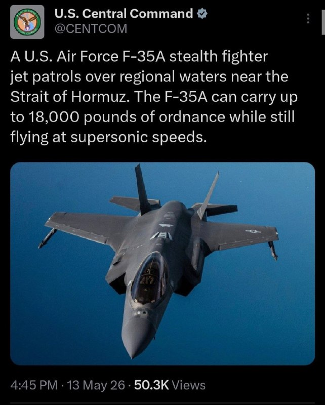

🔴 سنتکام با انتشار تصویری از گشت‌زنی جنگنده پنهان‌کار F-35A امریکا بر فراز آب‌های نزدیک تنگه هرمز خبر داد.

به گفته سنتکام، این جنگنده توان حمل تا ۱۸ هزار پوند مهمات را در سرعت مافوق صوت دارد.

@IranianMinds

## IranianMinds — post 20075

  <a href="telegram/content/IranianMinds_20075_1778691040.mp4" target="_blank">🎬 Download video</a>

🔴 حملات اسرائیل به جنوب لبنان

@IranianMinds

## IranianMinds — post 20074

🔴 پولیتیکو به نقل از یک مقام ارشد کاخ سفید:

چین پیش از دیدار ترامپ به ایران فشار آورده تا به توافق برسد با آمریکا.

@IranianMinds

## IranianMinds — post 20072

🔴 مجله فرانسوی Paris Match ادعا میکند که رئیس‌جمهور فرانسه، مکرون، چند ماه با گلشیفته فراهانی بازیگر‌ایرانی یک رابطهٔ افلاطونی ( رابطه صمیمانه عاطفی بدون رابطه ی جنسی ) داشته و پیام‌هایی مانند «خیلی زیبا هستی» رد و بدل کرده‌اند.

ماجرای جنجالی مه ۲۰۲۵ در هانوی که به نظر می‌رسید بریژیت او را در باند فرودگاه سیلی زده باشد، در واقع یک دعوای زوجین بوده، زمانی که بریژیت پیام‌ها را وسط پرواز در گوشی مکرون دیده است.

گلشیفته درباره این ادعا هنوز چیزی نگفته.

@IranianMinds

## IranianMinds — post 20071

  

😤دنبال یه سایت شرط بندی بین المللی بودی که به ایرانیا خدمات بده؟!
⛔

👍دربی بت همون انتخاب  100%

💎ویژگی های سایت جهانی Derby Bet:

⬅️امکان شارژ امن با کارت بانکی

⬅️واریز اول دوبل شارژ می شوید(بونوس۱۰۰٪)

⬅️پر اپشن ترین سایت فعال در ایران

⬅️تسویه حساب کمتر از 5 دقیقه

⬅️برگشت بخشی از باخت به صورت هفتگی

🚨کد هدیه ثبت نام:GG007

⚠️برای دانلود اپلکیشن کلیک کنید
👉
ge23

🔔کانال دربی بت :

🪙https://t.me/+aCbq7yy8QY80NzQ0

## IranianMinds — post 20070

  

🔴تقریبا همه غول‌های مالی و اقتصادی و امپراتوری‌های سرمایه‌داری آمریکا که همراه ترامپ به چین رفتند.

@IranianMinds

## IranianMinds — post 20069

  

🔴سپهبد ایال زامیر، رئیس ستاد کل ارتش اسرائیل:
نبرد هنوز به پایان نرسیده است. ارتش اسرائیل برای از سرگیری درگیری و حمله در صورت نیاز از کرانه باختری تا تهران آمادگی کامل دارد.

@IranianMinds

## IranianMinds — post 20068

  <a href="telegram/content/IranianMinds_20068_1778691045.mp4" target="_blank">🎬 Download video</a>

🔴ارتش اسرائیل حمله به زیرساخت‌های حزب‌الله را در چندین منطقه در جنوب لبنان تکمیل کرد

ارتش اسرائیل امروز (چهارشنبه) انبارهای تسلیحاتی، پرتابگرهای بارگذاری‌شده و آماده شلیک و سایر زیرساخت‌های تروریستی سازمان تروریستی حزب‌الله را در چندین منطقه در جنوب لبنان هدف قرار داد.

تروریست‌های سازمان تروریستی حزب‌الله از این زیرساخت‌ها برای پیشبرد طرح‌های تروریستی علیه نیروهای ارتش اسرائیل که در جنوب لبنان فعالیت می‌کنند و علیه اسرائیل استفاده می‌کردند.

در محل‌های شلیک که هدف قرار گرفتند، پرتابگرهای راکتی که به سمت منطقه فعالیت نیروهای ارتش اسرائیل و به سمت خاک اسرائیل هدف‌گیری شده بودند، منهدم شدند.

ارتش اسرائیل به اقدام علیه تهدیدها علیه شهروندان اسرائیل و نیروهای ارتش ادامه خواهد داد و مطابق با دستورالعمل‌های رده سیاسی عمل می‌کند.

@IranianMinds

## IranianMinds — post 20067

  <a href="telegram/content/IranianMinds_20067_1778691048.mp4" target="_blank">🎬 Download video</a>

🔴استقبال از پرزیدنت ترامپ در فرودگاه پکن.

@IranianMinds

## IranianMinds — post 20066

🔴دولت سوریه به طور رسمی از روسیه خواسته است که بشار اسد را برای محاکمه و پاسخ دادن به جنایات جنگی تحویل بدهد.

@IranianMinds

## IranianMinds — post 20065

  

🔴بالاخره هر چیزی تو یخچال هم بعد از یه مدت کپک می‌زنه، نه؟

@IranianMinds

## IranianMinds — post 20064

🔴علیرضا رئیسی، معاون وزیر بهداشت:

هانتا‌ویروس نمی‌تواند از مرزهای دریایی وارد ایران بشود، چون از تنگه هرمز، یک قایق بادی هم نمی‌تواند رد بشود، چه برسد به کشتی کروز.
اگر کشتی بخواهد از تنگه عبور کند، سریع مورد هدف قرار می‌گیرد و هانتا‌ویروس به همراه کشتی و همه چیز به هوا می‌رود.😂

@IranianMinds

## IranianMinds — post 20063

🔴 وال‌استریت ژورنال:

رییس موساد در جریان جنگ دو بار به امارات سفر کرد.

@IranianMinds

## IranianMinds — post 20062

  

میدونم باورتون نمیشه اما

اپل به صورت رسمی اولین نمایندگی خودش رو در افغانستان افتتاح کرد.

@IranianMinds

## IranianMinds — post 20061

🔴 ان‌بی‌سی نیوز و نیویورک تایمز به نقل از منابع پنتاگون: آمریکا درصورت شکست مطلق مذاکرات، اسم حمله به ایران رو به «چکش سنگین» تغییر می‌ده و یکبار دیگه به ایران حمله می‌کنه.

@IranianMinds

## IranianMinds — post 20060

🔴 کانال 13 اسرائیل:
نتانیاهو امشب جلسه امنیتی ویژه در مورد ایران برگزار خواهد کر‌د

@IranianMinds

## BBCPersian — post 280948

  <a href="telegram/content/BBCPersian_280948_1778691052.mp4" target="_blank">🎬 Download video</a>

🔻علیرضا ‌رئیسی، معاون وزیر بهداشت ایران در نشستی خبری امروز ۲۳ اردیبهشت در رابطه با احتمال ورود ویروس هانتا در ایران تاکید کرد که این ویروس «تاکنون مشاهده نشده است.»

شیوع ویروس هانتا، اوایل ماه مه در کشتی بزرگ تفریحی ام‌وی هاندی‌یوس که از آرژانتین به سمت قطب جنوب از مسیر اقیانوس اطلس در حرکت بوده، رخ داد.

معاون وزیر بهداشت با اشاره به این موضوع و بسته بودن تنگه هرمز احتمال ورود این ویروس به ایران از طریق مشابه را تقریبا محال دانست و به شوخی گفت: اگر حتی یک قایق بادی از این تنگه عبور کند در هوا می‌زنندش.»

سازمان جهانی بهداشت می‌گوید انتقال این ویروس از طریق انسان به انسان ممکن است، اما خطر گسترش عفونت در سطح جهانی همچنان پایین است.

آزمایش‌هایی برای تشخیص این عفونت وجود دارد، اما درمان اختصاصی برای آن وجود ندارد.
ادامه این گزارش را اینجا بخوانید.
@BBCPersian

## BBCPersian — post 280947

🔻آژانس بین‌المللی انرژی: عرضه جهانی نفت امسال از تقاضا کمتر است

آژانس بین‌المللی انرژی روز چهارشنبه با تغییر پیش‌بینی قبلی خود درباره وجود مازاد عرضه نفت، اعلام کرد که عرضه جهانی نفت امسال از کل تقاضا کمتر خواهد بود.

به گفته این نهاد، جنگ آمریکا و اسرائیل با ایران تولید نفت خاورمیانه را مختل کرده و حجم ذخایر را با سرعت بی‌سابقه‌ای کاهش می‌دهد.

از نظر آژانس بین‌المللی انرژی، جنگ ایالات متحده و اسرائیل با ایران و آسیب‌ به زیرساخت‌های نفتی ایران و کشورهای خلیج فارس و بسته شدن عملی تنگه هرمز، بزرگترین بحران عرضه نفت در تاریخ را رقم زده و به جهش قیمت نفت منجر شده است.

این آژانس در گزارش ماهانه خود اعلام کرد: «با توجه به اینکه تردد نفتکش‌ها در تنگه هرمز همچنان محدود است، مجموع کاهش عرضه تولیدکنندگان نفت خلیج فارس از یک میلیارد بشکه فراتر رفته و بیش از ۱۴ میلیون بشکه نفت در روز متوقف شده است که این یک شوک بی‌سابقه در عرضه محسوب می‌شود.»

آژانس بین‌المللی انرژی اعلام کرده است که به دلیل جنگ، عرضه جهانی نفت در سال ۲۰۲۶ حدود ۳‌/۹ میلیون بشکه در روز کاهش خواهد یافت.

پیش‌بینی قبلی این سازمان ۱/۵ میلیون بشکه کاهش در روز بود.

@BBCPersian

## BBCPersian — post 280946

🔻اهمیت سفر دو روزه ترامپ به چین در چیست

🖊بن هاتن، خبرنگار بی‌بی‌سی

دونالد ترامپ، رئیس‌جمهور آمریکا، برای اولین بار در نزدیک به یک دهه گذشته وارد چین شده است تا در مذاکراتی حساس با شی جین‌پینگ، همتای چینی‌اش شرکت کند.

برخی از بزرگ‌ترین چهره‌های صنعت آمریکا نیز در هواپیمای ریاست‌جمهوری آمریکا هنگام فرود در پکن حضور داشتند؛ از جمله ایلان ماسک، میلیاردر حوزه فناوری، جنسن هوانگ مدیر انویدیا، و کلی اورتبرگ از شرکت بوئینگ.

انتظار می‌رود تجارت یکی از اصلی‌ترین محورهای مذاکرات باشد. دونالد ترامپ گفته است «اولین درخواست» او این خواهد بود که چین «درهایش را باز کند تا این افراد نابغه بتوانند جادوی خود را به کار بگیرند.»

روابط آمریکا و چین در حوزه تجارت پرتنش بوده است. آقای ترامپ در آغاز دومین دوره ریاست‌جمهوری خود، جنگ تجاری‌ای را که در دوره اول آغاز کرده بود دوباره شعله‌ور کرد، هرچند دو طرف در اکتبر گذشته بر سر یک آتش‌بس تجاری توافق کردند.

اما موضوعات دیگری هم روی میز قرار دارد. به‌طور گسترده تصور می‌شود چین می‌تواند بر ایران نفوذ داشته باشد؛ کشوری که ترامپ به‌دنبال دستیابی به توافق صلح با آن است، هرچند تأکید کرده برای این کار به کمک چین نیازی ندارد. با این حال، پکن منافع خاص خود را در منطقه دارد؛ و برآورد می‌شود حدود ۹۰ درصد صادرات نفت ایران را خریداری کند.

مراسم رسمی و رویدادهای اصلی دیپلماتیک قرار است روزهای پنجشنبه و جمعه برگزار شود.

https://bbc.in/4uEGyKS
@BBCPersian

## BBCPersian — post 280945

  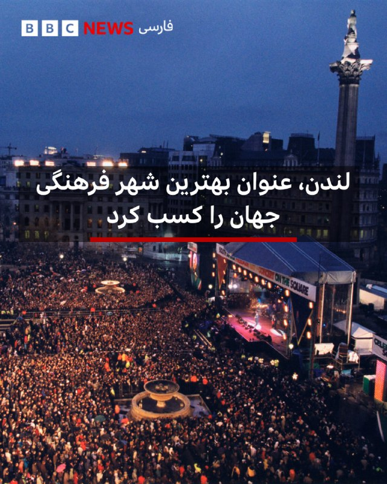

🔻«تایم‌اوت»، مجله اینترنتی جهانی، لندن را به‌عنوان بهترین شهر فرهنگی جهان معرفی کرد.

در این مجله از پایتخت بریتانیا به‌دلیل برخورداری از صحنه فرهنگی گسترده، باکیفیت و در دسترس تقدیر شد؛ صحنه‌ای که شامل «تئاتر، گالری‌های هنری، موزه‌ها، جشنواره‌های ادبی، موسیقی زنده و برنامه‌های کمدی» می‌شود.

این رتبه‌بندی بر اساس نظرسنجی از بیش از ۲۴ هزار شهروند در سراسر جهان و همچنین ارزیابی کارشناسان و دبیران مجله تایم‌اوت تهیه شده است.

جاستین سایمونز، معاون شهردار لندن در امور فرهنگ و صنایع خلاق، لندن را «یک پایتخت فرهنگی جهانی» توصیف کرد و گفت: «فرهنگ بخشی از دی‌ان‌ای لندن است. این بخش ۶۴ میلیارد پوند برای اقتصاد لندن ارزش دارد و دلیل اصلی سفر بیشتر گردشگران به این شهر است.»

در این رتبه‌بندی، پاریس در جایگاه دوم و نیویورک در رتبه سوم قرار گرفتند.

📷Getty Images
@BBCPersian

## BBCPersian — post 280936

🖊سو میچل, بی‌بی‌سی

تحقیقات بی‌بی‌سی هویت یکی از سردسته‌های قاچاقچیان انسان در ارتباط با انتقال مهاجران با قایق‌های کوچک به بریتانیا را فاش کرده است؛ فردی که گفته می‌شود شبکه‌اش در سال‌های اخیر مسئول بخش عمده عبورهای غیرقانونی از کانال مانش بوده است.

این مرد ۲۸ ساله که کرد عراقی است، سال‌ها با استفاده از نام مستعار «کاردو رانیه» از بازداشت گریخته بود.او نام واقعی خود را به شدت مخفی نگه داشته بود و این مسئله تلاش نهادهای مجری قانون برای صدور حکم بین‌المللی بازداشت علیه او را با مشکل روبه‌رو کرده بود.

نبود اطلاعات درباره نام واقعی کاردو رانیه همچنین باعث شده بود نیروهای پلیس در کشورهای مختلف اروپایی نتوانند به راحتی محل حضور او را ردیابی کنند یا سرنخ‌ها را فراتر از مرزهای خود دنبال کنند.

اما من و همکارم راب لاوری، با استفاده از رابط‌هایی در دنیای قاچاق، توانستیم ردپایی را از اردوگاه‌های مهاجران در سواحل شمالی فرانسه تا اقلیم کردستان دنبال کنیم؛ مسیری که در نهایت به شناسایی هویت واقعی و جزئیات مربوط به کاردو رانیه و سپس رویارویی مستقیم با او منجر شد.
https://bbc.in/431R0jQ
📸BBC/ GettyImages/ AFP via Getty

## BBCPersian — post 280935

🔻قوه قضائیه ایران، اموال ۲۴ شهروند ایرانی در استان هرمزگان را توقیف کرد

مجتبی قهرمانی، رئیس دادگستری استان هرمزگان می‌گوید که اموال ۲۴ شهروند ایرانی در این استان را توقیف کرده است که در خارج از ایران سکونت دارند.

آقای قهرمانی این افراد را به «همکاری با دشمن» متهم کرد که منظورش اسرائیل و آمریکاست.

در هفته‌های اخیر قوه قضائیه ایران چندین بار با انتشار فهرستی از شهروندان ساکن استان‌های مختلف گفته که اموال آنها را توقیف کرده است.

در میان شهروندانی که اموالشان توقیف شده است، طیف وسیعی از اقشار جامعه از خبرنگاران تا بازیگران سابق و فعالان سیاسی و هنرمندان، دیده می‌شوند.

فعالان مجازی حامی جمهوری اسلامی در جریان جنگ ۴۴ روزه، اقدام به فراخوان‌هایی برای معرفی مخالفان جمهوری اسلامی کرده بودند. آنها این مخالفان را «حامی جنگ» خوانده‌اند.

قوه قضائیه ایران پس از جنگ آمریکا و اسرائیل با ایران، با استناد به قانون «تشدید مجازات جاسوسی» معترضان و مخالفان را به «همراهی با دشمن» متهم کرد. در پی این جنگ، سرکوب مخالفان جمهوری اسلامی شدت یافته است.

اما این توقیف‌ها به موضوع جنگ محدود نیست؛ در زمان اعتراضات دی‌ماه هم اموال بعضی از چهره‌های شناخته شده در داخل ایران ضبط شد.

محمد ساعدی‌نیا، مالک کافه‌های «ساعدی‌نیا» یکی از آنها بود که قوه قضائیه به اتهام اینکه «مردم را دعوت به اغتشاش و آشوب کرده بود» او را بازداشت و دستور توقیف کلیه اموال و حساب‌های بانکی‌اش را صادر کرد.

@BBCPersian

## BBCPersian — post 280934

🔻افزایش مشکلات معیشتی شهروندان در ایران؛ کارگروه آرد و نان اتاق اصناف، «افزایش قیمت نان» را رد کرد

هم‌زمان با گزارش‌ها در ایران از افزایش بسیاری از اقلام خوراکی، محمدجواد کرمی، رئیس کارگروه آرد و نان اتاق اصناف ایران، انتشار نرخ‌های جدید نان را رد کرده است.

آقای کرمی گفت: «قیمت‌های جدید نرخ نان که در فضای مجازی دست به دست می‌شود اشتباه است و نرخ جدیدی برای نان تصویب نشده است.»

او گفته است که از دیروز فهرست قیمت‌های جدید نان در فضای مجازی می‌چرخد و حتی در خیابان‌ها مردم از افزایش قیمت از امروز خبر می‌دادند اما تاکید کرد که تصمیم جدیدی در این زمینه ابلاغ نشده است.

حدود چهار روز پیش ابوذر گل‌محمدی، رییس اتحادیه نانوایان همدان نرخ‌های جدیدی را برای اردیبهشت ماه اعلام کرد و گفت نانوایان ملزم به رعایت آن هستند.

بر اساس نرخ‌‌های جدیدی که او اعلام کرد، قیمت نان لواش ۲ هزار تومان، نان سنگک هشت هزار تومان، نان بربری ساده ۶ هزار و ۵۰۰ تومان و نان محلی و تافتون سه هزار و ۵۰۰ تومان تعیین شده است.

پیشتر هم رئیس اتاق اصناف به مشکلات در عرضه بعضی از نان‌ها اشاره کرده بود.

او گفته بود که «در حال حاضر در حوزه نان، تنها در بخش نان‌های بربری و سنگک با برخی مشکلات مواجه هستیم.»

مشکلات صنف نانوایی در ایران در حالی ادامه دارد که نانوایان از درآمد خود رضایت ندارند و از نحوه تخصیص یارانه‌ها گله‌مندند.

مشکلات گرانی در ایران البته محدود به نان نیست، از آغاز جنگ آمریکا و اسرائیل قیمت اقلام چند برابر شده است.

بر اساس گزارش آمار مرکز آمار ایران، تورم نقطه‌ای کالاهای اساسی خوراکی در فروردین ماه امسال (۱۴۰۵) به سطح کم‌سابقه‌ای رسید.

در این گزارش روغن نباتی جامد با افزایش ۳۷۵ درصدی قیمت (نقطه به نقطه) در صدر مواد خوراکی گران قرار گرفت.

پس از آن روغن مایع با ۳۰۸ درصد و برنج خارجی با ۲۰۹ درصد افزایش قیمت، در رتبه‌های بعدی گرانی قرار دارند.

@BBCPersian

## BBCPersian — post 280933

  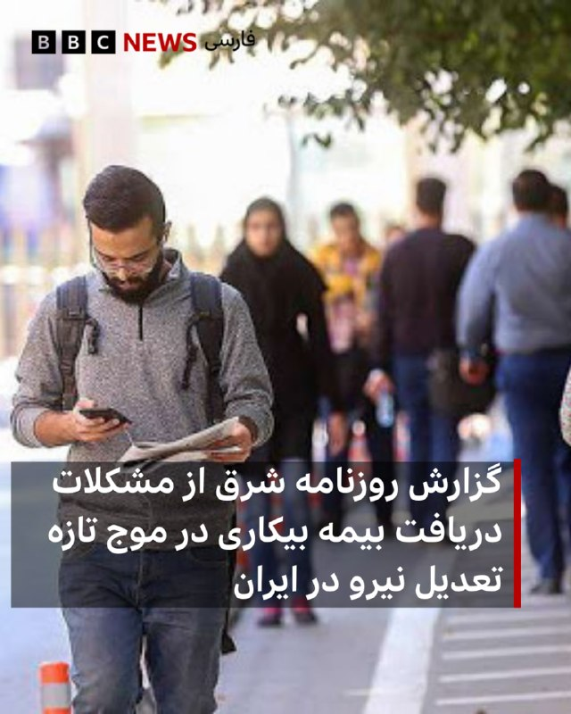

🔻روزنامه شرق در گزارشی با عنوان «تعدیل شده‌ها پشت درهای بسته بیمه» به مشکلات دریافت بیمه بیکاری در موج تازه تعدیل نیرو در ایران پرداخته است.

در این گزارش با اشاره به «موج فزاینده تعداد بیکاران»، آمده است که «نداشتن قرارداد کاری یا در اختیار نداشتن نسخه‌ای از قرارداد» به یکی از معضلات متقضیان برای شروع روند اداری درخواست بیمه بیکاری تبدیل شده است.

در اصنافی مانند رسانه‌های ایران، نداشتن قرارداد موضوعی بسیار رایج است.

به‌نوشته روزنامه شرق، «بسیاری از متقاضیان می‌گویند که پس از ثبت درخواست، در نوعی بلاتکلیفی میان اداره کار و سازمان تأمین اجتماعی گرفتار می‌شوند؛ جایی که هیچ‌کدام مسئولیت تأخیرها را نمی‌پذیرند و متقاضی نیز نمی‌داند دقیقا باید از چه نهادی پاسخ بخواهد.»

بعضی متقاضیان که شرق با آنها گفتگو کرده، از قطع بیمه بیکاری پس از اشتغال کوتاه‌مدت یا پروژه‌ای انتقاد دارند.

«شرق» گفته است که برای پیگیری ماجرا به سراغ بیمه تامین اجتماعی رفته است اما روابط‌عمومی این سازمان می‌گوید که «این موضوع به آنها مربوط نمی‌شود و وزارت کار متولی است.»

📷SNN
@BBCPersian

## BBCPersian — post 280932

🔻ایران، تعرفه‌های تجاری وسرمایه‌گذاری؛ موضوعاتی که ترامپ در سفرش به چین ممکن است پیگیر آنها باشد

🖊تام بیتمن، خبرنگار امور وزارت خارجه آمریکا، گزارش از پکن

همان‌طور که همیشه درباره دونالد ترامپ صادق است، بخش بزرگی از این سفر صرفا به تصاویر و نمایش‌های رسانه‌ای مربوط می‌شود؛ او دوست دارد در کنار رهبران قدرتمند و در میان تشریفات دولتی دیده شود. اما از منظر سیاست‌گذاری، تصویر بسیار پیچیده‌تر است.

آقای ترامپ به‌شدت به یک موفقیت نیاز دارد تا از فشار ناشی از سقوط محبوبیتش و احتمال شکست جمهوری‌خواهان در انتخابات میان‌دوره‌ای امسال بکاهد، که به دلیل افزایش هزینه‌های زندگی تشدید شده است.

با توجه به این‌که بخشی از این فشار اقتصادی به جنگ ایران مرتبط است، گفت‌وگو با شی جین‌پینگ می‌تواند مفید باشد. البته اگر پکن حاضر شود بر تهران فشار وارد کند، هرچند این هدف برای ترامپ بسیار دشوار است.

در مقابل، شی جین‌پینگ ممکن است از آقای ترامپ امتیازاتی درباره حمایت واشنگتن از تایوان مطالبه کند. به‌ویژه فروش تسلیحات به تایوان که پکن آن را بخشی از خاک خود می‌داند.

با این حال، کاخ سفید پیشاپیش اعلام کرده است که سیاستش درباره تایوان تغییر نخواهد کرد.

پیروزی‌های آسان‌تر برای آقای ترامپ در حوزه تجارت خواهد بود. انتظار می‌رود که آتش‌بس کنونی در جنگ تعرفه‌ای که او پاییز گذشته با شی به آن رسید، حفظ شود. این موضوع به تداوم جریان صادرات عناصر نادر خاکی و آهنرباهای چینی کمک می‌کند که برای فناوری آمریکا، از جمله صنایع دفاعی، حیاتی هستند.

همچنین ممکن است وعده‌هایی درباره سرمایه‌گذاری چین در آمریکا مطرح شود. از جمله آنها خرید هواپیماهای بوئینگ و واردات بیشتر سویا از آمریکاست.

موضوعی که برای کشاورزان ناراضی در برخی ایالت‌های کلیدی انتخاباتی، اهمیت زیادی دارد.

https://bbc.in/3R8zyHJ
@BBCPersian

## BBCPersian — post 280931

🔻سفر مقام‌های ایرانی به هند برای اجلاس وزرای خارجه کشورهای عضو بریکس

در آستانه اجلاس وزرای خارجه کشورهای عضو بریکس، کاظم غریب‌آبادی، معاون وزیر خارجه ایران به دهلی‌نو سفر و با مقام های هند دیدار کرده است.

نشست وزرای خارجه بریکس قرار است از فردا به مدت دو روز به ریاست هند تشکیل شود و مقدمه اجلاس رهبران را که در شهریور به میزبانی همین کشور است، فراهم کند.

اسماعیل بقایی، سخنگوی وزارت خارجه ایران به یک روزنامه هندی گفته است که نشست فردا برای تهران اهمیت زیادی دارد و ایران امیدوار است در حاشیه آن دیدارهای دوجانبه‌ای از جمله با وزیر خارجه هند برگزار شود.

آقای بقایی درباره احتمال حمله مجدد آمریکا به ایران به روزنامه ایندیا تودی گلوبال گفته است «می‌توانم اطمینان دهم نیروهای مسلح ما برای هر سناریویی آماده هستند» و ادامه داده «هر کسی که جرأت کند پا به خاک ایران بگذارد، به‌شدت از این اقدام پشیمان خواهد شد.»

@BBCPersian

## BBCPersian — post 280930

  <a href="telegram/content/BBCPersian_280930_1778691057.mp4" target="_blank">🎬 Download video</a>

🔻رسانه‌های ایران از برگزاری رزمایش پنج روزه سپاه تهران بزرگ با محوریت مقابله با عملیات «هلی برن» نیروهای متخاصم برای پیاده کردن سرباز در خاک ایران خبر دادند.

به نوشته خبرگزاری فارس این رزمایش برای «تقابل با تهدیدات احتمالی اجرا شده و در آن رده‌های تابعه سپاه تهران بزرگ شامل؛ لشکر ۲۷ محمد رسول‌الله، تیپ یکم امنیت حضرت زهرا، تیپ دوم امنیت آل محمد و یگان فاتحین حضور داشته‌‌اند.»

در تصاویری که فارس و تسنیم نزدیک به سپاه پاسداران از این رزمایش منتشر کردند، گروهی از نیروهای پیاده، موتورسوار و وانت‌سوار با سلاح‌های سبک، نیمه‌سنگین و پهپاد به اهداف فرضی تعیین‌شده از جمله تصویر یک هلی‌کوپتر شلیک می‌کنند.
‌
پیشتر در فروردین ۱۴۰۵ و در جریان عملیات جستجو و نجات خلبان دوم جنگنده اف-۱۵ آمریکا که مورد هدف قرار گرفته و در مناطق کوهستانی جنوب غربی ایران سرنگون‌شده بود، تصاویری از ورود هلی‌کوپترهای بلک‌هاوک و هواپیمای تانکر سوخت‌رسان به خاک ایران و شلیک ماموران پلیس و شماری از مردم محلی به آنها منتشر شد.
متن کامل این گزارش را اینجا بخوانید.

@BBCPersian

## BBCPersian — post 280929

  <a href="telegram/content/BBCPersian_280929_1778691059.mp4" target="_blank">🎬 Download video</a>

🔻سرخط خبرهای چهارشنبه ۲۳ اردیبهشت ۱۴۰۵

@BBCPersian

## idfinfarsi — post 11575

  <a href="telegram/content/idfinfarsi_11575_1778691063.mp4" target="_blank">🎬 Download video</a>

‏بیانیه مشترک سخنگوی ارتش اسرائیل و سخنگوی شاباک:

‏‼️برای رفع تهدید علیه نیروهای ما در حال فعالیت در منطقه خط زرد: ارتش اسرائیل و شاباک یک تروریست نخبه از سازمان تروریستی حماس را که در حمله به پایگاه نحل عوز در ۷ اکتبر مشارکت داشت، به هلاکت رساندند

‏⭕️نیروهای ارتش اسرائیل در فرماندهی جنوب و شاباک هفته گذشته (چهارشنبه) با استفاده از نیروی هوایی، تروریست حمزه شَرباصی، فرمانده در گردان شجاعیه از سازمان تروریستی حماس در شمال نوار غزه را به هلاکت رساندند.

‏❌تروریست شرباصی در کشتار وحشیانه ۷ اکتبر به داخل خاک اسرائیل نفوذ کرد و در حمله به پایگاه نحل عوز که در آن سربازان ارتش کشته و ربوده شدند، مشارکت داشت.

‏⭕️در زمان اخیر، شرباصی در نزدیکی خط زرد فعالیت می‌کرد و در چارچوب وظیفه خود به پیشبرد طرح‌های تروریستی علیه نیروهای ارتش اسرائیل در منطقه می‌پرداخت.

‏⭕️ارتش اسرائیل اکنون تصویری از حمزه شرباصی منتشر می‌کند که او را در یک پناهگاه در پایگاه نحل عوز در جریان کشتار ۷ اکتبر نشان می‌دهد.

‏⭕️در همان حمله، عزام الحیه، یک تروریست نخبه دیگر از سازمان تروریستی حماس که در زمان اخیر نقش مرکزی در این سازمان ایفا می‌کرد، نیز به هلاکت رسید.

‏⭕️نیروهای ارتش اسرائیل در فرماندهی جنوب مطابق با توافق در منطقه مستقر هستند و به فعالیت برای رفع هرگونه تهدید فوری ادامه خواهند داد

## idfinfarsi — post 11574

  <a href="telegram/content/idfinfarsi_11574_1778691065.mp4" target="_blank">🎬 Download video</a>

ارتش اسرائیل حمله به زیرساخت‌های حزب‌الله را در چندین منطقه در جنوب لبنان تکمیل کرد

ارتش اسرائیل امروز (چهارشنبه) انبارهای تسلیحاتی، پرتابگرهای بارگذاری‌شده و آماده شلیک و سایر زیرساخت‌های تروریستی سازمان تروریستی حزب‌الله را در چندین منطقه در جنوب لبنان هدف قرار داد.

تروریست‌های سازمان تروریستی حزب‌الله از این زیرساخت‌ها برای پیشبرد طرح‌های تروریستی علیه نیروهای ارتش اسرائیل که در جنوب لبنان فعالیت می‌کنند و علیه اسرائیل استفاده می‌کردند.

در محل‌های شلیک که هدف قرار گرفتند، پرتابگرهای راکتی که به سمت منطقه فعالیت نیروهای ارتش اسرائیل و به سمت خاک اسرائیل هدف‌گیری شده بودند، منهدم شدند.

ارتش اسرائیل به اقدام علیه تهدیدها علیه شهروندان اسرائیل و نیروهای ارتش ادامه خواهد داد و مطابق با دستورالعمل‌های رده سیاسی عمل می‌کند.

## idfinfarsi — post 11572

‏‼️رئیس ستاد کل ارتش اسرائیل در شمال سامره: «ما واقعیت امنیتی جدیدی در تمام جبهه‌ها ایجاد کرده‌ایم؛ با این حال، نبرد به پایان نرسیده است. ارتش اسرائیل برای ازسرگیری جنگ در صورت نیاز آماده است و در حالت آمادگی و هوشیاری دائمی در دفاع و حمله قرار دارد، از یهودیه و سامره تا تهران»

‏🔸رئیس ستاد کل ارتش اسرائیل، سپهبد ایال زامیر: ‏«ارتش اسرائیل در همه جبهه‌ها با ابتکار و رویکرد تهاجمی عمل می‌کند. ما واقعیت امنیتی جدیدی ایجاد کرده‌ایم — در لبنان به عملیات ادامه می‌دهیم، در لیتانی و مناطق دیگر فعالیت می‌کنیم و هر روز ده‌ها تروریست و زیرساخت را خنثی می‌کنیم.
‏🔸همچنین در غزه به‌صورت تهاجمی عمل کرده و تروریست‌ها را به هلاکت می‌رسانیم و در اینجا در یهودیه و سامره نیز بدون وقفه فعالیت می‌کنیم و به دستاوردها دست می‌یابیم. هیچ‌گونه خویشتنداری وجود ندارد — فقط ابتکار عمل.

‏🔸نبرد هنوز به پایان نرسیده است. ارتش اسرائیل برای ازسرگیری درگیری در صورت نیاز آماده است و در آمادگی و هوشیاری دائمی، در دفاع و حمله، از یهودیه و سامره تا تهران قرار دارد.»

## Dirty_Kids — post 389383

ببخشید من متوجه نشدم تو این مثلث عشقی فاعل کیه؟

@Dirty_Kids 👻

## Dirty_Kids — post 389382

  <a href="telegram/content/Dirty_Kids_389382_1778691068.mp4" target="_blank">🎬 Download video</a>

نمیدونم سوال نفهمید یا خوب توجیه نشده :)))

مصاحبه‌گر: «قبول دارید عامل گرانی‌ها محاصره آمریکا علیه ماست؟»

حامی حکومت: «نه، قبول ندارم!»

@Dirty_Kids 👻

## Dirty_Kids — post 389381

  

🌪وقتی اینترنت طوفانیه... کافیه بادبان ها رو بکشی تا

⚫️با بالاترین کیفیت ممکن
⚡️ 

⚫️100 هزار تومان شارژ هدیه 
🎁

⚫️پایین ترین قیمت گیگی 250
🌐 

⚫️و ارائه پورسانت %10 در ازای هر معرفی
💼

بتونی یه اتصال پایدار با پشتیبانی 24 ساعته داشته باشی
🚀

بادبان راهتو باز می‌کنه
⛵️

G23

🛡@BadBan_VPN | کانال 

🤖@BadBan_VPNBot | ربات 

📞@BadBan_VPNSupport | پشتیبانی

## Dirty_Kids — post 389380

  <a href="telegram/content/Dirty_Kids_389380_1778691070.mp4" target="_blank">🎬 Download video</a>

عمو مانوک
این قسمت: انگلیس جاکش

@Dirty_Kids 👻

## Dirty_Kids — post 389378

‏با این گرونی امسال تابستون مام دیگه اجباری نیست. می‌تونین بو بدین

@Dirty_Kids 👻

## Dirty_Kids — post 389377

  

چون عرزشی‌ها خیلی میسوزن

@Dirty_Kids 👻

## Dirty_Kids — post 389375

  <a href="telegram/content/Dirty_Kids_389375_1778691073.mp4" target="_blank">🎬 Download video</a>

مراسم استقبال از شیرخدا با شعار چینی‌های قرمساق در صحنه که به زبون چینی می‌گفتن:

عمو ترامپ، عیان شد
چین مرکز جهان شد

@Dirty_Kids 👻

## Dirty_Kids — post 389374

گیاها خیلی مادر جندن تا وقتی توی گلفروشی هستن صاحبشون تف کف دست اینا نمیندازه مرگ بهشون نمیده محل سگشون نمیذارن و مثل خر رشد میکنن تا میاری خونه مکمل و هرروز قربون صدقه اب خوب و کلی بوس بوسی یهو تققق آی من ملدم

@Dirty_Kids 👻

## Dirty_Kids — post 389373

فلورین تاردیف که روزنامه‌نگاره، کتاب جدیدی چاپ کرده به اسم «Un couple parfait» و جایی از کتابش به اون ماجرای چک زدن بریژیت مکرون تو صورت مردک قرمساق امانوئل مکرون جلو در هواپیما اشاره کرده و نوشته، اون داستان به خاطر پیام‌های بوجی موجی طور از گلشیفته فراهانی…

## Dirty_Kids — post 389372

پرستو‌های چروک نظام

فسیل مغزهایی که سی سال خارج از ایران زندگی کردن و جالبه که اکثرشون از دست ج.ا. در اروپا پناهنده شدن ولی الان بعد از این همه سال یادشون رفته و دارن از همین ج.ا. دفاع میکنن و مردم بپا خواسته ای ان رو جاسوس و خائن معرفی میکنن! واقعاً که عقده پهلوی با این چپها چه ها که نکرد 🤦🏻‍♂️

@Dirty_Kids 👻

## Dirty_Kids — post 389371

  <a href="https://t.me/Dirty_Kids/389371" target="_blank">📎 Download file</a>

✅ اپلیکیشن اندروید سایت جهانی دربی بت

💰اولین سایت جهانی با امکان شارژ و برداشت ریالی(کارت به کارت)

🔗 برای ورود فیلترشکن روی کشور مناسب قرار دهید مانند فنلاند و المان و....

😀Telegram Channel
👇
https://t.me/+bcynkEgSW2dlYTc0

## Dirty_Kids — post 389370

  

😤دنبال یه سایت شرط بندی بین المللی بودی که به ایرانیا خدمات بده؟!
⛔

👍دربی بت همون انتخاب  100%

💎ویژگی های سایت جهانی Derby Bet:

⬅️امکان شارژ امن با کارت بانکی

⬅️واریز اول دوبل شارژ می شوید(بونوس۱۰۰٪)

⬅️پر اپشن ترین سایت فعال در ایران

⬅️تسویه حساب کمتر از 5 دقیقه

⬅️برگشت بخشی از باخت به صورت هفتگی

🚨کد هدیه ثبت نام:GG007

⚠️برای دانلود اپلکیشن کلیک کنید
👉

🔔کانال دربی بت :

🪙https://t.me/+bcynkEgSW2dlYTc0

## Dirty_Kids — post 389369

  

🔴 خبری تو فضای مجازی وایرال شده که ادعا می‌کنه «هانتا ویروس» باعث کوچک شدن آلت تناسلی مردان تا 7.6 سانت میشه!

❌ این خبر کاملاً فیکه و منبعش یه صفحه توییتری ترکیه‌ایه که معمولاً شایعات و خبرهای وایرالِ بدون منبع معتبر رو منتشر می‌کنه.

هانتا ویروس ممکنه تو برخی موارد باعث اختلال در نعوظ بشه، اما هیچ مدرک علمی معتبری درباره کوچک شدن آلت تناسلی بر اثر این ویروس وجود نداره.

@Dirty_Kids 👻

## Dirty_Kids — post 389366

🔴 این عکس با عنوان " اوه اوه زید وینی دیلدو کمری خریده تا ترتیب وینیسیوس رو بده😳😂" داره وایرال میشه؛

❌ این شات با هوش مصنوعی درست شده، عکس اصلی مربوط به سال 2007 که مدونا، خواننده آمریکایی با این دیلدو شکار شده بود.

@Dirty_Kids 👻

## Hranews — post 112932

  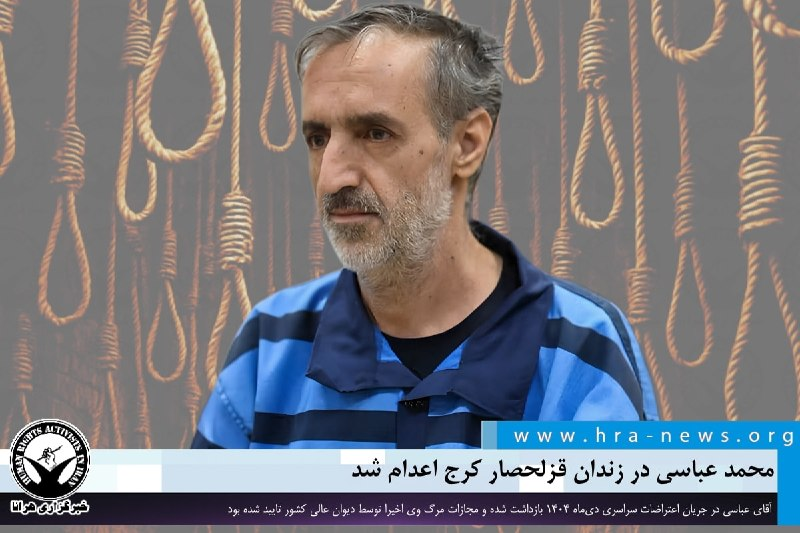

اعتراضات دی‌ماه ۱۴۰۴؛ محمد عباسی در زندان قزلحصار کرج اعدام شد

❗️
❗️
❗️
❗️
❗️– محمد عباسی، از بازداشت شدگان اعتراضات سراسری دی‌ماه ۱۴۰۴، محبوس در زندان قزلحصار کرج سحرگاه امروز #اعدام شد. آقای عباسی در جریان اعتراضات سراسری دی‌ماه ۱۴۰۴ بازداشت شده و حکم اعدام وی به تازگی توسط دیوان عالی کشور تایید شده بود.

به گزارش خبرگزاری هرانا، ارگان خبری مجموعه فعالان حقوق بشر در ایران، یکی دیگر از معترضان بازداشت شده در جریان اعتراضات سراسری ۱۴۰۴، اعدام شد. همزمان با آغاز درگیری‌های نظامی، روند صدور و اجرای احکام اعدام در پرونده‌های سیاسی و امنیتی افزایش یافته است. با احتساب محمد عباسی، تاکنون ۳۲ زندانی با این اتهامات در بازه زمانی پس از آغاز مخاصمه بین آمریکا-اسرائیل و ایران اعدام شده‌اند.

یک منبع مطلع نزدیک به خانواده این زندانی سیاسی، در تماس با هرانا گفت: «مسئولان زندان قزلحصار کرج از خانواده محمد عباسی خواستند که برای ملاقات با وی به زندان مراجعه کنند. اما پس از حضور خانواده در زندان، این امکان از نزدیکان او سلب شد. پس از خروج خانواده عباسی از زندان، آنها در تماسی تلفنی از اجرای حکم اعدام محمد عباسی مطلع شدند.»

ادامه مطلب

#محمد_عباسی

↘️
@hranews_bot تماس ✉️ - @Hranews کانال هرانا 🆑

## Hranews — post 112931

  

روزهای نامعلوم در زندان؛ وضعیت بلاتکلیف شکیلا قاسمی، شهروند بهائی ادامه دارد

❗️
❗️
❗️
❗️
❗️– شکیلا قاسمی، شهروند بهائی ساکن کرمان، با گذشت بیش از سه ماه از زمان بازداشت، به صورت بلاتکلیف در زندان کرمان نگهداری می‌شود. وی پس از گذراندن بیش از ۴۰ روز در بازداشتگاه اطلاعات سپاه، به سلول انفرادی زندان کرمان منتقل شده است.

به گزارش خبرگزاری هرانا، ارگان خبری مجموعه فعالان حقوق بشر در ایران، شکیلا قاسمی، شهروند بهائی کماکان در بازداشت موقت به سر می‌برد.

یک منبع مطلع نزدیک به خانواده این شهروند بهائی، ضمن تایید این موضوع به هرانا گفت: «خانم قاسمی علیرغم گذشت ۱۰۳ روز از زمان بازداشت، همچنان به صورت بلاتکلیف در زندان کرمان نگهداری می‌شود. وی حدود ۴۷ روز در بازداشتگاه اطلاعات سپاه تحت بازجویی قرار داشت و سپس به سلول انفرادی در زندان کرمان منتقل شد. پس از مخالفت با آزادی او به قید وثیقه، دوران انفرادی وی در قطع ارتباط کامل با خانواده آغاز شد. فشارهای وارده در این دوران منجر به بروز حملات عصبی و انتقال او به بهداری شد. وی همچنان با این حملات دست‌ و پنجه نرم می‌کند و تحت درمان است.»

این منبع مطلع افزود: «در حال حاضر وی تماس تلفنی روزانه و ملاقات هفتگی دارد، اما با انتقال او به بند عمومی موافقت نشده است. اتهامات به طور رسمی اعلام نشده، اما به خود او تفهیم شده و وی تمامی اتهامات را رد کرده است. همچنین اعلام شده است که تا زمان برگزاری دادگاه، آزاد نخواهد شد.»

ادامه مطلب

#شکیلا_قاسمی

↘️
@hranews_bot تماس ✉️ - @Hranews کانال هرانا 🆑

## Hranews — post 112930

  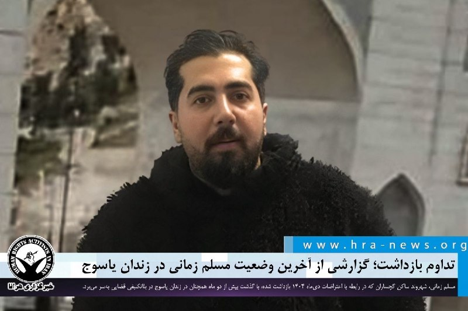

تداوم بازداشت؛ گزارشی از آخرین وضعیت مسلم زمانی در زندان یاسوج

❗️
❗️
❗️
❗️
❗️– مسلم زمانی، شهروند ساکن گچساران که در رابطه با اعتراضات دی‌ماه ۱۴۰۴ بازداشت شده، با گذشت بیش از دو ماه همچنان در زندان یاسوج در بلاتکلیفی قضایی به‌سر می‌برد.

به گزارش خبرگزاری هرانا، ارگان خبری مجموعه فعالان حقوق بشر در ایران، مسلم زمانی در #بازداشت به‌سر می‌برد.

بر اساس اطلاعات دریافتی هرانا، آقای زمانی اواسط اسفندماه سال گذشته در رابطه با اعتراضات دی ماه بازداشت شده است. اکنون او با اتهاماتی همچون اجتماع و تبانی علیه امنیت ملی و عضویت در دسته یا جمعیتی با هدف برهم زدن امنیت کشور، مواجه شده است.

یک منبع مطلع نزدیک به خانواده این متهم سیاسی ضمن تایید این خبر به هرانا گفت: “پرونده قضایی او در دادگاه انقلاب گچساران است و تاکنون زمان برگزاری دادگاه تعیین نشده است. از زمان بازداشت تاکنون او از دسترسی به وکیل محروم مانده و هیچ اقدام موثری برای رسیدگی به پرونده اش صورت نگرفته است.”

ادامه مطلب

#مسلم_زمانی

↘️
@hranews_bot تماس ✉️ - @Hranews کانال هرانا 🆑

## Hranews — post 112929

دادگستری هرمزگان از توقیف اموال ۲۴ شهروند خبر داد

❗️
❗️
❗️
❗️
❗️ – اموال و دارایی‌های ۲۴ شهروند خارج از کشور در هرمزگان مصادره شد. رئیس کل دادگستری هرمزگان این افراد را به «همکاری با دشمن» متهم کرده است.

#توقیف_اموال

ادامه مطلب

↘️
@hranews_bot تماس ✉️ -  @Hranews  کانال هرانا 🆑

## Hranews — post 112928

  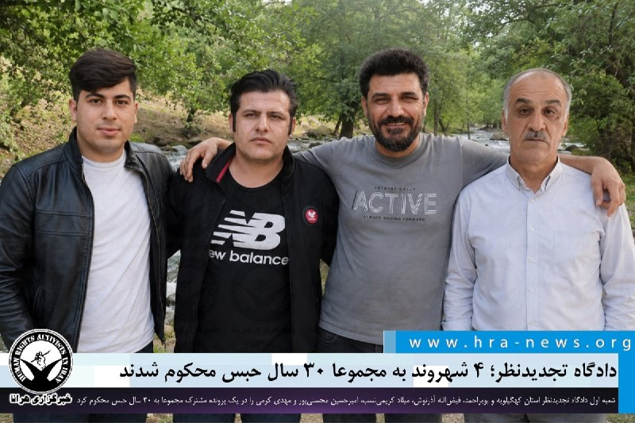

دادگاه تجدیدنظر؛ ۴ شهروند مجموعا به ۳۰ سال حبس محکوم شدند

❗️
❗️
❗️
❗️
❗️– شعبه اول دادگاه تجدیدنظر استان کهگیلویه و بویراحمد، فیض‌الله آذرنوش، میلاد کریمی‌نسب، امیرحسین محسنی‌پور و مهدی کرمی را در یک پرونده مشترک مجموعا به ۳۰ سال حبس محکوم کرد. از این میزان، با اعمال ماده ۱۳۴ قانون مجازات اسلامی، ۱۶ سال حبس قابل اجرا خواهد بود.

به گزارش خبرگزاری هرانا، ارگان خبری مجموعه فعالان حقوق بشر در ایران، احکام قطعی چهار متهم سیاسی در دادگاه تجدیدنظر استان کهگیلویه و بویراحمد صادر شد.

بر اساس دادنامه صادره، شعبه اول دادگاه تجدیدنظر استان کهگیلویه و بویراحمد، فیض‌الله آذرنوش، میلاد کریمی‌نسب، امیرحسین محسنی‌پور و مهدی کرمی را در مجموع به ۳۰ سال حبس تعزیری محکوم کرده است. این حکم با مستشاری سید ابوالحسن دادگر و سعید جریده اصل، علیه افراد نامبرده صادر شده است.

شرح عناوین اتهامی هر یک از متهمان به همراه میزان محکومیت قطعی صادره به شرح زیر است:

ادامه مطلب

#فیض‌الله_آذرنوش #میلاد_کریمی‌نسب
#امیرحسین_محسنی‌پور #مهدی_کرمی

↘️
@hranews_bot تماس ✉️ - @Hranews کانال هرانا 🆑

## Hranews — post 112927

  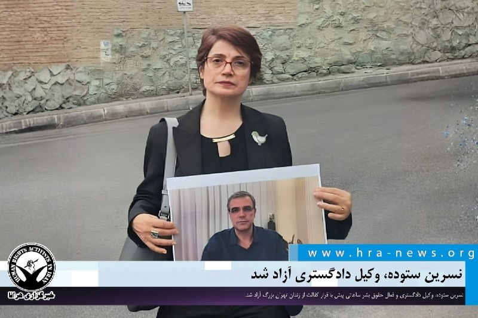

نسرین ستوده، وکیل دادگستری آزاد شد

❗️
❗️
❗️
❗️
❗️– نسرین ستوده، وکیل دادگستری و فعال حقوق بشر ساعاتی پیش با قرار کفالت از زندان تهران بزرگ آزاد شد.

به گزارش خبرگزاری هرانا، ارگان خبری مجموعه فعالان حقوق بشر در ایران، نسرین ستوده آزاد شد.

آزادی نسرین ستوده، ساعاتی پیش با قرار کفالت صورت گرفته است. بر اساس اطلاعات دریافتی هرانا، خانم ستوده از زندان تهران بزرگ آزاد شده است.

همزمان با شروع درگیری های نظامی در ایران، زندانیان محبوس در بازداشتگاه وزارت اطلاعات موسوم به بند ۲۰۹ زندان اوین به زندان تهران بزرگ منتقل شده اند.

ادامه مطلب

#نسرین_ستوده

↘️
@hranews_bot تماس ✉️ - @Hranews کانال هرانا 🆑

## Hranews — post 112926

  

به گفته یحیی عزیزی، دبیر کارگروه پیگیری مطالبات کارکنان وزارت جهاد کشاورزی، کارکنان این وزارتخانه با وجود نقش مهم در حفظ ثبات بازار و تأمین امنیت غذایی کشور، با وضعیت معیشتی نامناسبی مواجه هستند. او با اشاره به حقوق حدود ۲۴ میلیون تومانی کارکنان، تأکید کرده است که این رقم در مقایسه با خط فقر شهری ۷۰ تا ۷۵ میلیون تومانی فاصله قابل توجهی دارد و پاسخگوی هزینه‌های زندگی نیست.

عزیزی همچنین با انتقاد از عدم اجرای وعده‌هایی مانند فوق‌العاده خاص و مزایای مرتبط با امنیت غذایی و مناطق محروم، سازمان برنامه و بودجه را از عوامل اصلی توقف بهبود وضعیت معیشتی کارکنان دانسته و خواستار ورود رئیس‌ جمهور یا معاون اول برای رسیدگی فوری به این موضوع شده است.
#کارکنان_جهاد_کشاورزی

↘️
@hranews_bot تماس ✉️ - @Hranews کانال هرانا 🆑

## Hranews — post 112925

مصدومیت رئیس اداره محیط‌زیست باروق و یک همیار در جریان مقابله با قطع درخت

❗️
❗️
❗️
❗️
❗️– مدیرکل حفاظت محیط‌‌زیست آذربایجان غربی اعلام کرد که در جریان جلوگیری از قطع یک درخت توت کهنسال در روستای یلکلو از توابع شهرستان باروق، رئیس اداره حفاظت #محیط‌_زیست این شهرستان و یکی از همیاران محیط‌ زیست در جریان درگیری با متخلفان قاچاق چوب مصدوم شدند. به گفته حجت جباری، دو متخلف در این رابطه بازداشت و ادوات قطع درخت از آنان کشف و ضبط شد.

ادامه مطلب

↘️
@hranews_bot تماس ✉️ - @Hranews کانال هرانا 🆑

## Hranews — post 112924

تداوم بازداشت و بی‌خبری از وضعیت سیاوش عزیزی‌مقدم

❗️
❗️
❗️
❗️
❗️– سیاوش عزیزی‌مقدم، شهروند اهل مهاباد حدود ۲۰ روز است که بازداشت شده و در بلاتکلیفی به‌سر می‌برد. بی‌خبری از سرنوشت این شهروند، منجر به افزایش نگرانی‌های خانواده وی شده است.

ادامه مطلب

#سیاوش_عزیزی‌مقدم

↘️
@hranews_bot تماس ✉️ - @Hranews کانال هرانا 🆑

## Hranews — post 112923

سه شهروند از جمله یک زن در شاهین‌شهر بازداشت شدند

❗️
❗️
❗️
❗️
❗️– جانشین فرماندهی انتظامی استان اصفهان از #بازداشت سه شهروند از جمله یک زن در شاهین‌شهر به دلیل آنچه «ارسال اطلاعات و همکاری با شبکه معاند» عنوان کرده است، خبر داد.

ادامه مطلب

↘️
@hranews_bot تماس ✉️ - @Hranews کانال هرانا 🆑

## Hranews — post 112922

تهران؛ مرد جوان به اتهام قتل برادر معشوقه‌اش محاکمه شد

❗️
❗️
❗️
❗️
❗️– جلسه رسیدگی به اتهام جوانی که در سن ۱۸ سالگی برادر دختر مورد علاقه خود را به #قتل رسانده، در دادگاه کیفری استان تهران برگزار شد.

ادامه مطلب

↘️
@hranews_bot تماس ✉️ - @Hranews کانال هرانا 🆑

## Hranews — post 112921

  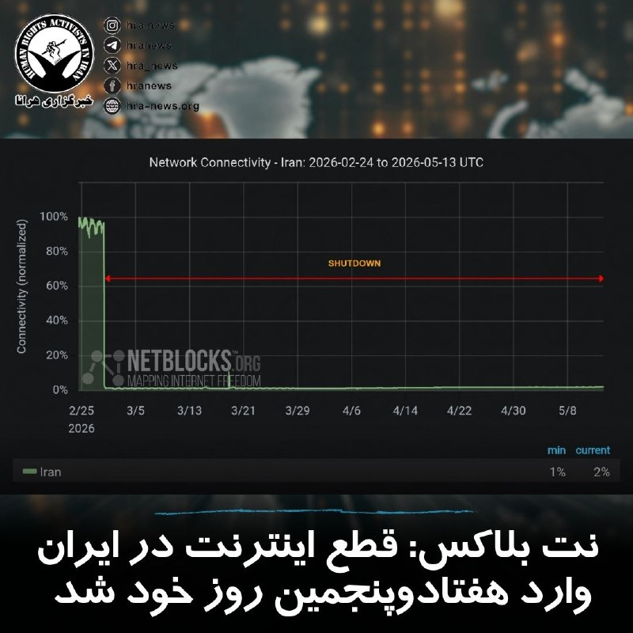

نت‌بلاکس، که محدودیت دسترسی به اینترنت در جهان را رصد می‌کند، اعلام کرد که قطع اینترنت در ایران اکنون از ۱۷۷۶ ساعت گذشته و وارد هفتاد و پنجمین روز خود شده است. این نهاد تاکید کرد که این اقدام سانسور دیجیتال، به سودجویی و کاهش امنیت دیجیتال منجر شده و طرح‌های موسوم به «اینترنت پرو» با حمایت حکومت و فهرست سفید گزینشی، زمینه‌ساز نظارت، فساد و کلاهبرداری شده‌اند.
#قطع_اینترنت

↘️
@hranews_bot تماس ✉️ - @Hranews کانال هرانا 🆑

## Hranews — post 112920

سیدیاسین حسن‌زاده، دانشجوی دانشگاه تهران آزاد شد

❗️
❗️
❗️
❗️
❗️– سیدیاسین حسن‌زاده، دبیر انجمن اسلامی دانشجویان دانشگاه تهران که روز گذشته توسط ماموران امنیتی بازداشت شده بود، آزاد شد.

ادامه مطلب

#سیدیاسین_حسن‌زاده

↘️
@hranews_bot تماس ✉️ - @Hranews کانال هرانا 🆑

## manototv — post 105408

  <a href="telegram/content/manototv_105408_1778691079.mp4" target="_blank">🎬 Download video</a>

.
مقام‌های سوریه در ماه مارس «هلا منیر محمد» را به اتهام شکنجه و سوءاستفاده از زندانیان در دوران حکومت بشار اسد بازداشت کردند؛ زنی که به گفته زندانیان سابق، با نام «منیره» در زندان اطلاعات نیروی هوایی دمشق شناخته می‌شد و یکی از مخوف‌ترین نگهبانان این زندان بود.
بر اساس گزارش‌ها، هلا در ظاهر یک آرایشگر شناخته‌شده و مدرس زیبایی در دمشق بود، اما چندین زندانی سابق می‌گویند او در زندان المزّه با ضرب‌وشتم، تحقیر، توهین فرقه‌ای و شکنجه زنان زندانی شناخته می‌شد.
زندانیان سابق می‌گویند تنها صدای او برای ایجاد وحشت در سلول‌ها کافی بود. برخی روایت کرده‌اند او با لوله‌های پلاستیکی زندانیان را کتک می‌زد، موهای زنان را با خشونت می‌برید و هنگام آزار آن‌ها می‌خندید.
گزارش‌ها حاکی است هلا پس از سقوط حکومت اسد همچنان در دمشق زندگی می‌کرد و به‌عنوان آرایشگر فعالیت داشت تا اینکه گروهی از بازماندگان زندان با تحقیقات مستقل او را شناسایی و به مقام‌های جدید سوریه معرفی کردند.
خانواده و برخی آشنایان هلا اتهام‌ها را رد کرده‌اند و می‌گویند او «فقط یک زن جوان» بوده که دستورات مافوق‌ها را اجرا می‌کرده است. سازمان‌های حقوق بشری می‌گویند ده‌ها هزار نفر در دوران جنگ داخلی سوریه در زندان‌های حکومت اسد ناپدید یا کشته شده‌اند و زندان اطلاعات نیروی هوایی المزّه یکی از مراکز اصلی شکنجه و بازداشت بوده است.

## manototv — post 105407

  <a href="telegram/content/manototv_105407_1778691081.mp4" target="_blank">🎬 Download video</a>

تصاویری از استقبال از عباس عراقچی، وزیر خارجه جمهوری‌اسلامی در پایتخت هند، توسط رسانه‌های حکومتی منتشر شده است. بر پایه گزارش‌ها او برای شرکت در نشست وزرای خارجه بریکس وارد دهلی نو شده است.

## manototv — post 105405

  <a href="telegram/content/manototv_105405_1778691082.mp4" target="_blank">🎬 Download video</a>

‌
تصاویر مارکو روبیو، وزیر خارجه آمریکا، با یک ست ورزشی خاکستری در هواپیمای ریاست جمهوری آمریکا، در شبکه‌های اجتماعی خبرساز شد.

در تصویری که توسط استیون چونگ، مدیر ارتباطات کاخ سفید، منتشر شده روبیو دقیقاً همان لباس ورزشی‌ای را پوشیده که نیکلاس مادورو، رئیس‌جمهوری پیشین ونزوئلا، هنگام بازداشت توسط نیروهای آمریکایی در اوایل سال جاری به تن داشت.

مدیر ارتباطات کاخ سفید در توضیح عکس‌ها به شوخی به «Nike Tech ونزوئلا» اشاره کرد.

روبیو در جریان سفر دونالد ترامپ به چین او را همراهی می‌کند؛ سفری که محور آن مسائل تجاری و امنیتی عنوان شده است.

## manototv — post 105404

  <a href="telegram/content/manototv_105404_1778691083.mp4" target="_blank">🎬 Download video</a>

سنتکام اعلام کرده یک جنگنده رادارگریز اف-۳۵آ نیروی هوایی آمریکا بر فراز آب‌های منطقه‌ای نزدیک تنگه هرمز عملیات گشت‌زنی انجام داده است و این جنگنده اف-۳۵آ توانایی حمل تا ۱۸ هزار پوند مهمات را دارد و در عین حال می‌تواند با سرعت مافوق صوت پرواز کند.

## manototv — post 105403

  <a href="telegram/content/manototv_105403_1778691084.mp4" target="_blank">🎬 Download video</a>

ایال زمیر، رییس ستاد کل ارتش اسرائیل، در جریان سفر به کرانه باختری گفت: «ما در همه جبهه‌ها واقعیت امنیتی جدیدی ایجاد کرده‌ایم، با این حال نبرد به پایان نرسیده است.»
او افزود: «ارتش اسرائیل برای ازسرگیری جنگ در صورت نیاز آماده است و در دفاع و حمله، از یهودا و سامره تا تهران، در آمادگی و هوشیاری دائم قرار دارد.

## manototv — post 105402

  <a href="telegram/content/manototv_105402_1778691084.mp4" target="_blank">🎬 Download video</a>

در پی تلاش مقام‌های فیلیپین برای بازداشت رونالد دلا روزا، سناتور نزدیک به رودریگو دوترته، در ساختمان سنای این کشور تیراندازی رخ داد.
دلا روزا که از سوی دادگاه کیفری بین‌المللی به «جنایت علیه بشریت» در ارتباط با جنگ خونین ضد مواد مخدر دوترته متهم شده، دو شب گذشته را در ساختمان سنا سپری کرده تا از بازداشت فرار کند.
او روز دوشنبه با فرار از مقابل ماموران دولتی در راهروها و پله‌های سنا، خود را به صحن اصلی ساختمان رساند و تحت حمایت رئیس سنا، از متحدان دوترته، قرار گرفت.
رسانه‌های محلی گزارش دادند شامگاه چهارشنبه نیروهای نظامی مسلح وارد ساختمان سنا شدند و ساعاتی بعد صدای تیراندازی در محل شنیده شد.
رودریگو دوترته سال گذشته در مانیل بازداشت و به دادگاه کیفری بین‌المللی منتقل شد؛ جایی که به‌دلیل هزاران کشته در جریان عملیات ضد مواد مخدر با اتهام جنایت علیه بشریت روبه‌رو است.

## manototv — post 105401

  <a href="telegram/content/manototv_105401_1778691085.mp4" target="_blank">🎬 Download video</a>

مقام‌های فرانسه اعلام کردند بیش از هزار مسافر یک کشتی تفریحی تحت مدیریت بریتانیا پس از شیوع بیماری گوارشی در این کشتی، اجازه پیاده شدن در بندر بوردو را ندارند.
بر اساس گزارش‌ها، ۴۹ نفر در کشتی «Ambition» علائمی شبیه گاستروآنتریت نشان داده‌اند و سه مسافر در کابین‌های خود قرنطینه شده‌اند.
گاستروآنتریت یا التهاب معده و روده یک بیماری عفونی دستگاه گوارش است. این بیماری اغلب توسط ویروس‌ها مثل نوروویروس یا روتاویروس ایجاد می‌شود، اما گاهی باکتری یا غذای آلوده هم عامل آن است. در کشتی‌های تفریحی، شیوع این بیماری رایج‌تر است چون افراد زیادی در فضای بسته و مشترک حضور دارند و ویروس به‌سرعت منتقل می‌شود. اعلام شده یک مرد ۹۲ ساله نیز روز یکشنبه در کشتی جان باخته، اما هنوز ارتباطی میان مرگ او و بیماری گوارشی تأیید نشده است.
این شرکت می‌گوید اقدامات بهداشتی و ضدعفونی گسترده در کشتی اجرا شده و به مسافران درباره رعایت بهداشت و گزارش علائم هشدار داده شده است.
کشتی «Ambition» با ۱۱۸۷ مسافر و ۵۱۴ خدمه، هشتم مه سفر خود را از بلفاست آغاز کرده بود.

## manototv — post 105400

  <a href="telegram/content/manototv_105400_1778691086.mp4" target="_blank">🎬 Download video</a>

دونالد ترامپ پس از ورود به پکن، در مراسمی رسمی با فرش قرمز، گارد احترام نظامی و صدها نفر از جوانان چینی مورد استقبال مقام‌های چین قرار گرفت. در تصاویر ثبت شده ایلان ماسک نیز در جمع همراهان ترامپ حضور دارد.
ترامپ امروز برنامه عمومی دیگری ندارد، اما قرار است پنجشنبه و جمعه چندین بار با شی جین‌پینگ دیدار کند. او پیش از سفر گفته بود محور اصلی گفت‌وگوها با رئیس‌جمهور چین، تجارت و توافق‌های اقتصادی خواهد بود.
این سفر در حالی انجام می‌شود که جنگ آمریکا و اسرائیل با ایران و افزایش تورم، فشارهایی بر محبوبیت ترامپ در داخل آمریکا وارد کرده است.
ترامپ پیش از ترک آمریکا گفت: «ما دو ابرقدرت جهان هستیم. آمریکا از نظر نظامی قدرتمندترین کشور دنیاست و چین را نفر دوم می‌دانند.»

## manototv — post 105399

  <a href="telegram/content/manototv_105399_1778691088.mp4" target="_blank">🎬 Download video</a>

یک نفتکش وابسته به شرکت دولتی نفت ابوظبی پس از حمله پهپادی جمهوری‌اسلامی در هفته گذشته، دچار نشت محدود سوخت در سواحل عمان شده است.
رویترز گزارش داده مقدار کمی از سوخت کشتی که به نظر می‌رسد سوخت بانکر بوده، در پی این حادثه نشت کرده است.
انور قرقاش، مشاور رئیس امارات، پیش‌تر حمله چهارم مه به این نفتکش را «دزدی دریایی» توصیف کرده بود. گزارش شده در زمان حمله کسی آسیب ندیده و کشتی حامل بار نبوده است.
این نفتکش با نام «MV Barakah» همچنان در سواحل عمان لنگر انداخته و شرکت می‌گوید در حال همکاری نزدیک با مقام‌های مربوطه و تیم‌های تخصصی واکنش به بحران است.

## manototv — post 105398

  <a href="telegram/content/manototv_105398_1778691089.mp4" target="_blank">🎬 Download video</a>

هواپیمای ریاست‌جمهوری آمریکا دقایقی پیش در پایتخت چین به زمین نشست و دونالد ترامپ سفر خود برای دیدار با شی جین‌پینگ، رئیس‌جمهور چین، را آغاز کرد. این نخستین سفر رسمی یک رئیس‌جمهور مستقر آمریکا به چین از زمان سفر ترامپ در سال ۲۰۱۷ است.

## manototv — post 105397

  <a href="telegram/content/manototv_105397_1778691091.mp4" target="_blank">🎬 Download video</a>

تماسی از ایران؛
تجربه‌ی یک آموزگار از آموزش مجازی

## manototv — post 105396

  <a href="telegram/content/manototv_105396_1778691094.mp4" target="_blank">🎬 Download video</a>

هواپیمای ریاست‌جمهوری آمریکا دقایقی پیش در پایتخت چین به زمین نشست و دونالد ترامپ سفر خود برای دیدار با شی جین‌پینگ، رئیس‌جمهور چین، را آغاز کرد.

## manototv — post 105395

  <a href="telegram/content/manototv_105395_1778691094.mp4" target="_blank">🎬 Download video</a>

وال‌استریت ژورنال به نقل از مقام‌های عرب و یک منبع آگاه گزارش داد رئیس سازمان اطلاعات اسرائیل، موساد، در جریان جنگ با ایران دست‌کم دو بار به‌صورت محرمانه به امارات متحده عربی سفر کرده است.
بر اساس این گزارش، دیوید بارنیا، رئیس موساد، در ماه‌های مارس و آوریل برای هماهنگی درباره جنگ با ایران به امارات رفته بود؛ اقدامی که نشانه‌ای از گسترش همکاری‌های امنیتی میان اسرائیل و کشورهای عربی خلیج فارس توصیف شده است.
این گزارش می‌افزاید اسرائیل در طول جنگ، سامانه‌های دفاع موشکی «گنبد آهنین» و ده‌ها نیروی نظامی را برای مقابله با حملات موشکی و پهپادی جمهوری‌اسلامی به امارات اعزام کرده بود.
وال‌استریت ژورنال همچنین نوشت امارات در حملات نظامی علیه اهدافی در ایران مشارکت داشته؛ از جمله حمله به یک پالایشگاه در جزیره لاوان در خلیج فارس. وزارت خارجه امارات و دفتر نخست‌وزیر اسرائیل تاکنون به درخواست‌های وال‌استریت ژورنال برای اظهار نظر پاسخ نداده‌اند.

## manototv — post 105394

  <a href="telegram/content/manototv_105394_1778691095.mp4" target="_blank">🎬 Download video</a>

رویترز گزارش داد عراق و پاکستان برای انتقال نفت و گاز از تنگه هرمز با جمهوری‌اسلامی به توافق رسیده‌اند؛ اقدامی که به گفته منابع آگاه، نشان‌دهنده افزایش کنترل تهران بر این آبراه راهبردی است.
بر اساس این گزارش، عراق عبور دو نفتکش بزرگ را با هماهنگی ایران انجام داده و پاکستان نیز انتقال محموله‌های گاز مایع طبیعی قطر را از مسیر هرمز با توافق تهران پیش می‌برد.
منابع رویترز می‌گویند جمهوری‌اسلامی اکنون به‌جای بستن تنگه هرمز، در حال کنترل عبور کشتی‌هاست و برخی کشورهای دیگر نیز در حال بررسی توافق‌های مشابه هستند.

## manototv — post 105393

  <a href="telegram/content/manototv_105393_1778691096.mp4" target="_blank">🎬 Download video</a>

خبرگزاری رسمی امارات گزارش داد دولت امارات متحده عربی ۲۱ فرد و نهاد لبنانی را به‌دلیل ارتباط با حزب‌الله در فهرست تحریم قرار داده است.
بر اساس این گزارش، ۱۶ شهروند لبنانی و پنج سازمان مستقر در امارات به حمایت از گروه‌هایی متهم شده‌اند که از سوی ابوظبی «تروریستی» شناخته می‌شوند.
مقام‌های نظارتی امارات موظف شده‌اند افراد و نهادهای تحریم‌شده را شناسایی کرده و ظرف ۲۴ ساعت اقدامات لازم، از جمله مسدود کردن دارایی‌های آن‌ها، را انجام دهند.
امارات که میزبان جمعیت بزرگی از لبنانی‌هاست، در جریان جنگ منطقه‌ای ناشی از حملات آمریکا و اسرائیل به ایران، یکی از اصلی‌ترین اهداف حملات موشکی و پهپادی جمهوری اسلامی بود.

## manototv — post 105392

  <a href="telegram/content/manototv_105392_1778691097.mp4" target="_blank">🎬 Download video</a>

آژانس بین‌المللی انرژی پیش‌بینی کرده است که در پی اختلال‌های ناشی از درگیری‌های خاورمیانه، عرضه جهانی نفت در سال ۲۰۲۶ روزانه ۳.۹ میلیون بشکه کاهش یابد.
این نهاد همچنین انتظار دارد تقاضای جهانی نفت در سال جاری روزانه ۴۲۰ هزار بشکه کاهش پیدا کند، اما میزان افت عرضه بسیار بیشتر از کاهش تقاضا خواهد بود.
آژانس بین‌المللی انرژی در تازه‌ترین گزارش بازار نفت خود اعلام کرد:
«بیش از ۱۰ هفته پس از آغاز جنگ در خاورمیانه، افزایش اختلال‌ها در تنگه هرمز ذخایر جهانی نفت را با سرعتی بی‌سابقه کاهش داده است.»
در ادامه این گزارش آمده است: «کاهش سریع ذخایر مازاد در کنار ادامه اختلال‌ها ممکن است زمینه‌ساز جهش‌های قیمتی در آینده شود.»

## manototv — post 105391

  <a href="telegram/content/manototv_105391_1778691098.mp4" target="_blank">🎬 Download video</a>

معاون وزیر بهداشت در اظهاراتی «بحران جمعیت» را مهم‌تر از جنگ اخیر ارزیابی کرده است و افزوده «اقتداری که مردم و نیروهای مسلح در دوران جنگ نشان دادند، ناشی از همین جمعیت جوان بوده است.»
این مقام با هشدار درباره ادامه روند کاهش زاد‌وولد در ایران گفت آمار تولدها در سال ۱۴۰۴ به ۸۹۲ هزار و ۲۶۸ نفر رسیده؛ در حالی‌ که این رقم در سال ۱۴۰۳ حدود ۹۷۳ هزار نفر بوده است.
او با اشاره به اینکه آمار موالید پیش‌تر به زیر ۹۰۰ هزار نفر رسیده بود، گفت این ارقام نشان‌دهنده ادامه روند نزولی جمعیت در کشور است، هرچند به گفته او «شیب کاهش جمعیت کندتر شده است.»

## manototv — post 105390

  

بررسی‌ها نشان می‌دهد یک ابرنفتکش چینی پیش از گفت‌وگوهای ترامپ و شی جین‌پینگ از تنگه هرمز عبور کرده است. این نفتکش تحت ثبت و مدیریت شرکت دولتی چینی «کاسکو شیپینگ» قرار دارد. نفتکش بسیار بزرگ حمل نفت خام (VLCC) با نام «یوان هوا هو» آخرین بار در ردیاب‌های دریایی در شرق تنگه مشاهده شده بود.این نفتکش هنگام عبور، مقصد خود را «مالک و خدمه چینی» ثبت کرده بود.به نظر می‌رسد اندکی پس از خاموش کردن سیستم ردیابی‌اش، در یک تصویر ماهواره‌ای ثبت شده باشد. در ۲۴ ساعت گذشته، چند کشتی دیگر تحت مدیریت چین نیز از تنگه هرمز عبور کرده‌اند. همه آن‌ها از مسیری تحت کنترل جمهوری‌اسلامی و نزدیک به آب‌های ایران استفاده کرده‌اند. به‌دست آوردن تصویر کامل از رفت‌وآمدها ممکن نیست، زیرا بیشتر کشتی‌هایی که از تنگه عبور می‌کنند سیستم ردیابی خود را خاموش کرده‌اند.

## manototv — post 105389

  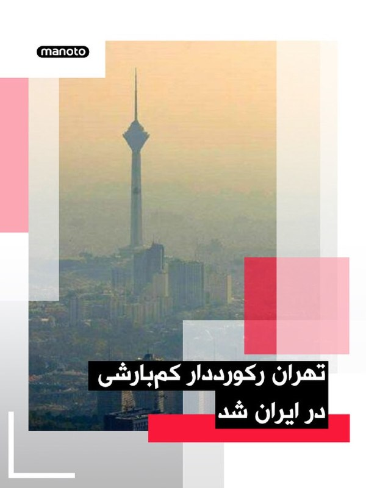

براساس داده‌های سازمان هواشناسی، ۱۸ استان ایران در سال آبی جاری با کاهش بارندگی مواجه شده‌اند و استان تهران با بیش از ۳۸ درصد افت میانگین بارش، رکورددار کم‌بارشی در کشور شده است.

گزارش‌ها نشان می‌دهد کاهش بارندگی در تهران و برخی استان‌های مرکزی، نگرانی‌ها درباره تشدید بحران آب و فشار بر منابع آبی را افزایش داده است.

پس از تهران، استان‌های قم و سمنان نیز در میان استان‌هایی قرار دارند که بیشترین کاهش بارش را تجربه کرده‌اند.

کارشناسان هشدار می‌دهند ادامه روند خشکسالی و افت بارش‌ها می‌تواند وضعیت ذخایر سدها و تامین آب شرب را در ماه‌های آینده دشوارتر کند. چون ظاهراً در این سرزمین، همه‌چیز یا «بی‌سابقه» است یا «در آستانه بحران». برنامه‌ریزی پایدار هم مثل بارندگی، سال‌هاست کمیاب شده.

## alonews — post 119783

  <a href="telegram/content/alonews_119783_1778691100.webm" target="_blank">🎬 Download video</a>

👈عراقچی : کویت به‌صورت غیرقانونی به یه قایق ایرانی حمله کرده و ۴ تا از شهرامون رو تو خلیج فارس بازداشت کرده

🔴ما آزادی فوری‌شون رو می‌خوایم و حق پاسخ‌گویی هم برای خودمون محفوظ می‌دونیم

✅ @AloNews خبر جنگ

## alonews — post 119782

  <a href="telegram/content/alonews_119782_1778691101.webm" target="_blank">🎬 Download video</a>

👈اکونومیست: طولانی شدن بحران ایران می‌تواند آسیب جبران‌ناپذیری به کشورهای حاشیه خلیج‌ [فارس] وارد کند

✅ @AloNews خبر جنگ

## alonews — post 119781

  <a href="telegram/content/alonews_119781_1778691101.webm" target="_blank">🎬 Download video</a>

👈ارتش آمریکا به دلیل عوامل متعددی از جمله جنگ با ایران با کسری بودجه غیرمنتظره‌ای مواجه است، به طوری که ذخایر مهمات از سال ۲۰۲۲ به دلیل حمایت از اوکراین کاهش یافته و اکنون با درگیری ایران بیشتر تحت فشار قرار گرفته است، طبق گفته یک مقام آمریکایی که با الجزیره صحبت کرده است.

🔴 این مقام تأکید کرد که این کسری بر آمادگی رزمی تأثیر نخواهد گذاشت اما هشدار داد که در صورت عدم تصویب بودجه دفاعی ۱.۵ تریلیون دلاری، ممکن است تصمیمات سختی لازم باشد

✅ @AloNews خبر جنگ

## alonews — post 119780

  <a href="telegram/content/alonews_119780_1778691101.webm" target="_blank">🎬 Download video</a>

👈بلومبرگ: عربستان به اوپک اعلام کرد که تولید نفت خام این کشور در ماه آوریل ۶۵۱ هزار بشکه در روز  کاهش یافته و به پایین‌ترین سطح از سال ۱۹۹۰ در جریان جنگ خلیج فارس رسیده است

✅ @AloNews خبر جنگ

## alonews — post 119779

  <a href="telegram/content/alonews_119779_1778691102.webm" target="_blank">🎬 Download video</a>

👈با اعلام قوه قضاییه جمهوری اسلامی، احسان افرشته به اتهام «همکاری با اسرائیل»، بامداد چهارشنبه اعدام شد. 
✅ @AloNews خبر جنگ

## alonews — post 119778

  <a href="telegram/content/alonews_119778_1778691102.webm" target="_blank">🎬 Download video</a>

👈کریس رایت، وزیر انرژی آمریکا، می‌گوید ایران "به طرز ترسناکی نزدیک" به اورانیوم با درجه تسلیحاتی است — که در حال حاضر تا ۶۰٪ غنی‌سازی شده است، در حالی که برای ساخت سلاح هسته‌ای به ۹۰٪ نیاز است.

🔴او می‌گوید ایران ممکن است چند هفته تا رسیدن به این آستانه فاصله داشته باشد!

✅ @AloNews خبر جنگ

## alonews — post 119777

  <a href="telegram/content/alonews_119777_1778691103.mp4" target="_blank">🎬 Download video</a>

👈پست جدید نتانیاهو نخست وزیر اسرائیل داخل ایکس : ما پیروز خواهیم شد

✅ @AloNews خبر جنگ

## alonews — post 119776

  <a href="telegram/content/alonews_119776_1778691105.webm" target="_blank">🎬 Download video</a>

👈وزیر نیرو: تابستان خاموشی نخواهیم داشت!

✅ @AloNews خبر جنگ

## alonews — post 119775

  <a href="telegram/content/alonews_119775_1778691106.webm" target="_blank">🎬 Download video</a>

👈دولت فرانسه از بیم شیوع ویروس هانتا ۱۷۰۰ نفر را در یکی کشتی در ساحل شهر بوردو قرنطینه کرد

✅ @AloNews خبر جنگ

## alonews — post 119774

  <a href="telegram/content/alonews_119774_1778691106.webm" target="_blank">🎬 Download video</a>

👈عراقچی وارد هند شد

✅ @AloNews خبر جنگ

## alonews — post 119773

  <a href="telegram/content/alonews_119773_1778691106.webm" target="_blank">🎬 Download video</a>

👈تحلیل سی‌تی بانک: انتظار نمی‌رود دیدار ترامپ با شی جین پینگ بن‌بست موجود میان آمریکا و ایران را بشکند

🔴 بنابر تحلیل سی‌تی بانک، انتظار نمی‌رود دیدار دونالد ترامپ، رئیس‌جمهور آمریکا، با شی جین پینگ، رهبر چین، بن‌بست موجود میان آمریکا و ایران را بشکند.

✅ @AloNews خبر جنگ

## alonews — post 119772

  <a href="telegram/content/alonews_119772_1778691107.webm" target="_blank">🎬 Download video</a>

👈گفتگوی تلفنی وزرای امور خارجه ایران و جمهوری آذربایجان

✅ @AloNews خبر جنگ

## alonews — post 119771

  <a href="telegram/content/alonews_119771_1778691107.mp4" target="_blank">🎬 Download video</a>

👈امانوئل ماکرون: کل اقتصاد جهانی به وضوح تحت تأثیر بسته شدن تنگه هرمز قرار گرفته است، اما قاره آفریقا به‌ویژه تحت تأثیر است.

🔴چندین کشور قیمت سوخت خود را بیش از ۳۰٪ افزایش داده‌اند، همراه با افزایش‌های عظیم در کودهای شیمیایی و خطرات قطع در ماه‌های آینده که امنیت غذایی را به خطر می‌اندازد.

🔴در مواجهه با این وضعیت، باید از اقتصاد آفریقا بیش از پیش حمایت کنیم

✅ @AloNews خبر جنگ

## alonews — post 119770

  <a href="telegram/content/alonews_119770_1778691110.webm" target="_blank">🎬 Download video</a>

👈 حملات اسرائیل به جنوب لبنان

✅ @AloNews خبر جنگ

## alonews — post 119769

  <a href="telegram/content/alonews_119769_1778691110.mp4" target="_blank">🎬 Download video</a>

👈فرماندهی مرکزی ایالات متحده: چهار هفته پیش، فرماندهی مرکزی شروع به اجرای محاصره علیه کشتی‌هایی که وارد و خارج از بنادر ایران می‌شوند کرد.

🔴تا امروز، نیروهای آمریکایی ۶۷ کشتی تجاری را تغییر مسیر داده‌اند، اجازه عبور ۱۵ کشتی حامل کمک‌های بشردوستانه را داده‌اند و ۴ کشتی را برای اطمینان از رعایت قوانین غیرفعال کرده‌اند.

🔴اوایل این هفته، نیروهای فرماندهی مرکزی اطمینان حاصل کردند که ۲ کشتی تجاری پس از ارتباط رادیویی و شلیک هشدار با سلاح‌های سبک، برای رعایت محاصره بازگشتند، که به وضوح نشان می‌دهد اجرای قوانین توسط ایالات متحده همچنان به طور کامل ادامه دارد

✅ @AloNews خبر جنگ

## alonews — post 119768

  <a href="telegram/content/alonews_119768_1778691113.webm" target="_blank">🎬 Download video</a>

👈رئیس ستاد کل نیروهای دفاعی اسرائیل، ایال زامیر: نیروهای دفاعی اسرائیل با عزم راسخ در همه جبهه‌ها فعالیت می‌کنند. عملیات هنوز به پایان نرسیده است.

🔴نیروهای دفاعی اسرائیل آماده‌اند در صورت نیاز مبارزه را از سر بگیرند و در حالت آمادگی دائمی هم در دفاع و هم در حمله باقی می‌مانند — از یهودیه و سامره (کرانه باختری) تا تهران.

✅ @AloNews خبر جنگ

## alonews — post 119767

  <a href="telegram/content/alonews_119767_1778691114.webm" target="_blank">🎬 Download video</a>

👈رسانه ترکیه‌ای: حضور کشورهای خلیج‌فارس در نشست ناتو علیه ایران نیست

✅ @AloNews خبر جنگ

## alonews — post 119766

  <a href="telegram/content/alonews_119766_1778691114.webm" target="_blank">🎬 Download video</a>

👈پاتریک وینتور دبیر دیپلماتیک گاردین:
معاون وزیر امور خارجه فعال و مبتکر نروژ به طرز غافلگیر کننده‌ای وارد تهران شده است. او اخیراً به عمان و پاکستان نیز سفر کرده، بنابراین به نظر می‌رسد نروژ در حال آزمودن نقش خود به عنوان یک میانجی اروپایی است.

🔴همزمان، برخی جمهوری‌خواهان آمریکا نظر منفی نسبت به تلاش‌های میانجی‌گرانه پاکستان دارند.

✅ @AloNews خبر جنگ

## alonews — post 119765

  <a href="telegram/content/alonews_119765_1778691114.webm" target="_blank">🎬 Download video</a>

👈نفت آمریکا به ۱۰۴ دلار افزایش یافت

✅ @AloNews خبر جنگ

## alonews — post 119763

  <a href="telegram/content/alonews_119763_1778691115.mp4" target="_blank">🎬 Download video</a>

👈حملات هوایی اسرائیل چند لحظه پیش منطقه نبطیه الفوقا در جنوب لبنان را هدف قرار داد

✅ @AloNews خبر جنگ

<!-- MSG END -->

<!-- NAV START -->

<a href="https://github.com/zari963963/aio-downloader/blob/main/telegram/content/archive_1.md" style="display:inline-block; padding:6px 12px; margin:0 4px; background-color:#2ea44f; color:white; text-decoration:none; border-radius:4px; font-weight:bold;">صفحه بعد</a>

<!-- NAV END -->
