# خواننده تلگرام

<!-- TOP_NAV START -->

<a href="https://github.com/zari963963/aio-downloader/blob/main/telegram/content/archive_1.md" style="display:inline-block; padding:6px 12px; margin:0 4px; background-color:#2ea44f; color:white; text-decoration:none; border-radius:4px; font-weight:bold;">صفحه بعد</a>

<!-- TOP_NAV END -->

<!-- MSG START -->

---
📅 بروزرسانی: 1405/02/27 11:30
---

## VahidOOnLine — post 240585

  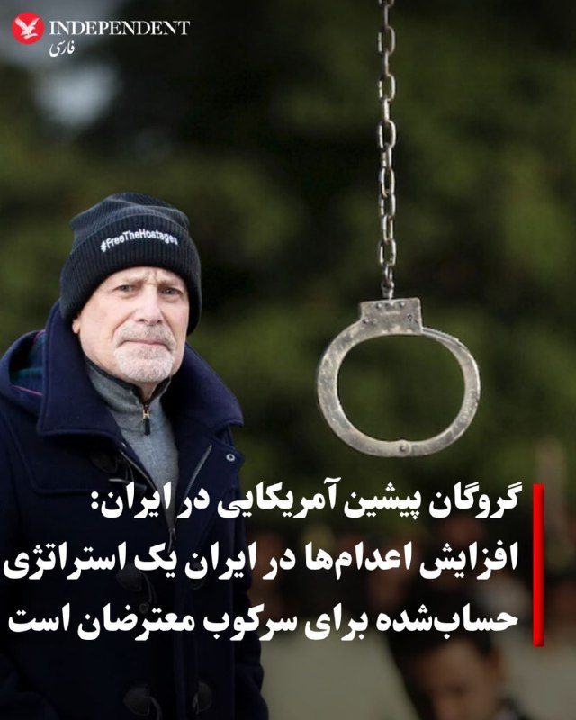

♦️بری روزن، گروگان پیشین آمریکایی در ایران، روز یکشنبه ۲۷ اردیبهشت نسبت به افزایش «سریع و نگران‌کننده» اعدام‌ها در ایران هشدار داد.

او در شبکه اجتماعی ایکس نوشت: «همزمان با آتش‌بس ایالات متحده و ایران، افزایش سریع و نگران‌کننده اعدام‌ها توسط ایران، نشان‌دهنده یک استراتژی حساب‌شده برای سرکوب هرگونه مخالفت است.»

بری روزن با اشاره به گزارش‌ها درباره افزایش اعدام‌ها در ایران نوشت: «گروه‌های حقوق بشری تأکید می‌کنند که این افزایش در اعدام‌ها در مقطعی حساس رخ می‌دهد؛ زمانی که ممکن است توجه بین‌المللی در خلال آتش‌بس رو به کاهش باشد.»

او اضافه کرد: «مرکز حقوق بشر در ایران تأکید می‌کند که این سرکوب وحشیانه، به‌ویژه در زندان‌ها و دادگاه‌ها، در حال تشدید است.»

گروگان پیشین آمریکایی در ایران به نقل از نیویورک تایمز نوشت «به نظر می‌رسد سرعت صدور احکام و اعدام‌ها در دو ماه گذشته افزایش یافته است و مقامات در تلاشند تا ایرانیان را از بازگشت به خیابان‌ها بترسانند.»

جمهوری اسلامی در هفته‌های اخیر و همزمان با قطعی سراسری اینترنت، روند سرکوب‌ها و به ویژه اعدام‌ها را سرعت داده است.
‌🇸🇦 Indypersian

🤖 @VahidOOnLine

## VahidOOnLine — post 240584

  

بر اساس گزارش نت‌بلاکس، نهاد پایش وضعیت اینترنت در جهان، قطع سراسری اینترنت در ایران وارد هفتادونهمین روز خود در دوازدهمین هفته شده است: «این اقدام گسترده سانسور، ماهیت مشارکت مدنی را دگرگون کرده و کنترل اطلاعات به ابزاری برای تقلیل شهروندان عادی به ناظران تحولات تبدیل شده است.»
‌🏁 🇬🇧 IranintlTV

🤖 @VahidOOnLine

## VahidOOnLine — post 240583

  <a href="telegram/content/VahidOOnLine_240583_1779004841.mp4" target="_blank">🎬 Download video</a>

بر اساس ویدیوهای ارسال‌شده‌ به ایران‌اینترنشنال، ایرانیان مقیم کانادا شنبه ۲۶ اردیبهشت علیه جمهوری اسلامی و قطع اینترنت ایران در مونترال تجمع کردند و شعار «مرگ بر جمهوری اسلامی» سردادند.
‌🏁 🇬🇧 IranintlTV

🤖 @VahidOOnLine

## VahidOOnLine — post 240582

  

فرمانده پلیس راه سیراف عسلویه اعلام کرد که در پی واژگونی اتوبوس در محور عسلویه به کنگان، هشت نفر در محل حادثه جان خود را از دست دادند. کارشناسان پلیس راه علت این واژگونی را نقص فنی در سیستم ترمز تشخیص داده‌اند.
‌🏁 🇬🇧 IranintlTV

🤖 @VahidOOnLine

## VahidOOnLine — post 240581

  

♦️فیلم «تمرین‌هایی برای یک انقلاب» ساخته پگاه آهنگرانی، در بخش «نمایش‌های ویژه» هفتادونهمین دوره جشنواره کن به نمایش درآمد و با استقبال تماشاگران روبه‌رو شد.
پگاه آهنگرانی، بازیگر و مستندساز ایرانی، روز شنبه ۲۶ اردیبهشت در مراسم نمایش فیلم تازه‌اش، این اثر را به مادرانی تقدیم کرد که فرزندان خود را در راه مبارزه برای آزادی از دست داده‌اند.
او پس از حضور روی صحنه همراه با عوامل فیلم، از روزهای بسیار دشوار مردم ایران سخن گفت؛ روزهایی که به گفته او «بدون اینترنت، با خبرهای روزانه اعدام‌ها در جمهوری اسلامی و زیر سایه سنگین جنگ» سپری می‌شود.

فیلم «تمرین‌هایی برای یک انقلاب» روایتی شخصی از زندگی و تجربه‌های پگاه آهنگرانی است؛ روایتی که از خلال پنج پرتره از بستگان و استادان او، مفهوم مقاومت را به تصویر می‌کشد.

در این مستند از آرشیوهای شخصی، ویدئوهای خانگی، تصاویر اعتراضات خیابانی، روزنامه‌ها و صداهای ضبط‌شده استفاده شده تا بیش از ۴۰ سال از تاریخ معاصر ایران بازخوانی شود.
‌🇸🇦 Indypersian

🤖 @VahidOOnLine

## VahidOOnLine — post 240580

  <a href="telegram/content/VahidOOnLine_240580_1779004846.mp4" target="_blank">🎬 Download video</a>

ویدیوهای رسیده به ایران‌اینترنشنال نشان می‌دهند ایرانیان مقیم مجارستان و دانمارک روز شنبه ۲۶ اردیبهشت علیه جمهوری اسلامی و قطع اینترنت در ایران در شهرهای بوداپست و آرهوس تجمع کردند.
‌🏁 🇬🇧 IranintlTV

🤖 @VahidOOnLine

## VahidOOnLine — post 240579

  <a href="telegram/content/VahidOOnLine_240579_1779004848.mp4" target="_blank">🎬 Download video</a>

تجمع ایرانیان ایسلند، ۲۶ اردیبهشت
ایسلند از کم‌جمعیت‌ترین کشورهای اروپاست و جامعه ایرانی کوچکی دارد.
‌🏁 🇬🇧 ManotoTV

🤖 @VahidOOnLine

## VahidOOnLine — post 240578

  

♦️دولت بریتانیا روز یکشنبه در اقدام جدید خود علیه شبکه‌های مالی وابسته به جمهوری اسلامی، اعضای یک خانواده پنج‌نفره و دو صرافی مرتبط با آن‌ها را به اتهام تسهیل فعالیت‌های مخفی مالی و پول‌شویی میلیاردها دلار برای تهران، هدف تحریم‌های سخت‌گیرانه قرار داد.
وزارت امور خارجه بریتانیا اعلام کرد که پنج تن از اعضای خانواده «زرین‌قلم» به نام‌های منصور، ناصر، فضل‌الله، پوریا و فرهاد زرین‌قلم را به همراه دو شرکت خدمات ارزی «صرافی برلیان» و «صرافی جی‌سی‌ام» (GCM) به فهرست تحریم‌های خود اضافه کرده است.
بر اساس بیانیه مقامات لندن، این افراد و نهادها متهم هستند که از طریق ایجاد یک شبکه گسترده از «شرکت‌های پوششی» در امارات متحده عربی و هنگ‌کنگ، به عنوان بازوی شبکه پنهان یا «بانکداری سایه‌ای» جمهوری اسلامی عمل کرده و از این طریق اقدامات بی‌ثبات‌کننده و تروریستی پناه گرفته تحت حمایت تهران را تامین مالی کرده‌اند. پیش از این، دولت ایالات متحده نیز سه تن از اعضای این خانواده را به اتهام پول‌شویی میلیاردها دلار برای ایران تحریم کرده بود.
‌🇸🇦 Indypersian

🤖 @VahidOOnLine

## VahidOOnLine — post 240577

  

ابراهیم رضایی، نماینده مجلس و سخنگوی کمیسیون امنیت ملی، در شبکه اجتماعی ایکس نوشت: «ممکن است بازگشت به جنگ آسیب‌هایی داشته باشد اما حتما دشمن بیشتر متضرر می‌شود، خیلی بیشتر.»
‌🏁 🇬🇧 IranintlTV

🤖 @VahidOOnLine

## VahidOOnLine — post 240576

  <a href="telegram/content/VahidOOnLine_240576_1779004852.mp4" target="_blank">🎬 Download video</a>

ویدیوهای رسیده به ایران‌اینترنشنال نشان می‌دهند ایرانیان مقیم کانادا روز شنبه ۲۶ اردیبهشت علیه جمهوری اسلامی در اتاوا تجمع کردند و شعار «جاوید شاه» سردادند.
‌🏁 🇬🇧 IranintlTV

🤖 @VahidOOnLine

## VahidOOnLine — post 240575

  

♦️مهدی تاج،‌ رئیس فدراسیون فوتبال جمهوری اسلامی روز یکشنبه ۲۷ اردیبهشت پس از دیدار با مقامات فیفا در استانبول مذاکرات را «مثبت» دانست و گفت: «خوشحالم که آنها به تمام ۱۰ نکته‌ای که ایران مطرح کرده بود گوش دادند و برای هر یک از آنها راه‌حل ارائه کردند.»
تاج ابراز امیدواری کرد که تیم ملی ایران بتواند بدون هیچ مشکلی به جام جهانی برود و «نتایج بسیار خوبی کسب کند.»
پیشتر ماتیاس گرافستروم، دبیرکل فیفا درباره نشست با مهدی تاج گفته بود «نشست بسیار خوبی با فدراسیون فوتبال ایران داشتیم. فکر می‌کنم بسیار نزدیک با یکدیگر همکاری می‌کنیم و مشتاقانه منتظر استقبال از آن‌ها در جام جهانی ۲۰۲۶ در آمریکا، کانادا و مکزیک هستیم.»
دبیرکل فیفا در عین حال از ارائه جزئیات در مورد وضعیت ویزا برای بازیکنان تیم ملی ایران خودداری کرد.
مهدی تاج، رئیس فدراسیون فوتبال روز پنجشنبه اعلام کرد که هنوز هیچ ویزایی برای حضور تیم ملی در رقابت‌های جام جهانی در ایالات متحده صادر نشده است.
‌🇸🇦 Indypersian

🤖 @VahidOOnLine

## VahidOOnLine — post 240574

  <a href="telegram/content/VahidOOnLine_240574_1779004856.mp4" target="_blank">🎬 Download video</a>

بریتانیا پنج عضو خانواده زرین‌قلم را به اتهام ارتباط با شبکه مالی پنهان جمهوری اسلامی تحریم کرده است. فرهاد زرین‌قلم، مهندس بریتانیایی ایرانی‌تبار، همراه با فضل‌الله، منصور، ناصر و پوریا زرین‌قلم در فهرست تازه تحریم‌های لندن قرار گرفته‌اند.

بر اساس اعلام وزارت خارجه بریتانیا، این افراد و دو صرافی مرتبط با آنان، «صرافی برلیان» و «جی‌سی‌ام اکسچنج»، به ارائه خدمات مالی برای افرادی و نهادهایی متهم شده‌اند که فعالیت‌هایشان با بی‌ثبات‌سازی بریتانیا یا دیگر کشورها ارتباط داشته است. لندن این افراد را با ممنوعیت سفر، توقیف دارایی و ممنوعیت مدیریت شرکت‌ها روبه‌رو کرده است.

آسوشیتدپرس نیز نوشت مقام‌های بریتانیا این تحریم‌ها را بخشی از مقابله با «فعالیت‌های خصمانه مرتبط با ایران» دانسته‌اند و گفته‌اند شبکه‌های مالی پنهان برای دور زدن تحریم‌ها و انتقال میلیاردها دلار به سود بخش‌های نفتی و نظامی جمهوری اسلامی به‌کار رفته‌اند.
‌🏁 🇬🇧 ManotoTV

🤖 @VahidOOnLine

## VahidOOnLine — post 240573

  <a href="telegram/content/VahidOOnLine_240573_1779004856.mp4" target="_blank">🎬 Download video</a>

راهپیمایی ایرانیان سان‌فرانسیسکو، ۲۶ اردیبهشت
‌🏁 🇬🇧 ManotoTV

🤖 @VahidOOnLine

## VahidOOnLine — post 240572

  <a href="telegram/content/VahidOOnLine_240572_1779004858.mp4" target="_blank">🎬 Download video</a>

راهپیمایی ایرانیان ساکن ونکوور کانادا، ۲۶ اردیبهشت
‌🏁 🇬🇧 ManotoTV

🤖 @VahidOOnLine

## VahidOOnLine — post 240571

  <a href="telegram/content/VahidOOnLine_240571_1779004861.mp4" target="_blank">🎬 Download video</a>

بلغارستان برای نخستین بار برنده مسابقه آواز یوروویژن شد. دارا، خواننده بلغاری، با ترانه «بنگارنگا» در فینال هفتادمین دوره این مسابقه در وین اتریش، ۵۱۶ امتیاز گرفت و مقام نخست را به دست آورد.

بر اساس اعلام وب‌سایت رسمی یوروویژن، بلغارستان هم در رای هیات‌های داوری و هم در رای مردمی اول شد. اسرائیل در جایگاه دوم و رومانی در جایگاه سوم قرار گرفتند.
‌🏁 🇬🇧 ManotoTV

🤖 @VahidOOnLine

## VahidOOnLine — post 240570

  <a href="telegram/content/VahidOOnLine_240570_1779004861.mp4" target="_blank">🎬 Download video</a>

دولت بریتانیا اعلام کرد سامانه‌ای تازه و کم‌هزینه برای مقابله با پهپادها را روی جنگنده‌های تایفون نیروی هوایی سلطنتی در خاورمیانه مستقر کرده است.

این سامانه که «سلاح کشتار دقیق پیشرفته» نام دارد، راکت‌های غیرهدایتی را با کیت هدایت لیزری به مهمات دقیق تبدیل می‌کند و به گفته وزارت دفاع بریتانیا، امکان انهدام اهداف را با هزینه‌ای بسیار کمتر از موشک‌های رایج فراهم می‌سازد.

وزارت دفاع بریتانیا اعلام کرد این سامانه با همکاری شرکت‌های بی‌ای‌ئی سیستمز و کینتیک، در کمتر از دو ماه از مرحله آزمایش به استقرار عملیاتی رسیده است. رسانه‌های دفاعی نیز گزارش داده‌اند جنگنده‌های تایفون بریتانیا در خاورمیانه اکنون برای ماموریت‌های مقابله با پهپاد به این سامانه مجهز شده‌اند.
‌🏁 🇬🇧 ManotoTV

🤖 @VahidOOnLine

## VahidOOnLine — post 240569

  

محمدصالح جوکار، رییس کمیسیون امور داخلی مجلس، با اشاره به حاضر نشدن جمهوری اسلامی در دور دوم مذاکره با آمریکا در پاکستان، گفت: «در این مدت پیشنهاداتی از سوی آمریکا مطرح شده اما جمهوری اسلامی همچنان بر همان بندهای اولیه تاکید دارد. شروط ده‌گانه خامنه‌ای خط قرمز هر مذاکره‌ای است.»

جوکار درباره جزئیات این شرط‌ها، گفت: «این ۱۰ شرط شامل عبور کنترل شده از تنگه هرمز با هماهنگی نیروهای مسلح جمهوری اسلامی، پایان جنگ علیه همه اجزای محور مقاومت، بیرون رفتن نیروهای رزمی آمریکا از تمامی پایگاه‌های منطقه، پرداخت کامل خسارت، رفع همه تحریم‌ها، پذیرش حق غنی‌سازی و آزاد شدن کلیه اموال و دارایی‌های بلوکه شده در خارج از کشور است.»
‌🏁 🇬🇧 IranintlTV

🤖 @VahidOOnLine

## VahidOOnLine — post 240568

  

عباس عراقچی، وزیر امور خارجه جمهوری اسلامی، در کانال تلگرامی خود اعلام کرد که کتاب «قدرت مذاکره» او به چاپ پنجم رسیده و در چاپ جدید این کتاب، بخش جدیدی با عنوان «دیپلماسی زیر آتش» درباره روند «مذاکرات غیرمستقیم با آمریکا در جنگ ۱۲ روزه» به آن افزوده شده است.
‌🏁 🇬🇧 IranintlTV

🤖 @VahidOOnLine

## VahidOOnLine — post 240567

  

‌♦️بلومبرگ روز یکشنبه ۲۷ اردیبهشت گزارش داد که یک نفت‌کش غول‌پیکر حامل دو میلیون بشکه نفت خام عراق که پس از متوقف شدن توسط نیروهای نظامی ایالات متحده، برای روزها در دریای عمان سرگردان و متوقف بود، حرکت خود را به سمت مقصد نهایی یعنی کشور ویتنام از سر گرفت.
این نفت‌کش بزرگ پس از چند روز بلاتکلیفی و پهلو گرفتن اجباری در آب‌های دریای عمان، سرانجام اجازه یافت تا مسیر دریایی خود را به سمت شرق آسیا ادامه دهد. هنوز جزئیات بیشتری درباره دلایل توقف چندروزه این شناور توسط نیروهای آمریکایی و شرایط رفع توقف آن منتشر نشده است.
عراق یکی از بزرگ‌ترین صادرکنندگان نفت در سازمان اوپک است و بخش عمده‌ای از محموله‌های نفتی این کشور از طریق آب‌های خلیج فارس و دریای عمان به بازارهای آسیایی ارسال می‌شود.
نفتکش«آگیوس فانوریوس ۱» (Agios Fanourios I) که تحت پرچم کشور مالت حرکت می‌کند، پس از بارگیری نفت خام بصره در عراق، از تنگه هرمز عبور کرد اما به دلیل نزدیک شدن به خطوط تحت کنترل نیروهای آمریکایی، توسط فرماندهی مرکزی آمریکا متوقف و مجبور به چرخش به سمت دریای عمان شده بود.
‌🇸🇦 Indypersian

🤖 @VahidOOnLine

## VahidOOnLine — post 240566

  

عبدالغفور امان‌زاده، عضو کمیسیون کشاورزی مجلس، با اعلام افزایش ۲۰ هزار تومانی قیمت گندم، گفت: «نگرانی اصلی کشاورزان بابت پرداخت مطالبات و پول گندم است. از آغاز فصل برداشت تا امروز حدود ۴۵ روز می‌گذرد اما متاسفانه دیناری بابت این مسئله به کشاورزان پرداخت نشده است.»
‌🏁 🇬🇧 IranintlTV

🤖 @VahidOOnLine

## mwarmonitor — post 9184

🔴گزارش شده فعالیت هواپیماهای سوخت‌رسان آمریکایی در آسمان استان الانبار در غرب عراق؛ این پروازها از فرودگاه بن‌گوریون به‌سمت خاک عراق به پرواز درآمده‌اند. حضور چنین نوعی از هواپیماها نشان‌دهنده وجود پروازهای جنگی و جاسوسی در آسمان عراق است که به عملیات پشتیبانی و لجستیکی نیاز دارند…»

@mwarmonitor

## mwarmonitor — post 9183

📝 خدا نشسته اون بالا، تخمه می‌شکنه و با لذت به این شاهکار نگاه می‌کنه؛ کمدی سیاهی که در آن ابولا و هانتا ویروس مأمور پذیرایی هستند و جنگ‌ها نقش موسیقی متن را بازی می‌کنند. آدم با دیدن این حجم از خلاقیت در شکنجه و متدِ «عذاب بده و بگو مصلحت است»، به شک می‌افتد که نکند خدای کائنات هم یک آخوند شیعه رافضی است که این‌طور از زجر دادن خلق‌ لذت می‌برد! در این تراژدی تمام‌عیار، بشر حتی باید برای یک شهاب‌سنگ شیک هم التماس کند؛ اما کارگردان اون بالا ترجیح می‌دهد با زجرکش کردنِ ما لذت داستان را کش بدهد، چون یک انقراض فوری و بی‌دردسر، کل جذابیت این بازی کثیف را خراب می‌کند.

@mwarmonitor

## mwarmonitor — post 9182

🦠«یک شیوع جدید از ویروس بسیار مسری ابولا در استان اییتوری در شرق کنگو تأیید شده است، به گفته نهاد اصلی بهداشت عمومی آفریقا. تاکنون ۲۴۶ مورد مشکوک و ۶۵ مرگ ثبت شده است.» @mwarmonitor

## mwarmonitor — post 9181

  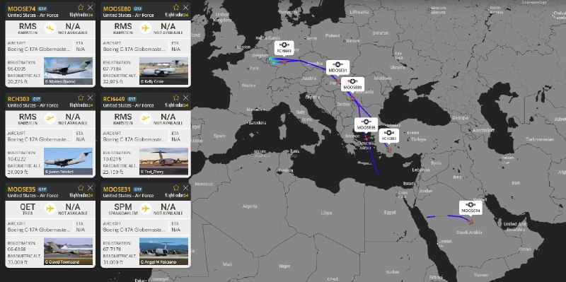

✈️از چند ساعت گذشته بیش از دوازده فروند هواپیمای ترابری راهبردی C-17A گلوبمستر III نیروی هوایی آمریکا در حال ترک خاورمیانه و حرکت به سمت اروپا هستند. @mwarmonitor

## mwarmonitor — post 9180

  <a href="telegram/content/mwarmonitor_9180_1779004866.mp4" target="_blank">🎬 Download video</a>

✈️🇷🇺«یک پرواز تخلیه نیروی هوایی روسیه چند ساعت پیش از امارات متحده عربی به سمت روسیه حرکت کرد؛ همان‌طور که پیش‌بینی می‌شد، پس از آن‌که دیروز از موگادیشو فرود آمده بود تا افراد مهم یا محموله‌ای را سوار کرده و تخلیه کند.
🔸دقیقاً همین پرواز در تاریخ ۲۴ فوریه نیز انجام شده بود؛ درست پیش از آن‌که حملات آمریکا علیه ایران رخ دهد.»

@mwarmonitor

## mwarmonitor — post 9179

  

🚨✈️ به نظر می‌رسد آسمان‌ها در حال حاضر به‌طور نگران‌کننده‌ای آرام هستند. حتی هیچ پرواز باری ورودی قابل مشاهده‌ای وجود ندارد، به‌جز یک فروند C-17 که همین حالا در اردن فرود آمده است. ✈️آخرین پروازهای باری نظامی در حال خارج شدن از خاورمیانه هستند. @mwarmonitor

## pm_afshaa — post 90880

  <a href="telegram/content/pm_afshaa_90880_1779004870.mp4" target="_blank">🎬 Download video</a>

بزرگ‌ترین راهپیمایی ملی‌گرایانه در لندن طی سال‌های اخیر

تامِی رابینسون ده‌ها هزار نفر را به خیابان‌ها آورد و تجمع کنندگان خواستار پایان دادن به مهاجرت غیرقانونی و حفاظت از ارزش‌های سنتی مسیحی شدن

💧 Rainbet.com the #1 Non-KYC Crypto Casino & Sportsbook @rainbetcom

😁 @Pm_Afshaa

## pm_afshaa — post 90879

  

توییت جدید اتاق جنگ اسرائیل:

⌛

💧 Rainbet.com the #1 Non-KYC Crypto Casino & Sportsbook @rainbetcom

😁 @Pm_Afshaa

## pm_afshaa — post 90877

  <a href="telegram/content/pm_afshaa_90877_1779004871.webm" target="_blank">🎬 Download video</a>

🔴17 فروند هواپیمای ترابری C-17A GLOBEMASTER نیروی هوایی آمریکا در حال خروج از خاورمیانه هستن، مثل الگوی قبل جنگ.

💧 Rainbet.com the #1 Non-KYC Crypto Casino & Sportsbook @rainbetcom

😁 @Pm_Afshaa

## mamlekate — post 103541

📝 سازمان بهداشت جهانی در پی شیوع اِبولا در کنگو وضعیت اضطراری بین‌المللی اعلام کرد

در پی شیوع دوباره بیماری اِبولا در جمهوری دموکراتیک کنگو در آفریقا و مرگ ده‌ها تن، سازمان بهداشت جهانی روز یک‌شنبه، ۲۷ اردیبهشت، «وضعیت اضطراری بین‌المللی» اعلام کرد.

@mamlekate

## kianmeli1 — post 87440

‏🔴خبرگزاری فارس، وابسته به سپاه ، از راه‌اندازی سامانه بیمه محموله‌های دریایی عبوری از تنگه هرمز با نام «هرمز سیف» خبر داد.
‏
این خبرگزاری نوشت: تسویه پرداخت‌ها از طریق ارز دیجیتال بیت‌کوین انجام خواهد شد
https://t.me/kianmeli1

## kianmeli1 — post 87439

  <a href="telegram/content/kianmeli1_87439_1779004872.mp4" target="_blank">🎬 Download video</a>

🔴انفجار در کارخانه «تومر» در بیت شمش، اسرائیل

انباری که پرکلرات سدیم مورد نیاز برای تولید موتورهای موشک‌های زمین به هوا در آن قرار داشت، به دلایل نامعلومی منفجر شد.
https://t.me/kianmeli1

## IranIntlTV — post 337582

  <a href="telegram/content/IranIntlTV_337582_1779004874.mp4" target="_blank">🎬 Download video</a>

ویدیوهای رسیده به ایران‌اینترنشنال نشان می‌دهند ایرانیان مقیم فرانسه و ایتالیا روز شنبه ۲۶ اردیبهشت علیه جمهوری اسلامی و قطع اینترنت ایران در شهرهای بوردو و تورین تجمع کردند.

## IranIntlTV — post 337581

  

بر اساس گزارش نت‌بلاکس، نهاد پایش وضعیت اینترنت در جهان، قطع سراسری اینترنت در ایران وارد هفتادونهمین روز خود در دوازدهمین هفته شده است: «این اقدام گسترده سانسور، ماهیت مشارکت مدنی را دگرگون کرده و کنترل اطلاعات به ابزاری برای تقلیل شهروندان عادی به ناظران تحولات تبدیل شده است.»
https://iranintl.com/202605174006

## IranIntlTV — post 337580

  <a href="telegram/content/IranIntlTV_337580_1779004878.mp4" target="_blank">🎬 Download video</a>

بر اساس ویدیوهای ارسال‌شده‌ به ایران‌اینترنشنال، ایرانیان مقیم کانادا شنبه ۲۶ اردیبهشت علیه جمهوری اسلامی و قطع اینترنت ایران در مونترال تجمع کردند و شعار «مرگ بر جمهوری اسلامی» سردادند.

## IranIntlTV — post 337579

  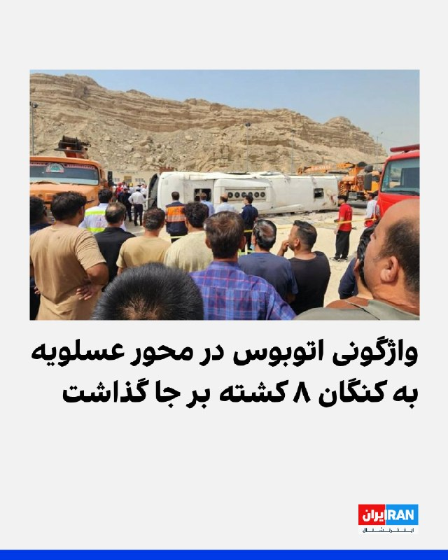

فرمانده پلیس راه سیراف عسلویه اعلام کرد که در پی واژگونی اتوبوس در محور عسلویه به کنگان، هشت نفر در محل حادثه جان خود را از دست دادند. کارشناسان پلیس راه علت این واژگونی را نقص فنی در سیستم ترمز تشخیص داده‌اند.
https://iranintl.com/202605172998

## IranIntlTV — post 337578

ایرانیان مقیم ملبورن استرالیا در یکی دیگر از آخر هفته‌های اعتراضی ایرانیان خارج از کشور، با حضور در مرکز این شهر و در حمایت و همبستگی با مردم ایران، سرود «ای‌ایران» را هم‌خوانی کردند.
گزارش علیرضا محبی، خبرنگار ایران‌اینترنشنال
@iranintltv

## IranIntlTV — post 337577

  <a href="telegram/content/IranIntlTV_337577_1779004882.mp4" target="_blank">🎬 Download video</a>

ویدیوهای رسیده به ایران‌اینترنشنال نشان می‌دهند ایرانیان مقیم مجارستان و دانمارک روز شنبه ۲۶ اردیبهشت علیه جمهوری اسلامی و قطع اینترنت در ایران در شهرهای بوداپست و آرهوس تجمع کردند.

## IranIntlTV — post 337576

یک شرکت‌کننده در تجمع ملبورن به علیرضا محبی، خبرنگار ایران‌اینترنشنال، گفت پایداری در برابر ظلم و ستم به نتیجه خواهد رسید و ما مدیون صبر و استقامت مردم ایران هستیم.
@iranintltv

## IranIntlTV — post 337575

  

ابراهیم رضایی، نماینده مجلس و سخنگوی کمیسیون امنیت ملی، در شبکه اجتماعی ایکس نوشت: «ممکن است بازگشت به جنگ آسیب‌هایی داشته باشد اما حتما دشمن بیشتر متضرر می‌شود، خیلی بیشتر.»
https://iranintl.com/202605175096

## IranIntlTV — post 337574

  <a href="telegram/content/IranIntlTV_337574_1779004886.mp4" target="_blank">🎬 Download video</a>

وب‌سایت اسرائیلی وای‌نت به نقل از مقام‌های این کشور گزارش داد احتمال از سرگیری جنگ در روزهای آینده «۵۰-۵۰» است و اوضاع به تصمیم «یک شخص» بستگی دارد. پیش‌تر نیویورک‌تایمز نوشته بود اسرائیل و آمریکا در حال تدارکات فشرده برای احتمال ازسرگیری جنگ هستند.
گفت‌وگو با روح‌الله رحیم‌پور، روزنامه‌نگار و تحلیل‌گر سیاسی
@iranintltv

## IranIntlTV — post 337573

  <a href="telegram/content/IranIntlTV_337573_1779004889.mp4" target="_blank">🎬 Download video</a>

ویدیوهای رسیده به ایران‌اینترنشنال نشان می‌دهند ایرانیان مقیم کانادا روز شنبه ۲۶ اردیبهشت علیه جمهوری اسلامی در اتاوا تجمع کردند و شعار «جاوید شاه» سردادند.

## IranIntlTV — post 337572

  

محمدصالح جوکار، رییس کمیسیون امور داخلی مجلس، با اشاره به حاضر نشدن جمهوری اسلامی در دور دوم مذاکره با آمریکا در پاکستان، گفت: «در این مدت پیشنهاداتی از سوی آمریکا مطرح شده اما جمهوری اسلامی همچنان بر همان بندهای اولیه تاکید دارد. شروط ده‌گانه خامنه‌ای خط قرمز هر مذاکره‌ای است.»

جوکار درباره جزئیات این شرط‌ها، گفت: «این ۱۰ شرط شامل عبور کنترل شده از تنگه هرمز با هماهنگی نیروهای مسلح جمهوری اسلامی، پایان جنگ علیه همه اجزای محور مقاومت، بیرون رفتن نیروهای رزمی آمریکا از تمامی پایگاه‌های منطقه، پرداخت کامل خسارت، رفع همه تحریم‌ها، پذیرش حق غنی‌سازی و آزاد شدن کلیه اموال و دارایی‌های بلوکه شده در خارج از کشور است.»
https://iranintl.com/202605174825

## IranIntlTV — post 337571

  <a href="telegram/content/IranIntlTV_337571_1779004895.mp4" target="_blank">🎬 Download video</a>

ایرانیان مقیم ملبورن استرالیا در یکی دیگر از آخر هفته‌های اعتراضی ایرانیان خارج از کشور، با حضور در مرکز این شهر، یاد قربانیان جنایات جمهوری اسلامی را گرامی داشتند. این تجمع در حمایت از زندانیان سیاسی، مخالفت با اعدام‌ها و برای رساندن صدای مردم ایران به افکار عمومی جهان برگزار شد.
علیرضا محبی، خبرنگار ایران‌اینترنشنال، گزارش می‌دهد
@iranintltv

## IranIntlTV — post 337570

  

عباس عراقچی، وزیر امور خارجه جمهوری اسلامی، در کانال تلگرامی خود اعلام کرد که کتاب «قدرت مذاکره» او به چاپ پنجم رسیده و در چاپ جدید این کتاب، بخش جدیدی با عنوان «دیپلماسی زیر آتش» درباره روند «مذاکرات غیرمستقیم با آمریکا در جنگ ۱۲ روزه» به آن افزوده شده است.
https://iranintl.com/202605171856

## IranIntlTV — post 337569

  <a href="telegram/content/IranIntlTV_337569_1779004898.mp4" target="_blank">🎬 Download video</a>

روزنامه تهران‌تایمز، وابسته به سازمان تبلیغات اسلامی، نوشت محاصره دریایی ایران از سوی آمریکا باعث تغییر استراتژیک در لجستیک و ترانزیت منطقه‌ای شده است.
جزییات بیشتر با احمد علوی، استاد دانشگاه و اقتصاددان
@iranintltv

## IranIntlTV — post 337568

  <a href="telegram/content/IranIntlTV_337568_1779004901.mp4" target="_blank">🎬 Download video</a>

شهباز شریف، نخست‌وزیر پاکستان، در گفت‌وگو با روزنامه تایمز بریتانیا گفت اسلام‌آباد نسبت به دستیابی صلح پایدار میان آمریکا و جمهوری اسلامی خوش‌بین است و برای تضمین این صلح، تمام تلاش خود را به کار می‌گیرد.
جزییات بیشتر در گفت‌وگو با علیرضا نامور حقیقی، تحلیل‌گر سیاسی
@iranintltv

## IranIntlTV — post 337567

  

عبدالغفور امان‌زاده، عضو کمیسیون کشاورزی مجلس، با اعلام افزایش ۲۰ هزار تومانی قیمت گندم، گفت: «نگرانی اصلی کشاورزان بابت پرداخت مطالبات و پول گندم است. از آغاز فصل برداشت تا امروز حدود ۴۵ روز می‌گذرد اما متاسفانه دیناری بابت این مسئله به کشاورزان پرداخت نشده است.»
https://iranintl.com/202605174138

## IranIntlTV — post 337566

  <a href="telegram/content/IranIntlTV_337566_1779004905.mp4" target="_blank">🎬 Download video</a>

سندیکای کارگران نیشکر هفت‌تپه در بیانیه‌ای خواستار تعیین دستمزد ۷۰ میلیون تومانی برای کارگران در سال جاری شد. این تشکل مستقل کارگری هشدار داد ادامه شکاف میان دستمزدها و تورم، فاصله طبقاتی را عمیق‌تر خواهد کرد.
جزییات بیشتر با روزبه بوالهری، عضو تحریریه ایران‌اینترنشنال
@iranintltv

## IranIntlTV — post 337565

  <a href="telegram/content/IranIntlTV_337565_1779004908.mp4" target="_blank">🎬 Download video</a>

سازمان حقوق بشر ایران در بیانیه‌ای نسبت به نقش برخی وکلای تسخیری در تسریع روند صدور و اجرای احکام اعدام معترضان هشدار داد. پیش‌تر نیز جمعی از وکلای حقوق بشری در ایران، وکلای تسخیری را همدستان نهادهای امنیتی در «محاکمات نمایشی» توصیف کرده بودند.
گفت‌وگو با محمد اولیایی‌فرد، وکیل دادگستری و عضو اتحادیه بین‌المللی وکلا
@iranintltv

## IranIntlTV — post 337564

  <a href="telegram/content/IranIntlTV_337564_1779004911.mp4" target="_blank">🎬 Download video</a>

شهباز شریف، نخست‌وزیر پاکستان، در گفت‌وگو با روزنامه تایمز بریتانیا گفت اسلام‌آباد نسبت به دستیابی صلح پایدار میان آمریکا و جمهوری اسلامی خوش‌بین است و برای تضمین این صلح، تمام تلاش خود را به کار می‌گیرد.
جزییات بیشتر در گفت‌وگو با علیرضا نامور حقیقی، تحلیل‌گر سیاسی
@iranintltv

## IranIntlTV — post 337563

  <a href="telegram/content/IranIntlTV_337563_1779004914.mp4" target="_blank">🎬 Download video</a>

دونالد ترامپ در گفت‌وگوی تلفنی با شبکه «ب‌اف‌ام» فرانسه هشدار داد اگر مقام‌های جمهوری اسلامی توافق نکنند، با «وضعیت بسیار بدی» روبه‌رو خواهند شد.
گفت‌وگو با امیر گیتی، عضو تحریریه ایران‌اینترنشنال
@iranintltv

## Shin_Persian — post 6044

Shin ✓ @hey_itsmyturn
Sat, 16 May 2026 23:39:11 UTC

Jet activity over Erbil, KRI, #Iraq 🇮🇶

فارسی

فعالیت جت‌ها بر فراز اربیل، اقلیم کردستان عراق، #Iraq 🇮🇶

𝕏 · @shin_persian

## ManotoTV — post 105548

  <a href="telegram/content/ManotoTV_105548_1779004917.mp4" target="_blank">🎬 Download video</a>

تجمع ایرانیان ساکن اورلاندو فلوریدا، آمریکا
۲۶ اردیبهشت

## ManotoTV — post 105547

  <a href="telegram/content/ManotoTV_105547_1779004919.mp4" target="_blank">🎬 Download video</a>

تجمع ایرانیان ایسلند، ۲۶ اردیبهشت
ایسلند از کم‌جمعیت‌ترین کشورهای اروپاست و جامعه ایرانی کوچکی دارد.

## ManotoTV — post 105546

  <a href="telegram/content/ManotoTV_105546_1779004921.mp4" target="_blank">🎬 Download video</a>

بریتانیا پنج عضو خانواده زرین‌قلم را به اتهام ارتباط با شبکه مالی پنهان جمهوری اسلامی تحریم کرده است. فرهاد زرین‌قلم، مهندس بریتانیایی ایرانی‌تبار، همراه با فضل‌الله، منصور، ناصر و پوریا زرین‌قلم در فهرست تازه تحریم‌های لندن قرار گرفته‌اند.

بر اساس اعلام وزارت خارجه بریتانیا، این افراد و دو صرافی مرتبط با آنان، «صرافی برلیان» و «جی‌سی‌ام اکسچنج»، به ارائه خدمات مالی برای افرادی و نهادهایی متهم شده‌اند که فعالیت‌هایشان با بی‌ثبات‌سازی بریتانیا یا دیگر کشورها ارتباط داشته است. لندن این افراد را با ممنوعیت سفر، توقیف دارایی و ممنوعیت مدیریت شرکت‌ها روبه‌رو کرده است.

آسوشیتدپرس نیز نوشت مقام‌های بریتانیا این تحریم‌ها را بخشی از مقابله با «فعالیت‌های خصمانه مرتبط با ایران» دانسته‌اند و گفته‌اند شبکه‌های مالی پنهان برای دور زدن تحریم‌ها و انتقال میلیاردها دلار به سود بخش‌های نفتی و نظامی جمهوری اسلامی به‌کار رفته‌اند.

## ManotoTV — post 105545

  <a href="telegram/content/ManotoTV_105545_1779004921.mp4" target="_blank">🎬 Download video</a>

راهپیمایی ایرانیان سان‌فرانسیسکو، ۲۶ اردیبهشت

## ManotoTV — post 105544

  <a href="telegram/content/ManotoTV_105544_1779004923.mp4" target="_blank">🎬 Download video</a>

راهپیمایی ایرانیان ساکن ونکوور کانادا، ۲۶ اردیبهشت

## ManotoTV — post 105543

  <a href="telegram/content/ManotoTV_105543_1779004925.mp4" target="_blank">🎬 Download video</a>

بلغارستان برای نخستین بار برنده مسابقه آواز یوروویژن شد. دارا، خواننده بلغاری، با ترانه «بنگارنگا» در فینال هفتادمین دوره این مسابقه در وین اتریش، ۵۱۶ امتیاز گرفت و مقام نخست را به دست آورد.

بر اساس اعلام وب‌سایت رسمی یوروویژن، بلغارستان هم در رای هیات‌های داوری و هم در رای مردمی اول شد. اسرائیل در جایگاه دوم و رومانی در جایگاه سوم قرار گرفتند.

## ManotoTV — post 105542

  <a href="telegram/content/ManotoTV_105542_1779004926.mp4" target="_blank">🎬 Download video</a>

دولت بریتانیا اعلام کرد سامانه‌ای تازه و کم‌هزینه برای مقابله با پهپادها را روی جنگنده‌های تایفون نیروی هوایی سلطنتی در خاورمیانه مستقر کرده است.

این سامانه که «سلاح کشتار دقیق پیشرفته» نام دارد، راکت‌های غیرهدایتی را با کیت هدایت لیزری به مهمات دقیق تبدیل می‌کند و به گفته وزارت دفاع بریتانیا، امکان انهدام اهداف را با هزینه‌ای بسیار کمتر از موشک‌های رایج فراهم می‌سازد.

وزارت دفاع بریتانیا اعلام کرد این سامانه با همکاری شرکت‌های بی‌ای‌ئی سیستمز و کینتیک، در کمتر از دو ماه از مرحله آزمایش به استقرار عملیاتی رسیده است. رسانه‌های دفاعی نیز گزارش داده‌اند جنگنده‌های تایفون بریتانیا در خاورمیانه اکنون برای ماموریت‌های مقابله با پهپاد به این سامانه مجهز شده‌اند.

## ManotoTV — post 105541

  <a href="telegram/content/ManotoTV_105541_1779004927.mp4" target="_blank">🎬 Download video</a>

‌
دونالد ترامپ، رئیس‌جمهوری آمریکا، تصویری تولیدشده با هوش مصنوعی را در شبکه اجتماعی تروث‌سوشال منتشر کرد که روی آن نوشته شده بود: «این آرامش پیش از طوفان بود.»

در این تصویر، ترامپ در میان ناوهای جنگی و هوایی طوفانی دیده می‌شود؛ پستی که در بحبوحه افزایش تنش‌ها با جمهوری اسلامی و گمانه‌زنی‌ها درباره احتمال ازسرگیری حملات آمریکا و اسرائیل به ایران منتشر شده است.

## FarsiVOA — post 217948

🔺شلیک راکت و پهپادهای حزب‌الله به نیروهای اسرائیلی در جنوب لبنان

▪️ارتش اسرائیل اعلام کرد حزب‌الله از شب گذشته تا صبح یکشنبه چند راکت و پهپاد انفجاری را به سوی نیروهای اسرائیلی مستقر در جنوب لبنان شلیک کرده است.

▪️یکی از پهپادها همچنین باعث فعال شدن آژیر هشدار در شهرک مرزی میسگاو عام در شمال اسرائیل شد.

▪️در سمت مقابل، حملات اسرائیل به جنوب لبنان نیز ادامه داشته است.

⬇️ بیشتر بخوانید:
https://ir.voanews.com/a/8150867.html

## FarsiVOA — post 217947

  

بری روزن، گروگان پیشین آمریکایی در ایران، نسبت به «افزایش سریع و نگران‌کننده اعدام‌ها در ایران» هشدار داد و آن را «نشان‌دهنده راهبردی حساب‌شده برای سرکوب هرگونه مخالفت» دانست.

آقای روزن در شبکه اجتماعی ایکس با اشاره به گزارش نهادهای حقوق بشر و رسانه‌ها درباره افزایش اعدام‌ها در ایران افزود: «گروه‌های حقوق بشری تأکید می‌کنند که این افزایش در اعدام‌ها در مقطعی حساس رخ می‌دهد؛ زمانی که ممکن است توجه بین‌المللی در خلال آتش‌بس رو به کاهش باشد.»

او به گزارش مرکز حقوق بشر در ایران اشاره و تأکید کرد: «این سرکوب بی‌رحمانه، به‌ویژه در زندان‌ها و دادگاه‌ها، در حال تشدید شدن است.»

جمهوری اسلامی در هفته‌های اخیر و همزمان با قطعی سراسری اینترنت، روند سرکوب‌ها و به ویژه اعدام‌ها را سرعت داده است. از آغاز جنگ با آمریکا و اسرائیل، دستگاه قضایی دستکم ۳۳ تن را به بهانه حضور در اعتراضات، عضویت در گروه‌های مخالف یا «همکاری با دشمن»، اعدام کرده است.
@FarsiVOA

## FarsiVOA — post 217946

🔺پگاه آهنگرانی در کن: روزهای سخت می‌گذرد و مردم آزادی را جشن می‌گیرند

▪️پگاه آهنگرانی، بازیگر و فیلمساز ایرانی، روز شنبه ۲۶ اردیبهشت برای نمایش فیلم تازه خود «تمرین‌هایی برای یک انقلاب» در جشنواره کن حاضر شد.

▪️او پیش از آغاز نمایش، این فیلم را به مادرانی تقدیم کرد که فرزندانشان را در مسیر مبارزه برای آزادی از دست داده‌اند.

▪️او همراه با عوامل فیلم روی صحنه رفت و گفت خوشحال است که از راه این اثر توانسته بخشی از مبارزه مردم برای آزادی و دموکراسی را به تصویر بکشد.

⬇️ بیشتر بخوانید:
https://ir.voanews.com/a/8150866.html

## FarsiVOA — post 217945

  

جواد علیکردی، شهروند اهل سبزوار و برادر خسرو علیکردی، وکیل دادگستری جان‌باخته، توسط دستگاه قضایی به ۱۰ سال حبس تعزیری محکوم شد.

جواد علیکردی اخیراً توسط یکی از شعب دادگاه انقلاب مشهد محاکمه و به تحمل ۱۰ سال حبس تعزیری محکوم شده است. این حکم در حالی صادر شده که وی همچنان در زندان وکیل‌آباد مشهد محبوس است و تاکنون اطلاع دقیقی از عناوین اتهامی مندرج در حکم صادر شده در دسترس نیست.

جواد علیکردی شامگاه ۲۱ آذرماه ۱۴۰۴، پس از انتشار ویدیویی در اعتراض به بازداشت گسترده سوگواران در مراسم هفتم برادرش بازداشت شد.

او در آن ویدئو اعلام کرده بود که اسناد محرمانه‌ای در این باره مرگ مشکوک برادرش در اختیار دارد.

خسرو علیکردی، در تاریخ ۱۴ آذر ۱۴۰۴ به طرز مشکوکی در دفتر کار خود جان باخت. نهادهای حکومتی علت مرگ را «ایست قلبی» اعلام کردند، اما خانواده علیکردی با اشاره به شواهدی چون خونریزی غیرعادی، این روایت را رد کرده و خواهان شفاف‌سازی شدند؛ امری که منجر به برخورد امنیتی با اعضای این خانواده و بازداشت جواد علیکردی شد.
@FarsiVOA

## FarsiVOA — post 217944

🔺بریتانیا یک سامانه جدید و کم‌هزینه ضدپهپاد در خاورمیانه مستقر کرد

▪️بریتانیا اعلام کرد که یک سامانه پدافند موشکی جدید و کم‌هزینه ضدپهپاد را برای دفاع از شهروندان و شرکای خود در برابر حملات پهپادی در خاورمیانه مستقر کرده است.

▪️این سامانه که با نام «سامانه پیشرفته سلاح کشتار دقیق» (ای‌پی‌کی‌دبلیواس) معرفی شده، بر روی این جنگنده‌های نیروی هوایی سلطنتی بریتانیا نصب خواهد شد تا آنها بتوانند اهداف را با دقت بالا و با کسری از هزینه موشک‌هایی که تاکنون استفاده می‌شد، منهدم کنند.

▪️این استقرار پس از آن صورت می‌گیرد که دونالد ترامپ، رییس‌جمهور آمریکا بارها از کشورهای عضو ناتو از جمله بریتانیا در ارتباط با جنگ علیه جمهوری اسلامی انتقاد کرده است.

⬇️ بیشتر بخوانید:
https://ir.voanews.com/a/8150865.html

## FarsiVOA — post 217943

  

رویترز گزارش داد دولت ترامپ روز شنبه معافیت تحریمی مربوط به خرید نفت دریابرد روسیه را تمدید نکرد؛ معافیتی که پیش‌تر به کشورهایی از جمله هند اجازه می‌داد در شرایط کمبود عرضه جهانی، نفت روسیه را خریداری کنند.

این معافیت پس از تمدید یک‌ماهه‌ای منقضی شد که هدف آن کاهش فشار بر بازار نفت، پس از بسته‌شدن تنگه هرمز از سوی ایران، اعلام شده بود.

وزارت خزانه‌داری آمریکا پیش‌تر گفته بود مجوز عمومی خرید نفت روسیه ذخیره‌شده در نفتکش‌ها تمدید نخواهد شد.

دو سناتور دموکرات نیز از دولت خواسته بودند این معافیت را ادامه ندهد و گفته بودند چنین اقدامی به درآمد روسیه برای جنگ با اوکراین کمک می‌کند.

رویترز نوشته قیمت بنزین در آمریکا به حدود ۴ دلار و ۵۰ سنت در هر گالن رسیده و نفت از زمان آغاز جنگ ایران، نزدیک یا بالاتر از ۱۰۰ دلار در هر بشکه مانده است. هند بزرگ‌ترین خریدار نفت دریابرد روسیه است.
@FarsiVOA

## FarsiVOA — post 217942

  

الکسی لیخاچف، رئیس شرکت روس‌اتم، اعلام کرد این شرکت تا روشن شدن وضعیت امنیتی پیرامون ایران، نمی‌تواند اعلام کند کارکنان روس را به طور کامل به نیروگاه اتمی بوشهرگرداند.

او گفت روس‌اتم برنامه‌ریزی برای افزایش تعداد افراد روسی در بوشهر را آغاز کرد، اما هم‌زمان ناچار است «وضعیت نظامی» را در نظر بگیرید.

لیخاچف به گزارش رسانه‌ها درباره احتمال ازسرگیری جنگ اشاره کرد و گفت تا روشن شدن اوضاع، بازگشت کامل نیروها ممکن نیست.

با آغاز عملیات آمریکا و اسرائیل علیه جمهوری اسلامی در اسفند سال گذشته، روس‌اتم حضور نیروهای روس در بوشهر را مرحله‌به‌مرحله کاهش داده است. ابتدا ۹۴ نفر، سپس ۱۵۰ نفر، بعد ۱۶۳ نفر، در مرحله بعد ۱۹۸ نفر، و در نهایت ۱۰۸ نفر دیگر از سایت خارج شدند؛ تا جایی که در اواخر فروردین‌ماه تنها ۲۰ نیروی روس برای حفظ ایمنی تجهیزات و اداره حداقلی در نیروگاه باقی ماندند.
@FarsiVOA

## FarsiVOA — post 217941

  

نماینده هند در سازمان ملل اعلام کرد هدف قرار دادن کشتی‌های تجاری، به خطر انداختن خدمه غیرنظامی و ایجاد اختلال در آزادی کشتیرانی در تنگه هرمز غیرقابل قبول است.

پارواتاننی هریش در اجلاس ویژه شورای اجتماعی و اقتصادی سازمان ملل متحد درباره بحران انرژی و کودهای کشاورزی گفته است قوانین بین‌المللی در رابطه با تنگه هرمز باید به‌ طور کامل رعایت شوند.

او تصریح کرد برای مقابله با این بحران، ترکیبی از اقدامات کوتاه‌مدت و ساختاری، در کنار همکاری‌های بین‌المللی، ضروری است.

تنگه هرمز محل عبور ۲۰ درصد از نفت مصرفی و ۳۵ درصد از تجارت کودهای کشاورزی جهان است که از ۹ اسفند به خاطر انسداد تنگه هرمز توسط جمهوری اسلامی و حمله به دهها کشتی، مختل شده است.
@FarsiVOA

## FarsiVOA — post 217940

  

⚡️مارک لوین، از مفسران مشهور رادیویی آمریکایی و از حامیان برجسته دونالد ترامپ، رئیس‌جمهوری آمریکا، روز شنبه ۲۶ اردیبهشت در شبکه اجتماعی ایکس نوشت: «باید به آزادی مردم ایران کمک کنیم، و ما قادریم که این کار را انجام دهیم.» او گفت: «می‌توانیم این کار را بدون اعزام زمینی نیروهایمان انجام دهیم. بدون یک جنگ ابدی. می‌توانیم این کار را انجام دهیم.»

آقای لوین در این راستا توضیح داد که می‌توان مردم ایران را آموزش داد و آن‌ها را مسلح کرد. او نوشت: «آن‌ها را آموزش دهیم. مسلح کنیم. از آنها حمایت کنیم. و دیگر هرگز نگران سلاح‌های هسته‌ای رژیم ایران نخواهیم بود. نه تنها این، بلکه خاورمیانه نیز به گونه‌ای که حتی نمی‌توانیم تصور کنیم، به سمت بهتر شدن تغییر خواهد کرد. این رژیم (جمهوری اسلامی) باید نابود شود. اکنون وقتش است.»
@FarsiVOA

## FarsiVOA — post 217939

🔺یوروویژن ۲۰۲۶؛ بلغارستان اول شد اسرائيل دوم

▪️بلغارستان شامگاه شنبه ۲۶ اردیبهشت در مسابقه آواز یوروویژن در وین به پیروزی رسید.

⬇️ بیشتر بخوانید:
https://ir.voanews.com/a/8150864.html
@FarsiVOA

## FarsiVOA — post 217938

⚡️مواضع قانون‌گذاران کنگره درباره شرایط خاورمیانه و قطع دسترسی مردم به اینترنت از سوی جمهوری اسلامی
@FarsiVOA

## FarsiVOA — post 217937

🔺دولت ونزوئلا متحد سابق نیکلاس مادورو را برای رسیدگی به پرونده‌های قضائی به آمریکا تحویل داد

▪️دولت ونزوئلا روز شنبه ۲۶ اردیبهشت اعلام کرد که الکس ساب از نزدیکان نیکلاس مادورو، را برای رسیدگی به پرونده‌های کیفری به ایالات متحده مسترد کرده است.

⬇️ بیشتر بخوانید:
https://ir.voanews.com/a/8150731.html
@FarsiVOA

## FarsiVOA — post 217936

⚡️روز جهانی همزیستی مسالمت‌آمیز؛ اروپا در هنگامه آزمونی تاریخی
@FarsiVOA

## FarsiVOA — post 217935

⚡️از «به جان اموال مردم افتادن» تا حکومتِ سرکوب در نقش مربی اسلحه در صداوسیما
@FarsiVOA

## FarsiVOA — post 217934

🔺ترامپ با اشاره به «اعتراف به اشتباه» سازمان ملل از ادعاهای «اکتیویستی اقلیمی دموکرات‌ها» انتقاد کرد

▪️دونالد ترامپ، رئيس جمهوری آمریکا روز شنبه در پیامی تازه از دموکرات‌ها و سیاست‌های اقلیمی آن‌ها انتقاد کرد.

⬇️ بیشتر بخوانید:
https://ir.voanews.com/a/8150728.html
@FarsiVOA

## FarsiVOA — post 217933

  

⚡️ارتش اسرائیل عصر شنبه اعلام کرد که یک سرباز ۲۴ ساله اسرائیلی روز جمعه در حمله پهپادی گروه حزب‌الله در جنوب لبنان کشته شد. تایمز اسرائيل نوشت که علیرغم آتش‌بسی که به‌تازگی تمدید شده است درگیری‌های محدود با این گروه تروریستی تحت حمایت جمهوری اسلامی ادامه دارد. بنیامین نتانیاهو، نخست وزیر اسرائيل روز شنبه گفت «تمام مردم اسرائیل» در سوگ این سرباز هستند و به یادش سر تعظیم فرود می‌آورند.
@FarsiVOA

## DW_Farsi — post 124785

  

🔶 کرملین از گفت‌وگوی پوتین با رئیس دولت امارات متحده عربی خبر داد

کرملین روز شنبه در بیانیه‌ای اعلام کرد که ولادیمیر پوتین، رئیس‌جمهور روسیه، با رئیس امارات متحده عربی، محمد بن زاید آل نهیان، درباره مناقشه ایران گفتگو کرده است.

در بیانیه کرملین آمده است: «دو طرف بر اهمیت ادامه روند سیاسی و دیپلماتیک با هدف دستیابی به توافق‌های صلح تاکید کردند.»

امارات متحده عربی هدف اصلی حملات موشکی و پهپادی ایران در طول جنگ منطقه‌ای بود؛ جنگی که ۲۸ فوریه با حملات ایالات متحده و اسرائیل شعله‌ور شد.

این مناقشه بخش عمده‌ای از صادرات نفت امارات را قطع کرده و به تصویر آن به‌عنوان پناهگاهی امن، جایگاهی که به تبدیل شدنش به قطب مالی منطقه کمک کرده بود، آسیب رسانده است.

@dw_farsi

## DW_Farsi — post 124784

  

📸 عکس روز: بلغارستان بر قله مسابقات یوروویژن

بلغارستان با پیروزی در مسابقات آواز یوروویژن امسال در وین، عنوان قهرمانی را به دست آورد. "دارا" خواننده بلغاری، با ترانه "بانگارانگا" موفق به کسب مقام اول شد.
"دارا" هم در رأی داوران و هم در رأی‌گیری تماشاگران پیروز شد و با ترانه شاد و رقصی هیجان‌انگیز‌ با اختلاف قابل‌توجهی بالاتر از ۲۴ کشور شرکت‌کننده دیگر قرار گرفت. خواننده اسرائیلی دوم شد و آلمان مقام ۲۳ را کسب کرد.

@dw_farsi

## DW_Farsi — post 124783

  

🔶 تشدید حملات اسرائیل به جنوب لبنان با وجود تمدید آتش‌بس

اسرائیل روز شنبه ۱۶ ماه مه (۲۶ اردیبهشت)، با وجود تمدید آتش‌بس با لبنان، موج گسترده‌ای از حملات هوایی را در جنوب این کشور آغاز کرد.

این حملات پس از صدور هشدار تخلیه برای ۹ روستا صورت گرفت.

خبرگزاری رسمی لبنان (NNA) روز شنبه از حمله به بیش از ۲۰ روستا خبر داد. این خبرگزاری همچنین از موج جدیدی از کوچ ساکنان لبنان به سمت شهرهای صیدا و بیروت خبر داد.

حزب‌الله لبنان نیز در اواخر روز شنبه اعلام کرد که به یک هدف نظامی در شمال اسرائیل حمله کرده است است.

دو کشور روز جمعه با تمدید ۴۵ روزه آتش‌بسی موافقت کردند که از ۱۷ آوریل آغاز شده اما با نقض‌های متعددی همراه بوده است. آنتونیو گوترش، دبیرکل سازمان ملل متحد، روز شنبه اعلام کرد که از این تمدید استقبال می‌کند و از هر دو کشور می‌خواهد به توقف درگیری‌ها به طور کامل احترام بگذارند.

@dw_farsi

## DW_Farsi — post 124782

🔶 جام‌های ۱۹۶۲ و ۱۹۶۶؛ یاشین، عنکبوت سیاه و دروازه‌بان قرن

زمانی یک مفسر فوتبال درباره‌ یاشین دروازه‌بان سابق تیم ملی فوتبال شوروی گفته بود: «توپی که از کنار یاشین عبور کند، از کنار دروازه عبور خواهد کرد.» این سخن به بهترین نحوی تسخیرناپذیری این اسطوره‌ فوتبال را بیان می‌کند.

اوزه بیو ستاره‌ی فوتبال پرتغال در دهه‌ی ۶۰ نیز گفته بود: «یاشین بهترین دروازه‌بانی است که تاریخ فوتبال جهان به خود دیده است.»

روسیه که میزبانی مسابقات جام جهانی ۲۰۱۸ را بر عهده داشت، در آن دوره از بازی‌ها یاد دروازه‌بان اسطوره‌ای خود را گرامی داشته بود و بر پوستر رسمی جام ۲۰۱۸ تصویر یاشین می‌درخشید.

لئو ایوانویچ یاشین در ۲۲ اکتبر سال ۱۹۲۹ در بوگورودسکویه واقع در نزدیکی مسکو به دنیا آمد. در نوجوانی تا مدت‌ها می‌خواست قهرمان شطرنج شود و بر جایگاه آن زمان میخائیل بوتوینیک، قهرمان روسی شطرنج جهان تکیه زند.

بعدها این فکر را کنار گذاشت و به رشته‌های ورزشی دیگر مانند شمشیربازی، بسکتبال و تنیس روی آورد. سپس توانایی‌های خود را در رشته هاکی روی یخ نیز آزمود و به این ورزش دل بست. او دروازه‌بان هاکی روی یخ بود و فکر نمی‌کرد روزی بزرگ‌ترین دروازه‌بان تاریخ فوتبال شود.

@dw_farsi

## DW_Farsi — post 124781

  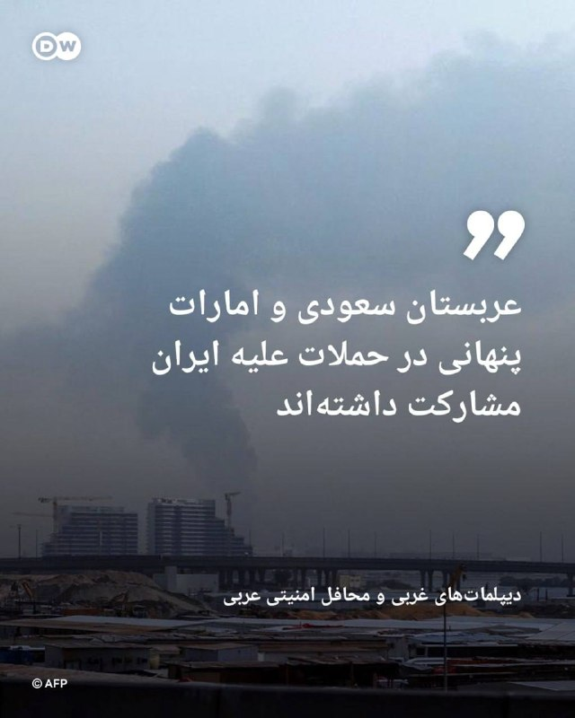

🔶 "مشارکت پنهانی عربستان سعودی و امارات در حملات علیه ایران"

دیپلمات‌های غربی و محافل امنیتی عربی در گفت‌وگو با خبرگزاری آلمان (dpa) تایید کردند که عربستان سعودی و امارات متحده عربی "به طور مخفیانه و فعال" در حملات علیه ایران مشارکت داشته‌اند.

وال‌استریت ژورنال و نیویورک تایمز نیز گزارش داده‌اند که این کشورها دست به حمله نظامی علیه ایران زده‌اند.

دولت‌های این کشورها هنوز به طور رسمی این اقدامات را تایید نکرده‌اند و همچنان صرفا بر "حق دفاع از خود" تاکید می‌کنند.

وزارت امور خارجه امارات متحده عربی روز شنبه ۲۶ اردیبهشت (۱۶ مه) در بیانیه‌ای اقدامات نظامی علیه ایران را به‌عنوان "تدابیری کاملا دفاعی برای حفظ حاکمیت خود" توصیف و اعلام کرده بود که همه اقدامات انجام‌شده با هدف "حفاظت از غیرنظامیان و زیرساخت‌های حیاتی" صورت گرفته است.

جمهوری اسلامی ایران در میان کشورهای حوزه خلیج فارس، بیشترین حملات را علیه امارات انجام داده است.

@dw_farsi

## DW_Farsi — post 124780

  

🔶 ایالات متحده معافیت تحریمی نفت روسیه را منقضی کرد

دولت آمریکا معافیتی را که موجب کاهش تحریم‌ها علیه نفت روسیه شده بود را تمدید نکرد. دلیل این اقدام، افزایش قیمت انرژی در پی جنگ ایران است.

ایالات متحده با این اقدام تلاش کرده تا بازارهای جهانی را آرام کند. پیش از این، فروش و تحویل نفت روسیه که تا زمان مشخصی بارگیری شده بود، از تحریم‌ها معاف بود.

اخیرا از جمله از سوی حزب دموکرات در آمریکا، درخواست‌هایی مبنی بر عدم تمدید این معافیت مطرح شده بود.

برخی سناتورهای این حزب با اعلام این که وزارت خزانه‌داری آمریکا باید بالاخره به این سیاست نسنجیده خود پایان دهد، تاکید کرده بودند که نباید به روسیه کمک شود تا از "جنگ بی‌ملاحظه ترامپ در ایران" سود بیشتری به دست آورد.

@dw_farsi

## DW_Farsi — post 124779

  

🔶 بازگشت ناوهواپیمابر "یواس‌اس جرالد آر. فورد" به آمریکا

ناوهواپیمابر آمریکایی "یواس‌اس جرالد آر. فورد" پس از یک ماموریت ۳۲۶ روزه در آب‌های بین‌المللی، دوباره به ایالات متحده بازگشت.

بر اساس اعلام ارتش آمریکا در شبکه اجتماعی ایکس، پیت هگست، وزیر دفاع این کشور در بندر اصلی این ناو در نورفولکِ ایالت ویرجینیا، از بزرگ‌ترین ناوهواپیمابر جهان استقبال کرد.

این کشتی حدود دو هفته پیش، پس از مشارکت در عملیات‌های نظامی علیه ایران، منطقه خلیج فارس را ترک کرده بود. ناوهواپیمابر "یواس‌اس جرالد آر. فورد" بیش از ده ماه را در آب‌های بین‌المللی سپری کرد.

به گفته موسسه نیروی دریایی ایالات متحده، این طولانی‌ترین ماموریت یک ناوهواپیمابر آمریکایی از زمان پایان جنگ سرد به شمار می‌رود.

@dw_farsi

## DW_Farsi — post 124778

🔶 هشدار ترامپ به ایران: این آرامش پیش از طوفان است

در حالی که گزارش‌هایی درباره احتمال ازسرگیری حملات آمریکا علیه ایران منتشر شده، دونالد ترامپ، رئیس‌جمهور ایالات متحده، روز شنبه ۱۶ ماه مه (۲۶ اردیبهشت) با انتشار تصویری هشدارآمیز، وضعیت کنونی خاورمیانه را "آرامش پیش از طوفان" توصیف کرد.

در تصویری که با هوش مصنوعی تولید شده و ترامپ آن را در شبکه اجتماعی خود، "تروث سوشال" منتشر کرده، او با کلاه معروف "عظمت را به آمریکا بازگردانیم" در کنار یک دریاسالار نیروی دریایی آمریکا دیده می‌شود. این تصویر، آن دو را در میان آب‌های متلاطم و صاعقه‌ها، بر عرشه یک ناو آمریکایی نشان می‌دهد؛ در حالی که در پس‌زمینه، چند شناور ایرانی با پرچم جمهوری اسلامی نیز دیده می‌شوند.

بر فراز این تصویر جمله "این آرامش پیش از طوفان بود" نوشته شده؛ پیامی که می‌تواند به‌عنوان هشداری خطاب به ایران تعبیر شود.

روزنامه نیویورک تایمز پیشتر گزارش داده بود که ترامپ در آستانه اتخاذ تصمیمی مهم درباره ایران قرار دارد و مشاوران ارشد او در صورت شکسته‌شدن بن‌بست دیپلماتیک، در حال بررسی سناریوهای ازسرگیری حملات هوایی هستند.

ترامپ روز شنبه در گفت‌وگو با شبکه فرانسوی ‌‌"BFMTV" نیز با اشاره به این که هنوز مشخص نیست مذاکرات درباره برنامه هسته‌ای ایران و تنش‌های اخیر به توافق منجر شود یا نه، هشدار داد: «اگر توافق نکنند، دوران بسیار سختی خواهند داشت.»

@dw_farsi

## Persian_Trend_Official — post 14306

  

🔴دیلی میل: نخست وزیر انگلیس استعفا می‌دهد

💢دیلی میل گزارش داد استارمر نخست وزیر انگلیس در بحبوحه شورش فزاینده در حزبش، به نزدیکانش اطلاع داده است که قصد استعفا دارد.

💢بیش از ۹۰ نماینده مجلس از حزب کارگر در روزهای اخیر خواستار استعفای او شده‌اند.

🫆:Tony

📌 @persian_trend_official
پرشین ترند | متفاوت‌ترین کانال نظامی

## Persian_Trend_Official — post 14305

  <a href="telegram/content/Persian_Trend_Official_14305_1779004938.webm" target="_blank">🎬 Download video</a>

⭕️ حماس: هشدار می‌دهیم که همه گزینه‌ها بر روی میز است. 📝 Nick 📌 @persian_trend_official پرشین ترند | متفاوت‌ترین کانال نظامی

## Persian_Trend_Official — post 14301

  <a href="telegram/content/Persian_Trend_Official_14301_1779004938.mp4" target="_blank">🎬 Download video</a>

⭕️ صبح امروز طی حمله پهپاد‌ی گسترده ارتش اوکراین چندین منطقه در مسکو مورد اصابت قرار گرفتند!

به گزارش منابع روسی بیش از 10 نقطه در مسکو هدف قرار گرفتند. وزارت دفاع روسیه مدعی سرنگونی 148 پهپاد اوکراینی است. در ویدیو‌ها لحظه و نتیجه اصابت چند پهپاد و همچنین رهگیری یک پهپاد توسط سامانه پانتیسر روسی مشخص است.

📝 Nick

📌 @persian_trend_official
پرشین ترند | متفاوت‌ترین کانال نظامی

## Persian_Trend_Official — post 14300

  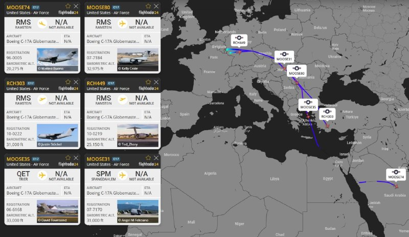

⭕️ 6 هواپیمای ترابری C-17 در حال ورود به پایگاه‌های ارتش آمریکا در منطقه هستند.

📝 Nick

📌 @persian_trend_official
پرشین ترند | متفاوت‌ترین کانال نظامی

## Persian_Trend_Official — post 14299

⭕️ حماس: هشدار می‌دهیم که همه گزینه‌ها بر روی میز است.

📝 Nick

📌 @persian_trend_official
پرشین ترند | متفاوت‌ترین کانال نظامی

## Persian_Trend_Official — post 14298

  <a href="telegram/content/Persian_Trend_Official_14298_1779004942.mp4" target="_blank">🎬 Download video</a>

⭕️ رئیس کانون عالی بازنشستگان تأمین اجتماعی:

تاکنون ۲۲۳ هزار نفر درخواست بیمه بیکاری داده‌اند.

📝 Nick

📌 @persian_trend_official
پرشین ترند | متفاوت‌ترین کانال نظامی

## Persian_Trend_Official — post 14297

  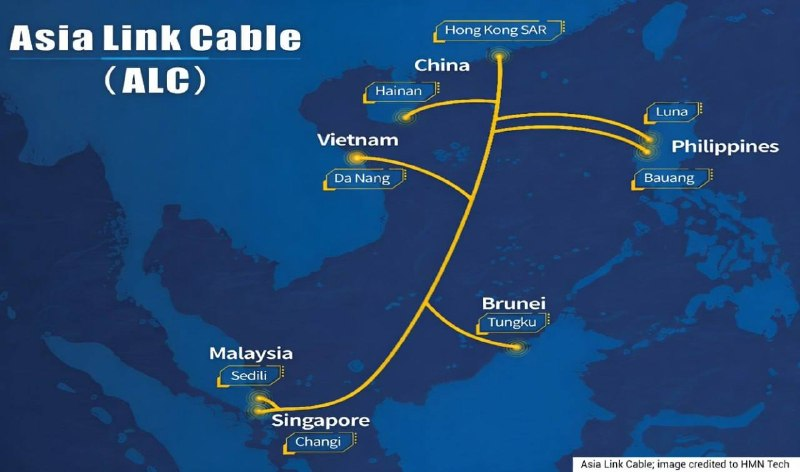

کابل زیردریایی «Asia Link»؛ گام تازه چین برای استقلال دیجیتال در آسیا

چین از راه‌اندازی یک کابل زیردریایی جدید با نام «Asia Link» خبر داده؛ پروژه‌ای با طول حدود ۶۲۰۰ کیلومتر و ظرفیت انتقال بیش از ۳۲۵ ترابیت بر ثانیه که چند کشور کلیدی شرق و جنوب‌شرق آسیا را به هم متصل می‌کند.

این کابل چین را به سنگاپور، ویتنام، مالزی، برونئی و فیلیپین وصل می‌کند و برای نخستین‌بار، یکی از نقاط اتصال خارجی این شبکه خارج از سرزمین اصلی چین و در هنگ‌کنگ قرار گرفته است.

اهمیت این پروژه فقط در بُعد فنی نیست. در حال حاضر بخش عمده مسیرهای اصلی اینترنت جهانی و کابل‌های زیردریایی در اختیار شرکت‌ها و زیرساخت‌های غربی قرار دارد. چین با توسعه چنین پروژه‌هایی به‌دنبال ایجاد مسیرهای جایگزین و کاهش وابستگی به این شبکه‌هاست.

پ.ن : این کابل بخشی از یک روند بزرگ‌تر است؛ شکل‌گیری یک «اینترنت موازی آسیایی» که در صورت تشدید رقابت‌های ژئوپلیتیکی، می‌تواند به تفکیک زیرساخت‌های ارتباطی شرق و غرب منجر شود.

📌 @persian_trend_official
پرشین ترند | متفاوت‌ترین کانال نظامی

## Persian_Trend_Official — post 14296

تیتر مهم‌ترین اخبار ۲۴ ساعت گذشته 👇

تشدید تحرکات نظامی آمریکا در خلیج فارس و دریای عمان

افزایش سطح آماده‌باش نیروهای مسلح ایران در جنوب کشور

ادامه مذاکرات غیررسمی تهران–واشنگتن با محور تنگه هرمز

ورود تجهیزات و نیروهای جدید آمریکایی به پایگاه‌های منطقه

هشدار ایران به هرگونه مداخله نظامی خارجی در هرمز

بررسی طرح ائتلاف دریایی برای اسکورت نفتکش‌ها

افزایش قیمت نفت در واکنش به ریسک امنیت انرژی

اختلال محدود در مسیر برخی کشتی‌های تجاری در منطقه

تشدید پرواز پهپادهای شناسایی آمریکا نزدیک مرزهای ایران

استقرار بیشتر جنگنده‌ها و بمب‌افکن‌ها در خاورمیانه

افزایش سطح هشدار امنیتی در امارات و بحرین

نشست اضطراری کشورهای غربی درباره امنیت کشتیرانی

تأکید رسانه‌های غربی بر حفظ توان بازدارندگی ایران

افزایش حملات و فعالیت‌های سایبری در زیرساخت‌های حساس

گسترش عملیات‌های اطلاعاتی در کشورهای اطراف ایران

تشدید جنگ رسانه‌ای میان ایران و آمریکا

آماده‌باش نیروهای دریایی در منطقه خلیج فارس

بررسی گزینه‌های نظامی محدود در پنتاگون

هشدار شرکت‌های بیمه به کشتی‌ها درباره عبور از هرمز

افزایش تردد نظامی در اطراف تنگه هرمز

📌 @persian_trend_official
پرشین ترند | متفاوت‌ترین کانال نظامی

## Persian_Trend_Official — post 14295

  

⭕️ دولت ونزوئلا اعلام کرد «الکس صائب» از متحدان نزدیک نیکولاس مادورو را به ایالات متحده تحویل داده است.

صائب پیش‌تر از سوی آمریکا به پول‌شویی، فساد مالی و دور زدن تحریم‌ها متهم شده بود. برخی رسانه‌ها و گزارش‌های امنیتی نیز در سال‌های گذشته از ارتباط او با شبکه‌های نزدیک به حزب‌الله و جمهوری اسلامی صحبت کرده بودند، اما این ادعاها به‌صورت رسمی و قطعی اثبات نشده‌اند.

Reuters

📝 Nick

📌 @persian_trend_official
پرشین ترند | متفاوت‌ترین کانال نظامی

## Persian_Trend_Official — post 14290

⭕️ «16 می در مودِنا، ایتالیا، یک خودرو وارد پیاده‌رو شد و دست‌کم ۸ عابر پیاده را زخمی کرد. ۴ نفر از مصدومان در وضعیت وخیم هستند و راننده نیز بازداشت شده است. مقام‌های ایتالیایی می‌گویند هنوز انگیزه حادثه روشن نیست و بررسی‌ها ادامه دارد.»

Reuters

📝 Nick

📌 @persian_trend_official
پرشین ترند | متفاوت‌ترین کانال نظامی

## Persian_Trend_Official — post 14289

  <a href="telegram/content/Persian_Trend_Official_14289_1779004946.webm" target="_blank">🎬 Download video</a>

رسوایی پزشکی در دانشگاه‌های آمریکا؛ فروش اجساد اهدایی برای آموزش ارتش اسرائیل 
🔹رسانه‌های آمریکا گزارش داده‌اند دو دانشگاه مطرح این کشور، اجسادی را که شهروندان برای تحقیقات پزشکی و علمی اهدا کرده بودند را در اختیار ارتش اسرائیل قرار داده‌اند. 
🔹این افشاگری…

## Persian_Trend_Official — post 14288

  <a href="telegram/content/Persian_Trend_Official_14288_1779004947.mp4" target="_blank">🎬 Download video</a>

ویو هوایی از ترافیک قفل شده تنگه هرمز

📌 @persian_trend_official
پرشین ترند | متفاوت‌ترین کانال نظامی

## Persian_Trend_Official — post 14285

  <a href="telegram/content/Persian_Trend_Official_14285_1779004950.webm" target="_blank">🎬 Download video</a>

فعالیت رزمی ناو گروه ضربت هواپیمابر آبراهام لینکلن در ۲۵۰ کیلومتری جنوب بندر چابهار.

📝 Nick

📌 @persian_trend_official
پرشین ترند | متفاوت‌ترین کانال نظامی

## RadioFarda — post 157279

🔸بر اساس گزارش‌ها در پی بارش‌های اخیر وضعیت دریاچه ارومیه در مقایسه زمان‌های مشابه سال‌های گذشته بهتر شده است.

🔸کاوه مدنی، مدیر مؤسسه آب، محیط‌زیست و سلامت دانشگاه سازمان ملل، در هفته‌های گذشته با انتشار یک گزارش تصویری از وضعیت دریاچه ارومیه طی یک دهه گذشته گفته بود: «وضعیت دریاچه در فروردین امسال بهتر از چند سال اخیر است اما در صورت عدم تداوم بارندگی‌ها، با شروع فصل گرما، آب دریاچه دوباره تبخیر و دریاچه دوباره خشک خواهد شد.»

🔸در یکی از آخرین ویدئوها از دریاچه ارومیه به تاریخ ۲۵ اردیبهشت رنگین‌کمانی بزرگ پس از بارش بهاری بر فراز این دریاچه نقش بسته است.

@RadioFarda

## RadioFarda — post 157278

  

🔸دارا، خواننده زن بلغارستانی، با ترانه شاد «بانگارانگا» روز شنبه، ۲۶ اردیبهشت، به عنوان برنده در هفتادمین دوره از مسابقه یوروویژن انتخاب شد.

🔸در این دوره از مسابقه یوروویژن، اسرائیل که با حضورش سایه جنگ غزه را بر سر رقابت‌ها انداخته و باعث جنجال بسیار شده بود در مراسم یک‌شنبه شب به مقام دوم رسید.

🔸رومانی هم به مقام سوم رسید.

🔸این مسابقه که معمولاً جشنی شاد و پر زرق‌ و برق برای موسیقی پاپ و تنوع فرهنگی اروپا محسوب می‌شود، به‌دلیل جنگ غزه با تنش و نوعی بحران مواجه شد، و در نهایت شبکه‌های ملی پخش پنج کشور اسپانیا، ایرلند، هلند، ایسلند و اسلوونی در اعتراض به حضور اسرائیل، از رقابت‌های امسال کناره‌گیری کردند.

🔸این موضوع باعث شد که تعداد شرکت‌کنندگان این دوره به ۳۵ کشور برسد و یوروویژن امسال کوچک‌ترین دوره از سال ۲۰۰۳ تاکنون باشد.

@RadioFarda

## RadioFarda — post 157277

🔸پگاه آهنگرانی، بازیگر و فیلمساز ایرانی، اکران فیلم «تمرین‌هایی برای یک انقلاب» در جشنواره کن را به مادرانی تقدیم کرد که فرزندان خود را در راه آزادی دست‌ داده‌اند.

🔸خانم آهنگرانی در این مراسم ضمن اشاره به دوران سختی که مردم ایران در حال سپری کردن هستند ابراز امیدواری کرد که «این روزها خواهد گذشت، چون به شجاعت‌ و مبارزه مداوم آن‌ها برای آزادی ایمان دارم.»

🔸فیلم «تمرین‌هایی برای یک انقلاب»، در بخش ویژه هفتادونهمین دوره جشنواره کن به نمایش درآمد و با استقبال تماشاگران روبه‌رو شد.

🔸در این فیلم با استفاده از آرشیوهای شخصی، ویدئوهای خانگی، تصاویر اعتراضات خیابانی، روزنامه‌ها و صداهای ضبط ‌شده، بیش از ۴۰ سال از تاریخ ایران را بازخوانی شده است.

@RadioFarda

## RadioFarda — post 157276

  

🔸دونالد ترامپ، رئیس‌جمهور آمریکا، شامگاه شنبه ۲۶ اردیبهشت پست جدیدی درباره ایران در شبکه اجتماعی تروث سوشال با این عنوان منتشر کرد: «آرامش پیش از طوفان»

🔸در این طرح گرافیکی او در کنار یک فرمانده نظامی آمریکا بر روی عرشه یک ناو جنگی در فضایی طوفانی در حالی دیده می‌شود که دو شناور با پرچم ایران در پشت سر آن‌ها قرار دارند.

🔸آقای ترامپ هم‌زمان یک انیمیشن چند ثانیه‌ای هم در تروث سوشال منتشر کرده که در آن به یک ناو آمریکایی دستور شلیک به یک جنگنده با پرچم جمهوری اسلامی ایران را می‌دهد.

🔸این دو پست آقای ترامپ پس از آن منتشر شد که روزنامه نیویورک تایمز به نقل از دو مقام در خاورمیانه گزارش داد که آمریکا و اسرائیل در حال آماده شدن برای احتمال از سرگیری حملات علیه ایران هستند.

🔸مقام‌های جمهوری اسلامی در مورد هرگونه حمله به ایران هشدار داده‌اند، ازجمله مشاور راهبردی رئیس مجلس روز شنبه یک استوری با این متن منتشر کرده بود: «ای لشکر صاحب زمان آماده‌ باش...»

🔸این پیام در ادبیات جمهوری اسلامی به معنای آمادگی برای جنگ است.

@RadioFarda

## RadioFarda — post 157275

  <a href="https://t.me/radiofarda/157275" target="_blank">📎 Download file</a>

📻بشنوید: سرخط خبرها با رادیوفردا، ۲۷ اردیبهشت ۱۴۰۵‌

@RadioFarda

## IranianMinds — post 20269

  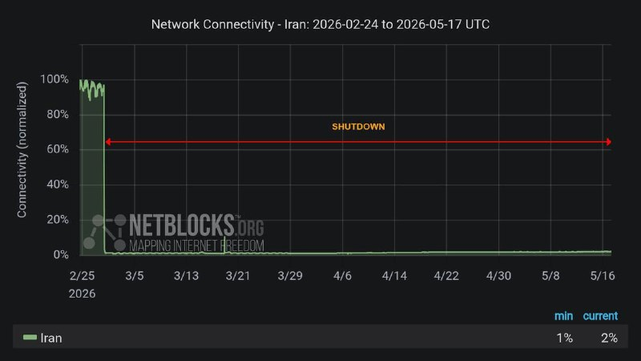

🔴 نت بلاکس :

قطعی اینترنت در ایران وارد ۷۹ امین روز خودش شد.

@IranianMinds

## IranianMinds — post 20268

  

🔴 میخائیل اولیانوف، نماینده روسیه در سازمان انرژی اتمی:

کارشناسان غربی معتقدند که آمریکا
و اسرائیل ممکن است در روزهای آینده، اگر نه در ساعت‌های آینده، حملات نظامی علیه جمهوری اسلامی را از سر بگیرند. اگر این موضوع درست باشد، به این معناست که آمریکا و اسرائیل از اشتباهات راهبردی گذشته خود درس نمی‌گیرند.

@IranianMinds

## IranianMinds — post 20267

🔴 حماس: هشدار میدیم بهتون که دست از پا خطا کنید نابودتون میکنیم بمولا

+ یعنی اینارو‌ همشونو‌ از بین ببری یه چص ازشون بمونه همونم شروع میکنه گنده گوزی 😂

@IranianMinds

## IranianMinds — post 20266

  

🔴 توییت جدید اکانت کاخ سفید :

@IranianMinds

## IranianMinds — post 20265

  

🔴توئیت صفحه رسمی اتاق جنگ اسرائیل : «تیک تاک⏳»‏ @IranianMinds

## IranianMinds — post 20263

  

🔴 سال 1374، کل پاساژ علاءالدین: 500 میلیون

سال 1405، آیفون 17 پرومکس: 500 میلیون ( با ریجستر 600 میلیون )

@IranianMinds

## IranianMinds — post 20262

  <a href="telegram/content/IranianMinds_20262_1779004956.webm" target="_blank">🎬 Download video</a>

🎉 ۵۰۰٬۰۰۰ تومان رایگان-بونوس ویژه ثبت‌نام

🔥 با هر ثبت نام ۵۰۰ هزار تومن جایزه بگیرید

⬅️ شرط‌بندی کنید و بونوس را به موجودی واقعی تبدیل کنید

🔥 وقتشه بازی رو یه جور دیگه ببینی
⚽️  پوشش کامل مسابقات ورزشی 

📊  پیش‌بینی با بهترین ضرایب 

⚡️  تجربه سریع و حرفه‌ای

😀 پرداخت مستقیم و سریع بدون واسطه، بدون دردسر، واریز و برداشت در سریع‌ترین زمان ممکن 

😀 کانال تلگرام: 

🔴 @winro_io  

😀 هدیه خود را با ثبت نام در سایت دریافت کنید: 

🔴 Winro.io
A26
سایت اصلی در روزهای آینده بازگشایی خواهد شد 
✅

## BBCPersian — post 281286

  

🔻مهدی تاج دیدار و مداکره با دبیر کل فیفا «مثبت» خواند.
رئیس فدراسیون فوتبال ایران در استانبول با ماتیاس گرافستروم، دبیر کل فیفا، دیدار و گفت‌گو کرد.
آقای تاج گفت که در این دیدار مقامات فیفا به «۱۰ نکته‌ای که ایران مطرح کرد، گوش دادند و برای هر یک از آنها راه‌حل ارائه کردند.»
او ابراز امیدواری کرد که تیم ملی فوتبال ایران بتواند بدون هیچ مشکلی به جام جهانی برود.
ماتیاس گرافستروم هم گفت: «نشست بسیار خوب و سازنده‌ای با فدراسیون فوتبال ایران داشتیم. ما همکاری نزدیکی داریم و مشتاقانه منتظر استقبال از آنها در جام جهانی فیفا هستیم.»
تیم ملی فوتبال ایران قرار است فردا تهران را به مقصد ترکیه ترک کند. اردوی آماده سازی تیم ملی در ترکیه برگزار می‌شود.

📸Reuters
https://bbc.in/4uTejZc
@BBCPersian

## BBCPersian — post 281279

🔻بخش مانیتورینگ بی‌بی‌سی

پارلمان عراق بار دیگر بحث بازگرداندن خدمت سربازی اجباری را از سر گرفته است. خدمت اجباری از سال ۱۹۳۵ تا ۲۰۰۳ یکی از ارکان اصلی ساختار حکومت عراق به شمار می‌رفت، اما پس از حمله آمریکا به عراق، انحلال ارتش و جایگزینی آن با نظام داوطلبانه، لغو شد.

حامیان این طرح می‌گویند بازگرداندن خدمت اجباری می‌تواند به تقویت هویت ملی، افزایش آمادگی نظامی و ایجاد فرصت برای جوانان بیکار کمک کند.

در مقابل، مخالفان معتقدند این طرح بار مالی سنگینی بر دوش دولت خواهد گذاشت و با ماهیت جنگ‌های مدرن که بیش از نیروهای انبوه بر فناوری‌های پیشرفته تکیه دارند، هم‌خوانی ندارد. این بحث هم‌زمان با مناقشه گسترده‌تر درباره نقش و ساختار نهادهای امنیتی عراق مطرح شده است؛ از جمله گروه‌های مسلح هم‌سو با ایران که در جنگ اخیر آمریکا و اسرائیل با ایران نقش داشتند.

ادامه مطلب را از لینک زیر بخوانید.

https://bbc.in/4tBMlQn
📸GettyImages/ Reuters/ Anadolu via Getty Images/ AFP via Getty Images
@BBCPersian

## BBCPersian — post 281278

  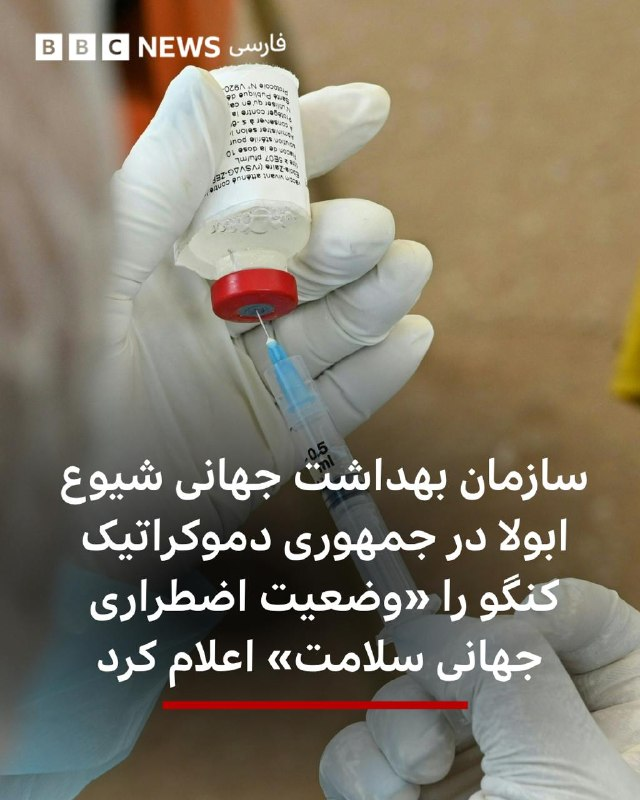

🔻‌سازمان بهداشت جهانی شیوع بیماری ابولا در استان ایتوری در شرق جمهوری دموکراتیک کنگو را «وضعیت اضطراری بهداشت عمومی با نگرانی بین‌المللی» اعلام کرده است.

این سازمان گفته است که با وجود حدود ۲۴۶ مورد مشکوک و ۸۰ مورد مرگ گزارش‌شده، این شیوع هنوز شرایط لازم برای این که به‌عنوان وضعیت اضطراری همه‌گیری (پاندمی) اعلام شود را ندارد.

تدروس آدهانوم گبریسوس، مدیرکل سازمان بهداشت جهانی، هشدار داد که در حال حاضر «ابهام‌های قابل‌توجهی درباره تعداد واقعی مبتلایان و گستره جغرافیایی شیوع» وجود دارد.

به گفته این سازمان، سویه فعلی ابولا ناشی از ویروس «بوندیبوگیو» است که برای آن هنوز هیچ دارو یا واکسن تاییدشده‌ای وجود ندارد.

این سازمان اعلام کرد تاکنون هشت مورد تایید آزمایشگاهی ثبت شده و موارد مشکوک و مرگ‌ومیرهایی هم در سه منطقه، از جمله شهر بونیا (مرکز استان ایتوری) و شهرهای مونگوالو و راموارا گزارش شده است.

سازمان بهداشت جهانی همچنین گفته است که  این ویروس از مرزهای این کشور فراتر رفته و دو مورد تاییدشده نیز در کشور همسایه، اوگاندا، گزارش شده است.

📸ISSOUF SANOGO/AFP via Getty Images
https://bbc.in/4uTN14Q
@BBCPersian

## BBCPersian — post 281270

🖊️نسرین حاطوم،
خبرنگار بی‌بی‌سی عربی در امور خلیج فارس

🔻کمتر از دو ساعت پس از تایید رسمی دفتر نخست‌وزیر اسرائیل مبنی بر سفر او به امارات متحده عربی و دیدار با محمد بن زاید، رئیس این کشور در جریان جنگ ایران، وزارت امور خارجه امارات این سفر را تکذیب و استقبال از هرگونه هیئت نظامی اسرائیلی در خاک خود را رد کرد.

در این بیانیه آمده است: «بر این اساس، هرگونه ادعا درباره دیدارها یا ترتیبات اعلام‌نشده، تا زمانی که از سوی نهادهای رسمی ذی‌صلاح در امارات صادر نشده باشد، هیچ پایه و اساسی ندارد.»

وزارت امور خارجه امارات از رسانه‌ها خواست که «دقیق باشند و اطلاعات غیرمستند را منتشر نکنند یا از آن برای ایجاد برداشت‌های سیاسی استفاده نکنند.»

بیانیه امارات پس از آن منتشر شد که دفتر نخست‌وزیر اسرائیل در شبکه ایکس نوشت بنیامین نتانیاهو در جریان جنگ آمریکا و اسرائیل با ایران - عملیاتی که اسرائیل آن را «غرش شیر» نامید- سفری محرمانه به امارات داشته است.

ادامه این مطلب را از لینک زیر بخوانید.

https://bbc.in/3Pkg5U1
📸Getty/ Reuters
@BBCPersian

## BBCPersian — post 281269

  

🔻وزارت دفاع آمریکا تایید کرده است که ناو هواپیمابر یواس‌اس جرالد فورد که پیش از آغاز جنگ با ایران به خاورمیانه اعزام شده بود، پس از ۳۲۶ روز مأموریت،شنبه به ایالات متحده بازگشته است.

این طولانی‌ترین مأموریت یک گروه رزمی ناو هواپیمابر آمریکا از زمان جنگ ویتنام تاکنون بوده است.

پیت هگست، وزیر دفاع آمریکا، در نورفک در ایالت ویرجینیا برای استقبال از بزرگ‌ترین ناو هواپیمابر جهان حضور داشت.

به گفته ارتش آمریکا، این ناو در جریان ماموریت خود در عملیات‌های آمریکا در منطقه کارائیب مشارکت داشت؛ جایی که نیروهای آمریکایی به قایق‌های مظنون به قاچاق مواد مخدر حمله کرده، نفتکش‌های تحریم‌شده را توقیف و نیکلاس مادورو، رهبر ونزوئلا، را بازداشت کردند.

در طول این ماموریت طولانی، در ۱۲ مارس یک آتش‌سوزی در بخش رخت‌شویی ناوایجاد شد که دو ملوان را زخمی کرد و به حدود ۱۰۰ تخت خواب آسیب جدی رساند. گزارش‌هایی نیز از مشکلات گسترده سیستم فاضلاب و سرویس‌های بهداشتی این ناو در زمان حضور در دریا منتشر شده بود.

📸Anadolu via Getty Images
https://bbc.in/4eSjrrK
@BBCPersian

## BBCPersian — post 281268

  

‌🔻کمیسیونی که از سوی سازمان جهانی بهداشت تشکیل شده، خواستار آن است که تغییرات اقلیمی به‌عنوان یک وضعیت اضطراری بین‌المللی در حوزه سلامت عمومی اعلام شود.

این بالاترین سطح هشدار بهداشتی است.

این هیئت مشورتی مستقل می‌گوید که چنین اقدامی می‌تواند به بسیج یک واکنش بین‌المللی در مقیاسی که لازم است کمک کند.

این هیئت تأکید می‌کند که تغییرات اقلیمی تهدیدی مربوط به آینده نیست، بلکه بحرانی فوری و رو‌به‌رشد است.

این کمیسیون تاکید کرده است که یارانه‌های سوخت‌های فسیلی باید به‌تدریج حذف شوند و از سازمان جهانی بهداشت می‌خواهد که فوراً اقدام کند.
📷NurPhoto via Getty
@BBCPersian

## BBCPersian — post 281267

🔻حملات گسترده اسرائیل به جنوب لبنان به‌رغم تمدید آتش‌بس

اسرائیل با وجود تمدید آتش‌بس با لبنان، موج گسترده‌ای از حملات هوایی را علیه جنوب آن کشور آغاز کرد.

اسرائیل می‌گوید که اهداف مرتبط با حزب‌الله را هدف قرار می‌دهد، اما پیش از حملات هشدار تخلیه‌ای برای ساکنان ۹ روستا صادر شده بود.

ادامه بمباران‌ها تردیدها درباره دوام آتش‌بس را در میان ده‌ها هزار لبنانی افزایش داده است که از خانه‌های خود در جنوب گریخته‌اند.

خبرگزاری رسمی لبنان، گزارش داد که روز شنبه بیش از دهها روستا هدف حمله قرار گرفتند؛ از جمله منطقه‌ای در بیش از ۵۰ کیلومتری مرز.

این خبرگزاری همچنین از موج تازه خروج ساکنان به سمت شهر جنوبی صیدا و پایتخت، بیروت، خبر داد.
@BBCPersian

## Dirty_Kids — post 389598

‏از جمهوری اسلامی فقط؛

۴۰۰ کیلو اورانیوم مونده با یه مشت گشنه‌ی کلاشینکف به دست.

@Dirty_Kids 👻

## Dirty_Kids — post 389596

سپاهیا در برابر مردم بی دفاع
&
سپاهیا در برابر ارتش دیگر کشورها

@Dirty_Kids 👻

## Dirty_Kids — post 389595

«حالا یه بار کافه نری که نمیمیری»، «چندتا آهنگ نتونی تو اسپاتیفای گوش ندی که نمیمیری»
اتفاقاً کم‌کم میمیریم. زندگی فقط زنده بودن نیست؛ همین خوشی‌های کوچیکه: قهوه، موسیقی، دورهمی، شب‌گردی، خریدای الکی. وقتی یکی‌یکی ازت گرفته بشن، فقط نفس میکشی

@Dirty_Kids 👻

## Dirty_Kids — post 389594

  <a href="telegram/content/Dirty_Kids_389594_1779004960.mp4" target="_blank">🎬 Download video</a>

همینطور که در فیلم محمد رسول الله هم میبینید در جنگ بدر؛ محمد به
سپاهیانش دستور میده که چاههای آب رو با سنگ پرکنن و آب رو به روی دشمنانش میبنده

چرا وقتی محمد این کار رو میکنه اسمش میشه تاکتیک جنگی ،اما حدود ۵۹ سال بعد وقتی همین کاررو سپاه یزید انجام میده اسمش ظلم و ستم هست؟🖕🖕

@Dirty_Kids 👻

## Hranews — post 112977

  

دادستان عمومی و انقلاب استان کرمان از تشکیل ۳۵ پرونده قضایی برای افرادی که در خارج از کشور اقامت دارند، به دلیل آنچه «همکاری با دشمن» عنوان کرده، خبر داد. مهدی بخشی در ادامه اعلام کرد که این پرونده‌ها با هدف پیگیری قضایی و #مصادره_اموال تشکیل شده است.

↘️
@hranews_bot تماس ✉️ -  @Hranews  کانال هرانا 🆑

## Hranews — post 112976

بوکان؛ حکم اعدام یک زندانی اجرا شد

❗️
❗️
❗️
❗️
❗️ – رئیس ‌کل دادگستری آذربایجان غربی از اجرای حکم #اعدام یک زندانی به اتهام قتل در بوکان خبر داد.

ادامه مطلب

↘️
@hranews_bot تماس ✉️ -  @Hranews  کانال هرانا 🆑

## manototv — post 105549

  <a href="telegram/content/manototv_105549_1779004962.mp4" target="_blank">🎬 Download video</a>

گردهمایی ایرانیان ملبورن استرالیا، یکشنبه ۲۷ اردیبهشت

## manototv — post 105548

  <a href="telegram/content/manototv_105548_1779004964.mp4" target="_blank">🎬 Download video</a>

تجمع ایرانیان ساکن اورلاندو فلوریدا، آمریکا
۲۶ اردیبهشت

## manototv — post 105547

  <a href="telegram/content/manototv_105547_1779004966.mp4" target="_blank">🎬 Download video</a>

تجمع ایرانیان ایسلند، ۲۶ اردیبهشت
ایسلند از کم‌جمعیت‌ترین کشورهای اروپاست و جامعه ایرانی کوچکی دارد.

## manototv — post 105546

  <a href="telegram/content/manototv_105546_1779004969.mp4" target="_blank">🎬 Download video</a>

بریتانیا پنج عضو خانواده زرین‌قلم را به اتهام ارتباط با شبکه مالی پنهان جمهوری اسلامی تحریم کرده است. فرهاد زرین‌قلم، مهندس بریتانیایی ایرانی‌تبار، همراه با فضل‌الله، منصور، ناصر و پوریا زرین‌قلم در فهرست تازه تحریم‌های لندن قرار گرفته‌اند.

بر اساس اعلام وزارت خارجه بریتانیا، این افراد و دو صرافی مرتبط با آنان، «صرافی برلیان» و «جی‌سی‌ام اکسچنج»، به ارائه خدمات مالی برای افرادی و نهادهایی متهم شده‌اند که فعالیت‌هایشان با بی‌ثبات‌سازی بریتانیا یا دیگر کشورها ارتباط داشته است. لندن این افراد را با ممنوعیت سفر، توقیف دارایی و ممنوعیت مدیریت شرکت‌ها روبه‌رو کرده است.

آسوشیتدپرس نیز نوشت مقام‌های بریتانیا این تحریم‌ها را بخشی از مقابله با «فعالیت‌های خصمانه مرتبط با ایران» دانسته‌اند و گفته‌اند شبکه‌های مالی پنهان برای دور زدن تحریم‌ها و انتقال میلیاردها دلار به سود بخش‌های نفتی و نظامی جمهوری اسلامی به‌کار رفته‌اند.

## manototv — post 105545

  <a href="telegram/content/manototv_105545_1779004969.mp4" target="_blank">🎬 Download video</a>

راهپیمایی ایرانیان سان‌فرانسیسکو، ۲۶ اردیبهشت

## manototv — post 105544

  <a href="telegram/content/manototv_105544_1779004971.mp4" target="_blank">🎬 Download video</a>

راهپیمایی ایرانیان ساکن ونکوور کانادا، ۲۶ اردیبهشت

## manototv — post 105543

  <a href="telegram/content/manototv_105543_1779004973.mp4" target="_blank">🎬 Download video</a>

بلغارستان برای نخستین بار برنده مسابقه آواز یوروویژن شد. دارا، خواننده بلغاری، با ترانه «بنگارنگا» در فینال هفتادمین دوره این مسابقه در وین اتریش، ۵۱۶ امتیاز گرفت و مقام نخست را به دست آورد.

بر اساس اعلام وب‌سایت رسمی یوروویژن، بلغارستان هم در رای هیات‌های داوری و هم در رای مردمی اول شد. اسرائیل در جایگاه دوم و رومانی در جایگاه سوم قرار گرفتند.

## manototv — post 105542

  <a href="telegram/content/manototv_105542_1779004974.mp4" target="_blank">🎬 Download video</a>

دولت بریتانیا اعلام کرد سامانه‌ای تازه و کم‌هزینه برای مقابله با پهپادها را روی جنگنده‌های تایفون نیروی هوایی سلطنتی در خاورمیانه مستقر کرده است.

این سامانه که «سلاح کشتار دقیق پیشرفته» نام دارد، راکت‌های غیرهدایتی را با کیت هدایت لیزری به مهمات دقیق تبدیل می‌کند و به گفته وزارت دفاع بریتانیا، امکان انهدام اهداف را با هزینه‌ای بسیار کمتر از موشک‌های رایج فراهم می‌سازد.

وزارت دفاع بریتانیا اعلام کرد این سامانه با همکاری شرکت‌های بی‌ای‌ئی سیستمز و کینتیک، در کمتر از دو ماه از مرحله آزمایش به استقرار عملیاتی رسیده است. رسانه‌های دفاعی نیز گزارش داده‌اند جنگنده‌های تایفون بریتانیا در خاورمیانه اکنون برای ماموریت‌های مقابله با پهپاد به این سامانه مجهز شده‌اند.

## manototv — post 105541

  <a href="telegram/content/manototv_105541_1779004975.mp4" target="_blank">🎬 Download video</a>

‌
دونالد ترامپ، رئیس‌جمهوری آمریکا، تصویری تولیدشده با هوش مصنوعی را در شبکه اجتماعی تروث‌سوشال منتشر کرد که روی آن نوشته شده بود: «این آرامش پیش از طوفان بود.»

در این تصویر، ترامپ در میان ناوهای جنگی و هوایی طوفانی دیده می‌شود؛ پستی که در بحبوحه افزایش تنش‌ها با جمهوری اسلامی و گمانه‌زنی‌ها درباره احتمال ازسرگیری حملات آمریکا و اسرائیل به ایران منتشر شده است.

## alonews — post 120544

  <a href="telegram/content/alonews_120544_1779004976.webm" target="_blank">🎬 Download video</a>

👈فارس: محمدباقر قالیباف، نمایندۀ ویژۀ ایران در امور چین شد

✅ @AloNews خبر جنگ

## alonews — post 120543

  <a href="telegram/content/alonews_120543_1779004976.webm" target="_blank">🎬 Download video</a>

👈معاون شرکت مخابرات ایران: دسترسی به اینترنت باید برای همه مردم فراهم باشد

✅ @AloNews خبر جنگ

## alonews — post 120542

  

تصویری لو رفته از گلشیفته و مکرون

[@AloTweet]

## alonews — post 120541

  <a href="telegram/content/alonews_120541_1779004977.webm" target="_blank">🎬 Download video</a>

👈سفر ترامپ به پکن نمادی از کاهش قدرت آمریکا بود، به طوری که چین تنها رئیس‌جمهور را سرگرم کرد بدون اینکه هیچ امتیاز واقعی ارائه دهد، طبق گزارش آتلانتیک.

🔴 فرانکلین فور می‌نویسد که با وجود پروتکل‌ها و مراسم پرزرق و برق، دیدار شی و ترامپ هیچ دستاورد سیاسی یا اقتصادی قابل توجهی برای واشنگتن نداشت.

🔴 مقاله بیان می‌کند: «وقتی آمریکا دستش را دراز می‌کند، دیگر هیچ‌کس برای گرفتن آن عجله نمی‌کند، و وقتی تهدید می‌کند، دیگر هیچ‌کس ترسی احساس نمی‌کند.»

🔴شی نه تنها از ارائه طرح مشخصی برای پایان جنگ ایران خودداری کرد، بلکه از امضای توافقنامه بزرگ تجاری یا ارائه تضمین‌هایی درباره دسترسی آمریکا به مواد معدنی کمیاب نیز امتناع ورزید.

✅ @AloNews خبر جنگ

## alonews — post 120540

  <a href="telegram/content/alonews_120540_1779004977.webm" target="_blank">🎬 Download video</a>

👈قطر و عربستان وضعیت منطقه و آتش‌بس را بررسی کردند

✅ @AloNews خبر جنگ

## alonews — post 120539

  <a href="telegram/content/alonews_120539_1779004978.webm" target="_blank">🎬 Download video</a>

👈سی‌ان‌ان: ایران به کابل‌های اینترنتی تنگه هرمز چشم دوخته است!

✅ @AloNews خبر جنگ

## alonews — post 120538

  <a href="telegram/content/alonews_120538_1779004978.webm" target="_blank">🎬 Download video</a>

👈خارگ همچنان ظرفیت ذخیره سازی دارد

🔴تانکر ترکرز: در جزیره خارگ، ظرفیت مخازن ذخیره‌سازی نفت هنوز تکمیل نشده است. چرا که در این صورت نفتکش‌های مستقر در منطقه را تا آخرین ظرفیت پر می‌کردند که تا کنون چنین اتفاقی رخ نداده است.

🔴علاوه بر این؛ ایران همچنان نفتکش‌های متعددی در اختیار دارد که می‌تواند نفت خود را با آن‌ها بارگیری کند.

✅ @AloNews خبر جنگ

## alonews — post 120537

  <a href="telegram/content/alonews_120537_1779004978.webm" target="_blank">🎬 Download video</a>

👈بر اثر واژگونی اتوبوس در محور عسلویه به کنگان ۸ نفر از شهروندان جان باختند.

✅ @AloNews خبر جنگ

## alonews — post 120536

  <a href="telegram/content/alonews_120536_1779004978.webm" target="_blank">🎬 Download video</a>

👈احتمال شنیده شدن صدای انفجارهای کنترل‌شده در محدوده جنوب اصفهان

✅ @AloNews خبر جنگ

## alonews — post 120535

  <a href="telegram/content/alonews_120535_1779004979.webm" target="_blank">🎬 Download video</a>

👈توییت 6 ساعت پیش اتاق جنگ اسرائیل

✅ @AloNews خبر جنگ

## alonews — post 120534

  <a href="telegram/content/alonews_120534_1779004979.webm" target="_blank">🎬 Download video</a>

👈تایمز: انگلیس برای جنگ آماده می‌شود 
🔴 یک رسانه انگلیسی از افزایش بودجه دفاعی انگلیس خبر داد و هدف از آن را آماده شدن برای جنگ های آینده اعلام کرد 
✅ @AloNews خبر جنگ

## alonews — post 120533

👈تایمز: انگلیس برای جنگ آماده می‌شود

🔴 یک رسانه انگلیسی از افزایش بودجه دفاعی انگلیس خبر داد و هدف از آن را آماده شدن برای جنگ های آینده اعلام کرد

✅ @AloNews خبر جنگ

## alonews — post 120532

  <a href="telegram/content/alonews_120532_1779004979.mp4" target="_blank">🎬 Download video</a>

👈فعالیت غیرمعمول امروز هواپیماهای باری برای سوخت رسانی به جنگنده‌ها در منطقه خاورمیانه!

✅ @AloNews خبر جنگ

## alonews — post 120531

  <a href="telegram/content/alonews_120531_1779004982.webm" target="_blank">🎬 Download video</a>

👈ادغام کنکور سراسری و آزمون پذیرش دانشجو معلمان منتفی شد/ آزمون‌ها با شرایط سال قبل برگزار می‌شود.

✅ @AloNews خبر جنگ

## alonews — post 120530

  <a href="telegram/content/alonews_120530_1779004982.webm" target="_blank">🎬 Download video</a>

👈الجزیره: پاکسازی ۲۴ ژنرال آمریکایی در میانه جنگ با ایران

🔴پیت هگست، وزیر جنگ ایالات متحده، در سه ماه گذشته بیش از ۲۴ ژنرال و دریاسالار را بدون ارائه دلایل روشن برکنار کرده است. این اقدام شامل روسای ستاد ارتش و نیروی دریایی و دیگر مقامات ارشد است و شائبه‌های سیاسی را تقویت می‌کند.

🔴با ادامه بن‌بست مذاکرات با ایران، تصمیم‌گیری درباره عملیات نظامی یا محاصره دریایی پیچیده‌تر شده و پیام‌های واشنگتن به متحدان منطقه‌ای گیج‌کننده است. همزمان، وزارت جنگ درخواست افزایش بودجه‌ای نزدیک به ۵۰۰ میلیارد دلار کرده اما توضیح قانع‌کننده‌ای ارائه نکرده است.

🔴 کارشناسان هشدار می‌دهند ادامه این وضعیت احتمال دستیابی به توافق سیاسی و موفقیت نظامی آمریکا را در منطقه کاهش می‌دهد.

✅ @AloNews خبر جنگ

## alonews — post 120529

  <a href="telegram/content/alonews_120529_1779004982.webm" target="_blank">🎬 Download video</a>

👈قتل هولناک نوزاد ۴۰ روزه در مشهد!

🔴مادر نوزاد می گوید: از خوزستان به مشهد آمدیم و سوئیتی را در خیابان نوغان اجاره کردیم.

🔴دو روز قبل همسرم که مواد مخدر صنعتی مصرف می‌کند دچار توهم و بدبینی شد.

🔴او ناگهان تصور کرد نوزاد متعلق به فرد دیگری است.

🔴ماهی‌تابه حاوی تخم‌مرغ را برداشت و با آن ضربات هولناکی به سر نوزاد زد.

🔴سپس با کف دستش چند ضربه دیگر به سر او کوبید.

🔴بعد هم نوزاد را به شدت به زمین کوبید و باعث مرگش شد.

🔴پس از این ماجرا جسد کودک را داخل یخچال مسافرخانه گذاشت.

🔴او مرا تهدید کرد چیزی به کسی نگویم تا اینکه دو روز بعد موضوع را به صاحب سوئیت اطلاع دادم

✅ @AloNews خبر جنگ

## alonews — post 120528

  <a href="telegram/content/alonews_120528_1779004982.webm" target="_blank">🎬 Download video</a>

👈دولت ترامپ اجازه دارد معافیت تحریم‌ها بر نفت دریایی روسیه که در روز شنبه منقضی شود و مجوز موقت برای کشورهایی مانند هند برای ادامه خرید نفت خام روسیه را به پایان برساند.

✅ @AloNews خبر جنگ

## alonews — post 120527

  <a href="telegram/content/alonews_120527_1779004983.webm" target="_blank">🎬 Download video</a>

👈آب و فاضلاب عسلویه : با توجه به تعمیرات ضروری در خط انتقال آب کوثر، آب شهرستان عسلویه از ساعت ۶ صبح روز دوشنبه، ۲۸ اردیبهشت‌ماه به مدت ۴۸ ساعت قطع خواهد شد

✅ @AloNews خبر جنگ

## alonews — post 120526

  <a href="telegram/content/alonews_120526_1779004983.webm" target="_blank">🎬 Download video</a>

👈سی‌ان‌ان: کوبایی‌ها خود را برای «تهاجم آمریکا» آماده می‌کنند

✅ @AloNews خبر جنگ

## alonews — post 120525

  <a href="telegram/content/alonews_120525_1779004983.webm" target="_blank">🎬 Download video</a>

👈 کوثری، نماینده مجلس: ترامپ در جنگ با ایران درمانده شده است

✅ @AloNews خبر جنگ

---
📅 بروزرسانی: 1405/02/27 02:05
---

## VahidOOnLine — post 240541

  <a href="telegram/content/VahidOOnLine_240541_1778970932.mp4" target="_blank">🎬 Download video</a>

هند و امارات متحده عربی در جریان سفر نارندرا مودی، نخست‌وزیر هند، به ابوظبی، چند توافق‌نامه در حوزه‌های دفاعی، انرژی و حمل‌ونقل دریایی امضا کردند.

بر اساس این توافق‌ها، دو کشور همکاری در زمینه امنیت دریایی، دفاع سایبری، فناوری‌های پیشرفته، تبادل اطلاعات و صنایع دفاعی را گسترش خواهند داد.

در بخش انرژی نیز توافقی درباره ذخایر راهبردی نفت و ذخیره‌سازی نفت خام هند در فجیره امضا شده است.

این دیدار در حالی انجام شد که امارات پیش‌تر جمهوری اسلامی را به حمله پهپادی و موشکی به فجیره متهم کرده بود؛ حمله‌ای که به آتش‌سوزی در یک پالایشگاه و زخمی شدن سه کارگر هندی منجر شد.

نارندرا مودی در دیدار با محمد بن زاید، رئیس امارات، حملات به امارات را محکوم کرد و دو طرف بر گسترش روابط اقتصادی و امنیتی تاکید کردند.
‌🏁 🇬🇧 ManotoTV

🤖 @VahidOOnLine

## VahidOOnLine — post 240540

  <a href="telegram/content/VahidOOnLine_240540_1778970933.mp4" target="_blank">🎬 Download video</a>

دونالد ترامپ، رییس‌جمهوری آمریکا، روز شنبه ۲۶ اردیبهشت، در شبکه اجتماعی تروث سوشال انیمیشنی منتشر کرد که در آن به یک ناو جنگی آمریکا دستور می‌دهد به هواپیمایی با پرچم جمهوری اسلامی شلیک کند و می‌گوید: «بسیار خب، آن را در دیدرس داریم. آتش!»
‌🏁 🇬🇧 IranintlTV

🤖 @VahidOOnLine

## VahidOOnLine — post 240539

  

میخائیل اولیانوف، نماینده روسیه در سازمان‌های بین‌المللی با اشاره به قریب‌الوقوع بودن ازسرگیری احتمالی حملات علیه جمهوری اسلامی در ایکس نوشت: «اگر این موضوع درست باشد، به این معناست که آمریکا و اسرائیل از اشتباهات راهبردی گذشته خود درس نمی‌گیرند.»
‌🏁 🇬🇧 IranintlTV

🤖 @VahidOOnLine

## VahidOOnLine — post 240538

  

♦️دونالد ترامپ، رئیس‌جمهوری آمریکا، با انتشار یک طرح گرافیکی در حساب کاربری خود در شبکه اجتماعی تروث سوشال نوشت: «این آرامش پیش از طوفان بود.»
در این تصویر گرافیکی، ترامپ به همراه یک فرمانده نظامی آمریکایی بر روی عرشه یک ناو جنگی در میان دریایی مواج ایستاده است؛ در حالی که یک شناور دیگر در محاصره ناوهای جنگی ایالات متحده قرار دارد.
‌🇸🇦 Indypersian

🤖 @VahidOOnLine

## VahidOOnLine — post 240537

  

♦️محمدباقر قالیباف، رئیس مجلس شورای اسلامی،با انتشار پیامی در شبکه اجتماعی اکس نوشت که جهان در آستانه نظمی جدید قرار دارد
قالیباف با استناد به سخنان شی جین‌پینگ، رئیس‌جمهوری چین، مبنی بر این‌که «تحولات بی‌سابقه در یک قرن گذشته در حال شتاب گرفتن است»، تاکید کرد که مقاومت ۷۰ روزه ملت ایران این روند تحول را سرعت بخشیده است. رئیس مجلس شورای اسلامی در پایان پیام خود خاطرنشان کرد که آینده جهان به «جنوب جهانی» تعلق دارد.
‌🇸🇦 Indypersian

🤖 @VahidOOnLine

## VahidOOnLine — post 240536

  

♦️کانال تلگرامی وابسته به سپاه از راه‌اندازی سامانه بیمه ایرانی «هرمز سیف» برای محموله‌های دریایی تنگه هرمز خبر داد
سپاه پاسداران با انتشار مطلبی اعلام کرد تارنمای «هرمز سیف» (Hormuz Safe) فعالیت خود را برای ارائه بیمه به محموله‌های دریایی عبوری از تنگه هرمز آغاز کرده است.
بر اساس توضیحات منتشرشده،، این سامانه بیمه‌نامه‌هایی سریع و با قابلیت تایید رمزنگاری‌شده برای محموله‌هایی که از خلیج فارس، تنگه هرمز و آبراه‌های اطراف آن عبور می‌کنند صادر می‌کند. همچنین طبق اطلاعات منتشرشده، تسویه و پرداخت هزینه‌های این بیمه با استفاده از ارز دیجیتال انجام خواهد شد.
پیش از این نیز مجلس طرح‌هایی را برای دریافت عوارض از کشتی‌های عبوری مطرح کرده بود؛ موضوعی که با اعتراض گسترده جامعه جهانی و بحث‌های حقوقی فراوان همراه شد. اما اکنون با ایجاد پیگیری طرح غیرنظامی مانند «بیمه هرمز»، به دنبال جایگزینی برای اخذ عوارض است.
‌🇸🇦 Indypersian

🤖 @VahidOOnLine

## VahidOOnLine — post 240535

  <a href="telegram/content/VahidOOnLine_240535_1778970940.mp4" target="_blank">🎬 Download video</a>

‌
دولت دونالد ترامپ معافیت تحریمی خرید نفت دریایی روسیه را که پس از جنگ آمریکا و اسرائیل با جمهوری اسلامی و بسته شدن تنگه هرمز صادر شده بود، تمدید نکرد.

این معافیت به کشورهایی از جمله هند اجازه می‌داد به خرید نفت روسیه ادامه دهند و برای یک ماه تمدید شده بود، اما روز شنبه به پایان رسید.

اسکات بسنت، وزیر خزانه‌داری آمریکا، پیش‌تر گفته بود این مجوز تمدید نخواهد شد. تا عصر شنبه نیز هیچ تمدیدی در وب‌سایت وزارت خزانه‌داری آمریکا منتشر نشد.
‌🏁 🇬🇧 ManotoTV

🤖 @VahidOOnLine

## VahidOOnLine — post 240534

  

دونالد ترامپ، رییس‌جمهوری آمریکا، طرحی گرافیکی در تروث سوشال منتشر کرد که در آن روی یک ناو در دریایی مواج ایستاده و شناوری با پرچم جمهوری اسلامی در محاصره ناوهای آمریکایی قرار دارد و در آن نوشته شده است: «این آرامش پیش از طوفان بود.»
‌🏁 🇬🇧 IranintlTV

🤖 @VahidOOnLine

## VahidOOnLine — post 240533

  

شاهزاده رضا پهلوی در نشست آینده تکنولوژی در ایران گفت که مردم ایران به چیزی جز تغییر کامل نظام رضایت نخواهند داد: «آن‌ها ۴۰ هزار کشته نداده‌اند که در نهایت به توافق اتمی برسند.»

شاهزاده رضا پهلوی افزود: «اتکای مخالفان نظام نباید به نیروی خارجی باشد و باید فرض را بر این گذاشت که کمکی دریافت نمی‌شود اما در صورت دریافت حمایت خارجی روند دستیابی به اهداف آسان‌تر خواهد شد.»
‌🏁 🇬🇧 IranintlTV

🤖 @VahidOOnLine

## VahidOOnLine — post 240532

  <a href="telegram/content/VahidOOnLine_240532_1778970943.mp4" target="_blank">🎬 Download video</a>

ناصر رفیعی، سخنران مذهبی دفتر علی خامنه‌ای، رهبر کشته‌شده جمهوری اسلامی، به نقل از غلامعلی حداد عادل، پدرزن مجتبی خامنه‌ای، گفت اعضای خانواده علی خامنه‌ای پیش از عملیات مرگبار نهم اسفند در مجتمع رهبری باقی ماندند، زیرا مقامات «اطمینان داده بودند» که با نزدیک شدن توافق در مذاکرات، هیچ اقدام نظامی صورت نخواهد گرفت.
رفیعی در این فایل صوتی به نقل از حداد عادل می‌گوید که این اتفاق به‌ این دلیل افتاد که شرایط عادی در بیت بود و «خامنه‌ای خود را در معرض قرار داده بود.»
‌🏁 🇬🇧 IranintlTV

🤖 @VahidOOnLine

## VahidOOnLine — post 240531

  

شاهزاده رضا پهلوی در نشست آینده تکنولوژی در ایران، خطاب به کشورهای جهان گفت: «جمهوری اسلامی ثابت کرده غیرقابل اعتماد است و افزود اگر به دنبال یک شریک واقعی هستید به مردم ایران نگاه کنید.»

شاهزاده رضا پهلوی افزود: «باید این درک مشترک در سطح جهانی شکل بگیرد که با وجود جمهوری اسلامی هیچ کشوری نمی‌تواند احساس امنیت و آرامش پایدار داشته باشد.»

او گفت: «جامعه جهانی باید از مردم ایران برای تغییر حکومت حمایت کند. این اقدام نه‌تنها به سود مردم ایران بلکه به نفع خود کشورهای حامی نیز خواهد بود.»
‌🏁 🇬🇧 IranintlTV

🤖 @VahidOOnLine

## VahidOOnLine — post 240530

  

شاهزاده رضا پهلوی در نشست آینده تکنولوژی در ایران، گفت: «ایران می‌تواند به کشوری مانند کره جنوبی تبدیل شود، اما به دلیل وضعیت سیاسی کنونی به سمت الگویی شبیه کره شمالی سوق داده شده است.» شاهزاده رضا پهلوی افزود: «جمهوری اسلامی در ذات خود قابل تغییر نیست.»
‌🏁 🇬🇧 IranintlTV

🤖 @VahidOOnLine

## VahidOOnLine — post 240529

  

♦️ مسعود پزشکیان روز شنبه ۲۶ اردیبهشت با انتشار تصویری از سرو ابرکوه در شبکه اجتماعی ایکس نوشت: «مسن‌ترین موجود زنده آسیا، درخت سرو کهنسال ابرکوه با قدمتی دست‌کم ۴۵۰۰ ساله، در سرزمینی ریشه دوانده است که حتی در آن دوران نیز به نام ایران شناخته می‌شد.» به نظر می‌رسد که پزشکیان با این پیام که اشاره به قدمت تمدن ایران دارد، قصد دارد ایران را با کشورهای تازه تاسیس منطقه یا ایالات متحده مقایسه کند.

با این‌وجود، اشاره پزشکیان به قدمت سرو ابرکوه، به‌ویژه با بحران آب و خطراتی که در سال‌های اخیر این درخت کهن را تهدید کرده و از سوی مقام‌های جمهوری اسلامی نادیده گرفته شده، با انتقاد کاربران مواجه شد.

سرو ابرکوه، قدیمی‌ترین درخت آسیا و پس از کاج متوشلخ در ایالت کالیفرنیای آمریکا، دومین درخت کهنسال جهان است.
‌🇸🇦 Indypersian

🤖 @VahidOOnLine

## VahidOOnLine — post 240528

  <a href="telegram/content/VahidOOnLine_240528_1778970948.mp4" target="_blank">🎬 Download video</a>

‌
دونالد ترامپ، رئیس‌جمهوری آمریکا، در گفت‌وگو با شبکه فرانسوی بی‌اف‌ام گفت در صورت نرسیدن به توافق، ایران با «دوران بسیار سختی» روبه‌رو خواهد شد.

ترامپ افزود هنوز مشخص نیست توافقی به‌زودی حاصل می‌شود یا نه، اما تاکید کرد «بهتر است ایران توافق کند.»
‌🏁 🇬🇧 ManotoTV

🤖 @VahidOOnLine

## VahidOOnLine — post 240527

  

♦️ دونالد ترامپ، رئیس‌جمهوری آمریکا، روز شنبه ۲۶ اردیبهشت به جمهوری اسلامی هشدار داد که اگر به‌زودی بر سر یک توافق صلح موافقت نکند، «دوران بسیار سختی» را پیش رو خواهد داشت.

ترامپ در یک مصاحبه تلفنی با شبکه تلویزیونی «بی‌اف‌ام» فرانسه (BFMTV) گفت: «به نفع آن‌هاست که به یک توافق دست پیدا کنند.»

ترامپ پیش از این اعلام کرده بود که آخرین پیشنهاد تهران برای شروع مذاکرات را «بعد از خواندن اولین جمله» دور انداخته است. ترامپ بر توقف کامل غنی‌سازی، خروج اورانیوم با غنای بالا از خاک ایران و بازگشت وضعیت تنگه هرمز به شرایط پیش از جنگ تاکید دارد؛ خواسته‌هایی که تاکنون در پیشنهادات متقابل جمهوری اسلامی برآورده نشده‌اند.
‌🇸🇦 Indypersian

🤖 @VahidOOnLine

## VahidOOnLine — post 240526

  

همزمان با انتشار گزارش‌ها از احتمال از سرگیری حملات آمریکا و اسرائیل علیه جمهوری اسلامی، دونالد ترامپ، رییس‌جمهوری آمریکا، انیمیشنی در تروث سوشال منتشر کرد که در آن به ناو آمریکایی دستور شلیک به هدفی با پرچم جمهوری اسلامی را داده و می‌گوید: «در فهرست اهداف‌مان قرار دارد، آتش!»
‌🏁 🇬🇧 IranintlTV

🤖 @VahidOOnLine

## VahidOOnLine — post 240525

  <a href="telegram/content/VahidOOnLine_240525_1778970950.mp4" target="_blank">🎬 Download video</a>

خبرگزرای‌های داخل کشور از وقوع زمین‌لرزه‌ ۴.۵ ریشتری در گلوگاه مازندران خبر دادند.
‌🏁 🇬🇧 ManotoTV

🤖 @VahidOOnLine

## VahidOOnLine — post 240524

  <a href="telegram/content/VahidOOnLine_240524_1778970951.mp4" target="_blank">🎬 Download video</a>

نیویورک‌تایمز گزارش داد مقام‌های ارشد دولت دونالد ترامپ طرح‌هایی برای ازسرگیری حملات نظامی آمریکا به جمهوری اسلامی آماده کرده‌اند؛ حملاتی که در صورت تصمیم نهایی ترامپ، می‌تواند از اوایل هفته آینده آغاز شود.

بر اساس این گزارش، پنتاگون در حال آماده‌سازی دوباره عملیاتی موسوم به «خشم حماسی» است؛ عملیاتی که پس از اعلام آتش‌بس متوقف شده بود. مقام‌های آمریکایی می‌گویند گزینه‌های روی میز شامل حملات گسترده‌تر به اهداف نظامی و زیرساختی جمهوری اسلامی و حتی اعزام نیروهای ویژه برای دستیابی به مواد هسته‌ای مدفون در سایت اصفهان است.

این گزارش می‌افزاید چند صد نیروی ویژه آمریکایی از ماه مارس در خاورمیانه مستقر شده‌اند تا در صورت صدور دستور، در عملیات زمینی احتمالی مشارکت کنند. مقام‌های نظامی آمریکا هشدار داده‌اند چنین عملیاتی می‌تواند با تلفات سنگین همراه باشد.

همزمان شبکه ۱۳ اسرائیل گزارش داد ارتش این کشور در حال ادامه آماده‌سازی‌ها برای احتمال ازسرگیری جنگ با جمهوری اسلامی است و اسرائیل در وضعیت آماده‌باش بالا قرار دارد.

بر اساس این گزارش، ارتش اسرائیل خود را برای سناریوی حملات روزانه ده‌ها موشک از سوی جمهوری اسلامی در روزهای نخست درگیری احتمالی آماده می‌کند.

این گزارش می‌افزاید طرح‌های احتمالی اسرائیل شامل هدف قرار دادن زیرساخت‌ها، تاسیسات انرژی و نیروگاه‌هاست و نیروی هوایی اسرائیل همچنین ممکن است در حملات مشترک، عملیات ترور علیه چهره‌های ارشد را دنبال کند.
‌🏁 🇬🇧 ManotoTV

🤖 @VahidOOnLine

## VahidOOnLine — post 240523

  

♦️ داده‌های نظارت بر بنادر سازمان جهانی پول نشان می‌دهد که از زمان آغاز جنگ آمریکا و اسرائیل علیه جمهوری اسلامی، میزان تردد شناورها در تنگه هرمز با سقوطی چشمگیر مواجه شده و با وجود برقراری آتش‌بس نیز تغییر چندانی احساس نشده است. این داده‌ها نشان می‌دهد که در بازه زمانی نهم اسفند تا ۱۹ فروردین، تنها حدود ۲۸۳ کشتی از این آبراه حیاتی عبور کرده‌اند که میانگین روزانه آن را به کمتر از هفت می‌رساند؛ رقمی که فاصله فاحشی با تردد روزانه نزدیک به ۱۰۰ کشتی در دوران پیش از جنگ دارد.

نمودار روند این سقوط را به خوبی نشان می‌دهد: پس از حمله آمریکا و اسرائیل به ایران در نهم اسفند، حمله به چهار تانکر در ۱۰ اسفند و اعلام بستن تنگه هرمز توسط سپاه پاسداران در ۱۱ اسفند، ترافیک دریایی ناگهان متوقف شد.

حتی در دوره آتش‌بس این شاهراه انرژی همچنان در رکود کامل به سر می‌برد. در این میان، بیشترین سهم کاهش تردد مربوط به نفت‌کش‌ها (نمودار قرمز) و کشتی‌های کانتینری (نمودار سرمه‌ای) بوده است که نشان‌دهنده ضربه سنگین این بحران به زنجیره تامین انرژی و تجارت جهانی است.
‌🇸🇦 Indypersian

🤖 @VahidOOnLine

## VahidOOnLine — post 240522

  <a href="telegram/content/VahidOOnLine_240522_1778970954.mp4" target="_blank">🎬 Download video</a>

ایرانیان آلمان روز شنبه همزمان با سایر کشورها در حمایت از انقلاب ملی علیه جمهوری اسلامی در شهر کاسل تجمع کردند.
‌🏁 🇬🇧 IranintlTV

🤖 @VahidOOnLine

## mwarmonitor — post 9178

🔴ساکنان نزدیک منطقه بیت‌شمش در اسرائیل از یک انفجار شدید و آتش‌سوزی بزرگی خبر دادند که از فاصله دور قابل مشاهده بود. 🔸شبکه Kan News اسرائیل بعداً اعلام کرد که این حادثه یک انفجار کنترل‌شده بوده که داخل یک کارخانه غیرنظامی انجام شده است. هیچ آسیب یا مجروحیتی…

## mwarmonitor — post 9177

  <a href="telegram/content/mwarmonitor_9177_1778970957.mp4" target="_blank">🎬 Download video</a>

🔴ساکنان نزدیک منطقه بیت‌شمش در اسرائیل از یک انفجار شدید و آتش‌سوزی بزرگی خبر دادند که از فاصله دور قابل مشاهده بود.

🔸شبکه Kan News اسرائیل بعداً اعلام کرد که این حادثه یک انفجار کنترل‌شده بوده که داخل یک کارخانه غیرنظامی انجام شده است. هیچ آسیب یا مجروحیتی گزارش نشده است.

@mwarmonitor

## mwarmonitor — post 9176

  

ترامپ در سوشال تروث

«این آرامشِ پیش از طوفان بود»

@mwarmonitor

## mwarmonitor — post 9175

  <a href="telegram/content/mwarmonitor_9175_1778970960.mp4" target="_blank">🎬 Download video</a>

📝 این جرثومه‌های فساد و دوزیستانِ بدنامِ سیاسی، دقیقاً مانند هم‌نوعانِ لجن‌زیستِ خود، تا بوی واریزِ جیره و مواجب به مشامشان می‌رسد، از سوراخ‌های خود بیرون می‌خزند تا با چند کلمه وقاحتِ محض، بقایِ ذلت‌بارشان را تمدید کنند. تویی که امروز پشت این میکروفونِ اجاره‌ای ژستِ مقتدرانه گرفته‌ای و از موضعِ قدرت سخن از «اجازه دادن» می‌گویی، خودت مگر بدون اذن، فرمان‌برداری و دست‌بوسیِ سردارانت تواناییِ یک دم و بازدمِ ساده را داری؟

🔸​تو نیز تن‌فروشِ فکریِ دیگری در بازارِ مکارهٔ این رژیم هستی؛ یک جیره‌خوارِ حقیر که تاریخ مصرفت به تار مویی بند است. اگر فردا روزی ورق برگردد، دست‌پرورده‌های همان سیستمی که امروز برایشان دم می‌جنبانی، مانند آن ماله کشِ اعظم، عراقچی، چنان شلنگِ تخلیهٔ رسوایی، نکبت و فاضلابِ جنایاتشان را روی سر و صورتت باز می‌کنند که حتی نامت هم در تاریخِ این سرزمین مایهٔ تهوع باشد. این پانتومیمِ وقاحت و این نقاب‌های مضحک دیگر هیچ چشمی را نمی‌فریبد؛ سهم تو و امثال تو از این نمایش، تلی از خاکستر و سقوط به همان سیاه‌چالی است که از آن برخاسته‌اید.

@mwarmonitor

## mwarmonitor — post 9174

  

✈️🇺🇸نیروی هوایی آمریکا (USAF)

✈️هواپیمای Boeing TC-135 Stratolifter (یک فروند) AE01D3 62-4129 - OLIVE 29

✈️هواپیمای OLIVE 29 در حال عبور از اقیانوس اطلس است و مستقیم از پایگاه نیروی هوایی اوفوت (Offutt Air Force Base) پرواز کرده؛ مقصد آن یا پایگاه RAF Mildenhall انگلستان است یا شهر خانیا (Chania) قبرس، اما با توجه به مسیر پرواز و اینکه هواپیماهای RC-135 مستقر فعلی در آنجا هستند، احتمال خانیا بیشتر است.

@mwarmonitor

## mwarmonitor — post 9172

  

🔸ترامپ که از پکن برگشته، امروز (طبق گزارش سرویس مخفی) در باشگاه گلف خود در ویرجینیا سپری کرده است.

🔹تصاویر از جو واگنر از شبکه CNN منتشر شده است.

@mwarmonitor

## mwarmonitor — post 9171

  

🔴امروز، محمد باقر سعد داوود الساعدی، یکی از اعضای ارشد کتائب حزب‌الله — یک سازمان تروریستی خارجی که توسط آمریکا تعیین شده است — به شش فقره اتهام مرتبط با تروریسم به دلیل فعالیت‌هایش به عنوان عامل کتائب حزب‌الله و نیروی قدس سپاه پاسداران انقلاب اسلامی ایران متهم شد. محمد باقر سعد داوود الساعدی در ترکیه بازداشت و به ایالات متحده منتقل گردیده است.

🔸 «در فاصله فقط سه ماه، محمد الساعدی ادعا شده که ۱۸ حمله تروریستی در سراسر اروپا را هدایت کرده است — از جمله علیه شهروندان و منافع ایالات متحده — و همچنین قصد داشته حمله‌ای مشابه را در کشور ما انجام دهد. گروه ویژه مشترک مبارزه با تروریسم اف‌بی‌آی نیویورک، اراده‌ای تزلزل‌ناپذیر دارد برای پاسخگو کردن رهبران سازمان‌های تروریستی خارجی که از ترس و رنج گسترده برای پیشبرد دستورکار ضدآمریکایی خود استفاده می‌کنند.»

@mwarmonitor

## mwarmonitor — post 9170

🔴پیش از آن‌که ترامپ برای سفر خود به پکن راهی شود، او — که از نحوه برخورد ایران با مذاکرات برای پایان دادن به جنگ روزبه‌روز ناراضی‌تر می‌شد — طبق گفته منابع آگاه از گفتگوها به CNN، به‌طور جدی‌تر از هفته‌های اخیر در حال بررسی ازسرگیری عملیات نظامی بود.

🔴با این حال، تیم ترامپ آماده بود صبر کند تا ببیند آیا این سفر مهم و دیدارهای رو در رو با رئیس‌جمهور چین، شی جین‌پینگ، می‌تواند به یک پیشرفت قابل توجه منجر شود یا نه.

🔴اما ترامپ روز جمعه بدون تغییر محسوس در وضعیت جنگ ایران به آمریکا بازگشت. اکنون او باید تصمیم بگیرد که آیا آغاز حملات بیشتر به ایران بهترین گزینه برای پایان دادن به این درگیری است یا خیر. CNN

@mwarmonitor

## mwarmonitor — post 9168

🔴شبکه CBC News به نقل از یک منبع پزشکی: تأیید یک مورد ابتلا به ویروس هانتا در کانادا.

@mwarmonitor

## mwarmonitor — post 9167

  <a href="telegram/content/mwarmonitor_9167_1778970964.mp4" target="_blank">🎬 Download video</a>

ترامپ در سوشال تروث

@mwarmonitor

## mwarmonitor — post 9166

  

🚨✈️ به نظر می‌رسد آسمان‌ها در حال حاضر به‌طور نگران‌کننده‌ای آرام هستند. حتی هیچ پرواز باری ورودی قابل مشاهده‌ای وجود ندارد، به‌جز یک فروند C-17 که همین حالا در اردن فرود آمده است.

✈️آخرین پروازهای باری نظامی در حال خارج شدن از خاورمیانه هستند.

@mwarmonitor

## pm_afshaa — post 90876

🔴میخائیل اولیانوف، نماینده روسیه :
کارشناسا میگن آمریکا و اسرائیل ممکنه به‌زودی دوباره به ایران حمله کنن

💧 Rainbet.com the #1 Non-KYC Crypto Casino & Sportsbook @rainbetcom

😁 @Pm_Afshaa

## pm_afshaa — post 90875

بیرانوند : با صدای بلند و رسا کف آمریکا سرود ملی رو می‌خونم. مخالفا هم نمی‌تونن کاری بکنن

💧 Rainbet.com the #1 Non-KYC Crypto Casino & Sportsbook @rainbetcom

😁 @Pm_Afshaa

## pm_afshaa — post 90874

🔴دیلی میل بریتانیا: کیر استارمر به نزدیکانش گفته است که قصد دارد از سمت نخست‌وزیری کناره‌گیری کند و جدول زمانی منظمی برای ترک این سمت تعیین کند

💧 Rainbet.com the #1 Non-KYC Crypto Casino & Sportsbook @rainbetcom

😁 @Pm_Afshaa

## pm_afshaa — post 90873

🔴نیویورک تایمز به نقل از مقامات نظامی آمریکا: اگر جزیره خارک تصرف شود، نیروهای زمینی برای حفظ آن لازم خواهند بود

💧 Rainbet.com the #1 Non-KYC Crypto Casino & Sportsbook @rainbetcom

😁 @Pm_Afshaa

## pm_afshaa — post 90872

  <a href="telegram/content/pm_afshaa_90872_1778970967.webm" target="_blank">🎬 Download video</a>

سرور اختصاصی NPV / V2RayNG 
📶 
✅مناسب: یوتیوب | اینستاگرام | تلگرام | گیم | وب‌گردی 
✅ اتصال سریع روی همه اپراتورها 
✅بدون افت سرعت حتی در ساعات شلوغ 
➕ ویژگی‌ها: 
⚡️ بدون ضریب 
⚡️ ساب لینک اختصاصی 
⚡️بدون قطعی واقعی 
⚡️ آیپی ثابت (ترکیه 
🇹🇷 | آلمان
🇩🇪…

## pm_afshaa — post 90871

  <a href="telegram/content/pm_afshaa_90871_1778970967.webm" target="_blank">🎬 Download video</a>

سرور اختصاصی NPV / V2RayNG 
📶

✅مناسب: یوتیوب | اینستاگرام | تلگرام | گیم | وب‌گردی

✅ اتصال سریع روی همه اپراتورها

✅بدون افت سرعت حتی در ساعات شلوغ

➕ ویژگی‌ها:

⚡️ بدون ضریب

⚡️ ساب لینک اختصاصی

⚡️بدون قطعی واقعی

⚡️ آیپی ثابت (ترکیه 
🇹🇷 | آلمان
🇩🇪 | آمریکا
🇺🇸 | هلند
🇳🇱 | انگلستان
🏴)

⚡️تست رایگان قبل خرید

✔️ تضمین کیفیت + پشتیبانی 24 ساعته

💰 تک لوکیشن: 160 تومان / هر گیگ (با کد تخفیف)

🌍 مولتی لوکیشن: 200 تومان / هر گیگ (با کد تخفیف)

🎁 کد تخفیف :

conquestback

👇 همین الان بخر / تست بگیر:
@ConQuestVPN_bot

## pm_afshaa — post 90870

  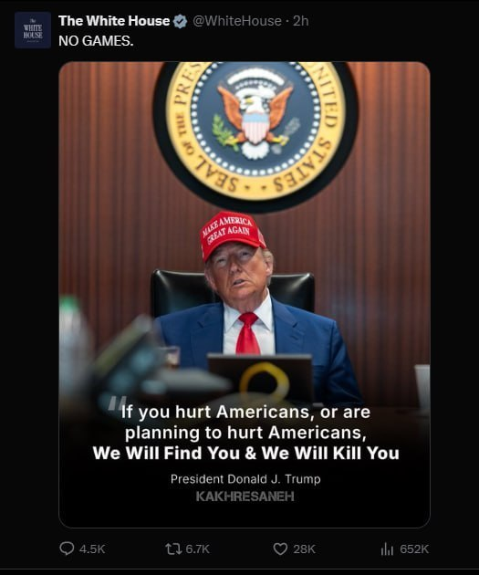

کاخ سفید پیامی تهدیدآمیز از ترامپ با عنوان «شوخی نداریم» همراه با تصویری از حضور او در اتاق جنگ منتشر کرد

💧 Rainbet.com the #1 Non-KYC Crypto Casino & Sportsbook @rainbetcom

😁 @Pm_Afshaa

## pm_afshaa — post 90868

  

پست جدید ترامپ ارامش قبل از طوفان

💧 Rainbet.com the #1 Non-KYC Crypto Casino & Sportsbook @rainbetcom

😁 @Pm_Afshaa

## pm_afshaa — post 90863

  <a href="telegram/content/pm_afshaa_90863_1778970970.webm" target="_blank">🎬 Download video</a>

🔴قالیباف: جهان در آستانهٔ نظمی نوین قرار دارد. چنان‌که رئیس‌جمهور شی گفت: «تحولی که در یک قرن دیده نشده، در سراسر جهان با شتاب در حال پیشروی است»، و من تأکید می‌کنم که مقاومت ۷۰ روزهٔ ملت ایران این تحول را شتاب بخشیده است. آینده از آنِ جنوب جهانی است.

💧 Rainbet.com the #1 Non-KYC Crypto Casino & Sportsbook @rainbetcom

😁 @Pm_Afshaa

## pm_afshaa — post 90862

🔴سردار آزمون به علت حمایت از مردم ایران از تیم ملی خط خورد

💧 Rainbet.com the #1 Non-KYC Crypto Casino & Sportsbook @rainbetcom

😁 @Pm_Afshaa

## pm_afshaa — post 90861

🔴نتانیاهو : اگه آمریکا دوباره بخواد عملیات نظامی علیه ایران رو شروع کنه، اسرائیل آماده‌ست

💧 Rainbet.com the #1 Non-KYC Crypto Casino & Sportsbook @rainbetcom

😁 @Pm_Afshaa

## pm_afshaa — post 90860

  <a href="telegram/content/pm_afshaa_90860_1778970971.webm" target="_blank">🎬 Download video</a>

🔴کانال 13 اسرائیل:
برآوردها در ارتش اسرائیل اینه که ترامپ پس از بازگشت از چین، دستور حمله به جمهوری اسلامی رو صادر خواهد کرد.

اهداف احتمالی حمله شامل زیرساخت‌های حکومتی، مراکز انرژی، نیروگاه‌ها و همچنین مقام‌های ارشد جمهوری اسلامی خواهد بود.

اسرائیل امیدواره در صورت آغاز درگیری، جنگ فقط چند روز طول بکشه.

💧 Rainbet.com the #1 Non-KYC Crypto Casino & Sportsbook @rainbetcom

😁 @Pm_Afshaa

## VahidOnline — post 75507

  

دونالد ترامپ، رئیس‌جمهور آمریکا، روز شنبه تصویری گرافیکی از خود در کنار یک فرمانده نظامی بر عرشه یک ناو جنگی، در فضایی طوفانی و در میان شناورهایی با پرچم جمهوری اسلامی، در شبکه اجتماعی تروث‌سوشال منتشر کرد که روی آن نوشته است: «این آرامش پیش از طوفان بود.»
@VahidOOnLine

📡 @VahidOnline

## VahidOnline — post 75506

  <a href="telegram/content/VahidOnline_75506_1778970972.mp4" target="_blank">🎬 Download video</a>

دونالد ترامپ، رییس‌جمهوری آمریکا، انیمیشنی در تروث سوشال منتشر کرد که در آن به ناو آمریکایی دستور شلیک به هدفی با پرچم جمهوری اسلامی را داده و می‌گوید: «در فهرست اهداف‌مان قرار دارد، آتش!»
@VahidOOnLine

📡 @VahidOnline

## kianmeli1 — post 87438

  <a href="telegram/content/kianmeli1_87438_1778970973.mp4" target="_blank">🎬 Download video</a>

🔴ناصر رفیعی، سخنران مذهبی دفتر علی خامنه‌ای، رهبر کشته‌شده جمهوری اسلامی، به نقل از غلامعلی حداد عادل، پدرزن مجتبی خامنه‌ای، گفت اعضای خانواده علی خامنه‌ای پیش از عملیات مرگبار نهم اسفند در مجتمع رهبری باقی ماندند، زیرا مقامات «اطمینان داده بودند» که با نزدیک شدن توافق در مذاکرات، هیچ اقدام نظامی صورت نخواهد گرفت.
رفیعی در این فایل صوتی به نقل از حداد عادل می‌گوید که این اتفاق به‌ این دلیل افتاد که شرایط عادی در بیت بود و «خامنه‌ای خود را در معرض قرار داده بود.»
https://t.me/kianmeli1

## kianmeli1 — post 87437

  

🔴خبرنگار فاکس نیوز: ترامپ درحال آماده‌شدن برای دور جدیدی از حملات نظامی به ایران است
https://t.me/kianmeli1

## kianmeli1 — post 87436

  

🔴ترامپ در سوشال تروث

«این آرامشِ پیش از طوفان بود»
https://t.me/kianmeli1

## IranIntlTV — post 337543

  <a href="telegram/content/IranIntlTV_337543_1778970978.mp4" target="_blank">🎬 Download video</a>

شاهزاده رضا پهلوی در نشست «آینده تکنولوژی در ایران» گفت با فروپاشی جمهوری اسلامی و بازگشت کارآفرینان ایرانی خارج از کشور، می‌توان در مناطق محروم ایران از جمله سیستان و بلوچستان نیز مراکز بزرگ فناوری و تکنولوژی تاسیس کرد.

او همچنین بر نقش دیاسپورای ایرانی در رساندن صدای مردم ایران و سرنگونی جمهوری اسلامی به جهان تاکید کرد.

گفت‌وگو با نجات بهرامی، تحلیل‌گر سیاسی
@iranintltv

## IranIntlTV — post 337542

  <a href="telegram/content/IranIntlTV_337542_1778970980.mp4" target="_blank">🎬 Download video</a>

پارسا تاجیک، مهندس شرکت «ایکس ای‌آی»، در گفت‌وگو با نیلوفر منصوری، خبرنگار ایران‌اینترنشنال، درباره روند تغییر پرچم ایران به شیروخورشید در شبکه اجتماعی ایکس، توییتر سابق، توضیح داد.
@iranintltv

## IranIntlTV — post 337541

  <a href="https://t.me/IranintlTV/337541" target="_blank">📎 Download file</a>

🎧نسخه صوتی سیاست با مراد ویسی: آرامش قبل از طوفان
@iranintlTV

## IranIntlTV — post 337540

  <a href="telegram/content/IranIntlTV_337540_1778970983.mp4" target="_blank">🎬 Download video</a>

یکی از شرکت‌کنندگان در تجمع اعتراضی ایرانیان در سان‌فرانسیسکو به نیلوفر منصوری، خبرنگار ایران‌اینترنشنال، گفت: «همه ایرانیان قهرمانان زندگی ما هستند و می‌خواهیم بگوییم از اینجا پشت شما هستیم.»

او افزود: «هیچ‌وقت متوقف نمی‌شویم تا زمانی که جمهوری اسلامی سرنگون شود و همه زندانیان سیاسی آزاد شوند. میلیون‌ها نفر در سراسر دنیا در کنار شما و در کنار شاهزاده‌مان ایستاده‌اند.»
@iranintltv

## IranIntlTV — post 337539

  <a href="telegram/content/IranIntlTV_337539_1778970986.mp4" target="_blank">🎬 Download video</a>

ایرانیان ساکن سان‌فرانسیسکو تجمعی اعتراضی در حمایت از انقلاب ملی ایرانیان و شاهزاده رضا پهلوی و درخواست برای همراهی دولت آمریکا با مردم ایران برگزار کردند.

گزارش نیلوفر منصوری، خبرنگار ایران‌اینترنشنال و گفت‌وگو با یکی از شرکت‌کنندگان
@iranintltv

## IranIntlTV — post 337538

  <a href="telegram/content/IranIntlTV_337538_1778970988.mp4" target="_blank">🎬 Download video</a>

نیویورک‌تایمز گزارش داد دستیاران دونالد ترامپ در حال آماده‌سازی طرح‌هایی برای از سرگیری حملات نظامی علیه جمهوری اسلامی هستند.

دو مقام خاورمیانه‌ای نیز به این روزنامه گفته‌اند احتمال دارد این حملات از اوایل هفته آینده آغاز شود.

گفت‌وگو با امیر گیتی، عضو تحریریه ایران‌اینترنشنال
@iranintltv

## IranIntlTV — post 337537

  <a href="telegram/content/IranIntlTV_337537_1778970990.mp4" target="_blank">🎬 Download video</a>

دونالد ترامپ، رییس‌جمهوری آمریکا، روز شنبه ۲۶ اردیبهشت، در شبکه اجتماعی تروث سوشال انیمیشنی منتشر کرد که در آن به یک ناو جنگی آمریکا دستور می‌دهد به هواپیمایی با پرچم جمهوری اسلامی شلیک کند و می‌گوید: «بسیار خب، آن را در دیدرس داریم. آتش!»

## IranIntlTV — post 337536

  <a href="telegram/content/IranIntlTV_337536_1778970993.mp4" target="_blank">🎬 Download video</a>

مراد ویسی، تحلیل‌گر ارشد سیاسی، گفت: «ترامپ پس از سفر چین گزینه‌های مختلفی در برابر جمهوری اسلامی دارد. از تشدید فشار محاصره به امید توافق تا عملیات محدود در تنگه هرمز و خلیج فارس و در نهایت حملات گسترده و هدف قراردادن لایه دیگری از مقامات و فرماندهان ارشد سپاه پاسداران.»
@iranintltv

## IranIntlTV — post 337535

  

میخائیل اولیانوف، نماینده روسیه در سازمان‌های بین‌المللی با اشاره به قریب‌الوقوع بودن ازسرگیری احتمالی حملات علیه جمهوری اسلامی در ایکس نوشت: «اگر این موضوع درست باشد، به این معناست که آمریکا و اسرائیل از اشتباهات راهبردی گذشته خود درس نمی‌گیرند.»
https://iranintl.com/202605163047

## IranIntlTV — post 337534

  <a href="telegram/content/IranIntlTV_337534_1778970997.mp4" target="_blank">🎬 Download video</a>

مراد ویسی، تحلیل‌گر ارشد ایران‌اینترنشنال، گفت: «شاهزاده رضا پهلوی روز شنبه در نشستی درباره آینده تکنولوژی در ایران، بر غیرقابل‌اصلاح بودن جمهوری اسلامی و وجود اتفاق‌نظر ملی برای سرنگونی آن تاکید کرد و گفت سیاست مماشات با حکومت نتیجه‌ای نخواهد داشت.»
@iranintltv

## IranIntlTV — post 337533

  <a href="telegram/content/IranIntlTV_337533_1778970999.mp4" target="_blank">🎬 Download video</a>

مراد ویسی، تحلیل‌گر ارشد ایران‌اینترنشنال، گفت: «اکثریت مردم در صورت شروع جنگ جدید امیدوارند که این جنگ به سرنگونی جمهوری اسلامی منتج شود. اکثریت مردم از حمله به ساختارهای سرکوب و هدف قرار گرفتن مقامات و فرماندهان سرکوبگر حمایت می‌کنند.»
@iranintltv

## IranIntlTV — post 337532

  <a href="telegram/content/IranIntlTV_337532_1778971001.mp4" target="_blank">🎬 Download video</a>

بلومبرگ گزارش داد توقف صادرات نفت ایران از خارک به احتمال زیاد ناشی از لکه نفتی ایجادشده اطراف این جزیره است.

بنابر این گزارش، تولید نفت ایران نسبت به پیش از جنگ روزانه نیم‌میلیون بشکه کاهش یافته است.

گفت‌وگو با مهدی مصلحی، کارشناس بازار نفت
@iranintltv

## IranIntlTV — post 337531

  <a href="telegram/content/IranIntlTV_337531_1778971003.mp4" target="_blank">🎬 Download video</a>

🔻ماتیاس گرافستروم، دبیرکل فیفا پس از جلسه با مهدی تاج، رییس فدراسیون فوتبال ایران درباره گفت: «نشست بسیار خوبی با فدراسیون فوتبال ایران داشتیم. فکر می‌کنم بسیار نزدیک با یکدیگر همکاری می‌کنیم و مشتاقانه منتظر استقبال از آن‌ها در جام جهانی ۲۰۲۶ در آمریکا، کانادا و مکزیک هستیم.»

🔹او گفت: «همچنین فرصت داشتیم درباره برخی مسائل اجرایی صحبت کنیم؛ همان‌طور که با تمام فدراسیون‌های عضو این کار را انجام می‌دهیم.»

🔹دبیرکل فیفا در پاسخ به سوالی درباره تضمین‌های مورد نظر فدراسیون فوتبال ایران برای ویزا و ورود تیم ملی به آمریکا و کانادا گفت: «فکر می‌کنم اینجا جای مطرح کردن جزئیات نیست. مشتاق ادامه گفت‌وگوها هستیم. درست مانند گفت‌وگوهایی که با همه فدراسیون‌های عضو داریم.»

🔹همچنین تاج درباره این جلسه گفت: «جلسه خیلی خوبی بود؛ ۱۰ موردی که گفته بودیم را شنیدند و برای هر کدام راه حل‌هایی ارائه کردند. امیدوارم که تیم ملی به جام جهانی برود و نتایج خوبی بگیرد.»

🔹تاج پیش‌تر گفته بود اگر فیفا به فدراسیون فوتبال ضمانت‌های لازم را ندهد، تیم ملی در جام جهانی حاضر نخواهد شد.

🔹جزییات بیشتر را در سایت بخوانید

@iranintltvsport

## IranIntlTV — post 337530

  <a href="telegram/content/IranIntlTV_337530_1778971006.mp4" target="_blank">🎬 Download video</a>

کانال ۱۲ اسرائیل به نقل از یک مقام این کشور گزارش داد دونالد ترامپ ظرف ۲۴ ساعت آینده درباره حمله دوباره به ایران تصمیم خواهد گرفت.

این مقام همچنین گفته جنگ دوباره با جمهوری اسلامی نزدیک است.

گفت‌وگو با بن سبطی، پژوهشگر ایران و اسرائیل
@iranintltv

## IranIntlTV — post 337529

  

دونالد ترامپ، رییس‌جمهوری آمریکا، طرحی گرافیکی در تروث سوشال منتشر کرد که در آن روی یک ناو در دریایی مواج ایستاده و شناوری با پرچم جمهوری اسلامی در محاصره ناوهای آمریکایی قرار دارد و در آن نوشته شده است: «این آرامش پیش از طوفان بود.»
https://iranintl.com/202605167228

## IranIntlTV — post 337528

  <a href="telegram/content/IranIntlTV_337528_1778971009.mp4" target="_blank">🎬 Download video</a>

شاهزاده رضا پهلوی در نشست «آینده تکنولوژی در ایران» با رد مشروعیت ساختار سیاسی جمهوری اسلامی و چهره‌هایی چون محمدباقر قالیباف گفت مردم ایران این همه کشته و هزینه نداده‌اند که بار دیگر تن به «ماموریت‌های مهره‌های این حکومت» بدهند.

او تاکید کرد: «ما باید به دنیا ثابت کنیم که ملت ایران، شریک بهتری برای جامعه جهانی است تا بقایای این حکومت.»
@iranintltv

## IranIntlTV — post 337527

  <a href="telegram/content/IranIntlTV_337527_1778971011.mp4" target="_blank">🎬 Download video</a>

شاهزاده رضا پهلوی در نشست «آینده تکنولوژی در ایران» گفت حتی اگر دوران گذار با موفقیت طی شود و مردم نظام آینده را انتخاب کنند، بدون احزاب و زیرساخت سیاسی آماده، اداره کشور ممکن نخواهد بود.

او افزود: «اگر بخواهیم سیاسی فکر کنیم، اولویت نخست یک هدف ملی است؛ هدفی فراتر از چپ و راست، جمهوری‌خواه و پادشاهی‌خواه یا هر گرایش دیگر. اما وقتی وارد مرحله سیاست عملی می‌شویم، باید زیرساخت سیاسی کشور را هم فراهم کنیم. پایه‌های تحزب در ایران باید تقویت شود.»
@iranintltv

## IranIntlTV — post 337526

  <a href="telegram/content/IranIntlTV_337526_1778971014.mp4" target="_blank">🎬 Download video</a>

شاهزاده رضا پهلوی در نشست «آینده تکنولوژی در ایران» با تشریح وظایف دولت انتقالی پس از فروپاشی جمهوری اسلامی، تاکید کرد که هدف اصلی، فراهم کردن زمینه روند دموکراتیک برای تعیین شکل نهایی حکومت است. او گفت به نفع هیچ جریانی به جز «دموکراسی» موضع نخواهد گرفت.

@iranintltv

## IranIntlTV — post 337525

  

شاهزاده رضا پهلوی در نشست آینده تکنولوژی در ایران گفت که مردم ایران به چیزی جز تغییر کامل نظام رضایت نخواهند داد: «آن‌ها ۴۰ هزار کشته نداده‌اند که در نهایت به توافق اتمی برسند.»

شاهزاده رضا پهلوی افزود: «اتکای مخالفان نظام نباید به نیروی خارجی باشد و باید فرض را بر این گذاشت که کمکی دریافت نمی‌شود اما در صورت دریافت حمایت خارجی روند دستیابی به اهداف آسان‌تر خواهد شد.»
https://iranintl.com/202605161817

## IranIntlTV — post 337524

  <a href="telegram/content/IranIntlTV_337524_1778971018.mp4" target="_blank">🎬 Download video</a>

ناصر رفیعی، سخنران مذهبی دفتر علی خامنه‌ای، رهبر کشته‌شده جمهوری اسلامی، به نقل از غلامعلی حداد عادل، پدرزن مجتبی خامنه‌ای، گفت اعضای خانواده علی خامنه‌ای پیش از عملیات مرگبار نهم اسفند در مجتمع رهبری باقی ماندند، زیرا مقامات «اطمینان داده بودند» که با نزدیک شدن توافق در مذاکرات، هیچ اقدام نظامی صورت نخواهد گرفت.
رفیعی در این فایل صوتی به نقل از حداد عادل می‌گوید که این اتفاق به‌ این دلیل افتاد که شرایط عادی در بیت بود و «خامنه‌ای خود را در معرض قرار داده بود.»

## Shin_Persian — post 6043

  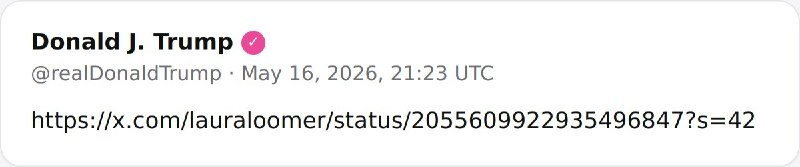

🔁 Quoting above tweet:
Shin ✓ @hey_itsmyturn
Sat, 16 May 2026 21:25:20 UTC

President Trump @POTUS:
"https://x.com/lauraloomer/status/2055609922935496847?s=42"

فارسی

رئیس‌جمهور ترامپ @POTUS:
"https://x.com/lauraloomer/status/2055609922935496847?s=42"

𝕏 · @shin_persian

## Shin_Persian — post 6042

  

↩️ Quoted tweet: Laura Loomer ✓ @LauraLoomer Sat, 16 May 2026 11:22:51 UTC EXCLUSIVE: 🚨 Congressman Randy Fine @RepFine tells me he was approached by Cynthia West @Cyntaxed007 (Thomas Massie’s accuser) last year in Florida about Thomas Massie’s @RepThomasMassie…

## Shin_Persian — post 6041

↩️ Quoted tweet:
Laura Loomer ✓ @LauraLoomer
Sat, 16 May 2026 11:22:51 UTC

EXCLUSIVE:

🚨 Congressman Randy Fine @RepFine tells me he was approached by Cynthia West @Cyntaxed007 (Thomas Massie’s accuser) last year in Florida about Thomas Massie’s @RepThomasMassie alleged financial ties to Iran. 🚨

Rep. Randy Fine revealed to me that he met Thomas

↩️ توییت نقل‌قول شده — برای پاسخ، پست زیر را ببینید.

فارسی

اختصاصی:

🚨 رندی فاین @RepFine، عضو کنگره، به من گفت که سال گذشته در فلوریدا، سینتیا وست @Cyntaxed007 (متهم‌کننده توماس ماسی) در مورد پیوندهای مالی ادعایی توماس ماسی @RepThomasMassie با ایران به او مراجعه کرده است. 🚨

نماینده رندی فاین برای من فاش کرد که با توماس ملاقات کرده است...

𝕏 · @shin_persian

## Shin_Persian — post 6040

  

Shin ✓ @hey_itsmyturn
Sat, 16 May 2026 20:23:35 UTC

POTUS on his Truth:

فارسی

رئیس‌جمهور ایالات متحده (POTUS) در حساب تروث سوشال خود:

𝕏 · @shin_persian

## Shin_Persian — post 6039

  

🔁 Quoting above tweet: DefenceGeek 🇬🇧 ✓ @DefenceGeek Sat, 16 May 2026 20:14:02 UTC Along with the 2x RAF P-8A "Poseidon" maritime patrol aircraft noted by @ArmchairAdml, the US Navy has had 3x P-8A operating in the North Atlantic today I first noted 2…

## Shin_Persian — post 6038

🔁 Quoting above tweet:
DefenceGeek 🇬🇧 ✓ @DefenceGeek
Sat, 16 May 2026 20:14:02 UTC

Along with the 2x RAF P-8A "Poseidon" maritime patrol aircraft noted by @ArmchairAdml, the US Navy has had 3x P-8A operating in the North Atlantic today

I first noted 2 depart Lajes earlier, then with a friend departed Iceland in the last 2hrs!

They've found a submarine...

فارسی

در کنار ۲ فروند هواپیمای گشت دریایی P-8A "Poseidon" متعلق به نیروی هوایی سلطنتی بریتانیا (RAF) که توسط @ArmchairAdml به آن‌ها اشاره شد، نیروی دریایی ایالات متحده نیز امروز ۳ فروند P-8A در شمال اقیانوس اطلس در حال عملیات داشته است.

من ابتدا خروج ۲ فروند را پیش‌تر از «لاژس» ثبت کردم و پس از آن، یک فروند دیگر در ۲ ساعت گذشته از ایسلند خارج شد!

آن‌ها یک زیردریایی پیدا کرده‌اند...

𝕏 · @shin_persian

## Shin_Persian — post 6036

  <a href="telegram/content/Shin_Persian_6036_1778971023.mp4" target="_blank">🎬 Download video</a>

↩️ Quoted tweet: Armchair Admiral 🇬🇧 ✓ @ArmchairAdml Sat, 16 May 2026 19:59:34 UTC #RAF Royal Air Force Boeing Poseidon MRA.1 2x #43C91E ZP807 - RAFAIR 7046 #43C91A ZP803 - RAFAIR 7042 RAFAIR 7046 departed RAF Lossiemouth this evening for a North Atlantic…

## Shin_Persian — post 6035

↩️ Quoted tweet:
Armchair Admiral 🇬🇧 ✓ @ArmchairAdml
Sat, 16 May 2026 19:59:34 UTC

#RAF Royal Air Force

Boeing Poseidon MRA.1 2x
#43C91E ZP807 - RAFAIR 7046
#43C91A ZP803 - RAFAIR 7042

RAFAIR 7046 departed RAF Lossiemouth this evening for a North Atlantic patrol. RAFAIR 7042 is already on station and operating over the Atlantic.

@MATA_osint @flightradar24

↩️ توییت نقل‌قول شده — برای پاسخ، پست زیر را ببینید.

فارسی

#RAF نیروی هوایی سلطنتی بریتانیا

بوئینگ پوزایدون MRA.1 ۲ فروند
#43C91E ZP807 - RAFAIR 7046
#43C91A ZP803 - RAFAIR 7042

پرواز RAFAIR 7046 عصر امروز پایگاه هوایی لوسی‌موث (RAF Lossiemouth) را برای گشت‌زنی در شمال اقیانوس اطلس ترک کرد. پرواز RAFAIR 7042 از قبل در منطقه مستقر شده و بر فراز اقیانوس اطلس در حال عملیات است.

@MATA_osint @flightradar24_

𝕏 · @shin_persian

## ManotoTV — post 105540

  <a href="telegram/content/ManotoTV_105540_1778971025.mp4" target="_blank">🎬 Download video</a>

هند و امارات متحده عربی در جریان سفر نارندرا مودی، نخست‌وزیر هند، به ابوظبی، چند توافق‌نامه در حوزه‌های دفاعی، انرژی و حمل‌ونقل دریایی امضا کردند.

بر اساس این توافق‌ها، دو کشور همکاری در زمینه امنیت دریایی، دفاع سایبری، فناوری‌های پیشرفته، تبادل اطلاعات و صنایع دفاعی را گسترش خواهند داد.

در بخش انرژی نیز توافقی درباره ذخایر راهبردی نفت و ذخیره‌سازی نفت خام هند در فجیره امضا شده است.

این دیدار در حالی انجام شد که امارات پیش‌تر جمهوری اسلامی را به حمله پهپادی و موشکی به فجیره متهم کرده بود؛ حمله‌ای که به آتش‌سوزی در یک پالایشگاه و زخمی شدن سه کارگر هندی منجر شد.

نارندرا مودی در دیدار با محمد بن زاید، رئیس امارات، حملات به امارات را محکوم کرد و دو طرف بر گسترش روابط اقتصادی و امنیتی تاکید کردند.

## ManotoTV — post 105539

  <a href="telegram/content/ManotoTV_105539_1778971026.mp4" target="_blank">🎬 Download video</a>

‌
شاهزاده رضا پهلوی در «نشست آینده تکنولوژی در ایران» گفت اقتصاد آینده ایران نباید بر پایه نفت، بلکه بر مبنای سرمایه‌گذاری داخلی و خارجی و نقش پررنگ بخش خصوصی شکل بگیرد.

او با تاکید بر اهمیت سرمایه‌گذاری در فناوری، هوش مصنوعی، انرژی‌های تجدیدپذیر و گردشگری گفت ایران ظرفیت آن را دارد که از صنعت گردشگری حتی بیش از نفت و گاز درآمد داشته باشد.

شاهزاده رضا پهلوی افزود توسعه زیرساخت‌هایی مانند فرودگاه‌ها، جاده‌ها، هتل‌ها و رسیدگی به مسائل زیست‌محیطی می‌تواند ایران را به مقصدی جذاب برای گردشگران تبدیل کند.

او همچنین با اشاره به محرومیت مناطقی مانند سیستان‌ و بلوچستان و بخش‌هایی از کردستان گفت این مناطق به دلیل تبعیض مذهبی جمهوری اسلامی مورد بی‌توجهی قرار گرفته‌اند، اما با جذب سرمایه‌گذاری می‌توانند به‌سرعت متحول شوند.

شاهزاده رضا پهلوی تاکید کرد ارائه چشم‌اندازی روشن برای بازسازی ایران پس از آزادی سیاسی، یکی از مهم‌ترین چالش‌ها و پروژه‌های پیش‌روی مخالفان جمهوری اسلامی است.

## ManotoTV — post 105538

  <a href="telegram/content/ManotoTV_105538_1778971029.mp4" target="_blank">🎬 Download video</a>

‌
دولت دونالد ترامپ معافیت تحریمی خرید نفت دریایی روسیه را که پس از جنگ آمریکا و اسرائیل با جمهوری اسلامی و بسته شدن تنگه هرمز صادر شده بود، تمدید نکرد.

این معافیت به کشورهایی از جمله هند اجازه می‌داد به خرید نفت روسیه ادامه دهند و برای یک ماه تمدید شده بود، اما روز شنبه به پایان رسید.

اسکات بسنت، وزیر خزانه‌داری آمریکا، پیش‌تر گفته بود این مجوز تمدید نخواهد شد. تا عصر شنبه نیز هیچ تمدیدی در وب‌سایت وزارت خزانه‌داری آمریکا منتشر نشد.

## ManotoTV — post 105537

  <a href="telegram/content/ManotoTV_105537_1778971029.mp4" target="_blank">🎬 Download video</a>

شاهزاده رضا پهلوی در پاسخ به پرسشی درباره زمان بازگشت ایرانیان خارج از کشور، در «نشست آینده تکنولوژی در ایران» گفت سرعت تغییرات در ایران به عملکرد مردم و میزان حمایت و فشار کشورهای تاثیرگذار بستگی دارد.

او با تاکید بر اینکه مردم ایران نباید به نیروی خارجی متکی باشند، گفت هرگونه حمایت بین‌المللی می‌تواند روند تغییر را کوتاه‌تر و آسان‌تر کند، اما ایرانیان خود باید عامل اصلی این تحول باشند.

شاهزاده رضا پهلوی افزود مردم ایران «چهل هزار کشته ندادند» که نتیجه آن تنها یک توافق هسته‌ای یا ادامه جمهوری اسلامی با چهره‌هایی مانند محمدباقر قالیباف باشد و تاکید کرد ایرانیان «کمتر از تغییر کامل نظام» را نخواهند پذیرفت.

شاهزاده رضا پهلوی با اشاره به دولت دونالد ترامپ گفت مخالفان جمهوری اسلامی باید دولت‌های تاثیرگذار، به‌ویژه آمریکا، را قانع کنند که به‌جای توافق دوباره با جمهوری اسلامی، روی مردم ایران سرمایه‌گذاری کنند.

او تاکید کرد راه‌حل‌های اقتصادی، علمی و تکنولوژیک برای آینده ایران وجود دارد و آنچه اکنون اهمیت دارد، «اراده سیاسی و تصمیم‌گیری» دولت‌های تاثیرگذار برای حمایت از آزادی ایران است.

## ManotoTV — post 105536

  <a href="telegram/content/ManotoTV_105536_1778971032.mp4" target="_blank">🎬 Download video</a>

‌
شاهزاده رضا پهلوی در «نشست آینده تکنولوژی در ایران» گفت ایرانیان موفق در سیلیکون‌ولی می‌توانند الگوی توسعه آینده ایران باشند و نشان دهند که با تغییر وضعیت سیاسی، چه فرصت‌هایی برای کشور ایجاد خواهد شد.

او با اشاره به توانایی متخصصان ایرانی در حوزه فناوری و هوش مصنوعی گفت نمونه‌ای مشابه سیلیکون‌ولی حتی می‌تواند در بلوچستان شکل بگیرد و ایران ظرفیت تبدیل شدن به کشوری پیشرفته را دارد.

شاهزاده رضا پهلوی تاکید کرد مشکلات اقتصادی و معیشتی کنونی به دلیل ناتوانی مردم یا کمبود امکانات نیست و افزود: «ایران می‌تواند کره جنوبی باشد؛ اما به‌دلیل وضعیت سیاسی، به کره شمالی تبدیل شده است.»

## ManotoTV — post 105535

  <a href="telegram/content/ManotoTV_105535_1778971034.mp4" target="_blank">🎬 Download video</a>

‌
دونالد ترامپ، رئیس‌جمهوری آمریکا، در گفت‌وگو با شبکه فرانسوی بی‌اف‌ام گفت در صورت نرسیدن به توافق، ایران با «دوران بسیار سختی» روبه‌رو خواهد شد.

ترامپ افزود هنوز مشخص نیست توافقی به‌زودی حاصل می‌شود یا نه، اما تاکید کرد «بهتر است ایران توافق کند.»

## ManotoTV — post 105534

  <a href="telegram/content/ManotoTV_105534_1778971035.mp4" target="_blank">🎬 Download video</a>

خبرگزرای‌های داخل کشور از وقوع زمین‌لرزه‌ ۴.۵ ریشتری در گلوگاه مازندران خبر دادند.

## ManotoTV — post 105533

  <a href="telegram/content/ManotoTV_105533_1778971036.mp4" target="_blank">🎬 Download video</a>

نیویورک‌تایمز گزارش داد مقام‌های ارشد دولت دونالد ترامپ طرح‌هایی برای ازسرگیری حملات نظامی آمریکا به جمهوری اسلامی آماده کرده‌اند؛ حملاتی که در صورت تصمیم نهایی ترامپ، می‌تواند از اوایل هفته آینده آغاز شود.

بر اساس این گزارش، پنتاگون در حال آماده‌سازی دوباره عملیاتی موسوم به «خشم حماسی» است؛ عملیاتی که پس از اعلام آتش‌بس متوقف شده بود. مقام‌های آمریکایی می‌گویند گزینه‌های روی میز شامل حملات گسترده‌تر به اهداف نظامی و زیرساختی جمهوری اسلامی و حتی اعزام نیروهای ویژه برای دستیابی به مواد هسته‌ای مدفون در سایت اصفهان است.

این گزارش می‌افزاید چند صد نیروی ویژه آمریکایی از ماه مارس در خاورمیانه مستقر شده‌اند تا در صورت صدور دستور، در عملیات زمینی احتمالی مشارکت کنند. مقام‌های نظامی آمریکا هشدار داده‌اند چنین عملیاتی می‌تواند با تلفات سنگین همراه باشد.

همزمان شبکه ۱۳ اسرائیل گزارش داد ارتش این کشور در حال ادامه آماده‌سازی‌ها برای احتمال ازسرگیری جنگ با جمهوری اسلامی است و اسرائیل در وضعیت آماده‌باش بالا قرار دارد.

بر اساس این گزارش، ارتش اسرائیل خود را برای سناریوی حملات روزانه ده‌ها موشک از سوی جمهوری اسلامی در روزهای نخست درگیری احتمالی آماده می‌کند.

این گزارش می‌افزاید طرح‌های احتمالی اسرائیل شامل هدف قرار دادن زیرساخت‌ها، تاسیسات انرژی و نیروگاه‌هاست و نیروی هوایی اسرائیل همچنین ممکن است در حملات مشترک، عملیات ترور علیه چهره‌های ارشد را دنبال کند.

## FarsiVOA — post 217932

🔺مهدی تاج با دبیرکل فیفا «در ترکیه» درباره حضور در «جام جهانی» گفت‌وگو کرد

▪️بر اساس گزارش‌ها، مهدی تاج رئیس فدراسیون فوتبال جمهوری اسلامی با دبیرکل فیفا ماتیاس گرافستروم، در زمینه بررسی شرایط حضور تیم فوتبال ایران در جام‌جهانی در ترکیه گفت‌وگو کرد.

⬇️ بیشتر بخوانید:
https://ir.voanews.com/a/8150726.html
@FarsiVOA

## FarsiVOA — post 217931

  

⚡️دونالد ترامپ، رئیس‌جمهوری آمریکا، روز شنبه ۲۶ اردیبهشت تصویری گرافیکی از خود در کنار یک فرمانده نظامی بر عرشه یک ناو جنگی، در فضایی طوفانی و در میان شناورهایی با پرچم جمهوری اسلامی، در شبکه اجتماعی تروت‌سوشال منتشر کرد که روی آن نوشته است: «این آرامش پیش از طوفان بود.»

رئیس جمهوری ایالات متحده که به تازگی از سفر به چین بازگشته است پیشتر به خبرنگاران گفت که صبر او در برابر جمهوری اسلامی رو به پایان است و تهران باید با واشنگتن به توافق برسد.

آقای ترامپ روز شنبه نیز پست دیگری را در شبکه اجتماعی تروت‌سوشال منتشر کرد که در آن یک ویدیوی گرافیکی کوتاه از شلیک یک ناو آمریکایی به یک پهپاد یا هواگرد مهاجم نمایش داده می‌شود.

در گوشه‌ای پایین این ویدیو تصویر، پرزیدنت ترامپ به نمایش درآمده که می‌گوید: «بسیار خوب، ما آن را در دید خود داریم... آتش... بوم!»

روزنامه نیویورک‌تایمز با اشاره به بن‌بست مذاکرات میان آمریکا و «باقیمانده» رژیم ایران به نقل از دو مقام خاورمیانه‌ای گزارش داد که آمریکا و اسرائیل در حال انجام «فشرده‌ترین آماده‌سازی‌ها» برای احتمال ازسرگیری حملات علیه جمهوری اسلامی هستند.

@FarsiVOA

## FarsiVOA — post 217930

🔺بزرگترین ناو هواپیمابر جهان پس از مشارکت در عملیات نظامی علیه جمهوری اسلامی و دستگیری مادورو به ویرجینیا بازگشت

▪️ناو هواپیمابر یو‌اس‌اس جرالد آر. فورد، بزرگترین ناو هواپیمابر جهان، روز شنبه پس از ۱۱ ماه استقرار، طولانی‌ترین مدت از زمان جنگ ویتنام، به خانه خود در ایالت ویرجینیا بازگشت.

⬇️ بیشتر بخوانید:
https://ir.voanews.com/a/8150723.html
@FarsiVOA

## FarsiVOA — post 217929

⚡️مستند بلند «تمرین‌هایی برای یک انقلاب» ساخته پگاه آهنگرانی در هفتاد‌ونهمین دوره فیلم کن به نمایش درآمد و با تشویق ممتد تماشاگران روبه‌رو شد.
@FarsiVOA

## FarsiVOA — post 217928

  <a href="telegram/content/FarsiVOA_217928_1778971037.mp4" target="_blank">🎬 Download video</a>

⚡️نمایش فیلم «تمرین‌هایی برای یک انقلاب» ساخته پگاه آهنگرانی در جشنواره کن
@FarsiVOA

## FarsiVOA — post 217927

🔺پست جدید ترامپ در تروت‌سوشال؛ تصویر گرافیکی از حمله ناو آمریکایی به یک هواگرد مهاجم

▪️رئیس جمهوری ایالات متحده روز شنبه ۲۶ اردیبهشت پستی را در شبکه اجتماعی تروت‌سوشال منتشر کرد که در آن یک ویدیوی گرافیکی کوتاه از شلیک یک ناو آمریکایی به یک پهپاد یا هواگرد مهاجم نمایش داده می‌شود.

⬇️ بیشتر بخوانید:

https://ir.voanews.com/a/8150713.html
@FarsiVOA

## FarsiVOA — post 217926

نت‌بلاکس، نهاد ناظر بر اختلالات اینترنت، اعلام کرد خاموشی دیجیتال در ایران وارد هفته دوازدهم و روز هفتادوهشتم شده است؛ محدودیتی بی‌سابقه که به گفته این نهاد، کشوری ۹۰ میلیونی را تا حد زیادی از اینترنت جهانی جدا کرده و حقوق بشر، اقتصاد و آزادی‌های بنیادین شهروندان را در مقیاسی گسترده فرسایش می‌دهد.

این در حالی است که الیاس حضرتی، رئیس شورای اطلاع‌رسانی دولت، در سخنانی تازه گفته است سیاست دولت پزشکیان «گشایش اینترنت بین‌الملل» است و این سیاست «بروبرگرد ندارد».

حضرتی گفته است وقتی ۸۰ درصد مردم از فیلترشکن استفاده می‌کنند، فیلترینگ چه معنایی دارد و اگر هدف جلوگیری از دسترسی مردم به برخی سایت‌ها بوده، این هدف نه تنها محقق نشده، بلکه به گفته او «بدتر» هم شده است.

او همچنین گفته اختلاف‌نظرهایی میان مسئولان درباره گشایش اینترنت وجود دارد، اما دولت تلاش می‌کند این مسئله را از مسیر گفت‌وگو حل کند.

اما هم‌زمان با این اظهارات، گزارش‌های داخلی نشان می‌دهد محدودیت‌ها نه فقط ادامه دارد، بلکه برخی ابزارهای پایه کار دیجیتال دوباره از دسترس خارج شده‌اند.

گزارش کامل را در وب‌سایت صدای آمریکا بخوانید.

@FarsiVOA

## FarsiVOA — post 217925

حضور ناگهانی ژنرال دیوید پترائوس در بغداد و دیدار با رئیس شورای عالی قضایی عراق حامل چه پیامی است؟

## FarsiVOA — post 217924

گفت‌وگو با منصور سهرابی وقتی نفت به دریا می‌ریزد؛ جزیره خارک و نشت نفت و بن‌بست صادراتی

## FarsiVOA — post 217923

توافق اروپا برای محاکمه رهبران روسیه؛ هم‌زمان با موج حملات گسترده مسکو به شهرهای اوکراین

## FarsiVOA — post 217922

در هفتاد و نهمین فستیوال فیلم کن «تمرین‌های برای یک انقلاب » ساخته پگاه آهنگرانی به نمایش در آمد . مراسم فرش قرمز این فیلم بارحضور پگاه آهنگرانی ، علی عظیمی ، منیژه حکت و کاوه فرنام همراه بود

## FarsiVOA — post 217921

🔺ترامپ: به آمریکایی‌ها آسیب برسانید، کشته خواهید شد

▪️حساب رسمی کاخ سفید در ایکس روز شنبه ۲۶ اردیبهشت نقل قولی را از پرزیدنت ترامپ منتشر کرد که در آن به کسانی که قصد دارند به شهروندان آمریکایی آسیب بزنند، هشدار جدی داده شده است.

⬇️ بیشتر بخوانید:

https://ir.voanews.com/a/8150710.html/?nocach=1

## FarsiVOA — post 217920

🔺ارتش اسرائیل: آخر این هفته، حدود ۱۰۰ موضع متعلق به حزب‌الله در جنوب لبنان را هدف قرار دادیم

▪️ارتش اسرائیل شامگاه شنبه ۲۶ اردیبهشت اعلام کرد در دو روز پایانی هفته (جمعه و شنبه)، حدود ۱۰۰ موضع متعلق به گروه تروریستی حزب‌الله در جنوب لبنان را هدف قرار داده است.

⬇️ بیشتر بخوانید:

https://ir.voanews.com/a/8150704.html/?nocach=1

## DW_Farsi — post 124777

  

🔶 ترامپ: ایران توافق نکند با "وضعیت بسیار بدی" روبه‌رو خواهد شد

دونالد ترامپ، رئیس‌ جمهور آمریکا، گفته است ایران "به توافق علاقه‌مند است" و هشدار داده در غیر این صورت با "وضعیت بسیار بدی" روبه‌رو خواهد شد.

ترامپ در گفت‌وگو با شبکه فرانسوی BFMTV گفته هنوز مشخص نیست مذاکرات درباره برنامه هسته‌ای ایران و تنش‌های اخیر به توافق منجر شود یا نه.

او افزود: «اگر توافق نکنند، دوران بسیار سختی خواهند داشت.»

این اظهارات در حالی مطرح می‌شود که مذاکرات برای پایان دادن به درگیری‌ها تاکنون به نتیجه نرسیده است. گزارش‌ها حاکی از آن است که ترامپ در حال بررسی ازسرگیری حملات علیه ایران است.
@dw_farsi

## DW_Farsi — post 124776

  

🔶 وزیر کشور پاکستان در سفری اعلام‌نشده وارد تهران شد

رسانه‌های ایران گزارش داده‌اند که محسن نقوی، وزیر کشور پاکستان، در سفری از پیش اعلام‌نشده وارد تهران شده است.

به گزارش ایرنا و ایسنا، او قرار است با برخی مقام‌های ایرانی از جمله اسکندر مومنی، وزیر کشور ایران، دیدار کند.

جزئیاتی درباره محور گفت‌وگوها منتشر نشده، اما نقوی پیش‌تر نیز در فروردین‌ماه همراه فرمانده ارتش پاکستان به تهران سفر کرده و در دیدارهای رسمی با مقام‌های ارشد جمهوری اسلامی حضور داشت.
@dw_farsi

## DW_Farsi — post 124775

  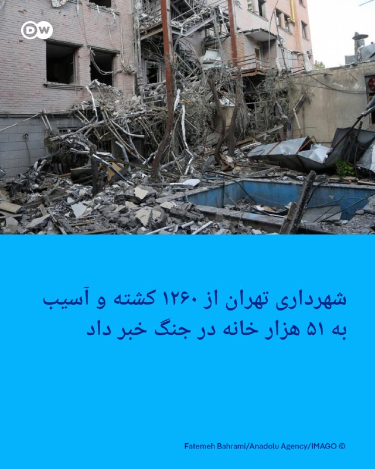

🔶 شهرداری تهران از ۱۲۶۰ کشته و آسیب به ۵۱ هزار خانه در جنگ خبر داد

سخنگوی شهرداری تهران می‌گوید، در جریان "جنگ ۴۰ روزه" میان ایران، آمریکا و اسرائیل، دست‌کم ۱۲۶۰ نفر در تهران کشته و بیش از ۲۸۰۰ نفر زخمی شدند.

عبدالمطهر محمدخانی اعلام کرد که در این مدت ۶۵۰ مورد اصابت در پایتخت ثبت شده و حدود ۵۱ هزار واحد مسکونی آسیب دیده‌اند؛ بخش عمده آن‌ها خسارت‌های جزئی مانند شکستن شیشه‌ها و آسیب به در و پنجره بوده است.

به گفته او، بیش از ۱۰ هزار خودرو و ۷۵۴ موتورسیکلت نیز آسیب دیده‌اند و حدود ۲۲ میلیارد تومان خسارت به ناوگان اتوبوسرانی تهران وارد شده است.

محمدخانی همچنین گفت برخی نیروهای آتش‌نشانی که در محل انفجارها حضور داشتند، دچار مشکلات تنفسی ناشی از گازهای سمی شده‌اند.
@dw_farsi

## DW_Farsi — post 124774

  

🔶 نت‌بلاکس: قطع اینترنت در ایران وارد دوازدهمین هفته شد

سازمان نظارت بر اینترنت نت‌بلاکس اعلام کرده قطع گسترده اینترنت در ایران وارد دوازدهمین هفته و هفتادوهشتمین روز خود شده است.

نت‌بلاکس در شبکه ایکس نوشته این محدودیت، کشوری با حدود ۹۰ میلیون جمعیت را برای مدتی "بی‌سابقه" تا حد زیادی از اینترنت جهانی جدا کرده و همچنان بر حقوق شهروندی، اقتصاد و آزادی‌های اساسی تأثیر می‌گذارد.

این سازمان پیش‌تر نیز هشدار داده بود که ادامه محدودیت‌ها، یکی از طولانی‌ترین اختلال‌های اینترنتی ثبت‌شده در یک جامعه متصل به اینترنت محسوب می‌شود.
@dw_farsi

## DW_Farsi — post 124773

  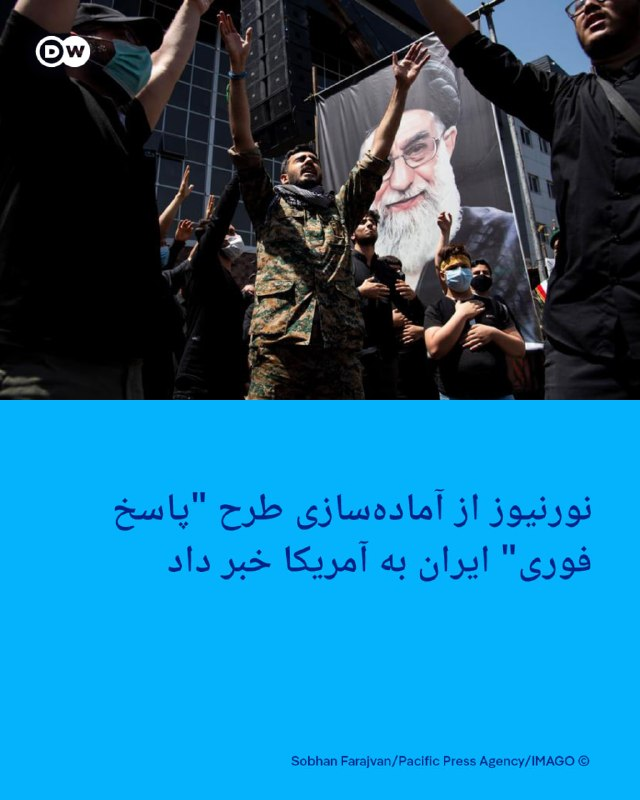

🔶 نورنیوز از آماده‌سازی طرح "پاسخ فوری" ایران به آمریکا خبر داد

یک مقام نظامی آگاه به نورنیوز، نزدیک به شورای عالی امنیت ملی گفته است، در صورت هرگونه اقدام نظامی آمریکا علیه ایران، نیروهای مسلح جمهوری اسلامی طرح "پاسخ فوری و گسترده" را اجرا خواهند کرد.

این مقام گفته است: «اهدافی که در جریان جنگ ۴۰ روزه، بنا بر ملاحظاتی مورد اصابت قرار نگرفتند، این‌بار در اولویت عملیاتی قرار گرفته‌اند.»

او همچنین گفته پاسخ احتمالی ایران بر اساس "حداکثر فشار متقابل" طراحی شده و شامل حملات همزمان به منافع و زیرساخت‌های آمریکا در منطقه خواهد بود.

این اظهارات پس از آن مطرح می‌شود که دونالد ترامپ از احتمال انجام "عملیات پاکسازی سبک" علیه ایران سخن گفته بود.
@dw_farsi

## Persian_Trend_Official — post 14280

  <a href="telegram/content/Persian_Trend_Official_14280_1778971043.mp4" target="_blank">🎬 Download video</a>

شبتون بخیر ❤️🌙✨️

📝 Nick
📌 @persian_trend_official
پرشین ترند | متفاوت‌ترین کانال نظامی

## Persian_Trend_Official — post 14278

  <a href="telegram/content/Persian_Trend_Official_14278_1778971046.mp4" target="_blank">🎬 Download video</a>

🔴 رسانه‌های اسرائیلی از انفجار در کارخانه صنایع موشکی «تومر» خبر دادند 💢رسانه‌های اسرائیلی گزارش دادند انفجاری در کارخانه شرکت «تومر» رخ داده است؛ شرکتی که در حوزه توسعه و تولید موتورهای موشکی و سامانه‌های پیشران فعالیت می‌کند. ▪️بر اساس گزارش‌ها، این شرکت…

## Persian_Trend_Official — post 14277

🔴انفجار بزرگ در بیت‌شمش 💢رسانه‌های عبری از وقوع انفجاری بسیار بزرگ در بیت‌شمش در اسرائیل خبر می‌دهند. 💢این رسانه‌ها با بیان اینکه ارتش مانع از ورود خودروهای امدادی به محل حادثه می‌شود، تصریح کردند این انفجار احتمالاً در تأسیساتی حساس رخ داده است. 🫆:Tony…

## Persian_Trend_Official — post 14276

  

🔴انفجار بزرگ در بیت‌شمش 💢رسانه‌های عبری از وقوع انفجاری بسیار بزرگ در بیت‌شمش در اسرائیل خبر می‌دهند. 💢این رسانه‌ها با بیان اینکه ارتش مانع از ورود خودروهای امدادی به محل حادثه می‌شود، تصریح کردند این انفجار احتمالاً در تأسیساتی حساس رخ داده است. 🫆:Tony…

## Persian_Trend_Official — post 14275

  <a href="telegram/content/Persian_Trend_Official_14275_1778971049.mp4" target="_blank">🎬 Download video</a>

🔴انفجار بزرگ در بیت‌شمش

💢رسانه‌های عبری از وقوع انفجاری بسیار بزرگ در بیت‌شمش در اسرائیل خبر می‌دهند.

💢این رسانه‌ها با بیان اینکه ارتش مانع از ورود خودروهای امدادی به محل حادثه می‌شود، تصریح کردند این انفجار احتمالاً در تأسیساتی حساس رخ داده است.

🫆:Tony

📌 @persian_trend_official
پرشین ترند | متفاوت‌ترین کانال نظامی

## Persian_Trend_Official — post 14274

https://youtube.com/live/Lj3xWW7IbLA?feature=share

## Persian_Trend_Official — post 14273

  

🔴خبرنگار فاکس نیوز

💢ترامپ درحال آماده‌شدن برای دور جدیدی از حملات نظامی به ایران است

🫆:Tony

📌 @persian_trend_official
پرشین ترند | متفاوت‌ترین کانال نظامی

## Persian_Trend_Official — post 14272

  

💢پست ترامپ

این آرامش قبل از طوفانه

🫆:Tony

📌 @persian_trend_official
پرشین ترند | متفاوت‌ترین کانال نظام

## Persian_Trend_Official — post 14271

  

💢تکرار تهدید کاخ سفید با انتشار تصویری از ترامپ در اتاق جنگ

💢کاخ سفید پیامی تهدیدآمیز از رئیس جمهوری آمریکا با عنوان «شوخی نداریم» همراه با تصویری از حضور او در اتاق جنگ منتشر کرد.

💢در پیام کاخ سفید آمده است: «اگر به آمریکایی‌ها آسیب بزنید، یا برای آسیب‌زدن به آمریکایی‌ها توطئه و طرح‌ریزی کنید، ما شما را خواهیم یافت.»

🫆:Tony

📌 @persian_trend_official
پرشین ترند | متفاوت‌ترین کانال نظامی

## Persian_Trend_Official — post 14270

  <a href="telegram/content/Persian_Trend_Official_14270_1778971054.webm" target="_blank">🎬 Download video</a>

نسخه صوتی لایو امشب در پلتفرم کست باکس : https://castbox.fm/vi/945937615

## Persian_Trend_Official — post 14269

نسخه صوتی لایو امشب در پلتفرم کست باکس :
https://castbox.fm/vi/945937615

## Persian_Trend_Official — post 14268

نسخه صوتی لایو امشب در پلتفرم اسپاتیفای :

https://open.spotify.com/episode/2Mw2hfeg12829w5zlJVOkO?si=0nFXW0pdTmCsCyiYukkcsQ

## Persian_Trend_Official — post 14267

🔴آمریکا معافیت تحریم نفت روسیه را تمدید نکرد

💢به گزارش رویترز، آمریکا روز شنبه معافیت تحریمی که پیشتر به کشورهایی از جمله هند اجازه می‌داد نفت روسیه را خریداری کنند، تمدید نکرد.

💢این معافیت قبلاً به مدت یک ماه تمدید شده بود تا کمبود عرضه نفت و قیمت‌های بالا ناشی از بسته شدن تنگه هرمز توسط ایران کاهش یابد.

💢اسکات بسنت، وزیر خزانه‌داری آمریکا پیشتر گفته بود که مجوز خرید نفت روسیه ذخیره‌شده روی تانکرها را تمدید نخواهد کرد.

🫆:Tony

📌 @persian_trend_official
پرشین ترند | متفاوت‌ترین کانال نظامی

## Persian_Trend_Official — post 14266

  <a href="telegram/content/Persian_Trend_Official_14266_1778971054.webm" target="_blank">🎬 Download video</a>

🔴تارنمای بیمهٔ ایرانی تنگهٔ هرمز راه‌اندازی شد

💢تارنمای «هرمز سیف» (Hormuz Safe) ارائه بیمه به محموله‌های دریایی عبوری از تنگهٔ هرمز را شروع کرد.

💢مقررات این تارنمای بیمه می‌گوید، بیمه‌نامه‌هایی سریع و با قابلیت تایید رمزنگاری شده برای محموله‌هایی که از خلیج فارس، تنگهٔ هرمز و آبراه‌های اطراف آن عبور می‌کنند، ارائه می‌شود و پرداخت‌ها با ارز دیجیتال تسویه خواهد شد.

🫆:Tony

📌 @persian_trend_official
پرشین ترند | متفاوت‌ترین کانال نظامی

## Persian_Trend_Official — post 14265

⭕️ ادعای ترامپ:
ایران روزهای بسیار سختی در پیش خواهد داشت.

📝 Nick

📌 @persian_trend_official
پرشین ترند | متفاوت‌ترین کانال نظامی

## Persian_Trend_Official — post 14264

https://youtube.com/live/Lj3xWW7IbLA?feature=share

## Persian_Trend_Official — post 14263

⭕️👽 ادعای جنجالی دریاسالار بازنشسته آمریکا درباره پدیده‌های ناشناس؛ «هوش غیرانسانی» در کار است.

تیم گالادت، دریاسالار بازنشسته نیروی دریایی آمریکا، در اظهاراتی جنجالی گفت پدیده‌های ناشناس هوایی ممکن است تحت هدایت «هوشی غیرانسانی و در سطحی بالاتر» باشند.

به گزارش فاکس‌نیوز، گالادت که از چهره‌های شناخته‌شده در بحث پدیده‌های ناشناس هوایی در آمریکا به شمار می‌رود، گفته است داده‌ها و ویدئوهایی را دیده که نشان می‌دهد برخی از این اشیا میان اقیانوس و جو زمین، بدون ایجاد اختلال آشکار در سطح آب، با سرعت‌هایی فراتر از فناوری شناخته‌شده حرکت می‌کنند.

او تأکید کرد این اشیا نه شبیه فناوری آمریکا هستند و نه شبیه فناوری رقبای این کشور. گالادت گفت: «ما فناوری‌ای نداریم که بتواند چنین کاری انجام دهد.»

این دریاسالار بازنشسته همچنین مدعی شد شواهدی وجود دارد که نشان می‌دهد حرکت این پدیده‌ها تحت کنترل هوشی غیرانسانی است؛ ادعایی که بار دیگر بحث درباره ماهیت پدیده‌های ناشناس هوایی و میزان اطلاعات پنهان‌شده از افکار عمومی را داغ کرده است.

📝 Nick

📌 @persian_trend_official
پرشین ترند | متفاوت‌ترین کانال نظامی

## Persian_Trend_Official — post 14262

  <a href="telegram/content/Persian_Trend_Official_14262_1778971055.mp4" target="_blank">🎬 Download video</a>

💢پست جدید ترامپ و تمسخر دوباره پهپاد های جمهوری اسلامی ...

🫆:Tony

📌 @persian_trend_official
پرشین ترند | متفاوت‌ترین کانال نظامی

## Persian_Trend_Official — post 14261

🔴 مهم‌ترین تحولات منطقه

▪️ حماس تأیید کرد «عزالدین الحداد» فرمانده شاخه نظامی گردان‌های قسام، در حمله روز جمعه اسرائیل به غزه کشته شده است

▪️ وزیر کشور پاکستان در سفری غیرمنتظره به تهران با همتای ایرانی خود درباره ثبات منطقه‌ای
و همکاری‌های دوجانبه گفت‌وگو کرد.

▪️ فرماندهی مرکزی ارتش آمریکا (سنتکام) اعلام کرد در ادامه محاصره بنادر ایران، مسیر حرکت ۷۸ کشتی تجاری را تغییر داده است

▪️ اسرائیل حملات خود به لبنان را با وجود آتش‌بس ادامه داد؛ در حملات جدید دست‌کم ۳ نفر در جنوب لبنان کشته شدند

▪️ وزارت بهداشت لبنان اعلام کرد از اوایل مارس تاکنون
۲۹۶۹ نفر در حملات اسرائیل کشته و ۹۱۱۲ نفر زخمی شده‌اند.

🫆:Tony

📌 @persian_trend_official
پرشین ترند | متفاوت‌ترین کانال نظامی

## Persian_Trend_Official — post 14260

  <a href="telegram/content/Persian_Trend_Official_14260_1778971057.mp4" target="_blank">🎬 Download video</a>

⭕️ ناوشکن وینستون چرچیل (DDG-81) از کلاس آرلی برک فلایت IIA که فرماندهی گروه ضربت ناو هواپیمابر فورد را بر عهده داشت، پس از یک‌سال مأموریت طاقت‌فرسا در فرماندهی اروپا، آفریقا و در نهایت فرماندهی مرکزی و شرکت در عملیات خشم حماسی، اکنون به پایگاه مادر خود، پایگاه نیروی دریایی می‌پورت در جکسون‌ویل، فلوریدا بازگشته است.

پ.ن: شرایط عملیاتی ناوشکن‌ها نسبت به ناوهای هواپیمابر به مراتب سخت‌تر و حساس‌تر می‌باشد. ولی معمولاً در رسانه‌ها اشاره‌ای به نقش پررنگ ناوشکن‌ها که در خط اول انجام مأموریت‌های تهاجمی و پدافندی قرار دارند، نمی‌شود.

📝 Nick

📌 @persian_trend_official
پرشین ترند | متفاوت‌ترین کانال نظامی

## RadioFarda — post 157274

🔸دولت ترامپ روز شنبه ۲۶ اردیبهشت معافیت تحریم نفت روی دریای روسیه را که پیش‌تر به کشورهایی از جمله هند امکان می‌داد آن را خریداری کنند، تمدید نکرد و اجازه داد که منقضی شود. 🔸این معافیت پس از یک تمدید یک‌ماهه با هدف کاهش کمبود عرضه نفت و مهار افزایش قیمت‌ها…

## RadioFarda — post 157273

  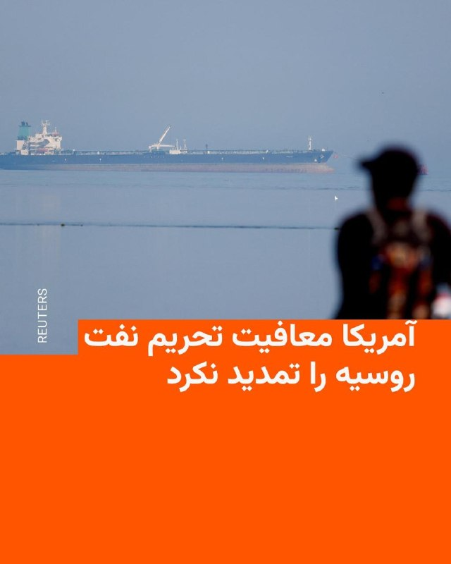

🔸دولت ترامپ روز شنبه ۲۶ اردیبهشت معافیت تحریم نفت روی دریای روسیه را که پیش‌تر به کشورهایی از جمله هند امکان می‌داد آن را خریداری کنند، تمدید نکرد و اجازه داد که منقضی شود.

🔸این معافیت پس از یک تمدید یک‌ماهه با هدف کاهش کمبود عرضه نفت و مهار افزایش قیمت‌ها در پی جنگ با ایران و بسته شدن تنگه هرمز، برقرار مانده بود.

🔸اسکات بسنت، وزیر خزانه‌داری آمریکا، پیش‌تر گفته بود که مجوز عمومی مربوط به خرید نفت روسیه ذخیره‌شده در نفتکش‌ها را تمدید نخواهد کرد.

🔸به گزارش خبرگزاری رویترز، تا بعدازظهر شنبه به وقت واشینگتن، هیچ اطلاعیه‌ای دربارهٔ تمدید این معافیت در وب‌سایت وزارت خزانه‌داری منتشر نشده بود. سخنگوی این وزارتخانه نیز از ارائه توضیح بیشتر خودداری کرد.

@RadioFarda

## RadioFarda — post 157272

🔸وب‌سایت خبرآنلاین در گزارشی از بازار سیاه اینترنت طبقاتی که با عنوان «اینترنت پرو» شناخته می‌شود، نوشت تبدیل شدن «دسترسی به اینترنت آزاد» به یک کالای لوکس و زیرزمینی، شبکهٔ توزیع اینترنت کشور را با فساد ساختاری مواجه کرده است. 🔸بر اساس این گزارش که روز شنبه…

## RadioFarda — post 157271

  

🔸وب‌سایت خبرآنلاین در گزارشی از بازار سیاه اینترنت طبقاتی که با عنوان «اینترنت پرو» شناخته می‌شود، نوشت تبدیل شدن «دسترسی به اینترنت آزاد» به یک کالای لوکس و زیرزمینی، شبکهٔ توزیع اینترنت کشور را با فساد ساختاری مواجه کرده است.

🔸بر اساس این گزارش که روز شنبه ۲۶ اردیبهشت منتشر شد، شبکه‌ای غیررسمی از دلالان شکل گرفته که با دریافت مبالغ میلیونی، شهروندان متقاضی را به‌عنوان کارمند شرکت‌ها یا اعضای اصناف معرفی می‌کنند تا امکان اتصال به اینترنت پیدا کنند.

🔸این دلالان با استفاده از خلأهای نظارتی، نام متقاضیان را در فهرست شرکت‌ها ثبت می‌کنند؛ اقدامی که در میان واسطه‌ها با عنوان‌هایی مانند «رد کردن نامه» یا «ثبت در لیست شرکت» شناخته می‌شود.

@RadioFarda

## IranianMinds — post 20261

  <a href="telegram/content/IranianMinds_20261_1778971060.mp4" target="_blank">🎬 Download video</a>

🔴 علیرضا بیرانوند :

سرود جمهوری اسلامی رو با صدای بلند میخونم و مخالفا هم هیچ کاری نمیتونن بکنن

@IranianMinds

## IranianMinds — post 20260

  

🔴 کاخ سفید :

هیچ بازی ای در کار نیست ، اگر به آمریکایی ها آسیبی برسانید یا برنامه ای برای این کار داشته باشید ما شمارو پیدا میکنیم و میکشیم !

@IranianMinds

## IranianMinds — post 20259

  

🔴پست ترامپ در تروث‌سوشال:

این آرامش قبل از طوفان بود.

@IranianMinds

## IranianMinds — post 20258

  <a href="telegram/content/IranianMinds_20258_1778971064.mp4" target="_blank">🎬 Download video</a>

🔴دونالد ترامپ در تروث‌سوشال یک انیمیشنی را منتشر کرد که در آن به ناو آمریکایی دستور شلیک به هدفی که پرچم جمهوری اسلامی را دارد داده و می‌گوید در فهرست اهدافمان، آتش.

@IranianMinds

## IranianMinds — post 20257

  

🔴 پست جدید ترامپ که دوباره گرفته رو‌ بایدن یتیم:

@IranianMinds

## IranianMinds — post 20256

🔴ترامپ:

حکومت ایران بهتره که به توافق برسه، اگه این‌‌کارو نکنن، دوران بسیار بدی در انتظارشون خواهد بود.

@IranianMinds

## IranianMinds — post 20255

  

🔴ترامپ:

اگر به آمریکایی‌ها آسیب بزنید، یا در حال برنامه‌ریزی برای آسیب زدن به آمریکا‌یی‌ها باشید، ما شما را پیدا خواهیم کرد و شما را خواهیم کشت.

@IranianMinds

## IranianMinds — post 20254

🔴زمین‌لرزه‌ای به قدرت ۴.۵ ریشتر، دقایقی پیش، گلوگاه در استان مازندران را لرراند.

@IranianMinds

## BBCPersian — post 281241

  

‌🔻مردی در شهر مودنا در شمال ایتالیا با خودرو خود با چندین عابر پیاده برخورد و هشت نفر را زخمی کرد. حال چهار نفر از آنها وخیم گزارش شده است.

یکی از مجروحان زنی است که گفته می‌شود هر دو پایش خرد شده است.

عابران پس از تعقیب راننده خودرو، یک «مرد سی و چند ساله» را دستگیر و به پلیس تحویل دادند.

جورجیا ملونی، نخست‌وزیر ایتالیا، این واقعه را «بسیار جدی» توصیف کرد. همچنین ماسیمو مزتی، شهردار مودنا، در ادامه واکنش خانم ملونی گفت اگر مشخص شود که این یک حمله از پیش برنامه‌ریزی شده بوده، «حتی جدی‌تر» خواهد بود.

این حادثه بعد از ظهر شنبه ۱۶ مه اتفاق افتاد. یک شاهد عینی گفت: «ما دیدیم که خودرو نزدیک می‌شود، به سمت جدول می‌رفت اما ناگهان سرعت گرفت و هنگام برخورد با عابران حداقل ۱۰۰ کیلومتر در ساعت سرعت داشت و ما دیدیم که مردم در حال پرواز هستند.»

شهردار مودنا گفت به نظر می‌رسد که راننده «عمدا به پیاده‌رو رفته، به چند نفر زده و به ویترین یک مغازه کوبیده است».
به گفته شهردار مودنا، فرد بازداشت‌شده یک تبعه ایتالیایی متولد برگامو، اما «اصالتا مغربی» است.

ادامه از:
https://bbc.in/4nxF8zv
📷Reuters
@BBCPersian

## BBCPersian — post 281240

  <a href="https://t.me/bbcpersian/281240" target="_blank">📎 Download file</a>

پادکست برنامه شصت دقیقه روز شنبه ۲۶ اردیبهشت ۱۴۰۵ است
این نسخه رادیویی برنامه شصت دقیقه تلویزیون فارسی بی‌بی‌سی است که هرشب بعد از پخش، با حجم کم از اپلیکیشن‌های پادگیر و صفحه تلگرام بی‌بی‌سی فارسی در دسترس است.
با هشتگ BBCPersianRadio# با ما در ارتباط باشید.
@BBCPersian

## BBCPersian — post 281239

📊بازار سهام ایران پس از توقف ناشی از جنگ از سه‌شنبه بازگشایی می‌شود

یک مقام ارشد سازمان بورس و اوراق بهادار ایران تایید کرد که پس از توقف فعالیت‌ها در دوران جنگ با آمریکا و اسرائیل، بازار سهام آن کشور از روز سه‌شنبه بازگشایی خواهد شد.

حمید یاری، معاون نظارت بر بورس‌ها و ناشران سازمان بورس و اوراق بهادار ایران می‌گوید که «بر اساس هماهنگی‌های صورت‌گرفته و پس از اخذ مجوزهای لازم، مقرر شد بازگشایی بازار سهام، انواع صندوق‌های سرمایه‌گذاری در سهام و مشتقات آن‌ از روز سه‌شنبه ۲۹ اردیبهشت ۱۴۰۵ صورت پذیرد.»

او گفت که توقف فعالیت بازار سهام از شروع جنگ، «با هدف صیانت از دارایی سهامداران، جلوگیری از بروز رفتارهای هیجانی و فراهم آوردن شرایط انجام معامله در این بازار با اطلاعات دقیق‌تر و شفاف‌تر صورت‌ گرفت.»

آقای یاری همچنین می‌گوید که با بازگشایی بازار سهام، «شاهد تکمیل فعالیت همه بخش‌های بازار سرمایه خواهیم بود.»

https://bbc.in/4wpp6f4
@BBCPersian

## BBCPersian — post 281238

  <a href="telegram/content/BBCPersian_281238_1778971068.mp4" target="_blank">🎬 Download video</a>

⭕️آخرین خبرهای مهم روز شنبه ۲۶ اردیبهشت ۱۴۰۵
@BBCPersian

## BBCPersian — post 281237

⭕️آمریکا یک فرمانده شبه‌نظامیان عراقی را به توطئه برای هدف قرار دادن یهودیان در شهرهایی از لندن تا لس‌آنجلس متهم کرد

آمریکا می‌گوید که محمد باقر سعد داوود ساعدی، از فرماندهان شبه‌نظامیان عراقی را به اتهام نقش داشتن در طراحی بیش از ۱۲ حمله «تروریستی» در آمریکای شمالی و اروپا بازداشت و به آمریکا منتقل کرده است.

مقامات قضایی آمریکا گفته‌اند که این حملات در واکنش به جنگ با ایران برنامه‌ریزی شده بود.

این مقام‌های آمریکا همچنین گفتند که «محمد باقر سعد داوود ساعدی، ۳۲ ساله، در حال طراحی حمله به یک کنیسه در نیویورک و دو مرکز یهودی در لس‌آنجلس و اسکاتسدیل بوده است.»

بر اساس شکایت کیفری، آقای ساعدی با شش اتهام مرتبط با تروریسم روبه‌رو است. وکیلش اما می‌گوید که پیگرد او با «انگیزه‌های سیاسی» صورت گرفته است.

مقام‌های آمریکایی، آقای ساعدی را به عنوان یکی از فرماندهان کتائب حزب‌الله معرفی کرده‌اند.

https://bbc.in/3PKX1OQ
@BBCPersian

## BBCPersian — post 281236

  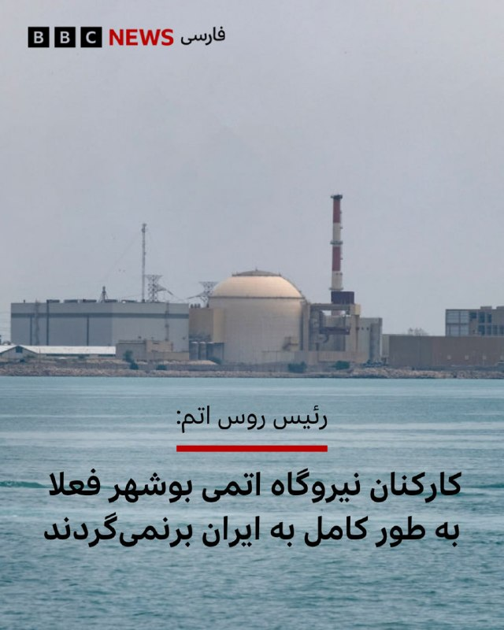

🔻مسکو می‌گوید اتباع روسی شاغل در نیروگاه اتمی بوشهر را فعلا به طور کامل به ایران برنمی‌گرداند.

الکسی لیخاچف، رئیس شرکت دولتی روس‌اتم، گفت هفته گذشته ایران و آمریکا بار دیگر حملاتی علیه یکدیگر انجام و رسانه‌های آمریکایی هم دوباره از احتمال ازسرگیری درگیری‌ها خبر دادند و ادامه داد گه «تا زمانی که وضعیت روشن نشود، ما حق نداریم درباره بازگشت کامل نیروها به محل نیروگاه تصمیم‌گیری کنیم.»

به گفته او، روس‌اتم در حال آماده‌سازی طرح‌های آتی برای افزایش تعداد نیروهای روسی در نیروگاه اتمی بوشهر است اما در «در عین حال گفت «باید شرایط نظامی را هم در نظر بگیریم.»

محوطه بوشهر که تنها نیروگاه اتمی ایران است، در جریان جنگ اخیر چند بار هدف حمله قرار گرفت اما به ساختمان و تاسیاست اصلی آسیبی نرسید.

روسیه از زمان حمله اسرائیل و آمریکا به ایران در چند مرحله اتباع خود را که در این نیروگاه مشغول به کار هستند، از ایران خارج کرد.

📸NurPhoto via Getty Images

https://bbc.in/4duJS4e
@BBCPersian

## BBCPersian — post 281235

🔻عزالدین حداد‌، فرمانده ارشد حماس در حمله اسرائیل کشته شد

حماس و ارتش اسرائیل تأیید کرده‌اند که عزالدین حداد، فرمانده گردان‌های قسام، شاخه نظامی این گروه، شامگاه جمعه (۱۵ مه، ۲۵ اردیبهشت) در حمله‌ اسرائیل در شهر غزه کشته شده است.

اسرائیل او را یکی از طراحان حملات هفتم اکتبر ۲۰۲۳ خوانده است.

بنیامین نتانیاهو، نخست‌وزیر و اسرائیل کاتس، وزیر دفاع اسرائیل در بیانیه‌ای مشترک گفته‌اند که عزالدین حداد «مسئول قتل، ربایش و زخمی شدن هزاران غیرنظامی اسرائیلی و نیروهای ارتش اسرائیل» بوده است.

مراسم تشییع عزالدین حداد امروز (شنبه) در شهر غزه برگزار شد.

اعضای خانواده‌ آقای حداد هم در حمله هوایی شبانه اسرائیل کشته شدند.

https://bbc.in/3PaM0X0
@BBCPersian

## BBCPersian — post 281234

⚽️دبیرکل فیفا و رئیس فدراسیون فوتبال ایران در استانبول با هم دیدار کردند

دبیرکل فیفا و مهدی تاج، رئیس فدراسیون فوتبال ایران، امروز در استانبول با هم دیدار کردند.

یک منبع آگاه به خبرگزاری رویترز گفته است که ماتیاس گرافستروم قرار بوده در این دیدار درباره حضور ایران در جام جهانی به مقام‌های جمهوری اسلامی ایران «اطمینان‌» بدهد.

قرار است ایران هر سه بازی مرحله گروهی جام جهانی را در ایالات متحده برگزار کند، اما از زمان حمله آمریکا و اسرائیل به ایران در نهم اسفند حضور تیم ملی ایران در این رقابت‌ها که از کمتر از یک ماه دیگر برگزار می‌شود، با ابهام روبه‌رو شده است.

پس از آن‌که مهدی تاج به دلیل ارتباطش با سپاه پاسداران انقلاب اسلامی از ورود به کانادا منع شد، ابهام درباره وضعیت ایران بیشتر شد. او برای شرکت در نشست فیفا که در ونکوور برگزار می‌شد، عازم این کشور شد اما ماموران اجازه ورود او به خاک کانادا را ندادند.

جمهوری اسلامی ایران همزمان با حملات آمریکا و اسرائیل ابتدا اعلام کرده بود که تیم ملی ایران احتمالا در جام جهانی شرکت نمی‌کند اما سپس مقام‌های وزارت ورزش ایران حضور تیم را منوط به تصمیم شورای عالی امنیت ملی کردند.

آمریکا و کانادا، که همراه با مکزیک میزبان مشترک جام جهانی هستند، سپاه پاسداران را یک «نهاد تروریستی» طبقه‌بندی و اعلام کرده‌اند افرادی را که با این نیرو ارتباط دارند، به کشورشان راه نخواهند داد.

تیم ملی فوتبال ایران قرار است دو روز دیگرعازم اردوی آماده‌سازی در ترکیه شود.

https://bbc.in/4nGtXEU
@BBCPersian

## BBCPersian — post 281233

  

بیش از پنجاه کودک در شمال‌شرق نیجریه، در پی حمله به سه مدرسه در روز جمعه ۲۵ اردیبهشت، ربوده شده‌اند. گفته می‌شود بیشتر این کودکان بین دو تا پنج سال سن دارند و از مهدکودک‌ها به زور برده شده‌اند.

والدین این کودکان در روستای «موسا» در ایالت بورنو با نگرانی و اضطراب فراوان در انتظار دریافت خبری از فرزندان خود هستند، در حالی که هیچ گروهی تاکنون مسئولیت این حملات را بر عهده نگرفته است. هم‌زمان گزارش‌هایی نیز از فرار برخی ساکنان منطقه منتشر شده است.

به گفته شاهدان عینی، مهاجمان هنگام فرار با موتورهای خود، از کودکان به‌عنوان سپر انسانی استفاده کردند؛ اقدامی که باعث شد نیروهای امنیتی نتوانند به سوی آن‌ها تیراندازی کنند.
📷Getty
@BBCPersian

## Dirty_Kids — post 389593

  <a href="telegram/content/Dirty_Kids_389593_1778971073.webm" target="_blank">🎬 Download video</a>

☢️خفن ترین و‌ قدیمی ترین  انالیزور  ایران ینی دکتر بت 
👍 
🔴هیچ سایت بتی دوست نداره شما کانال دکتر بت رو پیدا کنین چون خیلی سود میکنید🤷‍♂ رایگان بهترین شرط هارو براتون میذاره حتی هزار تومن هم دریافت نمیکنه روزانه میتونی از پیش بینی فوتبال باهاش پول در بیاری…

## Dirty_Kids — post 389592

  <a href="telegram/content/Dirty_Kids_389592_1778971073.webm" target="_blank">🎬 Download video</a>

☢️خفن ترین و‌ قدیمی ترین  انالیزور  ایران ینی دکتر بت 
👍

🔴هیچ سایت بتی دوست نداره شما کانال دکتر بت رو پیدا کنین چون خیلی سود میکنید🤷‍♂

رایگان بهترین شرط هارو براتون میذاره
حتی هزار تومن هم دریافت نمیکنه
روزانه میتونی از پیش بینی فوتبال باهاش پول در بیاری 👌
A26
اگ اهل پیش بینی فوتبالی این کانال اصلا از دست ندین👇

✅https://t.me/+4_ADqwB9e-QwYjlk

✅https://t.me/+4_ADqwB9e-QwYjlk

## Dirty_Kids — post 389591

  

#بخوابیم

@Dirty_Kids 👻

## Dirty_Kids — post 389590

  <a href="telegram/content/Dirty_Kids_389590_1778971075.mp4" target="_blank">🎬 Download video</a>

اعتراف کارشناس صداوسیما:
نتانیاهو خسته نشده، این یعنی مَرد

@Dirty_Kids 👻

## Dirty_Kids — post 389589

  <a href="telegram/content/Dirty_Kids_389589_1778971076.mp4" target="_blank">🎬 Download video</a>

وقتی میبینم رفیقم به «بله» عادت کرده و پروفایل و استوری میزاره و همش برخطه :

@Dirty_Kids 👻

## Dirty_Kids — post 389588

  <a href="telegram/content/Dirty_Kids_389588_1778971077.mp4" target="_blank">🎬 Download video</a>

مجری: خواهش می‌کنم سلام من رو به مجتبی خامنه‌ای برسونید.

حدادعادل: والا منم به دامادم دسترسی ندارم، از همین‌جا بهش سلام می‌رسونم.

@Dirty_Kids 👻

## Dirty_Kids — post 389587

  

مادر مسئولیت پذیر

@Dirty_Kids 👻

## Dirty_Kids — post 389586

  <a href="telegram/content/Dirty_Kids_389586_1778971079.mp4" target="_blank">🎬 Download video</a>

گویا انفجار شدید در تأسیسات شرکت «تومر» در منطقه بیت‌شمش اسرائیل.
این شرکت مرکز اصلی طراحی و تولید موتور پیشران انواع موشک‌های راهبردی است.

خریت بچه شیعه یا حادثه؟

@Dirty_Kids 👻

## Dirty_Kids — post 389585

‏شاباش های دهه هفتاد هشتاد اینطوری بود که طرف میگفت حالا که دارم هزینه میکنم بذارم دهنش.

@Dirty_Kids 👻

## Dirty_Kids — post 389581

  <a href="telegram/content/Dirty_Kids_389581_1778971081.mp4" target="_blank">🎬 Download video</a>

🔴 تصاویر وایرال شده از یه خانم اهل انگلیس که خواستارِ اخراج مهاجرین از این کشوره.

+ ارزش دانلود: 195 از 100

@Dirty_Kids 👻

## Dirty_Kids — post 389580

  <a href="telegram/content/Dirty_Kids_389580_1778971082.mp4" target="_blank">🎬 Download video</a>

بیرانوند گفته: سرود حکومت را با صدای بلند میخونم… مردم مخالف جمهوری اسلامی در ورزشگاه هم هیچ کاری نمیتونن بکنن!

داداشام و خواهرام در امریکا
مدیونید بزارید آب‌خوش از گلوشون پایین بره... از دم فرودگاه تا هتل، شب قبل بازی جلوی هتل و داخل استادیوم، همه بلیطا هم بخرید تا صادراتیاشون نخرن، دیگه هرکاری در توانتون بکنید خارشونو بگایید

#فوتبالیست_سپاهی

@Dirty_Kids 👻

## Dirty_Kids — post 389579

  

پست جدید ترامپ تو تروث سوشال کنار یه فرمانده نظامی و خطاب به ایران :

این تازه آرامش قبلِ طوفان بود.

مجموع گزارش‌ها، اخبار رسمی، نقل‌وانتقالات نظامی و مصاحبه‌های ترامپ و نتانیاهو در هفته گذشته، نشان می‌دهد هر لحظه باید منتظر آغاز دور جدید حملات به جمهوری اسلامی بود؛ حملاتی که می‌تواند این‌بار با پیاده کردن سربازان آمریکایی در خاک ایران نیز همراه باشد.

@Dirty_Kids 👻

## Dirty_Kids — post 389578

ترامپ:
اگه توافق نشود ایران روز های خیلی سختی در پیش دارد

@Dirty_Kids 👻

## Dirty_Kids — post 389577

  <a href="telegram/content/Dirty_Kids_389577_1778971084.mp4" target="_blank">🎬 Download video</a>

بابای گلشیفته هستن

@Dirty_Kids 👻

## Dirty_Kids — post 389576

  <a href="telegram/content/Dirty_Kids_389576_1778971086.mp4" target="_blank">🎬 Download video</a>

تامی رابینسون (فعال ملی‌گرای بریتانیایی) در تطاهرات لندن عکس شاهزاده رضا پهلوی بالا برد

@Dirty_Kids 👻

## Dirty_Kids — post 389575

  

سال 1374، کل پاساژ علاءالدین: 500 میلیون

سال 1405، آیفون 17 پرومکس: 500 میلیون

@Dirty_Kids 👻

## Dirty_Kids — post 389574

  <a href="telegram/content/Dirty_Kids_389574_1778971088.mp4" target="_blank">🎬 Download video</a>

ترامپ دقایقی پیش با انتشار این ویدئو در تروث‌سوشال در حال تمسخر روافض هزارپدره

خار Ai رو گاییده 😂

@Dirty_Kids 👻

## Hranews — post 112975

تجمع اعتراضی کارگران پتروشیمی پتروناد در بندر امام

❗️
❗️
❗️
❗️
❗️– امروز شنبه ۲۶ اردیبهشت ماه، گروهی از #کارگران شرکت پتروشیمی پتروناد بندر امام، در اعتراض به اخراج ۲۰۰ همکار خود، مقابل دادسرای این شهر #تجمع اعتراضی برگزار کردند.

ادامه مطلب

↘️
@hranews_bot تماس ✉️ - @Hranews کانال هرانا 🆑

## Hranews — post 112974

رهایی یک زندانی از چوبه دار در سلماس

❗️
❗️
❗️
❗️
❗️– یک زندانی در سلماس که پیشتر از بابت اتهام قتل به #اعدام محکوم شده بود، با اعلام رضایت اولیای دم از چوبه دار رهایی یافت.

ادامه مطلب

↘️
@hranews_bot تماس ✉️ - @Hranews کانال هرانا 🆑

## manototv — post 105540

  <a href="telegram/content/manototv_105540_1778971089.mp4" target="_blank">🎬 Download video</a>

هند و امارات متحده عربی در جریان سفر نارندرا مودی، نخست‌وزیر هند، به ابوظبی، چند توافق‌نامه در حوزه‌های دفاعی، انرژی و حمل‌ونقل دریایی امضا کردند.

بر اساس این توافق‌ها، دو کشور همکاری در زمینه امنیت دریایی، دفاع سایبری، فناوری‌های پیشرفته، تبادل اطلاعات و صنایع دفاعی را گسترش خواهند داد.

در بخش انرژی نیز توافقی درباره ذخایر راهبردی نفت و ذخیره‌سازی نفت خام هند در فجیره امضا شده است.

این دیدار در حالی انجام شد که امارات پیش‌تر جمهوری اسلامی را به حمله پهپادی و موشکی به فجیره متهم کرده بود؛ حمله‌ای که به آتش‌سوزی در یک پالایشگاه و زخمی شدن سه کارگر هندی منجر شد.

نارندرا مودی در دیدار با محمد بن زاید، رئیس امارات، حملات به امارات را محکوم کرد و دو طرف بر گسترش روابط اقتصادی و امنیتی تاکید کردند.

## manototv — post 105539

  <a href="telegram/content/manototv_105539_1778971090.mp4" target="_blank">🎬 Download video</a>

‌
شاهزاده رضا پهلوی در «نشست آینده تکنولوژی در ایران» گفت اقتصاد آینده ایران نباید بر پایه نفت، بلکه بر مبنای سرمایه‌گذاری داخلی و خارجی و نقش پررنگ بخش خصوصی شکل بگیرد.

او با تاکید بر اهمیت سرمایه‌گذاری در فناوری، هوش مصنوعی، انرژی‌های تجدیدپذیر و گردشگری گفت ایران ظرفیت آن را دارد که از صنعت گردشگری حتی بیش از نفت و گاز درآمد داشته باشد.

شاهزاده رضا پهلوی افزود توسعه زیرساخت‌هایی مانند فرودگاه‌ها، جاده‌ها، هتل‌ها و رسیدگی به مسائل زیست‌محیطی می‌تواند ایران را به مقصدی جذاب برای گردشگران تبدیل کند.

او همچنین با اشاره به محرومیت مناطقی مانند سیستان‌ و بلوچستان و بخش‌هایی از کردستان گفت این مناطق به دلیل تبعیض مذهبی جمهوری اسلامی مورد بی‌توجهی قرار گرفته‌اند، اما با جذب سرمایه‌گذاری می‌توانند به‌سرعت متحول شوند.

شاهزاده رضا پهلوی تاکید کرد ارائه چشم‌اندازی روشن برای بازسازی ایران پس از آزادی سیاسی، یکی از مهم‌ترین چالش‌ها و پروژه‌های پیش‌روی مخالفان جمهوری اسلامی است.

## manototv — post 105538

  <a href="telegram/content/manototv_105538_1778971093.mp4" target="_blank">🎬 Download video</a>

‌
دولت دونالد ترامپ معافیت تحریمی خرید نفت دریایی روسیه را که پس از جنگ آمریکا و اسرائیل با جمهوری اسلامی و بسته شدن تنگه هرمز صادر شده بود، تمدید نکرد.

این معافیت به کشورهایی از جمله هند اجازه می‌داد به خرید نفت روسیه ادامه دهند و برای یک ماه تمدید شده بود، اما روز شنبه به پایان رسید.

اسکات بسنت، وزیر خزانه‌داری آمریکا، پیش‌تر گفته بود این مجوز تمدید نخواهد شد. تا عصر شنبه نیز هیچ تمدیدی در وب‌سایت وزارت خزانه‌داری آمریکا منتشر نشد.

## manototv — post 105537

  <a href="telegram/content/manototv_105537_1778971094.mp4" target="_blank">🎬 Download video</a>

شاهزاده رضا پهلوی در پاسخ به پرسشی درباره زمان بازگشت ایرانیان خارج از کشور، در «نشست آینده تکنولوژی در ایران» گفت سرعت تغییرات در ایران به عملکرد مردم و میزان حمایت و فشار کشورهای تاثیرگذار بستگی دارد.

او با تاکید بر اینکه مردم ایران نباید به نیروی خارجی متکی باشند، گفت هرگونه حمایت بین‌المللی می‌تواند روند تغییر را کوتاه‌تر و آسان‌تر کند، اما ایرانیان خود باید عامل اصلی این تحول باشند.

شاهزاده رضا پهلوی افزود مردم ایران «چهل هزار کشته ندادند» که نتیجه آن تنها یک توافق هسته‌ای یا ادامه جمهوری اسلامی با چهره‌هایی مانند محمدباقر قالیباف باشد و تاکید کرد ایرانیان «کمتر از تغییر کامل نظام» را نخواهند پذیرفت.

شاهزاده رضا پهلوی با اشاره به دولت دونالد ترامپ گفت مخالفان جمهوری اسلامی باید دولت‌های تاثیرگذار، به‌ویژه آمریکا، را قانع کنند که به‌جای توافق دوباره با جمهوری اسلامی، روی مردم ایران سرمایه‌گذاری کنند.

او تاکید کرد راه‌حل‌های اقتصادی، علمی و تکنولوژیک برای آینده ایران وجود دارد و آنچه اکنون اهمیت دارد، «اراده سیاسی و تصمیم‌گیری» دولت‌های تاثیرگذار برای حمایت از آزادی ایران است.

## manototv — post 105536

  <a href="telegram/content/manototv_105536_1778971097.mp4" target="_blank">🎬 Download video</a>

‌
شاهزاده رضا پهلوی در «نشست آینده تکنولوژی در ایران» گفت ایرانیان موفق در سیلیکون‌ولی می‌توانند الگوی توسعه آینده ایران باشند و نشان دهند که با تغییر وضعیت سیاسی، چه فرصت‌هایی برای کشور ایجاد خواهد شد.

او با اشاره به توانایی متخصصان ایرانی در حوزه فناوری و هوش مصنوعی گفت نمونه‌ای مشابه سیلیکون‌ولی حتی می‌تواند در بلوچستان شکل بگیرد و ایران ظرفیت تبدیل شدن به کشوری پیشرفته را دارد.

شاهزاده رضا پهلوی تاکید کرد مشکلات اقتصادی و معیشتی کنونی به دلیل ناتوانی مردم یا کمبود امکانات نیست و افزود: «ایران می‌تواند کره جنوبی باشد؛ اما به‌دلیل وضعیت سیاسی، به کره شمالی تبدیل شده است.»

## manototv — post 105535

  <a href="telegram/content/manototv_105535_1778971099.mp4" target="_blank">🎬 Download video</a>

‌
دونالد ترامپ، رئیس‌جمهوری آمریکا، در گفت‌وگو با شبکه فرانسوی بی‌اف‌ام گفت در صورت نرسیدن به توافق، ایران با «دوران بسیار سختی» روبه‌رو خواهد شد.

ترامپ افزود هنوز مشخص نیست توافقی به‌زودی حاصل می‌شود یا نه، اما تاکید کرد «بهتر است ایران توافق کند.»

## manototv — post 105534

  <a href="telegram/content/manototv_105534_1778971100.mp4" target="_blank">🎬 Download video</a>

خبرگزرای‌های داخل کشور از وقوع زمین‌لرزه‌ ۴.۵ ریشتری در گلوگاه مازندران خبر دادند.

## manototv — post 105533

  <a href="telegram/content/manototv_105533_1778971101.mp4" target="_blank">🎬 Download video</a>

نیویورک‌تایمز گزارش داد مقام‌های ارشد دولت دونالد ترامپ طرح‌هایی برای ازسرگیری حملات نظامی آمریکا به جمهوری اسلامی آماده کرده‌اند؛ حملاتی که در صورت تصمیم نهایی ترامپ، می‌تواند از اوایل هفته آینده آغاز شود.

بر اساس این گزارش، پنتاگون در حال آماده‌سازی دوباره عملیاتی موسوم به «خشم حماسی» است؛ عملیاتی که پس از اعلام آتش‌بس متوقف شده بود. مقام‌های آمریکایی می‌گویند گزینه‌های روی میز شامل حملات گسترده‌تر به اهداف نظامی و زیرساختی جمهوری اسلامی و حتی اعزام نیروهای ویژه برای دستیابی به مواد هسته‌ای مدفون در سایت اصفهان است.

این گزارش می‌افزاید چند صد نیروی ویژه آمریکایی از ماه مارس در خاورمیانه مستقر شده‌اند تا در صورت صدور دستور، در عملیات زمینی احتمالی مشارکت کنند. مقام‌های نظامی آمریکا هشدار داده‌اند چنین عملیاتی می‌تواند با تلفات سنگین همراه باشد.

همزمان شبکه ۱۳ اسرائیل گزارش داد ارتش این کشور در حال ادامه آماده‌سازی‌ها برای احتمال ازسرگیری جنگ با جمهوری اسلامی است و اسرائیل در وضعیت آماده‌باش بالا قرار دارد.

بر اساس این گزارش، ارتش اسرائیل خود را برای سناریوی حملات روزانه ده‌ها موشک از سوی جمهوری اسلامی در روزهای نخست درگیری احتمالی آماده می‌کند.

این گزارش می‌افزاید طرح‌های احتمالی اسرائیل شامل هدف قرار دادن زیرساخت‌ها، تاسیسات انرژی و نیروگاه‌هاست و نیروی هوایی اسرائیل همچنین ممکن است در حملات مشترک، عملیات ترور علیه چهره‌های ارشد را دنبال کند.

## alonews — post 120502

  

🔥
💥اینترنت آزاد و رایگان

🌐
🚫تنها جایی که کانفیگ رایگان میزاره

⬇️
⬇️
@NetAazaadBot
@NetAazaadBot

⚠️هر ساعت 100گیگ شارژ میشه، رباتو داشته باشید تا مطلع بشید

## alonews — post 120500

  <a href="telegram/content/alonews_120500_1778971103.webm" target="_blank">🎬 Download video</a>

👈میخائیل اولیانوف، نماینده روسیه :
کارشناسا میگن آمریکا و اسرائیل ممکنه به‌زودی دوباره به ایران حمله کنن

✅ @AloNews خبر جنگ

## alonews — post 120499

  <a href="telegram/content/alonews_120499_1778971103.mp4" target="_blank">🎬 Download video</a>

👈یادی کنیم از حضور غرور انگیز بیرانوند در دایرکت یک مدل معروف

✅ @AloNews خبر جنگ

## alonews — post 120498

  <a href="telegram/content/alonews_120498_1778971106.webm" target="_blank">🎬 Download video</a>

👈بیرانوند : با صدای بلند و رسا کف آمریکا سرود جمهوری اسلامی ایران رو می‌خونم. مخالفا هم نمی‌تونن کاری بکنن

✅ @AloNews خبر جنگ

## alonews — post 120497

  <a href="telegram/content/alonews_120497_1778971106.webm" target="_blank">🎬 Download video</a>

👈علم الهدی: تو آمریکا 9میلیون آمریکایی پرچم ایران رو دستشون گرفتن

✅ @AloNews خبر جنگ

## alonews — post 120496

  <a href="telegram/content/alonews_120496_1778971106.webm" target="_blank">🎬 Download video</a>

👈شبکه GB News ادعا می‌کند که نخست‌وزیر کیر در حال آماده‌سازی جدول زمانی استعفا است

✅ @AloNews خبر جنگ

## alonews — post 120495

  <a href="telegram/content/alonews_120495_1778971107.webm" target="_blank">🎬 Download video</a>

👈کاربران فضای‌مجازی گفته‌اند که این انفجار بدون هیچ هشدار قبلی به ساکنان مناطق اطراف صورت گرفته است.

🔴کاربران فضای‌مجازی گفته‌اند که سوال‌های بی‌پاسخ زیادی دربارۀ این حادثه وجود دارد

✅ @AloNews خبر جنگ

## alonews — post 120494

  <a href="telegram/content/alonews_120494_1778971107.webm" target="_blank">🎬 Download video</a>

👈مجری صدا وسیما : خواهش می‌کنم سلام من رو به مجتبی خامنه‌ای برسونید.

🔴حدادعادل: والا منم به دامادم دسترسی ندارم، از همین‌جا بهش سلام می‌رسونم.

✅ @AloNews خبر جنگ

## alonews — post 120492

  <a href="telegram/content/alonews_120492_1778971107.webm" target="_blank">🎬 Download video</a>

👈رسانه‌های اسرائیلی از جمله Channel 12 گزارش داده‌اند انفجار بزرگی که در منطقه بیت شِمش دیده و شنیده شد، مربوط به فعالیت شرکت دولتی دفاعی Tomer بوده است.

🔴این شرکت سامانه‌های پیشران موشکی تولید می‌کند؛ از جمله موتور و سیستم‌های مربوط به موشک‌های رهگیر Arrow 2 و Arrow 3 که برای مقابله با موشک‌های بالستیک استفاده می‌شوند.

اما هنوز مشخص نیست چرا این انفجار ساعت ۱۱ شب شنبه انجام شده؛ مخصوصاً بعد از گزارش‌هایی که آخر هفته درباره آماده‌سازی برای حمله احتمالی به ایران منتشر شده بود.

✅ @AloNews خبر جنگ

## alonews — post 120490

  <a href="telegram/content/alonews_120490_1778971108.mp4" target="_blank">🎬 Download video</a>

👈کان نیوز: حادثه بیت شمس اسرائیل یک انفجار کنترل‌شده داخل یک کارخانه غیرنظامی بوده است.

✅ @AloNews خبر جنگ

## alonews — post 120489

  <a href="telegram/content/alonews_120489_1778971109.webm" target="_blank">🎬 Download video</a>

👈رسانه بریتانیایی امواج: این ۱۴ بند شامل خروج نظامی آمریکا از مجاورت ایران، پایان محاصره دریایی، لغو محدودیتهای فروش نفت ظرف ۳۰ روز پس از هر توافق اولیه و یک ترتیبات حاکمیتی جدید برای تنگه هرمز است. 
✅ @AloNews خبر جنگ

## alonews — post 120488

  <a href="telegram/content/alonews_120488_1778971109.webm" target="_blank">🎬 Download video</a>

👈رسانه بریتانیایی امواج: در هفته منتهی به سفر ترامپ به چین، ایران یک چارچوب ۱۴ ماده‌ای برای پایان جنگ، به واشنگتن ارائه کرد. 
🔴یک منبع ارشد سیاسی در تهران که به شرط فاش نشدن نامش صحبت میکرد، به رسانه «امواج مدیا» توضیح داد که این سند شامل ۱۱ ماده‌ای است که…

## alonews — post 120487

  <a href="telegram/content/alonews_120487_1778971109.webm" target="_blank">🎬 Download video</a>

👈رسانه بریتانیایی امواج:
در هفته منتهی به سفر ترامپ به چین، ایران یک چارچوب ۱۴ ماده‌ای برای پایان جنگ، به واشنگتن ارائه کرد.

🔴یک منبع ارشد سیاسی در تهران که به شرط فاش نشدن نامش صحبت میکرد، به رسانه «امواج مدیا» توضیح داد که این سند شامل ۱۱ ماده‌ای است که در ابتدا توسط دولت آمریکا ارائه شده بود، به اضافه سه ماده‌ای که ایران به آن افزوده است.

🔴این پیشنهاد که تا حدودی به دلیل تشدید محاصره دریایی آمریکا علیه ایران – و ظاهراً با ناراحتی ترامپ – به تأخیر افتاد، حاصل دستورات صریح به مذاکره کنندگان بود.

🔴به گفته یک منبع مطلع، پاسخ واشنگتن که از طریق میانجیگران ارسال شده، کل این چارچوب را رد کرده است. گفته می‌شود که آمریکا بار دیگر بر مواضع از پیش تعیین شده خود در مورد پرونده هسته‌ای تأکید کرده و از پذیرش این پیش‌شرط‌ها به عنوان پیش‌نیاز هرگونه مذاکره خودداری نموده است.

🔴با این حال، یک منبع سیاسی دیگر که از جزییات امور مطلع است، چنین توصیفی از وقایع را رد کرد.

✅ @AloNews خبر جنگ

## alonews — post 120485

  <a href="telegram/content/alonews_120485_1778971110.webm" target="_blank">🎬 Download video</a>

👈گزارش‌ها از انفجار و نور بسیار شدید در بیت شِمِش در اسرائیل 
✅ @AloNews خبر جنگ

## alonews — post 120484

  <a href="telegram/content/alonews_120484_1778971110.webm" target="_blank">🎬 Download video</a>

👈 رئیس‌جمهور ترامپ عکسی از خودش و شی جین‌پینگ را در Truth Social منتشر کرد.

✅ @AloNews خبر جنگ

## alonews — post 120483

  <a href="telegram/content/alonews_120483_1778971110.mp4" target="_blank">🎬 Download video</a>

👈گزارش‌ها از انفجار و نور بسیار شدید در بیت شِمِش در اسرائیل

✅ @AloNews خبر جنگ

## alonews — post 120482

  <a href="telegram/content/alonews_120482_1778971111.webm" target="_blank">🎬 Download video</a>

👈ترامپ: این آرامش قبل طوفان بود!

✅ @AloNews خبر جنگ

## alonews — post 120481

  <a href="telegram/content/alonews_120481_1778971111.webm" target="_blank">🎬 Download video</a>

👈کاخ سفید پیامی تهدیدآمیز از ترامپ با عنوان «شوخی نداریم» همراه با تصویری از حضور او در اتاق جنگ منتشر کرد.

🔴در پیام کاخ سفید آمده است: «اگر به آمریکایی‌ها آسیب بزنید، یا برای آسیب‌زدن به آمریکایی‌ها توطئه و طرح‌ریزی کنید، ما شما را خواهیم یافت.»

✅ @AloNews خبر جنگ

---
📅 بروزرسانی: 1405/02/26 21:17
---

## VahidOOnLine — post 240521

  

کانال ۱۳ اسرائیل گزارش داد که ارزیابی‌ها در ارتش اسرائیل حاکی از آن است که ترامپ در بازگشت از چین، دستور حمله به جمهوری اسلامی را صادر می‌کند تا برای سومین بار در کمتر از یک سال، تهران را غافلگیر کند. بر اساس این گزارش، کشتن مقام‌های ارشد جمهوری اسلامی، از اهداف حمله خواهد بود.

کانال ۱۳ نوشت: «هدف این است که به حکومت ایران ضربه وارد شود و جمهوری اسلامی از موضع ضعف به میز مذاکرات بازگردانده شود. طبق طرح‌ها، حمله برنامه‌ریزی‌شده شامل هدف قرار دادن زیرساخت‌های حاکمیتی، اهداف انرژی و نیروگاه‌ها خواهد بود.»

در ادامه این گزارش آمده است: «برآورد می‌شود که نیروی هوایی در این حمله مشترک تلاش کند مقام‌های ارشد حکومت ایران را هدف قرار بدهد. ارتش اسرائیل امیدوار است جنگ تنها چند روز ادامه داشته باشد.»
‌🏁 🇬🇧 IranintlTV

🤖 @VahidOOnLine

## VahidOOnLine — post 240520

  

♦️ روزنامه تلگراف روز شنبه ۲۶ اردیبهشت، گزارش داد مقامات دولت دونالد ترامپ در حال تشویق امارات متحده عربی هستند تا به شکل جدی‌تری وارد جنگ با ایران شده و کنترل یکی از جزایر ایرانی در خلیج فارس را به دست بگیرد.
 
یک مقام امنیتی ارشد و سابق در دولت ترامپ به تلگراف گفت که برخی از نزدیکان رئیس‌جمهوری آمریکا پیشنهاد کرده‌اند امارات جزیره لاوان را تصرف کند؛ جزیره‌ای که گزارش شده در اوایل آوریل هدف حملات هوایی مخفیانه امارات قرار گرفته است. این مقام آمریکایی گفت: «بروید و آن‌ها را بگیرید! با این کار به جای نیروهای آمریکایی، چکمه‌های سربازان اماراتی روی زمین خواهد بود.»
 
ترغیب آمریکا به مداخله بیشتر امارات در جنگ با ایران، هم‌زمان با افشای تحکیم روابط ابوظبی و اسرائیل صورت می‌گیرد. به گفته تحلیلگران، حملات موشکی سنگین جمهوری اسلامی به امارات در حال شتاب بخشیدن به بازآرایی ژئوپلیتیک خاورمیانه است.
 
گزارش‌ها حاکی است امارات در اوایل آوریل به اهدافی در ایران از جمله جزیره لاوان حمله کرده و اسرائیل نیز سامانه‌های «گنبد آهنین» را در اختیار این کشور قرار داده است.
‌🇸🇦 Indypersian

🤖 @VahidOOnLine

## VahidOOnLine — post 240519

  

♦️زمین‌لرزه‌ای به بزرگی ۴.۵ روز شنبه ۲۶ اردیبهشت شهر گلوگاه در استان مازندران را لرزاند.
به گزارش صداوسیما، کانون این زمین‌لرزه در عمق ۱۰ کیلومتری زمین ثبت شده است. تاکنون گزارشی از خسارات جانی یا مالی این حادثه منتشر نشده و بررسی‌ها در این زمینه ادامه دارد.
‌🇸🇦 Indypersian

🤖 @VahidOOnLine

## VahidOOnLine — post 240518

  <a href="telegram/content/VahidOOnLine_240518_1778953628.mp4" target="_blank">🎬 Download video</a>

ویدیوهای رسیده به ایران‌اینترنشنال نشان می‌دهند ایرانیان مقیم آلمان روز جمعه ۲۶ اردیبهشت علیه جمهوری اسلامی در شهر هامبورگ راهپیمایی کردند و شعار «شرم بر این سه فاسد، ملا چپی مجاهد» سردادند.
‌🏁 🇬🇧 IranintlTV

🤖 @VahidOOnLine

## VahidOOnLine — post 240517

  <a href="telegram/content/VahidOOnLine_240517_1778953632.mp4" target="_blank">🎬 Download video</a>

ستاد فرماندهی آمریکا در آفریقا (AFRICOM)، با انتشار ویدیویی در ایکس، از عملیات شامگاه جمعه ۲۵ اردیبهشت خبر داد که به کشته شدن شمار زیادی از جنگجویان داعش در شمال شرقی نیجریه منجر شد.
پیش‌تر، ترامپ در تروث‌سوشال اعلام کرده بود ابو بلال المینوکی، نفر دوم داعش در جهان، در این عملیات کشته شده است.
‌🏁 🇬🇧 IranintlTV

🤖 @VahidOOnLine

## VahidOOnLine — post 240516

  <a href="telegram/content/VahidOOnLine_240516_1778953633.mp4" target="_blank">🎬 Download video</a>

اشتوتگارت، تجمع در حمایت از مردم ایران، ۲۶ اردیبهشت
‌🏁 🇬🇧 ManotoTV

🤖 @VahidOOnLine

## VahidOOnLine — post 240515

  <a href="telegram/content/VahidOOnLine_240515_1778953636.mp4" target="_blank">🎬 Download video</a>

مالمو سوئد، راهپیمایی ایرانیان، ۲۶ اردیبهشت
‌🏁 🇬🇧 ManotoTV

🤖 @VahidOOnLine

## VahidOOnLine — post 240514

  <a href="telegram/content/VahidOOnLine_240514_1778953638.mp4" target="_blank">🎬 Download video</a>

ویدیوهای رسیده به ایران‌اینترنشنال نشان می‌دهند ایرانیان مقیم نروژ روز شنبه ۲۶ اردیبهشت با در دست گرفتن پرچم‌های شیروخورشید علیه جمهوری اسلامی در شهر اسلو راهپیمایی کردند.
‌🏁 🇬🇧 IranintlTV

🤖 @VahidOOnLine

## VahidOOnLine — post 240513

  <a href="telegram/content/VahidOOnLine_240513_1778953641.mp4" target="_blank">🎬 Download video</a>

ایرانیان استرالیا روز شنبه در حمایت از انقلاب ملی علیه جمهوری اسلامی تجمع کرده و ضمن حمل پرچم شیروخورشید ترانه‌های ملی را هم‌خوانی کردند.
‌🏁 🇬🇧 IranintlTV

🤖 @VahidOOnLine

## VahidOOnLine — post 240512

♦️در جریان جشنواره «فانوس نیلوفر» در سئول، پایتخت کره جنوبی، ربات‌های انسان‌نما با لباس راهبان بودایی در مراسمی نمادین شرکت کردند.
این جشنواره که به مناسبت تولد بودا برگزار می‌شود، یکی از مهم‌ترین رویدادهای فرهنگی و مذهبی کره جنوبی به‌شمار می‌رود و هر ساله با نمایش فانوس‌های رنگارنگ و برنامه‌های سنتی همراه است.
حضور ربات‌ها در این مراسم، ترکیبی از سنت و فناوری را به نمایش گذاشت و توجه بازدیدکنندگان و رسانه‌ها را به خود جلب کرد.
‌🇸🇦 Indypersian

🤖 @VahidOOnLine

## VahidOOnLine — post 240511

  

دونالد ترامپ، رییس‌جمهوری ایالات متحده، در گفت‌وگوی تلفنی با آنتوان اولار، خبرنگار بی‌اف‌ام تی‌وی در واشنگتن، گفت که حکومت ایران بهتر است به توافق برسد. او افزود: «اگر این کار را نکنند، دوران بسیار بدی در انتظارشان خواهد بود.»
‌🏁 🇬🇧 IranintlTV

🤖 @VahidOOnLine

## VahidOOnLine — post 240510

  

♦️ کاخ کرملین روز شنبه ۲۶ اردیبهشت، با انتشار بیانیه‌ای اعلام کرد که ولادیمیر پوتین، رئیس‌جمهوری روسیه، در تماسی تلفنی با همتای اماراتی خود، شیخ محمد بن زاید آل نهیان، درباره مناقشات مربوط به ایران گفتگو کرده است.

بر اساس این بیانیه، «هر دو طرف بر اهمیت تداوم فرآیندهای سیاسی و دیپلماتیک با هدف دستیابی به توافق‌های صلح مبتنی بر سازش تأکید کردند.»

پوتین همچنین در این گفتگو از امارات متحده عربی بابت حمایت‌ها و نقش‌آفرینی در موضوعات بشردوستانه مرتبط با جنگ اوکراین قدردانی کرد.
‌🇸🇦 Indypersian

🤖 @VahidOOnLine

## VahidOOnLine — post 240509

♦️در ادامه سفر سید محسن نقوی، وزیر کشور پاکستان به تهران، او با وزیر کشور جمهوری اسلامی دیدار و درباره گسترش همکاری‌های دوجانبه گفتگو کرد.
وزیر کشور جمهوری اسلامی در این دیدار با تاکید بر روابط تاریخی دو کشور گفت مرزهای ایران و پاکستان «مرزهای دوستی، برادری و امنیت» است و دو طرف بر توسعه همکاری‌ها در حوزه‌های سیاسی، اقتصادی، تجاری و امنیتی و همچنین تسهیل تجارت مرزی توافق دارند.
در مقابل، وزیر کشور پاکستان نیز با قدردانی از میزبانی تهران اعلام کرد گفتگوهای مفصلی درباره امنیت مرزها و روابط دوجانبه انجام شده و ابراز امیدواری کرد این مذاکرات به‌زودی به نتایج ملموس منجر شود.
‌🇸🇦 Indypersian

🤖 @VahidOOnLine

## VahidOOnLine — post 240508

  

علی زینی‌وند، سخنگوی وزارت کشور، گفت: «محوریت تصمیم‌گیری در کشور خصوصا در حوزه صلح و جنگ، رهبری است. رهبری هم مسلط، فرمان دستش است و فرماندهی می‌کند. کسی در جایگاه مسئولیت، استاندار، نماینده، تریبون به‌دست، اگر خلاف سیاست‌های راهبری نظام اظهارنظر کند، شایسته نیست.»
‌🏁 🇬🇧 IranintlTV

🤖 @VahidOOnLine

## VahidOOnLine — post 240507

  <a href="telegram/content/VahidOOnLine_240507_1778953647.mp4" target="_blank">🎬 Download video</a>

میلان | ایتالیا؛ گردهمایی ایرانیان ـ گزارشگر ۲۶ اردیبهشت
‌🏁 🇬🇧 ManotoTV

🤖 @VahidOOnLine

## VahidOOnLine — post 240506

  <a href="telegram/content/VahidOOnLine_240506_1778953650.mp4" target="_blank">🎬 Download video</a>

بوردو فرانسه، تجمع هفتگی همراه با تصویر جاویدنامان انقلاب ملی، شنبه ۲۶ اردیبهشت
‌🏁 🇬🇧 ManotoTV

🤖 @VahidOOnLine

## VahidOOnLine — post 240505

  <a href="telegram/content/VahidOOnLine_240505_1778953653.mp4" target="_blank">🎬 Download video</a>

بوداپست | مجارستان؛ گردهمایی ایرانیان ـ گزارشگر ۲۶ اردیبهشت
‌🏁 🇬🇧 ManotoTV

🤖 @VahidOOnLine

## VahidOOnLine — post 240504

  <a href="telegram/content/VahidOOnLine_240504_1778953654.mp4" target="_blank">🎬 Download video</a>

کلن، راهپیمایی ایرانیان، شنبه ۲۶ اردیبهشت
‌🏁 🇬🇧 ManotoTV

🤖 @VahidOOnLine

## VahidOOnLine — post 240503

  <a href="telegram/content/VahidOOnLine_240503_1778953657.mp4" target="_blank">🎬 Download video</a>

‌
گروه تروریستی حماس کشته شدن عزالدین الحداد، فرمانده گردان‌های« قسام» در نوار غزه را تایید کرد.

بر اساس بیانیه حماس عزالدین الحداد شامگاه جمعه «به همراه همسر، دخترش و چند غیرنظامی فلسطینی دیگر» کشته شده است.
‌🏁 🇬🇧 ManotoTV

🤖 @VahidOOnLine

## VahidOOnLine — post 240502

  <a href="telegram/content/VahidOOnLine_240502_1778953658.mp4" target="_blank">🎬 Download video</a>

اسلو | نروژ؛ راهپیمایی سکوت ایرانیان ـ گزارشگر شنبه ۲۶ اردیبهشت
‌🏁 🇬🇧 ManotoTV

🤖 @VahidOOnLine

## mwarmonitor — post 9165

  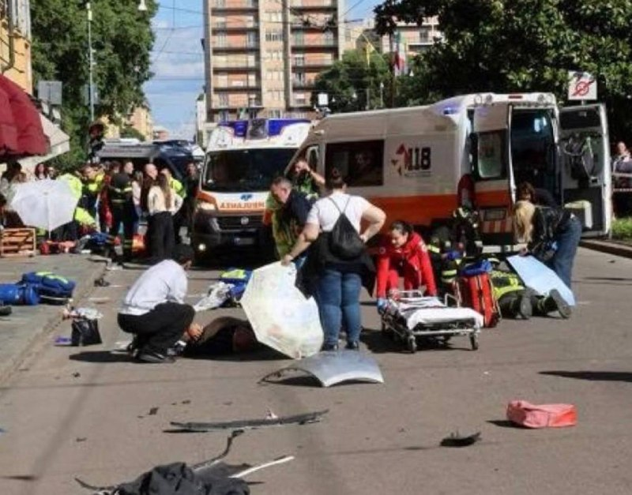

🔴گزارش‌ها حاکی از حمله تروریستی مشکوک در شهر مودنا ایتالیاست.

🔸یک مهاجر اهل شمال آفریقا با خودرو به میان جمعیت رفته و پس از آن از خودرو پیاده شده و با چاقو به مردم حمله کرده است.

🔸منابع غیررسمی از ۲ کشته و ۸ مجروح به‌شدت خبر می‌دهند. همچنین گزارش شده زنی روی زمین دیده شده که هر دو پای خود را از دست داده است.

@mwarmonitor

## mwarmonitor — post 9164

  

🇺🇸«اگر به آمریکایی‌ها آسیب بزنید، یا در حال برنامه‌ریزی برای آسیب زدن به آمریکایی‌ها باشید، ما شما را پیدا خواهیم کرد و خواهیم کشت.»

رئیس‌جمهور دونالد جی. ترامپ

@mwarmonitor

## mwarmonitor — post 9163

🔴مقامات دولت ترامپ، امارات متحده عربی را تشویق می‌کنند که نقش عمیق‌تری در جنگ با ایران ایفا کند؛ از جمله حتی احتمال تصرف یکی از جزایر ایران در خلیج فارس — روزنامه تلگراف

@mwarmonitor

## mwarmonitor — post 9162

  

🔴روز هشتم است که ایران هیچ نفت خامی در جزیره خارگ بارگیری نکرده است. ذخایر نفت در خشکی اکنون تقریباً به ظرفیت کامل رسیده‌اند. به‌احتمال زیاد یکی از خطوط لوله آسیب دیده است. ایران در حال تلاش برای یافتن نوعی راه‌حل جایگزین است. هیچ نفتکش VLCC اجازه ورود پیدا…

## mwarmonitor — post 9161

🔴 سی‌ان‌ان به نقل از منابع آگاه:
در داخل دولت ترامپ درباره چگونگی ادامه مسیر در قبال ایران، اختلاف نظر وجود دارد.

🔸برخی مقام‌ها در دولت ترامپ و پنتاگون به سمت حملات محدود و هدفمند فشار می‌آورند، در حالی که برخی دیگر از دیپلماسی حمایت می‌کنند.

🔸سی‌ان‌ان به نقل از سخنگوی کاخ سفید ؛ رئیس‌جمهور تمام گزینه‌ها را در اختیار دارد، با این حال گزینه ترجیحی او دیپلماسی است.

🔸 سی‌ان‌ان به نقل از سخنگوی کاخ سفید:
رئیس‌جمهور تنها توافقی را خواهد پذیرفت که امنیت ملی ما را تضمین کند.

@mwarmonitor

## pm_afshaa — post 90859

  <a href="telegram/content/pm_afshaa_90859_1778953662.webm" target="_blank">🎬 Download video</a>

🔴شبکه 13 اسرائیل: هم‌اکنون ارزیابی‌ها در اسرائیل بر اینه که جنگ با ایران در روز های آینده از سر گرفته خواهد شد.

💧 Rainbet.com the #1 Non-KYC Crypto Casino & Sportsbook @rainbetcom

😁 @Pm_Afshaa

## pm_afshaa — post 90858

  <a href="telegram/content/pm_afshaa_90858_1778953663.webm" target="_blank">🎬 Download video</a>

🔴ترامپ: اگه به آمریکایی‌ها آسیب بزنید، یا در حال برنامه‌ریزی برای آسیب زدن به آمریکایی‌ها باشید، ما شما رو پیدا خواهیم کرد و خواهیم کشت.

💧 Rainbet.com the #1 Non-KYC Crypto Casino & Sportsbook @rainbetcom

😁 @Pm_Afshaa

## pm_afshaa — post 90857

  <a href="telegram/content/pm_afshaa_90857_1778953664.webm" target="_blank">🎬 Download video</a>

🔴ترامپ: اگه حکومت ایران به توافق نرسه، دوران بسیار بدی در انتظارشان خواهد بود.

💧 Rainbet.com the #1 Non-KYC Crypto Casino & Sportsbook @rainbetcom

😁 @Pm_Afshaa

## pm_afshaa — post 90856

  <a href="telegram/content/pm_afshaa_90856_1778953665.webm" target="_blank">🎬 Download video</a>

🔴ایسنا: وزیر کشور پاکستان برای دیدار با مسئولان جمهوری اسلامی ساعاتی قبل به تهران سفر کرده. 
💧 Rainbet.com the #1 Non-KYC Crypto Casino & Sportsbook @rainbetcom 
😁 @Pm_Afshaa

## pm_afshaa — post 90855

تلگراف : مقامات ارشد دولت ترامپ از امارات خواستن تو جنگ علیه ایران بیشتر وارد عمل بشه

💧 Rainbet.com the #1 Non-KYC Crypto Casino & Sportsbook @rainbetcom

😁 @Pm_Afshaa

## pm_afshaa — post 90854

🔴العربیه: طبق گفته منابع آگاه پاکستانی، در بحث تنگه هرمز، پیشرفت‌هایی حاصل شده

💧 Rainbet.com the #1 Non-KYC Crypto Casino & Sportsbook @rainbetcom

😁 @Pm_Afshaa

## iaghapour — post 2616

  <a href="telegram/content/iaghapour_2616_1778953666.webm" target="_blank">🎬 Download video</a>

🛍 خرید اشتراک gemini pro تنها با 299 هزار تومان در پریم استور.

☄️ اقتصادی ترین گزینه ممکن

❔ چرا پریم استور؟

🕖تحویل سریع (بین 1 تا3 ساعت)

🔒  بدون نیاز به اطلاعات و لاگین حساب شما
ضمانت کامل 30 روز
علاوه بر جمنای، اشتراک سرویس‌های زیر هم برای خرید موجود است:

(Claude • Chatgpt plus, go  • Grok • Perplexity • Cursor • Leonardo • Gemini ultra •.....)

🛒 شروع خرید از طریق ربات :

🤖 @prem_store_bot

🌐 وب سایت | 
💡 کانال تلگرام | 
💬 ارتباط با پشتیبانی

## IranIntlTV — post 337508

  

کانال ۱۳ اسرائیل گزارش داد که ارزیابی‌ها در ارتش اسرائیل حاکی از آن است که ترامپ در بازگشت از چین، دستور حمله به جمهوری اسلامی را صادر می‌کند تا برای سومین بار در کمتر از یک سال، تهران را غافلگیر کند. بر اساس این گزارش، کشتن مقام‌های ارشد جمهوری اسلامی، از اهداف حمله خواهد بود.

کانال ۱۳ نوشت: «هدف این است که به حکومت ایران ضربه وارد شود و جمهوری اسلامی از موضع ضعف به میز مذاکرات بازگردانده شود. طبق طرح‌ها، حمله برنامه‌ریزی‌شده شامل هدف قرار دادن زیرساخت‌های حاکمیتی، اهداف انرژی و نیروگاه‌ها خواهد بود.»

در ادامه این گزارش آمده است: «برآورد می‌شود که نیروی هوایی در این حمله مشترک تلاش کند مقام‌های ارشد حکومت ایران را هدف قرار بدهد. ارتش اسرائیل امیدوار است جنگ تنها چند روز ادامه داشته باشد.»
https://iranintl.com/202605167005

## IranIntlTV — post 337507

  <a href="telegram/content/IranIntlTV_337507_1778953667.mp4" target="_blank">🎬 Download video</a>

نیویورک‌تایمز گزارش داد آمریکا و اسرائیل در حال گسترده‌ترین آمادگی نظامی از زمان برقراری آتش‌بس هستند و تنها تصمیم نهایی دونالد ترامپ باقی مانده است.

گفت‌وگو با اشکان صفایی و اردوان روزبه، خبرنگاران ایران‌اینترنشنال
@iranintltv

## IranIntlTV — post 337506

  <a href="telegram/content/IranIntlTV_337506_1778953670.mp4" target="_blank">🎬 Download video</a>

برخی مجری‌های صداوسیمای جمهوری اسلامی در برنامه‌های زنده تلویزیونی با اسلحه روی آنتن رفتند. در شبکه افق، وابسته به سپاه پاسداران، یک نیروی نظامی با صورت پوشیده نحوه استفاده از سلاح را آموزش داد و مجری برنامه هم در استودیو شلیک کرد و گفت گلوله‌ها به سمت پرچم امارات شلیک شده‌اند.

گفت‌وگو با ایمان آقایاری، فعال سیاسی
@iranintltv

## IranIntlTV — post 337505

  <a href="telegram/content/IranIntlTV_337505_1778953672.mp4" target="_blank">🎬 Download video</a>

ویدیوهای رسیده به ایران‌اینترنشنال نشان می‌دهند ایرانیان مقیم آلمان روز جمعه ۲۶ اردیبهشت علیه جمهوری اسلامی در شهر هامبورگ راهپیمایی کردند و شعار «شرم بر این سه فاسد، ملا چپی مجاهد» سردادند.

## IranIntlTV — post 337504

  <a href="telegram/content/IranIntlTV_337504_1778953676.mp4" target="_blank">🎬 Download video</a>

ستاد فرماندهی آمریکا در آفریقا (AFRICOM)، با انتشار ویدیویی در ایکس، از عملیات شامگاه جمعه ۲۵ اردیبهشت خبر داد که به کشته شدن شمار زیادی از جنگجویان داعش در شمال شرقی نیجریه منجر شد.
پیش‌تر، ترامپ در تروث‌سوشال اعلام کرده بود ابو بلال المینوکی، نفر دوم داعش در جهان، در این عملیات کشته شده است.

## IranIntlTV — post 337503

  <a href="telegram/content/IranIntlTV_337503_1778953678.mp4" target="_blank">🎬 Download video</a>

ویدیوهای رسیده به ایران‌اینترنشنال نشان می‌دهند ایرانیان مقیم نروژ روز شنبه ۲۶ اردیبهشت با در دست گرفتن پرچم‌های شیروخورشید علیه جمهوری اسلامی در شهر اسلو راهپیمایی کردند.

## IranIntlTV — post 337502

  <a href="telegram/content/IranIntlTV_337502_1778953681.mp4" target="_blank">🎬 Download video</a>

ایرانیان استرالیا روز شنبه در حمایت از انقلاب ملی علیه جمهوری اسلامی تجمع کرده و ضمن حمل پرچم شیروخورشید ترانه‌های ملی را هم‌خوانی کردند.

## IranIntlTV — post 337501

  <a href="telegram/content/IranIntlTV_337501_1778953685.mp4" target="_blank">🎬 Download video</a>

تیتر اول با نیوشا صارمی، شنبه ۲۶ اردیبهشت
@iranintltv

## IranIntlTV — post 337500

  

دونالد ترامپ، رییس‌جمهوری ایالات متحده، در گفت‌وگوی تلفنی با آنتوان اولار، خبرنگار بی‌اف‌ام تی‌وی در واشینگتن، گفت که حکومت ایران بهتر است به توافق برسد. او افزود: «اگر این کار را نکنند، دوران بسیار بدی در انتظارشان خواهد بود.»
https://iranintl.com/202605163090

## IranIntlTV — post 337499

  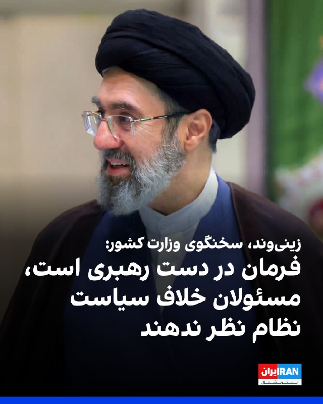

علی زینی‌وند، سخنگوی وزارت کشور، گفت: «محوریت تصمیم‌گیری در کشور خصوصا در حوزه صلح و جنگ، رهبری است. رهبری هم مسلط، فرمان دستش است و فرماندهی می‌کند. کسی در جایگاه مسئولیت، استاندار، نماینده، تریبون به‌دست، اگر خلاف سیاست‌های راهبری نظام اظهارنظر کند، شایسته نیست.»
https://iranintl.com/202605169314

## IranIntlTV — post 337498

  <a href="telegram/content/IranIntlTV_337498_1778953688.mp4" target="_blank">🎬 Download video</a>

یک شهروند در آبادان با ارسال پیامی به ایران اینترنشنال از بیکاری در این شهر در پی بحران اقتصادی روایت می‌کند. پیام او با هوش مصنوعی خوانده شده است.

## IranIntlTV — post 337497

  <a href="telegram/content/IranIntlTV_337497_1778953691.mp4" target="_blank">🎬 Download video</a>

ستاد فرماندهی مرکزی آمریکا، سنتکام، اعلام کرد با ادامه محاصره دریایی جمهوری اسلامی، تاکنون ۷۸ کشتی تجاری وادار به تغییر مسیر شده و ۴ کشتی دیگر نیز غیرفعال شده‌اند.
جزییات بیشتر با اردوان روزبه، خبرنگار ایران‌اینترنشنال
@iranintltv

## IranIntlTV — post 337496

  

احسان قاضی‌زاده هاشمی، نماینده مجلس، درباره مذاکرات با آمریکا گفت: «قبل از ورود به بحث مذاکرات، باید آمریکا ادبیات ارعاب و تهدید خود را کنار بگذارد. وقتی چنین ادبیاتی وجود دارد، دیگر نمی‌توان آن را مذاکره نامید، بلکه به نوعی ارائه پیشنهادات و دادن سندی برای تسلیم است.»

قاضی‌زاده هاشمی گفت: «باید این ادبیات آمریکایی که شامل ارعاب، تهدید و قلدری است، برطرف شود.»
https://iranintl.com/202605169448

## IranIntlTV — post 337495

  <a href="telegram/content/IranIntlTV_337495_1778953695.mp4" target="_blank">🎬 Download video</a>

کانال ۱۲ اسرائیل به نقل از یک مقام این کشور خبر داد ترامپ ظرف ۲۴ ساعت آینده درباره حمله دوباره به ایران تصمیم می‌گیرد. این مقام رسمی گفت جنگ دوباره با جمهوری اسلامی نزدیک است. همزمان روزنامه معاریو چاپ اسرائیل نوشت ترامپ در آستانه دادن چراغ سبز جنگ است

گزارشی از مجتبا پورمحسن
@iranintltv

## IranIntlTV — post 337494

  

محمدصالح جوکار، رییس کمیسیون امور داخلی مجلس، گفت: «آمریکا به دنبال آن است تا آنچه را که در میدان به دست نیاورده پای میز مذاکره به دست آورد. در این‌باره باید بگویم هرگز آمریکا به خواسته‌های نامشروعش در مذاکرات نخواهد رسید.»

جوکار گفت که آمریکا باید شروط تهران را برای توافق بپذیرد و راهی جز تعظیم در برابر خواسته‌های جمهوری اسلامی ندارد
https://iranintl.com/202605165329

## IranIntlTV — post 337493

  <a href="telegram/content/IranIntlTV_337493_1778953699.mp4" target="_blank">🎬 Download video</a>

صداوسیمای جمهوری اسلامی در برنامه‌ای آموزش استفاده از سلاح گرم توسط یک نظامی به مجری را به نمایش گذاشت. در بخشی از این برنامه، مجری به پرچم امارات متحده عربی شلیک کرد.
گفت‌وگو با فروغ کنعانی، پژوهشگر جامعه‌شناسی
@iranintltv

## IranIntlTV — post 337492

  <a href="telegram/content/IranIntlTV_337492_1778953702.mp4" target="_blank">🎬 Download video</a>

وزیر کشور پاکستان برای دیدار با مقام‌‌های جمهوری اسلامی وارد تهران شد. همزمان رسانه‌های ایران گزارش دادند محسن نقوی در دیدار با وزیر کشور جمهوری اسلامی، درباره‌ی ازسرگیری مذاکرات صلح، گفت‌وگوهای مفصلی انجام داده‌اند.

گفت‌وگو با جمشید برزگر، روزنامه‌نگار و تحلیل‌گر سیاسی
@iranintltv

## IranIntlTV — post 337491

  <a href="telegram/content/IranIntlTV_337491_1778953705.mp4" target="_blank">🎬 Download video</a>

یک دانش‌آموز در پیام به ایران اینترنشنال با اشاره به مجازی شدن آموزش می‌گوید باید برای مدرسه‌ای که نرفتیم ۱۵۰ میلیون تومان شهریه بدهیم. پیام این دانش‌آموز با هوش مصنوعی بازخوانی شده است.

## Shin_Persian — post 6034

  

Shin @hey_itsmyturn
Sat, 16 May 2026 17:43:45 UTC

Published image from the targeted vehicle.
Western Gaza

فارسی

تصویر منتشر شده از خودروی هدف قرار گرفته.
غرب غزه

𝕏 · @shin_persian

## Shin_Persian — post 6033

Shin ✓ @hey_itsmyturn
Sat, 16 May 2026 17:12:10 UTC

A vehicle was just targeted by [IAF] UAV in Nassr Street, Western Gaza

فارسی

یک خودرو لحظاتی پیش توسط پهپاد [نیروی هوایی اسرائیل] در خیابان نصر، غرب غزه مورد هدف قرار گرفت.

𝕏 · @shin_persian

## Shin_Persian — post 6032

📦 mhrv-rs v1.9.28 released

• Pipeline Full-mode polls for a faster tunnel (PR #1115)
• Improve WebRTC fallback by blocking STUN/TURN UDP (PR #1115)
• Add pipeline diagnostics and benchmark tooling (PR #1115)

Files (Android APKs, Windows, macOS, Linux, OpenWRT) on the files channel:

👉 v1.9.28 — all files with SHA-256

Channel:
https://t.me/mhrv_rs
or: https://t.me/+R1OyoHX2boA1ZDgx

#v1928

## ManotoTV — post 105532

  <a href="telegram/content/ManotoTV_105532_1778953709.mp4" target="_blank">🎬 Download video</a>

‌
تامی رابینسون ، فعال ملی‌گرای بریتانیایی، تصویر شاهزاده رضا پهلوی را هنگام سخنرانی در تجمع لندن بالا برد ـ گزارشگر

## ManotoTV — post 105531

  <a href="telegram/content/ManotoTV_105531_1778953711.mp4" target="_blank">🎬 Download video</a>

اشتوتگارت، تجمع در حمایت از مردم ایران، ۲۶ اردیبهشت

## ManotoTV — post 105530

  <a href="telegram/content/ManotoTV_105530_1778953713.mp4" target="_blank">🎬 Download video</a>

مالمو سوئد، راهپیمایی ایرانیان، ۲۶ اردیبهشت

## ManotoTV — post 105529

  <a href="telegram/content/ManotoTV_105529_1778953716.mp4" target="_blank">🎬 Download video</a>

میلان | ایتالیا؛ گردهمایی ایرانیان ـ گزارشگر ۲۶ اردیبهشت

## ManotoTV — post 105528

  <a href="telegram/content/ManotoTV_105528_1778953718.mp4" target="_blank">🎬 Download video</a>

بوردو فرانسه، تجمع هفتگی همراه با تصویر جاویدنامان انقلاب ملی، شنبه ۲۶ اردیبهشت

## ManotoTV — post 105527

  <a href="telegram/content/ManotoTV_105527_1778953720.mp4" target="_blank">🎬 Download video</a>

بوداپست | مجارستان؛ گردهمایی ایرانیان ـ گزارشگر ۲۶ اردیبهشت

## ManotoTV — post 105526

  <a href="telegram/content/ManotoTV_105526_1778953722.mp4" target="_blank">🎬 Download video</a>

کلن، راهپیمایی ایرانیان، شنبه ۲۶ اردیبهشت

## ManotoTV — post 105525

  <a href="telegram/content/ManotoTV_105525_1778953725.mp4" target="_blank">🎬 Download video</a>

‌
گروه تروریستی حماس کشته شدن عزالدین الحداد، فرمانده گردان‌های« قسام» در نوار غزه را تایید کرد.

بر اساس بیانیه حماس عزالدین الحداد شامگاه جمعه «به همراه همسر، دخترش و چند غیرنظامی فلسطینی دیگر» کشته شده است.

## ManotoTV — post 105524

  <a href="telegram/content/ManotoTV_105524_1778953726.mp4" target="_blank">🎬 Download video</a>

اسلو | نروژ؛ راهپیمایی سکوت ایرانیان ـ گزارشگر شنبه ۲۶ اردیبهشت

## ManotoTV — post 105523

  <a href="telegram/content/ManotoTV_105523_1778953728.mp4" target="_blank">🎬 Download video</a>

‌
کپنهاگ | دانمارک؛ گردهمایی ایرانیان - گزارشگر شنبه ۲۶ اردیبهشت

## ManotoTV — post 105522

  <a href="telegram/content/ManotoTV_105522_1778953730.mp4" target="_blank">🎬 Download video</a>

‌
اشتوتگارت | آلمان؛ گردهمایی ایرانیان - گزارشگر شنبه ۲۶ اردیبهشت

## FarsiVOA — post 217919

🔺وزیر کشور پاکستان در یک سفر از پیش اعلام نشده به تهران رفت

▪️به گزارش رسانه‌های داخلی در ایران، محسن نقوی وزیر کشور پاکستان، روز شنبه ۲۶ اردیبهشت برای یک سفر رسمی دو روزه وارد ایران شد. رسانه‌های دولتی جمهوری اسلامی از این سفر با عنوان یک بازدید از پیش برنامه‌ریزی نشده یاد کردند.

⬇️ بیشتر بخوانید:

https://ir.voanews.com/a/iran-pakistan-interior-minister-visit-epic-fury/8150696.html/?nocach=1

## FarsiVOA — post 217918

🔺تداوم دستبرد جمهوری اسلامی به دارایی مردم؛ اموال ۱۲۹ شهروند در آذربایجان‌غربی هم مصادره شد

▪️رئیس کل دادگستری استان آذربایجان غربی روز شنبه ۲۶ اردیبهشت از صدور دستور توقیف اموال ۱۲۹ نفر از مخالفان جمهوری اسلامی در این استان خبر داد.

⬇️ بیشتر بخوانید:

https://ir.voanews.com/a/8150694.html/?nocach=1

## FarsiVOA — post 217917

  <a href="telegram/content/FarsiVOA_217917_1778953733.mp4" target="_blank">🎬 Download video</a>

ارتش اسرائیل اعلام کرد در آخر هفته حدود ۱۰۰ موضع حزب‌الله را در نقاط مختلف جنوب لبنان هدف قرار داده است که شامل ایست‌های بازرسی، انبار تسلیحات و زیرساخت‌های دیگر حزب‌الله می‌شود.

ارتش اسرائیل تاکید کرده است به مقابله با تهدیدها علیه شهروندان این کشور و نیروهای خود ادامه داده و بر اساس دستورالعمل‌های مقامات سیاسی عمل می‌کند.

این ویدیو بی‌صدا است.

## FarsiVOA — post 217916

  

فرماندهی مرکزی ایالات متحده، سنتکام، اعلام کرد یک بالگرد ارتش آمریکا در جریان عملیات نظارت بر کشتی‌های تجاری بر فراز تنگه هرمز به پرواز درآمد.
 
به گفته سنتکام، تا روز ۲۶ اردیبهشت، مسیر ۷۸ کشتی تجاری تغییر داده شده و چهار شناور نیز برای اطمینان از اجرای این اقدامات از کار افتاده‌اند.

@FarsiVOA

## FarsiVOA — post 217915

گفتگو با بهزاد احمدی نیا کمبود بنزین در ایران و گزارش شهروند-خبرنگاران از تشکیل بازار سیاه

## FarsiVOA — post 217914

گفت‌وگو با معین خزائلی تشدید موج توقیف اموال مخالفان جمهوری اسلامی؛ حقوقدانان: غیر قانونی است

## FarsiVOA — post 217913

دوراهی دولت جدید عراق میان وعده مبارزه با فساد زیدی و فشار آمریکا برای قطع نفوذ جمهوری اسلامی

## FarsiVOA — post 217912

  <a href="telegram/content/FarsiVOA_217912_1778953736.mp4" target="_blank">🎬 Download video</a>

رسانه‌های جمهوری اسلامی از وقوع آتش‌سوزی در یکی از انبارهای کارخانه تولید روغن موتور در مراغه، حدود ساعت ۱۰:۳۰ ‌روز شنبه، ۲۶ اردیبهشت ۱۴۰۵، خبر دادند و اعلام کردند آتش حدود ساعت ۱۸ به طور کامل مهار شد. به نقل از فرماندار مراغه علت آتش‌سوزی در دست بررسی است اما این حادثه تلفات جانی نداشته است.

## FarsiVOA — post 217911

  <a href="telegram/content/FarsiVOA_217911_1778953740.mp4" target="_blank">🎬 Download video</a>

تصاویری از وضعیت توفانی مجموعه تفریحی تله‌کابین توچال در شمال تهران در روز شنبه، ۲۶ اردیبهشت ۱۴۰۵

## FarsiVOA — post 217910

رئیس انجمن روانپزشکان ایران می‌گوید کمبود دارو در حوزه روانپزشکی جدی است و نسبت به شرایط پیش از جنگ، به «طور قابل توجهی» تشدید شده است.

وحید شریعت به ایلنا گفته است در ماه‌های اخیر، کمبود قابل توجهی در برخی اقلام دارویی مشاهده شده است که برخی از آن‌ها از پیش از آغاز جنگ تشدید یافته و برخی دیگر کاملاً جدید هستند.

به گفته او احتمالاً مسئله به اختلال در روند تولید به خاطر نبود مواد اولیه یا نوعی دست نگه داشتن در توزیع، به منظور آماده‌سازی شرایط بازار برای افزایش قیمت مرتبط باشد.

حسین‌علی شهریاری رئیس کمیسیون بهداشت و درمان مجلس نیز روز پنج‌شنبه از افزایش قیمت برخی داروها بین ۵۰ تا ۳۰۰ درصد خبر داد و گفت بر اساس برآورد وزارت بهداشت، حدود ۱۵۰ هزار میلیارد تومان منابع نیاز است تا بتوان فشار هزینه‌های دارویی بر مردم را کاهش داد.

@FarsiVOA

## FarsiVOA — post 217909

مجریان صداوسیمای جمهوری اسلامی در برنامه‌های تلویزیونی با در دست گرفتن اسلحه ظاهر شدند. این تصاویر، واکنش‌های گسترده‌ای را درباره عادی‌سازی خشونت و ترویج فضای امنیتی در ایران برانگیخته است

## FarsiVOA — post 217908

🔺والتز: عقب‌نشینی چینی‌ها درمورد رژیم ایران پس از دیدار با ترامپ یک نتیجه بزرگ بود

▪️مایک والتز نماینده آمریکا در سازمان ملل متحد، روز شنبه ۲۶ اردیبهشت در مصاحبه با شبکه خبری فاکس گفت که تاکید آمریکا در سازمان ملل بر این واقعیت است که «نمی‌توانید یک درگیری را با مین‌گزاری دریایی در اقیانوس و دریافت عوارض پاسخ دهید.» و نمی‌توان این هنجارهای بین‌المللی را نقض کرد.

⬇️ بیشتر بخوانید:

https://ir.voanews.com/a/iran-waltz-mike-china-hormuz-trump/8150689.html/?nocach=1

## FarsiVOA — post 217907

🔺ارتش اسرائیل: سه تروریست حماس را کشتیم؛ دو نفر از آنها در کشتار ۷ اکتبر، دست داشتند

▪️ارتش اسرائیل روز شنبه ۲۶ اردیبهشت از کشته شدن سه تروریست عضو حماس خبر داد و اعلام کرد دو نفر از آنها، در «کشتار خونین» ۷ اکتبر در خاک اسرائیل نقش داشتند و در ماه‌های گذشته نیز تلاش می‌کردند علیه نیروهای اسرائیلی اقدامات تروریستی انجام دهند.

⬇️ بیشتر بخوانید:

https://ir.voanews.com/a/8150690.html/?nocach=1

## FarsiVOA — post 217906

در گفت‌وگو با شاهین مدرس، تحلیلگر مطالعات امنیتی، به بن‌بست مذاکرات هسته‌ای، گزارش نیویورک‌تایمز درباره آمادگی آمریکا و اسرائیل برای ازسرگیری حملات، سردرگمی تصمیم‌گیری در تهران و سناریوهای احتمالی پیش‌روی جمهوری اسلامی در صورت بازگشت عملیات نظامی پرداختیم

## FarsiVOA — post 217905

در گفت‌وگو با حسن هاشمیان، به آتش‌بس شکننده میان اسرائیل و لبنان، بازداشت چهره‌های کلیدی شبکه‌های نیابتی جمهوری اسلامی و تشدید عملیات پنهان آمریکا و اسرائیل پرداختیم و پرسیدیم چرا به رغم تلاش‌های جمهوری اسلامی و حزب الله لبنان، آتش بس میان اسرائیل و لبنان تمدید شد؟

## FarsiVOA — post 217904

دیدار وزیرخارجه امارات با نایجل فاراژ در بریتانیا، همزمان با افزایش تنش‌ها میان امارات و ایران

## FarsiVOA — post 217903

🔺هگست: نفر دوم داعش، در راستای دستور پرزیدنت ترامپ برای محافظت از مسیحیان، در نیجریه کشته شد

▪️پیت هگست، وزیر جنگ ایالات متحده روز شنبه ۲۶ اردیبهشت اعلام کرد نیروهای آمریکایی، شامگاه جمعه با همکاری نیروهای مسلح نیجریه، ابوبلال المینوکی و دیگر رهبران داعش در این کشور را از میان برداشتند.

⬇️ بیشتر بخوانید:

https://ir.voanews.com/a/8150687.html/?nocach=1

## FarsiVOA — post 217902

  <a href="telegram/content/FarsiVOA_217902_1778953744.mp4" target="_blank">🎬 Download video</a>

ناسا می‌گوید در این ماموریت تدارکاتی، یک موشک اسپیس‌ایکس فالکون ۹ به سوی ایستگاه فضایی بین‌المللی پرتاب شد.
 
در این ماموریت، اقلام ‌ویژه‌ای برای یادبود دویست‌وپنجاهمین سالگرد استقلال آمریکا، فرستاده شده است.

@FarsiVOA

## DW_Farsi — post 124772

  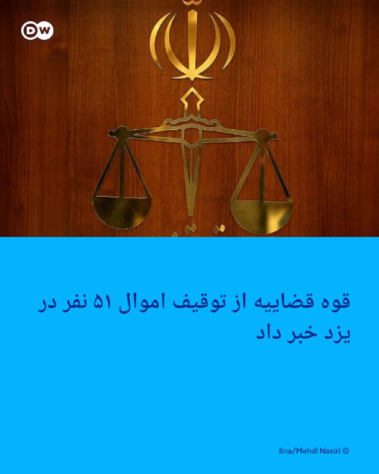

🔶 قوه قضاییه از توقیف اموال ۵۱ نفر در یزد خبر داد

قوه قضاییه ایران اعلام کرد اموال ۵۱ نفر در استان یزد به اتهام "جاسوسی و همکاری با کشورهای متخاصم و گروه‌های معاند" توقیف شده است.

به گزارش مرکز رسانه قوه قضاییه، این اموال شامل حساب‌های بانکی، اموال منقول و غیرمنقول، سهام شرکت‌ها و برخی اموال وکالتی است که با دستور قضایی توقیف شده‌اند.

در این گزارش آمده ۲۰ نفر از این افراد در داخل ایران و ۳۱ نفر دیگر خارج از کشور هستند و رسیدگی به پرونده آن‌ها ادامه دارد.

این نهاد هنوز نامی از این افراد منتشر نکرده و هیچ مدرک یا مستندی هم برای اثبات اتهامات مطرح‌شده ارائه نداده است.

در هفته‌های اخیر و پس از حملات نظامی آمریکا و اسرائیل به ایران، گزارش‌هایی از افزایش بازداشت‌ها، اعدام‌ها و توقیف اموال در ایران منتشر شده است.

سازمان‌های حقوق بشری نسبت به استفاده از اتهام‌هایی مانند جاسوسی و همکاری با کشورهای متخاصم برای تشدید فشار بر منتقدان و شهروندان هشدار داده‌اند.
@dw_farsi

## DW_Farsi — post 124771

  

🔶 سپاه: انفجارهای صبح امروز در جم ناشی از "خنثی‌سازی مهمات" بود

سپاه شهرستان جم اعلام کرد صداهای انفجاری که صبح شنبه ۲۶ اردیبهشت، در این شهر شنیده شد، به عملیات خنثی‌سازی "مهمات عمل‌نکرده" مربوط بوده است.

به گزارش خبرگزاری مهر، در اطلاعیه سپاه آمده این عملیات به‌صورت کنترل‌شده در حال انجام است و نیروهای مربوطه در محل حضور دارند.

پیش از این در روز جمعه، ۱۱ اردیبهشت، سپاه استان زنجان از کشته شدن ۱۴ نفر از نیروهای گردان تخریب سپاه انصارالمهدی در خلال خنثی‌سازی مهمات عمل‌نکرده از دوره جنگ اخیر خبر داده و گفته بود دو نفر نیز در اثر این انفجار مجروح شدند.

سپاه زنجان در بیانیه خود ادعا کرده بود که در جریان بمباران‌های هوایی "جنگنده‌های متخاصم دشمن"، بمب‌های خوشه‌ای، بمبلت‌ها و مهمات مشابه، پرتاب شده بود و "بخش‌هایی از منطقه از جمله محدوده‌ای بیش از هزار و ۲۰۰ هکتار که اراضی کشاورزی را نیز شامل می‌شد، از طریق مین‌ریزی هوایی به‌صورت هدفمند در معرض تهدید قرار گرفت".
@dw_farsi

## DW_Farsi — post 124770

  

🔶 ایران از سازوکار جدید عبور کشتی‌ها از تنگه هرمز خبر داد

رسانه‌های دولتی ایران مدعی شدند که برخی کشورهای اروپایی برای عبور کشتی‌های خود از تنگه هرمز با تهران وارد مذاکره شده‌اند.

تلویزیون دولتی ایران گزارش داده که پس از عبور کشتی‌های چین، ژاپن و پاکستان، اکنون کشورهای اروپایی نیز برای دریافت مجوز عبور با نیروی دریایی سپاه پاسداران گفت‌وگو کرده‌اند، هرچند نامی از این کشورها برده نشده است.

هم‌زمان ابراهیم عزیزی، رئیس کمیسیون امنیت ملی مجلس جمهوری اسلامی، اعلام کرده تهران سازوکاری جدید برای مدیریت تردد کشتی‌ها در تنگه هرمز آماده کرده که "به‌زودی" رونمایی خواهد شد.

او گفته این سازوکار فقط شامل کشتی‌های تجاری و طرف‌های "همکار با ایران" می‌شود و در قبال خدمات ارائه‌شده، هزینه دریافت خواهد شد.

عزیزی همچنین تاکید کرده این مسیر همچنان به روی کشورهای مشارکت‌کننده در پروژه موسوم به "آزادی" بسته خواهد بود؛ پروژه‌ای که آمریکا برای همراهی و حفاظت از کشتی‌ها در تنگه هرمز مطرح کرده است.
@dw_farsi

## DW_Farsi — post 124769

  

🔶 آتش‌سوزی در کارخانه روغن موتور مراغه

یک کارخانه تولید روغن موتور در مراغه دچار آتش‌سوزی شده و نیروهای امدادی و آتش‌نشانی همچنان در حال مهار حریق هستند.

به گزارش رسانه‌های ایران، این آتش‌سوزی ظهر شنبه ۲۶ اردیبهشت آغاز شد و چندین خودروی آتش‌نشانی، نیروهای هلال احمر و آمبولانس‌های اورژانس به محل اعزام شدند.

رئیس آتش‌نشانی مراغه به ایسنا گفته است که تاکنون گزارشی از مصدومیت افراد منتشر نشده است.

گزارش‌ها حاکی است که دود غلیظ همچنان منطقه را فراگرفته و آتش هنوز به‌طور کامل مهار نشده است.

این واحد تولیدی از کارخانه‌های بزرگ تولید روغن موتور در ایران به شمار می‌رود و بیش از ۴۰۰ کارگر دارد.
@dw_farsi

## DW_Farsi — post 124768

🔶 اخراج مهاجران؛ رئیس جمهور شیلی دولت خود را خشمگین کرد

خوزه آنتونیو کاست، رئیس جمهور راست افراطی شیلی، با طرح‌های جدید خود برای تشدید اقدامات علیه مهاجران، اعتراض‌هایی را حتی در درون دولت خودش برانگیخته است.

بر اساس تازه‌ترین لایحه رئیس جمهور شیلی، مدارس، مراکز درمانی و نهادهای عمومی موظف خواهند شد اطلاعات شخصی مهاجران فاقد مدارک معتبر را به دولت ارائه دهند.

در متن این طرح مشخصاً آمده است: «تمامی نهادهای اداری دولتی موظف‌اند اطلاعات درخواست‌شده از سوی اداره مهاجرت، از جمله نشانی، شماره تلفن، آدرس ایمیل و دیگر اطلاعات مربوط به اتباع خارجی را که مراحل مهاجرتی‌شان در حال رسیدگی است، در اختیار این اداره قرار دهند.»

به گفته ماکسیمو پاوس، معاون وزیر کشور، هدف این است که اطلاعات از نهادهایی جمع‌آوری شود "که مهاجران معمولاً با آنها در تماس هستند و اطلاعات خود را در اختیارشان قرار می‌دهند".

پاوس با بیان اینکه مهدکودک‌ها نیز در این فهرست قرار می‌گیرند، در عین حال در گفت‌وگو با روزنامه "لا سگوندا" تأکید کرد که "هیچ‌کس کودکان را تحت تعقیب قرار نخواهد داد".

به گفته او، هدف در واقع جمع‌آوری اطلاعات مربوط به والدین است.

می چومالی، وزیر بهداشت شیلی، این پیشنهاد را به عنوا نقض محرمانه بودن اطلاعات مورد انتقاد قرار داد. او در گفت‌وگو با شبکه تلویزیونی "تله‌ترسه" گفت اطلاعات مورد بحث، "داده‌هایی هستند که در چارچوب خدمات درمانی ارائه می‌شوند و بر اساس قانون سلامت تحت حمایت قرار دارند".

وزیر بهداشت شیلی با اشاره به اینکه "ما نمی‌توانیم قانون را نادیده بگیریم"، وعده داده است که از حریم خصوصی افراد "دفاع" خواهد کرد.

به باور مخالفان دولت در شیلی، طرح قانونی رئیس جمهور راست افراطی شیلی در عمل، با هدف محروم کردن مهاجران فاقد مجوز اقامت از دسترسی به خدمات اجتماعی تدوین شده است.

از نظر آنها، این اقدام نیز بخشی دیگر از سیاست‌هایی است که برای وادار کردن مهاجران به ترک این کشور طراحی شده‌اند.

خوزه آنتونیو کاست اوایل ماه مارس گذشته به عنوان رئیس جمهور جدید شیلی سوگند یاد کرد. او فرزند یک افسر پیشین ورماخت و عضو حزب نازی آلمان (NSDAP) است که پس از جنگ جهانی دوم به شیلی مهاجرت کرد.

کاست کاتولیکی متعصب و مخالف سرسخت سقط جنین، طلاق، ازدواج همجنس‌گرایان و نیز یک تندرو تمام‌عیار در مورد موضوع مهاجرت است و بارها نیز از دیکتاتوری نظامی پینوشه دفاع کرده است؛ حکومتی که در جریان آن بیش از ۴۰ هزار نفر ناپدید شدند یا جان باختند.
@dw_farsi

## DW_Farsi — post 124767

  <a href="telegram/content/DW_Farsi_124767_1778953748.mp4" target="_blank">🎬 Download video</a>

🎥 آموزش کار با اسلحه در صداوسیمای جمهوری اسلامی

در میانه بحران سیاسی، جنگ و آتش‌بسی شکننده، چند شبکه تلویزیونی جمهوری اسلامی صحنه‌هایی از آموزش کار با اسلحه پخش کرده‌اند؛ از مجری زنی که می‌گوید "زنان این سرزمین، دختران این سرزمین، اسلحه به دست، آماده هستیم مقابل دشمن بایستیم" تا برنامه‌ای که در آن نشانه‌گیری به سمت پرچم امارات متحده عربی دیده می‌شود.
@dw_farsi

## Persian_Trend_Official — post 14250

💢وزیر کشور پاکستان امروز به تهران سفر کرده است

🔹 سفر وزیر کشور پاکستان به تهران در چارچوب تلاش‌های میانجیگری میان امریکا و جمهوری اسلامی است.

🫆:Tony

📌 @persian_trend_official
پرشین ترند | متفاوت‌ترین کانال نظامی

## Persian_Trend_Official — post 14249

  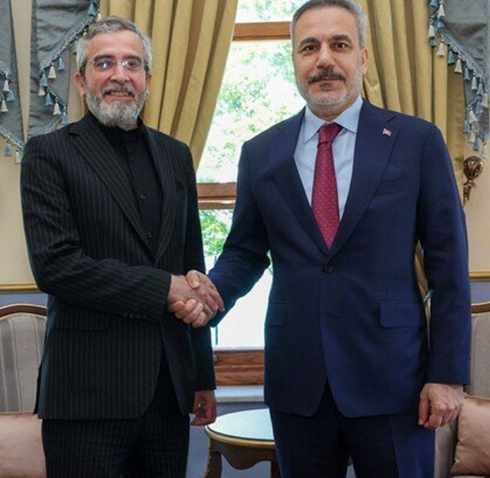

💢آناتولی: دیدار باقری با فیدان در استانبول

💢 به گزارش خبرگزاری آناتولی، منابع دیپلماتیک اعلام کردند که هاکان فیدان، وزیر امور خارجه ترکیه و علی باقری، معاون دبیر شورای عالی امنیت ملی ایران، روز شنبه در استانبول دیدار کردند.

💢 جزئیات بیشتری در مورد این دیدار ارائه نشده است.

🫆:Tony

📌 @persian_trend_official
پرشین ترند | متفاوت‌ترین کانال نظامی

## Persian_Trend_Official — post 14248

  <a href="telegram/content/Persian_Trend_Official_14248_1778953751.mp4" target="_blank">🎬 Download video</a>

💢عارف معاون اول رئیس‌جمهور:

💢دیگر اجازهٔ عبور تجهیزات نظامی دشمن از تنگهٔ هرمز را نخواهیم داد.

🫆:Tony

📌 @persian_trend_official
پرشین ترند | متفاوت‌ترین کانال نظامی

## Persian_Trend_Official — post 14247

دونالد ترامپ: اگر توافقی حاصل نشود، جمهوری اسلامی «روزگار بسیار بدی» خواهد داشت

دونالد ترامپ در یک گفت‌وگوی تلفنی با شبکه خبری تلویزیونی ب اف ام فرانسه اظهار داشت که نمی‌داند آیا به‌زودی توافقی با جمهوری اسلامی حاصل خواهد شد یا نه.

رییس‌جمهور ایالات متحده گفت: «هیچ ایده‌ای ندارم که آیا آن‌ها این کار را خواهند کرد یا نه. اگر این کار را نکنند، روزگار بسیار بدی خواهند داشت، روزگار بسیار بدی. بهتر است که یک توافق منعقد کنند.»

📌 @persian_trend_official
پرشین ترند | متفاوت‌ترین کانال نظامی

## Persian_Trend_Official — post 14246

🔹زمین‌لرزه‌ای به بزرگی ۴.۵ ریشتر دقایقی پیش گلوگاه در استان مازندران را لرزاند.

🫆:Tony

📌 @persian_trend_official
پرشین ترند | متفاوت‌ترین کانال نظامی

## Persian_Trend_Official — post 14245

لایو امشب ساعت 22 آغاز میشه

## Persian_Trend_Official — post 14244

ارتش اسرائیل شنبه اعلام کرد که در آخر این هفته حدود ۱۰۰ موضع حزب‌الله را در جنوب لبنان مورد حمله قرار داده است.

بر اساس اعلام ارتش اسرائیل، این اهداف شامل پست‌های مراقبت و دیده‌بانی، انبارهای تسلیحات و سایر زیرساخت‌هایی بوده که توسط این گروه برای پیشبرد حملات استفاده می‌شود.

این حملات در سراسر جنوب لبنان انجام شده و منطقه صور را نیز دربر گرفته است.

در همین حال، در ۲۴ ساعت گذشته، حزب‌الله چندین پهپاد و گلوله خمپاره به سمت نیروها در جنوب لبنان شلیک کرده است.

📌 @persian_trend_official
پرشین ترند | متفاوت‌ترین کانال نظامی

## Persian_Trend_Official — post 14243

  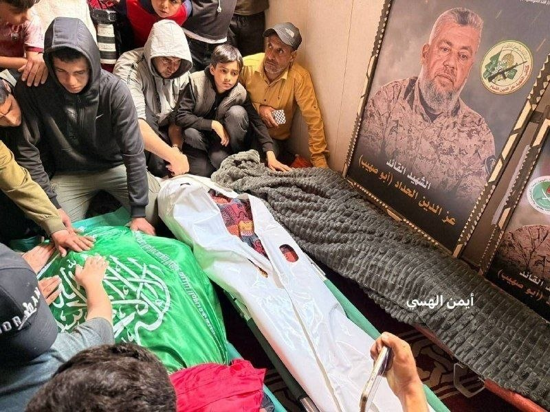

مراسم تشییع جنازه عزالدین الحداد، فرمانده نظامی حماس که دیشب کشته شد، در نوار غزه انجام شد.

📌 @persian_trend_official
پرشین ترند | متفاوت‌ترین کانال نظامی

## Persian_Trend_Official — post 14242

  

✅پست جدید ترامپ در تروث سوشال:
بازی نداریم! ببین قراره بعدش تو موضوع مورد علاقت چه اتفاقی بیفته!

📌 @persian_trend_official
پرشین ترند | متفاوت‌ترین کانال نظامی

## Persian_Trend_Official — post 14240

❤️ اگر از مخاطبان پرشین ترند هستید و تلگرام پرمیوم دارید،
با بوست کردن کانال کمک بزرگی به رشد و دیده‌شدن بیشتر پرشین ترند می‌کنید.
این بوست‌ها باعث می‌شود امکانات بیشتری برای انتشار محتوا، استوری و قابلیت‌های ویژه کانال فعال شود و در شرایط فعلی، به ادامه پوشش سریع و تحلیل‌های روزانه کمک زیادی می‌کند.
🙏 اگر مایل بودید، از طریق لینک زیر کانال را بوست کنید:
https://t.me/boost/persian_trend_official
📌 @persian_trend_official
پرشین ترند | متفاوت‌ترین کانال نظامی

## RadioFarda — post 157270

  <a href="https://t.me/radiofarda/157270" target="_blank">📎 Download file</a>

فرزین ندیمی: برای آمریکا گزینهٔ نظامی دست‌یافتنی‌تر از دیپلماسی است

🔸در حالی که مذاکرات آمریکا و جمهوری اسلامی بر سر برنامه هسته‌ای، آینده غنی‌سازی اورانیوم و تنگه هرمز به بن‌بست رسیده، نیویورک‌تایمز به نقل از دو مقام خاورمیانه‌ای گزارش داده که آمریکا و اسرائیل در حال انجام فشرده‌ترین آماده‌سازی‌ها از زمان آتش‌بس ماه گذشته برای احتمال ازسرگیری حملات علیه جمهوری اسلامی هستند. این گزارش در شرایطی منتشر می‌شود که دونالد ترامپ، رئیس‌جمهوری آمریکا، گفته صبر او در برابر جمهوری اسلامی رو به پایان است و تهران باید با واشینگتن به توافق برسد. فرزین ندیمی، کارشناس نظامی در مؤسسه واشینگتن، در مورد آنچه در آمریکا در مورد آینده بحران در خلیج‌فارس مطرح است، توضیح داده است.

@RadioFarda

## RadioFarda — post 157269

  <a href="https://t.me/radiofarda/157269" target="_blank">📎 Download file</a>

دهقان‌پور، پایه‌گذار عکاسی مدرن در ایران در گفت و گو با حسن سربخشیان

🔸یحیی دهقان‌پور، عکاس برجسته، مدرس باسابقه عکاسی و یکی از چهره‌های تأثیرگذار عکاسی معاصر ایران، روز جمعه ۲۵ اردیبهشت‌ماه در سن ۸۶ سالگی درگذشت. دهقان‌پور متولد سال ۱۳۱۹ در تهران بود و فعالیت حرفه‌ای و آموزشی او، نقش مهمی در تربیت نسل‌های مختلف عکاسان ایرانی داشت. او تدریس عکاسی را از سال ۱۳۵۷ و هم‌زمان با فعالیت در مدرسه عالی تلویزیون آغاز کرد و طی بیش از سه دهه، در دانشگاه‌ها و مراکز آموزشی مختلف به تدریس این رشته پرداخت. حسن سربخشیان عکاس خبری ساکن آمریکا به این پرسش پاسخ می‌دهد که جایگاه یحیی دهقان‌پور در عکاسی معاصر ایران چه بود و چه میراثی برای نسل‌های بعدی بر جای گذاشت؟

@RadioFarda

## RadioFarda — post 157268

🔸سازمان پزشکی قانونی ایران اعلام کرد که در سال گذشته ۸۳۱ نفر بر اثر مسمومیت با گاز منوکسید کربن جان خود را از دست دادند و استان تهران با ۱۲۷ مورد مرگ بیشترین آمار را ثبت کرده است. 🔸در این آمار که همشهری‌آنلاین روز شنبه بازتاب داده است، بیشترین میزان مرگ و…

## RadioFarda — post 157267

  

🔸سازمان پزشکی قانونی ایران اعلام کرد که در سال گذشته ۸۳۱ نفر بر اثر مسمومیت با گاز منوکسید کربن جان خود را از دست دادند و استان تهران با ۱۲۷ مورد مرگ بیشترین آمار را ثبت کرده است.

🔸در این آمار که همشهری‌آنلاین روز شنبه بازتاب داده است، بیشترین میزان مرگ و میر در بهمن‌ماه رخ داده؛ زمانی که استفاده از وسایل گرمایشی افزایش می‌یابد.

🔸با در نظر گرفتن جمعیت، نرخ مرگ ناشی از گازگرفتگی در ایران حدود ۹ نفر در هر یک میلیون نفر برآورد می‌شود که نسبت به استانداردهای جهانی رقم بالایی است.

🔸بر اساس آمارهای منتشرشده در ایالات متحده، سالانه حدود ۴۰۰ تا ۵۰۰ نفر بر اثر مسمومیت غیرعمدی با منوکسیدکربن جان خود را از دست می‌دهند، در حالی که جمعیت آمریکا نزدیک به چهار برابر ایران است.

@RadioFarda

## RadioFarda — post 157266

  <a href="https://t.me/radiofarda/157266" target="_blank">📎 Download file</a>

انتقال محمدباقر سلیمانی به آمریکا؛ آینده ایران، عراق و ترکیه در گفتگو با علی معموری

🔸در حالی که تنش میان تهران و واشینگتن همچنان شکننده است، اف‌بی‌آی از بازداشت و انتقال یکی از اعضای ارشد گروه کتائب حزب‌الله عراق به آمریکا خبر داده؛ گروهی که از مهم‌ترین نیروهای نیابتی جمهوری اسلامی در منطقه به شمار می‌رود. محمدباقر سعد داوود السعدی، معروف به «محمدباقر سلیمانی» و از نزدیکان قاسم سلیمانی، با اتهام‌های مرتبط با تروریسم و همکاری با سپاه قدس روبه‌روست. بازداشت او در ترکیه، پرسش‌هایی را درباره آینده شبکه نیروهای نیابتی ایران و پیام احتمالی این اقدام آمریکا برای تهران مطرح کرده است. علی معموری، کارشناس مسائل منطقه، به این موضوع پرداخته است.

@RadioFarda

## RadioFarda — post 157265

  <a href="https://t.me/radiofarda/157265" target="_blank">📎 Download file</a>

📻بشنوید: ایستگاه ۱۹ با رادیوفردا، ۲۶ اردیبهشت ۱۴۰۵

@RadioFarda

## RadioFarda — post 157264

🔸ویدئوی دوربین مداربسته لحظه برخورد یک قطار باری با اتوبوسی را در بانکوک، پایتخت تایلند، نشان می‌دهد؛ حادثه‌ای که باعث آتش‌سوزی گسترده و کشته شدن دست‌کم هشت نفر شد.

🔸مقام‌های تایلندی اعلام کردند این حادثه روز شنبه ۲۶ اردیبهشت در نزدیکی ایستگاه «مککاسان» رخ داد و ۳۲ نفر دیگر نیز زخمی شدند.

🔸به گفته معاون وزیر حمل‌ونقل تایلند، اتوبوس پشت چراغ قرمز روی ریل متوقف شده بود و همین موضوع مانع بسته شدن موانع گذرگاه شد. قطار باری که کانتینر حمل می‌کرد نیز نتوانست به‌موقع متوقف شود.

🔸مقام‌ها گفتند هر هشت قربانی این حادثه سرنشین اتوبوس بودند. تصاویر منتشرشده در شبکه‌های اجتماعی همچنین نشان می‌دهد قطار پس از برخورد، چند خودرو و موتورسیکلت را نیز با خود کشیده است.

@RadioFarda

## IranianMinds — post 20253

  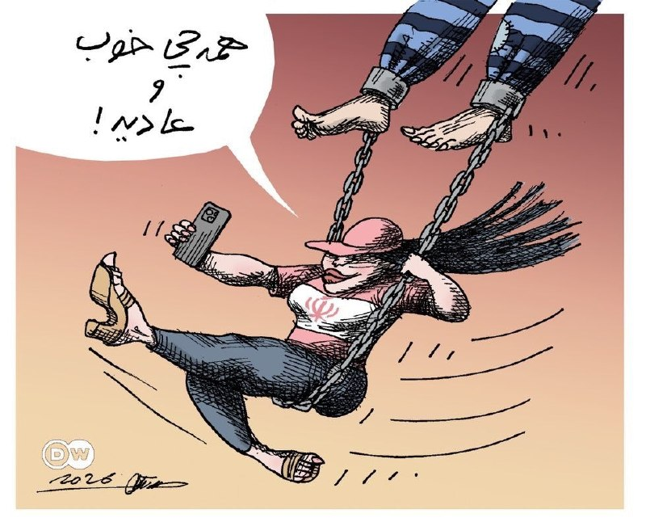

❌سیم کارت سفید‌ها

نزدیک به هشتاد روز است که حکومت ایران اینترنت را قطع کرده و تنها بسته ای محدود، کنترل شده و بسیار گران قیمت با عنوان «اینترنت پرو» را در اختیار گروههای خاص قرار میدهد. در کنار استفاده کنندگان اینترنت پرو، دارندگان «سیم کارتهای سفید» نیز از دسترسی ویژه برخوردارند.
عمده بهره‌مندان از این امتیازها، وابستگان حکومت و حامیان آن هستند که با استفاده از این، امکان تصویری عادی بزک شده و گمراه کننده از وضعیت امروز ایران به جهان مخابره میکنند. تصویری که در آن نشانی از فقر گسترده، سرکوب سیستماتیک، گرانی کمرشکن و موج روزانه اعدامهای سیاسی دیده نمی‌شود.

@IranianMinds

## IranianMinds — post 20252

  <a href="telegram/content/IranianMinds_20252_1778953758.webm" target="_blank">🎬 Download video</a>

🎉 ۵۰۰٬۰۰۰ تومان رایگان-بونوس ویژه ثبت‌نام

🔥 با هر ثبت نام ۵۰۰ هزار تومن جایزه بگیرید

⬅️ شرط‌بندی کنید و بونوس را به موجودی واقعی تبدیل کنید

🔥 وقتشه بازی رو یه جور دیگه ببینی
⚽️  پوشش کامل مسابقات ورزشی 

📊  پیش‌بینی با بهترین ضرایب 

⚡️  تجربه سریع و حرفه‌ای

😀 پرداخت مستقیم و سریع بدون واسطه، بدون دردسر، واریز و برداشت در سریع‌ترین زمان ممکن 

😀 کانال تلگرام: 

🔴 @winro_io  

😀 هدیه خود را با ثبت نام در سایت دریافت کنید: 

🔴 Winro.io
G26
سایت اصلی در روزهای آینده بازگشایی خواهد شد 
✅

## IranianMinds — post 20251

🔴 تلگراف: مقامات ارشد دولت ترامپ از امارات خواستن به شکل جدی‌تری وارد جنگ با ایران شه.

@IranianMinds

## IranianMinds — post 20250

  

🔴پست ترامپ در تروث‌سوشال:

بازی نداریم! تماشا کن قراره بعدش تو موضع مورد علاقت چه اتفاقی رخ میده!

@IranianMinds

## BBCPersian — post 281232

🔻گفت‌وگوی پوتین و رئیس امارات درباره جنگ ایران

ولادیمیر پوتین، رئیس‌جمهور روسیه، امروز (شنبه) با محمد بن زاید آل نهیان، رئیس امارات متحده عربی، درباره جنگ ایران گفت‌‌و‌گو کرد.

بنا به ییانیه کرملین «دو طرف بر اهمیت ادامه روند سیاسی و دیپلماتیک با هدف دستیابی به توافق‌های صلح مبتنی بر مصالحه تأکید کردند.»

آقای پوتین همچنین از حمایت امارات متحده عربی در زمینه مسائل بشردوستانه مرتبط با جنگ اوکراین قدردانی کرد.

رئیس‌جمهور روسیه قرار است روز سه‌شنبه آینده در سفری دو روزه به چین برود.

از زمان آغاز جنگ آمریکا و اسرائیل با ایران و حملات تلافی‌جویانه ایران در منطقه، تنش بین ایران و امارات افزایش پیدا کرده است.

عباس عراقچی، وزیر خارجه جمهوری اسلامی، روز پنجشنبه امارات متحده عربی را «شریک فعال» آمریکا و اسرائیل در حمله به ایران توصیف و این کشور را متهم کرد که مستقیما در جنگ آمریکا و اسرائیل با ایران «دخیل» بوده است.

امارات در واکنش، ایران را به «تلاش برای توجیه» حملاتش به آن کشور متهم کرد.

https://bbc.in/4ubilfj
@BBCPersian

## BBCPersian — post 281231

  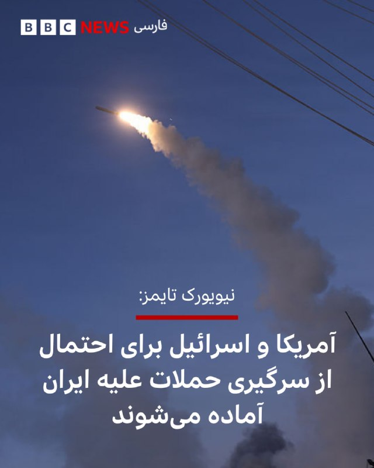

🔺روزنامه نیویورک تایمز به نقل از دو مقام در خاورمیانه بدون ذکر نام، گزارش داده است که آمریکا و اسرائیل در حال آماده شدن برای احتمال از سرگیری حملات علیه ایران هستند؛ حملاتی که به طور بالقوه حتی در هفته پیش رو می‌تواند شروع شود.

به گفته این دو مقام که به شرط فاش نشدن نامشان با نیویورک تایمز صحبت کرده‌اند، تدارکات آمریکا و اسرائیل، گسترده ترین اقدامات آنها برای آمادگی جنگی از زمان برقراری آتش‌بس است.

وزیر دفاع آمریکا هم این هفته در کنگره به قانون‌گذاران گفته بود که پنتاگون برای سناریوهای مختلف برنامه‌هایی در دست دارد؛ هم برای جابه‌جایی امکانات نظامی و تشدید جنگ در صورت لزوم و هم برای کاهش و خارج کردن نیروها از منطقه.

نیویورک تایمز به نقل از مقام‌های آمریکایی گزارش کرده است که اگر دونالد ترامپ تصمیم به حمله بگیرد، یک گزینه بمباران شدیدتر مراکز نظامی و زیرساخت‌های ایران است و گزینه دیگر عملیات زمینی برای خارج کردن ذخایر اورانیوم غنی‌شده ایران که تصور می‌شود پس از بمباران تاسیسات هسته‌ای ایران در جنگ دوازده روزه زیر آوار مدفون شده‌ است.

📸U.S. Navy via Getty Images

https://bbc.in/3RKVVDe
@BBCPersian

## BBCPersian — post 281230

  <a href="https://t.me/bbcpersian/281230" target="_blank">📎 Download file</a>

پادکست رادیویی جام جهان‌نما شنبه ۲۶ اردیبهشت ۱۴۰۵
در پی تحولات اخیر ایران و قطع و اختلال در اینترنت که امکان دسترسی مخاطبان در ایران به رسانه‌ها را با مشکل مواجه کرده است، بی‌بی‌سی فارسی از ۱۵ بهمن پخش رادیویی برنامه‌های خود را دوباره آغاز کرده است.

برنامه‌ جام جهان‌نما از این پس همه روزه از ساعت ۱۶:۳۰ گرینویچ (۲۰:۰۰ ایران) روی موج متوسط ۷۰۲ کیلوهرتز و موج کوتاه ۹۴۶۵ کیلوهرتز پخش می‌شود.

تکرار این برنامه از ساعت ۱۸:۰۰ گرینویچ (۲۱:۳۰ ایران) روی موج متوسط ۷۰۲ کیلوهرتز و موج کوتاه ۵۹۳۵ کیلوهرتز پخش می‌شود.
@BBCPersian

## BBCPersian — post 281229

🔻ایرنا: وزیر کشور پاکستان در یک سفر از پیش اعلام نشده در تهران است خبرگزاری رسمی ایرنا گزارش داده است که وزیر کشور پاکستان «در یک سفر از پیش اعلام نشده» در تهران است. ایرنا از قول منابع خود خبر داده است که محسن نقوی ساعاتی پیش وارد تهران شده و قرار است با…

## BBCPersian — post 281228

  <a href="telegram/content/BBCPersian_281228_1778953761.mp4" target="_blank">🎬 Download video</a>

🔻ویدیوی منتشر شده از پیست اسکی توچال نشان می‌دهد طوفان شدیدی این منطقه را در می‌نوردد.

سازمان هواشناسی ایران برای استان تهران ناپایداری شدید، صاعقه، تگرگ، سقوط سنگ و رانش زمین به ویژه در مناطق کوهستانی را پیش‌بینی کرده است.

https://bbc.in/49FCHFl

@BBCPersian

## BBCPersian — post 281227

🔺پس از تهدید اسرائیل به شکایت، نیویورک تایمز از روزنامه‌نگار خود دفاع کرد

✍️رافی برگ، بی‌بی‌سی

نیویورک تایمز گفته است که اقدام حقوقی علیه این روزنامه به اتهام افترا که بنیامین نتانیاهو، نخست‌وزیر اسرائیل، تهدید به انجام آن کرده، بی‌اساس است.

این نزاع بر سر مقاله‌ای در نیویورک تایمز است که در آن گفته شده است «سرویس‌های امنیتی اسرائیل به بازداشت‌شدگان فلسطینی تجاوز جنسی کرده‌اند.»

این روزنامه پس از آن واکنش نشان داد که بنیامین نتانیاهو و وزیر امور خارجه‌اش بیانیه‌ای صادر کردند و گفتند که دستور «آغاز یک دعوی افترا» را داده‌اند.

https://bbc.in/4nxcluV
@BBCPersian

## BBCPersian — post 281226

یکی از مربیان سگ‌های زنده‌یاب هلال احمر ایران در واکنش به «پست» خواندن سگ‌هایشان در یک مصاحبه که از تلویزیون ایران پخش شده گفت کسی که این حرف را زده‌ است باید عذرخواهی کند یا تغییر موضع بدهد.

۱۸ اردیبهشت در یک مصاحبه در تجمع‌های شبانه حامیان حکومت ایران، گزارشگر از یک شهروند می‌پرسد «چه کسانی از سگ‌های زنده‌یاب هلال‌احمر پست‌تر هستند؟»

امید برزگری، مربی هلال‌احمر که به همراه یکی دیگر از مربیان در گفت‌وگویی با خبرآنلاین شرکت کرده، گفت «این سگ‌ها فرشته نجات هستند. ما هر کدام با این سگ‌ها یک تیم هستیم.»

او گفت: « مثال زشتی بود. سگ پست نیست. اینها فرشته‌اند. این جمله ما را اذیت می‌کند. این سگ‌ها آموزش دیده‌اند به مردم خدمت کنند.»

سگ‌های زنده‌یاب در جریان جنگ ۱۲ روزه و جنگ اخیر نقش عمده‌ای در پیدا کردن افراد داشتند.

هلال‌ احمر اعلام کرده در جریان جنگ اخیر، این سگ‌ها ۷۹۲ عملیات انجام داده‌ن که در ۷۱۱ ماموریت در زنده‌یابی و پیدا کردن اجساد موفق بوده‌اند.
@BBCPersian

## BBCPersian — post 281225

  <a href="telegram/content/BBCPersian_281225_1778953763.mp4" target="_blank">🎬 Download video</a>

🔻برخورد یک قطار باری با یک اتوبوس شهری در بانکوک، پایتخت تایلند، روز شنبه ۲۶ اردیبهشت (۱۶ مه) منجر به یک آتش‌سوزی گسترده شد.

در این حادثه دست‌کم ۸ نفر کشته و طبق آخرین گزارش‌ها ۳۲ نفر زخمی شده‌اند.

مقام‌های امدادی اعلام کرده‌اند بر اثر این حادثه اتوبوس به‌سرعت آتش گرفته و علاوه بر آن چند خودرو و موتورسیکلت در آتش سوخته‌اند.

آتش‌نشانان پس از عملیات گسترده موفق شدند شعله‌ها را مهار کنند.

این حادثه در نزدیکی ایستگاه مکاسان و در یکی از تقاطع‌های شلوغ مرکز شهر رخ داده است.
گزارش‌های اولیه نشان می‌دهد اتوبوس روی ریل متوقف شده بود و قطار هم نتوانسته به‌موقع ترمز کند.

شدت حادثه به حدی بالا بوده که نیروهای امدادی ساعت‌ها برای خنک کردن خودروهای سوخته تلاش می‌کردند و در میان آهن‌پاره‌ها به دنبال قربانیان احتمالی می‌گشتند.

مصدومان به بیمارستان منتقل شده‌اند و علت دقیق این حادثه در دست بررسی است.

https://bbc.in/49Q2P0c

🎥 Reuters

@BBCPersian

## BBCPersian — post 281224

🔻تلویزیون ایران: اروپایی‌ها برای عبور کشتی‌ها از تنگه هرمز در حال مذاکره با تهران هستند

تلویزیون دولتی ایران گزارش کرده است کشورهای اروپایی درباره عبور کشتی‌ها از تنگه هرمز با تهران در حال مذاکره هستند.

شبکه خبر تلویزیون ایران و خبرگزاری صداوسیما بدون اشاره به نام این کشورها گزارش دادند «پس از عبور کشتی‌های کشورهای شرق آسیا، به‌ویژه چین، ژاپن و پاکستان، امروز اطلاعاتی دریافت کردیم که نشان می‌دهد کشورهای اروپایی هم مذاکراتی را با نیروی دریایی سپاه پاسداران برای دریافت مجوز عبور آغاز کرده‌اند.»

ایران از زمان آغاز جنگ با آمریکا و اسرائیل در نهم اسفند (۲۸ فوریه) عبور و مرور دریایی از این تنگه حیاتی را را مسدود کرده است.

کنترل ایران بر این آبراه، بازارهای جهانی را متزلزل کرده و به تهران در برابر آمریکا اهرم فشار داده است.

همزمان آمریکا هم محاصره دریایی خود علیه بنادر ایران را تداوم داده است.

در شرایط عادی، حدود یک‌پنجم صادرات جهانی نفت و گاز طبیعی مایع، به‌همراه دیگر کالاهای اساسی، از تنگه هرمز عبور می‌کند.

https://bbc.in/4tJv7AT
@BBCPersian

## Dirty_Kids — post 389567

  <a href="telegram/content/Dirty_Kids_389567_1778953766.mp4" target="_blank">🎬 Download video</a>

جیمی لنیستر ❌️
جواد لنیستر ✅️

رسما سیرک درست کردن! این چه ریخت و قیافه‌ای :))) جومونگ ابن حرمله :))
#مهدی_نوربخش

@Dirty_Kids 👻

## Dirty_Kids — post 389566

  <a href="telegram/content/Dirty_Kids_389566_1778953768.mp4" target="_blank">🎬 Download video</a>

عمو مست کرده اومده تو تجمعات شبانه میرقصه و قر میده

@Dirty_Kids 👻

## Dirty_Kids — post 389565

  <a href="telegram/content/Dirty_Kids_389565_1778953770.mp4" target="_blank">🎬 Download video</a>

🔴 فیلم «تهران کنارت» که بخاطر حجاب دو سال توقیف بود، الان آزاد و اکران شده؛

تو تیزر رسمی فیلم، "سوگند" خواننده‌ی زنِ خارج‌نشین داره می‌خونه که حسابی جنجال به پا کرده...

@Dirty_Kids 👻

## Dirty_Kids — post 389564

  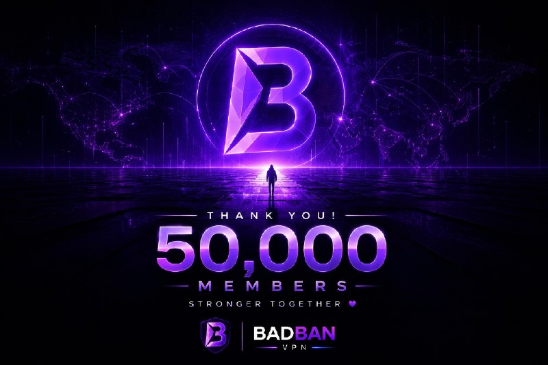

بادبان با همراهی شما 50 هزار نفری شد
🎉

🛡فروش سرویس جدید با کاهش قیمت تا گیگی 200 هزار تومان باز شد
🛒

🎊کد تخفیف 100 هزار تومانی بادبان فعال بوده و میتونید برای خرید اولتون ازش استفاده کنید

BadBan4k : کد تخفیف

🚀همچنین میتونید با معرفی بادبان از طریق لینک معرفی به دوستان 10 درصد از مبلغ تمام خرید هاشون رو در کیف پولتون داشته باشید
G26
وقتی بادبان داری، هیچ بادی مانع نیست… با ما راه بازه حتی وقتی اینترنت ملیه!

⛵️@BadBan_VPN | کانال 

🤖@BadBan_VPNBot | ربات 

📞@BadBan_VPNSupport | پشتیبانی

## Dirty_Kids — post 389562

در اقدامی کاملا عادی تو اپلیکیشن ترب، محصولاتی با عنوانِ موش بی دندون (همون دول موشیِ خودمون) در ابعاد و رنگ های مختلف موجود شد.

@Dirty_Kids 👻

## Dirty_Kids — post 389560

وقتی یه مانکن حامله میشه!
چجوری هیچ جاشون تپل نمیشه؟!!!!!

@Dirty_Kids 👻

## Dirty_Kids — post 389559

  <a href="telegram/content/Dirty_Kids_389559_1778953773.mp4" target="_blank">🎬 Download video</a>

ارزش دانلود: صفر
فقط برای اونایی که نت اضافی دارن

این قشنگ مشخص از خود وزارت‌اطلاعات دستور میگیره
برای اولین یکی پیدا شد از رضا گلزار ضعیفتر فیلم بازی میکنه :/ بابا یذره تف میزدی به چشات خیس بشه اقلا

جیندا جنگ میندازی گردن مردم؟ جنگی که کل دنیا درگیرن سیاست ابرقدرت‌ها داره عوض میشه بخاطرش

تا دیروز هرکی یه فیلم میگرفت میریختن تو خونش میگفتن جاسوس، الان دیدن کسی نمیتونه بره تو جزیره خودشون مستند میسازن میدن به این پرستو‌ها کصونه‌واویلا بازی دربیارن

@Dirty_Kids 👻

## Dirty_Kids — post 389558

  <a href="telegram/content/Dirty_Kids_389558_1778953777.mp4" target="_blank">🎬 Download video</a>

مداح‌: وقت نبرده بابا، به ترامپ بیناموس بگو، بچه کونه بابا

مجری اسلحه میکشه مداح فحش رکیک میده، چه دست و پایی میزنن

@Dirty_Kids 👻

## Hranews — post 112973

مصدومیت ۵ کارگر در سایه فقدان ایمنی کار

❗️
❗️
❗️
❗️
❗️– در سایه فقدان ایمنی محیط و شرایط نامناسب کار، پنج #کارگر در شهرستان‌های بهارستان و ملایر طی حوادثی حین انجام کار مصدوم شدند.

ادامه مطلب

↘️
@hranews_bot تماس ✉️ - @Hranews کانال هرانا 🆑

## Hranews — post 112972

دستور توقیف اموال ۱۲۹ شهروند در استان آذربایجان غربی صادر شد

❗️
❗️
❗️
❗️
❗️– رئیس‌ کل دادگستری آذربایجان غربی از صدور دستور #توقیف_اموال ۱۲۹ شهروند در این استان به دلیل آنچه “اقدامات ضدامنیتی” و همکاری با “کشورهای متخاصم” عنوان کرده، خبر داد.

ادامه مطلب

↘️
@hranews_bot تماس ✉️ - @Hranews کانال هرانا 🆑

## manototv — post 105532

  <a href="telegram/content/manototv_105532_1778953779.mp4" target="_blank">🎬 Download video</a>

‌
تامی رابینسون ، فعال ملی‌گرای بریتانیایی، تصویر شاهزاده رضا پهلوی را هنگام سخنرانی در تجمع لندن بالا برد ـ گزارشگر

## manototv — post 105531

  <a href="telegram/content/manototv_105531_1778953781.mp4" target="_blank">🎬 Download video</a>

اشتوتگارت، تجمع در حمایت از مردم ایران، ۲۶ اردیبهشت

## manototv — post 105530

  <a href="telegram/content/manototv_105530_1778953784.mp4" target="_blank">🎬 Download video</a>

مالمو سوئد، راهپیمایی ایرانیان، ۲۶ اردیبهشت

## manototv — post 105529

  <a href="telegram/content/manototv_105529_1778953786.mp4" target="_blank">🎬 Download video</a>

میلان | ایتالیا؛ گردهمایی ایرانیان ـ گزارشگر ۲۶ اردیبهشت

## manototv — post 105528

  <a href="telegram/content/manototv_105528_1778953789.mp4" target="_blank">🎬 Download video</a>

بوردو فرانسه، تجمع هفتگی همراه با تصویر جاویدنامان انقلاب ملی، شنبه ۲۶ اردیبهشت

## manototv — post 105527

  <a href="telegram/content/manototv_105527_1778953791.mp4" target="_blank">🎬 Download video</a>

بوداپست | مجارستان؛ گردهمایی ایرانیان ـ گزارشگر ۲۶ اردیبهشت

## manototv — post 105526

  <a href="telegram/content/manototv_105526_1778953793.mp4" target="_blank">🎬 Download video</a>

کلن، راهپیمایی ایرانیان، شنبه ۲۶ اردیبهشت

## manototv — post 105525

  <a href="telegram/content/manototv_105525_1778953795.mp4" target="_blank">🎬 Download video</a>

‌
گروه تروریستی حماس کشته شدن عزالدین الحداد، فرمانده گردان‌های« قسام» در نوار غزه را تایید کرد.

بر اساس بیانیه حماس عزالدین الحداد شامگاه جمعه «به همراه همسر، دخترش و چند غیرنظامی فلسطینی دیگر» کشته شده است.

## manototv — post 105524

  <a href="telegram/content/manototv_105524_1778953796.mp4" target="_blank">🎬 Download video</a>

اسلو | نروژ؛ راهپیمایی سکوت ایرانیان ـ گزارشگر شنبه ۲۶ اردیبهشت

## manototv — post 105523

  <a href="telegram/content/manototv_105523_1778953799.mp4" target="_blank">🎬 Download video</a>

‌
کپنهاگ | دانمارک؛ گردهمایی ایرانیان - گزارشگر شنبه ۲۶ اردیبهشت

## manototv — post 105522

  <a href="telegram/content/manototv_105522_1778953801.mp4" target="_blank">🎬 Download video</a>

‌
اشتوتگارت | آلمان؛ گردهمایی ایرانیان - گزارشگر شنبه ۲۶ اردیبهشت

## alonews — post 120452

  <a href="telegram/content/alonews_120452_1778953803.webm" target="_blank">🎬 Download video</a>

👈شبکه ۱۳ اسرائیل : تو اسرائیل یه سری برآوردا هست که میگن احتمال داره جنگ با ایران به‌زودی دوباره شروع بشه

✅ @AloNews خبر جنگ

## alonews — post 120451

  

🌟 اشتراک v2ray استارلینک

🗯گیگی 150,000 تومان

🔗لینک ساب برا چک کردن مصرف و حجمتون

🔥سرعت و کیفیت بالا

✅ پشتیبانی دائم

📱جهت خرید پیام بدین : @v2safeBot

## alonews — post 120447

  <a href="telegram/content/alonews_120447_1778953804.webm" target="_blank">🎬 Download video</a>

👈یک حمله هوایی اسرائیل به تازگی خودرویی را در غرب شهر غزه هدف قرار داد که منجر به کشته شدن حداقل ۳ فلسطینی و زخمی شدن چندین نفر دیگر شد

✅ @AloNews خبر جنگ

## alonews — post 120446

  <a href="telegram/content/alonews_120446_1778953804.webm" target="_blank">🎬 Download video</a>

👈قیمت مرغ

🔴 اردیبهشت ۴۰۴ کیلویی ۸۵ هزار

🔴اردیبهشت ۴۰۵ کیلویی ۳۸۰ هزار

✅ @AloNews خبر جنگ

## alonews — post 120445

  <a href="telegram/content/alonews_120445_1778953805.mp4" target="_blank">🎬 Download video</a>

👈ارتش آمریکا به کشتیِ که داشت مواد جابجا میکرد با تیر هشدار داد و توقیف کرد

✅ @AloNews خبر جنگ

## alonews — post 120444

  <a href="telegram/content/alonews_120444_1778953807.webm" target="_blank">🎬 Download video</a>

👈زمین‌لرزه ای به بزرگی ۴.۵ ریشتر دقایقی پیش گلوگاه در استان مازندران را لرزاند.

✅ @AloNews خبر جنگ

## alonews — post 120443

  <a href="telegram/content/alonews_120443_1778953807.webm" target="_blank">🎬 Download video</a>

👈دونالد ترامپ، رئیس‌جمهور آمریکا در گفت‌وگوی تلفنی با شبکه فرانسوی «بی‌اف‌ام‌تی‌وی» آینده مذاکرات با ایران را نامشخص توصیف کرد.

🔴او هشدار داد که در صورت شکست مذاکرات، ایران با پیامدهای سنگینی روبه‌رو خواهد شد.

✅ @AloNews خبر جنگ

## alonews — post 120442

  <a href="telegram/content/alonews_120442_1778953808.webm" target="_blank">🎬 Download video</a>

👈خبرنگار سی‌ان‌ان، کیتلان کالینز، می‌گوید: «ترامپ ظاهراً نمی‌خوابد.

🔴«یک منبع یک بار به من گفت هیچوقت کسی دوست ندارد در یک سفر طولانی مثلاً به آسیا در هواپیمای رئیس جمهور باشد… ترامپ همیشه بیدار است و حرف می‌زند، و اگر کارکنانش خواب باشند، می‌فرستد بیدارشان کنند چون می‌خواهد با آنها صحبت کند.»

✅ @AloNews خبر جنگ

## alonews — post 120441

  <a href="telegram/content/alonews_120441_1778953808.mp4" target="_blank">🎬 Download video</a>

👈 ارتش دفاعی اسرائیل اعلام کرده است که در طول آخر هفته حملاتی به حدود ۱۰۰ هدف حزب‌الله در جنوب لبنان انجام داده است.

🔴 این اهداف شامل موقعیت‌های نظارتی، محل‌های ذخیره سلاح و سایر زیرساخت‌هایی بود که ادعا می‌شود توسط حزب‌الله استفاده می‌شوند

✅ @AloNews خبر جنگ

## alonews — post 120440

  <a href="telegram/content/alonews_120440_1778953810.mp4" target="_blank">🎬 Download video</a>

👈امروز بمب افکن B-52 تو پایگاه هوایی فِرفورد تمرین‌‌های خودشو انجام داد

✅ @AloNews خبر جنگ

## alonews — post 120439

  <a href="telegram/content/alonews_120439_1778953813.webm" target="_blank">🎬 Download video</a>

👈معاریو: ترامپ در آستانه چراغ سبز به اسرائیل برای ازسرگیری حملات است

✅ @AloNews خبر جنگ

## alonews — post 120438

  <a href="telegram/content/alonews_120438_1778953814.webm" target="_blank">🎬 Download video</a>

👈کاخ سفید : همه گزینه ها در مورد ایران تو اختیار ترامپه

✅ @AloNews خبر جنگ

## alonews — post 120437

  <a href="telegram/content/alonews_120437_1778953814.webm" target="_blank">🎬 Download video</a>

👈ادعای سی‌ان‌ان، به نقل از منابع آگاه:
در دولت ترامپ نظرات متفاوتی در مورد چگونگی برخورد با ایران وجود دارد.

🔴دولت ترامپ و مقامات پنتاگون بر حملات هدفمند اصرار دارند، در حالی که دیگران از دیپلماسی حمایت می‌کنند

✅ @AloNews خبر جنگ

## alonews — post 120436

  <a href="telegram/content/alonews_120436_1778953814.mp4" target="_blank">🎬 Download video</a>

👈وضعیت جنوب لبنان دقایقی قبل ، پس از حملات اسرائیل

✅ @AloNews خبر جنگ

## alonews — post 120435

  <a href="telegram/content/alonews_120435_1778953816.webm" target="_blank">🎬 Download video</a>

👈نماینده دائم روسیه در سازمان‌های بین‌المللی مستقر در وین، موضع چین در قبال قطعنامه ضدایرانی بحرین و آمریکا در ارتباط با تنگه هرمز را تایید کرد و گفت «روسیه هم همین دیدگاه را دارد»

✅ @AloNews خبر جنگ

## alonews — post 120434

  <a href="telegram/content/alonews_120434_1778953816.webm" target="_blank">🎬 Download video</a>

👈هیمتی رئیس بانک مرکزی: با قدرت، شتاب تورم را کنترل خواهیم کرد

✅ @AloNews خبر جنگ

## alonews — post 120433

  <a href="telegram/content/alonews_120433_1778953817.mp4" target="_blank">🎬 Download video</a>

👈امروز ایران یه نفتکش حامل ۴۵۰ هزار بشکه نفت رو به دلیل نقض قوانین جدید تو تنگه هرمز توقیف کرد

✅ @AloNews خبر جنگ

---
📅 بروزرسانی: 1405/02/26 18:16
---

## VahidOOnLine — post 240492

  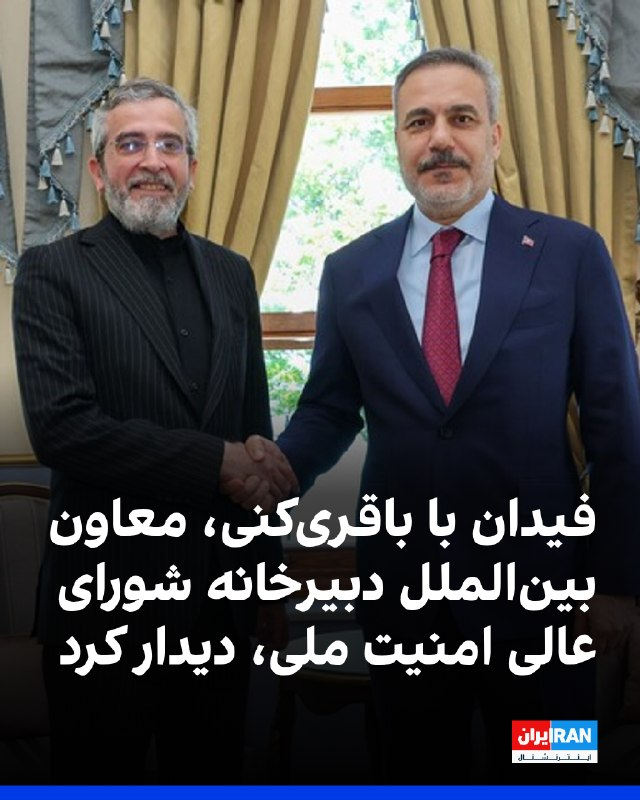

خبرگزاری آناتولی ترکیه گزارش داد که هاکان فیدان، وزیر خارجه ترکیه، با علی باقری‌کنی، معاون بین‌الملل دبیرخانه شورای عالی امنیت ملی، روز شنبه در استانبول دیدار کرد. این خبرگزاری اعلام کرد جزئیات بیشتری از این دیدار منتشر نشده است.
‌🏁 🇬🇧 IranintlTV

🤖 @VahidOOnLine

## VahidOOnLine — post 240491

  <a href="telegram/content/VahidOOnLine_240491_1778942802.mp4" target="_blank">🎬 Download video</a>

دوسلدورف | آلمان؛ گردهمایی ایرانیان - گزارشگر شنبه ۲۶ اردیبهشت
‌🏁 🇬🇧 ManotoTV

🤖 @VahidOOnLine

## VahidOOnLine — post 240490

  <a href="telegram/content/VahidOOnLine_240490_1778942804.mp4" target="_blank">🎬 Download video</a>

پرث استرالیا، تجمع ایرانیان، شنبه ۲۶ اردیبهشت
‌🏁 🇬🇧 ManotoTV

🤖 @VahidOOnLine

## VahidOOnLine — post 240489

  

العربیه به نقل از منابعی خبر داد که سفر محسن نقوی، وزیر کشور پاکستان، به ایران با هدف رسیدن به چارچوب یک توافق انجام شده است. بر اساس این گزارش، پیشرفت مثبتی درباره تنگه هرمز حاصل شده و درها برای مذاکره درباره موارد باقی‌مانده از جمله موضوع هسته‌ای، باز است
‌🏁 🇬🇧 IranintlTV

🤖 @VahidOOnLine

## VahidOOnLine — post 240488

  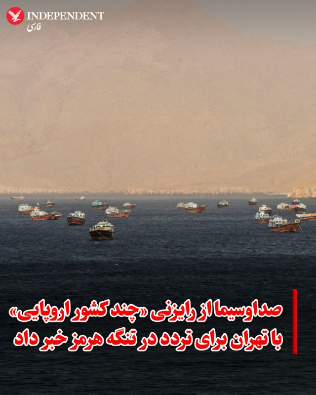

♦️ خبرگزاری صداوسیمای جمهوری اسلامی، روز شنبه ۲۶ اردیبهشت در گزارشی اختصاصی اعلام کرد که «چند کشور اروپایی» به‌دنبال انجام امور اداری و دریافت «تاییدیه» از تهران هستند تا بتوانند شناورهایشان را از تنگه هرمز عبور دهند.

این خبرگزاری با اشاره به گزارش‌ها از عبور موفق نفتکش‌هایی از چین، ژاپن و پاکستان از مسیر تعیین شده از سوی جمهوری اسلامی، تاکید کرد که این عبورها با «اجازه نیروی دریایی ایران» انجام شده است. صداوسیما نام این «کشورهای اروپایی» را اعلام نکرد.
‌🇸🇦 Indypersian

🤖 @VahidOOnLine

## VahidOOnLine — post 240487

  <a href="telegram/content/VahidOOnLine_240487_1778942806.mp4" target="_blank">🎬 Download video</a>

♦️مایک والتز، سفیر ایالات متحده در سازمان ملل، در گفت‌وگو با فاکس‌نیوز تأکید کرد که نقض هنجارهای بین‌المللی در تنگه‌های مهم دریایی قابل پذیرش نیست و کشورها نمی‌توانند در واکنش به درگیری‌ها اقدام به مین‌گذاری یا دریافت عوارض از مسیرهای بین‌المللی کنند.
او با اشاره به تحولات اخیر گفت چین پس از دیدار با رئیس جمهوری، مواضعی اتخاذ کرده که نشان‌دهنده فاصله‌گیری از ایران است. والتز افزود پکن با «عدم دستیابی ایران به سلاح هسته‌ای» و «عدم نظامی‌سازی تنگه هرمز» موافقت کرده است.
 سفیر آمریکا گفت چین همچنین تاکید کرده که تنگه‌هایی مانند هرمز و جبل‌الطارق نباید به‌عنوان ابزار درآمدزایی یا فشار سیاسی مورد استفاده قرار گیرند.
والتز این موضع را «دستاوردی مهم» در چارچوب تحولات دیپلماتیک اخیر توصیف کرد.
‌🇸🇦 Indypersian

🤖 @VahidOOnLine

## VahidOOnLine — post 240486

  <a href="telegram/content/VahidOOnLine_240486_1778942807.mp4" target="_blank">🎬 Download video</a>

دوسلدورف آلمان، تجمع ایرانیان، شنبه ۲۶ اردیبهشت
‌🏁 🇬🇧 ManotoTV

🤖 @VahidOOnLine

## VahidOOnLine — post 240485

  <a href="telegram/content/VahidOOnLine_240485_1778942808.mp4" target="_blank">🎬 Download video</a>

ملبورن، تجمع ایرانیان، ۲۶ اردیبهشت
‌🏁 🇬🇧 ManotoTV

🤖 @VahidOOnLine

## VahidOOnLine — post 240484

  <a href="telegram/content/VahidOOnLine_240484_1778942809.mp4" target="_blank">🎬 Download video</a>

هامبورگ، راهپیمایی ایرانیان و حمایت از زندانیان سیاسی، ۲۶ اردیبهشت
‌🏁 🇬🇧 ManotoTV

🤖 @VahidOOnLine

## VahidOOnLine — post 240483

  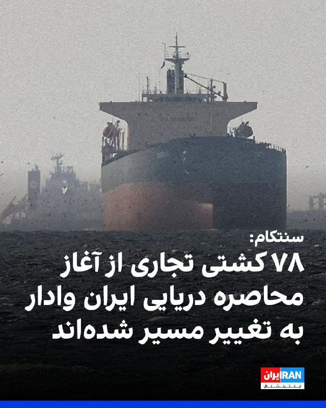

سنتکام، مرکز فرماندهی ایالات متحده، اعلام کرد که از آغاز محاصره سواحل جنوب ایران تا کنون، ۷۸ کشتی تجاری وادار به تغییر مسیر شده‌اند و ۴ کشتی برای تضمین اجرای محاصره از کار افتاده‌اند.

سنتکام با انتشار نمایی از داخل یک بالگرد بر فراز آب‌های منطقه‌ای نزدیک تنگه هرمز، نوشت که این بالگرد ارتش آمریکا کشتی‌های تجاری را در جریان اجرای محاصره دریایی ایران زیر نظر دارد.
‌🏁 🇬🇧 IranintlTV

🤖 @VahidOOnLine

## VahidOOnLine — post 240482

  

ایلا واویه، سخنگوی ارتش اسرائیل برای رسانه‌های عربی، در پیامی نوشت لبنان «میان چنگ ملایان و رشته‌های وابستگی» از یک کشور به گروگان تبدیل شده است.

او نوشت زمانی که جنگ‌ها «با انگشتان ایرانی اداره می‌شود»، مردم لبنان بهای آن را با «ویرانی و خاکستر» می‌پردازند.

واویه همچنین اعلام کرد لبنان به سکویی تبدیل شده و حزب‌الله «رشته‌هایی است که از سوی تهران حرکت داده می‌شود» و نتیجه این وضعیت، به گفته او، «کشوری که سیاه‌پوش می‌شود و بی‌گناهانی که جز آینده‌ای نامعلوم سهمی ندارند» است.

سخنگوی ارتش اسرائیل در پایان پرسید: «لبنان به کجا می‌رود؟ و تا کی؟»
‌🏁 🇬🇧 IranintlTV

🤖 @VahidOOnLine

## VahidOOnLine — post 240481

  <a href="telegram/content/VahidOOnLine_240481_1778942812.mp4" target="_blank">🎬 Download video</a>

ایرانیان سوئیس روز شنبه با تجمع در شهر برن به حمایت از انقلاب ملی و شاهزاده رضا پهلوی پرداختند و شعار «جاوید شاه» سر دادند.
‌🏁 🇬🇧 IranintlTV

🤖 @VahidOOnLine

## VahidOOnLine — post 240480

  <a href="telegram/content/VahidOOnLine_240480_1778942813.mp4" target="_blank">🎬 Download video</a>

در واکنش به نمایش و آموزش کار با سلاح در صداوسیما یک شهروند در پیامی به ایران اینترنشنال این اقدام را نشانه سقوط حکومت خواند و مخاطبی دیگر به حرکت مشابه در لیبی قبل از سقوط حکومت معمر قذافی اشاره کرد.

پیام این مخاطبان با هوش مصنوعی بازخوانی شده است.
‌🏁 🇬🇧 IranintlTV

🤖 @VahidOOnLine

## VahidOOnLine — post 240479

  

♦️ ستاد فرماندهی مرکزی ارتش آمریکا، سنتکام، روز شنبه ۲۶ اردیبهشت، گزارشی از آخرین فعالیت‌های این نیروها در تنگه هرمز و محاصره دریایی بنادر ایران ارائه کرد.

بر اساس این گزارش تا تاریخ ۲۶ اردیبهشت، نیروهای آمریکایی در راستای تضمین پایبندی به این محاصره نظامی، مسیر ۷۸ کشتی تجاری را که به سمت بنادر ایران در حرکت بودند تغییر داده و ۴ کشتی دیگر را نیز به دلیل تلاش برای نقض این خطوط ممنوعه، متوقف و زمین‌گیر کرده‌اند. سنتکام تاکید کرده است که این تدابیر سخت‌گیرانه تنها علیه شناورهای ورودی و خروجی به بنادر ایران اعمال می‌شود.
‌🇸🇦 Indypersian

🤖 @VahidOOnLine

## VahidOOnLine — post 240478

  <a href="telegram/content/VahidOOnLine_240478_1778942816.mp4" target="_blank">🎬 Download video</a>

ایرانیان آلمان روز شنبه همزمان با سایر کشورها در حمایت از انقلاب ملی علیه جمهوری اسلامی در شهر کاسل تجمع کردند.
‌🏁 🇬🇧 IranintlTV

🤖 @VahidOOnLine

## VahidOOnLine — post 240477

  

معاریو گزارش داد که حوثی‌ها ابزارهای مدرن، از جمله دستگاه‌های جی‌پی‌اس را در اختیار دزدان دریایی سومالی قرار داده‌اند که به آنها کمک می‌کند مسیرهای حرکت کشتی‌های تجاری را با دقت بیشتری ردیابی کنند.

پیش‌تر محمد موسی ابوله، معاون رییس اطلاعات پلیس دریایی پونتلند، در ژانویه ۲۰۲۶ گفته بود که نیروهای امنیتی برآورد می‌کنند برخی اعضای این گروه‌ها حتی آموزش‌های نظامی را در یمن گذرانده‌اند.

به گفته او، فناوری جدید برنامه‌ریزی حملات در فاصله‌ای دور از سواحل سومالی را بسیار آسان‌تر کرده است. یک ماه پیش از آن، در دسامبر ۲۰۲۵، نیروهای امنیتی پونتلند یک شناور حامل مواد منفجره و مواد شیمیایی مورد استفاده در ساخت بمب را در نزدیکی سواحل ایل متوقف کردند. در این قایق هفت نفر شامل دو شهروند یمنی و پنج شهروند سومالیایی حضور داشتند.
‌🏁 🇬🇧 IranintlTV

🤖 @VahidOOnLine

## VahidOOnLine — post 240476

♦️ارتش آمریکا با انتشار تصاویری اعلام کرد در پی یک عملیات نظامی در شمال‌شرق نیجریه، مواضع گروه داعش هدف حمله قرار گرفت و چندین عضو ارشد این گروه کشته شدند.
این عملیات یک تجمع مهم از نیروهای داعش را هدف قرار داده و در جریان آن، تعدادی از افراد باارزش بالا از جمله فردی به نام «ابو بلال المینوکی» از بین رفته‌اند.
جزئیات بیشتری درباره زمان دقیق، نحوه اجرای عملیات و تلفات کلی منتشر نشده، اما منابع محلی این حمله را ضربه‌ای قابل‌توجه به فعالیت‌های داعش در این منطقه توصیف کرده‌اند.
‌🇸🇦 Indypersian

🤖 @VahidOOnLine

## VahidOOnLine — post 240475

  <a href="telegram/content/VahidOOnLine_240475_1778942818.mp4" target="_blank">🎬 Download video</a>

سوییس، تجمع مقابل سفارت جمهوری اسلامی، ۲۶ اردیبهشت ۱۴۰۵
‌🏁 🇬🇧 ManotoTV

🤖 @VahidOOnLine

## VahidOOnLine — post 240474

  <a href="telegram/content/VahidOOnLine_240474_1778942819.mp4" target="_blank">🎬 Download video</a>

فرماندهی آفریقای ارتش آمریکا تصاویری از هدف قرار دادن مواضع داعش در نیجریه را منتشر کرده است. آفریکام گفته است عملیات شامگاه گذشته، حضور قابل توجهی از نیروهای داعش را هدف گرفت و به کشته شدن چند فرد مهم این گروه منجر شد.

شمال شرق نیجریه سال‌هاست صحنه فعالیت گروه‌های جهادی، از جمله شاخه غرب آفریقای داعش و بوکوحرام است. مرکز ملی مبارزه با تروریسم آمریکا می‌گوید شاخه غرب آفریقای داعش یکی از بزرگ‌ترین و مرگبارترین شاخه‌های این گروه است و در نیجریه و کشورهای همسایه باعث کشته یا آواره شدن هزاران نفر شده است.
‌🏁 🇬🇧 ManotoTV

🤖 @VahidOOnLine

## VahidOOnLine — post 240473

♦️صداوسیمای جمهوری اسلامی روز شنبه ۲۶ اردیبهشت، با انتشار تصاویری، لحظه توقیف یک نفتکش حامل ۴۵۰هزار بشکه نفت که به گفته خبرنگار، به صورت قاچاق از کشور خارج شده بود را نشان داد. کشور صاحب این نفتکش در گزارش معرفی نشده اما تاکید شده که غیرایرانی بوده است. نفتکش «اوشن کوی» برای جلوگیری از شناسایی شدن، نام خود را روی بدنه مخدوش کرده بود.

یک مقام نیروی دریایی ارتش در گفتگو با صداوسیما اعلام کرد که محموله این نفتکش توقیف شده و با انتقال به یک نفتکش ایرانی، به مخازن بندرعباس بازگردانده می‌شود.

پیش از این اعلام شده بود که کنترل تنگه هرمز به دو بخش شرقی و غربی تقسیم شده و نیروی دریایی سپاه و ارتش، هر کدام مسئولیت یک بخش را به‌عهده دارند.
‌🇸🇦 Indypersian

🤖 @VahidOOnLine

## mwarmonitor — post 9160

  

‼️من همین حالا یک ناو هواپیمابر کلاس نیمیتز (احتمالاً USS George H. W. Bush یا USS Abraham Lincoln) را در تصاویر ماهواره‌ای Sentinel-2 مربوط به 16/05/2026 پیدا کردم. 🔸این ناو با سرعت به سمت شمال دریای عمان در حال حرکت است. @mwarmonitor

## mwarmonitor — post 9159

  

🇺🇸یک فروند بالگرد ارتش ایالات متحده هنگام پرواز بر فراز آب‌های منطقه‌ای نزدیک تنگه هرمز، بر حرکت کشتی‌های تجاری نظارت می‌کند. این اقدام در چارچوب اجرای محاصره دریایی آمریکا علیه ایران انجام می‌شود.

🔸تا تاریخ ۱۶ مه، ۷۸ کشتی تجاری تغییر مسیر داده شده‌اند و ۴ کشتی برای تضمین تبعیت از دستورها از کار افتاده‌اند.

@mwarmonitor

## mwarmonitor — post 9158

  <a href="telegram/content/mwarmonitor_9158_1778942821.mp4" target="_blank">🎬 Download video</a>

📝تحلیل اختصاصی کانال

🇵🇰🇮🇷سفر از پیش‌اعلام‌نشده وزیر کشور پاکستان به تهران، بیش از آنکه یک رایزنی سنتی باشد، یک آفند دیپلماتیک پیشگیرانه است. در عرف بین‌الملل، حضور فیزیکی یک مقام ارشد از کشوری غیردرگیر در پایتختِ هدف، به عنوان یک ضربه‌گیر امنیتی عمل می‌کند؛ چرا که واشنگتن برای اجتناب از تصاعد بحران و درگیر کردن پای اسلام‌آباد، دست به اقدام نظامی ناگهانی نخواهد زد.

🔸این تحرک در کوتاه‌مدت به شدت تأثیرگذار است و عملاً زمان حیاتی برای تنش‌زدایی یا بازدارندگی موقت ایجاد می‌کند. با این حال، کارآمدی بلندمدت آن بستگی به این دارد که تهران و اسلام‌آباد از این فرصتِ تنفس و «سپر دیپلماتیک» برای تغییر محاسبات واشنگتن بهره ببرند، یا اینکه این سفر تنها یک مسکن موقت برای به تعویق انداختن بحران باشد.

@mwarmonitor

## mwarmonitor — post 9157

  <a href="telegram/content/mwarmonitor_9157_1778942822.mp4" target="_blank">🎬 Download video</a>

🇺🇸با ورود وزیر جنگ آمریکا، پیت هگست، به نورفولک، ویرجینیا، ناو هواپیمابر «یو‌اس‌اس جرالد آر. فورد» پس از یک استقرار بیش از ۳۰۰ روزه به پایگاه خانگی خود بازگشت. این ناو و شناورهای همراه آن در طول این مدت در عملیات‌های رزمی در دو فرماندهی رزمی (COCOM) شامل SOUTHCOM و CENTCOM شرکت داشتند.

@mwarmonitor

## mwarmonitor — post 9156

  

‼️من همین حالا یک ناو هواپیمابر کلاس نیمیتز (احتمالاً USS George H. W. Bush یا USS Abraham Lincoln) را در تصاویر ماهواره‌ای Sentinel-2 مربوط به 16/05/2026 پیدا کردم.

🔸این ناو با سرعت به سمت شمال دریای عمان در حال حرکت است.

@mwarmonitor

## mwarmonitor — post 9155

  

✈️🇺🇸نیروی هوایی آمریکا (USAF) – جنگ ایران ۲۰۲۶ | ۱۶ مه

✈️تعداد پروازهای ورودی هواپیماهای ترابری C-17 به منطقه فرماندهی مرکزی آمریکا (CENTCOM) و پایگاه‌های مرتبط به دست‌کم 1,320 پرواز رسیده و 10 پرواز دیگر نیز در حال انجام است.

✈️8 مورد از این پروازهای جدید از پایگاه هوایی Pope Army Airfield آمریکا انجام شده‌اند و مقصد مشخصی برای آن‌ها قابل شناسایی نیست.

✈️حداقل 6 پرواز جدید نیز به‌نظر می‌رسد حرکت‌های خروجی از CENTCOM به سمت پایگاه‌هایی در خاک آمریکا (CONUS) باشند؛ همان پایگاه‌هایی که بیشتر پروازها از آن‌ها آغاز شده‌اند.

@mwarmonitor

## mwarmonitor — post 9154

⚠️اطلاعیه فوری ⚠️

⚠️"با نزدیک شدن به لحظه درگیری‌های مجدد، ثانیه‌ها سرنوشت‌ساز شده‌اند. اکنون زمان انتخاب میان بقا یا قربانی شدن در راه منافع سران است. از پادگان‌ها و مراکز نظامی فاصله بگیرید و جان خود را فدای وعده‌های توخالی نکنید."

⚠️با توجه به نشانه‌های موجود و احتمال آغاز مجدد درگیری‌های نظامی، حفظ هوشیاری و اتخاذ تصمیمات درست در این لحظات بحرانی برای تمامی گروه‌های جامعه، از شهروندان عادی تا بدنه نیروهای مسلح، امری حیاتی و سرنوشت‌ساز است.

⚠️در همین راستا، به سربازان وظیفه و کادر نظامی توصیه می‌شود که از حضور در پادگان‌ها و مراکز نظامی خودداری کنند. تجربه و تاریخ نشان داده است که در اوج بحران‌ها، سران و تصمیم‌گیرندگان اصلی ساختار با تضمین مسیرهای خروج خود به کشورهای هم‌پیمان مانند چین و روسیه، بدنه رده‌پایین و نیروهای فریب‌خورده را به عنوان سپر بلا در میدان رها می‌کنند؛ بنابراین عاقلانه‌ترین راه، فاصله گرفتن از نظام و ایستادن در سمت درست تاریخ یعنی در کنار مردم است.

⚠️همچنین از تمامی شهروندان و غیرنظامیان تقاضا می‌شود برای حفظ جان خود، فوراً از نزدیکی زیرساخت‌های انرژی از جمله پالایشگاه‌ها و نیروگاه‌ها و همچنین مراکز و پادگان‌های نظامی فاصله بگیرند. در نهایت، با توجه به پیش‌بینی‌ها مبنی بر احتمال تمرکز حملات بر روی امارات متحده عربی، از هموطنان مقیم این کشور درخواست می‌شود که در بالاترین سطح آمادگی و هوشیاری قرار داشته و مراقبت‌های لازم را به عمل آورند.

@mwarmonitor

## mwarmonitor — post 9153

  <a href="telegram/content/mwarmonitor_9153_1778942824.mp4" target="_blank">🎬 Download video</a>

🔴اختصاصی ‌CNN از پل ویران‌شده کرج در ایران بازدید می‌کند؛ هم‌زمان با تجدید تهدیدها از سوی دونالد ترامپ.

@mwarmonitor

## mwarmonitor — post 9152

🇺🇸امشب با دستور من، نیروهای شجاع آمریکایی و نیروهای مسلح نیجریه، ماموریتی به‌دقت برنامه‌ریزی‌شده و بسیار پیچیده را برای حذف فعال‌ترین تروریست جهان از صحنه نبرد، به‌طور بی‌نقصی اجرا کردند. «ابوبلال المینوکی»، شخص دوم در فرماندهی جهانی داعش، فکر می‌کرد که می‌تواند…

## pm_afshaa — post 90852

  <a href="telegram/content/pm_afshaa_90852_1778942826.webm" target="_blank">🎬 Download video</a>

🔴پست جدید ترامپ در تروث سوشال:
شوخی نداریم!!! ببین قراره بعدش تو موضوع مورد علاقت چه اتفاقی بیفته!

💧 Rainbet.com the #1 Non-KYC Crypto Casino & Sportsbook @rainbetcom

😁 @Pm_Afshaa

## pm_afshaa — post 90851

  <a href="telegram/content/pm_afshaa_90851_1778942827.webm" target="_blank">🎬 Download video</a>

🔴ایسنا: وزیر کشور پاکستان برای دیدار با مسئولان جمهوری اسلامی ساعاتی قبل به تهران سفر کرده. 
💧 Rainbet.com the #1 Non-KYC Crypto Casino & Sportsbook @rainbetcom 
😁 @Pm_Afshaa

## pm_afshaa — post 90850

  <a href="telegram/content/pm_afshaa_90850_1778942827.webm" target="_blank">🎬 Download video</a>

🔴استوری مشاور قالیباف همزمان با بالا گرفتن احتمال شروع مجدد جنگ :

💧 Rainbet.com the #1 Non-KYC Crypto Casino & Sportsbook @rainbetcom

😁 @Pm_Afshaa

## pm_afshaa — post 90849

  <a href="telegram/content/pm_afshaa_90849_1778942828.webm" target="_blank">🎬 Download video</a>

🔴الحدث به نقل از منابع پاکستانی:
اسلام آباد به دنبال ادامه روند میانجیگری با جدییت است. اسلام آباد به دنبال متقاعد کردن تهران و واشنگتن به انعطاف پذیری در مذاکراته

💧 Rainbet.com the #1 Non-KYC Crypto Casino & Sportsbook @rainbetcom

😁 @Pm_Afshaa

## pm_afshaa — post 90848

  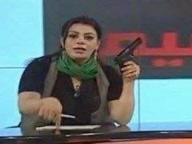

مجری‌های صداوسیما در چند برنامه زنده، با اسلحه کلاشینکف حضور پیدا کردن : 
💧 Rainbet.com the #1 Non-KYC Crypto Casino & Sportsbook @rainbetcom 
😁 @Pm_Afshaa

## pm_afshaa — post 90847

🔴کانال 12 اسرائیل: اسرائیل در حال آماده شدن برای یک جنگ چند روزه یا چند هفته‌ای با ایران است

💧 Rainbet.com the #1 Non-KYC Crypto Casino & Sportsbook @rainbetcom

😁 @Pm_Afshaa

## pm_afshaa — post 90846

  <a href="telegram/content/pm_afshaa_90846_1778942828.webm" target="_blank">🎬 Download video</a>

🔴ایسنا: وزیر کشور پاکستان برای دیدار با مسئولان جمهوری اسلامی ساعاتی قبل به تهران سفر کرده.

💧 Rainbet.com the #1 Non-KYC Crypto Casino & Sportsbook @rainbetcom

😁 @Pm_Afshaa

## pm_afshaa — post 90845

  <a href="telegram/content/pm_afshaa_90845_1778942829.webm" target="_blank">🎬 Download video</a>

🔴کانال 12 اسرائیل: برآورد اسرائیل نشون میده تصمیم برای اقدام نظامی بسیار زود گرفته میشه. ترامپ طی 24 ساعت آینده جلسه‌ای با تیم نزدیک خود برای تصمیم‌گیری نهایی درباره ایران برگزار خواهد کرد.

به گفته یک مقام ارشد اسرائیلی، ازسرگیری درگیری نزدیکه و اسرائیل خودش رو برای چند روز تا چند هفته جنگ آماده میکنه.

💧 Rainbet.com the #1 Non-KYC Crypto Casino & Sportsbook @rainbetcom

😁 @Pm_Afshaa

## iaghapour — post 2615

  

⭕️ آموزش نصب ساده و آفلاین 3X-UI روی سرور ایران + SSL (+ معرفی قابلیت های جدید)

🔹در این ویدیو به سراغ یکی از بزرگترین چالش‌های این روزها رفتیم: نصب پنل 3X-UI روی سرورهای ایران همراه با سرتیفیکیت به صورت کاملاً آفلاین و بدون نیاز به اینترنت آزاد! همینطور سعی کردیم یک معرفی ساده از قابلیت های جدید این پنل داشته باشیم.

🔗 لینک ویدیو در یوتیوب

🔗 دانلود ویدیو با لینک مستقیم (بزودی)

#آموزش #فیلترشکن #پنل #xui #3xui
برای دور زدن فیلترینگ و آموزش تکنولوژی و هوش مصنوعی ما رو دنبال کنید 💚
🆔@iaghapour

## DEJradio — post 4667

  <a href="telegram/content/DEJradio_4667_1778942830.mp4" target="_blank">🎬 Download video</a>

🚨
🔸 امیررضا نصرآزادانی، فوتبالیست زندانی حامی معترضان و آزادی‌خواهان، در پیامی از درون زندان، از ایرانیان خواسته او را فراموش نکنند.

#امیررضا_نصرآزادانی #فوتبالیست_مردمی
@DEJradio

## VahidOnline — post 75501

  <a href="telegram/content/VahidOnline_75501_1778942832.mp4" target="_blank">🎬 Download video</a>

دختر جمیله شفیعی: JamilehShafiei

📡 @VahidOnline

## VahidOnline — post 75500

  <a href="telegram/content/VahidOnline_75500_1778942832.mp4" target="_blank">🎬 Download video</a>

"مجری شبکه سه تلویزیون: یک راکت ۲۰۰ دلاری می‌تواند کل ارتش آمریکا را در منطقه به زانو درآورد" ویدیو با تیتر بالا در منابع جمهوری اسلامی منتشر شده و خانعلی‌زاده متوهم رو نشون میده که مطابق معمول چرندیاتی در سطح خودش میگه. 📡 @VahidOnline

## VahidOnline — post 75499

  <a href="telegram/content/VahidOnline_75499_1778942832.mp4" target="_blank">🎬 Download video</a>

در یک برنامه زنده تلویزیونی که از شبکه افق صداوسیما پخش شده است، مجری برنامه با اسلحه واقعی به پرچم امارات متحده عربی شلیک می‌کند.
در این برنامه که موضوع آن درباره آموزش شلیک با اسلحه کلاشنیکف است، فردی که لباس نظامی به تن دارد و صورت خود را با ماسک پوشانده است مراحل آماده‌سازی اسلحه و شلیک گلوله را به مجری آموزش می‌دهد.
مجری برنامه هم در مرحله شلیک تصمیم می‌گیرد به پرچم امارات که در بنر مربوط به دکور استودیو، شلیک کند.
@VahidHeadline
صدا و سیمای جمهوری اسلامی جمعه چند برنامه پخش کرد که در آنها مجریان در بخش‌های استودیویی با در دست داشتن تفنگ ظاهر شدند و کار با سلاح‌های سبک آموزش داده شد. مجریان در این برنامه‌ها اعلام کردند که در صورت لزوم به جنگ خواهند پیوست.
این برنامه‌ها که دست‌کم در سه بخش پخش شد، در رسانه‌های داخلی بازنشر و در شبکه‌های اجتماعی با واکنش‌هایی همراه شد. برخی کاربران شبکه‌های اجتماعی این بخش‌ها را نشانه‌ای از بسیج در شرایط جنگی توصیف کردند.
جکسون هینکل، مفسر سیاسی آمریکایی، در شبکه اجتماعی ایکس نوشت تلویزیون دولتی ایران نحوه استفاده و شلیک با کلاشینکف را به‌عنوان «آمادگی برای تهاجم زمینی آمریکا» نشان می‌دهد.
@VahidOOnLine

📡 @VahidOnline

## VahidOnline — post 75498

  

رسانه وابسته به قوه قضائیه جمهوری اسلامی اعلام کرد اموال ۵۱ نفر در استان یزد، با دستور قضایی و به اتهام آنچه «خیانت به وطن» و «همکاری با دشمن» خوانده شده، توقیف شده است.

بر اساس این گزارش، پرونده این افراد در ارتباط با قانون موسوم به «تشدید مجازات جاسوسی و همکاری با رژیم صهیونیستی علیه امنیت و منافع ملی» در حال رسیدگی است و مقام‌های قضایی مدعی شده‌اند دارایی‌های توقیف‌شده قرار است برای «حفظ حقوق عامه» و بازسازی اماکن آسیب‌دیده از جنگ هزینه شود.

اموال توقیف‌شده شامل حساب‌های بانکی، دارایی‌های منقول و غیرمنقول، سهام شرکت‌ها و حتی اموال وکالتی عنوان شده است.

طبق گزارش میزان، از میان این ۵۱ نفر، ۲۰ نفر در داخل کشور حضور دارند و ۳۱ نفر دیگر در خارج از کشور به سر می‌برند.

این اقدام در ادامه موج تازه‌ای از مصادره و توقیف اموال شهروندان و مخالفان سیاسی صورت می‌گیرد؛ روندی که در عمل به ابزاری برای فشار، ارعاب و مصادره دارایی افراد تحت عنوان‌های سنگینی مانند «خیانت» و «همکاری با دشمن» تبدیل شده است.
@VahidHeadline

📡 @VahidOnline

## IranIntlTV — post 337490

  

خبرگزاری آناتولی ترکیه گزارش داد که هاکان فیدان، وزیر خارجه ترکیه، با علی باقری‌کنی، معاون بین‌الملل دبیرخانه شورای عالی امنیت ملی، روز شنبه در استانبول دیدار کرد. این خبرگزاری اعلام کرد جزئیات بیشتری از این دیدار منتشر نشده است.
https://iranintl.com/202605168367

## IranIntlTV — post 337489

  <a href="telegram/content/IranIntlTV_337489_1778942834.mp4" target="_blank">🎬 Download video</a>

ایرانیان مقیم استکهلم، شنبه ۲۶ اردیبهشت در حمایت از انقلاب ملی تجمع کردند. تجمع‌کنندگان ضمن حمایت از شاهزاده رضا پهلوی، می‌گویند هدف از برگزاری این تجمعات، رساندن صدای مردم ایران به جهان است.

مهران عباسیان، خبرنگار ایران‌اینترنشنال، گزارش می‌دهد
@iranintltv

## IranIntlTV — post 337488

  <a href="telegram/content/IranIntlTV_337488_1778942835.mp4" target="_blank">🎬 Download video</a>

سرخط خبرهای شنبه ۲۶ اردیبهشت
@iranintltv

## IranIntlTV — post 337487

  <a href="telegram/content/IranIntlTV_337487_1778942836.mp4" target="_blank">🎬 Download video</a>

در یکی دیگر از آخر هفته‌های اعتراضی ایرانیان خارج از کشور، شنبه ۲۶ اردیبهشت تجمعات و راهپیمایی‌های گسترده‌ای در شهرهای مختلف اروپا در حمایت از انقلاب ملی مردم ایران برگزار شد.

گفت‌وگوی احمد صمدی ، خبرنگار ایران‌اینترنشنال، با شرکت‌کنندگان در تجمع برلین
@iranintltv

## IranIntlTV — post 337486

  

العربیه به نقل از منابعی خبر داد که سفر محسن نقوی، وزیر کشور پاکستان، به ایران با هدف رسیدن به چارچوب یک توافق انجام شده است. بر اساس این گزارش، پیشرفت مثبتی درباره تنگه هرمز حاصل شده و درها برای مذاکره درباره موارد باقی‌مانده از جمله موضوع هسته‌ای، باز است
https://iranintl.com/202605165331

## IranIntlTV — post 337485

  <a href="telegram/content/IranIntlTV_337485_1778942838.mp4" target="_blank">🎬 Download video</a>

در یکی دیگر از آخر هفته‌های اعتراضی ایرانیان خارج از کشور، شنبه ۲۶ اردیبهشت تجمعات و راهپیمایی‌های گسترده‌ای در شهرهای مختلف اروپا در حمایت از انقلاب ملی مردم ایران برگزار شد.

احمد صمدی ، خبرنگار ایران‌اینترنشنال، از برلین گزارش می‌دهند
@iranintltv

## IranIntlTV — post 337484

  <a href="telegram/content/IranIntlTV_337484_1778942840.mp4" target="_blank">🎬 Download video</a>

در ادامه گزارش‌ها از لکه نفتی ایجادشده در اطراف جزیره خارک، وبسایت تانکر ترکرز نوشت این موضوع ناشی از نشت نفت از اسکله غربی این جزیره است. خبرگزاری بلومبرگ نیز نوشت توقف صادرات نفت ایران از خارک، به احتمال زیاد ناشی از نشت اخیر نفت بوده است.

گفت‌وگو با آرش آزرمی، دبیر بخش اقتصادی ایران‌اینترنشنال
@iranintltv

## IranIntlTV — post 337483

  <a href="https://t.me/IranintlTV/337483" target="_blank">📎 Download file</a>

🎧نسخه صوتی اخبار نیمروزی | شنبه ۲۶ اردیبهشت
@iranintlTV

## IranIntlTV — post 337482

  <a href="telegram/content/IranIntlTV_337482_1778942841.mp4" target="_blank">🎬 Download video</a>

دونالد ترامپ هشدار داد اگر جمهوری اسلامی اورانیوم غنی‌شده خود را تحویل ندهد، آمریکا «در زمان مناسب» وارد ایران خواهد شد. او تاکید کرد در صورت لزوم، زیرساخت‌های باقی‌مانده را «ظرف دو روز» نابود می‌کند.
گفت‌وگو با جابر رجبی، تحلیل‌گر سیاسی
@iranintltv

## IranIntlTV — post 337481

  

سنتکام، مرکز فرماندهی ایالات متحده، اعلام کرد که از آغاز محاصره سواحل جنوب ایران تاکنون، ۷۸ کشتی تجاری وادار به تغییر مسیر شده‌اند و ۴ کشتی برای تضمین اجرای محاصره از کار افتاده‌اند.

سنتکام با انتشار نمایی از داخل یک بالگرد بر فراز آب‌های منطقه‌ای نزدیک تنگه هرمز، نوشت که این بالگرد ارتش آمریکا کشتی‌های تجاری را در جریان اجرای محاصره دریایی ایران زیر نظر دارد.
https://iranintl.com/202605164791

## IranIntlTV — post 337480

  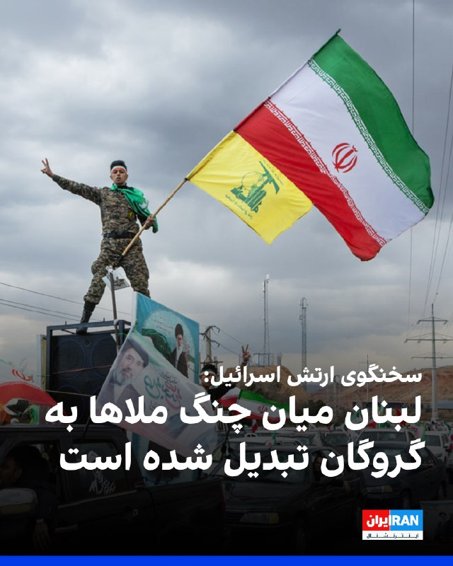

ایلا واویه، سخنگوی ارتش اسرائیل برای رسانه‌های عربی، در پیامی نوشت لبنان «میان چنگ ملایان و رشته‌های وابستگی» از یک کشور به گروگان تبدیل شده است.

او نوشت زمانی که جنگ‌ها «با انگشتان ایرانی اداره می‌شود»، مردم لبنان بهای آن را با «ویرانی و خاکستر» می‌پردازند.

واویه همچنین اعلام کرد لبنان به سکویی تبدیل شده و حزب‌الله «رشته‌هایی است که از سوی تهران حرکت داده می‌شود» و نتیجه این وضعیت، به گفته او، «کشوری که سیاه‌پوش می‌شود و بی‌گناهانی که جز آینده‌ای نامعلوم سهمی ندارند» است.

سخنگوی ارتش اسرائیل در پایان پرسید: «لبنان به کجا می‌رود؟ و تا کی؟»
https://iranintl.com/202605163963

## IranIntlTV — post 337479

  <a href="telegram/content/IranIntlTV_337479_1778942844.mp4" target="_blank">🎬 Download video</a>

ایرانیان سوئیس روز شنبه با تجمع در شهر برن به حمایت از انقلاب ملی و شاهزاده رضا پهلوی پرداختند و شعار «جاوید شاه» سر دادند.

## IranIntlTV — post 337478

  <a href="telegram/content/IranIntlTV_337478_1778942846.mp4" target="_blank">🎬 Download video</a>

در واکنش به نمایش و آموزش کار با سلاح در صداوسیما یک شهروند در پیامی به ایران اینترنشنال این اقدام را نشانه سقوط حکومت خواند و مخاطبی دیگر به حرکت مشابه در لیبی قبل از سقوط حکومت معمر قذافی اشاره کرد.

پیام این مخاطبان با هوش مصنوعی بازخوانی شده است.

## IranIntlTV — post 337477

  <a href="telegram/content/IranIntlTV_337477_1778942847.mp4" target="_blank">🎬 Download video</a>

ایرانیان آلمان روز شنبه همزمان با سایر کشورها در حمایت از انقلاب ملی علیه جمهوری اسلامی در شهر کاسل تجمع کردند.

## IranIntlTV — post 337476

  

معاریو گزارش داد که حوثی‌ها ابزارهای مدرن، از جمله دستگاه‌های جی‌پی‌اس را در اختیار دزدان دریایی سومالی قرار داده‌اند که به آنها کمک می‌کند مسیرهای حرکت کشتی‌های تجاری را با دقت بیشتری ردیابی کنند.

پیش‌تر محمد موسی ابوله، معاون رییس اطلاعات پلیس دریایی پونتلند، در ژانویه ۲۰۲۶ گفته بود که نیروهای امنیتی برآورد می‌کنند برخی اعضای این گروه‌ها حتی آموزش‌های نظامی را در یمن گذرانده‌اند.

به گفته او، فناوری جدید برنامه‌ریزی حملات در فاصله‌ای دور از سواحل سومالی را بسیار آسان‌تر کرده است. یک ماه پیش از آن، در دسامبر ۲۰۲۵، نیروهای امنیتی پونتلند یک شناور حامل مواد منفجره و مواد شیمیایی مورد استفاده در ساخت بمب را در نزدیکی سواحل ایل متوقف کردند. در این قایق هفت نفر شامل دو شهروند یمنی و پنج شهروند سومالیایی حضور داشتند.
https://iranintl.com/202605167159

## IranIntlTV — post 337475

  <a href="telegram/content/IranIntlTV_337475_1778942849.mp4" target="_blank">🎬 Download video</a>

در تجمعی که به فراخوان تامی رابینسون، فعال راست‌گرای بریتانیا، در لندن برگزار شد، شماری از ایرانیان با پرچم شیر و خورشید حضور پیدا کردند. رابینسون این تجمع را «بزرگ‌ترین گردهمایی ملی‌گرایانه» توصیف کرده است.
گفت‌وگو با تاج‌الدین سروش، عضو تحریریه ایران‌اینترنشنال
@iranintltv

## IranIntlTV — post 337474

  <a href="telegram/content/IranIntlTV_337474_1778942850.mp4" target="_blank">🎬 Download video</a>

خبرگزاری مهر از وقوع آتش‌سوزی در «کارخانه روغن موتور» در مراغه خبر داد. رییس آتش‌نشانی شهرستان مراغه بعد از ظهر شنبه اعلام کرد این کارخانه از ساعاتی پیش دچار آتش‌سوزی شده است و نیروهای امدادی و آتش‌نشانی در حال اطفای حریق هستند.
@iranintltv

## IranIntlTV — post 337473

  <a href="telegram/content/IranIntlTV_337473_1778942851.mp4" target="_blank">🎬 Download video</a>

خبرگزاری مهر از وقوع آتش‌سوزی در «کارخانه روغن موتور» در مراغه خبر داد. رییس آتش‌نشانی شهرستان مراغه بعد از ظهر شنبه اعلام کرد این کارخانه از ساعاتی پیش دچار آتش‌سوزی شده است و نیروهای امدادی و آتش‌نشانی در حال اطفای حریق هستند.
@iranintltv

## IranIntlTV — post 337472

  <a href="telegram/content/IranIntlTV_337472_1778942852.mp4" target="_blank">🎬 Download video</a>

یک شهروند در پیامی به ایران اینترنشنال با اشاره به بحران معیشتی می‌گوید که سه ماه است مجلس با خاک یکی شده و نباید آن‌ها «حقوق آن‌چنانی»‌ بگیرند. پیام این مخاطب با هوش مصنوعی بازخوانی شده است.

## IranIntlTV — post 337471

  <a href="telegram/content/IranIntlTV_337471_1778942853.mp4" target="_blank">🎬 Download video</a>

صداوسیمای جمهوری اسلامی روز جمعه برنامه‌ای پخش کرد که در آن یک نظامی به مجری استفاده از سلاح گرم را آموزش می‌داد. این برنامه در شبکه‌های اجتماعی موجی از واکنش‌ها را به همراه داشت. مجری در این برنامه به پرچم امارات متحده عربی شلیک کرد.
جزییات بیشتر با محسن مهیمنی، عضو تحریریه ایران‌اینترنشنال
@iranintltv

## Shin_Persian — post 6031

📦 mhrv-rs v1.9.27 released

• Fix exit_node.ts deployment on newer Deno (#1197, #1120)
• Fix the Deno exit-node path and browser Content Encoding Error (PR #1209, #1222)
• Harden relay fallback parsing against malformed responses (PR #1229)

Files (Android APKs, Windows, macOS, Linux, OpenWRT) on the files channel:

👉 v1.9.27 — all files with SHA-256

Channel:
https://t.me/mhrv_rs
or: https://t.me/+R1OyoHX2boA1ZDgx

#v1927

## Shin_Persian — post 6030

  

U.S. Central Command ✓ @CENTCOM Sat, 16 May 2026 13:24:31 UTC A U.S. Army helicopter observes commercial ships while flying over regional waters near the Strait of Hormuz during U.S. enforcement of the maritime blockade against Iran. As of May 16, 78…

## Shin_Persian — post 6029

U.S. Central Command ✓ @CENTCOM
Sat, 16 May 2026 13:24:31 UTC

A U.S. Army helicopter observes commercial ships while flying over regional waters near the Strait of Hormuz during U.S. enforcement of the maritime blockade against Iran.

As of May 16, 78 commercial ships have been redirected, and 4 have been disabled to ensure compliance.

فارسی

یک هلیکوپتر ارتش ایالات متحده در حالی که در جریان اجرای محاصره دریایی علیه ایران توسط ایالات متحده بر فراز آب‌های منطقه در نزدیکی تنگه هرمز پرواز می‌کند، کشتی‌های تجاری را زیر نظر دارد.

تا تاریخ ۱۶ می، ۷۸ کشتی تجاری تغییر مسیر داده شده‌اند و ۴ کشتی برای اطمینان از انطباق، از کار افتاده‌اند.

𝕏 · @shin_persian

## ManotoTV — post 105521

  <a href="telegram/content/ManotoTV_105521_1778942855.mp4" target="_blank">🎬 Download video</a>

دوسلدورف | آلمان؛ گردهمایی ایرانیان - گزارشگر شنبه ۲۶ اردیبهشت

## ManotoTV — post 105520

  <a href="telegram/content/ManotoTV_105520_1778942857.mp4" target="_blank">🎬 Download video</a>

پرث استرالیا، تجمع ایرانیان، شنبه ۲۶ اردیبهشت

## ManotoTV — post 105519

  <a href="telegram/content/ManotoTV_105519_1778942858.mp4" target="_blank">🎬 Download video</a>

دوسلدورف آلمان، تجمع ایرانیان، شنبه ۲۶ اردیبهشت

## ManotoTV — post 105518

  <a href="telegram/content/ManotoTV_105518_1778942859.mp4" target="_blank">🎬 Download video</a>

ملبورن، تجمع ایرانیان، ۲۶ اردیبهشت

## ManotoTV — post 105517

  <a href="telegram/content/ManotoTV_105517_1778942860.mp4" target="_blank">🎬 Download video</a>

هامبورگ، راهپیمایی ایرانیان و حمایت از زندانیان سیاسی، ۲۶ اردیبهشت

## ManotoTV — post 105516

  <a href="telegram/content/ManotoTV_105516_1778942862.mp4" target="_blank">🎬 Download video</a>

سوییس، تجمع مقابل سفارت جمهوری اسلامی، ۲۶ اردیبهشت ۱۴۰۵

## ManotoTV — post 105515

  <a href="telegram/content/ManotoTV_105515_1778942863.mp4" target="_blank">🎬 Download video</a>

لندن، حضور ایرانیان با پرچم بریتانیا و شیر و خوشید و تصاویر شاهزاده رضا پهلوی در راهپیمایی ملی‌گرایان بریتانیا، ۲۶ اردیبهشت ۱۴۰۵

## ManotoTV — post 105514

  <a href="telegram/content/ManotoTV_105514_1778942864.mp4" target="_blank">🎬 Download video</a>

فرماندهی آفریقای ارتش آمریکا تصاویری از هدف قرار دادن مواضع داعش در نیجریه را منتشر کرده است. آفریکام گفته است عملیات شامگاه گذشته، حضور قابل توجهی از نیروهای داعش را هدف گرفت و به کشته شدن چند فرد مهم این گروه منجر شد.

شمال شرق نیجریه سال‌هاست صحنه فعالیت گروه‌های جهادی، از جمله شاخه غرب آفریقای داعش و بوکوحرام است. مرکز ملی مبارزه با تروریسم آمریکا می‌گوید شاخه غرب آفریقای داعش یکی از بزرگ‌ترین و مرگبارترین شاخه‌های این گروه است و در نیجریه و کشورهای همسایه باعث کشته یا آواره شدن هزاران نفر شده است.

## ManotoTV — post 105513

  <a href="telegram/content/ManotoTV_105513_1778942865.mp4" target="_blank">🎬 Download video</a>

«تجمع ایرانیان در سیدنی استرالیا»

## ManotoTV — post 105512

  <a href="telegram/content/ManotoTV_105512_1778942866.mp4" target="_blank">🎬 Download video</a>

«تجمع ایرانیان در بریزبن استرالیا»

## FarsiVOA — post 217901

  <a href="telegram/content/FarsiVOA_217901_1778942868.mp4" target="_blank">🎬 Download video</a>

رسانه‌های جمهوری اسلامی ویدیویی از مهدی خانعلی‌زاده، کارشناس صداوسیما، منتشر کرده‌اند که تصویری جعلی و ساخته هوش مصنوعی را تحلیل می‌کند. این تصویر دونالد ترامپ، رئیس‌جمهور آمریکا، ایلان ماسک، مدیرعامل تسلا و جنسن هوانگ، مدیرعامل انویدیا را با مشت گره کرده جلوی پرچم حزب کمونیست نشان می‌دهد که به ادعای خانعلی‌زاده نشانه «نیاز آمریکا به چین» است.

## FarsiVOA — post 217900

🔺اختلال «بله» و «روبیکا»؛ پیام‌رسان‌های داخلی هم از دسترس خارج شدند

▪️همزمان با آغاز دوازدهمین هفته قطع کامل اینترنت بر روی مردم توسط جمهوری اسلامی، رسانه‌های داخلی گزارش دادند پیام‌رسان‌های بومی اینترنت روز شنبه ۲۶ اردیبهشت ۱۴۰۵ با اختلال گسترده روبرو و شماری از آنها از دسترس خارج شدند.

⬇️ بیشتر بخوانید:

https://ir.voanews.com/a/iran-internet-application-blocked-security/8150680.html/?nocach=1

## FarsiVOA — post 217899

  <a href="telegram/content/FarsiVOA_217899_1778942870.mp4" target="_blank">🎬 Download video</a>

ارتش اسرائیل اعلام کرد بعد از حملات موشکی به سمت نیروهای این ارتش در جنوب لبنان، نیروی هوایی با هدایت نیروهای لشکر ۹۱، دو مظنون این حملات را شناسایی و هدف قرار دادند.

به گفته ارتش اسرائیل، پس از حمله، انفجارهای ثانویه شناسایی شد که نشان‌دهنده وجود مهمات در داخل ساختمان بود.

علاوه بر این نیروهای تیپ یفتاح ۶۷۹، تحت فرماندهی لشکر ۹۱، یک انبار تسلیحاتی متعلق به نیروهای سازمان تروریستی حزب‌الله را در جنوب لبنان شناسایی کردند.

این ویدیو بی‌صدا است.

## FarsiVOA — post 217898

  

امیر رحیمی، معلم زندانی در زندان دورود، توسط دادگاه تجدیدنظر استان لرستان به چهار سال حبس محکوم شد.
 
او از بازداشت‌شدگان اعتراضات دی‌ماه ۱۴۰۲ است.
 
بر اساس گزارش‌ها، حکم روز پنجشنبه ۲۶ اردیبهشت به وکیل او ابلاغ شده است.
 
گفته می‌شود امیر رحیمی از معلولیت شدید رنج می‌برد و شرایط زندان برای او دشوار است.
 
او از زمان بازداشت تاکنون از آزادی موقت یا مرخصی درمانی برخوردار نشده است.

@FarsiVOA

## FarsiVOA — post 217897

🔺برنده اسکار فیلم کوتاه را بشناسیم: فیلمی یادآور خفقان ایران با بازی زر امیرابراهیمی

▪️«کشور من در شرایطی است که نه اسکار و نه هیچ چیزی [از این دست الان] برای مردم اهمیتی ندارد». این حرف جعفر پناهی است که کاندیدای دو اسکار بهترین فیلم بین‌‌المللی و بهترین فیلمنامه سال را از آن خود کرد. او درست پیش از برگزاری مراسم اسکار ۱۴۰۵ و در مرحله نهایی کمپین اسکار فیلمش «یک تصادف ساده» که در موزه آکادمی علوم و هنرهای سینمایی آمریکا برگزار می‌شد، می‌خواست توضیح دهد که فقط به خواست کمپانی «نئون» صاحب پخش جهانی فیلمش و به احترام آکادمی اسکار، در این کمپین حاضر شده است، اما در دل و از درون، رغبتی برای حضور در میدان این بازی ندارد. تأکید او در بسیاری مصاحبه‌ها و سخنرانی‌‌هایش در فصل جوایز سینمایی سال آمریکا بر این بود که مثل هر ایرانی دیگر بعد از کشتار دی ۱۴۰۴، در چنین حالی است.

⬇️ بیشتر بخوانید:

https://ir.voanews.com/a/iran-oscar-film-winner-zar-amirebrahimi-panahi-/8150673.html/?nocach=1

## FarsiVOA — post 217896

  <a href="telegram/content/FarsiVOA_217896_1778942872.mp4" target="_blank">🎬 Download video</a>

رسانه‌های جمهوری اسلامی از وقوع آتش‌سوزی در یک کارخانه روغن موتور، ‌روز شنبه، ۲۶ اردیبهشت ۱۴۰۵، در مراغه خبر دادند و اعلام کردند اطفای حریق ادامه دارد. تا این لحظه جزئیاتی از علت آتش‌سوزی و تلفات احتمالی منتشر نشده است.

## FarsiVOA — post 217895

  <a href="telegram/content/FarsiVOA_217895_1778942874.mp4" target="_blank">🎬 Download video</a>

در ادامه تنش‌ها میان امارات متحده عربی و جمهوری اسلامی، آموزش استفاده از اسلحه برای حامیان حکومت در برنامه‌های زنده صداوسیما و تیراندازی به پرچم امارات، واکنش کاربران را در شبکه‌های اجتماعی برانگیخته است.

روز جمعه، ۲۵ اردیبهشت، چگونگی استفاده از کلاشنیکف، حداقل در سه شبکه جمهوری اسلامی، با حضور مجریان مسلح آموزش داده شد.

در یکی از این برنامه‌ها مجری صداوسیما به تصویر پرچم امارات متحده عربی شلیک می‌کند.

## FarsiVOA — post 217894

فرماندهی آفریقای ایالات متحده، آفریکام، اعلام کرد در عملیاتی در شمال‌شرق نیجریه چند عضو ارشد گروه داعش کشته شدند.

به گفته آفریکام، ابو بلال المنوکی، از چهره‌های کلیدی داعش در منطقه، در این عملیات کشته شده است.

ارتش آمریکا می‌گوید این حمله با هدف تضعیف توان عملیاتی داعش در غرب آفریقا انجام شده است.

@FarsiVOA

## FarsiVOA — post 217889

تصاویر پرواز جنگنده اف-۳۵بی از ناو «یو‌اس‌اس تریپولی»

فرماندهی مرکزی ایالات متحده، سنتکام، تصاویری از پرواز جنگنده اف-۳۵بی تفنگداران دریایی آمریکا از ناو آبی‌خاکی «یو‌اس‌اس تریپولی» در دریای عرب منتشر کرد.

جنگنده اف-۳۵بی به دلیل قابلیت برخاستن کوتاه و فرود عمودی می‌تواند از بزرگ‌ترین ناوهای آبی‌خاکی نیروی دریایی آمریکا عملیات انجام دهد.

@FarsiVOA

## FarsiVOA — post 217888

🔺اسرائیل کشته‌شدن «مانع اصلی اجرای طرح صلح ترامپ در غزه» را تأیید کرد

▪️ارتش اسرائیل کشته‌شدن عزالدین حداد، رهبر حماس در نوار غزه و رئیس شاخه نظامی این گروه، را در حمله هوایی به شهر غزه تأیید کرد. هم‌زمان، یک مقام ارشد اسرائیلی گفت حداد از موانع اصلی اجرای طرح ۲۰ ماده‌ای دونالد ترامپ برای پایان جنگ غزه بوده؛ طرحی که یکی از محورهای اصلی آن خلع سلاح حماس است.

⬇️ بیشتر بخوانید:

https://ir.voanews.com/a/8150664.html/?nocach=1

## FarsiVOA — post 217887

  <a href="telegram/content/FarsiVOA_217887_1778942875.mp4" target="_blank">🎬 Download video</a>

اعتراض گسترده شهروندان ژاپنی علیه ساخت مسجد در شهر فوجیساوا؛

صدها نفر از شهروندان ژاپنی در شهر ساحلی فوجیساوا، در جنوب توکیو، در اعتراض به پروژه ساخت اولین مسجد بزرگ این شهر دست به تجمع زدند.

معترضان نگران تغییر بافت فرهنگی محله و تأثیر آن بر هویت سنتی منطقه هستند. آن‌ها معتقدند مقیاس این مسجد بزرگ‌تر از زیارتگاه‌های شینتو در نزدیکی آن است.

علاوه بر مسائل فرهنگی، نگرانی‌هایی درباره ترافیک، سر و صدا و عدم آشنایی با آداب مذهبی جدید مطرح شده است.

شهرداری فوجیساوا اعلام کرده که این پروژه تمامی استانداردهای قانونی و شهرسازی را رعایت کرده و مجوزهای لازم را دارد، بنابراین روند ساخت از نظر قانونی مانعی ندارد. شهروندان به تجمعات گسترده در مسیر تردد مقامات شهرداری در این شهر ادامه دادند.

شهر فوجیساوا به دلیل قرار گرفتن بین کلانشهر توکیو و مناظر طبیعی و آرام از موقعیت خاصی برخوردار است.

این تنش‌ها در حالی رخ می‌دهد که جمعیت مسلمانان ژاپن در سال‌های اخیر رشد چشمگیری داشته و به بیش از ۴۰۰ هزار نفر رسیده است، موضوعی که بحث‌های گسترده‌ای را درباره نحوه همزیستی و تنوع فرهنگی در این کشور برانگیخته است.
@FarsiVOA

## FarsiVOA — post 217886

🔺وام یک میلیاردی مسکن فقط کفاف خرید ۱۰ متر از یک خانه را می‌دهد

◾️رئیس گروه مالی بانک مسکن، گفته است در شرایط فعلی، تسهیلات یک میلیارد تومانی خرید مسکن فقط امکان خرید حدود ۱۰ متر خانه را فراهم می‌کند.

◾️میانگین قیمت هر متر واحد مسکونی اکنون بین ۱۰۰ تا ۱۵۰ میلیون تومان برآورد شده است؛ یعنی وام یک میلیارد تومانی، حتی اگر کامل پرداخت شود، فقط بخش کوچکی از قیمت یک آپارتمان معمولی را پوشش می‌دهد.

◾️در بازار اجاره نیز هرچند گزارش مرکز آمار از کاهش سرعت رشد اجاره در فروردین حکایت دارد، فشار بر مستأجران همچنان بالاست. طبق گزارش بازنشرشده از داده‌های مرکز آمار، تورم نقطه‌به‌نقطه اجاره در فروردین ۳۱.۱ درصد و تورم سالانه اجاره ۳۳.۷ درصد بوده است.

⬇️ بیشتر بخوانید:
https://ir.voanews.com/a/8150657.html

## DW_Farsi — post 124766

🔶 جنگ ایران و زیر سؤال رفتن تلاش‌های میانجی‌گرانه پاکستان

پاکستان نقش مهمی در تلاش‌های صلح میان آمریکا و ایران بر عهده گرفته و میزبان گفت‌وگوها و میانجی دیپلماسی پشت‌پرده میان طرف‌های درگیر شده است.

این موضوع برای اسلام‌آباد از اهمیت زیادی برخوردار است. مقام‌های پاکستان ثبات در خلیج فارس را مستقیماً با منافع اقتصادی و امنیتی خود مرتبط می‌دانند. رویارویی گسترده‌تر میان آمریکا و ایران می‌تواند مسیرهای تجاری را مختل کند، فشارهای انرژی را افزایش دهد، تنش‌های فرقه‌ای را شعله‌ور سازد و بی‌ثباتی بیشتری در مناطق مرزی حساس پاکستان با ایران ایجاد کند.

پای اعتبار بین‌المللی نیز برای دولت پاکستان و تلاشش برای پایان دادن به مناقشه‌ای که کل جهان را تحت تأثیر قرار داده در میان است؛ اعتباری که می‌تواند حتی در این بین آسیب هم ببیند.

مایکل کوگلمن، پژوهشگر ارشد بخش جنوب آسیا در اندیشکده "شورای آتلانتیک" در واشنگتن، به دویچه وله گفت: «اگر تلاش‌های پاکستان برای احیای گفت‌وگوهای آمریکا و ایران شکست بخورد، به‌ویژه پس از آنکه علناً نقش میانجی‌گری را برعهده گرفته، ممکن است با انتقادهای فزاینده‌ای روبه‌رو شود.»

او افزود: «با متوقف شدن گفت‌وگوها، گزینه‌های پاکستان محدود شده‌اند، زیرا یک میانجی نمی‌تواند دو طرف عمیقاً بی‌اعتماد به یکدیگر را به مذاکره وادار کند.»

یکی از مقام‌های بلندپایه دخیل در مذاکرات در دولت پاکستان، به دویچه وله گفت: «پاکستان تمام تلاش خود را برای تعامل هر دو طرف انجام می‌دهد و تنش‌های فزاینده میان واشنگتن و تهران را با نگرانی جدی دنبال می‌کند.»

او افزود: «ما متعهد به ایفای نقشی سازنده در عرصه دیپلماتیک برای حمایت از کاهش فوری تنش‌ها و دستیابی به راه حلی مسالمت‌آمیز در راستای امنیت منطقه‌ای و جهانی هستیم.»

اوایل این هفته، گزارشی در رسانه‌های آمریکایی، بی‌طرفی پاکستان در مناقشه ایران را زیر سؤال برد. شبکه "سی‌بی‌اس نیوز" به نقل از مقام‌هایی آمریکایی که نامشان فاش نشد، گزارش داد که اسلام‌آباد به ایران اجازه داده هواپیماهای خود را در پایگاه‌های هوایی پاکستان مستقر کند و به این ترتیب عملاً آنها را از حملات آمریکا در امان نگه دارد.

وزارت خارجه پاکستان بلافاصله واکنش نشان داد و این گزارش را "گمراه‌کننده" و "گمانه‌زنی" خواند. اسلام‌آباد در بیانیه‌ای رسمی اعلام کرد فعالیت این هواپیماها به تمهیدات دیپلماتیک و لجستیکی مرتبط با تلاش‌های جاری صلح مربوط بوده و نیروهایی از چندین طرف در آن حضور داشته‌اند.

وزارت خارجه پاکستان همچنین هشدار داد که "گزارش‌های تأییدنشده و جنجالی" خطر تضعیف ابتکارهای حساس دیپلماتیک را به همراه دارند.

سناتور لیندسی گراهام، از حامیان سرسخت جنگ آمریکا علیه ایران، پس از انتشار گزارش "سی‌بی‌اس" علناً از پاکستان انتقاد کرد. سخنان او بازتاب‌دهنده نگرانی‌های گسترده‌تری در میان برخی سیاست‌گذاران آمریکایی است که بیم آن دارند پاکستان در حالی که همچنان در پی حفظ روابط راهبردی با واشنگتن است، بیش از حد با تهران مدارا کند.

در همین حال، رقیب آمریکا یعنی چین آشکارا پاکستان را به گسترش نقش دیپلماتیک‌اش ترغیب کرده است. به گزارش خبرگزاری فرانسه، وانگ یی، وزیر خارجه چین، از اسلام‌آباد خواسته است تلاش‌های میانجی‌گرانه میان ایران و آمریکا را "افزایش" دهد و به ثبات منطقه، به‌ویژه در اطراف تنگه هرمز، کمک کند.
@dw_farsi

## DW_Farsi — post 124765

  <a href="telegram/content/DW_Farsi_124765_1778942877.mp4" target="_blank">🎬 Download video</a>

🎥 آتش‌سوزی در کارخانه تولید روغن موتور در مراغه

رسانه‌های ایران روز شنبه ۲۶ اردیبهشت از آتش‌سوزی در کارخانه تولید روغن موتور در مراغه خبر دادند.
تا زمان تهیه این خبر، گزارشی از مصدومین احتمالی منتشر نشده است.
@dw_farsi

## DW_Farsi — post 124764

🔶 خودروسازان آلمانی به صنعت دفاعی نزدیک‌تر می‌شوند

در کارخانه‌هایی که سال‌ها نماد صنعت خودروسازی آلمان بودند، حالا بحث تازه‌ای مطرح شده است؛ آیا خطوط تولید خودرو در آینده می‌توانند به ساخت تجهیزات دفاعی و نظامی اختصاص پیدا کنند؟

افزایش تنش‌های جهانی، جنگ اوکراین، نگرانی‌های امنیتی اروپا و رشد بودجه‌های نظامی، حالا بخشی از صنایع آلمان را به فکر ورود به بازار دفاعی انداخته است؛ بازاری که تا همین چند سال پیش، برای بسیاری از خودروسازان سنتی موضوعی دور و حتی نامرتبط به نظر می‌رسید.

در جدید‌ترین نشانه از این تغییر، اولا کلنیوس، مدیرعامل مرسدس بنز، گفته است شرکتش احتمال ورود به حوزه تولیدات دفاعی را رد نمی‌کند؛ البته به شرطی که چنین اقدامی از نظر اقتصادی منطقی باشد.

او در گفت‌وگو با روزنامه وال‌استریت ژورنال گفته است: «جهان غیرقابل پیش‌بینی‌تر شده و کاملا روشن است که اروپا باید توان دفاعی خود را گسترش دهد.»

کلنیوس می‌گوید، اگر مرسدس بتواند "نقش مثبتی" در این مسیر ایفا کند، آماده این کار خواهد بود.

هرچند او تاکید کرده فعالیت‌های دفاعی در مقایسه با صنعت خودرو بخش کوچکی از کسب‌وکار مرسدس خواهد بود، اما آن را بازاری رو‌به‌رشد توصیف کرده که می‌تواند به بهبود وضعیت مالی شرکت کمک کند.

این اظهارات مدیرعامل مرسدس در حالی مطرح می‌شود که این شرکت اخیرا از افت قابل‌توجه سود خود خبر داده است.

مرسدس بنز اعلام کرده که سود این شرکت در سه‌ماهه گذشته بیش از ۱۷ درصد کاهش یافته و به حدود ۱.۴۳ میلیارد یورو رسیده است.
مرسدس تنها شرکتی نیست که نامش در ارتباط با صنایع دفاعی مطرح شده است.

خبرگزاری رویترز پیش‌تر گزارش داده بود که فولکس‌واگن، بزرگ‌ترین خودروساز اروپا، در حال مذاکره با شرکت اسرائیلی "رافائل"، سازنده سامانه دفاع موشکی "گنبد آهنین"، درباره احتمال تغییر کاربری کارخانه اوزنابروک برای تولید سامانه‌های دفاع موشکی است.

هرچند فولکس‌واگن بعدا اعلام کرد برنامه‌ای برای تولید سلاح ندارد، اما انتشار همین گزارش نشان داد که صنعت دفاعی حالا بیش از گذشته وارد محاسبات اقتصادی شرکت‌های بزرگ صنعتی آلمان شده است.

در همین حال، شرکت تسلیحاتی راین‌متال نیز از همکاری با دویچه تلکام برای توسعه سامانه مقابله با پهپادها خبر داده است.

هدف این پروژه، شناسایی زودهنگام پهپادها و متوقف کردن آن‌ها از طریق اختلال الکترونیکی یا حتی فناوری لیزری عنوان شده است.

دویچه تلکام هم پیش‌تر تحقیقاتی درباره شناسایی پهپادهای کنترل‌شده از طریق شبکه تلفن همراه انجام داده بود.

تحولات اخیر فقط یک تغییر اقتصادی نیست، بلکه بازتاب تغییری بزرگ‌تر در نگاه اروپا به امنیت و دفاع است.

پس از حمله روسیه به اوکراین، بسیاری از کشورهای اروپایی بودجه‌های نظامی خود را افزایش داده‌اند و آلمان نیز از این روند مستثنی نبوده است.

دولت آلمان در سال‌های اخیر بارها بر ضرورت تقویت توان دفاعی کشور تاکید کرده و همین مسئله باعث شده صنایع دفاعی دوباره به حوزه‌ای جذاب برای سرمایه‌گذاری و توسعه تبدیل شوند.
@dw_farsi

## DW_Farsi — post 124763

🔶 اعدام‌ خاموش و اتاق‌های انتظار مرگ در زندان‌های ایران

🔻گزارشی از آتفه چهارمحالیان

در روزهای اخیر، هشدارهای متعددی درباره وخامت وضعیت جسمی نرگس محمدی پس از بیهوشی‌های مکرر و مشکلات قلبی و شرایط حاد جسمی فاطمه سپهری در زندان مشهد منتشر شده است؛ اخباری که دیگربار محرومیت‌های درمانی زندانیان را به صدر خبرهای حقوق بشری آورده‌ است.

مستنداتی که در سال‌های اخیر با نام‌هایی چون مهوش ثابت، مطلب احمدیان، آرش صادقی، محمدعلی طاهری و نسرین جوادی گره خورده‌اند، حاکی از محرومیت سیستماتیک زندانیان از حق درمان است.

مرگ بکتاش آبتین به دلیل تعلل در درمان، ویلچر‌نشین‌ شدن خالد پیرزاده "قهرمان پرورش اندام" در زندان با ۴۰ کیلو کاهش وزن، سال‌ها حبس راحله راحمی‌پور ۷۳ ساله علی‌رغم ابتلا به تومور مغزی، شرایط وخیم زینب جلالیان پس از سال‌ها حبس بدون حتی یک روز مرخصی و مرگ سمیه رشیدی پس از ماه‌ها محرومیت درمانی در اوین و قرچک، روایت‌ تکرارشونده‌ سال‌های اخیر است از آنچه فعالان حقوق بشر آن را "شکنجه سفید" و "اعدام خاموش" در زندان‌های ایران می‌نامند.

در سال‌های گذشته، ده‌ها زندانی پس از تأخیر در درمان، نرسیدن دارو، جلوگیری از اعزام پزشکی یا بی‌توجهی به وضعیت اورژانسی جان باخته‌اند. تاکید بر "مرگ قابل پیشگیری" در زندان‌های ایران به وفور در گزارش‌ها دیده می‌شود.

هدی صابر پس از تأخیر در رسیدگی پزشکی جان باخت، ساسان نیک‌نفس با وجود هشدارها از انتقال فوری به بیمارستان محروم ماند و وحید صیادی نصیری به دلیل فقدان رسیدگی مؤثر پزشکی در زندان قم جان داد.

درباره محسن دکمه‌چی که به سرطان پانکراس مبتلا بود نیز گزارش‌هایی از محرومیت درمانی منتشر شد و خانواده اکبر محمدی، فعال دانشجویی بازداشت‌شده پس از ۱۸ تیر، مرگ او را قابل پیشگیری می‌دانستند.

در بسیاری از پرونده‌ها، "مرگ مشکوک" و "محرومیت درمانی" نعل بر نعل یکدیگر دارند؛ از بهنام محجوبی که پس از ماه‌ها هشدار درباره وضعیت جسمی‌ در بیمارستان لقمان جان باخت تا شاهین ناصری و سینا قنبری که روایت رسمی حکومت درباره مرگشان با تردید جدی خانواده‌ها و نهادهای حقوق بشری روبه‌رو است.

لیلا حسین‌زاده، زندانی سیاسی و فعال دانشجویی سابق، در گفت‌وگو با دویچه‌وله می‌گوید: «بیمار بودن در زندان نزدیک‌ترین تجربه به مرگ است؛ به‌ویژه در زندان‌های شهرستان که کمتر زیر ذره‌بین رسانه‌ها قرار دارند.»

او شرح می‌دهد که چگونه یک زندانی بیمار "رهاشدگی، انکار درد و فرسایش روانی" را در زندان به‌طور هم‌زمان تجربه می‌کند: «بعد از اعلام بیماری، اولین واکنش بخشی از کادر بهداری یا نیروهای زندان این است که بگویند تمارض می‌کنی. مدام باید ثابت کنی واقعاً درد داری. این روند آن‌قدر فرساینده است که بعضی زندانیان ترجیح می‌دهند درد را تحمل کنند اما دیگر وارد پروسه درمان نشوند. من در عادل‌آباد واقعاً احساس کردم در ساعت‌های آخر زندگی‌ام هستم.»

متن کامل گزارش را در وب سایت دویچه وله فارسی بخوانید.
@dw_farsi

## DW_Farsi — post 124762

🔶 کاخ کرملین: پوتین روز سه‌شنبه به چین سفر می‌کند

تنها ساعاتی پس از پایان سفر دونالد ترامپ، رئيس‌جمهور آمریکا به پکن، کرملین اعلام کرد ولادیمیر پوتین هفته آینده راهی چین خواهد شد؛ سفری که بار دیگر توجه‌ها را به نزدیکی فزاینده مسکو و پکن در میانه بحران‌های جهانی جلب کرده است.

بر اساس اعلام کرملین، رئیس‌جمهور روسیه روزهای سه‌شنبه و چهارشنبه آینده به دعوت شی جین‌پینگ، رئیس‌جمهور چین، به پکن سفر می‌کند. دو طرف قرار است درباره روابط دوجانبه، مسائل منطقه‌ای و تحولات بین‌المللی گفت‌وگو کنند و چندین سند و توافق‌نامه مشترک نیز امضا شود.

قرار است پوتین علاوه بر دیدار با شی جین‌پینگ، با لی چیانگ، نخست‌وزیر چین، نیز ملاقات کند.

روسیه و چین در سال‌های اخیر روابط اقتصادی و سیاسی خود را به شکل کم‌سابقه‌ای گسترش داده‌اند؛ رابطه‌ای که پس از آغاز جنگ اوکراین در سال ۲۰۲۲ عمیق‌تر شد.

چین هرگز حمله روسیه به اوکراین را محکوم نکرده و هم‌زمان، آمریکا و کشورهای غربی را به طولانی کردن جنگ از طریق ارسال تسلیحات متهم کرده است. در مقابل، روسیه نیز بیش از پیش به بازار و حمایت اقتصادی چین وابسته شده است؛ به‌ویژه در حوزه صادرات انرژی.

پکن اکنون بزرگ‌ترین خریدار نفت و گاز روسیه در جهان به شمار می‌رود.

اعلام سفر پوتین اما فقط یک دیدار دیپلماتیک معمولی تلقی نمی‌شود، بلکه زمان‌بندی آن نیز مورد توجه تحلیلگران قرار گرفته است.

این خبر دقیقا پس از سفر دونالد ترامپ، رئیس جمهور آمریکا به چین منتشر شد؛ سفری که در آن دونالد ترامپ و شی جین‌پینگ درباره جنگ اوکراین، بحران ایران و امنیت تجارت جهانی گفت‌وگو کردند.

در حالی که ولادیمیر پوتین آخرین‌بار در ماه سپتامبر به‌صورت حضوری با شی جین‌پینگ دیدار کرده و از آن زمان تنها یک گفت‌وگوی ویدئویی میان دو رهبر انجام شده است، ترامپ در این سفر حتی اجازه یافت در باغ محل اقامت رئیس‌جمهور چین قدم بزند.

در جریان دیدار ترامپ و شی، دو طرف بر ضرورت پایان هرچه سریع‌تر جنگ اوکراین تاکید کردند. همچنین هر دو نسبت به تاثیر جنگ ایران و احتمال تاثیر بسته شدن تنگه هرمز بر تجارت جهانی ابراز نگرانی کردند.

با این حال، همین تنش‌ها، به‌ویژه در ارتباط با ایران، اخیرا باعث افزایش قیمت نفت شده؛ موضوعی که به اقتصاد روسیه کمک کرده و هم‌زمان روند ارسال بخشی از تسلیحات آمریکا به اوکراین را کند کرده است.

با وجود این تحولات، به نظر نمی‌رسد روسیه نگران تضعیف روابطش با چین باشد، چرا که دیدار میان آمریکا و چین به تصمیم مشخصی درباره این بحران‌ها منجر نشد.

چین همچنان بزرگ‌ترین خریدار نفت و گاز روسیه در جهان باقی مانده و علاوه بر این، پکن هیچ‌گاه حمله روسیه به اوکراین را محکوم نکرده است. چین همچنین کشورهای غربی را به طولانی‌کردن جنگ از طریق ارسال تسلیحات متهم می‌کند.

برای چین، روابط با روسیه فقط یک همکاری اقتصادی نیست، بلکه بخشی از موازنه بزرگ‌تر قدرت با آمریکاست.

پکن در سال‌های اخیر تلاش کرده در برابر فشارهای غرب، به‌ویژه در حوزه تجارت، فناوری و امنیت، روابط خود با مسکو را حفظ و تقویت کند؛ هرچند هم‌زمان نمی‌خواهد به‌طور کامل وارد تقابل مستقیم با غرب می‌شود.
@dw_farsi

## DW_Farsi — post 124761

  

🔶 موج جدید حملات هوایی اسرائیل به مواضع حزب‌الله در جنوب لبنان

ارتش اسرائیل روز شنبه ۲۶ اردیبهشت (۱۶ مه) اعلام کرد موجی از حملات هوایی را علیه زیرساخت‌های حزب‌الله در جنوب لبنان آغاز کرده است.

پیش از این، ارتش به ساکنان ۹ روستا در جنوب لبنان هشدار تخلیه داده بود.

این حملات نخستین عملیات پس از تمدید ۴۵ روزه آتش‌بس در لبنان در شب گذشته محسوب می‌شود.

وزارت خارجه آمریکا روز جمعه ۲۵ اردیبهشت (۱۵ مه) اعلام کرد که اسرائیل و لبنان با میانجی‌گری آمریکا درباره تمدید ۴۵ روزه آتش‌بس به توافق رسیدند.

در مذاکرات آتش‌بس میان دو کشور همسایه، حزب‌الله لبنان حضور ندارد.

لبنان در اوایل ماه مارس به جنگ ایران کشیده شد. در آن زمان، حزب‌الله لبنان در واکنش به کشته‌شدن علی خامنه‌ای، رهبر جمهوری اسلامی موشک‌هایی به سمت اسرائیل شلیک کرد. در پی آن، اسرائیل زیرساخت‌های حزب‌الله را هدف قرار داد.

@dw_farsi

## DW_Farsi — post 124760

🔶 دولت ترامپ اعزام ۴۰۰۰ سرباز آمریکایی به لهستان را متوقف کرد

پس از اعلام خروج بخشی از نیروهای آمریکایی از آلمان، ایالات متحده به شکلی غیرمنتظره برنامه اعزام چهار هزار سرباز به لهستان را لغو کرد.

کریستوفر لانو، رئیس موقت ستاد ارتش ایالات متحده، این تصمیم را در برابر کمیته نیروهای مسلح مجلس نمایندگان آمریکا تأیید کرد.

این مقام بلندپایه ارتش آمریکا، بدون ارائه جزئیات بیشتر، اعلام کرد: «معقول‌ترین تصمیم این بود که این تیپ در منطقه عملیاتی مستقر نشود.»

دموکرات‌ها و جمهوری‌خواهان بلندپایه از این اقدام انتقاد کردند و خشم خود را از این موضوع ابراز داشتند که برخلاف الزامات قانونی، کنگره نه از این تصمیم مطلع شده و نه مورد مشورت قرار گرفته است.

@dw_farsi

## Persian_Trend_Official — post 14239

  <a href="telegram/content/Persian_Trend_Official_14239_1778942878.webm" target="_blank">🎬 Download video</a>

‼️ دوستان توجه داشته باشید که تیم «پرشین ترند» در هیچ‌یک از پلتفرم‌های داخلی، کانال یا گروه رسمی ندارد و هیچ‌گونه فعالیتی در این بسترها انجام نمی‌دهد. ⚠️ لطفاً نسبت به سوءاستفاده افراد سودجو و صفحات جعلی هوشیار باشید. 📝 Nick 📌 @persian_trend_official پرشین…

## Persian_Trend_Official — post 14238

  

‼️ دوستان توجه داشته باشید که تیم «پرشین ترند» در هیچ‌یک از پلتفرم‌های داخلی، کانال یا گروه رسمی ندارد و هیچ‌گونه فعالیتی در این بسترها انجام نمی‌دهد.

⚠️ لطفاً نسبت به سوءاستفاده افراد سودجو و صفحات جعلی هوشیار باشید.

📝 Nick

📌 @persian_trend_official
پرشین ترند | متفاوت‌ترین کانال نظامی

## Persian_Trend_Official — post 14237

⭕️ آسوشیتدپرس: بازگشت ناو هواپیمابر جرالد فورد به پایگاه پس از ۱۱ ماه مأموریت.

وزارت‌جنگ آمریکا اعلام کرد پیت هگست، وزیر جنگ، روز شنبه در پایگاه دریایی نورفولک در ویرجینیا از ناو هواپیمابر جرالد فورد و ۴۵۰۰ ملوان آن پس از ۱۱ ماه مأموریت استقبال می‌کند.

این ناو ۳۲۶ روز در دریا بوده که طولانی‌ترین استقرار یک ناو هواپیمابر آمریکایی در ۵۰ سال گذشته و سومین رکورد از زمان جنگ ویتنام است.

پ.ن: آخرین باری که این ناو هواپیمابر در پایگاه خشکی مستقر بود، هنوز جنگ ۱۲ روزه نیز آغاز نشده بود.

📝 Nick

📌 @persian_trend_official
پرشین ترند | متفاوت‌ترین کانال نظامی

## RadioFarda — post 157263

اسرائیل، یک روز پس از تمدید ۴۵روزه آتش‌بس با لبنان، به مناطق جنوبی این کشور حمله کرد

🔸ارتش اسرائیل، یک روز پس از تمدید ۴۵ روزهٔ آتش‌بس با لبنان، بار دیگر مناطق جنوبی این کشور را هدف حملات هوایی قرار داد.

🔸خبرگزاری رسمی لبنان روز شنبه ۲۶ اردیبهشت گزارش داد که دست‌کم پنج روستا هدف حمله قرار گرفتند؛ از جمله منطقه‌ای در بیش از ۵۰ کیلومتری مرز اسرائیل. این خبرگزاری همچنین می‌گوید ساکنان برخی مناطق جنوبی به‌سوی شهر صیدا و بیروت، پایتخت، گریخته و آوراه شده‌اند.

🔸ارتش اسرائیل پیش از حملات روز شنبه، برای ۹ روستای جنوب لبنان هشدار تخلیه صادر کرده بود. با این حال، به‌گزارش خبرگزاری فرانسه، دست‌کم یک شهر در نزدیکی نبطیه نیز بدون آن‌که در فهرست هشدارها قرار داشته باشد، هدف حمله قرار گرفت.

🔸این حملات تنها یک روز پس از آن انجام شد که اسرائیل و لبنان در مذاکراتی با میانجی‌گری آمریکا در واشینگتن، با تمدید ۴۵ روزهٔ آتش‌بس موافقت کردند.

🔸تامی پیگوت، سخنگوی وزارت خارجه آمریکا، روز جمعه گفت آتش‌بسی که دونالد ترامپ در ۲۷ فروردین اعلام کرده بود، برای فراهم شدن زمینه «پیشرفت بیشتر» تمدید می‌شود.

🔸وزارت خارجه آمریکا همچنین مذاکرات دو طرف در واشینگتن را «بسیار سازنده» توصیف و اعلام کرد ادامهٔ گفت‌وگوها روزهای ۱۲ و ۱۳ خرداد از سر گرفته خواهد شد.

🔸 گزارش کامل را در وب‌سایت رادیوفردا بخوانید.

@RadioFarda

## RadioFarda — post 157262

  

🔸قوه قضائیه جمهوری اسلامی با انتشار گزارشی، آماری از موارد سرکوب را تحت عنوان «عملکرد قوه قضائیه در ۷۷ روز گذشته» منتشر و به‌طور رسمی اعلام کرد از زمان آغاز جنگ ایران تاکنون «۳۰ نفر» از زندانیان سیاسی یا امنیتی را اعدام کرده است.

🔸قوه قضائیه اتهام ۱۰ نفر از اعدام‌شدگان را «جاسوسی» عنوان کرده و باقی موارد اعدام را مربوط به اعتراضات و «تروریسم» برشمرده است.

🔸این آمار در حالی است که منابع حقوق‌بشری می‌گویند حکومت ایران از نهم اسفند ۱۴۰۴ تاکنون دست‌کم ۳۲ زندانی سیاسی یا امنیتی را اعدام کرده.

🔸موارد دیگری از سرکوب مخالفان و منتقدان جمهوری اسلامی نیز در گزارش قوه قضائیه آمده است، از جمله «صدور حکم زندان طویل‌المدت برای ۳۶ نفر، توقیف ۲۶۲ فقره ملک، مصادرهٔ اموال بیش از ۴۰۰ خبرنگار و روزنامه‌نگار و مسدود کردن حساب‌های بانکی ده‌ها چهره‌ٔ شبکه اجتماعی و فعال سیاسی و فرهنگی».

🔸دستگاه قضائی جمهوری اسلامی برای صدور احکام اعدام معمولا به اعترافات اجباری متهمان استناد می‌کنند و اسناد و شواهدی که در دادگاه‌ها ارائه می‌شود و همچنین روند دادرسی توسط وکلای مستقل و نهادهای حقوق بشری غیر قابل قبول اعلام می‌شود.

@RadioFarda

## RadioFarda — post 157261

ظهور «ائتلاف تاریکِ» چین، روسیه و ایران علیه ایمان و آزادی؛ گفت‌وگو با سم براون‌بک

🔸جنگ روسیه علیه اوکراین فقط یک درگیری نظامی نیست، بلکه در مناطق اشغال‌شدهٔ اوکراین، کلیساها تعطیل شده‌اند، روحانیون بازداشت شده‌اند و جوامع مذهبی به فعالیت مخفیانه کشانده شده‌اند.

🔸سم براون‌بک، سناتور پیشین آمریکا و فرماندار سابق ایالت کانزاس که در سال‌های ۲۰۱۸ تا ۲۰۲۱ سفیر ویژهٔ ایالات متحده در امور آزادی مذهبی بود، می‌گوید اقدامات روسیه بخشی از پدیده‌ای گسترده‌تر از سرکوب و آزار توسط حکومت‌هایی است که همزمان با سرکوب مخالفت‌ها در داخل، می‌کوشند «در جوامع دموکراتیک اختلاف و تفرقه ایجاد کنند».

🔸براون‌بک در گفت‌وگو با رادیو اروپای آزاد/رادیو آزادی شرح می‌دهد که چگونه روسیه، چین و ایران به‌طور فزاینده‌ای در قالب آن‌چه او «ائتلاف تاریک» حکومت‌های اقتدارگرا می‌نامد، عمل می‌کنند؛ ائتلافی که بر فناوری نظارتی، سانسور، کنترل ایدئولوژیک و سرکوب نهادهای مستقل مذهبی و مدنی بنا شده است.

🔸او هشدار می‌دهد که دموکراسی‌ها با الگویی اقتدارگرا و هماهنگ روبه‌رو هستند، از سامانه‌های نظارت دیجیتال در چین گرفته تا سازوکارهای سرکوب و کنترل اجتماعی در ایران و خاموش کردن صداهای مخالف در روسیه.

🔸 گزارش کامل را در وب‌سایت رادیوفردا بخوانید.

@RadioFarda

## RadioFarda — post 157260

  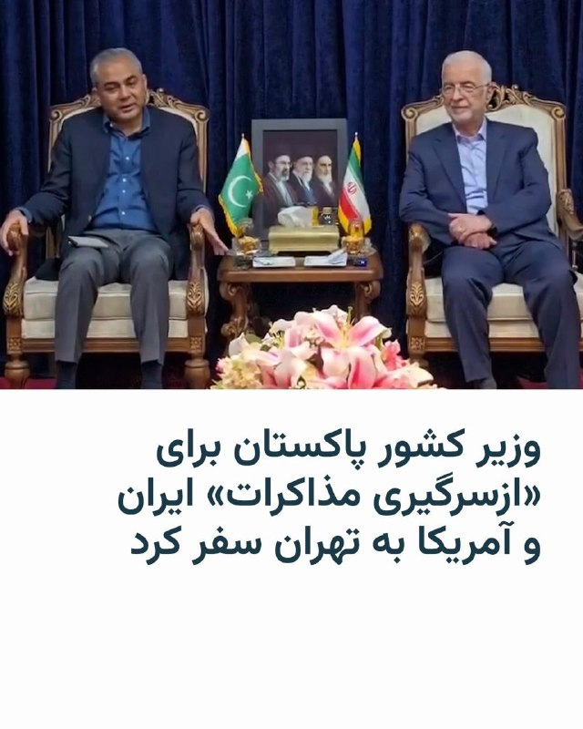

🔸رسانه‌های ایران روز شنبه ۲۶ اردیبهشت اعلام کردند وزیر کشور پاکستان در سفر به تهران درباره «ازسرگیری مذاکرات» بین ایران و آمریکا با همتای ایرانی خود گفت‌وگو کرده است.

🔸محسن نقوی، وزیر کشور پاکستان، که برای دیداری دو روزه به ایران سفر کرده، به نوشته رسانه‌های نزدیک به حکومت ایران با اسکندر مومنی دیدار کرد و «درباره روابط ایران و پاکستان و چشم‌انداز ازسرگیری مذاکرات صلح، گفت‌وگوهای مفصلی انجام شد».

🔸پاکستان از زمان برقراری آتش‌بس بین ایران و آمریکا به عنوان میانجی عمل کرده و یک دور مذاکره میان مقام‌های ارشد واشینگتن و تهران در اسلام‌آباد برگزار شد که به نتیجه نرسید.

🔸طی هفته‌های اخیر پاکستان وظیفه انتقال طرح‌ها و پیشنهادهای ایران و آمریکا برای رسیدن به توافق پایان جنگ را بر عهده داشته است. دونالد ترامپ، رئیس‌جمهور ایالات متحده، پیشنهادهای مطرح‌شده از سوی ایران را غیر قابل قبول خوانده است.

🔸این در حالی است که عباس عراقچی، وزیر خارجه ایران، روز جمعه مدعی شد تهران پیام‌هایی از ایالات متحده دریافت کرده که نشان می‌دهد دولت دونالد ترامپ آمادهٔ ادامه مذاکرات با هدف پایان دادن به جنگ خاورمیانه است.
@RadioFarda

## RadioFarda — post 157259

  

🔸ستاد فرماندهی مرکزی ایالات متحده، سنتکام، روز جمعه ۲۶ اردیبهشت با انتشار تصویری از پرواز یک بالگرد ارتش آمریکا بر فراز آب‌های نزدیک تنگه هرمز اعلام کرد که تاکنون ۷۸ کشتی تجاری در چارچوب محاصره دریایی ایران وادار به تغییر مسیر شده‌اند.

🔸سنتکام همچنین اعلام کرد چهار شناور نیز برای «اطمینان از اجرای محاصره» از کار انداخته شده‌اند.

🔸این فرماندهی پیش‌تر گفته بود به ۱۵ کشتی حامل کمک‌های بشردوستانه اجازه عبور داده شده و نیروهای آمریکایی در برخی موارد با تماس رادیویی و شلیک تیر هشدار، کشتی‌ها را به تغییر مسیر وادار کرده‌اند.

🔸آمریکا پس از بی‌نتیجه ماندن مذاکرات مستقیم با ایران، محاصره دریایی بنادر جمهوری اسلامی را آغاز کرد؛ در حالی که ایران از ابتدای جنگ تنگه هرمز را مسدود کرده است.

@RadioFarda

## RadioFarda — post 157258

آزادی برای خارجی‌ها، محدودیت برای محلی‌ها؛ ترکمنستان درها را به روی گردشگری می‌گشاید

🔸الیز ویلیامز، گردشگر کانادایی، اندکی پیش از ورودش به ترکمنستان در اوایل سال ۲۰۲۶، از شرکت گردشگری خود هشداری دریافت کرد مبنی بر این‌که در این کشور استبدادی از هتل خود زیاد دور نشود و هنگام تنها بودن در خیابان‌ها از گرفتن عکس خودداری کند.

🔸اما واقعیتی که هنگام ورود با آن مواجه شد بسیار کمتر از حد انتظار محدودکننده بود.

🔸او به رادیو اروپای آزاد/رادیو آزادی می‌گوید: «همان‌طور که از عکس‌هایم می‌توانید ببینید، واضح است که این‌طور نبود [که عکاسی به‌شدت محدود شده باشد]. احساس می‌کردم کاملاً آزادم که در مکان‌های مختلف عکس‌های زیادی بگیرم».

🔸نسخه کامل این گزارش را در وب‌سایت رادیوفردا بخوانید.

@RadioFarda

## RadioFarda — post 157257

  <a href="https://t.me/radiofarda/157257" target="_blank">📎 Download file</a>

📻بشنوید: ساعت ۱۴ با رادیوفردا، ۲۶ اردیبهشت ۱۴۰۵‌

@Radiofarda

## IranianMinds — post 20249

  <a href="telegram/content/IranianMinds_20249_1778942881.mp4" target="_blank">🎬 Download video</a>

🔴 دفتر ریاست جمهوری تایوان: در مورد موضوع فروش تسلیحات که توجه خارجی را به خود جلب کرده است، کاملاً مشخص است که چین همچنان به تشدید تهدیدات نظامی ادامه می‌دهد. این تنها منبع ناامنی در تنگه تایوان و منطقه هند و اقیانوس آرام است و همچنین به همین دلیل است که کشورهای اطراف زنجیره جزایر اول به طور فعال با ایالات متحده برای تقویت دفاع همکاری می‌کنند.

@IranianMinds

## IranianMinds — post 20248

  <a href="telegram/content/IranianMinds_20248_1778942882.mp4" target="_blank">🎬 Download video</a>

🔴 دفتر ریاست جمهوری تایوان: از رئیس جمهور ترامپ به خاطر حمایت مستمرش از امنیت تنگه تایوان از زمان اولین دوره ریاست جمهوری‌اش تشکر می‌کنیم. ما همکاری تایوان و ایالات متحده را بیشتر تعمیق خواهیم کرد و از طریق قدرت، صلح را برقرار خواهیم کرد و اطمینان حاصل خواهیم کرد که امنیت و ثبات تنگه تایوان تهدید یا تضعیف نشود.

@IranianMinds

## IranianMinds — post 20247

  

✅ (فقط ۲۲۵ هزار تومن)🥺

🌱 قیمت اقتصادی + پشتیبانی حرفه‌ای

🚀 سریع و پایدار، بدون قطعی
🦋پشتیبانی واقعی، همیشه در دسترس

ربات ما🌴
📩 @dayaconfigbot

کانال ما🌳
📩 @dayavpn

## IranianMinds — post 20245

🔴 منبع پاکستانی به الحدث: ما از آمریکا و ایران می‌خوایم برای جلوگیری از جنگ انعطاف بیشتری از خودشون نشون بدن.

@IranianMinds

## IranianMinds — post 20244

🔴 ارتش اسرائیل هامر ایاد محمد آلماتوک و خالد محمد سالم گودا، دو تروریست سازمان تروریستی حماس را که در 7 اکتبر به خاک اسرائیل حمله کردند و توطئه های تروریستی را علیه نیروهای ما ترویج کردند، کشتند.

@IranianMinds

## IranianMinds — post 20243

🔴 ارتش اسرائیل اعلام کرد نیروی هوایی این کشور با هدایت لشکر ۹۱، دو عضو حزب‌الله رو در ساختمانی در جنوب لبنان هدف قرار دادن. بعد از حمله انفجارهای ثانویه دیده شد که نشون‌دهنده وجود سلاح داخل سازه بود. علاوه بر این، سربازان اسرائیلی یک انبار تسلیحات حزب‌الله…

## IranianMinds — post 20242

🔴 ارتش اسرائیل اعلام کرد نیروی هوایی این کشور با هدایت لشکر ۹۱، دو عضو حزب‌الله رو در ساختمانی در جنوب لبنان هدف قرار دادن. بعد از حمله انفجارهای ثانویه دیده شد که نشون‌دهنده وجود سلاح داخل سازه بود.

علاوه بر این، سربازان اسرائیلی یک انبار تسلیحات حزب‌الله شامل کلاهک، جلیقه، کلاه ایمنی و تجهیزات دیگه رو در جنوب لبنان کشف کردن.

ارتش اسرائیل گفته به عملیات علیه تهدیدات ادامه میده

@IranianMinds

## IranianMinds — post 20241

  

🔴محمد‌امین صابرکار، ۱۶ ساله، در جریان آموزش‌های نظامی، در بخش بردخون شهرستان دیر بر اثر شلیک خودی کشته شد.

@IranianMinds

## IranianMinds — post 20238

  <a href="telegram/content/IranianMinds_20238_1778942884.mp4" target="_blank">🎬 Download video</a>

🔴ویدئویی که ارتش آمریکا از عملیات ترور ابوبلال المینوکی نفر دوم داعش در نیجریه، منتشر کرد.

@IranianMinds

## IranianMinds — post 20237

🔴ایرنا:

سید محسن نقوی وزیر کشور پاکستان برای دیدار با مسؤولان جمهوری اسلامی، ساعاتی قبل وارد تهران شد.

@IranianMinds

## IranianMinds — post 20236

  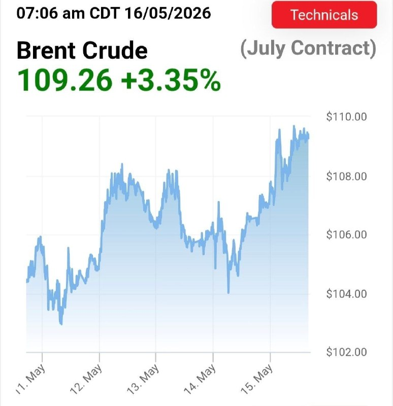

🔴 آخرین قیمت نفت:
۱۰۹.۲۶ دلار

@IranianMinds

## IranianMinds — post 20235

🔴 نیویورک‌تایمز:

آمریکا و اسرائیل احتمالأ هفته آینده به ایران حمله خواهند کرد.

بعضی از رسانه‌ها هم احتمال حمله را تا ۲۴ ساعت آینده تخمین می‌زنند.

@IranianMinds

## IranianMinds — post 20234

🔴 جسی واترز، مجری فاکس‌نیوز:

ترامپ در حال آماده شدن برای دور جدیدی از حملات به ایران است.

@IranianMinds

## BBCPersian — post 281223

🔻معاون استاندار تهران: ۷۰ درصد مردم در تهران در زمان جنگ از شهر خارج نشدند

معاون استاندار تهران گفته است که در جریان جنگ اخیر که با حملات آمریکا و اسرائیل در نهم اسفند (بیست و هشتم فوریه) شروع شد، «۷۰ درصد از مردم تهران در محل زندگی خود ماندند» و از شهرها خارج نشدند.

حسین کاغذلو گفت حضور مردم در شهرها با وجود این که بخشی از جنگ در تعطیلات نوروز بود، اتفاق افتاد.

او گفته است که در جریان جنگ ۱۲ روزه «تعداد قابل توجهی از مردم، به دلیل حملات دشمنان از شهر خارج شدند.»

https://bbc.in/4wuyApz
@BBCPersian

## BBCPersian — post 281222

  <a href="https://t.me/bbcpersian/281222" target="_blank">📎 Download file</a>

📻این هفته در پرگار: سلامت روانی

🔻سلامت روانی چیست و عوامل موثر در حفظ آن چه هستند؟ سلامت روانی شاخص‌های شناخته شده‌ی جهانی دارد یا متاثر از محیط فرهنگی و اجتماعی است؟

میهمان‌ها:
نازی اکبری، متخصص در روان درمانی بین فرهنگی
رضا کاظم زاده، روانشناس بالینی
ارشیا صدیق، متخصص مغز و اعصاب

این برنامه یک بار دیگر پیش از این پخش شده است.

@BBCPersian

## BBCPersian — post 281221

🔻‌حضور مجریان چند شبکه تلویزیون ایران با اسلحه و آموزش استفاده از آن در شبکه افق واکنش‌برانگیز شده است.

در یکی از این برنامه‌ها، حسین حسینی باز و بسته کردن اسلحه کلاشینکف را آموزش داد. مجری برنامه با هدف گرفتن پرچم امارات متحده در استودیو، به آن شلیک کرد.

بعضی از مجریان هم مثل مبینا نصیری در شبکه سه تلویزیون اعلام آمادگی کرد «در صورت نیاز، خودش و همه زنان به عنوان جان‌فدا به جنگ می‌پیوندند.». در ماه گذشته، انتشار رژه زنان مسلح در خودروهای حامل دوشکا نیز خبرساز شده بود.

گروهی از کاربران، این برنامه‌ها را به شرایط جنگی نامعلوم و بعضی به ایجاد ترس بین مردم برای شروع اعتراضات ربط دادند.  بعضی دیگر نیز به مجری تلویزیون لیبی اشاره کردند که در سال ۲۰۱۱ چند روز پیش از سقوط حکومت قذافی مخالفان را با اسلحه تهدید کرده بود.

از آغاز جنگ و تجمعات شبانه حامیان حکومت تصاویری از مردم با اسلحه منتشر شده است. تصاویری هم از کودکان مسلح با لباس نظامی در تجمع‌های شبانه حامیان حکومت منتشر شده است عملی که خلاف قوانین حقوق بشر است.

@‌‌BBCPersian

## BBCPersian — post 281220

🔻هشدار مقام‌های ایران به آمریکا و کشورهای منطقه درباره احتمال آغاز مجدد جنگ

برخی از مقام‌های جمهوری اسلامی ایران امروز درباره احتمال آغاز مجدد جنگ، به آمریکا و کشورهای منطقه هشدار دادند.

محمد مخبر، مشاور رهبر جمهوری اسلامی ایران با اشاره به حملات متقابل ایران به برخی از کشورهای منطقه در جریان جنگ اخیر گفته است «پاسخ جمهوری اسلامی به سنگرهای استیجاری سنتکام (فرماندهی مرکزی آمریکا) در جنگ اخیر تمام‌عیار نبود اما قطعا این خویشتنداری همیشگی نیست.»

آقای مخبر گفته است «ایران سال‌ها به چشم دوست و برادر به آنها نگاه کرد ولی آنها با پیش‌فروش استقلال خود، حتی خاک و خانه‌هایشان را در اختیار دشمنان فلسطین و ایران قرار دادند.»

نورنیوز، رسانه نزدیک به دبیرخانه شورای عالی امنیت ملی ایران هم به نقل از «یک مقام ارشد نظامی» که نامش آورده نشد، هشدار داده است که در صورت حمله مجدد به ایران «اهدافی که در جریان جنگ ۴۰ روزه، بنا بر ملاحظاتی مورد اصابت قرار نگرفتند، این‌بار در اولویت عملیاتی قرار گرفته‌اند.»

https://bbc.in/4uytDuB
@BBCPersian

## BBCPersian — post 281219

  <a href="telegram/content/BBCPersian_281219_1778942887.mp4" target="_blank">🎬 Download video</a>

⭕️ سرخط خبرها، شنبه ۲۶ اردیبهشت ۱۴۰۵
@BBCPersian

## BBCPersian — post 281218

هزاران مامور پلیس در لندن مستقر شده‌اند تا دو راهپیمایی بزرگ با گرایش‌های مخالف هم را مدیریت کنند؛ تظاهرات طرفداران فلسطینیان و راهپیمایی‌ای که تامی رابینسون، فعال راست افراطی ضد اسلام سازماندهی کرده است.

قرار است مقامات منطقه حائلی را برای جدا کردن راهپیمایی‌های این دو گروه ایجاد کنند؛ همچنین از دوربین‌های تشخیص چهره برای ردیابی مظنونان استفاده خواهد شد و دادستان‌ها به پلیس توصیه کرده‌اند که شعارها را زیر نظر داشته باشند تا در صورت نقض قوانین مربوط به جرایم مبتنی بر نفرت‌پراکنی، مداخله کند.

پرهام قبادی، خبرنگار بی‌بی‌سی از محل تظاهرات توضیحات بیشتری می‌دهد.
@BBCPersian

## BBCPersian — post 281217

🔺استقرار هزاران مامور پلیس در لندن برای مدیریت دو تظاهرات بزرگ با گرایش‌های مخالف

هزاران مامور پلیس در لندن مستقر شده‌اند تا دو راهپیمایی بزرگ با گرایش‌های مخالف هم را مدیریت کنند؛ تظاهرات طرفداران فلسطینیان و راهپیمایی‌ای که تامی رابینسون، فعال راست افراطی ضد اسلام سازماندهی کرده است.

پلیس لندن می‌گوید که امروز با یکی از مهم‌ترین عملیات‌‌های خود در سال‌های اخیر روبرو است.

قرار است مقامات منطقه حائلی را برای جدا کردن راهپیمایی‌های این دو گروه ایجاد کنند؛ همچنین از دوربین‌های تشخیص چهره برای ردیابی مظنونان استفاده خواهد شد و دادستان‌ها به پلیس توصیه کرده‌اند که شعارها را زیر نظر داشته باشند تا در صورت نقض قوانین مربوط به جرایم مبتنی بر نفرت‌پراکنی، مداخله کند.

پیش از این رویدادها، ورود یازده سخنران برجسته راست افراطی به بریتانیا ممنوع شده است.

دولت اعلام کرده است که از ورود یازده «آشوبگر راست افراطی» خارجی به کشور برای شرکت در تجمعی که توسط تامی رابینسون، فعال ضد اسلام، سازماندهی شده بود، جلوگیری شده است.

https://bbc.in/4nuSJrc
@BBCPersian

## BBCPersian — post 281215

🔻ایرنا: وزیر کشور پاکستان در یک سفر از پیش اعلام نشده در تهران است

خبرگزاری رسمی ایرنا گزارش داده است که وزیر کشور پاکستان «در یک سفر از پیش اعلام نشده» در تهران است.

ایرنا از قول منابع خود خبر داده است که محسن نقوی ساعاتی پیش وارد تهران شده و قرار است با برخی از مقام‌های جمهوری اسلامی ایران دیدار کند.

پاکستان میانجی آتش‌بس کنونی بین ایران و آمریکاست و یک بار هم میزبان مقام‌های ارشد ایرانی و آمریکایی برای مذاکرات صلح شده که تاکنون بی‌نتیجه مانده است.

وزیر کشور پاکستان یک ماه پیش همراه عاصم منیر، فرمانده ارتش این کشور به ایران سفر کرده بود.

پاکستان یک روز پیش اعلام کرده بود که روند بازگرداندن بیست ملوان ایرانی و یازده پاکستانی که پس از توقیف کشتی آنان توسط آمریکا در آب‌های سنگاپور بودند در جریان است و وعده داده بود که همه آنها از تایلند به اسلام‌آباد منتقل می‌شوند.

https://bbc.in/4nzZJmQ
@BBCPersian

## BBCPersian — post 281214

🔺نت‌بلاکس: قطع اینترنت ایران وارد هفته دوازدهم شد

نت‌بلاکس که وضعیت اینترنت در جهان را بررسی می کند، می‌گوید قطعی اینترنت در ایران اکنون وارد دوازدهمین هفته خود شده و به هفتاد و هشتمین روز رسیده است.

قطع اینرنت ایران که برای چهارمین بار به صورت گسترده ادامه دارد از زمان حمله آمریکا و اسرائیل به ایران در نهم اسفند (۲۸ فوریه) آغاز شده و تاکنون ادامه دارد. تماس تلفنی با ایران هم در همین مدت محدود و با اختلال همراه شده است.

نت‌بلاکس می گوید «این قطع اینترنت، که کشوری ۹۰ میلیونی را برای مدتی بی‌سابقه تا حد زیادی از دسترسی آنلاین محروم کرده، همچنان در مقیاسی گسترده به فرسایش حقوق بشر، اقتصاد و آزادی‌های اساسی ادامه می‌دهد.»

ایران هرگونه استفاده از اینترنت ماهواره‌ای همچون استارلینک را هم ممنوع کرده و کاربران آن را تحت تعقیب قرار می‌دهد.

https://bbc.in/496jyMz
@BBCPersian

## BBCPersian — post 281210

🔻حماس و ارتش اسرائیل تأیید کرده‌اند که عزالدین حداد، فرمانده گردان‌های قسام، شاخه نظامی این گروه، شامگاه جمعه در حمله‌ اسرائیل در شهر غزه کشته شده است.

اسرائیل او را یکی از طراحان حملات هفتم اکتبر ۲۰۲۳ خوانده است.

مراسم تشییع عزالدین حداد امروز در شهر غزه برگزار شد.

اعضای خانواده‌ آقای حداد هم در حمله هوایی شبانه اسرائیل کشته شدند.

سازمان‌های امدادی در غزه اعلام کردند که در این حملات دست‌کم هفت نفر کشته و ده‌ها نفر هم زخمی شده‌اند.

اگرچه از ماه اکتبر آتش‌بس در این منطقه برقرار بوده، اما دولت اسرائیل می‌گوید همچنان اختیار هدف قرار دادن اعضای حماس را دارد.

📷 Getty Images
@BBCPersian

## Dirty_Kids — post 389557

  <a href="telegram/content/Dirty_Kids_389557_1778942888.mp4" target="_blank">🎬 Download video</a>

اطلاعات داره کم‌کم رو می‌شه. به خامنه‌ای گفته بودند جنگ نمی‌شه از لونه بیا بیرون که یک دفعه با یه تق... به هلاکت می‌رسه
گوش کنید حتما

@Dirty_Kids 👻

## Dirty_Kids — post 389556

  

استوری جدید مشاور قالیباف :

ای لشکر صاحب زمان آماده باش...

@Dirty_Kids 👻

## Dirty_Kids — post 389555

  

🔴 سپاه یه فراخوان داد که افراد بالای 12 سال به عنوان رزمنده بیان دوره فعالیت دفاعی ببینن. یه دانش آموز 16 ساله به اسم محمدامین صابرکار میره توی دوره آموزشی شرکت کنه که در حین آموزش بر اثر شلیک خودی کشته میشه!

@Dirty_Kids 👻

## Dirty_Kids — post 389554

  

تراپی @Dirty_Kids 👻

## Dirty_Kids — post 389553

  

به اونایی که می‌گفتن تو کوله سرباز خارجی آزادی پیدا نمی‌شه بگید مجری‌های صداوسیما واستون اسلحه کشیدن.

@Dirty_Kids 👻

## Dirty_Kids — post 389552

بمونم خونه overthink ميكنم، برم بيرون overpay.

@Dirty_Kids 👻

## Dirty_Kids — post 389551

  <a href="telegram/content/Dirty_Kids_389551_1778942890.mp4" target="_blank">🎬 Download video</a>

مامانم وقتی میگم از عمه خبری نیست:

@Dirty_Kids 👻

## Hranews — post 112971

  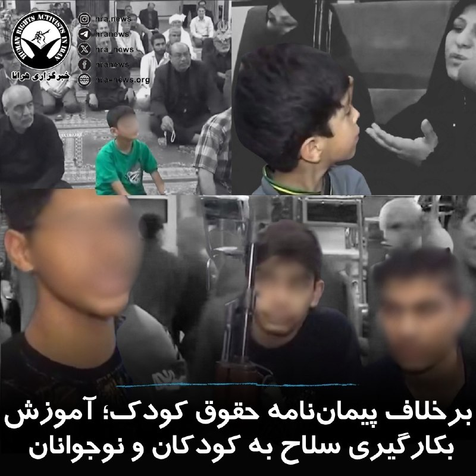

پخش یک گزارش ویدیویی در صداوسیما با محوریت «آموزش نظامی در سنگر مساجد»، نگرانی‌های جدی درباره وضعیت حقوق کودکان در ایران را تشدید کرده است. در این ویدیو، کودکان و نوجوانانی دیده می‌شوند که در کنار بزرگسالان، تحت نظارت نیروهای بسیج، نحوه کار با سلاح‌هایی مانند کلاشینکف و وینچستر را آموزش می‌بینند. در بخشی از این گزارش، برگزارکنندگان به‌صراحت از «آموزش جزئیات کار با سلاح» سخن می‌گویند و شرکت‌کنندگان نوجوان نیز از حضور خود برای یادگیری استفاده از این تجهیزات نظامی خبر می‌دهند؛ امری که نشان‌دهنده سازمان‌یافتگی این برنامه‌ها در بسترهای عمومی همچون مساجد است.

چندی پیش نیز یک نوجوان ۱۷ ساله در شهرستان دیر، هنگام شرکت در آموزش‌های نظامی تحت نظارت بسیج، جان باخت. این روند در حالی دنبال می‌شود که ایران از کشورهای عضو پیمان‌نامه #حقوق_کودک بوده و متعهد به جلوگیری از به‌کارگیری و آموزش نظامی به افراد زیر ۱۸ سال است.

↘️
@hranews_bot تماس ✉️ - @Hranews کانال هرانا 🆑

## Hranews — post 112970

بازداشت یک شهروند در تهران به دلیل انتشار مطالبی در فضای مجازی

❗️
❗️
❗️
❗️
❗️– پلیس فتا تهران بزرگ از بازداشت یک شهروند به دلیل آنچه «انتشار اخبار نادرست در فضای مجازی» عنوان شده، خبر داد.

ادامه مطلب

↘️
@hranews_bot تماس ✉️ - @Hranews کانال هرانا 🆑

## Hranews — post 112969

  

تداوم بازداشت؛ گزارشی از آخرین وضعیت محمد زنگنه

❗️
❗️
❗️
❗️
❗️– محمد زنگنه، شهروند ساکن مشهد، بیش از ۴۰ روز است که توسط نیروهای امنیتی بازداشت شده است. چندی پیش جلسه دادگاه رسیدگی به اتهامات وی در دادگاه انقلاب مشهد برگزار شده بود.

به گزارش خبرگزاری هرانا، ارگان خبری مجموعه فعالان حقوق بشر در ایران، محمد زنگنه کماکان در بازداشت به‌سر می‌برد.

بر اساس اطلاعات دریافتی هرانا، جلسه دادگاه رسیدگی به اتهامات آقای زنگنه در تاریخ ۱۹ اردیبهشت ماه، در شعبه اول دادگاه انقلاب شهرستان مشهد برگزار شده است. در این جلسه، وی از بابت اتهامات اجتماع و تبانی برای ارتکاب جرم بر ضد امنیت داخلی/خارجی و تبلیغ علیه نظام به دفاع از خود پرداخته بود.

#محمد_زنگنه

ادامه مطلب

↘️
@hranews_bot تماس ✉️ - @Hranews کانال هرانا 🆑

## manototv — post 105521

  <a href="telegram/content/manototv_105521_1778942892.mp4" target="_blank">🎬 Download video</a>

دوسلدورف | آلمان؛ گردهمایی ایرانیان - گزارشگر شنبه ۲۶ اردیبهشت

## manototv — post 105520

  <a href="telegram/content/manototv_105520_1778942894.mp4" target="_blank">🎬 Download video</a>

پرث استرالیا، تجمع ایرانیان، شنبه ۲۶ اردیبهشت

## manototv — post 105519

  <a href="telegram/content/manototv_105519_1778942895.mp4" target="_blank">🎬 Download video</a>

دوسلدورف آلمان، تجمع ایرانیان، شنبه ۲۶ اردیبهشت

## manototv — post 105518

  <a href="telegram/content/manototv_105518_1778942896.mp4" target="_blank">🎬 Download video</a>

ملبورن، تجمع ایرانیان، ۲۶ اردیبهشت

## manototv — post 105517

  <a href="telegram/content/manototv_105517_1778942897.mp4" target="_blank">🎬 Download video</a>

هامبورگ، راهپیمایی ایرانیان و حمایت از زندانیان سیاسی، ۲۶ اردیبهشت

## manototv — post 105516

  <a href="telegram/content/manototv_105516_1778942899.mp4" target="_blank">🎬 Download video</a>

سوییس، تجمع مقابل سفارت جمهوری اسلامی، ۲۶ اردیبهشت ۱۴۰۵

## manototv — post 105515

  <a href="telegram/content/manototv_105515_1778942900.mp4" target="_blank">🎬 Download video</a>

لندن، حضور ایرانیان با پرچم بریتانیا و شیر و خوشید و تصاویر شاهزاده رضا پهلوی در راهپیمایی ملی‌گرایان بریتانیا، ۲۶ اردیبهشت ۱۴۰۵

## manototv — post 105514

  <a href="telegram/content/manototv_105514_1778942901.mp4" target="_blank">🎬 Download video</a>

فرماندهی آفریقای ارتش آمریکا تصاویری از هدف قرار دادن مواضع داعش در نیجریه را منتشر کرده است. آفریکام گفته است عملیات شامگاه گذشته، حضور قابل توجهی از نیروهای داعش را هدف گرفت و به کشته شدن چند فرد مهم این گروه منجر شد.

شمال شرق نیجریه سال‌هاست صحنه فعالیت گروه‌های جهادی، از جمله شاخه غرب آفریقای داعش و بوکوحرام است. مرکز ملی مبارزه با تروریسم آمریکا می‌گوید شاخه غرب آفریقای داعش یکی از بزرگ‌ترین و مرگبارترین شاخه‌های این گروه است و در نیجریه و کشورهای همسایه باعث کشته یا آواره شدن هزاران نفر شده است.

## manototv — post 105513

  <a href="telegram/content/manototv_105513_1778942902.mp4" target="_blank">🎬 Download video</a>

«تجمع ایرانیان در سیدنی استرالیا»

## manototv — post 105512

  <a href="telegram/content/manototv_105512_1778942903.mp4" target="_blank">🎬 Download video</a>

«تجمع ایرانیان در بریزبن استرالیا»

## alonews — post 120411

  <a href="telegram/content/alonews_120411_1778942905.mp4" target="_blank">🎬 Download video</a>

👈وزیر جنگ، پیت هگستث، دریانوردان گروه ضربت ناو هواپیمابر USS Gerald R. Ford را پس از بازگشت به پایگاه نیروی دریایی نورفولک از یک ماموریت تاریخی ۱۱ ماهه، خوش‌آمد گفت.

🔴ویدیوی اول از USS Gerald R. Ford (CVN-78) است و ویدیوی دوم هگستث را در حال خطاب قرار دادن نیروها در USS Bainbridge (DDG-96) نشان می‌دهد

✅ @AloNews خبر جنگ

## alonews — post 120408

کرملین : پوتین با رئیس امارات متحده عربی درباره ایران گفتگو کرد

✅ @AloNews خبر جنگ

## alonews — post 120407

  <a href="telegram/content/alonews_120407_1778942906.webm" target="_blank">🎬 Download video</a>

👈پست جدید ترامپ در تروث سوشال:
بازی نداریم! ببین قراره بعدش تو موضوع مورد علاقت چه اتفاقی بیفته!

✅ @AloNews خبر جنگ

## alonews — post 120406

  <a href="telegram/content/alonews_120406_1778942907.webm" target="_blank">🎬 Download video</a>

👈ویدیویی از ورود وزیر کشور پاکستان به ایران 
✅ @AloNews خبر جنگ

## alonews — post 120404

  <a href="telegram/content/alonews_120404_1778942907.mp4" target="_blank">🎬 Download video</a>

👈چند طرفدار فلسطین از برج ایفل بالا رفتند و پرچم فلسطین را از طبقه اول آن آویزان کردند.

🔴شش نفر از این افراد توسط پلیس دستگیر شدند.

✅ @AloNews خبر جنگ

## alonews — post 120403

  <a href="telegram/content/alonews_120403_1778942908.webm" target="_blank">🎬 Download video</a>

👈پاول دورف، مالک تلگرام: دبی دوباره شلوغ و پر ترافیک شده
- از همین الان دلم برای آتش‌بازی‌های ایرانی تنگ شده، حداقل شهر رو از آدمای زودباور خالی می‌کردن
- پدافند اماراتم زیر اون حجم آتیش خیلی خوب کار کرد
- با مالیات صفر درصد، امنیتی بهتر از اروپاییایی داریم که نصف درآمدشونو مالیات میدن

✅ @AloNews خبر جنگ

## alonews — post 120402

  

بمب موسی 
😁
فروش کانفیگ وی توری 
🔐

گیگی 195.000 تومان
☄️
گیگی 220.000 تومان 
☄️

🔥 سرعت موشکی

💎 ( پنل مشاهده حجم در ربات )
لوکیشن ترکیه

برای خرید ربات رو استارت کنید

BOT 
📎 @WinstonMarket_bot

PV 
✉️ @mosadeveloper

CH 
📣 https://t.me/winstonservice

## alonews — post 120400

  <a href="telegram/content/alonews_120400_1778942909.mp4" target="_blank">🎬 Download video</a>

👈ویدیویی از حملات به جنوب لبنان

✅ @AloNews خبر جنگ

## alonews — post 120399

  <a href="telegram/content/alonews_120399_1778942910.webm" target="_blank">🎬 Download video</a>

👈وزیر نفت عراق: ۱۰ میلیون بشکه نفط در ماه گذشته از تنگه هرمز صادر کردیم

✅ @AloNews خبر جنگ

## alonews — post 120398

  <a href="telegram/content/alonews_120398_1778942910.webm" target="_blank">🎬 Download video</a>

👈ویدیویی از ورود وزیر کشور پاکستان به ایران

✅ @AloNews خبر جنگ

## alonews — post 120397

  <a href="telegram/content/alonews_120397_1778942910.webm" target="_blank">🎬 Download video</a>

👈هم اکنون بمباران در جنوب لبنان

✅ @AloNews خبر جنگ

## alonews — post 120396

  

آدرنالین خالص
🔥

💥سلتیک در آخرین بازی فصل مقابل هارت به برتری ۳بر۱ رسید و قهرمان اسکاتلند شد

🚫هارت رقیب مستقیم سلتیک بود و با یک تساوی هم میتونست قهرمان بشه اما با گل دقیقه ۸۹ مائدا قافیه رو باخت

@AloSport

## alonews — post 120395

  <a href="telegram/content/alonews_120395_1778942911.mp4" target="_blank">🎬 Download video</a>

⭕️به گواهی تاریخی هاشمی رفسنجانی، خون کودکان میناب و تمام قربانیان جنگ ایران و آمریکا به گردن علی خامنه‌ای است.

🔴هاشمی رفسنجانی: «نظرم آن بود که باید مسائل با آمریکا را حل کنیم. با آقای خامنه‌ای یکی دو ساعت بحث کردیم، ولی به نتیجه نرسیدیم.

🔴من گفتم: ما حرف دیگری به شما نمی‌توانیم بزنیم، فقط مساله‌ی ما هست و خدا؛ بالاخره روز قیامت از ما می‌پرسند این همه ضرری که این طرف (به مردم ایران) هست، اگر این‌ها را شما به عهده می‌گیرید من دیگر حرفی ندارم.»

🔴علی خامنه‌ای گفت: «بله جواب خدا با من».

✅@AloNews

## alonews — post 120393

  <a href="telegram/content/alonews_120393_1778942912.webm" target="_blank">🎬 Download video</a>

👈حمله‌ی‌ نیروی هوایی اسرائیل به المنصوری، جنوب لبنان

✅ @AloNews خبر جنگ

## alonews — post 120392

  <a href="telegram/content/alonews_120392_1778942912.webm" target="_blank">🎬 Download video</a>

👈فرماندهی مرکزی ایالات متحده:
تا امروز، ۷۸ کشتی تجاری تغییر مسیر داده‌اند و ۴ کشتی غیرفعال شده‌اند تا اطمینان حاصل شود که قوانین محاصره رعایت می‌شوند.

✅ @AloNews خبر جنگ

## alonews — post 120391

  <a href="telegram/content/alonews_120391_1778942912.mp4" target="_blank">🎬 Download video</a>

👈عارف: ما از حق حاکمیت خود در تنگه هرمز گذشته بودیم و اجازه دادیم از تنگه‌ای که متعلق به ایران است تجهیزات نظامی که قرار بود علیه ما استفاده کنند، عبور دهند؛ دیگر این کار را نمی‌کنیم

✅ @AloNews خبر جنگ

<!-- MSG END -->

<!-- NAV START -->

<a href="https://github.com/zari963963/aio-downloader/blob/main/telegram/content/archive_1.md" style="display:inline-block; padding:6px 12px; margin:0 4px; background-color:#2ea44f; color:white; text-decoration:none; border-radius:4px; font-weight:bold;">صفحه بعد</a>

<!-- NAV END -->
