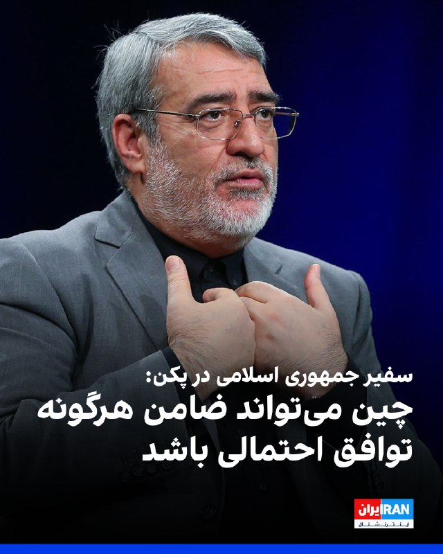
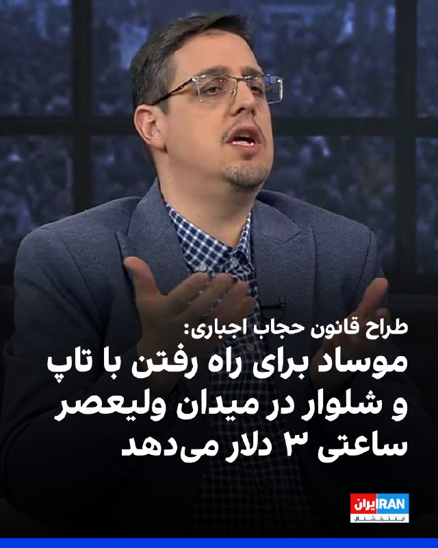
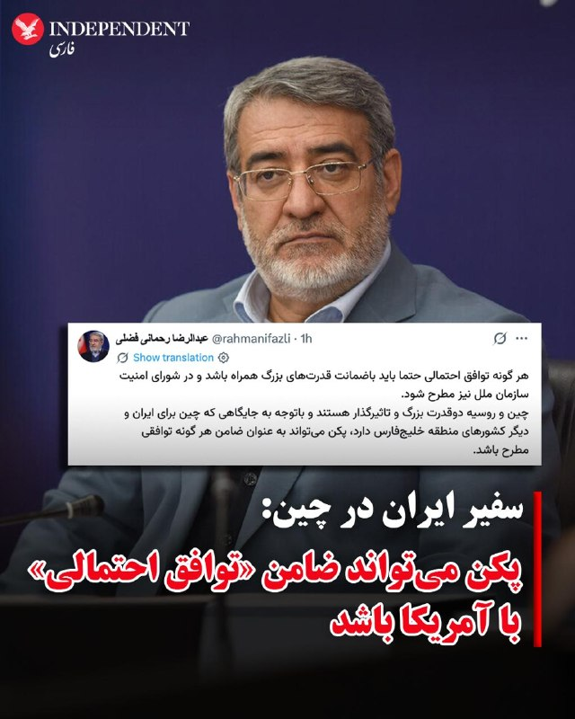
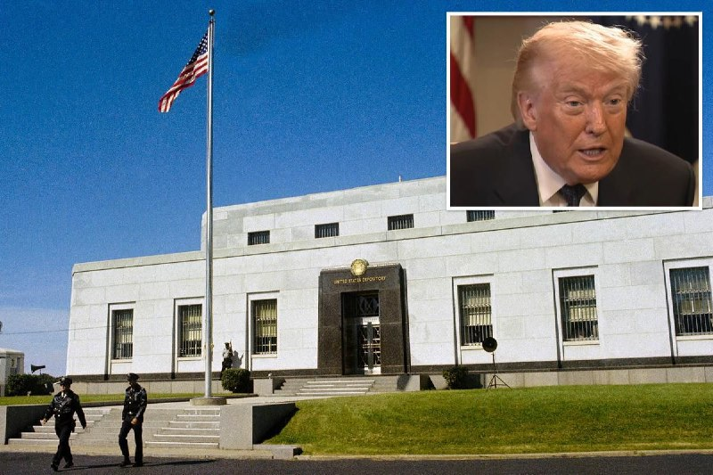
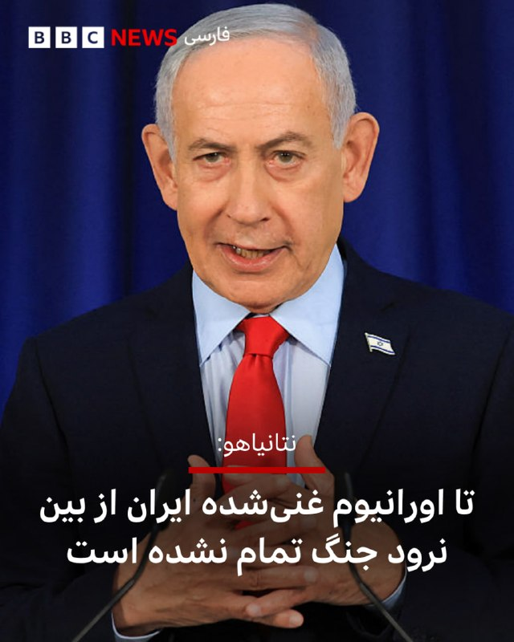
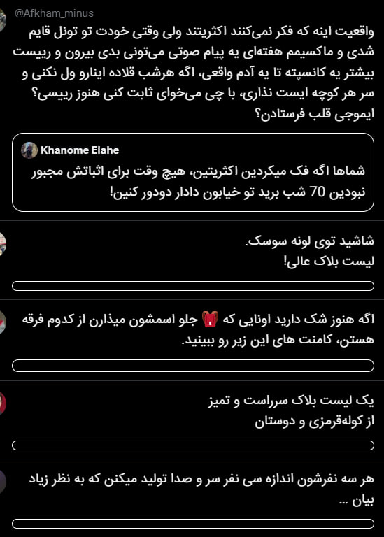
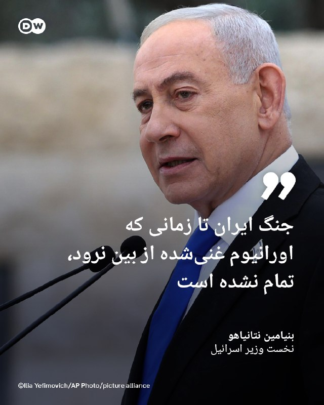
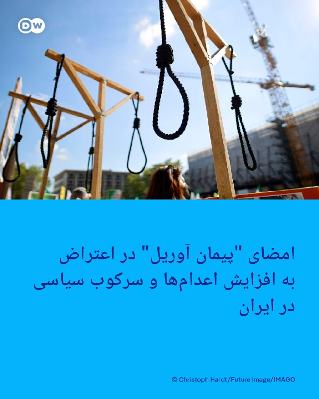
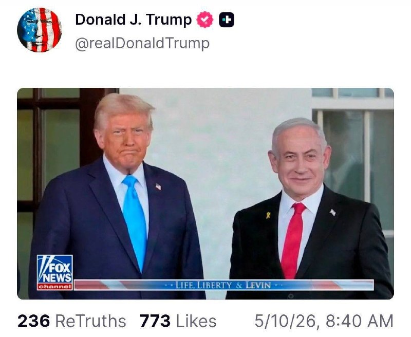
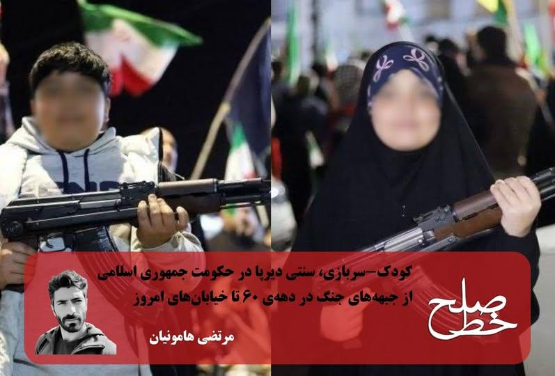

# خواننده تلگرام

<!-- TOP_NAV START -->

<!-- TOP_NAV END -->

<!-- MSG START -->

---
📅 بروزرسانی: 1405/02/20 21:11
---

## VahidOOnLine — post 239356

  

عبدالرضا رحمانی فضلی، سفیر جمهوری اسلامی در چین، گفت: هر توافق احتمالی باید با ضمانت قدرت‌های بزرگ همراه باشد و افزود پکن می‌تواند نقش ضامن هرگونه توافق را بر عهده گیرد.

او افزود: این توافق باید در شورای امنیت سازمان ملل نیز مطرح و تثبیت شود.
‌🏁 🇬🇧 IranintlTV

🤖 @VahidOOnLine

## VahidOOnLine — post 239355

♦️عباس اسدروز، مدیرعامل شرکت پایانه‌های نفتی ایران،  روز یکشنبه در گفتگو با خبرگزاری صدا و سیمای جمهوری اسلامی گزارش‌ها درباره وجود لکه نفتی در جزیره خارگ را رد کرد و ادعا کرد پس از انتشار این اخبار، گروه‌های تخصصی کل منطقه را پایش کردند اما هیچ نشتی شناسایی نشد.

اسدروز افزود: «هیچ‌گونه نشتی در زیرساخت‌ها، مخازن ذخیره‌سازی، سیستم‌های اندازه‌گیری، اسکله‌ها، خطوط لوله این منطقه و کشتی‌های در حال بارگیری وجود ندارد.»

پیشتر آسوشیتدپرس، با انتشار تصاویری از وجود لکه‌هایی در آب‌های خلیج فارس، به نقل از آمی دنیل، مدیرعامل شرکت اطلاعات دریایی «ویندوارد ای‌آی» گزارش کرده بود، معادل حدود ۸۰ هزار بشکه نفت از جزیره خارگ نشت کرده است.
‌🇸🇦 Indypersian

🤖 @VahidOOnLine

## VahidOOnLine — post 239354

  

♦️جورجیا ملونی، نخست‌وزیر ایتالیا، روز یکشنبه به مناسبت روز مادر در پیامی در شبکه اجتماعی ایکس نوشت مادری «بزرگ‌ترین هدیه و در عین حال عمیق‌ترین چالشی است که زندگی می‌تواند پیش روی انسان قرار دهد.»

ملونی در این پیام نوشت مادری انسان را از درون تغییر می‌دهد؛ «قلب، زمان و نگاه او به جهان را دگرگون می‌کند» و در عین حال که انسان را قوی‌تر می‌کند، او را آسیب‌پذیرتر نیز می‌سازد.

نخست‌وزیر ایتالیا افزود مادری به انسان می‌آموزد عشق واقعی چیست؛ عشقی «بی‌حد و مرز و بدون هیچ شرطی.»
او همچنین نوشت مادر بودن یعنی «همیشه حضور داشتن، حتی زمانی که خسته‌ای»، و یعنی روبه‌رو شدن با ترس‌ها و فداکاری‌ها با شجاعت و پیدا کردن نیرو حتی زمانی که به نظر می‌رسد دیگر توانی باقی نمانده است.

ملونی در ادامه از همه مادران، به‌ویژه زنانی که «بی‌وقفه تلاش می‌کنند، نگرانی‌ها را در سکوت تحمل می‌کنند و با کوچک‌ترین جزئیات عشق و مراقبت را به دیگران هدیه می‌دهند» قدردانی کرد و روز مادر را به آن‌ها تبریک گفت.

نخست وزیر ایتالیا، از رابطه با شریک سابق زندگی‌اش، فرزند دختری به نام ژنوِرا (Ginevra) دارد که در سال ۲۰۱۶ متولد شده است.
‌🇸🇦 Indypersian

🤖 @VahidOOnLine

## VahidOOnLine — post 239353

  

کاظم غریب‌آبادی، معاون وزیر خارجه جمهوری اسلامی، در پیامی در شبکه اجتماعی ایکس با انتقاد از اعزام ناوهای نظامی فرانسه و بریتانیا به منطقه گفت تامین امنیت تنگه هرمز صرفا در اختیار جمهوری اسلامی است.

او افزود که تنگه هرمز «ملک مشاع قدرت‌های فرامنطقه‌ای» نیست و هرگونه حضور نظامی برای همراهی با «اقدامات آمریکا» در این آبراه با «پاسخ قاطع و فوری» روبه‌رو خواهد شد.
‌🏁 🇬🇧 IranintlTV

🤖 @VahidOOnLine

## VahidOOnLine — post 239352

  

♦️سباستین لوکورنو، نخست‌وزیر فرانسه، اعلام کرد یکی از پنج شهروند فرانسوی که روز یکشنبه از کشتی کروز آلوده به ویروس هانتا به فرانسه منتقل شدند، علائم این بیماری را نشان داده است.

لوکورنو در پیامی در شبکه اجتماعی ایکس نوشت: «یکی از آن‌ها در هواپیمای انتقال علائم بیماری را نشان داد.» او افزود این پنج مسافر «بلافاصله تا اطلاع ثانوی در قرنطینه کامل قرار گرفته‌اند.»

به گفته نخست‌وزیر فرانسه، این افراد تحت مراقبت پزشکی قرار دارند و آزمایش‌ها و معاینات پزشکی روی آن‌ها انجام خواهد شد.
او همچنین اعلام کرد که شامگاه یکشنبه فرمانی برای اجرای تدابیر لازم قرنطینه به منظور حفاظت از سلامت عمومی صادر خواهد کرد.

هواپیمای حامل این پنج مسافر که از کشتی تخلیه شده بودند، عصر یکشنبه در فرودگاه لو بورژه در شمال پاریس به زمین نشست. این افراد سپس با پنج آمبولانس و تحت اسکورت پلیس به بیمارستان بیشا در پاریس منتقل شدند.
‌🇸🇦 Indypersian

🤖 @VahidOOnLine

## VahidOOnLine — post 239351

  <a href="telegram/content/VahidOOnLine_239351_1778434881.mp4" target="_blank">🎬 Download video</a>

معاون وزیر خارجه جمهوری اسلامی در واکنش به احتمال اعزام ناوهای بریتانیایی و فرانسوی به تنگه هرمز گفت هرگونه استقرار ناوشکن‌ها در اطراف این تنگه با عنوان «حفاظت از کشتیرانی»، اقدامی برای تشدید بحران است.

او در پیامی در شبکه‌های اجتماعی نوشت حضور ناوهای جنگی فرانسه و بریتانیا در تنگه هرمز، به‌ویژه در صورت همراهی با اقدامات آمریکا، با «پاسخ فوری و قاطع» روبه‌رو خواهد شد.

وزارت دفاع بریتانیا پیش‌تر اعلام کرده بود ناو جنگی اچ‌ام‌اس دراگون را برای آمادگی در یک تلاش چندملیتی احتمالی به منظور حفاظت از کشتیرانی در تنگه هرمز، به خاورمیانه اعزام می‌کند.
‌🏁 🇬🇧 ManotoTV

🤖 @VahidOOnLine

## VahidOOnLine — post 239350

  <a href="telegram/content/VahidOOnLine_239350_1778434881.mp4" target="_blank">🎬 Download video</a>

بنیامین نتانیاهو، نخست‌وزیر اسرائیل، در گفت‌وگو با برنامه شصت دقیقه شبکه سی‌بی‌اس گفت جنگ با ایران تمام نشده، زیرا به گفته او هنوز اورانیوم غنی‌شده، سایت‌های غنی‌سازی، نیروهای نیابتی مورد حمایت جمهوری اسلامی و برنامه موشک‌های بالستیک باقی مانده‌اند.

نتانیاهو گفت بخش زیادی از توان ایران تضعیف شده، اما هنوز «کارهایی هست که باید انجام شود».

او درباره چگونگی خارج کردن اورانیوم با غنای بالا از ایران گفت در صورت وجود توافق، می‌توان وارد شد و آن را خارج کرد و این «بهترین راه» است.

نتانیاهو در پاسخ به این پرسش که آیا بدون توافق می‌توان اورانیوم را با زور خارج کرد، از توضیح درباره گزینه‌ها و برنامه‌های نظامی خودداری کرد، اما این موضوع را «ماموریتی فوق‌العاده مهم» خواند.
‌🏁 🇬🇧 ManotoTV

🤖 @VahidOOnLine

## VahidOOnLine — post 239349

  <a href="telegram/content/VahidOOnLine_239349_1778434882.mp4" target="_blank">🎬 Download video</a>

‌
پورتو | پرتغال؛ گردهمایی ایرانیان ـ گزارشگر ۲۰ اردیبهشت ۱۴۰۵
‌🏁 🇬🇧 ManotoTV

🤖 @VahidOOnLine

## VahidOOnLine — post 239348

  <a href="telegram/content/VahidOOnLine_239348_1778434883.mp4" target="_blank">🎬 Download video</a>

دونالد ترامپ در مصاحبه با برنامه فول مژر با شریل اتکیسن گفت آمریکا مواد هسته‌ای و اورانیوم غنی‌شده ایران را زیر نظر دارد و در صورت نزدیک شدن افراد به محل آن، واشنگتن مطلع خواهد شد.

او گفت عملیات رزمی علیه ایران را پایان‌یافته نمی‌داند، هرچند به گفته او ایران «شکست خورده» است. ترامپ افزود آمریکا حدود ۷۰ درصد اهداف مورد نظر خود را زده و اهداف دیگری هم وجود دارد که ممکن است هدف قرار بگیرد.

ترامپ همچنین گفت واشنگتن نباید اجازه دهد ایران به سلاح هسته‌ای برسد و مدعی شد اگر حمله بمب‌افکن‌های بی‌دو آمریکا به تاسیسات هسته‌ای ایران انجام نمی‌شد، جمهوری اسلامی ظرف دو هفته به سلاح هسته‌ای دست پیدا می‌کرد.
‌🏁 🇬🇧 ManotoTV

🤖 @VahidOOnLine

## VahidOOnLine — post 239347

  <a href="telegram/content/VahidOOnLine_239347_1778434885.mp4" target="_blank">🎬 Download video</a>

فرانکفورت | آلمان؛ گردهمایی ایرانیان ـ گزارشگر ۲۰ اردیبهشت ۱۴۰۵
‌🏁 🇬🇧 ManotoTV

🤖 @VahidOOnLine

## VahidOOnLine — post 239346

  <a href="telegram/content/VahidOOnLine_239346_1778434886.mp4" target="_blank">🎬 Download video</a>

نیس | فرانسه؛ گردهمایی ایرانیان ـ گزارشگر ۲۰ اردیبهشت ۱۴۰۵
‌🏁 🇬🇧 ManotoTV

🤖 @VahidOOnLine

## VahidOOnLine — post 239345

  

♦️یک مقام دولتی پاکستان که در مذاکرات مرتبط با جنگ ایران نقش دارد، روز یکشنبه ۲۰ اردیبهشت ماه، اعلام کرد اسلام‌آباد پاسخ جمهوری اسلامی به پیشنهاد آمریکا را دریافت و آن را به واشنگتن منتقل کرده است.
خبرگزاری رویترز با اعلام این خبر نوشت، این مقام پاکستانی جزئیات بیشتری درباره محتوای این پیشنهاد ارائه نکرد.
رسانه‌های دولتی روز یکشنبه ایران گزارش دادند تهران پاسخ به پیشنهاد آمریکا برای آغاز مذاکرات صلح با هدف پایان دادن به جنگ را ارسال کرده است. بر اساس اخبار منتشر شده، «بر پایان جنگ در تمامی جبهه‌ها، به‌ویژه لبنان» و مسائل مربوط به تنگه هرمز از موارد مطرح شده در این پاسخ است.
‌🇸🇦 Indypersian

🤖 @VahidOOnLine

## VahidOOnLine — post 239344

  <a href="telegram/content/VahidOOnLine_239344_1778434888.mp4" target="_blank">🎬 Download video</a>

ویدیوهای رسیده نشان می‌دهند یکشنبه ۲۰ اردیبهشت ایرانیان مقیم شهرهای بارسلون در اسپانیا، کپنهاگ دانمارک و لاهه در هلند علیه جمهوری اسلامی تجمع کردند.
‌🏁 🇬🇧 IranintlTV

🤖 @VahidOOnLine

## VahidOOnLine — post 239343

  

احمد مرادی، عضو کمیسیون انرژی مجلس گفت: کشورهای منطقه نباید «فریب» دونالد ترامپ و بنیامین نتانیاهو را بخورند و برای دستیابی به آرامش باید با تهران هماهنگ باشند و قدرت جمهوری اسلامی را درک کنند.

او افزود: تنگه هرمز دیگر به وضعیت گذشته بازنخواهد گشت و جمهوری اسلامی بر حفظ این موقعیت راهبردی تاکید دارد.
‌🏁 🇬🇧 IranintlTV

🤖 @VahidOOnLine

## VahidOOnLine — post 239342

  

ابوالفضل اقبالی، از طراحان «قانون عفاف و حجاب»، در تلویزیون جمهوری اسلامی گفت: «اتاق فرمان دشمن، موساد است. همان‌جایی حمله نظامی را تصویب می‌کند، تحریم اقتصادی را سازمان می‌دهد و زیرساخت را می‌زند. همان‌جا هم ساعتی ۳ دلار پول می‌دهد می‌گوید برو میدان ولیعصر با تاپ و شلوار قدم بزن.»

او گفت: «جنگ با جمهوری اسلامی ابعاد مختلف دارد. همان کس که حلقه‌های آشوب سازماندهی کرده، ارز دیجیتال توزیع می‌کند تا یک عده بیایند وضعیت اباحه‌گری را سامان بدهند.»
‌🏁 🇬🇧 IranintlTV

🤖 @VahidOOnLine

## VahidOOnLine — post 239341

  <a href="telegram/content/VahidOOnLine_239341_1778434891.mp4" target="_blank">🎬 Download video</a>

بر اساس ویدیوهای رسیده به ایران‌اینترنشنال، گروهی از ایرانیان مقیم بریتانیا، یکشنبه ۲۰ اردیبهشت در اعتراض به اعدام‌های جمهوری اسلامی، در بیرمنگام تجمع کردند.
‌🏁 🇬🇧 IranintlTV

🤖 @VahidOOnLine

## VahidOOnLine — post 239340

  <a href="telegram/content/VahidOOnLine_239340_1778434896.mp4" target="_blank">🎬 Download video</a>

بولونیا | ایتالیا؛ گردهمایی ایرانیان ـ گزارشگر ۲۰ اردیبهشت ۱۴۰۵
‌🏁 🇬🇧 ManotoTV

🤖 @VahidOOnLine

## VahidOOnLine — post 239339

  

♦️عبدالرضا رحمانی فضلی، سفیر و نماینده ویژه رئیس‌جمهوری ایران در چین، روز یکشنبه اعلام کرد هرگونه توافق احتمالی باید با ضمانت قدرت‌های بزرگ همراه باشد و چین می‌تواند به عنوان ضامن چنین توافقی مطرح شود.
رحمانی فضلی در پیامی در شبکه اجتماعی ایکس نوشت هر توافق احتمالی باید در شورای امنیت سازمان ملل نیز مطرح شود و از حمایت قدرت‌های بزرگ برخوردار باشد.
او افزود چین و روسیه دو قدرت بزرگ و تاثیرگذار هستند و با توجه به جایگاه چین برای ایران و کشورهای منطقه خلیج فارس، پکن می‌تواند به عنوان ضامن هرگونه توافق احتمالی ایفای نقش کند.
‌🇸🇦 Indypersian

🤖 @VahidOOnLine

## VahidOOnLine — post 239337

  <a href="telegram/content/VahidOOnLine_239337_1778434898.mp4" target="_blank">🎬 Download video</a>

ویدیوهای رسیده نشان می‌دهند یکشنبه ۲۰ اردیبهشت ایرانیان مقیم شهرهای مونیخ در آلمان، وین اتریش و آرهوس دانمارک علیه جمهوری اسلامی تجمع کردند.
‌🏁 🇬🇧 IranintlTV

🤖 @VahidOOnLine

## VahidOOnLine — post 239336

  <a href="telegram/content/VahidOOnLine_239336_1778434900.mp4" target="_blank">🎬 Download video</a>

‌
دوبلین | ایرلند؛ گردهمایی ایرانیان ـ گزارشگر ۲۰ اردیبهشت ۱۴۰۵
‌🏁 🇬🇧 ManotoTV

🤖 @VahidOOnLine

## mwarmonitor — post 8834

🔸مارک لوین ؛ «رژیم ایران» دیوانه‌ها برای هزارمین بار نشان می‌دهند که قصد دارند فارغ از هر شرایطی به دنبال سلاح هسته‌ای بروند.

@mwarmonitor

## mwarmonitor — post 8833

🟢چراغ سبز مقام دولت ترامپ به تعلیق مالیات بنزین

📝نویسنده: بن گمن AXIOS

🔸کریس رایت، وزیر انرژی آمریکا روز یکشنبه اعلام کرد که دولت ترامپ با توجه به قیمت بالای سوخت، برای بررسی ایده «تعلیق مالیات فدرال بنزین» آمادگی دارد.

چرا این موضوع اهمیت دارد؟
اظهارات او تا حدی موضع کاخ سفید را در قبال ایده توقف مالیات فدرال (که ۱۸.۳ سنت به ازای هر گالن است) نرم‌تر کرده است.
نظرسنجی‌ها نشان می‌دهند که پرزیدنت ترامپ به دلیل رسیدن قیمت‌ها به بالاترین سطح در چهار سال اخیر، با فشار و انتقادات سیاسی روبروست.
طبق اعلام انجمن اتومبیل آمریکا (AAA)، میانگین قیمت بنزین معمولی در ایالات متحده در روز یکشنبه به ۴.۵۲ دلار در هر گالن رسید؛ این در حالی است که پیش از شروع جنگ، قیمت‌ها کمی کمتر از ۳ دلار بود.
جزئیات خبر
رایت در برنامه «Meet the Press» شبکه NBC، در پاسخ به سوالی درباره تعلیق مالیات بنزین گفت: «ما برای کاهش هزینه‌های مصرف‌کنندگان و کسب‌وکارها، پذیرای تمام ایده‌ها هستیم.» اما او اضافه کرد که «هر تصمیمی هزینه‌ها و مزایای (Tradeoffs) خود را دارد.»
قانون‌گذاران و نامزدهای دموکرات نیز پیش از این طرح‌هایی را برای تعلیق مالیات فدرال پیشنهاد داده بودند.
فلش‌بک: هفته گذشته، یکی از مقامات کاخ سفید گفته بود که این ایده «در حال حاضر تحت بررسی نیست.»
نگاه کلی
پیشنهاد «تعطیلات مالیاتی فدرال» در دهه‌های گذشته و در زمان‌های افزایش قیمت بارها مطرح شده، اما کنگره هرگز آن را به تصویب نرسانده است. مالیات بنزین و مالیات ۲۴.۳ سنتی گازوئیل، بودجه «صندوق امانی بزرگراه‌ها» را تأمین می‌کند که صرف ساخت و نگهداری جاده‌ها، پل‌ها و ترانزیت ملی می‌شود.
واقعیت موجود (Reality Check)
تعلیق مالیات نیازمند مصوبه کنگره است، هرچند ترامپ مکرراً از دستورات اجرایی برای اقدامات یک‌جانبه استفاده کرده است.
چشم‌انداز وسیع‌تر
کاخ سفید تاکنون اقدامات متعددی را برای کاهش فشار ناشی از مسدود شدن تنگه هرمز انجام داده است:
برداشت از ذخایر استراتژیک نفت.
لغو موقت «قانون جونز» (Jones Act) برای تسهیل جابجایی سوخت در بنادر آمریکا.
اما یک نکته مهم: هیچ‌کدام از این مراحل نمی‌تواند ضربه ناشی از جنگ به عرضه جهانی را جبران کند؛ چرا که قیمت خرده‌فروشی بنزین در آمریکا به قیمت نفت در بازارهای جهانی گره خورده است. بر اساس برآورد مرکز سیاست‌های دوحزبی، حتی تعلیق کامل مالیات تنها ۱۰ تا ۱۶ سنت از قیمت هر گالن کم می‌کند؛ یعنی واشینگتن ابزارهای کمی برای جبران فوری افزایش قیمت ۱.۵۰ دلاری ناشی از جنگ در اختیار دارد.
آنچه باید زیر نظر داشت
مقامات دولت ترامپ در حال ارزیابی استدلال‌های خود درباره قیمت انرژی با نزدیک شدن به انتخابات میان‌دوره‌ای هستند.


📌 وزیر انرژی در برنامه «Face the Nation» شبکه CBS تاکید کرد که ایرانِ مجهز به سلاح هسته‌ای خطر بزرگی برای منابع انرژی منطقه است و ضمن پذیرش دشواری‌های کوتاه‌مدت ناشی از جنگ، گفت:
«ما باید این هزینه را بپردازیم، وگرنه با تهدیدی بلندمدت برای صلح منطقه، عرضه انرژی و امنیت آمریکایی‌ها روبرو خواهیم شد.»

@mwarmonitor

## mwarmonitor — post 8832

  

🔸ترامپ همچنان می‌خواهد درِ فورت ناکس را باز کند تا شخصاً تأیید کند که ذخیره ۷۰۰ میلیارد دلاری طلا سرقت نشده است.

@mwarmonitor

## mwarmonitor — post 8831

🔴مرکز اطلاعات دریایی مشترک (JMIC)

۰۱ مارس – ۱۰ مه ۲۰۲۶

🔸تنش‌های منطقه‌ای - تأثیر بر امنیت دریانوردی
منطقه مورد نظر: منطقه دریایی خاورمیانه
شماره مرجع: JMIM 001-26
سطح تهدید منطقه‌ای: بحرانی (CRITICAL)

۱. خلاصه عملیاتی – ۷۲ ساعت گذشته
خلیج فارس و تنگه هرمز
ترافیک در تنگه هرمز همچنان به میزان قابل توجهی کاهش یافته است و چندین حادثه امنیتی در ۷۲ ساعت گذشته گزارش شده است.
در تاریخ ۰۸ مه ۲۰۲۶، یک لنج با پرچم هند که از دبی به سمت یمن در حال حرکت بود، دچار حریق شد و واژگون گشت. مرگ یک خدمه گزارش شده و ۱۷ نفر دیگر توسط یک شناور در نزدیکی محل حادثه نجات یافتند. ماهیت این حادثه در دست بررسی است.
در تاریخ ۰۹ مه ۲۰۲۶، هشدار شماره 26-056 سازمان UKMTO گزارش داد که یک کشتی تجاری در شمال شرقی دوحه (قطر) مورد اصابت یک پرتابه ناشناس قرار گرفته است. یک آتش‌سوزی کوچک مهار شد و تلفاتی گزارش نشده است.
خطر مین‌گذاری در نزدیکی طرح‌های تفکیک ترافیک (TSS) همچنان یک تهدید است و تداخل در سیستم‌های ناوبری ماهواره‌ای (GNSS) به صورت پراکنده مشاهده می‌شود.
دریای عمان و دریای عرب
کشتی‌های تجاری همچنان حضور پررنگ نیروهای دریایی را در سراسر دریای عمان و شمال دریای عرب گزارش می‌دهند. فعالیت‌های مربوط به اجرای محاصره در جریان است.
جنوب دریای سرخ، باب‌المندب و خلیج عدن (بدون تغییر)
ترافیک تجاری در باب‌المندب و خلیج عدن ثابت مانده است. پیام‌های حوثی‌ها بدون شاخص‌های عملیاتی مرتبط ادامه دارد.
سواحل سومالی و حوضه سومالی
سطح تهدید دزدی دریایی همچنان شدید (SEVERE) است. در حال حاضر سه کشتی تجاری در توقیف هستند:
نفتکش حامل فرآورده‌های نفتی – از ۲۱ آوریل ۲۰۲۶ در توقیف است.
کشتی باری عمومی / حمل سیمان – از ۲۶ آوریل ۲۰۲۶ در توقیف است.
نفتکش – از ۰۲ مه ۲۰۲۶ در توقیف است؛ این کشتی در ۱۰ مایلی سواحل یمن گرفته شده و به سمت آب‌های سومالی هدایت شده است؛ وضعیت آن تایید نشده است.
این سه شناور در آب‌های سرزمینی سومالی (TTW) باقی مانده‌اند و تهدید فوری برای کشتیرانی تجاری در منطقه محسوب نمی‌شوند.
لنج ربوده شده‌ای که در تاریخ ۲۵ آوریل ۲۰۲۶ گزارش شده بود، دیگر تحت کنترل دزدان دریایی نیست و فعالیت‌های سیستم شناسایی خودکار (AIS) نشان می‌دهد که این لنج به سلامت به سمت دریای عمان در حال حرکت است.


📌گزارش‌های اخیر از خلیج عدن (۹ تا ۱۰ مه) نشان می‌دهد که یک کشتی تجاری توسط دو گروه از قایق‌های کوچک مورد نزدیک‌شدن قرار گرفته است. فعالیت گروه‌های دزدی دریایی (PAG) در سواحل و حوضه سومالی همچنان بسیار محتمل است.

@mwarmonitor

## mwarmonitor — post 8830

  

🔴اUSS John Finn (DDG-113) در پشت سرِ USS Milius (DDG-69)، USNS Carl Brashear (T-AKE-7) و USS George H.W. Bush (CVN-77) در دریای عرب در حال حرکت است.

📌بیش از ۲۰ ناو جنگی آمریکا در حال اجرای محاصره علیه ایران هستند. نیروهای سنتکام تاکنون ۶۱ کشتی تجاری را منحرف کرده و ۴ فروند را از کار انداخته‌اند تا از اجرای این روند اطمینان حاصل شود.

@mwarmonitor

## mwarmonitor — post 8829

📝این آخرین تلاش‌هایِ دولتِ اِستامر قبل از کله‌پا شدنِ

## mwarmonitor — post 8828

🔴ترامپ: «برای من لازم بود که مداخله نظامی انجام دهم، زیرا با اطمینان می‌دانستم که ایران در مسیر دستیابی به سلاح هسته‌ای قرار دارد.» @mwarmonitor

## pm_afshaa — post 90496

  <a href="telegram/content/pm_afshaa_90496_1778434902.webm" target="_blank">🎬 Download video</a>

🔴غریب‌آبادی، معاون عراقچی:
تامین امنیت تنگه هرمز صرفا در اختیار جمهوری اسلامیه.

💧 Rainbet.com the #1 Non-KYC Crypto Casino & Sportsbook @rainbetcom

😁 @Pm_Afshaa

## pm_afshaa — post 90495

  <a href="telegram/content/pm_afshaa_90495_1778434903.webm" target="_blank">🎬 Download video</a>

🔴وزیر انرژی آمریکا در مصاحبه با CBS:
اهداف نظامی محقق شدن اما پایان دادن به برنامه هسته‌ای ایران هنوز باید محقق بشه؛ به احتمال زیاد این از طریق مذاکره محقق میشه، اما لزوماً اینگونه نخواهد شد!

💧 Rainbet.com the #1 Non-KYC Crypto Casino & Sportsbook @rainbetcom

😁 @Pm_Afshaa

## pm_afshaa — post 90494

  <a href="telegram/content/pm_afshaa_90494_1778434903.mp4" target="_blank">🎬 Download video</a>

🔴ابوالفضل اقبالی، از طراحان «قانون عفاف و حجاب»:

موساد برای راه رفتن با تاپ و شلوار در میدان ولیعصر ساعتی 3 دلار میده.
عدم ابلاغ قانون حجاب باعث شده جنگ بشه
یه شکافی ایجاد شده و حکومت دیگه نمیتونه بزور مردم رو به حجاب وادار کنه

💧Rainbet.com the #1 Non-KYC Crypto Casino & Sportsbook @rainbetcom

😁 @Pm_Afshaa

## pm_afshaa — post 90493

  <a href="telegram/content/pm_afshaa_90493_1778434905.mp4" target="_blank">🎬 Download video</a>

🔴ترامپ در مورد رابطه خود با رئیس‌جمهور چین شی جین‌پینگ پیش از دیدار پیش‌رو با او:

رابطه من با رئیس‌جمهور شی بسیار خوب است. من رهبران دیگر را نمی‌شناسم، اما رئیس‌جمهور شی مرد خوبی است، مرد باهوشی است، چین را دوست دارد.

و من منتظر حضورم هستم. ما قبلاً یک بار این کار را انجام دادیم و شگفت‌انگیز بود. قرار است یک سفر شگفت‌انگیز باشد، فکر می‌کنم قرار است یک سفر شگفت‌انگیز باشد.

💧 Rainbet.com the #1 Non-KYC Crypto Casino & Sportsbook @rainbetcom

😁 @Pm_Afshaa

## pm_afshaa — post 90492

  <a href="telegram/content/pm_afshaa_90492_1778434905.webm" target="_blank">🎬 Download video</a>

🔴فرماندهی مرکزی ایالت متحده:
بیش از 20 کشتی جنگی ایالات متحده در حال اعمال محاصره علیه ایران هستند.

نیروهای سنتکام 61 کشتی تجاری رو بازگرداندند و 4 کشتی رو غیرفعال کردند تا از رعایت قوانین اطمینان حاصل شود.

💧 Rainbet.com the #1 Non-KYC Crypto Casino & Sportsbook @rainbetcom

😁 @Pm_Afshaa

## pm_afshaa — post 90491

  <a href="telegram/content/pm_afshaa_90491_1778434906.webm" target="_blank">🎬 Download video</a>

🔴شرکت ایرفرانس: به‌دلیل شرایط امنیتی، پروازها به دبی، ریاض، تل‌آویو و بیروت تا 20 می (۳۰ اردیبهشت) لغو شده.

💧 Rainbet.com the #1 Non-KYC Crypto Casino & Sportsbook @rainbetcom

😁 @Pm_Afshaa

## pm_afshaa — post 90490

  <a href="telegram/content/pm_afshaa_90490_1778434906.webm" target="_blank">🎬 Download video</a>

🔴نخست وزیر پاکستان: فرمانده ارتش پاکستان بهم گفت که ایران پاسخ خودش به پیشنهاد آمریکا رو ارسال کرده و دریافت شده.

💧 Rainbet.com the #1 Non-KYC Crypto Casino & Sportsbook @rainbetcom

😁 @Pm_Afshaa

## pm_afshaa — post 90489

  <a href="telegram/content/pm_afshaa_90489_1778434907.webm" target="_blank">🎬 Download video</a>

🔴ترامپ: نگفتم عملیات نظامی علیه ایران پایان یافته، بلکه گفتم آنها شکست خوردن.

💧 Rainbet.com the #1 Non-KYC Crypto Casino & Sportsbook @rainbetcom

😁 @Pm_Afshaa

## pm_afshaa — post 90488

  <a href="telegram/content/pm_afshaa_90488_1778434907.webm" target="_blank">🎬 Download video</a>

🔴دونالد ترامپ: 3 سطح از رهبری ایران نابود شده اما من فکر میکنم ما با افرادی روبرو هستیم که قدرت خاصی دارن؛ خیلی جالبه که آنها معامله می‌کنند و سپس آن را می‌شکنند. آنها گروه سر سختی هستند.

اگر امروز انجا رو ترک کنیم، ایران برای بازسازی توانمندی‌هایش به 20 سال زمان نیاز خواهد داشت.

💧 Rainbet.com the #1 Non-KYC Crypto Casino & Sportsbook @rainbetcom

😁 @Pm_Afshaa

## pm_afshaa — post 90487

  <a href="telegram/content/pm_afshaa_90487_1778434908.webm" target="_blank">🎬 Download video</a>

🔴نتانیاهو در مصاحبه با CBS News: جنگ با ایران هنوز تموم نشده، چون هنوز یه مقدار اورانیوم غنی‌شده تو ایران مونده که باید از ایران خارجش بشه؛ هنوزم سایت‌های غنی‌سازی هست که باید جمع بشه، هنوز گروه‌های نیابتی‌ای که ایران حمایتشون میکنه وجود دارن و ایران هنوز…

## pm_afshaa — post 90486

  <a href="telegram/content/pm_afshaa_90486_1778434908.mp4" target="_blank">🎬 Download video</a>

🔴نتانیاهو در مصاحبه با CBS News:
جنگ با ایران هنوز تموم نشده، چون هنوز یه مقدار اورانیوم غنی‌شده تو ایران مونده که باید از ایران خارجش بشه؛

هنوزم سایت‌های غنی‌سازی هست که باید جمع بشه، هنوز گروه‌های نیابتی‌ای که ایران حمایتشون میکنه وجود دارن و ایران هنوز میخواد موشک بالستیک تولید کنه؛ ما خیلی از توانشونو نابود یا ضعیف کردیم، ولی هنوز کار مونده که باید انجام بدیم.

💧 Rainbet.com the #1 Non-KYC Crypto Casino & Sportsbook @rainbetcom

😁 @Pm_Afshaa

## pm_afshaa — post 90485

  <a href="telegram/content/pm_afshaa_90485_1778434909.webm" target="_blank">🎬 Download video</a>

🔴منبع دیپلماتیک پاکستانی به الجزیره:
پاسخ ایران به پیشنهاد آمریکا پس از دریافت به طرف آمریکایی منتقل شد.

💧 Rainbet.com the #1 Non-KYC Crypto Casino & Sportsbook @rainbetcom

😁 @Pm_Afshaa

## pm_afshaa — post 90484

  <a href="telegram/content/pm_afshaa_90484_1778434910.webm" target="_blank">🎬 Download video</a>

🔴ترامپ ویدیویی رو بازنشر کرده که مربوط به برنامه مارک لوینه؛ جایی که مهمان برنامه میگه «ازسرگیری اقدام نظامی، بهترین گزینه برای مقابله با ایرانه.»

💧 Rainbet.com the #1 Non-KYC Crypto Casino & Sportsbook @rainbetcom

😁 @Pm_Afshaa

## iaghapour — post 2595

⭕️ ادعای عجیب نماینده مجلس: با ۴ هزار میلیارد تومان ایتا را به سطح واتس‌اپ می‌رسانیم!

رئیس کمیته ICT مجلس در اظهارنظری جنجالی مدعی شده است که فاصله میان پیام‌رسان‌های داخلی مثل ایتا با نمونه‌های جهانی مانند واتس‌اپ، تنها در کمبود بودجه برای خرید سرور خلاصه می‌شود. به گفته او، ارتقای این پلتفرم‌ها هزینه چندانی برای کشور ندارد.

این نماینده مجلس معتقد است که پلتفرم‌های داخلی از نظر فنی کمبودی ندارند و تنها زیرساخت‌های سخت‌افزاری آن‌ها باید تقویت شود:

🔹 بودجه برای رقابت: مصطفی طاهری مدعی است با صرف ۳ تا ۴ هزار میلیارد تومان برای خرید سرور، می‌توان کیفیت ایتا را به سطح واتس‌اپ رساند تا توانایی پذیرش بدون مشکل بیش از ۲۰ میلیون کاربر را داشته باشد.

🔸 هشدار درباره جاسوسی سخت‌افزاری: این مقام مسئول همچنین به موضوع استفاده از بیگ‌دیتا (داده‌های بزرگ) اشاره کرده و مدعی شده که آمریکا قوانینی برای جاسوسی در لایه‌های سخت‌افزاری و تراشه‌ها (حتی پایین‌تر از سطح سیستم‌عامل) دارد.

این اظهارات در حالی مطرح می‌شود که کارشناسان حوزه تکنولوژی، موفقیت پلتفرم‌های جهانی را فراتر از صرفا تعداد سرور می‌دانند و مواردی چون امنیت، پروتکل‌های رمزنگاری، حریم خصوصی و نوآوری‌های مداوم نرم‌افزاری را از عوامل اصلی برتری آن‌ها به حساب می‌آورند.

یکی از کاربرا زیر همین پست در دیجیاتو کامنت جالبی گذاشته بود:
مامان‌بزرگ منم با چند میلیارد نیکی میناژ میشه!

پ.ن: حالا فارق از این حرفا داره میگه اینا دارن از کاربراشون جاسوسی میکنن برای همین ما باید اپ های خودمون رو داشته باشیم... من حرفی ندارم.

🆔 @iaghapour

## DEJradio — post 4550

  <a href="telegram/content/DEJradio_4550_1778434910.webm" target="_blank">🎬 Download video</a>

😉
🔝 مذاکرات جمهوری اسلامی و آمریکا همزمان با آتش‌بس

#کاریکاتور
@DEJradio

## DEJradio — post 4549

  <a href="telegram/content/DEJradio_4549_1778434911.mp4" target="_blank">🎬 Download video</a>

🚨
👑 بولونیا؛ تظاهرات ایرانیان میهن‌دوست در پاسخ به فراخوان شاهزاده رضا پهلوی، ۲۰ اردیبهشت ۱۴۰۵

#بولونیا #همبستگی #انقلاب_شیروخورشید
@DEJradio

## DEJradio — post 4548

  <a href="telegram/content/DEJradio_4548_1778434913.mp4" target="_blank">🎬 Download video</a>

🎥📢 اعتراض یک شهروندان به افزایش شدید قیمت کالاها

#گرانی #فروپاشی
@DEJradio

## VahidOnline — post 75385

  

بنیامین نتانیاهو، نخست‌وزیر اسرائیل، در بخشی از یک مصاحبه که قرار است ساعاتی دیگر مشروح آن پخش شود، گفت که ذخایر اورانیوم غنی‌شده ایران باید از بین برود تا بتوان گفت جنگ آمریکا و اسرائیل با ایران به پایان رسیده است.

او در بخشی از گفت‌وگو با برنامه «۶۰ دقیقه» شبکه سی‌بی‌اس گفت: «این [جنگ] هنوز تمام نشده است، چون مواد هسته‌ای، اورانیوم غنی‌شده، باید از ایران خارج شود. تاسیسات غنی‌سازی هم که وجود دارد باید برچیده شوند.»

او همچنین گفت: «ایران هنوز از نیروهای نیابتی حمایت و موشک‌ بالستیک تولید می‌کند. بخش عمده‌ای از اینها نابود شده‌اند اما کارهایی باقی است.»

آقای نتانیاهو در پاسخ به این پرسش که این اورانیوم چگونه باید خارج شود، گفت: «وارد می‌شوید و آن را خارج می‌کنید.»
@VahidHeadline

📡 @VahidOnline

## VahidOnline — post 75384

  

Afkham_minus

📡 @VahidOnline

## VahidOnline — post 75383

  

رحیم نادعلی، معاون فرهنگی سپاه «محمد رسول‌الله» تهران گفت: «در جشن بزرگ پیوند آسمانی زوج‌های جان‌فدا، خودروهای جیپ جنگی برای جابه‌جایی عروس و دامادها در نظر گرفته شده که با گل‌آرایی، پرچم جمهوری اسلامی و تصاویر رهبری تزئین شده و زوج‌ها در این خودروها در مراسم حضور خواهند یافت.»

او افزود زوج‌های شرکت‌کننده قرار است با «ماشین‌های عروسی به شکل جیپ نظامی» و «خودروهای نظامی گل‌کاری‌شده» در سطح شهر حضور پیدا کنند تا «فضای شهر را به یک شکل هنری و نظامی» درآورند.

به گفته او، هدف این است که نشان داده شود این «زوج‌های جانفدا» جان خود را «زیر پرچم جمهوری اسلامی تقدیم این نظام خواهند کرد» و «از هیچ چیز نمی‌ترسند.»
@VahidOOnLine

📡 @VahidOnline

## VahidOnline — post 75378

رئیس‌جمهور آمریکا می‌گوید عملیات نظامی در ایران تمام نشده و ارتش ایالات متحده می‌تواند اهداف دیگری را نیز هدف قرار دهد.
دونالد ترامپ در گفت‌وگویی با شریل اتکیسون، مجری آمریکایی، که هفته گذشته ضبط و روز یکشنبه ۲۰ اردیبهشت پخش شده است، در پاسخ به این سوال که آیا عملیات رزمی در ایران تمام شده است، گفت: «نه، من چنین چیزی نگفتم. من گفتم آن‌ها شکست خورده‌اند، اما این به آن معنا نیست که کارشان تمام شده است. ما می‌توانیم به مدت دو هفته بیشتر هم وارد عمل شویم و تک‌تک اهداف را هدف قرار دهیم.»
او با اشاره به این که در حملات آمریکا و اسرائیل طی جنگ اخیر «احتمالا ۷۰ درصد» اهداف مورد اصابت قرار گرفتند، افزود: «ما اهداف دیگری هم داریم که احتمالاً می‌توانیم به آن‌ها حمله کنیم. اما حتی اگر این کار را نکنیم، سال‌ها طول می‌کشد تا آن‌ها دوباره بازسازی شوند.»
به نظر می‌رسد اظهارات آقای ترامپ پیش از ارسال پاسخ ایران به آخرین پیشنهاد آمریکا برای این توافق انجام شده است. هرچند که او پیشنهادات قبلی ایران را رد کرده بود.
رئیس‌جمهور آمریکا در مصاحبه با شریل اتکیسون همچنین دربارهٔ اورانیوم غنی‌شده ایران که در عمق زمین و در تأسیسات هدف قرار گرفته در جنگ ۱۲ روزه سال گذشته مدفون شده‌اند، گفت: «ما در مقطعی آن را به دست خواهیم آورد… ما آنجا را تحت نظارت داریم.»
ترامپ اضافه کرد: «من چیزی به نام نیروی فضایی ایجاد کردم و آن‌ها آنجا را زیر نظر دارند… اگر کسی به آن محل نزدیک شود، ما مطلع خواهیم شد و آن‌ها را نابود خواهیم کرد.»
او بارها اشاره کرده است که توافق با ایران باید شامل تحویل ذخایر اورانیوم غنی‌شده ایران به آمریکا باشد. تهران چنین درخواستی را رد کرده است.
@VahidHeadline
رئیس‌جمهور آمریکا گفت: «ما نمی‌توانیم اجازه بدهیم ایران سلاح هسته‌ای داشته باشد، چون آنها دیوانه‌اند. نمی‌توانیم اجازه دسترسی هسته‌ای به آنها بدهیم. اوباما این کار را کرد. اگر من توافق هسته‌ای ایران را لغو نکرده بودم، الان سلاح هسته‌ای را داشتند و الان علیه اسرائیل و خاورمیانه و شاید حتی فراتر از آن استفاده می‌کردند. می‌دانید، آنها در واقع موشک‌هایی دارند که دیدید می‌توانند به اروپا برسند.»
از آقای ترامپ سوال شد آیا این درست که عملیات رزمی علیه ایران تمام شده است.
رئیس‌جمهور آمریکا پاسخ داد:«من این را نگفتم. من گفتم آنها شکست خورده‌اند اما این به این معنا نیست که کارشان تمام شده است. ما می‌توانیم دو هفته دیگر هم وارد عمل شویم و هر هدفی را بزنیم. ما اهداف مشخصی داریم که احتمالاً ۷۰ درصد آن‌ها را زده‌ایم اما اهداف دیگری هم هستند که می‌توانیم بزنیم.»
آقای ترامپ گفت حتی اگر هم این کار را نکنیم، بازسازی سال‌های زیادی برای ایران طول می‌کشد.
@VahidHeadline
بنیامین نتانیاهو، نخست‌وزیر اسرائیل، در گفت‌وگو با سی‌بی‌اس نیوز درباره اورانیوم غنی‌شده در ایران و جنگ علیه جمهوری اسلامی گفت دونالد ترامپ به او گفته می‌خواهد وارد آنجا شود و به نظر او این اقدام از نظر عملی امکان‌پذیر است. او افزود اگر توافقی حاصل شود و بتوان وارد شد و این برنامه را برچید، این بهترین راه خواهد بود.
نتانیاهو از پاسخ به این پرسش که در صورت عدم توافق چه رخ خواهد داد خودداری کرد و گفت برای این موضوع جدول زمانی تعیین نمی‌کند، اما این ماموریت را بسیار مهم دانست.
IranIntl

📡 @VahidOnline

## kianmeli1 — post 87328

  <a href="telegram/content/kianmeli1_87328_1778434915.mp4" target="_blank">🎬 Download video</a>

🔴چگونه تصور می‌کنید اورانیوم بسیار غنی‌شده از ایران خارج خواهد شد؟

بنیامین نتانیاهو:

شما وارد می‌شوید و آن را بیرون می‌آورید. رئیس‌جمهور ترامپ به من گفته است: «می‌خواهم وارد آنجا شوم.»

من زمان‌بندی خاصی برای آن ارائه نمی‌دهم، اما می‌گویم که این یک مأموریت بسیار مهم است.
 https://t.me/kianmeli1

## kianmeli1 — post 87327

🔴شرکت ایرفرانس در بیانیه‌ای اعلام کرد:

به‌دلیل شرایط امنیتی، پروازها به دبی، ریاض، تل‌آویو و بیروت تا ۲۰ می (۳۰ اردیبهشت) لغو شده است
https://t.me/kianmeli1

## kianmeli1 — post 87326

🔴پزشکیان، رئیس جمهور ایران، تنها دقایقی پس از ارسال پاسخ ایران به پیشنهاد آمریکا توسط میانجیگران پاکستانی، بیانیه‌ای منتشر کرد:

او می‌گوید: «ما هرگز در برابر دشمن سر تعظیم فرود نمی‌آوریم و اگر صحبت از گفتگو یا مذاکره می‌شود، به معنای تسلیم یا عقب‌نشینی نیست. بلکه هدف، احقاق حقوق ملت ایران و دفاع از منافع ملی با قدرت و قاطعیت است.»
https://t.me/kianmeli1

## kianmeli1 — post 87325

🔴ترامپ: «ما می‌توانیم دو هفته دیگر ادامه دهیم و تک تک اهداف را هدف قرار دهیم، ما اهداف مشخصی داریم که می‌خواستیم به آنها برسیم و ۷۰ درصد آنها را انجام داده‌ایم.

احتمالاً اهداف بیشتری هم وجود دارد که می‌توانیم به آنها ضربه بزنیم.»
https://t.me/kianmeli1

## IranIntlTV — post 336512

  

عبدالرضا رحمانی فضلی، سفیر جمهوری اسلامی در چین، گفت: هر توافق احتمالی باید با ضمانت قدرت‌های بزرگ همراه باشد و افزود پکن می‌تواند نقش ضامن هرگونه توافق را بر عهده گیرد.

او افزود: این توافق باید در شورای امنیت سازمان ملل نیز مطرح و تثبیت شود.
https://iranintl.com/202605104885

## IranIntlTV — post 336511

  

کاظم غریب‌آبادی، معاون وزیر خارجه جمهوری اسلامی، در پیامی در شبکه اجتماعی ایکس با انتقاد از اعزام ناوهای نظامی فرانسه و بریتانیا به منطقه گفت تامین امنیت تنگه هرمز صرفا در اختیار جمهوری اسلامی است.

او افزود که تنگه هرمز «ملک مشاع قدرت‌های فرامنطقه‌ای» نیست و هرگونه حضور نظامی برای همراهی با «اقدامات آمریکا» در این آبراه با «پاسخ قاطع و فوری» روبه‌رو خواهد شد.
https://iranintl.com/202605108605

## IranIntlTV — post 336510

  <a href="telegram/content/IranIntlTV_336510_1778434918.mp4" target="_blank">🎬 Download video</a>

ویدیوهای رسیده نشان می‌دهند یکشنبه ۲۰ اردیبهشت ایرانیان مقیم شهرهای بارسلون در اسپانیا، کپنهاگ دانمارک و لاهه در هلند علیه جمهوری اسلامی تجمع کردند.

## IranIntlTV — post 336509

  

احمد مرادی، عضو کمیسیون انرژی مجلس گفت: کشورهای منطقه نباید «فریب» دونالد ترامپ و بنیامین نتانیاهو را بخورند و برای دستیابی به آرامش باید با تهران هماهنگ باشند و قدرت جمهوری اسلامی را درک کنند.

او افزود: تنگه هرمز دیگر به وضعیت گذشته بازنخواهد گشت و جمهوری اسلامی بر حفظ این موقعیت راهبردی تاکید دارد.
https://iranintl.com/202605101132

## IranIntlTV — post 336508

🔻«از هستی ساقط شده‌ایم»؛ شهروندان از پیامدهای بیش از ۷۰ روز خاموشی اینترنت می‌گویند

بیش از ۷۰ روز است که میلیون‌ها نفر در ایران با محدودیت و قطعی گسترده اینترنت دست‌وپنجه نرم می‌کنند؛ شرایطی که به گفته بسیاری از شهروندان، زندگی، کار، درمان و آرامش روانی آنها را مختل کرده است.
با این حال آنچه در بسیاری از رسانه‌های بین‌المللی درباره ایران بازتاب پیدا می‌کند، عمدتا اظهارات مقام‌های جمهوری اسلامی است و نه روایت مردمی که در این روزها زیر فشار بی‌سابقه محدودیت‌های اینترنتی زندگی می‌کنند.

«از جنگ ۱۲ روزه تا امروز، کسب‌وکارم عملا نابود شده»

حسین، ۳۳ ساله و مدرس موسیقی که پیش از این بخش مهمی از کلاس‌هایش را آنلاین برگزار می‌کرد، می‌گوید از زمان آغاز جنگ ۱۲ روزه تا امروز، شغلش در عمل متوقف و درآمدش قطع شده است.
او توضیح می‌دهد: «شاگردهای من داخل و خارج ایران هستند اما به خاطر قطعی و اختلال اینترنت، دیگر نمی‌توانند در کلاس‌ها شرکت کنند. درآمدم تقریبا صفر شده.»
حسین با اشاره به فشار اقتصادی ناشی از این وضعیت می‌گوید: «جمهوری اسلامی که دلش برای ما نسوخته، دنیا هم انگار اصلا اهمیتی نمی‌دهد ما در چه باتلاقی دست‌وپا می‌زنیم.»
همسر او، محدثه، از طریق اینستاگرام شیرینی و رب خانگی می‌فروخته و حالا کسب‌وکارش به‌کل متوقف شده است.
او می‌گوید: «چهار سال تلاش کردیم با همه سختی‌ها زندگی‌مان را جلو ببریم اما این ۷۰ روز ما را از هستی ساقط کرد. پس‌اندازی را که برای خرید خانه کنار گذاشته بودیم، خرج کردیم و حالا مانده‌ایم اجاره و هزینه‌های زندگی را چطور پرداخت کنیم.»

اینترنت؛ کالایی طبقاتی

شهلا، ۵۶ ساله، مادر پسری دارای اوتیسم است. او می‌گوید بازی آنلاین، تنها فضای امن و آرامش‌بخش برای فرزندش بود، اما در این هفته‌ها، نبود اینترنت شرایط خانه را بحرانی کرده است: «پسرم دیگر امکان بازی ندارد، پر از استرس و خشونت شده و مدام با ما درگیر می‌شود.»
او با انتقاد از محدود شدن اینترنت می‌گوید: «واقعا کسانی که اینترنت را طبقاتی کرده‌اند، می‌فهمند خانواده‌ها چه فشاری را تحمل می‌کنند؟ اینترنت گیگی ۵۰۰ تا ۶۰۰ هزار تومان است؛ از کجا باید بیاورم؟»
شهلا می‌گوید سال‌ها تلاش کرده با کمک مشاوران و برنامه‌های درمانی، زندگی آرام‌تری برای فرزندش فراهم کند؛ اما این ۷۰ روز را «جهنم واقعی» توصیف می‌کند.

«۷۰ روز است نوه‌هایم را ندیده‌ام»

مژده، ۷۰ ساله، می‌گوید برای گرفتن وقت پزشک و دریافت نتایج آزمایش به او گفته‌اند اپلیکیشن «بله» را نصب کند؛ موضوعی که باعث نگرانی او شده است: «برای ثبت یک وقت دکتر باید اپلیکیشنی نصب کنم که بارها درباره امنیتش هشدار داده شده.»
فرزندان و نوه‌های مژده خارج از ایران زندگی می‌کنند. او می‌گوید پیش از این هر روز از طریق تماس تصویری نوه‌هایش را می‌دیده اما حالا بیش از ۷۰ روز است که تنها تماس‌های کوتاه تلفنی برایش باقی مانده است.
«من بازنشسته‌ام و توان خرید اینترنت طبقاتی را ندارم. اصلا چرا باید چنین شرایطی به مردم تحمیل شود و هیچ واکنش جدی‌ای هم وجود نداشته باشد؟»
او در ادامه می‌گوید: «همه‌چیز خلاصه شده در انرژی هسته‌ای، در حالی‌ که ادامه این وضعیت برای مردم فقط ضرر است. اگر کشور دیگری ۷۰ روز اینترنت را قطع می‌کرد، هر روز بازداشت و اعدام می‌کرد، حتما واکنش جهانی متفاوتی می‌دید.»

🔗جزئیات بیشتر را اینجا بخوانید.

@iranintltv

## IranIntlTV — post 336507

  

ابوالفضل اقبالی، از طراحان «قانون عفاف و حجاب»، در تلویزیون جمهوری اسلامی گفت: «اتاق فرمان دشمن، موساد است. همان‌جایی حمله نظامی را تصویب می‌کند، تحریم اقتصادی را سازمان می‌دهد و زیرساخت را می‌زند. همان‌جا هم ساعتی ۳ دلار پول می‌دهد می‌گوید برو میدان ولیعصر با تاپ و شلوار قدم بزن.»

او گفت: «جنگ با جمهوری اسلامی ابعاد مختلف دارد. همان کس که حلقه‌های آشوب سازماندهی کرده، ارز دیجیتال توزیع می‌کند تا یک عده بیایند وضعیت اباحه‌گری را سامان بدهند.»
https://iranintl.com/202605104362

## IranIntlTV — post 336506

  <a href="telegram/content/IranIntlTV_336506_1778434921.mp4" target="_blank">🎬 Download video</a>

بر اساس ویدیوهای رسیده به ایران‌اینترنشنال، گروهی از ایرانیان مقیم بریتانیا، یکشنبه ۲۰ اردیبهشت در اعتراض به اعدام‌های جمهوری اسلامی، در بیرمنگام تجمع کردند.

## IranIntlTV — post 336505

  <a href="https://t.me/IranintlTV/336505" target="_blank">📎 Download file</a>

🎧نسخه صوتی اخبار شبانگاهی | یکشنبه ۲۰ اردیبهشت
@iranintlTV

## IranIntlTV — post 336504

  <a href="telegram/content/IranIntlTV_336504_1778434923.mp4" target="_blank">🎬 Download video</a>

تیتر اول با نیوشا صارمی، یکشنبه ۲۰ اردیبهشت
@iranintltv

## IranIntlTV — post 336503

  <a href="telegram/content/IranIntlTV_336503_1778434924.mp4" target="_blank">🎬 Download video</a>

ویدیوهای رسیده نشان می‌دهند یکشنبه ۲۰ اردیبهشت ایرانیان مقیم شهرهای مونیخ در آلمان، وین اتریش و آرهوس دانمارک علیه جمهوری اسلامی تجمع کردند.

## IranIntlTV — post 336502

  <a href="telegram/content/IranIntlTV_336502_1778434926.mp4" target="_blank">🎬 Download video</a>

کی‌یر استارمر، نخست‌وزیر بریتانیا، پس از نتایج ضعیف حزب کارگر در انتخابات گفت پیام رای‌دهندگان را شنیده، اما تاکید کرد کنار نخواهد رفت. با این حال، فشارها در درون حزب افزایش یافته است و دست‌کم ۲۱ نماینده حزب کارگر خواستار کناره‌گیری او شده‌اند.

گفت‌وگو با تاج‌الدین سروش، خبرنگار ایران‌اینترنشنال
@iranintltv

## IranIntlTV — post 336501

  <a href="telegram/content/IranIntlTV_336501_1778434927.mp4" target="_blank">🎬 Download video</a>

ویدیوهای رسیده به ایران اینترنشنال نشان می‌دهد ایرانیان مقیم پاریس روز ۲۰ اردیبهشت‌ماه در پاسخ به فراخوان شاهزاده رضا پهلوی، با برگزاری راهپیمایی و تجمع در این شهر حضور یافتند.
@iranintltv

## IranIntlTV — post 336500

  <a href="telegram/content/IranIntlTV_336500_1778434928.mp4" target="_blank">🎬 Download video</a>

بر اساس ویدیوهای رسیده به ایران‌اینترنشنال، ایرانیان ساکن هلند و جمهوری چک، یکشنبه ۲۰ اردیبهشت با فراخوان شاهزاده رضا پهلوی و در اعتراض به اعدام‌های جمهوری اسلامی، در شهرهای آمستردام و پراگ تجمع کردند.

## IranIntlTV — post 336499

  <a href="https://t.me/IranintlTV/336499" target="_blank">📎 Download file</a>

🎧نسخه صوتی اخبار نیم‌روزی | یکشنبه ۲۰ اردیبهشت
@iranintlTV

## IranIntlTV — post 336498

  

وزارت خارجه اردن حمله با پهپاد به کویت را محکوم کرد و آن را نقض آشکار قوانین بین‌المللی و منشور سازمان ملل و تجاوز به حاکمیت کویت دانست.
اردن تاکید کرد در کنار کویت ایستاده و از هر اقدامی که این کشور برای حفظ حاکمیت، امنیت و سلامت شهروندان و ساکنانش انجام دهد، حمایت می‌کند.
https://iranintl.com/202605108954

## IranIntlTV — post 336497

  <a href="telegram/content/IranIntlTV_336497_1778434931.mp4" target="_blank">🎬 Download video</a>

با گذشت دو ماه از انتخاب مجتبی خامنه‌ای به عنوان سومین رهبر نظام، غیبت ادامه‌دار او بر روند دیپلماسی تاثیر گذاشته است. وال‌استریت ژورنال نوشت در حالی که مذاکره‌کنندگان به تصمیم مجتبی خامنه‌ای نیاز دارند او در بستر مرگ است. مجتبی کجاست و چه می‌کند؟

گزارشی از مجتبا پورمحسن
@iranintltv

## IranIntlTV — post 336496

  

دونالد ترامپ، رییس‌جمهور آمریکا، در بخش دیگری از مصاحبه با شریل اتکیسون، خبرنگار آمریکایی، در پاسخ به این که آیا جنگ علیه جمهوری اسلامی تمام شده، گفت: «نه، من این را نگفتم. من گفتم آن‌ها شکست خورده‌اند، اما این به معنای پایان کارشان نیست.»

ترامپ افزود: «ما می‌توانیم دو هفته دیگر هم وارد عمل شویم و هر هدفی را بزنیم. اهداف مشخصی داشتیم و احتمالا ۷۰ درصد آن‌ها را زده‌ایم، اما اهداف دیگری هم داریم که ممکن است به آن‌ها حمله کنیم.»

رییس‌جمهور آمریکا تاکید کرد: «اما حتی اگر این کار را هم نکنیم، سال‌های زیادی طول می‌کشد تا آن‌ها دوباره بازسازی کنند.»
https://iranintl.com/202605102371

## IranIntlTV — post 336495

  <a href="telegram/content/IranIntlTV_336495_1778434933.mp4" target="_blank">🎬 Download video</a>

خبرگزاری ایرنا گزارش داد پاسخ جمهوری اسلامی به آخرین متن پیشنهادی آمریکا برای پایان دادن به جنگ، یکشنبه از طریق میانجی پاکستانی ارسال شده است.

جزییات بیشتر با مرضیه حسینی، خبرنگار ایران‌اینترنشنال
@iranintltv

## IranIntlTV — post 336494

  <a href="telegram/content/IranIntlTV_336494_1778434934.mp4" target="_blank">🎬 Download video</a>

بر اساس ویدیوی رسیده به ایران‌اینترنشنال، گروهی از ایرانیان مقیم فرانسه یکشنبه ۲۰ اردیبهشت در تجمع اعتراضی پاریس پرفورمنسی با موضوع انقلاب ملی اجرا کردند.

## IranIntlTV — post 336493

  

فرماندهی مرکزی ایالات متحده، سنتکام، اعلام کرد از زمان آغاز محاصره دریایی جنوب ایران ۶۱ کشتی تجاری مجبور به تغییر مسیر شده‌اند. چهار کشتی نیز در پی حملات نیروهای آمریکایی از کار افتاده و متوقف شده‌اند.
سنتکام افزود بیش از ۲۰ کشتی جنگی متعلق به ایالات متحده در حال اجرای عملیات در این منطقه هستند.
https://iranintl.com/202605105959

## Shin_Persian — post 5934

  

U.S. Central Command ✓ @CENTCOM Sun, 10 May 2026 14:46:41 UTC USS John Finn (DDG 113) sails behind USS Milius (DDG 69), USNS Carl Brashear (T-AKE-7), and USS George H.W. Bush (CVN 77) in the Arabian Sea. Over 20 U.S. warships are enforcing the blockade…

## Shin_Persian — post 5933

U.S. Central Command ✓ @CENTCOM
Sun, 10 May 2026 14:46:41 UTC

USS John Finn (DDG 113) sails behind USS Milius (DDG 69), USNS Carl Brashear (T-AKE-7), and USS George H.W. Bush (CVN 77) in the Arabian Sea.

Over 20 U.S. warships are enforcing the blockade against Iran. CENTCOM forces have redirected 61 commercial vessels and disabled 4 to

فارسی

ناو یو‌اس‌اس جان فین (USS John Finn - DDG 113) در دریای عرب در پشت ناوهای یو‌اس‌اس میلیوس (DDG 69)، یو‌اس‌ان‌اس کارل براشیر (T-AKE-7) و یو‌اس‌اس جورج اچ.دبلیو. بوش (CVN 77) در حال دریانوردی است.

بیش از ۲۰ ناو جنگی ایالات متحده در حال اجرای محاصره علیه ایران هستند. نیروهای سنتکام (CENTCOM - فرماندهی مرکزی ایالات متحده) مسیر ۶۱ کشتی تجاری را تغییر داده و ۴ فروند را از کار انداخته‌اند تا...

𝕏 · @shin_persian

## Shin_Persian — post 5932

Shin ✓ @hey_itsmyturn
Sun, 10 May 2026 14:37:49 UTC

State-run YJC citing Al Jazeera:
"Pakistan delivered [Islamic Regime of] Iran's response to the United States on the ceasefire terms"

فارسی

خبرگزاری دولتی YJC به نقل از الجزیره:
«پاکستان پاسخ [رژیم اسلامی] ایران درباره شرایط آتش‌بس را به ایالات متحده تحویل داد»

𝕏 · @shin_persian

## Shin_Persian — post 5931

📦 mhrv-rs v1.9.19 released

• **UI accessibility
• Also rolling up the exit_node Content-Encoding fix (#964)

Files (Android APKs, Windows, macOS, Linux, OpenWRT) on the files channel:

👉 v1.9.19 — all files with SHA-256

Channel:
https://t.me/mhrv_rs
or: https://t.me/+R1OyoHX2boA1ZDgx

#v1919

## ManotoTV — post 105270

  <a href="telegram/content/ManotoTV_105270_1778434937.mp4" target="_blank">🎬 Download video</a>

معاون وزیر خارجه جمهوری اسلامی در واکنش به احتمال اعزام ناوهای بریتانیایی و فرانسوی به تنگه هرمز گفت هرگونه استقرار ناوشکن‌ها در اطراف این تنگه با عنوان «حفاظت از کشتیرانی»، اقدامی برای تشدید بحران است.

او در پیامی در شبکه‌های اجتماعی نوشت حضور ناوهای جنگی فرانسه و بریتانیا در تنگه هرمز، به‌ویژه در صورت همراهی با اقدامات آمریکا، با «پاسخ فوری و قاطع» روبه‌رو خواهد شد.

وزارت دفاع بریتانیا پیش‌تر اعلام کرده بود ناو جنگی اچ‌ام‌اس دراگون را برای آمادگی در یک تلاش چندملیتی احتمالی به منظور حفاظت از کشتیرانی در تنگه هرمز، به خاورمیانه اعزام می‌کند.

## ManotoTV — post 105269

  <a href="telegram/content/ManotoTV_105269_1778434938.mp4" target="_blank">🎬 Download video</a>

بنیامین نتانیاهو، نخست‌وزیر اسرائیل، در گفت‌وگو با برنامه شصت دقیقه شبکه سی‌بی‌اس گفت جنگ با ایران تمام نشده، زیرا به گفته او هنوز اورانیوم غنی‌شده، سایت‌های غنی‌سازی، نیروهای نیابتی مورد حمایت جمهوری اسلامی و برنامه موشک‌های بالستیک باقی مانده‌اند.

نتانیاهو گفت بخش زیادی از توان ایران تضعیف شده، اما هنوز «کارهایی هست که باید انجام شود».

او درباره چگونگی خارج کردن اورانیوم با غنای بالا از ایران گفت در صورت وجود توافق، می‌توان وارد شد و آن را خارج کرد و این «بهترین راه» است.

نتانیاهو در پاسخ به این پرسش که آیا بدون توافق می‌توان اورانیوم را با زور خارج کرد، از توضیح درباره گزینه‌ها و برنامه‌های نظامی خودداری کرد، اما این موضوع را «ماموریتی فوق‌العاده مهم» خواند.

## ManotoTV — post 105268

  <a href="telegram/content/ManotoTV_105268_1778434938.mp4" target="_blank">🎬 Download video</a>

‌
پورتو | پرتغال؛ گردهمایی ایرانیان ـ گزارشگر ۲۰ اردیبهشت ۱۴۰۵

## ManotoTV — post 105267

  <a href="telegram/content/ManotoTV_105267_1778434939.mp4" target="_blank">🎬 Download video</a>

دونالد ترامپ در مصاحبه با برنامه فول مژر با شریل اتکیسن گفت آمریکا مواد هسته‌ای و اورانیوم غنی‌شده ایران را زیر نظر دارد و در صورت نزدیک شدن افراد به محل آن، واشنگتن مطلع خواهد شد.

او گفت عملیات رزمی علیه ایران را پایان‌یافته نمی‌داند، هرچند به گفته او ایران «شکست خورده» است. ترامپ افزود آمریکا حدود ۷۰ درصد اهداف مورد نظر خود را زده و اهداف دیگری هم وجود دارد که ممکن است هدف قرار بگیرد.

ترامپ همچنین گفت واشنگتن نباید اجازه دهد ایران به سلاح هسته‌ای برسد و مدعی شد اگر حمله بمب‌افکن‌های بی‌دو آمریکا به تاسیسات هسته‌ای ایران انجام نمی‌شد، جمهوری اسلامی ظرف دو هفته به سلاح هسته‌ای دست پیدا می‌کرد.

## ManotoTV — post 105266

  <a href="telegram/content/ManotoTV_105266_1778434941.mp4" target="_blank">🎬 Download video</a>

فرانکفورت | آلمان؛ گردهمایی ایرانیان ـ گزارشگر ۲۰ اردیبهشت ۱۴۰۵

## ManotoTV — post 105265

  <a href="telegram/content/ManotoTV_105265_1778434943.mp4" target="_blank">🎬 Download video</a>

نیس | فرانسه؛ گردهمایی ایرانیان ـ گزارشگر ۲۰ اردیبهشت ۱۴۰۵

## ManotoTV — post 105264

  <a href="telegram/content/ManotoTV_105264_1778434944.mp4" target="_blank">🎬 Download video</a>

بولونیا | ایتالیا؛ گردهمایی ایرانیان ـ گزارشگر ۲۰ اردیبهشت ۱۴۰۵

## ManotoTV — post 105263

  <a href="telegram/content/ManotoTV_105263_1778434946.mp4" target="_blank">🎬 Download video</a>

تماسی از ایران: «بدون نصب، عضو اپ‌های حکومتی شدم»

## ManotoTV — post 105262

  <a href="telegram/content/ManotoTV_105262_1778434947.mp4" target="_blank">🎬 Download video</a>

‌
دوبلین | ایرلند؛ گردهمایی ایرانیان ـ گزارشگر ۲۰ اردیبهشت ۱۴۰۵

## ManotoTV — post 105261

  <a href="telegram/content/ManotoTV_105261_1778434949.mp4" target="_blank">🎬 Download video</a>

‌
بیرمنگام | بریتانیا؛ گردهمایی ایرانیان ـ گزارشگر ۲۰ اردیبهشت ۱۴۰۵

## ManotoTV — post 105260

  <a href="telegram/content/ManotoTV_105260_1778434950.mp4" target="_blank">🎬 Download video</a>

بنیامین نتانیاهو، نخست‌وزیر اسرائیل، در گفت‌وگو با سی‌بی‌اس نیوز گفت جنگ با ایران تمام نشده، زیرا به گفته او هنوز اورانیوم غنی‌شده، سایت‌های غنی‌سازی، نیروهای نیابتی مورد حمایت ایران و برنامه موشک‌های بالستیک باقی مانده‌اند.

نتانیاهو گفت بخش زیادی از توان جمهوری اسلامی تضعیف شده، اما هنوز «کارهایی هست که باید انجام شود».

او درباره چگونگی خارج کردن اورانیوم با غنای بالا از ایران گفت در صورت وجود توافق، می‌توان وارد شد و آن را خارج کرد و این «بهترین راه» است.

نتانیاهو در پاسخ به این پرسش که آیا بدون توافق می‌توان اورانیوم را با زور خارج کرد، از توضیح درباره گزینه‌ها و برنامه‌های نظامی خودداری کرد، اما این موضوع را «ماموریتی فوق‌العاده مهم» خواند.

## ManotoTV — post 105259

  <a href="telegram/content/ManotoTV_105259_1778434951.mp4" target="_blank">🎬 Download video</a>

‌
کلن | آلمان؛ گردهمایی ایرانیان ـ گزارشگر ۲۰ اردیبهشت ۱۴۰۵

## ManotoTV — post 105258

  <a href="telegram/content/ManotoTV_105258_1778434952.mp4" target="_blank">🎬 Download video</a>

رگنسبورگ | المان؛ گردهمایی ایرانیان ـ گزارشگر ۲۰ اردیبهشت ۱۴۰۵

## ManotoTV — post 105257

  <a href="telegram/content/ManotoTV_105257_1778434953.mp4" target="_blank">🎬 Download video</a>

‌
آرهوس | دانمارک؛ گردهمایی ایرانیان ـ گزارشگر ۲۰ اردیبهشت ۱۴۰۵

## ManotoTV — post 105256

  <a href="telegram/content/ManotoTV_105256_1778434954.mp4" target="_blank">🎬 Download video</a>

نخستین تراکنش آزمایشی موفق پرداخت الکترونیکی از طریق شبکه‌های ویزا و مسترکارت در سوریه را پس از ۱۵ سال وقفه انجام شد.

به گزارش اس‌پی‌تودی، این تراکنش یک آزمایش کنترل‌شده بوده و به معنای راه‌اندازی عمومی خدمات نیست، اما نشان می‌دهد پرداخت‌های بین‌المللی با کارت می‌توانند در چارچوب مقررات بانکی سوریه پردازش و تسویه شوند.

این اقدام پس از تفاهم‌نامه بیمیرا با بانک مرکزی سوریه و تصمیم این بانک برای مجاز کردن همکاری با شبکه‌های پرداخت جهانی انجام شده است. بانک مرکزی سوریه این روند را گامی برای افزایش شمول مالی و باز کردن بازار این کشور به سیستم‌های مالی بین‌المللی دانسته است.

## ManotoTV — post 105255

  <a href="telegram/content/ManotoTV_105255_1778434956.mp4" target="_blank">🎬 Download video</a>

سیدنی | استرالیا؛ گردهمایی ایرانیان ـ گزارشگر ۲۰ اردیبهشت ۱۴۰۵

## ManotoTV — post 105254

  <a href="telegram/content/ManotoTV_105254_1778434957.mp4" target="_blank">🎬 Download video</a>

برلین | آلمان؛ گردهمایی ایرانیان ـ گزارشگر ۲۰ اردیبهشت ۱۴۰۵

## ManotoTV — post 105253

  <a href="telegram/content/ManotoTV_105253_1778434958.mp4" target="_blank">🎬 Download video</a>

برلین | آلمان؛ گردهمایی ایرانیان ـ گزارشگر ۲۰ اردیبهشت ۱۴۰۵

## ManotoTV — post 105252

  <a href="telegram/content/ManotoTV_105252_1778434960.mp4" target="_blank">🎬 Download video</a>

پراگ | چک؛ گردهمایی ایرانیان ـ گزارشگر ۲۰ اردیبهشت ۱۴۰۵

## ManotoTV — post 105251

  <a href="telegram/content/ManotoTV_105251_1778434961.mp4" target="_blank">🎬 Download video</a>

هانوفر | آلمان؛ گردهمایی ایرانیان ـ گزارشگر ۲۰ اردیبهشت ۱۴۰۵

## FarsiVOA — post 217361

بحران امنیت غذایی زیر سایه «آمارسازی» جمهوری اسلامی؛ گفت‌وگو با دالغا خاتین‌اوغلو

## FarsiVOA — post 217360

آیا دولت جمهوری اسلامی بحران‌ها را مدیریت می‌کند و یا فقط به مردم توصیه می‌کند؟

## FarsiVOA — post 217359

  <a href="telegram/content/FarsiVOA_217359_1778434962.mp4" target="_blank">🎬 Download video</a>

ارتش اسرائیل از ادامه حملات به انبارهای تسلیحات، سکوهای پرتاب موشک و ساختمان‌های نظامی حزب‌الله در جنوب لبنان خبر داد و گفت در طول روز یکشنبه بیش از ۲۰ زیرساخت این گروه تروریستی را هدف قرار داده است.

تنش در مرز اسرائیل و لبنان، با وجود آتش‌بس شکننده، همچنان ادامه دارد. در روزهای گذشته، ارتش اسرائیل چندین بار از حمله به مواضع حزب‌الله در جنوب لبنان خبر داده و رسانه‌های لبنانی نیز از حملات هوایی اسرائیل به چند منطقه در جنوب این کشور گزارش داده‌اند.

## FarsiVOA — post 217358

  <a href="telegram/content/FarsiVOA_217358_1778434964.mp4" target="_blank">🎬 Download video</a>

رضا تقی‌زاده، چهره شناخته‌شده پادشاهی‌خواهان مشروطه‌طلب در عمق میدان در پاسخ به این پرسش که دستاورد رضا پهلوی چه بوده؛ گفت: تقویت و باز کردن دست جمهوری اسلامی بر کشتار و سرکوب

## FarsiVOA — post 217357

🔺سنتکام: با محاصره دریایی جمهوری اسلامی تاکنون ۶۱ کشتی وادار به تغییر مسیر شده‌اند و ۴ کشتی نیز از کار افتادند

◾️ستاد فرماندهی مرکزی ایالات متحده، سنتکام، روز یکشنبه ۲۰ اردیبهشت اعلام کرد نیروهای آمریکایی از آغاز اجرای فرمان دونالد ترامپ، رئیس‌جمهوری آمریکا برای اعمال محاصره دریایی علیه جمهوری اسلامی، تاکنون، ۶۱ کشتی را وادار به تغییر مسیر و یا بازگشت به بنادر ایران کرده‌اند.

⬇️ بیشتر بخوانید:

https://ir.voanews.com/a/maritime-diversion-iran-centcom-ship-naval-blockade/8148510.html

## FarsiVOA — post 217356

  <a href="telegram/content/FarsiVOA_217356_1778434965.mp4" target="_blank">🎬 Download video</a>

بنیامین نتانیاهو، نخست وزیر اسرائیل، روز یکشنبه ۲۰ اردیبهشت، در گفت‌وگو با برنامه ۶۰ دقیقه سی‌بی‌اس نیوز، گفت: جنگ با جمهوری اسلامی ایران «تمام نشده است.»

او افزود که اورانیوم غنی‌شده با غلظت بالا باید از ایران خارج شود و تأسیسات غنی‌سازی نیز باید برچیده شود.

نتانیاهو، با اشاره به قابلیت‌های هسته‌ای جمهوری اسلامی، و همچنین نیروهای نیابتی آن در کشورهای دیگر و ظرفیت ساخت موشک نیز گفت: «اکنون، ما مقدار زیادی از آن را تخریب کرده‌ایم.» او افزود اما مواردی هنوز باقی مانده است و «کارهایی باید انجام شود.»

ناظران بین‌المللی تخمین می‌زنند که جمهوری اسلامی هنوز حدود ۹۷۰ پوند اورانیوم تقریباً در سطح بمب دارد.

گزارش کامل را در وب‌سایت صدای آمریکا بخوانید.

@FarsiVOA

## FarsiVOA — post 217355

🔺وزیر انرژی آمریکا: فشار اقتصادی بر رژیم ایران را افزایش می‌دهیم تا آن‌ها را وادار به مذاکره کنیم

◾️کریس رایت، وزیر انرژی ایالات متحده، یکشنبه ۲۰ اردیبهشت گفت فشار اقتصادی آمریکا بر رژیم ایران به‌طور قابل‌توجهی در حال افزایش است، و واشنگتن از ابزارهای مالی و اقتصادی مختلفی برای وادار کردن جمهوری اسلامی به بازگشت به میز مذاکره استفاده می‌کند.

⬇️ بیشتر بخوانید:

https://ir.voanews.com/a/chris-wright-cbs-inerview-iran-economic-pressure-increasing/8148505.html

## FarsiVOA — post 217354

  <a href="telegram/content/FarsiVOA_217354_1778434965.mp4" target="_blank">🎬 Download video</a>

رضا تقی‌زاده، چهره شناخته‌شده مشروطه‌خواهان پادشاهی‌خواه در عمق میدان گفت: شاهزاده پهلوی تا کنون دو تا خشت را هم روی هم نگذاشته. او با اشاره به شخصیت فرح پهلوی گفت: ای کاش ایشان از مادرش الگو می‌گرفت

## FarsiVOA — post 217353

🔺دونالد ترامپ: شکست نظامی رژیم ایران به معنای پایان کامل عملیات رزمی نیست

◾️دونالد ترامپ، رئیس جمهوری ایالات متحده، در گفت‌وگویی اختصاصی با برنامه «فول مژر» به میزبانی شریل اتکیسون، گفت حکومت ایران از نظر نظامی «شکست خورده» است و توان بازسازی سریع ظرفیت‌های نظامی و هسته‌ای خود را ندارد.

⬇️ بیشتر بخوانید:

https://ir.voanews.com/a/national-desk-sharyl-attkisson-president-trump-interview/8148497.html?withmediaplayer=1

## FarsiVOA — post 217352

رضا تقی‌زاده، چهره شناخته‌شده مشروطه‌خواهان پادشاهی‌خواه در عمق میدان: شاهزاده پهلوی در انتخاب اطرافیان خود مسئول است. باید پرسید چرا شاهزاده پهلوی به جز اسرائیل مورد اقبال هیچ قدرت سیاسی دیگری نبوده؟

## FarsiVOA — post 217351

🔺بنیامین نتانیاهو: جنگ با جمهوری اسلامی تمام نشده است

◾️بنیامین نتانیاهو، نخست وزیر اسرائیل، روز یکشنبه ۲۰ اردیبهشت، در گفت‌وگو با برنامه ۶۰ دقیقه سی‌بی‌اس نیوز، گفت: جنگ با جمهوری اسلامی ایران «تمام نشده است.»

⬇️ بیشتر بخوانید:

https://ir.voanews.com/a/benjamin-netanyahu-iran-war-israel-uranium/8148494.html

## FarsiVOA — post 217350

وزارت امور خارجه قطر روز یکشنبه ۲۰ اردیبهشت اعلام کرد نخست‌وزیر این کشور در گفت‌وگو با وزیر امور خارجه جمهوری اسلامی به او گفته است که استفاده از تنگه هرمز به‌عنوان «ابزار فشار» تنها به عمیق‌تر شدن بحران در خلیج فارس منجر خواهد شد.

شیخ محمد بن عبدالرحمن آل‌ثانی، نخست‌وزیر و وزیر امور خارجه قطر، همچنین در این تماس تلفنی با عباس عراقچی، وزیر امور خارجه رژیم ایران، تأکید کرد که همه طرف‌های درگیر در این مناقشه باید به تلاش‌های میانجی‌گرانه برای پایان دادن به جنگ پاسخ مثبت دهند.

وزارت امور خارجه قطر اعلام نکرد این تماس تلفنی چه زمانی انجام شده است.

گزارش کامل را در وب‌سایت صدای آمریکا بخوانید.

@FarsiVOA

## FarsiVOA — post 217349

  

رئیس جمهوری آمریکا می‌گوید که اورانیوم غنی‌شده جمهوری اسلامی که در زیر آوار مدفون شده، تحت رصد آمریکا قرار دارد.

پرزیدنت ترامپ روز یکشنبه ۲۰ اردیبهشت در یک مصاحبه تلویزیونی گفت: «ما دیر یا زود [این اورانیوم غنی‌شده] را به دست خواهیم آورد. تحت رصد ما است.»

او افزود که نیروی فضایی آمریکا این ذرات و مکان دفن آنها را زیر نظر دارند و اگر کسی وارد آن شود، ایالات متحده حتی از نام، نشانی، و شماره پرسنلی آن شخص مطلع خواهد شد.»

او با تاکید بر رصد این مکان، تاکید کرد: «اگر کسی به آن جا نزدیک شود، ما باخبر خواهیم شد و آنها را منفجر خواهیم کرد.»

اشاره پرزیدنت ترامپ به ۴۵۰ کیلوگرم اورانیوم غنی‌شده ایران است که تابستان گذشته در حملات هوایی آمریکا به تاسیسات اتمی جمهوری اسلامی زیر خاک مدفون شد. ایالات متحده بارها اعلام کرده که این ذرات باید از ایران خارج شود. آمریکا دو روز قبل نیز ۱۳.۵ کیلوگرم اورانیوم غنی‌شده را از ونزوئلا خارج و به ایالات متحده منتقل کرد.

## FarsiVOA — post 217348

  <a href="telegram/content/FarsiVOA_217348_1778434966.mp4" target="_blank">🎬 Download video</a>

رضا تقی‌زاده در عمق میدان در پاسخ به پرسش فهیمه خضر حیدری درباره آینده سیاسی ایران گفت: به رضا پهلوی رأی نخواهم داد

## FarsiVOA — post 217347

  <a href="telegram/content/FarsiVOA_217347_1778434967.mp4" target="_blank">🎬 Download video</a>

ارتش اسرائیل اعلام کرد در هفته گذشته حدود ۷۰ موضع حزب‌الله را هدف قرار داده و بیش از ۳۰ نیروی حزب‌الله را حذف کرده است. این ارتش همچنین از رهگیری و انهدام چند موشک شلیک شده به سمت نیروهای اسرائیل در جنوب لبنان خبر داد.

## DW_Farsi — post 124533

  

🔶تهدید غریب‌آبادی: حضور ناوهای فرانسوی و انگلیسی با پاسخ قاطع ایران مواجه خواهد شد

کاظم غریب‌آبادی، معاون حقوقی و بین‌الملل وزارت خارجه ایران، به ماموریت دریایی مشترک فرانسه و بریتانیا در تنگه هرمز و اعزام نیروی نظامی برای تامین امنیت دریایی در منطقه واکنش نشان داد.

او در پستی در شبکه اجتماعی ایکس نوشت: «هرگونه اعزام و استقرار ناوشکن‌های فرامنطقه‌ای در اطراف تنگه هرمز، با ادعای حفاظت از کشتیرانی، چیزی جز تشدید بحران در منطقه نیست.»

غریب‌آبادی ضمن هشدار به این کشورها برای خودداری از "پیچیده‌تر کردن اوضاع" نوشت: «حضور ناوهای فرانسوی و انگلیسی و یا هر کشور دیگری برای همراهی احتمالی با اقدامات غیرقانونی و خلاف حقوق بین الملل آمریکا در تنگه هرمز، با پاسخ قاطع و فوری نیروهای مسلح جمهوری اسلامی ایران مواجه خواهد شد.»

پیش از این در روز ۶ مه (۱۶ اردیبهشت) امانوئل مکرون، رئیس جمهور فرانسه، خبر داده بود که ارتش فرانسه در حال آماده‌سازی برای یک ماموریت احتمالی مشترک فرانسه و بریتانیا در تنگه هرمز است تا امنیت رفت‌وآمد کشتی‌ها در این آبراه بین‌المللی را دوباره برقرار کند.

@dw_farsi

## DW_Farsi — post 124532

  

🔶ترامپ: در نهایت اورانیوم ایران را به دست خواهیم آورد

دونالد ترامپ، رئیس جمهور آمریکا، ابراز اطمینان کرده است که ایالات متحده "در مقطعی" اورانیوم غنی‌شده ایران را در اختیار خواهد گرفت.

او در مصاحبه‌ای در برنامه Full Measure (روایت کامل) به شریل اتکیسون، روزنامه‌نگار مستقل تلویزیونی گفت: «ما در مقطعی، هر زمان که بخواهیم، ​​به آن [اورانیوم غنی‌شده ایران] خواهیم رسید. ما آن را زیر نظر خواهیم داشت. ما آن را به خوبی زیر نظر داریم. اگر کسی به آن سایت نزدیک شود، ما از آن مطلع خواهیم شد و آن را منفجر خواهیم کرد.»

ترامپ همچنین در پاسخ به این سوال که آیا عملیات رزمی در ایران تمام شده است، گفت: «نه، من چنین چیزی نگفتم. من گفتم آن‌ها شکست خورده‌اند، اما این به آن معنا نیست که کارشان تمام شده است.»

او گفت در حملات آمریکا و اسرائیل طی جنگ اخیر "۷۰ درصد" اهداف مورد حمله قرار گرفتند و افزود: «ما اهداف دیگری هم داریم که احتمالاً می‌توانیم به آن‌ها حمله کنیم. اما حتی اگر این کار را نکنیم، سال‌ها طول می‌کشد تا آن‌ها دوباره بازسازی شوند.»

@dw_farsi

## DW_Farsi — post 124531

  

🔶نتانیاهو: جنگ ایران تا زمانی که اورانیوم غنی‌شده از بین نرود، تمام نشده است

بنیامین نتانیاهو، نخست وزیر اسرائیل، در مصاحبه‌ای که روز یکشنبه ۱۰ مه (۲۰ اردیبهشت) در برنامه "۶۰ دقیقه" پخش شد، به میجر گرت، خبرنگار ارشد سی‌بی‌اس نیوز در واشنگتن، گفت اورانیوم غنی‌شده با غلظت بالا باید از ایران خارج شود و تأسیسات غنی‌سازی این کشور باید برچیده شود.

نتانیاهو با اشاره به قابلیت‌های هسته‌ای ایران، نیروهای نیابتی و ظرفیت ساخت موشک، گفت: «اکنون، ما مقدار زیادی از آن را تخریب کرده‌ایم. اما همه اینها هنوز وجود دارد و کارهایی باید انجام شود.»

ناظران بین‌المللی تخمین می‌زنند که ایران هنوز حدود ۴۵۰ کیلوگرم اورانیوم غنی‌شده در سطحی نزدیک به سطح مورد نیاز برای ساخت بمب دارد.

نتانیاهو در مورد طرح‌های احتمالی برای خارج کردن اورانیوم از ایران گفت: «شما وارد می‌شوید و آن را خارج می‌کنید.» او گفت اگر توافقی حاصل شود، "بهترین راه" برای خروج اورانیوم غنی‌شده با غلظت بالا از ایران خواهد بود.

@dw_farsi

## DW_Farsi — post 124530

  

🔶هشدار قطر به ایران نسبت به استفاده از تنگه هرمز به عنوان اهرم فشار

قطر به ایران هشدار داده است که در مذاکرات جاری با ایالات متحده برای پایان دادن به جنگ فعلی، از تنگه هرمز به عنوان "ابزار فشار" استفاده نکند.

بنابر اعلام دولت دوحه، محمد بن عبدالرحمن آل ثانی، نخست وزیر قطر، روز یکشنبه ۲۰ اردیبهشت (۱۰ مه) در تماس تلفنی با عباس عراقچی، وزیر خارجه ایران، گفت: «اگر تهران از این آبراه کلیدی به عنوان اهرم فشار استفاده کند، این بحران تنها تشدید خواهد شد.»

آل ثانی گفت آزادی دریاها به عنوان یک اصل "غیرقابل مذاکره" است.

همزمان با نقش رسمی پاکستان در میانجیگری برای پایان دادن به جنگ ایران، قطر نیز در پشت صحنه فعال بوده است.

وب‌سایت خبری آمریکایی "اکسیوس" گزارش داده است که آل ثانی روز شنبه ۹ مه در میامی با مارکو روبیو، وزیر خارجه آمریکا و استیو ویتکاف، فرستاده ویژه دونالد ترامپ، در قالب تلاش‌ها برای پایان دادن به جنگ، دیدار کرده است.

@dw_farsi

## DW_Farsi — post 124529

  

🔶انتقال اکرم و اعظم دانشورکار از زندان قرچک به مکانی نامعلوم

به گزارش خبرگزاری حقوق بشری هرانا اکرم و اعظم دانشورکار، خواهران اکبر دانشورکار، زندانی سیاسی اعدام شده در فروردین ۱۴۰۵، که در زندان قرچک ورامین محبوس بودند، از این زندان به مکان نامعلومی منتقل شدند.

به نوشته هرانا، این دو خواهر در پی مراجعات مکرر به زندان قزلحصار، پزشکی قانونی و مراجع قضایی برای تحویل پیکر برادرشان، در روز شنبه ۲۹ فروردین ۱۴۰۵ بازداشت و به زندان قرچک ورامین منتقل شده بودند.

"اجتماع و تبانی در امنیت داخلی و اختلال در نظم عمومی" از اتهامات مطرح شده علیه این دو خواهر هستند و اکنون پس از روزها بی‌خبری از وضعیت آنان، خانواده در نگرانی شدیدی به سر می‌برد.

اکبر دانشور کار از هواداران "سازمان مجاهدین خلق ایران"، به اتهام بغی از طریق عضویت در گروه‌های مخالف نظام به اعدام محکوم شد. این حکم روز دوشنبه ۱۰ فروردین ماه ۱۴۰۵ در زندان قزلحصار کرج به اجرا در آمد.

@dw_farsi

## DW_Farsi — post 124528

  

🔶امضای "پیمان آوریل" در اعتراض به افزایش اعدام‌ها و سرکوب سیاسی در ایران

بیش از صد نهاد مدنی، سیاسی و حقوق بشری با امضای یک پیمان‌نامه به نام "پیمان آوریل" به موج فزاینده اعدام‌ها و سرکوب سیاسی در ایران اعتراض و بر تداوم مبارزه برای لغو کامل مجازات اعدام و آزادی زندانیان سیاسی تأکید کردند.

امضاکنندگان، اعدام را "ابزار سرکوب، ارعاب و قتل حکومتی" توصیف کرده و خواستار پایان فوری تمامی احکام اعدام در ایران شده‌اند.

در بخشی از این میثاق آمده است: «ما امضاکنندگان این پیمان اعلام می‌کنیم که متحدانه و با تمام قوا علیه هر حکم و اجرای اعدام توسط جمهوری اسلامی، به هر جرم و بهانه‌ای، مبارزه می‌کنیم و برای قطع فوری اعدام‌ها در ایران پیگیرانه می‌کوشیم.»

این بیانیه همچنین تأکید می‌کند که "هیچ انسانی نباید به دلیل عقیده، اعتراض، فعالیت سیاسی یا سبک زندگی خود زندانی یا مجازات شود" و بر آزادی فوری و بی‌قید و شرط تمامی زندانیان سیاسی و عقیدتی پافشاری می‌کند.

@dw_farsi

## DW_Farsi — post 124527

🔶روسیه در "روز پیروزی" از پهپاد تهاجمی جدیدش رونمایی کرد

روسیه در رژه نظامی "روز پیروزی" در روز شنبه ۹ ماه مه (۱۹ اردیبهشت) برای نخستین بار از پهپاد سنگین انتحاری "گران−۵" خود رونمایی کرد.

این رژه نظامی که به مناسبت گرامی‌داشت هشتاد و یکمین سالگرد پیروزی اتحاد جماهیر شوروی سابق بر آلمان نازی در مسکو برگزار شد، برخلاف سال‌های گذشته، با نمایش تانک‌ها و تجهیزات سنگین نظامی روسیه همراه نبود.

در جریان این مراسم در مسکو، تصاویر این پهپاد جدید بر روی نمایشگرهای غول‌پیکر به نمایش گذاشته شد. در این تصاویر دیده می‌شد که سامانه تسلیحاتی مورد نظر با استفاده از منجنیق پرتاب می‌شود.

@dw_farsi

## Persian_Trend_Official — post 13840

  <a href="telegram/content/Persian_Trend_Official_13840_1778434972.mp4" target="_blank">🎬 Download video</a>

اشکان اسدیان، شهروند ایرانی از حضورش در محل حادثه و درگیری با ضارب در حمله تروریستی به یهودیان در لندن می‌گوید.

گفت‌وگوی رضا محدث، خبرنگار ایران‌اینترنشنال، با اشکان اسدیان، شاهد این حادثه

📝 Nick

📌 @persian_trend_official
پرشین ترند | متفاوت‌ترین کانال نظامی

## Persian_Trend_Official — post 13839

  <a href="telegram/content/Persian_Trend_Official_13839_1778434973.mp4" target="_blank">🎬 Download video</a>

💢ویدیویی منتشر شده که نشان می‌دهد امرپ زرهی «کیرپی » ساخت ترکیه که در اختیار نیروهای اوکراینی قرار دارد، پس از برخورد یک پهپاد انتحاری هدایت‌شونده با فیبر نوری روسی به لطف حفاظت ایده آل خود همچنان عملیاتی باقی ماند و به راهش ادامه داد

🫆:Tony

📌 @persian_trend_official
پرشین ترند | متفاوت‌ترین کانال نظامی

## Persian_Trend_Official — post 13838

https://youtube.com/live/KXs-so7OROY?feature=share راس ساعت 20 به وقت تهران لایو آغاز میشه حتما تشریف بیارید چندتا اتفاق جالب رو میخوایم در موردش صحبت کنیم

## Persian_Trend_Official — post 13837

تصمیم گرفتم لایو های شبانه رو از این به بعد، حدود ساعت 20 به وقت ایران اجرا کنم .

## Persian_Trend_Official — post 13836

  

🔴لغو پروازهای شرکت هواپیمایی فرانسه به ۴ مقصد

💢ایرفرانس در بیانیه‌ای اعلام کرد: به‌دلیل شرایط امنیتی، پروازها به دبی، ریاض، تل‌آویو و بیروت تا ۲۰ می (۳۰ اردیبهشت) لغو شده است.

💢ازسرگیری عملیات پروازی منوط به ارزیابی مجدد وضعیت محلی خواهد بود که به‌شدت درحال تغییر است.

🫆:Tony

📌 @persian_trend_official
پرشین ترند | متفاوت‌ترین کانال نظامی

## Persian_Trend_Official — post 13835

  <a href="telegram/content/Persian_Trend_Official_13835_1778434975.mp4" target="_blank">🎬 Download video</a>

🔴 نتانیاهو: جنگ با ایران تمام نشده است

💢هنوز مواد هسته‌ای و اورانیوم غنی‌شده‌ای وجود دارد که باید از ایران خارج شود.

💢هنوز سایت‌های غنی‌سازی‌ هستند که باید برچیده شوند. هنوز گروه‌های نیابتی وجود دارند که ایران از آن‌ها حمایت می‌کند.

💢همچنین موشک‌های بالستیکی وجود دارند که آن‌ها همچنان خواهان تولیدشان هستند.

🫆:Tony

📌 @persian_trend_official
پرشین ترند | متفاوت‌ترین کانال نظامی

## Persian_Trend_Official — post 13834

مستند رضاشاه، پدر ایران نوین 🔥

## Persian_Trend_Official — post 13833

مستند رضاشاه، پدر ایران نوین 🔥

## Persian_Trend_Official — post 13832

مستند رضاشاه، پدر ایران نوین 🔥

## Persian_Trend_Official — post 13831

⭕️ رئیس انرژی: پارسال 9 هزار مگاوات کمبود برق داشتیم و امسال 24 هزارمگاوات؛ مردم برای قطعی های برق در هر 7 روز هفته خودشونو آماده کنن. 📝 Nick 📌 @persian_trend_official پرشین ترند | متفاوت‌ترین کانال نظامی

## Persian_Trend_Official — post 13830

  

پست ترامپ در تروث سوشال لحظاتی قبل منتشر کرد.

## RadioFarda — post 157036

تأکید نتانیاهو بر لزوم خروج ذخایر اورانیوم از ایران؛ «جنگ هنوز تمام نشده»

🔸بنیامین نتانیاهو، نخست‌وزیر اسرائیل، اعلام کرد که جنگ مشترک آمریکا و اسرائیل علیه ایران «دستاوردهای زیادی داشته، اما تمام نشده است.»

🔸او در مصاحبه‌ای با برنامه «۶۰ دقیقه» شبکه سی‌بی‌اس که بخش‌هایی از آن روز یکشنبه پخش شد، گفت که هنوز «کارهایی برای انجام دادن» در ایران باقی مانده و اذعان کرد که تهران همچنان بسیاری از توانمندی‌هایی را که در آغاز جنگ داشت، حفظ کرده است.

🔸جنگ آمریکا و اسرائیل از نهم اسفند سال گذشته آغاز شد که به کشته شدن رهبر سابق جمهوری اسلامی و شماری از فرماندهان و مقام‌های سیاسی و امنیتی ارشد جمهوری اسلامی انجامید. این جنگ بعد از ۴۰ روز با برقراری آتش‌بس متوقف شده است.

🔸نتانیاهو گفت ایران نه اورانیوم غنی‌شده خود را تحویل داده و نه تأسیسات هسته‌ای‌اش را برچیده است؛ همچنین حمایت از نیروهای نیابتی خود را متوقف نکرده و با هیچ محدودیتی برای برنامه موشک‌های بالستیکش موافقت نکرده است.

🔸نتانیاهو در بخشی از این مصاحبه گفت: «ما بخش زیادی از آن را تضعیف کرده‌ایم، اما همه آن‌ها هنوز وجود دارند و کارهایی باقی مانده که باید انجام شوند.»

🔸وقتی از او درباره نحوه رسیدگی به موضوع اورانیوم با غنای ۶۰ درصدی ایران که همچنان یکی از اهداف اصلی مذاکرات واشینگتن و تهران است، پرسیده شد، نتانیاهو گفت این مواد را می‌توان به‌صورت فیزیکی از ایران خارج کرد.

🔸او توضیح داد: «من درباره ابزارهای نظامی صحبت نخواهم کرد، اما چیزی که رئیس‌جمهور ترامپ به من گفته این است: “من می‌خواهم وارد آنجا شوم” و فکر می‌کنم این کار را می‌توان به‌صورت فیزیکی انجام داد. این مسئله، مشکل نیست. اگر توافقی داشته باشید و وارد شوید و آن را خارج کنید، چرا که نه؟ این بهترین راه است.»

@RadioFarda

## RadioFarda — post 157035

ترامپ: اهداف دیگری در ایران باقی مانده که می‌توانیم به آنها حمله کنیم

🔸رئیس‌جمهور آمریکا می‌گوید عملیات نظامی در ایران تمام نشده و ارتش ایالات متحده می‌تواند اهداف دیگری را نیز هدف قرار دهد.

🔸دونالد ترامپ در گفت‌وگویی با شریل اتکیسون، مجری آمریکایی، که هفته گذشته ضبط و روز یکشنبه ۲۰ اردیبهشت پخش شده است، در پاسخ به این سوال که آیا عملیات رزمی در ایران تمام شده است، گفت: «نه، من چنین چیزی نگفتم. من گفتم آن‌ها شکست خورده‌اند، اما این به آن معنا نیست که کارشان تمام شده است. ما می‌توانیم به مدت دو هفته بیشتر هم وارد عمل شویم و تک‌تک اهداف را هدف قرار دهیم.»

🔸او با اشاره به این که در حملات آمریکا و اسرائیل طی جنگ اخیر «احتمالا ۷۰ درصد» اهداف مورد اصابت قرار گرفتند، افزود: «ما اهداف دیگری هم داریم که احتمالاً می‌توانیم به آن‌ها حمله کنیم. اما حتی اگر این کار را نکنیم، سال‌ها طول می‌کشد تا آن‌ها دوباره بازسازی شوند.»

🔸به نظر می‌رسد اظهارات آقای ترامپ پیش از ارسال پاسخ ایران به آخرین پیشنهاد آمریکا برای این توافق انجام شده است. هرچند که او پیشنهادات قبلی ایران را رد کرده بود.

🔸رئیس‌جمهور آمریکا در مصاحبه با شریل اتکیسون همچنین دربارهٔ اورانیوم غنی‌شده ایران که در عمق زمین و در تأسیسات هدف قرار گرفته در جنگ ۱۲ روزه سال گذشته مدفون شده‌اند، گفت: «ما در مقطعی آن را به دست خواهیم آورد… ما آنجا را تحت نظارت داریم.»

🔸ترامپ اضافه کرد: «من چیزی به نام نیروی فضایی ایجاد کردم و آن‌ها آنجا را زیر نظر دارند… اگر کسی به آن محل نزدیک شود، ما مطلع خواهیم شد و آن‌ها را نابود خواهیم کرد.»

🔸او بارها اشاره کرده است که توافق با ایران باید شامل تحویل ذخایر اورانیوم غنی‌شده ایران به آمریکا باشد. تهران چنین درخواستی را رد کرده است.

@RadioFarda

## RadioFarda — post 157034

🔸یک هفته پس از سخنان امام جمعه رشت درباره لزوم برخورد با «بی‌حجابی»، یکی از مداحان حکومتی در تجمعی، زنان« کم‌حجابی» را که «به میدان آمده‌اند» «دختران این کشور» توصیف کرد.

🔸پیش‌تر امام جمعه رشت خواستار برخورد با زنانی شده بود که از حجاب اجباری تبعیت نمی‌کنند.

🔸جمهوری اسلامی سابقه‌ای طولانی در محدود کردن حقوق زنان دارد و طی دهه‌های گذشته قوانین سخت‌گیرانه‌ای درباره پوشش زنان اعمال کرده است.

🔸با این حال، از زمان اعتراض‌های «زن، زندگی، آزادی» تاکنون، زنان با حضور و نافرمانی مدنی، حکومت را برای کاهش محدودیت‌ها تحت فشار قرار داده‌اند.

@RadioFarda

## IranianMinds — post 19906

  

🔴یک پهپاد کامی‌کازه سپاه پاسداران به یک کشتی باری در آب‌های سرزمینی قطر در شمال‌شرق بندر مسعید حمله کرد.

در نتیجه این حمله، آتش‌سوزی کوچکی در عرشه کشتی رخ داد، اما تلفات جانی نداشت.

@IranianMinds

## IranianMinds — post 19905

  

🔴ترامپ ویوئویی را بازنشر کرده که مربوط به برنامه مارک لوین بود، جایی‌که مهمان برنامه میگه؛ از سرگیری اقدام نظامی، بهترین گزینه برای مقابله با ایران هست.

@IranianMinds

## IranianMinds — post 19904

  

🔴 پست جدید ترامپ.

@IranianMinds

## IranianMinds — post 19903

🔴 ارتش اسرائیل :

از ساکنان روستاهای دیرالزهرانی، جرجو و سجاد در جنوب لبنان می‌خواهیم تخلیه شده و یک کیلومتر از این مناطق فاصله بگیرن چون داریم میایم بالا سر حزب الله.

@IranianMinds

## IranianMinds — post 19902

  <a href="telegram/content/IranianMinds_19902_1778434978.mp4" target="_blank">🎬 Download video</a>

🔴 ترامپ:

ونزوئلا در حال حاضر کشوری بسیار شاد است. اونا خیلی بدبخت بودند و حالا خوشحال هستند.

نفتی که از اونجا بیرون میاد بسیار زیاد است.

@IranianMinds

## IranianMinds — post 19901

🔴 معاون وزیر امور خارجه جمهوری اسلامی:

حضور ناوهای جنگی فرانسه و انگلیس در تنگه هرمز با واکنش فوری و قاطع مواجه خواهد شد.

@IranianMinds

## IranianMinds — post 19900

  

نه داداش تو نمیدونی جمهوری اسلامی خیلی خوب داره دووم میاره جلو آمریکا و اسرائیل :

@IranianMinds

## IranianMinds — post 19899

  <a href="telegram/content/IranianMinds_19899_1778434980.mp4" target="_blank">🎬 Download video</a>

🔴 نتانیاهو:

جنگ با ایران تمام نشده است زیرا هنوز اورانیوم غنی شده وجود دارد که باید از ایران خارج شود.

هنوز سایت های غنی سازی وجود دارد که باید برچیده شوند. هنوز هم پروکسی هایی وجود دارند که ایران از آنها پشتیبانی می کند و موشک های بالستیکی که آنها می خواهند تولید کنند.

ما خیلی اونارو تحقیر کردیم، اما جای کار وجود دارد.

@IranianMinds

## IranianMinds — post 19897

  <a href="https://t.me/IranianMinds/19897" target="_blank">📎 Download file</a>

📲#اپلیکیشن اندروید سایت جهانی دربی بت

👍اسپانسر لیگ انگلیس
👍
🔥امکان شارژ امن از طریق کارت بانکی
➖➖➖➖➖➖➖➖➖

🪙همین حالا عضو شوید 👇
https://t.me/+aCbq7yy8QY80NzQ0

## IranianMinds — post 19896

  

😤دنبال یه سایت شرط بندی بین المللی بودی که به ایرانیا خدمات بده؟!
⛔

👍دربی بت همون انتخاب  100%

💎ویژگی های سایت جهانی Derby Bet:

⬅️امکان شارژ امن با کارت بانکی

⬅️واریز اول دوبل شارژ می شوید(بونوس۱۰۰٪)

⬅️پر اپشن ترین سایت فعال در ایران

⬅️تسویه حساب کمتر از 5 دقیقه

⬅️برگشت بخشی از باخت به صورت هفتگی

🚨کد هدیه ثبت نام:GG007

⚠️برای دانلود اپلکیشن کلیک کنید
👉
ge20

🔔کانال دربی بت :

🪙https://t.me/+aCbq7yy8QY80NzQ0

## BBCPersian — post 280684

  

🔺امانوئل مکرون، رئیس‌جمهور فرانسه، روز یکشنبه گفت که کشورش «هرگز» درصدد استقرار نیروی دریایی در تنگه هرمز نبوده است، بلکه به‌دنبال یک ماموریت برای حفظ امنیت است که با ایران «هماهنگ شده باشد.»

او در یک کنفرانس خبری در نایروبی گفت که پس از هشدار ایران درباره «پاسخ قاطع و فوری» به هرگونه استقرار نیرو از سوی فرانسه یا بریتانیا در این آبراه راهبردی، همچنان بر این موضع خود تاکید دارد.

موضع مکرون پیش‌تر نیز بر انجام یک ماموریت «صرفا دفاعی» متمرکز بوده که مبتنی بر هماهنگی و کاهش تنش با ایران باشد و نه مشارکت در عملیات نظامی مستقیم در جریان درگیری‌ها.

ناوگروه شارل دوگل فرانسه در راه خلیج فارس است.

📸Reuters

https://bbc.in/49q6SAd
@BBCPersian

## BBCPersian — post 280683

🔻گزارش‌ها از «پایگاه موقت نیروهای اسرائیل در صحرای عراق» در اوایل جنگ با ایران

دو مقام امنیتی عراقی امروز گزارش وال استریت جورنال را تایید کردند که اسرائیل در اوایل جنگ با ایران یک پایگاه موقت در یک باند فرودگاه قدیمی در صحرایی درعراق ایجاد کرد.

به گزارش خبرگزاری فرانسه، در اوایل جنگ آمریکا و اسرائیل با ایران که ۲۸ فوریه (۹ اسفند) آغاز شد، نیروهای عراقی حضور نیروهای اسرائیل را در صحرای نجف در جنوب غربی کشور شناسایی کردند و با آنها درگیر شدند، که به کشته شدن یک سرباز عراقی و زخمی شدن دو نیروی دیگر آنها منجر شد.

این مقام امنیتی عراقی گفت که «با هماهنگی آمریکا» نیروهای اسرائیلی «پایگاهی را در یک باند فرودگاه متروکه که صدام حسین در صحرای نجف ساخته بود، ایجاد کردند.»

او گفت: «نیروهای اسرائیل دیگر آنجا حضور ندارند اما ممکن است تجهیزاتی را جا گذاشته باشند.»

مشخص نیست که نیروهای اسرائیلی چه مدت در این نقطه از عراق بوده‌اند یا ماموریتشان چه بوده است.

گزارش‌ حضور نیروهای خارجی در صحرای نجف در اوایل جنگ، پس از گزارش یک چوپان از مشاهده فعالیت‌های نظامی، منتشر شد.

وال استریت جورنال به نقل از افراد آشنا به موضوع، از جمله مقامات آمریکایی، شنبه گزارش داد که «اسرائیل یک پایگاه نظامی مخفی در صحرای عراق برای پشتیبانی از عملیات هوایی خود علیه ایران ایجاد کرده بود.»

ارتش اسرائیل به درخواست خبرگزاری فرانسه برای اظهار نظر در این مورد پاسخی نداده است. ایران و آمریکا هم هنوز درباره این گزارش‌ها اظهارنظری نکرده‌اند.

https://bbc.in/4db8yyE
@BBCPersian

## BBCPersian — post 280682

🔻پاکستان: پاسخ ایران پس از دریافت به طرف آمریکایی منتقل شد

وزارت خارجه پاکستان اعلام کرد که پاسخ ایران به پیشنهاد ایالات متحده درباره جنگ دریافت و به آمریکا منتقل شده است.

این خبر در حالی منتشر می‌شود که پاکستان به عنوان میانجی گفتگوهای ایران و آمریکا مسئولیت تبادل پیام‌ها میان دو کشور را بر عهده گرفته است.

ایران ساعتی پیش گفت پاسخ خود به آمریکا را به مقام‌های پاکستان ارسال کرده است.

https://bbc.in/4tqsDXS

## BBCPersian — post 280681

🔻ایران به پیشنهاد آمریکا برای پایان جنگ پاسخ داد

ایران پاسخش به «آخرین متن پیشنهادی آمریکا برای پایان جنگ» را از طریق پاکستان ارسال کرد. وزارت خارجه پاکستان اعلام کرد که پاسخ ایران را دریافت و به آمریکا منتقل کرده است.

هیچ جزئیاتی رسما درمورد این پاسخ منتشر نشده است. آمریکا نیز جزئیات هیچ یک از پیشنهادهای خود را علنی نکرده است اما بنا به گزارش رسانه‌های آمریکا، یک تفاهم‌نامه یک صفحه‌ای در ۱۴ ماده‌ آخرین پیشنهاد آمریکاست، شامل مفادی مانند تعلیق غنی‌سازی، لغو تحریم‌ و بازگشت کشتیرانی آزاد در تنگه هرمز.

https://bbc.in/42Vze1E
@BBCPersian

## BBCPersian — post 280680

  

🔻بنیامین نتانیاهو، نخست‌وزیر اسرائیل، در بخشی از یک مصاحبه که قرار است ساعاتی دیگر مشروح آن پخش شود، گفت که ذخایر اورانیوم غنی‌شده ایران باید از بین برود تا بتوان گفت جنگ آمریکا و اسرائیل با ایران به پایان رسیده است.

او در بخشی از گفت‌وگو با برنامه «۶۰ دقیقه» شبکه سی‌بی‌اس گفت: «این [جنگ] هنوز تمام نشده است، چون مواد هسته‌ای، اورانیوم غنی‌شده، باید از ایران خارج شود. تاسیسات غنی‌سازی هم که وجود دارد باید برچیده شوند.»

او همچنین گفت: «ایران هنوز از نیروهای نیابتی حمایت و موشک‌ بالستیک تولید می‌کند. بخش عمده‌ای از اینها نابود شده‌اند اما کارهایی باقی است.»

آقای نتانیاهو در پاسخ به این پرسش که این اورانیوم چگونه باید خارج شود، گفت: «وارد می‌شوید و آن را خارج می‌کنید.»

📸AFP via Getty Images

https://bbc.in/4uZmwv1
@BBCPersian

## BBCPersian — post 280679

  <a href="telegram/content/BBCPersian_280679_1778434984.mp4" target="_blank">🎬 Download video</a>

تجمعات شبانه حامیان حکومت در ایران در حالی به هفتادمین شب رسیده که کشمکش‌های سیاسی در مورد مذاکره با آمریکا و حجاب در این تجمعات همچنان ادامه دارد.
 
پس از آن که عباس عبدی و صادق زیباکلام، دو تحلیلگر سیاسی در تهران به نقش این تجمعات در ایجاد فشار برای ادامه جنگ و جلوگیری از توافق با آمریکا اشاره کردند، دادستانی تهران امروز علیه هر دو اعلام جرم کرد.
 
همچنین گزارش‌هایی از خطابه و شعار علیه محمدباقر قالیباف، عباس عراقچی و تیم مذاکره‌کننده در این تجمعات منتشر شده است. در برخی از این تجمع‌ها بدبین کردن مردم به مسئولان را «بازی در زمین دشمن» خوانده شده است از جمله در رشت. محمدعلی پورمختار، نماینده ادوار مجلس، در مورد این شعارها گفت: «شعارهایی که علیه قالیباف و تیم مذاکره‌کننده در تجمعات شبانه سر داده می‌شود، بدون تردید موجب دوقطبی‌سازی خواهد شد.» حجاب برخی زنان شرکت‌کننده هم  واکنش‌‌برانگیز شده است.
 
@bbcpersian
 

## BBCPersian — post 280669

  <a href="telegram/content/BBCPersian_280669_1778434985.mp4" target="_blank">🎬 Download video</a>

⭕️فعالیت سفارتخانه‌‌های ایران در شبکه اجتماعی ایکس در پی جنگ آمریکا و اسرائیل با ایران مورد توجه میلیون‌ها مخاطب غیر ایرانی و همچنین کارشناسان تبلیغات جنگ قرار گرفته است.

این حساب‌ها که تا پیش از جنگ، اعلان‌های اداری برای شهروندان ایران و بیانیه‌‌های رسمی دیپلماتیک را بازنشر می‌‌کردند، در نبود دیگر صداهایی که در پی قطع اینترنت در ایران به بیرون راه نمی‌یابند، ناگهان جبهه‌ای گشودند که تا پیش از آن چندان از آن در جنگ نرم استفاده نشده بود.

پویا قربانی از بخش دیجیتال بی‌بی‌سی فارسی با کوری الپرت، پژوهشگر دانشگاه ملبورن در حوزه «تاثیر هوش مصنوعی بر دموکراسی و سیاست» گفتگو کرده و از او پرسیده است که بهره‌گیری از این شیوه نوین پروپاگاندا چه نشانه‌ای از تحول در دیپلماسی دیجیتال در جنگ‌ها به دست ما می‌دهد؟

بی‌بی‌سی فارسی درباره این موضوع با سفارت ایران در آفریقای جنوبی و تایلند تماس گرفت اما پاسخی به پرسش‌های ما داده نشد.

آلبوم را ورق بزنید
@bbcpersian

## BBCPersian — post 280668

  

⭕️دونالد ترامپ به شبکه آمریکایی ای‌بی‌سی گفت: «من نگفتم عملیات رزمی علیه ایران تمام شد، گفتم آنها شکست خورده‌اند.»

رئیس‌جمهور آمریکا گفت: «ما نمی‌توانیم اجازه بدهیم ایران سلاح هسته‌ای داشته باشد، چون آنها دیوانه‌اند. نمی‌توانیم اجازه دسترسی هسته‌ای به آنها بدهیم. اوباما این کار را کرد. اگر من توافق هسته‌ای ایران را لغو نکرده بودم، الان سلاح هسته‌ای را داشتند و الان علیه اسرائیل و خاورمیانه و شاید حتی فراتر از آن استفاده می‌کردند. می‌دانید، آنها در واقع موشک‌هایی دارند که دیدید می‌توانند به اروپا برسند.»

از آقای ترامپ سوال شد آیا این درست که عملیات رزمی علیه ایران تمام شده است.
رئیس‌جمهور آمریکا پاسخ داد:«من این را نگفتم. من گفتم آنها شکست خورده‌اند اما این به این معنا نیست که کارشان تمام شده است. ما می‌توانیم دو هفته دیگر هم وارد عمل شویم و هر هدفی را بزنیم. ما اهداف مشخصی داریم که احتمالاً ۷۰ درصد آن‌ها را زده‌ایم اما اهداف دیگری هم هستند که می‌توانیم بزنیم.»

آقای ترامپ گفت حتی اگر هم این کار را نکنیم، بازسازی سال‌های زیادی برای ایران طول می‌کشد.

📸AFP via Getty Images

https://bbc.in/3Pghafw
@BBCPersian

## BBCPersian — post 280667

  <a href="telegram/content/BBCPersian_280667_1778434987.mp4" target="_blank">🎬 Download video</a>

اینستاگرام روز ۱۸ اردیبهشت ۱۴۰۵ اعلام کرد که گزینه ارسال پیام‌های مستقیم با فناوری حریم خصوصی بسیار امن را حذف می‌کند. این در حالی است که این پلتفرم سال‌ها این فناوری را به عنوان آینده اینستاگرام معرفی می‌کرد.

مارک زاکربرگ، مدیرعامل متا، در سال ۲۰۱۹ وعده داد که اجرای رمزگذاری سرتاسری در سراسر برنامه‌هایش، پلتفرم‌هایش را ایمن‌تر و مطمئن‌تر خواهد کرد. اما ماه گذشته این شرکت از این وعده خود دست کشید؛ اقدامی که مورد تحسین گروه‌های مجری قانون قرار گرفت اما فعالان حریم خصوصی به آن انتقاد کردند.
@BBCPersian
https://bbc.in/4fc1lAT

## BBCPersian — post 280666

  <a href="telegram/content/BBCPersian_280666_1778434988.mp4" target="_blank">🎬 Download video</a>

اینستاگرام روز ۱۸ اردیبهشت ۱۴۰۵ اعلام کرد که گزینه ارسال پیام‌های مستقیم با فناوری حریم خصوصی بسیار امن را حذف می‌کند. این در حالی است که این پلتفرم سال‌ها این فناوری را به عنوان آینده اینستاگرام معرفی می‌کرد.

مارک زاکربرگ، مدیرعامل متا، در سال ۲۰۱۹ وعده داد که اجرای رمزگذاری سرتاسری در سراسر برنامه‌هایش، پلتفرم‌هایش را ایمن‌تر و مطمئن‌تر خواهد کرد. اما ماه گذشته این شرکت از این وعده خود دست کشید؛ اقدامی که مورد تحسین گروه‌های مجری قانون قرار گرفت اما فعالان حریم خصوصی به آن انتقاد کردند.
@BBCPersian
https://bbc.in/4fc1lAT

## BBCPersian — post 280665

🔻مدیرعامل شرکت پایانه‌های نفتی ایران ایجاد یک لکه نفتی در سواحل جزیره خارگ را «ادعای کذب و به دور از واقعیت» خواند.

به گزارش رسانه‌های ایران، عباس اسدروز گفت: «به محض انتشار این اخبار، گروه‌های متخصص اچ‌اس‌ئی [سلامت و ایمنی]، اداره شیمیایی و آزمایشگاه، همه منطقه را پایش کردند اما حتی کوچک‌ترین موردی یافت نشد.»

به گفته او، نه مرکز بین‌المللی میمک، وابسته به سازمان بین المللی دریانوردی، نه ایران گزارشی از آلودگی در این منطقه ثبت نکرده‌اند.

آقای اسدروز همچنین گفت: «روایت‌سازان مدعی لکه‌ای هستند که به سمت دریا می‌رود، در حالی که با توجه به جهت باد شمال‌غربی (۲۰ گره دریایی) به سمت جنوب شرقی، اگر لکه‌ای وجود داشت باید به سمت ساحل می‌آمد.»

اشاره آقای اسدروز به پست نهاد غیردولتی «رصدخانه درگیری و محیط زیست» در شبکه ایکس است که نوشته بود: «منشا اولیه هنوز مشخص نیست و این لکه در حال حرکت به سمت جنوب است و به نظر نمی‌رسد به‌درستی مهار شود.»

https://bbc.in/4u2uB1B
@BBCPersian

## idfinfarsi — post 11562

ارتش اسرائیل تروریست‌های نخبه و دیگر تروریست‌هایی را که نیروهای ما را در نوار غزه تهدید می‌کردند، به هلاکت رساند

نیروهای ارتش اسرائیل در فرماندهی جنوب، امروز (یکشنبه) تروریست‌های مسلح نخبه از سازمان تروریستی حماس را که برای پیشبرد توطئه‌های تروریستی در کوتاه‌مدت علیه نیروهای ارتش اسرائیل در جنوب نوار غزه فعالیت می‌کردند، شناسایی کردند.

در حادثه دیگری که دیشب (شنبه) رخ داد، نیروهای تیم رزمی تیپ ۱۴ که در شمال نوار غزه فعالیت می‌کردند، دو تروریست را که در منطقه خط زرد اقدامات مشکوکی را روی زمین انجام می‌دادند و به گونه‌ای به نیروها نزدیک می‌شدند که تهدید فوری ایجاد می‌کردند، شناسایی کردند.

در هر دو حادثه، نیروی هوایی، تحت هدایت نیروها، تروریست‌ها را به هلاکت رساند تا تهدید را از بین ببرد.

قبل از حملات، اقداماتی برای به حداقل رساندن آسیب به غیرنظامیان، از جمله استفاده از سلاح‌های دقیق و رصد هوایی، انجام شد.

ارتش اسرائیل در فرماندهی جنوب مطابق با توافق در منطقه مستقر هستند و به عملیات خود برای از بین بردن هرگونه تهدید فوری ادامه خواهند داد.

## Dirty_Kids — post 389229

هزار سال طول میکشه تا از ۱۰ سالگی به ۱۸ سالگی برسی
ولی بعدش رو دور 100× بزرگ میشی

@Dirty_Kids 👻

## Dirty_Kids — post 389228

  

🔴 پست جدید ترامپ.

تو مصاحبه جدیدشون گفتن جنگ با ایران هنوز تموم نشده. هر طور شده باید اورانیوم غنی شده رو از ایران خارج کنیم.

@Dirty_Kids 👻

## Dirty_Kids — post 389227

  <a href="telegram/content/Dirty_Kids_389227_1778434990.mp4" target="_blank">🎬 Download video</a>

به زودی در اکثر میدان‌های تهران:

@Dirty_Kids 👻

## Dirty_Kids — post 389226

بچه ها اسم این بازی عبور مرغ از خیابون  هست ویدئو نگاه کنید خیلی راحت 8 میلیون ازش سود گرفتیم😍 
😤اگ توم دوس داری خیلی راحت از بازی های انلاین پول در بیاری حتما عضو کازینو شبانه شو
✅ توی کازینو شبانه بهت اموزش میدیم از بازی های انلاین پول دربیاری👌 کانال کازینو…

## Dirty_Kids — post 389225

  <a href="telegram/content/Dirty_Kids_389225_1778434992.mp4" target="_blank">🎬 Download video</a>

بچه ها اسم این بازی عبور مرغ از خیابون  هست ویدئو نگاه کنید خیلی راحت 8 میلیون ازش سود گرفتیم😍

😤اگ توم دوس داری خیلی راحت از بازی های انلاین پول در بیاری حتما عضو کازینو شبانه شو
✅

توی کازینو شبانه بهت اموزش میدیم از بازی های انلاین پول دربیاری👌

کانال کازینو شبانه راهی برای چند برابر کردن سرمایت 🤷‍♂

کسب درامد انلاین با یه ادم حرفه ای یاد بگیر و‌ پول دربیار 
💵
G20
🎯همین حالا عضو شو و شروع کن👇N
https://t.me/+6ckCmywafrxiYzk0
https://t.me/+6ckCmywafrxiYzk0

## Hranews — post 112869

  

کودک-سربازی، سنتی دیرپا در حکومت جمهوری اسلامی/ مرتضی هامونیان

📡
📡
📡
📡
📡– کودکان از جمله نخستین قربانیان جنگ‌اند؛ چه خود در جنگ حاضر باشند و چه بر اثر تهاجمی از سوی #جنگ کشته شوند؛ چه خود مسلح باشند و به سویی شلیک کنند و چه در جنگ حاضر نباشند و در کشاکش آن کشته یا زخمی شوند. حتی شاهد فاجعه‌ی جنگ بودن نیز برای کودکان کافی است تا در تمام عمر، آن‌چه دیده‌اند را با خود حمل کنند و اثراتش را بر جان و تن خویش ببینند. زمانی، اما نه چندان دور، جنگ‌ها سن‌وسال نمی‌شناختند. هرکه توان حمل اسلحه‌ای داشت و می‌توانست شمشیری بکشد و تیر و کمانی در دست بگیرد، باید در جنگ حاضر می‌شد تا از قوم و قبیله و شهر و دیار خود در برابر تهاجم بیگانه دفاع کند. این روند در عصر جنگ‌ها با سلاح‌های گرم نیز ادامه یافت و مدت زمان زیادی طول کشید تا سال‌ها پس از جنگ جهانی دوم، این روال تغییر کند. در ابتدا و در کنوانسیون ژنو در سال ۱۹۴۹، مقرر شد که از کودکان و دیگر غیرنظامیان در جنگ حمایت شود. حدود سه دهه بعد، در ۱۹۷۷ و در پروتکل الحاقی به کنوانسیون ژنو، توصیه شد که افراد زیر ۱۵ سال در جنگ مشارکت داده نشوند. سرانجام، در ۱۹۸۹ و در کنوانسیون حقوق کودک، کشورها موظف شدند کودکان زیر ۱۵ سال را در جنگ به کار نگیرند؛ سنی که در سال ۲۰۰۰ و در پروتکل اختیاری مربوط به مشارکت کودکان در مخاصمات مسلحانه، به ۱۸ سال افزایش یافت. قرار شد در جهان متمدن، شهروندان زیر ۱۸ سال، یعنی کودکان، در مخاصمات و درگیری‌های نظامی #وارد نشوند. قرار شد که کودکان، جنگجویان میدان رزم نباشند.

اما در واقعیت، این کودکان عموماً در دو حالت به جنگ‌ها کشیده می‌شوند. یک حالت، تخلفی آشکار و نقض حقوق این کودکان از سوی حاکمیت‌هاست و حالت دیگر، اجبار ناشی از شرایط؛ وضعیتی که، با وجود وقوع آن، البته به‌هیچ‌وجه قابل پذیرش یا توجیه نیست.

ایران در دوران پس از جنگ جهانی دوم، تا آغاز جنگ ایران و عراق، جنگی جدی و علنی را در حافظه‌ی خود ندارد. از درگیری‌های مرزی تا تنش‌های جدی در مسئله‌ی اروندرود یا به‌قول عراقی‌ها شط‌العرب که در ایران رخ داد، تا سپتامبر ۱۹۸۰، یعنی آخرین روز شهریور ۱۳۵۹، ایران شاهد جنگی تمام‌عیار نبود. در پایان شهریور ۱۳۵۹، با حمله‌ی عراق، وضعیتی خاص در مرزها، به‌ویژه مرزهای جنوبی کشور، شکل گرفت. در طول هشت سال جنگ ایران و عراق، پدیده‌ی کودک-سرباز در ایران رخ داد. کودکانی که تعریف کرده‌اند: «اولین بار که شهید دیدم روی میدان مین بود؛ یک‌دفعه یک پوتین دیدم و نصف پا که آن‌جا بود. خیلی وحشتناک بود.» (۱) کودکانی که در مقام نیروی نظامی و در لباس نیروی بسیجی به جنگ ایران و عراق آورده شدند، پدیده‌ای قابل‌توجه بودند. بسیاری در این جنگ جان باختند، بسیاری جانباز شدند و بخشی نیز به اسارت درآمدند. شرایطی حاکم بود که دولت فراخوان‌های گسترده‌ای برای اعزام نیرو صادر می‌کرد و جوانان بسیاری با کم‌ترین تجهیزات و آموزش راهی جبهه‌ها می‌شدند. در این میان، کودکان و نوجوانانی نیز بودند که پیش از رسیدن به سن قانونی و برخلاف تمام قوانین و پیمان‌های بین‌المللی پذیرفته‌شده تا آن زمان، در جبهه‌های جنگ حاضر می‌شدند؛ واقعیتی تلخ و بی‌رحم که در تمام سال‌های جنگ ادامه داشت. ایران در سال ۱۳۷۳، با شرط مطابقت با مقررات اسلامی، به پیمان‌نامه‌ی حقوق کودک پیوست. هم‌چنین در سال ۱۳۵۹ (۱۹۸۰)، هنوز سن تعریف‌شده برای کودک-سرباز به ۱۸ سال نرسیده بود. (۶) با این حال، حضور این کودکان در این جنگ همواره محل پرسش بوده و هست. پرسش اصلی در این میان این است: چرا؟ چه رخ داد؟

ادامه مطلب
لینک به مطلب در وبسایت خط صلح

↘️
@hranews_bot تماس ✉️ - @Hranews کانال هرانا 🆑

## Hranews — post 112868

گزارشی از بازداشت سه شهروند توسط ماموران اطلاعات سپاه

❗️
❗️
❗️
❗️
❗️ – سه شهروند از جمله دو زن به دلیل “حمایت از کشورهای خارجی در جنگ و انتشار تصاویر مکان‌های مورد اصابت موشک‌ها در شبکه اجتماعی ایکس”، توسط ماموران سازمان اطلاعات سپاه در تهران #بازداشت شدند. همزمان ویدیویی از #اعترافات_اجباری دو تن از این شهروندان نیز منتشر شده که شرایط ضبط آن مشخص نیست.

ادامه مطلب

↘️
@hranews_bot تماس ✉️ -  @Hranews  کانال هرانا 🆑

## Hranews — post 112867

مسعود عبدالله‌زاده از زندان نقده آزاد شد

❗️
❗️
❗️
❗️
❗️ – مسعود (سوران) عبدالله‌زاده، شهروند بازداشتی، امروز یکشنبه با تودیع وثیقه از زندان نقده آزاد شد.

ادامه مطلب

#مسعود_عبدالله‌زاده
#سوران_عبدالله‌زاده

↘️
@hranews_bot تماس ✉️ -  @Hranews  کانال هرانا 🆑

## manototv — post 105270

  <a href="telegram/content/manototv_105270_1778434994.mp4" target="_blank">🎬 Download video</a>

معاون وزیر خارجه جمهوری اسلامی در واکنش به احتمال اعزام ناوهای بریتانیایی و فرانسوی به تنگه هرمز گفت هرگونه استقرار ناوشکن‌ها در اطراف این تنگه با عنوان «حفاظت از کشتیرانی»، اقدامی برای تشدید بحران است.

او در پیامی در شبکه‌های اجتماعی نوشت حضور ناوهای جنگی فرانسه و بریتانیا در تنگه هرمز، به‌ویژه در صورت همراهی با اقدامات آمریکا، با «پاسخ فوری و قاطع» روبه‌رو خواهد شد.

وزارت دفاع بریتانیا پیش‌تر اعلام کرده بود ناو جنگی اچ‌ام‌اس دراگون را برای آمادگی در یک تلاش چندملیتی احتمالی به منظور حفاظت از کشتیرانی در تنگه هرمز، به خاورمیانه اعزام می‌کند.

## manototv — post 105269

  <a href="telegram/content/manototv_105269_1778434994.mp4" target="_blank">🎬 Download video</a>

بنیامین نتانیاهو، نخست‌وزیر اسرائیل، در گفت‌وگو با برنامه شصت دقیقه شبکه سی‌بی‌اس گفت جنگ با ایران تمام نشده، زیرا به گفته او هنوز اورانیوم غنی‌شده، سایت‌های غنی‌سازی، نیروهای نیابتی مورد حمایت جمهوری اسلامی و برنامه موشک‌های بالستیک باقی مانده‌اند.

نتانیاهو گفت بخش زیادی از توان ایران تضعیف شده، اما هنوز «کارهایی هست که باید انجام شود».

او درباره چگونگی خارج کردن اورانیوم با غنای بالا از ایران گفت در صورت وجود توافق، می‌توان وارد شد و آن را خارج کرد و این «بهترین راه» است.

نتانیاهو در پاسخ به این پرسش که آیا بدون توافق می‌توان اورانیوم را با زور خارج کرد، از توضیح درباره گزینه‌ها و برنامه‌های نظامی خودداری کرد، اما این موضوع را «ماموریتی فوق‌العاده مهم» خواند.

## manototv — post 105268

  <a href="telegram/content/manototv_105268_1778434995.mp4" target="_blank">🎬 Download video</a>

‌
پورتو | پرتغال؛ گردهمایی ایرانیان ـ گزارشگر ۲۰ اردیبهشت ۱۴۰۵

## manototv — post 105267

  <a href="telegram/content/manototv_105267_1778434996.mp4" target="_blank">🎬 Download video</a>

دونالد ترامپ در مصاحبه با برنامه فول مژر با شریل اتکیسن گفت آمریکا مواد هسته‌ای و اورانیوم غنی‌شده ایران را زیر نظر دارد و در صورت نزدیک شدن افراد به محل آن، واشنگتن مطلع خواهد شد.

او گفت عملیات رزمی علیه ایران را پایان‌یافته نمی‌داند، هرچند به گفته او ایران «شکست خورده» است. ترامپ افزود آمریکا حدود ۷۰ درصد اهداف مورد نظر خود را زده و اهداف دیگری هم وجود دارد که ممکن است هدف قرار بگیرد.

ترامپ همچنین گفت واشنگتن نباید اجازه دهد ایران به سلاح هسته‌ای برسد و مدعی شد اگر حمله بمب‌افکن‌های بی‌دو آمریکا به تاسیسات هسته‌ای ایران انجام نمی‌شد، جمهوری اسلامی ظرف دو هفته به سلاح هسته‌ای دست پیدا می‌کرد.

## manototv — post 105266

  <a href="telegram/content/manototv_105266_1778434998.mp4" target="_blank">🎬 Download video</a>

فرانکفورت | آلمان؛ گردهمایی ایرانیان ـ گزارشگر ۲۰ اردیبهشت ۱۴۰۵

## manototv — post 105265

  <a href="telegram/content/manototv_105265_1778434999.mp4" target="_blank">🎬 Download video</a>

نیس | فرانسه؛ گردهمایی ایرانیان ـ گزارشگر ۲۰ اردیبهشت ۱۴۰۵

## manototv — post 105264

  <a href="telegram/content/manototv_105264_1778435001.mp4" target="_blank">🎬 Download video</a>

بولونیا | ایتالیا؛ گردهمایی ایرانیان ـ گزارشگر ۲۰ اردیبهشت ۱۴۰۵

## manototv — post 105263

  <a href="telegram/content/manototv_105263_1778435002.mp4" target="_blank">🎬 Download video</a>

تماسی از ایران: «بدون نصب، عضو اپ‌های حکومتی شدم»

## manototv — post 105262

  <a href="telegram/content/manototv_105262_1778435004.mp4" target="_blank">🎬 Download video</a>

‌
دوبلین | ایرلند؛ گردهمایی ایرانیان ـ گزارشگر ۲۰ اردیبهشت ۱۴۰۵

## manototv — post 105261

  <a href="telegram/content/manototv_105261_1778435005.mp4" target="_blank">🎬 Download video</a>

‌
بیرمنگام | بریتانیا؛ گردهمایی ایرانیان ـ گزارشگر ۲۰ اردیبهشت ۱۴۰۵

## manototv — post 105260

  <a href="telegram/content/manototv_105260_1778435006.mp4" target="_blank">🎬 Download video</a>

بنیامین نتانیاهو، نخست‌وزیر اسرائیل، در گفت‌وگو با سی‌بی‌اس نیوز گفت جنگ با ایران تمام نشده، زیرا به گفته او هنوز اورانیوم غنی‌شده، سایت‌های غنی‌سازی، نیروهای نیابتی مورد حمایت ایران و برنامه موشک‌های بالستیک باقی مانده‌اند.

نتانیاهو گفت بخش زیادی از توان جمهوری اسلامی تضعیف شده، اما هنوز «کارهایی هست که باید انجام شود».

او درباره چگونگی خارج کردن اورانیوم با غنای بالا از ایران گفت در صورت وجود توافق، می‌توان وارد شد و آن را خارج کرد و این «بهترین راه» است.

نتانیاهو در پاسخ به این پرسش که آیا بدون توافق می‌توان اورانیوم را با زور خارج کرد، از توضیح درباره گزینه‌ها و برنامه‌های نظامی خودداری کرد، اما این موضوع را «ماموریتی فوق‌العاده مهم» خواند.

## manototv — post 105259

  <a href="telegram/content/manototv_105259_1778435008.mp4" target="_blank">🎬 Download video</a>

‌
کلن | آلمان؛ گردهمایی ایرانیان ـ گزارشگر ۲۰ اردیبهشت ۱۴۰۵

## manototv — post 105258

  <a href="telegram/content/manototv_105258_1778435008.mp4" target="_blank">🎬 Download video</a>

رگنسبورگ | المان؛ گردهمایی ایرانیان ـ گزارشگر ۲۰ اردیبهشت ۱۴۰۵

## manototv — post 105257

  <a href="telegram/content/manototv_105257_1778435010.mp4" target="_blank">🎬 Download video</a>

‌
آرهوس | دانمارک؛ گردهمایی ایرانیان ـ گزارشگر ۲۰ اردیبهشت ۱۴۰۵

## manototv — post 105256

  <a href="telegram/content/manototv_105256_1778435011.mp4" target="_blank">🎬 Download video</a>

نخستین تراکنش آزمایشی موفق پرداخت الکترونیکی از طریق شبکه‌های ویزا و مسترکارت در سوریه را پس از ۱۵ سال وقفه انجام شد.

به گزارش اس‌پی‌تودی، این تراکنش یک آزمایش کنترل‌شده بوده و به معنای راه‌اندازی عمومی خدمات نیست، اما نشان می‌دهد پرداخت‌های بین‌المللی با کارت می‌توانند در چارچوب مقررات بانکی سوریه پردازش و تسویه شوند.

این اقدام پس از تفاهم‌نامه بیمیرا با بانک مرکزی سوریه و تصمیم این بانک برای مجاز کردن همکاری با شبکه‌های پرداخت جهانی انجام شده است. بانک مرکزی سوریه این روند را گامی برای افزایش شمول مالی و باز کردن بازار این کشور به سیستم‌های مالی بین‌المللی دانسته است.

## manototv — post 105255

  <a href="telegram/content/manototv_105255_1778435012.mp4" target="_blank">🎬 Download video</a>

سیدنی | استرالیا؛ گردهمایی ایرانیان ـ گزارشگر ۲۰ اردیبهشت ۱۴۰۵

## manototv — post 105254

  <a href="telegram/content/manototv_105254_1778435014.mp4" target="_blank">🎬 Download video</a>

برلین | آلمان؛ گردهمایی ایرانیان ـ گزارشگر ۲۰ اردیبهشت ۱۴۰۵

## manototv — post 105253

  <a href="telegram/content/manototv_105253_1778435015.mp4" target="_blank">🎬 Download video</a>

برلین | آلمان؛ گردهمایی ایرانیان ـ گزارشگر ۲۰ اردیبهشت ۱۴۰۵

## manototv — post 105252

  <a href="telegram/content/manototv_105252_1778435016.mp4" target="_blank">🎬 Download video</a>

پراگ | چک؛ گردهمایی ایرانیان ـ گزارشگر ۲۰ اردیبهشت ۱۴۰۵

## manototv — post 105251

  <a href="telegram/content/manototv_105251_1778435018.mp4" target="_blank">🎬 Download video</a>

هانوفر | آلمان؛ گردهمایی ایرانیان ـ گزارشگر ۲۰ اردیبهشت ۱۴۰۵

## alonews — post 119119

  <a href="telegram/content/alonews_119119_1778435019.webm" target="_blank">🎬 Download video</a>

👈ایندیپندنت: روابط چین با ایران، سفر ترامپ به پکن را پرتنش می‌کند

✅ @AloNews خبر جنگ

## alonews — post 119118

  <a href="telegram/content/alonews_119118_1778435019.mp4" target="_blank">🎬 Download video</a>

👈ولکر : آیا آمریکا به خاطر ترس از واکنش نظامی بیشتر ایران، از پروژه آزادی عقب کشید؟

🔴کریس رایت : آمریکا فقط موقتاً پروژه آزادی رو به خاطر نگرانی‌های ایران متوقف کرد

✅ @AloNews خبر جنگ

## alonews — post 119117

  <a href="telegram/content/alonews_119117_1778435020.webm" target="_blank">🎬 Download video</a>

👈سباستین لوکورنو، نخست‌وزیر فرانسه، اعلام کرد یکی از پنج شهروند فرانسوی که روز یکشنبه از کشتی کروز آلوده به ویروس هانتا به فرانسه منتقل شدند، علائم این بیماری را نشان داده است.

🔴لوکورنو در پیامی در شبکه اجتماعی ایکس نوشت: «یکی از آن‌ها در هواپیمای انتقال علائم بیماری را نشان داد.» او افزود این پنج مسافر «بلافاصله تا اطلاع ثانوی در قرنطینه کامل قرار گرفته‌اند.»

🔴به گفته نخست‌وزیر فرانسه، این افراد تحت مراقبت پزشکی قرار دارند و آزمایش‌ها و معاینات پزشکی روی آن‌ها انجام خواهد شد.

🔴او همچنین اعلام کرد که شامگاه یکشنبه فرمانی برای اجرای تدابیر لازم قرنطینه به منظور حفاظت از سلامت عمومی صادر خواهد کرد.

🔴هواپیمای حامل این پنج مسافر که از کشتی تخلیه شده بودند، عصر یکشنبه در فرودگاه لو بورژه در شمال پاریس به زمین نشست. این افراد سپس با پنج آمبولانس و تحت اسکورت پلیس به بیمارستان بیشا در پاریس منتقل شدند.

✅ @AloNews خبر جنگ

## alonews — post 119116

  <a href="telegram/content/alonews_119116_1778435021.webm" target="_blank">🎬 Download video</a>

👈خبرنگار الجزیره در تهران: نشانه‌هایی از یک توافق در افق در حال ترسیم است/ به زودی ممکن است شاهد دیدار ایران-آمریکا باشیم

✅ @AloNews خبر جنگ

## alonews — post 119115

  <a href="telegram/content/alonews_119115_1778435021.mp4" target="_blank">🎬 Download video</a>

👈زره‌پوش کیرپی ساخت ترکیه اوکراین پس از یک حمله از سوی پهپاد FPV فیبر نوری روسیه، به لطف سیستم محافظت در برابر پهپاد خود، سالم باقی ماند.

✅ @AloNews خبر جنگ

## alonews — post 119114

  <a href="telegram/content/alonews_119114_1778435022.webm" target="_blank">🎬 Download video</a>

👈سفیر آمریکا در سازمان ملل: واشنگتن در حال بررسی پاسخ ایران است که قبلاً از طریق پاکستان دریافت کرده است

✅ @AloNews خبر جنگ

## alonews — post 119113

  <a href="telegram/content/alonews_119113_1778435022.webm" target="_blank">🎬 Download video</a>

👈مکرون: فرانسه هرگز به اعزام کشتی‌های جنگی به تنگه هرمز فکر نکرده است.

✅ @AloNews خبر جنگ

## alonews — post 119112

  <a href="telegram/content/alonews_119112_1778435022.webm" target="_blank">🎬 Download video</a>

👈عبدالرضا رحمانی فضلی، سفیر و نماینده ویژه رئیس‌جمهوری در چین، روز یکشنبه اعلام کرد هرگونه توافق احتمالی باید با ضمانت قدرت‌های بزرگ همراه باشد و چین می‌تواند به عنوان ضامن چنین توافقی مطرح شود.

رحمانی فضلی در پیامی در شبکه اجتماعی ایکس نوشت هر توافق احتمالی باید در شورای امنیت سازمان ملل نیز مطرح شود و از حمایت قدرت‌های بزرگ برخوردار باشد.
او افزود چین و روسیه دو قدرت بزرگ و تاثیرگذار هستند و با توجه به جایگاه چین برای ایران و کشورهای منطقه خلیج فارس، پکن می‌تواند به عنوان ضامن هرگونه توافق احتمالی ایفای نقش کند.

✅ @AloNews خبر جنگ

## alonews — post 119111

  <a href="telegram/content/alonews_119111_1778435022.webm" target="_blank">🎬 Download video</a>

👈کریس رایت، وزیر انرژی ایالات متحده، به شبکه ان‌بی‌سی گفت که یک توافق مرحله‌ای ممکن است برای حل تمام نگرانی‌ها در مورد برنامه هسته‌ای ایران کافی نباشد.

🔴ما هیچ گزینه‌ای را در مورد ایران در مرحله پیش‌رو، از جمله اقدام نظامی، رد نمی‌کنیم.

✅ @AloNews خبر جنگ

## alonews — post 119110

  <a href="telegram/content/alonews_119110_1778435023.webm" target="_blank">🎬 Download video</a>

👈هم اکنون حمله اسرائیل به جنوب لبنان

✅ @AloNews خبر جنگ

## alonews — post 119109

  <a href="telegram/content/alonews_119109_1778435023.webm" target="_blank">🎬 Download video</a>

👈کارشناس صداوسیما: ‎
موساد ساعتی ۳ دلار می‌دهد که دختران با تاپ و شلوار در میدان ولیعصر راه بروند. عدم ابلاغ قانون حجاب باعث جنگ شد!

✅ @AloNews خبر جنگ

## alonews — post 119108

  <a href="telegram/content/alonews_119108_1778435023.webm" target="_blank">🎬 Download video</a>

👈حاکم امارات:
امان از روزی که خشم عربی ما بیدار شود

✅ @AloNews خبر جنگ

## alonews — post 119107

  <a href="telegram/content/alonews_119107_1778435023.mp4" target="_blank">🎬 Download video</a>

👈پوتین در سال ۲۰۲۲: یک فرد معتاد به مواد مخدر و نئونازی‌.

🔴پوتین در سال ۲۰۲۶: آقای زلنسکی.

✅ @AloNews خبر جنگ

## alonews — post 119106

  <a href="telegram/content/alonews_119106_1778435024.webm" target="_blank">🎬 Download video</a>

👈رای دادگاه صادرشد: آپارات ۳۶۰۰ میلیارد تومان به تلویزیون بدهد!

🔴وبسایت آپارات در بیانیه‌ای از صدور رأی جدید دادگاه در پرونده شکایت صداوسیما خبر داد و نوشت: طی ۱۱ سال گذشته، آپارات با ۲۶ پرونده و شکایت از سوی سازمان صداوسیما مواجه بوده است؛ در حالی که ماهیت این سرویس، از ابتدا یک پلتفرم کاربرمحور برای انتشار محتوای کاربران بوده است.

🔴در تازه‌ترین رأی صادرشده، روز گذشته مدیرعامل آپارات به پرداخت حدود ۳.۶ همت خسارت بابت انتشار محتوایی که توسط کاربران بر بستر این پلتفرم بارگذاری شده محکوم شده و دادگاه، مسئولیت این محتوا را متوجه پلتفرم دانسته است.

✅ @AloNews خبر جنگ

## alonews — post 119105

  <a href="telegram/content/alonews_119105_1778435024.webm" target="_blank">🎬 Download video</a>

👈شاهزاده سعودی:
اگر به ایران حمله می کردیم تاسیسات نفتی و حیاتی کشورمان مورد هدف قرار می گرفت.

🔴همکاری با پاکستان برای کاهش تنش‌، ریاض عقلانیت را انتخاب کرد.

✅ @AloNews خبر جنگ

## alonews — post 119104

  <a href="telegram/content/alonews_119104_1778435024.mp4" target="_blank">🎬 Download video</a>

👈ترامپ: ونزوئلا در حال حاضر کشوری بسیار خوشحالی‌ست. آن‌ها بدبخت بودند و اکنون خوشحال هستند.

🔴نفتی که در حال بیرون آمدن است عظیم است.

✅ @AloNews خبر جنگ

## alonews — post 119103

  <a href="telegram/content/alonews_119103_1778435025.webm" target="_blank">🎬 Download video</a>

👈هیمتی:
مشکلات اقتصادی و تورم بخاطر جنگ هست

✅ @AloNews خبر جنگ

## alonews — post 119102

  <a href="telegram/content/alonews_119102_1778435026.webm" target="_blank">🎬 Download video</a>

👈امیرعباس فخرآور: من هم لایق پادشاهی هستم چون سواد کافی و نفوذ خوبی در کاخ سفید دارم اما دنبال پادشاهی نیستم و دنبال ایران آزادم و پیش خیلی از مردم ایران هم اعتبارم زیاده

✅ @AloNews خبر جنگ

## alonews — post 119101

  <a href="telegram/content/alonews_119101_1778435026.webm" target="_blank">🎬 Download video</a>

👈غریب‌آبادی: حضور ناوهای فرانسوی و انگلیسی و یا هر کشور دیگری برای همراهی احتمالی با اقدامات غیرقانونی و خلاف حقوق بین‌الملل آمریکا در تنگه هرمز، با پاسخ قاطع و فوری نیروهای مسلح جمهوری اسلامی ایران مواجه خواهد شد.

✅ @AloNews خبر جنگ

## alonews — post 119100

  <a href="telegram/content/alonews_119100_1778435026.webm" target="_blank">🎬 Download video</a>

👈شرکت ایرفرانس در بیانیه‌ای اعلام کرد:
به‌دلیل شرایط امنیتی، پروازها به دبی، ریاض، تل‌آویو و بیروت تا ۲۰ می (۳۰ اردیبهشت) لغو شده است

✅ @AloNews خبر جنگ

<!-- MSG END -->

<!-- NAV START -->

<!-- NAV END -->
