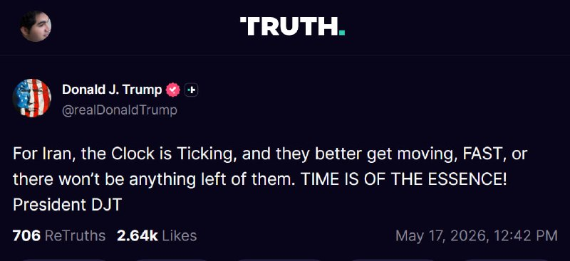
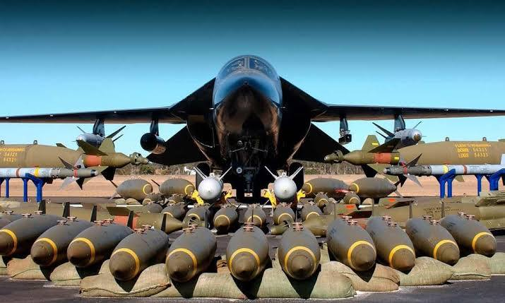
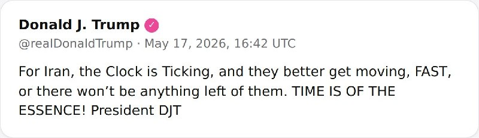
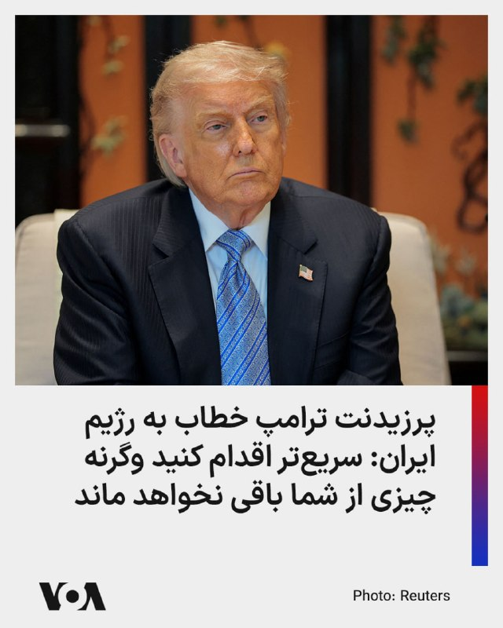
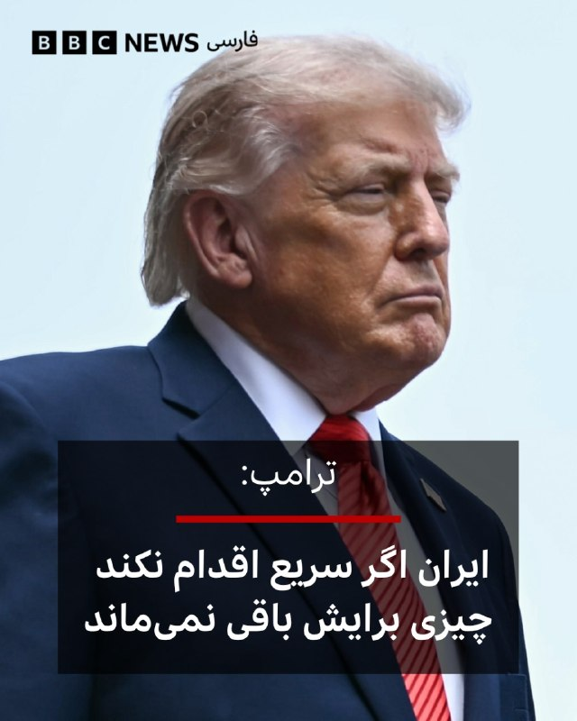
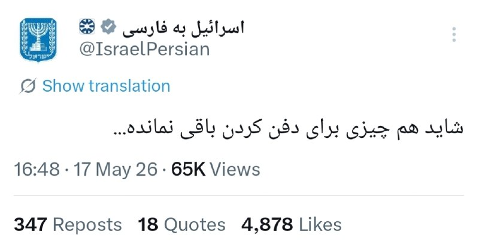
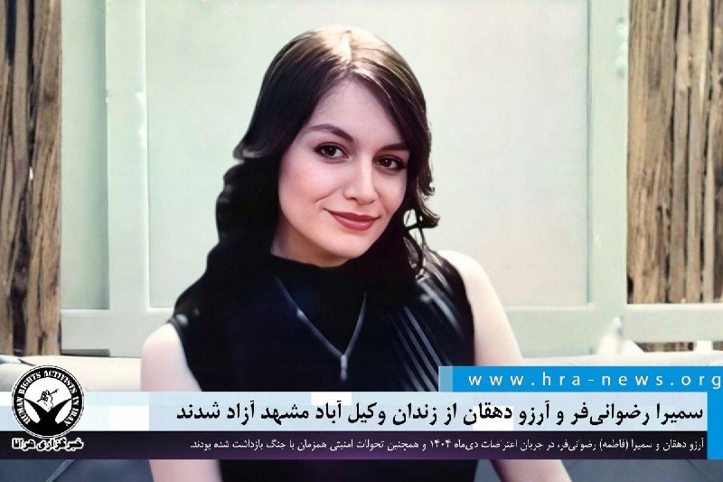

# خواننده تلگرام

<!-- TOP_NAV START -->

<a href="https://github.com/zari963963/aio-downloader/blob/main/telegram/content/archive_1.md" style="display:inline-block; padding:6px 12px; margin:0 4px; background-color:#2ea44f; color:white; text-decoration:none; border-radius:4px; font-weight:bold;">صفحه بعد</a>

<!-- TOP_NAV END -->

<!-- MSG START -->

---
📅 بروزرسانی: 1405/02/27 23:21
---

## VahidOOnLine — post 240695

  

احمدرضا رادان، فرمانده نیروی انتظامی، اعلام کرد که این نیرو ۶ هزار و ۵۰۰ نفر شهروند را از ابتدای جنگ بازداشت کرده است.

رادان این افراد را «وطن‌فروشان و جواسیس» نامید؛ اتهام‌هایی که وکلای دادگستری و نهادهای حقوق بشری می‌گویند جمهوری اسلامی برای سرکوب مردم از آنها استفاده می‌کند.

‌فرمانده فراجا همچنین گفت که بازداشت‌ها در ارتباط با اعتراضات دی ماه همچنان ادامه دارد.
‌🏁 🇬🇧 IranintlTV

🤖 @VahidOOnLine

## VahidOOnLine — post 240694

  <a href="telegram/content/VahidOOnLine_240694_1779047497.mp4" target="_blank">🎬 Download video</a>

♦️هزاران کاتولیک روز یکشنبه در تپه‌های جنگلی شمال لهستان در یکی از منحصربه‌فردترین آیین‌های مذهبی این کشور شرکت کردند؛ مراسمی سالانه که در آن شرکت‌کنندگان آثار مذهبی مقدس را هنگام حرکت، حمل و حتی با حرکات موزون و آیینی به نمایش می‌گذارند.
به گزارش رویترز، این آثار مذهبی که «فرترون» نام دارند، تصاویری از قدیسان، شهدا و صحنه‌هایی از کتاب مقدس را در خود جای داده‌اند و وزن برخی از آنها به حدود ۱۲۰ کیلوگرم می‌رسد.
این سنت که به «رقص فرترون» یا «تعظیم فرترون‌ها» معروف است، ریشه‌ای دیرینه در شمال لهستان دارد و یکی از بخش‌های اصلی زیارت سالانه در محوطه مذهبی کالواریای ویهرووو به شمار می‌رود.
زائران برخی از این آثار را کیلومترها بر دوش می‌کشند و پیاده از شهرهای مختلف منطقه به محل برگزاری مراسم می‌روند.
برای بسیاری از زائران، از جمله افراد سالمند، این مراسم چندروزه یکی از مهم‌ترین رویدادهای مذهبی و فرهنگی سال به شمار می‌رود.
‌🇸🇦 Indypersian

🤖 @VahidOOnLine

## VahidOOnLine — post 240693

  <a href="telegram/content/VahidOOnLine_240693_1779047500.mp4" target="_blank">🎬 Download video</a>

♦️عبدالله حاجی‌صادقی، نماینده مجتبی خامنه‌ای در سپاه پاسداران، روز یکشنبه در گفتگو با رسانه‌های داخلی اعلام کرد مذاکرات با آمریکا «تحت اشراف کامل مسئولان عالی‌رتبه» و با تایید «رهبری» در حال انجام است.
حاجی‌صادقی افزود: «رهبری شجاع، بصیر، حکیم، مسلط و با قدرت فرماندهی داریم که مردم را به زیبایی رهبری می‌کند.»
‌🇸🇦 Indypersian

🤖 @VahidOOnLine

## VahidOOnLine — post 240692

  <a href="telegram/content/VahidOOnLine_240692_1779047502.mp4" target="_blank">🎬 Download video</a>

♦️شبکه خبری العربیه، روز یکشنبه تصاویری از کمک‌رسانی یدک‌کش‌های عربستان سعودی به دریانوردان و شناورهای گرفتار در آب‌های خلیج فارس را منتشر کرد.
به گزارش العربیه، یدک‌کش‌های عربستان سعودی، با ارائه پشتیبانی فنی، لجستیکی و خدمات تعمیر و نگهداری، کشتی‌های متوقف شده در آب‌های جنوبی ایران را امدادرسانی می‌کنند.
تامین نیازهای سوختی کشتی‌ها و همچنین ارائه کمک‌های بشردوستانه، از جمله انتقال دریانوردانی که نیازمند دریافت خدمات درمانی هستند یا قصد بازگشت به کشورهایشان را دارند، از دیگر اقدامات این یدک‌کش‌های سعودی توصیف شده است.
‌🇸🇦 Indypersian

🤖 @VahidOOnLine

## VahidOOnLine — post 240691

  

محمدرضا عارف، معاون اول پزشکیان، گفت: «تسهیل ازدواج جوانان بخشی از راهبردهای نظام است.»
او افزود: «موضوع جوانان، ازدواج و فرزندآوری در برنامه پنج‌ساله دولت لحاظ شده و با توجه به روند خوبی که در کشور حاکم است و پیروزی‌هایی که به دست می‌آوریم، در تلاشیم مشکلات اقتصادی را کاهش دهیم.»
‌🏁 🇬🇧 IranintlTV

🤖 @VahidOOnLine

## VahidOOnLine — post 240690

  <a href="telegram/content/VahidOOnLine_240690_1779047505.mp4" target="_blank">🎬 Download video</a>

روز شنبه ۲۶ اردیبهشت، جمعی از ایرانیان ساکنِ ونکوور کانادا، در حمایت از مردم ایران و شاهزاده رضا پهلوی تجمع برگزار کردند. شرکت‌کنندگان «خواستار تغییر رژیم ایران» و «اقدام فوری» در حمایت از مردم ایران شدند.
‌🏁 🇬🇧 IranintlTV

🤖 @VahidOOnLine

## VahidOOnLine — post 240689

  

انور قرقاش مشاور دیپلماتیک رییس امارات متحده عربی در شبکه اجتماعی ایکس نوشت: «هدف قرار دادن تروریستی نیروگاه هسته‌ای پاک براکه، چه از سوی عامل اصلی و چه از طریق یکی از عوامل نیابتی آن، یک تشدید تنش خطرناک و صحنه‌ای تاریک است که تمامی قوانین و عرف‌های بین‌المللی را نقض می‌کند، در حالی که بی‌توجهی جنایتکارانه‌ به جان غیرنظامیان در امارات متحده عربی و پیرامون آن است.»

قرقاش ادامه داد: «این تشدید تنش ممنوع، بار دیگر ماهیت چالش‌هایی را که منطقه در مواجهه با نیروهای شر، هرج‌ومرج و خرابکاری با آنها روبه‌رو است، تایید می‌کند.»

او افزود: «هیچ‌کس نخواهد توانست بازوی امارات را بپیچاند، و هیچ‌کس موفق نخواهد شد چشم‌انداز، موفقیت و پیام الهام‌بخش آن به مردم منطقه در زمینه امنیت، ثبات، توسعه و شکوفایی را تضعیف کند.»
‌🏁 🇬🇧 IranintlTV

🤖 @VahidOOnLine

## VahidOOnLine — post 240688

  

‌🇸🇦 Indypersian

🤖 @VahidOOnLine

## VahidOOnLine — post 240687

  

وزارت خارجه عربستان سعودی حمله پهپادی به نیروگاه هسته‌ای براکه در امارات متحده عربی را محکوم کرد.

همزمان وزارت خارجه بحرین اعلام کرد که این کشور حمله «تروریستی» به نیروگاه هسته‌ای براکه را به‌شدت محکوم می‌کند و بر همبستگی کشورش با امارات متحده عربی تاکید کرد.
‌🏁 🇬🇧 IranintlTV

🤖 @VahidOOnLine

## VahidOOnLine — post 240686

  <a href="telegram/content/VahidOOnLine_240686_1779047510.mp4" target="_blank">🎬 Download video</a>

«صدای فاطمه سپهری باشیم» ـ گزارشگر
‌🏁 🇬🇧 ManotoTV

🤖 @VahidOOnLine

## VahidOOnLine — post 240685

  <a href="telegram/content/VahidOOnLine_240685_1779047512.mp4" target="_blank">🎬 Download video</a>

باراک راوید، خبرنگار آکسیوس گزارش داد دو مقام آمریکایی اعلام کردند دونالد ترامپ قرار است روز سه‌شنبه نشستی در اتاق وضعیت کاخ سفید با تیم ارشد امنیت ملی خود برگزار کند تا گزینه‌های اقدام نظامی را بررسی کند.
‌🏁 🇬🇧 ManotoTV

🤖 @VahidOOnLine

## VahidOOnLine — post 240684

♦️دونالد ترامپ، رئیس‌جمهوری آمریکا، عصر یکشنبه ۲۷ اردیبهشت ماه،‌ در گفتگو با اکسیوس گفت همچنان معتقد است ایران به دنبال توافق است و او در انتظار دریافت پیشنهاد تازه‌ای از سوی تهران است؛ پیشنهادی که به گفته او امیدوار است «بهتر از پیشنهاد قبلی» باشد.
ترامپ گفت: «ما خواهان توافق هستیم. آنها هنوز در جایگاهی که ما می‌خواهیم نیستند. یا باید به آن نقطه برسند یا ضربه سختی خواهند خورد و آنها چنین چیزی را نمی‌خواهند.»
او همچنین به تهران هشدار داد: «اگر پیشنهاد بهتری ارائه نکنند، آمریکا ایران را بسیار شدیدتر از قبل هدف قرار خواهد داد.» ترامپ در پایان تاکید کرد: «ساعت در حال تیک‌تاک است؛ بهتر است خیلی سریع حرکت کنند، وگرنه چیزی برایشان باقی نخواهد ماند.»
آکسیوس پیشتر به نقل از دو مقام آمریکایی گزارش کرد ترامپ قرار است روز سه‌شنبه با تیم ارشد امنیت ملی خود در اتاق وضعیت کاخ سفید جلسه‌ای برای بررسی گزینه‌های اقدام نظامی علیه ایران برگزار کند.
‌🇸🇦 Indypersian

🤖 @VahidOOnLine

## VahidOOnLine — post 240683

  

عبدالله حاجی‌صادقی، نماینده مجتبی خامنه‌ای در سپاه پاسداران، گفت: مذاکرات ما تحت اشراف مسئولان و با تایید «رهبری» پیش می‌رود. او با تاکید بر اینکه «اتحاد مقدس از هر چیزی مهم‌تر است»، افزود نباید اجازه داد این اتحاد آسیب ببیند.

حاجی‌صادقی همچنین گفت: «رهبری شجاع، بصیر، حکیم، مسلط و با قدرت فرماندهی داریم که مردم را به زیبایی رهبری می‌کند.»
‌🏁 🇬🇧 IranintlTV

🤖 @VahidOOnLine

## VahidOOnLine — post 240682

  <a href="telegram/content/VahidOOnLine_240682_1779047514.mp4" target="_blank">🎬 Download video</a>

‌
بارسلون | اسپانیا؛ گردهمایی ایرانیان ـ گزارشگر ۲۷ اردیبهشت
‌🏁 🇬🇧 ManotoTV

🤖 @VahidOOnLine

## VahidOOnLine — post 240679

  <a href="telegram/content/VahidOOnLine_240679_1779047516.mp4" target="_blank">🎬 Download video</a>

‌
گوگوش، خواننده سرشناس ایرانی، با انتشار تصاویری در صفحه اینستاگرام خود اعلام کرد «نشان افتخار جزیره الیس» را دریافت کرده است؛ نشانی که به افرادی اهدا می‌شود که در جامعه آمریکا تاثیرگذار بوده‌اند و در عین حال هویت و ریشه‌های فرهنگی خود را حفظ کرده‌اند.

او در پیام خود نوشت: «خواستم از این فرصت استفاده کنم تا نام ایران و مردم شریف ایران را یادآوری کنم.»

گوگوش همچنین این نشان را به مردم ایران تقدیم کرد و نوشت: «این نشان را با عشق و احترام به مردم ایران تقدیم می‌کنم؛ به مردمی که سال‌ها با رنج، صبوری، امید و سربلندی زندگی کرده‌اند و با وجود همه سختی‌ها، همچنان ایستاده‌اند.»

این خواننده پیشکسوت در ادامه برای ایران و جهان آرزوی «صلح، آرامش و روزهایی روشن‌تر» کرد و در پایان به سخنی از سعدی اشاره کرد.
‌🏁 🇬🇧 ManotoTV

🤖 @VahidOOnLine

## VahidOOnLine — post 240676

  

دونالد ترامپ در گفت‌وگو با شبکه ۱۳ اسرائیل پس از تهدید دوباره جمهوری اسلامی گفت: «فکر می‌کنم مقام‌های تهران باید از من بترسند و مراقب باشند.»

او همچنین در گفت‌وگو با کانال ۱۲ اسرائیل گفت همچنان معتقد است ایران خواهان دستیابی به توافق است و انتظار دارد تهران در روزهای آینده پیشنهاد تازه‌ای ارائه کند.
ترامپ از تعیین ضرب‌الاجل برای مذاکرات خودداری کرد، اما هشدار داد در صورت برآورده نشدن خواسته‌های آمریکا درباره برنامه هسته‌ای ایران، اقدام نظامی شدیدتری در پیش خواهد بود.
‌🏁 🇬🇧 IranintlTV

🤖 @VahidOOnLine

## VahidOOnLine — post 240675

  <a href="telegram/content/VahidOOnLine_240675_1779047518.mp4" target="_blank">🎬 Download video</a>

ویدیوی دریافتی نشان می‌دهد روز شنبه ۲۶ اردیبهشت، جمعی از ایرانیان ساکن شهر رجاینا در ساسکاچوانِ کانادا، همراه با اجرای پرفورمنسی علیه اعدام‌های جمهوری اسلامی و قطعی اینترنت در ایران، تجمع اعتراضی برگزار کردند.
‌🏁 🇬🇧 IranintlTV

🤖 @VahidOOnLine

## VahidOOnLine — post 240674

  

♦️دونالد ترامپ، رئیس‌جمهوری آمریکا، عصر یکشنبه در گفتگویی تلفنی با اکسیوس بار دیگر به ایران هشدار داد و گفت: «زمان برای ایران در حال گذر است.» او افزود اگر جمهوری اسلامی پیشنهاد بهتری برای توافق ارائه نکند، «بسیار شدیدتر هدف حمله قرار خواهد گرفت.»
به گزارش آکسیوس، ترامپ این اظهارات را در شرایطی مطرح کرده که مقام‌های آمریکایی می‌گویند او همچنان خواهان دستیابی به توافقی برای پایان دادن به جنگ است، اما مخالفت ایران با بخش قابل توجهی از خواسته‌های واشنگتن و خودداری از ارائه امتیازهای معنادار در برنامه هسته‌ای، گزینه نظامی را بار دیگر روی میز قرار داده است.
دو مقام آمریکایی  به اکسیوس گفته‌اند ترامپ قرار است برای بررسی گزینه‌های نظامی علیه ایران، روز سه‌شنبه با تیم ارشد امنیت ملی خود نشستی در اتاق وضعیت کاخ سفید برگزار کند.
‌🇸🇦 Indypersian

🤖 @VahidOOnLine

## mwarmonitor — post 9225

  <a href="telegram/content/mwarmonitor_9225_1779047520.mp4" target="_blank">🎬 Download video</a>

🔴«دو فروند هواپیمای EA-18G «گرولر» هنگام اجرای یک نمایش هوایی در نمایشگاه هوایی GunFighter Skies 2026 دچار برخورد در هوا شدند.»

@mwarmonitor

## mwarmonitor — post 9223

🔴ترامپ به ایران هشدار داد: زمان برای حملات سخت‌تر آمریکا رو به پایان است

📝نویسنده: باراک راوید

🔰 هم‌زمان با افزایش تنش‌ها میان آمریکا و ایران بر سر کشتیرانی در خلیج فارس و امور دیپلماتیک. دونالد ترامپ، رئیس‌جمهور آمریکا، در یک تماس تلفنی به «آکسیوس» گفت که «زمان برای ایران رو به پایان است» و هشدار داد اگر حکومت ایران پیشنهاد بهتری برای توافق ارائه ندهد، «با ضربات بسیار سخت‌تری مواجه خواهد شد.»

🔸چرا این موضوع اهمیت دارد؟
مقامات آمریکایی می‌گویند ترامپ خواهان توافقی برای پایان دادن به جنگ است، اما رد بسیاری از خواسته‌های او از سوی ایران و امتناع این کشور از دادن امتیازات معنادار در برنامه هسته‌ای خود، گزینه نظامی را دوباره روی میز قرار داده است.
به گفته دو مقام آمریکایی، انتظار می‌رود ترامپ روز سه‌شنبه با تیم امنیت ملی خود در «اتاق وضعیت» (Situation Room) کاخ سفید تشکیل جلسه دهد تا گزینه‌های نظامی را بررسی کنند.
ترامپ روز یکشنبه در مورد وضعیت ایران با بنیامین نتانیاهو، نخست‌وزیر اسرائیل، تلفنی گفتگو کرد.
پشت صحنه
یک منبع آگاه اعلام کرد که ترامپ روز شنبه با اعضای تیم امنیت ملی خود در باشگاه گلف خود در ویرجینیا دیدار کرد تا درباره ایران گفتگو کند.
حاضران در این جلسه: جی‌دی ونس (معاون رئیس‌جمهور)، استیو ویتکوف (فرستاده کاخ سفید)، مارکو روبیو (وزیر امور خارجه) و جان راتکلیف (رئیس سی‌آی‌ای).

🔹آخرین وضعیت (میدانی و دیپلماتیک)
وزیر کشور پاکستان روزهای شنبه و یکشنبه برای گفتگو با مقامات ارشد ایرانی درباره توافق پایان دادن به جنگ، به تهران سفر کرد. پاکستان به عنوان میانجی رسمی میان آمریکا و ایران عمل می‌کند.
🔹محمد بن عبدالرحمن آل ثانی، نخست‌وزیر قطر که او نیز نقش میانجی را بر عهده دارد، روز یکشنبه با همتای پاکستانی خود و همچنین وزیر امور خارجه ایران گفتگو کرد.

📌ترامپ به آکسیوس گفت که همچنان فکر می‌کند ایران خواهان توافق است و افزود منتظر پیشنهاد به‌روزشده ایران است؛ پیشنهادی که او ابراز امیدواری کرد از آخرین طرح ارائه‌شده در چند روز پیش، بهتر باشد.

اظهارات ترامپ
ترامپ گفت:
«ما می‌خواهیم توافق کنیم. آن‌ها (ایرانی‌ها) در جایگاهی که ما می‌خواهیم نیستند. آن‌ها باید به آن نقطه برسند، در غیر این صورت ضربه سختی خواهند خورد و خودشان هم این را نمی‌خواهند.»
او تاکید کرد که اگر ایران پیشنهاد بهتری ارائه ندهد، آمریکا «بسیار سخت‌تر از گذشته» به ایران ضربه خواهد زد.
ترامپ در پایان خاطرنشان کرد:
«زمان رو به پایان است. بهتر است سریع‌تر حرکت کنند، در غیر این صورت چیزی برایشان باقی نخواهد ماند.»

@mwarmonitor

## mwarmonitor — post 9221

🇮🇷🇺🇸مقام‌های آمریکایی: مذاکرات با ایران به بن‌بست رسیده است.

@mwarmonitor

## mwarmonitor — post 9220

🔴شبکه کان اسرائیل به نقل از یک مقام گزارش داد: ایالات متحده و اسرائیل سطح آماده‌باش خود را برای احتمال ازسرگیری درگیری با ایران افزایش داده‌اند.

@mwarmonitor

## mwarmonitor — post 9219

🔴در روزهای اخیر، سه نفتکشِ خالی از محموله که تحت تحریم‌های آمریکا هستند، از خط محاصره نیروی دریایی آمریکا عبور کرده و وارد محدوده شده‌اند.

🔸یکی از آن‌ها برای مدت کوتاهی سیستم موقعیت‌یاب (AIS) را خاموش کرده بود.

🔸دیگری با پرچم روسیه حرکت می‌کرد.

🔸سومی در امتداد ساحل عمان حرکت کرده است.

🔹این سه نفتکش در مجموع می‌توانند حدود ۱.۹ میلیون بشکه نفت ایران را جابه‌جا کنند. چنین رخدادهایی به تهران زمان بیشتری در میز مذاکرات می‌دهد، در حالی که جهان در انتظار تأمین بیشتر انرژی و کودهای شیمیایی از این منطقه است. TANKER TRACKER

@mwarmonitor

## mwarmonitor — post 9218

🚨به گفته دو مقام آمریکایی به آکسیوس، انتظار می‌رود دونالد ترامپ روز سه‌شنبه یک جلسه در «اتاق وضعیت» با تیم ارشد امنیت ملی خود برگزار کند تا درباره گزینه‌های اقدام نظامی گفت‌وگو کند.

@mwarmonitor

## mwarmonitor — post 9217

🔴 دونالد ترامپ به کانال ۱۳ اسرائیل:
اگر ایران یک پیشنهاد خوب ارسال نکند، به آن‌ها حمله خواهیم کرد؛ به شکلی که تا حالا انجام نداده‌ایم.

@mwarmonitor

## mwarmonitor — post 9216

  <a href="telegram/content/mwarmonitor_9216_1779047522.mp4" target="_blank">🎬 Download video</a>

📝 خدا نشسته اون بالا، تخمه می‌شکنه و با لذت به این شاهکار نگاه می‌کنه؛ کمدی سیاهی که در آن ابولا و هانتا ویروس مأمور پذیرایی هستند و جنگ‌ها نقش موسیقی متن را بازی می‌کنند. آدم با دیدن این حجم از خلاقیت در شکنجه و متدِ «عذاب بده و بگو مصلحت است»، به شک می‌افتد…

## mwarmonitor — post 9215

🔴 دونالد ترامپ: در مورد ایران، زمان در حال تمام شدن است و آن‌ها باید خیلی سریع اقدام کنند؛ در غیر این صورت چیزی از آن‌ها باقی نخواهد ماند. زمان حیاتی است! @mwarmonitor

## mwarmonitor — post 9214

  

🔴 دونالد ترامپ:
در مورد ایران، زمان در حال تمام شدن است و آن‌ها باید خیلی سریع اقدام کنند؛ در غیر این صورت چیزی از آن‌ها باقی نخواهد ماند. زمان حیاتی است!

@mwarmonitor

## mwarmonitor — post 9213

🔴دونالد ترامپ، رئیس‌جمهور ایالات متحده، در یک تماس تلفنی با بنیامین نتانیاهو، نخست‌وزیر اسرائیل، درباره ایران گفت‌وگو کرد؛ به گفته یک مقام اسرائیلی. باراک راوید خبرنگار آکسیوس

@mwarmonitor

## pm_afshaa — post 90918

  <a href="telegram/content/pm_afshaa_90918_1779047525.webm" target="_blank">🎬 Download video</a>

🔴عارف، معاون اول پزشکیان:
با توجه به روند خوبی که در کشور حاکمه و پیروزی‌هایی که به دست میاریم، در تلاشیم مشکلات اقتصادی رو کاهش بدیم.

💧 Rainbet.com the #1 Non-KYC Crypto Casino & Sportsbook @rainbetcom

😁 @Pm_Afshaa

## pm_afshaa — post 90917

  <a href="telegram/content/pm_afshaa_90917_1779047526.webm" target="_blank">🎬 Download video</a>

🔴محسن رضایی:
آمریکا یا شرایط ما رو میپذیره یا با موشک‌های ما مورد استقبال قرار خواهد گرفت.

💧 Rainbet.com the #1 Non-KYC Crypto Casino & Sportsbook @rainbetcom

😁 @Pm_Afshaa

## pm_afshaa — post 90916

  <a href="telegram/content/pm_afshaa_90916_1779047527.webm" target="_blank">🎬 Download video</a>

🔴ترامپ در گفت‌وگو با شبکه 14 اسرائیل:
مقام‌های جمهوری اسلامی باید از من بترسن و مراقب باشن.

💧 Rainbet.com the #1 Non-KYC Crypto Casino & Sportsbook @rainbetcom

😁 @Pm_Afshaa

## pm_afshaa — post 90915

🔴 ترامپ: ما میخوایم توافق کنیم، آنها جایی که ما میخوایم نیستن؛ باید به آن نقطه برسن، وگرنه ضربه سختی خواهند خورد، و آنها این رو نمیخوان!

💧 Rainbet.com the #1 Non-KYC Crypto Casino & Sportsbook @rainbetcom

😁 @Pm_Afshaa

## pm_afshaa — post 90914

  <a href="telegram/content/pm_afshaa_90914_1779047528.webm" target="_blank">🎬 Download video</a>

🔴شبکه کان اسرائیل: آمریکا و اسرائیل سطح آماده‌باش خود را برای احتمال ازسرگیری درگیری با ایران افزایش داده‌ان.

💧 Rainbet.com the #1 Non-KYC Crypto Casino & Sportsbook @rainbetcom

😁 @Pm_Afshaa

## pm_afshaa — post 90913

  <a href="telegram/content/pm_afshaa_90913_1779047528.webm" target="_blank">🎬 Download video</a>

🔴آکسیوس به نقل از دو مقام آمریکایی:
انتظار میره ترامپ روز سه‌شنبه جلسه‌ای در اتاق وضعیت با تیم ارشد امنیت ملی خود برگزار کنه تا گزینه‌های اقدام نظامی علیه ایران رو بررسی کنه.

💧 Rainbet.com the #1 Non-KYC Crypto Casino & Sportsbook @rainbetcom

😁 @Pm_Afshaa

## pm_afshaa — post 90912

  <a href="telegram/content/pm_afshaa_90912_1779047529.webm" target="_blank">🎬 Download video</a>

🔴ترامپ به کانال 12 اسرائیل:
ما منتظر یه پیشنهاد دیگه از طرف ایران هستیم؛ اگه این کار رو نکنن، با شدتی بی‌سابقه هدف حمله قرار میگیرن.

💧 Rainbet.com the #1 Non-KYC Crypto Casino & Sportsbook @rainbetcom

😁 @Pm_Afshaa

## pm_afshaa — post 90911

🔴کانال 13 اسرائیل:ترامپ چندتا رویداد که قرار بود تو اونا شرکت کنه رو لغو کرده و الان جلسه‌ درباره ایران برگزار کرده

💧 Rainbet.com the #1 Non-KYC Crypto Casino & Sportsbook @rainbetcom

😁 @Pm_Afshaa

## pm_afshaa — post 90910

🔴ترامپ: برای ایران، زمان در حال تیک‌تاک است و بهتره سریع حرکت کنند، وگرنه چیزی از آنها باقی نخواهد ماند. زمان مهم است.

💧 Rainbet.com the #1 Non-KYC Crypto Casino & Sportsbook @rainbetcom

😁 @Pm_Afshaa

## pm_afshaa — post 90909

  <a href="telegram/content/pm_afshaa_90909_1779047530.webm" target="_blank">🎬 Download video</a>

🔴سنتکام: از شروع محاصره دریایی ایران، 81 کشتی تجاری رو منحرف کردیم و 4 تا رو از کار انداختیم.

💧 Rainbet.com the #1 Non-KYC Crypto Casino & Sportsbook @rainbetcom

😁 @Pm_Afshaa

## pm_afshaa — post 90908

  <a href="telegram/content/pm_afshaa_90908_1779047531.webm" target="_blank">🎬 Download video</a>

🔴سناتور لیندزی گراهام درباره ایران:
به نظر من، کسایی که الان قدرت رو دستشون گرفتن با قبلی‌ها هیچ فرقی ندارن و باز هم میخوان جهان رو به هم بریزن، اسرائیل رو نابود کنن و به ما حمله کنن؛ باید بیشتر اونا رو ضعیف کنیم. رفتن به دنبال توافقی که هیچ‌وقت حاصل نمیشه، فقط جمهوری اسلامی رو قوی‌تر میکنه.

هر قیمتی که لازم باشه، میپردازیم. این حرفی بود که چرچیل درباره شکست هیتلر میگفت و حالا برای ایران هم صدق میکنه.

💧 Rainbet.com the #1 Non-KYC Crypto Casino & Sportsbook @rainbetcom

😁 @Pm_Afshaa

## pm_afshaa — post 90907

  <a href="telegram/content/pm_afshaa_90907_1779047532.webm" target="_blank">🎬 Download video</a>

🔴باراک راوید، خبرنگار آکسیوس:
ترامپ و نتانیاهو در تماسی تلفنی درباره پرونده ایران گفتگو کردن.

کانال 12 اسرائیل:
در سایه آمادگی برای از سرگیری درگیری‌ها در ایران این تماس انجام شده.

💧 Rainbet.com the #1 Non-KYC Crypto Casino & Sportsbook @rainbetcom

😁 @Pm_Afshaa

## DEJradio — post 4685

🔸 خبر ۲۱
یکشنبه ۲۷ اردیبهشت ۱۴۰۵

#خبر۲۱
@DEJradio

## DEJradio — post 4684

  <a href="telegram/content/DEJradio_4684_1779047532.webm" target="_blank">🎬 Download video</a>

🔸
🔺 شبکه خبری «فاکس نیوز»، روز یکشنبه ۲۷ اردیبهشت ماه در گزارشی اعلام کرد، دونالد ترامپ که به تازگی از سفر چین بازگشته است، در حال بررسی از سرگیری اقدام نظامی علیه ایران است و روز یکشنبه با بنیامین نتانیاهو، نخست وزیر اسرائیل گفتگو خواهد کرد.
نتانیاهو صبح یکشنبه با اعلام آنکه «مانند هر چند روز یکبار» با ترامپ تماس خواهد گرفت، گفت: «مطمئنا بخش‌هایی از سفر او به چین و شاید موارد دیگر را خواهم شنید. احتمالات زیادی وجود دارد و ما برای هر سناریویی آماده‌ایم.»
تماس تلفنی با نتانیاهو در حالی صورت می‌گیرد که فاکس نیوز با استناد به ارزیابی‌های اطلاعاتی منطقه‌ای درباره ایران گزارش داد که ممکن است به دلیل ناامیدی ترامپ از تهران و «رد درخواست او برای دست کشیدن از آرمان‌های تسلیحات هسته‌ای»، حملات نظامی از سر گرفته شود.
دو مقام اطلاعاتی منطقه‌ای به فاکس نیوز گفتند: «ارزیابی غالب در داخل ایران این است که رئیس جمهوری ترامپ ممکن است به شروع مجدد اقدام نظامی متوسل شود و تهران اکنون عمدا راهبرد «فریب و تأخیر» را دنبال می‌کند، با این امید که خرید زمان، هرگونه بازگشت احتمالی به جنگ را پیچیده کند.»
به گزارش فاکس نیوز، تهران تصور می‌کند می‌تواند تحولات را به تاخیر بیندازد و بحران را حداقل برای دو هفته دیگر تمدید کند، به طوری که وضعیت برای ترامپ برای شروع مجدد کمپین نظامی، چه از نظر سیاسی و چه از نظر عملیاتی، دشوارتر شود.
این منابع به فاکس گفتند مقامات ایرانی به جام جهانی و دویست و پنجاهمین سالگرد تأسیس آمریکا به‌عنوان عواملی نگاه می‌کنند که می‌تواند در محاسبات زمانی به سود تهران عمل کند.

#جنگ #جمهوری_اسلامی
@DEJradio

## DEJradio — post 4683

  <a href="telegram/content/DEJradio_4683_1779047533.mp4" target="_blank">🎬 Download video</a>

🚨
🔸 ‏نقش محوری شاهزاده رضا پهلوی برای گذار از جمهوری اسلامی؛ چه مسیری طی شد؟

در ماه‌های اخیر بسیاری از گروه‌های سیاسی و اجتماعی مختلف با شاهزاده رضا پهلوی دیدار کرده‌اند که از افزایش فزاینده اجماع بر سر شاهزاده به عنوان رهبر دوران گذار خبر می‌دهد.
مهرداد بزرگ، کنشگر سیاسی پادشاهی‌خواه، در گفت‌وگو با «دژ» توضیح می‌دهد برای رسیدن به جایگاهی که شاهزاده رضا پهلوی هم‌اکنون در آن قرار گرفته، چه مسیری طی شد؟ و نقش تیم او چه بوده است؟

#شاهزاده_رضا_پهلوی #گذار
@DEJradio

## DEJradio — post 4682

  <a href="telegram/content/DEJradio_4682_1779047536.mp4" target="_blank">🎬 Download video</a>

🚨
🔸 مستند؛
پرویز فتاح، تکنوکرات سپاهی و مطلوب علی خامنه‌ای

#موشعلی #IRGCterrorists
@DEJradio

## VahidOnline — post 75522

  

صبح روز یکشنبه ۲۷ اردیبهشت ۱۴۰۵ یک دستگاه اتوبوس در محور عسلویه به کنگان، پس از پلیس راه سیراف، واژگون شد و جان هشت نفر از کارکنان مجتمع گاز پارس جنوبی را گرفت. پانزده نفر دیگر نیز در جریان این حادثه مجروح و به بیمارستان منتقل شدند.
@VahidHeadline

📡 @VahidOnline

## VahidOnline — post 75521

  

پست ترامپ، ترجمه ماشین:
زمان برای ایران به‌سرعت در حال سپری شدن است و بهتر است هرچه زودتر اقدام کنند وگرنه چیزی از آن‌ها باقی نخواهد ماند. زمان حیاتی است.
realDonaldTrump

📡 @VahidOnline

## VahidOnline — post 75520

  

♦️دفتر بنیامین نتانیاهو، نخست‌وزیر اسرائیل، اعلام کرد او روز یکشنبه و دقایقی پیش از برگزاری نشست امنیتی، در تماس تلفنی با دونالد ترامپ، درباره جنگ با ایران گفتگو کرده است.

به گزارش تایمز اسرائیل، این تماس در شرایطی که گزارش‌ها درباره آمادگی آمریکا و اسرائیل برای ازسرگیری جنگ با ایران منتشر شده است.

بر اساس گزارش رسانه‌های اسرائیلی، دو طرف در این تماس درباره احتمال ازسرگیری جنگ با ایران و همچنین سفر اخیر ترامپ به چین گفتگو کرده‌اند.
@VahidOOnLine

📡 @VahidOnline

## kianmeli1 — post 87455

  <a href="telegram/content/kianmeli1_87455_1779047541.mp4" target="_blank">🎬 Download video</a>

🔴محسن رضایی: محاصرهٔ دریایی آمریکا را می‌شکنیم

صبر ما حدی دارد و نیروهای مسلح درحال آماده‌کردن خودش است.
https://t.me/kianmeli1

## kianmeli1 — post 87454

  

🔴ترامپ به کانال ۱۳ گفت:

"من فکر می‌کنم ایرانی‌ها باید از آنچه در حال حاضر در حال وقوع است بترسند."
https://t.me/kianmeli1

## kianmeli1 — post 87453

  

🔴ترامپ: زمان برای ایران در حال اتمام است
https://t.me/kianmeli1

## IranIntlTV — post 337684

  

احمدرضا رادان، فرمانده نیروی انتظامی، اعلام کرد که این نیرو ۶ هزار و ۵۰۰ نفر شهروند را از ابتدای جنگ بازداشت کرده است.

رادان این افراد را «وطن‌فروشان و جواسیس» نامید؛ اتهام‌هایی که وکلای دادگستری و نهادهای حقوق بشری می‌گویند جمهوری اسلامی برای سرکوب مردم از آنها استفاده می‌کند.

‌فرمانده فراجا همچنین گفت که بازداشت‌ها در ارتباط با اعتراضات دی ماه همچنان ادامه دارد.
https://iranintl.com/202605176516

## IranIntlTV — post 337683

  <a href="telegram/content/IranIntlTV_337683_1779047547.mp4" target="_blank">🎬 Download video</a>

اورشلیم پست از احتمال تشدید حملات جمهوری اسلامی به امارات متحده عربی گزارش داده است.

همزمان با توصیف آتش‌بس به‌عنوان وضعیتی شکننده، نگرانی‌ها درباره حملات جمهوری اسلامی احتمال از سرگیری جنگ را افزایش داده است.

گفت‌وگو با جمشید برزگر، روزنامه‌نگار و تحلیل‌گر سیاسی
@iranintltv

## IranIntlTV — post 337682

  <a href="https://t.me/IranintlTV/337682" target="_blank">📎 Download file</a>

🎧نسخه صوتی چشم‌انداز: اهداف اصلی آمریکا و اسرائیل در حمله دوباره به ایران
@iranintlTV

## IranIntlTV — post 337681

  <a href="telegram/content/IranIntlTV_337681_1779047550.mp4" target="_blank">🎬 Download video</a>

مسعود پزشکیان، رییس دولت در جمهوری اسلامی، دسترسی باکیفیت به خدمات دیجیتال را حق مردم دانست و گفت دولت او برای برقرار ماندن ارتباطات، به‌صورت شبانه‌روزی تلاش می‌کند.

گفت‌وگو با مهدی صارمی‌فر، روزنامه‌نگار علم و تکنولوژی
@iranintltv

## IranIntlTV — post 337680

  

محمدرضا عارف، معاون اول پزشکیان، گفت: «تسهیل ازدواج جوانان بخشی از راهبردهای نظام است.»
او افزود: «موضوع جوانان، ازدواج و فرزندآوری در برنامه پنج‌ساله دولت لحاظ شده و با توجه به روند خوبی که در کشور حاکم است و پیروزی‌هایی که به دست می‌آوریم، در تلاشیم مشکلات اقتصادی را کاهش دهیم.»
https://iranintl.com/202605172551

## IranIntlTV — post 337679

  <a href="telegram/content/IranIntlTV_337679_1779047554.mp4" target="_blank">🎬 Download video</a>

روز شنبه ۲۶ اردیبهشت، جمعی از ایرانیان ساکنِ ونکوور کانادا، در حمایت از مردم ایران و شاهزاده رضا پهلوی تجمع برگزار کردند. شرکت‌کنندگان «خواستار تغییر رژیم ایران» و «اقدام فوری» در حمایت از مردم ایران شدند.

## IranIntlTV — post 337678

  <a href="telegram/content/IranIntlTV_337678_1779047556.mp4" target="_blank">🎬 Download video</a>

چشم‌انداز با مهدی مهدوی‌آزاد: اهداف اصلی آمریکا و اسرائیل در حمله دوباره به ایران

نسخه کامل این قسمت را در یوتیوب ایران‌اینترنشنال تماشا کنید:
https://youtu.be/6u1N8mDDOMA
@iranintltv

## IranIntlTV — post 337677

  

انور قرقاش مشاور دیپلماتیک رییس امارات متحده عربی در شبکه اجتماعی ایکس نوشت: «هدف قرار دادن تروریستی نیروگاه هسته‌ای پاک براکه، چه از سوی عامل اصلی و چه از طریق یکی از عوامل نیابتی آن، یک تشدید تنش خطرناک و صحنه‌ای تاریک است که تمامی قوانین و عرف‌های بین‌المللی را نقض می‌کند، در حالی که بی‌توجهی جنایتکارانه‌ به جان غیرنظامیان در امارات متحده عربی و پیرامون آن است.»

قرقاش ادامه داد: «این تشدید تنش ممنوع، بار دیگر ماهیت چالش‌هایی را که منطقه در مواجهه با نیروهای شر، هرج‌ومرج و خرابکاری با آنها روبه‌رو است، تایید می‌کند.»

او افزود: «هیچ‌کس نخواهد توانست بازوی امارات را بپیچاند، و هیچ‌کس موفق نخواهد شد چشم‌انداز، موفقیت و پیام الهام‌بخش آن به مردم منطقه در زمینه امنیت، ثبات، توسعه و شکوفایی را تضعیف کند.»
https://iranintl.com/202605172450

## IranIntlTV — post 337676

  

وزارت خارجه عربستان سعودی حمله پهپادی به نیروگاه هسته‌ای براکه در امارات متحده عربی را محکوم کرد.

همزمان وزارت خارجه بحرین اعلام کرد که این کشور حمله «تروریستی» به نیروگاه هسته‌ای براکه را به‌شدت محکوم می‌کند و بر همبستگی کشورش با امارات متحده عربی تاکید کرد.
https://iranintl.com/202605174803

## IranIntlTV — post 337675

  <a href="https://t.me/IranintlTV/337675" target="_blank">📎 Download file</a>

🎧نسخه صوتی تیتراول با نیوشا صارمی: تماس نتانیاهو و ترامپ درباره ایران؛ تشدید تنش‌ها با حمله پهپادی به امارات
@iranintlTV

## IranIntlTV — post 337673

  <a href="telegram/content/IranIntlTV_337673_1779047561.mp4" target="_blank">🎬 Download video</a>

مهدی مهدوی‌آزاد در برنامه «چشم‌انداز» گفت: «در شرایط فعلی، کسی در تهران به‌دنبال صلح نیست و ظاهراً صلح و امتیاز دادن و گرفتن را نوعی ضعف و ضدارزش می‌دانند.»

او افزود: «برنامه هسته‌ای که به‌خاطر آن دو بار کشور وارد جنگ شد، خسارت‌های سنگینی به ایران وارد کرده و بخش بزرگی از تاسیسات و توان مرتبط با آن نابود شده است. با این حال، دوباره بحث‌ها به همان نقطه اول برگشته؛ انگار دوباره به نقطه صفر و مرحله‌ای سخت بازگشته‌ایم.»
@iranintltv

## IranIntlTV — post 337672

  

عبدالله حاجی‌صادقی، نماینده مجتبی خامنه‌ای در سپاه پاسداران، گفت: مذاکرات ما تحت اشراف مسئولان و با تایید «رهبری» پیش می‌رود. او با تاکید بر اینکه «اتحاد مقدس از هر چیزی مهم‌تر است»، افزود نباید اجازه داد این اتحاد آسیب ببیند.

حاجی‌صادقی همچنین گفت: «رهبری شجاع، بصیر، حکیم، مسلط و با قدرت فرماندهی داریم که مردم را به زیبایی رهبری می‌کند.»
https://iranintl.com/202605173538

## IranIntlTV — post 337671

  <a href="https://t.me/IranintlTV/337671" target="_blank">📎 Download file</a>

🎧نسخه صوتی اخبار شبانگاهی | یکشنبه ۲۷ اردیبهشت
@iranintlTV

## IranIntlTV — post 337670

  

دونالد ترامپ در گفت‌وگو با شبکه ۱۳ اسرائیل پس از تهدید دوباره جمهوری اسلامی گفت: «فکر می‌کنم مقام‌های تهران باید از من بترسند و مراقب باشند.»

او همچنین در گفت‌وگو با کانال ۱۲ اسرائیل گفت همچنان معتقد است ایران خواهان دستیابی به توافق است و انتظار دارد تهران در روزهای آینده پیشنهاد تازه‌ای ارائه کند.
ترامپ از تعیین ضرب‌الاجل برای مذاکرات خودداری کرد، اما هشدار داد در صورت برآورده نشدن خواسته‌های آمریکا درباره برنامه هسته‌ای ایران، اقدام نظامی شدیدتری در پیش خواهد بود.
https://iranintl.com/202605174881

## IranIntlTV — post 337669

  

دونالد ترامپ در گفت‌وگو با شبکه ۱۳ اسرائیل پس از تهدید دوباره جمهوری اسلامی گفت: «فکر می‌کنم مقام‌های تهران باید از من بترسند و مراقب باشند.»

او همچنین در گفت‌وگو با کانال ۱۲ اسرائیل گفت همچنان معتقد است ایران خواهان دستیابی به توافق است و انتظار دارد تهران در روزهای آینده پیشنهاد تازه‌ای ارائه کند.
ترامپ از تعیین ضرب‌الاجل برای مذاکرات خودداری کرد، اما هشدار داد در صورت برآورده نشدن خواسته‌های آمریکا درباره برنامه هسته‌ای ایران، اقدام نظامی شدیدتری در پیش خواهد بود.
https://iranintl.com/202605174881

## IranIntlTV — post 337668

  

دونالد ترامپ در گفت‌وگو با شبکه ۱۳ اسرائیل پس از تهدید دوباره جمهوری اسلامی گفت: «فکر می‌کنم مقام‌های تهران باید از من بترسند و مراقب باشند.»

او همچنین در گفت‌وگو با کانال ۱۲ اسرائیل گفت همچنان معتقد است ایران خواهان دستیابی به توافق است و انتظار دارد تهران در روزهای آینده پیشنهاد تازه‌ای ارائه کند.
ترامپ از تعیین ضرب‌الاجل برای مذاکرات خودداری کرد، اما هشدار داد در صورت برآورده نشدن خواسته‌های آمریکا درباره برنامه هسته‌ای ایران، اقدام نظامی شدیدتری در پیش خواهد بود.
https://iranintl.com/202605174881

## IranIntlTV — post 337667

  <a href="telegram/content/IranIntlTV_337667_1779047567.mp4" target="_blank">🎬 Download video</a>

ویدیوی دریافتی نشان می‌دهد روز شنبه ۲۶ اردیبهشت، جمعی از ایرانیان ساکن شهر رجاینا در ساسکاچوانِ کانادا، همراه با اجرای پرفورمنسی علیه اعدام‌های جمهوری اسلامی و قطعی اینترنت در ایران، تجمع اعتراضی برگزار کردند.

## IranIntlTV — post 337666

قطعی اینترنت در ایران به روز هفتاد و نهم رسیده است و دشواری‌های فراوانی برای میلیون‌ها ایرانی ایجاد کرده. گزارش‌های مختلفی از این مشکلات برای گروه‌های مختلف، از جمله افراد معلول منتشر شده است.

گفت‌وگو با رقیه رضایی، روزنامه‌نگار
@iranintltv

## IranIntlTV — post 337665

  <a href="telegram/content/IranIntlTV_337665_1779047570.mp4" target="_blank">🎬 Download video</a>

کانال ۱۳ اسرائیل گزارش داد این کشور در آماده‌باش کامل قرار دارد. بنابر طرح‌های تدوین‌شده، اهداف حملات احتمالی شامل زیرساخت‌های حکومتی، تاسیسات انرژی، نیروگاه‌ها و همچنین تلاش برای هدف قرار دادن مقام‌های ارشد ایران خواهد بود.

گفت‌وگو با فرزین ندیمی، پژوهشگر امور دفاعی و امنیتی
@iranintltv

## IranIntlTV — post 337664

  

ابراهیم رضایی سخنگوی کمیسیون امنیت ملی مجلس، گفت: «آمریکا یا باید شرایط جمهوری اسلامی را بپذیرد و تسلیم دیپلمات‌های ما شود و یا اینکه از موضع قدرت با او مذاکره می‌کنیم و باید تسلیم موشک‌های ما شود.»
او افزود: «تاریخ تنگه هرمز را باید به قبل و بعد از کشته‌شدن علی خامنه‌ای تقسیم کرد.»
https://iranintl.com/202605179775

## Shin_Persian — post 6051

Shin ✓ @hey_itsmyturn
Sun, 17 May 2026 19:38:19 UTC

IAF Jet activity over Dara'a, #Syria 🇸🇾

فارسی

فعالیت جنگنده‌های نیروی هوایی اسرائیل (IAF) بر فراز درعا، #Syria 🇸🇾

𝕏 · @shin_persian

## Shin_Persian — post 6050

📦 mhrv-rs v1.9.29 released

• Fix the v1.9.28 Code.gs JSON parse regression (PR #1265, #1245, #1253, #1261)

Files (Android APKs, Windows, macOS, Linux, OpenWRT) on the files channel:

👉 v1.9.29 — all files with SHA-256

Channel:
https://t.me/mhrv_rs
or: https://t.me/+R1OyoHX2boA1ZDgx

#v1929

## Shin_Persian — post 6049

  

Shin ✓ @hey_itsmyturn
Sun, 17 May 2026 16:45:32 UTC

President Trump @POTUS:
"For Iran, the Clock is Ticking, and they better get moving, FAST, or there won’t be anything left of them. TIME IS OF THE ESSENCE! President DJT"

فارسی

رئیس‌جمهور ترامپ @POTUS:
«برای ایران، ساعت در حال حرکت است و بهتر است آن‌ها به سرعت وارد عمل شوند، سریع، وگرنه چیزی از آن‌ها باقی نخواهد ماند. زمان حیاتی است! رئیس‌جمهور دی‌جی‌تی»

𝕏 · @shin_persian

## Shin_Persian — post 6048

  

وزارة الدفاع |MOD UAE ✓ @modgovae Sun, 17 May 2026 13:54:54 UTC تعاملت الدفاعات الجوية الإماراتية مع 3 طائرات مسيّرة. أعلنت وزارة الدفاع أنه في 17 مايو 2026 تعاملت الدفاعات الجوية الإماراتية مع 3 طائرات مسيّرة دخلت الدولة من جهة الحدود الغربية، حيث تم التعامل…

## Shin_Persian — post 6047

وزارة الدفاع |MOD UAE ✓ @modgovae
Sun, 17 May 2026 13:54:54 UTC

تعاملت الدفاعات الجوية الإماراتية مع 3 طائرات مسيّرة.

أعلنت وزارة الدفاع أنه في 17 مايو 2026 تعاملت الدفاعات الجوية الإماراتية مع 3 طائرات مسيّرة دخلت الدولة من جهة الحدود الغربية، حيث تم التعامل بنجاح مع اثنتين فيما أصابت الثالثة مولد كهربائي خارج المحيط الداخلي لمحطة براكة للطاقة النووية في منطقة الظفرة.

وأضافت الوزارة بأن التحقيقات جارية لمعرفة مصدر الاعتداءات، وسيتم الكشف عن المستجدات بعد انتهاء التحقيقات.

وتؤكد وزارة الدفاع أنها على أهبة الاستعداد والجاهزية للتعامل مع أي تهديدات، والتصدي بحزم لكل ما يستهدف زعزعة أمن الدولة، بما يضمن صون سيادتها وأمنها واستقرارها، ويحمي مصالحها ومقدراتها الوطنية.

#وزارة_الدفاع
#وزارة_الدفاع_الإماراتية
#MOD
#UAEMinistryOfDefence

English

UAE Air Defenses intercepted 3 drones.

The Ministry of Defense announced that on May 17, 2026, UAE air defenses intercepted 3 drones that entered the country from the western border. Two were successfully engaged, while the third struck an electrical generator outside the internal perimeter of the Barakah Nuclear Energy Plant in the Al Dhafra region.

The Ministry added that investigations are underway to determine the source of the attacks, and updates will be disclosed upon the conclusion of the investigations.

The Ministry of Defense affirms that it is at the highest level of readiness and preparedness to deal with any threats and to resolutely confront anything aimed at destabilizing the security of the state, ensuring the preservation of its sovereignty, security, and stability, and protecting its national interests and assets.

#Ministry_of_Defense
#UAE_Ministry_of_Defense
#MOD
#UAEMinistryOfDefence

𝕏 · @shin_persian

## ManotoTV — post 105577

  <a href="telegram/content/ManotoTV_105577_1779047575.mp4" target="_blank">🎬 Download video</a>

«صدای فاطمه سپهری باشیم» ـ گزارشگر

## ManotoTV — post 105576

  <a href="telegram/content/ManotoTV_105576_1779047577.mp4" target="_blank">🎬 Download video</a>

باراک راوید، خبرنگار آکسیوس گزارش داد دو مقام آمریکایی اعلام کردند دونالد ترامپ قرار است روز سه‌شنبه نشستی در اتاق وضعیت کاخ سفید با تیم ارشد امنیت ملی خود برگزار کند تا گزینه‌های اقدام نظامی را بررسی کند.

## ManotoTV — post 105575

  <a href="telegram/content/ManotoTV_105575_1779047577.mp4" target="_blank">🎬 Download video</a>

‌
بارسلون | اسپانیا؛ گردهمایی ایرانیان ـ گزارشگر ۲۷ اردیبهشت

## ManotoTV — post 105572

  <a href="telegram/content/ManotoTV_105572_1779047580.mp4" target="_blank">🎬 Download video</a>

‌
گوگوش، خواننده سرشناس ایرانی، با انتشار تصاویری در صفحه اینستاگرام خود اعلام کرد «نشان افتخار جزیره الیس» را دریافت کرده است؛ نشانی که به افرادی اهدا می‌شود که در جامعه آمریکا تاثیرگذار بوده‌اند و در عین حال هویت و ریشه‌های فرهنگی خود را حفظ کرده‌اند.

او در پیام خود نوشت: «خواستم از این فرصت استفاده کنم تا نام ایران و مردم شریف ایران را یادآوری کنم.»

گوگوش همچنین این نشان را به مردم ایران تقدیم کرد و نوشت: «این نشان را با عشق و احترام به مردم ایران تقدیم می‌کنم؛ به مردمی که سال‌ها با رنج، صبوری، امید و سربلندی زندگی کرده‌اند و با وجود همه سختی‌ها، همچنان ایستاده‌اند.»

این خواننده پیشکسوت در ادامه برای ایران و جهان آرزوی «صلح، آرامش و روزهایی روشن‌تر» کرد و در پایان به سخنی از سعدی اشاره کرد.

## ManotoTV — post 105571

  <a href="telegram/content/ManotoTV_105571_1779047581.mp4" target="_blank">🎬 Download video</a>

انور قرقاش، مشاور رئیس‌ دولت امارات، حمله به نیروگاه هسته‌ای این کشور را «اقدامی تروریستی» توصیف کرد و گفت این حمله «چه از سوی عامل اصلی و چه از طریق یکی از نیروهای نیابتی‌اش» یک «تشدید خطرناک» و نقض قوانین و عرف‌های بین‌المللی است.

قرقاش در پیامی در ایکس نوشت این حمله «با بی‌اعتنایی مجرمانه به جان غیرنظامیان در امارات و مناطق اطراف آن» انجام شده است.

او افزود: «هیچ‌کس نمی‌تواند امارات را تحت فشار قرار دهد و در تضعیف چشم‌انداز، موفقیت و پیام الهام‌بخش آن برای امنیت، ثبات، توسعه و رفاه در منطقه موفق نخواهد شد.»

امارات تاکنون مسئول این حمله را معرفی نکرده است. وزارت دفاع امارات پیش‌تر اعلام کرده بود پهپادها از «مرز غربی» وارد این کشور شده‌اند.

## ManotoTV — post 105570

سخنرانی پدر جاویدنام سام افشاری در گردهمایی مونیخ - گزارشگر ۲۶ اردیبهشت

## ManotoTV — post 105569

  <a href="telegram/content/ManotoTV_105569_1779047581.mp4" target="_blank">🎬 Download video</a>

‌‌
دونالد ترامپ در پیامی در شبکه‌ اجتماعی خود نوشت:
«برای ایران، ساعت در حال گذر است و بهتر است خیلی سریع حرکت کنند، وگرنه چیزی از آن‌ها باقی نخواهد ماند. وقت تنگ است.»

## ManotoTV — post 105568

  <a href="telegram/content/ManotoTV_105568_1779047582.mp4" target="_blank">🎬 Download video</a>

‌
بنیامین نتانیاهو، نخست‌وزیر اسرائیل، و دونالد ترامپ، رئیس‌جمهوری آمریکا، روز یکشنبه درباره سفر رئیس‌جمهوری آمریکا به چین گفت‌وگو کردند.

دو طرف همچنین درباره تحولات مربوط به ایران رایزنی کردند.

نتانیاهو پیش‌تر گفته بود که شامگاه یکشنبه با ترامپ صحبت خواهد کرد. او گفت:
«چشم‌های ما همچنین کاملاً به ایران باز است. امروز، همان‌طور که هر چند روز یک‌بار انجام می‌دهم، با دوست‌مان رئیس‌جمهور ترامپ صحبت خواهم کرد. قطعاً برداشت‌های او را از سفرش به چین و شاید مسائل دیگری خواهم شنید. قطعاً احتمالات زیادی وجود دارد؛ ما برای هر سناریویی آماده‌ایم.»

## ManotoTV — post 105567

  <a href="telegram/content/ManotoTV_105567_1779047583.mp4" target="_blank">🎬 Download video</a>

بهار صحرائیان، وکیل دادگستری و عضو کانون وکلای استان فارس، به زندان عادل‌آباد شیراز منتقل شد.

بر اساس گزارش‌های منتشر شده خانم صحرائیان روز یکشنبه ۲۷ اردیبهشت در دادسرای شیراز از بابت اتهام‌های «اجتماع و تبانی به قصد اقدام علیه امنیت ملی»، «فعالیت تبلیغی علیه نظام» و «نشر اکاذیب» مورد تفهیم اتهام قرار گرفت.

این وکیل دادگستری روز شنبه ۲۶ اردیبهشت، حین انجام وظیفه در دادگاه انقلاب شیراز بازداشت شده بود.

## ManotoTV — post 105566

  <a href="telegram/content/ManotoTV_105566_1779047584.mp4" target="_blank">🎬 Download video</a>

لندن | بریتانیا؛ کنار دیوار جاویدنامان ـ گزارشگر یکشنبه ۲۷ اردیبهشت

## ManotoTV — post 105565

  <a href="telegram/content/ManotoTV_105565_1779047587.mp4" target="_blank">🎬 Download video</a>

‌
«صدای فاطمه سپهری باشیم» ـ گزارشگر

## ManotoTV — post 105564

  <a href="telegram/content/ManotoTV_105564_1779047588.mp4" target="_blank">🎬 Download video</a>

مجارستان؛ گردهمایی ایرانیان _ گزارشگر یکشنبه ۲۷ اردیبهشت

## ManotoTV — post 105563

  <a href="telegram/content/ManotoTV_105563_1779047590.mp4" target="_blank">🎬 Download video</a>

‌
وین | اتریش؛ گردهمایی ایرانیان _ گزارشگر یکشنبه ۲۷ اردیبهشت

## ManotoTV — post 105562

  <a href="telegram/content/ManotoTV_105562_1779047592.mp4" target="_blank">🎬 Download video</a>

بازار تهران؛ ۲۷ اردیبهشت ـ گزارشگر

## ManotoTV — post 105561

  <a href="telegram/content/ManotoTV_105561_1779047594.mp4" target="_blank">🎬 Download video</a>

‌
پورتو | پرتغال؛ گردهمایی ایرانیان ـ گزارشگر یکشنبه ۲۷ اردیبهشت

## FarsiVOA — post 218000

⚡️فروپاشی قدرت خرید در ایران؛ گرانی، بیکاری کمبود دارو و مسکن و سقوط طبقه متوسط
@FarsiVOA

## FarsiVOA — post 217999

  <a href="telegram/content/FarsiVOA_217999_1779047597.mp4" target="_blank">🎬 Download video</a>

⚡️محسن سازگارا در برنامه تفسیر خبر: اسرائیل مترصد آغاز دوباره جنگ با جمهوری اسلامی است
@FarsiVOA

## FarsiVOA — post 217998

⚡️پرزیدنت ترامپ خطاب بە جمهوری اسلامی: اگر زود دست بە کار نشوید چیزی از شما باقی نمی‌ماند
@FarsiVOA

## FarsiVOA — post 217997

  <a href="telegram/content/FarsiVOA_217997_1779047598.mp4" target="_blank">🎬 Download video</a>

⚡️دامون محمدی در برنامه تفسیر خبر: شرایط جنگی توجیه کننده بسیاری از معضلات حکومت ایران است
@FarsiVOA

## FarsiVOA — post 217996

⚡️در برنامه تفسیر خبر امروز، مهدی آقازمانی با کارشناسان مهمان، درباره حملە پهپادی بە نیروگاە اتمی ابوظبی، ادامە حملات بە اقلیم کردستان عراق، تلاش برای باجگیری و اختلال در اینترنت جهانی از طریق کابلهایی کە از زیر آبهای خلیج فارس میگذرد و ادامە محاصرە دریایی بنادر جنوبی گفتگو می‌کند
@FarsiVOA

## FarsiVOA — post 217995

  <a href="telegram/content/FarsiVOA_217995_1779047599.mp4" target="_blank">🎬 Download video</a>

همزمان با قطع گسترده اینترنت و تشدید فضای امنیتی در ایران، رادان، فرمانده کل نیروی انتظامی جمهوری اسلامی، مدعی شد از آغاز جنگ تاکنون شش هزار و پانصد نفر را بازداشت کرده‌اند. رادان همچنین درباره روند بازداشت معترضان دی ماه ۱۴۰۴ گفت: «رهایشان نکردیم و همچنان داریم دستگیر می‌کنیم.»

در ادامه بازداشت و سرکوب شهروندان، قوه قضاییه صدور و اجرای احکام سنگین مانند اعدام را برای معترضان دی و زندانیان سیاسی سرعت بخشیده است.

پیشتر محسنی‌اژه‌ای از عواملش در قوه قضائیه خواست برخورد با معترضان را شدت بخشند و به صدور و اجرای احکام اعدام مخالفان جمهوری اسلامی سرعت بدهند.

## FarsiVOA — post 217994

بعضی نیروهای کُرد با یادآوری اعدام قاضی محمد در دوران پهلوی و نقدهایی به منشور جرج‌تاون هنوز از حضورعبدالله مهتدی در این ائتلاف دلخور‌اند. دبیر کل حزب کومله کردستان ایران درعمق میدان به این نقدها پاسخ می‌‌دهد

## FarsiVOA — post 217993

  

⚡️دونالد ترامپ، رئیس جمهوری آمریکا روز یکشنبه، ۲۷ اردیبهشت در شبکه اجتماعی تروت سوشال نوشت: «زمان برای [رژیم] ایران، به سرعت در حال سپری شدن است و بهتر است هر چه سریع‌تر اقدام کنند.»
او افزود که در غیر این‌صورت «چیزی از آنها باقی نخواهد ماند.»

## FarsiVOA — post 217992

بغداد در نقطه عطف سیاسی؛ حذف گروه‌های نزدیک به جمهوری اسلامی از کابینه و تشدید اختلافات شیعە

## FarsiVOA — post 217991

در گفت‌وگو با حسن هاشمیان از صدای آمریکا به همزمانی آغاز به‌کار دولت جدید عراق با تشدید فشار نظامی، اقتصادی، و قضایی آمریکا بر گروه‌های وابسته به جمهوری اسلامی پرداختیم و بررسی کردیم این تحولات چه پیامدهایی برای آینده نفوذ رژیم ایران و موازنه امنیتی در عراق خواهد داشت.

## FarsiVOA — post 217990

سازمان‌های حقوق بشری گزارش داده‌اند که وکلای تسخیری قوه قضائیه در سرعت بخشیدن به صدور احکام اعدام برای معترضان، به رژیم ایران کمک می‌کنند.

## FarsiVOA — post 217989

  <a href="telegram/content/FarsiVOA_217989_1779047603.mp4" target="_blank">🎬 Download video</a>

نوآم بتان، نماینده اسرائیل در یوروویژن ۲۰۲۶، بعد از بازگشت به اسرائیل، در فرودگاه با استقبال هوادارانش روبرو شد. او در مسابقات آواز یوروویژن که شامگاه شنبه، ۲۶ اردیبهشت، برگزار شد، با ترانه‌‌ای که ترکیبی از عبری، فرانسوی و انگلیسی است رتبه دوم را بدست آورد.

دارا، خواننده بلغار مقام اول را کسب کرد. دور بعدی این مسابقات به میزبانی بلغارستان برگزار خواهد شد.

## FarsiVOA — post 217988

🔺نتانیاهو: اورشلیم را با تمرکز بر زیرساخت‌های عمرانی و میراث تاریخی توسعه می‌دهیم

▪️بنیامین نتانیاهو، نخست‌وزیر اسرائیل، اعلام کرد دولت این کشور در نشست ویژه‌ای در اورشلیم مجموعه‌ای از طرح‌های جدید عمرانی، تاریخی، و فناوری را برای توسعه این شهر تصویب کرده است.

⬇️ بیشتر بخوانید:

https://ir.voanews.com/a/netanyahu-jerusalem-development-program/8150901.html/?nocach=1

## FarsiVOA — post 217987

🔺سناتور گراهام: هنوز اهداف بیشتری برای حمله در ایران وجود دارد

▪️لیندزی گراهام، سناتور جمهوری‌خواه ایالت کارولینای جنوبی، روز یکشنبه ۲۷ اردیبهشت خواستار افزایش فشار نظامی آمریکا بر رژیم ایران شد و گفت هنوز اهداف بیشتری برای حمله وجود دارد.

⬇️ بیشتر بخوانید:

https://ir.voanews.com/a/lindsey-graham-nbc-interview-iran-hormuz-strait-status-quo/8150911.html/?nocach=1

## FarsiVOA — post 217986

  <a href="telegram/content/FarsiVOA_217986_1779047606.mp4" target="_blank">🎬 Download video</a>

عبدالله مهتدی، دبیر کل حزب کومله کردستان ایران درعمق میدان: این کُردها بودند که موج بزرگی از فعالان سیاسی و روزنامه‌نگاران خارج از کشور را با بودجه و امکانات محدود خود از دست جمهوری اسلامی نجات دادند

## FarsiVOA — post 217985

  <a href="telegram/content/FarsiVOA_217985_1779047608.mp4" target="_blank">🎬 Download video</a>

جاری شدن سیلاب و آب‌گرفتگی معابر در بجنورد - ۲۷ اردیبهشت ۱۴۰۵

## DW_Farsi — post 124810

🔶 نیویورک‌تایمز: اسرائیل دو پایگاه مخفی در خاک عراق ساخته است

بر اساس گزارش "نیویورک تایمز" اسرائیل دو پایگاه نظامی مخفی در خاک عراق برای پشتیبانی از عملیات‌های خود علیه ایران ایجاد کرده است.

به گفته مقام‌های عراقی، در جریان تلاش برای حفظ محرمانه بودن این پایگاه‌ها، یک سرباز و یک غیرنظامی کشته شده‌اند.

این گزارش می‌گوید یکی از این پایگاه‌ها در اواخر سال ۲۰۲۴ در غرب عراق ساخته شده و پایگاه دیگری نیز در سال جاری میلادی ایجاد شده است.

هدف از احداث این پایگاه‌ها کاهش زمان پرواز برای حملات به ایران، پشتیبانی لجستیکی، استقرار نیروهای ویژه و آماده‌سازی عملیات امداد در صورت سرنگونی احتمالی جنگنده‌های اسرائیلی عنوان شده است.

روزنامه وال‌استریت ژورنال، در گزارشی که شنبه ۹ مه (۱۹ اردیبهشت) منتشر شد، به نقل از منابع آگاه، از جمله مقام‌های آمریکایی نوشته بود اسرائیل پیش از آغاز جنگ با ایران در نهم اسفند ۱۴۰۴، یک پایگاه نظامی مخفی در بیابان غربی عراق ساخته بود. حالا خبر از دومین پایگاه اسرائیل در خاک عراق منتشر شده است.

در ادامه گزارش نیویورک تایمز آمده است که در جریان یکی از این حوادث، یک چوپان عراقی پس از مشاهده یکی از پایگاه‌ها توسط یک بالگرد اسرائیلی کشته شده و یک سرباز عراقی نیز در جریان اعزام یک تیم شناسایی جان خود را از دست داده است.

مقام‌های عراقی این اقدامات را نقض آشکار حاکمیت ملی خود توصیف کرده‌اند.

به نوشته نیویورک‌تایمز، واشنگتن عراق را متقاعد کرده بود برای محافظت از هواپیماهای آمریکایی، سامانه‌های راداری خود را خاموش کند.

ارتش اسرائیل درباره این گزارش‌ اظهار نظر نکرده است. عراق و اسرائیل روابط دیپلماتیک ندارند.
@dw_farsi

## DW_Farsi — post 124809

🔶 ترامپ: ایران باید سریع اقدام کند وگرنه چیزی از آن باقی نمی‌ماند

دونالد ترامپ، رئیس‌جمهور آمریکا روز یکشنبه ۱۷ مه (۲۷ ادریبهشت) هشدار داد اگر ایران به‌سرعت با ایالات متحده به توافق صلح نرسد، "چیزی از آن باقی نخواهد ماند".

ترامپ در شبکه اجتماعی "تروث سوشال" نوشت: «برای ایران، زمان در حال پایان است و آن‌ها بهتر است خیلی سریع اقدام کنند وگرنه چیزی از آن‌ها باقی نخواهد ماند.»

رئیس جمهور آمریکا همچنین در پایان پیام خود تاکید کرد: «زمان حیاتی است!»

هشدار ترامپ به ایران ساعاتی پس از تهدیدهای ابوالفضل شکارچی سخنگوی ارشد نیرو‌های مسلح داده شد.

این مقام نظامی جمهوری اسلامی گفته است: «رئیس‌جمهور مستاصل آمریکا باید بداند در صورت عملی شدن تهدید‌ها و تجاوز مجدد به ایران اسلامی، دارایی‌ها و ارتش مضمحل آن کشور با سناریو‌های جدید، هجومی، غافلگیرکننده و طوفانی روبه‌رو خواهند شد و در باتلاق خودساخته‌ای که نتیجه سیاست‌های ماجراجویانه همان رئیس‌جمهور است، فرو خواهند رفت.»

دونالد ترامپ علیرغم این تهدیدها در مصاحبه با کانال ۱۲ اسرائیل گفته همچنان معتقد است ایران به دستیابی به توافق علاقمند است و انتظار دارد تهران در روزهای آینده یک پیشنهاد به‌روزشده ارائه کند.

او در عین حال تهدید کرده است در صورتی که ایران خواسته‌های آمریکا درباره برنامه هسته‌ای را برآورده نکند، با اقدام نظامی شدیدتری مواجه خواهد شد. ترامپ همچنین گفته است: «ما می‌خواهیم به توافق برسیم، اما ایرانی‌ها اکنون در نقطه‌ای که ما می‌خواهیم نیستند.»

بر اساس گزارش کانال ۱۲ اسرائیل، ترامپ همچنین تماس تلفنی خود با بنیامین نتانیاهو، نخست‌وزیر اسرائیل را مثبت ارزیابی کرده و گفته این تماس بر جنگ با ایران متمرکز بوده است.

تلاش‌ها برای کشاندن آمریکا و ایران به میز مذاکره از سوی پاکستان نیز ادامه دارد. در همین چارچوب، محسن نقوی، وزیر کشور پاکستان به تهران سفر کرد و با مسعود پزشکیان، رئیس‌جمهور ایران دیدار کرد.
@dw_farsi

## DW_Farsi — post 124808

🔶 امارات: حق پاسخ به حملات تروریستی علیه تاسیسات اتمی خود را داریم

مقام‌های امارات متحده عربی اعلام کردند در حال بررسی منشا حمله پهپادی به نزدیکی تاسیسات هسته‌ای براکه هستند و حق پاسخ به چنین "حملات تروریستی" را برای خود محفوظ می‌دانند.

امارات روز یکشنبه ۱۷ ماه مه (۲۷ اردیبهشت) اعلام کرد یک حمله پهپادی به آتش‌سوزی در نزدیکی نیروگاه هسته‌ای براکه در منطقه الظفره ابوظبی منجر شده است. این پهپاد به یک ژنراتور برق در خارج از محدوده داخلی نیروگاه اصابت کرده اما سطح ایمنی تشعشعات هسته‌ای تحت تاثیر قرار نگرفته و هیچ موردی از آسیب‌دیدگی گزارش نشده است.

آژانس بین‌المللی انرژی اتمی نیز اعلام کرد وضعیت را به‌دقت دنبال می‌کند و خواستار "حداکثر خویشتن‌داری نظامی" در نزدیکی تاسیسات هسته‌ای شده است.

وزارت دفاع امارات هم اعلام کرده است دو پهپاد دیگر در جریان این حادثه "با موفقیت مهار شده‌اند". وزارت دفاع امارات بدون ارائه جزئیات بیشتر گفته است که این پهپادها از "مرز غربی" شلیک شده‌اند.

خبرگزاری رویترز در یک گزارش که روز یکشنبه ۲۷ اردیبهشت (۱۷ مه) منتشر شد نوشته ایران در اوایل ماه جاری حملات خود را به امارات شدت بخشیده است.

رویترز ضمن اشاره به بن‌بست دیپلماتیک میان ایران و آمریکا و درخواست‌های طرفین در مذاکرات از قول ابوالفضل شکارچی سخنگوی ارشد نیرو‌های مسلح نوشته در صورت عملی شدن تهدیدهای آمریکا، این کشور با "سناریوهای جدید هجومی، طوفانی و غافلگیرکننده" روبه‌رو خواهد شد و آمریکا در "باتلاق‌های خودساخته" فرو خواهد رفت.
@dw_farsi

## DW_Farsi — post 124807

  <a href="telegram/content/DW_Farsi_124807_1779047611.mp4" target="_blank">🎬 Download video</a>

🎥 شش کشته و ۲۰ مصدوم در سانحه اتوبوس در عسلویه
اتوبوس کارکنان مجتمع گاز پارس جنوبی واژگون شد

واژگونی یک اتوبوس حامل کارکنان مجتمع گاز پارس جنوبی در محور عسلویه به سیراف، جان شش نفر را گرفت و ۲۰ نفر دیگر را مصدوم کرد؛ حال یکی از مجروحان وخیم اعلام شده است.
این حادثه صبح یکشنبه ۲۷ اردیبهشت‌ماه در مسیر عسلویه به کرمانشاه رخ داد؛ زمانی که اتوبوس حامل کارکنان مجتمع گاز پارس جنوبی واژگون شد. سخنگوی این مجتمع اعلام کرد شش نفر از کارکنان جان باخته‌اند و ۲۰ نفر دیگر نیز مصدوم شده‌اند. به گفته او، آمار قربانیان و مجروحان قطعی است و حال یکی از مصدومان وخیم گزارش شده است.
@dw_farsi

## DW_Farsi — post 124806

🔶 هشدار وکلای حقوق بشر؛ برخی وکلای تسخیری همدست نهادهای امنیتی هستند

سازمان حقوق بشر ایران هشدار داده است که دستگاه قضایی جمهوری اسلامی به‌طور فعال از وکلای تسخیری در جریان پرونده‌های معترضان بازداشت‌شده استفاده می‌کند و این موضوع می‌تواند به تسریع و تسهیل اجرای احکام اعدام منجر شود.

این سازمان می‌گوید در نامه‌ای از سوی جمعی از وکلای حقوق بشری داخل ایران، برخی وکلای تسخیری "همدست" نهادهای امنیتی در محاکمات نمایشی معرفی شده‌اند زیرا به جای دفاع موثر از موکلان، با دستگاه‌های امنیتی همکاری می‌کنند.

آنها در نامه‌ای با عنوان "وکلای امنیتی؛ شریک دزد و رفیق قافله" به نقش وکلای تسخیری در پرونده‌های امنیتی پرداخته‌اند.

در این نامه تاکید شده است محرومیت از وکیل مستقل می‌تواند به‌طور عامدانه زمینه‌ساز صدور و اجرای احکام اعدام علیه متهمان شود.

بر اساس این گزارش، مستنداتی وجود دارد که نشان می‌دهد برخی وکلای تسخیری بلافاصله پس از صدور حکم، درخواست تجدیدنظر را به‌صورت رسمی ثبت می‌کنند و بدین ترتیب متهمان را از مهلت قانونی ۲۰ روزه برای تجدیدنظرخواهی محروم می‌سازند.

سازمان حقوق بشر ایران تاکید کرده است این رویه با ایجاد مانع در دسترسی به وکلای مستقل و ثبت زودهنگام درخواست‌ها، مسیر اجرای احکام اعدام را هموار می‌کند و می‌تواند "مصداق نقض جدی اصول دادرسی عادلانه و اعدام‌های خودسرانه در حقوق بین‌الملل" باشد.
@dw_farsi

## DW_Farsi — post 124805

🔶 ادعای فارس: جزئیات درخواست‌های آمریکا در مذاکرات

خبرگزاری فارس، نزدیک به سپاه پاسداران و نهادهای امنیتی گزارش داده است که بر اساس "شنیده‌ها از پاسخ آمریکا به پیشنهادهای ایران"، واشنگتن پنج شرط اصلی را مطرح کرده است.

این شروط شامل عدم پرداخت هرگونه غرامت و خسارت، خروج و تحویل ۴۰۰ کیلوگرم اورانیوم از ایران به آمریکا، فعال ماندن تنها یک مجموعه از تاسیسات هسته‌ای، عدم پرداخت حتی ۲۵ درصد از دارایی‌های بلوکه‌شده ایران و منوط شدن توقف جنگ در همه ساحت‌ها به انجام مذاکره است.

فارس در ادامه می‌نویسد این گزارش تاکید می‌کند که حتی در صورت تحقق این شرایط از سوی ایران، "تهدید تجاوز" آمریکا و اسرائیل همچنان پابرجا خواهد بود.

این رسانه نزدیک به نهادهای امنیتی همچنین از قول "کارشناسان" نوشته است که طرح پیشنهادی آمریکا به جای حل مسئله، در پی دستیابی به اهدافی است که این کشور نتوانسته در طول جنگ به آن‌ها دست یابد.

خبرگزاری فارس بدون ذکر منبعی نوشته است که در مقابل، ایران انجام هرگونه مذاکره را منوط به تحقق ۵ پیش‌شرط "اعتمادساز" شامل "پایان جنگ در همه جبهه‌ها به‌ویژه لبنان، رفع تحریم‌های ضدایرانی، آزادسازی پول‌های بلوکه‌شده ایران، جبران خسارات ناشی از جنگ و پذیرش حق حاکمیت ایران بر تنگه هرمز" دانسته است.

برخی کارشناسان از جمله حمیدرضا عزیزی، پژوهشگر "بنیاد علم و سیاست" به دویچه وله فارسی گفتند مواضع آمریکا و ایران فاصله زیادی با یکدیگر دارد و همین موضوع، میانجی‌گری میان دو کشور را نیز با دشواری مواجه کرده است.

به‌ویژه برنامه هسته‌ای جمهوری اسلامی ایران، نگرانی‌های جدی آمریکا را برانگیخته است.

در این رابطه اخیرا کریس رایت، وزیر انرژی آمریکا در جلسه کمیته نیروهای مسلح سنای این کشور مدعی شد که ایران تنها "چند هفته" با دستیابی به مواد لازم برای ساخت سلاح هسته‌ای فاصله دارد.
@dw_farsi

## DW_Farsi — post 124804

🎥 بارش شدید تگرگ در نقده و بجنورد
وزش باد شدید، رگبار، رعدوبرق در ۱۴ استان ایران تا روز دوشنبه

بارش بسیار شدید تگرگ در بجنورد و نقده، خیابان‌های این دو شهر را سفیدپوش کرد؛ همزمان سازمان هواشناسی درباره ادامه ناپایداری‌ها، رعدوبرق و احتمال تگرگ در ۱۴ استان هشدار داده است.
تصاویر منتشرشده از بجنورد و نقده، شدت بالای بارش تگرگ را نشان می‌دهد؛ پدیده‌ای که در پی ناپایداری‌های جوی رخ داده است. سازمان هواشناسی اعلام کرده از عصر یکشنبه تا پایان دوشنبه، در تهران و بخش‌هایی از شمال، غرب، مناطق مرکزی و ارتفاعات، وزش باد شدید، رگبار، رعدوبرق و در مناطق مستعد، بارش تگرگ پیش‌بینی می‌شود.
@dw_farsi

## Persian_Trend_Official — post 14353

  <a href="telegram/content/Persian_Trend_Official_14353_1779047613.mp4" target="_blank">🎬 Download video</a>

دو فروند هواپیمای نیروی دریایی ایالات متحده EA-18G Growler (گونه‌ای از F/A-18) در حین اجرای نمایشی در نمایش هوایی Gunfighter Skies در پایگاه نیروی هوایی Mountain Home در آیداهو با یکدیگر در هوا برخورد کردند.
چهار خدمه با «چهار چتر نجات سالم» موفق به خروج اضطراری شدند.
هواپیماهای برخورد کرده امروز متعلق به تیم نمایشی Growler Demo بودند که از اسکادران VAQ-129 «Vikings» تشکیل شده
این اسکادران همان تیم آموزشی اصلی نیروی دریایی برای خلبانان EA-18G است.

یکی از همین هواگان VAQ-129 قبلاً هم در یک برخورد هوایی دیگر در سال ۲۰۱۷ در پایگاه NAS Fallon آسیب دیده بود و بیش از ۲۰۰۰ ساعت کار تعمیراتی نیاز داشت تا دوباره آماده پرواز شود.

☆Phantom☆

📌 @persian_trend_official
پرشین ترند | متفاوت‌ترین کانال نظامی

## Persian_Trend_Official — post 14352

  <a href="telegram/content/Persian_Trend_Official_14352_1779047616.webm" target="_blank">🎬 Download video</a>

ترامپ قرار است سه‌شنبه با ارشدترین مقامات امنیتی در اتاق وضعیت دیدار کند — Axios دستور جلسه: گزینه‌های نظامی علیه ایران ☆Phantom☆ 📌 @persian_trend_official پرشین ترند | متفاوت‌ترین کانال نظامی

## Persian_Trend_Official — post 14351

  

ترامپ قرار است سه‌شنبه با ارشدترین مقامات امنیتی در اتاق وضعیت دیدار کند — Axios

دستور جلسه: گزینه‌های نظامی علیه ایران

☆Phantom☆

📌 @persian_trend_official
پرشین ترند | متفاوت‌ترین کانال نظامی

## Persian_Trend_Official — post 14350

https://youtube.com/live/2KsilHSCq4o?feature=share

## Persian_Trend_Official — post 14349

حدود ساعت 22 به وقت تهران عزیز لایو امشب رو آغاز میکنیم

## Persian_Trend_Official — post 14347

دونالد ترامپ: زمان برای جمهوری اسلامی رو به پایان است.
 
دونالد ترامپ، رئیس‌جمهور اِیالات متحده، شامگاه یکشنبه، ۲۷ اردیبهشت‌ماه با انتشار پیامی در شبکه‌ی اجتماعی خود از این خبر داد که ساعت برای جمهوری اسلامی در حال تیک‌تاک است. رئیس‌جمهور آمریکا به رژیم توصیه کرد بهتر است سریع‌تر حرکت کنند، در غیر این صورت چیزی برای آنها باقی نخواهد ماند.
دونالد ترامپ این پیام را دقایقی پس از آن منتشر کرد که رسانه‌های اسرائیلی و آمریکایی از گفت‌وگوی او با بنیامین نتانیاهو، نخست‌وزیر اسرائیل خبر دادند.
تایمز اسرائیل شامگاه یکشنبه گزارش داد بنیامین نتانیاهو، عصر روز یکشنبه و دقایقی پیش از برگزاری یک نشست محدود امنیتی در شامگاه یکشنبه، با دونالد ترامپ، درباره جنگ علیه جمهوری اسلامی گفتگو کرده است.
 

☆Phantom☆

📌 @persian_trend_official
پرشین ترند | متفاوت‌ترین کانال نظامی

## Persian_Trend_Official — post 14346

  <a href="telegram/content/Persian_Trend_Official_14346_1779047617.webm" target="_blank">🎬 Download video</a>

ساعاتی پیش کانال Fighter Bomber رسانه غیررسمی اما معتبر هوانوردی روسیه تصویری از تست پروازی نسخه دوکابین سوخو-۵۷ منتشر کرد. Su-57D؟ Su-57UB؟ Su-57ED؟ هنوز کسی نمی‌داند و این ابهام در مرحله آزمایش اولیه طبیعی است.

Su-57UB = گزینه اول
روسیه برای نسخه‌های دوکابین آموزشی-رزمی سنت تاریخی با پسوند UB دارد؛ مثل سوخو-۲۷UB و میگ-۲۹UB — الگویی شناخته‌شده که مشتریان صادراتی آن را می‌شناسند.

Su-57D = گزینه دوم
پسوند D در روسی به نسخه‌های تخصصی اشاره دارد. اگر مسکو بخواهد نقش رزمی مستقل این پلتفرم را برجسته کند، این گزینه منطقی‌تر می‌شود.

Su-57ED = آخرین گزینه
ترکیب غیرمعمول حروف و اشاره به نسخه صادراتی، این را ضعیف‌ترین گزینه برای نام رسمی داخلی می‌کند.

☆Phantom☆

📌 @persian_trend_official
پرشین ترند | متفاوت‌ترین کانال نظامی

## Persian_Trend_Official — post 14345

  

💢 ترامپ:

برای ایران ساعت در حال تیک‌تاک است، و بهتر است خیلی سریع شروع به حرکت کنند، وگرنه هیچ چیزی از آن‌ها باقی نخواهد ماند.

زمان یک عامل حیاتی است!

🫆:Tony

📌 @persian_trend_official
پرشین ترند | متفاوت‌ترین کانال نظامی

## Persian_Trend_Official — post 14344

  

آقای ساعدی نیا
قلب میلیون ها ایرانی همراه شماست.

📌 @persian_trend_official
پرشین ترند | متفاوت‌ترین کانال نظامی

## Persian_Trend_Official — post 14343

## Persian_Trend_Official — post 14341

  

💢در آخرین تصاویر ماهواره ای ناو هواپیمابر آبراهام لینکلن در فاصله ۲۴۵ کیلومتری از ساحل ایران مستقر شده است

🫆:Tony

📌 @persian_trend_official
پرشین ترند | متفاوت‌ترین کانال نظامی

## RadioFarda — post 157292

  

🔸دونالد ترامپ، رئیس‌جمهور آمریکا، روز سه‌شنبه تهدید کرد ایران وقت زیادی ندارد و اگر به‌سرعت برای رسیدن به توافق با ایالات متحده اقدام نکند، چیزی از آن باقی نخواهد ماند.

🔸او در پیام کوتاهی در شبکه اجتماعی خود، تروث سوشال، نوشت: «برای ایران، ساعت در حال تیک‌تاک کردن است و بهتر است خیلی سریع اقدام کنند، وگرنه چیزی از آنها باقی نخواهد ماند. زمان حیاتی است!»

🔸این موضع‌گیری در حالی انجام شده که وب‌سایت اکسیوس ساعتی قبل به نقل از یک مقام اسرائیلی خبر داد رئیس‌جمهور ایالات متحده روز یکشنبه در تماسی تلفنی با بنیامین نتانیاهو، نخست‌وزیر اسرائیل، درباره ایران گفت‌وگو کرده است.

🔸آقای ترامپ بعد از سفر به چین نیز تأکید کرده بود که تهران باید با واشینگتن به توافق برسد. او گفته بود: «من قرار نیست خیلی بیشتر صبر کنم. آن‌ها باید توافق کنند.»

🔸این در حالی است که او هفته گذشته آخرین پاسخ ایران به طرح پیشنهادی آمریکا را «کاملا غیر قابل قبول» خوانده و رد کرده بود.

@RadioFarda

## IranianMinds — post 20296

🔴چندتا زن بی‌حجاب که در تجمعات شبانه شرکت کرده بودند، از طرف دادگاه اصفهان ابلاغیه گرفتند و جریمه شدند.

@IranianMinds

## IranianMinds — post 20295

🔴 عارف، معاون اول پزشکیان:

با توجه به روند خوبی که در کشور حاکمه و پیروزی‌هایی که به دست میاریم، در تلاشیم مشکلات اقتصادی رو کاهش بدیم.

@IranianMinds

## IranianMinds — post 20294

🔴 منابع اسرائیلی:

با چراغ سبز ترامپ، انتظار می‌رود اسرائیل و ایالات متحده به طور مشترک به ایران حمله کنند.

@IranianMinds

## IranianMinds — post 20293

🔴 رئیس‌جمهور ترامپ به Axios گفت که هنوز معتقد است ایران خواهان توافق است و اعلام کرد که در انتظار پیشنهادی تجدیدنظر شده از سوی ایران است که امیدوار است بهتر از پیشنهاد قبلی باشد که چند روز پیش ارائه شده بود. او از تعیین مهلت مشخصی برای مذاکرات خودداری کرد.

- هروقت ترامپ اینو گفت روز بعدش حمله کرد

@IranianMinds

## IranianMinds — post 20292

🔴 رضایی، سخنگوی کمیسیون امنیت ملی: آمریکا شرایط ایران را بپذیرد یا منتظر پاسخ موشکی باشد! @IranianMinds

## IranianMinds — post 20291

🔴 رضایی، سخنگوی کمیسیون امنیت ملی:

آمریکا شرایط ایران را بپذیرد یا منتظر پاسخ موشکی باشد!

@IranianMinds

## IranianMinds — post 20290

  <a href="telegram/content/IranianMinds_20290_1779047621.mp4" target="_blank">🎬 Download video</a>

🔴 مجری: آیا ارزش از دست دادن انتخابات میان دوره‌ای را دارد اگر نتیجه یک ایران غیر هسته‌ای باشد؟

سناتور گراهام: ارزش از دست دادن شغلم رو هم داره؛ اگر مجبور بودم کارم رو رها کنم تا مطمئن شم ایران هرگز سلاح هسته‌ای نخواهد داشت، این کار رو می‌کردم.‌‌

@IranianMinds

## IranianMinds — post 20289

✅ (فقط ۲۰۰ هزار تومن)🥺 🌱 قیمت اقتصادی + پشتیبانی حرفه‌ای 🚀 سریع و پایدار، بدون قطعی 🦋پشتیبانی واقعی، همیشه در دسترس ربات ما🌴 📩 @dayaconfigbot کانال ما🌳 📩 @dayavpn

## IranianMinds — post 20288

  

✅ (فقط ۲۰۰ هزار تومن)🥺

🌱 قیمت اقتصادی + پشتیبانی حرفه‌ای

🚀 سریع و پایدار، بدون قطعی
🦋پشتیبانی واقعی، همیشه در دسترس

ربات ما🌴
📩 @dayaconfigbot

کانال ما🌳
📩 @dayavpn

## IranianMinds — post 20287

  

انفجاری که قبل جنگ در بندر شهید رجایی بندرعباس رخ داد بسیار مهیب و پر از کشته! شما یه سرچ ساده تو اکانت‌های کوله پشتی بکن مطلقا هیچ اشاره‌ای به این تراژدی نداشتن!
شماها فقط پروژه گیر هستین! نه داغدار کودکان مدرسه میناب و نه دلسوز ایران و مردمش!

@IranianMinds

## IranianMinds — post 20286

🔴ترامپ به کانال ۱۳ اسرائیل:

ایران باید از من بترسد.

@IranianMinds

## IranianMinds — post 20285

🔴کانال ۱۲ اسرائیل:

تخمین اسرائیلی‌ها این است که امریکا در طول این هفته، به جنگ علیه ایران بازخواهد گشت.

@IranianMinds

## IranianMinds — post 20284

🔴 باراک راوید خبرنگار آکسیوس:

ترامپ در یک تماس تلفنی با نتانیاهو، درباره ایران گفت‌وگو کرد.

@IranianMinds

## IranianMinds — post 20283

  

🔴ترامپ: زمان برای ایران در حال اتمام است

برای ایران، ساعت در حال تیک‌تاک است، و آن‌ها بهتر است خیلی سریع دست به کار شوند؛ وگرنه چیزی از آن‌ها باقی نخواهد ماند. زمان حیاتی است!

@IranianMinds

## BBCPersian — post 281327

🔻کشته شدن چندین نفر در لبنان و غزه در حملات هوایی

🔻وزارت بهداشت لبنان می‌گوید که در اثر حملات هوایی روز یکشنبه اسرائیل به مناطقی در جنوب این کشور پنج نفر از جمله دو کودک کشته شدند. در این حملات تعدادی هم مجروح شدند.

گزارش‌ها و تصاویر حاکی از بلند شدن دود سیاه رنگ از محل‌هایی است که هدف قرار گرفته است.

از غزه هم گزارش شده که مقامات بهداشتی می‌گویند که پنج نفر در حملات اسرائیل به این باریکه کشته شدند. بر اساس این گزارش سه نفر در حمله هوایی به یک آشپزخانه عمومی در نزدیکی بیمارستان الاقصی در مرکز غزه کشته شدند.

تحلیلگران می‌گویند که اسرائیل از زمان آتش‌بس با ایران،‌ طی هفته‌های اخیر حملات خود را به غزه افزایش داده است.

ارتش اسرائیل درباره حملات اخیر در لبنان و غزه اظهارنظری نکرده است.

https://bbc.in/4dhWi0J
@BBCPersian

## BBCPersian — post 281323

  <a href="telegram/content/BBCPersian_281323_1779047626.mp4" target="_blank">🎬 Download video</a>

🔻آخرین خبرهای مهم روز یکشنبه ۲۷ اردیبهشت ۱۴۰۵
@BBCPersian

## BBCPersian — post 281322

🔻خبرنگار اکسیوس به نقل از دو مقام آمریکایی: ترامپ روز سه‌شنبه درباره گزینه اقدام نظامی جلسه خواهد داشت

🔻باراک راوید، خبرنگار اکسیوس به نقل از دو مقام آمریکایی گزارش داد که انتظار می‌رود دونالد ترامپ روز سه‌شنبه جلسه‌ای در «اتاق وضعیت» کاخ سفید با تیم ارشد امنیت ملی خود برگزار کند تا گزینه‌های اقدام نظامی را مورد بررسی قرار دهد.

اتاق وضعیت از اتاق جلسات کاخ سفید است که مجهز به امکانات ارتباط مستقیم رئیس‌جمهور آمریکا با فرماندهی نیروهای این کشور در سراسر جهان است.

این ساعتی پس از آن است که آقای ترامپ در شبکه اجتماعی خود بار دیگر تهدید کرد که فرصت برای ایران در حال تمام شدن است و اگر سریع برای توافق صلح اقدامی نکند،‌ «چیزی برایش باقی نمی‌ماند.»

باراک راوید در شبکه ایکس نوشت که آقای ترامپ به او گفت: ‌‌‌‌‌‌‌‌‌«ما می‌خواهیم به توافق برسیم. آنها در نقطه‌ای که ما می‌خواهیم نیستند. باید به این نقطه برسند وگرنه به شدت ضربه خواهند خورد و آنها این را نمی‌خواهند.»

بنیامین نتانیاهو،‌ نخست وزیر اسرائیل پیشتر گفته بود قرار است امروز،‌ با دونالد ترامپ تلفنی گفت‌وگو کنند.
https://bbc.in/4nT41Gh
@BBCPersian

## BBCPersian — post 281320

  <a href="https://t.me/bbcpersian/281320" target="_blank">📎 Download file</a>

📻🎙️پادکست برنامه جام جهان‌نما یکشنبه ۲۷ اردیبهشت ۱۴۰۵

در برنامه رادیویی جام‌جهان‌نمای امروز می‌شنوید؛

گمانه‌زنی و التهاب درباره ازسرگیری جنگ آمریکا و اسرائیل با ایران؛ ترامپ در شبکه‌های اجتماعی از آرامش پیش از طوفان گفت، همزمان تهران گفته برای هر نوع واکنش غافل‌گیرانه آماده است.

حمله پهپادی به محوطه نیروگاه هسته‌ای امارات متحده عربی؛ این کشور گفته آتش‌سوزی مهار شده ولی هنوز منشا حمله مشخص نیست. ایران در واکنش گفته این حمله «توطئه دشمن» است.

هم‌زمان، قالیباف، رئیس مجلس، نماینده ویژه جمهوری اسلامی در امور چین هم شد. از کارشناس مسائل ایران می‌پرسیم آیا تغییر معناداری است؟

و در «گپ روز» امشب می‌شنوید:
فهرست بازیکنان دعوت‌شده به تیم ملی فوتبال ایران برای جام جهانی اعلام شد. مقام‌های ارشد فدراسیون فوتبال ایران و فیفا هم در استانبول دیدار کرده‌‌اند.
از خبرنگار ورزشی‌مان می‌پرسیم این فهرست، چندمرده حلاج است؟ شرط و شروط ایران برای شرکت در جام جهانی چه شد؟

این برنامه رادیویی را می‌توانید هر شب ساعت ۲۰ به وقت ایران، روی موج متوسط ۷۰۲ کیلوهرتز و موج کوتاه ۹۴۶۵ کیلوهرتز بشنوید.

@BBCPersian

## BBCPersian — post 281319

  

🔻دونالد ترامپ در شبکه تروث سوشال بدون توضیحی نوشت: «ساعت برای ایران در حال تیک‌تاک است و اگر به‌سرعت عمل نکند، چیزی از آنها باقی نخواهد ماند.»

این درحالیست که وزیر کشور پاکستان، کشوری که میانجی کنونی آیران و آمریکاست، امروز در ایران با محمدباقر قالیباف ملاقات کرده است.

سخنگوی کمیسیون امنیت ملی و سیاست خارجی مجلس امروز گفت: «آمریکا یا باید شرایط جمهوری اسلامی ایران را بپذیرد و تسلیم دیپلمات‌های ما شود و یا اینکه ایران از موضع قدرت با آن مذاکره خواهد کرد و باید تسلیم موشک‌های ما شود.»

او گفت که ایران «از هیچ یک از شروط خود کوتاه نمی‌آید.»
📷Getty Images
https://bbc.in/49SmRXU

@BBCPersian

## BBCPersian — post 281318

🔻امارات «حمله پهپادی» به نزدیکی نیروگاه هسته‌ایش را «تروریستی» خواند

🔻امارات متحده عربی حمله پهپادی به نزدیکی نیروگاه هسته‌ای براکه را «یک اقدام تروریستی بی‌دلیل» خواند که باعث تشدید تنش در منطقه می‌شود.

وزارت خارجه امارات متحده در بیانیه‌ای «به شدیدترین لحن» این حمله را محکوم کرد و «حق دیپلماتیک و نظامی خود را برای پاسخ به هرگونه تهدید، ادعا یا دشمنی» را محفوظ دانست.

در بیانیه وزارت خارجه امارات به منشا این حمله اشاره‌ای نشده اما آمده است که یک ژنراتور برق، خارج از محدوده داخلی نیروگاه هسته‌ای براکه در منطقه ظفره، هدف پهپادی قرار گرفت که از مرز غربی وارد امارات شده بود.

وزارت خارجه امارات این حمله را «تشدید خطرناک تنش‌ها،‌ اقدام تجاوزکارانه غیرقابل و تهدید مستقیم برای امنیت» خود و نقض آشکار قوانین بین‌المللی خواند.

تنش لفظی ایران و امارات اخیرا شدت گرفته است.

امارات جمعه گفت ایران در طول جنگ با آمریکا و اسرائیل،‌ بیش از سه هزار حمله به تاسیسات غیرنظامی‌اش کرده است.

عباس عراقچی، وزیر خارجه، امارات متحده را به داشتن نقش فعال در حملات آمریکا و اسرائیل به ایران متهم کرده است. ایران می‌گوید فقط به تاسیسات نظامی و نهادهای مرتبط با آمریکا و اسرائیل در امارت حمله کرده است.

https://bbc.in/3PnCZdc
@BBCPersian

## BBCPersian — post 281309

🔻یک روز پس از به نمایش درآمدن فیلم «تمرین‌هایی برای یک انقلاب»، ساخته پگاه آهنگرانی در هفتاد و نهمین جشنواره فیلم کن، عوامل تولید و ساخت این فیلم مقابل دوربین رسانه‌ها قرار گرفتند.

پس از نمایش دیروز که با استقبال تماشاچیان همراه بود،‌ خانم آهنگرانی اثر خود را به مادرانی تقدیم کرد که فرزندانشان را در راه مبارزه برای آزادی از دست داده‌اند.

کاوه فرنام و آدریا مونس تهیه کنندگان فیلم «تمرین‌هایی برای یک انقلاب» هستند و تدوین آن با آرش آشتیانی بوده است.

پگاه آهنگرانی که خود راوی این فیلم است می‌گوید که از میان پنج پرتره از خویشاوندان و استادانش و پنج شکل از مقاومت، در این فیلم داستان زندگی خودش را روایت کرده است.

به گفته خانم آهنگرانی او با استفاده از آرشیوهای شخصی، ویدئوهای خانگی، تصاویر اعتراضات خیابانی، روزنامه‌ها و صداهای ضبط‌ شده، بیش از ۴۰ سال از تاریخ ایران را بازخوانی ‌کرده است.

📷Corbis via Getty Images/ AFP via Getty Images/ Getty Images/ EPA/ BBC Images

@BBCPersian

## BBCPersian — post 281307

جنگ و پیامدهایشان چه تاثیری روی وضعیت مسکن شما گذاشته است؟ آیا پس از جنگ مجبور به اسباب‌کشی شده‌اید؟
بر اساس ارزیابی وزارت کار ایران، جنگ جنگ آمریکا و اسرائیل با ایران موجب بیکاری مستقیم و غیرمستقیم دو میلیون نفر شده است. از دست دادن شغل و کاهش درآمد برای آنها که در خانه‌های اجاره‌ای زندگی می‌کنند بسیار دشوارتر است.
اگر مستأجرید و در هفته‌های اخیر به دلایل اقتصادی مجبور به اسباب‌کشی شده‌اید، تجربیاتتان را با ما در میان بگذارید. جنگ چه تأثیری روی درآمد شما گذاشت؟ واکنش صاحبخانه‌ چه بود؟ آیا خانه جدیدی اجاره کردید یا به خانه خانواده یا دوستان رفتید؟ این ماجرا چه تاثیری بر روحیه و سلامت روان شما گذاشته است؟
اگر تجربه و مشاهده‌ای از اجاره‌نشینی دارید، با هشتگ #مسکن برای ما بفرستیدبه:
آی‌مسج و واتس‌اپ: ۰۰۴۴۷۳۴۲۰۳۲۱۱۳
پیامگیر تلگرام:t.me/bbcshoma

📷 ایرنا
عصر ایران

@BBCPersian
https://bbc.in/43cTEDl

## BBCPersian — post 281306

  

‌🔻سخنگوی کمیسیون امنیت ملی و سیاست خارجی مجلس گفت: «آمریکا یا باید شرایط جمهوری اسلامی ایران را بپذیرد و تسلیم دیپلمات‌های ما شود و یا اینکه ایران از موضع قدرت با آن مذاکره خواهد کرد و باید تسلیم موشک های ما شود.»

او گفت که ایران «از هیچ یک از شروط خود کوتاه» نمی‌آید.

امروز خبرگزاری‌های ایران گزارش‌هایی از شروط آمریکا در پاسخ به پیشنهادهای ایران منتشر کردند.

خبرگزاری مهر امروز نوشت: «آمریکا بدون دادن هیچ امتیاز ملموسی به ایران خواهان گرفتن امتیازاتی است که در جنگ موفق به تحقق آن نشده است.»

در همین حال، گزارش‌هایی هم منتشر شد که ایران پاسخ خود را به پاکستان منتقل کرده است.

📷Mizan
https://bbc.in/4nDeg19

@BBCPersian

## BBCPersian — post 281305

🔻شبکه خبر ایران به نقل از مقام نظامی: حمله به نزدیکی تاسیسات هسته‌ای امارات، تله دشمن است

🔻شبکه خبر صداوسیما از قول یک مقام آگاه نظامی که نامش را نبرد گفت حمله به نزدیکی تاسیسات هسته‌ای امارات «توطئه» و «تله دشمن» است.

بنابر این گزارش، این مقام نظامی گفت آمریکا و اسرائیل تلاش می‌کنند با عملیات‌ «غیرموجه علیه کشورهای منطقه و نسبت دادن آن به جمهوری اسلامی ایران خود را از باتلاق خودساخته برهانند و از بن بستی که قرار گرفته‌اند خارج کنند.»

او «این توطئه صهیونیستی» را محکوم کرد و همه طرف‌ها از «افتادن در تله دشمن و هر گونه رفتار یا گفتارو نسنجیده برحذر» داشت.

https://bbc.in/4tFeZjK
@BBCPersian

## Dirty_Kids — post 389639

  <a href="telegram/content/Dirty_Kids_389639_1779047632.mp4" target="_blank">🎬 Download video</a>

این خسته نشد از عن خوردن؟

اگه وقتت‌رو میذاشتی بجای گوه خوردن رو شغلت الان بجای دوتا آهنگ کسشر چهارتا آهنگ کسسر داشتتی

عن‌آقا آخه به تو نمیرسه حتی اسم اینارو بیاری چه برسه گوه‌شونو بخوری

@Dirty_Kids 👻

## Dirty_Kids — post 389638

  

🔴 اکانت رسمی اسرائیل به فارسی: شایدم اصلا چیزی از جنازه‌ی خامنه ای برای دفن کردن باقی نمونده...

@Dirty_Kids 👻

## Dirty_Kids — post 389637

  <a href="telegram/content/Dirty_Kids_389637_1779047635.mp4" target="_blank">🎬 Download video</a>

انتقاد شدید آیسان از امین فردین

این امین فردین مگه سیاسی شده؟! پسر اینا هنوز منقرض نشدن...

ناموسا کسی که داداشی پویان مختاری و ساشا سبحانی بوده‌رو هنوز دنبال میکنن برید واشقانی رو دنبال کنید اون اقلا صادقانه میگه خارکسده هستش
+ کلا اکیپ اینا همه صادراتی بودن جیب ملت زدن! (دنیا، میلاد حاتمی، پویان مختاری، امین فردین، ساشا، نیلی و...)

@Dirty_Kids 👻

## Dirty_Kids — post 389636

  

🔴 هر چی بگم از طنز ماجرا کم نمیشه؛ توی اصفهان برای زنای بی حجابی که رفتن خایمالی و توی تجمعات شبانه حضور داشتن، احضاریه دادگاه ارسال شده :))

@Dirty_Kids 👻

## Dirty_Kids — post 389635

  <a href="telegram/content/Dirty_Kids_389635_1779047639.mp4" target="_blank">🎬 Download video</a>

ویدئو وایرال شده از پرستو‌های حکومت؛
بی‌حجاب‌ها اومدن صف اول و چادری‌ها پشت سرشونن..

@Dirty_Kids 👻

## Dirty_Kids — post 389634

  <a href="telegram/content/Dirty_Kids_389634_1779047641.webm" target="_blank">🎬 Download video</a>

🔴ترامپ:
برای ایران، ساعت در حال تیک‌تاک کردنه و بهتره خیلی سریع دست‌به‌کار بشن؛

وگرنه چیزی ازشون باقی نمی‌مونه، زمان کاملاً حیاتی و تعیین‌کننده‌ست! 
⏳

@Dirty_Kids 👻

## Dirty_Kids — post 389633

‏تا حالا رفتی جنازه دخترت رو تحویل بگیری
بهت بگن شیرینی بگیر ؟
بعد تو بگی برای جنازش؟
اونم بگه نه برای بکارتش

@Dirty_Kids 👻

## Dirty_Kids — post 389632

تلگرام تو این سیزده سال، به اندازه‌ی یک روز پیام‌رسان‌های داخلی قطعی و اختلال نداشته.

@Dirty_Kids 👻

## Dirty_Kids — post 389631

‏Lesson :

جایی که بهت میگن «اگه دوست داری بیای، بیا»، نرو.

@Dirty_Kids 👻

## Dirty_Kids — post 389630

مرتیکه‌ی توده‌ای پلشت فکر کرده به جای «تخم» بگه «بیضه» خیلی مودب و با اخلاقه! دوزاری هستی مثل بقیه‌ی خون‌شورای هم‌صِنفت.

@Dirty_Kids 👻

## Dirty_Kids — post 389629

چرخی در خبرها زدم ببینم اوضاع خبری رسانه‌ها از چه قراره که دریا دریا کسشر موج می‌زد،

اول اینکه رسانه‌های روافض نوشتن که وزیر کشور خایه‌مال پاکستان یک دیدار خصوصی با پوزیده داشته که بیش از ۹۰ دقیقه طول کشیده و در پایان نهج‌البلغه گویان از جلسه خارج شده و به دیدار ممدباقر رفته که در اون جلسه هم یک بار دیگه چارچوب مذاکرات رو بهش توضیح دادن،

از طرفی دیگه صبح امروز به سمت کشور قرمدنگ امارات پهپاد پراکنی شده که ظاهراً به محوطه‌ی داخلی نیروگاه هسته‌ای براکه هم اصابت داشته که بعضی از تحلیلگران اعتقاد دارن روافض از ترس کونشون که می‌دونن حمله‌ی آمریکا قریب‌الوقوعه، حمله‌ی پیش‌‌دستانه کرده که شیر خدا و یارانش رو بترسونه.

پایان اخبار کسشر.

@Dirty_Kids 👻

## Dirty_Kids — post 389628

  

ایران ۱۹۷۱ تیم والیبال زنان پاس تهران

@Dirty_Kids 👻

## Dirty_Kids — post 389627

✖️ سایت بین المللی bet120x 
✖️  
👍دارای مجوز رسمی Gambling Judge سوئد
👍       
💳شارژ حساب از طریق ارز و یووچر و پرمیوم ووچر 
💳تسویه حساب دلاری سریع 💊بیمه شرط میکس 
⚠️فروش شرط 
🔔ویرایش شرط                    
3️⃣
2️⃣ 
🎁20%هدیه واریز از طریق ارز و ووچر ┅━━━━━━━━━━━…

## Dirty_Kids — post 389626

  

✖️ سایت بین المللی bet120x 
✖️

 
👍دارای مجوز رسمی Gambling Judge سوئد
👍
     

💳شارژ حساب از طریق ارز و یووچر و پرمیوم ووچر

💳تسویه حساب دلاری سریع
💊بیمه شرط میکس

⚠️فروش شرط

🔔ویرایش شرط                    
3️⃣
2️⃣

🎁20%هدیه واریز از طریق ارز و ووچر
┅━━━━━━━━━━━

🎁 10%برگشت باخت به صورت روزانه

🎁 10%برگشت باخت به صورت هفتگی

🎁10%برگشت باخت به صورت ماهانه

💻ادرس ورود به سایت:
https://bet120x.com/fa/?btag=971470
➖➖➖➖➖
   
👈 آموزش واریز و برداشت دلاری
👉

🔪کانال اطلاع رسانی:
👇

✈️https://t.me/+1Wv5nGY_a54xNzlk

## Dirty_Kids — post 389625

  <a href="telegram/content/Dirty_Kids_389625_1779047643.mp4" target="_blank">🎬 Download video</a>

اینا تازه هنرپیشه‌هاشون هستن:
اون مجریاتون کونشونم نمیتونن تکون بدن

ارزش دانلود: اگه نت اضاقی داری

@Dirty_Kids 👻

## Dirty_Kids — post 389624

‏یه تنِ ماهی خریدم ۳۰۰ تومن!
فک کنم توش پری دریایی باشه.
منتظرم خونه‌مون خالی شه درشو باز کنم.

@Dirty_Kids 👻

## Dirty_Kids — post 389623

  

پسرا میتونن اینجوری نگاهتون کنن و فکر کنن روغن ماشین چقدر گرون شده خارشو گاییدم

@Dirty_Kids 👻

## Dirty_Kids — post 389622

  

🌪وقتی اینترنت طوفانیه... کافیه بادبان ها رو بکشی تا

⚫️با بالاترین کیفیت ممکن
⚡️ 

⚫️100 هزار تومان شارژ هدیه 
🎁

⚫️پایین ترین قیمت گیگی 250
🌐 

⚫️و ارائه پورسانت %10 در ازای هر معرفی
💼

بتونی یه اتصال پایدار با پشتیبانی 24 ساعته داشته باشی
🚀

بادبان راهتو باز می‌کنه
⛵️

G27

🛡@BadBan_VPN | کانال 

🤖@BadBan_VPNBot | ربات 

📞@BadBan_VPNSupport | پشتیبانی

## Dirty_Kids — post 389621

  <a href="telegram/content/Dirty_Kids_389621_1779047647.mp4" target="_blank">🎬 Download video</a>

بچه‌شیعه:

@Dirty_Kids 👻

## Hranews — post 113003

در روزهای اخیر، تصاویری از آموزش‌های نظامی و استفاده از سلاح برای شهروندان در شهرهای مختلف منتشر شده است. این آموزش‌ها بدون تفکیک سن و از جمله برای #کودکان برگزار می‌شود؛ موضوعی که مغایر با تعهدات بین‌المللی ایران در حوزه حقوق کودک است.

مجموعه فعالان حقوق بشر در ایران، در تاریخ ۲۱ فروردین سال جاری، با انتشار بیانیه‌ای هشدار داده بود که آتش‌بس به‌تنهایی نمی‌تواند از کودکان حفاظت کند. این نهاد، به‌کارگیری کودکان در فعالیت‌ها و آموزش‌های نظامی را نقض جدی حقوق کودک و در مواردی مصداق جنایت جنگی دانسته بود.

متن کامل این بیانیه را در ادامه بخوانید

↘️
@hranews_bot تماس ✉️ - @Hranews کانال هرانا 🆑

## Hranews — post 113002

گزارشی از بازداشت و پخش اعترافات اجباری یک زن در قشم

❗️
❗️
❗️
❗️
❗️– سازمان اطلاعات سپاه پاسداران از #بازداشت یک زن در قشم با اتهاماتی همچون «تهیه عکس و فیلم از محل انفجارها و همکاری با دشمن» خبر داد. ویدیویی از اعترافات اجباری این شهروند نیز منتشر شده که شرایط ضبط آن مشخص نیست.

ادامه مطلب

↘️
@hranews_bot تماس ✉️ - @Hranews کانال هرانا 🆑

## Hranews — post 113001

دستکم ۵ تجمع اعتراضی برگزار شد

❗️
❗️
❗️
❗️
❗️– امروز یکشنبه ۲۷ اردیبهشت‌ماه، گروهی از بازنشستگان تامین اجتماعی در شهرهای تهران، تبریز، رشت و شوش تجمعات اعتراضی برگزار کردند. همچنین جمعی از #کارگران شرکت پتروشیمی پتروناد بندر امام نیز برای دومین روز متوالی، دست به #تجمع_اعتراضی زدند.

ادامه مطلب

↘️
@hranews_bot تماس ✉️ - @Hranews کانال هرانا 🆑

## Hranews — post 113000

  

سمیرا رضوانی‌فر و آرزو دهقان از زندان وکیل‌آباد مشهد آزاد شدند

❗️
❗️
❗️
❗️
❗️ – آرزو دهقان و سمیرا (فاطمه) رضوانی‌فر، که در جریان اعتراضات دی‌ماه ۱۴۰۴ و همچنین تحولات امنیتی همزمان با جنگ بازداشت شده بودند، با قرار کفالت از زندان وکیل‌آباد مشهد آزاد شدند.

به گزارش خبرگزاری هرانا، ارگان خبری مجموعه فعالان حقوق بشر در ایران، آرزو دهقان و سمیرا (فاطمه) رضوانی‌فر آزاد شدند.

آزادی خانم رضوانی‌فر امروز یکشنبه ۲۷ اردیبهشت ماه و آزادی خانم دهقان، روز گذشته، با قرار کفالت از زندان وکیل آباد مشهد صورت گرفته است.
#آرزو_دهقان #سمیرا_رضوانی‌فر #فاطمه_رضوانی‌فر

ادامه مطلب

↘️ @hranews_bot تماس ✉️ -  @Hranews  کانال هرانا 🆑

## Hranews — post 112999

فرمانده کل انتظامی؛ از آغاز جنگ بیش از ۶,۵۰۰ نفر بازداشت شدند

❗️
❗️
❗️
❗️
❗️ – فرمانده کل انتظامی کشور اعلام کرد که از آغاز #جنگ تاکنون بیش از شش هزار و ۵۰۰ نفر با اتهاماتی از جمله «جاسوسی» در کشور بازداشت شدند.

ادامه مطلب

↘️ @hranews_bot تماس ✉️ -  @Hranews  کانال هرانا 🆑

## Hranews — post 112998

گزارشی از بلاتکلیفی و اخراج کارگران در ۲ واحد مختلف

❗️
❗️
❗️
❗️
❗️ – ۱۳۸ تن از #کارگران شرکت ملی مس از زیر مجموعه‌های هلدینگ ایمیدرو، توسط کارفرما از محل کار خود اخراج شدند. همچنین، جمعی از کارگران شرکتی فرودگاه «بین‌المللی امام خمینی» از توقف فعالیت برخی از شرکت‌های پیمانکاری فرودگاه و بیکاری کارگران این واحدها خبر دادند.

ادامه مطلب

↘️ @hranews_bot تماس ✉️ -  @Hranews  کانال هرانا 🆑

## Hranews — post 112997

مصدومیت ۱۵ کارگر، آتش‌نشان و نیروی امدادی در سایه فقدان ایمنی کار

❗️
❗️
❗️
❗️
❗️ – در سایه فقدان ایمنی محیط و شرایط نامناسب کار، ۱۵ #کارگر از جمله ۱۳ آتش‌نشان و نیروی امدادی در شهرستان‌های مراغه و مریوان طی حوادثی حین انجام کار مصدوم شدند.

ادامه مطلب

↘️ @hranews_bot تماس ✉️ -  @Hranews  کانال هرانا 🆑

## Hranews — post 112996

  

بهار صحرائیان، وکیل دادگستری به زندان عادل آباد شیراز منتقل شد

❗️
❗️
❗️
❗️
❗️ – بهار صحرائیان، وکیل دادگستری به زندان عادل آباد شیراز منتقل شد. وی صبح روز جاری در دادسرای شیراز مورد تفهیم اتهام قرار گرفته بود.

به گزارش خبرگزاری هرانا، ارگان خبری مجموعه فعالان حقوق بشر در ایران، بهار صحرائیان به زندان منتقل شد.

بر اساس اطلاعات دریافتی هرانا، خانم صحرائیان به زندان عادل آباد شیراز منتقل شده است. این وکیل دادگستری، امروز یکشنبه ۲۷ اردیبهشت ماه، در دادسرای شیراز، از بابت اتهامات «اجتماع و تبانی به قصد اقدام علیه امنیت ملی، فعالیت تبلیغی علیه نظام و نشر اکاذیب» مورد تفهیم اتهام قرار گرفته بود.

ادامه مطلب

#بهار_صحرائیان

↘️
@hranews_bot تماس ✉️ -  @Hranews  کانال هرانا 🆑

## manototv — post 105577

  <a href="telegram/content/manototv_105577_1779047650.mp4" target="_blank">🎬 Download video</a>

«صدای فاطمه سپهری باشیم» ـ گزارشگر

## manototv — post 105576

  <a href="telegram/content/manototv_105576_1779047652.mp4" target="_blank">🎬 Download video</a>

باراک راوید، خبرنگار آکسیوس گزارش داد دو مقام آمریکایی اعلام کردند دونالد ترامپ قرار است روز سه‌شنبه نشستی در اتاق وضعیت کاخ سفید با تیم ارشد امنیت ملی خود برگزار کند تا گزینه‌های اقدام نظامی را بررسی کند.

## manototv — post 105575

  <a href="telegram/content/manototv_105575_1779047652.mp4" target="_blank">🎬 Download video</a>

‌
بارسلون | اسپانیا؛ گردهمایی ایرانیان ـ گزارشگر ۲۷ اردیبهشت

## manototv — post 105572

  <a href="telegram/content/manototv_105572_1779047655.mp4" target="_blank">🎬 Download video</a>

‌
گوگوش، خواننده سرشناس ایرانی، با انتشار تصاویری در صفحه اینستاگرام خود اعلام کرد «نشان افتخار جزیره الیس» را دریافت کرده است؛ نشانی که به افرادی اهدا می‌شود که در جامعه آمریکا تاثیرگذار بوده‌اند و در عین حال هویت و ریشه‌های فرهنگی خود را حفظ کرده‌اند.

او در پیام خود نوشت: «خواستم از این فرصت استفاده کنم تا نام ایران و مردم شریف ایران را یادآوری کنم.»

گوگوش همچنین این نشان را به مردم ایران تقدیم کرد و نوشت: «این نشان را با عشق و احترام به مردم ایران تقدیم می‌کنم؛ به مردمی که سال‌ها با رنج، صبوری، امید و سربلندی زندگی کرده‌اند و با وجود همه سختی‌ها، همچنان ایستاده‌اند.»

این خواننده پیشکسوت در ادامه برای ایران و جهان آرزوی «صلح، آرامش و روزهایی روشن‌تر» کرد و در پایان به سخنی از سعدی اشاره کرد.

## manototv — post 105571

  <a href="telegram/content/manototv_105571_1779047656.mp4" target="_blank">🎬 Download video</a>

انور قرقاش، مشاور رئیس‌ دولت امارات، حمله به نیروگاه هسته‌ای این کشور را «اقدامی تروریستی» توصیف کرد و گفت این حمله «چه از سوی عامل اصلی و چه از طریق یکی از نیروهای نیابتی‌اش» یک «تشدید خطرناک» و نقض قوانین و عرف‌های بین‌المللی است.

قرقاش در پیامی در ایکس نوشت این حمله «با بی‌اعتنایی مجرمانه به جان غیرنظامیان در امارات و مناطق اطراف آن» انجام شده است.

او افزود: «هیچ‌کس نمی‌تواند امارات را تحت فشار قرار دهد و در تضعیف چشم‌انداز، موفقیت و پیام الهام‌بخش آن برای امنیت، ثبات، توسعه و رفاه در منطقه موفق نخواهد شد.»

امارات تاکنون مسئول این حمله را معرفی نکرده است. وزارت دفاع امارات پیش‌تر اعلام کرده بود پهپادها از «مرز غربی» وارد این کشور شده‌اند.

## manototv — post 105570

سخنرانی پدر جاویدنام سام افشاری در گردهمایی مونیخ - گزارشگر ۲۶ اردیبهشت

## manototv — post 105569

  <a href="telegram/content/manototv_105569_1779047657.mp4" target="_blank">🎬 Download video</a>

‌‌
دونالد ترامپ در پیامی در شبکه‌ اجتماعی خود نوشت:
«برای ایران، ساعت در حال گذر است و بهتر است خیلی سریع حرکت کنند، وگرنه چیزی از آن‌ها باقی نخواهد ماند. وقت تنگ است.»

## manototv — post 105568

  <a href="telegram/content/manototv_105568_1779047657.mp4" target="_blank">🎬 Download video</a>

‌
بنیامین نتانیاهو، نخست‌وزیر اسرائیل، و دونالد ترامپ، رئیس‌جمهوری آمریکا، روز یکشنبه درباره سفر رئیس‌جمهوری آمریکا به چین گفت‌وگو کردند.

دو طرف همچنین درباره تحولات مربوط به ایران رایزنی کردند.

نتانیاهو پیش‌تر گفته بود که شامگاه یکشنبه با ترامپ صحبت خواهد کرد. او گفت:
«چشم‌های ما همچنین کاملاً به ایران باز است. امروز، همان‌طور که هر چند روز یک‌بار انجام می‌دهم، با دوست‌مان رئیس‌جمهور ترامپ صحبت خواهم کرد. قطعاً برداشت‌های او را از سفرش به چین و شاید مسائل دیگری خواهم شنید. قطعاً احتمالات زیادی وجود دارد؛ ما برای هر سناریویی آماده‌ایم.»

## manototv — post 105567

  <a href="telegram/content/manototv_105567_1779047658.mp4" target="_blank">🎬 Download video</a>

بهار صحرائیان، وکیل دادگستری و عضو کانون وکلای استان فارس، به زندان عادل‌آباد شیراز منتقل شد.

بر اساس گزارش‌های منتشر شده خانم صحرائیان روز یکشنبه ۲۷ اردیبهشت در دادسرای شیراز از بابت اتهام‌های «اجتماع و تبانی به قصد اقدام علیه امنیت ملی»، «فعالیت تبلیغی علیه نظام» و «نشر اکاذیب» مورد تفهیم اتهام قرار گرفت.

این وکیل دادگستری روز شنبه ۲۶ اردیبهشت، حین انجام وظیفه در دادگاه انقلاب شیراز بازداشت شده بود.

## manototv — post 105566

  <a href="telegram/content/manototv_105566_1779047659.mp4" target="_blank">🎬 Download video</a>

لندن | بریتانیا؛ کنار دیوار جاویدنامان ـ گزارشگر یکشنبه ۲۷ اردیبهشت

## manototv — post 105565

  <a href="telegram/content/manototv_105565_1779047662.mp4" target="_blank">🎬 Download video</a>

‌
«صدای فاطمه سپهری باشیم» ـ گزارشگر

## manototv — post 105564

  <a href="telegram/content/manototv_105564_1779047663.mp4" target="_blank">🎬 Download video</a>

مجارستان؛ گردهمایی ایرانیان _ گزارشگر یکشنبه ۲۷ اردیبهشت

## manototv — post 105563

  <a href="telegram/content/manototv_105563_1779047665.mp4" target="_blank">🎬 Download video</a>

‌
وین | اتریش؛ گردهمایی ایرانیان _ گزارشگر یکشنبه ۲۷ اردیبهشت

## manototv — post 105562

  <a href="telegram/content/manototv_105562_1779047667.mp4" target="_blank">🎬 Download video</a>

بازار تهران؛ ۲۷ اردیبهشت ـ گزارشگر

## manototv — post 105561

  <a href="telegram/content/manototv_105561_1779047669.mp4" target="_blank">🎬 Download video</a>

‌
پورتو | پرتغال؛ گردهمایی ایرانیان ـ گزارشگر یکشنبه ۲۷ اردیبهشت

## alonews — post 120679

  <a href="telegram/content/alonews_120679_1779047671.webm" target="_blank">🎬 Download video</a>

👈ایندیپندنت: ایران می‌تواند پس از شکست عملیات «خشم حماسی» آمریکا در از بین بردن موشک‌هایش، ماه‌ها به جنگ با آمریکا ادامه دهد

✅ @AloNews خبر جنگ

## alonews — post 120678

  <a href="telegram/content/alonews_120678_1779047671.webm" target="_blank">🎬 Download video</a>

👈پرواز جنگنده‌های اسرائیلی در آسمان درعا سوریه

✅ @AloNews خبر جنگ

## alonews — post 120677

  <a href="telegram/content/alonews_120677_1779047672.webm" target="_blank">🎬 Download video</a>

👈علی قلهکی: وزیر کشور پاکستان هم آمده بگه یا توافق کنید (با شرایط فعلی یعنی تسلیم) یا جنگ می‌شود!

✅ @AloNews خبر جنگ

## alonews — post 120676

  <a href="telegram/content/alonews_120676_1779047672.webm" target="_blank">🎬 Download video</a>

🔴فوری/پرواز جنگنده‌های اسرائیلی در آسمان درعا سوریه 
🚨 @AkhbareFouri

## alonews — post 120673

  <a href="telegram/content/alonews_120673_1779047672.mp4" target="_blank">🎬 Download video</a>

👈 حمله‌های شدیدِ ارتش اسرائیل به جنوب لبنان

✅ @AloNews خبر جنگ

## alonews — post 120671

  <a href="telegram/content/alonews_120671_1779047674.webm" target="_blank">🎬 Download video</a>

👈فیلد مارشال: ابوظبی به عربستان تعلق دارد؛ امارات ابوظبی را به عربستان تحویل دهد!

✅ @AloNews خبر جنگ

## alonews — post 120670

  <a href="telegram/content/alonews_120670_1779047675.webm" target="_blank">🎬 Download video</a>

👈تانکر ترکرز: در روزهای اخیر، سه نفتکش خالی از محموله که تحریمهای آمریکا شامل حال آنهاست، از خط محاصره نیروی دریایی ایالات متحده عبور کرده و وارد محدوده مورد نظر شدند.

🔴یکی از آنها سامانه AIS خود را برای مدت کوتاهی خاموش کرده بود.

🔴دیگری پرچم روسیه را برافراشته است.

🔴سومی نیز در امتداد خط ساحلی عمان حرکت کرد.

🔴این سه کشتی در مجموع ظرفیت حمل ۱.۹ میلیون بشکه نفت ایران را دارند.

✅ @AloNews خبر جنگ

## alonews — post 120669

  <a href="telegram/content/alonews_120669_1779047675.webm" target="_blank">🎬 Download video</a>

👈فیلد مارشال ،محسن رضایی : مقاومت ایران تغییرات ژئوپلیتیکی جهان رو سرعت داده 
🔴 اتحادهای آمریکا رو ضعیف کرده و باعث تقویت روسیه و چین شده 
🔴 جمهوری اسلامی الان تو موقعیت راهبردی جدیدی قرار داره 
✅ @AloNews خبر جنگ

## alonews — post 120668

  <a href="telegram/content/alonews_120668_1779047675.mp4" target="_blank">🎬 Download video</a>

سیمپسون‌ها چیه ما خودمون قهوه‌تلخ‌ داریم

[@AloTweet]

## alonews — post 120667

  <a href="telegram/content/alonews_120667_1779047678.webm" target="_blank">🎬 Download video</a>

👈فارس: ترامپ با آزادسازی دارایی‌های بلوکه شده مخالفت کرد!

✅ @AloNews خبر جنگ

## alonews — post 120666

  <a href="telegram/content/alonews_120666_1779047678.webm" target="_blank">🎬 Download video</a>

👈فیلد مارشال ،محسن رضایی : مقاومت ایران تغییرات ژئوپلیتیکی جهان رو سرعت داده

🔴 اتحادهای آمریکا رو ضعیف کرده و باعث تقویت روسیه و چین شده

🔴 جمهوری اسلامی الان تو موقعیت راهبردی جدیدی قرار داره

✅ @AloNews خبر جنگ

## alonews — post 120665

  <a href="telegram/content/alonews_120665_1779047679.webm" target="_blank">🎬 Download video</a>

👈وال استریت ژورنال: ایران یک کشتی پشتیبانی متعلق به یک شرکت امنیتی چین را در نزدیکی تنگه هرمز توقیف کرد.

🔴این اقدام به نظر می‌رسد نشانه‌ای باشد مبنی بر اینکه ایران حتی برای کشتی‌هایی که از طرف چین حرکت می‌کنند، اجازه حفاظت مسلحانه نمی‌دهد.

✅ @AloNews خبر جنگ

## alonews — post 120664

  <a href="telegram/content/alonews_120664_1779047679.webm" target="_blank">🎬 Download video</a>

👈واکنش وزیر صمت به افزایش قیمت خودرو: با افزایش تولید و واردات خودرو آرامش به بازار برمی‌گردد

✅ @AloNews خبر جنگ

## alonews — post 120663

  <a href="telegram/content/alonews_120663_1779047679.webm" target="_blank">🎬 Download video</a>

👈رضایی، سخنگوی کمیسیون امنیت ملی:
آمریکا شرایط ایران را بپذیرد یا منتظر پاسخ موشکی باشد!

✅ @AloNews خبر جنگ

## alonews — post 120662

  <a href="telegram/content/alonews_120662_1779047680.webm" target="_blank">🎬 Download video</a>

👈 اکسیوس به نقل از ترامپ : ما می‌خوایم توافق کنیم، ولی اونا هنوز اونجایی که ما می‌خوایم نرسیدن 
🔴 یا باید کوتاه بیان، یا حسابی ضربه می‌خورن و خودشونم اینو نمی‌خوان 
✅ @AloNews خبر جنگ

## alonews — post 120661

  <a href="telegram/content/alonews_120661_1779047680.webm" target="_blank">🎬 Download video</a>

👈 اکسیوس به نقل از ترامپ : ما می‌خوایم توافق کنیم، ولی اونا هنوز اونجایی که ما می‌خوایم نرسیدن

🔴 یا باید کوتاه بیان، یا حسابی ضربه می‌خورن و خودشونم اینو نمی‌خوان

✅ @AloNews خبر جنگ

## alonews — post 120660

  <a href="telegram/content/alonews_120660_1779047680.webm" target="_blank">🎬 Download video</a>

👈رئیس اتحادیه فرآورده‌های لبنی: حذف ارز ترجیحی باعث حذف لبنیات از سفره خانوار شده است

✅ @AloNews خبر جنگ

## alonews — post 120659

  <a href="telegram/content/alonews_120659_1779047681.webm" target="_blank">🎬 Download video</a>

👈ادعای آکسیوس به نقل از منابع خبری در دولت آمریکا: نشست روز گذشته تیم امنیت ملی آمریکا با حضور ونس، ویتکوف، روبیو و رئیس سازمان سیا برگزار شد.

✅ @AloNews خبر جنگ

<!-- MSG END -->

<!-- NAV START -->

<a href="https://github.com/zari963963/aio-downloader/blob/main/telegram/content/archive_1.md" style="display:inline-block; padding:6px 12px; margin:0 4px; background-color:#2ea44f; color:white; text-decoration:none; border-radius:4px; font-weight:bold;">صفحه بعد</a>

<!-- NAV END -->
